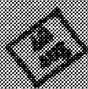

34456 03606355

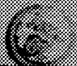

ORNL-1439

Progress

${4t} - \frac{\pi }{3} = \frac{\pi }{2} + {k\pi },$

# P

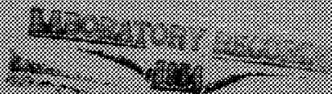

AIRCRAFT NUCLEAR PROPULSION PROJECT

QUARTERLY PROGRESS REPORT

FOR PERIOD ENDO DECEMBER 10, 1952

C. ${\mathrm{H}}^{ + }$ -ATPase 位于保卫细胞质膜上

LITERARY LOAN COPI

1

1

图

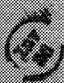

AEGSEARCH AND DEVELOPING F.

OAK RIDGE NATIONAL LABORATORY

OPERAATD

CARBIDE AND CARBON CHEMICALS CO BANY

A DIVISION OF UNION CARBID AND CARBON CORPORATION

POST OFFICE BOX

OAK RIDGE, TENNESSEE

ORNL-1439

This document consists of 224 pages.

Copy of 246 copies. Series A.

Contract No. W-7405-eng-26

# AIRCRAFT NUCLEAR PROPULSION PROJECT

# QUARTERLY PROGRESS REPORT

# for Period Ending December 10, 1952

R.C.Briant,Director J.H.Buck，Associate Director A.J.Miller，Assistant Director

Edited by:

W. B. Cottrell

DATE ISSUED

国华基金管理有限公司2017年3月16日

OAK RIDGE NATIONAL LABORATORY

Operated by

CARBIDE AND CARBON CHEMICALS COMPANY

A Division of Union Carbide and Carbon Corporation

Post Office Box P

Oak Ridge, Tennessee

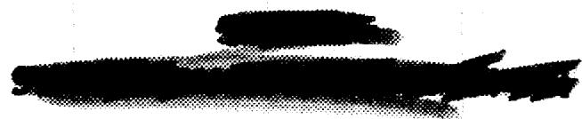

3445603606355

ORNL-1439

Progress

# INTERNAL DISTRIBUTION

1. G. M. Adamson   
2. R. G. Affel   
3. C. R. Baldock   
4. C. J. Barton   
5. E. S. Bettis   
6. D. S. Billington   
7. F. F. Blankenship   
8. E. P. Blizzard   
9. M. A. Bredig   
10. R.C.Briant   
11. R. B. Briggs   
12. F. R. Bruce   
13. J. H. Buck   
14. A. D. Callihan   
15. D. W. Cardwell   
16. C. E. Center   
17. J. M. Cisar   
18. G.H.Clewett   
19. C. E. Clifford   
20. W. B. Cottrell   
21. D. D. Cowen   
22. W. K. Eister   
23. L. B. Emlet (Y-12)   
24. W. K. Ergen   
25. G. T. Felbeck (C&CCC)   
26. A. P. Fraas   
27. W. R. Gall   
28. C. B. Graham   
29. W. W. Grigorieff (consultant)   
30. W. R. Grimes   
31. A. Hollander   
32. A. S. Householder   
33. W. B. Humes (K-25)   
34. R. J. Jones   
35. G. W. Keilholtz   
36. C. P. Keim   
37. M. T. Kelley   
38. F. Kertesf   
39. E. M. King   
40. C. E. Laitson

41. R. S. Livingston   
42. R. N. Lyon   
43. W. D. Manly   
44. W. B. McDonald   
45. J. L. Meem   
46. A. J. Miller   
47. K. Z. Morgan   
48. E. J. Murphy   
49. H. F. Poppendiek   
50. P. M. Reyling   
51. H. W. Savage   
52. E. D. Shipley   
53. O. Sisman   
54. L. P. Smith (consultant)   
55. A. H. Snell   
56. F. L. Steahly   
57. R. W. Stoughton   
58. C. D. Susano   
59. J. A. Swartout   
60. E. H. Taylor   
61. F. C. Uffelman   
62. F. C. VonderLage   
63. J. M. Warde   
64. A. M. Weinberg   
65. J. C. White   
66. E. P. Wigner (consultant)   
67. H. B. Willard   
68. G. C. Williams   
69. J. C. Wilson   
70. C. E. Winters

71-80. ANP Library

81. Biology Library

82-87. Central Files

88. Health Physics Library   
89. Metallurgy Library   
90. Reactor Experimental

Engineering Library

91-95. Technical Information

Department (Y-12)

96-97. Central Research Library

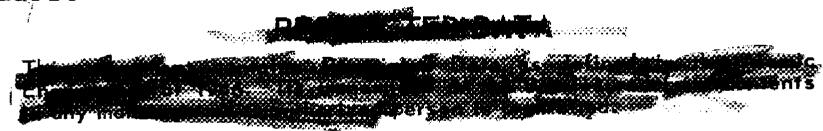

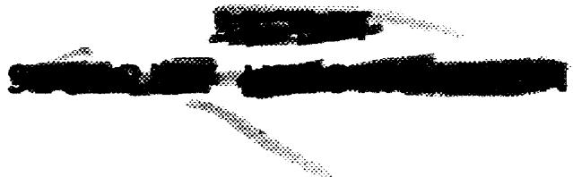

# EXTERNAL DISTRIBUTION

98-108. Argonne National Laboratory (I copy to Kermit Anderson)

109. Armed Forces Special Weapons Project (Sandia)

110-117. Atomic Energy Commission, Washington

118. Battelle Memorial Institute

119-123. Brookhaven National Laboratory

124. Bureau of Aeronautics (Grant)

125. Bureau of Ships

126-127. California Research and Development Company

128. Chicago Patent Group

129. Chief of Naval Research

130-134. duPont Company

135-159. General Electric Company, ANPP(3 copies to AF Engineering Office)

160-163. General Electric Company, Richland

164. Hanford Operations Office

165. USAF-Headquarters, Office of Assistant for Atomic Energy

166-173. Idaho Operations Office (l copy to Phillips Petroleum Co.)

174. Iowa State College

175-182. Knolls Atomic Power Laboratory

183-184. Lockland Area Office

185-187. Los Alamos

188. Massachusetts Institute of Technology (Benedict)

189. Massachusetts Institute of Technology (Kaufmann)

190-192. Mound Laboratory

193-196. National Advisory Committee for Aeronautics, Cleveland (3 copies to A. Silverstein)

197. National Advisory Committee for Aeronautics, Washington

198-199. New York Operations Office

200-201. North American Aviation, Inc.

202. Nuclear Development Associates, Inc.

203. Patent Branch, Washington

204-205. Rand Corporation (1 copy to V. G. Henning)

206. Savannah River Operations Office (Augusta)

207. Savannah River Operations Office (Wilmington)

208-209. University of California Radiation Laboratory

210. Vitro Corporation of America

211-214. Westinghouse Electric Corporation

215-231. Wright Air Development Center

2 copies to B. Beaman

1 copy to Col. P. L. Hill

1 copy to Lt. Col. M. J. Nielsen

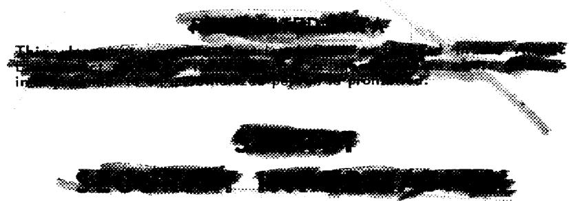

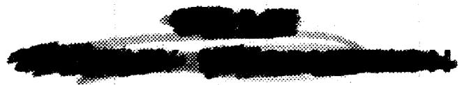

2 copies to Consolidated Vultee Aircraft Corporation   
I copy to Pratt and Whitney Aircraft Division   
l copy to Boeing Airplane Company   
I copy to K. Campbell, Wright Aeronautical Corporation

232-246. Technical Information Service, Oak Ridge

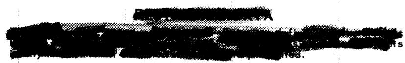

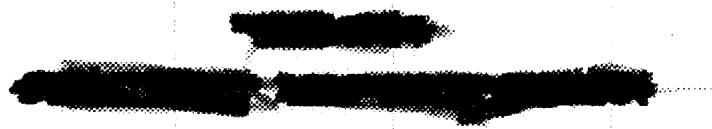

Reports previously issued in this series are as follows:

ORNL-528 Period Ending November 30, 1949

ORNL-629 Period Ending February 28, 1950

ORNL-768 Period Ending May 31, 1950

ORNL-858 Period Ending August 31, 1950

ORNL-919 Period Ending December 10, 1950

ANP-60 Period Ending March 10, 1951

ANP-65 Period Ending June 10, 1951

ORNL-1154 Period Ending September 10, 1951

ORNL-1170 Period Ending December 10, 1951

ORNL-1227 Period Ending March 10, 1952

ORNL-1294 Period Ending June 10, 1952

ORNL-1375 Period Ending September 10, 1952

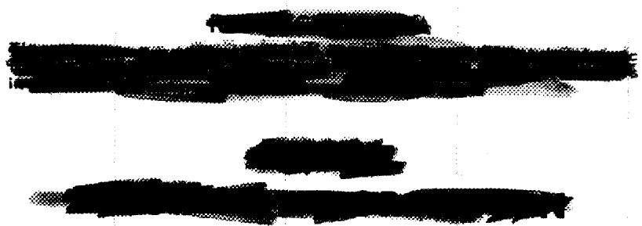

# CONTENTS

PAGE

FOREWORD 1

# PART I. REACTOR THEORY AND DESIGN

SUMMARY AND INTRODUCTION 5

# 1. CIRCULATING-FUEL AIRCRAFT REACTOR EXPERIMENT 7

Fluid Circuit 7   
Stress Analysis of Piping 8   
Reactor 11   
Instrumentation 11   
Off-gas System 11   
Description of the system. 11   
Maximum activity of stack gases 12   
Normal discharge from the surge tank 15   
Gas vented from the fuel dump tank during dumping 15   
Reactor Control System 15

# 2. EXPERIMENTAL REACTOR ENGINEERING 17

Pumps for High-Temperature Fluids 17   
Pump with combination packed and frozen seal 17   
Pump with frozen-sodium seal 19   
Allis-Chalmers pump 19   
Laboratory-sized pump with gas seal 19   
ARE pump 21

# Rotating Shaft and Valve Stem Seal Development 21

Screening tests for packing materials and lubricants 21   
Packing compression tests 23   
Packing penetration tests 23   
Face seal tests 25   
Combination packed and frozen seal 25   
Frozen-lead seal 26   
Frozen-sodium seal 26   
Bellows-type of valve stem seal 26

# Heat Exchangers 27

Sodium-to-air radiator 27   
Bifluid heat transfer system 28

# Instrumentation 29

Rotameter type of flowmeter 29   
Rotating-vane flowmeter 30   
Diaphragm pressure-measurement device 30

# PAGE

Moore Nullmatic pressure transmitter 30

Handling of Fluorides and Liquid Metals 32

NaK distillation test 32

Gas-line plugging 32

$\mathbf{ZrF_4}$ vapor condensation test 32

Project Facilities 33

Helium distribution 33   
Fabrication shop 33   
Instrument shop facility 33   
Gas-fired furnace facility 33

3. GENERAL DESIGN STUDIES 35

Air Radiator Program 35   
Radiator Performance 35   
Engine Performance 35   
Heat Exchanger Design Charts 40

4. REACTOR PHYSICS 41

Oscillations in the Circulating Fuel Reactor 41   
Limits on the oscillations 42   
Periodic oscillations 42   
Specific examples 44   
Reactor Calculations 44   
Temperature Dependence of a Cross Section Exhibiting   
a Resonance 46

5. CRITICAL EXPERIMENTS 48

Reflector-Moderated Circulating-Fuel Reactor Assembly 48

ARE Critical Assembly 52

# PART II. SHIELDING RESEARCH

SUMMARY AND INTRODUCTION 61

6. DUCT TESTS IN LID TANK FACILITY 62

G-E Outlet Air Duct. 62   
Neutron dose measurements 62   
Calculated neutron dose 62   
G-E Inlet Air Duct 71   
Induced Activity Around a Duct 74   
Radiation Around an Array of Cylindrical Ducts 76

7．BULK SHIELDING FACILITY 85

Measurements with the Divided-Shield Mockup 85

viii

PAGE

Air-Scattering Experiments 85

Irradiation of Animals 85

Other Experiments 92

8. TOWER SHIELDING FACILITY 95

Facility Design 95

Structure Scattering 95

9. NUCLEAR MEASUREMENTS 96

Angular Distribution of Neutrons Scattered from Nitrogen 96

Results of nitrogen-scattering experiment 96

Analysis of nitrogen-scattering data 96

A Fast-Neutron Dose Measurement 97

# PART III. MATERIALS RESEARCH

SUMMARY AND INTRODUCTION 103

10. CHEMISTRY OF HIGH-TEMPERATURE LIQUIDS 105

Fuel Mixtures Containing $\mathbf{U}\mathbf{F}_4$ 105

LiF-BeF2-UF4 105

NaF-BeF2-UF4 105

LiF-ZrF4-UF4 107

NaF-LiF-ZrF4-UF4 107

NaZrF5-NaUF5 107

RbF-AIF-UF4 107

Fuel Mixtures Containing UCl. 108

Fuel Mixtures Containing UF3 109

NaF-UF3 109

KF-UF3 110

Alkali Fluoborate Systems 110

1. Differential Thermal Analysis 111

Simulated Fuel for Cold Critical Experiment 112

Coolant Development 112

NaF-ZrF 112

LiF-ZrF 113

NaF-KF- $\mathring{\mathrm{A}}\mathbb{1}\mathbb{F}_{3}$ 113

NaF-BeF2-ZrF4 114

NaF-LiF-ZrF4 114

NaF-BaF, 115

NaF-KF-LiF-ZrF4 115

NaF-RbF-AlF3 115

Studies of Complex Fluoride Phases 115

# PAGE

$\mathrm{K}_{3}\mathrm{CrF}_{6} - \mathrm{Na}_{3}\mathrm{CrF}_{6} - \mathrm{Li}_{3}\mathrm{CrF}_{6}$ 115   
Solid phases in NaF-BeF2-UF4 and NaF-ZrF4 systems 115   
$\mathrm{UF}_3 - \mathrm{ZrF}_4$ 115   
NaF-ZrF 118   
Other fluoride complexes 118

Reaction of Fluoride Mixtures with Reducing Agents 118

Reducing power of various additives 118   
Identification of reduction products 119   
Reaction of fluoride mixtures with NaK 120   
Reaction of NaF-ZrF4-UF4 with $\mathrm{ZrH_2}$ 120   
Solubility of potassium in NaF-KF-LiF eutectic 121

Production and Purification of Fluoride Mixtures 122

Laboratory-scale fuel preparation 122   
Pilot-scale fuel purification 122   
Fuel production facility 123   
Preparation of hydrofluorinated fuel samples 124   
Hydrofluorination of $\mathsf{ZrO}_2$ -NaF mixtures 124

Purification of Hydroxides 125

11. CORROSION RESEARCH 127

Fluoride Corrosion in Static and Seesaw Tests 127

Oxide additives 127   
Comparison of liquid- and vapor-phase corrosion 127   
Crevicecorrosion 128   
Carboloy and Stellite alloys 130   
Reducing agents 130   
Fluoride treatment 131   
Temperature dependence 132   
Ceramic materials 132

Fluoride Corrosion in Thermal Convection Loops 133

Mixtures containing $\mathbf{ZrF_4}$ 133   
Hydrofluorinated NaF-KF-LiF-UF4 136   
Corrosion inhibitors 137   
Inserted corrosion samples 138   
Crevice corrosion 138   
Variation in loop wall composition 139   
Self-insulating properties of fluorides 139   
Other loop tests 139

Hydroxide Corrosion 141

Corrosion inhibitors 141   
Temperature dependence 141   
Nickel alloys in NaOH 141

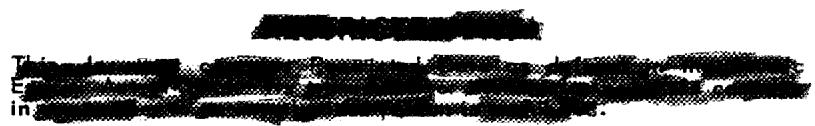

PAGE

Compatibility of BeO in KOH 141   
Nickel in NaOH under hydrogen atmosphere 142

Liquid Metal Corrosion 144

High-velocity corrosion by sodium 144   
Ceramic materials in sodium 146   
Lead in metal convection loops 147   
Lead in quartz convection loops 148   
Compatibility of BeO in NaK 150   
Sodium in forced-convection loops 150

Fundamental Corrosion Research 151

Interaction of fluorides with structural metals 152   
Air oxidation of fuel mixtures 152   
EMF measurements in fused fluorides 153   
Preparation of trivalent nickel compounds in the hydroxides. 154

12. METALLURGY AND CERAMICS 155

Fabrication of Solid Fuel in Spheres 155

Suspension in refractory powder 156   
Momentary melting in a high-temperature arc 156   
Spraying from a metallizing gun 156

Solid Phase Bonding of Metals 156

Columbium Research 157

Gaseous reactions 157   
Oxidation in air 158

Creep Rupture Tests of Structural Metals 159

Inconel in air 159   
Inconel in hydrogen 159   
Inconel in molten fluorides 159   
Type 316 stainless steel in argon 159   
Type 316 stainless steel in molten fluorides 159

Brazing and Welding Research 161

ARE welding 161   
Cone-arc welding 161   
Resistance welding 162   
Automatic heliarc machine welding 164   
Fabrication of heat exchanger units 164   
Brazing of copper to inconel 165

Evaluation Tests of Brazing Alloys 165

Oxidation of brazing alloys 165   
Corrosion of brazing alloys by sodium hydroxide 168   
Corrosion of brazing alloys by sodium and lithium 168   
Tensile strength of brazed joints 169

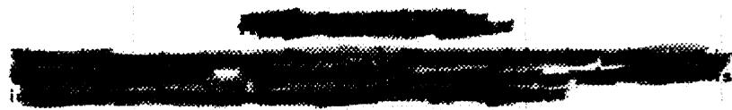

# PAGE

Melting point of $60\%$ Pd-40% Ni alloy 171

Ceramics Research 171

Development of cermets for reactor components 171

Ceramic coatings for an aircraft-type radiator 171

Ceramic coatings for shielding metals 171

Uniformity of beryllium oxide blocks 171

# 13. HEAT TRANSFER AND PHYSICAL PROPERTIES RESEARCH 174

Thermal Conductivity of Liquids 174

Heat Capacity of Liquids 176

Viscosities of Fluoride Mixtures 176

Measurements with the Brookfield viscometer 176

Capillary viscometer 176

Density of Fluoride Mixtures 178

Vapor Pressure of Molten Fluorides 178

Convective Heat Transfer in Fluoride Mixture NaF-KF-Lif 179

Analysis of Specific Reactor Heat Transfer Problems 180

Heat Generation in the reactor reflector 180

Analysis of fluid-to-air radiators 181

Natural Convection in Confined Spaces and Thermal Loop Systems 182

Turbulent Convection in Annuli 182

Circulating-Fuel Heat Transfer 185

# 14. RADIATION DAMAGE 186

Irradiation of Fused Materials 186

In-Reactor Circulating Loops 187

Creep Under Irradiation 188

# 15. ANALYTICAL STUDIES OF REACTOR MATERIALS 190

Chemical Analysis of Reactor Fuels 190

Zirconium 191

Chromium 192

Aluminum 192

Oxygen 192

Water 192

Determination of Beryllium in NaK 192

Spectrographic Analysis 193

Uranium oxides 193

Nickel fluoride. 193

Petrographic Examination of Fluorides 193

$\mathrm{ZrO}_2\text{-HF}$ 193

NaF-ZrOF 2 193

PAGE

Optical Properties of Some Fluoride Compounds 194

NaUF 194

K3UF7. 194

NaZrF7 194

2 $\mathrm{ZrF_4\cdot UF_3}$ 194

Chemical Analyses for $\mathrm{UO}_2$ in $\mathrm{UF}_3$ , 194

Service Chemical Analyses 194

# PART IV. APPENDIXES

SUMMARY AND INTRODUCTION 199

16. LIST OF REPORTS ISSUED 199

17. DIRECTORY OF ACTIVE ANP RESEARCH PROJECTS AT ORNL 202

I. Reactor and Component Design 202   
I. Shielding Research 203   
III. Materials Research 204   
IV. Technical Administration of Aircraft Nuclear Propulsion Project at Oak Ridge National Laboratory 209

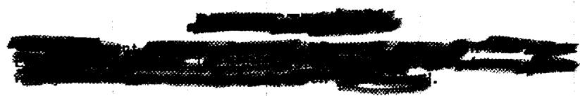

# ANP PROJECT QUARTERLY PROGRESS REPORT

# FOREWORD

This quarterly progress report of the Aircraft Nuclear Propulsion Project at ORNL records the technical progress of the research on the circulating-fuel reactor and all other ANP research at the laboratory under its Contract W-7405-eng-26. The report is divided into four parts: I. Reactor Theory and Design; II. Shielding Research; III. Materials Research; and IV. Appendixes. Each part has a separate Summary and Introduction.

The Aircraft Nuclear Propulsion Project is comprised of some 300 technical and scientific personnel engaged in many phases of research directed toward the nuclear propulsion of aircraft. A considerable portion of this research is performed in support of other organizations participating in the national ANP effort. However, the bulk of the ANP research at ORNL is directed toward the development of a circulating-fuel type of reactor.

The nucleus of the effort on circulating-fuel reactors is now centered upon the Aircraft Reactor Experiment - a 3-megawatt high-temperature prototype of a circulating-fuel reactor for the propulsion of aircraft. The current status of the ARE is summarized in section 1; however, much supporting research and developmental information on materials and problems peculiar to the ARE will be found in other sections of Part I and Part III of this report, in addition to the general design and materials research contained therein. Shielding Research, Part II, is devoted almost entirely to the problems of aircraft shielding.

Part I

REACTOR THEORY AND DESIGN

# SUMMARY AND INTRODUCTION

The Aircraft Reactor Experiment (sec. 1) is now well into the transition period between design and reality. The design is essentially complete, almost all the components are on order, and a substantial number of these have been received and installed in the ARE Building. The significant modifications during the past quarter include completion of the off-gas system design (incorporating holdup tanks rather than charcoal adsorbers) and the inclusion of a reactor by-pass (so that the fluid circuits may be checked out independently of the reactor). Coincident with the completion of the reactor design, the Aircraft Reactor Experiment Hazards Summary Report, ORNL-1407, was submitted to the AEC for approval. It is anticipated that even though the experiment may be completely assembled by the summer of 1953, a significant and indeterminant period will be required for shake-down operation before the reactor becomes critical.

Valves, pumps, instrumentation, and other components of both the fluoride fuel (NaF-ZrF4-UF4, 50-46-4 mole %) and reflector coolant (NaK) circuits are being developed for the Aircraft Reactor Experiment (sec. 2). In most instances, these components have been tested on smaller than full-scale prototypes of the actual ARE components. Tests are now under way, however, on the full-scale pumps, valves, and some instrumentation designed for the reactor experiment. At this time, centrifugal pumps with both gas seals and frozen seals have operated satisfactorily for extended periods at temperatures between 1200 and $1500^{\circ}\mathrm{F}$ . A combination packed and frozen seal has been specified for the ARE pump. Although a bellows type of seal has been specified for the ARE, a considerable program has been undertaken on high-temperature, self-lubricating seals.

The rotameter type of flowmeter and the modified Moore Nullmatic pressure transmitter have both operated satisfactorily at high temperatures $(\sim 1400^{\circ}\mathrm{F})$ . Neither of these instruments is affected by the $\mathrm{ZrF_4}$ vapor above the fuel. Vapor traps of the type that will be required in the gas system above the fuel surge tanks have been satisfactorily developed.

The heat transfer coefficient of an aircraft type of sodium-to-air radiator, in which the radiator fins were sectioned every 2 in. in the direction of air flow, was increased $20\%$ over that of the same radiator with plain flat fins.

The general design studies (sec. 3) were confined to performance analysis of a Sapphire turbojet engine in which the engine radiator performance was extrapolated from a sodium-to-air radiator section tested at ORNL. Performance data for both the radiator and engine are presented. Arrangements have been completed with the Wright Air Development Center for their participation in the development of high-temperature liquid-to-air aircraft radiators.

The several reactor physics studies (sec. 4) include those of oscillations in a circulating fuel reactor, a technique for reactor calculations, and the temperature-dependence of a cross section exhibiting a resonance. The damping influence of fuel circulation has been demonstrated even when the earlier assumptions are replaced by more realistic conditions. With regard to reactor calculations, it is shown that the slowing down of neutrons in parallel slabs of materials with different properties can be described in some instances by a set of images of the original neutron source.

Critical assemblies of both the Aircraft Reactor Experiment and a reflector-moderated reactor have been tested (sec. 5). Critical mass,

# ANP PROJECT QUARTERLY PROGRESS REPORT

control rod effectiveness, flux and fission distribution, and self-shielding factors have been determined for this initial reflector-moderated assembly. As was expected, this assembly gave rather peaked flux distribution curves, and the lumped fuel

resulted in rather large self-shielding effects. Measurements on the ARE critical assembly continued. Calibration curves for the ARE control rods were obtained, and the effects of various core components on reactivity were compared.

# 1. CIRCULATING-FUEL AIRCRAFT REACTOR EXPERIMENT

J.H.Buck Research Director's Division E.S.Bettis ANP Division

A few relatively minor changes in the design of some phases of the Aircraft Reactor Experiment have been made in the past quarter. These changes involved the off-gas system and the fuel disposal system, primarily, and are discussed below. There have been no changes in the general design, and detailing of construction and installation designs has been largely completed. Installation of equipment in the building has proceeded at an accelerated rate throughout the quarter but has not yet reached the expected peak rate. Components from outside vendors, as well as those fabricated in ORNL shops, are being received in increasing quantity; but some of the major items, notably, the heat exchangers, have not yet been received. It is expected that all components will be on hand by the end of the year.

Component testing is proceeding in the experimental engineering laboratories (sec. 2), but the final component testing is to be done in the ARE Building. It is now planned to bypass the reactor so that a thorough system test can be made before the nondrainable reactor is tied into the circuit. This procedure will make possible a complete shake-down run without the possibility of incorporating a nondrainable component in the system. The design change necessitated by this alteration in operational procedure is minor and will be effected in the field. Considerable effort during the quarter went into the preparation of the "Hazards Report," $(1)$ which, in addition to serving the

purpose implied in the name, provided the first draft of an operations manual for the experiment.

It is practically impossible to predict a date for satisfactory operation of the ARE. There are no means available for predetermination of the time required to correct difficulties. It is not so difficult to attempt to predict a date for the completion of the installation of equipment, and therefore a date for beginning the system test in the building. At present it is expected that the system will be ready for initial testing near the first of June 1953. No uranium will be added to the system until all reasonable checks have been made to ensure the integrity of the entire assembly.

# FLUID CIRCUIT

G. A. Cristy, Engineering Department

The previous report(2) discussed design changes necessitated by the higher fuel viscosities. In brief, the higher viscosities reduced the Reynold's number of the heat exchanger tube side and changed the heat transfer coefficient to such an extent that the calculated minimum film temperatures were in the vicinity of the freezing point. Two corrective measures were discussed; redesigning the heat ex-changers and increasing the flow rate through the entire circuit. The first change has been accomplished. The need for the increased flow rate has been obviated by an accurate measurement of the fuel thermal conductivity; the new value of $k_{\mathrm{i}}$ is 1.5 Btu/hr·ft·°F, whereas 0.5 had been used in earlier

analyses. With this higher conductivity value and the redesigned heat exchangers, the calculated minimum film temperatures are comfortably above the freezing point, with the original flow rate. Restoring the flow rate to its original value will reduce the reactor inlet temperature to $1150^{\circ}\mathrm{F}$ and reduce the maximum system pressures and pressure shell stresses.

It has been decided to employ NaK as the reflector and pressure-shell coolant. This has necessitated complete redesign of the reflector-coolant heat exchangers, primarily because NaK will extract more heat from the fuel tube elbows and other components washed by the coolant than would the lower conductivity salt around which the earlier calculations were based. The heat exchangers have been re-engineered and currently are being constructed. The changes referred to above are reflected in the revised flow sheet, Fig. 1.1.

Detailed engineering designs for most of the outstanding items have been released during this quarter. The items included were such components as the fuel system surge tanks, the reflector-cooling system surge tanks, the reflector-cooling system heat disposal loop and ducting, the thermal barriers, the water system piping, the glycol surge tank, the off-gas disposal system, and some of the fuel system piping. The redesigned ARE pump is described in section 2, "Experimental Reactor Engineering," and, as stated therein, initial tests are now in progress. Delivery of the bellows type of valves that will be used in the fuel and reflector systems is expected within a month. The parts for these valves are being supplied by Fulton Sylphon Co., but the valves are to be welded at ORNL.

# STRESS ANALYSIS OF PIPING

R. L. Maxwell J. W. Walker Consultants, ANP Division

The maximum stresses that will be encountered in the piping for the ARE have been calculated to be approximately 24,000 lb/in. Since these stresses will be somewhat relieved by creep at the operating temperature, this stress value is only significant in defining the stress range of the pipe in going from the cold to the hot condition. If the stresses were completely relieved by creep, this would correspond to a strain of about $1\%$ .

In order to reduce the loads and stresses in the pipe in the hot condition, the piping will be prestressed, or presupprung, by an amount equal to $75\%$ of the total thermal deformation. This will have the effect of putting the maximum loads on the pipe in the cold condition and reducing to a large extent the load in the hot condition. Because of the uncertainty of realizing the designed cold spring in the actual installation, only partial credit should be taken for prespring. However, the loads and stresses in the cold condition were determined by considering the full amount of the prestressing, and the loads and stresses in the hot condition were determined by considering only $50\%$ prespring. This is in agreement with accepted practice.

The maximum stresses in the cold condition will be higher for the same deformation than in the hot condition because of the difference in the modulus of elasticity. The maximum values of the stresses are:

$$
\text {C o l d} \quad \delta_ {\max } = 2 5, 0 0 0 \mathrm {l b / i n .} ^ {2}
$$

$$
\text {H o t} \quad \delta_ {\max } = 1 2, 0 0 0 \mathrm {l b / i n .} ^ {2}
$$

The maximum stress in the cold condition is about one half the yield-point stress, and the maximum stress

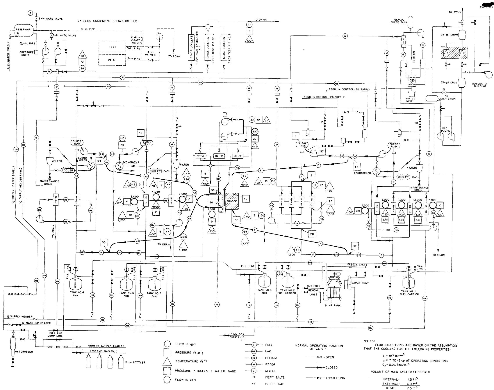  
Fig. 1.1. Fluid-Circuit Flow Sheet.

in the hot condition corresponds to a maximum creep, or deformation, of $0.5\%$ .

# REACTOR

The reactor design, with the exception of very minor changes, remains as previously described. All detailed drawings have been released to the shop. The beryllium oxide blocks have been sized and are ready for assembly into the core. The pressure shell has been received from Lukenweld,[3] the reinforcing segments for the head have been welded in place, and the head holes have been bored. The various core pressure-shell components are currently being fabricated and assembled.

# INSTRUMENTATION

# R. G. Affel, ANP Division

Installation of all instrument panels has been completed. Approximately $80\%$ of the process instruments have been mounted and supplied with electric power and/or compressed air. The remaining instruments should be installed by January 15, 1953. Minor instrumentation changes have been made to accommodate the design changes in the pump seal. All major process instrumentation components are detailed and either on hand or on order. It is planned to complete the installation of instruments on the panels so that as work in the pits proceeds, the sensing elements, when installed, may be checked directly to the panels.

To date, 21 of a series of instrumentation prints have been issued and shop fabrication started. The series includes such items as the fuel circuit flowmeter, the reflector-cooling system (NaK) electromagnetic flowmeter, the NaK purification system electromagnetic flowmeter, the tachometer mountings for the reflector coolant and fuel helium fans, and the liquid-level indicators for the reflector coolant and fuel surge tanks.

Detailed prints of the vapor traps required by the $\mathbf{ZrF_4}$ condensate (cf., sec. 2, "Experimental Reactor Engineering") for the surge tanks and the hot fuel dump tank have been issued and sent to the shops for fabrication.

Location of thermocouples on the system has proceeded at a satisfactory pace. Two prints showing thermocouple construction have been issued and sent to the shops. Since the system will require approximately 750 thermocouples, every effort is being made to run the thermocouple extension wires to their approximate pit locations before the pits have major components placed within them. It is believed that this procedure will expedite final installation and test of the temperature instrumentation.

# OFF-GAS SYSTEM

S. A. Hluchan, Instrument Department H. L. F. Enlund, Physics Division

The previous report (4) described an activated-carbon off-gas scrubber cooled by liquid nitrogen. Further analyses have shown that the liquid nitrogen consumption would be in excess of 1000 lb/day because of the decay heat of xenon and krypton if the gases were held for less than 100 min before reaching the scrubber. The nitrogen consumption did not become reasonable until the gases were held up for many hours before admittance to the scrubber. In fact, with little additional difficulty, the gases could be held up until they decayed sufficiently to be discharged from the stack and the need for the scrubber would be obviated. Accordingly, it has been decided to abandon the carbon scrubber in favor of mechanical retention.

Description of the System. A helium atmosphere is maintained over the surge tanks in the fuel system and the fuel dump tanks. This helium

gas, which will contain the volatile fission products (Be, I, Xe, and Kr), passes through a NaK vapor trap (where the Be and I are removed), then into two holdup tanks (to permit the decay of Xe and Kr), and is then released in the stack. However, the release of gases to the stack is dependent upon two conditions: the wind velocity is greater than 5 mph and the activity, sensed by a monitor, is less than an established maximum value. The monitor is located between the two storage tanks, which are connected in series. Provision is also made to exhaust the reactor pits through the holdup tanks in the off-gas system at a rate of 27 cfm (the limit of the exhaust system). The off-gas system is shown schematically in Fig. 1.2.

With a static helium atmosphere in the surge and dump tanks, the volumetric flow rate of fission gases is a maximum of 0.0014 cfm. In order to have a measurable flow of gas, the fission gases are mixed with a fixed air bleed of 10 cfm between the first holdup tank and the monitors. The minimum flow rate past the monitors then is 10 cfm, and the maximum is 37 cfm (that is, 10 cfm from the fixed air bleed plus 27 cfm if the room is being exhausted at the same time). The monitor setting can then be based on the premise that the flow is 37 cfm, and the setting will be conservative by a factor of 3.7:1 when the minimum flow rate prevails.

The second holdup tank is placed between the monitors and the stack valve to increase the gas transit time between the monitor and the valve to ensure that the valve will have time to close after the monitor signals the presence of excess activity.

Maximum Activity of Stack Gases. The maximum activity of the stack gases has been calculated by assuming

that the average energy of disinte- gration is equal to 1 Mev. (4) The design of the off-gas system includes two vacuum pumps that deliver a maximum of 27 cfm and a blower that discharges 10 cfm to give a total of 37 cfm maximum discharge through the monitor. The maximum permissible ground concentration for the 1-Mev fission-product activity is (6)

$$
\mathrm {M P C} = 1. 6 \times 1 0 ^ {- 6} \mu \mathrm {c} / \mathrm {c m} ^ {3}.
$$

At 37 cfm, or $1.05 \times 10^{6} \mathrm{~cm}^{3} / \mathrm{min}$ , and with a permissible activity discharge rate of 0.832 curie/min, which produces the above MPC, the activity per cubic centimeter should not exceed

$$
\frac {0 . 8 3 2}{1 . 0 5 \times 1 0 ^ {6}} = 0. 8 \mu \mathrm {c} / \mathrm {c m} ^ {3},
$$

as determined by the radiation monitor. The monitors that control the positions of the stack valve will beset to prevent discharge as soon as the activity of the gas rises above a predetermined level.

The discharge rate of xenon and krypton fission products to the atmosphere must be such that the activity is within the above limit. The effective system holdup, before the monitors, is 11.4 ft³, or $3.53 \times 10^5$ cm³ (the volume of one tank plus piping). If it can be assumed that the decay time of the fission products is equal to the system volume divided by the flow rate, the total energy at a particular time can be calculated. This energy must be converted to disintegrations per unit time by considering effective energy changes in relation to the variation of isotopic concentrations with time. The values of permissible and calculated stack activity have been plotted in Fig. 1.3, together with the permissible discharge rate, as determined by the National Committee on Radiation Protection.[6] These data, together with

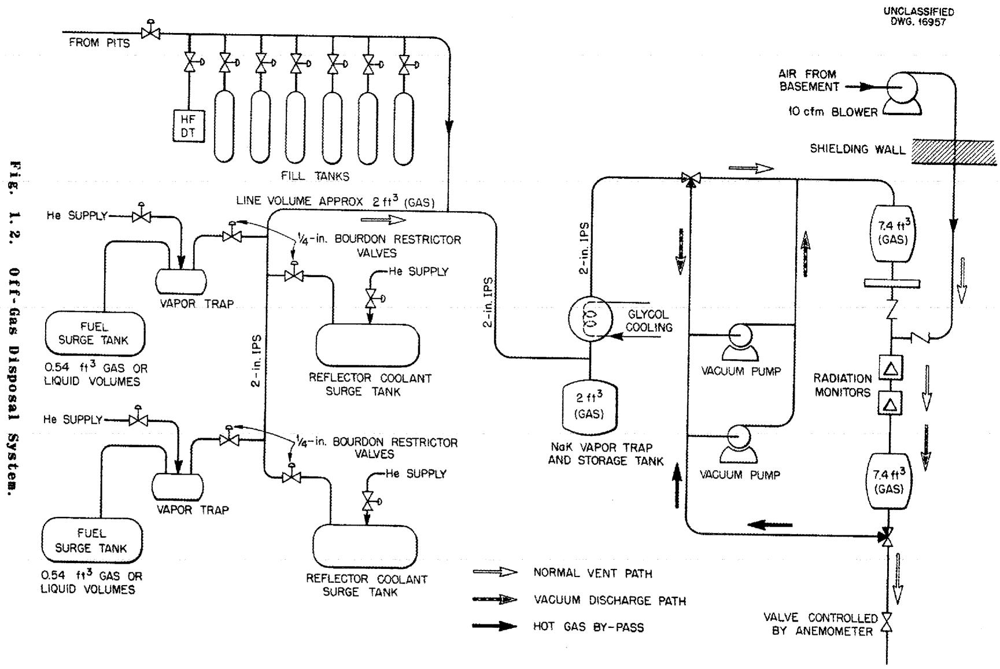  
PERIOD ENDING DECEMBER 10, 1952

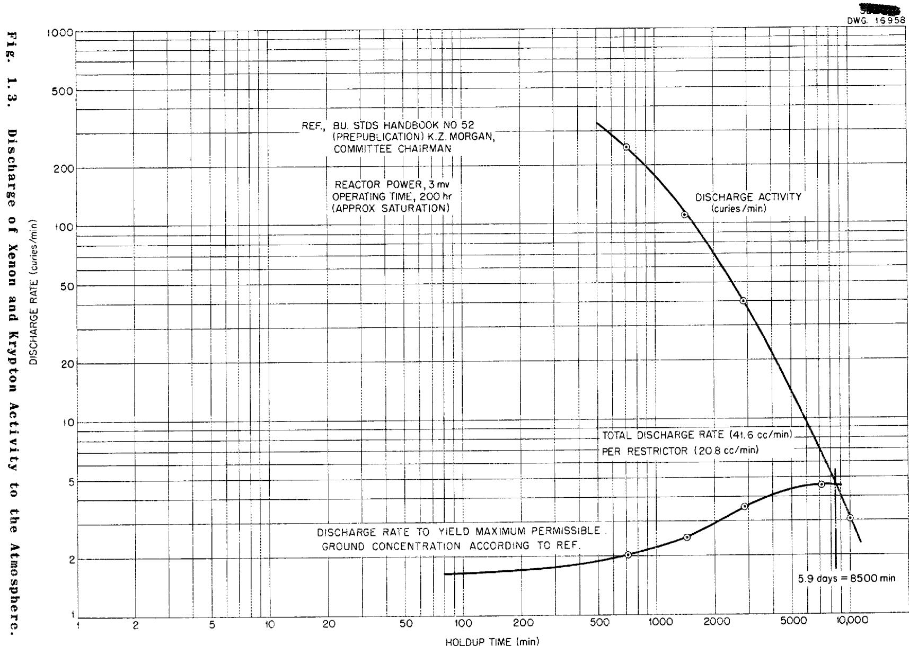  
ANP PROJECT QUARTERLY PROGRESS REPORT

the disintegration rates and energies involved, are tabulated in Table 1.1. It will be noted that after 8500 min of holdup, corresponding to a discharge rate of 20.8 cm³/min through each restrictor, the ground tolerance will not be exceeded.

Normal Discharge from the Surge Tank. The maximum pressure within the surge tank is limited by a 5-psig pressure regulator in the gas supply system. The maximum discharge rate from the surge tank is limited by a Bourdon restrictor to $20~\mathrm{cm}^3/\mathrm{min}$ with a 5-psi pressure differential. At this flow rate through each of two restrictors, the holdup volume of the system is such that it will allow sufficient decay time, as required by the above calculation, to permit the discharge of the off-gas directly up the stack. The change of effective energy owing to the persistence of the longer lived isotopes has been accounted for when ground concentration of this gas is considered.

Gas Vented from the Fuel Dump Tank During Dumping. In considering waste gases from the surge tanks, it has been assumed that all gaseous products escape into the surge tanks during operation. Actually, it is expected that some portion of the fission-product gases will remain in the fuel and that some fraction of this portion

will be released when the fuel is admitted to the radioactive-fuel dump tank. When fuel is admitted to the fuel dump tank, it is expected that helium will be displaced at a rate of the order of 5 cfm. This helium, after passing through the NaK scrubber and the first holdup tank, will be admitted to the monitors. Should the monitors sense excess activity, the stack valve will prevent discharge, and the vacuum pumps will permit recirculation through the holdup tanks and monitors. The recirculation should homogenize the gases and ensure that the monitor is sensing a representative sample. When the gases have decayed sufficiently to permit release, the monitor-controlled interlock will open the stack valve.

# REACTOR CONTROL SYSTEM

# E. P. Epler

Research Director's Division

The high-temperature fission chamber, without $\mathbf{U}^{235}$ plating, has completed 1000 hours at $800^{\circ}\mathrm{F}$ . The temperature will now be raised at the rate of $50^{\circ}\mathrm{F}$ per week to determine the high-temperature characteristics of the $\mathrm{MgO}_2\cdot \mathrm{SiO}_2$ insulator. The fission chambers to be used for the ARE startup are scheduled for delivery February 1, 1953, and will be tested at $800^{\circ}\mathrm{F}$ .

TABLE 1.1. ACTIVITY OF XENON AND KRYPTON AS A FUNCTION OF HOLDUP TIME   

<table><tr><td colspan="2">HOLDUP TIME</td><td colspan="2">STACK DISCHARGE RATE (curies/min)</td><td rowspan="2">EFFECTIVE ENERGY (Mev)</td><td rowspan="2">DISINTEGRATION RATE (dps)</td><td colspan="2">DECAY POWER</td><td rowspan="2">\( {MPC} \) IN AIR \( \left( {\mu \mathrm{c}/{\mathrm{{cm}}}^{3}}\right) \)</td></tr><tr><td>Days</td><td>Minutes</td><td>Calculated</td><td>\( \mathbf{{MPC}} \)</td><td>Watts</td><td>Mev/sec</td></tr><tr><td>12</td><td>720</td><td>344</td><td>2</td><td>0.41</td><td>\( {9.15} \times  {10}^{15} \)</td><td>600</td><td>\( {3.75} \times  {10}^{15} \)</td><td>\( {3.9} \times  {10}^{-6} \)</td></tr><tr><td>1</td><td>1,440</td><td>110</td><td>2.45</td><td>0.34</td><td>\( {5.88} \times  {10}^{15} \)</td><td>320</td><td>\( {2.00} \times  {10}^{15} \)</td><td>\( {4.71} \times  {10}^{-6} \)</td></tr><tr><td>2</td><td>2,880</td><td>39.6</td><td>3.51</td><td>0.237</td><td>\( {4.22} \times  {10}^{15} \)</td><td>160</td><td>\( {1.00} \times  {10}^{15} \)</td><td>\( {6.75} \times  {10}^{-6} \)</td></tr><tr><td>3</td><td>3,320</td><td>28.5</td><td>3.94</td><td>0.211</td><td>\( {3.79} \times  {10}^{15} \)</td><td>128</td><td>\( {8.00} \times  {10}^{15} \)</td><td>\( {7.58} \times  {10}^{-6} \)</td></tr><tr><td>5</td><td>7,200</td><td>6.91</td><td>4.54</td><td>0.183</td><td>\( {1.84} \times  {10}^{15} \)</td><td>54</td><td>\( {3.38} \times  {10}^{15} \)</td><td>\( {8.74} \times  {10}^{-6} \)</td></tr><tr><td>7</td><td>10,080</td><td>3.02</td><td>4.54</td><td>0.183</td><td>\( {1.13} \times  {10}^{15} \)</td><td>33</td><td>\( {2.06} \times  {10}^{15} \)</td><td>\( {8.74} \times  {10}^{-6} \)</td></tr></table>

# ANP PROJECT QUARTERLY PROGRESS REPORT

The first production model of the servo amplifier has been tested with the ORNL Power Plant Simulator, and it proved to be satisfactory. This test was made with the actual components, or duplicates, to be used in the ARE. A memorandum describing the on-off servo for the ARE is being prepared.(7)

The wiring diagram for the control system has been completed and working drawings for the relay panels, console, and chamber installation have been issued to the field.

(7) E. R. Mann, J. J. Stone, and S. H. Hanover, An On-Off Servo for the ARE, ORNL CF-52-11-228 (to be published).

# 2. EXPERIMENTAL REACTOR ENGINEERING

H. W. Savage, ANP Division

Developmental work on components for high-temperature dynamic fluid systems has continued, with the effort being primarily on pumps, seals, heat exchangers, and instrumentation. Centrifugal pumps with both gas seals and frozen seals have operated successfully over the temperature range of 1200 to above $1500^{\circ}\mathrm{F}$ , and operational difficulties with these pumps have become less frequent. Techniques have been developed for remotely stopping and restarting pumps incorporating a frozen-fluoride seal.

Emphasis has also been placed on seal research in an effort to find better materials for packing rotating-shaft seals and valve-stem seals. In the search for materials that will have negligible change in physical properties at high temperatures and will furnish some lubrication to the shaft at these temperatures, several promising materials were found. A program is under way to develop a face seal that will seal high-temperature fluids against a gaseous atmosphere, with the minimum leakage.

Various rotating-shaft seals for containing high-temperature liquids have been tested. To date, the best results have been obtained with a packed seal in which the pumped liquid may be frozen. A program is under way for developing a special type of seal in which a material different from the liquid being pumped and having a higher melting temperature is injected into the seal and frozen. Tests conducted to date indicate that this type of seal shows promise.

Heat transfer tests have been conducted with the sodium-to-air radiator, and the sodium inlet temperature has been increased to $1700^{\circ}\mathrm{F}$ . The radiator tested had 15 fins per inch, which were sectioned every 2 inches. This gave a net improvement of $20\%$ in the over-all heat transfer

coefficient, as compared with that for an unsectioned radiator. A bi-fluid heat transfer system has been constructed, and shake-down tests have been conducted satisfactorily.

The rotameter type of flowmeter that uses a tapered core riding inside an induction coil as the float-position sensing element has given very satisfactory performance. This type of flowmeter will be used in the ARE. The Moore Nullmatic pressure transmitters, modified for high-temperature operation, have given trouble-free performance during several hundred hours of operation with pressure transmitter temperatures as high as $1400^{\circ}\mathrm{F}$ . Pressures up to 70 psi were measured.

Techniques for the vacuum distillation of small quantities of NaK from liquid systems are being developed, since all the NaK used for cleaning the ARE fuel system cannot otherwise be removed. Tests have continued for determining the temperature-dependence of gas line plugs above systems employing a $\mathbf{ZrF_4}$ -bearing fluoride mixture. Vapor condensation traps for this $\mathbf{ZrF_4}$ vapor, in which the vapor is bubbled through the eutectic NaF-KF-LiF, have been satisfactorily tested.

Improvements made in the plant facilities are the installation of a helium distribution system, the expansion of the fabrication shop facilities, the completion of the instrument shop facilities, and the installation of six gas-fired furnaces.

# PUMPS FOR HIGH-TEMPERATURE FLUIDS

W. B. McDonald G. D. Whitman

W. G. Cobb W. R. Huntley

A.G.Grindell J.M.Trummel

ANP Division

Pump with Combination Packed and Frozen Seal. In the first test, the pump with the combination packed

and frozen seal ran for 550 hr before it had to be stopped because of a valve failure in the loop. Average operating conditions during this run were:

<table><tr><td>Pump suction pressure</td><td>5 to 15 psig</td></tr><tr><td>Pump discharge pressure</td><td>35 to 50 psig</td></tr><tr><td>Shaft speed</td><td>1500 rpm</td></tr><tr><td>Flow</td><td>15 gpm</td></tr><tr><td>Packing temperature</td><td>750 to 1050°F</td></tr><tr><td>Temperature at extreme end of frozen seal</td><td>600 to 800°F</td></tr></table>

The packing of the pump was made up of Inconel braid with mixtures of graphite powder and nickel powder between the layers of braid. The pump shaft was coated with Stellite No. 6.

Operation of the pump was characterized by frequent power surges of the driving motor because of shaft seizing in the seal area. Tricresyl phosphate and lead glass were periodically injected into the seal as lubricants, with indeterminant results. Postrun examination of the shaft showed very severe scoring in the frozen seal region (0.056 in. on the diameter of the 1 l/2-in. shaft).

The second run of this pump was of 600-hr duration. Loop shutdown was caused by leakage of the pump flange. Changes made in the pump and in the operating procedure before this run were:

1. pump shaft resurfaced to remove scoring of first run,   
2. packing changed to nickel-foil wrapped braid with graphite powder between packing layers,   
3. no lubricants injected.

Operation was much smoother than that of the first run. This seemed to be primarily the result of closer temperature regulation of the frozen-seal area. It was found that 750 to $800^{\circ}\mathrm{F}$ was the most satisfactory range for relatively smooth operation. Leakage of solid fluoride from the seal at these temperatures varied approximately from 1 to $3\mathrm{g/day}$ . The packing temperature was maintained at $1050^{\circ}\mathrm{F}$ .

A stop-start technique for the frozen seal was developed during this second run. Upon turning off the motor power, the pump coasts freely to a stop. However, the shaft becomes immovable in approximately 30 seconds. Therefore calrod heating is applied to the frozen seal area and the temperature brought to an indicated $850^{\circ}\mathrm{F}$ . The seal then loosens, and the operation may be resumed with no leakage. Timing is important, since the application of too much heat may result in heavy seal leakage. A quick means of cooling the seal, such as an air blast, must be used if the frozen seal is completely removed.

A second Durco pump has been modified to include a combination packed and frozen seal. This pump has accumulated 84 hr of operation at $1200^{\circ}\mathrm{F}$ and flow rates up to 60 gpm.

Operation of this pump has been very difficult because of unexplained seizing in the seal area. Temperature rises along the seal area indicate that the seizing is taking place in the packing area of the seal. This cannot be definitely concluded, however, since the shaft has not been examined in that area.

Some stop-start data were obtained during one of the runs. It appeared that a very definite temperature range (750 to $820^{\circ}\mathrm{F}$ in this case) was needed for remote loosening of the shaft and subsequent startup without leakage. The start-stop procedure was repeated five times, and successful operation followed each trial. However, this performance could not be duplicated in later trials. Part of this inconsistency is thought to be caused by the chip retainer, which is being removed for the next run.

One other change is being made in the seal geometry in an attempt to obtain more consistent operation. The radial clearance between shaft and wall in the frozen seal region is being increased from 0.010 to 0.040 in. to more closely duplicate the

design of the first combination seal pump, discussed above, which ran satisfactorily.

Pump with Frozen-Sodium Seal. Approximately 4000 hr of operation had been accumulated when the test of the pump with the frozen-sodium seal had to be terminated because of leaking flanges and failure of a thermocouple well. The final run was of 1000-hr duration at a pump temperature of $1100^{\circ}\mathrm{F}$ .

Postrun examination of the pump showed no measurable wear of the shaft in the frozen-seal area. Scoring of the rear face of the impeller, which indicated interference with the housing, was very severe and was probably the source of pump noises during the last run.

Allis-Chalmers Pump. During this quarter the Allis-Chalmers pump that has a hydrostatic bearing was tested with NaK as the system fluid. When this pump was first tested, the shaft gas seal provided by Allis-Chalmers was used. The seal consisted of three Graphitar rings, each of which had three 120-deg segments. The room-temperaturediametral clearance between shaft seal rings was designed to be between 0.0065 and 0.008 inch. At operating conditions (approximately 170 gpm, 45-ft head, and elevated temperature), the diametral clearance and the gas leakage to atmosphere past these rings were to approach zero.

In the first test, the gas leakage past the seal was excessive, and a large amount of gas was entrained in the system fluid. Therefore two modifications were made to the pump: a rotary face seal was added to decrease gas leakage to atmosphere, and additional baffling, suggested by Allis-Chalmers, was placed in the region above the pump impeller to reduce gas entrainment in system fluid.

The second test revealed that the additional baffling did materially reduced gas entrainment in the system fluid and also that the rotary face

seal reduced gas leakage to a tolerable level. The unlubricated rotary face seal, however, squealed and chattered after a very short period of operation. Further testing indicated that the seal operating temperature was sensitive to changes in pump suction pressure, a condition that may be overcome by using a balanced bellows seal. These tests indicate that this pump will give satisfactory performance when a good gas seal is incorporated in the design. A frozen-sodium gas seal is presently being fabricated for test in this pump.

Laboratory-Size Pump with Gas Seal. The laboratory-size centrifugal pump with a gas seal, described previously,[1] has been operated for a total of 1275 hr with the fluoride fuel $\mathrm{NaF - ZrF_4 - UF_4}$ (46-50-4 mole %) at temperatures up to $1500^{\circ}\mathrm{F}$ . The average fluid temperature during this period was approximately $1350^{\circ}\mathrm{F}$ . The satisfactory performance data obtained are presented in Fig. 2.1. The pump discharge pressure and pressure drop across the venturi were measured by means of the null-balance level-indicator system.

The initial difficulty of liquid-level detection in the pump bowl at high shaft speeds has been overcome. The turbulence in the liquid surface has been reduced by additional baffling, and the action of the probes used for level detection has been quite satisfactory up to shaft speeds of 4400 rpm.

The rotary gas seal - Graphitar No. 30 lubricated with spindle oil running against hardened tool steel has functioned with extremely small gas leakage and without maintenance or appreciable wear during the total running time. Oil leakage past the seal assembly was collected, and it was found to amount to less than $1\mathrm{cm}^3$ per 24-hr period. The only

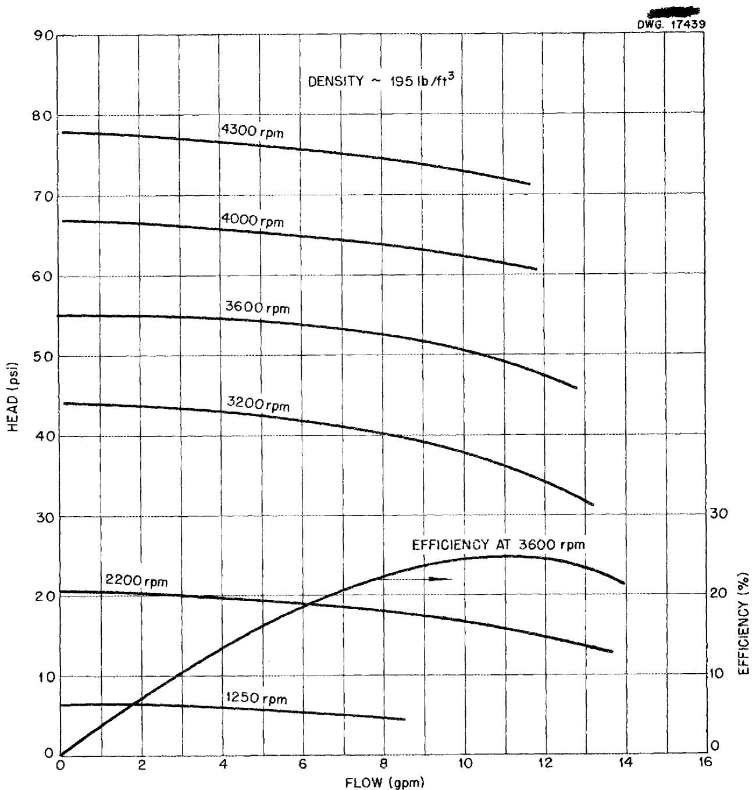  
Fig. 2.1. Performance Curves for Centrifugal Pump with NaF-ZrF $_4$ -UF $_4$ (46-50-4 mole %) at $1300^{\circ}\mathrm{F}$ . Density of fluoride mixture is about 195 lb/ft $^3$ .

mechanical failures in this pump have been broken guide vanes in the discharge case. These vanes were originally held in place by small tack welds, which have now been reinforced, and additional welds have been added.

A second pump has been fabricated and installed in the fluoride loop of a bi-fluid heat exchanger system. No radical changes have been planned in the present design. However, some effort has been put forth to simplify

the construction of the shaft and radiation heat shields.

ARE Pump. It is now planned that the pumps for the ARE fuel circuit are to be similar to the ANP experimental engineering model FP. Figure 2.2 shows an assembly-section view of the pump. A standard commercial pump base with ball bearings that support a horizontal, overhung shaft provides the foundation. The pump casing is supported through the sealing head and casing extension. The sealing head is sealed to the pump casing with a commercial oval-ring gasket in a bolted flange joint. By removing this joint from the hot region near the pumped liquid and away from regions requiring preheating, satisfactory sealing is readily accomplished.

Pump suction and discharge connections to the circulating system are made by welding. The pump impeller is an Inconel casting from standard Worthington Pump Co. patterns. The discharge case is machined from heavy Inconel forgings and has a concentric volute and a welded tangential discharge. The impeller is double-keyed to the overhung shaft and is held in place by a thrust nut and a locking screw. Normal radial clearances are employed between the impeller hubs and the sealing labyrinths, and an axial clearance of 5/32 in. in either direction prevents jamming resulting from differential thermal expansion. The shaft seal is of the frozen-packed design; the gland for the stuffing box provides the region for the frozen seal. To prevent cracking or checking of the hard surface material on the shaft, the material is applied as a loose-fitting, prefabricated sleeve. The concentricity between seal and shaft and the differential expansion are controlled by angle-beveling the inside of both ends to the geometrical angle of the sleeve.

A cartridge type of electric heater is provided in the center of the shaft for control of temperatures. A turbo

slinger arrangement is provided just outboard of the seal gland to maintain a suitable temperature on the oil seals and bearing. Two independent heaters are provided on the outer surface of the seal shell for further control of the temperatures in the seal region. Provision is made for the circulation of a coolant through selected portions of the shaft. Circulation of lubricating oil through the bearing housing is provided to minimize effects of radiation damage to the lubricant.

The pump (Fig. 2.2) provides a seal for NaK for system cleaning by maintaining molten sodium in the gland groove and freezing on both sides of the annulus. During operation with fluorides, this annulus will serve as a shield to prevent the loss of enriched material by guiding the expected slight leakage to a container. The coolant for freezing the sodium is to be kerosene at approximately $50^{\circ}\mathrm{F}$ . A beveled surface on the gland makes a metal-to-metal seal against the inner edge of the seal shell to form a NaK-tight seal around the outer surface of the gland. This frozen-sodium seal also seals the system during vacuum removal of the NaK. During operation with NaK, the cartridge heater is removed from the center of the shaft, and a squirt-tube arrangement is inserted to circulate cooled kerosene.

The only alteration necessary to make the pump suitable for circulating NaK as a moderator and reflector coolant is the elimination of the shaft sleeve and the seal heaters.

# ROTATING SHAFT AND VALVE STEM SEAL DEVELOPMENT

W. B. McDonald R. N. Mason

W.C.Tunnell P.G.Smith

W. R. Huntley

ANP Division

Screening Tests for Packing Materials and Lubricants. Work has been done

UNCLASPEED DWG 17440

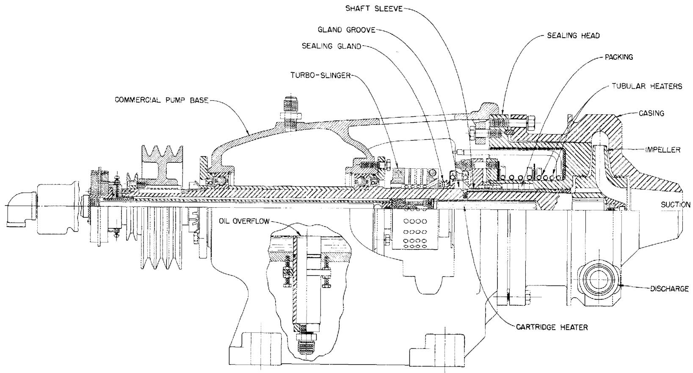  
Fig. 2.2. Assembly of ARE Pump. Sectional view.

on packed seals for pumps and valves, and screening tests have been made on a number of packing materials for possible use as lubricants. The test consisted of heating the material under compression to $1500^{\circ}\mathrm{F}$ for a period of time and then comparing the heated material with the original material. The materials tested included C (graphite), PbO, $\mathbf{N}\mathbf{i}_2\mathbf{O}_3$ $\mathbf{N}\mathbf{i}_2\mathbf{O}_3 + \mathbf{P}\mathbf{b}\mathbf{O}$ $\mathbf{P}\mathbf{b}\mathbf{O} + \mathbf{M}\mathbf{o}$ $\mathbf{N}\mathbf{i}_2\mathbf{O}_3 + \mathbf{M}\mathbf{o}$ $\mathbf{CrF}_2$ $\mathbf{N}\mathbf{i}_2\mathbf{O}_3 + \mathbf{C}$ $\mathbf{P}\mathbf{b}\mathbf{O} + \mathbf{C}$ $\mathbf{P}\mathbf{b}_2(\mathbf{OH})_2\mathbf{CrO}_4$ $\mathbf{MoS}_2$ $\mathbf{N}\mathbf{i}_2\mathbf{O}_3 + \mathbf{M}\mathbf{o}\mathbf{S}_2$ $\mathbf{M}\mathbf{o}\mathbf{S}_2 + \mathbf{M}\mathbf{o}$ $\mathbf{BN} + \mathbf{M}\mathbf{o}\mathbf{S}_2$ $\mathbf{BN},\mathbf{N}\mathbf{i}_2\mathbf{O}_3 + \mathbf{BN},\mathbf{BN} + \mathbf{C},\mathbf{ZnS},\mathbf{CeO}_2,$ and $\mathbf{CaF}_2$ . The tests indicated that the following materials may possibly be useful as high-temperature lubricants: C (graphite), $\mathbf{N}\mathbf{i}_2\mathbf{O}_3$ $\mathbf{N}\mathbf{i}_2\mathbf{O}_3 + \mathbf{M}\mathbf{o}$ $\mathbf{N}\mathbf{i}_2\mathbf{O}_3 + \mathbf{C},\mathbf{M}\mathbf{o}\mathbf{S}_2,$ $\mathbf{M}\mathbf{o}\mathbf{S}_2 + \mathbf{M}\mathbf{o},\mathbf{M}\mathbf{o}\mathbf{S}_2 + \mathbf{B}\mathbf{N},$ and BN $^+$ C. CeO $^2$ may be a fine abrasive. It is planned to further test these materials in contact with fluorides.

One test apparatus for screening materials has been built and operated that consists of a fluoride pot with stuffing boxes on the top and bottom. A single shaft is inserted through both the stuffing boxes, and the material to be tested is contained in the spring-loaded glands. The shaft is reciprocated by an air cylinder, and the power requirements can be measured. Graphite and $\mathsf{MoS}_2$ have been tested at $1000^{\circ}\mathsf{F}$ in this device with no fluoride leakage out of the stuffing boxes. However, the fluoride wets the surface of the shaft and is carried into the packing where it causes the shaft to bind with the packing, and the power requirement becomes excessive. Mixtures of graphite and $\mathsf{MoS}_2$ with powdered fluoride have also been tried in these glands, but there was no fluoride in the pot. The results were similar in that the powdered fluoride melted and caused the gland walls and the shaft surface to bind.

One other test device that is being assembled has identical packings located at each end of a lantern gland

in a heated container with a rotating shaft through the assembly. The equipment is designed so that liquids, such as fluorides or lubricants, can be introduced under pressure into the lantern gland. This assembly is mounted so that spring tension prevents rotation, and the torque required for operation can be measured.

Packing Compression Tests. As reported previously, (2) experience with high-temperature packing materials indicates that in almost every instance stuffing boxes have required retightening after they reached operating temperature. Therefore a series of tests have been run on various materials to determine their compression characteristics. A dial indicator for measuring the expansion or contraction of the material being tested was mounted on the test apparatus. In the tests, a 1-in.-thick layer of the material being tested was subjected to a compressive force of 75 psi and the compression was measured. The material was then heated to $1500^{\circ}\mathrm{F}$ and held at that temperature until the dial indicator showed no further change. After reaching this equilibrium condition, the material was held at $1500^{\circ}\mathrm{F}$ for a further period of 1 hr, and the compression was again measured. The change in compression, that is, the difference between the compression before heating and the compression after heating, is given in Table 2.1. This test procedure was repeated several times for each material. In all tests thus far, with the exception of the test of nickelic oxide, there was little, if any, further dimensional change after the initial heating.

Packing Penetration Tests. A series of tests has been run to determine the wetting susceptibility of various materials. The material to be tested is compressed by a heavy washer and screw in a container.

TABLE 2.1. COMPRESSION TESTS OF VARIOUS PACKING MATERIALS AT ${1500}^{ \circ  }\mathrm{F}$ AND 75 psi   

<table><tr><td>MATERIAL</td><td>HEATING CYCLE</td><td>COMPRESSION DUE TO THERMAL EFFECT (in.)</td><td>REMARKS</td></tr><tr><td rowspan="3">Graphite</td><td>1</td><td>0.038</td><td rowspan="3">Material was easily removed from the apparatus and was apparently unchanged.</td></tr><tr><td>2</td><td>0.009</td></tr><tr><td>3</td><td>0.005</td></tr><tr><td rowspan="4">Boron nitride</td><td>1</td><td>0.071</td><td rowspan="4">Material was easily removed from the apparatus and was apparently unchanged.</td></tr><tr><td>2</td><td>0.003</td></tr><tr><td>3</td><td>0.003</td></tr><tr><td>4</td><td>0.002</td></tr><tr><td rowspan="4">Nickelic oxide</td><td>1</td><td>0.012</td><td rowspan="4">Material was easily removed from the apparatus although a large force (4 tons) was required to push the stem through the packing material in order to disassemble the apparatus. The material contracted several thousands of an inch when cooled after each heating period. Upon the fourth heating, the material expanded slightly.</td></tr><tr><td>2</td><td>0.004</td></tr><tr><td>3</td><td>0.003</td></tr><tr><td>4</td><td>0.002</td></tr><tr><td rowspan="6">Molybdenum disulfide</td><td>1</td><td>0.058</td><td rowspan="6">Material was easily removed from the apparatus and was apparently unchanged.</td></tr><tr><td>2</td><td>0.008</td></tr><tr><td>3</td><td>0.007</td></tr><tr><td>4</td><td>0.001</td></tr><tr><td>5</td><td>0.002</td></tr><tr><td>6</td><td>0.000</td></tr><tr><td>10% Graphite plus 90% nickel powder (by weight)</td><td>1</td><td>0.165</td><td>Material had to be chiseled from the apparatus.</td></tr><tr><td>25% Aluminum powder plus 75% iron powder (by weight)</td><td>1</td><td>0.165</td><td>Material had to be chiseled from the apparatus.</td></tr></table>

Fluoride is introduced above the material being tested, and gas pressure is applied to drive the fluoride through the material.

Graphite, when compressed, was not gas tight, and when the fluoride was loaded there appeared to be a definite interface between the fluoride and graphite, which indicated that the graphite was not wetted by the fluoride. The test ran 240 hr with a pressure of 30 psi above the fluoride.

Boron nitride, when compressed, also was not gas tight; however, after the fluoride was loaded the test ran 26 hr with 5-psi pressure above the

fluoride without leakage of the fluoride into the boron nitride. The pressure was then increased to 10 psi and leakage began. There was some greenish color in the boron nitride. The main leakage path of the fluoride appeared to be along the walls of the container and the screw stem toward the hole in the bottom of the container for the screw stem.

Stainless steel braid was compressed and heated to the annealing temperature twice and further compressed after each heating. The material permitted free flow of gas before it was filled with fluoride. Immediately after

filling, fluoride leakage occurred at only 1-psi pressure. The leakage soon stopped, and the gas flow was somewhat retarded. When the pressure was increased to 3 psi, most of the fluoride was forced from the container. Examination showed that only a small amount of fluoride had adhered to the braid.

Attempts were made to run tests of molybdenum disulfide and nickelic oxide, but these materials were so "fluid" that the container would not hold them. Parts with smaller clearances are being fabricated.

Face Seal Tests. Face seals are being considered for high-temperature use with both gases and liquids. All tests have been run in air at room temperature with speeds of about 1600 rpm and pressures of up to 14 psi. The following combinations of materials were tested in air, without added lubrication:

Carboloy (grade 779) vs. Carboloy (grade 779)

Carboloy (grade 779) vs. graphite (grade C-18)

Graphite (grade C-18) vs. graphite (grade C-18)

In the test of Carboloy vs. Carboloy, a loud, grinding noise developed within 5 min, and inspection showed that annular grooves had been worn into each surface. Operation with the other two combinations of materials was satisfactory until chattering developed when a temperature of about $550^{\circ}\mathrm{F}$ was reached at the seal because of the heat of friction. If graphite depends upon a layer of tightly held moisture for some of its lubrication

qualities, $(3,4)$ then this chattering may be due to the driving-off of surface-held moisture at a more rapid rate than it can be supplied by diffusion from the interior of the graphite. The time required for the test seals to reach the chattering stage was usually between 1/2 and 4 hr; however, in one test the Carboloy vs. graphite seal operated satisfactorily for 42 hours. The area of seal contact was 1 l/2 in.² in each test, and the seal contact force was varied from 5 to 20 pounds. Similar results were obtained when Carboloy vs. graphite seals were tested with MoS₂ and RbOH used as lubricants. Although some seals showed relatively little chattering, therewas, generally, a marked increase in the torque required to overcome the seal friction as the seals heated up.

Combination Packed and Frozen Seal. A seal consisting of a stuffing box packed with powdered graphite in which the slight leakage of fluoride was frozen in the packing compression member was operated for a period of 215 hr at temperatures from 970 to $1500^{\circ}\mathrm{F}$ with system pressures that varied from 16 to 37 psi. Leakage rates were measured at various temperatures and pressures in an attempt to determine the most favorable operating conditions.

TABLE 2.2. LEAKAGE RATES FOR COMBINATION PACKED AND FROZEN SEAL   

<table><tr><td>SYSTEM PRESSURE (psi)</td><td>TEMPERATURE (°F)</td><td>AVERAGE LEAKAGE (g/hr)</td><td>LEAST AMOUNT OF LEAKAGE (g/hr)</td></tr><tr><td>16</td><td>1150</td><td>1</td><td>0.15</td></tr><tr><td>30</td><td>1200</td><td>1</td><td>0.4</td></tr><tr><td>37</td><td>1200</td><td>3</td><td>0.4</td></tr></table>

During this test there was no indication of shaft seizing by the seal. Spectrographic analysis of the leakage showed the constituents to be Co, B, Cd, Cr, Fe, K, Ni, and Si, as well as Na, U, and Zr. Chemical analysis of the leakage indicated that the Na, U, and Zr constituents were present in very nearly the same proportions as in the fluoride in the system. A second test, with a similar packing, in which the compression member is spring loaded to keep tension on the graphite at all times has been in operation for approximately 350 hr with only small leakage of solid fluoride and with no operational difficulties.

Frozen-Lead Seal. A test, similar to previous tests with sodium, was conducted to determine the operating characteristics of a frozen seal when lead is used as the system fluid. The equipment consisted of a chrome-plated stainless steel shaft rotating in a finned sleeve in which the frozen seal was formed. A pot to contain the hot lead to supply the seal was attached to the finned section. The finned sleeve was provided with a heater for melting out the frozen seal in order to resume operation after a shut-down. A portion of the finned section was shrouded so that a blast of air could be directed across the seal when required. This test operated for a period of 526 hr with leakage occurring when the finned section temperature was permitted to exceed $600^{\circ}\mathrm{F}$ . The lead temperature in the pot was between 1000 and $1200^{\circ}\mathrm{F}$ , and the system pressure was 8 psi. Very smooth operation was experienced, with no tendency toward shaft seizure. The test was terminated when the seal became too hot and caused an excessive loss of lead. This test indicates that a lead pump with a frozen-lead seal can be expected to give as satisfactory performance as a sodium pump with a frozen-sodium seal.

Frozen-Sodium Seal. Preliminary

tests have been conducted to determine the feasibility of using a frozen-sodium seal for sealing a high-temperature NaK pump. This design consists of a heated annulus around the shaft to which molten sodium is supplied from an attached container. Sodium in the annulus is kept molten at all times. A coolant passage is located on either side of the molten sodium for freezing the sodium around the shaft and preventing sodium leakage from the annulus. The temperature of the NaK is reduced to below the melting point of the sodium at the frozen sodium-to-NaK interface. In the initial tests, some difficulty has been encountered with heat conduction by the solid shaft to the region of the frozen-sodium seal that is sufficient to melt out the sodium forming the seal when the NaK bath is at temperatures greater than $500^{\circ}\mathrm{F}$ ; however, it is expected that internal cooling of the shaft will eliminate this difficulty.

These tests indicate that such an arrangement will satisfactorily seal the rotating shaft of a NaK pump if the temperature of the NaK at the NaK-to-sodium interface is below the melting point of the sodium and sufficient internal cooling of the shaft is provided to prevent the melting of the frozen-sodium seal. This design is being incorporated into the pumps for the moderator-cooling circuit of the ARE and also in the pumps for the initial circulation of NaK through the ARE fuel circuit.

Bellows-Type of Valve Stem Seal (G.M. Adamson, R.S. Crouse, Metallurgy Division). Two, 3-ply, Inconel bellows 2 in. in diameter and 3 in. long were examined for the Experimental Engineering group. The bellows had been fabricated at the Fulton Sylphon Co. by using a special rolling technique. The first one had been immersed in the fuel mixture NaF-ZrF $_4$ -UF $_4$ (46-50-4 mole %) for 975 hr and the second one

for 1975 hr at $1500^{\circ}\mathrm{F}$ . The first bellows examined had fluorides between the outer and center ply and the second one, which was full of fluorides, had failed completely.

The most important observation made during this investigation was that the wall thickness of the bellows was much less than that expected. Instead of the thickness being 0.027 in., the average thickness was only 0.022 inch. What was even more serious was that the bends were even thinner. In the first bellows, the bends had been thinned an additional $34\%$ and in the other $21\%$ . In the first bellows, several spots in the outside ply were less than 0.002 in. thick.

The first bellows probably failed through one of the thinned down areas in the outer ply. No definite cause for the complete failure of the second bellows can be given. When examined, this bellows contained many circumferential cracks. Although it is certain that some of these cracks were made after the test, it is probable that some of them were fabrication cracks and were the cause of the failure. In both these bellows, considerable self-welding between the plies was found at the bends.

The manufacturer was contacted, and two similar bellows were obtained for examination in the "as received" condition. Two other 3-ply bellows 1 3/8 in. in diameter and 6 in. long were also sent for examination. The two 2-in. bellows are even thinner than those discussed above. Both these bellows had an average thickness of 0.018 inch. The plies were more nearly uniform and the thinning in the bends was 16.7 and $19.5\%$ . The two smaller bellows also had an average thickness of 0.018 inch. The reductions found in the bends of these two were 16.7 and $11.1\%$ . No self-welding or fabrication cracks were found in any of these bellows.

The manufacturer is now attempting to fabricate 4-ply bellows to obtain the desired wall thickness. The individual plies will be as thick as those of the bellows described above, or thicker, if possible.

# HEAT EXCHANGERS

G. D. Whitman D. F. Salmon ANP Division

Sodium-to-Air Radiator. The third sodium-to-air radiator performance and endurance test was started during the quarter and ran for 1212 hr before failure. The running time at the various sodium inlet temperatures is given in the following:

<table><tr><td>TEMPERATURE (°F)</td><td>RUNNING TIME (hr)</td></tr><tr><td>700</td><td>24</td></tr><tr><td>900</td><td>48</td></tr><tr><td>1100</td><td>72</td></tr><tr><td>1300</td><td>34</td></tr><tr><td>1500</td><td>655</td></tr><tr><td>1600</td><td>336</td></tr><tr><td>1700</td><td>43</td></tr><tr><td>Total</td><td>1212</td></tr></table>

Failure occurred at a sodium inlet temperature of $1700^{\circ}\mathrm{F}$ , and the resulting fire did very little damage because the system was dumped as soon as the leak was indicated by a heavy smoke discharge from the air duct. No fire fighting was necessary, and the sodium outside the system was allowed to burn itself out.

Again, as in both of the previous tests, a center tube between the header and top fin on the sodium inlet side of the radiator failed. The tubes in this radiator were fabricated from type 316 stainless steel and had 0.025-in. walls in contrast to the type 304 stainless steel tubes with 0.015-in. walls used in the previous designs.

Since all three failures occurred in the same location, it is possible

that a localized stress was set up in the shorter tubes between the header and the fin matrix during the brazing operation. Such stress may be relieved by increasing the spacing between the headers and top fin.

Considerable difficulty was encountered after about 400 hr of operation of this test in keeping the radiator tubes free from oxide buildup, which would have eventually caused plugging. The plugging that occurred in the cooler sections of the radiator could be temporarily relieved by shutting off the air flow and operating under isothermal conditions, at $1200^{\circ}\mathrm{F}$ , for approximately 1 hour. After normal operation was resumed, the plugging would start again, and after several hours a drop in heat transfer performance would be observed.

A by-pass filter circuit was designed into the loop to prevent such oxide plugging, but it was rendered almost inoperable because of inadequate flow regulation. A small orifice was used to reduced the flow through the filter circuit, but the orifice plugged easily at the low flow rates necessary for lowering the fluid temperatures in the filter.

A throttling valve was substituted for the orifice, and the fluid entering the filter was held at 600 to $800^{\circ}\mathrm{F}$ below the main stream temperature. Approximately one-eighth of the total system flow was continuously passed through the filter, and the radiator was cleaned sufficiently to run about 500 hr without serious tube plugging. When the temperature of the sodium entering the radiator was raised to $1700^{\circ}\mathrm{F}$ , some tube plugging started again and had not been satisfactorily cleared before the failure.

The radiator was of the same general design as that of previous models, and the fin spacing was 15 fins per inch. The fins were cut through, interrupted, and slightly offset every 2 in. in the direction of air flow. The over-all coefficient

of heat transfer is shown plotted against mass air flow rate per square foot of face area (Fig. 2.3). An improvement of about $20\%$ in the overall heat transfer coefficient was achieved over the continuous fin exchanger, as shown by the dashed line. The accompanying increase in air-pressedrop was between 10 and $15\%$ .

Bifluid Heat Transfer System. Assembly of the bifluid loop reported previously $^{(6)}$ has been completed. The NaK system has been filled and the electromagnetic pump has been checked. Various minor changes were necessary, such as correcting reversed thermocouples and clearing gas lines. Considerable effort was required to get the electromagnetic pump started. The trouble, however, stemmed entirely from nonwetting or uncleanliness of the pump cell. When the NaK was heated in the sump tank so that the pump cell temperature reached $450^{\circ}\mathrm{F}$ , the pump started immediately. A flow rate of 11 gpm at 250 v input to the pump primary coil was achieved. This pump is a G-E model G-3, with a modified cell that has nickel lugs welded into the sides of a type 316 stainless steel throat.

The electromagnetic flowmeters will be calibrated against the NaK venturi to complete the shake-down of the NaK system.

The fluoride system has been filled with the fluoride fuel, NaF-ZrF $_4$ -UF $_4$ (50-46-4 mole %), and check runs are being made before combined operation of the two-fluid systems is undertaken. The gas seal of the fluoride pump was operated dry up to 5000 rpm to check for gas or oil leakage, but none was apparent. Vibration of the pump and support structure at the high speed was slight.

Dynamic corrosion data of interest to the ARE will be obtained in the heat exchanger of this loop (a small-diameter nickel tube). A temperature

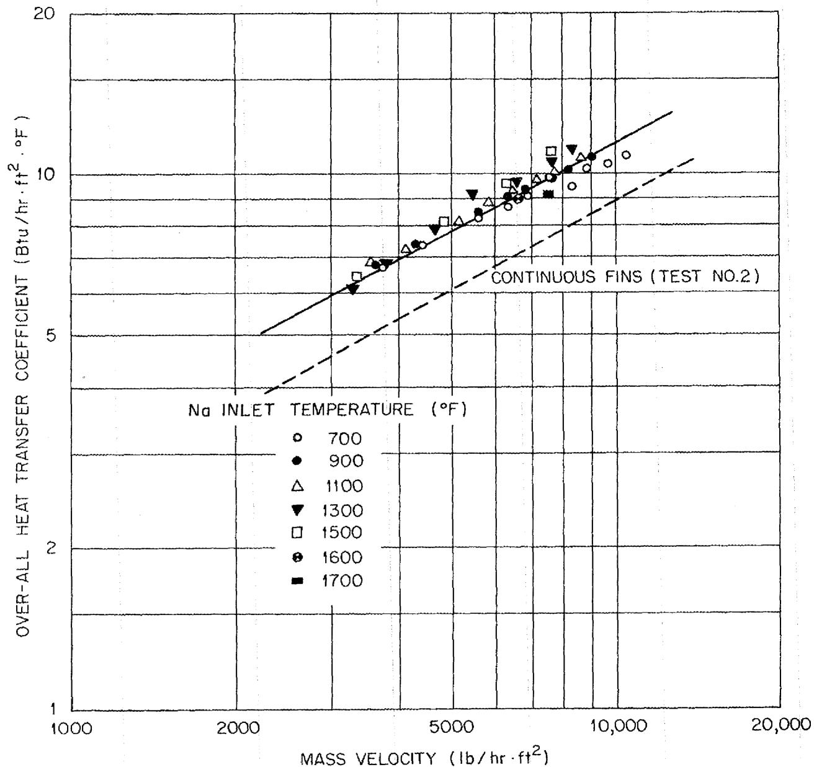  
Fig. 2.3. Heat Coefficients of Sodium-to-Air Radiator with Interrupted Fins.

drop of the fluoride passing through the nickel tube in excess of $100^{\circ}\mathrm{F}$ and Reynold's numbers above the laminar range should be achieved. The impeller of the fluoride pump was fabricated from Inconel to compare its corrosion resistance with that of a type 316 stainless steel impeller that was used in another loop with an identical pump.

# INSTRUMENTATION

W. B. McDonald P. G. Smith

P. W. Taylor A. L. Southern

J. M. Trummel

ANP Division

Rotameter Type of Flowmeter. It was reported previously(7) that a

rotameter type of flowmeter had been installed in a high-temperature fluoride loop and that it had not operated successfully. The difficulty encountered with the flowmeter was binding of the tapered-core position indicator in its housing as a result of thermal distortion. The details of construction of this flowmeter and its principle of operation were given previously.(7)

Other such flowmeters have been constructed with increased clearance around the tapered core to prevent binding. One has operated for a period of 600 hr and measured flows up to 17 gpm at $1300^{\circ}\mathrm{F}$ . The temperature of the static fluoride in which the tapered core operates is $1100^{\circ}\mathrm{F}$ . Flow measurements have been accurate to within $10\%$ . It was found that such accuracy can be maintained for long periods if close control is maintained over the temperature of the fluorides in which the tapered core is operated.

A similar flowmeter, with a capacity to 60 gpm, has been installed and is operating successfully in a larger test loop. This instrument can be adapted for ARE use.

Rotating-ve nane Flowmeter. The rotating-ve nane flowmeter manufactured by the Potter Instrument Co. and modified by the Experimental Engineering group, as reported previously,(8) has been installed in a high-temperature loop. Attempts to measure flow with this instrument have been unsuccessful. Under loop operating conditions, no signal that can be calibrated in terms of flow can be obtained from the flowmeter. One difficulty experienced is that the loop heater circuits cause induced voltages in the pickup coil that are greater than the signal expected from the flowmeter; however, when the heater circuits are turned off for short periods, no useful signal is detectable with the present instrumentation. It is

thought that thermal distortion at this temperature $(1300^{\circ}\mathrm{F})$ caused the bearings to seize and render the instrument inoperable. This instrument will not be available for examination until tests with the loop in which it has been placed have been terminated and the loop has been dismantled.

Diaphragm Pressure-Measuring Device. The diaphragm pressure-measuring device reported previously $^{(9)}$ which utilizes a linear differential transformer to measure the deflection of a diaphragm, has been in operation for more than 100 hr at temperatures up to $1040^{\circ}\mathrm{F}$ . The diaphragm in this instrument is made of 1/16-in., flat, Inconel stock 3 in. in diameter. Preliminary tests indicate that the operation is reliable up to $1000^{\circ}\mathrm{F}$ over the range from 0 to 40 psi. To date, the instrument has been tested only with inert gas against the diaphragm; however, it is not expected that the introduction of molten fluorides will radically change the operating characteristics of the instrument. The only observable effects of increased temperature are a shift of the zero point and an increase in the slope of the performance curve (Fig. 2.4). A second instrument is being fabricated that will operate with fluorides at 1000 to $1100^{\circ}\mathrm{F}$ against the Inconel diaphragm.

Moore Nullmatic Pressure Transmitter. The Moore Nullmatic pressure transmitter reported previously, (10) which was modified to prevent the fluorides from coming in contact with the bclows pressure-sensing element, has been installed in a high-temperature fluoride loop and has operated successfully for approximately 200 hours. The pressure-transmitter temperatures have ranged as high as $1400^{\circ}\mathrm{F}$ , and pressures have been measured up to 70 psi. A slight zero shift has been encountered with

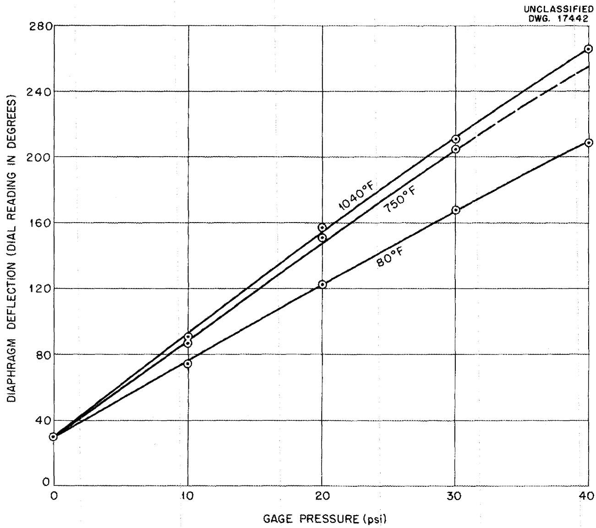  
Fig. 2.4. Performance Curves for Diaphragm Pressure-Measuring Device.

increased temperatures, as was expected. Accurate temperature control of the instrument should eliminate this source of inaccuracy.

Static corrosion tests of 3-ply Inconel bellows in the fluoride mixture NaF-ZrF4-UF4 (46-50-4 mole %) at $1500^{\circ}\mathrm{F}$ indicate that such bellows may be incorporated in the Moore Nullmatic pressure transmitters and operated with the high-temperature fluorides in contact with the bellows. Six such instruments, rated at 0 to

100 psi, have been ordered from the manufacturer.

It is also possible that an instrument constructed with single-ply type 316 stainless steel, type 347 stainless steel, or nickel bellows may be used with the $\mathrm{ZrF_4}$ -bearing fluoride fuels, since it is possible to maintain the fluid in static condition and to keep the temperature in the pressure transmitter between 1000 and $1100^{\circ}\mathrm{F}$ and thus minimize the effects of corrosion. (Results of preliminary

static corrosion tests of stainless steel, Inconel, and nickel in these fluorides indicate little corrosion.)

The possibility of locating the instrument beneath the loop and completely submerging the bellows in a bath of molten lead with a temperature gradient in the lead from $1100^{\circ}\mathrm{F}$ at the top to just above the melting point at the bellows is being investigated. This would provide a molten lead-molten fluoride interface that would make possible pressure transmittal from a $1500^{\circ}\mathrm{F}$ fluoride stream without exposing the bellows to damaging temperatures. Static tests have indicated that the fluoride mixture will remain on top of the lead and will not mix with the lead.

# HANDLING OF FLUORIDES AND LIQUID METALS

L.A.Mann D.R.Ward

J.M.Cisar P.W.Taylor

W. B. McDonald

ANP Division

NaK Distillation Test. The use of eutectic NaK alloy (78 wt % K, 22 wt % Na) for cleaning the ARE fuel circuit is planned. It is anticipated that about $95\%$ of the NaK in the entire fuel circuit can be drained and the remainder will be removed by vacuum distillation under heat. An experimental unit has been constructed, and the first test of vacuum distillation of NaK has been conducted. In this test, approximately 6 lb of eutectic NaK at $1200^{\circ}\mathrm{F}$ was distilled from a boiler by using a small vacuum pump that pulled continuously from the receiver and maintained a pressure of less than $2\mathrm{mmHg}$ . A steady flow of approximately 3 scfm of helium was maintained through the system. This operation continued intermittently for approximately three days; however, there was some down time on the system because of gas leaks and other equipment failures. This test indicated that under attainable operating conditions, this quantity of NaK could be distilled

from a boiler in somewhat less than 16 hours.

Gas-Line Plugging. It was reported previously(11) that continued tests were being conducted to determine the extent of gas-line plugging from the vapors of a bath of the fuel mixture NaF-ZrF4-UF4 (46-50-4 mole %) at various elevated temperatures. A summary of the results of the tests, to date, follows:

1. In operation at $1050^{\circ}$ F, there was no gas-line plugging during 1488 hr of testing.   
2. In operation at $1300^{\circ}\mathrm{F}$ , all lines partly plugged after 666 hr of operation. Upon examination, the lines appeared to be totally plugged, but the plugs were sufficiently porous to allow the passage of gas at approximately one-tenth that of the initial flow rate.   
3. In operation at $1500^{\circ}\mathrm{F}$ , all lines plugged solid in 100 hr of operation.

These tests indicate that gas lines may be expected to operate satisfactorily in a system containing this fuel, providing the free surface of the fuel adjacent to the entry gas lines is at a temperature in the range between 1050 and $1100^{\circ}\mathrm{F}$ . Above these temperatures, some difficulty may be expected.

ZrF4 Vapor Condensation Test.12) In the absence of reliable vapor-pressure data for ZrF4, tests were conducted to determine the minimum container-wall temperature needed to minimize or prevent condensation of ZrF4 on the walls. Each of four 1-in.-IPS tubes 18 in. long was charged with approximately 180 g of the fuel mixture NaF-ZrF4-UF4 (46-50-4 mole %). The fuel was maintained at $1500^{\circ}\mathrm{F}$ in each tube, and the portions above the fuel tubes were maintained at different temperatures, ranging from 900 to $1500^{\circ}\mathrm{F}$ , for each tube.

(11) W. B. McDonald and P. W. Taylor, ANP Quar. Prog. Rep. Sept. 10, 1952, ORNL-1375, p. 32.   
(12) W. B. McDonald and J. W. Trummel, ANP Quar. Prog. Rep. Sept. 10, 1952, ORNL-1375, p. 34.

These conditions were maintained for 300 hours. The tubes were then sectioned and examined for crystal deposits of $\mathsf{ZrF_4}$ . Correlation of crystal deposits on the inside tube walls with the various tube-wall temperatures during the test indicates that the $\mathsf{ZrF_4}$ vapor given off by the fuel at $1500^{\circ}\mathsf{F}$ will condense on any surface that is at a temperature of $1250^{\circ}\mathsf{F}$ or lower. When the tube-wall temperature is maintained at a temperature greater than $1250^{\circ}\mathsf{F}$ , no deposits of $\mathsf{ZrF_4}$ crystals will be formed. These data check reasonably well with available vapor-pressure data for $\mathsf{ZrF_4}$ and for the fluoride mixture $\mathsf{NaF - ZrF_4 - UF_4}$ (46-50-4 mole%).

# PROJECT FACILITIES(13)

Helium Distribution. High-purity helium is now delivered to distribution systems in the experimental engineering laboratories, Building 9201-3, and the Fuels Production Pilot Plant, Building 9928, by pipe line from tank cars through a pressure-reducing station located at a considerable distance from the building. The installation cost for the several thousand feet of pipe line has been offset completely by the saving already accrued from complete elimination of the labor formerly required to carry out the time-consuming process of filling empty cylinders with helium at the tank car, transporting the cylinders to intermediate storage, performing individual purity tests spectrographically on each cylinder, distributing the cylinders to work locations, and finally returning the empty cylinders to the tank car for refilling.

Fabrication Shop. The shop facilities of the Experimental Engineering

Department, Building 9201-3, have been relocated and consolidated to permit expansion of the machine shop and relocation of every fabrication work area to new locations adjacent to the mechanical stores crib. With the new arrangement, the production of component parts is expedited through the various steps of fabrication, handling is reduced, better housekeeping is achieved, and a more workable arrangement for the shops is obtained.

The use of oxygen and acetylenecylinders has been eliminated by installation of piped supplies of these gases to the work benches in the fabrication area from outdoor cylinder-manifold systems. The ventilation system has been expanded to relieve the new shops of smoke, fumes, and the excessive heat generated during fabrication procedures.

Instrument Shop Facility. A new facility in Building 9201-3 has recently been completed to provide a suitable environment for conducting under constant and most rigid external conditions the design, development, adjustment, and calibration of sensitive electronic instruments and equipment. The nonmagnetic laboratory benches are supplied with electric outlets, grounding busses, and piped supplies of helium, natural gas, oxygen, and acetylene. The illumination installed in the area is adequate. Installation of an air-conditioning system designed to maintain this laboratory at constant temperature and constant humidity will start in the near future.

Gas-Fired Furnace Facility. A battery of six gas-fired furnaces, each rated at 68,000 Btu/hr, is being installed on the main track floor of the experimental engineering laboratories, Building 9201-3. The furnaces will serve as heat sources for the various experimental programs under way at the present time.

# ANP PROJECT QUARTERLY PROGRESS REPORT

Each furnace is provided with positive safety protection and control instrumentation, including purging blowers, high-voltage spark-ignition systems, differential pressure regulators with fail-safe and manual

reset features, dilution exhaust stacks, and fail-safe interlocking controls with provision for temperature control and automatic shut-down in the event that the associated experimental equipment fails.

# 3. GENERAL DESIGN STUDIES

A. P. Fraas, ANP Division

A program for the development of liquid-to-air radiators for turbojet engines has been outlined. Because of the magnitude of the work involved, the Air Force (Wright Air Development Center) is planning a program for the development of radiator fabrication techniques. The performance of a radiator already tested at ORNL(1) has been extrapolated to that of a full-scale radiator, and the data have been used to analyze the performance of a Sapphire turbojet engine incorporating such a radiator. Performance data for both the radiator and engine appear to be very encouraging.

Further design and analysis of reflector-moderated reactors(2) have been held in abeyance pending the completion of critical experiments to determine feasibility. Preliminary results of the first critical assembly are described in section 5, "Critical Experiments."

# AIR RADIATOR PROGRAM

# A. P. Fraas, ANP Division

Further analytical and design studies have been carried out on tube-and-fin radiators. The results of this work, coupled with the experimental test results, indicate that it is not possible to predict the heat transfer performance of various radiator core geometries closely enough to ascertain which of the several designs is the best one without testing them. A set of rough sorting calculations indicates, however, that tests on the cores listed in Table 3.1 should be made. Since this constitutes a considerable program of test work that is more closely related to the engine

than to the reactor, the Wright Air Development Center has agreed to try to carry out, through contracts with vendors, part of the program; heat transfer information and endurance life data should thus be obtained, and one or more sources of radiator supply should be established.

# RADIATOR PERFORMANCE

G. D. Whitman H. J. Stumpf ANP Division

Performance calculations show that a radiator core with 30 fins per inch should be very satisfactory even though it would operate at Reynold's numbers far down in the laminar flow range. Therefore a unit was built and prepared for test, which is described as type L in Table 3.1.

The performance characteristics of a full-scale radiator were calculated on the basis of test data obtained for the core element described as type C in Table 3.1 (cf., sec. 2, "Experimental Reactor Engineering"). Figure 3.1 shows the performance data in the form of a chart that gives "heating effectiveness" as a function of radiator depth in the direction of air flow for a series of air-mass flow rates. Figure 3.2 gives pressure-drop data for this type of radiator for a 12-in. depth in the direction of air flow. Nickel fins were assumed instead of stainless steel fins. The "heating effectiveness" was taken as the ratio of the air temperature rise to the temperature difference between the air entering the radiator and the sodium entering the radiator.

# ENGINE PERFORMANCE

H. J. Stumpf, ANP Division

Estimated performance characteristics for a turbojet engine fitted with

# TABLE 3.1. TYPES OF TUBE AND FIN RADIATOR CORE ELEMENTS PROPOSED FOR DEVELOPMENT TESTING

Tube outside diameter, 3/16 in.

Tube material, type 316 stainless steel (if available)

Tube spacing transverse to air flow, 2/3 in.

Tube spacing in direction of air flow, 2/3 in.

Air-passage length, 12 in.

Air-inlet face, 2 by 3 1/3 in.

<table><tr><td>RADIATOR TYPE</td><td>FIN DESCRIPTION</td><td>NO. OF FINS PER INCH</td><td>FIN MATERIAL</td><td>TUBE ARRANGEMENT</td><td>STATUS OF TEST</td></tr><tr><td>A</td><td>Plain plate</td><td>10.5</td><td>Stainless steel</td><td>In-line</td><td>Completed May 1952</td></tr><tr><td>B</td><td>Plain plate</td><td>15</td><td>Stainless steel</td><td>In-line</td><td>Completed June 1952</td></tr><tr><td>C</td><td>Plate interrupted every 2 in.</td><td>15</td><td>Stainless steel</td><td>In-line</td><td>Completed October 28, 1952</td></tr><tr><td>D</td><td>Plate interrupted every 2/3 in.</td><td>15</td><td>Stainless steel</td><td>In-line</td><td>Radiator being prepared for testing</td></tr><tr><td>E</td><td>Plate interrupted every 2 in., with electroformed turbulators</td><td>15</td><td>Nickel</td><td>In-line</td><td>Fins being fabricated for ORNL</td></tr><tr><td>F</td><td>Disk fins, stamped and ceramic coated</td><td>15</td><td>Nickel</td><td>In-line</td><td>Fabrication technique being developed at ORNL</td></tr><tr><td>G</td><td>Disk fins, stamped</td><td>15</td><td>Stainless steel</td><td>In-line</td><td>Suggested Wright Field project</td></tr><tr><td>H</td><td>Disk fins, stamped</td><td>15</td><td>Nickel</td><td>In-line</td><td>Suggested Wright Field project</td></tr><tr><td>I</td><td>Disk fins, stamped</td><td>15</td><td>Nickel</td><td>Staggered</td><td>Suggested Wright Field project</td></tr><tr><td>J</td><td>Disk fins, coined</td><td>15</td><td>Nickel</td><td>Staggered</td><td>Suggested Wright Field project</td></tr><tr><td>K</td><td>Disk fins, stamped and chrome plated (possibly 0.0003 in.)</td><td>15</td><td>Nickel</td><td>In-line</td><td>Suggested Wright Field project</td></tr><tr><td>L</td><td>Plain plate</td><td>30</td><td>Nickel</td><td>In-line</td><td>In progress</td></tr></table>

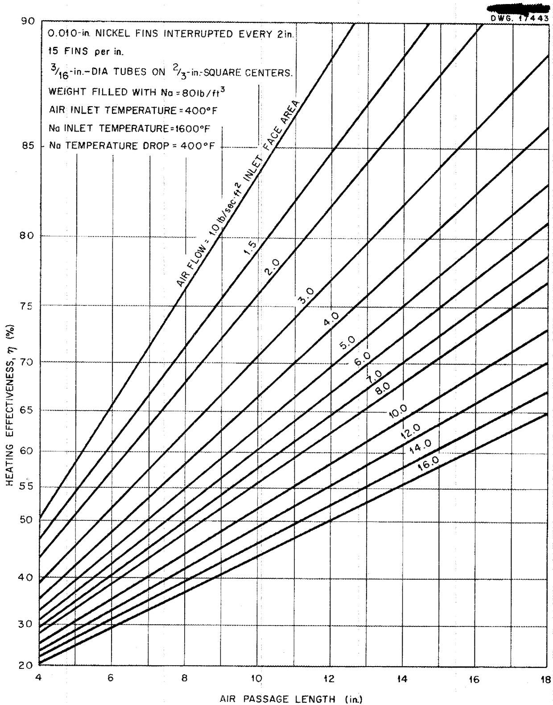  
Fig. 3.1. Performance of Air Radiator with Interrupted Fins.

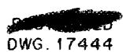

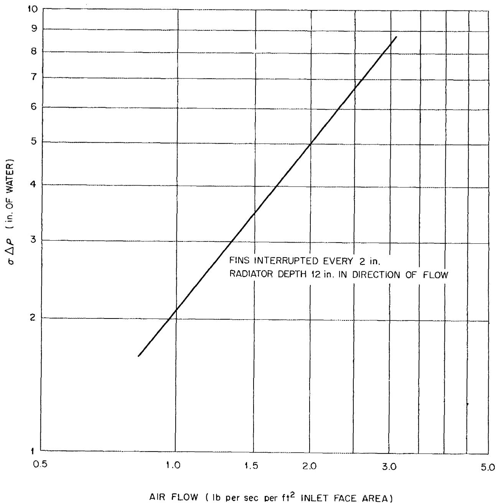  
Fig. 3.2. Pressure Drop Through Air Radiator with Interrupted Fins.

liquid metal radiators are shown in Fig. 3.3. Although it would by no means be an optimum configuration, for convenience it was assumed that a Sapphire engine could be modified to give a compression ratio of 4:1 and could be fitted with full-scale

radiators that would be similar to radiator core element C (Table 3.1), except that they would have nickel fins rather than stainless steel fins. The pumps and lines for the secondary fluid (assumed to be NaK) were designed to allow for the equivalent of 20 ft

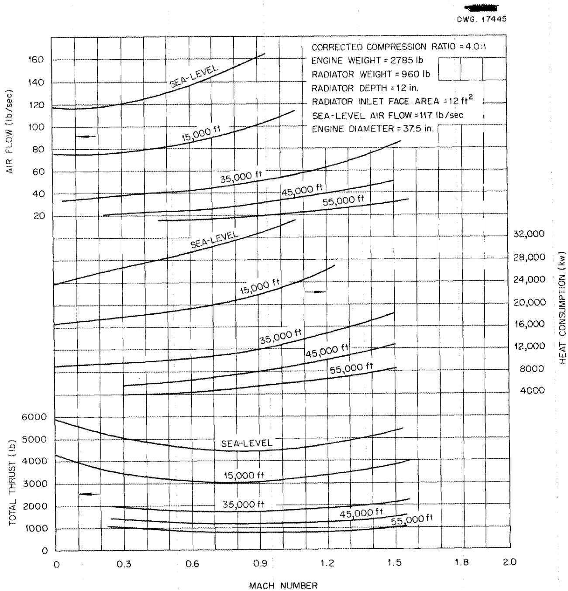  
Fig. 3.3. Performance Data for Modified Sapphire Engine with Interrupted-Fin Radiators.

of pipe from the outside of the reactor shield to the turbojet engine. The weight of the engine, radiators, pumps, lines, and contained NaK was found to be 4256 pounds.

The engine weight, without the radiators, was assumed to be the same

as that for an engine with the standard compression ratio of 6.85. It was further assumed that the saving in weight effected by eliminating both the combustion chambers and several stages from the compressor would be equal to the weight of the radiator

support structure and the special ducts, baffles, etc. required for the liquid metal radiator. NEPA design studies indicated that it should be possible to do better than this; hence the weight given above, 4256 lb, is probably a moderately conservative estimate. Further radiator development work may make it possible to cut as much as several hundred pounds from the 960-lb radiator weight in this installation.

# HEAT EXCHANGER DESIGN CHARTS

A.P.Fraas M.E.LaVerne

The ORNL-ANP liquid-to-liquid heat exchanger design and development efforts have been based on a matrix of closely spaced small-diameter tubes that permit practically pure counterflow operation. This type of matrix

has exceptionally good heat transfer characteristics. In the course of full-scale aircraft power plant design work, a number of charts for this type of heat exchanger has been prepared. These charts were intended, in part, to show the effects of the various parameters in a readily understandable form and, in part, to simplify and reduce markedly the chore of making detailed design calculations. The charts, together with brief explanations and sample calculations to illustrate their use, have recently been issued.(3) The subjects covered are (1) heat exchanger matrix geometry, (2) fluid flow and pressure loss, (3) heat transfer coefficient, and (4) performance of a series of counterflow heat exchangers.

(3) A. P. Fraas, Heat Exchanger Design Charts, ORNL-1330 (to be issued).

# 4. REACTOR PHYSICS

W. K. Ergen, ANP Division

In the theory of power oscillations in a circulating-fuel reactor, it is now possible to demonstrate the damping influence of the fuel circulation, even if some of the previous assumptions are replaced by considerably more general conditions. Specifically, it is no longer necessary to assume that all particles of the fuel spend the same time in the reactor and that the fuel and power distributions are constant over the reactor. The more general condition (Eq. 1), which replaces the old assumptions, covers, among other things, the case in which the power distribution is constant only in the direction of flow, but not necessarily in the direction perpendicular to it, and in which there are a number of alternate fuel paths, each with a different fuel transit time.

In the field of reactor calculations, it was found that the slowing down of neutrons in parallel slabs of materials with different properties can be described, under some not too unrealistic conditions, by a set of images of the original neutron source. The images are somewhat similar to those which would be obtained if the neutron source were replaced by a light source and the interfaces between the slabs were replaced by mirrors or refracting surfaces.

For some time, attempts have been made to obtain a better understanding of the nuclear physics involved in the temperature coefficient of reactivity. These attempts have now resulted in an explicit expression for the temperature dependence of a macroscopic absorption cross section. The temperature dependence is caused by the thermal motion of the atoms.

Calculations specifically carried out for the ARE and Fireball Critical Experiments are reported in connection with these experiments (Sec. 5).

# OSCILLATIONS IN THE CIRCULATING FUEL REACTOR

W. K. Ergen, ANP Division

It was shown previously(1) that, under certain conditions, the circulation of the fuel introduces a damping of power oscillations of a reactor. These previous considerations have since been generalized, and the damping can still be demonstrated, even if one drops the assumptions that all particles of the fuel spend the same time in the reactor and that the flux and power distributions are constant over the reactor.

The delayed neutrons are still neglected, and it is still assumed that a change $\Delta T$ of the average fuel temperature $T$ causes an instantaneous change $-\alpha \Delta T$ in the reactivity and that the inlet temperature is constant. The old assumptions of constant fuel-transit time and constant flux and power distribution are replaced by the much more general condition that

$$
\begin{array}{l} \dot {T} = \in \left[ P (t) \right. \\ \left. - \int_ {0} ^ {\infty} d \sigma K (\sigma) P (t - \sigma) \right], \tag {1} \\ \end{array}
$$

where $\epsilon$ is a positive constant associated with the reciprocal heat capacity and $P$ is the reactor power. The kernel $K(\sigma)$ has the property $dK / d\sigma \leq 0$ , and, for $\sigma$ greater than some fixed value $A$ , $K(\sigma) = 0$ . The term $\epsilon P$ corresponds to the instantaneous increase in reactor temperature due to the power generation. The integral

represents the fact that the memory of the earlier power history is continually "washed out" by the circulation of the fuel, for instance, because fuel which has "seen" the earlier power history leaves the reactor.

It is convenient to take the inlet temperature as zero on the temperaturescale. Then Eq.l is equivalent to

$$
T = \epsilon \int_ {0} ^ {\infty} G (\sigma) P (t - \sigma) d \sigma , \tag {2}
$$

with

$$
G (0) = 1 \tag {3}
$$

$$
G (\infty) = 0, \tag {4}
$$

$$
d G / d \sigma = - K (\sigma) \tag {5}
$$

The second equation describing the kinetic behavior of the reactor is, as in the previous calculations,

$$
\dot {P} = - \frac {\alpha}{T} P (T - T _ {0}), \tag {6}
$$

where $\tau$ is the prompt-neutron generation time, and $T_{0}$ is the average temperature the reactor reaches in the equilibrium state. This state is is characterized by a constant power, $P_{0}$ .

Limits on the Oscillations. As in the previous considerations, it is to be shown first that the power remains bounded. Since, for $\sigma \geq A$ , $dG / d\sigma = -K(\sigma) = 0$ and $G(\infty) = 0$ , it follows that $G(\sigma) = 0$ for $\sigma \geq A$ . This means, physically, that the power prevailing at $t - A$ , or earlier, has no influence on the temperature $T$ at time $t$ , for instance, because all the fuel present at time $t - A$ , or earlier, has left the reactor before time $t$ .

Assume now that $t - A$ is the time at which the reactor power passes through $P_0$ and is rising. Eventually the reactor heats beyond $T_0$ , the temperature at which $\dot{P} = 0$ , and then the power has to start dropping.

The attainment of the temperature $T_{0}$ and the connected drop in power have to occur at time $t$ , at the latest, because, unless the power drops before

$t$ , it will have exceeded $P_0$ during the whole time interval $t - A$ to $t$ , and even $P_0$ would have been sufficient to raise the temperature to $T_0$ . This shows that the power cannot start at $P_0$ and rise continuously for a time interval in excess of $A$ .

Also, the rate of increase in log $P$ is limited, as can be seen from Eq. 3, where the temperature cannot be less than 0, the inlet temperature. Since both the rate of increase and the time of increase are bounded, the maximum is bounded, too. Furthermore, if the reactor power stays above $P_0$ for the time $A$ , it has to drop below $P_0$ before it can rise again, because the temperature could not otherwise go below $T_0$ . When the power has gone below $P_0$ and starts increasing again, the above argument again holds.

A similar argument shows that the power has a finite lower limit. Actually, the limits found by the above consideration are far wider than the limit obtained in practice, but they show that there are no antidamped oscillations that would increase to infinity.

Periodic Oscillations. It is now of interest to determine under what conditions periodic oscillations of constant amplitude can occur. For this purpose, one multiplies Eqs. 1 and 6:

$$
\begin{array}{l} - \frac {a}{2 \tau} \frac {d}{d t} (T - T _ {0}) ^ {2} = \epsilon \frac {d}{d t} \log P (t) \\ \left[ P (t) - \int_ {0} ^ {\infty} d \sigma K (\sigma) P (t - \sigma) \right]. \tag {7} \\ \end{array}
$$

If Eq. 7 is integrated over a period $p$ of the oscillation, the left side becomes zero because of the periodicity. The same applies to the integral of

$$
P (t) \frac {d}{d t} \log P (t).
$$

The remaining integral is transformed by partial integration:

$$
\begin{array}{l} \int_ {0} ^ {p} d t \frac {d}{d t} \log P (t) \int_ {0} ^ {\infty} d \sigma K (\sigma) P (t - \sigma) \\ = \log P (t) \int_ {0} ^ {\infty} d \sigma K (\sigma) P (t - \sigma) \left| \begin{array}{l} t = p \\ t = 0 \end{array} \right. \\ \int_ {0} ^ {p} d t \log P (t) \int_ {0} ^ {\infty} d \sigma K (\sigma) \frac {d}{d t} P (t - \sigma). \\ \end{array}
$$

Again, because of the periodicity, the first term on the right has the same value at $t = p$ and $t = 0$ , and hence only the second term remains on the right side. Noting that

$$
\frac {d}{d t} P (t - \sigma) = - \frac {d}{d \sigma} P (t - \sigma)
$$

and interchanging the order of integration, one transforms this term into

units of $P$ in such a way that $\log P$ is always positive throughout the oscillation. This is possible, since $P$ is bounded below. If $\log P$ is always positive, a theorem (2) regarding inequalities becomes applicable. It has only to be noted that $\log P$ is a monoton increasing function of $P$ . The theorem states that the expression in the bracket is never negative. It

$$
\begin{array}{l} \int_ {0} ^ {\infty} d \sigma K (\sigma) \frac {d}{d \sigma} \int_ {0} ^ {p} d t \log P (t) P (t - \sigma) \\ = \left| K (\sigma) \int_ {0} ^ {p} d t \log P (t) P (t - \sigma) \right| _ {\sigma = 0} ^ {\infty} \\ \int_ {0} ^ {\infty} d \sigma \frac {d K}{d \sigma} \int_ {0} ^ {p} d t \log P (t) P (t - \sigma). \\ \end{array}
$$

Since

$$
K (\infty) = 0
$$

and

$$
K (0) = - \int_ {0} ^ {\infty} d \sigma \frac {d K (\sigma)}{d \sigma},
$$

the term can also be written

$$
\begin{array}{l} \int_ {0} ^ {\infty} d \sigma \frac {d K (\sigma)}{d \sigma} \left[ \int_ {0} ^ {p} d t \log P (t) P (t) \right. \\ \left. \int_ {0} ^ {p} d t \log P (t) P (t - \sigma) \right]. \tag {8} \\ \end{array}
$$

At this point, it is convenient, though not essential, to choose the

is zero only if $P(t - \sigma) = P(t)$ for all $t$ , that is, if $\sigma$ is a multiple of the period $p$ . $dK / d\sigma$ was assumed to be nonpositive; hence, the whole integral $8$ is $\leq 0$ .

It has been shown before that, for any periodic oscillation, the integral over a period of the left side of Eq. 7 is equal to zero. Hence, the integral over the right side, which is equal to the integral 8, has to vanish, too. The condition for this is, according to the above, that $dK / d\sigma$ vanish, except possibly at the points

where the square bracket in integral 8 vanishes, that is, at the points where $\sigma$ is a multiple of the period. At these points $dK / d\sigma$ may even go to $-\infty$ without violating the condition for periodic oscillations.

Specific Examples. The previously considered case of constant transit time and constant power distribution is obtained from the above general case by giving $K(\sigma)$ the specific values $K(\sigma) = 1 / \theta$ for $\sigma < \theta$ and $K(\sigma) = 0$ for $\sigma > \theta$ (compare Eq. 1 with Eq. 2 of ORNL-1227, p. 43, or Eq. 2 of Y-F10-109, p. 2). $dK / d\sigma = 0$ at all points except $\sigma = \theta$ (where $dK / d\sigma = -\infty$ ), and periodic oscillations persist only if $\theta$ is a multiple of the period.

If the power distribution is only constant in the direction of fuel flow, but not necessarily in the direction perpendicular to it, and if there are a number of alternate fuel paths with transit times $\theta_{1},\theta_{2},\ldots,\theta_{n}$ , respectively, then the above general theory applies with $K(\sigma) = a_{i}$ for $\theta_{i - 1} < \sigma < \theta_i$ , where $i = 1,2,\ldots,n$ , $\theta_0 = 0$ , and the $a_{i}$ are positive constants, $a_{i} < a_{i - 1}$ . Periodic oscillations are only possible if all $\theta_{i}$ are multiples of the period, a condition very unlikely to occur in practice.

It should be mentioned that T. A. Welton of the Physics Division has made significant advances in reactor kinetics by a somewhat different technique.(3) The above results can also be regarded as special cases of Welton's theorems.

# REACTOR CALCULATIONS (4)

R. K. Osborn, Physics Division

It was noticed that the method of images can be used to solve some specialized but not unrealistic problems of the slowing down of neutrons. The

case considered involves two homogeneous, semi-infinite spaces of different properties, joined along a plane $x = 0$ . A plane, isotropic source of monoenergetic neutrons is placed in one of the half spaces, say the right half space. Under the conditions set forth below, the left half space, the "reflector," can then be replaced, as far as the slowing down density in the right half space is concerned, by an "image" source located symmetrically to the given source with respect to $x = 0$ . The slowing-down density in the reflector can be described by a "refracted" source located to the right of $x = 0$ . The image source and the refracted source have the same energy as the given source.

Properties of the right half space are denoted by the index 1 and those of the left half space by the index 2, $\Sigma_s$ , $\xi$ , $\overline{\mu}$ , and $q$ are, respectively, the macroscopic scattering cross section, the average lethargy increase per collision, the average cosine of the scattering angle, and the slowing-down density; $\tau$ is the "age" in the medium that contains the source.

$$
m = \frac {\xi_ {2} \Sigma_ {s 2} ^ {2} (1 - \bar {\mu} _ {2})}{\xi_ {1} \Sigma_ {s 1} ^ {2} (1 - \bar {\mu} _ {1})} \tag {1}
$$

and

$$
n = \frac {\xi_ {2} \Sigma_ {s 2}}{\xi_ {1} \Sigma_ {s 1}} \tag {2}
$$

are constant with lethargy. Another assumption is that the source plane is parallel to $x = 0$ , so its equation can be written as $x = X$ . The Fermi age equation, with no absorption, is assumed to describe the slowing-down process:

$$
\frac {\partial^ {2} q _ {1}}{\partial x ^ {2}} - \frac {\partial q _ {1}}{\partial r} = \delta (x - X) \delta (\tau), \tag {3}
$$

and

$$
\frac {\partial^ {2} q _ {2}}{\partial x ^ {2}} - m \frac {\partial q _ {2}}{\partial \tau} = 0. \tag {4}
$$

The assumed boundary conditions are

$$
q _ {2} (0, \tau) = n q _ {1} (0, \tau), \tag {5}
$$

and

$$
\frac {\partial q _ {2} (0 , \tau)}{\partial x} = m \frac {\partial q _ {1} (0 , \tau)}{\partial x}. \tag {6}
$$

The solution in the half space $x > 0$ is then

$$
\begin{array}{l} q _ {1} (x, \tau) = (4 \pi \tau) ^ {- 1 / 2} \left\{\exp \left[ - \frac {(x - X) ^ {2}}{4 \tau} \right] \right. \\ + A \exp \left[ - \frac {(x + X) ^ {2}}{4 \tau} \right] \Bigg \}, \tag {7} \\ \end{array}
$$

where

$$
A = \frac {1 - \frac {n}{\sqrt {m}}}{1 + \frac {n}{\sqrt {m}}} \tag {8}
$$

The image source is thus always weaker than the given source. It is positive or negative depending on whether

$$
\frac {n ^ {2}}{m} = \frac {\frac {\xi_ {2}}{1 - \bar {\mu} _ {2}}}{\frac {\xi_ {1}}{1 - \bar {\mu} _ {1}}}
$$

is smaller or greater than 1.

The solution in the reflector is given by

$$
q _ {2} = B \left(\frac {4 \pi \tau}{m}\right) ^ {- 1 / 2} \exp \left[ - \frac {(x - Y) ^ {2}}{\frac {4 \tau}{m}} \right], \tag {9}
$$

that is, the neutrons seem to come from a "refracted" source of strength

$$
B = \frac {\frac {2 n}{\sqrt {m}}}{1 + \frac {n}{\sqrt {m}}} \tag {10}
$$

located at

$$
Y = \frac {X}{\sqrt {m}} \tag {11}
$$

with the whole space filled with material that has the same properties as the reflector. The refracted source is always positive.

That the solutions satisfy, for their respective regions, the differential equations 3 and 4 and that they also satisfy the boundary conditions 5 and 6 can be shown by direct substitution.

The constancy of $m$ and $n$ is not a bad assumption in many cases, because the scattering cross section and, hence, $\xi$ and $\overline{\mu}$ are usually constant over a wide lethargy range. The constancy of the scattering cross section is not a necessary condition for the constancy of $m$ and $n$ . For instance, if the $\xi$ 's and $\overline{\mu}$ 's are constant and the scattering cross sections in both media vary in such a way that their ratio remains constant, $m$ and $n$ would still remain unchanged. However, there are few practical examples in which $m$ and $n$ are constant and the scattering cross sections vary. The most important, but somewhat trivial, example is the case in which the two media are of the same material and differ only in density. Then the "image source" will have strength zero. The refracted source has the strength 1, and there is the same amount of material between the refracted source and the boundary $x = 0$ as there is between the actual source and the boundary.

If the macroscopic absorption cross section $\Sigma_{a}$ is not zero, then the image method can be applied only in the somewhat trivial and not very realistic case in which

$$
\frac {\sum_ {a 2}}{\xi_ {2} \Sigma_ {s 2}} = \frac {\sum_ {a 1}}{\xi_ {1} \Sigma_ {s 1}}. \tag {12}
$$

If there are several sources, or a continuum of source, the solutions for

the individual sources are merely superimposed.

An interesting generalization of the method can be made if there are a number of parallel plane layers of different properties, with one of the layers containing the plane isotropic, monoenergetic source of strength 1. This generalization can be shown on the example of Fig. 4.1. Here a source is located at the center of a slab of thickness $2a$ . The slab is embedded in reflector material, which extends to infinity on both sides; $x = 0$ is the source plane.

at $-2a$ and one of strength $A^2$ at $-4a$ . Now, in order to satisfy the conditions at the right boundary for the two additional sources, one has to put a source $A^2$ at $+4a$ and a source $A^3$ at $+6a$ . If this procedure is continued, it becomes evident that the solution applicable to the inside of the slab is obtained by placing sources of strength $A^i$ at planes $x = \pm 2ia$ , where $i = 0, 1, 2, \ldots$ . The solution in, say, the right side reflector, is described by sources of strength $BA^i$ located at distances $(2i + 1)a / \sqrt{m}$ to the left of the interface $x = a$ , where $i = 0, 1, 2, \ldots$ .

UNCLASSIFIED DWG 17446

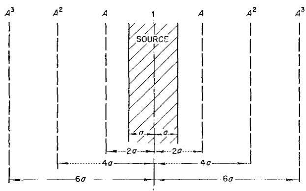  
Fig. 4.1. Neutron Source and Its Images Describing Slowing-Down Density Inside Slab.

If the left reflector were replaced by the material of the slab, the solution in the slab would simply be generated by the two sources - the original source, and the image source of strength $A$ at $2a$ . However, in order to satisfy the conditions at the

$$
\Sigma_ {a} (v, T) = \frac {N _ {2} B}{v} + \frac {N _ {2} A e ^ {- h _ {2} (v - v _ {0}) ^ {2} / (1 + \Gamma h _ {2})}}{2 v ^ {2} \left(1 + \frac {1}{\Gamma h _ {2}}\right)} j (a _ {1}, \gamma) - \frac {N _ {2} A e ^ {- h _ {2} (v + v _ {0}) ^ {2} / (1 + \Gamma h _ {2})}}{2 v ^ {2} \left(1 + \frac {1}{\Gamma h _ {2}}\right)} j (a _ {2}, \gamma)
$$

left boundary with the two sources present, one has to introduce two additional sources - one of strength $A$

# TEMPERATURE DEPENDENCE OF A CROSS SECTION EXHIBITING A RESONANCE(5)

R. K. Osborn, Physics Division

The explicit energy and temperature dependence of a macroscopic absorption cross section exhibiting a resonance was calculated on the assumptions that the microscopic cross section is of the form

$$
\sigma_ {a} \left(\left| v _ {1 2} \right|\right) = A e ^ {- \left(\left| v _ {1 2} \right| - \left| v _ {1 0} \right|\right) ^ {2} / \Gamma} + \frac {B}{\left| v _ {1 2} \right|},
$$

and that the atoms are in a Maxwell-Boltzmann velocity distribution. In the definition of $\sigma_{a}$ above, $A$ , $B$ , and $\Gamma$ are adjustable parameters and $v_{12}$ is the relative velocity between neutrons and atoms. The quantity $v_{10}$ is the particular relative velocity that corresponds to a resonance in the cross section.

The expression for the cross section is:

$$
(a _ {1}, \gamma) - \frac {N _ {2} A e ^ {- h _ {2} (v + v _ {0}) ^ {2} / (1 + \Gamma h _ {2})}}{2 v ^ {2} \left(1 + \frac {1}{\Gamma h _ {2}}\right)} j (a _ {2}, \gamma)
$$

where

$$
\begin{array}{l} N _ {2} = \begin{array}{l} \text {n u m b e r o f a t o m s p e r c u b i c} \\ \text {c e n t i m e t e r ,} \end{array} \\ v = \text {v e l o c i t y} \\ \end{array}
$$

$$
h _ {2} \simeq \frac {m _ {2}}{2 k T},
$$

$$
m _ {2} = \text {a t o m i c w e i g h t o f t h e a t o m s},
$$

$$
v _ {0} = | v _ {1 0} |,
$$

$$
\begin{array}{l} a _ {1} = \frac {v _ {0} + \Gamma h _ {2} v}{1 + \Gamma h _ {2}}, \\ a _ {2} = \frac {v _ {0} - \Gamma h _ {2} v}{1 + \Gamma h _ {2}}, \\ \gamma = \frac {1 + \Gamma h _ {2}}{\Gamma}, \\ j (a, \gamma) = \left(a ^ {2} + \frac {1}{2 \gamma}\right) \left[ 1 + \operatorname {e r f} (\sqrt {\gamma} a) \right] + \frac {a e ^ {- \gamma a ^ {2}}}{\sqrt {\pi \gamma}}. \\ \end{array}
$$

# 5. CRITICAL EXPERIMENTS

A. D. Callihan, Physics Division

During the past quarter some inaugural experiments were done on a critical mockup of the proposed reflector-moderated aircraft propulsion reactor, and the preliminary results are reported. The initial experiment on the reflector-moderated arrangement was assembled from on-hand materials and is a correspondingly poor simulation of the actual reactor. Nevertheless, the assembly became critical with a critical mass of 13.5 kg. The flux distributions obtained show the expected high thermal flux in the moderator island and reflector. A more realistic mockup of the reflector-moderated reactor is now being assembled.

The program of measurements on a critical assembly simulating the ARE reactor, described earlier, was completed, and some of the results are reported. The regulating and safety rods have been calibrated, and a comparison has been made of the contribution to reactivity of various core components. Considerable data from the ARE program have yet to be evaluated and will be presented in subsequent progress reports.

# REFLECTOR-MODERATED CIRCULATING-FUEL REACTOR ASSEMBLY

D. V. P. Williams R. C. Keen

J. J. Lynn

Physics Division

D. Scott C. R. Mills

ANP Division

A preliminary study of some of the nuclear characteristics of the reflector-moderated circulating-fuel reactor(2) has been made with an

assembly comprising component materials that were readily available. The arrangement of the assembly was first critical on November 1 with a mass(3) of about $13.5\mathrm{kg}$ of $\mathbf{U}^{235}$ . In its present form, to be described below, the components were symmetrically located and the loading was $15.0\mathrm{kg}$ of $\mathbf{U}^{235}$ .

The critical assembly consisted of a central 12-in. cube of metallic beryllium that was almost completely enclosed by a 3-in.-thick fuel layer. Surrounding the fuel was a composite reflector consisting of a 12-in.-thick inner layer of beryllium and an outer layer of graphite. The graphite was 8 in. thick on two opposite sides and 6 in. thick on the other ones. These materials were arranged in the matrix of 3-in. square aluminum tubing, which has been described in previous reports.(4) The loading at the mid-plane of the reactor model is shown in Fig. 5.1.

The fuel section consisted of alternate layers of furanium and sodium; the uranium was in disks about 3 in. in diameter and 0.01 in. thick, and the sodium metal was canned in stainless steel boxes 2 7/8 by 2 7/8 by 1 inch. The wall thickness of the boxes was 8 mils. Two disks were placed between adjacent cans of sodium. The long dimensions of these items were parallel to the reactor mid-plane. The fuel region covered four sides of the beryllium core completely and extended partly over each end, with all but the center 6- by 6-in. section of each end being enclosed. This is

F G H I J K L M N O P Q R S T U V W

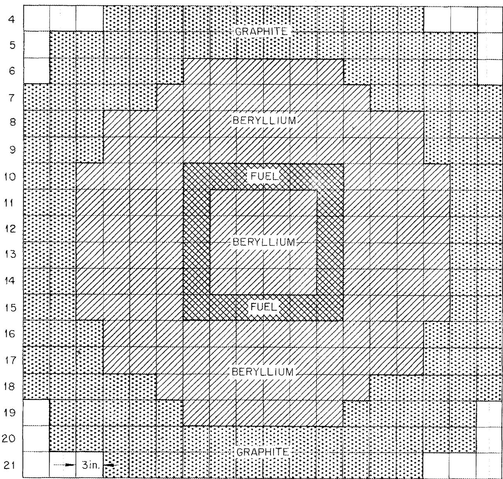  
Fig. 5.1. Vertical Section Normal to Axis at Mid-plane of Reflector-Moderated Reactor Assembly.

shown in Fig. 5.2, which is a vertical section through the reactor perpendicular to the mid-plane referred to above. It is noted that the graphite end-reflectors were not complete and, to preserve symmetry, the sections of the fuel at the mid-plane were separated

by two 1/2-in. thicknesses of aluminum.

The control and safety rods were reflector elements located outside the fuel shell. Each corresponded, in reactivity change, to about $30\%$ of that from the effective fraction of delayed neutrons.

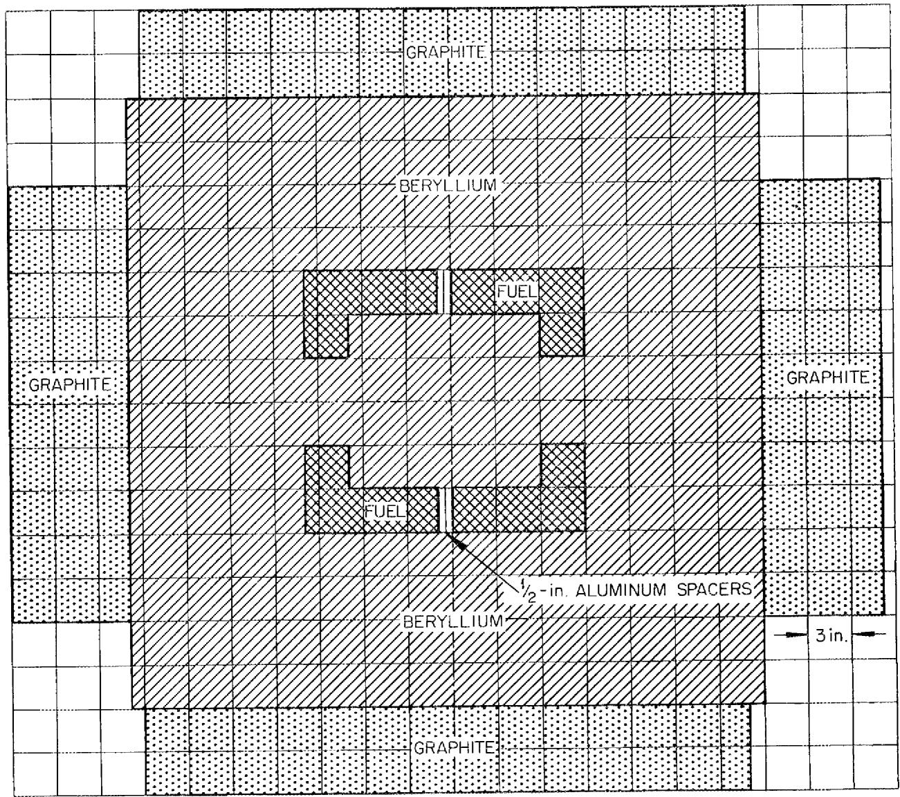  
Fig. 5.2. Vertical Section Along Axis of Reflector-Moderated Reactor Assembly.

Some measurements have been made that indicate the neutron flux and power distributions in various parts of the array. The flux was measured in the usual manner with bare- and cadmium-covered-indium foils and the power or fission-rate data were derived from fission fragments collected on aluminum foils placed in contact with the uranium.

In Fig. 5.3 are shown neutron-flux traverses measured horizontally along row 12 in the mid-plane of the reactor, and in Fig. 5.4 are the data obtained along a central traverse of cell 0-12, perpendicular to the mid-plane. In both cases, the activations of bare-and cadmium-covered-indium foils and their difference are shown. These results are typical of those obtained

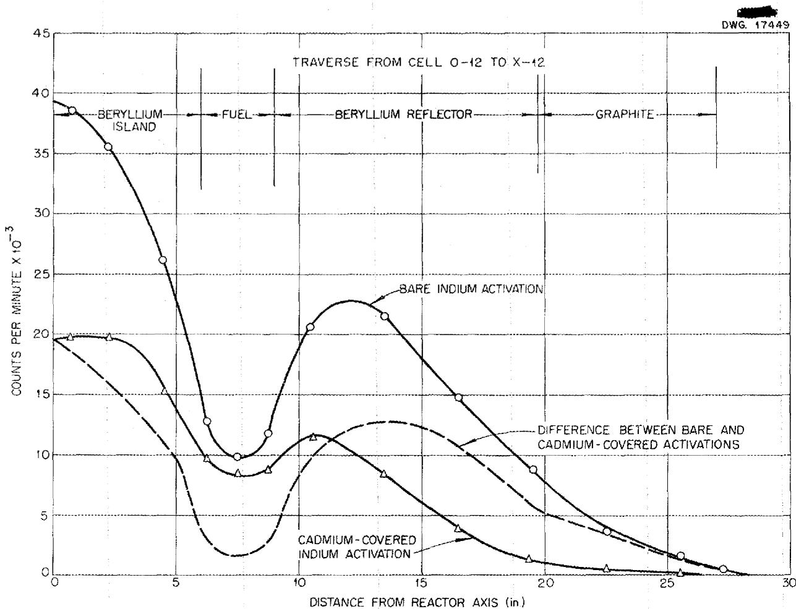  
Fig. 5.3. Indium Traverse Radially in Mid-plane of Reactor.

along other traverses, and they confirm the theoretical prediction of high-neutron flux in the moderator island and reflector. This effect is, as theoretically expected, particularly pronounced for thermal neutrons (the dashed curve, Fig. 5.3).

The cadmium fraction, derived from the indium-foil activation data and defined as the ratio of the activation by neutrons of energy below the cadmium cut-off to the activation by all neutrons, is plotted in Fig. 5.5 for the horizontal traverse of Fig. 5.3. The values of this cadmium fraction, as calculated from the IBM multigroup computations, are also plotted in Fig.

5.5. The theoretical and experimental values practically coincide in the center of the fuel and in the bulk of the reflector. The discrepancy at the fuel surface is not surprising, since all practical calculation methods, including the "age" multigroup method, are not exactly valid near boundaries.

The relative fission rates at the surface of the uranium metal in cell Q-13 are shown in Fig. 5.6, where the two points at 9 1/2 in. were measured on opposite sides of the uranium disk adjacent to the beryllium reflector.

In another experiment, the fuel disks, with aluminum foils adjacent, were wrapped in cadmium sheet. The

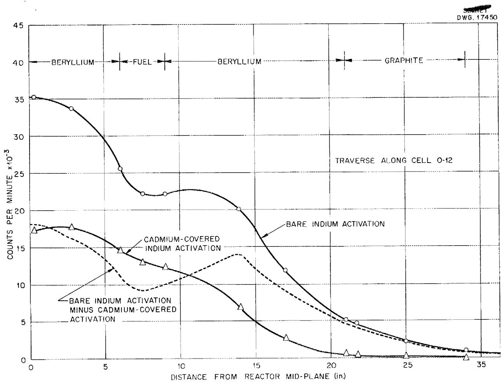  
Fig. 5.4. Indium-FOil Activation Along Axis of Reactor.

resultant activities collected on the foils are a measure of the fission rate caused by the higher energy neutrons. From these and the data from the preceding experiment, it is observed that about $70\%$ of the fissions are produced by thermal neutrons.

Two, adjacent, 10-mil-thick uranium pieces were replaced by ten pieces that were each 2 mils thick and separated by aluminum foils. From the observed distribution of activity across this composite fuel element, the self-shielding of the 20-mil-thick uranium is found to be $34\%$ , that is, only $66\%$ of the uranium is effective. This figure of $66\%$ is in satisfactory

agreement with a figure of $63\%$ computed from the multigroup data. Of course, the orientation of the disks, parallel to the neutron current from the reflector, and the nonuniform power distribution make the theoretical calculation difficult and somewhat uncertain.

# ARE CRITICAL ASSEMBLY

D. Scott C. B. Mills ANP Division

J. F. Ellis D. V. P. Williams Physics Division

The preliminary assembly of the ARE, which has been described in previous

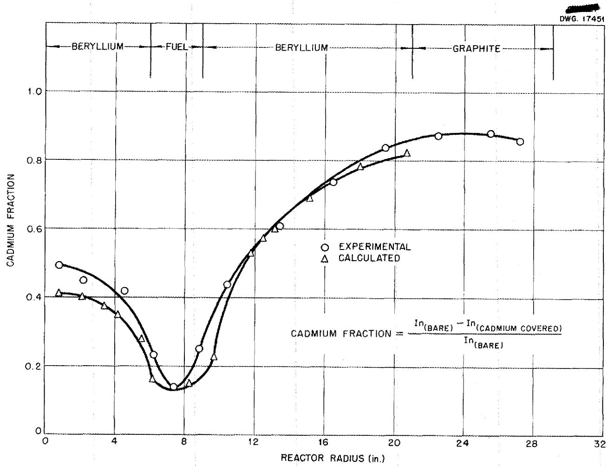  
Fig. 5.5. Cadmium Fraction (from Indium-Feil Activity) vs. Radial Fraction.

reports, (5) consisted of BeO as reflector and moderator with a packed powder mixture of UF₄, ZrO₂, C, and NaF as fuel. It was first made critical with a loading of 5.8 kg of U²³⁵ contained in 61 of the 70 fuel tubes available. Subsequent measurements showed that adding fuel to the remaining nine tubes would result in $2.70 excess reactivity. ($1.00 is the reactivity change corresponding to the effective delayed-neutron fraction.)

It was found, in an attempt to evaluate the reflecting effect of the pressure shell, that a cylinder of

mild steel, 48 in. long and 1/4 in. thick, surrounding the BeO blocks, increased the reactivity 34.5 cents. A second 1/4-in.-thick layer raised the reactivity an additional 21 cents, to a total of 55.5 cents. The shell did not extend over the ends of the reactor.

In another experiment, an evaluation was made of the reactivity value of a tube of fuel at various radial positions. In Fig. 5.7 is shown the increase in reactivity as a stainless steel tube, filled with fuel, is placed in a void at different points along a reactor radius. Also shown are the corresponding values resulting from the

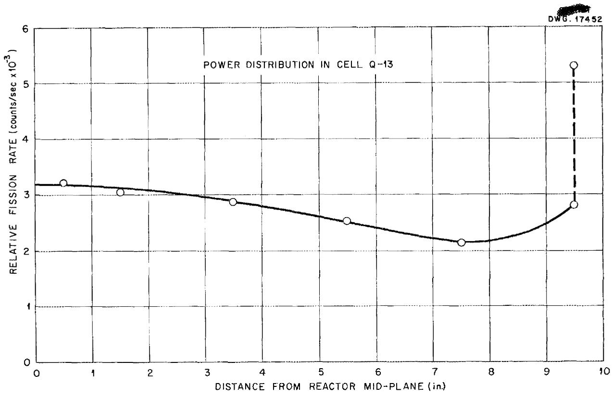  
Fig. 5.6. Power Distribution in Fuel.

insertion of an aluminum tube, identically loaded, in the same positions.

One of the projected measurements with this assembly was the evaluation of the regulating and safety rods of the ARE reactor. It was necessary to install the rod at the center of the core, thereby replacing the central fuel tube and the central column of BeO. As shown in Fig. 5.7, the removal of the fuel tube decreased the reactivity $1.07. Since the BeO column removal lowered the reactivity an additional $2.63, it became obvious that the loading was insufficient to permit a measurement of the rod.

The available excess reactivity was increased by adding $\mathbf{U}\mathbf{F}_{4}$ to the fuel mixture in the stainless steel, thereby increasing the $U^{235}$ density from 0.163 g/cm³ to 0.214 g/cm³. When the fuel mixture was reloaded in the BeO, the

system was again made critical with slightly less than 42 tubes containing approximately $5.2\mathrm{kg}$ of $\mathbf{U}^{235}$ . The installation of one of the ARE regulating rods and associated equipment required the addition of 13 fuel tubes, or approximately $1.6\mathrm{kg}$ of $\mathbf{U}^{235}$ to maintain the array in a critical condition. The rod was calibrated by measuring the increment of rod required to override a known positive reactor period. The calibration curve is given in Fig. 5.8. In the "zero" position, the bottom of the rod is at the level of the top of the BeO, and an initial increase in reactivity upon insertion of the (poison) rod is to be noted. Similarly, the insertion of the final few inches of the rod also increases the reactivity because of effects probably resulting from the competition between the poisoning by the rod and

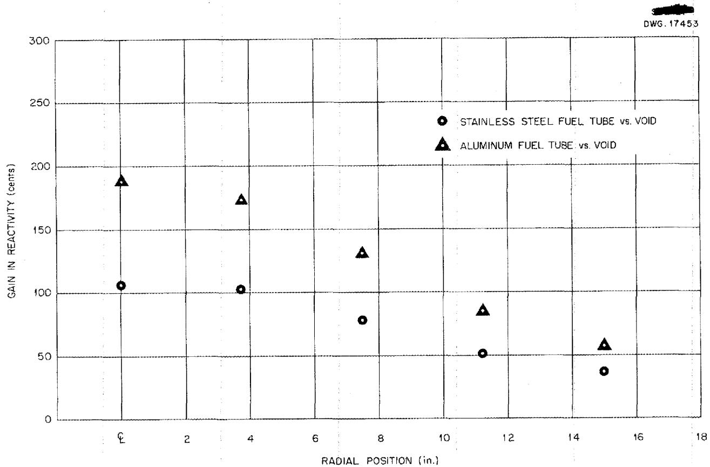  
Fig. 5.7. $\Delta k$ of Stainless Steel Fuel Tube at Various Points Along Reactor Radius.

neutron reflection by its stainless steel container in an otherwise unreflected or partly reflected region. The rod referred to here was a "weaker" rod than the others designed for the ARE. It was 2 in. in diameter, 30 in. long, and it contained 0.145 g of B₄C per linear inch. Its complete insertion decreased the reactivity by about $1.25.

Because of insufficient available excess reactivity, it was necessary to obtain an estimate of the poisoning by a second ARE regulating rod and by the ARE safety rod by the "rod drop" method, which utilizes the prompt transient of a sudden reactivity decrease and gives the result in terms of the effective delayed-neutron fraction. The rod assembly was mounted 7 1/2 in. from the center of the core,

and both the regulating rods and the safety rod were measured there. The following results were obtained: "weak" regulating rod (0.145 g of B₄C per linear inch), $0.80; "strong" regulating rod (0.68 g of B₄C per linear inch), $1.60; safety rod, $5.50.

In the Aircraft Reactor Experiment Hazards Summary Report (6) it was assumed that the regulating rod in the center of the core would be worth $0.4\%$ in $\Delta k / k$ , and that the safety rod at a position 7 1/2 in. from the center of the core would be worth $5\%$ in $\Delta k / k$ . Hence, the regulating rod seems to be somewhat more effective than necessary. The safety rod is somewhat less effective than was previously assumed,

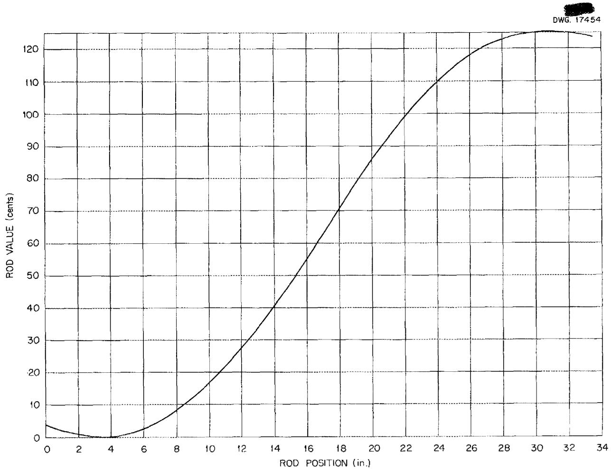  
Fig. 5.8. Calibration Curve of ARE Regulating Rod (weak).

but it is still regarded as adequate.

A comparison was made of the two fuels used in these experiments by substituting tubes containing fuel of the first loading (0.163 g of U $^{235}$ /cm $^{3}$ ) for tubes containing fuel of the second loading (0.214 g of U $^{235}$ /cm $^{3}$ ) at various points in the reactor core when it was otherwise loaded with the second fuel mixture. The losses in

reactivity incurred by this substitution are shown in Table 5.1. For a similar experiment, an Inconel tube was loaded with the second mixture and substituted for an identically loaded stainless steel tube. The losses caused by the Inconel are also shown in Table 5.1. This comparison is important since the ARE fuel tubes are fabricated of Inconel.

TABLE 5.1. LOSS IN REACTIVITY AT VARIOUS RADIAL POSITIONS CAUSED BY CHANGES IN CORE COMPONENTS   

<table><tr><td>RADIAL POSITION (in.)</td><td>REACTIVITY OF LOW DENSITY FUEL TUBE VS. NORMAL FUEL TUBE (cents)</td><td>REACTIVITY OF INCONEL FUEL TUBE VS. STAINLESS STEEL FUEL TUBE (cents)</td></tr><tr><td>3.7</td><td>29.0</td><td>27.2</td></tr><tr><td>7.5</td><td>21.1</td><td>24.8</td></tr><tr><td>11.3</td><td>14.5</td><td>17.2</td></tr><tr><td>15</td><td>9.0</td><td>10.1</td></tr></table>

Part II

SHIELDING RESEARCH

# SUMMARY AND INTRODUCTION

E.P.Blizard J.L.Meem,Associate Physics Division

The Lid Tank Facility has been applied directly in experiments needed to solve problems of immediate interest in the design of the air ducts through the reactor shield of the GE-Convair airplane (sec. 6). These experiments are essential, since the configuration is so complicated that it is practically impossible to calculate. Neutron and gamma isodoses around mockups of the GE-ANP inlet and outlet ducts have been obtained. The data obtained provide the information necessary for specification of the duct shields. In addition, some measurements have been made to determine the induced activities around the duct. The leakage around an alternate ducting arrangement is also being measured.

The Bulk Shielding Facility (sec.7) has been applied, in part, to further air-scattering experiments. Although these experiments are not yet conclusive, indications are that the earlier experiments gave doses that were too high; but the designs of the 1950 Shielding Board are not yet completely vindicated. The BSF has also been used to extend the spectral and dose measurements on the NEPA divided-shield mockup. These data will now be used to improve the calculation of the dose at the crew position. Additional experiments now under way at the BSF include the irradiation of animals and the measurement of the energy release per $\mathbf{U}^{235}$ fission.

The Tower Shielding Facility (sec. 8) has been approved and the Laboratory is committed to a schedule that calls

for completion of construction in November 1953. Detailed engineering design has been contracted to the architectural firm of Knappen, Tippetts, Abbott, McCarthy, who have revised the tower design to eliminate cantilever trusses. The new design had a significantly higher neutron-scattering background than earlier designs; consequently, alternate designs are now being studied. Initial tests with the completed facility, which will probably make use of the GE-Convair shield design, are scheduled to commence in 1954.

The nuclear measurement (sec. 10) studies include an experiment to determine the angular distribution of neutrons scattered from nitrogen and a new calibration of the fast-neutron dosimeter. The angular distribution of neutrons was measured by utilizing the 5-Mev Van de Graaff accelerator. Analyses of the pulse-height distributions of the nitrogen recoils indicate a definite change in the differential cross section of nitrogen that is associated with the resonance value and an increase in the forward scattering. The fast-neutron dosimeter was "calibrated," in a biological sense, at the Zero Power Reactor at Argonne National Laboratory by taking advantage of a situation in which a high fast-neutron dose was accidentally received by an individual. It was found that the ZPR leakage fluxes and fast-neutron dose readings in the water reflector were quite similar to those expected from a comparison with the BSF data.

# 6. DUCT TESTS IN LID TANK FACILITY

J. D. Flynn J. M. Miller

G. T. Chapman F. N. Watson

Physics Division

C. L. Storrs, GE-ANP

The Lid Tank Facility has been applied primarily to a study of air ducting for the GE-ANP reactor. Partial mockups of inlet and outlet "annular" ducts have been tested for neutron and gamma attenuation. The isodoses measured around the ducts indicate the proper shield shape in the presence of the ducts.

In addition, some experiments have been carried out to determine the activation of engines, structure, etc. to be expected from neutrons that leak out via the ducts. Possible methods of improving the situation were explored when it was seen that the activation could be excessive.

Multiple "wavy" cylindrical pipes were also tested as an alternate duct design. Although these are no doubt superior to the "annular" ducts as far as shielding is concerned, they present more difficult engineering problems.

# G-E OUTLET AIR DUCT

Neutron Dose Measurements. With the determination of the effect of the transition section on the fast-neutron dose and the thermal flux, the measurements on the G-E outlet air duct have been completed.(1) Figures 6.1 and 6.2 show thermal isodoses made with a $\mathbf{BF}_3$ counter and the automatic plotter. Figure 6.3 gives the results of centerline measurements with this counter. Fast-neutron measurements are exhibited in Figs. 6.4, 6.5, 6.6, and 6.7.

There is a slight discrepancy between the measurements of thermal and fast neutrons. The center-line data should coincide when the relaxation length exceeds 7.5 cm. The discrepancy has been attributed to changing

sensitivity of the $\mathbf{BF}_3$ counter during the month-long series of readings. Unlike the fast neutron dosimeter, this counter was not recalibrated during the thermal-neutron experiment. Despite the suspected slow drift in sensitivity, the shape of the isodoses should be reliable and should furnish adequate information on the effect of the transition section.

Two additional sources of error should be mentioned. The relays that operated the isodose plotter introduced a few spurious counts, which caused the plotter to operate 1 to 2 cm further from the source than it should have. Besides this, the effective center of counting moved about inside the detectors, depending upon the direction of the flux gradient, and introduced an error in position estimated at not more than 2 cm over the range from the center line to the side of the duct.

In repositioning the duct after changing the transition section, it was inevitable that a slight variation in the distance from the source axis should occur. Table 6.1, which gives the actual coordinates of four points on the duct identified in Fig. 6.1, may be used in making precise calculations - the drawings give only average position.

Calculated Neutron Dose. A calculation of the effect of the duct with no transition section on the centerline dose has been made with some success. As can be inferred from the isodose plots, the center-line dose is not affected much by the side arm of the duct. The calculation therefore deals with an 8 1/2-in. air space (essentially a void) in front of the source plate.

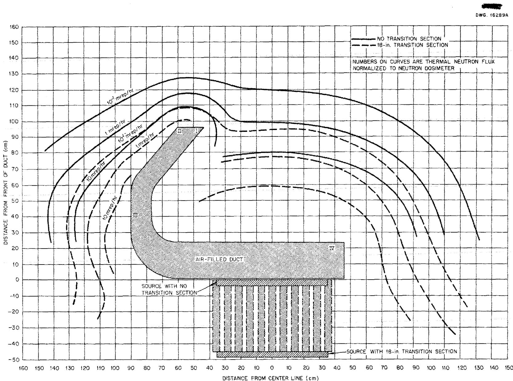  
Fig. 6.1. Thermal-Neutron Isodoses Around G-E Outlet Air Duct (Shutter Open).

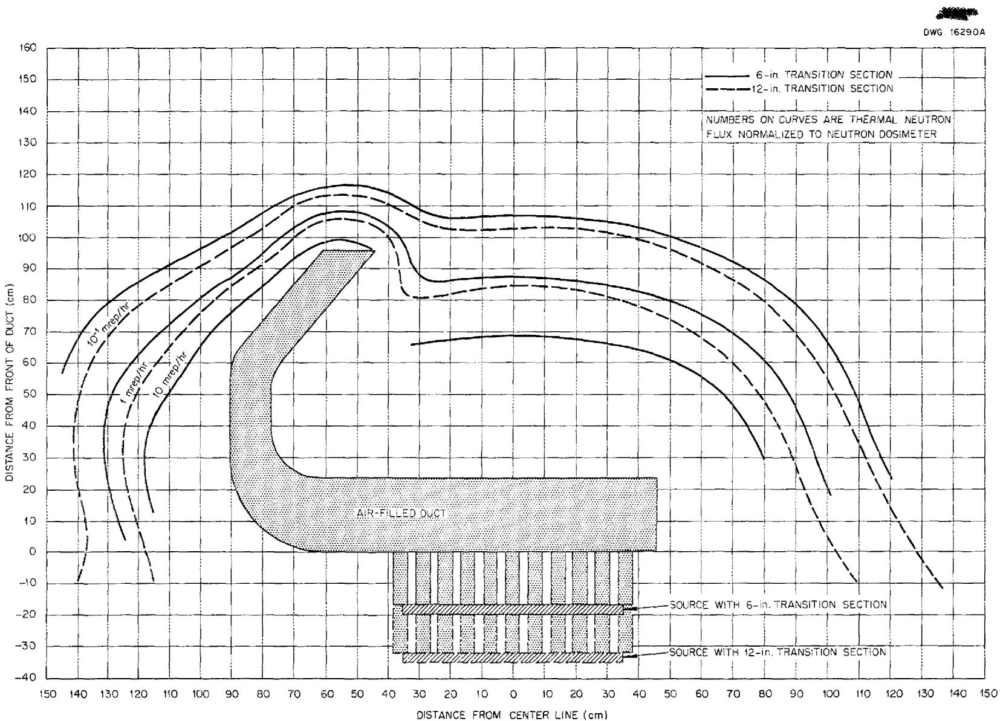  
Fig. 6.2. Thermal-Neutron Isodoses Around G-E Outlet Air Duct (Shutter Open).

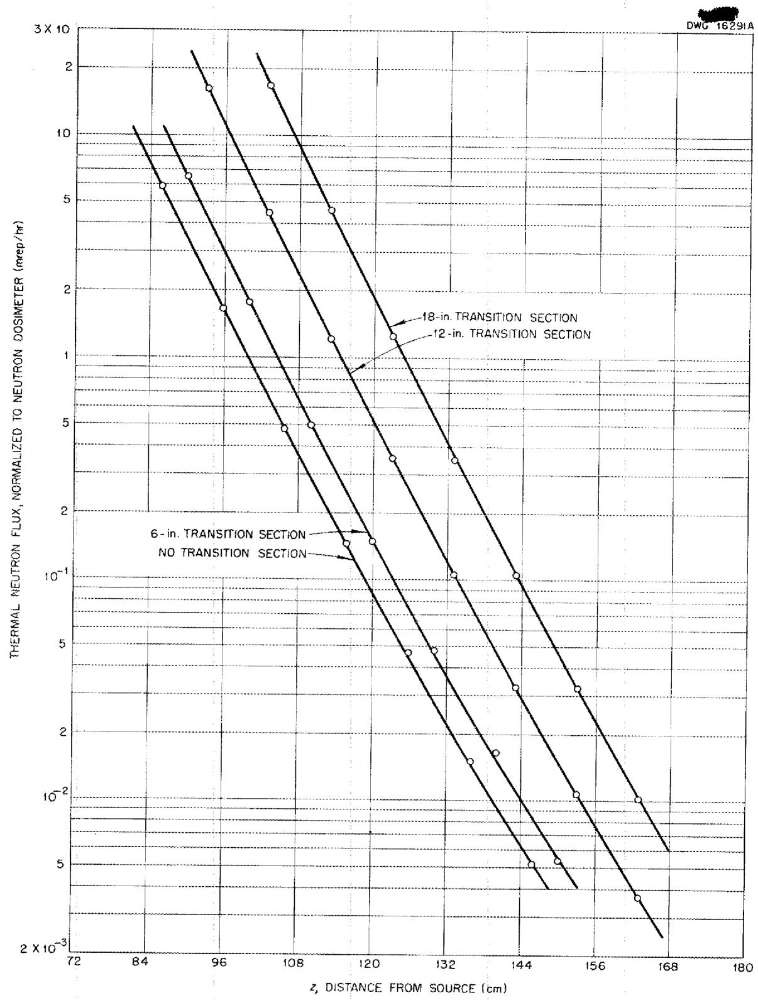  
Fig. 6.3. Thermal-Neutron Center-Line Measurements Behind G-E Outlet Air Duct (Shutter Open).

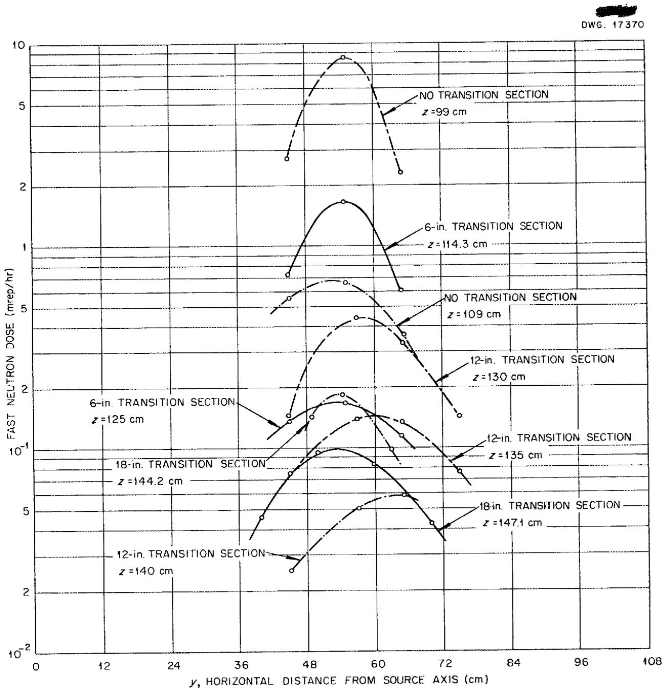  
Fig. 6.4. Fast-Neutron Dose at End of G-E Outlet Air Duct.

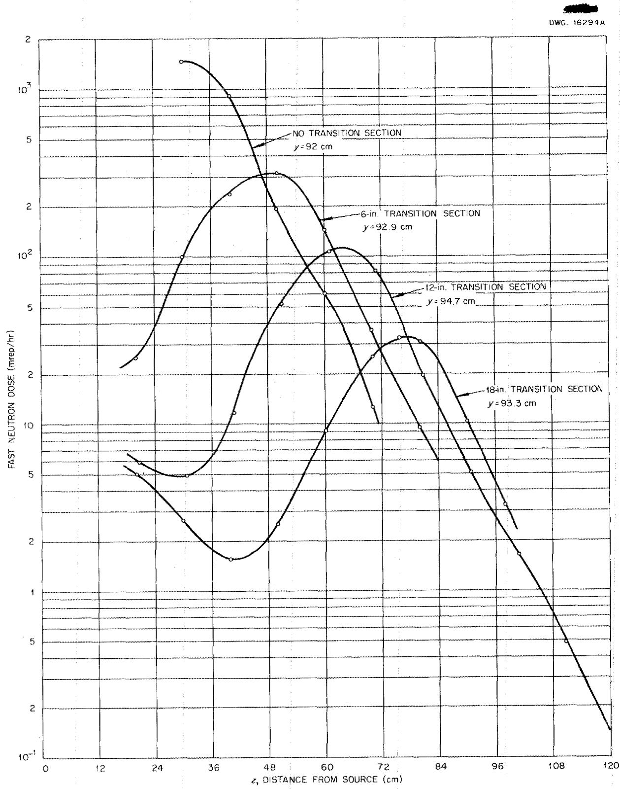  
Fig. 6.5. Fast-Neutron Dose at Side of G-E Outlet Air Duct, $92 \leq Y \leq 93.3$ .

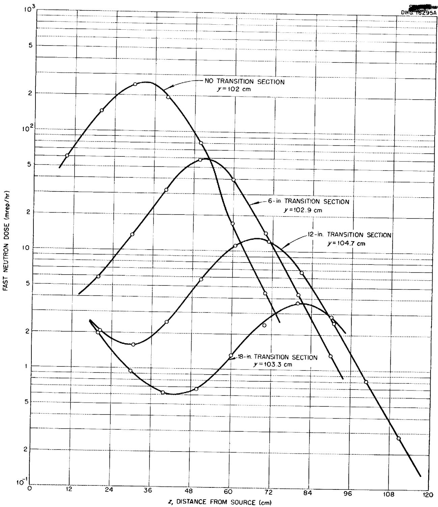  
Fig. 6.6. Fast-Neutron Dose at Side of G-E Outlet Air Duct, $102 \leq Y \leq 104.7$ .

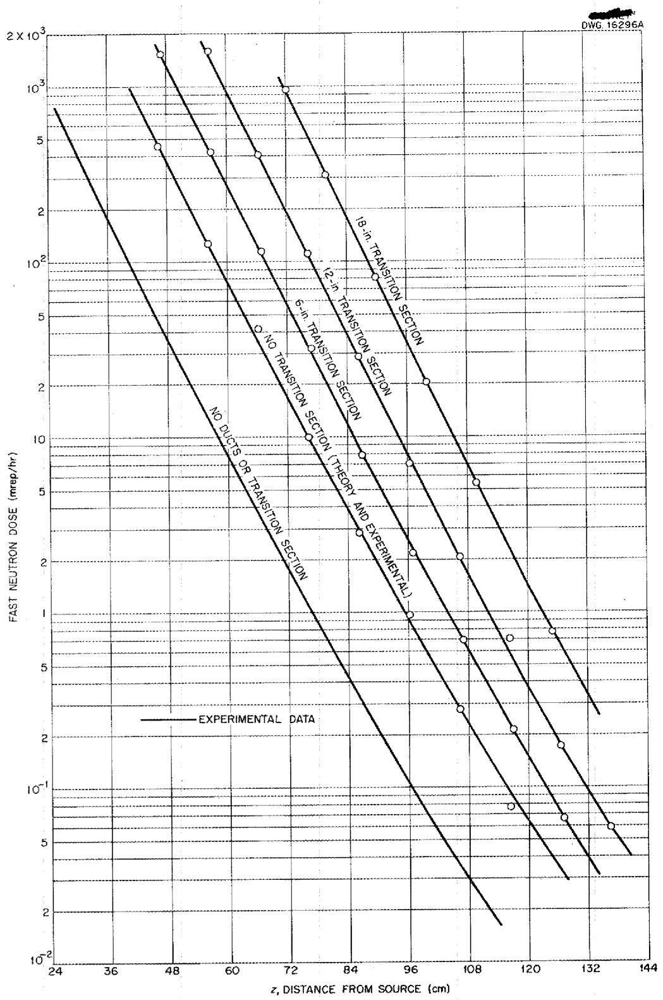  
Fig. 6.7. Fast-Neutron Center-Line Measurements with G-E Outlet Air Duct and Various Transition Sections.

TABLE 6.1. COORDINATES OF FIDUCIAL POINTS FOR FIG. 6.1   

<table><tr><td rowspan="2">LENGTH OF TRANSITION SECTION (in.)</td><td rowspan="2">POSITION Y(cm)</td><td rowspan="2">I z(cm)</td><td rowspan="2">II Y(cm)</td><td rowspan="2">III Y(cm)</td><td colspan="2">IV</td></tr><tr><td>Y(cm)</td><td>z(cm)</td></tr><tr><td>0</td><td>43.1</td><td>97.0</td><td>61.0</td><td>90.9</td><td>45.9</td><td>23.3</td></tr><tr><td>6</td><td>44.8</td><td>111.3</td><td>62.4</td><td>91.9</td><td>45.1</td><td>40.2</td></tr><tr><td>12</td><td>46.0</td><td>128.7</td><td>63.7</td><td>93.7</td><td>43.4</td><td>55.5</td></tr><tr><td>18</td><td>45.4</td><td>144.2</td><td>62.3</td><td>92.2</td><td>44.5</td><td>71.5</td></tr></table>

The neutron dose for this configuration has been obtained from the data with water alone by using a simple assumption. The dose at a distance $r$ in water from an isotropic point-source of strength $dS^{(2)}$ is

$$
d D (r) = d S \frac {G (r)}{4 \pi r ^ {2}},
$$

where $G(r)$ is an undetermined function of $r$ . Integration of this expression over a source disk of radius $a$ gives, for a point on the axis at a distance $Z$ from the source,

$$
d (Z) = \frac {\sigma}{2} \int_ {Z} ^ {R} \frac {G (r)}{r} d r,
$$

where $\sigma$ is the specific source strength in neutrons/cm²·sec, and $R$ is the distance from the edge of the source to the detector.

Now, consider the case in which there is a plane-bounded void of thickness $(r - r^{\prime})$ between source and detector, which are still separated by a distance $r$ . For a point source, assume the dose to be

$$
d D _ {v} \left(r, r ^ {\prime}\right) = d S \frac {G \left(r ^ {\prime}\right)}{4 \pi r ^ {2}}.
$$

Integrating this as before gives

$$
D _ {v} \left(Z, Z ^ {\prime}\right) = \frac {\sigma}{2} \int_ {Z} ^ {R} \frac {G \left(r ^ {\prime}\right)}{r} d r.
$$

Since the ratio of $r$ to $r'$ is a con-

stant throughout this integration,

$$
D _ {r} \left(Z, Z ^ {\prime}\right) = \frac {\sigma}{2} \int_ {Z ^ {\prime}} ^ {R ^ {\prime}} \frac {G \left(r ^ {\prime}\right)}{r ^ {\prime}} d r ^ {\prime},
$$

where $R'$ is the distance, in water, between the edge of the source and the detector. By referring to a sketch of the geometry, Fig. 6.8, and to the previous integral, it is immediately apparent that this expression is just the dose at a distance $Z'$ in water alone from a source of reduced radius $a'$ , where $a'$ is given simply by the ratio

$$
\frac {a ^ {\prime}}{a} = \frac {z ^ {\prime}}{z}.
$$

To find the dose that would be measured with a source of different radius, an approximation given by Blizzard to the Hurwitz transformation from a disk to an infinite plane source is used; that is, the transformation is made from the data for water alone and the actual source radius, to an infinite plane source, and from this back to a source of smaller radius. The approximate ratio of dose with infinite source to that with source of radius $a$ is

$$
\frac {D \left(Z ^ {\prime} , \infty\right)}{D \left(Z ^ {\prime} , a\right)} \gtrsim \frac {1}{2} + a,
$$

$$
a = \frac {2 \lambda^ {2}}{a ^ {2}} \left(\frac {Z ^ {\prime}}{\lambda} + 1\right),
$$

where $\lambda$ is the relaxation length of the water.

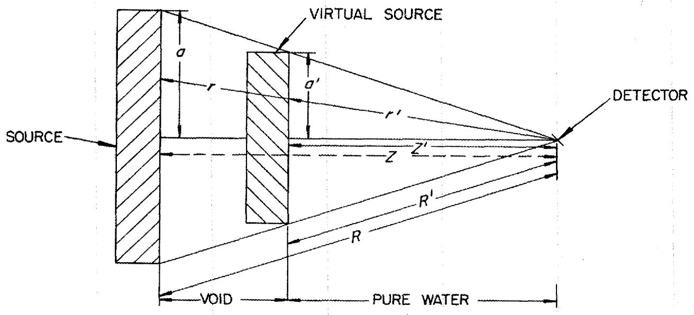  
Fig. 6.8. Geometry for Calculating the Effect of a Void on Neutron Dose.

With the obvious substitutions, the dose at a distance $Z$ with a void of thickness $Z - Z'$ becomes

$$
D _ {v} (Z) = D \left(Z ^ {\prime}\right) \frac {1 + 2 \alpha}{1 + 2 \alpha},
$$

$$
\alpha^ {\prime} = \frac {2 \lambda^ {2}}{a ^ {\prime 2}} \left(\frac {Z ^ {\prime}}{\lambda} + 1\right), \quad \frac {a ^ {\prime}}{a} = \frac {Z ^ {\prime}}{Z},
$$

where $D_{v}(Z)$ is the dose with a void and $D(Z)$ is the dose with water alone. The curve in Fig. 6.7, labeled "no transition section," was calculated by using this formula. The experimental points are also indicated, and it can be seen that the agreement between experimental data and the calculations is excellent.

Some very rough calculations have been made to explain the effect of the transition sections on the center-line data. If the water sections are assumed to be opaque to neutrons, the calculated dose is lower than the observed dose. More accurate calculations are yet to be made.

# G-E INLET AIR DUCT

A mockup of the G-E inlet air duct has been tested in the Lid Tank Facility. Some gamma shielding in the form of slabs of 7/8 in. of iron and 1 1/2 in. of lead was used to simulate the design shield along the center line. In spite of care in choosing from available slabs of iron and lead, it was impossible to make the mockup simulate the actual situation very closely. As a consequence, caution should be used in applying the gamma data to the design.

Thermal- and fast-neutron and gamma data were taken with the standard Lid Tank instruments, and the results have been converted into isodose plots, Figs. 6.9 and 6.10. It is unfortunate that the source strength was completely inadequate to enable measurement of the fast-neutron dose at the end of the duct.

The final step in this experiment was to study the attenuation of the

  
DWG.17159

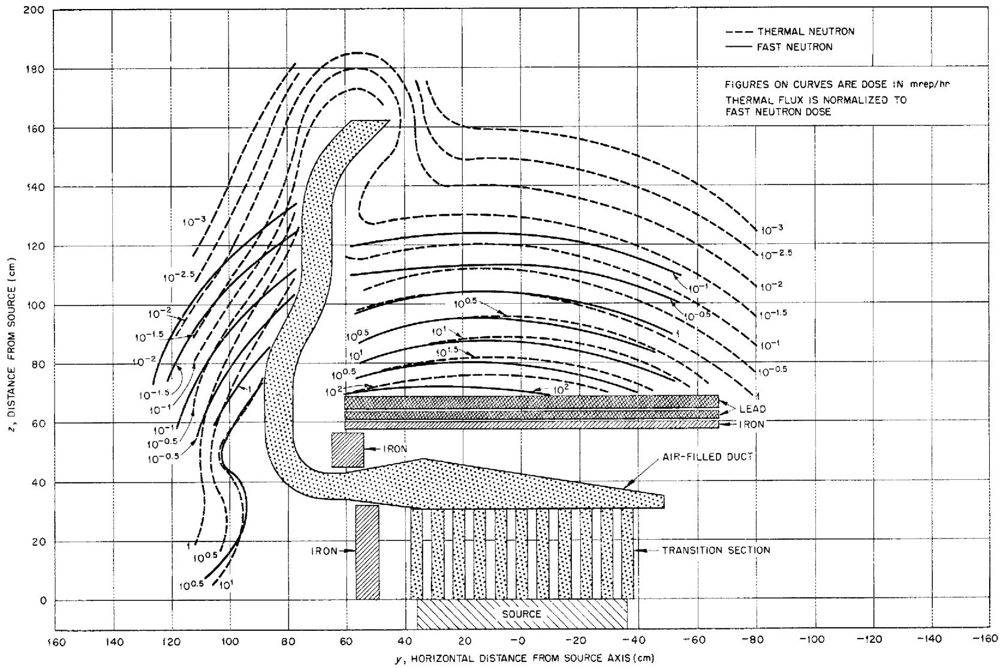  
Fig. 6.9. Neutron-Isodose Measurements Around G-E Inlet Air Duct Mockup.

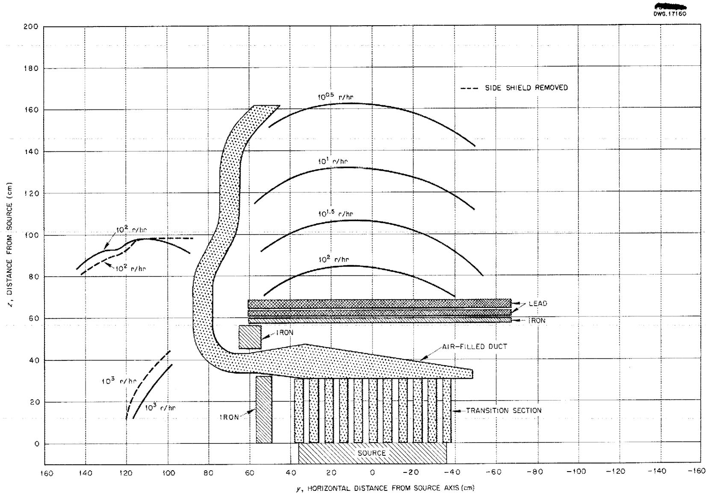  
Fig. 6.10. Gamma-Isodose Measurements Around G-E Inlet Air Duct Mockup.

PERIOD ENDING DECEMBER 10, 1952

gamma shield. Center-line traverses were made as the shielding slabs were successively removed. The results appear in Fig. 6.11.

# INDUCED ACTIVITY AROUND A DUCT

An experiment has been performed in the Lid Tank Facility with the primary object of determining the order of magnitude of the induced radioactivity to be expected outside the air ducts in the GE-ANP initial engine shield. In addition, it was desired to estimate the value of thin boron shields in lowering this activity, to investigate the utility of $\mathbf{BF}_3$ -counter measurements in predicting activation, and to determine the effect of borating the shield water around the ducts.

The mockup of the G-E outlet air duct that had been previously tested(3) was modified by the addition of a tank so that borated water could be placed around the duct. Figure 6.12 shows the configuration. The outside of this tank simulated the outside of the design shield. Measurements were made at the end and the side of the duct, as indicated in Fig. 6.12.

Two types of measurements were undertaken: samples of cobalt and manganese were exposed and their activities measured, and traverses were made with a $\mathbf{BF}_3$ counter. In all cases, various thermal-neutron shields were used, and the results were compared with unshielded measurements. Data were obtained with both pure and borated water around the duct.

The induced activities under various conditions are tabulated in Table 6.2, and the results of the counter traverses are presented graphically in Figs. 6.13, 6.14, 6.15, and 6.16. Figure 6.17 depicts the results of centerline traverses with no duct in the tank but with various thermal shields around the counter.

Since the activation measurements were of an exploratory nature, a complete investigation of all combinations of parameters was not attempted. The samples were prepared hurriedly, and therefore errors of $30\%$ are to be expected from differences in the geometry of exposure and counting. In the low flux available in this experiment, the cobalt did not become radioactive enough to afford an accurate measurement of its activity.

The various ratios of counting rates are given in Tables 6.3, 6.4, and 6.5, which show, respectively, the effect of thermal shields, a comparison between the counting rates at the side and end of the duct, and the effect of borating the shield water.

It is apparent that a thin boron layer is far more effective in shielding the boron counter than in shielding either manganese or cobalt. This is to be expected, since an important part of the activation of the latter is due to resonance absorption at epithermal energies where the boron cross section is relatively low.

The variously shielded detectors are sensitive to different neutron energies, and therefore an indication of the comparative neutron spectra at the side and the end of the duct can be obtained by comparing the counting rates under these conditions. When the expected experimental errors are considered, there does not seem to be evidence of significant differences in the spectra at these two positions. With pure water in the tank, there are more epithermal neutrons than thermal neutrons; or looking at the situation from the opposite viewpoint, the ducts increased the thermal flux. Under these conditions, a conservative estimate can be made of the expected activation around a ducted shield from the readings of a $\mathrm{BF}_3$ counter, provided an experimental comparison has been made at some point without ducts.

It was at first a surprise to find that adding boron to the shield water

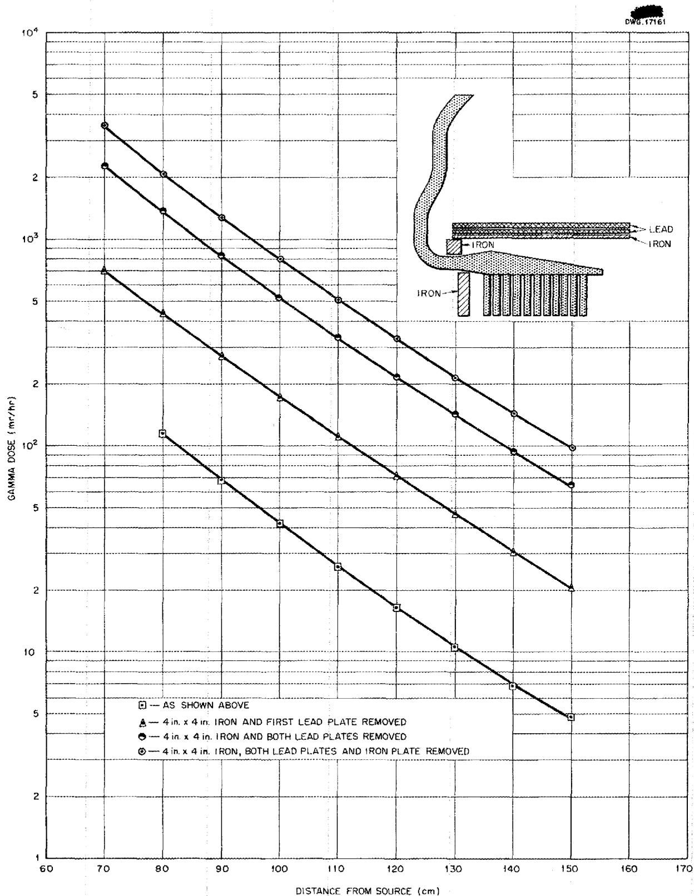  
Fig. 6.11. Gamma Center-Line Measurements with G-E Inlet Air Duct.

increased the flux of epithermal neutrons by about $25\%$ . However, calculations of the amount of water displaced in adding the boron showed that the result is quite reasonable. The borated water contained 1.005 wt $\%$ boron and 1.7 wt $\%$ potassium and had a specific gravity of 1.0403. Thus, there was a displacement of $1.3\%$ of the hydrogen, which resulted in higher epithermal flux. The thermal neutrons were naturally greatly reduced by the boron. However, placing a thin layer of boron at the surface of the shield would eliminate thermal neutrons without displacing so much water.

# RADIATION AROUND AN ARRAY OF CYLINDRICAL DUCTS

Previous measurements of the radiation around mockups of the annular air ducts for the G-E reactor showed that these ducts will permit the escape of a large flux of fast neutrons through the sides of the shield. Furthermore, this annular duct configuration is undesirable because of its large weight. In view of these considerations, it was desired to study the shielding properties of an alternative ducting method, namely, an array of bent cylindrical ducts.

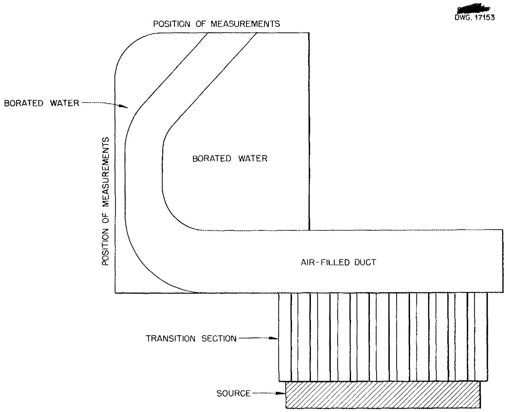  
Fig. 6.12. Configuration for Induced-Activity Measurements on G-E Outlet Air Duct.

Figure 6.18 is a photograph of the bent cylindrical ducts in position in the Lid Tank Facility. There are 19, round, aluminum pipes in a hexagonal array. Each pipe has an outside diameter of 3 15/16 in. and 1/16-in. walls. The pipes have three straight sections 22 in. long connected with 45-deg bends. In the plane of the source plate, the centers of the pipes define equilateral triangles with sides 7.33 in. long. Since the ducts leave the source plate at an angle of 22.5 deg to the normal, the array is not symmetrical about the source axis. With this arrangement, the fractions of the total volume that are air, water, and aluminum are 26.6, 71.8, and $1.6\%$ , respectively.

The radiation measurements around this array have been obtained in considerable detail. An analysis of the results shows that the gamma dose can

be accurately computed by considering the ducts and water to be a homogeneous shield of appropriately reduced density. The neutrons, however, stream through the ducts in sufficient numbers to increase the flux at the end to one or two orders of magnitude greater than that predicted on a reduced density basis. This is in accordance with the duct theory proposed by Simon and Clifford, that is, geometrical attenuation along the straight sections and inverse sine reflection at the bends. The design of this particular array is not optimum, since the attenuation through the ducts is not high enough to exceed that through the equivalent amount of water. An optimum design might have another bend in the ducts to increase their attenuation, or closer spacing between ducts to further reduce the density of the equivalent homogeneous shield.

TABLE 6.2. SUMMARY OF ACTIVITIES INDUCED IN THE LID TANK FACILITY   

<table><tr><td>SAMPLE</td><td>NEUTRON SHIELD</td><td>POSITION</td><td>WATER AROUND DUCT</td><td>ACTIVITY INDUCED (mc/g)</td></tr><tr><td colspan="5">Outlet Duct</td></tr><tr><td rowspan="4">Cobalt</td><td>None</td><td>End</td><td>Borated</td><td>58.1 ± 9.6 × 10-10</td></tr><tr><td>Boron cover</td><td>End</td><td>Borated</td><td>5.5 ± 9.1 × 10-10</td></tr><tr><td>None</td><td>Side</td><td>Borated</td><td>138.3 ± 10.1 × 10-10</td></tr><tr><td>Boron cover</td><td>Side</td><td>Borated</td><td>18.3 ± 9.3 × 10-10</td></tr><tr><td rowspan="6">Manganese</td><td>None</td><td>End</td><td>Plain</td><td>178.5 ± 1.5 × 10-8</td></tr><tr><td>Boron cover</td><td>End</td><td>Plain</td><td>4.64 ± 0.17 × 10-8</td></tr><tr><td>Boron backing</td><td>End</td><td>Borated</td><td>68.3 ± 1.0 × 10-8</td></tr><tr><td>Boron cover</td><td>End</td><td>Borated</td><td>3.16 ± 0.16 × 10-8</td></tr><tr><td>Boron backing</td><td>Side</td><td>Borated</td><td>124.3 ± 0.8 × 10-8</td></tr><tr><td>Boron cover</td><td>Side</td><td>Borated</td><td>11.7 ± 0.3 × 10-8</td></tr><tr><td colspan="5">Inlet Duct</td></tr><tr><td rowspan="2">Manganese</td><td>None</td><td>End</td><td>Plain</td><td>1.04 ± 0.15 × 10-7</td></tr><tr><td>None</td><td>Side</td><td>Plain</td><td>2.57 ± 0.02 × 10-4</td></tr></table>

Notes: (1) Manganese activated to saturation at 6-watt source strength. (2) Cobalt activated 100 hr at 6 watts. (3) The error factors given are standard deviation of counts taken and do not include systematic errors.

TABLE 6.3.EFFECT OF THERMAL SHIELDS ON EXTERIOR ACTIVATION   

<table><tr><td rowspan="2">DETECTOR</td><td rowspan="2">POSITION</td><td rowspan="2">RATIO MEASURED</td><td colspan="2">RATIO OF COUNTS</td></tr><tr><td>In Plain Water</td><td>In Borated Water</td></tr><tr><td rowspan="9">Boron</td><td rowspan="3">Side</td><td>Bare to Cd covered</td><td>57</td><td>26</td></tr><tr><td>Bare to B covered</td><td>250</td><td>130</td></tr><tr><td>Cd covered to B covered</td><td>4.4</td><td>5.0</td></tr><tr><td rowspan="3">End</td><td>Bare to Cd covered</td><td>41</td><td>26</td></tr><tr><td>Bare to B covered</td><td>230</td><td>150</td></tr><tr><td>Cd covered to B covered</td><td>5.6</td><td>5.7</td></tr><tr><td rowspan="3">No ducts</td><td>Bare to Cd covered</td><td>40</td><td></td></tr><tr><td>Bare to B covered</td><td>180</td><td></td></tr><tr><td>Cd covered to B covered</td><td>4.4</td><td></td></tr><tr><td rowspan="2">Cobalt</td><td>Side</td><td>Bare to B covered</td><td></td><td>5 to 15</td></tr><tr><td>End</td><td>Bare to B covered</td><td></td><td>4 to 100</td></tr><tr><td rowspan="3">Manganese</td><td rowspan="2">End</td><td>Bare to B covered</td><td>39</td><td></td></tr><tr><td>B backed to B covered</td><td></td><td>22</td></tr><tr><td>Side</td><td>B backed to B covered</td><td></td><td>11</td></tr></table>

TABLE 6.4. RATIO OF EXTERIOR ACTIVATION AT SIDE TO EXTERIOR ACTIVATION AT END   

<table><tr><td rowspan="2">DETECTOR</td><td rowspan="2">SHIELD</td><td rowspan="2">RATIO MEASURED</td><td colspan="2">RATIO OF COUNTS</td></tr><tr><td>In Plain Water</td><td>In Borated Water</td></tr><tr><td rowspan="3">Boron</td><td>None</td><td>Side to end</td><td>3.4</td><td>2.9</td></tr><tr><td>Cd cover</td><td>Side to end</td><td>2.5</td><td>2.9</td></tr><tr><td>B cover</td><td>Side to end</td><td>3.1</td><td>3.3</td></tr><tr><td rowspan="2">Cobalt</td><td>None</td><td>Side to end</td><td></td><td>2.4 ± 1</td></tr><tr><td>B cover</td><td>Side to end</td><td></td><td>3</td></tr><tr><td rowspan="2">Manganese</td><td>B backed</td><td>Side to end</td><td></td><td>1.8</td></tr><tr><td>B cover</td><td>Side to end</td><td></td><td>3.7</td></tr></table>

TABLE 6.5.EFFECT OF WATER BORATION ON ACTIVATION   

<table><tr><td rowspan="2">DETECTOR</td><td rowspan="2">SHIELD</td><td rowspan="2">RATIO MEASURED</td><td colspan="2">RATIO OF COUNTS</td></tr><tr><td>At Side of Duct</td><td>At End of Duct</td></tr><tr><td rowspan="3">Boron</td><td>None</td><td>Plain to borated</td><td>1.4</td><td>1.2</td></tr><tr><td>Cd cover</td><td>Plain to borated</td><td>0.64</td><td>0.75</td></tr><tr><td>B cover</td><td>Plain to borated</td><td>0.73</td><td>0.77</td></tr><tr><td>Manganese</td><td>B cover</td><td>Plain to borated</td><td>0.73</td><td>1.5</td></tr></table>

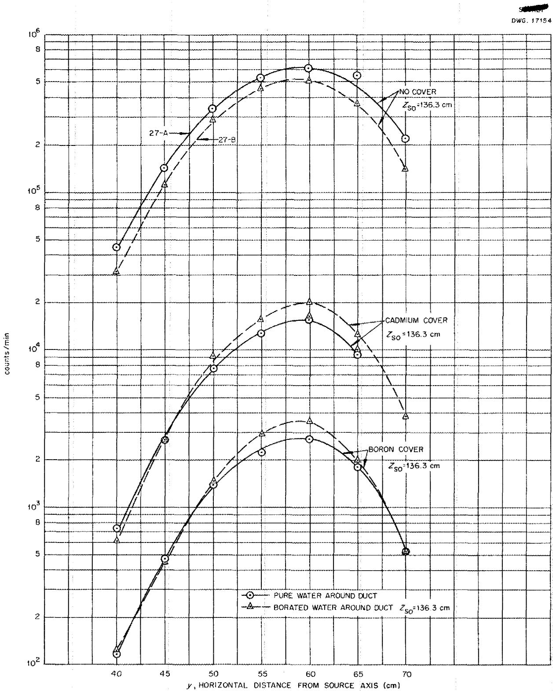  
Fig. 6.13. Boron-Counter Measurements at End of G-E Outlet Air Duct.

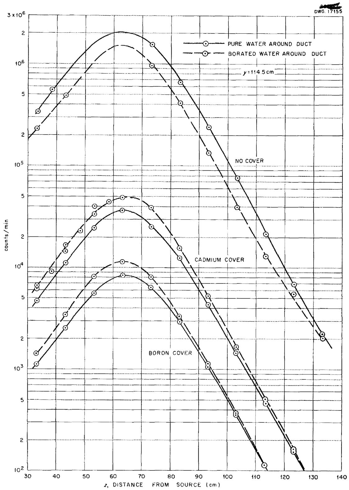  
Fig. 6.14. Boron-Counter Measurements at Side of G-E Outlet Air Duct.

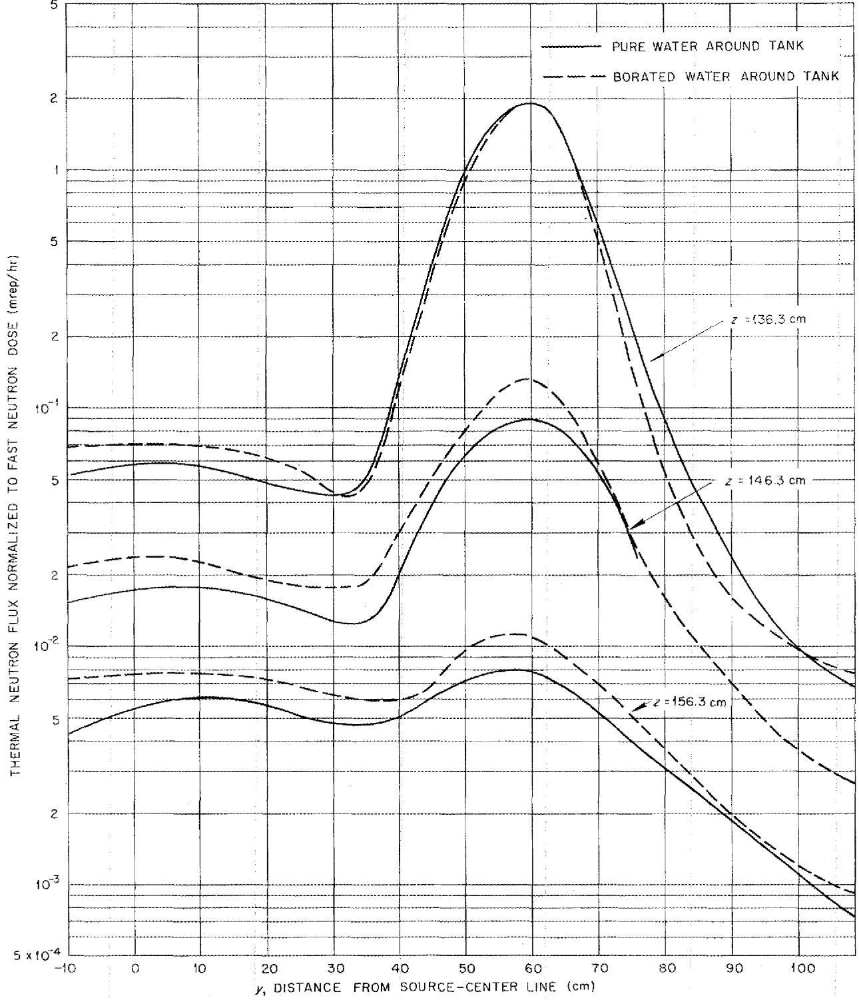  
DWG.17156   
Fig. 6.15. Thermal-Neutron Measurements at End of G-E Outlet Air Duct.

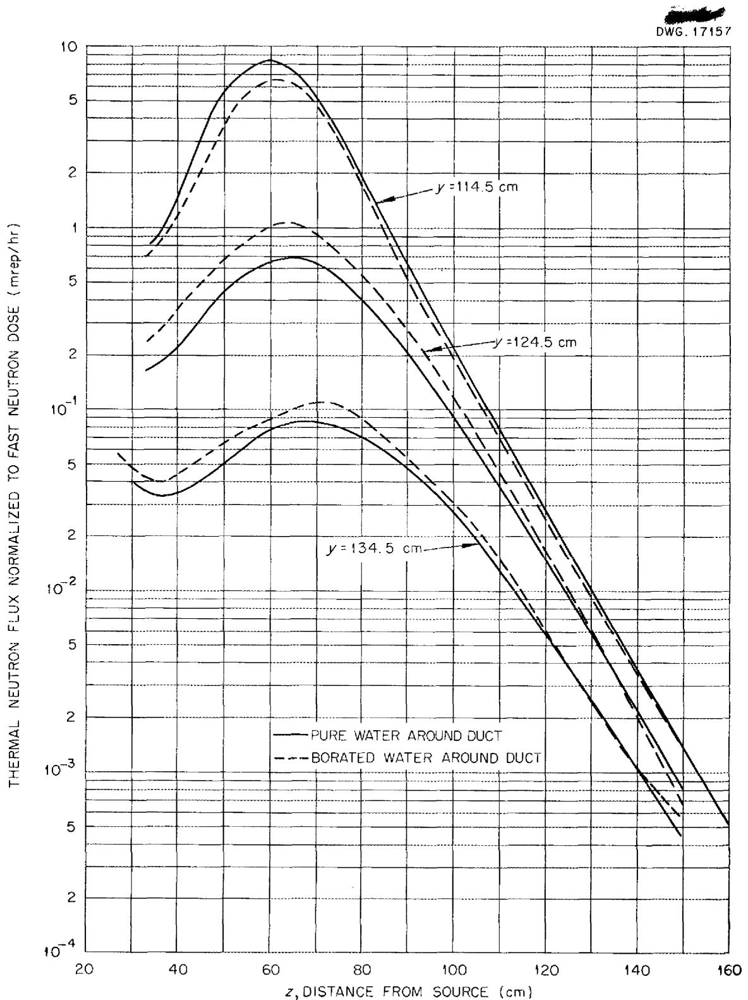  
Fig. 6.16. Thermal-Neutron Measurements at Side of G-E Outlet Air Duct.

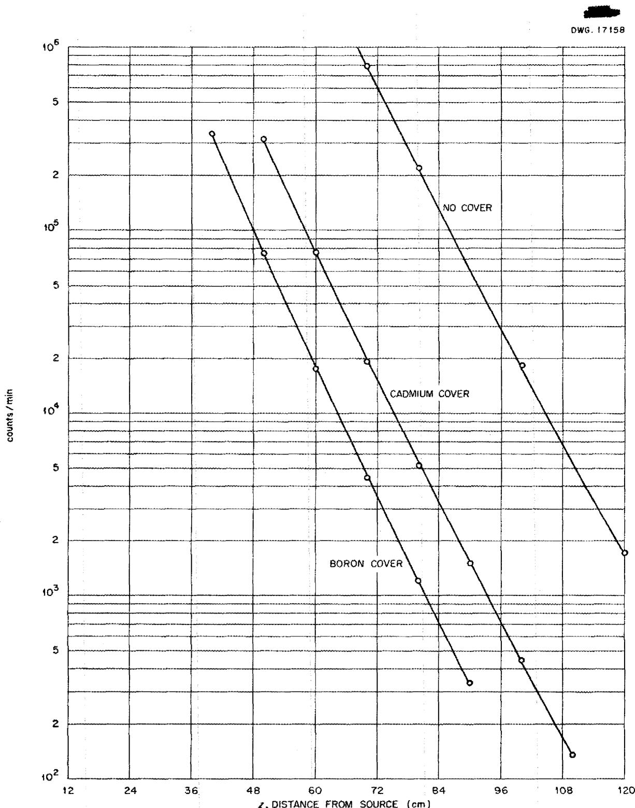  
Fig.6. Boron Counter Centerline Measurements in Pure Water.   
Fig. 6.17. Boron-Counter Center-Line Measurements in Pure Water.

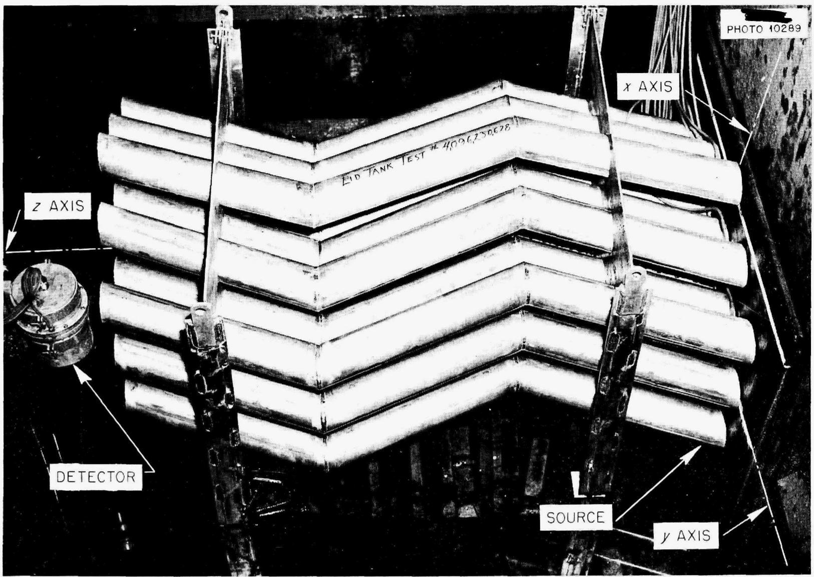  
Fig. 6.18. Multiple Cylindrical Ducts in the Lid Tank Facility.

# 7. BULK SHIELDING FACILITY

J. L. Meem

R. G. Cochran

M.P.Haydon

K. M. Henry

H. E. Hungerford

E. B. Johnson   
J. K. Leslie   
T. A. Love   
F. C. Maienschein   
G. M. McCammon

Physics Di

position and orientation of the spectrometer. The angle $\theta$ for the measurements with $\psi = 60$ deg and $\psi = 0$ was determined so that the spectrometer collimator would always look at the edge of the lead disks in the divided-shield mockup.

Gamma-ray spectral measurements on the divided-shield mockup have been extended, and the neutron and gamma dose measurements on the shield mockup are reported. The air-scattering experiments with the reactor at 100 kw are now under way, and the program of irradiating monkeys with the reactor has been started.

# MEASUREMENTS WITH THE DIVIDED-SHIELD MockUP

Two further sets of measurements of gamma-ray energy spectra and angular distributions from the divided-shield mockup (with lead disks) were made after a preliminary attempt by the NDA group to calculate the dose to be expected at the crew position. The measurements were made at $\psi = 60$ deg, $\theta =$ variable, (1) and $\psi = 60$ deg, $\phi =$ variable. The energy spectra obtained are shown in Figs. 7.1 and 7.2, and the angular distribution for the angle $\theta$ is shown in Fig. 7.3. For all measurements, the spectrometer collimator remained horizontal.

Table 7.1 shows all gamma-ray spectral measurements completed since the last tabular summary.(2) It is expected that the information is now sufficiently complete to enable an accurate calculation of gamma dose at the crew position.

Since the collimator is always kept horizontal in the measurements, $\psi, \phi,$ and $\theta$ are sufficient to specify the

Center-line measurements of gamma-ray and fast-neutron dosages and also thermal-neutron flux have been completed and are shown in Figs. 7.4, 7.5, and 7.6. The attenuation curves are shown with and without the shield in place. It should be remembered that for these measurements the reactor had a beryllium oxide reflector.(3) The dashed curves on Figs. 7.4, 7.5, and 7.6 represent the center-line data(4) with the water-reflected reactor.

# AIR-SCATTERING EXPERIMENTS

The air-scattering experiments with the reactor at a power of 100 kw are well under way. Indications are that the previous measurements, reported last quarter, were somewhat pessimistic, but confirmation of the ANP-53 shield design(5) is not yet clear. It is to be expected that these experiments will soon be concluded, since the BSF is poorly adapted to air-scattering measurements.

# Irradiation of ANIMALS(6)

The program of irradiating monkeys by using the reactor, as outlined in   
(3) ANP Quar. Prog. Rep. March 10, 1952, ORNL-1227, p. 76.   
(4) ANP Quar. Prog. Rep. June 10, 1951, ANP-65, p. 110.   
(5)Report of the Shielding Board for the Aircraft Nuclear Propulsion Program, ANP-53 (Oct. 16, 1950).   
(6) This is a joint program in which the USAF School of Aviation Medicine, Consolidated Vultee Aircraft Corporation, and Wright Air Development Center, as well as ORNL, are participating.

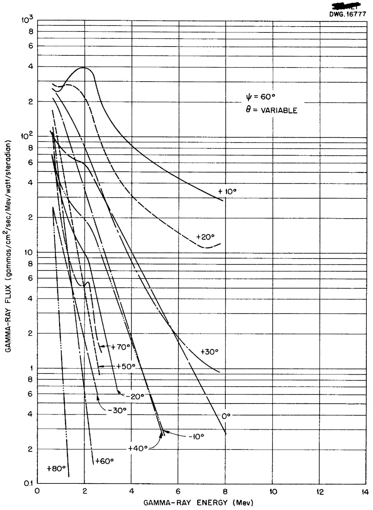  
Fig. 7.1. Gamma-Ray Flux at Edge of Lead Disk.

DWG.16776

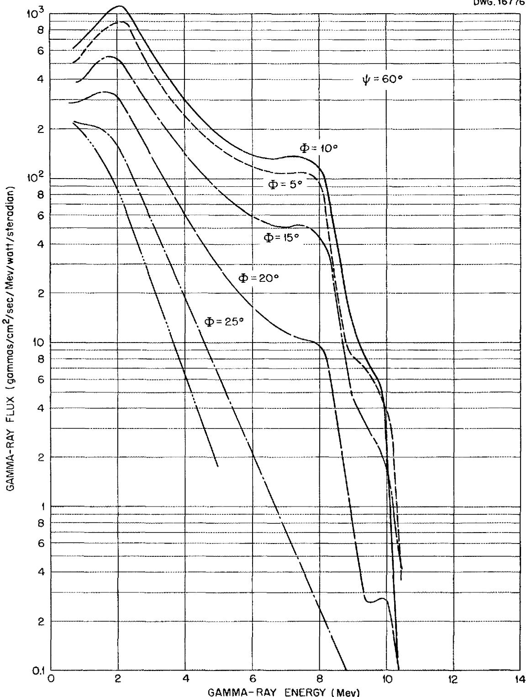  
Fig. 7.2. Gamma-Ray Flux at Edge of Lead Disk as a Function of the Azimuth Angle.

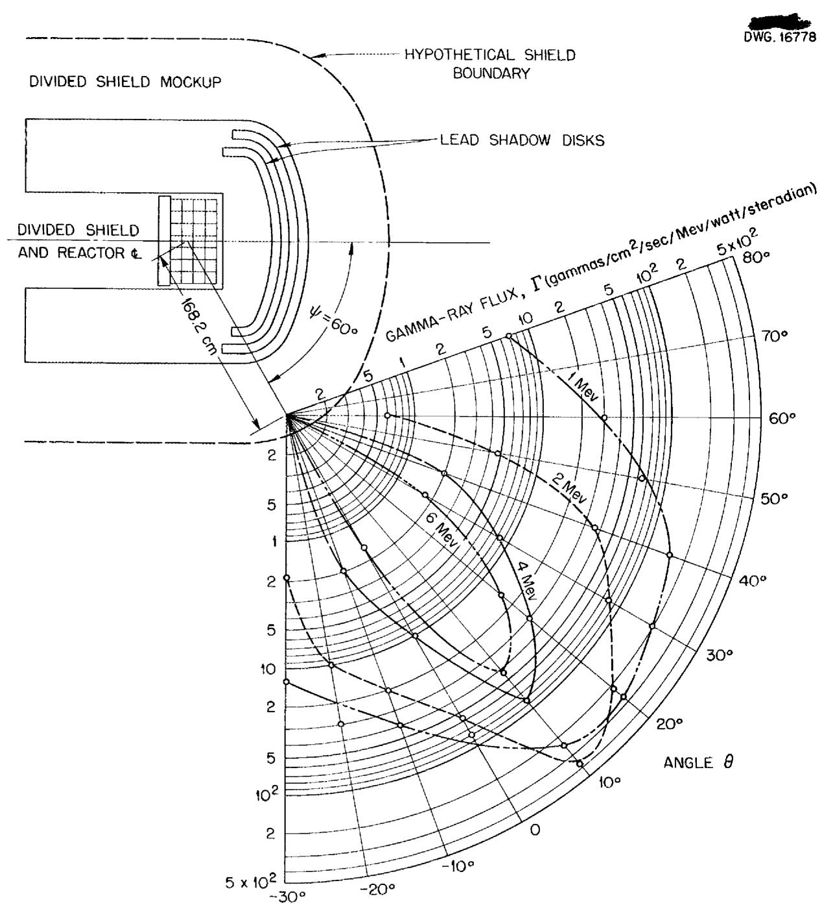  
Fig. 7.3. Gamma-Ray Flux as a Function of Angle for Energies as Shown (DSML, $\psi = 60^{\circ}$ ).

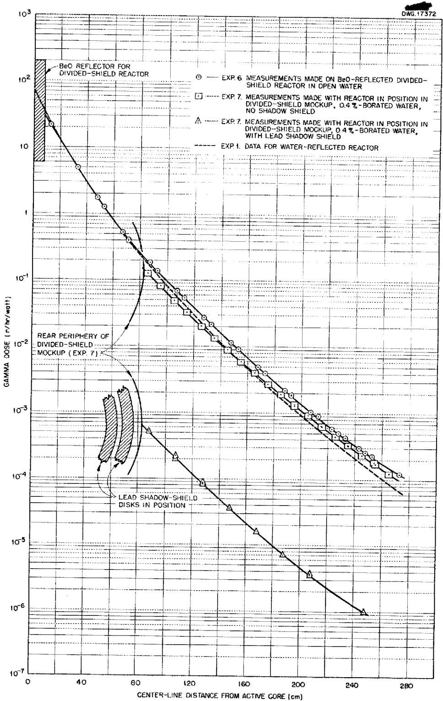  
Fig. 7.4. Gamma-Radiation Measurements Along Center Line of the Divided-Shield Mockup in the Bulk Shielding Facility.

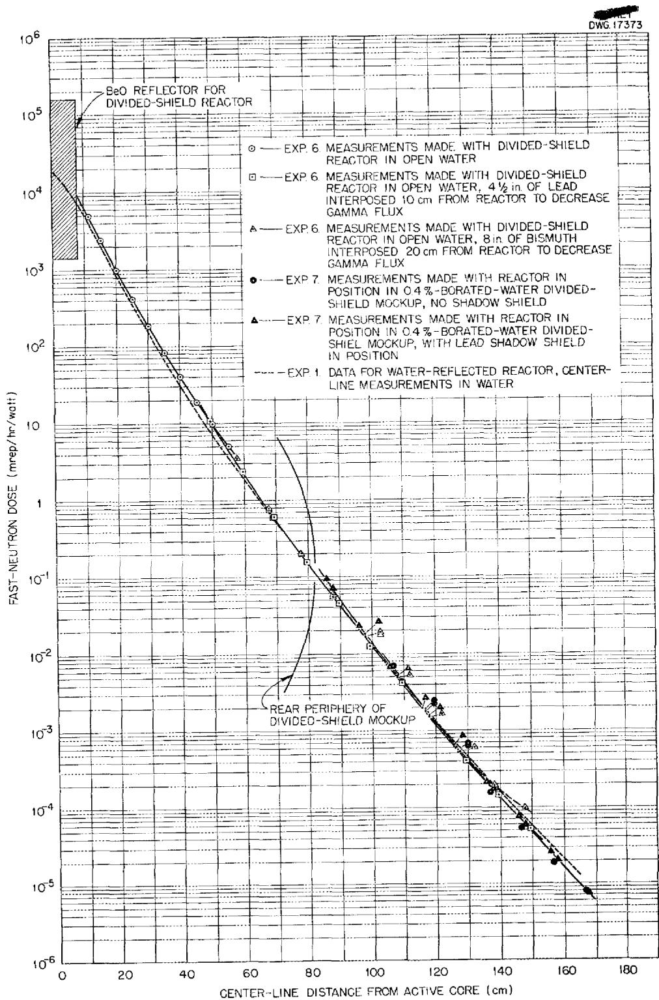  
Fig. 7.5. Fast-Neutron Dose Measurements Along Center Line of the Divided-Shield Mockup in the Bulk Shielding Facility.

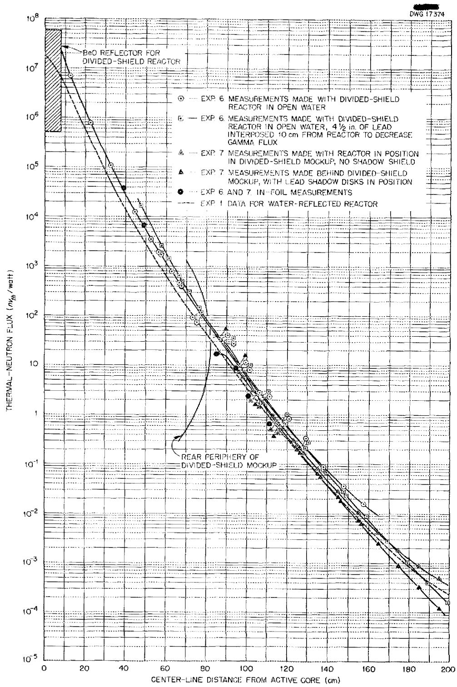  
Fig. 7.6. Thermal-Neutron Measurements Along Center Line of the Divided-Shield Mockup in the Bulk Shielding Facility.

the last quarterly report, (7) has been started. A plan view of the installation is shown in Fig. 7.7. The animals are contained in watertight cages that are lowered under water into positioning frames on either side of the reactor as shown. The cages are located 50 5/8 in. from the center of the reactor with 7 1/2 in. of lead between the reactor and the cages.

The animal irradiation is done only on the week end, and the reactor is free to be moved forward or backward for shielding experiments during the week.

In cooperation with the Health Physics Division, an extensive set of

dosimetry measurements in the cages has been completed. The results will be reported later.

# OTHER EXPERIMENTS

A report on the results obtained from the irradiation of electronic equipment has been issued. The experiment for determining the energy released per $\mathbf{U}^{235}$ fission has been completed, but the calculations have not yet been finished. Because of low priority on reactor time, no progress has been made on measuring neutron spectra or capture gamma-ray spectra.

TABLE 7.1. SPECTrometer POSITIONS FOR GAMMA-RAY SPECTRAL MEASUREMENTS WITH THE DIVIDED-SHIELD MockUP (WITH LEAD DISKS)   

<table><tr><td>ψ*(deg)</td><td>φ** (deg)</td><td>θ*** (deg)</td></tr><tr><td>0</td><td>0</td><td>0, 10, 20, 30, 40, 50</td></tr><tr><td>50</td><td>0</td><td>-20, -10, 0, +10, +20, +30, +40, +50, +60, +70</td></tr><tr><td>60</td><td>0</td><td>-30, -20, -10, 0, +10, +20, +30, +40, +50, +60, +70, +80</td></tr><tr><td>60</td><td>5, 10, 15, 20, 25, 30</td><td>See footnote</td></tr></table>

$\star \psi$ is the angle between the aircraft axis and a line connecting the pseudo reactor center with the nose of the spectrometer collimator.   
$\star \star \phi$ is the angle between the horizontal plane and a plane that includes the aircraft axis and the nose of the spectrometer collimator.   
$\star \star \star \theta$ is the angle between the spectrometer collimator and the line joining the pseudo reactor center and the nose of the spectrometer collimator.

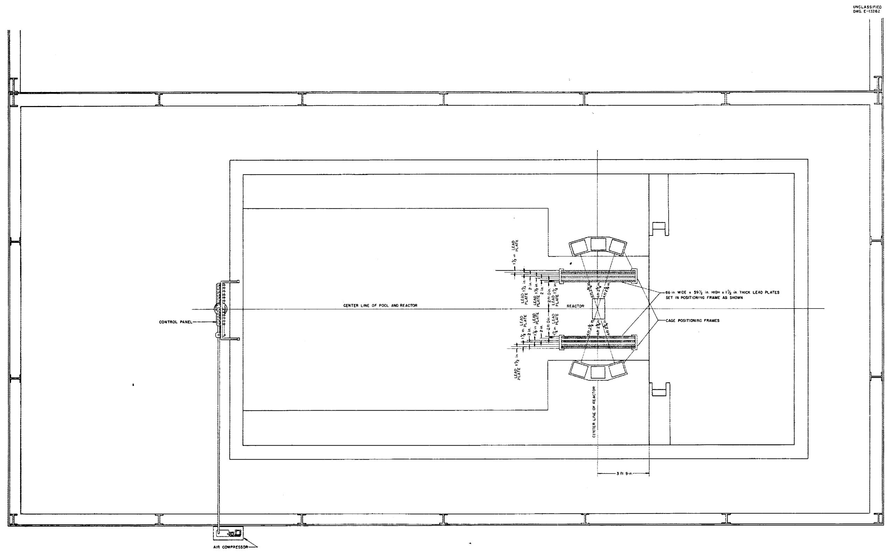  
FLOOR PLAN OF SWIMMING POOL   
Fig. 7.7. Plan View of the Installation for the Irradiation of Animals in the Bulk Shielding Facility.

# 8. TOWER SHIELDING FACILITY

C. E. Clifford T. V. Blosser

Physics Division

J. Y. Estabrook

ANP Division

Design of the tower configuration and the necessary hoisting equipment has been contracted to the firm of Knappen, Tippetts, Abbott, McCarthy, architectural engineers of New York, and is to be completed by February 1, 1953. The basic tower configuration and location are to be established definitely by December 1, at which time ORNL will complete plans for the services, the building, and site improvement. The neutron-scattering background for the tower designed by the architectural engineers is significantly higher than for earlier designs; consequently, alternate designs are being studied.

# FACILITY DESIGN

After making a study of the geological conditions affecting the foundations, the KTAM engineers relocated the tower site to the top of the knoll, a few hundred feet from the previous location. The tower configuration is now conceived to be a four-legged, guyed structure. Such a structure was chosen by KTAM to eliminate the large cantilever trusses used in the previous designs. The guying should also appreciably reduce the weight of the structure, and hence the cost. Preliminary estimates obtained by KTAM of the cost of the required hoisting equipment are gratifyingly low.

All the electrical components of the reactor control and instrumentation

have been chosen and are being ordered in accordance with estimated delivery dates. Engineering of the mechanical portions of the reactor controls, tank, and accessories is approximately $75\%$ complete. Engineering of the reactor control system is being executed by the Reactor Controls group. The engineering of the experimental equipment, which is assigned to the Instrument Department, is approximately $20\%$ complete and is expected to be completed by March 1953.

The project for development of a more sensitive fast-neutron dosimeter is progressing satisfactorily. A flow type of counter that uses a hot-calcium purifier for the ethylene gas shows sensitivities better than twice those of the types in use at present.

# STRUCTURE SCATTERING

# A. Simon, Physics Division

The background from neutrons scattered by the tower structure is being calculated for each configuration according to methods(1) developed at the laboratory during the original design period. In addition, the tower is being made sufficiently flexible so that this background will be measurable directly.

# 9. NUCLEAR MEASUREMENTS

# ANGULAR DISTRIBUTION OF NEUTRONS SCATTERED FROM NITROGEN

J. L. Fowler C. H. Johnson  
J. R. Risser  
Physics Division

The method of studying elastic scattering of neutrons by performing pulse-height analysis of nitrogen nuclei recoils in a counter gas(1) has been utilized on the 5-Mev Van de Graaff accelerator. The active volume of the proportional counter used is a cylinder $12.7\mathrm{cm}$ long and $7.62\mathrm{cm}$ in diameter. Field tubes(2) included in the counter design eliminate end effects owing to nonuniform electric fields. The counter wire is separated from the field-tube voltage by grounded shield tubes. The details of the counter design and fabrication were handled by Zedler of the Instrument Department.

Results of Nitrogen-Scattering Experiment. The test with the 630-kev proton peak from the $\mathbf{N}^{14}(n,p)\mathbf{C}^{14}$ reaction produced by thermal neutrons indicates an energy resolution of the counting system of the order of $6\%$ (full width at half maximum of the pulse-height distribution). Figure 9.1 shows the pulse-height distributions of the nitrogen recoils from monoenergetic neutrons produced by the $\mathrm{T}(p,n)\mathrm{He}^3$ reaction. Tritium in a gas cell was bombarded with analyzed protons from the 5-Mev Van de Graaff accelerator. The neutron energy spread owing to thickness of target and to straggling of protons in the gas-cell window was of the order of $\pm 20$ kev. The energies chosen are between the resonances in the total

cross section reported in the literature. These distributions have been corrected for an experimentally determined nonlinear dependence of maximum recoil pulse height on neutron energy. Near-zero pulse-height background has been subtracted from the distribution. This background was determined by substituting helium for tritium in the gas cell and was found to be completely negligible for the upper three-fourths of the distribution. The distribution at 0.8 MeV has been checked a number of times under a variety of experimental conditions: (1) the nitrogen pressure in the counter was changed by a factor of 3, (2) the counter voltage, and consequently the gas multiplication, was varied over a considerable range, and (3) the tritium neutron source was altered; that is, nitrogen was substituted for aluminum as the tritium-cell window, and the experiment was performed with a zirconium tritide target. With the exception of fluctuations near zero pulse height, the distributions obtained were essentially the same.

Analysis of Nitrogen-Scattering Data. By using the known values of total cross section, (3.4.5) the number of nitrogen recoils per incident neutron can be predicted from the geometry and the nitrogen pressure. The number of neutrons was determined with a long counter calibrated against a polonium-beryllium source. The comparison between prediction and the number of counts in actual distributions, extrapolated to zero energy, indicated agreement within the accuracy of the neutron measurements.

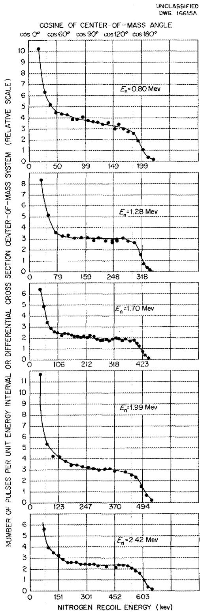  
Fig. 9.1. Pulse-Height Distribution Nitrogen Recoils from Monoenergetic Neutrons.

The cosine of the center of mass angle of scattering of the neutron is plotted in Fig. 9.1 on the same horizontal scale as the recoil energy. The ordinate is thus proportional to the differential scattering cross section in the center of mass system.(1) The rise in the cross section at low angles is believed to be real and due to shadow scattering. This is being investigated further.

Several distributions taken in going over the 1.595-Mev resonance(4) show marked change in the differential cross section associated with the peak of the resonance.(6) Forward scattering of the neutrons becomes more pronounced at the resonance.

The dose received at the crew position from air-scattered neutrons will vary directly with the cross section if this scattering is isotropic. If it is not, then the dose will vary in a quite complicated way with the "distribution of cross section," and therefore it is essential to know the angular distribution of the scattered neutrons. For this purpose, the differential scattering cross section of nitrogen, as opposed to its total scattering cross section, must be measured. The forward-scattered neutrons contribute essentially nothing to the flux incident on the crew shield, but the neutrons scattered through angles greater than about 30 deg are very important. Fortunately, the experiment is most reliable in this region, as will be seen from inspection of Fig. 9.1.

# A FAST-NEUTRON DOSE MEASUREMENT

# T. V. Blosser, Physics Division

An unusual opportunity for calibrating the fast-neutron dosimeter was afforded by the recent unfortunate accident with the ZPR at Argonne National Laboratory, in which one

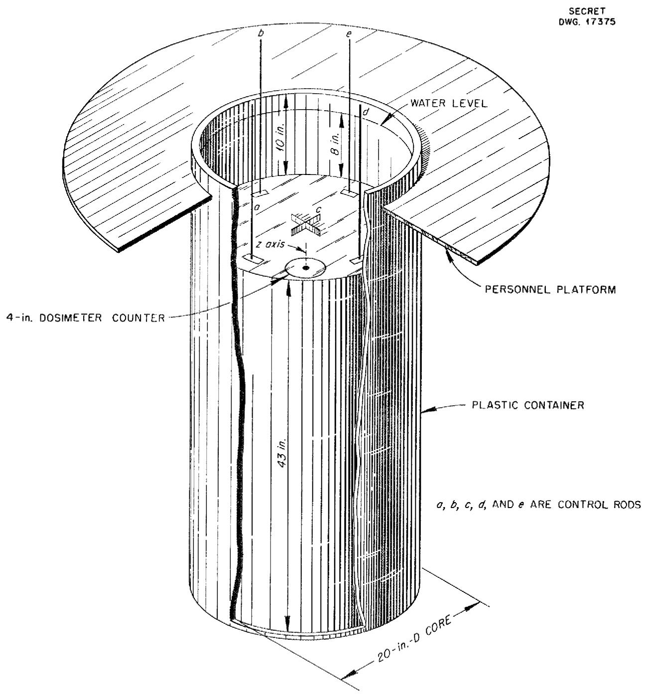  
Fig. 9.2. Schematic Diagram of Zero Power Reactor.

person received about four times the military dose for one mission in fast neutrons (25 rem), in addition to an even larger gamma dose. Since the total power released in the "runaway" critical assembly was quite well measured, it was possible, by setting up the experiment again, to run at controlled power levels and measure the dose in the position occupied by the individual most seriously affected. From these measurements it is possible to determine the dose received by the individual in terms of a reading on the Hurst fast-neutron dosimeter. Since this instrument is basic to all measurements at this Laboratory, direct "calibration" at a near-serious dose level is very important. Consequently, one of the ORNL dosimeters was taken to ANL for measuring the dose in the reconstructed situation. It was operated by a member of the ORNL shielding group to ensure that the measuring technique was identical to that used in the ORNL program.

The ZPR is a hydrogen-moderated, cylindrical reactor with an 8-in. water reflector. Since this is much like the Bulk Shielding Reactor, it would be expected to give quite similar leakage fluxes, as was observed. Figure 9.2 is a schematic sketch of the reactor and shows the vertical line (labeled “z”), about 7 in. from the core axis, on which the data were taken. The dosimeter could not be placed closer to the core axis, since the only location large enough was pre-empted by a control rod. Measurements taken in the 8-in. water reflector and in the air above the reflector are shown in Fig. 9.3; all data have been normalized to a power of 1 watt in accordance with ANL power measurements supplied by J. R. Dietrich. The

instrument was calibrated at the site with a polonium-beryllium source, and gamma suppression was adjusted to 10 r/hr, which is safely greater than that to be expected in the region above the reactor.

The fast-neutron dose readings in the water reflector corresponded almost exactly to those to be expected from scale-up of BSF data. However, the measurements in air may have been somewhat high owing to scattering from the personnel platform and control mechanisms.

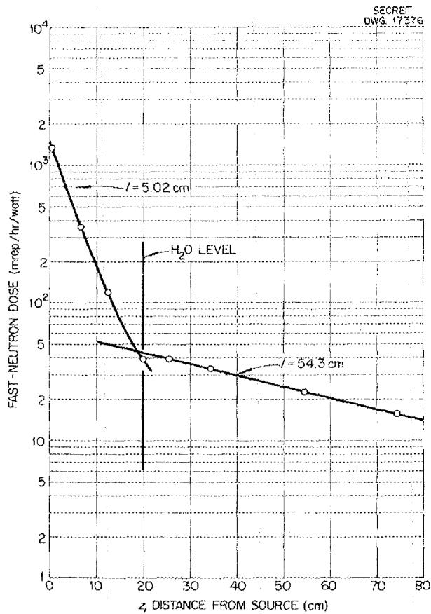  
Fig. 9.3. Fast-Neutron Dose Measurements from Reactor Core Face.

-

Part III

MATERIALS RESEARCH

# SUMMARY AND INTRODUCTION

The research on fused fluoride systems (sec. 10) led to the selection of the fuel and a charging technique for the Aircraft Reactor Experiment. As now planned, the ARE fuel will be a $\mathrm{NaF - ZrF_4 - UF_4}$ mixture with a composition of 50-46-4 mole%. Development of laboratory-scale, pilot-plant, and production-size facilities for making the carrier for this fuel, or some modification of it, continues. The final mixture would be made in the reactor by the addition of $\mathrm{NaF - ZrF_4 - UF_4}$ (50-25-25 mole%) charge material to the $\mathrm{NaF - ZrF_4}$ (50-50 mole%) carrier material with which the reactor would be initially loaded. For the longer range fuel development program, fluoride systems containing LiF, $\mathrm{ZrF_4}$ , $\mathrm{AlF_3}$ , or $\mathrm{BeF_2}$ , singly or in combination, are being examined.

The corrosion research (sec. 11) has been directed primarily toward the determination of the corrosion characteristics of the fluorides (in particular, the $\mathrm{ZrF_4}$ -bearing mixtures) and secondarily to a study of hydroxide and liquid metal corrosion. All studies are made at temperatures around $1500^{\circ}\mathrm{F}$ . The increased attack experienced in recent tests with the $\mathrm{ZrF_4}$ -bearing fuel mixtures is of particular concern; the attack is to a depth of about 9 to 10 mils after 500 hours. Although this depth of attack is tolerable, the trend is not; the increased attack is believed to be due to the use of the newly installed pilot-plant equipment in which the fuel was prepared. The beneficial effect of small additions of $\mathrm{ZrH_2}$ as a corrosion inhibitor has been again demonstrated in the thermal convection loop, whereas additions of NaK have not had so pronounced an effect. Dynamic corrosion tests with lead in thermal convection loops resulted in severely corrosive attack on Inconel above $500^{\circ}\mathrm{C}$ , even though deoxidized

lead was employed. The stability of beryllium oxide in NaK has not yet been thoroughly investigated. Under the conditions of some of the initial tests, significant beryllium oxide weight losses occurred. The effects of various additions to hydroxides were studied, but no decrease in corrosion was obtained. The maintenance of a positive hydrogen atmosphere is still the only certain technique for minimizing hydroxide corrosion.

The metallurgy and ceramics research (sec. 12) includes the development of spherical, solid, fuel elements; creep-rupture tests of structural metal; welding and brazing techniques; and cermets and ceramic coatings. Alloys for cone-arc welding, resistance welding, heliarc welding, and high-temperature brazing have been successfully developed for high-temperature-corrosion resistance and structural integrity of brazed joints. In creep-rupture tests at $815^{\circ}\mathrm{C}$ , Inconel and stainless steel indicated decreasing lifetimes in argon and hydrogen environments as compared with the lifetimes in air. The manufacture of spherical, solid, fuel elements, requested by Pratt and Whitney, is being attempted by several techniques. Cermets of $\mathrm{Cr - Al_2O_3}$ and $\mathrm{ZrC - Fe}$ have been developed and are being tested for corrosion resistance. A dipping technique has been developed for the application of oxidation-resistant ceramic coating to nickel radiator fins.

The heat transfer and physical property measurements have been directed almost entirely toward the determination of the various properties of several fluoride mixtures (sec. 13). The viscosities and densities of the fuel carrier, NaF-ZrF₄, and the enriched fuel, NaF-ZrF₄-UF₄, have been measured. Although these fluoride mixtures have comparable melting points (about 510°C)

and densities (between 3 and 4 at $800^{\circ}\mathrm{C}$ ), the viscosity of the fuel is significantly higher than that of the carrier (about 8 vs. 13 cp at $800^{\circ}\mathrm{C}$ ). In general, it appears that the thermal conductivities of fluoride mixtures decrease and the viscosities increase with an increase in the uranium fluoride content. The heat transfer coefficient for the eutectic mixture, NaF-KF-LiF, in turbulent flow may be described by the usual expressions for ordinary fluids. In other studies, the flow rates in convection loops are being determined, and thermal analyses are being made of a reflector-moderated reactor system and the heat transfer characteristics of a circulating-fuel system.

Radiation damage studies were concerned primarily with the exposure of samples of fluoride fuel in the various irradiation facilities (sec. 14). Other studies included in-pile sodium loop and in-pile creep measurements. A capsule of fluoride fuel has been irradiated in the MTR at a flux level in the range of that of an aircraft

reactor, but the capsule and its contents have not yet been examined. Short-time, high-power-dissipation (up to 4000 watts/cm²) irradiations in the cyclotron suggest that some radiation-induced corrosion damage may exist. Recent in-pile cantilever creep measurements of Inconel in an air atmosphere indicate that the LITR radiation has little effect on creep strength.

Analytical studies of reactor materials (sec. 15) included chemical, spectrographic, and petrographic identification of impurities, corrosion products, reduction products, and constituents of reactor fuels. An empirical volumetric method for the determination of zirconium has been developed. Improved tests have also been developed for the determination of aluminum and chromium in fluorides. The mass spectrograph in combination with a high-temperature (up to $2850^{\circ}\mathrm{C}$ ) oven will detect with high precision the presence of uranium oxides. Petrographic studies have led to the classification of many complex compounds not found in the literature.

# 10. CHEMISTRY OF HIGH-TEMPERATURE LIQUIDS

W. R. Grimes, Materials Chemistry Division

The main effort of the ANP Chemistry group has been devoted to studies of fluoride mixtures for use as fuels and coolants for possible use in an aircraft reactor. The development of a fuel suitable for use in the ARE appears to have been achieved with the NaF-ZrF $_4$ -UF $_4$ (50-46-4 mole %) mixture. Accordingly, more attention has been devoted during recent weeks to the longer range objectives of development of fuels with improved properties.

Since there is reason to believe that low-melting-point systems of superior quality will be obtained, despite the isotope separation requirements, considerable attention has been focused on phase equilibriums among systems containing lithium fluoride. In addition, systems containing $\mathsf{ZrF_4}$ , $\mathsf{AlF_3}$ , and $\mathsf{BeF_2}$ are being studied, and some work has been initiated on systems containing $\mathsf{UCl_4}$ .

Studies of systems containing $\mathbf{U}\mathbf{F}_{3}$ , which seems to be a by-product in some of the corrosion reactions of the fuel, have been continued. Synthesis of some materials that contain trivalent uranium and that seem to be identical to compounds produced in corrosion studies has been accomplished.

Research on liquid fuels and their production in highly pure form on a pilot-plant scale have continued to be a major function of the ANP Chemistry group. The production of the large quantities of these materials needed for engineering testing is a joint responsibility of this group and the Experimental Engineering group. The base material $(\mathrm{NaZrF}_5)$ for the ARE fuel is to be prepared in equipment that is scheduled for completion in mid-December.

Tubes of simulated fuel mixture were supplied for the ARE cold critical experiment by the Y-12 Production Division, along with one tube filled

with slugs of the actual fuel composition. Efforts to identify the chemical species in the cooled melts before and after corrosion testing were continued. Studies were expanded on reducing agent additions to various fluoride mixtures and on the resultant reactions. Preliminary results have indicated that small additions of NaK, Zr, or $\mathrm{ZrH_2}$ may have beneficial effects on the corrosion of structural metals. These additions have been shown to cause harmful reduction of the $\mathrm{UF_4}$ in the fuel when made in larger quantities. Phase equilibrium studies of systems containing $\mathrm{UF_3}$ have been continued as a part of this program. The reactions obtained by addition of reducing agents to possible fuel or coolant materials are being studied in considerable detail by means of a combination of x-ray, petrographic, spectrographic, and chemical examinations.

# FUEL MIXTURES CONTAINING $\mathbf{U}\mathbf{F}_4$

L. M. Bratcher C. J. Barton Materials Chemistry Division

LiF-BeF2-UF4. It appears that compositions that melt below 450°C cover the range from 0 to 30 mole % UF4 in this system, as shown in Fig. 10.1. The minimum melting point observed was 335°C, which was for a mixture containing 2.5 mole % UF4, 48.75 mole % LiF, and 48.75 mole % BeF2; this minimum value has not been checked by heating curves, and it may be found to be considerably lower than the true melting point. Other compositions at the 2.5 and 5.0 mole % UF4 levels showed higher melting points.

NaF-BeF $_2$ -UF $_4$ . Recent indications that the binary eutectic of NaF and BeF $_2$ (43 mole % BeF $_2$ ) has a viscosity of about 15 cp at $600^{\circ}\mathrm{C}$ have stimulated

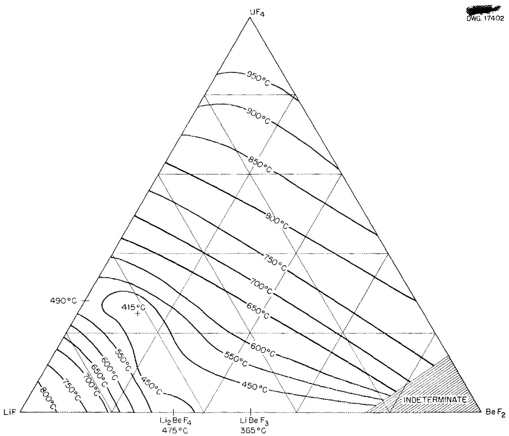  
Fig. 10.1. The System LiF-BeF $_2$ -UF $_4$ .

interest in this material as a fuel solvent. The addition of 5 mole % of $\mathbf{U}\mathbf{F}_{4}$ to this mixture yielded a material that could be stirred readily above $350^{\circ}C$ and showed no thermal effects on heating or cooling curves above $375^{\circ}C$ . However, in the preparation of 3-kg batches of this material, two layers developed; one layer was dark and the other light green. There was a thermal halt on cooling at about $470^{\circ}C$ .

The separation into two layers, along with the lack of thermal effects in small portions of the separated

layers, has led to speculation concerning the possibility of there being two immiscible liquids below $470^{\circ}\mathrm{C}$ in this system. Filtration studies with this material seem to discount this hypothesis, since there is evidence of a steady decrease in uranium concentration in the filtrate as the temperature is reduced below $500^{\circ}\mathrm{C}$ .

It seems likely that in this system in which thermal effects are apparently quite small, the methods used are not sufficiently sensitive to detect the first separation of a solid phase on

cooling or the "end of melting" on heating of the mixture.

Studies of this system, as well as attempts to improve the research techniques, are continuing at present.

LiF-ZrF4-UF4. It appears that a melting point of about $420^{\circ}\mathrm{C}$ may be expected in this system. From the few experiments performed to date, it is not possible to specify the composition of the eutectic or eutectics.

NaF-LiF-ZrF4-UF. Material containing 40 mole % NaF, 20 mole % LiF, and 40 mole % ZrF4 appears to melt at $430^{\circ}\mathrm{C}$ . Additions of various quantities of UF to this system yielded the thermal data shown in Table 10.1.

It appears that the lowest melting point in this region $(415^{\circ}\mathrm{C})$ is probably that of the quaternary eutectic. Much more data will be needed to establish the compositions in the low-melting-point region; it is likely, however, that the uranium content of the eutectic is reasonably low.

$\mathbf{NaZrF}_5\text{-NaUF}_5$ Since present plans call for addition of a mixture containing 50 mole $\%$ NaF, 25 mole $\%$ UF4, and 25 mole $\%$ ZrF to the fuel solvent, NaZrF, to bring the reactor to criticality, study of the $\mathbf{NaZrF}_5\text{-NaUF}_5$ is of considerable interest.

TABLE 10.1.EFFECT OF $\mathbf{U}\mathbf{F}_{4}$ ON MELTING POINT OF NaF-LiF-ZrF4 MIXTURE*   

<table><tr><td>UF4 CONTENT (mole %)</td><td>THERMAL EFFECTS (°C)</td></tr><tr><td>0.0</td><td>430</td></tr><tr><td>2.0</td><td>460, 435, 415</td></tr><tr><td>4.0</td><td>480, 440, 415</td></tr><tr><td>6.0</td><td>494, 445</td></tr><tr><td>8.0</td><td>500, 435</td></tr><tr><td>10.0</td><td>502, 430</td></tr></table>

*40 mole % NaF, 20 mole % LiF, 40 mole % ZrF.

The mixture containing 50 mole % of each complex compound melts at about $610^{\circ}\mathrm{C}$ and has a density at $1500^{\circ}\mathrm{F}$ of $3.98\mathrm{g/cm}^3$ . A tentative equilibrium diagram for these compounds is given in Fig. 10.2. X-ray diffraction has revealed that solid solutions are formed in this system and that the solution of $\mathrm{NaUF}_5$ in $\mathrm{NaZrF}_5$ saturates at about 15 mole % of $\mathrm{NaUF}_5$ . Although the liquidus line for this system may be considered as well established, much further study will be required to define the solidus lines with accuracy. The results of careful examination of the 8 mole % $\mathrm{NaUF}_5$ region by x-ray and petrographic techniques and the virtual absence of segregation on slow cooling of very large preparations of this material, indicate that the area between liquidus and solidus lines in the dilute solid solution region (and differences in composition of the two solid solutions in equilibrium) must be very small. In uranium-rich regions of this diagram, however, the situation is considerably different, and segregation of phases of considerably different composition would not be surprising. Additional study of this system is being emphasized at present.

RbF-AlF $_3$ -UF $_4$ . A mixture containing 58 mole % RbF and 42 mole % AlF $_3$ is one of the lowest-melting-point (535°C) alkali fluoride-aluminum fluoride mixtures found. This mixture was used to test the effect of low concentrations of UF $_4$ on the melting point of mixtures in this system. In the range from 2 to 20 mole % UF $_4$ , there appeared to be a rapid rise in melting point with increasing UF $_4$ concentration, and even the 2 mole % UF $_4$ mixture showed a marked increase in melting point over that of the base mixture. At temperatures below 550°C, solubility of UF $_4$ in this mixture appears to be very low. Solid phases resulting from these studies have not yet been examined.

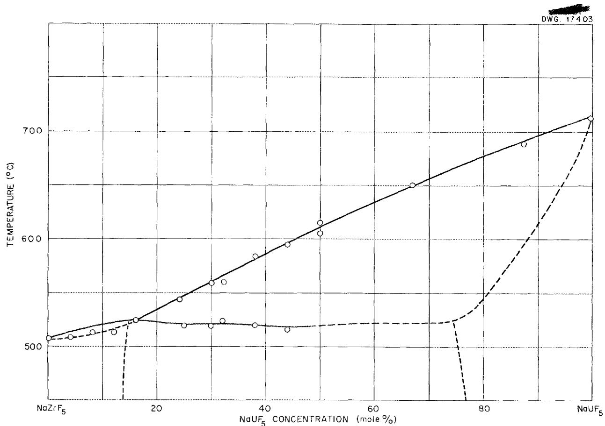  
Fig. 10.2. The System $\mathbf{NaZrF}_5\cdot \mathbf{NaUF}_5$

# FUEL MIXTURES CONTAINING UCI

R. J. Sheil C. J. Barton Materials Chemistry Division

Thermal data for a number of binary chloride systems containing $\mathrm{UCl}_4$ or $\mathrm{UCl}_3$ mixed with various alkali and alkaline earth chlorides have been reported previously. In the previous work, only the binary systems of the uranium compounds with NaCl and KCl were studied in sufficient detail to permit construction of equilibrium diagrams. The eutectics shown for the NaCl- $\mathrm{UCl}_4$ and the KCl- $\mathrm{UCl}_4$ systems melt at much lower temperatures (370 and $350^{\circ}\mathrm{C}$ , respectively) than do

the corresponding fluoride eutectics. Although the eutectics reported for $\mathrm{UCl}_3$ with these materials have higher melting points than those of the corresponding $\mathrm{UCl}_4$ systems, they still compare favorably with the fluorides. The high vapor pressure of $\mathrm{UCl}_4$ will present obvious difficulties in the use of these mixtures at very high temperatures; however, the vapor pressure of the mixtures containing $\mathrm{UCl}_3$ should be considerably more favorable.

Preliminary studies have shown that some refinements in technique will be required before the very hygroscopic and reactive $\mathrm{UCl}_4$ can be handled in the apparatus without being contaminated. Graphite crucibles were found to be quite permeable to $\mathrm{UCl}_4$

vapor; however, nickel vessels have been satisfactory. For satisfactory operation, the nickel vessels must be loaded in helium dry boxes, and a dry helium atmosphere must be maintained over the samples at all times.

The available UCl₄ has served for preliminary experiments for defining the techniques; however, the Cl-to-U ratio of 3.9 and the low melting point of 565°C (literature value for pure UCl₄ is 590 ± 1°C) make this material unsuitable as a standard for study. This material will be sublimed under vacuum and subsequently handled under dry, inert atmospheres to provide pure UCl₄ for future studies.

Preliminary data have been obtained, meanwhile, on NaCl- $\mathrm{UCl}_4$ mixtures. The eutectic and eutectoid halts reported by Kraus(1) have, in general, been confirmed. Actual data will be reported when pure materials become available.

# FUEL MIXTURES CONTAINING UF3

W.C.Whitley V.S.Coleman C.J.Barton

Materials Chemistry Division

Preliminary results of studies of alkali fluoride-uranium trifluoridesystems were reported previously.2) The effort in this field was concentrated on the NaF-UF and KF-UF3 binary systems during the past quarter.

Data were obtained with two types of apparatus: the large vacuum-tight apparatus previously described(2) and small welded stainless steel reactors fitted with a thin-walled thermocouple well in the center. In order to assure an inert atmosphere, the fluoride mixture was introduced into the reactor through a 1/4-in. tube, and the reactor was evacuated at room temperature, filled with inert gas, and then sealed by pinching and welding the tube. Mixing of the contents of the reactor was accomplished by

inverting after it had been heated enough to bring all the material into solution. The mixture was not stirred during the cooling cycle.

A comparison was made of cooling curves for the same composition in the two types of apparatus. The thermal effects occurred at about the same temperature with both types of apparatus, but the breaks were somewhat better defined with the small reactor. This is probably due to better contact between the thermocouple and melt in this apparatus and to the smaller heat capacity of the thin-walled thermocouple well. The thermal data were supplemented by examination of the solid phases by means of the petrographic microscope and, for a limited number of samples, by x-ray diffraction techniques.

NaF-UF3. Cooling curves have been run on mixtures covering the range from 5 to 85 mole $\%$ UF3. It was observed that the cooling curve breaks, except for the lowest break at about $590^{\circ}\mathrm{C}$ , seemed to decrease upon prolonged heating at elevated temperatures. This change in thermal effects apparently results from the development of UF4 and/or $\mathrm{UO_2}$ in the melt. Both products are found in the fused material, in which the UF4 is combined with NaF. An intensive effort was made to find the source of the oxygen and to eliminate it from the system; but, to date, this effort has not been entirely successful, and some doubt exists as to the accuracy of the thermal data that have been obtained. However, several conclusions about the system seem warranted:

1. A compound is formed between NaF and $\mathbf{U}\mathbf{F}_{3}$ . It is lavender in color, uniaxial positive, and has a refractive index for the ordinary ray of 1.552 and for the extraordinary ray of 1.564. (3)

2. The most probable composition for the compound, based on both thermal

data and examination of the solid phases, is $3\mathrm{NaF}\cdot 2\mathrm{UF}_3$ . This composition could be in error because of the presence of $\mathbf{U}^{+4}$ in the melts, as mentioned above.

3. A eutectic exists between NaF and the compound, which is probably close to 27 mole % UF₃, and it melts at approximately 685°C.

The data obtained with mixtures containing more than 50 mole $\%$ UF3 do not fit any recognizable pattern. The significance of the break at approximately $590^{\circ}\mathrm{C}$ , which was observed with all compositions in this system, is still not clear. Further work toward solving these problems is in progress.

$\mathbf{KF - UF_3}$ . It is clear that a complex compound between KF and $\mathrm{UF}_3$ is formed and that a eutectic between KF and the compound melting at approximately $690^{\circ}C$ occurs at about 18 mole $\%$ UF.

The solid phases have not been thoroughly studied, and the optical properties of the compound have not been determined. Study of this system will be resumed when the oxidation phenomenon mentioned above has been brought under control.

# ALKALI FLUOBORATE SYSTEMS

J. G. Surak

Materials Chemistry Division

Thermal analysis studies of alkali fluoborate systems, which have been described in previous reports, were continued during the early part of the quarter. Additional data on the $\mathrm{NaBF}_4$ - $\mathrm{KBF}_4$ system have permitted construction of the tentative equilibrium diagram shown in Fig. 10.3. The liquidus curve appears to go

(4) J. G. Surak, R. E. Moore, C. J. Barton, ANP Quar. Prog. Rep. Sept. 10, 1952, ORNL-1375, p. 82.

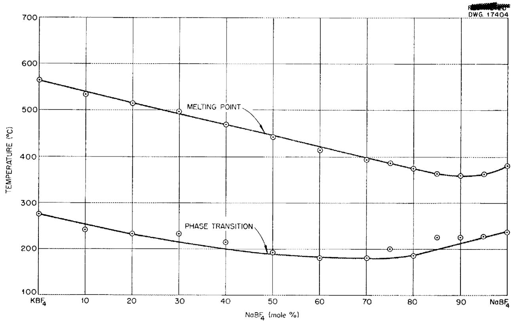  
Fig. 10.3. The System $\mathsf{NaBF}_4\text{-}\mathsf{KBF}_4$

through a minimum at about $90\%$ $\mathrm{NaBF}_4$ . Halts at the minimum melting temperature of $360^{\circ}\mathrm{C}$ were not observed for other compositions; apparently these materials are completely miscible in the solid state.

Attempts have been made to obtain phase equilibrium data in the $\mathrm{NaBF}_4$ - $\mathrm{NaUF}_5$ and $\mathrm{NaBF}_4$ - $\mathrm{NaZrF}_5$ systems, with little success. Mixtures of these materials were heated, in each experiment, to temperatures up to $800^{\circ}\mathrm{C}$ , where $\mathrm{BF}_3$ pressures were about 100 psi, before the cooling curves were recorded. Although the data are quite incomplete, it appears that more than 5 mole % of either compound raises the melting point of $\mathrm{NaBF}_4$ considerably. There is some evidence for eutectics at about $360^{\circ}\mathrm{C}$ in each system at quite low uranium and zirconium concentrations. Actual compositions of the eutectics have not been established.

# DIFFERENTIAL THERMAL ANALYSIS

R. E. Traber, Jr. Materials Chemistry Division

The differential thermal analysis apparatus for 1- to 2-g samples was used regularly during the quarter for the careful examination of important compositions, for testing samples that

were available only in small quantities, and for searching for thermal effects that are difficult to find with the cooling-curve technique. The apparatus has been found to have limited application in the study of reduced systems, such as those containing $\mathrm{UF}_3$ . Although a flow of purified helium was maintained in the apparatus, the erratic behavior of the differential trace obtained when the reduced samples were heated was apparently due to oxidation. Examination of the solid phases remaining at the end of the tests showed that oxidation had occurred. Some difficulties that were experienced with the electrical system may be attributed, at least in part, to the high sensitivity of the system.

Table 10.2 summarizes the thermal effects observed with differential apparatus for a number of compositions of current interest. The temperatures at which the differential trace begins to leave the base line, reaches a peak, and returns to the base line are recorded. Where more than one "hump" was observed in the differential trace, only that at the higher temperature is included in the table. It should be noted that the temperature at which the differential trace returns to the base line on the heating curve

TABLE 10.2. THERMAL EFFECTS OBSERVED WITH DIFFERENTIAL THERMAL APPARATUS   

<table><tr><td rowspan="2">COMPOSITION (mole %)</td><td colspan="3">THERMAL EFFECTS (°C)</td></tr><tr><td>Start</td><td>Peak (m.p.)</td><td>End</td></tr><tr><td>50 NaF-50 UF4</td><td>600</td><td>685</td><td>705</td></tr><tr><td>54 NaF-41 BeF2-5 UF4</td><td>310</td><td>340</td><td>360</td></tr><tr><td>55 NaF-40 BeF2-5 UF4(light-green layer)</td><td>320</td><td>360</td><td>400</td></tr><tr><td>55 NaF-40 BeF2-5 UF4(dark-green layer)</td><td>310</td><td>355</td><td>375</td></tr><tr><td>57 NaF-43 BeF2</td><td>310</td><td>340</td><td>350</td></tr><tr><td>50 NaF-25 UF4-25 ZrF4</td><td>500</td><td>575</td><td>625</td></tr><tr><td>50 NaF-50 ZrF4</td><td>490</td><td>520</td><td>535</td></tr></table>

is usually higher than the melting point of the composition determined from the cooling curve. This may be due to the time required to melt all the sample, and the difference between the two values is probably a function of the heating rate.

An effort is under way to increase the sensitivity of the differential thermocouple arrangement so that a very slight thermal effect may be found, such as that which apparently was overlooked in the NaF-BeF $_2$ -UF $_4$ fuel mixture (discussed previously in this chapter).

# SIMULATED FUEL FOR COLD CRITICAL EXPERIMENT

D.R.Cuneo J.D.Redman L.G.Overholser

Materials Chemistry Division

Filling the fuel tubes with homogeneous powder containing $\mathsf{ZrO}_2$ , NaF, $\mathbf{U}\mathbf{F}_{4}$ , and graphite was accomplished in the manner described previously.5 One tube was required, however, in which the fuel density was uniform and at least equal to the ARE fuel and in which the fuel had the proper Na:Zr:U ratio.

Attempts to cast slugs of this material by heating premelted powder of the proper composition under inert atmospheres in graphite molds were not successful. Only the bottom 1 to 2 in. of an 8-in. section so formed was free from "pipes." Re-use of the material from the porous sections led to considerable fractionation because of segregation during the slow cooling.

The slugs were prepared in Building 9212 by melting the premelted fuel by induction heating under an inert atmosphere, pouring the liquid into 10-in. molds, and rapidly cooling the casting. Slugs prepared in this fashion were free from pipes over about 8 in. of length and had uniform (5) D. R. Cuneo and J. G. Overholser, ANP Quar. Prog. Rep. Sept. 10, 1952, ORNL-1375, p. 87.

uranium concentrations over the entire length.

The slugs were cut with an electrically heated knife and wrapped in 0.25-mil aluminum foil. A total of 41.5 in. of this material, which contained (by weight) $74.0\% \mathrm{ZrF}_4$ , $17.2\% \mathrm{NaF}$ , and $8.82\% \mathrm{UF}_4$ , was supplied to the Critical Experiment group. The material had a density of $3.75 \mathrm{~g/cm}^3$ at room temperature.

In addition, tubes were filled with $\mathrm{SiO}_2$ , NaF, KF, and Cr for danger coefficient measurements.

# COOLANT DEVELOPMENT

L. M. Bratcher C. J. Barton Materials Chemistry Division

No new coolant components were considered during the quarter except $\mathbf{BaF}_2$ , which proved unattractive because of the high melting point of the eutectic in the one system studied. Studies of systems containing $\mathbf{AlF}_3$ , $\mathbf{ZrF}_4$ , and $\mathbf{BeF}_2$ continued.

NaF-ZrF. Study of the complicated and important binary system NaF-ZrF has been in progress for some time. Early studies were complicated by the formation of oxide that caused error in the calculation of compositions and resulted in the appearance of thermal effects above the melting points of the pure fluoride mixtures. Some data on this system have been presented in previous reports.(6) Although further study is necessary to more clearly define the composition of the solid phases in certain portions of the system, the location of the liquidus line is believed to be sufficiently well established to justify the publication of the tentative equilibrium diagram for the system, as shown in Fig. 10.4. Some of the questions remaining to be explained about this system are: (l) the

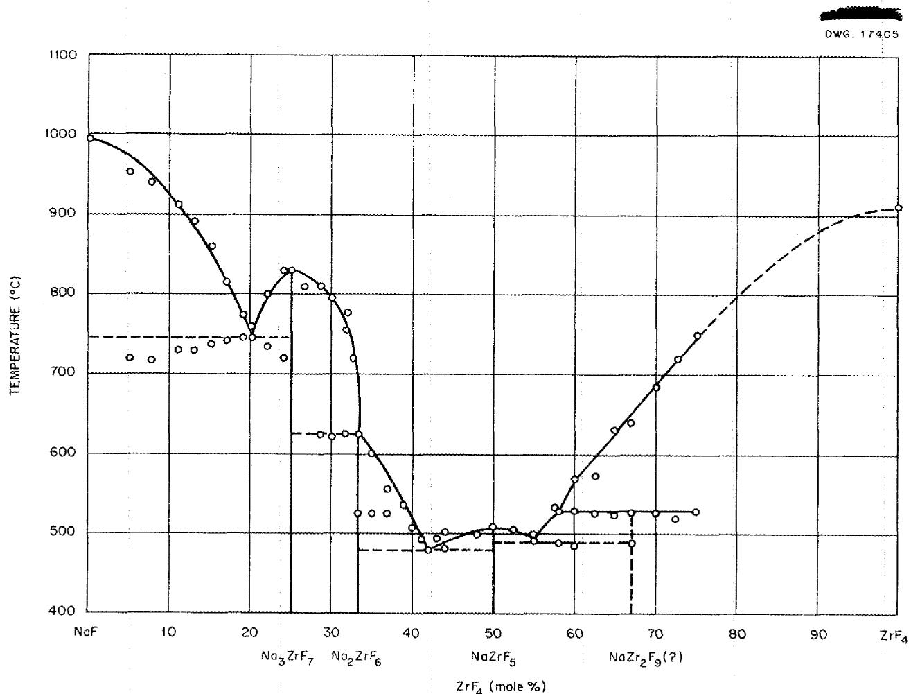  
Fig. 10.4. The System NaF-ZrF4.

composition of the compound that is believed to exist between $\mathrm{NaZrF_5}$ and $\mathrm{ZrF_4}$ ; (2) the possible solid solution formation between $\mathrm{NaZrF_5}$ and $\mathrm{Na_2ZrF_6}$ ; (3) the significance of the thermal effect at $525^{\circ}C$ in the 33 to 38 mole $\%$ $\mathrm{ZrF_4}$ region, which may indicate polymorphism of $\mathrm{Na_2ZrF_6}$ or, possibly, a compound such as $\mathrm{Na_3Zr_2F_{11}}$ ; (4) the peculiar behavior (marked expansion on freezing) of mixtures in the region of the eutectic at 43 mole $\%$ $\mathrm{ZrF_4}$ .

LiF-ZrF. Study of the LiF-ZrF4 system has been attended by some of the difficulties mentioned in connection with the NaF-ZrF4 system. Although

thermal data have been obtained for a number of compositions in the 10 to 70 mole $\%$ $\mathrm{ZrF_4}$ range, the melting points of some compositions are still uncertain. It is clear, however, that this system is quite different from the other alkali fluoride-zirconium fluoride systems that have been studied. The minimum-melting-point composition appears to be close to 50 mole $\%$ $\mathrm{ZrF_4}$ , with a melting point of about $510^{\circ}\mathrm{C}$ . The solid phases in this system have received little attention, as yet.

NaF-KF-A1F₃. The lowest melting-point compositions in the binary

system NaF-AlF₃ and KF-AlF₃ reported in the literature (7) are 685 and $570^{\circ}\mathrm{C}$ , respectively. The tentative equilibrium diagram shown in Fig. 10.5 indicates that in the ternary system no melting points lower than $570^{\circ}\mathrm{C}$ are available.

NaF-BeF2-ZrF4. Thermal data were obtained from cooling curves for about 25 compositions in the NaF-BeF2-ZrF4 system. Many of the compositions studied were within the NaF-NaZrF5-NaBeF3 part of the diagram. The lowest melting point observed was

(7) F. T. Hall and H. Insley, J. Am. Ceram. Soc. Nov. 1947, Supplement.

$375^{\circ} \mathrm{C}$ for a mixture containing 5 mole $\% \mathrm{ZrF}_{4}$ , $40 \mathrm{~mol} \% \mathrm{BeF}_{2}$ , and $55 \mathrm{~mol} \% \mathrm{NaF}$ . It appears that a $\mathrm{BeF}_{2}$ concentration of approximately 20 mole $\%$ is needed to obtain a melting point substantially lower than that of $\mathrm{NaZrF}_{5}$ ( $510^{\circ} \mathrm{C}$ ).

NaF-LiF-ZrF. The NaF-LiF-ZrF4 system has been studied fairly intensively, especially in the 30 to 50 mole $\%$ ZrF4 range in which the lowest melting points occur. The lowest melting point obtained was $426^{\circ}\mathrm{C}$ for the mixture containing 20 mole $\%$ LiF, 40 mole $\%$ NaF, and 40 mole $\%$ ZrF4. Isotherms cannot be prepared for this

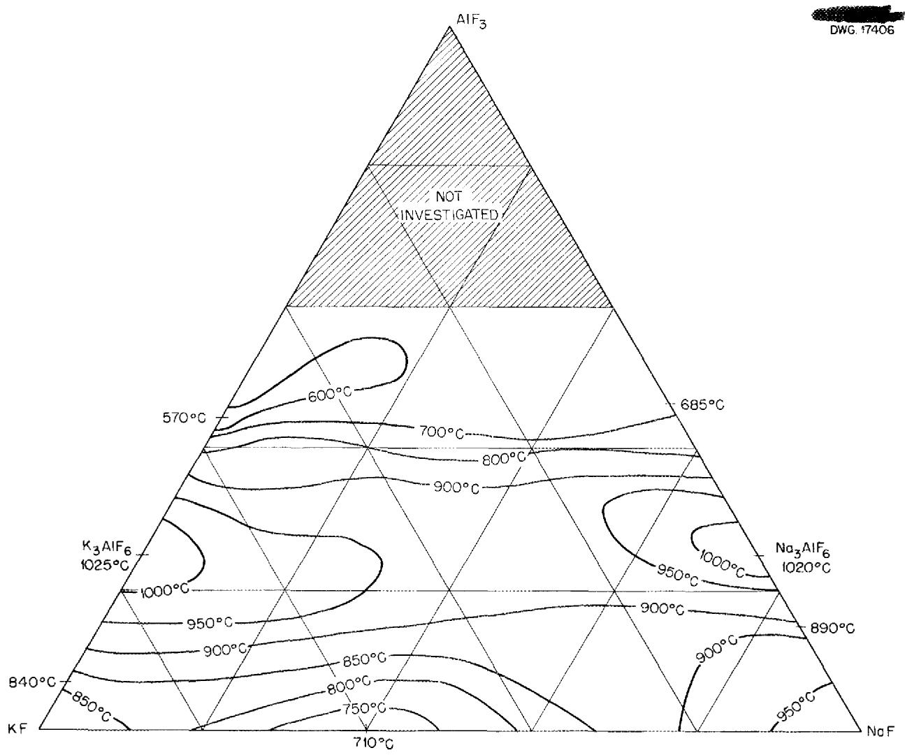  
Fig. 10.5. The System NaF-KF-AlF₃.

system until the LiF-ZrF4 system is clarified.

NaF-BaF. The alkaline earth fluorides have received comparatively little consideration as possible components of fuels and coolants, mainly because of their high melting points. Since data on the NaF-BaF2 system apparently have not been published, a few compositions were tested to determine the minimum melting point. The data indicate that this is a simple eutectic system; the eutectic at approximately 35 mole % BaF2 melts at about $820^{\circ}\mathrm{C}$ . This is much too high to be of interest. The KF-BaF2 eutectic has been reported to melt at $750^{\circ}\mathrm{C}$ . Therefore the NaF-KF-BaF2 ternary seems unlikely to yield usefully low melting points.

NaF-KF-LiF-ZrF₄. Increasing amounts of ZrF₄ were added to the NaF-KF-LiF eutectic (11.5, 42.0, and 46.5 mole %, respectively). After a slight initial decrease in melting point of about $7^{\circ}\mathrm{C}$ at 2 mole % ZrF₄, the melting point increased quite rapidly to $680^{\circ}\mathrm{C}$ at 10 mole % and reached a maximum of $715^{\circ}\mathrm{C}$ at 20 mole % ZrF₄. This indicates that if molten NaF-KF-LiF eutectic is used to trap ZrF₄ vapors from the ARE, as has been suggested, either the concentration of ZrF₄ would have to be kept low or the temperature would have to be maintained above $700^{\circ}\mathrm{C}$ to keep solids from forming.

NaF-RbF-AlF₃. Melting points of all the compositions tested in the NaF-RbF-AlF₃ system (about 40) were substantially higher than the minimum melting point observed in the RbF-AlF₃ system (525°C).

# STUDIES OF COMPLEX FLUORIDE PHASES

Several new complex fluorides have been prepared to assist in the identification of various materials found at the conclusion of static and dynamic corrosion tests. The complexes of the alkali fluorides with trivalent chromium have been studied in detail

because one such complex, $\mathbf{K}_2\mathbf{NaCrF}_6$ had been previously identified as being present in a loop test. The complex fluorides synthesized in these studies have been identified or characterized by chemical analyses, x-ray diffraction patterns, and optical crystallographic data. Although in most instances the sealed capsule technique was used for the preparation of these samples, in some cases welded tubes similar to those used for static corrosion tests were employed, with a concomitant reduction in oxide formation. The density and solubility of several of the complexes have been determined, and the data are given in Table 10.3.

$\mathbf{K}_3\mathbf{CrF}_6\text{-Na}_3\mathbf{CrF}_6\text{-Li}_3\mathbf{CrF}_6$ (B. J. Sturm and L. G. Overholser, Materials Chemistry Division). The identification of compounds in the system $\mathrm{K}_{3}\mathrm{CrF}_{6}\text{-Na}_{3}\mathrm{CrF}_{6}\text{-Li}_{3}\mathrm{CrF}_{6}$ has been virtually completed. A constitution diagram based on x-ray diffraction data supplied by H. Dunn and interpreted with help from A. G. H. Andersen is given in Fig. 10.6. Apparently $\mathrm{Na}_{3}\mathrm{CrF}_{6}$ and $\mathrm{Na}_{2}\mathrm{LiCrF}_{6}$ are the limits of one solid solution region, and $\mathrm{K}_{2}\mathrm{NaCrF}_{6}$ , $\mathrm{K}_{3}\mathrm{Na}_{3}(\mathrm{CrF}_{6})_{2}$ and $\mathrm{KNaLiCrF}_{6}$ are the limits of another such area. The corrosion products found in loops in which NaF-LiF-KF-UF had been circulated have been in the region between $\mathrm{K}_{2}\mathrm{NaCrF}_{6}$ and $\mathrm{K}_{3}\mathrm{Na}_{3}(\mathrm{CrF}_{6})_{2}$ , except in one case in which the product resembled $\mathrm{KNaLiCrF}_{6}$ .

Solid Phases in NaF-BeF2-UF4 and NaF-ZrF4 Systems (A. G. H. Andersen, ANP Division). Work done by Andersen on the solid phases in NaF-BeF2-UF4 and NaF-ZrF4 systems was summarized in his final report.(8) The solid phases in the NaF-BeF2-UF4 system will probably be studied further when time is available.

$\mathbf{U}\mathbf{F}_{3} - \mathbf{Z}\mathbf{r}\mathbf{F}_{4}$ (V. S. Coleman, C. J. Barton, Materials Chemistry Division; T. N. McVay, Consultant, Metallurgy

(8) A. G. H. Andersen, The Solid Phases of Alkali and Uranium Fluoride Systems, Y-F33-3 (Oct. 1, 1952).

TABLE 10.3. PHYSICAL PROPERTIES OF FLUOCOMPLEXES OF CHROMIUM, IRON, AND NICKEL  

<table><tr><td>COMPOUND</td><td>OPTICAL DATA</td><td>MELTING POINT (°C)</td><td>SOLUBILITY IN WATER (g/ml)</td><td>DENSITY (g/cm3)</td></tr><tr><td>K3CrF6</td><td>Cubic,** n = 1.422</td><td>1055</td><td>2.5 x 10-3at 290°C</td><td>2.69</td></tr><tr><td>Na3CrF6</td><td>Cubic,** n = 1.411</td><td>880</td><td>4.0 x 10-6at 250°C</td><td></td></tr><tr><td>Li3CrF6</td><td>Biaxial,** (-), α = 1.444, 2V = about 40°, α = 1.464</td><td>672</td><td></td><td>3.16</td></tr><tr><td>K2NaCrF6</td><td>Cubic,** n = 1.422</td><td>1006</td><td>2.9 x 10-5</td><td>3.07</td></tr><tr><td>K2LiCrF6</td><td>Cubic, n = 1.422</td><td>952</td><td></td><td></td></tr><tr><td>K3Na3(CrF6)2</td><td>Cubic, n = 1.418</td><td>1000</td><td></td><td></td></tr><tr><td>MNalLiCrF5</td><td>Cubic, n = 1.418</td><td>875</td><td></td><td></td></tr><tr><td>Li2KCrF6</td><td>Anisotropic</td><td>791</td><td></td><td></td></tr><tr><td>Li2NaCrF6</td><td>Anisotropic</td><td></td><td></td><td></td></tr><tr><td>Na2LiCrF6</td><td>Cubic, n = 1.400</td><td>830</td><td></td><td></td></tr><tr><td>Rb3CrF6</td><td>Anisotropic</td><td></td><td></td><td></td></tr><tr><td>Cs3CrF6</td><td>Biaxial, (+), avg. n = 1.520***</td><td></td><td></td><td></td></tr><tr><td>K2RbCrF6</td><td>Cubic</td><td></td><td></td><td></td></tr><tr><td>K2CsCrF6</td><td>Cubic, n = 1.457</td><td></td><td></td><td></td></tr><tr><td>K3FeF6</td><td>Cubic, n = 1.414</td><td></td><td></td><td></td></tr><tr><td>Na3FeF6</td><td>Cubic</td><td></td><td></td><td></td></tr><tr><td>K2NaFeF6(solid solution)</td><td>Cubic, n = 1.414</td><td>965</td><td></td><td>3.19</td></tr><tr><td>K2NiF4</td><td>Anisotropic, avg. n = 1.423</td><td>940</td><td></td><td></td></tr><tr><td>Na2NiF4</td><td></td><td>805</td><td></td><td></td></tr><tr><td>KNaNiF4</td><td></td><td>785</td><td></td><td></td></tr></table>

*Most of the melting point data were obtained by C. J. Barton, R. J. Sheil, R. E. Traber, and L. M. Bratcher.   
**Data from T. N. McVay.   
\*\*Data from G. D. White.

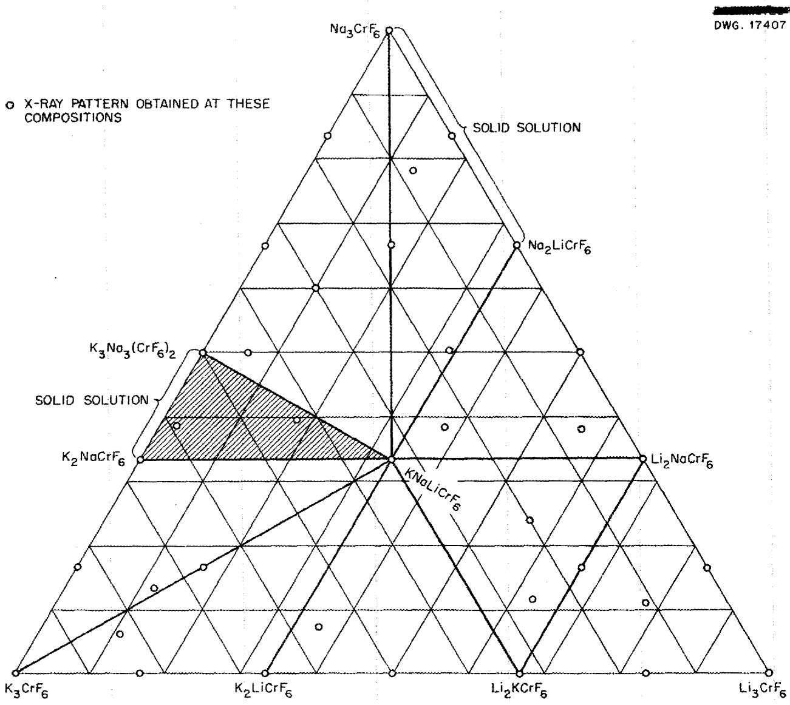  
Fig. 10.6. The System $\mathbf{K}_3\mathbf{CrF}_6 - \mathbf{Na}_3\mathbf{CrF}_6 - \mathbf{Li}_3\mathbf{CrF}_6$

Division). The samples prepared by heating $\mathbf{U}\mathbf{F}_{3}$ with $\mathbf{ZrF_4}$ , with and without NaF, show a complex compound $\mathbf{U}\mathbf{F}_{3} \cdot 2\mathbf{ZrF}_{4}$ , which is an orange-red crystalline solid that is occasionally found as a reduction product of $\mathbf{ZrF}_{4}$ -bearing fuels. When this material is heated with NaF at $850^{\circ}\mathrm{C}$ or when $\mathbf{U}\mathbf{F}_{3}$ and $\mathbf{ZrF}_{4}$ in proper ratio are heated with NaF, the products include $\mathbf{U}\mathbf{F}_{3}$ , some $\mathbf{U}\mathbf{F}_{3} \cdot 2\mathbf{ZrF}_{4}$ , and some $\mathbf{NaZrF}_{5}$ . The latter compound usually contains

some $\mathsf{NaUF}_5$ in solid solution, presumably formed by traces of oxidants in the system. Since NaF can "steal" $\mathsf{ZrF}_4$ from $\mathsf{UF}_3\cdot 2\mathsf{ZrF}_4$ , apparently $\mathsf{NaZrF}_5$ is a more stable compound than the $\mathsf{UF}_3\cdot 2\mathsf{ZrF}_4$ complex. The $2\mathsf{ZrF}_4\cdot \mathsf{UF}_3$ compound has been found in loops in which there was severe reduction of the $\mathsf{UF}_4$ in the fuel because of the injection of NaK, and also in capsules in which zirconium metal or NaK had been added to the fuel.

NaF-ZrF4 (P. A. Agron, Materials Chemistry Division). The x-ray studies of the NaF-ZrF4 system(9) have been extended to the region of 75 mole % of ZrF4. The crystal structures of the solid phases Na3ZrF7 and NaZrF5 have been reported previously.(10) Studies of the behavior of the phases that appear in compositions lying between these two compounds and of those that lie beyond the NaZrF5 compositions are being made; considerable additional study will be required, since the system is an exceedingly complex one.

Other Fluoride Complexes (B. J. Sturm and L. G. Overholser, Materials Chemistry Division). It was previously noted that a preparation corresponding to $\mathrm{K}_2\mathrm{NaFeF}_6$ was thought to be isomorphous with $\mathrm{K}_2\mathrm{NaCrF}_6$ . Further study has shown that $\mathrm{Na}_3\mathrm{FeF}_6$ and $\mathrm{K}_3\mathrm{FeF}_6$ apparently form solid solutions over a wide range, probably in all proportions. X-ray patterns for materials corresponding to $\mathrm{K}_3\mathrm{FeF}_6$ , $\mathrm{K}_3\mathrm{NaFeF}_6$ , $\mathrm{K}_5\mathrm{Na}(\mathrm{FeF}_6)_2$ , and $\mathrm{KNa}_2\mathrm{FeF}_6$ differ only by slight shifts in lines.

Fusion of equal molar proportions of $\mathrm{KHF}_2$ , $\mathrm{NaHF}_2$ , and $\mathrm{NiF}_2 \cdot 4\mathrm{H}_2\mathrm{O}$ at $850^{\circ}\mathrm{C}$ resulted in a yellow compound, probably $\mathrm{KNaNiF}_4$ . A fusion in the proportions corresponding to $\mathrm{K}_3\mathrm{Na}(\mathrm{NiF}_2)_2$ gave a mixture of $\mathrm{K}_2\mathrm{NiF}_4$ and $\mathrm{KNaNiF}_4$ . Heating a mixture of $\mathrm{KNiF}_3 \cdot 1\% \mathrm{H}_2\mathrm{O}$ (prepared from aqueous solution) and $\mathrm{NH}_5\mathrm{F}_2$ at $700^{\circ}\mathrm{C}$ yielded a product that agrees with the ASTM x-ray diffraction data for anhydrous $\mathrm{KNiF}_3$ .

Interaction of chromium metal with $\mathbf{K}_2\mathbf{NiF}_4$ at $850^{\circ}\mathrm{C}$ for 5 hr resulted in the formation of $\mathbf{K}_3\mathbf{CrF}_6$ by the following reaction:

$$
3 \mathrm {K} _ {2} \mathrm {N i F} _ {4} + 2 \mathrm {C r} \longrightarrow 2 \mathrm {K} _ {3} \mathrm {C r F} _ {6} + 3 \mathrm {N i}.
$$

This behavior is comparable to that previously noted for displacement of Fe from $\mathbf{K}_2\mathbf{NaFeF}_6$ by Cr.

# REACTONS OF FLUORIDE MIXTURES WITH REDUCING AGENTS

W. R. Grimes  
Materials Chemistry Division

L.A.Mann

ANP Division

The reactions of possible ARE fuel mixtures with reducing agents were first examined in an effort to evaluate the damage that would result if NaK were inadvertently admitted to the fuel circuit during operation. Identification of the products in these complex mixtures was shown to be a very difficult problem. Recently, however, it has been demonstrated that addition of reducing agents to the fluoride melts decreases the corrosion by these materials. Since production of $\mathrm{UF}_3$ and the consequent precipitation of uranium at high temperature can result from excessive addition of reductant, a careful study of the fluoride systems under reducing conditions has been undertaken.

Reducing Power of Various Additives (J. C. White, Analytical Chemistry Division). The total reducing power of reaction products resulting from the addition of NaK to such materials as $\mathrm{ZrF_4}$ , NaF, and UF and such mixtures as NaF-ZrF-UF and NaF-ZrF has been measured by two methods: (1) oxidation with standard ceric sulfate solution and (2) hydrogen evolution from dissolution in mineral acid. The validity of these procedures has been verified by using control samples, such as UF and Zr. In practically none of the NaK addition tests, however, has a reducing action equivalent to the amount of NaK added been observed.

This reduction phenomenon has also been observed when $\mathbf{U}\mathbf{F}_{3}$ has been added to NaF and $\mathbf{ZrF_4}$ and treated as in fuel preparation. One compound, $\mathrm{Na}_3\mathrm{U}_2\mathrm{F}_9$ gave nearly the theoretical amount of $\mathbf{U}\mathbf{F}_{3}$ added.

Several samples of fuels that had undergone corrosion testing were

arbitrarily selected and the total reducing power determined by the ceric sulfate oxidation procedure. Since $\mathrm{UF}_4$ was the only reductant (with respect to ceric sulfate) known to be present in these fuels, the reducing power was calculated as total uranium and compared with the value obtained from oxidation with ferric sulfate solution.

All the values obtained by ceric(IV) oxidation are higher than those obtained by ferric(III) oxidation. Since ferric(III) oxidizes only uranium(IV) in this instance, other oxidizable species that have not been identified satisfactorily must be present in rather appreciable quantities.

Identification of Reduction Products (F. F. Blankenship, D. C. Hoffman, Materials Chemistry Division; K. J. Kelly, Pratt and Whitney Aircraft Corporation; T. N. McLay, Consultant, Metallurgy Division). Reduction products have been obtained by sealing the fluoride mixture to be tested, usually either the ARE fuel (50 mole % NaF, 46 mole % ZrF₄, 4 mole % UF₄) or NaZrF₅, in capsules of type 316 stainless steel with the desired quantity of reducing agent and heating the capsules for 16 hr in the tilting furnace. In these tests, NaK, Zr, and ZrH₂ were added in 0.2, 0.4, and 0.8 equivalents (1 equivalent is the amount required in theory to reduce the UF₄ to UF₃). All samples were rocked with the hot end of the capsule at 800°C and the cold end at 650°C. After this heating, they were heated to 800°C while in a vertical position for 2 to 6 hr to encourage sedimentation of any insoluble material.

Although it is not yet possible to explain all the processes that take place in these systems, some of the qualitative results observed may be summarized as follows:

1. Little change in the overall appearance of the $\mathrm{NaZrF}_5$ samples was produced with any of the reducing

agents. Some $\mathrm{NaZrF}_5$ , together with colorless anisotropic crystals of a continuous range of lower indexes of refraction, was present, which suggests possible solid solutions of $\mathrm{NaZrF}_5$ , $\mathrm{Na}_2\mathrm{ZrF}_6$ , and $\mathrm{Na}_3\mathrm{ZrF}_7$ .

2. A gradual change of the ARE fuel from bright green to a darker color with yellow to brown to red portions could be observed as more reducing agent was added. A brown (olive-drab) pleochroic crystal (average index = 1.558) was found in all the 0.2-eq. additions. With 0.4 eq., more of the brown crystal, together with partly bleached $\mathrm{NaZr(U)F_5}$ , was present. A trace of a red-orange phase was also found in the 0.4-eq. NaK addition. With 0.8 eq. of NaK, a small amount of $\mathrm{UF_3}$ , more red-orange phase, some yellow-to-bleached $\mathrm{NaZr(U)F_5}$ , and a little opaque material (possibly metal) were found. In 0.8-eq. $\mathrm{ZrH_2}$ or $\mathrm{Zr}$ additions, no $\mathrm{UF_3}$ was present, although a yellow-to-orange phase was beginning to grow in and separate from the nearly bleached crystal solution; the brown crystals were present. The $\mathrm{Zr}$ addition seemed to show more reduction products, as well as a small amount of opaque material. In all the tests, the concentration of the brown, red-orange, and $\mathrm{UF_3}$ crystals appeared to be highest in the bottom portion of the capsule.

3. The $\mathrm{NaF - ZrF_4 - UF_4}$ (50-46-4 mole %) fluoride fuel run as a control sample with these tests appeared normal, with only a slight trace of a brown coloration in some crystal solution from the bottom of the capsule.

The orange-red crystalline phase has been prepared by heating $\mathbf{U}\mathbf{F}_{3}$ and $\mathbf{ZrF_4}$ (1:2 mole ratio) in sealed capsules at 850 to $900^{\circ}C$ .This complex, which is almost certainly $\mathbf{U}\mathbf{F}_{3}\cdot 2\mathbf{Z}\mathbf{r}\mathbf{F}_{4}$ , appears to be fairly uniform; however, variations in the index of refraction indicate that the $\mathbf{U}\mathbf{F}_{3}$ -to- $\mathbf{ZrF_4}$ ratio is not constant. By heating equimolar mixtures of $\mathbf{ZrF_4}$ and $\mathbf{U}\mathbf{F}_{3}$ , a yellow-brown crystal is

formed; however, an excess of $\mathrm{UF}_3$ remains.

When mixtures corresponding to $\mathrm{NaF\cdot UF_3\cdot 2ZrF_4}$ are heated, the red-orange phase is predominant, but free $\mathrm{UF}_3$ $\mathrm{NaZrF_5}$ , and a trace of a colorless phase are present. If preparations containing $\mathrm{NaF} + (\mathrm{UF}_3\cdot 2\mathrm{ZrF}_4)$ are agitated to ensure equilibrium during the heating period, some $\mathrm{UF}_3$ much of the olive-drab phase, and some reddish brown phase, along with $\mathrm{NaZrF_5}$ , appear. When the composition is $\mathrm{NaF} + 2(\mathrm{UF}_3\cdot 2\mathrm{ZrF}_4)$ , the red-orange phase predominates, with some greento-olive-drab phase growing in it; some $\mathrm{UF}_3$ $\mathrm{NaZrF_5}$ , and a trace of colorless crystals (not $\mathrm{ZrO_2}$ ) appear.

It seems that NaK produces some free $\mathbf{U}\mathbf{F}_{3}$ in the ARE fuel, whereas $\mathrm{ZrH_2}$ and $\mathrm{Zr}$ do not. These phenomena may have the following explanation: The (NaK)F formed can remove $\mathrm{ZrF_4}$ from the $\mathrm{UF}_3\cdot 2\mathrm{ZrF}_4$ or similar compound, with the ultimate formation of free $\mathbf{U}\mathbf{F}_{3}$ when it no longer has enough $\mathrm{ZrF_4}$ with which to combine. On the other hand, the $\mathrm{ZrF_4}$ formed by the $\mathrm{ZrH_2}$ and $\mathrm{Zr}$ additions will be able to hold more $\mathbf{U}\mathbf{F}_{3}$ . (Large enough additions of $\mathrm{ZrH_2}$ or $\mathrm{Zr}$ to produce free $\mathbf{U}\mathbf{F}_{3}$ have not yet been obtained.) This suggests, however, that the ARE fuel is in very delicate balance with regard to reductants, and on this point alone fuels with higher ratios of zirconium to alkali metal might be preferred.

Reaction of Fluoride Mixtures with NaK (L. A. Mann, J. M. Cisar, F. M. Grizzell, ANP Division). A series of four tests was run by the Experimental Engineering group, in which various amounts of NaK were allowed to react with a fluoride fuel mixture to determine how much NaK can be tolerated in the fuel mixture. In these tests, the NaK was added to NaF-ZrF $_4$ -UF $_4$ (46-50-4 mole %) and allowed to react at high temperatures (1400 to 1500°F). The liquid portion was then pulled through a micrometallic filter, and the residue (the portion that was

solid at high temperatures) and the filtrate were examined. It was found that the addition of sufficient NaK would reduce enough $\mathrm{UF_4}$ in the fuel mixture to $\mathrm{UF_3}$ to cause a solid precipitate at reactor temperatures and, hence, would be detrimental to the proper functioning of the ARE. It was also found, by adding varying amounts of the NaK to a given amount of fuel, that a limited addition of NaK would not cause such precipitation. The maximum amount that could be added was between 0.27 and 0.70 eq. (per equivalent uranium) at 1200 to $1300^{\circ}\mathrm{F}$ . Additional confirmatory tests, plus tests with other fuel mixtures, are scheduled to be performed by the Materials Chemistry group.

Reaction of NaF-ZrF4-UF4 with ZrH2 (J. D. Redman, L. G. Overholser, Materials Chemistry Division). Additions of small amounts of ZrH2 have been shown to be of considerable benefit in decreasing attack on Inconel by fluoride mixtures. Since production of UF3 in amounts sufficient to exceed the solubility of this compound at $1100^{\circ}\mathrm{F}$ might occur as a result of such additions, studies have been made to demonstrate whether such systems are completely liquid at this temperature.

The apparatus developed for this purpose is shown in Fig. 10.7. This apparatus will minimize the possibility of oxidation of the mixture. The charge bottle is loaded with the required materials, and the apparatus is assembled in a dry box. The apparatus is then rocked, and after an equilibrium temperature is reached, the rig is inverted to permit the charge material to pass through the nickel filter and into the receiver tube. Thermocouple wells are provided for temperature control, and the gas lines permit evacuation of the chamber or maintenance of a particular atmosphere, as desired. The filter may be removed for examination by disassembling the apparatus.

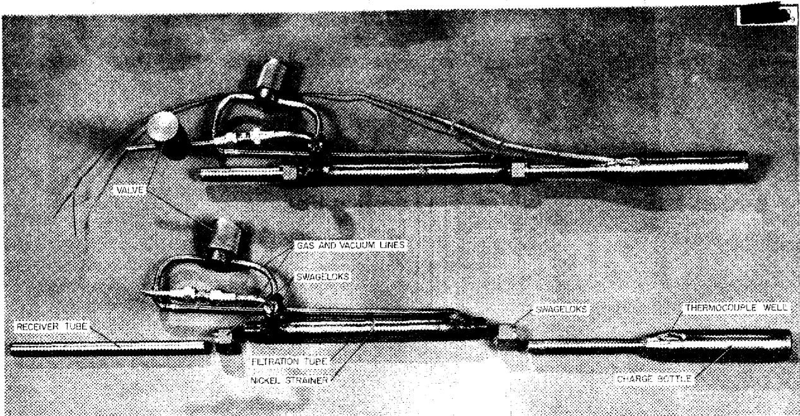  
Fig. 10.7. Closed-System Batch-Filtration Rig.

In these studies, a mixture containing 50 mole % NaF, 46 mole % ZrF₄, and 4 mole % UF₄ that had been purified in the standard fashion and stored in a sealed bottle in a dry box was treated with varying quantities of ZrH₂. Samples were equilibrated at 800°C for 4 hr under a positive pressure of helium and, after 2 hr equilibration at 600°C, filtered at the latter temperature.

When $\mathrm{ZrH_2}$ was added in the range from 0.2 to 0.7 wt % of the fuel mixture, no evidence of solid separating from the melt was observed. Chemical analysis of the filtrates in each case revealed the original uranium concentration, and microscopic examination of material on the filter revealed no $\mathrm{UF_3}$ . Although extensive reduction of uranium to $\mathrm{UF_3\cdot 2ZrF_4}$ was observed in the filtrate, especially when $0.7\%$ of $\mathrm{ZrH_2}$ was used, no free $\mathrm{UF_3}$ could be detected in the specimens examined.

Additional tests will be made to verify this important point and to

determine the maximum $\mathrm{ZrH_2}$ concentration tolerable without precipitation of the solids. It appears, however, that if the temperature is kept at $600^{\circ}\mathrm{C}$ or above, at least 0.7 wt $\%$ of $\mathrm{ZrH_2}$ may be added to the ARE fuel without difficulty.

Solubility of Potassium in the NaF-KF-LiF Eutectic (H. R. Bronstein, M. A. Bredig, Chemistry Division). Additions of alkali metals to fluoride mixtures have demonstrated a capacity for suppressing the fluoride attack on container materials. Consequently, an investigation was undertaken to determine the amount of potassium that will remain in equilibrium in the fluoride eutectic NaF-KF-LiF (11.5-42.0-46.5 mole %). The need for separation of the equilibrated liquid salt and liquid metal phases led to the design of a ball-check apparatus that consists of a sealed capsule with two outlets, either of which may be sealed by the steel ball within the capsule. The capsule is charged with the fluoride, the metal added, and the

mixture intimately mixed. The capsule is then tilted so that the ball closes the lower valve and isolates the upper part of the salt phase, which is then solidified and analyzed for its potassium content. The data obtained are summarized in Table 10.4.

# PRODUCTION AND PURIFICATION OF FLUORIDE MIXTURES

F. F. Blankenship G. J. Nessle Materials Chemistry Division

Use of the hydrogenation-hydrofluorination process previously described for fuel-sample preparation has been continued on laboratory and pilot scales for production of standard materials for corrosion testing, physical property evaluation, and large-component testing.

Construction of the production equipment to furnish 3000 lb of $\mathrm{NaZrF}_5$ for the ARE is in an advanced stage. Raw materials are being accumulated at a satisfactory rate.

A modification of the purification treatment has been adopted for microscale processing of samples containing enriched uranium for radiation-damage testing.

A slight modification of the standard procedure has been used successfully to purify mixtures containing 50 mole % NaF, 25 mole % ZrF₄, and 25 mole % UF₄.

Preparation of $\mathrm{NaZrF}_5$ by direct hydrofluorination of $\mathrm{ZrO}_2$ in the presence of NaF has been moderately successful in simple equipment. Further study of this process is planned.

Laboratory-Scale Fuel Preparation (R.E. Thoma, C.M. Blood, F.P. Boody, Materials Chemistry Division). Fourteen batches of purified molten fluoride compositions, both coolant and fuel, have been prepared for loop tests, measurement of physical properties, and corrosion testing. These were treated in essentially the same manner as previously reported.(11)

To explore the unlikely possibility that hydrogen reduces $\mathbf{U}\mathbf{F}_{4}$ or $\mathbf{ZrF}_{4}$ , two of the fuel batches were given an additional hydrogenation for 1 hr following the regular procedure. No evidence of reduced phases in the products from these runs was shown by examination with the petrographic microscope. However, there is evidence that the material so prepared was slightly less corrosive in small-scale tests than was the standard fuel. No explanation for this effect has been suggested; however, further study of this behavior is planned.

Modifications of techniques of assembling and disassembling apparatus have resulted in less frequent failure than was experienced at the beginning of the hydrofluorination program. Corrosion of the reactors has not yet been a problem when the standard treatment is applied to relatively pure fluoride mixtures.

Pilot-Scale Fuel Purification (G. J. Nessle, J. E. Eorgan, Materials Chemistry Division). Two apparatus capable of producing up to 3 kg of

(11) C. M. Blood, F. P. Boody, A. J. Weinberger, and G. J. Nesale, ANP Quar. Prog. Rep. June 10, 1952, ORNL-1294, p. 97.

TABLE 10.4. SOLUBILITY OF POTASSIUM IN NaF-KF-LiF   

<table><tr><td>TEMPERATURE OF 
EXPERIMENT (℃)</td><td>NO. OF 
EXPERIMENTS</td><td>POTASSIUM CONTENT 
(mole %)</td></tr><tr><td>544</td><td>1</td><td>3.8</td></tr><tr><td>686</td><td>1</td><td>3.5</td></tr><tr><td>920</td><td>5</td><td>3.7 ± 0.5</td></tr><tr><td>1040</td><td>1</td><td>3.9</td></tr></table>

purified fuel mixtures and one apparatus capable of handling up to $30\mathrm{kg}$ of the molten materials are in use at present. The small units are essentially duplicates of the laboratory-scale models previously described. The 50-lb equipment, however, was built mainly from existing equipment and utilizes an 8-ft transfer line and a receiver furnace that can be lowered to permit rapid handling of the product. This apparatus has 3/8-in. nickel tubing in the gas and transfer lines and 10-in.-dia reactor and receivers. Swagelok fittings are used on all tubing connections.

A total of $323\mathrm{kg}$ of fuel has been prepared in the equipment, and it is possible to produce up to $60\mathrm{kg}$ per week, if necessary.

Each fuel batch is sampled as it is transferred under inert gas pressure to the receiver. Except in a few instances, the concentrations of Fe, Cr, and Ni have been less than 900, 100, and 900 ppm, respectively. There appear to be no differences in chemical analysis that can be attributed to the presence or absence of the sintered nickel filter in the transfer line.

Since there have been some unexplained differences in corrosion between various batches of fuel prepared in this equipment, it may be necessary to increase the time of treatment in the 50-lb rig. This possibility is being studied at present.

In general, performance of the pilot-scale equipment has been quite satisfactory. The 50-lb rig would be improved by larger valves in the HF lines, although heating all such lines to $100^{\circ}\mathrm{F}$ has minimized the difficulty resulting from condensation of HF. No difficulty with faulty vessels of nickel or with corrosion of reactors has been observed. Transfers of material from the 10-in. reactor are remarkably complete; material balances indicate less than 100-g holdup on batches of 50 pounds.

Fuel Production Facility (G. J. Nessle, Materials Chemistry Division). The 3000 lb of NaF-ZrF₄ (50-50 mole %) for the ARE is to be prepared in 250-lb batches. Equipment for this purpose is being constructed of nickel from scaled-up designs that are very similar to those used for the pilot-scale units. Duplicate units are to be used, and production of 750 to 1000 lb per week should be possible. These units are in the final construction stages and should be available by mid-December.

The equipment is installed in an area that is convenient for operating personnel and where safety can be maintained during the entire cycle. The process includes storage, transfer, weighing, and blending of the dry solid components; treatment by melting, fluorinating with hydrogen fluoride, and reducing with hydrogen; transfer of the pure liquid melt to the storage vessel; and storage of the solidified product. All treatment processes at molten temperatures are handled remotely, and the negative-pressure ventilation over the confined process equipment is at a rate of more than one change per minute. The process equipment from outside manufacturers and Y-12 shop fabricators has been delivered and is scheduled for installation, without delay, upon completion of the construction work.

The $\mathbf{ZrF_4}$ for the fuel is low- hafnium material prepared by the Y-12 Production Division by hydrofluorination of $\mathbf{ZrCl_4}$ . The $\mathbf{ZrCl_4}$ , produced at the Bureau of Mines in Albany, Oregon, has been delivered, and conversion to $\mathbf{ZrF_4}$ is virtually complete. Table 10.5 shows the chemical analysis of the sublimed $\mathbf{ZrF_4}$ received from Y-12 and stock-piled for this operation.

The NaF of the purity required is available in stock, and HF, $\mathbf{H}_2$ , and He of the proper purity are available in quantity.

TABLE 10.5. ANALYSIS OF LOW-HAFNIUM ${\mathrm{{ZrF}}}_{4}$ FOR PRODUCTION OPERATION  

<table><tr><td rowspan="2">BATCH NO.</td><td colspan="4">COMPOSITION (%)</td><td rowspan="2">HAFNIUM (ppm)</td><td rowspan="2">BORON (ppm)</td></tr><tr><td>Zr</td><td>F</td><td>Cl</td><td>C</td></tr><tr><td>B-1</td><td>54.8</td><td>42.8</td><td>0.03</td><td>0.06</td><td>85</td><td></td></tr><tr><td>B-2</td><td>55.2</td><td>42.8</td><td>0.03</td><td>0.12</td><td>70</td><td></td></tr><tr><td>B-3</td><td></td><td>43.9</td><td>0.01</td><td>0.29</td><td>50</td><td>1</td></tr><tr><td>B-4</td><td></td><td>43.8</td><td>0.01</td><td>0.14</td><td>50</td><td>0.5</td></tr><tr><td>B-5</td><td></td><td>44.7</td><td>0.01</td><td>0.07</td><td>50</td><td>0.5</td></tr></table>

Preparation of Hydrofluorinated Fuel Samples (F. P. Boody, Materials Chemistry Division). Ten small samples containing enriched $\mathrm{UF_4}$ have been treated in the program for preparing fuels for the cold critical test and for radiation-damage tests in the MTR. The base material was a mixture of NaF and $\mathrm{ZrF_4}$ that had been hydrofluorinated before the enriched $\mathrm{UF_4}$ was added. Samples containing 10.8, 16.5, and 35.0 wt % $\mathrm{UF_4}$ have been prepared for the radiation-damage experiments.

The batches of NaF-ZrF $_4$ -UF $_4$ (46-50-4 mole %) for the cold critical test were treated in the same manner as batches containing normal UF $_4$ . However, the batches required for radiation-damage tests were small (10 to 20 g), and the procedure was modified so that the HF, H $_2$ , and He gases were not bubbled through the melt but were applied as an atmosphere.

The melt was contained in either a nickel or platinum crucible inside the nickel reactor. The reactor was opened and the sample transferred to a gas-tight glass shipping container in a dry box that had an inert atmosphere that was produced by evacuating and flushing with dry helium three times. A small amount of NaK was included in the sealed glass shipping container to ensure the quality of the inert atmosphere.

The formation of a black crust on the surface of several of the samples

has caused considerable concern. This crust has been examined petrographically, spectroscopically, chemically, and by x-ray diffraction. The spectroscopic and x-ray diffraction analyses showed only $\mathrm{NaUF}_5$ and $\mathrm{NaZrF}_5$ to be present in appreciable quantity; however, the petrographic microscope indicated small amounts of carbon and $\mathrm{UO}_2$ . Chemical analyses indicated 0.06 to $0.20\%$ carbon and approximately $0.2\% \mathrm{UO}_2$ .

Hydrofluorination of $\mathbf{ZrO}_2$ -NaF Mixtures (C. M. Blood, R. E. Thoma, Materials Chemistry Division). Efforts to determine the optimum conditions for the smooth and complete hydrofluorination of NaF-ZrO₂ mixture to NaZrF₅ have continued. The successful results obtained during the previous quarter(12) with the hydrofluorination of small samples (300 to 400 g) encouraged attempts to treat larger batches (2 to 3 kg) without the aid of a mechanical stirrer. Because of the high temperatures (700 to 900°C) involved and the pronounced inconvenience of mechanical stirring in the presence of HF at this temperature, a technique was sought that required no more agitation than that provided by gas bubbling through 6 in. of melt 4 in. in diameter.

Completion of the reaction by passing HF through a nickel reactor at

low temperatures (50 to $150^{\circ}\mathrm{C}$ ), at which a liquid reaction medium was obtained through the agency of the low-melting-point polyhydrofluorides of NaF, or at high temperatures (550 to $850^{\circ}\mathrm{C}$ ), at which liquefaction resulted from the melting of the $\mathrm{NaZrF}_5$ , appeared feasible. The main problem was to find the optimum combination of low- and high-temperature stages. Earlier results indicated that although essentially stoichiometric conversion could be obtained at low temperatures, complete neutralization and removal of water was best ensured by high-temperature treatment of the molten salt. Accordingly, all trials were finished with at least 1 hr of high-temperature treatment.

Difficulties associated with the appearance of insoluble intermediates were encountered at both low and high temperatures. Cements, presumably related to $\mathrm{ZrOF_2}$ , were developed in the partly reacted mixtures; rapid passage of HF or helium was ineffective in mixing the cemented portions, and channeling occurred.

Successful results were achieved if long soaking periods (12 to 16 hr) at low temperatures were used, followed by high-temperature hydrofluorination; when $25\%$ of the charge material was the previously prepared $\mathrm{NaZrF}_5$ , the high-temperature treatment alone was sufficient. Both petrographic examination and x-ray analysis indicate that even in those samples in which the material balance is $100\%$ there occurs a trace amount of $\mathrm{Na_2ZrF}_6$ , and as a result the refractive index or the x-ray crystal pattern deviates slightly from the exact standard for $\mathrm{NaZrF}_5$ .

The feasibility of making $\mathbf{ZrF_4}$ directly from $\mathbf{ZrO_2}$ and NaF has been demonstrated from a laboratory standpoint; the practical application of the process requires further engineering development.

# PURIFICATION OF HYDROXIDES

# E. E. Ketchen L. G. Overholser Materials Chemistry Division

The purification of hydroxides has continued, but at a further decreased rate. An increased interest in handling alkali metals, especially the alloy NaK, made it necessary to condition the vacuum dry box and perform numerous loadings and unloadings, which cut heavily into the time allotted for hydroxide purification. However, sufficient NaOH has been purified to maintain an inventory large enough to fill all requirements for this material.

The method previously given, (13,14) which involves the removal of $\mathrm{Na}_2\mathrm{CO}_3$ from a 50 wt % solution of NaOH and subsequent dehydration at $450^{\circ}\mathrm{C}$ under vacuum, was used for all NaOH purification. Nine batches averaging 1 l/2lb per batch were prepared during the period. The purified product continues to meet the specification of 0.1 wt % for both $\mathrm{Na}_2\mathrm{CO}_3$ and $\mathrm{H}_2\mathrm{O}$ .

Additional pure KOH has been prepared by the method previously described,[13,14] namely, the interaction of pure potassium with water, followed by dehydration at $450^{\circ}\mathrm{C}$ under vacuum. The $\mathrm{K}_2\mathrm{CO}_3$ content has ranged from 0.04 to 0.12 wt % and the water content has been 0.1 wt % or less. Approximately 2 lb of KOH was prepared during the period, and the inventory was thus increased to about 5 pounds. At present, the demand for pure KOH is virtually nonexistent, and unless some unforeseen demand arises it is not planned to react more than an additional pound of potassium.

Two batches of $\mathbf{Sr(OH)}_2$ were purified by the method previously described

in detail.(15) This material is not being used for experimental purposes

at present; consequently, no further significant production is anticipated.

No LiOH was purified during the period. Present requirements are being met by dehydration of the commercial monohydrate.

# 11. CORRcSION RESEARCH

W. R. Grimes, Materials Chemistry Division

W. D. Manly, Metallurgy Division

H. W. Savage, ANP Division

Most of the effort on corrosion was expended in dynamic tests of the $\mathbf{ZrF}_4$ -bearing fluoride melts. These studies have been primarily concerned with the effect of various additives to the melt on the corrosion behavior of Inconel. It was found that additions of $\mathbf{ZrH}_2$ and NaK to the fuel mixture inhibit the corrosive attack. Other tests of fluoride corrosion have been performed to determine the effect of crevices, temperature, and pretreatment of the fluoride and the resistance of various oxide coatings and ceramic bodies. Several Inconel loops circulating the fuel mixture NaF- $\mathbf{ZrF}_4$ - $\mathbf{UF}_4$ (46-50-4 mole %) exhibited more severe corrosion than was previously encountered in such tests; this is believed to be due to the lower purity of the fluoride mixtures recently prepared in large-batch apparatus.

Temperature-dependence tests and experiments on the effects of various additions on the corrosion behavior of the hydroxides were carried out. However, the maintenance of a hydrogen atmosphere is the only proved means of controlling hydroxide corrosion.

The work on liquid metal corrosion was concentrated on the operation of thermal convection loops of two types to study the mass transfer properties of lead. One of the most critical variables in lead corrosion was found to be the cleanliness of the lead and the container. However, even the purest lead prepared to date cannot be satisfactorily contained in Inconel at temperatures above $500^{\circ}\mathrm{C}$ . The investigation of the stability of BeO in NaK was continued, but additional experimentation is required to make an evaluation.

# FLUORIDE CORROSION IN STATIC AND SEESAW TESTS

D.C.Vreeland

L. R. Trotter

E. E. Hoffman

J. E. Pope

Metallurgy Division

F. Kertesz

C. R. Croft

H. J. Buttram

R.E.Meadows

Materials Chemistry Division

Oxide Additives. Static tests were run in Inconel tubes for 100 hr at $816^{\circ}\mathrm{C}$ with the fluoride mixture NaF-KF-LiF- $\mathbf{U}\mathbf{F}_{4}$ (10.9-43.5-44.5-1.1 mole%) plus approximately $10\%$ additions of ferric oxide, nickel oxide, and chromic oxide. These tests were run to determine whether the presence of these oxides, which may also be present on Inconel, would increase the corrosion by fluorides. In these tests, the nickel oxide and ferric oxide had little or no effect on the extent of corrosion. The addition of chromic oxide apparently increased corrosion. The results are summarized in Table 11.1. Similar tests are being run with oxidized Inconel specimens to determine whether increased corrosion can be expected on oxidized Inconel.

Comparison of Liquid- and Vapor- Phase Corrosion. Sections of the testing tube used in some of the tests run with the fluoride mixture NaF-KF-LiF-UF $_4$ (10.9-43.5-44.5-1.1 mole %) for 100 hr at $816^{\circ}\mathrm{C}$ were removed, both from above and from below the bath level, for metallographic examination. The corrosive attack noted on all sections examined would seem to indicate that attack can be expected on metals exposed to the vapor phase of the fluoride mixture. The sections of type 304 stainless steel exposed to the vapor phase appeared to be attacked

more severely than those exposed to the liquid phase. Inconel, type 309 stainless steel, and type 316 stainless steel appeared to be attacked by the vapor phase to approximately the same extent as by the liquid phase of the molten fluoride salt. Figures 11.1 and 11.2 compare type 304 stainless steel as exposed to the liquid phase and to the vapor phase of the fluoride. Details of these tests are presented in Table 11.2.

Crevice Corrosion. Some concern had been expressed about the possibility of crevice corrosion in materials used to contain the molten fluorides. In order to check this possibility, tests were set up with specially prepared crevices. Ordinary static corrosion tubes were employed, and the lower section of the tube above the bottom

weld was partly crimped so that a crevice about 1 in. long and approximately 1/16 in. wide was obtained. After being exposed for 100 hr at $816^{\circ}C$ to the fluoride mixture NaF-KF-LiF-UF $_4$ (10.9-43.5-44.5-1.1 mole %), the tubes were cut longitudinally through the partly crimped section and examined for evidence of accelerated corrosion. The crimped ends of several ordinary static corrosion test tubes were also examined for accelerated corrosion. Corrosion in these crevices appeared to be somewhat erratic, with some sections being unattacked. However, even in the sections that were attacked, the depth of penetration did not exceed that normally expected for these materials after exposure to fluorides. Details of these tests are presented in Table 11.3.

TABLE 11.1. RESULTS OF STATIC CORROSION TESTS OF INCONEL IN NaF-KF-LiF-UF4 WITH VARIOUS ADDITIVES FOR 100 hr AT 816°C   

<table><tr><td>ADDITIVE</td><td>METALLOGRAPHIC NOTES</td></tr><tr><td>10% ferric oxide</td><td>Attack to 2 mils on specimen and tube</td></tr><tr><td>10% nickel oxide</td><td>Attack to 1 mil on specimen and tube</td></tr><tr><td>10% chromic oxide</td><td>Attack to 5 mils on specimen and 2 to 10 mils on tube</td></tr></table>

TABLE 11.2. RESULTS OF EXAMINATIONS OF VARIOUS MATERIALS EXPOSED TO LIQUID AND VAPOR PHASES OF NaF-KF-LiF-UF4 FOR 100 hr at $816^{\circ}\mathrm{C}$   

<table><tr><td rowspan="2">MATERIAL</td><td colspan="2">METALLOGRAPHIC NOTES</td></tr><tr><td>LIQUID-PHASE EXPOSURE</td><td>VAPOR-PHASE EXPOSURE</td></tr><tr><td>Inconel</td><td>Erratic attack, subsurface voids to 1.5 mils</td><td>Erratic attack, subsurface voids to 1 mil</td></tr><tr><td>Type 304 stainless steel</td><td>Erratic attack, intergranular with some subsurface voids to 1 mil</td><td>Intergranular attack to 5 mils</td></tr><tr><td>Type 309 stainless steel</td><td>Subsurface voids to 3 mils</td><td>Subsurface voids to 3 mils</td></tr><tr><td>Type 316 stainless steel</td><td>Intergranular penetration of 1 mil</td><td>Some slight evidence of attack, less than 0.5 mil penetration</td></tr></table>

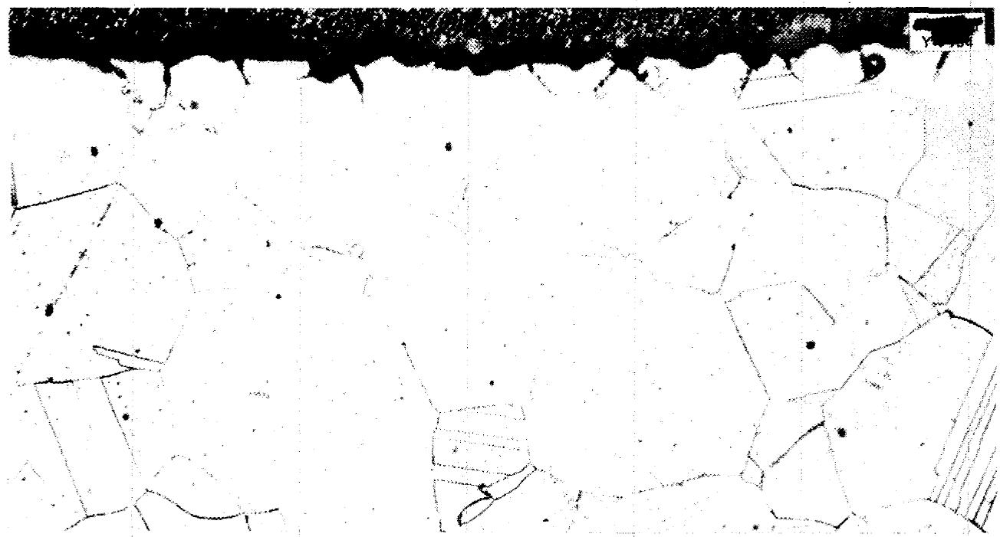  
Fig. 11.1. Type 304 Stainless Steel Exposed to Attack by Liquid Phase of NaF-KF-LiF-UF for 100 hr at $816^{\circ}\mathrm{C}$ . 250X.

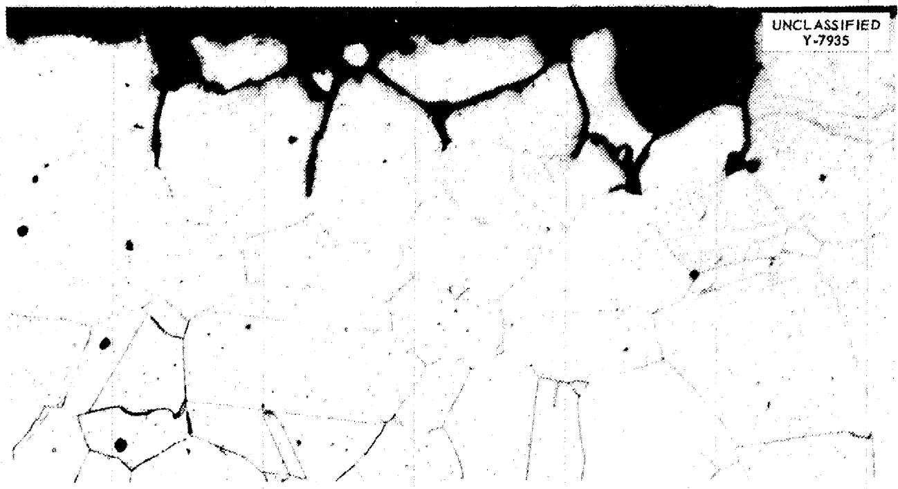  
Fig. 11.2. Type 304 Stainless Steel Exposed to Attack by Vapor Phase of NaF-KF-LiF-UF $_4$ for 100 hr at $816^{\circ}$ C. 250X.

TABLE 11.3. RESULTS OF EXAMINATION FOR ACCELERATED CREVICE CORROSION IN VARIOUS MATERIALS AFTER TESTING IN NaF-KF-LiF-UF ${}_{4}$ FOR 100 hr AT ${816}^{ \circ  }\mathrm{C}$   

<table><tr><td>MATERIAL</td><td>METALLOGRAPHIC NOTES</td></tr><tr><td>Inconel (specially prepared crevice)</td><td>Subsurface voids to a maximum of 2 mils</td></tr><tr><td>Type 304 stainless steel (specially prepared crevice)</td><td>Subsurface voids to a maximum of 2 mils</td></tr><tr><td>Type 316 stainless steel (specially prepared crevice)</td><td>Subsurface voids to a maximum of 1 mil</td></tr><tr><td>Inconel (regular static test)</td><td>Subsurface voids to a maximum of 2.5 mils</td></tr><tr><td>Type 304 stainless steel (regular static test)</td><td>Very little attack, a few subsurface voids to 0.5 mil</td></tr><tr><td>Type 309 stainless steel (regular static test)</td><td>Subsurface voids to a maximum of 1.5 mils</td></tr></table>

Carboloy and Stellite Alloys. Several Carboloy and Haynes Stellite alloys that might possibly be used as valve seat and facing materials have been subjected to static corrosion tests with the fluorides. Carboloy 44A and 55A were apparently unattacked in fluoride mixture $\mathrm{NaF - ZrF_4 - UF_4}$ (46-50-4 mole %). Thestellites tested were attacked much more severely by this fluoride mixture than by NaF-KF-LiF-UF4 (10.9-43.5-44.5-1.1 mole %). These materials were exposed for 100 hr at $816^{\circ}C$ in evacuated Inconel tubes. The test results are presented in Table 11.4.

Reducing Agents. Fluoride samples with various reducing agents were exposed in the tilting furnace for 100 hr with 4 cpm between 650 and $800^{\circ}\mathrm{C}$ . Data were obtained by addition of 1 wt % of $\mathbf{Zr}$ or $\mathbf{ZrH}_2$ to fuel containing $\mathbf{NaF - ZrF_4 - UF_4}$ (50-46-4 mole %). Chemical analyses of the fluoride, without and with the additives, indicate that with the additives the amount of structural elements dissolved is drastically reduced. The concentration of nickel in the fuel is considerably increased, whereas the iron content remains essentially constant;

the dissolution of chromium, however, is reduced to negligible proportions. It appears that this technique may alleviate the difficult problem of selective leaching of chromium from Inconel and stainless steel. Metallographic examinations of these tubes indicate that addition of $\mathbf{Z}\mathbf{r}$ or $\mathbf{Z}\mathbf{r}\mathbf{H}_{2}$ reduces penetration of the fuel into the metal.

Tests still in progress indicate that addition of these agents to the extent of an 0.8 equivalent of $\mathbf{Zr}$ or $\mathrm{ZrH_2}$ (based on reduction of $\mathrm{UF_4}$ to $\mathrm{UF_3}$ ) causes formation of an orange-brown compound and that addition of an 0.8 equivalent of NaK causes some reduction to $\mathrm{UF_3}$ . At lower concentrations, that is, below 0.4 equivalent, no free $\mathrm{UF_3}$ is detected. The range between 0.4 and 0.8 is being investigated.

Examination of Inconel tubes in which varying amounts of NaK were added to $\mathrm{NaF - ZrF_4 - UF_4}$ (50-46-4 mole %) and $\mathrm{NaF - ZrF_4}$ (50-50 mole %) showed that in the tubes containing $\mathrm{NaF - ZrF_4 - UF_4}$ there was a nonmetallic deposit and some pitting at the deposit-metal interface. The tubes containing $\mathrm{NaF - ZrF_4}$ appeared to be attacked similarly, but there was somewhat heavier pitting.

Additions of NaK cannot be recommended at present.

Fluoride Treatment. Static corrosion tests were made on a special batch of the fluoride mixture $\mathrm{NaF - ZrF_4 - UF_4}$ (50-46-4 mole %), which was prepared by starting with $\mathrm{ZrO_2}$ and hydrofluorinating the mixture to obtain $\mathrm{ZrF_4}$ . The tests indicated that this mixture is no more corrosive than material prepared by the hydrogenation-hydrofluorination process in which $\mathrm{ZrF_4}$ is used as the starting material.

The effect of a hydrofluorination treatment for the fluoride mixture NaF-KF-UF $_4$ (46.5-26-27.5 mole %) was

determined in a tilting-furnace corrosion test in which the hot end was at $800^{\circ}\mathrm{C}$ and the cold end at $650^{\circ}\mathrm{C}$ . The duration of the test was 100 hours. It was found that Inconel suffered approximately the same degree of attack as when exposed to untreated fluorides of the same composition, that is, 1 to 6 mils of penetration. The results of exposure of type 316 stainless steel indicated approximately the same severity of attack, but slightly less penetration, as when untreated material was used. It appears that the purification treatment should be extended for longer

TABLE 11.4. RESULTS OF TESTS OF SEVERAL CARBOLOY AND HAYNES STELLITE ALLOYS EXPOSED TO FLUORIDE MIXTURES FOR 100 hr AT $816^{\circ}\mathrm{C}$ IN INCONEL TUBES   

<table><tr><td>MATERIAL</td><td>FLUORIDE
BATH NO.</td><td>METALLOGRAPHIC NOTES</td></tr><tr><td>Carboloy 44A</td><td>27(a)</td><td>No apparent attack</td></tr><tr><td>Carboloy 55A</td><td>27</td><td>No apparent attack</td></tr><tr><td>Carboloy 608</td><td>27</td><td>General roughening of surface, 1 to 2 mils</td></tr><tr><td>Carboloy 779</td><td>27</td><td>Some surface spalling to a depth of 1 mil, which may have occurred in grinding</td></tr><tr><td>Carboloy 907</td><td>27</td><td>Some surface spalling to a depth of 1 to 3 mils, which may have occurred in grinding</td></tr><tr><td>Haynes Stellite 3</td><td>14(b)</td><td>Light attack of what appears to be a carbide phase, 1 mil in depth</td></tr><tr><td>Haynes Stellite 3</td><td>27</td><td>Selective attack of what appears to be a carbide phase, maximum depth 22 mils, minimum 12 mils, average 15 mils</td></tr><tr><td>Haynes Stellite 6 (specimen A)</td><td>14</td><td>Selective attack of what appears to be a carbide phase, maximum depth 6 mils, minimum 2 mils, average 4 mils</td></tr><tr><td>Haynes Stellite 6 (specimen A)</td><td>27</td><td>Selective attack of what appears to be a carbide phase, maximum depth 24 mils, minimum 12 mils, average 15 mils</td></tr><tr><td>Haynes Stellite 6 (specimen B)</td><td>14</td><td>Selective attack of what appears to be a carbide phase, maximum depth 3 mils, minimum 1 mil, average 2 mils</td></tr><tr><td>Haynes Stellite 6 (specimen B)</td><td>27</td><td>Selective attack of what appears to be a carbide phase, maximum depth 29 mils, minimum 8 mils, average 11 mils</td></tr><tr><td>Haynes Stellite 19</td><td>14</td><td>Scattered attack to 2 mils in depth</td></tr><tr><td>Haynes Stellite 19</td><td>27</td><td>Selective attack of what appears to be a carbide phase, maximum depth 29 mils, minimum 10 mils, average 20 mils</td></tr></table>

(a) Composition: NaF-ZrF4-UF4, 46-50-4 mole %.   
(b) Composition: NaF-2+F-LiF-UF4, 10.9-43.5-44.5-1.1 mole%.

times when high uranium concentrations are used.

A test was run in the tilting furnace under standard conditions of time and temperature with $\mathrm{NaF - ZrF_4 - UF_4}$ (50-46-4 mole %) that had been treated with hydrogen after purification by the normal hydrogenation-hydrofluorination method. Type 316 stainless steel showed somewhat less attack when subjected to the hydrogen-treated material than when exposed to material prepared in the standard fashion. The Inconel tubes were found to be lightly attacked (0.5- to 1-mil penetration) when in contact with the hydrofluorinated material, but they evidenced no attack when exposed to the hydrogen-treated material. These preliminary tests indicate that a final hydrogen treatment of the fuel would be beneficial. Additional tests are scheduled.

Temperature Dependence. Although the immediate application of the fluoride fuel $\mathrm{NaF - ZrF_4 - UF_4}$ (50-46-4

mole %) is to be limited to a temperature of $1500^{\circ}\mathrm{F}$ , some corrosion tests under static conditions were performed at considerably higher temperatures to determine the temperature-dependence of the corrosiveness of this fuel. As the data in Table 11.5 indicate, penetration of the Inconel by the fluorides in these 100 hr tests increased slightly, if at all, over the temperature range 800 to $1200^{\circ}\mathrm{C}$ .

It is interesting to note that Inconel seems to lose weight at $1200^{\circ}\mathrm{C}$ instead of gaining weight as is usual at the lower temperatures. No explanation for the behavior at high temperatures is suggested.

Ceramic Materials. Two specimens of beryllium oxide blocks with approximate dimensions 0.25 by 0.25 by 0.50 in. were exposed to NaF-BeF $_2$ (57-43 mole %) for 100 hr (24,000 cycles) in the tilting furnace with the hot end (beryllium oxide mechanically held at hot end) at $800^{\circ}\mathrm{C}$ , and the cold end at

TABLE 11.5. CORROSION OF INCONEL BY NaF-ZrF ${}_{4}$ -UF ${}_{4}$ AT TEMPERATURES FROM 800 TO ${1200}^{ \circ  }\mathrm{C}$   

<table><tr><td rowspan="2">RUN NO.</td><td rowspan="2">TEMPERATURE (°C)</td><td rowspan="2">WEIGHT CHANGE (mg/dm2/day)</td><td rowspan="2">PENETRATION (mils)</td><td colspan="3">CHEMICAL ANALYSIS (ppm)</td></tr><tr><td>Fe</td><td>Cr</td><td>Ni</td></tr><tr><td rowspan="3">222(a)</td><td rowspan="3">800</td><td>+4</td><td>0.5 to 1</td><td>170</td><td>90</td><td>20</td></tr><tr><td>+8</td><td>0.5 to 1</td><td>180</td><td>1860</td><td>45</td></tr><tr><td>-1</td><td>0.5 to 1</td><td>440</td><td>2100</td><td>20</td></tr><tr><td rowspan="3">234(a)</td><td rowspan="3">1000</td><td>+22</td><td>1 to 2</td><td>185</td><td>2700</td><td>20</td></tr><tr><td>+9</td><td>1 to 4</td><td>100</td><td>3000</td><td>20</td></tr><tr><td>+12</td><td>1 to 4</td><td>90</td><td>2600</td><td>20</td></tr><tr><td rowspan="2">255(b)</td><td rowspan="2">1100</td><td>0</td><td>0.5 to 2</td><td>95</td><td>980</td><td>20</td></tr><tr><td>+6</td><td>0.5 to 2</td><td>100</td><td>1000</td><td>20</td></tr><tr><td rowspan="2">258(c)</td><td rowspan="2">1200</td><td>-13</td><td>0.5 to 2</td><td>200</td><td>1030</td><td>75</td></tr><tr><td>-31</td><td>0.5 to 1</td><td>290</td><td>670</td><td>110</td></tr></table>

$\left\langle \alpha \right\rangle$ Prerun analyses of fuel: 3000 ppm Fe, 980 ppm Cr, 230 ppm Ni.   
(6) Prerun analyses of fuel: 720 ppm Fe, >20 ppm Cr, 135 ppm Ni.   
(c) Prerun analyses of fuel: 340 ppm Fe, >20 ppm Cr, 580 ppm Ni.

$650^{\circ}\mathrm{C}$ . One specimen came out with clean surfaces and showed a $2.0\%$ weight loss, whereas the other was found to have a $4.6\%$ weight gain as a result of a magnetic oxide layer on one side. This oxide was probably due to iron and/or nickel from the tube walls.

Several ceramic materials with approximate dimensions 0.25 by 0.25 by 0.50 in. were tested in the fluoride mixture NaF-ZrF $_4$ (50-50 mole %) under static conditions, and the following information was obtained:

<table><tr><td colspan="2">SPECIMEN</td><td>WEIGHT CHANGE (%)</td></tr><tr><td>SiC</td><td></td><td>+35</td></tr><tr><td>TiO2</td><td></td><td>-17</td></tr><tr><td>ZrO2(stabilized)</td><td></td><td>-51</td></tr><tr><td>ZrO2</td><td></td><td>Dissolved</td></tr><tr><td>MgO</td><td></td><td>Dissolved</td></tr><tr><td>Al2O3</td><td></td><td>-37</td></tr></table>

The weight gain shown by the silicon carbide may be due to soaking up of the fluorides; if this is the case, there is indication that silicon carbide resists attack by this melt.

# FLUORIDE CORROSION IN THERMAL CONVECTION LOOPS

G. M. Adamson, Metallurgy Division

Several Inconel loops were operated with $\mathrm{NaF - ZrF_4 - UF_4}$ (46-50-4 mole %) under standard conditions, and in every case the depth of attack was slightly greater than had been encountered previously. The fluoride charges for these loops were all prepared in large batches. The inhibiting effect of zirconium hydride was confirmed in a test with NaF-KF-LiF-UF $_4$ (10.9-43.5-44.5-1.1 mole %). The inhibiting effect was also observed with $\mathrm{ZrF_4}$ -bearing fluorides, but it was not quite so effective and caused changes to take place in the fuel. NaK also has an inhibiting effect on both these fluorides but causes even greater changes to take place. It was noted that the fluorides possess a self

insulating property that makes plugging a flowing system more difficult than would be expected.

The results obtained during this period with the Inconel loops in which fluorides were circulated are summarized in Table 11.6. This table is a continuation of Table 15 in the previous report.(1) Table 11.6 should be referred to in reading the following discussion because it presents the individual test data not given in the specific sections. All loop tests, except one that terminated prematurely because of a power failure, operated for 500 hr with a hot leg temperature of $1500^{\circ}\mathrm{F}$ .

Mixtures Containing $\mathbf{ZrF_4}$ . For some as yet undetermined reason, the attack found in the Inconel loops in which fluorides containing $\mathbf{ZrF_4}$ have been circulated is increasing. The attack by these fluorides had been reduced to a depth of about 5 mils maximum after 500 hr at $1500^{\circ}\mathrm{F}$ , but in recent tests the attack has been significantly greater, that is, from 9 to 12 mils. Although some of the earlier loops were attacked to a depth of 10 mils, the attack could be attributed to the cleaning cycle, since it has been shown (both with other fluorides $^{(2)}$ and with lead) that the cleaning methods previously used caused an increase in attack. The new attack is actually as deep as, or deeper than, the attack in all the earlier tests, even when the cleaning variables are included. Figures 11.3, 11.4, and 11.5 show typical hot leg sections from these loops. Figures 11.3 and 11.4 permit a comparison of the earlier and the recent attack of NaF- $\mathbf{ZrF_4}$ -UF $_4$ on Inconel. Figure 11.5 shows a hydrogen-fired loop of the earlier group. One other point of interest is that an as yet unidentified brown material is found in the fluorides from the recent

TABLE 11.6. CORROSION DATA FROM INCONEL THERMAL CONVECTION LOOPS IN WHICH FLUORIDE MIXTURES WERE CIRCULATED FOR 500 hr(α) AT 1500°F  

<table><tr><td rowspan="2">LOOP NO.</td><td rowspan="2">CLEANING PROCEDURE</td><td rowspan="2">FLUORIDE MIXTURE</td><td colspan="2">METALLOGRAPHIC NOTES</td><td rowspan="2">CHEMICAL NOTES</td></tr><tr><td>Hot Leg</td><td>Cold Leg</td></tr><tr><td>233</td><td>NaK</td><td>NaF-KF-LiF-UF410.9-43.5-44.5-1.1 mole %</td><td>Moderate general and intergranular attack, maximum 12 mils, average 7 mils</td><td>Thin nonmetallic layer</td><td>Fe and U decreased, Cr increased slightly</td></tr><tr><td>223</td><td>NaK</td><td>NaF-KF-LiF-UF410.9-43.5-44.5-1.1 mole %</td><td>Typical Inconel attack, 8 to 10 mils; depth slightly deeper in crevice, but twice usual amount found(b)</td><td>Thin nonmetallic deposit</td><td>Fe and U decreased, Cr increased</td></tr><tr><td>241</td><td>NaK</td><td>NaF-ZrF-UF46-50-4 mole %+ 0.5 wt % NaK</td><td>Light pitting and intergranular attack, maximum 4 mils, average 15 mils</td><td>Metallic deposit and needle-like metallic crystals</td><td>Zr and Fe decreased, U, Cr, and Ni vary</td></tr><tr><td>235</td><td>NaK</td><td>NaF-KF-LiF-UF410.9-43.5-44.5-1.1 mole %+ 0.5 wt % Cr</td><td>Typical Inconel attack, more grain boundary preference, maximum 13 mils, average 8 mils</td><td>Thin nonmetallic surface layer that follows surface contours</td><td>Cr added still in top pot, Fe and U slightly lower than original</td></tr><tr><td>240</td><td>Degreased</td><td>NaF-KF-LiF-UF410.9-43.5-44.5-1.1 mole %</td><td>Moderate attack, up to 11 mils, sample attacked only 3 mils(c)</td><td>Thin surface deposit</td><td>U varies widely, Cr increased, Fe decreased</td></tr><tr><td>239</td><td>Degreased</td><td>NaF-ZrF4-UF46-50-4 mole %</td><td>Moderate to heavy attack, 9 to 17 mils deep; sample attacked only 1 mil(d)</td><td>Light, spotty deposit with some metallic crystals</td><td>U increased but varies, Zr decreased about 3%, Cr increased, Fe decreased</td></tr><tr><td>243</td><td>Degreased</td><td>NaF-ZrF4-UF46-50-4 mole %+ 0.5 wt % ZrH2</td><td>Widely scattered attack, 1 to 4 mils</td><td>Very thin surface deposit and deposits of crystals</td><td>U fairly constant but 3% above original, Zr decreased, Fe varies, Cr increased</td></tr><tr><td>242</td><td>Degreased</td><td>NaF-KF-LiF-UF410.9-43.5-44.5-1.1 mole %+ 0.5 wt % ZrH2</td><td>Widely scattered attack, 1 mil; occasional deposits in some grain boundaries</td><td>Metallic layer with nonmetallic particles occluded</td><td>U and F decreased slightly, Cr and Fe vary but decreased</td></tr><tr><td>244</td><td>Degreased</td><td>NaF-ZrF4-UF46-50-4 mole %</td><td>Moderate Inconel attack, maximum 9 mils, average 5 mils</td><td>No deposit</td><td>U increased about 1%, Zr decreased 2.5%, Fe and Ni decreased slightly, Cr increased</td></tr><tr><td>246</td><td>Degreased</td><td>NaF-ZrF4-UF452-48 mole %</td><td>Scattered intergranular attack, up to 8 mils in top section; pitting, 1 mil, with some areas up to 6 mils in lower part of hot leg</td><td>No deposit</td><td></td></tr><tr><td>245</td><td>Degreased</td><td>NaF-ZrF4-UF46-50-4 mole %</td><td>Moderate to heavy Inconel attack, maximum 12 mils, average 8 mils</td><td>Occasional nonmetallic particles</td><td>Cr and U increased, Fe and Ni decreased</td></tr><tr><td>247</td><td>Degreased</td><td>NaF-KF-LiF-UF410.9-43.5-44.5-1.1 mole %+ 0.5 wt % Cr</td><td>Light to moderate intergranular attack, 1 to 7 mils deep</td><td>Thin layer that appears to be metallic with some nonmetallic particles embedded in it</td><td></td></tr><tr><td>249</td><td>Degreased</td><td>Hydrofluorinated NaF-KF-LiF-UF410.9-43.5-44.5-1.1 mole %</td><td>Very heavy Inconel attack, average 18 to 20 mils, maximum 30 mils</td><td>Tightly adhering metallic layer of 1 mil, surface rough with some nonmetallic particles</td><td>Cr and U increased, Fe and Ni decreased, all high in original analysis</td></tr><tr><td>255</td><td>Degreased</td><td>NaF-KF-LiF-UF410.9-43.5-44.5-1.1 mole %</td><td>Moderate intergranular attack, to 20 mils in both sections, no evidence of chrome plate(e)</td><td>Heavy, light-colored deposit throughout leg, varies from 0.25 to 0.75 mil in thickness</td><td></td></tr><tr><td>256</td><td>Degreased</td><td>Hydrofluorinated NaF-KF-LiF-UF10.9-43.5-44.5-1.1 mole %</td><td>Maximum penetration 18 mils, average 10 mils, not so much in lower section</td><td>Heavy metallic layer with some attached crystals, up to 0.004 in long</td><td></td></tr></table>

(a) Operation of each loop was terminated at 500 hr, as scheduled, except loop 235, which was terminated at 455 hr because of a power failure.   
(b) Lep joint in hot leg.   
(c) Sample in hot leg.   
(d) Sample in top of hot leg.   
(6) Six-inch chrome-plated section welded into hot leg.

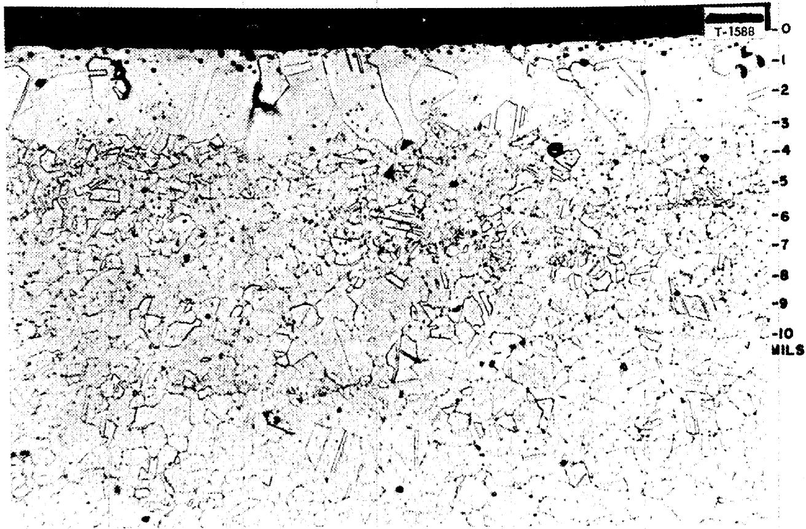  
Fig. 11.3. Hot Leg of Inconel Loop Tested for 500 hr at $816^{\circ}\mathrm{C}$ with NaF-ZrF $_4$ -UF $_4$ Prepared in 5-lb Batches. 250x.

tests that was not found in the fluorides from the earlier tests.

The major difference in these tests is that the earlier loops were filled from small batches of fluorides made in the laboratory, whereas the later ones were filled from 50-lb batches made in a production operation. The attack now being measured is not serious, since it is comparable to that normally found with NaF-KF-LiF- $\mathrm{UF}_4$ (10.9-43.5-44.5-1.1 mole %), but the trend may be serious. The actual fuel material for the reactor will be produced in 250-lb batches instead of the 50-lb batches being produced at present. A joint chemical, experimental engineering, and metallurgical program is under way to determine whether the increase in batch size affects the

corrosion or whether the increase in corrosion is the result of some change in handling procedure.

Most of the postrun examinations (3) of the fuels from thermal convection loops have been confined to petrographic and x-ray examinations. The NaF-ZrF $_4$ -UF $_4$ (46-50-4 mole%) fuel circulated in several Inconel and type 316 stainless steel loops was studied. The pleochroic, brown or olive-drab phase that has an average refractive index of 1.556 was first noted in a type 316 stainless steel loop, but it has also been found in several Inconel loops containing this mixture, as well as in ZrF $_4$ -bearing fluorides treated with NaK, Zr, and $\mathrm{ZrH}_2$ . In these dynamic

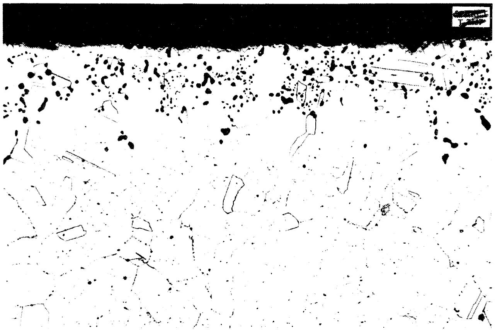  
Fig. 11.4. Hot Leg of Inconel Loop Tested for 500 hr at $816^{\circ}\mathrm{C}$ with NaF-ZrF $_4$ -UF $_4$ Prepared in 50-lb Batches. 250X.

corrosion tests, there appears to be some correlation (which did not exist in static tests) between the amount of the olive-drab phase and the extent of corrosion.

Hydrofluorinated NaF-KF-LiF-UF.4. One other series of tests points to poor production technique as the cause of the trouble discussed above. The attack found in Inconel loops in which NaF-ZrF4-UF4 (46-50-4 mole %) was circulated had been only one half of that found with NaF-KF-LiF-UF4 (10.9-43.5-44.5-1.1 mole %). One explanation for this has been the higher purity of the ZrF4-bearing fluoride. During production, the ZrF4-bearing material is purified with both hydrogen and hydrogen fluoride, whereas the NaF-KF-LiF-UF4 is not. Two special batches of NaF-KF-LiF-UF4 were prepared by the

group that makes the NaF-ZrF4-UF4, and the same techniques were used. Unexpectedly, the metal impurities in the specially prepared batches were much higher than in the normal material. In the two special batches, the metal impurities were:

<table><tr><td></td><td>BATCH 1</td><td>BATCH 2</td></tr><tr><td>Chromium, ppm</td><td>2200</td><td>1280</td></tr><tr><td>Iron, ppm</td><td>5600</td><td>7000</td></tr><tr><td>Nickel, ppm</td><td>7100</td><td>5300</td></tr></table>

The presence of these impurities has not yet been explained. Metallographic examination after a test with the first batch revealed a maximum hot leg attack of 30 mils, with an average of 18 mils. This is the deepest attack yet found with any fluoride loop. A loop is now being run to

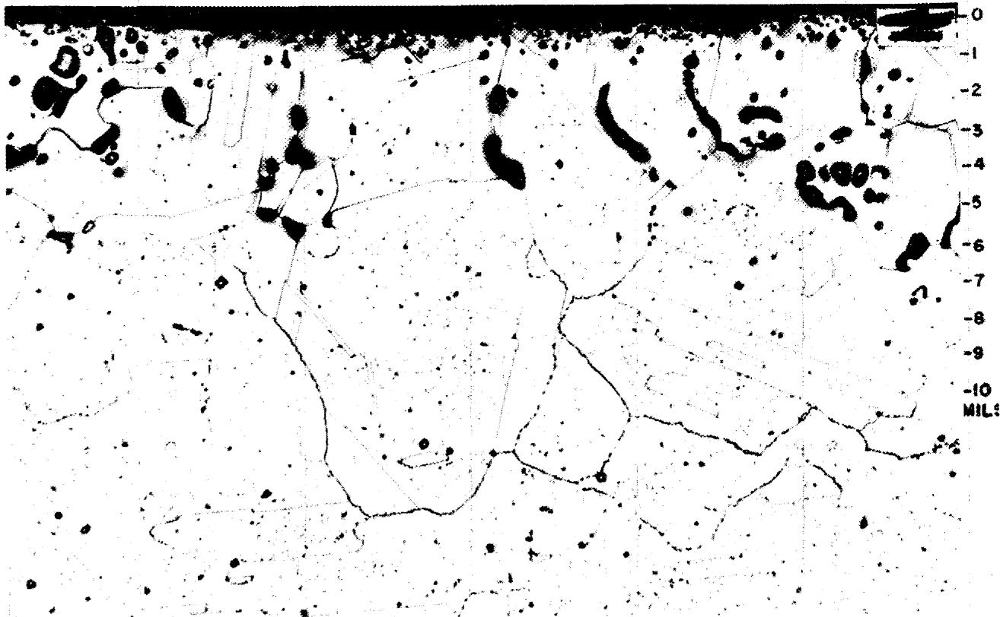  
Fig. 11.5. Hot Leg of Hydrogen-Fired Inconel Loop Tested for 500 hr at $816^{\circ}\mathrm{C}$ in NaF-ZrF $_4$ -UF $_4$ . 250X.

determine whether the addition of iron and nickel metal powders to NaF-KF-LiF- $\mathbf{U}\mathbf{F}_{4}$ will cause an increase in attack. The test with hydrofluorinated fuels will also be repeated.

Corrosion Inhibitors. It was pointed out in the previous report(4) that the addition of $0.5\% \mathrm{ZrH}_2$ caused a reduction in the hot leg attack on Inconel by NaF-KF-LiF-UF $_4$ (10.9-43.5-44.5-1.1 mole %) to only 0.5 mil. The test has now been repeated, and the attack found in the second loop was 1 mil. The unidentified material found in many of the grain boundaries in the hot leg section of the first loop was also found here, but only in very small amounts in widely scattered areas. A thin adherent layer that appears to be metallic was found in the cold leg. The fluorides in the loop after the run consisted of

alternating layers of a colorless material and the usual green phase. Petrographically, these two materials seem to be very similar, or even to be the same. No reduced or partly reduced phases were found in the loop itself.

Since optimistic results were obtained with the loops discussed above, two loops were run with zirconium hydride added to $\mathrm{NaF - ZrF_4 - UF_4}$ (46-50-4 mole %). Operation of both these loops has been completed, but the results of metallographic examination are available for only the first one. Scattered attack, with a maximum penetration of 4 mils (average 2 mils), was found. This attack is definitely less than that found in the other $\mathrm{NaF - ZrF_4 - UF_4}$ loops run during this period, but the effect of the zirconium hydride is not so great as was found with the NaF-KF-LiF-UF4 mixture. No grain-boundary

constituent was found in this loop. A considerable change had taken place in the fluorides in both loops, as evidenced by the unidentified brownish material found, along with the green phase, in all sections. No free $\mathrm{UF}_3$ was produced, although intermediate reduction products similar to those present in NaK loops were found.

The static corrosion tests had indicated optimistic results when base metals were used as inhibitors. Previously reported work had also shown a reduction in attack when nonuranium-bearing fluorides were circulated. Small amounts (about 10 cm³) of NaK were therefore added to two Inconel loops, one of which contained NaF-ZrF₄-UF₄ and the other NaF-KF-LiF-UF₄. In these loops, both the amount and maximum depth of attack were lower than those in comparable loops without the NaK. Although the improvements were not large and could have resulted from the normal spread in results, the fact that the metallic impurities in the fluorides were so low would indicate that the improvements were real. The NaF-ZrF₄-UF₄ (46-50-4 mole %) was changed in appearance and included yellow material that was present both as clumps and as a grain-boundary constituent. This loop also gave considerable difficulty during startup, and it was necessary to strike the legs frequently with a hammer to maintain circulation. Free UF₃, as well as intermediates, was produced in the fluoride.

Since chromium is the material being leached from the hot leg, the addition of chromium to the fuel could possibly slow down the reaction. It would be necessary to keep the chromium concentration low enough to prevent saturation and deposition in the cold leg, but high enough to reduce the rate of solution in the hot leg. The solubility of chromium in the fluorides has not yet been determined. Two loops were operated with a chromium

addition, but the results are inconclusive since the chromium did not mix with the fluorides. The analysis of the fluorides in both loops showed a chromium concentration in the various loop sections that was even lower than normal, whereas a chromium concentration of over $5\%$ was observed in the fluorides in the expansion pot of one loop.

Inserted Corrosion Samples. Two Inconel loops were operated with small, flat, Inconel samples inserted in the top of the hot leg. In a loop operated with $\mathrm{NaF - ZrF_4 - UF_4}$ (46-50-4 mole %), the wall attack in the hot leg consisted of moderate integranular and general attack from 9 to 17 mils deep, which is deeper than normal. The sample in this loop, however, was attacked to a depth of only 1 mil. The second loop, which contained NaF-KF-LiF-UF $_4$ (10.9-43.5-44.5-1.1 mole %), showed moderate wall attack from 5 to 11 mils deep, which is average attack for NaF-KF-LiF-UF $_4$ . The sample was attacked lightly to only 3 mils in depth. Two more loops are now circulating with small thin-walled tubes inserted in the hot leg. Thermocouples inserted in these tubes show that a large temperature drop is not responsible for the lack of attack on the samples.

Crevice Corrosion. As an additional check on the crevice corrosion found at the top weld in the thermal loops and in one of the pump loops, a loop was operated with two crevices fabricated into the hot leg. NaF-KF-LiF-UF $_4$ (10.9-43.5-44.5-1.1 mole %) was circulated in this loop at $1500^{\circ}\mathrm{F}$ . In the upper section of the hot leg, the wall attack varied from 4 to 7 mils, whereas in an adjoining crevice, the attack was from 6 to 8 mils and twice as concentrated. At the lower crevice, the pipe showed only scattered pits, up to 5 mils deep, whereas normal attack, up to 6 mils, was found in the crevice. This loop showed only a slight increase in depth of attack

in the crevices, but a considerable increase in amount.

Variation in Loop Wall Composition (J. P. Blakely, Materials Chemistry Division, G. M. Adamson, Metallurgy Division). Additional drillings have been made from the inside of the loop walls, and steps were taken to assure that the pipes were not deformed during the drilling. The chemical analyses of these samples are shown in Table 11.7. Inconel loop 229, in which NaF-KF-LiF-UF $_4$ (10.9-43.5-44.5-1.1 mole %) was circulated, and Inconel loop 236, in which NaF-ZrF $_4$ -UF $_4$ (46-50-4 mole %) was circulated, were operated under standard conditions. The change of analyses with depth from the surface follows the same general pattern as for the loops discussed in the previous report.(5)

Self-insulating Properties of Fluorides. An Inconel loop was filled with NaF-KF-LiF-UF and allowed to circulate in the normal manner at $1500^{\circ}\mathrm{F}$ . After normal circulation had been established, two helium jets were directed against an area at the bottom of the cold leg. Each jet delivered over $1000\mathrm{ft}^3/\mathrm{hr}$ of gas for 18 hr but did not cause the loop to plug. Initially, the cold leg temperature dropped, but the power was increased and the temperatures gradually returned to normal. The helium jets were then replaced by air jets that delivered a sufficient volume to form a black spot about 6 in. long. The loop circulated over 1000 hr with these jets operating, but there was apparently no plugging caused by the temperature differences.

Air jets were then turned on a section of the loop in the cold leg, and, after a total of 2300 hr, operation was terminated. The fluoride in both sections appeared normal upon visual inspection, but in neither section

would the fluoride melt under the conditions normally used for this operation.

Other Loop Tests. A type 316 stainless steel loop (No. 117) circulated NaF-KF-LiF-UF $_4$ (10.9-43.5-44.5-1.1 mole %) for 500 hours. This is only the second type 316 stainless steel loop that has not plugged, and both of these loops were operated under similar conditions. The cold leg of this loop was held above $1500^{\circ}\mathrm{F}$ by using a hot leg temperature of $1630^{\circ}\mathrm{F}$ and wrapping the cold leg with asbestos tape. No sign of plugging was evident at 500 hours. At this time, the hot leg temperature was reduced to $1500^{\circ}\mathrm{F}$ , and the asbestos tape was removed so that the loop would circulate under standard conditions. The loop then plugged after 366 hr at the lower temperature, or a total of 866 hours. A considerable quantity of metallic flakes was observed in the fluorides. The fluoride in the sections of this loop melted at below $1250^{\circ}\mathrm{F}$ , and it all melted.

An Izett iron loop, which had been cleaned with dry hydrogen, plugged in 46 hr of circulation of NaF-KF-LiF-UF $_4$ (10.9-43.5-44.5-1.1 mole %) at $1500^{\circ}\mathrm{F}$ . The inside surface of the hot leg was very rough, and considerable reduction in wall thickness had taken place. A heavy metallic deposit in the form of large metallic crystals with some nonmetallic particles embedded in them was found in the cold leg.

Inconel loop 246 circulated NaF-ZrF $_4$ (52-48 mole %) for 500 hr at $1500^{\circ}\mathrm{F}$ . Scattered intergranular attack of from 3 to 8 mils was found in the top section of the hot leg. The lower section showed general pits of 1 mil, with an occasional patch up to 6 mils deep. No deposit was found in the cold leg. This attack is comparable to that found in the previous tests with fluorides that did not contain uranium.

TABLE 11.7. ANALYSES OF LOOP WALL COMPOSITION   

<table><tr><td rowspan="2">DEPT\(^{u}\) OF CU\(^{1}\)(mils)</td><td colspan="10">COMPOSITION (%)</td></tr><tr><td>Fe</td><td>Ni</td><td>Cr</td><td>Fe/Ni</td><td>NaF*</td><td>KF*</td><td>LiF*</td><td>ZrF\(_{4}\)^*</td><td>Other**</td><td>Total</td></tr><tr><td colspan="11">Hot Leg of Loop 229</td></tr><tr><td>3</td><td>6.73</td><td>81.7</td><td>8.19</td><td>0.083</td><td>0.26</td><td>0.74</td><td>0.74</td><td></td><td>1.34</td><td>99.77</td></tr><tr><td>6</td><td>6.83</td><td>80.9</td><td>9.38</td><td>0.085</td><td>0.26</td><td>0.44</td><td>0.41</td><td></td><td>1.19</td><td>99.41</td></tr><tr><td>10</td><td>6.99</td><td>79.7</td><td>11.1</td><td>0.088</td><td>0.14</td><td>0.30</td><td>0.27</td><td></td><td>1.23</td><td>99.73</td></tr><tr><td>15</td><td>6.98</td><td>78.1</td><td>13.1</td><td>0.089</td><td>0.11</td><td>0.15</td><td>0.22</td><td></td><td>1.40</td><td>100.16</td></tr><tr><td>20</td><td>6.85</td><td>77.8</td><td>14.2</td><td>0.088</td><td>0.07</td><td>0.12</td><td>0.16</td><td></td><td>1.42</td><td>100.62</td></tr><tr><td>25</td><td>6.91</td><td>76.8</td><td>15.4</td><td>0.090</td><td></td><td></td><td></td><td></td><td>1.47</td><td>100.58</td></tr><tr><td>30</td><td>6.87</td><td>76.4</td><td>15.6</td><td>0.089</td><td></td><td></td><td></td><td></td><td>1.66</td><td>100.53</td></tr><tr><td>External</td><td>6.90</td><td>76.5</td><td>16.0</td><td>0.090</td><td></td><td></td><td></td><td></td><td>1.36</td><td>100.76</td></tr><tr><td colspan="11">Cold Leg of Loop 229</td></tr><tr><td>3</td><td>8.46</td><td>73.8</td><td>16.6</td><td>0.114</td><td></td><td></td><td></td><td></td><td>1.45</td><td>100.31</td></tr><tr><td>6</td><td>8.15</td><td>74.6</td><td>16.5</td><td>0.110</td><td></td><td></td><td></td><td></td><td>1.64</td><td>100.89</td></tr><tr><td>10</td><td>7.82</td><td>74.4</td><td>16.7</td><td>0.105</td><td></td><td></td><td></td><td></td><td>1.75</td><td>100.67</td></tr><tr><td>15</td><td>7.63</td><td>74.5</td><td>16.6</td><td>0.102</td><td></td><td></td><td></td><td></td><td>1.79</td><td>100.52</td></tr><tr><td>20</td><td>7.72</td><td>74.4</td><td>16.5</td><td>0.104</td><td></td><td></td><td></td><td></td><td>1.64</td><td>100.26</td></tr><tr><td>External</td><td>7.62</td><td>74.6</td><td>16.7</td><td>0.102</td><td></td><td></td><td></td><td></td><td>1.65</td><td>100.57</td></tr><tr><td colspan="11">Hot Leg of Loop 236</td></tr><tr><td>3</td><td>11.7</td><td>74.8</td><td>10.3</td><td>0.156</td><td>0.14</td><td></td><td></td><td>0.92</td><td>1.61</td><td>99.47</td></tr><tr><td>6</td><td>9.44</td><td>74.6</td><td>13.7</td><td>0.126</td><td>0.04</td><td></td><td></td><td>0.55</td><td>1.49</td><td>99.82</td></tr><tr><td>10</td><td>9.02</td><td>74.8</td><td>14.8</td><td>0.121</td><td></td><td></td><td></td><td></td><td>1.75</td><td>100.37</td></tr><tr><td>15</td><td>7.70</td><td>74.4</td><td>16.5</td><td>0.103</td><td></td><td></td><td></td><td></td><td>1.56</td><td>100.16</td></tr><tr><td>20</td><td>7.70</td><td>74.1</td><td>16.6</td><td>0.104</td><td></td><td></td><td></td><td></td><td>1.43</td><td>99.83</td></tr><tr><td>25</td><td>7.63</td><td>74.3</td><td>16.5</td><td>0.102</td><td></td><td></td><td></td><td></td><td>1.56</td><td>99.99</td></tr><tr><td>30</td><td>7.68</td><td>74.2</td><td>16.6</td><td>0.103</td><td></td><td></td><td></td><td></td><td>1.56</td><td>100.04</td></tr><tr><td>External</td><td>7.68</td><td>74.6</td><td>16.6</td><td>0.103</td><td></td><td></td><td></td><td></td><td>1.35</td><td>100.23</td></tr></table>

*These values calculated from spectrographic analysis of the metals by assuming them to be present as fluorides.   
**Total of Ca, Cu, Si, Al, Mg, Mn, and Ti, from spectrographic analysis.

# HYDROXIDE CORROSION

D.C.Vreeland L.R.Trotter

E.E.Hoffman J.E.Pope

Metallurgy Division

F. Kertesz

Materials Chemistry Division

Corrosion Inhibitors. A survey of the abstracts contained in ORNL-1291(6) indicated that additions of CaO, $\mathrm{Ca(OH)}_2$ , $\mathrm{NaNO}_2$ , $\mathrm{NaNO}_3$ , and $\mathrm{NaClO}_3$ might have some effect in inhibiting corrosion by hydroxides. CaO and $\mathrm{Ca(OH)}_2$ were reported to participate in reactions of the following type:

$\mathrm{Na}_{2}\mathrm{CO}_{3} + \mathrm{Ca(OH)}_{2} \longrightarrow 2\mathrm{NaOH} + \mathrm{CaCO}_{3},$ $\mathrm{Na}_{2}\mathrm{CO}_{3} + \mathrm{CaO} + \mathrm{H}_{2}\mathrm{O} \longrightarrow \mathrm{NaOH} + 3\mathrm{CaCO}_{3}$ . Reactions for the alkali metal nitrites and nitrates and sodium chlorate were not given, but the reduction of corrosion by these additives was stated to be as much as $90\%$ under certain conditions. Static tests of type 316 stainless steel in sodium hydroxide with various additives were run at $816^{\circ}\mathrm{C}$ for 100 hours. None of these approximately $5\%$ additions seemed to have an effect in inhibiting corrosion in these tests. It is believed that the inhibiting effect mentioned in the references may take place at much lower temperatures than are

(6) M. Lee, General Information Concerning Hydroxides, ORNL-1291 (April 21, 1952).

employed in these tests. The test results are presented in Table 11.8.

Temperature Dependence. A series of tests for determining the effect of temperature on the corrosion resistance of types 304 and 316 stainless steels exposed to sodium hydroxide for 100 hr has been completed. Attack on these materials was not noted until the test temperature was increased to at least $550^{\circ}\mathrm{C}$ . The results are tabulated in Table 11.9.

Nickel Alloys in NaOH. Static tests in NaOH of an 80% Ni-20% Mo alloy and an 80% Ni-20% Fe alloy were run for 100 hr at $816^{\circ}\mathrm{C}$ . The 80% Ni-20% Mo alloy showed subsurface voids to a depth of 1 to 2 mils, and the 80% Ni-20% Fe alloy showed 3 to 5 mils of subsurface voids upon metallographic examination.

Compatibility of BeO in KOH. A sample of BeO was tested in molten KOH contained in an Inconel tube with a hydrogen atmosphere. The hydrogen was purified with a "Deoxo" unit. The KOH was dehydrated, under vacuum, for 56 hr by gradually raising the temperature to $500^{\circ}\mathrm{C}$ before introducing the BeO specimen. During the test, a constant flow of hydrogen was maintained through the system. The time of the test was 100 hr and the temperature was $800^{\circ}\mathrm{C}$ . The BeO was rather severely attacked, as can be seen from the

TABLE 11.8. RESULTS OF STATIC TESTS OF TYPE 316 STAINLESS STEEL IN NaOH WITH VARIOUS ADDITIVES FOR 100 hr AT $816^{\circ}\mathbf{C}$   

<table><tr><td>ADDITIVE</td><td>METALLOGRAPHIC NOTES</td></tr><tr><td>5% NaClO3</td><td>Unattacked material decreased from 33 to 26 mils</td></tr><tr><td>5% NaNO2</td><td>Unattacked material decreased from 33 to 25 mils</td></tr><tr><td>5% NaNO3</td><td>Unattacked material decreased from 33.5 to 20 mils; intergranular penetration of 1 to 2 mils beneath uniform corrosion layer</td></tr><tr><td>5% CaO</td><td>Unattacked material decreased from 33.5 to 26 mils</td></tr><tr><td>5% Ca(OH)2</td><td>Unattacked material decreased from 33.5 to 26 mils</td></tr></table>

TABLE 11.9. RESULTS OF TEMPERATURE-DEPENDENCE TESTS OF TYPES 304 AND 316 STAINLESS STEELS EXPOSED IN NaOH FOR 100 HOURS  

<table><tr><td>MATERIAL</td><td>TEMPERATURE (°C)</td><td>METALLOGRAPHIC NOTES</td></tr><tr><td rowspan="4">Type 304 stainless steel</td><td>350</td><td>No attack</td></tr><tr><td>450</td><td>No attack</td></tr><tr><td>550</td><td>Light intergranular penetration of 1.2 to 1 mil</td></tr><tr><td>650</td><td>Unattacked material decreased from 34 to 24 mils</td></tr><tr><td rowspan="3">Type 316 stainless steel</td><td>350</td><td>No attack</td></tr><tr><td>450</td><td>No attack</td></tr><tr><td>550</td><td>Intergranular attack of 1 to 2 mils</td></tr></table>

weight and dimensional changes listed in the following:

<table><tr><td></td><td>BEFORE TEST</td><td>AFTER TEST</td></tr><tr><td>Length, in.</td><td>0.486</td><td>0.413</td></tr><tr><td>Width, in.</td><td>0.263</td><td>0.207</td></tr><tr><td>Thickness, in.</td><td>0.269</td><td>0.213</td></tr><tr><td>Weight, g</td><td>1.5254</td><td>0.6882</td></tr></table>

Metallographic examination of the Inconel tube used in this test revealed a 4 to 10-mil oxide layer.

Nickel in NaOH Under Hydrogen Atmosphere. Maintenance of a hydrogen pressure from an external source has been shown to minimize corrosion and mass transfer of nickel in NaOH. Maintenance of an atmosphere of hydrogen in components of a high-temperature reactor would introduce a number of problems; however, the prospect of containing hydroxides in this fashion has appeared sufficiently promising to justify systematic study of this possibility.

In the experiments, sodium hydroxide containing less than $0.1\% \mathrm{Na}_2\mathrm{CO}_3$ and less than $0.1\% \mathrm{H}_2\mathrm{O}$ was used, and all handling of the material was conducted in a dry box that could be evacuated and flushed with pure, dry helium. The

metal to be tested was heated for 30 min at $800^{\circ}\mathrm{C}$ in pure flowing hydrogen and subsequently handled so that the inner surface of the tube was exposed only to pure helium before the corrosion test. The hydrogen used in these experiments was purified by passage through a "Deoxo" catalytic mass. The water was removed by liquid-nitrogen-cooled traps and by magnesium perchlorate.

In one type of test, the movement of hydroxide was achieved by thermal convection in a single 1/2-in.-dia tube inclined at 45 deg and heated to $800^{\circ}\mathrm{C}$ at the bottom. A temperature gradient of about $200^{\circ}\mathrm{C}$ was maintained between the top and bottom of the hydroxide that filled the 18-in. tube to a depth of about 12 inches.

Tubes of nickel were placed in an outer jacket of stainless steel designed to contain the furnace assembly so that the hydrogen can bathe the outside walls as well as the contents of the tubes and were exposed to sodium hydroxide for 48 hours. Figure 11.6 indicates the great difference in the behavior of nickel in NaOH when hydrogen instead of helium is used in tests of

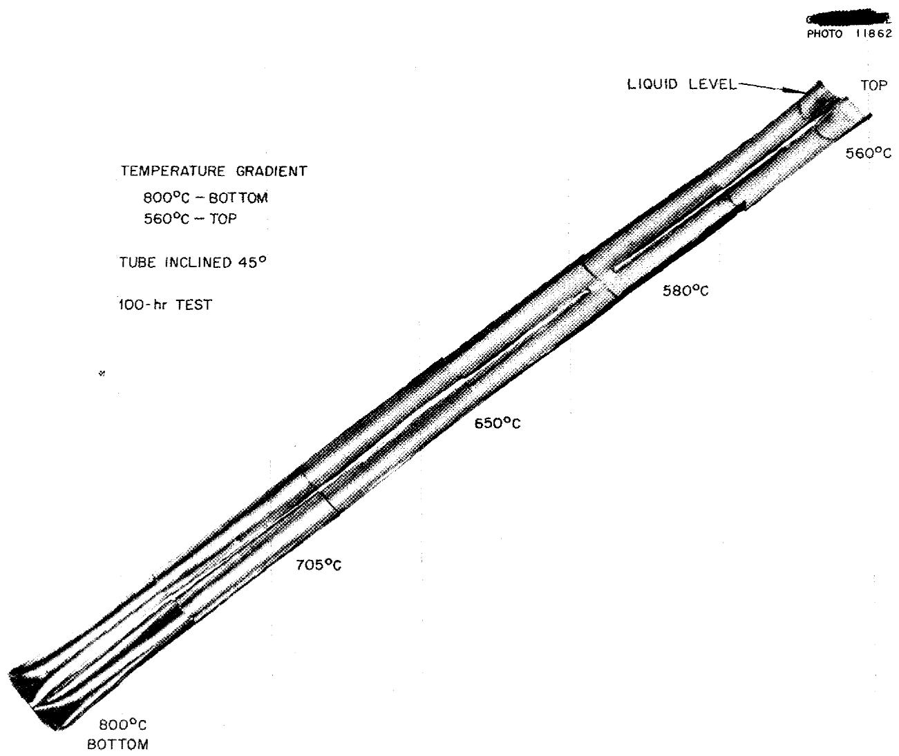  
Fig. 11.6. Standpipe Test of NaOH in Nickel Capsule with Hydrogen Atmosphere.

this type. Tests conducted in the helium atmosphere show large deposits of nickel crystals at the cold end of the tube, whereas the bottom sections of the tube are highly polished. When hydrogen is used, the bottom sections of the tube show considerable polish, but virtually no crystal deposit is visible at the cold end.

When tests are conducted in a similar fashion but with the hydrogen (at atmospheric pressure) applied only to the inside of the tube under test, the beneficial action is still obtained. The bottom section of the tube shows

the typical polished appearance, but no mass transfer to the cooler portions is evident.

In another type of test, nickel tubes fitted with a delivery tube for maintenance of the proper atmosphere were exposed in the tilting furnace. The tubes were rocked four times per minute, with the hot end maintained at $800^{\circ}\mathrm{C}$ and the cold end at $650^{\circ}\mathrm{C}$ , for 100 hours. Results very similar to those described above were obtained in these studies, as the specimens shown in Fig. 11.7 indicate. Since the hydrogen has ready access to virtually

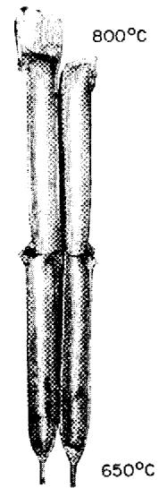  
149IH51   
HYDROGEN ATMOSPHERE TUBE ONLY DEGREASED

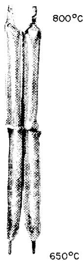  
1492H51   
HYDROGEN ATMOSPHERE TUBE HYDROGEN-FIRED BEFORE TEST

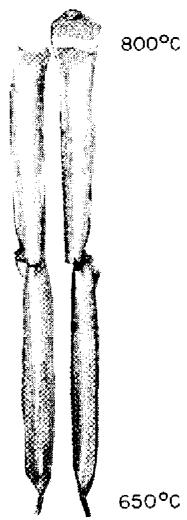  
1493H51   
HYDROGEN ATMOSPHERE TUBE HYDROGEN-FIRED BEFORE TEST INTERMITTENT VACUUM APPLIED

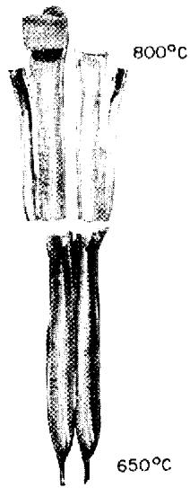  
1477H51   
HELIUM ATMOSPHERE TUBE HYDROGEN-FIRED   
Fig. 11.7. Seesaw Tests of NaOH in Nickel Capsules After 100 Hours.

all parts of the tubes during the test, it is hardly surprising that prior hydrogenation of the specimens did not appear to be beneficial.

It is noteworthy that when helium atmospheres were used in these tests, the NaOH recovered was brownish-gray in color and contained about 1500 ppm of nickel. When the hydrogen atmospheres were used, the snow-white hydroxide contained 20 to 35 ppm of nickel.

# LIQUID METAL CORROSION

D.C.Vreeland

J. E. Pope

E. E. Hoffman

J. V. Cathcart

L.R.Trotter

G.P.Smith，Jr.

G. M. Adamson

Metallurgy Division

L. A. Mann

J. M. Cisar

ANP Division

High-Velocity Corrosion by Sodium. A dynamic test, which has become known as the spinner test, $^{(7)}$ has been used to check the effect of high-velocity corrosion and erosion in molten sodium on several materials. In this test, relatively high velocities (400 ft/min) are obtained by rotating tubular specimens in a pot containing the molten

corrodant under isothermal conditions. Inconel and types 316, 347, and 446 stainless steels have been tested in this apparatus. Greater attack than that obtained in ordinary static corrosion tests was noted on all materials tested. It should be emphasized that, except in the test of the type 347 stainless steel specimens, these were actually three-component tests because the spinner pot was fabricated of type 347 stainless steel.

The effect of this test on Inconel spun at 400 ft/min for 72 hr at $816^{\circ}\mathrm{C}$ is shown in Fig. 11.8. A 0.5-mil surface layer, with 0.5 mil of intergranular voids beneath it, is apparent. This surface layer may be a mass transfer effect caused by the three-component system used during test. The analysis of a portion of the surface layer scraped from the specimen showed $64\%$ nickel, $27.5\%$ chromium, and

8.3% iron. (The composition of Inconel is 80% nickel, 15% chromium, and 5% iron.)

The intergranular attack on type 316 stainless steel is shown in Fig. 11.9. This attack extended to a depth of 1 to 2 mils near the front, or leading edge, of the tubular specimen and, as would be expected, was less severe at the trailing edge, where the depth of attack was 0.5 to 1 mil. The test was conducted at $816^{\circ}\mathrm{C}$ for 100 hr with a speed of 400 ft/min. Type 347 stainless steel suffered intergranular attack to 2 mils after testing for 74 hr at $816^{\circ}\mathrm{C}$ with a speed of 400 ft/min. After 53 hr at $816^{\circ}\mathrm{C}$ at a speed of 400 ft/min, type 446 stainless steel showed slight intergranular attack to a depth of less than 0.5 mil. The results of these tests are summarized in Table 11.10.

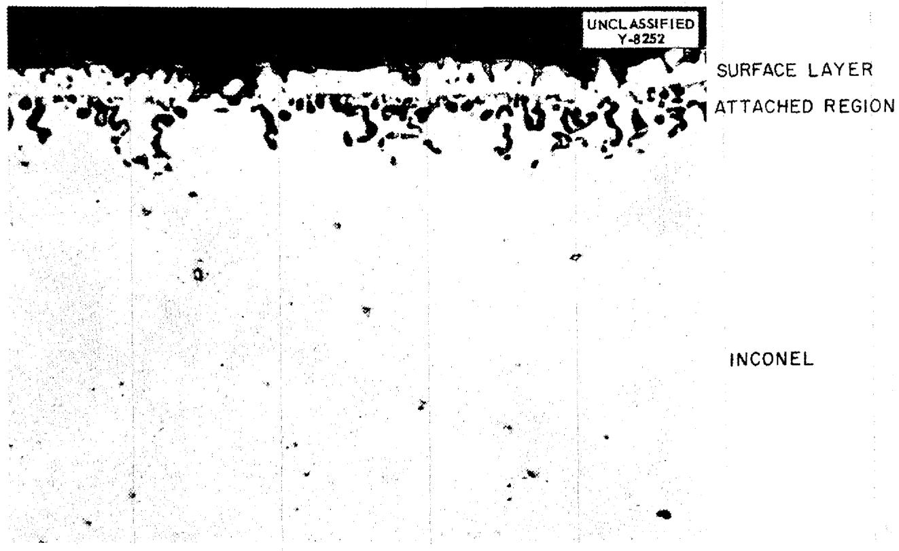  
Fig. 11.8. Inconel from Spinner Test with Sodium at $816^{\circ}\mathrm{C}$ for 72 hr at a Speed of 400 ft/min. 500X.

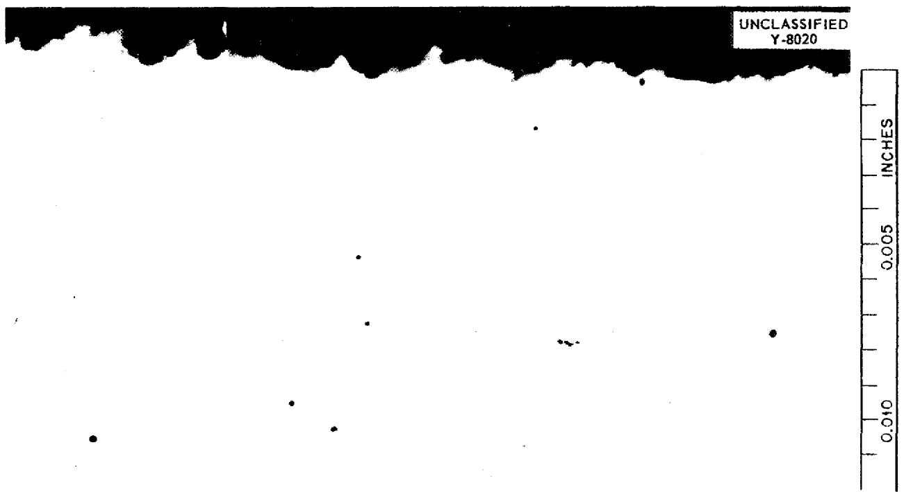  
Fig. 11.9. Type 316 Stainless Steel from Spinner Test with Sodium at $816^{\circ}\mathrm{C}$ for 100 hr at a Speed of 400 ft/min. 250X.

TABLE 11.10. RESULTS OF SPINNER TESTS RUN AT 400 ft/min AT ${816}^{ \circ  }\mathrm{C}$   

<table><tr><td>MATERIAL</td><td>TIME OF TEST (hr)</td><td>METALLOGRAPHIC NOTES</td></tr><tr><td>Inconel</td><td>72</td><td>Surface layer of 0.5 mil with 0.5 mil of inter-granular voids beneath</td></tr><tr><td>Type 316 stainless steel</td><td>100</td><td>Intergranular attack, 1 to 2 mils deep on lead-ing edge and 0.5 to 1 mil deep on trailing edge</td></tr><tr><td>Type 347 stainless steel</td><td>74</td><td>Intergranular attack, to 2 mils</td></tr><tr><td>Type 446 stainless steel</td><td>53</td><td>Slight intergranular attack, less than 0.5 mil</td></tr></table>

Ceramic Materials in Sodium. A series of static corrosion tests of various ceramic materials received from the Ceramic laboratory has been run in sodium at $816^{\circ}\mathrm{C}$ for 100 hr in Inconel tubing. The results are tabulated in Table 11.11 for the materials that did not disintegrate during test. Only two of the specimens were intact after testing $(\mathrm{Al}_{2}\mathrm{O}_{3}$ and

Spinel). It is possible that if the specimens that broke up during testing had been thicker (specimens were approximately 0.020 in. thick), some of them would have remained intact. The specimens that disintegrated into fine powder during the testing included porcelain (Al-576), mica, titanium dioxide (Al-192), $\mathrm{SiO}_2$ , barium titanate (Al-T-106), $\mathrm{Al}_2\mathrm{O}_3$ (single crystal), lead

TABLE 11.11. RESULTS OF TESTS OF VARIOUS CERAMIC MATERIALS IN SODIUM FOR 100 hr AT $816^{\circ}\mathrm{C}$   

<table><tr><td colspan="2">MATERIAL</td><td colspan="2">OBSERVATIONS AFTER TEST</td></tr><tr><td colspan="2">Al2O3</td><td colspan="2">Three-mil increase in thickness, weight increase of 0.01 g/in.2</td></tr><tr><td colspan="2">SiC</td><td colspan="2">Specimen broken into several pieces, no thickness change</td></tr><tr><td colspan="2">MgO</td><td colspan="2">Specimen broken into several pieces, no thickness change</td></tr><tr><td colspan="2">MgO (single crystal)</td><td colspan="2">Specimen broken into several pieces, no thickness change</td></tr><tr><td colspan="2">Spinel</td><td colspan="2">No change in thickness, weight loss of 0.006 g/in.2</td></tr><tr><td colspan="2">ZrO2(Al 550)</td><td colspan="2">Specimen shattered, 1-mil increase in thickness</td></tr><tr><td colspan="2">Zircon</td><td colspan="2">Specimen shattered, 1.5-mil increase in thickness</td></tr><tr><td colspan="2">BeO</td><td colspan="2">Specimen shattered, 7-mil increase in thickness</td></tr></table>

glass, $\mathsf{ZrO}_2$ (Hf free), $\mathsf{ThO}_2$ , $2\mathsf{MgO}\cdot \mathsf{SiO}_2$ (fosterite, Al-243), $2\mathsf{MgO}\cdot 2\mathsf{Al}_2\mathsf{O}_3\cdot \mathsf{FSiO}_2$ (Al-202), aluminum silicate (Al-A), pyrex glass, zirconium silicate (Al-475), $\mathsf{HfO}_2$ , soda glass, TAM $\mathsf{ZrO}_2$ , and $\mathsf{MgO}\cdot \mathsf{SiO}_2$ .

Lead in Metal Convection Loops. The problem of circulating lead has been revived during this quarter. Loops identical to those being used with the fluorides were first used in this work. The lead used in all the following tests was chemical lead that was further purified by bubbling hydrogen through it.

Lead was first circulated in two Inconel loops. The first loop, which had been cleaned with NaK and then evacuated while hot, would not circulate at all. The second loop was rinsed with water, after the NaK cleaning, before being evacuated. This loop circulated only 2 1/2 hours. After the lead was drained out, plugs were found in both loops in the lower

portion of the cold leg. Neither plug would melt at $1575^{\circ} \mathrm{F}$ . Besides the plug in each loop, a mass resembling a vine wound around the inside of the cold leg and occupied about one-fourth of the volume. This mass held its shape where it turned into the hot leg. The analyses of these masses show them to be high in nickel and lead content; however, the x-ray diffraction lines do not fit those from any material in this system.

Lead was also circulated in a type 430 stainless steel loop that was rinsed with cold nitric acid, washed with water, and then evacuated while hot. This loop circulated 16 1/2 hours. The two cleaning methods were then combined and used on a type 410 stainless steel loop. This loop was NaK cleaned, water washed, cold nitric acid rinsed, water washed, and heated while under vacuum. It circulated for 351 hr at $1500^{\circ}\mathrm{F}$ before plugging. The plugs in both these loops again

appeared to be at the bottom of the cold leg. They remained when the lead was melted out at $1575^{\circ}\mathrm{F}$ . The plugs have been submitted for chemical and x-ray diffraction study.

Lead in Quartz Convection Loops. The prohibitive amounts of mass transfer that occurred in lead-Inconel thermal convection loops and in static corrosion tests have prevented the acquisition of significant data on this system. In addition, the results were open to question because sufficient care had not been taken to deoxidize the lead and because the Inconel tubing used was covered with a heavy coating of oxide.

An apparatus was built in which lead could be deoxidized with hydrogen and then brought into contact with Inconel specimens without exposure to an oxidizing atmosphere. This apparatus, shown in Fig. 11.10, consisted of a thermal convection loop constructed entirely of 1/2-in. quartz tubing. Two 6-in. lengths of 7/16-in. Inconel tubing were mounted in the hot and cold legs of the loop. Before being placed in the loop, the Inconel tubing was scrubbed with cleaning powder and rinsed with alcohol and ether. The lead was deoxidized in a 1 l/2-in. India quartz bulb attached above the loop and separated from it by a fritted quartz disk. The lead in the deoxidation bulb was heated to $425^{\circ}\mathrm{C}$ , and hydrogen was allowed to pass through the fritted quartz disk and bubble up through the lead. When the deoxidation was complete, the lead was forced through the fritted disk and into the loop. Circulation of the lead was maintained by the thermal convection currents thus induced.

This procedure assured that the oxide content of the lead was reduced to a minimum and, in addition, prevented re-oxidation of the lead during the loading of the loop. This technique also offered several other advantages.

The use of quartz loops rather than the conventional metal loops eliminated many of the difficulties previously encountered with leaks at welds. The new loop required only a small amount of metal tubing, a factor of some importance for cases in which the metal to be tested is expensive or in short supply. Since the test specimens were completely enclosed in the quartz tubing of the loop, it was not necessary to provide a protective atmosphere around the outside of the specimens, as would have been the case if ordinary metal loops of such reactive metals as molybdenum or columbium had been the solid metal under test.

Two tests have been made on Inconel specimens with 0.035-in. wall thickness in the apparatus described above for circulating lead. Both loops had a hot leg temperature of $800^{\circ}\mathrm{C}$ ; one had a cold leg temperature of $400^{\circ}\mathrm{C}$ and the other $475^{\circ}\mathrm{C}$ . The results of the two tests differed only in detail. Circulation of the lead in one loop stopped after 125 hr of operation and in the other after 51 hr because of formation of plugs in the cold legs. The depth of attack in the hot leg was 10 mils in one loop and 3 mils in the other loop. In addition to the usual mass transfer, a matrix-like, corroded layer formed on the Inconel. This corroded layer is shown in Fig. 11.11, which is a photograph of a cross section of the Inconel tubing in the hot leg of the loop. The corresponding cold-leg specimen is shown in Fig. 11.12.

In a preliminary test, the primary purpose of which was to test loop design, a loop was used that was similar in design to that shown in Fig. 11.8, except that it was constructed of pyrex glass. The hot and cold leg temperatures were 500 and $365^{\circ}\mathrm{C}$ , respectively. No mass transfer or corrosion was noted in either leg during 96 hr of operation. These results, together with the lack of

UNCLASSIFIED

DWG.17408

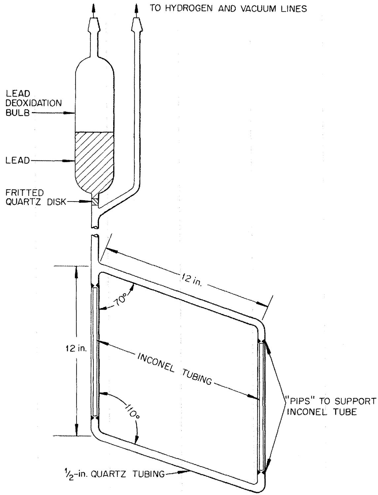  
Fig. 11.10. Quartz Thermal Convection Loop.

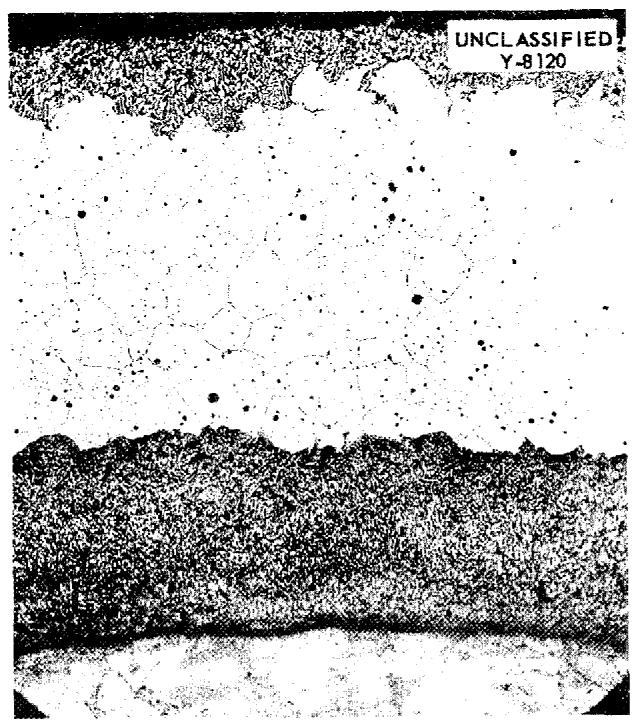  
Fig. 11.11. Inconel Specimen in Hot $(800^{\circ}\mathrm{C})$ Leg of Quartz Loop after Circulating Lead for 125 Hours. 90X.

corrosion in the cold leg of the first loop (at $400^{\circ}\mathrm{C}$ ) and only very slight corrosion in the cold leg of the second loop (at $475^{\circ}\mathrm{C}$ ), led to the conclusion that the corrosive attack of liquid lead on Inconel probably began in the neighborhood of $500^{\circ}\mathrm{C}$ .

The chemical analysis of the plugs formed in the quartz loop tests was only slightly different from the nominal composition of Inconel. It was therefore concluded that the liquid lead had virtually no selective leaching action on the Inconel specimens. It was further concluded that both severe mass transfer and corrosive attack will occur in lead-Inconel thermal convection loops with hot leg temperatures of $800^{\circ}\mathrm{C}$ , even when the lead has been carefully deoxidized with hydrogen.

Compatibility of BeO in NaK. (8) Dynamic tests of BeO in NaK are being (8) The chemical analysis of NaK for beryllium is reported in section 15, "Analytical Studies of Reactor Materials."

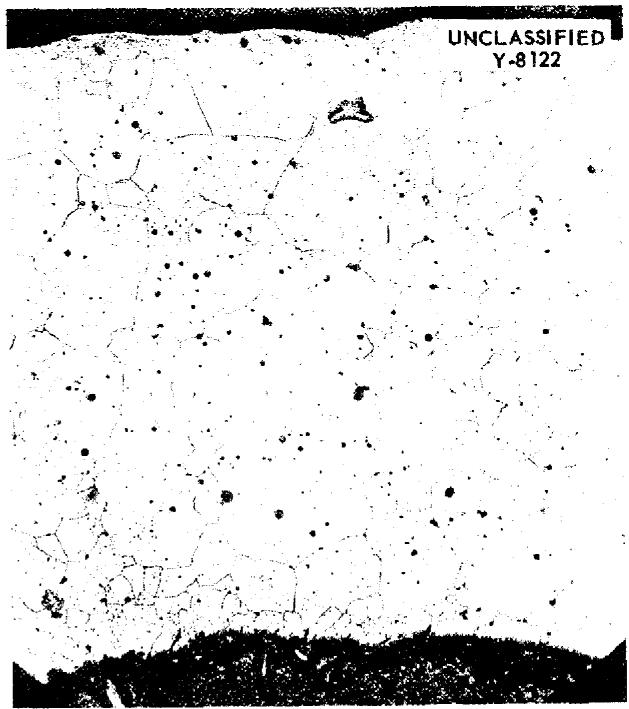  
Fig. 11.12. Inconel Specimen in Cold $(400^{\circ}\mathrm{C})$ Leg of Quartz Loop After Circulating Lead for 125 Hours. 90X.

conducted by the Experimental Engineering Department. Blocks of BeO approximately 0.25 by 0.25 by 0.50 in. were weighed and measured as received from the shop, heated to a bright red color, reweighed and remeasured, and then placed in a test assembly containing eutectic NaK heated to $1400^{\circ}\mathrm{F}$ . The BeO was fastened to the end of a rotating shaft and rotated at a linear velocity of 0.15 ft/sec. In the tests to date, there has been considerable BeO weight loss upon exposure for 100 hr or longer at $1400^{\circ}\mathrm{F}$ . The test results are summarized in Table 11.12.

Since earlier static tests showed no instability of the BeO, additional static and dynamic tests are being carried out, along with an investigation of cleaning, drying, and similar techniques for obtaining accurate weighing of the BeO before and after exposure to NaK.

Sodium in Forced-Convection Loops. Metallurgical analyses of the figure 8

loop in which sodium was circulated have been completed. Samples from the hot, cold, and heat exchanger sections of the loop were examined. Corrosion was negligible, as shown in Table 11.13.

# FUNDAMENTAL CORROSION RESEARCH

W. R. Grimes

Materials Chemistry Division

W. D. Manly

Metallurgy Division

The basic research needed for determining corrosion mechanisms has

been continued. Examinations have been made of corrosion products from dynamic corrosion test by making use of chemical and physical means to determine identities of the products, and studies are continuing on high-temperature reactions of various liquids with structural metals, thermal stability of NiO and $\mathrm{NiF}_2$ , and reactions of molten fluorides under applied potentials. The preparation of various complex interaction products of structural metals with fluorides and the characterization of these compounds

TABLE 11.12. SUMMARY OF BeO-NaK COMPATIBILITY TESTS   

<table><tr><td rowspan="2"></td><td colspan="9">RUN AND SAMPLE NO.</td></tr><tr><td>1(a)</td><td>2</td><td>3(b)</td><td>4(c)</td><td>5</td><td>6(d,e)</td><td>7(e,f)</td><td>8(d,g)</td><td>9(f,g)</td></tr><tr><td>Initial weight, g</td><td></td><td>1.5054</td><td>1.4196</td><td>1.4049</td><td>1.2287</td><td>1.2736</td><td>1.8437</td><td>25.3124</td><td>29.9273</td></tr><tr><td>Initial area, in.2</td><td>0.625</td><td>0.625</td><td>0.625</td><td>0.623</td><td>0.609</td><td>0.455</td><td>0.625</td><td>4.60</td><td>5.45</td></tr><tr><td>Initial volume, in.3</td><td>0.0313</td><td>0.0313</td><td>0.0312</td><td>0.0307</td><td>0.0310</td><td>0.0293(h)</td><td>0.0378(h)</td><td>0.567</td><td>0.640</td></tr><tr><td>Initial density, g/cm3</td><td></td><td>2.93</td><td>2.80</td><td>2.80</td><td>2.60</td><td>2.65</td><td>2.98</td><td>2.72</td><td>2.85</td></tr><tr><td>Approximate weight of NaK, g</td><td>90</td><td>82</td><td>82</td><td>82</td><td>82</td><td>82</td><td>82</td><td>75</td><td>75</td></tr><tr><td>Duration of heating, hr</td><td>6.4</td><td>96</td><td>129</td><td>203</td><td>174</td><td>212</td><td>212</td><td></td><td></td></tr><tr><td>Final weight, g</td><td></td><td>1.3320</td><td>1.1047</td><td>1.3653</td><td>1.0896</td><td>0.9384</td><td>1.4335</td><td></td><td></td></tr><tr><td>Weight loss</td><td></td><td></td><td></td><td></td><td></td><td></td><td></td><td></td><td></td></tr><tr><td>In grams</td><td></td><td>0.1734</td><td>0.3149</td><td>0.0396</td><td>0.1391</td><td>0.3352</td><td>0.4102</td><td></td><td></td></tr><tr><td>In per cent</td><td></td><td>11.5</td><td>22.2</td><td>2.81</td><td>11.3</td><td>26.3</td><td>22.3</td><td></td><td></td></tr><tr><td>Final volume, in.3</td><td></td><td></td><td></td><td>0.0306</td><td>~0.0263</td><td>~0.028(h)</td><td>0.031(h)</td><td></td><td></td></tr><tr><td>Approximate volume loss, %</td><td></td><td></td><td></td><td>Negligible</td><td>15</td><td>3(h)</td><td>19(h)</td><td></td><td></td></tr><tr><td>Weight loss per initial unit area, mg/in.2</td><td></td><td>280</td><td>500</td><td>60</td><td>230</td><td>740</td><td>670</td><td></td><td></td></tr></table>

(a）m  
temperature cycled from room temperature to $1500 + \circ F$ once and 800 to $1500^{\circ}F$ five times; one corner chipped off during test.   
(b) Sample in two pieces at end of run; no other pieces found.   
(c) Rotated 14 hr; static 189 hr.   
$(d)$ Porous inner section of BeO block (for density, see sec. 12, "Metallurgy and Ceramics").

(e) Surface removed irregularly, leaving tches" and rounded corners.

$(f)_{\text{Dense outer section of BeO block (for sity, see sec. l2, "Metallurgy and Ceramics")}}$

$(g)$ Irregular semiwedge shapes.

$(h)$ Calculated for irregularly shaped samples; uses uncertain.

TABLE 11.13. ANALYSIS OF CORROSIVE ATTACK BY SODIUM IN FIGURE 8 LOOP   

<table><tr><td></td><td>TEMPERATURE (°F)</td><td>TIME (hr)</td><td>VELOCITY (ft/sec)</td><td>ATTACK</td></tr><tr><td rowspan="2">Heat exchanger section</td><td>1320</td><td>2700</td><td>2</td><td rowspan="2">Occasional depressions, to 1 mil deep</td></tr><tr><td>1300</td><td>1000</td><td>1</td></tr><tr><td rowspan="2">Hot section</td><td>1350</td><td>2700</td><td>2</td><td rowspan="2">Numerous small depressions, to 0.25 mil deep</td></tr><tr><td>1320</td><td>1000</td><td>1</td></tr><tr><td rowspan="2">Cold section</td><td>750</td><td>2700</td><td>2</td><td rowspan="2">No noticeable corrosion or erosion</td></tr><tr><td>1100</td><td>1000</td><td>1</td></tr></table>

were also continued in an effort to aid in the identification of the corrosion products.

Interaction of Fluorides with Structural Metals (H. S. Powers, J. D. Redman, L. G. Overholser, Materials Chemistry Division). Investigation of the reaction of chromium and iron with molten NaF-KF-LiF eutectic has continued. Special emphasis has been placed on the behavior of $\mathsf{K}_2\mathsf{NaCrF}_6$ and $\mathsf{K}_2\mathsf{NaFeF}_6$ when contacted with the eutectic in the temperature range from 600 to $1000^{\circ}\mathrm{C}$ . The filtrates collected at various temperatures in the range from 500 to $800^{\circ}\mathrm{C}$ have been subjected to chemical analysis, as in the past, and the residues and filtrates have been examined by x-ray diffraction.

In a number of experiments, 3 wt % of $\mathrm{K}_2\mathrm{NaCrF}_6$ was added to samples of the NaF-KF-LiF eutectic. The mixtures were heated at 800 to $1100^{\circ}\mathrm{C}$ under an atmosphere of helium for several hours and then filtered at various temperatures in the range from 500 to $800^{\circ}\mathrm{C}$ , and the residues and filtrates were examined. Heating of the $\mathrm{K}_2\mathrm{NaCrF}_6$ at temperatures up to $1100^{\circ}\mathrm{C}$ prior to its addition to the eutectic did not affect its solubility, and the temperature of equilibration of this compound with the eutectic prior to filtration was unimportant. Solubility was, however, a function of temperature of filtration. The filtrate collected at $500^{\circ}\mathrm{C}$ contained 400 to 500 ppm Cr, whereas the filtrate obtained at either

650 or $800^{\circ}\mathrm{C}$ contained 2000 to 3000 ppm Cr. Microscopic examination revealed that most of the Cr was present as $\mathrm{K}_2\mathrm{NaCrF}_6$ which indicates that this compound is appreciably soluble in the NaF-KF-LiF eutectic at elevated temperatures. X-ray examination shows that in some runs, materials other than $\mathrm{K}_2\mathrm{NaCrF}_6$ have been present, including $\mathrm{K}_3\mathrm{CrF}_6$ , $\mathrm{Cr}_2\mathrm{O}_3$ , and $\mathrm{KNaLiCrF}_6$ .

Similar experiments in which Cr was added to the eutectic as metal instead of as $\mathrm{K}_2\mathrm{NaCrF}_6$ showed that $\mathrm{Cr}_2\mathrm{O}_3$ , Cr, and $\mathrm{K}_2\mathrm{NaCrF}_6$ were present after the interaction. Additional products that have not yet been identified were also found.

A study of the solubility of $\mathbf{K}_2\mathbf{NaFeF}_6$ in the NaF-KF-LiF eutectic and the NaF-KF-LiF-UF4 mixture at 600 and $800^{\circ}\mathrm{C}$ was made. It was found that with $2.5\%$ of $\mathbf{K}_2\mathbf{NaFeF}_6$ the solubility in both fluoride mixtures and at both temperatures of filtration was 6000 to 7000 ppm. Apparently, all the $\mathbf{K}_2\mathbf{NaFeF}_6$ added was dissolved.

Since the presence of oxidation products in a number of the filtrates indicated that the digestion and filtration apparatus in which a blanket of helium is used does not exclude oxygen completely, two new types of reaction-filtration equipment have been designed and fabricated that should eliminate oxidative effects.

Air Oxidation of Fuel Mixtures (R. P. Metcalf, F. F. Blankenship, Materials Chemistry Division). The

investigation of the oxidation of fuel mixtures contained in nickel has been complicated by the corrosion of the nickel containers. The corrosion has been studied in a series of experiments.

In each experiment, 5 to $10\mathrm{g}$ of fluoride, in a nickel boat, was placed in a "combustion tube" consisting of a horizontal 1 l/2-in.-OD stainless steel tube heated by a tube furnace. The inner surface of the steel tube was protected by a sleeve of 5-mil nickel sheet. The tube was evacuated and heated to the desired temperature; dry air was then admitted and passed through at a rate of about $40~\mathrm{cm}^3/\mathrm{min}$ for about 4 hours. The solid products were examined by x-ray diffraction. No gaseous products were observed.

In summary, nickel is oxidized severely by dry air when in contact with fused fluorides. The oxidation is accompanied by creeping of the melt over the entire heated surface of the nickel container. Uranium, when present in the fluoride mixture, reacts to form a yellow product that probably contains oxygen but has not yet been completely identified.

It is suggested that the oxidation occurs because the fused fluorides dissolve the adherent protective scale of nickel oxide, which forms in the absence of the melt.

The formation of the greenish-gray nickel oxide observed in several of the experiments appears to be associated with the presence of moisture in the salt employed.

EMF Measurements in Fused Fluorides (L. E. Topol, L. G. Overholser, Materials Chemistry Division). Previous studies,[9] involving the determination of the decomposition potential of $\mathrm{NiF}_2$ in molten KF, suggested that a thermal decomposition of $\mathrm{NiF}_2$ occurred during the experiments and led to a study of the decomposition of $\mathrm{NiF}_2$ , NiO, and $\mathrm{K}_2\mathrm{NiF}_4$ at temperatures from 700 to (9) L. E. Topol and L. G. Overholser, ANP Quar. Prog. Rep. Sept. 10, 1952, ORNL-1375, p. 123.

$900^{\circ}\mathrm{C}$ in a purified helium atmosphere. The study has been continued and extended to include the possibility of decomposition under vacuum. An attempt has been made to measure the decomposition potential of KF on Ni at $890^{\circ}\mathrm{C}$ in a nickel container.

Repeated attempts to prevent the decomposition of NiO and $\mathbf{NiF}_2$ at 750 to $900^{\circ}\mathrm{C}$ under a purified helium atmosphere were unsuccessful, even when all the rubber tubing was replaced with glass or copper tubing. In some cases, the weight losses were apparently greater than could be explained by complete decomposition of the $\mathbf{NiF}_2$ or NiO. An attempt is being made to measure the dissociation of $\mathbf{NiF}_2$ and NiO in vacuum at various temperatures. A vacuum system has been constructed, and a preliminary experiment showed that no apparent decomposition of the NiO occurred, even though it had been heated to $1020^{\circ}\mathrm{C}$ . This absence of dissociation is in agreement with the findings of Johnson and Marshall, who measured the vapor pressure of NiO at temperatures from 1440 to $1566^{\circ}\mathrm{K}$ . Studies of the behavior of NiO in vacuum are continuing.

Decomposition potentials have been determined in KF at $890^{\circ}\mathrm{C}$ with nickel electrodes in various vessels. Measurements were made in Norton stabilized-zirconia crucibles (TZ-5601) and in Norton thoria crucibles (LT-7010), although these materials are somewhat permeable to the KF. Subsequent runs were made with a nickel cup as both container and cathode and a 1/16-in.-dia nickel rod as the anode. In every case except one, a decomposition potential was observed at 0.7 to 0.9 volt. These values agree with earlier values $^{(9)}$ and with those determined by Neumann and Richter $^{(11)}$ on graphite. In one run in which higher potentials

# ANP PROJECT QUARTERLY PROGRESS REPORT

were applied, a change in slope was noticed at voltages above 2.5, in addition to the break in the current-voltage curve at 0.8 volt; but, unfortunately, not enough data were taken at these higher potentials to obtain an accurate determination of the decomposition voltage. In the last experiment, no break in the current-voltage curve was found at 0.8 volt, but a definite break occurred at 2.6 volts. In all cases, the anode was markedly attacked and was surrounded by a black sludge that was somewhat magnetic. Possible explanations of these results are being studied.

Preparation of Trivalent Nickel Compounds in the Hydroxides (L. D. Dyer, G. P. Smith, Metallurgy Division). Lithium nickelate(III) and sodium nickelate(III) have been shown to occur (see previous quarterly reports) in the corresponding hydroxides under highly oxidizing conditions by actually

preparing large amounts of these compounds in hydroxides. Therefore the preparation of a presumed potassium nickelate(III) was undertaken to show its occurrence under certain circumstances in potassium hydroxide.

By using molten potassium peroxide as the oxidizing agent on nickel, enough higher valent nickel crystals were prepared to get a single crystal for x-ray study. Because of the apparent instability of the supposed potassium nickelate, the nickel in the compound either lost some oxidizing power when removed from the KOH and $\mathrm{K}_2\mathrm{O}_4$ with alcohol, or it never was completely oxidized in the tube. The separated compound contained only $20\%$ $\mathrm{Ni}^{+ + + }$ , whereas the theoretical value for $\mathrm{KNIO}_2$ is about $45\%$ $\mathrm{Ni}^{+ + + }$ .

The experiments are being continued to find the conditions for obtaining more and larger crystals and to refine the separation method.

# 12. METALLURGY AND CERAMICS

W. D. Manly J. M. Warde Metallurgy Division

Additional studies on the cone-arc welding process are under way in an effort to obtain more complete understanding of the basic principles of the process. Resistance welding of solid fuel elements has been tried, with some degree of success. After the proper electrode force was determined, a convenient welding time was selected, and welds made over a considerable current range have been studied. An automatic heliarc welder has been set up for making longitudinal welds on stainless steels under very carefully controlled conditions so that the optimum welding conditions for the various structural metals can be determined. The high-temperature brazing alloy development program is continuing, and results of various corrosion tests in liquid metals, fused fluoride salts, and hydroxides, as well as the results from the various high-temperature tensile tests, are presented.

A very marked effect of the environment on the load-carrying abilities of Inconel has been observed in tests run at $815^{\circ}\mathrm{C}$ in atmospheres of air, argon, and hydrogen. The same effect has been seen to a lesser extent in creep tests of type 316 stainless steel. Preliminary results obtained at $815^{\circ}\mathrm{C}$ indicate that the fluorides affect the load-carrying abilities appreciably at the lower stress values.

An attempt is being made to produce spherical particles of uranium-bearing alloys approximately 0.010 in. in diameter. These particles will receive a protective coating of nickel plating, approximately 0.005 in., prior to being used in a pebble-bed type of reactor. The methods being investigated are the following:

1. suspension in refractory powder and heating above the solidus,

2. momentary melting by passing through a high-temperature arc,

3. spraying from a metallizing gun. Solid-phase bonding studies are being initiated to determine which materials are easy to bond and which materials are difficult to bond. After this screening operation, the work will be expanded to include a study of the production of solid fuel elements by a hot-pressing operation in which electroformed screens will be filled with a mixture of $\mathrm{UO}_2$ and stainless steel powder prior to the bonding step. Studies on the reaction of columbium with various gaseous atmospheres have been initiated in an attempt to understand the effect of these atmospheres so that the mechanical properties of columbium and its alloys can be studied.

Disks in which a layer of $\mathrm{UO}_2$ is incorporated have been successfully prepared from $\mathrm{Cr - Al_2O_3}$ cermet compositions. A ZrC-Fe cermet has been developed that has possible interest as a material for pump parts, seals, and bearing materials. Work is being carried out on SiC-C cermets. A satisfactory dipping technique has been developed for the application of an oxidation-resistant ceramic coating to nickel parts for use in an aircraft type of radiator. A ceramic coating containing $10\%$ boron for possible application in reactor shielding has been successfully flame-sprayed on 20-gage stainless steel.

# FABRICATION OF SOLID FUEL IN SPHERES

E. S. Bomar J. H. Coobs H. Inouye Metallurgy Division

A geometry for the fuel in the Supercritical Water Reactor, suggested by the Pratt & Whitney Alternate Design group, is that of spherical

particles 0.010 in. in diameter. After receiving a 0.005-in. protective nickel plate, the particles would be packed in beds in the reactor core, and cooling water would flow through the interparticle channels.

Several methods for preparing the spheres, with the use of both high- and low-melting-point alloys, were given a preliminary examination. The high-melting-point alloy contained $5\%$ uranium in molybdenum, and the low-melting-point alloy contained $5\%$ uranium in nickel or copper. The results obtained by using the following methods of preparation were only partly successful: (2) suspension in refractory powder and heating above the solidus, (2) momentary melting by passing through a high-temperature arc, and (3) spraying from a metallizing gun.

Suspension in Refractory Powder. The U-Ni and U-Cu alloys were swaged and drawn to 0.010 in. in diameter and then cut into short segments. The U-Ni particles were mixed with $\mathrm{Al}_{2}\mathrm{O}_{3}$ and heated to $1450^{\circ}\mathrm{C}$ ; one sample was heated in hydrogen and another in a vacuum of 3 microns. The U-Cu particles were spread on a refractory plate and heated to $1100^{\circ}\mathrm{C}$ for 5 min in hydrogen. A surface film formed in all three cases and prevented spheroidization, even though a liquid phase was present.

Momentary Melting in a High-Temperature Arc. A rig for housing two water-cooled electrodes and supplying an argon atmosphere was assembled. Both carbon and tungsten electrodes have been used. The U-Ni alloy particles, similar to those used in the first method, were dropped through an arc struck between the electrodes. Alignment proved to be very critical, but the particles that passed through the arc zone did melt. The yield was quite low, however. Particles that passed through the carbon arc were porous, whereas those

that passed through the tungsten arc were not.

Similar U-Ni alloy particles were also dropped through an atomic-hydrogen arc, and a small number of essentially spherical, but porous, particles were formed.

Spraying from a Metallizing Gun. A length of 0.057-in.-dia U-Ni alloy wire was fed through a metallizing gun, and the resulting particles were collected in water. As with the other methods, a porous product resulted. Substitution of argon for the normal air blast produced what appeared to be a sound product, with only a superficial surface film.

During the process of dropping segments of wire through the tungsten arc, it was noted that small particles were ejected from the electrode at current densities high enough to melt the electrode tip. The bulk of the particles ranged in size from 0.010 to 0.020 inch. These results were duplicated when U-Mo electrodes were substituted for the tungsten electrodes. The U-Mo electrodes were prepared by pressing a mixture of the elemental powders and sintering at $1200^{\circ}\mathrm{C}$ for 5 hr in a vacuum of 0.5 to 1 micron. The spheroidized particles did not give a response on exposure to an alpha counter as did the parent electrodes and U-Ni particles from an earlier spraying experiment.

# SOLID PHASE BONDING OF METALS

# E. S. Bomar J. H. Coobs Metallurgy Division

The initial tests on the solid-phase bonding of metals, performed essentially as a screening operation, have been completed. These tests were undertaken to determine which materials are easy to bond and which are difficult to bond. The tests were run on both sheet stock and sintered-powder compacts and were performed by stacking wafers in a molybdenum-lined graphite die. The laminates were hot pressed

for 5 min at 3000 psi at 1150, 1200, and $1250^{\circ}\mathrm{C}$ in an argon atmosphere. Further tests have been run at $1150^{\circ}\mathrm{C}$ for l, 10, and 30 min to determine the effect of time on the extent of bonding. Evaluation of these tests is not complete.

Examination of the first group of samples revealed little difference in the degree of bonding at the various temperatures. As was expected, considerably more diffusion occurred at $1250^{\circ}\mathrm{C}$ than at the lower temperatures, but bonding was only slightly better.

In general, the various couples may be divided into four groups on the basis of the extent of bonding: excellent, interface almost obliterated, inseparable; good, interface well defined, inseparable; fair, separated with some difficulty; poor, only superficial bonding. The couples studied fall into these categories in the following manner:

# ExceI lent

Nickel to Inconel

Nickel to stainless steel

Stainless steel to stainless steel

Iron to iron

Good

Nickel to iron

Nickel to nickel

Molybdenum to nickel foil to molybdenum

Fair

Molybdenum to nickel

Molybdenum to Inconel

Molybdenum to molybdenum

Poor

Molybdenum to iron

Molybdenum to stainless steel

The self-welding of the molybdenum, with or without a nickel foil bonding layer, was poor at $1250^{\circ}\mathrm{C}$ ; so supplementary runs were made at 1400 and $1500^{\circ}\mathrm{C}$ , with results as indicated above.

For molybdenum to nickel and molybdenum to Inconel, there was a measurable amount of diffusion but only fair bonding, possibly because of the formation of a third phase of

poor strength at the interface. Extensive diffusion (2 to 3 mils) occurred between molybdenum and iron and molybdenum and stainless steel, but there was even less bonding than was found between molybdenum and nickel or between molybdenum and Inconel.

Further work in which electrodeposited chromium is used as a bonding layer is being done on the bonding of molybdenum to the other metals. Chromium is reported to be completely miscible with molybdenum and may be more compatible with the other materials.

Several small fuel assemblies have been prepared by using the electroformed nickel screen, filling with mixtures of $\mathrm{UO}_2$ and stainless steel powder, and pressing rubberistically. This step is followed by cladding both sides with iron or nickel sheet and by hot pressing at $1250^{\circ}\mathrm{C}$ . The assemblies are now being examined for fuel distribution and bond integrity.

# COLUMBIUM RESEARCH

E. S. Bomar H. Inouye

Metalurgy Division

Gaseous Reactions. Investigation of the reaction of gases with columbium was initiated after a literature survey was made that revealed the high reactivity of the metal above $400^{\circ}\mathrm{C}$ and some preliminary high temperature tests made that gave erratic results. Minute quantities of dissolved gases change the mechanical properties considerably, and hence these reactions must be controlled.

The primary interest during this period was in finding a suitable atmosphere in which to conduct creep tests. An argon atmosphere was selected, initially, and some of the observations are presented in Table 12.1. Commercial, tank argon was purified by drying with a tower of magnesium perchlorate, followed by

two towers of titanium sponge at $850^{\circ}\mathrm{C}$ , and finally one tower of titanium sponge at $200^{\circ}\mathrm{C}$ .

Oxidation in Air. It has been reported that columbium oxides evaporate between 1200 and $1500^{\circ}\mathrm{C}$ . Preliminary tests of the stability of the oxides show that there is a negligible loss through volatilization up to $1375^{\circ}\mathrm{C}$ (see Table 12.2). This temperature being above that of the intended investigation, it was decided to measure the course of oxidation directly with time by suspending the sample in the furnace from one arm of an analytical balance.

The oxidation rates of columbium in dry air have been measured at 600,

800, 1000, and $1200^{\circ}\mathrm{C}$ . A linear oxidation rate that becomes more rapid with increase in temperature is shown in Table 12.3. The oxidation tests were made in air flowing at 2 liters/min that was dried by anhydrone and a cold trap of acetone and dry ice mixture prior to entering the furnace.

At $400^{\circ}\mathrm{C}$ , columbium undergoes short periods of rapid oxidation followed by longer periods of relatively slower oxidation up to about 20 hours. Beyond this time, the oxidation rate becomes linear; that is, the weight gain is proportional to the time of exposure. The oxide formed on the sample at the end of 3000 min is reasonably adherent.

TABLE 12.1. COLUMBIUM REACTIONS IN PURIFIED ARGON   

<table><tr><td>TEMPERATURE (°C)</td><td>TIME OF TEST (hr)</td><td>WEIGHT INCREASE (g/cm2)</td><td>HARDNESS INCREASE (VPN)</td><td>REMARKS</td></tr><tr><td>600</td><td>291</td><td>0.0005</td><td>48</td><td>Film of CbO, A0=4.21, ductile</td></tr><tr><td>800</td><td>67</td><td>0.0015</td><td>106</td><td>Black film, not identified</td></tr><tr><td>1000</td><td>88</td><td>0.0026</td><td>416</td><td>Black film, brittle</td></tr><tr><td>1000</td><td>89</td><td>0.0006</td><td>97</td><td>Static argon, 5-in. mercury pressure</td></tr><tr><td>1000</td><td>72</td><td>0.0002</td><td>85</td><td>Capsulated sample in static argon</td></tr></table>

TABLE 12.2. STABILITY OF ${\mathrm{{Cb}}}_{2}{\mathrm{O}}_{5}$ IN AIR (18 hr)   

<table><tr><td>TEMPERATURE (°C)</td><td>WEIGHT CHANGE (g)</td><td>REMARKS</td></tr><tr><td>1000</td><td>+0.0001</td><td>Starting material had a few black specks of a lower oxide</td></tr><tr><td>1100</td><td>+0.0001</td><td>Oxide completely white</td></tr><tr><td>1200</td><td>0</td><td>Oxide changed to a yellow color</td></tr><tr><td>1250</td><td>0</td><td>Oxide yellow</td></tr><tr><td>1300</td><td>-0.006</td><td>Oxide yellow</td></tr><tr><td>1350</td><td>-0.0009</td><td>Oxide yellow</td></tr><tr><td>1375</td><td>-0.0009</td><td>Oxide yellow</td></tr></table>

TABLE 12.3. COMPARISON OF OXIDATION RATES AT END OF 90 MINUTES   

<table><tr><td>TEMPERATURE (°C)</td><td>WEIGHT GAIN (g/cm2)</td></tr><tr><td>400</td><td>0.00003</td></tr><tr><td>600</td><td>0.0088</td></tr><tr><td>800</td><td>0.0465</td></tr><tr><td>1000</td><td>0.0650</td></tr><tr><td>1200</td><td>0.0915</td></tr></table>

At $600^{\circ}\mathrm{C}$ and above, the oxide formation is fairly thick, and some difficulty has been experienced in obtaining a picture because of the spalling of the oxide within a few seconds after removal from the furnace. Attempts to preserve the oxide in place have been made by pouring solder or "castalite" plastic around the specimen.

# CREEP RUCTURE TESTS OF STRUCTURAL METALS

R.B.Oliver K.W.Reber D.A.Douglas J.W.Woods C.W.Weaver Metallurgy Division

Inconel in Air. Inconel specimens have been tested in an air atmosphere at stresses ranging from 3000 to 4500 psi at $815^{\circ}\mathrm{C}$ . The results indicate an increase in rupture life by a factor of 10 as compared to tests run in argon in this stress range. It is thought that subsurface oxygen and possibly nitrogen may be the elements influencing the creep rate and prolonging the rupture life. Tests are being designed to investigate the relative effects of oxygen and nitrogen on the creep-rupture properties. It is postulated at this time that the creep properties of Inconel in environments other than air may be improved by a pretreatment with oxygen or nitrogen. Experiments will be conducted to explore this possibility.

Inconel in Hydrogen. Fine-grained Inconel specimens have been tested in a purified dry hydrogen atmosphere at stresses ranging from 2500 to 7000 psi at $815^{\circ}\mathrm{C}$ . The results of these tests as compared with those from tests made in an argon atmosphere show a marked decrease in rupture life, ranging from a $75\%$ decrease at the lowest stress to a $55\%$ decrease at the highest stress tested. A similar series of tests is being made on coarse-grained specimens.

Inconel in Molten Fluorides. Tests of Inconel in the fluoride mixture NaF-ZrF4-UF4 (46-50-4 mole %) are being made at 815°C at stress levels from 2500 to 7500 psi. Results to date indicate a marked decrease in rupture life that is similar in magnitude to the rupture life obtained in tests made in a hydrogen atmosphere. Figure 12.1 is a summary of the available data for Inconel tested at 815°C (1500°F) in the several environments. The tentative data for tests in this fluoride and hydrogen are based on two and three tests, respectively.

Type 316 Stainless Steel in Argon. Specimens of type 316 stainless steel have been tested at $815^{\circ}\mathrm{C}$ in argon at stresses from 5300 to 7300 psi. A comparison of these data with those for Inconel tested in argon shows the type 316 stainless steel to have a longer rupture life than that of Inconel by a factor of 10 at the 5000 psi stress level and by a factor of 3 at the 7000 psi stress level. The data from creep-rupture tests of type 316 stainless steel tested in air at the Cornell Aeronautical Laboratory, together with a few tests in an air atmosphere at ORNL, do not indicate any significant difference between the rupture life of type 316 stainless steel specimens tested in argon and the rupture life of those tested in air.

Type 316 Stainless Steel in Molten Fluorides. Tests of type 316 stain-

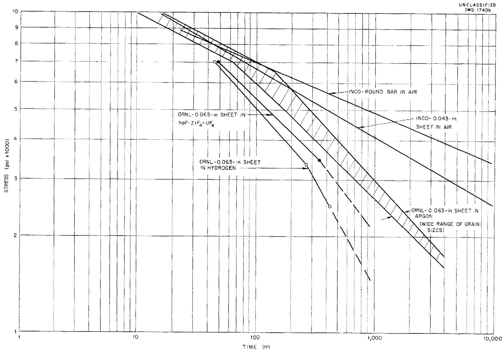  
Fig. 12.1. Summary of Available Rupture Data for Inconel Tested at $815^{\circ}\mathrm{C}$ ( $1500^{\circ}\mathrm{F}$ ) in Air, Argon, Hydrogen and the Fused Fluoride Mixture $\mathsf{NaF - ZrF}_4\mathsf{-UF}_4$ (46-50-4 mole%).

less steel are being made in the fluoride mixture NaF-KF-LiF-UF $_4$ (10.9-43.5-44.5-1.1 mole %) at $815^{\circ}\mathrm{C}$ at stresses ranging from 5000 to 7500 psi. Preliminary results indicate a marked decrease in the rupture life. It will be necessary to complete more tests before a definite evaluation can be made of the effect of the fluorides on the creep properties of type 316 stainless steel. An anomalous behavior has been noted in the stress range from 6800 to 7300 psi -the rupture life increases as the stress is increased. This effect has also been seen in argon tests, although to a lesser degree. Detailed metallographic studies, together with x-ray diffraction and vacuum fusion analyses, will probably be necessary to determine the structural changes that promote this behavior.

# BRAZING AND WELDING RESEARCH

G. M. Slaughter V. G. Lane C. E. Schubert Metallurgy Division

ARE Welding. A manual entitled "Joint Design for Inert-Arc Welded Vessels" was prepared as an aid in construction of the ARE. This manual describes the preferable basic joint design for use in pressure vessels that are to be operated at elevated temperatures in a severely corrosive environment.

Cone-Arc Welding. A topical, comprehensive report of cone-arc welding research conducted at this laboratory is being written for publication in the Welding Journal Research Supplement. This report will discuss the basic principles of the cone-arc process, the actual physical setup of the apparatus, and the extent of the research on the welding of thin-walled tube-to-header joints.

During the research on the cone-arc welding of the 0.100-in.-OD stainless steel tubes with 0.010-in. wall thickness to the 0.125-in. stainless steel

headers, it was noticed that many welds exhibited a two-pass appearance. In order that the mechanism of the cone-arc welding process could be better understood, an investigation was conducted to study this phenomenon. Figure 12.2a shows a microstructure in a cone-arc weld that resembles, in many ways, that resulting from a multiple-pass butt-weld. There were, apparently, two stages of melting, with growth of dendrites across the interface of the two regions.

This two-pass effect apparently results from the very rapid melting of the tube during the initial phases of the welding process. With the tube flush against the top header surface, the intense heat of the welding arc is at first centered upon the thin-walled tube. The tube apparently undergoes melting along its length for a short distance until the thermal-insulating capacity of the very fine tube-to-header spacing is overcome. After this occurs, much of the heat is then used in melting the header material. At this time, conditions are reached that approach more nearly the equilibrium state. The lower pass is then that resulting from the initial phase of the welding, and the upper pass, represented by the molten weld pool, remains throughout the major portion of the welding cycle.

Since it would seem that the arc would play more directly upon the header sheet at the initial point of striking if the tube were recessed in the hole, this technique was employed in an attempt to eliminate the two-pass weld. Figure 12.2b is a photomicrograph of a cone-arc weld in which the tube was recessed 0.022 inch. Complete welding occurred, and the two-pass effect was eliminated. It should be remembered that the two-pass weld is not considered as detrimental but is merely a characteristic of joints made under certain conditions.

Relatively long arc distances also reduce the tendency for this type of

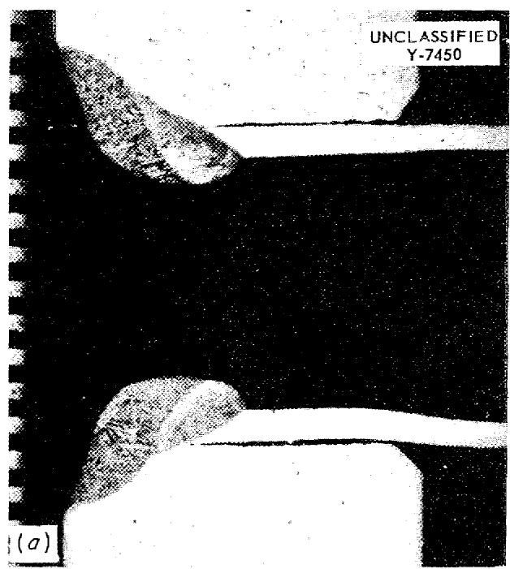

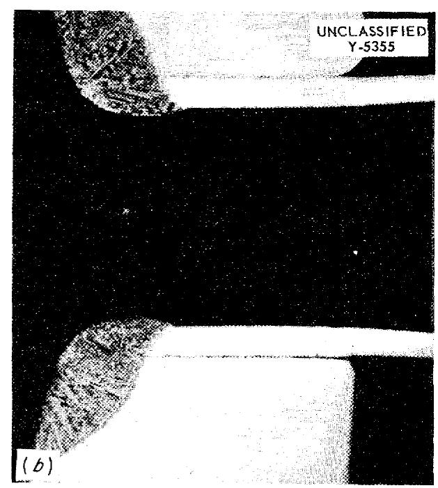  
Fig. 12.2. Two-Pass Characteristics of Cone-Arc Welds. (a) Tube flush with plate. (b) Tube recessed 0.022 inch. Etched with aqua regia. 194X.

joint. As the arc distance increases, more of the arc beam impinges upon the header sheet, and the drastic heating of the tube wall is minimized.

Resistance Welding. Since it is desirable to determine the feasibility of electrical-resistance spot welding of stainless steel clad fuel elements to both themselves and to stainless steel sheet, an investigation is being made in which the welding variables are precisely controlled. The goal of the preliminary experiments in this program was merely the production of sound, high-strength welds under conditions that do not materially harm the core structure of the fuel elements. Welds were made at several values of electrode force to obtain the optimum value, which was considered to be the minimum force that would consistently result in crack-free, nonporous, weld nuggets. By using this optimum electrode force and a reasonable weld time, experimental welds were then made over a wide

range of welding current. Examination of metallographic sections of these welds will enable the determination of the permissible range of current over which good welds can be made and also allow the selection of the most satisfactory value of welding current. Any major defects resulting from welding can also be investigated by metallographic sectioning.

A photomicrograph of a sound, highstrength, spot weld made in 0.030-in. fuel elements containing cores of $50\%$ $\mathrm{UO_2}$ and $50\%$ Fe is shown in Fig. 12.3a. The electrode force used was 800 lb, the weld time was 5 cycles, and the welding current was 6300 amp. The dark etching areas in the cores are thought to result from the partial melting of the iron portions of the core metal. The lower limit of the permissible current range is exhibited in Fig. 12.3b. The welding conditions in this case are identical to those used in Fig. 12.3a except that the welding current was reduced to 5800

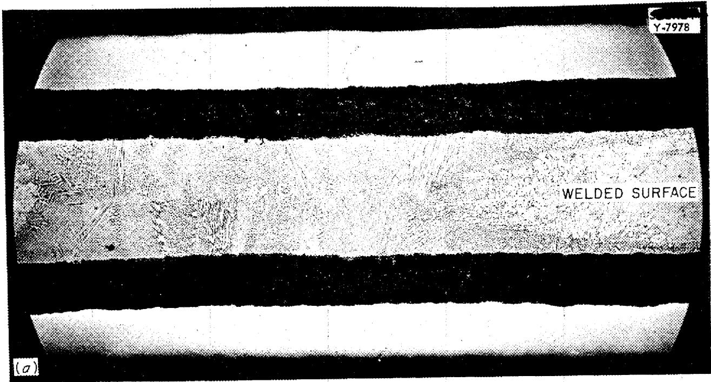

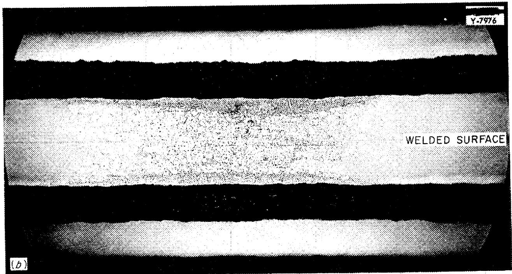  
Fig. 12.3. Spot Welds of Stainless-Steel-Clad Fuel Elements. (a) Welding current 6300 amp, excellent penetration. (b) Welding current 5800 amp, marginal penetration. Etched with aqua regia. 50X.

amp. The sheet-to-sheet interface line has been nearly removed; as a result, a moderate strength "stick weld" has been produced. It may be noted that melting begins at the stainless steel-core interface instead of at the usual sheet-to-sheet interface.

Tensile-shear tests on clad fuel elements that were spot welded under optimum conditions indicate that relatively high shear strengths can be obtained. Strengths of 575 lb per spot weld were recorded when a 3/16-in. restricted-dome electrode was used. Welds in standard stainless sheet of the same type and thickness would be somewhat stronger, but this would be expected because the nugget size would also undoubtedly be larger.

Automatic Heliarc Machine Welding. A welding program has been originated to study the operation and welding characteristics of a G-E Fillerweld Machine. This machine consists of a standard inert-gas heliarc torch with an automatic filler-wire addition mechanism. When coupled with a machine welding carriage, this equipment presents an excellent means for semiautomatically welding long straight joints or, when used in conjunction with an appropriate cam, joints of irregular and intricate shapes. In an investigation of the type to be conducted in this laboratory, it is desirable not only to determine absolute values of the welding variables but also to study the effects of these variables upon the quality of the welds produced.

Preliminary work on this investigation first consisted of adapting the basic equipment to conform with the needs of the program. Experiments have been conducted for the purpose of gaining familiarity with the process and for determining the ranges of welding current and travel speed necessary to produce satisfactory welds with various rates of filler-wire addition. All weld beads have

been deposited on flat stainless steelsheet 0.090 in.in thickness,but later the investigation will be focused upon actual joints in sheet stock of similar thicknesses.

Fabrication of Heat Exchanger Units. It is necessary to develop techniques for successfully brazing large, complicated, heat exchanger test assemblies of a type suitable for aircraft use. An actual unit was assembled in this laboratory and subjected to the Microbrazing operation. Figure 12.4 is a photograph of the heat exchanger brazed in dry hydrogen by the canning technique. As can be seen from the photograph, the fins are badly warped and distorted and in some cases, even brazed together. After the leak test with helium, it was found that there were leaks in the tube-to-fin matrix as

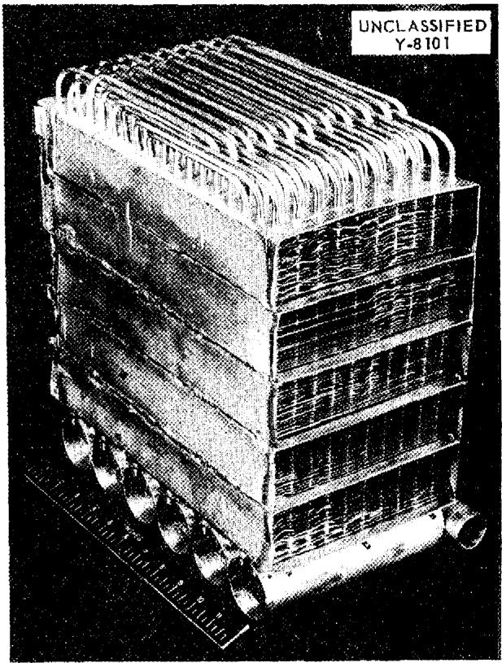  
Fig. 12.4. Liquid-to-Air Radiator Microbrazed by Canning Technique.

well as in the tube-to-header joints of the manifold section. The tube-to-header joints could be repaired by rebrazing, but the leaks in the body of the unit are almost impossible to repair successfully.

Examination of the completed unit revealed several probable causes for the leaks and excessive distortion. This examination has led to techniques for overcoming these flaws in future brazing operations. The tube-to-fin leaks were thought to be caused by excessive use of Microbraz alloy, with the resultant dissolving away of the tube walls. The bad distortion also tended to aggravate this situation by allowing puddling of the molten brazing alloy. The formation of "hot spots" in the body of the assembly was also thought to be a prevalent condition. A very rapid heating rate was also an important factor in the warpage.

Techniques that are planned for incorporation in further brazing operations are the use of lesser quantities of Microbraz, the use of several aspirators to promote more even hydrogen flow between the fins, the build-up of the whole assembly off the can bottom to overcome the drastic initial heating rate, and the use of a slightly lower brazing temperature.

Brazing of Copper to Inconel. The need for a satisfactory brazing alloy for joining copper fins to Inconel tubing has been emphasized. The resultant braze should have relatively high strength at $1500^{\circ}\mathrm{F}$ and should also be a diffusion barrier against copper penetration into the Inconel during service. It seems likely that some alloy other than a copper-base alloy would best fill these requirements. Microbrazing at $1900^{\circ}\mathrm{F}$ is very promising, but the alloy does not completely melt at this temperature. It is hoped, however, that the use of other alloys very similar in composition to Microbraz but of somewhat

lower melting point will result in a satisfactory brazed joint.

In view of the possibility that it might be advisable to use copper-base alloy for the production of these tube-to-fin joints, several such alloys are being investigated. Small melts of Cu-Be, Cu-Si, Cu-Sn, and Cu-Mn alloys have been prepared and are to be tested for flowability characteristics, oxidation resistance, and room- and elevated-temperature tensile strengths.

# EVALUATION TESTS OF BRAZING ALLOYS

G.M.Slaughter V.G.Lane C.E.Schubert Metallurgy Division

The results of recent high-temperature oxidation tests and static corrosion tests in sodium hydroxide, sodium, and lithium are summarized in Table 12.4. The high-temperature oxidation tests were conducted in a stream of moist air at $1500^{\circ}\mathrm{F}$ on T specimens of Inconel and type 316 stainless steel brazed with the various alloys. The samples tested in molten sodium hydroxide at $1500^{\circ}\mathrm{F}$ were A nickel T joints brazed with these alloys. Brazed Inconel and type 316 stainless steel T joints were used as specimens for the corrosion tests in sodium and lithium. The tensile strength of several brazed joints has been examined at room and $1500^{\circ}\mathrm{F}$ temperatures.

Oxidation of Brazing Alloys. Examination of metallographic sections of the high-temperature oxidation specimens showed the $60\%$ Pd- $40\%$ Ni alloy to be the most oxidation resistant of the brazing alloys tested. This alloy was unattacked when in contact with the base metals tested; the Inconel joint is shown in Fig. 12.5. An example of severe oxidation is shown in Fig. 12.6, which is the photomicrograph of a type 316 stainless steel joint brazed with the $64\%$ Ag- $33\%$

TABLE 12.4. RESULTS OF 100 hr CORROSION TESTS OF BRAZING ALLOYS AT ${1500}^{ \circ  }\mathrm{F}$   

<table><tr><td rowspan="2">BRAZING ALLOY</td><td rowspan="2">HIGH-TEMPERATURE OXIDATION ON BRAZED INCONEL</td><td rowspan="2">HIGH-TEMPERATURE OXIDATION ON BRAZED TYPE 316 STAINLESS STEEL</td><td rowspan="2">STATIC CORROSION ON BRAZED A NICKEL IN NaOH</td><td colspan="2">STATIC CORROSION ON BRAZED INCONEL</td><td colspan="2">STATIC CORROSION ON BRAZED TYPE 316 STAINLESS STEEL</td></tr><tr><td>In Na</td><td>In Li</td><td>In Na</td><td>In Li</td></tr><tr><td>Nicrobraz</td><td></td><td></td><td>Slight</td><td>None</td><td>Moderate</td><td>Slight</td><td>Severe</td></tr><tr><td>60% Mn-40% Ni</td><td></td><td></td><td>Severe</td><td>Moderate</td><td>Moderate</td><td>Moderate</td><td>Severe</td></tr><tr><td>60% Pd-40% Ni</td><td>None</td><td>None</td><td>None</td><td>Severe</td><td>Severe</td><td>Moderate</td><td>Severe</td></tr><tr><td>16.5% Cr-10.0% Si-73.5% Ni</td><td>Moderate</td><td>None</td><td>Fractured during examination</td><td>Moderate</td><td>Severe</td><td>None*</td><td>Slight</td></tr><tr><td>16.5% Cr-10.0% Si-2.5% Mn-71.0% Ni</td><td>Moderate</td><td>None</td><td>Fractured during examination</td><td>Moderate</td><td>Slight</td><td>None*</td><td>Severe</td></tr><tr><td>75% Ag-20% Pd-5% Mn</td><td>Severe</td><td>Moderate</td><td>Severe</td><td>Severe</td><td>Severe</td><td>Severe</td><td>Severe</td></tr><tr><td>64% Ag-33% Pd-3% Mn</td><td>Slight</td><td>Severe</td><td>Moderate</td><td>Severe</td><td>Severe</td><td>Severe</td><td>Severe</td></tr></table>

*Severe cracking present in joint.

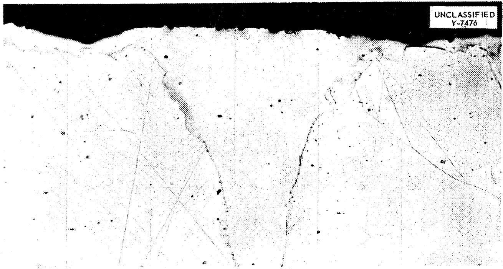  
Fig. 12.5. Inconel Joint Brazed with $60\%$ Pd-40% Ni Alloy After Oxidation Test for 100 hr at $1500^{\circ}\mathrm{F}$ . Etched with $\mathrm{KCN(NH_4)_2S_2O_8}$ . 200X.

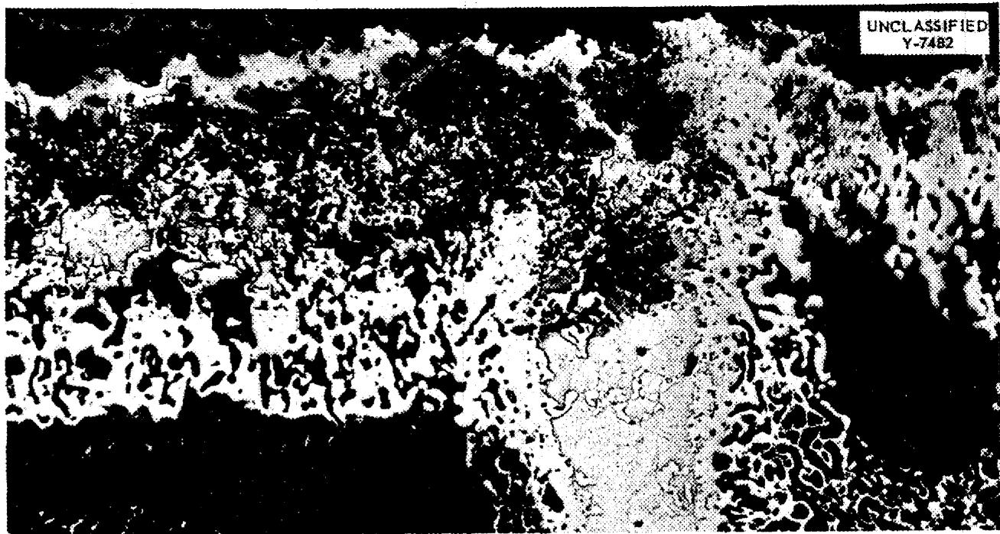  
Fig. 12.6. Type 316 Stainless Steel Joint Brazed with a $60\%$ Ag- $33\%$ Pd- $3\%$ Mn Alloy After Oxidation Test for 100 hr at $1500^{\circ}$ F. Etched with aqua regia. 200X.

Pd-3% Mn alloy. As a result of this investigation, it was found that a brazing alloy in contact with one base metal may be severely oxidized, whereas it may be relatively unattacked when in contact with another base metal. This might be explained by the fact that the least oxidation-resistant constituents of the brazing alloy may diffuse more readily into certain base metals than into others.

Corrosion of Brazing Alloys by Sodium Hydroxide. Since A nickel is relatively unattacked by molten sodium hydroxide at $1500^{\circ}\mathrm{F}$ , it serves as a suitable base metal for testing the corrosion resistance of brazing alloys in this medium. Examination of a joint brazed with $60\%$ Pd- $40\%$ Ni alloy and tested in NaOH for 100 hr showed

that no attack is present. Several other alloys were attacked, and the joints brazed with the Cr-Ni-Si-Mn and the Cr-Ni-Si alloys fractured during removal from the test capsule.

Corrosion of Brazing Alloys by Sodium and Lithium. Because brazing operations may be proposed for assembling fuel plates into subassemblies for certain types of reactors, it was of interest to study the static corrosion resistance of brazed joints in contact with sodium or lithium. The $60\%$ Pd- $40\%$ Ni alloy, which exhibited excellent corrosion resistance to all other media tested, was severely attacked by the liquid metals. The extreme attack of sodium on brazed Inconel is illustrated in Fig. 12.7, which is the photomicrograph of a

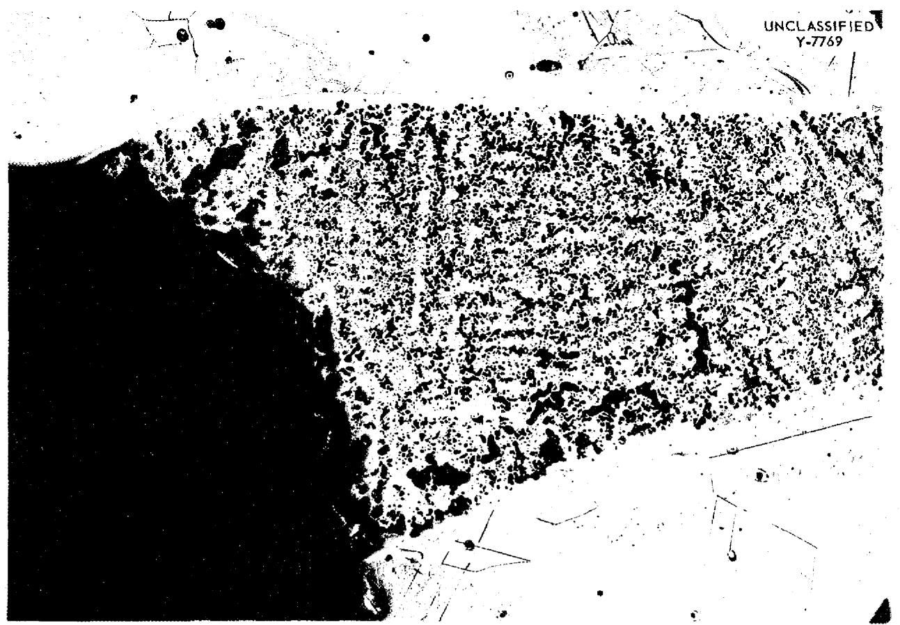  
Fig. 12.7. Inconel Brazed with $60\%$ Pd- $40\%$ Ni After 100 hr at $1500^{\circ}\mathrm{F}$ in Sodium. Etched with aqua regia. 150X.

sample tested for 100 hr at $1500^{\circ}\mathrm{F}$ . As a check on these results, small specimens of the pure braze metal were immersed in the metal baths. The sample tested in sodium had a weight loss of over $50\%$ , and the sample tested in lithium completely dissolved.

Figure 12.8 is a photomicrograph of a type 316 stainless steel brazed with the Cr-Si-Ni-Mn alloy and tested in sodium for 100 hr at $1500^{\circ}\mathrm{F}$ . No attack is exhibited, but the cracking tendencies of this brazing alloy are shown very clearly. It was noted that the cracking of the Cr-Si-Ni-Mn and Cr-Ni-Si alloys was more severe when alloyed with stainless steel than when alloyed with Inconel.

Tensile Strength of Brazed Joints. Results of the room-temperature tensile strength tests of Inconel butt-joints brazed with Microbraz alloy seem to indicate that a short brazing time of 10 min or less leads to the

production of weak joints. Samples held at the brazing temperature for 20 min seem to produce stronger joints. Figure 12.9 is a photomicrograph of the room-temperature fracture of a joint held at the brazing temperature for 5 minutes. Some Microbraz can be seen in this photograph, but no brittle fracture is evident. Although the specimen that was held for 20 min at the brazing temperature broke near the brazed joint, no evidence of Microbraz alloy could be found upon metallographic sectioning. The greater alloying of the braze and the base metal is a result of the increased diffusion occurring at this longer time. The increase in tensile strength of the second bar probably results from this alloying.

The average of four room-temperature tensile tests on joints brazed at short times was 38,300 psi. A joint brazed for 20 min at the brazing temperature fractured at 81,700 psi.

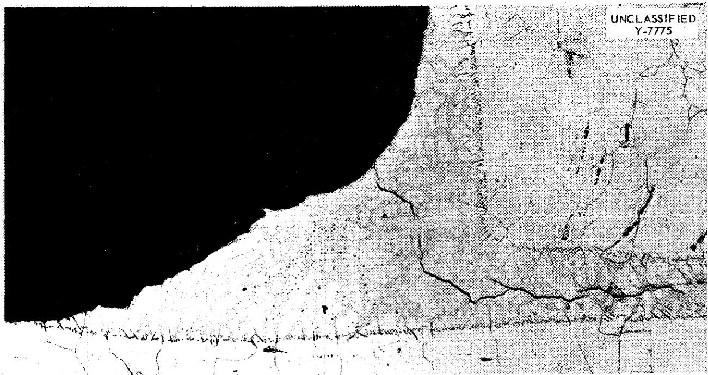  
Fig. 12.8. Type 316 Stainless Steel Brazed with $16.5\%$ Cr-10.0% Si-2.5% Mn-71.0% Ni After 100 hr at $1500^{\circ}$ F in Sodium. Etched with aqua regia. 150X.

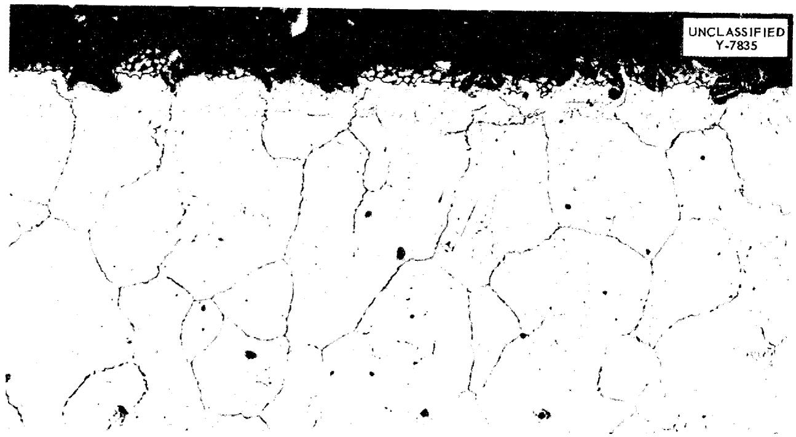  
Fig. 12.9. Room-Temperature Fracture of a Microbrazed Inconel Test Bar. Brazing time, 5 min. Etched with aqua regia. 200X.

The average tensile strength of four Inconel bars that were heat-treated similarly was 87,300 psi. This seems to indicate that if time is allowed for sufficient diffusion to occur, joint efficiencies of over $90\%$ can be obtained. However, a more thorough investigation of the effect of brazing time on room-temperature strengths is being conducted at present.

The tensile strengths of Microbrazed Inconel joints tested at $1500^{\circ}\mathrm{F}$ were much more consistent. The average tensile strength of joints brazed at short times was 24,400 psi, whereas the sample brazed for 20 min fractured at 24,700 psi. Several test bars failed in the parent metal at a point definitely not in the diffusion zone of the brazed joint. The average elevated-temperature tensile strength of four Inconel test bars that were heat treated at the brazing temperature for 5 min was 23,700 psi. These data indicate that the Microbrazed Inconel joints at $1500^{\circ}\mathrm{F}$ are often as strong

as the Inconel base metal. The diffusion of the braze metal while the specimen is at the testing temperature undoubtedly has some effect upon the joint strength at this temperature.

Butt-brazed Inconel test bars brazed with the $60\%$ Pd- $40\%$ Ni alloy were tested at room and elevated temperatures. The average room-temperature tensile strength of these brazed joints was 87,600 psi, whereas those tested at $1500^{\circ}\mathrm{F}$ averaged 21,000 psi. Check bars of Inconel heat treated for 5 min at $2300^{\circ}\mathrm{F}$ were also tested so that the strengths of samples subjected to the brazing cycle could be determined. The joint efficiency at room temperature was found to be $100\%$ , whereas at $1500^{\circ}\mathrm{F}$ the value was $93\%$ .

Extremely deleterious effects of the high-temperature heat treatment involved in Ni-Pd brazing were not evident in short-time tensile tests on Inconel. Inconel 0.252-in.-dia tensile bars heat treated for 5 min

at the Microbrazing temperature of $2100^{\circ}\mathrm{F}$ had an average room-temperature strength of 87,300 psi and an average $1500^{\circ}\mathrm{F}$ strength of 23,200 psi. Test bars heat treated for 5 min at the Ni-Pd brazing temperatures of $2300^{\circ}\mathrm{F}$ fractured at an average room-temperature strength of 84,500 psi and at an average $1500^{\circ}\mathrm{F}$ strength of 22,600 psi. Thus, the larger grained Inconel has a tensile strength at room temperature of only $3.2\%$ less than the finer grained Inconel; at $1500^{\circ}\mathrm{F}$ the difference is only $2.6\%$ . Since all tensile bars in the experiments were machined from the same Inconel rod, there is indication that heat treatment was the influencing factor.

Melting Point of $60\%$ Pd- $40\%$ Ni Alloy. Although the $60\%$ Pd- $40\%$ Ni brazing alloy has many very desirable properties, its high melting point might exclude its use in many applications. In an attempt to lower its melting point by alloying, beryllium additions of from 0.25 to $4\%$ were made. A $1\%$ beryllium alloy was found to have a melting point slightly below $2200^{\circ}\mathrm{F}$ , but recent tests indicate that its flowability properties are very poor. In further attempts to obtain a lower melting point alloy without impairment of the corrosion resistance and physical properties of the basic alloy, additions of Al will be made to the Pd-Ni alloy.

# CERAMICS RESEARCH

# J. M. Warde, Metallurgy Division

Development of Cermets for Reactor Components. The $\mathrm{Cr - Al_2O_3}$ cermet fabrication studies have resulted in successful disks 1 in. in diameter and 20 mils thick. Several sandwich disks were also made that contained a thin layer of $\mathrm{UO_2}$ mixed with $\mathrm{Cr - Al_2O_3}$ . A die is now being made to permit pressing of annular rings of a fuel-bearing material. In-reactor tests of these cermets are now being cont-. templated.

A ZrC-Fe cermet was fabricated as a possible material for pump parts, seals, and bearing materials. This cermet, along with Kennametal 151-a, is being tested for corrosion resistance in fluorides, Na, and Pb. These materials appear to be very promising. Corrosion data and photomicrographs will be included in the next report.

Attempts to hot press SiC-Si mixtures have not yet been successful. A vacuum induction furnace is nearly built that will be used to study sintering of this and other cermets.

Ceramic Coatings for an Aircraft Type of Radiator. A satisfactory dipping technique was developed for the application of NBS ceramic coating A-418 to provide oxidation resistance at elevated temperatures to parts fabricated from nickel for an aircraft type of radiator. The first composition of this coating was described previously.(1) The radiator parts will be coated as soon as they are available.

Ceramic Coatings for Shielding Metals. Work was commenced on the development of a coating containing a minimum of $10\%$ by weight of boron that could be flame-sprayed onto metal surfaces for use in reactor shielding. A lead-borate enamel was developed that could be successfully applied in a 20-mil coating to No. 20 gage stainless steel by flame-spraying. The batch composition of this enamel is as follows:

$\mathrm{B}_{2} \mathrm{O}_{3}$ 35.0%

PbO 62.5%

ZnO 2.5%

Further work is in progress in an attempt to coat a mild steel plate 5 ft by 5 ft by 7/8 in. for use in a shielding experiment.

Uniformity of Beryllium Oxide Blocks (L. M. Doney and J. M. Warde, Metallurgy Division). A study of the physical structure of the BeO blocks

to be used in the ARE was made to aid in the interpretation of BeO-NaK compatibility test data. These blocks, fabricated by the Norton Co., were made by hot-pressing BeO powder. They are hexagonal blocks 2 l/8 in. on a side, 3 ll/16 in. in diameter across center of faces, and 6 in. long. They are fabricated with a center hole running axially through the block; the diameter of the hole (depending on the position of the block in the reactor core) is 1/2, 1 l/8, or 1 3/4 inches. A visual examination was made of about 30 blocks of the type having a 1/2-in.-dia hole. These blocks had been sawed in two on a plane perpendicular to the long axis. It was observed that in all cases the core of the blocks had a different physical structure than did the outer portion of the same blocks. In order to study this core structure, six blocks that had not been sawed were soaked in fuchsia dye for 12 hours. The dye is most absorbed in the more porous areas in the block, and Fig. 12.10, a photograph of one of the dyed specimens, shows the typical soft core structure noted in all the dyed specimens. Samples taken from the inside and outside surfaces of these blocks showed density variations from 2.80 to 2.83 at the outside, which decreased to 2.26 to 2.43 at the inside. The apparent porosity of the dense portion of the block is practi

cally zero, compared with values up to $23.3\%$ for the soft core. Table 12.5 gives results of density, apparent porosity, and water absorption measurements for specimens cut from various portions of the block.

Blocks that have a 1 1/8-in.-dia central hole are being split longitudinally so that the two halves can be placed around a cooling pipe. With the blocks split, a large amount of inner surface will be exposed to the coolant material. This inner surface is low-density material that is particularly susceptible to NaK corrosion. To determine the extent of the low density region, a random sample of these blocks was soaked in

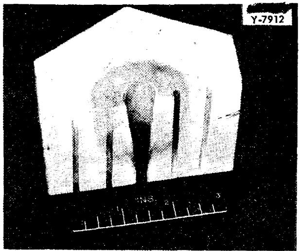  
Fig. 12.10. Dye-treated BeO Block Showing Porous Central Section.

TABLE 12.5. DENSITY, POROSITY, AND WATER ABSORPTION MEASUREMENTS OF VARIOUS SECTIONS OF THE BeO BLOCK   

<table><tr><td>SOURCE</td><td>WET WEIGHT, W(g)</td><td>DRY WEIGHT, D(g)</td><td>W - D</td><td>ABSORPTION,(W - D)/D(%)</td><td>SUSPENDED WEIGHT, S*(g)</td><td>W - S**</td><td>DENSITY(g/cm3)</td><td>POROSITY,(W - D)/(W - S)(%)</td></tr><tr><td>Outer edge</td><td>1.3612</td><td>1.3609</td><td></td><td>0</td><td>0.881</td><td>0.4802</td><td>2.83</td><td>0</td></tr><tr><td>Outer edge</td><td>1.8459</td><td>1.8458</td><td></td><td>0</td><td>1.187</td><td>0.6589</td><td>2.80</td><td>0</td></tr><tr><td>Outer edge</td><td>2.0859</td><td>2.0860</td><td></td><td>0</td><td>1.350</td><td>0.7359</td><td>2.83</td><td>0</td></tr><tr><td>Core</td><td>1.3957</td><td>1.2789</td><td>0.1168</td><td>9.13</td><td>0.846</td><td>0.5497</td><td>2.33</td><td>21.25</td></tr><tr><td>Core</td><td>1.3555</td><td>1.2661</td><td>0.0894</td><td>7.06</td><td>0.835</td><td>0.5205</td><td>2.43</td><td>17.18</td></tr><tr><td>Core</td><td>1.1778</td><td>1.0680</td><td>0.1098</td><td>10.28</td><td>0.707</td><td>0.4708</td><td>2.27</td><td>23.32</td></tr></table>

*Weight suspended in water.   
\*\*Equivalent to volume.

fuchsia in dye for 12 hr, and specimens were cut from selected localities in the block. Figure 12.11 shows the density and per cent porosity placed on the block in the location from which the sample was taken. The dark shaded areas on the right of the block indicate the porous portions shown up by the penetration of the dye. Five samples of blocks with a 13/4-in.-dia central hole were soaked in dye and were also found to have a porous central core.

A general observation was made regarding the prevalence of cracks in all the blocks examined. All the blocks have at least one crack, and some blocks contain several cracks. In some cases these cracks are visible at the surface of the block, but in the majority of the blocks the cracks are confined to the interior portion. These cracks are quite narrow and

contribute only slightly to the porosity. The presence of one of these cracks may be observed in Fig. 12.11.

The porous condition developed in the hot-pressed BeO blocks is a defect caused by fabrication. A probable cause of the defect is that the hot-pressed die had too tight a fit on the top and bottom punches around the central pin, which would cause binding and therefore uneven pressure application. A further factor is faulty filling of the die, which would cause bridging of the powder around the pin. Other factors such as too short time of application of pressure, too short time of holding at pressing temperature, uneven temperature distribution in the BeO powder because of too rapid heating, cooling of the die to room temperature without extracting the core pin, etc., could also have affected the final density.

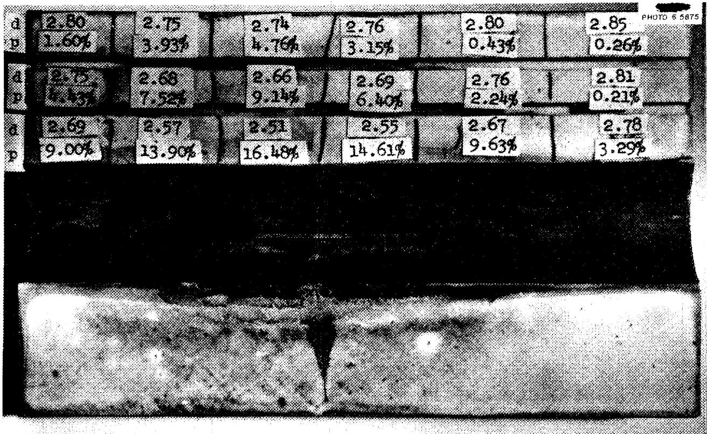  
Fig. 12.11. Density and Per Cent Porosity at Various Locations in a Full-size ARE Be0 Block.

# 13. HEAT TRANSFER AND PHYSICAL PROPERTIES RESEARCH

H. F. Poppendiek, Reactor Experimental Engineering Division

The thermal conductivity of the fluoride mixture NaF-BeF $_2$ (57-43 mole %) was experimentally determined to be 2.4 Btu/hr·ft $^{\circ}$ F over a temperature range of 452 to $586^{\circ}$ C. This result is comparable with the thermal conductivities previously obtained for some of the other fluoride mixtures. Two new thermal conductivity devices have been developed and successfully tested with ordinary liquids.

The enthalpies and heat capacities of fuel mixture NaF-KF-ZrF4-UF4 (4.8-50.1-41.3-3.8 mole %) have been obtained. The heat capacity can be represented by $c_p = 0.28 \pm 0.015$ cal/cm $^{\circ}$ C over the temperature range 540 to 900°C.

The viscosities and densities of the fluoride mixtures $\mathrm{NaF - ZrF_4}$ (50-50 mole %) and $\mathrm{NaF - ZrF_4 - UF_4}$ (50-25-25 mole %) have been measured with the modified Brookfield viscometer. The viscosity of the first mixture ranged from 15 cp at $610^{\circ}\mathrm{C}$ to 5 cp at $1030^{\circ}\mathrm{C}$ . The viscosity of the second mixture ranged from 20 cp at $650^{\circ}\mathrm{C}$ to 11 cp at $880^{\circ}\mathrm{C}$ . These results are compared with the viscosity measurements previously determined for some of the other fluoride mixtures. Development of the capillary viscometer is continuing.

The vapor pressure of $\mathrm{NaZrF_5}$ increases from 8 mm Hg at $800^{\circ}\mathrm{C}$ to 30 mm Hg at $900^{\circ}\mathrm{C}$ ; this behavior is similar to that previously reported for the NaF-ZrF $_4$ -UF $_4$ (50-46-4 mole %) mixture. Experimental values of the vapor pressure of $\mathrm{BeF}_2$ measured at BMI agreed with values calculated at ORNL.

Preliminary experimental heat transfer coefficients have been obtained for the case of turbulently flowing NaF-KF-LiF mixture in a long tube. It appears that heat transfer with this mixture can probably be described by the usual forced-convection

expressions characterizing ordinary fluids, as was found to be the case for molten sodium hydroxide.

Several thermal analyses pertaining to the reflector-moderated reactor have been conducted. One study was made concerning the heat generation within the reflector and shell of the reactor. Another analysis consisted of preparing design charts for cooling-hole distributions in reactor reflectors. An attempt to minimize the weight and volume of air radiators has been initiated.

A pyrex thermal convection harp has been designed and constructed for an experimental inquiry into harp convection velocities. The experimental data are to be used to check the validity of analytical methods used to predict the circulation velocities.

An investigation has been initiated in an attempt to derive a heat-momentum transfer analogy for the annulus in much the same way as it has been derived for the pipe system.

An experiment has been designed that will make possible an experimental study of the heat transfer characteristics of a simple, fuel-circulating system; a long pipe will be used in which the flowing fluid is heated internally by an electric current. The experimental results will be compared with the previously obtained theoretical results.

# THERMAL CONDUCTIVITY OF LIQUIDS

W. D. Powers R. M. Burnett   
S.J.Claiborne W.B.Harrison

Reactor Experimental Engineering Division

A thermal conductivity device similar to the one described previously $^{(1)}$ was used to study the fluoride

(1)L. F. Basel and M. Tobias, ANP Quar. Prog. Rep. Dec. 10, 1950, ORNL-919, p. 196.

mixture NaF-BeF $_2$ (57-43 mole %). The results of three independent sets of measurements are given in Table 13.1.

Figure 13.1 shows a plot of the thermal conductivities of several fluoride salt mixtures as a function of uranium concentration. It appears that the thermal conductivities of these somewhat similar fluoride mixtures decrease as the uranium weight percentages increase.

A new thermal conductivity device for studying both liquids and solids has been developed that consists of an electric heater, a thermal conductivity cell, a heat meter, and a water cooler. Calculations reveal that thermal conductivities can be measured to within $\pm 10\%$ of their true

TABLE 13.1. THERMAL CONDUCTIVITY OF NaF-BeF2   

<table><tr><td>THERMAL CONDUCTIVITY (Btu/hr·ft·°F)</td><td>AVERAGE TEMPERATURE (°C)</td><td>TEMPERATURE RANGE (°C)</td></tr><tr><td>2.3</td><td>528</td><td>470 to 586</td></tr><tr><td>2.5</td><td>527</td><td>471 to 584</td></tr><tr><td>2.4</td><td>526</td><td>452 to 500</td></tr></table>

values. Thermal conductivity measurements of water, obtained with the heat-meter thermal conductivity device, agree with literature values to within $6.5\%$ .

A transient method for determining the thermal conductivity of liquids

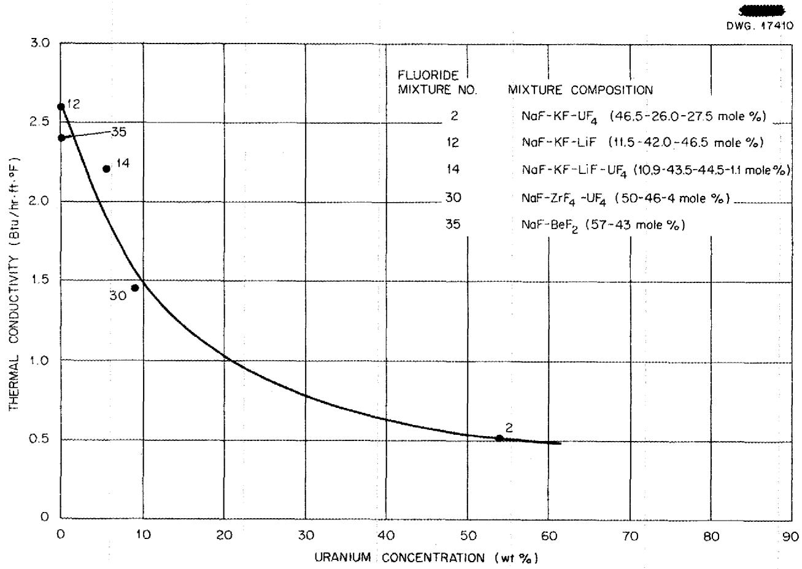  
Fig. 13.1. Thermal Conductivity of Fluoride Mixtures as a Function of Uranium Concentration.

has been developed. A thin-walled metal tube with a small diameter is immersed in the liquid being studied, and the tube is suddenly heated by a direct current of electricity. The transient temperature rise of the tube is a function of the heat capacity of the tube and the thermal conductivity, heat capacity, and density of the liquid. The early part of the temperature-time function is completely controlled by the conduction mechanism. Analyses of the solutions of the transient conduction equations pertaining to the system described (2) show that liquid thermal conductivities may be determined from the experimental temperature-time measurements. This transient apparatus has been used to check the thermal conductivity of water and glycerine at room temperature; the results agree to within $\pm 10\%$ of the values reported in the literature.

In addition to the continued study of fluoride salt mixtures, it is planned to measure the thermal conductivity of molten sodium hydroxide by one or more of the methods discussed above.

# HEAT CAPACITY OF LIQUIDS

W. D. Powers G. C. Blalock Reactor Experimental Engineering Division

The enthalpy and the heat capacity of the fuel mixture NaF-KF-ZrF4-UF4 (4.8-50.1-41.3-3.8 mole %) have been determined by Bunsen ice calorimeters for the temperature range of 540 to $900^{\circ}\mathrm{C}$ and are given by the equations:

$$
\begin{array}{l} \begin{array}{r l} H _ {T} (\text {l i q u i d}) - H _ {0} \circ_ {\mathbb {C}} & (\text {s o l i d}) \\ & = - 1 5 + 0. 2 8 T \end{array} , \\ c _ {p} = 0. 2 8 \pm 0. 0 1 5, \\ \end{array}
$$

where $H$ is in cal/g, $T$ in °C, and $c_p$ in cal/g. The fuel mixture NaF-ZrF $_4$ -UF $_4$ (50-46-4 mole %) and the

(2) W. B. Harrison, Transient Methods for Determining Thermal Conductivity of Liquids, ORNL CF-52-11-113 (Nov. 1, 1952).

eutectic mixture of NaOH and LiOH are currently being studied.

# VISCOSITIES OF FLUORIDE MIXTURES

Measurements with the Brookfield Viscometer (R. F. Redmond, T. N. Jones, Reactor Experimental Engineering Division). The viscosities of the fluoride salt mixtures $\mathrm{NaF - ZrF_4}$ (50-50 mole %) and $\mathrm{NaF - ZrF_4 - UF_4}$ (50-25-25 mole %) have been measured with a Brookfield viscometer contained in an inert atmosphere. These results are plotted in Fig. 13.2, together with the viscosities of several other fluoride mixtures. The zirconium-bearing salts have much higher viscosities than NaF-KF-LiF (11.5-42.0-46.5 mole %) and NaF-KF-LiF-UF $^4$ (10.9-43.5-44.5-1.1 mole %); the beryllium-bearing fluoride mixture $\mathrm{NaF - BeF_2}$ (57.0-43.0 mole %) is also characterized by higher viscosities. In general, it appears that an increase in uranium content yields an increase in the viscosity.

Capillary Viscometer (F. A. Knox, N. V. Smith, F. Kertesz, Materials Chemistry Division). The capillary viscometer previously described(3,4) has been used to study fused fluorides over the temperature range of 600 to $800^{\circ}\mathrm{C}$ . All the materials studied in this apparatus were purified by the hydrogenation-hydrofluorination procedure. The apparatus in its present form does not sufficiently protect the mixtures from exposure to air, and modifications are being made to the equipment to improve the quality of the inert atmosphere maintained over the melt.

Bloom, Harrap, and Heymann(5) determined values for the viscosity of various chloride mixtures by using

(3) J. M. Cisar, F. A. Knox, F. Kertesz, R. F. Redmond, and T. N. Jones, ANP Quar. Prog. Rep. June 10, 1952, ORNL-1294, p. 146.   
(4) F. A. Knox, N. V. Smith, and F. Kertesz, ANP Quar. Prog. Rep. Sept. 10, 1952, ORNL-1375, p. 145.   
(5) H. Bloom, B. S. Harrap, S. E. Heymann, Proc. Roy. Soc. (London) 194A, 237 (1948).

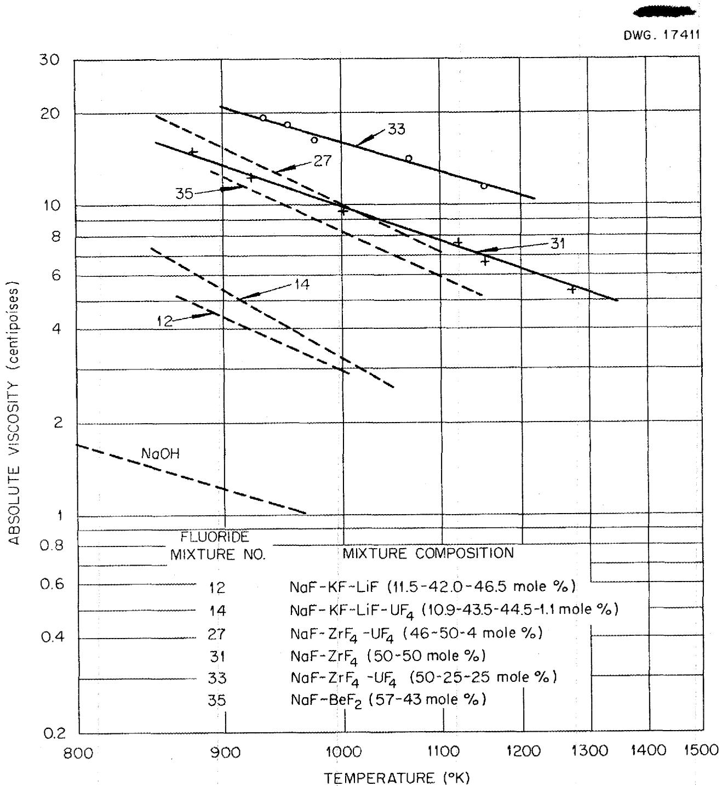  
Fig. 13.2. Viscosity of Several Fluoride Mixtures as a Function of Temperature.

glass capillaries in apparatus of this type. The use of glass capillaries with fluorides, even at temperatures below $650^{\circ}\mathrm{C}$ , proved impossible, however, because the inner surfaces of the capillaries were attacked to such an extent that the original calibrations could not be reproduced.

The use of small nickel capillaries (about $0.08\text{-mm}$ bore) tended to cause plugging by the mixtures being studied. Larger capillaries (2.4-mm bore) minimized this difficulty, but they were impractical for studying low-viscosity liquids. With the large capillaries, Reynold's numbers below 300 were obtained, and the viscosities measured - based on calibrations with glycerol solutions at room temperature - are probably reliable as preliminary estimates. The viscosities of the several fluoride mixtures thus determined are in qualitative agreement with those presented in Fig. 13.2.

# DENSITY OF FLUORIDE MIXTURES

R. F. Redmond T. N. Jones Reactor Experimental Engineering Division

Preliminary density measurements have been made for the fluoride mixtures $\mathrm{NaF - ZrF_4}$ (50-50 mole %) and $\mathrm{NaF - ZrF_4 - UF_4}$ (50-25-25 mole %), and the values are tabulated in Table 13.2.

TABLE 13.2. DENSITIES OF TWO FLUORIDE MIXTURES AT VARIOUS TEMPERATURES  

<table><tr><td>FLUORIDE MIXTURE</td><td>TEMPERATURE (°C)</td><td>DENSITY (g/cm3)</td></tr><tr><td rowspan="4">NaF-ZrF4(50-50 mole %)</td><td>592</td><td>3.35</td></tr><tr><td>690</td><td>3.28</td></tr><tr><td>762</td><td>3.21</td></tr><tr><td>862</td><td>3.14</td></tr><tr><td rowspan="3">NaF-ZrF4-UF4(50-25-25 mole %)</td><td>682</td><td>4.13</td></tr><tr><td>756</td><td>4.05</td></tr><tr><td>820</td><td>3.94</td></tr></table>

# VAPOR PRESSUREOFMOLTENFLUORIDES

R. E. Moore

Materials Chemistry Division

The vapor pressure of $\mathbf{ZrF_4}$ above the pure compound NaF-ZrF4 (50-50 mole %) is of interest because this substance will serve as the fuel carrier introduced initially in the ARE. Vapor-pressure data for this salt were obtained in the temperature range of 795 to $994^{\circ}C$ by the method originally described by Rodebush and Dixon, (6) which has been discussed in previous reports. (7,8) The values obtained, given in Table 13.3, are best represented by the equation

$$
\log P = \frac {- 7 2 1 3}{T} + 7. 6 3 5,
$$

where $P$ is in mm Hg and $T$ is in ${}^{\circ}\mathrm{K}$ . The heat of vaporization is 33 kcal/mole, and the boiling point, calculated from the equation, is $1244^{\circ}\mathrm{C}$ . The vapor pressure of the NaF-ZrF $_4$ ( $\mathrm{NaZrF}_5$ ) is very similar to that of the mixture containing 46 mole % ZrF $_4$ , 50 mole % NaF, and 4 mole % UF $_4$ , reported previously. (9) This, of course, is not surprising, since substitution of 8 mole % of NaUF $_5$ for NaZrF $_5$ should not greatly influence the equilibrium pressure of ZrF $_4$ .

Verification of results obtained by this method has been attempted during the past quarter by using other procedures applicable to fused salts at high temperatures. Agreement among the various methods has, in general, been encouraging. Values for the vapor pressure of $\mathrm{ZrF_4}$ (36 mm Hg at $768^{\circ}C$ and 96 mm Hg at $806^{\circ}C$ ) were obtained by using a diaphragm apparatus similar to that used for vapor pressure

TABLE 13.3. VAPOR PRESSURE OF NaZrF5   

<table><tr><td>TEMPERATURE (°C)</td><td>OBSERVED PRESSURE (mm Hg)</td></tr><tr><td>795</td><td>8</td></tr><tr><td>803</td><td>8</td></tr><tr><td>807</td><td>8</td></tr><tr><td>835</td><td>13</td></tr><tr><td>835</td><td>14</td></tr><tr><td>854</td><td>16</td></tr><tr><td>858</td><td>18</td></tr><tr><td>868</td><td>20</td></tr><tr><td>886</td><td>28</td></tr><tr><td>887</td><td>27</td></tr><tr><td>923</td><td>39</td></tr><tr><td>946</td><td>47</td></tr><tr><td>948</td><td>50</td></tr><tr><td>964</td><td>64</td></tr><tr><td>967</td><td>63</td></tr><tr><td>994</td><td>90</td></tr></table>

measurements of $\mathbf{U}\mathbf{F}_{4}.$ (10) These data are in fair agreement with the values (39 and 94 mm Hg) obtained by the Rodebush method. In addition, tentative values for this compound, 29 mm Hg at $751^{\circ}\mathrm{C}$ and 56 mm Hg at $786^{\circ}\mathrm{C}$ , obtained by using a capillary "bridge" apparatus, (11,12) agree fairly well with the values of 26 and 59 mm Hg obtained by using the Rodebush method.

In the past quarter, vapor-pressure data obtained by applying a transpiration method to beryllium fluoride were reported by Battelle Memorial Institute. (13) A comparison of the data from Battelle with values calculated from the equation reported by this Laboratory (14) is given in

Table 13.4. The two sets of values are probably in agreement, within the experimental errors of both methods.

TABLE 13.4. COMPARISON OF VAPOR PRESSURE OF $\mathbf{BeF}_2$ BY DIFFERENT METHODS   

<table><tr><td rowspan="2">TEMPERATURE (°C)</td><td colspan="2">VAPOR PRESSURE (mm Hg)</td></tr><tr><td>BMI Data</td><td>ORNL Data</td></tr><tr><td>778</td><td>1.25</td><td>2.7</td></tr><tr><td>849</td><td>7.25</td><td>8.8</td></tr><tr><td>918</td><td>23.5</td><td>24</td></tr><tr><td>969</td><td>51.0</td><td>47</td></tr></table>

# CONVECTIVE HEAT TRANSFER IN FLUORIDE MIXTURE NaF-KF-LiF

H. W. Hoffman J. Lones

Reactor Experimental Engineering Division

The construction and instrumentation of the experimental system for the determination of convective heat transfer coefficients for the fluoride mixture NaF-KF-LiF (11.5-42.0-46.5 mole %) have been completed. This system is a modification of the one used for obtaining heat transfer coefficients in a tube with molten sodium hydroxide in turbulent flow.(15) All system components, with the exception of the test section, have been constructed of Inconel; A nickel tubing was used for the test section. Swagelok connections and "O" ring flanges have replaced the all-welded construction of the sodium hydroxide system.

The heat loss calibration and five heat transfer runs with NaF-KF-LiF were made. These runs covered a Reynold's modulus range of 2000 to 6000. Figure 13.3 presents the data for NaF-KF-LiF compared with data for air that were obtained by various

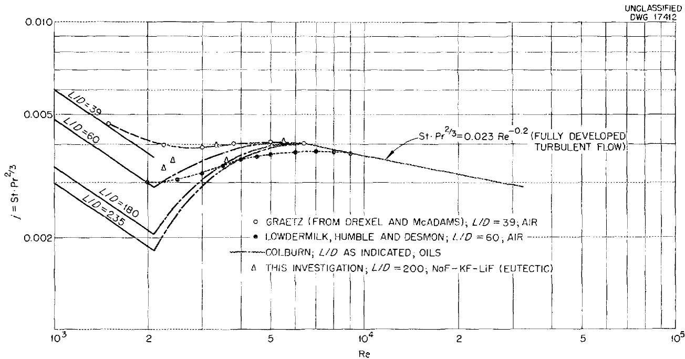  
Fig. 13.3. $j$ -Factor vs. Reynolds Modulus for NaF-KF-LiF, Air, and Other Fluids.

investigators. (16,17,18) The heat transfer coefficients are correlated in this figure by the $j$ factor (the product of the Stanton modulus, $h / c_{p}G$ , and the two-thirds power of the Prandtl modulus) as a function of the Reynold's modulus. It is to be noted that the transition from laminar flow to fully developed turbulent flow occurs over a region extending from $\text{Re} = 3000$ to $\text{Re} = 10,000$ . The preliminary data of the current investigation fall near the air data in this transition region. Further work is to be done at higher fluid temperatures to extend the data into the region of fully developed turbulence.

The experiments with the NaF-KF-LiF mixture were prematurely terminated because of the failure of the nickel test section. "Ring" cracks caused

(16) R. E. Drexel and W. H. McAdams, Nat. Adv. Co., Aero., Wartime Report ARR4F28.   
(17) W. H. Lowdermilk, L. V. Humble, and L. G. Desmon, Measurements of Average Heat Transfer and Friction Coefficients for Subsonic Flow of Air in Smooth Tubes at High Surface and Fluid Temperatures, NACA-102 (1951).   
(18) A. P. Colburn, Engineering Bulletin Purdue University, Vol. 26, No. 1 (Jan. 19, 1942).

a portion of the test section (5 1/4 in. long and located approximately at the center of the test section) to fall out. The failure was not caused by corrosion but appears to be due to metal fatigue resulting from the high temperatures to which the nickel section was subjected.

A new test section of Inconel $(L / D = 137)$ is being fabricated. Although the length-to-diameter ratio for this tube is less than that for the nickel tube, it is still sufficient to ensure that the entrance length will be exceeded within the confines of the test section.(19)

# ANALYSIS OF SPECIFIC REACTOR HEAT TRANSFER PROBLEMS

W. S. Farmer

Reactor Experimental Engineering Division

Heat Generation in the Reactor Reflector. In order to arrive at an estimate of the heat generation to be

expected in the reflector and shell of the reflector-moderated reactor (cf., "General Design Studies," sec. 3), several radiation source problems were analyzed. The largest source of heat in the reflector results from the absorption of gamma rays generated in the fuel coolant as a result of prompt fission and decay of the fission products. The magnitude of this source of heat generation was determined by using three methods of calculation based on isotropic source distribution and exponential attenuation. In the first calculation, the gamma-ray source was assumed to be distributed uniformly in a spherical annulus, and the same absorption coefficient was assigned to both the reflector and fuel coolant. In the second method, the source was distributed uniformly in an infinite slab of thickness equal to the annulus, and the true absorption coefficients of the fuel coolant, shell, and reflector were used in evaluating the heat generation from gamma-ray absorption at any point in the reflector. The resulting heat generation was corrected for geometry by a plane-to-sphere transformation. The third, and probably the best, approximation to the true heat generation in the reflector was obtained by solving for the current of radiation from the surface of the fuel coolant by using a spherical annulus geometry. This current was then assumed to enter the face of a composite slab made up of the shell and reflector that surround the fuel coolant. The resulting heat generation was then transformed from a slab geometry to a spherical geometry.

A secondary source of heat generation in the reactor reflector and shell arises from the absorption of gamma rays generated by neutron capture in the reflector and shell. In order to evaluate this source of heat generation, a general solution was determined for the case of a nonuniform source of radiation in a slab geometry

in which the neutron flux could be approximated by a power series or exponential expression. (20)

In order to simplify the computation of the maximum temperature rise in the reflector resulting from heat generation, general design charts that give this temperature rise for various values of heat generation, coolant-hole diameter, thermal conductivity, and coolant-hole spacing were prepared for several pertinent materials. (21)

Analysis of Fluid-to-Air Radiators. The design of the air radiator for transferring the heat generated in the reactor coolant to the air propulsion stream flowing through the turbojet engines has been analyzed in an effort to minimize air radiator weight and size. An analysis of the radiator volume, weight, and pressure drop was made for fixed conditions of power output, mass velocity per frontal area, and thermal conditions for a design in which plane-plate, finned radiators of stainless steel and nickel are used. In arriving at a solution, the heat transfer coefficients for the radiator were determined on the basis of laminar flow through flat ducts, since the Reynold's number for flow through the radiation over the pertinent range of conditions was less than 2000. Multiple calculations were made for a range of values of tube diameter, fin thickness, fin spacing, and tube pitch. On the basis of this evaluation, the optimum radiator design appears to be that with tube diameters between 1/8 and 1/4 in., 20 to 30 fins per inch, a fin thickness of 0.010 in., and a pitch of three times the tube diameter.

A review of the literature covering the theoretical and experimental work

on air radiations and simulated flat-duct systems is being made. A solution is sought that will suitably correlate the nonisothermal heat transfer results of air radiator tests being conducted by the ANP Division.

# NATURAL CONVECTION IN CONFINED SPACES AND THERMAL LOOP SYSTEMS

D.C.Hamilton F.E.Lynch L.D.Palmer

Reactor Experimental Engineering Division

Temperature profiles have been measured in the flat-plate natural-convection apparatus (22) over the practical range of variables attainable with the present equipment. The data will be presented in a forthcoming ORNL report and will be analyzed in relation to the theory previously developed. An example of a typical experimental temperature profile is given in Fig. 13.4.

The annulus, natural-convection apparatus is ready to be operated, (22) D. C. Hamilton and F. E. Lynch, ANF Quar. Prog. Rep. June 10, 1952, ORNL-1294, p. 158.

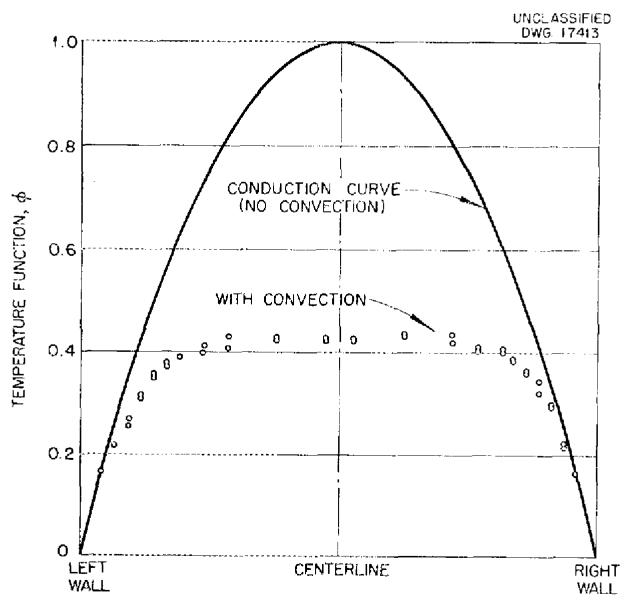  
Fig. 13.4. Typical Temperature Profile with Natural Convection.

except for construction of the two thermocouple assemblies. After the flat-plate data have been analyzed, the annulus experiments will be started. The test section shown in Fig. 13.5 was described in detail previously.(23) The test section has been assembled and installed in a 20-in.-ID can, and the can will be sealed and maintained at a slight vacuum to prevent mercury vapor from leaking into the room during operation.

In the pyrex model of a thermal harp, shown in Fig. 13.6, the tube has an inside diameter of 16 mm and the over-all height of the apparatus is 30 inches. The temperature differential between the hot and cold legs is provided by running hot and cold water through the condenser tubes. The natural-convection velocity of the water in the inner tube is measured by observing the motion of small particles. The data now being obtained with this apparatus will provide a means of checking the validity of analytical methods of predicting harp velocities.

# TURBULENT CONVECTION IN ANNULI

W.B.Harrison J.O.Bradfute

Reactor Experimental Engineering Division

Relatively little satisfactory information on turbulent-flow, forced-convection, heat transfer in annulus systems is available in the literature. (24) However, a significant number of momentum transfer studies have been reported, (25) and investigation has been initiated in an attempt to derive a heat-momentum transfer analogy for the annulus in much the

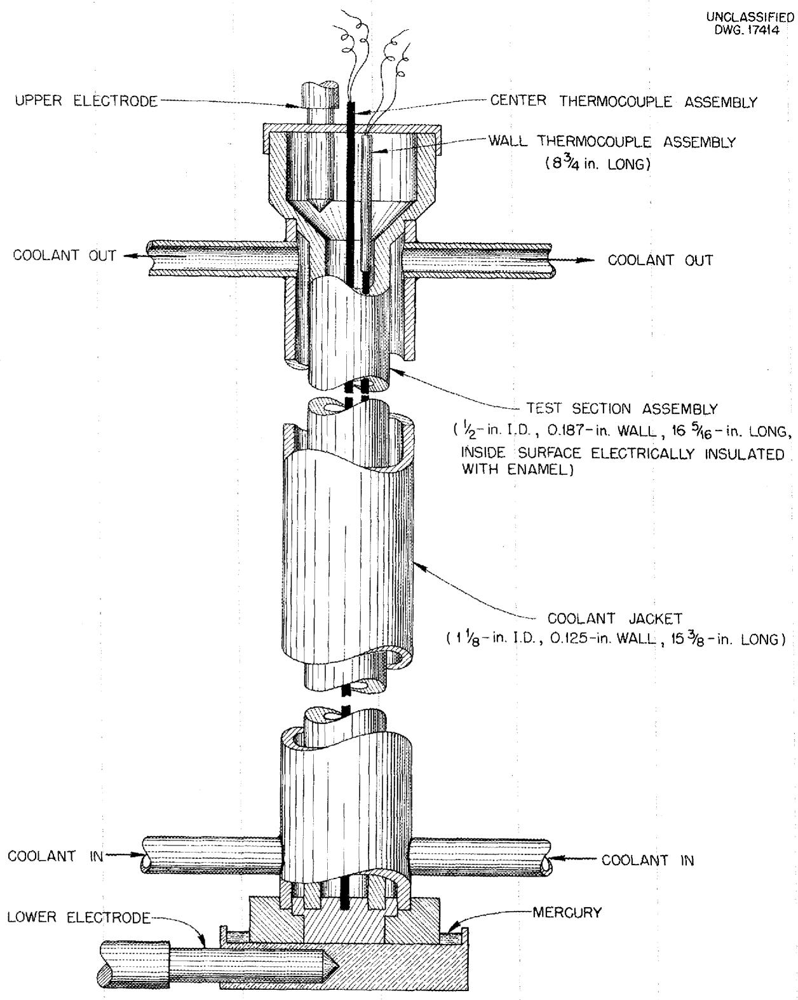  
Fig. 13.5. Test Section Detail of Annulus Natural-Convection Apparatus.

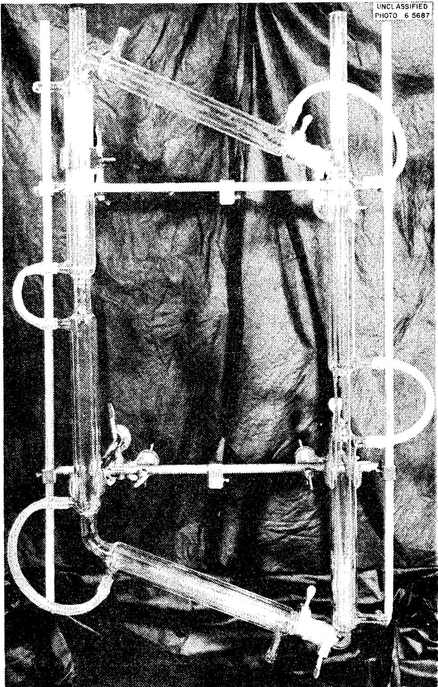  
Fig. 13.6. Pyrex Thermal Convection Loop.

same way as it has been done for the pipe system. The velocity profiles, as well as the eddy diffusivity profiles obtained from radial shear stress and velocity gradient data, are required in such an analysis. Thus, the first step in such a study must be the development of a generalized velocity profile for the annulus. Several possible ways of generalizing experimental annulus velocity data are currently being tried; the experimental data of Knudsen and Katz, (26) Mikrjukov, (27) and Rothfus, Monrad, and Senecal, (28) are being utilized in this study.

# CIRCULATING-FUEL HEAT TRANSFER

H. F. Poppendiek G. Winn Reactor Experimental Engineering Division

Mathematical studies of circulating-fuel heat transfer in long pipes have

been previously presented. (29,30) A modest experimental study has been initiated in an attempt to compare the theoretical and experimental behavior of this volume heat source system. A sulfuric acid solution is to be circulated in a closed loop by means of a glass pump. An a-c electric current is to be passed through the acid flowing in a long plastic pipe (1/4 in. in inside diameter and 2-ft long) located in the flow system. The current flow will yield a volume heat source within the acid. Acid flow rates, pipe wall temperatures, and mixed-mean acid temperatures into and out of the test section will be measured. Test section and heat exchanger heat balances will also be made. The temperature differences in this system will lie within the range necessary to yield only minor changes in electrical resistivity of the acid, so an almost uniform volume heat source exists in the system. It is proposed to study both laminar and turbulent flow regimes.

# 14. RADIATION DAMAGE

D. S. Billington, Solid State Division

A. J. Miller, ANP Division

Radiation-damage studies of materials exposed in the ORNL graphite reactor, the LITR, and the 86-in. cyclotron have continued. A sample of a zirconium-bearing fused fluoride fuel has been irradiated with a high flux in the MTR, but examination of the irradiated capsule and its contents has not yet been made. A sodium-filled loop was operated in the LITR at about $1200^{\circ}\mathrm{F}$ , but it was shut down after seven days because of a flow stoppage.

Additional irradiations of fuel have been carried out in the LITR at ARE fission rates for extended periods of time. High power dissipations, in the range that would occur in an aircraft reactor, were achieved for long periods of time in fuels by using 22-Mev protons from the cyclotron, and there was some indication, but no positive evidence, of radiation damage or radiation-induced corrosion.

In-reactor cantilever creep measurements on Inconel in an air atmosphere were continued in both the graphite reactor and the LITR. From these more recent measurements, it appears that the radiation has only a small effect on the creep strength. Examination of some of the older test rigs showed that the decrease in creep strength previously reported could possibly have been due to defective extensometer devices. Apparatus is being constructed for creep measurements in the MTR.

These radiation damage studies are described in the following. Additional information is contained in the Solid State Division Quarterly Progress Report for the Period Ending November 10, 1952.

# IRRADIATION OF FUSED MATERIALS

G.W. Keilholtz D.F.Weeks   
J. G. Morgan M. T. Robinson   
H.E.Robertson D.D.Davies   
C.C.Webster A.Richt   
P.R.Klein W.J.Sturm

M. J. Feldman

Solid State Division

R.J.Jones R.L.Knight

Electromagnetic Research Division

B. W. Kinyon

ORNL Engineering Division

The installation in the MTR of the testing facility for fused salts was completed. The guide tube extends from a 13/8-in. hole in a beryllium "A" piece through a specially designed flange in the north-tank access hole. In the first run, a 1-in. column of salt was contained in a 0.1-in.-ID Inconel capsule. The capsule temperature was maintained at $1500^{\circ}\mathrm{F}$ by means of a controlled flow of cooling air. The flux at the capsule position was determined by means of cobalt wire with the MTR operating at 19 and at 25 megawatts. The estimated thermal flux for the first capsule run at 30 megawatts was $2.1 \times 10^{14}$ .

The capsule contained a fuel with the composition $\mathrm{NaF - ZrF_4 - UF_4}$ (50.0- 46.2-3.8 mole%). It was maintained at $1500^{\circ}\mathrm{F}$ for 116 hr at full flux, and there was an estimated power dissipation of 1900 watts/cm³ in the fused salt. This approaches the power density expected in an aircraft reactor. Examinations of the irradiated capsule and the salt are now being made. In addition, two capsules containing the fuel have been irradiated in the LITR at 140 watts/cm³ for 565 hr, and two more have been placed in the LITR for 1000-hr tests. Examinations of the

irradiated materials are now being made.

Preparations are nearing completion for melting-point checks and fission-fragment-activity determinations on all specimens of reactor-irradiated fuel. Equipment has been constructed for rocking a capsule so that the fuel will cycle through a thermal gradient; this equipment will be used when a horizontal beam hole in the LITR is available for the experiments.

Inconel capsules containing fuels NaF-KF-ZrF4-UF4 (4.8-50.1-41.3-3.8 mole %) and NaF-ZrF4-UF4 (46-50-4 mole %) were bombarded with 22-Mev protons from the 86-in. cyclotron. Power densities of several thousand watts per cubic centimeter of irradiated fuel were used for periods up to 92 hours. In evaluating the effects of the irradiation, only metallographic examinations of the Inconel could be considered reliable, since the irradiated volume of the capsule containing the fuel was large enough to cause a threefold dilution of dissolved Inconel components. For each experiment, listed in Table 14.1, there was

a furnace-heated control that showed 0.5-mil pits. It can be seen that there is some indication of attack on the Inconel at the higher power densities.

# IN-REACTOR CIRCULATING LOOPS

O. Sisman R.M.Carroll

W.W. Parkinson C.D.Bauman

J.B.Trice C.Ellis

A. S. Olson W. E. Brundage

M. T. Morgan F. M. Blacksher

Solid State Division

An Inconel loop containing sodium was operated in the LITR at a temperature in the region of $1200^{\circ}\mathrm{F}$ for seven days. The loop was shut down and removed because of a flow stoppage; the reason for the stoppage is now being determined.

A prototype pump for use in an MTR fluoride loop is being constructed. Fabrication of other portions of the loop is being delayed until information about the MTR capsule tests is obtained and further evaluation can be made of the experiment planned.

TABLE 14.1. CYCLOTRON IRRADIATIONS OF FUELS   

<table><tr><td>FUEL</td><td>IRRADIATION TIME (hr)</td><td>POWER DISSIPATION (watts/cm3)</td><td>INCONEL PITS (mil)</td></tr><tr><td rowspan="4">NaF-KF-ZrF4-UF4</td><td>3</td><td>2400</td><td>0.5</td></tr><tr><td>4.5</td><td>2300</td><td>0.5</td></tr><tr><td>7</td><td>4100</td><td>1.5</td></tr><tr><td>8</td><td>1150</td><td>0.5</td></tr><tr><td rowspan="6">NaF-ZrF4-UF4</td><td>5.6</td><td>2800</td><td>0.5</td></tr><tr><td>10.6</td><td>2200</td><td>0.5</td></tr><tr><td>14.3</td><td>2000</td><td>0.5</td></tr><tr><td>15.4</td><td>2900</td><td>0.5</td></tr><tr><td>46.4</td><td>3300</td><td>2.0</td></tr><tr><td>92</td><td>1700</td><td>0.5</td></tr></table>

# CREEP UNDER IRRADIATION

W.W.Davis J.C.Wilson

J. C. Zukas

Solid State Division

Additional cantilever creep tests on Inconel with the standard ARE 2-hr, $1700^{\circ}\mathrm{F}$ anneal were carried out at $1500^{\circ}\mathrm{F}$ in air atmospheres in the graphite reactor and the LITR. As shown in Figs. 14.1 and 14.2, there are only small differences between the bench and in-reactor tests. The upward deflection after 400 hr in the curve for the 3000-psi test in the ORNL graphite reactor is probably due to faulty operation of the temperature controller. The results are to be checked by postirradiation measurements of the creep deflections on a remotely controlled profilometer.

Postirradiation measurements were made on specimens annealed at $1650^{\circ}\mathrm{F}$ and irradiated in the graphite reactor at $1500^{\circ}\mathrm{F}$ . Their creep curves were shown in a previous report $^{(1)}$ as curve A, 1500 psi, and curve C, 2000 psi. The profilometer measurements indicated that the large extensions which were measured were in error and that the actual extensions were not much greater than those occurring in the bench tests. Several tests reported last quarter as being in progress were negated by faulty microformers.

The design for the bellows-loaded tensile creep test in the MTR is nearing completion, and most of the components have been fabricated and partly assembled for test.

(1) J. C. Wilson, J. C. Zukas, and W. W. Davis, ANP Quar. Prog. Rep. June 10, 1952, ORNL-1294, p. 164.

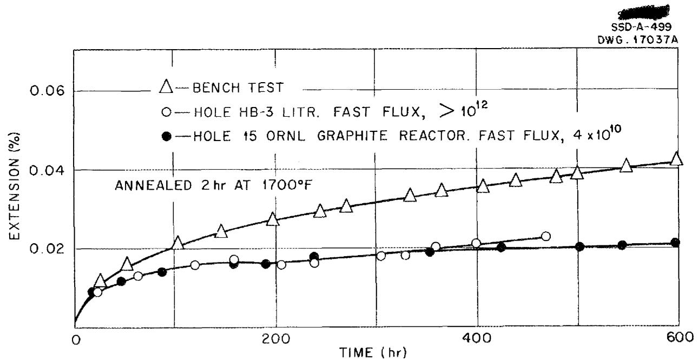  
Fig. 14.1. Cantilever Creep Tests on Inconel in Air at $1500^{\circ}\mathrm{F}$ and 1500 psi.

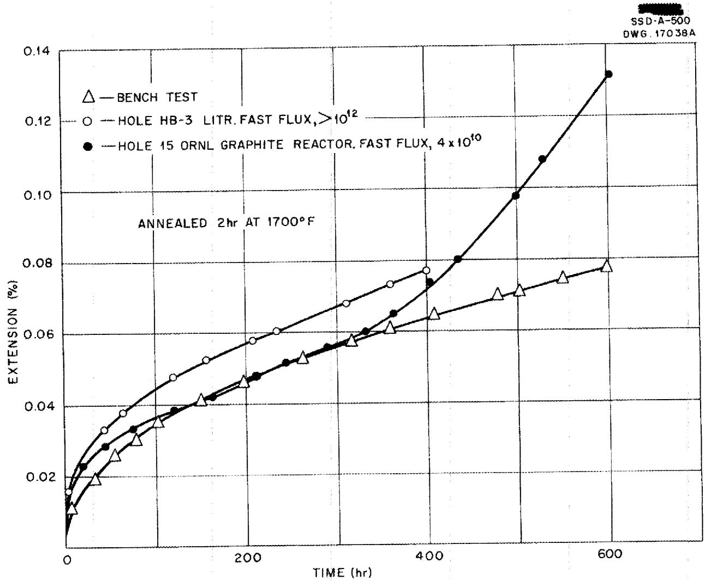  
Fig. 14.2. Cantilever Creep Tests on Inconel in Air at $1500^{\circ}\mathrm{F}$ and 3000 psi.

# 15. ANALYTICAL STUDIES OF REACTOR MATERIALS

C. D. Susano

Analytical Chemistry Division

C. R. Baldock

Stable Isotope Research and Production Division

J. M. Warde

Metallurgy Division

An empirical volumetric method for the determination of zirconium in reactor fuels has been developed. The method is based on the measurement of the basicity produced by the reaction between zirconium hydroxide and excess potassium fluoride. An indirect volumetric method for the determination of zirconium, which depends on precipitating zirconium as the slightly soluble benzoate or $m$ -nitrobenzoate and subsequently determining the organic acid by titration, proved unsatisfactory because of the variable composition of the precipitate. Attempts to determine zirconium by titrating zirconium $m$ -nitrobenzoate in nonaqueous media with perchloric acid were not successful. The use of mandelic acid as a precipitant for zirconium in the presence of a large excess of uranium was shown to be superior to phenylarsonic acid, $m$ -nitrobenzoic acid, and cinnamic acid.

The stability of the chromium complex with diphenylcarbazide was increased by development of the complex in $0.2N$ perchloric acid. The separation of traces of aluminum in reactor fuels by means of anionic-exchange resins was studied; preliminary results indicate that this technique is feasible. A bibliography of recent literature on bromine trifluoride as a reagent for the determination of oxygen in metallic oxides has been started. An improved apparatus for the determination of trace amounts of water in solids was designed and fabricated for measuring the electrical conductivity of anhydrous hydrogen fluoride to determine its water concentration.

In addition to the chemical analyses, various compounds of interest were examined by spectrographic or petrographic techniques. The usefulness of the spectrograph has been enhanced by the construction of a source that is good for temperatures approaching $2850^{\circ}\mathrm{C}$ . The petrographic studies have led to the classification of many complex compounds that are not found in the literature.

The work of the ANP Analytical Laboratory service group consisted chiefly of analyses of beryllium- and zirconium-bearing fluoride mixtures. A review of the methods used and a summary of the services performed are included.

# CHEMICAL ANALYSIS OF REACTOR FUELS

J.C. White J.E.Lee, Jr.

C. M. Boyd W. J. Ross

C. K. Talbott

Analytical Chemistry Division

The research and developmental work on methods for the analysis of reactor fuels and their components has been of a diversified nature during this quarter. The primary interest has been in the development of a volumetric method for the determination of zirconium. Other problems that have been studied include: the colorimetric determination of chromium; the determination of oxygen in metallic oxides; the separation and determination of traces of aluminum in reactor fuels; the determination of water in components of reactor fuels; the design of apparatus that will permit the measurement of the conductivity of liquid hydrofluoric acid so that

its water content can be determined; the identification of the products that are produced by the reaction of NaK and components of the fuels; the adaptation of a method for the determination of BeO in NaK; and the adaptation of a method for the determination of $\mathrm{UO}_2$ in $\mathrm{UF}_3$ . A discussion of these problems is included in the following paragraphs.

Zirconium. An empirical volumetric method for the determination of zirconium has been developed. The method is based on the measurement of the basicity produced by the reaction between zirconium hydroxide and excess potassium fluoride, which was discussed in a previous report.(1) Free acid in the starting solution in excess of 0.5 N produced results approximately 2% high. This interference can be overcome by dilution; a practical limitation must be imposed, however, because of the difficulty encountered in determining the end point. The use of acid media other than sulfuric acid was also explored. Only perchlorate systems were definitely unsatisfactory because of excessive hydrolysis at high acidity.

Another approach to the development of a volumetric method for zirconium was to precipitate the hydroxide from a mineral acid solution with excess ammonium hydroxide, centrifuge, wash, and dissolve in standard acid; the excess of standard acid was determined by titration. This method is satisfactory in an academic sense, but is hardly practical because of the copious washing required to free the hydrous oxide from basic salts and excess precipitant.

The quantitative precipitation of zirconium by benzoic acid and nitrobenzoic acids has been reported. (2,3)

The reported method was used as a basis for formulating a volumetric method in which the precipitate is dissolved in dilute acid, and the liberated organic acid is extracted by titration in methyl alcohol-benzenesolution with sodium methylate by using thymol blue as the indicator. However, a precipitate of varying composition is formed, and attempts to establish an empirical relationship were unsuccessful.

Further study of the reported gravimetric methods showed low results in all cases, the extent being dependent upon the nature of the medium of precipitation. For example, in a sulfate system, no precipitate is formed with benzoic acid because of the strength of the zirconium sulfate complex in solutions that are more acid than pH 3 to 4. A slight precipitate was noted when m-nitrobenzoic acid was used as the precipitant. Nitric or hydrochloric acid solutions are recommended for this procedure.

An attempt was made to titrate zirconium $m$ -nitrobenzoate with perchloric acid in ethylene glycol-isopropyl alcohol solution. Zirconium is not sufficiently basic in this medium, however, to give a distinct break in the potentiometric titration made by using a glass electrode as the indicator electrode and a calomel electrode as the reference electrode.

Since mandelic acid gives a precipitate of definite composition with zirconium, this reagent will be studied for application to volumetric procedures.

The effect of large excesses of uranium on the gravimetric determination of zirconium was studied briefly in an attempt to select the precipitant least affected. Four reagents, phenylarsonic acid, mandelic acid, m-nitrobenzoic acid, and cinnamic acid, were tested on solutions of zirconium containing a fivefold excess of uranium. The number of determinations

made was insufficient to permit a statistical study; however, the results clearly indicated that the mandelic acid method was superior in the presence of uranium. Phenylarsonic acid gave slightly high results; $m$ -nitrobenzoic acid, slightly low results. Cinnamic acid is unsatisfactory for this purpose; the average of three determinations in the uranium-containing solution was $15\%$ lower than the amount taken.

Chromium. The chromium-diphenylcarbazide complex is usually developed in $0.2\mathrm{N}\cdot \mathrm{H}_2\mathrm{SO}_4$ , a medium said to produce maximum stability of the complex. Thirty minutes is considered the maximum period before serious fading occurs. The use of 0.2 N perchloric acid solution increases the period of color stability to nearly 60 min, regardless of the oxidant used. Acid concentrations greater than 0.2 N are harmful; for example, 0.6 N prevents color formation entirely.

Aluminum. The determination of traces of aluminum can be accomplished by means of "aluminon" (4) reagent; however, complete separation from a number of interfering cations is necessary. In order to apply this method to reactor fuels, aluminum must be separated from zirconium and iron. A chemical separation based on controlled-acidity precipitation with "oxidine" was unsuccessful. Separation by ion exchange is currently being studied. One procedure is to retain the zirconium and uranium as sulfate complexes on an anionic exchanger that passes aluminum. An alternate procedure is to retain both aluminum and zirconium as fluoride complexes and separate them by elution, as reported by Freund and Miner. (5) Results on

these tests are inconclusive, but promising.

Oxygen. The preparation of a bibliography of recent literature on bromine trifluoride has been started in connection with the design and fabrication of experimental equipment for work with this reagent. Of special interest are the physical data, the inorganic oxide fluorinations, and the material corrosion information.

Water. Developmental work on the method for determining traces of water in solids in a finely divided state was completed with the successful testing of an apparatus that has reduced the blank (that is, before addition of the samples) to approximately $15\mathrm{mg}$ of water. This method has been reported in more detail in previous reports(1) and a formal report will be issued in the near future.

The concentration of water in anhydrous hydrogen fluoride can be conveniently determined by measuring its electrical conductivity. A procedure has been developed and used for determining the water content of the HF used as a cover gas in fuel preparation. The two cylinders tested thus far showed 0.5 and 0.35 wt % water.

# DETERMINATION OF BERYLLIUM IN NaK

J. C. White

J. E. Lee, Jr.

C. M. Boyd

W.J.Ross

C. K. Talbott

Analytical Chemistry Division

A method for the determination of beryllium in NaK has been adapted for evaluating the compatibility of BeO, as a moderator, with NaK. Beryllium is determined, in both the soluble and insoluble phases following dissolution of the NaK, by colorimetric measurement of the complex formed with $p$ -nitrobenzeneazo-orcinal.[7] This

method can be utilized to determine $0.2\mu \mathrm{g}$ per milliliter of solution. A method was developed for this dissolution in which NaK was submerged in a high-boiling-point inert hydrocarbon (2,2,5-trimethylheptane) and reacted slowly by drop-wise addition of methyl alcohol. This procedure provides a rapid and safe method for dissolving alkali metal eutectics.

# SPECTROGRAPHIC ANALYSIS

C. R. Baldock  
Stable Isotope Research and Production Division

For some time it has been recognized that an extremely high-temperature ion-source oven was needed for the investigation of such refractory materials as the oxides and other compounds of uranium. A direct-heating type of oven has been constructed that makes possible heating of materials to a temperature that approaches the melting point of tantalum $(2850^{\circ}\mathrm{C})$ . The oven is small, contains no thermal insulating material, and is thereby free of the need for troublesome outgassing. The heater is mounted on a subassembly that is easily attached to and removed from the ion source; thus, it is easy to change samples. Because of the favorable sample location, considerable improvement in the ion-generating efficiency has been obtained, compared with that of previous equipment. Quite satisfactory analyses can be performed with much less than 1 mg of sample.

Uranium Oxides. Three oxides of uranium, $\mathrm{UO}_2$ , $\mathrm{UO}_3$ , and $\mathrm{U}_3\mathrm{O}_8$ , have been investigated in considerable detail. The presence of these materials as impurities in aircraft fuels or in other uranium compounds can now be detected with high precision.

Nickel Fluoride. In an effort to explain the existence of some nonstoichiometric compounds of nickel and fluorine, several tests were made on $\mathrm{NiF}_2$ material. The prepared $\mathrm{NiF}_2$ was

carried to charge exhaustion in an older source oven that reached a temperature of $750^{\circ}\mathrm{C}$ . The residue of this test was subsequently examined at $1100^{\circ}\mathrm{C}$ in the new type of oven heater, and it proved to be nickel oxide (NiO). Evidence from this subsequent test proved that above $1100^{\circ}\mathrm{C}$ the NiO dissociates by thermal decomposition to nickel and oxygen. It was of interest that the oxygen came off as $\mathrm{O}_2$ .

# PETROGRAPHIC EXAMINATION OF FLUORIDES

G. D. White, Metallurgy Division T. N. McVay, Consultant

Routine petrographic examinations of some 600 samples of fluoride mixtures were made in connection with fuel investigations. The products of the $\mathrm{ZrO_2}$ -HF reaction and the NaF- $\mathrm{ZrOF_2}$ reaction have been examined in some detail.

$\mathbf{ZrO}_{2}$ -HF. A petrographic analysis was made of the products of the reaction between $\mathrm{ZrO}_2$ and $48\%$ HF, reacted at room temperature; two phases were observed. Chemical analysis gave compositions that were approximately those of hydrates of $\mathrm{ZrF_4}$ . The first of these phases is uniaxial, which indicates that it is either tetragonal or hexagonal. The index of refraction parallel to the $c$ axis is 1.504, and parallel to the other axes is 1.528. The second phase is biaxial negative, which indicates that it is either triclinic, monoclinic, or orthorhombic. The crystals are tabular and have a fibrous structure; cleavage is good. The birefringence is low; the maximum interference color is a first-order red. The refractive indexes range from 1.42 to 1.47 and thus indicate a variation in the water content of the material.

NaF-ZrOF2. Sodium fluoride was reacted with zirconium oxyfluoride which had been prepared in the laboratory. Well-developed, but small,

$\mathrm{ZrO_2}$ crystals were formed, and there was some $\mathrm{Na}_3\mathrm{ZrF}_7$ in the $2\mathrm{NaF} \cdot \mathrm{ZrOF}_2$ mixture. There was also a very small amount of another phase, probably NaF, that had a low index of refraction. These products would be expected to form if the following reaction took place:

$$
2 \left(2 \mathrm {N a F} \cdot \mathrm {Z r O F} _ {2}\right) \longrightarrow \mathrm {N a} _ {3} \mathrm {Z r F} _ {7} + \mathrm {Z r O} _ {2} + \mathrm {N a F}.
$$

The $\mathrm{ZrO}_2$ crystals, together with what is thought to be $\mathrm{Na}_2\mathrm{ZrF}_6$ , were formed in the NaF·ZrOF₂ mixture. This would be expected from the following reaction:

$$
2 \left(\mathrm {N a F} \cdot \mathrm {Z r O F} _ {2}\right) \longrightarrow \mathrm {N a} _ {2} \mathrm {Z r F} _ {6} + \mathrm {Z r O} _ {2}.
$$

# OPTICAL PROPERTIES OF SOME FLUORIDE COMPOUNDS

T. N. McVay

Consultant, Metallurgy Division

The compounds examined were prepared by V. Coleman of the Materials Chemistry Division. The x-ray pattern of the $\mathrm{Na}_2\mathrm{UF}_6$ was analyzed by B. S. Borie, Jr., of the Metallurgy Division.

$\mathbf{Na}_{2}\mathbf{UF}_{6}$ . The $\mathbf{Na}_{2}\mathbf{UF}_{6}$ had the following properties: hexagonal; uniaxial negative; color, green; $O = 1.495 \pm 0.003$ ; birefringence about 0.005.

$\mathbf{K}_3\mathbf{U}\mathbf{F}_7$ . The crystal system of $\mathbf{K}_3\mathbf{U}\mathbf{F}_7$ was not determined, but the material is orthorhombic, monoclinic, or triclinic, with the following properties: biaxial negative; $2V$ about 70 deg; color, light blue; refractive index of about 1.414, with low birefringence; pleochroic, $Z =$ light blue, $X =$ colorless.

$\mathbf{Na}_{3}\mathbf{ZrF}_{7}$ . The crystal system of $\mathrm{Na}_{3}\mathrm{ZrF}_{7}$ was not determined, but the material is either tetragonal or hexagonal, with the following properties: uniaxial negative; $O = 1.386 \pm 0.003$ ; colorless; birefringence low, not greater than 0.005.

$2\mathbf{ZrF}_4\cdot \mathbf{U}\mathbf{F}_3$ . The crystal system of $2\mathrm{ZrF_4\cdot UF_3}$ was not determined, but the material is orthorhombic, monoclinic, or triclinic, with the following properties: biaxial; 2V about 90 deg; color, deep orange-red; refractive

index of about 1.576, with low birefringence.

# CHEMICAL ANALYSES FOR $\mathbf{U}\mathbf{O}_{2}$ IN $\mathbf{U}\mathbf{F}_{3}$

J.C. White J.E.Lee, Jr.

C.M.Boyd W.J.Ross

C. K. Talbott

Analytical Chemistry Division

The "ammonium oxalate insolubles" procedure (8) for the determination of $\mathrm{UO}_2$ in $\mathrm{UF}_4$ was applied successfully to the determination of $\mathrm{UO}_2$ in $\mathrm{UF}_3$ . The trifluoride is more resistant than the tetrafluoride to complexing with oxalate ion and requires a reflux period of about 8 hr for a 1-to 2-g sample. It is postulated that the mechanism of the reaction involves the slow oxidation of $\mathrm{UF}_3$ to $\mathrm{UF}_4$ and its subsequent complex formation with oxalate ion.

# SERVICE CHEMICAL ANALYSES

H.P.House L.J.Brady

J. R. Lund

Analytical Chemistry Division

In order to determine zirconium in the corrosion test samples to which titanium had been added either as the metal or the hydride, it was necessary to use mandelic acid as the precipitating agent, since titanium is precipitated along with zirconium when phenylarsonic acid is employed.

Recent spectrographic analysis of the zirconium oxide residues from ignition of the phenylarsonic acid precipitates has shown that varying amounts of arsenic remain with the zirconium. If conditions for complete volatilization of the arsenic during ignition cannot be established, the mandelic acid method will be used to replace the present method for determining zirconium.

In order to study the reactions that take place when NaK is introduced into molten zirconium fuel, a procedure that included measuring the hydrogen evolved during dissolution

(8) Ibid., p. 81.

of the sample in acid was employed. It was hoped that this method would give an accurate measure of the $\mathrm{UF}_3$ formed during the reaction with NaK. However, the results indicate that other compounds or possibly metals are formed that evolve hydrogen, since more hydrogen than can be attributed to the formation of $\mathrm{UF}_3$ is often evolved. The isolation and subsequent determination of $\mathrm{UF}_3$ in samples of this type have not been accomplished, and further work will be necessary to develop an adequate method.

There was an increase in the number of samples of beryllium-sodium-uranium fluoride eutectic analyzed during this period. Requests for the estimation of the concentration of the major constituents of the eutectic made necessary the adaptation of methods for determining uranium and beryllium. Since the uranium concentration was relatively high (15 to $25\%$ ) and beryllium caused no interference, the use of the Jones reductor with a final oxidation titration with ceric sulfate proved adequate for determining this element. An estimate of the beryllium content was made by precipitating the uranium and beryllium together with ammonium hydroxide, igniting the precipitates to the oxides, and subtracting the weight of the uranium oxide, as previously determined by titration, from the weight of the combined oxides. The weight of beryllium oxide is thus obtained by difference. A separation step, which includes reduction of uranium with zinc amalgam and precipitation with cupferron, serves to remove the uranium prior to precipitation of the beryllium with ammonia; the ignited beryllium oxide is then free from contamination with uranium. This method of analysis has been employed recently for samples of beryllium eutectic.

One series of samples of lead was tested for minor impurities by applying colorimetric methods after removal of the lead by electrolytic deposition.

Samples of alkali hydroxides derived from corrosion tests were analyzed for iron, chromium, and nickel. The range of concentration of impurities in these samples was great enough to require the use of colorimetric and gravimetric methods. Since the material was not homogeneous and could not be ground to fine particle size, the entire sample was dissolved to ensure that the aliquot tested was representative of the batch.

A few purified alkali hydroxides samples were tested for carbonate impurity by reacting the carbon dioxide evolved with standard barium hydroxide solution. The excess barium hydroxide was then titrated with standard hydrochloric acid.

A number of sodium samples was analyzed for the General Electric Company. Each sample was tested for sodium monoxide content, and selected samples of the series were analyzed for minor impurities.

A greater diversity of miscellaneous samples was tested during the quarter, but further description of the samples or details of the methods will not be attempted in this report.

Of the total of 905 samples analyzed during the quarter, 617 were submitted by the Reactor Chemistry group, 167 by the ANP Experimental Engineering group, 68 by the ANP Critical Experiments group, 34 by the General Electric Company, 17 by the Electromagnetic Research group, and 2 by the Ceramic laboratory. The backlog of samples was reduced during the period by approximately $50\%$ , as indicated in the summary, Table 15.1.

TABLE 15.1. BACKLOG SUMMARY   

<table><tr><td>Samples on hand, 8-10-52</td><td>211</td></tr><tr><td>Number of samples received</td><td>802</td></tr><tr><td>Total number of samples</td><td>1013</td></tr><tr><td>Number of samples reported</td><td>905</td></tr><tr><td>Backlog as of 11-10-52</td><td>108</td></tr></table>

Part IV

APPENDIXES

# SUMMARY AND INTRODUCTION

The list of reports that has been issued by the Project during the last quarter includes 14 formal reports and 46 informal documents (not including internal documents) on all phases of ANP research at ORNL (sec. 16).

A directory of the research projects

of the ANP Division of ORNL is given in section 17. Also included are the Laboratory's subcontracts to its ANP Project, as well as the research projects being performed by ORNL for the ANP programs of other organizations.

# 16. LIST OF REPORTS ISSUED

<table><tr><td>REPORT NO.</td><td>TITLE OF REPORT</td><td>AUTHOR(S)</td><td>DATE ISSUED</td></tr><tr><td rowspan="2">Y-F17-19</td><td colspan="3">Experimental Engineering and Design</td></tr><tr><td>Performance and Endurance of a Microbrazed Stainless Steel Sodium-To-Air Radiator Core Element</td><td>G. D. Whitman</td><td>8-11-52</td></tr><tr><td>ORNL-1215</td><td>Heat Transfer and Pressure Loss in Tube Bundles for High Performance Heat Exchangers and Fuel Elements</td><td>G. H. Cohen
A. P. Fraas
M. E. LaVerne</td><td>8-12-52</td></tr><tr><td>Y-F17-24</td><td>Model DA ARE Centrifugal Pump</td><td>H. W. Savage</td><td>8-29-52</td></tr><tr><td>Y-F17-25</td><td>Dynamic Test of Compatibility of BeO with NaK Under Temperature Cycling</td><td>L. A. Mann</td><td>9-2-52</td></tr><tr><td>Y-F15-11</td><td>Investigation of the Fluid Flow Pattern in a Model of the "Fireball" Reactor</td><td>R. E. Ball</td><td>9-4-52</td></tr><tr><td>ORNL-1287</td><td>Preliminary Investigation of a Circulating-Fuel Reactor System</td><td colspan="2">R. W. Schroeder (to be issued)</td></tr><tr><td>ORNL-1330</td><td>Heat Exchanger Design Charts</td><td>A. P. Fraas</td><td>(to be issued)</td></tr><tr><td>Y-F17-28</td><td>Valve and Pump Packings for High Temperature Fluoride Mixtures</td><td>H. R. Johnson</td><td>9-15-52</td></tr><tr><td>CF-52-11-156</td><td>Report of ARE Design Review Committee</td><td>T. E. Cole</td><td>11-19-52</td></tr><tr><td>Y~918</td><td>Potential Lubricants to Meet Extreme Temperature, Pressure and Radiation Demands</td><td>E. P. Carter</td><td>10-29-52</td></tr><tr><td colspan="4">II. Reactor Physics</td></tr><tr><td>Y-F10-111</td><td>Some Solutions of Age Equation</td><td>R. Osborn</td><td>11-17-52</td></tr><tr><td>Y-F10-112</td><td>The Temperature Dependence of a Cross Section Exhibiting a Resonance</td><td>R. Osborn</td><td>11-17-52</td></tr><tr><td>Y-B4-58</td><td>Literature Survey of Danger Coefficient Data</td><td>E. P. Carter</td><td>7-11-52</td></tr><tr><td colspan="4">III. Shielding</td></tr><tr><td>CF-52-5-1 Part 2</td><td>Neutron and Gamma Dose Distribution Beyond Shield, Part 2</td><td>C. E. Clifford</td><td>8-14-52</td></tr><tr><td>CF-52-7-71</td><td>Gamma Ray Spectral Measurements with the Divided Shield Mockup, Part II</td><td>F. C. Maienschein</td><td>8-8-52</td></tr><tr><td>CF-52-7-83</td><td>Gamma Measurements on the GE Reactor Ducts</td><td>C. E. Clifford
C. L. Storrs, Jr.</td><td>8-16-52</td></tr><tr><td>CF-52-8-120</td><td>Aircraft Shield Analysis</td><td>W. L. Wilson
A. L. Walker</td><td>8-20-52</td></tr><tr><td>Y-F30-8</td><td>Radiation Through the Control Rod Penetrations of the ARE Shield</td><td>H. L. F. Enlund</td><td>9-25-52</td></tr><tr><td>CF-52-9-99</td><td>Neutron to Gamma Ray Ratio Experiments</td><td>J. L. Meem</td><td>9-18-52</td></tr><tr><td>CF-52-9-145</td><td>Biological Experimentation in Support of ANP Project</td><td>J. Furth</td><td>9-24-52</td></tr><tr><td>CF-52-9-161</td><td>The Development of Lead-Impregnated Moulding and Modeling Materials for Shielding of Penetrating Radiations</td><td>E. P. Blizzard</td><td>9-26-52</td></tr><tr><td>CF-52-11-143</td><td>Basic Shielding Research</td><td>E. P. Blizzard</td><td>11-19-52</td></tr><tr><td>ORNL-1217</td><td>Neutron Transmission Through Air Filled Ducts</td><td>C. E. Clifford</td><td>11-11-52</td></tr><tr><td>ORNL-1438</td><td>Determination of the Power of the Bulk Shielding Reactor, II</td><td>E. B. Johnson
J. L. Meem</td><td>(to be issued)</td></tr><tr><td>CF-52-8-38</td><td>Gamma-Ray Spectral Measurements with the Divided Shield Mockup, Part III</td><td>F. C. Maienschein</td><td>8-8-52</td></tr><tr><td>CF-52-10-9</td><td>Summary of Lid Tank Neutron Dosimeter Measurements in Pure Water</td><td>T. V. Blosser</td><td>10-1-52</td></tr><tr><td>CF-52-11-124</td><td>Gamma Ray Spectral Measurements with the Divided Shield Mockup, Part IV</td><td>F. C. Maienschein</td><td>11-17-52</td></tr></table>

IV. Heat Transfer and Physical Properties Research   

<table><tr><td>Y-889</td><td>Selected Physical Properties of Mercury in the Temperature Range 100 to 1000°C. A Literature Search</td><td>F. Sachs</td><td>7-10-52</td></tr><tr><td>CF-52-8-163</td><td>Measurement of the Thermal Conductivity of Flinak</td><td>L. Cooper S. J. Caliborne</td><td>8-26-52</td></tr><tr><td>CF-52-8-212</td><td>Physical Property Charts for Some Reactor Fuels, Coolants, and Miscellaneous Materials</td><td>ANP Physical Properties Group, REE Division</td><td>8-28-52</td></tr><tr><td>CF-52-9-201</td><td>Cooling Hole Distribution for Reactor Reflectors</td><td>W. S. Farmer</td><td>9-3-52</td></tr><tr><td>CF-52-9-202</td><td>Heat Generation in a Slab for a Non-Uniform Source of Radiation</td><td>W. S. Farmer</td><td>9-4-52</td></tr><tr><td>CF-52-11-72</td><td>Measurement of the Thermal Conductivity of Fluoride Mixture No. 33</td><td>S. J. Claiborne</td><td>11-11-52</td></tr><tr><td>CF-52-11-103</td><td>Heat Capacity of Fused Salt Mixture No. 21</td><td>W. D. Powers</td><td>11-15-52</td></tr><tr><td>CF-52-11-104</td><td>Heat Capacity of LiOH</td><td>W. D. Powers</td><td>11-15-52</td></tr><tr><td>CF-52-11-105</td><td>Density Measurements of Fuel Salts No. 31 and 33</td><td>R. F. Redmond T. N. Jones</td><td>11-15-52</td></tr><tr><td>CF-52-11-106</td><td>Viscosity Measurements of Fuel Salts No. 31 and 33</td><td>R. F. Redmond T. N. Jones</td><td>11-15-52</td></tr><tr><td>CF-52-11-113</td><td>Transient Methods for Determining Thermal Conductivity of Liquids</td><td>W. B. Harrison</td><td>11-1-52</td></tr><tr><td>ORNL-1342</td><td>Enthalpies and Heat Capacities of Stainless Steel (316) and Zirconium</td><td>R. F. Redmond J. Lones</td><td>(to be issued)</td></tr><tr><td>ORNL-1395</td><td>Forced Convection Heat Transfer in Pipes with Volume Heat Sources</td><td>H. F. Poppendiek (to be issued) L. D. Palmer</td><td></td></tr></table>

V. Radiation Damage   

<table><tr><td>CF-52-11-85</td><td>Effect of Irradiation on BeO</td><td>G. W. Keilholtz</td><td>11-13-52</td></tr><tr><td>ORNL-1433</td><td>Preliminary Title List for Bibliography on Radiation Effects in Solid Materials</td><td>R. G. Cleland</td><td>11-14-52</td></tr><tr><td>ORNL-1372</td><td>Neutron Spectra from Fluoral Activation</td><td>J. B. Trice</td><td>(to be issued)</td></tr><tr><td>CF-52-10-187</td><td>Xenon Problem - ARE</td><td>W. A. Brooksbank</td><td>10-22-52</td></tr><tr><td colspan="4">VI. Metallurgy and Ceramics</td></tr><tr><td>MM-19(1)</td><td>Metallographic Examination of Microbrazed Stainless Steel Sodium-Air (No. 2) Heat Exchanger Following Failure During Test</td><td>E. E. Hoffman</td><td>8-18-52</td></tr><tr><td>CF-52-8-151</td><td>Unusual Diffusion and Corrosion Phenomena Observed in Liquid Metal and Molten Caustic Corrosion Tests</td><td>A. deS. Brasunas</td><td>8-22-52</td></tr><tr><td>CF-52-9-6</td><td>Memorandum on Reflector-Moderator Matrix</td><td>J. R. Johnson
G. D. White</td><td>9-2-52</td></tr><tr><td>CF-52-9-59</td><td>Subsurface Void Formation in Metals During High Temperature Corrosion Tests</td><td>A. deS. Brasunas</td><td>9-5-52</td></tr><tr><td>CF-52-9-125</td><td>Cermet Program</td><td>J. R. Johnson</td><td>9-23-52</td></tr><tr><td>CF-52-11-7</td><td>Fabrication of Spherical Particles</td><td>E. S. Bomar
H. Inouye</td><td>11-1-52</td></tr><tr><td>CF-52-11-12</td><td>Structure of Norton&#x27;s Hot Pressed Beryllium Oxide Blocks</td><td>L. M. Doney</td><td>11-1-52</td></tr><tr><td>CF-52-11-13</td><td>Fuel Element Program</td><td>J. M. Warde</td><td>11-3-52</td></tr><tr><td>CF-52-11-116</td><td>Mass Transfer in Dynamic Lead-Inconel Systems</td><td>J. V. Cathcart</td><td>11-24-52</td></tr><tr><td>CF-52-11-146</td><td>Structure of the BeO Block with the l-l/8 in. Central Hole</td><td>L. M. Doney</td><td>11-17-52</td></tr><tr><td>ORNL-1354</td><td>A Compilation of Data on Crucibles Used in Calcining, Sintering, etc.</td><td>M. Schwartz</td><td>(to be issued)</td></tr><tr><td colspan="4">VII. Miscellaneous</td></tr><tr><td>Y-F33-3</td><td>The Solid Phases of Alkali and Uranium Fluoride Systems</td><td>A. G. H. Anderson</td><td>10-1-52</td></tr><tr><td>MM-48(1)</td><td>Meteorology and Climatology in the 7500 Area</td><td>U. S. Weather Bureau</td><td>10-52</td></tr><tr><td>Y-F26-44</td><td>ANP Information Meeting of November 25, 1952</td><td>W. B. Cottrell</td><td>11-19-52</td></tr><tr><td>ORNL-1375</td><td>Aircraft Nuclear Propulsion Project Quarterly Progress Report for Period Ending September 10, 1952</td><td>W. B. Cottrell</td><td>11-5-52</td></tr><tr><td>ORNL-1407</td><td>Aircraft Reactor Experiment Hazards Summary Report</td><td>J. H. Buck
W. B. Cottrell</td><td>11-24-52</td></tr></table>

(1) Number assigned by ANP Reports Office.

# 17. DIRECTORY OF ACTIVE ANP RESEARCH PROJECTS AT ORNL

# I. REACTOR AND COMPONENT DESIGN

# A. Aircraft Reactor Design

1. Reflector-Moderated Reactor Studies 9704-1   
2. Fluid-Fuel Flow Studies 9704-1   
3. Gamma Heating of the Moderator 9704-1   
4. Nuclear Ramjet Design Studies 9704-1   
5. Design Consultants 9704-1

Fraas, LaVerne Bussard

Abernathy

Fox, Longyear

Fraas, Stumpf

Wislicenus, JHU  
Haines, Wyld, RMI  
Chambers, UT

# B. ARE Reactor Design

1. Core and Pressure Shell 9201-3   
2. Fluid Circuit Design 9201-3   
3. Pressure and Flow Instrumentation 9201-3   
4. Structural Analysis 9201-3   
5. Thermodynamic and Hydrodynamic Analysis 9201-3 9204-1   
6. Remote-Handling Equipment 9201-3   
7. Shielding and Off-Gas System 9201-3   
8. Electrical Power Circuits 1000

Hemphill

Cristy, Jackson, Eckerd, Scott

Hluchan, Affel, Williams

Maxwell, Walker

Lubarsky, Green-street

Hutto

Enlund

Walker

# C. ARE Control Studies

1. High-Temperature Fission Chamber 4500   
2. Control System Design 4500   
3. Control Studies on Simulator 4500

Hanauer

Epler, Bates, Ruble, Green, Mann

Stone, Oakes, Mann

# D. ARE Building Facility

1. Internal Design 1000

Browning

# E. ARE Installation and Operation

l. Instrumentation 7503   
2. Coordination Installation and Design 7503   
3.Expeditors 7503   
4. Control Equipment 7503

Hluchan, Affel

Wischhusen, Watts

Perrin, West

Mann

# F. Reactor Physics

1. Analysis of Critical Experiments 9704-1   
2. Fermi-Age and Boltzmann Equation on Computing Machines 2068   
3. Kinetics of Circulating-Fuel Reactors 9704-1   
4. Computation Techniques for ARE-Type Reactors 9704-1   
5. Computation Techniques for Reflector-Moderated Reactors 9704-1

Mills

Edmonson, Coveyou

Prohammer, Ergen

Bengston

Ergen

# G. Critical Experiments

1. ARE Critical Assembly 9213

Callihan, Zimmerman, Williams, Scott, Keen

2. Reflector-Moderated Reactor Critical Assembly 9213

(Same as above)

# H. Seal and Pump Development

1. Mechanical Pumps for High-Temperature Fluids 9201-3   
2. High-Temperature Seals for Rotary Shafts 9201-3   
3. Rocking-Channel Sealless Pump BMI   
4. Seals for NaOH Systems BMI

McDonald, Cobb, Whitman, Huntley, Grindell

McDonald, Tunnel, Ward, Smith, Mason

Dayton

Simmons, Allen

# I. Valve Development

1. Valves for High-Temperature Fluid Systems 9201-3

# J. Heat Exchanger and Radiator Development

1. High-Temperature Fluid-to-Air Heat Exchange 9201-3 Test   
2. Fluoride-to-Liquid Metal Heat Exchange Test 9201-3   
3. Heat Exchanger Fabrication 9201-3   
4. Boeing Turbojet with Na Radiator 9201-3   
5. Radiator and Heat Exchanger Design Studies 9201-3

Whitman, Salmon, Fraas, LaVerne

Salmon, Fraas, Longyear

Peterson, Fraas

Fraas, Crocker (GE), Potter (GE)

Fraas, Bailey, (Tulane Univ.)

# K. Instrumentation

1. Pressure-Measuring Devices for High-Temperature 9201-3 Fluid Systems   
2. Flow-Measuring Devices for High-Temperature 9201-3 Fluid Systems   
3. Liquid-Level Indicator and Control for High-Temperature Fluids   
4. High-Temperature Strain Gage BLH   
5. High-Temperature Calibration Gage Cornell Aero, Lab.

Southern, Taylor Engberg   
McDonald, Smith  
Taylor, Southern  
Trummel   
Southern

# II. SHIELDING RESEARCH

# A. Cross-Section Measurements

1. Neutron Velocity Selector 4500 3005   
2. Analysis for He in Irradiated Be 3026   
3. Total Cross Sections of $\mathbf{N}^{14}$ and $\mathbf{O}^{16}$ (GE) 5500

4. Elastic-Scattering Differential Cross Section of $\mathbf{N}^{14}$ and $O^{16}$ (GE)   
5. Total Cross Sections of $\mathbf{L}\mathbf{i}^6$ , Li7, Be9, B10, 5500 B12, C12   
6. Fission Cross Sections 5500   
7. Cross Sections of Be, C, W, Cu 3001   
8. Inelastic-Scattering Energy Levels 5500   
9. Effective Removal Cross Sections 3001

Pawlicki, Smith, Thurlow   
Parker   
Willard, Bair, Johnson   
Johnson, Bair, Willard, Fowler   
Johnson, Willard, Bair   
Lamphere, Willard   
Clifford, Flynn, Blosser   
Willard, Bair, Kingston   
Blizard, Flynn, and crew

# B. Shielding Measurements

1. Divided-Shield Mockup Tests (GE) 3010

Meem and crew

2. Bulk Shielding Reactor Power Calibration 3010   
3. Bulk Shielding Reactor Operation 3010   
4. Heat Release per Fission 3010   
5. Air Duct Tests - Large Mockups (GE) 3001   
6. Thermal Shield Measurements (DuPont) 3001   
7. Streaming of Neutrons Through Metals 3001   
8．Air-Scattering Experiments 3010   
9. Primate Exposures to Radiation (School Aviation Medicine, ORNL, Wright Field, Convair)   
3010

Johnson, McCammon   
Leslie   
Meem   
Flynn and crew   
Flynn and crew   
Flynn and crew   
Hungerford, Blizzard

Meem and Crew

# C. Shielding Theory and Calculations

1. Survey Report on Shielding 4500   
2. Shielding Section for Reactor Technology 4500   
3. Correlation of Bulk Shielding Facility and Lid Tank Data 4500   
4. Calculations on Air-Scattering Experiments in Bulk Shielding Facility 4500   
5. Divided-Shield Theory and Design NDA   
6．AirDuct Theory (GE) 3001   
7. Shielding Section for Reactor Handbook 4500   
8. Consultation on Radiation Hazards (GE) 2001   
9. Shielding Consultant Cornell

Blizard   
Blizard   
Blizard   
Blizard, Simon, Charpie   
Goldstein   
Simon, Clifford   
Blizzard, Hungerford, Simon, Ritchie, Meem, Lansing, Cochran, Maienschein, Burnette   
Morgan   
Bethe

Univ.

# D. Shielding Instruments

1. Gamma Scintillation Spectrometer 3010   
2. Neutron Dosimeter Development 3010   
3. Proton recoil Spectrometer for Neutrons 3010   
4. He3 Counter for Neutrons 3010   
5.LiI Crystals for Neutrons 3010   
6. Neutron Spectroscopy with Photographic Plates 3006

Maienschein   
Blosser, Hurst, Glass   
Cochran, Henry   
Cochran   
Maienschein, Schenck   
Johnson, Haydon

# III. MATERIALS RESEARCH

# A. Liquid Fuel Chemistry

1. Phase Equilibrium Studies of Fluorides 9733-3   
2. Preparation of Standard Fuel Samples 9733-3   
3. Special Methods of Fuel Purification 9733-3   
4. Complex Fluorides of Structural Metals 9733-3   
5. Thermodynamic Stability and Electrochemical Properties of Fuel Mixtures 9733-3   
6. Hydrolysis and Oxidation of Fuel Mixtures 9733-3   
7. Stability of Slurries of $\mathrm{UO}_3$ in NaOH BMI   
8. Phase Equilibria Among Silicates, Borates, etc. BMI   
9. Fuel Mixtures Containing Hydrides MHI   
10. Chemical Literature Searches 9704-1   
11. Solution of Metals in Their Halides 4500

Barton, Bratcher, Traber, Snell   
Nessle, Eorgan   
Grimes, Blankenship, Nessle, Blood   
Overholser, Sturm   
Overholser, Topol   
Blankenship, Metcalf   
Patterson   
Crooks   
Banus   
Lee   
Bredig, Johnson, Bronstein

12. Preparation and Properties of Complex Fluorides of Structural Elements 9733-3   
13. Reactions of Fluorides and Metal Oxides 9733-3   
14. Preparation, Phase Behavior, and Reaction of 9733-3 UF   
15. Preparation of Specimens for Radiation Damage 9733-2   
16. Phase Behavior of Fuels with Added Reducing 9733-2 Agents   
17. NaK-Fuel Reaction Tests 9201-3   
18. Free Energy of Fluorides 9201-3   
19. Liquid Fuel Chemistry Consultants

# B. Liquid-Moderator Chemistry

1.Preparation and Evaluation of Pure Hydroxides 9733-3   
2. Electrochemical Behavior of Metal Oxides in Molten Hydroxides 9733-2   
3. Moderator Systems Containing Hydrides MHI   
4. Hydroxide-Metal Systems 4500

# C. Corrosion by Liquid Metals

1. Static Corrosion Tests in Liquid Metals and their Alloys 2000   
2. Dynamic Corrosion Research in Convection Loops 9201-3   
3. Effect of Crystal Orientation on Corrosion 2000   
4. Effect of Carbides on Liquid Metal Corrosion 2000   
5. Mass Transfer in Molten Metals 2000

6. Diffusion of Molten Media into Solid Metals 2000   
7. Structure of Liquid Pb and Bi 2000   
8. Alloys, Mixtures, and Combustion of Liquid Sodium 2000   
9. Protective Coatings for Corrosion Resistance 2000

10. Mass Transfer and Corrosion Inhibitor Studies 9201-3   
11. Handling of Liquid Metal Samples 9201-3   
12. Compatibility of BeO and NaK 9201-3   
13. Compatibility of Materials at High Temperatures 2000

# D. Corrosion by Fluorides

1. Static Corrosion of Metals and Alloys in Fluoride Salts 2000   
2. Static Corrosion Tests in Fluoride Salts 9766   
3. Fluoride Corrosion in Small-Scale Dynamic Systems 9766 2000

4. Dynamic Corrosion Tests of Fluoride Salts 9201-3   
5. Reaction of Metals with Fluorides and Contaminants 9733-3   
6. Equilibria Between Electropositive and Transition Metals in Halide Melts 3550   
7. Corrosion by Fluorides in Stand Pipes 9766

Overholser, Sturm

Blankenship, Hoffman

Coleman, Hoffman, Kelly, Barton

Boody

Overholser, Redman, Blankenship, Hoffman, Kelly

Mann, Cisar

Mann, Petersen

Gibb, Tufts College Hill, Duke Univ.

Weekes, Texas A&M Carter

Overholser, Ketchen

Bolomey, Cuneo

Banus

Bredig, Johnson, Bronstein

Vreeland,Hoffman

Adamson

Smith, Cathcart, Bridges

Vreeland,Hoffman

Cathcart, Adamson

Smith, Cathcart

Smith

Smith, Hall

Vreeland

Adamson

Ketchen

Mann, Cisar

Bomar, Vreeland

Vreeland, Day, Hoffman

Kertesz, Buttram Smith, Meadows, Croft

Kertesz, Buttram, Croft, Smith, Meadows, Vreeland, Nicholson, Hoffman, Trotter

Adamson,Reber

Overholser, Redman Powers, Sturm

Bredig, Johnson, Bronstein

Kertesz, Buttram, Croft

# E. Corrosion by Hydroxides

1. Static Corrosion of Metals and Alloys in Hydroxides 2000   
2. Mass Transfer in Molten Hydroxides 2000   
3. Physical Chemistry of the Hydroxide Corrosion Phenomenon 2000   
4. Static and Dynamic Corrosion by Hydroxides 9766   
5. Static Corrosion by Hydroxides BMI

# F. Physical Properties of Materials

1. Density of Liquids 9204-1   
2. Viscosity of Liquids 9201-4   
3. Thermal Conductivity of Solids 9204-1   
4. Thermal Conductivity of Liquids 9204-1   
5. Specific Heat of Solids and Liquids 9201-4   
6. Viscosity of Fluoride Fuel Mixtures 9766   
7. Vapor Pressure of Fluoride Fuels 9733-2   
8. Vapor Pressure of $\mathrm{BeF}_2$ BMI   
9. Density of BeO Blocks 9766   
10. Evaluation of Materials for High Thermal Conductivity Suitable for Radiator Fin 2000

# G. Heat Transfer

1. Heat Transfer Coefficients of Fluoride and Hydroxide Systems 9204-1   
2. Heat and Momentum Transfer in Convection Loop 9204-1   
3.Free Convection in Liquid Fuel Elements 9204-1   
4. Heat Transfer in Circulating-Fuel Systems 9204-1   
5. Forced Convection in Annuli 9201-4   
6. Radiator Analysis 9204-1

# H. Fluoride Handling

1. Fuel Production 9201-3   
2. Design of Special Fluoride Handling Equipment 9733-3   
3. Small-Scale Handling of High-Temperature Liquids 9733-2   
4.Preparation (Experimental) of NaZrF5 9733-2   
5. Preparation of Enriched Fuel for Radiation Studies 9733-3   
6. Fluoride Sampling Techniques 9201-3

# I. Liquid Metal Handling

1. Sampling Techniques 9201-3   
2. NaK Distillation Equipment 9201-3   
3. NaK Handling 9201-3

# J. Dynamic Liquid Loops

1. Operation of Convection Loops 9201-3   
2. Operation of Figure-Eight Loops 9201-3

Vreeland, Day, Hoffman

Vreeland,Smith Cathcart

Cathcart, Smith

Kertesz, Croft, Buttram, Smith

Jaffee, Craighead

Jones, Redmond

Jones, Redmond

Powers, Burnett

Claiborne, Powers, Burnett

Powers, Blalock

Kertesz, Knox

Barton, Moore

Patterson, Clegg

Doney

Bomar, Slaughter, Oliver

Hoffman, Lones

Hamilton, Palmer, Lynch, Poppendiek

Hamilton, Lynch

Poppendiek, Winn, Palmer

Bradfute, Harrison, Poppendiek

Farmer

Nessle, Eorgan

Grimes, Blankenship, Nessle

Blood, Thoma, Weinberger

Blankenship and crew

Boody, Blankenship

Mann, Blakely

Mann, Blakely

Mann, Cisar

Mann

Adamson

Coughlen

3. $\mathrm{UO}_3$ -NaOH Slurry Loop  
4. Operation of Thermal Convection Loops   
5. Fluid Circuit Mockups

BMI

2000

9201-3

Simons

Cathcart, Bridges, Smith

Mann

# K. Materials Analysis and Inspection Methods

1. Determination of Metallic Corrosion Products in Proposed Reactor Fuels   
2. Analysis of Reactor Fuels   
3. Determination of Reduced Species in Reactor Fuels Following Reaction with NaK   
4. Determination of Oxides in Reactor Fuels   
5. Determination of Water in Hydrogen Fluoride   
6. Determination of Efficiency of Removal of NaK by Distillation from ARE   
7. High-Temperature Mass Spectrometry   
8. X-Ray Study of Complex Fluorides   
9. Petrographic Examination of Fuels   
10. Chemical Methods of Fluid Handling   
11. Metallographic Examination   
12. Identification of Compounds in Solidified Fuels   
13. Preparation of Tested Specimens for Examination   
14. Identification of Corrosion Products from Dynamic Loops   
15. Assembly and Interpretation of Corrosion Data from Dynamic Loop Tests   
16. Determination of Combined Oxygen in Fluoride Mixtures   
17. Metallurgical Examination of Engineering Parts   
18. Analyses of Na and NaK for Na₂O   
19. Identification of Corrosion Products

9733-4

9733-4

9733-4

9733-4

9733-4

9201-3

9735

3550

9766

9201-3

2000

9733-2

9733-2

9733-3

2000

9201-3

2000

9733-3

9201-3

9201-3

9201-3

2000

White, Talbott

White, Ross

White, Talbott

White, Lee

White, Talbott

White, Lee

Baldock

Agron

McVay, White

Mann, Blakely

Gray, Krouse, Roeche

Barton, Hoffman Kelly

Meadows, Didlake

Hoffman, Blankenship, Smith, Borie, Dyer

Adamson, Blankenship, Smith, Vreeland, Blakely

White, Lee

Adamson, Vreeland, Gray

Mann

Dyer, Borie

# L. Radiation Damage

1. Liquid Compound Irradiation in LITER

3005

2. Liquid Compound Irradiations in Cyclotron

3. Liquid Compound Irradiations in MTR

4. Liquid Metal Corrosion in ORNL Graphite Reactor Loops

3001

5. Stress Corrosion and Creep in LITR Liquid Metal Loops

6. Creep of Metals in ORNL Graphite Reactor and LITER

7. Thermal Conductivity of Metals in ORNL Graphite Reactor and LITER

8. Neutron Spectrum of LITR

9. Radiation-Damage Consultants

3005

3001

3025

3001

3005

3005

Keilholtz, Morgan, Webster, Kinyon, Davies, Feldman, Robinson

Sturm, Jones, Binder

Keilholtz, Klein, Morgan, Richt, Robertson

Sisman, Bauman,  
Carroll, Brundage,  
Blacksher, Parkinson,  
Ellis, Olsen, James,  
Morgan

Sisman,etc. (as above)

Wilson, Zukas, Davis

Cohen, Templeton

Sisman, Trice

Ruark, JHU. Smith, Cornell Univ.

# M. Strength of Materials

<table><tr><td>1.</td><td>Creep Tests in Fluoride Fuels</td><td>9201-3</td><td>Adamson</td></tr><tr><td>2.</td><td>Creep and Stress-Rupture Tests of Metals in Vacuum and in Fluid Media</td><td>2000</td><td>Oliver, Douglas, Weaver</td></tr><tr><td>3.</td><td>High-Temperature Cyclic Tensile Tests</td><td>2000</td><td>Oliver, Woods</td></tr><tr><td>4.</td><td>Tube Burst Tests</td><td>9201-3</td><td>Adamson</td></tr><tr><td>5.</td><td>Tube Burst Tests</td><td>2000</td><td>Oliver, Woods, Weaver</td></tr><tr><td>6.</td><td>Relaxation Tests of Reactor Materials</td><td>2000</td><td>Oliver, Woods, Weaver</td></tr><tr><td>7.</td><td>Creep Tests of Reactor Materials (GE)</td><td>2000</td><td>Oliver, Woods, Weaver</td></tr><tr><td>8.</td><td>Evaluation Testing for Other Development Groups</td><td>2000</td><td>Oliver, Woods, Reber</td></tr><tr><td>9.</td><td>Designing and Evaluating New Testing Methods</td><td>2000</td><td>Oliver, Reber</td></tr><tr><td>0.</td><td>Fatigue Testing of Reactor Materials</td><td>2000</td><td>Oliver, Reber</td></tr></table>

# N. Metals Fabrication Methods

<table><tr><td>1.</td><td>Welding Techniques for ARE Parts</td><td>2000</td><td>Slaughter</td></tr><tr><td>2.</td><td>Brazing Techniques for ARE Parts</td><td>2000</td><td>Housley, Slaughter</td></tr><tr><td>3.</td><td>Molybdenum Welding Research</td><td>BMI</td><td>Parke</td></tr><tr><td>4.</td><td>Molybdenum Welding Research</td><td>MIT</td><td>Wulff</td></tr><tr><td>5.</td><td>Resistance Welding for Mo and Clad Metals</td><td>RPI</td><td>Nippes, Savage</td></tr><tr><td>6.</td><td>Welds in the Presence of Various Corrosion Media</td><td>2000</td><td>Vreeland, Slaughter</td></tr><tr><td>7.</td><td>Nondestructive Testing of Tube-to-Header Welds</td><td>2000</td><td>Slaughter</td></tr><tr><td>8.</td><td>Basic Evaluation of Weld-Metal Deposits in Thick Plates</td><td>2000</td><td>Slaughter, Gray</td></tr><tr><td>9.</td><td>Evaluation of the Cone-Arc Welding Technique</td><td>2000</td><td>Slaughter</td></tr><tr><td>10.</td><td>Development of High-Temperature Brazing Alloys</td><td>Wall-Colmonoy</td><td>Peaslee</td></tr><tr><td>11.</td><td>Evaluation of the High-Temperature Brazing Alloys</td><td>2000</td><td>Slaughter</td></tr><tr><td>12.</td><td>Brazing of Testing Components for Evaluation</td><td>2000</td><td>Slaughter, Petersen,Fraas</td></tr><tr><td>13.</td><td>Application of Resistance-Welding Methods to ANP Materials</td><td>2000</td><td>Slaughter</td></tr><tr><td>14.</td><td>Welding Consultant</td><td></td><td>Patriarca</td></tr><tr><td>15.</td><td>Fabrication Procedures for Nickel and Its Alloys</td><td>International</td><td>Nickel Company</td></tr></table>

# 0. New Metals Development

<table><tr><td>1. Mo and Cb Alloy Studies</td><td>2000</td><td>Inouye</td></tr><tr><td>2. Heat Treatment of Metals</td><td>2000</td><td>Bomar, Coobs</td></tr><tr><td>3. Alloy Development of New Container Materials</td><td>2000</td><td>Inouye</td></tr></table>

# P. Solid Fuel Element Fabrication

<table><tr><td>1.</td><td>Solid Fuel Element Fabrication</td><td>2000</td><td>Bomar, Coobs</td></tr><tr><td>2.</td><td>Diffusion-Corrosion in Solid Fuel Elements</td><td>2000</td><td>Bomar, Coobs</td></tr><tr><td>3.</td><td>Determination of the Engineering Properties of Solid Fuel Elements</td><td>2000</td><td>Bomar, Coobs, Woods, Oliver, Douglas</td></tr><tr><td>4.</td><td>Electroforming Fuel-Tube-to-Header Configurations</td><td>Gerity Mich.</td><td>Graaf</td></tr><tr><td>5.</td><td>Electroplating Mo and Cb</td><td>Gerity Mich.</td><td>Graaf</td></tr><tr><td>6.</td><td>Carbonyl Plating of Mo and Cb</td><td>2000</td><td>Bomar</td></tr></table>

7. Fuel Spherical Particle Production (P&W)   
8. Inspection Methods for Fuel Elements   
9. Carbonyl Plating   
10. Production of High-Temperature Screens

2000

Bomar, Levy

Commonwealth Eng. Corp.

Gerity Graaf Mich.

# Q. Ceramics and Metals Ceramics

1. Metal Cladding for BeO   
2. Control Rod Development   
3. Hot Pressing of Bearing Materials   
4. High-Temperature Firing of Uranium Oxide to Produce Selective Powder Sizes   
5. Development of Cermets for Reactor Components   
6. Ceramic Coatings for ANP Radiator   
7. Ceramic Valve Parts for Liquid Metals and Fluorides   
8. Production of Control Rod Samples (GE) for Testing   
9. Ceramic Reflector   
10. Ceramic Coatings for Shielding   
11. High-Temperature Ceramic Coatings

Gerity Mich.

Graaf

2000

Bomar, Coobs

2000

Bomar, Coobs

2000

Bomar, Coobs

9766

Johnson, Shevlin, Taylor

9766

White, Griffin

OSU

Shevlin, Johnson, Taylor

2000

Bomar, Coobs

9766

Johnson, White

9766

White, Shevlin

OSU

Hotpoint, Inc.

# IV. TECHNICAL ADMINISTRATION OF AIRCRAFT NUCLEAR PROPULSION PROJECT AT OAK RIDGE NATIONAL LABORATORY

PROJECT DIRECTOR

ASSOCIATE DIRECTOR FOR ARE

ASSISTANT DIRECTOR FOR COORDINATION

Administrative Assistant

Project Editor

R. C. Briant*   
J. H. Buck*   
A. J. Miller*   
L. M. Cook   
W. B. Cottrell

PROJECT DIRECTION NUMBER

STAFF ASSISTANT FOR PHYSICS

Shielding Research

Reactor Physics

Critical Experiments

Nuclear Measurements

STAFF ASSISTANT FOR RADIATION DAMAGE

Radiation Damage

STAFF ASSISTANT FOR GENERAL DESIGN

General Design

STAFF ASSISTANT FOR ARE

ARE Operations

ARE Design

Experimental Engineering

W. K. Ergen*

E. P. Blizzard

W. K. Ergen*

A. D. Callihan

A. H. Snell

A. J. Miller*   
D. S. Billington

A. P. Fraas*   
A. P. Fraas*   
J. H. Buck*   
E. S. Bettis   
R. W. Schroeder   
H. W. Savage

II A,B,C,D   
E   
G   
II A

III L   
A

I C,D,E   
I B,D   
H,I,J,K; III C,D, H,I,J,K

STAFF ASSISTANT FOR ENGINEERING RESEARCH

Heat Transfer and Physical Properties

Ceramics

STAFF ASSISTANT FOR METALLURGY

Metallurgy

STAFF ASSISTANT FOR CHEMISTRY

Chemistry

Chemical Analyses

R.C.Brian*   
H. F. Poppendiek   
J. M. Warde   
W. D. Manly*   
W. D. Manly*   
W. R. Grimes*   
W. R. Grimes*   
C. D. Susano

III F,G   
III Q   
III C,D,E,J,K,M,N,O,P,Q   
III A,B,D,E,F,H,K   
III K