MARTIN MARIETTA ENERGY SYSTEMS LIBRARIES

3445603531854

OBNL 1463

Metallurgy and Ceramics

CLARINICATION CHANDED T'! BY ATOEOTI OF:

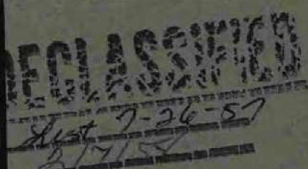

METHODS OF FABRICATION OF CONTROL AND

SAFETY ELEMENT COMPONENTS FOR THE

AIRCRAFT AND HOMOGENEOUS

REACTOR EXPERIMENTS

CENTRAL RESEARCH LIBRARY DOCUMENT COLLECTION

LIBRARY LOAN COPY

DO NOT TRANSFER TO ANOTHER PERSON

If you wish someone else to see this document, send in name with document and the library will arrange a loan.

OAK RIDGE NATIONAL LABORATORY

OPERATED BY

CARBIDE AND CARBON CHEMICALS COMPANY

A DIVISION OF UNION CARBIDE AND CARBON CORPORATION

UCC

POST OFFICE BOX P

OAK RIDGE, TENNESSEE

ORNL-1463

This document consists of 18 pages.

Copy of 159 copies. Series A.

Contract No. W-7405, eng-26

# METALLURGY DIVISION

# METHODS OF FABRICATION OF CONTROL AND SAFETY ELEMENT COMPONENTS FOR THE AIRCRAFT AND HOMOGENEOUS REACTOR EXPERIMENTS

J. H. Coobs and E. S. Bomar

Powder Metallurgy by J. H. Coobs and E. S. Bo

Welding and Brazing by G. M. Slaughter and P. Patriarca

CLASSIFCA DATE,ISSUED To:

DECLASSIFIED

By A

By:

FEB 26 1953

OAK RIDGE NATIONAL LABORATORY

Operated by

CARBIDE AND CARBON CHEMICALS COMPANY

A Division of Union Carbide and Carbon Corporation

Post Office Box P

Oak Ridge, Tennessee

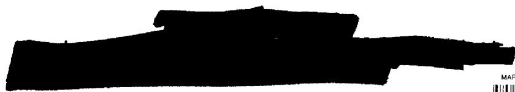

MARTIN MARIETTA ENERGY SYSTEMS LIBRARIES

3 4456 03531854

ORNL-1463

Metallurgy and Ceramics

# INTERNAL DISTRIBUTION

1. C. E. Center   
2. Biology Library   
3. Health Physics Library   
4. Metallurgy Libra

5-6. Central Research Library

7. Reactor Experimental Engineering Laboratory

8-13. Central Fil

14. C. E. Lars   
15. W. B. Hum (K-25)   
16. L. B. Erdet (Y-12)   
17. A. M. Steinberg   
18. E. H. Taylor   
19. E. P. Shipley

20. F. VonderLage

21. F.L. Briant   
22. J. Freitague   
23. A. Swartout   
24 S. C. Lind

F. L. Steahly

A. H. Snell

27. A. Hollander   
28. M. T. Kelley   
29. K. Z. Morgan   
30. J. S. Felton   
31. A. S. Housekoder   
32. C. S. Harr   
33. C. E. Wink   
34. D. S. Bixington   
35. D. W. C. well   
36. E.M.   
37. A. J. Willer   
38. D. Cowen   
39. P. Reyling   
40. C.L. Williams   
41. H. Coobs   
42. S. Bomar   
43 G. M. Slaughter

P. Patriarca

A. Levy (on loan from

Pratt and Whitney

Aircraft)

# EXTERNAL DISTRIBUT

46-53. Argonne National Laboratory   
54-58. Atomic Energy Commission, Washington   
59. Battelle Memorial Institute   
60-62. Brookhaven National Laboratory   
63. Brush Beryl liang Company   
64. Bureau of Studies   
65-66. California Research and Development Company   
67-68. Carbide and Carbon Chemicals Company (K-25 Plant)   
69-72. Carboids and Carbon Chemicals Company (Y-12 Plant)   
73. Chinggo Patent Group   
74. Dow Chemical Company (Rocky Flats)   
75-77. duPont Company

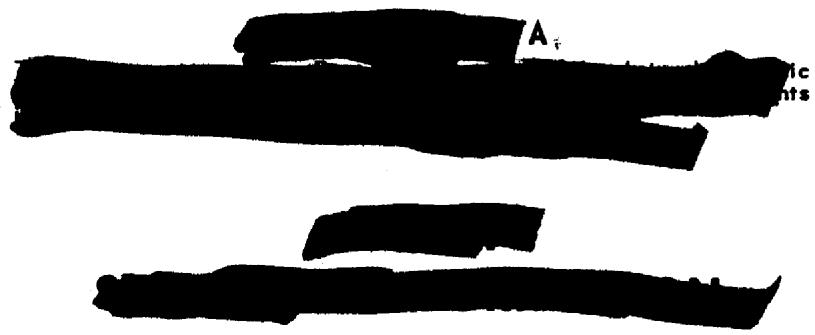

84. General Electric Company (ANPP) (1 copy ea. to W. Baxter, H. C. Brassfield, J. A. McGurty, and W. J. Koshuba)

85 General Electric Company, Richland & Hanford Operations Office

90-93. Idaho Operations Office 94. Iowa State College

95-98. Higgs Atomic Power Laboratory

99-101. Los Amigos Scientific Laboratory

102. Mali Krodt Chemical Works

103. Massa Reits Institute of Technology (Kaufmann)

104-106. Mound Laboratory

107. National Advisory Committee for Aeronautics, Cleveland

108. National Advisory Committee for Aeronautics, Washington

109. National Bureau of Standards

110. National Lead Company of Ohio

111. Naval Research Laboratory

112. New Brunswick Laboratory

113-117. New York Operation Office

118-120. North American Aviation, Inc.

121. Patent Branch, Wash. ton

122. Rand Corporation

123. San Francisco Operation Office

124. Savannah River Operation Office, Augusta

125. Savannah River Operations Office, Wilmington

126. Sylvaniaia Electric Products, Inc.

127-130. University of California Radiopion Laboratory

131. Walter Kidde Nuclear Laboratory, Inc.

132-135. Westinghouse Electric Corporatio

136-144. Wright Air Development Center (1 to R. Strough, Pratt and Whitney Aircraft)

145-159. Technical Information Service, Oak Ridge

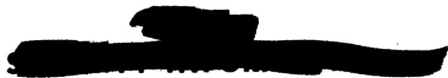

# METHODS OF FABRICATION OF CONTROL AND SAFETY ELEMENT COMPONENTS FOR THE AIRCRAFT AND HOMOGENEOUS REACTOR EXPERIMENTS

J. H. Coobs and E. S. Bomar

# SUMMARY

This report contains, in two parts, the experimental work leading to the fabrication of control and safety components for the Aircraft and Homogeneous Reactor Experiments.

The method evolved for preparation of cylindrical inserts for the ARE control and safety rods required the hot-pressing of mixtures of boron carbide with alumina and with iron.

A technique for fabrication of control plates for the HRE was devised to minimize defects found in earlier sets of plates. The method involved closely packing pressed-powder compacts in a frame and then hot-rolling to bond protective cladding sheets to the core.

# INTRODUCTION

The neutron-absorbing material selected for control and safety elements in both the ARE and HRE was boron in the carbide form.

Cylinders with acceptable physical properties and the requisite amount of boron were made for the ARE safety rods by consolidating mixed iron and boron carbide powders. Consolidation was effected by pressing at an elevated temperature. Inserts for the control elements were prepared in a similar manner by using a dilute suspension of boron carbide in alumina as a carrier.

The operating conditions to which the HRE control and safety plates are exposed require that the high cross-section material be completely enclosed in a protective envelope. Initially, efforts were directed toward the cladding of Boral with stainless steel as a protective covering. Later, pressed and sintered compacts of boron carbide suspended in copper were substituted for the Boral to permit

rolling at a higher temperature for bonding of cladding to core.

# ARE CONTROL AND SAFETY ROD COMPONENTS

The design selected for the control and safety rods for the ARE called for the use of boron carbide as the high cross-section material. Inserts for the control rod were to be made in the form of cylinders and composed of a dilute suspension of boron carbide in alumina. These were later prepared with a minimum of difficulty.

The boron carbide bearing components for the safety rods were to have essentially the same shape, but were to be made of pure boron carbide. The reply to an inquiry to a supplier of the special grade of boron carbide required for the pure boron carbide pressed cylinders indicated that the cost for these items would be quite high. Therefore experimental work was done which revealed that pressed cylinders containing an acceptable amount of boron carbide bonded with iron could be produced.

Experimental Work on Safety Rod Inserts. Mixtures containing 80 vol % boron carbide (Norton, metallurgical grade, which analyzed $71 \pm 1\%$ boron) and 20 vol % copper, nickel, and iron were hot-pressed to check the usefulness of these materials as cementing agents. The powders used were all -325 mesh, and were milled together, using steel balls, for several hours.

The results of these runs are tabulated in Table 1. The results of the first runs indicated that nickel did not promote especially desirable properties in the pressed compact. A liquid phase formed, but it did not wet the boron carbide particles and gave little cementing action.

TABLE 1. PROPERTIES OF HOT-PRESSED NICKEL, COPPER, AND IRON PLUS BORON CARBIDE COMPACTS  

<table><tr><td>COMPOSITION (vol %)</td><td>PRESSING TEMPERATURE (°C)</td><td>DENSITY AS PERCENTAGE OF THEORETICAL DENSITY</td><td>REMARKS</td></tr><tr><td>20 Ni-80 B4C</td><td>1200</td><td>74.0</td><td>Weak, much nickel loss</td></tr><tr><td>20 Ni-80 B4C</td><td>1200</td><td>70.4</td><td>Weak, soft</td></tr><tr><td>20 Cu-80 B4C</td><td>1100</td><td>74.5</td><td>Fairly strong, loss of copper</td></tr><tr><td>20 Cu-80 B4C</td><td>1090</td><td>78.4</td><td>Fairly strong</td></tr><tr><td>20 Fe-80 B4C</td><td>1050</td><td>69.0</td><td>Soft, weak</td></tr><tr><td>20 Fe-80 B4C</td><td>1170</td><td>73.7</td><td>Soft, weak</td></tr><tr><td>20 Fe-80 B4C</td><td>1290</td><td>71.0</td><td>Soft, weak</td></tr></table>

Copper gave somewhat better cementing effect than the nickel even though it did not dissolve appreciable amounts of boron or carbon. In every instance, however, a portion of the copper was lost by extrusion past the rams, and the resulting compacts were still too porous and weak to be useful.

The initial runs in which iron was used as the bonding agent were also unsatisfactory, being too soft and porous. There was, however, no evidence of loss of iron during the pressing cycle; the iron may have been converted to solid FeB or $\mathsf{Fe}_{3}\dot{\mathsf{C}}$ . This is confirmed by the work of Nelson, Willmore, and Womeldorph, (1) who pressed and sintered mixtures of 20 wt % iron (7.5 vol %) and 80 wt % boron carbide at $1930^{\circ}\mathrm{C}$ for 30 minutes. These sintered bodies were fairly strong and underwent some shrinkage, with no loss of material. Examination by x-ray-diffraction techniques failed to detect iron, but revealed the presence of FeB, $\mathsf{B}_{4}\mathsf{C}$ , and graphite. It thus seems that the bonding phase is FeB formed by reaction of iron and

boron carbide during the sintering cycle.

On the basis of these conclusions, several runs were made at higher temperatures; the results are shown in Table 2. After several runs a hot-pressing cycle of 5 min at 1525 to $1535^{\circ}\mathrm{C}$ was selected. This schedule gave well-bonded slugs having a density close to $80\%$ of theoretical with only 3 to $4\%$ loss of material during pressing.

Production of Safety Rod Inserts. Having selected boron carbide and iron as the combination to be used, quantities of the powders were prepared to give 80 vol % (56 wt %) boron carbide and 20 vol % iron. Coarse boron carbide powder was reduced to a fine powder by grinding for 16 hr in a steel ball mill with steel balls. The sieve analysis of this material is given in Table 3. The requisite amount of -325 mesh iron powder was then blended with the boron carbide by grinding for an additional 8 hr in the same mill.

The mixture was consolidated by hot-pressing at 1520 to $1530^{\circ}\mathrm{C}$ and 2500-psi pressure in graphite dies.

TABLE 2. ADDITIONAL PROPERTIES OF HOT-Pressed IRON PLUS BORON CARBIDE COMPACTS   

<table><tr><td>COMPOSITION (vol %)</td><td>PRESSING TEMPERATURE (°C)</td><td>DENSITY AS PERCENTAGE OF THEORETICAL DENSITY</td><td>LOSS (%)</td><td>REMARKS</td></tr><tr><td>20 Fe-80 B4C</td><td>1520</td><td>77.6</td><td></td><td>Strong</td></tr><tr><td>20 Fe-80 B4C</td><td>1725</td><td>70.5</td><td>29</td><td>Weak</td></tr><tr><td>7.5 Fe-92.5 B4C</td><td>1740</td><td>68.2</td><td>6.0</td><td>Fairly strong</td></tr><tr><td>20 Fe-80 B4C</td><td>1520</td><td>80.0</td><td>3.0</td><td>Strong</td></tr><tr><td>20 Fe-80 B4C</td><td>1520</td><td>77.8</td><td>4.2</td><td>Strong</td></tr><tr><td>20 Fe-80 B4C</td><td>1525</td><td>80.3</td><td>5.5</td><td>Strong</td></tr><tr><td>20 Fe-80 B4C</td><td>1530</td><td>77.8</td><td>6.5</td><td>Strong</td></tr><tr><td>20 Fe-80 B4C</td><td>1525</td><td>79.0</td><td>6.5</td><td>Strong</td></tr><tr><td>20 Fe-80 B4C</td><td>1520</td><td>78.3</td><td>8.0</td><td>Strong</td></tr></table>

Densities approximately $80\%$ of theoretical for the mixture were obtained under these conditions. One of the assemblies used for the pressing operation is shown in Fig. 1.

For assembly, the long punch and mandrel were placed in the die with

TABLE 3. SIEVE ANALYSIS OF BORON CARBIDE POWDER   

<table><tr><td></td><td>+100 mesh</td><td>1.2%</td></tr><tr><td>-100</td><td>+200 mesh</td><td>17.2%</td></tr><tr><td>-200</td><td>+325 mesh</td><td>18.8%</td></tr><tr><td></td><td>-325 mesh</td><td>62.8%</td></tr></table>

UNCLASSIFIED Y-7089

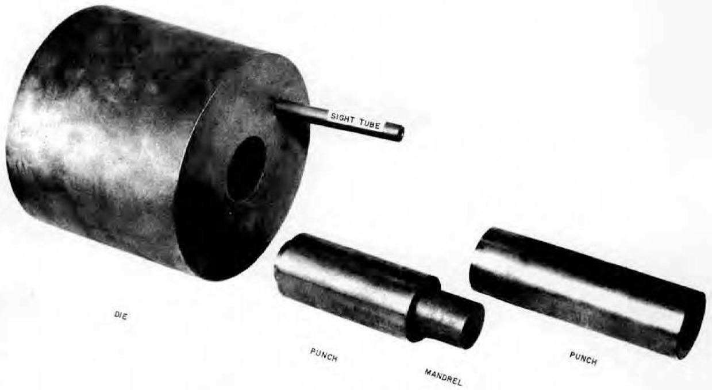  
Fig. 1. Graphite Die Assembly.

the mandrel centrally located along the axis of the die. The punch extended out of the bottom of the die. A charge of 132 to $133\mathrm{g}$ of blended powder was then loaded into the annular space between the die and mandrel, the top punch put in place, and a load of 2000 psi applied to seat the punches prior to placing in the hot-pressing rig. The set-up for hot-pressing is shown in Fig. 2.

The lower punch rested on a graphite block, which, in turn, was insulated from a Transite base by two refractory bricks (Norton, RA 1190). A quartz liner served as a retainer for the bubble-alumina insulation poured in around the graphite die prior to heating. The quartz cylinder was, in turn, externally supported by a Transite sleeve that extended up to the induction coil. Power was supplied by an Ajax, 40-kw converter set at 30 kw for heat-up and at about 15 kw to hold at temperature. An argon atmosphere was introduced at the bottom of the assembly to decrease the rate of oxidation of the graphite dies.

It was found necessary to use additional graphite spacers, as shown in Fig. 2, to prevent excessive heating of the press ram because of coupling with the magnetic field of the induction coil. A prism was mounted over the sight tube of the die so that optical temperature readings could be made in a horizontal position. Also, a low-pressure gage was added to the press for this work. This gage, which is not shown in Fig. 2, is connected to the hydraulic line above the gage shown.

It was found necessary to push the mandrel out of the slug at high temperature to avoid cracking during cooling because of a marked difference in expansion coefficients for the boron carbide compacts and graphite. The mandrel was pushed out of the compact into the lower punch by using an undersize mandrel.

The hot-pressed slugs were ground to within the limits of tolerance for length with a diamond wheel and brazed into a finished assembly, as shown in Fig. 3. The brazing operation was carried out in a hydrogen atmosphere, and Microbraz alloy was used.

Experimental Work on Control Rod Inserts. The first step in the work on control rod inserts was to establish the compatibility of aluminum oxide and boron carbide at the elevated temperature used for fabrication. A preliminary slug, less than full size, was hot-pressed at $1750^{\circ}\mathrm{C}$ for 5 min from a mixture of 90 vol $\%$ aluminum oxide (Norton, grade 38-500) and 10 vol $\%$ boron carbide (Norton, metallurgical grade). The powder was contained in a graphite die and consolidated at a pressure of 2500 psi. Metallographic examination revealed that the two materials were compatible. A second slug containing the prescribed amount of -325 mesh boron carbide had a density $86\%$ of theoretical and possessed satisfactory physical properties.

A full-size alumina-boron carbide cylinder was pressed by using the above conditions of temperature and pressure. Considerable difficulty was encountered in ejecting the slug from the die. There was also a marked tendency for the bubble-alumina insulation to sinter at this temperature. Subsequently, another full-size slug was pressed, and a maximum temperature of $1650^{\circ}\mathrm{C}$ was used. The compact was removed without difficulty, and sintering of the insulating material was minimized. The density of the second compact dropped to $80\%$ of theoretical but the physical properties were still acceptable. The boron carbide investment was increased proportionately to compensate for the decreased density.

Production of Control Rod Inserts. The hot-pressing equipment used for making the boron carbide-iron parts was also employed for producing inserts

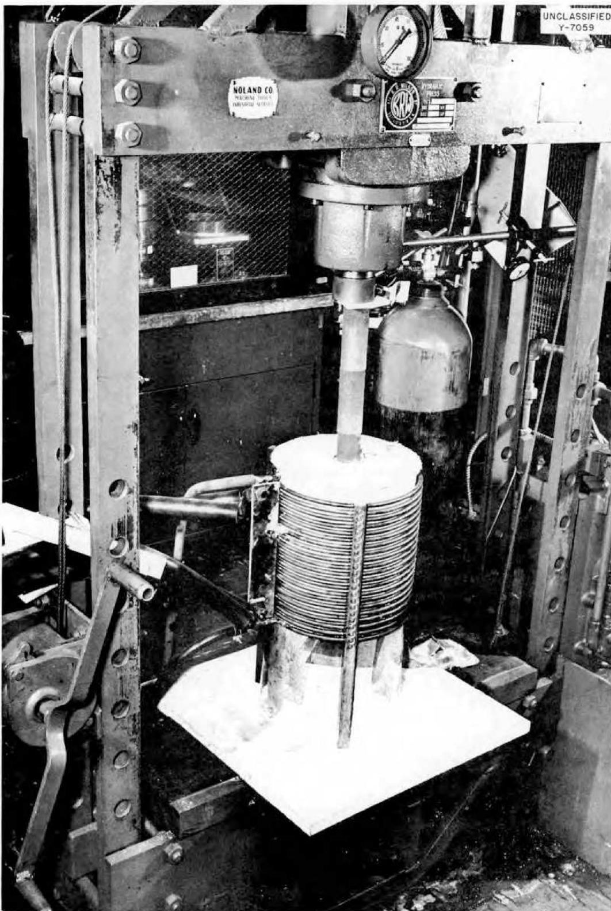  
Fig. 2. Hot-Pressing Rig.

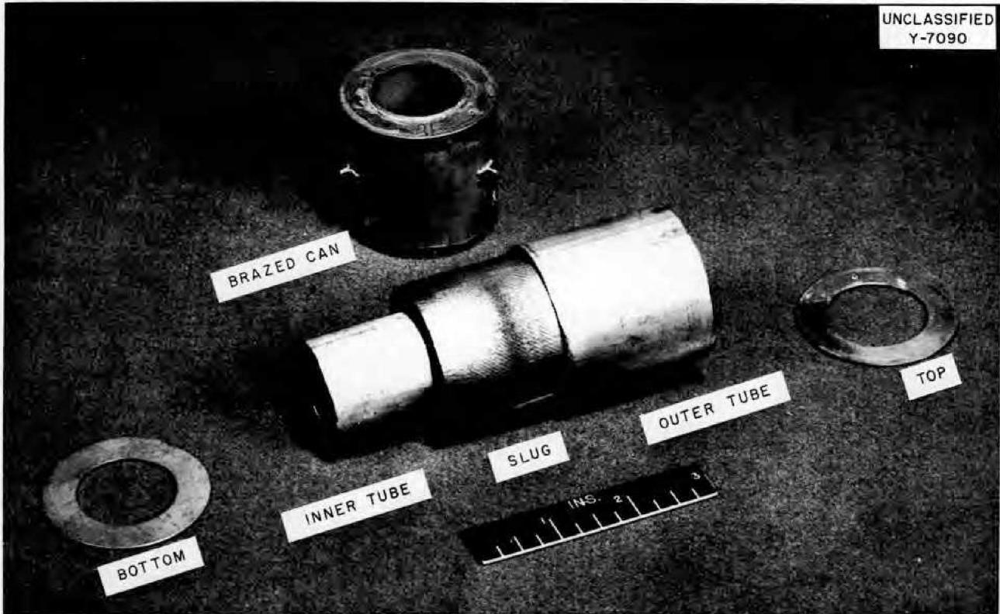  
Fig. 3. Assembly for Boron Carbide-Iron Slug.

for the control rods. New dies were used, however, to avoid additional boron pickup. Inserts for two rods were to be made; one set with a boron carbide content of 0.022 to $0.024\mathrm{g / cm^3}$ , the other with a boron carbide content of 0.005 to $0.006\mathrm{g / cm^3}$ .

A special grade of alumina was used (Norton, grade 38-500). Batches of about 1 lb were prepared by mixing appropriate quantities of the alumina and -325 mesh boron carbide (Norton, metallurgical grade). Fine boron carbide powder was obtained by ball-milling relatively coarse stock and screening out the desired fraction. Blending was carried out by tumbling in a glass jar for approximately 8 hours. The boron carbide additions were such as to give the correct boron investment for a hot-pressed compact having a density $80\%$ of theoretical.

The technique for hot-pressing the alumina-boron carbide powder essentially duplicated that used on the

boron carbide-iron powder, except for an increase in maximum temperature to $1650^{\circ}\mathrm{C}$ . Components for an assembly and a completed unit are shown in Fig. 4. The brazing operation was again done by using Microbraz alloy in a hydrogen atmosphere.

# HRE CONTROL ELEMENTS

The design of the control elements for the HRE calls for plates bent into semicircular shapes. The plates will be exposed during operation of the HRE to high-pressure water and gas. The plates are to be made of a high cross-section material contained in a stainless steel jacket. For the first set of elements built, sheet stock of boron carbide dispersed in aluminum was canned in type 347 stainless steel by covering the boron carbide stock with the steel and edge-welding. Several of these plates were found to distend following return to atmospheric

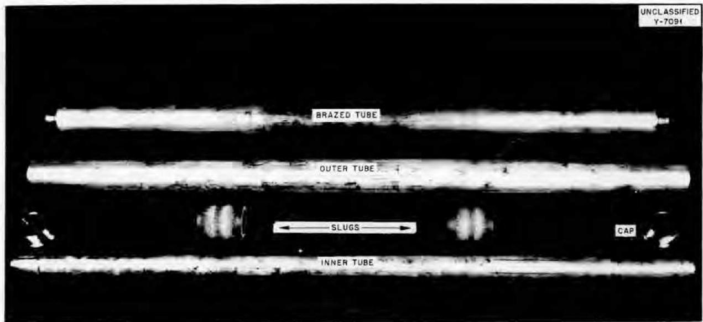  
Fig. 4. Assembly for Boron Carbide-Aluminum Oxide Slugs.

pressure after exposure to operating pressures. Failure was accredited to an accumulation, as a result of leakage through porous welds, of high-pressure gas in the space between the cladding and insert. The porosity may have been caused by melting and alloying of the aluminum with the weld metal.

The purpose of this investigation was to determine a procedure of fabrication that would minimize the defects found in the first set of plates. Hot-rolling was employed to eliminate the void by bonding the cladding to the core. In an effort to use materials readily available, bonding of the boron carbide-aluminum sheet with stainless steel was attempted first. Work was later shifted to the cladding of pressed-powder mixtures of boron carbide suspended in copper, since this method appeared to offer a better chance for success in the limited time available for the work.

Reproducibility of the quality of the edge weld was assured by using a straight-line arc-welding train. Conditions were determined for operation of the arc welder to obtain sound welds without melting of the aluminum core.

Experimental Work on Stainless Steel-Boral. A preliminary check on the feasibility of bonding stainless steel to boron carbide-aluminum sheet stock was carried out on material composed of 37 vol % boron carbide and 63 vol % aluminum (35 wt % boron carbide and 65 wt % aluminum). This material is called Boral and is of the same composition as the stock used in the preparation of the original set of control plates.

Cores measuring 3/4 in. in diameter were prepared for small samples by pressing -100 +200 mesh boron carbide and -100 mesh atomized-aluminum powders, in the volume ratio given above, at a pressure of 50 tons per square inch. These compacts were placed in frames blanked from type 347 stainless steel.

Cladding plates for the cores were prepared as indicated in the following groups:

Group 1. Thin layer of type 302 stainless steel powder sintered at $1150^{\circ}\mathrm{C}$ to the inside surface of cladding.

Group 2. Thin layer of copper powder sintered at $1020^{\circ}\mathrm{C}$ to inside surface of cladding.

Group 3. Plain cladding, bright annealed in a dry hydrogen atmosphere.

The cladding and frames were spot welded to hold them together, heliarc welded around the edges, and given the treatments listed in Table 4.

TABLE 4. TEMPERATURES AND PERCENTAGE REDUCTIONS FOR EXPERIMENTAL ROLL-CLADDING OF BORAL WITH STAINLESS STEEL   

<table><tr><td>CLADDING GROUP</td><td>ROLLING TEMPERATURE</td><td>TOTAL REDUCTION (%)</td></tr><tr><td>1</td><td>600°C, 3 passes</td><td>32.5</td></tr><tr><td>1</td><td>600°C, 1 pass; 500°C, 2 passes</td><td>31</td></tr><tr><td>2</td><td>600°C, 3 passes</td><td>35</td></tr><tr><td>2</td><td>600°C, 1 pass; 500°C, 2 passes</td><td>34</td></tr><tr><td>3</td><td>600°C, 3 passes</td><td>33</td></tr><tr><td>3</td><td>600°C, 1 pass; 500°C, 2 passes</td><td>37</td></tr></table>

Group 3 claddings were prepared to check straight metallurgical bonding of stainless steel to aluminum. The copper layer of Group 2 was introduced as an aid to bonding, for possible use in case a bond was not obtained between stainless steel and aluminum. The sintered layer of stainless steel powder in Group 1 was introduced to offer a rough surface for mechanical keying in the event metallurgical bonding could not be obtained at the rolling temperatures employed.

After the specimens were rolled, samples were taken from each of the three groups for metallographic examination, thermal cycling, and autoclave tests. Metallographic examination indicated that bonding had occurred at the Boral-to-cladding interface in each group. No cladding-to-core reaction zone was evident in those samples rolled partially at $500^{\circ}\mathrm{C}$ . Samples reduced entirely at $600^{\circ}\mathrm{C}$ did

show a region of interaction between the Boral and the cladding stock. Bonding of cladding to the picture frame occurred in the Group 2 samples that had the sintered-copper layer. Figure 5 shows the interface region for a sample from each group rolled at $600^{\circ}\mathrm{C}$ .

Neither cycling 25 times between room temperature and $500^{\circ}\mathrm{F}$ nor exposure to helium for 18 hr at 1500 psi following sudden pressure release was found to affect the samples.

Several samples, measuring 2 by 8 in., with Boral cores and copper-coated stainless steel cladding were next prepared. Rolling was carried out at $600^{\circ}\mathrm{C}$ to ensure bonding. At this temperature, the Boral was reduced preferentially and presumably built up sufficient pressure ahead of the rolls to burst an end from each of the laminates after four or five passes. Altering the per cent reduction per pass seemed ineffective as long as the total reduction exceeded $30\%$ . Subsequently, two laminates similar to the above were processed by using three passes at $600^{\circ}\mathrm{C}$ to obtain $20\%$ reduction and two additional passes at $500^{\circ}\mathrm{C}$ to obtain a total reduction of $30\%$ . These plates rolled very satisfactorily, and there was no evidence of the end rupture experienced with earlier samples.

The edge-welding problem was investigated by using a 6-in. length from one of the 2- by 8-in. plates prepared as outlined above. The excess stock along the length of the sample was sheared off at an angle to the core so that the core-to-edge distance varied from 3/8 to 1/16 inch. The plate was sealed along this sheared edge by using the straight-line arc-welding train. The arc was observed for any irregularity in appearance, and irregularity was detected for edge-stock thicknesses of the order of 1/8 inch. Examination of the edge of the plate under the microscope after the welding operation showed defects at

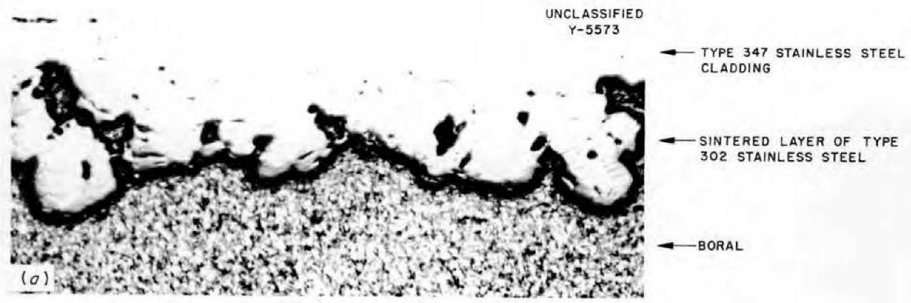

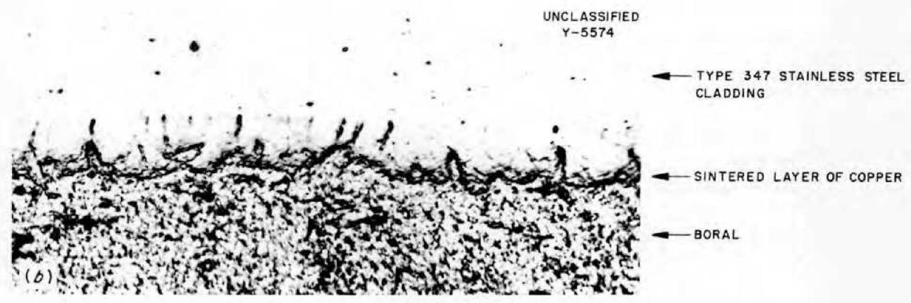

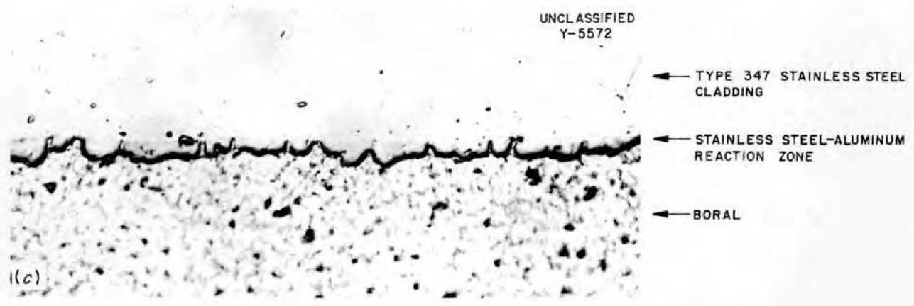  
Fig. 5. (a) Interface of Stainless Steel Cladding with Sintered Stainless Steel Powder Against Boral Core. $500 \times$ (b) Interface of Stainless Steel Cladding with Sintered-Copper Powder Against Boral Core. $500 \times$ (c) Interface of Stainless Steel Cladding Against Boral Core. $750 \times$

thicknesses up to 3/16 inch. At best, the 1/8-in.-wide frame requested for the stainless steel clad Boral is a border-line requirement for sound edge welds.

The results of the experimental work on Boral-stainless steel laminates indicate that full-size plates can probably be prepared by using the procedure outlined above.

Experimental Work on Stainless Steel-Borcu. Stainless steel laminates rolled at $600^{\circ}\mathrm{C}$ work-hardened quite rapidly, and the resulting plate was very rigid. Since the plates were to be formed into semicircular shapes after rolling, with a radius of about 7 3/4 in. for the smallest-diameter pair, it would be helpful if the rolling process could be carried out at somewhat above $600^{\circ}\mathrm{C}$ . Obviously, this would necessitate replacing the aluminum with some other carrier for the boron carbide.

Screening of Potential Core Metallics. Iron, nickel, types 302 and 410 stainless steel, and chromium powders were considered as substitutes for aluminum. Coarse evaluation tests were made by pressing compacts containing 37 vol %

boron carbide with each of these metals. The compacts were sintered at $1150^{\circ}\mathrm{C}$ for 30 min with the results listed in Table 5. These tests indicated that in all cases the boron carbide reacted with the matrix metal to form a brittle intermetallic or low-melting eutectic phase, with accompanying detrimental effects to the physical properties of the compacts.

Laminates containing cores of the above compositions gave uniformly poor results after hot-rolling. Several laminates containing iron or type 302 stainless steel in the cores were rolled at $1225^{\circ}\mathrm{C}$ ; at this temperature the cladding was attacked by the core material and most of the center portion melted away. Several other laminates containing iron, type 410 stainless steel, and chromium matrices were rolled at 1050 to $1125^{\circ}\mathrm{C}$ ; all these laminates blistered badly because of ruptures within the cores.

Copper was considered next for the metallic of the core. Information from the literature indicated that copper does not react with or dissolve appreciable amounts of boron or carbon at temperatures far above its melting point.

TABLE 5. PROPERTIES OF SINTERED COMPACTS OF NICKEL, IRON, TYPE 302 STAINLESS STEEL, TYPE 410 STAINLESS STEEL, AND CHROMIUM PLUS BORON CARBIDE  

<table><tr><td rowspan="2">COMPOSITION</td><td colspan="2">DENSITY AS PERCENTAGE OF THEORETICAL DENSITY</td><td rowspan="2">PROPERTIES</td></tr><tr><td>Green</td><td>Sintered</td></tr><tr><td>Ni-B4C</td><td></td><td></td><td>Ni-B eutectoid formed and flowed out of compact</td></tr><tr><td>Fe-B4C</td><td>76.5</td><td>70.0</td><td>Brittle, fairly strong, liquid phase formed</td></tr><tr><td>Type 302 stainless steel-B4C</td><td>74.0</td><td>59.5</td><td>Very brittle, liquid phase formed</td></tr><tr><td>Type 410 stainless steel-B4C</td><td></td><td></td><td>Very brittle, weak</td></tr><tr><td>Cr-B4C</td><td></td><td></td><td>Brittle, poorly sintered</td></tr></table>

A compact of copper and coarse boron carbide was prepared by sintering a mixture of the powders and then cold-pressing, resintering, and cold-rolling the mixture. The compact was successfully clad by hot-rolling at $1000^{\circ}\mathrm{C}$ , with a $50\%$ reduction in seven passes. Figure 6 shows the interface between type 347 stainless steel cladding and the boron carbide-copper core. The finished laminate could be bent to a 1-in. radius without failure. When bent further, failure occurred through the core and not at the bond surface.

A revision in the scheduled time for completion of the full-size plates for the HRE forced an early decision as to which fabrication method would be used. The copper-bearing core was chosen as

the material most likely to fabricate satisfactorily.

Preparation of Boron Carbide-Copper Cores. The boron carbide bearing section for each plate was assembled by using multiple inserts. A press with 150-tons capacity was available with which to consolidate the powders. Since a considerable amount of wear caused by the hard boron carbide particles was anticipated, it was decided to form the compacts in a die at 25 tsi, sinter, and coin the sintered compacts between hardened-steel plates at 50 tsi, in an effort to minimize die wear. A hardened-steel die was therefore made to form 1- by 3-in. compacts of the required thickness.

Stock for cores was prepared as a mixture of 41 vol % (16.3 wt %) boron carbide (Norton, metallurgical grade,

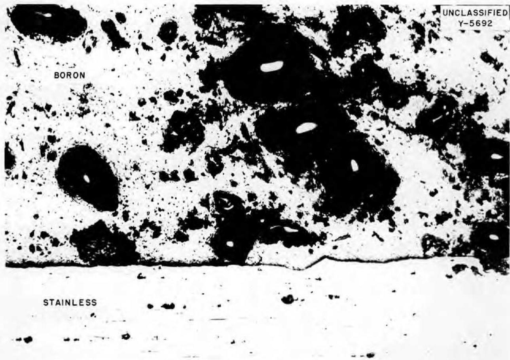  
Fig. 6. Interface of Stainless Steel Cladding Against Boron Carbide-Copper Core. 250X

which analyzed $71 \pm 1\%$ boron) in copper powder (U. S. Metals Refining Company, type C). Two per cent of stearic acid dissolved in acetone was added to minimize classification of the boron carbide during handling of the mixture. The acetone was driven off by gentle heating prior to compacting. The compacts were pressed at 25 tsi, heated in air at $400^{\circ}\mathrm{C}$ to remove the binder, and sintered at $950^{\circ}\mathrm{C}$ for 2 hours. The compacts were then repressed at 50 tsi between hardened-steel plates and resintered for 15 min at $950^{\circ}\mathrm{C}$ to promote densification. Preparation prior to cladding was then completed by cold-rolling to the desired thickness, loading the laminates into the frames, edge welding, and evacuating. Finally, the composite plates were hot-rolled at $1000^{\circ}\mathrm{C}$ , as described above. It was discovered during the preheating period for rolling the large plates that an outward distortion of the cladding

occurred. The cause could not be determined with certainty. The edge welds on all plates were checked for soundness prior to rolling by a test of ability of the laminate to hold a vacuum. The possibility of a volatile residue from the binder after firing at $950^{\circ}\mathrm{C}$ does not seem likely. By delaying sealing of the exhaust tube for the laminates and applying vacuum to the core during the preheating cycle, the difficulty with swelling was eliminated. Subsequently, camphor was substituted for stearic acid as a binder to help minimize residual contamination following sintering. Components for preparation of a laminate are shown in Fig. 7.

The rolled laminates were x rayed to locate the cores and the excess stainless steel stock was sheared from the edges to leave a minimum of 1/8-in. border, which was sealed by using the automatic argon-arc welder. In this

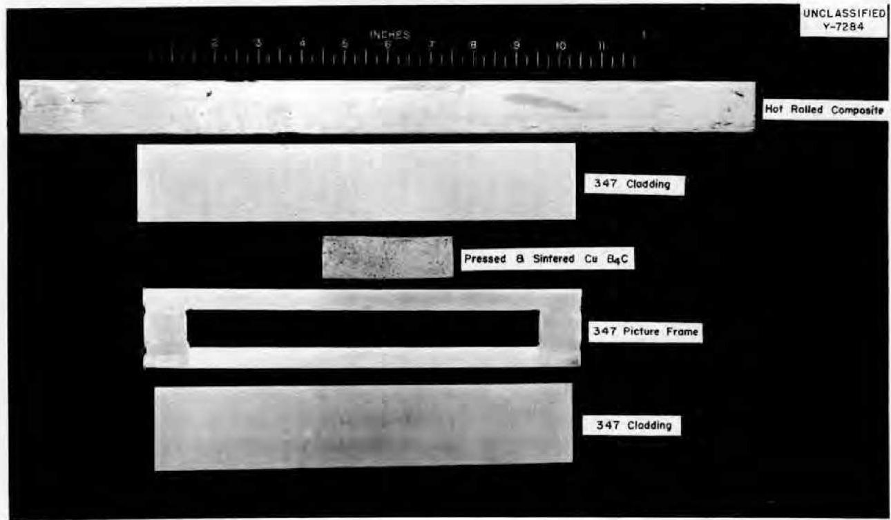  
Fig. 7. Components for HRE Control Plate.

operation, the boron carbide-copper mixture possesses an additional advantage over Boral in that its higher melting point reduces the chances of melting of the core and the associated contamination of the weld.

The actual core area for each plate, except plate 8, was determined from the x-ray pictures; plate 8 was delivered for a bending experiment before an x-ray picture was taken. The

edges of plate 8 were trimmed by using the outline of the core that was visible on the cladding surface as a guide.

The level of the boron carbide content of these plates was slightly below the 100-mg minimum requested, except for plate 16. The deficiency may be accredited to a lack of familiarity with the properties of the powder mixture.

# APPENDIX A. HRE CONTROL PLATE DATA

<table><tr><td rowspan="2"></td><td colspan="9">PLATE NUMBER</td></tr><tr><td>6</td><td>10</td><td>5</td><td>9</td><td>1</td><td>8</td><td>14</td><td>12</td><td>16</td></tr><tr><td>Over-all length, in.</td><td>16 1/8</td><td>16 1/8</td><td>17 1/8</td><td>17 3/16</td><td>18 1/8</td><td>*</td><td>19 11/16</td><td>19 3/16</td><td>13 13/16</td></tr><tr><td>Over-all width, in.</td><td>1</td><td>1 1/32</td><td>1 5/16</td><td>1 5/16</td><td>1 9/16</td><td></td><td>6 1/16</td><td>6 1/16</td><td>9 5/16</td></tr><tr><td>Core length, in.</td><td>15 3/4</td><td>15 3/4</td><td>16 5/8</td><td>16 11/16</td><td>17 3/4</td><td></td><td>19 5/6</td><td>18 9/16</td><td>13 5/16</td></tr><tr><td>Core width, in.</td><td>11/16</td><td>21/32</td><td>15/16</td><td>15/16</td><td>1 1/8</td><td></td><td>5 3/4</td><td>5 13/16</td><td>9 1/32</td></tr><tr><td>Core area, in.2</td><td>10.8</td><td>10.3</td><td>15.6</td><td>15.65</td><td>20.0</td><td></td><td>111.0</td><td>107.9</td><td>120.3</td></tr><tr><td>B4C-Cu investment, g</td><td>56.3</td><td>55.7</td><td>82.8</td><td>82.9</td><td>108.3</td><td></td><td>596.3</td><td>599.3</td><td>744</td></tr><tr><td>B4C investment, g</td><td>9.17</td><td>9.08</td><td>13.5</td><td>13.5</td><td>17.65</td><td></td><td>97.2</td><td>97.7</td><td>122</td></tr><tr><td>B investment, g</td><td>6.46</td><td>6.46</td><td>9.62</td><td>9.62</td><td>12.56</td><td></td><td>69.2</td><td>69.5</td><td>87.6</td></tr><tr><td>B per cm2of core, g</td><td>92.8</td><td>97.3</td><td>95.7</td><td>95.4</td><td>97.5</td><td></td><td>97</td><td>100</td><td>113</td></tr></table>

*Plate delivered for bending experiment before x-ray picture could be taken for determination of size.

# APPENDIX B. WELDING CONDITIONS HRE CONTROL PLATES

Equipment: G-E, WD4200, d-c welder

Linde, CM 37, machine carriage

Airco, machine heliweld holder

G-E, hi-thoria, 0.040-in.-dia tungsten electrode

Material: Nine stainless steel clad boron carbide and copper sheets,

1/8 in. thick, in varying widths of 1 to 9 1/4 in.;

accumulated edge welding required was approximately

27 ft for the nine plates and varied in length from 13

to 19 inches.

Welding Conditions: Shielding gas, argon

Gas flow, 25 ft³/hr

Generator open-circuit voltage, 70 volts

Arc voltage, 10 volts

Arc current, 46 amp

Welding speed, 10 in./min