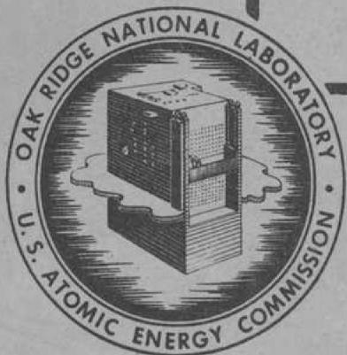

3445605662921

ORNL 1490

Chemistry

GENERAL INFORMATION

CONCERNING FLUORIDES

OAK RIDGE NATIONAL LABORATORY

OPERATED BY

CARBIDE AND CARBON CHEMICALS COMPANY

A DIVISION OF UNION CARBIDE AND CARBON CORPORATION

UCC

POST OFFICE BOX P

OAK RIDGE. TENNESSEE

ORNL 1490

This document consists of 22 pages.

Copy of 330 copies. Series A.

Contract No. W-7405-eng-26

AIRCRAFT NUCLEAR PROPULSION DIVISION

GENERAL INFORMATION CONCERNING FLUORIDES

Mary E. Lee

DATE ISSUED

rc6 27 1952

OAK RIDGE NATIONAL LABORATORY

Operated by

CARBIDE AND CARBON CHEMICALS COMPANY

A Division of Union Carbide and Carbon Corporation

Post Office Box P

Oak Ridge, Tennessee

ORNL 1490

Chemistry

# INTERNAL DISTRIBUTION

1. C. E. Center

2. Biology Library

3. Health Physics Library

4-5. Central Research Library

6. Reactor Experimental Engineering Library

7-12. Central Files

13. C. E. Larson

14. W. B. Humes (K-25)

15. L. B. Emlet (Y-12)

16. A. M. Weinberg

17. E. H. Taylor

18. E. D. Shipley

19. R. C. Briant

20. F. C. VonderLage

21. J. A. Swartout

22. S. C. Lind

23.F.L.Steahy

24. A. H. Snell

25. A. Hollander

26. M. T. Kelley

27. G. H. Clewett

28. K. Z. Morgan

29. J. S. Felton

30. A. S. Householder

31. C. S. Harrill

32. C. E. Winters

33. D. W. Cardwell

34. E. M. King

35. A. J. Miller

36. D. D. Cowen

37. M.E. Lee

38. E. S. Bettis

39. A. P. Fraas

40. L. A. Mann

41. H. F. Poppendiek

42. H. W. Savage

43. W. K. Ergen

44. P. M. Reyling

45. F. Kertesz

46. M. A. Bredig

47. W. D. Manly

48. E. G. Bohlmann

49. J. L. English

50.C.D.Susano

51. Frances Sachs

52. Elizabeth Carter

53.C.H.Secoy

54. E. Wischhusen

55. J. Courtney White

56. J. P. Blakely

57. G. M. Adamson

58-67. ANP Reports Office

68-73. W.R. Grimes

# EXTERNAL DISTRIBUTION

74. B. W. O. Dickinson, Wright Air Development Center

75-78. T.W. Laughlin, AEC, Oak Ridge

79-330. Given distribution as shown in TID-4500 under Chemistry Category.

# GENERAL INFORMATION CONCERNING FLUORIDES

# Abstract

This report is an addition to ORNL-1252. It is a compilation of abstracts, taken from Chemical Abstracts (Sec. 4, 1952 through Sec. 22, 1952), containing general information concerning the fluorides of aluminum, barium, beryllium, calcium, cesium, lead, lithium, magnesium, potassium, rubidium, sodium, strontium and uranium.

CA 46, 405h

Coating Ferrous Metal with Aluminum or an Aluminum Alloy
Howard L. Grange and Dean K. Hanink (to General Motors Corp.)
U.S. 2,569,097, Sept. 25, 1951

Degrease the steel or ferrous material; if necessary, pickle in acid and dip in a flux soln. of $\mathsf{ZnCl}_2$ 32, $\mathsf{NH_4Cl}$ 8, and $\mathsf{H}_2\mathsf{O}$ 60 parts. Immerse in molten salt floating on top of a molten Al or Al alloy coating bath. Hold in a salt bath at $1300 - 1400^{\circ}\mathsf{F}$ until the metal reaches this temp. Then pass into the molten metal at between $1150^{\circ}$ to $1600^{\circ}\mathsf{F}$ and hold there one second or longer. The satisfactory salt bath consisted of KCl 47, NaCl 35, NaAlF6 12, and $\mathsf{AlF}_3$ 6%, which is able to dissolve Al and Fe oxides. This salt mixt. melts at $1180^{\circ}\mathsf{F}$ . Addns. of about $20\%$ LiCl lowers the m.p. to $1075^{\circ}\mathsf{F}$ . Some control of the thickness of metal coating is obtained by holding the coated article in the molten salt and on emerging to drain excess coating material. Excess coating metal also may be removed by an air blast. The steel may be preheated in a nonoxidizing or reducing atm. before being immersed in the fused salt bath.

CA 46, 1341b

The Melting Point and Heat of Sublimation of Plutonium Trifluoride  
Edgar F. Westrum, Jr., and James C. Wallmann (Univ. of Calif., Berkeley)  
J. Am. Chem. Soc. 73, 3530-1 (1951)

In high vacuum and under $10^{-2}$ atm. A the fusion temp. of $\mathsf{PuF}_3$ is $1426 \pm 2^{\circ}$ , and the solidification temp. $1425 \pm 3^{\circ}$ . The $\Delta C_p$ of sublimation corresponding to an equation based on vapor-pressure data (cf. Phipps, CA 44,10560f) is -32 cal/mole degree. A least-squares treatment with an assumed value of $\Delta C_p$ of -15 cal/mole degree, and 2 arbitrary consts. also fit the data well and yield the equation log $\mathsf{P}(\mathsf{mm}) = -24,917\mathsf{T}^{-1} - 7.5513\log \mathsf{T} + 38.920$ , valid from 1200 to $1660^{\circ}\mathsf{K}$ for the dissocn. pressure and the value 89 kcal/mole for the heat of sublimation of $1400^{\circ}$ .

CA 46, 1419b

Corrosion Experiments with Gaseous Boron Trifluoride  
F. Hudswell, J. S. Nairn, and K. L. Wilkinson (At. Energy Research Establishment, Harwell, Berks, Engl.)  
J. Applied Chem. (London) 1, 333-6 (1951)

Metals, alloys, and other compds. which may be used with $\mathsf{BF}_3$ were contacted with this gas at $25~\mathrm{cmHg}$ at temps. up to $200^{\circ}$ . The extent of reaction was detd. by the change in the gas pressure over the sample. It was found that the following can be used in app. for handling dry $\mathsf{BF}_3$ : stainless steel, mild steel, Cu, Ni, Monel metal, brass, and Al. The more noble metals

and Pyrex glass can be used up to about $200^{\circ}$ . Acaldite cement, fired pyrophyllite, and polytetrafluoroethylene can be used up to $80^{\circ}$ . Some plastics were resistant, but others cannot be used with $\mathbf{BF}_3$ .

CA 46, 1857d

Thermodynamic Functions. $\mathsf{Al}_{4}\mathsf{C}_{3}$ , Si, $\mathsf{SiO}_{2}$ , SiC, $\mathsf{AlF}_{3}$ and $\mathsf{Na}_{3}\mathsf{AlF}_{6}$ . I. I. Ivanova (Saratov State Univ.)

J. Gen. Chem. U.S.S.R. 21, 491-9 (1951) (Engl. translation)

See CA 45, 5014c.

CA 46, 2249a

Soldium Aluminum Fluoride

Erling Brodal and Henning Guldhav (to Aktieselskapet Norsk Aluminium Co.) U.S. 2,567,544, Sept. 11, 1951.

in presence of silica.

The production of alk. Na compds. from fluorspar in presence of silica is described.

CA 46, 3334g

Liquids and Vapors as Heat-Transfer Media in the Temperature Range of 200 to $400^{\circ}$

Hermann Schulze

Chem.-Ing.-Tech. 23, 565-9 (1951)

Water, fused salts, liquid metals and alloys, and org. substances are discussed. Some phys. data are given.

CA 46, 3382g

Catalytic Properties of Fluorides of Alkali and Alkaline-Earth Metals A. A. Tolstopyatova (Moscow State Univ.)

Vestnik Moskov. Univ. 6, No. 3, Ser. Fiz.-Mat. i Estestven. Nauk No. 2, 49-57 (1951)

Dehydrogenation-dehydration of EtOH passed at the rate of 0.2 ml/min over 15 g of ThO₂ (pptd. from a 10% Th(NO₃)₄ soln. with 20% NH₄OH at 50°, washed and dried at 120°) gave the following % decompn. and gas (% CO₂, C₈H₂₂n, CO, H₂): at 287°, 4.1% (1.5, 11.5, 3.1, 84.2); at 338°, 5.8 (3.6, 24.5, 6.8, 65.1); at 348°, 10.4 (4.6, 27.3, 10.9, 57.5); at 360°, 14.8, (5.2, 31.3, 9.1, 54.4); at 420°, 43.3 (9.2, 39.1, 6.9, 44.8). Dehydrogenation to AcH predominates at lower temps; the part of dehydration to C₂H₄ increases with the temp. The apparent activation energies EH₂ and EH₂₀, for dehydrogenation and dehydration, resp., are 14.7 and 21.8 kcal/mole. At the same feed rate, on 12 g CaF₂ (pptd. from a 10% soln. of Ca(NO₃)₂ with 10% NaF, washed and dried at 120°), the data were: at 460°, 2.5%

(7.5, 0, 2.7, 89.8); at $495^{\circ}$ , 4.3 (7.0, 2.1, 4.0, 86.8); at $510^{\circ}$ , 7.8 (8.0, 5.2, 3.4, 83.5); at $526^{\circ}$ , 11.9 (8.5, 4.9, 5.0, 81.6). The catalytic activity of $\mathrm{CaF}_2$ is new. Despite its identical structure with $\mathrm{ThO}_2$ and the near equality of the cation and anion radii, the activity of $\mathrm{CaF}_2$ is considerably lower, and the part of dehydration is very much smaller; the activation energies are $\mathrm{E}_{\mathrm{H}_2} = 26.0$ , $\mathrm{E}_{\mathrm{H}_20} \sim 36$ kcal/mole. $\mathrm{CaF}_2$ promoted with a trace of Fe (by pptn. of $10\%$ $\mathrm{CaCl}_2$ , contg. some Fe, with $10\%$ $\mathrm{NH}_4\mathrm{F}$ at $50^{\circ}$ ) detectable with $\mathrm{NH}_4\mathrm{CNS}$ , is active at lower temps. With $15\mathrm{~g}$ catalyst, the data are: at $375^{\circ}$ , 6.0 (1.6, 2.5, 1.0, 92.7); at $400^{\circ}$ , 15.6 (3.5, 4.6, 2.5, 89.4); at $425^{\circ}$ , 18.2 (3.7, 5.6, 5.4, 85.1); in addn. to these products, about $2\%$ $\mathrm{CH}_4$ was found in the gas with this catalyst. It can be only partially regenerated by air, and the activation energies can be detd. only approx.: $\mathrm{E}_{\mathrm{H}_2} \sim 35$ , $\mathrm{E}_{\mathrm{H}_20} \sim 53$ kcal/mole. It is striking that E is higher with promoted than with unpromoted $\mathrm{CaF}_2$ , although reaction with EtOH begins at lower temps. with the promoted $\mathrm{CaF}_2$ . The ratio $\mathrm{E}_{\mathrm{H}_2}/\mathrm{E}_{\mathrm{H}_20}$ is approx., const., = 0.7, with $\mathrm{ThO}_2$ and with promoted or unpromoted $\mathrm{CaF}_2$ . For other fluorides, approx. data of the degrees of decompn. of EtOH are: $15.6\mathrm{~g}$ $\mathrm{SrF}_2$ (pptd. from $10\%$ $\mathrm{Sr(NO_3)_2}$ with $10\%$ NaF at $50^{\circ}$ and dried at $120^{\circ}$ ), at $345$ , $394$ , $426^{\circ}$ , resp., 3.1, 6.0, 10.4%; 12 g LiF (dried at $120^{\circ}$ ), at $348$ , $394$ , $434$ , $450$ , $484^{\circ}$ , resp., 2.4, 3.7, 2.4, 7.0, 11.7%; 15 g NaF (dried at $120^{\circ}$ ), at $348$ , $394$ , $460^{\circ}$ , resp., 1.7, 2.3, 4.6%; 21 g KF, 370 and $460^{\circ}$ , resp., 2.3 and $18.0\%$ . Temps of equal catalytic activity, corresponding to $10\%$ decompn., are: $\mathrm{SrF}_2$ $425$ , KF $450$ , LiF $470$ , NaF $490$ , $\mathrm{CaF}_2$ $526^{\circ}$ . With $\mathrm{SrF}_2$ , LiF, and NaF, $85-90\%$ of the gas is H₂, i.e., dehydrogenation is by far predominant; with KF, about $50\%$ of the gas is H₂, $25\%$ CO₂, large amts. of CH₄ and satd. hydrocarbons. Rough values of the activation energies are, for LiF and NaF, 8-9 kcal/mole, for $\mathrm{SrF}_2$ 13 kcal/mole.

CA 46, 3441d

Fluorine-Active Substances  
Hans Bode and Ernst Klesper (Chem. Staats-inst. Hamburg, Ger.)  
Z. anorg. u. allgem. Chem. 267, 97-112 (1951)

When gaseous F which is free of HF, reacts with K, Rb, of Cs halides at low temps. $(140 - 220^{\circ})$ , substances higher in F than MF are obtained. The phenomenon was not observed with Li and Na halides. For Rb and Cs, according to the exptl. conditions, a limit formula of $\mathbf{MF}_3$ seems to be reached. The reaction mechanism and the structure of the new substances are discussed.

CA 46, 3715d

The Importance, Manufacture, and Use of Inorganic Fluorine Compounds K. Kersten and E. Pieschel (Dohna/So, Ger.) Chem. Tech. (Berlin) 3, 296-8 (1951)

A general discussion is given of the importance and manuf. of HF, synthetic cryolite, NaF, $\mathrm{AlF}_3$ , silicofluorides, and fluosilicic acid, and the use of F salts in the preservation of wood.

Theory of the Electric Breakdown of Solid Dielectrics

A. A. Vorob'ev and E. K. Zvezdovskaya (S.M. Kirov Polytech. Inst., Tomsk)

Doklady Akad. Nauk S.S.S.R. 81, 375-7 (1951)

It is assumed that elec. breakdown takes place when the energy accumulated by the electrons and transferred to the lattice is sufficient to break the bond between lattice points. The energy increment of an electron per sec is $\Delta w = eEu$ , where $E =$ field strength and $u =$ group velocity, and hence $\Delta w = (e^2 E^2 / m) \tau(w)$ , where $\tau(w)$ is the time elapsing until a collision, and is a function of $w$ ; the reciprocal $1/\tau$ is the probability for an electron to undergo collision or deflection per unit time. This energy is transferred to the lattice; on the assumption that all of it is spent in disruption of the lattice, one has $(e^2 E^2 / m) \tau(w) \Delta t = cU$ , where $U =$ lattice energy, and the time $\Delta t$ of the duration of the breakdown is of the order of $10^{-8}$ sec. If $\tau$ were independent of $E$ , one should have proportionality between $E^2$ and $U$ . Data for alkali halides, RbI, KI, RbBr, RbCl, NaI, KCl, NaBr, NaCl, KF, NaF, LiF (in the order of increasing $U$ ) do not bear it out. More nearly, there is a linear relation between $E$ and $U$ (with the points for KBr, NaI, and NaBr deviating considerably from the straight line). Linearity between $E$ and $U$ means that $\tau$ is inversely proportional to $E$ . If the dissocn. energy is used instead of $U$ , i.e., if it is assumed that elec. breakdown is accompanied by dissocn. into neutral atoms rather than into ions, no linear relation is obtained. Consequently, elec. breakdown corresponds to dissocn. of the lattice into ions. Over the time interval $\tau$ , the energy accumulated by the electron, $\Delta w = (e^2 E^2 / m) \tau^2(w)$ , and the exptl. data lead to the conclusion that $\tau$ is inversely proportional to $E^{1/2}$ . The decrease of $\tau$ with increasing $E$ holds only at sufficiently high $E$ , possibly when the kinetic energy of the electrons becomes comparable with the vibration energy of the lattice points.

CA 46, 4305d

Growth of Alkali Halides from the Vapor on Single-

Crystal Substrates of Alkali Halides

L. G. Schulz (Univ. of Chicago)

Acta Cryst. 5, 130-2 (1952)

Alkali halides of the NaCl-type structure (LiF, NaF, LiCl, KF, NaCl, NaBr, KCl, KBr, KI, and RbI) were deposited from the vapor phase by evapn. in a vacuum onto cleavage surfaces of LiF, NaCl, KCl, and KBr. It was found by electron diffraction that the crystals of the initial deposit were oriented with their crystallographic axes parallel to those of the substrate for all deposit-substrate combinations. Through the examn. of deposits that had an av. thickness of only a few at. layers, the mechanism of crystn. of the initial deposit was detd.

CA 46, 4871h

The Halides of Niobium and Tantalum. III. The Vapor Pressures of Niobium and Tantalum Pentafluorides Fred Fairbrother and Wm. C. Frith (Univ. Manchester, Engl.) J. Chem. Soc. 1951, 3051-6; cf. CA 44, 2879f

The vapor pressures of $\mathbf{N}\mathbf{o}\mathbf{F}_{5}$ and $\mathbf{T}\mathbf{a}\mathbf{F}_{5}$ were measured by a static method using a Bourdon-type sickle gage and by b.p. detns. under a no. of controlled pressures. Measurements near the b.p. were made in an app. in which the whole interior of the gage chamber and sickle were plated with a thin film of Ni deposited by thermally decompg. $\mathrm{Ni(CO)}_{4}$ in order to eliminate reactions of $\mathbf{M}\mathbf{F}_{5}$ and traces of moisture with the glass. $\mathbf{N}\mathbf{o}\mathbf{F}_{5},$ m. $80.0^{\circ}$ , b. $234.9^{\circ}$ , $\Delta H_{\text{vap}} + 12.9\ \text{kcal},$ log pmm = 8.439 - 2.824/T. TaF5 m. 95.1, b. $229.2^{\circ}$ , $\Delta H_{\text{vap}}$ 13.0 kcal, log pmm = 8.524 - 2.834/T. Trouton's const. TaF5 25.9, NbF5 25.4. A mixt. of the fluorides prepd. directly by fluorination of com. ferro columbium is an excellent Friedel-Crafts-type catalyst.

CA 46, 4875c

Growth of Alkali Halide Crystals from the Vapor Phase and from Solution Onto Substrates of Mica L. G. Schulz (Univ. of Chicago) Acta Cryst. 4, 483-6 (1951) (in English); cf. CA 45, 5989e

Electron-diffraction patterns were taken in 2 positions differing by $30^{\circ}$ in the same app. in which the films were formed by deposition from vapor onto muscovite cleavage surfaces. KF, NaCl, NaBr, KCl, NaI, KBr, KI, $\mathsf{NH}_4\mathsf{I}$ , and RbI are oriented to the larger at. network in mica. LiCl with a mismatch of $30\%$ and NaF showed a (l11) fiber structure; the latter showed considerable diln. with crystals having random orientation. LiF was unique in orienting to the smaller hexagonal mica network. Salts, such as RbI with a greater than 5.32A., showed a double-positioned type of angular orientation when grown from the vapor phase but only a single-positioned orientation when grown from soln. Crystal growth from soln. was studied by exposing the salt deposited on the mica to moist air and evapg. $\mathsf{H}_2\mathsf{O}$ after returning it to the camera. The growth of salts with a less than 6.5A. supported the oriented nucleus hypothesis, whereas the growth of salts with a greater than 6.5A. supported the monolayer hypothesis. Successive deposits of different alkali halides yielded films having the same orientations as the first salt deposited. A deposit of KBr thicker than about 0.5A. was sufficient to cause deposited LiF to have the same angular orientation as the KBr. A film of $\mathsf{MgF}_2$ , amorphous and nonporous, and about 0.5A. thick was sufficient to upset the orientation of deposits. Close at, matching at the interface was not required for an oriented overgrowth.

Forms of the Complex Fluoroaluminates in Aqueous Solutions  
G. S. Savchenko and I. V. Tananaev (N. S. Kurnakov Inst. Gen. Inorg. Chem. Acad. Sci. U.S.S.R., (Moscow)  
Zhur. Obshchei Khim (J. Gen. Chem.) 21, 2235-45 (1951)

By potentiometric measurements with a quinhydrone electrode, the variation of the pH in the binary solns. $\mathrm{Al(NO_3)_3 + H_2O}$ , $\mathrm{HF + H_2O}$ , and $\mathrm{NHO_3 + H_2O}$ with the concn. of the electrolyte is almost linear. In the ternary systems, $\mathrm{Al(NO_3)_3 + HNO_3 + H_2O}$ and $\mathrm{HNO_3 + HF + H_2O}$ , at const. sum $\mathrm{Al(NO_3)_2 + HNO_3}$ or $\mathrm{HNO_3 + HF = 0.1M}$ , the variation of the pH is almost linear in the ratio $\mathrm{HNO_3:Al(NO_3)_3}$ or $\mathrm{HNO_3:HF}$ , resp., i.e., is detd. solely by the content of $\mathrm{HNO_3}$ ; there is no indication of an interaction between either $\mathrm{Al(NO_3)_3}$ and $\mathrm{HNO_3}$ or HF and $\mathrm{HNO_3}$ . In the system $\mathrm{Al(NO_3)_3 + HF + H_2O}$ , at the const. concn. sums $\mathrm{Al(NO_3)_3 + HF = 0.01}$ , 0.03, and 0.1 M, the pH passes through a max. lying, in all 3 cases, at the ratio HF: $\mathrm{Al(NO_3)_3 = 2}$ . Inasmuch as increase of the acidity is due only to $\mathrm{HNO_3}$ , it must be concluded that, at higher ratios HF: $\mathrm{HNO_3}$ , there is a displacement of $\mathrm{NO_3^-}$ ions by $F^{-}$ ions, i.e., at the max., a reaction $\mathrm{Al(NO_3)_3 + 2HF\longrightarrow AlF_2NO_3 + 2HNO_3}$ , or $\mathrm{Al^{+ + + } + 2HF\longrightarrow AlF_2^+ + 2H^+}$ . The same general picture is found in the systems $\mathrm{AlCl}_3 + \mathrm{HF} + \mathrm{H}_2\mathrm{O}$ and $\mathrm{Al}_2(\mathrm{SO}_4)_3 + \mathrm{HF} + \mathrm{H}_2\mathrm{O}$ ; in all cases, there is an undissociated ion $\mathrm{AlF}_2^+$ . The amt. of $\mathrm{H}_2\mathrm{SO}_4$ displaced, and the degree of progress of the formation of the $\mathrm{AlF}_2^{+ + }$ ion, can be detd. with the aid of data of the variation of the pH with the concn. in the system $\mathrm{H}_2\mathrm{SO}_4 + \mathrm{H}_2\mathrm{O}$ . By thermal measurements of the temp. rise $\Delta t$ on mixing, as a function of the ratio HF:Al, in the systems $\mathrm{Al(NO_3)_3 + HF + H_2O}$ , and $\mathrm{AlCl}_3 + \mathrm{HF} + \mathrm{H}_2\mathrm{O}$ the heat evolved increases with the relative amt, of HF in the soln., and passes through a max. at the ratio Al:HF = 2, in agreement with the pH measurements; the temp. rise $\Delta t$ can attain $l^{\bullet}$ . These results again reveal the formation of $\mathrm{AlF}_2^+$ . There is no indication of the presence of $\mathrm{AlF}_3$ , or of more highly coordinated ions. Nor is there, at the concns. used, any indication of an ion $\mathrm{AlF^{+ + }}$ , there being no singularity at the ratio HF:Al = 1. In the light of these conclusions, the soln. of cryolite in Al salt solns. should be explained by formation of $\mathrm{AlF}_2^+$ ions, $3\mathrm{NaF.AlF}_3 + 2\mathrm{Al^{+ + + }}\longrightarrow 3\mathrm{AlF}_2^+ + 3\mathrm{Na}^+$ . Contrary to Brosset (CA 37, 13-8), the easy soln. of $\mathrm{CaF}_2$ in AlCl₃ solns. should be attributed not to formation of $\mathrm{AlF}_6^-$ ions, but to the reaction $\mathrm{CaF}_2 + \mathrm{Al^{+ + + }}\longrightarrow \mathrm{AlF}_2^+ + \mathrm{Ca}^+$ , and the analogous reaction with $\mathrm{Be^{+ + }}$ ions should be formulated $\mathrm{CaF}_2 + 2\mathrm{Be^{+ + }}\longrightarrow 2\mathrm{BeF}^+$ $+\mathrm{Ca}^{+ + }$ . It is incorrect to explain the difficulty of the decompn. of cryolite by evapn. with $\mathrm{H}_2\mathrm{SO}_4$ , by a stability of $\mathrm{AlF}_6^-$ ions; actually 2/3 of the total F in cryolite are split off very easily, $\mathrm{AlF}_6^{+ - - } + 4\mathrm{H}^+ - - - \rightarrow \mathrm{AlF}_2^+ + 4\mathrm{HF}$ , and only the remaining l/3 is difficult, and requires twice-repeated evapn. to dryness.

CA 46, 4986i

Separation of Iron and Nickel from Fluorides
Melvin A. Perkins and Monroe Couper (to U.S.A., represented by A.E.C.)
U.S. 2,588,041, Mar. 4, 1952

Sludge produced in making F by electrolysis of KF.2HF is treated with an equal wt. of H₂O, filtered, the filter cake agitated with 23% NH₄OH for 3 hrs, filtered and washed. The filtrate is evapd. 15-20% to produce NiF₂, and then to dryness producing K and NH₄ fluorides.

CA 46, 5276a

Alkali Aluminum Fluoride  
Erling Brodal and Henning Guldhav (Aktieselskapet Norsk Aluminium Co.)  
U.S. 2,592,113, Apr. 8, 1952

See Brit. 621,569 (CA 43, 7201b)

CA 46, 5278a

Sodium Aluminum Fluoride Kenjiro Yamamoto (to Nippon Light Metals Co.) Japan. 180,937, Nov. 15, 1949

To $320\mathrm{g}$ of an impure HF contg. $19\%$ HF and $3\%$ $\mathbf{SiF}_4$ is added $56\mathrm{g}$ (Al(OH) $_3$ contg. $55\%$ Al $_2$ O $_3$ to make AlF $_2$ (OH), then there is added $24\mathrm{l}$ . sea water (treated with $10\mathrm{g}$ NaOH per $3\mathrm{l}$ . and filtered to remove Mg(OH) $_2$ ). The ppt. is allowed to settle, the clear upper layer is removed by decanting, and the ppt. is washed with water and heated at $500^{\circ}$ to yield $90\mathrm{g}$ 5 NaF. $^2$ AlF $_3$ .

CA 46, 5795h

Aluminum Fluoride
National Smelting Co., Ltd., and Arnold J. Edwards
Brit. 656,374, Aug. 22, 1951

$\mathbf{AlF}_3$ is prepd. by passing gaseous HF upward through a fluidized bed of particles of $\mathbf{Al}_{2}\mathbf{O}_{3}$ and $\mathbf{Al}(\mathbf{OH})_3$ at $350 - 650^{\circ}$ , the heat required for raising the temp. being wholly derived from the reaction itself if the mixt. contains a major portion of $\mathbf{Al}_{2}\mathbf{O}_{3}$ . When a considerable proportion of $\mathbf{Al}(\mathbf{OH})_3$ is present, addnl. heat is supplied by burning fuel. The reaction may be performed batchwise, but preferably is conducted in two or more stages. The beds of the aluminous material are superimposed, and the gas is passed in series up through them, while the aluminous material overflows from each bed to the one below.

Sodium Fluoride

Edward A Heisler (to Allied Chemical and Dye Corp.)

U.S. 2, 585, 387, Feb. 12, 1952

$\mathrm{Na}_{2}\mathrm{SiF}_{6}$ slurry, which may be a by-product from fertilizer manuf., is treated in a continuous manner with $\mathrm{Na}_{2}\mathrm{CO}_{3}$ while withdrawing a reaction mixt. of $\mathrm{Si(OH)}_{4}$ and cryst. NaF. This mixt. is sent to a classifier. The small crystals are returned to the first reactor while the larger crystals and the $\mathrm{Si(OH)}_{4}$ go to a second reactor where NaOH is added to neutralize the acid. NaF crystals and $\mathrm{Na}_{2}\mathrm{SiO}_{3}$ soln. are recovered from the second reactor.

CA 46, 6450h

Dielectrics with a High Dielectric Strength

E. K. Zavadovskaya

Doklady Akad. Nauk S.S.S.R. 82, 709-12 (1952); cf. ibid. 81 375 (1951)

The previously established formula for the dielec. strength of solid dielectrics of the NaCl type, $\mathbf{E}_{\mathrm{s}} = ((7.683(a + b) / (R_{\mathrm{A}} + R_{\mathrm{B}}))w_{\mathrm{A}}w_{\mathrm{B}}) - 3.9$ , expresses a relation between the close-packing of the lattice, characterized by the factor in (), and the valence bond, characterized by the factor $w_{\mathrm{A}}w_{\mathrm{B}}$ . Calcns. by this formula of $\mathbf{E}_{\mathrm{s}}$ for LiF, NaF, KF, LiCl, NaCl, KCl, RbCl, NaBr, KBr, RbBr, LiI, NaI, KI, RbI, MgO, CaO, BaO, and FeO are in good agreement with data of lattice energies. Fluorides, oxides, sulfides, and carbides can be expected to have a high $\mathbf{E}_{\mathrm{s}}$ , except for certain impurity-semiconductor oxides such as $\mathrm{Cu}_{2}\mathrm{O}$ , CdO, $\mathrm{Ag}_{2}\mathrm{O}$ , $\mathrm{MoO}_{2}$ , or $\mathrm{SnO}_{2}$ which have high lattice energies but low $\mathbf{E}_{\mathrm{s}}$ . This inconsistency is probably due to pos. type of elec. cond. and the impurity-conductor nature of these oxides; with increasing field strength, the cond. increases rapidly and breakdown occurs at relatively low field strengths. High polarizability also favors loss of elec. strength; this may lead to a low $\mathbf{E}_{\mathrm{s}}$ , despite a high lattice energy, particularly in sulfides and selenides. In solids the first stage always consists in a perturbation of the elec. strength through liberation of electrons; the second stage is the breakdown of the lattice proper. The first stage is easiest in sulfides, then in oxides, and then in fluorides. In gases the breakdown consists wholly in the first stage.

CA 46, 6470b

Cryoscopy in Molten Lithium Borate. Cryoscopy of Fluorides

Georges Zarzycki

Compt. rend. 234, 1370-1 (1952); cf. CA 46, 337lb

Cryoscopic detns. of LiF, NaF, KF, BeF2, MgF2, CaF2, SrF2, BaF2, ZnF2, CdF2, PbF2, and AlF3 in molten LiBO2 showed that all were completely ionized. Natural cryolite, Na3AlF6, was ionized into particles, i.e., did not form AlF6 complexes.

Cryoscopy in Fused Cryolite and Ionic Constitution of Dissolved Aluminum Maurice Rolin

Bull. soc. franc. elec. 2, 35-56 (1952)

The mechanism of Al electrolysis was investigated to define the phys.-chem. constitution of Al solns. in fused cryolite. The mol. state of the fused cryolite and the dissolved Al are represented by: $\mathrm{Na}_{3}\mathrm{AlF}_{6} \rightarrow \mathrm{AlF}_{3} + 3\mathrm{F}^{-} + 3\mathrm{Na}^{+}$ , and $\mathrm{Al}_{2}\mathrm{O}_{3} \rightarrow \mathrm{AlO}_{2}^{-} + 0^{- - } + \mathrm{Al}^{+ + + }$ . The fundamental mechanism of the Al electrolysis can be said to be a direct discharge of its ions and the discharge of the $\mathrm{Na}^{+}$ ions to be only a secondary and parasitic phenomenon. The normal course of the electrolysis is thus defined as that in which only the Al ions are discharged, and the cryolite, though ionized, does not participate in the electrolysis. A 3-part diagram represents the mechanism of the electrolysis, showing in the first part the ionization of the non-electrolyzed cryolite, in the second the discharge of the Al ions, and in the third the case of eventual formation of $\mathrm{AlO}^{+}$ ions, from which the liberation of Al atoms proceeds by the transfer of electrons.

CA 46, 6883b

Magnetochemistry of the Heaviest Elements. V. Uranium Tetrafluoride-Thorium Tetrafluoride Solid Solutions

J. K. Dawson (At. Energy Research Establishment, Harwell, Berks, Engl.)

J. Chem. Soc. 1952, 1185-6; cf. CA 46, 2863h

Owing to an arithmetical error, the concns. of U in the solid solns. previously reported were wrong. Corrected values for the susceptibilities and magnetic moments of the U(IV) ion are given that differ considerably from the previous values. The susceptibility at room temp. and the moment extrapolated to infinite diln. now agree within exptl. error with the values predicted for 2 unpaired spins with the orbital contribution to the moment completely quenched $(\chi = 3333 \times 10^{-6}, \mu = 2.83)$ . These values imply a $6d^2$ electron configuration for the uranous ion, rather than the $5f^2$ arrangement indicated by the values first reported. This agrees with the configuration indicated by the earlier work on urania-thoria solid solns.

CA 46, 6919h

The System Ammonium Fluoride-Sodium Fluoride-Water at $25^{\circ}$

Helmut M. Haendler and Avis Clow (Univ. of New Hampshire, Durham)

J. Am. Chem. Soc. 74, 18-3 (1952)

Schreinemakers' wet-residue method (CA 40, 5328-8) was used in the study. Chem. and x-ray analyses established the compn. of the phases. No double salts are formed, and $\mathbf{NH_4F}$ and NaF are the only solid phases. There is no evidence for the existence of hydrated NaF in the equil. mixt.

CA 46, 7405i

Cryoscopic Study of Solutions of Certain Metallic Oxides in The Eutectic Cryolite-Sodium Fluoride  
Georges Petit  
Compt. rend. 234, 1281-3 (1952)

Cryolite and the eutectic cryolite-NaF contain, resp., $25\%$ and $14\mathrm{mol}\%$ $\mathbf{AlF}_3$ , and m. at $1008^{\circ}$ and $885^{\circ}$ , resp. The eutectic is an excellent solvent on account of nonvolatility and const, m.p. Its cryoscopic const. is only 27, as compared with 41 for cryolite. Results at the 2 temps., are plotted and discussed for $\mathbf{La}_2\mathbf{O}_3$ , $\mathbf{ThO}_2$ , $\mathbf{Al}_2\mathbf{O}_3$ , $\mathbf{CeO}_2$ , $\mathbf{CaO}$ and $\mathbf{B}_2\mathbf{O}_3$ .

CA 46, 7416i

Fusion Diagrams of the Ternary Systems of the Fluorides of Lithium, Sodium, Potassium and Rubidium  
E. P. Dergunov  
Doklady Akad. Nauk S.S.S.R. 58, 1369-72 (1947); Chem. Z. Ed.) 1949, I, 655; cf. CA 45, 9414a

The fusion diagrams of the alkali fluorides have theoretical interest because of the formation of solid solns, and eutectics showing large m.p. reductions. For the binary system LiF-RbF the m.p. lowering from the lowest-melting component (Rb, $780^{\circ}$ ) to the eutectic is $330^{\circ}$ . The m.p. lowering for the ternary system LiF-NaF-RbF is only slightly greater ( $354^{\circ}$ ). The explanation for the fact that the m.p. lowering is only slightly greater in the ternary system is probably that the tightest possible packing has already been reached in the binary system. The properties of the individual alkali fluorides and the 6 possible ternary systems are reviewed. In the ternary system LiF-KF-RbF, the crystn. curve goes as a straight line from the LiF-RbF side to the LiF-KF side of the LiF-KF-RbF triangular fusion diagram (m.p. $450 - 492^{\circ}$ ; crystn. zone: the solid soln. $75.4\%$ ; LiF $24.6\%$ ). In the system NaF-KF-RbF, the crystn. curve shows a min. in the neighborhood of the NaF-RbF side (m.p. $644 - 710^{\circ}$ ; crystn. zone: solid soln. $55.6\%$ ; NaF $44.4\%$ ). In contrast to these 2 systems, the system LiF-NaF-RbF shows 3 crystn. zones (NaF $59.4$ , LiF $21.1$ , RbF $19.5\%$ ). The ternary eutectic point is at $426^{\circ}$ ; NaF $6.5$ , LiF $46.5$ , RbF $47$ mol%.

CA 46, 7417f

Liquid-Solid Equilibria in the Quaternary System Containing NaCl, KCl, CaCl $_2$ , NaF, KF, and CaF $_2$ . (The three corresponding reciprocal ternary systems, the system containing three fluorides, and the binary system containing KF and CaF $_2$ )  
Mohammad Ishaque (Faculte sci., Paris)  
Bull. soc. chim. France 1952, 127-38

Cooling curves were used to det. equil. diagrams for the various systems. Twelve solid phases were found, consisting of the 6 simple salts; 3 double salts, 2KCl, 3CaCl $_2$ , CaCl $_2$ . CaF $_2$ , and KF. CaF $_2$ ; 1 series of mixed crystals, without

a miscibility gap, in the system NaCl and KCl; and 2 series of mixed crystals, with a miscibility gap, within the system NaF and KF. Twelve ternary invariant points of three kinds were found: (1) eutectic, (2) peritectic, and (3) a ternary min. where the invariance is due to the fact that the solid and liquid phases keep the same compn. Eight different types of diagrams showing the following solid phases were found: (1) NaCl, NaF, and CaF $_2$ , (2) KCl, CaF $_2$ , and 2KCl.CaCl $_2$ (congruent f.p.), (3) KCl, CaF $_2$ , and KF.CaF $_2$ (congruent f.p.), (4) NaCl, CaCl $_2$ , CaF $_2$ , and CaCl $_2$ .CaF $_2$ (incongruent f.p.), (5) CaCl $_2$ , CaF $_2$ , 2KCl.3CaCl $_2$ (congruent f.p.), and CaCl $_2$ .CaF $_2$ (incongruent f.p.), (6) KCl and two series of mixed crystals contg. NaF and KF, (7) CaF $_2$ , KF.CaF $_2$ (congruent f.p.), and 2 series of mixed crystals contg. NaF and KF, and (8) NaF and 1 series of mixed crystals contg. NaCl and KCl.

CA 46, 7418d

Thermodynamics of Beta-KHF $_2$ , Including Heats of Dissociation, of Fusion, and of the Alpha-Beta Transition

Merton L. Davis (Univ. of Michigan, Ann Arbor)

Univ. Microfilms (Ann Arbor, Mich.), Pub. No. 3487, 177 pp. (Microfilm $2.21, Paper enlargements $17.70); Dissertation Abstracts (formerly Microfilm Abstracts) 12, 130-1 (1952)

CA 46, 749i

Hydroxytrifluoroborates

I. G. Ryss and M. M. Slutskaya (Dnepropetrovsk Met. Inst.)

Zhur. Obschchei Khim. (J. Gen. Chem.) 22, 41-8 (1952)

(1) KHF₂, 0.1 mole, was added to 4.1 g soln. contg. 0.1 mole HF, the soln. was cooled to $0^{\circ}$ , and 0.1 mole $\mathrm{H}_{3} \mathrm{BO}_{3}$ was added with stirring. The yield of KBF₃OH was 11.6 g. The salt can be recrystd., contrary to the statement of Wamser (CA 42, 4430i). It is insol. in, and is not decompd. by, EtOH or Iso-AmOH. (2) NaBF₃OH cannot be prepd. by this method with an adequate yield and sufficiently pure. To obtain better products, mix aq. NaHF₂: H₂BO₃ = 2:1 moles at $0^{\circ}$ , with 50-100 ml H₂O per mole H₃BO₃. Evap. the filtrate from the small amt. of NaF in vacuo or ppt. with a 4-fold vol. of EtOH. Mean yields are about 50% of the theory. NaBF₃OH is easily sol. in H₂O, very little sol. (0.3%) in EtOH, and is not decompd. by the latter. This compd. is very different from the alleged NaOH.BF₃ described by Meerwein and Pannwitz (CA 29, 1060-1). (3) On standing, the acidity of aq. KBF₃OH solns. decreases. The decompn. can be 3BF₃OH⁻ = 2BF₄⁻ + H₂BO₃ + F⁻ (I) or 2BF₃OH⁻ = BF₂(OH)₂⁻ + BF₄⁻ (II). The equil. yield of BF₄⁻ increases slightly with the diln., particularly in the concn. range 0.33-0.11 M; this is taken to indicate a prevalence of the process I. The yield of BF₄⁻ also increases slightly with the temp. The calcd. heat of reaction I is 4.2 kcal.; for II, the calcd. heat of the reaction is less than 1.4 kcal. The order of the formation of BF₄⁻ is somewhat lower than first. (4) The soly. of KBF₃OH in H₂O cannot be detd. with accuracy on account of the slow decompn. of the solns.

CA 46, 7864e

Physicochemical Analysis of Ternary Aqueous Systems of Fluorides of Alkaline Earth Metals and Alkali Metals. I. Ternary Systems $\mathsf{BaF}_2$ -KF-H $_2$ O and $\mathsf{BaF}_2$ -NaF-H $_2$ O Sh. T. Talipov and V. A. Khadeev (Central Asian State Univ., Tashkent) Zhur. Obshchei Khim. (J. Gen. Chem.) 20, 774-82 (1950); J. Gen. Chem. U.S.S.R. 20, 813-21 (Engl. translation).

The ternary systems were investigated by analyzing satd. solns. and wet residues according to the Schreinemakers method, all at $25^{\circ}$ . No double salts or solid solns. are formed in either system. The soly. of $\mathbf{BaF}_2$ in KF and in NaF was detd. at concns. of alkali fluoride up to 0.5 M. The exptl. results agree well with those predicted by the Debye-Huckel theory in its second approximation. Values for KF concn. (M) and for the soly. of $\mathbf{PbF}_2$ (M) are, resp.: 0.0, 9.23x10-3, 1.087x10-2, 6.20x10-3; 5.011x10-2, 1.60x10-3; 0.1001, 7.5x10-4; 0.5020, 2.2x10-4. The values obtained for the soly. of $\mathbf{PbF}_2$ in NaF are similar

II. Ternary systems $\mathbf{SrF}_2$ -KF-H $_2$ O and $\mathbf{SrF}_2$ -NaF-H $_2$ O. Ibid. 783-8.

No double salts or solid solns. are formed in either system, the diagrams being qualitatively identical with those for the corresponding Ba compds. Soly. of $\mathbf{SrF}_2$ was studied at concns. of NaF and KF up to 0.01 M. Values of NaF concn. (M) and SrF2 soly. (M) are, resp.: 0.00, 9.62x10-4, 1.995x10-3, 4.51x10-4; 3.990x10-3, 2.00x10-4; 6.982x10-3, 9.3x10-5; 1.096 x10-2, 5.0x10-5. Data obtained with KF are similar.

CA 46, 7923f

The Influence of the Cation Radius on the Energy of Formation of Addition Compounds. III. The Systems Alkali Fluoride-Alkali Chromate, Molybdate, and Tungstate

O. Schmitz-Dumont and Albert Weeg (Univ. Bonn, Ger.)

Z. anorg. u. allgem. Chem. 265, 139-55 (1951); cf. CA 44, 3829f

The systems $\mathbf{MF - M_2CrO_4}$ , $\mathbf{MF - M_2MoO_4}$ and $\mathbf{MF - M_2WO_4}$ ( $\mathbf{M} =$ alkali metal) were investigated thermally and by x-ray analysis. NaF- $\mathbf{Na_2CrO_4}$ , LiF-Li $_2$ MoO $_4$ and LiF-Li $_2$ WO $_4$ have simple eutectics and form no compds. In all other systems a compd. of the compn. $\mathbf{M}_2\mathbf{Z}\mathbf{O}_{14}\mathbf{F}$ exists ( $\mathbf{Z} = \mathbf{Cr}$ , Mo, or W). Na $_3$ MoO $_4$ F and Na $_3$ WO $_4$ F melt incongruently. All others melt congruently. The energy of complex formation ( $\mathbf{MoO}_{14}^{- - } + \mathbf{F}^{- - } = (\mathbf{MoO}_{14}\mathbf{F})^{- - - }$ ) is negative. X-ray analysis of the fluoro-chromates, fluoromolybdates, and fluorotungstates show that they can be sepd. into 4 groups which contain salts isotypical with one another: (1) Na $_3$ MoO $_4$ F, Na $_3$ WO $_4$ F; (2) all fluorochromates; (3) K $_3$ MoO $_4$ F, K $_3$ WO $_4$ F; Rb $_3$ WO $_4$ F; (4) Rb $_3$ MoO $_4$ F, Cs $_3$ MoO $_4$ F, Cs $_3$ WO $_4$ F.

IV. The Systems Alkali Fluoride-Molybdenum (VI) Oxide

0. Schmitz-Dumont and Irmgard Heckman, Ibid, 267, 277-92 (1952)

Congruently melting $\mathbf{M}_{\mathbf{Z}}\mathbf{M}\mathbf{O}_{\mathbf{Z}}\mathbf{F}_{\mathbf{Z}}$ occurs in the systems with KF, RbF, and CsF. In the system NaF-MoO3, Na2MoO3F3melts incongruently. Li2MoO3F3does not exist. The energy of complex formation of the compds. is positive. The compds. crystallize in the cubic system, and hydrolyze in damp air to $\mathbf{M}_{\mathbf{Z}}\mathbf{M}\mathbf{O}_{\mathbf{4}}\mathbf{F}$

CA 46, 7924e

Double Fluorides of Uranium Hexafluoride

H. Martin. A. Albers, and H. P. Dust (Univ. Kiel, Ger.)

Z. anorg. u. allgem. Chem. 265, 128-38 (1951); cf. CA 43, 6102d

$\mathbf{U}\mathbf{F}_{6}$ (free from HF) forms fluouranates (VI) with $\mathbf{A}\mathbf{g}\mathbf{F}$ and the alkali fluorides (except LiF) at temps. below $100^{\circ}$ . Double salts of definite compn. are obtained: 3AgF.UF6, 3NaF.UF6 (citron yellow), 3KF.2UF6 (gold yellow), 2RbF.UF6 (citron yellow). All the compds. hydrolyze immediately with $\mathbf{H}_{2}\mathbf{O}$ . At temps. above $100^{\circ}$ , the Na and K salts give off F along with UF6 to form colorless fluouranates (V).

CA 46, 8435c

Magnetochemistry of the Heaviest Elements. VI. Plutonium Dioxide-Thorium Dioxide and Plutonium Tetrafluoride-Thorium Tetrafluoride Solid Solutions  
J. K. Dawson (At. Energy Research Establishment, Harwell, Engl.)  
J. Chem. Soc. 1952, 1882-6; cf. CA 46, 2863h, 6883b

Solid solns. of $\mathsf{PuF}_4$ -ThF and $\mathsf{PuO}_2$ -ThO were prepd. from very pure materials, with the concn. of Pu varying from 100% to 2%. X-ray diffraction studies indicated the formation of true solid solns. The magnetic susceptibilities of most of these were measured at a no. of temps. from 90° to about $450^{\circ}\mathbf{K}$ , by the microbalance method (cf. CA 45, 3669h), but for low concns. only values at $300^{\circ}\mathbf{K}$ are given. To obtain the true paramagnetism of the $\mathsf{Pu(IV)}$ ion corrections for the diamagnetism of the various ions were applied. The tabulated results give $\chi_{g}$ (gram susceptibility, $\chi_{m}$ (Molar susceptibility) and $\chi_{\mathsf{Pu(IV)}}$ (gram-ion susceptibility corrected for diamagnetism). Above $200^{\circ}\mathbf{K}$ $\mathsf{PuF}_4$ obeys the Curie-Weiss law, but the $(1 / x)$ -T line curves up somewhat below $200^{\circ}\mathbf{K}$ . Extrapolation to infinite diln. of the $\mathsf{PuF}_4$ values at $300^{\circ}$ indicates that the susceptibility of $\mathsf{Pu(IV)}$ is approx. $3020x10^{-6}$ , which is in reasonable agreement with that calcd. for a $5f^{4}$ electron configuration with L-S coupling. The susceptibility of $\mathsf{PuO}_2$ is considerably lower than that of $\mathsf{PuF}_4$ and does not obey the Curie-Weiss law. The results for $\mathsf{ThO}_2$ indicate a very rapid increase in $\chi_{\mathsf{Pu(IV)}}$ between 10 at. % and infinite diln., and the value at infinite diln. is about the value for a $5f^{4}$ configuration, although there is some evidence that 6d levels are occupied. The methods of prepn. and testing for purity are outlined.

CA 46, 8494e

Properties of Solutions of Beryllium Fluoride. III.

I. V. Tananaev and E. N. Deichman

Izvest. Akad. Nauk S.S.S.R., Otdel. Khim. Nauk 1951, 26-31; cf. CA 43, 6049h

The systems $\mathbf{BeF}_2\text{-H}_2\mathbf{O}$ , $\mathbf{Be}(\mathbf{NO}_3)_2\text{-H}_2\mathbf{O}$ , and $\mathbf{BeF}_2\text{-Be}(\mathbf{NO}_3)_2\text{-H}_2\mathbf{O}$ were studied by investigating $\pmb{\eta}$ and $\bar{\mathbf{d}}$ . at $25^{\circ}$ and f.p. at salt concns. up to 2 M. In all cases $\pmb{\eta}$ and $\bar{\mathbf{d}}$ . increase and the f.p. decreases with increasing salt concn. In the system $\mathbf{BeF}_2\text{-H}_2\mathbf{O}$ , values for $\mathbf{BeF}_2$ concn. (M), $\pmb{\eta}$ x $10^{3}(25^{\circ})$ , and f.p.

are, resp.: 0.0, 8.85, 1.0108, 0.0; 0.4, 10.00, 1.0115, -1.6°; 1.0, 11.77, 1.0353, -4.2°; 1.4, 13.14, 1.0375, -6.9°; 2.0, 15.68, 1.0699, -10.3°. The corresponding values for $\mathrm{Be}(\mathrm{NO}_3)_2$ solns. are: 0.4, 10.17, 1.0302, -0.2°; 0.8, 11.61, 1.0590, -1.00°; 1.4, 14.56, 1.4563, -2.00°; 2.0, 17.71, 1.7708, -3.0°. The f.p.-concn. curves in the $\mathrm{BeF}_2$ -H₂O system are composed of two straight-line portions intersecting at about 1.l M $\mathrm{BeF}_2$ , but in the system $\mathrm{Be}(\mathrm{NO}_3)_2$ -H₂O the f.p. decreases smoothly with increasing concn. In the ternary system $\mathrm{BeF}_2$ -Be $(\mathrm{NO}_3)_2$ -H₂O, values for n and d. at $25^\circ$ and for f.p. were obtained at ratios of $\mathrm{BeF}_2/\mathrm{Be}(\mathrm{NO}_3)_2$ from 0.l to 3.0 using a total concn. of $\mathrm{BeF}_2 + \mathrm{Be}(\mathrm{NO}_3)_2 = 2.0$ M. Values for $\mathrm{BeF}_2/\mathrm{Be}(\mathrm{NO}_3)_2$ ratio, n x10³ (25°), d. (25°), and f.p. are, resp.: 0.2, 17.11, 1.1330, -4.5°; 0.6, 16.61, 1.1179, -6.0°; 1.0, 16.2l, 1.106l, -7.2°; 1.2, 16.17, 1.1030, -7.4°; 1.6, 16.00, 1.0985, -7.8°; 2.0, 16.13, 1.0957, -8.1°. The curves of $\mathrm{BeF}_2/\mathrm{Be}(\mathrm{NO}_3)_2$ ratio against n and against f.p. show a sharp break at a ratio of 1.0. This is interpreted as an indication of the formation of the ion $\mathrm{BeF}^+$ by the reaction $\mathrm{BeF}_2 + \mathrm{Be}^{++} = 2\mathrm{BeF}^+$ , existence of the ion having been indicated by previous work.

CA 46, 8557g

Solubility of Magnesium Fluoride in Solid Lithium Fluoride  
Y. Haven  
Rec. trav. chim. 69, 1505-18 (1950)

By using exptl. values detd. previously for the ionic cond. of LiF-MgF2 mixed crystals (CA 45, 4111h) the soly. of MgF2 in solid LiF is calcd. as 0.04-4.6 mol. % over the temp. range 400-700°. The energy of soln. of MgCl2 in LiCl, MgF2 in LiF, and Li2O in LiF is also calcd., and the data are discussed in relation to Goldschmidt's theory of formation of mixed ionic crystals. In addn. to the necessary similarity in ionic r, the gain in polarization energy on soln. of the solute is also an important criterion for formation of mixed crystals, particularly in cases where the solute contains ions having a valency different from that of the solvent ions. This gain in energy is necessary to compensate the loss of Madelung energy on soln. of the solute, and is provided by polarization of the solvent lattice consequent on the charged lattice defects arising from the differently charged solute ions.

CA 46, 8598b

Corrosion by Fluorine and Fluorine Compounds
Ralph Landau (Scientific Design Co., New York, N.Y.)
Corrosion 8, 283-8 (1952)

The extreme reactivity of $\mathbf{F}$ is coupled with the high resistance of $\mathbf{F}$ compds. to chem. attack, as it tends to displace other elements and no other element is sufficiently reactive to displace $\mathbf{F}$ . While $\mathbf{F}$ is near 0 and Cl in the periodic table, its-2.85 v. electronegativity is the highest known so $\mathbf{F}$ tends to displace 0 and Cl from their compds. The heat of reaction of $\mathbf{F}$ is much greater than for 0 and Cl and while metals that

resist oxidation may also resist F, contaminants, especially org. materials, may react so rapidly as to initiate ignition of backing metal. Ni and Monel are resistant in clean systems; Cu, Al, and Mg are less resistant but may be used for special purposes. In the presence of moisture, when HF is formed, Monel has better resistance than Ni. Teflon or Al 2S disks should be used in valves seating on Monel. General characteristics of the fluorocarbons are given and some specific fluorocarbon materials are described. Safety precautions in handling F are discussed.

CA 46, 8819a

Sodium Bifluoride  
Ernest A. Winter (to Tenn. Corp.)  
U.S. 2,602,726, July 8, 1952

$\mathbf{NaHF}_2$ is produced from $\mathbf{H}_2\mathbf{SiF}_6$ by treating the $\mathbf{H}_2\mathbf{SiF}_6$ first with NaF to form HF and $\mathbf{Na}_2\mathbf{SiF}_6$ , which latter is filtered off, dried, and calcined. The $\mathbf{SiF}_4$ formed may be recycled to conc. the $\mathbf{H}_2\mathbf{SiF}_6$ before treatment, and the NaF is recycled to ppt. more $\mathbf{Na}_2\mathbf{SiF}_6$ . The HF formed above is concd. and mixed with NaF to ppt. $\mathbf{NaHF}_2$ , which is filtered and dried. In this way $\mathbf{NaHF}_2$ may be made from such cheap materials as the waste gases from superphosphate manuf.

CA 46, 9270g

Zirconium Tetrafluoride  
Harley A. Wilhelm and Kenneth A. Walsh (to U.S.A., A.E.C.)  
U.S. 2,602,725, July 8, 1952

A nonhygroscopic $\mathbf{ZrF}_4$ is produced by treating $\mathbf{ZrCl}_4$ with anhyd. HF at $50^{\circ}$ until at least $90\%$ conversion has occurred and then continuing to completion of the reaction at $300^{\circ}$ . The product does not fume in moist air. By employing a complex of $\mathbf{ZrCl}_4$ with $\mathbf{POCl}_3$ , all of the HF contamination may be removed by distn. If a product of higher d. is desired, it may be obtained by subliming the original product at $800^{\circ}$ .

CA 46, 9356h

The Magnetic Behavior of Nonmetallic Solid Substances  
J. H. van Santen (N. V. Philips Gloeilampenfabrieken, Eindhoven, Netherlands)  
Chem. Zentr. 1950, I, 1823

A summary on the magnetic behavior of nonmetallic substances, including discussion of the causes of at. dia- and paramagnetism, the Curie-Weiss law, the orbital moment and the spin moment of the individual atom, counter effects on the atom, and exchange forces as the cause of ferro- and anti-ferromagnetism. The ions of the rare earths and the ions of the elements of the Fe group are considered. Agreement is not so good for the latter group; the measured magneton value corresponds only to the electron spin. Compds.

considered are: $\mathbf{K}_{2}\mathbf{Mn}(\mathbf{CN})_{6},\mathbf{K}_{3}\mathbf{Fe}(\mathbf{CN})_{6}$ (good agreement), $\mathbf{K}_{4}\mathbf{Fe}(\mathbf{CN})_{6},\mathbf{K}_{3}\mathbf{Co}(\mathbf{CN})_{6},$ $\mathbf{K}_{2}\mathbf{Ni}(\mathbf{CN})_{4}$ (moment 0), $\mathbf{Fe}(\mathbf{NH}_3)_6\mathbf{Cl}_2,$ $\mathbf{Fe}(\mathbf{NH}_3)_6\mathbf{Cl}_3,$ $\mathbf{Co}(\mathbf{NH}_3)_6\mathbf{Cl}_2,$ $\mathbf{Co}(\mathbf{NH}_3)_6\mathbf{Cl}_3,$ $\mathbf{K}_{3}\mathbf{CoF}_{6},\mathbf{Co}(\mathbf{NH}_{3})_{3}\mathbf{F}_{3}$ (diamagnetic), $\mathbf{CrCl}_3,$ $\mathbf{MnCl}_2,$ $\mathbf{FeCl}_2,$ $\mathbf{FeCl}_3,$ $\mathbf{Cr}_{2}\mathbf{O}_{3}$ (moment in agreement with the value for the electron spin only), MnO (same as preceding), $\mathbf{Mn}_{2}\mathbf{O}_{3},$ FeO, CoO, NiO (antiferromagnetic, $\mathbf{Fe}_{3}\mathbf{O}_{4}$ (ferromagnetic), TiO2, CrO3, MnS (antiferromagnetic), and the systems Cr-S and Fe-S (ferromagnetic within the intervals CrS1.10-1.18 and FeS1.09-1.14). The significance of magnetic measurements for the explanation of the structure of chem. compds. is discussed, with $\mathbf{K}_{2}\mathbf{B}_{2}\mathbf{H}_{6},\mathbf{H}_{2}\mathbf{S}_{2}\mathbf{O}_{4},$ and $\mathrm{Hg_2Cl_2}$ being used as examples.

CA 46, 9965a

A Criterion of the Electrolytic Dissociation of Fused Salts  
Genevieve Sutra  
Compt. rend. 234, 1283-4 (1952); cf. CA 46, 3357h

The idea is developed that when an ion is formed by fusion of a salt the entropy (of fusion) should be about $\frac{3}{2} R$ or 3 cal. About this value is found for the noble gases, HCl and HI. Heat of fusion, with temp. and entropy are given for NaCl, NaF, KCl, TlCl, AgCl, AgNO₃, NaNO₃ and KNO₃. These entropies are usually nearly twice those for one ion, for there are two ions here. Some salts, as KNO₃, show a lower value, perhaps owing to incomplete ionization. Data are also given for CaCl₂, BaCl₂, PbCl₂, PbI₂, HgI₂, and K₂Cr₂O₇. Total dissoon. should give about 9 cal. for the entropy, but most values shown are considerably below this figure. The dichromate gave a higher value, attributed to dissoon. of the dichromate ion. Similar data are given for cryolite and LiBO₂. The former appears to yield 4 ions, the latter more than 2, owing, perhaps, to a dissoon. of the borate ion (cf. Zarzycki, CA 46, 3371b).

CA 46, 10022i

Electrolysis of Fused Salts  
A. J. Rudge, H. Hill, W. N. Howell, and Imperial Chemical Industries, Ltd.  
Brit. 675,209, July 9, 1952

An. app. is described for the production of F by the electrolysis of a mixt. of HF and an alkali metal fluoride. No diaphragm is used in the app. because constructional features, such as the placement of the electrodes, prevent mixing of evolved F with the H produced at the cathode. The F rises along the vertical surfaces of the C anode.

CA 46, 107121

Broader Regularity in the Periodic System. D. Balarev and St. Andreev. Annuaire univ. Sofia. II, Fac. sci., Livre 2, 46, 159-75 (1950)

Available data on the phys. properties of oxides, and the oxide-formation power of the elements of the principal groups and the subgroups are reviewed. It is found that the sp. grs. of oxides and the heats of formation of the higher oxides, chlorides, sulfides, fluorides, bromides, and iodides show period regularities.

Bond Strengths in Boron Trifluoride and the Tetrafluoroborate Ion J. Goubeau and W. Bues (Univ. Gottingen, Ger.)  
Z. anorg. u. allgem. Chem. 268, 221-8 (1952)

The B-F bond strengths were calcd. to be 6.86 x 105 dynes/cm in BF3 and 5.278 x 105 dynes/cm in BF4- from the ultraviolet and Raman spectra of B10F3 and B11F3 (Gage and Barker, CA 33, 6717-4; Yost, et al., CA 32, 7344-5; Bailey, et al., CA 31, 3784-5, 7755-6) and the Raman spectra of NaBF4. The stronger binding in BF3 is caused either by partial double bond character of the BF3 bonds or by greater ionic character of the BF4 bonds. The B-F bond distances in the 2 compds. and the relative B-C bond strengths in Me3BNH3 and Me3B (Z. anorg. u. allgem. Chem. 268, 1 (1952)) support the first explanation.

CA 46, 10746e

Preparation and Physical Properties of Niobium Pentafluoride.  
J. H. Junkins, R. L. Farrar, Jr., E. J. Barber, and H. A. Bernhardt (Union Carbide and Carbon Corp., Oak Ridge, Tenn.).  
J. Am. Chem. Soc. 74, 3464-6 (1952)

$\mathbf{NbF}_5$ is prepd. by fluorinating Nb with elemental F at $300^{\circ}$ . Analysis of warming and cooling curves resulted in the estimates: m.p. $78.9 \pm 0.2^{\circ}$ , heat of fusion 8600 cal/mole. The vapor-pressure data for purified liquid $\mathbf{NbF}_5$ (10 to 1286 mm) are described by: $\log \mathbf{P}_{\mathrm{mm}} = 8.3716 - 2779.3 / \mathrm{T}$ , where T is temp., °K. From this equation the b.p. is estd. to be $233.3 \pm 0.5^{\circ}$ . From the heat of fusion and the vapor pressure of $\mathbf{NbF}_5$ at the m.p., the following expression approximating the vapor pressure over the solid is calcd.: $\log \mathbf{P}_{\mathrm{mm}} = 14.397 - 4900 / \mathrm{T}$ . The vapor pressure at the triple point is $3.0 \mathrm{~mm}$ , and the heat of sublimation is calcd. to be $22,400 \mathrm{cal} / \mathrm{mole}$ . The liquid d (g/cc) measured in the range $86-125^{\circ}$ is given by: d. = 2.8026 - 9.81 x $10^{-4}t - 6.16x10^{-6}t^{2}$ , where t is temp., °C. Thermodynamic quantities calcd. from the vapor-pressure data and corrected for deviation from ideality by the d. measurements are: $\Delta C_{p} = -8.5 \text{cal/degree-mole}; \Delta H_{v} = 16,800 - 8.5 \text{T}; \Delta S_{v} = (16,800 / \text{T}) - 8.5$ . The compd. is more stable toward hydrolysis than either RuF₅ or UF₆. There is no evidence of decompn. of $\mathbf{NbF}_5$ at temps. up to $255^{\circ}$ .

CA 46, 10768g

The Crystal Structure of $\mathbf{K}_2\mathbf{T}\mathbf{i}\mathbf{F}_6$ Stanley Siegel (Argonne Natl. Lab., Chicago) Acta Cryst. 5, 683-4 (1952)

$\mathbf{K}_2\mathbf{T}\mathbf{i}\mathbf{F}_6$ is trigonal and the structure is of the $\mathbf{K}_2\mathbf{G}\mathbf{e}\mathbf{F}_6$ type. The unit cell dimensions are $a = 5.715 \pm 0.002$ , $c = 4.656 \pm 0.001$ . Each Ti atom is linked to 6 F atoms at the corners of a distorted octahedron, with Ti-F = 1.91 A. This leads to a $\mathbf{T}\mathbf{i}^{+4}$ radius of 0.58 A. Each K is bonded to 12 F atoms, of which 6 are at a distance of 2.87 A., 3 at 2.75 A., and 3 at 3.08 A.

CA 46, 10809d

The kinetics of the Acid and Alkaline Hydrolysis of Methyl Fluoride in Water D. N. Glew and E. A. Moelwyn-Hughes (Univ. Cambridge, Engl.) Proc. Roy. Soc. (London) A211, 254-65 (1952)

The kinetics of the reaction are studied experimentally. The influence of additional solutes is studied by using $\mathrm{HClO_4}$ , $\mathrm{KClO_4}$ , NaF, $\mathrm{CH}_3\mathrm{OH}$ , HF, and KBr. The reaction of methyl fluoride with hydroxyl ions is studied in detail. Calcd. and experimental activation energies are compared for MeF, MeBr, MeI, and MeCl.

CA 46, 10838g

Thermodynamic Properties of the Fluorine Atom and Molecule and of Hydrogen Fluoride to $5000^{\circ}\mathrm{K}$ .  
Leland C. Cole, M. Farber, and G. W. Elverum, Jr. (California Inst. of Technol., Pasadena)  
J. Chem. Phys. 20, 586-90 (1952); cf. Butkow and Rozenbaum, CA 44, 10477i.

The evaluation of the thermodynamic functions of the $\mathbf{F}$ atom and mol. and HF from $100^{\circ}\mathrm{K}$ to $5000^{\circ}\mathrm{K}$ were made by statistical calcns. from available spectral consts. for the atom and for HF; for $\mathbf{F}$ the consts. were derived or estd. from the Raman shift in gaseous $\mathbf{F}_2$ , the equil. internuclear distance from electron diffraction measurements, and the heat of dissocn. These results were combined with the thermodynamic functions of $\mathbf{H}_2$ to evaluate the heats and free energies of dissocn. and dissocn. consts. for the equilibria $\mathbf{F}_2 = 2\mathbf{F}$ , $\mathbf{HF} = 1/2\mathbf{H}_2 + 1/2\mathbf{F}_2$ , and $\mathbf{HF} = \mathbf{H} + \mathbf{F}$ .

CA 46, 10839h

The Effect of Cation Radius on the Energy of Formation of Addition Compounds. V. The Systems Alkali Dititanate - Alkali Fluoride O. Schmitz-Dumont and A. Hildegard Schulz (Univ. Bonn, Ger.). Monatsh. 83, 638-49 (1952); cf. CA 46, 7923g

The systems $\mathbf{MF - M_2Ti_2O_5}$ , where $\mathbf{M}$ was $\mathbf{K}$ , $\mathbf{Rb}$ , or $\mathbf{Cs}$ , were studied by means of thermal analysis and x-rays. In the $\mathbf{Rb}$ and $\mathbf{Cs}$ systems there was a congruently melting compd., $3\mathrm{M}_2\mathrm{Ti}_2\mathrm{O}_5$ ; while there was none with $\mathbf{K}$ ; the $\mathbf{Cs}$ compd. decompd. at room temp. As for previously investigated systems $(\mathbf{MF - M_2CO_3})$ , the energy of formation increased with cation radius to a max., then decreased, although in the present case the anions do not exist separately in the lattice, and therefore the addn. compds. are not true complex salts. Although $\mathrm{Li_2TiO_3}$ and $\mathrm{Na_2TiO_3}$ are definite compds., $\mathrm{K_2TiO_3}$ could not be prepd. free from $\mathrm{K_2Ti_2O_5}$ and $\mathrm{K_2O}$ but x-rays showed its presence; the $\mathbf{Rb}$ and $\mathbf{Cs}$ compds. behaved similarly.

A Single-Crystal Neutron-Diffraction Determination of the Hydrogen Position in Potassium Bifluoride.

S. W. Peterson and Henri A. Levy (Oak Ridge Natl. Lab., Oak Ridge, Tenn.)  
J. Chem. Phys. 20, 704-7 (1952); cf. CA 46, 2369e

Neutron-diffraction measurements on $\mathbf{KHF}_2$ single crystals show that the H atom occupies the central position, within 0.1 Å., in the linear F-H-F ion. The data also indicate asymmetry in thermal motion, which suggests that the $\mathbf{HF}_2^-$ undergoes rotatory oscillation with appreciable amplitude. The study demonstrates the usefulness of single-crystal neutron-diffraction data for crystal structure detn.

CA 46, 10993h

The Affinities of Chromic Ion and Gallium Ion for Fluoride Ion Archie S. Wilson and Henry Taube (Univ. of Chicago) J. Am. Chem. Soc. 74, 3509-12 (1952)

The equil. existing in solns. contg. $\mathbf{Cr}^{3+}$ , $\mathbf{H}^{+}$ , $\mathbf{F}^{-}$ , and $\mathrm{ClO}_4^-$ are studied by a spectrophotometric method which utilizes the change in optical d. of a soln. of $\mathbf{Fe}^{3+}$ when $\mathbf{F}^{-}$ is added. The quotients $(\mathrm{CrF}^{2+})(\mathrm{H}^{+}) / (\mathrm{Cr}^{3+})(\mathrm{HF})$ , $(\mathrm{CrF}_2^+)(\mathrm{H}^+)/(\mathrm{CrF}^{2+})-(\mathrm{HF})$ , and $(\mathrm{CrF}_3)(\mathrm{H}^+)/(\mathrm{CrF}_2^+)(\mathrm{HF})$ at $25^\circ$ and ionic strength 0.5 are estd. to be: 26.0, 2.5 (approx.), and 0.3 (approx.), resp. The equil. are established slowly. The hydrolysis quotient for $\mathbf{Fe}^{3+}$ , $(\mathrm{FeOH}^{2+})(\mathrm{H}^+)/(\mathrm{Fe}^{3+})$ , and the corresponding quotient for $\mathrm{Ga}^{3+}$ at $25^\circ$ and ionic strength 0.5 are: 1.6 x $10^{-3}$ and 1.2 x $10^{-3}$ , resp. The quotient $(\mathrm{GaF}^{2+})(\mathrm{H}^+)/(\mathrm{Ga}^{3+})(\mathrm{HF})$ is 1.2 (± 0.2) x $10^2$ .

CA 46, 10998d

The Reaction of Fluorine with Zinc, Nickel, and Some of their Binary Compounds. Some Properties of Zinc and Nickel Fluorides.

Helmut M. Haendler, Wm. L. Patterson, Jr., and Walter J. Bernard (Univ. of New Hampshire, Durham)

J. Am Chem. Soc. 74, 3167-8 (1952); Am. Doc. Inst. Doc. 3503 (film or photoprint §1.00); cf. CA 46, 1837h

The reaction of F with Zn, ZnO, ZnBr2, ZnS, Ni, NiO, Ni2O3, and NiS is investigated. ZnF2 and NiF2 are the only non-volatile products observed; the crystal structures of these fluorides are checked by x-ray diffraction. Both are tetragonal; for ZnF2, a0 = 4.7021 ± 0.0003 A., c0 = 3.1328 ± 0.0005 A.; for NiF2, a0 = 4.6505 ± 0.0003 A.; c0 = 3.0837 ± 0.0005 A. Ds. detd. pycnometrically in benzene are 5.00 ± 0.05 g/cc for ZnF2 and 4.72 ± 0.05 g/cc for NiF2. ZrF2 m. 875 ± 3°.