MARTIN MARIETTA ENERGY SYSTEMS LIBRARIES

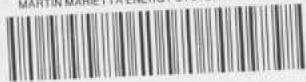

3445603532247

ORNL-1491

Chemistry-General

${6c}$

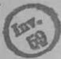

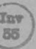

AEC RESEARCH AND DEVELOPMENT REPORT

CORROSION BY MOLTEN FLUORIDES

CENTRAL RESEARCH LIBRARY DOCUMENT COLLECTION

LIBRARY LOAN COPY

DO NOT TRANSFER TO ANOTHER PERSON

If you wish someone else to see this document, send in name with document and the library will arrange a loan.

OAK RIDGE NATIONAL LABORATORY

OPERATED BY

CARBIDE AND CARBON CHEMICALS COMPANY

A DIVISION OF UNION CARBIDE AND CARBON CORPORATION

UCC

POST OFFICE BOX P

OAK RIDGE. TENNESSEE

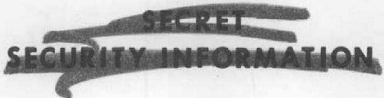

ORNL-1491

This document consists of 24 pages.

Copy 6 of 157 copies. Series A.

Contract No. W-7405-eng-26

METALLURGY DIVISION

# CORROSION BY MOLTEN FLUORIDES

Interim Report - September 1952

L.S.Richardson D.C.Vreeland

W. D. Manly

Experimental work carried out by

A.deS.Brasunas L.S.Richardson

R.B.Day D.C.Vreeland

E.E.Hoffman W.D.Manly

DATE ISSUED

MAR 17 1953

OAK RIDGE NATIONAL LABORATORY

operated by

CARBIDE AND CARBON CHEMICALS COMPANY

A Division of Union Carbide and Carbon Corporation

Post Office Box P

Oak Ridge, Tennessee

RESTRICTED DATA

This document contains Restricted Data as defined in Energy Act of 1946. Its transmitilal or the disclosure of in any manner to an unauthorized person is prohibited.

MARTIN MARIETTA ENERGY SYSTEMS LIBRARIES

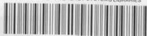

3445603532247

SECRET

SECURITY INFORMATION

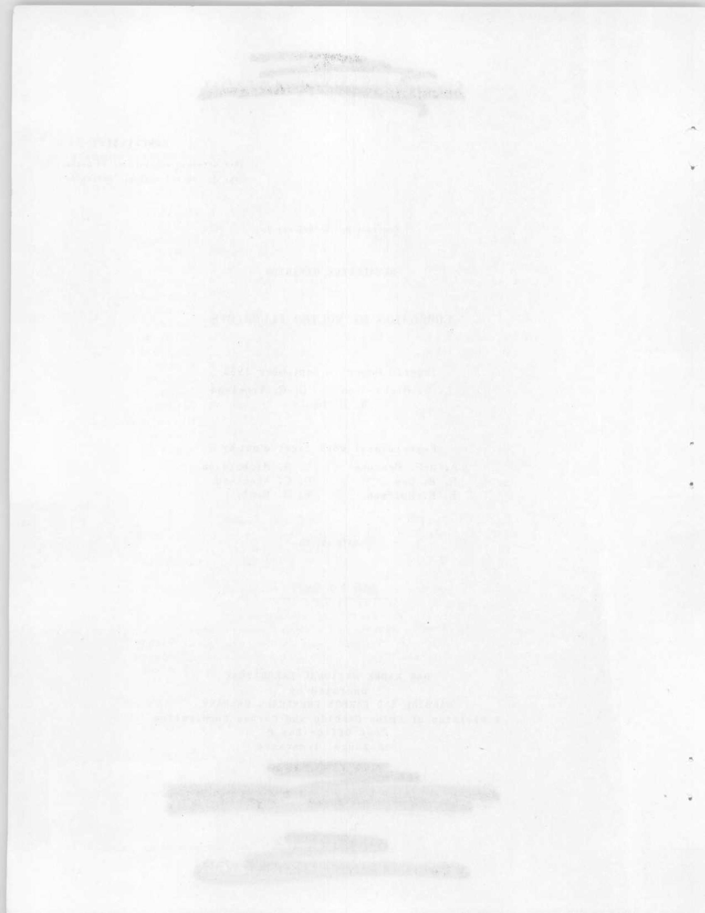

# INTERNAL DISTRIBUTION

1. C E. Center   
2. Biology Library   
3. Health Physics Library   
4. Metalurgy Library   
5. Reactor Experimental Engineering Library

6-7. Central Research Library

8-13. Central Files

14. C. E. Larson   
15.W.B.Humes (K-25)   
16. L. B. Emlet (I-12)   
17. A. M. Weinberg   
18. E. H. Taylor   
19. E. D. Shipley   
20. F. C. VonderLage   
21. R.C.Briant   
22. W.J.Fretague   
23. J.A.Swartout   
24. S. C. Lind

25. F. L. Steahly   
26. A.H.Snell   
27. A. Hollander   
28. M. T. Kelley   
29. K. Z. Morgan   
30. J. S. Felton   
31. A. S. Householder   
32. C. S. Harrill   
33. C. E. Winters   
34. D. S. Billington   
35. D. W. Cardwell   
36. E.M.King   
37. A.J.Miller   
38. D. D. Cowen   
39. P. M. Reyling   
40. L. S. Richardson   
41. D. C. Vreeland   
42. W.D.Manly

# EXTERNAL DISTRIBUTION

52. Armed Forces Special Weapons Project, Sandia   
53. Armed Forces Special Weapons Project, Washington   
54. Army Chemical Center

43. American Cyanamid Company, Watertown   
44-51. Argonne National Laboratory   
55-59. Atomic Energy Commission, Washington   
60. Battelle Memorial Institute   
61-63. Brookhaven National Laboratory   
64-65. California Research and Development Company   
66-67. Carbide and Carbon Chemicals Company (C-31 Plant)   
68-70. Carbide and Carbon Chemicals Company (K-25 Plant)   
71-74. Carbide and Carbon Chemicals Company (Y-12 Plant)   
75. Catalytic Construction Company   
76. Chicago Patent Group   
77. Chief of Naval Research   
78. Dow Chemical Company, Pittsburgh   
79. Dow Chemical Company, Rocky Flats

# RESTRICTED DATA

This document contains Restricted Data as defined in the Atomic Energy Act of 1946. Its transmittal or the disclosure of its contents in any manner to an unauthorized person is prohibited.

# SECRET

# SECURITY INFORMATION

80-84. duPont Company

85-87. General Electric Company (ANPP)

88-93. General Electric Company, Richland

94. Hanford Operations Office

95-98. Idaho Operations Office

99. Iowa State College

100-103. Knolls Atomic Power Laboratory

104-106. Los Alamos Scientific Laboratory

107. Mallinckrodt Chemical Works

108. Massachusetts Institute of Technology (Kaufmann)

109-111. Mound Laboratory

112. National Advisory Committee for Aeronautics, Cleveland

113. National Bureau of Standards

114. National Lead Company of Ohio

115. Naval Medical Research Institute

116. Naval Research Laboratory

117. New Brunswick Laboratory

118-119. New York Operations Office

120-121. North American Aviation, Inc.

122. Patent Branch, Washington

123. Rand Corporation

124. Savannah River Operations Office, Augusta

125. Savannah River Operations Office, Wilmington

126. Sylvania Electric Products, Inc.

127. Tennessee Valley Authority

128. U. S. Naval Radiological Defense Laboratory

129. UCLA Medical Research Laboratory (Warren)

130-133. University of California Radiation Laboratory

134-135. University of Rochester

136-137. Vitro Corporation of America

138. Western Reserve University (Friedell)

139-140. Westinghouse Electric Corporation

141-142. Wright Air Development Center

143-157. Technical Information Service, Oak Ridge

# RESTRICTED DATA

This document contains Restricted Data as defined in the Atomic Energy Act of 1946. Its transmittal or the disclosure of its contents in any manner to an unauthorized person is prohibited.

# SECRET

# SECURITY INFORMATION

# CORROSION BY MOLTEN FLUORIDES

L. S. Richardson D. C. Vreeland

W. D. Manly

# SUMMARY AND CONCLUSIONS

Both static and dynamic corrosion tests of metals in molten mixtures of alkali metal fluorides have been made by the Metallurgy Division in the past year. Evaluation of these tests has led to some definite conclusions as to the nature of corrosion by molten fluorides under certain test conditions.

The major form of attack by fluorides on Inconel results in the formation of voids which are either scattered uniformly throughout the area near the surface or appear preferentially at grain boundaries leading from the surface inward. It is believed that these voids are caused by depletion of one constituent (usually chromium), which leaves vacancies and precipitation of these vacancies (cf., Appendix). A thin, adherent film of $\mathrm{UO}_2$ forms at temperatures above $1200^{\circ}\mathrm{C}$ (and occasionally lower) and apparently inhibits the depletion of chromium. The rate of attack (as measured by depth of subsurface voids) decreases with time and levels off to a very slow rate after 500 hours. Prior heat treatment and the presence of small amounts of impurities in the metal apparently do not change the rate of attack appreciably. However, in some cases in which a very large grain size was induced by heat treatment, void formation was found to be localized at the grain boundaries and caused deeper but less extensive damage. Cold working the metal seems to have no effect. Addition of nickel and iron fluorides to the corroding medium was found to increase the corrosion, probably because of the reduction of these fluorides by chromium that entered the system from the container walls. The addition of small amounts of certain

materials to the molten fluoride mixture is, in some cases, effective in reducing corrosion. In general, metals high in the electromotive series (such as calcium, beryllium, and the alkali metals) reduce or entirely stop void formation, whereas metals that are relatively more noble (such as iron and silver) have no effect. The more active metals were so effective in minimizing corrosion that they are being used in the larger-scale testing program at the Y-12 site. Additions of zirconium, sodium, and titanium have been found to minimize corrosion in the thermal convection loops used in these tests. It is thought that the active metals minimize corrosion by reducing the availability of fluorine and/or oxygen to the structural metals.

Mass transfer effects are not so serious a problem in fluorides as in liquid metals or molten hydroxides. Metallic layers or crystals are noted with pure metals, and nonmetallic (sometimes partially $\mathrm{UO}_2$ ) films are often (though not always) noted with alloys. Metallic layers have been noted in Inconel in both thermal convection loops and seesaw tests.

# INTRODUCTION

One of the better ways of introducing fuel into a high-temperature reactor is through the use of uranium-bearing fused fluorides. The various metal fluoride systems are being investigated by the Materials Chemistry Division, and mixtures of the fluoride salts are being used in corrosion tests by the Materials Chemistry Division, the Experimental Engineering Group of the ANP Division, and the Metallurgy Division.

This report contains the results of tests made to date by the Metallurgy

# CORROSION BY

Division on the corrosion of metals by some of the fluoride mixtures. The tests were performed at $816^{\circ}C$ and two different types of tests were used. The major portion of the tests were run under static conditions in evacuated metal capsules. Other tests (seesaw tests) were run in tilting furnaces in which the liquid is cycled continually from the hot zone to the colder zone of evacuated capsules; a complete cycle is made every 13 seconds.(1) All tests were run with either fluoride mixture No. 2 (46.5 mole % NaF, 26.0 mole % KF, 27.5 mole % UF₄) or No. 14 (43.5 mole% KF, 44.5 mole% LiF, 10.9 mole% NaF, 1.1 mole% UF₄).

# EXPERIMENTAL PROCEDURE AND RESULTS

Static Test Loading Method. The most recent technique evolved at the Oak Ridge National Laboratory for the preparation of static tests is shown in Fig. 1. Tubing is loaded, with specimen and corrodant, in a dry box with a purified helium atmosphere and sealed with vacuum tape, as is seen in Part 3 of Fig. 1. After the tube is removed from the dry box, a vacuum is applied, as in Part 4, to break the vacuum tape; thus the material in the tube is not exposed to air. The tubing is then crimped twice (also shown in Part 4 of Fig. 1), and the bottom crimp is held in a vise while the top of the tubing is being welded, as shown in Part 5 of Fig. 1. It was found that a vacuum could not be held in the tubing unless the crimped portion was gripped in a vise during welding. Apparently the crimps will relax enough, unless gripped, to allow air to seep into the tube.

If the specimen tube is connected into a manifold when the vacuum tape is broken prior to welding, any type of atmosphere can be placed in the

tube by metering the proper gases through the manifold system. Unless otherwise mentioned in the text, all the tests reported were run with a vacuum in the capsule.

The specimen tubes used in the seesaw test were prepared in the same manner as those for the static tests.

Screening Tests. A series of screening tests of various materials in molten fluoride mixture No. 14 were made. These tests were made with dehydrated, unpretreated fluoride mixture for 100 hr at $816^{\circ}\mathrm{C}$ under static vacuum. The results of these tests are given in Table 1. Molybdenum, columbium, Monel,stellite No.25, and nickel plus $1 / 4\%$ zirconium alloy were apparently unattacked. All of the 300 series stainless steels tested (304 ELC, 309, 310, 317, 321, 347) were attacked to a depth of 1 mil or less, except types 304 ELC and 309, which were attacked to a depth of 2 mils. Four-hundred series stainless steels (only two types) were not attacked over 1 mil. Z nickel was the most severely attacked material of those tested, being affected to a depth of 5 mils. Figures 2 and 3 show typical samples of the types of attack observed.

A seesaw test run with nickel-1/4% zirconium alloy showed severe mass transfer effects. Figure 4 shows this test.

In Table 2 are shown the results of a few screening tests with fluoride mixture No. 2. A comparison of these results with those in Table 1 reveals that corrosive attack to approximately the same extent can be expected with both fluoride mixtures No. 2 and No. 14 in static tests.

Effect of Temperature on Corrosion. Tests on the effect of temperature have been run in both fluoride mixtures No. 2 and No. 14. Tables 3, 4, and 5 summarize the results of these tests. At temperatures below $1100^{\circ}\mathrm{C}$ , no significant effects can be noted that could not be caused by normal test

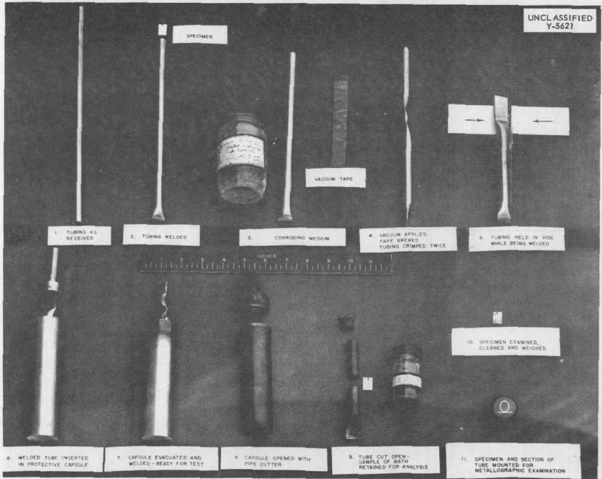  
Fig. 1. Loading and Testing Technique Employed for Static Corrosion Tests.

TABLE 1. CORROSION OF VARIOUS MATERIALS TESTED IN FLUORIDE MIXTURE NO. 14 AT ${1500}^{ \circ  }\mathrm{F}$ FOR 100 hr IN VACUUM   

<table><tr><td>MATERIAL</td><td>DEPTH OF METAL AFFECTED (mils)</td><td>METALLOGRAPHIC NOTES</td></tr><tr><td>Type 304 ELC stainless steel</td><td>2</td><td>Subsurface voids, some following grain boundaries, attack somewhat irregular</td></tr><tr><td>Type 309 stainless steel</td><td>2</td><td>Subsurface voids</td></tr><tr><td>Type 310 stainless steel</td><td>1</td><td>Subsurface voids</td></tr><tr><td>Type 317 stainless steel</td><td>1</td><td>Intergranular penetration</td></tr><tr><td>Type 321 stainless steel</td><td>0 to 1/2</td><td>Intergranular penetration</td></tr><tr><td>Type 347 stainless steel</td><td>1</td><td>Subsurface voids</td></tr><tr><td>Type 430 stainless steel</td><td>1</td><td>Slight intergranular penetration and de-carburization</td></tr><tr><td>Type 446 stainless steel</td><td>1</td><td>Subsurface voids</td></tr><tr><td>Nickel + 1/4% zirconium</td><td>0</td><td>No visible attack</td></tr><tr><td>Hastelloy B</td><td>0 to 1/4</td><td>Subsurface voids</td></tr><tr><td>Hastelloy C</td><td>2</td><td>Subsurface voids</td></tr><tr><td>Z nickel</td><td>5</td><td>Voids along grain boundaries</td></tr><tr><td>Stellite No. 25</td><td>0</td><td>No visible attack</td></tr><tr><td>Nichrome V</td><td>3</td><td>Subsurface voids, some following grain boundaries</td></tr><tr><td>Monel</td><td>0</td><td>No visible attack</td></tr><tr><td>Inconel</td><td>3</td><td>Subsurface voids, some following grain boundaries</td></tr><tr><td>Inconel X</td><td>1</td><td>Subsurface voids</td></tr><tr><td>Tantalum</td><td>1</td><td>Surface of specimen roughened</td></tr><tr><td>Columbium</td><td>0</td><td>Surface somewhat roughened</td></tr><tr><td>Globe iron</td><td>2</td><td>Surface of specimen very rough, thickness decrease indicates solution type of attack</td></tr><tr><td>Vanadium</td><td>1</td><td>Voids and intergranular penetration</td></tr><tr><td>Molybdenum</td><td>0</td><td>Surface somewhat roughened</td></tr></table>

TABLE 2. CORROSION OF VARIOUS MATERIALS TESTED IN FLUORIDE MIXTURE NO. 2 AT ${1500}^{ \circ  }\mathrm{F}$ FOR 100 hr IN VACUUM   

<table><tr><td>MATERIAL</td><td>DEPTH OF METAL AFFECTED (mils)</td><td>METALLOGRAPHIC NOTES</td></tr><tr><td>26% Mo-74% Ni</td><td>1/2</td><td>Subsurface voids</td></tr><tr><td>Molybdenum</td><td>0</td><td>No attack</td></tr><tr><td>Inconel</td><td>2</td><td>Subsurface voids</td></tr><tr><td>Type 310 stainless steel</td><td>1 1/2</td><td>Subsurface voids</td></tr><tr><td>Type 316 stainless steel</td><td>1</td><td>Subsurface voids</td></tr></table>

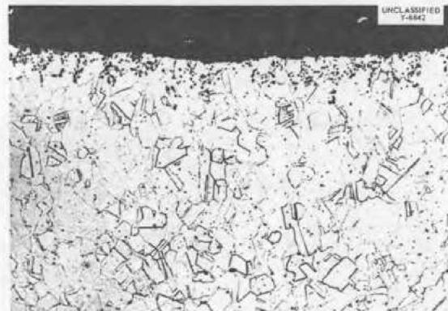  
TYPE 304LC

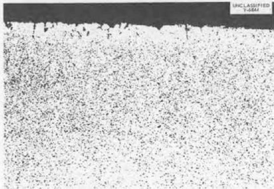  
TYPE 317

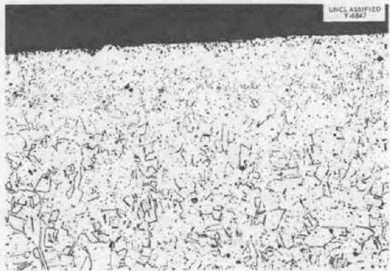  
TYPE 321

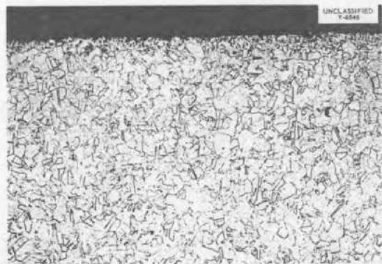  
TYPE 347

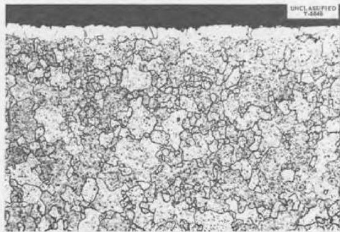  
TYPE 430

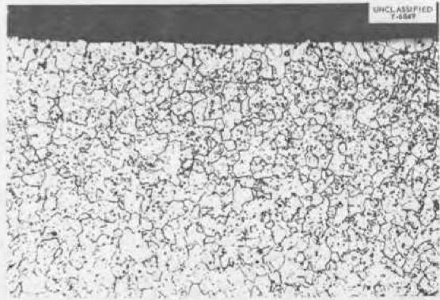  
TYPE 446   
Fig. 2. Static Corrosion Tests of Stainless Steels in Fluoride Mixture No. 14 for 100 hr at $1500^{\circ}\mathrm{F}$ . Original magnification 250x, reduced 58%.

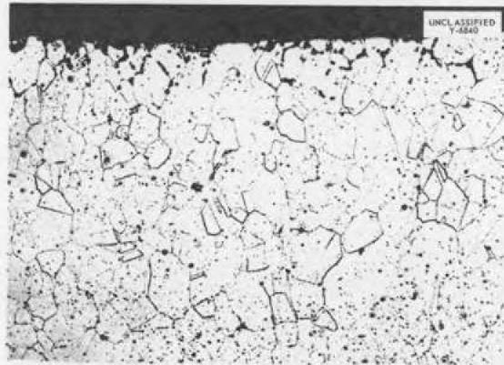  
INCONEL

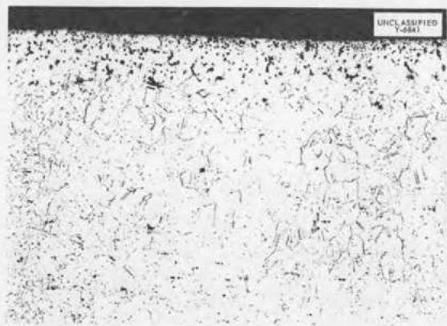  
NICROMEV

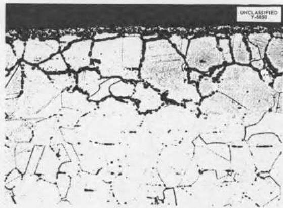  
Z NICKEL

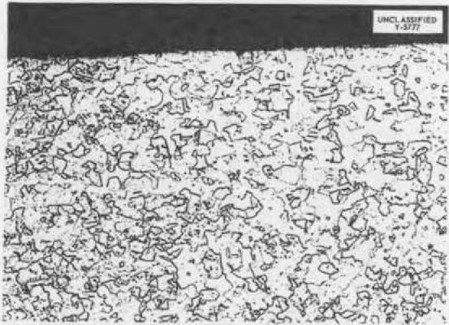  
NICKEL+4% ZIRCONIUM

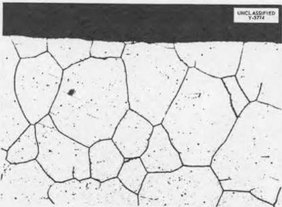  
STELLITE NO,25

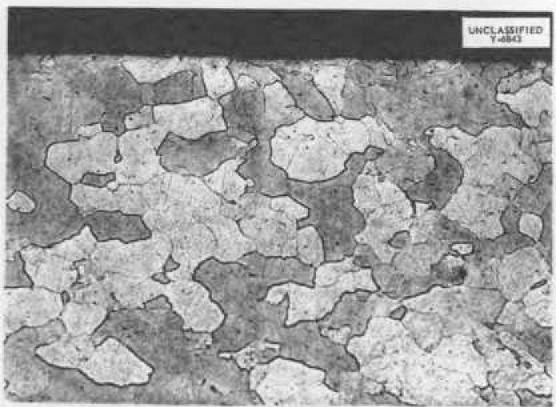  
MOLYBDENUM   
Fig. 3. Static Corrosion Tests in Fluoride Mixture No. 14 for 100 hr at $1500^{\circ}\mathrm{F}$ . Original magnification $250\mathrm{x}$ , reduced $58\%$ .

variations. However, at higher temperatures, corrosion is appreciably diminished. Analysis of the fluoride bath was made after these tests, and

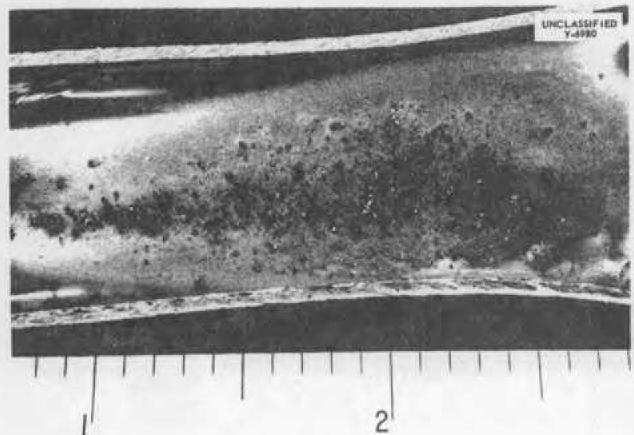  
Fig. 4. Cold End of Nickel-1/4% Zirconium Alloy Seesaw Test Specimen Run for 216 hr at a Hot-End Temperature of $798^{\circ}\mathrm{C}$ and a Cold-End Temperature of $610^{\circ}\mathrm{C}$ .

TABLE 3. MAXIMUM PENETRATION OF INCONEL TESTED IN FLUORIDE MIXTURE NO. 14 AT ELEVATED TEMPERATURES FOR 200 HOURS  

<table><tr><td>TEMPERATURE (°C)</td><td>MAXIMUM PENETRATION (mils)</td></tr><tr><td>800</td><td>3</td></tr><tr><td>900</td><td>1 1/2</td></tr><tr><td>1000</td><td>1</td></tr><tr><td>1100</td><td>1</td></tr><tr><td>1200</td><td>0.5</td></tr><tr><td>1300</td><td>&lt;0.5</td></tr></table>

the results are in good agreement with the metallographic data. After testing at $800^{\circ}\mathrm{C}$ , 1800 ppm of chromium was detected in the bath; at $1300^{\circ}\mathrm{C}$ only 65 ppm of chromium was found.

Figure 5 shows results obtained at different temperatures. Figure 6 shows the type of layer formed at temperatures of $1200^{\circ}\mathrm{C}$ and above. It is believed that this film acts as a barrier to the diffusion of chromium and thus prevents the formation of voids. X-ray-diffraction patterns of this film show it to be $\mathrm{UO}_2$ .

This test was repeated but the sample was first heated in fluoride mixture No. 14 at $1250^{\circ}\mathrm{C}$ for a long period of time and then tested at $816^{\circ}\mathrm{C}$ for 100 hr; at this temperature also, the layer inhibited corrosion. It might be mentioned that this is a very unreliable method of minimizing corrosion because the film might rupture and localize the corrosion in one region. The high-temperature heat treatment is also undesirable because it results in considerable grain coarsening that is detrimental from a corrosion standpoint and to the ability to form the metal. The formation of this film was dependent on the fluoride mixture, and such a film appeared only in the tests in which the fluoride mixture contained Na, Li, K, and U.

Effect of Time on Corrosion. A series of seesaw tests with Inconel was made over time intervals from 66 to 3000 hours. The results are summarized in Table 6. After about

TABLE 4. MAXIMUM PENETRATION IN STATIC TESTS OF MATERIALS IN FLUORIDE MIXTURE NO. 2 AT ELEVATED TEMPERATURES FOR 100 HOURS   

<table><tr><td rowspan="2">MATERIAL</td><td colspan="4">MAXIMUM PENETRATION (mils)</td></tr><tr><td>At 816°C</td><td>At 850°C</td><td>At 900°C</td><td>At 1000°C</td></tr><tr><td>Inconel</td><td>2</td><td>4</td><td>5</td><td>5</td></tr><tr><td>Type 310 stainless steel</td><td>1 1/2</td><td>2</td><td>4</td><td>3</td></tr><tr><td>Type 317 stainless steel</td><td>0</td><td>3</td><td>4</td><td>3</td></tr></table>

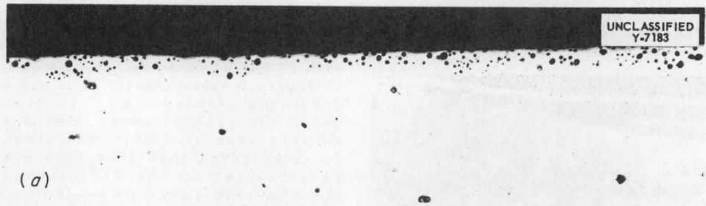

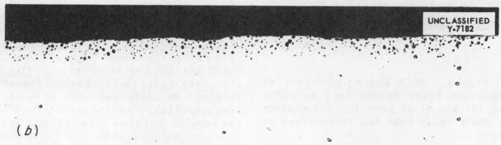

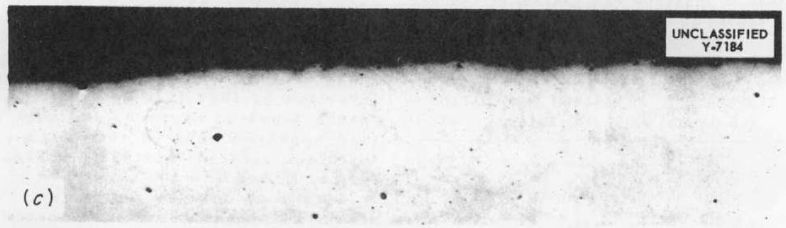

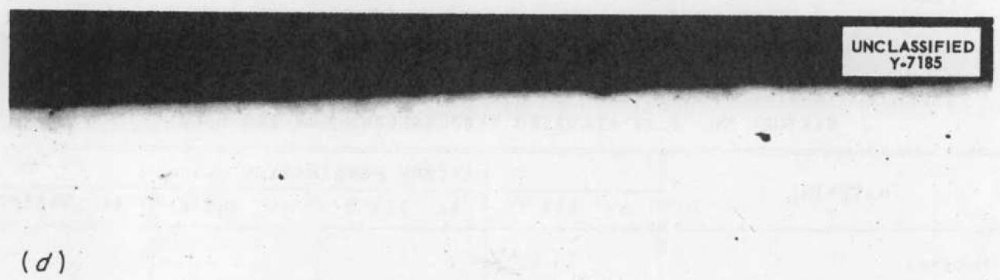  
Fig. 5. Attack on Inconel by Fluoride Mixture No. 14 at (a) 900, (b) 1000, (c) 1100, and (d) $1200^{\circ}\mathrm{C}$ in Static Test for 200 Hours. 250x.

TABLE 5. MAXIMUM PENETRATION IN STATIC TESTS OF MATERIALS IN FLUORIDE MIXTURE NO.14 AT ELEVATED TEMPERATURES FOR 100 HOURS   

<table><tr><td rowspan="3">MATERIAL</td><td colspan="8">MAXIMUM PENETRATION (mils)</td></tr><tr><td colspan="2">At 538°C</td><td colspan="2">At 704°C</td><td colspan="2">At 816°C</td><td colspan="2">At 1000°C</td></tr><tr><td>Specimen</td><td>Tube</td><td>Specimen</td><td>Tube</td><td>Specimen</td><td>Tube</td><td>Specimen</td><td>Tube</td></tr><tr><td>Inconel</td><td>Slight roughening</td><td>Slight roughening</td><td>4</td><td>1 1/2</td><td>1 1/2</td><td>3</td><td>3</td><td>3</td></tr><tr><td>Type 430 stainless steel</td><td>&lt; 1</td><td>&lt; 1</td><td>1/2</td><td>1/2</td><td>1/4</td><td>1/4</td><td></td><td>No attack</td></tr><tr><td>Type 304 stainless steel</td><td>&lt; 1</td><td>&lt; 1</td><td>2</td><td>1 1/2</td><td>2</td><td>2</td><td>1 1/2</td><td>1</td></tr><tr><td>Type 321 stainless steel</td><td>&lt; 1</td><td>&lt; 1</td><td>&lt; 1</td><td>&lt; 1</td><td>1/2</td><td>1/2</td><td>1 1/2</td><td>1 1/2</td></tr></table>

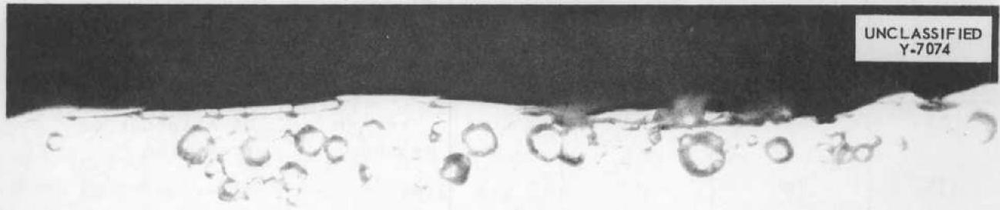  
Fig. 6. Layer Formed on Inconel at $1200^{\circ}\mathrm{C}$ by Exposure to Fluoride Mixture No. 14 in Static Test for 200 Hours. 1000x.

500 hr, the amount of additional attack is quite small. This is possibly due to saturation of the fluoride with chromium or the removal

of impurities in the fluorides. The test at 3000 hr had one small area of dense corrosion, that was 13 mils in depth.

# CORROSION BY

Effect of Cold Work on Corrosion. A series of cold-worked Inconel specimens was prepared with from 0 to $70\%$ reduction in thickness by rolling. These specimens were tested in fluoride mixture No. 14 for 100 hr at $815^{\circ}\mathrm{C}$ . No significant differences in behavior were noted. Another series of Inconel specimens was prepared with from 0 to $90\%$ cold work. No differences were noted in this series. Types 316 and 310 stainless

steel and Inconel were tested in fluoride mixture No. 2 in both the as-received and $20\%$ cold-worked condition. No appreciable differences were noted in these tests. Data from these tests are presented in Tables 7 and 8.

Addition of Inhibitors. A large number of both static and seesaw tests have been run with the addition of small percentages of other materials to the fluoride mixtures. In general,

TABLE 6. EFFECT OF TIME ON THE CORROSION OF INCONEL BY FLUORIDE MIXTURE NO.14 IN SEESAW TESTS   

<table><tr><td rowspan="2">TIME OF TEST (hr)</td><td colspan="2">TEMPERATURE (°C)</td><td colspan="2">METALLOGRAPHIC OBSERVATIONS</td></tr><tr><td>Hot Zone</td><td>Cold Zone</td><td>Hot Zone (depth of voids)</td><td>Cold Zone</td></tr><tr><td>66</td><td>810</td><td>620</td><td>1/2 mil, average 1 mil, maximum</td><td>No evidence of reaction</td></tr><tr><td>115</td><td>780</td><td>600</td><td>1 mil, average 2 mils, maximum</td><td>No evidence of reaction</td></tr><tr><td>210</td><td>780</td><td>630</td><td>2 mils, average 5 mils, maximum</td><td>No evidence of reaction</td></tr><tr><td>500</td><td>750</td><td>610</td><td>3 mils, average 7 mils, maximum</td><td>Metallic deposit 1/2 mil thick</td></tr><tr><td>750</td><td>815</td><td>620</td><td>3 1/2 mils, average 6 mils, maximum</td><td>Metallic deposit 1/2 mil thick</td></tr><tr><td>3000</td><td>800</td><td>560</td><td>4 mils, average 13 mils, maximum</td><td>Metallic deposit 1/2 mil thick</td></tr></table>

TABLE 7. EFFECT OF COLD WORK ON THE CORROSION OF INCONEL TESTED IN FLUORIDE MIXTURE NO.14 FOR 100 hr AT $815^{\circ}C$   

<table><tr><td>REDUCTION BY COLD-ROLLING (%)</td><td>WEIGHT LOSS (g)</td><td>DEPTH OF SUBSURFACE VOIDS (mils)</td><td>THICKNESS CHANGE</td></tr><tr><td>0</td><td>0.0020</td><td>1</td><td>0</td></tr><tr><td>5.5</td><td>0.0043</td><td>2</td><td>0</td></tr><tr><td>11.5</td><td>0.0036</td><td>1 1/2</td><td>0</td></tr><tr><td>26.0</td><td>0.0036</td><td>1 1/2</td><td>0</td></tr><tr><td>50.0</td><td>0.0023</td><td>1</td><td>0</td></tr><tr><td>71.0</td><td>0.0028</td><td>1</td><td>0</td></tr></table>

TABLE 8. EFFECT OF COLD WORK ON CORROSION OF STAINLESS AND INCONEL TESTED IN FLUORIDE MIXTURE NO. 2 FOR 100 hr AT ${815}^{ \circ  }\mathrm{C}$   

<table><tr><td>MATERIAL</td><td>COLD WORK (%)</td><td>PENETRATION (mils)</td></tr><tr><td rowspan="2">Type 316 stainless steel</td><td>As-received</td><td>1</td></tr><tr><td>20</td><td>2 1/2</td></tr><tr><td rowspan="2">Type 310 stainless steel</td><td>As-received</td><td>1 to 1 1/2</td></tr><tr><td>21</td><td>1/2 to 1 1/2</td></tr><tr><td rowspan="2">Inconel</td><td>As-received</td><td>1/2 to 2</td></tr><tr><td>26</td><td>1/2</td></tr></table>

active metals are effective in reducing corrosion and in many tests they stopped corrosion completely; other metal additions have no effect on the corrosion; the addition of chemical compounds often increases corrosion; however, many exceptions are noted. Tables 9 and 10 summarize the results of the seesaw and static tests.

In both types of tests, Na, Li, Ti, and Ca reduced corrosion. G. M. Adamson has found that additions of zirconium and titanium are quite beneficial in minimizing corrosion by fluoride fuels in Inconel thermal convection loops. Contradictory results were obtained on Zr, Mn, and Mg. The following tabulation classifies materials as those that have been beneficial and those that have not. It is thought that the Zr and Mn used in the seesaw tests were not thoroughly dried.

<table><tr><td>BENEFICIAL</td><td>NOT</td><td>BENEFICIAL</td></tr><tr><td>Na</td><td>Si</td><td></td></tr><tr><td>Be</td><td>Zn</td><td></td></tr><tr><td>Al</td><td>W</td><td></td></tr><tr><td>V</td><td>Fe</td><td></td></tr><tr><td>Cr</td><td>Ag</td><td></td></tr><tr><td>Li</td><td>NaI</td><td></td></tr><tr><td>Cu</td><td>KCl</td><td></td></tr><tr><td>NaH</td><td>KBr</td><td></td></tr><tr><td>Ca</td><td>MnO2</td><td></td></tr><tr><td>C</td><td>NiF2</td><td></td></tr></table>

TABLE 9. RESULTS OF ADDITIONS TO FLUORIDE MIXTURE NO. 14 IN CORROSION TESTS*   

<table><tr><td>ADDITION (0.25 wt %)</td><td>MAXIMUM</td><td>DEPTH OF (mils)</td><td>ATTACK</td></tr><tr><td>Na</td><td>0</td><td></td><td></td></tr><tr><td>Be</td><td>0</td><td></td><td></td></tr><tr><td>Mg</td><td>0</td><td></td><td></td></tr><tr><td>Al</td><td>0</td><td></td><td></td></tr><tr><td>Ti</td><td>0</td><td></td><td></td></tr><tr><td>V</td><td>0</td><td></td><td></td></tr><tr><td>Cr (2 tests)</td><td>0</td><td></td><td></td></tr><tr><td>Li (2 tests)</td><td>0</td><td></td><td></td></tr><tr><td>Cu</td><td>0</td><td></td><td></td></tr><tr><td>NaH</td><td>0</td><td></td><td></td></tr><tr><td>Ca</td><td>0</td><td></td><td></td></tr><tr><td>C</td><td>1</td><td></td><td></td></tr><tr><td>Si</td><td>2</td><td></td><td></td></tr><tr><td>Mo (3 tests)</td><td>1/2</td><td></td><td></td></tr><tr><td>Zn</td><td>4</td><td></td><td></td></tr><tr><td>W</td><td>3</td><td></td><td></td></tr><tr><td>Fe</td><td>3</td><td></td><td></td></tr><tr><td>Zr</td><td>4</td><td></td><td></td></tr><tr><td>Mn</td><td>4</td><td></td><td></td></tr><tr><td>Ag</td><td>4</td><td></td><td></td></tr><tr><td>NaI</td><td>8</td><td></td><td></td></tr><tr><td>KCl</td><td>10</td><td></td><td></td></tr><tr><td>KBr</td><td>10</td><td></td><td></td></tr><tr><td>KI</td><td>8</td><td></td><td></td></tr><tr><td>NaCl</td><td>8</td><td></td><td></td></tr><tr><td>LiIO3</td><td>10</td><td></td><td></td></tr></table>

*Seesaw tests run for 200 hr at $800^{\circ} \mathrm{C}$ ; material tested was Inconel.

TABLE 10. EFFECT OF VARIOUS ADDITIONS TO FLUORIDE NO. 14 IN STATIC CORROSION TESTS AT $816^{\circ}\mathrm{C}$ FOR 100 HOURS   

<table><tr><td>MATERIAL</td><td>ADDITION</td><td>DEPTH OF METAL AFFECTED (mils)</td><td>METALLOGRAPHIC NOTES</td></tr><tr><td rowspan="11">Inconel</td><td>2% Mg</td><td>5</td><td>Large voids in both specimen and tube</td></tr><tr><td>2% Zr</td><td>1</td><td>Surface layer 1 1/2 to 2 mils thick, 1/2 to 1 mil of attack beneath surface layer</td></tr><tr><td>10% Zr</td><td>1</td><td>1 1/2-mil surface layer on specimen and tube, subsurface voids to 1 mil under surface layer.</td></tr><tr><td>10% Na</td><td>0</td><td>No attack</td></tr><tr><td>1% Na</td><td>1/2</td><td>Specimen and tube have a few subsurface voids</td></tr><tr><td>10% U</td><td>1</td><td>1- to 2-mil surface layer</td></tr><tr><td>5% Li</td><td>1/2</td><td>1-mil surface layer</td></tr><tr><td>5% K</td><td>0</td><td>No attack</td></tr><tr><td>5% Ca</td><td>0</td><td>1/2-mil surface layer, no attack beneath surface layer</td></tr><tr><td>5% Ti</td><td>0</td><td>1/2-mil surface layer, no attack beneath it</td></tr><tr><td>5% Mn</td><td>0</td><td>No attack</td></tr><tr><td rowspan="9">Type 321 stainless steel</td><td>10% Zr</td><td>0</td><td>1/2-mil surface layer on specimen and tube, no attack beneath layer</td></tr><tr><td>10% Na</td><td>0</td><td>No attack</td></tr><tr><td>1% Na</td><td>0</td><td>No attack</td></tr><tr><td>10% U</td><td>0</td><td>2-to 3-mil surface layer, no attack under layer</td></tr><tr><td>5% Li</td><td>0</td><td>No attack</td></tr><tr><td>5% K</td><td>0</td><td>No attack</td></tr><tr><td>5% Ca</td><td>1/2</td><td>1/2-mil surface layer, attack to 1/2 mil beneath surface layer</td></tr><tr><td>5% Ti</td><td>0</td><td>No attack</td></tr><tr><td>5% Mn</td><td>1</td><td>Subsurface voids 1/2 to 1 mil</td></tr><tr><td rowspan="2">A-nickel</td><td>10% Zr</td><td>0</td><td>2 1/2-mil surface layer, no attack under layer</td></tr><tr><td>10% Na</td><td>0</td><td>1/2-mil surface layer, no attack beneath layer</td></tr><tr><td rowspan="3">Type 309 stainless steel</td><td>2% Mg</td><td>5</td><td>Subsurface voids, attack irregular in occurrence</td></tr><tr><td>2% Zr</td><td>0</td><td>No attack on specimen or tube, specimen has 1/2-mil surface layer</td></tr><tr><td>10% MnO2</td><td>4</td><td>Subsurface voids and intergranular penetration to 4 mils</td></tr><tr><td rowspan="5">Inconel</td><td>10% MnO2</td><td>9</td><td>Subsurface voids and intergranular penetration</td></tr><tr><td>10% CrF2</td><td>4</td><td>Subsurface voids</td></tr><tr><td>10% NiF2</td><td>7</td><td>Subsurface voids</td></tr><tr><td>10% FeF3</td><td>9</td><td>Subsurface voids</td></tr><tr><td>3 1/3% CrF2, 3 1/3% NiF2, 3 1/3% FeF3</td><td>2</td><td>Subsurface voids</td></tr></table>

```txt
Mo FeF3 Ti CrF2 Zr NaCl LiIO 
```

It is thought possible that the beneficial materials added may be acting to reduce the available amount of fluorine in the system, which would cause the atoms of the structural metals to go into solution. It is also possible that the beneficial additions act as oxygen getters.

The metal fluorides were added with the thought that perhaps a reaction of the following type might be the corrosion mechanism:

$$
A l k F + M e \xrightarrow {\longrightarrow} M e F + A l k,
$$

where Alk could represent Na, Li, or K and Me could represent Fe, Ni, or Cr. If this were the case, then additions of iron, nickel, or chromium fluorides and also sodium, lithium, or potassium should tend to drive the reaction to the left and help reduce corrosion. However, additions of iron, nickel, and chromium fluorides had no such effect in reducing corrosion. The addition of iron and nickel fluorides actually increased the corrosion; this is probably due to the reduction of the nickel and iron fluorides by the chromium that was removed from the container wall. Metallic sodium, lithium, and potassium did reduce corrosion; but, as mentioned above, their action is probably that of getters of oxygen and fluorine rather than that of taking part in the reaction.

The MnO additions were made to see whether oxygen added to these tests in this form would increase corrosion, and it did. The alkali halides were added to see whether the presence of other negative ions than fluoride would have an inhibiting effect, and they did not.

In many of the tests that were run with additions, surface layers were apparent on the specimens after test. The following tabulation gives the

combinations of containing metals and additions that resulted in surface layers. It is possible, of course, that in some cases in which surface layers were not observed, the layers may have been inadvertently cracked off during stripping.

<table><tr><td>ADDITION TO FLUORIDE BATH</td><td>CONTAINING METAL</td></tr><tr><td>Zr</td><td>Inconel</td></tr><tr><td>Zr</td><td>Type 309 stainless steel</td></tr><tr><td>Zr</td><td>Type 321 stainless steel</td></tr><tr><td>Zr</td><td>A Nickel</td></tr><tr><td>U</td><td>Inconel</td></tr><tr><td>U</td><td>Type 321 stainless steel</td></tr><tr><td>U</td><td>A Nickel</td></tr><tr><td>Ca</td><td>Type 321 stainless steel</td></tr><tr><td>Ca</td><td>Inconel</td></tr><tr><td>Ti</td><td>Inconel</td></tr><tr><td>Li</td><td>Inconel</td></tr></table>

The identity of the surface layers is not definitely established. In the case of zirconium additions in type 309 stainless steel, the surface layer was reported by x-ray to contain $\mathrm{UO}_2$ and $\mathrm{ZrO}_2$ . In other checks on these surface layers, $\mathrm{UO}_2$ is usually reported and, occasionally, unknown constituents are detected.

Effect of Heat Treatment and Carbon Content. Five tests with different heat treatments were made with Inconel, and no significant differences were noted. However, in tests in which the Inconel had been hydrogen-fired at temperatures up to $1200^{\circ}\mathrm{C}$ , which created a large grain size, attack has been observed to be more localized. The depth of attack was greater, but the total volume was less. Table 11 summarizes the tests run to determine the effect of heat treatment.

Mass Transfer in Molten Fluorides. Metallic deposits have been noted in seesaw tests with fluoride mixture No. 14 in Globe iron, A nickel, and in a nickel alloy containing $1 / 4\%$ zirconium. Very slight amounts of metallic deposits have been noted in a few Inconel tests. Thin (less than 0.5 mil) layers have been seen in the cold

TABLE 11. EFFECT OF HEAT TREATMENT OF INCONEL ON CORROSION BY FLUORIDE MIXTURE NO. 2 AT $815^{\circ}C$ FOR 100 hr IN STATIC TEST   

<table><tr><td>HEAT TREATMENT</td><td>DEPTH OF SUBSURFACE
VEOID (mils)</td></tr><tr><td>Water-quenched from 2100°F</td><td>1/2 to 2</td></tr><tr><td>Furnace-cooled from 2100°F</td><td>1/2 to 1 1/2</td></tr><tr><td>Water-quenched from 2100°F, reheated to 1600°F for 24 hr, and water-quenched</td><td>1/2 to 3 1/2</td></tr><tr><td>Furnace-cooled from 2100 to 1600°F, held for 24 hr, and water-quenched</td><td>1/2 to 1</td></tr><tr><td>Heated to 1600°F, held for 24 hr, and water-quenched</td><td>1/2 to 3 1/2</td></tr></table>

legs of thermal convection loops with both Inconel and stainless steels.

Deposition of a nonmetallic layer occurs in the cold zone of many seesaw tests, thermal convection loops, and in some static tests. This coating is quite thin, being less than 1 mil in all cases except with the additions of zirconium and uranium. The film

apparently has an inhibiting effect on mass transfer, and has been found by x-ray-diffraction studies of several tests to be composed of $\mathrm{UO}_2$ and an unknown constituent or constituents.

The small amount of mass transfer occurring in these tests is not believed to be a problem except in the case of pure metals.

# APPENDIX

# SUBSURFACE VOID FORMATION IN METALS DURING HIGH-TEMPERATURE CORROSION TESTS

A. deS. Brasunas

Inconel and similar alloys have been observed to be susceptible to subsurface void formation during processes involving chromium depletion of the surface zone by any of the following methods:

1. leaching with certain molten salts,  
2. high-temperature vacuum treatment,  
3. high-temperature oxidation.

Porosity in metals has been observed previously in diffusion experiments $^{(1,2,3)}$ and is attributed to the uneven diffusion rates of different metal atoms through a metal lattice. Although similar observations have not previously been reported in corrosion studies, their occurrence should not be too surprising. (Voids have been reported $^{(4,5)}$ in the oxide layers of metals and alloys undergoing oxidation in air. Under these conditions, metal ions diffuse outward more rapidly than oxygen ions can diffuse inward through the oxide layer.) Alloys are known to change in composition in the surface regions because of the higher reactivity of certain alloy constituents at the metal interface. Such depletion without adequate replacement of removed atoms causes vacancies, which may "precipitate" to form visible voids. Although undesirable, this form of corrosion is not as damaging as some and could be tolerated in certain instances.

Corrosion in Molten Fluoride Salts. Corrosion tests in which fused alkali metal fluoride salts (fluoride mixture No. 14) come into contact with chromium-bearing alloys such as Inconel at temperatures above $1300^{\circ}\mathrm{F}$ have resulted in the formation of a porous surface layer, as illustrated in Figs. Al and A2. Although it is fully recognized that in many cases voids have been observed metallographically because (1) particles have been physically removed during polishing, (2) certain phases may react with water and dissolve, or (3) etch pits can result, it seemed nevertheless probable that these may be true voids. Careful polishing by using nonaqueous techniques has failed to show any difference in the appearance of the porous surface region of the metal specimens in the etched or unetched conditions. Chemical analyses of the metal surface before and after testing have indicated only one significant change; there was an appreciable drop in the chromium content from about $15\%$ to about $5\%$ . The analysis of the fluoride salt bath showed correspondingly higher chromium-to-iron and chromium-to-nickel ratios than would result from uniform attack of the alloy. This clearly establishes the selective removal of chromium.

Supplementary Data. The saturation of the fluoride salt with chromium prior to testing was effective in suppressing void formation in tests that would otherwise have resulted in voids to a depth of several mils. Furthermore, the measured area of voids observed agrees very closely with the amount calculated on the basis of the change in chemistry of the metal surface mentioned above.

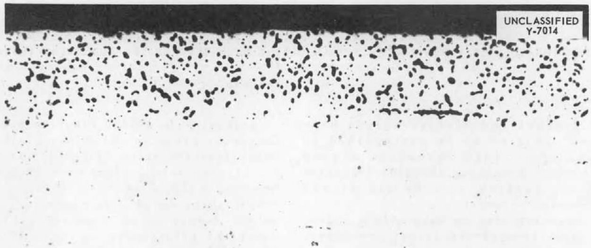

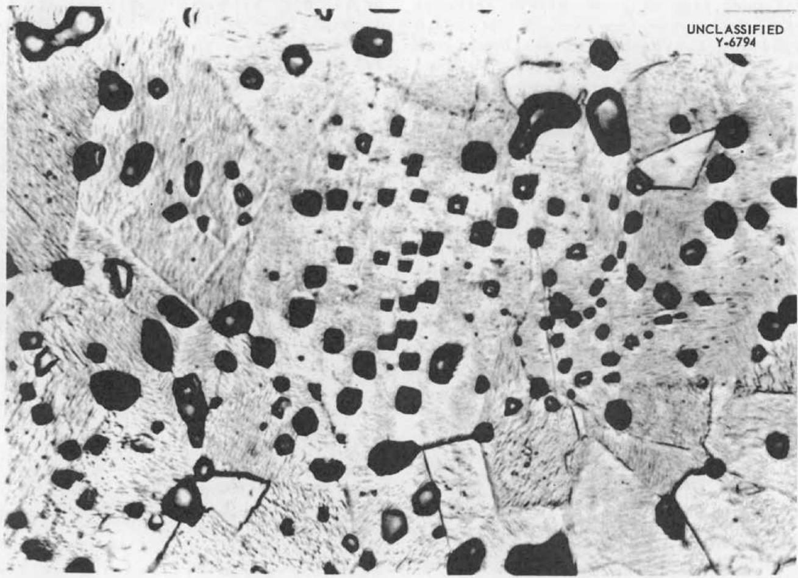  
Fig. A1. Subsurface Voids Usually Encountered After Inconel or Stainless Steels Contact Molten Alkali Fluoride at Temperatures of About $816^{\circ}\mathrm{C}$ for 100 Hours. Inconel, unetched, 250x.   
Fig. A2. Appearance of Subsurface Voids at High Magnification. Etched, 2000x.

This computation assumes no overall volume change of the specimen.

If voids are caused by chromium depletion, as these experiments indicate, then voids should also be observed when loss of chromium is effected by other means. Therefore two methods were tried; the first technique involved high-temperature vacuum treatment and the second involved high-temperature oxidation. Both attempts were successful and will be described briefly.

High-Temperature Vacuum Treatment. The high vapor pressure of chromium relative to that of iron or nickel suggests that high-temperature vacuum treatment would also be a suitable means of producing a chromium gradient. Specimens of Inconel and an $80\%$ Ni-20% Cr alloy were exposed to a vacuum of 0.1 mm Hg for 42 hr at $1375^{\circ}\mathrm{C}$ and then furnace-cooled. Both samples showed many subsurface voids; the voids in Inconel appeared to be spherical, whereas those in the $80\%$ Ni-20% Cr alloy were angular. These are shown in Fig. A3.

High-Temperature Oxidation. It is well known that chromium-bearing alloys have good high-temperature oxidation resistance that can be attributed to the formation of a chromium-rich, diffusion-resistant oxide phase on the surface of the alloy. The chromium in the oxide phase is supplied by the surface and the underlying regions of the specimen, which would tend to be partially depleted of chromium.

An Inconel specimen was therefore exposed to air at $1250^{\circ}\mathrm{C}$ for 200 hours. After oxidation, metallographic examination revealed the usual oxide layer on the surface and in the adjacent grain-boundary areas. In addition, subsurface voids were observed as anticipated; these are shown in Fig. A4.

Theoretical Considerations. The tests just described strongly indicate that void formation is caused by

chromium depletion. The formation of cavities large enough to be resolved by an ordinary microscope is visualized to occur as illustrated schematically in Fig. A5. As chromium is leached from the surface of the metal, a concentration (activity) gradient results that causes chromium atoms from the underlying region to diffuse toward the surface and leave behind a zone enriched with vacancies, as shown in the center sketch of Fig. A5. These vacancies can agglomerate at suitable sites and become visible as voids.

A certain number of vacancies can be tolerated in crystal lattices of solid metals, and such imperfections are believed to exist in practically

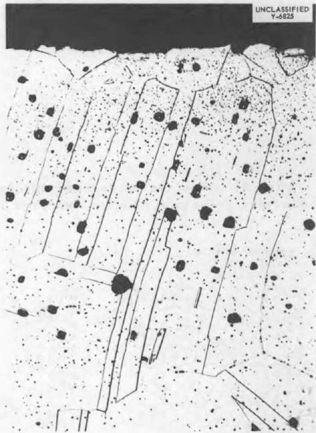  
Fig. A3. Section of $80\%$ Ni- $20\%$ Cr Alloy After 42-hr Exposure to Vacuum at $1375^{\circ}C$ . Void shape bears some relationship to twin lines; note similarity to Fig. A2. Etched. Original magnification $250\times$ , reduced $32\%$ .

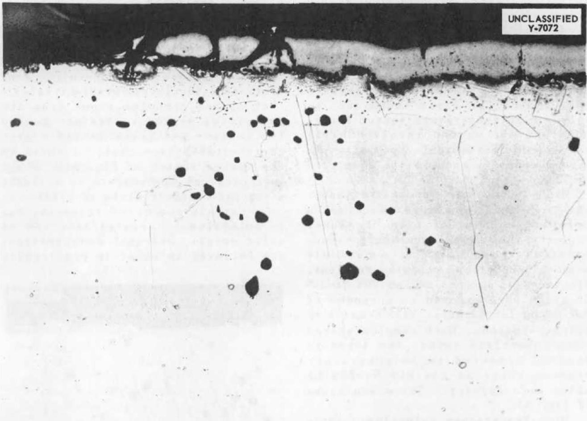  
Fig. A4. Section of Inconel Specimen After 200-hr Exposure to Air at $1250^{\circ}$ C. Note void formation beneath oxidized region. Unetched, 250x.

C CHROMIUM ATOM   
IFRONATOM   
N NICKEL ATOM

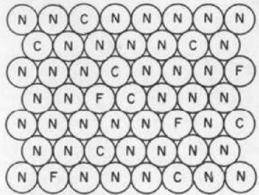  
BEFORE LEACHING

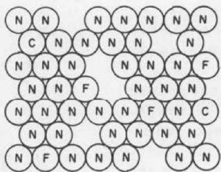  
VACANCIES CAUSED BY LEACHING

UNCLASSIFIED

DWG.16322

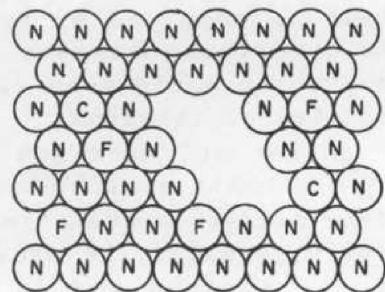  
VACANCIES PRECIPITATED   
Fig. A5. Mechanism of Subsurface Void Formation.

all solid metals, the amount increasing with increasing temperature. Furthermore, they can also be generated at surfaces, grain boundaries, inclusions, dislocations, and other possible crystal defect areas. One of the mechanisms of diffusion is therefore visualized as taking place by the movement of these vacancies; that is, neighboring atoms move to occupy vacant sites which give the illusion of vacancy movement in the opposite direction.

For the sake of clarity none of the existing "tolerated" vacancies are shown in Fig. A5, although they must be assumed to be present at all times. The left sketch shows the Fe, Ni, and Cr atoms arranged at random as one may expect to find them on the lll plane of an Inconel specimen. After selective diffusion of chromium has occurred by any of the test conditions described (from about 15 to $5\%$ ), vacancies must result if these vacant lattice sites are not filled by diffusion of nickel or iron atoms from the surface proper. If the lattice had been "saturated" with vacancies, then these additional ones are not "tolerated" and must "precipitate" as shown in the sketch at the right in Fig. A5. For ease of illustration, only six atoms are shown to have precipitated to form a void; the number of missing atoms in voids actually observed in these experiments is of the order of $10^{12}$ .

The voids shown in Fig. A3 are of two sizes. The larger ones are believed to have occurred at temperature in the usual manner, whereas in the case of the smaller ones, it is interesting to visualize them as having occurred on cooling. Rough approximations of vacancy densities at several temperatures based on the formula of Mott and Gurney indicate that such a theory is not improbable. Hence, it may be assumed that there is a temperature coefficient of "solubility" for vacant atoms such as there is for foreign atoms.

Conclusions. In reactions in which the net effect of the diffusion involved is essentially monodirectional, there is a movement of mass that results in a change in density and/or shape of that portion of the specimen. If the concentration of vacancies left behind is greater than some critical value, they will tend to collect at suitable locations and appear as visible voids. Such diffusion phenomena have been observed on a number of occasions when bimetallic (i.e., metal-metal) diffusion couples were studied.(1,2,3) It has been demonstrated that identical effects can be obtained in metall-liquid and metal-gas systems in which similar diffusion phenomena occur.

SECRET

SECURITY INFORMATION