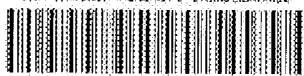
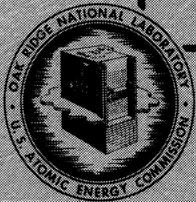
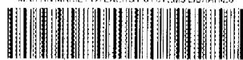

MAHIN MAREETTA ENERGY SYSTEMS LIBRARIES

3 4456 03532158

ORNL 1495

Chemistry

GENERAL INFORMATION

CONCERNING HYDROXIDES

（一）《关干变更部分募投项目及延期的议案》

1012A

2.8.1.8

UPRACY LOAN COPY

1.2023年1月14日

I you wckl sany

1

OAK RIDGE NATIONAL LABORATORY

OPERATED BY

CARBIDE AND CARBON CHEMICALS COMPANY

A. DIVISION OF UNION CABLE AND CABLE CONNECTION

POST OFFICE BOX P

OAK HIDGE TENNEBEEK

ORNL 1495

This document consists of 23 pages.

Copy 4 of 353 copies. Series A.

Contract No. W-7405-eng-26

AIRCRAFT NUCLEAR PROPULSION DIVISION

GENERAL INFORMATION CONCERNING HYDROXIDES

Mary E. Lee

DATE ISSUED

21 38

OAK RIDGE NATIONAL LABORATORY

Operated by

CARBIDE AND CARBON CHEMICALS COMPANY

A Division of Union Carbide and Carbon Corporation

Post Office Box P

Oak Ridge, Tennessee

MAHIN MARIETTA ENERGY SYSTEMS LIBRARIES

3 4456 03532158

# ORNL 1495 Chemistry

# INTERNAL DISTRIBUTION

1. C. E. Center   
2. Biology Library   
3. Health Physics Library   
4-5. Central Research Library   
6. Reactor Experimental Engineering Library   
7-12. Central Files   
13. C. E. Larson   
14. W. B. Humes (K-25)   
15. L. B. Emlet (Y-12)   
16. A. M. Weinberg   
17. E. H. Taylor   
18. E. D. Shipley   
19. R.C. Briant   
20. F. C. VonderLage   
21. J. A. Swartout   
22. S. C. Lind   
23.F.L.Steahly   
24. A. H. Snell   
25. A. Hollander   
26. M. T. Kelley   
27. G. H. Clewett   
28. K. Z. Morgan   
29. J. S. Felton   
30. A. S. Householder   
31. C. S. Harrill   
32. C: E. Winters   
33. D. W. Cardwell   
34. E. M. King   
35. A. J. Miller

36. D. D. Cowen

41. E.S. Bettis   
42. A. P. Fraas   
43. L. A. Mann

46. H. W. Savage   
47. W. K. Ergen

37-40.M.E.Lee   
44-45. H. F. Poppendiek   
48-53.W.R.Grimes   
54-55.F.Kertesz   
56. M. A. Bredig   
57. W. D. Manly   
58. E. G. Bohlmann   
59. J. L. English   
60. C. D. Susano   
61. Frances Sachs   
62. Elizabeth Carter   
63. C. H. Secoy   
64. E. Wischhusen   
65. J. Courtney White   
66. J. P. Blakely   
67. G. M. Adamson   
68. W. K. Anderson   
69.W.L.Harwell   
70. G. P. Smith   
71. J. V. Cathcart   
72. D. C. Vreeland   
73. E. E. Hoffman   
74-97. ANP Reports Office

# EXTERNAL DISTRIBUTION

98-101. T. W. Laughlin, AEC, Oak Ridge   
102-353. Given distribution as shown in TID-4500 under Chemistry Category.

# ABSTRACT

This report is an addition to ORNL-1291. It includes abstracts taken from Chemical Abstracts (Sec. 4, 1952, through Sec. 22, 1952) containing information concerning the hydroxides of barium, calcium, cesium, lithium, magnesium, potassium, rubidium, sodium, and strontium.

CA 44, 3780g

Ethanol-Alkaline Hydroxide-Water Systems  
Giorgio Peyronal (Univ. Milano, Italy)  
Gazz. chim. ital. 79, 792-9(1949)

The zones of immiscibility of aq. alc. solns. of KOH and NaOH at $17^{\circ}$ , $30^{\circ}$ , $60^{\circ}$ , and $90^{\circ}$ were studied. KOH and NaOH showed considerably different behavior. In the aq. stratum, NaOH showed at satn. at all temps. a greater degree of hydration than did KOH. This is contrary to their behavior in pure aq. solns., and is explained by traces of EtOH, which break the mol. assocn. of the NaOH. In pure satd. aq. solns., these bonds between NaOH $\cdot$ 2 H $_2$ O groups are stable at room temp. At $17^{\circ}$ , satd. solns. of NaOH are in equil. with the phase 3 NaOH $\cdot$ (3) H $_2$ O $\cdot$ EtOH, where only the No. (3) of the H $_2$ O mols. is uncertain. Correspondingly satns. of KOH are in equil. with the phase KOH $\cdot$ 2 H $_2$ O. In the upper alc. strata, there is for NaOH an extension of the zone of the immiscibility which increases with rise in temp. for both systems, but more strongly for NaOH than for KOH. This is explained by a breakdown of the NaOH-EtOH assocn., which is affected more by temp. than is the EtOH-KOH assocn. However, with KOH, this scission takes place at $60^{\circ}$ , because solid KOH $\cdot$ 2 EtOH m. at this temp. and forms 2 strata. Between $60^{\circ}$ and $90^{\circ}$ no further dissocn. is evident, whereas, with NaOH, dissocn. continues progressively from $60^{\circ}$ to $90^{\circ}$ . The results explain the different behaviors of NaOH and KOH in concd. solns. contg. org. compds. with COO groups or OH groups, and the greater tendency of NaOH to form addn. compds.

CA 44, 4641g

Correlating Viscosities. Caustic Soda Solutions Donald F. Othmer and Salvatore J. Silvis (Polytech, Inst., Brooklyn, N.Y.) Ind. Eng. Chem. 42, 527-8(1950)

When the viscosity of NaOH solns. is plotted against the viscosity of a reference material (water) at the same temp. on log paper, straight lines are obtained. A nomograph is constructed from this plot which permits detg. the viscosity of NaOH solns. from $0 - 50\%$ by wt. and from O to $100^{\circ}$ in temp.

CA 44, 464e

Solutions Containing Sodium Hydroxide  
N. V. Koninklijke Nederlandsche Zoutindustrie  
Brit. 632,081, Nov. 16, 1949

See Dutch 61,090 (CA 42, 4724b)

CA 44, 5201h

Heat Content of Anhydrous Sodium Hydroxide  
Richard E. Hulme  
Chem. Eng. 57, 139-41(1950)

Results of a survey of foreign literature giving data, for the first time in English, on the sp. heat of solid and molten NaOH.

CA 45, 5464h

The Practical Calculation of the Heat-Transmission Coefficient of Liquids  
J. Boehm (German Tech. Univ., Prague)  
Arch. ges. Warmetech. I, 209-14(1950)

Formulas are derived that permit more exact calcns. for heat exchangers and similar app. and take into account the Reynolds, Nusselt, Prandtl, Peclet, and Crashof nos. The heat transmission for practical conditions can be expressed by a factor $Z = K(\rho c_p)^m / \lambda^{m-1}$ . The values of the quantities on the right side are given in curves as function of temp., and Z was detd. for several liquids used industrially; these values are (av. values): H₂O 1760, CaCl₂ soln. (29.9%) 1360, MgCl₂ soln (20.9%) 1345, NaCl soln. (23%) 1520, Na₂CO₃ soln. (200 g./l.) 1785, NaOH soln. (250 g./l.) 1905, NH₃ 1375, H₂SO₄ (60% SO₃) 1000, MeCl 540, Freon 12,300, acetone 235, C₆H₆ 210, BuOH 220, MeOH (100%) 285, and EtOH (100%) 220. The heat transmission in kcal./sq.m.hr.degree is then calcd. from a = Z(1/v^n-m)w^ndn-l, where Z is the value given above, v is the kinematic viscosity in sq. m./hr., and d is the diam. in m, m and n are consts., w is the velocity in m./hr.

CA 45, 6036e

Low-Temperature Heat Capacities of Inorganic Solids. VII. Heat Capacity and Thermodynamic Functions of Lithium Oxide. Thermodynamics of the $\mathsf{Li}_2\mathsf{O - H}_2\mathsf{O}$ System. H. L. Johnston and T. W. Bauer J. Am. Chem. Soc. 73, 1119-22(1951)

The heat capacity of $\mathrm{Li}_{2}\mathrm{O}$ was measured over the temp. range 16 to $304^{\circ}\mathrm{K}$ . Graphic integration of the heat-capacity curve yielded $9.06 + 0.03$ cal./ mole/degree for the entropy at $25^{\circ}$ . When the entropies of $\mathrm{LiOH}$ and of steam were also considered, the curve yielded a $\Delta S^{\circ}$ value of $33.70 + 0.12$ e.u. for the dissocn. reaction 2 $\mathrm{LiOH} = \mathrm{Li}_{2}\mathrm{O} + \mathrm{H}_{2}\mathrm{O}$ (gas). This latter value is in good agreement with the value 33.85 obtained from the dissocn. equil. and confirms the application of the 3rd law of thermodynamics to $\mathrm{Li}_{2}\mathrm{O}$ . A table of thermodynamic functions for $\mathrm{Li}_{2}\mathrm{O}$ was prepd. for smoothed values of temp. Heats and free energies of formation were

computed for LiOH, LiOH $\cdot$ H $_2$ O, and Li $_{2}$ O, by combining their entropies with heat-of-soln. and vapor pressure data. Values of ΔF85 are: -105,676 ± 130, -163,437 ± 160, and -133,965 ± 210 cal./mole, resp.; of ΔH $_{25}$ are: -116,589 ± 90, -188,926 ± 120, and -142,567 ± 160 cal./mole, resp. The standard-state entropy of the Li ion at $25^{\circ}$ was calcd. as 2.46 ± 0.34 e.u. and the standard electrode potential of Li as 3.0383 ± 0.0010 international volts.

CA 45, 8353e

Investigation of the Hydrogen Bond of Aqueous Solutions of Hydroxides by the Method of Combination Scattering of Light  
M. I. Batuev  
Doklady Akad. Nauk S.S.S.R. 59, 715-18(1948)

In the spectra of highly concd. aq. solns. of KOH and NaOH (40 wt.-%) there appears on the short-wave edge of the wide H2O band a sharply prominent, although somewhat broadened line at 3630 cm. -1. This line gradually fades with decreasing concn. (down to 0.5 wt.-%) and disappears. In its place a faint band appears at about 3950 cm. -1. These findings indicate that the quasicryst. structure is present in concd. solns. and is destroyed with increasing diln. and dissocn. The OH ion forms H bonds even in cryst. and quasicryst. lattices; therefore, it is not a free ion. The high-frequency OH- band is absent in the spectrum of pure, distd. water kept in quartz vessels. The different chem. nature of the OH groups of acids and of bases is apparent from the fact that the optical evidence of the H bond appears at a higher frequency in bases (4200-3600 cm. -1) than in acids (3600-2800 cm. -1).

CA 46, 80b

Stress Corrosion Cracking in Alkaline Solutions. Report of Technical Practices Committee SC--Subsurface Corrosion by Alkaline Solutions H. W. Schmidt, P. J. Gegner, G. Heinemann, C. P. Pogacar, and E. H. Wyche Corrosion 7, 400 (1951)

The Passivating Characteristics of the Stainless Steels  
W. G. Renshaw and J. A. Ferree  
Corrosion 7, 400-1 (1951)

In all of the expts. relating to air passivation, specimens were held in air except at the instant when potential measurements were made. Where passivation in $\mathsf{HNO}_3$ , $\mathsf{H}_3\mathsf{PO}_4$ , or $\mathsf{NaOH}$ soln. was involved, specimens were continuously held in these solns. after activation. Potential measurements do not necessarily reflect practical experience in every case. The measuring equipment used is described, a wiring diagram is given for the vacuum tube voltmeter, and further details of the tests. For general corrosion resistance there is no better passivating agent than air, but the surface must be clean and free from scale before passivation. This is secured by the usual pickling treatment or by treatment with $20\%$ warm $\mathsf{HNO}_3$ soln. Stainless steel is not usually recommended unless the corrosive medium handled is capable of promoting and maintaining a passive surface on the metal during service.

CA 46, 318d

The Adsorption of Molecules of Sodium Hydroxide, Sodium Chloride, and Sodium Citrate by Sodium Montmorillonite  
F. Kayser, J. M. Bloch, and G. Gommery  
Bull. soc. chim. France 1951, 462-5

Montmorillonite previously satd. with Na adsorbed approx. 75 millimoles of NaOH per 100 g. of the mineral clay. The NaOH is removed by repeated washing with doubly distd. H2O, and is held by van der Waals forces. NaCl and Na citrate are not adsorbed by the clay.

CA 46, 1726e

Sodium Hydroxide from Sodium Sulfate by Using Iron Oxide or Hydroxide  
Catalyst  
Yoshihiko Okae  
Japan. 180,137, Sept. 6, 1949

An equiv. amt. of C to reduce $\mathrm{Na_2SO_4}$ to $\mathrm{Na_2S}$ is heated with FeO or $\mathrm{Fe(OH)_2}$ while superheated steam is passes through for the reaction $\mathrm{Na_2S + FeO + H_2O \longrightarrow FeS + 2 NaOH}$ .

Dialysis of Caustic Soda Solutions

R. D. Marshall and J. Anderson Storrow (Coll. Technol., Manchester, Engl.) Ind. Eng. Chem. 43, 2934-42(1951)

Concn. distributions were measured in the continuous countercurrent dialysis of 20 wt.% NaOH in order to assess the mass transfer in terms of dialysis coefficients. appropriate to specific positions along the contact path. For design purposes it is adequate to use an over-all coeff. based on the logarithmic mean of the terminal concn. differences between the lye and water cells. It was shown that the reduction of relative resistance to transfer in the liquor films and in the membrane will increase the over-all dialysis coeff.

CA 46, 2431d

Caustic Alkali by Electrolysis

G. Passelecq

Fr. 963,354, July 6, 1950

Chlorides of alkali metals, made as pure as possible, are electrolyzed in aq. soln. in an app. consisting of a small cell (A) having graphite anodes, an anode of Hg-Na amalgam having at least $1\%$ Na, and an aq. soln. of the pure chloride as electrolyte, and a much larger cell which is divided into two parts, (B) and (C). An anode of graphite in aq. chlorides is in (B), and an Fe cathode in NaOH soln. is in (C), which is 2, 3, or 4 times larger than (B). The amalgam passes by gravity from (A) to (B) to (C), a weir lying between (B) and (C) so that (C) gets an amalgam of the highest Na content, and the amalgam in (C) is spread over as large an area as possible. A pump passes the amalgam from (C) to (A). The cell (B-C) runs at 10,000 amp. and 2.8-2.9 v.; (C) at 300-500 amp. and 4 v.

CA 46, 2763g

Caustic Soda from Lime and Sea Water

Yoshio Okayama

Japan. 172,643, May 9, 1946

CaO 300 g. is hydrated with 500 ml. H₂O at 50°, and H₂S is passed in for 10 hrs. to obtain Ca(SH)₂ (I), (450 ml. 41%). I 200 ml. is mixed with 300 g. Na zeolite (II) at 50-60° for 2-3 hrs., filtered, and the filtrate is treated with the same amt. of II. The filtrate contains 24.5% NaSH (III). To 100 ml. III 60 g. Fe(OH)₃ and 6 g. powd. Al₂O₃ are added with agitation at 40-60° for 30 min., and the mixt. is filtered to yield 90 ml. 11.2% NaOH. The ppt. of Fe₂S₃ is washed free

CA 46, 2763g

(Cont'd)

of alkali, made slightly acid, and boiled with water to recover $\mathsf{Fe(OH)}_3$ . Ca zeolite is regenerated to II by passing sea water through it.

CA 46, 27631

Treatment of Caustic Soda Cell Liquor

Vernon A. Stenger (to Dow Chemical Co.)

U.S. 2,575,238, Nov. 13, 1951

Electrolytic-cell NaOH liquor is treated with either BaO, $\mathrm{Ba(OH)}_2$ , or $\mathrm{BaCl}_2$ in an amt. sufficient to ppt. the sulfates and carbonates present and provide a Ba-ion concn. of $0.2\%$ in the effluent when the ppt. is removed. The effluent may then be concd. to a colorless product.

CA 46, 2931h

The Formation of Hydroxides During the Electrolysis of Nickel

A. L. Rotinyan and V. Ya. Zel'des

J. Applied Chem. U.S.S.R. 23, 757-63(1950) (Engl. translation)

See CA 44, 8748a.

CA 46, 3358i

Water Absorption by Melting Oxides

H. v. Wartenberg (Univ. Gottingen, Ger.)

Z. anorg. u. allgem. Chem. 264, 226-9(1951); Z. Elektrochem. 55, 445-6 (1951)

BeO, Al $_2$ O $_3$ , and La $_2$ O $_3$ absorb H $_2$ O when melted and release it with eruption upon solidification. The technique for the manuf. of artificial rubies prevents H $_2$ O from interfering with the process in this manner. The same phenomenon occurs slightly with ZrO $_2$ , but not at all with a mixt. of Pr $_2$ O $_3$ , Nd $_2$ O $_3$ , and Yb $_2$ O $_3$ or with CaO, MgO, or ThO $_2$ . Since the temp. is above 2000°, the H $_2$ O must be chemically bound to the oxide; consequently gaseous hydroxide and hydroxide in soln. in the oxide melt must be present. The heat of formation of gaseous Be(OH) $_2$ and the heat of volatilization of Be(OH) $_2$ are calcd. to be approx. -47 kcal. and -60 kcal., resp., from the data of Hutchison and Malm on the volatilization of BeO in the presence of H $_2$ O vapor (CA 43, 5321h). Al $_2$ O $_3$ is more volatile in the presence of H $_2$ O vapor than in dry air, so gaseous Al(OH) $_3$ is also stable.

CA 46, 3369i

The Solubility of Copper, Zinc, Nickel, and Cobalt Hydroxides in Caustic Alkali and Ammonia

M. I. Arkhipov, A. B. Pakshver, and N. I. Podbornova (Ivanovo Inst. Chem. Eng.)

J. Applied Chem. U.S.S.R. 23, 685-91 (1950) (Engl. translation).

See CA 44, 8740h.

CA 46, 3835e

The Kinetics of the Absorption of Carbon Dioxide by Solutions of Sodium Hydroxide in a High-Speed Propeller Agitator  
J. Kh. Kishinevskii and M. A. Kerdivarenko (Kishinev State Univ.)  
J. Applied Chem. U.S.S.R. 24, 449-56(1951) (Engl. translation)

The rate of absorption of $\mathrm{CO}_{2}$ in NaOH was studied by recording pressure loss from the vapor phase over the system. An equation was derived that defines the kinetics of the absorption process over the temp. range from 14.2 to $59.4^{\circ}$ . The activation energy of the reaction between $\mathrm{CO}_{2}$ and OH groups was detd.

CA 46, 4411b

Catalytic Oxidation of Alkaline Chromites to Chromates with Oxygen at Low Temperature  
Rolando Rigamonti and Elena Spaccamela (Polytech., Turin, Italy).  
Atti accad. sci. Torino, Classe sci. fis. mat. e nat. 85, 364-79(1950-51)

The oxidation, with gaseous O of $\mathrm{Cr(OH)_3}$ in alk. media, represented by $\mathrm{Cr(OH)_3 + 3NaOH\rightleftharpoons Cr(ONa)_3 + 3H_2O(I)}$ , and $2\mathrm{Cr(ONa)_3 + 1.5O_2 + H_2O\rightarrow}$ $2\mathrm{Na}_2\mathrm{CrO}_4 + 2\mathrm{NaOH}$ (II), was studied with several metallic hydroxides present as catalysts. The efficiency of $\mathrm{Mn(OH)_2}$ as a catalyst was detd. by varying the temp., the $O_2$ pressure, the velocity of agitation, the excess of NaOH, and by adding colloids and coloring matters. The behavior as catalysts of Mn, Fe, Ag, Cu, Co, and Ni hydroxides with respect to the method of pptn. either separately or in binary mixt. was studied. It was concluded that the efficiency of the catalysts resulted from two opposite effects: one tending to favor II and the other tending to hamper I.

Studies in the Oxidation of Metallic Hydroxides. I. Nickel Hydroxide N. R. Dhar and Mand Kishore (Univ. Allahabad)

Proc. Natl. Acad. Sci. India 19A, 12-14(1950); cf. CA 46, 51d

Oxidation of $\mathrm{Ni(OH)_2}$ by a current of air in the presence of $\mathrm{Na_2SO_3}$ increases with the amt. of $\mathrm{Na_2SO_3}$ added up to a certain limit, above which there is no further increase of the percentage of oxidation. The greater the quantity of $\mathrm{Na_2SO_3}$ used, the longer is the time required for initiating the oxidation. Variation of the concn. of $\mathrm{Ni(OH)_2}$ does not vary the percentage of oxidation; hence, some definite compd. is formed. Glucose retards the oxidation; sucrose, even more.

CA 46, 5794h

Alkali Metal Hydroxides

Dow Chemical Co.

Brit. 662,314, Dec. 5, 1951

A method of producing an alkali metal hydroxide(I), e.g., NaOH, soln. from $\mathrm{Ca(OH)}_2$ and an alkali metal halide (II), e.g., NaCl, by exchange of ions comprises passing an aq. soln. of $\mathrm{Ca(OH)}_2$ into contact with a halide of a $\mathsf{H}_2\mathsf{O}$ -insol., strongly basic, anion-exchange resin (III) to absorb OH ions and then treating (III) with an aq. soln. of II of at least 10 wt.% concn. to effect displacement of the absorbed OH ions with formation of an aq. soln. of 5-15 Wt.% or more of I. III, which is a quaternary ammonium base or a salt thereof, may be prepd. by the reaction of a halomethylating agent (IV), e.g., chloro- or bromo-methyl methyl ether, and the normally solid C6H6-insol. copolymers of monovinyl aromatic compds. (V), e.g., styrene, ar-methyl-, ar-chloro-, or ar-dimethylstyrenes, or vinyl-, or ar-methylvinylnaphthalenes, and a poly-vinyl aromatic compds. (VI), e.g., divinylbenzenes, or -naphthalenes, ar-divinyltoluenes, -xylenes, or -ethylbenzenes, which co-polymers may contain 0.5-20% by wt. of VI chemically combined, e.g., interpolymerized with V. Then the halomethylated vinyl aromatic resin is treated with a tertiary amine (VII), preferably a tertiary mono- or dialkyl N-substituted alkanol or alkanediol amine by dispersion in a liquid, e.g., $\mathsf{H}_2\mathsf{O}$ , acetone EtOH, at $25 - 100^{\circ}$ for 4 hrs. to form a quaternary ammonium halide, which is washed with $\mathsf{H}_2\mathsf{O}$ , or preferably with an org. liquid, e.g., acetone, EtOH, or dioxane, and then with $\mathsf{H}_2\mathsf{O}$ . VII may be dimethylethanolamine, methyldiethanolamine, dimethylisopropanolamine, methyldisopropanolamine, and 1-dimethylamino 2,3-propanediol. The halomethylating reaction may be carried out at room temp. or above in the presence of a catalyst, e.g., ZnCl2, ZnO, SnCl4, AlCl3, Zn, Sn, or Fe, while the copolymer is swollen by, or dispersed in, an org. liquid, e.g., an excess of IV, that is less reactive with IV than is the polymer. The method also may be used to conc. weak (0.1-3%) aq. NaOH or KOH and to recover more concd. NaOH from waste liquor from pulp and paper industries.

CA 46, 5797d

Magnesium Hydroxide  
Jean C. Seailles  
U. S. 2,587,001, Feb. 26, 1952

The process for prepg. $\mathrm{Mg(OH)_2}$ from brine consists of mixing the brine with enough $\mathrm{H}_3\mathrm{PO}_4$ to decomp. all the bicarbonates, sepg. the $\mathrm{CO_2}$ thus liberated from the soln., mixing the previously pptd. $\mathrm{Mg(OH)_2}$ into the soln., and mixing the soln. with $\mathrm{Ca(OH)_2}$ in an amt. about equal to the Mg salts present to ppt. $\mathrm{Mg(OH)_2}$ . The wet or dry $\mathrm{Mg(OH)_2}$ ppt. may be dispersed by placing it in an aq. suspension and adding a small amt. of $\mathrm{H}_3\mathrm{PO}_4$ so as to obtain after settling a new ppt. having a vol. about 2.6 times greater. This ppt. will be less milky and less unctuous than that prior to the dispersion. Cf. CA 45, 8321.

CA 46,5798a

Dehydration of Sodium Hydroxide Solutions Dow Chemical Co. Brit. 664,023, Jan. 2, 1952

NaOH liquors (70%) are evapd. at $380^{\circ}$ and 20 in. of Hg. A small amt. of sucrose is added to destroy any $\mathrm{ClO}_3^-$ and O. The molten product contains more than $1\%$ $\mathrm{H}_2\mathrm{O}$ and is free from $\mathrm{ClO}_3^-$ .

CA 46, 6467d

Solubility in Acetone of Some Salts of Barium, Strontium, Calcium, and Magnesium  
Manuel Font Altaba (Inst. "Alonso Barba," Madrid).  
Rev. real acad. cienc., exact., fis. y nat. Madrid 44, 271-346(1951)

The aim is to provide more accurate soly. data for the pharmacopeia. Measurements were made over the range $0^{\circ}$ to $50^{\circ}$ . The following are insol. within the error of measurement: MgO, CaO, SrO, BaO, MgO2, CaO2, SrO2, BaO2, Mg(OH)2, Ca(OH)2, Sr(OH)2, Ba(OH)2, MgF2, CaF2, SrF2, BaF2, MgSiF6, CaSiF6, SrSiF6, BaSiF6, MgCl2, MgCl2 $\cdot$ 6 H2O, CaCl2, CaCl2 $\cdot$ 2 H2O, SrCl2, SrCl2 $\cdot$ 6 H2O, BaCl2, BaCl2 $\cdot$ 2 H2O. The solv. in g. per 100 g. of solvent at $20^{\circ}$ is: MgI2 5.946 + 0.009, CaI2 88.337 + 0.0038, SrI2 42.006 + 0.0038, CaCl2 $\cdot$ 6 H2O 0.005 + 0.008, MgBr2 0.533 + 0.008, CaBr2 2.746 + 0.003, SrBr2 0.621 + 0.0025, SrBr2 $\cdot$ 2 H2O 1.946 + 0.0038, SrBr2 $\cdot$ 6 H2O 1.031 + 0.009, BaBr2 0.0265 + 0.00104, BaBr2 $\cdot$ 2 H2O 0.0288 + 0.00104. The solv. of MgBr2, MgI2, CaI2, and hydrated CaCl2 increases with increasing temp.; that of SrBr2, BaBr2 and SrI2 decreases. CaBr2 has a min. solv. at about $25^{\circ}$ .

Hydroxytrifluoroborates

I. G. Ryss and M. M. Slutskaya (Dnepropetrovsk Met. Inst.)

Zhur. Obschei Khim. (J. Gen. Chem.) 22, 41-8(1952)

(1) $\mathrm{KHF}_2$ , 0.1 mole, was added to $4.1\mathrm{g}$ . soln. contg. 0.1 mole HF, the soln. was cooled to $0^{\circ}$ , and 0.1 mole $\mathrm{H}_{3}\mathrm{BO}_{3}$ was added with stirring. The yield of $\mathrm{KBF}_3\mathrm{OH}$ was $11.6\mathrm{g}$ . The salt can be recrystd., contrary to the statement of Wanser (CA 42, 4430i). It is insol. in, and is not decompd. by, EtOH or iso-AmOH. (2) $\mathrm{NaBF}_3\mathrm{OH}$ cannot be prepd. by this method with an adequate yield and sufficiently pure. To obtain better products, mix aq. $\mathrm{NaHF}_2: \mathrm{H}_3\mathrm{BO}_3 = 2:1$ moles at $0^{\circ}$ , with 50-100 ml. $\mathrm{H}_2\mathrm{O}$ per mole $\mathrm{H}_3\mathrm{BO}_3$ . Evap. the filtrate from the small amt. of NaF in Vacuo or ppt. with a 4-fold vol. of EtOH. Mean yields are about $50\%$ of the theory. $\mathrm{NaBF}_3\mathrm{OH}$ is easily sol. in $\mathrm{H}_2\mathrm{O}$ , very little sol. (0.3%) in EtOH, and is not decompd. by the latter. This compd. is very different from the alleged $\mathrm{NaOH} \cdot \mathrm{BF}_3$ described by Meerwein and Pannwitz (CA 29, 1060-1). (3) On standing, the acidity of aq. $\mathrm{KBF}_3\mathrm{OH}$ solns. decreases. The decompn. can be $3\mathrm{BF}_3\mathrm{OH}^{-} = 2\mathrm{BF}_4^{-} + \mathrm{H}_3\mathrm{BO}_3 + \mathrm{F}^{-}(\mathrm{I})$ or $2\mathrm{BF}_3\mathrm{OH}^{-} = \mathrm{BF}_2(\mathrm{OH})_2^{-} + \mathrm{BF}_4^{+}(\mathrm{II})$ . The equil. yield of $\mathrm{BF}_4^{-}$ increases slightly with the diln., particularly in the concn. range 0.33-0.11 M; this is taken to indicate a prevalence of the process I. The yield of $\mathrm{BF}_4^{-}$ also increases slightly with the temp. The calcd. heat of reaction I is $4.2\mathrm{kcal}$ ; for II, the calcd. heat of the reaction is less than $1.4\mathrm{kcal}$ . The order of the formation of $\mathrm{BF}_4^{-}$ is somewhat lower than lst. (4) The soly. of $\mathrm{KBF}_3\mathrm{OH}$ in $\mathrm{H}_2\mathrm{O}$ cannot be detd. with accuracy on account of the slow decompn. of the solns.

CA 46,7724

Magnesium Hydroxide

Arthur W. Vettel and R. D. Israel (to Kaiser Aluminum and Chemical Corp.)

U.S. 2,595,314, May 6, 1952

$\mathrm{Mg(OH)}_2$ with increased d., improved settling and filtering characteristics, and high purity is obtained by admixing sea water or dil. Mg salt soln. with spent sea water or a soln. from a previous treatment (0.5-1.5 times the vol. or rate of flow of the incoming soln.) and $\mathrm{Mg(OH)}_2$ seed crystals (3-15 times the wt. of $\mathrm{Mg(OH)}_2$ being produced), adding calcined dolomite (particle size not less than 200 mesh), agitating the mixt. in a re-action zone, withdrawing an underflow enriched in impurities, e.g., $\mathrm{SiO}_2$ , Fe, Al, and Ca oxides, and as overflow a suspension of $\mathrm{Mg(OH)}_2$ in spent sea water or soln. A portion of the settled underflow is recycled; the balance is discarded.

14

CA 46, 79061

Hydroxide Formation under Conditions of Electrolysis of Nickel A. L. Rotinyan and V. Ya. Zel'des

J. Applied Chem. U.S.S.R. 23, 991-5(1950) (Engl. translation)

See CA 46,6013h

CA 46, 8337d

Lithium Salt

Yasumichi Ohya

Japan. 1126(50), Mar. 31

Li ore or its compds. in powd. form is heated in an autoclave with the oxides or hydroxides of alk. earth and a suitable amt. of water. The LiOH is sepd. by filtration, and the Li in the filtrate is pptd. as the carbonate, which is used to prep. various Li salts.

CA 46, 8466d

Behavior of a Mixture of Negatively Charged Colloidal Iron and Chromium Hydroxides

E. H. Daruwalla and G. M. Nabar (Univ. Bombay)  
Kolloid-Z. 127, 33-8(1952)

The stability of $\mathrm{Fe(OH)_2}$ , $\mathrm{Fe(OH)_3}$ , and $\mathrm{Cr(OH)_3}$ , prepd. by reaction of $\mathrm{FeSO_4}$ , $\mathrm{FeCl_3}$ , $\mathrm{Cr_2(SO_4)_3}$ with definite ams. of $\mathrm{NaOH}$ , was detd. in the presence of nonelectrolytes, (peptizing agents, sugar, glycerol) and electrolytes (pptg. agents, $\mathrm{Na_2SO_4}$ , $\mathrm{MgSO_4}$ , $\mathrm{Al_2(SO_4)_3}$ ). For peptizing a metal hydroxide, sufficient nonelectrolyte must be present before the alkali is added to the metal salt. Also an excess of alkali, above that needed theoretically for pptn. of the hydroxide, is necessary to obtain the metal hydroxide in colloidal soln. When the $\mathrm{NaOH}$ concn. is increased progressively, the min. amt. of nonelectrolyte required to peptize a given amt. of $\mathrm{Fe(OH)_3}$ decreases gradually to a const. value. Glycerol is unsuitable for peptizing $\mathrm{Fe(OH)_2}$ , but it can peptize $\mathrm{Cr(OH)_3}$ even at relatively high concns. However, $\mathrm{Fe(OH)_2}$ can be easily peptized by glycerol in the presence of $\mathrm{Cr(OH)_3}$ . The min. quantities of $\mathrm{NaOH}$ and sugar required for peptization of a mixt. of $\mathrm{Fe(OH)_3}$ and $\mathrm{Cr(OH)_3}$ are greater than the sums of these reagents necessary to peptize like ams. of the individual metal hydroxides. The mixed colloidal hydroxides are more stable to pptn. by dialysis than are the individual hydroxides. These observations point to the possibility of formation of a complex when a mixt. of 2 metal hydroxides is peptized.

A Rectilinear Representation of Isotherms of Separating Mixtures of Aqueous Solutions of Alkalies and Certain Organic Solvents  
Marie Jeanne Duhamel and Pierre Alfred Laurent  
Compt. rend. 234, 2069-72(1952)

Aq. solns. of LiOH, NaOH, and KOH up to satn. were mixed with water-sol. solvents such as dioxane, Me2CO, and pyridine and the amt. of solvent sepg. at $25^{\circ}$ was detd. Plotting x, moles of solvent/(moles of solvent + moles of H2O), against y, moles of alkali per 100 cc. soln., gives a hyperbola. Plots of x against z (z = x)/(y0 - y), where y0 is soly. of alkali in pure H2O give straight lines of the form z = ax + b. The relation of moles of solvent per 100 g. of soln. (MS), moles of H2O (ME), and moles of alkali in 100 g. of satd. soln. (MA) is expressed by MS/ME = K((MOA/MA) - 1), where K is a const. having a value of 0.013, independent of solvent or alkali.

CA 46, 8483b

Solution Kinetics of Aluminum in Sodium Hydroxide  
G. P. Bolognesi (Univ. Ferrara, Italy)  
Alluminio 21, 27-41(1952)

The speeds of soln. of Al of $99.5\%$ and $99.99\%$ purity in NaOH of different concns. (from 0.1 N to 10 N) with either Hg present or not, were measured by the H generated. The results show that Hg in dil. NaOH soln. (0.1-1N for Al $99.5\%$ to 5N for Al $99.99\%$ ) inhibits, whereas with higher concn. (1-9N for Al 99.5 and above 5N for the Al $99.99\%$ ) it aids H generation. Moreover, the soln. potentials as a function of the Hg content, the $\mathbf{H}_2$ generated, and wt. losses to the cathode and anode, are detd. by applying an e.m.f. to two $99.5\%$ Al electrodes in NaOH 0.2N soln., with Hg present or not. 41 references.

CA 46, 8498e

Ternary Reciprocal System of Alkalies and Nitrates of Lithium and Potassium  
G. G. Diogenov (Irkutsk Med. Inst.)  
Doklady Akad. Nauk S.S.S.R. 78, 697-9(1951)

The system K, LiOH, NO₃ was investigated by the visual polythermal method. Studies of the system LiOH-LiNO₃, the only one of the binary systems not previously investigated, showed a eutectic at 40.5% LiOH, m. 183°, and the compd. LiOH·LiNO₃, decompg. at 195°, 48% LiOH. In the ternary system the LiOH-KNO₃ diagonal is stable. In a cigar-shaped region along this diagonal, two liquid layers are formed between 5 and 95% LiOH. There are 10 regions of crystn. with the following phases and percentages of total area: LiOH, 63.47; 2 LiOH·KOH, 13.29; LiNO₃, 10.88; KOH (including 3

polymorphic modifications), 5.65; KOH $\cdot$ KNO $_3$ , 3.7, KNO $_3$ , 2.66; LiOH $\cdot$ LiNO $_3$ , 0.35. There are 5 nonvariant points with the following values for temp., %Li, %NO $_3$ , and with solid phases in equil., resp.: 2 eutectics: 107, 47.5, 95, LiOH, LiNO $_3$ , KNO $_3$ ; 180, 17.5, 21.0, KOH, KOH $\cdot$ KNO $_3$ , 2 LiOH $\cdot$ KOH; 3 transition points: 155, 92.5, 64.5, LiOH $\cdot$ LiNO $_3$ , LiNO $_3$ , LiOH; 21.0, 4.5, 58.0, 2 LiOH $\cdot$ KOH, KOH $\cdot$ KNO $_3$ , KNO $_3$ ; 266, 12.5, 63.0, LiOH, 2 LiOH $\cdot$ KOH, KNO $_3$ . The low-melting mixts. could be used as heat-exchange fluids in the catalytic cracking of petroleum.

CA 46, 85401

The Cathodic Corrosion of Iron and the Formation of Crystallized Ferrite at the Anode during Electrolysis of Molten Sodium Hydroxide  
M. Dodero (Inst. electrochem., Grenoble, France)  
J. chim. phys. 49, C210-13(1952)

The electrolysis of molten NaOH between $500^{\circ}$ and $750^{\circ}$ leads under certain conditions to cathodic corrosion and deposition of Na ferrite on the anode. The cathodic corrosion is explained by assuming the formation of $\mathrm{FeO_2H^-}$ ions and by a transfer of electrons from the soln. to the cathode, opposite to the usual transfer. The formation of ferrite was assumed to result from the secondary reaction which occurred after transfer of electrons from the $\mathrm{OH^{-}}$ and $\mathrm{FeO_2H^-}$ ions to the anode. No corrosion occurred when a.c. was used.

CA 46, 8543a

Investigation of Anodic Oxidation of Ferrochromes. I. Generalities. Oxidation in NaOH Solution Jean Besson and Yung Chao Chu Bull. soc. chim. France 1951, 510-15

Anodic oxidation of ferrochrome was carried out with a cylindrical sheet of Fe, about 1 cm away, as cathode. The bath was maintained at const. temp. Yield is defined as $\eta = \mathrm{Cr}^{6+}$ actually formed / $\mathrm{Cr}^{6+}$ theoretically formed. By using NaOH as electrolyte, $\eta$ has a max. value (70%) around 4.5 N, and a min. value of concns. from 0.1 to 0.5N. The anode is generally covered with a thin film, but the film does not appear in dil. or concd. solns. at high current d.; under these conditions alkali ferrates are formed. Yields are best around 80°. With a c.d. of 4 am./ sq. dm., the energy, W, required for the formation of 1 kg. of $\mathrm{Na}_2\mathrm{CrO}_4$ , is about 3 kw. hrs.

II. Oxidation in KOH Solution. Ibid. 763-8

Yields are higher with KOH than with NaOH, with a max. of 72% for 3-8 N solns. A film of Fe $_{2}$ O $_{3}$ forms, but not beyond 1ON. Values of W are lower with KOH than with NaOH because of better yield and greater cond. At all concns. of alkali there is present in the electrolyte bath a substance, H $_{2}$ O $_{2}$ , capable of reducing the chromate in an acid medium. About 5% of the Cr exists as Cr $^{3+}$ .

IV. Prolonged oxidation in alkaline solution. Practical production of chromate and dichromate. Conclusion. Ibid. 1952, 123-7

Prolonged oxidation results in lowered production of $\mathsf{K}_2\mathsf{CrO}_4$ as the free alkali content decreases. For best results the following conditions should be used: the energy must be a min.; 4-5N NaOH, 4-8N KOH, 5-6N $\mathsf{K}_2\mathsf{CO}_3$ ; a c.d. of 4-5 amp./sq. dm.; and the bath temp. is maintained at $60 - 70^{\circ}$ .

CA 46, 8548h

Electrolytic Polishing of Iron or its Alloys with Alkali as the Electrolyte  
Jun Ohkoshi, et al. (to Scientific Research Institute, Ltd.)  
Japan. 324 (150), Feb. 8.

The electrolyte consists mainly of NaOH, KOH, or K2CO3 with K2Cr2O3 or KCN and C3H5(OH)3. Electrolysis is with a.c. or d.c.

CA 46, 8558g

The Hydroxides and the Salts of Magnesium. III. A Light Basic Magnesium Carbonate Obtained by the Reaction between Magnesium Hydroxide and Carbon Dioxide  
Hiroshi Murotani (Tokyo Inst. Technol.)  
J. Chem. Soc. Japan, Ind. Chem. Sect. 53, 45-7(1950); cf. CA 46, 8335h

Ppts. having various proportions of $\mathsf{MgO}$ , $\mathsf{CO_2}$ , and $\mathsf{H_2O}$ were obtained by passing $\mathsf{CO_2}$ into $\mathsf{Mg(OH)_2}$ suspension at various temps. The ppt. 2 $\mathsf{MgO}$ 1.1 $\mathsf{CO_2}$ - $\mathsf{nH_2O}$ , obtained at $90^{\circ}$ is very light, the interior part is 2 $\mathsf{MgO}$ - $\mathsf{CO_2}$ - $\mathsf{nH_2O}$ , and the surface layer has a greater $\mathsf{CO_2}$ content.

CA 46, 8926d

Structural Study of the Dehydration of Magnesium Hydroxide Julio Garrido

Ion 11, 453-64(1951); cf. CA 45, 9980a.

Continuation of earlier work. To account for the x-ray spectra, 2 differently oriented reciprocal lattices must be postulated. These 2 lattices correspond to 2 orientations of the crystallites in which the (111) planes are common to both. The 2 systems of crystallites are characterized as orientation I with (110) of MgO parallel to (1010) of Mg(0H)2, (111) to (0001), and (100) to (1011), and orientation II with (110) and (111) as in I and with (100) parallel to (1101). After dehydration at $500^{\circ}$ , $75 - 80\%$ of the crystallites are in orientation I. Rapid dehydration at higher temps. (e.g., $700^{\circ}$ ) produces supplementary spectra that do not correspond to the MgO lattice; these spectra are found in positions corresponding to reflection with respect to the (111) plane of MgO. At still higher temps. $(2000^{\circ})$ the supplementary spectra disappear and only the lines corresponding to orientation I are found. The possible origins of the supplementary spectra are discussed; a mechanism based on the existence of vacant lattice sites is considered most plausible. The product of the dehydration retains the superficial form and size of the original crystal; the individual crystallites appear to be larger than 0.0001 mm., although some evidence points to sizes of the order of 50 to 100 A. The way in which the breaking of Mg-0 bonds leads preferentially to nuclei of orientation I is discussed.

CA 46, 8939g

The Electrolytic Dissociation of Strontium Iodate and of Strontium Hydroxide

C. A. Colman-Porter and C. B. Monk (Univ. Coll. Wales, Aberystwyth).

J. Chem. Soc. 1952, 1312-14; cf. CA 44, 2337a

The cond. of dil. aq. solns. of $\mathbf{Sr}(\mathbf{IO}_3)_2\cdot \mathbf{H}_2\mathbf{O}$ (I) at $25^{\circ}$ were measured. I was prepd. by adding dropwise 0.1 N solns. of $\mathbf{SrCl}_2$ and $\mathbf{KIO}_3$ to distd. $\mathbf{H}_2\mathbf{O}$ at room temp. The solubilities of I in $\mathbf{H}_2\mathbf{O}$ and NaOH soln. were measured by packing the crystals in the saturator (cf. CA 28, 4330-5) and titrating 20-ml. samples with 0.06N $\mathbf{Na}_2\mathbf{S}_2\mathbf{O}_7$ . The methods of measuring cond. were described previously (cf. CA 43, 6533i). From the results, a value of K = 0.10 was obtained for the dissocn. const. of the intermediate ion, $\mathbf{SrIO}_3^+$ . The soly. of I in $\mathbf{H}_2\mathbf{O}$ and in NaOH soln. at $25^{\circ}$ was then measured and used to derive the dissocn. const. of $\mathbf{SrOH}^+$ , giving an av. value of 0.11, which agreed closely with that calcd. from an equation for the strong hydroxides which assumed that interaction occurs with the unhydrated cations.

Electric Conductivity and Viscosity in the System KOH-K2CO3-H2O M. I. Usanovich and T. I. Sushkevich Zhur. Priklad. Khim. (J. Applied Chem.) 24, 590-2(1951)

The elec. cond. of KOH solns. from 18.86 to $41.59\%$ contg. from 1 to $31\%$ $\mathrm{K}_2\mathrm{CO}_3$ was investigated at temps. of $25^{\circ}$ , $50^{\circ}$ and $97^{\circ}$ . The sp. cond. of the KOH soln. decreases as $\mathrm{K}_2\mathrm{CO}_3$ is added. The viscosity of KOH solns. of two different concns. with different amts. of $\mathrm{K}_2\mathrm{CO}_3$ was detd. at $25^{\circ}$ and $50^{\circ}$ . As $\mathrm{K}_2\mathrm{CO}_3$ is added, the viscosity increases. The sp. cond. decreases because of the increase in the viscosity of the soln.

CA 46, 9004r

Reactions with Dry Alkaline-Earth Hydroxides. I. A General Method for the Preparation of the Hydrides of Sulfur, Selenium, and Phosphorus  
J. Datta (Sripat Singh Coll., Jiaganj)  
J. Indian Chem. Soc. 29, 101-4(1952)

Pure $\mathsf{H}_2\mathsf{S}$ can be prepd. by heating a mixt. of S and dry $\mathsf{Mg(OH)}_2$ powder to $225^{\circ}$ , in which $75\%$ of the S is converted into the hydride and the remainder to sulfate. $\mathsf{H}_2\mathsf{Se}$ of the same purity, together with selenate, can be obtained by the same procedure, but the hydride in this case is subject to appreciable absorption by the heated base. Phosphine can be obtained by the same method in $45\%$ concn. and free from $\mathsf{P}_2\mathsf{H}_4$ . With dry $\mathsf{Ca(OH)}_2$ and $\mathsf{Ba(OH)}_2$ , S, Se, and P exhibit the same type of reaction as with $\mathsf{Mg(OH)}_2$ except that (a) S and Se undergo oxidation to a lower stage, i.e., to sulfite and selenite, resp.; (b) the acidic hydrides evolved therefrom are largely absorbed back; and (c) the phosphine content of the evolved gases is low.

CA 46, 9810i

Process for Obtaining Sodium Hydroxide Containing Small Amounts of Sodium Chloride  
Tadeusz Adamski and Zycmunt Frankl  
Prace Glownego Inst. Chem. Przemys1. No. 2, 1-4(1951)(English summary)

Crude, tech. NaOH obtained by diaphragm electrolysis was freed from NaCl by crystn. of Na hydrates. A soln. of tech. NaOH was dild. to $50\%$ concn. and upon cooling to room temp. decanted or filtered. This soln. was then further dild. to $37\%$ NaOH, cooled to about $14^{\circ}$ , and a paste of 3 parts crystal. NaOH to 5 parts $\mathsf{H}_2\mathsf{O}$ added. This was cooled to about $9^{\circ}$ . The crystals were then collected on a Buchner funnel and washed with cold $\mathsf{H}_2\mathsf{O}$ , the liquid being concd. by the usual procedures to obtain more NaOH. This method effectively decreased the impurities except that of $\mathsf{Na}_2\mathsf{CO}_3$ .

CA 46, 9959f

Catalytic Action of Copper Hydroxide in Hydrogen Peroxide and Peracetic Acid Solutions, as well as in the Raschig Hydrazine Synthesis and its Suppression by Magnesium Hydroxide  
J. d'Ans and J. Mattner (Tech. Univ., Berlin-Charlottenburg)  
Angew. Chem. 64, 448-52 (1952)

The decompn. of $\mathsf{H}_2\mathsf{O}_2$ in alk. soln. by $\mathrm{Cu(OH)_2}$ is a last-order reaction which is proportional to the square of the catalyst concn. $\mathrm{Mg(OH)_2}$ (I) removes traces of heavy metals, especially of Cu, from alk. solns. The exptl. part describes in detail: (1) fixation of Cu dissolved in NaOH by I, (2) prepn. of pure distd. $\mathsf{H}_2\mathsf{O},$ (3) stabilization of alk. $\mathsf{H}_2\mathsf{O}_2$ solns. by purification with I, (4) catalytic action of Cu on $\mathsf{H}_2\mathsf{O}_2$ in 1 N NaOH soln., (5) suppression of the action of Cu on alk. solns. of peracetic acid by I, and (6) use of the I pptn. in the Raschig hydrazine synthesis. 25 references.

CA 46, 10561p

Device for Making Alkali Hydroxides in Granular Form  
Spolek pro chemickou a butni vyrobu, narodni podnik (United Chemical and Metaliurgical Works, National Corp.). Austrian 171,687, June 25, 1952

The device consists of a dropping vessel and a plate for receiving and cooling the droplets of molten alkali hydroxide. The parts of the app. which come into contact with the molten alkalies are made from metals of the 8th Group of the periodic system, having a normal potential above -0.29v.

CA 46,10708a

Apparatus for Continuous High-Temperature Reactions within Close Limits  
James F. Adams, Russell L. Bauer, and Geo. E. Taylor (to Monsanto Chemical Co.)  
U.S. 2,610,109, Sept. 9, 1952

The app. designed for high heat transfer rate within close limits, such as $\pm 5^{\circ}$ , to operate at temps. of $350 - 450^{\circ}$ without localized overheating, is well adapted to continuous evapn.-concn. of aq. caustic solns., as well as to fusion of an alkali metal hydroxide with an aryl sulfonate and alkali metal phenolate in the presence of superheated steam to produce 1 or more phenols.

Absorption of Carbon Dioxide by Solutions of Sodium Hydroxide and Sodium Carbonate under Conditions of Intensive Mixing

M. Kh. Kishinevskii and A. V. Pamfilov (Inst. Industry, Gorkii)  
Zhur. Anal. Khim. 22, 1183-90(1949); Chem. Zentr. 1950, II, 1202-3; cf. CA 46, 3835e

The method described for the quant. investigation of the kinetics of absorption during intensive mixing (with the magnitude of the phase interface being unknown) is based on the maintenance of a const. phase interface by the choice of temps. and concns. that correspond to the const. phys. properties of the absorbent. If a high degree of turbulence is assumed, the following relations hold for the absorption of $\mathrm{CO}_{2}$ by NaOH and $\mathrm{Na}_{2}\mathrm{CO}_{3}$ solns.: $q = \frac{dw}{\sigma}$ . $dt = \frac{\beta p}{\left[\frac{K C + v_{n}}{K C + v_{n} + (\beta / H)}\right]}$ , in which $q =$ rate of absorption per unit of time per unit of interface surface; $\beta =$ the hydrodynamic const. of the gas phase or the const. of the rate of diffusion in the gas phase; $p =$ the partial pressure of $\mathrm{CO}_{2}$ ; $K = K_{C}v_{n}\Delta r$ ; $K_{C} =$ const. of the velocity of the chem. reaction; $v_{n} =$ the hydrodynamic const.; $\Delta r =$ the period of renewal of the surface layer; $C =$ the concn. of the chemically active component of the soln.; $H =$ the soly. coeff. Exptl. results showed that at high turbulence the rate of absorption was proportional to the partial pressure and that the concn. of the absorbent had a slight effect on the rate of absorption. Under such conditions an increase in $C$ resulted in a reduction of $q$ in those cases in which an absorption process and a slower chem. reaction were involved. It follows that the $\mathrm{CO}_{2}$ dissolved in the vol. of the liquid phase does not react.

CA 46, 10803h

Ionization Produced in Metallic Salts in Flames. III. Ionic Equilibria in Hydrogen/Air Flames Containing Alkali Metal Salts.

H. Smith and T. M. Sugden (Univ. Cambridge, Engl.)

Proc. Roy. Soc. (London) A211, 31-58(1952); cf. CA 45, 494g

The electron concn. was examd. when alkali metal salts were added to H/air flames with excess H. The variation with respect to flame temp. and ionization potential differed from the theoretical prediction. Electron concns. were measured by attenuation of radio waves and temp. by Na D line reversal. The formation of neg. hydroxyl ions explains some of the discrepancies observed. At. and mol. ions are measured by maintaining the flame in a parallel-sided condenser. This technique is described, and the way in which massive ions are detected is explained. There were some 20 times as many heavy ions as electrons, divided between

pos. alkali metal ions and OH-. A value is calcd, for the electron affinity of hydroxyl.

IV. The Stability of Gaseous Alkali Hydroxides in Flames. Ibid. 58-74. Electron concn. was studied by centimetric wave attenuation. Deviations from predicted behavior was observed. For two flames of the same temp. on opposite sides of stoichiometric compn. the air-rich one always shows lower attenuation, especially with Cs. The proposal of the production of OH ions independent of the metal can resolve the difficulties.

CA 46, 10962c

The Value of the Standard Potential of the Couple $\mathrm{Ni}^{+ + } - \mathrm{Ni(OH)}_4$ and Properties of Nickel Hydroperoxide.

S. I. Sobol (Gosudarst. Nauch-Issledovatel. Inst. Tsvetnykh. Metal "GINTsVetMet," Moscow)

Zhur. Fiz. Khim. 26, 862-5(1952)

From the new value (0.76 v., cf. Haissinsky and Quesney, CA 41, 4044f) for the reaction $\mathrm{Ni(OH)}_2 + 2\mathrm{OH}^- = \mathrm{NiO}_2 + 2\mathrm{H}_2\mathrm{O} + 2\mathrm{e}$ and the new value for the soly. of $\mathrm{Ni(OH)}_2$ (Gayer and Garret, CA 43, 8809h) the standard potential of $\mathrm{Ni^{+ + }} + 2\mathrm{H}_{2}\mathrm{O} = \mathrm{NiO}_{2} + 4\mathrm{H}^{+} + 2\mathrm{e}$ is calcd. to be 1.93 v. The old value (1.75 v) should be abandoned.

CA 46, 10994e

Several Compounds of Lithium and Oxygen. I. Alvin J. Cohen (U.S. Naval Ordnance Test Sta., China Lake, Calif.)

J. Am. Chem. Soc. 74, 3762-4 (1952)

A new method of prep. $\mathsf{LiO}_2\mathsf{H}$ . $\mathsf{H}_2\mathsf{O}$ (Li2O2.H2O2. 2 H2O) by utilizing LiOEt and $\mathsf{H}_2\mathsf{O}_2$ in EtOH is described. The formula $\mathsf{Li}_2\mathsf{O}_2.\mathsf{H}_2\mathsf{O}_2.\mathsf{3}$ H2O for this compd. is discounted. Preliminary structure detns. are made from x-ray data. $\mathsf{LiO}_2\mathsf{H}$ .H2O crystals areorthorhombic, with possible space groups, Immm - D5n, I212121 - D; or Imm - C2v; a = 7.92, b = 9.52, c = 3.20 A.; d25 1.69 indicates 4 mols./unit cell; nd, 1.458 (a), 1.526 (y). $\mathsf{Li}_2\mathsf{O}_2$ is tetragonal with possible space groups, P4/m - C4h, P4 - C1, P44 - S1, P421 - D4, P421m - D3d, or P4/mmm - D1h; a = 5.445 + 0.007, c = 7.736 + 0.034 A.; d25 2.26 indicates 8 mols./unit cell. X-ray diffraction studies show that $\mathsf{LiO}_2\mathsf{H}$ and $\mathsf{Li}_2\mathsf{CO}_4$ do not exist at room temp. A dehydration study proves that no fractional hydrate exists between $\mathsf{LiOH}$ .H2O and LiOH.

CA 46, 11600g

Evaporating Caustic Soda Solutions

Francis M. Joscelyne and Imperial Chemical Industries Ltd.

Brit. 670,726,Apr. 23, 1952

See U.S. 2,556,185 (CA 45, 9818e).