MARTIN MARIETTA ENERGY SYSTEMS LIBRARIES

3445603533102

ORNL-1515

Progress

${165} \times  A$

RESEARCH AND DEVELOPMENT

AIRCRAFT NUCLEAR PROPULSION PROJECT

QUARTERLY PROGRESS REPORT

CENTRAL RESEARCH LIBRARY DOCUMENT COLLECTION

LIBRARY LOAN COPY

DO NOT TRANSFER TO ANOTHER PERSON

If you wish someone else to see this document, send in name with document and the library will arrange a loan.

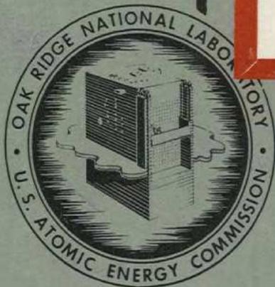

DECLASSES

CLASSIFICATION CHANGES TO:

${AE} - {11} - {11} - 6$

B.: $n,{138} \sim  {man}\;{810.62}$

OAK RIDGE NATIONAL LABORATORY

OPERATED BY

CARBIDE AND CARBON CHEMICALS COMPANY

A DIVISION OF UNION CARBIDE AND CARBON CORPORATION

UCC

POST OFFICE BOX P

OAK RIDGE. TENNESSEE

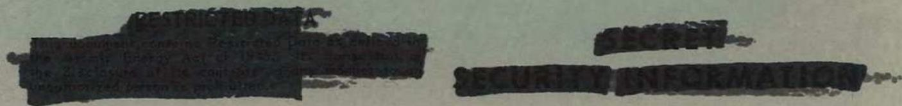

ORNL-1515

This document consists of 200 pages

Copy 65 of 247 copies Series A

Contract No W-7405-eng-26

# AIRCRAFT NUCLEAR PROPULSION PROJECT

# QUARTERLY PROGRESS REPORT

# for Period Ending March 10, 1953

R. C. Briant, Director

J. H. Buck, Associate Director

A. J. Miller, Assistant Director

Edited by

W. B. Cottrell

DATE ISSUED

APR 8

1953

OAK RIDGE NATIONAL LABORATORY

Operated by

CARBIDE AND CARBON CHEMICALS COMPANY

A Division of Union Carbide and Carbon Corporation

Post Office Box P

Oak Ridge, Tennessee

34456 0353310

1

ORNL-1515

Progress

# INTERNAL DISTRIBUTION

1. G. M. Adamson   
2. R. G. Affel   
3. C. R. Baldock   
4. C. J. Barton   
5. E. S. Bettis   
6. D. S. Billington   
7. F. F. Blankenship   
8. E. P. Blizzard   
9. M. A. Bredig   
10. R. C. Br1ant   
11. R. B. Briggs   
12. F. R. Bruce   
13. J. H. Buck   
14. A. D. Callahan   
15. D. W. Cardwell   
16. J. V. Cathcart   
17. C. E. Center   
18. J. M. Csisar   
19. G. H. Clewett   
20. C. E. Clifford   
21. W. B. Cottrell   
22. D. D. Cowen   
23. W. K. Eister   
24. L. B. Emlet (Y-12)   
25. W. K. Ergen   
26. A. P. Fraas   
27. W. R. Gall   
28. C. B. Graham   
29. W. W. Grigorieff (consultant)   
30. W. R. Grimes   
31. A.Hollaender   
32. A. S. Householde   
33. W. B. Humes (K-25)   
34. G. W. Keilholtz   
35. C. P. Keim   
36. M. T. Kelle   
37. F. Kertesz   
38. E. M. King   
39. C. E. Larson   
40. R. S. Livingston   
41. R. N. Lyon

42. W. D' Manly   
43. L. Mann   
44. W.B. McDonald   
45. J.L. Meem   
46. AJ. Miller   
47. Z. Morgan   
48. E. J. Murphy   
49. H. F. Poppendiek   
50. P. M. Reyling   
51 H. W. Savage   
5. E. D. Shipley   
3. 0. Sisman   
54. L. P. Smith (consultant)   
5. A. H. Snell   
56. F. L. Steahly   
57. R. W. Stoughton   
58. C. D. Susano   
59. J.A. Swartout   
60. E.H. Taylor   
61. F. Uffelman   
62. E. R.vVanArtsdalen   
63. F. C. WunderLage   
64. J. M. Werde   
65. A. M. Weinberg   
66. J. C. Whi   
67. E. P. Wigney (consultant)   
68. H. B. Willar   
69. G. C. William   
70. J. C. Wilson   
71. C. E. Winters

72-81. ANP Library

82. Biology Library

83-88. Central Files

89. Health Physics Library

90. Metallurgy Library

91. Reactor Experimental

Engineering Library

92-96. Technical Information

Department (Y-12)

97-98. Central Research Library

# EXTERNAL DISTRIBUTION

99-101. A1r Force Engineering Office, Oak Ridge   
102-112. Argonne National Laboratory (l copy to Kermit Anderson)   
113. Armed Forces Special Weapons Project (Sandia)   
114-121 Atomic Energy Commission, Washington   
122. Battelle Memorial Institute   
123-127. Brookhaven National Laboratory   
128. Bureau of Aeronautics (Grant)   
129. Bureau of Ships   
130-131. California Research and Development Company   
132. Chicago Patent Group   
133. Chief of Naval Research   
134-138. duPont Company   
139-160. General Electric Company, ANP   
161-164. General Electric Company, Richland   
165. Hanford Operations Office   
166. USAF-Headquarters, Office of Assistant for Atomic Energy   
167-174. Idaho Operations Office (1 copy to Phillips Petroleum Co.)   
175. Iowa State College   
176-183. Knolls Atomic Power Laboratory   
184-185. Lockland Area Office   
186-188. Los Alamos Scientific Laboratory   
189. Massachusetts Institute of Technology (Benedict)   
190. Massachusetts Institute of Technology (Kaufmann)   
191-193. Mound Laboratory   
194-197. National Advisory Committee for Aeronautics, Cleveland (3 copies to A. Silverstein)   
198. National Advisory Committee for Aeronautics, Washington   
199-200. New York Operations Office   
201-202. North American Aviation, Inc.   
203. Nuclear Development Associates (NDA)   
204. Patent Branch, Washington   
205-206. Rand Corporation (1 copy to V. G. Henning)   
207. Savannah River Operations Office, Augusta   
208. Savannah River Operations Office, Wilmington   
209-210. University of California Radiation Laboratory   
211. Viro Corporation of America   
212-215. Wfistinghouse Electric Corporation

216-232. Wright A1r Development Center

2 copies to B. Beaman   
l copy of Col. P. L. Hill   
l copy to Lt. Col. M. J. Nielsen   
2 copies to Consolidated Vultee Aircraft Corporation   
I copy to Pratt and Whitney Aircraft Division   
I copy to Boeing Airplane Company   
I copy to K. Campbell, Wright Aeronautical Corporation

233-247. Technical Information Service, Oak Ridge, Tennessee

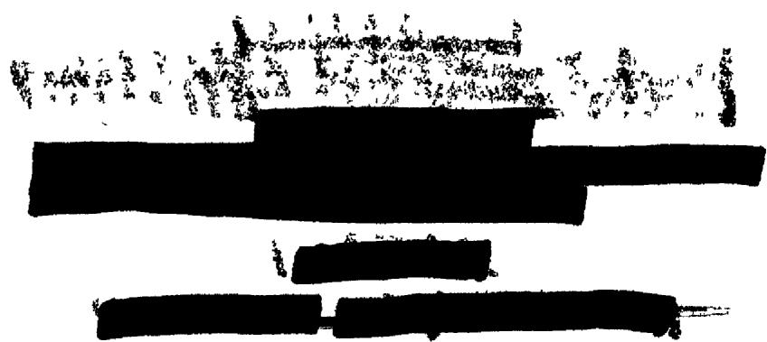

# Reports previously issued in this series are as follows

ORNL-528 Period Ending November 30, 1949

ORNL-629 Period Ending February 28, 1950

ORNL-768 Period Ending May 31, 1950

ORNL-858 Period Ending August 31, 1950

ORNL-919 Period Ending December 10, 1950

ANP-60 Period Ending March 10, 1951

ANP-65 Period Ending June 10, 1951

ORNL-1154 Period Ending September 10, 1951

ORNL-1170 Period Ending December 10, 1951

ORNL-1227 Period Ending March 10, 1952

ORNL-1294 Period Ending June 10, 1952

ORNL-1375 Period Ending September 10, 1952

ORNL-1439 Period Ending December 10, 1952

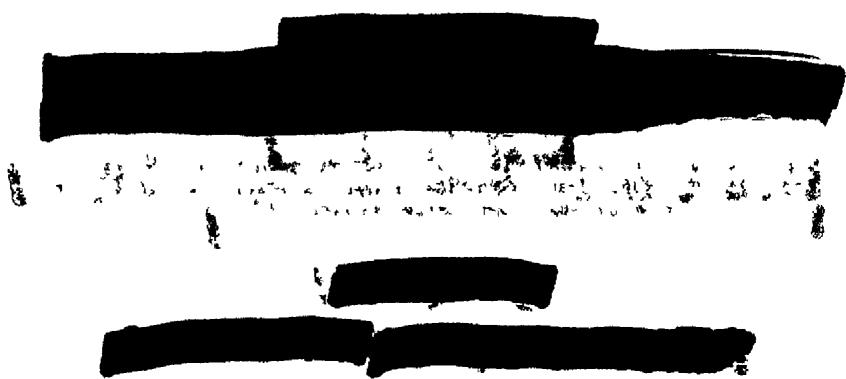

# TABLE OF CONTENTS

PAGE

FOREWORD 1

# PART I. REACTOR THEORY AND DESIGN

INTRODUCTION AND SUMMARY 5

# 1. CIRCULATING-FUEL AIRCRAFT REACTOR EXPERIMENT 7

Fluid Circuit 7   
Stress Analysis 7   
Reactor 11   
Instrumentation 11   
Off-Gas System 11   
Reactor Control 11   
Electrical System 15

# 2. EXPERIMENTAL REACTOR ENGINEERING 17

Pumps for High-Temperature Liquids 18

Centrifugal pump with combination packed and frozen seal for fluorides 18   
Allis-Chalmers centrifugal pump for liquid metals 18   
Laboratory-size pump with gas seal 18   
ARE-size sump pump 20   
AREcentrifugal pump 21   
Electromagnetic pump 22

Rotating-Shaft and Valve-Stem-Seal Development 22

Mechanical face seals 22   
Combination packed and frozen seal with MoS, 25   
Combination packed and frozen seal with graphite 26   
Graphite packed seal 26   
Rotating-shaft seal test 28   
Packing penetration tests 28   
Frozen-sodium and frozen-lead seal for NaK 29   
AREvaltest 29

Heat Exchanger Systems 30

Sodium-to-air radiator tests 30   
Bifluid heat transfer loop 30

ARE Fuel Circuit Mockup 31

Vortexes and bubbles 32   
Operational instabilities 33

Instrumentation 35

Pressure measurement 35

AREleak detection indicator tests 36

Slip rings for temperature measurement 36   
Rotameter type of flowmeter 36   
Handling of Fluorides and Liquid Metals 36   
Distillation of NaK 36   
Flame tests for NaK vapor in helium 37

# 3. REACTOR PHYSICS 39

# 4. REFLECTOR-MODERATED CIRCULATING-FUEL REACTOR 41

Static Physics 41

Reactors with various reflector-moderators 44   
Reactors with beryllium reflector-moderators 46   
Summary tables and graphs 51

Critical Experiments 53

First critical assembly 53   
Second critical assembly 56

Design Characteristics 61

Factors affecting core diameter 64   
Temperature, pressure, and stress 66   
69

Shelding 74

Power Plant Design 79

# PART II. SHIELDING RESEARCH

# INTRODUCTION AND SUMMARY 87

# 5.LID TANK FACILITY 89

Effective Fast-Neutron Removal Cross Sections 89   
Mockup of the Unit Shield of the Reflector-Moderated Reactor 89

# 6. BULK SHIELDING FACILITY 91

Air-Scattering Experiments 91   
Irradiation of Animals 91   
Neutron Spectroscopy for the Divided Shield 92   
Gamma Spectroscopy for the Divided Shield 92   
Fission Energy and Power in the Bulk Shielding Reactor 92

# 7. TOWER SHIELDING FACILITY 97

Tower Design 97   
Construction Schedule 97

# 8. NUCLEAR MEASUREMENTS 101

Fast-Neutron Scintillation Spectrometer 101   
Measurements with 6-Mev Van de Graaff 101

# PART III. MATERIALS RESEARCH

INTRODUCTION AND SUMMARY 105

9. CHEMISTRY OF HIGH-TEMPERATURE LIQUIDS 107

Fuel Mixtures Containing $\mathbf{U}\mathbf{F}_4$ 107

L1F-ZrF4-UF4 107

KF-LF-BeF2-UF4 107

Fuel Mixtures Containing ThF 107

Fuel Mixtures Containing UCl. 108

NaCl-UC14 109

KC1-UC1 109

Fuel Mixtures Containing UF 109

Addition of Reducing Agents to ARE Fuel 110

Coolant Development 112

$\mathrm{L_1F - ZrF_4}$ 112

CsF-ZrF 112

KF-L1F-ZrF 112

RbF-L1F-ZrF 112

KF-L1F-BeF 113

Production and Purification of Fluoride Mixtures 113

Laboratory-scale fuel preparation 113

Piot-scale fuel purification 114

Fluoride production facility 115

Hydrofluorination of $\mathsf{ZrO}_2$ -NaF mixtures 115

10. CORROSION RESEARCH 117

Fluoride Corrosion of Metals in Static, Seesaw, and

Rotating Tests 118

Crevice corrosion 118

High-temperature pretreatment of Inconel 118

Effect of time of exposure of Inconel to fluoride

mixture with and without $\mathbf{ZrH}_2$ added 118

Structural metal fluoride additives 119

Hydrogen fluoride additive 120

Fluoride corrosion in a rotating rig 121

Static tests on Incoloy and Inconel in fluorides 121

Fluoride Corrosion of Metals in Thermal Convection Loops 121

Effect of fluoride batch size 121

Fluoride pretreatment 122

Hydride additives 123

Metal additives 123

Temperature dependence 123

Crevice corrosion 124

Inserted corrosion samples 124

Effect of exposure time 124   
Nonuranium bearing mixtures 124

Liquid Metal Corrosion of Structural Metals 125

Seesaw tests of sodium-lead alloys 125   
Static tests with lithium 126   
Incoloy in sodium, lithium, and lead 126   
Corrosion by lead in thermal convection loops 128

Corrosion of Ceramics by Fluorides and Liquid Metals 129

Cermets in fluorides and liquid metals 129   
Static tests of the ARE-BeO blocks in Na and NaK 131   
Seesaw tests of BeO in NaK 132   
Convection loop tests of BeO in NaK 132   
Solubility of BeO in NaK 133

Effect of Atmosphere on the Mass Transfer of   
Nickel in Hydroxides 136   
Fundamental Corrosion Research 136   
Identification of corrosion products from convection loops 136   
Preparation of special complex fluorides 137   
Air oxidation of fuel mixtures 137

11. METALLURGY AND CERAMICS 139

Welding and Brazing Research 140

Cone-arc welding 140   
Fabrication of heat exchanger units 140   
Brazing of copper to Inconel 142

Evaluation Tests of Brazing Alloys 143

Corrosion of brazing alloys by fluorides 143   
Effect of brazing time on joint strength 143   
Effect of spacing on brazed joint strength 144   
Strength of brazed joints with various base metals 145

Creep-Rupture Tests of Structural Metals 145

Preoxidized Inconel in argon 145   
Peened Inconel in argon 146   
Effect of Inconel grain size on time to rupture 147   
Effect of environment on strain vs. time curves for Inconel 147   
Type 316 stainless steel tube burst tests in argon 148

Fabrication of Control and Safety Rods 148

Control rods for the G-E R-1 Reactor 148   
Tower shielding facility safety rods 150

Columbium Research 150

Gaseous reactions 150   
Oxidation 151

Fabrication of Metals 152

High-conductivity metals for radiator fins 152   
Solid-phase bonding 152

Extrusion of high-purity tubing 152

Hot-Pressed Pump Seals 153

Ceramics 154

Ceramic coatings for shielding 154

Development of cermet fuel elements 154

Reduction of porosity of ARE beryllium oxide 155

12. HEAT TRANSFER AND PHYSICAL PROPERTIES 157

Thermal Conductivity of Liquids 157

Heat Capacity of Liquids 157

Viscosity and Density of Alkalix Hydroxides 158

Vapor Pressures of Fluorides 159

Prandtl Moduli of Various Materials 160

Specific Reactor Heat Transfer Problems 160

Turbulent Convection in Annul 160

Circulating-Fuel Heat Transfer 162

High Temperature Reactor Coolant Studies 163

13. RADIATION DAMAGE 165

Irradiation of Fused Materials 165

In-Reactor Circulating Loops 167

Creep Under Irradiation 167

14. ANALYTICAL STUDIES OF REACTOR MATERIALS 171

Chemical Analysis of Reactor Fuels and Contaminants 171

Zirconium 172

Reduction products 172

Oxides 173

Hydrogen fluoride 173

Corrosion products 175

Preparation of Uranium Tetrachloride 176

Petrographic Examination of Fluorides 176

$\mathsf{UCl}_4$ -NaCl system 176

$\mathsf{U}\mathsf{C}\mathsf{I}_{4}$ -KCl system 176

X-Ray Diffraction Studies 177

Service Chemical Analyses 177

# PART IV. APPENDIXES

15. LIST OF REPORTS ISSUED DURING THE QUARTER 183

TECHNICAL ORGANIZATION CHART OF THE ANP PROJECT 187

# ANP PROJECT QUARTERLY PROGRESS REPORT

FOREWORD

This quarterly progress report of the Aircraft Nuclear Propulsion Project at ORNL records the technical progress of the research on the circulating-fuel reactor and all other ANP research at the Laboratory under its Contract W-7405-eng-26. The report is divided into three major parts I. Reactor Theory and Design, II. Shielding Research, and III. Materials Research. Each part has a separate introduction and summary.

The ANP Project is comprised of about three hundred technical and scientific personnel engaged in many phases of research directed toward the nuclear propulsion of aircraft. (The Project organization chart is included as an appendix.) A considerable portion of this research is performed in support of the work of other organizations participating in the national ANP effort. However, the bulk of the ANP research at ORNL is directed toward the development of a circulating-fuel type of reactor.

The nucleus of the effort on circulating-fuel reactors is now centered upon the Aircraft Reactor Experiment - a 3-megawatt, high-temperature prototype of a circulating-fuel reactor for the propulsion of aircraft. This reactor experiment is now being assembled, its current status is summarized in sec. 1. However, much supporting research on materials and problems peculiar to the ARE will be found in other sections of Part I and Part III of this report, along with the general design and materials research contained therein.

A survey report on a reflector-moderated type of circulating-fuel reactor is contained in sec. 2. Since the feasibility of such a reactor was indicated by critical experiments completed during the previous quarter, considerable research, as well as design effort, has been devoted to problems associated therewith.

The shielding research report, Part II, is devoted almost entirely to problems of aircraft shielding.

中

：

Part I

# REACTOR THEORY AND DESIGN

# INTRODUCTION AND SUMMARY

The Aircraft Reactor Experiment (sec. 1) is rapidly taking form as equipment is received and installed in the ARE Building. There were no significant changes in design or concept during the quarter, and the installation is proceeding according to schedule. The fuel system heat transfer loop and the fill and flush tanks are completely installed, and the sodium heat transfer loop is nearing completion. Installation of fuel and sodium piping is now in progress. The control and graphic panels have been completely instrumented and checked. The formal presentation on the hazards involved in the ARE was made to the Reactor Safeguards Committee earlier in the quarter, and in view of the subsequent discussion of the Committee members, it is not expected that any modifications of the experiment will be required.

Valves, pumps, instrumentation, and other components of the fluoride-fuel and sodium-coolant systems are being developed and tested for the ARE (sec 2). Both centrifugal and electromagnetic pumps of ARE capacity have been operated, the latter will be employed in the by-pass loop for preliminary tests, with NaK, of the external fuel system. Impeller designs for the centrifugal pumps are conventional, but the pump seal, particularly for fluoride fuels, remains a problem. The packed-frozen seals on fuel pumps have widely varying leakage rates, and adequate temperature control of the frozen zone has not been obtained. Both packing and face-seal materials are being examined in an effort to find materials with the desired service and life characteristics. Gas face seals for vertical-shaft pumps are being investigated. Considerable success has been experienced with frozen-sodium seals in sodium pumps, and frozen-lead seals

are being tested for use with fluorides. Frozen-sodium and frozen-lead seals have proved to be unsatisfactory for use on NaK pumps. The ARE bellows type of valve was tested at 1100 and $1300^{\circ}\mathrm{F}$ and found to be satisfactory, although excessive leakage occurred after operation at $1500^{\circ}\mathrm{F}$ . The initial mockup of the ARE fluid circuit revealed instabilities and gas entrainment that were eliminated by minor system alterations. The rotameters, level indicators, and pressure transmitters have operated satisfactorily for long periods of time under the conditions expected in the Aircraft Reactor Experiment.

The reactor physics studies (sec. 3) were concerned with the statics of the reflector-moderated reactor and damping of power oscillations. The applicability of the multigroup method to the calculation of the reflector-moderated reactor was demonstrated by the good correlation obtained with critical experiments. The damping of power oscillations in a reactor is demonstrated for a nonlinear case, with delayed neutrons included, by assuming (1) constant power extraction or (2) a special case of cooling with circulating fuel.

The reflector-moderated reactor and an aircraft power plant assembly employing this reactor are described (sec. 4). In general, the reactor consists of lumped regions of fuel and moderator or reflector. An essential element in this reactor is the use of a thick beryllium reflector that not only contributes to neutron economy but also constitutes the first layer of the aircraft shield. This reactor and the compact, spherical arrangement permit realization of what is practically a unit shield for a 200-megawatt reactor and heat exchanger combination that weighs about 80,000 pounds. Critical experiments on a mockup of this reactor

# ANP PROJECT QUARTERLY PROGRESS REPORT

assembly indicate a critical mass of about 20 lb and a total uranium investment of 100 lb when the compact external fuel system is included.

A preliminary weight estimate of the complete power plant assembly, including the turbojets, is about 115,000 pounds.

# 1. CIRCULATING-FUEL AIRCRAFT REACTOR EXPERIMENT

J. H Buck, Research Director's Division, E. S Bettis, ANP Division

The major effort in the ARE project during the quarter has been in installation of equipment in Building 7503. The arrival of the heat exchangers permitted the initiation of a large amount of construction work that had been postponed for several weeks. Valves began to arrive toward the end of the quarter, and work could proceed on the installation of the main plumbing system. The installation of equipment will no longer be dependent upon the arrival of components. The installation work is not ahead of schedule, but thus far it appears that the completion goal of June 1953 will be realized

No new technical crises have arisen in the project. Tests of valves, seals, pumps, etc. continue (sec. 2) and, to date, reveal no insurmountable difficulties. Seals have operated satisfactorily, but their performance has not been so good as might be wished. The same condition exists with respect to the valve tests, but the valves have been shown to be usable.

Although detailing of installation drawings continues to be a problem, it has not yet actually retarded the job. There have been the usual modifications dictated by problems arising in the field, but they have been no more numerous or serious than would be expected in a system of such complexity as the ARE.

# FLUID CIRCUIT

G. A. Crysty

Engineering and Maintenance Division

No significant design changes were made in the fluid circuit. However, since it appeared inadvisable for the long drain lines in the fuel circuit to stand full of stagnant fuel, two valves were added to permit draining

these long lines so that they will be empty during operation of the experiment.

The heat disposal loops for the fuel circuit, that is, the fuel-to-helium heat exchangers, the helium-to-water heat exchangers, the thermal barriers, the helium ducts, and the helium blowers, are now completely installed. Figure 1.1 shows these loops installed in the pit. Three sections of the fuel pipe, together with annuli, thermocouples, and heaters (where possible), have been prefabricated and can be welded into the system when the valves for these lines are ready. Figure 1.2 shows one of these sections of fuel pipe.

All the fill and flush tanks have been put in the pit, and work has been started on installing heaters on these units. These tanks are shown in Fig. 1.3.

The by-pass, which enables the system to be run without the reactor in the circuit, has been designed. The electromagnetic pump, which will be installed in this by-pass for circulating liquid metal, has been tested by the Experimental Engineering Group (sec. 2).

The surge tanks have been completed, and tests of the mockup of the hydraulic system are continuing (sec 2).

The helium-to-water heat exchangers for the sodium coolant circuit have been received and are being installed. The liquid metal-to-helium heat exchangers are to be delivered the first week of March.

# STRESS ANALYSIS

R. L Maxwell J. W. Walker Consultants, ANP Division

The reactor by-pass circuit was checked to see that previous prestressing calculations would not be

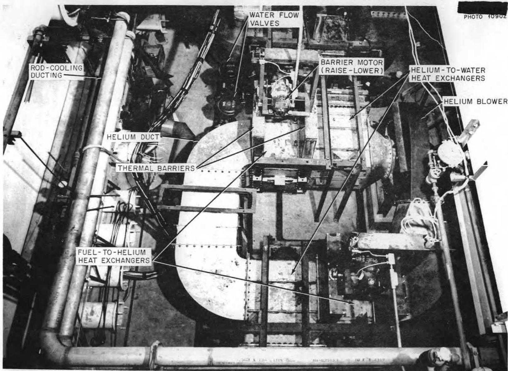  
Fig. 1.1. Fuel System Heat Disposal Loops.

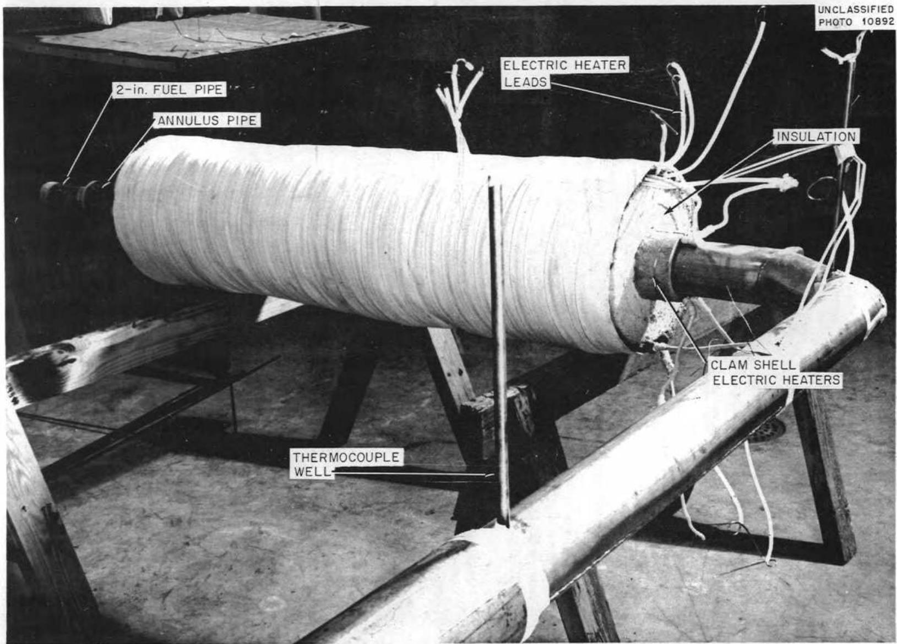  
Fig. 1.2. Fuel-Pipe Section.

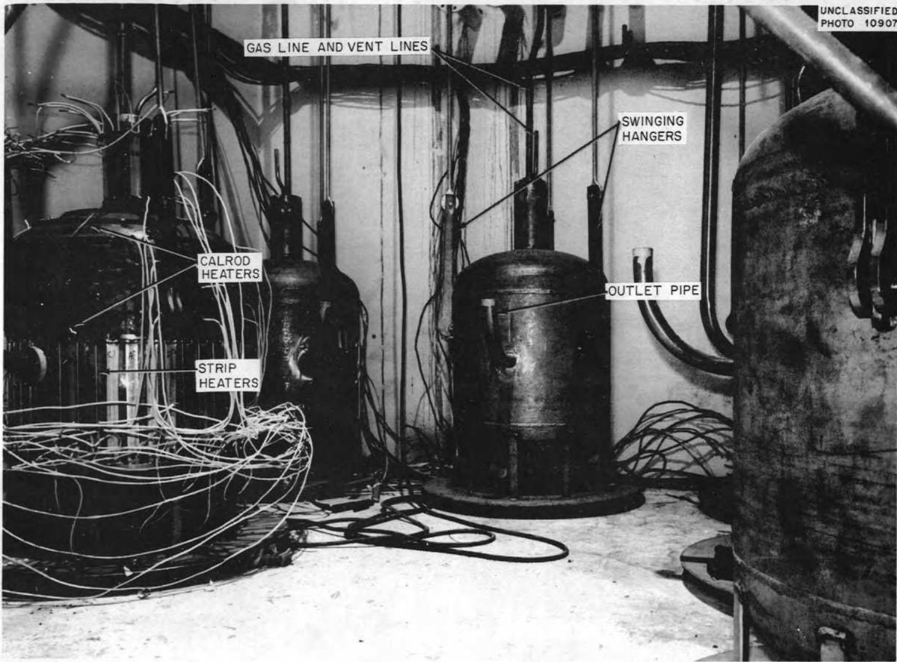  
Fig. 1.3. Fill and Flush Tanks.

invalidated by its incorporation in the circuit A report on the complete analysis of the stresses is being prepared

A design has been developed for incorporating strain gages in the system at the anchor points to check the computed stresses. These gages will be installed prior to the prestressing, and the magnitude of the prestressing forces will be measured. The stress relief as the temperature is raised will be measured until the temperature reaches about $200^{\circ}\mathrm{F}$ , above $200^{\circ}\mathrm{F}$ the gages will no longer be usable

# REACTOR

The reactor is ready for operation, except for welding of the serpentine coils and final assembly. Figures 14, 1.5, and 1.6 show the status of parts of the reactor All preliminary work on the pressure shell has been completed The coils have been received and sample coils are now being test welded in ORNL shops It is planned to assemble the reactor into a test circuit at the site and to circulate liquid metal through the fuel coils at design temperature so that the reactor can be independently checked prior to its installation This pretesting of the reactor core will also serve to clean the fuel passages with hot liquid metal prior to its incorporation into the system.

# INSTRUMENTATION

R. G. Affel, ANP Division

The only real design modification in the instrumentation involved a change in the leak detection circuit. The change was a simplification to minimize trouble without changing the principle of operation of the system. All the control room instruments have been mounted. The graphic panel has been installed and checked with a dummy setup of pneumatic switches that simulated valve operation.

Pneumatic lines have been run to valves and sensing points in the pits, but a small amount (2%) of work remains to be done. Thermocouple designs have been completed and orders have been placed Several of the thermocouples needed to allow installation work to proceed have been made by the Instrument Department All instruments and actuators have been labeled The enunciator panels have been installed and checked, except for connection to the sensing points.

# OFF-GAS SYSTEM

There has been no change in the off-gas system, and installation in the building is practically completed. The final design for the shielding of the radiation monitors has not been completed, but this shielding will be quite simple and will be assembled in the field by using a stacking of lead bricks around the monitors

# REACTOR CONTROL

The model fission chamber for use at high temperature has operated satisfactorily for several hundred hours at a temperature of $1400^{\circ}\mathrm{F}$ . This test has proved the acceptability of the insulator for this chamber. The live chamber, with a $\mathbf{U}^{235}$ sleeve, has not yet been tested.

The control room relay panel has been completed. The wiring of the console and the control board instruments console has progressed as far as the interconnection terminal blocks No interconnecting cables have been run between the amplifier cabinet, the relay cabinet control board, and the control actuator assembly. This work had just started at the end of the quarter.

The mechanism for control rod actuation is being assembled in the crane bay area for testing. All parts for this assembly are complete and on hand in Building 7503, but no significant progress had been made in the assembly.

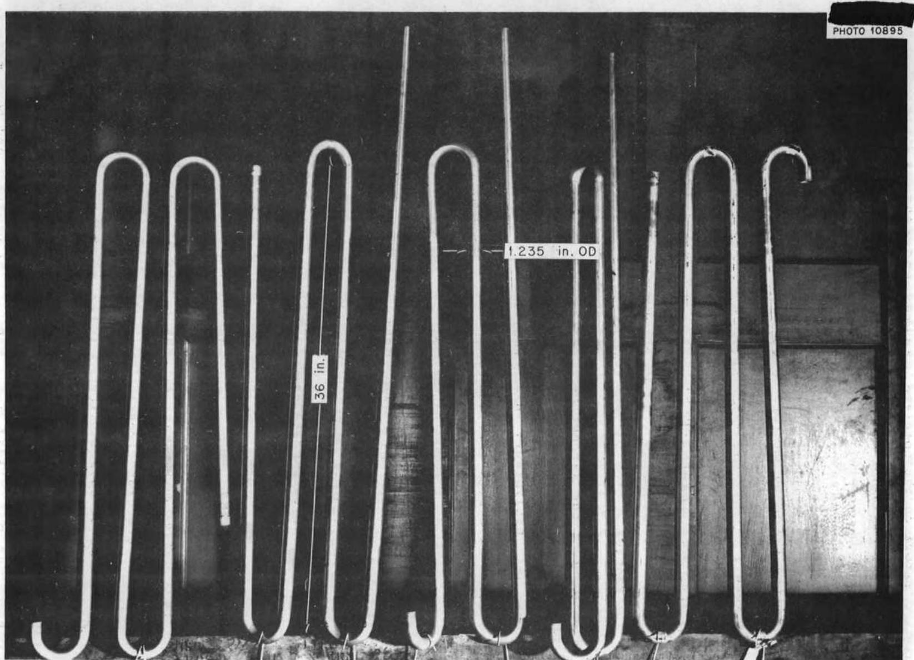  
Fig. 1.4. Core Fuel Loops.

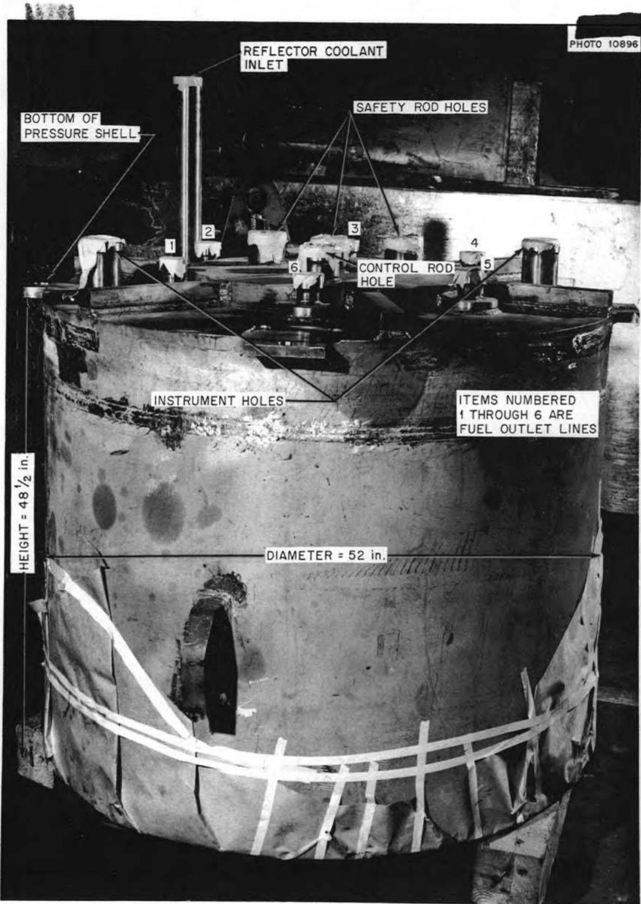  
Fig. 1.5. Reactor Pressure Shell.

# ANP PROJECT QUARTERLY PROGRESS REPORT

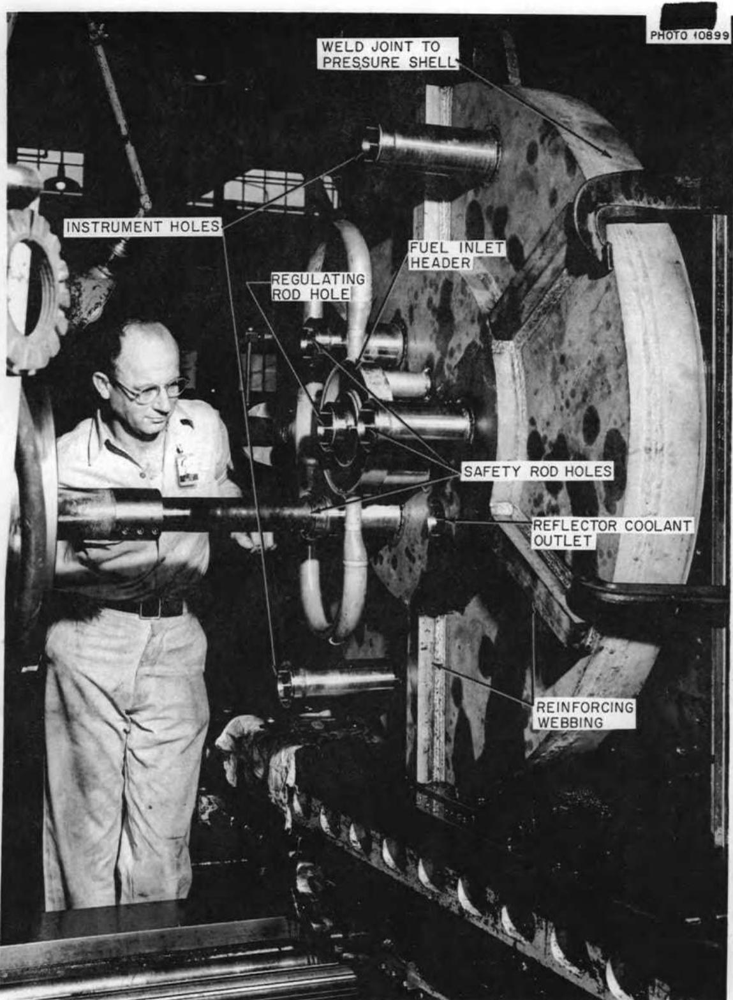  
Fig. 1.6. Top of Reactor Pressure Shell.

# ELECTRICAL SYSTEM

The electrical work is proceeding satisfactorily. The large job of completing the heater circuit panels has been accomplished. Heaters are being installed on the fill and flush

tanks, and leads have been run from the control panels to two of the fill and flush tanks. Both motor generator sets have been received and checked. It was found that these sets raised the noise level in the basement to an untolerable level, consequently they will be moved out of the building.

# 2. EXPERIMENTAL REACTOR ENGINEERING

H. W. Savage, ANP Division

The work of the past three months on the liquid circuits of the ARE has been devoted to minimizing corrosion to values acceptable for 1000 hr of continuous or intermittent operation at elevated temperature, determining and applying a process of blending fluorides for the ARE that will yield a product with a quality equal to that of the mixture used in the most satisfactory corrosion tests, providing pumps for the circulation of fluorides and either sodium or sodium-potassium alloy, developing seals for the pumps that are reliable for 1000 hr of operation, providing other circuit components, and studying circuit modifications that will assure acceptable and operable fluid dynamics. This work was carried out cooperatively with the Metallurgy Division, the Materials Chemistry Division, and the ARE Section of the ANP Division.

Both centrifugal and electromagnetic pumps of ARE capacity - 50 to 100 gpm - have been tested. The conventional pump impellers are satisfactory, but seals for mechanical pumps are still a problem. A 100-gpm, a-c, double-cell, electromagnetic pump has proved to be entirely satisfactory for pumping sodium-potassium alloy at $1500^{\circ}\mathrm{F}$ , and it is being tested for pumping sodium.

Packings for horizontal-shaft centrifugal pumps have not yet been proved reliable. The most promising packing was graphite and/or $\mathsf{MoS}_2$ retained with braid or graphite rings, or possibly by magnetic means. Leakage rates have varied widely, and friction demands, in some cases, have been excessive. Thermal control of the frozen zone, needed for low-friction operation and for remotely stopping and starting the pump, has not yet been achieved.

Oil-lubricated, low-temperature, face-type, gas seals have been reliably operated for thousands of hours in high-temperature, centrifugal, sump-type pumps. An ARE-size sump pump, similarly sealed, is undergoing a water test, and there have been no major difficulties, to date.

Frozen-sodium or frozen-lead seals for NaK have proved to be impractical. Frozen-sodium seals for ARE-size sodium pumps (2 1/2-in.-dia shaft) are now being tested, and the difficulties experienced to date appear to have been due to thermal distortions. Frozen-lead seals have been used satisfactorily with fluorides, and in several tests with molten fluoride in contact with molten lead, there has been no mixing of the fluoride and the lead. High-temperature face seals for use with molten fluorides are being investigated, but data are not yet available.

Other components that have been operated successfully for long periods are high-temperature rotameters and high-temperature liquid-level indicators (both the rotameters and the liquid-level indicators use variable-inductance pickups for signal generation), thin-walled (0.005 in.) bellows in pressure transmitters in contact with fluorides, a pneumatically-actuated, bellows-sealed, Stellite-seated valve, and the slip-ring and brush arrangements for removal of the thermocouple signals used for measuring temperatures in moving parts.

A study of the parallel circuits and the pumping and expansion tank arrangements of the ARE has revealed operational steps that will have to be taken in the event of failure of one of the pumps so that loss of circulation from the remaining pump and expansion tank can be prevented. The

study also revealed the need for piping modifications to eliminate gas entrainment at the free surface in the surge tanks.

Sodium-potassium alloy has been distilled from closed systems to simulate circuit cleaning of the ARE, negligible quantities of alloy remained in isolated pockets.

# PUMPS FOR HIGH-TEMPERATURE LIQUIDS

W. B. McDonald A. G. Grindell

W. G. Cobb G. D. Whitman

W.R.Huntley A.L.Southern

J.M.Trummel P.W.Taylor

ANP Division

Centrifugal Pump with Combination Packed and Frozen Seal for Fluorides A 50-gpm pump with a Stellite No. 6 coated, 2 1/2-in.-d1a shaft was operated for 85 hr with the ARE fuel, NaF-ZrF4-UF4 (50-46-4 mole %). The seal consisted of a packing of 1/4-by 1/4-in. monel braid wrapped in nickel foil. Operation was unsatisfactory and the test was terminated because of shaft seizure in the packing area. Examination of the shaft after the run showed that very severe scoring had occurred. Some grooves were 0.049 in. deep.

It may be concluded from this test that small packings alone are inadequate. Compressive loading to minimize leakage will be high and will result in excessive wear because the poor penetration of liquid fluorides will prevent their acting as a sort of lubricant. The packing in subsequent tests included braid as a component and either graphite or $\mathsf{MoS}_2$ , each of which is a lubricant.

The pump has been repacked with Dixon's Microfyne flake-graphite powder, which is retained by close-fitting, solid, APC-graphite rings at each end of the packing gland. Initial dry runs, without fluorides present, showed this packing to be quite sensitive to compressive loading. Approximately 35 psi was found to be a

maximum packing loading for smooth, dry operation without the seal heating excessively. The repacked pump has now operated at a shaft speed of 700 rpm for 300 hr at $1200^{\circ}\mathrm{F}$ . The pressure against the seal has been varied from 5 to 18 psi. Leakage of solid fuel from the seal has varied from 60 to 75 g/day during operation with pressures in the 5- to 10-psi range. Power input to the driving motor has been quite smooth, with a variation from 2.6 to 3.0 kw, and under these conditions only 1.5 to 1.8 kw is being lost as friction in the pump seal.

Allis-Chalmers Centrifugal Pump for Liquid Metals. The Allis-Chalmers hydrostatic-bearing pump previously reported(1) was shut down during the quarter for alterations. A new, one-piece shaft has been fabricated, the bearing surface on the impeller has been hard coated with Stellite, and a frozen-sodium gas seal has been incorporated in the pump. All fabrication is complete and the pump is ready for reassembly and further testing.

Laboratory-Size Pump with Gas Seal The laboratory-size gas-sealed centrifugal pump operated 996 hr with fluoride fuel, NaF-ZrF $_4$ -UF $_4$ (46-50-4 mole %), at a temperature of $1500^{\circ}\mathrm{F}$ . The pump has thus far operated a total of 2300 hours. The pump was run at 3600 rpm and produced a 50-ps head at 8 to 10 gpm.

Figure 2.1 shows the upper assembly of the pump after 996 hr of operation. The $\mathbf{ZrF_4}$ condensation does not appear to be excessive, however, in the original assembly, probe shorting was serious and the two probes in the pump were rendered inoperable after 50 hr of operation. The shorting may have been a result of fuel freezing around and bridging the probe and radiation shield assembly, shown in Fig. 2.1, when an inadvertent liquid-level surge

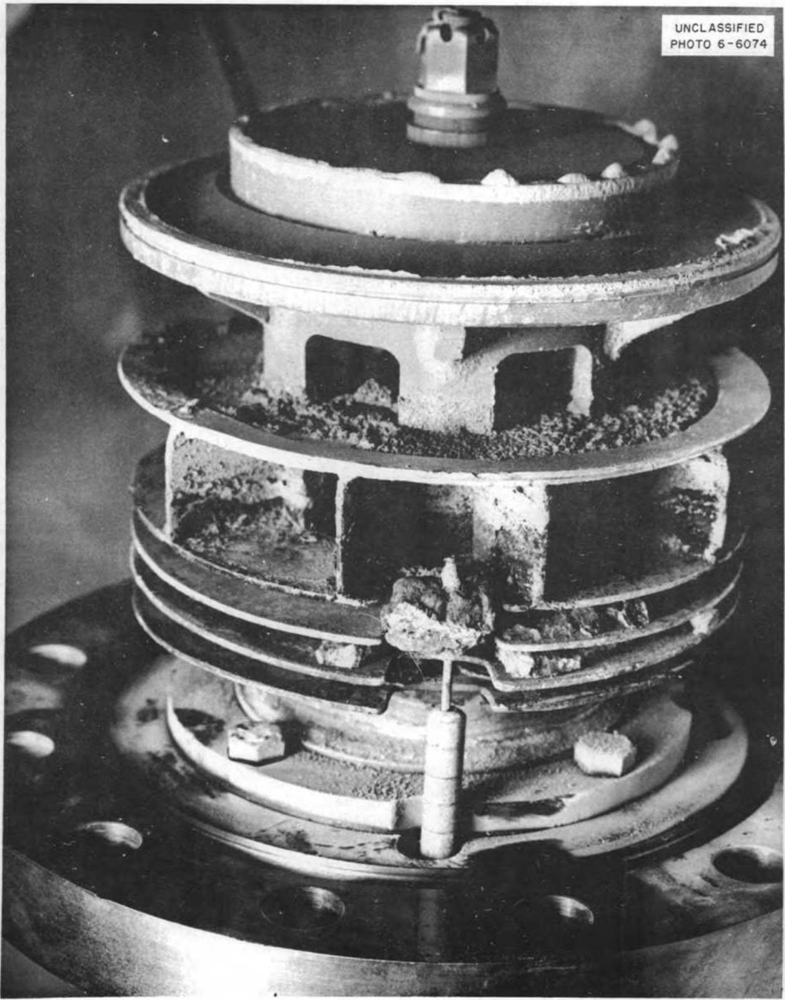  
Fig. 2.1. Gas-Seal Pump Assembly After Operation.

occurred during operation or filling. This condition has been alleviated by increasing the clearance between the probes and radiation baffles and inserting a half cylinder in the cutaway section in the baffle assembly.

The pump operated quite satisfactorily without probes, and the liquid level in the pump bowl was established by noting the pump performance and temperature of the face plate. The reason for termination was again a broken guide vane in the discharge bowl. The vanes have been rewelded to the bowl several times, but the latest failure occurred in the parent metal of the vane rather than in the weld. The reliability of this assembly can be greatly increased by employing thicker vanes and adding a reinforcing ring around the top edge of the six vanes.

An identical pump has been installed and has operated approximately 700 hr in a fluoride system that includes a fluoride-to-NaK heat exchanger. Several design changes were made to reduce or nearly eliminate the oil leakage past the rotary gas seal.

It was found that when the gas volume above the pump was vented into a sight glass, the discharged helium was heavily laden with oil vapor. It has not been ascertained whether this vapor is harmful to fluorides, but, at least, the contamination was undesirable.

In the original pump, oil was used to cool the drilled shaft and to flood the rotary gas seal assembly both for cooling and for lubrication. In the present pump, the shaft and the stationary seal ring are water cooled by using a closed system. The rotary face seal can be lubricated, if necessary, by adding small amounts of oil, as liquid or mist, through an opening in the bearing housing.

The rotary, Graphitar No. 30, gassealing ring was replaced with a silver-impregnated graphite (Morganite MYIF) ring, and an attempt was made to

run the dry seal against hardened tool steel. However, at a bearing pressure of approximately 60 psi, this combination would not run unlubricated. It has been necessary to add small amounts of oil to reduce gas leakage and to prevent small power excursions in the recorded demand of the pump motor. The seal has required an average of 6 to 8 drops of oil per day, and the gas leakage has been negligible.

It is planned to use a Keller Air Line lubricator to atomize the lubrication into the seal region through the bearing housing. This unit may be operated remotely as frequently as experience dictates.

ARE-Size Sump Pump A modification has been made to the existing model DA pump(2) to convert it to a sump pump with a shaft labyrinth seal from which leakage will return by gravity to the pump's sump tank. The modified pump is now being tested with water and other room-temperature liquids, and it will be tested with liquids that simulate the density and viscosity of the ARE fuel. Studies are being made of the labyrinth seal during pump operation, the effects of the pump inlet suction bell, and the volume of fluid and the baffling required in the sump tank for satisfactory pump operation.

The operation of the labyrinth seal (0 009-in. radial clearance) was investigated by measuring the leakage of the seal at various pump speeds and heads. As expected, the fountain increases with increase in pump speed and in pump head. However, the amount of the bypass fountain flow varied from 2 to $10\%$ of pump flow, which is a reasonable fraction. A minor problem was encountered in that the labyrinth leakage splashed the surface of the liquid in the sump tank and some of the gas bubbles were carried deep enough to be entrained in the fluid entering the impeller.

The pump has been tested in two types of sump tank. The first tank was a rectangular, plexiglas box, 14 by 16 by 30 in., in which the fluid inlet to the tank was considerably offset from the eye of the impeller. The second tank was a plexiglas cylinder, about 12 in. in diameter and 14 in. high, in which the fluid inlet is below and directly into eye of the impeller. When continuously submerged, even if only to a small fraction of an inch, the pump inlet suction bell appeared to function satisfactorily in either sump tank under all conditions of pump speed and flow.

Pump priming is not difficult to accomplish in either tank. In the initial test setup, the volume of gas in the system piping at startup was approximately equal to the volume of liquid, and in the cylindrical tank, the prime was broken by a sudden surge of gas into the impeller eye. Placing an obstruction over the fluid inlet to divert most of the gas bubbles away from the eye to the free surface was sufficient to maintain the prime. In a system in which there is a small gas volume compared with the liquid volume at startup, priming is accomplished by bleeding the trapped gas into the sump tank or by filling under vacuum. In the ARE system, the trapped gas is forced out.

Tests were made in which the fluid was gassed by admitting air, helium, or argon into the eye of the suction bell until the fluid became milky. The time required for the fluid to become relatively clear was then noted. In all tests, including tests with flow rates of up to 100 gpm and tests in which the cylindrical tank without baffles was used, the fluid degassed in less than 5 min of operation. When the inlet of the cylindrical tank was offset about 1/2 in. with respect to eye of the impeller, the entire holdup volume of liquid in the tank was given a rotary motion that increased in velocity at high impeller

speeds and low flow rates. When the baffles were in place, this circular motion occasionally caused the formation of vortexes and gas entrainment in the liquid. Without baffles in the cylindrical tank, the rotary motion was present but no vortexes were observed. The gas seal for this pump will be either a frozen-sodium or frozen-lead seal or a mechanical face seal.

ARE Centrifugal Pump An ARE model FP pump $^{(3)}$ has been constructed and incorporated in a test loop. The most critical feature of this pump was the frozen-sodium seal for which sodium from an external source was fed to a sealing annulus and frozen in rings on each side of the annulus.

Three tests have been run in which NaK was pumped for about 15 min, 4 hr, and 1 hour. Each test was terminated because of excessive seal leakage. Chemical analyses of samples of leakage material indicated the presence of from 1 to $7.5\%$ potassium. Since this pump does not operate successfully with NaK, it was modified for testing with sodium. For operation with sodium, the external supply of sodium to the seal will not be needed and a larger surface will be presented for cooling of the seal.

Prior to installation of the new sealing gland, a series of tests was run on the externally supplied seal with helium in the pump loop. During these tests, pump speeds and seal temperatures were systematically varied, and considerable data were taken to provide more adequate understanding of the frozen-seal mechanism. Successful operation, as a gas seal, was obtained over the available range of speeds, 400 to 1920 rpm, and the temperature of the sodium in the gland groove varied from 300 to $400^{\circ}\mathrm{F}$ . Speed and pressure conditions were determined under which the seal would fail and under which it would operate reliably.

The sealing gland that has been installed in the pump for operation with sodium has a length-to-diameter ratio of 2.3, in contrast to the ratios of 0.6 and 0.2 for the inside and outside glands of the previously used externally supplied seal. Also, the radial shaft-to-gland clearance has been increased from 0.015 in. for the externally supplied gland to 0.030 in. for the longer gland. Initial tests of this gland and seal indicate a satisfactory seal, but they also indicate the presence of excessive thermal distortions that will result in displacement of parts and eventual binding.

Electromagnetic Pump The two-stage electromagnetic pump that will be used to circulate NaK in testing and cleaning operations of the fuel circuit of the ARE has been tested with NaK at $1500^{\circ}\mathrm{F}$ and is undergoing similar tests with sodium. With NaK, the pump delivery is approximately 90 gpm at approximately 10 psi, performance curves are shown in Fig. 2.2. The pump has given entirely satisfactory performance, except for a hard-soldered joint failure in the current loop, which was easily repaired, and excess cooling, which was removed.

# ROTATING- SHAFT AND VALVE-STEM-SEAL DEVELOPMENT

W. B. McDonald

R. N. Mason

W.C.Tunnell

P. G. Smith

W. R. Huntley

ANP Division

R. E. Engberg

Long Range Reactor Planning Group

Mechanical Face Seals Hightemperature mechanical face seals for liquids such as fluorides are being investigated. Successful operation of such seals may be dependent upon dryfilm lubrication, boundary lubrication, or adsorbed-film lubrication, but research has revealed only empirical

knowledge about the principles of similar seals successfully used in applications much less severe than those imposed by ANP requirements. The problem appears to be one of selecting appropriate materials that will retain optically flat surfaces at high temperatures and will have the proper degree of hardness and softness relative to each other. Graphite is being considered for the soft material and materials such as tungsten carbide, titanium carbide, and cermets are being considered for the hard material. The methods of fabrication and the maintenance of high ambient temperatures and low thermal gradients to avoid distortions are also pertinent problems.

The work of others has shown that a principal factor in determining wear and surface damage in sliding is the tendency of the sliding or rubbing materials to alloy. Although other factors, such as the hardnesses of the materials, the melting points, the rubbing velocity, and the temperature of operation, are considered as being of secondary importance, in some instances they may become of controlling importance. The use of $\mathsf{MoS}_2$ as a high-temperature lubricant is intriguing, and considerable work has been done to obtain surfaces coated or impregnated with this material. Table 2.1 lists the attempts to establish a $\mathsf{MoS}_2$ layer by adding $\mathsf{MoS}_2$ to the vehicle to make a paste. It should be noted that $\mathsf{MoS}_2$ will begin to oxidize at about $700^{\circ}\mathsf{F}$ in air, but in the absence of oxygen it is stable to $2000^{\circ}\mathsf{F}$ . Tests of face seal materials, made by rotating them in contact with the other specimen are described in Table 2.2. The chattering noted may have been due to forces resulting from the geometry used in the test apparatus. These experiments indicate that of the materials tested, graphite is best for one of the materials, under these test conditions, when air is present.

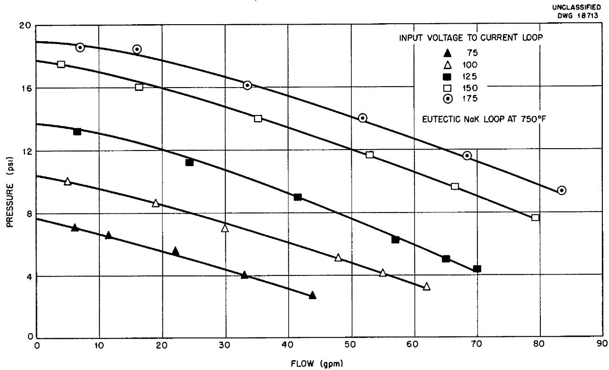

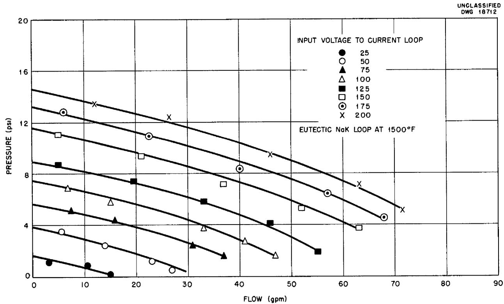  
Fig. 2.2. Performance Curves for Double-Stage Electromagnetic Pump with NaK. Input voltage to magnet loop, 125 volts.

TABLE 2.1.DESCRIPTION OF ATTEMPTS TO OBTAIN A $MoS_{2}$ SURFACE   

<table><tr><td colspan="2">BASE METAL</td><td>VEHICLE</td><td>TREATMENT AND APPLICATION</td><td>REMARKS</td></tr><tr><td>1</td><td>Type 316 stainless steel</td><td>G-E enamel</td><td>Brushed on, air dried, furnace heated to 700°F</td><td>Good coating obtained, apparently</td></tr><tr><td>2</td><td>Type 316 stainless steel</td><td>Colloidal silver</td><td>Brushed on, air dried, furnace heated to 700°F</td><td>Did not stick to base metal</td></tr><tr><td>3</td><td>Type 316 stainless steel</td><td>High-temperature varnish</td><td>Brushed on, air dried, furnace heated to 700°F</td><td>Varnish burnt off, did not stick</td></tr><tr><td>4</td><td>Type 316 stainless steel</td><td>No 1202 varnish</td><td>Brushed on, air dried, furnace heated to 700°F</td><td>Varnish burnt off, did not stick</td></tr><tr><td>5</td><td>Type 316 stainless steel</td><td>Keystone grease</td><td>Base metal heated to 700°F, paste brushed on</td><td>Did not stick to base metal</td></tr><tr><td>6</td><td>Type 316 stainless steel</td><td>Permatex No 2</td><td>Base metal heated to 700°F, paste brushed on</td><td>Showed promise, fair coating obtained</td></tr><tr><td>7</td><td>Type 316 stainless steel</td><td>Ruby flux</td><td>Base metal heated to 700°F, paste brushed on</td><td>Showed promise, fair coating obtained</td></tr><tr><td>8</td><td>Type 316 stainless steel</td><td>Aquadag No 200</td><td>Base metal heated to 700°F, paste brushed on</td><td>Did not stick to base metal</td></tr><tr><td>9</td><td>Type 316 stainless steel</td><td>Permatex No 2 thickened with Sebacate</td><td>Base metal heated to 700°F, paste brushed on</td><td>Remained soft, possibly not enough heat, indicates promise</td></tr><tr><td>10</td><td>Lapped tungsten carbide</td><td>None</td><td>Heated to 700°F, dipped in dry MoS2</td><td>Thin layer obtained, apparently</td></tr><tr><td>11</td><td>Etched tungsten carbide</td><td>None</td><td>Heated to 700°F, dry MoS2Sprinkled on</td><td>Thin layer obtained, apparently</td></tr><tr><td>12</td><td>Type 316 stainless steel</td><td>None</td><td>Heated to 700°F, dipped in dry MoS2</td><td>Good layer obtained</td></tr><tr><td>13</td><td>Tungsten carbide</td><td>Handi-flux</td><td>Paste applied, heated with torch</td><td>Adhered to base metal, but uneven</td></tr><tr><td>14</td><td>Tungsten carbide</td><td>Ruby flux</td><td>Paste applied, heated with torch</td><td>Soft and flexible, apparently</td></tr><tr><td>15</td><td>Type 316 stainless steel</td><td>Permatex No 2 with Sebacate</td><td>Base metal heated, brushed on in furnace</td><td>Good layer, apparently</td></tr><tr><td>16</td><td>Brass</td><td>Handi-flux</td><td>Brushed on base metal, heated in furnace</td><td>Brass burnt, but apparently some layer remained</td></tr><tr><td>17</td><td>Type 316 stainless steel</td><td>Corn syrup</td><td>Brushed on base metal, heated in furnace</td><td>Fair coating, shows promise</td></tr><tr><td>18</td><td>Type 316 stainless steel</td><td>Celluflux</td><td>Brushed on base metal, heated in furnace</td><td>Good coating, but uneven, shows promise</td></tr><tr><td>19</td><td>Type 316 stainless steel</td><td>Pliobond</td><td>Brushed on base metal, heated in furnace</td><td>Fair coating, hard and brittle</td></tr></table>

An attempt has been made to establish an upper temperature limit for silver-impregnated graphite rubbing against type 316 stainless steel. The assembly ceased to seal helium at about $450^{\circ}\mathrm{F}$ , and although the temperature was increased slowly to $910^{\circ}\mathrm{F}$ , sealing did not occur again. When the temperature was decreased to $450^{\circ}\mathrm{F}$ , sealing was

again accomplished. This experiment will be continued, and various sealing pressures will be tried.

Another experiment is in progress in which an attempt is being made to seal against water with silver-impregnated graphite vs. type 316 stainless steel at various differential pressures and bearing pressures. To

TABLE 2.2. SUMMARY OF TESTS OF FACE SEAL MATERIALS   

<table><tr><td>BASE METAL NO.
(cf, Table 2.1)</td><td>MATERIALS</td><td>RESULTS</td></tr><tr><td>11</td><td>Etched tungsten carbide vs type 316 stainless steel</td><td>Operated for 2 hr before chattering occurred</td></tr><tr><td>10</td><td>Lapped tungsten carbide vs type 316 stainless steel</td><td>Operated for 2 hr before chattering occurred</td></tr><tr><td>13</td><td>Tungsten carbide vs tungsten carbide</td><td>Operated for only a short period</td></tr><tr><td>16</td><td>Brass vs tungsten carbide</td><td>Operated for 5 hr before chattering occurred</td></tr><tr><td>12</td><td>Type 316 stainless steel vs tungsten carbide</td><td>Operated for 3 hr before chattering occurred, addition of dry MoS2 stopped chattering for about 15 min</td></tr><tr><td>14</td><td>Tungsten carbide vs type 316 stainless steel</td><td>Operated for 7 min before chattering occurred</td></tr><tr><td>15</td><td>Type 316 stainless steel vs tungsten carbide</td><td>Operated for 50 min before chattering occurred</td></tr><tr><td></td><td>C-18 graphite vs tungsten carbide</td><td>Chattered immediately, surface not flat</td></tr><tr><td></td><td>Graphite (No 40) impregnated with MoS2 vs tungsten carbide</td><td>Operated for 12 hr at self-generated temperature of 225°F</td></tr><tr><td></td><td>APC graphite vs tungsten</td><td>Attempted to coat graphite with fuel 27, operated for 4 hours</td></tr><tr><td></td><td>C-18 graphite vs tungsten carbide</td><td>Heated with torch to 475°F, chatter developed</td></tr><tr><td></td><td>C-18 graphite vs tungsten carbide</td><td>Dry MoS2 added, heated to 913°F with torch, operation smooth, except between 400 and 450°F, when chattering occurred</td></tr></table>

date, the seal has not been consistent, it has leaked at times and in varying amounts.

Other materials have been ordered, such as boron nitride compacts, $\mathsf{MoS}_2$ -impregnated copper, silver and stainless steel compacts, and a sintered molybdenum compact, that will be treated to form a $\mathsf{MoS}_2$ surface.

Combination Packed and Frozen Seal with $\mathsf{MoS}_2$ . Because $\mathsf{MoS}_2$ has high-temperature lubricating properties, an attempt was made to use it as a

high-temperature packing material for sealing fluorides, fluoride leakage was slight, operation was smooth, and there were no power surges. However, as in previous experiments, the $\mathsf{MoS}_2$ was too fluid and could not be contained. The retainers used were Graphitar No. 14 rings. The material slowly leaked out of the stuffing box and around the gland until the gland was completely inserted.

For the next attempt to seal with this material, a packing of Inconel

braid impregnated with $\mathsf{MoS}_2$ was used. This experiment was terminated after approximately 925 hr of operation with fuel No. 30 at 10 psi and 1750 rpm. Excessive leakage occurred because the seal reached too high temperatures when an attempt was made to restart operation after binding had occurred. The operation of the seal corresponded to operation of seals in other tests in that the leakage of the seal was apparently temperature sensitive. When the seal was too hot or too cold, leakage and power surges resulted, but under certain conditions operation was smooth and there was no detectable leakage. There have been no intentional start-stop tests, although the unit has been accidentally stopped on several occasions, and power surges have overloaded the motor relays several times. The unit has been restarted with little difficulty on each occasion by heating the packing area and using a wrench to "break" the shaft loose.

Combination Packed and Frozen Seal with Graphite. The continuous operation of the graphite-packed seal, mentioned in the previous report, was terminated after 725 hours. The seal had shown no signs of failure, and after another 150 hr of periodic and stop-start operation, the test was again terminated. During the latter period of operation, attempts were made to control the seal temperatures and, thereby, the zone in which freezing was occurring, since it was believed that most satisfactory operation would occur if freezing took place within the graphite region. Two fairly stable temperature ranges of operation were found, one set of temperatures corresponded to that maintained during the 725-hr period of continuous operation and the other set was about $150^{\circ}\mathrm{F}$ lower. Operation was unstable at intermediate temperatures. At the lower temperatures, operation was smooth, there was no detectable leakage, and the unit could be stopped

for as long as 20 min and started again by motor power only. The seal used in this test was similar to the seals used in other tests in that leakage occurred when the seal was too hot or too cold.

Graphite Packed Seal. In an attempt to determine the benefits of holding the transition from fluid to solid within the graphite, a test was set up that included a long (4 in.), graphite-packed, stuffing box. In order to obtain more complete temperature data, four thermocouples were installed in the rotating shaft, and signals were taken off through slip rings. After a dry run, fluorides were introduced and the seal immediately started leaking graphite. The Graphitar rings used as retainers did not contain the graphite at the top of the seal. Approximately 3/4 in. of Inconel braid was then added, and the graphite was successfully retained. The motor for this test was a 5-hp unit. Operation started off fairly normally, but the temperatures adjacent to the seal began to increase. Cooling of the bearing housing and the gland was started, but the temperatures continued to rise. The temperatures never became stable, they fluctuated over a range of 940 to $2190^{\circ}\mathrm{F}$ throughout the seal region. The hottest point was apparently near the middle of the packing, and the lowest temperatures were in the regions of the bearings and the fluoride. The molten fluoride was acting as a coolant in this test. The temperatures continued to increase until the test had to be terminated after approximately 50 hr of operation because the shaft froze. The shaft could be restarted by motor power after it cooled, but would not continue to operate when higher temperatures were reached. At no time was there any detectable leakage, however, severe shaft scoring occurred.

A picture of the seal and shaft cut through the center line is shown in Fig. 2.3 The extreme scoring of the

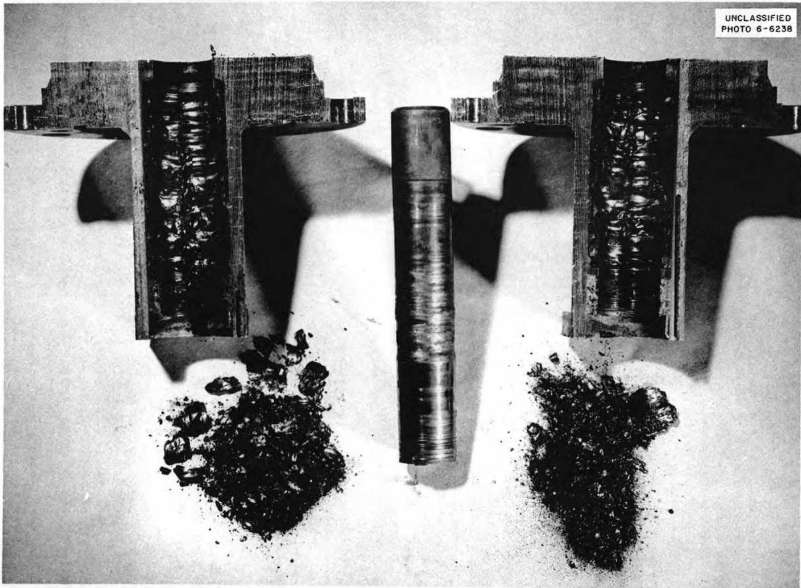  
Fig. 2.3. Section View, Shaft and Graphite Seal.

1 3/16-1n -d1a shaft is quite evident, other portions of the shaft (also at very high temperatures) showed no markings whatsoever. The condition of the graphite itself is of interest, since it apparently packed in more or less "concentric" radial layers that varied in thickness along the length of the seal. The layers adhered at times to the shaft and rotated, and at other times they adhered to each other and remained stationary. The powder was exceptionally fine and very "greasy", the "concentric" layers were very slimy, and there was no visible evidence of fluoride penetration.

Rotating-Shaft Seal Test. The apparatus for the tests of the rotating-shaft seal consists of a container for the packing material being tested, an upper compression gland that exerts pressure on the packing, a lantern gland located midway in the container, and a shaft extending through the assembly. The shaft rotates in a bearing beneath the assembly and is driven by a motor mounted above. The packing container is mounted on four rollers and is restrained from turning with the shaft by two tension springs. The torque necessary to turn the shaft is indicated by a pointer and a calibrated scale on the assembly. Fluorides are forced under pressure from a fill tube into the container through the lantern gland. During the tests, the temperature of the midpoint of the packing container was $1500^{\circ}\mathrm{F}$ , the temperature of the lower shaft opening was $1400^{\circ}\mathrm{F}$ , the pressure was 20 psi. The packing materials tested were $\mathrm{MoS}_2$ and powdered graphite. The $\mathrm{MoS}_2$ packing began to leak after 1 hr of operation. The torque required to turn the shaft at 350 rpm was 2 ft-lb. The graphite test ran for 8 hr before leakage occurred, and the same torque was required for rotation. There was considerable wear on the upper packing gland. The shaft had to be started and stopped a number of times because of severe vibration.

Packing Penetration Tests. The apparatus used in the packing penetration tests and the results of several tests were described previously (4) Further tests have been made and the results are presented in the following

Stainless steel braid impregnated with $\mathsf{MoS}_2$ was compressed and heated twice to the annealing temperature, with further compression after each heating. This packing held the fluorides for $1/2\mathrm{hr}$ at 2 psi, but when the pressure was increased to 5 psi, leakage occurred. Examination showed that the leakage path was along the walls of the containers, the screw stem, and the strands of the braid. It could not be detected that any fluoride mixed with the $\mathsf{MoS}_2$ or penetrated through it.

A second boron nitride test was run in an assembly with much smaller clearances than those used for the previous boron nitride test. In this test, it was possible to raise the pressure to 30 psi, and operation was continued for 234 hr before leakage occurred.

A test with J. T. Baker Chemical Co. powdered graphite previously reported (4) has continued for 240 hr with no leakage. Analysis showed that the packing was approximately $50\%$ amorphous carbon. Three more graphites have been tested, and in all cases it was possible to raise the pressure to 30 psi without leakage occurring. The analyses and results are given in Table 2.3. There should be a minimum of amorphous carbon in the graphite because it would be expected to increase the friction between a rotating shaft and the packing, however, the graphite with the highest amorphous carbon content sealed for the longest periods. That the packing in the first test did not leak whereas the packing in the later

TABLE 2.3. PACKING PENETRATION TESTS   

<table><tr><td>PACKING MATERIAL</td><td>ANALYSIS OF AMORPHOUS CARBON CONTENT (%)</td><td>HOURS OF OPERATION BEFORE LEAKAGE OCCurred</td></tr><tr><td>D1xon No. 2 flake graphite</td><td>10</td><td>22</td></tr><tr><td>D1xon Microfyne graphite</td><td>50</td><td>75</td></tr><tr><td>Amer Graphite Co. No. 620 powdered graphite</td><td>50</td><td>63</td></tr></table>

tests did, although the physical characteristics of the graphites were the same, might be the result of fuel No. 14 being used in the first test and fuel No. 30 in the later test.

Frozen-Sodium and Frozen-Lead Seal for NaK. It was reported previously(5) that tests were under way to determine the feasibility of sealing a NaK pump with an externally supplied frozen-sodium or frozen-lead seal. Although the preliminary tests were encouraging, subsequent tests revealed that seal life (the time before failure because of alloying) was, in general, inversely proportional to NaK temperature and that the seals were unreliable for periods of operation greater than 100 hours.

In the frozen sodium seal, the sodium alloys with the NaK and forms a low-melting-point alloy in the seal that cannot be frozen with room-temperature cooling water, as a result the seal is completely lost. Refrigeration, with temperatures below the melting point of eutectic NaK $(12^{\circ}\mathrm{F})$ , would be required to assure seal retention.

In the frozen-lead seal, the lead alloys with the NaK and forms a high-melting-point alloy, as a result there is shaft seizure and it is impossible to operate with reasonable power requirements.

ARE Valve Test. Preliminary gas and liquid leakage tests have been run on the ARE pneumatically driven valve supplied by Fulton-Sylphon Co. The valve is constructed of Inconel and has a Stellite-to-Stellite valve and seat. The shaft-sealing member is a four-ply Inconel bellows. The valve is adaptable to being either normally closed or normally opened, and the position is reversed by application of l5 psi of air pressure to a large bellows actuator.

For the initial test, the valve was mounted vertically and adapted for normally closed operation. With the valve at room temperature, gas leakage was small with test pressures from 30 to 60 psi that were first applied up against the valve seat and then down on it. Raising the valve temperature to $1050^{\circ}\mathrm{F}$ caused a slight increase in gas leakage, however, the leakage remained small.

Testing for liquid leaks with the ARE fuel, NaF-ZrF $_4$ -UF $_4$ (50-46-4 mole %), at $1100^{\circ}\mathrm{F}$ revealed that there was no leakage with test pressures of 30 to 60 psi applied both above and below the seat. This test was repeated several times.

In a test at $1300^{\circ}\mathrm{F}$ , slight leakage (0.3 in. $\frac{3}{\cdot}$ hr or less) occurred at various intervals. However, it was concluded that the leakage at this temperature was not serious. The initial checks at $1500^{\circ}\mathrm{F}$ were very successful. Subsequent checks,

however, showed a very serious leakage rate, 120 in.³/hr, that could not be corrected by reseating the valve. It was concluded therefore that the valve might be usable for several cycles at 1500°F but that it could not be expected to hold tight if cycled indefinitely.

Difficulty at the elevated temperature was experienced in that the valve stuck when left closed for short periods. However, in all cases to date, the valve has eventually become operable by increasing the pressure up to 30 psi on the valve actuator. In one instance at $1100^{\circ}\mathrm{F}$ and another at $1500^{\circ}\mathrm{F}$ , it was necessary to vibrate the valve body to get the valve open. When the valve was cut for inspection, it was found that some binding of the Stellar faces had occurred

# HEAT EXCHANGER SYSTEMS

G. D. Whitman D. F. Salmon ANP Division

Sodium-to-Air Radiator Tests. The sodium-to-air radiator tested had a core element with 30 fins per inch. $^{(6)}$ This test ran for 200 hr and was then terminated because of poor heat transfer performance. The maximum, over-all, heat transfer coefficients obtained were of the order of 6 Btu/hr·ft $^{2}$ F, which is far below the predicted performance. It was discovered, after inlet sodium temperatures of $1500^{\circ}\mathrm{F}$ were reached, that very few of the Nicrobrazed fin-to-tube joints were good. The radiator could be seen through the air exhaust, and it was observed that with minimum air flow less than $10\%$ of the nickel fins showed any heat color. The small amounts of braze material used to avoid closing the 0.025-in. fin-to-fin gaps were apparently insufficient to completely join the fins and tubes. No oxide plugging occurred in the radiator

tubes during this relatively short run, and the bypass filter circuit was operated without difficulty.

A Roots Connersville gas pump driven by a 2-hp Var1drive has been installed in place of the Buffalo centrifugal blower so that a wider range of air flows and better flow regulation can be obtained.

Bifluid Heat Transfer Loop. The bifluid heat transfer loop, which has been in operation for approximately two months, transfers heat from fuel No 30 to NaK. The heat transfer takes place in a concentric tube section, the center tube contains the hot fluoride and the NaK is in the annulus. The center tube has an inside diameter of 0.269 in. and an $L / D$ ratio of 40, whereas the annulus has an $L / D$ ratio of 22.

Heat transfer data on the fluoride fuel have been taken over a Reynold's number range of from 5,000 to 20,000, which corresponds to velocities of from 8 to 30 fps. The maximum fluoride temperature was $1400^{\circ}\mathrm{F}$ , and the temperature drop across the heat exchanger was varied from 15 to $40^{\circ}\mathrm{F}$ . The NaK-side data were taken at Reynold's numbers from 20,000 to 100,000.

The over-all heat transfer coefficient for heat fluxes from 300,000 to 500,000 Btu/hr·ft² has varied from 1000 to 2500 Btu/hr·ft²·°F. Satisfactory separation of the individual coefficients has not been accomplished because of the necessity of evaluating thermal entrance effects and because of what appears to be fouling in the exchanger. It is possible that fouling occurred, because there was flow restriction when the temperature of the NaK entering the heat exchanger was lowered to the fluoride melting point (approximately $950^{\circ}\mathrm{F}$ ).

The pump for circulating fluoride fuel has operated satisfactorily with a minimum of gas leakage. This pump

is a sump pump in which the liquid level is controlled with a sparkplug-probe. The seal of the pump is of the water-cooled, rotary-face type that consists of silver-impregnated graphite running against tool steel.

# ARE FUEL CIRCUIT MockUP

# G. D. Whitman, ANP Division

A mockup of the ARE fuel circuit has been constructed for investigating the hydrodynamic stability of the design and the characteristics of the liquid flow in the surge tanks. The system, shown schematically in Fig. 24, was constructed from black iron pipe, and it has viewing windows in the surge tanks and glass sections in the lines leaving the surge tanks. The surge tanks are of the size to be used in the ARE, and the two identical pumps have characteristics in the flow range to be investigated (0 to 50 gpm)

that are quite similar to those of the proposed ARE pumps. Speed variation of the pumps is obtained by using 5-hp Var1 drive units. The heat exchangers are simulated by gate valves, and the reactor can be simulated by a Globe valve or by the glass model that was previously described.

Thus far, water and a water-glycerine solution have been used in the system. The results are therefore based on observations made with water of approximately one-third the density and one-tenth the viscosity of the fuel and with the glycerine-water solution of approximately one-third the density of the fuel and the same viscosity. Tests have begun with 1-1, 2-2, bromoethane, for which the room-temperature density and viscosity are nearly the same as those of fuel No. 30 at $1400^{\circ}\mathrm{F}$ .

The ARE system comprises two, similar, liquid heat exchanger and

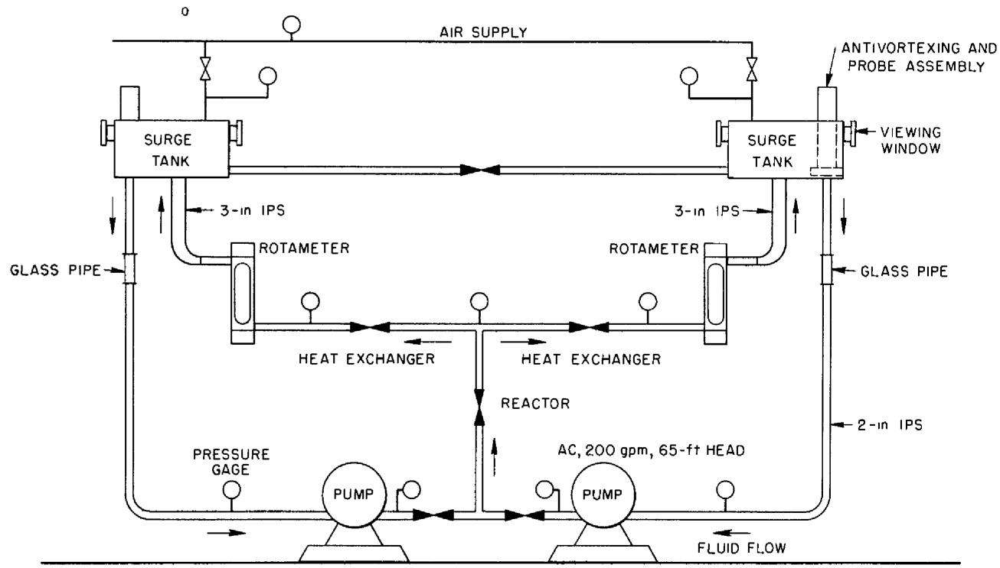  
Fig. 2.4. Sketch of ARE Fuel-Circuit Mockup.

surge tank circuits - one for moderator coolant and the other for fuel. Each circuit includes two parallel circuits, each of which includes, in series, a pair of heat exchangers (in parallel), a pump, and a surge tank. As designed, each surge tank was to receive and deliver the entire flow of its particular pump. However, the surge tanks of the moderator coolant circuits have now been provided with bypasses to reduce the flow through them to low levels and thereby reduce gasentraining turbulence to acceptable values. The moderator coolant flow rate is, in general, several times higher than the fuel flow rate.

However, in the fuel circuit there are strong incentives to retain complete flow control of all fuel, inasmuch as the system will be filled initially with nonuranium-bearing salts and will have $\mathrm{U}^{235}$ -bearing salts added to it until criticality is reached. Once addition starts, no salt can be removed or drained, and complete and uniform mixing must occur. Consequently, the expansion or surge tanks must provide sufficient capacity to receive the enriched fuel (about 15% of the system volume) and also to provide for fuel thermal expansion from 1000 to $1500^{\circ}\mathrm{F}$ (about 10% of system volume). The thermal expansion will be about $200^{\circ}\mathrm{F}$ more than that anticipated. There is also a strong incentive for minimum volume holdup of enriched fuel in each surge tank.

Vortexes and Bubbles. The system was operated initially with water, and the surge tanks were investigated for vortexing above the discharges lines. The surge tanks had no baffles, and entrained gas was observed in the discharges at all flow rates above 10 gpm with the tanks half full of liquid. This gas entrainment was due to vortexing of the liquid leaving the tanks. At lower liquid levels, vortexing occurred at flow rates of less than 10 gpm.

Many geometries were tried for breaking up this vortexing, and a

baffle design was finally developed that allowed water flow rates of up to 40 gpm to be put through the tanks without visible gas entrainment if a minimum level of approximately 4 in. was maintained in the 10-in.-d1a tanks.

This antivortexing baffle consists of a flat plate, 6 by 8 in., attached to the bottom of the probe well that is centered over the discharge line. The probe well was cut off so that the plate could be located 2 in. from the bottom of the tank. There are three vertical fins attached to the plate, one in the center and one near each edge, so that they are approximately 1/8 in. from the bottom of the cylindrical tank. This device serves to guide the flow from the inlet to the outlet with less velocity loss than in the open tank, and the flow is restrained from going in on the sides and edge near the end of the tank where the more severe vortexing always occurred.

When the glycerine solution was tried, there appeared to be less tendency to entrain gas in the surge tanks. At rated flow, 40 gpm, lower fluid levels could be maintained in the surge tanks without there being visible gas entrainment in the discharge.

It had been felt that Froude's modulus should be applicable, since the fluid mockup and the ARE fuel circuits were similar, and that gravity forces should predominate on the free surfaces in the tanks. Since the mockup surge tanks are full ARE size, the ARE fuel flow rates were maintained with the water and the glycerine-water solution for this investigation in order to maintain hydraulic similarity.

The moderator circuit in the ARE is quite similar in design to the fuel circuit. The Na or NaK flow (about 100 gpm) cannot be put through a surge tank of ARE dimensions without there being very severe gas entrainment in the discharge. This condition can be remedied by bypassing most of the flow

around the tanks or by using the tanks as stand pipes only. The first remedy would be the more desirable, since gas removal would be more effective.

It was found that the surge tanks removed visible gas bubbles in the water and glycerine-water solution. Air bubbles of the order of 1/8 in. in diameter and larger were removed in a very few cycles, and those so small as to be barely visible were removed after an hour or so of circulation at low or rated flows. When the glycerine-water solution was first transferred to the loop, it was nearly opaque because of the finely divided gas bubbles, but the solution was clear after circulation through the surge tanks for approximately 1 hour. The system tested for gas removal had a capacity of 15 gallons.

Operational Instabilities The system has also been investigated with respect to pump failures and operational instabilities. During operation with each pump delivering 30 to 40 gpm at approximately 45 psi head, if one pump is shut down the remaining pump immediately becomes gas bound, starts pumping intermittently, and severely gasses the loop. The gassing of the pump that remains operable results from the transfer of liquid from the surge tank in the operating loop to the surge tank in the loop that was shut down, that is, when one pump is shut off, its associated surge tank, which is essentially at pump suction pressure, is subjected to the discharge pressure of the operating pump and therefore gas volume is compressed and causes transfer of liquid from the operating loop to the loop that was shut down.

When a pump operating at or near rated flows stops, either the loop must be immediately isolated from the system or the remaining pump stopped. The loop containing the inoperable pump must be valved out of the system before flow is restarted. Also, at relatively high flow or pressure rise

across the pumps, impeller speeds must be the same for both pumps, or excessive amounts of liquid will be transferred from one surge tank to the other.

In an attempt to maintain equilibrium between the two tanks in case of a pump failure, they were connected by a liquid line. It was never possible to operate satisfactorily with this line open because one pump would develop a slightly greater head and take over the entire load and thus induce back flow through the other pump. At such times, there was heavy flow from one tank to the other through the liquid line connecting the two surge tanks. Flow through the heat exchanger circuits would not drop off appreciably. The pump carrying the load could easily supply both heat exchangers and a small back flow through the other pump.

The head flow characteristics of the pumps are shown in Fig. 2.5. It will be noted that between shut-off and 50 gpm there is little or no drop in head, and at some speeds a very slight pulsation point can be detected. These flat curves explain the ability of one pump to handle the total flow of the reactor and heat exchanger, as previously mentioned. One pump running at a slightly higher speed can easily buck the other pumps and handle the total loop load without losing sufficient head to fall below the shut-off head of the other pump.

During operation below 25 gpm per pump, oscillations have been observed in the flow. These have never been serious and could always be reduced to negligible amplitude by increasing the flow rate of the system. The oscillations are evidenced by an increase in flow rate and liquid loss in one pump circuit and a simultaneous decrease in flow rate and liquid gain in the other circuit. The condition then reverses and the period of the oscillation is approximately 2 seconds. The maximum change in flow rate has been $\pm 2$ 5 gpm at flow rates of 20 gpm per pump. This disturbance can be

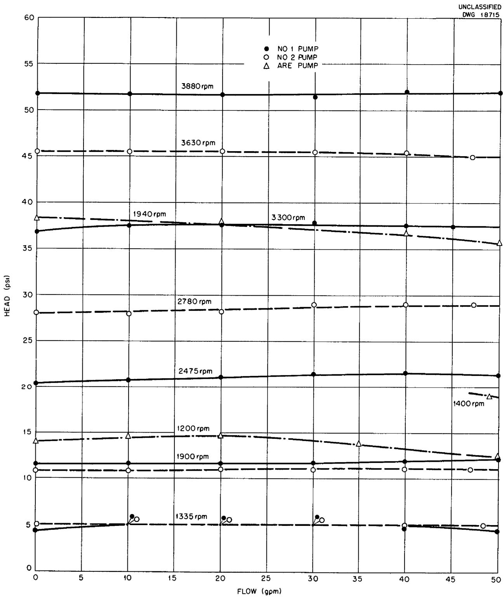  
Fig. 2.5. Head Flow Characteristics of Pumps.

explained by the pump characteristics and the absence of check valves in the discharge lines of the parallel pump arrangement.

In this particular system, when one pump takes the entire load, there is a subsequent pressure rise in the surge tank of the stalled pump. This is then seen as an increase in discharge pressure of the stalled pump, which then overpowers the pump handling the load and momentarily reverses the situation.

The actual reversal of flow occurs only in the line connecting the surge tanks through the pumps, that is, the suction lines and the common discharge line. The flow through the heat exchangers is unsteady but does not reverse or stop. The flow through the reactor appears to be quite steady, even though it is being supplied by alternate pumps.

An Esterline Angus recording wattmeter was installed on one pump motor, and it was established that during these oscillations the pump alternately carried full load and shut-off head demand. This condition can be effectively corrected by inserting a resistance in the common pump discharge line so that stable pump characteristics are obtained. A 2-ps1 increase in pressure is sufficient to result in a discharge curve which shows that the head decreases with flow from shut-off to maximum flow. This was demonstrated by partly closing one of the throttle valves in the pump discharge line during an oscillation, the disturbance immediately stopped.

The system is now being tested with tetrabromoethane, which has physical properties nearly the same as those of the fluoride fuel (viscosity, 9.27 cps, specific gravity, 2.95 at $77^{\circ}\mathrm{F}$ ). The mockup will again be used to check gas removal and vortexing in the surge tanks, filling and draining the reactor, pump characteristics and flow instabilities.

# INSTRUMENTATION

W. B. McDonald

D. R. Ward

P. W. Taylor

A. L. Southern

P. G. Smith

ANP Division

Pressure Measurement Two tests of Moore Nullmatic pressure transmitters, operating with the 0.005-in. wall bellows completely submerged in the ARE fuel, NaF-ZrF $_4$ -UF $_4$ (50-46-4 mole%), at $1100^{\circ}$ F, have logged enough operating time to make it seem likely that this method of pressure measurement is the most advantageous of any tried to date. The transmitters are "upside down" in the sense that the cavity containing the bellows and the liquid under pressure is open at the top. A nickel transmitter has been cycled every 1/2 hr between 10 and 30 psi for 1900 hours. A type 316 stainless steel transmitter has operated similarly for 1500 hours. A third transmitter of type 316 stainless steel filled with lead and topped with a layer of the molten fuel has 1500 hr of operating time, to date, and is running slightly cooler than the others. The initial zero shift in each case was approximately 1% of full scale at the operating temperature, and drift over the 1500-hr period was approximately 2%. However, the zero position can be adjusted easily, if necessary.

Several other Moore transmitters have been installed in dynamic loops for circulating fluorides or liquid metals. These transmitters operate "right side up," and there is trapped helium around the bellows to protect them from the liquid. This method of protecting the bellows, although operable in most cases, does not seem as satisfactory as complete submersion. The ARE fuel in the nickel transmitter mentioned above has been rapidly frozen and then rapidly remelted three times, with no apparent damage to the instrument. This is not possible with the trapped-gas instrument because of fouling of the bellows. It was also

found that when the pressure transmitter is filled with static fuel, the bellows temperature can be maintained at $1100^{\circ}\mathrm{F}$ or below. Operation of the bellows at the reduced temperature reduces the corrosion rate.

Failure of the bellows in one of the type 316 stainless steel transmitters after 500 hr of operation at $1200^{\circ}\mathrm{F}$ was apparently caused by oxidation. Helium instead of air is now used as the continuous-flow-balancing gas in the pressure transmitter tests.

ARE Leak Detection Indicator Tests There is interest in developing a secondary method for detecting leaks in NaK or fuel systems in the ARE to supplement the halogen leak detector. Experimentation revealed that a solution of phenol red can be made very sensitive to changes in pH by adjusting the solution to a reddish brown. When helium is passed over a surface of hot fuel and then over the surface of the indicator solution, the solution changes color. Likewise, it was found that a cold lump of the fuel dropped into the indicator solution changed the indicator toward the acid direction.

Slip Rings for Temperature Measurement Three tests of slip rings for measuring the temperature inside a rotating shaft were started. Because silver-graphite brushes were not available, carbon brushes were used. One test was completed in which copper rings and carbon brushes were used. When the brushes were well run-in, an accuracy in the temperature measurements of $\pm 1^{\circ}\mathsf{F}$ at $1200^{\circ}\mathsf{F}$ was obtained. The combination of carbon brushes and carbon rings is satisfactory if a wiping brush is mounted on the ring. If the ring is not kept clean, the resistance across the contact increases with time, and the error may increase to $+40^{\circ}\mathsf{F}$ or more.

A second combination of materials, coin silver and silver-impregnated graphite, was placed in operation before being tested, and performance has been satisfactory for several

hundred hours. In a third test that is being conducted with type 316 stainless steel rings and carbon brushes, an error of $+20^{\circ}\mathrm{F}$ has developed, but it is a constant error. The carbon brushes will be replaced with silver-impregnated graphite brushes, which should reduce the error slightly. Commercial slip rings assemblies have been ordered that will work on either a 7/8- or a 2 1/4-in. shaft.

Rotameter Type of Flowmeter. Testing has continued on the rotameter type of flowmeter reported previously, $^{(8)}$ and approximately 1000 hr of operation has been logged in the temperature range of 1100 to $1300^{\circ}\mathrm{F}$ . This instrument will measure flows of fuel No. 30 with $10\%$ accuracy over the range of 9 to 60 gpm. Two instruments of this type have been tested, and the results indicate that this instrument will be reliable for ARE operation.

# HANDLING OF FLUORIDES AND LIQUID METALS

L.A.Mann J.M.Cisar F.M.Grizzell ANP Division

Distillation of NaK. NaK has been chosen as the precleaning fluid for the ARE before introduction of fluoride salts. Since only a small fraction of NaK (less than 0.5 wt %, cf., sec. 9) can be tolerated in the fuel without reduction of $\mathrm{UF_4}$ to $\mathrm{UF_3}$ , studies have been made to determine how much NaK remains after the system is drained and how effective distillation is in removing it. Since the vapor pressure of potassium at any temperature is higher than that of sodium, upon distillation the alloy undergoes rapid depletion of potassium, and there is a corresponding enrichment of sodium. Therefore each distillation is progressively more difficult. The boiling point of sodium is $1621^{\circ}\mathrm{F}$ at 1 atm, hence, vacuum distillation is used to avoid excessive temperatures. An

absolute pressure of 100 mm Hg, which corresponds to a sodium boiling temperature of $1285^{\circ}\mathrm{F}$ , was selected for the distillation. After some initial difficulty with gas leaks, several 5-lb batches of NaK were distilled, and the following observations were made

1. There was no difficulty in completely distilling the NaK.   
2. Most of the distillation occurred in one surge in each of the four runs, and a part of the condenser was heated to almost the distilling pot temperature.   
3. The adjustable probe (a probe wire through a stuffing box of silicone-rubber "washers") worked excellently, and gave reproducible level readings that checked to within 1/32 in. or closer.

NaK has been distilled from ARE pump loop, but because of excessive oxidation of the type 316 stainless steel in the loop, a sufficiently low pressure could not be maintained on

the system for a good test of the efficiency of the distillation process to be obtained. Pockets of NaK remained in some of the traps, particularly the pump. In the Inconel ARE system, such corrosion should not be encountered, hence, essentially complete removal of NaK by distillation should be effected.

Flame Tests for NaK Vapor in Helium (D. R. Ward, ANP Division). Tests are being conducted to determine the reliability of flame tests for detecting the presence of NaK in helium. One method used was to introduce helium, from the system from which NaK was being removed by the distillation process, into an otherwise colorless hydrogen flame, the brightness of the resulting flame was then measured by a phototube circuit. The results of six tests indicate that this method may be used to determine the degree of cleanliness of a system from which NaK has been removed by the distillation method.

# 3. REACTOR PHYSICS

W. K. Ergen, ANP Division

From the standpoint of the physics of nuclear reactors, the main event during the past quarter was the correlation between the IBM multigroup calculations and the critical experiment on a fairly realistic, reflectormoderated, reactor mockup. Because of the approximations involved in the calculations, it previously had not been clear how close this correlation would be. That the experimental critical mass turned out to be only slightly higher than the computed value and was well within the limits acceptable with respect to uranium investment and fuel chemistry, constitutes a milestone in the development of this type of reactor. Furthermore, there was, except at the boundaries, good correlation between the computed and the measured flux This applies to the flux distribution in space and in energy, but the only experimental indications of the energy distribution are the thermal value and the cadmium ratio, which are effectively only two points on the energy distribution

curve. Some significant discrepancies exist at the boundaries, but the simple diffusion theory employed in the calculations obviously cannot be expected to hold at the interfaces between widely different materials. The nuclear studies pertinent to the reflector-moderated reactor are included in sec 4, "Reflector-Moderated Circulating-Fuel Reactor."

As to reactor kinetics, it was shown that the delayed neutrons introduce damping of reactor power oscillations, even in the case of large initial amplitudes, and, furthermore, one typical example indicates that this damping does not interfere destructively with the damping caused by fuel circulation. Also, the damping can be demonstrated in a typical case in which the power and flux vary along the path of a circulating fuel. The techniques employed are very similar to those reported in the previous ANP quarterly reports and are therefore not repeated here.

# 4. REFLECTOR-MODERATED CIRCULATING-FUEL REACTORS

A. P. Fraas, ANP Division

C. B. Mills, ANP Division

A. D. Callahan, Physics Division

Homogeneous reactors are the most simple nuclear reactors with respect to internal structure because there are no structural elements in the reactor core. Although the considerable experience achieved with liquid fluoride fuels indicates that they do not lend themselves to the design of small, homogeneous reactors because of their poor moderating properties, it has been shown that, by using thick and efficient reflectors, it is possible to design a small, fluoride-fuel reactor that will be relatively free of structural complexities. Further, the combination of such a reactor with a spherical-shell heat exchanger would provide a reactor, heat exchanger, and shield package that would be much smaller and lighter than any reactor now being considered for the nuclear propulsion of aircraft.

This section summarizes the work recently carried out on this type of power plant. The first part covers the work done on the static physics of the reactor, including the effect on the reactor of core size and the use of various materials in the core and reflector. The second part presents the results of the critical experiments and correlates them with the multigroup calculations. The third part covers the mechanical design envisioned and the developmental work initiated to provide a basis for the detailed design of a full-scale reactor. The fourth part covers the shielding work to date, and the last part presents some possible full-scale aircraft power plant arrangements, including engines and radiators.

# STATIC PHYSICS

# C. B. Mills, ANP Division

The most simple reflected reactor is a small sphere of fissionable material surrounded by a concentric sphere of moderating material. The fast neutrons leave the fuel-bearing region easily and diffuse into the reflector. If the reflector is relatively thick and does not capture the essentially thermalized neutrons, the chain reaction can be supported because of the sufficiently great probability that the low-energy neutrons will diffuse back into the central fuel-bearing region. The fission cross section, as well as the other cross sections in the fuel region, is so high that the slow neutrons re-entering the reactor cannot easily re-escape.

This reactor has been briefly evaluated with respect to moderator, fuel, and geometry effects to obtain a qualitative understanding of neutron diffusion and loss. The analysis involved the use of the ORNL-ANP multigroup method, (1) supported by critical experiments.

Neutron diffusion in a reflectormoderator can be most easily described by referring to the results of the first multigroup calculation for a 32-in.-dia fuel region surrounded by a 12-in.-thick beryllium oxide reflector. Figure 4.1 shows the leakage spectrum as a function of lethargy for neutron leakage from the central fuel-bearing region into the reflector. The net current is very high across the boundary for high-energy (low-lethargy) neutrons. Most of the fission neutrons move immediately into the reflector, where they are moderated to thermal energy.

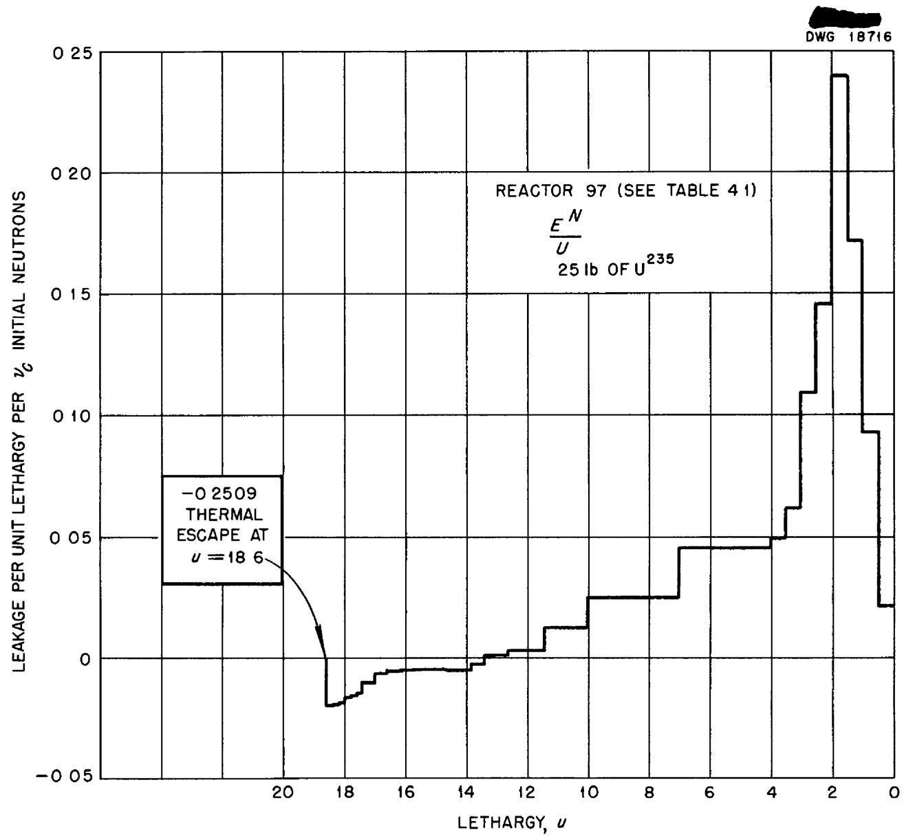  
Fig. 4.1. Leakage Spectrum to Reflector vs. Lethargy.

They then either diffuse back into the fuel region, since the fuel region at the center is a sink for thermal neutrons, or out of the reactor across the outer reflector boundary.

Figure 4.2 shows the spatial distribution of neutrons at three lethargies. The thermal flux is very high in the nonabsorbing beryllium oxide reflector. The lethargy distribution of fissioning absorptions and neutron escape for an assumed neutron source distribution

(Fig. 4.3) is given on Figs. 4.4 and 4.5. Intermediate lethargy fissioning processes are important, but $50\%$ of the fissions results from thermal neutrons streaming into the central region from the reflector. The escape spectrum, which is important for the reactor shield, shows that a very small fraction of fast neutrons escapes from the reflector. The relative values of fast-neutron escape through a 1-in.-thick layer of boron carbide for a

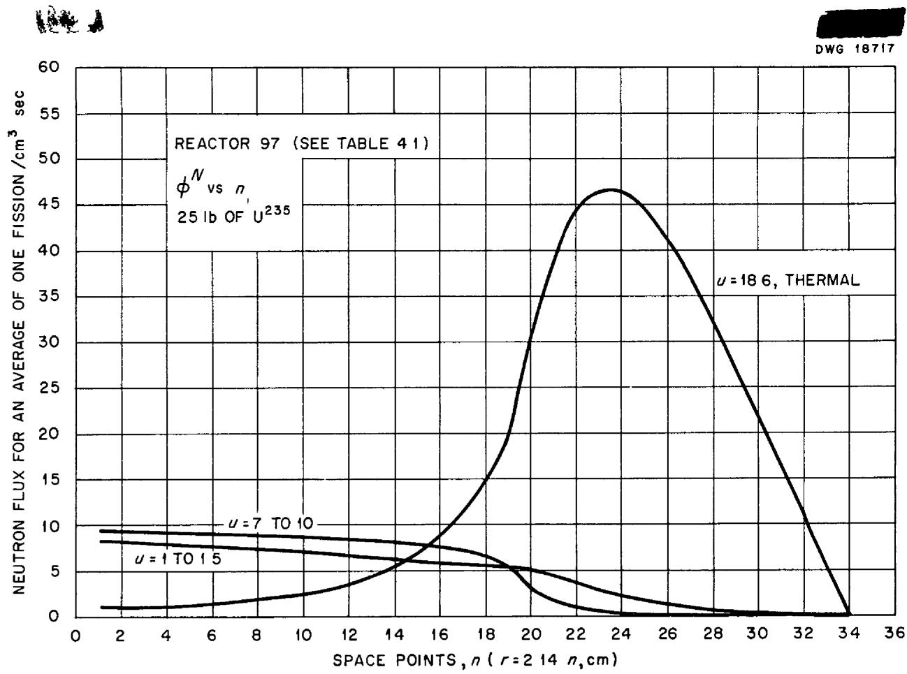  
Fig. 4.2. Neutron Flux Distribution for Three Lethargy Values.

beryllium reflector-moderated reactor as compared with a reactor with a 6-in.-thick beryllium oxide reflector and a moderating core are shown in Fig. 4.6. The fast escape is even smaller for some of the subsequent reflector-moderated reactor designs described below.

In summary, the neutrons are born in the central region, spend the major part of their life in the reflector, and, after moderation, diffuse into and out of the fuel-bearing region. The prompt-neutron lifetime is about $2 \times 10^{-4}$ sec, which is a relatively high value.

There is a positive component in the temperature coefficient of reactivity of this reactor because there is self-shielding of the fuel and a

part of the fissions is caused by fast neutrons in the "Doppler-region." The positive component arises because the increased thermal motion of the $\mathbf{U}^{235}$ atoms effectively broadens and flattens out the resonance peaks in the fission cross sections, particularly those peaks in the high-neutron-energy region. This decreases the self-shielding with respect to neutrons of energies corresponding to the peaks and increases the reactivity.

Theoretical estimates and critical experiments have thus far failed to guarantee that this positive component of the temperature coefficient of reactivity is small compared with the negative component expected from the fuel expansion. However, this reactor is no worse with respect to the Doppler

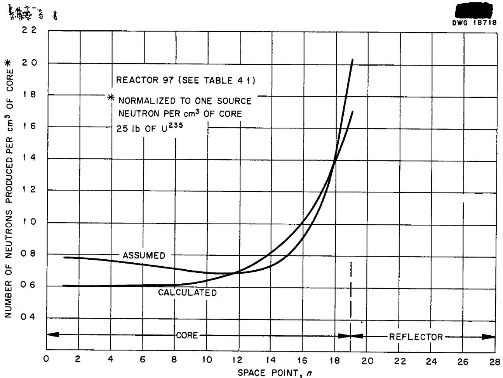  
Fig. 4.3. Spatial Power Distribution.

temperature coefficient of reactivity than the other reactor being studied. A small amount of $\mathbf{U}^{238}$ , added to the fuel or placed in the structure near the fuel, would compensate for a positive temperature coefficient, because with $\mathbf{U}^{238}$ it is the absorption that is self-shielded, and the decrease in the self-shielding with increasing temperature would reduce the reactivity.

Very low absorption and very good moderation must be obtained in the reflector. Structural material at the core-reflector interface should also have a low absorption cross section, although the importance of the cross section at the interface is reduced by the small probability of several thermal-neutron transits because of

the high absorption and low albedo of the fuel region. The structural material in the fuel-bearing region will compete with the uranium for thermal neutrons.

Reactors with Various Reflector-Moderators Computations have been made for a number of possible reactor core sizes and reflector-moderator compositions, and the results are summarized in the following

1. The leakage of fast neutrons from the reflector as a function of the slowing-down power, $\xi \Sigma_{s}$ , of the reflector is shown in Fig. 4.7. A factor of $1/5$ in $\xi \Sigma_{s}$ results in a factor of 400 in the total escape of fast neutrons, that is, neutrons with lethargies smaller than 4. Figure 4.8

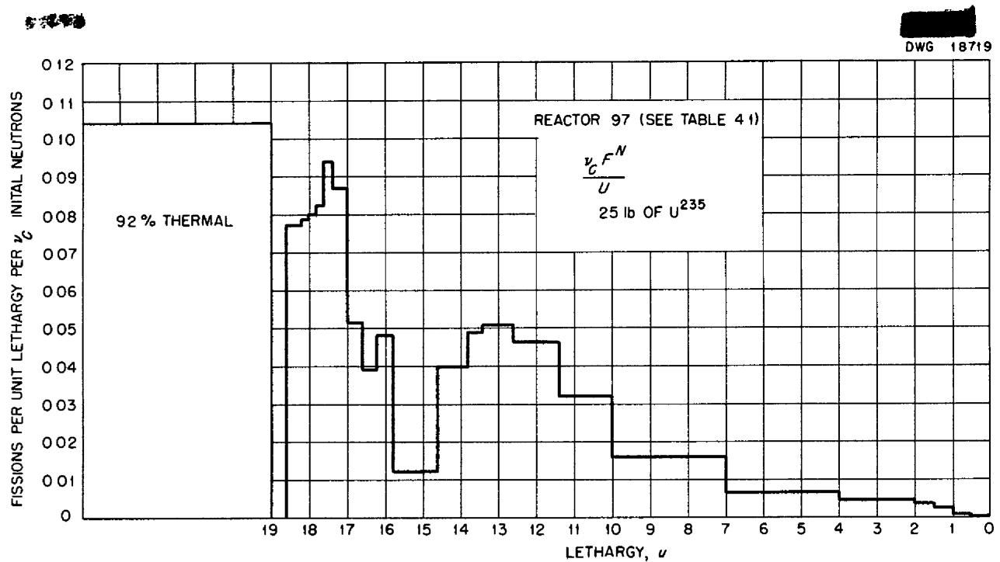

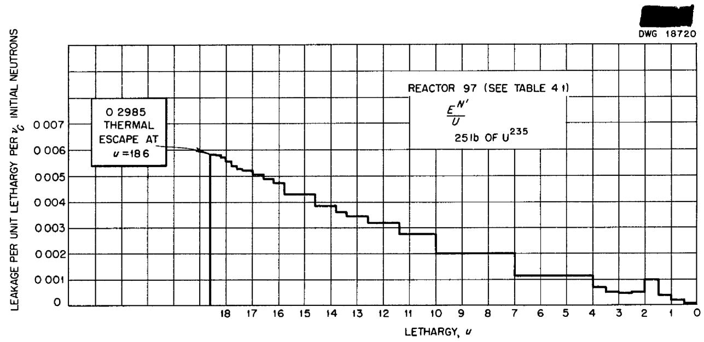  
Fig. 4.4. Fission Spectrum vs. Lethargy.   
Fig. 4.5. Leakage Spectrum to Shield vs. Lethargy.

shows the reflector thickness for a given neutron current escaping from the reflector as a function of the moderating properties of the reflector material. These properties are charac

terized by the age-to-thermal in the reflector material.

2. The absorption in the reactor fuel is sensitive to the slowing-down power, $\xi \Sigma_{s}$ , of the reflector only for

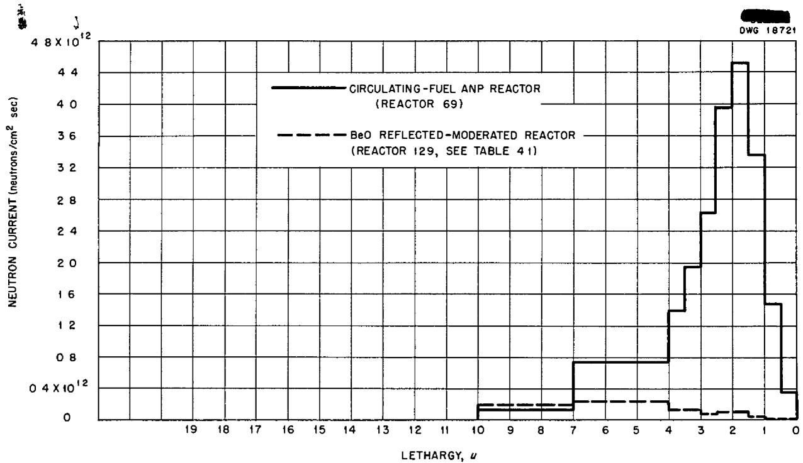  
Fig. 46. Comparison of the Neutron Current from Two Reactors Into the Borated-Water Shield at the 400-Megawatt Power Level.

poor moderators. The absorption decreases rapidly for $\xi \Sigma_{s} < 0.08$ (Fig. 4.9).

3. The escape spectrum vs. lethargy is shown in Fig. 4.10 for the two best reflectors, beryllium and beryllium oxide. The differences in the spectra are characteristic of the differences in the cross sections and the moderating power of the two materials. Beryllium is a much better reflector material than beryllium oxide.

4. The effect of reflector material and thickness on the escape of fast neutrons is shown in Fig. 4.11. In order of desirability, the materials are beryllium, beryllium oxide, 6 in. of beryllium plus 6 in. of carbon, beryllium oxide aggregate, 4 in. of beryllium plus 8 in. of carbon, and carbon. NaOD is a good reflector only with regard to neutron escape. The critical mass with a NaOD reflector is high (60 lb) because of the sodium absorption.

5. The effect of the moderator indicates that there is little dependence of the power distribution on the reflector material in a simple system. The presence of structure and the effect of operating temperature are expected to favor beryllium as the reflector-moderator, if a minimum ratio of peak-to-average power density is to be obtained.   
6. The effect of reflector thickness on reactivity (Fig. 4.12) shows that the beryllium or beryllium oxide reflectors must be over 10 in. thick but that little is to be gained by exceeding 16 in. in thickness.

Reactors with Beryllium Reflector-Moderators. The results given above, as well as other considerations, indicate that beryllium is the best reflector-moderator. Several beryllium reflector-moderated reactors differing in size and design were studied, and the reactivity coefficients were estimated. Although the numbers given

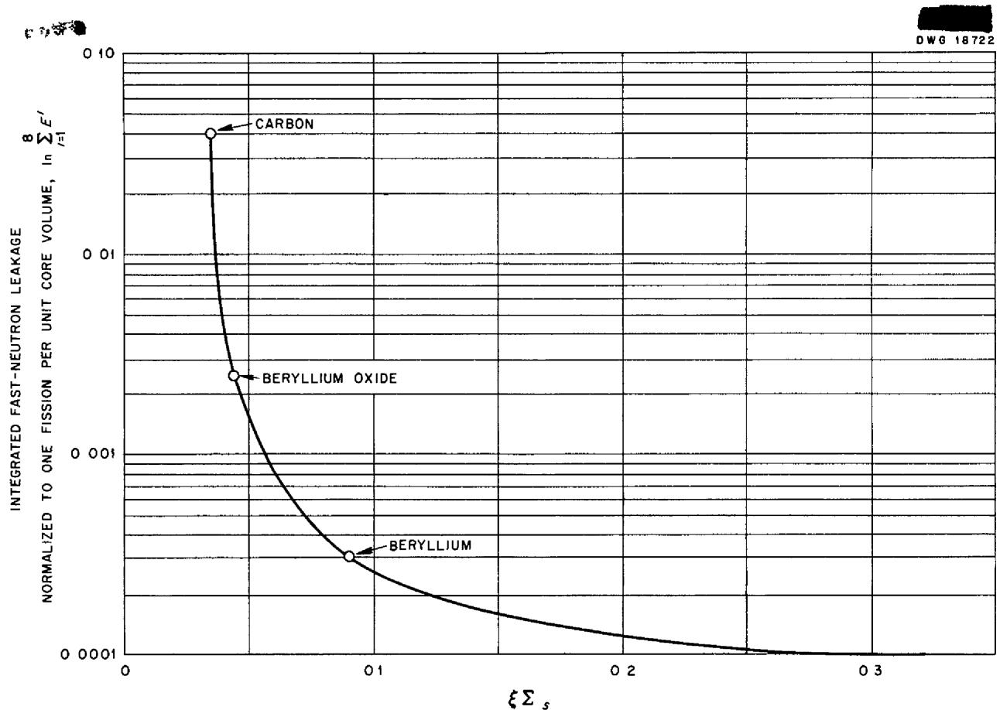  
Fig. 4.7. Total Neutron Leakage of Fission-Energy Neutrons vs. Slowing-Down Power.

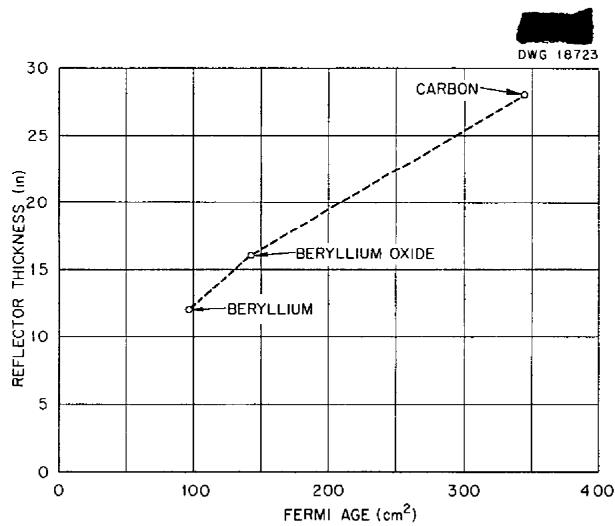  
Fig. 4.8. Reflector Thickness for Constant-Fast Neutron Leakage vs. Ageto-Thermal of the Reflector.

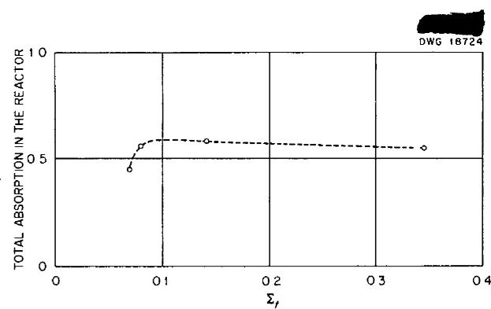  
Fig. 4.9. Neutron Absorption in the Fuel vs. Slowing-Down Power.

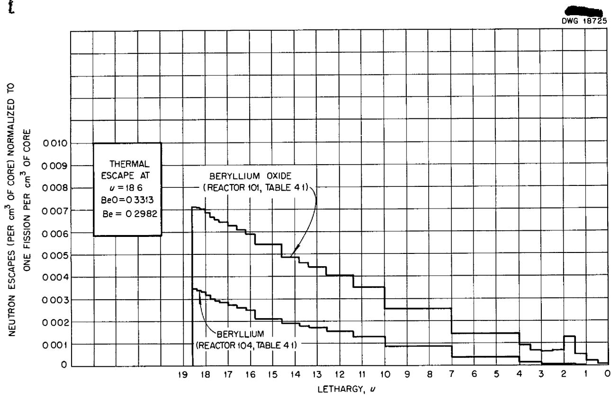  
#   
Fig. 4.10 Neutron Escape Spectrum to the Shield for Beryllium Oxide and Beryllium.

below refer to the specific reactors considered, the general conclusions are believed to be valid for a variety of reflector-moderated reactors.

1. The ratio of the peak-to-average power density can be decreased by replacing the central volume of the fuel with a moderator. The ratio of the peak-to-average power can be reduced to about 1.3, and the critical mass can be reduced to about $\frac{1}{2}$ the corresponding value for a comparable reactor without a center island.

2. The effect of changes in various components on the ratio of peak-to-average power density is of interest. For a basic design, in which the diameters of central moderator, fuel region, and reflector were 14, 22, and 46 in., respectively, and there was 2.8 vol % Inconel in the NaF-UF₄ fuel-coolant (to simulate structure between

fuel and reflector), the relative changes are indicated by the fractions given below. The denominator is the fractional change in the parameter noted. The numerator refers to the ratio of the peak power density to the average power density and represents the fractional change of this ratio caused by the change indicated in the denominator.

# PARAMETERS

Amount of U235 in the fuel $\frac{\Delta P / P}{\Delta M / M} = \sim 0.16$

Fuel layer thickness $\frac{\Delta P / P}{\Delta T / T} = \sim 0.34$

Structure weight fraction $\frac{\Delta P / P}{\Delta\rho / \rho} = \sim -0.067$

Radius of central moderator $\frac{\Delta P / P}{\Delta R / R} = \sim -0.117$

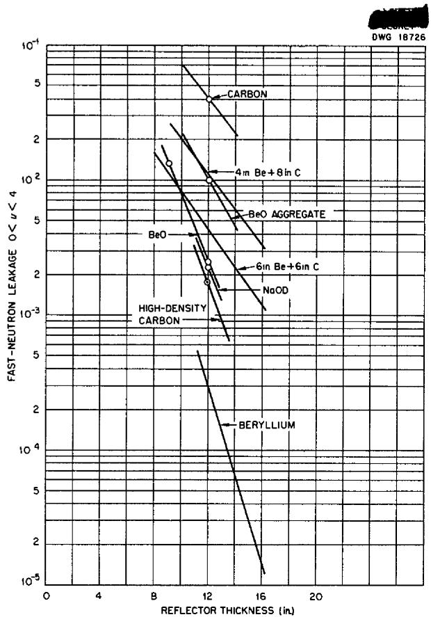

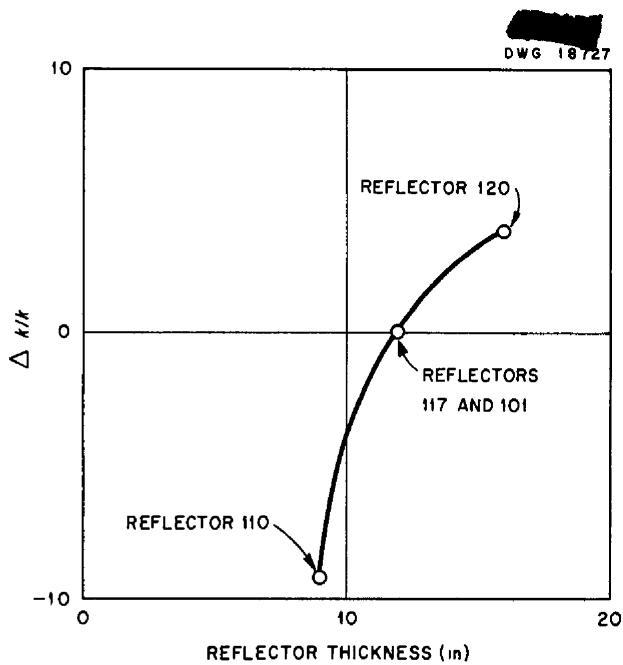  
Fig. 4.11. Fast-Neutron Leakage vs. Reflector Thickness.   
Fig. 4.12. Effect of Reflector Thickness on Multiplication Constant.

The computed values of peak-to-average power density at the two sides and at the center of the fuel-coolant region are tabulated in Table 4.l.

3. The reactivity coefficients of design interest are, where $\rho$ is density, $M$ is weight, and $T$ is thickness

For core structure, $\frac{\Delta k / k}{\Delta\rho / \rho} = \sim -0.052$

For fuel layer thickness, $\frac{\Delta k / k}{\Delta T / T} = \sim -0.17$

For beryllium reflector, $\frac{\Delta k / k}{\Delta\rho / \rho} = \sim 0.52$

For $\mathbf{U}^{235}$ content, $\frac{\Delta k / k}{\Delta M / M} = \sim 0.22$

For NaF coolant, $\frac{\Delta k / k}{\Delta\rho / \rho} = \sim 0.106$

4. The substitution of 6 or 8 in. of carbon for beryllium in the reflector increases the critical mass by 15 and $25\%$ , respectively.   
5. Most of the structural materials that might be used between the fuel and moderator have a high absorption cross section, and therefore some of the thermal neutrons coming from the reflector are absorbed. The loss of all the thermal neutrons would increase the critical mass by a factor of at least 10. A $1/4$ -in.-thick layer of Inconel might result in a reactivity loss of as much as 0.24, which implies an increase in critical mass of the order of $100\%$ .   
6. A negative component of the temperature coefficient of reactivity is obtained from the thermal expansion of the fuel, for two reasons (1) the loss of scattering centers for fast neutrons and (2) the loss of fuel from the active volume. If an expansion coefficient for the fuel of $2 \times 10^{-4} / {}^{\circ}\mathrm{F}$ is assumed, the temperature coefficients resulting from these two effects are, respectively, $0.2 \times 10^{-4} / {}^{\circ}\mathrm{F}$ and $0.4 \times 10^{-4} / {}^{\circ}\mathrm{F}$ , a total of $0.6 \times 10^{-4} / {}^{\circ}\mathrm{F}$ . The first of these reactivity coefficients is smaller for some other reactors (for example, the

TABLE 4.1. STATIC PHYSICS OF SEVERAL REFLECTOR-MODERATED REACTOR DESIGNS   

<table><tr><td rowspan="2">REACTORCALCUATIONNUMBER</td><td rowspan="2">REACTORTYPE</td><td rowspan="2">REFLECTOR(1 ft thick)</td><td colspan="2">FUEL REGION</td><td rowspan="2">CRITICALMASS(1b)</td><td rowspan="2">THERMAL FISIONS(%)</td><td colspan="3">REACTIVITY COEFFICIENTS</td><td colspan="3">POWER DENSITY RATIOS</td><td rowspan="2">TOTALNEUTRONESCAPE</td><td>ESCAPEOF FASTNEUTRONS(1)(0 2 to 10 MeV)</td></tr><tr><td>OutsideDiameter(in)</td><td>InsideDiameter(in)</td><td>Thermal BaseΔk/kΔθ(F)</td><td>U23MassΔk/kΔM/M</td><td>Over all(°)Δk/kΔθ(°F)</td><td>InsidePeaktoAverage</td><td>OutsidePeaktoAverage</td><td></td><td></td></tr><tr><td>103</td><td>Circulating fuel3 regions</td><td>NaOD</td><td>22</td><td>14</td><td>60</td><td>40</td><td>9 6 × 10-4</td><td>0 20</td><td></td><td>1 26</td><td>1 16</td><td>0 90</td><td>0 397</td><td>0 00228</td></tr><tr><td>121</td><td>Circulating fuel(str (&quot;) ) 2regions</td><td>Be(Na cooled)</td><td>22</td><td></td><td>25</td><td>45</td><td>10 6 × 10-4</td><td>0 20</td><td>-7 × 10-5</td><td>2 16</td><td>0 52</td><td></td><td>0 299</td><td>0 0002996</td></tr><tr><td>124</td><td>Fuel plates(Nacooled) 3regions</td><td>Be(Na cooled)</td><td>19</td><td>9</td><td>17</td><td>38</td><td>7 5 × 10-4</td><td>0 25</td><td></td><td>1 19</td><td>1 59</td><td>0 75</td><td>0 264</td><td>0 0002596</td></tr><tr><td>117</td><td>Circulating fuel(str ) 3regions</td><td>Be(Na cooled)</td><td>22</td><td>14</td><td>14 8</td><td>59</td><td>6 5 × 10-4</td><td>0 42</td><td>-8 × 10-5</td><td>1 18</td><td>1 35</td><td>0 83</td><td>0 299</td><td>0 000291</td></tr><tr><td>118</td><td>Circulating fuel(str ) 3regions</td><td>Be(Na cooled)</td><td>19</td><td>11</td><td>12</td><td>58</td><td>17 6 × 10-4</td><td>0 27</td><td></td><td>1 14</td><td>1 29</td><td>0 85</td><td>0 335</td><td>0 000328</td></tr><tr><td>119</td><td>Circulating fuel(str ) 3regions</td><td>Be(Na cooled)</td><td>22</td><td>11</td><td>17</td><td>52</td><td>6 9 × 10-4</td><td>0 26</td><td></td><td>1 14</td><td>1 29</td><td>0 85</td><td>0 303</td><td>0 000280</td></tr><tr><td>120</td><td>Circulating fuel(str ) 3regions</td><td>Be(Na cooled) 16 inthick</td><td>22</td><td>14</td><td>13</td><td>60</td><td>11 5 × 10-4</td><td>0 25</td><td></td><td>1 15</td><td>1 29</td><td>0 86</td><td>0 222</td><td>0 0000149</td></tr><tr><td>105</td><td>Circulating fuel3 regions</td><td>Be(Na cooled)</td><td>22</td><td>14</td><td>9</td><td>65</td><td>8 7 × 10-4</td><td>0 30</td><td>-8 × 10-5</td><td>1 14</td><td>1 28</td><td>0 86</td><td>0 308</td><td>0 00029</td></tr><tr><td>95</td><td>Circulating fuel2 regions</td><td>BeO</td><td>16</td><td></td><td>22</td><td>28</td><td>4 4 × 10-4</td><td>0 27</td><td>-7 × 10-5</td><td></td><td>1 95</td><td>0 50</td><td>0 447</td><td>0 0043</td></tr><tr><td>97</td><td>Circulating fuel2 regions</td><td>BeO</td><td>32</td><td></td><td>18 5</td><td>53</td><td>-2 1 × 10-4</td><td>0 47</td><td>-12 × 10-5</td><td>1 71</td><td>0 60</td><td></td><td>0 345</td><td>0 0020</td></tr><tr><td>101</td><td>Circulating fuel3 regions</td><td>BeO</td><td>22</td><td>14</td><td>9 4</td><td>60</td><td>-0 5 × 10-4</td><td>0 30</td><td>-8 × 10-5</td><td>1 10</td><td>1 30</td><td>0 85</td><td>0 390</td><td>0 0025</td></tr><tr><td>109</td><td>Circulating fuel(air cooled) 3regions</td><td>BeO</td><td>48</td><td>24</td><td>160</td><td>40</td><td>1 4 × 10-4</td><td></td><td></td><td>2 34</td><td>2 11</td><td>0 55</td><td></td><td></td></tr><tr><td>108</td><td>Fuel plates(Nacooled) 3regions</td><td>BeO</td><td>22</td><td>14</td><td>35</td><td>40</td><td>1 9 × 10-4</td><td>0 20</td><td>-9 × 10-5</td><td>1 21</td><td>1 69</td><td>0 71</td><td>0 352</td><td>0 0029</td></tr><tr><td>115</td><td>Circulating fuel3 regions</td><td>BeO aggregate</td><td>22</td><td>14</td><td>35</td><td>30</td><td>7 × 10-4</td><td>0 20</td><td></td><td>1 07</td><td>1 21</td><td>0 90</td><td>0 473</td><td>0 01037</td></tr><tr><td>102</td><td>Circulating fuel3 regions</td><td>C</td><td>32</td><td>20</td><td>33</td><td>40</td><td>-17 × 10-4</td><td>0 20</td><td>-5 × 10-5</td><td>1 3</td><td>1 2</td><td>0 90</td><td>0 450</td><td>0 040</td></tr><tr><td>122</td><td>Circulating fuel(str ) 3regions</td><td>C Be(high ρ)</td><td>22</td><td>14</td><td>13</td><td>57</td><td>6 5 × 10-4</td><td>0 56</td><td></td><td>1 15</td><td>1 29</td><td>0 86</td><td>0 297</td><td>0 00167</td></tr><tr><td>127</td><td>Circulating fuel2 regions</td><td>Be(4 in ) C(8 in )</td><td>16</td><td></td><td>31</td><td>35</td><td>4 08 × 10-4</td><td>0 20</td><td></td><td>1 86</td><td>0 52</td><td></td><td>0 488</td><td>0 010744</td></tr><tr><td>128</td><td>Circulating fuel2 regions</td><td>Be(6 in ) C(6 in )</td><td>16</td><td></td><td>25 5</td><td>38</td><td>7 01 × 10-4</td><td>0 20</td><td></td><td>1 93</td><td>0 49</td><td></td><td>0 440</td><td>0 00436</td></tr><tr><td>129</td><td>Circulating fuel(str ) 3regions</td><td>Be(Na cooled)</td><td>19</td><td>8</td><td>23</td><td>47</td><td>8 02 × 10-4</td><td>0 16</td><td>-4 × 10-5</td><td>0 92</td><td>1 75</td><td>0 65</td><td>0 343</td><td>0 000501</td></tr><tr><td>137</td><td>Critical experi-ment 20 mIfoil and sodiumcans 3 regions</td><td>Be</td><td>16</td><td>10</td><td>30</td><td>47</td><td>10 0 × 10-4</td><td></td><td></td><td>1 27</td><td>1 00</td><td>0 87</td><td>0 367</td><td>0 001191</td></tr><tr><td>140</td><td>R 118 with ρ(NaF)× 1/2 3 regions</td><td>Be(Na cooled)</td><td>19</td><td>11</td><td>15</td><td>56</td><td>10 5 × 10-4</td><td></td><td></td><td>0 96</td><td>1 34</td><td>0 83</td><td>0 343</td><td>0 0003866</td></tr></table>

(a)Does not include the Doppler effect   
(b) Through 1 in of boron carbide   
(c) In these calculations, structure was added to the fuel to simulate structure between fuel and moderator

ARE factor of 10, but the second is approximately the same.

7. The mean lifetime of the prompt neutrons is about $4 \times 10^{-4}$ sec for the beryllium-reflected reactor with a center island. About $1/2\%$ of the prompt neutrons has a mean lifetime of the order of $10^{-2}$ sec because of the low absorption and leakage probability in the reflector.

8. A cooling system must be provided for the moderator because of gamma and neutron heating, about $4\%$ of the total power appears in the moderator volume. Insertion of such a system means an increased amount of structure in the reflector, which, in turn, causes a loss in reactivity and a gain in gamma-ray intensity. This problem is being studied.

9. One aspect of importance from the shielding standpoint is the energy spectrum of the neutrons escaping from both the surface of the thick reflector and through the fuel-circulation passages at the reactor ends. This spectrum is strongly thermal for the reflectors of interest. The addition of 1 in. of boron carbide at the reflector boundary reduces the total leakage through the sides of the reactor to the values listed in Table 4.1 as "escape of fast neutrons." The use of a nonpoisoning, heavy material (lead or bismuth) as the reflector coolant may be beneficial from the shielding standpoint because it should moderate fast neutrons by inelastic scattering and also serve as gamma shielding. The fast leakage through the fuel passages and from fissioning in these passages must be minimized by suppression of fission and by the addition of extra shielding material. This problem is not easily adaptable to calculation, and hence critical experiments will be performed to evaluate leakage control methods.

10. A feasible reflector-moderated reactor can be built by replacing the circulating-fuel coolant (for example,

$\mathrm{NaF - UF_4}$ with uranium-bearing stainless steel fuel plates and sodium coolant. A design incorporating this feature has been proposed by A. S. Thompson. Shim control for such a reactor can be accomplished by varying the concentration of potassium in the sodium coolant. By this means, the relative burnup could be made very large. These results imply that the goal of a simple, structureless core is impractical because the fuel solvent is inadequate as a moderator. An island of solid moderator in the center of the core seems to be desirable, and the usefulness of such an island is not entirely nuclear. As will be shown later, the hydrodynamics of a reflector-moderated reactor are also aided by a central island.

Summary Tables and Graphs. The multiplication constants of two- and three-region reflector-moderated reactors as a function of uranium weight in the fuel region for several core and island sizes and moderator compositions are given in Fig. 4.13. The various reactors referred to in this figure are described in Table 4.1. The figure summarizes a number of point values for reactivity. To facilitate the extrapolation, the curves drawn through point values indicate the manner in which the multiplication constant varies with uranium weight for the particular reactor to which the point value refers. If only two-region reactors are considered, the shapes of the curves vary systematically with the position of the point value in the uranium weight vs. $k_{eff}$ plane. Hence, only a few of the curves were actually computed, and the others were drawn by analogy. Likewise, a few $k_{eff}$ vs. uranium weight curves can be computed for three-region reactors and then similar curves can be drawn through the point values. The shapes of the curves for three-region reactors are, of course, different from those for

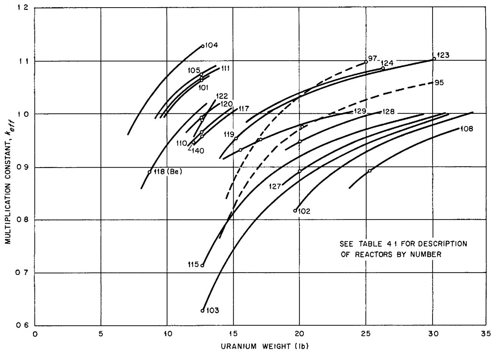  
Fig. 4.13. Uranium Weight vs. $k_{eff}$ for Several Reflector-Moderated Reactors.

the two-region reactors. (Three-region reactors have center islands.)

The curves described above are not expected to be exact. It should be noted that the IBM multi-group method starts with an assumed power distribution, and, if the calculation results in a power distribution different from the assumed one, an iteration must be made by using the computed distribution as a start. Such iterations were carried out only where essential. Whenever possible, fuel-coolant constituents were held constant to emphasize the effects of main interest. It is to be noted that any fuel self-shielding or poisoning effect, or any change in reactor size, is reflected by a rapid change in reactivity and a

rapid change in the slope of the curves of $k_{\text{eff}}$ vs. $U^{235}$ mass.

Typical results of the multigroup solution of the neutron diffusion processes are given in Figs. 4.14 to 4.17. Figures 4.14 and 4.15 give spatial power distribution and flux spectra, respectively, for one extreme case - a reactor with a small (8-in.-dia.), central, moderator region, a thick (5 1/2-in.), fuel-bearing region, and sodium-cooled fuel plates. The relatively high peak-to-average ratio in the power distribution curve, Fig. 4.14, emphasizes the value of a thin fuel layer. Figures 4.16 and 4.17 give the computed power and flux distribution for the first critical

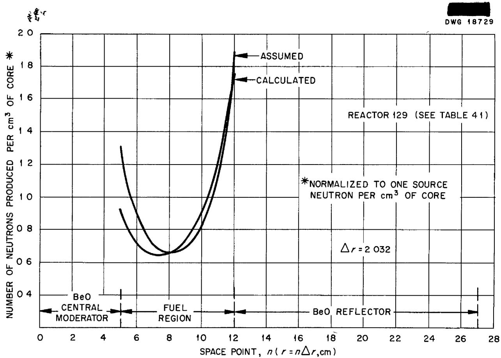  
Fig. 4.14. Spatial Power Distribution for a Three-Region Reactor with a Thick Fuel Annulus.

experiment calculation, for which 1-by 3- by 3-in. sodium-filled cans and 10-mil-thick, 3-in.-dia, U²³⁵ fuel disks were used. A comparison with the experimental results is given in the next section.

# CRITICAL EXPERIMENTS

D. V. P. Williams R. C. Keen  
J. J. Lynn  
Physics Division

Dunlap Scott, ANP Division Experiments C. B. Mills, ANP Division Computations

First Critical Assembly. A preliminary critical assembly of the reflector-moderated circulating-fuel reactor was described previously.(2) Some information already reported is

repeated here to give a unified picture of the first reflector-moderated reactor critical experiment. The fuel consisted of 0.020-in.-thick pieces of U²³⁵ metal lumped between l-in. layers of sodium canned in stainless steel. This arrangement was shown to be inefficient in neutron utilization because of the self-shielding in the thick uranium layers. The self-shielding of the fuel was measured experimentally by replacing one of the 20-mil fuel disks with 10 disks that were each 2 mils thick with aluminum catcher foils between them. The activity of the catcher foils showed that the 20-mil layers

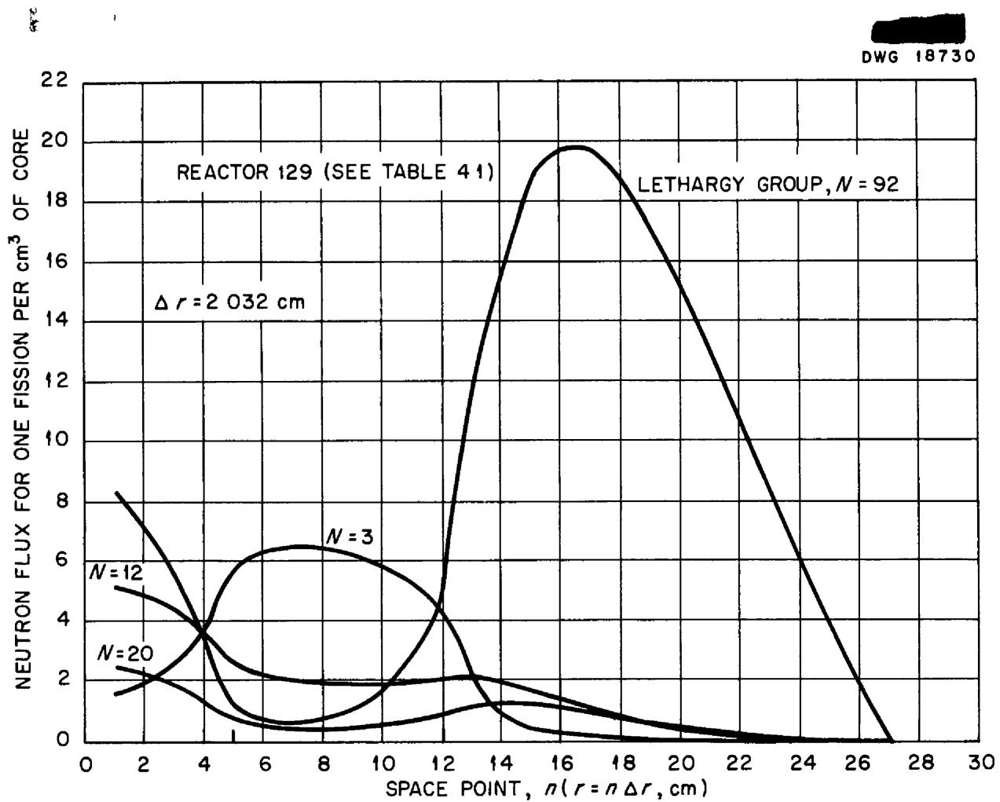  
Fig. 4.15. Spatial Flux Distribution for a Three-Region Reactor with a Thick Fuel Annulus.

were $66\%$ effective, the corresponding theoretical estimate was $63\%$ .

The critical mass was found experimentally to be $15\mathrm{kg}$ of $\mathbf{U}^{235}$ . With this loading, a multiplication constant of 1.03 was calculated by the multi-group method. The usual self-shielding correction for the lumped fuel was used. The calculation was carried out for a spherical shape, whereas the actual geometry was rectangular. This difference was accounted for by reducing the fuel volume for calculation purposes by $10\%$ . The computation did not include any poisoning effect of impurities in the materials.

The neutron-flux traverses measured radially through the mid-plane of the reactor were given previously. (3) The activations of bare- and cadmium-covered-indium foils and their differences were shown. These results are typical of those obtained along other traverses, and they confirm the prediction of high neutron flux in the moderator island and reflector. This effect is, as expected, particularly pronounced for thermal neutrons.

The cadmium fraction, derived from the indium-foil activation data and defined as the ratio of the activation

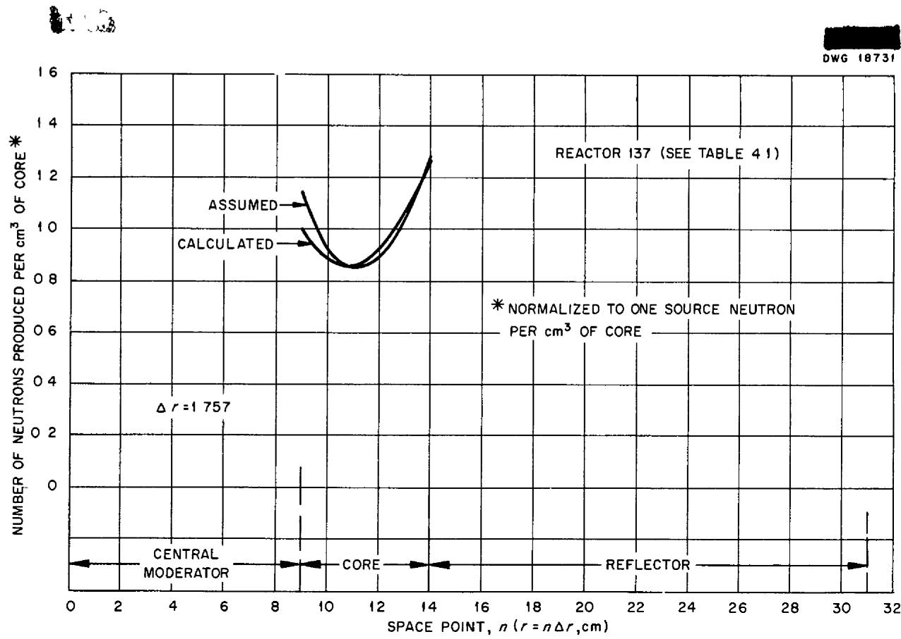  
Fig. 4.16. Calculated Spatial Power Distribution for the First Critical Assembly.

by neutrons of energy below the cadmium cut-off to the activation by all neutrons, was given previously. (4) The values of this cadmium fraction, as calculated from the IBM multigroup computations, were also plotted. Theoretical and experimental values practically coincide in the center of the fuel and in the bulk of the reflector. The discrepancy at the fuel surface is not surprising, since all practical calculation methods, including the "age" multigroup method, are not exact near boundaries.

The fissioning distribution throughout the fuel region is shown in Fig. 4.18. The experimental values are catcher-foil measurements. Since the measurements were not normalized,

there is no significance in the close agreement of the absolute values of the theoretical and experimental curves. However, the agreement in the peak-to-average ratios of power density does seem significant. The discrepancy in the shape of the curves inside the fuel layer can be attributed to the fact that there is more moderator in the rectangular center island than was assumed in the computation based on spherical geometry.

To determine the reactivity loss expected from structural material at the core-reflector interface, an experiment was performed (Fig. 4.19) with one-half of one of the four outside surfaces of the core covered with $\frac{1}{4} - \frac{1}{n}$ . stainless steel plates. The loss in reactivity was 220 cents, which is consistent with the theoretical

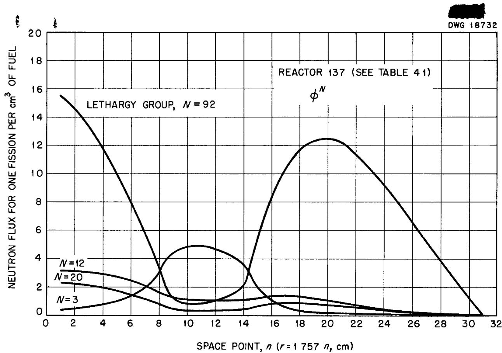  
Fig. 4.17. Calculated Flux Spectrum for the First Critical Assembly.

value of $24\%$ for an Inconel layer over both the inner and the outer fuel-reflector interfaces.

A 1-in.-thick layer of lead or bismuth at the core-reflector interface (where it seems to be most useful) on one of the four outer surfaces of the core cost $0.24\%$ in $k_{eff}$ for bismuth and $0.91\%$ for lead, as compared with a void.

Second Critical Assembly. A second assembly with fuel properties that more closely resemble those of a possible full-scale reactor was constructed. In this second assembly, the fuel was a mixture of 66 wt% $\mathsf{ZrO}_2$ , 24 wt% NaF and 10 wt% C (the $\mathsf{ZrO}_2$ -C combination simulates $\mathsf{ZrF}_4$ ), with sufficient enriched $\mathsf{UF}_4$ added to make the $\mathsf{U}^{235}$ density 0.2 g/cm³. The well-homogenized powder mixture was packed in 1 l/4-in. square aluminum

tubes that were arranged around the central beryllium core and were, in turn, surrounded by the beryllium and graphite reflector. These regions may be seen in Fig. 4.20, which shows the loading in a plane through the axis of the reactor. The maximum cross section of the beryllium island was 9 by 9 in., and the maximum thickness of the fuel region was 4 l/2 inches. (With materials available, it was not possible to completely fill the fuel region at all axial locations.) The thickness in the fuel region was decreased in both directions from the center to simulate the inlet and outlet ducts of the full-scale reactor. Figure 4.21 is a photograph of the assembly at section AA of Fig. 4.20. This assembly was critical with a loading of 7.7 kg of U235.

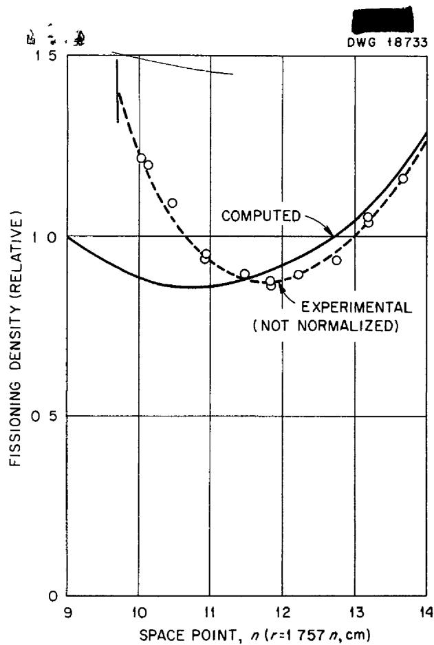  
Fig. 4.18. Measured Fissional Distribution in the Fuel Region of the First Critical Assembly.

Neutron flux distributions measured with bare- and cadmium-covered-ium foils along a horizontal traverse lying in the mid-plane of the assembly are shown in Fig. 4.22. Note the spatial distribution of the cadmium fraction, that is, the fraction of neutrons, detected by indium, that have energies below the cadmium cut-off. Both the experimental values for the cadmium fraction and those computed by the multigroup method are presented. The difference is within experimental error, except at the core-reflector interface where it is about $40\%$ . The experiments indicate a neutron energy lower than that computed for this point. (Recent data indicate that this difference may be caused by

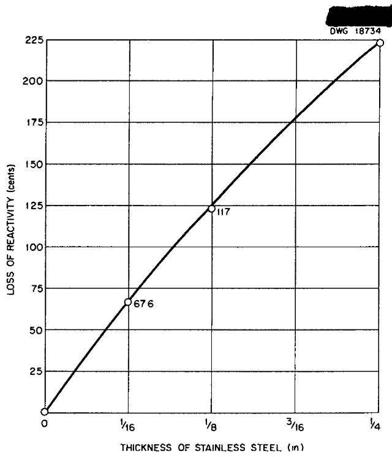  
Fig. 4.19. Reactivity Loss vs. Thickness of Stainless Steel at the Fuel-Reflector Interface of the First Critical Assembly.

the void at the interface, which is peculiar to the structure of the critical experiment.)

The experimental cadmium fraction curve shown in Fig. 4.21 is repeated as curve A in Fig. 4.23, which gives the distribution of the fraction of neutrons, detected by indium, with energies below the cadmium cut-off. Curve B of Fig. 4.23 was obtained from the first critical experiment. Comparison of the two curves shows the similarity of the spectra in the center of the fuel in the two assemblies. It is to be remembered that the fuel layer in the first mockup was only 3 in thick.

A preliminary measurement of the neutron leakage spectrum gave values of the cadmium fraction for indium-detected neutrons at the outside edge of the reflector, both on the axis and at the side at the mid-plane. The respective values were 0.4 and

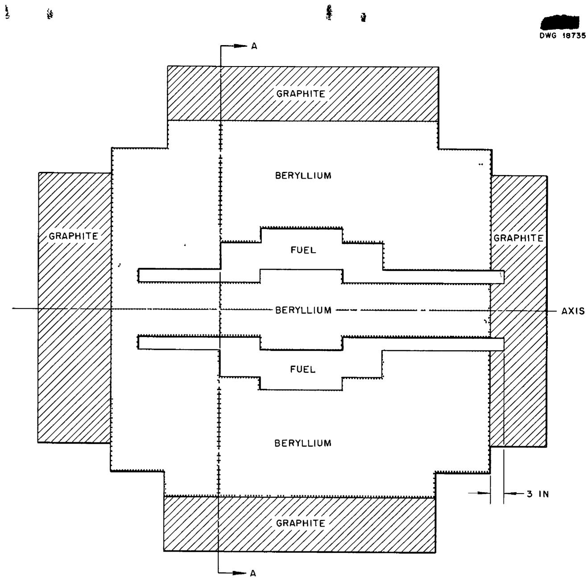  
Fig. 4.20. Vertical Cross-Section of the Second Critical Assembly.

09 A measure of the fission rate or power distribution in a direction parallel to the reactor axis has been obtained from the improvisation illustrated in Fig. 4.24. Uranium metal disks, 1.4 in. in diameter and 0.002 in. thick, in contact with aluminum disks, 0.005 in. thick, were placed adjacent to one of the fuel containers, and the activity on the

aluminum, caused by recoiling fission fragments, was counted. The low value at the 17-in abscissa point probably resulted from the shielding of externally reflected neutrons by the layer of fuel that was thicker there than at the 20-in abscissa point.

In a similar manner, an attempt was made to determine the fission rate pattern in a direction perpendicular

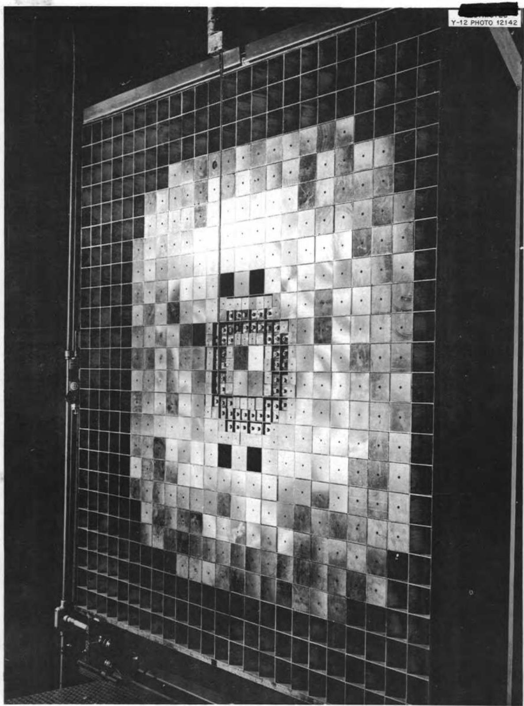  
Fig. 4.21. Photograph of Second Critical Assembly at Section AA of Fig. 4.20.

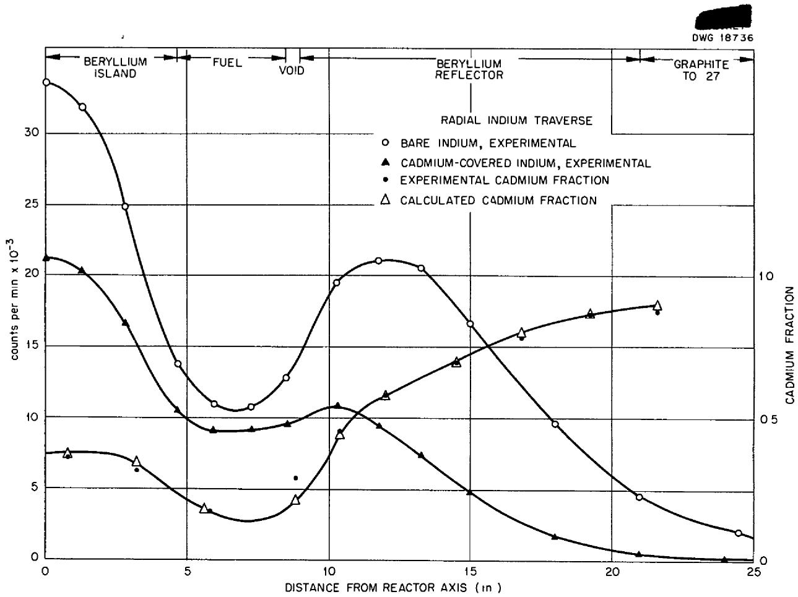

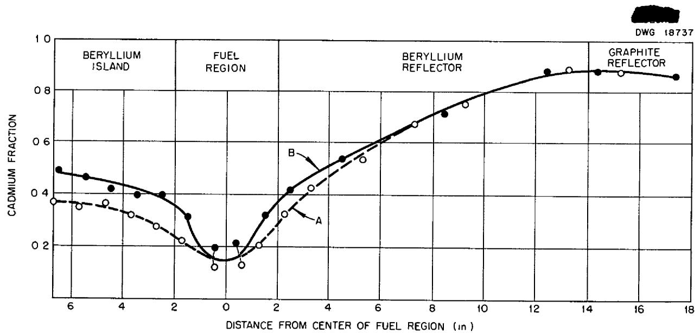  
Fig. 4.22. Radial Indium Activation and Cadmium Fraction in the Second Critical Assembly.   
Fig. 4.23. Comparison of the Cadmium Fractions in the Two Critical Assemblies.

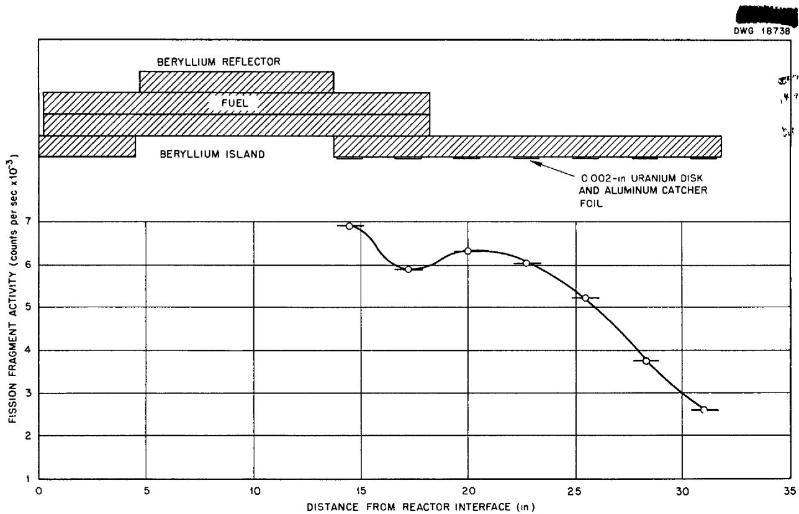  
Fig. 4.24. Measured Power Distribution Parallel to Axis of Second Critical Assembly.

to the axis along a horizontal line lying in the mid-plane. Uranium disks and small (5/16 in. in diameter) aluminum catcher foils were placed between the fuel containers. The results show a center-to-edge activity ratio of 0.45, that is, a $55\%$ depression in the power across a fuel layer 3.75 in. wide. By direct measurement with 20-mil cadmium in the first critical assembly, it was found that $70\%$ of the fissions was caused by neutrons with energy below the cadmium cut-off. From the similarity of the spectra, it is suspected that about the same distribution occurs in the second case. No direct measurement was made.

# DESIGN CHARACTERISTICS

# A. P. Fraas, ANP Division

Although the many complex and interrelated considerations underlying

the design of the full-scale reactor shown in Fig. 4.25 should logically precede a detailed description, an exposition of these considerations will be greatly simplified by early reference to a fairly specific system. Therefore, this section begins with a description of the reflector-moderated reactor design and subsequently takes up the more significant of the many factors that have entered into that design.

Much work remains to be done on reflector-moderated reactors to give better bases for detailed designs, but the construction indicated by Fig. 4.25 seems to be the most promising one considered, to date, for an aircraft power plant. This cross section through the reactor core, moderator, and heat exchanger shows a series of four concentric shells, each of which is a surface of revolution.

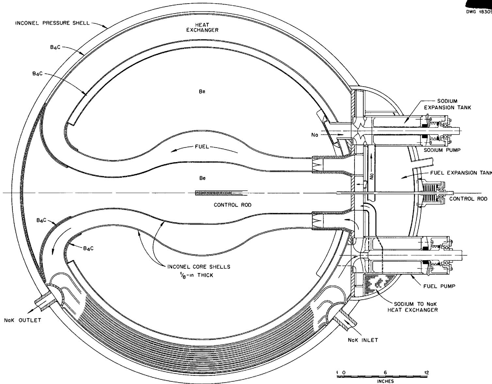  
Fig. 4.25. Three Region Reflector-Moderated Reactor.

The two inner shells surround the fuel region at the center, that is, the core of the reactor, and separate it from the beryllium island at the center and from the outer beryllium reflector. The fuel circulates downward through this region in which the fissioning takes place and then downward and outward to the entrance of the spherical shell heat exchanger that lies between the moderator outer shell and the main pressure shell. The fuel flows upward between the tubes in the heat exchanger into two mixed flow pumps at the top. From the pumps, it is discharged inward to the top of the annular passage leading back to the reactor core. The total fuel volume in the system for this design would be approximately 7 ft³, of which approximately 1 l/3 ft³ would be in the reactor core. Most of the remaining fuel would be in the interstices between the tubes in the heat exchanger. The moderator was designed to be cooled by sodium flowing downward through the annular space between the beryllium and the enclosing shells and back upward through passages in the beryllium. Two centrifugal pumps at the top circulate the sodium first through the moderator and then through the small toroidal sodium-to-NaK heat exchangers around the outer periphery of the pump and expansion tank region. A horizontal section through the pump and expansion tank region is shown in Fig. 4.26. Note that sump pumps with gas seals are used. A pump of this type recently completed 1000 hr of very successful operation in a fluoride system, with pump inlet temperatures of about 1400°F.

The primary construction material is Inconel because it seems to be the material that is most resistant to fluoride corrosion. Beryllium was chosen as the moderator material, partly because it seemed to be the best material obtainable, from both shielding and critical mass standpoints, and partly because its physical

properties seem to be superior to those of any other material that might be used in that location, other than graphite. It was decided that the vase-shaped island in the center should be used, partly because it reduced the critical mass and improved the power distribution in the fuel region, and partly because hydrodynamically it promised to give the simplest and most desirable fuel passage. The 12-in.-thick beryllium reflector followed by 1 in. of boron carbide was chosen originally to keep the neutrons escaping to the heat exchanger region to a level approximately equal to that of the delayed-neutron flux from the circulating fuel in that region. It has since proved to be nearly an optimum configuration from both critical mass and shielding standpoints.

The spherical shell heat exchanger, which makes possible the compact layout of the reactor-heat exchanger assembly, is based on the use of tube bundles curved in such a way that the tube spacing is uniform, irrespective of latitude. The individual tube bundles terminate in headers that resemble shower heads before the tubes are welded in place. This arrangement facilitates assembly because a large number of small tube-to-header assemblies is made leaktight much more easily than one large unit. Furthermore, these tube bundles give a rugged flexible construction that resembles steel cable and is admirably adapted to service in which large amounts of differential thermal expansion must be expected. This basic tube bundle and spacer construction was used in a small NaK-to-NaKheat exchanger that operated satisfactorily for 3000 hr with a NaK inlet temperature of $1500^{\circ}\mathrm{F}$ . Two

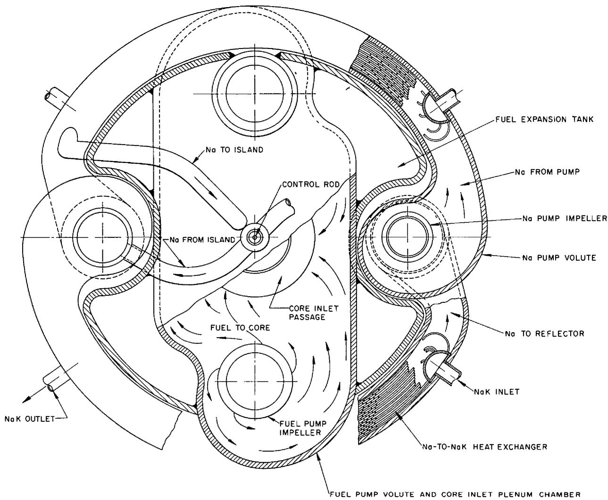  
Fig. 4.26. Cross Section Through Pump and Expansion Tank.

sodium pumps and two sodium-to-NaK heat exchangers are provided so that failure of one pump or one heat exchanger will not completely disable the reactor.

Factors Affecting Core Diameter. The first factor considered in establishing the reactor core diameter (the fuel region) was the effect of diameter on critical mass. Although much work remains to be done to establish the core diameter, it appears, at this time, that the critical mass is essentially independent of the core diameter. A more important factor affecting critical mass is the

presence and size of the island. It appears that the use of a beryllium island with a diameter one-half that of the fuel region cuts the critical mass approximately in half. At the same time, the island reduces the ratio of the peak-to-average power density by a factor of about 1.5. Further work on the effects of island size and fuel region thickness is under way.

A careful scrutiny of the data that have been obtained on the melting point, viscosity, and thermal conductivity of various fluoride melts indicates that it will probably not

be possible to obtain a fluoride fuel with more than 4 mole % uranium that has close to optimum physical properties from the heat transfer standpoint, in fact, from the standpoint of physical properties, there appears to be an important incentive for keeping the uranium concentration less than 2 mole%. On the basis of critical mass data from the calculations and the critical experiments, it appears that a fuel-region diameter of at least 18 in. will be required to satisfy this condition.

A major consideration in establishing the core diameter is the power density. Work is currently under way to determine the effect of power density on radiation damage. Although the experimental results are difficult to interpret and therefore no clearly defined limit to the allowable power density has been established, it is entirely conceivable that radiation damage considerations will not be the limiting factor.

The kinetics of reactor control are very complex. Work carried out thus far on control of the reactor indicates that transient power surges may cause unacceptably large temperature excursions if the temperature of the circulating fluoride fuel exceeds 1000 to $2000^{\circ}\mathrm{F}$ per second. A temperature rise of $2000^{\circ}\mathrm{F} / \mathrm{sec}$ in the fuel would imply a power density of approximately $3\mathrm{kw/cm}^3$ . This, in turn, would mean that a core diameter of about 21 in. would be required for a 200,000-kw reactor.

The problem of cooling the moderator becomes more severe as power density is increased. As the power density is increased for a given reactor power output, the percentage of the fission energy that appears as heat in the moderator is increased and the intensity of heat generation in that portion of the moderator closest to the fuel region is essentially directly proportional to the power density in the fuel. Although it seems practicable

to design and build the moderator cooling system for a reactor having power densities of up to 8 or $10\mathrm{kw/cm^3}$ , moderator cooling considerations seem to indicate that power densities higher than $10\mathrm{kw/cm^3}$ would be inadvisable

Temperature variations in the fluid fuel in the core will be a function of both the velocity distribution and the power density With a given velocity distribution, it would be expected that certain localities such as the boundary layer or the centers of eddies would run substantially hotter than the bulk mean temperature of the fuel. The magnitude of this temperature differential will depend, to some extent, on the thermal conductivity of the fluid, but the rate at which heat is dispersed by turbulent interchange of particles between hot and cold regions will probably be much more important. The Reynold's number for a high-power reactor will be somewhere between $10^{5}$ and $10^{6}$ , depending on fuel viscosity and design values for the reactor core diameter and the fuel temperature rise. At present, it is not possible to make more than the roughest sort of estimate of the magnitude of the temperature differential between these hot spots and the free stream. The problem is being attacked both theoretically and experimentally, and it is hoped that results from at least the latter will place an upper limit on the magnitude of the effects to be expected. One possible ill effect with respect to control could arise from these hot spots. If boiling were to take place, irregular fluctuations in power level that would probably be similar to those experienced in boiling experiments made with the LITR (7) would be expected to result. There is also a possibility that

coupling of the oscillations in power with the periodic fluctuations in fluid flow that caused the eddies or other hot spots might take place.

After the various considerations outlined above were examined, it appeared that only in a full-scale experiment can the maximum, allowable, power density in a fluid-fuel reactor core be definitely established. This, in turn, implies that the first experiment of this sort should be run with the smallest practical core size because the cost of the experiment would be largely a function of the total amount of heat to be dissipated. Hence, the cheapest experiment to yield a definitive answer will be the one carried out with the smallest reactor core that might reasonably be expected to yield a power plant of adequate size. Since fuel chemistry and critical mass considerations indicate that an 18-in-dia core is the smallest that can be used with fluoride fuels that have desirable physical properties, most design work has been based on reactor core sizes ranging from 18 to 21 in in diameter

Temperature, Pressure, and Stress. Two major tenets of the design philosophy have been that the pressures throughout the fluid systems should be kept low, particularly in the hot

zones, and that all structure should be cooled to a temperature approximately equal to or below that of the secondary coolant leaving the heat exchanger. The temperature, pressure, and stress values calculated for various stations in the reactor are indicated in Fig 4 27. The stresses in the structural parts have been kept to a minimum. Thermal stresses were not included in this diagram, since it is felt that they will anneal out at these temperatures and, at worst, will cause a little distortion that should not be serious. Table 4 2 gives strength data on Inconel and columblum. Recent tests indicate that in the absence of oxygen the creep rate of Inconel may be two or three times the rate given in the table for a given stress level. Examination of Fig. 4.27 will show that the stresses have been kept so low that the creep rate should not prove to be a serious problem. Note that the highest stresses are in the heat exchanger tubes.

A small, experimental, heat exchanger has been designed for investigating the problem of fabricating tube bundles and header connections of the type required. Although small, the heat exchanger should be capable of transmitting 15 megawatts of heat

TABLE 4.2. STRENGTH OF INCONEL AND COLUMBIUM AT ELEVATED TEMPERATURES  

<table><tr><td rowspan="2"></td><td colspan="4">STRENGTH OF INCONEL (ps1)</td><td colspan="2">STRENGTH OF COLUMBIUM (ps1)</td></tr><tr><td>AT 1200°F</td><td>AT 1400°F</td><td>AT 1600°F</td><td>AT 1800°F</td><td>AT 1600°F</td><td>AT 1800°F</td></tr><tr><td>Ultimate tensile strength</td><td>65,000</td><td>27,500</td><td>15,000</td><td>7,500</td><td>25,000</td><td>20,000</td></tr><tr><td>Yield strength (0 2% offset)</td><td>26,500</td><td>17,000</td><td>9,000</td><td>4,000</td><td></td><td></td></tr><tr><td>Stress-rupture at 100 hr</td><td>21,000</td><td>8,500</td><td>4,500</td><td>2,800</td><td></td><td></td></tr><tr><td>Stress-rupture at 1,000 hr</td><td>12,000</td><td>5,500</td><td>2,700</td><td>1,700</td><td>6,000+</td><td></td></tr><tr><td>1% creep in 10,000 hr</td><td>9,300</td><td>3,500</td><td>2,000</td><td>560</td><td></td><td></td></tr><tr><td>0 1% creep in 10,000 hr</td><td>5,500</td><td>1,700</td><td>1,700</td><td>340</td><td></td><td></td></tr><tr><td>Endurance limit (108cycles)</td><td>26,500</td><td>15,500</td><td>10,000</td><td>7,000</td><td></td><td></td></tr></table>

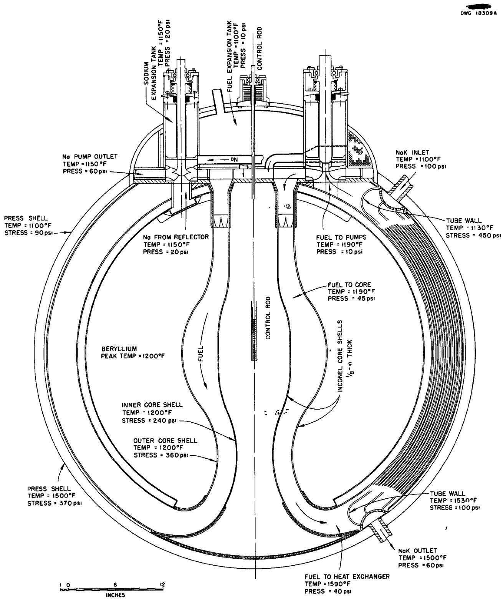  
Fig. 4.27. Temperatures, Pressures, and Stresses Throughout the Reflector-Moderated Reactor Operating at 200 Megawatts.

# ANP PROJECT QUARTERLY PROGRESS REPORT

from the fluoride to NaK. It is expected that, ultimately, six, small, heat exchangers will be built for investigating the effects on endurance life of operation at various temperature and pressure levels. Figure 4.28 shows one tube bundle for this heat exchanger. Six of these bundles will be used in a 5-in.-dia cylindrical annulus instead of in the larger and more complex spherical shell array envisaged for the full-scale reactor.

The design temperature level in the sodium circuit for cooling the moderator region is quite tentative.

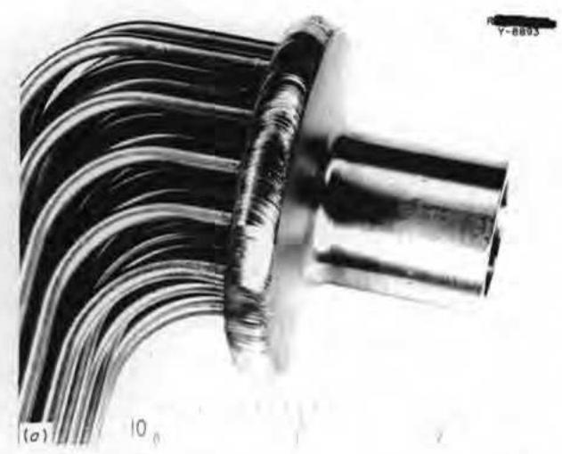

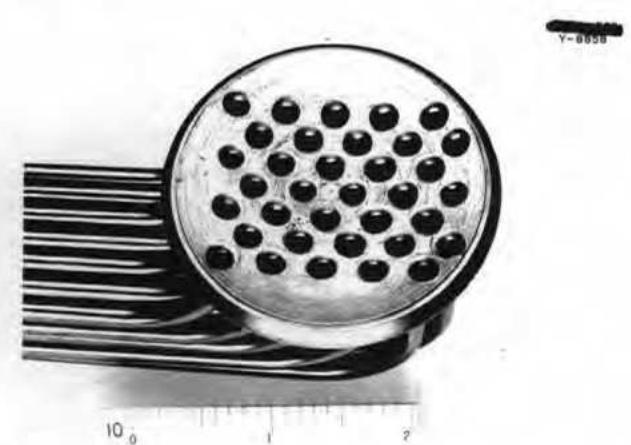  
(b)   
Fig. 4.28. Tube Bundle for Spherical Reactor Heat Exchanger. (a) Tube-to-header welded connections. (b) One end of a completed tube bundle and “shower head” assembly.

The temperatures specified in Fig. 4.27 were based on the highest temperatures that appear reasonable from the standpoint of compatibility of the beryllium-sodium-Inconel system. Higher temperatures would be likely to give trouble because of mass transfer and because of attack of the Inconel canning material by the beryllium. The temperature levels required should not be difficult to attain, since the moderator heat would be removed at a high temperature level. Two engines could be fitted with small auxiliary radiators placed between the compressor and the main radiators. These could be employed to subcool a portion of the secondary circuit NaK to, perhaps, $900^{\circ}\mathrm{F}$ . This cooler NaK could then be fed to the Na-to-NaK heat exchanger at the top of the reactor. There, by cooling the sodium from the moderator cooling circuit, it would be heated to about $1100^{\circ}\mathrm{F}$ so that it would then flow to the main heat exchanger at the same temperature as that of the NaK from the other radiator circuits. Thus the weight penalty attached to cooling the moderator region would be only about 400 lb of radiator core plus possibly 200 lb of extra reactor shield and 100 lb of pump and line weight.

Lead, bismuth, a nonuranium bearing fluoride, sodium, and NaK were all given serious consideration as coolants for the beryllium moderator. The metallurgists felt that lead or bismuth would be likely to pose a serious mass transfer problem. The relatively high neutron absorption cross section of the potassium in the NaK made it quite undesirable from the critical mass standpoint. Rubidium might be used in place of potassium but, because of little demand, it is currently very expensive. Thus sodium seemed to be the best choice for a moderator coolant. Since corrosion and mass transfer are likely to occur in a Be-NaK-Na system, it seemed essential that the beryllium be clad

in some fashion. Work at Battelle(8) indicates that beryllium can be chrome-plated to give satisfactory resistance to sodium attack at $932^{\circ}$ F. However, this work was carried out on small specimens, and there is a question as to whether adequate protection to the very large surface areas required would be practical. An alternate possibility would be to can the beryllium in thin-walled Inconel cans and to fill the small interstices between the beryllium and the can with stagnant sodium. This arrangement appears to be the more promising of the two, but both possibilities are being investigated. The reflector could be constructed of two large hemispheres of beryllium if the canning technique were used. Cooling passages could be rifle-drilled through the beryllium and lined with thin-walled tubes, which could be welded into headers at the ends. The Brush Beryllium Co. has indicated that the fabrication of these large hemispherical shells would probably be no more difficult than the fabrication of large flat slabs. The personnel of the Y-12 beryllium shop state that it would not be difficult to rifle-drill holes 3/16 to 1/4 in. in diameter and as much as 40 in deep, with the hole diameter held to within 0.001 in. and the hole center location held to within 0.010 inch. Since it would be very difficult to plate the insides of holes, an alternate construction that appears attractive, if chrome-plated blocks prove practicable, is the use of a large number of wedge-shaped segments, which would be shaped much like the sections of an orange. These sections could be made with shallow grooves in their surfaces that would form passages for cooling streams of sodium in the assembly.

The choice of a secondary coolant was difficult. Careful examination of the components in the external system

indicates that about 40 ft³ of fluid would be required as a minimum. This means that if lead or bismuth were used, the weight required would be in the range of 30,000 pounds. A number of molten salt mixtures was considered, but the melting points in all cases were above $300^{\circ}\mathrm{F}$ , which is objectionably high. Other media were rejected because of corrosion considerations. Sodium or NaK seemed to be definitely superior to any other coolant considered except for the objectionable neutron activation and resultant gamma activity of sodium, and the fire hazard associated with a possible leak. Shielding characteristics indicate that for the most promising distribution of shielding material between the reactor and the crew, gamma activity from the sodium would be less troublesome than the prompt-gamma activity from the reactor core. Considerable experience with sodium has indicated that if the plumbing is designed to keep the stresses low so that burst types of failure will not result, leaks that do occur as the result of fatigue cracks or corrosion pits develop slowly and do not result in serious fires. In fact, since sodium does not explode (so long as no water is present), in many ways it seems no more hazardous than gasoline. After all the factors were weighed, the most promising secondary fluid appeared to be NaK. A 56% sodium and 44% potassium alloy, which has a melting point of $56^{\circ}\mathrm{F}$ , was chosen for the analysis. Its low melting point, excellent heat transfer characteristics, good corrosion characteristics in iron-chrome-nickel alloys, and low density made it appear to be the best choice.

Reflector Heating (A. H. Fox, R. W. Bussard, ANP Division). The heating of the reflector of a reactor by the absorption of gamma radiation and the slowing down of neutrons originating in the core presents a heat removal task that is only an order of magnitude

smaller than that of cooling the core itself.

The distribution of the heat generated in the moderator depends on the strength and location of the sources and on the attenuation of the radiation between the sources and the point in question. For the gamma-ray energies of interest, the mechanism of degradation involves principally the Compton collisions. The mechanism of degradation of energy of the core gammas is complicated, even with the most simple geometry of source and reflector, for a more complex geometry, such as that of the reflector-moderated reactor, many simplifying assumptions are necessary before even an approximate estimate of the rate of heat generation in the beryllium may be obtained.

The first approximation used involved the straight-ahead theory of gamma absorption for which it is assumed that Compton collisions merely degrade in energy and do not scatter the photons. Only exponential attenuation with a coefficient that is characteristic of the material through which the photons pass need be considered. When a photon passes from one medium to another, no refraction is considered. Use of a buildup factor to allow for ordinary scattering is being investigated.

Another simplifying assumption concerned the source distribution. Only the total amount of gamma flux was considered, and variations from point to point in the core were neglected. Thus an average power density for the core was determined simply by dividing the total reactor power output by the volume of the fuel region of the core. (An investigation of sources distributed as indicated by the critical experiments showed only a small variation in results.)

The particular case considered was that of an 18-in.-dia, spherical, fluoride-fuel region surrounding a 9-in.-dia, central, beryllium island

and enclosed by a 12-in.-thick beryllium reflector. A 3/16-in.-thick layer of Inconel was considered as being the separating material between the fuel region and each of the two moderator regions. The reactor power output was taken as 200 megawatts, and the energy evolved in the gammas was taken as 12 Mev/fission, which gave a total power from gammas of 12 megawatts and a gamma source density in the fuel region of 275 watts/cm³. The average gamma energy was assumed to be 1 Mev, and the reciprocal attenuation lengths for the fuel, Inconel, and beryllium-moderator regions were taken as 0.09, 0.30, and 0.16 cm⁻¹, respectively.

The power density was computed at points spaced about 1 in. apart along a radius from the center of the island to the outside of the reflector. The resulting values are given in Table 4.3 (case A) and Fig. 4.29. Table 4.4 (case A) shows the integrated values of the power, in the various regions of interest, obtained by graphical integration of the power density curve. The fact that the total gamma heating indicated by Table 4.3 is only 10.6 megawatts instead of the 12 megawatts assumed is due, in part, to leakage from the reflector and, in part, to the approximations made for the computations. However, it is believed that the distribution of the gamma heating is approximated quite well by Fig. 4.29. One important result of this work is that for this configuration more than $60\%$ of the gamma energy goes into heating the fuel. A second computation was made with different values for the reciprocal attenuation lengths, that is, 0.06 and $0.13~\mathrm{cm}^{-1}$ for the fuel and beryllium, respectively, and the results are shown in Table 4.3 as case B. As can be seen, this relatively large change had no great effect on the distribution of the gamma heating. The total power for both case A and case B is given in Table 4.4.

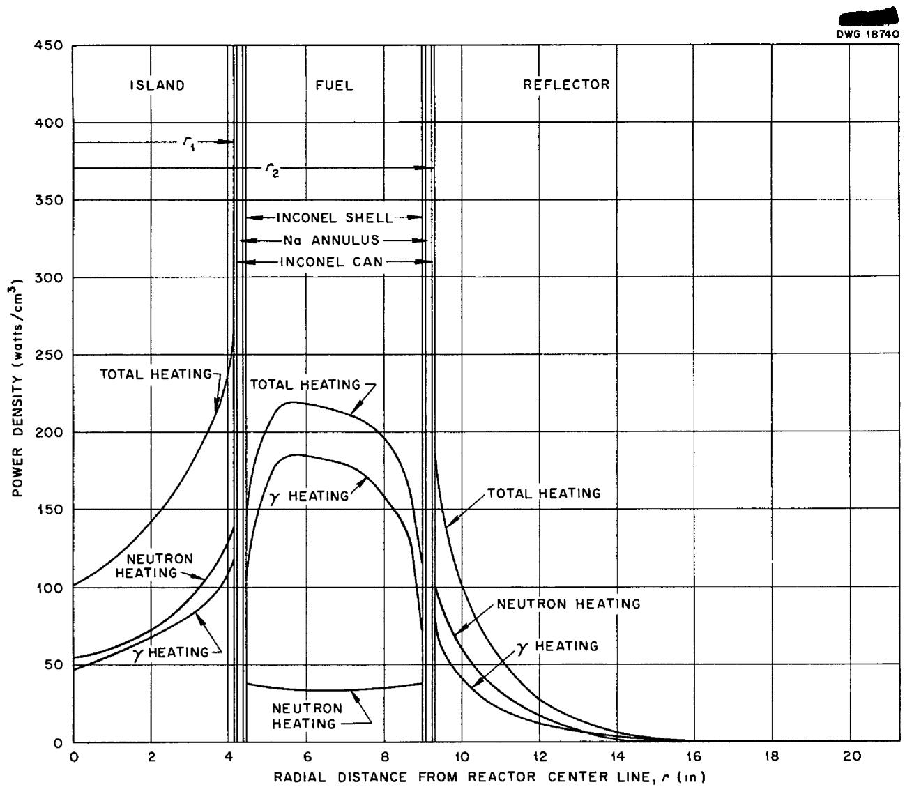  
Fig. 4.29. Radial Power Density from Neutron and Gamma Heating.

The power density resulting from neutron moderation within the beryllium of the island and reflector can be obtained directly from multigroup results by using the flux distribution $\phi (r,\mu)$ or $(W_{n}^{1} / n)$ C. F. (correction factor). The energy loss for each lethargy group is the average energy loss per collision times the number of collisions in that group at a given radius or space point. The spatial distribution,

$$
1 0 ^ {7} \sum_ {i = 1} ^ {t h} \frac {W _ {n} ^ {t}}{n} \times C. F. \times \frac {l}{\xi \Sigma_ {s}} \left(e ^ {- u _ {1} ^ {2}} - e ^ {- u _ {2} ^ {2}}\right),
$$

is normalized to the total power lost by moderation (2 $1 / 2\%$ of reactor power) by the use of the integration operator $\Omega_{n}$ .

The power densities resulting from neutron moderation and from gamma heating, as obtained by the methods described above, as well as the resultant total power density, are shown in Fig. 4.29. Severe peaks in the Inconel shells and a rapid drop with distance from the fuel region are shown.

A number of factors must be considered in the design of a system of

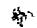

TABLE 4.3. POWER DENSITY IN VARIOUS REGIONS   

<table><tr><td rowspan="2">REGION</td><td colspan="2">RADIAL DISTANCE FROMCENTER OF REACTOR CORE</td><td colspan="2">RATE OF HEAT GENERATION FROM GAMMAS (watts/cm3)</td></tr><tr><td>r (in )</td><td>r (cm)</td><td>Case A</td><td>Case B</td></tr><tr><td rowspan="5">Island beryllium</td><td>0</td><td>0</td><td>47 5</td><td>61 9</td></tr><tr><td>2</td><td>5 08</td><td>60</td><td>65</td></tr><tr><td>3</td><td>7 62</td><td>80</td><td>74</td></tr><tr><td>4</td><td>10 16</td><td>101</td><td>93</td></tr><tr><td>4 31</td><td>10 95</td><td>120</td><td>142</td></tr><tr><td rowspan="2">Island Inconel</td><td>4 31</td><td>10 95</td><td>223</td><td>330</td></tr><tr><td>4 5</td><td>11 4</td><td>354</td><td>497</td></tr><tr><td rowspan="8">Fuel</td><td>4 5</td><td>11 4</td><td>106</td><td>99</td></tr><tr><td>5</td><td>12 7</td><td>167</td><td>137</td></tr><tr><td>5 5</td><td>14</td><td>186</td><td>148</td></tr><tr><td>6 0</td><td>15 2</td><td>182</td><td>152</td></tr><tr><td>6 75</td><td>17 1</td><td>184</td><td>151</td></tr><tr><td>8</td><td>20 3</td><td>157</td><td>132</td></tr><tr><td>8 5</td><td>21 6</td><td>141</td><td>116</td></tr><tr><td>9</td><td>22 9</td><td>73</td><td>65</td></tr><tr><td rowspan="2">Reflector Inconel</td><td>9</td><td>22 9</td><td>215</td><td>325</td></tr><tr><td>9 19</td><td>23 3</td><td>150</td><td>227</td></tr><tr><td rowspan="10">Reflector beryllium</td><td>9 19</td><td>23 3</td><td>80</td><td>98</td></tr><tr><td>9 5</td><td>24 1</td><td>53 7</td><td>57</td></tr><tr><td>10</td><td>25 4</td><td>37 7</td><td>44 6</td></tr><tr><td>10 5</td><td>26 7</td><td>25 4</td><td>31 9</td></tr><tr><td>11</td><td>27 9</td><td>19 0</td><td>24 4</td></tr><tr><td>12</td><td>30 5</td><td>10 3</td><td>14 0</td></tr><tr><td>13</td><td>33 0</td><td>5 4</td><td>8 3</td></tr><tr><td>14</td><td>35 6</td><td>2 9</td><td>4 9</td></tr><tr><td>15</td><td>38 1</td><td>1 67</td><td>3 0</td></tr><tr><td>21</td><td>53 3</td><td>0 066</td><td>0 19</td></tr></table>

TABLE 4.4. TOTAL INTEGRATED POWER IN VARIOUS REGIONS   

<table><tr><td rowspan="2">REGION</td><td colspan="2">TOTAL POWER (megawatts)</td></tr><tr><td>Case A</td><td>Case B</td></tr><tr><td>Island beryllium</td><td>0 46</td><td>0.51</td></tr><tr><td>Island Inconel</td><td>0 24</td><td>0 29</td></tr><tr><td>Fuel</td><td>6 71</td><td>5 58</td></tr><tr><td>Reflector Inconel</td><td>0 57</td><td>0 85</td></tr><tr><td>Reflector beryllium</td><td>3 14</td><td>3 44</td></tr></table>

moderator cooling passages. The volume of both the sodium and, especially, the Inconel must be minimized to keep parasitic neutron absorptions within reasonable limits. The neutron flux curves show that from the neutron economy standpoint coolant passages in the beryllium are much more important several inches from the fuel region than at the fuel-moderator interface. Thermal stresses will be set up by temperature variations in the beryllium. Since an elongation of about

$30\%$ can be obtained in beryllium at the operating temperatures envisioned, thermal stresses should not lead to cracking but might cause distortion that could become a problem after a number of thermal cycles of the system. For this reason, the temperature variation in the beryllium between adjacent coolant passages was held to $50^{\circ}\mathrm{F}$ . The pressure drop through the various coolant passages was limited to 40 psi to keep pressure-induced stresses low. The maximum beryllium-sodium interface temperature was held

below $1200^{\circ}\mathrm{F}$ to reduce mass transfer in the Be-stagnant-Na-Inconel system.

Several detail designs were investigated that favored first one and then another of the various requirements, that is, minimum poison, minimum variation in beryllium temperature, minimum beryllium-sodium interface temperature, minimum sodium system pressure drop, etc. Figure 4.30 shows the hole pattern in the beryllium for a promising arrangement, and the resulting temperature distribution is shown in Fig. 4.31.

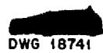

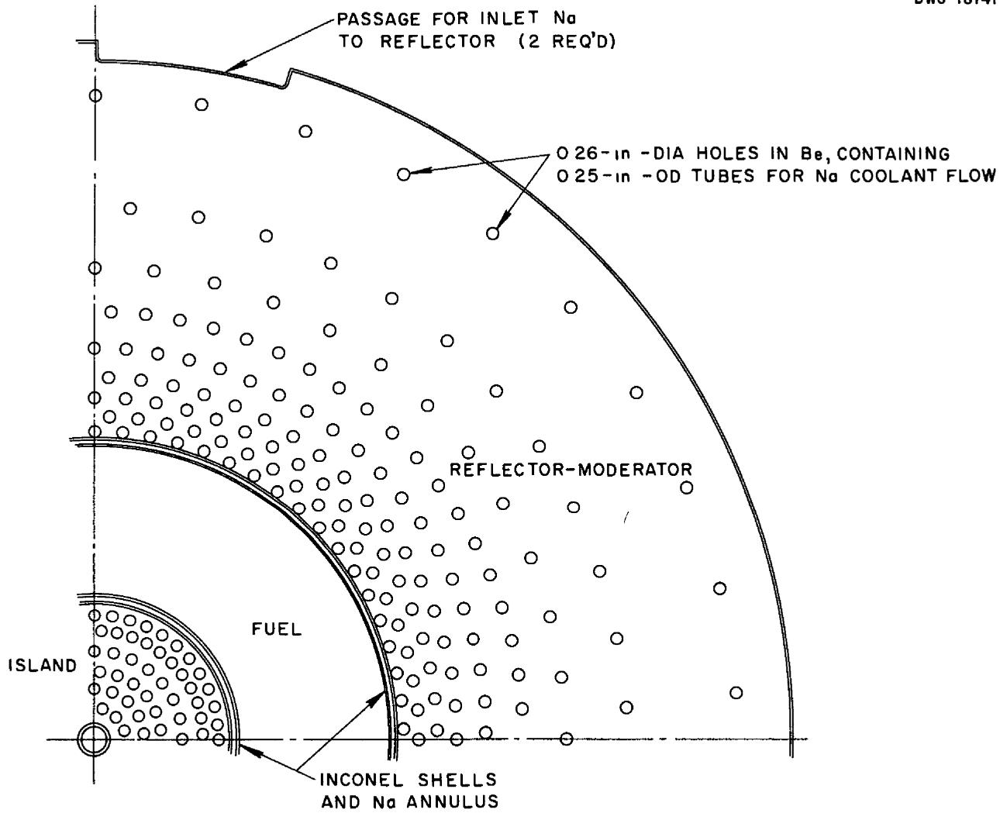  
Fig. 4.30. Cooling Hole Distribution in Reflector-Moderator.

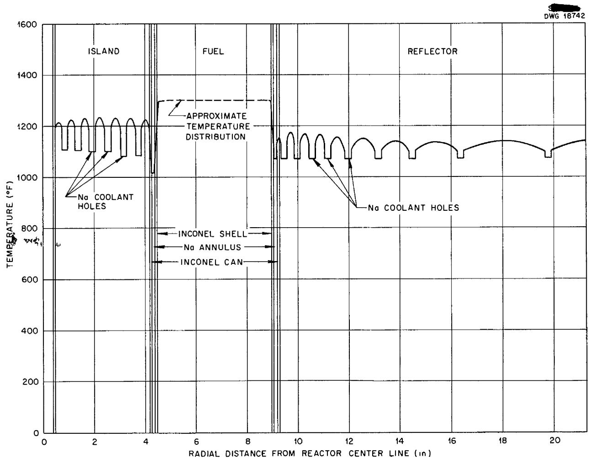  
Fig. 4.31. Temperature Distribution Across Midplane of 200-Megawatt Reflector-Moderated Reactor. Sodium inlet, $1000^{\circ}\mathrm{F}$ .

# SHIELDING

A. P. Fraas, ANP Division

J. B. Trice, Solid State Division

The shield design philosophy that has been the basis of the work on the reflector-moderated reactor shield has been that an operational airplane, in the military sense of the word, can be achieved only with great difficulty with the use of a divided shield because a divided shield would give an unprotected man 50 ft from the reactor a lethal dose in 15 seconds. Those experienced in aircraft operation and maintenance know that perhaps $50\%$ of the maintenance work involves non

scheduled operations, the character and detailed nature of which are impossible to predict without an extensive background of experience. Provision of an adequate set of equipment and facilities to take care of all contingencies promises to involve expenditures of the same order as those required for the nuclear power plant itself. It was felt that if the radiation dose at full power could be cut to about 10 r/hr at 50 ft from the reactor, the greater majority of the nonscheduled maintenance jobs that might delay a flight at the last minute or require emergency attention immediately following a landing could

be handled without special equipment. For this reason, effort has been directed toward the development of something closely approaching a unit shield. It is fully realized that a weight penalty is inevitable.

It was found that the initial startup and warmup of the reactor can probably be carried out at power levels that, in general, do not exceed $10\%$ of the full power of the reactor, thus the radiation dose during startup and warmup would be $10\%$ of that at full power. If in the tuneup process the operations must be carried out close to the reactor, the reactor might be idled down from $10\%$ to perhaps $1\%$ of full power output so that the radiation dose at any particular point would be only $1\%$ of the full-power dose. It is true, however, that after a long flight the accumulation of fission products will constitute a substantial gamma dose even after the reactor is shut down completely. This dose will still be only of the order of 1 or $2\%$ of the total radiation dose at full power output because the decay gammas are fewer in number and softer than the prompt gammas. A drain valve will be provided at the bottom of the reactor so that the fluoride fuel can be drained into underground tanks. It is hoped that about $98\%$ of the fuel can be removed by a simple draining operation and that most of the remaining fuel can be flushed out by using a nonuranium-bearing fluoride. Precisely what can be done in this direction is difficult to predict, but one of the major items of information expected from ARE test work is the extent to which the radiation from a circulating-fluoride-fuel reactor can be reduced by draining and flushing. The degree to which the Inconel structure will be activated and will represent an important source of radiation after shutdown is difficult to estimate. If the shield is not disassembled, rough estimates indicate

that the Inconel activation should not be a problem. Here again, the ARE will yield much valuable information.

The shield for the 200-megawatt reflector-moderated reactor has some characteristics that are peculiar to this particular reactor configuration. As indicated in an earlier section, the thick reflector was selected on the basis of shielding considerations.(9) The two major reasons for using a thick reflector are that a reflector about $12 \mathrm{in}$ , thick followed by a layer of boron-bearing material will attenuate the neutron flux to the point where the secondary gamma flux can be reduced to an unimportant level for a quasi-unit shell. This thickness also reduces the neutron leakage flux from the reflector to the heat exchanger to the level of that from the delayed neutrons appearing in the intermediate heat exchanger as delayed neutrons from the circulating fuel. An additional advantage of the thick reflector is that $99.98\%$ of the energy developed in the core will appear as heat in the high-temperature zone inside the pressure shell. This means that very little of the energy produced by the reactor must be disposed of with a parasitic cooling system at a low temperature level. The material in the spherical-shell intermediate heat exchanger is about $70\%$ as effective as water for the removal of fast neutrons, so it too is of value from the shielding standpoint. The delayed neutrons and the decay gammas from the circulating fuel in the heat exchanger region might appear to pose a serious handicap. However, each has an attenuation length that is much shorter than the corresponding attenuation length for radiation from the core. Thus, from the outer surface of the shield, the intermediate heat exchanger appears as a much less

intense source of radiation than the more deeply buried reactor core.

It is true that this arrangement violates one of the precepts of the matched shield, namely, that each layer of heavy material should be placed as close to the reactor core as possible. However, the loss in weight associated with the disparity between this ideal case and the shield layout of Fig. 4.32 is not too great, whereas the engineering advantages derived are of crucial importance.

A series of Ld Tank experiments is in progress to determine the optimum arrangement and thickness of the various beryllium, boron carbide, iron, lead, and borated water layers for a shield of the type shown in Fig. 4.32, which represents the best configuration tested to date. When this series of tests is completed, the resulting shield will be used as a basis for comparison. Further tests will be run with more unusual materials. Rough calculations indicate that as much as 10,000 lb of shield weight might be saved through the use of some of the special materials. When the test work is completed, it is hoped that a fairly sound basis for a decision on the use of these special materials will be provided by a comparison of their cost and attendant weight savings relative to the simpler shield configuration of Figure 4.32.

One of the major pieces of information obtained from the Ld Tank experiments has been the confirmation of the original estimates of the degree of activation of sodium in the heat exchanger region. It had been suspected that in a relatively thin slab of material having the poor moderating properties of the heat exchanger matrix, neutrons of 0.1 MeV or higher would tend to escape from the slab long before they could be slowed down. Although it is not possible to simulate the effects of the circulating fuel in the Ld Tank experi

ments, the spectrum of the delayed neutrons is not too different from that of the bulk of the neutrons that escape from the fuel region through the thick beryllium reflector and the heavy boron carbide curtain between the reflector and the heat exchanger. For this reason, it is felt that the sodium activation data from the Lid Tank experiments give a good basis for estimating the activation of the sodium in a full-scale reactor of the type shown in Fig. 4.25. On this basis, it appears that the sodium activity after a long period of full-power output will give a dose of about $1\mathrm{r/hr}$ at 50 ft from the reactor. The activity of the potassium in the NaK would be much less than that of the sodium.(10) The NaK could be drained after operation and the activated sodium allowed to decay. Several weeks should suffice to bring the activity of the sodium down to a negligible level.

The design described is believed to give enough shielding all around the reactor to give a dose of 5 r/hr at 50 ft from the center of the reactor at full power. An additional lead layer would be employed at the front of the reactor to act as a light shadow shield for the crew. Further shadow shielding would be employed at the back of the crew compartment to attenuate the radiation from both the reactor and the NaK radiators to give a dose of approximately 1 r/hr inside the crew compartment. Tables 4.5 and 4.6 give detailed data for such a configuration for several reactor core diameters, power outputs, and power densities. Further work covering the effects on shield weight of various dose levels for both ground and flight crews is under way.

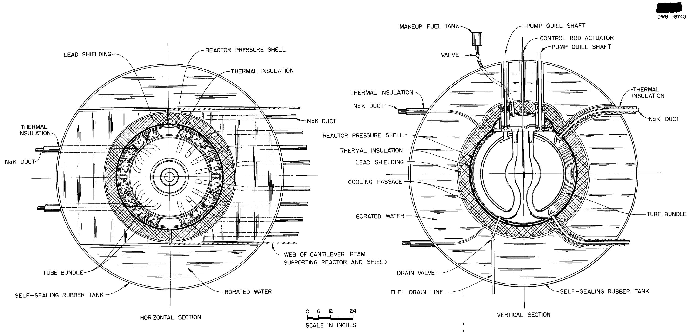  
Fig. 4.32. Shield Configuration for 200-Megawatt Reflector-Moderated Reactor

TABLE 4.5. DOSAGES AT VARIOUS LOCATIONS FOR THE SHIELD OF TABLE 4.6   

<table><tr><td rowspan="3">LOCATION</td><td colspan="4">DOSE (r/hr)</td></tr><tr><td rowspan="2">At Startup*</td><td rowspan="2">At Full Power</td><td colspan="2">At Shutdown**</td></tr><tr><td>NaK not Drained</td><td>NaK Drained</td></tr><tr><td>50 ft from reactor (except in front cone)</td><td>0.5</td><td>6</td><td>1</td><td>0.1</td></tr><tr><td>Crew compartment</td><td>0.1</td><td>1</td><td>0.2</td><td>0.02</td></tr><tr><td>16 ft from reactor (except in front cone)</td><td>6</td><td>60</td><td>10</td><td>1</td></tr><tr><td>Shield surface (except in front cone)</td><td>60</td><td>600</td><td>30</td><td>10</td></tr></table>

*Ten per cent of full power   
**Fifteen minutes after shutdown from long period at full power

TABLE 4.6. PRELIMINARY SHIELD WEIGHT ESTIMATES SHOWING EFFECTS OF VARIATIONS IN REACTOR POWER, CORE DIAMETER, AND POWER DENSITY IN THE FUEL REGION*   

<table><tr><td>Power, megawatts</td><td>200</td><td>200</td><td>400</td><td>200</td><td>400</td><td>800</td></tr><tr><td>Reactor core diameter, in.</td><td>18</td><td>22.7</td><td>22.7</td><td>28.5</td><td>28.5</td><td>28.5</td></tr><tr><td>Power density, kw/cm3</td><td>5.5</td><td>2.75</td><td>5.5</td><td>1.37</td><td>2.75</td><td>5.5</td></tr><tr><td>Pressure shell outside diameter, in.</td><td>59</td><td>62.3</td><td>68.8</td><td>66.6</td><td>72.4</td><td>81.6</td></tr><tr><td>Lead layer outside diameter, in.</td><td>72</td><td>75.3</td><td>82</td><td>79.6</td><td>85.4</td><td>94.6</td></tr><tr><td>Reactor shield outside diameter, in.</td><td>120</td><td>119</td><td>128</td><td>121</td><td>129.5</td><td>140</td></tr><tr><td>Total weight, reactor, heat exchanger, and shield, lb</td><td>74,000</td><td>84,000</td><td>108,000</td><td>93,000</td><td>115,000</td><td>147,000</td></tr><tr><td>Shadow disk at crew (7 ft dia), lb</td><td>3,600</td><td>3,600</td><td>3,600</td><td>3,600</td><td>3,600</td><td>3,600</td></tr></table>

*Computed from Ltd Tank data for the beat Be-B₄C-NaF-B₄C-Fe-Pb-H₂O layer configuration tested up to March 13, 1953

# POWER PLANT DESIGN

# A. P. Fraas, ANP Division

Some early work on nuclear power plants involved detailed designs of power plants in which the engines were widely separated from the reactor. The acute problems of differential thermal

expansion, thermal lag and system control, and the plumbing weight associated with these arrangements indicated that it would be advantageous to use compact units. Thus, the current trend toward compact power packages, followed by both the General Electric Co. and the Pratt and Whitney Aircraft Division, seems in order.

In considering the types of application of greatest interest, it appeared that there are three representative cases namely, a B-36 flight-test-bed installation, a Mach 0.9 sea-level bomber, and a Mach 1.5 high-altitude bomber. In sketching preliminary layouts, it appeared that there was little difference in the requirements for the first two, and the third differed in not too serious a fashion. As a result, the layout of Fig. 4.25 was prepared for the Mach 0.9 sea-level bomber on the basis that it would require a reactor heat output of 200 megawatts. It was presumed that the same power plant might be used for preliminary test work at a reduced power, say 130 megawatts, in a B-36 flight-test-bed installation.

Table 4.7 gives the weight of various components of the installation shown in Fig. 4.33. If an increase in power were made, the weight of the reactor-heat-exchanger-shield assembly would increase as indicated in Table 4.6, and the weight of engines, radiators, pumps, and lines would be roughly proportional to the power output. If the same power output were

to be required at an altitude at which the air-swallowing capacity of the engines was cut in half, the turbojet engine weight would be doubled. The weight of the radiators would be increased by, perhaps, $50\%$ , but the weight of the pumps and lines would remain substantially the same. The power plant of Fig. 4.33 represents only a preliminary layout for showing the proportions that might be expected. The thrust that can be obtained from this power plant is heavily dependent on the allowable reactor operating temperature. By careful design of the moderator-cooling system, it will be possible to keep the temperature of all structural parts down to the temperature of the secondary fluid leaving the intermediate heat exchanger. This should make it possible to operate such a power plant, constructed of Inconel, at NaK outlet temperature of about $1500^{\circ}\mathrm{F}$ for 500 hours. A take-off or war-emergency rating of $1600^{\circ}\mathrm{F}$ might be permitted for perhaps 20 to 50 hr of the 500 hours.

A brief description of the essential features of the design shown in Fig. 4.33 follows. The reactor is the same

TABLE 4.7. MAJOR WEIGHT COMPONENTS OF THE 200-MEGAWATT AIRCRAFT POWER PLANT OF FIG. 4.33   

<table><tr><td>NO OF UNITS</td><td>COMPONENTS</td><td>WEIGHT (1b)</td></tr><tr><td>4</td><td>Turbojet engines</td><td>12,400</td></tr><tr><td>16</td><td>Radiators (filled with NaK)</td><td>6,000</td></tr><tr><td>16</td><td>NaK pumps, header tanks, and turbine drive assemblies</td><td>1,600</td></tr><tr><td>16</td><td>Piping for NaK circuits</td><td>2,000</td></tr><tr><td></td><td>Thermal insulation for NaK circuits</td><td>1,300</td></tr><tr><td></td><td>NaK in NaK circuits (except in radiators)</td><td>2,400</td></tr><tr><td>4</td><td>Fuel and sodium pump drives</td><td>300</td></tr><tr><td></td><td>Turbojet inlet and outlet ducts and support structure</td><td>8,000</td></tr><tr><td></td><td>Total power plant weight excluding reactor and shield</td><td>34,000</td></tr></table>

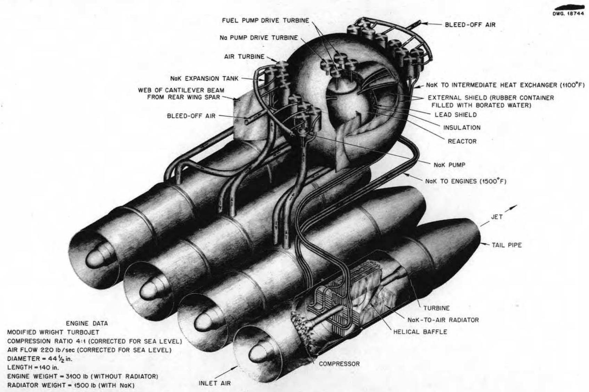  
Fig. 4.33. Aircraft Power Plant (200 Megawatt).

as that shown in Fig. 4.25. The shield was designed so that it might be inserted through an opening 6 ft 8 in. wide in the bottom of the fuselage. Thus it would lend itself to installation in the bomb bay of the B-36 just aft of the main spar. Two cantilever beams placed on 6-ft centers were employed as the primary structure. The front ends of these beams could be bolted or pinned to fittings on the rear spar, and the reactor and the shield structure could be attached to the rear ends. The shield structure would be divided into six major sections, each of which would consist of an inner layer of lead and an outer tank of rubber that would be filled with borated water. The top and bottom sections would be separated from the four sections in the central region by surfaces of revolution for enclosing the NaK ducts through the shield. A large, bowl-shaped, rubber tank would be placed at each side. These tanks could be deflated while the power plant was being inserted in the airplane and could be filled with water after the power plant was in place. The top section of the shield would be penetrated by five tubes. Four of these tubes would carry quill shafts to transmit power from bleed-off air turbines to the pumps at the top of the reactor, and the fifth tube would carry the control rod actuating mechanism.

Each of the engine radiators would be coupled to a separate tube bundle in the intermediate heat exchanger in such a way that there would be 16 separate secondary fluid circuits. The expansion tank, filter, and pump for each of these circuits would be located at the point of greatest elevation and lowest temperature in the system, that is, at the top of the shield and just outside it. Thus the NaK would leave the pumps and pass into the shield, through the intermediate heat exchanger, back out

through the shield down to the radiator, and back up to the pump. The pipes passing to and from the radiator would be approximately 3 l/2 in. in diameter. The pressure drop through the radiators would be about 35 psi, and that through pipes from the reactor would be about 7 psi. In all cases, the pressure has been kept low to keep the stresses low and, hence, to minimize the likelihood of a burst type of failure. Thus, even though small leaks might occur as a result of fatigue cracks or small corrosion pits in welded or brazed joints, it seems likely that a major leak (except for gunfire) could be avoided.

The turbojet engines indicated in Fig. 4.33 are modifications of a new engine being developed by the Wright Aeronautical Corp. The original engine is a high-compression-ratio two-spool machine. Since fuel economy is less important than engine weight for a power plant of the type shown, (11) an estimate of the weight of a modified engine was prepared by the Wright Aeronautical Corp., and estimated performance curves for these engines are given in Fig. 4.34. The radiators used in these turbojets are of the same type as those that have been tested at ORNL in the form of core elements during the past year. One of these radiator cores operated for over 1000 hr at $1500^{\circ}\mathrm{F}$ , or above, including over 40 hr at $1700^{\circ}\mathrm{F}$ . It is expected that developmental work now in process will produce lighter units with better heat transfer performance than the radiators of this preliminary design.

The procedure that might be followed to assemble the complete power plant would be to mount the reactor on the cantilever beams that support it and the shield assembly. The turbojet engines would then be mounted to

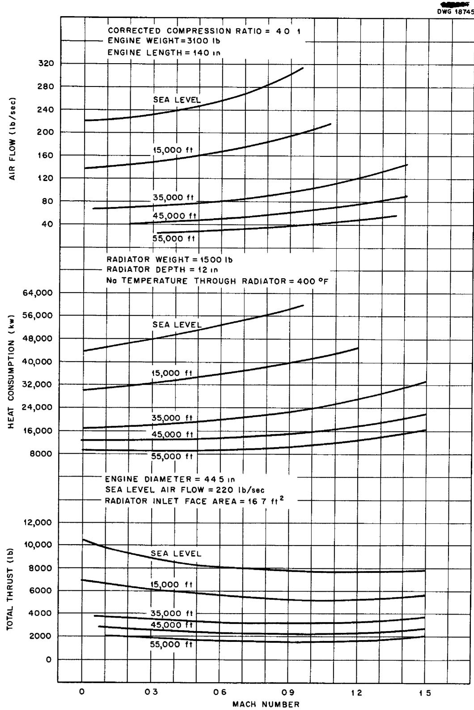  
Fig. 4.34. Estimated Turbojet Engine Performance Curves.

structure 'attached to these same cantilever beams. The pipes connecting the engine radiator to the reactor and heat exchanger assembly could then be welded into position, along with the NaK pump and header tank assemblies. The entire system could then be pressure checked carefully and examined closely for leaks. It would probably prove desirable to install NaK in the secondary circuit, sodium in the moderator circuit, operate the pumps, and check all components carefully for leaks before the thermal insulation was installed. An auxiliary supply of compressed air would be required to run the sodium and NaK pumps at perhaps half speed for this check. The system temperatures in the NaK circuits would not have to exceed room temperature, but an auxiliary burner arrangement should be provided to heat the two radiators coupled to the two sodium-to-NaK heat exchangers for the moderator cooling system. These heaters could be used to bring the sodium system temperature up to 300 or $400^{\circ}\mathrm{F}$ . Upon satisfactory completion of this test work, thermal insulation could be installed around the reactor pressure shell and the connecting lines and pumps of the sodium circuit. By using the same heat source, the sodium system could be brought up to perhaps $1000^{\circ}\mathrm{F}$ and a nonuranium-bearing fluoride salt could be pumped into the reactor. The fluoride-fuel system could then be checked and drained, and the lead shielding and the rubber tanks for the borated water could be installed to complete the assembly. After the power plant unit had been installed in the airplane, the rubber tanks could be filled with borated water, and the necessary connections could be made for the instruments and controls.

In starting up the reactor, it is expected that the NaK circuits would be used to heat the sodium to bring the reactor temperature up to about $1000^{\circ}\mathrm{F}$ . A fluoride fuel melt containing less than the desired amount of uranium would then be poured into the fuel system and circulated. Gradual additions of a fluoride melt containing a rather high percentage of $\mathbf{U}^{235}$ could be made until the reactor became critical. The temperature of the reactor could then be allowed to increase to the desired value - probably an average temperature of $1300^{\circ}\mathrm{F}$ - and the load could be gradually increased by starting up first one and then another of the turbojet engines. It will probably be possible to depend upon the self-stabilizing characteristics inherent in the fluoride fuel reactor to keep the mean fluoride temperature essentially constant so that, in effect, the reactor would become a slave to the turbojet engines and would act as a constant-temperature heat source. Control of the individual turbojet engines could be accomplished by varying the amount of air allowed to bypass the radiators through adjustable louver in the helical baffles between radiator banks. In effect, this would give a variable, mean, turbine-air-inlet temperature. Coupled with this control, it would probably be necessary to have an adjustable jet exit nozzle to give good performance and to avoid compressor stall over a wide range of operating conditions. Fine control of reactor temperature could be accomplished through the use of one or two control rods in the central island or in the reflector region. Coarse shim control could be obtained by varying the uranium concentration in the fluoride fuel.

Part II

SHIELDING RESEARCH

# INTRODUCTION AND SUMMARY

E.P.Blizard J.L.Meem,Associate

Physics Division

With the development of a reactor design in which the fissions are confined to a small volume, and in which it is hoped the radiators can be kept relatively nonradioactive, the hopes for a light unit shield have been revived. Accordingly, a unit-shield mockup was recently installed in the Lid Tank Facility and is now being optimized with regard to the location of the shield components. In addition, an intensive search is being carried out for promising materials that could be used in the unit shield. Measurements of relative shielding effectiveness indicate lithium to be a promising component for neutron shielding, and inquiries have been initiated to determine whether uranium could be made available and fabricated as a gamma shield (sec. 5).

The air-scattering experiments at the Bulk Shielding Facility have been completed. Earlier difficulties have been ascribable primarily to unsuspected background effects, and indications now are that the weights described in the report of the Shielding Board (1950) were approximately correct. The neutrons were somewhat low and the gamma rays somewhat high, with the weight differences approximately cancelling. The irradiation of animals in the Bulk Shielding Facility is now complete, and the

animals involved have been returned for long-range observation of the biological effects of these exposures. Neutron spectroscopy on the divided shield in the Bulk Shielding Facility has now commenced, and the first few spectra have been measured with the proton-recool spectrometer. The results are only preliminary, hence, no data are yet available. However, the gamma spectral measurements from the divided-shield mockup are being tabulated for machine calculations (sec. 6).

The Tower Shielding Facility design is being developed rapidly. The tower structure design is final and a building is fairly completely laid out. The Reactor design features and some of the instrumentation are yet to be developed. Indications are that the facility will begin operation by the end of the calendar year, and tests with the first shields will commence shortly thereafter (sec. 7).

A neutron spectrometer is being developed that utilizes scintillation in a lithium fluoride crystal. This apparatus gives promise of appreciably greater sensitivity than recoil-proton spectrometers if developmental difficulties can be overcome. No cross-section measurements were completed on the 6-Mev Van de Graaff during the quarter because the machine was being moved to its permanent location in the X-10 Area (sec. 8).

# 5. LID TANK FACILITY

J. D. Flynn J. N. Miller

G. T. Chapman F. N. Watson

Physics Division

The Lid Tank Facility has been used during the past quarter primarily for measuring the fast-neutron removal cross sections of a number of conventional and potential shielding materials. In addition, a mockup of the unit shield of the reflectormoderated reactor has been assembled.

# EFFECTIVE FAST-NEUTRON REMOVAL CROSS SECTIONS

The following effective fast-neutron removal cross sections have been measured

Al 1.19 barns/atom

Be 1.12 barns/atom

Cu 2.08 barns/atom

Fe 1.93 barns/atom

L1F 2.80 barns/molecule

W 3.08 barns/atom

The data on lithium fluoride are particularly interesting. If fluorine is assigned a cross section of 1 barn, as would be indicated from a comparison with previously measured values for oxygen and carbon, it would appear that lithium exhibits a cross section of 1.8 barns. This is exceptionally high for such a light nucleus, and, if verified, reveals a real incentive for using this element in aircraft shields. Accordingly, it is planned to measure the cross section of fluorine as soon as possible by using slabs of a saturated fluorocarbon.

Measurements have also been made on the effect of replacing water near the source with a slab of transformer oil $(\mathrm{CH}_2)$ . By comparison of these measurements with those for graphite, it is possible to determine the effect of the oxygen that the oil replaced in the water close to the source.

This represents the first measurement of the true effective removal cross section for this element. Previous estimates have been dependent upon a somewhat different definition, because the oxygen that was measured was spread throughout the shield as in water. It is interesting to note that, as might be expected, the oxygen exhibits a somewhat greater effective removal cross section in the location near the source.

It had been proposed by Sleeper of Brookhaven National Laboratory that deuterium might prove a more effective shield component than hydrogen because of the more nearly isotropic scattering (laboratory system) it exhibits because of its increased mass. To explore this point, a tank of $\mathrm{D}_2\mathrm{O}$ was inserted next to the source in the Lid Tank Facility, and an effective removal cross section was measured. Results indicate a difference in effective removal cross section between normal and heavy hydrogen of 0.1 barn. This corresponds very closely to the difference in their total cross sections in the range of about 2 to 5 Mev and indicates that no added premium accrues from the increased angle of scattering or, at least, that this is counterbalanced by the greater energy degradation of the light hydrogen.

# MCKUP OF THE UNIT SHIELD OF THE REFLECTOR-MODERATED REACTOR

Recently a mockup has been installed in the Lid Tank Facility to simulate the reflector heat exchanger and the unit shield of the Fireball reactor. The beryllium reflector is simulated by a large slab of material supplied by KAPL plus some additional material

# ANP PROJECT QUARTERLY PROGRESS REPORT

that was available at the Y-12 site. The heat exchanger is simulated by sodium fluoride and iron, the sodium fluoride is loaded into large, thin, iron boxes. The prototype for the shield will be of lead and water, and tests currently under way are designed to determine the optimum location of the lead within the water.

An investigation will also be made of the desirability of borating part of the water. These experiments have just begun, and therefore no firm data are yet available, however, there are indications that the over-all reactor-shield weight will be very low. This is a direct result of the small volume to which the fissions are confined.

# 6. BULK SHIELDING FACILITY

J. L. Meem

R. G. Cochran

M. P. Haydon

K. M. Henry

H. E. Hungerford

E. B. Johnson

J. K. Leslie

T. A. Love

F. C. Malenschein

G. M. McCammon

Physics Division

The air-scattering experiments and the program of irradiating monkeys have been concluded. In addition, some preliminary neutron spectral measurements have been made, but further work will be postponed until measurements have been completed on the mockup of the top plug of the SIR shield. The gamma spectral measurements on the reactor part of the divided shield are being applied to calculations of a divided shield.

# AIR-SCATTERING EXPERIMENTS

The air-scattering experiment at the Bulk Shielding Facility, originally carried out last summer, has been extended and improved in an effort to understand the serious discrepancy that appeared to be extant between this experiment and the calculations of the Shielding Board. With the increased power now available, 100 kw having recently been approved for the BSR, it is now possible to eliminate much of the extrapolation previously required. In addition, it was discovered that the radioactivity in the pool water was responsible for a large part of the observed dose in the mocked-up crew position. Measurements were taken to determine the effect of spurious radiations scattering from the pool walls, as well as from the reactor support structure.

These were found to contribute only negligibly to the observed neutron and gamma doses.

Although the experiment has been completed so recently that it is impossible at this time to give a complete report, the following conclusions can be drawn

1. The neutron dose in the crew compartment appears to be lower by a factor of 5 than the ANP-53 calculations indicate. The advantage accruing from this amounts to about 5000 lb for the standard crew-shield design.   
2. The gamma-ray dose in the crew compartment appears to be higher than indicated by the ANP-53 design by a factor of 3.5. The weight penalty associated with this is about 6000 pounds.

The conclusions differ from the earlier ones both in the magnitude of the discrepancies and in the amount of material required to make up the added attenuation. Since this experiment is basically so very crude, further exploitation of the Bulk Shielding Facility in this type of work is not considered worthwhile, the present comparison with the ANP-53 calculations is considered adequate.

# IRRADIATION OF ANIMALS

In addition to the two groups of monkeys mentioned in a previous quarterly report, (4) a third group has been irradiated by the Bulk Shielding Reactor. The complete series of experiments is summarized in Table 6.1.

TABLE 6.1. IRRADIATION OF MONKEYS IN THE BULK SHIELDING FACILITY   

<table><tr><td>IRRADIATION CONDITIONS</td><td>SERIES I</td><td>SERIES II</td><td>SERIES III</td></tr><tr><td>Exposure rate, * rem/hr</td><td>1</td><td>0.25</td><td>4</td></tr><tr><td>Number of exposures</td><td>8</td><td>16</td><td>8</td></tr><tr><td>Time per exposure, hr</td><td>16</td><td>8</td><td>16</td></tr><tr><td>Time between exposures, days</td><td>7</td><td>7</td><td>7</td></tr><tr><td>Total exposure, rem</td><td>128</td><td>32</td><td>512</td></tr><tr><td>Number of animals used</td><td>12</td><td>12</td><td>12</td></tr></table>

*One-half dose in neutrons and one-half dose in gamma rays

All exposures have been completed and the animals have been returned to the USAF School of Aviation Medicine at Austin, Texas, where they will be held for observation. It is expected that the third group, which received 512 rem, will develop eye cataracts, but that the first and second groups will not If the experiment turns out as anticipated, the threshold for cataracts should be definitely bracketed

A report is being prepared in cooperation with the Health Physics Division that gives details of the dosimetry during the experiment. Figure 6.1 shows one of the animals ready to be placed in a watertight cage for submersion in the pool.

# NEUTRON SPECTROSCOPY FOR THE DIVIDED SHIELD

Some preliminary neutron spectra have been run with the proton-recoll spectrometer developed by Cochran and Henry.(5) Fast-neutron data have also been taken with nuclear plates and threshold detectors. All results are in preliminary form and are not yet suitable for reporting. The experiments will be continued as reactor time permits.

# GAMMA SPECTROSCOPY FOR THE DIVIDED SHIELD

The data on the energy and angular distribution of gamma rays from the divided-shield mockup are being tabulated for machine calculations. The energy, angular distribution, and total intensity of the direct, as well as scattered, photons arriving at the crew compartment will be computed.

# FISSION ENERGY AND POWER IN THE BULK SHIELDING REACTOR

A report on the power distribution in the reactor with a beryllium oxide reflector has been completed, (6) and a report on the determination of the energy released per fission is being prepared. Figures 6.2 and 6.3 illustrate the time decay of neutrons and gamma rays from the reactor after shutdown. The data are normalized to unity for operations at 1 and $100\mathrm{kw}$ and plotted against time after scrambling the reactor. It is interesting to note how the $(\gamma ,n)$ reaction on beryllium keeps the neutron level fairly high. Without the beryllium oxide reflector, the neutrons decay with periods that are characteristic of the delayed-neutron emitters.

  
Fig. 6.1. Monkey and Irradiation Cage for the Bulk Shielding Facility Experiment.

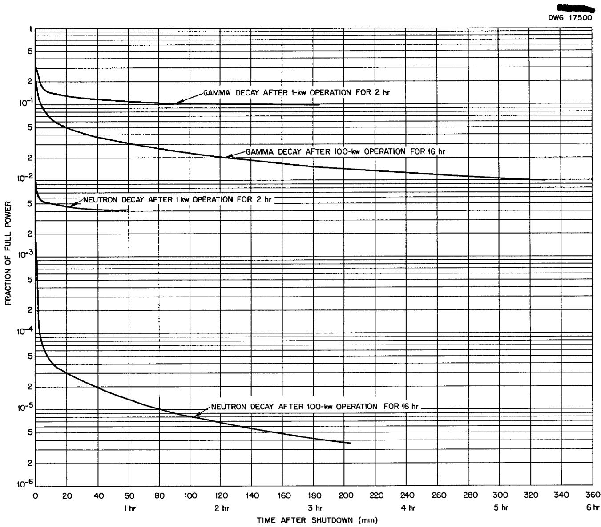  
Fig 6.2. Decay of Neutrons and Gamma Rays from 0 to 6 hr After Shutdown

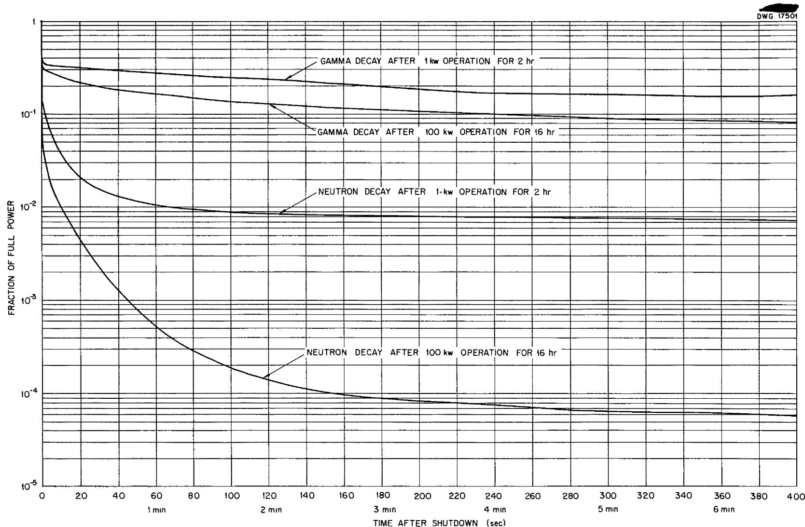  
Fig 6 3 Decay of Neutron and Gamma Rays from 0 to 400 sec After Shutdown

# 7. TOWER SHIELDING FACILITY

C. E. Clufford T. V. Blosser

Physics Division

J. Y. Estabrook, ANP Division

The preliminary design of the Tower Shielding Facility proposed by the firm of Knappen-Tippetts-Abbett-McCarthy (KTAM), architectural engineers, was accepted by ORNL early in January. Some delay was necessitated by the discovery that the tower design first considered by KTAM proved exceptionally heavy in structural steel, particularly in the long overhead members from which the loads were supported by a vertical hoist. Since the heavier members raised the background from structural scattering beyond reasonable limits, a design was proposed that eliminated the overhead structure and reduced the weight of the legs by a factor of approximately 2. The designs and specifications of the tower and associated buildings are now scheduled for completion by KTAM and the ORNL Engineering Department on March 1.

Design, procurement, and construction of the reactor and instruments, as well as engineering of the site, road, and utilities, are being done by ORNL. This work is proceeding ahead of schedule, at present.

# TOWER DESIGN

The tower design is shown in Figs. 7.1 and 7.2. The structure is 315 ft high and has a 200-ft inside clearance in the north-south direction and a 101-ft inside clearance in the east-west direction. The four tower columns are 9 ft square and weigh approximately 400 lb per running foot.

The loads will be raised by six individual hoists - two for the

reactor shield and four for the crew shield. The reactor shield can be raised 200 ft off the ground, and it may be moved laterally to approach the tower legs. This lateral movement will permit measurement of the radiations scattered by the tower structure. The four hoists supporting the crew compartment will allow considerable flexibility in the crew compartment position and orientation, including the possibility of a variation of from 35 to 100 ft in the reactor-to-crew separation distance.

# CONSTRUCTION SCHEDULE

The tentative schedule for outside engineers and contractors for completing their various phases of design and construction of the Tower Shielding Facility have been somewhat optimistically estimated as follows

February 24 Design completed and submitted to bidders

March 17 Bids received

March 20 Contracts awarded

June 15 Construction of the roads, tower foundation, and guy anchors completed

November 15 All outside construction completed

December 31 Reactor critical

It appears that ORNL will either meet or be ahead of the time schedule in its share of the Tower Shielding Facility work. The following is a list of ORNL's functions, together with the present status of accomplishment.

ANP PROJECT QUARTERLY PROGRESS REPORT   

<table><tr><td>FUNCTION</td><td>TARGET DATE</td><td>PER CENT COMPLETE</td></tr><tr><td>Engineering of site, building, and pool</td><td>3/1/53</td><td>100</td></tr><tr><td>Engineering of reactor, tank, and mechanical controls</td><td>3/1/53</td><td>100</td></tr><tr><td>Engineering of reactor controls (electrical portion)</td><td>7/1/53</td><td>20</td></tr><tr><td>Engineering of instrumentation (mechanical)</td><td>5/1/53</td><td>50</td></tr><tr><td>Engineering of instrumentation (electrical)</td><td>3/1/53</td><td>100</td></tr><tr><td>Construction of reactor, tank, and mechanical controls</td><td>9/1/53</td><td>5</td></tr><tr><td>Construction of reactor controls (electrical portion)</td><td>12/1/53</td><td>20</td></tr><tr><td>Construction of instrumentation (mechanical)</td><td>8/1/53</td><td>5</td></tr><tr><td>Construction of instrumentation (electrical)</td><td>2/1/53</td><td>20</td></tr></table>

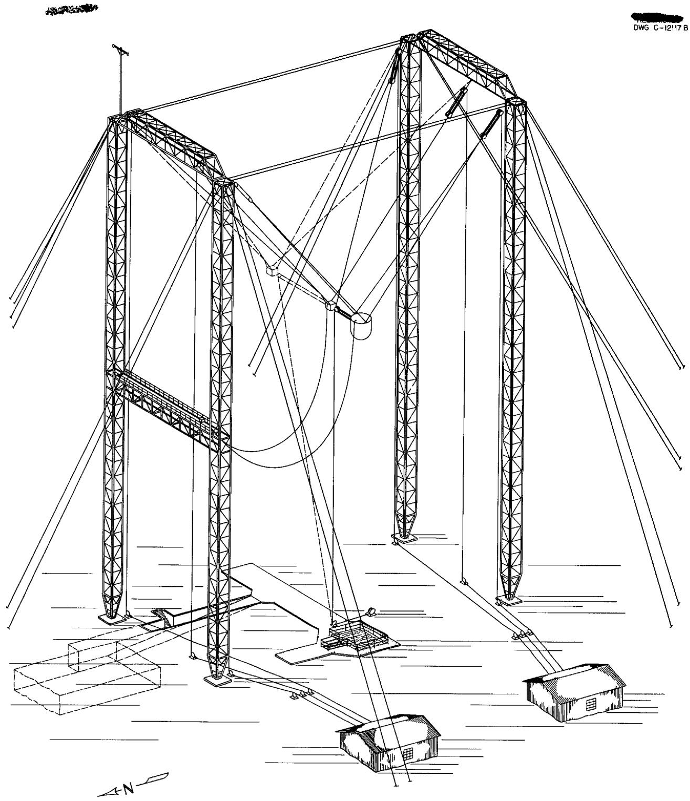  
Fig. 7 1 Tower Shielding Facility (Perspective)

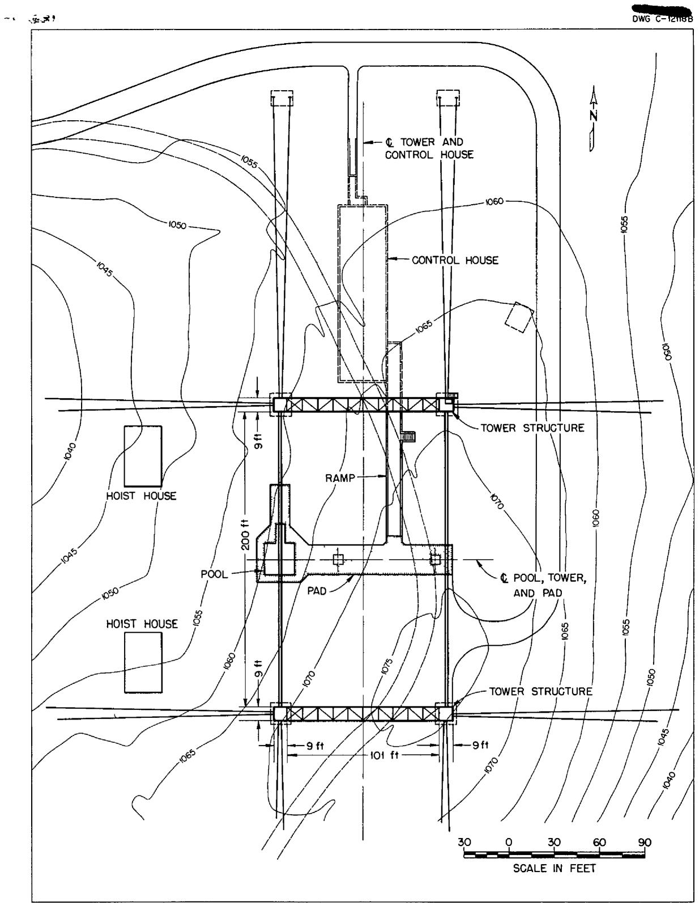  
Fig. 7 2. Tower Shielding Facility (Plan View)

# 8. NUCLEAR MEASUREMENTS

A fast-neutron scintillation spectrometer employing UF crystals, which have low gamma-ray response, is being developed, The 6-Mev Van de Graaff has been set up in the High-Voltage Laboratory, but no research has yet been undertaken in the new location.

# FAST-NEUTRON SCINTILLATION SPECTROMETER

J. Schenck F. J. Muckenthaler Physics Division

The work on the development of a scintillation spectrometer for fast neutrons has appeared so promising for shielding work that two research personnel have been assigned to the project to accelerate the work. Although europium-activated lithium

iodide crystals have been used to date, lithium fluoride would be much more desirable because of its lower gamma-ray response. The work is now concentrated in an effort to grow a lithium fluoride crystal with suitable scintillation properties.

# MEASUREMENTS WITH THE 6-MEV VAN de GRAAFF

H.B.Willard,Physics Division

The 6-Mev Van de Graaff was moved during the quarter from its temporary location in Building 9201-2, Y-12 site, to its permanent quarters in the High-Voltage Laboratory, Building 4500, X-10 site. A beam was first obtained late in the quarter, but no cross-section measurements were undertaken.

# Part III

# MATERIALS RESEARCH

# INTRODUCTION AND SUMMARY

The research on fused fluoride systems (sec 9) has been largely concerned with the development of techniques for purifying and preparing enriched ARE fuel and fuel carrier. The fluoride treatment procedure involves successive purging of the liquid with HF, $\mathbf{H}_2$ , HF, and finally He. The treated fuel then contains only traces of HF, $\mathbf{N}_{1}\mathbf{F}_{2}$ , and $\mathbf{FeF}_2$ , which are primary factors in fluoride corrosion. The beneficial effect on the corrosion of the reducing agents has been substantiated, and the quantity of the various reductants that may be tolerated in the fuel has been defined. The consequences of the attendant reduction of some $\mathbf{UF}_4$ to $\mathbf{UF}_3$ are being investigated. For the longer-range fuel development program, several ternary and quaternary fluoride systems containing LiF are being investigated, as well as some binary chloride mixtures containing UCl₄.

The corrosion research (sec. 10) has been primarily on the determination of the corrosion characteristics of fluoride mixtures. The increased attack experienced in recent tests with the ARE fuel mixture is believed to be due to faulty purification rather than to handling techniques. Zirconium hydride as an additive to the fuel mixture reduces the fluoride attack on Inconel by a factor of 2 Apparently the mechanism is the reduction of the metallic fluorides $\mathrm{NiF}_2$ and $\mathrm{FeF}_3$ , which are present in the fuel, because addition of these fluorides to the fuel increases the corrosion. Measurements of the concentration of $\mathrm{NiF}_2$ , $\mathrm{FeF}_3$ , and $\mathrm{CrF}_3$ as a function of exposure time of Inconel in the fuel have been made as an index of corrosion. The nickel content remains approximately constant and the iron content drops sharply to a constant value, however, the chromium

content rises during the first 100 hr and then levels off After the addition of $\mathrm{ZrH_2}$ ,the only significant change in these concentrations was in the chromium content, which then changed in the same manner as the iron content. The addition of chromium metal was not effective in inhibiting fluoride corrosion, apparently because of the low solubility of chromium in the fluoride Although Inconel and stainless steel are severely attacked by lead in tests in convection loops, molybdenum and columblum are relatively immune However, static tests of lead-sodium alloys show that sodium additions decrease the otherwise severely corrosive action of the lead on both Inconel and stainless steel The stability of BeO in NaK is still being investigated. It appears that there is some solubility of BeO in NaK

The metallurgy and ceramics research (sec 11) includes the fabrication of various reactor components for use at high temperatures, creep rupture tests of structural metals, the development of special alloys, cermets, and ceramic coatings, and tests of welding and brazing alloys. Control or safety rod inserts are being prepared for the G-E reactor and for the Tower Shielding Facility. Chrome-plated, high-conductivity fins have not proved adequate for high-temperature radiator use, but Inconel or stainless-steel-clad copper fins may now be satisfactorily brazed. Recent creep tests of stainless steel and Inconel have shown that surface oxidation is not the controlling factor in the longer rupture times observed in air as compared with the rupture times in hydrogen and argon. The cone-arc welding technique is being adapted to the welding of dashed headers for heat exchangers because of the unequal arc distances encountered. Because of dilution and embrittlement of the Nicrobraz used in

brazing a heat exchanger element other alloys have been considered for this application. The evaluation of high-temperature alloys with respect to temperature, strength, and corrosion resistance is continuing

The physical property measurements were made primarily for the determination of various properties of several fluoride mixtures, and the heat transfer studies were concerned with experimental systems, as well as aircraft components (sec. 12). The heat capacity of the ARE fuel was found to be $0.31 \, \text{cal/g} \cdot^{\circ}\text{C}$ from 550 to $850^{\circ}\text{C}$ . Vapor pressure measurements of the enriched fuel mixture were lower than expected and indicated the formation of complex ions at high temperatures. Preliminary measurements were made of both the thermal conductivity and the viscosity of sodium hydroxide at elevated temperatures. A minimum-weight analysis was completed for an aircraft radiator with the optimum fin spacing and thickness and the optimum tube spacing and diameter. Experimental apparatus to determine the fluid velocity profiles and the fluid temperature structure is being assembled. One study is under way to determine temperature distribution in entrance regions, whereas another study will compare the various high-temperature heat transfer fluids.

Creep under irradiation and corrosion by sodium in an in-reactor loop are

being investigated, however, irradiation of fluoride mixtures comprises the greater part of the radiation damage studies (sec 13) In recent irradiations of the ARE fuel mixture in the MTR, in which the power generation is 20 times that expected in the ARE, corrosion and changes in the fuel composition occurred that were in excess of those observed in control tests. However, the Inconel and the fuel were at temperatures in excess of $1500^{\circ}\mathrm{F}$ during the tests The recent in-reactor creep measurements confirmed previous conclusions that irradiation had little effect on the creep strength

Analytical studies of reactor materials (sec 14) included chemical, petrographic, and x-ray diffraction identification of impurities, corrosion products, reduction products, and constituents of reactor fuels. Volumetric methods for the determination of zirconium in the presence of uranium and for the simultaneous determination of uranium trifluoride and zirconium metal have been developed. An apparatus has been built to aid in the determination of traces of oxides in fluorides. With petrographic and x-ray diffraction studies, it has been possible to determine and define compositions of the compounds and eutectics present in UCl₄-NaCl, UCl₄-KCl, and NaF-ZrF₄-UF₄ systems.

# 9. CHEMISTRY OF HIGH-TEMPERATURE LIQUIDS

W. R. Grimes, Materials Chemistry Division

The major effort of the ANP Chemistry group continues to be devoted to the study of fluoride mixtures for use as aircraft reactor fuels and coolants. A large fraction of this effort has been devoted to the specific materials that comprise the fuel solvent, the concentrated fuel, and the final fuel mixture for the ARE.

The final processing plans for preparation of the fluoride mixtures in pure form are nearly finished. Procedures for removing all except traces of HF, $\mathbf{N}\mathbf{1}\mathbf{F}_{2}$ and $\mathrm{FeF_2}$ from these materials are in the final developmental stages. Contrary to previous beliefs, hydrogen does cause partial reduction of $\mathbf{U}\mathbf{F}_{4}$ to $\mathbf{U}\mathbf{F}_{3}$ in these melts at $800^{\circ}C$ . The beneficial effect of reducing agents on the corrosion of fluoride mixtures has been well substantiated, and the quantities of various reductants that may be tolerated in the fuels has been defined.

Phase equilibrium and other studies of systems in which all or part of the $\mathbf{U}\mathbf{F}_4$ has been replaced by $\mathbf{U}\mathbf{F}_3$ are still being carried out as a part of the study of the effect of added reducing agents and as an aid in the identification of corrosion products. Additional materials have been synthesized that contain trivalent uranium and seem to be identical with species produced during corrosion. In the hope of developing other and superior fuel mixtures for future applications, an extensive study of phase equilibrium in systems containing lithium fluoride is being carried out. Some study of $\mathbf{U}\mathbf{C}\mathbf{l}_4$ systems is also in progress

# FUEL MIXTURES CONTAINING $\mathbf{U}\mathbf{F}_4$

L. M Bratcher C. J. Barton

Materials Chemistry Division

$\mathbf{L1F - ZrF_4 - UF_4}$ The $\mathbf{L1F - ZrF_4 - UF_4}$ system was investigated with UF 4 con-

centrations of up to 45 mole % and $\mathrm{ZrF_4}$ concentrations of up to 50 mole%. The lowest melting point observed was $440^{\circ}\mathrm{C}$ for the mixture containing 68.5 mole % L1F, 26.5 mole % UF4, and 5.0 mole % $\mathrm{ZrF_4}$ . Thermal halts were noted with this composition, as well as with other compositions nearly the same, at about 400 to $415^{\circ}\mathrm{C}$ , however, it cannot be ascertained definitely from the data that have been obtained whether this effect is due to a eutectic of unknown composition or to a solid transition

KF-L1F-BeF2-UF4. The effect on the melting point of varying the UF4 concentration of one composition in the KF-L1F-BeF2-UF4 system has been determined. The data show that when UF4 is added to the 40% BeF2, 20% KF, and 20% L1F mixture the melting point goes through a minimum at a low concentration of UF4 and then rises rather rapidly with increasing UF4 concentration. The thermal effect noted at 330 to 340°C may indicate the existence of a low-melting-point eutectic in the four-component system, a great deal of work will be required to determine the composition of the eutectic. The lowest melting temperature observed to date is 380°C at 2.5 mole % of UF4.

# FUEL MIXTURES CONTAINING ThF4

L. M Bratcher C. J. Barton

Materials Chemistry Division

Other investigators(1) have shown that the $\mathsf{L1F - ThF_4}$ equilibrium diagram is quite similar to that of the $\mathsf{L1F - UF_4}$ system, and unpublished data obtained in this laboratory indicated that the $\mathsf{BeF_2 - ThF_4}$ system is similar to the $\mathsf{BeF_2 - UF_4}$ system Since the $\mathsf{L1F - BeF_2}$ binary is common to both systems, it

(1)J O Blomeke, An Investigation of ThF4-Fused Salt Solutions for Homogeneous Breeder Reactors, ORNL-1030 (June 19, 1951)

seemed reasonable to assume that the $\mathbf{L}_{1}\mathbf{F} - \mathbf{B}\mathbf{e}\mathbf{F}_{2} - \mathbf{Th}\mathbf{F}_{4}$ equilibrium diagram would be comparable to the diagram for the $\mathbf{L}_{1}\mathbf{F} - \mathbf{B}\mathbf{e}\mathbf{F}_{2} - \mathbf{U}\mathbf{F}_{4}$ system described in the previous report.(2) The data shown in Fig. 9.1 confirm this expectation. The higher melting point of the $\mathbf{L}_{1}\mathbf{F} - \mathbf{Th}\mathbf{F}_{4}$ eutectic (550°C compared with 490°C for $\mathbf{L}_{1}\mathbf{F} - \mathbf{U}\mathbf{F}_{4}$ ) is reflected in the contours. A composition containing 5 mole % ThF, 67 mole % L1F, and 28 mole % BeF, melts

(2) L M Bratcher and C. J Barton, ANP Quart Prog Rep Dec 10, 1952, ORNL-1439, p 105

at approximately $430^{\circ}\mathrm{C}$ . From the limited data obtained with the lower $\mathrm{ThF_4}$ concentrations, it appears that compositions in this system that melt below $400^{\circ}\mathrm{C}$ will contain a low concentration of $\mathrm{ThF_4}$ and a high concentration of $\mathrm{BeF_2}$ .

# FUEL MIXTURES CONTAINING UCI4

R.J.Sheil C.J.Barton Materials Chemistry Division

The problem of obtaining pure UCl has not yet been completely solved. Efforts to prepare the pure material

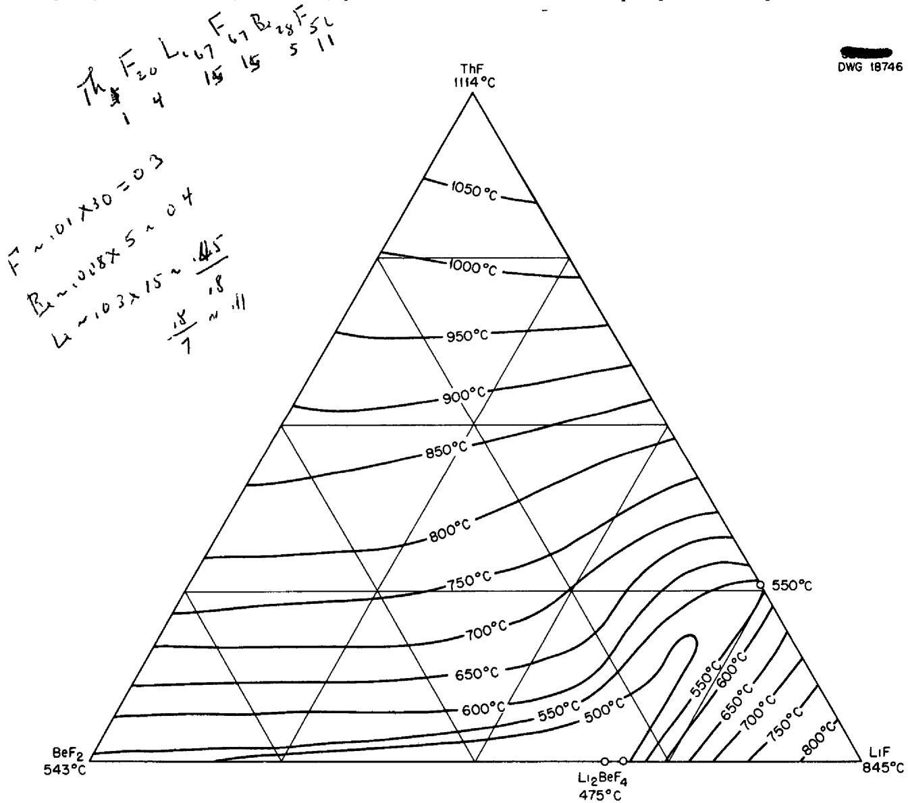  
Fig. 9.1. The System $\mathbf{L}\mathbf{1}\mathbf{F} - \mathbf{B}\mathbf{e}\mathbf{F}_{2} - \mathbf{Th}\mathbf{F}_{4}$ .

by sublimation from the available crude $\mathrm{UCl}_4$ have not been successful. Synthesis of $\mathrm{UCl}_4$ by liquid-phase chlorination with hexachloropropylene has been used to provide material for recent studies. Although analytical data from which to evaluate this material are not yet available, it appears that the material is not of good quality. The data reported briefly below may therefore be revised when purer $\mathrm{UCl}_4$ becomes available.

$\mathsf{NaCl - UCl}_4$ Thermal data on 18 compositions in the NaCl- $\mathsf{UCl}_4$ system have been reported by Kraus.(4) He concluded, on the basis of the data obtained from cooling curves, that the compound $2\mathrm{NaCl}\cdot \mathrm{UCl}_4$ was the only compound formed in this system and that it melted incongruity at $430\pm 5^{\circ}C.$ It also appeared from his data that there was only one eutectic, which melted at $370\pm 5^{\circ}C.$ The present, incomplete investigation seems to show the existence of two eutectics and two compounds in this system. The first eutectic is believed to be at about 30 mole $\% \mathrm{UCl}_4$ and it appears to melt at $420\pm 10^{\circ}C.$ One of the compounds, $\mathrm{Na}_{2}\mathrm{UCl}_{6}$ , is believed to melt congruently at $440\pm 10^{\circ}C.$ The second eutectic is believed to be at approximately 45 mole $\% \mathrm{UCl}_4$ and it appears to melt at $370^{\circ}C,$ in good agreement with Kraus' results. In the 65 to 90 mole $\% \mathrm{UCl}_4$ range, a series of breaks at $420\pm 10^{\circ}C$ probably represents the incongruent melting point of a compound such as $\mathrm{NaU}_2\mathrm{Cl}_9$ or $\mathrm{NaU}_3\mathrm{Cl}_{13}$ . The pure compound has not yet been prepared, and it cannot be definitely identified on the basis of information available at this time.

KCl-UCI. Thermal data on 14 compositions in the KCl-UCI system, in the 20 to 75 mole $\%$ UCl range, have also been reported by Kraus.(4) These

data showed that there was one compound, $\mathrm{K}_2\mathrm{UCl}_6$ , which melted congruently at $650 \pm 5^{\circ}\mathrm{C}$ , and two eutectics in the system. The KCl- $\mathrm{K}_2\mathrm{UCl}_6$ eutectic was stated to be at 25 mole $\%$ $\mathrm{UCl}_4$ , and its melting point was given as $560 \pm 5^{\circ}\mathrm{C}$ , the $\mathrm{K}_2\mathrm{UCl}_6$ - $\mathrm{UCl}_4$ eutectic was indicated to be at 53 mole $\%$ $\mathrm{UCl}_4$ , and its melting point was $350 \pm 5^{\circ}\mathrm{C}$ . Thermal data and petrographic examination of the solid phases show strong evidence for the existence of three compounds and three eutectics in this system. The present results are in fair agreement with those of Kraus on the location and melting point of the KCl- $\mathrm{K}_2\mathrm{UCl}_6$ eutectic, the melting point of $\mathrm{K}_2\mathrm{UCl}_6$ , and the melting point of the higher eutectic. However, it appears that a $\mathrm{K}_2\mathrm{UCl}_6$ - $\mathrm{KUCl}_5$ eutectic with $42.5 \pm 2.5$ mole $\%$ $\mathrm{UCl}_4$ occurs in this system and that it melts at $320 \pm 10^{\circ}\mathrm{C}$ . The compound $\mathrm{KUCl}_5$ probably melts congruently, but a reliable value for its melting point has not yet been obtained. The thermal evidence for the existence of a compound with more than 1 mole $\%$ $\mathrm{UCl}_4$ per mole of KCl is a series of breaks in the 70 to 85 mole $\%$ $\mathrm{UCl}_4$ region at $400 \pm 5^{\circ}\mathrm{C}$ . The thermal effect at this temperature may indicate the incongruent melting point of this compound of unknown composition. As mentioned in the section on NaCl- $\mathrm{UCl}_4$ , and in line with experience with fluoride systems, it has been found rather difficult to prepare incongruently melting compounds in sufficiently pure state to permit their positive identification. The composition of the $\mathrm{KUCl}_5$ - $\mathrm{KU}_x\mathrm{Cl}_{4x+1}$ eutectic has not been accurately determined.

# FUEL MIXTURES CONTAINING $\mathbf{U}\mathbf{f}_{3}$

V. S. Coleman C. J. Barton

Materials Chemistry Division

Work on the NaF-UF $_3$ and KF-UF $_3$ systems has not yet revealed compositions that melt below 700 and $680^{\circ}$ C, respectively. Complications

from $\mathsf{UO}_2$ and $\mathsf{UF}_4$ in the melts have been minimized by using alkali fluorides that have been treated with HF at high temperatures and by minimizing the top temperature to which the melt is heated to decrease disproportionation of the $\mathsf{UF}_3$ .

These systems are studied, at present, in nickel capsules welded under an argon atmosphere. The examination is hampered because the $\mathrm{KF - UF_3}$ compounds decompose readily in the laboratory air. Petrographic examination is accomplished by grinding the material in a dry, inert atmosphere and transferring it to microscopes slides under oil. Although the thermal data are as yet inconclusive, it appears that the compound formed in NaF-bearing melts is $3\mathrm{NaF - 2UF_3}$ .

# ADDITION OF REDUCING AGENTS TO ARE FUEL

J D. Redman V. S. Coleman

L. G. Overholser D. C. Hoffman

K.J.Kelly F.F.Blankenship

Materials Chemistry Division

Decreased corrosion of Inconel in thermal convection loops has been demonstrated to result from small additions of NaK, $\mathsf{ZrH}_2$ , or $\mathsf{Zr}^{\circ}$ to fluoride mixtures of interest as ARE fuels. When these reducing agents are added in large quantities to materials containing $\mathsf{UF}_4$ , they produce $\mathsf{UF}_3$ , which is only sparingly soluble in the melt at $600^{\circ}\mathsf{C}$ . Therefore the reactions of possible ARE fuels with various reducing agents have been studied in an effort to discover a safe upper limit to the amount of such additives.

Previous experiments had demonstrated that addition of sufficient reductant resulted in separation of $\mathrm{UF}_3$ as a discrete phase, which could be removed by filtration at $600^{\circ}\mathrm{C}$ . The resulting filtrates revealed no trace of the easily detectable $\mathrm{UF}_3$ after solidification, but they showed considerable quantities of various

complex compounds of $\mathbf{U}\mathbf{F}_3$ . Identical mixtures (with the same reducing agents) that were not filtered showed considerable quantities of $\mathbf{U}\mathbf{F}_3$ . If a sufficiently small quantity of reducing agent was added so that no $\mathbf{U}\mathbf{F}_3$ could be filtered at $600^{\circ}\mathrm{C}$ , there was no $\mathbf{U}\mathbf{F}_3$ detected in the cool, solidified material

Various $\mathbf{ZrF}_4$ -bearing mixtures, with and without added $\mathbf{UF}_4$ , have been equilibrated with predetermined small quantities of NaK (78 wt % K), $\mathbf{ZrH}_2$ , and $\mathbf{Zr}^{\circ}$ in sealed capsules of Inconel by rocking for 16 hr at 4 cpm with the ends of the capsules at 800 and $650^{\circ}\mathrm{C}$ , respectively. The capsules were then heated at $800^{\circ}\mathrm{C}$ in a vertical position for 2 to 6 hr to permit settling of insoluble material and, especially, unreacted reducing agent. Cooled samples were sectioned longitudinally for petrographic examination.

The upper tolerance limits in number of equivalents (one equivalent is the quantity of reductant needed to reduce all $\mathbf{U}\mathbf{F}_4$ to $\mathbf{U}\mathbf{F}_3$ ) are listed in Table 9.1.

Reducing agents added to $\mathsf{NaZrF}_5$ in amounts in excess of 0.2 wt% showed opaque nonmagnetic masses, and chemical and x-ray tests indicated the material to be, at least in part, $\mathsf{Zr}^{\circ}$ . Apparently, trivalent zirconium does not exist in fluoride melts under these circumstances.

Verification of the tolerance values for $\mathbf{ZrH}_2$ in the ARE fuel mixture has been obtained by equilibration of $\mathbf{ZrH}_2$ with the fuel mixture at $800^{\circ}\mathrm{C}$ in nickel equipment, followed by equilibration at $600^{\circ}\mathrm{C}$ and filtration of the resulting melt at $600^{\circ}\mathrm{C}$ through sintered nickel. The data obtained by chemical analysis of the filtrate and by petrographic examination of the filtered residue are shown in Table 9.2.

The data indicate that no solid material exists in the liquid at $600^{\circ}\mathrm{C}$ if less than 0.9 wt $\%$ $\mathrm{ZrH_2}$ is added to the mixture. Agreement between the data shown is probably

within the error of such experiments. The failure to observe $\mathbf{U}\mathbf{F}_{3}$ , as such, in any of the filtrates affords confirmation of the assumptions used to interpret the previous data.

When small quantities (up to about 0.4 eq) of reducing agent are added, an olive-drab phase (average refractive index of 1.558) occurs in the NaF-ZrF $_4$ -UF $_4$ mixtures.

Reducing agents added to compositions in the NaF-ZrF $_4$ -UF $_4$ system produced an olive-drab phase (average

refractive index of 1.558) at the 02-eq concentration. The quantity of olive-drab phase generally increased upon addition of 0.4 eq of reducing agent. With larger additions of reducing agent, a decrease in the olive-drab phase was observed, along with an increase in the red-orange phase $(\mathrm{UF}_3\cdot 2\mathrm{ZrF}_4)$ . Synthesis and petrographic examination have indicated that the olive-drab phase may be $\mathrm{UF}_3\cdot 2\mathrm{ZrF}_4$ , in which tetravalent uranium has been partially substituted for

TABLE 9.1. AMOUNTS OF REDUCING AGENTS TOLERABLE IN FLUORIDE MIXTURES   

<table><tr><td rowspan="3">FLUORIDE USED</td><td colspan="7">AMOUNT TOLERABLE</td></tr><tr><td colspan="2">NaK</td><td colspan="2">ZrH2</td><td colspan="3">Zr°</td></tr><tr><td>Equivalent</td><td>Weight %</td><td>Equivalent*</td><td>Weight %</td><td>Equivalent</td><td colspan="2">Weight %</td></tr><tr><td>NaZrF5</td><td></td><td>0 2</td><td></td><td>0 2</td><td></td><td colspan="2">0 2</td></tr><tr><td>NaF-ZrF4-UF4(46-50-4 mole %)</td><td>0 6</td><td>0 7</td><td>1 2</td><td>1 0</td><td>1 2</td><td colspan="2">0 9</td></tr><tr><td>NaF-ZrF4-UF4(50-46-4 mole %)</td><td>0.4</td><td>0 5</td><td>0 8</td><td>0 7</td><td>1 2</td><td colspan="2">1 0</td></tr></table>

*Hydrogen considered neutral in calculation of equivalent weight.

TABLE 9.2. DATA OBTAINED BY CHEMICAL ANALYSIS AND PETROGRAPHIC EXAMINATION OF ARE FUEL* AFTER TREATMENT WITH $\mathbf{{ZrH}}{}_{2}$   

<table><tr><td>ZrH2ADDED (wt %)</td><td>URANIUM CONTENT OF FILTRATE (wt %)</td><td>PETROGRAPHIC OBSERVATIONS</td></tr><tr><td>0</td><td>8.62</td><td></td></tr><tr><td>0.2</td><td>8.72</td><td rowspan="3">Uranium reduction occurred, no discrete UF3 observed</td></tr><tr><td>0.5</td><td>8.68</td></tr><tr><td>0.7</td><td>8.65</td></tr><tr><td>0.9</td><td>6.58</td><td rowspan="3">UF3 found on filter and in reaction chamber</td></tr><tr><td>1.0</td><td>7.12</td></tr><tr><td>1.5</td><td>5.95</td></tr><tr><td>1.5</td><td>8.64</td><td>Presence of ZrO2 indicated an oxygen leak</td></tr></table>

$\mathrm{NaF - ZrF_4 - UF_4}$ (50-46-4 mole %).

trivalent uranium. Petrographic examinations revealed that $\mathrm{UF}_3\text{-}\mathrm{UF}_4\text{-} 4\mathrm{ZrF}_4$ was an olive-drab, pleochroic phase, with an average refractive index of 1.564, a birefringence of about 0.008, and an optic angle of 80 degrees. Another olive-drab material (refractive index of 1.574) was obtained when these materials were mixed to correspond to $\mathrm{UF}_3\text{-} 3\mathrm{UF}_4\text{-} 8\mathrm{ZrF}_4$ . A mixture corresponding to $3\mathrm{UF}_3\text{-}\mathrm{UF}_4\text{-} 8\mathrm{ZrF}_4$ produced striated crystals of olive-drab and red-orange materials.

The 50 mole % NaF composition developed free $\mathbf{U}\mathbf{F}_{3}$ upon addition of 1.2 eq of $\mathbf{Zr}^{\circ}$ or $\mathbf{ZrH}_2$ . The 46 mole % NaF composition formed free $\mathbf{U}\mathbf{F}_{3}$ upon the addition of 1.6 eq $\mathbf{Zr}^{\circ}$ or $\mathbf{ZrH}_2$ . The usual olive-drab and orange-red phases were observed in these compositions with less than 1.2 eq of reductants.

It was noted throughout this study that the 46 mole % NaF, 50 mole % $\mathrm{ZrF_4}$ , 4 mole % UF4 composition tolerated slightly more reduction without precipitating UF3 than did the 50 mole % NaF, 46 mole % $\mathrm{ZrF_4}$ , 4 mole % UF4 composition. Further, it was noted that both compositions are more tolerant to Zr° and $\mathrm{ZrH_2}$ than to NaK. These observations support the mechanism suggested previously, (5) which postulates that NaF and UF3 compete for the $\mathrm{ZrF_4}$ present. The Na(K)F formed by the NaK reduction reaction is capable of breaking the UF3·2ZrF4 complex to form Na(K)ZrF5 and free UF3. On the other hand, $\mathrm{ZrF_4}$ formed by the Zr° or $\mathrm{ZrH_2}$ reduction reaction is capable of complexing more UF3. This suggests that a fluoride composition with a $\mathrm{ZrF_4}$ -to-NaF ratio larger than unity would be desirable if only because of its capacity to complex UF3.

(5) F F Blankenship, D C Hoffman, K J Kelly, and T N McVay, ANP Quar Prog Rep Dec 10, 1952, ORNL-1439, p 119

# COOLANT DEVELOPMENT

L. M. Bratcher C. J. Barton Materials Chemistry Division

L1F-ZrF₄. Study of the L1F-ZrF₄ system, mentioned in the previous progress report, (6) has been continued by thermal analysis and by petrographic and x-ray-diffraction examination of solidified melts. Although L₁₂ZrF₆ is the only compound that has been positively identified, there is some evidence for one additional compound with less than 33 mole % ZrF₄ and one with more than 50 mole % ZrF₄.

CsF-ZrF₄. Both Cs₂ZrF₆ and CsZrF₅ have been identified by petrographic examination of melts in the CsF-ZrF₄ system, and three eutectics have been shown to exist. The lowest-melting-point (412 ± 10°C) eutectic contains about 40 mole% ZrF₄. Further work is in progress to complete the equilibrium diagram for the system.

KF-L1F-ZrF₄. The KF-L1F-ZrF₄ system has been examined over a ZrF₄ concentration range of 5 to 60 mole%. A ternary eutectic melting at about 385°C appears close to the KF-ZrF₄ eutectic. The exact composition of this eutectic has not yet been established.

RbF-L1F-ZrF4 Melting-point determinations have been made for compositions in the RbF-L1F-ZrF4 system that have 5 to 60 mole $\%$ ZrF4. The results were similar to those obtained with KF-L1F-ZrF4 mixtures. The lowest melting point shown to date was $370^{\circ}\mathrm{C}$ for a mixture containing 45 mole $\%$ RbF, 45 mole $\%$ ZrF4, and 10 mole $\%$ L1F, this composition is probably close to a ternary eutectic. Thermal effects at about $550^{\circ}\mathrm{C}$ were observed with a number of compositions in this region. These effects are believed to be due to the presence in the fused mixture of complex oxyfluorides that may result from the hygroscopic nature of the RbF.

KF-LiF-BeF2. The data obtained thus far with compositions in the 4 to 57 mole% BeF2 range of the KF-L1F-BeF2 system seem to indicate that only slight lowering of the melting point results from the addition of KF to L1F-BeF2 mixtures. The lowest melting point that has been confirmed by both heating and cooling curves is $350^{\circ}\mathrm{C}$ for the mixture with 54 mole% BeF2, 10 mole% KF, and 36 mole% L1F, and it is only slightly lower than the melting point $(365^{\circ}\mathrm{C})$ of the 50 mole% L1F, 50 mole% BeF2 composition.

# PRODUCTION AND PURIFICATION OF FLUORIDE MIXTURES

F. F. Blankenship G. J. Nessle  
Materials Chemistry Division  
H. W. Savage, ANP Division

Study of the hydrogenation-hydrofluorination procedure previously described(7) for fuel preparation has been continued on laboratory and pilot scales. Operating conditions to provide optimum purity of the molten mixtures are now reasonably well defined.

Construction of the production-scale equipment for producing 3000 lb of ARE fuel solvent $(\mathrm{NaZrF}_5)$ has been delayed to some extent by lack of manpower. This equipment should be available for testing early in April, and the material should be prepared during May and June. All raw materials for this operation have been received, and chemical and spectrographic analyses of each batch indicate that the materials are of satisfactory purity.

Laboratory-Scale Fuel Preparation. (C.M.Blood,F.P.Boody,R.E.Thoma, Jr.,Materials Chemistry Division). Corrosion by selective removal of chromium from Inconel in fluorides melts may occur by any combination of several mechanisms. Three of the

most likely of these processes are

$$
\mathrm {C r} ^ {\circ} + 3 \mathrm {U F} _ {4} \xrightarrow {\quad \longrightarrow \quad} \mathrm {C r F} _ {3} + 3 \mathrm {U F} _ {3}, \tag {1}
$$

$$
2 \mathrm {C r} ^ {\circ} + 3 \mathrm {H F} \xrightarrow {\longrightarrow} 2 \mathrm {C r F} _ {3} + 3 \mathrm {H} _ {2}, \tag {2}
$$

and

$$
2 \mathrm {C r} ^ {\circ} + 3 \mathrm {N} _ {1} \mathrm {F} _ {2} \xrightarrow {\leftarrow} 3 \mathrm {N} _ {1} ^ {\circ} + 2 \mathrm {C r F} _ {3},
$$

$$
2 \mathrm {C r} ^ {\circ} + 3 \mathrm {F e F} _ {2} \xrightarrow [ ]{<  } 3 \mathrm {F e} ^ {\circ} + 2 \mathrm {C r F} _ {3}, \tag {3}
$$

$$
\mathrm {C r} ^ {\circ} + \mathrm {F e F} _ {3} \xrightarrow {\longrightarrow} \mathrm {F e} ^ {\circ} + \mathrm {C r F} _ {3}
$$

Addition of the strong reducing agent $\mathrm{ZrH_2}$ would be expected to minimize the corrosion, regardless of which mechanism was effective.

Corrosion by the first mechanism can be minimized by reduction of $\mathbf{U}\mathbf{F}_{4}$ to $\mathbf{U}\mathbf{F}_{3}$ by some reductant such as $\mathbf{ZrH}_{2}$ to the extent tolerable without excessive deterioration of the physical properties of the fuel. Corrosion by the other mechanisms can, in principle, be eliminated by the proper techniques for removing the reagent materials.

The hydrogenation-hydrofluorination process for fuel purification was originally chosen as the one most likely to produce very pure fluoride liquids. The schedule for this process was prescribed to provide what was considered to be large excesses of time for reaction and stripping at each stage. In recent experiments, attempts were made to quantitatively evaluate the chemical changes during each process stage. The need for such data is obvious. Incomplete treatment at any stage is reflected by poor corrosion characteristics, however, long treatment times are uneconomical in terms of equipment life, production rate, material consumed, and manpower required and, in addition, result in slight alteration in fuel composition because of volatilization of the $\mathbf{ZrF_4}$ .

Stripping with inert gas should serve as a rapid and reasonably complete method for removing HF, because the acid fluorides are unstable at temperatures above $500^{\circ}\mathrm{C}$ . Since any residual HF should lead to enhanced corrosion, the progress of HF removal

has been studied intensively by analyzing the exit gas stream for HF.

Initial experiments revealed that plots of the logarithm of HF concentration in the helium vs. volume of helium passed were essentially linear, with half-life volumes between 40 and 70 liters when 0.5 to 1.2 liters/min of helium was passed through about 1 liter (3 kg) of the melt. From tests of the stripping of the HF by He, it may be concluded that typical batches of fuel prepared by the standard procedure described previously should have been stripped to about $10^{-4}$ mole of HF per liter of He and should have contained about 10 ppm of HF in the melt. There is no detectable difference in stripping rate with He between the $\mathrm{NaZrF}_5$ and the $\mathrm{NaF - ZrF_4 - UF_4}$ mixture containing 4 mole $\%$ UF $_4$ . The effect of flow rate on attainment of equilibrium vapor concentration has been only partly explored.

When hydrogen is used to sweep the melt after passage of HF, the acid content of the effluent gas is considerably higher than when helium is used. The following reactions are almost certainly responsible

$$
\begin{array}{l} \mathrm {N} _ {1} \mathrm {F} _ {2} + \mathrm {H} _ {2} \rightarrow \mathrm {N} _ {1} ^ {\circ} + 2 \mathrm {H F}, \Delta \mathrm {F} _ {1 0 0 0} ^ {\circ} \mathrm {K} = - 6 5 \mathrm {k c a l}, \\ 2 \mathrm {F e F} _ {3 ^ {-}} + \mathrm {H} _ {2} \rightarrow 2 \mathrm {F e F} _ {2} + 2 \mathrm {H F}, \Delta \mathrm {F} _ {1 0 0 0} ^ {\circ} \mathrm {k} = - 3 1 5 \mathrm {k c a l}, \\ F e F _ {2} + H _ {2} \rightarrow F e ^ {\circ} + 2 H F, \Delta F _ {1 0 0 0} ^ {\circ} = 1. 5 k c a l, \\ 2 \mathrm {U F} _ {4} + \mathrm {H} _ {2} \rightarrow 2 \mathrm {U F} _ {3} + 2 \mathrm {H F}, \Delta \mathrm {F} _ {1 0 0 0} ^ {\circ} \mathrm {o} _ {\mathrm {K}} = 2 2 0 \mathrm {k c a l}. \\ \end{array}
$$

In treatment of $\mathsf{NaZrF}_5$ with hydrogen at $800^{\circ}\mathrm{C}$ half-life volumes of about 70 liters are found. Since most of these experiments are performed in nickel containers, appreciable amounts the HF result from reduction of $\mathsf{N}_{1}\mathsf{F}_{2}$ .

In stripping of the ARE fuel mixture with $\mathbf{H}_2$ , the contrast between He and $\mathbf{H}_2$ is even more noticeable. When $\mathbf{H}_2$ is used, the HF content of the gas drops sharply, as expected, but it levels off at about $10^{-4}$ mole HF per liter of $\mathbf{H}_2$ . The reduction of $\mathbf{UF}_4$ to $\mathbf{UF}_3$ in the solid state is considered negligible below $900^{\circ}\mathrm{C}$ . However, $\mathbf{UF}_3$

has been shown by petrographic techniques to be present in ARE fuel batches after prolonged $\mathbf{H}_{2}$ treatment at 700 to $800^{\circ}\mathrm{C}$ . There seems to be no doubt that the high values for HF in the exit gas are a consequence of this reaction. From the rate of HF evolution, it appears that the rate of reduction is about $3\%$ of the $\mathbf{UF}_{4}$ present per hour.

Filtration of the melt after hydrogen treatment and HF stripping serves to reduce the nickel content of the fuel batch to less than 150 ppm. It has not been possible, to date, to bring the iron content of the melt to such a low level. It appears, however, that low values for $\mathbf{N}\mathbf{1}\mathbf{F}_{2}$ , $\mathbf{FeF}_2$ , and HF can be achieved without excessive exposure times and without undue reduction of the $\mathbf{U}\mathbf{F}_4$ .

Pilot-Scale Fuel Purification (G. J. Nessle, J. E. Eorgan, Materials Chemistry Division). During the past quarter, a total of 326.4 kg of mixed fluorides, comprising 24 small batches of approximately 2 kg each and 11 large batches of approximately 25 kg each, has been processed by the group in Building 9928 and dispensed to requesting personnel in the ANP Division. Heating the control panels to 125°F has resulted in marked improvement in the smoothness and efficiency of operation. The addition of two pressure gages, one directly on the reactor can and one directly on the receiver can, has eliminated the difficulty in discovering possible danger points, and minor failures during a run are now practically nonexistent.

The process for treatment of mixed fluorides has been modified to permit 1.5 hr of stripping with $\mathbf{H}_2$ and 1.5 hr of stripping with He after the HF treatment and before transfer of the molten fluorides. A gas throughput of about 15 liters/min is accomplished by pressurizing to 10 lb (gage) and releasing to 0 lb (gage) 30 times per hour. The HF content of the strip

gas is usually about $10^{-4}$ mole/liter at the time of fuel transfer. This probably corresponds to about 10 ppm of HF in the melt. The combination of $\mathbf{H}_2$ treatment and filtration through sintered nickel has reduced the soluble nickel in the melt from 900 to less than 150 ppm.

Fluoride Production Facility (G. J. Nessle, Materials Chemistry Division, H. W. Savage, ANP Division). The production facility for preparing in excess of 3000 lb of fuel solvent is scheduled for completion during the month of March. Shakedown runs and other preliminary tests of the apparatus should require less than four weeks, the production operation could, if necessary, be finished by mid-June.

The low-hafnium $\mathbf{ZrCl}_4$ has been converted to $\mathbf{ZrF}_4$ , and the equipment for this process has been cleaned and put into standby condition for future use, if needed. At present, the stockpile contains 3000 lb of $\mathbf{ZrF}_4$ .

All batches of the $\mathbf{ZrF_4}$ have been sampled and analyzed by chemical methods for zirconium and fluorine. Complete spectrographic analyses, with special shots of each batch, for hafnium and boron are available. The boron content of the batches ranges from 1.8 to 0.3 ppm, with an average of 0.8 ppm, and seven of the nine batches show less than 85 ppm hafnium. The other two batches, comprising about $25\%$ of the total, show 150 and 550 ppm hafnium.

About 1000 lb of NaF from one production lot has been stockpiled for use in fuel production. Chemical and spectrographic examinations of samples from three containers indicate that the material is satisfactory for use

Hydrofluorination of $\mathbf{ZrO}_2$ -NaF Mixtures (R. E. Thoma, Jr., C. M. Blood, Materials Chemistry Division). The feasibility of producing $\mathrm{NaZrF_5}$ by a short treatment of $\mathrm{NaF - ZrO_2}$ mixture with HF at a high temperature has been demonstrated. Best results are obtained when some previously prepared $\mathrm{NaZrF_5}$ is added to the charge so that a liquid phase is present during the initial stages. An amount of $\mathrm{NaZrF_5}$ that is equivalent to $10\%$ of the total charge appears to be sufficient to bring about complete conversion of the mixture in 4 hr at $800^{\circ}\mathrm{C}$ . Utilization of about $30\%$ of the HF delivered has been attained.

There are still some problems in connection with the equipment for this operation. Frequent rupture of the HF input line occurred when nickel tubing was used. Metallographic examination revealed that the attack was due to sulfur, which was probably present in the $\mathrm{ZrO_2}$ feed. Graphite liners in the nickel reactors have been used satisfactorily, however, there has been difficulty in the use of graphite dip lines for HF because of breakage during runs.

Further study of this procedure, which promises to reduce materially the cost of $\mathbf{ZrF}_4$ as $\mathrm{NaZrF}_{5}$ , is planned.

# 10. CORROSION RESEARCH

W. D. Manly, Metallurgy Division  
W. R. Grimes, Materials Chemistry Division  
H. W. Savage, ANP Division

Corrosion phenomena are usually examined first in static or seesaw tests, and then selected systems or phenomena are examined in the convection loops. Crevie corrosion, effect of exposure time, and the effects of additives have been studied in both static and dynamic tests during the past quarter No significant increase in corrosion was noted in static tests However, the crevice corrosion found in thermal convection loops was about three times that found in adjacent tubing, the mechanism by which crevices increase corrosion is not yet understood. Corrosion, as evidenced by the chromium metal content of the fluoride, has been shown to be fairly constant after the first 100 hr of exposure Convection loops that were run for 1000hr at $1500^{\circ}\mathrm{F}$ indicated that the amount of corrosion decreased with time, although there was a small increase in the depth and intensity of attack.

The work on the dynamic testing of the fluoride fuels in Inconel thermal convection loops has continued, with a major effort being made to determine why the corrosion in the Inconel-fluoride systems has been increasing. It has been shown that neither the increase in fluoride batch size nor poor handling techniques during filling were responsible, retreating the fuel batches has produced contradictory results. Evidence indicates that the increase in corrosion is being caused by faulty purification, since the corrosion was deeper in loops in which hydrofluorinated fluoride mixtures were circulated than it was in the loops that used as-melted fluoride as the fuel. One Inconel thermal convection loop was

operated with a hot-leg temperature of $1650^{\circ}\mathrm{F}$ , and no large increase in the depth of attack was noted in comparison with that found in loops run at $1500^{\circ}\mathrm{F}$ . A whirligig rig, patterned after one developed by NACA, with which fluoride flow velocities of 10 fps can be obtained, has been placed in operation. Preliminary tests with this apparatus with fluoride fuels in Inconel show only a slight increase in corrosive attack compared with that found in static capsule tests. It was confirmed that $\mathrm{ZrH_2}$ is an effective corrosion inhibitor when used with NaF- $\mathrm{ZrF_4 - UF_4}$ (46-50-4 mole%), $\mathrm{TlH_2}$ will also inhibit corrosion, but not quite so effectively as $\mathrm{ZrH_2}$ . It now appears that the solubility of chromium in NaF-KF-L1F-UF4 (10.9-43.5-44.5-1 l mole %) is about 3000 ppm, which is not so high as originally expected. Considerable attack was found in an Inconel loop in which the fluoride had been saturated with chromium metal prior to circulation.

The compatibility of BeO in NaK continues to be examined, and a correlation between the density of the BeO and the corrosion behavior is being studied. Various surface treatments for the BeO are being evaluated. There is some evidence that BeO is soluble in NaK to an extent that is dependent on the temperature of the system. The corrosion of two cermets was examined in both fluorides and liquid metals. Although the tests in liquid metals showed little or no attack, at least one fluoride test resulted in significant corrosion

The mass-transfer characteristics of various metals in high-purity lead are being studied by using

quartz thermal convection loops The results show that both columbium and molybdenum have very good resistance to mass transfer and corrosion in liquid lead On the other hand, severe corrosion and mass transfer were found in lead-Inconel systems, even though the lead had been carefully deoxidized Materials to be tested in liquid lead include type 304, high and low carbon, stainless steels, type 410 stainless steel, and Armco iron. Tests of stainless steel and Inconel in sodium-lead alloys continue to show that additions of sodium to lead decrease the severe corrosive action.

The effect of a hydrogen atmosphere in minimizing mass transfer of nickel in sodium hydroxide was demonstrated by using a 50-50 mixture of helium and hydrogen. However, the use of atmospheres of $\mathrm{CO}_{2}$ , forming gas, wet hydrogen, or dry air under a hydrogen pressure of one-half atmospheric pressure resulted in considerable mass transfer.

A number of simple and complex fluorides of the structural metal has been prepared for studies of their effect on corrosion by fluorides mixtures. The complex fluorides formed in corrosion tests are identified by either petrographic or x-ray diffraction techniques, or both. The oxidation of molten $\mathrm{NaUF_4}$ yielded no $\mathrm{UO_2F_2}$ , $\mathrm{UO_2}$ , or $\mathrm{UF_4}$ . However, it is evident from the resulting products that the container plays an important part in the mechanism of air oxidation of uranium in the molten fluorides.

# FLUORIDE CORROSION OF METALS IN STATIC, SEESAW, AND ROTATING TESTS

D C Vreeland

J E. Pope

E. E Hoffman

L R. Trotter

Metallurgy Division

F Kertesz

C R. Croft

H. J. Buttram

R. E. Meadows

Materials Chemistry Division

Crevice Corrosion. In connection with the crevice corrosion tests

being run, it was suggested that a more realistic method of testing would employ a tapered or V-shaped crevice in the bottom of the testing tube Accordingly, a jig was designed for putting tapered crimps in test tubing With this jig, crevices can be made that are approximately 1 l/4 in long and vary in width up to approximately 0.3 inch. Several static tests with various materials for containing the NaF-ZrF $_4$ -UF $_4$ (46-50-4 mole %) have been run to test the crevices Corrosion in the crevices seemed to be somewhat erratic, with some surfaces being apparently unattacked and others having the usual subsurface voids However, accelerated corrosion in these crevices was not noted, the attack that was found in the crevices was not beyond what might be expected for the materials tested.

High-Temperature Pretreatment of Inconel. On the basis of results from some previous tests with NaF-KF-L1F-UF4 (10 9-43 5-44 5-1 1 mole %) at high temperatures (1200 to $1300^{\circ}\mathrm{C}$ ), it was reported that there was no surface layer attack on Inconel. It was thought that perhaps a pretreatment at high temperature would render Inconel immune from corrosion at the usual temperature of $816^{\circ}\mathrm{C}$ . Accordingly, two Inconel tubes were loaded with the fluoride, heated for 4 hr at $1250^{\circ}\mathrm{C}$ , and then heated for 250 hr at $816^{\circ}\mathrm{C}$ . Light attack was noted in each tube in the form of subsurface voids that extended to a depth of 1 mil in one tube and 0.5 mil in the other tube.

Effect of Time of Exposure of Inconel to Fluoride Mixture with and Without $\mathsf{ZrH}_2$ Added. When the ARE fuel mixture NaF-ZrF $_4$ -UF $_4$ (50-46-4 mole %), without added material, is tested in Inconel under an atmosphere of helium, the severity of attack and the depth of penetration seem to increase very slightly with exposure times of between 100 and 250 hours. Differences between corrosion observed

after 25 and 100 hr seem to be real. A plot of the structural metal content of the fluoride mixture vs. exposure time is shown in Fig. 10.1. It is obvious that the chromium content shows a rapid initial rise and then tends to level off at a high value, whereas the iron content falls rapidly at first and then very slowly. It seems certain that reactions such as

$$
\mathrm {F e F} _ {3} + \mathrm {C r} \longrightarrow \mathrm {C r F} _ {3} + \mathrm {F e},
$$

with consequent deposition of the metallic iron on the walls, are responsible for a part of the corrosion observed.

When this fuel mixture, with 0.5 wt $\%$ $\mathrm{ZrH_2}$ added, was tested in Inconel, the corrosion obtained was considerably less severe, but the corrosion changes with exposure time

were similar. Figure 10 2 shows the results of analysis of the fuel mixture for the structural metals. In this case, $\mathsf{FeF}_3$ and $\mathbf{N}_{\mathbb{I}}\mathbf{F}_{\mathbb{Z}}$ contents dropped to very low values because of the strong reducing agent, and, apparently, most of the $\mathsf{CrF}_3$ was also reduced. However, with increased exposure time, the $\mathsf{CrF}_3$ concentration increased slightly.

These results are encouraging in that they indicate that the relatively large corrosion rates initially observed are drastically reduced at longer exposure times

Structural Metal Fluoride Additives. Chemical analyses of fluoride materials before and after corrosion testing in Inconel have repeatedly demonstrated that the iron and nickel contents of the mixture are reduced and the

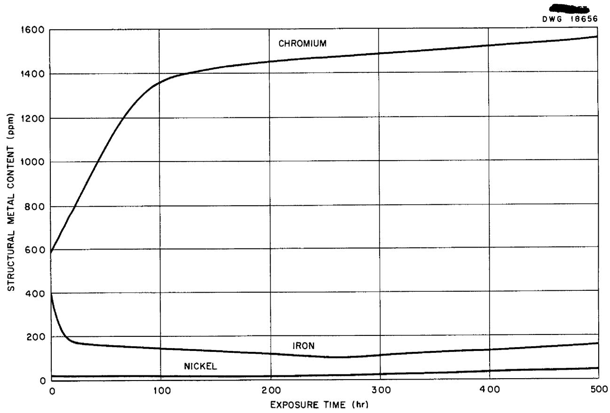  
Fig 10.1 Structural Metal Content of NaF-ZrF $_4$ -UF $_4$ (50-46-4 mole %) As a Function of Exposure Time.

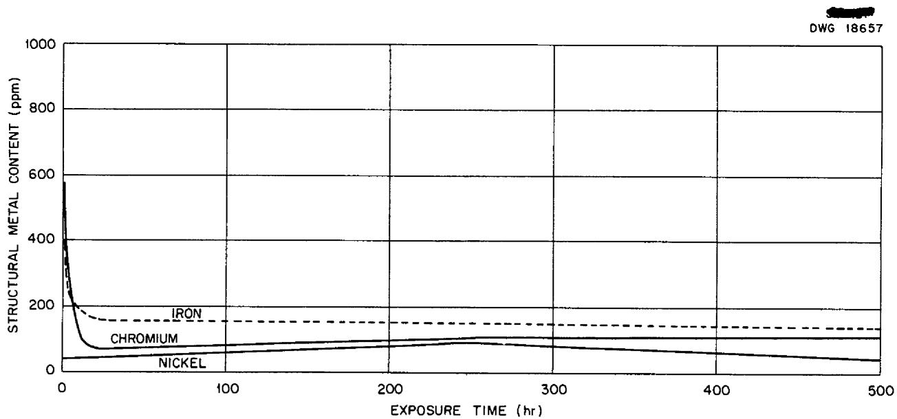  
Fig. 10 2. Structural Metal Content NaF-ZrF $_4$ -UF $_4$ (50-46-4 mole %), with 0.5 wt % ZrH $_2$ , As a Function of Exposure Time.

chromium content is increased. The reactions

$$
3 \mathrm {F e F} _ {2} + 2 \mathrm {C r} \longrightarrow 2 \mathrm {C r F} _ {3} + 3 \mathrm {F e}
$$

and

$$
3 \mathrm {N} _ {1} \mathrm {F} _ {2} + 2 \mathrm {C r} \longrightarrow 2 \mathrm {C r F} _ {3} + 3 \mathrm {N} _ {1}
$$

are obviously involved in the corrosion mechanism. Since both iron and nickel fluorides are likely to be present to some extent in the final ARE fuel and since considerable amounts of these compounds have been present in some of the batches tested, a series of experiments has been conducted to demonstrate the effects of the fluorides of iron, chromium, and nickel in considerable amounts on the corrosion of Inconel by the ARE fuel and the ARE fuel solvent.

Addition of either $\mathbf{FeF}_2$ or $\mathbf{N}_{1}\mathbf{F}_{2}$ increases the severity of attack and depth of penetration. The addition of $\mathbf{CrF}_3$ apparently has no effect on the corrosion rate. When iron or chromium fluorides are added, metallographic examination reveals metallic deposits on the capsule walls.

Chemical analyses of the solidified melts, after exposure, reveal that the

addition of $\mathrm{CrF}_3$ does not appreciably alter the amounts of iron and nickel normally found in the mixture. The addition of $\mathrm{NiF}_2$ , however, greatly increases the amount of $\mathrm{CrF}_3$ found in the melt, the very large quantities of soluble nickel added are nearly completely reduced and are apparently deposited on the walls of the capsules so that they are not removed with the fluoride mass. The addition of $\mathrm{FeF}_2$ also serves to raise the chromium content of the fluoride mixture, but only a part of the $\mathrm{FeF}_2$ seems to be reduced to metal.

The handling, sampling, and analytical techniques are not sufficiently precise to permit obtaining accurate material balances from the equations shown above, in general, however, the balance is within $\pm 20\%$ , from which it appears that a considerable fraction of the corrosion is, as was expected, due to other actions.

Hydrogen Fluoride Additive. Hydrofluoric acid is one of the reagents used in the process for purifying the fluoride melts. This reagent may be present in the melts at low

concentrations, even though considerable care is used in the stripping operation.

Study of corrosion of Inconel by a batch of ARE fuel, NaF-ZrF $_4$ -UF $_4$ (50-46-4 mole %), to which HF had been added as NaHF $_2$ , showed that heavy subsurface void formation resulted when as much as 0.3 wt% HF was present. This attack was shown to be as much as 3 mils deep, which is at least twice the depth expected without addition. However, the use of 0.1 wt% HF resulted in less severe attack, with penetration to only 1.5 mils, and the addition of 0.04 wt% HF yielded a light metallic deposit and relatively light corrosive attack.

The fuel mixture used in these experiments had been treated with $\mathbf{H}_2$ and, presumably, contained small amounts of $\mathbf{U}\mathbf{F}_3$ . It is possible that the reaction

$$
2 \mathrm {U F} _ {3} + 2 \mathrm {H F} \rightleftharpoons 2 \mathrm {U F} _ {4} + \mathrm {H} _ {2}
$$

may have masked the deleterious effect of small HF additions.

Fluoride Corrosion in a Rotating Rig. The whirling rig $\mathbf{rig}^{(1)}$ is now running and operational "bugs" are gradually being worked out. In this device it will be possible to run relatively high-velocity corrosion tests with the fluoride mixtures contained in Inconel and other suitable tubing. At the present time, a fluid velocity of approximately 10 fps is being employed. Upon metallographic examination after a 100-hr test with NaF-ZrF $_4$ -UF $_4$ (46-50-4 mole %) in Inconel at a temperature of $816^{\circ}\mathrm{C}$ (no appreciable thermal gradient employed), it was noted that the attack was no more severe than that often encountered in ordinary static corrosion tests. The attack was quite uniform and was in the form of subsurface voids to a depth of 2 mils.

Chemical analysis of the fluoride after the test revealed the presence of $0.025\%$ Fe, $0.003\%$ N1, and $0.141\%$ Cr. Other tests are being run with various additions to the fluoride mixtures, and attempts are being made to vary the heating arrangements on the tubing so that sizeable temperature gradients can be attained.

Static Tests on Incoloy and Inconel in Fluorides. Incoloy $(32\% \mathrm{N}_1 - 21\%$ Cr-47% Fe) was tested in NaF-ZrF $_4$ -UF $_4$ (46-50-4 mole %) for 100 hr at $816^{\circ}\mathrm{C}$ . In a few places, subsurface voids to a depth of 2 mils could be noted. A photomicrograph of the Incoloy, taken after testing, is shown in Fig. 10.3.

The descending properties of the fluoride on oxidized Inconel were tested at $816^{\circ}\mathrm{C}$ , and it was found that the oxidized Inconel was cleaned very well at the 1-, 4-, and 8-hr test times that were tried.

# FLUORIDE CORROSION OF METALS IN THERMAL CONVECTION LOOPS

G. M. Adamson, Metallurgy Division

Effect of Fluoride Batch Size. As discussed in the previous report, (2) the corrosion has been increasing in the Inconel loops circulating NaF-ZrF4-UF4 (46-50-4 mole %). The increases in themselves were not enough to cause trouble, but they are dangerous when regarded as a trend that is not understood. Consequently, a series of loops was run to determine whether the increase in batch size in the production of the fluoride mixture was responsible for the corrosion increase. Loops were run with fluoride mixtures prepared in 5- and 50-lb batches for 100- and 500-hr periods. In both the 100- and 500-hr tests, more corrosion was caused by the small batches than by the large batches. Obviously, the increase in batch size was not the reason for the

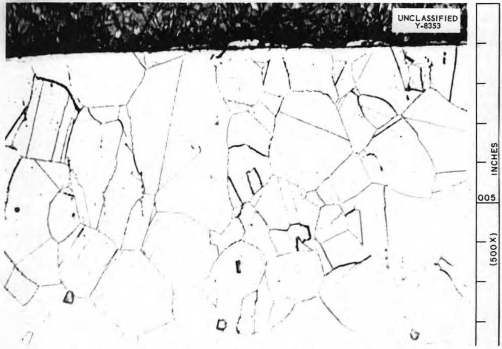  
Fig. 10.3. Static Test of Incoloy in NaF-ZrF $_4$ -UF $_4$ (46-50-4 mole %) for 100 hr at $816^{\circ}\mathrm{C}$ .

increase in attack. Furthermore, even though extreme care was taken during filling of the loop, the attack was still extensive; therefore poor handling during filling was also eliminated as the cause.

Fluoride Pretreatment. Two small batches of NaF-ZrF4-UF4 (46-50-4 mole %) were taken from the 50-lb batch and given a complete retreatment.(3) When these batches were circulated in Inconel loops, the attack in one instance was considerably greater than average, whereas in the other it was less; therefore it may be concluded that some major variable still has not been controlled.

(3) C. M. Blood, A. J. Weinberger, F. P. Boody, and G. J. Nessle, ANP Quar. Prog. Rep. June 10, 1952, ORNL-1294, p. 97.

The attack found in Inconel loops in which $\mathrm{NaF - ZrF_4 - UF_4}$ (46-50-4 mole %) circulated was much less than had been found when NaF-KF-LiF-UF $^4$ 10.9- 43.5-44.5-1.lmole %) was the circulated material.(4) Since the $\mathrm{NaF - ZrF_4 - UF_4}$ had received more extensive pretreatment with $\mathbf{H}_{2}$ and HF, its higher purity is a logical explanation for its lower corrosiveness. Accordingly, two special batches of the NaF-KF-LiF $\mathrm{UF}_4$ mixture were given the same special pretreatment. These batches produced attack on Inconel that was almost twice that heretofore observed. Two additional batches of the same fluoride were then specially prepared and circulated in Inconel loops, and

(4)G. M. Adamson, ANP Quar. Prog. Rep. Sept. 10, 1952, ORNL-1375, p. 103 ff.

the attack was even worse than in the first test.

In all the tests with pretreated fuel, the operator reported a strong odor of hydrogen fluoride during the filling of the loops. Since hydrogen fluoride, as an additive in static tests, has been shown to increase corrosion, it is most probable that the HF used at one step in the fuel pretreatment, as well as the $\mathbf{N}_{1}\mathbf{F}$ produced during this treatment, is not being completely removed and is causing the increased corrosion. These tests show that poor purification may do more harm than good.

Hydride Additives It has been confirmed that zirconium hydride will reduce the attack of NaF-ZrF $_4$ -UF $_4$ (46-50-4 mole %) on Inconel. An addition of 1/2% zirconium hydride in one thermal convection loop reduced the depth of attack to between 1 and 4 mils. This attack is lower than normal but is deeper than that found when zirconium hydride is added to NaF-KF-L $_1$ F-UF $_4$ (10.9-43.5-44.5-1.1 mole %). The coolant underwent considerable transformation, as evidenced by the presence of a brown material.

Titanium hydride (1/2%) was added to the NaF-KF-L1F-UF4 mixture and circulated in Inconel. The maximum penetration of 25 mils, although much less than that found when no additive was used, was not quite so low as that obtained when zirconium hydride was added. Surface layers were found in both the hot and cold legs. These layers must receive additional study if any hydride is to be used as an inhibitor.

Metal Additives. The three most common impurities found in the fuel are nickel, iron, and chromium. One loop in which chromium metal powder had been added to NaF-KF-L1F-UF4 (10.9-43.5-44.5-1.1 mole %) was discussed in the previous report.(2) This test was repeated, and again no change in the average depth of attack

was found, no unusual layers were found, and the chromium content of the fluorides from the loop was normal, so again the chromium metal did not go into solution. Chromium metal powder, in sufficient quantity to make $0.5\%$ in the solution, was then added to a transfer pot before the fluorides were placed into it. After the fluorides had been added, the pot was kept hot and helium was blown through it for 30 minutes. Again, average attack was found after this material had been circulated in an Inconel loop. The chemical analysis of this fluoride showed a chromium concentration of 2500 ppm, which is about twice the normal concentration. Further work is scheduled to determine whether the solubility of chromium is much lower than was expected. This is likely, since the chromium content did not increase greatly during circulation and yet attack had taken place

As another approach to this problem, a section of Inconel pipe was chromium plated and welded into the hot leg of a loop. After the NaF-KF-L1F-UF4 mixture had been circulated, the depth of attack was the same in adjacent plated and unplated sections. No traces of the chromium plate remained on the walls. A metallic appearing layer was found in the cold leg. The chromium content of the fluorides varied from 2500 to 3000 ppm, which, although higher than normal, is about the same as that found in the loop discussed above.

Temperature Dependence. A loop filled with the fluoride fuel, NaF-ZrF $_4$ -UF $_4$ (50-46-4 mole%), was operated for 500 hr with a minimum cold-leg temperature of $1500^{\circ}$ F and a hot-leg temperature of $1650^{\circ}$ F. The hot-leg attack was moderate to light, with a maximum depth of 11 mils and an average depth of 8 mils. A concentration of voids in the grain boundaries had taken place. The results may be compared with those of a similar

loop test in which the hot-leg temperature was $1500^{\circ}\mathrm{F}$ The hot-leg attack in this loop was from 3 to 10 mils deep. Comparison of these two loops indicates that the corrosion mechanism is not extremely temperature sensitive. One disturbing fact is that with the hotter loop there was some evidence of uranium segregation in the cold leg. This is now being checked in another loop.

Crevice Corrosion. Another loop operated in the study of crevice corrosion $^{(2)}$ was an Inconel loop, with two crevices built into the hot leg, in which $\mathrm{NaF - ZrF_4 - UF_4}$ (46-50-4 mole %) was circulated. The upper hot-leg section showed a maximum attack of 16 mils and an average attack of 12 mils, whereas the attack in the lower hot-leg section had a maximum depth of 9 mils. The maximum attack in the crevices was 19 mils and the average was 12 mils. The intensity of attack in the crevice was several times that in the straight section. This confirms previously obtained results in that the attack in the crevice is only slightly deeper but the intensity of attack is greatly increased.

Inserted Corrosion Samples. Metallographic data received for the previously discussed(2) loops in which thermocouple tubes were inserted into the center of the hot and the cold legs confirm the results obtained with flat samples. With both NaF-ZrF $_4$ -UF $_4$ and NaF-KF-L1F-UF $_4$ , the attack on the loop walls in the hot leg was normal, but the hot-leg inserts were attacked to a depth of only 1 mil, no satisfactory explanation has been offered for this phenomenon.

Effect of Exposure Time. An Inconel loop was used to circulate NaF-ZrF $_4$ -UF $_4$ (50-46-4 mole %) 1000 hr, and the resulting hot-leg attack was moderate to heavy in intensity and extended to depths of 5 to 11 mils. The attack was present both as general attack and as a concentration of the

voids in the grain boundaries For comparative purposes, these data are summarized in Table 10.1, along with similar data for loops previously operated for 100 and 500 hours. Although the depth and intensity of the attack increases with the exposure time, the rate of attack definitely decreases

TABLE 10.1. EFFECT OF EXPOSURE TIME ON DYNAMIC CORROSION OF INCONEL BY NaF-ZrF4-UF4  

<table><tr><td>TIME OF OPERATION (hr)</td><td>MAXIMUM ATTACK (mils)</td><td>CORROSION INTENSITY</td></tr><tr><td>100</td><td>4</td><td>Light to moderate</td></tr><tr><td>500</td><td>10</td><td>Light to moderate</td></tr><tr><td>1000</td><td>11</td><td>Moderate to heavy</td></tr></table>

Nonuranium Bearing Mixtures. Since NaF-ZrF $_4$ (50-50 mole %) will be used during the initial testing of the ARE, several loops have been operated to study its effects. These are standard loops, that is, Inconel loops operated for 500 hr with a hot-leg temperature of $1500^{\circ}\mathrm{F}$ . The upper section of the hot leg of one loop showed light attack that extended to depths of 4 to 8 mils, whereas the lower section was practically unattacked. The second loop is still operating. A third loop, in which NaF-ZrF $_4$ (52-48 mole %) was circulated, yielded scattered intergranular attack of from 3 to 8 mils in the top section of the hot leg. The lower section showed general pitting 1 mil deep, with an occasional patch of pits up to 6 mils deep. No deposit was found in the cold leg

Zirconium hydride (1/2%) was added to another batch of this coolant, which was then subject to the standard loop test. The hot-leg surface of this loop was pitted, but the attack, as shown by the subsurface voids, extended to a maximum depth of only

1.5 mils. A two-phase layer 1 mil thick was present on the hot-leg surface, and a tightly adhering metallic-appearing layer 0.1 mil thick was found in the cold leg. Again the zirconium hydride acted as an inhibitor, but hot-leg deposits were formed.

One Inconel loop circulated 500 hr with NaF-BeF $_2$ (57-43 mole %). The maximum hot-leg attack was 9 mils and the average was 4 mils. More voids were concentrated in the grain boundaries than are normally found, and the voids were larger. A nonmetallic deposit was found in the cold leg. With both NaF-ZrF $_4$ and NaF-BeF $_2$ , the attack mechanism seems to be the same as for the other fluorides.

# LIQUID METAL CORROSION OF STRUCTURAL METALS

G.P.Smith

E. E. Hoffman

J. V. Cathcart

L. R. Trotter

D. C. Vreeland

J. E. Pope

Metallurgy Division

Seesaw Tests of Sodium-Lead Alloys. A series of seesaw tests of sodium-lead mixtures has been run in Inconel and types 430 and 304 stainless steel tubing for 100 hours. The lead for these tests was purified by bubbling hydrogen through molten lead at $750^{\circ}\mathrm{C}$ for 1 l/2 hours. All Inconel tubes were attacked in the hot zone. Severity of the attack decreased with increasing sodium additions, but the attack was still appreciable with a 30 wt % sodium addition, as shown in Fig. 10.4,

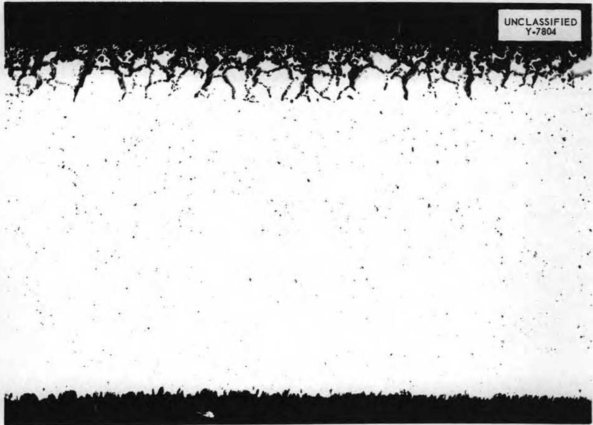  
Fig. 10.4. Inconel After a Seesaw Test in a 30 wt % Na-70 wt % Pb Mixture for 100 hr at $850^{\circ}\mathrm{C}$ . 100x.

# ANP PROJECT QUARTERLY PROGRESS REPORT

which illustrates the type and extent of attack of these sodium-lead mixtures. In no case was attack or deposition of crystals noted in the cold zone upon metallographic examination; however, in several of the tubes, crystals could be detected in the bath material. In the test with the type 430 stainless steel tubing, there was very little corrosive attack by the sodium-lead mixtures. Type 304 stainless steel showed exceptionally good resistance to these corrodants. A section of the hot zone of a tube after exposure to $5\%$ Na- $95\%$ Pb is shown in Fig. 10.5. There was essentially no attack in any of the tests with type 304 stainless steel. A summary of these tests is given in Table 10.2.

Static Tests with Lithium. Two-component static tests of several materials have been run with lithium at $1000^{\circ}\mathrm{C}$ to furnish a basis of comparison with three-component tests run previously. Severe attack had been noted in the three-component tests, 10 to 15 mils penetration being quite common. It should be emphasized, however, that the more recent tests were static tests and the attack might be less severe than in the dynamic systems. Results of these tests are presented in Table 10.3.

Incoloy in Sodium, Lithium, and Lead. Incoloy (32% Ni-21% Cr-47% Fe) was tested for 100 hr at $816^{\circ}\mathrm{C}$ in sodium, lithium, and lead. No attack was noted in either sodium or lithium, although some crystal deposition was

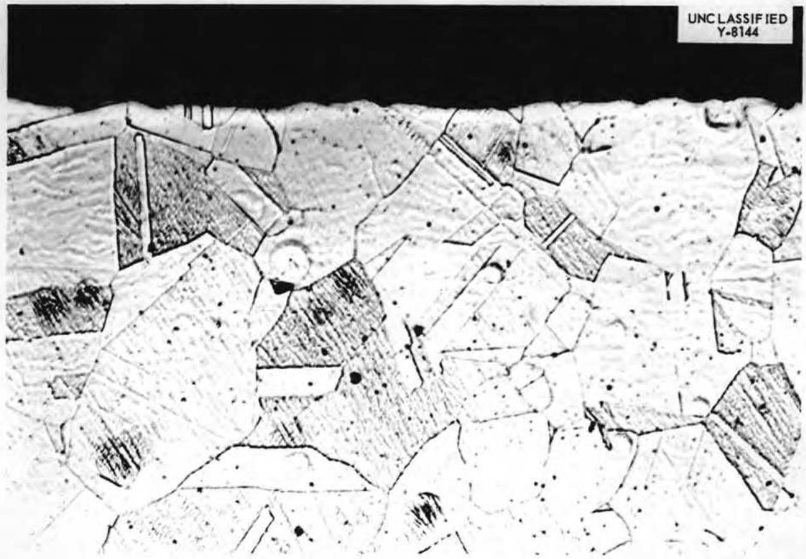  
Fig. 10.5. Type 304 Stainless Steel After a Seesaw Test in a 5 wt% Na-95 wt% Pb Mixture for 100 hr at $830^{\circ}\mathrm{C}$ . 100x.

TABLE 10.2. SEESAW TESTS OF VARIOUS MATERIALS RUN IN SODIUM-LEAD MIXTURES FOR 100 HOURS   

<table><tr><td rowspan="2">MATERIAL</td><td colspan="2">BATH COMPOSITION (%)</td><td colspan="2">AVERAGE TEMPERATURE (°C)</td><td rowspan="2">METALLOGRAPHIC NOTES</td></tr><tr><td>Na</td><td>Pb</td><td>Cold Zone</td><td>Hot Zone</td></tr><tr><td rowspan="6">Inconel</td><td>5</td><td>95</td><td>530</td><td>820</td><td>Terminated after 18 hr, no circulation, 12 mils of intergranular attack in hot zone</td></tr><tr><td>10</td><td>90</td><td>330</td><td>870</td><td>Intergranular attack entirely through 35-mil wall in hot zone</td></tr><tr><td>15</td><td>85</td><td>315</td><td>860</td><td>15 mils of heavy intergranular attack in hot zone</td></tr><tr><td>20</td><td>80</td><td>395</td><td>855</td><td>12 mils of intergranular attack in hot zone</td></tr><tr><td>25</td><td>75</td><td>470</td><td>850</td><td>5 mils of intergranular attack in hot zone</td></tr><tr><td>30</td><td>70</td><td>485</td><td>850</td><td>6 mils of intergranular attack in hot zone</td></tr><tr><td rowspan="6">Type 304 stainless steel</td><td>5</td><td>95</td><td>560</td><td>830</td><td rowspan="6">Essentially no attack in either hot or cold zone in any of the type 304 stainless steel tests</td></tr><tr><td>10</td><td>90</td><td>575</td><td>840</td></tr><tr><td>15</td><td>85</td><td>545</td><td>830</td></tr><tr><td>20</td><td>80</td><td>585</td><td>825</td></tr><tr><td>25</td><td>75</td><td>600</td><td>835</td></tr><tr><td>30</td><td>70</td><td>600</td><td>835</td></tr><tr><td rowspan="6">Type 430 stainless steel</td><td>5</td><td>95</td><td>565</td><td>850</td><td rowspan="6">Essentially no attack in either hot or cold zone in any of the type 430 stainless steel tests</td></tr><tr><td>10</td><td>90</td><td>580</td><td>845</td></tr><tr><td>15</td><td>85</td><td>575</td><td>820</td></tr><tr><td>20</td><td>80</td><td>575</td><td>810</td></tr><tr><td>25</td><td>75</td><td>550</td><td>805</td></tr><tr><td>30</td><td>70</td><td>610</td><td>835</td></tr></table>

TABLE 10.3. RESULTS OF TWO-COMPONENT STATIC TESTS WITH LITHIUM AT ${1000}^{ \circ  }\mathrm{C}$   

<table><tr><td>MATERIAL</td><td>TIME OF TEST (hr)</td><td>METALLOGRAPHIC NOTES</td></tr><tr><td>Type 316 stainless steel</td><td>100</td><td>No sign of attack on sections exposed to liquid phase, 2.5 mils of intergranular attack on sections exposed to vapor phase</td></tr><tr><td>Inconel</td><td>100</td><td>Some mass-transfer crystals could be noted on the surface, no attack in vapor zone, 3 to 4 mils of subsurface voids on tube in bath zone</td></tr><tr><td>Type 304 stainless steel</td><td>400</td><td>1 to 2 mils of intergranular penetration and transformation from austenite to ferrite</td></tr></table>

apparent in the test with lithium. In the test with lead, 1 to 2 mils of intergranular penetration could be noted.

Corrosion by Lead in Thermal Convection Loops. A series of tests has been made to determine the extent of mass transfer and corrosion in thermal convection loops containing liquid lead. The systems lead-Inconel, lead-nlobium, and lead-molybdenum have been studied. Results are also available for the lead-type 304 stainless steel system, but are incomplete.

Since the results of previous investigations of mass transfer and corrosion in lead thermal convection loops have been subject to criticism because of oxide in the lead or on the metal tubing, in the present series of experiments, the liquid lead was deoxidized with hydrogen prior to contact with the test metal. Care was also taken to avoid heavy oxidation of the metal sections of the loops. The apparatus and experimental procedure were described in the previous report.(5)

The quartz tubing used in the loop is virtually insoluble in lead at the test temperatures, the concentration of $\mathbf{S}_1\mathbf{O}_2$ in the lead after one

(5) ANP Quar Prog Rep Dec 10, 1952, ORNL-1439, p 148.

test was only 17 ppm, and the $\mathbf{S}_1\mathbf{O}_2$ concentration in a lead sample that had not been in contact with glass or quartz was 15 ppm

Loop tests were run with Inconel, columbium, molybdenum and type 304 stainless steel samples suspended in the circulating lead The results for Inconel have been reported previously,(5) the results for the other metals are summarized in Table 10 4.

The columbium specimens exhibited no mass transfer and virtually no corrosion even after almost 600 hr of loop operation. The small decrease in wall thickness was probably due to the solution of the small amount of columbium required to saturate the lead. No mass transfer occurred with molybdenum, but the corrosion, although slight, was a little greater than that found for columbium. Little or no intergranular penetration was observed. The reason for the discrepancy in the wall-thickness measurements for the second lead-molybdenum test is not known.

The molybdenum specimens used were not actually sections of tubing but were made of molybdenum foil bent into a cylinder. The foil had a specified thickness of 10 mils, which was checked by micrometer readings at two points on the foil. It is possible that there was a variation in thickness in the

TABLE 10.4. CORROSION OF STRUCTURAL METALS BY LEAD IN QUARTZ THERMAL CONVECTION LOOPS   

<table><tr><td rowspan="2">METAL</td><td rowspan="2">TEST NO.</td><td colspan="2">TEMPERATURE (°C)</td><td colspan="3">SPECIMEN WALL THICKNESS (in.)</td><td rowspan="2">TIME OF OPERATION (hr)</td></tr><tr><td>Hot Zone</td><td>Cold Zone.</td><td>Original</td><td>Hot Zone</td><td>Cold Zone</td></tr><tr><td rowspan="2">Columbium</td><td>1</td><td>800</td><td>575</td><td>0.035</td><td>0.032</td><td>0.034</td><td>270(a)</td></tr><tr><td>2</td><td>800</td><td>565</td><td>0.035</td><td>0.033</td><td>0.033</td><td>572(b)</td></tr><tr><td rowspan="2">Molybdenum</td><td>1</td><td>800</td><td>450</td><td>0.010</td><td>0.006(c)</td><td>0.006(c)</td><td>473(b)</td></tr><tr><td>2</td><td>800</td><td>595</td><td>0.010</td><td>0.011</td><td>0 010</td><td>305(b)</td></tr><tr><td>Type 304, high carbon, stainless steel(d)</td><td>1</td><td>800</td><td>500</td><td></td><td></td><td></td><td>111</td></tr></table>

(a)Stoppage caused by failure of hot leg heater, no plug formed.   
(b)Scheduled termination   
(c) Discrepancy probably caused by variation in tube thickness.   
$(d)$ Examination incomplete

foil and that the original foil used in test No. 2 was slightly greater than 10 mils thick.

The results of the test with type 304 stainless steel are incomplete. On the basis of the thermal record of the experiment, however, it appeared that circulation in this loop was also stopped by plug formation. The type 304 stainless steel specimen used had a carbon concentration of $0.087\%$ .

In summary, both columbium and molybdenum showed very good resistance to mass transfer and corrosion in liquid lead. On the other hand, severe corrosion and mass transfer occurred in the lead-Inconel systems despite the careful deoxidation of the lead with hydrogen. The tests have included a nickel-base alloy (Inconel), columbium, molybdenum, and an iron-base alloy (type 304 stainless steel). It is planned to extend the study to other iron-base alloys, such as type 410 stainless steel, to a low-carbon type 304 stainless steel, and to Armco iron.

# CORROSION OF CERAMICS BY FLUORIDES AND LIQUID METALS

D. C. Vreeland

L. R. Trotter

E E Hoffman

J E. Pope

Metallurgy Division

E. E. Ketchen

L. G. Overholser

Materials Chemistry Division

L. A. Mann

J. M. Csisar

D. R. Ward

ANP Division

Cermets in Fluorides and Liquid Metals. Two cermets were prepared by the Ceramics Laboratory, one consisted of TiC plus $20\%$ N1 and $15\%$ CbC plus TaC, and the other consisted of ZrC plus $20\%$ iron. These cermets were tested in various corrosive mediums by sealing them, together with the corroding agent, under vacuum in Inconel tubes. After the tubes had been heated for 100 hr at $816^{\circ}\mathrm{C}$ , specimens were removed, checked for weight and dimensional changes, and examined metallographically. In the tests with sodium and lead, there was little or no attack (Fig. 10 6). The

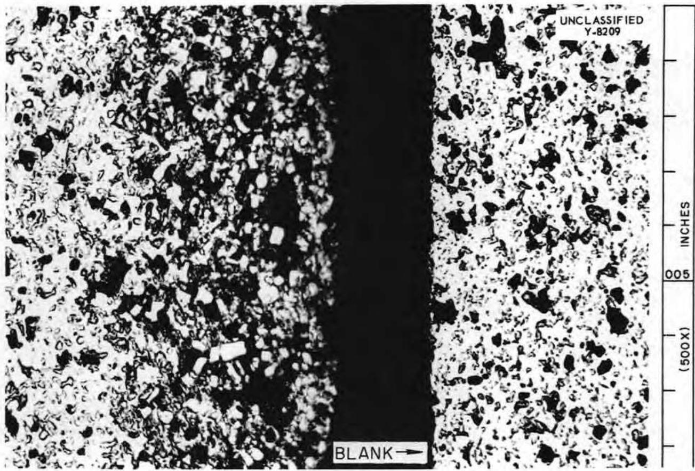  
Fig. 10.7. Titanium Carbide Cermet After Exposure to NaF-ZrF $_4$ -UF $_4$ (46-50-4 mole %) for 100 hr at $816^{\circ}\mathrm{C}$ .

TABLE 10.5. RESULTS OF STATIC TESTS OF TiC AND ZrC CERMETS IN SODIUM, LEAD, AND SOME FLUORIDE MIXTURES   

<table><tr><td>CERMET</td><td>CORRODANT</td><td>WEIGHT CHANGE (g/in.2)</td><td>METALLOGRAPHIC NOTES</td></tr><tr><td rowspan="4">TiC</td><td>Na</td><td>-0.0065</td><td>No attack apparent</td></tr><tr><td>Pb</td><td>Pb adhering to specimen</td><td>No attack apparent</td></tr><tr><td>NaF-KF-LiF-UF4(10.9-43.5-44.5-1.1 mole %)</td><td>Fluoride adhering to specimen</td><td>No attack apparent</td></tr><tr><td>NaF-ZrF4-UF4(46-50-4 mole %)</td><td>-0.0119</td><td>Bonding material appeared to be leached from specimen to a depth of 5 mils</td></tr><tr><td rowspan="2">ZrC</td><td>Na</td><td>-0.0037</td><td>Specimen showed that some uniform solution had taken place, but no thickness change was involved</td></tr><tr><td>NaF-KF-LiF-UF4(10.9-43.5-44.5-1.1 mole %)</td><td>-0.0158</td><td>Surface appeared to be slightly roughened</td></tr></table>

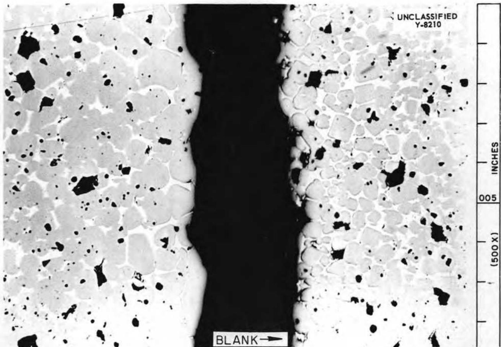  
Fig. 10.6. Zirconium Carbide Cermet After Exposure to Sodium for 100 hr at $816^{\circ}\mathrm{C}$ .

mixture NaF-KF-LiF-UF4 (10.9-43.5- 44.5-1.1 mole %) appeared to have little effect on these materials, but in the one test with NaF-ZrF4-UF4 (46-50-4 mole %), the specimen was attacked to a depth of 5 mils (Fig. 10.7). No significant dimensional changes could be noted in any of the tests. The weight loss data and the results of metallographic examination are given in Table 10.5.

Static Tests of the ARE-BeO Blocks in Na and NaK. Two tests have been performed with ARE beryllium oxide moderator blocks heated for several hundred hours at $810^{\circ}\mathrm{C}$ in a type 347 stainless steel pot containing Na or NaK. In the first test, the beryllium oxide was immersed in 255 in.3 of

sodium for 213 hr at $816^{\circ}\mathrm{C}$ . Although no cracking or spalling of the beryllium oxide was noticeable immediately after the test, the surface imperfections apparent in part a of Fig. 10.8 occurred after the test specimen had been soaked in alcohol and water.

In the second test, the NaK was transferred to the pot with the beryllium oxide when both the NaK and the beryllium oxide were at room temperature. The test was run for 500 hr at $816^{\circ}\mathrm{C}$ with the beryllium oxide immersed in 255 in. of NaK. After the test, the beryllium oxide was badly cracked, as can be seen in part b of Fig. 10.8. The weight and dimensional changes noted for both tests are given in Table 10.6.

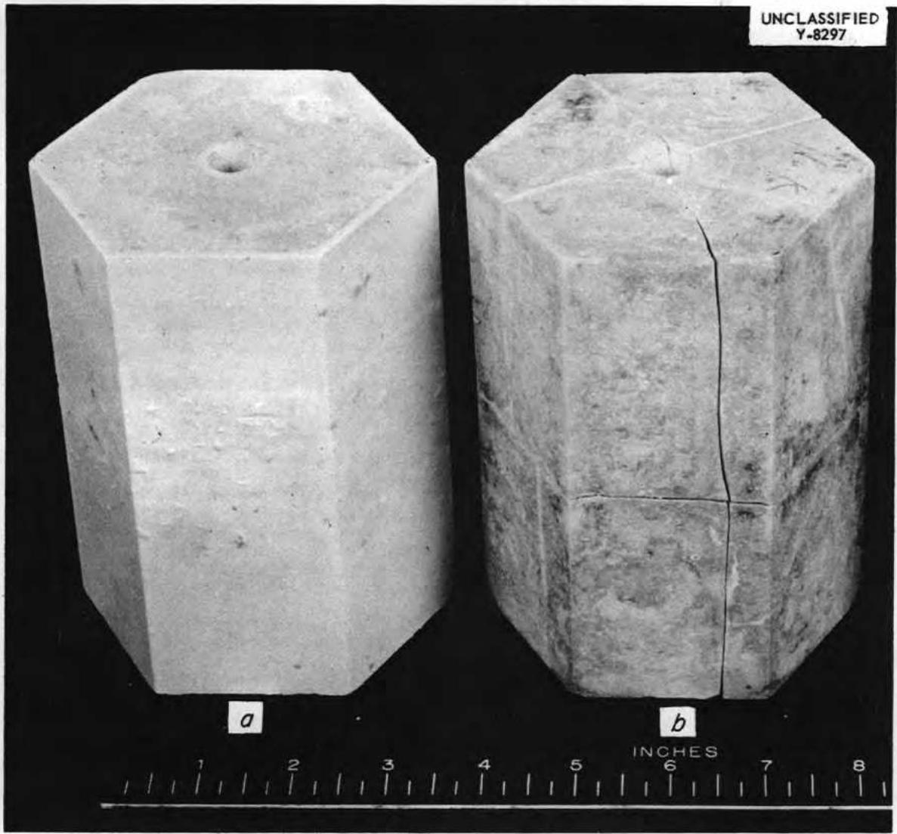  
Fig. 10.8. ARE Beryllium Oxide Blocks After Static Tests in Na and NaK at $816^{\circ}\mathrm{C}$ . (a) In Na for 213 hr; (b) in NaK for 500 hours.

Seesaw Tests of BeO in NaK. Beryllium oxide specimens 1/4by 1/4 by 1 in. were tested in NaK in the rocker furnace for 100 hr, with a hot-zone temperature of approximately $830^{\circ}C$ and a cold-zone temperature of approximately $450^{\circ}C$ . Specimens were crimped into the hot end of the tube to prevent their sliding from the hot end to the cold end. Specimens indicated in Table 10.7 as "low density" had a density of approximately 2.27; those indicated as "high density" had a density of approximately 2.83.

Specimens indicated as "dehydrated" were dried for 24 hr at $125^{\circ}C$ before test. The information derived from these experiments is tabulated in Table 10.7. It is evident from these data that after the specimens were stripped in alcohol there was some slight evidence of cracking in the high-density specimens and some slight evidence of spalling in the low-density specimens.

Convection Loop tests of BeO in NaK. Eight specimens of BeO 1/4 by 1/4 by 1/2 in. were placed in a wire basket

in the surge tank of a thermal convection loop, and NaK was permitted to flow over the specimens at a velocity of about 8 fpm for 212 hours. The temperature of the NaK was $1150^{\circ}\mathrm{F}$ in the cold leg and $1000^{\circ}\mathrm{F}$ in the hot leg, and the samples were in contact with NaK at $1500^{\circ}\mathrm{F}$ . The NaK specimens in the second test were pretreated before exposure to the hot NaK in the following manner: specimens 1 and 2 received no special pretreatment, specimens 3 and 4 were treated with $\mathsf{MgNO}_3$ , specimens 5 and 6 were impregnated with $\mathsf{AlF}_3$ and $\mathsf{CaF}_2$ , specimens 7 and 8 were treated with $\mathsf{BeNO}_3$ . The test results are given in Table 10.8.

It is noteworthy that specimens 1, 3, 5, and 7 were located above specimens 2, 4, 6, and 8, respectively, in the basket during exposure to the NaK, and in each case the upper specimen suffered the greater loss in weight. Special treatment of BeO to increase its resistance to hot NaK appears to offer possibilities, and further tests are to be conducted. The effect of the density of the specimen could not be correlated to the weight losses in these tests.

Solubility of BeO in NaK. Various workers have initiated experiments to determine, if possible, the effect of NaK on BeO at temperatures of approximately $800^{\circ}\mathrm{C}$ in both static and

TABLE 10.6. WEIGHT AND DIMENSIONAL CHANGES OF ARE-BeO BLOCKS AFTER STATIC TESTS IN Na AND NaK AT $816^{\circ}\mathbf{C}$   

<table><tr><td></td><td>BEFORE TEST</td><td>AFTER TEST</td><td>CHANGE (%)</td><td>AFTER CLEANING IN WATER AND DRYING</td><td>CHANGE (%)</td></tr><tr><td colspan="6">First Test, 213 hr in Na</td></tr><tr><td>Length, in</td><td>5 914</td><td>5 917</td><td>+0 05</td><td></td><td></td></tr><tr><td>Width, in</td><td>3 706</td><td>3 708</td><td>+0 05</td><td></td><td></td></tr><tr><td>Weight, g</td><td>3 154</td><td>3 221</td><td>+2 1</td><td>3 205</td><td>+1 6</td></tr><tr><td colspan="6">Second Test, 500 hr in NaK</td></tr><tr><td>Length, in</td><td>5 909</td><td>5 899</td><td>-0 17</td><td></td><td></td></tr><tr><td>Width, in</td><td>3 714</td><td>3 712</td><td>-0 05</td><td></td><td></td></tr><tr><td>Weight, g</td><td>3 160</td><td>3 205</td><td>+1 4</td><td>3 187</td><td>+0 85</td></tr></table>

TABLE 10.7. RESULTS OF SEESAW TESTS OF BeO IN NaK AFTER 100 hr AT ${816}^{ \circ  }\mathrm{C}$   

<table><tr><td>SPECIMEN</td><td>WEIGHT LOSS (g/in.2)</td><td>WEIGHT LOSS (%)</td><td>TOTAL WEIGHT LOSS (mg)</td><td>TOTAL BeO FOUND BY ANALYSIS OF NaK FILTER AND CONTAINERS (mg)</td></tr><tr><td>Low density, as received*</td><td>0 0454</td><td>2.38</td><td>30.7</td><td>14.26</td></tr><tr><td>High density, as received</td><td>0.0286</td><td>1 25</td><td>18 9</td><td>4.97</td></tr><tr><td>Low density, dehydrated</td><td>0.0893</td><td>5.15</td><td>47.0</td><td>9.91</td></tr><tr><td>High density, dehydrated</td><td>0 0104</td><td>0.52</td><td>6.1</td><td>6.02</td></tr></table>

*This test run for only 16 hours.

dynamic test systems. The weight losses of the BeO blocks observed in a number of instances prompted a search for the beryllium that had been removed from the block. In those tests for which the NaK was filtered at room temperature, the beryllium found in the filtrate corresponded to approximately 3 ppm of BeO, which was a very small part of the total beryllium removed from the blocks. Further examination revealed that the beryllium or the BeO, or both, was located primarily on the walls of the container to which it adhered tightly. The question then arose as to whether or not the beryllium was removed from the block and deposited on the wall by some process involving solubility of Be or BeO in the NaK at $800^{\circ}\mathrm{C}$ .

Two tests were performed to measure the solubility in NaK at $800^{\circ}\mathrm{C}$ . In the first test, BeO was contacted with NaK at $800^{\circ}\mathrm{C}$ for 6 hr in the reaction-filtration rig previously described.(6) The NaK was filtered at approximately $800^{\circ}\mathrm{C}$ , and the filtrate was collected in a nickel receiving tube. Based on this single experiment, the solubility of beryllium in NaK at $800^{\circ}\mathrm{C}$ corresponds to roughly 100 ppm, but it is not known whether the material dissolved was Be or BeO.

(6) ANP Quar Prog Rep Dec 10, 1952, ORNL-1439, Fig 107, p 121

In the second test, a stainless steel thermal convection loop was used to circulate NaK over BeO blocks suspended in the surge tank. After 212 hr of circulation at a flow rate of 6 to 10 bpm, a weight loss of about $25\%$ was measured for the BeO blocks (original weight of 4 g). After the NaK had been drained, the loop was sectioned as shown in Fig. 10.9. The operating temperatures of the loop are given on the figure, along with the analytical results for the BeO determinations on the respective 3 l/2-in sections.

The analytical results show that the three coldest (and lowest) sections of the loop contained the greatest concentrations of beryllium. Since the analytical data show no accumulation of BeO fragments in the coldest part of the tank, it is suggested that a dissolution process, governed by the temperature gradient, is responsible for the transfer of the material from the BeO block to the walls of the cold region.

Such a mechanism could be represented by the following reaction

$$
2 \mathrm {N a K} + 2 \mathrm {B e O} \rightleftharpoons \mathrm {N a} _ {2} \mathrm {O} + \mathrm {K} _ {2} \mathrm {O} + 2 \mathrm {B e},
$$

which, if the reaction proceeds slightly to the right at $800^{\circ} \mathrm{C}$ and the beryllium formed is soluble in NaK, would account for removal of

TABLE 10.8. RESULTS OF TESTS OF BeO IN NaK   

<table><tr><td rowspan="2"></td><td colspan="8">SPECIMEN NUMBER</td></tr><tr><td>1</td><td>2</td><td>3(a)</td><td>4(a)</td><td>5</td><td>6</td><td>7</td><td>8</td></tr><tr><td>Average loss in dimensions per surface, in</td><td>0 006</td><td>0 004</td><td>0 002</td><td>0 002</td><td>0 000</td><td>0 001</td><td>0 005</td><td>0 004</td></tr><tr><td>Loss of weight, g</td><td>0 152</td><td>0 120</td><td>0 091</td><td>0 076</td><td>0 069</td><td>0 062</td><td>0 162</td><td>0 119</td></tr><tr><td>Loss of weight (%)</td><td>11 5</td><td>9 6</td><td>6 8</td><td>6 0</td><td>4 9</td><td>4 7</td><td>11.1</td><td>9.6</td></tr><tr><td>Density of specimen</td><td>2 60</td><td>2 50</td><td>2 54</td><td>2 45</td><td>2 82</td><td>2 65</td><td>2.66</td><td>2 45</td></tr></table>

(a) Much or all of the weight loss may have been due to the shedding of a thin surface film in the alcohol bath

UNCLASSIFIED

DWG 48658

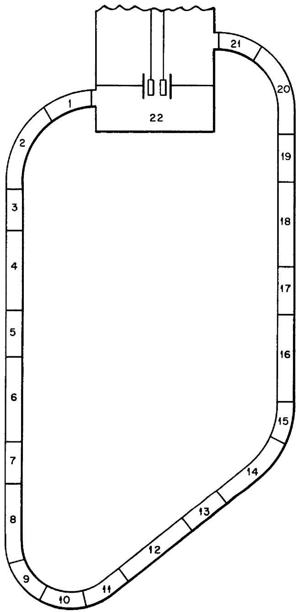  
Fig. 10 9. Schematic Diagram of Convection Loop for NaK-BeO Test Showing Temperature and BeO Recovered in Various Sections.

WEIGHT OF BeO FOUND IN VARIOUS SECTIONS   

<table><tr><td>SECTION NO</td><td>BeO (mg)</td><td>AVERAGE TEMPERATURE (°F)</td></tr><tr><td>1</td><td>113</td><td>1500</td></tr><tr><td>3</td><td>137</td><td>1360</td></tr><tr><td>5</td><td>552</td><td></td></tr><tr><td>6</td><td></td><td>1250</td></tr><tr><td>7</td><td>217</td><td></td></tr><tr><td>9</td><td>2208</td><td></td></tr><tr><td>10</td><td>2484</td><td>1140</td></tr><tr><td>11</td><td>708</td><td></td></tr><tr><td>13</td><td>576</td><td></td></tr><tr><td>14*</td><td></td><td>1860</td></tr><tr><td>15</td><td>364</td><td>1370</td></tr><tr><td>17</td><td>414</td><td></td></tr><tr><td>18*</td><td></td><td>1410</td></tr><tr><td>19</td><td>474</td><td>1800</td></tr><tr><td>20</td><td></td><td>1480</td></tr><tr><td>21</td><td>672</td><td></td></tr><tr><td>22</td><td>2748</td><td></td></tr></table>

*14 and 18 LOCATED UNDER HEATER

beryllium from the BeO block. If the solubility of beryllium is less at $600^{\circ}\mathrm{C}$ than at $800^{\circ}\mathrm{C}$ , deposition or alloying in the cold area would occur.

# EFFECT OF ATMOSPHERE ON THE MASS TRANSFER OF NICKEL IN HYDROXIDES

H. J. Buttram C. R Croft

F Kertesz

Materials Chemistry Division

The inclined-tube technique previously described $^{(7)}$ was used for further study of the effect of various experimental factors on the mass transfer of nickel by hydroxides. With a temperature gradient of $150^{\circ}\mathrm{C}$ ( $800^{\circ}\mathrm{C}$ at the bottom and $650^{\circ}\mathrm{C}$ at the top) under helium atmosphere, sodium hydroxide transported enough nickel to the liquid level of the inclined nickel tube to plug it completely in 48 hours. As was previously mentioned, hydrogen gas sweeping over the surface of the molten hydroxide reduced the mass transfer considerably, only polishing of the hot end and roughening of the cold end of the tube could be observed. The temperature gradient was then increased to $300^{\circ}\mathrm{C}$ ( $500^{\circ}\mathrm{C}$ at the top and $800^{\circ}\mathrm{C}$ at the bottom), and a hydrogen atmosphere was used. Similar satisfactory results were obtained, the hydrogen largely suppressed any crystal deposit at the liquid level.

Attempts were made to determine the minimum pressure at which mass transfer is effectively inhibited by hydrogen. A 50 vol % helium-50 vol % hydrogen mixture over the hydroxide gave satisfactory results. On the other hand, with an absolute hydrogen pressure of 38 cm Hg - established as a manually adjusted vacuum - the hydrogen system afforded no protection, possibly because of the technique employed.

A number of other atmospheres was also applied over sodium hydroxide in the inclined tube test. The use of

carbon monoxide and forming gas (10% $\mathrm{H}_2 + 90\% \mathrm{N}_2$ ) did not have a beneficial effect. Water in the hydrogen, even in small quantities, resulted in considerable mass transfer. Bubbling the hydrogen through water at various temperatures resulted in nickel crystal deposits in amounts similar to those obtained under a helium atmosphere. A continuous vacuum over the system (which would remove any hydrogen formed during the test) resulted in extremely heavy corrosion and mass transfer, and left the hydroxide with a nickel concentration of up to 3%. However, when the tube was evacuated and sealed, the mass transfer was much less severe. Dry air was definitely less harmful than wet hydrogen. The use of commercial sodium hydroxide, which contains up to 2% water, resulted in greatly reduced mass transfer under dry hydrogen. One effect of the dry hydrogen may be to strip the water from the hydroxide.

In addition to the tests with sodium hydroxide, experiments were made with sodium hydroxide-potassium hydroxide eutectic, with pure potassium hydroxide, and with lithium hydroxide. With none of these materials could the inhibiting effect of hydrogen on the mass transfer of nickel be obtained, the reason for this is not yet clear. More closely controlled experiments are planned.

# FUNDAMENTAL CORROSION RESEARCH

Identification of Corrosion Products from Convection Loops (D. C. Hoffman, Materials Chemistry Division). Cooling jets that impinged on the cold leg of an Inconel thermal convection loop in which the L1F-NaF-KF eutectic containing 1.8 mole % of UF4 was circulating, produced partial plugs which persisted after the cooling jets were removed and could not be liquefied at temperatures of up to 650°C. X-ray analysis of the plugs showed the presence of KF and some material that

gave a slightly shifted spectrum of $\mathbf{K}_2\mathbf{NaCrF}_6$ . Petrographic investigation substantiated the presence of this compound and also revealed some bright metal that was shown to be nonmagnetic. Inspection under binoculars (45X) showed a network of crystals, presumed to be the $\mathbf{K}_2\mathbf{NaCrF}_6$ , growing inward from the tube walls.

The compound $\mathrm{K}_2\mathrm{NaCrF}_6$ has a solubility in the NaF-KF-L1F eutectic of 450 ppm Cr(III) and 2000 ppm Cr(III) at 500 and $650^{\circ}\mathrm{C}$ , respectively. It therefore appears probable that $\mathrm{K}_2\mathrm{NaCrF}_6$ has been responsible for plugging in this loop, as well as in others, in which the amount of metal transferred was insufficient to account for the phenomenon. Of the ten stainless steel harps that were plugged while circulating this mixture, six showed higher chromium content in the cold leg, one showed higher chromium content in the hot leg, and the other three showed no systematic variation.

The $\mathbf{K}_2\mathbf{NaCrF}_6$ crystals apparently form an open network that gradually stops the flow without developing, under usual operating conditions, easily detectable local concentrations. The observation that increased operating temperatures postpone the onset of plugging in stainless steel loops is consistent with this explanation of the plugging phenomenon.

Preparation of Special Complex Fluorides (B. J. Sturm, L. G. Overholser, Materials Chemistry Division). Preparations of $\mathbf{K}_2\mathbf{L}_1\mathbf{CrF}_6$ , $\mathbf{KNaL_1CrF_6}$ , $\mathbf{L}_{1_2}\mathbf{NaCrF}_6$ , $\mathbf{Na}_2\mathbf{L}_1\mathbf{CrF}_6$ , and $\mathbf{NaCrF}_6$ have been made to furnish specimens for x-ray and optical crystallographic data. Continued study of the complex fluorides of nickel has not yet established whether definite compounds or solid solutions exist in the composition range between $\mathbf{K}_2\mathbf{N}_1\mathbf{F}_4$ and $\mathbf{Na}_2\mathbf{N}_1\mathbf{F}_4$ . Also, several simple fluorides of the structural metals, including chromofluoride, ferrofluoride, nickel fluoride, and ferrous oxide, have been

prepared for studies of their effect on corrosion by fuel mixtures.

Chromic fluoride can be prepared by thermal decomposition of $(\mathrm{NH}_4)_3\mathrm{CrF}_6$ at temperatures not exceeding $900^{\circ}\mathrm{C}$ , some $\mathrm{CrF}_2$ is formed at higher temperatures. Chromous fluoride is prepared by heating $(\mathrm{NH}_4)_3\mathrm{CrF}_6$ or a mixture of hydrated $\mathrm{CrF}_3$ and $\mathrm{NH}_4\mathrm{KF}_2$ to $1200^{\circ}\mathrm{C}$ in graphite crucibles. The product from either of these procedures is identical with that obtained by hydrofluorination of metallic chromium at $800^{\circ}\mathrm{C}$ . Ferric fluoride is prepared by hydrofluorination of "anhydrous" $\mathrm{FeCl}_3$ at 200 to $300^{\circ}\mathrm{C}$ . Ferrous fluoride may be prepared by heating $(\mathrm{NH}_4)_3\mathrm{FeF}_6$ at $750^{\circ}\mathrm{C}$ or, preferably, by hydrofluorination of $\mathrm{FeCl}_2$ at a maximum temperature of $500^{\circ}\mathrm{C}$ . Nickel fluoride is best prepared by thermal decomposition of $(\mathrm{NH}_4)_2\mathrm{NiF}_4$ . Ferrous oxide is prepared by decomposition, under an atmosphere of $\mathrm{CO}_2$ , of ferrous oxalate precipitated from an aqueous solution of ferrous ammonium sulfate by ammonium oxalate. The ferrous oxide produced is very finely divided and is easily oxidized by room temperature air, all handling of this compound requires a dry, inert atmosphere.

Air Oxidation of Fuel Mixtures (R. P. Metcalf, Materials Chemistry Division). Solid $\mathbf{U}\mathbf{F}_{4}$ is known to yield $\mathbf{U}\mathbf{O}_{2}\mathbf{F}_{2}$ and $\mathbf{U}\mathbf{F}_{6}$ as predominant reaction products when treated with oxygen at high temperatures. (8, 9) However, when molten $\mathbf{NaUF}_{5}$ in a nickel boat was treated with 40 to 60 cc/min of dry air for 2 to 6 hr at $750^{\circ}C$ , no gaseous uranium compounds were observed

X-ray-diffraction techniques reveal the presence of $\mathbf{N}_1\mathbf{O}$ , $\mathbf{U}_3\mathbf{O}_8$ , and $\mathbf{Na}_2\mathbf{N}_1\mathbf{F}_4$ among the solid products of the reaction. In addition, several unidentified products that may be

(8) S. Fried and N R Davidson, The Reaction of UF4 with Dry O2, A New Synthesis of UF6, AECD-2981 (May 1945).

(9) S Kirsalis, T. S McMillan and H. A. Bernhardt, The Reaction of Uranium Tetrafluoride with Dry Oxygen, K-567 (March 15, 1950)

# ANP PROJECT QUARTERLY PROGRESS REPORT

double fluorides of nickel are observed. The absence of $\mathrm{UO}_2\mathrm{F}_2$ and $\mathrm{UO}_2$ and the lack of evidence for volatilization of $\mathrm{UF}_6$ are noteworthy.

These results, as well as the rapid corrosion rate of nickel in contact with molten fluorides in air, are consistent with the following reaction mechanism

$$
\begin{array}{l} 2 \mathrm {N} _ {1} + \mathrm {O} _ {2} \longrightarrow 2 \mathrm {N} _ {1} \mathrm {O} \\ 2 \mathrm {N} _ {1} \mathrm {O} + \mathrm {U F} _ {4} \longrightarrow \mathrm {U O} _ {2} + 2 \mathrm {N} _ {1} \mathrm {F} _ {2} \\ 3 \mathrm {U O} _ {2} + \mathrm {O} _ {2} \longrightarrow \mathrm {U} _ {3} \mathrm {O} _ {8} \\ 2 \mathrm {N a F} + \mathrm {N} _ {1} \mathrm {F} _ {2} \longrightarrow \mathrm {N a} _ {2} \mathrm {N} _ {1} \mathrm {F} _ {4} \\ \end{array}
$$

It appears that the container plays an important part in the mechanism of air oxidation of uranium in the molten fluorides.

# 11. METALLURGY AND CERAMICS

W. D. Manly J. M. Warde Metallurgy Division

Cone-arc welding is now being applied to the production of the many tube-to-header joints needed in the construction of the complicated heat exchangers for aircraft reactors. Since the heat exchangers are to be operated at a moderately high pressure for the temperature involved, dashed header sheets are desired. The dashed header sheets impose a new problem of unequal arc distances in cone-arc welding. Studies are under way to select the proper conditions to minimize this effect so that consistently sound welds can be produced. In the fabrication of large heat exchanger test units by Nicrobrazing, difficulties due to dilution and embrittlement by the brazing alloy were encountered.

It is possible to substitute other alloys for this brazing cycle that will not cause severe dilution and embrittlement, and the evaluation of high-temperature brazing alloys is continuing. The melting point of the palladium-nickel brazing alloy was lowered by additions of germanium. The effects of time at the brazing temperature and of joint spacing on the strength properties of Nicrobrazed joints have been determined. A summary of the butt-braze tensile strength data obtained on the various brazing alloys is presented.

A search for a satisfactory brazing alloy for the joining of stainless-steel- or Inconel-clad copper fins to Inconel and stainless steel tubes has proved fruitful, and the oxidation characteristics of the alloys that show good flowability on Inconel are now being studied. However, it has been demonstrated that a chrome-plated, high-conductivity, copper fin does not have sufficient oxidation resistance for this application.

The effects of environment and of surface treatment on the creep and stress-rupture properties of Inconel are still being studied. Preoxidized specimens were tested in argon, and it was found that the creep properties were quite similar to those determined in argon, therefore surface oxidation is not the controlling factor in the longer rupture times observed in the air tests.

Control rod inserts of a mixture of boron carbide and iron are being prepared by powder metallurgy techniques for the GE-ANP program. The control rod inserts must be metallurgically bonded to the outside stainless steel tube, and various brazing alloys are being studied for this application. Boron carbide safety rods for the Tower Shielding Facility were also produced.

Special heats of a high-purity Inconel are being prepared for corrosion tests. In the subsequent extrusion of Inconel tubes, one of the biggest difficulties to overcome is the selection of a proper extrusion lubricant. A satisfactory tube has been produced by the use of glass as a lubricant. In other studies, the oxidation characteristics of columbium are being investigated, and some exploratory runs have been made on the production of materials for use as pump seals of the face-seal type being studied by the Experimental Engineering Group.

An enamel with high boron content was applied on a shield test plate, but a part of the surface was not well covered and a second attempt was necessary. Two cermet fuel elements are described. Impregnation of hexagonal beryllium oxide blocks with beryllium and magnesium nitrates and

# ANP PROJECT QUARTERLY PROGRESS REPORT

calcium and aluminum fluorides was attempted. The fluorides filled the pores, and the magnesium impregnation shows promise.

# WELDING AND BRAZING RESEARCH

P. Patriarca V. G. Lane  
G. M. Slaughter C. E. Schubert  
Metallurgy Division

Cone-Arc Welding. The design of recent fuel-to-NaK heat exchangers for reactor research has necessitated the fabrication of small, Inconel, tube-to-header subassemblies that can be built individually and then be welded into one, larger, test assembly. It is obvious from the large number of tube-to-header joints to be heliarc welded that a semiautomatic method would be extremely desirable. As a result, the cone-arc welding technique was applied to preliminary experiments in this subassembly fabrication. Since the heat exchanger is to be operated at a moderately high pressure for the temperature involved, dished header sheets are desirable. If the plane of the bottom of the header is kept level during welding, it is obvious that unequal arc distances will prevail around the periphery of many of the tubes. Thus the ability to make consistently sound welds on the dished header depends, to a large degree, upon the selection of conditions that will minimize these variations in arc distance. Offsetting the tungsten electrode from the center of the tube prior to welding and using a ball-and SOCKET joint arrangement from which the header can be pivoted are obvious means of equalizing the arc distance around the tube periphery.

Preliminary experiments on this problem have consisted of investigating the variables of arc current, arc time, and electrode distance required to produce consistently leak-tight welds. An experimental, cone-arc welded, test specimen is shown in Fig. 11.1, which illustrates the

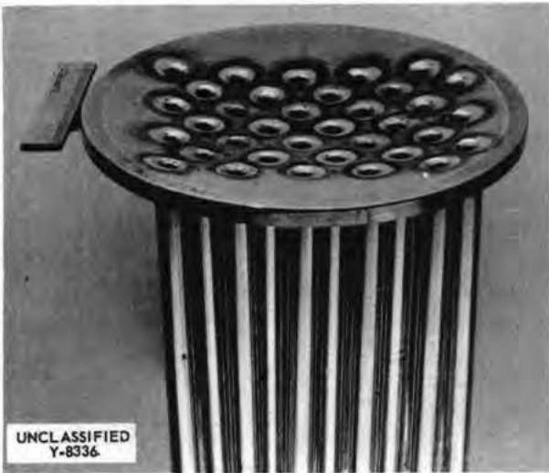  
Fig. 11.1. An Experimental Heat Exchanger Subassembly After Cone-Arc Welding.

tendency for uneven melting around some of the tube peripheries when the tungsten electrode was centered over the tube with the header plate axis perpendicular to the electrode axis. The diameter of the header plate is 2 l/4 in. and the plate thickness is 0.125 inch. The tubing has an outside diameter of 0.148 in. with a 0.025-in. wall, and the hole center-to-center distance is approximately 0.378 inch.

Some difficulties have been encountered with joints that are not pressure-tight, but it is expected that further experiments will enable the production of subassemblies that will be completely sound. In each test assembly that has been fabricated thus far, only one or two joints were unsatisfactory; the other joints were pressure-tight to air at approximately 60 psig. This indicates that an improvement in technique or a slight variation in welding conditions should help to improve the quality of these cone-arc welded joints.

Fabrication of Heat Exchanger Units. A second large sodium-to-air heat exchanger assembly was fabricated by

Nicrobrazing and the over-all appearance, as shown in Fig. 11.2, was much better than that of the first assembly.(1) Changes incorporated in the brazing procedure for this second unit were the use of lesser quantities of Microbraz, the use of several aspirators to promote more even hydrogen flow between the fins, the buildup of the whole assembly off the can bottom to overcome the drastic initial heating rate, and the use of a slightly lower brazing temperature. Pressure testing with helium, however, revealed the presence of a leak in the tube-to-fin matrix. A technique was developed to seal off this tube on each side of the leak by rebrazing,

(1) ANP Quar. Prog. Rep. Dec. 10, 1952, ORNL-1439, p. 164.

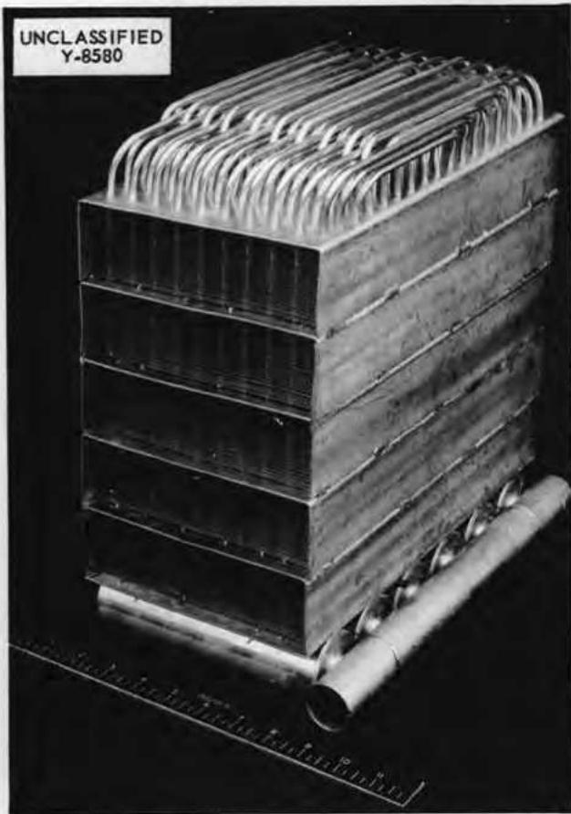  
Fig. 11.2. Sodium-to-Air Radiator After Microbrazing.

but upon performing this operation, several other leaks appeared in other tubes.

It is hoped that the damaging effects caused by subsequent Microbrazing operations can be eliminated by adopting a modified design that would permit the heliarc welding of the tube-to-header joints and the joints in the heavier manifold sections. By the use of the single-braze method, any leaks in the tube-to-fin matrix after brazing can be eliminated from the coolant circuit by plug welding the proper tubes. The tube-to-header welds could then be made by manual heliarc welding, as could the other joints in the manifold circuit. With some minor changes in radiator design, it seems probable that completed units could be fabricated with less chance of obtaining leaky joints. By eliminating several high-temperature brazing operations, grain growth in the stainless steel tubes could be minimized, as could embrittling of the base metal by brazing alloy diffusion.

It is well known that certain Microbrazed stainless steel joints exhibit brittleness to a high degree. This factor, coupled with the alloying away of the tube wall by brazing alloy dilution and diffusion, is thought to be responsible for a major portion of the leaks encountered in heat exchanger fabrication. Since it seems probable that joint brittleness may also be associated with dilution and diffusion phenomena, a systematic study of this problem has been initiated.

Nicrobrazed tube-to-fin joints are being prepared by using 0.010-in.-thick, type 302 stainless steel fin material and 0.150-in.-OD, 0.016-in.-wall, type 304 stainless steel tubing for studying, by metallographic examination, the effects of (1) the quantity of brazing alloy used, (2) the brazing temperature for a given time, and (3) the brazing time for a given temperature. Small, medium, and large amounts of brazing alloy and

the time at temperature, which may vary from 10 min to 18 hr (for an overnight brazing cycle), are being investigated. The choice of brazing temperature is being varied from $20^{\circ}\mathrm{C}$ above the melting point to a maximum of $120^{\circ}\mathrm{C}$ above the melting point.

Since it may be advisable to find a substitute for Nicrobraz in the construction of sodium-to-air heat exchanger, two other brazing alloys are being subjected to similar diffusion and dilution investigations. An $82\%$ Au-18% Ni alloy is typical of the lower-melting, ductile, oxidation-resistant brazing alloys that, unfortunately, are incompatible with sodium but may be used for tube-to-fin construction if dilution and diffusion can be controlled. A 60% Mn-40% Ni alloy has been shown to be compatible with sodium, but it is slightly attacked in high-temperature oxidation tests. It is also somewhat brittle in the as-brazed condition.

Brazing of Copper to Inconel The need for a satisfactory brazing alloy for joining copper fins to Inconel tubing and for edge-sealing sheared, Inconel-clad, copper fins has been emphasized. The resultant braze should

be resistant to oxidation at $1500^{\circ}\mathrm{F}$ , should preferably serve as a diffusion barrier against copper penetration into the Inconel during service, and should have a relatively high strength at $1500^{\circ}\mathrm{F}$ . It is likely that some alloy other than a copper-base alloy would best fill these requirements.

An experimental, modified, Nicrobraz alloy, which melts at approximately $1850^{\circ}\mathrm{F}$ , appears to be very promising, as do alloys of $82\%$ Au- $18\%$ Ni and $90\%$ Au- $10\%$ Co. Oxidation tests at $1500^{\circ}\mathrm{F}$ on brazed Inconel joints indicate no appreciable attack. A list of several alloys, currently being investigated, that melt in this medium temperature range is given in Table 11.l. Flowability tests on Inconel have been made, and the results of these tests are also listed in Table 11.l.

Edge-sealing experiments on chromium-plated copper disks are being conducted, and techniques are being studied for obtaining a satisfactory edge seal on these disks. At the present, the fin edges are being suspended in a slurry of the modified, low-melting-point, Microbraz alloy and slowly rotated until an even coating of brazing alloy is deposited. The

TABLE 11 1 PROPERTIES OF THE MEDIUM-TEMPERATURE BRAZING ALLOYS CURRENTLY BEING INVESTIGATED  

<table><tr><td>BRAZING ALLOY</td><td>MELTING POINT (°F)</td><td>BRAZING TEMPERATURE (°F)</td><td>FLOWABILITY ON INCONEL</td><td>METHOD OF APPLICATION</td></tr><tr><td>95 5% Cu-4 5% Be</td><td>1590</td><td>1750</td><td>Poor</td><td>Powder</td></tr><tr><td>92% Cu-8% Si</td><td>1530</td><td>1700</td><td>Poor</td><td>Powder</td></tr><tr><td>75% Cu-25% Sn</td><td>1470</td><td>1600</td><td>Good</td><td>Powder</td></tr><tr><td>Low-melting-point Nicrobraz</td><td>1800</td><td>1850</td><td>Good</td><td>Powder</td></tr><tr><td>82% Au-18% Ni</td><td>1800</td><td>1850</td><td>Excellent</td><td>Sheet</td></tr><tr><td>90% Ag-10% Cu</td><td>1600</td><td>1800</td><td>Poor</td><td>Sheet</td></tr><tr><td>90% Au-10% Co</td><td>1830</td><td>1870</td><td>Good</td><td>Sheet</td></tr><tr><td>95% Ag-5% Ge</td><td>1650</td><td>1700</td><td>Poor</td><td>Sheet</td></tr><tr><td>90% Cu-10% Ge</td><td>1800</td><td>1870</td><td>Good</td><td>Sheet</td></tr></table>

fin is then edgebrazed in a hydrogen atmosphere. Another method to be investigated for covering these exposed copper edges is the preplacing of a fine wire of brazing alloy in the crevice formed by chemically etching away a small amount of copper in nitric acid. It is expected that this latter technique, if successful, will prevent fin distortion, which is believed to be due to unavoidable nonuniform wetting of the fin periphery by brazing alloy applied as a slurry.

# EVALUATION TESTS OF BRAZING ALLOYS

P. Patriarca

V. G. Lane

G. M. Slaughter

C. E. Schubert

Metallurgy Division

Corrosion of Brazing Alloys by Fluorides. In a further attempt to

lower the melting point of the $60\%$ Pd- $40\%$ Ni brazing alloy, $5\%$ germanium was added. This alloy can be consistently brazed at $2150^{\circ}\mathrm{F}$ , which is in the brazing range of the more common Microbraz alloy. Static corrosion tests on brazed joints in the molten fluoride salts indicate that there is only slight attack by molten NaF-KF-LiF- $\mathbf{U}\mathbf{F}_{4}$ (10.9-43.5-44.5-1.1 mole %), as shown in Fig. 11.3, whereas severe attack is present on the sample immersed in NaF-ZrF $\cdot_{4}$ -UF $\cdot_{4}$ (46-50-4 mole %), Fig. 11.4.

Effect of Brazing Time on Joint Strength. A review of results of recent and previous experiments conducted to evaluate the effect of time at the brazing temperature on the joint strength of Microbrazed Inconel joints shows that the effect of time

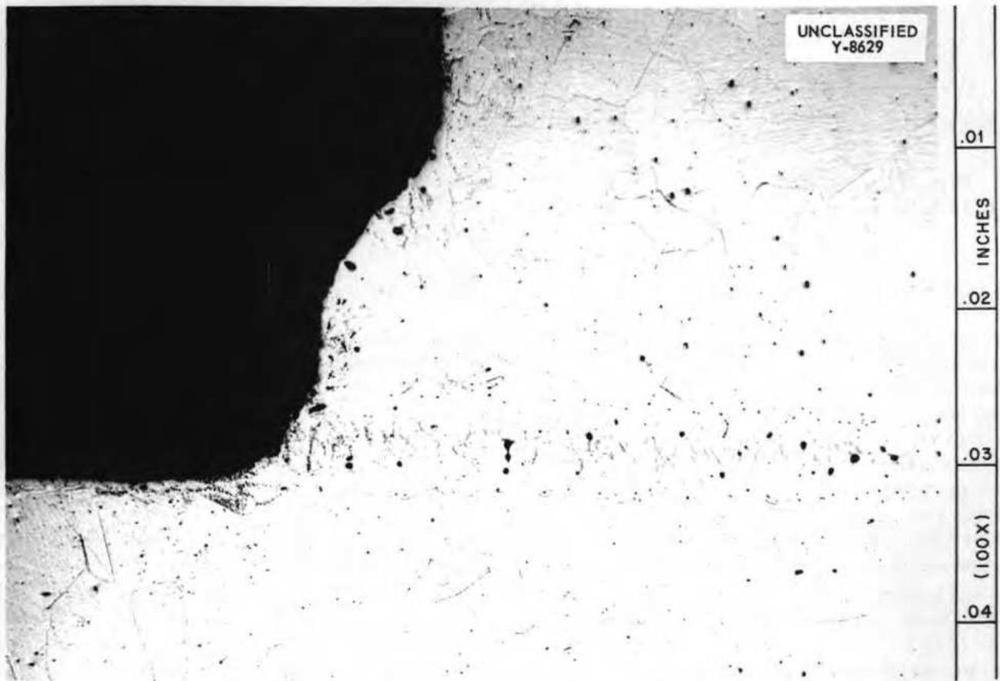  
Fig. 11.3. Inconel Joint Brazed with a $60\%$ Pd- $35\%$ Ni- $5\%$ Ge Alloy After 100 hr at $1500^{\circ}\mathrm{F}$ in NaF-KF-LiF- $\mathbf{U}\mathbf{F}_{4}$ (10.9-43.5-44.5-1.1 mole %). Etched with aqua regia. 100x.

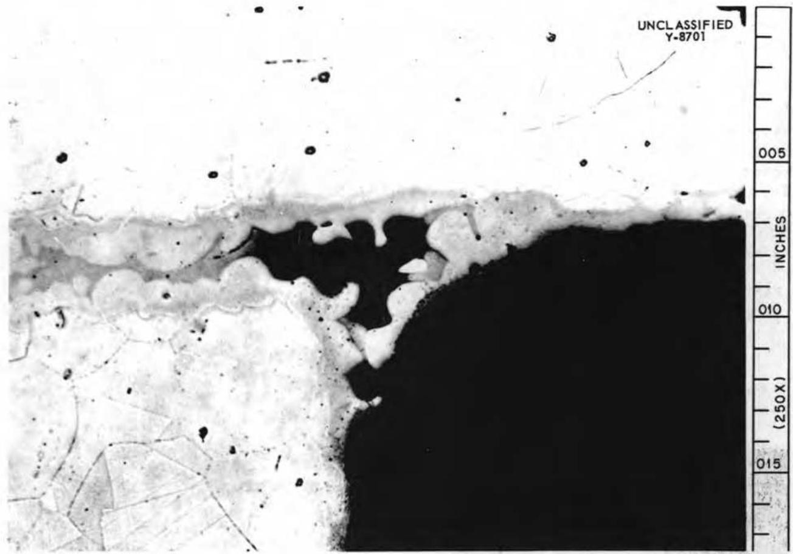  
Fig. 11.4. Inconel Joint Brazed with a $60\%$ Pd- $35\%$ Ni- $5\%$ Ge Alloy After 100 hr at $1500^{\circ}\mathrm{F}$ in NaF-ZrF $_4$ -UF $_4$ (46-50-4 mole $\%$ ). Etched with aqua regia. 100x.

is not so important as the previously reported limited data indicated. The room temperature strengths of these joints are generally much less than the strength of the base Inconel and do not vary appreciably with time at temperature. Only occasionally does a joint exhibit high tensile strength at room temperature, and the previous results were apparently distorted by these infrequent high values. A summary of the data is given in Table 11.2; four tensile bars were tested for each brazing time.

It is expected that the brazing time will have a greater effect with stainless steel, because the width of the diffusion zone is generally larger. The composition of Inconel is similar

to that of Nicrobraz, with respect to nickel, chromium, and iron contents, and therefore diffusion may be somewhat hindered by the lack of large concentration gradients. The tensile strengths of Nicrobrazed Inconel joints at $1500^{\circ}\mathrm{F}$ have all been consistently high, as previously reported, and the fractures often occur in the base metal.

Effect of Spacing on Brazed Joint Strength. An investigation was conducted to determine the effect of joint spacing on the short-time, room-temperature, tensile strength of Microbrazed Inconel joints. Four butt-brazed tensile bars were prepared for each joint spacing of 0.005, 0.010, 0.015, and 0.020 inch. The results of

TABLE 11 2 EFFECT OF TIME AT BRAZING TEMPERATURE ON STRENGTH OF NICROBRAZED INCONEL JOINTS  

<table><tr><td>TIME AT 2150°F (min)</td><td>AVERAGE ROOM-TEMPERATURE TENSILE STRENGTH OF BRAZED JOINTS (psi) (0 252-in specimen)</td><td>JOINT EFFICIENCY (%)</td></tr><tr><td>5</td><td>34,900</td><td>40</td></tr><tr><td>10</td><td>40,100*</td><td>46</td></tr><tr><td>20</td><td>32,900</td><td>38</td></tr><tr><td>30</td><td>31,400</td><td>36</td></tr></table>

* Includes one value of 69,800 psi

this investigation indicate that joint spacing is not a critical factor in the room-temperature tensile strength of Nicrobrazed Inconel joints, at least within the ranges investigated. This range should cover nearly all applications, since the effect of a shrink fit would tend to be lost during the furnace brazing operation, and a spacing of over 0.020 in. would result in extremely poor fitup.

Strength of Brazed Joints with Various Base Metals Butt-brazetensile data on the $73.5\%$ $\mathbf{N}_{1}-16.5\%$ Cr-10 $0\%$ S alloy indicate that the base-metal composition may be a very important factor in determining the subsequent tensile strengths of brazed joints. The average of the room-temperature tensile strengths of the Inconel joints was 33,700 psi. Similar tests on brazed type 316 stainless steel showed an average tensile strength of 64,400 psi, which is nearly double the value recorded for Inconel. The elevated-temperature tests for both base metals gave excellent results. Joint efficiencies of $99\%$ were obtained for Inconel, and efficiencies of $98\%$ were obtained for type 316 stainless steel.

Nicrobrazed joints on stainless steel also had higher tensile strengths than Nicrobrazed joints on Inconel. The average, room-temperature, tensile strength for stainless steel joints

was 68,800 ps1, whereas the corresponding value for Inconel was 34,900 ps1. The $1500^{\circ}$ F tensile tests again gave evidence of joint efficiencies approaching $100\%$ for both base metals.

A summary of a major portion of the butt-braze tensile data obtained thus far is presented in Table 11.3. The value listed for the room-temperature strength of Nicrobrazed Inconel joints is that resulting from a series of tests in which some specimens fractured at values nearly equal to the tensile strength of Inconel. Hence, this average value is somewhat higher than the values shown in Table 11.2, in which no data were recorded that indicated such high trends. Also the values of joint efficiency for stainless steel joints are only approximate because the 0.252-in.-dia stainless steel tensile bars have not yet been tested after they were subjected to the brazing cycle.

# CREEP-RUPTURE TESTS OF STRUCTURAL METALS

R. B. Oliver

J. W. Woods

D. A. Douglas

C. W. Weaver

Metallurgy Division

Preoxidized Inconel in Argon. It was previously reported(2) that the environment surrounding the specimen

TABLE 11.3 BUTT-BRAZE TENSILE DATA FOR SEVERAL HIGH-TEMPERATURE BRAZING ALLOYS   

<table><tr><td>BRAZING ALLOY</td><td>BASE METAL</td><td>TEMPERATURE (°F)</td><td>TENSILE STRENGTH (ps1)</td><td>JOINT EFFICIENCY (%)</td></tr><tr><td rowspan="2">Nicrobraz</td><td rowspan="2">Inconel</td><td>Room</td><td>47,000</td><td>54</td></tr><tr><td>1500</td><td>24,500</td><td>100</td></tr><tr><td rowspan="4">60% Pd-40% N1</td><td rowspan="2">Inconel</td><td>Room</td><td>87,600</td><td>100</td></tr><tr><td>1500</td><td>21,000</td><td>93</td></tr><tr><td rowspan="2">Type 316 stainless steel</td><td>Room</td><td>75,400</td><td>92</td></tr><tr><td>1500</td><td>22,400</td><td>88</td></tr><tr><td rowspan="4">73 5% N1-16 5% Cr-10 0% S1</td><td rowspan="2">Inconel</td><td>Room</td><td>33,700</td><td>39</td></tr><tr><td>1500</td><td>23,100</td><td>99</td></tr><tr><td rowspan="2">Type 316 stainless steel</td><td>Room</td><td>64,400</td><td>79</td></tr><tr><td>1500</td><td>25,000</td><td>98</td></tr><tr><td rowspan="2">75% Ag-20% Pd-5% Mn</td><td rowspan="2">Inconel</td><td>Room</td><td>55,900</td><td>64</td></tr><tr><td>1500</td><td>19,700</td><td>85</td></tr></table>

during test would have a significant effect on the creep rate and rupture life. Results obtained during the past quarter continue to indicate that the properties are best when the Inconel is tested in air, poorest when tested in a hydrogen atmosphere, and intermediate when tested in argon. The rupture life observed in tests in a hydrogen atmosphere was of the order of one-tenth the life observed when tested in air, this observation holds for stresses of 4000 psi or less. One hypothesis regarding the long rupture life in air involved a strengthening action by the oxide film formed during the early part of the test. To test this possibility, a series of specimens was heated in air for 200 hr at $815^{\circ}\mathrm{C}$ to form such a film.

The preoxidized specimens were then tested at $815^{\circ}\mathrm{C}$ in argon, stressed to 2500, 3500, and 4500 psi. In the three tests, the rupture times were far short of the rupture times in air, and were very close to the life when tested in argon. It is to be noted

that the elongation during test was much greater than that observed in other environments, and there was no evidence of cracking in the film. Figure 11.5 shows the strain vs. time relationships of the bright and the preoxidized specimens tested in argon. These results could mean either that nitrogen rather than oxygen was the controlling factor or, as is more probable, that the oxide film formed stress rises when it cracked and that this action, in turn, promoted the integranular cracking that ultimately led to failure.

Peened Inconel in Argon Specimens of Inconel have been heavily peened with fine steel shot and are now being tested in argon. This mechanical working of the specimen surface has increased the rupture life in comparison with the life of specimens that did not receive this treatment. Also, the creep rate for the peened specimen is much lower than that observed for other specimens at the same stress in any atmosphere. It is

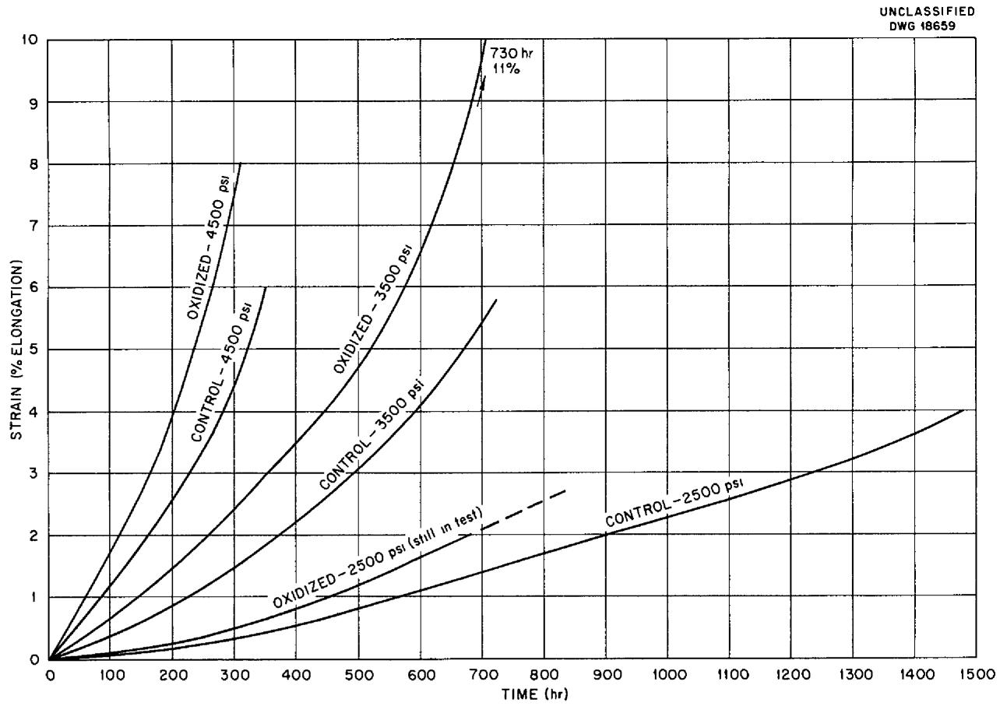  
Fig. 11 5. Strain vs. Time Curves for Control and Preoxidized Inconel Specimens at $1500^{\circ}\mathrm{F}$ in Argon.

improbable that this effect is the result of residual compressive stress induced by the peening action, since such stresses would recover at a temperature lower than the test temperature. It is hoped that metallographic examination will furnish a clue for explaining the improved properties resulting from the peening.

Effect of Inconel Grain Size on Time to Rupture As a general statement, fine-grained Inconel (0.105 mm in diameter) is more sensitive than coarse-grained Inconel (0.250 mm in diameter) to the several test environments. Table 11.4 tabulates the comparative responses to these environments at a representative stress level.

Effect of Environment on Strain vs Time Curves for Inconel A fine-grained specimen is being tested that was run in argon for the first 160 hr and then alternately in hydrogen and argon atmospheres. Each atmosphere was maintained for about 100 hours. When the hydrogen was introduced, the strain rate was accelerated, and when the argon was re-introduced, the creep rate during the argon cycle remained approximately the same as the last creep rate in hydrogen. These results appear to indicate that the effect of the hydrogen atmosphere is one of a permanent nature. Metallographic studies do not clearly reveal what the effect is, however, the microstructure indicates the possible removal or

TABLE 11 4 EFFECT OF GRAIN SIZE ON TENSILE STRENGTH OF INCONEL  

<table><tr><td rowspan="2">TEST CONDITIONS</td><td colspan="2">TIME TO RUPTURE AT 3500 ps1 AND 815°C (hr)</td></tr><tr><td>Fine-grained Inconel</td><td>Coarse-grained Inconel</td></tr><tr><td>Tested in air</td><td>~2500</td><td>~2500</td></tr><tr><td>Peened and tested in argon</td><td></td><td>835</td></tr><tr><td>Tested in argon</td><td>730</td><td>500</td></tr><tr><td>Preoxidized and tested in argon</td><td>730</td><td></td></tr><tr><td>Tested in molten NaF-ZrF4-UF4(46-50-4 mole %)</td><td>415</td><td>470</td></tr><tr><td>Tested in hydrogen</td><td>250</td><td>600</td></tr></table>

solution of carbides and oxides and a much more frequent incidence of intergranular cracking when the tests are conducted in a hydrogen atmosphere.

The strain vs. time relationships of fine-grained Inconel tested in the several environments at $815^{\circ}C$ and stressed to 3500 ps are shown in Fig. 11.6. The results are representative of several tests in each environment. The absence of a linear, second-stage section in the strain vs time curves might indicate that the intergranular cracking characteristic of high-temperature failure is initiated very early in the test life. The various test conditions may either hasten or retard the formation and propagation of these intergranular cracks and, hence, alter the creep-rupture properties.

The program of testing in molten fluoride mixtures continues, but the accuracy of the results is clouded by temperature control difficulties and by the effects of the descending procedure. The first series of tests was preceded by a sodium descending operation. The rupture times were very short, and the microstructures indicate a stress-corrosion type of failure. Subsequent tests were preceded by a fluoride descending process. The rupture times were closer to those observed in argon, and the microstructures revealed subsurface voids

or hole formation and very little intergranular cracking. Only one test of coarse-grained Inconel in fluorides showed a longer rupture life than the best life observed for the fine-grained specimens at the same stress.

Type 316 Stainless Steel Tube Burst Tests in Argon The tube-burst tests run to date were for type 316 stainless steel tubes loaded internally with argon under pressure and held in an atmosphere of pure argon. A specimen so loaded has a multiaxial stress system, and the results indicate that the test life under these conditions will be much less than that found for the same material stressed in tension only at a stress equal to the maximum stress imposed on the tube.

# FABRICATION OF CONTROL AND SAFETY RODS

E. S. Bomar H. Inouye

J. H. Coobs R. W. Johnson

Metallurgy Division

A. Levy

Pratt and Whitney Aircraft Division

Control Rods for the G-E R-1 Reactor. A study concerning the adaptation of the iron-cemented boron carbide composition used for the ARE safety rods slugs to the control rods for the G-E R-1 reactor was undertaken at the request of the General Electric Co. In brief, the specifications for these

previous progress report $^{(3)}$ included some results of tests conducted in argon purified by titanium sponge. The work during this period has included 100-hr tests in vacuum at 800 and $1000^{\circ}\mathrm{C}$ . This work will also indicate the pressures tolerable in subsequent heat treatments. The data obtained thus far are given in Table 11.6. Future work is to include the effect of recirculating the purified gas over titanium sponge and drying agents by using a pump in a closed system.

Oxidation. Tests have been completed on the oxidation of columbium in air containing 18.7 mm water vapor. This investigation was undertaken after a run made at $400^{\circ}\mathrm{C}$ in air that inadvertently contained water vapor resulted in a particularly rapid rate of oxidation. A constant humidity was obtained by passing the air through a saturated solution of $\mathrm{NH}_4\mathrm{Cl}$ at $25^{\circ}\mathrm{C}$ , the moisture content checked to within 0.5% of the saturation value when the water absorbed in anhydrone was weighed.

The results at $400^{\circ}\mathrm{C}$ have been checked, and they show that the presence of moisture increases the oxidation rate by a factor of about 400 at the end of 10 hours. At $600^{\circ}\mathrm{C}$ , a reverse effect was found in that the oxidation

rate decreased significantly (by a factor of 2). It was also apparent that the oxidation rate was not linear. Several breaks in the curve of a plot of weight gain vs. time have been observed and duplicated. At 800, 1000, and $1200^{\circ}\mathrm{C}$ , the oxidation rates in moist air are no different from those in dry air.

X-ray data have been obtained for the specimens oxidized in air, and thus far the oxides formed are all modifications of $\mathrm{Cb}_2\mathrm{O}_5$ ,of which there are three.4) Inconsistencies have been observed for the oxidation rates at $800^{\circ}\mathrm{C}$ .In these runs, flat sheet oxidized to a white scale on the edges,but the other areas formed a rather dense black oxide.A 0.040-in. wire became entirely white with oxide. Above $800^{\circ}\mathrm{C}$ ,the oxidation rate showed a slight deviation from linearity. This may have been the result of partial protection of the underlying metal by the thick oxide or a decrease in the surface area.The results at 800,1000,and $1200^{\circ}\mathrm{C}$ are being checked by oxidizing columbium rod that is clad on the circumference with Inconel. It is hoped that the inconsistencies observed at $800^{\circ}\mathrm{C}$ can be eliminated by this method,since it is believed that the inconsistencies were caused by the surface areas not being constant.

TABLE 11.6. RESULTS OF 100-hr TESTS OF COLUMBIUM IN VACUUM   

<table><tr><td>TEMPERATURE (°C)</td><td>PRESSURE (μ)</td><td>CHANGE IN WEIGHT (g/cm2)</td><td>HARDNESS CHANGE VPN (10-kg load)</td><td>REMARKS</td></tr><tr><td rowspan="3">800</td><td>1 0</td><td>+0 0046</td><td>+271</td><td>Brittle, slightly tarnished</td></tr><tr><td>0 1</td><td>+0 0006</td><td>+22</td><td>Bright</td></tr><tr><td>0 01</td><td>-0.0002</td><td>-16</td><td>Bright</td></tr><tr><td rowspan="3">1000</td><td>0 1</td><td>+0 00051</td><td>+17</td><td>Slightly tarnished</td></tr><tr><td>0 05</td><td>+0 00037</td><td>+9</td><td>Slightly tarnished</td></tr><tr><td>0 01</td><td>0 00005</td><td>-40</td><td>Bright</td></tr></table>

# FABRICATION OF METALS

E. S. Bomar, Jr. H. Inouye

J.H.Coobs R.W.Johnson

Metallurgy Division

A. Levy

Pratt and Whitney Aircraft Division

High-Conductivity Metals for Radiator Fins A program has been outlined for the evaluation of coated metals suitable for radiator fin materials, methods of assembly, and effects of exposure to high temperatures. The coated metals must have good thermal conductivity, as well as the required high-temperature corrosion resistance. The materials required for this work have been ordered, and the detailed experimental work must await their arrival.

Small quantities of materials similar to those on order have been prepared and submitted to the Welding Group for evaluation of brazing techniques. These materials include chromium-plated copper, Inconel- and type 310 stainless-steel-clad copper, and Inconel- and type 310 stainless-steel-clad silver.

Oxygen-free, high-conductivity copper chromium-plated to various thicknesses was tested in flowing air at $815^{\circ}\mathrm{C}$ for times up to 30 hours. It was found that the chromium oxide formed on the surface spalled and did not form a protective film. Thus, the possibility of using chromium-plated copper for high-conductivity fins is not very promising.

Solid-Phase Bonding. Two series of samples of solid-phase bonded metals have been prepared and are to be studied. One series of samples will be used for evaluating the effect of time on the extent of bonding, the other set will be used for measuring the effectiveness of electrodeposited chromium in bonding molybdenum to other metals.

Chromium was selected as a trial bonding medium because of its unlimited solubility with molybdenum.

Runs have been made with chromium-plated molybdenum vs. nickel, iron, stainless steel, and Inconel at 1150 and $1250^{\circ}\mathrm{C}$ . One run has been made to check the self-welding of molybdenum at $1500^{\circ}\mathrm{C}$ .

Extrusion of High-Purity Tubing. This phase of development is a result of the present need for high-purity Inconel tubing - and subsequently for other high-temperature alloys - for corrosion testing to determine the effect of impurities on corrosion resistance. The primary problem to date in the extrusion process has been one of lubrication, as evidenced by several attempts to produce the Inconel tubing. None of the extrusions has been entirely successful, because either the mandrel broke or the tube ruptured.

Molten glass was selected as the lubricant for the extrusion process, which is a modification of Sejournet-Ugine process, because the unit extrusion pressures required are lower with glass than with graphite or oil. Another factor favoring molten glass is the reduced possibility of pickup of carbon and sulfur. As an illustration, a solid rod was extruded successfully by using Necroline, which has a graphite base, and analysis indicated an increase in carbon and sulfur from case to extruded form, as follows $0.01\%$ carbon as cast, $0.03\%$ carbon extruded, $0.007\%$ sulfur as cast, $0.017\%$ sulfur extruded.

For the extrusions made thus far, the extrusion billet was heated in molten lead glass. Unfortunately, a portion of the lead compound present in the glass was reduced, and as a result metallic lead precipitated in the bath. The mechanism of the reduction is not yet known, however, the glass was held in a stainless steel container that was seated in and extended above the top of a gas-fired pot furnace. The prescribed extrusion temperature for Inconel is $2300^{\circ}\mathrm{F}$ , but with the present heating arrangement,

$2100^{\circ} \mathrm{F}$ is the maximum temperature obtainable. These factors, no doubt, contributed to or caused the extrusion failures.

One of the ultimate objectives is to obtain tubing that has no inclusions resulting from the addition of malleabilizing elements such as magnesium, titanium, manganese, and aluminum. To determine which malleabilizing elements are necessary, ingots were vacuum cast with (1) no malleabilizing elements, (2) $0.05\%$ magnesium (nominal), and (3) $0.25\%$ titanium, as a T1-Al-Mn master alloy, and $0.05\%$ magnesium. Difficulty was experienced in attempting to add magnesium in the form of a master alloy to Inconel melts under vacuum because of the high vapor pressure of magnesium.

These ingots were successfully extruded by using rock wool insulation in the press container and glass wool (both pyrex and soft glass) on the hot extrusion billet. This procedure is essentially the same as that employed by the International Nickel Co. The extrusion conditions were

<table><tr><td>Temperature</td><td>2225°F</td></tr><tr><td>Die</td><td>45°V</td></tr><tr><td>Extrusion time</td><td>1 to 3 sec</td></tr><tr><td>Extrusion pressure</td><td>~50 ts1</td></tr><tr><td>Extrusion ratio</td><td>13.7</td></tr><tr><td>Surface slightly roughened</td><td></td></tr></table>

Additional work is to include the extrusion of Inconel tubing under similar conditions and the extrusion of the austenitic stainless steels, such as type 310 stainless steel. Future melts will be made in zirconia crucibles to eliminate magnesium pickup.

# HOT-PRESSED PUMP SEALS

E. S. Bomar, Jr. J. H. Coobs  
R. W. Johnson  
Metallurgy Division

A. Levy

Pratt and Whitney Aircraft Division

A series of exploratory runs has been made on materials being considered for test seal rings. The rings are to be composed of Ag, Cu, 95% Ag-5% Cu alloy, or 18-8 stainless steel with 14 vol % MoS₂. Test specimens 1/2 in. in diameter and 3/8 in. long were prepared by hot pressing at 2500 psi in a graphite die, with the results shown in Table 11.7.

The first runs on the copper, silver, and Ag-Cu alloy compositions with $\mathsf{MoS}_2$ demonstrated that these materials may be readily fabricated by hot pressing. Run 5 shows the behavior of a coarse grade of silver (-60 + 100 mesh), which is on hand in quantity. Run 6 shows that this coarse powder

TABLE 11.7. EXPLORATORY PREPARATIONS OF VARIOUS SEAL RING COMPOSITIONS   

<table><tr><td>RUN NO</td><td>MATERIAL</td><td>PRESSING TEMPERATURE (°C)</td><td>DENSITY (% theoretical)</td></tr><tr><td>1</td><td>Cu (&quot;C&quot; grade)</td><td>760</td><td>92 8</td></tr><tr><td>2</td><td>Cu (&quot;C&quot; grade)</td><td>910</td><td>95 3</td></tr><tr><td>3</td><td>Ag (precipitated)</td><td>655</td><td>95 7</td></tr><tr><td>4</td><td>95% Ag (ppt) -5% Cu (&quot;C&quot; grade)</td><td>830</td><td>95 2</td></tr><tr><td>5</td><td>Ag (-60 + 100 mesh)</td><td>930</td><td>94 0</td></tr><tr><td>6</td><td>18-8 stainless steel*</td><td>1010</td><td>78 0</td></tr></table>

\*Type 304 stainless steel, -355 mesh

# ANP PROJECT QUARTERLY PROGRESS REPORT

may be satisfactory but that it is somewhat more difficult to consolidate. An initial run made with the stainless steel-MoS2 composition did not consolidate sufficiently. Further runs are planned at somewhat high temperatures, with molybdenum or $\mathrm{Al}_{2}\mathrm{O}_{3}$ used as die liners if necessary.

# CERAMICS

L.M.Doney J.R.Johnson

S.D.Fulkerson A.J.Taylor

G. D. White Metallurgy Division

Ceramic Coatings for Shielding. A lead borate enamel was applied by flame-spraying to a 5-ft by 5-ft by 7/8-in. steel plate, but the coating was imperfect on part of the surface. The thickness of the plate prevents the spraying of a smooth, glass coating, even when the plate is initially preheated to $1000^{\circ}\mathrm{F}$ . A larger flame-spray unit would probably work, but with the available unit, a maximum steel thickness of about 1/8 in. is indicated.

The coating can be successfully applied by the standard enameling technique of dusting the powdered glass on the red hot metal. An initial metal temperature of $1400^{\circ}\mathrm{F}$ is adequate for this coating.

Development of Cermet Fuel Elements. A $\mathrm{Cr - Al_2O_3}$ solid fuel element of possible use in nuclear-powered aircraft has been fabricated. These cermet elements would be for use in a reactor system that resembled a disk heat exchanger. Disks of $\mathrm{Cr - Al_2O_3}$ containing an enclosed "sandwich" ring of $\mathrm{UO_2}$ are strung on 1/4-in.-dia stainless steel tubes through which a coolant passes. These disks give up their heat to an air stream passing over their surfaces. The coolant keeps the steel tubes cool enough to maintain adequate strength, resist oxidation, and provide some moderation in the reactor core.

The $\mathrm{Cr - Al_2O_3}$ cermet has excellent oxidation resistance up to $2200^{\circ}\mathrm{F}$ and adequate heat-shock resistance in the form proposed. However, radiation damage and fission product retention are unknown. The disks have been fabricated with a 0.020-in. thickness and a l-in. outside diameter. A photomicrograph of a $\mathrm{Cr - Al_2O_3}$ disk section containing 8 wt $\%$ $\mathrm{UO_2}$ is shown in Fig. 11.7.

A silicon-silicon carbide material has been proposed as a potentially useful solid aircraft reactor fuel element, and experiments have been carried out to fabricate such elements. A process similar to that developed by the Carborundum Co. for impregnating carbon is used. Cross-shaped elements

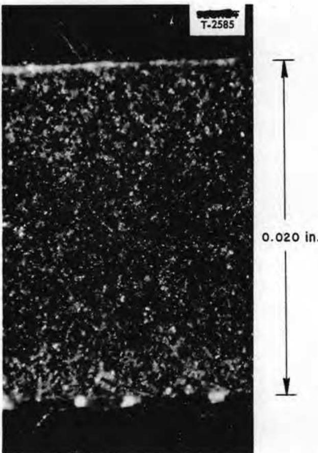  
Fig. 11.7. Section of $\mathbf{Cr - Al}_2\mathbf{O}_3$ Cermet Disk Containing 8 wt % $\mathbf{U}\mathbf{O}_2$ .

have been fabricated and are being tested to obtain physical property measurements. Radiation damage studies and simulated reactor service tests have been outlined.

Reduction of the Porosity of ARE Beryllium Oxide. A series of experiments was initiated in an attempt to reduce the porosity and to increase the corrosion resistance of the hexagonal beryllium oxide blocks that are to be used for the ARE. Impregnation of porous beryllium oxide test pieces with various materials was attempted, and preliminary vapor deposition studies were begun. Samples of the impregnated beryllium and the other specimens will be subjected to corrosion tests in sodium.

In the first impregnation, the beryllium oxide test pieces (1/2 by 1/4 by 1/4 in.) were immersed in molten hydrated beryllium nitrate at $135^{\circ}\mathrm{C}$ for 48 hours. The test pieces were then placed in a small porcelain crucible, covered with the beryllium nitrate, and heated until evolution of $\mathrm{NO}_2$ was complete. Then, after the powdered beryllium oxide had been scraped from the surfaces, the test pieces were heated to $1550^{\circ}\mathrm{C}$ , held for 15 min, and allowed to cool to room temperature. This procedure caused a slight permanent increase in the weight of the test pieces but no measurable reduction in porosity.

The second impregnation experiment was carried out under similar conditions, but magnesium nitrate was used instead of beryllium nitrate. This impregnation resulted in an appreciable permanent weight gain and in a reduction of the porosity to about $35\%$ of its original value.

The third method tried was successful in reducing the porosity of the test pieces to an almost negligible amount. In this method, a mixture of $37.5\% \mathrm{AlF}_3$ and $62.5\% \mathrm{CaF}_2$ was prefused to give a glass. The glass was then pulverized and suspended in water to give a very heavy suspension. The

small (1/2 by 1/4 by 1/4 in.) beryllium oxide test pieces were dipped into this suspension and drained, and the adhering coating was dried. These pieces were then heated to $1550^{\circ}\mathrm{C}$ , held for 15 min at this temperature, and allowed to cool in the furnace. This treatment resulted in the coating soaking into the porous pieces and completely filling the pores.

A test was performed to determine whether the method outlined above for the $\mathrm{AlF_3 - CaF_2}$ mixture would be feasible when used on one of the ARE-size blocks. One of the half-blocks of beryllium oxide, which had been shown to be porous by both immersion in a fuschin-dye-alcohol solution and by the water absorption method, was coated with the $\mathrm{AlF_3 - CaF_2}$ mixture. The coated block was then heated at $750^{\circ}C$ per hour to $1550^{\circ}C$ , held at $1550^{\circ}C$ for about 45 min, and cooled overnight in the furnace. The result was a nonporous block, except for cracks that, although present in the block before the heat treatment, were now much enlarged.

To determine the cause for the enlargement of the cracks, two, full-size, hexagonal blocks of beryllium oxide were heated at $750^{\circ}\mathrm{C}$ per hour to $1550^{\circ}\mathrm{C}$ and held for 1 hour. These blocks had no applied coating, and hence any effects could be attributed to the heat treatment. There were several minute cracks and a zone of weakness perpendicular to the axis across the middle of each block before the heat treatment was carried out. However, these blocks are typical - nearly all blocks on hand have this zone of weakness. After the heat treatment, both blocks had broken along the zone of weakness, and one had also split axially from one side into the core hole. It is to be concluded therefore that the block can be broken by heating at $750^{\circ}\mathrm{C}$ per hour and that the impregnation treatment is not the cause of the cracking of the pieces.

# 12. HEAT TRANSFER AND PHYSICAL PROPERTIES

H. F. Poppendiek  
Reactor Experimental Engineering Division

Some preliminary thermal conductivity measurements on molten sodium hydroxide were made, and results indicate that the conductivity increases from about 0.4 to about 0.8 Btu/hr·ft·°F over the temperature range of 650 to $1000^{\circ}\mathrm{F}$ . The enthalpies and heat capacities of strontium hydroxide and $\mathrm{NaF - ZrF_4 - UF_4}$ (50-46-4 mole %) have been obtained. The heat capacity of strontium hydroxide was found to be $0.32 \pm 0.03\mathrm{cal / g} \cdot {}^{\circ}\mathrm{C}$ over the temperature range of 570 to $900^{\circ}\mathrm{C}$ , the heat capacity of $\mathrm{NaF - ZrF_4 - UF_4}$ (50-46-4 mole %) was found to be $0.31 \pm 0.03\mathrm{cal / g} \cdot {}^{\circ}\mathrm{C}$ over the temperature range of 550 to $850^{\circ}\mathrm{C}$ . Some preliminary viscosity measurements on molten sodium hydroxide were made that varied from 4.6 cp at $340^{\circ}\mathrm{C}$ to 2.5 cp at $448^{\circ}\mathrm{C}$ . Vapor pressure measurements made on the enriched ARE fuel were much lower than the theoretical value determined for the pure components ( $\mathrm{NaF}, \mathrm{ZrF_4}$ , and $\mathrm{UF_4}$ ), which indicates the existence of complex compounding of ions at high temperatures. A graph of the temperature variation of the Prandtl moduli of several fluoride mixtures, as well as some liquid metals, water, air, and sodium hydroxide, has been prepared, the Prandtl moduli of the fluoride mixtures are between approximately 1 and 10 in the high-temperature range in which aircraft reactors are to operate.

An analysis has been completed that can be used to minimize the weight of a radiator for a given power output by optimizing the fin spacing, fin thickness, tube diameter, and tubes spacing for plate-fin radiators operating in the laminar flow region. An apparatus has been designed for determining fluid velocity profiles in the annular spaces found in reactor systems. Temperature distributions

in thermal entrance regions of circulating fuel reactor systems are being determined mathematically by the finite difference method. An apparatus for experimental study of the thermal structure in a circulating-fuel system similar to the ARE configuration has been assembled.

# THERMAL CONDUCTIVITY OF LIQUIDS

W. D. Powers S. J. Claiborne R. M. Burnett

Reactor Experimental Engineering Division

Three different methods are now being used to determine the thermal conductivity of liquids at high temperatures. Two methods are based on steady-state flow of heat downward through a thin section of liquid, and the third method involves transient heat flow from an electrically heated tube to the surrounding test liquid. These methods have been described in previous quarterly reports. At present, the thermal conductivity of molten sodium hydroxide is being determined. Preliminary results indicate that the conductivity of sodium hydroxide increases from about 0.4 to about 0.8 Btu/hr·ft·°F over the temperature range of 650 to 1000°F.

After additional thermal conductivity measurements on sodium hydroxide have been completed, some of the other hydroxides will be investigated.

# HEAT CAPACITY OF LIQUIDS

W. D. Powers G. C. Blalock Reactor Experimental Engineering Division

The enthalpy and the heat capacity of strontium hydroxide and $\mathrm{NaF - ZrF_4 - UF_4}$ (50-46-4 mole %) have been determined

with Bunsen ice calorimeters for strontium hydroxide over the temperature range 570 to $900^{\circ}\mathrm{C}$ (1)

$$
H _ {T} (\text {l i q u i d}) - H _ {0} \circ_ {\mathrm {C}} (\text {s o l i d}) = 0 3 2 T - 1 9,
$$

$$
c _ {p} = 0. 3 2 \pm 0 0 3;
$$

for ARE fuel mixture NaF-ZrF-UF4 (50-46-4 mole %) over the temperature range 550 to $850^{\circ}\mathrm{C},$ (2)

$$
H _ {T} (\text {l i q u i d}) - H _ {0} \circ_ {\mathrm {C}} (\text {s o l i d}) = 0 3 1 T - 9,
$$

$$
c _ {p} = 0 3 1 \pm 0 0 3,
$$

(1) W D Powers and G C Blalock, Heat Capacity of Strontium Hydroxide, ORNL CF-53-2-84 (Feb 9, 1953)   
(2) W D Powers and G. C Blalock, Heat Capacity of Fused Salt Mixture No 30, ORNL CF-53-2-56 (Feb 6, 1953)

where $H$ is the enthalpy in cal/g, $T$ is the temperature in °C, and $c_p$ is the heat capacity in cal/g.

Shown in Fig. 12.1 are a few of the many enthalpy-temperature points for the ARE fuel mixture that were used to establish the above enthalpy and heat capacity relationships.

# VISCOSITY AND DENSITY OF ALKALI HYDROXIDES

R. F. Redmond S. I. Cohen T. N. Jones

Reactor Experimental Engineering Division

A preliminary study of the viscosity of sodium hydroxide was made by using

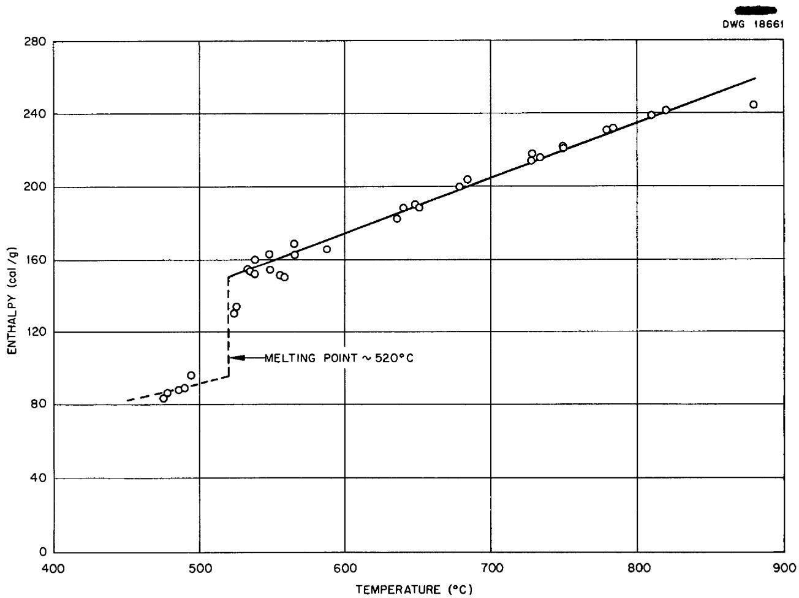  
Fig 12 1 Enthalpy vs Temperature for Fluoride Fuel, NaF-ZrF $_4$ -UF $_4$ (50-46-4 mole%).

a modified Brookfield viscometer to check values reported in the literature. The results, which agree with those in the literature to within about $10\%$ , are as follows

<table><tr><td>TEMPERATURE (°C)</td><td>VISCOSITY (cp)</td></tr><tr><td>340 3</td><td>4 55</td></tr><tr><td>399 5</td><td>2 95</td></tr><tr><td>448 0</td><td>2 45</td></tr></table>

A drybox that will contain facilities for measuring densities and viscosities has been designed and is being fabricated. A new device will be employed that relates density to the difference in pressure required to bubble gas through outlets placed at two levels in the material. A horizontal capillary tube viscometer is being designed and should soon be ready for construction. This device for obtaining absolute measurements will operate under more nearly isothermal conditions than some of the previous viscometers.

# VAPOR PRESSURES OF FLUORIDES

R. E. Moore

Materials Chemistry Division

Vapor pressure studies of the fluoride salt mixtures and their pure components of interest in connection with the Aircraft Reactor Experiment were continued during the past quarter. The method and apparatus originally described by Rodebush and Dixon $^{(3)}$ and discussed in previous reports $^{(4,5)}$ were used for these measurements.

The vapor pressure of the enriched fuel mixture NaF-ZrF4-UF4 (50-25-25 mole %) was found to increase from 5 to $63\mathrm{mmHg}$ over the temperature range of 848 to $1096^{\circ}\mathrm{C}$ and is represented by the equation

$\log P(\mathrm{mmHg}) = -6906 / T(^{\circ}\mathrm{K}) + 6.844.$ The heat of vaporization is 32 kcal/mole

and the calculated boiling point is $1470^{\circ}C$ .

If the mixture is regarded as being composed of the compounds zirconium tetrafluoride, uranium tetrafluoride, and sodium fluoride, the ideal vapor pressure at $970^{\circ}\mathrm{C}$ , a temperature arbitrarily chosen for comparison purposes, is calculated from Raoult's law to be $518\mathrm{mmHg}$ . The actual vapor pressure of $19\mathrm{mm}$ is a very large negative deviation from ideality. This result is in agreement with results obtained for other zirconium tetrafluoride-bearing mixtures and has been interpreted as an indication that zirconium tetrafluoride and uranium tetrafluoride exist in the fused mixture in the form of complex ions. However, it is interesting to note that when the mixture is considered to be composed of $\mathrm{NaZrF_5}$ and $\mathrm{NaUF_5}$ (the vapor pressure of $\mathrm{NaUF_5}$ at $970^{\circ}\mathrm{C}$ is negligible), the ideal pressure is calculated to be $33\mathrm{mm}$ . The negative deviation is still present, but to a much less extent. It is possible that further complexing of the zirconium tetrafluoride is accomplished by adding $\mathrm{NaUF_5}$ to $\mathrm{NaZrF_5}$ . Ions such as $\mathrm{NaZrF_5^-}$ may exist in these melts.

Preliminary vapor pressure data for zirconium tetrafluoride and NaF-ZrF4-UF4 (50-46-4 mole %), the composition chosen for the ARE fuel, were reported previously. The vapor pressure equation for zirconium tetrafluoride, obtained from the latest data by the method of least squares, is

$\log P \text{(mm Hg)} = -10935.6 / T (^{\circ} \mathrm{K}) + 12.113$ from which the heat of sublimation, 50 kcal/mole, and the sublimation temperature, $912^{\circ} \mathrm{C}$ , were calculated. Similarly, the data for NaF-ZrF $_4$ -UF $_4$ (50-46-4 mole %) are represented by $\log P \text{(mm Hg)} = -7551 / T (^{\circ} \mathrm{K}) + 7.888$ . The heat of vaporization, 35 kcal/mole,

and the boiling point, $1235^{\circ}C$ , were calculated from this equation.

# PRANDTL MODULI OF VARIOUS MATERIALS

The Prandtl number is one of the important moduli that characterize convective heat transfer. In the case of turbulent flow, convective heat transfer may be divided into three classes, depending upon the nature of the fluid: the liquid metals are in the Prandtl modulus range of about 0.003 to 0.06, the ordinary fluids are in the Prandtl modulus range of about 0.5 to a hundred, very viscous fluids have Prandtl numbers of several hundred and above. Each of these different classes of fluids is defined by a different turbulent convection heat transfer relationship. It is of interest to note the class in which the fluoride mixtures fall. Figure 12.2 presents a graph of Prandtl modulus vs temperature for the liquid metals, water, air, and sodium hydroxide, as well as for three fluoride mixtures. In the high-temperature range in which aircraft reactors are to operate, the fluoride has Prandtl moduli that are in the range of approximately 1 to 10 and thus should have the heat transfer characteristics of ordinary fluids.

# SPECIFIC REACTOR HEAT TRANSFER PROBLEMS

W. S. Farmer

Reactor Experimental Engineering Division

The problem of designing a minimum-weight air radiator for the turbojet engines of a nuclear-powered aircraft has been given further study during the past quarter. An analysis was made which involved minimizing the weight of an air radiator for a given power output by optimizing the fin spacing, fin thickness, tube diameter, and tube spacing for plate-fin radiators

operating in the laminar flow region. Difficulties due to poor braze contact between the fins and tubes have recently been experienced in the fabrication of plate-fin radiators. Therefore attention is now being given to other types of fins, such as circular disk fins, that can be fabricated so that the difficulties can be obviated. A general analysis is being made of the performance of radiators that embody several different types of extended surfaces and shapes.

Because the air radiator is to be operated at high temperatures with large temperature differences existing between the wall temperature and the air temperature, the problem of nonisothermal heat transfer assumes considerable importance. Since efforts to correlate the performance of several air radiators tested by the Experimental Engineering Group with existing theories for nonisothermal heat transfer have not been too successful, the possibility of developing new analytical solutions is being examined.

# TURBULENT CONVECTION IN ANNULI

J. O. Bradfute J. I. Lang

Reactor Experimental Engineering Division

A critical review of all the isothermal velocity distribution data known to exist (8,9,10) for annulus systems was completed, and the data are judged to be either partly or wholly unsatisfactory because sufficient care in making the different experimental measurements was apparently not exercised. The need for good experimental velocity data in developing mathematical, turbulent-flow, heat-transfer relations for

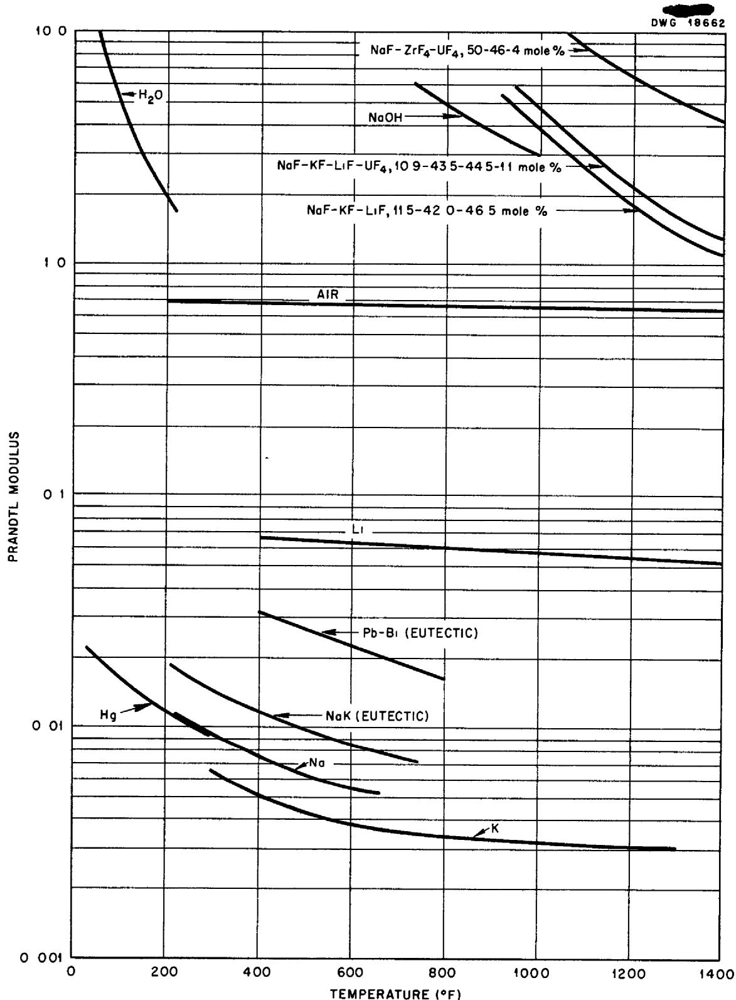  
Fig. 12.2. Prandtl Modulus vs. Temperature for Some Fluoride Mixtures and Other Fluids.

annul1 (v. $\mathbf{y}$ a., the heat-momentum transfer analogy) has prompted a modest program for determining such data.

An apparatus has been designed (Fig. 12.3) that will consist of a 4-in., vertical, brass pipe about 20 ft long which will be the outer annulus wall, smaller diameter tubes which will be the inner annulus walls, a 6-in., lucite, test section inserted in the outer pipe, a high-intensity light source of short duration, a camera, and an air blower. As air is pumped through the annulus, photographs will be taken of the colloidal dust particles in the air illuminated by the vertical plane of light coming through the lucite. The positions of the particles scattering the light can be determined by superimposing a previously determined photograph of

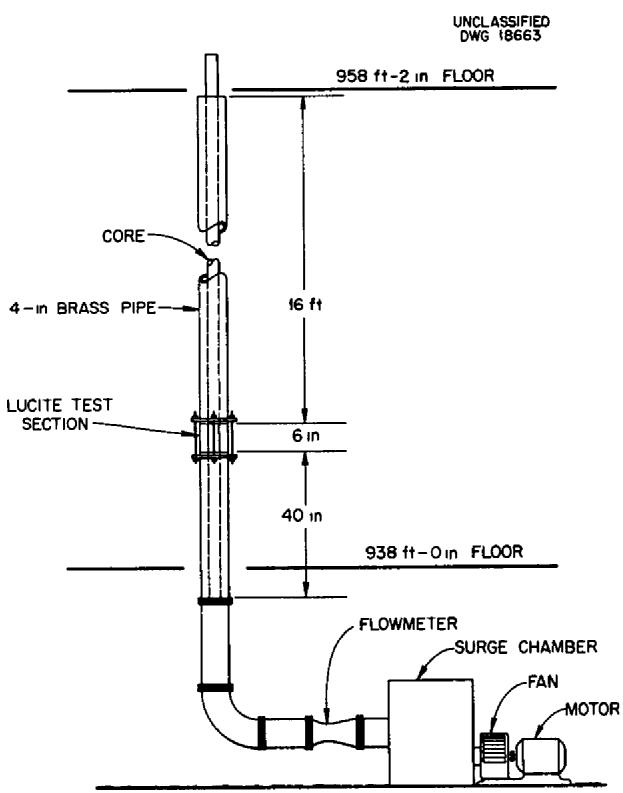  
Fig 12.3 Schematic Diagram of the Annulus Apparatus for Measuring Velocity Distributions

a grid system. By stroboscopic flashing of the light, successive positions of several particles can be obtained, from known time intervals between flashes and the positions of the particles, the velocity of the air can be measured as a function of radial position. A modified version of this annulus system can be used to study the hydrodynamic behavior of circulating-fuel reactors.

# CIRCULATING-FUEL HEAT TRANSFER

H. F. Poppendiek

G. Winn

Reactor Experimental Engineering Division

Thermal and hydrodynamic boundary layers are usually not established in short-duct circulating-fuel systems, such as the Fireball, for example. These systems are being studied mathematically. For some specific systems, the differential equations describing the boundary-value problem have been transformed to finite difference equations and evaluated numerically. Recent evaluations have been made with the aid of high-speed computing machines.

An apparatus that will yield experimental information on the thermal structure in circulating-fuel systems, in both the entrance region and the established flow region, was briefly described previously. This apparatus, which has been fabricated and assembled (shown schematically in Fig. 12.4), consists of a closed loop that circulates a sulfuric acid solution, a volume heat source is generated within the circulating acid by means of an alternating current. Several orifice meters have been calibrated, and the power supply that is to generate the volume heat source and the thermocouples are to be installed next.

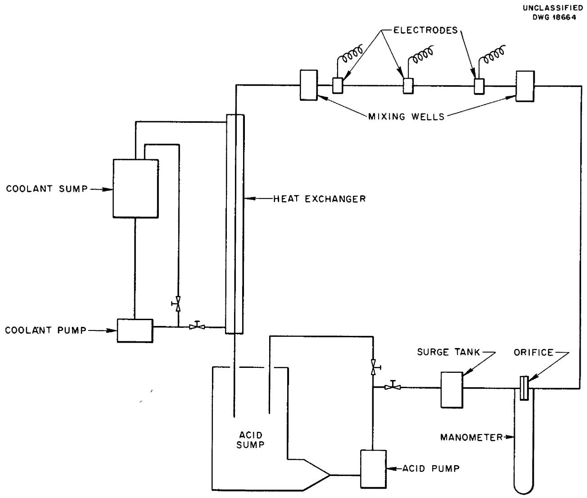  
Fig 12 4. Schematic Diagram of the Circulating-Fuel Heat Transfer System.

# HIGH TEMPERATURE REACTOR COOLANT STUDIES

H. F. Poppendiek J. I. Lang Reactor Experimental Engineering Division

The effectiveness of some of the pertinent high-temperature coolants, particularly flinak, sodium hydroxide, bismuth, sodium, and air, is being investigated. Comparisons of the circulation velocities, radial temperature differences, axial temperature

differences, pressure drops, and pumping powers required to achieve a series of different cooling tasks are being made. Because of the large differences in physical properties of the various coolants being studied, both laminar and turbulent flow are encountered. At times, a significant fraction of the coolant duct may lie in a thermal and hydrodynamic entrance region, hence, entrance region heat transfer is also involved in these studies.

# 13. RADIATION DAMAGE

D. S. Billington, Solid State Division

A. J. Miller, ANP Division

Radiation-damage studies of structural materials, fuels, and other coolants exposed in the ORNL graphite reactor and the LITR have continued. Two Inconel capsules containing the ARE zirconium-bearing fuel were irradiated in the MTR and examined. In both cases, various portions of the capsule walls attained temperatures well above $1500^{\circ}\mathrm{F}$ . There were indications of changes in the fuel composition, and corrosion occurred in excess of that in out-of-reactor tests at $1500^{\circ}\mathrm{F}$ . A third irradiation is now in progress in the MTR, and, with a more elaborate control system, an attempt is being made to hold the maximum wall temperature at $1500^{\circ}\mathrm{F}$ . Additional in-reactor cantilever creep measurements on Inconel in an air atmosphere were made in both the graphite reactor and the LITR. In confirmation of previous observations, it appeared that the irradiation had little effect on the creep strength.

These and other radiation-damage studies are described. Additional information is contained in the Solid State Division Quarterly Progress Report for the Period Ending February 10, 1953, ORNL-1506.

# IRRADIATION OF FUSED MATERIALS

G. W. Keilholtz

M. T. Robinson

J. G. Morgan

D. D. Davies

H. E. Robertson

A. Richt

C. C. Webster

W.J.Sturm

P. R. Klein

W.R.W1llis

M. J. Feldman

Solid State Division

R. J. Jones

R. L. Knight

Electromagnetic

search Division

Thermal-flux measurements of fused salts were made in the testing facility in the MTR. The power density in the

ARE type of fuel was found to be 2700 watts/cm³, rather than the 1900 watts/cm³ predicted.

The wall temperature of the first capsule of the ARE type of fuel irradiated in the MTR was detected and controlled by a single thermocouple. Examination of the surface in contact with the fuel disclosed that at least some portions of the wall had been heated to temperatures far above $1500^{\circ}\mathrm{F}$ during the 116 hr of irradiation. In some sections, the Inconel grain size had been greatly increased and corrosion penetration of up to 10 to 12 mils occasionally occurred. In the regions of normal grain size, the wall showed uniform, dense, intergranular corrosion that averaged about 2 mils in depth, and there were subsurface voids 2 to 4 mils deep.

The second MTR fuel capsule was irradiated for 325 hr and the wall temperature was detected at two points. The control thermocouple held the capsule wall locally at $1500^{\circ}\mathrm{F}$ , but the second thermocouple, several milliliters away, recorded temperatures as high as $1740^{\circ}\mathrm{F}$ . Examination of the Inconel in this case showed only dense, intergranular corrosion that averaged about 2 mils in depth.

Sealed Inconel capsules that had been prepared for irradiation in the MTR were x rayed, and the photograph showed that the fuel was not solidly packed into the 100-mil-ID fuel chamber. Rather than occupying the bottom of the chamber, the fuel was scattered over the length, and thus there were numerous voids in what had been assumed to be a solid fuel column. Considerable study was given to the filling and temperature control techniques. A third capsule, which is currently being irradiated in the MTR,

was filled by an improved method, and it was observed with x rays that the fuel formed a nearly continuous 100-mil-dia column in the lower 1/2 in. of the fuel chamber. A rod attached to the cap of the capsule was fitted tightly into the fuel chamber to press on the top of the fuel to help hold it in place. Three thermocouples were spotted on the outside chamber walls to record the temperatures in various locations, and they were instrumented so that the temperature could be regulated by means of the hottest thermocouple. During the course of the experiment the middle thermocouple has been damaged, and the temperature is now controlled by the top and bottom thermocouples.

Chemical analyses and analyses for the fission product $\mathbf{C}\mathbf{s}^{137}$ were carried out on the two fuel samples irradiated in the MTR. Since there is some doubt as to how thoroughly the fuel was dissolved during the course of the analytical work, there is some doubt as to the validity of the analytical results. Work is under way to improve the methods of dissolution of the fuel. However, a trend that warrants mention was indicated by the analytical results. There was indication that the fuel which could be readily melted out of the capsule was more deficient in uranium than could be accounted for by burnup. This deficiency in uranium did not occur in the controls heated on the bench at $1500^{\circ}\mathrm{F}$ for an equivalent number of hours. In addition, when the $\mathbf{C}\mathbf{s}^{137}$ was counted in the fuel that had been melted out, there was less detected than would be expected from the thermal-flux measurements. In one case, the discrepancy in $\mathbf{C}\mathbf{s}^{137}$ corresponded fairly closely with the discrepancy in uranium content, $33\%$ and $28\%$ , and led to the supposition that the uranium had been segregated during the early portion of the irradiation period. However, the shortage in cesium might have been due to escape

of xenon into the capsule free space and subsequent deposition of cesium on the walls

If it is assumed there are no convection currents in the capsule to relieve the temperature gradients, the central portion of the fuel is calculated to be $1200^{\circ}\mathrm{F}$ hotter than the fuel at the wall, which the thermocouples try to hold at $1500^{\circ}\mathrm{F}$ . Whether the apparent uranium segregation was due to whatever temperature gradients may have existed, the general overheating of the capsule, faulty analyses, or to radiation-damage is a question that requires further investigation. In irradiations carried out several months ago with the Y-12 Cyclotron and by North American Aviation (1) on the Berkeley Cyclotron, some evidences of uranium segregation in the various fuels were also noted, but the question of uncertain thermal history exists for these cases too.

Before opening, the first capsule irradiated in the MTR was heated to well above the normal melting point of the fuel and its freezing point was compared with that of unirradiated fuel in a similar capsule by means of a differential thermocouple arrangement. The melting point of the irradiated fuel appeared to be $23^{\circ}\mathrm{F}$ higher, but the difference was within the range of experimental error. In a similar experiment, a sample of fuel irradiated for 140 hr in the LITR at 140 watts/cm³ appeared to have an $11^{\circ}\mathrm{F}$ lower melting point than its corresponding unirradiated bench tests

Only a small amount of work is now being done on radiation damage with the Y-l2 Cyclotron. This work included an investigation of methods for helium-cooling targets containing fused fluorides, the study has been discontinued. Also, some work is

being carried out to determine the usefulness of proton bombardment as a method for studying hydrogen embrittlement in metals.

# IN-REACTOR CIRCULATING LOOPS

0. S1sman

R. M. Carroll

W. W. Parkinson

C. D. Bauman

J. B. Trice

C. Ellis

A. S. Olson

W. E. Brundage

M. T. Morgan

F. M. Blacksher

Solid State Division

The loop previously reported $^{(2)}$ as having circulated sodium in the LITR for a week was examined to determine the cause of stoppage of flow. It was found that the difficulty was due to a leak in the Inconel tubing that caused a lowering of the sodium level in the surge tank. Additional experiments were carried out with sodium loops in the graphite reactor while improvements were being made in the design of the LITR loop. Development continued on a pump for use with an in-reactor fluoride-fuel-circulating system.

# CREEP UNDER IRRADIATION

W.W.Davis J.C.Wilson

J. C. Zukas

Solid State Division

Several new tests have been completed on annealed Inconel at $1500^{\circ}\mathrm{F}$ with stresses of 3000 and 4000 psi in air in both the LITR and the graphite reactor. The spread in the data and some variations in experimental conditions allow no quantitative estimates to be made of the effect of neutron bombardment on creep, but it can safely be said that the effect is not great enough to cause material change in the design stress values for these materials under these experimental conditions. The next work to be

performed will be to assess the effect of the atmosphere in which the specimen is tested, since this is known to be an important factor in the creep strength of Inconel.(3)

In Fig. 13.1, the 4000-ps1 data show that less creep was experienced under irradiation than in the single bench test. The odd shape of curve X-1 is believed to have been caused by the loading weight resting against the microformer during the early part of the test. The difference between the LITR curves may have resulted because the test shown by curve L-2 received 24 hr of irradiation before the furnace was turned on and the specimen was stressed.

The total strains in each of two, 3000-psi, graphite reactor tests, and one LITR test, shown in Fig. 13.2, are in good agreement with the values for similar tests reported earlier.(4) On the basis of the single bench test to which all the in-reactor curves are compared, it is not possible to say whether more or less creep resulted from irradiation. At the end of the quarter, two tests were operating in the LITR in a helium atmosphere and duplicate bench tests were about to be started.

Annealed Inconel and type 347 stainless steel bars were exposed for a one-week period in hole HB-3 of the LITR in a gradient furnace to determine the highest temperature at which neutron bombardment would cause an increase in hardness of the metals. The temperature gradient was from 1700 to $1150^{\circ}\mathrm{F}$ over 4.5-in. specimens. Rockwell B hardness measurements were made after irradiation and compared to the initial hardness and to the hardness of control bars subjected to the same time and temperature history as the in-reactor specimens. The Inconel was hardened slightly by

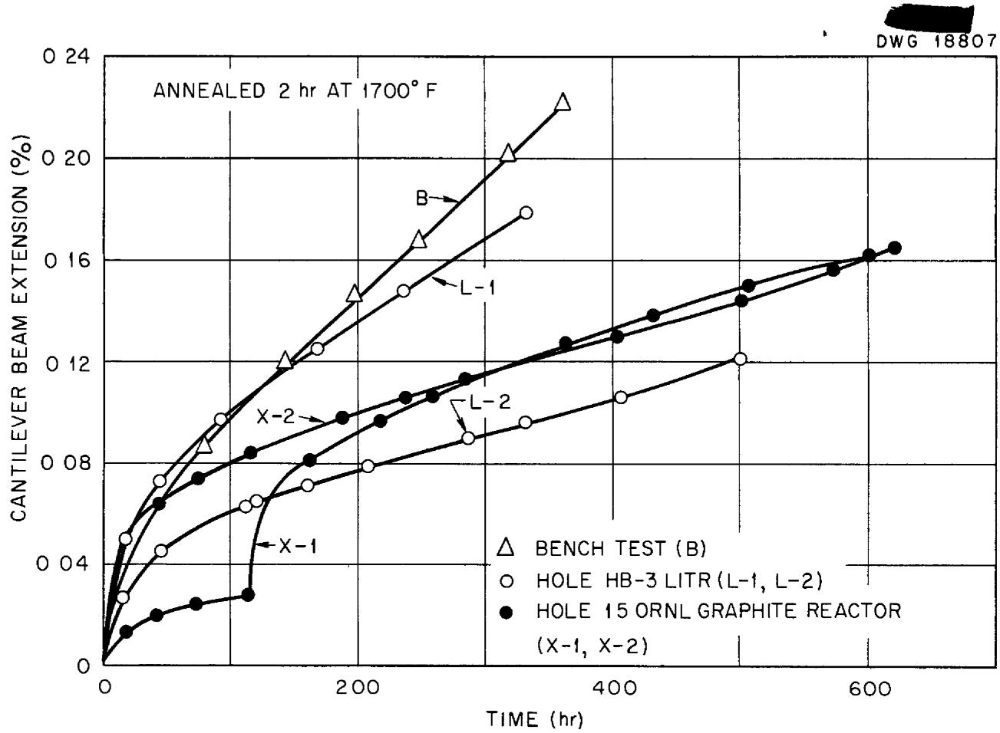  
Fig. 13.1 In-Reactor Cantilever Creep Tests on Inconel in Air at $1500^{\circ}$ F and 4000 ps1.

bombardment at temperatures as high as $1550^{\circ}\mathrm{F}$ . The stainless steel showed an increase in hardness only at temperatures below $1400^{\circ}\mathrm{F}$ . Earlier work on type 347 stainless steel (5) indicated that below $1400^{\circ}\mathrm{F}$ the creep rate of the material was reduced by neutron bombardment, whereas data taken at $1500^{\circ}\mathrm{F}$ indicated that increased creep resulted during irradiation.

ation. A qualitative correspondence could be expected in Inconel, and the hardness data may help to explain why no substantial effects of irradiation have yet been observed. Because the steep gradients in the experiment reported here do not permit accurate determination of temperature, hardness blocks will be placed alongside the creep specimens in future tests to enable more precise determination of irradiation hardening conditions at several temperatures.

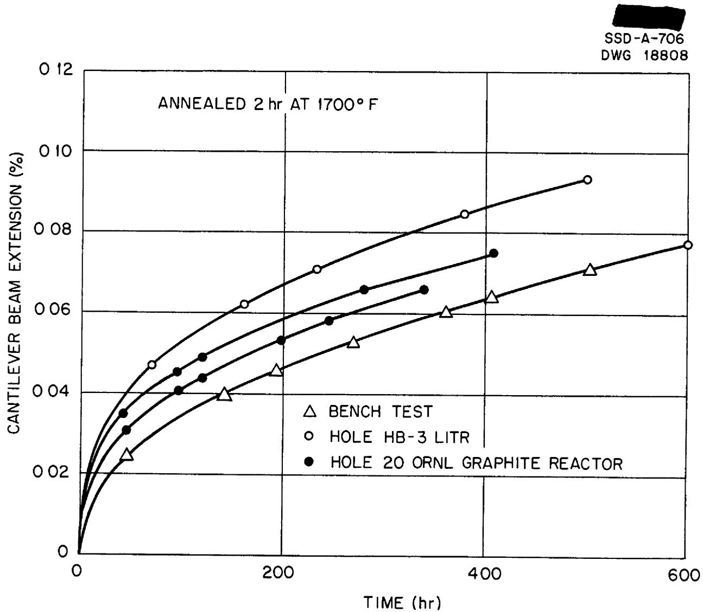  
Fig 13.2 In-Reactor Cantilever Creep Tests on Inconel in Air at $1500^{\circ}\mathrm{F}$ and 3000 ps1.

#

# 14. ANALYTICAL STUDIES OF REACTOR MATERIALS

C. D. Susano, Analytical Chemistry Division

J. M. Warde, Metallurgy Division

The work on reactor fuel components during the past quarter has produced a satisfactory method for the determination of zirconium in the presence of uranium. A method was also developed by which the reduction products, uranium trifluoride and zirconium metal, may be determined in the presence of one another. These reduced species may be formed upon excessive addition of a corrosion inhibitor such as a hydride or NaK to the ARE fuel mixture.

Study has also been concentrated on developing methods for the determination of contaminants in the fluoride fuel mixtures. An apparatus has been developed and tested in which traces of metallic oxides in fluoride mixtures may be determined. The determination of trace quantities of hydrogen fluoride in helium is expedient during the final stages of the fuel preparation process, and a method for rapidly accomplishing this at the site of the fuel preparation has been developed.

A study is being made of the compounds formed between fluoride melts and their containers. Residues of these corrosion products are being examined analytically and spectrographically.

The systems $\mathrm{UCl}_4$ -NaCl and $\mathrm{UCl}_4$ -KCl have been examined petrographically to determine compound and eutectic compositions. Optical data are included for the compounds in these systems. Phases present in the NaF-ZrF $_4$ -UF $_4$ system have been studied petrographically and by x-ray diffraction in an effort to define the ternary and pseudobinary phase regions and to identify the compounds therein. Data for the compositions studied to date are included.

The bulk of work performed by the service groups during the past quarter involved chemical analyses and petro

graphic examination of fluoride mixtures. In addition, chemical analyses were performed on a group of test sections from the beryllium oxide vs. NaK tests, and oxide determinations were made on a number of chloride and fluoride samples.

# CHEMICAL ANALYSIS OF REACTOR FUELS AND CONTAMINANTS

J. C. White

Analytical Chemistry Division

A new volumetric method for the determination of zirconium was developed. This method consists of dissolving the zirconium salt of $p$ -chloromandelic acid in a nonaqueous medium with excess sodium methylate and back titrating with acetic acid. The reaction involved 1s stoichiometric, hence, no empirical factors are involved.

A method for the determination of uranium trifluoride and zirconium metal, which are formed upon the addition of zirconium hydride or other similar corrosion inhibitors, was developed. These determinations can be made in the presence of each other because of the great differential reaction rates of these two materials with dilute hydrofluoric acid reagent.

The reactions of bromine trifluoride with metallic oxides are being studied in an effort to measure trace amounts of oxide in fluoride mixtures and also to determine the completeness of fluorination of zirconium oxide during the preparation of the fluoride.

A method for the determination of traces of hydrogen fluoride in helium sweepings of fuel preparations was developed in which the gas is trapped in boric acid solution. The increase in conductivity of the solution caused

by fluoboric acid formed by the reaction between HF and boric acid is measured and related as a function of the concentration of hydrogen fluoride. Concentrations of the order of $1 \times 10^{-5}$ M HF can be determined in this manner.

The dissolution of Inconel containers, which have been corroded by fluoride reactor fuels, was attempted electrolytically in such a manner as to separate metals from compounds. The

determining zirconium has been developed in which the $p$ -halomandelate salt is dissolved in excess standard sodium methoxide solution containing 3 parts benzene and 1 part methanol, and the excess base is titrated with standard acetic acid in a similar benzene-methanol solution with thymol blue used as the indicator. The equation for the reaction that takes place is

$$
Z r (p - C l C _ {6} H _ {4} C H O H C O O) _ {4} + 4 N a O C H _ {3} \longrightarrow 4 N a p - C l C _ {6} H _ {4} C H O H C O O + Z r (O C H _ {3}) _ {4}.
$$

amount of the data collected is insufficient to permit drawing any definite conclusions.

Zirconi um (C. K. Talbott, J. M. McCown, Analytical Chemistry Division). Of the several procedures explored for the determination of zirconi um, (1) the simplest and most accurate is a volumetric method employing mandelic acid. This reagent is especially good for determining zirconi um in the presence of uranium. It was decided to further investigate reagents of the mandelic acid type, and a volumetric procedure was developed employing $p$ -bromomandelic and $p$ -chloromandelic acids. These acids precipitate zirconi um in acidic solution in the form of zirconi um tetra $p$ -bromo(chloro)mandelate, which is more easily filtered than the zirconi um mandelate. (It is possible to then dry this salt and determine zirconi um gravimetrically, (2,3) but the volumetric method is simpler to execute.)

The salt dissolves in alkali with subsequent hydrolysis of zirconium. However, when an alkali is used in a nonaqueous medium to dissolve the salt, hydrolysis does not occur. On this basis, a volumetric method for

The reaction, which appears to be stoichiometric, eliminates the need for the use of empirical factors. The limited availability of the reagent has made necessary the synthesis of $p$ -chloromandelic acid. A method proposed by Jenkins(4) has been used for this preparation, a yield of $50\%$ is obtained.

Reduction Products (W. J. Ross, Analytical Chemistry Division). The addition of zirconium hydride to inhibit corrosion in fluoride reactor fuels has led to a study of the reduction products that appear as a result of this addition. It is postulated that some uranium tetrafluoride will be reduced to the trifluoride and that zirconium metal will be formed. A procedure in which it is possible to determine both these species, uranium trifluoride and zirconium metal, in the same sample of reactor fuel has been developed. The procedure is based on the vast differences in the rates of the following reactions with 0.2 M HF

$$
Z r + 6 H F \longrightarrow H _ {2} Z r F _ {6} + 2 H _ {2}, \quad f a s t, \tag {1}
$$

$$
2 \mathrm {U F} _ {3} + 2 \mathrm {H F} \longrightarrow 2 \mathrm {U F} _ {4} + \mathrm {H} _ {2}, \quad \text {s l o w .} \tag {2}
$$

Reaction 1 proceeds quantitatively at room temperature, whereas reaction 2

exhibits no tendency to react under this condition for some time. A study of the rate of reaction 2 is incomplete, however, upon heating for 1 hr at $90^{\circ}\mathrm{C}$ , only $5.2\%$ of the theoretical amount of hydrogen is evolved. These results illustrate the stability of uranium trifluoride in this medium. When a mixture of zirconium and uranium trifluoride was treated with $0.2MHF$ , the volume of hydrogen liberated was equivalent to the amount of zirconium present

$$
Z r + 4 H C l \longrightarrow Z r C l _ {4} + 2 H _ {2},. \quad s l o w,
$$

$$
\begin{array}{l} 4 \mathrm {U F} _ {3} + 4 \mathrm {H C l} \longrightarrow 3 \mathrm {U F} _ {4} + \mathrm {U C l} _ {4} \\ + 2 \mathrm {H} _ {2}, \quad \text {f a s t}. \\ \end{array}
$$

Zirconium liberates $4.9\%$ of the theoretical volume of hydrogen upon heating for 1 hr at $90^{\circ}\mathrm{C}$ in $9.6\mathrm{M}$ HCl. Uranium trifluoride reacts quantitatively, as shown by Manning(5) in his method for the determination of uranium trifluoride. When a mixture of the two is treated with $9.6\mathrm{M}$ HCl, hydrogen equivalent to the total zirconium and uranium trifluoride present is liberated in approximately 20 min at $90^{\circ}\mathrm{C}$ . This reaction can be explained on the basis of formation of a complex ion by zirconium with the fluoride ions that are liberated by hydrochloric acid attack on the uranium trifluoride.

A two-step oxidation reaction is, in effect, used to determine zirconium and uranium trifluoride in the presence of each other. A solution of $0.2M$ HF is added to the mixture and the volume of hydrogen evolved from this reaction, conducted at room temperature, is calculated as zirconium. A solution of $9.6M$ HCl is then added, with boric acid, to complex excess fluoride ions, and the volume of hydrogen evolved upon heating is calculated as uranium trifluoride.

Preliminary results have been extremely promising. The effect of large excesses of sodium, zirconium, and uranium tetrafluorides on these reactions is being studied.

0xides (J. E. Lee, Jr., Analytical Chemistry Division). Metallic oxides react with bromine trifluoride (6) according to the reaction

$3MO_{2} + 4BrF_{3}\longrightarrow 3MF_{4} + 2Br_{2} + 3O_{2}$ where $M$ represents a quadrivalent cation. The metallic oxide content can be determined by measuring the amount of oxygen evolved, hence, this reaction is of potential interest in determining the oxide content of fluoride mixtures.

A schematic diagram of the apparatus constructed for use in studying this type of reaction is shown in Fig. 14.1. The reactor portion is designed so that reaction pressures of up to the order of $l$ ts can be permitted. The remainder of the system consists of a reagent transfer arrangement, in which transfer may be made under vacuum, and a high-vacuum system with the necessary instrumentation for measuring the oxygen liberated during the reaction.

Several samples of zirconium oxide have been fluorinated with chromium trifluoride in this equipment at temperatures ranging from 200 to $300^{\circ}\mathrm{C}$ . Analyses of the reaction residues indicate that the experimental conditions employed thus far have resulted in fluorinations that are at least $80\%$ complete. Efforts are being made to obtain quantitative fluorination by means of such promoters as uranium dioxide.

Hydrogen Fluoride (D. L. Manning, Analytical Chemistry Division). A possible explanation of the corrosiveness of reactor fuels that have been treated with hydrogen fluoride is the presence of the gas entrapped in the solidified melt. In order to remove this gas from the molten fuel, an

UNCLASSIFIED DWG 18665

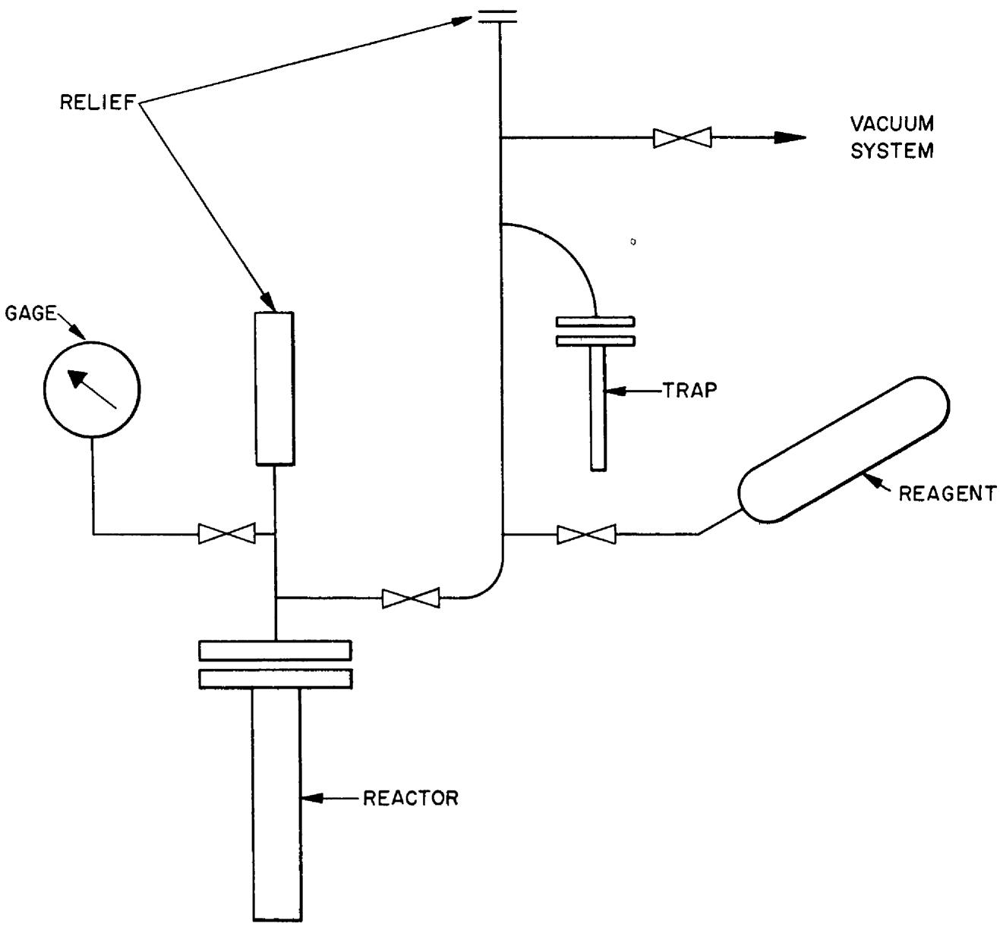  
Fig. 14.1. Apparatus for Studying Reactions with Bromine Trifluoride

outgassing-with-helium step has been included in the fuel preparation procedure. It is desired to test the helium off-gas for hydrogen fluoride and to monitor the gas stream. The most attractive means of attacking this problem appears to be the measurement of the conductivity of the

scrubbing solutions through which the gases are passed. This type of analysis is rapid and has the added advantage that it may be made at the site of the experiment. Several scrubbing solutions were studied, and the most promising were calcium hydroxide and boric acid.

Calcium hydroxide reacts with hydrogen fluoride in the following manner

$$
\mathrm {C a} ^ {+ +} + 2 \mathrm {O H} ^ {-} + 2 \mathrm {H F} \longrightarrow \mathrm {C a F} _ {2} + 2 \mathrm {H} _ {2} \mathrm {O}
$$

and reduces the conductivity of the solution by removing hydroxyl ions. Approximately $100\mu \mathrm{g}$ of hydrogen fluoride reduced the conductivity of $100\mathrm{ml}$ of $7\times 10^{-4}N$ calcium hydroxide solution by $7\times 10^{-6}$ who. A more sensitive determination is possible if boric acid is used as the scrubbing solution. The reaction that occurs between hydrogen fluoride and boric acid is

$\mathrm{H}_{3}\mathrm{BO}_{3} + 4\mathrm{HF} \longrightarrow \mathrm{H}^{+} + \mathrm{BF}_{4}^{-} + 3\mathrm{H}_{2}\mathrm{O}$ , in which a strong acid (fluoboric) is formed, therefore the highly mobile hydrogen ion is introduced into the system and the conductivity is increased. The concentration of the boric acid solution should be very dilute, 0.1 wt % or less, so that the conductivity of the scrubbing solution will be extremely low, of the order of $2 \times 10^{-6}$ mho. The conductivity of $100\mathrm{ml}$ of $3 \times 10^{-3}$ M boric acid is increased $13.5 \times 10^{-6}$ mho by the addition of $100\mu \mathrm{g}$ of hydrogen fluoride - a change nearly twice that produced by the same amount of hydrogen fluoride in calcium hydroxide solution. These results show that conductivity measurements are extremely sensitive and well

suited for the purpose of determining hydrogen fluoride.

Corrosion Products (D. L. Manning, Analytical Chemistry Division). Experiments have been conducted to ascertain the effects of molten fluoride salt mixtures on Inconel and other metallic containers. In these experiments, the metal container that has been exposed to fluoride is made the anode in a sulfuric acid-citric acid bath. Since the metals exist as elements, they are electrolytically dissolved and thereby separated from the compounds present. A similar metal tube is dissolved for comparative purposes. The residues from the anodic dissolution have been analyzed chemically and spectrographically. The analytical methods used to date have been unreliable because of flaking of metal particles during dissolution. Refinements in the electrode system are being made to eliminate this difficulty. Spectrographic data have been collected for Inconel specimens that were subjected to the standard 100-hr static corrosion test with NaF-ZrF $_4$ -UF $_4$ , with and without addition of zirconium hydride. The results are given in Table 14.1.

The amount of the data collected is insufficient to permit drawing definite conclusions. Several points of interest are evident, however. The

TABLE 14.1. SPECTROGRAPHIC ANALYSES OF RESIDUES FROM ANODIC DISSOLUTION OF INCONEL USED IN STATIC CORROSION TESTS OF FLUORIDE REACTOR FUELS   

<table><tr><td rowspan="2">REACTOR FUEL</td><td colspan="6">COMPOSITION OF RESIDUE FROM DISSOLUTION OF INCONEL (%)</td></tr><tr><td>Al</td><td>Co</td><td>S1</td><td>T1</td><td>Zr</td><td>U</td></tr><tr><td rowspan="2">NaF-ZrF4-UF4+ ZrH2</td><td>0 1</td><td>0 1</td><td>&gt;20</td><td>0 2</td><td>1 0</td><td>ND*</td></tr><tr><td>0 08</td><td></td><td>10</td><td>0 2</td><td>0 6</td><td>ND</td></tr><tr><td rowspan="2">NaF-ZrF4-UF4</td><td>0 1</td><td></td><td>20</td><td></td><td>&lt;0 1</td><td>ND</td></tr><tr><td>0 08</td><td>0 1</td><td>10</td><td>0 2</td><td>&lt;0 1</td><td>ND</td></tr><tr><td>Blank</td><td>0 08</td><td>0 1</td><td>0 3</td><td>0.2</td><td>&lt;0 1</td><td></td></tr></table>

None detected

slicon content in the residue from corroded Inconel is high and indicates that practically all the silicon in the fuel is deposited on the walls of the container, the addition of zirconium hydride results in the deposition of some zirconium on the container walls, and deposition of uranium does not occur in either case.

# PREPARATION OF URANIUM TetrACHLORIDE

W. J. Ross

Analytical Chemistry Division

The preparation of several kilograms of uranium tetrachloride to be used in phase studies by the ANP Chemistry Group has been undertaken. The tetrachloride is being prepared by chlorinating $\mathrm{UO}_3$ with hexachloropropene, according to the directions given by Pitt et al (7)

# PETROGRAPHIC EXAMINATION OF FLUORIDES

G. D. White, Metallurgy Division T. N. McVay, Consultant

Routine petrographic examinations of more than 800 samples of fluoridemixtures were made in connection with fuel investigations. Petrographic examinations were made of compositions in the $\mathrm{UCl}_4$ -NaCl and $\mathrm{UCl}_4$ -KCl systems. The data obtained from these examinations were correlated with the thermal data to locate compound and eutectic compositions.

$\mathsf{UCl}_4$ -NaCl System In the $\mathsf{UCl}_4$ -NaCl binary system, two compounds were found $2\mathsf{NaCl}$ - $\mathsf{UCl}_4$ , and a compound with more than $50\%$ $\mathsf{UCl}_4$ , possibly $\mathsf{NaCl}\cdot 2\mathsf{UCl}_4$ . The latter compound seemed to have an incongruent melting point, since compositions on the high $\mathsf{UCl}_4$ side of the binary always contain considerable amounts of free $\mathsf{UCl}_4$ .

Optical Data. NaUC16 Pale green to colorless

(7) B M Patt et al, The Preparation of TCl 4 with Hexachloropropylene, C-2 350 3 (July 27, 1945)

Uniaxial negative (tetragonal or hexagonal)

Refractive indiE,1652O,1664

$\mathbf{NaU}_2\mathbf{Cl}_9$ Yellow-green   
Biaxial negative (probably orthorhombic) with small optic angle   
Refractive indices $\alpha ,1790$ $\gamma ,1850$

$\mathsf{U}\mathsf{C}\mathsf{1}_{4}$ -KCL System. The $\mathsf{U}\mathsf{C}\mathsf{1}_{4}$ -KCL system produced three compounds 2KCl $\cdot$ UCl, KCl $\cdot$ UCl, and an incongruently melting compound in the $67\%$ UCl region of the binary. There were two forms that crystallized in the composition range of $30\%$ to $35\%$ UCl. They were distinguished by their differences in brefringe and interference figures.

Optical Data $\mathbf{K}_2\mathbf{U}\mathbf{C}\mathbf{l}_6$ 1 Pale green to colorless Uniaxial negative Refractive indices E, 1 644 O, 1 654   
2 Pale green to colorless Biaxial positive, small optic angle Refractive indices $\alpha ,1636$ $\gamma ,1640$ $\mathrm{KUCl}_{5}$ Pleochroism X, grey Z, blue-green   
Biaxial positive, small optic angle Refractive indices $\alpha ,1692$ $\beta ,1705$ $\gamma ,1759$ $\mathrm{KU_2Cl_9}$ Yellow-green   
Biaxial positive, with very small optic angle Refractive indices $\alpha ,1740$ $\beta ,1809$ $\gamma ,1820$

# X-RAY DIFFRACTION STUDIES

P. A. Agron

Materials Chemistry Division

The determination of the phases present in solidified melts of various compositions in the NaF-ZrF $_4$ -UF $_4$ system has been helpful in elucidating the paths of crystallization. The regions of this ternary system that are rich in NaF have been examined during the past quarter. Some progress has been made here in definition of the ternary and pseudobinary phase regions.

The petrographic and x-ray diffraction identification of the phases found in the solid, upon melting given compositions, are listed in Table 14.2. The phases have been grouped according to the similarities present in the respective solidified melts, thus A-1 and A-2 represent one ternary area, B-1 and B-2, the adjacent ternary area, etc. This division into ternary areas is in fair agreement with the isothermal contour plots (to be published). However, the anomalous situation of four phases in samples B-1 and D-2 obviously requires further investigation. Additional compositions of these ternary areas should also be investigated before mapping the phase boundaries.

The examination of a number of fused solids along the composition line joining $\mathrm{NaUF}_5$ and $\mathrm{Na}_3\mathrm{ZrF}_7$ appears to indicate a pseudobinary behavior. Approximately $90\%$ of the x-ray diffraction pattern can be assigned to these two phases. The cooling curves of a series of these compositions (to be published) indicate a binary eutectic at about 22.5 mole $\%$ UF4.

The behavior of salts along the composition line between $\mathsf{NaUF}_5$ and $\mathsf{NaZrF}_5$ is rather complex beyond 6 mole $\% \mathsf{UF}_4$ content.(8) Further study along this composition line, with the

use of liquid sampling and quenching techniques, will be required to explain this area of the phase diagram.

# SERVICE CHEMICAL ANALYSES

H. P. House S. A. Reed A. F. Roemer, Jr.

Analytical Chemistry Division

Work in the ANP Analytical Chemistry Laboratory during the period consisted primarily of the analysis of alkaliphluoride eutectic mixtures and zirconium fuels. Although there was a slight decrease in the total number of samples received during the quarter, there was a significant increase in the number of miscellaneous materials received. Important among these was a group of samples that were tested for beryllium content. Included in the group were large steel sections of test rigs used to study the compatibility of NaK and beryllium oxide. The specimens were first treated with methanol to remove excess NaK and then leached with hot, $50\%$ sodium hydroxides solutions to dissolve the beryllium oxide adhering to the surfaces of the specimens. The beryllium content of the alcoholic and caustic solutions was determined colorimetrically, with p-nitrobenzeneazo- orcinol as the chromogenic reagent.

A number of uranium tetrachloride samples were analyzed for $\mathrm{UO}_2$ and $\mathrm{UOCl}_2$ . Separation of $\mathrm{UO}_2$ from the salt was effected by refluxing portions of the material with dilute ammonium oxalate solution. The insoluble $\mathrm{UO}_2$ was removed by filtration, dissolved in acid, and estimated quantitatively by potentiometric titration with ferric sulfate. The $\mathrm{UOCl}_2$ , along with any $\mathrm{UO}_2$ , was separated from the $\mathrm{UCl}_4$ by refluxing with anhydrous methyl acetate. The insoluble residue was dissolved in dilute nitric acid, and the $\mathrm{UOCl}_2$ was calculated from a volumetric determination of the chloride content.

TABLE 14.2. TERNARY PHASE REGIONS IN THE NaF-ZrF $_4$ -UF $_4$ SYSTEMS   

<table><tr><td rowspan="2">SAMPLE NO</td><td rowspan="2">CHEMICAL COMPOSITION (mole %)</td><td rowspan="2">EXPERIMENTAL CONDITIONS(a)</td><td colspan="2">PETROGRAPHIC EXAMINATION(b)</td><td colspan="2">X RAY SPECTrometer DIFFRACTION ANALYSIS</td></tr><tr><td>Phases</td><td>Refractive Index</td><td>Intensity of Strongest Line</td><td>Phases</td></tr><tr><td rowspan="3">A 1</td><td>55 NaF</td><td rowspan="3">Salts fused under helium gas and stirred until frozen</td><td>NaZr(U)F5</td><td>1 504</td><td>90</td><td>NaU(Zr)F5</td></tr><tr><td>20 UF4</td><td>Na2ZrF6</td><td>1 43</td><td>40</td><td>Na2ZrF6</td></tr><tr><td>25 ZrF4</td><td>UO2(1 to 2%)</td><td></td><td>35</td><td>NaZr(U)F5</td></tr><tr><td rowspan="3">A-2</td><td>55 NaF</td><td rowspan="3">Salts fused under helium gas and stirred until frozen</td><td>NaZr(U)F5</td><td>1 504</td><td>80</td><td>NaU(Zr)F5</td></tr><tr><td>25 UF4</td><td>Na2ZrF6</td><td>1 43</td><td>50</td><td>Na2ZrF6</td></tr><tr><td>20 ZrF4</td><td>UO2(1 to 2%)</td><td></td><td>35</td><td>NaZr(U)F5</td></tr><tr><td rowspan="4">B 1</td><td>62 5 NaF</td><td rowspan="4">Salts equalibrated in closed nickel container and cooled slowly without stirring</td><td>Na3Zr(U)F7</td><td>1 39</td><td>75</td><td>Na3Zr(U)F7</td></tr><tr><td>18 75 UF4</td><td>Na2UF6</td><td>1 49</td><td>75</td><td>NaU(Zr)F5</td></tr><tr><td>18 75 ZrF4</td><td>Na2Zr(U)F6</td><td>1 43</td><td>20</td><td>β3Na2UF6(c)(also γ Na2UF6)</td></tr><tr><td></td><td>Na3ZrF6</td><td>1 43</td><td>25</td><td>Na2ZrF6</td></tr><tr><td rowspan="3">B-2</td><td>62 5 NaF</td><td rowspan="3">Salts fused under helium and stirred until frozen</td><td>NaZr(U)F5</td><td>1 504</td><td>60</td><td>NaU(Zr)F5</td></tr><tr><td>20 0 UF4</td><td>Na3Zr(U)F7</td><td>1 386</td><td>30</td><td>Na3Zr(U)F7</td></tr><tr><td>17 5 ZrF4</td><td>Na2ZrF6</td><td>1 43</td><td>30</td><td>Na2ZrF6</td></tr><tr><td rowspan="3">C 1</td><td>66 5 NaF</td><td rowspan="3">Salts fused under helium and stirred until frozen</td><td></td><td></td><td>85</td><td>NaUF5and NaU(Zr)F5</td></tr><tr><td>22 5 UF4</td><td></td><td></td><td>40</td><td>γ Na2UF6(also β3and α Na2UF6)</td></tr><tr><td>11 0 ZrF4</td><td></td><td></td><td>30</td><td>Na3Zr(U)F7</td></tr><tr><td rowspan="3">C 2</td><td>60 0 NaF</td><td rowspan="3">Salts fused under helium and stirred until frozen</td><td rowspan="2">NaZr(U)F5(also lower index material)</td><td rowspan="2">1 50</td><td>90</td><td>NaUF5</td></tr><tr><td>35 0 UF4</td><td>40</td><td>β3Na2UF6(also γ and β2Na2UF6)</td></tr><tr><td>5 0 ZrF4</td><td></td><td></td><td>20</td><td>Na3Zr(U)F7</td></tr><tr><td rowspan="3">C 3</td><td>67 5 NaF</td><td rowspan="3">Salts fused under helium and stirred until frozen</td><td>Green phase</td><td>1 46 ± 0 01</td><td>90</td><td>β3Na2UF6</td></tr><tr><td>27 5 UF4</td><td>UO2(∼2%)</td><td></td><td>15</td><td>Na3Zr(U)F7</td></tr><tr><td>5 0 ZrF4</td><td></td><td></td><td>10</td><td>Na3U(Zr)F7</td></tr><tr><td rowspan="3">D-1</td><td>72 5 NaF</td><td rowspan="3">Salts equalibrated in closed nickel container and then cooled slowly without stirring</td><td rowspan="2">Na3Zr(U)F7(also an internal green phase)</td><td rowspan="2">1 39 to 1 40</td><td>90</td><td>Na3Zr(U)F7</td></tr><tr><td>13 75 UF4</td><td>35</td><td>β3Na2UF6(also γ and α Na2UF6)</td></tr><tr><td>13 75 ZrF4</td><td></td><td></td><td>10</td><td>Na3UF7</td></tr><tr><td rowspan="4">D-2</td><td>72 5 NaF</td><td rowspan="4">Salts fused under helium and stirred until frozen</td><td>Na3U(Zr)F7</td><td>1 413</td><td>90</td><td>Na3U(Zr)F7</td></tr><tr><td>25 0 UF4</td><td>NaF</td><td></td><td>20</td><td>Na2UF6</td></tr><tr><td>2 5 ZrF4</td><td>UO2(1 to 2%)</td><td></td><td>12</td><td>NaF</td></tr><tr><td></td><td></td><td></td><td>5</td><td>Na3Zr(U)F7</td></tr><tr><td rowspan="3">E 1</td><td>75 NaF</td><td rowspan="3">Salts fused under helium and stirred until frozen</td><td>Na3Zr(U)F7</td><td></td><td>100</td><td>Na3Zr(U)F7and Na3U(Zr)F7</td></tr><tr><td>15 UF4</td><td>NaF</td><td></td><td></td><td></td></tr><tr><td>10 ZrF4</td><td>UO2(∼2%)</td><td></td><td>10</td><td>NaF</td></tr><tr><td rowspan="3">E 2</td><td>82 5 NaF</td><td rowspan="3">Salts equalibrated in closed nickel container and then cooled slowly without stirring</td><td>Na3Zr(U)F7</td><td>1 39 to 1 40</td><td>90</td><td>Na3Zr(U)F7</td></tr><tr><td>8 75 UF4</td><td>NaF</td><td></td><td>75</td><td>Na3U(Zr)F7</td></tr><tr><td>8 75 ZrF4</td><td></td><td></td><td>12</td><td>NaF</td></tr></table>

(a) Samples prepared by C J Barton's group   
(b) Petrographic examination by G D White, Metallurgy Division   
(c) $\beta_{3} - Na_{2}UF_{6}$ is a hexagonal form that has not been previously reported.

TABLE 14.3. SUMMARY OF SERVICE ANALYSES   

<table><tr><td></td><td>NUMBER OF 
SAMPLES 
REPORTED</td><td>NUMBER OF 
DETERMINATIONS 
REPORTED</td></tr><tr><td>ANP Reactor Chemistry Group</td><td>508</td><td>4477</td></tr><tr><td>ANP Experimental Engineering Group</td><td>216</td><td>2424</td></tr><tr><td>ADP Process Improvement Group</td><td>41</td><td>97</td></tr><tr><td>Heat Transfer and Physical Properties Group</td><td>6</td><td>86</td></tr><tr><td>Electromagnetic Research Division</td><td>2</td><td>15</td></tr><tr><td>General Electric Company</td><td>11</td><td>114</td></tr><tr><td>Total</td><td>784</td><td>7213</td></tr></table>

Comparative tests of phenylarsonic acid and mandelic acid as precipitants for zirconium were completed during this period. Spectrographic examination of zirconium oxide residues resulting from the ignition of precipitates of phenylarsonic acid revealed the presence of significant amounts of arsenic, antimony, and iron. Zirconium oxide from mandelic acid precipitations was found to contain only traces of silicon. The use of mandelic acid as the precipitant resulted in much better separations from interfering ions and, in addition, a considerable saving in time. By the use of this reagent during the latter part of the quarter, a marked reduction in the number of duplicate determinations was effected, and a considerable increase in the accuracy of this determination was attained.

Of the 784 samples reported during the period, $65\%$ were submitted by the ANP Reactor Chemistry Group and $27\%$ by the Experimental Engineering Group. Over 7000 determinations were made during the quarter, a fourth of which were made on nonroutine samples. Summaries of the ANP analytical chemistry work for the quarter are given in Tables 14.3 and 14.4.

TABLE 14 4. BACKLOG SUMMARY   

<table><tr><td>Samples on hand, 11-10-52</td><td>108</td></tr><tr><td>Number of samples received</td><td>808</td></tr><tr><td>Total number of samples</td><td>916</td></tr><tr><td>Number of samples reported</td><td>784</td></tr><tr><td>Backlog, 2-10-53</td><td>132</td></tr></table>

Part IV

APPENDIX

# 15. LIST OF REPORTS ISSUED DURING THE QUARTER

<table><tr><td>REPORT NO</td><td>TITLE OF REPORT</td><td>AUTHOR(S)</td><td>DATE ISSUED</td></tr><tr><td colspan="4">I General Design</td></tr><tr><td>CF-53-1-111</td><td>Minimum Weight Analysis for an Air Radiator</td><td>W S Farmer</td><td>1-31-53</td></tr><tr><td>CF-53-1-148</td><td>Component Tests Recommended to Provide Sound Basis for Design of Fluoride Fuel Reactors for Tactical Aircraft</td><td>A P Fraas</td><td>1-16-53</td></tr><tr><td>CF-53-2-159</td><td>ARE Design Data</td><td>W B. Cottrell</td><td>2-18-53</td></tr><tr><td colspan="4">II Experimental Engineering</td></tr><tr><td>CF-52-12-153</td><td>An Improved AC Electromagnetic Pump Cell</td><td>M E LaVerne</td><td>12-7-52</td></tr><tr><td rowspan="2">CF-53-1-84</td><td rowspan="2">ARE Regulating Rod</td><td>E R Mann</td><td rowspan="2">1-9-53</td></tr><tr><td>S H Hanauer</td></tr><tr><td>CF-53-1-260</td><td>Moore Pressure Transmitter Test Summary</td><td>P W Taylor</td><td>1-22-53</td></tr><tr><td>CF-53-1-276</td><td>Components of Fluoride Systems</td><td>W B Cottrell</td><td>1-27-53</td></tr><tr><td>ORNL-1461</td><td>A Simple Electromagnetic Flowmeter for Liquid Metals</td><td>R M Carroll</td><td>to be issued</td></tr><tr><td colspan="4">III Reactor Physics</td></tr><tr><td>CF-53-1-64</td><td>Delayed Neutron Damping of Non-Linear Reactor Oscillations</td><td>W K Ergen</td><td>1-7-53</td></tr><tr><td>CF-53-1-267</td><td>Delayed Neutron Activity in a Circulating Fuel Reactor</td><td>H L F Enlund</td><td>1-27-53</td></tr><tr><td>CF-53-1-317</td><td>Delayed Neutron Activity in the ARE Fuel Element</td><td>H L F Enlund</td><td>1-27-53</td></tr><tr><td>Y-881</td><td>A Graphite Moderated Critical Assembly</td><td>E L Zimmerman</td><td>12-7-52</td></tr><tr><td rowspan="2">CF-53-2-50</td><td rowspan="2">The Attenuation of Capture Gammas in a Plane Limited Medium of Finite Thickness</td><td>F Abernathy</td><td rowspan="2">2-6-53</td></tr><tr><td>H L F Enlund</td></tr><tr><td rowspan="2">CF-53-2-99</td><td rowspan="2">Heating by Fast Neutrons in a Barytes Concrete Shield</td><td>F Abernathy</td><td rowspan="2">2-11-53</td></tr><tr><td>H L F Enlund</td></tr><tr><td>ORNL-1493</td><td>General Method of Reactor Analysis Used by ANP Physics Group</td><td>C B Mills</td><td>to be issued</td></tr><tr><td colspan="4">IV Metallurgy and Ceramics</td></tr><tr><td>CF-52-12-109</td><td>Spot Welding of Stainless Clad Fuel Elements</td><td>G M Slaughter</td><td>12-9-52</td></tr><tr><td>(no number)</td><td>Formability and Weldability of Vapor-Deposited Molybdenum Final Report</td><td>Massachusetts Institute of Technology</td><td>10-31-52</td></tr><tr><td>MM-54*</td><td>Progress Report The Flash Welding of Molybdenum Part I - Temperature Distribution During the Flashing Cycle</td><td>Rensselaer Polytechnic Institute</td><td>12-5-52</td></tr><tr><td>CF-53-1-83</td><td>A High-Temperature Cermet Fuel Element</td><td>J R Johnson</td><td>1-9-53</td></tr><tr><td>CF-53-2-79</td><td>Ceramic Fuel Element Radiation Tests</td><td>J R Johnson</td><td>2-9-53</td></tr><tr><td rowspan="2">ORNL-1463</td><td rowspan="2">Methods of Fabrication of Control and Safety Elements for the ARE and HRE Reactors</td><td>J H Coobs</td><td rowspan="2">to be issued</td></tr><tr><td>E S Bomar</td></tr></table>

*Number assigned by ANP Reports Office

# ANP PROJECT QUARTERLY PROGRESS REPORT

<table><tr><td>REPORT NO</td><td>TITLE OF REPORT</td><td>AUTHOR(S)</td><td>DATE ISSUED</td></tr><tr><td>ORNL-1491</td><td>Corrosion by Molten Fluorides</td><td>L S Richardson
D C Vreeland
W D Manly</td><td>to be issued</td></tr><tr><td colspan="4">V Heat Transfer and Physical Properties</td></tr><tr><td>CF-52-11-205</td><td>Estimates of Heat and Momentum Transfer Characteristics of the Two Fluoride Coolants (LiF-48 M%, BeF-52 M%) and (NaF-10 M%, KF-46 M%, ZrF4-44 M%)</td><td>H F Poppendiek</td><td>11-29-52</td></tr><tr><td>CF-52-12-124</td><td>Generalized Velocity Distribution for Turbulent Flow in Annul</td><td>W B Harrison
J O Bradfute
R V Bailey</td><td>12-19-52</td></tr><tr><td>Y-B4-59</td><td>Selected Physical Properties of Potassium and Potassium Hydroxide in the Temperature Range 100 to 1000°C A Literature Search</td><td>R L Curtis</td><td>9-23-52</td></tr><tr><td>CF-53-1-233</td><td>Measurement of the Thermal Conductivity of Fluoride Mixtures No 14 and No 30</td><td>S J Claiborne</td><td>1-8-53</td></tr><tr><td>CF-53-1-248</td><td>Remarks on the Falling-Ball Viscometer</td><td>R F Redmond
S I Kaplan</td><td>1-14-53</td></tr><tr><td>CF-53-2-56</td><td>Heat Capacity of Fused Salt Mixture No 30</td><td>W D Powers
G C Blalock</td><td>2-6-53</td></tr><tr><td>CF-53-2-84</td><td>Heat Capacity of Sr(OH)2</td><td>W D Powers
G C Blalock</td><td>2-9-53</td></tr><tr><td>ORNL-915</td><td>Forced Convection Heat Transfer in Thermal Entrance Regions</td><td>W B Harrison</td><td>to be issued</td></tr><tr><td colspan="4">VI Shielding</td></tr><tr><td>CF-52-11-129</td><td>Materials Research for Mobile Reactor Shielding</td><td>E P Blizard</td><td>11-18-52</td></tr><tr><td>CF-52-12-209</td><td>Thermal Neutron Dose at the Crew Compartment</td><td>J L Meem</td><td></td></tr><tr><td>CF-53-1-279</td><td>The Tower Shielding Facility</td><td>E P Blizard</td><td>1-27-53</td></tr><tr><td>ORNL-1438</td><td>Determination of the Power of the Bulk Shielding Reactor Part 2</td><td>E B Johnson
J L Meem</td><td>to be issued</td></tr><tr><td>ORNL-1471</td><td>Shield Optimization</td><td>E P Blizard</td><td>to be issued</td></tr><tr><td>ORNL-1479</td><td>A Proton Recoil Type Fast Neutron Spectrometer</td><td>R G Cochran
K M Henry</td><td>to be issued</td></tr><tr><td colspan="4">VII. Chemistry</td></tr><tr><td>ORNL-1430</td><td>Modifications of the Dimethylglyoxime Method for the Colorimetric Determination of Nickel Based on the Use of Potassium Persulfate as the Oxidant</td><td>M L Druschel
O Menis
R Rowan, Jr</td><td>11-3-52</td></tr><tr><td>Y-B31-390</td><td>Analytical Chemistry-ANP Program Quarterly Progress Report for Period Ending November 25, 1952</td><td>Analytical Chemistry Division</td><td>11-20-52</td></tr><tr><td>ORNL-1453</td><td>Dissolution of NaK</td><td>J C White
C K Talbott
L J Brady</td><td>12-2-52</td></tr><tr><td>Y-B32-104</td><td>Minutes of Committee Meeting for the Coordination of Hydroxide Research, Fourth Meeting, December 10 and 11, 1952</td><td>F Kertesz</td><td>1-7-53</td></tr><tr><td>ORNL-1376</td><td>Mass Spectrometer Investigation of UF3</td><td>L O GilpatrickRussell BaldockJ R Sites</td><td>8-29-52</td></tr><tr><td>ORNL-1490</td><td>General Information Concerning Fluorides, A Literature Search, Suppl to ORNL-1252</td><td>M E Lee</td><td>to be issued</td></tr><tr><td>ORNL-1495</td><td>General Information Concerning Hydroxides, A Literature Search, Suppl to ORNL-1291</td><td>M E Lee</td><td>to be issued</td></tr><tr><td>Y-B32-103</td><td>Possible Coolants for Solid Fuel Reactors</td><td>W R Grimes</td><td>11-25-52</td></tr><tr><td>CF-52-12-178</td><td>Hydroxide Systems</td><td>M D Banus</td><td>12-23-52</td></tr><tr><td>CF-53-1-129</td><td>Fused Salt Compositions</td><td>C J Barton</td><td>1-15-53</td></tr><tr><td>ORNL-1476</td><td>An Indirect Colorimetric Method for the Determination of Uranium</td><td>J C WhiteD L Manning</td><td>1-13-53</td></tr><tr><td>ORNL-1500</td><td>Recovery of Uranium as a Single Product from Fluorides</td><td>C F Coleman</td><td>to be issued</td></tr><tr><td></td><td>VIII Miscellaneous</td><td></td><td></td></tr><tr><td>Y-B31-403</td><td>A Guide for the Safe Handling of Molten Fluorides and Hydroxides</td><td>Reactor ComponentsSafety Committee</td><td>1-12-53</td></tr><tr><td>ORNL-1439</td><td>ANP Project Quarterly Progress Report for Period Ending December 10, 1952</td><td>W B Cottrell</td><td>1-15-53</td></tr><tr><td>CF-53-2-126</td><td>Objective and Status of ORNL-ANP Reactor Program</td><td>R C Brianant</td><td>2-13-53</td></tr><tr><td>CF-53-2-246</td><td>ANP Information Meeting of February 18, 1953</td><td>W B Cottrell</td><td>3-2-53</td></tr></table>

# CHART OF THE TECHNICAL ORGANIZATION OF THE AIRCRAFT NUCLEAR PROPULSION PROJECT AT THE OAK RIDGE NATIONAL LABORATORY

MARCH 1, 1953

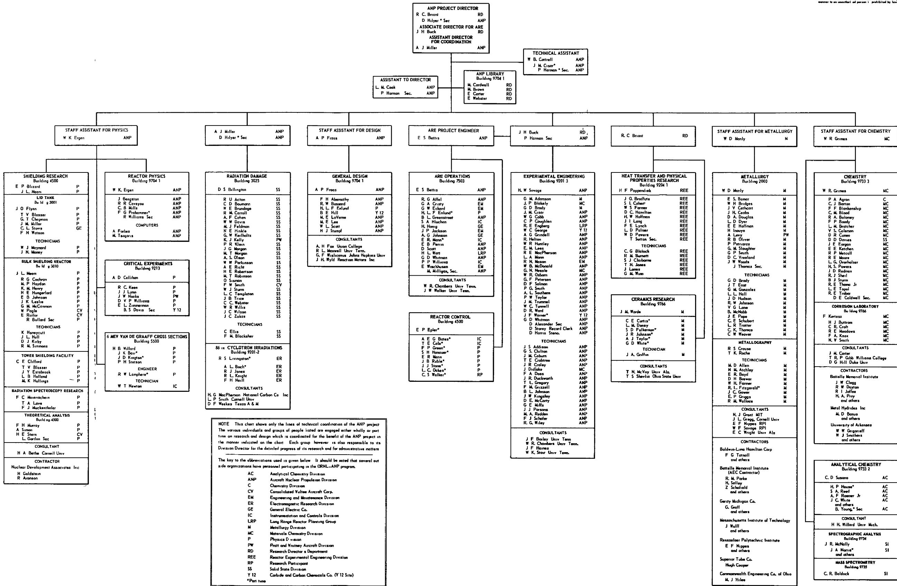