CLASSIFIED

BY: AutogrAmp. 4 8 0.5-28-69

ESEARCH AND DEVELOPMENT REPORT

THE MODERATOR COOLING SYSTEM FOR

THE REFLECTOR-MODERATED REACTOR

R.W.Bussard

W. S. Farmer

A.H.Fox

A. P. Fraas

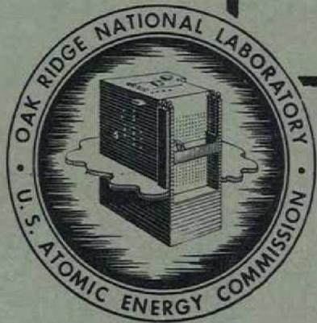

CENTRAL RESEARCH LIBRARY DOCUMENT COLLECTION

LIBRARY LOAN COPY

DO NOT TRANSFER TO ANOTHER PERSON

If you wish someone else to see this document, send in name with document and the library will arrange a loan.

OAK RIDGE NATIONAL LABORATORY

OPERATED BY

CARBIDE AND CARBON CHEMICALS COMPANY

A DIVISION OF UNION CARBIDE AND CARBON CORPORATION

UCC

POST OFFICE BOX P

OAK RIDGE, TENNESSEE

Contract No. W-7405-eng-26

THE MODERATOR COOLING SYSTEM FOR THE REFLECTOR-MODERATED REACTOR

R. W. Bussard  
W. S. Farmer

A. H. Fox  
A. P. Fraas

September 1953

DATE ISSUED

JAN 2 2 1954

OAK RIDGE NATIONAL LABORATORY

Operated by

CARBIDE AND CARBON CHEMICALS COMPANY

A Division of Union Carbide and Carbon Corporation

Post Office Box P

Oak Ridge, Tennessee

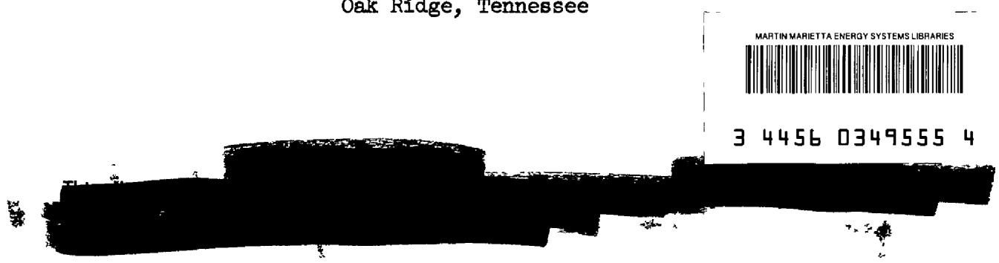

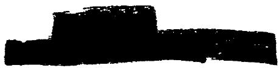

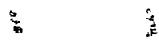

ORNL 1517

Reactors-Research and Power

# INTERNAL DISTRIBUTION

1. C. E. Center   
2. Biology Library   
3. Health Physics Library   
4-5. Central Research Library   
6. Reactor Experimental   
Engineering Library   
7-11. Laboratory Records Department   
12. Laboratory Records, ORNL R.C.   
13. C. E. Larson   
14. J. P. Murray (Y-12)   
15. L. B. Emlet (K-25)   
16. A. M. Weinberg   
17. E. H. Taylor   
18. E. D. Shipley   
19. R. C. Briant   
20. F. C. Vonderla   
21. J. A. Swart   
22. S. C. Lin   
23. F. L. Cister   
24. A. H. Jell   
25. A. Hollander

26. M. T. Kelley   
27. G. H. Slewett   
28. Kost Morgan   
29. H. Frye, Jr.   
36. C. P. Keim   
E.R.S.Livingston   
2. T. A. Lincoln   
33. A. S. Householder   
34. C. S. Harrill   
35. C. E. Winters   
36. D. W. Cardwell   
37. E. M. King   
38. A. J. Miller   
39. D. D. Cowen   
O.R.A.Charpie   
A. J. A. Lane   
42. R. W. Bussard   
43. A. P. Fraas   
44. C. B. Mills

45-49. ANP Reports Office

# EXTERNAL DISTRIBUTION

50. AF Plant Representative, Burbank   
51. AF Plant Representative, Seattle   
52. AF Plant Representative, Woodridge   
53. ANP Project Office, Fort Worth   
64. Argonne National Laboratory   
65. Armed Forces Special Weapon Project (Sandia)   
66. Armed Forces Special Weapon Project, Washington

67-71. Atomic Energy Commission at Washington   
72. Battelle Memorial Instit   
73-75. Brookhaven National Laboratory   
76. Bureau of Ships   
77-78. California Research and Development Company   
79-84. Carbide and Carbon Chemicals Company (Y-12 Plant)   
85. Chicago Patent Group   
86. Chief of Naval Research   
87. Commonwealth Edis Company   
88. Department of the Navy - Op-12   
89. Detroit Edison Company   
90-94. duPont Company, Augusta   
95. duPont Company-Wilmington   
96. Foster Wheeler Corporation

97-100. General Electric Company (ANPP)   
101-104. General Electric Company, Richland   
105. Hanford Operations Office   
106. Iowa State College   
107-110. Knolls Atomic Power Laboratory   
111-112. Los Alamos Scientific Laboratory   
113. Massachusetts Institute of Technology (Kaufmann)   
114. Monsanto Chemical Company   
115. Mound Laboratory   
116. National Advisory Committee for Aeronautics, Cleveland   
117. National Advisory Committee for Aeronautics, Washington   
118. Naval Research Laboratory   
119-120. New York Operations Office   
121-122. North American Aviation, Inc.   
123. Nuclear Development Associates, Inc.   
124. Patent Branch, Washington   
125-131. Phillips Petroleum Company   
132. Powerplant Laboratory (WAD)   
133-134. Pratt & Whitny Aircraft Division (Fox Project) (1 copy to W. S. Farmer   
135. Rand Corporation   
136. San Francisco Operations Office   
137. Sylvania Electric Products, Inc.   
138. USAF Headquarters   
139. U. S. Mival Radiological Defense Laboratory   
140-141. University of California Radiation Laboratory, Berkeley   
142-143. University of California Radiation Laboratory, Livermore   
144. Walter Kidde Nuclear Laboratories, Inc.   
145-150. Westinghouse Electric Corporation   
151-165. Technical Information Service, Oak Ridge

R. W. Bussard

W. S. Farmer

A. H. Fox

A. P. Fraas

# INTRODUCTION

Cooling the reflector region of the reflector-moderated circulating fuel reactor presents an important set of problems. While reflector materials and coolants can be chosen independently of shielding considerations for most types of reactor, this is not the case for an aircraft reactor because the shield and its weight are of such great importance. Not only must the reactor core be as small as possible but the reflector material must be chosen to give both a minimum fast neutron leakage from the reflector and a minimum production of hard secondary gammas in the reflector.

A number of reflector materials were considered on the basis of fast neutron leakage per unit of thickness to get some notion of their influence on shield design. (See Fig. 4.11 in ORNL-1515). This study showed that beryllium was far superior to any of the other common reflector materials such as beryllium oxide, carbon, or sodium deuteroxide, and it is somewhat superior to $\mathrm{D}_{2}0$ . Although a fluid reflector might simplify the heat removal problem, none of the fluid reflector materials that can be used at temperatures of the order of $1000^{\circ}\mathrm{F}$ were comparable with beryllium for neutron moderation and reflection. The reflector cooling problem was therefore studied using beryllium in order to evaluate the sources of heat generation and the magnitude of their effects.

The design chosen for this study employed a fuel region in the form of a thick-walled spherical shell of fuel with a beryllium reflector surrounding it and a beryllium "island" filling the interior. The power was taken as 200 megawatts and the core diameter as 18 in. giving a power density in the fuel region of $5\mathrm{kw/cm^3}$ (see ORNL-1515, page 65). This gave a source of radiation next to the reflector greater than that in any existing reactor. (The MTR has a power density of $0.291\mathrm{kw/cm^3}$ in the fuel region.)

# SOURCES OF HEAT GENERATION

Heat will be generated in the reflector by the absorption of gamma rays coming from the fuel and heat exchanger regions, and by the slowing

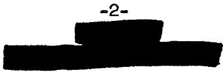

down of fast fission neutrons. Approximately 12 Mev per fission was taken as the total energy of the gamma rays generated in the fuel region. Of this 7.35 Mev was taken as representing fission fragment decay gammas with an average photon energy of 1.5 Mev while 4.60 Mev was taken as coming from prompt fission gammas with an average energy of $\sqrt{2} \cdot 5$ Mev. This choice of gamma ray energy per fission has the effect of lumping all the fission product decay gammas in the core. The distribution of decay gamma energy between the core and heat exchanger regions depends upon the relative fuel volumes of the regions, which varies with the detail design. As a first approximation all of the decay gamma energy was "lumped" in the core. For such an assumption the estimate of the power density distribution in the reflector will be somewhat higher and require more cooling close to the fuel region than would be the case had the fission product decay gamma energy been balanced between the core and heat exchanger regions. At the same time "lumping" the decay gammas in the fuel region will yield an underestimate of power density in the outer region of the reflector. It is easy to correct for these effects later as will be shown (Appendix F). Neutron capture results in the emission of a photon of approximately 9 Mev energy in the case of nickel and 6.8 Mev energy in the case of beryllium. The kinetic energy of the neutrons amounts to approximately 5 Mev per fission.

# CALCULATION OF HEAT GENERATION

The ratio of peak to average power density appears to be fairly close to unity in the three-region beryllium-reflected sodium-cooled reflectormoderated reactor design. (See Table 4.1 - ORNL-1515) $^{1}$ . Therefore a uniform power density and hence a uniform gamma source was assumed for the fuel region in the first calculations. A later check using a non-uniform power distribution from a multigroup calculation gave essentially the same results.

In order to evaluate the self-absorption of gammas in the fuel region, a typical fuel of sodium fluoride, potassium fluoride and $\mathbf{U}\mathbf{F}_4$ was chosen for evaluating the absorption coefficient. (This does not mean that the above fuel would necessarily be that specified finally for this reactor.) Gamma rays emitted in the fuel region cover a fairly wide spectrum of energies with the mean value somewhere between 1 and 2.5 MeV. Since heat generation was of principle concern, the mean energy was taken

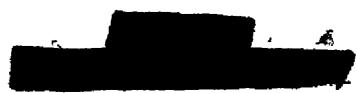

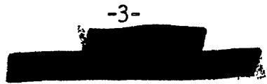

as 1 Mev in determining the absorption coefficient in the Inconel and beryllium. This served to maximize the heat generation rate and gives a limiting value. The absorption coefficient in the fuel region was also evaluated at 1 Mev.

Since the elements in the reflector and fuel are principally of low atomic number, Compton scattering is the principle mechanism for degradation of the gammas in the above energy range. The gamma rays were assumed to be attenuated exponentially in calculating the heat generation. A build-up factor was not employed since core diameter and reflector thickness were small enough (of the order of one mean free path for 1 MeV gammas) to make the need for a scattering correction questionable. It was assumed that scattering would be straight ahead in direction and that Compton collisions merely degrade the photon in energy. This method overestimates the gamma ray intensity for large distances.

An 18 in. diameter spherical fluoride fuel region surrounding a 9 in. diameter central beryllium island and enclosed by a 12 in. thick beryllium reflector were chosen as a typical geometry for calculation. The fuel region was separated from the island and outer reflector by a shell of 3/16 in. thick Inconel. The reactor power output was taken as 200 megawatts in determining the total energy release. The neutron flux for computing neutron capture gammas was taken from the spatial flux plot for reactor calculation number 129 (see Table 4.1 ORNL-1515). The specific heat generation rate was computed at points spaced about one inch apart along the radius from the center of the island to the outside of the reflector.

The heat generation rate in the reflector arising from attenuation of the gamma rays emitted from the fuel region was computed by several methods. In the first method (Appendix A) the attenuation was computed taking into account numerical differences in the value of the absorption coefficient of both fuel coolant, Inconel and beryllium. In Case A using this method, the absorption coefficients employed were 0.09, 0.16, and $0.30 \, \text{cm}^{-1}$ , respectively, for the fuel, beryllium and Inconel regions. In Case B values of 0.06 and $0.13 \, \text{cm}^{-1}$ were used for the fuel and beryllium regions, respectively, in order to evaluate the effect of the absorption coefficient on the heat generation rate. The equation for exponential attenuation using the above absorption coefficients was numerically integrated to arrive at an answer for the heat generation rate at the various space points. (Appendix A.) The results of this calculation were checked by a method of graphical integration using Pappus' theorem. (Appendix B.)

Another approach to the evaluation of the heat generation rate was made by means of analytical solutions for exponential attenuation in terms

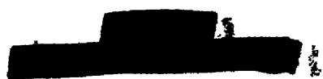

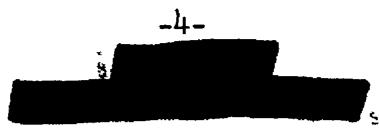

of exponential integrals. A solution which would not involve graphical or numerical integration could be obtained for two particular cases. By assuming a uniform absorption coefficient throughout both the fuel and the reflector regions, it is possible to solve the exponential integrals directly. (Appendix C.) In the second case, the absorption coefficients in the fuel region and reflector region were assumed to be different. An approximate solution can be obtained by solving the problem in two steps. The flux of gamma rays from the surface of the fuel region was obtained using the uniform absorption coefficient solution method. The attenuation through the Inconel was obtained by a slab source approximation. The resulting flux was then assumed to be spread over the surface of the Inconel and the absorption in the reflector was determined for a surface source. The results of this calculation are tabulated as Case C, using the same absorption coefficients as in Case A.

The power density resulting from neutron moderation within the beryllium of the island and reflector was obtained directly from multigroup results by using the flux distribution $\Phi (\mathbf{r},\mu)$ or $\left(\frac{\mathrm{Wn}^1}{\mathrm{n}}\right)\times \mathrm{C.F}$ . (Correction Factor)4. The energy loss for each lethargy group is the average energy loss per collision times the number of collisions in that group at a given radius or space point. The spatial distribution

$$
1 0 ^ {7} \sum_ {i = 1} ^ {t _ {n}} \frac {W _ {n} ^ {1}}{n} x C. F. x \frac {1}{\bar {\zeta} \sum_ {s}} \left(e ^ {- u _ {1} ^ {i}} - e ^ {- u _ {2} ^ {1}}\right) \tag {1}
$$

is normalized to the total power lost by moderation (2 $1/2\%$ of reactor power) by the use of the integration operator $\Omega$ (see ANP-58).

Gamma rays also result from parasitic capture of neutrons in structural materials and coolant. One particularly strong source of hard gamma rays is the Inconel shell separating the fuel annulus from the outer reflector. These gammas are captured over an appreciable volume rather than locally since the photon energy is high and the attenuation length large. A minor amount of heating also results from the generation of gamma rays by neutron capture in the beryllium. The extent of the captures in both beryllium and Inconel can be obtained directly from the multigroup calculations or by using the integrated spatial neutron flux distribution weighted by the absorption probability. The latter method was employed here. (Appendix D.)

# REFLECTOR HEATING

The power density in the various regions of the reactor owing to absorption of gamma rays from the core and reflector regions is tabulated

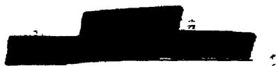

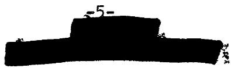

in Table I. The rate of heat generation is shown for Case A, Case B, and Case C for the capture of gamma rays emitted in the fuel region. The last column includes the heat generation rate caused by the capture of gamma rays generated by parasitic neutron capture in beryllium plus those from parasitic capture of neutrons in Inconel. Gamma rays will also result from neutron captures in the coolant. These were not computed owing to the uncertainty regarding the final coolant to be employed and the volume fraction of the reflector that might be occupied by this coolant. Their effect should be small, however. The power density resulting from the slowing down of neutrons and gamma heating for Case A are plotted in Fig. 1. The total integrated power in various regions from heating by gamma ray absorption for Case A and Case B is shown in Table II.

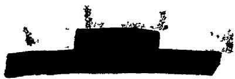

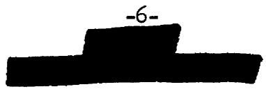

TABLE I   

<table><tr><td rowspan="2">Region</td><td colspan="4">Power Density IN VARIOUS REGIONS</td><td rowspan="2">Neutron Capture (n, r) Watts/cm3</td></tr><tr><td>Radial Position r Cm.</td><td colspan="3">Gamma Heat Generation Case A Case B Watts/cm3</td></tr><tr><td rowspan="5">Island Beryllium</td><td>0</td><td>47.5</td><td>61.9</td><td>30</td><td>2.3</td></tr><tr><td>5.08</td><td>60</td><td>65</td><td>36</td><td>2.5</td></tr><tr><td>7.62</td><td>80</td><td>74</td><td>64</td><td>3.4</td></tr><tr><td>10.16</td><td>101</td><td>93</td><td>152</td><td>3.4</td></tr><tr><td>10.95</td><td>120</td><td>142</td><td>176</td><td>3.3</td></tr><tr><td rowspan="2">Island Inconel</td><td>10.95</td><td>223</td><td>330</td><td>330</td><td>14.4</td></tr><tr><td>11.4</td><td>354</td><td>497</td><td>490</td><td>14.4</td></tr><tr><td rowspan="8">Fuel</td><td>11.4</td><td>106</td><td>99</td><td>146</td><td></td></tr><tr><td>12.7</td><td>167</td><td>137</td><td></td><td></td></tr><tr><td>14</td><td>186</td><td>148</td><td></td><td></td></tr><tr><td>15.2</td><td>182</td><td>152</td><td></td><td></td></tr><tr><td>17.1</td><td>184</td><td>151</td><td></td><td></td></tr><tr><td>20.3</td><td>157</td><td>132</td><td></td><td></td></tr><tr><td>21.6</td><td>141</td><td>116</td><td></td><td></td></tr><tr><td>22.9</td><td>73</td><td>65</td><td>100</td><td></td></tr><tr><td rowspan="2">Reflector Inconel</td><td>22.9</td><td>215</td><td>325</td><td>333</td><td>69.2</td></tr><tr><td>23.3</td><td>150</td><td>227</td><td>199</td><td>69.2</td></tr><tr><td rowspan="10">Reflector Beryllium</td><td>23.3</td><td>80</td><td>98</td><td>106</td><td>13.5</td></tr><tr><td>24.1</td><td>53.7</td><td>57</td><td></td><td></td></tr><tr><td>25.4</td><td>37.7</td><td>44.6</td><td>44.8</td><td>7.4</td></tr><tr><td>26.7</td><td>25.4</td><td>31.9</td><td></td><td></td></tr><tr><td>27.9</td><td>19.0</td><td>24.4</td><td>17.4</td><td>5.0</td></tr><tr><td>30.5</td><td>10.3</td><td>14.0</td><td></td><td></td></tr><tr><td>33.0</td><td>5.4</td><td>8.3</td><td>3.9</td><td>3.3</td></tr><tr><td>35.6</td><td>2.9</td><td>4.9</td><td></td><td></td></tr><tr><td>38.1</td><td>1.67</td><td>3.0</td><td>1.1</td><td>2.6</td></tr><tr><td>53.3</td><td>0.066</td><td>0.19</td><td></td><td></td></tr></table>

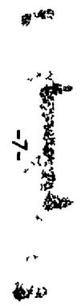

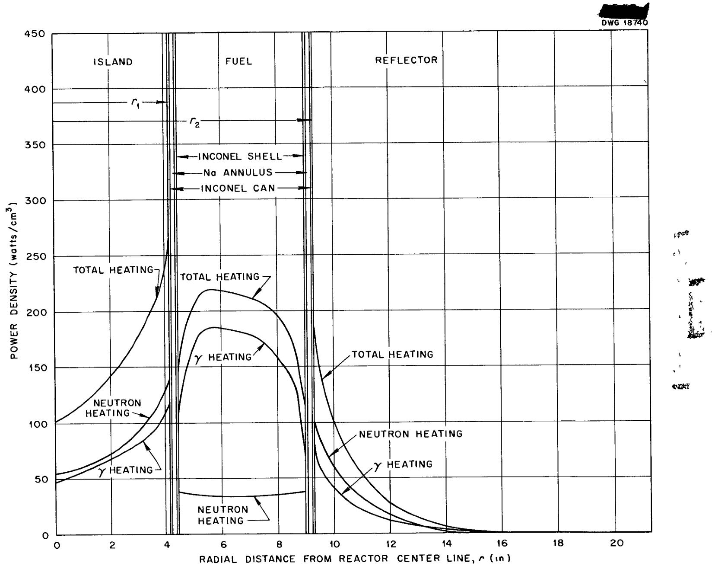  
Fig. 1. Radial Power Density from Neutron and Gamma Heating.

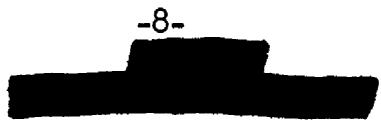

TABLE II   
TOTAL INTEGRATED POWER IN VARIOUS REGIONS   

<table><tr><td rowspan="2">Region</td><td colspan="2">Total Power Megawatts</td></tr><tr><td>Case A</td><td>Case B</td></tr><tr><td>Island Beryllium</td><td>0.46</td><td>0.51</td></tr><tr><td>Island Inconel</td><td>0.24</td><td>0.29</td></tr><tr><td>Fuel</td><td>6.71</td><td>5.58</td></tr><tr><td>Reflector Inconel</td><td>0.57</td><td>0.85</td></tr><tr><td>Reflector Beryllium</td><td>3.14</td><td>3.44</td></tr></table>

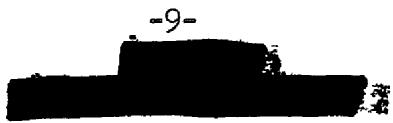

The peak heat generation rate occurs in the Inconel shell separating the island beryllium from the fuel annulus. High heat generation rates also occur in both the reflector and the island immediately adjacent to the fuel annulus. In cooling the Inconel core shells it is necessary to take into account not only the heat generation rate given in Table I, but also the heat flowing through the Inconel from the fuel annulus when the moderator region is designed to be operated at a lower temperature than the fuel region. This can be computed readily by conventional methods.

# COOLING SYSTEM

The heat generated in the Inconel and beryllium can be removed by any one of several coolant passage arrangements. A liquid metal is the most desirable coolant if the resulting heat is to be employed usefully in the engine air radiator circuit, since this gives the least sensitive and highest heat transfer coefficient. Lead, bismuth or $\mathsf{L}\mathsf{l}^7$ might be used in place of sodium because their effect on neutron moderation might offer a certain nuclear advantage. The coolant chosen should not have too high a neutron absorption cross-section $(\sigma_{\mathrm{a}} < 0.5\mathrm{b})$ and, what is just as important, must be compatible with the materials of construction. Lead, bismuth, non-uranium bearing fluorides, NaOH, sodium, and NaK were all given serious consideration as coolants for the beryllium moderator. Metallurgists consulted on the problem felt that lead or bismuth would be likely to pose serious mass transfer difficulties. The relatively high neutron absorption cross section of the potassium in the NaK made it quite undesirable from the critical mass standpoint. Rubidium might be used in place of potassium but because of little demand it is currently very expensive. Thus sodium seemed to be the best choice for the moderator coolant. Since corrosion and mass transfer might occur in a beryllium and sodium system, it seemed desirable that the beryllium be clad in some fashion. Work at Battelle5 indicates that beryllium can be chrome plated electrolytically to give satisfactory resistance to sodium attack at $932^{\circ}\mathsf{F}$ . Chemical plating is also possible with beryllium. However, the formation of brittle intermetallic compounds and the difficulty of eliminating pinholes with either chemical or electrical plating methods makes the stability of any plating rather questionable under thermal cycling and high temperature conditions. An alternate possibility is to can the beryllium in thin-walled Inconel cans and to fill the small interstices between the beryllium and the can with stagnant sodium to provide a thermal bond. This arrangement appears to be the more promising of the two, but both possibilities are being investigated. The reflector could be constructed of two large hemispheres of beryllium if the canning technique were used. Cooling passages could be rifle-drilled through the beryllium and lined with thin-walled tubes, which could be welded into headers at the ends. The Brush Beryllium Company has indicated that

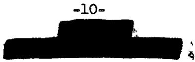

the fabrication of these large hemispherical shells would probably be no more difficult than the fabrication of large flat slabs. Personnel of the Y-12 beryllium shop state that it would not be difficult to rifle drill holes 3/16 to $1/4$ in. in diameter as much as $40$ in. deep, with the hole diameter held to within 0.001 in. and the hole center location held to within 0.010 in. These holes could be drilled at a rate of 2 in./min. This estimate was based on the experience gained in machining the beryllium of the MTR reactor and in drilling small diameter holes in the beryllium reflector of the SIR. In addition to the holes in the beryllium reflector, channels could be provided between the Inconel core shells and the canned beryllium reflector in order to remove the heat generated in this region.

An alternate construction for the reflector region involves the use of a large number of wedge-shaped segments shaped much like the sections of an orange. These sections could be made with shallow grooves in their surfaces to form passages for cooling streams of sodium. This would be a relatively expensive arrangement since a great deal of machine work would be required because the beryllium can be hot-pressed to uniformly high densities only in flat slabs or spherical shells.

A design study was made using the rifle-drilled hole arrangement to investigate the detail problems of cooling the beryllium regions. The beryllium was assumed to be canned in Inconel and cooled by sodium flowing through Inconel tubes in rifle-drilled holes. Stagnant sodium would be allowed to fill the interstices between the beryllium and the can to facilitate heat flow across that boundary. In order to achieve a well-balanced design, a number of factors must be considered. The volume of both the sodium and, especially, the Inconel must be minimized to keep parasitic neutron absorptions within reasonable limits. It is also necessary to operate the reflector regions at a relatively high temperature to keep from penalizing the engine-radiator system. Large thermal stresses are likely to result from the high rates of heat generation to be found in these regions. Because beryllium becomes quite ductile at temperatures above $400^{\circ}\mathrm{F}$ cracking ought not be a problem. It was felt that thermal stresses should be kept within reasonable limits to reduce distortion, however, as this might become a problem after a number of thermal and/or power cycles of the system. For this reason, the temperature variation in the beryllium between adjacent coolant passages was held to $50^{\circ}\mathrm{F}$ in this first design. The pressure drop through the various coolant passages was limited to 40 psi to keep pressure-induced stresses low. The maximum beryllium-sodium interface temperature was held below $1200^{\circ}\mathrm{F}$ to minimize the possibility of mass transfer in the beryllium-stagnant sodium-Inconel system.

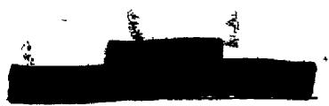

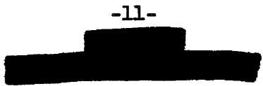

Several detail designs were investigated that favored first one and then another of the various requirements, that is, minimum poison, minimum variation in beryllium temperature, minimum beryllium-sodium interface temperature variation, minimum sodium system pressure drop, etc. Fig. 2 shows the hole pattern in the beryllium for a promising arrangement. The temperature distribution for this hole pattern is shown in Fig. 3.

# ALTERNATE COOLING SYSTEMS

A careful examination of alternate cooling systems was made in an effort to avoid the problems involved in cooling a solid beryllium island. The sodium-cooled, solid beryllium outer reflector was assumed in every case.

The use of a semi-fluid beryllium powder mixture with a liquid metal in the interstices was considered. A minimum porosity or liquid metal volume fraction of $12\%$ may be attainable.[6] This would necessitate the use of a liquid metal with a low neutron capture cross-section and good "moderating" properties such as lead or bismuth. These are difficult to contain, however, owing to corrosion and mass transfer. If a satisfactory container material could be found, a semi-fluid moderator with a reasonably small neutron age, $\mathcal{T}$ , would be attractive on the basis of ease of removal for beryllium recovery and also as a safety measure.

Replacing the fuel annulus and island by a graphite block containing perhaps 40 unlined fuel passages about 1.5 in. in diameter has been proposed as another possibility. The success of this system would depend largely on whether the fuel could be kept from diffusing or penetrating into the graphite as a result of permeation and/or cracking. If this were to occur, severe overheating would result and self-destruction of the graphite would take place. The destruction would be abetted by the large decrease in thermal conductivity that accompanies a temperature increase in graphite. Actual testing of graphite in fused-fluoride, uranium-bearing salts under conditions of thermal and mechanical shock will have to be made to evaluate this problem. In addition, multigroup calculations will be necessary to determine the critical mass and power distribution. This latter item is expected to be poor. Should Inconel tubes be required to protect the graphite, a secondary cooling system would be required for cooling the Inconel tube wall to $1500^{\circ}\mathrm{F}$ owing to the volumetric heat source effect. If this were required the major advantage expected of graphite would be lost.

A non-viscous fluid moderator for the island with desirable heat transfer properties would simplify the heat removal and the fabrication problems

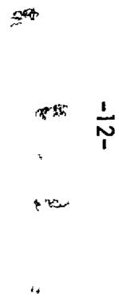

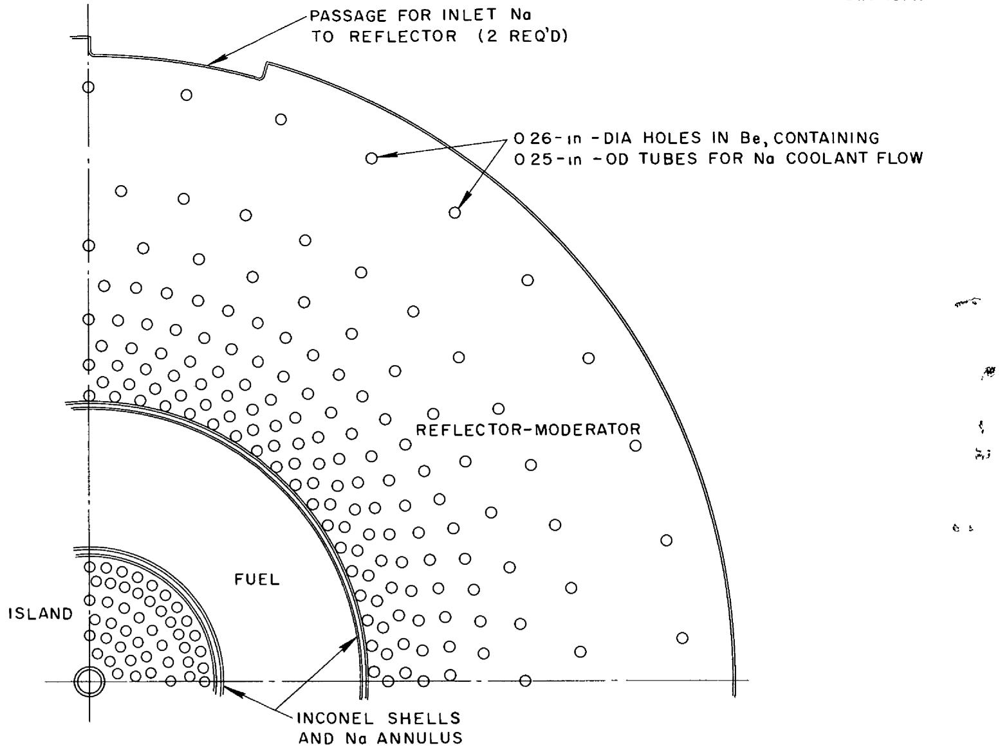  
Fig. 2. Cooling Hole Distribution in Reflector-Moderator.

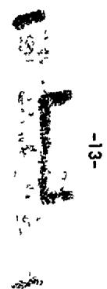

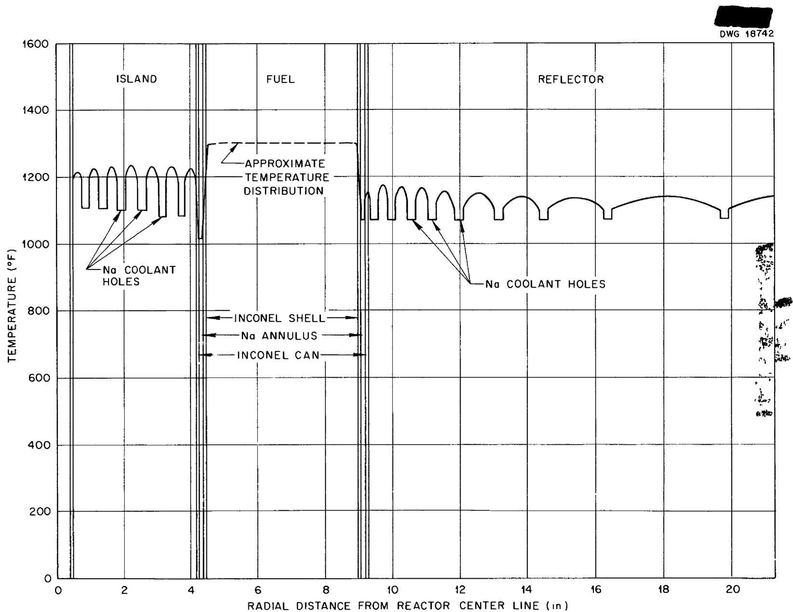  
Fig 3 Temperature Distribution Across Midplane of 200-Megawatt Reflector-Moderated Reactor Sodium inlet, $1000^{\circ}\mathrm{F}$ , sodium outlet, $1150^{\circ}\mathrm{F}$ .

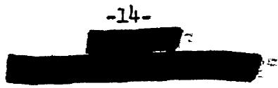

in this region. A non-fuel bearing fluoride or sodium deuteroxide has been suggested for this purpose. However, the heat transfer properties of these fluids are generally poor so that cooling the Inconel shell sufficiently that there would be no serious hot spots becomes a severe problem. For example, if in the case in the preceding section sodium deuteroxide were to flow through the 9 in. diameter island with a mass velocity giving a $100^{\circ}\mathrm{F}$ axial coolant temperature rise, a heat transfer coefficient of only 312 Btu/hr ft² of would be obtained. In the design cited having a 3/16 in. Inconel shell, there would be a heat flux of 1,000,000 Btu/hr ft² from the shell, and thus a radial temperature drop through the hydroxide boundary layer of $3200^{\circ}\mathrm{F}$ . A major improvement in the sodium deuteroxide heat transfer coefficient could be obtained only by increasing its velocity. To increase the velocity enough to give satisfactory cooling would entail an excessive pressure drop, and even then minor vagaries in velocity distribution would make occasional hot spots rather likely. The same problem presents itself if a design involving an island filled with a fluoride is considered. Only the liquid metals appear to have the necessary thermal properties for this purpose. Lead, bismuth, or Li⁷ appear to be the only possibilities. In order to use these latter fluids successfully the mass transfer and corrosion difficulties currently common to them must first be solved. Nickel and its alloys which are usually the best container materials for fused fluoride salt fuels exhibit generally poor corrosion resistance to these liquids.

# CONCLUSIONS

The heat generation rate or power density was computed for a reactor using a fuel annulus with a beryllium reflector and island. The heat generated in the reflector can be removed by sodium-cooling a canned beryllium reflector-moderator. Further, the Inconel shell containing the fuel annulus can be satisfactorily cooled by the same sodium system. Differential thermal expansion does not appear to be a problem since the volumetric coefficient of expansion of both the Inconel and the beryllium are approximately the same -- (5.5 x 10 $^{-6}$ inches/inch $\mathrm{^o C}$ ). Furthermore, samples of extruded beryllium have shown negligible dimensional change and warping after thermal cycling up to $930^{\circ}\mathrm{F}$ . At the time of writing the sodium cooled, beryllium island and reflector arrangement is felt to be the best proposal. No new technological problems appear to be involved in the detailed mechanical design of this system.

A number of alternate cooling systems are available which may have some advantages over the solid beryllium system above. However, all of these involve problems that will have to be solved by experimental investigation.

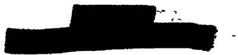

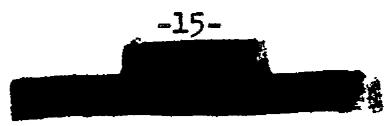

# APPENDIX A

# Gamma-Ray Absorption Inside and Outside A Spherical Annular Source

The heat generation rate due to absorption in a region within and outside a spherical annular source can be obtained by means of numerical or graphical integration of the integrals defining the distribution of gamma rays. Several approximations were used to set up the integrals. The first approximation used involved the straight ahead theory of gamma absorption. Here it can be assumed that Compton collisions merely degrade the gamma energy, but do not scatter the photons. Only exponential attenuation with a coefficient characteristic of the material through which the photons pass need be considered. When a photon passes from one medium to another, no refraction is considered.

A uniform fission rate in the source region was assumed. Thus a uniform power density for the core was determined by dividing the total reactor power output by the volume of the fuel region of the fuel annulus.

The attenuated intensity at $Q$ , distance $r$ from a point source of density $P_0$ , is given by the formula

$$
\mathrm {d P} = \frac {\mu \mathrm {P} _ {0} e ^ {- \mu r}}{4 \pi r ^ {2}} \mathrm {d V} \tag {A-1}
$$

where $p_{0}$ represents the source intensity, $e^{-\mu r}$ the absorption effect, $1/4\pi r^2$ the spreading effect from the point source, and $\mu$ the probability of absorption at the point Q. Then the total intensity at Q due to a source extended over a region R is given by

$$
P = \mu P _ {0} \int_ {R} \frac {e ^ {- \mu r}}{4 \pi r ^ {2}} d V \tag {A-2}
$$

For the reactor in question, the source was taken as an annulus between an inside sphere of reflector material and an outside spherical shell of the same material. Because of the spherical symmetry, the distribution of heating power along any diameter of the spherical system was considered a sufficient answer to the problem.

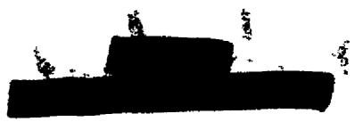

Consider a point $F$ in the fuel space of the reactor as illustrated.

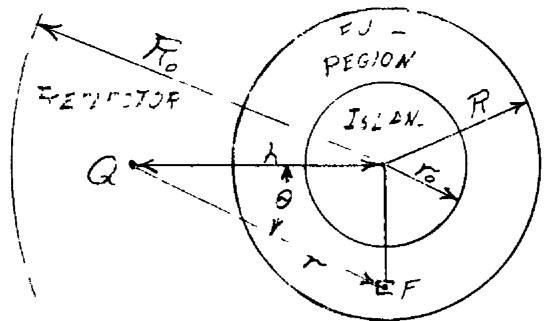

If the power density at this point is $p_0$ in an element of volume $dV$ , then the power at a point $Q$ a distance $h$ from the center of the reactor may be obtained by integration, using spherical coordinates centered at $Q$ . Because of the symmetry about the axis along which $h$ is measured, the element of volume $dV = 2\pi r^2 \sin \theta d\theta dr$ includes the volume around all points $F$ with the given spherical coordinates $r$ and $\theta$ . Since $r$ may pass through both reflector and fuel spaces, it is broken into $r = r_1 + r_2$ , where the subscript $l$ refers to the fuel and $2$ refers to the reflector. Separate reciprocal attenuation lengths, $\mu_1$ and $\mu_2$ must be determined for these materials. For convenience the fuel space may be divided into three regions (I, II, and III) bounded by cones tangent to the inner and outer spheres. In section the figure is as follows

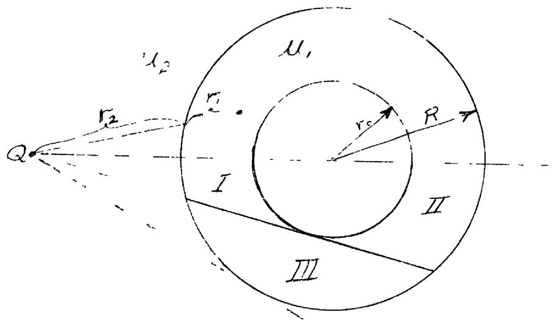

The total power generation $\mathbb{P}$ due to absorption at $\mathbb{Q}$ is given by summing the contribution from the three source regions I, II, and III.

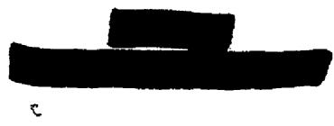

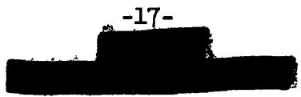

$$
\begin{array}{l} P = \left[ p _ {0} \mu_ {2} \int_ {0} ^ {\mu n ^ {- 1} (v _ {0} / h)} \int_ {h \cos \theta - b _ {1}} ^ {h \cos 2 \theta - a _ {1}} \frac {e ^ {- \mu_ {2} r _ {2} - \mu_ {1} r _ {1}}}{4 \pi r ^ {2}} 2 \pi r ^ {2} \sin \theta d r d \theta \right] I \\ + \left[ \mu_ {0} \mu_ {2} \int_ {0} ^ {\mu_ {m} - 1 (\nu_ {0} / h)} \int_ {h \cos \theta + a _ {1}} ^ {h \cos \theta + b _ {1}} \frac {e ^ {- \mu_ {2} (\nu_ {2} + 2 a _ {1}) - \mu_ {1} (\nu_ {1} - 2 a _ {1})}}{4 \pi r ^ {2}} 2 \pi r ^ {2} \sin \theta d r d \theta \right] _ {\Pi} \\ + \left[ 1 0 / 2 \int_ {\sin^ {- 1} (n _ {0} / k)} ^ {\sin^ {- 1} (R / k)} \int_ {h \cos \theta - b _ {1}} ^ {h \cos \theta + b _ {1}} \frac {e ^ {- \mu_ {2} r _ {2} - \mu_ {1} r _ {1}}}{4 \pi r ^ {2}} 2 \pi r ^ {2} \sin \theta d r d \theta \right] _ {\mathrm {I I I}}, A - 3 \\ \end{array}
$$

where, for simplicity,

$$
\begin{array}{l} a _ {1} = \sqrt {r _ {0} ^ {2} - h ^ {2} \sin^ {2} \theta} \\ b _ {1} = \sqrt {R ^ {2} - h ^ {2} \sin^ {2} \theta} \\ \end{array}
$$

It is possible to represent $r_2$ as a function of $\theta$ by the equation:

$$
r _ {2} = h \cos \theta - \sqrt {R ^ {2} - h ^ {2} \sin^ {2} \theta} \tag {A-4}
$$

and

$$
\cos \theta = \frac {1}{2 h} \left(\frac {h ^ {2} - R ^ {2}}{r _ {2}} + r _ {2}\right), \tag {A-5}
$$

and then

$$
r _ {1} = r - r _ {2}. \tag {A-6}
$$

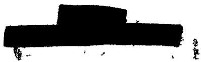

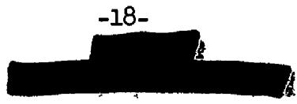

The total power generation $P$ at $Q$ , on eliminating $r_1$ is then given by the expression

$$
\begin{array}{l} P = \frac {4 0 \mu_ {2}}{2} \int_ {0} ^ {\mu_ {1} ^ {- 1} (n _ {0} / h)} \int_ {h \cos \theta - b _ {1}} ^ {h \cos 2 \theta - a _ {1}} e ^ {- (\mu_ {2} - \mu_ {1}) n _ {2} - \mu_ {1} n} \sin \theta d n d \theta \\ + \frac {p _ {0} \mu_ {2}}{2} \int_ {0} ^ {\mu_ {m} - 1 (n _ {0} / b)} \int_ {b \cos \theta + a _ {1}} ^ {b \cos \theta + b _ {1}} e ^ {- (\mu_ {2} - \mu_ {1}) (n _ {2} + 2 a _ {1}) - \mu_ {1} n} \sin \theta d u d \theta \\ + \frac {p _ {0} \mu_ {2}}{2} \int_ {\sin^ {- 1} (n _ {0} / h)} ^ {\sin^ {- 1} (R / h)} \int_ {h \cos \theta - b _ {1}} ^ {h \cos 2 \theta + b _ {1}} e ^ {- (\mu_ {2} - \mu_ {1}) n _ {2} - \mu_ {1} n} \sin \theta d r d \theta . A - 7 \\ \end{array}
$$

Integrating this equation with respect to $r$ yields:

$$
\begin{array}{l} P = \frac {p _ {0} \mu_ {2}}{2 \mu_ {1}} \left\{\int_ {0} ^ {\mu_ {1} - 1 \left(\nu_ {0} / k\right)} e ^ {- \mu_ {2} \nu_ {2}} \left[ 1 - e ^ {- \mu_ {1} \left(b _ {1} - a _ {1}\right)} \right] \sin \theta d \theta \right. \\ + \int_ {\sin^ {- 1} (v _ {0} / k)} ^ {\sin^ {- 1} (R / k)} e ^ {- \mu_ {2} v _ {2}} \left(1 - e ^ {- 2 \mu_ {1} b _ {1}}\right) \sin \theta d \theta \Bigg \} A - 8 \\ \end{array}
$$

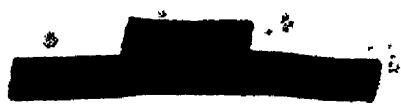

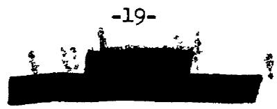

Let $s = h$ cos $\theta$ . Then

$$
\begin{array}{l} P = \frac {p _ {0} \mu_ {2}}{2 \mu_ {1} h} \left\{\int_ {\sqrt {h ^ {2} - n _ {0} ^ {2}}} ^ {h} e ^ {- \mu_ {2} (z - c _ {1})} \left[ 1 - e ^ {- \mu_ {1} (c _ {1} - d _ {1})} \right] d z \right. \\ + \int_ {\sqrt {h ^ {2} - R ^ {2}}} ^ {\sqrt {h ^ {2} - r _ {0} ^ {2}}} e ^ {- \mu_ {2} (a - c _ {1})} \left[ 1 - e ^ {- 2 \mu_ {1} c _ {1}} \right] d s \Bigg \}, \quad A - 9 \\ \end{array}
$$

where

$$
\begin{array}{l} c _ {1} = \sqrt {R ^ {2} - h ^ {2} + s ^ {2}} \\ d _ {1} = \sqrt {r _ {0} ^ {2} - h ^ {2} + c ^ {2}}. \\ \end{array}
$$

This integral can be evaluated by numerical or graphical means for the heat generation at any point $Q$ . In several special cases the above equation can be integrated.

For $h = 0$ , the complete spherical symmetry of the system gives the power at the center as:

$$
\begin{array}{l} P = p _ {0} \mu_ {2} \int_ {r _ {0}} ^ {R} e ^ {- \mu_ {2} r _ {0}} e ^ {- \mu_ {1} (r - r _ {0})} \frac {4 \pi r ^ {2}}{4 \pi r ^ {2}} d r \\ = \frac {\mathrm {p} _ {0} \mu_ {2}}{\mu_ {1}} \mathrm {e} ^ {- \mu_ {2} \mathrm {r} _ {0}} \left[ 1 - \mathrm {e} ^ {- \mu_ {1} (\mathrm {R} - \mathrm {r} _ {0})} \right] \quad . \tag {A-10} \\ \end{array}
$$

Another point of special interest is the point at the interface of fuel and island reflector. Here $h = r_0$ and the fuel region can be broken

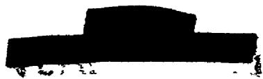

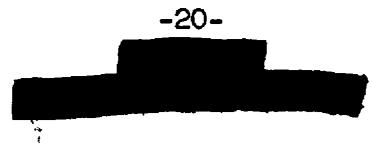

up into two regions as follows:

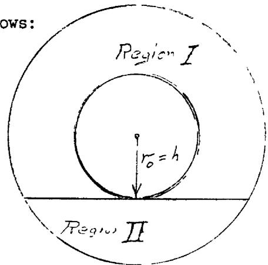

$$
P = \left[ \frac {\mu_ {0} \mu_ {2}}{2} \int_ {0} ^ {\pi / 2} \int_ {2 n _ {0} \cos \theta} ^ {n _ {0} \cos \theta + b _ {2}} e ^ {- \mu_ {2} ^ {2} r _ {0} \cos \theta - \mu_ {1} (n - 2 n _ {0} \cos \theta)} \sin \theta d w d \theta \right] _ {I}
$$

$$
\begin{array}{l} + \left[ \frac {p _ {0} \mu_ {2}}{2} \int_ {\pi / 2} ^ {\pi} \int_ {0} ^ {r _ {0} \cos \theta + b _ {2}} e ^ {- \mu_ {1} r} \sin \theta d \theta d r \right] _ {\Pi} A - 1 1 \\ = \frac {p _ {0} \mu_ {2}}{2 \mu_ {1}} \int_ {0} ^ {\pi / 2} e ^ {- 2 \mu_ {2} n _ {0} \cos \theta} \left[ 1 - e ^ {- \mu_ {1} (b _ {2} - n _ {0} \cos \theta)} \right] \sin \theta d \theta \\ + \frac {p _ {0} \mu_ {2}}{2 \mu_ {1}} \int_ {\pi / 2} ^ {\pi} \left[ 1 - e ^ {- \mu_ {1} (b _ {2} + r _ {0} \cos \theta)} \right] \sin \theta d \theta A - 1 2 \\ \end{array}
$$

where

$$
b _ {2} = \sqrt {R ^ {2} - r _ {0} ^ {2} \sin^ {2} \theta}
$$

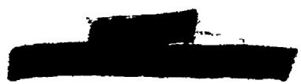

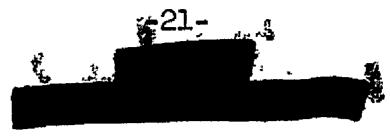

Let $s = r_0 \cos \theta$ . Then $ds = r_0 \sin \theta d\theta$ and

$$
\begin{array}{l} P = \frac {p _ {0} \mu_ {2}}{2 \mu_ {1} \mu_ {0}} \left\{\int_ {0} ^ {\mu_ {0}} e ^ {- 2 \mu_ {2} t} \left[ 1 - e ^ {- \mu_ {1} (t _ {2} - t)} \right] d t \right. \\ + \int_ {0} ^ {\pi_ {0}} \left[ 1 - e ^ {- \mu_ {1} (c _ {2} - c)} \right] d s \Bigg \} \\ = \frac {r _ {0} r _ {2}}{2 \mu_ {1} r _ {0}} \left\{\frac {1 - e ^ {- 2 \mu_ {2} r _ {0}}}{2 \mu_ {2}} + r _ {0} \right. \\ - \int_ {0} ^ {r _ {0}} e ^ {- \mu_ {1} (c _ {2} - c)} \left(e ^ {- 2 \mu_ {2} t} + 1\right) d t, \quad A = 1 3 \\ \end{array}
$$

where

$$
c _ {2} = \sqrt {R ^ {2} - r _ {0} ^ {2} + s ^ {2}}.
$$

The last integral can easily be determined by graphical or numerical integration.

For a point at the surface of the outer reflector adjacent to the fuel space, the fuel space can be broken into three regions as before.

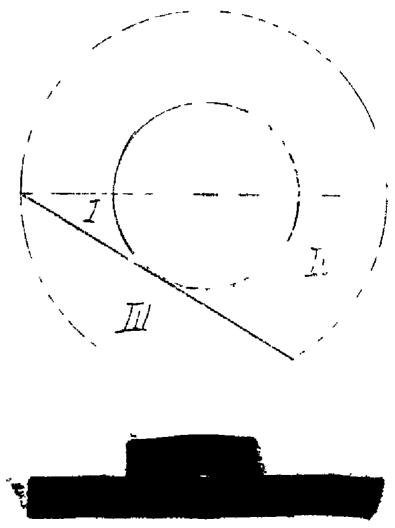

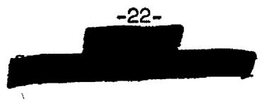

The heat generation or power density $P$ is given by the sum of the contributions from each of the three regions.

$$
\begin{array}{l} p = \left[ \frac {p _ {0} / \mu_ {2}}{2} \int_ {0} ^ {\min ^ {- 1} (v _ {0} / R)} \int_ {0} ^ {R \cos \theta - a _ {2}} e ^ {- f _ {2} v} \sin \theta d v d \theta \right] _ {I} \\ + \left[ \frac {\mu_ {0} \mu_ {2}}{2} \int_ {0} ^ {\infty^ {- 1} \left(\mu_ {0} / R\right)} \int_ {R \cos \theta + a _ {2}} ^ {2 R \cos \theta} e ^ {- \mu_ {1} (n - 2 a _ {2}) - \mu_ {2} ^ {2} a _ {2}} \sin \theta d n d \theta \right] _ {\Pi} \\ + \left[ \frac {\mu_ {0} \mu_ {2}}{2} \int_ {\sin^ {- 1} \left(\nu_ {0} / R\right)} ^ {\pi / 2} \int_ {0} ^ {2 R \cos \theta} e ^ {- \mu_ {2} r} \sin \theta d r d \theta \right] _ {\Pi} \\ \end{array}
$$

where

$$
a _ {2} = \sqrt {n _ {0} ^ {2} - R ^ {2} \sin^ {2} \theta}.
$$

Or on integrating with respect to $r$ ,

$$
P = \frac {p _ {0} \mu_ {2}}{2 \mu_ {1}} \left\{\int_ {0} ^ {\sin^ {- 1} (r _ {0} / R)} \left[ 1 - e ^ {- \mu_ {1} (R + a \theta - a _ {2})} \right] \sin \theta d \theta \right.
$$

$$
\begin{array}{l} + \int_ {0} ^ {\mu_ {m} - 1 (\nu_ {0} / R)} e ^ {- 2 \mu_ {2} a _ {2}} \left[ e ^ {- \mu_ {1} (R \cos \theta - a _ {2})} - e ^ {- \mu_ {1} (2 R \cos \theta - 2 a _ {2})} \right] \sin \theta d \theta \\ + \int_ {\sin^ {- 1} (n _ {0} / R)} ^ {\pi / 2} \left[ 1 - e ^ {- n _ {1} ^ {2} R \cos \theta} \right] \sin \theta d \theta \Bigg \} \\ \end{array}
$$

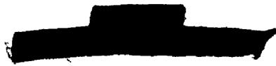

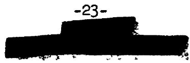

Let $s = R \cos \theta$ . The above integrals then become:

$$
\begin{array}{l} p = \frac {\mu_ {1} \mu_ {2}}{2 \mu_ {1} R} \left\{R - \frac {1 - e ^ {- 2 \mu_ {1} \sqrt {R ^ {2} - \mu_ {0} ^ {2}}}}{2 \mu_ {1}} \right. \\ + \int_ {\sqrt {R ^ {2} - \mu_ {0} ^ {2}}} ^ {R} e ^ {- \mu_ {1} (a - d _ {2})} \left[ e ^ {- 3 \mu_ {2} d _ {2}} - 1 - e ^ {- \mu_ {1} (a - d _ {2})} \right] d a \}, A = 1 6 \\ \end{array}
$$

where

$$
d _ {2} = \sqrt {r _ {0} ^ {2} - R ^ {2} + a ^ {2}}
$$

The last term above can be integrated numerically or graphically.

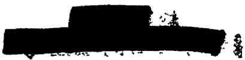

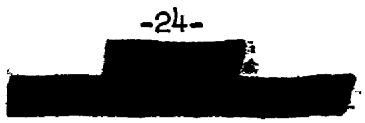

# APPENDIX B

# Mechanical-Graphical mma-Ray Heating Computation

A method of graphical integration was used to check the approximate values of power density obtained by numerical integration using the method of Appendix A. In this method lines were scribed on an aluminum sheet to simulate the fuel space boundaries. From a point P in the diagram below curves were drawn showing lines of constant values of $e^{-\mu r}$ . These curves, when rotated about the X-axis, form surfaces of revolution enclosing regions of a given total power.

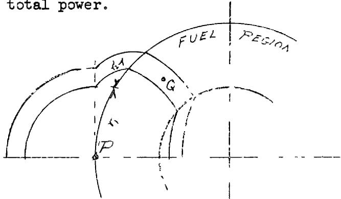

By choosing radii so that each of these shells encloses the same fraction, say $10\%$ , of the total power, it is possible to keep errors uniform throughout the computations. When more than one material is involved, the radius has to be divided into $r_1$ and $r_2$ so that $e^{-(\mu_1 r_1 + \mu_2 r_2)}$ has the required value.

After the curves are drawn, the areas of the irregularly shaped regions bounded by these curves may be obtained with a planimeter. Then the volumes of the corresponding solids of revolution may be computed from Pappus' theorem in the form

$$
V = A (2 \pi \bar {y}) \quad B - 1
$$

where $\overline{y}$ is the distance from the axis of rotation to the centroid of the area. This centroid may be located by cutting the aluminum sheet along the bounding curves, and balancing the irregular pieces on a knife edge.

A point $Q$ is then chosen in the volume and the average power is considered as generated at this point. Then the value of the integrand $(e^{-\mu r / 4\pi r^2})$ is evaluated at this point. The product of this value and the volume of the region gives the power density contributed by this

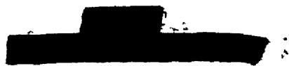

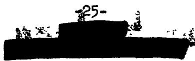

region to the point P. Repeated computations for all the areas in the fuel region give the total power density as observed at P.

The arbitrary choice of a point for evaluating the integrand does not seriously affect the result as long as points are chosen near the geometric center of the area. Accuracy is limited to two significant figures by the precision of cutting the sheet, and of locating the centroids. This method, however, can be applied to very irregular geometries in which axial symmetry allows the use of Pappus' theorem.

# APPENDIX C

Solutions in Terms of Exponential Integral Functions for Radiation Heating due to a Spherical Annular Source

The power density at any point within or outside of a fuel bearing source region can be evaluated by approximation without recourse to numerical or graphical integration. As in Appendix A the straight ahead collision theory of Compton Scattering was assumed. The gamma rays may be attenuated exponentially without considering a "buildup factor." The source was assumed to be an isotropic emitter.

The power density at a point within a spherical annular source is given by the following expression for the case of the same absorption coefficient in both source and absorber region:

$$
P _ {a} = p _ {0} \mu_ {a} \int_ {R = R _ {1}} ^ {R = R _ {0}} \int_ {\theta = 0} ^ {\theta = \pi} 2 \pi R ^ {2} \sin \theta \frac {e ^ {- \mu \rho}}{4 \pi \rho^ {2}} d \theta d R \tag {C-1}
$$

where $\mathbf{R}_1$ inner radius of the source annulus $\mathbf{R}_0$ outer radius of the source annulus  
r - the distance from the center of the spherical coordinates to the absorber $\mathbf{p}_0$ source power density $\mu_{a}$ absorption coefficient of the absorber $\rho$ distance from particular source point in any given gamma source shell to the absorber

The resulting expression can be reduced to a double integral in terms of $\pmb{\mathcal{P}}$ and R by eliminating the angle $\theta$ through the cosine law.

$$
\mathcal {P} ^ {2} = R ^ {2} + r ^ {2} - 2 r R \cos \theta \tag {C-2}
$$

This gives the following equation:

$$
P _ {a} = \frac {p _ {0} M a}{2 r} \int_ {R = R _ {1}} ^ {R = R _ {0}} \int_ {\rho = R - r} ^ {\rho = R + r} R \frac {e ^ {- M \rho}}{\rho} d \rho d R \tag {C-3}
$$

By integration by parts and using the exponential integrals tabulated in the WPA Tables of Sine, Cosine and Exponential integrals it is possible to evaluate the above integral completely.

$$
\begin{array}{l} P _ {a} = \frac {P _ {0} M _ {a}}{2 r} \left\{\frac {R _ {o} ^ {2} - r ^ {2}}{2} \left[ E _ {l} \mid \mu (R _ {o} - r) \right| - E _ {l} \mid \mu (R _ {o} + r) \right] \\ - \frac {\mathrm {R} _ {1} ^ {2} - r ^ {2}}{2} \left[ \mathrm {E} _ {1} \left| \mu (\mathrm {R} _ {1} - r) \right| - \mathrm {E} _ {1} \left| \mu (\mathrm {R} _ {1} + r) \right| \right] \\ \end{array}
$$

$$
\begin{array}{l} - (\mu R _ {0} + 1 + \mu r) \frac {e ^ {- \mu (R _ {0} - r)}}{2 \mu^ {2}} + (\mu R _ {i} + 1 + \mu r) \frac {e ^ {- \mu (R _ {i} - r)}}{2 \mu^ {2}} \\ + (\mu R _ {0} + l - \mu r) \frac {e ^ {- \mu (R _ {0} + r)}}{2 2} - (\mu R _ {i} + l - \mu r) \frac {e ^ {- \mu (R _ {i} + r)}}{2 \mu 2} \Bigg \} \quad C - 4 \\ \end{array}
$$

Where E/x/ above equals -Ei(-x) in the WPA tables.

When the absorber is located at a radial space point $\mathbf{r}$ ( $r \geq R_0$ ) outside the source annulus, the absorption or power density for the same absorption coefficient in both sources and absorber regions is given by the following double integral.

$$
P _ {a} = \frac {P _ {0} M _ {a}}{2 r} \int_ {R = R _ {i}} ^ {R = R _ {o}} \int_ {\rho = r - R} ^ {\rho = r + R} R \frac {e ^ {- M \rho}}{\rho} d \rho d R
$$

Integrating by parts and using exponential integrals again this becomes

$$
\begin{array}{l} P _ {a} = \frac {P _ {0} \mu_ {a}}{2 r} \left\{\frac {R _ {0} ^ {2} - r ^ {2}}{2} \left[ E _ {1} \left| \mu \left(r - R _ {0}\right) \right| - E _ {1} \right| \mu \left(r + R _ {0}\right) \right] \\ - \frac {R _ {1} ^ {2} - r ^ {2}}{2} \left[ E _ {1} \left| \mu (r - R _ {i}) \right| - E _ {1} \left| \mu (r + R _ {i}) \right| \right] \\ + \left(\mu R _ {0} - 1 + \mu r\right) \frac {e ^ {- \mu (r - R _ {0})}}{2 \mu^ {2}} - \left(\mu R _ {1} - 1 + \mu r\right) \frac {e ^ {- \mu (r - R _ {1})}}{2 \mu^ {2}} \\ + \left. \left(\mu R _ {0} + 1 - \mu r\right) \frac {e ^ {- \mu \left(R _ {0} + r\right)}}{2 \mu^ {2}} - \left(\mu R _ {1} + 1 - \mu r\right) \frac {e ^ {- \mu \left(R _ {1} + r\right)}}{2 \mu^ {2}} \right\} \tag {C-6} \\ \end{array}
$$

When the source region has an absorption coefficient that is different from that of the absorber $(\mu_{\mathrm{a}} + \mu_{\mathrm{s}})$ , or in the present case the reflector region, the previous solutions are not exact outside the boundaries of the source region. It is necessary then to use the above solutions in the case of a thick annulus to compute the flux $\mathsf{P}_{\mathbf{a}} / \mathcal{M}_{\mathbf{s}}$ at the boundaries of the source region, $r = R_1$ and $r = R_0$ . For values of $r$ much greater than $R_0$ or much less than $R_1$ the resulting power density at $r$ can be obtained by treating the flux $(\overline{\mathsf{P}}_{\mathbf{a}} / \mathcal{M}_{\mathbf{s}})$ computed from our previous expression as the source term of an isotropic spherical surface emitter.

The power density for values of $r < R_{i}$ due to an isotropic spherical surface emitter would then be given by:

$$
P _ {a} = \left. \frac {\left(\frac {P _ {a}}{\mu_ {s}}\right) R _ {1} \mu_ {a}}{2} \quad \frac {R _ {1}}{r} \left\{E _ {1} \left| \mu \left(R _ {1} - r\right) \right| - E _ {1} \mid \mu \left(R _ {1} + r\right) \right\} \right\} \tag {C-7}
$$

At the center of the sphere where $r = 0$ this becomes:

$$
P _ {a} = \left(\frac {P _ {a}}{M _ {s}}\right) _ {R _ {1}} M a e ^ {- M _ {a} R _ {i}} \tag {C-8}
$$

The power density for values of $\mathbf{r} > \mathbb{R}_0$ due to an isotropic spherical surface emitter would then be given by:

$$
P _ {a} = \frac {\left(\frac {P _ {a}}{\mu_ {s}}\right) R _ {0} \mu_ {a}}{2} \quad \frac {R _ {0}}{r} \left\{ \right.\left. E _ {1} \right| \mu \left(r - R _ {0}\right)\left. \right| - \left. E _ {1} \right| \mu \left(r + R _ {0}\right)\left. \right\} \tag {C-9}
$$

For values of $r$ just outside the boundaries of the source region but close to $R_1$ or $R_0$ , the power density in the case of $\mu_{\mathrm{a}} \neq \mu_{\mathrm{S}}$ can be obtained by treating the source as a slab and introducing a radius ratio correction. Thus for $r \geq R_0$ but near $R_0$ :

$$
\begin{array}{l} P _ {a} = \left(\frac {R _ {0}}{r}\right) ^ {2} \frac {P _ {0} \mu_ {a}}{2 \mu_ {S}} \left\{\left[ \mu_ {s} \left(R _ {0} - R _ {1}\right) + \mu_ {a} (r - R _ {0}) \right] E _ {1} \right| \mu_ {S} \left(R _ {0} - R _ {1}\right) + \mu_ {a} (r - R _ {0}) \Bigg | \\ + e ^ {- M _ {a} (r - R _ {0})} \left[ 1 - e ^ {- M _ {S} (R _ {0} - R _ {1})} \right] \\ \left. \left. - \mu_ {a} \left(r - R _ {0}\right) E _ {1} / \mu_ {a} \left(r - R _ {0}\right) \right| \right\} \tag {C-10} \\ \end{array}
$$

A similar result can be obtained for $r \leq R_1$ but near $R_1$ .

By judiciously solving the spherical annulus, infinite slab, and spherical shell absorption equations in series, it is possible to obtain a good approximation of the true absorption in a composite solid system such as the reflector-moderated reactor. The flux from the surface of the spherical annulus source is used as the boundary condition in solving the slab source case for the attenuation through the thin Inconel shell on either side of the source annulus. The flux leaving the face of the Inconel is corrected for angular distribution and is used as the boundary condition in the spherical surface source solution.

# APPENDIX D

Gamma Heating from Parasitic Capture of Neutrons

Gamma rays would be emitted as a result of neutron capture in the beryllium reflector, beryllium island, Inconel shells and sodium coolant. The source term can be evaluated approximately by using the spatial flux plot (in ORNL-1515, page 54) for Reactor Calculation Number 129.

The reactor power was taken as 200 megawatts and a fuel space of $43,700~\mathrm{cm}^3$ was computed for an annular fuel space bounded by spheres of 22.9 and $11.4~\mathrm{cm}$ radius. Thus the thermal neutron flux at the outer Inconel shell is approximately 5 neutrons/cm² sec per fission/sec cm³ of core volume. Since there are 6.2 x $10^{18}$ fissions per second for operation at 200 megawatts, the thermal flux is given as 7.1 x $10^{14}$ neutrons/cm² per second in this region. The resulting source of gamma rays is treated as a slab source in computing the heat generation in the external reflector. Thus

$$
\begin{array}{l} P _ {a} = \frac {P _ {0} M a}{2 M S} \left\{\left(M a t _ {S} + M a t _ {a}\right) E _ {1} \left(M a t _ {S} + M a t _ {a}\right) \right. \\ \left. + \mathrm {e} ^ {- \mu_ {\mathrm {a t a}}} \left[ 1 - \mathrm {e} ^ {- \mu_ {\mathrm {S t S}}} \right] - \mu_ {\mathrm {a t a}} \mathrm {E} _ {1} (\mu_ {\mathrm {a t a}}) \right\} \tag {D-1} \\ \end{array}
$$

The absorption was corrected in turn by the radius ratio squared.

The heat generation in the beryllium reflector and island due to gamma absorption from neutron capture by beryllium was assumed to be uniform. The magnitude of the heating was assumed to be equal therefore to the source term.

# APPENDIX E

# A Possible Cooling System Based on Sodium Cooling of a Beryllium Reflector-Moderator

In order to demonstrate the feasibility of cooling a reflectormoderator of solid beryllium, a study based on cooling with a liquid sodium coolant flowing through a number of holes was made. The heat removed from the moderator was to be transferred to liquid NaK in the reactor intermediate heat exchanger-air radiator circuit. In order to avoid compromising the air radiator operation it is desirable to operate the moderator coolant system at temperatures comparable to those in the external NaK systems ( $\sim 1400^{\circ}\mathrm{F}$ ). Consideration must also be given in setting a temperature to corrosion and mass transfer in the coolant system and to the strength of the structural materials. The chosen maximum allowable Be-Na interface temperature was approximately $1200^{\circ}\mathrm{F}$ . At this temperature thermal stresses are no longer controlling since the beryllium will be stress relieved by plastic flow.

The number of cooling holes of a given size required at any section of the moderator will depend on the power density and allowable temperature difference within the beryllium. The hole size is dependent upon the allowable maximum pressure drop in the coolant system, the allowable neutron poison fraction within the moderator, and the heat transfer characteristics of the system. Coolant flow rates are determined by the allowable pressure drops, coolant temperature rise, and system heat transfer characteristics. Sodium was chosen as a coolant because it has excellent heat transfer properties combined with reasonably low neutron capture cross-section and can be contained without excessive corrosion in acceptable materials of construction.

In view of the present lack of information on mass transfer and corrosion of beryllium by sodium at high temperatures, the present system was designed based on canning the beryllium with Inconel. The cooling holes were to be lined with Inconel tubes which could be welded to the moderator can. To insure good thermal contact between the beryllium and the can, stagnant sodium would be introduced into the can along with the beryllium.

The reflector-moderator can be constructed in two canned hemispheres, accurately aligned by tapered positioning pins. The coolant tube holes would be rifle-drilled through each hemisphere in a conical pattern conforming with the shape of the fuel passage.

Equations describing the power density distribution in the Be of the island and reflector were fitted within $10\%$ to the curves in Fig. 2. These were found to be (see Nomenclature, p. 38)

$$
P _ {R} (r) = 1 8 0 \left(\frac {r}{r _ {2}}\right) ^ {- 7. 0 6} \quad \text {w a t t s / c c} \tag {E-1}
$$

and

$$
P _ {I} (r) = 1 0 0 e ^ {0. 9 0 7 (r / r _ {l})} \quad \text {w a t t s / c c} \tag {E-2}
$$

The total power generated within the reflector beryllium was determined to be 6.46 megawatts by

$$
P _ {t o t.} = \int_ {V} P _ {R} (r) d V
$$

The island is not physically spherical, but for purposes of analysis it is closely approximated by a Be sphere symmetrically located on the axis of a Be cylinder. In order to determine the power generated within the cooled island structure it was necessary to determine the total power generated within the cylindrical "end caps" as well as in the central sphere. For the cylindrical end caps it was assumed that the average power density was one-half of that in the central sphere. Thus the power could be calculated from Eq. E-2 for any given value of $(r / r_{l})$ , where $r_{l}$ for the central sphere was taken as 4.2 inches and for the cylindrical end caps as 2.7 inches. The over-all cooled cylindrical length was assumed to be 12 inches. The total island power generation was then determined to be 1.42 megawatts by:

$$
\mathrm {P} _ {\text {t o t .}} = \int \mathrm {P} _ {\mathrm {I}} (\mathbf {r}) \quad \mathrm {d V} _ {\text {S p h e r e}} + \frac {1}{2} \int \mathrm {P} _ {\mathrm {I}} (\mathbf {r}) \quad \mathrm {d V} _ {\text {C y l}}.
$$

The total power to be removed from the beryllium is thus 7.88 megawatts or $3.9\%$ of the total reactor power (200 megawatts).

The peak heating occurs in the Inconel shells containing the fuel in the core region. The total power to be removed was determined from the average power density within the Inconel and the shell thicknesses and sizes. It was found to be 0.21 megawatts for the island outer shell and 0.73 megawatts for the reflector inner shell. The total power to be removed from the island and reflector, including the Inconel core shells thus becomes 8.82 megawatts or $4.4\%$ of the total reactor power.

The power generated in the reflector beryllium was broken up into eight spherical shells of equal total power in order to facilitate the numerical calculations for the coolant system design. Similarly, the total power in the island exclusive of that absorbed by the annular sodium layer was divided into three equal power spherical (island sphere) and 2 equal power cylindrical (island end caps) shells. In order to remove the heat generated in the Inconel shell and that transferred from the fuel region, sodium must flow in an annulus between the Inconel shell surrounding the fuel region and the Inconel can containing the beryllium reflector.

The number, length and diameter of the passages for cooling the system can be defined by the following relationships and specifications.

(a) Tube surface area heat transfer requirements

$$
q = \frac {U}{3 6 0 0} A _ {\text {t o t}} \quad \Delta \theta_ {m}
$$

where $\Delta \theta_{\mathrm{mmax.}} \cong 1000\mathrm{F}$ E-3

(b) Flow heat capacity:

$$
W _ {t o t} \cdot C _ {p} \Delta T _ {N a} = q
$$

where $\Delta T_{\mathrm{Na max.}} \cong 200^{\circ}\mathrm{F}$ E-4

(c) Flow pressure drop:

$$
\Delta P = 4 f \frac {L}{D} \frac {\int v ^ {2}}{2 g _ {c}}
$$

where $\Delta P_{\max} \cong 2880 \, \text{psf. (20 psi)}$ E-5

(d) Temperature difference within the beryllium:

$$
\Delta \mathrm {T} _ {\mathrm {B e}} = 6. 6 8 \times 1 0 ^ {3} \frac {\mathrm {P S} ^ {2}}{\mathrm {k B e}} \left[ \ln \left(\frac {\mathrm {S}}{\mathrm {D} _ {\mathrm {B e}}}\right) ^ {2} + 0. 9 0 8 \left(\frac {\mathrm {D} _ {\mathrm {B e}}}{\mathrm {S}}\right) ^ {2} - 0. 9 0 2 \right] \quad \mathrm {E} - 6
$$

where $\triangle \mathrm{T}_{\mathrm{Be}\max} \cong 50^{\circ} \mathrm{F}$

8. W. S. Farmer, "Cooling Hole Distribution for Some Reactor Reflectors,"

CF 52-9-201.

(e) Auxiliary relations:

$$
W _ {t o t.} = N \frac {\pi}{4} D ^ {2} \rho v \quad E - 7
$$

$$
f = 0. 0 4 6 / \mathrm {R e} ^ {0. 2} \text {w h e r e R e} = \frac {\mathrm {D v} \mathcal {P}}{\mu}
$$

$$
A _ {t o t} = N \pi D L
$$

Material properties were taken at $1100^{\circ}\mathrm{F}$ for sodium and at $1200^{\circ}\mathrm{F}$ for beryllium and Inconel.

<table><tr><td></td><td>ρ(lb/ft3)</td><td>μ(lb/sec ft)</td><td>Cp(Btu/1b °F)</td><td>k[Btu/hr ft2(°F/ft)]</td></tr><tr><td>Sodium</td><td>50.4</td><td>1.4 x 10-4</td><td>0.30</td><td>37</td></tr><tr><td>Inconel</td><td>--</td><td>--</td><td>--</td><td>12</td></tr><tr><td>Beryllium</td><td>--</td><td>--</td><td>--</td><td>50</td></tr></table>

In determining a tube diameter, consideration was given to the poison volume fraction. The poison volume fraction is defined as the ratio of the total tube hole cross-sectional area, in any given moderator shell, to the total moderator cross-sectional area of the same shell. The poison fraction is thus proportional to $\mathbf{ND}^2$ . For a fixed tube length $L$ and fixed beryllium to sodium coolant temperature drop, $\triangle \theta_{\mathrm{III}}$ , $N$ will be inversely proportional to $D$ . Hence the poison fraction is directly proportional to tube diameter.

The total thermal resistance for heat transfer from the beryllium to the sodium is the sum of the thermal resistances across the stagnant sodium layer within the Inconel tube, the tube wall, and the sodium coolant film. Due to the low conductivity of the Inconel, the tube wall is the controlling resistance and variations in the sodium film resistance owing to varying velocities have only a small effect on the over-all heat transfer coefficient U. The value of U used throughout the calculations for heat transfer to coolant flowing in the cooling holes was 8,000 Btu/hr ft² of F. This value is within 10% of the values obtained by evaluation of the heat transfer coefficients for the various different coolant velocities existing in different tubes. The heat transfer coefficients for heat transfer from the Inconel shells to coolant flowing in the annuli around the fuel region depend almost entirely on the coolant velocity, hence it was necessary to evaluate U for the actual coolant velocities expected in the annuli.

The number of holes and the mass flow rate per hole was adjusted to satisfy not only the thermal specifications but also the pressure drop

requirements. Repetitive trial and error calculations were performed in order to determine a satisfactory, specific coolant system design. The results of these calculations show that a satisfactory balance between poison fraction, pressure drop, heat transfer requirements, and beryllium temperature drop can be achieved with the use of 0.250 in. O.D. tubes with 0.010 in. thick walls, separated from the beryllium by a 0.005 in. annular gap filled with stagnant sodium. The Inconel moderator can was taken to be 0.025 in. thick with a 0.025 in. thick sodium-filled gap between the can and the beryllium. The results of these calculations are summarized in Table III. The resultant moderator poison fractions are shown in Fig. 4.

TABLE III   
Reflector Moderator   

<table><tr><td>Region</td><td>r1/r0</td><td>q per region</td><td>L</td><td>N</td><td>S</td><td>ΔTBe</td><td>Δθm</td><td>WNa</td><td>ΔPTube</td><td>ΔTNa</td></tr><tr><td>1</td><td>9.3/9.75</td><td>765</td><td>1.4</td><td>69</td><td>0.67</td><td>50°F</td><td>56°F</td><td>17.0</td><td>295</td><td>150°F</td></tr><tr><td>2</td><td>9.75/10.3</td><td>765</td><td>1.6</td><td>69</td><td>0.76</td><td>50</td><td>51</td><td>17.0</td><td>322</td><td>150</td></tr><tr><td>3</td><td>10.3/10.85</td><td>765</td><td>1.8</td><td>65</td><td>0.81</td><td>50</td><td>46</td><td>17.0</td><td>423</td><td>150</td></tr><tr><td>4</td><td>10.85/11.5</td><td>765</td><td>2.0</td><td>65</td><td>0.90</td><td>50</td><td>42</td><td>17.0</td><td>463</td><td>150</td></tr><tr><td>5</td><td>11.5/12.4</td><td>765</td><td>2.2</td><td>76</td><td>1.01</td><td>50</td><td>28</td><td>20.1</td><td>532</td><td>150</td></tr><tr><td>6</td><td>12.4/13.9</td><td>765</td><td>2.6</td><td>76</td><td>1.35</td><td>50</td><td>28</td><td>19.5</td><td>570</td><td>150</td></tr><tr><td>7</td><td>13 9/16.2</td><td>765</td><td>3.1</td><td>69</td><td>1.93</td><td>32</td><td>25</td><td>17.0</td><td>650</td><td>150</td></tr><tr><td>8</td><td>16.2/21.3</td><td>765</td><td>3.5</td><td>65</td><td>3.27</td><td>41°F</td><td>24°F</td><td>17.0</td><td>810</td><td>150°F</td></tr></table>

Sodium Annulus Around Spherical Core   

<table><tr><td>Thickness</td><td>q</td><td>Δθm</td><td>WNa</td><td>ΔP</td><td>ΔTNa</td></tr><tr><td>0.070/0.100</td><td>930</td><td>28°F</td><td>22.6</td><td>295</td><td>137°F</td></tr></table>

Totals for reflector system q = 7050 Btu/sec N = 554 $W_{\mathbf{N}_{\mathbf{a}}} = 164.2$ lb/sec

$$
\text {O v e r - a l l} \quad \Delta P = 8 1 0 \mathrm {p s f} \quad \Delta T _ {\mathrm {N} _ {\mathrm {a}}} = 1 5 0 ^ {\circ} \mathrm {F}
$$

Island Moderator   
Sodium Annulus Around Island   

<table><tr><td>Region</td><td>r1/ro</td><td>q per region</td><td>L</td><td>N</td><td>S</td><td>ΔTBe</td><td>Δθm</td><td>WNa</td><td>ΔPTube</td><td>ΔTNa</td></tr><tr><td>1</td><td>2.8/4.2</td><td>450 (ave)</td><td>0.6</td><td>88</td><td>0.58</td><td>50°F</td><td>99°F</td><td>10.0</td><td>30</td><td>150°F</td></tr><tr><td>2</td><td>2.0/2.8</td><td>450</td><td>1.7</td><td>38</td><td>0.61</td><td>50</td><td>85</td><td>21.2</td><td>1485</td><td>71</td></tr><tr><td>3</td><td>0.5/2.0</td><td>450</td><td>1.7</td><td>35</td><td>0.62</td><td>36°F</td><td>92°F</td><td>19.4</td><td>1485</td><td>96°F</td></tr></table>

<table><tr><td>Region</td><td>Thickness</td><td>q per region</td><td>Δ θm</td><td>WNa</td><td>Δ P</td><td>Δ TNa</td></tr><tr><td>End caps</td><td>0.300&quot;</td><td>200</td><td>52°F</td><td>40.6</td><td>170</td><td>16°F</td></tr><tr><td>Central Sphere</td><td>0.300/0.185</td><td>170</td><td>106°F</td><td>30.6</td><td>30</td><td>19°F</td></tr><tr><td colspan="2">Totals for island system</td><td colspan="2">q = 1720 Btu/sec</td><td>N = 161</td><td colspan="2">WNa = 40.6 lb/s</td></tr></table>

$$
\text {O v e r - a l l} \quad \Delta P = 1 6 8 5 \mathrm {p s f} \quad \Delta T _ {\mathrm {N a}} = 1 5 0 ^ {\circ} \mathrm {F}
$$

  
Fig 4. Volume Fraction of Sodium and Inconel at the Reactor Mid-plane as a Function of Radius. The Volume of Inconel in any Region is $14\%$ of the "Sodium plus Inconel" Volume.

# NOMENCLATURE FOR APPENDIX E

<table><tr><td>Symbol</td><td>Meaning</td><td>Units</td></tr><tr><td>Atot.</td><td>Heat transfer surface area inside tubes</td><td>ft2</td></tr><tr><td>Cp</td><td>Coolant specific heat</td><td>Btu/lb °F</td></tr><tr><td>D</td><td>Coolant tube inside diameter</td><td>ft</td></tr><tr><td>DBe</td><td>Coolant hole diameter through the moderator</td><td>ft</td></tr><tr><td>f</td><td>Flow friction factor</td><td></td></tr><tr><td>k</td><td>Thermal conductivity</td><td>Btu/hr ft2 °F/ft</td></tr><tr><td>L</td><td>Coolant tube length</td><td>ft</td></tr><tr><td>N</td><td>Number of coolant holes</td><td></td></tr><tr><td>P</td><td>Power density at any point in the moderator</td><td>Watts/cm3</td></tr><tr><td>PR(r)</td><td>Power density in the reflector moderator</td><td>Watts/cm3</td></tr><tr><td>PI(r)</td><td>Power density in the island moderator</td><td>Watts/cm3</td></tr><tr><td>Ptot.</td><td>Total power</td><td>Megawatts</td></tr><tr><td>ΔP</td><td>Coolant flow pressure drop</td><td>lb/ft2</td></tr><tr><td>q</td><td>Heat transfer rate</td><td>Btu/sec</td></tr><tr><td>r</td><td>Radial distance from reactor centerline to any point in the moderator</td><td>in.</td></tr><tr><td>rl</td><td>Outer radius of island moderator</td><td>in.</td></tr><tr><td>r2</td><td>Inner radius of reflector moderator</td><td>in.</td></tr><tr><td>rl</td><td>Inner radius of an arbitrary moderator shell</td><td>in.</td></tr><tr><td>ro</td><td>Outer radius of an arbitrary moderator shell</td><td>in.</td></tr><tr><td>Re</td><td>Reynolds number</td><td></td></tr></table>

# Symbol Meaning Units

S Coolant hole center to center spacing holes in triangular array

ft

△TNa Temperature rise in the coolant fluid

OF

$\triangle \mathrm{T}_{\mathrm{Be}}$ Temperature difference within the moderator material

OF

U Over-all heat transfer coefficient

Btu/hr ft2 $\mathbb{O}_{\mathbb{F}}$

Coolant velocity within the cooling passages

ft/sec

W Coolant weight flow rate

1b/sec

Mean temperature drop from internally heated material to coolant stream

OF

Coolant weight density

lb/ft3

Coolant viscosity

1b/sec ft

# APPENDIX F

The primary effect on the moderator coolant system of the existence of fission products in the heat exchanger region will be heating of the outer regions of the Be reflector by decay gammas.

For a 200 MW reactor the heat exchanger thickness will be approximately 6 inches. The volume of the heat exchanger shell region, for a reactor core diameter of 18 in., is thus about 25 cubic feet. Of this, only some $70\%$ is occupied by the heat exchanger, the rest being void space or pump and flow channel locations. Since only $40\%$ of the heat exchanger volume is occupied by fuel the volume of the fuel is approximately (25) $(0.7)$ $(0.4) = 7$ cubic feet. The fuel volume within the 18 in. core is about 1 l/2 cubic feet, thus the amount of uranium in the heat exchanger region will be about 0.82 of the total system investment, while that in the core will be 0.18 of the total.

It can be shown that heating due to absorption of gammas from a plane source of finite thickness $(b_{1})$ and bulk power density $(S_{0})$ will be given by

$$
\overline {{P}} _ {x} = \frac {\tau_ {r} S _ {o}}{2 \mu_ {s}} \left[ E _ {2} \left(\mu_ {r} x\right) - E _ {2} \left(\mu_ {s} b _ {1} + \mu_ {r} x\right) \right]
$$

where

$\tau_{r} =$ attenuation coefficient for heating in the heated region $(cm^{-1})$

$\mathcal{M}_{\mathrm{s}} =$ attenuation coefficient for total interaction in the source region $(cm^{-1})$

$b_{1} =$ thickness of source (cm)

x = distance from source into heated region

$S_{0} =$ source power density (watts/cc)

$\overline{\mathbb{P}}_{\mathbf{x}} =$ power density produced at point $\mathbf{x}$ in region watts/cm3

and

$$
E _ {2} (\phi) = \int_ {1} ^ {\infty} \frac {e ^ {- s \phi}}{s ^ {2}} d s
$$

By use of the foregoing equation the reflector heating due to absorption of decay gammas from the heat exchanger region of a 200 MW reactor was computed and is shown in Fig. 5. This computation was based upon an assumed average decay gamma energy of 1.5 MeV and assumed attenuation coefficients of 0.16 cm $^{-1}$ and 0.30 cm $^{-1}$ for beryllium and Inconel, respectively, as used previously in the body of this report. The attenuation coefficient in the source (heat exchanger) region was taken as 0.13 cm $^{-1}$ , and the coefficients for heating and total interaction were assumed to be the same. It is readily apparent that this heating is small compared to that to be expected from the core gammas and from moderation of fast neutrons. The local power density in the outer four inches of the beryllium reflector is shown to be approximately 2.5 watts/cc, as compared with 1.0 watts/cc shown in Fig. I. This increase necessitates a reduction in the cooling tube spacing in this region from 3.27 in. on centers as in the design presented in Appendix E to 2.42 in. on centers for the higher power density, if the allowable $\Delta T$ within the beryllium is to be held to $50^{\circ}T$ or less. This corresponds to an increase of the number of tubes in region 8 of the design in Appendix E from 65 to 120 tubes. The total power to be removed from this region is higher by a factor of about 2.5, thus the temperature drop from the beryllium to the coolant sodium will become $33^{\circ}$ and, for a coolant temperature rise of $150^{\circ}T$ , as previously, the over-all pressure drop will be 1430 psf.

It should be obvious from the foregoing that the effect of decay gamma heating of the reflector on reflector-moderator cooling system design will be minor and in any event will be well within the uncertainties of the neutron and gamma heating and cooling system design calculations.

  
Fig 5 Effect of Heat Exchanger Decay Gammas on Power Generation in the Reflector