# AEG RESEARCH AND DEVELOPMENT REPORT

ORNL-1535

Special

${49}$

DECLASSIFIED

BY:

MARTIN MARIETTA ENERGY SYSTEMS LTD.

3445603495073

LABORATORY RECO

$\therefore A{D}^{2} = A{B}^{2} + B{D}^{2}$

1954

THERMODYNAMIC AND HEAT TRANSFER ANALYSIS

OF THE

AIRCRAFT REACTOR EXPERIMENT

Bernard Lubarsky

NATIONAL ADVISORY COMMITTEE FOR AERONAUTICS

B. L. Greenstreet

AIRCRAFT NUCLEAR PROPULSION DIVISION

OAK RIDGE NATIONAL LABORATORY

CENTRAL RESEARCH LIBRARY

DOCUMENT COLLECTION

LIBRARY LOAN COPY

DO NOT TRANSFER TO ANOTHER PERSON

If you wish someone else to see this document, send in name with document and the library will arrange a loan.

OAK RIDGE NATIONAL LABORATORY

OPERATED BY

CARBIDE AND CARBON CHEMICALS COMPANY

A DIVISION OF UNION CARBIDE AND CARBON CORPORATION

UCC

POST OFFICE BOX P

OAK RIDGE. TENNESSEE

ORNL-1535

This document consists of 136 pages.

Copy of 208 copies. Series A.

Contract No. W-7405-eng-26

# THERMODYNAMIC AND HEAT TRANSFER ANALYSIS

OF THE

AIRCRAFT REACTOR EXPERIMENT

Bernard Lubarsky

NATIONAL ADVISORY COMMITTEE FOR AERONAUTICS

B. L. Greenstreet

AIRCRAFT NUCLEAR PROPULSION DIVISION

OAK RIDGE NATIONAL LABORATORY

DATE ISSUED

AUG 10 1953

OAK RIDGE NATIONAL LABORATORY

Operated by

CARBIDE AND CARBON CHEMICALS COMPANY

A Division of Union Carbide and Carbon Corporation

Post Office Box P

Oak Ridge, Tennessee

# INTERNAL DISTRIBUTION

1. R. G. Affel   
2. E. S. Bettis   
3. E.P.Blizard   
4. R. C. Briant   
5. R. B. Briggs   
6. C. E. Center   
7. W.B.Cottrell   
8. D. D. Cowen

9-14. G. A. Cristy

15. W. K. Ergen   
16. L. B. Emlet (Y-12)   
17. A. P. Fraas   
18. B. L. Greenstreet   
19. W. R. Grimes   
20. C. E. Larson   
21. R.N. Lyon   
22. W. D. Manly   
23. J. L. Meem   
24. A. J. Miller

25. H. F. Poppendiek   
26. P. M. Reyling   
27. H. W. Savage   
28. E. D. Shipley   
29. J. A. Swartout   
30. H. L. Watts   
31. A. M. Weinberg   
32. G. D. Whitman   
33. G. C. Williams   
34. C. E. Winters   
35. E. Wischhusen

36-40. ANP Library

41-45. Central Files

46. Central Files, ORNL R.C.   
47. Metallurgy Library   
48. Reactor Experimental

Engineering Library

49-50. Central Research Library

# EXTERNAL DISTRIBUTION

51-53. Air Force Engineering Office, Oak Ridge

54. Air Force Plant Representative, Burbank   
55. Air Force Plant Representative, Seattle   
56. ANP Project Office, Fort Worth

57-68. Argonne National Laboratory (1 copy to Kermit Anderson)

69. Armed Forces Special Weapons Project (Sandia)

70-77. Atomic Energy Commission, Washington

78. Battelle Memorial Institute   
79. Bechtel Corporation

80-84. Brookhaven National Laboratory

85. Bureau of Aeronautics (Grant)   
86. Bureau of Ships

87-88. California Research and Development Company

89-94. Carbide and Carbon Chemicals Company (Y-12 Plant)

95. Chicago Patent Group   
96. Chief of Naval Research   
97. Commonwealth Edison Company

# FOREWORD

The Aircraft Reactor Experiment utilizes the circulating fluoride-fuel as the primary reactor coolant. It is necessary, however, to employ an additional coolant whose primary function is to cool the reflector and pressure shell. Although liquid sodium will be used as the reflector coolant, the use of NaK had been assumed during the preceding year. Consequently, a considerable amount of consistent, detailed data on the performance characteristics for the reactor system using NaK as the reflector coolant has been assembled. These data are presented in this report. A sufficient number of calculations based upon the use of sodium has been made to assure that the performance with sodium will not deviate significantly from that calculated for NaK. Sodium is being used in preference to NaK because it can be more easily sealed at the pump shaft.

  
中

# CONTENTS

PAGE

1. INTRODUCTION 1   
2. REACTOR 5

Pressure Pulse Resulting from a Sudden Change in Reactivity 5   
Core Power Distribution 11   
Temperature Profile in a Typical Section of the Core Lattice 13   
Flow of Reflector Coolant Through Core 17   
Heat Removal by the Reflector Coolant. 19   
Pressure Drop in Fuel Manifolds and Core Tubes 33   
Temperature Gradients in Thermal Sleeves 38

Formation of Nonplugging Solids in Fuel Tube in the Event of a Small Leak 41   
3. FUEL HEAT DISPOSAL SYSTEM 43   
Performance of Fuel Heat Disposal System 43   
Temperature in Fuel System Because of Afterheat in the Event of Complete Pump Failure 49   
4. REFLECTOR COOLANT HEAT DISPOSAL SYSTEM 54   
5. ROD AND INSTRUMENT COOLING SYSTEM. 64   
Cooling of the Control Rods and Instruments 64   
Cooling of the Safety Rods 65   
Cooling of the Regulating Rod 66   
Cooling of Fission Chambers 68   
Helium Pressure Drops 73   
Division of Flow of Helium 76   
Performance of Rod and Instrument Cooling System Heat Exchanger 76   
6. MONITORING AND PREHEAT SYSTEM 79   
Heat Loss Through Insulation 79   
Reactor Preheating 81   
Helium Leakage Through Clearance Holes in the Reactor Thermal Shield 87   
SpaceCoolerPerformance. 90   
Temperature Patterns in the Monitoring Annulus in the Event of Heat Failure 92   
7. HELIUM SUPPLY AND VENTING SYSTEM 103   
True Holdup of Fission Gases in Tanks 103   
Temperatures in the Helium Vent Lines Containing Fission Gases 107   
Vacuum Pump Performance 111

8．DUMP AND FILL SYSTEM 117

Fuel Dump Tank Cooling 117

Heating of Fill Tank with Centrally Located Dip Tube 119

9. OTHER INVESTIGATIONS 122

Afterheat in Fission Products 122

Temperature Difference Between Thermocouple on Pipe Wall and Bulk Fluid 123

REFERENCES 127

# Chapter 1

# INTRODUCTION

The Aircraft Reactor Experiment (ARE) is an experimental, high-temperature, circulating-fuel reactor being constructed by the Aircraft Nuclear Propulsion Division of the Oak Ridge National Laboratory. The fuel is a mixture of fused fluorides, including uranium tetrafluoride; the moderator is beryllium oxide; and the structural material is Inconel. Figure 1 shows a schematic diagram of the reactor, the heat disposal equipment, and the other process equipment necessary to the operation of the reactor; also shown in Fig. 1 are the design-point pressures, temperatures, and flows at various points in the system. This report contains a summary of the more pertinent analytical investigations of thermodynamic and heat transfer properties of the ARE.

Considerably more investigations have been carried out than have been presented; the investigations omitted fall in one of the following categories:

1. investigations relating to systems and items of equipment not actually used in the ARE,

2. investigations relating to systems and items of equipment used in the ARE but with different fluids than those actually used,   
3. investigations in which estimated fuel properties were used that were found to be incorrect when additional experimental determinations of fuel properties were made,   
4. routine calculations of temperatures and pressures at various points of the system that were of interest only to the detail designer.

For convenience, the investigations are presented as they relate to the following subdivisions of the ARE:

Reactor

Fuel heat disposal system

Reflector coolant heat disposal system

Control rod cooling system

Preheating and monitoring system

Helium supply and vent system

Fill and dump system

The physical properties of the materials used in the reactor are given in Table 1.

TABLE 1. PROPERTIES OF MATERIALS  

<table><tr><td>MATERIAL</td><td>THERMAL CONDUCTIVITY [Btu/hr·ft2(°F/ft)]</td><td>VISCOSITY (1b/hr·ft)</td><td>SPECIFIC HEAT (Btu/lb·°F)</td><td>DENSITY (1b/ft3)</td><td>REFERENCE*</td></tr><tr><td rowspan="2">1. Air</td><td>0.0156 at 90.3°F</td><td>4.54 × 10-2at 90.3°F</td><td>0.2399 at 90.3°F</td><td>0.0722 at 90.3°F</td><td>1</td></tr><tr><td>0.0180 at 190.3°F</td><td>5.15 × 10-2at 190.3°F</td><td>0.2409 at 190.3°F</td><td>0.0611 at 190.3°F</td><td></td></tr><tr><td rowspan="2">2. Aluminum</td><td>116 at 64°F</td><td></td><td>0.2220 at 32°F</td><td>168.5 at 68°F</td><td>2</td></tr><tr><td>119 at 212°F</td><td></td><td>0.2297 at 212°F</td><td></td><td></td></tr><tr><td rowspan="3">3. Beryllium oxide</td><td>0.84 at 1100°F</td><td></td><td>0.46 at 1100°F</td><td>142 at 68°F (Porosity -23%)</td><td>3</td></tr><tr><td>0.73 at 1300°F</td><td></td><td>0.48 at 1300°F</td><td></td><td></td></tr><tr><td>0.68 at 1500°F</td><td></td><td>0.50 at 1500°F</td><td>177 at 68°F (Porosity -0%)</td><td></td></tr><tr><td rowspan="2">4. Copper</td><td>222 at 64°F</td><td></td><td>0.1008 at 30°F</td><td>555.0 at 68°F</td><td>2</td></tr><tr><td>220 at 212°F</td><td></td><td>0.1014 at 212°F</td><td></td><td></td></tr><tr><td rowspan="3">5. Fused fluorides</td><td>1.5</td><td>30.3 at 1150°F</td><td>0.26</td><td>187</td><td></td></tr><tr><td></td><td>21.8 at 1325°F</td><td></td><td></td><td></td></tr><tr><td></td><td>16.5 at 1500°F</td><td></td><td></td><td></td></tr><tr><td rowspan="3">6. Helium</td><td>0.0885 at 100°F</td><td>0.050 at 100°F</td><td>1.24</td><td>0.0098 at 100°F</td><td>4 and 2</td></tr><tr><td>0.1250 at 550°F</td><td>0.075 at 550°F</td><td></td><td>0.0054 at 550°F</td><td></td></tr><tr><td>0.1650 at 1200°F</td><td>0.101 at 1200°F</td><td></td><td>0.0033 at 1200°F</td><td></td></tr><tr><td rowspan="2">7. Inconel</td><td>12.4 at 1200°F</td><td></td><td>0.109 at 77 to 212°F</td><td>530</td><td>5</td></tr><tr><td>13.1 at 1472°F</td><td></td><td></td><td></td><td></td></tr><tr><td>8. Insulation (cf., chap. 6)</td><td></td><td></td><td></td><td></td><td></td></tr><tr><td rowspan="3">9. NaK</td><td>14.10 at 212°F</td><td>0.496 at 752°F</td><td>0.210 at 752°F</td><td>48.4 at 752°F</td><td>6</td></tr><tr><td>15.38 at 752°F</td><td>0.353 at 1292°F</td><td>0.209 at 1112°F</td><td>46.1 at 1022°F</td><td></td></tr><tr><td></td><td></td><td>0.213 at 1472°F</td><td>43.9 at 1292°F</td><td></td></tr><tr><td rowspan="2">10. Stainless steel</td><td>10.4 at 300°F</td><td></td><td>0.1178 at 212°F</td><td>489 at 32°F</td><td>7 and 8</td></tr><tr><td>15.7 at 1500°F</td><td></td><td>0.1519 at 752°F</td><td></td><td></td></tr><tr><td rowspan="2">11. Steel</td><td>26 at 212°F</td><td></td><td>0.1178 at 212°F</td><td>489 at 32°F</td><td>8</td></tr><tr><td>21 at 1112°F</td><td></td><td>0.1519 at 752°F</td><td></td><td></td></tr><tr><td rowspan="3">12. Water</td><td>0.343 at 32°F</td><td>2.43 at 68°F</td><td>0.99947 at 68°F</td><td>62.36 at 68°F</td><td>9</td></tr><tr><td>0.363 at 100°F</td><td>1.59 at 104°F</td><td>0.99869 at 104°F</td><td>62.35 at 104°F</td><td></td></tr><tr><td>0.393 at 200°F</td><td>1.13 at 140°F</td><td>1.00007 at 140°F</td><td>62.26 at 140°F</td><td></td></tr></table>

*The references are given at the end of this report.

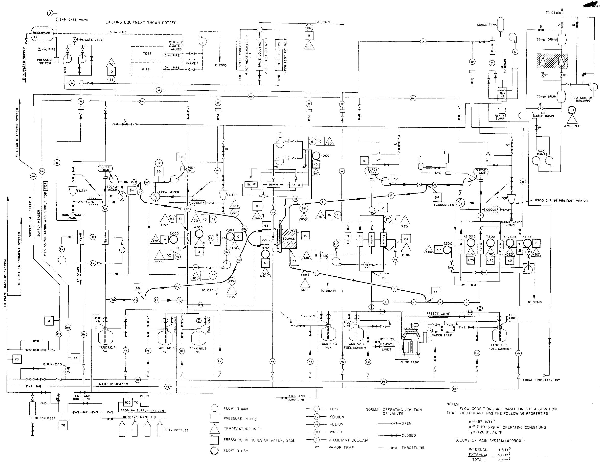  
Fig. 1. Reactor and Heat Disposal Equipment.

# Chapter 2

# REACTOR

# PRESSURE PULSE RESULTING FROM A SUDDEN CHANGE IN REACTIVITY

The self-controlling features of the ARE are due to the expansion of the fuel with increasing temperature. A transient increase in reactivity produces an attendant increase in temperature that increases the volume of the fuel. Since the reactor has a relatively fixed volume, some of the fuel is forced out of the core and the reactivity is reduced. The entire process occurs in a very short time, and therefore it is necessary to know what pressures will be set up in the fuel tubes when the fuel is rapidly forced out of the core. Figure 2 shows the reactor and connecting piping to the surge tanks. The fuel can expand out of the reactor in either direction, but since the path to the surge tank in one direction (upstream) is considerably shorter than in the other, it will be assumed that all the excess fuel takes the shorter path to the surge tank (this is a conservative simplification). Further assumptions that have been made are:

1. The fuel is incompressible.   
2. The pressure pulse is of sufficiently short duration that the fuel in the external piping remains essentially fixed in temperature.   
3. The temperature and power variations in the reactor core will be neglected; all the reactor fuel is assumed to be at the mean reactor temperature, and the power generation in the fuel is always equal to the mean power generation.   
4. The effects of the pressure pulse on the fuel pumps will be neglected. Precisely what effect this pulse would have on the pumps is unknown, but the pulse will probably be of sufficiently short duration that no permanent damage will be done.

Figure 3a is a schematic diagram of the system to be analyzed. There are two, distinct cases to consider:

the reactor in which the temperature and the density of the fuel change with time and the external piping in which the temperature and density of the fuel are constant. The reactor will be considered first (Fig. 3b). The impulse-momentum equation for any section is

$$
- F d t = d (m v), \tag {1}
$$

where

$F =$ differential force on fuel volume, lb,   
$t =$ time,sec,   
$m =$ mass in fuel volume, slugs,   
$\upsilon =$ velocity of fuel volume, ft/sec.

For a fuel volume of cross section $A$ , thickness $dx$ , and position $x$ ,

$$
m = \rho A \Delta x, \tag {2}
$$

where

$\rho =$ mass density, slugs/ft³,   
$A =$ tube cross-sectional area, ft²,   
$x =$ distance along the tube measured from the reactor outlet, ft.

Since the fuel is incompressible, all the incremental fuel volume being generated between zero and $x$ by increasing temperature must pass across $x$ (on the way to the reactor inlet and thence to the surge tank) as rapidly as the incremental volume is being generated. The rate at which incremental volume is being generated between zero and $x$ is

$$
\frac {d V}{d t} = \beta A x \frac {d \theta}{d t}, \tag {3}
$$

where

$V =$ volume from $x = 0$ to any arbi-trary $x$ ，ft3,   
$\beta =$ coefficient of volumetric ex- pansion, per ${}^{\circ}\mathbf{F}$   
$\theta =$ fuel temperature, ${}^{\circ}\mathrm{F}$

Since the rate at which the incremental volume is being generated must be equal to the rate at which the volume is crossing $x$ ,

$$
\bar {v} A = \beta A x \frac {d \theta}{d t} \tag {4}
$$

$$
\bar {v} = v - v _ {0} = \beta_ {x} \frac {d \theta}{d t},
$$

where $\overline{v}$ is the incremental velocity $(\nu - \nu_0)$ in ft/sec and the subscript 0 refers to conditions at time zero.

The impulse-momentum equation, Eq. 1, may be rewritten for the volume $A \triangle x$ as

$$
- \triangle F = m \frac {d v}{d t} + v \frac {d m}{d t}. \tag {5}
$$

Differentiating Eqs. 2 and 4 gives

$$
\frac {d m}{d t} = A \Delta_ {\boldsymbol {x}} \frac {d \rho}{d t} \tag {6}
$$

and

$$
\frac {d v}{d t} = \frac {d \bar {v}}{d t} = \beta x \frac {d ^ {2} \theta}{d t ^ {2}}, \tag {7}
$$

and substituting Eqs. 2, 4, 6, and 7 in Eq. 5 gives

$$
\begin{array}{l} - \Delta F = \rho A \Delta x \beta x \frac {d ^ {2} \theta}{d t ^ {2}} \tag {8} \\ + \left(\beta x \frac {d \theta}{d t} + v _ {0}\right) A \triangle_ {x} \frac {d \rho}{d t} \\ \end{array}
$$

or

$$
- \frac {\Delta F}{\Delta x} = A \left[ \beta x \left(\rho \frac {d ^ {2} \theta}{d t ^ {2}} + \frac {d \rho}{d t} \frac {d \theta}{d t}\right) + v _ {0} \frac {d \rho}{d t} \right].
$$

Dividing both sides by $A$ and letting $\triangle x$ approach zero gives

$$
\begin{array}{l} - \frac {1}{A} \frac {d F}{d x} = - \frac {d P}{d x} = \beta x \left(\rho \frac {d ^ {2} \theta}{d t ^ {2}}\right) \tag {9} \\ \left. + \frac {d \rho}{d t} \frac {d \theta}{d t}\right) + \nu_ {0} \frac {d \rho}{d t}, \\ \end{array}
$$

where $P$ is pressure in $\mathrm{lb / ft^2}$ . The mass density, $\rho$ , may be expressed in terms of the temperature:

$$
\rho = \frac {\rho_ {0}}{1 + \beta (\theta - \theta_ {0})}. \tag {10}
$$

Differentiating Eq. 10 gives

$$
\frac {d \rho}{d t} = - \frac {\rho_ {0} \beta \frac {d \theta}{d t}}{\left[ 1 + \beta \left(\theta - \theta_ {0}\right) \right] ^ {2}}. \tag {11}
$$

Substituting Eqs. 10 and 11 in Eq. 9 gives

$$
\begin{array}{l} - \frac {d \rho}{d x} = \beta_ {x} \left\{\frac {\rho_ {0} \frac {d ^ {2} \theta}{d t ^ {2}}}{1 + \beta (\theta - \theta_ {0})} \right. \tag {12} \\ \left. - \frac {\rho_ {0} \beta \left(\frac {d \theta}{d t}\right) ^ {2}}{\left[ 1 + \beta \left(\theta - \theta_ {0}\right) \right] ^ {2}} \right\} \\ - \frac {v _ {0} \rho_ {0} \beta \frac {d \theta}{d t}}{\left[ 1 + \beta \left(\theta - \theta_ {0}\right) \right] ^ {2}}. \\ \end{array}
$$

Integrating Eq. 12 from $x = 0$ to $x = L$ and rearranging slightly gives

$$
\begin{array}{l} P _ {m} - P _ {L} = \frac {\beta \rho_ {0} L ^ {2}}{2 (1 - \beta \theta_ {0} + \beta \theta)} \left[ \frac {d ^ {2} \theta}{d t ^ {2}} \right. \tag {13} \\ \left. - \frac {\beta \left(\frac {d \theta}{d t}\right) ^ {2} + \frac {v _ {0}}{L} \frac {d \theta}{d t}}{1 - \beta \theta_ {0} + \beta \theta} \right], \\ \end{array}
$$

where the subscript $m$ refers to conditions at $x = 0$ and the subscript $L$ refers to conditions at $x = L$ . Equation 13 with $L$ set equal to the length of the reactor tubes gives the variations with time of the pressure differential across the reactor core.

For the external piping (Fig. 3c), where the temperature of the fuel is assumed constant, Eqs. 1, 2, and 5 are valid. However, Eq. 3 is not valid, because no incremental volume is generated in the external piping. The external piping, however, must pass all the incremental volume generated

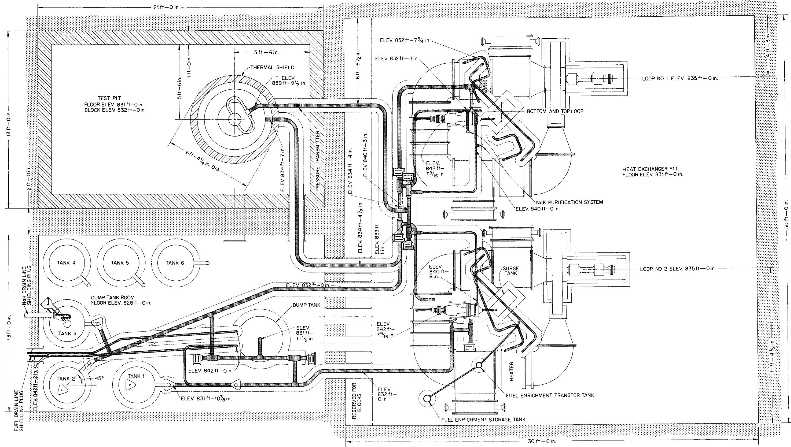  
Fig. 2. Fuel Circuit.

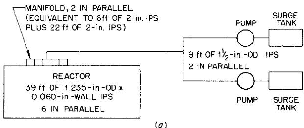

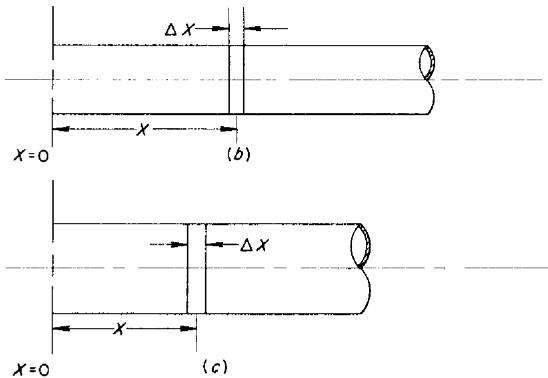  
Fig. 3. Reactor and Connecting Piping to Surge Tank. (a) Schematic diagram of system. (b) Internal reactor piping. (c) External piping.

in the core, and therefore Eq. 4 may be rewritten for the external piping:

$$
\overline {{v}} ^ {\prime} A ^ {\prime} = \beta V _ {c} \frac {d \theta}{d t}, \tag {14}
$$

$$
\overline {{v}} ^ {\prime} = v ^ {\prime} - v _ {0} ^ {\prime} = \frac {\beta V _ {c}}{A ^ {\prime}} \frac {d \theta}{d t},
$$

where $V_{c}$ is the fuel volume in the reactor core in ft $^3$ and the prime refers to values in the external piping. Equation 6, of course, becomes

$$
\frac {d m}{d t} = 0, \tag {15}
$$

and Eq. 7 becomes

$$
\frac {d v ^ {\prime}}{d t} = \frac {\beta V _ {c}}{A ^ {\prime}} \frac {d ^ {2} \theta}{d t ^ {2}}. \tag {16}
$$

Substituting Eqs. 2, 14, 15, and 16 in Eq. 5 gives

$$
- \triangle F ^ {\prime} = \rho^ {\prime} A ^ {\prime} \Delta x \frac {\beta V _ {c}}{A ^ {\prime}} \frac {d ^ {2} \theta}{d t ^ {2}}. \tag {17}
$$

Since $\rho'$ is constant and equal to $\rho_0$ , Eq. 17 may be rewritten as

$$
- \frac {1}{A ^ {\prime}} \frac {\Delta F ^ {\prime}}{\Delta x} = - \frac {\Delta P ^ {\prime}}{\Delta x} = \frac {\rho_ {0} \beta V _ {c}}{A ^ {\prime}} \frac {d ^ {2} \theta}{d t ^ {2}}, \tag {18}
$$

or, by letting $\triangle x$ approach zero,

$$
- \frac {d P ^ {\prime}}{d x} = \frac {\rho_ {0} \beta V _ {c}}{A ^ {\prime}} \frac {d ^ {2} \theta}{d t ^ {2}}.
$$

Integrating Eq. 18 from $x = 0$ to $x = L'$ gives

$$
P _ {m ^ {\prime}} - P _ {L ^ {\prime}} = \frac {\rho_ {0} \beta V _ {c} L ^ {\prime}}{A ^ {\prime}} \frac {d ^ {2} \theta}{d t ^ {2}}. \tag {19}
$$

Equation 19 with $L'$ set equal to the length of a run of external piping gives the variation with time of the pressure differential across the piping.

In addition to the pressure differential set up by the inertia of the fuel (Eqs. 13 and 19), there are pressure differentials resulting from the change in friction pressure drop associated with change in velocity. These pressure differentials may be evaluated by methods similar to those used above, except that the impulse-momentum equation (Eqs. 1 and 5) is replaced by the customary Fanning equation for the friction pressure drop:

$$
\frac {d P _ {f}}{d x} = \frac {4 f}{D} \frac {\rho v ^ {2} - \rho_ {0} v _ {0} ^ {2}}{2}, \tag {20}
$$

where

$$
\begin{array}{l} \begin{array}{l} P _ {f} = \text {c h a n g e i n f r i c t i o n p r e s s u r e d r o p}, \\ \quad \quad \quad \quad \quad \quad \quad \quad \quad \quad \quad \quad \quad \quad \quad \quad \quad \quad \quad \quad \quad \quad \quad \quad \quad \quad \quad \quad \quad \quad \quad \quad \quad \quad \quad \quad \quad \quad \quad \quad \quad \quad \quad \quad \quad \quad \quad \quad \quad \quad \mathrm {l b / f t} ^ {2}, \end{array} \\ f = \text {f r i c t i o n} \\ D = \text {t u b e d i a m e t e r , f t .} \\ \end{array}
$$

Substituting Eqs. 4 and 10 for the reactor core into Eq. 20 gives

$$
\frac {d P _ {f}}{d x} = \frac {2 f}{D} \left[ \frac {\rho_ {0} \left(\beta x \frac {d \theta}{d t} + v _ {0}\right) ^ {2}}{1 + \beta (\theta - \theta_ {0})} - \rho_ {0} v _ {0} ^ {2} \right] \tag {21}
$$

or

$$
\frac {d P _ {f}}{d x} = \frac {2 f \rho_ {0}}{D} \left[ \frac {\beta^ {2} x ^ {2} \left(\frac {d \theta}{d t}\right) ^ {2} + 2 \beta_ {x} v _ {0} \frac {d \theta}{d t} + v _ {0} ^ {2}}{1 + \beta (\theta - \theta_ {0})} - v _ {0} ^ {2} \right].
$$

Integrating with respect to $x$ from $x = 0$ to $x = L$ gives

$$
\left. \left(P _ {f}\right) _ {\text {m}} - \left(P _ {f}\right) _ {L} = - \frac {2 f \rho_ {0}}{D} \left[ \frac {\frac {\beta^ {2} L ^ {3}}{3} \left(\frac {d \theta}{d t}\right) ^ {2} + \beta L ^ {2} v _ {0} \frac {d \theta}{d t} + v _ {0} ^ {2} L}{1 + \beta (\theta - \theta_ {0})} - v _ {0} ^ {2} L \right]. \right. \tag {22}
$$

Since the equivalent length of piping for friction pressure drop calculations is longer than the actual length to account for bends, exits, entrances, etc., the change in friction pressure drop in the core calculated by using Eq. 22 must be corrected:

$$
\begin{array}{l} \left[ \left(P _ {f}\right) _ {m} - \left(P _ {f}\right) _ {L} \right] _ {\text {c o r r e c t e d}} \tag {23} \\ = \frac {L _ {e q}}{L} \left[ \left(P _ {f}\right) _ {m} - \left(P _ {f}\right) _ {L} \right], \\ \end{array}
$$

where $L_{e,q}$ is the equivalent length for the friction pressure drop, ft.

The change in friction pressure drop in the external piping is calculated in the following manner. Equation 20 is valid, and substituting Eq.14 in Eq.20 and noting that $\rho^{\prime} = \rho_{0}$ gives

$$
\begin{array}{l} \frac {d P _ {f} ^ {\prime}}{d x} = \frac {2 f ^ {\prime} \rho_ {0}}{D ^ {\prime}} \left[ \frac {\left(\beta V _ {c} \frac {d \theta}{d t}\right) ^ {2}}{A ^ {\prime}} \right. \tag {24} \\ \left. + \frac {2 \beta V _ {c} v _ {0} ^ {\prime} \frac {d \theta}{d t}}{A ^ {\prime}} \right] \quad . \\ \end{array}
$$

Integrating from $x = 0$ to $x = L'$ gives

$$
\begin{array}{l} \left(P _ {f} ^ {\prime}\right) _ {m} - \left(P _ {f} ^ {\prime}\right) _ {L} \tag {25} \\ = \frac {2 f \rho_ {0} L ^ {\prime}}{D} \left[ \left(\frac {\beta V _ {c}}{A ^ {\prime}} \frac {d \theta}{d t}\right) ^ {2} + 2 v _ {0} ^ {\prime} \frac {\beta V _ {c}}{A ^ {\prime}} \frac {d \theta}{d t} \right] \\ \end{array}
$$

and

$$
\begin{array}{l} \left[ \left(P _ {f} ^ {\prime}\right) _ {m} - \left(P _ {f} ^ {\prime}\right) _ {L} \right] _ {\text {c o r r e c t e d}} \tag {26} \\ = \frac {L _ {e q} ^ {\prime}}{L ^ {\prime}} \left[ \left(P _ {f} ^ {\prime}\right) _ {m} - \left(P _ {f} ^ {\prime}\right) _ {L} \right] \\ \end{array}
$$

Hence, if the variations of $\theta$ , $d\theta / dt$ , and $d^2\theta / dt^2$ with time are known, the total pressure pulse can be calculated because all other quantities are known. The variation of the temperature and its first two derivatives with respect to time, as a result of a $0.5\%$ step increase in reactivity, were evaluated on an electronic analog computer. The results are shown in Fig. 4. The other constants required for the evaluation of the pressure pulse are:

$$
\begin{array}{l} \begin{array}{l} A = 0. 0 4 0 7 \mathrm {f t} ^ {2} (6 \text {t u b e s i n p a r a l l e l}, \\ 1. 2 5 5 \text {i n . O D b y 0 . 0 6 0 - i n . w a l l}), \end{array} \\ \beta = 8 \times 1 0 ^ {- 5} \text {p e r} ^ {\circ} F, \\ v _ {0} = - 3. 7 0 \mathrm {f t / s e c}, \\ \rho_ {0} = 5. 8 1 \text {s l u g s / f t} ^ {3}, \\ \end{array}
$$

$$
\begin{array}{l} \theta_ {0} = 1 3 2 5 ^ {\circ} F, \\ \tilde {L} = 4 2 \mathrm {f t}, \\ \end{array}
$$

$$
\begin{array}{l} \begin{array}{r l} A ^ {\prime} & = 0. 0 2 3 3 \mathrm {f t} ^ {2} (1 \text {p i p e}, 2 \text {i n . I P S}), \\ & 0. 0 2 8 3 \mathrm {f t} ^ {2} (2 \text {p i p e s i n p a r a l l e l}, \\ & 1 1 / 2 \text {i n . I P S}), \end{array} \\ v _ {0} ^ {\prime} = - 6. 4 5, - 5. 3 1 \mathrm {f t / s e c}, \\ \end{array}
$$

$$
\begin{array}{l} v _ {0} ^ {\prime} = - 6. 4 5, - 5. 3 1 \mathrm {f t / s e c}, \\ V _ {c} = 1. 7 1 \mathrm {f t} ^ {3}, \\ \end{array}
$$

$$
\begin{array}{l} L ^ {\gamma} = 2 8, 9 \mathrm {f t}, \\ D = 0. 0 9 2 9 \mathrm {f t}, \\ f = 0. 0 0 7 5, \\ \end{array}
$$

$$
\begin{array}{l} L = 5 2 \mathrm {f t} \\ \tilde {D} _ {i} ^ {q} = 0. 1 7 2 1, 0. 1 3 4 1 \mathrm {f t}, \\ \end{array}
$$

$$
\begin{array}{l} f ^ {\prime} = 0. 0 0 5 8, 0. 0 0 6 2, \\ L _ {e q} ^ {\prime} = 4 3, 1 5 \mathrm {f t}. \\ \end{array}
$$

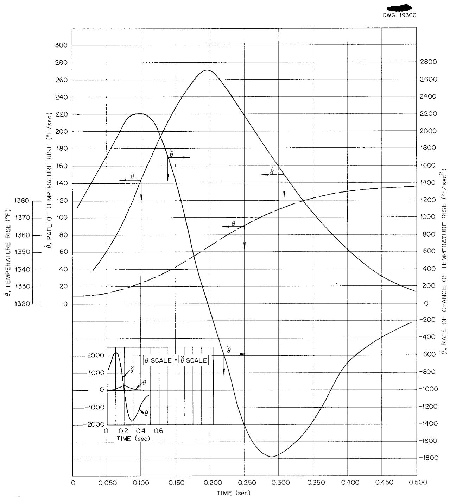  
Fig. 4. Temperature Rise, Rate of Temperature Rise, and Rate of Change of Temperature Rise vs. Time, $\Delta k / k = 0.005$ . Data from ARE simulator.

The final results of the evaluation of Eqs. 13, 19, 23, and 26 are shown in Fig. 5, where the incremental pressure at the reactor outlet (position of maximum incremental pressure) is plotted against time. The maximum incremental pressure encountered is

about 27 psi, and it occurs about 100 msec after the introduction of the step increase in reactivity.

# CORE POWER DISTRIBUTION

The power distribution in the ARE reactor was estimated theoretically,

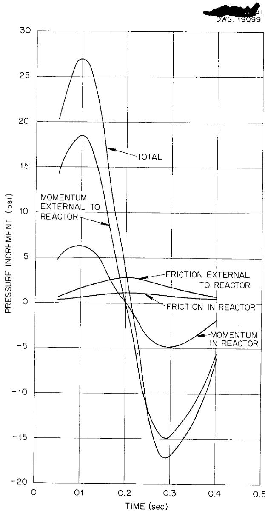  
Fig. 5. Incremental Pressure at Reactor Outlet as a Result of a $\triangle k / k$ of 0.005 vs. Time.

and the estimate was checked experimentally by the physics groups of the Laboratory. The power distributions used in the calculations in this report are presented in Figs. 6, 7, and 8. Figure 6 shows the variation of fission heat generated in the fuel with distance from reactor center; Fig. 7 shows the variation of neutron heating of the moderator; Fig. 8 shows the variation of gamma heating (average, based on the assumption that the reactor is homogenized). The maximum and average values of the fission, neutron, and gamma heating are given in Table 2.

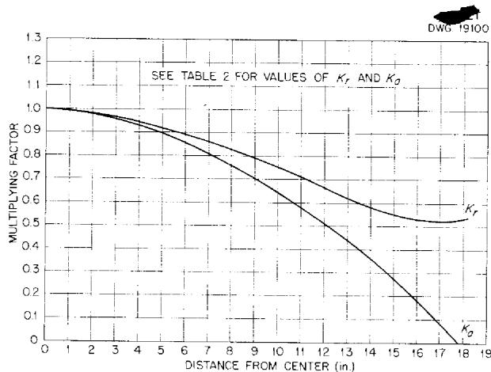

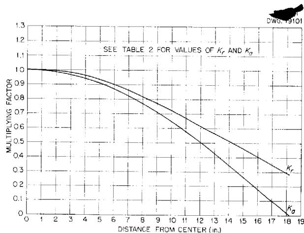  
Fig. 6. Fission Heat Generated in Fuel as a Function of Distance from Reactor Center.   
Fig. 7. Neutron Heating of Moderator as a Function of Distance from Reactor Center.

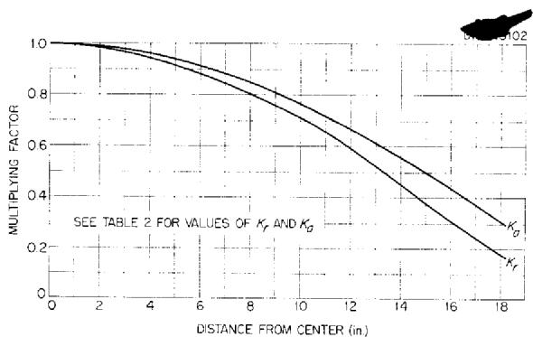  
Fig. 8. Gamma Heating as a Function of Distance from Reactor Center.

TABLE 2. MAXIMUM AND AVERAGE VALUES OF FISSION, NEUTRON, AND GAMMA HEATING IN THE ARE   

<table><tr><td>TYPE OF HEATING</td><td>MAXIMUM 
HEATING 
(kw/in.3)</td><td>AVERAGE 
HEATING 
(kw/in.3)</td><td>AXIAL 
MAXIMUM- 
TO-AVERAGE 
RATIO, Ka</td><td>RADIAL 
MAXIMUM- 
TO-AVERAGE 
RATIO, Kr</td></tr><tr><td>Fission (in fuel only)</td><td>2.78</td><td>1.22</td><td>1.55</td><td>1.48</td></tr><tr><td>Neutron (in moderator 
only)</td><td>0.012</td><td>0.0052</td><td>1.55</td><td>1.66</td></tr><tr><td>Gamma (average for 
homogenized reactor)</td><td>0.024</td><td>0.011</td><td>1.32</td><td>1.82</td></tr></table>

# TEMPERATURE PROFILE IN A TYPICAL SECTION OF THE CORE LATTICE

Heat is removed from the moderator region of the reactor core by the fuel (Fig. 9). In a case in which no heat is transferred across the outer surface of a column of beryllium oxide blocks, the heat removed by the fuel flowing in the tube through this column would be the heat generated within the fuel, the metal of the tube, the NaK filling the gap between the tube and the column of blocks, and the blocks. For this hypothetical case, the temperature profile existing between the center line of the fuel tube and the outer periphery of the blocks can be calculated.

In the actual case, heat is transferred into the rod holes, through the "boundary" between the moderator and the reflector, and through the upper and lower surfaces of the moderator region. Thus, the calculated temperature profile has no meaning other than to show the maximum temperature gradients that can exist in the components of the moderator region. For the hypothetical case, the maximum temperature gradients will exist at the point of maximum heat generation. Therefore, for the temperature profile calculations, heat generation rates corresponding to the maximum values expected in the reactor core were used.

If the heat generated in a hollow cylinder is transferred through the inner surface, the temperature gradient between the outer and inner surfaces of the cylinder is given by

$$
\Delta T = \frac {G}{2 k} \left[ \frac {1}{2} \left(r _ {i} ^ {2} - r _ {o} ^ {2}\right) + r _ {o} ^ {2} \ln \frac {r _ {o}}{r _ {i}} \right], \tag {27}
$$

where

$$
\Delta T = \text {t e m p e r a t u r e} ^ {\prime} \text {d i f f e r e n c e ,} ^ {\prime} \mathrm {F},
$$

$$
\begin{array}{l} G = \text {h e a t g e n e r a t i o n r a t e ,} \\ \text {B t u / s e c} \cdot \text {f t} ^ {3}, \end{array}
$$

$$
\begin{array}{l} k = \text {t h e r m a l c o n d u c t i v i t y}, \\ \text {B t u / s e c} \cdot \text {f t} ^ {2} \left(^ {\circ} \mathrm {F} / \mathrm {f t}\right), \end{array}
$$

$$
r _ {i} = \text {i n n e r}
$$

$$
r _ {o} = \text {o u t e r r a d i u s}, f t.
$$

On the other hand, the temperature gradient necessary for the transfer of heat across the hollow cylinder is

$$
\Delta T = \frac {Q _ {t}}{\frac {k}{\tau} A _ {m}}, \tag {28}
$$

$$
A _ {\text {根}} = \frac {2 \pi \left(r _ {o} - r _ {i}\right)}{\ln \frac {r _ {o}}{r _ {i}}} ,
$$

where

$$
\begin{array}{l} Q _ {t} = \text {h e a t t r a n s f e r r e d p e r f o o t o f} \\ \text {l e n g t h , B t u / s e c ,} \end{array}
$$

$$
\tau = \text {t h i c k n e s s} \left(r _ {o} - r _ {i}\right), \quad \text {f t},
$$

$$
\begin{array}{r l} A _ {n} & = \text {m e a n a r e a p e r f o o t o f l e n g t h}, \\ & \quad \mathrm {f t} ^ {2}. \end{array}
$$

Fig. 9. Vertical Cross Section of Reactor.   
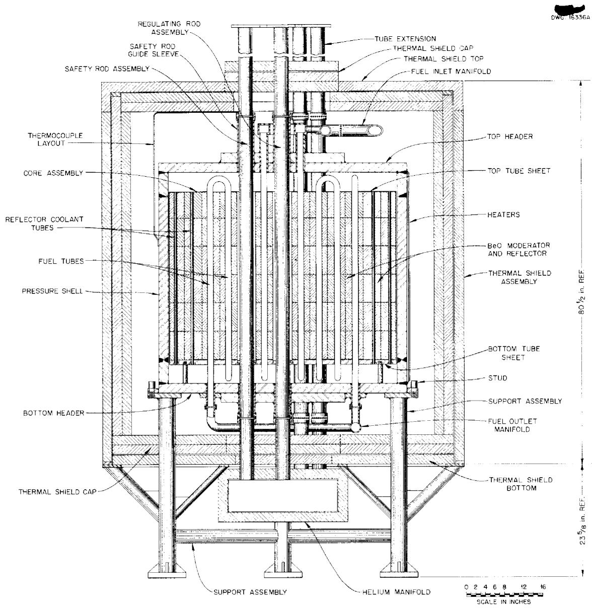  
ASSEMBLY SEQUENCE

STEP 1: ASSEMBLE REACTOR ASSEMBLY TO HELIUM MANIFOLD TUBES.

STEP 2: SET THERMAL SHIELD CAP AND THERMAL SHIELD BOTTOM IN PLACE AND SLIP TUBES THROUGH.

STEP 3: INSULATE MANIFOLD TOP AND BRAZE TO TUBES.

STEP 3g: INSERT SPRING AND SHOCK TUBE.

STEP 3b: ASSEMBLE AND ADJUST ORIFICES

STEP3c:COMPLETE MANIFOLD

STEP 4: ASSEMBLE REACTOR ASSEMBLY WITH SUPPORT ASSEMBLY

STEP 5: ASSEMBLE STUD WITH REACTOR ASSEMBLY AND SUPPORT ASSEMBLY.

STEP 6: ASSEMBLE THERMAL SHIELD CAP WITH HELIUM MANIFOLD.

STEP 7: ASSEMBLE THERMAL SHIELD CAP LOOSELY WITH COOLANT LINE ANNULUS OF REACTOR ASSEMBLY.

STEP 8: WELD TUBE EXTENSION TO SAFETY ROD GUIDE SLEEVE AND INSTRUMENT GUIDE SLEEVE,6 REQ'D.

STEP 9: CONNECT ALL PIPING.

STEP 10: TEST PER TESTING SCHEDULE.

STEP 11. INSTALL HEATERS, CONNECT AND TEST.

STEP 11g: INSTALL THERMOCOUPLE LAYOUT

STEP 12: ASSEMBLE THERMAL SHIELD BOTTOM

STEP 13: ASSEMBLE BALANCE OF THERMAL SHIELD ASSEMBLY, THERMAL SHIELD TOP AND THERMAL SHIELD CAP AND WELD CLOSED.

STEP 14: SEAL ALL JOINTS OF ASSEMBLY OF THERMAL SHIELD ASSEMBLY, THERMAL SHIELD CAP, THERMAL SHIELD BOTTOM, THERMAL SHIELD TOP AND THERMAL SHIELD CAP WITH INSULATING CEMENT, J-M NO. 400 OR EQUIVALENT.

STEP 15: INSULATE HELIUM MANIFOLD WITH 2-in. LAYER J-M SPONGE FELTED INSULATION, SEAL ALL JOINTS WITH INSULATING CEMENT, J-M NO. 400 OR EQUIVALENT.

STEP 16: SEE OPERATING PROCEDURE.

Therefore, when heat is both transferred across and generated within a hollow cylinder,

$$
\begin{array}{l} \Delta T = \frac {Q _ {t}}{\frac {k}{\tau} A _ {\text {m}}} + \frac {G}{2 k} \left[ \frac {1}{2} \left(r _ {i} ^ {2} - r _ {o} ^ {2}\right) \right. \tag {29} \\ \left. + r _ {o} ^ {2} \ln \frac {r _ {o}}{r _ {i}} \right]. \\ \end{array}
$$

The temperature at any radius in a hollow cylinder in which there is internal heat generation and the heat is transferred through the inner surface is given by

$$
\begin{array}{l} T = \frac {G}{2 k} \left[ \frac {1}{2} \left(r _ {i} ^ {2} - r ^ {2}\right) \right. \tag {30} \\ \left. + r _ {o} ^ {2} \ln \frac {r}{r _ {i}} \right] + T _ {i}, \\ \end{array}
$$

where

$T =$ temperature at any radius $r$ , ${}^{\circ}\mathbf{F}$ , $r =$ any radius within the cylinder, ft,

$T_{i}$ temperature at $r_i$ ， ${}^{\circ}F$

The heat generated per foot of length of the cylinder can be calculated from

$$
Q = G \pi \left(r _ {o} ^ {2} - r _ {i} ^ {2}\right), \tag {31}
$$

where $Q$ is the heat generated per foot of length, Btu/sec.

The calculations of temperatures and temperature differences were made from the following data for beryllium oxide, NaK, and the metal tube.

Beryllium Oxide Block. The beryllium oxide block is hexagonal in cross section (3.73 in. across flats). For simplicity in calculation, the block was assumed to be a circular cylinder of equivalent cross-sectional area, with an outside radius of 1.960 in. and an inside radius of 0.630 inch. The temperature difference between the outer and inner surfaces is due entirely to internal heat generation. Therefore,

$$
\Delta T = \frac {G}{2 k} \left[ \frac {1}{2} \left(r _ {i} ^ {2} - r _ {o} ^ {2}\right) + r _ {o} ^ {2} \ln \frac {r _ {o}}{r _ {i}} \right].
$$

NaK. The outer and inner radii of the NaK annulus, measured from the center of the cylinder, are 0.630 and 0.618 in., respectively. Since the NaK is nearly stagnant, the temperature gradient through the NaK is

$$
\Delta T = \frac {Q _ {t}}{\frac {k}{\tau} A _ {m}} + \frac {G}{2 k} \left[ \frac {1}{2} \left(r _ {i} ^ {2} - r _ {o} ^ {2}\right) + r _ {o} ^ {2} \ln \frac {r _ {o}}{r _ {i}} \right],
$$

where $Q_{t}$ is the heat generated in the beryllium oxide.

Metal Tube. The outside radius of the metal tube is 0.618 in., and the inside radius is 0.558 inch. The expression for the temperature gradient in the tube is the same as that for NaK, except that $Q_{t}$ is the heat generated in the beryllium oxide plus the heat generated in the NaK.

The amount of heat generation in the fuel is proportional to the length of time the fuel resides in the reactor core. Thus high-velocity fuel will have less heat generated within it than fuel flowing at a low velocity and, correspondingly, its temperature will be lower. Upon looking at the velocity profile of fuel flowing in a fuel tube, it is seen that the maximum velocity is at the center and that the minimum velocity is at the tube wall. From this, it can be seen that a temperature gradient will exist between the outer surface and the center of the fuel. This temperature gradient can be determined, and the expression $(T_{o} - T_{m}) / Gr_{o}^{2}$ , in which $T_{o}$ is the temperature of the outer surface of the fuel, ${}^{\circ}\mathbf{F}$ , and $T_{m}$ is the temperature of the fuel at the center of the tube, ${}^{\circ}\mathbf{F}$ , has been plotted as a function of Reynolds' and Prandtl's moduli by Poppendiek and Palmer. $^{(10)}$ The fuel also has a temperature gradient between the center and outer surface, which is given by

$$
\begin{array}{l} \Delta T = \frac {Q _ {t}}{h A}, \\ h = 0. 0 2 3 \frac {k}{D} N _ {\mathrm {R}} ^ {0} \cdot^ {8} N _ {\mathrm {P r}} ^ {0} \cdot^ {4}, \\ \end{array}
$$

where

$h =$ coefficient of heat transfer by convection, Btu/sec $\cdot \mathrm{ft}^2\cdot {}^\circ \mathrm{F}$

A = area of the inside surface of the metal tube per foot of length, ft²,

$D =$ hydraulic diameter of the fuel tube, ft,

$N_{R} =$ Reynolds' modulus,

$N_{\mathbf{p_r}} = \text{Prandtl's modulus}$ ,

$Q_{t} =$ heat generated in the beryllium oxide plus the heat generated in the NaK plus the heat generated in the metal tube.

From this it is seen that the total temperature gradient in the fuel is

$$
\Delta T = \frac {Q _ {t}}{h A} + \Delta T \quad \left(\text {r e s u l t i n g f r o m i n t e r n a l}\right)
$$

For the fuel, the physical characteristics are:

Radius, $r_0$ 0.558 in.

Temperature, T 1170°F

Viscosity, $\mu$ 8.27 x $10^{-3}$

lb/sec'ft

Density, $\rho$ 187 lb/ft3

Specific heat, $c_p$ 0.26 Btu/1b $^{\circ}$ F

Thermal conductivity, k 4.17 x 10-4

Btu/sec\*ft2

(°F/ft)

The following are the maximum expected heat generation rates for the various components:

COMPONENT G (Btu/sec·ft3)

Be0 62.21

NaK 41.47

Metal tube 41.47

Fuel 4838

The results of the calculations of temperature differences for the various components are:

COMPONENT $\triangle T$ （°F）

Fuel 81.08

Metal tube 22.97

NaK 3.08

BeO 108.00

Total 215.13

Thus the maximum temperature is $1170 + 215 = 1385^{\circ} \mathrm{F}$ . A plot of temperature vs. distance from fuel tube center is shown on Fig. 10.

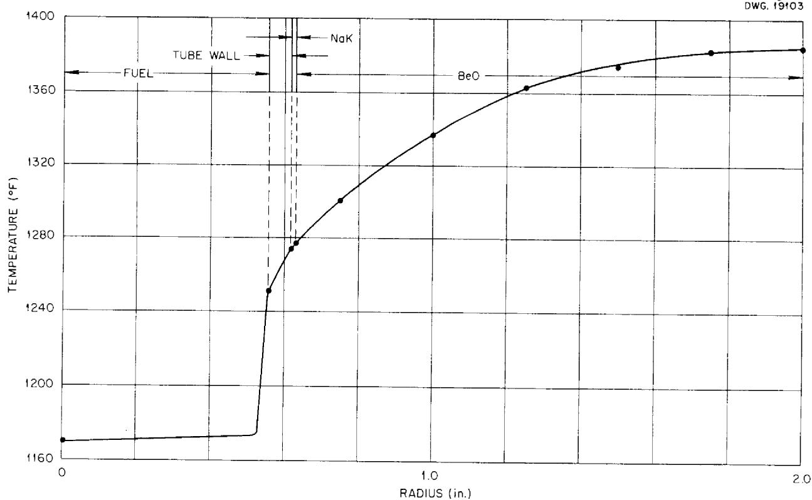  
Fig. 10. Temperature Profile in Core Lattice.

# FLOW OF REFLECTOR COOLANT THROUGH CORE

In the ARE, the pressure shell, the moderator, and the thimbles of the control rod and instrument holes are cooled by the circulation of NaK. The NaK circuit (reflector coolant circuit) is shown in Fig. 1.

The coolant enters the pressure shell at the bottom, flows through the lattice, and leaves at the top (Fig. 9). The flow through the core lattice is divided among the annulus between the outer periphery of the reflector and moderator can and the pressure shell, the tubes leading through the reflector blocks, and the annuli around the rod and instrument holes. For adequate cooling of the moderator and pressure shell, it is necessary to have only a minimum amount of coolant flowing in the annuli around the rod and instrument holes. The additional heat that must be removed from the thimbles will be carried away by the helium that cools the rods and instruments. To obtain this minimum flow, orifice plates (Fig. 11) were placed in the annuli.

There will be a pressure drop in the fluid when it enters the pressure shell because of expansion, and when it leaves there will be a further pressure drop because of contraction. In the spaces between the tube sheets and the pressure shell above and below the core lattice, which will act as plenum chambers, the coolant velocity will be effectively zero. Thus the pressure drop in these regions will be very small. The pressure drop in the coolant flowing through the core lattice will be due to contraction, friction, and expansion. Since the pressure drop of the fluid inside the pressure shell is due almost entirely to that in the core lattice, the flow through the various paths will be directly proportional to the respective resistances of the paths.

The loss in pressure by contraction is given by

$$
\Delta P _ {c} = k _ {c} \frac {\rho v _ {1} ^ {2}}{2 g}, \tag {32}
$$

where $k_{c}$ is a constant given by McAdams (cf., p. 122 of ref. ll); the expansion pressure drop is given by

$$
\Delta P _ {e} = \frac {\rho \left(v _ {1} - v _ {2}\right) ^ {2}}{2 g}; \tag {33}
$$

and the friction pressure drop for turbulent flow in either a tube or an annulus is given by

$$
\Delta P _ {f} = 4 f \frac {L}{D} \frac {\rho v ^ {2}}{2 g}. \tag {34}
$$

The equation for the friction factor is

$$
f = \frac {0 . 0 4 6}{N _ {R} ^ {0 . 2}}. \tag {35}
$$

The meanings and units of the symbols used in Eqs. 32 through 35 are:

$$
\Delta P = \text {p r e s s u r e} \quad \text {d r o p}, \quad \mathrm {l b / f t} ^ {2},
$$

$$
f = \text {f r i c t i o n}
$$

$$
L = \text {l e n g t h}, \quad \text {f t},
$$

$$
D = \text {h y d r a u l i c}
$$

$$
\rho = \text {d e n s i t y}, \quad \mathrm {l b} / \mathrm {f t} ^ {3},
$$

$$
v = \text {a v e r a g e}
$$

$$
\begin{array}{l} g = \text {g r a v i t a t i o n a l} \\ 3 2. 2 \text {f t / s e c} ^ {2}, \end{array}
$$

$$
k _ {c} = \text {c o n s t a n t}, \text {d i m e n s i o n l e s s},
$$

$$
\begin{array}{l} v _ {1} = \text {a v e r a g e l i n e a r v e l o c i t y u p s t r e a m}, \\ \quad \quad \quad \quad \quad \quad \quad \quad \quad \quad \quad \quad \quad \quad \quad \quad \quad \quad \quad \quad \quad \quad \quad \quad \quad \quad \quad \quad \quad \quad \quad \quad \quad \quad \quad \quad \quad \quad \quad \quad \quad \quad \quad \quad \quad \quad \quad \quad \quad \quad \text {f t / s e c}, \end{array}
$$

$$
\begin{array}{l} v _ {2} = \text {a v e r a g e l i n e a r v e l o c i t y d o w n -} \\ \text {s t r e a m , f t / s e c ,} \end{array}
$$

$$
N _ {R} = \text {R e y n o l d s} ^ {\prime} \text {n u m b e r}.
$$

The subscripts have the following meanings:

$$
c = \text {c o n t r a c t i o n},
$$

$$
e = \text {e x p a n s i o n},
$$

$$
f = \text {f r i c t i o n}.
$$

All the annuli around the control rod and instrument holes have the same dimensions: the outside diameter, $D_{o}$ , is 3.652 in. and the inside diameter, $D_{i}$ , is 3.000 inches. There are two instrument holes, three safety rods, and one regulating rod; thus there are six holes and six corresponding annuli. Where the NaK enters at the bottom of the annuli (Fig. 9), there are orifice plates (Fig. 11). These orifice plates reduce the outside diameters of the annuli to 3.140 in.; the length of each orifice plate is 1.00 in.; and the length of the remainder of each annulus is 35.25 inches. The annulus

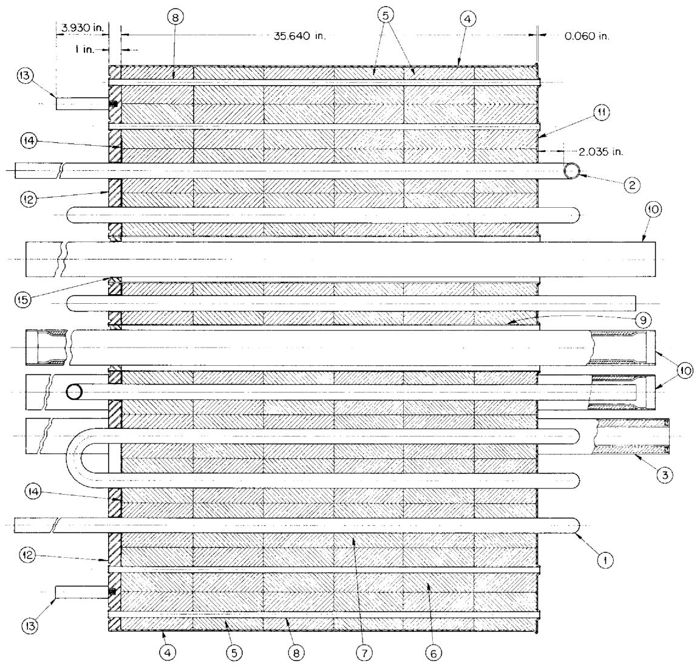  
Fig. 11. Core and Reflector Assembly Elevation Section.

UNCLASSIFIED

DWG.E-A-1-2A

# PARTS LIST

1 INCONEL TUBE COIL A   
2 INCONEL TUBE COIL B   
3 INCONEL INSTRUMENT TUBE SUB-ASSEMBLY  
4 INCONEL CAN  
5 BeO REFLECTOR EDGE BLOCK   
6 BeO REFLECTOR BLOCK   
7 BeO CORE BLOCK   
8 INCONEL REFLECTOR COOLANT TUBES  
9 INCONEL CORE SLEEVE  
10 INCONEL SAFETY ROD GUIDE SLEEVE  
11 INCONEL TOP TUBE SHEET   
12 INCONEL BOTTOM TUBE SHEET   
13 INCONEL SUPPORT STUDS  
14 INCONEL SPACER  
15 INCONEL ORIFICE PLATE

# ASSEMBLY SEQUENCE

STEP1: WELD ITEMS 8,9 AND 15 TO ITEM 12, 9 AND 15 WELDED TOGETHER TO ITEM 12   
STEP2: ASSEMBLE ITEM 13 WITH ITEM 12   
STEP 3: ASSEMBLE ITEMS 1 AND 2 WITH ITEM 12, THEN ITEM 14 WITH ITEMS 1, 2 AND 8   
STEP 4: ASSEMBLE ITEM 7 WITH ITEMS 1 AND 2   
STEP5: ASSEMBLE ITEM6 WITH ITEM8   
STEP6:ASSEMBLEITEM5   
STEP7: ASSEMBLE AND WELD ITEM 4 TO ITEM 12   
STEP8:WELDITEMS8AND9TOITEM11   
STEP9: WELD ITEM 4 TO ITEM 11

between the pressure shell and the outer periphery of the moderator can has an outside diameter of 48.57 in.; the gap width is 1/16 in.; and the path length through this annulus is 36.25 inches.

In the reflector region, there are 79 tubes, one through each column of beryllium oxide blocks. Each of these has an inside diameter of 0.49 in., and is 36.25 in. long.

The coolant is carried to and from the pressure shell by 2 1/2-in. schedule-40 pipe. Since the NaK flowing through the reactor pressure shell and core lattice is almost isothermal, the physical properties were considered to be constant. The values of density and viscosity used were, respectively,

$$
\rho = 4 4. 5 \mathrm {l b} / \mathrm {f t} ^ {3}
$$

and

$$
\mu = 0. 3 6 \mathrm {l b} / \mathrm {h r} ^ {\cdot} \mathrm {f t}.
$$

By using Eqs. 32 and 33, the inlet and outlet losses of the pressure shell were calculated to be

$$
\Delta P \quad (\text {i n l e t}) = 1 5 6. 3 \mathrm {l b} / \mathrm {f t} ^ {2}
$$

and

$$
\Delta P \quad (\text {o u t l e t}) = 7 8. 1 5 \mathrm {l b} / \mathrm {f t} ^ {2}.
$$

From Eqs. 32 through 35 and the assumption that the distribution of flow through the core lattice depends only on the relative resistance of each path, the distribution of flow was found, by trial and error, to be:

<table><tr><td>PATH</td><td>FLOW RATE
(ft3/sec)</td></tr><tr><td>Large annulus</td><td>0.108</td></tr><tr><td>Tubes through reflector</td><td>0.272</td></tr><tr><td>Six annuli</td><td>0.120</td></tr></table>

The pressure drop through the lattice, which is the loss in pressure experienced by the fluid flowing through one path, was found to be

$$
\Delta P = 1 9. 4 9 \mathrm {l b} / \mathrm {f t} ^ {2}.
$$

If the pressure drop in the spaces above and below the core lattice is neglected, the total pressure drop is

$$
\begin{array}{l} \Delta P = 2 5 3. 9 \mathrm {l b} / \mathrm {f t} ^ {2} \\ = 1. 7 6 \mathrm {l b} / \mathrm {i n}. ^ {2}. \\ \end{array}
$$

# HEAT REMOVAL BY THE REFLECTOR COOLANT

A cross section of the reactor is shown in Fig. 9; a plan view is shown in Fig. 12. Molten NaK is circulated through the reactor to remove the heat generated in the reflector and to cool the pressure shell and the walls of rod and instrument holes. In passing through the reactor, heat is removed from the following sources in the reactor by the NaK:

1. heat generated in the reflector,   
2. heat generated in the pressure shell,   
3. heat generated in the NaK,   
4. heat transferred from the reactor core

a. through the serpentine elbows,   
b. through the tube sheets,   
c. through the "boundary" between the core and the reflector,   
$d$ through the walls of the rod and instrument holes.

The NaK in the interstices of the moderator blocks in both the reactor core and reflector is almost stagnant and, for the purposes of the following calculations, is assumed to be entirely stagnant. It is assumed that the electric heaters on the pressure shell add sufficient heat to the system to just balance the heat loss to the environment; therefore it is also assumed that there is no net heat flow across the outside of the pressure shell.

Heat Generated in the Reflector. The following values for gamma and neutron heating of the reflector were obtained from the section on "Core Power Distribution."

# Gamma Heat Generation:

Peak gamma heating (at center of core), Btu/sec.in.3 0.023

Ratio of maximum gamma heating at a radius of 18 in. to peak gamma heating 0.20

Maximum gamma heating at a radius of 24 in. 0.0

Ratio of maximum gamma heating at any radius to average gamma heating at the same radius 1.32

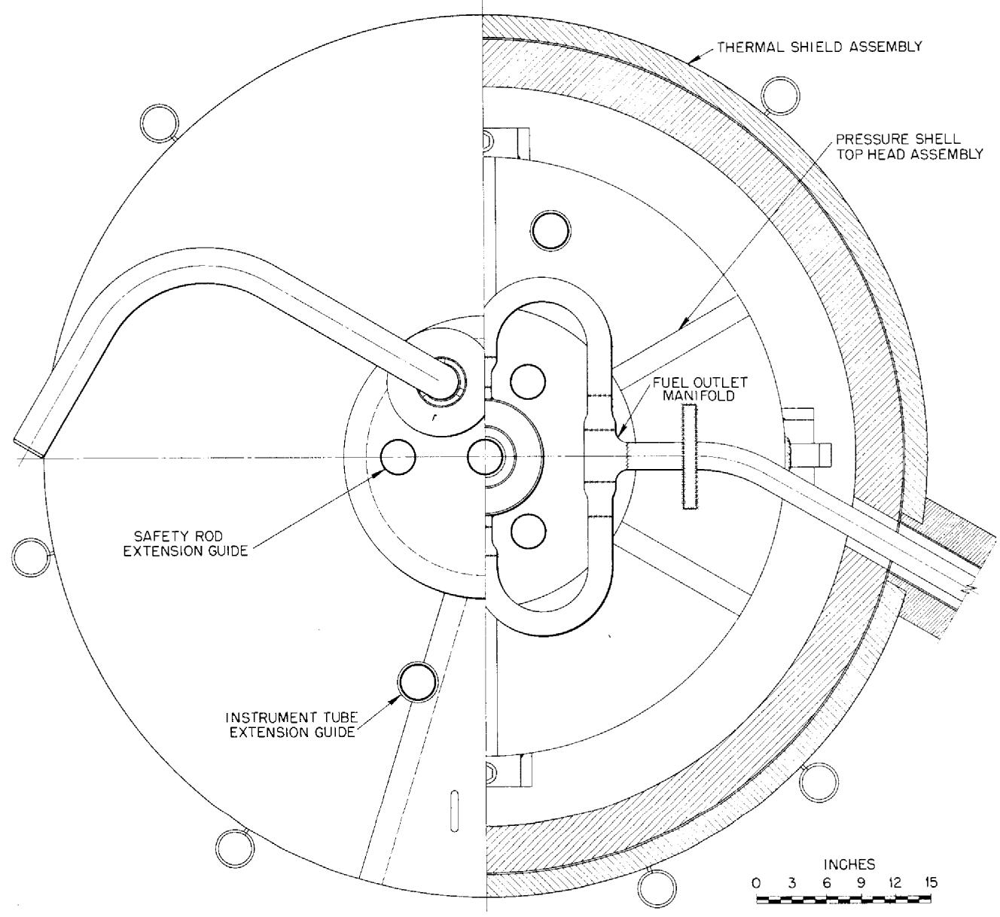  
Fig. 12. Plan View of Reactor.

Neutron Heat Generation:

Peak neutron heating in beryllium oxide (at center of core), Btu/sec·in. 3 0.011

Ratio of maximum neutron heating at a radius of 18 in. to peak neutron heating 0.30

Neutron heating of the reflector at a radius of 22 1/2 in. 0.0

Ratio of maximum neutron heating at any radius to average neutron heating at the same radius 1.55

Neutron heating occurs only in the beryllium oxide, which constitutes about $78.5\%$ of the reactor.

It is assumed that within the reflector the gamma and the neutron heat generation vary linearly with radial distance. That this assumption is fairly valid may be observed from Figs. 7 and 8. The following equations for the average gamma and neutron heat generation at any radius within the reflector can be written:

(36) $q_{\gamma} = 0.00460 - 0.000767 (R - 18)$ ,

$$
1 8 \leq R \leq 2 4,
$$

(37) $q_{n} = 0.00260 - 0.000575 (R - 18)$ ,

$$
1 8 \leq R \leq 2 2. 5,
$$

(38) $q_{n} = 0, R > 22.5,$

where

$q =$ heat generation, Btu/sec·in.³, $R =$ radius, inches.

The total heat generation, $Q$ , is

(39) $Q_{\gamma} = \int_{18}^{24} [0.00460$

$$
\begin{array}{l} - 0. 0 0 0 7 6 7 (R - 1 8) ] 2 \pi R d R \\ = 4 0. 7 \text {B t u / s e c}, \\ \end{array}
$$

(40) $Q_{n} = \int_{18}^{22.5}[0.00210$

$$
\begin{array}{l} - 0. 0 0 0 4 6 7 (R - 1 8) ] 2 \pi R d R \\ = 9. 5 \text {B t u} / \sec , \\ \end{array}
$$

(41) $Q = Q_{\gamma} + Q_{n} = 50.2 \mathrm{Btu/sec}$ .

The heat generated in the reflector is removed by the NaK through various interfaces; the temperature limitations of the beryllium oxide and associated structure are sufficiently far above the NaK temperature that temperature patterns in the reflector need not be calculated.

Heat Generated in the Pressure Shell. The heat generated in the Inconel pressure shell is due to gamma attenuation and fast-neutron scattering. The actual variation of heat generation with position in the top head is shown in Fig. 13. The curve may be approximated by the exponential relationship

(42) $q^{\prime} = 13,200e^{-9.20x},$

where

$q^{\prime} =$ heat generation, Btu/hr·ft³, $x =$ distance from inside surface, ft. The heat generation in the bottom head and barrel is actually less than this, but to be conservative, it is assumed that the curve may be used. The total heat generation, $Q$ , in a flat plate of thickness $\tau$ is given by

(43) $Q = \int_{0}^{\tau} 13,200 e^{-9.20x} dx$

$$
= 1 4 5 0 (1 - e ^ {- 9. 2 0 \tau})
$$

where $\tau$ is in feet.

The Inconel pressure shell is constructed of 2-in.-thick plate reinforced to 4 in. in thickness at critical locations in the heads. Evaluation of Eq. 43 for thicknesses, $\tau$ , of 1/6 and 1/3 ft gives

$$
Q = 1 1 3 5 \mathrm {B t u} / \mathrm {h r} \cdot \mathrm {f t} ^ {2}
$$

and

$$
Q = 1 3 8 0 \mathrm {P t u} / \mathrm {h r} \cdot \mathrm {f t} ^ {2},
$$

respectively.

If the barrel is treated as a flat plate, the total area of the 2-in.-thick material is $72.5\mathrm{ft}^2$ and the total area of the 4-in.-thick material is $9.5\mathrm{ft}^2$ . Therefore the total heat generation is 95,300 Btu/hr, or 26.5 Btu/sec. This value is probably high, but because Fig. 13 is approximate, a conservative value is desirable.

Temperature of Pressure Shell. Inasmuch as the allowable design stress in the pressure shell is a function of the pressure shell temperature, the temperature pattern in the pressure shell head (the most critical portion of the pressure shell from the standpoint of both stress and temperature) must be calculated.

The pressure shell will be treated as a flat plate in which there is internal heat generation. One side of the plate is insulated and the other side is cooled by circulating NaK.

The differential equation, then, is:

$$
\frac {d ^ {2} \theta}{d x ^ {2}} = - \frac {q ^ {\prime}}{k}, \tag {44}
$$

where

$$
\begin{array}{r l} q ^ {\prime} & = \text {h e a t g e n e r a t i o n , B t u / h r} \cdot \mathrm {f t} ^ {3} = \\ & 1 3, 2 0 0 e ^ {- 9. 2 0 x}, \end{array}
$$

$$
\theta = T _ {x} - T _ {\mathrm {N a K}},
$$

$$
\begin{array}{l} T _ {x} = \text {t e m p e r a t u r e i n p r e s s u r e s h e l l a t} \\ \text {p o s i t i o n} x, \end{array}
$$

$$
T _ {\mathrm {N a K}} = \text {t e m p e r a t u r e o f N a K},
$$

$$
\begin{array}{l} k = \text {t h e r m a l c o n d u c t i v i t y o f I n c o n e l} \\ = 1 1 \mathrm {B t u / h r} \cdot \mathrm {f t} ^ {2} (^ {\circ} \mathrm {F / f t}), \end{array}
$$

$$
\begin{array}{l} x = \text {d i s t a n c e f r o m i n s i d e s u r f a c e ,} \\ \text {f t .} \end{array}
$$

The boundary conditions are

$$
\frac {d \theta}{d x} = 0, \quad \text {a t} x = \tau ,
$$

$$
\frac {d \theta}{d x} = \frac {h}{k} \theta , \text {a t} x = 0,
$$

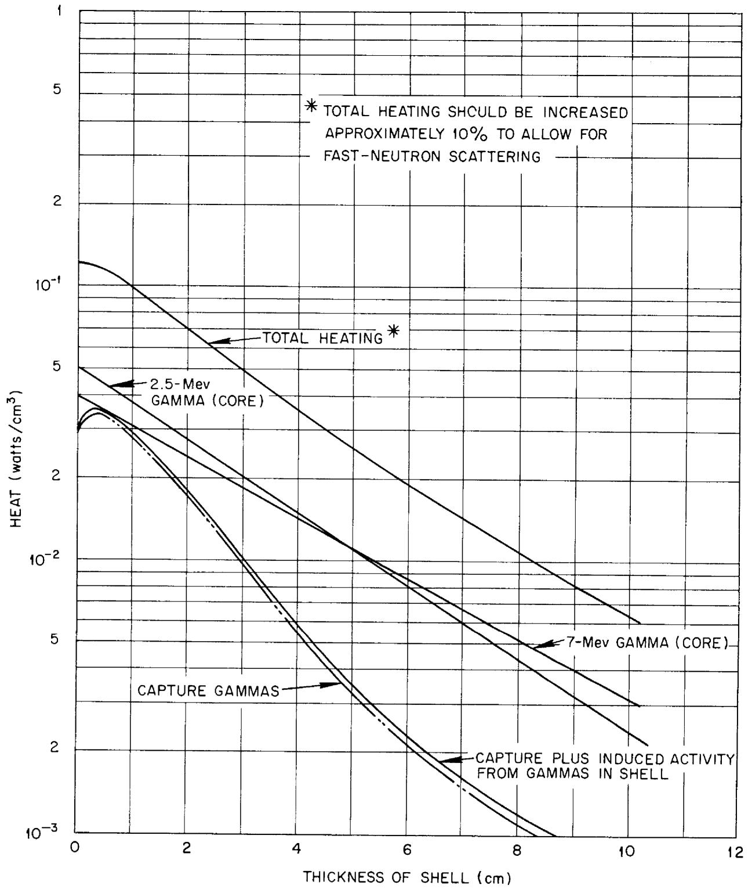  
Fig. 13. Heat Generated in Pressure Shell at 3-Megawatt Power Level.

where $h$ is the heat transfer coefficient of NaK in Btu/hr·ft²·°F. The heat transfer coefficient, $h$ , may be calculated by the following formula:

$$
h = \frac {k _ {\mathrm {N a K}}}{D} (5. 8 + 0. 0 2 \mathrm {P e} ^ {0. 8}), \tag {45}
$$

where

$k_{\mathrm{NaK}} =$ thermal conductivity of NaK,

$D = \mathrm{NaK}$ passage equivalent diameter,

$\mathrm{Pe} = \mathrm{Peclet's}$ number for NaK.

To assure a conservative value for the heat transfer coefficient, the hydraulic diameter of the NaK passage without the tube elbows was used as the equivalent diameter of the NaK passage. The diameter and other values are

$$
D = 0. 6 6 7 \mathrm {f t},
$$

$$
k _ {\mathrm {N a K}} = 1 6. 0 \mathrm {B t u / h r} \cdot \mathrm {f t} ^ {2} (^ {\circ} \mathrm {F / f t}),
$$

$\mathrm{Pe} = 148$ using a velocity of 0.1 ft/sec (cf., chap. 2, "Flow of Reflector Coolant Through Core").

Therefore

$$
h = 1 6 6 \mathrm {B t u} / \mathrm {h r} \cdot \mathrm {f t} ^ {2} \cdot {} ^ {\circ} \mathrm {F}.
$$

The differential equations and boundary conditions thus become

$$
\frac {d ^ {2} \theta}{d x ^ {2}} = 1 2 0 0 e ^ {- 9. 2 0 x} \tag {46}
$$

and

$$
\frac {d \theta}{d x} = 0, \quad \text {a t} x = \tau , \tag {47}
$$

$$
\frac {d \theta}{d x} = 1 5. 1 \theta , \quad \text {a t} x = 0. \tag {48}
$$

The solution is, of course, obvious:

$$
\frac {d \theta}{d x} = 1 3 0. 5 e ^ {- 9. 2 0 x} + c _ {1}, \tag {49}
$$

where, from Ea. 47,

$$
c _ {1} = - 1 3 0. 5 e ^ {- 9. 2 0 \tau},
$$

and therefore

$$
\frac {d \theta}{d x} = 1 3 0. 5 \left(e ^ {- 9. 2 0 x} - e ^ {- 9. 2 0 \tau}\right),
$$

$$
\begin{array}{l} \theta = - 1 4. 1 9 e ^ {- 9. 2 0 x} \tag {50} \\ - 1 3 0. 5 x e ^ {- 9. 2 0 \tau} + c _ {2} \\ c _ {2} = 8. 6 4 \left(1 - e ^ {- 9. 2 0 x}\right) + 1 4. 1 9 \\ \end{array}
$$

$$
\begin{array}{l} \theta = 1 4. 1 9 (1 - e ^ {- 9 \cdot 2 0 x}) \\ - 1 3 0. 5 x e ^ {- 9. 2 0 \tau} \\ + 8. 6 4 \left(1 - e ^ {- 9 \cdot 2 0 x}\right). \\ \end{array}
$$

The temperature at $x = \tau$ , which is, of course, the maximum temperature difference, can be determined:

$$
\begin{array}{l} \theta_ {\tau} = 2 2. 8 3 \left(1 - e ^ {- 9. 2 0 \tau}\right) \tag {51} \\ - 1 3 0. 5 \tau e ^ {- 9 \cdot 2 0 \tau}. \\ \end{array}
$$

For $\tau = 2$ in., $\theta = 13.2^{\circ}\mathrm{F}$ ; for $\tau = 4$ in., $\theta = 19.8^{\circ}\mathrm{F}$ .

$$
\begin{array}{l} \theta_ {x = 0} = 8. 6 4 (1 - e ^ {- 9. 2 0 \tau}) \\ = 6. 7 8, \quad \text {f o r} \tau = 1 / 6 \mathrm {f t}, \\ = 8. 2 3, \quad \text {f o r} \tau = 1 / 3 \mathrm {f t}, \\ \end{array}
$$

$$
\begin{array}{l} h \theta_ {\textit {x} = 0} = 1 6 6 \quad \theta_ {\textit {x} = 0} \\ = 1 1 3 0, \text {f o r} \tau = 1 / 6 \mathrm {f t}, \\ = 1 3 7 0, \text {f o r} \tau = 1 / 3 \mathrm {f t}. \\ \end{array}
$$

These values check very closely the heat generated per square foot in the two different sections. The pressure shell, therefore, will be about 5 to $20^{\circ}\mathrm{F}$ hotter than the NaK.

Heat Generated in the NaK. The calculation of heat generation in the NaK in the reactor circuit is rather complex, and only a gross estimate of the heat generation is available. The maximum heat generation in the NaK will probably be of the order of 10 Btu/sec·ft³, with the average heat generation being of the order of 3 Btu/sec·ft³. Since there is approximately 10 ft³ of NaK in the pressure shell, the total heat generation in the NaK will be of the order of 30 Btu/sec.

The total heat added to the reflector coolant circuit by heat generation in the reflector, pressure shell, and NaK is

$Q = 50.2 + 26.5 + 30 = 106.7$ Btu/sec. This heat addition is independent of NaK temperature.

Heat Transferred from the Reactor Core. Heat is transferred to the NaK in the reflector coolant circuit from the reactor core. The boundaries

across which the heat is transferred are the serpentine elbows, the tubes sheets, the boundary between the core and the reflector, and the walls of the rod and instrument holes.

Serpentine Elbows. The fuel tubes are wound as serpentine coils that pass through the core 11 times (Fig. 9); there are six tubes in parallel. There are therefore sixty 180-deg bends or elbows between the core and the pressure shell, 30 above the core and 30 below it. In addition, between the core and the pressure shell, there are six straight sections at the inlet of the tubes and six straight sections at the outlet. The length of the 180-deg elbows is 8.5 in. for the elbows above the core and 6.5 in. for elbows below the core; the straight sections are 4 in. long above the core and 3 in. long below it. The tubes have an outside diameter of 1.235 in. and 0.060-in. walls. The total length of the bends and the internal and external areas of the bends are

$$
\begin{array}{l} L = 3 0 \left(\frac {6 . 5}{1 2} + \frac {8 . 5}{1 2}\right) + 6 \left(\frac {4}{1 2} + \frac {3}{1 2}\right) \\ = 4 1. 0 f t, \\ \end{array}
$$

$$
A _ {\text {e x t}} = 4 1. 0 \times \pi \times \frac {1 . 2 3 5}{1 2} = 1 3. 3 \mathrm {f t} ^ {2},
$$

$$
\begin{array}{l} A _ {\text {i n t}} = 4 1. 0 \times \pi \times \frac {1 . 2 3 5 - 0 . 1 2 0}{1 2} \\ = 1 2. 0 f t ^ {2}. \\ \end{array}
$$

The fuel-side heat transfer coefficient can be calculated by first calculating the heat transfer coefficient for a straight pipe and correcting for the effect of the bend:

$$
h _ {f} = h _ {f} ^ {\prime} \left(1 + 3. 5 \frac {D _ {i}}{D _ {H}}\right), \tag {52}
$$

where

$h_{f} =$ fuel-side heat transfer coefficient, Btu/sec $^{\circ}$ F,

$h_f' =$ heat transfer coefficient in a straight section, Btu/sec·ft²·°F,

$D_{i} =$ tube inside diameter,

$D_H =$ bend diameter,

$$
h _ {f} = h _ {f} ^ {\prime} \left(1 + 3. 5 \frac {1 . 1 1 5}{3 . 7 5}\right) = 2. 0 4 h _ {f} ^ {\prime};
$$

$$
h _ {f} ^ {\prime} = 0. 0 2 7 \left(\frac {k}{D}\right) _ {f} \operatorname {R e} _ {f} ^ {0. 8} \Pr_ {f} ^ {1 / 3} \left(\frac {\mu}{\mu_ {s}}\right) _ {f} ^ {0. 1 4} \tag {53}
$$

where

$$
\begin{array}{l} \text {R e} _ {f} = \text {R e y n o l d s} ^ {\prime} \text {n u m b e r f o r f u e l} \\ = 1 0, 6 0 0, \end{array}
$$

$$
\begin{array}{l} \Pr_ {f} = \text {P r a n d t l ’ s n u m b e r f o r f u e l} \\ = 3. 7 8, \end{array}
$$

$$
\begin{array}{l} \left(\frac {\mu}{\mu_ {s}}\right) _ {f} ^ {0. 1 4} = 0. 9 6, \\ \left(\frac {k}{D}\right) _ {f} = 0. 0 0 4 4 9. \\ \end{array}
$$

Therefore

$$
\begin{array}{l} h _ {f} ^ {\prime} = 0. 3 0 3 \mathrm {B t u / s e c} \cdot \mathrm {f t} ^ {2} \cdot {} ^ {\circ} \mathrm {F}, \\ h _ {f} = 0. 6 1 8 \mathrm {B t u / s e c} \cdot \mathrm {f t} ^ {2} \cdot {} ^ {\circ} \mathrm {F}, \\ (h A) _ {f} = 7. 4 2 \mathrm {B t u / s e c} ^ {\cdot^ {\circ}} \mathrm {F}, \\ \left(\frac {1}{h A}\right) _ {f} = 0. 1 3 5. \\ \end{array}
$$

The value of the NaK-side heat transfer coefficient is somewhat in doubt because very little work has been done on the heat transfer coefficient of liquid metals flowing across round tubes. For an approximation, the formula for flow inside a round tube will be used, with the outside diameter of the tube being considered as the equivalent diameter:

$$
h _ {\mathrm {N a K}} = \left(\frac {k}{D}\right) _ {\mathrm {N a K}} \left(7 + 0. 0 2 5 \mathrm {P e} _ {\mathrm {N a K}} ^ {0. 8}\right), \tag {54}
$$

where

$$
\begin{array}{l} \begin{array}{l l} \mathrm {P e} _ {\texttt {N a K}} & = \texttt {P e c l e t ' s n u m b e r f o r N a K} \\ & = 2 2. 9, \end{array} \\ \left(\frac {k}{D}\right) _ {\text {N a K}} = 0. 0 4 3 2. \\ \end{array}
$$

Therefore

$$
\begin{array}{l} h _ {\mathrm {N a K}} = 0. 3 1 6, \\ (h A) _ {N a K} = 4. 2 0 B t u / \sec^ {\circ} F, \\ \left(\frac {1}{h A}\right) _ {\textbf {N a K}} = 0. 2 3 8. \\ \end{array}
$$

The tube wall resistance is

$$
\left(\frac {1}{h A}\right) _ {\text {m e t a l}} = \frac {\ln \frac {D _ {o}}{D}}{2 \pi k L} = 0. 1 3 0, \tag {55}
$$

where $D_{o}$ is the outside diameter; and

the over-all resistance is

$$
\begin{array}{l} \left(\frac {1}{h A}\right) = \left(\frac {1}{h A}\right) _ {f} + \left(\frac {1}{h A}\right) _ {\mathrm {N a K}} \tag {56} \\ + \left(\frac {1}{h A}\right) _ {\text {m e t a l}} = 0. 5 0 3. \\ \end{array}
$$

For the calculation of the effective temperature difference between the fuel and the NaK it is assumed that the NaK temperature is constant and is the same as the mean temperature of the NaK in the core. This simplifying assumption leads to some inaccuracies in the calculation of the heat transferred to the NaK; however, in view of the extremely complex flow of the NaK through the reactor, it is doubtful whether any approximation would be more valid. Since the variation in the fuel temperature from 1150 to $1500^{\circ}\mathrm{F}$ is due primarily to heating in the core, the arithmetic-average temperature difference between the NaK and the fuel should be used.

The arithmetic-average elbow temperature is about $1330^{\circ}\mathrm{F}$ . The effective temperature difference and the heat rejected to the NaK through the serpentine elbows are given in the following tabulation for various mean temperatures:

<table><tr><td>MEAN NaK TEMPERATURE (°F)</td><td>AVERAGE TEMPERATURE DIFFERENCE (°F)</td><td>HEAT REJECTED TO NaK (Btu/sec)</td></tr><tr><td>1300</td><td>30</td><td>60</td></tr><tr><td>1200</td><td>130</td><td>258</td></tr><tr><td>1075</td><td>255</td><td>507</td></tr><tr><td>1000</td><td>330</td><td>656</td></tr><tr><td>800</td><td>530</td><td>1054</td></tr></table>

Tube Sheets. The tube sheets are the metal plates at the upper and lower boundaries of the core through which the fuel tubes pass (Fig. 9). Figure 14 shows a cross section of a typical fuel tube and its associated moderator blocks and tube sheet section. Heat is generated in the moderator and transferred to the fuel and the NaK; in addition, heat flows from the fuel to the NaK through the moderator blocks. The differential equation and boundary conditions for the two-dimensional

system shown in Fig. 14 are given in the following:

$$
\frac {\partial^ {2} \theta}{\partial x ^ {2}} + \frac {\partial^ {2} \theta}{\partial y ^ {2}} = - \frac {q ^ {\prime}}{k}, \tag {57}
$$

where

$$
\theta = T - T _ {\mathrm {N a K}}, ^ {\circ} \mathrm {F},
$$

$$
\begin{array}{l} T = \text {t e m p e r a t u r e a t a n y p o i n t} (x, y), \\ \quad \mathrm {^ {\circ} F}, \end{array}
$$

$$
\begin{array}{l} \begin{array}{r l} T _ {\mathrm {N a K}} & = \text {t e m p e r a t u r e o f t h e N a K ,} ^ {\circ} \mathrm {F}, \\ q ^ {\prime} & = \text {h e a t g e n e r a t i o n i n m o d e r a t o r}, \\ & \quad \mathrm {B t u / s e c} \cdot \mathrm {f t} ^ {3}, \end{array} \\ k = \text {t h e r n a l} \quad \text {c o n d u c t i v i t y} \quad \text {m o d e r -} \quad \text {a t o r , B t u / s e c} \cdot \mathrm {f t} ^ {2} \quad \left(^ {\circ} \mathrm {F} / \mathrm {f t}\right). \\ \end{array}
$$

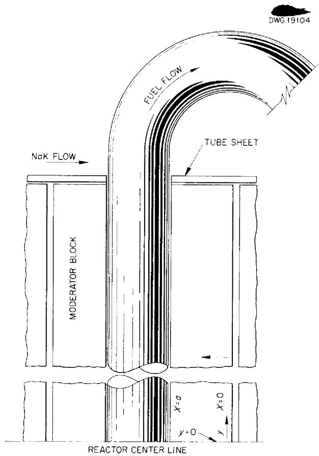  
Fig. 14. Cross Section of Moderator Block Showing Tube Sheet and Fuel Tube.

The heat generation in the moderator block is assumed to be constant in the $x$ direction and to vary in the $y$ direction in accordance with the axial moderator heating curve found in the section on power distribution. The

boundary conditions are

$$
\begin{array}{l} \frac {\partial \theta}{\partial x} = 0, \quad \text {a t} x = 0, (58) \\ \frac {\partial \theta}{\partial y} = 0, \quad \text {a t} y = 0, (59) \\ \frac {\partial \theta}{\partial x} = - \frac {h _ {f}}{k} \left(\theta + T _ {\mathrm {N a K}} - T _ {s}\right), (60) \\ \text {a t} x = a, \\ \frac {\partial \theta}{\partial y} = - \frac {h _ {\mathrm {N a K}}}{k} \theta , \quad \text {a t} y = b. (61) \\ \end{array}
$$

No closed or series solution for this boundary value problem could be readily found; consequently, solutions to specific numerical problems were undertaken by the relaxation method. Figure 15 shows the temperature pattern across the tube sheet face of a typical moderator block, as found by this method, for several NaK temperatures. The heat loss from the section of the tube sheet adjacent to one fuel tube and moderator block and the total heat loss from both tube sheets, which is 132 times the loss from one of the sections, are tabulated in the following:

<table><tr><td>NaK TEMPERATURE (°F)</td><td>HEAT LOSS PER SECTION (Btu/sec)</td><td>TOTAL HEAT LOSS (Btu/sec)</td></tr><tr><td>900</td><td>1.86</td><td>246</td></tr><tr><td>1075</td><td>1.15</td><td>150</td></tr><tr><td>1250</td><td>0.25</td><td>33</td></tr></table>

Boundary Between Core and Reflector. The fuel tubes at the periphery of the core (near the reflector) are at a considerably higher temperature than the reflector, and they transfer heat into the reflector through the beryllium oxide blocks. An estimate of the heat transferred into the NaK circuit by this method has been made. The system of fuel tubes, NaK tubes, and beryllium oxide blocks was simplified and considered as a hollow beryllium oxide cylinder with internal heat generation in which the inner surface is washed by fuel and the outer surface is washed by NaK. The actual heat transfer coefficients of the fuel and the NaK in the tubes were calculated and, from these coefficients, hypothetical heat transfer coefficients on the sides of the cylinder were computed so that

$$
h ^ {*} A ^ {*} = h A, \tag {62}
$$

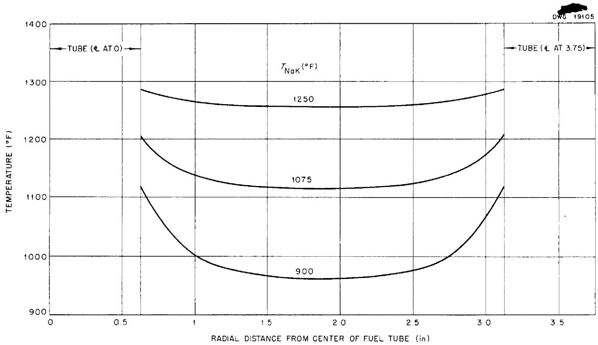  
Fig. 15. Temperature Pattern Across Tube Sheet Face.

where

$h^{*} =$ actual heat transfer coefficient, Btu/sec·ft²·°F,

$A^{*} =$ actual heat transfer area, ft², $h =$ hypothetical heat transfer coefficient, Btu/sec·ft²·°F, $A =$ hypothetical heat transfer area, ft².

The mean radius of the peripheral fuel tube circle is about 15 in. and there are 29 tubes; the mean radius of the inner circumference of the NaK tubes is about 18 1/2 in. and there are 35 tubes; and the reactor core is 36 in. in height. Therefore the actual heat transfer areas are

(63) $A^{*} = \pi DLN$

$$
A _ {f} ^ {*} = 2 5. 8 \mathrm {f t} ^ {2},
$$

$$
A _ {\mathrm {N a K}} ^ {*} = 1 1. 8 6 \mathrm {f t} ^ {2};
$$

and the hypothetical heat transfer areas are

(64) $A = 2\pi rL$

$$
A _ {f} = 2 3. 6 \mathrm {f t} ^ {2},
$$

$$
A _ {\mathrm {N a K}} = 2 9. 1 \mathrm {f t} ^ {2},
$$

where

$D =$ tube inside diameter, ft,

$L =$ tube length, ft,

$N =$ number of tubes,

$r =$ average radius of tube circle, ft.

The heat transfer coefficients in the tubes are found as follows:

1. For the fuel tubes

(65) $h_{f}^{*} = 0.027\frac{k_{f}}{D_{f}}\operatorname{Re}_{f}^{0.8}\operatorname{Pr}_{f}^{1 / 3}\left(\frac{\mu}{\mu_{s}}\right)_{f}^{0.14},$

where

$k_{f} =$ thermal conductivity of fuel, Btu/sec·ft² (°F/ft),

$\mathbf{Re}_f = \mathbf{Reynolds}'$ number for fuel,

$\mathbf{Pr}_f = \mathbf{Prandtl's}$ number for fuel,

$\left(\frac{\mu}{\mu_s}\right)_f = \text{ratio of viscosity of fuel at bulk temperature to viscosity at surface temperature.}$

For a fuel velocity of 3.7 ft/sec and a $D_{f}$ of 0.09285 ft, the values of the terms in Eq. 65 are

$$
\mathrm {R e} _ {f} = 1 3, 4 5 0,
$$

$$
\Pr_ {f} = 2. 9 8,
$$

$$
\left(\frac {\mu}{\mu_ {s}}\right) _ {f} ^ {0. 1 4} = 1,
$$

$$
h _ {f} ^ {*} = 0. 3 7 3.
$$

2. For the NaK tubes

(66) $h_{\text{NaK}}^{*} = \frac{k_{\text{NaK}}}{D_{\text{NaK}}} (7.0 + 0.025 \text{Pe}_{\text{NaK}}^{0.8})$

where $\mathbf{Pe}_{\mathbf{NaK}}$ is Peclet's number for NaK. For a NaK velocity of 3.0 ft/sec and a $D_{\mathrm{NaK}}$ of 0.03582 ft, the values of the terms in Eq. 66 are

$$
\mathrm {P e} _ {\text {N a K}} = 2 3 6. 4,
$$

$$
h _ {\mathrm {N a K}} ^ {*} = 1. 0 9 3.
$$

The hypothetical heat transfer coefficients are therefore

$$
h _ {f} = \frac {h _ {f} ^ {*} A _ {f} ^ {*}}{A _ {f}} = 0. 4 0 8
$$

and

$$
h _ {\mathrm {N a K}} = \frac {h _ {\mathrm {N a K}} ^ {*} A _ {\mathrm {N a K}} ^ {*}}{A _ {\mathrm {N a K}}} = 0. 4 4 6.
$$

The differential equation for steady-state heat conduction with internal heat generation is

(67) $\nabla^2 T = -\frac{q'}{k_{\text{B e O}}}$ ,

where

$T =$ temperature at any point in the BeO, ${}^{\circ}\mathrm{F}$

$q^{\prime} =$ internal heat generation, Btu/sec·ft³,

$k_{\text{BeO}} = \frac{\text{thermal conductivity of BeO}}{\text{Btu/sec} \cdot \text{ft}^2 \cdot (^{\circ}\text{F / ft})}$ .

Although $q^{\prime}$ varies with radial distance and $k_{\text{Be0}}$ varies with temperature, both will be assumed constant and equal to their average values. This simplifying assumption undoubtedly results in some error and the following solutions, accordingly, are only estimates:

$$
q ^ {\prime} = 7. 7 4 \mathrm {B t u / s e c} \cdot \mathrm {f t} ^ {3},
$$

and

$$
k _ {\mathrm {B e} 0} = 0. 0 0 5 4 \mathrm {B t u / s e c} \cdot \mathrm {f t} ^ {2} \left(^ {\circ} \mathrm {F} / \mathrm {f t}\right).
$$

The solution of the differential equation for the infinite cylinder case is

$$
\frac {d T}{d r} = - 7 1 7 + \frac {c _ {1}}{r}, \tag {68}
$$

$$
T = - 3 5 8. 5 r ^ {2} + c _ {1} \ln r + c _ {2}, \tag {69}
$$

where $r$ is the radial distance from the center of the core in feet and $c_{1}$ and $c_{2}$ are arbitrary constants. The boundary conditions are

$$
\frac {d T}{d r} = - \frac {h _ {f}}{k _ {\mathrm {B e 0}}} (1 4 6 0 - T),
$$

$$
\mathrm {a t} r = 1. 2 5 \mathrm {f t}
$$

(the mean fuel temperature in the peripheral tubes is $1460^{\circ}\mathrm{F}$ ),

$$
\begin{array}{l} \frac {d T}{d r} = - \frac {h _ {\mathrm {N a K}}}{k _ {\mathrm {B e O}}} (T - T _ {\mathrm {N a K}}), \tag {71} \\ \mathrm {a t} r = 1. 5 4 1 7 \mathrm {f t} \\ \end{array}
$$

$(T_{\mathrm{NaK}}$ is the mean NaK temperature). The values of $c_{1}$ and $c_{2}$ are obtained by using the boundary conditions:

$$
c _ {1} = 4. 3 8 2 3 T _ {\mathrm {N a K}} - 5 0 0 8. 5 3 \tag {72}
$$

and

$$
c _ {2} = 3 0 7 2. 7 1 - 0. 9 3 1 4 6 T _ {\mathrm {N a K}} \tag {73}
$$

(the solution requires that many significant figures be carried). The temperature differences at the BeO-to-fuel and BeO-to-NaK interfaces and the heat removed from the fuel and added to the NaK are given in Table 3. It is obvious from the data in Table 3 that heat is transferred from the fuel to the NaK and that all the heat generated in the beryllium oxide goes into the NaK. A simple check of the numerical work, by the method of superposition, is therefore possible:

$$
\begin{array}{l} Q _ {\mathrm {B e O}} = q ^ {\prime} \pi \left(r _ {\mathrm {N a K}} ^ {2} - r _ {f} ^ {2}\right) L \tag {74} \\ = 5 9. 5 \mathrm {B t u} / \sec , \\ \end{array}
$$

$$
\begin{array}{l} \theta_ {\text {B e 0}} = \text {t e m p e r a t u r e d i f f e r e n c e} \\ \text {a c r o s s t h e b e r y l l i u m} \end{array}
$$

oxide resulting from internal heat generation only $= 61.1^{\circ}\mathrm{F},$

$$
\begin{array}{l} \left(\frac {1}{h A}\right) _ {f} = 0. 1 0 3 9, \\ \left(\frac {1}{h A}\right) _ {\text {N a K}} = 0. 0 7 7 1, \\ \left(\frac {1}{h A}\right) _ {\text {B e O}} = 2. 0 6 0, \\ \left(\frac {1}{h A}\right) _ {f - N a K} = 2. 2 4 1. \\ \end{array}
$$

The fuel-to-NaK temperature differences for the various NaK temperatures are given in Table 4. As can be seen, the results agree quite well with the results given in Table 3.

A portion of the heat transferred to the NaK comes from heat generated in the beryllium oxide in the reflector, as previously discussed. It is therefore necessary to subtract from the heat transferred to the NaK an amount equal to

$$
\begin{array}{l} Q = 7. 7 4 \pi \left[ \left(\frac {1 8 . 5}{1 2}\right) ^ {2} \right. \\ \left. - \left(\frac {1 8 . 0}{1 2}\right) ^ {2} \right] \times 3 = 4. 6 5 \mathrm {B t u / s e c}. \\ \end{array}
$$

The net heat added to the NaK is then

$$
T _ {\text {N a K}} \quad (Q _ {\text {N a K}}) _ {\text {n e t}}
$$

$$
\begin{array}{l} \begin{array}{c c} 8 0 0 & 3 2 2 \end{array} \\ \begin{array}{l l} 1 0 0 0 & 2 3 3 \end{array} \\ \begin{array}{l l} 1 0 7 5 & 1 9 9 \end{array} \\ \begin{array}{l l} 1 2 0 0 & 1 4 3 \end{array} \\ \begin{array}{l l} 1 3 0 0 & 9 9 \end{array} \\ \end{array}
$$

Walls of the Rod and Instrument Holes. There are six vertical holes through the reactor core and pressure shell to admit control rods and nuclear instruments (Fig. 16). In each hole there are three concentric tubes (Fig. 17); NaK flows through the passage between the outer two

TABLE 3. TEMPERATURE DIFFERENCES AND HEAT TRANSFERRED AT THE BeO-TO-FUEL AND BeO-TO-NaK INTERFACES  

<table><tr><td rowspan="2">\( {T}_{\mathrm{{NaK}}}\left( {{}^{o}\mathrm{\;F}}\right) \)</td><td colspan="2">TEMPERATURE DIFFERENCE ( \( {}^{o}\mathrm{\;F} \) )</td><td rowspan="2">\( {Q}_{f}{}^{\left( a\right) } \)</td><td rowspan="2">\( {Q}_{\text{NaK }}{}^{\left( b\right) } \)</td><td rowspan="2">\( {Q}_{\text{BeO }} = {Q}_{\text{NaK }} + {Q}_{f}{}^{\left( c\right) } \)</td></tr><tr><td>BeO- to- Fuel</td><td>BeO-to-NaK</td></tr><tr><td>800</td><td>-27.77</td><td>25.20</td><td>-267.4</td><td>326.7</td><td>59.3</td></tr><tr><td>1000</td><td>-18.49</td><td>18.31</td><td>-178.0</td><td>237.4</td><td>59.4</td></tr><tr><td>1075</td><td>-15.01</td><td>15.73</td><td>-144.5</td><td>203.9</td><td>59.4</td></tr><tr><td>1200</td><td>-9.21</td><td>11.42</td><td>-88.7</td><td>148.0</td><td>59.3</td></tr><tr><td>1300</td><td>-4.57</td><td>7.97</td><td>-44.0</td><td>103.3</td><td>59.3</td></tr></table>

$(a)Q_{f} =$ heat transferred to the fuel, Btu/sec.   
(b) $Q_{\text{NaK}} = \text{heat transferred to the NaK, Btu/sec.}$   
(c) $Q_{\text{BeO}} = \text{heat generated in BeO, Btu/sec.}$

TABLE 4. TEMPERATURE DIFFERENCES AND HEAT TRANSFERRED AT THE FUEL-TO-NaK INTERFACE   

<table><tr><td>\( T_{NaK} \)(°F)</td><td>TEMPERATURE DIFFERENCE FUEL-TO-NaK, \( \theta_{f-NaK} \)(°F)</td><td>\( \theta_{f-NaK}-\theta_{BeO} \)(°F)</td><td>\( Q_f=(hA)_{f-NaK}(\theta_{f-NaK}-\theta_{BeO}) \)(Btu/sec)</td><td>\( Q_{NaK}=-Q_f+Q_{BeO} \)(Btu/sec)</td></tr><tr><td>800</td><td>660</td><td>598.9</td><td>-267.2</td><td>326.7</td></tr><tr><td>1000</td><td>460</td><td>398.9</td><td>-178.0</td><td>237.5</td></tr><tr><td>1075</td><td>385</td><td>323.9</td><td>-144.5</td><td>204.0</td></tr><tr><td>1200</td><td>260</td><td>198.9</td><td>-88.7</td><td>148.2</td></tr><tr><td>1300</td><td>160</td><td>98.9</td><td>-44.1</td><td>103.6</td></tr></table>

tubes and removes the heat that would otherwise be transmitted to the hole from the reactor; the passage between the inner two tubes is packed with insulation; helium flows inside the inner tube and cools the rod or instrument and the inner tube wall. Heat is therefore added to the NaK from the reactor and removed from the NaK by the helium. Since the two instrument holes are located in the reflector and the heat addition to the NaK from the reflector has already been accounted for in the calculation of heat generated in the reflector, only the heat added to the NaK in the four control rod holes remains to be calculated. The calculation of the

heat removed from the NaK by the helium in the six holes can be found in chap. 5, "Rod and Instrument Cooling System."

Each rod hole through the reactor is surrounded by six beryllium oxide blocks, each of which contains a fuel tube (Fig. 16). The mean fuel temperature in the fuel tubes is about $1200^{\circ}\mathrm{F}$ . As a simplification (similar to that used in the calculation of heat transfer across the boundary of the core and reflector), the holes and associated structure were considered as a hollow beryllium oxide cylinder with internal heat generation and with the inner surface washed by NaK and the outer surface washed by fuel.

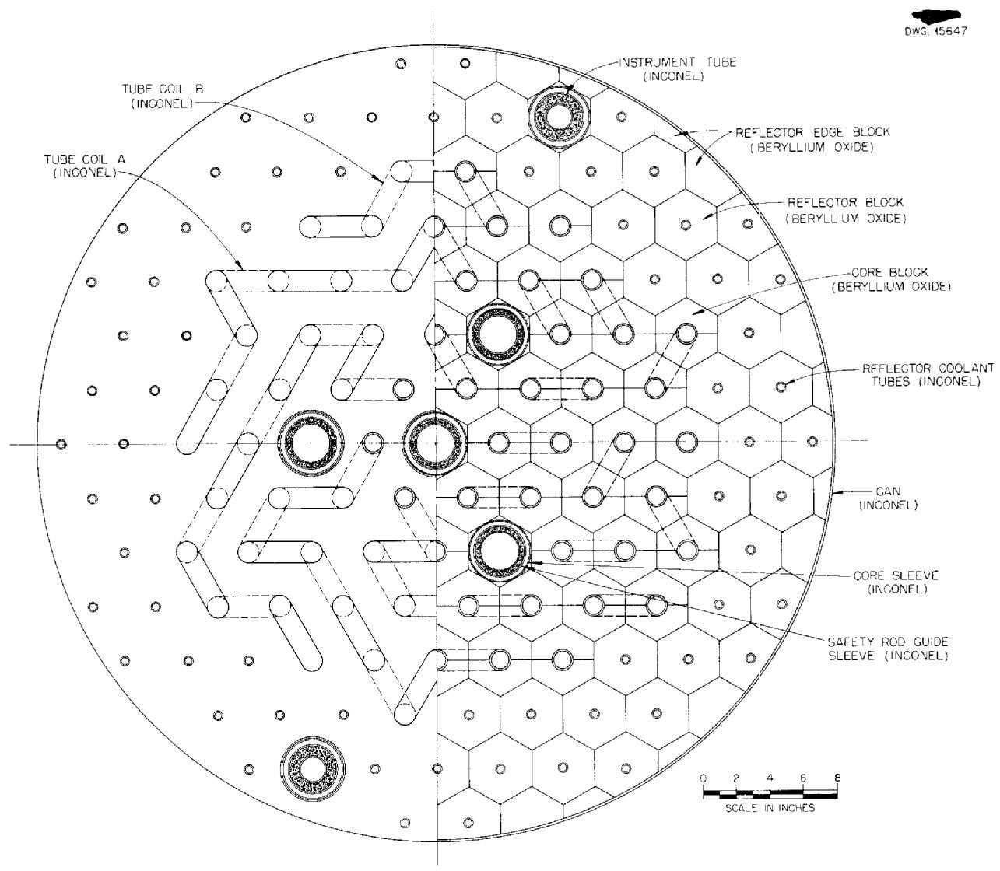  
Fig. 16. Plan View of Reactor Core Lattice.

There is some overlapping of fuel tubes in the sense that some of the tubes are members of the tube sets encircling more than one rod hole. This effect was neglected inasmuch as the heat added to the NaK in the rod holes is considerably smaller in magnitude than the heat added elsewhere and, hence, a rough estimate of the heat addition is all that is necessary. The actual heat transfer coefficient in the fuel tubes was calculated and, from this coefficient, a hypothetical heat transfer coefficient on the side of the cylinder was computed so that:

$$
h ^ {*} A ^ {*} = h A, \tag {75}
$$

where

$h^{*}$ = actual heat transfer coefficient, Btu/sec·ft²·°F,

$A^{*} = \text{actual heat transfer area}$ , ft²,

$h =$ hypothetical heat transfer coefficient, Btu/sec·ft²·°F,

$A =$ hypothetical heat transfer area, ft².

The inside radius of the outer NaK-containing tube is 1.826 in.; the mean radius of the fuel tube circle is 3.75 in.; and the height of the reactor core is 36 inches. The heat transfer coefficients and

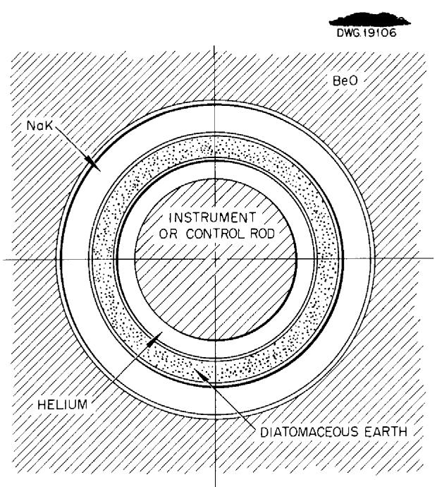  
Fig. 17. Cross Section of Helium Passage and Sleeve.

areas are therefore:

1. For the NaK annulus

$$
A _ {\mathrm {N a K}} = A _ {\mathrm {N a K}} ^ {*} = \pi D _ {\mathrm {N a K}} L, \tag {76}
$$

$$
\begin{array}{l} h _ {\mathrm {N a K}} = h _ {\mathrm {N a K}} ^ {*} \tag {77} \\ = \frac {k _ {\mathrm {N a K}}}{D _ {\mathrm {N a K}}} \left(5. 8 + 0. 0 2 0 \mathrm {P e} _ {\mathrm {N a K}} ^ {0. 8}\right), \\ \end{array}
$$

where

$D =$ equivalent diameter, ft,

$L =$ length of reactor core, ft,

$k =$ thermal conductivity, Btu/sec·ft² (°F/ft),

$\mathbf{Pe} = \mathbf{Pel}$ cet's number.

For a NaK velocity of 0.81 ft/sec, an $A_{\text{NaK}} = A_{\text{NaK}}^*$ of 2.87 ft², and a $D_{\text{NaK}}$ of 0.0543 ft, the values of the terms in Eqs. 76 and 77 are

$$
\mathrm {P e} _ {\text {N a K}} = 9 7. 4,
$$

$$
h _ {\mathrm {N a K}} = h _ {\mathrm {N a K}} ^ {*} = 0. 5 3 0 \mathrm {B t u} / \sec^ {2} \circ \mathrm {F}.
$$

2. For the fuel tubes

$$
A _ {f} ^ {*} = \pi D _ {f} L N _ {f}, \tag {78}
$$

$$
A _ {f} = 2 \pi r _ {f} L, \tag {79}
$$

(80) $h_f^*$

$$
= 0. 0 2 7 \frac {k _ {f}}{D _ {f}} \operatorname {R e} _ {f} ^ {0. 8} \Pr_ {f} ^ {1 / 3} \left(\frac {\mu}{\mu_ {s}}\right) _ {f} ^ {0. 1 4},
$$

where

$$
N = \text {n u m b e r o f t u b e s},
$$

$$
r = \text {m e a n} r a d i u s, f t,
$$

$$
\mathrm {R e} = \text {R e y n o l d s} ^ {\prime} \text {n u m b e r},
$$

$$
\Pr = \text {P r a n d t l} ^ {\prime} \text {s n u m b e r},
$$

$$
\left(\frac {\mu}{\mu_ {s}}\right) _ {f} = \text {r a t i o o f v i s c o s i t y o f f u e l a t} \quad \text {b u l k t e m p e r a t u r e t o v i s c o s i t y} \quad \text {a t s u r f a c e t e m p e r a t u r e .}
$$

For a fuel velocity of 3.7 ft/sec, an $A_{f}^{*}$ of 5.25 ft², an $A_{f}$ of 5.90 ft², and a $D_{f}$ of 0.09285 ft, the values of the terms in Eqs. 78, 79, and 80 are

$$
\mathrm {R e} = 7 9 7 0,
$$

$$
\Pr = 5. 0 2,
$$

$$
\left(\frac {\mu}{\mu_ {s}}\right) _ {f} ^ {0. 1 4} = 1,
$$

$$
h _ {f} ^ {*} = 0. 2 9 4 \mathrm {B t u / s e c} \cdot \mathrm {f t} ^ {2} \cdot {} ^ {\circ} \mathrm {F},
$$

$$
h _ {f} = 0. 2 6 2 \mathrm {B t u / s e c} \cdot \mathrm {f t} ^ {2} \cdot {} ^ {\circ} \mathrm {F}.
$$

The differential equation for steady-state heat conduction with internal heat generation is

$$
\nabla^ {2} T = - \frac {q ^ {\prime}}{k _ {\mathrm {B e 0}}} \tag {81}
$$

where

$$
\begin{array}{l} q ^ {\prime} = \text {i n t e r n a l h e a t g e n e r a t i o n ,} \\ \text {B t u / s e c} \cdot \text {f t} ^ {3}, \end{array}
$$

$$
\begin{array}{l} k _ {\text {B e 0}} = \text {t h e r m a l c o n d u c t i v i t y o f B e 0 ,} \\ \text {B t u / s e c} \cdot \text {f t} ^ {2} \quad (^ {\circ} \text {F / f t}). \end{array}
$$

Although $q^{\prime}$ varies with radial distance and $k_{\text{Be0}}$ varies with temperature, both will be assumed constant and equal to their average values. This is done for simplicity and undoubtedly results in solutions that are only approximate. The values are

$$
q ^ {\prime} = 3 9. 8 \mathrm {B t u / s e c} \cdot \mathrm {f t} ^ {3}
$$

and

$$
k _ {\mathrm {B e} 0} = 0. 0 0 5 8 \mathrm {B t u / s e c} \cdot \mathrm {f t} ^ {2} (^ {\circ} \mathrm {F} / \mathrm {f t}).
$$

The solution of the differential

equation for. the infinite cylinder case is

$$
\begin{array}{l} \frac {d T}{d r} = 3 4 3 1 r + \frac {c _ {1}}{r}, (82) \\ T = 1 7 1 5. 5 r ^ {2} + c _ {1} \ln r + c _ {2}, (83) \\ \end{array}
$$

where

$$
\begin{array}{l} T = \text {t e m p e r a t u r e}, ^ {\circ} F, \\ \begin{array}{l} r = \text {r a d i a l} \\ \text {c o r e , f t ,} \end{array} \\ \end{array}
$$

$$
c _ {1} \text {a n d} c _ {2} = \text {a r b i t r a r y c o n s t a n t s}.
$$

The boundary conditions are

$$
\frac {d T}{d r} = \frac {h _ {\mathrm {N a K}}}{k _ {\mathrm {B e O}}} (T - T _ {\mathrm {N a K}}), \tag {84}
$$

at $r = 0.15217$ ft,

$$
\frac {d T}{d r} = \frac {- h _ {f}}{k _ {\mathrm {B e 0}}} (T - 1 2 0 0), \tag {85}
$$

at $r = 0.13250$ ft (the mean fuel temperature is approximately $1200^{\circ}\mathrm{F}$ ). Solving for $c_{1}$ and $c_{2}$ by using the boundary condition gives

$$
\begin{array}{l} c _ {1} = 1 5 7 3. 8 7 - 1. 1 5 9 6 T _ {\mathrm {N a K}}, (86) \\ c _ {2} = 3 1 1 0. 4 0 - 1. 2 6 6 6 T _ {\mathrm {N a K}} (87) \\ \end{array}
$$

(the solution requires that many significant figures be carried).

The temperature differences at the BeO-to-NaK and BeO-to-fuel interfaces and the heat added to the NaK and to the fuel are given in Table 5. The

values given in Table 5 are for one of the four rod holes. A check of some of the numerical work, by the method of superposition, is possible:

$$
Q _ {\mathrm {B e} 0} = q ^ {\prime} \pi \left(r _ {f} ^ {2} - r _ {\mathrm {N a K}} ^ {2}\right) L = 2 7. 9 \mathrm {B t u / s e c}.
$$

The temperature difference from the fuel to the NaK across the beryllium oxide because of internal heat generation only is $131.7^{\circ}\mathrm{F}$ when all the generated heat enters the NaK, and $-88.8^{\circ}\mathrm{F}$ when all the generated heat enters the fuel.

The resistance to heat transfer between the NaK and the fuel is

$$
\begin{array}{l} \left(\frac {1}{h A}\right) _ {\mathrm {N a K}} = 0. 6 5 7 4, \\ \left(\frac {1}{h A}\right) _ {f} = 0. 6 4 7 5, \\ \left(\frac {1}{h A}\right) _ {\text {B e 0}} = 6. 5 8 1 8, \\ \left(\frac {1}{h A}\right) _ {f - N a K} = 7. 8 8 7. \\ \end{array}
$$

The fuel-to-NaK temperature differences for the various NaK temperatures are given in Table 6. As can be seen, the results agree quite well with the results given in Table 5.

TABLE 5. TEMPERATURE DIFFERENCES AND HEAT TRANSFERRED AT THE BeO-TO-NaK AND BeO-TO-FUEL INTERFACES  

<table><tr><td rowspan="2">TNaK(°F)</td><td colspan="2">TEMPERATURE DIFFERENCE (°F)</td><td rowspan="2">QNaK(a)</td><td rowspan="2">Qf(b)</td><td rowspan="2">QBeO = QNaK - Qf(c)</td></tr><tr><td>BeO-to-NaK</td><td>BeO-to-Fuel</td></tr><tr><td>800</td><td>40.74</td><td>-22.01</td><td>61.97</td><td>-33.97</td><td>28.00</td></tr><tr><td>1000</td><td>24.06</td><td>-5.57</td><td>36.60</td><td>-8.60</td><td>28.00</td></tr><tr><td>1075</td><td>17.80</td><td>0.60</td><td>27.08</td><td>0.93</td><td>28.01</td></tr><tr><td>1200</td><td>7.38</td><td>10.87</td><td>11.23</td><td>16.78</td><td>28.01</td></tr><tr><td>1300</td><td>-0.96</td><td>19.09</td><td>-1.46</td><td>29.47</td><td>28.01</td></tr></table>

(a) $Q_{\mathrm{NaK}} = \text{heat transferred to NaK, Btu/sec.}$   
(b) $Q_{f} = \text{heat transferred to the fuel, Btu/sec.}$   
(c) $Q_{\text{BeO}} = \text{heat generated in BeO, Btu/sec.}$

TABLE 6. TEMPERATURE DIFFERENCES AND .HEAT TRANSFERRED AT THE FUEL-TO-NaK INTERFACE   

<table><tr><td>TNaK(°F)</td><td>θf-NaK(°F)</td><td>GENERATEDHEAT ENTERS</td><td>θf-NaK - θBeO(°F)</td><td>Qf(Btu/sec)</td><td>QNak(Btu/sec)</td></tr><tr><td>800</td><td>400</td><td>NaK</td><td>268.3</td><td>-34.0</td><td>62.0</td></tr><tr><td>1000</td><td>200</td><td>NaK</td><td>68.3</td><td>-8.7</td><td>36.6</td></tr><tr><td>1075</td><td>100</td><td>NaK and fuel</td><td></td><td></td><td></td></tr><tr><td>1200</td><td>0</td><td>NaK and fuel</td><td></td><td></td><td></td></tr><tr><td>1300</td><td>-100</td><td>Fuel</td><td>-11.3</td><td>+29.3</td><td>-1.4</td></tr></table>

The heat removed from the NaK by the helium flowing through the rod holes is calculated in chap. 5, "Rod and Instrument Cooling System," for the various rods and instruments.

Summary. A plot of the heat added to the NaK circuit vs. the mean NaK temperatures for the various sources of heat addition is shown in Fig. 18. A plot of the net heat that must be removed from the NaK in the reflector coolant heat exchangers vs. the mean NaK temperature is shown in Fig. 19. By cross-plotting these two figures, the mean NaK temperature is obtained; the cross-plot is shown in Fig. 19. The mean NaK temperature is about $1172^{\circ}\mathrm{F}$ , and at that temperature, 640 Btu/sec (675 kw) is removed from the reactor by the reflector cooling system. The minimum and maximum NaK temperatures are about 1105 and $1235^{\circ}\mathrm{F}$ , respectively (Fig. 1). The maximum pressure-shell temperature is about $20^{\circ}\mathrm{F}$ greater than the maximum NaK temperature (see previous work in this section) and is therefore about $1255^{\circ}\mathrm{F}$ .

# PRESSURE DROP IN FUEL MANIFOLDS AND CORE TUBES

The fuel flows from the heat exchangers through the surge tanks and pumps and into the inlet manifold of the reactor, where it is distributed into the six parallel passes through the core lattice. Upon leaving the core lattice, the fuel enters the outlet manifold. From the outlet manifold, the fuel is returned to the

heat exchangers. For a fuller understanding of the circuit, see Figs. 1 and 9. The problem is to determine the pressure drop (or drops) of the

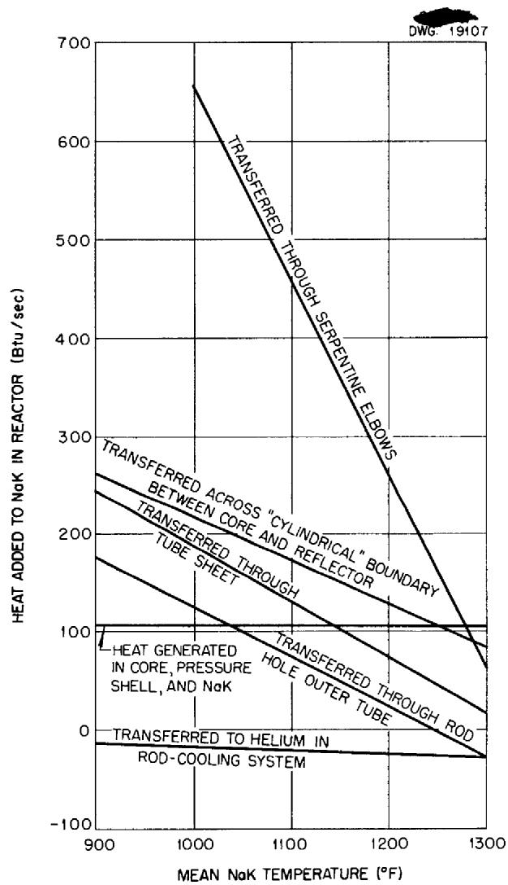  
Fig. 18. Heat Removed by NaK.

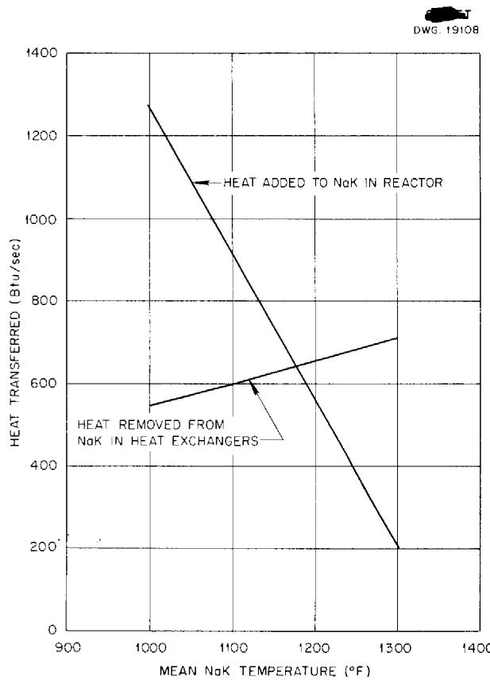  
Fig. 19. Heat Added to and Removed from NaK vs. Temperature.

fuel from the time it enters the inlet manifold until it leaves the outlet manifold.

The pressure drop of the fuel in flowing through the inlet manifold, core lattice, and outlet manifold is due to five factors: friction, curvature of the tubes or pipes, contraction losses, expansion losses, and losses in the pipe fittings and square elbows. The formula for loss in pressure because of friction is

$$
\Delta P _ {f} = 4 f \frac {L}{D} \frac {\rho v ^ {2}}{2 g}, \tag {88}
$$

where $f$ is the friction factor given by $f = 0.046 / N_{R}^{0.2}$ for turbulent flow. (11) The curvature loss is given more simply by

$$
\Delta P _ {c} = k _ {c} \frac {\rho v ^ {2}}{2 g}. \tag {89}
$$

In this expression, $k_{c}$ is a constant that is taken from the curves of Cox,

Glen, and Germano (cf., p. 191 and 193 of ref. 12). The expression for contraction loss is very similar to that for curvature;

$$
\Delta P _ {x} = k \frac {\rho v _ {1} ^ {2}}{2 g}, \tag {90}
$$

where $k$ is a constant that is dependent upon the ratio of the smaller area to the larger. Values for $k$ are found in the work of McAdams (cf., p. 122 of ref. ll). The loss caused by expansion is determined from

$$
\Delta P _ {y} = \rho \frac {\left(v _ {1} - v _ {2}\right) ^ {2}}{2 g}. \tag {91}
$$

The pressure drop in a fitting or square elbow is calculated by using the friction drop equation and replacing $L$ by $L_{e}$ ; that is,

$$
\Delta P _ {F} = 4 f \frac {L _ {e}}{D} \frac {\rho v ^ {2}}{2 g}. \tag {92}
$$

The $L_{e}$ 's for square elbows and various fittings are given in ref. l3; they depend upon the tube or pipe size. The symbols used in the equations above have the following meanings and units:

$$
\Delta P = \text {p r e s s u r e} \quad \text {d r o p}, \quad \mathrm {l b / f t} ^ {2},
$$

$$
f = \text {f r i c t i o n}
$$

$$
L = \text {l e n g t h}, \quad \mathrm {f t},
$$

$$
D = \text {h y d r a u l i c}
$$

$$
\rho = \text {d e n s i t y}, \quad \mathrm {l b} / \mathrm {f t} ^ {3},
$$

$$
\begin{array}{l} \nu = \text {a v e r a g e v e l o c i t y g i v e n b y f t} ^ {3} \\ \text {o f f l u i d p e r s e c o n d / f t} ^ {2} \text {o f} \\ \text {c r o s s s e c t i o n , f t / s e c ,} \end{array}
$$

$$
\begin{array}{l} g = \text {g r a v i t a t i o n a l a c c e l e r a t i o n ,} \\ 3 2. 2 \mathrm {f t / s e c} ^ {2}, \end{array}
$$

$$
k = \text {c o n s t a n t}, \text {d i m e n s i o n l e s s},
$$

$$
k _ {c} = \text {c o n s t a n t}, \text {d i m e n s i o n l e s s},
$$

$$
\begin{array}{l} v _ {1} = \text {a v e r a g e l i n e a r v e l o c i t y u p s t r e a m}, \\ \quad \quad \quad \quad \quad \quad \quad \quad \quad \quad \quad \quad \quad \quad \quad \quad \quad \quad \quad \quad \quad \quad \quad \quad \quad \quad \quad \quad \quad \quad \quad \quad \quad \quad \quad \quad \quad \quad \quad f t / s e c, \end{array}
$$

$$
\begin{array}{l} v _ {2} = \text {a v e r a g e l i n e a r v e l o c i t y d o w n -} \\ \text {s t r e a m , f t / s e c ,} \end{array}
$$

$$
L _ {e} = \text {e q u i v a l e n t l e n g t h o f s t r a i g h t p i p e , f t ,}
$$

$$
N _ {R} = \text {R e y n o l d s} ^ {\prime} \text {n u m b e r}.
$$

The subscripts have the following meanings:

$$
f = \text {f r i c t i o n},
$$

$$
c = \text {c u r v a t u r e},
$$

$$
x = \text {c o n t r a c t i o n},
$$

$\mathbf{y} =$ expansion,

$e =$ equivalent,

$F =$ fitting.

In the pressure drop calculations, it was assumed that the flow of fuel would be equally distributed between the six passes through the core. Although this is a reasonable assumption, it is not quite true, as will be demonstrated by the calculated data.

The same value of density was used throughout the calculation, but the viscosities corresponded to the mean temperatures in the inlet manifold, core lattice, and outlet manifold. The properties used were:

Density, $\rho$ 187 lb/ft3

Viscosity, $\mu$

Inlet manifold 12.5 cp

Core lattice 9.0 cp

Outlet manifold 6.8 cp

The flow rate of the fuel was considered to be 0.150 cfs. Figure 20 shows sketches of the inlet and outlet manifolds. In this figure, the outlets of the inlet manifold are numbered 1 to 6 and the inlets of the outlet manifold are numbered correspondingly. Thus outlet 1 of the inlet manifold is connected by a tube to inlet 1 of the outlet manifold, etc., and the fluid paths from the entrance tee of the inlet manifold to the exit tee of the outlet manifold are given designations such as "l-1." The geometries of the two manifolds are shown in Figs. 21 and 22. The pressure drops in these manifolds were calculated by using Eqs. 88 through 92.

The tubes carrying the fuel through the core lattice are often referred to as "serpentine" tubes because each tube has 10 bends and 11 straight lengths. For each tube the equivalent straight length is

$$
L = 4 2. 2 0 \mathrm {f t}.
$$

The pressure drop for each path through the system being considered was easily calculated by using the equal flow rate assumption and Eqs. 88 and 89.

The results are tabulated in Table 7. Of course, as can be seen, the flow will not be distributed equally among the six parallel paths through the core lattice. In fact, the flow rate may vary as much as $2.5\%$ . Thus a maximum temperature difference of the order of $9^{\circ}\mathrm{F}$ may exist in the fuel exit temperatures from the various tubes.

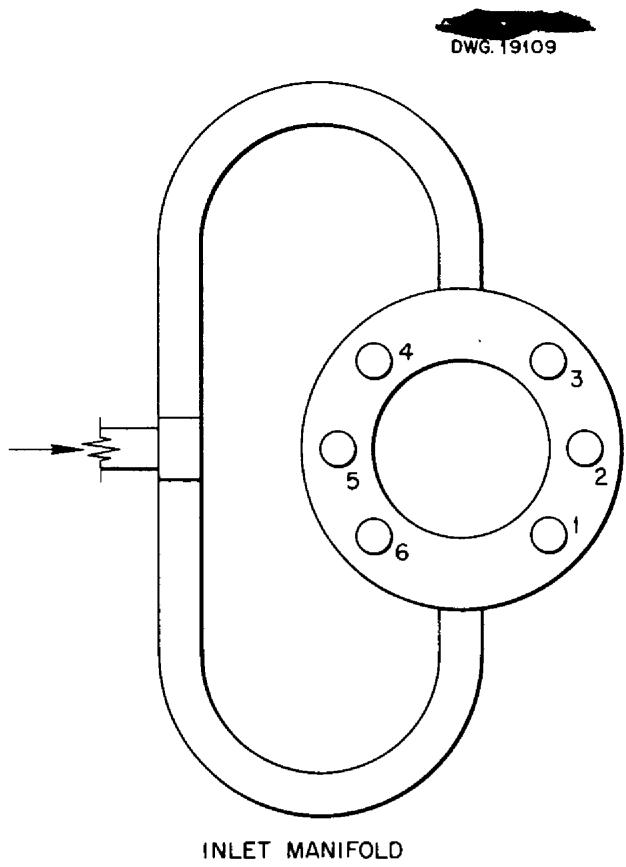

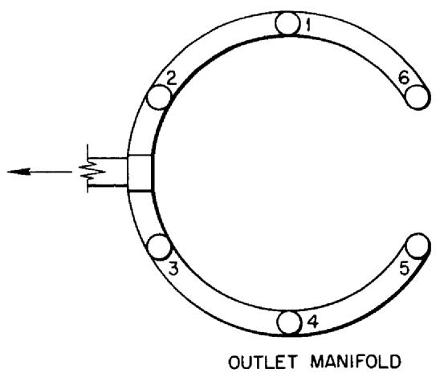  
Fig. 20. Fuel Manifolds.

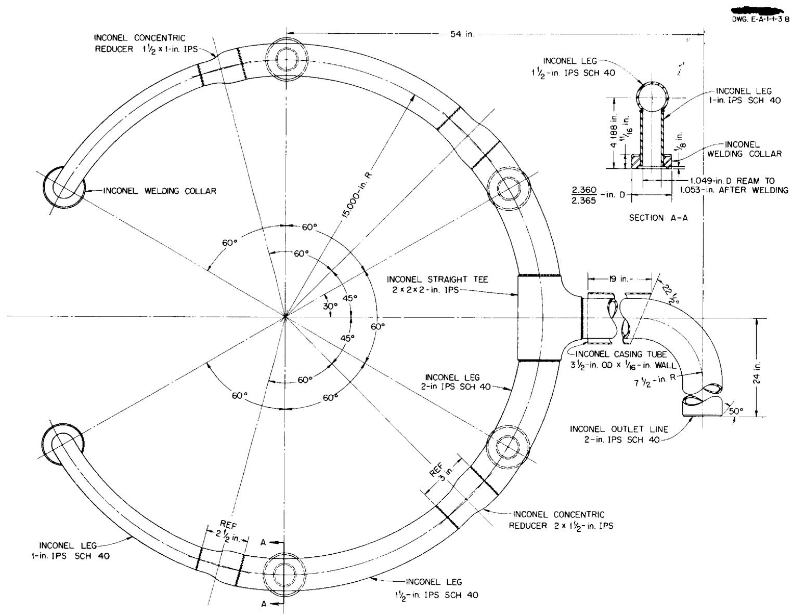  
Fig. 21. Fuel Outlet Manifold.

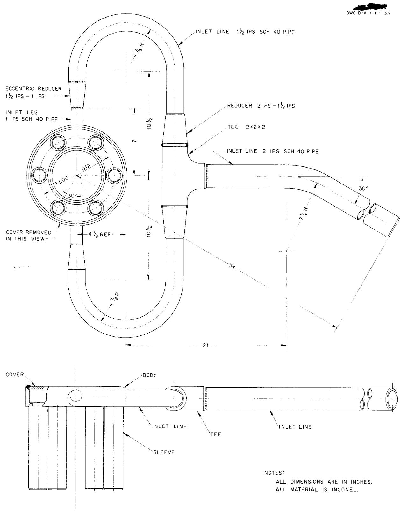  
Fig. 22. Fuel Inlet Manifold.

TABLE 7. PRESSURE DROP IN FUEL MANIFOLDS AND CORE TUBES   

<table><tr><td rowspan="2">PATH</td><td colspan="3">PRESSURE DROPS (1b/ft2)</td><td colspan="2">TOTAL PRESSURE DROP</td></tr><tr><td>Inlet 
Manifold</td><td>Serpentine 
Tubes</td><td>Outlet 
Manifold</td><td>In 1b/ft2</td><td>In 1b/ft2</td></tr><tr><td>1-1</td><td>627.7</td><td>613.0</td><td>172.5</td><td>1413</td><td>9.81</td></tr><tr><td>2-2</td><td>605.7</td><td>613.0</td><td>155.7</td><td>1374</td><td>9.54</td></tr><tr><td>3-3</td><td>627.7</td><td>613.0</td><td>155.7</td><td>1396</td><td>9.70</td></tr><tr><td>4-4</td><td>627.7</td><td>613.0</td><td>172.5</td><td>1413</td><td>9.81</td></tr><tr><td>5-5</td><td>605.7</td><td>613.0</td><td>121.0</td><td>1340</td><td>9.30</td></tr><tr><td>6-6</td><td>627.7</td><td>613.0</td><td>121.0</td><td>1362</td><td>9.46</td></tr></table>

# TEMPERATURE GRADIENTS IN THERMAL SLEEVES

The fuel tubes pass through the pressure shell heads in the manner shown schematically in Fig. 23a. The sleeve connecting the pressure shell and fuel tube is at the pressure shell temperature at one end and at the fuel tube temperature at the other end. At the fuel tube outlet, the fuel tubes are at $1500^{\circ}\mathrm{F}$ ; the pressure shell temperature at this point is difficult to determine, but it is probably not less than $1150^{\circ}\mathrm{F}$ . The sleeve gains heat from the fuel tube through the NaK between the tube and sleeve; the NaK is assumed to be stagnant. Heat lost by the sleeve to the surrounding helium atmosphere may be neglected because the helium is at about $1200^{\circ}\mathrm{F}$ . The problem was simplified by considering the sleeve, the fuel tube, and the NaK between the sleeve and the fuel tube as a single cylindrical tube. The temperature was assumed to be constant across any cross section of this cylindrical tube, and an average thermal conductivity for the tube was used. (The conductivities of NaK and Inconel are nearly equal.) The differential equation governing the flow of heat in the sleeve is (Fig. 23b)

$$
- k a \frac {d ^ {2} T}{d x ^ {2}} = h c (1 5 0 0 - T), \tag {93}
$$

where

$k =$ thermal conductivity of the composite tube, Btu/hr·ft² (°F/ft),

$a =$ cross-sectional area of the composite tube, ft²,

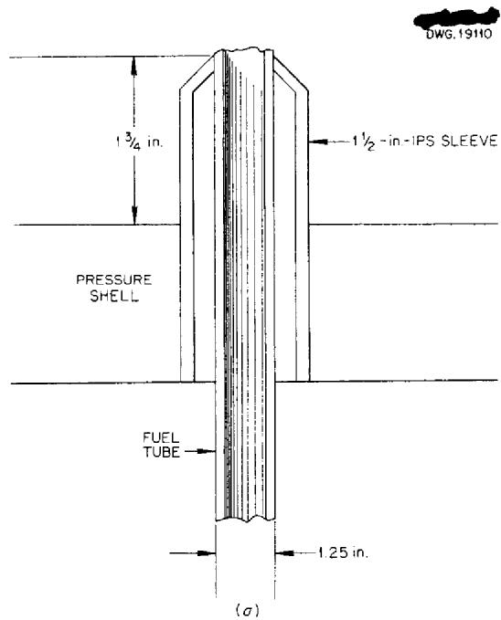

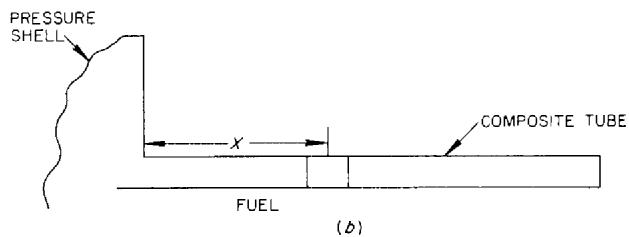  
Fig. 23. Thermal Sleeve.

$T =$ temperature, ${}^{\circ}\mathbf{F}$

$x =$ distance from pressure shell, ft,

$h =$ fuel heat transfer coefficient, Btu/hr·ft²·°F,

$c =$ circumference of inside of fuel tube, ft.

The boundary conditions are

(94) $T = 1150^{\circ} \mathrm{F}, \quad \text{at} x = 0$ ,   
(95) $T = 1500^{\circ}\mathrm{F},$ at $\pmb {x} = 0.1146$

The fuel heat transfer coefficient may be evaluated by using the following formula:

$$
h = 0. 0 2 7 \frac {k}{D} \operatorname {R e} ^ {0. 8} \Pr^ {1 / 3} \left(\frac {\mu}{\mu_ {s}}\right) ^ {0. 1 4}, \tag {96}
$$

where

$k =$ thermal conductivity of the fuel, Btu/hr·ft² (°F/ft),

$D =$ fuel tube inner diameter, ft,

Re = Reynolds' number for the fuel,

$\mathbf{Pr} = \mathbf{Prandtl}$ 's number for the fuel,

$\frac{\mu}{\mu_s} = \text{ratio of fuel viscosity at bulk temperature to fuel viscosity at surface temperature.}$

For this case,

$$
\begin{array}{l} k = 1. 5 \mathrm {B t u} / \mathrm {h r} \cdot \mathrm {f t} ^ {2} \left(^ {\circ} \mathrm {F} / \mathrm {f t}\right), \\ D = 0. 0 9 2 9 f t, \\ \mathrm {R e} = 1 4, 1 0 0, \\ \Pr = 2. 8 5, \\ \end{array}
$$

$$
\begin{array}{l} \left(\frac {\mu}{\mu_ {s}}\right) ^ {0. 1 4} = 0. 9 6 5 \\ h = 1 2 5 0 \mathrm {B t u / h r} \cdot \mathrm {f t} ^ {2} \cdot {} ^ {\circ} \mathrm {F}. \\ \end{array}
$$

In Eq. 93,

$$
\begin{array}{l} k = 1 3. 7 \mathrm {B t u} / \mathrm {h r} \cdot \mathrm {f t} ^ {2} (^ {\circ} \mathrm {F} / \mathrm {f t}), \\ a = 0. 0 1 2 9 f t ^ {2}, \\ c = 0. 4 2 2 f t; \\ \end{array}
$$

therefore

$$
\frac {d ^ {2} T}{d x ^ {2}} - 2 9 8 0 T = - 4. 4 8 \times 1 0 ^ {6}. \tag {97}
$$

The solution of Eq. 97 is

$$
T = c _ {1} e ^ {5 4. 6 x} + c _ {2} e ^ {- 5 4. 6 x} + 1 5 0 0. \tag {98}
$$

The first boundary condition, Eq. 94, gives

$$
c _ {1} + c _ {2} = - 3 5 0. \tag {99}
$$

The second boundary condition, Eq. 95, gives

$$
5 2 0 c _ {1} + 0. 0 0 1 9 2 3 c _ {2} = 0. \tag {100}
$$

Therefore

$$
c _ {1} = 0. 0 0 1 2 9 4
$$

and

$$
c _ {2} = - 3 5 0.
$$

Thus Eq. 98 becomes

(101) $T = 0.001294 e^{54 \cdot 6x}$

$$
- 3 5 0 e ^ {- 5 4 \cdot 6 x} + 1 5 0 0,
$$

and the first derivative of $T$ with respect to $x$ is

(102) $\frac{dT}{dx} = 0.07065e^{54 \cdot 6x}$

$$
+ 1 9, 1 1 0 e ^ {- 5 4 \cdot 6 x}.
$$

Plots of Eqs. 101 and 102 are shown in Fig. 24. The maximum temperature gradient is about $1600^{\circ}\mathrm{F}$ per inch.

Temperature in Fuel Tube Elbows as a Result of Afterheat of Residual Fuel. There is a possibility of fuel remaining in the U bends of the reactor fuel tubes after dumping. This residual fuel will rise in temperature because of internal heat generation, and it is desirable to know the maximum temperature that will be attained. Since the activity of the fuel decreases with time after shutdown, an equilibrium will be reached when the heat generation rate is the same as the rate of the heat loss. Once this equilibrium has been reached, the fuel temperature will decrease.

The total heat generation rate of the fuel is given in another portion of this report. From this, the heat generation rate of the fuel in a U bend is

$$
Q = \frac {\text {v o l u m e o f f u e l i n U b e n d}}{\text {t o t a l f u e l v o l u m e}} \times Q _ {f} ， \tag {103}
$$

where

$Q =$ heat generation rate, Btu/sec $Q_{f} =$ total heat generation rate of fuel, Btu/sec.

The temperature rise in the U bend will be greatest when the reflector coolant system is filled with helium (Fig. 9). Under this condition, heat is removed from the tube by free convection and radiation. The free

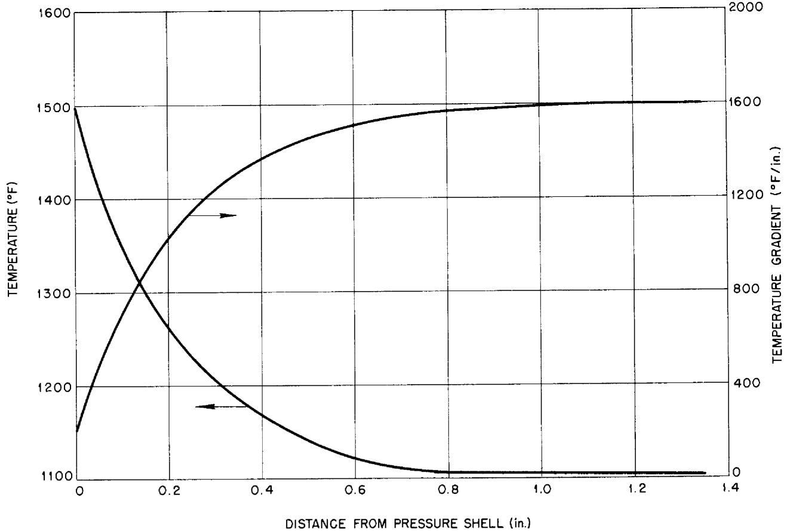  
Fig. 24. Temperature and Temperature Gradient in Thermal Sleeve vs. Distance from Pressure Shell.

convection loss is

$$
q _ {c} = h A \theta , \tag {104}
$$

where

$q_{c} =$ heat transferred, Btu/sec, $h =$ free convection heat transfer coefficient, Btu/sec $\cdot ft^2\cdot {}^\circ F,$ $A =$ surface area of tube, ft², $\theta =$ temperature difference between the surface of the tube and the helium, ${}^{\circ}\mathrm{F}$

The radiation loss is given by

$$
\begin{array}{l} q _ {R} = \frac {0 . 1 7 3}{3 6 0 0} \times A \tag {105} \\ \times \in \left[ \left(\frac {T _ {\text {t u b e}}}{1 0 0}\right) ^ {4} - \left(\frac {T _ {\text {s i n k}}}{1 0 0}\right) ^ {4} \right], \\ \end{array}
$$

where

$$
\begin{array}{l} \epsilon = \text {r a d i a t i o n e m i s s i v i t y , d i -} \\ \text {m e n s i o n l e s s ,} \end{array}
$$

$T_{\text{tube}} = \text{absolute temperature of the surface of the tube, } ^o R,$

$T_{\text{sink}} = \text{absolute temperature of the sink (surrounding material)}$ , R.

The total heat loss is

$$
q = q _ {c} + q _ {R}. \tag {106}
$$

Jakob has given Nusselt's number (cf., p. 525, Fig. 25-1, of ref. 14) as a function of the product of Grashof's and Prandtl's numbers. The value of Nusselt's number for the existing helium conditions was taken from Jakob's work, and the free-convection heat transfer coefficient was determined.

The temperature change of the fuel and the metal of the tube per unit time is

$$
\Delta T = \frac {Q - q}{\sum w c _ {p}}, \tag {107}
$$

where

$$
\Delta T = \text {t e m p e r a t u r e} ^ {\prime} \text {c h a n g e}, ^ {\prime} \mathrm {F} / \sec ,
$$

$\sum w c_{p} =$ summation of heat capacities of fuel and metal of tube, Btu/°F,

$$
w = \text {w e i g h t o f m a t e r i a l}, \quad \mathrm {l b},
$$

$$
\begin{array}{l} c _ {p} = \text {s p e c i f i c h e a t o f m a t e r i a l}, \\ B t u / 1 b ^ {\cdot} ^ {\circ} F. \end{array}
$$

The data required to make the calculations are listed in the following tabulation; only the portion of the tube that is below the tube sheet is considered:

1. For the metal tube,

$$
\text {A r e a}, A \quad 0. 2 2 6 f t ^ {2}
$$

$$
V o l u m e \quad 1. 8 6 i n. ^ {3}
$$

$$
\text {D e n s i t y}, \rho \quad 0. 3 0 7 \mathrm {l b} / \mathrm {i n}. ^ {3}
$$

$$
\text {S p e c i f i c} \quad c _ {p} \quad 0. 1 1 \mathrm {B t u} / \mathrm {l b} ^ {\circ} \mathrm {F}
$$

2. For the fuel,

$$
\text {V o l u m e} \quad 4. 7 4 \times 1 0 ^ {* 3} f t ^ {3}
$$

$$
\text {D e n s i t y}, \rho \quad 1 8 7 \quad \mathrm {l b} / \mathrm {f t} ^ {3}
$$

$$
\text {S p e c i f i c} \quad c _ {p} \quad 0. 2 6 \mathrm {B t u} / \mathrm {l b} ^ {\cdot} \circ F
$$

$$
\begin{array}{l} \text {T o t a l f u e l v o l u m e} \\ \text {o f e n t i r e s y s t e m} \end{array} 7. 7 5 f t ^ {3}
$$

The temperatures of the fuel at various times after shutdown were calculated by numerical methods for sink temperatures of 1200 and $1300^{\circ}\mathrm{F}$ . The calculated data for the two sink temperatures are given in Fig. 25.

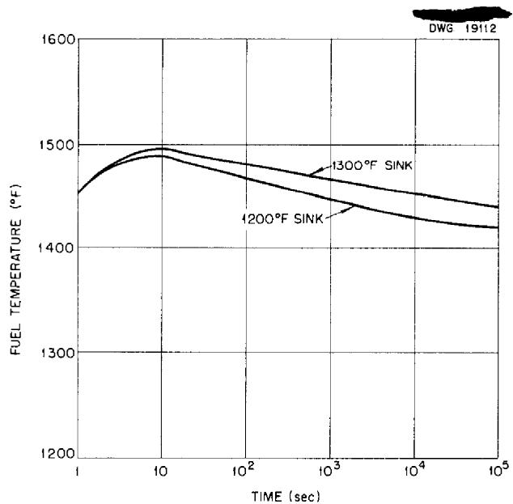  
Fig. 25. Temperature of Fuel at Various Times after Shutdown with Fuel Remaining in U Bend.

# FORMATION OF NONPLUGGING SOLIDS IN FUEL TUBE IN THE EVENT OF A SMALL LEAK

In the event of a small leak in a fuel tube, it is possible that the NaK entering the fuel tube will precipitate solids that will adhere to the walls of the fuel tube. This deposit can build up to appreciable thickness before causing any measurable change in the flow through the fuel tube. The temperatures which might exist in such a deposit were calculated by treating the solid deposit as a flat plate, with internal heat generation, cooled on one side by the flowing fuel. The differential equation and boundary conditions governing the heat flow are

$$
\begin{array}{l} \frac {d ^ {2} \theta}{d x ^ {2}} = - \frac {q ^ {\prime}}{k}, (108) \\ \frac {d \theta}{d x} = 0, \text {a t} x = 0, (109) \\ - k \frac {d \theta}{d x} = h \theta , \quad \text {a t} x = \tau , (110) \\ \end{array}
$$

where

$\theta =$ temperature difference between a point in the solid and the flowing fuel, ${}^{\circ}\mathbf{F}$

$x =$ distance from tube wall, ft, $q^{\prime} =$ internal heat generation, Btu/hr·ft³,

$k =$ thermal conductivity of fuel, Btu/hr·ft² (°F/ft),

$\tau =$ thickness of solid deposit, ft, $h =$ heat transfer coefficient from solid to flowing fuel, Btu/hr·ft² $(^{\circ}\mathrm{F} / \mathrm{ft})$

The heat transfer coefficient is given by

$$
h = 0. 0 2 7 \frac {k}{D} \operatorname {R e} ^ {0. 8} \Pr^ {1 / 3} \left(\frac {\mu}{\mu_ {s}}\right) ^ {0. 1 4}, \tag {111}
$$

where

$D =$ equivalent diameter, ft,

Re = Reynolds' number,

$\mathbf{Pr} = \mathbf{Prandtl's}$ number,

$\frac{\mu}{\mu_s} = \text{ratio of viscosity at bulk temperature to viscosity at surface temperature.}$

Two cases will be considered; a tube near the inlet where the fuel temperature is about $1170^{\circ}\mathrm{F}$ and the internal heat generation is $1.64 \times 10^{7}$ Btu/hr·ft³ on the reactor center line, and a tube near the outlet where the fuel temperature is about $1490^{\circ}\mathrm{F}$ and the internal heat generation is about $0.85 \times 10^{7}$ Btu/hr·ft³ on the reactor center line:

Fuel temperature, ${}^{\circ}\mathbf{F}$ 1170 1490

Internal heat generation,

$$
\mathrm {B t u} / \mathrm {h r} ^ {\cdot} \mathrm {f t} ^ {3} \quad 1. 6 4 \times 1 0 ^ {7} \quad 0. 8 5 \times 1 0 ^ {7}
$$

Equivalent diameter, ft 0.0929 0.0929

Reynolds' number 7700 14, 100

Prandtl's number 5.20 2.85

$$
\left(\frac {\mu}{\mu_ {s}}\right) ^ {0. 1 4}
$$

Heat transfer coef

ficient, Btu/hr\*ft²\*°F 945 1260

The solution of the differential equation, Eq. 108, is

$$
\frac {d \theta}{d x} = - \frac {q ^ {\prime} x}{k} + c _ {1}, \tag {112}
$$

$$
\theta = - \frac {q ^ {\prime} x ^ {2}}{2 k} + c _ {1} x + c _ {2}. \tag {113}
$$

The boundary conditions, Eqs. 109 and 110, give

$$
c _ {1} = 0, \tag {114}
$$

$$
c _ {2} = \frac {q ^ {\prime} \tau^ {2}}{2 k} + \frac {q ^ {\prime} \tau}{h}, \tag {115}
$$

and Eq. 113 becomes

$$
\theta = \frac {q ^ {\prime}}{2 k} \left(\tau^ {2} - x ^ {2}\right) + \frac {q ^ {\prime} \tau}{h}. \tag {116}
$$

The maximum temperature in the solid occurs at $x = 0$ ; therefore

$$
T _ {\text {m a x}} = \theta_ {\text {m a x}} + T _ {f} = \frac {q ^ {\prime} \tau^ {2}}{2 k} + \frac {q ^ {\prime} \tau}{h} + T _ {f}, \tag {117}
$$

where

$T_{\text{max}} = \text{maximum temperature in the solid},$ F,

$T_{f} =$ temperature of the flowing fuel, ${}^{\circ}\mathrm{F}$

A tabulation of values of some of the terms of Eq. 117 for values of $\tau$ of 0.1 and 0.2 in. is presented below:

$$
T _ {f}, ^ {\circ} \mathrm {F} \quad 1 1 7 0 \quad 1 4 9 0
$$

$$
\tau , \quad \text {i n .} \quad 0. 1 \quad 0. 2 \quad 0. 1 \quad 0. 2
$$

$$
\frac {q ^ {\prime} \tau^ {2}}{2 k}, ^ {\circ} F \quad 3 8 0 \quad 1 4 1 8 \quad 1 9 7 \quad 7 8 7
$$

$$
\frac {q ^ {\prime} \tau}{h}, ^ {\circ} F \quad 1 4 5 \quad 2 8 9 \quad 5 6 \quad 1 1 2
$$

$$
T _ {\max }, ^ {\circ} F \quad 1 6 9 4 \quad 2 8 7 8 \quad 1 7 4 3 \quad 2 3 8 8
$$

The values for the maximum temperatures of the solid indicate that unless the solids found when NaK and fuel are mixed have a lower melting point than that of Inconel there is danger that a small leak might result in the formation of a solid deposit which would reach a high enough temperature to melt the Inconel tube wall.

# Chapter 3

# FUEL HEAT DISPOSAL SYSTEM

# PERFORMANCE OF FUEL HEAT DISPOSAL SYSTEM

Heat Transfer. The heat added to the fuel in the reactor is disposed of by circulating the fuel to a heat exchanger where it gives up its heat to helium. The hot helium is then passed through a heat exchanger where it gives up its heat to water. The fuel and helium recirculate; the water is dumped. There are actually four fuel-to-helium heat exchangers and four helium-to-water exchangers. These exchangers are arranged (Fig. 1) so that all four fuel-to-helium exchangers are in parallel on the fuel side and all four helium-to-water exchangers are in parallel on the water side. The helium circuits are arranged so that there are two parallel circuits and each circuit contains two fuel-to-helium and two helium-to-water exchangers in series (the exchangers alternate, of course). Figures 26 and 27 show the details of the two types of heat exchangers. The performance of the fuel heat disposal loop over a range of operating conditions is calculated below.

The fuel heat disposal system obeys the following relations:

(1) $Q = W_{f} c_{f} (T_{f}^{\prime} - T_{f})$ ,   
(2) $Q = W_{\text{H e}} c_{\text{H e}} \left(T_{\text{H e}}^{\prime} - T_{\text{H e}}\right)$ ,   
(3) $Q = W_{w} c_{w} (T_{w}^{\prime} - T_{w})$ ,   
(4) $Q = h_{f\text{-He}} A_{f\text{-He}} \theta_{f\text{-He}}$   
(5) $Q = h_{\mathrm{He} + w}A_{\mathrm{He} + w}\theta_{\mathrm{He} + w},$

where

$Q =$ heattransferred,Btu/sec,

$W =$ weight flow, lb/sec,

$T^{\prime} =$ maximum temperature, ${}^{\circ}\mathrm{F},$

$T =$ minimum temperature, ${}^{\circ}\mathrm{F}$

$c =$ specific heat, Btu/1b\*F,

$h =$ heat transfer coefficient, Btu/sec·ft².°F,

$A =$ heat transfer area, ft²,

$\theta =$ effective log mean temperature difference, ${}^{\circ}\mathrm{F}$

and the subscripts refer to

$$
\begin{array}{l} f = \text {f u e l}, \\ \mathrm {H e} = \text {h e l i u m}, \\ w = \text {w a t e r}, \\ \end{array}
$$

$f\text{-He} =$ fuel-to-helium heat exchanger, He- $\pmb{\varpi} =$ helium-to-waterheatexchanger.

The heat disposal system is operated with the following restraints and conditions:

1. The fuel flow is held fixed at 28.2 lb/sec.   
2. The water outlet temperature is thermostatically controlled and held fixed at $135^{\circ}\mathrm{F}$ .   
3. The water inlet temperature will vary with the time of year, but for this analysis it has been assumed to be fixed at $70^{\circ}\mathrm{F}$ .   
4. The mean temperature of the fuel is fixed because the reactor is self-controlling to a constant mean temperature. The design mean temperature is $1325^{\circ}\mathrm{F}$ . Calculations were also carried out for mean temperatures of 1225 and $1425^{\circ}\mathrm{F}$ to give some indication of the effect of a change in mean fuel temperature.

The helium weight flow is the independent variable; the flow is controlled by variable speed hydraulic motors which drive the two helium blowers. The dependent variables are $Q, W_{w}, T_{f}^{\prime}, T_{f}, T_{He}^{\prime}$ , and $T_{He}$ . Thus there are six unknowns and six equations: the five equations listed above and the one inherent in the fourth condition, namely:

$$
\frac {T _ {f} ^ {\prime} + T _ {f}}{2} = \text {a c o n s t a n t}. \tag {6}
$$

Before these equations can be solved, the heat transfer coefficients and areas must be calculated for the two exchangers. The overall $hA$ 's are

(7) $(hA)_{f\bullet H}$

$$
= \left[ \frac {1}{(h A) _ {f}} + \frac {1}{(h A) _ {\mathrm {H e}}} + \frac {1}{(h A) _ {m}} \right] _ {f - \mathrm {H e}} ^ {- 1}
$$

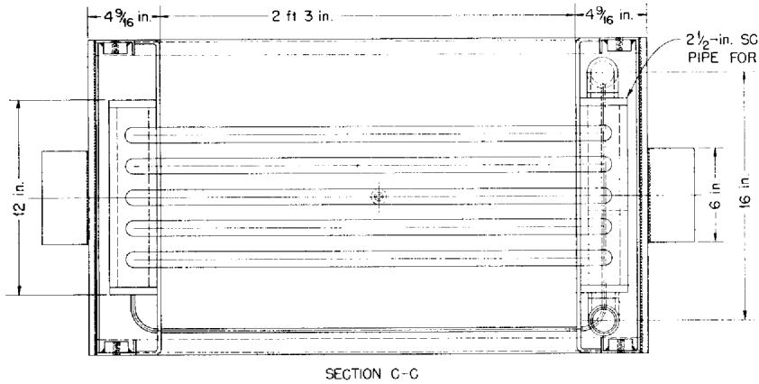  
SONEL

<table><tr><td>DESCRIPTION</td><td>MATERIAL</td><td>SPECIFICATION</td><td>QUALITY</td></tr><tr><td>TUBE SUPPORT PLATES</td><td>STAINLESS STEEL</td><td>ASME-SA-240</td><td>GR S TYPE 304</td></tr><tr><td>Weld, Weld ELL AND</td><td>NICKEL, CHROME AND IRON</td><td>ASTM-B-167</td><td>INCONEL</td></tr><tr><td rowspan="4">SUPPORTS, MANIFOLD PARTS, FLANGE BARS AND BARS</td><td>STAINLESS STEEL</td><td>COMMERCIAL</td><td>TYPE 304</td></tr><tr><td>NICKEL, CHROME AND IRON</td><td>ASTM-B-167</td><td>INCONEL</td></tr><tr><td>STAINLESS STEEL</td><td></td><td>TYPE 304</td></tr><tr><td>STAINLESS STEEL</td><td>ASME-SA-193</td><td>GRADE B-8</td></tr></table>

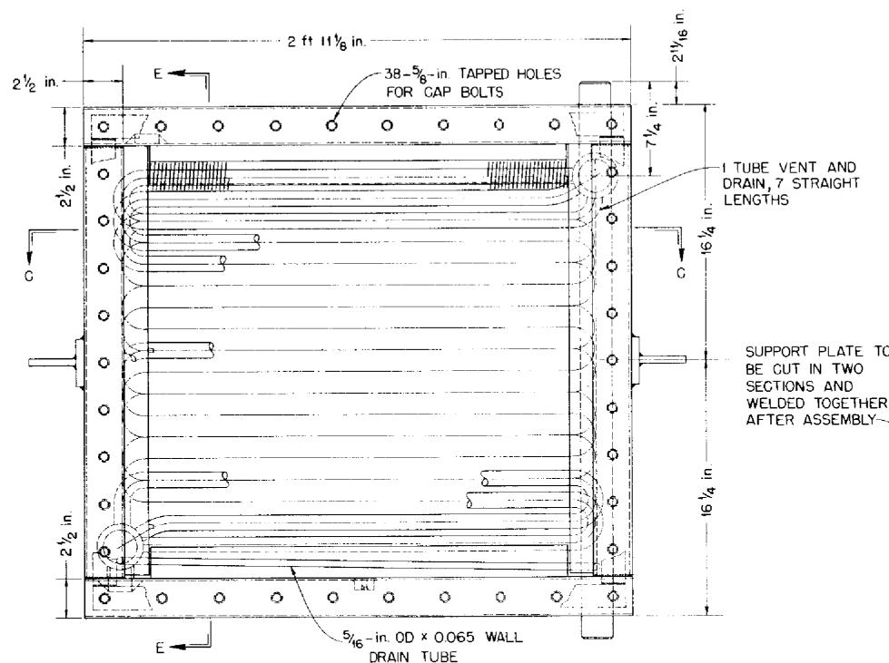

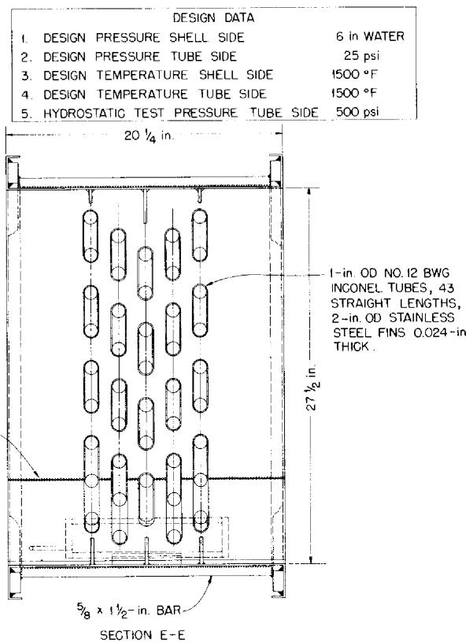  
Fig. 26. Fuel-to-Helium Heat Exchanger.

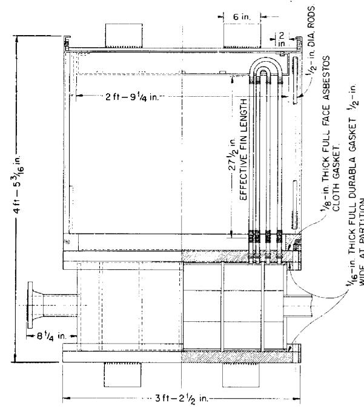

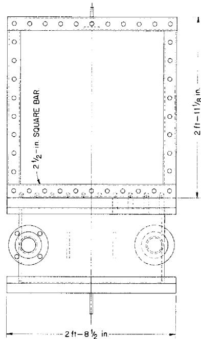  
16-in THICK FULL DURABLA GASKET 2-in WIDE AT PARTITION

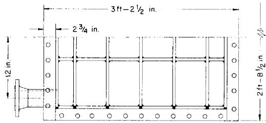  
HALF VIEW OF STAT. HEAD WITH COVER REMOVED

<table><tr><td colspan="3">DESIGN DATA</td></tr><tr><td></td><td>SHELL</td><td>TUBES</td></tr><tr><td>DESIGN PRESSURE</td><td>6-in.H2O</td><td>50 psi</td></tr><tr><td>DESIGN TEMPERATURE</td><td>1500°F</td><td>340°F</td></tr></table>

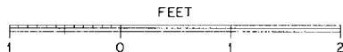  
Fig. 27. Helium-to-Water Heat Exchanger.

MATERIAL AND MATERIAL SPECIFICATIONS   

<table><tr><td>DESCRIPTION</td><td>MATERIAL</td><td>SPEC.</td><td>QUALITY</td></tr><tr><td>SHELL FLANGE AT TUBE SHEET, GAS INLET FLANGE, SHELL AND SHELL COVER PLATE, BLANKING-OFF PLATE, TUBE SUPPORT BAR, BACKING-UP BAR.</td><td>STAINLESS STEEL</td><td>ASME SA-240 GR5</td><td>TYPE S-304</td></tr><tr><td>STAT. HEAD PLATES, STAT. HEAD FLANGES, GAS OUTLET FLANGE, STAT. HEAD PARTITIONS, STAT. HEAD TIE PLATES, STAT. HEAD COVER PLATE, TUBE SHEET.</td><td>FIREBOX STEEL</td><td>ASME SA-285</td><td>GRADE C</td></tr><tr><td>3-in, 150 lb. WELDING NECK FLANGE.</td><td>FORGE STEEL</td><td>ASME SA-181</td><td>GRADE I</td></tr><tr><td>3-in. SCH. 40 PIPE.</td><td>SEAMLESS STEEL</td><td>ASME SA-106</td><td>GRADE A</td></tr><tr><td>TUBES, TUBE BENDS.</td><td>SEAMLESS STEEL</td><td>ASME SA-179</td><td>MIN WALL</td></tr><tr><td>FINS</td><td>COPPER</td><td>COMMERCIAL</td><td></td></tr><tr><td>STAT. HEAD GASKETS.</td><td>DURABLA</td><td>COMMERCIAL</td><td></td></tr><tr><td>SHELL GASKET SMEARED BOTH SIDES WITH PLASTISEAL</td><td>ASBESTOS CLOTH</td><td>COMMERCIAL</td><td></td></tr><tr><td>BOLTING FOR TUBE SHEET AND SHELL FLANGE.</td><td>STAINLESS STEEL</td><td>ASME SA-193 BB</td><td></td></tr><tr><td>NUTS AT TUBE SHEET AND STAT. HEAD COVER PLATE.</td><td>BETH OIL QUENCH</td><td>ASME SA-194</td><td>CLASS 2H</td></tr><tr><td>BOLTING FOR STAT. HEAD COVER PLATE.</td><td>ALLOY STEEL</td><td></td><td></td></tr></table>

and

(8) $(hA)_{\text{He} - w}$

$$
= \left[ \frac {1}{(h A) _ {\mathrm {H e}}} + \frac {1}{(h A) _ {w}} + \frac {1}{(h A) _ {a}} \right] _ {\mathrm {H e} = w} ^ {- 1},
$$

where the subscript $m$ refers to the metal of the tube wall.

The heat transfer coefficients of the fuel are calculated from the curve of ref. 11 (p. 193). The heat transfer coefficient of the water is

(9) $h_{w} = 0.027\frac{k_{w}}{D_{w}}\operatorname{Re}_{w}^{0 \cdot 8}\operatorname{Pr}_{w}^{1 / 3}\left(\frac{\mu}{\mu_{s}}\right)_{w}^{0 \cdot 14}$

(Sieder-Tate relation ${}^{(15)}$ ), where

$$
\begin{array}{l} \begin{array}{l} k = \text {t h e r m a l c o n d u c t i v i t y , B t u / s e c} ^ {\cdot} f t ^ {2} \\ (\circ F / f t), \end{array} \\ D = \text {e q u i v a l e n t} \\ \mathrm {R e} = \text {R e y n o l d s} ^ {\prime} \text {n u m b e r}, \\ \Pr = \text {P r a n d t l} ^ {\prime} \text {s n u m b e r}, \\ \begin{array}{l} \mu = \text {v i s c o s i t y a t b u l k t e m p e r a t u r e}, \\ \quad \mathrm {l b / h r} \cdot \mathrm {f t}, \end{array} \\ \begin{array}{l} \mu_ {s} = \text {v i s c o s i t y a t s u r f a c e t e m p e r a t u r e}, \\ \quad \quad \quad \quad \quad \quad \quad \quad \quad \quad \quad \quad \quad \quad \quad \quad \quad \quad \quad \quad \quad \quad \quad \quad \quad \quad \quad \quad \quad \quad \quad \quad \quad \quad \quad \quad \quad \quad \quad \quad \quad \quad \quad \quad \quad \quad \quad \quad \quad \quad \end{array} \\ \end{array}
$$

The liquid-side areas are:

$$
A _ {f} = \pi D _ {f} L _ {f - H e} \tag {10}
$$

and

$$
A _ {w} = \pi D _ {w} L _ {\text {H e - w}}, \tag {11}
$$

where $L$ is the total effective length of the heat exchanger tubes in feet.

The resistance of the metal is

$$
\left[ \frac {1}{(h A) _ {\text {m}}} \right] _ {f - \mathrm {H e}} = \frac {\ln \left(\frac {D _ {o}}{D _ {f}}\right) _ {f - \mathrm {H e}}}{2 \pi \left(k _ {\mathrm {m}}\right) _ {f - \mathrm {H e}} L _ {f - \mathrm {H e}}} \tag {12}
$$

and

$$
\left[ \frac {1}{(h A) _ {m}} \right] _ {\text {H e - w}} = \frac {\ln \left(\frac {D _ {o}}{D _ {f}}\right) _ {\text {H e - w}}}{2 \pi \left(k _ {m}\right) _ {\text {H e - w}} L _ {\text {H e - w}}}, \tag {13}
$$

where $D_{o}$ is tube outside diameter in feet.

The heat transfer coefficients on the gas side are taken from a corre

lation by Kern of data by Jameson and Tate and Cartinhour (cf., p. 555 of ref. 8). Kern's correlation curve may be approximated by the following equation:

(14) $h_{\text{He}}$

$$
= 0. 0 9 2 \frac {k _ {\mathrm {H e}}}{D _ {\mathrm {H e}}} \operatorname {R e} _ {\mathrm {H e}} ^ {0. 7 2 3} \Pr_ {\mathrm {H e}} ^ {1 / 3} \left(\frac {\mu}{\mu_ {s}}\right) _ {\mathrm {H e}} ^ {0. 1 4},
$$

where $D_{\mathrm{He}}$ for the fin and tube configuration is defined as

$$
D _ {\mathrm {H e}} = \frac {2 \left(A _ {o} + A _ {f}\right)}{\pi (\text {p r o j e c t e d p e r i m e t e r})}, \tag {15}
$$

where

$$
\begin{array}{l} A _ {o} = \text {t u b e o u t s i d e b a r e a r e a , f t} ^ {2}, \\ A _ {f} = \text {f i n a r e a , f t} ^ {2}, \end{array}
$$

and the projected perimeter is the sum of all the external distances in the plan view of the finned tubes (ft).

The mass velocity used in the Reynolds' number is computed from the free flow area in a single bank of tubes at right angles to the gas flow. The helium-side heat transfer area is

$$
A _ {\mathrm {H e}} = A _ {o} + \eta_ {f} A _ {f}, \tag {16}
$$

where $\eta_{f}$ is the fin efficiency. (16)

Table 8 lists the pertinent information obtained from the heat exchanger designs (Figs. 26 and 27) and Eqs. 7 through 16. Values are given for three different flow rates of helium and of water; curves were plotted from these values and used in the solution of Eqs. 1 through 6.

The data of Table 8 were used to solve the six simultaneous equations (Eqs. 1 through 6) for various values of the independent variable - helium weight flow. (Inasmuch as the water heat transfer coefficient is a function of the water flow rate, it was necessary to assume a water flow rate for each helium flow rate and solve the equations by iteration.) The results of the solution of Eqs. 1 through 6 are shown in Figs. 28 and 29, where the heat transferred, maximum fuel temperature, and maximum and minimum helium

TABLE 8. HEAT EXCHANGER DATA   

<table><tr><td></td><td>FUEL-TO-HELIUM
HEAT EXCHANGER</td><td>HELIUM-TO-WATER
HEAT EXCHANGER</td></tr><tr><td>Tube outside diameter, in.</td><td>1.0</td><td>0.625</td></tr><tr><td>Tube wall thickness, in.</td><td>0.109</td><td>0.049</td></tr><tr><td>Tube material</td><td>Inconel</td><td>Steel</td></tr><tr><td>Fin outside diameter, in.</td><td>2.0</td><td>0.75</td></tr><tr><td>Number of fins per inch</td><td>7</td><td>16</td></tr><tr><td>Fin thickness, in.</td><td>0.024</td><td>0.014</td></tr><tr><td>Fin material</td><td>Stainless steel</td><td>Copper</td></tr><tr><td>Tube transverse pitch, in.</td><td>2.75</td><td>2.25</td></tr><tr><td>Tube longitudinal pitch, in.</td><td>2.43</td><td>1.47</td></tr><tr><td>Number of tubes per exchanger</td><td>43</td><td>360</td></tr><tr><td>Number of tubes transverse to flow (per exchanger)</td><td>9</td><td>12</td></tr><tr><td>Exchanger height, in.</td><td>24.75</td><td>27.0</td></tr><tr><td>Exchanger width (also active tube length), in.</td><td>26.25</td><td>27.5</td></tr><tr><td>Total active tube length per exchanger, ft</td><td>93.65</td><td>825</td></tr><tr><td>Liquid flow area per exchanger, ft²</td><td>0.01006 (First bank group*), 0.00671 (Second bank group*)</td><td>0.0545</td></tr><tr><td>Liquid flow rate per exchanger, lb/sec</td><td>7.05</td><td>10.61, 7.08, 3.54</td></tr><tr><td>Liquid velocity, ft/sec</td><td>3.74, 5.61</td><td>3.11, 2.08, 1.04</td></tr><tr><td>Reynolds&#x27; number</td><td>5890, 8840</td><td>19,000, 12,700, 6,340</td></tr><tr><td>Liquid heat transfer coefficient, Btu/sec·ft²·°F</td><td>0.24, 0.38</td><td>0.27, 0.20, 0.11</td></tr><tr><td>Liquid heat transfer area per ex-changer, ft²</td><td>11.15, 8.02</td><td>114</td></tr><tr><td>(hA)liquid per exchanger, Btu/sec·°F</td><td>2.676, 3.048</td><td>30.8, 22.8, 12.5</td></tr><tr><td>Total</td><td>5.724</td><td></td></tr><tr><td>(l/hA)liquid per exchanger, sec·°F/Btu</td><td>0.175</td><td>0.0325, 0.0439, 0.080</td></tr><tr><td>(l/hA)per exchanger, sec·°F/Btu</td><td>0.137</td><td>0.00456</td></tr><tr><td>Helium-side equivalent diameter (DHe), in.</td><td>1.447</td><td>0.670</td></tr><tr><td>Helium free flow ratio</td><td>0.575</td><td>0.71</td></tr><tr><td>Helium flow area per exchanger, ft²</td><td>2.60</td><td>3.66</td></tr><tr><td>Helium flow rate per exchanger, lb/sec</td><td>1.5, 1.0, 0.5</td><td>1.5, 1.0, 0.5</td></tr><tr><td>Helium Reynolds&#x27; number</td><td>4050, 2630, 1290</td><td>1330, 860, 420</td></tr><tr><td>Helium heat transfer coefficient, Btu/sec·ft²·°F</td><td>0.0083, 0.0061, 0.0036</td><td>0.0080, 0.0059, 0.0035</td></tr><tr><td>Fin efficiency</td><td>0.37, 0.43, 0.55</td><td>1.0, 1.0, 1.0</td></tr><tr><td>Helium heat transfer area,** ft²</td><td>115, 131, 162</td><td>402, 402, 402</td></tr><tr><td>(hA)He per exchanger, Btu/sec·°F</td><td>0.955, 0.800, 0.580</td><td>3.22, 2.37, 1.40</td></tr><tr><td>(1/hA)He per exchanger, sec·°F/Btu</td><td>1.05, 1.25, 1.72</td><td>0.310, 0.422, 0.714</td></tr></table>

*The liquid side of the fuel-to-helium heat exchanger is divided into two groups of tubes. The first bank group has three tubes in parallel and is connected in series with the second bank group, which has two tubes in parallel.   
**“Area” varies with helium flow rate because the fin efficiency varies with helium flow rate (cf., Eq. 16).

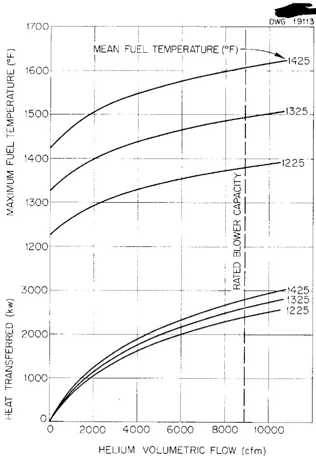  
Fig. 28. Heat Transferred and Maximum Fuel Temperature vs. Helium Volumetric Flow.

temperatures are plotted against helium volumetric flow for the three different values of mean fuel temperature investigated.

At design point, 700 kw is removed by the reflector coolant and rod cooling circuits. Therefore, 2300 kw is to be removed by the fuel.

Film Temperature. Because the fuel has a high melting point (about $970^{\circ}\mathrm{F}$ ), the minimum fuel film temperature must be calculated to determine the situation with respect to freezing of the fuel film. The minimum fuel film temperature at any point may be calculated from the relation

$$
T _ {f _ {\text {m i n}}} = T _ {f _ {\text {b u l k}}} - \frac {Q}{(h A) _ {f}}, \tag {17}
$$

where

$$
\begin{array}{l} T _ {f _ {\min }} = \text {m i n i m u m f u e l f i l m t e m p e r -} \\ \text {a t u r e a t t h e p o i n t i n} \\ \text {q u e s t i o n ,} ^ {\circ} F, \end{array}
$$

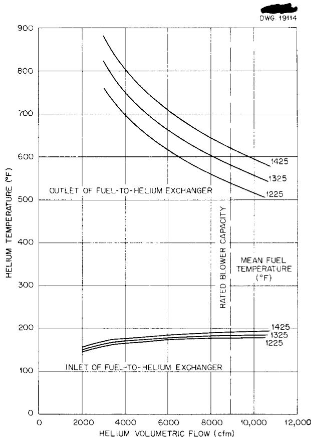  
Fig. 29. Maximum and Minimum Helium Temperature vs. Helium Volumetric Flow.

$T_{f_{\text{bulk}}} = \text{bulk fuel temperature at the point in question, }^{\circ} \text{F.}$

The other symbols mean the same as they did previously, except that the fuel heat transfer coefficient, $h_f$ , must be evaluated locally, that is, at the point in question. Several critical points were investigated in the fuel-to-helium exchanger, and a plot of the lowest of the temperatures vs. helium volumetric flow (and various mean fuel temperatures) is shown in Fig. 30a.

Pressure Drop. The pressure drops in the fuel and in the helium have been calculated for the exchangers. The fuel pressure drop was calculated by using the customary Fanning equation (11) for the straight sections, and the curves presented by Cox and Germano (12) for the bends, exists, and entrances. Since the fuel flow is constant and the properties do not vary substantially in the range of mean fuel temperatures considered, the

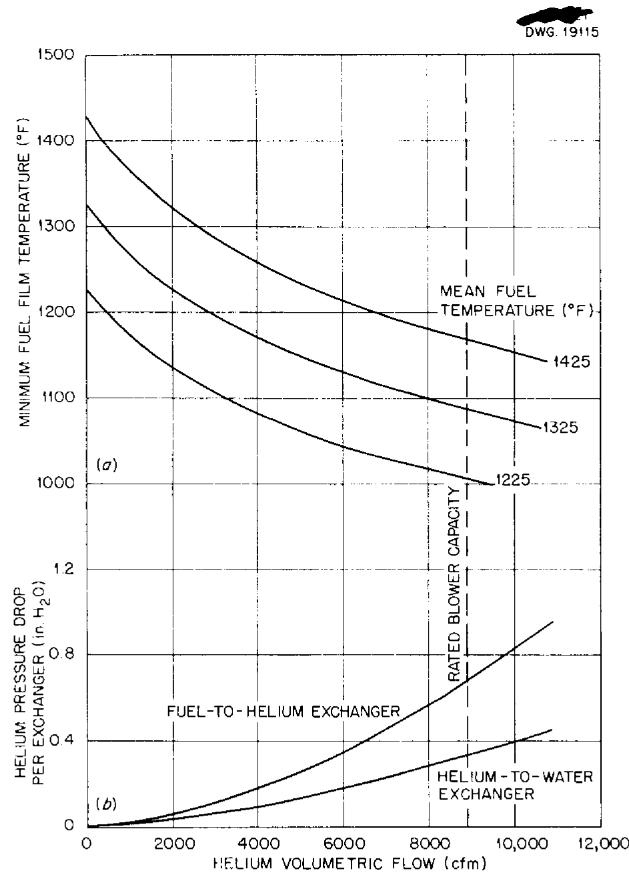  
Fig. 30. Minimum Fuel Film Temperature and Helium Pressure Drop vs. Helium Volumetric Flow.

fuel pressure drop is constant and equal to about 17 psi.

The pressure drop in the helium was calculated by the method given by Gunter and Shaw: (17)

$\mu_{s} =$ viscosity at surface temperatures, lb/hr·ft,

$$
D _ {\mathrm {H e}} ^ {\prime} = \begin{array}{l} \text {e q u i v a l e n t d i a m e t e r (c f . ,} \\ \text {E q . 1 9) ， f t .} \end{array}
$$

The equivalent diameter in the Gunter-Shaw correlation is

$$
D _ {\mathrm {H e}} ^ {\prime} = \frac {4 \times \text {n e t f r e e v o l u m e}}{A _ {f} + A _ {o}}, \tag {19}
$$

where $A_{f}$ and $A_{o}$ have the same meanings as previously.

The values of $D_{\mathrm{He}}^{\prime}$ are 0.0438 ft for the fuel-to-helium exchangers and 0.1365 ft for the helium-to-water exchangers. The friction factor, $f$ , which is a function of Reynolds' number, is evaluated from the Gunter-Shaw correlation. The helium pressure drop is plotted against helium volumetric flow for both exchangers in Fig. 30b. The helium pressure drop is not greatly affected by the mean fuel temperature, and thus the curves of Fig. 30b are valid for the range of mean fuel temperature considered.

The pressure drops in the fuel and in the helium for the remainder of the fuel and helium circuits have been calculated by using the Fanning equation and the Cox and Germano data. Figure 1 shows the pressure at various points in the fuel circuit. The fuel pressure drop external to the heat exchangers is 40 psi; the total fuel pressure drop is 57 psi (Fig. 2 shows the fuel piping). Figure 31 shows the

$$
\Delta P = 5. 3 0 5 \times 1 0 ^ {- 1 0} \frac {f G _ {\mathrm {H e}} ^ {2} L _ {p}}{D _ {\mathrm {H e}} ^ {\prime} s \left(\frac {\mu}{\mu_ {s}}\right) _ {\mathrm {H e}}} \left(\frac {D _ {\mathrm {H e}} ^ {\prime}}{S _ {t}}\right) ^ {0. 4} \left(\frac {S _ {l}}{S _ {t}}\right) ^ {0. 6}, \tag {18}
$$

where

$$
\begin{array}{l} \Delta P = \text {p r e s s u r e} \quad \text {d r o p}, \quad \text {i n .} \quad \text {o f} \quad H _ {2} 0, \\ f = \text {f r i c t i o n} \\ \begin{array}{l} G _ {\text {H e}} = \text {h e l i u m u n i t w e i g h t f l o w ,} \\ \quad \quad \quad \quad \quad \quad \quad \quad \quad \quad \quad \quad \quad \quad \quad \quad \quad \quad \quad \quad \quad \quad \quad \quad \quad \quad \quad \quad \quad \quad \quad \quad \quad \quad \quad \quad \quad \quad \quad \quad \quad \quad \quad \quad \quad \quad \quad \quad \quad \quad \text {l b / s e c} ^ {2}, \end{array} \\ L _ {p} = \text {l e n g t h o f h e l i u m f l o w p a t h , f t}, \\ s = \text {a v e r a g e h e l i u m s p e c i f i c g r a v i t y}, \\ S _ {t} = \text {t r a n s v e r s e p i t c h}, f t, \\ S _ {l} = \text {l o n g i t u d i n a l p i t c h}, f t, \\ \begin{array}{l} \mu = \text {v i s c o s i t y a t b u l k t e m p e r a t u r e}, \\ \quad \quad \quad \quad \quad \quad \quad \quad \quad \quad \quad \quad \quad \quad \quad \quad \quad \quad \quad \quad \quad \quad \quad \quad \quad \quad \quad \quad \quad \quad \quad \quad \quad \quad \quad \quad \quad \quad \quad \quad \quad \quad \quad \quad \quad \quad \quad \quad \quad \quad \text {l b / h r} ^ {\cdot} f t, \end{array} \\ \end{array}
$$

helium ducting for the fuel circuit. The pressure drop external to the heat exchangers and the total pressure drop are plotted against helium volumetric flow in Fig. 32.

# TEMPERATURE IN FUEL SYSTEM BECAUSE OF AFTERHEAT IN THE EVENT OF COMPLETE PUMP FAILURE

If there were a complete power failure and all the fuel remained in

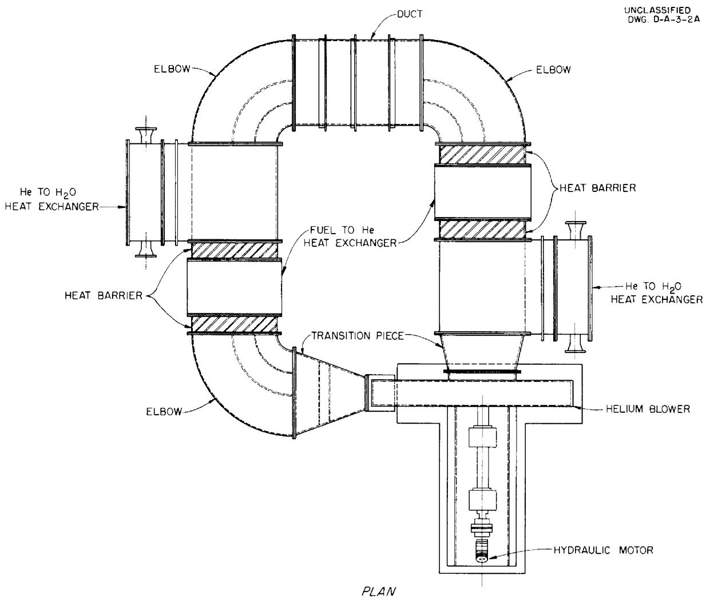

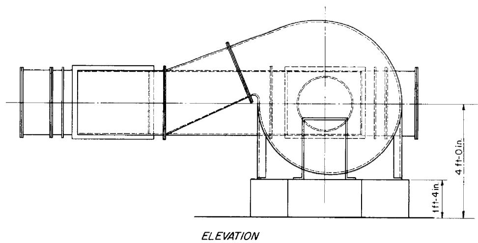  
Fig. 31. Helium Loop for Fuel Circuit.

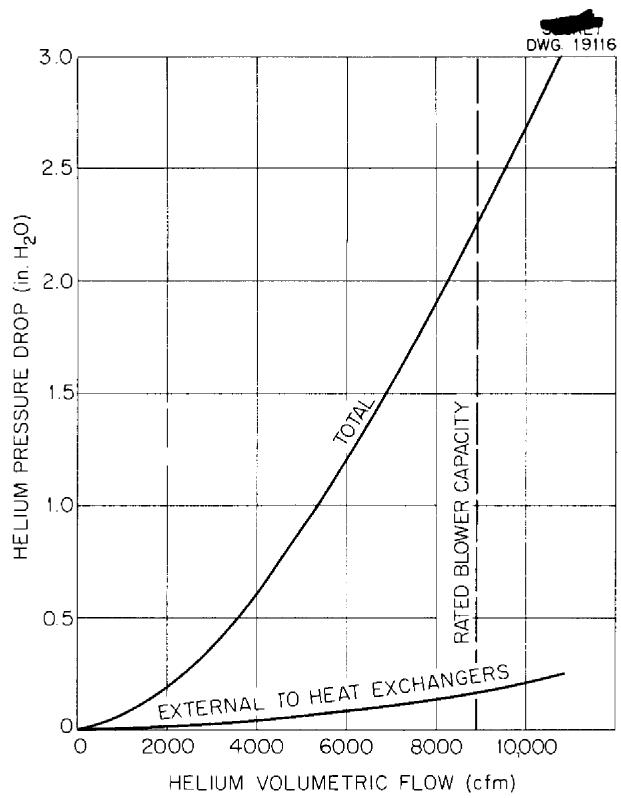  
Fig. 32. Helium Pressure Drop vs. Helium Volumetric Flow.

the system, it would be desirable to know the maximum temperature the fuel would attain (Fig. 1). The temperature rise in the fuel will be due to internal heat generation. However, since the heat generation rate decreases with time after shutdown, at some temperature an equilibrium will be reached between the heat generated and the heat lost from the system. The maximum fuel temperature will be attained at equilibrium. As soon as the maximum has been reached, the temperature will decrease.

The total heat generation rate of the fuel is given as a function of

time after shutdown in chap. 9. Heat is lost from the components of the fuel system by free convection to the helium in the pits and by thermal radiation to the equipment and walls. This heat loss is given in chap. 6.

The change in temperature of the fuel and metal of each fuel system component per unit time is

$$
\Delta T = \frac {Q _ {f} - Q _ {l}}{\sum w c _ {p}} \tag {20}
$$

and

(21) $Q$

$$
= \frac {\text {v o l u m e o f f u e l i n c o m p o n e n t}}{\text {t o t a l f u e l v o l u m e}} \times Q _ {f} ,
$$

where

$$
\begin{array}{l} \Delta T = \text {t e m p e r a t u r e} ^ {\prime} \text {c h a n g e}, ^ {\prime} F / \sec , \\ \begin{array}{l} Q _ {f} = \text {t o t a l h e a t g e n e r a t i o n r a t e i n} \\ \text {t h e f u e l , B t u / s e c ,} \end{array} \\ \begin{array}{l} Q = \text {h e a t g e n e r a t i o n r a t e i n t h e f u l e} \\ \text {i n t h e c o m p o n e n t , B t u / s e c ,} \end{array} \\ \begin{array}{l} Q _ {l} = \text {h e a t l o s s f r o m t h e c o m p o n e n t ,} \\ \text {B t u / s e c ,} \end{array} \\ \begin{array}{l} \sum w c _ {p} = h e a t c a p a c i t y o f c o m p o n e n t \\ \text {p l u s f u e l , B t u / ^ {\circ} F ,} \end{array} \\ w = \text {w e i g h t o f m a t e r i a l , l b ,} \\ \begin{array}{l} c _ {p} = \text {s p e c i f i c h e a t o f m a t e r i a l}, \\ \hskip 1 4. 2 2 6 3 7 8 p t \mathrm {B t u / l b} ^ {\circ} \mathrm {F}. \end{array} \\ \end{array}
$$

The most critical points in the fuel system under the condition postulated are those with the smallest surface-to-volume ratio. The components in this category are the reactor (Fig. 9), the surge tanks (Fig. 33), and the 2-in. pipe lines.

Table 9 gives the data needed to calculate the temperature rise in these components.

TABLE 9. DATA FOR CALCULATION OF TEMPERATURE RISE OF VARIOUS COMPONENTS  

<table><tr><td>COMPONENT</td><td>Σwc p(Btu/sec)</td><td>FUEL VOLUME(ft3)</td><td>TEMPERATUREAT FAILURE (°F)</td></tr><tr><td>Reactor</td><td>4166</td><td>1.96</td><td>1400</td></tr><tr><td>Surge tank</td><td>48.6</td><td>0.83</td><td>1150</td></tr><tr><td>2-in. pipe(per foot of length)</td><td>1.52</td><td>0.023</td><td>1500</td></tr></table>

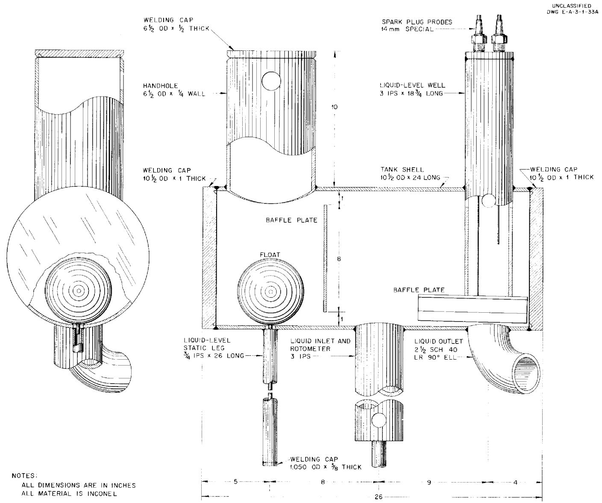  
Fig. 33. Fuel Surge Tank.

For the metal

$$
c _ {p} = 0. 1 1 \mathrm {B t u} / \mathrm {l b} ^ {\circ} \mathrm {F},
$$

$$
\rho = 0. 3 0 7 \mathrm {l b} / \mathrm {i n}. ^ {3},
$$

and for the fuel

$$
c _ {p} = 0. 2 6 \mathrm {B t u / l b} ^ {\circ} \mathrm {F},
$$

$$
\rho = 1 8 7 \mathrm {l b} / \mathrm {f t} ^ {3}.
$$

The total volume of fuel in the system was taken to be $7.75\mathrm{ft}^3$ and the sink temperature was taken as $130^{\circ}\mathrm{F}$ or $590^{\circ}\mathrm{R}$ .

The maximum temperature to be expected in each component was calculated numerically by using Eqs. 20 and 21. The following results were obtained:

<table><tr><td>COMPONENT</td><td>MAXIMUM TEMPERATURE (°F)</td></tr><tr><td>Reactor</td><td>1400</td></tr><tr><td>Surge tank</td><td>1900</td></tr><tr><td>2-in. pipe</td><td>1520</td></tr></table>

Curves of temperature vs. time after shutdown are shown in Fig. 34.

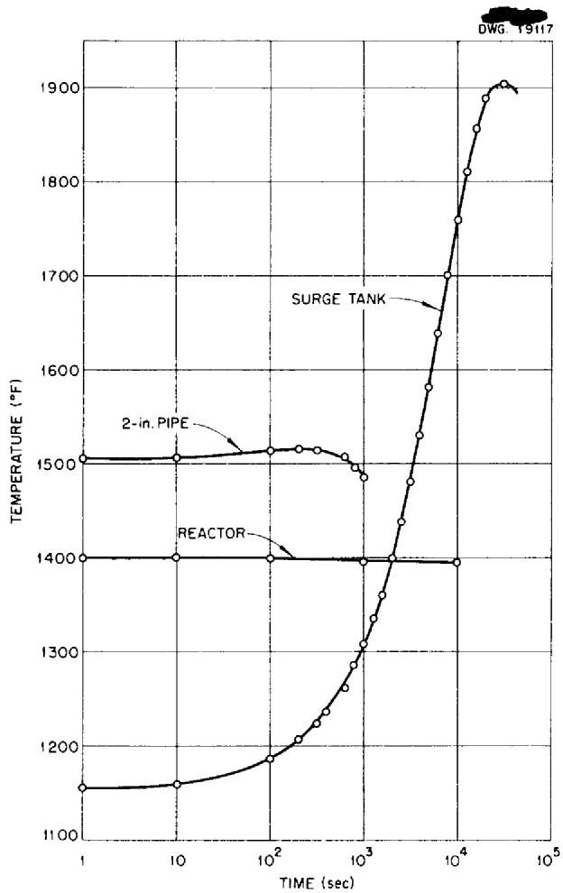  
Fig. 34. Component Temperature vs. Time after Shutdown.

# Chapter 4

# REFLECTOR COOLANT HEAT DISPOSAL SYSTEM

The heat added to the reflector coolant (NaK) in the reactor is disposed of by circulating the NaK to a heat exchanger where it gives up its heat to helium. The hot helium is then passed through a heat exchanger where it gives up its heat to water. The NaK and helium recirculate; the water is dumped. There are two NaK-to-helium exchangers and two helium-to-water exchangers arranged (Fig. 1) so that the liquid sides of each pair of exchangers are in parallel. The helium circuit consists of two parallel circuits, and each circuit contains one NaK-to-helium and one helium-to-water heat exchanger in series. Figures 35 and 36 show the details of the two types of heat exchangers. The performance of the NaK heat disposal loop over a range of operating conditions is calculated below.

The NaK heat disposal syster obeys the following relations:

(1) $Q = W_{\text{NaK}} c_{\text{NaK}} \left(T_{\text{NaK}}' - T_{\text{NaK}}\right)$ ,   
(2) $Q = W_{\text{He}} c_{\text{He}} \left(T_{\text{He}}^{\prime} - T_{\text{He}}\right)$ ,   
(3) $Q = W_{w} c_{w} (T_{w}^{\prime} - T_{w})$ ,   
(4) $Q = h_{\mathrm{NaK - He}} A_{\mathrm{NaK - He}} \theta_{\mathrm{NaK - He}}$   
(5) $Q = h_{\mathrm{He - w}} A_{\mathrm{He - w}} \theta_{\mathrm{He - w}}$

where

$Q =$ heat transforred, Btu/sec, $W =$ weight flow, lb/sec,

$T^{\prime} = \text{maximum temperature}, {}^{\circ}\mathrm{F},$

$T =$ minimum temperature, ${}^{\circ}\mathrm{F}$

$h =$ heat transfor coefficient, Btu/sec·ft² (°F/ft),

$A =$ heat transfer area, ft²,

$\mathcal{E} =$ effective log mean temperature difference, ${}^{\circ}\mathrm{F}$

and the subscripts refer to

$$
\mathrm {N a K} = \mathrm {N a K},
$$

$$
\mathrm {H e} = \text {h e l i u m},
$$

$$
w = \text {w a t e r},
$$

NaK-He = NaK-to-helium heat exchanger,

$$
\begin{array}{l} \text {H e - w = h e l i u m - t o - w a t e r h e a t e x -} \\ \text {c h a n g e r .} \end{array}
$$

The heat disposal system is operated with the following restraints and conditions:

1. The NaK flow is held fixed at 23 lb/sec.   
2. The helium volumetric flow per exchanger is held fixed at 2000 cfm at blower inlet temperature. This fixes $W_{\text{He}}$ once $T_{\text{He}}$ is known.   
3. The water outlet temperature is thermostatically controlled and is held fixed at $100^{\circ}\mathrm{F}$ .   
4. The water inlet temperature will vary with the time of the year, but for this analysis it has been assumed to be fixed at $70^{\circ}\mathrm{F}$ .

The heat transferred is chosen as the independent variable in the system, since it is determined by the heat added to the NaK in the reactor. This leaves as dependent variables $T_{\text{NaK}}'$ , $T_{\text{NaK}}$ , $T_{\text{He}}'$ , $T_{\text{He}}$ , and $W_{\text{p}}$ . There are therefore five unknowns and five equations (Eqs. 1 through 5). Before these equations can be solved, the heat transfer coefficients and areas must be calculated for the two heat exchangers.

The over-all $hA$ 's are:

(6) $(hA)_{\mathrm{NaK - Hc}}$

$$
= \left[ \frac {1}{(h A)} _ {\mathrm {N a K}} + \frac {1}{(h A)} _ {\mathrm {H e}} + \frac {1}{(h A)} _ {m} \right] _ {\mathrm {N a K - H e}} ^ {- 1}
$$

and

(7) $(hA)_{\text{H e - } w}$

$$
= \left[ \frac {1}{(h A)} _ {\mathrm {H e}} + \frac {1}{(h A)} _ {w} + \frac {1}{(h A)} _ {m} \right] _ {\mathrm {H e} - w} ^ {- 1},
$$

where $m$ refers to the metal of the tube wall.

The liquid-side heat transfer coefficients are:

(8) $h_{\mathrm{NaK}} = \frac{k_{\mathrm{NaK}}}{D_{\mathrm{NaK}}} (7.0 + 0.025 \mathrm{Pe}^{0.8})$

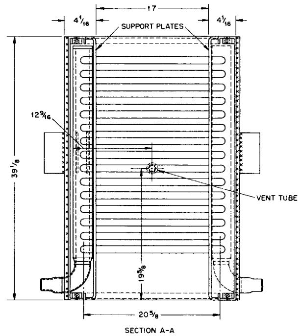

MATERIAL AND MATERIAL SPECIFICATIONS   

<table><tr><td>PART</td><td>MATERIAL</td><td>SPECS.</td><td>QUALITY</td></tr><tr><td>SHELL, TUBE SUPPORT PLATES.</td><td>STEEL</td><td>ASTM A-283</td><td>GRADE C</td></tr><tr><td>MANIFOLD, WELD ELL, AND REDUCER.</td><td>NICKEL, CHROME, IRON</td><td>ASTM B-167</td><td>INCONEL</td></tr><tr><td>SHELL SUPPORTS, FLANGE BARS BACKING BARS AND AIR STOPS.</td><td>STEEL</td><td>ASTM A-283</td><td>GRADE C</td></tr><tr><td>TUBES</td><td>NICKEL, CHROME, IRON</td><td>ASTM B-167</td><td>INCONEL</td></tr><tr><td>MANIFOLD CAP AND TRANSITION.</td><td>NICKEL, CHROME, IRON</td><td>ASTM B-167</td><td>INCONEL</td></tr><tr><td>FINS</td><td>STAINLESS STEEL</td><td>TYPE 304</td><td></td></tr><tr><td>MANIFOLD SUPPORTS</td><td>STAINLESS STEEL</td><td>TYPE 304</td><td></td></tr></table>

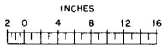  
NOTE: ALL DIMENSIONS IN INCHES.

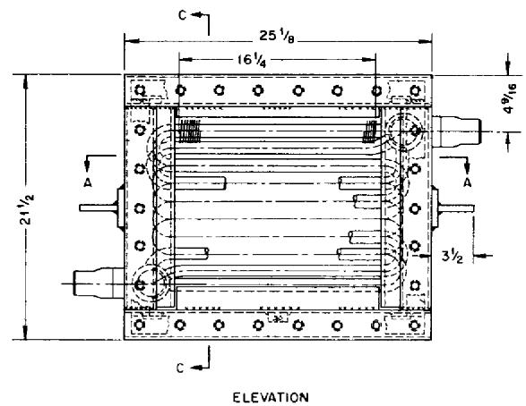

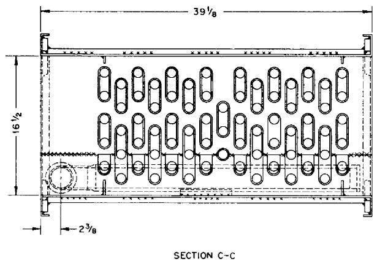  
Fig. 35. NaK-to-Helium Heat Exchanger.

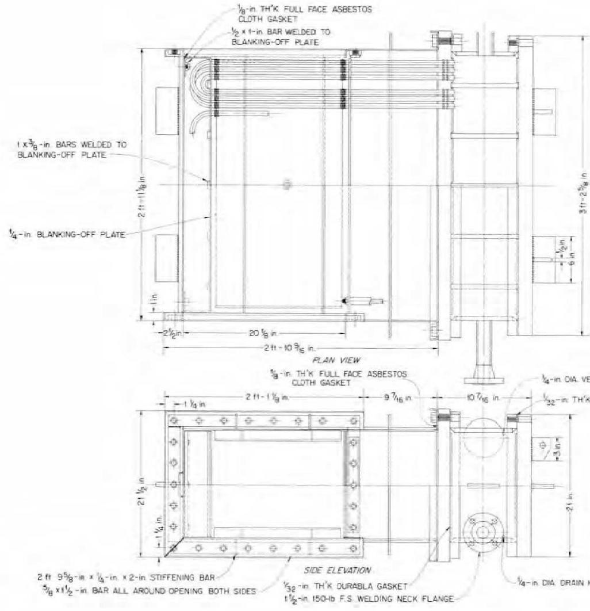  
Fig. 36. Helium-to-Water Heat Exchanger.

<table><tr><td>DESCRIPTION</td><td>MATERIAL</td><td>SPECIFICATION</td><td>QUALITY</td></tr><tr><td>SHELL, SHELL COVER B, BLANKING-OFF B, TUBE SUPPORT BAR, BACKING-UP BARS FOR SHELL FLANGE, SHELL REINFORCING BARS, SHELL SUPPORT B, AIR BAFFLE BOX</td><td>STEEL</td><td>ASTM-A-283</td><td>GRADE C</td></tr><tr><td>STAT. HD. FLANGES, SUPP&#x27;T R&#x27;S, STAT. HD. PARTITIONS, STAT. HD. TIE R&#x27;S, STAT. HD. COVER B, TUBE SHEET STAT HD R&#x27;S</td><td>FIRE BOX STEEL</td><td>ASTM-A-285</td><td>GRADE C</td></tr><tr><td>1/2-in. ISO-1D WELDING NECK FLANGE</td><td>FORCE STEEL</td><td>ASTM-A-181</td><td>GRADE 1</td></tr><tr><td>1/2-in. SCH. 40 PIPE</td><td>SEAMLESS STEEL</td><td>ASTM-A-105</td><td>GRADE A</td></tr><tr><td>TUBES</td><td>SEAMLESS STEEL</td><td>ASTM-A-179</td><td>MIN WALL</td></tr><tr><td>FINS</td><td>COPPER</td><td>COMMERCIAL</td><td></td></tr><tr><td>STAT. HD. GASKETS</td><td>DURABLE</td><td>COMMERCIAL</td><td></td></tr><tr><td>SHELL GASKET AT TUBE SHEET</td><td>1/8 in TH/K ASBESTOS CLOTH</td><td>COMMERCIAL</td><td></td></tr><tr><td>TAP BOLTS AT BLANKING-OFF BAFFLE</td><td>ALLOY STEEL</td><td>COMMERCIAL</td><td></td></tr><tr><td>BOLTING AT STAT. HD. AND TUBE SHEET</td><td>ALLOY STEEL</td><td>ASTM-A-93 B-7</td><td>125000 TS 105000 YP</td></tr><tr><td>TIE RODS, SPACERS AND NUTS</td><td>STEEL</td><td>COMMERCIAL</td><td></td></tr><tr><td>NUTS AT TUBE SHEET AND COVER PLATE</td><td>BETH OIL QUENCH</td><td>ASTM-A-194</td><td>CLASS 2H</td></tr></table>

(Lyon equation $(6))$ and

$$
h _ {w} = 0. 0 2 7 \frac {k _ {w}}{D _ {w}} \operatorname {R e} _ {w} ^ {0. 8} \Pr_ {w} ^ {1 / 3} \left(\frac {\mu}{\mu_ {s}}\right) _ {w} ^ {0. 1 4} \tag {9}
$$

(Sieder-Tate equation(15)), where

$$
\begin{array}{l} k = \text {t h e r m a l c o n d u c t i v i t y , B t u / s e c} \cdot f t ^ {2} \\ (\circ F / f t), \end{array}
$$

$$
D = \text {e q u i v a l e n t} \quad \text {d i a m e t e r}, \quad f t,
$$

$$
\mathrm {P e} = \text {P e c l e t} ^ {\prime} \text {s n u m b e r ,}
$$

$$
\mathrm {R e} = \text {R e y n o l d s} ^ {\prime} \text {n u m b e r},
$$

$$
P r = \text {P r a n d t l} ^ {\prime} \text {s n u m b e r},
$$

$$
\begin{array}{l} \mu = \text {v i s c o s i t y a t b u l k t e m p e r a t u r e}, \\ \quad \quad \quad \quad \quad \quad \quad \quad \quad \quad \quad \quad \quad \quad \quad \quad \quad \quad \quad \quad \quad \quad \quad \quad \quad \quad \quad \quad \quad \quad \quad \quad \quad \quad \quad \quad \quad \quad \quad \quad \quad \quad \quad \quad \quad \quad \quad \quad \quad \quad \text {l b / h r} ^ {\cdot} f t, \end{array}
$$

$$
\mu_ {s} = \text {v i s c o s i t y a t s u r f a c e t e m p e r a - t u r e , l b / h r} \cdot \text {f t}.
$$

The liquid-side areas are

$$
A _ {\mathrm {N a K}} = \pi D _ {\mathrm {N a K}} L _ {\mathrm {N a K - H e}} \tag {10}
$$

and

$$
A _ {w} = \pi D _ {w} L _ {\text {H e - w}} \tag {11}
$$

where $L$ is the total effective length of the heat exchanger tubes in feet.

The resistance of the metal is

$$
\left[ \frac {1}{(h A) _ {m}} \right] _ {\mathrm {N a K - H e}} = \frac {\ln \left(\frac {D _ {o}}{D _ {\mathrm {N a K}}}\right) _ {\mathrm {N a K - H e}}}{2 \pi \left(k _ {m}\right) _ {\mathrm {N a K - H e}} L _ {\mathrm {N a K - H e}}} \tag {12}
$$

and

$$
\left[ \frac {1}{(h A) _ {m}} \right] _ {\text {H e - w}} = \frac {\ln \left(\frac {D _ {o}}{D _ {w}}\right) _ {\text {H e - w}}}{2 \pi (k _ {m}) _ {\text {H e - w}} L _ {\text {H e - w}}} \tag {13}
$$

where $D_{\alpha}$ is the tube diameter in feet.

The heat transfer coefficients on the gas side are calculated in a manner identical to that used for the fuel heat disposal system calculations (cf., Eqs. 14, 15, and 16 of chap. 3).

Table 10 contains a list of pertinent information obtained from heat exchanger designs (Figs. 35 and 36) and the heat transfer relations discussed above. Values are given for four different flow rates of helium and four different flow rates of water; curves were plotted from these values and used in the solution of Eqs. 1 through 5.

The data of Table 10 were used to solve the five simultaneous equations (Eqs. 1 through 5) for various values of the independent variable - heat

transferred. Inasmuch as the helium volumetric flow is constant (see restraint 2), the helium weight flow cannot be precisely determined until the helium temperature at the blower $(T_{\mathrm{He}})$ is known. It was necessary therefore to assume a helium weight flow for each power and to solve the equations by iteration. The results of the solution of Eqs. 1 through 5 are shown in Figs. 37 and 38, in which the minimum and maximum NaK and helium temperatures are plotted against heat transferred. The mean NaK temperature is also shown in Fig. 37.

The pressure drops in the NaK and in the helium have been calculated for the exchangers. The NaK pressure drop was calculated with the use of the customary Fanning equation (11) for the

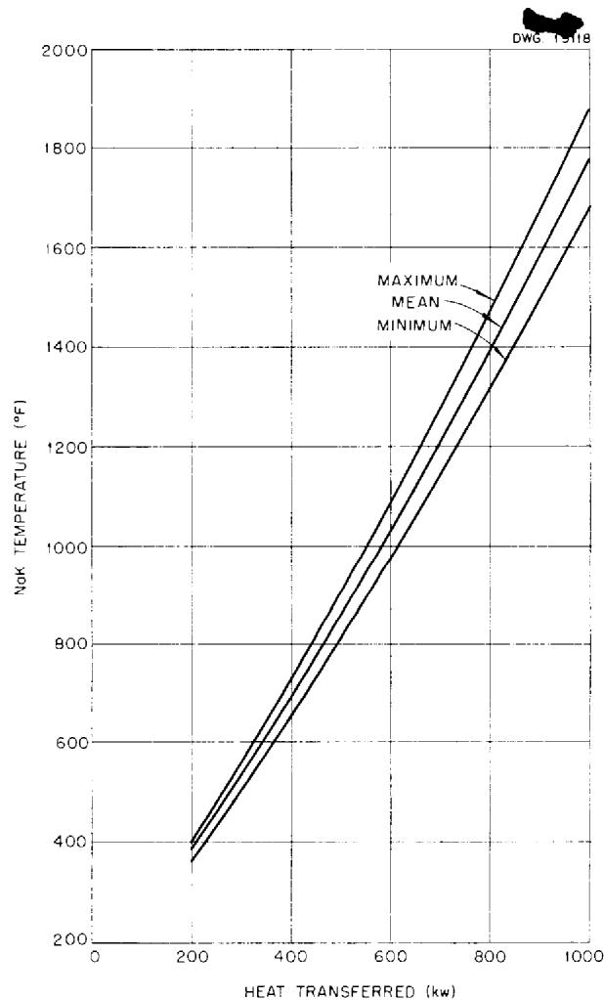  
Fig. 37. NaK Temperatures vs. Heat Transferred in Heat Exchangers.

TABLE 10. HEAT EXCHANGER DATA   

<table><tr><td></td><td>NaK-TO-HELIUM
HEAT EXCHANGER</td><td>HELIUM-TO-WATER
HEAT EXCHANGER</td></tr><tr><td>Tube outer diameter, in.</td><td>1.0</td><td>0.625</td></tr><tr><td>Tube wall thickness, in.</td><td>0.109</td><td>0.049</td></tr><tr><td>Tube material</td><td>Inconel</td><td>Steel</td></tr><tr><td>Fin outer diameter, in.</td><td>2.0</td><td>0.875</td></tr><tr><td>Number of fins per inch</td><td>7</td><td>12</td></tr><tr><td>Fin thickness, in.</td><td>0.024</td><td>0.010</td></tr><tr><td>Fin material</td><td>Stainless steel</td><td>Copper</td></tr><tr><td>Tube transverse pitch, ft</td><td>2.75</td><td>2.80</td></tr><tr><td>Tube longitudinal pitch, ft</td><td>2.43</td><td>1.684</td></tr><tr><td>Number of tubes per exchanger</td><td>75</td><td>180</td></tr><tr><td>Number of tubes transverse to flow (per exchanger)</td><td>5</td><td>6</td></tr><tr><td>Exchanger height, in.</td><td>13.75</td><td>16.8</td></tr><tr><td>Exchanger width (also active tube length), in.</td><td>16.25</td><td>17.0</td></tr><tr><td>Total active tube length, ft</td><td>101.6</td><td>255.1</td></tr><tr><td>Liquid flow area per exchanger, ft²</td><td>0.0503</td><td>0.0273</td></tr><tr><td>Liquid flow rate per exchanger, lb/sec</td><td>11.5</td><td>16.67, 10.0, 6.67, 3.33</td></tr><tr><td>Liquid velocity, ft/sec</td><td>4.97</td><td>9.89, 5.40, 3.91, 1.96</td></tr><tr><td>Peclet&#x27;s number</td><td>790</td><td></td></tr><tr><td>Reynolds&#x27; number</td><td></td><td>49,300, 29,600, 19,700, 9,860</td></tr><tr><td>Liquid heat transfer coefficient, Btu/sec·ft²·°F</td><td>0.830</td><td>0.610, 0.406, 0.290, 0.168</td></tr><tr><td>Liquid heat transfer area per exchanger, ft² (hA)liquid per exchanger, Btu/sec·°F</td><td>20.8</td><td>35.2</td></tr><tr><td>(l/hA)liquid per exchanger, sec·°F/Btu</td><td>17.3</td><td>21.5, 14.3, 10.2, 5.92</td></tr><tr><td>(1/hA)per exchanger, sec·°F/Btu</td><td>0.058</td><td>0.047, 0.070, 0.098, 0.169</td></tr><tr><td>Helium-side equivalent diameter (DHe), in.</td><td>0.126</td><td>0.015</td></tr><tr><td>Helium free flow ratio</td><td>1.447</td><td>0.722</td></tr><tr><td>Helium flow area per exchanger, ft²</td><td>0.575</td><td>0.768</td></tr><tr><td>Helium flow rate per exchanger, lb/sec</td><td>0.893</td><td>1.524</td></tr><tr><td>Helium Reynolds&#x27; number</td><td>0.33, 0.22, 0.11</td><td>0.33, 0.22, 0.11</td></tr><tr><td>Helium heat transfer coefficient, Btu/sec·ft²·°F</td><td>2,230, 1,470, 720</td><td>650, 430, 210</td></tr><tr><td>Fin efficiency</td><td>0.0063, 0.0046, 0.0028</td><td>0.0051, 0.0038, 0.0023</td></tr><tr><td>Helium heat transfer area, * ft²</td><td>142, 162, 190</td><td>1.0, 1.0, 1.0</td></tr><tr><td>(hA)He per exchanger, Btu/sec·°F</td><td>0.889, 0.743, 0.526</td><td>187, 187, 187</td></tr><tr><td>(1/hA)He per exchanger, sec·°F/Btu</td><td>1.12, 1.35, 1.90</td><td>1.04, 1.41, 2.36</td></tr></table>

Area" varies with helium flow rate because the fin efficiency varies with helium flow rate.

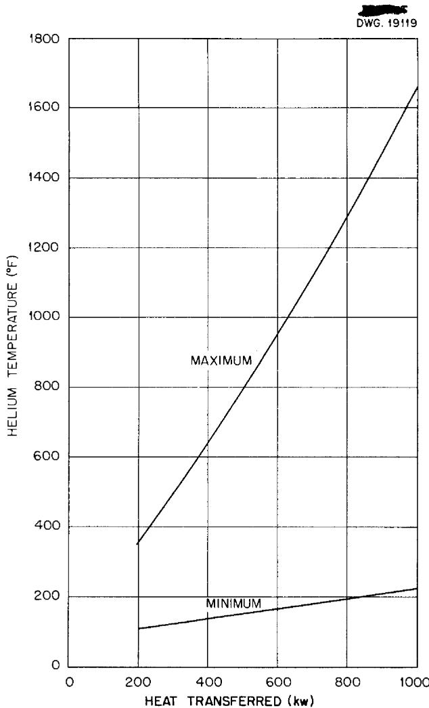  
Fig. 38. Helium Temperatures vs. Heat Transferred in Heat Exchangers.

straight sections and the curves presented by Cox and Germano(12) for the bends, exits, and entrances. Since the NaK flow is relatively constant, the NaK pressure drop is approximately constant and is equal to about 1 psi. The helium pressure drop is calculated in a manner identical to that used for calculating the helium pressure drop in the fuel system. The helium pressure drop is plotted against heat transferred in Fig. 39.

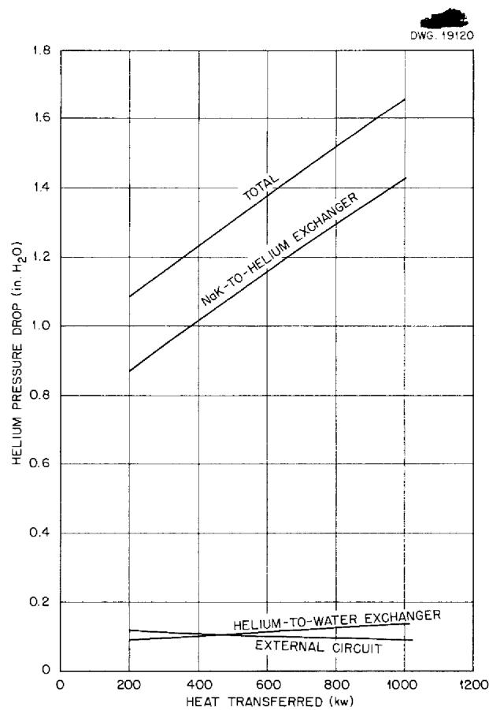  
Fig. 39. Helium Pressure Drop vs. Heat Transferred.

The pressure drops in the remainder of the NaK and the helium circuits have been calculated with the use of the Fanning equation and the Cox and Germano data. Figure 40 shows the NaK piping; Fig. 41 shows the helium ducting. The pressures at various points in the fuel circuit are shown in Fig. 1. The NaK pressure drop, exclusive of the heat exchangers, is 16 psi; the total NaK pressure drop is 17 psi. The helium pressure drop exclusive of the heat exchanger and the total helium pressure drop are plotted against heat transferred in Fig. 39.

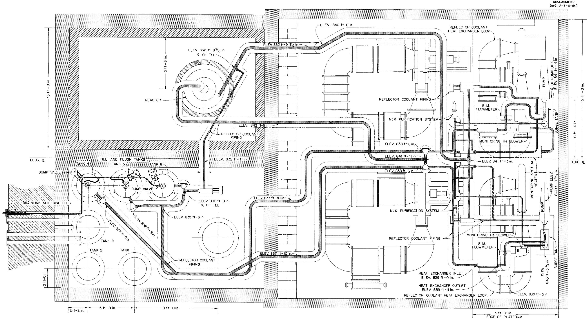  
Fig. 40. Reflector Coolant Piping.

UNCLASSIFIED

DWG D-A-3-4-51A

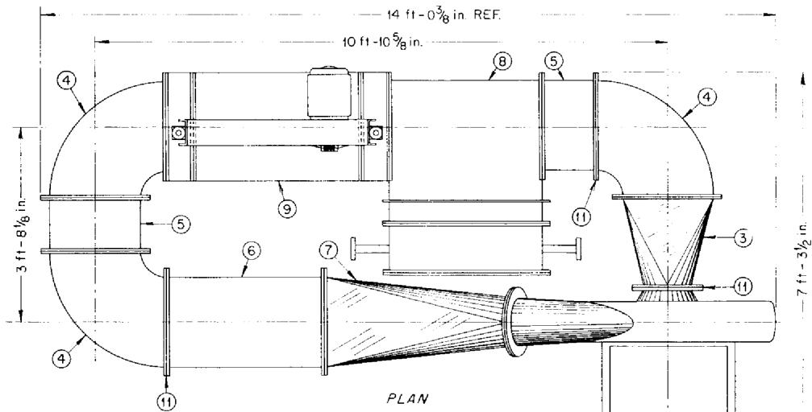

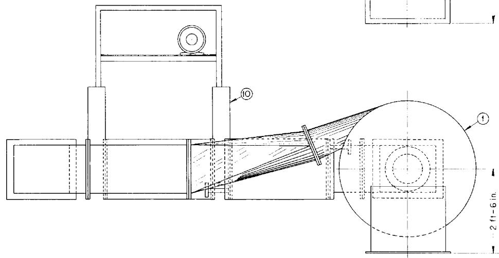  
ELEVATION

1 NO.20-SM200 LAMSON BLOWER   
2 VICKERS HYDRAULIC MOTOR   
3 TRANSITION PIECE, 10-in 10 TO $20\%$ x $16\frac{1}{2}$ in.   
4 90°ELBOW,2018x1612in   
5 DUCT, 2018x1612x114-in LONG  
6 DUCT, 20% x 16% in. x 3 ft-0-in LONG   
7 TRANSITION PIECE, 10-in ID TO $20\frac{1}{8} \times 16\frac{1}{2}$ in   
8 GRISCOM-RUSSELL He TO $\mathsf{H}_2\mathsf{O}$ HEAT EXCHANGER   
9 GRISCOM-RUSSELL NaK TO He HEAT EXCHANGER   
10 ORNL HEAT BARRIER   
11 ASBESTOS GASKETS, REQUIRED DIA x 16 in. THICK NOTE:

ITEMS NO. 3,4,5,6, AND 7 ARE SAE NO.10-20

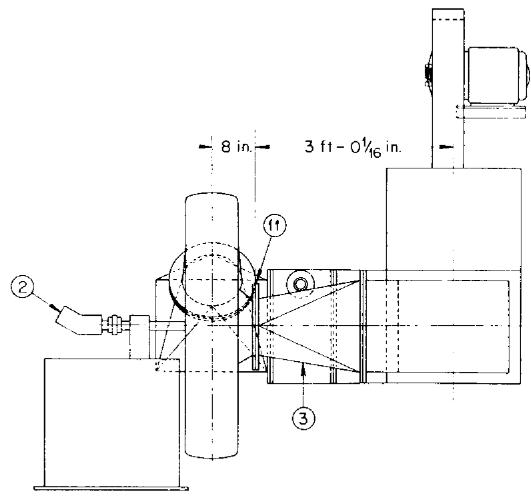  
ENDVIEW   
Fig. 41. Reflector Coolant Heat Exchanger Loop.

# Chapter 5

# ROD AND INSTRUMENT COOLING SYSTEM

# COOLING OF THE CONTROL RODS AND INSTRUMENTS

There are six vertical holes in the reactor of the ARE (Fig. 16) into which a regulating rod, three safety rods, and two fission chambers can be lowered, when required. Helium is blown through the annular passages between the rods and instruments and the reactor to cool the various surfaces present. In the case of the rods, this cooling is desirable because the guide vanes on the rods slide in contact with the sleeve in the reactor; considerable uncertainty exists as to what would happen if this sliding contact were to be made at the high temperatures in the reactor. The instruments require cooling because the electrical insulators used in their construction emit false signals at temperatures above about $700^{\circ}\mathrm{F}$ . The rod and instrument cooling circuit consists of two blowers, each of 1000 cfm capacity, which blow helium through the annular passages in the reactor holes, and a heat exchanger which removes from the helium the heat picked up in the reactor holes. Although the blowers have a total capacity of 2000 cfm, they are operated so that the helium flow is 1000 cfm. Figure 1 shows a diagram of the rod and instrument cooling system. Figure 42 shows the dimensions of the helium passages through the reactor. Figure 17 shows a cross section of the helium passages and details of the sleeve in the reactor. This sleeve, as may be seen, is actually triple-walled. The helium passes between the inner wall and the rod or instrument in question. The space between the inner wall and the middle wall is packed with diatomaceous earth, which serves as thermal insulation between the reactor and the rod or instrument hole. NaK from the reflector coolant circuit flows between the middle and outer wall and provides some cooling because it is

colder than the surrounding sections of the reactor core. Since the 1000 cfm of helium available may be apportioned differently to the various holes, the cooling of the various holes was investigated for a range of helium flows. Also, at the time of the calculations, the mean NaK temperature was unknown and, consequently, a range of mean NaK temperatures was investigated. The cooling of the various rods and instruments will be considered separately and in the following order: safety rods, regulating rod, fission chambers. The division of the total flow among the different holes will be discussed last.

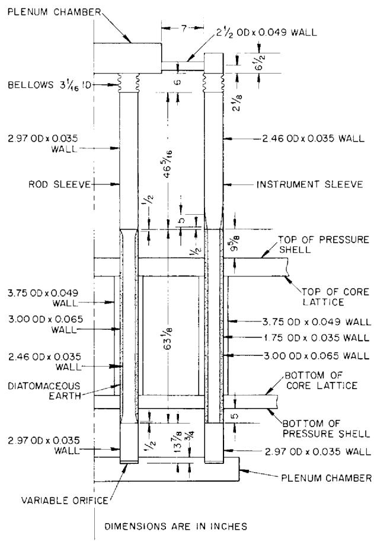  
Fig. 42. Rod and Instrument Sleeves.

# COOLING OF THE SAFETY RODS

During normal reactor operation, the safety rods are not in the reactor but are withdrawn into sleeves above the reactor. The safety rods themselves are in a cool area, and the only cooling problem, then, is that of cooling the sleeve in the reactor. The equations governing this process are quite straightforward and are listed below:

(1) $Q = W_{C_p} (T_{H_e}' - T_{H_e})$   
(2) $Q = hA\theta + Q_r,$   
(3) $hA = \left[\frac{1}{(hA)_{\textbf{NaK}}} + \frac{1}{(hA)_{m}}\right]$

$$
\left. + \frac {1}{(h A) _ {I}} + \frac {1}{(h A) _ {n}} + \frac {1}{(h A) _ {\mathrm {H e}}} \right] ^ {- 1},
$$

where

$Q =$ heat transferred to helium, Btu/sec,

$W =$ weight flow of helium, lb/sec,

$c_{p} =$ specific heat of helium, Btu/lb $^{\circ}$ F,

$T^{\prime} =$ maximum temperature, ${}^{\circ}\mathrm{F}$

$T =$ minimum temperature, ${}^{\circ}\mathrm{F}$

$h =$ heat transfer coefficient, Btu/sec $\cdot ft^2$ (°F/ft),

$A =$ heat transfer area, ft²,

$\theta =$ effective log mean temperature difference between the NaK and the helium,

$Q_{r} =$ heat generated in the sleeve by nuclear radiation, Btu/sec,

and the subscripts

He = heli um,

$\mathrm{NaK} = \mathrm{NaK}$

$m =$ middle metal wallin sleeve,

$I =$ insulation (diatomaceous earth), $n =$ inner metal wall.

The various terms in Eq. 3 may be evaluated as follows:

(4) $h_{\mathrm{NaK}} = \frac{k_{\mathrm{NaK}}}{D_{\mathrm{NaK}}}\left(5.8 + 0.020\mathrm{Pe}^{0.8}\right)$ ,

where

$k =$ thermal conductivity, Btu/sec·ft² (°F/ft),

$D =$ equivalent diameter (four times hydraulic radius), ft,

$\mathbf{Pe} = \mathbf{P}$ eclet's number;

(5) $A_{\textbf{NaK}} = d_m^{\prime}h$

where

$d^{\prime} =$ tube outside diameter, ft, $L =$ length of tube height of pressure shell, ft;

$$
\frac {1}{(h A) _ {m}} = \frac {\ln \frac {d ^ {\prime} m}{d _ {m}}}{2 \pi k _ {m} L}, \tag {6}
$$

where

$d =$ tube inside diameter, ft;

$$
\frac {1}{(h A) _ {I}} = \frac {\ln \frac {d _ {m}}{d _ {m} ^ {\prime}}}{2 \pi k _ {I} L}; \tag {7}
$$

$$
\frac {1}{(h A) _ {n}} = \frac {\ln \frac {d _ {n} ^ {\prime}}{d _ {n}}}{2 \pi k _ {n} L}; \tag {8}
$$

(9) $h_{\mathrm{He}} = 0.023 \frac{k_{\mathrm{He}}}{D} \mathrm{Re}^{0.8} \mathrm{Pr}^{0.4}$ ,

$$
f o r \mathrm {R e} \geq 2 1 0 0,
$$

$$
h _ {\mathrm {H e}} = 1. 8 6 \frac {k _ {\mathrm {H e}}}{D _ {\mathrm {H e}}} \operatorname {R e} ^ {1 / 3} \Pr^ {1 / 3} \left(\frac {D _ {\mathrm {H e}}}{L}\right) ^ {1 / 3},
$$

$$
f o r \mathrm {R e} <   2 1 0 0;
$$

(10) $A_{\mathbf{H}\mathbf{e}} = \pi d_{n}L.$

Equations 1 through 10 and the dimensions shown in Figs. 42 and 9 were used to calculate the exit temperature of the helium and the heat transferred to the helium; an inlet helium temperature of $150^{\circ}\mathrm{F}$ was assumed. The properties of helium were evaluated at the mean helium temperature. The range of helium weight flows considered was from 0.005 to 0.100 lb/sec, and the calculations were made for mean NaK temperatures of 1000, 1150, and $1300^{\circ}\mathrm{F}$ . The results of the computations are shown in Figs. 43, 44, and 45.

The maximum temperature of the sleeve wall can be calculated from the

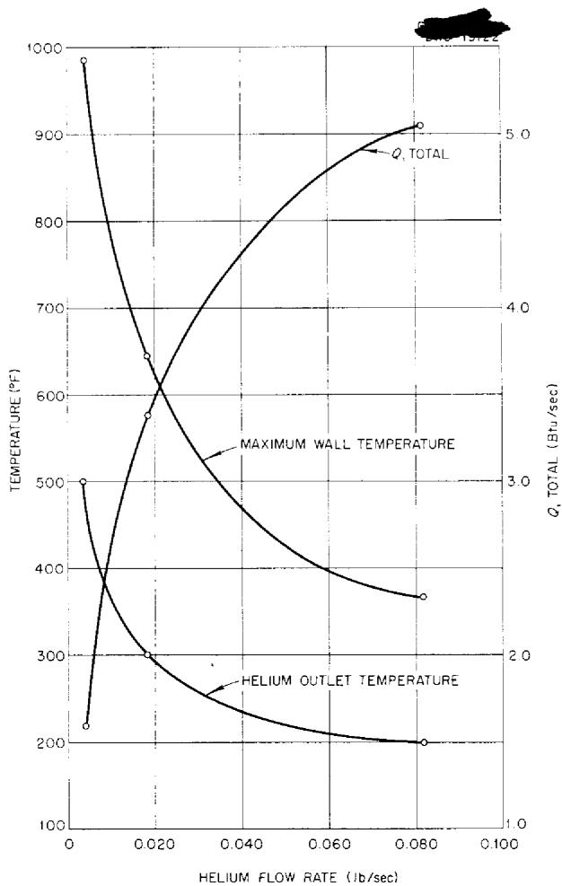  
Fig. 43. Safety Rod Cooling at a NaK Temperature of $1000^{\circ}\mathrm{F}$ .

following equation:

$$
\left(T _ {n}\right) _ {\max } = T _ {\mathrm {H e}} ^ {\prime} + \frac {Q}{\left(h A\right) _ {\mathrm {H e}}} \tag {11}
$$

The helium heat transfer coefficient, $h$ , in Eq. 11 is evaluated by means of Eq. 9, with the helium properties corresponding to the maximum helium temperature being used. The maximum wall temperature was evaluated by using Eq. 11, and the results are shown in Figs. 43, 44, and 45.

# COOLING OF THE REGULATING ROD

During normal operation, the position of the regulating rod may vary from a position completely out of the reactor to a position where the midpoint of the stainless steel slug is coincident with the center line

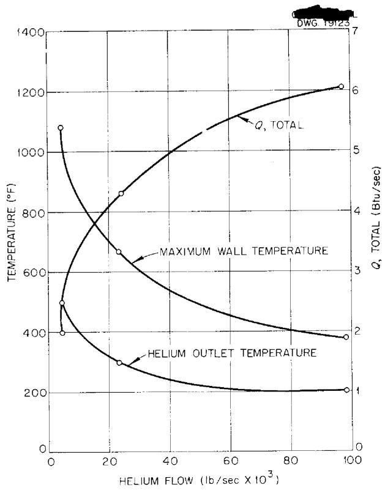  
Fig. 44. Safety Rod Cooling at a NaK Temperature of $1150^{\circ}\mathrm{F}$ .

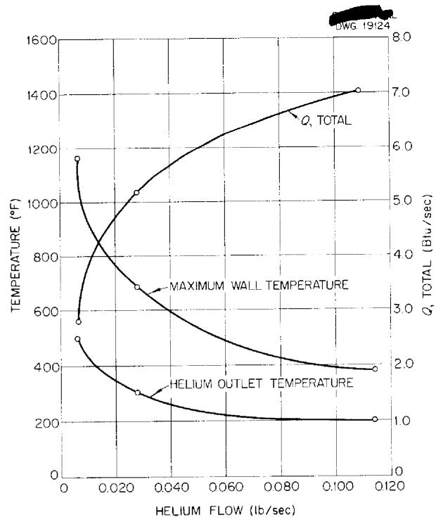  
Fig. 45. Safety Rod Cooling at a NaK Temperature of $1300^{\circ}\mathrm{F}$ .

of the reactor. When the regulating rod is completely out of the reactor, the situation is exactly the same as that analyzed in the previous section on the safety rods, the triple-walled sleeve being identical for the two types of rods. When the regulating rod is in the reactor, the situation is more complex; the case of the regulating rod all the way into the reactor, which is the extreme condition,

will be analyzed. The regulating rod hole will be divided into three sections in the reactor (Fig. 46). The top section of the rod hole is the section that contains the portion of the regulating rod which is in the reactor but contains no appreciable amount of neutron and gamma absorber. The middle section of the rod hole is the section that contains the portion of the regulating rod which contains

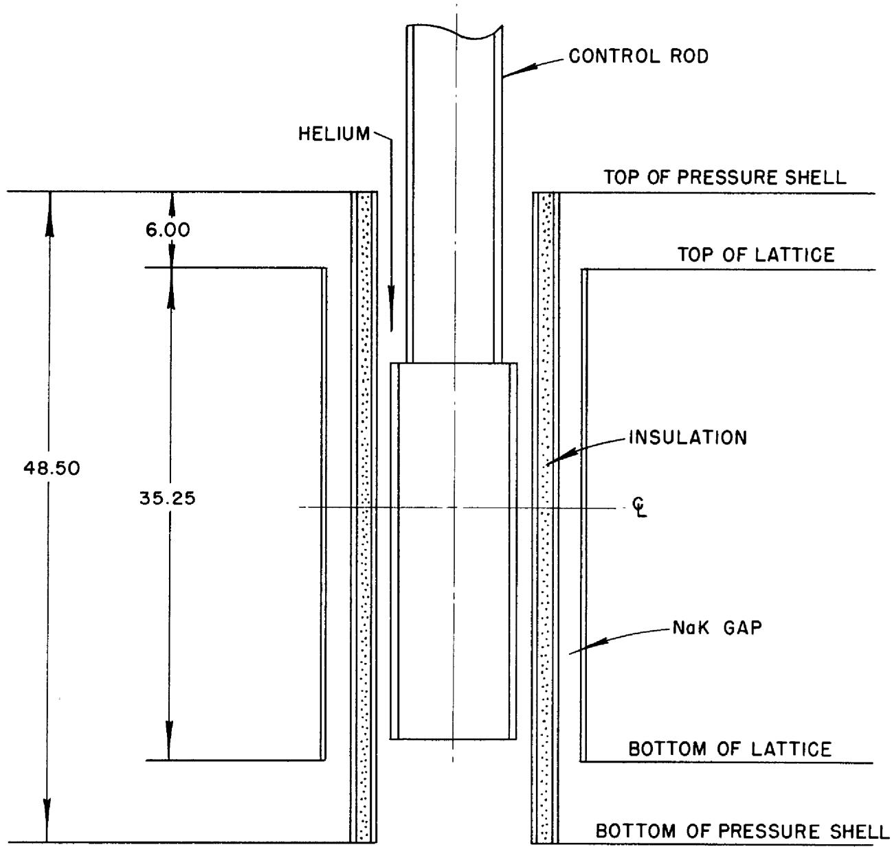  
Fig. 46. Regulating Rod.

the heavy stainless steel slug. The bottom section of the rod hole is the section that contains no regulating rod. The equations governing the cooling process in the three sections of the rod hole are

$$
\begin{array}{l} Q _ {i} = W _ {C _ {p}} \left(T _ {\mathrm {H e}} ^ {\prime} - T _ {\mathrm {H e}}\right) _ {i}, \tag {12} \\ i = 1, 2, 3, \\ \end{array}
$$

where the symbols have the same meanings as given previously and the subscript $i$ refers to the sections of the regulating rod hole:

$$
\begin{array}{l} 1 = \text {t o p} \\ 2 = \text {m i d d l e} \\ 3 = \text {b o t t o m} \\ \end{array}
$$

$$
Q _ {i} = \left(h A \theta + Q _ {r} + q\right) _ {i}, \tag {13}
$$

where

$q =$ the heat which must be removed from the rod, Btu/sec;

$$
q _ {i} = \left(q _ {r} + q _ {R}\right) _ {i}, \tag {14}
$$

where

$q_{r} =$ heat generated in the rod by nuclear radiation, Btu/sec,

$q_{R} =$ heat transferred from the sleeve to the rod by thermal radiation, Btu/sec;

it may be noted that $(q_{r})_{i = 1} = 0$ and $q_{i = 3} = 0;$

$$
\begin{array}{l} \left(h A\right) _ {i} = \left[ \frac {1}{\left(h A\right) _ {\mathrm {N a K}}} + \frac {1}{\left(h A\right) _ {\mathrm {m}}} \right. \tag {15} \\ \left. + \frac {1}{(h A) _ {I}} + \frac {1}{(h A) _ {n}} + \frac {1}{(h A) _ {\mathrm {H} e}} \right] _ {i} ^ {- 1}, \\ \end{array}
$$

where the various terms are evaluated exactly as the corresponding terms in Eq. 3;

$$
\begin{array}{l} \left(q _ {R}\right) _ {i} = \frac {0 . 1 7 3}{3 6 0 0} \frac {a _ {i}}{\frac {1}{\epsilon} + \left(\frac {a _ {i}}{A _ {n}}\right) \left(\frac {1}{\epsilon} - 1\right)} \tag {16} \\ \left(q _ {R}\right) _ {i = 3} = 0, \\ \end{array}
$$

where

$a =$ surface area of control rod, ft², $t^{\prime} =$ maximum rod temperature, ${}^{\circ}\mathrm{F}$ abs, $t =$ minimum rod temperature, ${}^{\circ}\mathrm{F}$ abs, $\epsilon =$ emissivity.

It may be noted that the arithmetical-average temperature is used in Eq. 16 to evaluate the heat transferred by thermal radiation. This is only an approximation, but a check has indicated that it is not too greatly in error. Equations 12 through 16 and the dimensions shown in Figs. 42, 46, and 47 were used to calculate for the various sections the exit temperature of the helium and the heat transferred to the helium; an inlet temperature to the rod hole of $150^{\circ}\mathrm{F}$ was assumed. The properties of helium were evaluated at the mean temperatures, and the values of $Q_{r}$ and $q_{r}$ are shown in Fig. 48. The range of helium weight flows considered was 0.015 to 0.025 lb/sec; average NaK temperatures of 1000, 1150, and 1300 were used, as before. The results of the calculations are shown in Figs. 49, 50, 51, and 52, which show the helium temperature and the heat transferred to the helium at the end of sections 2 and 3 plotted against helium flow for the various NaK temperatures.

The maximum temperature of the sleeve and the rod can be calculated from the following equations:

$$
\left(T _ {n}\right) _ {\max } = \left(T _ {\mathrm {H e}} ^ {\prime}\right) _ {i = 3} + \left[ \frac {Q}{(h A) _ {\mathrm {H e}}} \right] _ {i = 3} \tag {17}
$$

and

$$
\left(t\right) _ {\max } = \left(T _ {\mathrm {H e}} ^ {\prime}\right) _ {i = 2} + \left[ \frac {Q}{(h A) _ {\mathrm {H e}}} \right] _ {i = 2}. \tag {18}
$$

Again, the helium heat transfer coefficients are evaluated locally.

$$
\left[ \left(\frac {T _ {n} + T _ {n} ^ {\prime}}{2 0 0}\right) ^ {4} - \left(\frac {t + t ^ {\prime}}{2 0 0}\right) ^ {4} \right] _ {i = 1, 2},
$$

The results of the evaluations of Eqs. 17 and 18 are also shown in Figs. 49, 50, and 51.

# COOLING OF FISSION CHAMBERS

The fission chambers will be in the reactor core during startup of the

UNCLASSIFIED DWG.D-A-2-5A

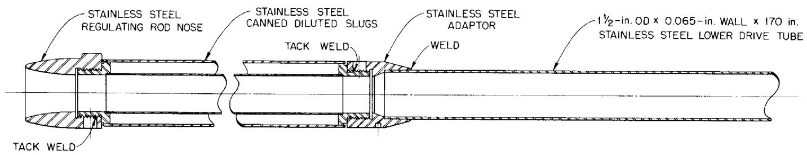

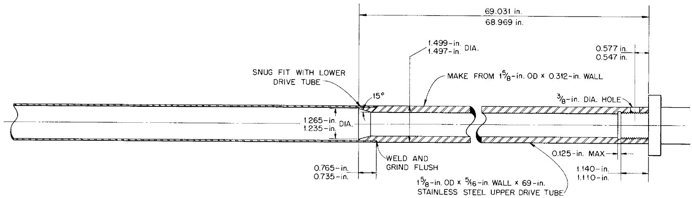  
Fig. 47. Regulating Rod Assembly.

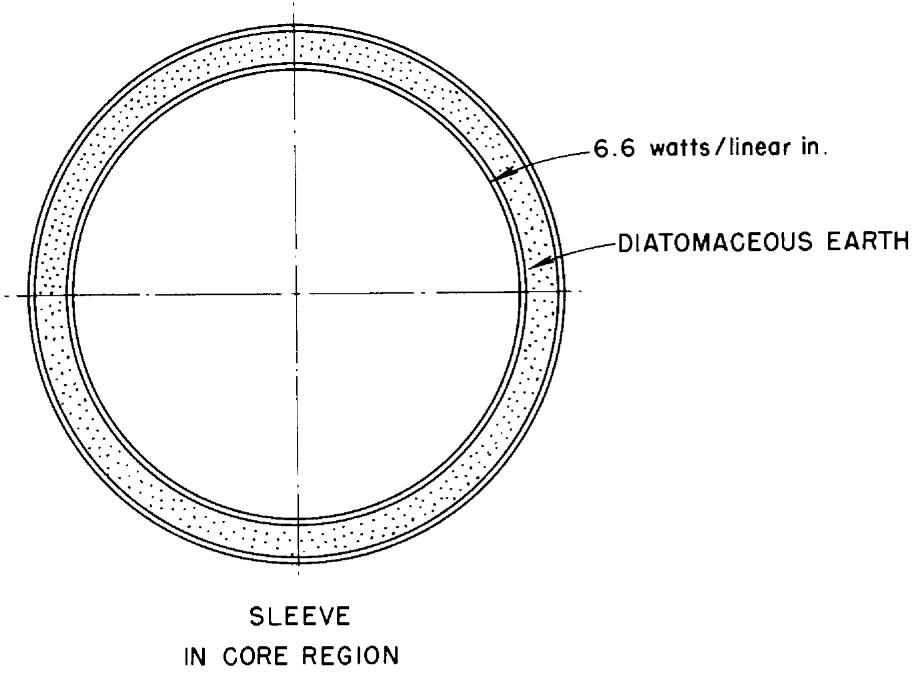

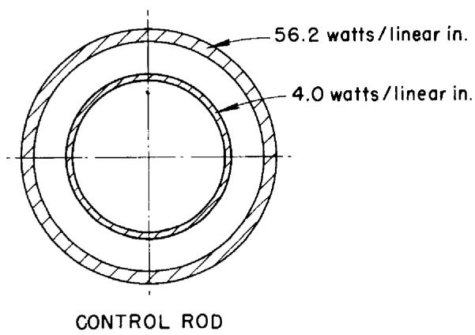

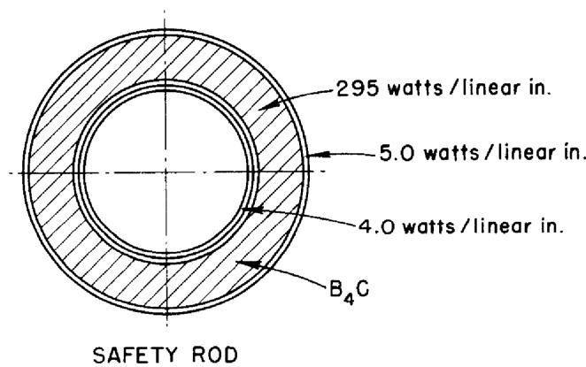  
Fig. 48. Cross Sections of Sleeve, Control Rod, and Regulating Rod Showing Nuclear Heat Generation Rates.

reactor, but later they will be removed from the core entirely. For the following analysis, the fission chambers are considered as being in the core, which is the most extreme condition. Each instrument hole is divided into sections in much the same fashion as the regulating rod hole was divided. The top section of the hole is the portion which contains the fission chamber; the

lower portion contains nothing (Fig. 53). The equations to be used in calculating the cooling requirements are

(19) $Q_{i} = W_{C_{p}}\left(T_{H_{e}}^{\prime} - T_{H_{e}}\right)_{i}, \quad i = 1, 2,$

where the subscript $i$ refers to

l = top section

and

2 = bottom section;

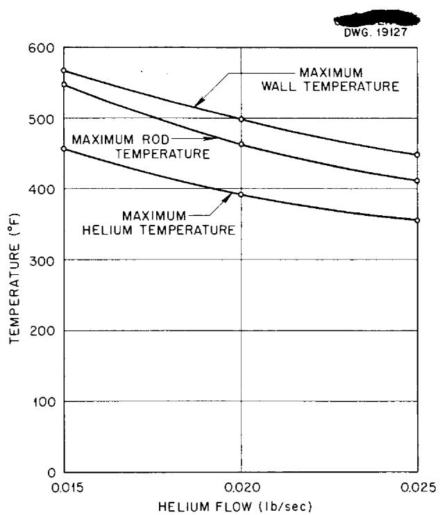  
Fig. 49. Regulating Rod Cooling at a NaK Temperature of $1000^{\circ}\mathbf{F}$ .

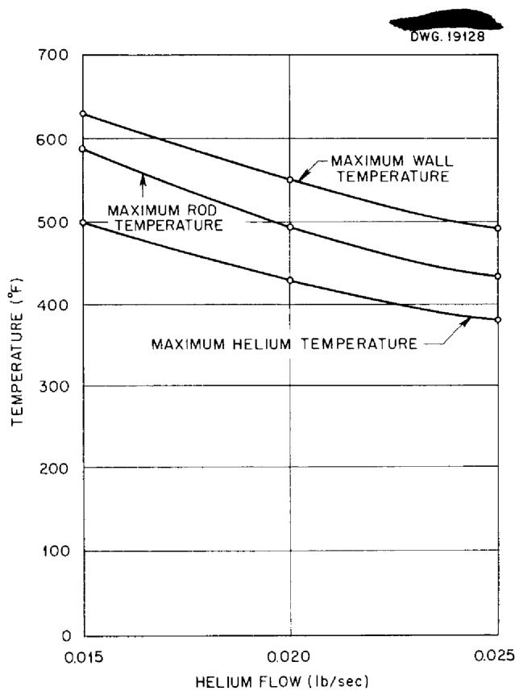  
Fig. 50. Regulating Rod Cooling at a NaK Temperature of $1150^{\circ}\mathbf{F}$ .

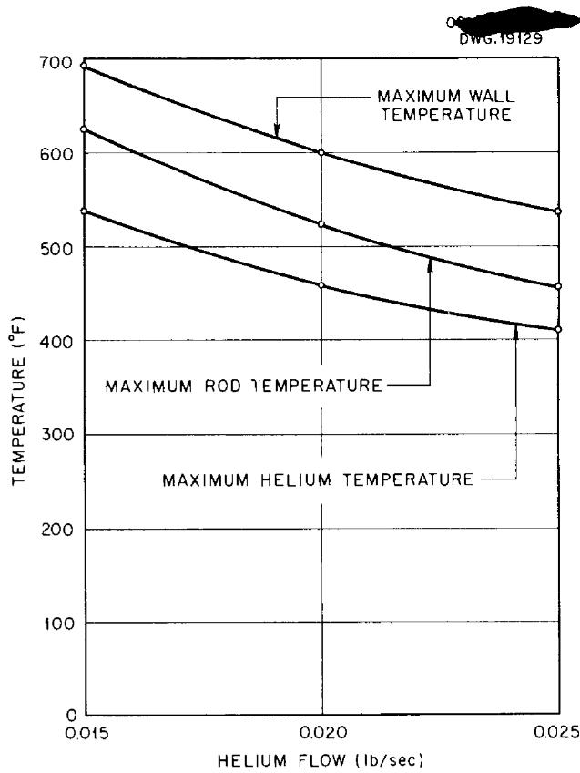

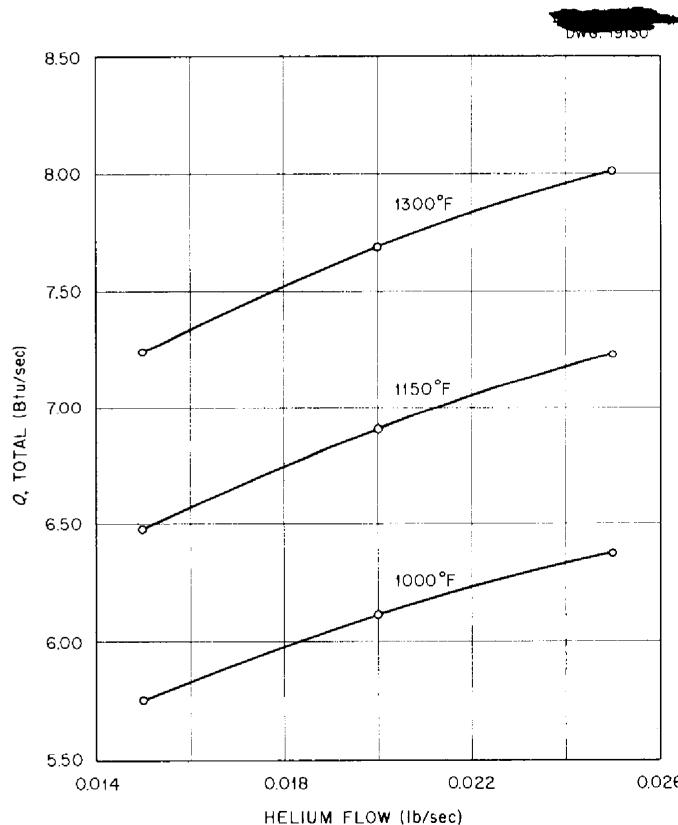  
Fig. 51. Regulating Rod Cooling at a NaK Temperature of $1300^{\circ}\mathrm{F}$ .   
Fig. 52. Regulating Rod Cooling at Various NaK Temperatures.

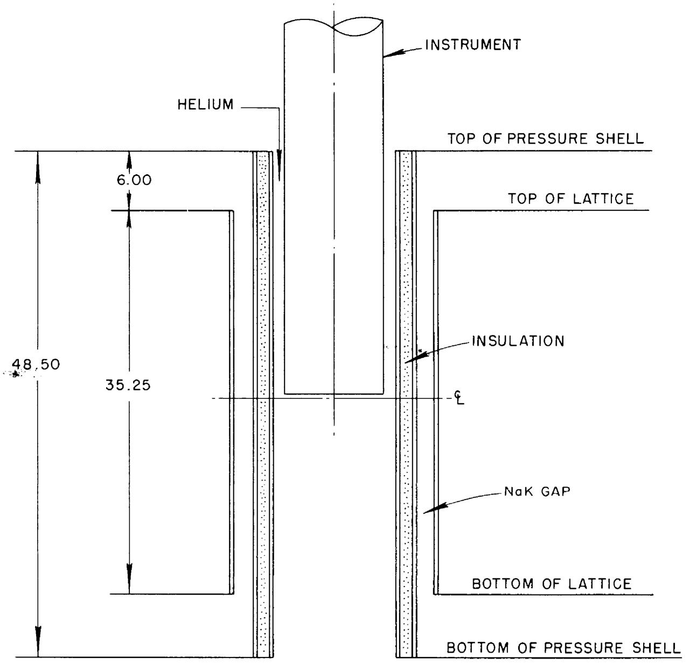  
Fig. 53. Instrument Hole.

$$
Q _ {i} = \left(h A \theta + q _ {R}\right) _ {i}, \tag {20}
$$

where the symbols have the same meanings as before;

$$
\begin{array}{l} \left(h A\right) _ {i} = \left[ \frac {1}{\left(h A\right) _ {\mathrm {N a K}}} + \frac {1}{\left(h A\right) _ {m}} \right. \tag {21} \\ \left. + \frac {1}{(h A) _ {I}} + \frac {1}{(h A) _ {n}} + \frac {1}{(h A) _ {\mathrm {H e}}} \right] _ {i} ^ {- 1}, \\ \end{array}
$$

where the various terms are also evaluated the same as in Eq. 3, except that the heat transfer coefficient in an annulus is given by

dimensions of the sleeve are shown in Fig. 42. The calculations are based on the same NaK temperatures as used before, and the results are given in Fig. 54.

Figure 55 shows the heat removed and the maximum temperature of the helium vs. helium flow rate for a NaK temperature of $1150^{\circ}\mathrm{F}$ .

# HELIUM PRESSURE DROPS

The helium pressure drops in the safety rod, regulating rod, and instrument sleeves are calculated by

$$
h = 1. 0 2 \frac {k _ {\mathrm {H e}}}{D _ {\mathrm {H e}}} \operatorname {R e} ^ {0 \cdot 4 5} \left(\frac {\mu}{\mu_ {s}}\right) ^ {0 \cdot 1 4} \left(\frac {D _ {\mathrm {H e}}}{l}\right) ^ {0 \cdot 4} \left(\frac {d _ {n}}{d _ {f}}\right) ^ {0 \cdot 8} \operatorname {G r} ^ {0 \cdot 0 5}, \quad \text {f o r R e <   2 1 0 0 ,} \tag {22}
$$

where

$$
\mu = \begin{array}{l} \text {d y n a m i c v i s c o s i t y e v a l u a t e d a t} \\ \text {t h e m e a n t e m p e r a t u r e o f h e l i u m ,} \\ \text {l b / s e c ^ {\cdot} f t ,} \end{array}
$$

$$
\begin{array}{l} \mu_ {s} = \text {d y n a m i c v i s c o s i t y e v a l u a t e d a t} \\ \text {i n n e r w a l l t e m p e r a t u r e ,} \\ \text {l b / s e c} \cdot f t, \end{array}
$$

$$
\begin{array}{l} l = \text {l e n g t h o f s e c t i o n , f t}, \\ \begin{array}{l} d _ {f} = \text {o u t s i d e d i a m e t e r o f f i s s i o n} \\ \text {c h a m b e r , f t ,} \end{array} \\ \mathrm {G r} = \text {G r a s h o f n u m b e r}; \\ \end{array}
$$

$$
q _ {R} = \frac {0 . 1 7 3}{3 6 0 0} \frac {a _ {f}}{\frac {1}{\epsilon_ {f}} + \left(\frac {a _ {f}}{A _ {n}}\right) \left(\frac {1}{\epsilon} - 1\right)} \tag {23}
$$

where

$$
\begin{array}{l} \begin{array}{l} a _ {f} = \text {s u r f a c e a r e a o f f i s s i o n c h a m b e r ,} \\ \quad \mathrm {f t} ^ {2}, \end{array} \\ t _ {f} = \text {m i n i m u m f i s s i o n c h a m b e r t e m p e r a - t u r e ,} ^ {\circ} F \text {a b s ,} \\ t _ {f} ^ {\prime} = \text {m a x i m u m f i s s i o n c h a m b e r t e m p e r a - t u r e ,} ^ {\circ} F \text {a b s ,} \\ \begin{array}{l} \varepsilon_ {f} = \text {e m i s s i v i t y o f f i s s i o n c h a m b e r}, \\ \varepsilon = \text {e m i s s i v i t y o f t u b e}. \end{array} \\ \end{array}
$$

The cooling requirement calculations for the fission chambers are made with the assumption that the bottom of each instrument (excluding nose) is at the center line of the core. Also, the maximum temperature of the instrument is taken to be $600^{\circ}\mathrm{F}$ , and the inlet temperature of helium is taken to be $150^{\circ}\mathrm{F}$ . The outside diameter of the instrument is 1.25 in., and the

using various helium flows and a NaK temperature of $1170^{\circ}\mathrm{F}$ . The equations governing the pressure drops are

$$
\Delta P _ {f} = 4 f \frac {l}{D} \frac {\rho v ^ {2}}{2 g}, \tag {24}
$$

$$
\Delta P _ {c} = X \frac {\rho v ^ {2}}{2 g}, \tag {25}
$$

$$
\left[ \left(\frac {T _ {n} + T _ {n} ^ {\prime}}{2 0 0}\right) ^ {4} - \left(\frac {t _ {f} + t _ {f} ^ {\prime}}{2 0 0}\right) ^ {4} \right]
$$

$$
\begin{array}{l} \Delta P _ {e} = \frac {\rho (v _ {1} - v _ {2}) ^ {2}}{2 g}, (26) \\ \Delta P _ {y} = 4 f \frac {l _ {e}}{D} \frac {\rho v ^ {2}}{2 g}. (27) \\ \end{array}
$$

The symbols have the following meanings and units:

$$
\begin{array}{l} \Delta P = \text {p r e s s u r e} \quad \text {d r o p}, \quad \mathrm {l b / f t} ^ {2}, \\ f = \text {f r i c t i o n} \\ l = \text {l e n g t h o f s e c t i o n , f t}, \\ l _ {e} = \text {e q u i v a l e n t} \\ \check {D} = \text {h y d r a u l i c} \\ v = \text {a v e r a g e} \\ \begin{array}{l} g = \text {g r a v i t a t i o n a l a c c e l e r a t i o n}, \\ 3 2. 2 f t / \sec^ {2}, \end{array} \\ X = \text {c o n s t a n t}, \text {d i m e n s i o n l e s s}, \\ \end{array}
$$

$\nu_{1} =$ average linear velocity upstream, ft/sec,   
$\nu_{2} =$ average linear velocity downstream, ft/sec.

The meanings of the subscripts are the following:

$$
c = \text {c o n t r a c t i o n},
$$

$f =$ friction,   
$e =$ expansion,   
$\mathbf{y} =$ elbow.

The friction factor, $f$ , is given by

(28) $f = \frac{16}{\mathrm{Re}}$ for Re 2100

$$
f = 0. 0 0 1 4 + \frac {0 . 1 2 5}{\left(\mathrm {R e}\right) ^ {0 . 3 2}} ,
$$

for $\mathrm{Re} > 2100$

However, for an annulus

(29) $f = \frac{6}{\mathrm{Re}}$ for $\mathrm{Re} \leq 2100$ .

Values for $X$ are given by McAdams (cf., p. 122 of ref. 11), and $l_{e}$ values are taken from ref. 13.

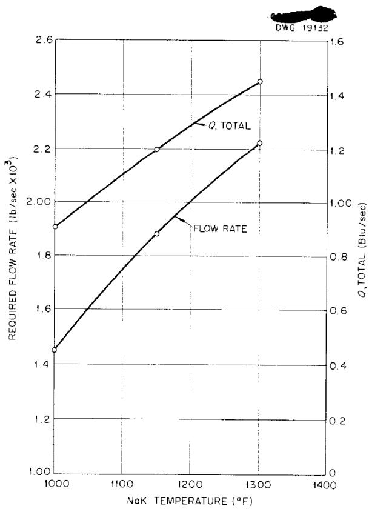  
Fig. 54. Instrument Cooling.

Each sleeve is equipped with a variable orifice where it enters the bottom chamber. However, the pressure drops calculated here do not include the pressure losses across these orifices. The dimensions of the sleeves are given in Fig. 42.

The lower end of the safety rod will be 1 in. above the top of the core lattice when the safety rod is in the "full out" position. The pressure drops were calculated for the rod in this position with helium flows varying from 0.005 to 0.090 lb/sec. The safety rod dimensions are given in Fig. 56, and the results of the calculations are given in Fig. 57.

The regulating-rod helium pressure drops were calculated for the rod in the "full in" and "full out" positions. The "full out" position for this rod was taken to be the same as that for

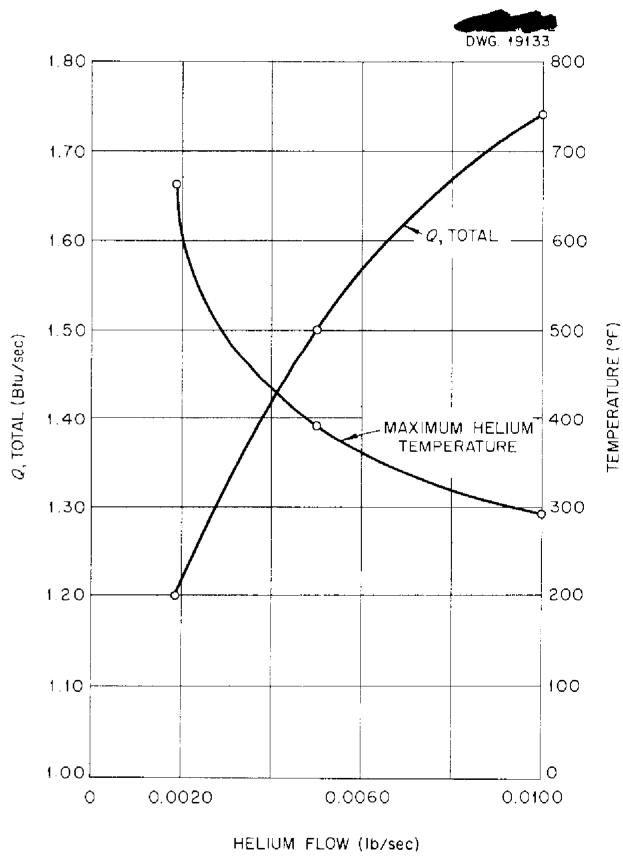  
Fig. 55. Instrument Cooling with Bottom of Instrument at Center Line of Core and at a NaK Temperature of $1150^{\circ}\mathrm{F}$ .

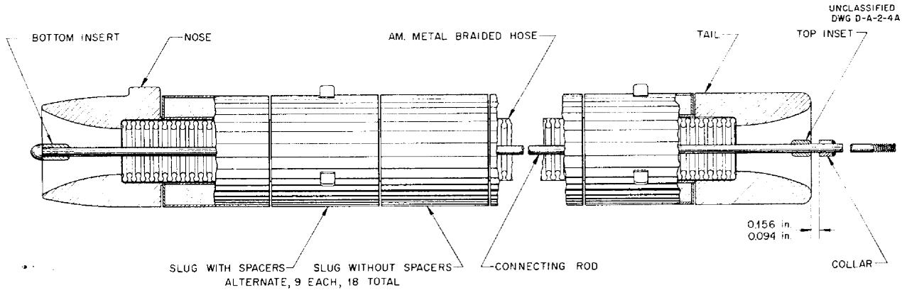  
NOTE: INSERTS, NOSE, BRAIDED HOSE, TAIL AND COLLAR ARE STAINLESS STEEL

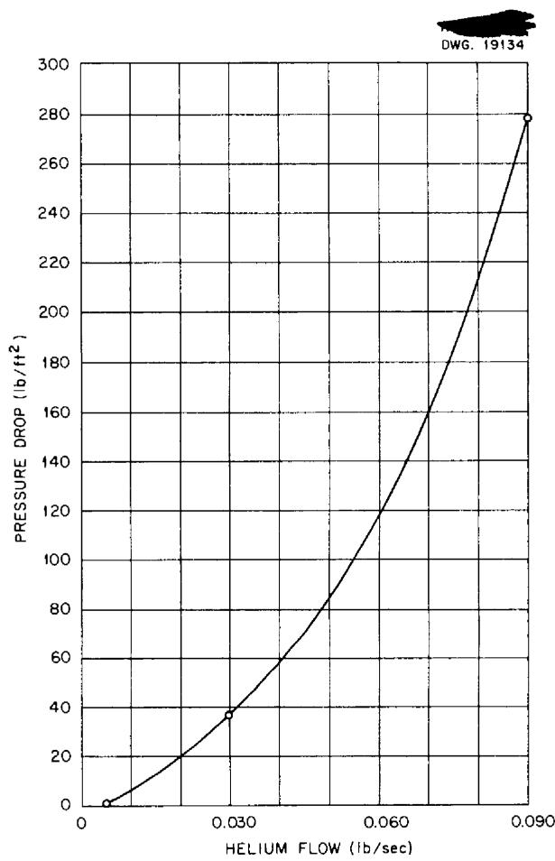  
Fig. 56. Safety Rod Assembly.   
Fig. 57. Pressure Drop in Safety Rod Sleeve.

the safety rod. Figure 58 gives the results of the pressure drop computations for flow rates from 0.015 to 0.025 lb/sec.

The helium pressure drops for the instrument hole were also calculated

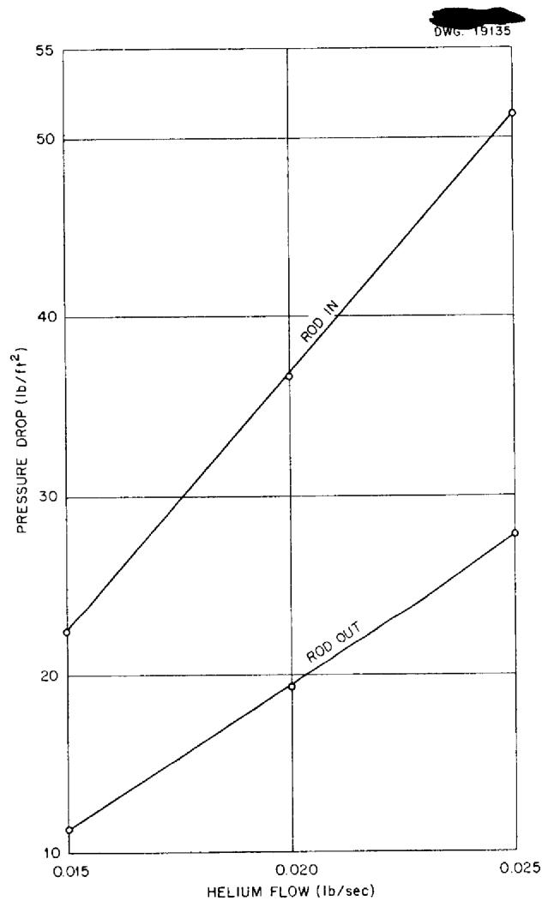  
Fig. 58. Pressure Drop in Regulating Rod Sleeve.

for the instrument in the "full in" and in the "full out" positions. Here, the bottom of the instrument (excluding

nose) is 15 in. above the top of the pressure shell when the instrument is in the "full out" position. The flow rates used in these calculations ranged from 0.0015 to 0.0100 lb/sec. The results of the calculations are given in Fig. 59.

# DIVISION OF FLOW OF HELIUM

The flow of the helium to the various holes is apportioned so that the minimum flow to the instrument in the "full in" position is 0.005 lb/sec, and the minimum flow to the regulating rod in the "full out" position is 0.034 lb/sec. The flow rates per hole for all combinations of regulating rod and instrument positions, with the safety rod out of the core, are given in Table ll.

# PERFORMANCE OF ROD AND INSTRUMENT COOLING SYSTEM HEAT EXCHANGER

The control rods and nuclear instruments in the core of the ARE are cooled by helium, which gives up its heat in a helium-to-water exchanger (Fig. 60). The equations governing the performance of this heat exchanger are

$$
\begin{array}{l} Q = W _ {\mathrm {H e}} c _ {p _ {\mathrm {H e}}} \left(T _ {\mathrm {H e}} ^ {\prime} - T _ {\mathrm {H e}}\right), (29) \\ Q = W _ {w} c _ {p _ {w}} \left(T _ {w} ^ {\prime} - T _ {w}\right), (30) \\ Q = h A \theta , (31) \\ \end{array}
$$

where

$$
\begin{array}{l} Q = \text {h e a t} \quad \text {t r a n s f e r r e d}, \quad \text {B t u / s e c}, \\ W = \text {w e i g h t f l o w}, \quad \mathrm {l b / s e c}, \\ c _ {p} = \text {s p e c i f i c h e a t}, \mathrm {B t u / l b} ^ {\circ} \mathrm {F}, \\ T ^ {\prime} = \text {m a x i m u m t e m p e r a t u r e ,} ^ {\circ} F, \\ T = \text {m i n i m u m t e m p e r a t u r e}, ^ {\circ} F, \\ \end{array}
$$

$h =$ over-all heat transfer coefficient, Btu/sec·ft²·°F,

$$
\begin{array}{l} A = \text {h e a t} \quad \text {t r a n s f e r} \quad \text {a r e a}, \quad \mathrm {f t} ^ {2}, \\ \theta = \text {e f f e c t i v e} \log \text {m e a n} \text {t e m p e r a t u r e} \text {d i f f e r e n c e}. \\ \end{array}
$$

The heat exchanger operates under the following restraints and conditions:

1. The helium flow is 1000 cfm at blower temperature.

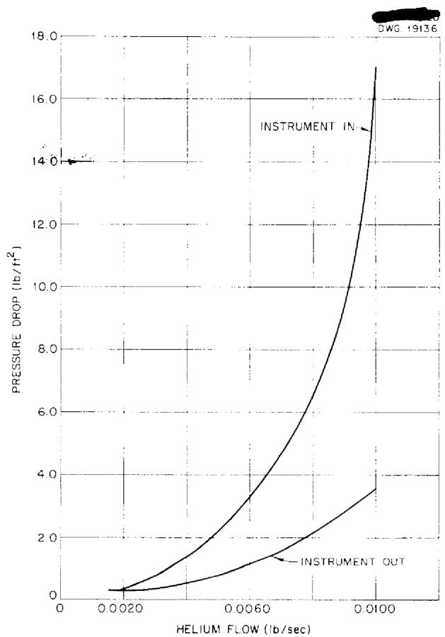  
Fig. 59. Pressure Drop in Instrument Sleeve.

TABLE 11. HELIUM FLOW RATES IN ROD AND INSTRUMENT HOLES   

<table><tr><td colspan="4">POSITION</td><td colspan="3">HELIUM FLOW (1b/sec)</td></tr><tr><td colspan="2">Regulating Rod</td><td colspan="2">Instrument</td><td rowspan="2">Safety Rod</td><td rowspan="2">Regulating Rod</td><td rowspan="2">Instrument</td></tr><tr><td>Out</td><td>In</td><td>Out</td><td>In</td></tr><tr><td>x</td><td></td><td>x</td><td></td><td>0.035</td><td>0.034</td><td>0.005</td></tr><tr><td></td><td>x</td><td>x</td><td></td><td>0.037</td><td>0.026</td><td>0.005</td></tr><tr><td></td><td>x</td><td></td><td>x</td><td>0.037</td><td>0.026</td><td>0.005</td></tr><tr><td>x</td><td></td><td>x</td><td></td><td>0.035</td><td>0.034</td><td>0.005</td></tr></table>

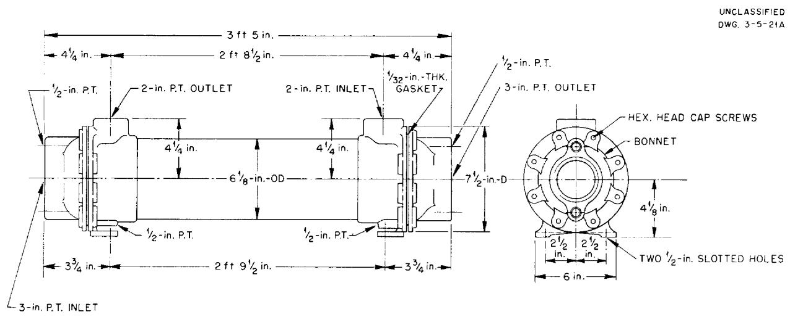  
Fig. 60. Helium-to-Water Heat Exchanger.

2. The water outlet temperature is thermostatically controlled and is held fixed at $100^{\circ}\mathrm{F}$ .

(32) $hA = \left[\frac{1}{(hA)_{\text{H}}}\right] + \frac{1}{(hA)_{\text{m}}} + \frac{1}{(hA)_{\text{w}}}\bigg]^{-1}$ ;

$$
h _ {\mathrm {H e}} = 1. 8 6 \frac {k _ {\mathrm {H e}}}{D _ {\mathrm {H e}}} \left(\frac {\mu}{\mu_ {s}}\right) _ {\mathrm {H e}} ^ {0. 1 4} \operatorname {R e} _ {\mathrm {H e}} ^ {1 / 3} \Pr_ {\mathrm {H e}} ^ {1 / 3} \left(\frac {D _ {\mathrm {H e}}}{L}\right) ^ {1 / 3} \tag {33}
$$

3. The water inlet temperature will vary with the season of the year, but has been assumed to be $70^{\circ}\mathrm{F}$ for this calculation.

The rod cooling system heat exchanger consists of three standard shell-and-tube heat exchangers arranged in parallel. The helium flows in the tubes, and the water flows across the outside of the tubes. The following are pertinent physical dimensions of the exchanger; all values are for one of three units:

Shell inside diameter, in. 61/8

Tube length, ft 3

Tube outside diameter, in. 0.375

Tube inside diameter, in. 0.319

Number of tubes 116

Surface area per tube (inside), ft² 0.251

Surface area per tube (outside), ft² 0.295

Surface area (inside), ft² 29.1

Surface area (outside), ft² 34.2

Baffle spacing, in. 2

Tube pitch (triangular pattern), in. 29/64

The heat transfer coefficient may be evaluated from the following equations:

(McAdams, p. 190 of ref. 11), where the calculation indicates that the helium flow is laminar;

$$
h _ {w} = \frac {k _ {w}}{D _ {w}} \left(\frac {\mu}{\mu_ {s}}\right) _ {w} ^ {0. 1 4} \quad \mathrm {R e} _ {w} ^ {0. 5 5} \quad \Pr_ {w} ^ {1 / 3} \tag {34}
$$

(Kern, p. 137 of ref. 8), where

$$
\mathrm {R e} _ {w} = \frac {G _ {w} D _ {w}}{\mu_ {w}},
$$

$$
D _ {w} = \frac {4 \times \text {f r e e a r e a}}{\text {w e t t e d p e r i m e t e r}} (\text {f r e e a r e a}
$$

measured in a plane perpendicular to the tubes),

$$
G _ {w} = \frac {d C B}{p};
$$

$$
\left(\frac {1}{h A}\right) _ {m} = \frac {2 \pi k _ {m} L}{\ln \frac {D _ {\mathrm {H e}}}{D _ {v}}} \tag {35}
$$

where $k =$ thermal conductivity, Btu/sec $\cdot \mathrm{ft}^2$ (°F/ft),

$D =$ equivalent diameter, ft,

$\mu =$ viscosity at bulk temperature, lb/hr·ft,

$\mu_{s} = \text{viscosity at surface temperature},$ $\mathrm{lb / hr}\cdot \mathrm{ft}$

Re = Reynolds' number,

$\mathrm{Pr} = \mathrm{Prand}t1's$ number,

L = tube length, ft,

$G =$ unit weight flow, $1\mathrm{b / hr}\cdot \mathrm{ft}^2$

$d =$ shell inside diameter, ft,

$C =$ tube clearance, ft,

$B =$ distance between baffles, ft,

$p =$ tube pitch, ft,

and the subscripts

He = heli um,

$w = \text{water}$ .

The helium and water heat transfer areas are tabulated above: 29.1 and 34.2 ft² per one unit of three, respectively.

By using Eqs. 29 through 35 and noting that the large number of baffles on the shell side makes the effective log mean temperature difference almost equal to the log mean temperature difference for counterflow, the performance of the rod cooling system heat exchanger can be calculated. Figure 61 shows the result of such a calculation; the helium inlet and outlet temperatures are plotted against the heat transferred. Some of the pertinent information not shown in Fig. 60 is tabulated in Table 12.

The heat removed from the core in the rod cooling circuit, calculated in the first section of this chapter, is about 25 Btu/sec. From Fig. 61, it may be seen that the minimum and maximum temperatures in the rod cooling heat exchanger will be about 110 and $240^{\circ}\mathrm{F}$ , respectively. The helium will actually pick up a considerable amount of heat between the heat exchanger and the inlet to the reactor and, consequently, the inlet and outlet temperatures of the heat exchangers will be greater than those listed above. The inlet temperature to the reactor will be about $150^{\circ}\mathrm{F}$ .

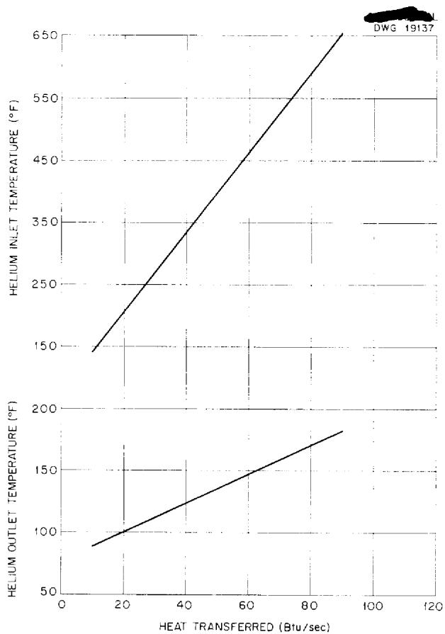  
Fig. 61. Helium Inlet and Outlet Temperature vs. Heat Transferred.

TABLE 12. HEAT EXCHANGER DATA FOR HELIUM-TO-WATER HEAT EXCHANGER   

<table><tr><td>Helium flow area (total), ft2</td><td>0.246</td></tr><tr><td>Helium velocity, ft/sec</td><td>65</td></tr><tr><td>Helium Reynolds&#x27; number</td><td>950</td></tr><tr><td>Helium heat transfer coefficient, Btu/sec·ft2·°F</td><td>0.0039</td></tr><tr><td>(hA)He, Btu/sec·°F</td><td>0.344</td></tr><tr><td>Water weight flow, lb/sec</td><td>1.0, 2.0, 3.0</td></tr><tr><td>Water heat transfer coefficient, Btu/sec·ft2·°F</td><td>0.13, 0.19, 0.24</td></tr><tr><td>(hA)ψ, Btu/sec·°F</td><td>13.5, 19.8, 24.6</td></tr><tr><td>hA, Btu/sec·°F</td><td>3.01, 2.99, 2.98</td></tr></table>

# Chapter 6

# MONITORING AND PREHEAT SYSTEM

# HEAT LOSS THROUGH INSULATION

The heat loss to the environment of the various pieces of equipment in the three ARE pits is complicated by the fact that the pits are filled with helium. The helium tends to replace the air in the pores of the insulation and thus to increase the thermal conductivity of the insulation. The following formula for the thermal conductivity of porous insulating materials was derived by Maxwell and reported by Jakob (cf., p. 85 of ref. 14):

$$
k = k _ {s} \frac {1 - \left(1 - \frac {a k g}{k _ {s}}\right) b}{1 + (a - 1) b}, \tag {1}
$$

where

$$
\begin{array}{l} a = \frac {3 k _ {s}}{2 k _ {s} + k _ {g}}, \\ b = \frac {V _ {\mathrm {g}}}{V _ {\mathrm {s}} + V _ {\mathrm {g}}} = 1 - \frac {V _ {\mathrm {s}}}{V _ {\mathrm {s}} + V _ {\mathrm {g}}} = 1 - \frac {\rho}{\rho_ {\mathrm {s}}} \\ \begin{array}{l} k = \text {t h e r m a l c o n d u c t i v i t y , B t u / h r} ^ {\cdot} f t ^ {2} \\ (^ {\circ} F / f t), \end{array} \\ V = \text {v o l u m e}, f t ^ {3}, \\ \rho = \text {d e n s i t y}, \quad \mathrm {l b} / \mathrm {f t} ^ {3}, \\ \end{array}
$$

and the subscripts

$$
\begin{array}{l} s = \text {s o l i d}, \\ g = g a s. \\ \end{array}
$$

The ARE uses three types of insulation; diatomaceous earth and Superex for high-temperature insulation, and felted Asbestos-Sponge for lower-temperature insulation. The properties of these insulations are given in Table 13. By using the data of Table 13 and mean thermal conductivities of 0.033 and 0.021 Btu/hr·ft² (°F/ft) for the air in the high- and low-temperature insulation, respectively, the thermal conductivity of the solid, $k_{s}$ , can be determined from Eq. 1. Since $k_{s}$ is known, $k$ can be calculated for the case with helium in the pores by using 0.15 and 0.11 Btu/hr·ft² (°F/ft),

respectively, for the high- and low-temperature mean thermal conductivities of helium. The results of the calculations are tabulated in Table 14.

The insulation on the outside of the ARE piping and equipment is a combination of Superex and Asbestos-Sponge, and diatomaceous earth is used for insulation in the control rod cooling loop. The heat loss to the environment through the combination Superex and Asbestos-Sponge insulation may be calculated from the following equations:

1. For insulating cylindrical shapes (i.e., piping),

$$
\begin{array}{l} Q = \frac {2 \pi k _ {s} \theta_ {s}}{\ln \frac {D _ {s}}{D _ {s} ^ {\prime}}} (2) \\ Q = \frac {2 \pi k _ {a - s} \theta_ {a - s}}{\ln \frac {D _ {a - s}}{D _ {a - s} ^ {\prime}}} , (3) \\ \end{array}
$$

$$
\begin{array}{l} Q = \frac {0 . 1 7 3}{3 6 0 0} \in A \left[ \left(\frac {T _ {s}}{1 0 0}\right) ^ {4} - \left(\frac {T _ {e}}{1 0 0}\right) ^ {4} \right] \tag {4} \\ + h _ {c} A \left(T _ {s} - T _ {e}\right), \\ \end{array}
$$

where

$$
\begin{array}{l} \begin{array}{c} Q = \text {h e a t l o s s p e r l i n e a l f o o t}, \\ \text {B t u / s e c} \cdot \text {l i n e a l f t}, \end{array} \\ \begin{array}{l} k = \text {t h e r m a l c o n d u c t i v i t y , B t u / s e c} \cdot f t ^ {2} \\ \left(^ {\circ} F / f t\right), \end{array} \\ \theta = \text {t e m p e r a t u r e} ^ {\circ} \mathbf {F}, \\ D = \text {o u t s i d e} \\ \end{array}
$$

$$
\begin{array}{l} D ^ {\prime} = \text {i n s i d e} \\ \epsilon = \text {e m i s s i v i t y} \\ \begin{array}{l} A = \text {o u t s i d e s u r f a c e a r e a p e r l i n e a l} \\ \text {f o o t , f t ^ {2} / l i n e a l f t ,} \end{array} \\ \end{array}
$$

$$
\begin{array}{l} T _ {s} = \begin{array}{l} \text {t e m p e r a t u r e o f o u t s i d e s u r f a c e ,} \\ \mathrm {R}, \end{array} \\ \begin{array}{l} T _ {e} = \text {t e m p e r a t u r e o f e n v i r o n m e n t ,} ^ {\circ} R, \\ h _ {c} = \text {f r e e c o n v e c t i o n h e a t t r a n s f e r} \\ \text {c o e f f i c i e n t , B t u / s e c} \cdot \mathrm {f t} ^ {2} \cdot {} ^ {\circ} F, \end{array} \\ \end{array}
$$

$$
\begin{array}{l} a n d t h e s u b s c r i p t s \\ s = \text {S u p e r e x}, \\ a - s = \text {A s b e s t o s - S p o n g e}. \\ \end{array}
$$

TABLE 13. PROPERTIES OF VARIOUS INSULATING MATERIALS  

<table><tr><td></td><td>DIATOMACEOUS EARTH</td><td>SUPEREX</td><td>FELTED ASBESTOS-SPONGE</td></tr><tr><td>Primary solid constituent</td><td>SiO2</td><td>SiO2</td><td>MgSiO3</td></tr><tr><td>Density, ρ, lb/ft3</td><td>18</td><td>24</td><td>30</td></tr><tr><td>Density of solid, ρs, lb/ft3</td><td>145</td><td>145</td><td>205</td></tr><tr><td>Mean thermal conductivity (air in pores), k, Btu/hr·ft2(°F/ft)</td><td>0.060</td><td>0.070</td><td>0.045</td></tr></table>

TABLE 14. THERMAL CONDUCTIVITIES OF VARIOUS INSULATING MATERIALS   

<table><tr><td rowspan="2">MATERIAL</td><td colspan="2">THERMAL CONDUCTIVITY [Btu/hr·ft2(°F/ft)]</td></tr><tr><td>Solid, ks</td><td>k (helium in pores)</td></tr><tr><td>Diatomaceous earth</td><td>0.34</td><td>0.17</td></tr><tr><td>Superex</td><td>0.34</td><td>0.18</td></tr><tr><td>Felted Asbestos-Sponge</td><td>0.25</td><td>0.13</td></tr></table>

The free convection heat transfer coefficient is determined from the data of Nusselt, $^{(18)}$ McAdams, and King, $^{(19)}$ who correlated Nusselt's number with Grashof's and Prandtl's numbers (as given by Jakob $^{(14)}$ ).

2. For insulating plane shapes, Eqs. 2, 3, and 4 become

(5) $q = \frac{k_s}{t_s} \theta_s$ ,

(6) $q = \frac{k_{a - s}}{t_{a - s}}\theta_s$

(7) $q = \frac{0.173}{3600} \in \left[\left(\frac{T_s}{100}\right)^4 - \left(\frac{T_e}{100}\right)^4\right]$

$$
+ h _ {c} \left(T _ {s} - T _ {e}\right),
$$

where

$q =$ heat loss per unit area, Btu/sec·ft²,

$t =$ thickness, ft.

The heat loss per lineal foot of the piping was calculated by using Eqs. 2, 3, and 4. The dimensions of

the pipe, annulus, heaters, and insulation of the fuel and NaK piping are given in the following:

OUTSIDE DIAMETER (in.)   

<table><tr><td>Nominal pipe size (IPS)</td><td>1</td><td>1 1/2</td><td>2</td><td>2 1/2</td></tr><tr><td>Pipe</td><td>1.315</td><td>1.900</td><td>2.375</td><td>2.875</td></tr><tr><td>Annulus</td><td>3.0</td><td>3.0</td><td>3.5</td><td>4.0</td></tr><tr><td>Heater</td><td>3.94</td><td>3.94</td><td>4.5</td><td>5.25</td></tr><tr><td>Superex</td><td>7.94</td><td>7.94</td><td>10</td><td>10.75</td></tr><tr><td>Asbestos-Sponge</td><td>9.94</td><td>9.94</td><td>12.5</td><td>13.25</td></tr></table>

Table 15 gives the heat loss per lineal foot for a range of heater outside wall temperatures for an emissivity, $\epsilon$ , of 0.90 and an ambient temperature, $T_{e}$ , of $590^{\circ} \mathrm{R}$ ( $130^{\circ} \mathrm{F}$ ).

Equations 5, 6, and 7 were used to calculate the heat loss per square foot of a flat surface for various insulation thicknesses and heater outside wall temperatures. Figure 62 shows the heat loss for temperatures of 1150, 1325, and $1500^{\circ}\mathrm{F}$ for combined insulation thicknesses of from 2 to 6

TABLE 15. HEAT LOSSES FOR VARIOUS TEMPERATURES OF THE HEATER OUTSIDE WALL  

<table><tr><td rowspan="3">TEMPERATURE OF HEATER
OUTSIDE WALL
(°F)</td><td colspan="3">NOMINAL PIPE DIAMETER (in.)</td></tr><tr><td>1 to 1½</td><td>2</td><td>2½</td></tr><tr><td colspan="3">HEAT LOSS (Btu/sec·lineal ft)</td></tr><tr><td>1150</td><td>0.23</td><td>0.21</td><td>0.23</td></tr><tr><td>1325</td><td>0.27</td><td>0.25</td><td>0.27</td></tr><tr><td>1500</td><td>0.31</td><td>0.29</td><td>0.31</td></tr></table>

in.; the thickness of the Superex layer was assumed to be twice the thickness of the Asbestos-Sponge layer. The emissivity and ambient temperature were the same as those used above.

The values calculated above for heat loss through the insulation were used to roughly estimate the heat loss at operating conditions (3-megawatt power output) of the various items of equipment in the three ARE pits (Fig. 63). The results are given in Table 16.

The total heat loss (kw) in each pit is:

<table><tr><td>Reactor pit</td><td>30</td></tr><tr><td>Heat exchanger pit</td><td>135</td></tr><tr><td>Dump tank pit</td><td>75</td></tr><tr><td>Total</td><td>240</td></tr></table>

# REACTOR PREHEATING

The reactor of the ARE, with its large mass of beryllium oxide, has the largest heat capacity of any piece of equipment in the ARE. The reactor must be raised to a high temperature before the system can be filled with fuel carrier, since the fuel carrier has a melting point of approximately $950^{\circ}\mathrm{F}$ . Figures 9 and 12 show elevation and plan views of the reactor; Fig. 9 shows the reactor and its thermal insulation, which is attached to a metal shell that is separate from the reactor. The heat is supplied by electrical strip heaters strapped to the reactor itself. The procedure for preheating the reactor will be the following:

1. turn the heaters on at a power of $10 \, \text{kw}$ ;   
2. increase the heater power as the pressure shell temperature in-

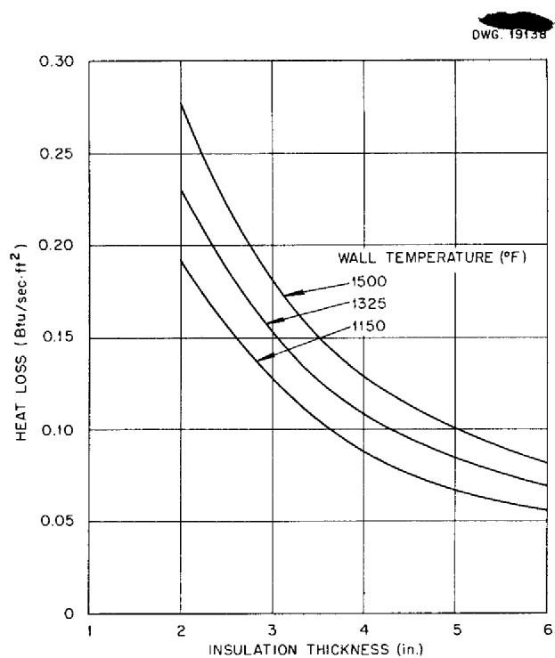  
Fig. 62. Heat Loss Through Insulation.

creases so that the heater power is equal to 10 kw plus the heat loss through the insulation;

3. when the pressure shell temperature reaches $1200^{\circ}\mathrm{F}$ , gradually reduce the heater power to hold the pressure shell temperature at $1200^{\circ}\mathrm{F}$ .

When no further changes in heater power are required to hold the pressure shell at $1200^{\circ}\mathrm{F}$ , equilibrium will have been attained and the preheat process completed.

Steps 1 and 2 in the preheat process imply that a constant amount of heat is being added to the reactor, namely, $10\mathrm{kw}$ . This method of preheating will

TABLE 16. HEAT LOSSES IN THE ITEMS IN THE ARE PITS   

<table><tr><td>ITEM</td><td>LOCATION</td><td>HEAT LOSS (kw)</td></tr><tr><td>Reactor and reactor thermal insulation</td><td>Reactor pit</td><td>15</td></tr><tr><td>Fuel system heat exchangers</td><td>Heat exchanger pit</td><td>5</td></tr><tr><td>Fuel system surge tanks</td><td>Heat exchanger pit</td><td>4</td></tr><tr><td>Fuel pumps</td><td>Heat exchanger pit</td><td>2</td></tr><tr><td>Reflector coolant system heat exchangers</td><td>Heat exchanger pit</td><td>6</td></tr><tr><td>Reflector coolant surge tanks</td><td>Heat exchanger pit</td><td>4</td></tr><tr><td>Reflector coolant pumps</td><td>Heat exchanger pit</td><td>2</td></tr><tr><td>Fill and flush tanks</td><td>Dump tank pit</td><td>25</td></tr><tr><td>Fuel dump tank</td><td>Dump tank pit</td><td>8</td></tr><tr><td>Fuel surge tank vapor traps</td><td>Heat exchanger pit</td><td>2</td></tr><tr><td>Fuel dump tank vapor trap</td><td>Dump tank pit</td><td>2</td></tr><tr><td>NaK purification system</td><td>Heat exchanger pit</td><td>10</td></tr><tr><td>Valves</td><td>Heat exchanger pit</td><td>15</td></tr><tr><td></td><td>Dump tank pit</td><td>12</td></tr><tr><td>Piping</td><td>Reactor pit</td><td>15</td></tr><tr><td></td><td>Heat exchanger pit</td><td>85</td></tr><tr><td></td><td>Dump tank pit</td><td>30</td></tr></table>

result in a quasi-stationary temperature state being set up in the reactor after some initial period. A quasi-stationary temperature means that the temperature difference between any two points remains constant even though the entire temperature level is rising. The preheating process can therefore be broken up into three periods:

1. the initial period before the quasi-stationary state is obtained,   
2. the period when the reactor is in the quasi-stationary temperature state,   
3. the period after the pressure shell has reached $1200^{\circ}\mathrm{F}$ , during which the heater power is being gradually reduced and the quasi-stationary state no longer exists.

The following assumptions were made for the calculation of the reactor preheating:

1. The reactor will be represented by six concentric beryllium oxide

shells, 3 ft long and 3.75 in. thick, separated by helium shells 0.050 in. wide.

2. The pressure shell will be constructed of Inconel and will be 48 in. in inside diameter and 2 in. thick.   
3. There will be a 1/16 in, helium gap between the pressure shell and outer beryllium oxide cylinder.   
4. The heat loss from the ends of the reactor will be considered, but longitudinal heat flow within the reactor will be neglected.

The following physical properties, which represent mean values between 100 and $1200^{\circ}\mathrm{F}$ , were used in the analysis:

<table><tr><td></td><td>BeO</td><td>INCONEL</td><td>HELIUM</td></tr><tr><td>Thermal conductivity, Btu/hr·ft2(°F/ft)</td><td>10</td><td>12</td><td>0.13</td></tr><tr><td>Density, lb/ft3</td><td>184</td><td>518</td><td>0.0055</td></tr><tr><td>Specific heat, Btu/lb·°F</td><td>0.38</td><td>0.15</td><td>1.24</td></tr></table>

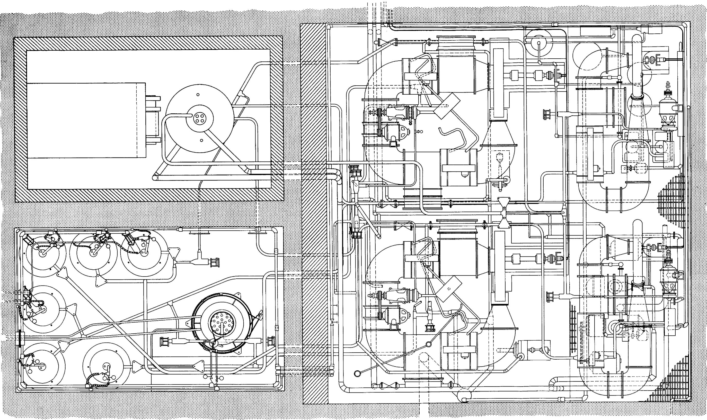  
Fig. 63. Composite Plan View of Piping Inside Shield.

The temperature difference between any radial station in the reactor and the outside of the pressure shell when the reactor is in the quasi-stationary temperature state can be calculated from the following equation:

$$
\frac {d \theta}{d t} = \frac {Q}{\left(W _ {C p}\right) _ {\text {B e O}} + \left(W _ {C p}\right) _ {\text {I n c}} + \left(W _ {C p}\right) _ {\text {H e}}} ， \tag {8}
$$

where

$$
\frac {d \theta}{d t} = \begin{array}{l} \text {r a t e o f t e m p e r a t u r e r i s e ,} \\ \text {° F / h r , o f a n y p o i n t i n t h e} \\ \text {r e a c t o r (i n t h e q u a s i - s t a n a t o r y} \\ \text {t e m p e r a t u r e s t a t e) ,} \end{array}
$$

$$
\begin{array}{c} Q = \text {h e a t e r i n p u t t o t h e r e a c t o r ,} \\ \text {B t u / h r ,} \end{array}
$$

$$
\begin{array}{l} W = \text {w e i g h t o f m a t e r i a l i n t h e} \\ \text {r e a c t o r , l b ,} \end{array}
$$

$$
\begin{array}{l} c _ {p} = \text {s p e c i f i c h e a t , B t u / l b} ^ {\circ} F, \\ \text {a n d t h e s u b s c r i p t s} \end{array}
$$

$$
\mathrm {B e O} = \text {b e r y l l i u m o x i d e},
$$

$$
I n c = I n c o n e l,
$$

$$
\mathrm {H e} = \text {h e l i u m}.
$$

The weight of the beryllium oxide in the reactor is approximately 5800 lb; the Inconel in the pressure shell weighs about 7900 lb; the helium weight can be neglected. From Eq. 8,

$$
\begin{array}{l} \frac {d \theta}{d t} = \frac {3 4 , 1 0 0}{5 8 0 0 \times 0 . 3 8 + 7 9 0 0 \times 0 . 1 5} \\ = 1 0. 1 ^ {\circ} \mathrm {F} / \mathrm {h r}. \\ \end{array}
$$

The temperature difference across any of the cylindrical shells may be approximated in the following manner:

$$
\Delta \theta_ {n} = \frac {q _ {n} \ln \frac {r _ {n + 1}}{r _ {n}}}{2 \pi k _ {n} L}, \tag {9}
$$

$$
q _ {n} = 3 4, 1 0 0 - \sum_ {i = 1} ^ {n - 1} \left(W _ {c _ {p}}\right) _ {i} \frac {d \theta}{d t}, \tag {10}
$$

where

$$
\begin{array}{l} \begin{array}{l} \triangle \theta = \text {r a d i a l t e m p e r a t u r e d i f f e r e n t i a l} \\ \text {a c r o s s a s h e l l (i n t h e q u a s i - s t a n i o n a r y t e m p e r a t u r e s t a t e) ,} \\ \quad^ {\circ} F, \end{array} \\ q = \text {h e a t e n t e r i n g s h e l l}, \mathrm {B t u / h r}, \\ r = \text {o u t s i d e} r a d i u s o f \text {s h e l l}, \quad \text {f t}, \\ \begin{array}{l} k = \text {t h e r m a l c o n d u c t i v i t y o f s h e l l}, \\ B t u / h r \cdot f t ^ {2} (° F / f t), \end{array} \\ L = \text {l e n g t h o f s h e l l}, \quad \mathrm {f t}, \\ \end{array}
$$

and the subscript $n$ refers to the number of the shells, counting inward from the outside. (For a more accurate estimate, the fact that all the $q_{n}$ in Eq. 10 is not transferred across shell $n$ should be considered. The above approach is a conservative simplification, however, because it leads to larger values of $\Delta \theta_{n}$ .)

The results of the solution of Eqs. 9 and 10 are shown in Fig. 64, which gives the difference in temperature (in the quasi-stationary state) between the outside of the pressure shell and any radial position. The difference between the outside of the pressure shell and the center of the reactor is $162^{\circ}\mathrm{F}$ .

The time required to reach the quasi-stationary temperature state may be readily calculated. The reactor is originally at some uniform temperature $\theta_0$ . The quasi-stationary state is reached while the temperature of the center of the reactor remains fixed at $\theta_0$ and the outer shells heat up to a temperature of

$$
\theta_ {n _ {1}} = \theta_ {0} + \sum_ {i = n + 1} ^ {N} \Delta \theta_ {i} + \frac {1}{2} \Delta \theta_ {n}, \tag {11}
$$

where

$$
\begin{array}{l} \theta_ {n _ {1}} = \text {t e m p e r a t u r e o f t h e n t h s h e l l a t} \\ \text {t h e b e g i n n i n g o f t h e q u a s i -} \\ \text {s t a t i o n a r y s t a t e ,} \\ N = \text {t o t a l n u m b e r o f s h e l l s}. \\ \end{array}
$$

The time required to reach the quasi-stationary temperature state is,

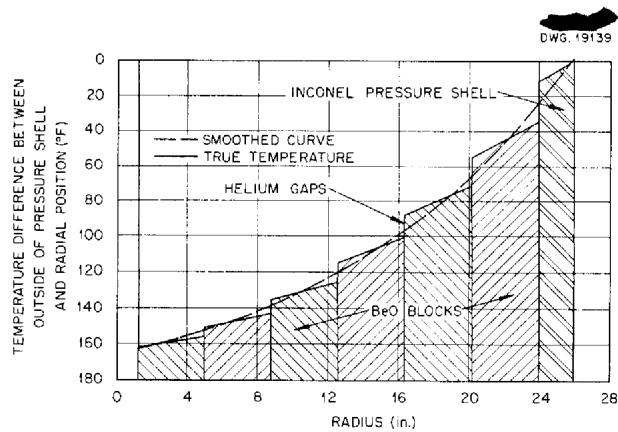  
Fig. 64. Temperature Profile of Reactor Core and Pressure Shell (Quasi-Stationary State).

therefore,

$$
t _ {1} = \frac {\sum_ {i = 1} ^ {N} \left(W c _ {p}\right) _ {i} \left(\theta_ {i _ {1}} - \theta_ {0}\right)}{Q}, \tag {12}
$$

where $t_1$ is the time required to reach the quasi-stationary temperature state in hours. This time was calculated from Eq. 12 to be about 10.0 hours. Thus, after about 10 hr, the temperature of the outside of the pressure shell will be at about $162^{\circ}\mathrm{F}$ above ambient temperature, while the center of the core will still be at about ambient temperature. The actual ambient temperature in the pits will probably vary during the preheating period; most of the calculations of this report assume an ambient temperature of $130^{\circ}\mathrm{F}$ in the pit. It was assumed for these calculations that the reactor and pit were both, at the

until the reactor pressure shell outer temperature reaches $1200^{\circ}\mathrm{F}$ . During this period, the temperatures are in the quasi-stationary state, and every temperature in the reactor is raised uniformly at the rate of $10.1^{\circ}\mathrm{F/hr}$ :

$$
t _ {2} - t _ {1} = \frac {1 2 0 0 - 2 9 2}{1 0 . 1} = 8 9. 9 \mathrm {h r}, \tag {13}
$$

where $t_2$ is the time at the end of the quasi-stationary state. During this period, the electrical heater power must be continually increased as the pressure shell temperature increases to maintain a constant rate of heat flow into the reactor. The heater power must therefore be equal to 10 kw plus the heat loss through the insulation. The heat loss through the insulation may be calculated as a function of reactor pressure shell outer temperature from the following equations:

$$
\begin{array}{l} \left. \quad q = h _ {1} A _ {1} \left(T _ {1} - T _ {\mathrm {H e}}\right) + \frac {0 . 1 7 3}{3 6 0 0} \frac {A _ {1}}{\frac {1}{\epsilon_ {1}} + \frac {A _ {1}}{A _ {2}} \left(\frac {1}{\epsilon_ {2}} - 1\right)} \left[ \left(\frac {T _ {1}}{1 0 0}\right) ^ {4} - \left(\frac {T _ {2}}{1 0 0}\right) ^ {4} \right] \right., \\ q = h _ {2} A _ {2} \left(T _ {\mathrm {H e}} - T _ {2}\right) + \frac {0 . 1 7 3}{3 6 0 0} \frac {A _ {1}}{\frac {1}{\epsilon_ {1}} + \frac {A _ {1}}{A _ {2}} \left(\frac {1}{\epsilon_ {2}} - 1\right)} \left[ \left(\frac {T _ {1}}{1 0 0}\right) ^ {4} - \left(\frac {T _ {2}}{1 0 0}\right) ^ {4} \right], (15) \\ q = \frac {k _ {I}}{\tau_ {I}} A _ {I} \left(T _ {2} - T _ {3}\right), (16) \\ q = h _ {3} A _ {3} \left(T _ {3} - T _ {a}\right) + \frac {0 . 1 7 3}{3 6 0 0}: \epsilon_ {3} A _ {3} \left[ \left(\frac {T _ {3}}{1 0 0}\right) ^ {4} - \left(\frac {T _ {a}}{1 0 0}\right) ^ {4} \right], (17) \\ \end{array}
$$

start, at a temperature of $130^{\circ}\mathrm{F}$ . The time required to raise the mean temperature of the reactor from 70 to $130^{\circ}\mathrm{F}$ is about 6 hours. It may therefore be considered that $t_1$ is really about 16 hr and that at the end of the 16-hr period the reactor pressure shell outer temperature will be about $292^{\circ}\mathrm{F}$ and the center-line temperature will be about $130^{\circ}\mathrm{F}$ .

The next period of the preheating process is the heating of the reactor

where

$$
\begin{array}{l} \begin{array}{l} q = \text {h e a t l o s s t h r o u g h i n s u l a t i o n ,} \\ \text {B t u / s e c ,} \end{array} \\ \begin{array}{l} h = \text {h e a t t r a n s f e r c o e f f i c i e n t}, \\ \text {B t u / s e c} \cdot \text {f t} ^ {2} \cdot {} ^ {\circ} \text {F}, \end{array} \\ A = \text {h e a t} \quad \text {t r a n s f e r} \quad \text {a r e a}, \quad \mathrm {f t} ^ {2}, \\ T = \text {t e m p e r a t u r e}, ^ {\circ} R, \\ \begin{array}{l} k = \text {t h e r m a l c o n d u c t i v i t y , B t u / s e c} \cdot f t ^ {2} \\ (\circ F / f t), \end{array} \\ \tau = \text {t h i c k n e s s}, f t, \\ \epsilon = \text {e m i s s i v i t y}, \\ \end{array}
$$

and the subscripts

1 = outside of reactor pressure shell,   
2 = inside of thermal insulation,   
$3 =$ outside of thermal insulation,   
$I =$ insulation,   
He = helium between pressure shell and thermal insulation,   
$\pmb{a} =$ ambient.

Equations 14 through 17 and the following data were used to calculate the heat loss through the insulation for various pressure shell temperatures:

1. $\epsilon = 1.0$   
2. The data of King(19) were used to evaluate $h_1$ .   
3. The dimensions of thermal insulation were:

Outside diameter 76.25 in.

Outside length 80.5 in.

Thickness 6 in. (4 in. of Superex, 2 in. of Asbestos-Sponge)

4. The thermal conductivity value for the insulation, as found in the previous section on "Heat Loss Through Insulation," was used.

The results of the calculation are shown in Fig. 65, where the heat loss through the insulation is plotted against the reactor pressure shell outer temperature. Temperatures at other points in the reactor thermal insulation are shown by the dotted line.

The last portion of the preheating process, that is, when the heater power is reduced to maintain the pressure shell outer temperature at $1200^{\circ}\mathrm{F}$ , is evaluated by a graphical method developed by Schmidt.(20) As a simplification, each helium shell is divided between adjacent beryllium oxide shells, and the Inconel pressure shell is replaced by an equivalent thickness of beryllium oxide. The reactor is then treated as a homogeneous cylinder with a thermal conductivity equal to the average thermal conductivity of the composite beryllium oxide and helium shells. A plot of the temperatures in the reactor for the first 8 hr of the last portion of the preheating period is shown in Fig. 66.

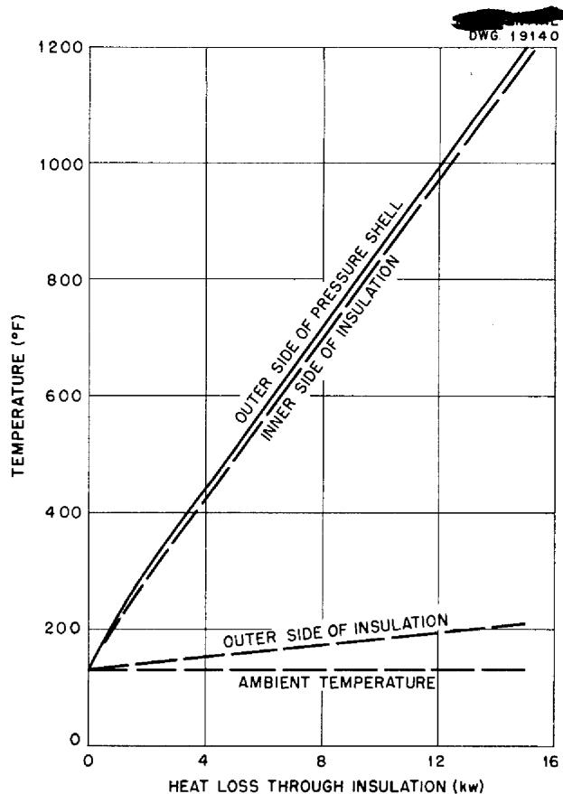  
Fig. 65. Temperature of Outer Side of Pressure Shell vs. Heat Loss Through Insulation.

After 8 hr, the temperature of the core center line is about $1125^{\circ} \mathrm{F}$ .

A summary of the temperatures and powers in the entire preheating period is shown in Fig. 67.

The maximum temperature gradient in the pressure shell at any time is approximately $6^{\circ}\mathrm{F}/\mathrm{inch}$ .

# HELIUM LEAKAGE THROUGH CLEARANCE HOLES IN THE REACTOR THERMAL SHIELD

The tubes which contain the control rods and fission chambers pierce the reactor thermal insulation at both the top and bottom, and there are six such tubes. Figure 68 shows a sketch of a typical tube and the passage through the reactor thermal shield. The helium inside the reactor thermal shield, being at a higher temperature than the room helium, will flow through the clearance holes in the reactor thermal insulation and consequently will add

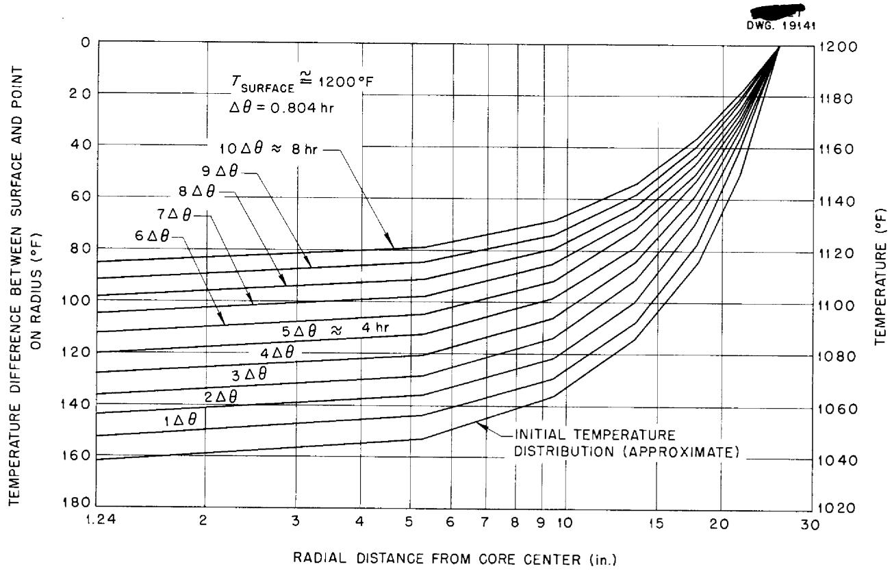  
Fig. 66. Temperature vs. Time Relationship for Reactor Core and Pressure Shell.

to the room cooling requirements and the reactor electric heater requirements.

It was assumed that the flow through the bottom clearance holes was negligible and that the flow through the upper clearance holes was that due to the difference in head between the helium in the clearance holes and room helium. The head available for flow is, then,

$$
P = h \left(\rho_ {a} - \rho_ {c}\right), \tag {18}
$$

where

$$
P = \text {p r e s s u r e} \quad \text {h e a d}, \quad \mathrm {l b / f t} ^ {2},
$$

$$
\begin{array}{l} \rho_ {a} = \text {d e n s i t y o f a m b i e n t h e l i u m}, \\ \quad \quad \quad \quad \quad \quad \quad \quad \quad \quad \quad \quad \quad \quad \quad \quad \quad \quad \quad \quad \quad \quad \quad \quad \quad \quad \quad \quad \quad \quad \quad \quad \quad \quad \quad \quad \quad \quad \quad \quad \quad \quad \quad \quad \quad \quad \quad \quad \quad \quad \end{array}
$$

$$
\begin{array}{l} \rho_ {c} = \text {d e n s i t y o f h e l i u m i n c l e a r a n c e} \\ \text {h o l e , l b / f t} ^ {3}, \end{array}
$$

$h =$ height of clearance hole, ft. To be conservative, it was assumed that the temperature of the helium in the

clearance hole was $1200^{\circ}\mathrm{F}$ ; the room temperature was taken as about $130^{\circ}\mathrm{F}$ . Thus

$$
\begin{array}{l} P = \frac {6 . 1 2 5}{1 2} \times (0. 0 0 9 2 - 0. 0 0 3 3 5) \\ = 0. 0 0 2 9 9 \mathrm {l b} / \mathrm {f t} ^ {2}. \\ \end{array}
$$

The loss in pressure head in a gas flowing through an annulus in laminar flow is

$$
P = \frac {1 2 \mu G L}{y ^ {2} g _ {c} \rho}, \tag {19}
$$

where

$$
\begin{array}{l} \mu = \text {v i s c o s i t y}, \quad \mathrm {l b} / \mathrm {h r} \cdot \mathrm {f t}, \\ G = \text {f l o w}, \quad \mathrm {l b / h r} \cdot \mathrm {f t} ^ {2}, \\ \begin{array}{l} L = \text {l e n g t h} = \text {h e i g h t o f c l e a r a n c e} \\ \text {h o l e , f t ,} \end{array} \\ y = \text {a n n u l u s} \quad \text {g a p}, \quad \text {f t}, \\ g _ {c} = \text {g r a v i t a t i o n a l c o n s t a n t}, f t / h r ^ {2}, \\ \rho = \text {g a s} \quad \text {d e n s i t y}, \quad \mathrm {l b / f t} ^ {3}. \\ \end{array}
$$

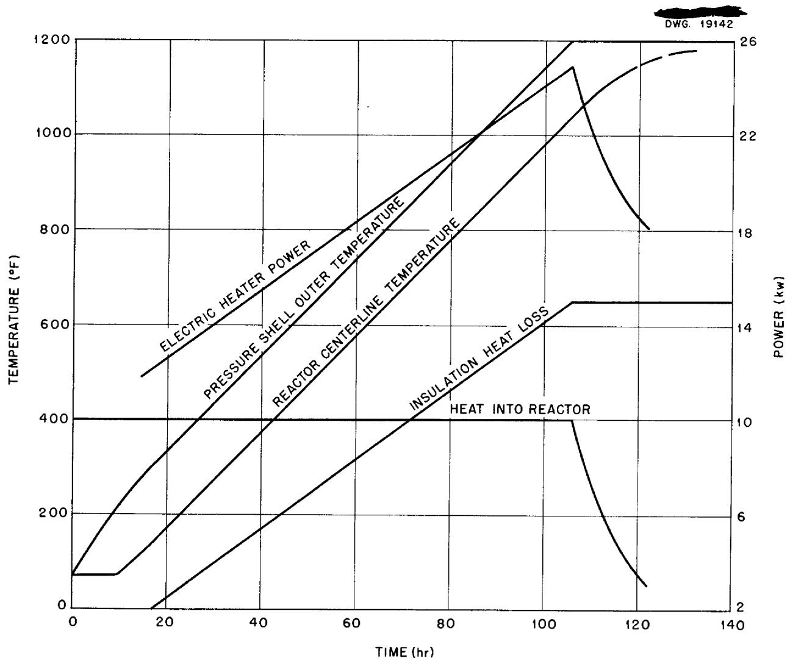  
Fig. 67. Summary of Temperature and Power in Entire Preheating Period.

An evaluation of Eq. 19 gives

$$
P = \frac {1 2 \times 0 . 1 0 2 \times G \times \frac {6 . 1 2 5}{1 2}}{\left(\frac {0 . 3 9}{1 2}\right) ^ {2} \times 3 2 . 2 \times (3 6 0 0) ^ {2} \times (0 . 0 0 3 3 5)} = 4. 2 4 \times 1 0 ^ {- 4} G l b / f t ^ {2}.
$$

The flow, $G$ , is then evaluated by equating the available pressure head to the loss in head because of flow:

$$
G = 7. 0 5 \mathrm {l b} / \mathrm {h r} \cdot \mathrm {f t} ^ {2}.
$$

Since there are six identical clearance holes, the total flow area is

$$
\begin{array}{l} A = 6 \times \frac {\pi}{4} \left[ \left(\frac {3 . 7 5}{1 2}\right) ^ {2} - \left(\frac {2 . 9 7}{1 2}\right) ^ {2} \right] \\ = 0. 1 7 1 5 f t ^ {2}. \\ \end{array}
$$

Therefore the weight flow is

$$
W = 0. 1 7 1 5 \times 7. 0 5 = 1. 2 1 \mathrm {l b / h r},
$$

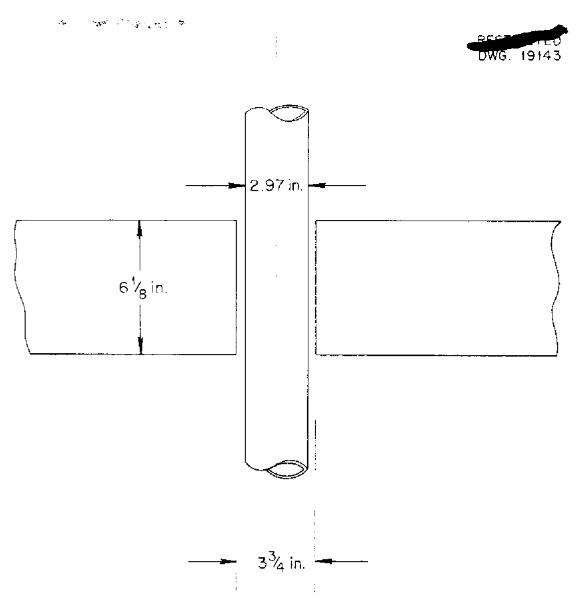  
Fig. 68. Rod Sleeve Through Thermal Shield.

and the heat loss is

$$
\begin{array}{l} Q = W c _ {p} \left(T _ {c} - T _ {a}\right) = 1. 2 1 \times 1. 2 4 (1 2 0 0 - 1 3 0) \\ = 1 6 0 5 \mathrm {B t u / h r} \\ = 0. 4 4 6 \mathrm {B t u} / \sec , \\ \end{array}
$$

where

$T_{c} =$ temperature in clearance hole, ${}^{\circ}\mathbf{F}$ $T_{a} =$ ambient temperature, ${}^{\circ}\mathbf{F}$

The heat loss through the clearance holes is therefore approximately 0.45 Btu/sec.

# SPACE COOLER PERFORMANCE

The bulk of the equipment of the ARE is contained in three sealed pits,

which are kept cool by the use of space coolers. A typical space cooler is shown in Fig. 69. Each space cooler contains two helium blowers in parallel (total capacity $7200\mathrm{cfm}$ ) and a water cooling coil. The entire unit was supplied by the Trane Co. The cooling coil is a Trane Co., series 93, type S coil, with a 12- by 48-in. face and four rows of tubes longitudinal to the gas flow. The heat transfer coefficient of such a coil, operating with air on one side and water on the other, is given in ref. 21, for various water and air velocities. As used in the ARE, these coils will have helium instead of air on the gas side.

Since it was necessary to convert the performance data from those for air-to-water operation to those for helium-to-water operation, the following equation, from which values can be obtained that are approximately the same as the actual performance data given in ref. 21, was used:

$$
\frac {1}{h A} = \frac {0 . 0 0 3 7 4}{v _ {w} ^ {0 . 8}} + \frac {0 . 1 8 9}{v _ {a} ^ {0 . 6}}, \tag {20}
$$

where

$h =$ over-all heat transfer coefficient, Btu/hr·ft²·°F,   
$A =$ heat transfer area per row per square foot of coil face area, ft²,   
$\nu_{w} = \text{water velocity, ft/sec}$ ,   
$\nu_{a} = \text{air velocity, ft/min.}$

To use Eq. 20, an equivalent air

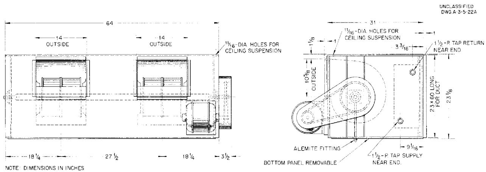  
Fig. 69. Space Cooler.

velocity, that is, the air velocity which would give the same heat transfer coefficient as the actual helium velocity, had to be calculated. Since the fin efficiency of the coil fins is very close to $100\%$ at all times (sheet fins of aluminum, 0.012 in. thick, with the tubes on a triangular pitch of approximately 1.2 in.), it may be assumed that the gas-side heat transfer coefficient is a function of the Reynolds' number to the 0.6 power. Since the Prandtl's numbers for air and for helium are about the same at this temperature and since the geometry of the coil is unchanged, the equivalent air velocity can be calculated from the following equation:

$$
\frac {h _ {a}}{h _ {\mathrm {H e}}} = 1. 0 = \frac {k _ {a} v _ {a} ^ {0 . 6} \rho_ {a} ^ {0 . 6} \mu_ {\mathrm {H e}} ^ {0 . 6}}{k _ {\mathrm {H e}} v _ {\mathrm {H e}} ^ {0 . 6} \rho_ {\mathrm {H e}} ^ {0 . 6} \mu_ {a} ^ {0 . 6}} \tag {21}
$$

or

$$
\frac {v _ {a}}{v _ {\mathrm {H e}}} = \left(\frac {k _ {\mathrm {H e}}}{k _ {a}}\right) ^ {1. 6 6 7} \frac {\rho_ {\mathrm {H e}}}{\rho_ {a}} \frac {\mu_ {a}}{\mu_ {\mathrm {H e}}}
$$

where

$$
\begin{array}{l} k = \text {t h e r m a l} \\ \rho = \text {d e n s i t y}, \\ \mu = \text {v i s c o s i t y}, \\ h = \text {h e a t} \\ a = \text {e q u i v a l e n t} \\ v _ {\mathrm {H e}} = \text {h e l i u m v e l o c i t y}. \\ \end{array}
$$

Since the equivalent air velocity (calculated above) and the water flow are known, the over-all $hA$ can be calculated from Eq. 20.

The equations governing the operation of the space coolers are

$$
\begin{array}{l} Q = W _ {H e} c _ {p _ {H e}} \left(T _ {H e} ^ {\prime} - T _ {H e}\right), (22) \\ Q = W _ {w} c _ {p _ {w}} \left(T _ {w} ^ {\prime} - T _ {w}\right), (23) \\ Q = h A \theta , (24) \\ \end{array}
$$

where

$$
\begin{array}{l} Q = \text {h e a t} \quad \text {t r a n s f e r r e d}, \quad \text {B t u / s e c}, \\ \begin{array}{l} \theta = \log \text {m e a n t e m p e r a t u r e d i f f e r e n c e}, \\ \quad^ {\circ} F, \end{array} \\ W = \text {w e i g h t f l o w}; \quad 1 b / \sec , \\ c _ {p} = \text {s p e c i f i c h e a t}, \mathrm {B t u / l b} ^ {\circ} \mathrm {F}, \\ T ^ {\prime} = \text {m a x i m u m t e m p e r a t u r e (a l s o e q u a l s} \quad \text {a m b i e n t t e m p e r a t u r e) ,} \quad {} ^ {\circ} F, \\ T = \text {m i n i m u m t e m p e r a t u r e ,} ^ {\circ} F, \\ \end{array}
$$

and the subscript $w$ refers to water. The system operates under the following restraints and conditions:

1. The helium flow is 7200 cfm at blower temperature.   
2. The outlet water temperature is thermostatically controlled to be $100^{\circ}\mathrm{F}$ .   
3. The inlet water temperature varies with the season of the year but is assumed to be $70^{\circ}\mathrm{F}$ for this calculation.

Equations 20 through 24 and the restraints and condition listed above can be used to evaluate the performance of the space coolers. Figure 70 shows the variation of heat transferred vs. ambient temperature for one of the space coolers. (The heat exchanger pit contains four such units; the other pits each contain two units.) The difference between the maximum helium temperature (ambient) and the minimum helium temperature is small; that is, it varies from about 0.2 deg at a heat load of 25 Btu/sec to about 1.6 deg at a heat load of 200 Btu/sec.

The heat rejected to the ambient atmosphere in the three ARE pits from the various items of equipment in the pits, calculated in the previous section on "Heat Loss Through Insulation," is tabulated in the following:

<table><tr><td>Reactor pit</td><td>30 kw</td></tr><tr><td>Heat exchanger pit</td><td>135</td></tr><tr><td>Dump tank pit</td><td>75</td></tr><tr><td>Total</td><td>240 kw</td></tr></table>

The three pits are interconnected by passages of relatively small flow area. Therefore the pits will not operate at the same temperature, nor will they operate at the temperatures which would exist if the pits were completely sealed from one another. The pit operating temperatures were calculated for the two extreme cases (pits at the same temperature; pits completely independent) by using the data of Fig. 70, which gives the space cooler performance. It was assumed that the heat loss from the pits to the outside through the concrete walls could be neglected; this is a conservative assumption. Table 17 gives the heat losses in the pits.

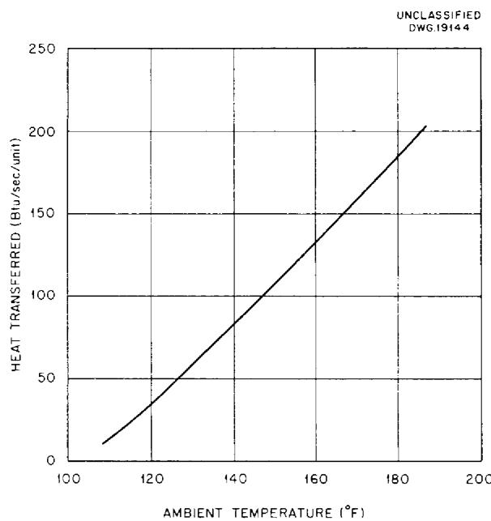  
Fig. 70. Space Cooler Performance.

The pits will therefore operate at a temperature of about 110 to $120^{\circ}\mathrm{F}$ . It should be noted that all the heat loss calculations in the section on "Heat Loss Through Insulation" were made with an assumed ambient temperature of $130^{\circ}\mathrm{F}$ . Therefore the heat losses listed in Table 17 are slightly low. The difference is quite small, however, inasmuch as the surface temperature of most of the equipment losing heat is from 1150 to $1500^{\circ}\mathrm{F}$ .

# TEMPERATURE PATTERNS IN THE MONITORING ANNULUS IN THE EVENT OF HEAT FAILURE

The fuel and reflector coolant systems of the ARE are entirely enclosed in a metallic envelope (Fig. 71). This envelope consists of concentric tubing

around all the pipes, and conveniently shaped containers around the other items of equipment, such as valves and pumps. Helium is circulated in the space between the metallic envelope and the main systems to serve two purposes. The helium is continuously sampled by instruments which can detect the presence of small quantities of fuel or NaK vapor and thus give warning if a leak develops in the system (hence the name, "monitoring system"). The flowing helium also acts as a distributor of heat in the following manner. Most of the electric heaters of the main system are on the outside of the envelope. Should a heater failure occur, the flowing helium, by transporting heat from the heated to the unheated areas, will tend to make uniform the heat distributed to the systems and, consequently, to reduce the temperature gradients which would otherwise occur.

The locations where the heat distribution function is particularly critical are in the fuel dump-and-fill lines. As may be noted from the position of the valves in Fig. 2, the fuel dump-and-fill lines may stand full of stagnant fuel during the operation of the reactor. Consequently, in the event of a heater failure, it is possible for the fuel carrier to freeze in these lines and make dumping of the reactor impossible. However, a helium bleed line will be connected to the fuel-carrier line to prevent drainage. The temperature patterns that would occur in these fuel-carrier lines and their envelopes if there were a particularly bad heater failure were

TABLE 17. HEAT LOSSES IN THE PITS   

<table><tr><td></td><td>TOTAL HEAT LOSS (Btu/sec)</td><td>NUMBER OF SPACE COOLERS</td><td>HEAT LOSS PER COOLER (Btu/sec)</td><td>AMBIENT TEMPERATURE (°F)</td></tr><tr><td>All pits</td><td>228</td><td>8</td><td>28.4</td><td>118</td></tr><tr><td>Reactor pit</td><td>28.5</td><td>2</td><td>14.3</td><td>111</td></tr><tr><td>Heat exchanger pit</td><td>128.0</td><td>4</td><td>32.0</td><td>120</td></tr><tr><td>Dump tank pit</td><td>71.1</td><td>2</td><td>35.6</td><td>121</td></tr></table>

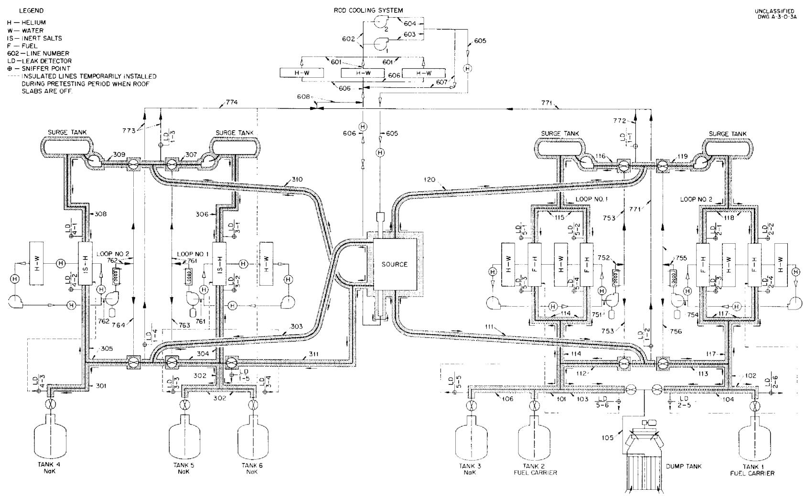  
Fig. 71. Monitoring System Flow Sheet.

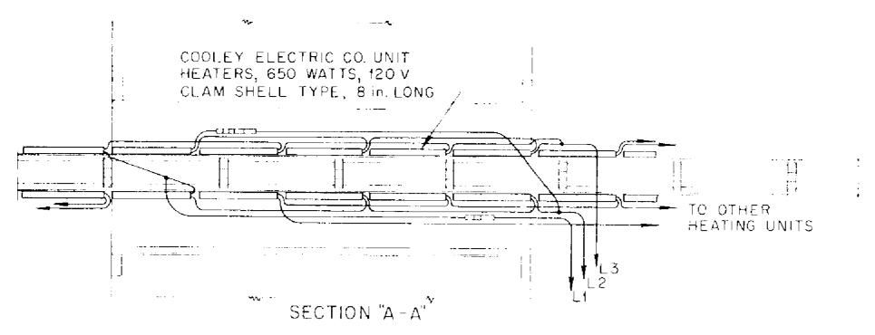

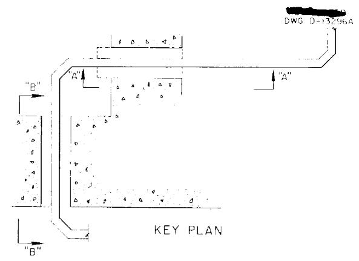

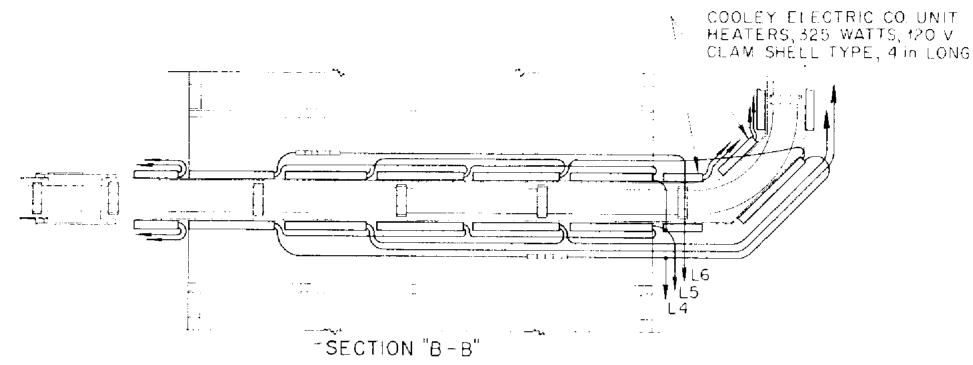

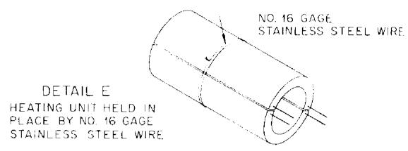

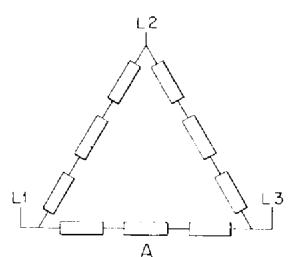  
3 WIRE, 9 UNIT DELTA

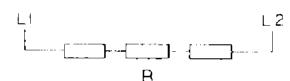  
2 WIRE, 3 UNIT. USE ONLY WHEN NECESSARY FOR 3 UNITS

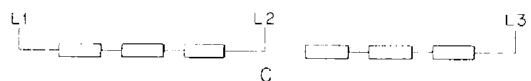  
3 WIRE, 6 UNIT USE ONLY WHEN NECESSARY FOR 6 UNITS

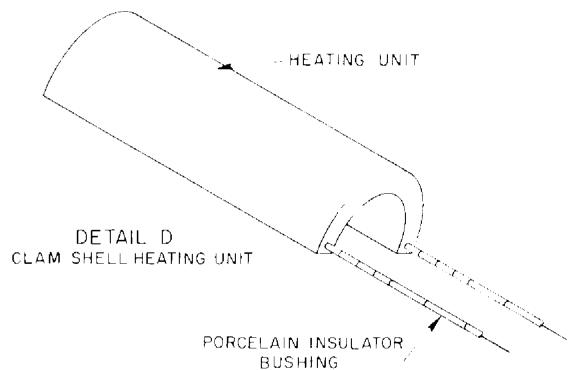  
WIRING DIAGRAMS A, B, AND C   
Fig. 72. Electrical Wiring Diagram for Monitoring Annulus Heaters.

investigated for several helium velocities in the monitoring system. For the investigation, it was assumed that the lines were filled with the fuel carrier. Figure 2 shows the pipeline to the fuel dump tank; Fig. 72 shows a wiring diagram of a typical set of electric heaters, which are in the form of half cylinders and surround the lines shown in Fig. 2. It may be noted from Fig. 72 that three sections of electric heater, each consisting of one half cylinder 8 in. long, are connected in series and that the failure of any one heater results in the failure of the other two. The three heaters are separated so that they are not adjacent to one another. For the type of heater failure considered in the following analysis, it is assumed that two sets of heaters fail and that these are exactly opposite each other on the pipe line.

The system, as set up for analysis, is shown in Fig. 73a. For simplicity, the heat produced by the electric heaters is assumed to be generated directly in the wall of the concentric tube which serves as the metallic envelope. The pipe line is divided into seven sections:

1. Sections 1 and 7 are the unaffected areas of the pipe lines upstream and downstream of the area where the heater failures occurred.   
2. Sections 2, 4, and 6 are the areas where the heaters on both sides of the pipe failed.   
3. Sections 3 and 5 are the areas where the heaters (which separate the failed heaters) are still operative.

In the steady-state condition, the fuel pipe temperature will be equal to the temperature of the flowing helium. Therefore only the heat transfer between the helium, the metallic envelope, and the outside environment needs to be considered. The heat balance in a given section of pipe line in the steady-state condition is given by (Fig. 73b)

$$
Q _ {m} + Q _ {g} + Q _ {\text {H e - m}} = Q _ {m} ^ {\prime} + Q _ {m - e} \tag {25}
$$

and

$$
Q _ {\mathrm {H e}} = Q _ {\mathrm {H e}} ^ {\prime} + Q _ {\mathrm {H e} - m}, \tag {26}
$$

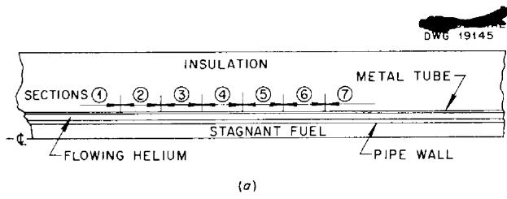

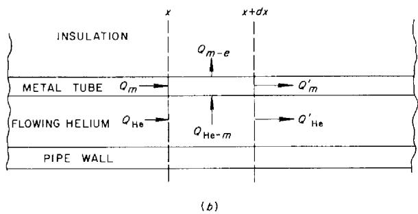  
Fig. 73. Sections Showing Fuel Pipe and Annulus Walls.

where $Q$ and $Q^{\prime}$ are heat transferred in Btu/sec and the subscripts

$m =$ along the metal of the envelope,

He = in the flowing helium,

He-m = from the helium to the metal of the envelope,

$m - e =$ from the metal of the envelope (through the insulation) to the environment,

$g =$ internally generated.

The various terms in Eqs. 25 and 26 are expressed quite readily as follows: From the common equation for one-dimensional heat conduction,

$$
Q _ {m} - Q _ {m} ^ {\prime} = k _ {m} a _ {m} \frac {\cdot d ^ {2} \theta_ {m}}{d x ^ {2}} d x, \tag {27}
$$

where

$\theta_{m} =$ difference between metal temperature and ambient temperature, F,   
$k =$ thermal conductivity, Btu/sec·ft² (°F/ft),   
$a =$ cross-sectional area, ft²,   
$x =$ distance from origin, ft (the left end of each section, except section 1, is considered as the origin of that particular section; the right end of section 1 is used as the origin of that section).

The heat gained by the helium

$$
Q _ {\mathrm {H e}} ^ {\prime} - Q _ {\mathrm {H e}} = W _ {\mathrm {H e}} c _ {p _ {\mathrm {H e}}} d \theta_ {\mathrm {H e}}, \tag {28}
$$

where

$$
\begin{array}{l} \theta_ {\text {H e}} = \text {d i f f e r e n c e b e t w e e n h e l i u m} \\ \text {t e m p e r a t u r e a n d a m b i e n t t e m p e r -} \\ \text {a t u r e ,} ^ {\circ} F, \end{array}
$$

$$
W = \text {w e i g h t f l o w}, \quad \mathrm {l b} / \sec ,
$$

$$
c _ {p} = \text {s p e c i f i c h e a t}, \mathrm {B t u / l b} ^ {\cdot^ {\circ}} \mathrm {F}.
$$

The heat transferred from the helium to the metal

$$
Q _ {\mathrm {H e} - m} = h _ {\mathrm {H e} - m} C _ {m} d x \left(\theta_ {\mathrm {H e}} - \theta_ {m}\right), \tag {29}
$$

where

$$
\begin{array}{l} h = \text {h e a t t r a n s f e r c o e f f i c i e n t}, \\ \text {B t u / s e c} \cdot \mathrm {f t} ^ {2 \cdot^ {\circ}} F, \end{array}
$$

$$
C = \text {c i r c u m f e r e n c e o f i n s i d e w a l l o f}
$$

The heat transferred from the metal through the insulation to the environment is a complicated function which was evaluated for various metal temperatures in the section on "Heat Loss Through Insulation," Eqs. 2, 3, and 4, and is shown in Fig. 74. The curve in Fig. 74 can be approximated from about 500 to $1500^{\circ}\mathrm{F}$ by a straight line for which the formula is

$$
Q _ {m - e} = b \theta_ {m} + d, \tag {30}
$$

where $b$ and $d$ are constants,

The internal heat generation in the metal is equal to the heat supplied by the electric heaters in those sections in which the heaters are still operative, and it is equal to zero in those

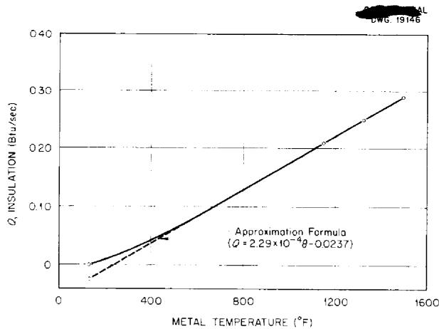  
Fig. 74. Heat Loss from Insulated 2-in. Pipe vs. Wall Temperature of the Pipe (Sink Temperature, $130^{\circ}\mathrm{F}$ ).

sections in which the heaters have failed. The heat supplied by the heaters which are still operative can be varied by the operator. At design conditions, the heaters will be operating at about 5/9 capacity; if thermocouple readings indicate that there were heater failures in the line, the adjacent heaters which were still operative could be run at full power. For the following analysis, however, the more dangerous situation will be considered, namely, that the heater failures go unnoticed and the heaters which are still operative remain at their normal power:

$$
Q _ {g} = q ^ {\prime} a _ {m} d x = P d x, \tag {31}
$$

for sections 1, 3, 5, and 7, and

$$
Q _ {\textbf {g}} = q ^ {\prime} a _ {m} d x = 0,
$$

for sections 2, 4, and 6, where

$$
\begin{array}{c} q ^ {\prime} = \text {u n i t i n t e r n a l h e a t g e n e r a t i o n}, \\ \text {B t u / s e c} \cdot \text {f t} ^ {3}, \end{array}
$$

$$
\begin{array}{l} P = \text {n o r m a l p o w e r i n p u t t o t h e} \\ \text {e l e c t r i c h e a t e r s p e r l i n e a l f o o t}, \\ \text {B t u / s e c} \cdot \text {l i n e a l f t}. \end{array}
$$

Substitution of Eqs. 27 through 31 in Eqs. 25 and 26 gives

$$
\begin{array}{l} k _ {m} a _ {m} \frac {d ^ {2} \theta_ {m}}{d x ^ {2}} + q ^ {\prime} a _ {m} \tag {32} \\ + h _ {\mathrm {H e} - m} C _ {m} \left(\theta_ {\mathrm {H e}} - \theta_ {m}\right) = b \theta_ {m} - d \\ \end{array}
$$

and

$$
\begin{array}{l} W _ {H e} c _ {p _ {H e}} \frac {d \theta_ {H e}}{d x} \tag {33} \\ = - h _ {\text {H e} - m} C _ {m} \left(\theta_ {\text {H e}} - \theta_ {m}\right). \\ \end{array}
$$

Solving Eq. 33 for $\theta_{m}$ and differentiating twice gives

$$
\theta_ {m} = \theta_ {\mathrm {H e}} + \frac {W _ {\mathrm {H e}} c }{h _ {\mathrm {H e} - m} C _ {m}} \frac {d \theta_ {\mathrm {H e}}}{d x} \tag {34}
$$

and

$$
\frac {d ^ {2} \theta_ {m}}{d x ^ {2}} = \frac {d ^ {2} \theta_ {\mathrm {H e}}}{d x ^ {2}} + \frac {W _ {\mathrm {H e} ^ {c} p _ {\mathrm {H e}}}}{h _ {\mathrm {H e} - m} C _ {m}} \frac {d ^ {3} \theta_ {\mathrm {H e}}}{d x ^ {3}}. \tag {35}
$$

Substitution of Eqs. 34 and 35 in Eq. 32 gives

$$
\begin{array}{l} \frac {d ^ {3} \theta_ {\mathrm {H e}}}{d x ^ {3}} + \frac {h _ {\mathrm {H e} - m} C _ {m}}{W _ {\mathrm {H e}} c _ {p _ {\mathrm {H e}}}} \frac {d ^ {2} \theta_ {\mathrm {H e}}}{d x ^ {2}} \tag {36} \\ - \frac {h _ {\mathrm {H e} - m} C _ {m} + b}{k _ {m} a _ {m}} \frac {d \theta}{d x} - \frac {h _ {\mathrm {H e} - m} C _ {m} b}{k _ {m} a _ {m} W _ {\mathrm {H e}} c _ {p _ {\mathrm {H e}}}} \theta \\ = \frac {h _ {\mathrm {H e} - m} C _ {m}}{k _ {m} W _ {\mathrm {H e}} c _ {p _ {\mathrm {H e}}}} \left(\frac {d}{a _ {m}} - q ^ {\prime}\right), \\ \end{array}
$$

which may be solved quite readily. It is first necessary to evaluate the constant in Eq. 36 for the conditions of the problem. Three different helium velocities were considered: 1, 3, and 10 ft/sec. For these three different velocities, the values of the constants of Eq. 36 are tabulated in the following:

<table><tr><td>Helium velocity, ft/sec</td><td>1</td><td>3</td><td>10</td></tr><tr><td>hHe-m, Btu/sec·ft2·°F</td><td>3.03 × 10-4</td><td>4.97 × 10-4</td><td>8.54 × 10-4</td></tr><tr><td>Cm, ft</td><td></td><td>0.899</td><td></td></tr><tr><td>WHe, lb/sec</td><td>1.03 × 10-4</td><td>3.09 × 10-4</td><td>10.30 × 10-4</td></tr><tr><td>km, Btu/sec·ft2 (°F/ft)</td><td></td><td>0.00333</td><td></td></tr><tr><td>am, ft2</td><td></td><td>0.00487</td><td></td></tr><tr><td>b</td><td></td><td>2.29 × 10-4</td><td></td></tr><tr><td>d</td><td></td><td>-0.0237</td><td></td></tr><tr><td>q&#x27;, Btu/sec·ft3</td><td></td><td>45.5</td><td>(sections 1, 3, 5, and 7)</td></tr><tr><td></td><td></td><td>0</td><td>(sections 2, 4, and 6)</td></tr><tr><td>hHe-mCm/WHeCPHe</td><td>2.13</td><td>1.17</td><td>0.601</td></tr><tr><td>hHe-mCm + b/kam</td><td>30.9</td><td>41.6</td><td>61.5</td></tr><tr><td>hHe-mCm b/kam WHeCPHe</td><td>30.1</td><td>16.5</td><td>8.48</td></tr><tr><td>hHe-mCm/km WHeCPHe(d/a_m - q&#x27;)</td><td></td><td></td><td></td></tr><tr><td>For sections 1, 3, 5, and 7</td><td>-32,300</td><td>-17,600</td><td>-9090</td></tr><tr><td>For sections 2, 4, and 6</td><td>-3120</td><td>-1700</td><td>-879</td></tr></table>

The helium heat transfer coefficient, $h_{\text{He-m}}$ , may be evaluated from the following formula: (14)

$$
h _ {\mathrm {H e} - \mathrm {m}} = 1. 0 2 \frac {k _ {\mathrm {H e}}}{D _ {\mathrm {H e}}} \operatorname {R e} _ {\mathrm {H e}} ^ {0. 4 5} \Pr_ {\mathrm {H e}} ^ {0. 5} \left(\frac {\mu}{\mu_ {s}}\right) _ {\mathrm {H e}} ^ {0. 1 4} \left(\frac {D _ {\mathrm {H e}}}{L _ {\mathrm {H e}}}\right) _ {\mathrm {H e}} ^ {0. 4} \left(\frac {D _ {o}}{D _ {i}}\right) ^ {0. 8} \operatorname {G r} _ {\mathrm {H e}} ^ {0. 0 5}, \tag {37}
$$

where

$D =$ equivalent diameter, ft,

$$
\begin{array}{l} D _ {o} = \text {o u t s i d e d i a m e t e r o f h e l i u m} \\ \text {a n n u l u s , f t ,} \end{array}
$$

$$
\begin{array}{l} D _ {i} = \text {i n s i d e d i a m e t e r o f h e l i u m} \\ \text {a n n u l u s , f t ,} \end{array}
$$

$$
\mathrm {R e} = \text {R e y n o l d s} ^ {\prime} \text {n u m b e r},
$$

$$
\Pr = \text {P r a n d t l} ^ {\prime} \text {s} \text {n u m b e r},
$$

$$
\begin{array}{l} \frac {\mu}{\mu_ {s}} = \text {r a t i o o f v i s c o s i t y a t b u l k} \\ \text {t e m p e r a t u r e t o v i s c o s i t y a t s u r - f a c e t e m p e r a t u r e ,} \end{array}
$$

$$
L = \text {l e n g t h o f p a s s a g e , f t},
$$

$$
\mathrm {G r} = \text {G r a s h o f} ^ {\prime} \text {s n u m b e r}.
$$

Having evaluated the constants in Eq. 36, the solution of the equation is straightforward. Once an expression for $\theta_{\mathrm{He}}$ is found, $\theta_{m}$ can be evaluated from Eq. 34. The solutions for helium velocities of 1, 3, and 10 ft/sec follow:

1. For a helium velocity of 1 ft/sec,

$$
\begin{array}{l} \theta_ {\mathrm {H e}} = n _ {1} e ^ {5. 1 0 x} + n _ {2} e ^ {- 6. 2 9 x} \tag {38} \\ + n _ {3} e ^ {- 0. 9 4 1 x} + K \\ \end{array}
$$

and

$$
\begin{array}{l} \theta_ {m} = 3. 3 9 n _ {1} e ^ {5. 1 0 x} - 1. 9 5 n _ {2} e ^ {- 6. 2 9 x} \tag {39} \\ + 0. 5 5 9 e ^ {- 0. 9 4 1 x} + K, \\ \end{array}
$$

where

$$
\begin{array}{l} n = \text {a r b i t r a r y c o n s t a n t}, \\ K = 1 0 7 0 \text {f o r s e c t i o n s} 1, 3, 5, \text {a n d} 7 \\ = 1 0 4 \text {f o r s e c t i o n s} 2, 4, \text {a n d} 6. \\ \end{array}
$$

2. For a helium velocity of 3 ft/sec,

$$
\begin{array}{l} \mathcal {E} _ {\mathrm {H e}} = n _ {4} e ^ {6. 1 0 x} + n _ {5} e ^ {- 6. 8 7 x} \tag {40} \\ + n _ {6} e ^ {- 0. 3 9 2 x} + K \\ \end{array}
$$

and

$$
\begin{array}{l} \text {E} _ {m} = 6. 2 3 n _ {4} e ^ {6. 1 0 x} - 4. 9 0 n _ {5} e ^ {- 6. 8 7 x} \tag {41} \\ + 0. 6 6 4 n _ {6} e ^ {- 0 \cdot 3 9 2 x} + K. \\ \end{array}
$$

3. For a helium velocity of 10 ft/sec,

$$
\begin{array}{l} \theta_ {\mathrm {H e}} = n _ {7} e ^ {7. 6 2 x} + n _ {8} e ^ {- 8. 0 8 x} \tag {42} \\ + n _ {9} e ^ {- 0. 1 3 7 x} + K \\ \end{array}
$$

and

$$
\begin{array}{l} \theta_ {m} = 1 3. 7 n _ {7} e ^ {7. 6 2 x} - 1 2. 4 n _ {8} e ^ {- 8. 0 8 x} \tag {43} \\ + 0. 7 7 2 n _ {9} e ^ {- 0. 1 3 7 x} + K. \\ \end{array}
$$

There are nine arbitrary constants in Eqs. 38 through 43. These constants have a different value in each of the

seven sections; there are therefore, altogether, 63 arbitrary constants. These may be evaluated by means of the following boundary conditions, which apply to all three helium velocities:

$$
\lim  _ {x _ {1} \rightarrow - \infty} \mathcal {O} _ {\text {H e}} \tag {44}
$$

is bounded. Since each section has a different origin (see definition of $x$ , following Eq. 27), the subscript on $x$ refers to the number of the section being considered. Thus

$$
\begin{array}{l} \left. \theta_ {\mathrm {H e}} \right| _ {x _ {1} = 0} = \left. \theta_ {\mathrm {H e}} \right| _ {x _ {2} = 0}, (45) \\ \left. \theta_ {m} \right| _ {\textit {x} _ {1} = 0} = \left. \theta_ {m} \right| _ {\textit {x} _ {2} = 0}, (46) \\ \left. \frac {d \theta_ {m}}{d x} \right| _ {x _ {1} = 0} = \left. \frac {d \theta_ {m}}{d x} \right| _ {x _ {2} = 0}, (47) \\ \left. \theta_ {\mathrm {H e}} \right| _ {x _ {r} = 2 / 3} = \left. \theta_ {\mathrm {H e}} \right| _ {x _ {r + 1} = 0}, (48) \\ r = 2, 3, 4, 5, 6 \\ \left. \theta_ {m} \right| _ {\mathbf {x} _ {r} = 2 / 3} = \left. \theta_ {\mathrm {H e}} \right| _ {\mathbf {x} _ {r + 1} = 0}, (49) \\ r = 2, 3, 4, 5, 6 \\ \left. \frac {d \theta_ {m}}{d x} \right| _ {x _ {r} = 2 / 3} = \left. \frac {d \theta_ {m}}{d x} \right| _ {x _ {r + 1} = 0}, (50) \\ r = 2, 3, 4, 5, 6 \\ \lim  _ {x _ {7} \rightarrow \infty} \theta_ {\mathrm {H e}} (51) \\ \end{array}
$$

is bounded.

Equations 44 through 51 were used to evaluate the nine arbitrary constants, $n_1$ to $n_9$ , for each of the seven sections. The results of the evaluation are given in Table 18.

The values of the arbitrary constants and Eqs. 38 through 43 were used to calculate the temperatures of the helium and the metallic envelope for all positions along the pipe line for the three helium velocities. The results are shown in Figs. 75, 76, and 77. The minimum helium temperature

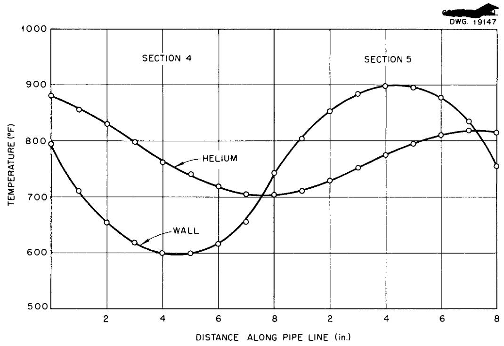

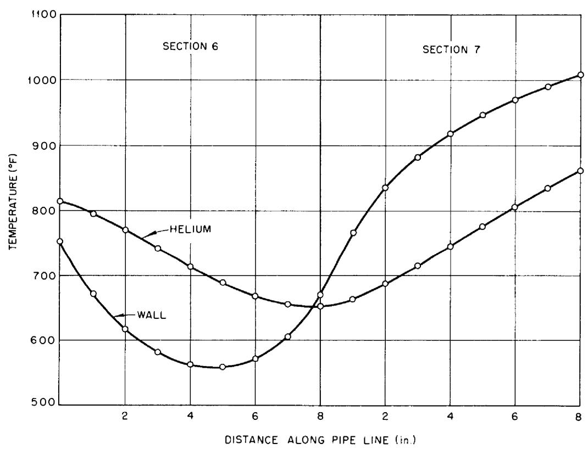  
Fig. 75. Temperature Patterns of Helium and Wall of Monitoring Annulus. Helium velocity of 1 ft/sec.

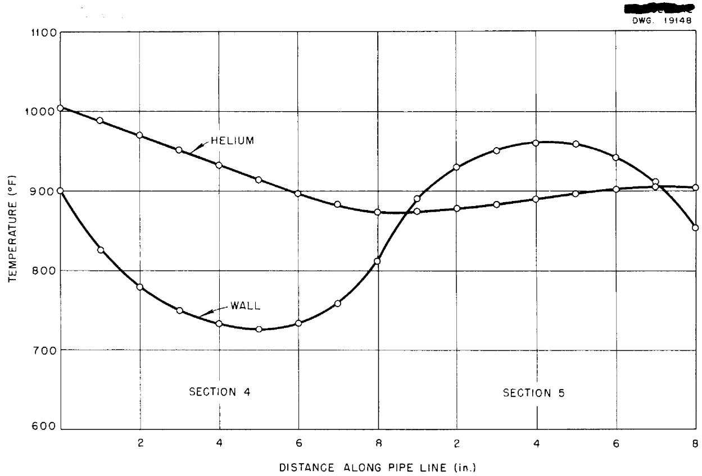

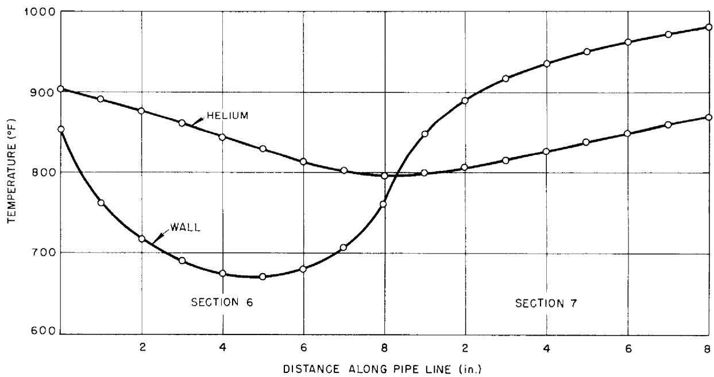  
Fig. 76. Temperature Patterns of Helium and Wall of Monitoring Annulus. Helium velocity of 3 ft/sec.

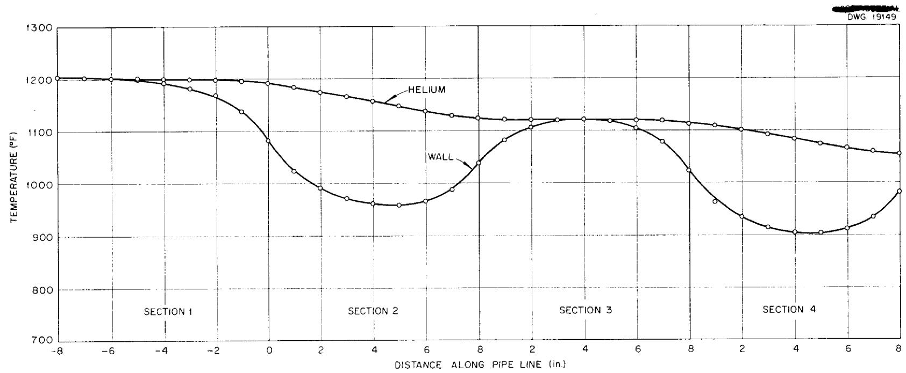

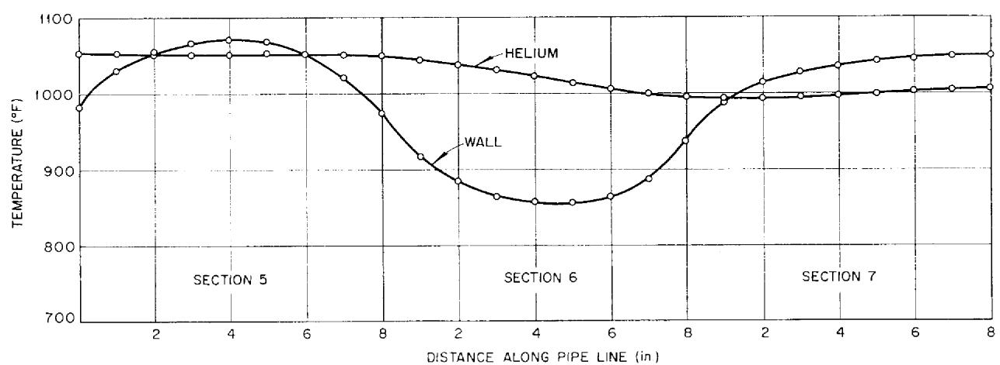  
Fig. 77. Temperature Patterns of Helium and Wall of Monitoring Annulus. Helium velocity of 10 ft/sec.

TABLE 18. VALUES OF THE ARBITRARY CONSTANTS   

<table><tr><td rowspan="2"></td><td colspan="7">SECTION NUMBER</td></tr><tr><td>1</td><td>2</td><td>3</td><td>4</td><td>5</td><td>6</td><td>7</td></tr><tr><td>n1</td><td>-80.6</td><td>2.69</td><td>-2.72</td><td>2.88</td><td>-2.70</td><td>2.38</td><td>0</td></tr><tr><td>n2</td><td>0</td><td>-76.1</td><td>75.5</td><td>-76.6</td><td>75.6</td><td>-75.7</td><td>89.5</td></tr><tr><td>n3</td><td>0</td><td>960</td><td>-447</td><td>722</td><td>-575</td><td>654</td><td>-637</td></tr><tr><td>n4</td><td>-30.5</td><td>0.476</td><td>-0.459</td><td>0.467</td><td>-0.461</td><td>0.473</td><td>0</td></tr><tr><td>n5</td><td>0</td><td>-27.6</td><td>27.7</td><td>-27.5</td><td>28.0</td><td>-27.6</td><td>27.9</td></tr><tr><td>n6</td><td>0</td><td>965</td><td>-222</td><td>796</td><td>-354</td><td>695</td><td>-431</td></tr><tr><td>n7</td><td>-8.64</td><td>0.0554</td><td>-0.0537</td><td>0.0546</td><td>-0.0538</td><td>0.0548</td><td>0</td></tr><tr><td>n8</td><td>0</td><td>-8.20</td><td>8.19</td><td>-7.95</td><td>8.05</td><td>-7.96</td><td>8.04</td></tr><tr><td>n9</td><td>0</td><td>968</td><td>-84.2</td><td>891</td><td>-155</td><td>826</td><td>-213</td></tr></table>

and the minimum metallic envelope temperature have been plotted against helium velocity in Fig. 78. Since the temperature of the fuel in the pipe line is equal to the helium temperature and since the fuel melts in the vicinity of $950^{\circ}\mathrm{F}$ , it can be seen from Fig. 78 that the fuel will remain molten, in this particular case, if the helium velocity exceeds about 8 ft/sec.

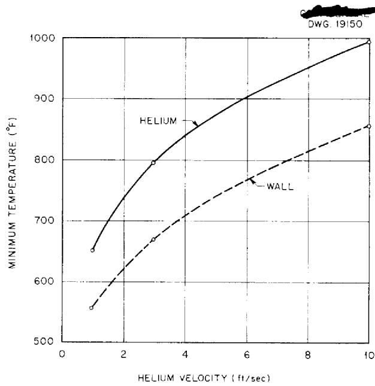  
Fig. 78. Minimum Wall and Helium Temperatures vs. Helium Flow in Monitoring Annulus.

# Chapter 7

# HELIUM SUPPLY AND VENTING SYSTEM

# TRUE HOLDUP OF FISSION GASES IN TANKS

The fission gases removed along with helium through the various gas vents in the fuel circuit are held up in the pipes and tanks of the off-gas system (Fig. 79) until the activity in the fission gases is reduced sufficiently to permit their being discharged into the stack. The holdup time of the gases in pipe lines or similar shapes of large length-to-diameter ratio is readily calculated as the pipe volume divided by the gas volume flow rate. All the gas is held up substantially the same amount of time. In large tanks or similar shapes of small length-to-diameter ratio, the average gas holdup time is the same as in a pipe line of similar volume. However, because of the mixing of the gas in the tank, not all the gas is held up for substantially equal periods; that is, some of the gas leaving the holdup tank is held up for much less than average time and some for much more than average. The true activity of the gases leaving the holdup tank (Fig. 80) of the off-gas system has been calculated and compared with the activity which would be present if all gases were held up for equal periods.

The mixing of the gas in the tank is due to convective and diffusive forces and occurs fairly rapidly compared with the average holdup time in the tank. Thereasonably conservative assumption was made that the gas entering the tank mixes instantaneously with the gas in the tank. The following definitions were made for the calculations:

$$
\begin{array}{l} N = \text {f l o w r a t e o f g a s}, \text {c f m}, \\ V = \text {t a n k v o l u m e , f t} ^ {3}, \\ \begin{array}{l} C (t) = \text {c o n c e n t r a t i o n o f g a s e s o f} \\ \text {a g e t , t h a t i s , C (t)} d t \text {e q u a l s} \\ \text {t h e r a t i o o f t h e v o l u m e o f g a s} \\ \text {w i t h a g e f r o m t t o t + d t} \\ \text {c o m p a r e d w i t h t h e t o t a l t a n k} \\ \text {v o l u m e , V (a g e i s u s e d h e r e t o} \end{array} \\ \end{array}
$$

mean time measured from the time the gases enter the off-gas system),

$$
t = \text {t i m e}, \min .
$$

Then,

(1) $C(t + dt)d\cdot t$

$$
= C (t) d t - C (t) d t \frac {N}{V} d t,
$$

(2) $\frac{C(t + dt) - C(t)}{dt} = -C(t)\frac{N}{V},$   
(3) $\frac{dC(t)}{dt} = -C(t)\frac{N}{V},$   
(4) $C(t) = K e^{*(N / V)t}$ ,

where $K$ is an arbitrary constant.

When $t = t_0$ , where $t_0$ is the age of the youngest gases in the tank,

(5) $C(t)dt = \frac{N}{V} dt$

and

(6) $C(t_0) = \frac{N}{V}$ .

Substituting Eq. 6 in Eq. 4 and solving for $K$ gives

(7) $\frac{N}{V} = K e^{-(N / V)t_0}$ ,   
(8) $K = \frac{N}{V} e^{(N / V)t_0},$   
(9) $C(t) = \frac{N}{V} e^{-(N / V)(t - t_0)}$ .

The energy, $E(t)$ , in the fission gases xenon and krypton (bromine and iodine removed previously) at time $t$ is plotted against $t$ in Figs. 81, 82, and 83 for the separate xenon and krypton isotopes and for the total of these isotopes. For the determination of $E(t)$ , it was considered that there had been 200 hr of reactor operation prior to time zero and that the fission gases had subsequently decayed time $t$ .

MATERIAL AND MATERIAL SPECIFICATIONS

UNCLASSIFIED

DWG-E-A-3-8-52A

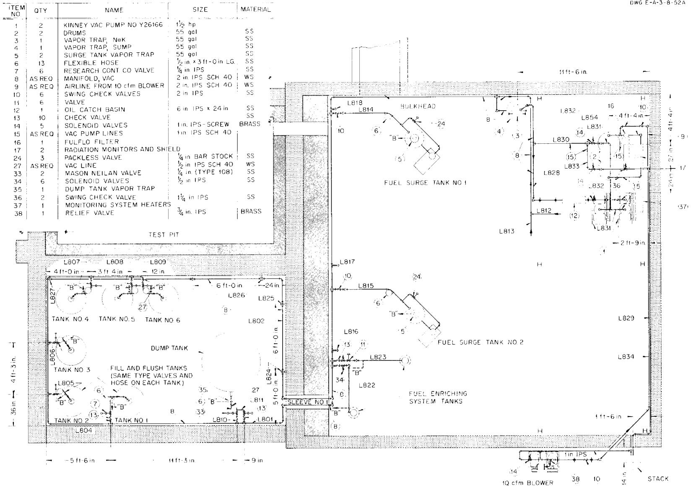  
Fig. 79. Off-Gas Disposal System.

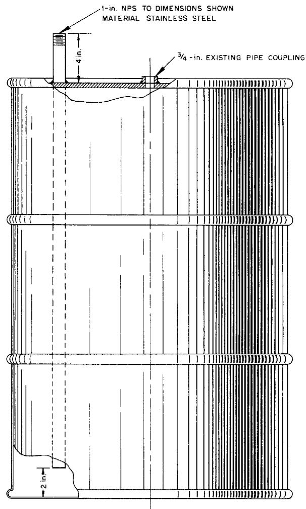

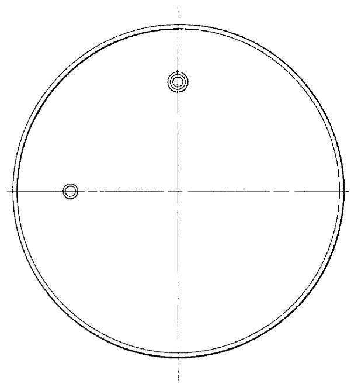  
Fig. 80. Off-Gas Disposal System Drum.

If $R$ is the ratio of the true activity of the gases leaving the holdup tank to the activity which would be present if all the gases were held up equally,

$$
R = \frac {\int_ {t _ {0}} ^ {t _ {p}} \frac {N}{V} e ^ {- (N / V) (t - t _ {0})} E (t) d t}{E \left(t _ {0} + \frac {V}{N}\right)}, \tag {10}
$$

where $t_p$ is the age of the oldest gases in the tank. The total energy in all the fission gases developed may be used since the final answer desired is a ratio.

It is important to note that for Eq. 10 it is assumed that all the

gases in the tank contain equal amounts of fission gases. This is obviously not true of the gas originally in the tank. Thus, at the beginning of operation, the value of $R$ is actually less than is predicted by Eq. 10. The highest possible values of $R$ will occur after long periods of operation, and Eq. 10 will therefore be evaluated with $t_p$ sufficiently large for the contribution to the total activity of the gases of age greater than $t_p$ to be neglected.

The curve of $E(t)$ vs. $t$ shown in Fig. 83 for the total energy of all xenon and krypton isotopes was broken up into a series of $M$ segments between $t_0$ and $t_p$ , and an equation of exponential form was fitted to each segment.

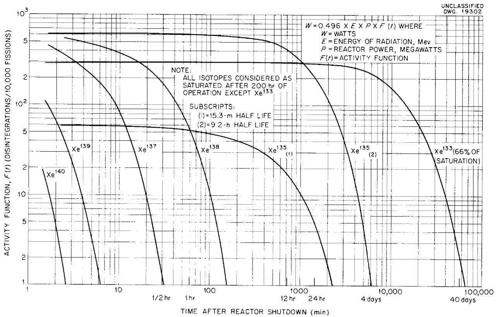  
Fig. 81. Integrated Xenon Activity, $F(t)$ , vs. Time after Reactor Shutdown.

Thus, for the nth segment,

$$
E _ {n} (t) = A _ {n} e ^ {- b _ {n} t}, \quad t _ {n - 1} \leqslant t <   t _ {n}, \tag {11}
$$

and then

$$
R = \frac {\sum_ {n = 1} ^ {M} \int_ {t _ {n - 1}} ^ {t _ {n}} \frac {N}{V} e ^ {- (N / V) (t - t _ {0})} A _ {n} e ^ {- b _ {n} t} d t}{E \left(t _ {0} + \frac {V}{N}\right)}, \tag {12}
$$

where $t_{M} = t_{p}$

$$
R = \frac {1}{E \left(t _ {0} + \frac {V}{N}\right)} \sum_ {n = 1} ^ {M} A _ {n} \frac {N}{V} \int_ {t _ {n - 1}} ^ {t _ {n}} e ^ {- [ (N / V) + b _ {n} ] t + (N / V) t _ {0}} d t, \tag {13}
$$

$$
R = \frac {1}{E \left(t _ {0} + \frac {V}{N}\right)} \sum_ {n = 1} ^ {M} - \frac {A _ {n} \frac {N}{V}}{\frac {N}{V} + b _ {n}} \left[ e ^ {- \left[ (N / V) + b _ {n} \right] t + (N / V) t _ {0}} \right] _ {t _ {n - 1}} ^ {t _ {n}}, \tag {14}
$$

$$
R = \frac {\frac {N}{V} e ^ {(N / V) t _ {0}}}{E \left(t _ {0} + \frac {V}{N}\right)} \sum_ {n = 1} ^ {M} - \frac {A _ {n}}{\frac {N}{V} + b _ {n}} \left[ e ^ {*} \left[ (N / V) + b _ {n} \right] t _ {n} - e ^ {*} \left[ (N / V) + b _ {n} \right] t _ {n - 1} \right].
$$

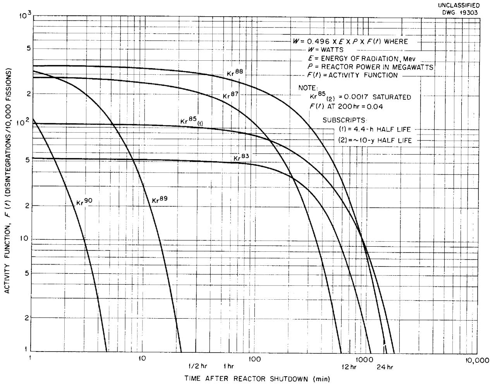  
Fig. 82. Integrated Krypton Activity, $F(t)$ , vs. Time after Reactor Shutdown.

The data and results of the calculations for the particular problem of the first holdup tank in the off-gas system are given in Table 19.

As a check on whether the intervals selected were small enough, the interval between $t_0$ and $t_1$ was divided into two parts. Recalculation of the data for the smaller intervals is given in Table 20.

The value of 295 checks very closely with the value of 296 calculated for the original intervals, and thus the intervals selected were probably small enough.

The final answer, then, is that the actual activity of the gases coming out of the tank is $23\%$ greater than the activity which would be present

if all the gases were held up for equal periods.

# TEMPERATURES IN THE HELIUM VENT LINES CONTAINING FISSION GASES

The off-gas system carries gases from the surge tanks, the dump tank, and the pits to the exhaust stack (Fig. 79). At times, a portion of these gases will be radioactive fission products. The gas flow rate is generally quite low, and the question arises as to what temperatures will exist on the off-gas system with essentially stagnant radioactive gases in the system. The total energy of all the fission gases produced after 200 hr of reactor operation at 3 megawatts is about 14.8 Btu/sec for a delay time of 1 l/2 minutes.(22) The

Data:

$$
\begin{array}{l} t _ {0} = \text {h o l d u p t i m e i n o f f - g a s s y s t e m b e f o r e r e a c h i n g t a n k s} \\ = 6 \mathrm {h r} = 3 6 0 \min \\ \end{array}
$$

$$
\begin{array}{l} N = \text {g a s f l o w} \\ = 1 / 2 \mathrm {c f h} = 1 / 1 2 0 \mathrm {c f m} \\ \end{array}
$$

$$
\begin{array}{l} V = \text {t a n k v o l u m e} \\ = 7. 5 \mathrm {f t} ^ {3} \\ \end{array}
$$

$$
\begin{array}{l} \frac {V}{N} = 9 0 0 \min  _ {V} \\ E \left(t _ {0} + \frac {V}{N}\right) = E (1 2 6 0) = 3 5 0 \\ \end{array}
$$

TABLE 19. DATA AND RESULTS OF CALCULATIONS FOR THE FIRST HOLDUP TANK IN THE OFF-GAS SYSTEM   

<table><tr><td>tn(min)</td><td>E(t)</td><td>An</td><td>bn</td><td>N/V e (N/V)t0{-(N/V)e[(N/V)+bn]tn
-N/V + bn} - e[(N/V)+bn]tn-1}</td></tr><tr><td>t0= 360</td><td>800</td><td></td><td></td><td></td></tr><tr><td>t1= 1,000</td><td>419</td><td>1152</td><td>1.011 × 10-3</td><td>296</td></tr><tr><td>t2= 2,000</td><td>233</td><td>752</td><td>0.587 × 10-3</td><td>106</td></tr><tr><td>t3= 4,000</td><td>113</td><td>480</td><td>0.362 × 10-3</td><td>25.7</td></tr><tr><td>t4= 7,000</td><td>56</td><td>288</td><td>0.234 × 10-3</td><td>1.5</td></tr><tr><td>t5= 12,000</td><td>25</td><td>173</td><td>0.161 × 10-3</td><td>negligible</td></tr><tr><td>t6= 20,000</td><td>10</td><td>99</td><td>0.115 × 10-3</td><td>negligible
∑ = 429.2</td></tr><tr><td></td><td></td><td></td><td colspan="2">R = 429.2/350 = 1.23</td></tr></table>

energy is divided among the fission gases as follows:

$$
\text {B t u / s e c}
$$

Xenon 2.2

Krypton 2.0

Bromine 1.4

Iodine 9.2

This energy may be distributed over the gas volume in the surge tanks, which is about 1.3 ft³, or it may come out of the fuel in the dump tank, in which case it will be distributed over a greater gas diluent volume. The

maximum energy release in the off-gas system, which occurs in the release of gases from the surge tanks, is therefore about 11.4 Btu/sec·ft3.

The fission gases on leaving the surge tanks enter a fuel vapor trap (Fig. 84) and then a 2-in. IPS pipe. The trap and the pipe are the critical points in the off-gas system, since they have the greatest volume-to-surface ratio and since the fission gases are youngest at these points. The energy dissipated per square foot of outside surface by radiation and

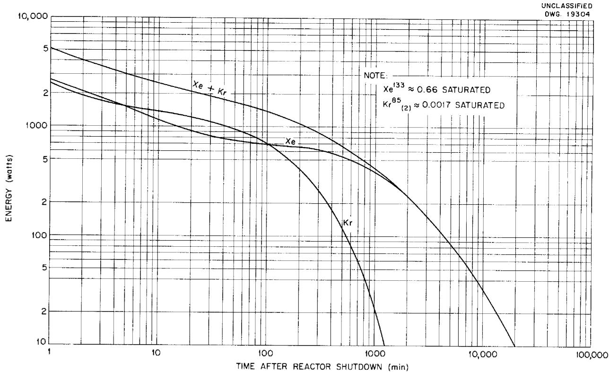  
Fig. 83. Energy Emission of Xenon and Krypton after Shutdown from Operation of 200 hr at a Power of 3 Megawatts.

TABLE 20. RESULTS OF CALCULATION FOR A SMALLER TIME INTERVAL   

<table><tr><td>tn(min)</td><td>E(t)</td><td>An</td><td>bn</td><td>N/V e (N/V)t0{-(N/V)e-(N/V)+bn)t_n
-(N/V+bn)e-(N/V)+bn)t_{n-1}}</td></tr><tr><td>t0=360</td><td>800</td><td></td><td></td><td></td></tr><tr><td>t&#x27;1=600</td><td>600</td><td>1233</td><td>1.20 x 10-3</td><td></td></tr><tr><td>t1=1000</td><td>419</td><td>1023</td><td>0.90 x 10-3</td><td>159</td></tr><tr><td></td><td></td><td></td><td></td><td>136</td></tr><tr><td></td><td></td><td></td><td></td><td>Σ = 295</td></tr></table>

convection may be written in the familiar form

$$
\begin{array}{l} Q = \frac {0 . 1 7 3}{3 6 0 0} \in \left[ \left(\frac {T _ {s}}{1 0 0}\right) ^ {4} - \left(\frac {T _ {e}}{1 0 0}\right) ^ {4} \right] \tag {15} \\ + h _ {e} \left(T _ {s} - T _ {e}\right), \\ \end{array}
$$

where

$$
\begin{array}{l} Q = \text {h e a t} \quad \text {d i s s i p a t e d}, \quad \mathrm {B t u / s e c} \cdot \mathrm {f t} ^ {2}, \\ \varepsilon = \text {e m i s s i v i t y}, \\ \end{array}
$$

$$
\begin{array}{l} T _ {s} = \text {s u r f a c e t e m p e r a t u r e}, ^ {\circ} R, \\ T _ {e} = \text {e n v i r o n m e n t t e m p e r a t u r e}, ^ {\circ} R, \\ h _ {c} = \begin{array}{l} \text {f r e e c o n v e c t i o n h e a t t r a n s f e r} \\ \text {c o e f f i c i e n t , B t u / s e c} \cdot \mathrm {f t} ^ {2} \cdot {} ^ {\circ} F. \end{array} \\ \end{array}
$$

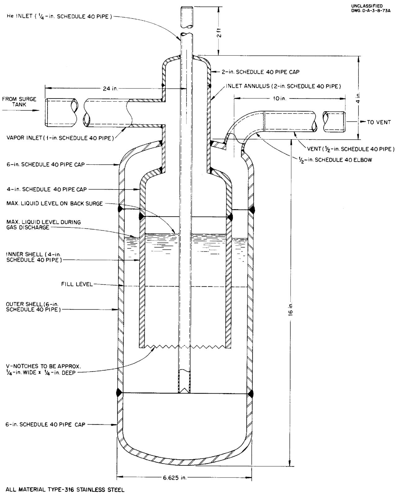  
Fig. 84. Surge Tank Vapor Trap.

The free convection heat transfer coefficient is determined from the data of Nusselt, $^{(18)}$ McAdams, and W.J. King, $^{(19)}$ who correlated Nusselt's number with Grashof's and Prandtl's numbers (as given by Jakob $^{(14)}$ ).

The pertinent physical dimensions and unit energies of the fuel vapor traps and the 2-in. IPS pipe are listed in the following:

<table><tr><td></td><td>FUEL VAPOR TRAP (per trap)</td><td>2-in. IPS PIPE</td></tr><tr><td>Gas volume, ft3</td><td>0.13</td><td>0.0233 (per ft)</td></tr><tr><td>Surface, ft2</td><td>2.6</td><td>0.622 (per ft)</td></tr><tr><td>Equivalent outside diameter, ft</td><td>0.55</td><td>0.198</td></tr><tr><td>Total energy, Btu/sec</td><td>1.48</td><td>0.265 (per ft)</td></tr><tr><td>Energy per ft2of surface, Btu/sec·ft2</td><td>0.246</td><td>0.427</td></tr></table>

For proper operation, the fuel vapor traps must be maintained at $1500^{\circ}\mathrm{F}$ . The traps are therefore covered with electric heaters and insulated. The heater power is controlled by thermocouples which measure the trap temperature. The heat input required to hold a trap at $1500^{\circ}\mathrm{F}$ is about 0.71 Btu/sec (cf., chap. 6, section on "Heat Loss Through Insulation"). The energy loss through the insulation would more than be balanced by the energy in the fission gases, and the heaters could

be shut off as the fuel vapor trap began to heat up slowly. The heat capacity of the vapor trap, including contained liquid, is about 13.2 Btu/°F. A tabulation of the energy dissipations and of the temperatures of the vapor trap at various times is given in Table 21. The vapor trap temperature would be increased by only about $40^{\circ}\mathrm{F}$ at the end of 20 min, and the heaters would have to be turned on again as the fission gases further decayed.

The 2-in. IPS pipe is neither heated nor insulated, and therefore Eq. 15 may be used to calculate the pipe outside temperature (the inside temperature is not greatly different). For an emissivity of 0.5, the pipe outside temperature necessary to dissipate 0.265 Btu/sec·linealft is about $380^{\circ}\mathrm{F}$ .

# VACUUM PUMP PERFORMANCE

There are two vacuum pumps in the off-gas system (Figs. 79 and 85). They serve many purposes, but their most severe requirement is that they must reduce the pressure in the fuel system sufficiently to permit the boiling off of NaK which cannot be completely drained from this system (NaK is circulated in the fuel system for precleaning and hot testing). Figures 86 and 87 give the experimentally determined performance of the two vacuum pumps. Figure 86 shows the variation of pressure with time in a pump-down test of a $12.3\text{-ft}^3$ tank; Fig. 87 shows the rate of pressure rise due to leakage after the

TABLE 21. ENERGY DISSIPATIONS AND TEMPERATURES OF THE VAPOR TRAP AT VARIOUS TIMES   

<table><tr><td>TIME (min)</td><td>HEAT IN FISSION GASES (Btu/sec)</td><td>HEAT LOSS THROUGH INSULATION (Btu/sec)</td><td>HEAT INTO TRAP (Btu/sec)</td><td>RATE OF TEMPERATURE RISE IN TRAP (°F/min)</td><td>TRAP TEMPERATURE (°F)</td></tr><tr><td>1.5*</td><td>1.48</td><td>0.71</td><td>0.77</td><td>3.49</td><td>1500</td></tr><tr><td>10</td><td>0.91</td><td>0.74</td><td>0.17</td><td>0.77</td><td>1530</td></tr><tr><td>20</td><td>0.75</td><td>0.75</td><td>0.0</td><td>0</td><td>1538</td></tr></table>

*The gas is assumed to enter the trap after a delay of 1.5 minutes.

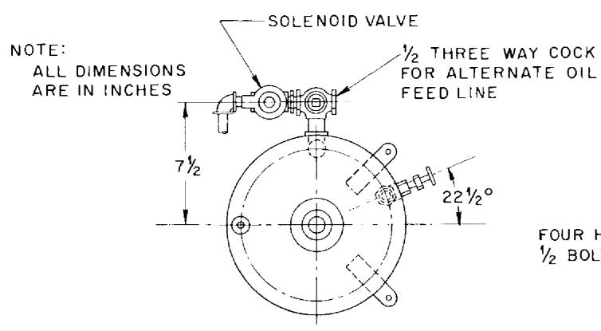

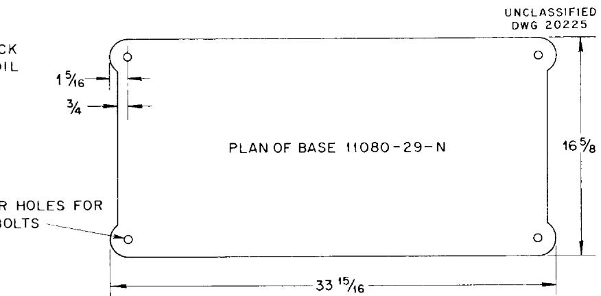

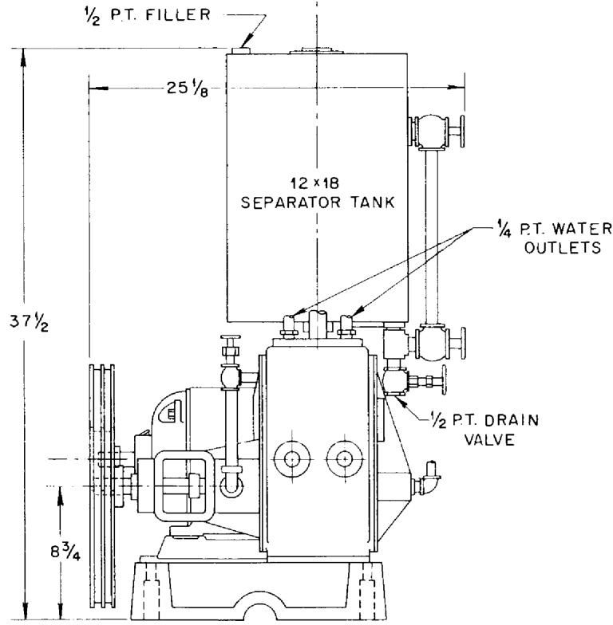

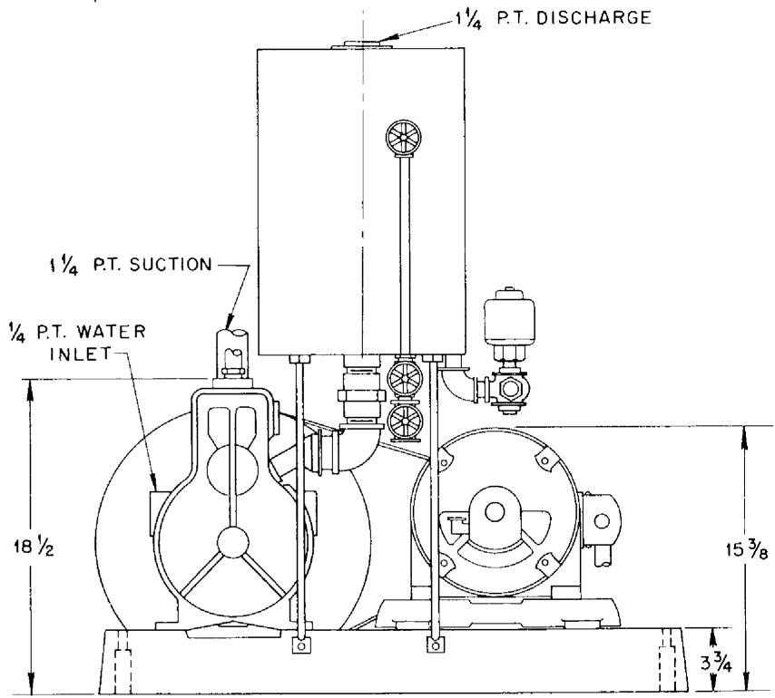  
Fig. 85. Kinney Vacuum Pump.

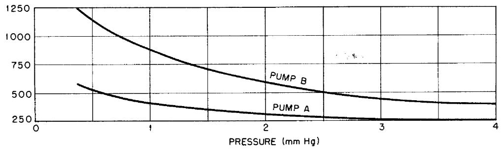

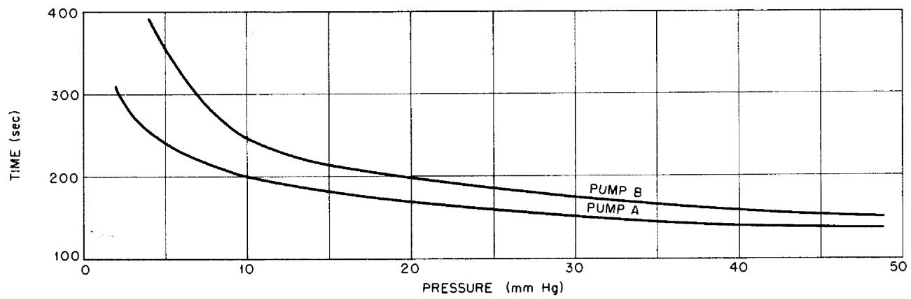

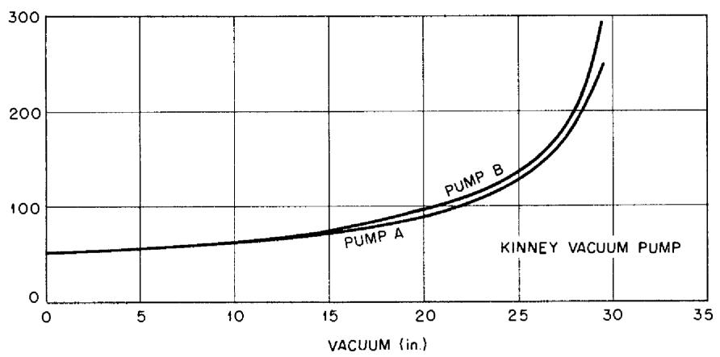  
Fig. 86. Vacuum Pump Performance.

pumps are shut off. From these curves, curves of the variation of rate of change of pressure with pressure were drawn, as shown in Fig. 88.

If a leak develops in the system, it may be desirable to remove all the NaK from the system. In order to boil off NaK at $1200^{\circ}\mathrm{F}$ , a pressure of about $100 \mathrm{~mmHg}$ or less must be maintained. The following calculations were made to determine the maximum

size of leak which might exist and still permit the vacuum pumps to maintain a pressure of 100 mm Hg.

The process of evacuating gas from a tank or containing system is isothermal, and therefore

$$
P V = \text {c o n s t a n t} = K \tag {16}
$$

or

$$
P = \frac {K}{V}, \tag {17}
$$

where

$$
\begin{array}{l} P = \text {p r e s s u r e}, \mathrm {m m} \mathrm {H g}, \\ V = \text {v o l u m e}, \quad \mathrm {f t} ^ {3}, \\ K = \text {a c o n s t a n t}. \\ \end{array}
$$

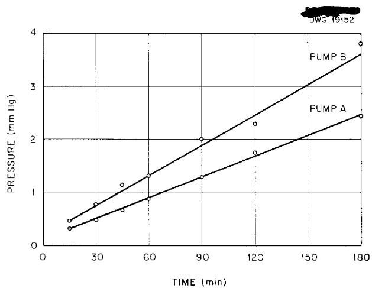  
Fig. 87. Leakage Test.

Differentiating with respect to time, t, gives

$$
\frac {d P}{d t} = - \frac {K}{V ^ {2}} \frac {d V}{d t}, \tag {18}
$$

and dividing both sides by $P$ gives

$$
\frac {\frac {d P}{d t}}{P} = - \frac {K}{P V ^ {2}} \frac {d V}{d t}. \tag {19}
$$

However, $K = PV$ , and therefore

$$
\frac {\frac {d P}{d t}}{P} = - \frac {\frac {d V}{d t}}{V}. \tag {20}
$$

Since the volume of the tank tested was 12.3 ft³, Eq. 20 becomes

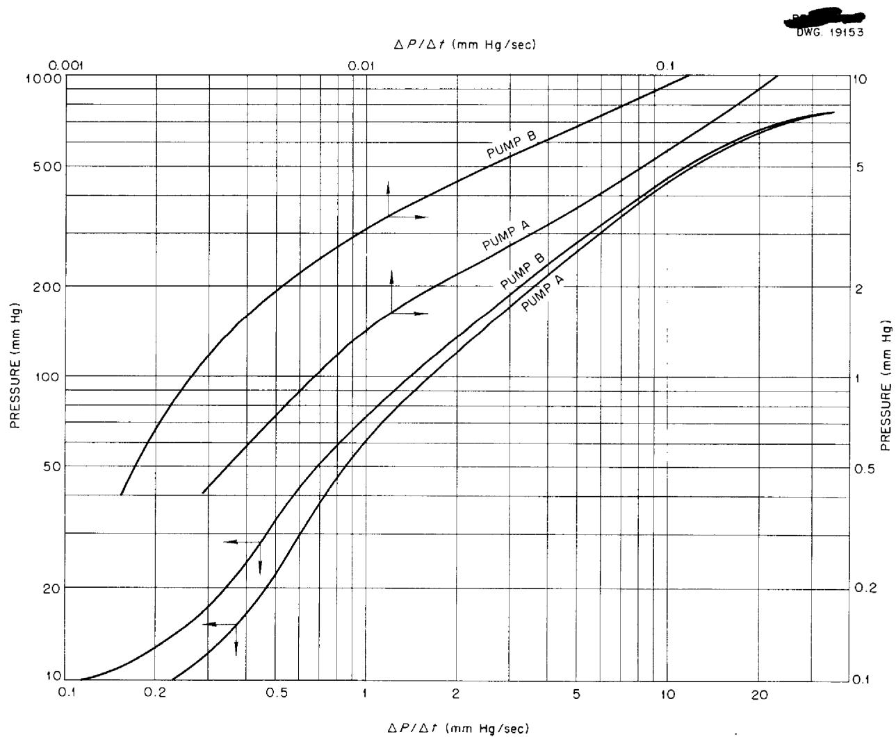  
Fig. 88. Vacuum Pump Performance. Volume of test system, 12.3 ft3.

$$
\left. \frac {\frac {d P}{d t}}{P} \frac {\frac {d V}{d t}}{1 2 . 3} \text {o r} \left| \frac {d V}{d t} \right| = \frac {1 2 . 3}{P} \right| \frac {d P}{d t}. \tag {21}
$$

The values of volumetric flow, $dV/dt$ , as calculated from the pump-down test results, are given in Table 22. The values are for pump inlet conditions; that is, the pressure is equal to the system pressure and the temperature is approximately $560^{\circ}\mathrm{R}$ , since the gas is cooled before it reaches the vacuum pumps.

The vacuum pumps are of the rotary positive displacement type, and it would therefore be expected that the volumetric flow would decrease slightly with decreasing pressure, since the leakage past the rotor increases. It is apparent from the calculated values of volumetric flow, $dV/dt$ , that the curves of Fig. 88 are probably somewhat inaccurate. The inaccuracy is not entirely unexpected because the information for Fig. 88 was obtained by measuring the slopes of the curves of Fig. 86, and the measurements were not highly accurate. The accuracy is of the order of $\pm 10\%$ , however, which is sufficient for the purpose of the problem.

The values in Table 22 for volumetric flow are for pumping air. The leakage past the rotor when pumping helium may be somewhat higher than when pumping air, but it is probably accurate enough to assume that the volumetric flows are the same for both helium and air.

The volumetric flow of helium through a leak can be approximated by considering a hypothetical "leak" in

the form of a round orifice:

$$
\left(\frac {d V}{d t}\right) _ {\text {o r i f i c e}} = C A v, \tag {22}
$$

where

$$
\begin{array}{l} \left(\frac {d V}{d t}\right) _ {\text {o r i f i c e}} = \begin{array}{l} \text {o r i f i c e v o l u m e t r i c f l o w ,} \\ \text {c f s ,} \end{array} \\ C = \text {o r i f i c e} = 0. 6 0, \\ A = \text {o r i f i c e} \quad \text {a r e a}, \quad \mathrm {f t} ^ {2}, \\ \begin{array}{l} v = \text {g a s v e l o c i t y i n o r i f i c e ,} \\ \text {f t / s e c .} \end{array} \\ \end{array}
$$

The critical pressure ratio for a perfect gas is given by

$$
r _ {C} = \left(\frac {2}{\gamma + 1}\right) ^ {\gamma / (\gamma - 1)}; \tag {23}
$$

thus with $\gamma_{\mathrm{He}} =$ ratio of specific heats $= 1.67$

$$
r _ {C} = 0. 4 8 7.
$$

The throat pressure for sonic velocity is therefore

$$
\rho_ {t h} = 0. 4 8 7 \times 7 6 0 = 3 7 0 \mathrm {m m H g}. \tag {24}
$$

The throat temperature is

$$
T _ {t h} = T _ {\text {a m b}} \left(r _ {C}\right) ^ {(\gamma - 1) / \gamma}, \tag {25}
$$

where

$$
\begin{array}{l} T _ {\text {a m b}} = \text {a m b i e n t t e m p e r a t u r e i n t h e} \\ \text {h e l i u m m o n i t o r i n g a n n u l u s} = \\ 1 6 6 0 ^ {\circ} \mathrm {R}, \end{array}
$$

$$
\begin{array}{r l} T _ {t h} & = \text {t h r o a t t e m p e r a t u r e} = 1 6 6 0 \\ (0. 4 8 7) ^ {(\gamma - 1) / \gamma} & = 1 2 3 5 ^ {\circ} R. \end{array}
$$

For system pressures less than $370 \, \text{mmHg}$ , the volumetric flow through the orifice will be constant. The velocity in the throat will always be

TABLE 22. CALCULATED RESULTS OF THE PUMP-DOWN TEST OF A 12.3-ft ${}^{3}$ TANK   

<table><tr><td rowspan="2">P, SYSTEM (mm Hg)</td><td colspan="2">dP/dt (mm Hg/sec)</td><td colspan="3">dV/dt (cfs)</td></tr><tr><td>Pump A</td><td>Pump B</td><td>Pump A</td><td>Pump B</td><td>Pumps A + B</td></tr><tr><td>300</td><td>5.95</td><td>5.55</td><td>0.244</td><td>0.277</td><td>0.571</td></tr><tr><td>150</td><td>2.56</td><td>2.28</td><td>0.210</td><td>0.187</td><td>0.397</td></tr><tr><td>100</td><td>1.63</td><td>1.41</td><td>0.200</td><td>0.173</td><td>0.373</td></tr><tr><td>50</td><td>0.86</td><td>0.70</td><td>0.211</td><td>0.172</td><td>0.383</td></tr></table>

sonic velocity, which is given by

$$
v = \sqrt {g \gamma R T}, \tag {26}
$$

where

$$
\begin{array}{l} g = 3 2. 2 f t / \sec^ {2}, \\ \gamma = 1. 6 7, \\ R = \text {g a s} = 3 8 6, \\ T = \text {t e m p e r a t u r e} = 1 2 3 5 ^ {\circ} \mathrm {R}, \\ \end{array}
$$

and thus

$$
v = 5 0 6 0 f t / s e c.
$$

Therefore

(27) $\left(\frac{dV}{dt}\right)_{\text{orific}} = 0.60A \times 5060 = 3040A.$

# Chapter 8

# DUMP AND FILL SYSTEM

# FUEL DUMP TANK COOLING

The heat generated in the fuel after shutdown of the reactor can easily be taken up by the heat capacity of the fuel and the fuel system without overheating. However, once the fuel is in the hot fuel dump tank, it is desirable to keep the temperature of this tank below a reasonable level. Therefore heat is removed by allowing helium to pass through the 91 coolant tubes of the tank (Fig. 89).

It is postulated that the maximum heat removal rate necessary is 50 Btu/sec. The problem of cooling this tank does not lend itself readily to analytical calculation. However, the cooling was analyzed by free-convection calculations and by chimney-effect methods. Both methods are outlined below.

The equation for free convection heat transfer is

(1) $Q_{c} = hA\theta$

where

$Q_{c} =$ heat removed by convection, Btu/sec,

$h =$ free-convection heat transfer coefficient taken at mean helium temperature, Btu/sec·ft².°F,

$A = 91$ times surface area of inside of a coolant tube, ft²,

$\theta =$ temperature difference between the inside surface of tube and mean helium temperature, $^\circ \mathrm{F}$

The value of the free-convection heat transfer coefficient for each helium temperature was calculated from the Nusselt's number. The Nusselt's number is given as a function of the product of Grashof's and Prandtl's numbers on p. 525 of ref. 14. It is realized that the length-to-diameter ratio of the coolant tube is too great for use of these correlations; however, they were the only correlations available, and an order of magnitude estimate could be gained by using them.

The inside diameter of each coolant tube is 2.067 in. and the length is 3.1 feet. The temperature of the inside surface was taken to be $1325^{\circ}\mathrm{F}$ over the entire length of the tube.

Mean temperature values were assumed for the helium in the coolant tube, and from these and Eq. 1, a curve was obtained of heat removed vs. mean helium temperature. The mean temperature corresponding to a heat removal rate of 50 Btu/sec is $1025^{\circ}\mathrm{F}$ . This corresponds to an outlet temperature of $1920^{\circ}\mathrm{F}$ , since the inlet temperature was assumed to be $135^{\circ}\mathrm{F}$ . A lower outlet temperature would mean a greater heat removal rate. Thus, apparently the dump tank will be adequately cooled.

The chimney-effect method makes use of the fact that a buoyant force acts on the air in the coolant tube because of a density difference. This buoyant force is

(2) $F = V(\rho_{\text{amb}} - \rho_{\text{m}})$ ,

where

$$
F = \text {b u o y a n t} \quad \text {f o r c e}, \quad \mathrm {l b},
$$

$$
V = \text {v o l u m e}, \quad \mathrm {f t} ^ {3},
$$

$$
\begin{array}{l} \rho_ {a m b} = d e n s i t y o f h e l i u m a t r o o m \\ \text {t e m p e r a t u r e , l b / f t ^ {3} ,} \end{array}
$$

$$
\begin{array}{l} \rho_ {m} = d e n s i t y o f h e l i u m a t m e a n \\ \text {t e m p e r a t u r e o f h e l i u m i n t u b e ,} \\ \text {l b / f t ^ {3}}. \end{array}
$$

From Eq. 2, the pressure acting on the column of helium is

(3) $\triangle P = \frac{F}{A}$ ,

where

$\triangle P =$ difference in upward and downward pressures, $\mathbf{lb} / \mathbf{ft}^2$

$A =$ cross-sectional area of coolant tube, ft².

The pressure can also be expressed by

$$
\Delta P = 4 f \left(\frac {L}{D}\right) \frac {\rho_ {\text {感}} v ^ {2}}{2 g}, \tag {4}
$$

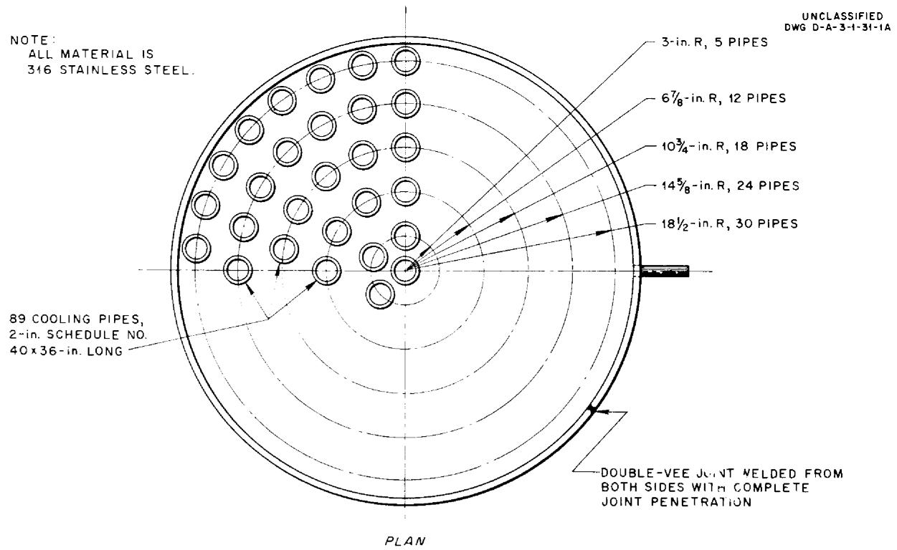

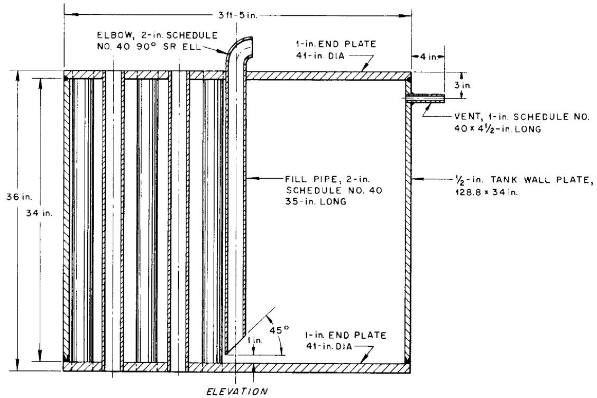  
Fig. 89. Fuel Dump Tank.

where

$$
f = \frac {1 6}{N _ {R}}
$$

= friction factor for laminar flow, dimensionless,

$L =$ length of coolant tube, ft,

$D =$ equivalent diameter of coolant tube, ft,

$\pmb{v} =$ helium velocity, ft/sec,

$g =$ gravitational acceleration, 32.2 ft/sec²,

$N_{R} =$ Reynolds' number, dimensionless,

The velocity of helium through the tube is, from Eq. 4,

$$
v = \left(\frac {2 g D}{4 f L \rho_ {\text {题}}}\right) ^ {1 / 2}. \tag {5}
$$

The amount of heat removed per tube can be expressed by

$$
Q = w c _ {p} \Delta T \tag {6}
$$

and

$$
Q = h A _ {s} \theta . \tag {7}
$$

In Eqs. 6 and 7,

$$
w = \nu A \rho_ {\text {最}},
$$

and

$$
h = 1. 8 6 \frac {k}{D} \left(\frac {\mu}{\mu_ {s}}\right) ^ {0. 1 4} \left(\frac {4 w c _ {p}}{\pi k L}\right) ^ {1 / 3},
$$

where

$Q =$ amount of heat removed, Btu/sec,

$w =$ weight flow rate, lb/sec,

$c_{p} =$ specific heat, Btu/1b·°F,

$\Delta T =$ difference between inlet and outlet temperature of helium, ${}^{\circ}\mathrm{F}$

$h =$ heat transfer coefficient, Btu/sec $\cdot \mathrm{ft}^2\cdot \circ \mathrm{F}$

$A_{s} =$ surface area of inside of tube, ft²,

$\theta = \log$ mean temperature difference,

$k =$ thermal conductivity of helium, Btu/sec·ft²·°F,

$\mu =$ viscosity of helium at mean temperature, lb/sec·ft,

$\mu_{s} =$ viscosity of helium at surface temperature of tube, lb/sec·ft.

Equations 6 and 7 were solved by assuming various helium outlet temper

atures, and the values thus obtained for each equation were plotted against helium outlet temperature. From these curves, the helium outlet temperature was found to be $805^{\circ}\mathrm{F}$ , the heat removal rate per tube is 0.59 Btu/sec, and the total heat removed is $91 \times 0.59 = 53.7$ Btu/sec.

# HEATING OF FILL TANK WITH CENTRALLY LOCATED DIP TUBE

Upon heating a flush-and-fill tank containing helium, the temperature of the dip tube will lag the temperature of the helium and metal walls of the tank during the heating process (Fig. 90). The temperature of the helium will follow very closely the temperature of the tank walls.

Heat is transmitted to the dip tube by free convection of the helium and by thermal radiation from the wall. The difference in temperature between the dip tube and the wall has been determined at various wall temperatures for certain heating rates.

The net heat input to the tank, excluding loss, is

$$
Q = q _ {T} + q _ {H} + q _ {D},
$$

where

$$
q _ {T} = \left(W c _ {p}\right) _ {T} \frac {d t}{d \tau} \cong \left(W c _ {p}\right) _ {T} \frac {\Delta t}{\Delta \tau},
$$

and

$$
q _ {H} = \left(W _ {C _ {p}}\right) _ {H} \frac {d t}{d \tau} \simeq \left(W _ {C _ {p}}\right) _ {H} \frac {\Delta t}{\Delta \tau}.
$$

The term $dt / d\tau$ can be replaced by $\Delta t / \Delta \tau$ without much error if $\Delta \tau$ is small.

The value of $q_{D}$ is given by

$$
\begin{array}{l} q _ {D} = h A _ {D} \theta \\ + \frac {0 . 1 7 3}{3 6 0 0} A _ {D} \in \left[ \left(\frac {T _ {T}}{1 0 0}\right) ^ {4} - \left(\frac {T _ {D}}{1 0 0}\right) ^ {4} \right]. \\ \end{array}
$$

The emissivity is

$$
\epsilon = \frac {1}{\frac {1}{\epsilon_ {D}} + \frac {D _ {D}}{D _ {T}} \left(\frac {1}{\epsilon_ {T} - 1}\right)}.
$$

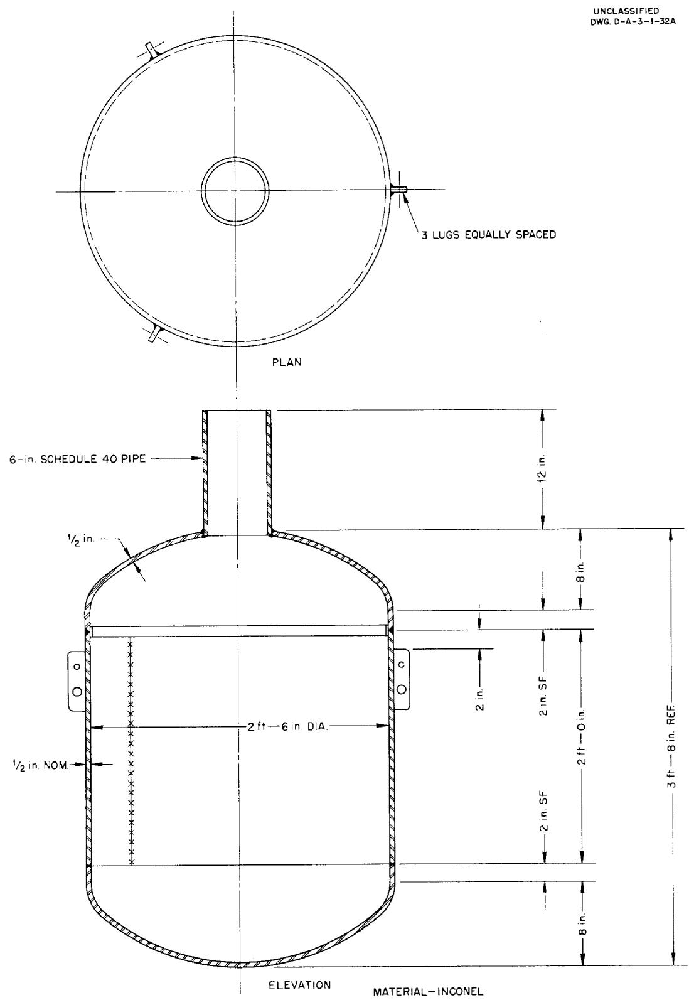  
Fig. 90. Fill Tank.

In these equations, the symbols have the following meanings and units:

$Q =$ total net heat input, Btu/sec,

$q =$ heat input of component, Btu/sec,

$W =$ weight of material, lb,

$c_{p} =$ specific heat of material, Btu/1b $^{\circ}$ F,

$\triangle t =$ temperature change, ${}^{\circ}\mathbf{F},$

$\Delta \tau =$ time interval, sec,

$h =$ free-convection heat transfer coefficient, Btu/sec·ft²·°F,

$A_{D} =$ outside surface area of dip tube, ft²,

$\theta =$ temperature difference between helium and dip tube, ${}^{\circ}\mathbf{F}$

$\epsilon =$ radiation emissivity, dimensionless,

$T =$ absolute temperature, ${}^{\circ}\mathbf{R}$

$D =$ diameter, ft,

and the subscripts

$T = \mathrm{tank}$

$H =$ helium,

$D =$ dip tube.

The free-convection heat transfer coefficient can be calculated from the Nusselt's number. A curve of Nusselt's number vs. the product of Grashof's and Prandtl's numbers is given on p. 525 of ref. 14.

The heat input to the tank wall and the helium is

$$
q _ {T} + q _ {H} = Q - q _ {D}.
$$

Therefore

$$
\Delta \tau = \frac {Q - q _ {D}}{\left(W c _ {p}\right) _ {H} \Delta t + \left(W c _ {p}\right) _ {T} \Delta t};
$$

the change in temperature of the dipt tube is

$$
\Delta t _ {D} = \frac {q _ {D} \Delta \tau}{\left(W c _ {p}\right) _ {D}};
$$

and the temperature at any time is

$$
t _ {D} = t _ {1} + \Delta t _ {D}, \tag {19}
$$

where $t_1$ is the temperature at the beginning of the time interval (°F).

The emissivity of the tank wall was taken to be the same as that of the dip tube. The value used in making the calculation was

$$
\epsilon_ {T} = \epsilon_ {D} = 0. 5 0.
$$

The dip tube was taken to be a 2-in., schedule 40 pipe that extended to the bottom of the tank.

In calculating the temperature differences between the wall and the dip tube, net input heat rates of 50, 12, and 8 Btu/sec were used. The results of these calculations are shown in Fig. 91.

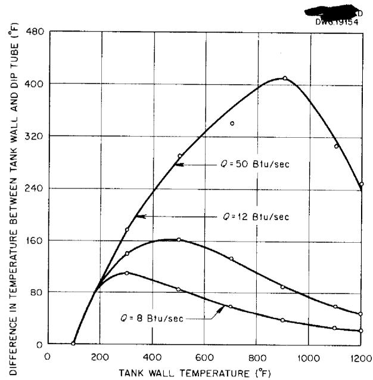  
Fig. 91. Results of Fill Tank Preheat Calculations.

# Chapter 9

# OTHER INVESTIGATIONS

# AFTERHEAT IN FISSION PRODUCTS

In order to analyze many of the problems which arise in the ARE, it is necessary to know the decay energy of the fission products at various times after reactor shutdown. Reference 23 gives the average dis-integration energy of the fission products as a function of time after fission. This curve (ref. 23, Fig. 6a), reproduced as Fig. 92 of this report, cannot be used directly, however, because the fissions in the reactor occur over a considerable period of time and the fission products, consequently, have a wide range of ages. The decay energy of the fission products

may be expressed as

$$
Q = K \int_ {t _ {1}} ^ {t _ {2}} q (t) P d t, \tag {1}
$$

where

$$
\begin{array}{l} Q = \text {e n e r g y i n t h e f i s s i o n p r o d u c t s ,} \\ \text {B t u / s e c ,} \end{array}
$$

$$
q (t) = \text {t h e a v e r a g e d i s i n t e g r a t i o n} \quad \text {e n e r g y o f t h e f i s s i o n p r o d u c t s} \quad \text {a f u n c t i o n o f t i m e a f t e r} \quad \text {f i s s i o n (F i g . 9 2) , M e v / s e c} \cdot \text {f i s s i o n},
$$

$$
\begin{array}{l} P = \text {f i s s i o n r a t e i n t h e r e a c t o r}, \\ \text {f i s s i o n / s e c}, \end{array}
$$

$$
\begin{array}{l} K = \text {a c o n s t a n t f o r c o n v e r t i n g} \\ \text {M e v / s e c t o B t u / s e c} = 1. 5 1 7 \\ \times 1 0 ^ {* 1 6}, \end{array}
$$

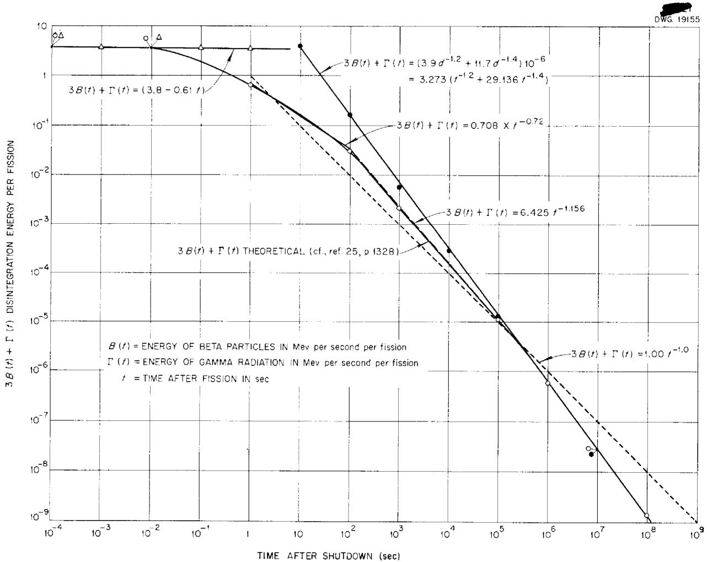  
Fig. 92. Disintegration Energy per Fission vs. Time after Shutdown.

$t =$ age of fission product group under consideration, sec,

$t_1 = \text{age of youngest fission}$ products (also equals time since reactor shutdown), sec,

$t_2 =$ age of oldest fission products (also equals time since reactor startup), sec.

For these calculations, it was considered that the power had been constant and equal to 2850 kw, which equals 2700 Btu/sec or $1.78 \times 10^{19}$ Mev/sec. If it is assumed that there is 190 Mev of energy released per fission, then the fission rate, $P$ , is $9.37 \times 10^{16}$ fission/sec. Substitution of these values for $P$ and $K$ in Eq. 1 gives

$$
Q = 1 4. 2 2 \int_ {t _ {1}} ^ {t _ {2}} q (t) d t. \tag {2}
$$

In order to integrate Eq. 2, it is necessary to find a function to fit the curve of $q(t)$ as given in Fig. 92. This was done by dividing the curve into three parts and fitting each of these parts with a different power function. The resulting equations are

$$
\begin{array}{l} q (t) = 0. 7 0 8 t ^ {- 0. 7 2}, (3) \\ q (t) = 6. 4 3 t ^ {- 1 \cdot 1 6}, (4) \\ q (t) = 3. 2 7 t ^ {- 1 \cdot 2} + 9 5. 4 t ^ {- 1 \cdot 4}, (5) \\ \end{array}
$$

(Eq. 5 is the equation recommended in ref. 23 for old fission products).

Equations 3, 4, and 5, were used for integrating Eq. 2 for various values of time after reactor shutdown $(t_{1})$ and for $100\mathrm{hr}$ of reactor operation $(t_{2} = t_{1} + 3.60\times 10^{5})$ . The results are tabulated in the following:

<table><tr><td>TIME AFTER REACTOR SHUTDOWN (sec)</td><td>DECAY ENERGY OF THE FISSION PRODUCTS (Btu/sec)</td><td>TEMPERATURE OF OUTSIDE OF PIPE WALL (°F)</td><td>HEAT LOSS (Btu/sec·lineal ft)</td></tr><tr><td></td><td></td><td>1150</td><td>0.23</td></tr><tr><td>102</td><td>207</td><td>1500</td><td>0.31</td></tr><tr><td>103</td><td>119</td><td></td><td></td></tr><tr><td>104</td><td>58.8</td><td rowspan="3" colspan="2">The temperature drop across the fuel film is given by</td></tr><tr><td>105</td><td>17.7</td></tr><tr><td>3.16 × 105</td><td>4.1</td></tr><tr><td>106</td><td>1.4</td><td rowspan="2" colspan="2">θ = Q/hA,</td></tr><tr><td>107</td><td>0.1</td></tr></table>

These values of decay energy include the energy carried by neutrinos. The energy of the neutrinos is essentially unobservable and, consequently, the actual observable decay energy of the fission products is less than that tabulated above. A rough estimate of the observable energy can be obtained by taking one half the total energy, with the results shown in Fig. 93, where the observable decay energy in the fission products is plotted as a function of the time after reactor shutdown for the conditions of this case (2850 kw, 100 hr, 190 Mev/fission).

# TEMPERATURE DIFFERENCE BETWEEN THERMOCOUPLE ON PIPE WALL AND BULK FLUID

The bulk temperatures of the fluids in the fuel and NaK loops of the ARE are measured by thermocouples welded to the outside of the pipe walls in which the fluid flows. The

$$
\begin{array}{l} 1 \leqslant t <   1 0 0, \\ 1 0 0 \leqslant t <   3. 1 6 \times 1 0 ^ {5}, \\ \end{array}
$$

$$
t > 3. 1 6 \times 1 0 ^ {5}
$$

difference between the measured temperature and the actual fluid bulk temperature has been calculated for the most serious case, that is, the fuel circuit (Fig. 94).

For the configuration shown, the heat loss per lineal foot, as given in chap. 6, is:

The temperature drop across the fuel film is given by

$$
\theta = \frac {Q}{h A},
$$

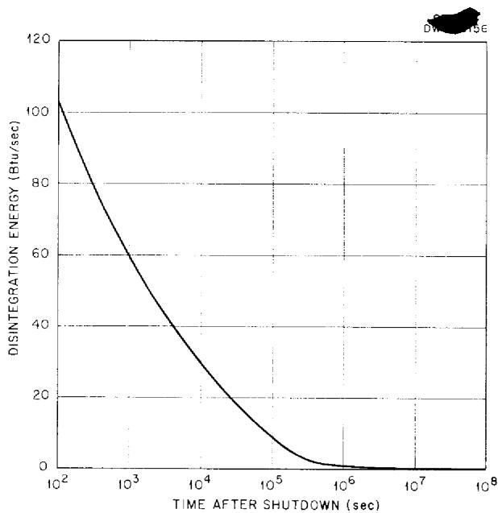  
Fig. 93. Disintegration Energy vs. Time after Shutdown.

and the area is given by

$$
A = \pi D = \frac {\pi \times 1 . 0 4 9}{1 2} = 0. 2 7 5 f t ^ {2} / l i n e a l f t,
$$

where

$\theta =$ temperature difference across fuel film, ${}^{\circ}\mathbf{F}$

$Q =$ heat loss per lineal foot, Btu/sec·lineal ft,

$h =$ fuel heat transfer coefficient, Btu/sec $\cdot ft^2\cdot \circ F,$

$A =$ heat transfer area per lineal foot, ft²/lineal ft,

$D =$ pipe diameter, ft (1-in., IPS, schedule 40 pipe has an inside diameter of 1.049 in. and an outside diameter of 1.315 in.).

The heat transfer coefficient is given by

$$
h = 0. 0 2 7 \frac {k}{D} \mathrm {R e} ^ {0. 8} \Pr^ {1 / 3} \left(\frac {\mu}{\mu_ {s}}\right) ^ {0. 1 4},
$$

where

$k =$ fuel thermal conductivity, Btu/sec $\cdot ft^2$ (°F/f.t),

Re = Reynolds' number,

$\mathbf{Pr} = \mathbf{Prandtl's}$ number,

$\mu =$ viscosity at bulk temperature, lb/hr·ft,

$\mu_{s} =$ viscosity at surface temperature, lb/hr ft.

For fuel with the properties listed in chap. 1, and a velocity of 6.26 ft/sec,

$$
\mathrm {R e} _ {1 1 5 0} \circ_ {\mathrm {F}} = 1 1, 7 0 0
$$

and

$$
\mathrm {R e} _ {1 5 0 0 ^ {\circ} \mathrm {F}} = 2 2, 3 0 0.
$$

If it is assumed that $(\mu / \mu_{*})^{0.14} \simeq 1$

$$
h _ {1 1 5 0} \circ_ {\mathbf {F}} = 0. 9 1 8 \mathrm {B t u} / \sec \cdot \mathrm {f t} ^ {2} \cdot {} ^ {\circ} \mathrm {F},
$$

$$
h _ {1 5 0 0} \circ_ {\mathrm {F}} = 1. 2 4 5 \text {B t u / s e c} \cdot \text {f t} ^ {2} \cdot {} ^ {\circ} \mathrm {F},
$$

$$
\begin{array}{l} (h A) _ {1 1 5 0} \circ_ {\mathbf {F}} = 0. 2 5 3 \mathrm {B t u / s e c} ^ {\cdot} \circ F, \\ (h A) _ {1 5 0 0} \circ_ {\mathrm {F}} = 0. 3 4 2 \mathrm {B t u} / \sec \cdot {} ^ {\circ} \mathrm {F}, \\ \theta_ {1 1 5 0} \circ_ {\mathbf {F}} = 0. 9 1 ^ {\circ} \mathrm {F}, \\ \theta_ {1 5 0 0} \circ_ {\mathbf {F}} = 0. 9 1 ^ {\circ} \mathrm {F}. \\ \end{array}
$$

The temperature drop across the pipe wall is

$$
\theta_ {m} = \frac {Q \ln \frac {D _ {o}}{D}}{2 \pi k _ {m}},
$$

where

$\theta_{\pi} =$ temperature difference across pipe wall, ${}^{\circ}\mathbf{F}$

$D_{o} =$ pipe outside diameter, ft, $k_{m} =$ thermal conductivity of metal, Btu/sec·ft² (°F/ft),

$$
\begin{array}{l} \theta_ {\text {m}, 1 1 5 0} ^ {\circ} = 2. 7 2 ^ {\circ} \mathrm {F}, \\ \theta_ {\text {m}, 1 5 0 0} ^ {\circ} = 3. 6 7 ^ {\circ} \mathrm {F}. \\ \end{array}
$$

Since the fuel film temperature drop is small and the Reynolds numbers are high, the difference between the fuel bulk temperature (the so-called "mixing cup" temperature) and the fuel maximum temperature will be very small. The total difference between the fuel bulk temperature and the outside pipe wall temperature is

$$
\begin{array}{l} \left(\theta + \theta_ {m}\right) _ {1 1 5 0} ^ {\circ} F = 0. 9 1 + 2. 7 2 = 3. 6 3 ^ {\circ} F, \\ \left(\theta + \theta_ {\pi}\right) _ {1 5 0 0} ^ {\circ} F = 0. 9 1 + 3. 6 7 = 4. 5 8 ^ {\circ} F. \\ \end{array}
$$

At other thermocouple locations in the fuel circuit, the temperature drop in the fuel film is less than the drop calculated above because the above conditions include the minimum insulation thickness and the minimum Reynolds' number encountered in the system. The temperature drop in the film in the NaK circuit is, of course, very small. The temperature drops

UNCLASSIFIED

DWG.A-6-0-25A

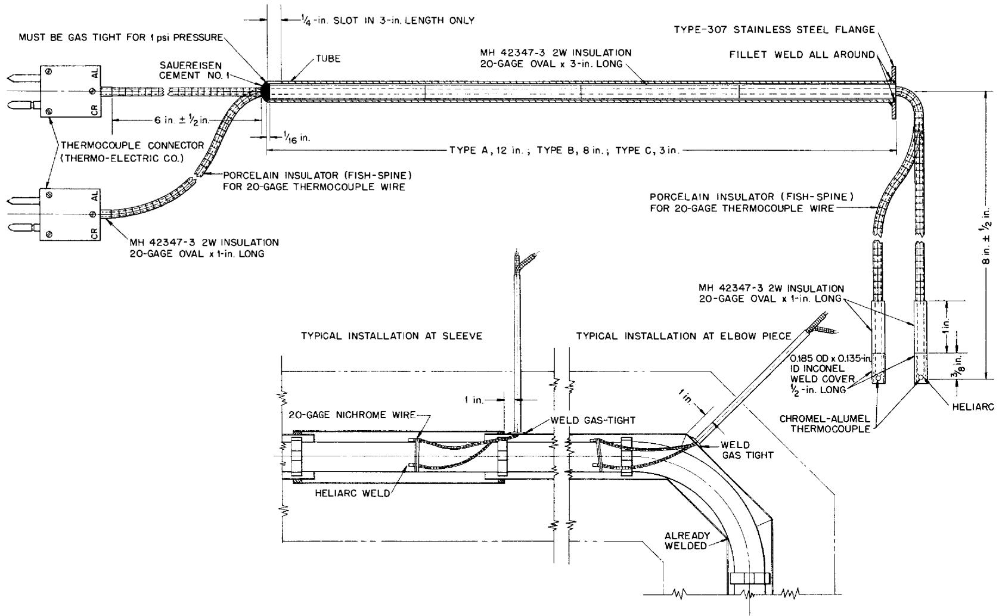  
Fig. 94. Thermocouple Assembly.

through the pipe wall at various other thermocouple locations are given in Table 23. The maximum temperature differential between the outside of a pipe and the bulk of the fluid is approximately $4.6^{\circ}\mathrm{F}$ . It is important to note that if the flow rates in either the fuel or NaK circuits are reduced, for some unforeseen reason, during operation, the temperature

differential between the outside of the pipe wall and the bulk of the fluid will increase. This increase in temperature differential, since it occurs only within the fluid, should not become serious so long as the flow is turbulent; in the laminar region, however, the temperature differential can become great enough to render the thermocouple unreliable.

TABLE 23. TEMPERATURE DROPS THROUGH THE PIPE WALL AT VARIOUS THERMOCOUPLE LOCATIONS   

<table><tr><td>NOMINAL PIPE DIAMETER (in.)</td><td>PIPE WALL TEMPERATURE (°F)</td><td>HEAT LOSS (Btu/sec·lineal ft)</td><td>θm(°F)</td></tr><tr><td rowspan="2">1 1/2</td><td>1150</td><td>0.23</td><td>1.98</td></tr><tr><td>1500</td><td>0.31</td><td>2.67</td></tr><tr><td rowspan="2">2</td><td>1150</td><td>0.21</td><td>1.53</td></tr><tr><td>1500</td><td>0.29</td><td>2.11</td></tr><tr><td rowspan="2">2 1/2</td><td>1150</td><td>0.23</td><td>1.73</td></tr><tr><td>1500</td><td>0.31</td><td>2.33</td></tr></table>

1. J. H. Keenan and J. Kaye, Gas Tables, Wiley, New York, 1948.   
2. C. D. Hodgman, Handbook of Chemistry and Physics, 31st ed., Chemical Rubber Publishing Co., 1949.   
3. M. C. Udy and F. W. Boulger, The Properties of Beryllium Oxide, BMI-T-18 (Dec. 15, 1949).   
4. NBS-NACA Tables of Thermal Properties of Gases, U.S. Department of Commerce, National Bureau of Standards:   
H. W. Wooley, Table 6.10, “Helium (Ideal Gas State),” July 1950;   
R. L. Nuttall, Table 6.39, "Helium (Coefficient of Viscosity)," December 1950;   
R. L. Nuttall, Table 6.42, "Helium (Thermal Conductivity)," December 1950.   
5. The Engineering Properties of Inconel, International Nickel Co. Tech. Bull. T-7.   
6. R. N. Lyon (Editor-in-Chief), Liquid Metals Handbook, 2d ed., NAVEXOS P-733 (rev.), June 1952.   
7. Stainless Steel for Elevated Temperature Service, U.S. Steel Corp.   
8. D. Q. Kern, Process Heat Transfer, McGraw-Hill, New York, 1950.   
9. J.H. Perry, Chemical Engineers' Handbook, 3d ed., McGraw-Hill, New York, 1950.   
10. H. F. Poppendiek and L. D. Palmer, Forced Convection Heat Transfer in Pipes with Volume Heat Sources Within the Fluid, ORNL-1395 (Dec. 2, 1952).

11. W. H. McAdams, Heat Transmission, 2nd ed. (rev.), McGraw-Hill, New York, 1942.   
12. G. N. Cox and F. J. Germano, *Fluid Mechanics*, Van Nostrand, New York, 1941.   
13. Flow of Fluids Through Valves, Fittings, and Pipe, Crane Co. Tech. Paper No. 409, May 1942.   
14. M. Jakob, Heat Transfer, Vol. I, Wiley, New York, 1949.   
15. E. N. Sieder and G. E. Tate, Ind. Eng. Chem. 28, 1429-1435 (1936).   
16. K. A. Gardner, Trans. Am. Soc. Mech. Engrs. 67, 621-631 (1945).   
17. A. Y. Gunter and W. A. Shaw, Trans. Am. Soc. Mech. Engrs. 67, 643-660 (1945).   
18. W. Nusselt, Z. Ver. deut. Ing. 73, 1475 (1929).   
19. W. J. King, Mech. Eng. 54, 347 (1932).   
20. E. Schmidt, Fopp's Festschrift, p. 179, Springer, Berlin, 1924; and Z. Ver. deut. Ing. 75, 969 (1931).   
21. The Trane Co. Bulletin D-S 365, September 1951.   
22. H. L. F. Enlund, personal communication, 1952.   
23. K. Way and E. P. Wigner, Phys. Rev. 73, 1318-1330 (1948).   
24. S. L. Jameson, Trans. Am. Soc. Mech. Engrs. 67, 633-642 (1945).   
25. Johns-Manville Products General Catalog, DS Series 2.   
26. M. W. Zemansky, Heat and Thermodynamics, 3d ed., McGraw-Hill, New York, 1951.

