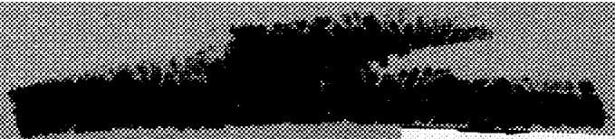

CENTRAL RESEARCH LIBRARY

DOCUMENT COLLECTION

MARTIN MARETTA ENERGY SYSTEMS LBPATICS

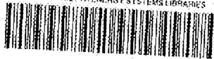

3 4456 0349515 3

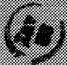

ORHL-1556

Progress

2

EG RESEARCH AND DEVELOPMENT

AIRCRAFT NUCLEAR PROPULSION PROJECT

QUARTERLY PROGRESS REPORT

FOR PERIOD ENDING JUNE 10, 1951

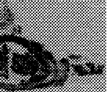

CENTRAL RESEARCH LIBRARY

DOCUMENT COLLECTION

LIBRARY LOAN COPY

DO NOT TRANSFER TO ANOTHER PERSON

If you wish someone else to see this document, send in name with document and the library will arrange a fee.

OAK RIDGE NATIONAL LABORATORY

OPERATED BY

CARBIDE AND CARBON CHEMICALS COMPANY

A DIVISION OF UNION CARBAGE AND CARBON COMPOSITION

图2

POST OFFICE BOX P

OAK HIDGE, TENNESSEE

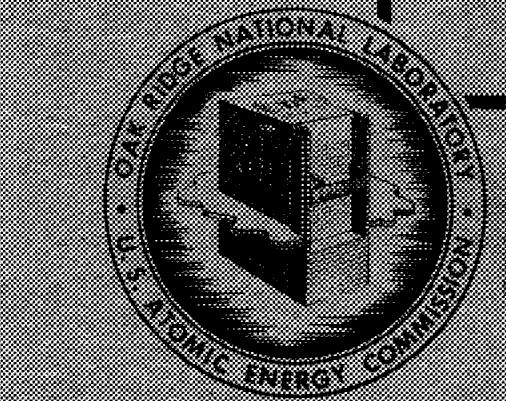

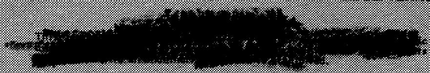

ORNL-1556

This document consists of 141 pages.

Copy 93 of 249 copies. Series A.

Contract No. W-7405-eng-26

# AIRCRAFT NUCLEAR PROPULSION PROJECT

# QUARTERLY PROGRESS REPORT

for Period Ending June 10, 1953

R.C.Briant,Director

A. J. Miller, Assistant Director

Edited by:

W.B.Cottrell

DATE ISSUED

OAK RIDGE NATIONAL LABORATORY

Operated by

CARBIDE AND CARBON CHEMICALS COMPANY

A Division of Union Carbide and Carbon Corporation

Post Office Box P

Oak Ridge, Tennessee

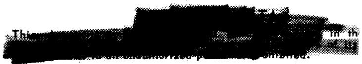

MARTIN MARIETTA ENERGY SYSTEMS LIBRARIES

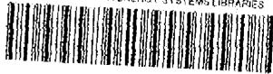

3445603495153

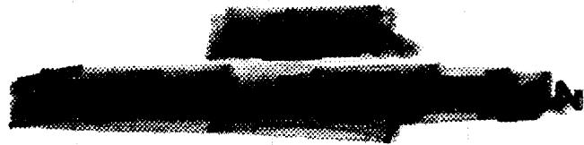

# INTERNAL DISTRIBUTION

1. G.M. Adamson   
2. R. C. Affel   
3.C.R.Baldock   
4. C. J. Borson   
5. E. S. Betrie   
6. D. S. Billington   
7. F. F. Blankenship   
8. E. P. Blizzard   
9. M. A. Bredig   
10. R.C.Brianf   
11. R. B. Briggs   
12. F.R.Bruce   
13. A. D. Callihan   
14. D. W. Cardwell   
15. J. V. Cathcart   
16. C. E. Center   
17. J.M.Cisar   
18. G.H. Clewett   
19. C. E. Clifford   
20. W, B. Cottrell   
21. D. D. Cowen   
22. F, L. Culler   
23. W. K. Eister   
24. L. B. Emlet (Y-12)   
25. W. K. Ergen   
26. A. P. Fraas   
27. W.R.Gall   
28.C.B.Graham   
29. W.W. Grigorieff (consultant)   
30. W.R.Gripes   
31. A. Hollander   
32. A. S. Householder   
33. J. T. Howe   
34. W. B. Humes (K-25)   
35. G.W. Keilholtz   
36. C.P. Keim   
37. M. T. Kelley   
38 F. Kertesz   
38. E. M. King   
40. C. E. Larson   
21. R. S. Livingston

42. R. N. Lyon   
43. W. D. Manly   
44. L. A. Mann   
45. W. B. McDonald   
6. J. L. Meem   
47. A. J. Miller   
48. K. Z. Morgan   
49. E. J. Murphy   
50. H. F. Poppendiek   
51. P. M. Reyling   
52. H. W. Savage   
53. E. D. Shipley   
54. O. Sisman   
55. L. P. Smith (consultant)   
56. A. H. Snell   
57. R. W. Stoughton   
58. C. D. Susano   
59. J. A. Swartout   
60. E.H. Taylor   
61. F. C. Uffelman   
62. P.M. Uthe   
63. E. R. VanArtsdalen   
64. F. C. VonderLage   
65. J. M. Warde   
66. A. M. Weinberg   
67. J. C. White   
88. E. P. Wigner (consultant)   
69.H.B.Willard   
70. G. C. Williams   
71. J.C. Wilson   
72. C. E. Winters   
-82. ANP Library   
83. Biology Library   
84-88. Central Files   
89. Central Files, ORNL R.C.   
90. Health Physics Library   
91. Metallurgy Library   
92. Reactor Experimental Engineering Library   
93-94. Central Research Library

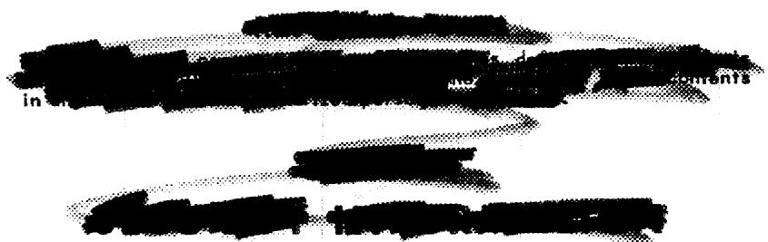

# EXTERNAL DISTRIBUTION

95-97. Air Force Engineering Office, Oak Ridge

98. Air Force Plant Representative, Burbank

99. Air Force Plant Representative, Seattle

100. ANP Project Office, Fort Worth

101-112. Argonne National Laboratory (I copy to Kermit Anderson)

113. Armed Forces Special Weapons Project (Sandia)

114-121. Atomic Energy Commission, Washington

122. Battelle Memorial Institute

123. Bechtel Corporation

124-128. Brookhaven National Laboratory

129. Bureau of Aeronautics (Grant)

130. Bureau of Ships

131-132. California Research and Development Company

133-138. Carbide and Carbon Chemicals Company (Y-12 Plant)

139. Chicago Patent Group

140. Chief of Naval Research

141. Commonwealth Edison Company

142. Department of the Navy - Op-362

143. Detroit Edison Company

144-147. duPont Company, Augusta

148. duPont Company, Wilmington

149. Foster Wheeler Corporation

150-152. General Electric Company, ANPP

153-156. General Electric Company, Richland

157. Hanford Operations Office

158. USAF-Headquarters, Office of Assistant for Atomic Energy

159-166. Idaho Operations Office (I copy to Phillips Petroleum Company)

167. Iowa State College

168-175. Knolls Atomic Power Laboratory

176-177. Lockland Area Office

178-179. Los Alamos Scientific Laboratory

180. Massachusetts Institute of Technology (Benedict)

181. Massachusetts Institute of Technology (Kaufmann)

182. Monsanto Chemical Company

183-185. Mound Laboratory

186-189. National Advisory Committee for Aeronautics, Cleveland (3 copies to A. Silverstein)

190. National Advisory Committee for Aeronautics, Washington

191. Naval Research Laboratory

192-193. New York Operations Office

194-195. North American Aviation, Inc.

196-201. Nuclear Development Associates, Inc. (NDA)

202. Patent Branch, Washington

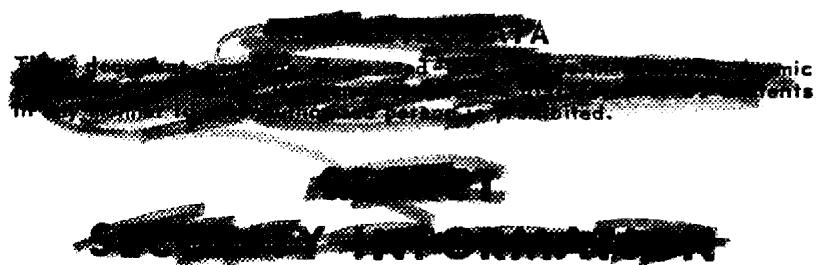

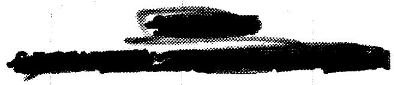

203. Pioneer Service and Engineering Company

204-215. Powerplant Laboratory (WADC)

2 copies to B. Beam

1 copy to Col. P. Li Hill

I copy to Lt. Col. M. J. Nielsen

216-217. Rand Corporation (1 copy to V. G. Henning)

218. San Francisco Operations Office

219. Savannah River Operations Office, Augusta

220. USAF Resident, East Hartford

221. U. S. Naval Radiological Defense Laboratory

222-223. University of California Radiation Laboratory, Berkeley

224-225. University of California Radiation Laboratory, Livermore

226. Vitro Corporation of America

227. Walter Kidde Nuclear Laboratories, Inc.

228-233. Westinghouse Electric Corporation

234-248. Technical Information Service, Oak Ridge, Tennessee

249. Curtis-Wright Corp., Wright Aeronautical Division (K. Campbell)

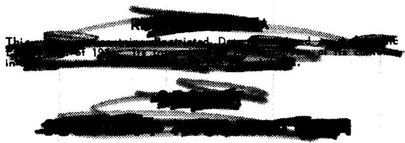

Reports previously issued in this series are as follows:

ORNL-528 Period Ending November 30, 1949

ORNL-629 Period Ending February 28, 1950

ORNL-768 Period Ending May 31, 1950

ORNL-858 Period Ending August 31, 1950

ORNL-919 Period Ending December 10, 1950

ANP-60 Period Ending March 10, 1951

ANP-65 Period Ending June 10, 1951

ORNL-1154 Period Ending September 10, 1951

ORNL-1170 Period Ending December 10, 1951

ORNL-1227 Period Ending March 10, 1952

ORNL-1294 Period Ending June 10, 1952

ORNL-1375 Period Ending September 10, 1952

ORNL-1439 Period Ending December 10, 1952

ORNL-1515 Period Ending March 10, 1953

# CONTENTS

Page

FOREWORD 1

# PART I. REACTOR THEORY AND DESIGN

INTRODUCTION AND SUMMARY 5

1. CIRCULATING-FUEL AIRCRAFT REACTOR EXPERIMENT 6

Fluid Circuit 6

Reactor 6

Instrumentation 7

Off-Gas System 7

Reactor Control 9

Electrical System 9

Fuel Loading Facility 9

Fire-Fighting Preparations 9

2. EXPERIMENTAL REACTOR ENGINEERING 10

Pumps for High-Temperature Liquids 10

Centrifugal pump with combination packed-frozen fluoride seal 10

ARE-size sump pump 11

Frozen-sodium-sealed pump for ARE moderator-coolant circuit 11

ARE packed-frozen sealed fluoride pump 15

Allis-Chalmers canned-rotor pump 15

Frozen-lead-sealed fluoride pump 15

Laboratory-size sump-type pump with gas seal 17

Rotating Shaft and Valve Stem Seal Development 17

Graphite-packed seals 17

Grooved-shaft packed-frozen seal tests 17

Bronze wool and MoS $_2$ packed-frozen seal tests 18

Frozen-lead seal tests 19

V-ring seal 19

BeF,seal tests 19

Packing penetration tests 22

Instrumentation 22

Pressure measurement 22

NaK leak detection methods 23

3. REFLECTOR-MODERATED CIRCULATING-FUEL REACTORS 24

Reactor Control 24

General Design Parameters 25

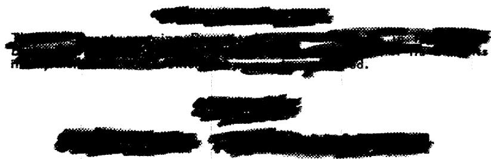

#

# 4. REACTOR PHYSICS 26

Kinetics of a Circulating-Fuel Reactor 26

Behavior at long time after a disturbance 26   
Oscillations 26   
The first overswing following a disturbance 27   
Staticsof the Circulating-Fuel ARE Critical Experiment 28

# 5. REFLECTOR-MODERATED REACTOR CRITICAL EXPERIMENTS 30

Power Distribution 30   
Leakage Flux 31   
Control Rod Measurements 31   
Danger Coefficient Measurements 31   
Correlation with Theory 31

# PART II. MATERIALS RESEARCH

# INTRODUCTION AND SUMMARY 37

# 6. CHEMISTRY OF HIGH-TEMPERATURE LIQUIDS 39

Fluoride Mixtures Containing UF 39

NaF-ZrF-UF 39   
RbF-ZrF-UF 40   
NaF-ZrF-BeF-UF 40

Fluoride Mixtures Containing UF 41

Chloride Mixtures Containing UCI 42

KCI-UCI 42   
LiCl-UCI 42   
TICI-UCI 42   
KCI-LiCl-UCI 42

Coolant Development 43

NaF-ZrFBeF2 43   
LiF-ZrF 44

Differential Thermal Analysis 44

Production and Purification of Fluoride Mixtures 45

Removal of HF from fuel batches 45   
Reduction of metal fluorides with $\mathsf{H}_2$ 46   
Pilot-scale fuel purification 47   
Fluoride production facilities 48

Preparation of Complex Fluorides 48

X-ray Diffraction Studies 49

NaF-UF 49   
NaF-ZrF 49

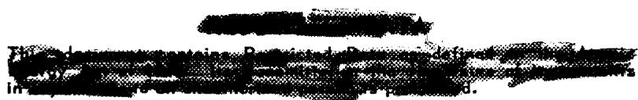

# 7. CORROSION RESEARCH 50

Fluoride Corrosion of Inconel in Static and Seesaw Tests 51

Effect of exposure time 51

Residual hydrogen fluoride 51

Fluoride pretreatment 52

Structural metal fluoride additions 53

Structural metal oxide additions 53

Chromium metal addition 54

Zirconium hydride addition 54

Carbon addition 55

Crevicecorrosion 55

Inconel container pretreatment 55

Static Corrosion of Stellite by Fluorides 56

Fluoride Corrosion of Inconel in Rotating Test 57

Fluoride Corrosion in Inconel Thermal Convection Loops 58

Effect of exposure time 58

Temperature dependence 60

Chromium and nickel fluoride additives 60

Fuel purity 62

Loop oxide films 62

Nonuranium bearing fluorides 62

Fluoride Corrosion of Nickel Thermal Convection Loops 62

Fluoride Corrosion of Type 316 Stainless Steel Thermal Convection Loops 64

Liquid Metal Corrosion 64

Mass transfer in liquid lead 64

BeO in sodium and NaK 68

Coated beryllium in sodium 68

Carboloy in lead and sodium 69

# 8.METALLURGYAND CERAMICS 71

Welding and Brazing Research 72

Welding of heat exchanger tube bundles 72

Brazing of air radiators 73

Dilution and diffusion of brazing alloys 73

Brazing Carboloy to stainless steel 74

High-temperature brazing alloy evaluation tests 76

Creep and Stress-Rupture Tests of Structural Metals 76

Fabrication Research 77

Extrusion of high-purity Inconel tubing 77

Air oxidation of columbium 77

Control rods for the G-E reactor 77

Hot-Pressed Pump Seals 79

Fabrication of small compacts with MoS, 79

Metallographic examination of compacts with $\mathsf{MoS}_2$ 80

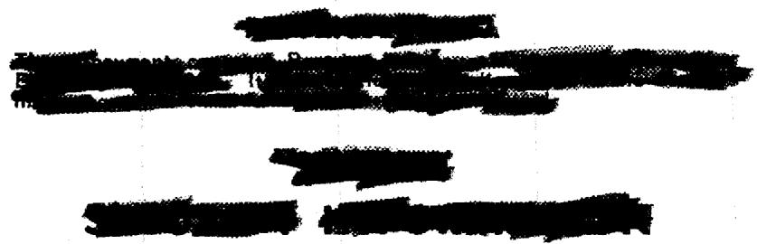

Fabrication of face seal rings 80   
Surface sulfurization of molybdenum 80

High-Conductivity Metals for Radiators 81

Chromium-clad OFHC copper 82   
Chromium and nickel electroplate on copper 82   
Inconel cladding on copper 82   
Type 310 stainless steel cladding on copper 82   
Type 310 stainless steel cladding on silver 82   
Copper alloys 82

Solid Fuel Formed in Spheres 83

Heating under vacuum 83   
Three-phase carbon arc 84   
Molten alloy passed through a small orifice 84   
Settling of particles through a molten salt 84

Inflammability of Sodium Alloys 84

Ceramics 85

Development of cermets 85   
Effect of heating rate on the beryllium oxide blocks for the ARE 85

9.HEAT TRANSFER AND PHYSICAL PROPERTIES 86

Thermal Conductivity 86   
Density and Viscosity 88   
Heat Capacities of Liquids 88   
Surface Tensions of Fluorides 88   
Vapor Pressures of Fluorides 88   
Velocity Distributions in Thermal Convection Loops 89   
Forced-Convection Heat Transfer with NaF-KF-LiF 90   
High-Temperature Reactor Coolant Studies 91   
Turbulent Convection in Annuli 91   
Circulating-Fuel Heat Transfer 92   
Bifluid Heat Transfer Experiments 92

10. RADIATION DAMAGE 94

Irradiation of Fused Materials 94   
Inpile Circulating Loops 94   
Creep Under Irradiation 95   
Radiation Effects on Thermal Conductivity 96

11. ANALYTICAL STUDIES OF REACTOR MATERIALS 97

Chemical Analyses of Fluorides and Their Contaminants 97

Determination of oxygen in metallic oxides with bromine trifluoride 97   
Volumetric determination of zirconium 98   
Determination of uranium trifluoride and metallic zirconium 98   
Colorimetric determination of zirconium 98

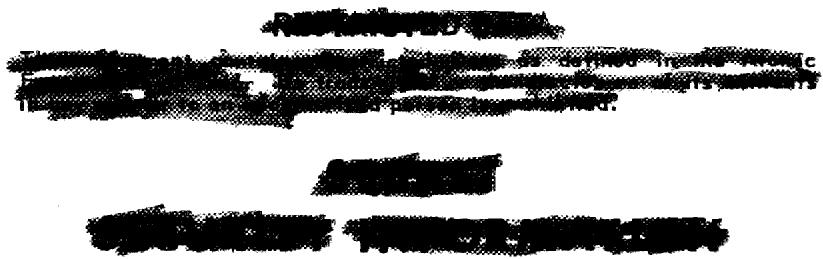

“Tiron” as a reagent for the determination of uranium 99

Petrographic Examination of Fluorides 99

Summary of Service Chemical Analyses 100

# 12. FLUORIDE FUEL REPROCESSING 101

Dissolution of ARE Fuel 101

Solvent Extraction 102

Corrosion in Dissolution of ARE Fuel 102

Plant Processing 103

# PART III. SHIELDING RESEARCH

# INTRODUCTION AND SUMMARY 107

# 13. BULK SHIELDING FACILITY 108

Neutron Spectra for the Divided Shield 108

Energy per Fission and Power of the Bulk Shielding Reactor 108

Gamma-Ray Air-Scattering Calculations 109

Differential results 111

Integral results 113

# 14. LID TANK FACILITY 119

Reflector-Moderated Reactor Shield Tests 119

Shield configurations 120

Gamma-ray attenuation data 120

Neutron attenuation data 121

Removal Cross Sections 122

Facility Modification 123

# 15. TOWER SHIELDING FACILITY 124

# PART IV. APPENDIX

# 16. LIST OF REPORTS ISSUED DURING THE QUARTER 127

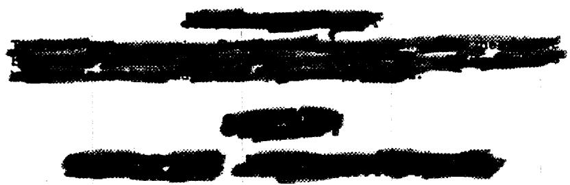

# ANP PROJECT QUARTERLY PROGRESS REPORT

# FOREWORD

This quarterly progress report of the Aircraft Nuclear Propulsion Project at ORNL records the technical progress of the research on the circulating-fuel reactor and all other ANP research at the Laboratory under its Contract W-7405-eng-26. The report is divided into three major parts: I. Reactor Theory and Design, II. Materials Research, and III. Shielding Research. Each part has a separate introduction and summary.

The ANP Project is comprised of about three hundred technical and scientific personnel engaged in many phases of research directed toward the nuclear propulsion of aircraft. A considerable portion of this research is performed in support of the work of other organizations participating in the national ANP effort. However, the bulk of the ANP research at ORNL is directed toward the development of a circulating-fuel type of reactor.

The nucleus of the effort on circulating-fuel reactors is now centered upon the Aircraft Reactor Experiment -- a 3-megawatt, high-temperature prototype of a circulating-fuel reactor for the propulsion of aircraft. This reactor experiment is now being assembled; its current status is summarized in section 1. However, much supporting research on materials and problems peculiar to the ARE will be found in other sections of Parts I and II of this report.

The ANP research, in addition to that for the Aircraft Reactor Experiment, falls into three general categories: (1) studies of aircraft-size circulating-fuel reactors, (2) material problems associated with advanced reactor designs, and (3) studies of shields for nuclear aircraft. These three phases of research are covered in Parts I, II, and III, respectively, of this report.

Part I

# REACTOR THEORY AND DESIGN

# INTRODUCTION AND SUMMARY

The Aircraft Reactor Experiment (sec. 1) is now being rapidly assembled; most of the component parts have been received and installed in the ARE Building. There were no significant design modifications during the quarter, but a supplementary off-gas system to handle contaminated pit atmosphere is contemplated. Installation of the fuel-circuit piping is nearly complete, and the detailed testing and cleaning procedures for both the fuel and the sodium circuits are being established. Integral parts of the system, including the water system, the main off-gas system, and the rod cooling system, have been completed. The fill and flush tanks are installed, wired, and insulated. The reactor core has been completely assembled, welded, and is ready to be shipped to the ARE Building. All instrument indicators have been installed, and the interconnecting lines to the control room are essentially complete. Routine and emergency procedures for handling sodium and the fluorides have been established.

The development of a satisfactory ARE pump seal has required major research effort (sec. 2). Conventional centrifugal pumps have the required pumping characteristics, but the attainment of a reliable seal which will retain the high-temperature fluorides with leakage rates of less than $35~\mathrm{cm}^3$ per day continues to be an outstanding development problem for the ARE. This seal problem is being investigated in several pump loops, as well as in numerous seal testers, with the result that several seal-types now either appear to be potentially capable of fulfilling the leakage requirement or have actually done so. The frozen-lead seals for fluorides have operated with vertical shafts with negligible leakage for extended periods of time; gas-sealed pumps have also been satisfactorily operated. At present, however, the ARE plumbing arrangement requires a horizontal shaft pump for which the following packed-frozen seals appear promising: (1) alternate layers of copper (or bronze) wool and a graphite-MoS, mixture, (2) triangular

rings of Graphitar bearing on sintered $\mathsf{Cu} + \mathsf{MoS}_{2^{\prime}}$ and (3) layers of $\mathsf{NaBeF}_3$ packing. It has been demonstrated that oxygen has a deleterious effect on all seals, so they are now blanketed with helium. The frozen-sodium seal pumps for the ARE reflector-coolant (sodium) circuit have been fabricated.

Recent studies of an aircraft-size reflector-moderated reactor system have included analysis of the control of a 200-megawatt power plant and some parametric studies of fuel volume in the heat exchanger and in the reactor for various core diameters and power levels (sec. 3). From the 200-megawatt power plant control study, it appears that the reactor temperature will not tend to rise at a rate greater than $100^{\circ}\mathrm{F} / \mathrm{sec}$ , even if cooling of the engine radiators is stopped instantaneously. In such a case, the negative temperature coefficient will adequately control the reactor.

The kinetics of circulating-fuel reactors and the interpretation of the ARE critical experiment comprise the recent reactor physics studies (sec. 4). Introduction into the core of $1\% \Lambda k$ , if not compensated by control rods, would cause a $100^{\circ}C$ rise in the reactor equilibrium temperature. On the other hand, power oscillations damp out quickly and no serious overswing in power or in temperature is expected. The ARE critical experiment data are being extrapolated to provide additional information on the statics of the ARE.

The critical assembly of the reflector-moderated reactor has provided measurements of power distribution, leakage flux, and control rod effectiveness, as well as danger coefficient measurements of materials in both the fuel and reflector regions (sec. 5). The end leakage of fast neutrons is six times the side leakage when the end fuel ducts are shielded with boral sheets. The boral reduces the $k_{eff}$ by $2\%$ and correspondingly modifies the power production in its vicinity. Extrapolation of the uranium required in the experiment to an aircraft reactor with Inconel structure indicates that the critical mass of the latter is about 30 pounds.

# 1. CIRCULATING-FUEL AIRCRAFT REACTOR EXPERIMENT

E. S. Bettis, ANP Division

During this quarter, effort on the ARE Project has been concentrated on the installation of equipment in Building 7503. No significant design modifications or alterations were made, and the work has progressed steadily with no serious interferences. The major emphasis was on the installation of the fuel-circuit piping, which is now nearly completed.

The checking out of auxiliary systems was started. The water-cooling system has been completely checked and put in stand-by condition for actual operation. All water lines, water heat ex-changers, valves, tanks, and lines were flushed, the flows were checked, and the system was filled with a rust inhibitor to keep it in readiness for use. A check has been started on the off-gas system, but this has not yet been completed.

All major components, except drive motors for the pump, have been received. All valves have been received, except two of the 2-in. sodium valves.

A large amount of effort went into preparing the testing and preliminary operating procedures. The first draft of these procedures has been completed and is being carefully studied for revision. As was expected, some basic changes in the original concept must be made, and during the next few weeks all possible effort will be made to complete these procedures.

Much research that bears directly on the experiment is contained in other sections of this report. Of particular significance are the following: pump seals (sec. 2), kinetics of circulating-fuel reactors (sec. 4), composition and production of the fluoride fuel (sec. 6), corrosion of the fluoride-Inconel system (sec. 7), high-temperature strength of Inconel in fluorides (sec. 8), physical properties of the fuel (sec. 9), effect of radiation on creep, thermal conductivity, and corrosion of Inconel (sec. 10), and reprocessing of the fuel (sec. 12).

# FLUID CIRCUIT

G.A.Cristy

Engineering and Maintenance Division

The fuel piping system is almost completed and initial testing is expected to begin the middle of

June. This work has proceeded satisfactorily and according to schedule. Approximately $5\%$ of the welds have failed to pass inspection and have had to be reworked. This represents less trouble than was anticipated, since the standard for an acceptable weld is high.

The hot fuel dump tank is completely insulated and ready for use. The fill and flush tanks have been installed, and installation of the heaters and the insulation is almost completed. Figure 1.1 shows the status of the tank pit as of the middle of the quarter.

Installation of the piping for the sodium circuit will not be started until the fuel piping is completed. The sodium-to-helium heat exchangers are now in place and the sodium pipe lines can be installed as soon as the fuel piping is completed. The final installation of the sodium piping must await installation of the reactor; according to the present schedule, the reactor will be installed during the latter part of June.

Pumps for the sodium circuit have been completed and should be ready for installation about the middle of June. These pumps employ a frozen-sodium seal, which has been thoroughly tested by the Experimental Engineering Group. No decision has yet been made as to the type of seal to be used for the fluoride pump (cf., sec. 2).

Strain gages have been installed on the fuel piping system and the calculated prestress has been verified by measurements made with these gages. Additional checks will be made as the system is warmed up. A complete report on the stress analysis of the system is being compiled.

# REACTOR

The reactor, including the beryllium oxide block, the fuel tubes, and the pressure shell, is completed, except for the final closure welding (Fig. 1.2). The reactor core will be transferred from the Y-12 shops to Building 7503 about the latter part of June, but it will not be installed in the system until the prechecking of the fuel circuit has been completed. Prior to installation in the system, the reactor will be helium checked at a temperature of $1200^{\circ}\mathrm{F}$ to make sure that the fuel circuit is tight with respect to the moderator volume.

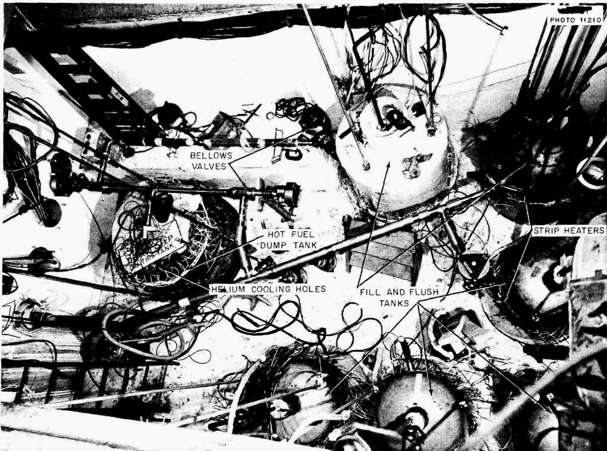  
Fig. 1.1. ARE Tank Pit.

# INSTRUMENTATION R.G.Affel,ANP Division

All instrumentation has now been completed and most of the pneumatic lines have been checked. The leak detection system has been further simplified, but no other alterations are contemplated. Liquid-level and flow instruments have been completed and tested insofar as is possible without actual operation. Interconnection of the control room with instrument panels, relay racks, amplifier boards, and control actuators is $98\%$ complete. A very complete labeling system, with a permanent wall-mounted check print for each control point, has been effected. The control wiring is being checked as rapidly as an integral part is completed, and by the middle of June, the control room will have been completed and checked.

The annunciator points have been checked and tested insofar as the preliminary status of the sending points allows. The same condition exists with the connections to the graphic panel.

No significant problem remains, so far as the instrumentation of the ARE is concerned.

# OFF-GAS SYSTEM

The main off-gas system as originally designed has been installed and partly checked. A considerable amount of thought and calculation has been given to a secondary system for handling pit gas in the event of pit atmosphere contamination. The evaluation of this system has not been completed, but it is fairly certain that it will contain a charcoal adsorber maintained at liquid-nitrogen temperature. This adsorber will probably consist of two tanks located outside the building and

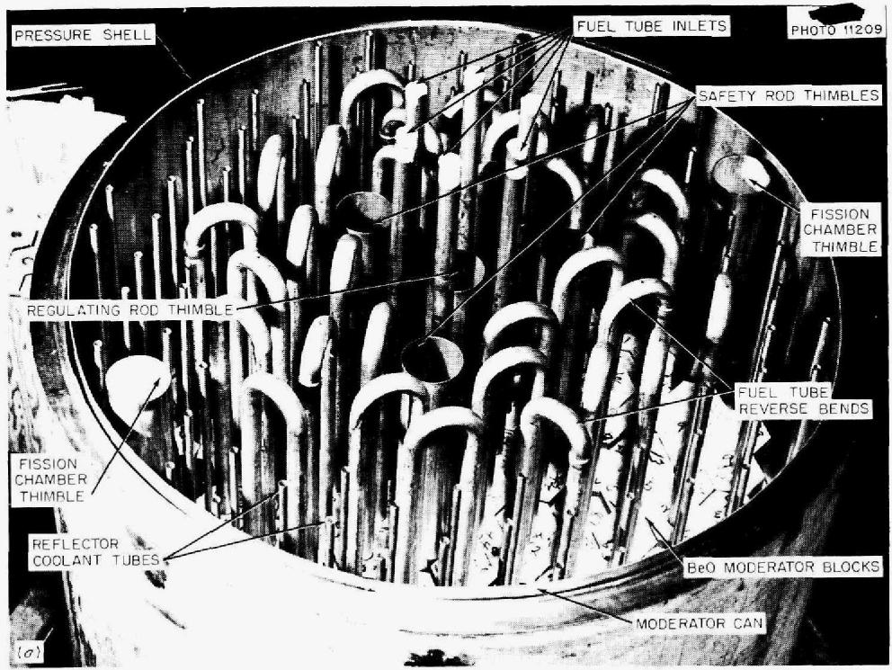

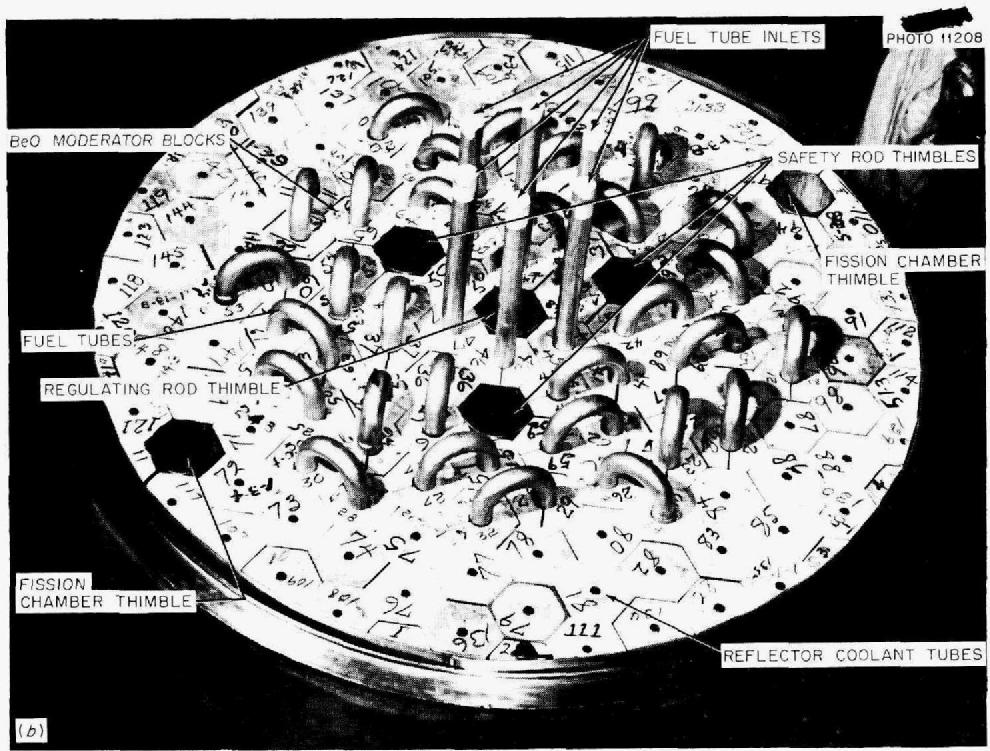  
Fig. 1.2. ARE Reactor Core. (a) BeO moderator blocks partly stacked. (b) BeO moderator blocks in place.

arranged to permit alternate adsorption and regeneration cycles.

This auxiliary off-gas system is designed primarily to handle contaminated pit atmosphere, but it can also be used for system-gas disposal in the event of trouble with the primary off-gas system.

# REACTOR CONTROL

The active fission chamber has passed several hundred hours at $800^{\circ}\mathrm{F}$ with no increase in background or deterioration of the active cylinder. This chamber therefore appears to be satisfactory for ARE use. The control console and its associated servo, safety rod actuator mechanisms, etc. are completely installed and almost entirely checked.

The control rod "igloo" assembly is nearly complete. It was necessary to rewind the safety rod drive motors in order to make them reversible without limitation of the number of reversals permitted in any unit of time. All safety rod drive, control rod servo, fission chamber, and source drive mechanisms have been assembled.

A dummy control console for checking the actuator assembly has been built. The control actuator assembly is $75\%$ complete.

# ELECTRICAL SYSTEM

The electrical work in the building is on schedule. All major electrical circuits have been wired; however, the fluid circuit pumps have been changed from 5 to $15\mathrm{hp}$ , and therefore new circuits will be needed for these motors. Installation of annulus heaters is proceeding wherever completion of the lines permit. The motor generator sets have been moved to a shed outside the building.

# FUEL LOADING FACILITY

G. J. Nessle, Materials Chemistry Division

Preliminary work has been started to provide adequate facilities for loading the processed fluorides into the ARE. A platform is to be built inside the storage tank pit for installation of the loading furnace to be used in transferring the processed fluorides into the storage tanks.

# FIRE-FIGHTING PREPARATIONS

D. R. Ward, ANP Division

In view of the use of hazardous materials and the high-temperature operations connected with the ARE, some fire-fighting preparations have necessarily been made. The materials and techniques to be employed in case of fire are based upon the considerable experience acquired during the past two years by the Experimental Reactor Engineering Group.

The test pits will be open while the fuel system is being cleaned and leak tested so that the usual direct fire-fighting methods can be employed if NaK is used and a fire occurs. Graphite powder will be the preferred extinguishing material, with Ansul extinguishers filled with Metal-X on hand for additional safety. Several buckets of graphite will be strategically located in each of the three pits. Standard safety items, such as proper gas masks, fire-fighting suits, etc., will be on hand.

During the reactor operation period, the test pits will be closed and access for fighting fires will be impossible. During this time, any fires must be combated remotely. Reservoirs of graphite powder will be located over the most vulnerable parts of the system and will be fitted with dumpers which may be operated from the control room. It is expected that the (approximately) $80\%$ helium plus $20\%$ air atmosphere in the pits during reactor operation will help to retard fires, but combustion tests have not been conducted in such atmospheres.

Metal catch-trays containing graphite powder will be placed in vulnerable locations, such as beneath pump seals and heat exchangers, to catch leakage both during leak testing and during reactor operation.

All temporary flammable material, such as wooden stairways, will be removed from the pits before high-temperature testing is started. Exposed pit wiring will be wrapped with asbestos tape and coated with flame-retardant paint. A flexible exhaust hose will be in readiness to reach any fires to withdraw noxious fumes from their points of generation.

# 2. EXPERIMENTAL REACTOR ENGINEERING

H. W. Savage, ANP Division

During this quarter, the developmental effort of the Experimental Reactor Engineering Group has been devoted mainly to determining final specifications for the pumps and the pump seals to be used in the fuel and moderator-coolant circuits in the ARE. Numerous seal testers and several pump loops are being used concurrently to obtain the necessary information.

Fabrication of three 100-gpm frozen-sodium-sealed horizontal-shaft centrifugal pumps for use in the moderator-coolant circuit of the ARE has been completed. The operational parameters of these pumps are being determined in detail. A 100-gpm double-cell a-c electromagnetic pump has been delivered to the ARE building for use in the proposed NaK precleaning operation. A frozen-sodium seal tested on a $2\frac{1}{2}$ -in. (ARE-size) shaft has given in excess of 1,000 hr of continuous, reliable, and predictable performance. Successful stop-start procedures have been established. The seal is formed by freezing sodium in the seal gland. Also, since the seal is the coldest part of the system, sodium oxide from the circulating sodium precipitates and accumulates in the seal.

An extensive program is under way to determine within the next few months whether a horizontal shaft seal can be proved sufficiently reliable for operation with fluoride fuel in the ARE. The three types of packings tested to date that show promise of sufficiently low leakage and reliable, low-power consumption are (1) alternate layers of copper or bronze wool and a graphite- $\mathsf{MoS}_2$ mixture, (2) an arrangement of rings of triangular cross section in which alternate rings are Graphitar and sintered copper impregnated with $\mathsf{MoS}_2$ , and (3) a series of annular cells packed with a material of high $\mathsf{BeF}_2$ content, such as $\mathsf{NaBeF}_3$ . Materials that are high in $\mathsf{BeF}_2$ content are glasses, and the temperatures at which they soften vary over a wide range. To provide a steep thermal gradient over the seal length, one end of the seal is heated and the other end is liquid cooled.

Two alternate types of pump systems for fluorides are being constructed for tests that are to begin in June. One system will have a frozen-lead-sealed pump with a molten lead-molten fuel interface above the seal. In a test run, this type of seal

operated successfully for 500 hours. The other system will have a gas-sealed sump pump, the sump of which would replace the ARE expansion tank.

An Allis-Chalmers 5-gpm canned-rotor pump is being set up for test, and a small 2-gpm 100-psi-head air-driven pump for inpile operation is being modified for seal testing.

The use of thin-walled bellows (0.005 in.) has been proved entirely practicable by tests operated in excess of 2500 hr, with many cycles, provided the temperature of the contacting fluoride is held below $1100^{\circ}\mathrm{F}$ .

It has been demonstrated that an external oxygen atmosphere is deleterious to the successful operation of frozen-sodium, frozen-lead, and frozen-fluoride seals. Consequently, all such seals will be externally blanketed with inert gas. Parameters of operation of inert-gas-blanketed seals are calculable on the basis of coolant temperature, liquid film thickness, seal length, and the pressure differential across the seal.

# PUMPS FOR HIGH-TEMPERATURE LIQUIDS

W. B. McDonald A. G. Grindell

W.G.Cobb G.D.Whitman

W.R.Huntley A.L.Southern

J.M.Trummel P.W.Taylor

ANP Division

Centrifugal Pump with Combination Packed-Frozen Fluoride Seal. Three tests were conducted in which the 50-gpm centrifugal pump(1) was used to circulate the fluoride NaF-ZrF4-UF4 (50-46-4 mole %). The operating conditions for these tests were: pump speed, 900 to 1400 rpm; pump suction pressure, 4 to 6 psi; pump discharge pressure, 30 to 60 psi; fluid flow, 10 to 30 gpm; fluid temperature, $1200^{\circ}\mathrm{F}$ . The shaft of the pump was constructed of $2\frac{1}{2}$ -in.-dia stainless steel coated with Stellar No. 6; the fuel leakage rate at the post seal was 40 to 150 g per 24 hr; and the seal L/D ratio was $\frac{1}{2}$ .

In the first of these tests, the gland was packed with Dixon's "Microfyne" flake graphite powder retained by close-fitting APC graphite rings.

During this 340-hr test, the seal leakage was low and performance was generally satisfactory. The gradual loss of graphite from the seal caused the termination of the test.

For the second test, the seal was packed with braided copper sheathing filled with $\mathsf{MoS}_2$ powder. The power required to rotate the shaft was quite low, but operation was characterized by considerable leakage of $\mathsf{MoS}_2$ powder from the seal. After 260 hr of operation, sufficient $\mathsf{MoS}_2$ powder had been lost to cause fuel leakage through the seal. Post-run examination of the seal showed the copper sheathing to be generally worn at the shaft surface. Stop-start tests were difficult to make during this run, and they always involved the danger of a massive leak, because the temperatures in the seal could not be measured accurately or readily controlled.

For the third test, the packing gland was filled with strands of copper rope impregnated with $\mathsf{MoS}_2$ . Smooth operation was experienced in the early stages of this run; however, power fluctuations became greater, and more power was required to drive the shaft as the test progressed. The test was terminated after 385 hr because of a gross seal leak that resulted from frictional overheating of the seal.

ARE-Size Sump Pump. All parts for the high-temperature model of the ARE-size sump pump(2) have been received, and the pump is being assembled in a test loop. A sectional view of this pump is shown in Fig. 2.1. The sump tank of this pump is designed to serve as one of the ARE surge tanks, and low-temperature tests show that priming, vortexing, and fluid degassing will not be problems. The gas seal for this pump consists of a Graphitar ring rotating against a stationary hardened-tool-steel surface. The gas-seal wear faces will be maintained at a low temperature during operation by circulating coolant in three different regions at or near the seal. Hydraulic tests of a mockup of this pump with water, water and glycerine, and tetrabromoethane indicated that the design provides for stable pump operation and adequate degassing. Tests planned for this pump during the month of June will determine the operating characteristics at ARE temperature and flow conditions.

Frozen-Sodium-Sealed Pump for ARE Moderator-Coolant Circuit. The ARE model FP pump $^{(3)}$ with a frozen-sodium seal has pumped sodium for more than 1000 hours. Operation has been at near the ARE moderator-coolant pump design conditions of 100 gpm at 20-psi developed head with sodium temperatures of 1100 to $1250^{\circ}\mathrm{F}$ . The pump suction pressure has been varied from 10 to 50 psi to get data on seal leakage. Six pump shutdowns have been made to correct loop difficulties or to make loop changes. Shutdowns and startups have been made without difficulty, although considerable time (1 to 2 hr) and care are required to effect a safe startup. For a safe startup, it is necessary to warm the frozen seal.

The most critical element of this pump, as in most other high-temperature liquid pumps, is the shaft seal. The sodium freezing gland for this seal is $5^{13} \frac{1}{6}$ in, long on a $2 \frac{1}{2}$ -in.-dia shaft with a 0.030-in. radial clearance in which the sodium is frozen. Earlier difficulties with seal seizure and roughness have been eliminated by maintaining a helium gas blanket between the cold end of the seal and the atmosphere. Seal operation has been sufficiently reliable and reproducible to permit taking quantitative data on seal power and leakage while varying speed, pressure, and seal coolant temperature.

An analysis of seal data indicated that viscous liquid film theory(4) can be used to at least partly describe seal characteristics, in particular, the seal power requirements and the seal leakage rate. In the viscous film model, the equilibrium thickness of the liquid sodium film at the melting point is determined by the rate at which the heat energy of viscous friction is removed from the liquid film. In turn, the rate of addition of heat energy is the mechanical power supplied to the seal, and this must be equal to heat removed from the seal by the coolant. The rate of leakage by viscous flow is related to the film thickness and to the pressure differential.

The viscous film theory can be used to obtain significant dimensionless numbers which may be used to describe seal characteristics. Two such numbers are the power number, $N_{P}$ , and the leak

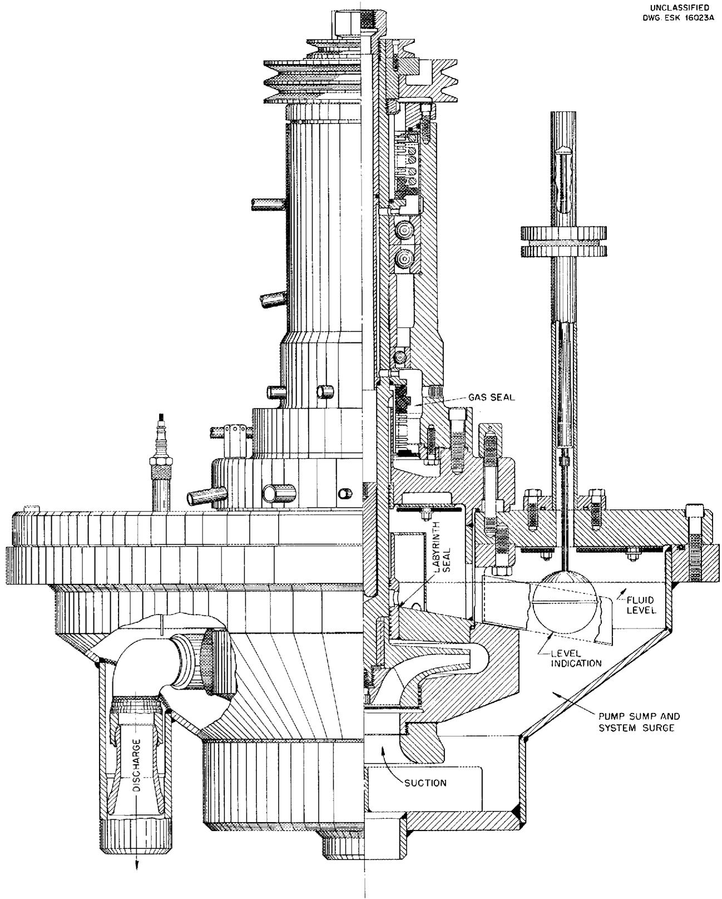  
Fig. 2.1. ARE-Size Sump Type of Pump (Centrifugal Pump Model DAB Assembly).

number, $N_{O^{\prime}}$ which are defined in the following:

$$
N _ {P} = \frac {P}{\Delta T U r L}
$$

and

$$
N _ {Q} = \frac {Q U ^ {3} (\Delta T) ^ {3} L}{\Delta P r ^ {7} \mu^ {2} n ^ {6}},
$$

where

$$
P = \text {p o w e r},
$$

$\Delta T =$ temperature difference between the melting point of sodium and the seal coolant temperature,

$U =$ over-all coefficient of heat transfer from liquid film to coolant per unit area of film, $r =$ shaft radius,

$L =$ seal length,

$Q =$ volume leakage rate,

$\Delta P =$ pressure difference across seal,

$\mu =$ viscosity of sodium at its melting point, $n =$ speed of shaft.

According to viscous film theory, the numbers $N_{P}$ and $N_{Q}$ should be constants. The experimental data obtained by varying $\Delta P$ and $\Delta T$ are shown in

Figs. 2.2 and 2.3. The slopes of the lines agree fairly well with theory. The scatter may be due to error in instrumentation and failure to observe the presence of pertinent factors, such as shaft surface roughness and contamination of seal sodium, which were included in the analysis. Shaft surface roughness may explain the fact that the absolute value of the leakage number $(N_{Q})$ determined experimentally is several times larger than the theoretical value.

The presence of oxygen around the frozen-sodium seal may account for some of the discrepancy between theoretical and experimental data. When the cold end of the seal was open to air, operation deteriorated over a period of three or four days and usually ended in sudden shaft seizure. That this was due to oxide accumulation in the seal appears obvious, since the condition was alleviated by addition of the helium gas blanket. However, the seal also accumulates oxygen from within the system, since it contains the coldest sodium of the system. Seal roughness and relatively high leakage rates have been observed following periods of no flow through the bypass filter in the loop. The

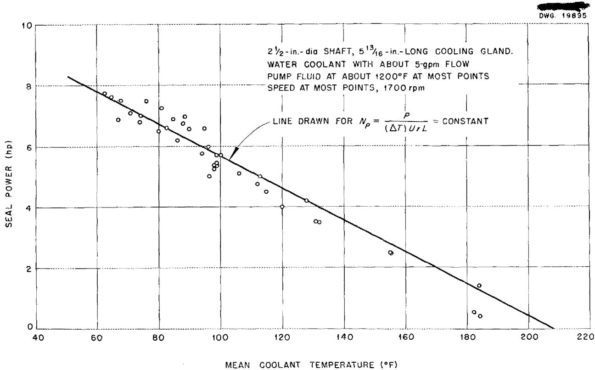  
Fig. 2.2. Seal Power vs. Seal Coolant Temperature for Frozen Sodium Sealed Pumps.

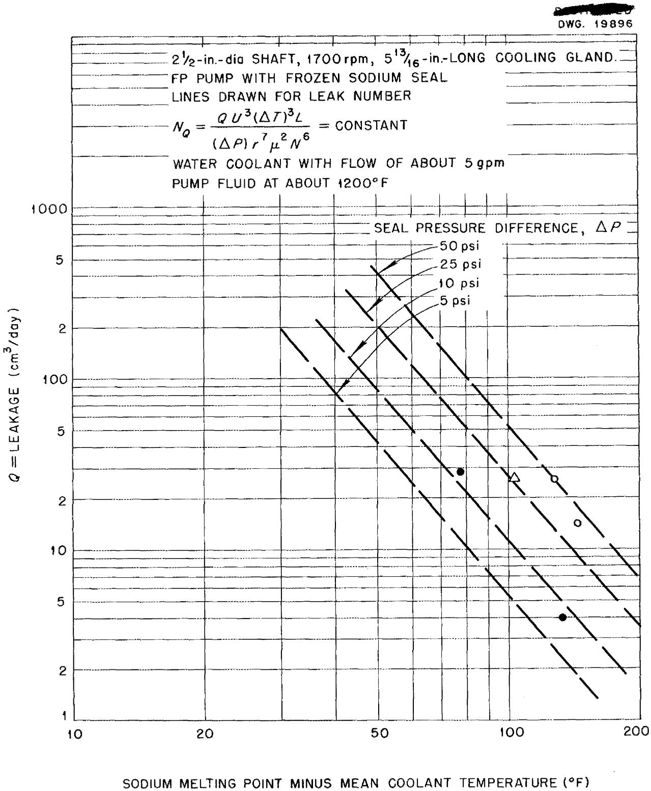  
Fig. 2.3. Seal Leakage vs. Seal Cooling Temperature Difference for Frozen Sodium Sealed Pump.

deterioration of operation resulting from this condition is best alleviated by maintaining clean sodium in the system and, if necessary, by infrequent clean-outs of the sodium in the seal.

ARE Packed-Frozen Sealed Fluoride Pump. An ARE model pump(3) circulating the fluoride NaF $\mathsf{ZrF}_4$ -UF $_4$ (50-46-4 mole %) with a packed-frozen seal was operated for a period of 49 hours. Shaft seizure occurred, and the Carboloy sleeve under the seal was found to be cracked. The seal packing consisted of strands of copper wire rope which were soaked in an oil suspension of $\mathsf{MoS}_2$ for a period of 24 hr before installation. During the test, the pump operated at 1250 rpm with a flow of 45 gpm and produced a head of 55 psi. Power input to the pump drive motor was 5.5 kw, with an estimated 3-hp input to the pump shaft and 0.75 hp absorbed in the seal. Fluoride chip leakage from the frozen end of the seal was checked for each 24-hr period of operation, and measurements of 133 and 132 g were obtained.

The seal configuration is shown in Fig. 2.4. Heat was supplied to the seal by electrical tubular heaters on the outside of the shaft housing and a cartridge heater inside the shaft, as shown. Cooling of the seal area was achieved by introducing compressed air between the anchor flange and the packing gland flange and allowing the air to pass out through multiple holes around the nose of the gland slightly oblique to the shaft axis. This cooling was supplemented by two small centrifugal blowers directed against the rear of the packing gland and seal.

The pump and the test loop of $1\frac{1}{2}$ -in.-|PS pipe were constructed of 316 stainless steel. Flow was measured with a water-calibrated venturi. Pressures were measured with Moore Nullmatic transmitters, which have air balancing the loop pressure across a bellows. The transmitters contained triple-ply Inconel bellows and were operated in a downward position so that the transmitters were flooded and free surfaces were eliminated.

When pump operation began, the frozen seal apparently established itself ahead of the packing area, but as the test progressed, the frozen zone moved rearward until, after approximately 12 hr, the seal existed in the annulus between the shaft and the packing gland. However, after an 18-kw power surge, a small amount of heat was placed on the packing and the shaft housing next to the impeller, and no other power surges occurred until

the shaft seized. At the time the shaft seizure occurred, all heat had again been off the seal for 30 minutes.

The Carboloy sleeve was found to have a crack approximately $\frac{3}{64}$ in. wide that originated in the corner of a driving notch at the cool end of the sleeve. Subsequent heating and cooling tests on the sleeve-shaft assembly alone indicated that a Carboloy sleeve cannot withstand any appreciable axial temperature gradient. A stainless steel sleeve with Colmonoy hard surfacing will be tested in the next pump assembly, since the Carboloy sleeve does not appear satisfactory for this application.

Allis-Chalmers Canned-Rotor Pump. A 5-gpm canned-rotor pump built by Allis-Chalmers is being assembled in a test loop and will be tested with NaK at temperatures approaching $1500^{\circ}\mathrm{F}$ . This pump has a hydrostatic bearing, pressurized by a small pump impeller at the rear of the pump, which bypasses some of the system fluid through the bearing. The motor windings are made of small-diameter copper tubing with fiberglass insulation. The windings are cooled by circulating a coolant through the tubes. The pump is completely instrumented so that temperatures at all critical points can be determined during operation.

Frozen-Lead-Sealed Fluoride Pump. Seal tests have demonstrated that a frozen-lead seal has smoother operating characteristics than a frozen-fluoride seal and that molten lead and molten fluorides do not intermix when in intimate contact with each other. Consequently, a centrifugal pump of ARE size has been redesigned as a frozen-lead-sealed pump for fluorides. In this redesign, the pump is mounted in a vertical position with the seal on the bottom side of the pump. A chamber equipped with immersion heaters located immediately below the pump impeller housing contains both molten lead and molten fluorides at $1000^{\circ}$ F. Because of the difference in the densities of the two mixtures, the fluorides float on the lead, and a sharp fluoride-lead interface is maintained. A frozen-lead seal is accomplished in the bottom of this chamber in a liquid-cooled seal annulus that is approximately 1 in. long and has approximately 0.030-in. radial clearance around the $2\frac{1}{2}$ -in.-dia shaft. This redesign permits the modification of the frozen-fluoride-sealed pump to a lead-sealed pump that utilizes all the parts of the original pump, except the seal.

NOTE: ALL DIMENSIONS ARE IN INCHES

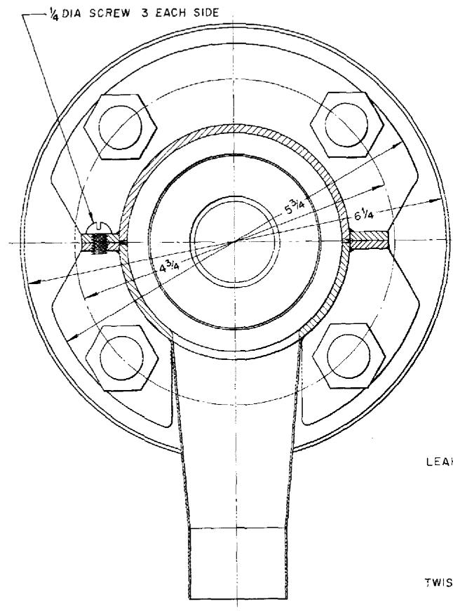

Fig. 2.4. Seal Gland for ARE Pump with Packed Frozen Seal.   
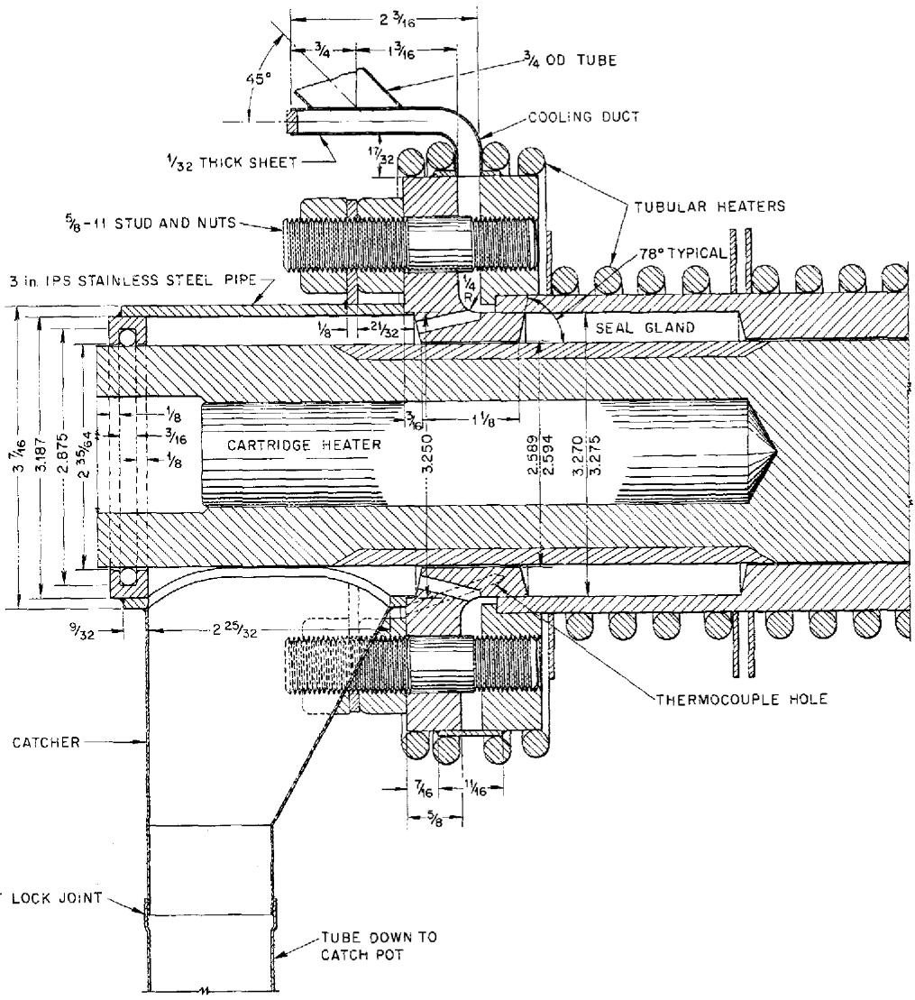  
UNCLASSIFIED   
DWG CSK-15995A

Laboratory-Size Sump-Type Pump with Gas Seal. It was reported previously(1) that the laboratory-size sump-type pump operated 965 hr with a stuffing-box seal and 2300 hr, after redesign, with a rotary face seal of Graphitar No. 30 running on hardened tool steel. An additional 1000 hr of operation has been accumulated on another pump of the same design; however, Morganite MYIF, a silver-impregnated graphite with self-lubricating properties, was substituted for Graphitar No. 30 in the seal. Speeds of up to 3600 rpm were used with a flow rate of 5 gpm that produced a 55-psi head to pump the fluoride NaF-ZrF4-UF4 (50-46-4 mole %). Suction pressure varied from 10 to 30 psi, and the fluid temperature ranged from 1200 to $1500^{\circ}\mathrm{F}$ . There was regular dropwise oil lubrication at a rate of 6 to 8 drops per 25 hours at first, but later, lubrication was used only when power fluctuations occurred in the drive-motor input.

Gas leakage during the test was negligible up to 24 hr prior to termination of the test, when a marked increase was noted. The graphite seal piece was found to be pitted and scored. The stationary tool steel face had a work depression. Operation of the pump will be continued with continuous oil-mist lubrication on the seal exterior.

# ROTATING SHAFT AND VALVE STEM SEAL DEVELOPMENT

W. B. McDonald

W.R.Huntley

W.C.Tunnell

L.A.Mann

R.N.Mason

D. R. Ward

P. G. Smith

J.M.Cisar

ANP Division

Graphite-Packed Seals. A seal with layers of natural-flake graphite and $\mathsf{MoS}_2$ retained by Graphitar rings and machine turnings of an Ag-MoS compact was operated to seal against the fluoride NaF-ZrF-UF4 (50-46-4 mole %) at $1300^{\circ}\text{F}$ and 10 psi for 53 hr before termination of the test. Thermocouples were attached within the rotating shaft. Operation was smooth; the power requirements were low; and consequently, the temperatures were low. It was possible to make 2-min stops without it being necessary to add heat. The indicated seal temperature was above the melting point of the fuel $(515^{\circ}\text{C})$ . However, there was no leakage when the shaft stopped and froze, which indicated that some fluoride was leaking into the seal area and freezing. The test was terminated when continued heating caused gross liquid leakage.

In an attempt to take advantage of the apparent nonwetting characteristic of graphite with fluoride, several dry runs were made with graphite as the packing material. In this series of tests, the shaft rotated in a right-hand direction and a left-hand V thread was machined on the shaft. This arrangement tended to pack the graphite at the fluoride end of the seal. An air cylinder was connected to the gland so that gland pressure could be controlled, and with this set up, it was determined that the packing pressure must be less than 30 psi to avoid excessive friction between the graphite and the rotating shaft.

Another seal comprised of bronze wool as a retainer and artificial graphite plus $5\%$ $\mathsf{MoS}_2$ as the packing material sealed helium at 10-psi pressure. This seal also satisfactorily sealed the fluoride $\mathsf{NaF - ZrF}_4\mathsf{-UF}_4$ (50-46-4 mole $\%$ ). There was some indication from stop-start tests that an interface or meniscus was established at the hot end of the seal. However, in the start-stop tests, performance was erratic. In some instances, heat was required for starting after stopping, and at other times the shaft started freely. After more than 500 hr, operation was continuing at $1200^{\circ}\mathsf{F}$ and 20-psig pressure, but there was the slight leakage of granulated material that is typical of frozen seals.

Grooved-Shaft Packed-Frozen Seal Tests. Various packing materials have been tested in a sealing gland in which both the shaft and housing sides of the gland contain meshed annular grooves to minimize loss of seal material. Three tests were made of seals with different packings but with similar geometry and operating conditions. The tests were operated with the fluoride NaF-ZrF4-UF4 (50-46-4 mole %) at temperatures ranging from 1050 to $1350^{\circ}\mathrm{F}$ . The shaft diameter was $1\frac{3}{16}$ in., and the seal gland length was $1\frac{5}{8}$ inches. In all these tests it was noticed that the first leakage of fuel from the seals was preceded by leakage of the packing material, which indicates that there is need for improved retention of the packing material. Start-stop tests were made satisfactorily only after the addition of sufficient heat to compensate for frictional heat loss when the shaft was stopped. These three tests are summarized in Table 2.1.

Examination after the first test showed the grooved section of the shaft to be badly worn to the extent that there was a single wide groove covering about half the width of the original grooved

TABLE 2.1. GROOVED-SHAFT PACKED-FROZEN SEAL TESTS   

<table><tr><td>SHAFT MATERIAL</td><td>GROOVE DIMENSIONS (in.)</td><td>PACKING</td><td>FLUID PRESSURE (psi)</td><td>FLUID TEMPERATURE (°F)</td><td>DURATION OF TEST (hr)</td><td>REASON FOR TERMINATION</td></tr><tr><td>Type 316 stainless steel</td><td>1/8 by 1/8 by 1/8</td><td>Dixon&#x27;s No. 2 graphite plus Inconel braid impregnated with MoS2</td><td>7.5</td><td>1050 to 1225</td><td>92</td><td>Bearing failure</td></tr><tr><td rowspan="2">Stellite-coated type 316 stainless steel</td><td>3/16 by 1/8 by 1/8</td><td>Dixon&#x27;s No. 2 graphite plus Inconel braid impregnated with MoS2</td><td>10</td><td>1100 to 1200</td><td>53</td><td>Scheduled</td></tr><tr><td>3/16 by 1/8 by 1/8</td><td>Dixon&#x27;s No. 2 graphite plus superflake graphite</td><td>10</td><td>1200 to 1350</td><td>148</td><td>Loss of seal material during start-stop test</td></tr></table>

section and approximately as deep as the original grooves. Neither of the other seals showed as severe damage, although some wear occurred at the retainer end of the packing used in the second test.

Bronze Wool and $\mathsf{MoS}_2$ Packed-Frozen Seal Tests. Several packed-frozen seals in which the packing gland contains bronze wool and a lubricant, such as $\mathsf{MoS}_2$ or $\mathsf{MoS}_2$ and graphite mixture, have been tested with the molten fluoride NaF-ZrF-UF $_4$ (50-46-4 mole %). A leakage rate on the order of 1 g/hr has been obtained with a $1^{3}_{16}$ -in.-dia shaft and 10 psi pressure across the seal. The leakage

rate is not only a function of the pressure across the seal but also of the location of the actual point of seal within the gland. The attempt to adapt this seal geometry to a larger shaft (2½ in. in diameter) has not been entirely successful. Applications of successful small-diameter-shaft packings to larger shafts have usually been accompanied by perturbations attributable to the increase in surface speed, higher friction, and increased area for heat conduction from the hot liquid being sealed. A summary of design and operating conditions for the four seals tested is given in Table 2.2.

TABLE 2.2. SUMMARY OF BRONZE WOOL AND ${\mathrm{{MoS}}}_{2}$ PACKED-FROZEN SEAL TESTS   
Shaft material: Stellite-coated type 316 stainless steel   

<table><tr><td>SHAFT DIAMETER (in.)</td><td>SEAL DIMENSIONS (in.)</td><td>PACKING</td><td>FLUID PRESSURE (psi)</td><td>FLUID TEMPERATURE (°F)</td><td>DURATION OF TEST (hr)</td><td>REASON FOR TERMINATION</td></tr><tr><td rowspan="2">13/16</td><td rowspan="2">1/4by 5</td><td>1/4-in. layers of bronze wool plus MoS2</td><td>10</td><td>1200 to 1275</td><td>78</td><td>Seal leak</td></tr><tr><td>1/4-in. layers of bronze wool plus MoS2 plus graphite</td><td>10</td><td>1200 to 1275</td><td>620</td><td>Still operating</td></tr><tr><td rowspan="2">21/2</td><td rowspan="2">3/4by 5</td><td>1/4-in. layers of bronze wool plus MoS2 plus graphite</td><td>10</td><td>1200 to 1275</td><td></td><td>Seal leak</td></tr><tr><td>1/4-in. layers of bronze wool plus graphite plus 5% MoS2</td><td>10</td><td></td><td></td><td>Still operating</td></tr></table>

Although the first seal remained free after stopstart tests of up to 10-min duration, the seal leaked excessively when raised to a temperature above the melting point of the fluoride, and the test was terminated. The power requirement for this seal was approximately $\frac{1}{2} \mathrm{~kw}$ , with slight surges.

Start-stop tests of up to $10\frac{1}{2}$ hr have been made in the second test, but heat was added to make up for friction heat loss. Although the seal is believed to have moved up into the gland region, the test is operating smoothly with a shaft rim of 1500. The initial leakage rate of 1 g/day increased to 1.5 g/day, and it was necessary to raise the seal temperature about $100^{\circ}\mathrm{F}$ above its operating temperature to enable the motor to restart the shaft seal without assistance.

In the first test with the $2\frac{1}{2}$ -in.-dia shaft, the seal leaked liquid which appeared to be an $\mathsf{MoS}_2$ mixture. Power fluctuations were greater than hitherto observed. During a 3-hr stop, the shaft remained free. Although the seal used in the second test had to be repacked after excessive initial graphite leakage, operation is continuing smoothly with a low leakage rate and a somewhat variable, but usually smooth, power requirement.

Frozen-Lead Seal Test. A series of tests has been conducted to determine the feasibility of sealing a high-temperature fluoride pump with a frozen-lead seal. These tests show this type of seal to be feasible, since it has been determined that molten lead and molten fluorides do not intermix when in intimate contact with each other. Rather, the fluorides float on top of the lead, and there is, apparently, a sharp fluoride-lead interface.

The test equipment consists of a $1\frac{3}{16}$ -in.-dia type 316 stainless steel shaft powered by a 2-hp motor. The shaft was operated in a vertical position at a speed of 1500 to 2500 rpm and the seal was below the shaft. A helium gas blanket was provided for the cold end of the seal, and above the seal was a pot containing lead at $1000^{\circ}\mathrm{F}$ . A series of five test runs was conducted for a total operating time of 550 hours. These runs were characterized by extremely smooth operation and low power input during the first 30 to 100 hr of operation. Continued operation resulted in shaft seizure in the seal region, and the test was terminated. The conditions which appeared most likely to be contributing to seal failure were oxidation of the lead in the frozen seal because of the air at the cold end of the seal, insufficient shaft clearance at the hot end of the lead sealing annulus, and impurities in the lead.

In the new seal test rig design, which eliminates the difficulties mentioned, the frozen seal region was shortened to approximately $\frac{1}{2}$ in. in length and liquid cooling was substituted for gas cooling. High-purity lead was obtained and pretreated by bubbling hydrogen through it for approximately 100 hours. A frozen-lead seal has operated in the new rig for approximately 500 hours. The power input to the shaft has been low, there have been no power fluctuations, and the lead leakage rate has been negligible. The shaft speed during this test was varied from 2000 to $4200\mathrm{rpm}$ , and performance over the entire speed range was excellent.

V-Ring Seal. A seal consisting of alternate rings machined from Graphitar No. 14 and a hot-pressed compact of copper and $14\% \text{MoS}_2$ is being tested. The rings are assembled as shown in Fig. 2.5. A $1\%^3_{16}$ -in.-dia hardened shaft rotates against the Graphitar. A gas cylinder is used as the means of applying force to the gland to compress the rings. The seal was designed to operate at approximately $1100^{\circ}F$ .

A dry run of this seal indicated that helium leakage through the seal was almost zero with the seal area at a temperature of above $1000^{\circ}\mathrm{F}$ . Operation during the dry run consisted of rotating the shaft at approximately 1650 rpm with the seal area at a temperature of above $1050^{\circ}\mathrm{F}$ . Power dissipation in the seal is approximately 50 watts. With these conditions, an attempt was made to force helium through the seal with pressures of up to 30 psig. Flow of helium to the seal was read on a gas rotameter. The unit was operated for one day with zero indicated flow and then disassembled for inspection. When reassembled, the unit was operated for three days with an indicated flow of about $0.4\mathrm{cm}^{3}/\mathrm{sec}$ , so preparations were made to introduce fluorides. Calculations indicate that for a gas leakage of about $2\mathrm{cm}^{3}/\mathrm{sec}$ of helium the corresponding fluoride leakage will be about 0.5 cm³/day.

$\mathsf{BeF}_2$ Seal Tests. A series of tests has been conducted with a stuffing-box type of seal packed with $\mathsf{BeF}_2$ to determine whether the high viscosity of $\mathsf{BeF}_2$ at its softening temperature would give a satisfactory seal against the fluoride mixture NaF-ZrF4-UF4 (50-46-4 mole %) at high temperatures. A summary of the seal design and operating data is given in Table 2.3.

In the first test, a $\frac{1}{2}$ -in.-dia shaft was sealed by a series of surrounding annular compartments containing $\text{BeF}_2$ powder. During operation of the shaft

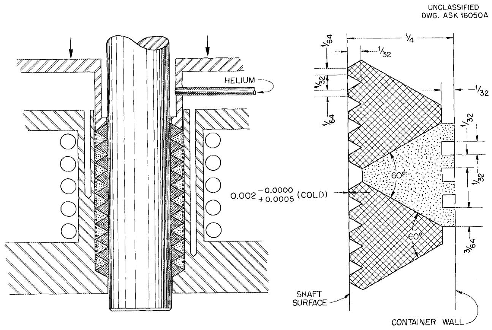  
Fig. 2.5. V-Ring Seal

at 440 rpm, the power needed to overcome friction was too low to read on a 10-kw full-scale wattmeter. Leakage through the seal was zero. A packing of $\frac{1}{4}$ in. of graphite-impregnated asbestos was used at the cold end to contain the dry powder. The shaft was stopped and started many times for periods of up to 1 hr, and only motor power was used for restarting. After termination of the test, the seal was cooled and sawed lengthwise. The fuel had penetrated only into the second compartment, that is, less than $\frac{3}{4}$ inch. None of the packing material beyond the second compartment had melted. Chemical analysis showed 0.96 mole % $\text{BeF}_2$ in the first compartment and 50.2 mole % $\text{BeF}_2$ in the second compartment.

In the second test, a $2\frac{1}{2}$ -in.-dia shaft was sealed by a packing gland which was packed with copper-braid sleeves filled with $\mathsf{BeF}_2$ powder. One turn of graphite-impregnated asbestos was used on the air end of the seal to contain the dry powder. This seal showed none of the characteristics of a $\mathsf{BeF}_2$ seal, but operation and failure were similar to the experience with frozen-fluoride seals.

In the third test, a vertical $1\frac{3}{16}$ -in.-dia shaft was packed with $\mathsf{BeF}_2$ in annular compartments, as in the first test. Failure after $1\frac{1}{2}$ hr of operation at 880 rpm appeared to have been the result of the air end of the seal becoming too hot ( $870^{\circ}\mathsf{F}$ ). The seal ran well until it failed.

For the fourth test, a horizontal $2\frac{1}{2}$ -in.-dia shaft was assembled with annular compartments filled with $\mathsf{BeF}_2$ . Improper design caused thermal distortion and mechanical binding. The shaft was started 15 to 25 times, but each time it was stopped by metal to metal contact in the seal.

In the fifth test, a $2\%$ -in.-dia shaft, which simulated a horizontal ARE pump shaft, extended through a packing gland into a body of the fluoride fuel $\mathsf{NaF - ZrF_4 - UF_4}$ (50-46-4 mole $\%$ ). Provision was made for selectively heating the end of the packing gland adjacent to the hot fluorides and for cooling the gland at its outer end. A metal sleeve around the shaft, sealed at the inner end of the gland, provided a narrow annulus $\gamma_{16}$ in. wide and about 2 in. long for the fluorides to pass through and be cooled somewhat before they entered the

TABLE 2.3. TESTS OF BeF ${}_{2}$ -PACKED SEALS ON ROTATING SHAFTS   
OPERATED IN NoF-ZrF4-UF4 (50-46-4 mole %)   

<table><tr><td rowspan="2">TEST No.</td><td rowspan="2">PACKING MATERIAL COMPOSITION (mole %)</td><td colspan="3">SEAL PACKING CHAMBER</td><td rowspan="2">PACKING ANNULUS THICKNESS (in.)</td><td rowspan="2">DIAMETER OF SHAFT (in.)</td><td rowspan="2">SHAFT SPEED (rpm)</td><td rowspan="2">HELIUM PRESSURE (psig)</td><td rowspan="2">DURATION OF TEST (hr)</td><td rowspan="2">REASON FOR TERMINATION</td></tr><tr><td>Over-all Length (in.)</td><td>Length of Fluoride Packing (in.)</td><td>No. of Compartments</td></tr><tr><td>1</td><td>100% BeF2</td><td>4</td><td>2</td><td>5</td><td>0.25</td><td>½</td><td>440</td><td>30</td><td>50</td><td>Scheduled</td></tr><tr><td>2</td><td>100% BeF2</td><td>1.25</td><td>0.85</td><td>5</td><td>In copper braid sleeves</td><td>2½</td><td>550</td><td>10</td><td>1</td><td>Seal leak</td></tr><tr><td>3</td><td>100% BeF2</td><td>3.1</td><td>2</td><td>6</td><td>0.25</td><td>13/16</td><td>880</td><td>30</td><td>1½</td><td>Seal leak</td></tr><tr><td>4</td><td>100% BeF2</td><td>4</td><td>2</td><td>7</td><td>0.375</td><td>2½</td><td>650</td><td>5</td><td>Off and on</td><td>Mechanical warpage</td></tr><tr><td>5</td><td>75% BeF2 plus 25% fluoride mixture</td><td>5</td><td>2</td><td>1</td><td>0.4375</td><td>23/8</td><td>380 to 1400</td><td>1 to 10</td><td>448</td><td></td></tr><tr><td>6</td><td>Various percentages of BeF2 plus ZrF4</td><td>3.1</td><td>2</td><td>7</td><td>0.25</td><td>13/16</td><td>1350 to 3800</td><td>5 to 30</td><td>104</td><td>Failed during stop-start tests</td></tr><tr><td>7</td><td>100% NaBeF3</td><td>3.1</td><td>2</td><td>7</td><td>0.25</td><td>13/16</td><td>1350</td><td>5</td><td></td><td></td></tr></table>

principal packing zone. Strands of copper rope were then placed in the seal annulus to a depth of $\frac{1}{2}$ in. to serve as the principal deterrent to entry of the fluorides into the seal proper, which was formed by a 2-in. copper sleeve. The seal cavity was filled with 75 mole % $\text{BeF}_2$ and 25 mole % fluoride fuel granules, and as a result there was 25 to 30% void space in the cavity. The seal was heated and instrumented so that the temperature gradient along the seal could be controlled. Penetration of the fuel proceeded until the resulting mixture in the seal cavity was too cold or too viscous to penetrate further. Shaft speed was maintained at 1400 rpm for approximately 400 hr, and the test ended at 448 hr because of the failure of the external seal heaters and plugging of the coolant line. Power consumption in the seal because of friction (primarily at the outer end of the seal) was of the order of 400 watts. Many perversities were encountered, as well as long periods (days) of stable operation with low friction in the seal. During the stable periods, fine powder leaked from the seal at a rate of 10 to $15\text{cm}^3$ per day. Shaft wear was light except under the outer copper, which was cold. Sufficient powdered material accumulated in this location to act as a grinding compound for the shaft material. Nearly all the major perversities of this seal could be attributed to the accumulation of fluoride powders under the external copper, augmented by oxidation of the fluorides at the cold end.

The sixth test was run in the same equipment as was the third test, but the following alterations were made. (1) Two turns of $\frac{1}{4}$ -in.-dia copper cooling coil was wrapped (not soldered) around the top of the seal housing to carry cooling water. (2) The fluoride packing was divided into seven compartments by using type 316 stainless steel spacers and washers, and copper-rope packing was placed at the hot and cold ends of the seal. (3) The fluoride packing consisted of 8- to 20-mesh grains of $\mathrm{BeF}_2$ plus $\mathrm{ZrF}_4$ in the following weight percentages of $\mathrm{ZrF}_4$ in the layers from the hot to the cold end, respectively: 0, 15, 25, 40, 55, 70, 100. The unit was operated 104 hr at a seal temperature of 1200 to $1250^{\circ}\mathrm{F}$ on the hot end and approximately $650^{\circ}\mathrm{F}$ on the cold end. The speed was varied from 880 to 3800 rpm. The helium blanket pressure was 5 to 10 psig. The main purpose of this test was to see whether $\mathrm{ZrF}_4$ would prevent leakage (because of its high melting point). Although the leakage was not great, it was fairly continuous, and the stop-start test was unsuccessful for a 10-min stop.

Examination of the shaft after the fourth test revealed that a high percentage of $\mathsf{NaBeF}_3$ was possibly the most effective sealant. Therefore it was decided to operate a seal with $\mathsf{NaBeF}_3$ packing in the same equipment as was used in tests 3 and 6.

This seventh seal was similar to that used in the sixth test, except that all seven compartments

were packed with $\mathsf{NaBeF}_3$ . Granules of 8 to 20 mesh (Tyler Standard) were used to pack the seal, and the copper cooling coil was soft soldered to the seal housing. The shaft speed was increased from 1500 rpm, that is, until the shaft peripheral speed was at ARE design point (15.3 fps), and was maintained there for the balance of the 160-hr test. Several successful stop-start tests were made with stop periods of up to 10 minutes. On most restarts, some assistance to the 2-hp motor was required; however, several restarts were made with no assistance. There was no detectable leakage of sealant. The friction drag was estimated at about 150 to 200 watts. Temperatures along the seal remained constant. The temperature range was from approximately $1250^{\circ}\mathsf{F}$ at the hot end to approximately $200^{\circ}\mathsf{F}$ at the cold end. The seal was cooled and separated from the unit and sectioned axially. Inspection revealed that the fuel had penetrated four of the seven compartments and that, in the remaining three compartments, the $\mathsf{NaBeF}_3$ had fused or sintered and changed color from almost white to a gray-brown. The only shaft scoring found was at points of contact with the stainless steel washers used as separators between compartments.

Packing Penetration Tests. Packing penetration tests have been continued in which graphite or graphite mixed with another material is used as the primary sealant. The use of graphite has been emphasized in these tests because it appears to be one of the few materials capable of preventing fluoride leakage.

A test in which Baker Chemical Company powdered graphite was used to seal against the fluoride NaF-KF-LiF-UF $_4$ (10.9-43.5-44.5-1.1 mole %) was terminated after 240 hr with no leakage, as reported previously.(5) Since other tests of similar seals used to seal against the fluoride NaF-ZrF $_4$ -UF $_4$ (50-46-4 mole %) had leaked, it was thought that the sealing might be dependent either on the presence of LiF or on the absence of ZrF $_4$ . However, during this quarter, another test was operated for 690 hr with the same type of graphite and zirconium-bearing fluoride mixture, and there was no leakage. This test was terminated at the end of the 690-hr period, because excessive oxidation occurs if the graphite tests are allowed to run for extended periods of time. The oxidation begins

at the opening in the bottom of the container and then extends upward toward the fuel region. Upon postrun examination, a large cavity was found in the graphite around the opening. If the test had continued, there would have been leakage due to the oxidation of the graphite rather than to penetration.

All the graphites tested this quarter, except the Baker Chemical Company graphite, have been of the artificial type, which should have a very low amorphous carbon content. Tests of these graphites have had one thing in common: leakage began at a very slow rate and could only be detected by the small amount of corroded metal that fell from the furnace in which the packing containers were heated. The tests were continued and terminated only when fuel was detected in the receptable beneath the furnace. Because of the slow leakage and continuation of the tests, the outer surfaces of the containers were very badly corroded; they were covered with a heavy scale that could be removed easily. Results of these tests are summarized in Table 2.4.

One combination of packing material being tested is a mixture of $80\%$ artificial graphite powder (obtained from the Y-12 Carbon Shop) and $20\%$ powdered $\mathrm{BeF}_2$ . The mixture was compressed and then heated to $1150^{\circ}\mathrm{F}$ and further compressed. Heating and compressing were done three times, and the packing lost approximately $40\%$ of its original volume. The test of this packing material is being run at the usual pressure, 30 psi, but the test temperature is $1150^{\circ}\mathrm{F}$ instead of the usual $1500^{\circ}\mathrm{F}$ . The test has been running for 600 hr with no leakage.

# INSTRUMENTATION

P.W.Taylor D.R.Ward ANP Division

Pressure Measurement. A large pressure transmitter, patterned after the Moore Nullmatic instrument,[6] that utilizes a triple-ply Inconel bellows as the pressure-sensing element has been in intermittent service on a fluoride pump loop. The transmitter operates upside down to measure pump suction pressure (about 5 psi) and it is completely filled with $1100^{\circ}\mathrm{F}$ molten fluorides. The temperature of the fuel in the loop is approximately $1200^{\circ}\mathrm{F}$ . The total operating time to date is 360

TABLE 2.4. SUMMARY OF PACKING PENETRATION TESTS PERFORMED DURING THIS QUARTER   
Pressure: 30 psi Temperature: $1500^{\circ}F,$ except as noted   

<table><tr><td>TEST NO.</td><td>PACKING MATERIAL</td><td>DURATION OF TEST (hr)</td><td>REMARKS</td></tr><tr><td>11</td><td>Stainless steel wool impregnated with MoS2</td><td>0</td><td>Leaked immediately</td></tr><tr><td>12</td><td>Baker Chemical Company powdered graphite</td><td>690</td><td>Did not leak</td></tr><tr><td>13</td><td>MoS2in copper sheath</td><td>½</td><td></td></tr><tr><td>14</td><td>Graphite from Y-12 Carbon Shop</td><td>262</td><td>Scale indicated slight leakage</td></tr><tr><td>15</td><td>National Carbon Company graphite 2301</td><td>191</td><td>Scale detected at 72 hr</td></tr><tr><td>16</td><td>80% graphite from Y-12 Carbon Shop and 20% BeF2</td><td></td><td>Operating temperature 1150°F; had not leaked at 600 hr; test continuing</td></tr><tr><td>17</td><td>50% graphite from Y-12 Carbon Shop and 50% MoS2</td><td>40</td><td>Scale detected at 30 hr</td></tr></table>

hours. The fuel froze in the transmitter during two pump shutdown periods, and it was found that subsequent remelts and startups did not damage the transmitter.

A small nickel transmitter operating completely filled with fluoride fuel on a static test (10 to 30 psi, one cycle every hour) at $1100^{\circ}\mathrm{F}$ failed after 2500 hr of continuous operation. Postoperative inspection revealed two small holes in one of the inner bends of the 0,005-in. (wall thickness) bellows. Throughout the 2500-hr period, operation was excellent. The combined range and zero shift over a 1500-hr period was less than $1\frac{1}{2}\%$ of full scale (30 psi).

Two other type 316 stainless steel transmitters that are being operated on a similar static test are still functioning smoothly. One of these transmitters has logged 3400 hr, to date, in fuel at $1100^{\circ}\mathrm{F}$ ; the other has operated 3500 hr in lead at $700^{\circ}\mathrm{F}$ .

The initial test of the single-diaphragm forcebalanced pressure transmitter is being run at $1050^{\circ}\mathrm{F}$ with no fuel. This instrument, constructed

entirely of Inconel with a 0.014-in. Inconel X diaphragm, is being operated at a static pressure of 50 psi for 700 hr, with a cycle every 4 hr to 20 psi. Upon heating to $1050^{\circ}\mathrm{F}$ from room temperature, there was an approximate $2\%$ increase in output at 50 psi. After 1200 hr of operation at $1050^{\circ}\mathrm{F}$ , the output has increased $3\%$ . Response to pressure change is excellent, with no visible delay. This fast response is obtained at the expense of a very large, balancing, air flow. The instrument uses approximately 24 cfh of air.

NaK Leak Detection Methods. Since NaK may be used as the final leak-checking material for the ARE fluid circuit, a reliable NaK leak detector for small leaks is desirable. Some preliminary testing has been done to determine the effect of NaK vapor on copper wool. With a pure helium atmosphere at temperatures from 250 to $650^{\circ}\mathrm{F}$ , the copper wool gave a substantial basic indication in phenol-red indicator solution (in $\mathsf{H}_2\mathsf{O}$ ) after an exposure time of 1 hour. The addition of about $5\%$ oxygen to the helium atmosphere decreased the strength of the indication but did not eliminate it entirely.

# 3. REFLECTOR-MODERATED CIRCULATING-FUEL REACTORS

# A. P. Fraas, ANP Division

An extensive description of a proposed reflectormoderated circulating-fuel reactor suitable for powering an aircraft was presented in the previous report.(1) Subsequent studies of the full-scale power plant system have included an examination of reactor control, and a revision of calculations on the basis of new data from the critical assembly of this reactor configuration. The reflector-moder

ated reactor critical experiment is discussed in sec. 5, and shielding configurations applicable to this reactor are described in sec. 14.

# REACTOR CONTROL

The control problems of the full-scale power plant are being examined. The fluid flow rates, transit times, and thermal capacities for the various elements of the full-scale 200-megawatt sea-level aircraft power plant are presented in Table 3.1. These values should be considered as those for a

TABLE 3.1. FULL-SCALE 200-MEGAWATT SEA-LEVEL AIRCRAFT POWER PLANT SYSTEM DATA   

<table><tr><td colspan="2">NaK in each radiator core circuit</td></tr><tr><td>NaK in radiator header drums</td><td>8 lb</td></tr><tr><td>NaK in radiator tubes</td><td>8</td></tr><tr><td>NaK in 3.3-in.-ID 20-ft-long outlet line</td><td>50</td></tr><tr><td>NaK in 3.3-in.-ID 20-ft-long inlet line</td><td>56</td></tr><tr><td>NaK in intermediate heat exchanger</td><td>28</td></tr><tr><td>NaK flowing in entire circuit</td><td>150</td></tr><tr><td>NaK in header tank</td><td>30</td></tr><tr><td>Total NaK in each system</td><td>180</td></tr><tr><td>Total NaK for each engine</td><td>720</td></tr><tr><td>Total NaK in complete power plant</td><td>2880 lb</td></tr><tr><td>NaK flow rate through each radiator circuit (for a 400°F Δt and a 12,500-kw heat rejection rate)</td><td>2.5 ft3/sec or 120 lb/sec</td></tr><tr><td>NaK transit time through system</td><td>1.25 sec</td></tr><tr><td>NaK transit time through intermediate heat exchanger</td><td>0.23 sec</td></tr><tr><td>NaK transit time through radiator tubes</td><td>0.067 sec</td></tr><tr><td>Fuel in core circuit (flowing)</td><td>6 ft3</td></tr><tr><td>Fuel in header tank</td><td>1 ft3</td></tr><tr><td>Fuel in core</td><td>1.2 ft3</td></tr><tr><td>Fuel flow rate</td><td>12.0 ft3/sec</td></tr><tr><td>Fuel circuit transit time</td><td>0.5 sec</td></tr><tr><td>Thermal capacities of power plant</td><td></td></tr><tr><td>Radiator cores (lb)</td><td>600 Btu/°F</td></tr><tr><td>Lines and pumps</td><td>250</td></tr><tr><td>NaK (flowing)</td><td>600</td></tr><tr><td>Intermediate heat exchanger</td><td>250</td></tr><tr><td>Total for NaK systems</td><td>1700 Btu/°F</td></tr><tr><td>Fuel</td><td>300 Btu/°F</td></tr><tr><td>Total for power plant</td><td>2000 Btu/°F</td></tr></table>

typical case; considerably less favorable values might be required with some designs (for example, NaK line lengths would be considerably greater for designs with engine nacelles in the wings), while on the other hand, more favorable values might be obtained for some of the other factors through design changes, with small penalties in turbojet engine weight or performance.

It is important to note that the NaK transit time for the intermediate heat exchanger is 0.23 sec, which shows that even if a step change in NaK temperature could be effected in the secondary circuit, such a temperature change would be damped out over a period of more than 0.23 sec in the intermediate heat exchanger. It is interesting to note, too, that the combined thermal capacity of the fluoride and NaK circuits is 2000 Btu/sec; hence, even if the reactor were operating at 200

megawatts and heat removal in the engine radiators was stopped instantaneously (something that would be impossible to effect), the temperature in the reactor could not rise at a rate greater than $100^{\circ}\mathrm{F}$ per second. Thus the negative temperature coefficient of the reactor should be able to cope with a condition even so impossibly severe as this with a wide margin of safety.

# GENERAL DESIGN PARAMETERS

Several parameters of importance in both control and shielding calculations have been compiled in Tables 3.2 and 3.3 for a variety of reactor power outputs and core diameters. A constant power density of approximately $10,000\mathrm{kw / ft}^3$ in the intermediate heat exchanger was assumed for all cases.

TABLE 3.2. FUEL VOLUME IN CORE AND FAST-NEUTRON ESCAPE FOR VARIOUS CORE DIAMETERS   

<table><tr><td colspan="7">Constant Heat Exchanger Power Density: 10 Megawatts/ft3</td></tr><tr><td>Core diameter, in.</td><td>14.3</td><td>18</td><td>22.7</td><td>28.5</td><td>36</td><td>45.3</td></tr><tr><td>Escape factor for neutrons*</td><td>0.40</td><td>0.35</td><td>0.32</td><td>0.29</td><td>0.26</td><td>0.23</td></tr><tr><td>Escape factor for 3-Mev gammas</td><td>0.47</td><td>0.43</td><td>0.39</td><td>0.35</td><td>0.30</td><td>0.27</td></tr><tr><td>Fuel volume in core, ft3</td><td>0.625</td><td>1.25</td><td>2.5</td><td>5</td><td>10</td><td>20</td></tr></table>

*Fraction of neutrons escaping from reactor core as fast neutrons.

TABLE 3.3. FRACTION OF FUEL IN HEAT EXCHANGER FOR VARIOUS REACTOR POWERS AND CORE DIAMETERS   

<table><tr><td rowspan="3">REACTOR POWER (megawatts)</td><td rowspan="3">FUEL IN HEAT EXCHANGER (ft3)</td><td colspan="6">FRACTION OF FLOWING FUEL IN HEAT EXCHANGER</td></tr><tr><td colspan="6">Core Diameter (in.)</td></tr><tr><td>14.3</td><td>18</td><td>22.7</td><td>28.5</td><td>36</td><td>45.3</td></tr><tr><td>50</td><td>1.25</td><td>0.67</td><td>0.50</td><td>0.33</td><td></td><td></td><td></td></tr><tr><td>100</td><td>2.5</td><td>0.80</td><td>0.67</td><td>0.50</td><td>0.33</td><td></td><td></td></tr><tr><td>200</td><td>5</td><td>0.89</td><td>0.80</td><td>0.67</td><td>0.50</td><td>0.33</td><td></td></tr><tr><td>400</td><td>10</td><td></td><td>0.89</td><td>0.80</td><td>0.67</td><td>0.5</td><td>0.33</td></tr></table>

# 4. REACTOR PHYSICS

W. K. Ergen, ANP Division

A review of the status of the work on kinetics of the circulating-fuel reactor brings out three main points: (1) permanent introduction into the reactor of more than $1\%$ of the total uranium investment in excess of the amount of uranium required to make the reactor critical, has to be avoided or quickly compensated for by control rods or the reactor will be damaged by the resulting permanent rise in the equilibrium temperature, (2) oscillations in reactor power will damp out quickly if the reactor can be regarded as rigid and the flow pattern remains constant, and (3) following a sudden introduction of excess reactivity, no serious over-swings in power and in temperature are expected. The possibility of an excessive pressure surge has not yet been ruled out.

A number of results were obtained by further analysis of the critical experiment data for the ARE. The reactivity values of both the regulating and the control rods, as well as the axial and the radial cadmium fractions of the reactor, have been determined. The critical mass is, however, still uncertain. Since the earlier estimate(1) of 28 lb was made, the coolant composition was changed to eliminate the highly absorbing potassium. This would allow a reduction in critical mass, but other revisions in the calculations, such as revision of the data on the absorption of Inconel, increase the critical mass.

# KINETICS OF A CIRCULATING-FUEL REACTOR

W. K. Ergen, ANP Division

If a disturbance is introduced into a reactor, the kinetic behavior of the reactor introduces three problems: (1) the behavior at long times after the disturbance, (2) the question of whether oscillations initiated by the disturbance build up or are damped, and (3) the extent of the first overswing of reactor power, temperature, and pressure.

Behavior at Long Times After a Disturbance. It is known that an excess reactivity $\Delta k$ introduced into a reactor with a negative temperature coefficient $-a$ , sets up a new equilibrium temperature which exceeds the original equilibrium temperature by $\Delta T = \Delta k / a$ . Thus if $a = 10^{-4} / ^{\circ}C$ and $\Delta k = 1\%$ ,

$\Delta T = 100^{\circ}C,$ which is barely tolerable. However, if $\alpha$ were smaller or $\Delta k$ greater, the reactor would be in danger. A $\Delta k$ of $1 \%$ can be caused, for instance, by introducing into the reactor 3 to $4 \%$ more uranium than is required for criticality, that is, less than $1 \%$ of the total uranium investment. The HRE, with its much larger temperature coefficient, can tolerate much more excess fissionable material in the core; but, on the other hand, the large concentration differences occurring in the HRE fuel are mainly due to the reprocessing of the fuel circulation, and such reprocessing will not be attempted during the operation of the ARE. Though the possibility of bringing excess fissionable material into the reactor is more or less a specific difficulty of the circulating-fuel reactor, other aircraft reactor proposals have similar problems, such as the possibility of the deformation of voids or the compression of supercritical low-density water.

Oscillations. It has been shown that the circulation of the fuel causes damping of power oscillations of the reactor. This damping can now be demonstrated, even in cases in which the power distribution varies along the fuel path and perpendicularly to it and in cases in which different fuel particles have different transit times through the reactor. Also, this damping is added to the damping afforded by whatever delayed neutrons are left, and there is no destructive interference between the damping by delayed neutrons and the damping by circulation. However, the present theory is as yet incomplete, because it does not take into account possible mechanical deformation of the reactor or variation in the hydrodynamic flow of the fuel.

Professor Cornelius Weygandt has obtained, on the differential analyzer of the University of Pennsylvania, a few numerical solutions to the kinetic equation of a circulating-fuel reactor, and some of them are shown in Fig. 4.1. The solutions refer to the constant-power-distribution constant-transit-time case without delayed neutrons. It was assumed that at times $t < 0$ , the transit time is equal to the period $p$ of the oscillation. At $t = 0$ , the transit time changes, while all other parameters of the equation remain constant. Figures 4.1a and 4.1b refer to a small oscillation; for the undamped

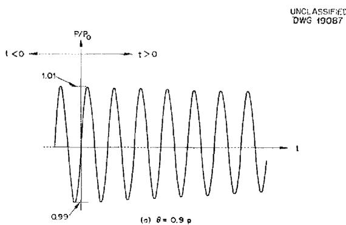

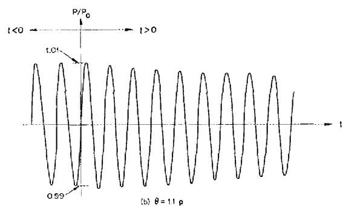

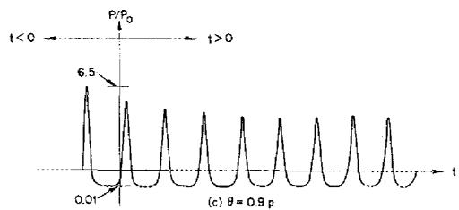

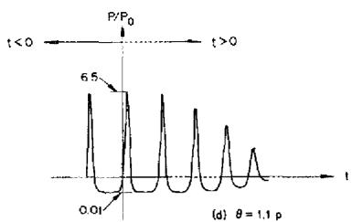

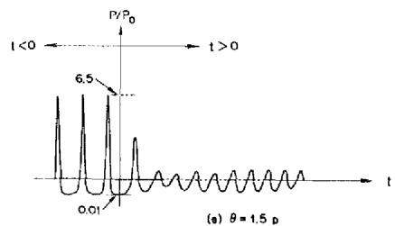  
Fig. 4.1. Differential Analyzer Solutions to the Kinetic Equation of a Circulating-Fuel Reactor.

condition at $t < 0$ , the maximum and minimum power deviate by only $1\%$ from $P_0$ . At $t = 0$ , the transit time in Fig. 4.1a abruptly gets $10\%$ smaller than the period of the undamped oscillation, and in Fig. 4.1b, $10\%$ greater. The oscillation is practically sinusoidal, and the damping is rather weak, though present. Figures 4.1c, 4.1d, and 4.1e use a different scale and refer to a more violent oscillation. In the undamped condition, the maximum of the oscillation is 6.5 times $P_0$ and the minimum is only 0.01 $P_0$ ; that is, the reactor almost shuts itself off. At $t = 0$ , the transit time jumps to 0.9, 1.1, and 1.5 times the period of the undamped oscillation in Figs. 4.1c, 4.1d, and 4.1e, respectively. Figures 4.1c and 4.1d show that the damping is small initially because of the small deviation of the transit time from the period. As the amplitude decreases, the period decreases. In Fig. 4.1c, this means that the period more closely approaches the transit time, and hence the damping decreases. In Fig. 4.1d, the opposite is the case. In Fig. 4.1e, the large deviation of the transit time from the period results in strong damping during the first cycle. Then the period happens to have decreased to one half the transit time, and the oscillation continues essentially undamped. It should be noted, however, that undamped oscillations of this kind are unstable, because a small disturbance which decreases the amplitude and hence the period would "detune" the system and cause further damping. More important, the possibility of undamped oscillations is largely a consequence of the simplifying assumptions used in the computation, in particular, the assumptions of constant transit time and of constant power and flux distribution. Under more general conditions, the undamped oscillations are much less likely to occur, and with proper design, their occurrence can be prevented.

The First Overswing Following a Disturbance. Sufficient work has been done to show that under conditions envisaged for the aircraft reactor, even a sudden application of considerable excess reactivity will only result in a moderate temperature overswing. However, since this temperature increase occurs in a short time, it is not easy to show, and it has not yet been shown, that the fuel expansion occurs without accompanying large pressure surges.

# STATICS OF THE CIRCULATING-FUEL ARE CRITICAL EXPERIMENT

C. B. Mills, ANP Division

The analysis of the data of the ARE Critical Experiment is not yet complete. However, several interesting results have been obtained.

1. The multiplication constant of the reactor with a simple loading pattern of about 61 tubes in the 70 fuel-coolant tube holes(2) in the core was recalculated, and all the correction factors now known were used. The result was 1.003, as compared with the experimental value of 1.000. As reported previously,(3) the assembly also went critical with a higher $U^{235}$ concentration and about 42 fuel tubes. Recalculation of this arrangement gave a multiplication constant of 1.009. These slight errors are consistent with a slightly incorrect value for neutron channeling from the unfilled fuel-tube holes. No large errors have as yet been found.   
2. The danger coefficient of Inconel, the structural material to be used in the hot ARE, was inconsistent with the assumed absorption cross section of the material. An error was found in the basic data which increased the values of the thermal macroscopic absorption cross section from $0.310 \, \text{cm}^{-1}$ to $0.356 \, \text{cm}^{-1}$ . The reactivity coefficient for Inconel thus changed from 0.170 to 0.231, and the predicted critical mass of the ARE was increased by about 4 lb. Previously,[1] a value of 28 lb was predicted as the uranium required in the ARE core. However, since that prediction was made, the fuel and reflector coolant were changed in composition and the highly absorbing potassium was eliminated. The Inconel correction and the elimination of the potassium almost compensate for each other, but because of the possibility of other corrections, the critical mass is still somewhat in doubt.   
3. The computed and the experimental cadmium fractions, both radial and axial, for the ARE (CA-8) are given in Fig. 4.2. The discrepancy at the core boundary is largely due to the assumption of core homogeneity, with the boundary specified by the mean first neutron collision distribution.

4. The assumed $\cos^2\theta$ for control rod sensitivity and the $\cos^2\theta d\theta$ for control rod value are compared to the experimental values in Fig. 4.3.

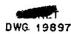

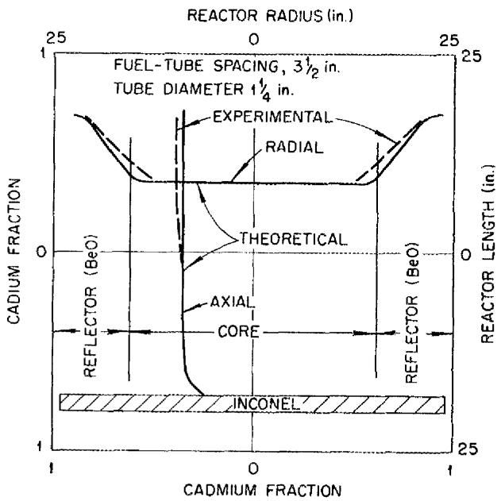  
Fig. 4.2. Radial and Axial Cadmium Fraction in the ARE Critical Experiment.

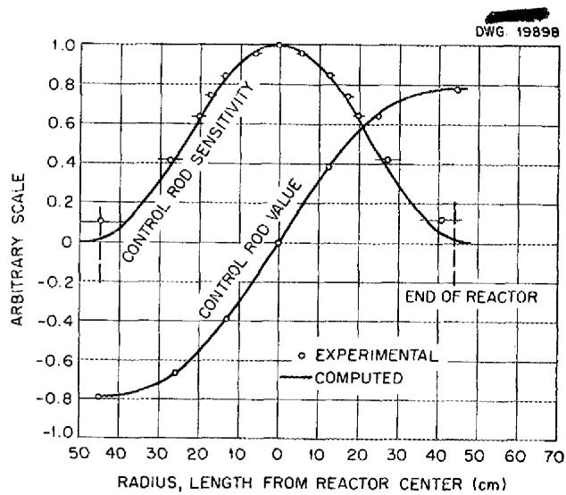  
Fig. 4.3. Control Rod Values for the ARE Critical Experiment.

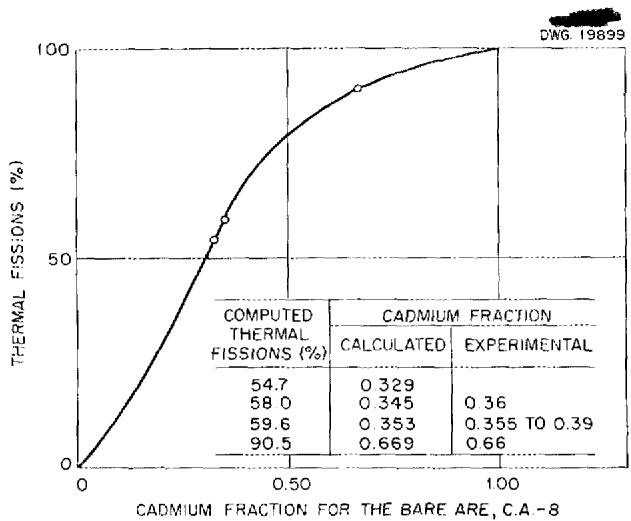  
Fig. 4.4. Per Cent Thermal Fissions as a Function of the Cadmium Fraction for the Bare ARE.

5. Computed and experimental values for the cadmium fraction vs. computed values for per cent thermal fission are shown in Fig. 4.4.   
6. The three safety rods are worth $13\%$ in $k_{\text{eff}}$ . This is twice the value required to reduce the operating temperature $1000^{\circ}\text{F}$ . The preliminary guess for the value of the rods had been $15\%$ .

# 5. REFLECTOR-MODERATED REACTOR CRITICAL EXPERIMENTS

A. D. Callihan

R.C.Keen

D. V. P. Williams

J. J. Lynn

Physics Division

D. Scott

C. B. Mills

ANP Division

The second critical assembly of the reflectormoderated circulating-fuel reactor was described previously. (1) The fuel, a mixture of $\mathsf{ZrO}_2$ , NaF, and C (66-24-10 wt %) with sufficient enriched UF4 added to make the U235 density 0.2 g/cm3, was placed around a central "island" of beryllium and was, in turn, surrounded by a beryllium reflector. The critical mass of this system was 7.7 kg of U235.

# POWER DISTRIBUTION

The power distribution and the method used in obtaining it in a direction parallel to the reactor axis were given in a previous report. (2) The power

distribution has been remeasured in the same location, with the fission rate reduced in the ends of the fuel coolant channels by shielding the channels on four sides with boral sheets 0.25 by 2.87 by 9 inches. (Boral is a mixture of aluminum powder and boron carbide sandwiched between aluminum sheets; the boron thickness is 0.25 g/cm².) Figure 5.1 gives the two power distributions normalized at a point 5.25 in. from the mid-plane.

(1)D. V. P. Williams et al., ANP Quar. Prog. Rep. Mar. 10, 1953, ORNL-1515, p. 53.

(2) Ibid., p. 58.

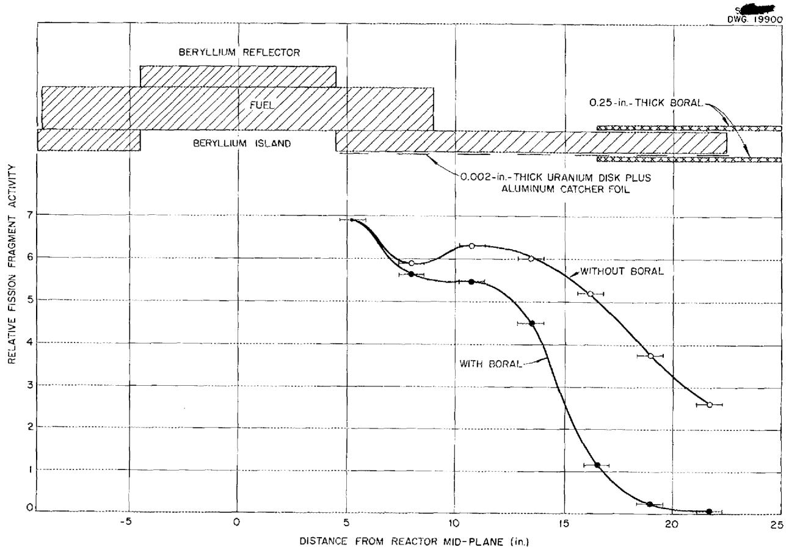  
Fig. 5.1. Power Distribution Parallel to Axis of the Reactor.

# LEAKAGEFLUX

The fast neutron leakage through the end of the reactor, both with and without the boral around the fuel coolant channels, was measured by a fission chamber placed outside the end reflector and perpendicular to the axis of the reactor. The chamber was lined with almost pure $\mathsf{U}^{238}$ and covered with boral. For measurements of the fast-neutron leakage through the side of the reactor, the chamber was placed in the mid-plane outside the reflector and parallel to the axis of the reactor. The fast-neutron leakage flux through the end was 30 times the corresponding flux through the sides without the boral around the fuel-coolant channels, and only about six times the flux through the sides with the boral shield in place. Of course, this reduction in fast-neutron leakage causes some loss in reactivity; the introduction of the boral on one end reduces the $k_{eff}$ by $2\%$ .

# CONTROL ROD MEASUREMENTS

The loss in reactivity as a function of the position of a $3/16$ -in. stainless steel tube filled with boron when inserted along the axis into the island of the reactor is shown in Fig. 5.2. The boron density was about 0.14 g per inch of the 0.1375-in.-ID tube, or about 50% of the theoretical density. A solid stainless steel rod of the same size inserted along the axis to the mid-plane gave a loss in reactivity of 5 cents.

# DANGER COEFFICIENT MEASUREMENTS

A large number of danger coefficient measurements were made with the test material placed in both the fuel and reflector regions. The results

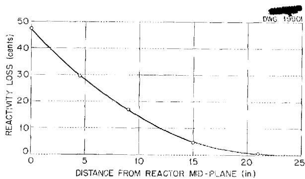  
Fig. 5.2. Change in Reactivity Produced by Boron-Filled Rod as a Function of Its Position Along Reactor Axis.

are reported in Table 5.1. The last two columns list the change in reactivity which occurred when an empty test space was filled with the sample. The samples of Li, KF, NaF, Zr, Cr, and RbF were in aluminum containers by 2% by 9 in., which had 1/32-in.-thick walls. These containers were assumed to have no significant effect on the reactivity. The sample of sodium was contained in a thin stainless steel can. The reactivity value of the can when empty was compared with that obtained with the sample in place to obtain the reactivity value for sodium. The other materials required no containers. The long dimensions of the samples were parallel to the reactor axis, and the samples were symmetrically located about the mid-plane. When in the reflector, the samples were placed about 12 in. from the axis. In this location the total neutron flux was greatest. (3)

The reactivity change incurred by the substitution of a sample of $\mathsf{D}_2\mathsf{O}$ for beryllium was measured at three locations in the assembly. The sample was $99.2\%$ $\mathsf{D}_2\mathsf{O}$ and weighed $2.65\mathrm{kg}$ . It was placed at the assembly mid-plane in the island adjacent to the fuel, in the reflector adjacent to the fuel, and in the reflector 3 in. from the fuel layer. In each of the first two locations the gain in reactivity resulting from the substitutions was 12 cents; in the latter position the reactivity was decreased 24 cents.

In the present design of a three-region reflectormoderated reactor, the fuel-coolant flows in an Inconel shell.(4) To evaluate the loss in reactivity caused by the insertion of such a poison around the fuel region, $\frac{1}{8}$ -in.-thick stainless steel sheets 9 in. long were placed around one-quarter of the fuel annulus. The section covered was symmetrical about the mid-plane. The addition of this stainless steel resulted in a $1.4\%$ loss in reactivity, which was compensated for by the addition of $468\mathrm{g}$ of $U^{235}$ distributed in the fuel region.

# CORRELATION WITH THEORY

Theoretical extrapolation of the various measurements, as well as of the danger coefficient measurements presented in Table 5.1, indicates that the distribution of $1 \text{ vol } \%$ of Inconel throughout the moderator and the addition of a $\frac{1}{4}$ -in.-thick fuel-coolant container would increase the critical mass

TABLE 5.1. DANGER COEFFICIENT MEASUREMENTS   

<table><tr><td rowspan="2">SAMPLE</td><td rowspan="2">SAMPLE WEIGHT (g)</td><td rowspan="2">SAMPLE SIZE*</td><td colspan="2">REACTIVITY CHANGE (cents/g)</td></tr><tr><td>In Fuel</td><td>In Reflector</td></tr><tr><td>Li7</td><td>152.4</td><td>A</td><td>0.0000</td><td>-0.0415</td></tr><tr><td>KF</td><td>198.0</td><td>A</td><td>-0.0162</td><td>-0.0578</td></tr><tr><td>NaF</td><td>97.2</td><td>A</td><td>-0.0058</td><td>-0.0354</td></tr><tr><td>Zr</td><td>287.7</td><td>A</td><td>+0.0150</td><td>-0.0498</td></tr><tr><td>Cr</td><td>249.4</td><td>B</td><td>-0.0237</td><td>-0.0680</td></tr><tr><td>RbF</td><td>156.3</td><td>B</td><td>+0.0118</td><td>+0.0026</td></tr><tr><td>Inconel</td><td>1956.4</td><td>A</td><td>-0.0276</td><td>-0.0448</td></tr><tr><td>Ni</td><td>2061.0</td><td>A</td><td>-0.0274</td><td>-0.0437</td></tr><tr><td>Pb</td><td>2544.8</td><td>C</td><td>-0.0008</td><td>-0.0007</td></tr><tr><td>Pb</td><td>4592.7</td><td>D</td><td></td><td>-0.0012</td></tr><tr><td>Stainless Steel</td><td>1990.4</td><td>C</td><td>-0.0243</td><td>-0.0385</td></tr><tr><td>Stainless Steel</td><td>3195.0</td><td>D</td><td></td><td>-0.0233</td></tr><tr><td>Stainless Steel</td><td>995.2</td><td>E</td><td></td><td>-0.0509</td></tr><tr><td>Be</td><td>753.6</td><td>D</td><td></td><td>+0.0090</td></tr><tr><td>Na</td><td>366.9</td><td>D</td><td></td><td>-0.0190</td></tr><tr><td>Bi</td><td>3931.8</td><td>D</td><td></td><td>+0.0006</td></tr><tr><td>Graphite</td><td>376.2</td><td>A</td><td>+0.0108</td><td>+0.0043</td></tr><tr><td>Graphite (Density, 1.72 g/cm3)</td><td>700.1</td><td>D</td><td></td><td>+0.0064</td></tr><tr><td>Graphite (Density, 2.0 g/cm3)</td><td>825.6</td><td>D</td><td></td><td>+0.0065</td></tr><tr><td>BeO</td><td>375.5</td><td>F</td><td></td><td>+0.0055</td></tr></table>

$$
\begin{array}{l} ^ {*} A = \frac {5}{1 6} b y 5 b y 9 i n. \\ D = 1 \text {b y} 2\%_{8} \text {b y} 8\%_{8} \text {i n .} \\ B = \frac {5}{1 6} b y 2 \frac {1}{2} b y 9 i n. \\ E = \frac {1}{8} \text {b y} 5 \frac {3}{4} \text {b y} 9 \text {i n .} \\ C = \frac {1}{4} b y 5 \frac {3}{4} b y 9 i n. \\ F = \frac {7}{8} b y 2 \frac {1}{8} b y 5 i n. \\ \end{array}
$$

to about 40 lb, compared with 17 lb for the critical experiment not containing the Inconel. A critical mass of only 30 lb results if the pressure shell is only $\frac{1}{8}$ in. thick and the Inconel structure in the reflector decreases rapidly from $1\%$ at the core-reflector interface to $0.04\%$ at the outside of the reflector, with the average being $0.2\%$ . This distribution is probably a good approximation to the distribution in an actual reactor.

The cadmium fraction for one point at the core-reflector interface of the reactor was previously reported $^{(3)}$ to be significantly different from the computed value. The discrepancy has now been resolved by shifting the radial coordinate in the computation to properly take into account the void which existed at the boundary. Figure 5.3 shows the revised computed curve; some difference still exists between the shapes of the experimental and the theoretical curves. These differences may be due to (1) the deviation of the experimental, flat geometry from the spherical geometry assumed in the computation, (2) boundary effects not quite accurately described by simple diffusion theory, or (3) the radial orientation of the foils in the experiment. The radial orientation makes locating the effective centers of the foils difficult in the rapidly varying flux.

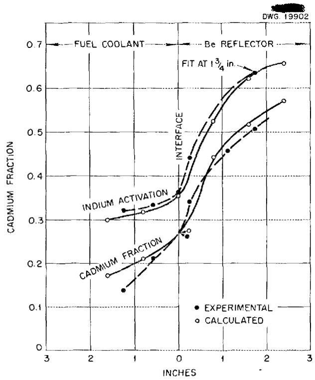  
Fig. 5.3. Computed vs. Experimental Indium Activation and Cadmium Fractions at the Fuel-Coolant-to-Reflector Interface of the Reflector-Moderated Reactor.

Part II

MATERIALS RESEARCH

# INTRODUCTION AND SUMMARY

The research on high-temperature liquids has been primarily concerned with the detailed study of the complicated $\mathrm{NaF - ZrF_4 - UF_4}$ system, the production of the fluorides required by the ARE, and, to a lesser extent, with other halide systems containing $\mathsf{UF}_3$ or $\mathsf{UCl}_4$ (sec. 6). The pseudo-eutectic that has been shown to exist at or near the composition 65-15-20 mole % is now designated as the ARE fuel concentrate. Although its melting point $(515^{\circ}C)$ is comparable to that of the previously considered 50-25-25 mole % mixture, the new mixture is the more desirable, since it does not segregate on cooling and, in addition, has a lower vapor pressure. Use of this new fuel-concentrate in conjunction with the $\mathrm{NaZrF_5}$ carrier results in a fuel composition of 53-43-4 mole % of $\mathrm{NaF - ZrF_4 - UF_4}$ . Construction of the facilities for production of these fluorides in the quantities required by the ARE is complete. These facilities provide for the necessary purification by hydrogenation-hydrofluorination to effect the removal of such corrosive contaminants as $\mathrm{NiF}_{2},\mathrm{FeF}_{3},$ and $\mathsf{CrF}_3$ .

The recent corrosion studies have been almost entirely devoted to the general problem of the corrosion of Inconel by fluorides (sec. 7). Other studies include secondary systems associated with the ARE, such as fluorides onstellites and beryllium oxide in sodium, as well as the longer range problem of mass transfer in lead. The corrosion of Inconel by the fluoride fuel NaF-ZrF4-UF4(50-46-4 mole $\%$ ) has been reduced to around 5 mils in 500 hr, and the corrosion mechanism is now fairly well established. The corrosion rate decreases with time and is primarily a function of the fluoride contaminants NiF and $\mathsf{FeF}_2$ , which react with the chromium in the metal. At present, the attendant formation of UF3 limits the extent to which the NiF and $\mathsf{FeF}_2$ contaminants may be removed from the fuel. With regard to beryllium oxide in sodium, it has been fairly well established that the corrosion mechanism is in reality only the mechanical erosion of the beryllium oxide surface. In convection loop tests of various metals in lead, only molybdenum and columbium did not show any mass transfer, while type 446 stainless steel showed a slight amount. Other metals, including Inconel, Armco iron, and types 304 and 347 stainless steel, showed extensive mass transfer.

Welding, brazing, creep-rupture tests, development of cermets, and the fabrication of various pieces of equipment constitute the metallurgical research program (sec. 8). Manual inert-arc welds have been successfully applied to tube-to-header heat exchanger welds which did not lend themselves to the semiautomatic cone-arc technique. The flowability of the Microbraz brazing alloy used to assemble the liquid-to-air radiator section is adversely affected by the presence of nitrogen. The use of high-conductivity oxidation-resistant fins for these radiators is obviously desirable. Coating copper with chromium, nickel, Inconel, and stainless steel has been undertaken. Several copper alloys show promise as fin material. Creep and stress-rupture tests in air, argon, hydrogen, and fluorides indicate that Inconel and nickel are more sensitive to environmental changes than are the austenitic stainless steels. The creep rate of Inconel in fluorides is comparable to that in argon. Of the several methods for the fabrication of spherical solid fuel elements that were investigated, forcing the molten alloy through a small orifice produced the most uniform and least oxidized particles. Numerous compacts with $14\mathrm{vol}\% \mathrm{MoS}_2$ have been hot pressed for use as pump seals.

While the physical properties of molten fluorides and hydroxides are being measured at temperatures of up to $1000^{\circ}\mathrm{C}$ , the heat transfer characteristics of these liquids are being studied in various systems (sec. 9). Among the physical property measurements pertinent to the ARE are (1) the viscosity of the recently designated ARE fuel $\mathrm{NaF - ZrF_4 - UF_4}$ (53-43-4 mole %), which decreases from 13.5 cp at $620^{\circ}\mathrm{C}$ to 8.8 cp at $757^{\circ}\mathrm{C}$ , (2) the density of this fluoride, which is $3.5\mathrm{g/cm}^3$ at $653^{\circ}\mathrm{C}$ , and (3) its vapor pressure, which ranges from $4.5\mathrm{mmHg}$ at $790^{\circ}\mathrm{C}$ to $39\mathrm{mmHg}$ at $958^{\circ}\mathrm{C}$ . The experimental velocity profiles which have been determined in a convection system differ significantly from the parabolic characteristic of isothermal laminar flow. Forced-convection heat transfer for the NaF-KF-LiF eutectic-Inconel system in 0.175-in.-ID tubes is one half that for a comparable fluoride-nickel system, probably because of a corrosion layer found on the Inconel surface. A mathematical analysis has been made of the effectiveness of a reactor coolant with

regard to duct dimensions and spacing, amount of heat to be removed, coolant temperature rise, and coolant physical properties.

The radiation damage studies are primarily concerned with the evaluation of the results of the fluoride-Inconel samples irradiated in the LITR and MTR, as well as the effect of radiation on creep and thermal conductivity. An inpile fluoride loop is being constructed (sec. 10). The irradiated fluoride-containing Inconel capsules show an intergranular attack of up to 3 mils, which does not occur in control samples. Chemical analyses of these fluoride mixtures indicated uneven distribution of uranium. Cantilever-type creep measurements made on Inconel in a helium atmosphere in the LITR indicated no serious change in creep properties as a result of irradiation; also, there was no significant change in the thermal conductivity of an Inconel specimen irradiated in the MTR.

The analytical studies of reactor materials include the development of chemical, petrographic, and x-ray analyses of fuel compositions and/or identification of fuel corrosion products (sec. 11). A procedure, which uses BrF as a reagent, has been developed for the determination of oxygen in fluorides. The determination of zirconium in fuels may be made volumetrically by the use of $p$

bromomandelic acid as a reagent, or colorimetrically with reference to zirconium alizarin sulfonate. "Tiron" is shown to be a suitable reagent for the determination of uranium. The concentrations of $\mathsf{UF}_3$ and $Zr^0$ in NaF-ZrF4-UF4 (50-46-4 mole %) have been determined by the evolution of hydrogen, upon treatment of the mixture with hydrochloric and hydrofluoric acids. Optical data, from petrographic examination, are reported for many new fluoride compounds.

Studies of reprocessing of fluoride fuels indicate that reprocessing may be accomplished readily in existing facilities (sec. 12). Although the NaF-ZrF $_4$ -UF $_4$ (50-46-4 mole %) fuel was used in these studies, the information obtained is generally applicable to other compositions within this system. After an aqueous solution of the fluoride that is suitable for solvent extraction is obtained by reaction with dilute aluminum nitrate-nitric acid solution under reflux conditions, the uranium can be recovered and decontaminated by solvent extraction in batch countercurrent runs with losses of less than $0.01\%$ . Processing of the fuel in this manner is possible in the present ORNL Metal Recovery Plant without major equipment additions, although the corrosion of existing equipment will be severe and some precautions will have to be taken to avoid criticality.

# 6. CHEMISTRY OF HIGH-TEMPERATURE LIQUIDS

W. R. Grimes, Materials Chemistry Division

An effort is being made to obtain a better understanding of the solid-phase relationships in the very complicated $\mathsf{NaF - ZrF_4 - UF_4}$ system because of its importance to the aircraft reactor program. Some additional thermal data were obtained, but the greater number of samples prepared was for solid-phase studies. A pseudoeutectic has been shown to exist at or near the composition 65-15-20 mole $\%$ and it has been tentatively designated as the ARE fuel concentrate rather than the previously considered 50-25-25 mole $\%$ mixture. Data on a few compositions in the $\mathsf{RbF - ZrF_4 - UF_4}$ system indicate that this system may possible be of interest as a fuel material. Because of the current interest in $\mathsf{BeF}_2$ pump seals, the change in the melting point of the 50 mole $\%$ NaF-46 mole $\%$ $\mathsf{ZrF}_4$ -4 mole $\%$ UF $^4$ mixture when various amounts of $\mathsf{BeF}_2$ are added was restudied.

Studies of the phase diagrams of mixtures of metal and uranium halides, other than those containing $\mathsf{UF}_4$ , have continued. Several binary fluoride systems containing $\mathsf{UF}_3$ have been examined, but no satisfactory phase diagrams have yet been obtained. Lack of sufficiently pure $\mathsf{UCl}_4$ has hampered the thermal analysis of chloride system; however, low-melting-point compounds are indicated in several mixtures.

Modifications of the hydrogenation-hydrofluorination process previously described for the fuel preparation have been studied on laboratory and pilot scales. There has been considerable study of the kinetics of removal of HF from the melts by stripping with helium and hydrogen, and efforts have been made to evaluate the kinetics of reduction of $\mathsf{NiF}_2$ , $\mathsf{FeF}_3$ , $\mathsf{FeF}_2$ , $\mathsf{CrF}_3$ , and $\mathsf{UF}_4$ by hydrogen in these melts. It appears that stripping of the HF by use of hydrogen rather than helium is to be preferred, since more complete removal of the structural metal fluorides will be effected at the same time.

Construction of the equipment for production of 3000 lb of ARE fuel solvent $(\mathrm{NaZrF}_5)$ is complete, and preliminary testing of the equipment has been satisfactory. Production of this material is scheduled for June and early July.

X-ray diffraction studies have been made on two fluoride mixtures to establish the compounds and phases found in the respective melts. The mixtures

studied were $\mathsf{NaF - UF}_4$ (75-25 mole %) and NaF $\mathsf{ZrF}_4$ (50-50 mole %). Several ternary phase regions were also examined, and the x-ray data, together with petrographic observations for compounds found in these regions, are presented.

# FUEL MIXTURES CONTAINING UF

L.M.Bratcher J.Truitt

C.J.Barton

Materials Chemistry Division

$\mathsf{NaF - ZrF_4 - UF_4}$ . The discovery that $\mathsf{UF_4}$ separates from the mixture $\mathsf{NaF - ZrF_4 - UF_4}$ (50-25-25 mole %) when cooled without efficient stirring made this mixture undesirable as a fuel concentrate for the addition of enriched uranium to the ARE. The need for a nonsegregating composition with a high uranium concentration was also demonstrated in radiation damage studies.

X-ray diffraction data for compositions on the $\mathrm{NaUF}_5\mathrm{-Na}_3\mathrm{ZrF}_7$ line indicated that these compounds may form the pseudobinary system for which thermal data are shown in Fig. 6.1. The data seem to indicate a minimum composition at about 45 mole $\%$ $\mathrm{NaUF}_5$ (22.5 mole $\%$ UF). However, petrographic examination of the 40 and 45 mole $\%$ compositions showed that both compositions had the appearance of a eutectic (aggregates of very fine-grained crystals), and the results of settling tests (cf., "Analytical Studies of Reactor Materials," sec. 11) seem to indicate that the lower concentration of $\mathrm{NaUF}_5$ is closer to the eutectic. This composition ( $\mathrm{NaF - ZrF_4 - UF_4}$ , 65-15-20 mole $\%$ ) is, at present, tentatively designated as the enriched-uranium composition for ARE startup.

It seemed undesirable to change the composition of the uranium-free fused salt $(\mathrm{NaZrF}_5)$ that will be circulated in the reactor before the addition of uranium. Mixing the new uranium-rich composition with $\mathrm{NaZrF}_5$ in the proper proportions results in a fuel with the composition $\mathrm{NaF - ZrF_4 - UF_4}$ (53-43-4 mole %). This mixture shows a melting point of $520^{\circ}C$ , which is approximately the same as that of the 50-46-4 mole % fuel composition previously considered. Vapor pressure data for the new fuel composition are reported in sec. 9, "Heat Transfer and Physical Properties."

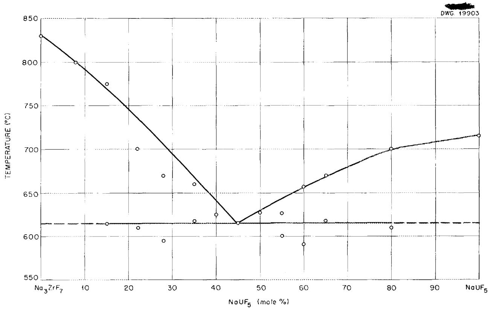  
Fig. 6.1. The System $\mathsf{Na}_3\mathsf{ZrF}_7\text{-NaUF}_5$ .

$\mathsf{RbF - ZrF_4 - UF_4}$ . The low melting point of $\mathsf{RbZrF}_5$ recently redetermined to be $405\pm 5^{\circ}C,$ makes this material seem attractive as a possible base for a fuel preparation. Mixtures containing various proportions of $\mathsf{RbZrF}_5$ and $\mathsf{RbUF}_5$ (melting point, $710\pm 10^{\circ}C)$ were prepared, and data on thermal effects were obtained from cooling curves (Table 6.1).

Thermal data for the 92 mole $\%$ RbZrF-8 mole $\%$ RbUF5 mixture were checked on samples prepared in sealed capsules. This material showed a halt only at $402^{\circ}\mathrm{C}$ , which is the lowest melting point yet recorded for a nonberyllium fluoride mixture containing as much as 4 mole $\%$ UF4. For mixtures with higher uranium concentrations, the rather sharp rise in the melting point probably indicates the formation of a higher melting complex, such as Rb3UF7 (melting point, $990^{\circ}\mathrm{C}$ ). Further work on this system will be undertaken as the supply of RbF permits

NaF-ZrF4·BeF2-UF4. Data on mixtures resulting from the addition of BeF2 to the binary composition with NaF-ZrF4·UF4 (50-46-4 mole %) were

TABLE 6.1. THERMAL EFFECTS FROM COOLING CURVES FOR MIXTURES OF ${\mathrm{{RbZrF}}}_{5}$ AND ${\mathrm{{RbUF}}}_{5}$   

<table><tr><td>COMPOSITION (mole % RbUF5)</td><td>THERMAL EFFECTS (°C)</td></tr><tr><td>4</td><td>400, 385 (halt)</td></tr><tr><td>8</td><td>400 (halt)</td></tr><tr><td>12</td><td>560, 400 (halt)</td></tr><tr><td>16</td><td>505, 400 (halt)</td></tr><tr><td>20</td><td>575, 400 (halt)</td></tr></table>

given in a previous progress report; however, a more detailed study of such mixtures was carried out during this quarter. The thermal effects noted are given in Table 6.2. At the higher $\mathsf{BeF}_2$ concentrations, the thermal effects were not well marked on the cooling curves. The data indicate,

however, that liquid probably exists in mixtures with 60 or 70 mole $\%$ $\mathsf{BeF}_2$ at as low as $430^{\circ}\mathsf{C}$ . The uranium concentration in these mixtures is very low, and the data are of interest only in

TABLE 6.2. THERMAL EFFECTS FOR MIXTURES OF NaF-ZrF4-UF4 (50-46-4 mole %) AND BeF2   

<table><tr><td>CONCENTRATION OF BeF2(mole %)</td><td>THERMAL EFFECTS FROM COOLING CURVES (°C)</td></tr><tr><td>1</td><td>510 (halt), 490</td></tr><tr><td>2</td><td>520 (halt)</td></tr><tr><td>5</td><td>493, 445</td></tr><tr><td>10</td><td>476 (halt), 435, 365</td></tr><tr><td>20</td><td>465 (halt)</td></tr><tr><td>50</td><td>602, 543, 444 (halt)</td></tr><tr><td>60</td><td>505, 430</td></tr><tr><td>70</td><td>620, 430</td></tr><tr><td>80</td><td>880 (?), 415</td></tr></table>

connection with the possible use of $\mathsf{BeF}_2$ in pump seals.

# FLUORIDE MIXTURES CONTAINING UF3

V.S.Coleman C.J.Barton

Materials Chemistry Division

T. N. McVay, Consultant, Metallurgy Division

Thermal analyses of binary mixtures of NaF- $\mathsf{UF}_3$ and KF- $\mathsf{UF}_3$ , supplemented by examination of the solid phases, have not, to date, provided satisfactory information for the preparation of phase diagrams of these systems. A number of compositions in other systems were prepared to aid in the identification of the solid phases occurring in reduced zirconium-base fuels. The complex compound $2\mathsf{ZrF}_4\cdot \mathsf{UF}_3$ , mentioned in a previous report,[2] has been definitely identified. Table 6.3 shows the thermal data obtained from cooling curves and the optical data obtained from petrographic examinations for several preparations in the $\mathsf{UF}_4\cdot \mathsf{UF}_3\cdot \mathsf{ZrF}_4$ system.

(2)W. C. Whitley, V. S. Coleman, and C. J. Barton, ANP Quar. Prog. Rep. Dec. 10, 1952, ORNL-1439, p. 109.

TABLE 6.3. THERMAL AND OPTICAL DATA FOR ${\mathrm{{UF}}}_{3} - {\mathrm{{ZrF}}}_{4}$ AND ${\mathrm{{UF}}}_{4} - {\mathrm{{ZrF}}}_{4}$ MIXTURES   

<table><tr><td>MOLECULAR COMPOSITION</td><td>THERMAL EFFECTS (°C)</td><td>OPTICAL DATA</td></tr><tr><td>UF3·2ZrF4</td><td>715, 631</td><td>Orange-red compound; RI* = 1.556</td></tr><tr><td>UF3·ZrF4</td><td></td><td>Yellow and brown crystals; RI = 1.616; free UF3</td></tr><tr><td>UF4·UF3·2ZrF4</td><td>730</td><td>Predominantly brownish, some olive drab</td></tr><tr><td>UF4·UF3·4ZrF4</td><td>742</td><td>Predominantly olive drab; biaxial +, alpha = 1.556, gamma = 1.568, 2V = 80 deg</td></tr><tr><td>UF4·3UF3·8ZrF4</td><td>712</td><td>Mixture of olive-drab and red-orange striated crystals</td></tr><tr><td>UF4·UF3·ZrF4</td><td>735</td><td>Brown isotropic phase; alpha = 1.560, gamma = 1.568; some UF3</td></tr><tr><td>4UF4·UF3·ZrF4</td><td>847</td><td>Predominantly UF4 surrounding brown-orange crystals of RI = 1.56 to 1.57</td></tr><tr><td>3UF4·8UF3·ZrF4</td><td>784, 773, 600</td><td>Homogeneous olive-drab phase different from the 1:1:4 preparation; uniaxial +, pleochroic, alpha = 1.570, gamma = 1.578</td></tr><tr><td>15% UF4-35% UF3-50% ZrF4</td><td>725, 590</td><td>Predominantly olive drab, trace of UF3 and brown-orange crystals</td></tr></table>

*Refractive index.

# CHLORIDE MIXTURES CONTAINING UCI4

R.J.Sheil

C.J.Barton

Materials Chemistry Division

A considerable part of the work with uranium tetrachloride during the past quarter was devoted to efforts to obtain pure material. Neither sublimation of product from hexachloropropylene chlorination of $\mathsf{UO}_3$ nor from chlorination of $\mathsf{UH}_3$ produced material of the desired purity. Although the accepted value for the melting point of $\mathsf{UCl}_4$ is $590^{\circ}\mathsf{C}$ , the highest melting point obtained to date from these preparations was $567^{\circ}\mathsf{C}$ . Plans have been made to procure pure $\mathsf{UCl}_4$ and pure $\mathsf{UCl}_3$ prepared by vapor-phase chlorination of $\mathsf{UO}_3$ with $\mathsf{CCl}_4$ (and reduction of the $\mathsf{UCl}_4$ with $\mathsf{H}_2$ ) from the Y-12 plant.

Although one significant experiment in the KCl-UCI4 system is reported below, little study of the NaCl-UCI4 and KCl-UCI4 systems was attempted during the quarter. This work will be resumed for final exploratory checking when sufficiently pure UCI4 is available. Studies of the LiCl-UCI4, TICI-UCI4, and LiCl-KCl-UCI4 systems were initiated during this period. The best material available was used.

KCl-UCI. Thermal data obtained in this laboratory(3) indicated a eutectic between $\mathsf{K}_2\mathsf{U}\mathsf{C}\mathsf{I}_6$ and KUCl which melted at $320\pm 10^{\circ}C,$ while the previously published(4) diagram for this system shows a melting point for this composition of about $600^{\circ}C.$ To ascertain whether a solid phase separates from the melt without giving a detectable thermal effect, a mixture containing 57 mole % KCl and 43 mole $\% \mathsf{U}\mathsf{C}\mathsf{I}_{4},$ the approximate eutectic composition, was heated to $355^{\circ}C,$ and a portion of the liquid was drawn by suction through a frittedglass filter. It was not possible to filter the liquid at lower temperatures, probably because of its high viscosity. The comparison of observed and calculated values for composition of the liquid are shown below:

<table><tr><td></td><td>Found (%)</td><td>Calculated (%)</td></tr><tr><td>Potassium</td><td>10.9</td><td>10.8</td></tr><tr><td>Uranium</td><td>48.8</td><td>48.1</td></tr></table>

The agreement between the calculated and the analytical results shows that no significant amount of material separated from the melt at $355^{\circ}C$ and indicates that the previously accepted value for the melting point of this composition is erroneous.

$\mathsf{LiCl - UCl}_4$ Thermal data for compositions in the $\mathsf{LiCl - UCl}_4$ system containing 25, 40, and 75 mole $\% \mathsf{UCl}_4$ were reported in a previous study. On the basis of the few compositions studied, it was reported that there were no compounds and that the eutectic temperature was 410 to $430^{\circ}\mathrm{C}$ . The thermal data obtained in this laboratory with the use of impure $\mathsf{UCl}_4$ prepared by hexachloropropylene chlorination of $\mathsf{UO}_3$ are shown in Fig. 6.2. The data are considered tentative and subject to revision when purer $\mathsf{UCl}_4$ becomes available. The values obtained thus far agree reasonably well with those reported in the previous study, but they seem to indicate that two eutectics melting at $415^{\circ}\mathrm{C}$ (approximately 29 mole $\% \mathsf{UCl}_4$ ) and $405^{\circ}\mathrm{C}$ (approximately 48 mole $\% \mathsf{UCl}_4$ ) exist in the system. The compound $\mathsf{Li}_2\mathsf{UCl}_6$ appears to melt congruently at $430 \pm 10^{\circ}\mathrm{C}$ ; however, the flatness of the liquidus curve suggests that this compound is rather unstable. The existence of the compound is not yet supported by petrographic examination, since compositions in this region were too poorly crystallized to permit microscopic characterization of the solid phases.

TICI-UCI. On the basis of data obtained to date, it appears that there is a eutectic in the TICI-UCI system at approximately 16.5 mole $\%$ UCI which melts at $362\pm 10^{\circ}C$ and a congruently melting compound $\mathsf{T}\mathsf{I}_2\mathsf{U}\mathsf{C}\mathsf{I}_6$ which melts at about $480\pm 10^{\circ}C.$ The data are subject to the reservations stated above regarding purity of materials.

KCl-LiCl-UCI. The five compositions studied to date in the KCl-LiCl-UCI system were prepared by adding increasing amounts of UCI (HCP product, as received) to the KCl-LiCl eutectic (41 mole % KCl; melting point, $352^{\circ}C$ ). The addition of 2 mole % UCI to the binary eutectic raised the melting point about 16 deg, and subsequent additions of up to 20 mole % raised the melting point further. For UCI concentrations of up to 10 mole %, the cooling curves indicated the probable existence of a eutectic whose composition is not yet known which melts at $345^{\circ}C$ and contains a very low concentration of UCI. At the higher UCI concentrations (30 and 35 mole %

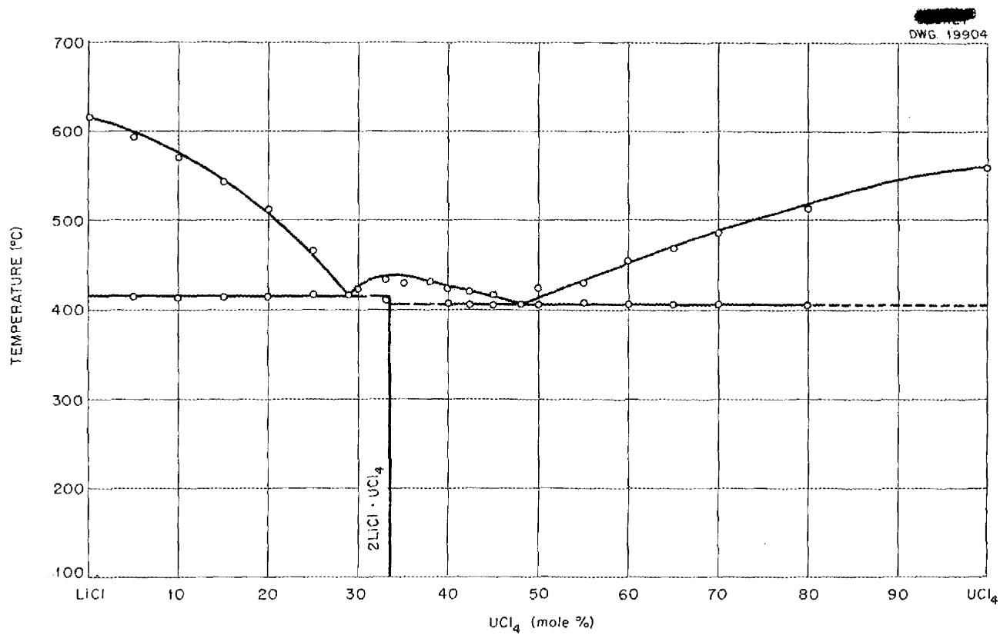  
Fig. 6.2. The System $\mathsf{LiCl - UCl}_4$ (Tentative).

$\mathsf{UCl}_4)$ , the cooling curves showed halts at approximately $275^{\circ}\mathsf{C}$ . The halts are probably due to a high-uranium eutectic in the vicinity of the KCl-UCl4 binary eutectic (43 mole $\%$ UCl4; melting point, $320 \pm 10^{\circ}\mathsf{C}$ ). Work on this system is continuing.

# COOLANT DEVELOPMENT

L.M.Bratcher V.S.Coleman

C.J.Barton

Materials Chemistry Division

Most of the work with coolants during the past quarter was devoted to checking some of the results of earlier work and to preparing possible compounds for petrographic and x-ray diffraction examination. An effort was also made to extend the data on the binary $\mathsf{ZrF}_4$ systems to higher $\mathsf{ZrF}_4$ concentrations through the use of sealed capsules. It seems likely that a part of the earlier data on systems containing KF, RbF, and CsF with $\mathsf{ZrF}_4$ was erroneous because of the lack of

sufficient care in keeping water out of contact with these hygroscopic materials. Work on a number of systems is still in progress and will be reported at a later date.

$\mathsf{NaF - ZrF_4 - BeF_2}$ Although some data on the NaF-ZrF-BeF2 system were reported earlier, renewed interest in the system as a result of the recent use of $\mathsf{BeF}_2$ in pump seals made further work with compositions in this ternary system desirable. The lowest melting point found was $345^{\circ}C$ for a mixture containing 15 mole $\% \mathsf{ZrF}_4$ 42.5 mole $\%$ NaF, and 42.5 mole $\%$ $\mathsf{BeF}_2$ .Halts on the cooling curves were observed with this composition and other compositions in its vicinity at temperatures ranging from 290 to $320^{\circ}C$ It is not clear from the available data whether this thermal effect is due to a solid transition or to a eutectic of unknown composition. On the $\mathsf{NaZrF}_{5}$ $\mathsf{BeF}_2$ line, the lowest melting point observed in the range of 4 to 45 mole $\%$ $\mathsf{BeF}_2$ was $487^{\circ}C$ at 12.5 mole $\%$ $\mathsf{BeF}_2$

LiF-ZrF. Preliminary data on the LiF-ZrF4 system were reported in a previous progress report.(5) Most of the early data have been subsequently proved to be incorrect, probably because of the presence of oxide or oxyfluoride in the mixtures. The minimum melting point in the system was reported more recently.(6) Publication of an equilibrium diagram for the system has been delayed by an apparent conflict between the thermal data and the results of petrographic and x-ray diffraction identifications of the solid phases in the 75 mole % LiF-25 mole % ZrF4 mixture. Since it appears that a rather detailed examination of this region will be necessary to clear up the discrepancy, the thermal data are presented in Fig. 6.3 as a tentative equilibrium diagram.

(5)J. P. Blakely, L. M. Bratcher, R. C. Traber, Jr., and C. J. Barton, ANP Quar. Prog. Rep. Mar. 10, 1952, ORNL-1227, p. 104.   
(6)L. M. Bratcher and C. J. Barton, ANP Quar. Prog. Rep. Dec. 10, 1952, ORNL-1439, p. 112.

The liquidus line shown in the diagram indicates $\mathsf{Li}_3\mathsf{ZrF}_7$ to be a congruently melting compound, but the solid material of this composition was found to contain $\mathsf{Li}_2\mathsf{ZrF}_6$ , $\mathsf{LiF}$ , and a crystalline phase of lower refractive index than $\mathsf{Li}_2\mathsf{ZrF}_6$ . This latter phase has not been prepared in pure form, but it predominates in the mixtures containing 15 and 20 mole $\% \mathsf{ZrF}_4$ . The thermal data also show some indication of a compound containing more than 1 mole of $\mathsf{ZrF}_4$ per mole of $\mathsf{LiF}$ . An unknown phase, in addition to $\mathsf{Li}_2\mathsf{ZrF}_6$ and $\mathsf{ZrF}_4$ , was reported to be present in the x-ray diffraction pattern of the 67 mole $\% \mathsf{ZrF}_4$ mixture.

# DIFFERENTIAL THERMAL ANALYSIS

# R. A. Bolomey, Materials Chemistry Division

Experience during the quarter with the differential thermal analysis apparatus has shown that both the precision and the accuracy of the data obtained with this apparatus are increased by

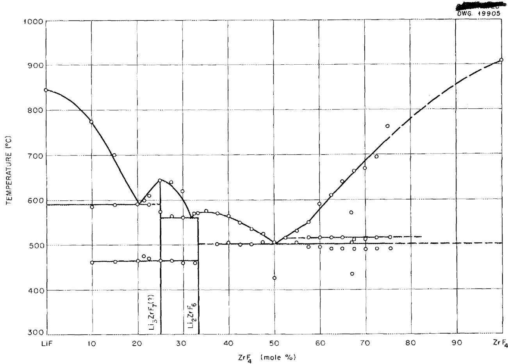  
Fig. 6.3. The System LiF-ZrF $_4$ (Tentative).

referring the differential temperature to the sample temperature rather than to the $\mathrm{Al}_{2}\mathrm{O}_{3}$ reference material. Further improvement might be effected by using reference materials which have the same thermal properties as those of the sample but which do not exhibit transition temperatures in the temperature range of interest.

# PRODUCTION AND PURIFICATION OF FLUORIDE MIXTURES

F. F. Blankenship G. J. Nessle Materials Chemistry Division

Removal of HF from Fuel Batches (C. M. Blood, F. P. Boody, R. E. Thoma, Jr., Materials Chemistry Division). Poor corrosion performance of the fluoride mixtures could be caused by HF that remains in the finished fuel. Although there is no reason to believe that HF is appreciably soluble in $\mathsf{NaZrF}_5$ at $800^{\circ}\mathsf{C}$ , further experimentation to check this point and to evaluate the rate of removal of HF by stripping techniques were performed during the quarter. Generally speaking, vacuum techniques for removing the HF must be avoided because of the risk of introducing air and water vapor through undetected small leaks.

The HF content of gas which has been bubbled through the molten salts is best measured by the method of White and Manning $^{(7)}$ in which the conductivity of a dilute $\mathrm{HBO}_3$ solution is measured as a function of the HF it absorbs from the stripping gas. In this way, the concentration of HF in the effluent gas can be followed almost continuously.

It has been shown that HF can be removed from the molten salts at $850^{\circ}\mathrm{C}$ much more rapidly than from the unheated valves, gages, traps, and connections of the purification assembly. Consequently, numerous blanks have been run to ascertain the rate of removal of HF from empty assemblies under various conditions; these runs served only to indicate that the last traces of adsorbed or trapped HF are almost impossible to remove. Diminishing returns were reached at a level of about $10^{-5}$ mole of HF per liter of strip gas when routine procedures were applied to an empty apparatus with the usual lines attached, and $10^{-6}$ mole of HF per liter of strip gas was regarded as close to the limit of removal.

A mathematical analysis (L. Alexander, private communication) based on models resembling the system showed that a first-order process can be expected. If a first-order process is actually followed, the amount of HF remaining in the melt at any time during the stripping operation can be calculated and then combined with the equilibrium vapor concentration to provide the Henry's law constant for solubility of HF in the melt.

When helium is used as the stripping gas, the concentration of HF in the effluent gas decreases with time in a manner approximating that expected for a first-order process. When $2\mathrm{kg}$ of $\mathrm{NaZrF}_5$ is stripped at $800^{\circ}\mathrm{C}$ with a 5-cm bubble path, the half life appears to be 10 liters or less. Larger values seem to be due to slow removal of residual and adsorbed HF from cooler sections of the apparatus; with the most rigorous efforts to avoid extraneous contributions, half life values between 5 and 10 liters have been obtained with $\mathrm{NaZrF}_5$ as the melt. If 10 liters is used as the half life volume and 0.6 as the fraction of equilibrium concentration maintained in the effluent gas, an upper limit estimate of 0.25 mole of HF per liter of strip gas per mole of HF per kg of fuel is obtained for the Henry's law constant. When the stripping rate is 1 mmole of HF per liter of strip gas, the equilibrium concentration is 4 mmoles of HF per kg of fuel; this amount of HF would produce about 80 ppm of $\mathrm{CrF}_3$ by the reaction

$$
2 \mathrm {C r} ^ {\circ} + 6 \mathrm {H F} \rightleftharpoons 2 \mathrm {C r F} _ {3} + 3 \mathrm {H} _ {2}.
$$

The conclusion has been reached that melts stripped to a concentration of $10^{-4}$ mole of HF per liter of strip gas cannot contain HF in amounts sufficient to cause appreciable corrosion; precautions must, of course, be taken to avoid contamination of the melt from tramp HF from other portions of the system.

When hydrogen is used to remove HF from the molten salts, the stripping operation is complicated by the production of HF by reduction of various fluorides. The differences observed in the use of hydrogen and helium for stripping a uranium-containing fuel are given in Fig. 6.4, which shows that helium stripping occurs at a rate corresponding to a half-life volume of about 20 liters but that the change to hydrogen results in the production of HF at a higher rate. The steeper portion of the hydrogen curve appears to be related to the reduction of structural metal

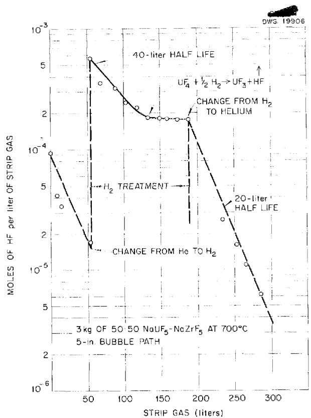  
Fig. 6.4. Stripping of Hydrogen Fluoride from a Molten Fluoride with Helium and Hydrogen.

ions; a leveling takes place at about $1.8 \times 10^{-4}$ mole of Hf per liter of gas, which corresponds to the rate of reduction of UF $_4$ to UF $_3$ .

In the larger scale apparatus for treating 50-lb batches of material, the flow rate has been increased from 1 to 5 liters/min, and the bubble path is 10 cm. Stripping rates from the 50-lb apparatus are about the same as those for the smaller rigs. Experimental data for four runs in the 50-lb apparatus, in which hydrogen was used for the stripping operation, are shown in Fig. 6.5. It appears from these data that HF concentrations in the gas phase can be brought to moderately low values by using hydrogen, even in large apparatus, without excessive stripping times.

Reduction of Metal Fluorides with $\mathsf{H}_{2}$ (C. M. Blood, F. P. Boody, R. E. Thoma, Jr., Materials Chemistry Division). Nickel is one of the metals that is resistant to HF at high temperatures because of a protective film of $\mathsf{NiF}_2$ that forms on the metal. However, when nickel is used to contain a melt capable of dissolving this film, the

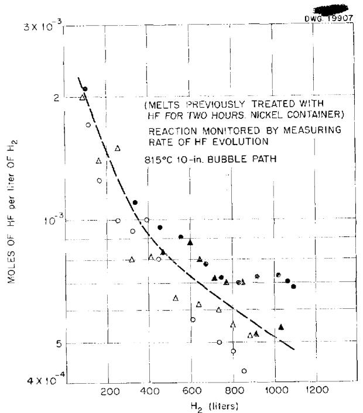  
Fig. 6.5. Stripping of Hydrogen from Hydrogen Fluoride in 4- to 50-lb Batches of NaF-ZrF $_4$ -UF $_4$ (50-46-4 mole%).

metal is slowly attacked by HF to the extent that $0.1\%$ or more of $\mathrm{Ni}^{+ + }$ can be dissolved by the melt during a 2-hr HF treatment at $800^{\circ}\mathrm{C}$ . Unless this $\mathrm{Ni}^{+ + }$ is subsequently removed, the melt is quite corrosive to Inconel because of the nearly quantitative replacement of $\mathrm{Ni}^{+ + }$ by chromium from the metal.

Accordingly, several attempts have been made to study the rate of reduction by hydrogen of structural metal fluorides in $\mathsf{NaZrF}_5$ . In general, the $\mathsf{NaZrF}_5$ contained in graphite was stripped with hydrogen until the HF concentration in the exit gas concentration reached $10^{-5}$ mole/liter. After the melt had cooled, the predetermined quantity of metal fluoride was added. The sample was reheated to $800^{\circ}C$ while being stirred with helium; hydrogen was then readmitted and analysis of the exit gas was begun.

Data from some preliminary runs with $\mathsf{NiF}_2$ are shown in Fig. 6.6. The trial run with $1\mathrm{wt}\% \mathrm{Ni}^{+ + }$ indicated that a clear-cut first-order reaction was involved. However, the data shown by $0.1\%$ additions were poorly reproducible and did not agree well with those obtained with the higher concentration. In most cases, the integrated total yield

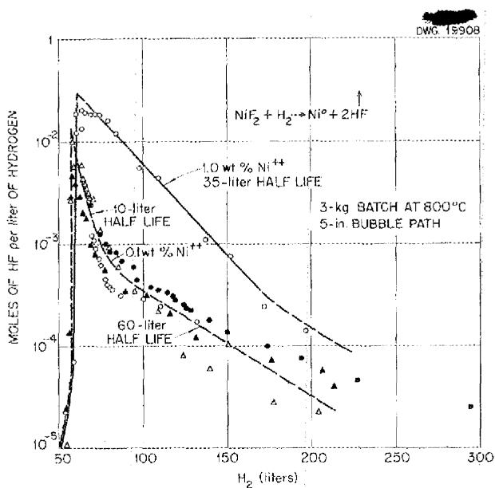  
Fig. 6.6. Rate of Reduction of NiF in $\mathrm{NaZrF}_5$ by Hydrogen.

of HF was about $25\%$ low; this is well beyond the limits of accountable experimental errors. It seems likely that some reduction by the graphite from the container is responsible for these difficulties.

Preliminary data for other structural metal fluorides reveal that $\mathsf{Fe}^{+ + }$ is reduced about four times less rapidly than $\mathsf{Ni}^{+ + }$ and $\mathsf{Cr}^{+ + + }$ about 10 times less rapidly if equal quantities of these ions are present during the usual fuel-production procedures. In practice, no significant quantity of chromium is present in the starting materials. About 500 to $700~\mathsf{ppm}$ of iron is present and, as described above, significant concentrations of nickel are added from apparatus.

Data from analyses for iron, chromium, and nickel in the finished fuel are plotted as a function of hydrogen treatment in Fig. 6.7. It is apparent that substantial benefits are obtained by hydrogen treatment for reasonable intervals of time.

It has been established that the reduced metals tend to accumulate as spongy masses on the hydrogen delivery line, on the vessel walls, and at the surface of the melts. Although the accumulation is valuable in prolonging filter life, it may prove to be a serious problem in equipment which cannot be opened for cleaning after preparation of the molten mixture. To date, however, there is no

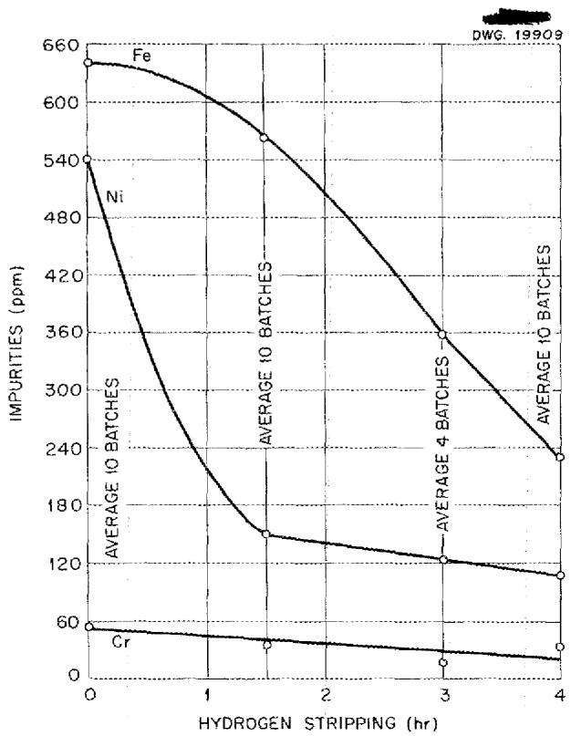  
Fig. 6.7. Hydrogen Reduction of Structural Metal Fluorides in NaF-ZrF $_4$ -UF $_4$ (50-46-4 mole %) at $1500^{\circ}$ F.

evidence that continued re-use of the equipment leads to less pure fuel mixtures.

Attempts have been made to prepare very pure fuel by using graphite-lined nickel equipment. A batch of $\mathsf{NaZrF}_5$ so handled and given 20 hr of hydrogen treatment showed 30 ppm of iron and less than 20 ppm each of chromium and nickel.

A more thorough study of the effect of $\mathsf{UF}_4$ concentration on the rate of reduction of $\mathsf{UF}_4$ by hydrogen is planned. The preliminary indication from trials with compositions containing 20 and 25 mole $\%$ $\mathsf{UF}_4$ was that the rate of reduction is approximately the same as with 4 mole $\%$ $\mathsf{UF}_4$ or, in other words, that the reaction is of zero order with respect to $\mathsf{UF}_4$ concentration.

Pilot-Scale Fuel Purification (G. J. Nessle, J. P. Blakely, J. E. Eorgan, Materials Chemistry Division). During this quarter a total of $318.9\mathrm{kg}$ of mixed fluorides was processed. This quantity of fluorides comprised 12 small batches of approximately $2\mathrm{kg}$ each and 11 large batches of approximately $27\mathrm{kg}$ each.

The gas treatment of the fluorides during preparation has been altered to effect a more thorough removal of retained HF in the melt and to yield a final product lower in metal impurities. The treatment consists of the following steps:

1. melt fluoride charge under HF atmosphere,   
2. treat with hydrogen for 1 hr,   
3. treat with HF for $1\frac{1}{2} hr$   
4. flush with hydrogen for 3 to 4 hr,   
5. transfer molten fluorides to receiver with helium,   
6. flush with helium during cooling and solidification.

This altered procedure substitutes a hydrogen flush for the helium flush; hydrogen will strip out HF as efficiently as helium and, in addition, will reduce more of the metal impurities. With the uranium-bearing mixes, the longer hydrogen flush may produce a small amount of $\mathsf{UF}_3$ . Careful control of the amount produced will be necessary to avoid precipitation of the $\mathsf{UF}_3$ .

An additional change in the treatment procedure is the use of a continuous flow of gas of approximately 5 liters/min during the hydrogen-flushing period. Previously, intermittent flow had been obtained by pressurizing to 10 lb and then bleeding off to atmospheric pressure in a 2-min cycle.

The data concerning the preparation of mixed fluorides in the pilot-scale facility during this quarter are given in Table 6.4.

Fluoride Production Facilities (G. J. Nessle, Materials Chemistry Division). The installation of process equipment to be used for production of the nonuranium fluoride base for the ARE fuel has been

completed, and preliminary tests are under way. The first "dry run" in one of two process cubicles proceeded with no difficulty, and data were obtained concerning heating time and gas flow; no leaks were found either before or after the test. During a second dry run in this cubicle, a short circuit developed in the receiver furnace and necessitated a complete shutdown for two weeks for installation of new elements in the furnace.

A dry run for the other process cubicle is scheduled in the near future. It is hoped that some valuable information concerning the behavior of HF in the process equipment can be obtained simultaneously with the trial runs.

The installation of the process equipment to be operated by the Y-12 Production Division for the production of the enriched-fluoride mix for the ARE is nearly complete. Arrangements have been made to train the personnel directly concerned with this operation. This short training program will probably be started during May.

# PREPARATION OF COMPLEX FLUORIDES

B. J. Sturm L. G. Overholser  
Materials Chemistry Division

Methods of preparation and partial listings of properties of complex fluorides of the types resulting from interaction of alkali and structural metal fluorides have been reported previously. During this quarter, additional batches of the

TABLE 6.4. PILOT-SCALE FLUORIDE PREPARATIONS   

<table><tr><td rowspan="3">MIXTURE</td><td colspan="6">COMPOSITION</td><td rowspan="3">pH</td></tr><tr><td colspan="3">per cent</td><td colspan="3">ppm</td></tr><tr><td>F</td><td>U</td><td>Zr</td><td>Ni</td><td>Cr</td><td>Fe</td></tr><tr><td>NaF-ZrF4-UF4(46-50-4 mole %)(a)</td><td>42.1</td><td>8.52</td><td>38.8</td><td>125</td><td>20</td><td>375</td><td>2.03</td></tr><tr><td>NaF-ZrF4-UF4(50-46-4 mole %)(b)</td><td>42.3</td><td>8.92</td><td>38.0</td><td>135</td><td>30</td><td>345</td><td>2.32</td></tr><tr><td>NaF-ZrF4(50-50 mole %)(c)</td><td>43.8</td><td>(d)</td><td>43.2</td><td>37</td><td>20</td><td>245</td><td>2.38</td></tr><tr><td>NaF-ZrF4-UF4(50-25-25 mole %)(e)</td><td>33.6</td><td>41.2</td><td>16.3</td><td>20</td><td>20</td><td>40</td><td>2.92</td></tr><tr><td>NaF-UF4(50-50 mole %)(e)</td><td>27.3</td><td>67.4</td><td></td><td>20</td><td>120</td><td>190</td><td>2.85</td></tr><tr><td colspan="8">(a)Average of 4. (d)Not reported. (b)Average of 16. (e)Average of 1.</td></tr></table>

complex fluorides, as well as batches of the simple structural metal fluorides, were prepared. These materials were identified or characterized by the use of chemical analyses, x-ray examination, and crystallographic data.

The following list gives the materials prepared during this quarter. Similar batches of some of these materials were prepared previously by this group, but some other batches represent new syntheses made during this period:

$$
\begin{array}{l l} \mathrm {N i F} _ {2} & \mathrm {K N i F} _ {3} \\ \mathrm {N a} _ {3} \mathrm {F e F} _ {6} & \left. \mathrm {C s N i F} _ {3} \right\} \\ \mathrm {L i} _ {3} \mathrm {C r F} _ {6} & \mathrm {R b N i F} _ {3} \\ \mathrm {C r F} _ {3} & \mathrm {N i C l} _ {2} \\ \mathrm {N a C r F} _ {3} & \mathrm {F e C l} _ {2} \end{array}
$$

Fusions were made that consisted of $\mathsf{NaZrF}_5$ with each of the following: $\mathsf{CrF}_3$ , $\mathsf{Na}_3\mathsf{CrF}_6$ , and $\mathsf{NaCrF}_3$ . In each case, the chromium compound lost its identity; x-ray analysis indicated a possible solid solution of $\mathsf{Na}_3\mathsf{CrF}_6$ and $\mathsf{NaZrF}_5$ after fusion.

Fusions of mixtures of KF and MnF, corresponding to KMnF, K2MnF, K3MnF, and K4MnF7, all yielded compounds with the same x-ray pattern. The product approximated $\mathsf{K}_2\mathsf{M}\mathsf{n}\mathsf{F}_{7^{\prime}}$ which may be a solid solution of KMnF and KMnF.

# X-RAY DIFFRACTION STUDIES

# P. A. Agron, Chemistry Division

In order to resolve some of the complexities in the NaF-ZrF $_4$ -UF $_4$ system, examinations have been made of several incongruity melting binary compounds and a number of ternary regions.

NaF-UF4 (75-25 mole %). The binary region in the vicinity of the NaF-UF4 (75-25 mole %) compo

sition was investigated. Cooling curves, along with x-ray examination of the solid phases, definitely established that $\mathsf{Na}_3\mathsf{UF}_7$ is an incongruity melting compound. The tetragonal $\mathsf{Na}_3\mathsf{UF}_7^{(9)}$ appears to be stabilized by small additions of zirconium ion. Another phase, which may be an allotropic form of $\mathsf{Na}_3\mathsf{UF}_7$ , will be investigated further.

$\mathsf{NaF - ZrF_4}$ (50-50 mole $\%$ ).Further study of the NaF-ZrF(50-50 mole $\%$ ) region indicates strongly that $\mathsf{NaZrF}_5$ has an incongruent melting point and the attendant complexities.Preparations of this binary salt generally yield the normal hexagonal compound10 on cooling the melt with adequate stirring. On examination of large-batch preparations of $\mathsf{NaZrF}_{5^{\prime}}$ the appearance of an unknown phase is marked in many instances. Two new phases in the NaF-ZrF4 (50-50 mole $\%$ ) composition region have been observed in quenching experiments at $600^{\circ}C$ and on fusing small quantities of $\mathsf{NiF}_2$ and $\mathsf{CrF}_3$ with normal $\mathsf{NaZrF}_5$ .Further work will definitely establish the nature of these two new crystal structures. The phase induced by rapid cooling was observed earlier and erroneously attributed to a reduced form of zirconium fluoride. This unidentified phase was found to be unstable when exposed to atmospheric conditions. The lack of maintenance of equilibrium conditions on passing through the incongruent freezing point is doubtless responsible for the multiplicity of phases found in the solid.

# 7. CORROSION RESEARCH

W. D. Manly, Metallurgy Division

W. R. Grimes, Materials Chemistry Division

H. W. Savage, ANP Division

During this quarter, the static and seesaw test facilities have been used almost entirely for the study of the corrosion of Inconel by a proposed ARE fuel mixture, NaF-ZrF4-UF4. Among the corrosion parameters examined in 100-hr tests at $1500^{\circ}\mathrm{F}$ , were exposure time, crevice corrosion, container cleanliness, and the effect of various additions, including potential corrosion inhibitors, as well as fuel-processing contaminants. Neither crevices nor container cleanliness seems to have a significant effect on corrosion. The corrosion rate decreases with time and is shown to be a function of the fluoride contaminants, particularly NiF and FeF2. Hard-facing alloys of thestellite type that were deposited on Inconel and static tested in the fluorides at 1500 and at $1300^{\circ}\mathrm{F}$ were rather severely attacked.

Several corrosion tests have been completed with fluorides in Inconel on the NACA type of rotating apparatus. This type of apparatus is advantageous because velocities can be obtained that are higher than those available in thermal convection loops or in the seesaw tests; however, no large temperature gradient can be attained and the flow of liquid is not continuous. In tests conducted so far at $1500^{\circ}\mathrm{F}$ for 100 hr, there has been no indication of plugging, and the corrosion is similar to that obtained in the static tests, even though a flow velocity of 10 fps is employed.

Fluoride corrosion studies in dynamic systems provided by thermal convection loops have been continued. The loops are normally operated for 500 hr with a hot-leg temperature of $1500^{\circ}\mathrm{F}$ . Most of the work during this quarter was with Inconel loops circulating the fluoride $\mathsf{NaF - ZrF}_4\mathsf{-UF}_4$ (50-46-4 mole %), which was the proposed ARE fuel. It has been shown that the depth of attack increases quite rapidly during the first 250 hr of operation but that thereafter the attack is essentially constant. These effects are also found with the fluoride $\mathsf{NaF - ZrF}_4$ -the ARE fuel carrier - but the attack is not so deep. The depth of attack is not temperature sensitive; only a slight increase in depth occurred when the temperature was increased from 1250 to $1600^{\circ}\mathrm{F}$ . The type of attack,

however, does change. The depth of attack was reduced when the small amount of weld scale found on the loop was removed by precleaning with NaF-ZrF $_4$ (50-50 mole%). Some purification of the fuel is desirable, but the present production-purification facilities seem to be adequate. It was shown that the depth of attack is a function of the fuel and not of the diffusion of chromium from the solid-solution Inconel, since two batches produce almost twice the penetration of c single batch. Addition of NiF $_2$ to the fuel increased the depth of attack. Chromium metal added to the fluoride NaF-KF-LiF-UF $_4$ (10.9-43.4-44.5-1.1 mole%) had no effect on the attack.

In a nickel loop which circulated the fluoride NaF-ZrF4-UF4 (50-46-4 mole %) there was practically no attack; however, a small amount of metallic mass transfer was found. Two type 316 stainless steel loops were operated for 500 hr with this same fluoride composition; these loops showed considerable mass transfer but no plug formation.

The study of the mass transfer of various metals in high-purity lead is being conducted in quartz thermal convection loops. So far, the following container materials have been examined: Inconel, molybdenum, columbium, Armco iron, and types 304, 347, and 446 stainless steel. In these tests, molybdenum and columbium did not show mass transfer, while type 446 stainless steel showed a slight amount of mass transfer. The remaining metals showed extensive mass transfer and premature plugging of the thermal convection loops.

The corrosion resistance of treated beryllium oxide specimens has been studied in both static and dynamic corrosion tests. The corrosion mechanism is, apparently, only the mechanical erosion of the beryllium oxide surface. Beryllium samples plated with chromium and nickel have been tested in sodium contained in Inconel tubes. The plating did not adhere to the specimens. Several Carboloys have been tested in sodium and lead at $1500^{\circ}\mathrm{F}$ and, with the exception of Carboloy 608, these alloys appear to have good corrosion resistance.

# FLUORIDE CORROSION OF INCONEL IN STATIC AND SEESAW TESTS

H. J. Buttram

C. R. Croft

R.E.Meadows

Materials Chemistry Division

D.C.Vreeland

L. R. Trotter

E.E.Hoffman

J. E. Pope

Metallurgy Division

The test conditions of the static tests in which the Inconel specimen is sealed with the fluoride mixture in an Inconel capsule are 100 hr at $816^{\circ}C$ unless otherwise stated in the following sections. The conditions of the seesaw tests in which the capsule containing the specimen and the fluoride is rocked in a furnace are 4 cpm with the hot end of the capsule at $800^{\circ}C$ and the cold end at $650^{\circ}C$ .

Effect of Exposure Time. Although a large number of studies have been reported in which fluoride mixtures in capsules of Inconel have been exposed in the tilting furnace for intervals of up to 500 hr, very little information has been available on the course of the attack during the first few hours of such exposures. To supplement previous data, capsules containing the fluoride NaF-ZrF4-UF4 (50-46-4 mole %) with and without zirconium hydride additions have been examined after exposures of 1, 5, and 10 hours.

Metallographic examination of the capsules without zirconium hydride after these short exposures indicated only very slight attack. Chemical analysis of the fuel after tests (Table 7.1) revealed that

the chromium content increased in direct proportion to the exposure time during these short exposures but that the iron and the nickel contents of the material dropped to nearly constant values after 5 hours.

In the tests made with zirconium hydride added to the fuel, somewhat less corrosion was found upon metallographic examination. With zirconium hydride added to the fuel, the iron and nickel compounds are apparently reduced quite rapidly, and they remain at low concentration levels for the duration of the tests. The linear increase in chromium content with exposure time is prevented. In previous experiments (1) with fuel to which zirconium hydride had been added, the chromium content increased by about 100 ppm in the interval between 100 and 500 hr of exposure.

Effect of Hydrogen Fluoride. The value of previous work on the effect of HF on the corrosion of ARE fuel was somewhat in doubt because of the possibility that the presence of $\mathsf{UF}_3$ in the melt might have, according to the reaction of $2\mathsf{U}\mathsf{F}_3 + 2\mathsf{H}\mathsf{F} = 2\mathsf{U}\mathsf{F}_4 + \mathsf{H}_2$ , masked the deleterious effect of small additions. Additional studies have been performed with a mixture which should have contained less $\mathsf{UF}_3$ than was present in the previous mixtures. To produce hydrogen fluoride concentrations of 0.016, 0.032, 0.097, and $0.29\%$

TABLE 7.1. EFFECT OF EXPOSURE TIME ON CORROSION OF INCONEL BY NaF-ZrF4-UF4 (50-46-4 mole %) IN A TILTING FURNACE   

<table><tr><td rowspan="2">EXPOSURE TIME (hr)</td><td rowspan="2">ZrH2 ADDITION (wt %)</td><td colspan="3">METAL CONTENT AFTER TEST* (ppm)</td><td colspan="3">CHANGE IN METAL CONTENT DURING TEST (meq/kg)</td></tr><tr><td>Fe</td><td>Cr</td><td>Ni</td><td>Fe</td><td>Cr</td><td>Ni</td></tr><tr><td>1**</td><td>None</td><td>215</td><td>45</td><td>65</td><td>-5.1</td><td>+1.5</td><td>+0.4</td></tr><tr><td>5**</td><td>None</td><td>145</td><td>120</td><td>35</td><td>-7.6</td><td>+6.0</td><td>-0.6</td></tr><tr><td>10**</td><td>None</td><td>155</td><td>190</td><td>40</td><td>-7.3</td><td>+9.8</td><td>-0.5</td></tr><tr><td>1**</td><td>0.5</td><td>85</td><td>30</td><td>&lt;25</td><td>-9.9</td><td>+0.8</td><td>-0.9</td></tr><tr><td>5</td><td>0.5</td><td>55</td><td>25</td><td>&lt;20</td><td>-10.8</td><td>+0.4</td><td>-1.0</td></tr><tr><td>10**</td><td>0.5</td><td>75</td><td>&lt;25</td><td>&lt;20</td><td>-10.2</td><td>+0.3</td><td>-1.0</td></tr></table>

*Metal content of fuel before test: Fe, 360 ppm; Cr, <20 ppm; Ni, 50 ppm.   
\*\*Average of two tests.

$\mathsf{NaHF}_2$ was added to the mixture. The tests were conducted in the tilting furnace at $800^{\circ}\mathrm{C}$ . The data shown in Table 7.2 reveal that, as before, the two smallest additions were not harmful; however, the 0.097 and the $0.29\%$ HF additions caused very marked increases in the chromium concentration. Thus the previous results were confirmed. There is no obvious explanation for this behavior. Similar studies will be conducted with uranium-free fuel solvent to eliminate uranium as a possible source of difficulty. It should be pointed out that the lowest concentration of HF used in these tests is probably higher than the amount that will be left in the fuel during its preparation. Accordingly, it seems likely that residual HF will not cause enhanced corrosion by carefully hydrogenated fuel.

Fluoride Pretreatment. Since the corrosion characteristics of the fuel might be strongly dependent on the manufacturing process, the effect

of some of the process variables has been evaluated by the standard tilting-furnace technique.

The standard processing for fuel mixtures includes high-temperature treatment with anhydrous HF. Since HF causes increased corrosion, at least when used in large amounts, parallel tests have been conducted on otherwise comparable materials from which the HF was stripped by purging with helium for various intervals of time. The data obtained by chemical analysis of three batches of fuel after 100-hr seesaw tests are shown in Table 7.3. Since the initial concentration of soluble structural metal compounds was similar in the three batches, the decrease in chromium content with increasing stripping time is probably due to the effective removal of HF. Metallographic observation of the test capsules showed moderate corrosion to a depth of 1 mil for the shortest stripping time; corrosion by the other two batches was

TABLE 7.2.EFFECTS OF NaHF ADDITIONS ON THE CORROSION OF INCONEL BY NaF-ZrF-UF4 (50-46-4 mole %) DURING A 100-hr EXPOSURE   

<table><tr><td colspan="2">NaHF2ADDITION</td><td rowspan="2">FINAL HF CONCENTRATION (wt %)</td><td colspan="3">METAL CONTENT AFTER TEST* (ppm)</td><td colspan="3">CHANGE IN METAL CONTENT DURING TEST (meq/kg)</td></tr><tr><td>(wt %)</td><td>(meq of HF/kg)</td><td>Fe</td><td>Cr</td><td>Ni</td><td>Fe</td><td>Cr</td><td>Ni</td></tr><tr><td>None</td><td>0</td><td>0</td><td>70</td><td>830</td><td>60</td><td>-8.6</td><td>47</td><td>+0.5</td></tr><tr><td>0.05</td><td>8</td><td>0.016</td><td>45</td><td>755</td><td>&lt;20</td><td>-9.5</td><td>43</td><td>-0.8</td></tr><tr><td>0.1</td><td>16</td><td>0.032</td><td>110</td><td>850</td><td>&lt;20</td><td>-7.3</td><td>49</td><td>-0.8</td></tr><tr><td>0.3</td><td>48</td><td>0.097</td><td>80</td><td>1705</td><td>&lt;20</td><td>-8.4</td><td>97</td><td>-0.8</td></tr><tr><td>0.9</td><td>144</td><td>0.29</td><td>75</td><td>3065</td><td>85</td><td>-8.4</td><td>176</td><td>+1.2</td></tr></table>

*Metal content before test: Fe, 310 ppm; Cr, <20 ppm; Ni, 45 ppm. All data are average of two tests.

TABLE 7.3.EFFECT OF HELIUM STRIPPING ON CORROSION OF INCONEL BY NaF-ZrF-UF4(50-46-4 mole %)   

<table><tr><td rowspan="2">STRIPPING TIME (hr)</td><td colspan="3">METAL CONTENT BEFORE TEST (ppm)</td><td colspan="3">METAL CONTENT AFTER TEST* (ppm)</td><td colspan="3">CHANGE IN METAL CONTENT DURING TEST (meq/kg)</td></tr><tr><td>Fe</td><td>Cr</td><td>Ni</td><td>Fe</td><td>Cr</td><td>Ni</td><td>Fe</td><td>Cr</td><td>Ni</td></tr><tr><td>1</td><td>410</td><td>&lt;20</td><td>30</td><td>90</td><td>930</td><td>20</td><td>-11.4</td><td>+57.8</td><td>-0.3</td></tr><tr><td>3</td><td>680</td><td>&lt;20</td><td>110</td><td>135</td><td>665</td><td>25</td><td>-19.6</td><td>+41.0</td><td>-3.0</td></tr><tr><td>5</td><td>470</td><td>&lt;20</td><td>35</td><td>75</td><td>580</td><td>20</td><td>-15.4</td><td>+35.5</td><td>-0.5</td></tr></table>

*Average of two tests.

considerably less severe, and there were no appreciable differences between the results for the 3- and 5-hr stripping times.

Hydrogen should be more advantageous than helium for stripping the HF, since reduction of $\mathsf{FeF}_{3^{\prime}}$ , $\mathsf{FeF}_{2^{\prime}}$ and $\mathsf{NiF}_{2}$ to the metallic state and reduction of some $\mathsf{UF}_{4}$ to $\mathsf{UF}_{3}$ would be simultaneously accomplished. In Table 7.4, the results of tests with untreated fuel, fuel treated at $750^{\circ}C$ for $1\frac{1}{2}$ hr with hydrogen, and fuel treated at $750^{\circ}C$ for $1\frac{1}{2}$ hr with hydrogen and then filtered are shown for comparison. Results of metallographic examinations indicate that in 100 hr at $800^{\circ}C$ in the seesaw apparatus, the untreated material caused heavy attack, to a depth of 4 mils, while the fuel which was treated with hydrogen and filtered caused slight attack, to a depth of 1 mil. The material which was treated with hydrogen but not filtered caused moderate attack, to a depth of 3 mils.

Structural Metal Fluoride Additions. In additional studies, $\mathsf{FeF}_3$ , $\mathsf{CrF}_3$ , and $\mathsf{NiF}_2$ were added to molten fluorides in an attempt to evaluate the importance of these materials in the selective leaching of chromium from Inconel. Previous experience had shown that $\mathsf{FeF}_2$ increased the corrosion of Inconel by fluoride mixtures, and in the recent experiments in which $\mathsf{FeF}_3$ was used, there was severe attack, as was expected. However, the recent experiments indicated that increasing the $\mathsf{FeF}_3$ concentration from 0.1 to 0.9 wt % had very little effect on the quantity of

chromium dissolved or on the severity of attack during the 100-hr exposure. Additional experiments will be required to confirm and explain this behavior.

The addition of large amounts of $\mathsf{CrF}_3$ (0.5 to 3.0 wt $\%$ ) to the ARE fuel mixture prior to exposure caused moderate to heavy subsurface void formation to a depth of 6 mils in the hot portion of the capsule. It is possible that the reaction

$$
\mathrm {C r F} _ {3} + \mathrm {C r} ^ {\circ} \rightleftharpoons 2 \mathrm {C r F} _ {2}
$$

is responsible for the very high corrosion observed.

Structural Metal Oxide Additions. A series of static tests of Inconel in the fluoride $\mathsf{NaF - ZrF}_4\cdot \mathsf{UF}_4$ (46-50-4 mole %) with additions of $\mathsf{Fe}_2\mathsf{O}_3, \mathsf{Cr}_2\mathsf{O}_3,$ and NiO have been completed. The tests were run for 100 hr at $816^{\circ}\mathsf{C}$ . In these tests, additions of $\mathsf{Fe}_2\mathsf{O}_3$ and $\mathsf{Cr}_2\mathsf{O}_3$ did not affect the depth of attack, but NiO increased the attack. The metallographic results of these tests are listed in Table 7.5.

In all tests in this series, a bluish-gray phase was detected on the surface of the Inconel in what have in previous tests been considered voids. It was found on repolishing some of the specimens that by eliminating the last two polishing steps on the long-nap cloths, a large amount of this phase could be retained. The material in place in the voids is shown in Fig. 7.1, enlarged 2000 times. In order to confirm the presence of material in the voids, a Bergsman microhardness determination was run on this bluish-gray phase. It was found to have a DPH value of 893 (Inconel matrix 135).

TABLE 7.4.EFFECT OF HYDROGEN STRIPPING ON CORROSION OF INCONEL BY NaF-ZrF-UF4 (50-46-4 mole %)   

<table><tr><td rowspan="2">PROCESSING VARIATION</td><td colspan="3">METAL CONTENT BEFORE TEST (ppm)</td><td colspan="3">METAL CONTENT AFTER TEST* (ppm)</td><td colspan="2">CHANGE IN METAL CONTENT DURING TEST (meq/kg)</td></tr><tr><td>Fe</td><td>Cr</td><td>Ni</td><td>Fe</td><td>Cr</td><td>Ni</td><td>Fe</td><td>Cr</td></tr><tr><td>Reference (untreated)</td><td>2100</td><td>35</td><td>200</td><td>75</td><td>4000</td><td>80</td><td>-74</td><td>229</td></tr><tr><td>Hydrogen stripped</td><td>690</td><td>70</td><td>190</td><td>265</td><td>2035</td><td></td><td>-6</td><td>118</td></tr><tr><td>Hydrogen stripped and filtered</td><td>470</td><td>20</td><td>35</td><td>205</td><td>610</td><td></td><td>-10</td><td>35.2</td></tr></table>

*Average of two tests.

TABLE 7.5.EFFECT OF OXIDE ADDITIONS ON STATIC CORROSION OF INCONEL IN NaF-ZrF4-UF4 AFTER 100 hr AT 816°C   

<table><tr><td>ADDITIVE</td><td>METALLOGRAPHIC NOTES</td></tr><tr><td>None</td><td>Specimen attacked 3 to 6 mils, average 4 mils; tube attacked less than 0.5 mil</td></tr><tr><td>1% Fe2O3</td><td>Specimen and tube attacked 3 to 4 mils</td></tr><tr><td>1% NiO</td><td>Specimen attacked 5 to 7 mils; tube attacked 7 to 8 mils</td></tr><tr><td>1% Cr2O3</td><td>Specimen attacked 3 to 4 mils; tube attacked 2 to 3 mils</td></tr></table>

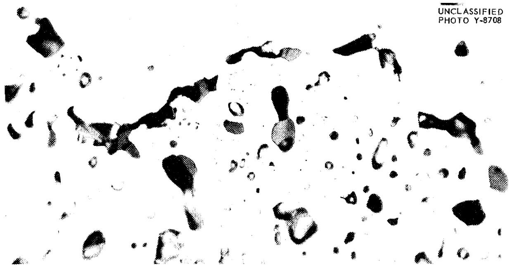  
Fig. 7.1. Static Corrosion of Inconel by NaF-ZrF $_4$ -UF $_4$ (46-50-4 mole %) After 100 hr at $816^{\circ}\mathrm{C}$ . Note material in voids. 2000X

Microspark spectrographic examination of these specimens indicated that the material in the voids contained Fe, Ni, Cr, Zr, and probably U, although only a faint trace of uranium was detected.

Chromium Metal Addition. Molten ARE mixture was pretreated in a tilting furnace by exposure to chromium metal in Inconel capsules. Most of the excess chromium was then removed by sedimentation, and the pretreated mixture was transferred to another capsule for testing. In a series of experiments, this pretreated mixture caused only a slight roughening of the surface at the hot end of the capsule and a slight deposit on the cold wall. The addition of $\mathsf{NiF}_2$ to samples similarly pretreated increased the corrosion considerably; in these

tests the chromium content of the melt increased linearly with the NiF2 addition.

Zirconium Hydride Addition. Zirconium hydride reacts with $\mathsf{UF}_4$ in fluoride melts to form uranium trifluoride. A certain amount of the trifluoride can be retained in solution, but precipitation of this material occurs if extensive reduction takes place. An effort has been made to check previous data on the tolerable limit of $\mathsf{ZrH}_2$ addition by allowing the insoluble $\mathsf{UF}_3$ to separate by sedimentation after exposure. The additional data obtained (Table 7.6) indicate that the uranium concentration of the melt is decreased considerably with additions of $0.7\%$ or more of $\mathsf{ZrH}_2$ . These data, in general, agree with data from previous experiments

performed with other techniques. The chromium content of the melt is sharply decreased by the addition of as little as $0.1\%$ of $\mathsf{ZrH}_2$ ; further increases in the $\mathsf{ZrH}_2$ concentration have only a slight effect. It appears that although up to $0.7\%$ of $\mathsf{ZrH}_2$ may be tolerable in this system, much lower concentrations, of the order of $0.2\%$ , may show the beneficial action desired without the risk of precipitation of uranium from the melt.

Carbon Addition. Static tests were run for 100 hr at $816^{\circ}C$ with a mixture of $25\%$ powdered graphite and $75\%$ NaF- $\mathsf{ZrF}_4\mathsf{-UF}_4$ (50-46-4 mole %) in type 316 stainless and Inconel tubes to determine whether carburization of these materials would occur. No evidence of carburization was detected in these tests. After testing, the grain boundaries of the type 316 stainless steel had large amounts of carbides present, but the deposits were uniform throughout the specimen and no hardness change could be detected from the inner to the outer surface of the tube wall.

Crevice Corrosion. Crevice corrosion tests have been run in the seesaw furnace with the tapered, or V-shaped, crevices described previously.(1) Corrosion in these crevices seemed to be somewhat erratic, with some surfaces being apparently unattacked and others having the usual subsurface voids. No acceleration of corrosion was noted in these crevices, and the depth and the extent of attack in the crevices was not beyond what might be usually expected for the materials tested. Table 7.7 summarizes the results obtained in these tests. Similar results for crevice corrosion were obtained in the rotating tests reported in a following section.

Inconel Container Pretreatment. The descending properties of the fluoride $\mathrm{NaZrF}_5$ have been checked on oxidized Inconel at 1000 and at $1300^{\circ}\mathrm{F}$ . As can be seen in Fig. 7.2, the oxidized Inconel was cleaned up after 4 hr at $1300^{\circ}\mathrm{F}$ , but it was not cleaned up after 4 hr at $1000^{\circ}\mathrm{F}$ .

It was thought that perhaps a passivation treatment, similar to that given to stainless steels,

TABLE 7.6.EFFECT OF VARYING QUANTITIES OF $ZrH_{2}$ ON CORROSION OF INCONEL BY NaF-ZrF4-UF4 (50-46-4 mole %)   

<table><tr><td rowspan="2">ZrH2ADDED(wt %)</td><td rowspan="2">URANIUM CONTENT AFTERZrH2ADDITION(wt %)</td><td colspan="3">METAL CONTENT AFTER TEST*(ppm)</td></tr><tr><td>Fe</td><td>Cr</td><td>Ni</td></tr><tr><td>None</td><td>9.11</td><td>95</td><td>560</td><td>35</td></tr><tr><td>0.1</td><td>9.01</td><td>70</td><td>195</td><td>80</td></tr><tr><td>0.3</td><td>8.94</td><td>125</td><td>150</td><td>50</td></tr><tr><td>0.5</td><td>9.17</td><td>220</td><td>175</td><td>90</td></tr><tr><td>0.7</td><td>8.65</td><td>405</td><td>145</td><td>155</td></tr><tr><td>0.9</td><td>6.76</td><td>350</td><td>130</td><td>125</td></tr></table>

*Metal content before test: Fe, 310 ppm; Cr, 20 ppm; Ni, 45 ppm. All results average of two tests.

TABLE 7.7. RESULTS OF SEESAW TESTS OF INCONEL WITH TAPERED CREVICES IN NaF-ZrF4-UF4 (50-46-4 mole %) FOR 100 hr WITH A HOT-ZONE TEMPERATURE OF $800^{\circ}\mathrm{C}$ AND A COLD-ZONE TEMPERATURE OF $600^{\circ}\mathrm{C}$   

<table><tr><td>POSITION OF CREVICE</td><td>METALLOGRAPHIC NOTES</td></tr><tr><td>Hot zone</td><td>2 mils of subsurface voids in upper part of crevice, increased to 3 mils in lower part</td></tr><tr><td>Hot zone</td><td>Subsurface voids to 2.5 mils</td></tr><tr><td>Cold zone</td><td>Apparently no attack</td></tr></table>

UNCLASSIFIED PHOTO Y-9192

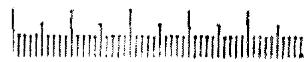

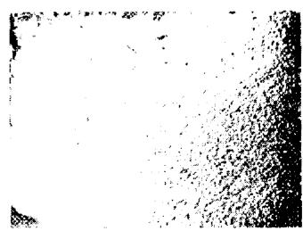  
AS POLISHED

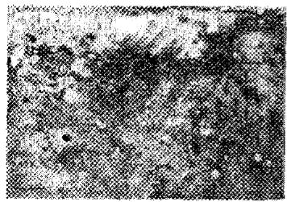  
AS OXIDIZED

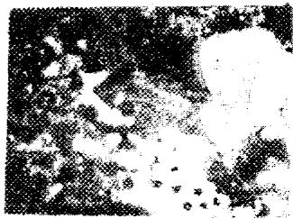  
4-hr AT 1000°F IN FLUORIDE 31

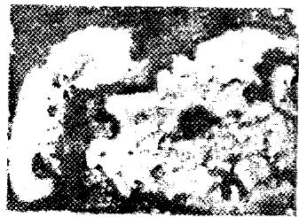

  
4-hr AT 1300°F IN FLUORIDE 31

  
Fig. 7.2. Temperature-Dependence Tests on the Descaling of Oxidized Inconel by $\mathrm{NaZrF}_5$ .

would be beneficial in increasing the corrosion resistance of Inconel to the fluoride mixtures. Therefore, Inconel tubes were hydrogen fired and the specimens were electropolished, as usual, and both the tubes and the specimens were treated in a $25\%$ solution of nitric acid at approximately $120^{\circ}\mathrm{F}$ for 30 minutes. The tubes and specimens were then used for static corrosion testing with fluoride $\mathrm{NaF - ZrF_4 - UF_4}$ (50-46-4 mole %) for 100 hr at $816^{\circ}\mathrm{C}$ . The pretreatment did not appear to be especially beneficial. Attack in these tests seemed more erratic than is usual. In two of the tests, subsurface voids to a depth of 5 mils were noted;

in the other test, subsurface voids were noted to a depth of 3 mils.

# STATIC CORROSION OF STELLITE BY FLUORIDES

D.C.Vreeland E.E.Hoffman,

L.R.Trotter J.E.Pope

Metallurgy Division

In conjunction with the hard-facing problems of the ARE, Stellar No. 6 (27.5% Cr, 4% W, 2 to 3% Fe, 1% C, balance Co) was deposited on pieces of Inconel, and these composite specimens were

static tested in the fluoride NaF-ZrF4-UF4(46-50-4 mole %) in Inconel tubes at both 816 and $538^{\circ}C.$ The structure of Stellar No. 6 has been described as "dendrites of a cobalt-rich solid solution surrounded by a mixture of carbides." Apparently it is the carbides which are attacked by the molten fluorides. There appeared to be no acceleration of corrosion on either the Stellar or the Inconel as a result of the presence and contact of these dissimilar metals. The extent of attack appeared to be the same in the tests at $538^{\circ}C$ as in the tests at $816^{\circ}C.$ In all cases, the Inconel showed about 1 mil of subsurface voids, while the Stellar showed an average attack of 3 to 4 mils and a maximum attack of 9 mils on the carbide phase in the Stellar. Figure 7.3 shows the type of attack which occurred in these tests.

# FLUORIDE CORROSION OF INCONEL IN ROTATING TEST

D.C.Vreeland

L. R. Trotter

E. E. Hoffman

J. E. Pope

Metallurgy Division

Several tests have been completed with the fluorides in Inconel on the NACA type of rotating

apparatus.(3) This type of apparatus is advantageous because velocities can be obtained that are higher than those available in thermal convection loops or in the seesaw tests. In the tests conducted to date, there has been no indication of plugging, and the corrosion results have been similar to those obtained in static tests, even though a fluid velocity of 10 fps is being employed. The depth of penetration has not exceeded 2 mils in any of the tests in which leaks have not occurred.

A typical 100-hr test with $\mathsf{NaF - ZrF_4 - UF_4}$ (46-50-4 mole %) in which a temperature of $816^{\circ}C$ was maintained throughout the apparatus resulted in uniform attack in the form of subsurface voids to a depth of 2 mils. Additions of sodium have resulted in the development of surface layers on the Inconel, as was also noted in static tests. The fluoride, with $2\%$ sodium added, was tested for 94 hr with a hot-zone temperature of $816^{\circ}C$ and a cold-zone temperature of $783^{\circ}C$ . Although the attack was in the form of subsurface voids, a surface layer was visible in many places. The total depth of voids and layer did not exceed 0.5

(3) $_{Ibidi}, p. 121$ .

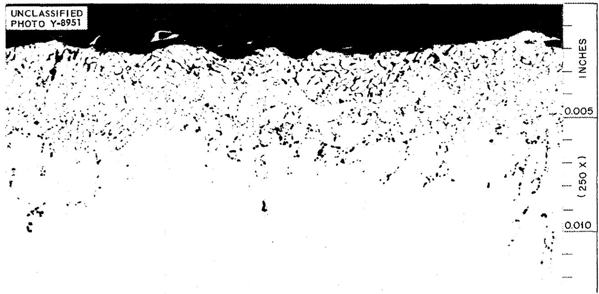  
Fig. 7.3. Static Corrosion of Stellarite No. 6 After 100 hr at $816^{\circ}\mathrm{C}$ in NaF-ZrF $_4$ -UF $_4$ (46-50-4 mole %). 250X

mil, nor did the attack vary in extent or nature from the hot zone to the cold zone.

Some of the crevices near welded joints tested in the whirling apparatus in fuel mixture with the $2\%$ sodium addition were examined metallographically for evidence of crevice corrosion, and no accelerated corrosion could be found. The greatest depth of attack noted was 0.5 mil in the form of subsurface voids. On the other side of the crevice with the greatest depth of attack, there was attack to 0.5 mil that was definitely intergranular. As is usually noted in these crevices, the attack was somewhat erratic, with some sections unattacked.

# FLUORIDE CORROSION IN INCONEL THERMAL CONVECTION LOOPS

# G. M. Adamson, Metallurgy Division

The use of thermal convection loops for determining dynamic corrosion by liquids has been previously described.(4) Unless otherwise specified, for the tests described in the following sections, the temperature of the hot leg of the loop was maintained at $1500^{\circ}\mathrm{F}$ and the temperature of the uninsulated cold leg was approximately $1300^{\circ}\mathrm{F}$ . With the fluoride salts, this temperature difference results in a fluid velocity of about 6 to 8 bpm. The usual testing period is 500 hours.

Effect of Exposure Time. A series of loops has been placed in operation to determine the effect of time on the depth of maximum penetration. The loops were filled from a single batch of fuel at as

near the same time as possible and were then allowed to circulate for times varying from 10 to 3000 hours. The tests of short duration have been terminated, and the loops have been examined. The data obtained are given in Table 7.8, along with the data obtained from loops run previously for periods of 100, 250, 500, and 1000 hours. The data show that the depth of attack increases quite rapidly for about 250 hours. After 250 hr, the depth of attack remains almost constant, but there is some increase in the intensity of attack. When data are available from the other loops filled from the same fuel batch, a time curve will be prepared.

Since chromium must diffuse to the surface of the hot leg before it can be removed, the diffusion rate could be the limiting factor in the corrosion rate. Two Inconel loops were operated for 500 hr to test this hypothesis. The first loop operated for two 250-hr periods, with a new charge of fuel for the second period. The second loop operated for 500 hr with a single charge from the same fuel. If diffusion was the limiting factor, the attack should have been the same. The loop which had two charges showed heavy subsurface void formation of 8 to 17 mils, with the voids primarily in the grain boundaries. The loop with a single charge showed moderate to heavy attack of from 3 to 8 mils, with general attack of 5 mils. The hot-leg sections from both of these loops are shown in Fig. 7.4. The doubling in depth of attack for two charges was also confirmed by the chemical analyses. The chromium content of the fluorides increased more during the second 250-hr period in Loop 281 than it did in the entire 500-hr period in Loop 280. These loops show that the decrease in attack rate

(4) D. C. Vreeland, R. B. Day, E. E. Hoffman, and L. D. Dyer, ANP Quor. Prog. Rep. Mar. 10, 1952, ORNL-1227, p. 119.

TABLE 7.8.EFFECT OF EXPOSURE TIME ON THE CORROSION OF INCONEL BY NaF-ZrF4-UF4 (50-46-4 mole %)   

<table><tr><td>EXPOSURE TIME (hr)</td><td>MAXIMUM DEPTH OF ATTACK (mils)</td><td>REMARKS</td></tr><tr><td>10</td><td>1</td><td>Widely scattered grain boundary attack</td></tr><tr><td>50</td><td>3</td><td>Scattered grain boundary attack</td></tr><tr><td>100</td><td>4</td><td>Light, typical subsurface voids</td></tr><tr><td>250</td><td>9</td><td>Moderate attack</td></tr><tr><td>500</td><td>9</td><td>Moderate attack</td></tr><tr><td>1000</td><td>11</td><td>Moderate to heavy attack</td></tr></table>

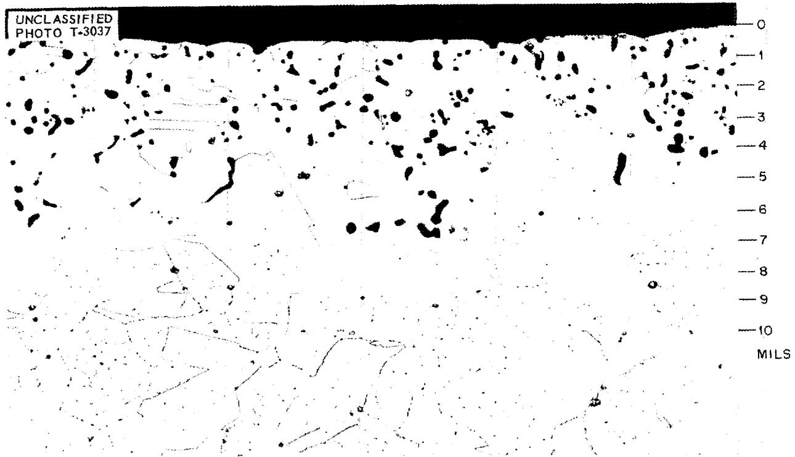  
(σ)

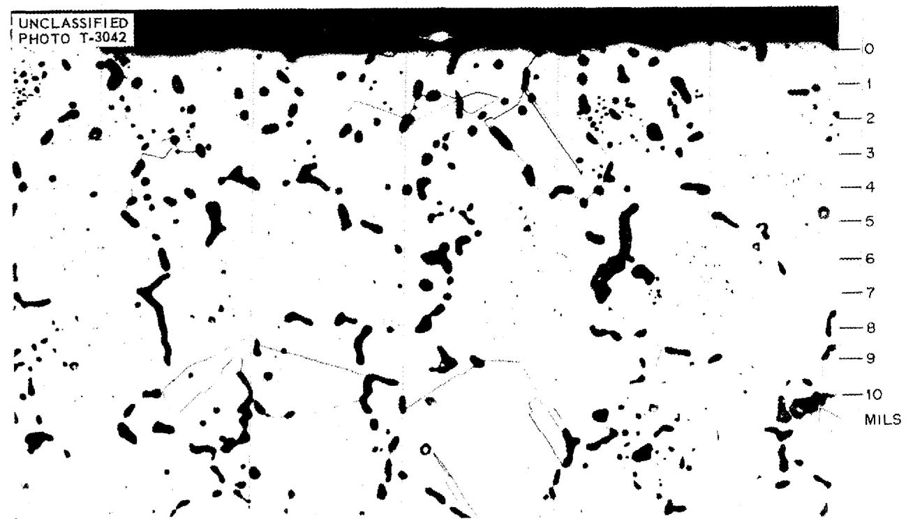  
(6)   
Fig. 7.4. Corrosion of Inconel by NaF-ZrF $_4$ -UF $_4$ (50-46-4 mole %) After 500 hr at $816^{\circ}\mathrm{C}$ . (a) 500 hr with same fuel charge. (b) 250 hr on each of two fuel charges. 250X

with time is caused by changes in the fuel rather than by the limiting action of diffusion. The increase in attack is probably caused by an increase in impurities with a double charge.

Temperature Dependence. In the previous report, results for a single loop operated at a hot-leg temperature of $1650^{\circ}\mathrm{F}$ were compared with those for a loop operated at a hot-leg temperature of $1500^{\circ}\mathrm{F}$ . An additional series of three loops has now been operated to confirm those results. The loops in this series were all filled from a single fuel pot on the same day. The results of this temperature study are presented in Table 7.9 and illustrated in Fig. 7.5. These results show that the change in depth of penetration of the attack is not very temperature sensitive. The maximum penetration at $1300^{\circ}\mathrm{F}$ is slightly less than at $1500^{\circ}\mathrm{F}$ , but it is within the usual spread in results, and the results for all the loops are definitely within the experimental variation.

The nature and distribution of the attack does change with temperature. At the lower temperature, the voids are small and evenly distributed. As the temperature increases, the voids concentrate in the grain boundaries and become quite large. The growth and concentration in the voids are caused by the increasing mobility of the fluid as the temperature increases. In contrast with the previous temperature tests, the recent tests showed no systematic distribution of impurities in the fluorides at any temperature.

(5)G.M. Adamson, ANP Quar. Prog. Rep. Mar. 10, 1953, ORNL-1515, p. 123.

Chromium and Nickel Fluoride Additives. One more attempt was made to reduce the depth of attack by pretreating the fluoride NaF-KF-LiF-UF $_4$ (10.9-43.5-44.5-1.1 mole %) with chromium metal powder. The powder was added to the fluoride while in the charging pot. The mixture was held at 1300 to $1400^{\circ}\mathrm{F}$ , agitated with helium for several hours, and then blown through a stainless steel pressure snubber before the sample was taken. The snubber served as a very coarse filter. The chromium content of the fluorides as charged to the loop was 3500 ppm. After the 500-hr test, the chromium content was 2400 ppm. The attack in this loop was to a depth of 10 to 14 mils (which is a standard depth of attack), and a corrosion layer was found in the cold leg. This was the fifth loop operated with the fluoride NaF-KF-LiF-UF $_4$ to which chromium metal was added by some means. Of the five loops, four definitely did not show any improvement in corrosion resistance, and the improvement of the fifth is doubtful. An attempt will now be made to add chromium metal to NaF-ZrF $_4$ -UF $_4$ (50-46-4 mole %) to determine whether an improvement can be obtained in this system.

Three loops were operated with material from the same batch of $\mathsf{NaF - ZrF_4 - UF_4}$ (50-46-4 mole %), but $\mathsf{NiF}_2$ was added to two of them. The additions were made in the fill pot, which was agitated for 1 hr before the loop was filled. The attack increased with increasing amounts of $\mathsf{NiF}_2$ . The control loop showed moderate attack of up to 8 mils. With the addition of $0.05\% \mathsf{NiF}_2$ , the attack was reported as heavy, with a maximum depth of

TABLE 7.9.EFFECT OF TEMPERATURE ON CORROSION OF INCONEL BY NaF-ZrF4-UF4(50-46-4 molc %)   

<table><tr><td>HOT-LEG TEMPERATURE (°F)</td><td>HOT-LEG ATTACK</td></tr><tr><td>1650*</td><td>Light to moderate subsurface voids of 4 to 11 mils; voids larger than normal and concentrated in grain boundaries</td></tr><tr><td>1500*</td><td>Light to moderate subsurface voids of 3 to 10 mils; general attack to 4 mils</td></tr><tr><td>1300</td><td>Moderate to heavy attack of 4 to 9 mils; voids very small and well distributed</td></tr><tr><td>1500</td><td>Moderate to heavy attack of 7 to 13 mils</td></tr><tr><td>1650</td><td>Moderate attack of 3 to 12 mils; voids very large and concentrated in grain boundaries</td></tr></table>

*Results reported previously. (5)

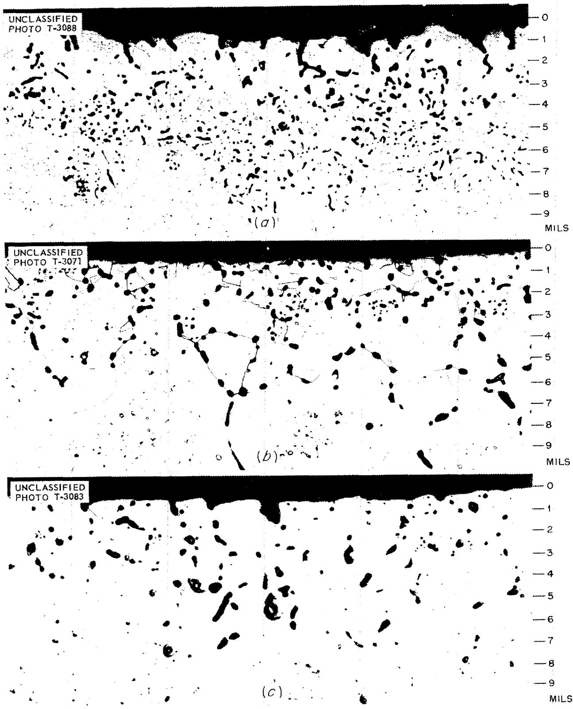  
Fig. 7.5. Corrosion of Inconel by NaF-ZrF $_4$ -UF $_4$ (50-46-4 mole %) After 500 hr As a Function of Temperature. (a) $1300^{\circ}\mathrm{F}$ . (b) $1500^{\circ}\mathrm{F}$ . (c) $1650^{\circ}\mathrm{F}$ . 250X

10 mils. With a $0.2\%$ addition, a rough surface and heavy attack of up to 11 mils was found. The nickel analyses of three samples taken as the loops were filled were reported as 120, 280, and 500 ppm, respectively. It has not yet been determined whether insufficient time was allowed for all the nickel fluoride to go into solution. In the samples with the $\mathrm{NiF}_2$ addition, the iron content increased from 620 to 1100 ppm, while the chromium, which is the usual reaction product, only increased from 230 to 620 ppm.

Fuel Purity. Several loops were operated with special high-purity batches of $\mathsf{NaF - ZrF_4 - UF_4}$ (50-46-4 mole%) prepared in graphite-lined vessels. One loop contained a batch of high-purity fuel prepared from standard materials, while two other loops were filled with fuel prepared from hafnium-free zirconium oxide, which was low in iron impurity. However, the actual chemical analyses showed the iron and the nickel contents to be about the same in all three charges, that is, a total of about 300 ppm in each. In addition, one of the loops with fuel prepared from hafnium-free zirconium oxide was cleaned by circulating $\mathsf{NaZrF}_5$ . In the specially cleaned loop, the attack was less than normal, with a maximum penetration of 5 mils; in the other two loops, the attack was normal, with a maximum penetration of 9 mils. However, the corrosion attack of the high-purity fuel batch was not measurably different from that of the standard fuel in the comparable test.

In another test, two batches of fuel that had received no purification other than a vacuum drying during melting were run in two other loops. Heavy attack, with a maximum penetration of 15 mils, was found in both loops. This is the deepest penetration found in any loop in which the fluoride NaF-ZrF $_4$ -UF $_4$ (50-46-4 mole %) has been circulated.

It is apparent from these tests that although purification of the fuel is desirable, the present standard production procedures appear to be adequate. Little, if any, additional reduction in attack can be obtained with additional fuel purification processes. However, the contaminants $(\mathsf{FeF}_2$ and $\mathsf{NiF}_2)$ that remain in the fuel may be further reduced by additions such as $\mathsf{ZrH}_2$ .

Loop Oxide Films. To determine the effect of oxide scale on the maximum depth of attack, several loops that had been subjected to various surface treatments were operated for 500 hr at

$816^{\circ}C$ with fluoride $\mathsf{NaF - ZrF}_4\mathsf{-UF}_4$ (50-46-4 mole $\%$ ). The various treatments included (1) circulating $\mathsf{NaZrF}_5$ for 2 hr at $1400^{\circ}\mathsf{F}$ , (2) degreasing, and (3) oxidizing before filling. The maximum attack in the three loops was 6, 7, and 8 mils, respectively. The attack on the $\mathsf{NaZrF}_5$ -cleaned loop and the attack on the oxidized loop are shown in Fig. 7.6.

Although the treatment with $\mathrm{NaZrF}_5$ removed the oxide film from the loop, there was a brown film on all sections of the loop which varied in thickness from thin in parts of the cold leg to granular in the hot horizontal section. A diffraction test showed the film to be over $90\% \mathrm{Na}_2\mathrm{ZrF}_6$ with some zirconium oxide present. The effect of this compound on the fuel is not known. No measurable attack took place during the cleaning. Removing the small amounts of oxide film by treating with $\mathrm{NaZrF}_2$ results in what appears to be a slight reduction in depth of attack; however, a large oxide content did not cause a large increase in depth of attack.

Nonuranium Bearing Fluorides. During the testing and filling of the ARE system, fluoride mixtures which do not contain uranium will be used. Corrosion work on such mixtures was started in the previous quarter and was continued. The corrosion results confirm those previously reported in that nonuranium bearing fluorides are found to be less corrosive than the fuel mixture. With the fluoride $\mathrm{NaZrF}_{5}$ , a light attack with a maximum penetration of 5 mils was found. In the cold leg, the maximum attack was 2 mils. A maximum attack of 5 mils was also found in a second loop, which was similar but was allowed to circulate for 1000 hours. A very thin corrosion layer was found in the cold leg of each loop. Such a layer is not usually discernible with $\mathrm{NaF - ZrF}_{4} - \mathrm{UF}_{4}$ (50-46-4 mole%). The nature of the attack is the same with or without the uranium in the mixture.

# FLUORIDE CORROSION OF NICKEL THERMAL CONVECTION LOOPS

G. M. Adamson, Metallurgy Division

The fluoride $\mathrm{NaF - ZrF_4 - UF_4}$ (50-46-4 mole %) was circulated in a nickel thermal convection loop which was cleaned with dry hydrogen. After 500 hr at $816^{\circ}C,$ a few metallic crystals were found in the trap and in the fluorides in the lower part of the cold leg. An extremely thin corrosion layer

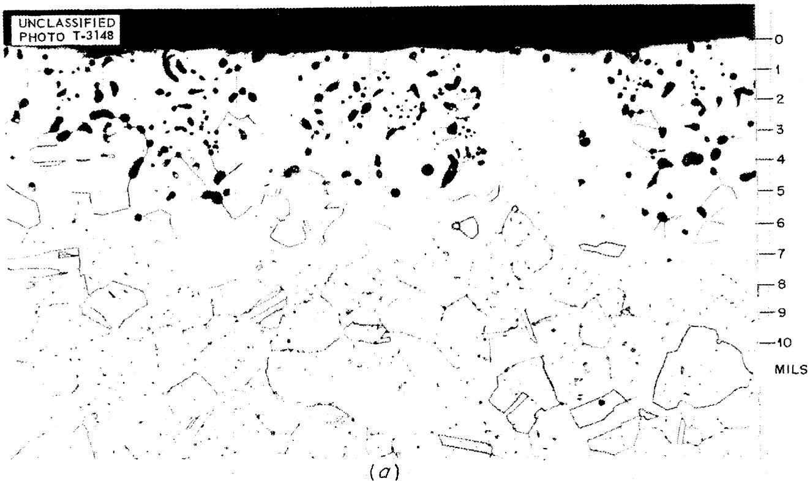

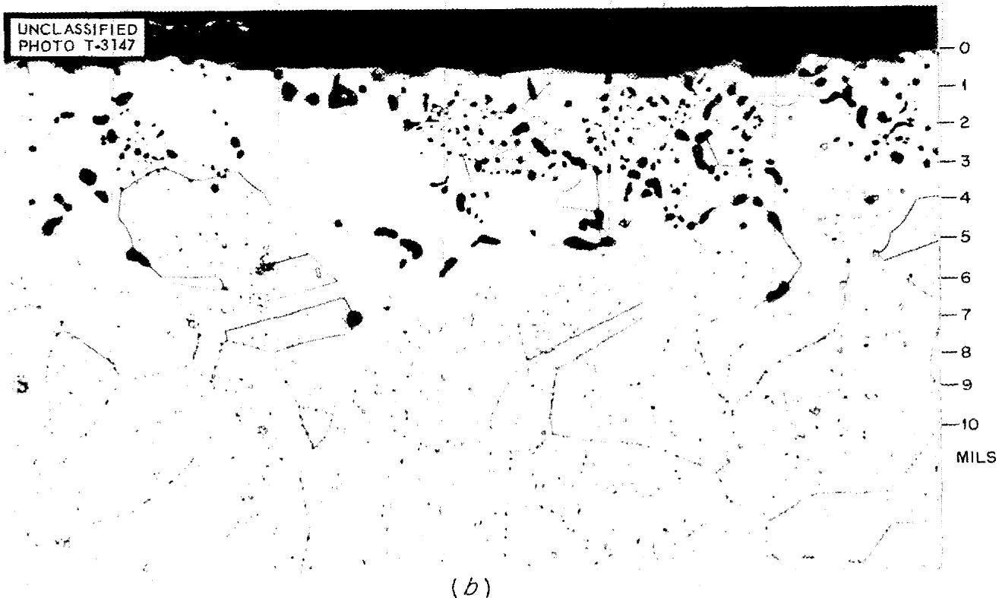  
Fig. 7.6. Effect of Oxide Scale on the Corrosion of Inconel by $\mathsf{NaF - ZrF_4 - UF_4}$ (50-46-4 mole %) After 500 hr at $816^{\circ}C$ . (a) Deoxidized with $\mathsf{NaZrF}_5$ . (b) Oxidized. 250X

was found on the cold-leg surfaces by metallog- graphic examination. The hot-leg surfaces were quite smooth, with no intergranular or subsurface voids. The wall of the hot leg was 0.002 in. thinner than that of the cold leg, but since the thickness was still within commercial tolerances, no definite conclusion may be drawn from this one measurement. Sections of both the hot leg and the cold leg of this loop are shown in Fig. 7.7. A small amount of mass transfer took place, but it was less than that found with type 316 stainless steel and many times smaller than that found when the fluoride NaF-KF-LiF-UF $^4$ (10.9-43.5-44.5-1.1 mole $\%$ ) was circulated in nickel.

# FLUORIDE CORROSION OF TYPE 316 STAINLESS STEEL THERMAL CONVECTION LOOPS

G. M. Adamson, Metallurgy Division

Two type 316 stainless steel thermal convection loops operated for 500 hr at $1500^{\circ}\mathrm{F}$ with $\mathsf{NaF - ZrF_4 - UF_4}$ (50-46-4 mole %) without plugging. These were the first loops of stainless steel to circulate uranium-bearing fluorides at $1500^{\circ}\mathrm{F}$ without plugging. Typical hot and cold-leg sections from these loops are shown in Fig. 7.8. The hot legs in both loops were very rough, with both the intergranular and the typical Inconel types of attack. In loop 133 the depth of attack was 5 to 11 mils, while in loop 134 it was 4 to 7 mils. Some grains had been removed from the surface, but the average thickness had not been reduced. In both loops, a heavy multilayer deposit was found in the cold leg. The top layer of the deposit consisted of fine, dendritic, metallic crystals. These crystals were also found in the fuel. Diffraction and spectrographic studies show these crystals to be mainly iron, with some chromium in solution. The zirconium content was higher than would be found if fuel particles were mixed with the crystals. Both the nickel and the molybdenum contents were very low. Under the first layer was another layer which appeared to be nonmetallic, and in some areas there was another metallic layer beneath the nonmetallic layer. The attack found in these loops appears to be much more comparable to that found with Inconel than was the attack in the loops that plugged with the fluoride NaF-KF-LiF-UF $_4$ (10.9-43.5-44.5-1.1 mole %).

# LIQUID METAL CORROSION

F. A. Knox

E. E. Ketchen

L.G.Overholser

Materials Chemistry Division

J.V.Cathcart

D. C. Vreeland

G.P.Smith

E. E. Hoffman

W.H.Bridges

L.R.Trotter

J. E. Pope

Metallurgy Division

L.A.Mann

D. R. Ward

ANP Division

Mass Transfer in Liquid Lead. Studies of the mass transfer of various solid metals in small thermal convection loops containing liquid lead have continued. These tests have been performed in thermal convection loops made of quartz tubing. Samples of the test metals are fastened in the hot and cold legs of the loops. Details of the construction of the loops and of the results obtained for Inconel, columbium, molybdenum, and type 304 stainless steel were reported previously.(6,7) Armco iron and types 347 and 446 stainless steels were tested during this quarter.

The loop containing type 347 stainless steel was operated with hot- and cold-leg temperatures of 800 and $500^{\circ}\mathrm{C}$ , respectively, and failed after 140 hr because of the formation of a plug in the cold leg. Figure 7.9 is a cross section of the hot leg of this loop; the intergranular type of corrosion which occurred, in addition to the mass transfer, can be seen. A similar, but less marked, corrosive attack occurred in the cold leg.

The loop containing Armco iron failed because of plug formation after 250 hr of operation. The hot- and cold-leg temperatures were 800 and $545^{\circ}\mathrm{C}$ , respectively. As may be seen from Fig. 7.10, which shows a cross section of the hot leg of the loop, the iron specimen suffered almost no intergranular attack. A decrease in wall thickness of 0.003 in. was measured for the hot-leg specimen. There was no change in the wall thickness of the cold-leg specimen.

A marked increase in resistance to mass transfer was noted in the loop containing type 446 stainless steel. This test was terminated on schedule after 619 hr of operation with the hot leg at $810^{\circ}\mathrm{C}$ and the cold leg at $520^{\circ}\mathrm{C}$ . Although insufficient

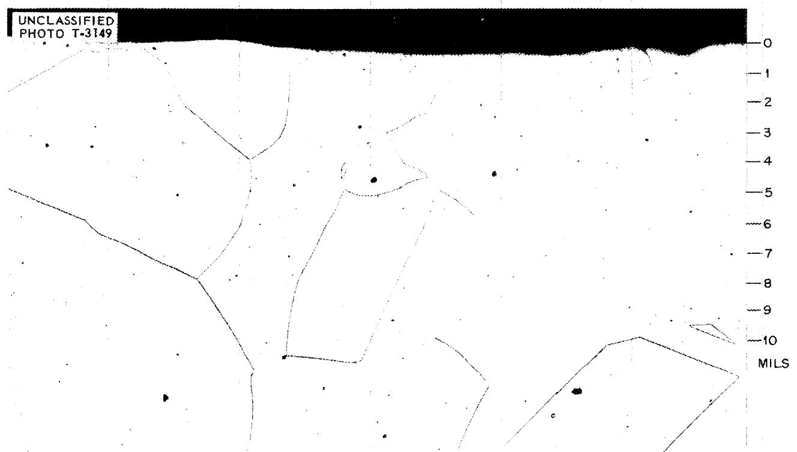

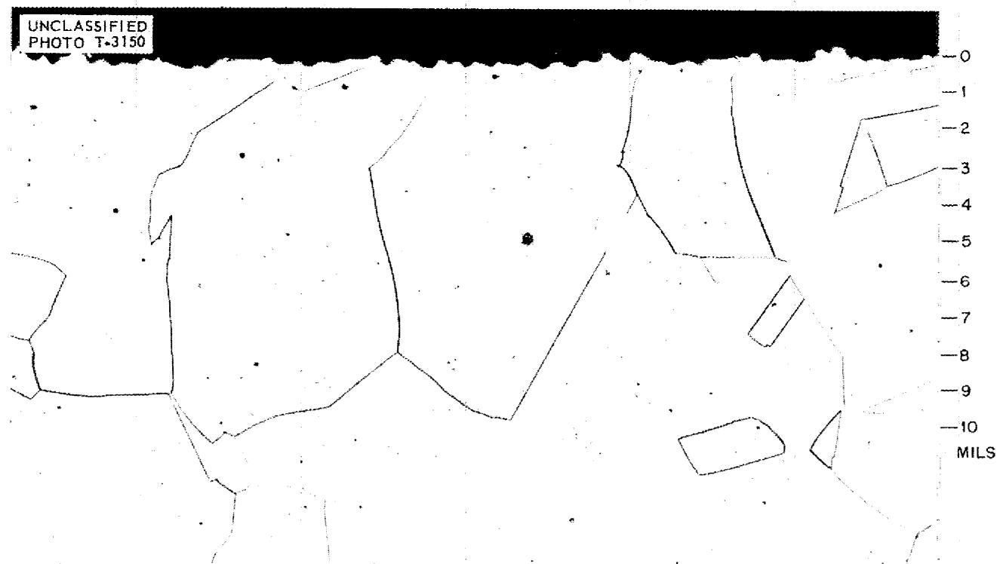  
(a)   
(6)   
Fig. 7.7. Corrosion of Nickel Thermal Convection Loop by NaF-ZrF $_4$ -UF $_4$ (50-46-4 mole %) After 500 hr at $1500^{\circ}$ F. (a) Hot leg. (b) Cold leg. 250X

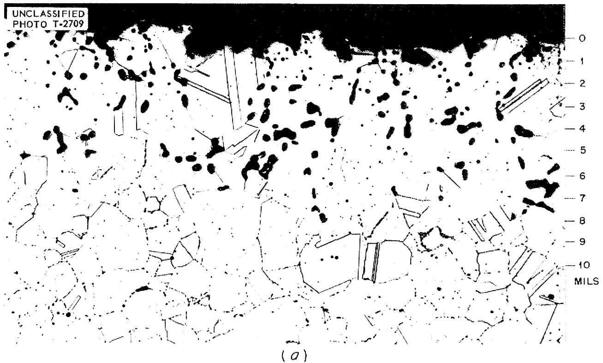

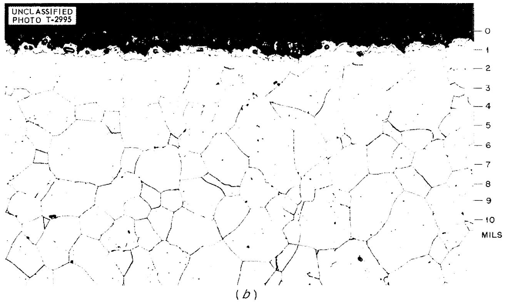  
Fig. 7.8. Corrosion of Type 316 Stainless Steel Thermal Convection Loop by NaF-ZrF $_4$ -UF $_4$ (50-46-4 mole %) After 500 hr at $1500^{\circ}\mathsf{F}$ . (a) Hot leg. (b) Cold leg. 250X

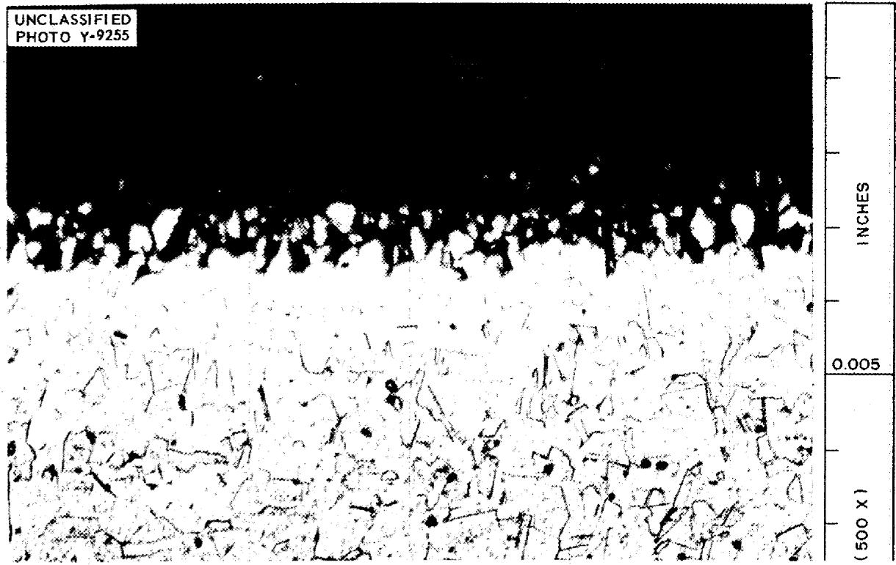

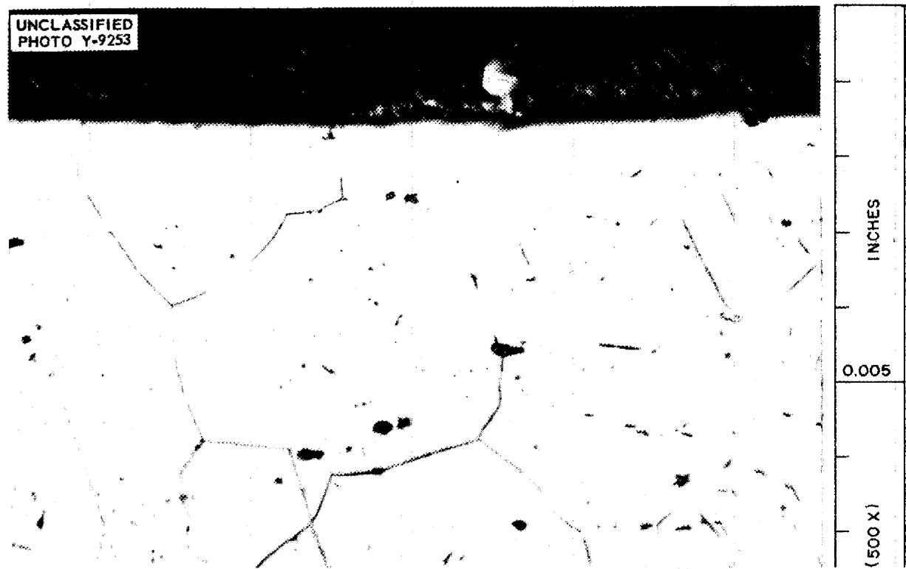  
Fig. 7.9. Corrosion of Type 347 Stainless Steel by Lead in Quartz Thermal Convection Loop After 140 hr at $800^{\circ}$ C. 500X   
Fig. 7.10. Corrosion of Armco Iron by Lead in Quartz Thermal Convection Loop After 250 hr at $800^{\circ}\mathrm{C}$ . 500X

mass transfer occurred to form a plug large enough to stop the circulation of lead in the loop, a small quantity of mass transferred material collected at the bottom of the cold leg. It is to be presumed that had the loop been allowed to operate for a sufficiently long time, this deposit would have grown to sufficient size to stop the circulation of lead in the loop.

The results obtained thus far indicate that alloys with a high nickel content - for example, Inconel and type 347 stainless steel - show little resistance to mass transfer or corrosion in lead. On the basis of the results with type 446 stainless steel, it appears that stainless steels containing no nickel suffer relatively little mass transfer as compared with the nickel-rich alloys. Columbium and molybdenum showed no mass transfer in lead.

BeO in Sodium and NaK. The compatibility of beryllium oxide with sodium or NaK is of such concern to the ARE that the problem is being attacked simultaneously in seesaw, rotating, and thermal convection loop tests, with both treated and untreated beryllium oxide specimens. The treated specimens were sprayed with slurries of various fluorides, including $\mathsf{CaF}_{2}$ $\mathsf{CaF}_{2}\mathsf{-AlF}_{3}$ and $\mathsf{CaF}_{2}\mathsf{-MgF}_{2}$ , and then dried. In general, the coatings seemed to have some beneficial effect in reducing corrosion.

Each of the tests was operated with a hot-leg temperature of about $1500^{\circ}\mathrm{F}$ for 100 hr in the seesaw and rotating tests and for 212 hr in the convection loop tests. The results in terms of weight change of the $\frac{1}{4}$ -by $\frac{1}{4}$ -by $\frac{1}{2}$ -in, beryllium oxide specimens vary from $\pm 1\%$ in the seesaw tests up to $10\%$ loss in the convection loop tests and to 71 to $100\%$ loss in spinner tests. The sodium velocity in the rotating test was 400 fpm and, in thermal convection loop tests, it was only of the order of 6 to 10 fpm. The data obtained are summarized in Table 7.10. It now appears that the corrosion mechanism is, in reality, a mechanical erosion of the hot-pressed BeO surface. Therefore the ARE has been designed so that the sodium in contact with the BeO will be virtually stagnant.

In an attempt to determine where the missing beryllium oxide ends up, two convection loops were sectioned for analysis. Each loop had operated for 212 hr at $1500^{\circ}\mathrm{F}$ ; one loop contained sodium and the other NaK. The distribution of the residual beryllium oxide in the liquid metal drained from the loop, in the wash solution, and on the wall is given in Table 7.11. These data indicate that the beryllium oxide is mainly suspended in the liquid metal rather than being firmly attached to the walls, as was previously reported.

Coated Beryllium in Sodium. A series of beryllium specimens, some of which were plated with

TABLE 7.10. EROSION OF BERYLLIUM OXIDE BY SODIUM AT ${1500}^{ \circ  }\mathrm{F}$   

<table><tr><td rowspan="2">TYPE OF TEST</td><td rowspan="2">SPECIMEN</td><td colspan="2">TEMPERATURE (°C)</td><td rowspan="2">WEIGHT CHANGE (%)</td><td rowspan="2">LENGTH OF TEST (hr)</td></tr><tr><td>Hot Leg</td><td>Cold Leg</td></tr><tr><td rowspan="4">Seesaw</td><td>AlF3-CaF2treated BeO</td><td>825</td><td>760</td><td>-1.1</td><td>100</td></tr><tr><td>AlF3-CaF2treated BeO</td><td>820</td><td>675</td><td>+0.20</td><td>100</td></tr><tr><td>Special grade of BeO</td><td>800</td><td>650</td><td>+0.89</td><td>100</td></tr><tr><td>Special grade of BeO</td><td>805</td><td>720</td><td>+0.32</td><td>100</td></tr><tr><td rowspan="4">Rotating</td><td>AlF3-CaF2treated BeO</td><td>816</td><td>816</td><td>-100</td><td>100</td></tr><tr><td>AlF3-CaF2treated BeO</td><td>816</td><td>816</td><td>-71</td><td>100</td></tr><tr><td>Special grade of BeO</td><td>816</td><td>816</td><td>-94</td><td>100</td></tr><tr><td>Special grade of BeO</td><td>816</td><td>816</td><td>-90</td><td>100</td></tr><tr><td rowspan="6">Convection loop</td><td>Untreated BeO</td><td>816</td><td>600</td><td>-16.8</td><td>212</td></tr><tr><td>AlF3-CaF2treated BeO</td><td>816</td><td>600</td><td>-9.8</td><td>212</td></tr><tr><td>AlF3-CaF2treated BeO</td><td>816</td><td>625</td><td>-1.8</td><td>212</td></tr><tr><td>CaF2treated BeO</td><td>816</td><td>650</td><td>-10.5</td><td>212</td></tr><tr><td>CaF2treated BeO</td><td>816</td><td>650</td><td>-7.3</td><td>212</td></tr><tr><td>MgF2-CaF2treated BeO</td><td>816</td><td>600</td><td>0.0</td><td>212</td></tr></table>

TABLE 7.11. DISTRIBUTION OF BERYLLIUM OXIDE RECOVERED FROM CONVECTION LOOPS   

<table><tr><td rowspan="2">LIQUID METAL CIRCULATED</td><td colspan="3">RECOVERED BeO (%)</td></tr><tr><td>On Wall</td><td>In Washings</td><td>In Liquid Metal</td></tr><tr><td>NaK</td><td>1.2</td><td>36.9</td><td>61.9</td></tr><tr><td>Na</td><td>2.4</td><td>77.2</td><td>20.4</td></tr></table>

chromium and others with nickel at Gerity-Michigan Company and at Y-12, were tested in sodium in Inconel tubes for 100 hr in the seesaw furnace. Tubes were crimped so that the specimens were restricted to the hot zone. All specimens showed attack, and in only one nickel-plated specimen was the plating at all adherent. Since both chromium and nickel have good resistance to sodium, it is assumed that the poor showing of these specimens is due to porous plating. The appearance of some of these specimens after test is shown in Fig. 7.11.

Carboloy in Lead and Sodium. Static tests of several Carboloys have been run with sodium and lead in Inconel tubes for 100 hr at $816^{\circ}C$ . Except for one test with Carboloy 608 in lead, the Carboloy (907, 779, 44A, and 55A) appeared to have good resistance both to sodium and to lead. While Carboloy 608 was satisfactory in sodium, when in lead, a light color phase appeared to be preferentially attacked to a depth of 26 to 28 mils. The brittleness of these alloys, however, appears to make them prone to cracking and spalling at the edges, as can be seen in Fig. 7.12. It is not known whether this spalling takes place during testing or during metallographic preparation.

UNCLASSIFIED PHOTO Y-8612

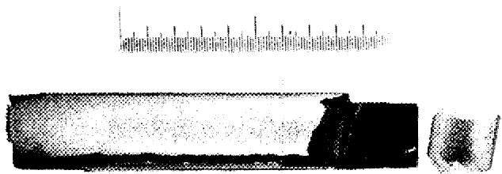  
(a) HOT ZONE - 810°C
COLD ZONE - 640°C

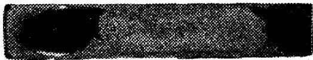

  
(b) HOT ZONE-830°C COLD ZONE-770°C   
(c) HOT ZONE-830°C COLD ZONE-725°C   
Fig. 7.11. Corrosion of Chromium-Plated Beryllium by Sodium After 100 hr in Seesaw Test,

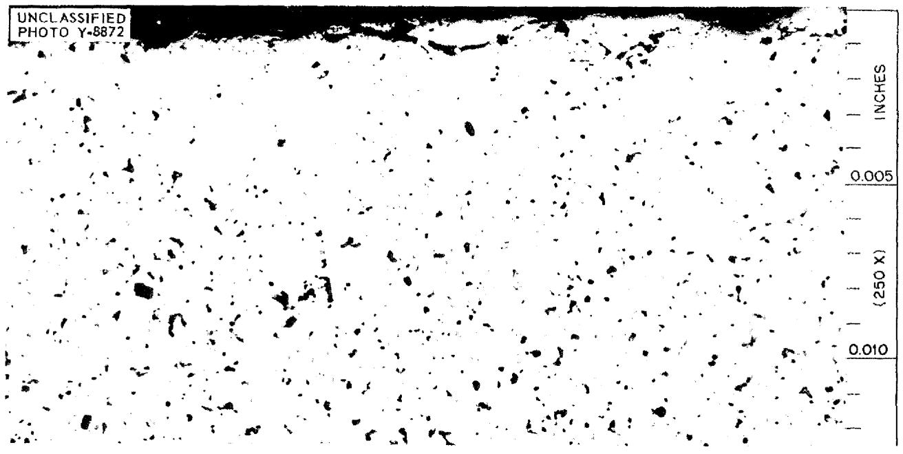  
Fig. 7.12. Carboloy 608 After Testing in Sodium for 100 hr at $816^{\circ}C$ . Note cracking and spalling at upper edge. 250X

# 8. METALLURGY AND CERAMICS

W.D.Manly J.M.Warde Metallurgy Division

The fabrication of an intricate liquid-to-liquid heat exchanger was effected by manual inert-arc welding of tube-to-header welds. The individual tube bundles were reinforced and spaced through the use of grid-type spacers fabricated by cone-arc wire-to-header welding techniques.

In a study of the effect of the various brazing variables on the flowability of the Microbraz brazing alloy, it was found that contamination of the brazing atmosphere with nitrogen has a serious effect on the flowability of the alloy. Dilution and diffusion studies on three high-temperature brazing alloys - Microbraz, $60\%$ Mn-40% Ni, and 82% Au-18% Ni have been completed. Brazed tube-to-fin joints were prepared to study the effect of the quantity of brazing alloy used, the brazing temperature, and the brazing time.

A technique has been developed to braze cemented carbide rings to shafts for use as pump seals. Standard brazing techniques could not be used since there is approximately a factor of four difference between the thermal coefficient of expansion of Carboloy and that of stainless steel. Additional information on the elevated temperature strength of Microbrazed Inconel and type 316 stainless steel joints has been obtained.

The study of the effect of different environments such as air, argon, hydrogen, and the fused fluoride salts on the creep and stress-rupture properties of Inconel has continued, and a wide variation of properties has been found. This study is being extended to include austenitic stainless steels, ferritic stainless steel, and cobalt-base alloys. Preliminary results indicate that Inconel and nickel are much more sensitive to environmental changes than are the austenitic stainless steels, such as types 316 and 304. A design curve for Inconel tested in the fused fluorides at $1500^{\circ}\mathrm{F}$ has been completed over the stress range of 2500 to 8000 psi.

Special high-purity alloys of the Inconel type are prepared in a vacuum melting furnace and then extruded to form a draw blank. The draw blank is then reduced to produce $\frac{1}{2}$ -in.-dia 0.035-in.-wall tubing for corrosion tests. The activation energy for the oxidation of columbium in air was found to

be 13,400 cal/mole for the temperature range of 600 to $900^{\circ}\mathrm{C}$ and 4350 cal/mole for temperatures above $900^{\circ}\mathrm{C}$ . The oxidation resistance of chromium on OFHC copper, chromium and nickel electroplate on copper, and Inconel and type 310 stainless steel clad on copper has been studied for the production of high-conductivity fins for an ANP type of radiator. Special oxidation-resistant alloys of copper have been prepared, and their oxidation characteristics have been determined.

Work on the fabrication of control rods for the GE-ANP program has continued. Attempts to braze hot-pressed segments of $\mathsf{B}_4\mathsf{C}$ -Fe mixture to stainless steel tubes were not successful; therefore an alternate method of fabrication is being tried which consists of filling a tube with a mixture of Al- $\mathsf{B}_4\mathsf{C}$ or Cu- $\mathsf{B}_4\mathsf{C}$ powders and reducing to final size by swaging and hot rolling to consolidate the mixture, as well as to form a bond between the matrix and the tube wall. Powder metallurgy compacts of various metals with additions of $\mathsf{MoS}_2$ were prepared for use as pump seals. Additional work on the preparation of spherical particles of uranium-bearing alloys has been performed with the use of the following methods:

1. heating in a vacuum to above the melting point,   
2. dropping particles through a three-phase three-electrode arc, which provides the heat source,   
3. forcing the molten alloys through a small orificce,   
4. letting precut particles of the alloy settle through a molten salt bath with a temperature gradient that extends beyond the liquidus and solidus of the alloy.

Research has been initiated to determine to what extent the burning of jets of liquid sodium can be reduced by alloying the sodium with some of the heavy metals. In the initial phase of this project, a large number of alloys will be surveyed qualitatively. Preliminary experiments indicate that alloying with lead, mercury, or zinc does not appreciably change the inflammability of sodium at $800^{\circ}\mathrm{C}$ . A collection of this type of qualitative data will serve to indicate whether a detailed study of the numerous variables of the inflammability process will be worth-while.

A cermet has been developed in which $10\% \mathrm{USi}_2$ is included in the central portion of a silicon carbide fuel element. Other ceramics research has included a study of the heating rate of beryllium oxide. It appears that the safe heating rate is less than $200^{\circ}\mathrm{C}$ per hour.

# WELDING AND BRAZING RESEARCH

P. Patriarca

V. G. Lane

G. M. Slaughter

C.E.Shubert

Metallurgy Division

Welding of Heat Exchanger Tube Bundles. Preliminary cone-arc welding experiments for determining the feasibility of the construction of the Inconel six-tube-bundle liquid-to-liquid heat exchanger were described in a previous report.(1) Further efforts to apply the process to this fabrication merely verified the evidence that the production of reliable, consistently leak-tight cone-arc tube-to-header welds was complicated by the curvature of the dashed headers of the heat exchanger. Rather than to delay the production of the heat exchanger, several experimental headers were fabricated by manual inert-arc welding. It was found that a qualified operator can fabricate consistently leak-tight tube-to-header welds by the use of manual welding techniques. Consequently, the manual welding of the six tube bundles comprised of 35 tube-to-header welds on each end of each bundle was undertaken, pending further development of the cone-arc welding process.

One tube bundle consists of 35 Inconel tubes, 0.148 in. in outside diameter with 0.025-in.-thick walls, welded on each end into a 0.125-in.-thick dished (4-in. radius) header. Each bundle was helium leak checked and Dy-Cheked prior to welding of the nozzle assembly. The nozzle was attached by manual inert arc welding. Six of the 420 tube-to-header welds were found by the helium leak detector inspection procedure to contain leaks, which were subsequently successfully repaired.

Since the tube bundles contained a free span of approximately 40 in., the design required that grid-type spacers and clamps be used at 8-in. intervals to provide reinforcement of the bundle and to ensure free flow of liquid around the tubes. A cone-arc wire-to-header plug-welding technique was

developed and applied to the fabrication. Suitable jigs were used to provide the dimensional tolerance required with respect to curvature and spacing. Figure 8.1 shows three completed tube bundles welded into a half section which will constitute the cylindrical vessel of the six-tube-bundle liquid-to-liquid heat exchanger when welded to its mate.

Fig. 8.1. Three Tube Bundles Welded into Half Section of Cylindrical Six-Tube-Bundle Liquid-to-Liquid Heat Exchanger. Note spacers,   
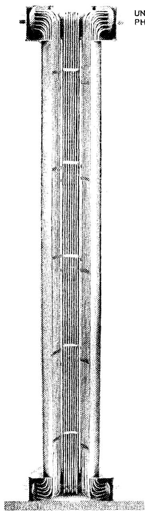  
UNCLASSIFIED PHOTO Y-9060

Brazing of Air Radiators. In the fabrication of previous heat exchanger test assemblies by furnace Microbrazing, (1) experience indicated that furnace temperatures of $2300^{\circ}\mathrm{F}$ were necessary to obtain suitable flowability of the brazing alloy. At brazing temperatures below $2300^{\circ}\mathrm{F}$ , a granular braze was often obtained, and as a result, the joints leaked. Brazing at $2300^{\circ}\mathrm{F}$ was found to cause severe dilution of the parent material and intergranular dilution and/or diffusion, which resulted in severe embrittlement of the parent assembly. The design of the heat exchanger test units usually required a multiple brazing operation. Consequently, leaky assemblies that were practically impossible to repair were encountered on the subsequent rebrazing operations, possibly because of excessive dilution and/or cracking of previously embritted joints as a result of the thermal stresses set up during the rebrazing operation. In an effort to remedy the deleterious effects of the high brazing temperature, a series of tests was run to determine the cause of poor flow at normal brazing temperatures.

Brazing cycles were accurately determined by multiple temperature measurements made with chromel-alumel thermocouples encased in impervious ceramic tubes. The dew point of the hydrogen atmosphere was measured and verified as being less than $-70^{\circ}\mathrm{F}$ . The effect of rate of rise of temperature on diffusion of boron and the effect of boron on flowability were also experimentally discounted as major factors responsible for poor flow when the alloy is used in the form of a thick slurry and the contact area for boron diffusion is small. A determination of the effect of nitrogen as an impurity in the hydrogen atmosphere, however, produced significant results. There is indication that elimination of the hydrogen purge being used in the brazing operation is necessary. Controlled experiments performed with the use of a small muffle furnace revealed that the presence of nitrogen impurity in the hydrogen resulted in a definite impedance to the flow of Microbraz by very rapidly forming a poorly reducible nitride and/or a new brazing alloy with a higher melting point. These experiments led to the conclusion that in future can-brazing operations a helium purge should be substituted for the hydrogen purge. To verify this thinking, a small 15-fin/in. heat exchanger was rebrazed after two previously unsuccessful operations at 2200 and at $2300^{\circ}\mathrm{F}$ . The joints were prepared with a fresh slurry of alloy and brazed at

$2150^{\circ} \mathrm{F}$ for 40 minutes. Excellent flow was obtained, and helium leak testing did not detect the presence of any leaky joints.

Future work will further verify whether complex heat exchangers can be fabricated in a single brazing operation at a reasonable temperature range (between 2050 and $2150^{\circ}\mathrm{F}$ ) in which the excessive dilution, embrittlement, and development of leaks experienced with the multiple brazing operations performed at $2300^{\circ}\mathrm{F}$ can be avoided.

Dilution and Diffusion of Brazing Alloys. It was indicated in a previous report(1) that studies were being made of dilution and diffusion of three high-temperature brazing alloys - Microbraz, 60% Mn-40% Ni, and 82% Au-18% Ni. Brazed tube-to-fin joints were prepared for a study of the metallographic effects of (1) the quantity of brazing alloy used, (2) the brazing temperature for a given time, and (3) the brazing time for a given temperature. The joints were prepared from 0.010-in.-thick type 302 stainless steel fin material and 0.150-in.-OD 0.020-in.-wall type 304 stainless steel tubing.

Small, medium, and large amounts of brazing alloy were investigated, while the time at temperature was varied from 10 min to 18 hr for an overnight brazing cycle. The brazing temperature was varied from 20 to $120^{\circ}\mathrm{C}$ above the melting point.

The results of metallographic examination of the test specimens are presented in Table 8.1 as average percentages of the tube wall thickness actually dissolved during the brazing.

The specimens brazed with Nicrobraz alloy also exhibited a diffusion zone which sometimes extended completely through the wall thickness. The maximum penetration, which was primarily intergranular diffusion of alloy constituents, was recorded, but the scatter of the data was such as to make a definite correlation impossible. No diffusion zones wider than 0.5 mil were found in specimens brazed with the gold-nickel and nickel-manganese alloys.

As a result of this investigation, it became apparent that base-metal dilution increases rapidly with the use of increased amounts of Microbraz alloy. Severe alloying of the tube plus complete collapse of the fin is shown in Fig. 8.2a, which is a photomicrograph of a joint brazed at $1220^{\circ}\mathrm{C}$ for 30 min with a large quantity of alloy. Much less tube-wall and fin dilution can be seen in Fig. 8.2b, which is a photomicrograph of a joint brazed under identical conditions but with less alloy. Dilution

TABLE 8.1. RELATIVE AMOUNT OF DILUTION OF VARIOUS ALLOYS INTO 0.020-in.-WALL 0.187-in.-OD TYPE 304 STAINLESS STEEL TUBING   

<table><tr><td>TYPE AND QUANTITY OF BRAZING ALLOY</td><td colspan="3">EXTENT OF DILUTION OF STAINLESS STEEL TUBING (%)</td></tr><tr><td></td><td>At 1220°C</td><td>At 1180°C</td><td>At 1125°C</td></tr><tr><td>Nicrobraz</td><td></td><td></td><td></td></tr><tr><td>1 ring of 31-mil wire*</td><td>8</td><td>3</td><td>2</td></tr><tr><td>2 rings of 31-mil wire*</td><td>28</td><td>15</td><td>10</td></tr><tr><td>3 rings of 31-mil wire*</td><td>26</td><td>26</td><td>5</td></tr><tr><td></td><td>At 1130°C</td><td>At 1080°C</td><td>At 1030°C</td></tr><tr><td>60% Mn-40% Ni</td><td></td><td></td><td></td></tr><tr><td>1 ring of 21-mil wire</td><td>3</td><td>1</td><td>0</td></tr><tr><td>1 ring of 32-mil wire</td><td>11</td><td>4</td><td>0</td></tr><tr><td>1 ring of 45-mil wire</td><td>15</td><td>7</td><td>2</td></tr><tr><td></td><td>At 1130°C</td><td>At 1030°C</td><td>At 980°C</td></tr><tr><td>82% Au-18% Ni</td><td></td><td></td><td></td></tr><tr><td>1 ring of 21-mil wire</td><td>8</td><td>9</td><td>4</td></tr><tr><td>2 rings of 21-mil wire</td><td>13</td><td>10</td><td>6</td></tr><tr><td>1 ring of 37-mil wire</td><td>19</td><td>19</td><td>12</td></tr></table>

* Mixture of Nicrobraz alloy powder in acryloid cement binder.

also increased rapidly with increasing brazing temperature, but it was virtually independent of time at temperature.

Intergranular diffusion during Microbrazing was greatly increased with the use of high temperatures and/or the use of large quantities of brazing alloy. Time seemed to affect the depth of the diffusion zone somewhat, but no definite relationship could be determined from this investigation.

Dilution of the stainless steel by the manganese-nickel and gold-nickel alloys increased substantially with both temperature and quantity of alloy, but time at temperature did not seem to be an important variable. In general, dilution was greater with the gold-nickel alloy than with the manganese-nickel alloy.

Brazing Carboloy to Stainless Steel. It has become necessary to braze cemented carbide rings to stainless steel for use as rotating mechanical pump seals for operation at $1500^{\circ}$ F in both fluoride and air environments. Standard brazing techniques result in severe cracking of the brittle Carboloy upon cooling because of differences in coefficients of

thermal expansion. Carboloy, for example, has a representative coefficient of thermal expansion of $5 \times 10^{-6}$ in./in.°C, while stainless steel has a representative value of $20 \times 10^{-6}$ in./in.°C.

Nicrobraz, which is highly resistant to high-temperature oxidation and moderately resistant to fluoride attack, was used in preliminary investigations. However, severe distortion of the stainless steel with subsequent fracture of the Carboloy occurs when standard techniques are used (Fig. 8.3). A small rod of the cemented carbide fractured completely along its length. A nickel shim, which was placed between the two parts to be joined to reduce the effects of contraction, was so embrittled by the Nicrobraz that yielding was prevented and the Carboloy fractured. Thus it became evident that a ductile brazing alloy with the required corrosion resistance was needed. An $82\%$ Au-18% Ni alloy was selected, and actual assemblies were brazed by using 0.020-in. rings of brazing alloy, together with various thicknesses of nickel shim material. It was found that a nickel thickness of $1/8$ in. was needed to consistently

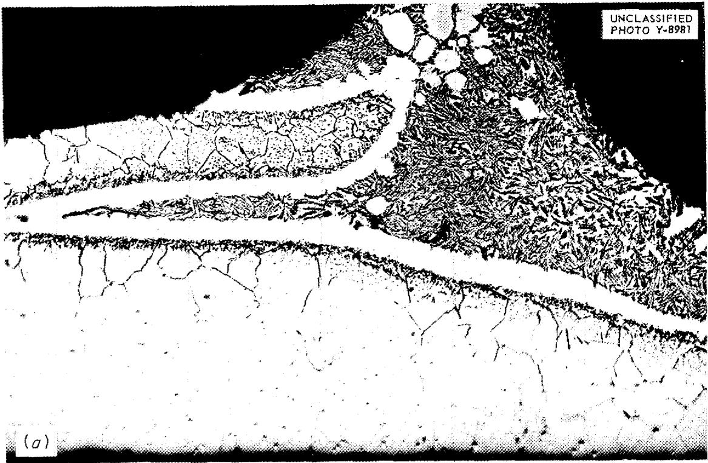

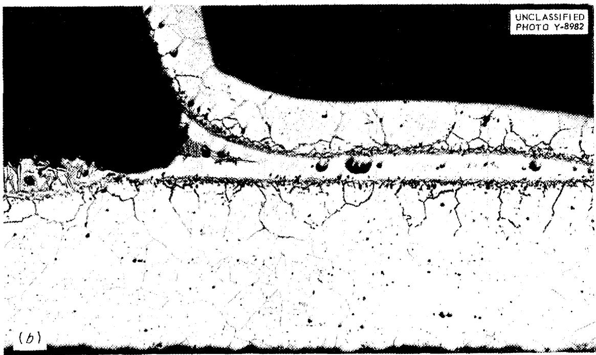  
Fig. 8.2. Stainless Steel Tube-to-Fin Joint Microbrazed at $1220^{\circ}\mathrm{C}$ for 30 min. (a) With a large quantity of brazing alloy, severe tube wall dilution results. (b) With a small quantity of brazing alloy, little tube wall dilution is evident. Etched with aqua regia. 50X

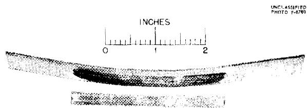  
Fig. 8.3. Carboloy Rod Nicrobrazed to Type 316 Stainless Steel.

produce crack-free pump seals. Cooling rates of approximately $1000^{\circ}\mathrm{F/hr}$ were also employed to decrease cracking tendencies. One successfully brazed seal consists of a Carboloy ring brazed to a nickel shim which is in turn brazed to the stainless steel body.

It is expected that similar techniques may be applied advantageously in joining other materials with widely different coefficients of thermal expansion.

High-Temperature Brazing Alloy Evaluation Tests. The results of several room- and elevated-temperature butt-braze tensile tests on Microbrazed Inconel and type 316 stainless steel joints indicated that the low-temperature properties of stainless steel joints were definitely superior to those of Inconel joints. However, the difference decreased rapidly above $1200^{\circ}\mathrm{F}$ , as determined from a plot of tensile strength vs. testing temperature.

A summary of the existing data is given in Table 8.2. Each value listed in the table is an average of five tests on 0.252-in.-dia test bars. The tests were short-time tensile tests on butt-brazed joints that were machined under nearly ideal conditions. It should be remembered that the strength properties of actual joints may vary quite markedly from those shown for these more ideal cases.

# CREEP AND STRESS-RUPTURE TESTS OF STRUCTURAL METALS

R.B.Oliver

C.W.Weaver

D. A. Douglas

J.W.Woods

Metallurgy Division

The effects of various environments, such as air, argon, fluorides, and hydrogen, on the creep and stress-rupture properties of Inconel were investigated, and wide variations in properties were found. This study is being extended to include the following additional materials: types 316, 304, and 405 stainless steel, nickel, and Hastelloy "C". Table 8.3 shows the results of the tests made to date. A stress was picked for each material which would cause rupture in an argon atmosphere in the time range of 700 to 1000 hours. The data seem to indicate that there is little environmental effect on either type 316 or type 304 stainless steel under the present testing conditions. An A nickel specimen which is still in test in an air atmosphere indicates that nickel may have considerably more creep strength in air than in any of the other environments presently being used. If this is true, it is possible that the strengthening agent or mechanism is the same for nickel as Inconel, which exhibits a similar effect. Further tests are in progress so that a more complete evaluation of the environmental effects can be made.

As a part of this program, fine-grained Inconel was tested at 3500 psi in alternate cycles of argon and hydrogen. The first 200 hr of the test was in argon, and a constant creep rate was reached before the first hydrogen cycle was started. Each hydrogen cycle resulted in an accelerating creep rate. Each argon cycle tended to maintain essentially the same creep rate as that observed at

TABLE 8.2. TENSILE TESTS OF BUTT-BRAZED JOINTS   

<table><tr><td rowspan="2">TEMPERATURE (°F)</td><td colspan="2">TENSILE STRENGTH (psi)</td></tr><tr><td>Stainless Steel Joint</td><td>Inconel Joint</td></tr><tr><td>Room</td><td>68,500</td><td>35,000</td></tr><tr><td>1000</td><td>60,500</td><td>33,000</td></tr><tr><td>1500</td><td>26,000</td><td>24,500</td></tr><tr><td>1700</td><td>16,000</td><td>13,500</td></tr></table>

TABLE 8.3. RESULTS OF CREEP AND STRESS-RUPTURE TESTS OF STRUCTURAL METALS   

<table><tr><td rowspan="2">MATERIAL</td><td rowspan="2">STRESS (psi)</td><td colspan="4">RUPTURE TIME (hr)</td><td colspan="4">CREEP RATE (%/hr)</td></tr><tr><td>In Air</td><td>In Argon</td><td>In Hydrogen</td><td>In Fluorides</td><td>In Air</td><td>In Argon</td><td>In Hydrogen</td><td>In Fluorides</td></tr><tr><td>Fine-grained Inconel</td><td>3500</td><td>Over 2500</td><td>730</td><td>275</td><td>750</td><td>0.002</td><td>0.007</td><td>0.020</td><td>0.015</td></tr><tr><td>Type 316 stainless steel</td><td>6300</td><td>855</td><td>830</td><td>770</td><td>865</td><td>0.009</td><td>0.009</td><td>0.010</td><td>0.020</td></tr><tr><td>Type 304 stainless steel</td><td>3500</td><td>1410</td><td>1100</td><td>1400</td><td></td><td>0.008</td><td>0.005</td><td>0.002</td><td></td></tr><tr><td>Nickel</td><td>1500</td><td>800*</td><td>1004</td><td>935</td><td></td><td>0.0002</td><td>0.003</td><td>0.001</td><td></td></tr></table>

*Still in test.

the end of the hydrogen cycle. The test was discontinued after 550 hours. Metallographic examination revealed profuse internal intergranular cracking. Other tests of fine-grained Inconel at 3500 psi in argon only were discontinued after 200 and 450 hours. Microscopic examination did not reveal any intergranular cracking. It has been shown that, in both argon and hydrogen, failures will result from initiation and propagation of intergranular cracking. Hydrogen apparently tends to promote and accelerate the rate of nucleation and the propagation of the cracking.

Testing of Inconel in the fused fluoride NaF $\mathsf{ZrF}_4\mathsf{-UF}_4$ (46-50-4 mole $\%$ ) is continuing, and the remaining tests are to be performed in the low stress range. A preliminary design curve for fine-grained material is shown in Fig. 8.4. The dotted portions of the curves that are below 3500 psi were obtained by extrapolation. Data for a design curve for coarse- and fine-grained Inconel will be completed to a stress of 2500 psi in approximately three months. Tests at 1500 psi are scheduled, and it is estimated that about 12 months will be required for rupture of the specimens.

# FABRICATION RESEARCH

E. S. Bomar

R. W. Johnson

J. H. Coobs

H. Inouye

Metallurgy Division

A. Levy, Pratt and Whitney Aircraft Division

Extrusion of High-Purity Inconel Tubing. It was indicated in the previous report(2) that the principal problem involved in extrusion of high-purity cast

Inconel was that of lubrication. During this period, several lengths of Inconel tubing was extruded by using glass wool on the billet and rock wool in the container. The results indicate that malleabilizing agents are unnecessary in these vaccum melts. The data are tabulated in Table 8.4.

Analyses of the several heats show that the total impurities are about $0.4\%$ , of which $0.3\%$ is silicon and manganese from the ferrochromium used. The extruded tubes are being drawn to 0.50 in. in outside diameter and 0.035 in. in wall thickness for corrosion testing.

Air Oxidation of Columbium. The oxidation rate of columbium is linear between 400 and $1200^{\circ}\mathrm{C}$ . The logarithm of the rate constant plotted vs. $1 / T$ is a straight line with a break at $900^{\circ}\mathrm{C}$ . This temperature corresponds with a change in the modification of the $\mathrm{Cb}_{2}\mathrm{O}_{5}$ from the low, or "T", form to the high, or "H", form. The energy of activation between 600 and $900^{\circ}\mathrm{C}$ was found to be 13,400 cal/mole. Above $900^{\circ}\mathrm{C},\alpha$ value of 4350 cal/mole was obtained. The only oxide found in these tests was $\mathrm{Cb}_{2}\mathrm{O}_{5}$ . Embrittlement of the metal occurs at approximately $800^{\circ}\mathrm{C}$ .

Control Rod for the G-E Reactor. The prototype control rod, 30 in. long and $\frac{1}{2}$ in. in diameter, was assembled and delivered for testing. This rod comprised several segments of hot-pressed $56\%$ $\mathsf{B}_4\mathsf{C} - 44\%$ Fe absorber canned in a stainless steel tube. However, brazing the hot-pressed mixture to the tube did not result in a satisfactory bond, so a decision was made to abandon this method of rod fabrication. An alternate method of fabrication that is being investigated consists of filling a tube with a mixture of Al- $\mathsf{B}_4\mathsf{C}$ or Cu- $\mathsf{B}_4\mathsf{C}$ powders and reducing the tube to $\frac{1}{2}$ in. in diameter by hot

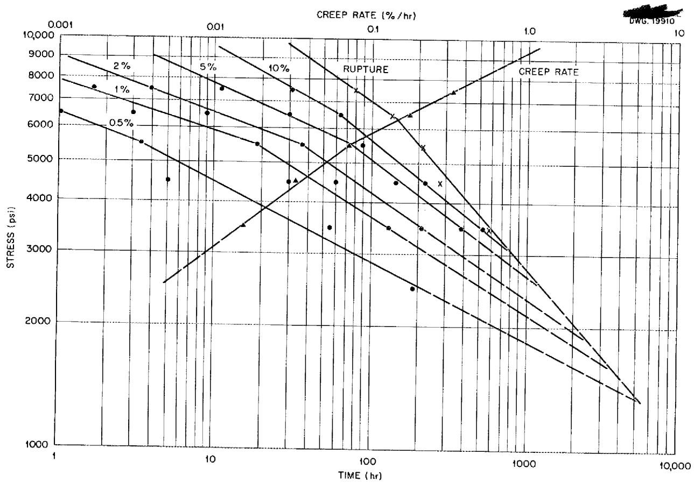  
Fig. 8.4. Creep and Stress-Rupture of Inconel! Sheet Tested in a Fluoride Fuel at $1500^{\circ}$ F. Heat NX8004; cold rolled and annealed at $1500^{\circ}$ F. Grain size: approximately 90 grains per square millimeter. Times were measured for 0.5, 1, 2, 5, and $10\%$ extension and rupture vs. stress. Extension measured by dial gage.

TABLE 8.4. EXTRUSION DATA FOR VACUUM-MELTED INCONEL BILLETS*   

<table><tr><td>INGOT NO.</td><td>BILLET TEMPERATURE** (°F)</td><td>EXTRUSION PRODUCT</td><td>EXTRUSION RATIO</td><td>UNIT EXTRUSION PRESSURE (tsi)</td><td>DIE</td></tr><tr><td>7,9,10</td><td>2150</td><td>Tube</td><td>22:1</td><td>58 to 72</td><td>25 deg cone</td></tr><tr><td>8</td><td>2200</td><td>Tube</td><td>23:1</td><td>60</td><td>30 deg cone</td></tr><tr><td>8,9,10</td><td>2200</td><td>Rod</td><td>14:1</td><td>45</td><td>45 deg V</td></tr></table>

* Billets 3 in. in outside diameter and 4 in. long; front radius $\frac{1}{4}$ in.   
\*\*Heated in ND-15 salt bath.

swaging or hot rolling to consolidate the mixture, as well as to form a bond between the matrix and the tube wall. When about 50 vol % of fine $\mathsf{B}_4\mathsf{C}$ powder is used, the core material should have nearly the same nuclear cross section as the hot-pressed $\mathsf{B}_4\mathsf{C}-\mathsf{Fe}$ composition.

Mixtures containing $47\%$ Al- $53\%$ $\mathsf{B}_4\mathsf{C}$ and $75\%$ Al- $25\%$ $\mathsf{B}_4\mathsf{C}$ were prepared by mixing -100-mesh atomized aluminum powder, grade "C" electrolytic copper powder, and metallurgical-grade $\mathsf{B}_4\mathsf{C}$ powder for 1 hr in an oblique blender. The $\mathsf{B}_4\mathsf{C}$ was ground for 16 hr and contained about $60\%$ -325 mesh particles. The tap densities of these mixtures were $63\%$ for the $\mathsf{B}_4\mathsf{C}$ -Al mixture and $50\%$ for the $\mathsf{B}_4\mathsf{C}$ -Cu mixture. The $\mathsf{B}_4\mathsf{C}$ -Al mixture was used with $5\%$ -in.-dia tubing and was reduced a total of $40\%$ . However, since the $\mathsf{B}_4\mathsf{C}$ -Cu mixture required more reduction for complete consolidation, it was loaded in a $3\%$ -in.-dia tube and reduced a total of $58\%$ . The finished rods were $1/2$ in. in diameter.

The tubes used for both mixtures were AISI type 304 stainless steel with an original wall thickness of 0.049 inch. They were bright annealed in dry hydrogen, loaded by tapping for 3 to 5 min, sealed, and evacuated through a porous sintered-metal plug. The $\mathsf{B}_4\mathsf{C}$ Al rods were reduced at $600^{\circ}\mathsf{C}$ in two steps, while the $\mathsf{B}_4\mathsf{C}$ Cu rods were reduced at $1000^{\circ}\mathsf{C}$ in four steps.

A total of seven experimental rods has been prepared, including one 20-in.-long rod of each material, for reactivity tests in the LITR. In addition, short sections about 6 in., in length of each type of rod have been prepared for thermal conductivity and strength tests. In each case the core material was consolidated to $95\%$ or more of theoretical density and showed good distribution

of $\mathsf{B}_4\mathsf{C}$ .The $\mathsf{B}_4\mathsf{C - Cu}$ core material showed good bonding to the stainless steel tube wall in the as swaged condition, but the $\mathsf{B}_4\mathsf{C - Al}$ mixture did not. However, after heating to $700^{\circ}C$ for 15 min, the $\mathsf{B}_4\mathsf{C - Al}$ exhibited excellent bonding.

The stainless steel tube wall was increased in the swaging process from 0.049 in. to a final thickness that varied from 0.053 to 0.057 in.; thus the final wall thickness was somewhat less than the required 0.065 inch. However, if the original wall thickness were 0.058 in., an increase of the same proportion during the swaging would give a final thickness very close to that required.

# HOT-PRESSED PUMP SEALS

E. S. Bomar

R.W.Johnson

J. H. Coobs

H. Inouye

Metallurgy Division

A. Levy

Pratt and Whitney Aircraft Division

Fabrication of Small Compacts with $\mathsf{MoS}_2$ . Additional small experimental compacts with 14 vol % $\mathsf{MoS}_2$ were prepared by hot pressing. The data from these experiments are given in Table 8.5. The first four experiments showed that the $95\%$ Ag-5% Cu alloy composition could not be prepared by using coarse silver powder. In all cases in which the pressing temperature exceeded the eutectic temperature of $780^{\circ}\mathsf{C}$ , a portion of the alloy was lost by extrusion of the eutectic composition past the rams. A single compact pressed at $770^{\circ}\mathsf{C}$ with no loss of material was heated at $820^{\circ}\mathsf{C}$ in helium for a total of 36 hr in an attempt to produce a homogeneous alloy matrix. This treatment was not successful. Thus, it was necessary to prepare

TABLE 8.5. EXPERIMENTAL COMPACTS OF FACE SEAL COMPOSITIONS   

<table><tr><td>MATERIAL</td><td>HOT-PRESSING TEMPERATURE (°C)</td><td>DENSITY (% of theoretical)</td><td>REMARKS</td></tr><tr><td rowspan="4">(Coarse 95% Ag-5% Cu)-MoS2</td><td>790</td><td>94.5</td><td>8% loss</td></tr><tr><td>880</td><td>97.3</td><td>10% loss</td></tr><tr><td>850</td><td>95.9</td><td>4% loss</td></tr><tr><td>770</td><td>94.6</td><td>No loss</td></tr><tr><td rowspan="2">Type 304 stainless steel-MoS2</td><td>1120</td><td>84.0</td><td>Highly magnetic</td></tr><tr><td>1220</td><td>94.0</td><td>Highly magnetic</td></tr><tr><td>Molybdenum</td><td>1530</td><td>92.0</td><td></td></tr></table>

this composition by using the ultrafine precipitated silver powder.

Metallographic Examination of Compacts with $\mathsf{MoS}_2$ . The compacts of stainless steel and $\mathsf{MoS}_2$ are being studied metallographically to determine the extent of reaction, if any, between the $\mathsf{MoS}_2$ and stainless steel. The sulfide phase seems to be interspersed with a metallic phase, which becomes more prominent as the pressing temperature is increased. X-ray diffraction analysis revealed only ferrite; the identity of the sulfide phase could not be established and austenite could not be detected. It thus seems that molybdenum is dissolved or nickel is removed from solution, or both, with the consequent formation of ferrite. Thus the composition may be unsatisfactory for the pump seal tests.

Metallographic examination showed that the $\mathsf{Cu - MoS}_2$ compact and the Ag-MoS and (95% Ag-5% Cu)-MoS compacts prepared with precipitated silver powder had excellent structure. The flake-like particles of $\mathsf{MoS}_2$ were oriented perpendicular to the direction of pressing and were distributed at random in the continuous, homogeneous, highly dense matrix.

The coarse silver compact, on the other hand, had a rather poor structure in which the $\mathsf{MoS}_2$ was distributed exclusively at the particle boundaries. This compact showed rather poor interparticle bonding and had poor physical properties.

Fabrication of Face Seal Rings. On the basis of results obtained with the small compacts, face seal rings $3\%$ in. OD by $2\%$ in. ID by $\%$ in. long with the compositions shown in Table 8.6 were fabricated by hot pressing at 2500 psi. The $\mathrm{Cu - MoS}_2$ composition seemed quite satisfactory except that the density was not so high as desired. A slightly higher pressing temperature might have increased

the density, but during the second hot pressing operation the die broke. Since the compact obtained could be used, the operation was not repeated.

The $\mathsf{Ag - MoS}_2$ compacts were prepared with coarse silver powder, and it was necessary to approach quite close to the melting temperature of silver to obtain the low porosity desired. Difficulty in accurately controlling the temperature of the large die assembly resulted in a substantial loss of material from one of the compacts by extrusion past the rams and infiltration of the graphite die body.

The $(95\% \mathrm{Ag - 5\% Cu})\cdot \mathrm{MoS}_2$ compact was prepared with the fine precipitated silver powder which gave excellent results in small compacts. However, the density of the first compact was rather low, and in an attempt to obtain a density of $95\%$ , the maximum temperature was exceeded and again a substantial amount of the material was lost by extrusion and infiltration. All compacts were judged to be satisfactory for testing and were delivered.

An additional request was received for a number of smaller rings of the $\mathsf{Cu - MoS}_2$ composition to be used in a packing gland to seal the shaft of a fluoride pump. A total of 20 rings, $1^{1}\%$ in. OD by $1\%$ in. ID by $\frac{1}{4}$ in. thick, is required for the first test. Six cylinders, $1\%$ in. OD by $1\%$ in. ID by 2 in. long, from which sufficient rings could be machined, were prepared from the $92\%$ $\mathsf{Cu - 8\% MoS_2}$ composition. It was found that densities as high as $97.5\%$ of theoretical could be attained by hot pressing the rings at 950 to $960^{\circ}C$ and cooling under pressure.

Surface Sulfurization of Molybdenum. Efforts to form $\mathsf{MoS}_2$ on the surface of molybdenum have been continued. The pyrex reaction vessel used initially was replaced with a vessel of material that permits

TABLE 8.6. FACE SEAL TEST RINGS   

<table><tr><td>COMPOSITION (wt %)</td><td>TEMPERATURE (℃)</td><td>DENSITY (% of theoretical)</td><td>REMARKS</td></tr><tr><td rowspan="2">Cu-8% MoS2</td><td>910</td><td>89.5</td><td></td></tr><tr><td>900</td><td>~90</td><td>Die broken</td></tr><tr><td rowspan="2">Ag-9% MoS2</td><td>960</td><td>92.5</td><td>15% weight loss</td></tr><tr><td>955</td><td>95.0</td><td>3% loss</td></tr><tr><td rowspan="2">(95% Ag-5% Cu)-9% MoS2</td><td>835</td><td>85.5</td><td>No loss</td></tr><tr><td>880</td><td>86.5</td><td>20% weight loss</td></tr></table>

the use of a higher temperature. Also, $\mathsf{H}_2\mathsf{S}$ was used in one experiment in place of the sulfur vapor.

For the experiment in which $\mathsf{H}_2\mathsf{S}$ was used, the molybdenum was introduced in the form of an 18-in.-long by 0.057-in.-dia wire. The wire was suspended in a vertical tube furnace that had a temperature gradient of from room temperature to $1020^{\circ}\mathrm{C}$ . The $\mathsf{H}_2\mathsf{S}$ was passed through the tube at the rate of 1 liter/min during an exposure of $1\frac{1}{2}$ hr at temperature. The exposure was terminated because of the escape of $\mathsf{H}_2\mathsf{S}$ when the gas outlet became plugged with condensed sulfur.

Data on the free energy of formation of $\mathsf{H}_2\mathsf{S}^{(3)}$ indicate that at $1000^{\circ}\mathrm{C}$ the equilibrium pressure of sulfur gas is about 0.08 atomic weight. An appreciable portion of the decomposed $\mathsf{H}_2\mathsf{S}$ must have been swept out of the reaction chamber before recombination could take place. The molybdenum wire reacted with the gaseous atmosphere at temperatures of from 535 to $1020^{\circ}\mathrm{C}$ . X-ray diffraction patterns showed the reaction layer to be $\mathsf{MoS}_2$ . However, the difficulty described here plus the psychological and physiological hazards associated with the escape of $\mathsf{H}_2\mathsf{S}$ make the use of sulfur vapor more attractive.

Two furnaces were arranged to permit the heating of a molybdenum sample contained in a tube to one temperature and the heating of a sulfur reservoir at the other end to a lower temperature. Type 446

(3)H. J. T. Ellingham, J. of the Soc. of Chem. Ind. 63-65, 125-133 (May 1944).

stainless steel tubing was used for the container. Data from the four exposures made by using this arrangement are summarized in Table 8.7. These tests indicate that a $\mathsf{MoS}_2$ layer can be formed by exposure to sulfur vapor and that a degree of control may be exercised by varying the molybdenum temperature and the sulfur vapor pressure. Further checks will be made to determine whether the temperature at which the $\mathsf{MoS}_2$ is formed has an appreciable effect on the nature of the compound formed.

# HIGH-CONDUCTIVITY METALS FOR RADIATORS

E. S. Bomar

R.W.Johnson

J. H. Coobs

H. Inouye

Metallurgy Division

A. Levy

Pratt and Whitney Aircraft Division

Finned tubes could be advantageously used for the air radiators that will be required by most nuclear aircraft reactors to transfer the reactor heat to a turbojet air stream. The design of the fins requires that they be 0.010 in. or less in thickness, that they be oxidation resistant at $1500^{\circ}\mathrm{F}$ , and that they possess high thermal conductivity. The object of the initial investigation has been to determine the most promising method of fulfilling these specifications.

The major effort, to date, has been directed toward the protection of copper by cladding it with

TABLE 8.7. REACTION OF MOLYBDENUM WITH SULFUR VAPOR   

<table><tr><td>SULFUR TEMPERATURE (°C)</td><td>SULFUR VAPOR PRESSURE(mm Hg)</td><td>MOLYBDENUMTEMPERATURE(°C)*</td><td>TIME ATTEMPERATURE(min)</td><td>REMARKS</td></tr><tr><td>445</td><td>760</td><td>800</td><td>60</td><td>No MoS2formed</td></tr><tr><td>490</td><td>1441</td><td>900</td><td>120</td><td>Complete conversion of 4-g molybdenum sample; layer of FeS formed on inner surface of tube</td></tr><tr><td>490</td><td>1441</td><td>900</td><td>8</td><td>Powdery MoS216in. thick on molybdenum compact</td></tr><tr><td>460</td><td>948</td><td>900</td><td>10</td><td>Porous molybdenum sample,16-in., layer of MoS2; dense molybdenum sample, slight reaction</td></tr></table>

*Data from Lange's Handbook of Chemistry, Sixth Edition, p. 1421.

the specified maximum permissible thickness of 0.002 in. of oxidation-resistant materials. Some attention has been given to the use of oxidation-resistant copper alloys as the fin material or as a cladding on copper. Type 310 stainless steel clad silver was also investigated. The results, to date, are of a preliminary nature.

Chromium-Clad OFHC Copper. Both vapor-deposited and electroplated chromium claddings on oxygen-free high-conductivity (OFHC) copper were tested at $1500^{\circ}\mathrm{F}$ for 100 hours. The results indicate that this combination offers protection to the copper if the plate does not peel off or crack during temperature cycling. Diffusion does not appear to be a problem. Samples of "ductile" chromium on copper have been requested from the Ductile Chrome Process Company.

Chromium and Nickel Electroplate on Copper. A composite that was intended to be 0.0005 in. of chromium plus 0.0015 in. of nickel on copper was prepared; however, measurements indicated that the composite tested actually had 0.002 in. of nickel and less than 0.0001 in. of chromium. When tested, as plated, at $1500^{\circ}\mathrm{F}$ , the surface showed a few areas of failure after 100 hours. A 500-hr test showed no failure. After a pretreatment of 24 hr at $1000^{\circ}\mathrm{C}$ in hydrogen, a test for 100 hr showed no surface failure, but a test for 500 hr showed complete failure because of separation of the plate from the core. Metallographic examination of the specimens tested for 100 hr showed that the copper core had suffered extreme diffusion and that numerous voids had appeared near the original interface. The amount of unaltered copper was approximately $25\%$ of the original core.

Inconel! Cladding on Copper. In 100-hr tests of Inconel-clad copper, diffusion occurs that affects a zone that is from 0 to 4 mils thick. In 500-hr tests, the characteristic color of the copper nearly disappears, and the cladding is penetrated by a copper-rich phase that extends to the surface in some locations. The 100-hr tests showed that a core of commercial copper develops substantially more voids near the interface than does OFHC copper. In all instances, surface failure (that is, oxidation effects) is limited to the development of copper oxide nodules. This type of failure is

attributed to pinholes developed in the cladding and rolling of the composite. Suitable rolling techniques reduce the number of pinholes developed to the extent that this type of failure becomes inconsequential.

The wide variations in thickness of the diffusion zones in the several different composites tested suggest that the method of fabrication is responsible for the diffusion. It is thought, at this time, that assembling the composites with both the copper and the cladding as clean as possible promotes diffusion and that consequently a "not so clean" interface is desirable.

Type 310 Stainless Steel Cladding on Copper. Tests of type310 stainless steel cladding on copper have been completed. These tests were conducted in air for 100- and 500-hr periods. The results indicate that the diffusion which occurs is predominantly of a different type than that found in specimens of Inconel cladding on copper. In most cases the interface becomes highly irregular, to the extent that islands of a copper-rich phase appear in the cladding. In only one instance did a test piece show alteration of the copper core. The number and the size of the copper-rich islands that appear in the cladding are greater when commercial copper is used than when OFHC copper is used. All surface failures were pinholes such as found with Inconel cladding.

Type 310 Stainless Steel Cladding on Silver. Tests of type 310 stainless steel cladding on silver were made at $1500^{\circ}\mathrm{F}$ for 100- and 500-hr periods. The material tested showed a cladding thickness of 5 mils. There was no failure in the cladding, and diffusion at the end of 500 hr was negligible.

Copper Alloys. Copper alloys were tested for 100-hr at $1500^{\circ}\mathrm{F}$ with the results given in Table 8.8. The thermal conductivity at $20^{\circ}\mathrm{C}$ of the copper-aluminum alloys is about 0.20 cgs units, with a positive temperature coefficient. Extrapolated data indicate a value of about 0.4 cgs units at $1500^{\circ}\mathrm{F}$ (for Inconel and type 310 stainless steel the value is about 0.06 cgs units). These copper-aluminum alloys may prove to be adequate as they are, but the present plans are to clad copper with both the $6\%$ and the $8\%$ aluminum-bronze alloy.

TABLE 8.8. TESTS OF COPPER ALLOYS IN AIR FOR 100-hr PERIODS   

<table><tr><td>ALLOY</td><td>LOSS OF COPPER (%)</td><td>REMARKS</td></tr><tr><td>99% Cu-1% Be</td><td>7.0</td><td>Uniform black oxide that scaled freely</td></tr><tr><td>98% Cu-2% Al</td><td>28.5</td><td>Thick uniform black oxide</td></tr><tr><td>96.5% Cu-3.5% Al</td><td>1.0</td><td>Numerous areas of localized oxidation</td></tr><tr><td>95% Cu-5% Al</td><td>0.16</td><td>Few areas of localized oxidation</td></tr><tr><td>94% Cu-6% Al</td><td>No change</td><td>Polished surface became dull</td></tr><tr><td>92% Cu-8% Al</td><td>No change</td><td>Polished surface remained bright</td></tr><tr><td>90% Cu-10% Al</td><td>Weight increased</td><td>Visible coating of Al2O3found</td></tr><tr><td>Copper</td><td>42.4</td><td>Thick black oxide</td></tr></table>

# SOLID FUEL FORMED IN SPHERES

E.S.Bomar R.W.Johnson

J.H.Coobs H. Inouye

Metallurgy Division

A. Levy

Pratt and Whitney Aircraft Division

The initial work on the preparation of spherical particles of solid fuel was reported previously. For the previous work, alloys containing $5\%$ uranium in copper, nickel or molybdenum were subjected to four different methods of processing. Only one method, spraying from a metallizing gun, gave an appreciable yield of particles that approached spherical geometry.

Additional work has been based on modifications of earlier methods or the use of additional methods. Some success has been achieved. Briefly, the work has included:

1. heating to above the alloy melting point in a vacuum,   
2. substitution of a three-phase three-electrode arc for a single-phase double-electrode arc as a heat source for particles dropped through the arc,   
3. forcing the molten alloy through a small orifice,   
4. letting precut particles of the alloy settle through a molten salt bath having a temperature gradient extending beyond the liquidus and solidus of the alloy.

Each of these methods of preparing spherical particles is discussed below, and additional details, including photomicrographs of the particles

prepared by these and the previous methods, are presented in other reports.(5,6) There are no plans at present for pursuing further the problem of fabricating spherical particles. However, two additional methods which might prove of interest are:

1. passing of a high velocity stream of inert gas through an electric arc formed between electrodes of the desired alloy, (7)

2. forming spherical geometry from small right cylinders by random impacts in a hammer mill. The second method was suggested in a private communication from Doyle Rauch, Research Division, NYO-AEC. This method and the more conventional ball-bearing manufacturing techniques are used to produce the spheres used in ballpoint pens.

Heating Under Vacuum. Particles clipped from a 0.010-in. wire of $5\%$ U-95% Ni alloy were degassed under a vacuum of $10^{-5}$ mm Hg at $900^{\circ}\mathrm{C}$ while resting on an alumina plate. They were withdrawn from the hot zone of the furnace and examined through a glass port, still under vacuum. The particles appeared bright and clean. The furnace temperature was then raised to $1450^{\circ}\mathrm{C}$ , and the charge was gradually moved into the hot zone. The vacuum did not exceed $5 \times 10^{-4}$ mm Hg during any of the heating cycles. After approximately 5 min at temperature, the charge was withdrawn, allowed to cool, and removed from the vacuum

furnace for examination. Melting had occurred, but the formation of a surface film again prevented spheroidization.

Three-Phase Carbon Arc. Three carbon arcs were symmetrically arranged about a common axis in a housing purged with tank argon. Passage of cut particles of $5\%$ U-95% Cu and $5\%$ U-95% Ni alloys through the zone of the arc produced a very low yield of melted particles at currents of up to 35 amperes. At 40 to 45 amp, the major portion of the particles melted. Many particles were flattened when they struck the bottom of the housing because there was insufficient free fall. As in the earlier two-electrode set up, alignment through the arc was very critical. Examination of the melted particles revealed surface oxidation, porosity, and depletion of uranium. Any or all of these effects may have been due to inadequate control of the atmosphere.

Molten Alloy Passed Through a Small Orifice. Spherical particles were produced, with moderate success, by forcing molten uranium-copper alloy through a small orifice in the base of a refractory container. A positive pressure of argon was required to force the alloy through 0.020-, 0.025-, or 0.031-in. holes in alumina crucibles. For a run, a crucible 10 to 15 in. long and $\frac{1}{2}$ in. in diameter was passed through a rubber stopper into a quartz tube containing argon. A small graphite sleeve placed over the lower 3 in. of the crucible served as a heat source when exposed to the field of an induction coil. Upon heating to approximately $1200^{\circ}\mathrm{C}$ , particles ranging in size from 0.010 to 0.020 in. were ejected from the crucible. The orifice size appeared to have no effect on the resulting particle size. Particle surfaces showed little oxidation. Macroexamination revealed a cast dendritic structure of primary copper plus $\mathrm{UCu}_{5}-\mathrm{Cu}$ eutectic. Some of the surface defects were found to be due to shrinkage upon solidification.

Settling of Particles Through a Molten Salt. $\mathsf{BaCl}_2$ was charged into a graphite crucible, which was, in turn, positioned in a quartz tube that was being continuously purged with argon. The upper half of the crucible was heated by induction to produce a temperature gradient in the molten salt that ranged from 962 (mp of $\mathsf{BaCl}_2$ ) to $1200^{\circ}\mathsf{C}$ . Particles of $5\%$ U- $95\%$ Cu alloy clipped from 0.010-in. wire were partly spheroidized under these conditions. When the maximum temperature of the salt was increased to $1300^{\circ}\mathsf{C}$ , most of the particles

were spheroidized. Slight surface oxidation of the particles occurred.

# INFLAMMABILITY OF SODIUM ALLOYS

G.P. Smith

L.L.Hall

Metallurgy Division

Studies have been initiated to determine to what extent the inflammability of jets of liquid sodium can be reduced by alloying the sodium with some of the heavy metals. In the initial phase of this project, a large number of alloys will be surveyed qualitatively. The qualitative data will serve to indicate the worthfulness of a detailed study of the numerous variables, such as particle-size distribution, rate of evaporation, and gas-phase reaction kinetics, which probably influence the inflammability of jets of liquid alloys.

The following method of measurement is being used. A $15\text{-cm}^3$ sample of alloy is sealed in a metal capsule under 1 atm of argon. The capsule is made so that one end may be broken off to form a small hole. After the capsule is heated to a temperature of 700 to $900^{\circ}\mathrm{C}$ , the end is broken off, and the argon pressure developed by heating at constant volume ejects the molten alloy through the small hole to form a jet. Visual observations are made of the extent of combustion.

One unalloyed sodium jet was burned at $750^{\circ}C$ and three jets were burned at $800^{\circ}C$ . The difference in temperature did not make any significant difference in the flammability. In all cases, the jet burned with a brilliant yellow flash. Copious quantities of white smoke were produced. Motion pictures were taken at a speed of about 700 frames/sec of one of the burning jets as it left the capsule. The only source of illumination for these pictures was the light produced by the burning sodium. It was observed that the jet consisted of many, small, brightly glowing droplets accompanied by a less luminous cloud. This cloud may have consisted of very fine particles or may have been sodium vapor lighted by resonant radiation. When the cluster of droplets forming the jet had moved a few centimeters away from the capsule, there was a sudden increase in light intensity.

Three jets of unalloyed lead at $800^{\circ}\mathrm{C}$ did not take fire, and most of the lead was recovered in an unoxidized condition. At $950^{\circ}\mathrm{C}$ , a jet of unalloyed lead oxidized considerably but did not take fire.

Alloys of sodium containing 10 and 50 wt % lead appeared to burn more intensely at $800^{\circ}\mathrm{C}$ than did

pure sodium. Additions of 5 and $10\mathrm{wt}\%$ mercury did not seem to change the burning of sodium jets to an appreciable extent at 750 and $800^{\circ}C$ . A single test was made at $800^{\circ}C$ with sodium containing $10\mathrm{wt}\%$ zinc. This alloy burned at about the same intensity as did pure sodium.

The apparatus being used for these measurements is of a very simple design. A small furnace for heating the capsules and the mechanism for breaking off the ends of the capsules are mounted on a transite board which rests on top of a 55-gal steel drum. The drum, which serves to confine the burning alloy, has a long narrow safety glass window down one side for observation. This apparatus is enclosed in a transite hood of temporary construction. After sodium or one of its alloys has been burned, the dense cloud of white smoke (probably a mixture of sodium oxide, hydroxide, and carbonate) which is produced is removed through the exhaust system of the building.

A new apparatus is being constructed in which the combustion of sodium alloy jets can be studied in air at low pressures with controlled water-vapor concentration. The purpose of this apparatus is to simulate more nearly atmospheric conditions at high elevation.

# CERAMICS

L. M. Doney

J. R. Johnson

J. A. Griffin

A.J.Taylor

Metallurgy Division

Development of Cermets. Further developments of the silicon carbide-silicon fuel elements include the following:

1. The inclusion of $10\%$ USi in the center portion of a cross-shaped element has been successfully achieved. A layer of material approximately $\frac{1}{16}$ in thick that does not contain fuel completely surrounds the fuel-bearing portion.   
2. Isostatic techniques for pressing the porous carbon base material have been initiated.

3. A new means of fabrication has been developed that utilizes a dipping technique and induction heating for melting the silicon.   
4. Preliminary autoradiographic tests have been developed to show the location of the fuel after impregnation with silicon has taken place.

Effect of Heating Rate on the Beryllium Oxide Blocks for the ARE. Experiments were carried out to determine the effect of heating rate on the full-size hot-pressed beryllium oxide blocks in the as-received condition. All heating was carried out in a large, Harper, glo-bar furnace; the samples were shielded from the direct radiation of the heating elements by silicon carbide plates $\frac{3}{4}$ in. thick. Several of the blocks were checked for incipient cracks before the experiment was started, but no cracks were found in any of the blocks checked.

In the first experiment, two blocks were placed in the furnace and heated at $100^{\circ}\mathrm{C} / \mathrm{hr}$ to $1500^{\circ}\mathrm{C}$ ; the furnace was then shut off with no holding time at the peak temperature. The cooling rate was slightly over $100^{\circ}\mathrm{C} / \mathrm{hr}$ down to $1300^{\circ}\mathrm{C}$ , but it was less than $100^{\circ}\mathrm{C} / \mathrm{hr}$ from $1300^{\circ}\mathrm{C}$ down to room temperature. Both blocks were intact at the end of the experiment and had no visible cracks.

Two unfired blocks and one from the first test were then placed in the furnace, heated to $1500^{\circ}C$ at $200^{\circ}C/hr$ , and cooled as before. Both new pieces were cracked through at the center, perpendicular to axis; the lower half of one was also split parallel to axis. However, the piece which had been heated previously was unchanged. In a third test, the second heat treatment was repeated, but this time, no pieces were broken.

It cannot be claimed that enough samples were used to allow definite conclusions to be made; the results should be considered only as indicative of a trend. However, there is some evidence that these pieces do have internal strain and that their thermal endurance might be improved by an initial heat treatment at a very slow heating rate. On the basis of these few tests it would appear that a safe heating rate for the as-received blocks is below $200^{\circ}\mathrm{C/hr}$ .

# 9. HEAT TRANSFER AND PHYSICAL PROPERTIES

H. F. Poppendiek

Reactor Experimental Engineering Division

Some preliminary density and viscosity measurements were made on the new ARE fuel $\mathsf{NaF - ZrF}_4\cdot$ UF4 (53-43-4 mole %). The viscosity was found to vary from about 13.5 cp at $620^{\circ}C$ to about 8.8 cp at $757^{\circ}C.$ The density was found to be about 3.35 g/cm³ at $653^{\circ}C.$ The enthalpies and heat capacities of lithium hydroxide and sodium hydroxide eutectic and of fuel mixture NaF-KF-LiF-UF4 (10.9-43,5-44.5-1.1 mole %) have been obtained. The heat capacity of LiOH-NaOH eutectic was determined to be $0.60\pm 0.02~\mathrm{cal / g}\cdot {}^{\circ}C$ over the temperature range 260 to $850^{\circ}C;$ the heat capacity of the NaF-KF-LiF-UF4 was found to be 0.44 $\pm 0.03~\mathrm{cal / g}\cdot {}^{\circ}C$ over the temperature range 500 to $1000^{\circ}C.$ The surface tension of NaF-ZrF4-UF4 (50-46-4 mole %) was determined to vary from 160 dynes/cm at $530^{\circ}C$ to 115 dynes/cm at $740^{\circ}C.$

Experimental velocity distributions have been determined in a pyrex convection harp system; the profiles differed significantly from the parabolic profile characteristic of isothermal laminar flow. At Reynolds' moduli as low as 85, large scale viscous eddies were observed that were considered to be due to thermal turbulence. Forced convection heat transfer data for NoF-KF-LiF flowing in a small Inconel tube were found to lie $50\%$ below the data previously obtained in a nickel system. Some evidence of a thin, green corrosion layer was found at the surface of the Inconel. Such a layer or a nonwetting phenomena could account for additional thermal resistance in the thermal circuit.

The effectiveness of a reactor coolant is a function of coolant duct dimensions and spacing, the amount of heat to be removed, the total coolant temperature rise, and the physical properties of the coolant. A mathematical analysis of the effectiveness of reactor coolants has been made with the aid of IBM machines; this analysis can be used to optimize coolant systems in solid-fuel reactor systems. An apparatus which simulates heat transfer in a circulating-fuel piping system by passing an electric current through a flowing electrolyte has been successfully operated. An experiment has been analyzed in which heat was transferred in an annular system from a molten fluoride to NaK. The data are compared to Hausen's and to Colburn's equations.

# THERMAL CONDUCTIVITY

W. D. Powers

S. J. Claiborne

R. M. Burnett

Reactor Experimental Engineering Division

The longitudinal thermal conductivity apparatus for measurements on solid and liquid metals has been completed, and preliminary runs have been made. The solid samples used are in the form of rods, the liquid samples are placed in cylindrical, thin-walled capsules. The heat used is passed through a heat meter before it flows through the sample being studied. The conductivity of the sample is determined by measuring the temperature gradient within the sample and the heat flow through the heat meter. To eliminate radial heat losses, guard heating is provided. All heaters are individually controlled by variacs.

The uninsulated and uninstrumented conductivity device is shown in Fig. 9.1. The two top calrods guard-heat the sample heater, and the other eight calrods are attached to the eight annular guard disks. A copper disk, which is cooled with water (the heat sink), is located at the bottom of the apparatus. When in operation, the entire device is surrounded by a metal shell which is filled with fine Sil-o-cel powder. Platinum-platinum-rhodium thermocouples are welded to the sample at the level of each guard heater disk; similar thermocouples are attached to the guard heaters. After a sample heater has been turned on and a temperature gradient has been established in the sample, the guard heaters are turned on and adjusted so that no temperature difference exists between the sample and the guard heater disk at each level. At present, the radial temperature differences can be held to within less than $1^{\circ}C$ when a total axial temperature difference of $300^{\circ}C$ exists.

Preliminary thermal conductivity measurements have been made on type 316 stainless steel. A value of 10 Btu/hr·ft²·(°F/ft) at 750°F, which compares favorably with the literature value, was obtained. Before the thermal conductivity of liquid lithium is determined, the apparatus will be checked with molten sodium.

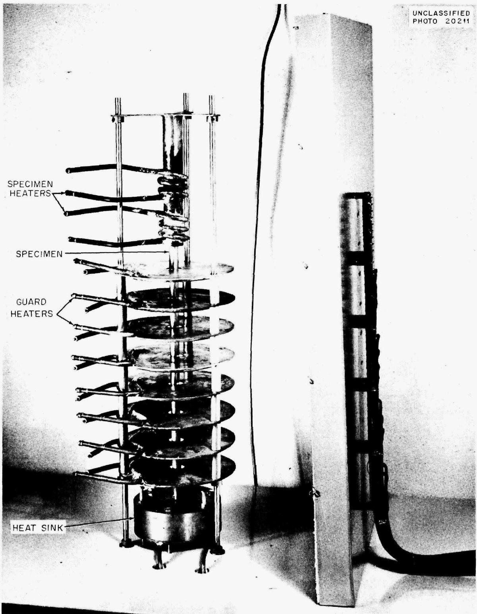  
Fig. 9.1. Longitudinal Thermal Conductivity Device.

# DENSITY AND VISCOSITY

S. I. Cohen

T. N. Jones

Reactor Experimental Engineering Division

A new drybox designed to contain instruments for measuring densities, viscosities, and surface tensions by each of two methods has been completed. Included in the system is an elaborate gas train for removing the undesirable impurities from the cylinder gas used to provide the inert atmosphere. This drybox will be described in detail in a future report.

A study of the density and the viscosity of the fluoride fuel $\mathsf{NaF - ZrF_4 - UF_4}$ (53-43-4 mole %) is being made and preliminary data have been obtained. The viscosity was found to vary from about 13.5 cp at $620^{\circ}C$ to about 8.8 cp at $757^{\circ}C$ . The density was found to be about $3.35\mathrm{g / cm^3}$ at $653^{\circ}C$ . These preliminary viscosity and density measurements are in good agreement with the corresponding values for the fluoride fuel $\mathsf{NaF - ZrF_4 - UF_4}$ (50-46-4 mole %), whose composition is very similar.

Several glass mockups of possible capillary viscometer designs have been fabricated and tested. However, no final design for the device has been decided upon to date. The gas-bubble densitometer has been completed and tested. It will be used in conjunction with the plummet method to determine densities.

# HEAT CAPACITIES OF LIQUIDS

W. D. Powers

G. C. Blalock

Reactor Experimental Engineering Division

Investigations of the enthalpy and heat capacity of hydroxides and fluoride salt mixtures are being continued. The following measurements have been made: (1,2) for NaOH-LiOH eutectic (73-27 mole %) at 260 to $850^{\circ}\mathrm{C}$ ,

$$
\begin{array}{l} H _ {T} (\text {l i q u i d}) - H _ {0 ^ {\circ} C} (\text {s o l i d}) = 4 4 + 0. 6 0 T, \\ c _ {p} = 0. 6 0 \pm 0. 0 2, \\ \end{array}
$$

and for NaF-KF-LiF-UF $_4$ (10.9-43.5-44.5-1 mole %) at 500 to $1000^{\circ}\mathrm{C}$ ,

$$
\begin{array}{l} H _ {T} (\text {l i q u i d}) - H _ {0 ^ {\circ} C} (\text {s o l i d}) = 2 1 + 0. 4 4 T, \\ c _ {p} = 0. 4 4 \pm 0. 0 3, \\ \end{array}
$$

where $H$ is the enthalpy in $\mathrm{cal / g}$ , $T$ is the temperature in ${}^{\circ}\mathrm{C}$ , and $c_{p}$ is the heat capacity in $\mathrm{cal / g}$ .

# SURFACE TENSIONS OF FLUORIDES

S. I. Cohen

T. N. Jones

Reactor Experimental Engineering Division

The surface tension of the fluoride fuel NaF $\mathsf{ZrF}_4$ -UF $_4$ (50-46-4 mole %) was measured with a commercial tensiometer, which was somewhat modified for the experiment. A spring with a low spring constant was fabricated and used to give greater sensitivity to the instrument. The liquid-surface temperatures were obtained from temperature profile measurements made with a traversing thermocouple probe. The surface tension was found to vary from 160 dynes/cm at $530^{\circ}\mathsf{C}$ to 115 dynes/cm at $740^{\circ}\mathsf{C}$ (Fig. 9.2).

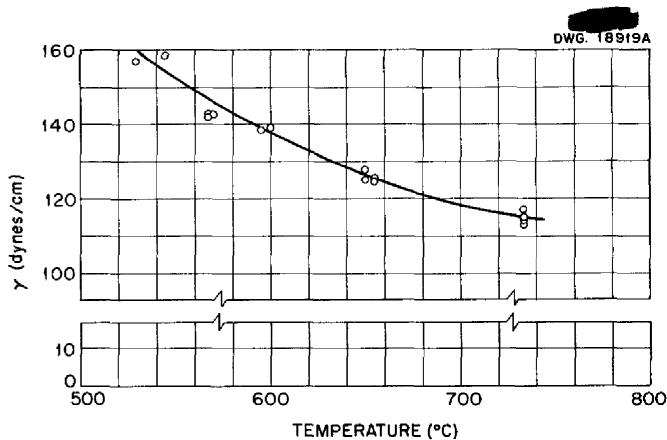  
Fig. 9.2. Surface Tension of NaF-ZrF $_4$ -UF $_4$ (50-46-4 mol %).

# VAPOR PRESSURES OF FLUORIDES

R.E.Moore

R.E.Traber

Materials Chemistry Division

Additional vapor pressure determinations of fluoride mixtures and components have been made by the method described by Rodebush and Dixon. (3) Data for the vapor pressure of NaF-ZrF $_4$ -UF $_4$ (53-43-4 mole %), the composition presently considered as the fuel for the ARE, range from 4.5 mm Hg at 790°C to 39 mm Hg at 958°C. The data are best represented by the equation

$$
\log_ {1 0} P _ {(m m H g)} = \frac {- 7 1 6 0}{T ^ {\prime} (^ {\circ} K)} + 7. 3 7,
$$

from which the heat of vaporization of 33 kcal/mole is obtained.

Work has begun on the mixture $\mathsf{NaF - ZrF_4 - UF_4}$ (65-15-20 mole %), which is the new composition proposed for the addition of enriched uranium to bring the ARE to criticality. Preliminary results indicate that the vapor pressure of this composition at $900^{\circ}C$ is approximately 8 mm Hg.

Vapor pressure data for the mixture NaF-KF-ZrF4-UF4 (5-51-42-2 mole %) were given in a previous report.(4) This composition was the first of the ZrF4-bearing mixtures to be prepared, and it was the only mixture prepared before the hydrofluorination treatment became the practice. Because it had not been subjected to such treatment and because the zirconium tetrafluoride in use at the time was not so pure as that used in mixtures prepared more recently, vapor pressure measurements were repeated on a new sample.

The recent data, which range from 8 mm Hg at $900^{\circ}\mathrm{C}$ to 64 mm Hg at $1123^{\circ}\mathrm{C}$ , fall considerably below the values obtained previously. A small amount of a more volatile impurity (possibly zirconium tetrachloride) in the zirconium tetrafluoride used to prepare the first samples may account for the difference in pressures. The equation

$$
\log_ {1 0} P _ {(m m H g)} = \frac {- 6 7 8 9}{T (^ {\circ} K)} + 6. 7 4 3,
$$

which was obtained from data on the new mixture over the range 900 to $1123^{\circ}C,$ is believed to be more nearly correct than the equation obtained previously. The heat of vaporization derived from the equation is 32 kcal/mole.

It is expected that mixtures containing beryllium fluoride will be subjected to investigation in the future. During the quarter, data were obtained for beryllium fluoride at higher temperatures than those reported previously.(4) The two sets of data are in satisfactory agreement, although the slope of the plot of log $P$ vs. the reciprocal of the absolute temperature is slightly greater when values obtained at the higher temperatures are included. The equation

$$
\log_ {1 0} P _ {(m m H g)} = \frac {- 9 2 3 6}{T (^ {\circ} K)} + 9. 1 3 6
$$

was derived from data given before, as well as from recent data, over the temperature range 891 to $1073^{\circ}\mathrm{C}$ . The heat of vaporization (42.5 kcal/mole)

and the boiling point $(1207^{\circ}\mathrm{C})$ were derived from this equation.

# VELOCITY DISTRIBUTIONS IN THERMAL CONVECTION LOOPS

D.C.Hamilton F.E.Lynch

L. D. Palmer

Reactor Experimental Engineering Division

The objective of the investigation of velocity distributions in thermal convection loops is to determine the accuracy with which mean circulation velocities in thermal convection harps can be predicted by the numerical solution of the heat transfer equation obtained by using experimental wall temperature data. The velocity distribution has been measured in the cold leg of a 17-mm-ID pyrex harp similar to the one described previously.(5) Velocities were determined from observations of suspended particles illuminated by a collimated light beam which passed through the center of the tube. The internal wall temperature was measured at various positions in both the hot and the cold legs. These temperature data are being used to obtain a numerical solution to the heat conduction equation. When the numerical solutions are completed, the resulting predicted velocities will be compared with the observed velocities to evaluate the method.

Observed velocity distributions are presented in Figs. 9.3 and 9.4 for two values of the Reynolds' modulus. At even greater values of Reynolds' modulus, negative velocities were observed in the center of the tube. The large deviation of the velocity distribution from the fully developed isothermal laminar distribution is apparent. Large-scale viscous eddies were observed to be superimposed on the mean flow. The swirling or eddying increased in intensity and decreased in size as the temperature difference (or Reynolds' modulus) was increased. This eddying appeared to be sufficiently intense to contribute to the transport of momentum and heat. Since no data are available on "thermal turbulence" the accurate prediction of the heat and momentum transfer in such a system is extremely difficult.

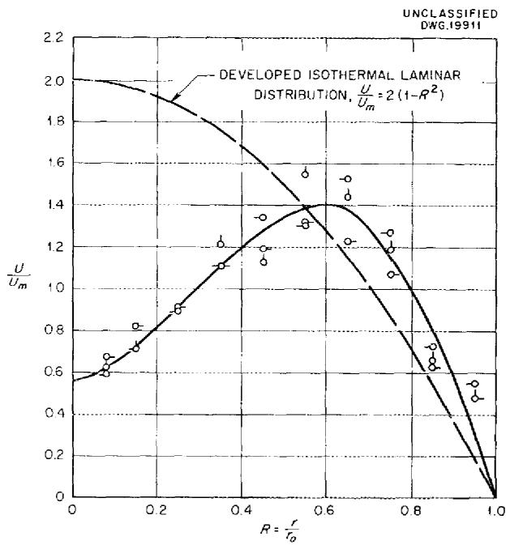  
Fig. 9.3. Experimental Velocity Distribution in the Cold Leg of a Glass Convection Loop with a Reynolds Modulus $(2r_0U_m / \nu)$ of 85.

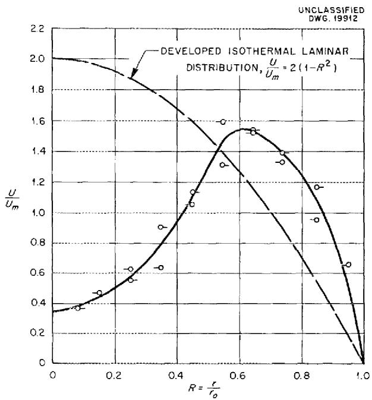  
Fig. 9.4. Experimental Velocity Distribution in the Cold Leg of a Glass Convection Loop with a Reynolds Modulus $(2r_0U_m / \nu)$ of 105.

# FORCED-CONVECTION HEAT TRANSFER WITH NaF-KF-LiF

H.W.Hoffman J.Lones

Reactor Experimental Engineering Division

Additional heat transfer data have been obtained for the NaF-KF-LiF eutectic (11.5-42.0-46.5 mole %) flowing through a heated Inconel tube. The experimental results in terms of Colburn's $j$ function vs. Reynolds' modulus are presented in Fig. 9.5. The previously reported data, which were obtained in a nickel tube, are also presented for comparison. The data obtained in the Inconel tube fall approximately $50\%$ below the curve obtained from the equation which correlates heat transfer in ordinary fluids, in sodium hydroxide,[6] and in NaF-KF-LiF in nickel tubes. One would expect NaF-KF-LiF to behave as the ordinary fluids do, as far as heat transfer is concerned, and yet there is a difference between the data obtained in Inconel tubes and that obtained in nickel tubes. In order to resolve this disparity, temperature measurements and physical property data were reviewed. Checks on the thermocouple calibrations showed no significant deviations from the original calibrations. Checks on the mixed mean fluid temperature measurement technique also indicated that no errors appeared to be present. The heat capacity of the NaF-KF-LiF mixture was never in question, because good heat balances were obtained during the heat transfer experiments. The viscosity of the mixture had been checked previously and would have had to be

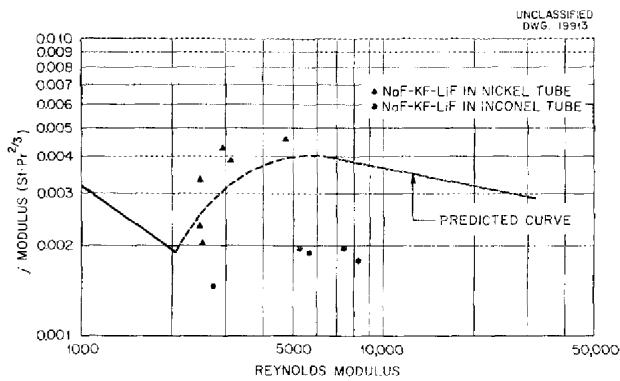  
Fig. 9.5. The $j$ -Modulus vs. Reynolds Modulus for NaF-KF-LiF Systems.

an unreasonably low value to account for the discrepancy. A several-fold change in thermal conductivity would account for the difference in heat transfer, but the checks on conductivity, which are currently being made, indicate that the original values are correct.

The explanation of the difference in heat transfer between the nickel and the Inconel system is apparently that an interface resistance, such as a layer of corrosion products, exists between the tube wall and the NaF-KF-LiF in the Inconel system. For example, it would only take a 1-mil film having a thermal conductivity of 0.5 Btu/hr·ft.°F to account for the reduced $j$ modulus observed; if the conductivity of such a film were lower, it could be much thinner than 1 mil. Examination of the inside surface of one of the Inconel tubes used in the experiments showed the presence of a thin, green film, which has recently been identified as $\mathsf{K}_3\mathsf{CrF}_6$ , with some $\mathsf{Li}_3\mathsf{CrF}_6$ . These corrosion products are typical of those found when KF- and LiF-bearing fluoride mixtures are contained in Inconel. It is significant, however, that no such film appears when the NaF-ZrF $_4$ -UF $_4$ system (to which the ARE fuel belongs) is contained in Inconel. The thickness and, possibly, the thermal conductivity of the green film will be examined.

# HIGH-TEMPERATURE REACTOR COOLANT STUDIES

H.F.Poppendiek J.I.Lang

Reactor Experimental Engineering Division

The effectiveness of a reactor coolant is a function of coolant duct dimensions and spacing, the amount of heat to be removed, the total coolant temperature rise, and the physical properties of the coolant. An analysis of the effectiveness of reactor coolants from a heat transfer standpoint has been completed. Four simultaneous heat transfer equations were reduced to a single equation which contains several dimensionless moduli. This equation was evaluated, with the aid of IBM machines, over a wide range of the various parameters involved, and the results have been plotted in chart form. The pressure-drop and pumping-power equations can readily be evaluated next. In particular, the pumping power per heat extracted (a dimensionless pumping-power modulus) can be obtained.

Recently the pumping-power moduli of several reactor coolants were calculated for heat removal from a hypothetical solid-fuel-element aircraft

reactor with the following characteristics: total heat flux, 200 megawatts; length of the cylindrical core, 2.75 ft; cylindrical diameter, 3 ft; coolant volume, $30\%$ ; total coolant temperature rise, $200^{\circ}\mathrm{F}$ . The coolants lithium, bismuth, sodium, and NaF-KF-LiF were considered, and the pumping-power modulus for each coolant was evaluated over a range of coolant tube diameters. The results indicated that there was a minimum in each pumping-power modulus vs. tube-diameter curve and that of the four coolants lithium was the best and bismuth was the worst. (NaF-KF-LiF and sodium were, in general, about the same for the particular case considered.)

It is felt that the charts described above can be used quickly to make effectiveness optimizations of coolant systems for solid-fuel-element reactors from a heat transfer - momentum transfer standpoint.

# TURBULENT CONVECTION IN ANNULI

J. O. Bradfute J. I. Lang

Reactor Experimental Engineering Division

The design of the previously described annulus flow system for measuring velocity profiles has been completed, and fabrication of the machined part is under way. The structural steel bracket which will rigidly support the annulus has been installed. A direct-drive blower has been obtained and modified to a belt-driven device so that the rotor speed can be increased until an adequate head is developed.

A small flow system has been constructed so that the photographic techniques can be conveniently developed and refined while the equipment is being fabricated. A few preliminary photographs have been made which revealed the need for increasing the light intensity in the beam. Several photographs of dust particles that were so small as to be invisible in diffuse light have been taken by using the light scattered from a Tyndall beam. The resolution or grain size difficulties anticipated have not materialized; the particles appear in the photographs as well-defined streaks. The grid, which is simply a $\frac{1}{16}$ -in.-thick sheet of lucite with scratches ruled on one side to form a cartesian coordinate system, has been photographed in light emitted from the scratches by illuminating one edge. This procedure exposes the negative only on the image of the grid lines and leaves the remainder of the film unexposed and, hence, transparent after development.

# CIRCULATING-FUEL HEAT TRANSFER

H. F. Poppendiek

G. Winn

N. D. Greene

Reactor Experimental Engineering Division

The apparatus which simulates heat transfer in a circulating-fuel pipe system by passing an electric current through a flowing electrolyte(7) has been successfully operated. Preliminary wall and mixed mean fluid temperature measurements were obtained over the Reynolds' modulus range of about 5,000 to 10,000 and at a power level of about $0.1\mathrm{kw/cm}^3$ . The limited wall-to-fluid temperature differences measured were in the range predicted from the previously developed theory. Some gassing was observed at the stainless steel electrodes at high current flows. Experiments have indicated that if the electrode surfaces which are in contact with the electrolyte are made of platinum, the gassing can practically be eliminated.

A brief study of strong electrolytes $^{(8)}$ for use in volume heat source experiments was made to find an electrolyte having a low electrical resistivity and, also, flat resistivity-temperature characteristics. The study indicated that phosphoric acid satisfies these requirements. It was also found that this electrolyte would be satisfactory from the corrosion standpoint. When the platinum-surfaced electrodes and a centrifugal pump with a somewhat higher head have been installed, the volume heat source experiments are to be resumed.

# BIFLUID HEAT TRANSFER EXPERIMENTS

# D. F. Salmon, ANP Division

Heat transfer data from the previously described(9) bifluid heat transfer system containing NaK and the fluoride mixture NaF-ZrF4-UF4 (50-46-4 mole %) have been analyzed. Fifteen runs were made which yielded about 80 data points. The only data points that were considered valid were those obtained before a gradual reduction of the inside diameter of the tube occurred; the reduction was evidenced by increased pressure-drop measurements. Subsequent examination showed that the reduction of the tube diameter was the result

of build-up of mass-transferred material in the heat exchange element of this trimetallic system; nickel heat exchange tube, type 316 stainless steel pump, and Inconel piping.

The heat transfer occurred in a concentric tube section; the center tube contained the fluoride and the NaK was in the annulus. The center tube was made of nickel, 0.269 in. ID with a 0.030-in. wall. The L/D ratio of the tube was 40, while the L/D ratio for the annulus was 22. The fluoride Reynolds' numbers ranged from 5,000 to 20,000, and the NaK Reynolds' numbers ranged from 20,000 to 100,000.

Inlet and outlet temperatures of the two liquid streams were measured with chromel-alumel probes welded into the piping at the center line of the streams. Inlet fluoride temperatures varied from 1200 to $1500^{\circ}\mathrm{F}$ . Fluoride radial temperature differences varied from 50 to $230^{\circ}\mathrm{F}$ .

The overall heat transfer coefficient, based on the outside tube wall surface, was calculated from the equation

$$
U _ {0} = \frac {\underset {A _ {0}} {\overset {q} {-}}}{D t _ {L M}},
$$

where $Dt_{LM}$ is the log-mean temperature difference. The fluoride heat transfer coefficient was obtained from the over-all heat transfer coefficient in conjunction with a Wilson Plot.(10) The fluoride data are compared to the Colburn's(11) equation,

$$
N u = 0. 0 2 3 R e ^ {0. 8} P r ^ {1 / 3},
$$

in Fig. 9.6; the viscosity of the fluoride was

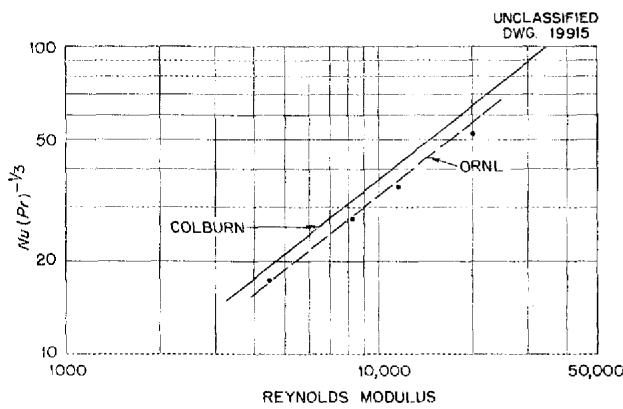  
Fig. 9.6. Comparison of Fluoride Heat Transfer Data with Colburn's Equation.

evaluated at the so-called "film temperature,"

$$
t _ {j} = t _ {c} - \frac {1}{2} (t _ {c} - t _ {w}).
$$

In Fig. 9.7, the fluoride data are compared with the Hausen's equation, (12) which takes into account the $L / D$ effect:

The bifluid system is now operating with a concentric tube exchanger constructed of Inconel to operate at fluoride velocities of 8 fps and axial temperature differences of $350^{\circ}\mathrm{F}$ . The current tests are to supply information on dynamic corrosion and mass transfer.

$$
N u = 0. 1 1 6 \left(R e ^ {2 / 3} - 1 2 5\right) P r ^ {1 / 3} \left[ 1 + \left(\frac {D}{L}\right) ^ {2 / 3} \right] \left(\frac {\mu}{\mu_ {w}}\right) ^ {0. 1 4}.
$$

In this equation, $\mu$ is evaluated at the bulk temperature and $\mu_{w}$ is evaluated at the wall temperature. The fluoride center line temperature rather than the bulk temperature was used in Fig. 9.6. Theoretical investigations have shown that for the Reynolds' and Prandtl's numbers involved the ratio

$$
\frac {t _ {\text {b u l k}} - t _ {w}}{t _ {c} - t _ {w}} \stackrel {\sim} {=} 0. 9 2.
$$

The heat balances were in error by a maximum of $28\%$ , with an average deviation of $11\%$ . The fluoride data fell within approximately $11\%$ of Colburn's equation and about $27\%$ below Hausen's equation.

The bifluid loop was sectioned at the conclusion of the test and examination of the nickel heat exchange tube showed that a metallic layer had built up on the inside to a thickness of approximately 30 mils at the exit end. This large deposit probably was built up after the represented heat transfer data were obtained and during the 300 hr of operation with a fluoride velocity of 8 fps. Spectrographic and x-ray diffraction analyses both identified this 30-mil layer as iron. The iron was undoubtedly transferred from the type 316 stainless steel pump to the nickel heat exchange tube by the fluoride. This mass transfer, which resulted from the presence of more than one metal in the same fluoride system, would mask such corrosion as existed. It is significant that this mass transfer phenomenon has not been observed in any monometallic system; the ARE fuel system is monometallic. Dynamic tests of the fluoride corrosion of Inconel in all-Inconel systems are reported in sec. 7, "Corrosion Research."

(12)E. Eckert, Introduction to the Transfer of Heat and Mass, p. 115, McGraw-Hill, New York, 1950.

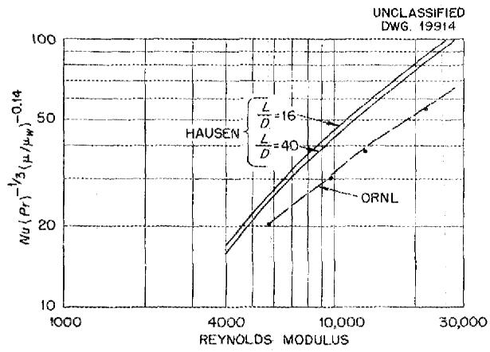  
Fig. 9.7. Comparison of Fluoride Heat Transfer Data with Hausen's Equation.

# 10. RADIATION DAMAGE

# D. S. Billington, Solid State Division

A. J. Miller, ANP Division

Additional radiation damage studies of reactor fuels and structural materials were carried out in the LITR and the MTR. Efforts are being made to determine and explain the apparent uneven uranium distribution in the fuel irradiated in Inconel capsules. Since the state of the fuel in the capsules with regard to turbulence and temperature gradients is quite different from that found under service conditions, the design and construction of an in-pile loop for circulating fluoride fuel are being carried out as rapidly as possible. The cantilever type of creep measurements made on Inconel in a helium atmosphere indicated no serious change in creep properties upon irradiation, and a specimen of Inconel irradiated in the MTR showed no change in thermal conductivity to within the accuracy of the measurements.

# IRRADIATION OF FUSED MATERIALS

G.W. Keilholtz

P. R. Klein

J. G. Morgan

M. T. Robinson

H. E. Robertson

A. Richt

C.C.Webster

W. R. Willis

M. J. Feldman

Solid State Division

K. J. Kelly, Pratt and Whitney Aircraft Division

Examinations have been made of the Inconel capsules containing small amounts of the ARE type of fuel that were irradiated in the LITR and in the MTR for various periods of up to several hundreds of hours. In the LITR, 230 watts were dissipated in each cubic centimeter of fuel, while in the MTR, approximately 3400 watts were dissipated by increasing the uranium fluoride content of the fuel. In general, the samples irradiated for long periods of time showed an intergranular type of corrosion which does not occur in out-of-pile control samples; the penetration occurred occasionally to a depth of 3 mils.

Numerous chemical analyses indicated, as in the case reported previously for two capsules irradiated in the MTR,(1) that the uranium content of the fuel which could be readily melted from irradiated capsules was lower than would be expected after allowance for burnup. On the other hand, several samples of fuel bored from various

sections of the capsules were analyzed and found to be deficient in uranium, while in other such samples, an excess of uranium was indicated. Capsules irradiated in the LITR and in the MTR were sectioned and examined visually at low magnification. No evidence could be detected of changes in the fuel or of segregation in this examination; therefore adequate facilities for petrographic examination are now being constructed in one of the hot cells. An investigation of the validity of the methods used for the chemical analyses of the irradiated materials is continuing. It is possible that thermal gradients in the fuel contained in the capsules are causing concentration gradients in the fuel, and an impile pump loop would be a much better method of simulating service conditions than the static capsule.

A few, simple, preliminary experiments were carried out to see whether it would be possible to readily obtain information concerning phenomena caused by temperature gradients or overheating of the capsules. Out-of-pile control samples were heated to 1800 and $2280^{\circ}\mathrm{F}$ for 140 hours. Very little intergranular corrosion occurred; subsurface voids to a depth of about 1 mil were observed; and the uranium concentration of the central portion of the fuel was unaffected. Other control capsules were heated in a manner that provided a temperature of $2240^{\circ}\mathrm{F}$ at the top and $1475^{\circ}\mathrm{F}$ at the bottom, approximately 3 in away. No significant change occurred in the uranium concentration between the hot end and the cold end.

# INPILE CIRCULATING LOOPS

O. Sisman

R. M. Carroll

W. W. Parkinson

A. S. Olson

W. E. Brundage

C. Ellis

C. D. Baumann

F. M. Blacksher

Solid State Division

Developmental work continued on a pump for an impile fused-fluoride-fuel loop to be operated in the LITR and in the MTR. Design and fabrication of other portions of the loop are in progress.

Beryllium oxide in contact with sodium at $1500^{\circ}\mathrm{F}$ was exposed in the LITR to determine the effect of radiation on its stability. Specimens from both the high- and low-density regions of ARE moderator blocks were sealed in capsules containing about $2\mathrm{cm}^3$ of sodium to give a surface-to-volume ratio

of 3 to 1. Eight such capsules were enclosed in a steel can that provided a helium atmosphere and had heaters attached to maintain the temperature at about $1500^{\circ}\mathrm{F}$ . The irradiation was carried out for three weeks, that is, until an exposure of greater than $10^{18}$ fast neutrons/cm² was obtained. Inspection of the beryllium oxide and sodium is under way. The preparation of samples for out-of-pile control runs is almost completed.

# CREEP UNDER IRRADIATION

J.C.Wilson J.C.Zukas

W.W.Davis

Solid State Division

The inpile cantilever creep apparatus used previously has been modified to permit tests in an inert atmosphere. Figure 10.1 shows that previous results obtained in the Metallurgy Laboratory(2) are confirmed by the bench tests; that is, creep of

(2)P. Patiarca and G. M. Slaughter, ANP Quar. Prog. Rep. Sept. 10, 1952, ORNL-1375, p. 135.

Inconel appears to proceed more rapidly in an inert atmosphere than in air. The creep curve in the only inpile inert-atmosphere test to date lies above that resulting from a test in air but below the corresponding inert-atmosphere bench test. Apparently, neutron irradiation slightly reduces creep in an inert atmosphere. The results are not yet conclusive, inasmuch as the purity of the inert atmosphere is not yet high enough to prevent oxidation and some difficulties in temperature control have been encountered because of the parasitic emf's generated in the seals through which the thermocouple wires enter the sealed experimental can. The main effort at present is directed toward eliminating these difficulties. In addition, an inpile test (in air) is running at the conditions of stress and temperature expected in the ARE pressure shell.

Two constant-strength cantilever specimens of 0.065-in.-thick Inconel sheet were tested after irradiation in the LITR at $100^{\circ}$ F to an integrated

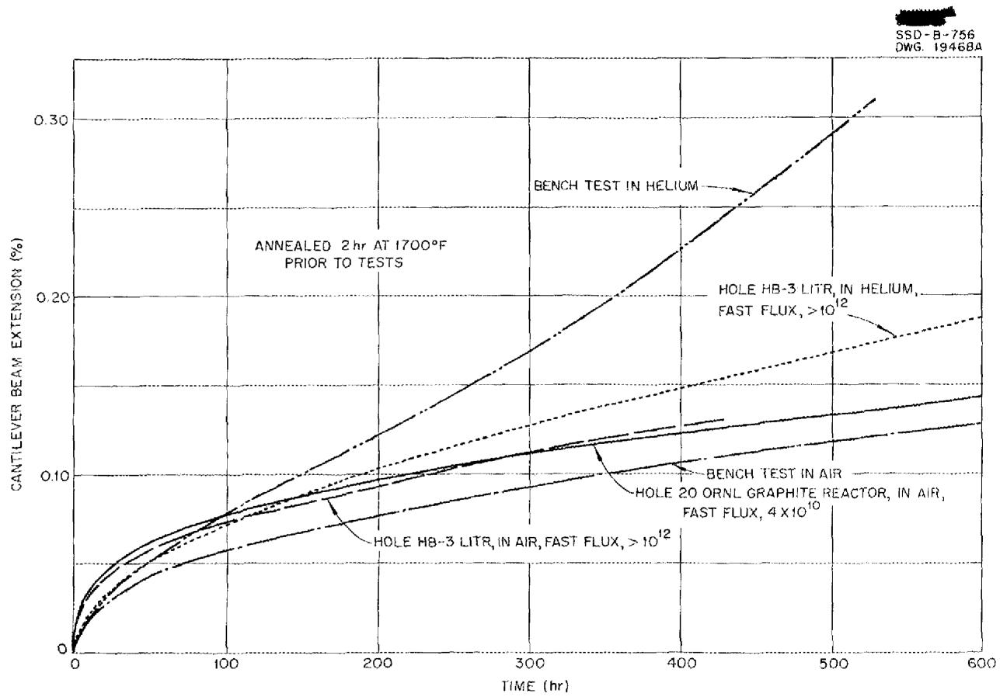  
Fig. 10.1. In-Reactor Cantilever Creep Tests on Inconel at $1500^{\circ}$ F and 3000 psi in Air and Helium.

fast-neutron flux (greater than 1 Mev) of $2.5 \times 10^{17}$ . The postirradiation test was carried out at $1500^{\circ}F$ and at a stress of 3000 psi. In Fig. 10.2 it can be seen that the irradiated specimens showed less creep in the earlier stages than did the unirradiated controls. After several hundred hours, the creep rates of both the irradiated specimens and the one control sample were the same within the margin of experimental error. This result indicates that at least part of the effect of irradiation under these conditions is to reduce the creep of Inconel, because the radiation-induced hardening effect apparently persists over tens of hours at $1500^{\circ}F$ . In similar tests (at $1500^{\circ}F$ ) on type 347 stainless steel, the creep strength did not appear to be influenced by prior irradiation. The difference in the behavior of stainless steel and of Inconel was expected from the results of hardness data reported previously.[3] Several additional samples are now being irradiated.

A satisfactory extensometer design has been evolved for the MTR tensile-creep apparatus, and

(3)W. W. Davis, J. C. Wilson, and J. C. Zukas, ANP Quar. Prog. Rep. Mar. 10, 1953, ORNL-1515, p. 167.

means for mounting and connecting the apparatus to the specimen have been worked out. The behavior of the thermocouples under the unusual furnace conditions is now understood sufficiently well to assure reliable results. A heat transfer and fluid-flow mockup of the experimental apparatus is being made to test the ability of the unit to dissipate the $15\mathrm{kw}$ of induced gamma heating.

# RADIATION EFFECTS ON THERMAL CONDUCTIVITY

A. Foner Cohen L.C. Templeton Solid State Division

A small Inconel sample was irradiated in the MTR at approximately $600^{\circ}\mathrm{F}$ for 400 hr in a flux greater than $10^{13}$ fast neutrons/cm $^2$ -sec. After removal from the reactor, the thermal conductivity of the sample was measured at $300^{\circ}\mathrm{F}$ and compared with the thermal conductivities of unirradiated specimens. The irradiation caused no change in the thermal conductivity within the accuracy of the measurements, which was $10\%$ .

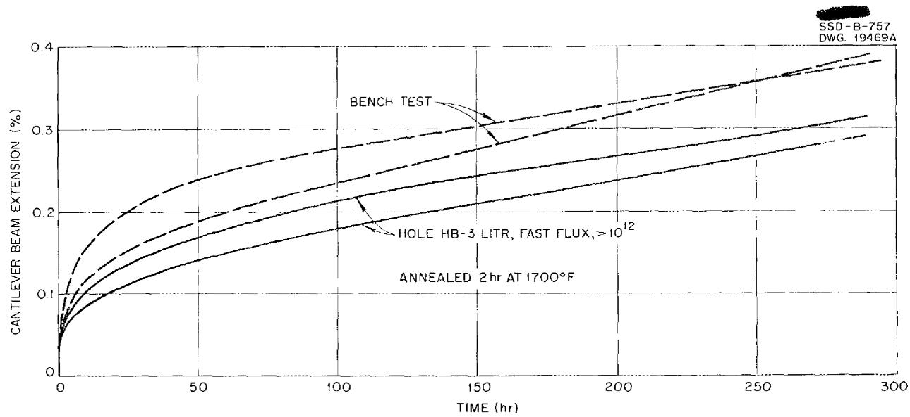  
Fig. 10.2. Post-Irradiation Creep of Inconel in Air at $1500^{\circ}$ F and 3000 psi.

# 11. ANALYTICAL STUDIES OF REACTOR MATERIALS

C. D. Susano, Analytical Chemistry Division

J. M. Warde, Metallurgy Division

Studies were continued on the use of bromine trifluoride as a reagent for the determination of oxygen in reactor fuels. A procedure was standardized in which the oxygen liberated by the fluorination of uranium trioxide is measured. A calibration curve was established by plotting the increase in terminal pressure as a function of the concentration of oxygen added in the form of uranium trioxide. Efforts to fluorinate zirconium oxide quantitatively were continued.

The reaction between zirconium tetra $p$ -bromomandelate and sodium methylate was shown to be stoichiometric, and therefore $p$ -bromomandelic acid was established as a reagent for the volumetric determination of zirconium.

The concentrations of uranium trifluoride and metallic zirconium in $\mathrm{NaF - ZrF_4 - UF_4}$ (50-46-4 mole $\%$ ) were determined by the evolution of hydrogen upon treatment with hydrochloric and hydrofluoric acids. Preliminary studies were conducted on the hydrolysis of uranium trifluoride as a function of temperature and time. After 48 hr, approximately $22\%$ of the uranium originally present as uranium trifluoride was in solution.

"Differential colorimetry" was applied to the colorimetric determination of zirconium as zirconium alizarin sulfonate. The optimum concentration of the reference solution of the alizarin complex, which represents the maximum precision theoretically possible, was found to be $1.0\mathrm{mg}$ of zirconium per $10\mathrm{ml}$ of solution. The method will be applied to the determination of zirconium in reactor fuels when a sufficient order of precision is obtained.

"Tiron," disodium-1,2-dihydroxybenzenedi sulfonate, was shown to be a suitable reagent for the determination of uranium. The composition and the stability of the complex were determined, in addition to the sensitivity of the reagent for the determination of uranium.

Petrographic examinations of over 700 samples of fluoride mixtures were completed. Optical data are reported for $\mathsf{NaUF}_{5}$ , $\mathsf{Na}_2\mathsf{UF}_{6}$ , $\mathsf{NaZrF}_{5}$ , $\mathsf{Na}_2\mathsf{ZrF}_{6}$ , $\mathsf{Na}_3\mathsf{ZrF}_{7}$ , $\mathsf{Li}_3\mathsf{CrF}_{6}$ , $\mathsf{K}_3\mathsf{CrF}_{6}$ , $\mathsf{Na}_3\mathsf{CrF}_{6}$ , $\mathsf{FeF}_{2}$ , $\mathsf{K}_2\mathsf{NaFeF}_{6}$ , $\mathsf{NaHF}_{2}$ , $\mathsf{Li}_2\mathsf{ZrF}_{6}$ , and $\mathsf{Li}_4\mathsf{ZrF}_{8}$ .

The activities of the service laboratory during this quarter included the analysis of 872 samples involving 9335 determinations.

# CHEMICAL ANALYSES OF FLUORIDES AND THEIR CONTAMINANTS

J. C. White, Analytical Chemistry Division

Determination of Oxygen in Metallic Oxides with Bromine Trifluoride (J. E. Lee, Jr., Analytical Chemistry Division). The use of bromine trifluoride as a reagent for the determination of the oxygen which probably exists in reactor fuels as oxides of uranium and zirconium is being studied.(1) In order to conduct the fluorination at the temperatures and pressures which have been indicated by Emeleus(2) as necessary for quantitative reaction with zirconium oxide and to resist the high corrosivity of the reagent, an apparatus was fabricated from nickel and stainless steel. The fluorination step is accompanied by quantitative liberation of oxygen from the metallic oxide, and the oxygen is collected and measured in the glass portion of the apparatus. Attempts to apply simple gas law relationships for calculating the oxygen by measuring the increase in pressure of the system were unsuccessful because of the extreme temperature gradients encountered in the system. An empirical procedure was established whereby conditions of the fluorination were standardized, and the increase in pressure was plotted as a function of oxygen added in the form of uranium trioxide. The relationship over a pressure range of 0 to $1100\mu$ and 0 to $5\mathrm{mg}$ of oxygen is shown in the calibration curve (Fig. 11.1). Previous experiments showed that a maximum of $85\%$ of the oxygen was released from zirconium oxide. When uranium trioxide was mixed with zirconium oxide and the mixture was fluorinated for $30\mathrm{min}$ at $300^{\circ}\mathrm{C}$ , the results, in some cases, were high by as much as $50\%$ . Subsequent investigation revealed that the stopcocks were not adequate for continuous use under high vacuum. The faulty

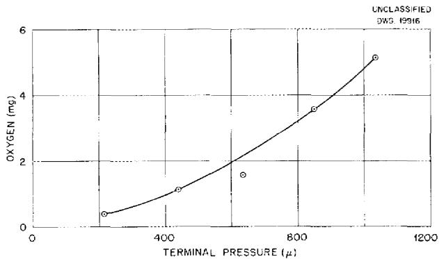  
Fig. 11.1. Calibration Curve for Determination of Oxygen by Reaction with $\mathbf{BrF}_3$ .

stopcocks have been replaced by stopcocks with longer barrels which are better suited for high-vacuum work. Further work to produce quantitative liberation of oxygen from zirconium oxide and to apply the reaction to reactor fuels is under way.

Volumetric Determination of Zirconium (T. R. Phillips, Analytical Chemistry Division). The advantages of halomandelic acids as reagents for the determination of zirconium were listed in a previous report.(3) The application of a volumetric method in which $p$ -chloromandelic acid is used was also described previously. A method of synthesis of $p$ -bromomandelic acid was obtained (private communication from R. B. Hahn to J. C. White, April 3, 1953), and suitable quantities of the acid were prepared to investigate its applicability to the volumetric technique. In general, the bromo derivative is equally as good as the chloro acid. The reaction

$$
\begin{array}{l} Z r (p - B r C _ {6} H _ {4} C H O H C O O) _ {4} \\ + 4 \mathrm {N a} (\mathrm {O C H} _ {3}) \longrightarrow 4 \mathrm {N a} (p - \mathrm {B r C} _ {6} \mathrm {H} _ {4} \mathrm {C H O H C O O}) \\ + \quad Z r (O C H _ {3}) _ {4} \\ \end{array}
$$

proceeds stoichiometrically. Complete precipitation of zirconium takes place within 30 min when a 40-fold excess of reagent is used. The standard deviation of the method is approximately $1\%$ . The compilation of the data on zirconium in the ARE fuel mixture is presently under way in preparation for the writing of a final report on this project.

Determination of Uranium Trifluoride and Metallic Zirconium (W. J. Ross, Analytical Chemistry Division). The uranium trifluoride and metallic

zirconium contents of the fluoride NaF-ZrF4-UF4 (50-46-4 mole %) to which 1 wt % of zirconium hydride was added were determined by the two-step oxidation method described in the previous report. (4) Zirconium was calculated from the volume of hydrogen liberated by treatment with 0.2 M hydrofluoric acid, and the trivalent uranium was calculated from the volume of hydrogen liberated by treatment with 9.6 M hydrochloric acid.

In connection with this problem, preliminary studies were conducted on the hydrolysis of uranium trifluoride as a function of temperature and time. Uranium trifluoride (124 mg) was placed in Erlenmeyer flasks containing 100 ml of water and stirred at $25 \pm 1^{\circ} \mathrm{C}$ for various periods of time. An aliquot of the supernatant liquid was withdrawn, and the concentration of the uranium was determined. The results are shown in Table 11.1. The data are inadequate at present for any conclusions to be drawn. After 48 hr, however, approximately $22\%$ of the uranium originally present in the form of the trifluoride was in solution. The oxidation state of the uranium in solution has not been definitely established. Tests to determine the extent of hydrolysis at $100^{\circ} \mathrm{C}$ are also planned,

TABLE 11.1. CONCENTRATION OF URANIUM IN WATER AFTER CONTACT WITH URANIUM TRIFLUORIDE AT $25^{\circ}C$   

<table><tr><td>CONTACT TIME (hr)</td><td>URANIUM (mmoles)</td></tr><tr><td>1</td><td>0.016</td></tr><tr><td>3</td><td>0.046</td></tr><tr><td>5</td><td>0.056</td></tr><tr><td>24</td><td>0.061</td></tr><tr><td>48</td><td>0.096</td></tr></table>

Colorimetric Determination of Zirconium (D. L. Manning, Analytical Chemistry Division). A method for the colorimetric determination of microamounts of zirconium as zirconium alizarin sulfonate was reported by Green.(5) The method is of insufficient accuracy to permit application to the determination of zirconium in reactor fuels. However,

"differential colorimetry," in which the absorbance of reference solutions of known concentrations rather than the absorbance of distilled water is used, has been shown to yield an order of precision comparable to that obtained by gravimetric techniques. By using Hiskey's method,[6] the optimum concentration of the reference solution of zirconium alizarin sulfonate was found to be $1.0\mathrm{mg}$ of zirconium per $10\mathrm{ml}$ of solution; this reference solution yields the maximum precision. The relative accuracy of the method, as calculated from the formula derived by Bastian,[7] was calculated to be 14:

$$
\text {R e l a t i v e} = \frac {s c}{0 . 4 3 4} \times 2. 7,
$$

where

$$
S = \begin{array}{l} \text {s l o p e o f t h e d i f f e r e n t i a l B e e r ' s l a w} \\ \text {c u r v e ,} \end{array}
$$

$$
C = \text {c o n c e n t r a t i o n}
$$

$$
\begin{array}{l} 0. 4 3 4 = \text {m a t h e m a t i c a l o p t i m u m a b s o r b a n c y}, \\ 2, 7 = \text {i n s t r u m e n t f a c t o r .} \\ \end{array}
$$

The differential colorimetry technique has been applied to the determination of zirconium in fuel mixtures, and a standard deviation of approximately $2\%$ was found. This standard deviation is larger than that of either the gravimetric or volumetric methods. It is believed that greater precision can be obtained by using extremely careful techniques. The method is of great potential value because of its extreme simplicity and rapidity.

"Tiron" As a Reagent for the Determination of Uranium (D. L. Manning, Analytical Chemistry Division). A new colorimetric reagent for uranium has been found. Disodium-1,2-dihydroxybenzenedi-sulfonate (tiron) forms a reddish-brown complex in basic solution with uranyl ion. The complex is unimolecular, it forms immediately, and it is stable for several hours. The sensitivity of the reagent for uranium is equal to that of ammonium thiocyanate and ascorbic acid. Tests on anionic interference reveal that sulfate, chloride, and nitrate do not interfere. Phosphate in concentrations greater than 20 times that of uranium does interfere. Iron, titanium, and vanadium are the major cationic interferences. It is planned to test the feasibility of applying differential colorimetry

to the determination of uranium with this reagent in reactor fuels in which the interference by iron is not serious.

# PETROGRAPHIC EXAMINATION OF FLUORIDES

G. D. White, Metallurgy Division

T. N. McVoy, Consultant Metallurgy Division

Petrographic examinations of about 700 samples of fluoride mixtures were carried out. The optical data collected for various new fluoride compounds are given below.

$$
\begin{array}{l} N a U F _ {5} \\ \text {C o l o r}: \quad \text {g r e e n} \\ \text {I n t e r f e r e n c e} \\ \begin{array}{l} \text {B i r e f r i n g e n c e : c r i s t a l s s h o w f i r s t - o r d e r g r a y a n d} \\ \text {y e l l o w b e t w e e n c r o s s e d n i c o l s} \end{array} \\ \text {R e f r a c t i v e} O = 1. 5 1 0 \\ \end{array}
$$

$$
E = 1. 5 0 0
$$

$$
\begin{array}{l} N a _ {2} U F _ {6} \\ \text {C o l o r}: \quad \text {g r e e n} \\ \text {I n t e r f e r e n c e} \\ \begin{array}{c} \text {B i r e f r i n g e n c e : i n t e r f e r e n c e c o l o r s a r e f i r s t - o r d e r} \\ \text {g r a y} \end{array} \\ \text {R e f r a c t i v e} O = 1, 4 9 5 \\ E = 1. 4 9 0 \\ \end{array}
$$

$$
N a Z r F _ {5}
$$

$$
\text {C o l o r :}
$$

$$
\begin{array}{l} \text {I n t e r f e r e n c e f i g u r e :} \quad \text {u n i a x i a l} \quad \text {n e g a t i v e ;} \quad \text {s o m e} \\ \text {c r e s t a l s p r o d u c e a b i a x i a l} \\ \text {n e g a t i v e f i g u r e w i t h a s m a l l} \\ \text {o p t i c a n g l e} \end{array}
$$

$$
\begin{array}{l} \text {B i r e f r i n g e n c e : i n t e r f e r e n c e c o l o r s a r e f i r s t - o r d e r} \\ \text {w h i t e t o b l u e} \end{array}
$$

$$
\begin{array}{l} \text {R e f r a c t i v e} O = 1. 5 0 8 \\ E = 1. 5 0 0 \\ \end{array}
$$

$$
\begin{array}{l} F o r m s \quad \text {s o l i d} \quad \text {s o l u t i o n w i t h} \quad N a U F _ {5} \\ N a _ {2} Z r F _ {6} \\ \text {C o l o r :} \\ \begin{array}{l} \text {I n t e r f e r e n c e f i g u r e : b i a x i a l p o s i t i v e w i t h 2 V = 7 5} \\ \text {d e g} \end{array} \\ \text {B i r e f r i n g e n c e :} \quad \text {i n t e r f e r e n c e} \quad \text {c o l o r s} \quad \text {u p} \quad \text {f i r s t -} \\ \text {R e f r a c t i v e} \quad \alpha = 1. 4 1 9 \\ \gamma = 1. 4 3 0 \\ \end{array}
$$

$$
\begin{array}{l} N a _ {3} Z r F _ {7} \\ \text {C o l o r :} \\ I n t e r f e r e n c e \quad \text {f i g u r e :} \quad \text {u n i a x i a l} \quad \text {n e g a t i v e} \\ \begin{array}{l} \text {B i r e f r i n g e n c e : i n t e r f e r e n c e c o l o r s t o f i s t - o r d e r} \\ \text {w h i t e} \end{array} \\ \end{array}
$$

Refractive indices: $0 = 1.386$

$$
E = 1. 3 8 1
$$

Li3CrF6

Color: pale green

Interference figure: biaxial negative with $2V = 40$ deg

Birefringence: interference colors through the second order

Refractive indices: $a = 1.444$

$$
\gamma = 1. 4 6 4
$$

K3CrF6

Color: pale green

Interference figure: isotropic (no figure)

Refractive index: 1.422

Na3CrF6

Color: pale green

Interference figure: isotropic

Refractive index: 1.411

FeF2

Color: Colorless

Interference figure: uniaxial positive

Birefringence: interference colors through second order

Refractive indices: $O = 1.524$

$$
E = 1. 5 4 0
$$

KNaFeF 6

Color: colorless

Interference figure: isotropic

Refractive index: 1.414

NoHF

Color: colorless

Interference figure: uniaxial positive

Birefringence: interference colors through the third order

Refractive indices: $O = 1.261$

$$
E = 1. 3 2 8
$$

Li2ZrF6

Color: colorless

Interference figure: biaxial positive with $2V = 20$ deg

Birefringence: interference colors through the first order

Refractive indices: $\alpha = 1.462$

$$
\gamma = 1. 4 8 2
$$

Li4ZrF8

Color: colorless

Interference figure: biaxial negative with $2V = 30$

$$
\mathbf {d e g}
$$

Birefringence: interference colors through the first order

Refractive indices: $\alpha = 1.445$

$$
\gamma = 1. 4 6 5
$$

# SUMMARY OF SERVICE CHEMICAL ANALYSES

J.C. White A.F.Roemer, Jr.

Analytical Chemistry Division

The work of the Analytical Chemistry Laboratory during the quarter has continued to consist chiefly of the analysis of fluoride fuel mixtures, alkali metal fluorides, and NaK.

Zirconium is being determined gravimetrically by precipitation with mandelic acid and ignition to the oxide. The ignited oxide has been much purer with respect to contamination by iron and silica than the oxide obtained from ignition of the phenylarsonic acid salt. Precision and accuracy are somewhat improved also. Uranium in these mixtures is being determined by reduction with the Jones reductor and oxidation with standard ceric sulfate solution with the use of ferroin as the indicator. This method is used because of its simplicity and rapidity.

A number of Inconel specimens, which had been used as containers in corrosion tests of fluoride fuels, was analyzed for concentration of fluorides. The pyrohydrolysis method was used with satisfactory results.

During the quarter the laboratory reported 872 samples involving a total of 9335 determinations. These analyses were made for various groups in the ANP project, as indicated in Table 11.2.

TABLE 11.2. SUMMARY OF SERVICE ANALYSES   

<table><tr><td>REQUESTOR</td><td>NUMBER OF 
SAMPLES 
REPORTED</td><td>NUMBER OF 
DETERMINATIONS 
REPORTED</td></tr><tr><td>Reactor Chemistry Group</td><td>267</td><td>2274</td></tr><tr><td>Corrosion Group</td><td>309</td><td>3762</td></tr><tr><td>Experimental Engineering Group</td><td>284</td><td>3240</td></tr><tr><td>Heat Transfer and Physical Properties Dept.</td><td>12</td><td>59</td></tr><tr><td>Total</td><td>872</td><td>9335</td></tr></table>

# 12. FLUORIDE FUEL REPROCESSING

D. E. Ferguson

G. I. Cathers

O.K.Tallent

Chemical Technology Division

Development of a method for chemical processing of ARE fuel was initiated to ensure recovery and decontamination of the $U^{235}$ prior to its allocation and use. The processing method now proposed was adapted from that in use by the Y-12 Chemical Production Division for the processing of uranium fluorides. It was desirable that the method be adaptable to existing facilities at ORNL without much additional equipment and cost, since the fuel may be further modified in future developments of the ANP program.

It was considered in this study that the fuel to be processed was $\mathsf{NaF - ZrF_4 - UF_4}$ (50-46-4 mole $\%$ ), which has a melting point of $504^{\circ}C$ and a density of $3.0~\mathrm{g / cm^3}$ . (Although the ARE fuel is now the 53-43-4 mole $\%$ mixture, the considerable research on the 50-46-4 mole $\%$ mixture is applicable, in general.) The amount of $U^{235}$ to be processed is $70~\mathrm{kg}$ per batch, that is, 16 to $18~\mathrm{ft^3}$ of fused salt containing equal parts by weight of $\mathsf{NaF - ZrF_4 - UF_4}$ and flush material consisting of $\mathsf{ZrF_4}$ and $\mathsf{NaF}$ (50-50 mole $\%$ ).

# DISSOLUTION OF ARE FUEL

The initial work on the preparation of an aqueous solution of ARE fuel was carried out on material containing 4 mole $\%$ UF, that is, undiluted ARE fuel. The fused salt was used in the form of very coarse lumps to simulate probable conditions in ARE fuel processing.

Exploratory solution experiments showed that the fuel mixture could be dissolved in an aluminum nitrate-nitric acid solution at reflux temperature. In effect, this leads to oxidation of quadrivalent uranium to uranyl ion, complexing of the fluoride ion with aluminum, and conversion of insoluble NaF and $\mathsf{ZrF}_4$ to soluble compounds. Although in this preliminary work, solutions containing some insoluble precipitate were obtained, the method promised to be of value with further development.

Additional tests with different proportions of aluminum nitrate nonahydrate (ANN), concentrated nitric acid, and water were run to see whether complete solution was possible and to observe dissolution rates. The results showed that fast

and complete solution was possible with various material proportions. The optimum proportions seemed to be an ANN-to-fuel ratio of 4 to 5 with 20 to $30\mathrm{ml}$ of acid and 40 to $50\mathrm{ml}$ of water for a 5-g batch of fuel. Less acid and less ANN led to a decrease in rate of dissolution and some residual precipitate. Best results were also obtained when an optimum amount of water was present to dilute the ANN-nitric acid solution.

The actual composition of the fuel used in the above tests was 4.25, 47.9, and 47.9 mole $\%$ respectively, of UF $_4$ , NaF, and ZrF $_4$ . An ANN-to-fuel ratio of 5 therefore corresponded to a fluorideto-aluminum mole ratio of 1.7, while the lower limit ratio of 3 corresponded to a mole ratio of 2.8. The value of 1.7 appears preferable, because it ensures more complete complexing of fluoride ion and thereby less corrosion to processing equipment. It also avoids approaching too closely to the mole ratio of 3 represented by the insoluble compound $\mathsf{AlF}_3$ . The use of more aluminum would lead to faster dissolution and less corrosion, but it would also lead to a lower uranium content in the feed for solvent extraction processing.

On the basis of 1.7 as the fluoride-to-aluminum mole ratio, the following weight proportion was selected for feed preparation in solvent extraction work:

Weight

Proportion

$$
\text{ARE fuel} (2 \text {to 4 mole} \% \text {UF}_4)
$$

$$
A N N \quad 5
$$

$$
\text {C o n c e n t r a t e d} \quad \text {n i t r i c} \quad \text {a c i d} \quad 7
$$

$$
\text {W a t e} \quad 1 1
$$

This weight proportion leads to uranium concentrations of 2.2 and $4.3\mathrm{mg / ml}$ respectively, for fuel plus flush material (2 mole $\% \mathrm{UF}_4$ ) and for fuel alone (4 mole $\% \mathrm{UF}_4$ ). Other concentrations used are, approximately, $4M\mathrm{HNO}_{3},0.2MZr,$ $0.2MN a,1.2M F,$ and $0.67M A l.$

Later work showed that if the temperature was raised too rapidly in heating the inhomogeneous mixture of all solution components, the ARE fuel began to dissolve in the lower layer that was rich

in aluminum nitrate before thorough thermal mixing had occurred. This led to formation of a yellowish precipitate which was not redissolvable. It is preferable, therefore, that a homogeneous solution of ANN, nitric acid, and water be obtained before addition of the ARE fuel.

# SOLVENT EXTRACTION

Feed solution made from 2 mole $\%$ UF $_4$ material (fuel plus flush) was used in batch countercurrent runs to test the feasibility of a TBP solvent extraction process. The low uranium concentration of $2.2\mathrm{mg / ml}$ made operation of such a process at the usual 60 to $70\%$ uranium saturation of the TBP impossible. Too low a concentration of TBP in Amsco to obtain an appreciable saturation would result in low extraction factors and a large uranium loss in the hot waste. A compromise was therefore tried in three batch countercurrent runs with 3, 5, and $7\%$ TBP in Amsco 123-15 with cold feed solution. A nonacid scrub of 0.67 M ANN was used to maintain high salting strength in the scrub section and to secure an acid-free product suitable for concentration and isolation by ion exchange.

The distribution coefficients in both the extraction and the scrub sections showed that 5 and $7\%$ TBP was very satisfactory and that the uranium losses in the waste were less than $0.01\%$ . The $3\%$ TBP run, however, gave a uranium distribution coefficient of less than 2 in the scrub section, and the uranium loss was $0.2\%$ . Zirconium carryover with the uranium varied over the range of 0.02 to $0.06 \mathrm{mg/ml}$ for the three cases; thus, zirconium carryover does not appear to be dependent on TBP concentration. Fluoride and acid decontaminations were likewise satisfactory in the $5\%$ TBP run.

Two runs with feed spiked with trace fission products have shown that adequate first cycle radioactive decontamination is obtainable with

both 5 and $7 \%$ TBP in Amsco. Gross beta decontamination was better than $10^{4}$ in both cases; thus, the TBP concentration is not critical. The uranium saturation of the TBP, 10 and $7 \text{‰}$ , respectively, was far below that for which TBP concentration is critical.

A rough schematic flowsheet can be drawn on the assumption that decontamination will be sufficient in one solvent extraction cycle for coupling to an ion exchange column (Fig. 12.1). A second cycle will probably be necessary only for material of very high burnup.

# CORROSION IN DISSOLUTION OF ARE FUEL

Corrosion tests have been carried out on types 309 and 347 stainless steel with a solution of ARE fuel (2.2 mg of uranium per ml) operated with reflux at about $110^{\circ}\mathrm{C}$ . Information on corrosion was desirable, since it was expected that a 4 M nitric acid-1.2 M fluoride ion solution would be very corrosive, despite the high concentration of aluminum, and since most equipment available for scaling up the process would be made of either type 309 or type 347 stainless steel.

The tests were made by suspending square plates of the materials at the liquid-vapor interface, in the liquid, and in the vapor of the test solution. Glass supports were used to avoid metallic junction potentials. The total time of the tests was 33.5 hr, extended over a five-day period, with weighings being made at the end of each day's run. The data are summarized in Table 12.1. The results clearly indicate a very large corrosion rate. Type 309 stainless steel was somewhat better than type 347, presumably because of its higher nickel and chromium contents. The highest corrosion rates were observed during the initial period, but they decrease to a third or less during later periods. The lower rates will probably prevail in

TABLE 12.1. CORROSION TESTS ON TYPES 309 AND 347 STAINLESS STEEL IN ARE FUEL DISSOLVER AT ${110}^{ \circ  }\mathrm{C}$   

<table><tr><td rowspan="3"></td><td colspan="6">CORROSION RATE (mpy)</td></tr><tr><td colspan="3">Type 309 Stainless Steel</td><td colspan="3">Type 347 Stainless Steel</td></tr><tr><td>At Interface</td><td>In Liquid</td><td>In Vapor</td><td>At Interface</td><td>In Liquid</td><td>In Vapor</td></tr><tr><td>First 3.5-hr period</td><td>153</td><td>131</td><td>117</td><td>238</td><td>166</td><td>129</td></tr><tr><td>Last 7.5-hr period</td><td>31</td><td>24</td><td>19</td><td>57</td><td>62</td><td>38</td></tr><tr><td>Over-all 33.5-hr period</td><td>53</td><td>44</td><td>35</td><td>91</td><td>67</td><td>59</td></tr></table>

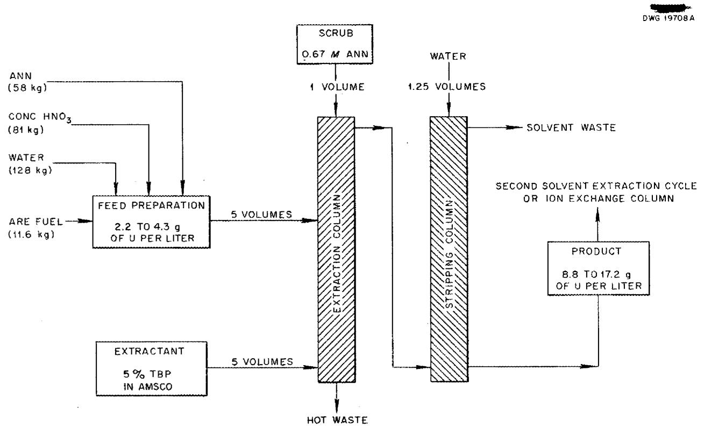  
Fig. 12.1. Flow Sheet for ARE Fuel Processing. Basis: $1 \, \text{kg}$ of $U^{235}$ .

equipment which has already suffered from nitric acid corrosion. The corrosion was highest at the liquid-vapor interface and lowest in the vapor.

# PLANT PROCESSING

It appears, on the basis of present knowledge, that batches of ARE fuel plus flush material containing $70\mathrm{kg}$ of $\mathsf{U}^{235}$ can be decontaminated and recovered by using two solvent extraction cycles coupled with an ion exchange column. The use of Metal Recovery Plant equipment for this process is possible without major additions provided the following precautions are observed to avoid criticality.

1. Proceeding with processing of ARE material on a crash basis will require batch operation and a high order of supervision to ensure safety with respect to criticality. Frequent sampling will be necessary and care will have to be taken to prevent any heel buildup in the dissolution step. The process should be scheduled on the basis of 1-kg batches of $U^{235}$ .   
2. One-kilogram batches of U²³⁵, that is, about 1 gal of ARE fuel or 2 gal of fuel plus flush, can

be transported in cylindrical aluminum cans of noncritical geometry with adequate shielding.

3. Dissolution of the material can be carried out in a 500-gal tank in the Metal Recovery Plant. The charge would be 60 gal for ARE fuel or 120 gal for fuel diluted with an equal weight of flush material. Criticality is to be avoided partly by slab geometry.   
4. Two batches of feed may be stored in the 2500-gal tank of the Metal Recovery Plant that has a concave bottom. Noncriticality is favored by the ring geometry.   
5. The IA pulse column available for this work unfortunately extends into a sump well in which neutron reflection must be considered. A safe concentration limit, however, would be $12.5\mathrm{mg}$ of $\mathsf{U}^{235}$ per ml, or a concentration 3- to 6-fold above that of the feed being considered.

Several coincident errors, such as the use of water in place of 0.67 M ANN solution for the scrub and reflux and buildup of uranium at the feed plate with subsequent leakage from the column into the sump well, would be necessary to approach criticality.

Part III

# SHIELDING RESEARCH

# INTRODUCTION AND SUMMARY

E.P.Blizard J.L.Meem,Associate

Physics Division

The measurements of neutron and gamma spectra in the divided-shield mockup in the Bulk Shielding Facility constitute an important advance in shielding research (sec. 13). These spectra give the energy and angular distribution of neutrons from a fission source after attenuation in water and are directly comparable to some calculations being carried out under subcontract by Nuclear Development Associates. It is by the extension of this approach that a real understanding of shield design will be achieved.

The Lid Tank Facility is being used for the engineering type of studies of unit shields for which it is especially applicable (sec. 14). Many combinations of materials and of thicknesses of materials are being tried in an effort to obtain the lightest possible unit shield for the reflector-moderated liquid-fuel reactor. The major uncertainty remaining is the possibility that the delayed neutrons and gamma rays from the circulating fuel in the heat exchanger cannot be measured in the Lid Tank Facility. Efforts have been initiated, however, to

calculate these components in order to evaluate their possible importance. If their importance appears to be overriding, which might well be the case, some special experiments will have to be devised. With the use of this facility, an effective removal cross section of 0.99 b was obtained for oxygen.

Construction of the Tower Shielding Facility, which was delayed by strike, has now been resumed and should be completed by the end of 1953 (sec. 15). The report to the Reactor Safeguard Committee revealed no untoward hazards.

A Shielding Session is scheduled for the month of June in Oak Ridge. The purpose of the session will be to standardize methods of shield design, and members of a number of interested organizations will participate. In order to ensure that the problems studied will be generic to the basic question of shield weight, actual shield designs will be studied for the several cycles which are of most interest. A report will be issued, probably late in July.

# 13. BULK SHIELDING FACILITY

J. L. Meem

E. B. Johnson

R.G.Cochran

J. K. Leslie

M. P. Haydon

T. A. Love

K. M. Henry

F. C. Maienschein

H. E. Hungerford

G. M. McCammon

Physics Division

During this quarter, the major effort at the Bulk Shielding Facility has been devoted to measurements on the top-plug mockup for the SIR shield. This work has been very useful in that it afforded an opportunity to study the perturbations to a shield introduced by engineering features. A description of these experiments will be given in the next Physics Division semiannual progress report. Some results of the neutron spectral measurements, as well as results of air-scattering calculations on gamma rays for the divided aircraft shield, are presented here; the final results on the energy-per-fission experiment are also given.

# NEUTRON SPECTRA FOR THE DIVIDED SHIELD

The fast-neutron spectrometer(1) at the Bulk Shielding Facility has been used to measure the reactor spectra as attenuated by the beryllium oxide reflector and various amounts of water.(2)

The experimental setup used is shown in Fig. 13.1. An aluminum collimator tube 6 ft long (OD, 1 in.; ID, $\frac{7}{8}$ in.) was used for the measurements close to the reactor (0 and 12.5 cm). The 0-cm distance was the position in which the collimator was pushed through a hole in a beryllium oxide reflector can so that the end of the collimator tube touched a fuel element. For the 27.5- and the 37.5-cm distances, the collimator length was reduced to 4 ft to increase the neutron intensity. Previous experiments at this facility have indicated that as long as the ratio of length to diameter is large, the collimator does not distort the neutron spectrum.

The principal purpose of the lead spectrometer housing (shown in Fig. 13.1) was to attenuate the

intense gamma rays encountered in making measurements close to the reactor. In addition, it served as a waterproof container for the spectrometer components. To ensure water exclusion, the box was pressurized with 2 to 3 psi of dry air.

A logarithmic plot of the data obtained out to 37.5 cm from the reactor is given in Fig. 13.2. The data indicate that the spectrum hardens appreciably as the neutrons penetrate larger distances of water,

In addition to the proton-recoil spectrometer data, threshold detector measurements have been made in a fuel element of the BSF reactor. Figures 13.3 and 13.4 show the spectrum obtained by this method.

# ENERGY PER FISSION AND POWER OF THE BULK SHIELDING REACTOR

The energy per fission in the BSR has been measured as 193 Mev.(4) In addition, the graphite sigma pile, which is the standard for thermal-neutron flux measurements at ORNL, has been recalibrated.(5) Since all shielding data at the BSF have been reported as so much radiation per watt of reactor power, a correction should be applied to all previous data. The fast-neutron and gamma data should be multiplied by a factor of 0.8306 and the thermal-neutron data should be multiplied by a factor of 0.9250. A list of reports to which these corrections apply has been published.(6)

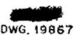

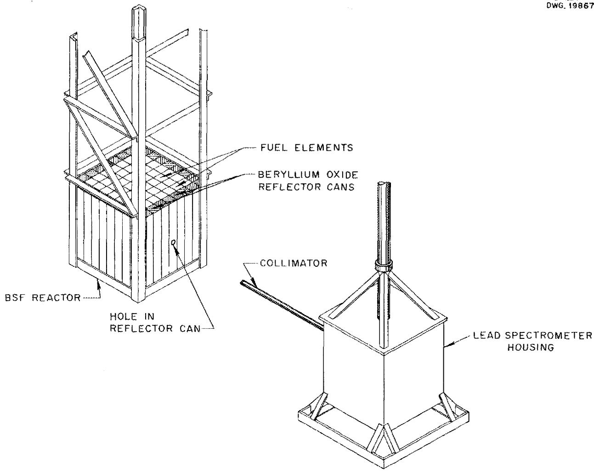  
Fig. 13.1. Experimental Arrangement for Neutron Spectral Measurements. Apparatus operates submerged in water.

# GAMMA-RAY AIR-SCATTERING CALCULATIONS

Measurements have been reported $^{(7)}$ on the spectra of gamma radiation emerging from a mockup of the reactor portion of the aircraft divided shield. $^{(8)}$ Calculations have been made for the gamma radiation arriving at the outside of the aircraft crew shield, and further calculations are planned on the penetration of the gamma radiation through the

crew shield. The data collected recently by the Bureau of Standards will be used, in part, for these calculations.

The gamma-ray spectral measurements were recorded $^{(7)}$ as a function of energy and as a function of the angles, as shown in Fig. 13.5. Data obtained through the lead shadow shields shown in Fig. 13.5 and through various thicknesses of water were available. The data included the dependence of $\Gamma$ (the emerging gamma-ray flux in

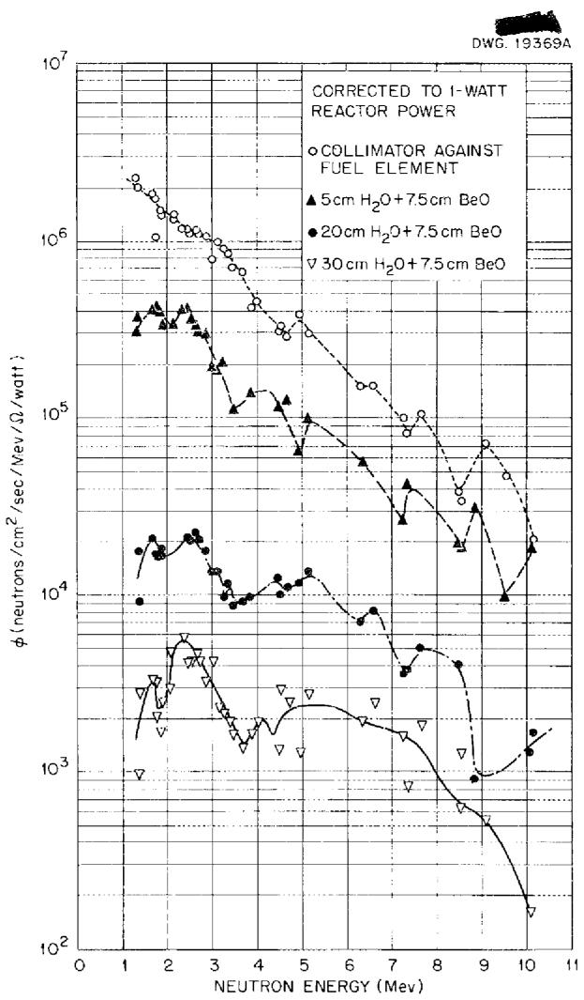  
Fig. 13.2. BSF Reactor Neutron Spectra.

photons/cm²/sec/Mev/watt/steradian) on the elevation angle $\theta$ and also on the azimuth angle $\phi$ by virtue of the existing symmetry along the aircraft axis.

Gamma-ray dose measurements indicated that data taken behind the lead shadow shield would

$$
\frac {\Phi}{P} (E ^ {\prime}; \beta) = \int_ {E} \int_ {a} \int_ {r} \int_ {\theta} \int_ {\phi}
$$

be applicable for $a$ less than 40 deg, whereas the open-water data would be applicable for $a$ greater than 70 deg, where $a$ is the polar angle indicating the point of departure of the photons from the reactor shield. The intermediate region at the edge

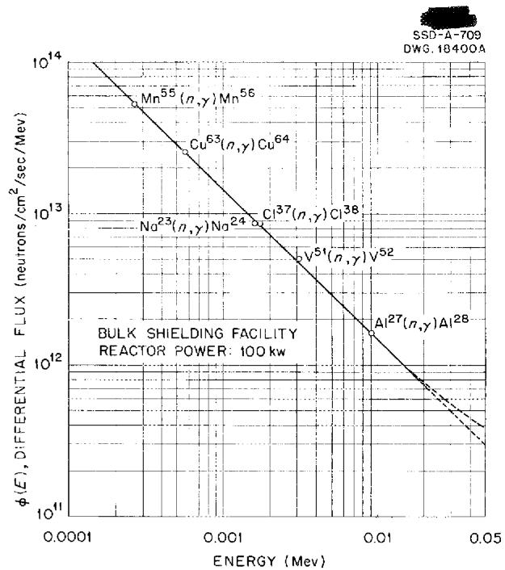  
Fig. 13.3. Neutron Energy Spectrum for the Epithermal Energy Region (0.5 kev < E < 10 kev) by Threshold Detector Measurements.

of the shadow shield had to be investigated in further detail. Measurements were made at $a = 50$ deg for all values of $\theta$ and at $a = 60$ deg as a function of both $\theta$ and $\phi$ . The measurements then afforded an approximate knowledge of $\Gamma(E, a, \theta, \phi)$ over the entire reactor shield, where $E$ is the energy (Mev) of the emerging gamma ray. The gamma radiation arriving at the crew shield was then obtained by integrating over the energy and the surface of the reactor shield and by applying the differential scattering cross section and integrating over all space. Single scattering and no air attenuation were assumed in the calculations, which should be adequate with the reactor-crew separation distances being considered.

$$
\Gamma (E, a, \theta , \phi) K R ^ {- 2} d E d A d V,
$$

where

$$
\frac {\Phi}{P} = \text {g a m m a - r a y f l u x a r r i v i n g a t h e c r e w s h i e l d} (\text {p h o t o n s / c m} ^ {2} / \sec / \text {w a t t}),
$$

$$
E ^ {\prime} = \text {d e g r a d e d g a m m a - r a y e n e r g y (M e v)},
$$

$\beta =$ receiver angle,

$E =$ energy of the emerging gamma ray (Mev),

$\alpha =$ polar angle at the source,

$r =$ distance from the point of emergence from the reactor shield to the point of scatter $(\mathsf{cm})_t$

$\theta =$ elevation angle,

$\phi =$ azimuth angle,

$K =$ Klein-Nishina differential scattering cross section,(10)

$R =$ distance from the point of scatter to the center of the crew shield $(\mathbf{cm})$

$dA =$ surface element at the reactor shield,

$dV =$ volume element of scattering space.

These calculations were simplified considerably because, for the most part, the gamma radiation emerged radially in the shield regions away from the edge of the shadow disks. Calculations for a typical element of volume were carried out by using the measured dependence on $\theta$ and $\phi$ and by assuming that all the radiation was emitted radially. Since the results agreed to within $30\%$ , the radial assumption was used for all regions away from the shadow-disk edges. This component was called the radial beam, while the contribution from the edge of the shadow shield was called the skew beam.

The direct (unscattered) beam calculation was given simply by

$$
\frac {\Phi}{P} = \left(E ^ {\prime}, \beta\right) = \int_ {E} \int_ {a} \quad \Gamma R ^ {- 2} d E d a.
$$

The actual integrations were performed numerically, in steps, as shown in Table 13.1. The

computations were made on a UNIVAC after they had been coded by the Mathematics Panel.

Differential Results. The spectra of the scattered gamma-ray flux arriving at the crew compartment are shown in Fig. 13.6 for the front region of the

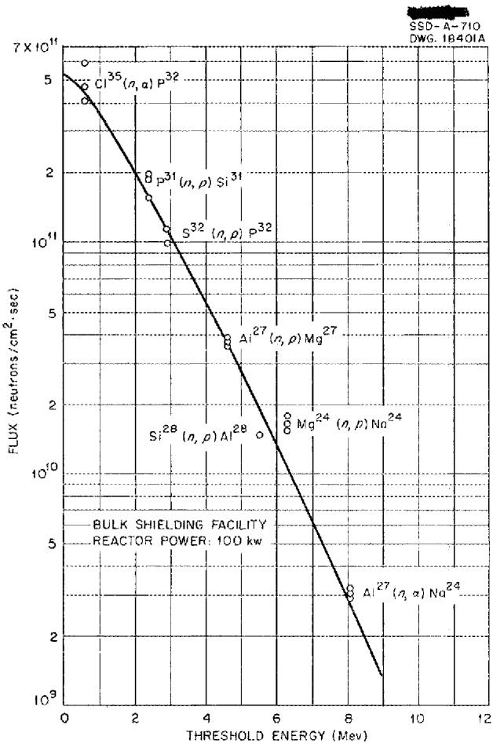  
Fig. 13.4. Neutron Flux Above Threshold Energy as a Function of Threshold Energy.

TABLE 13.1. STEPS CHOSEN FOR NUMERICAL INTEGRATION   

<table><tr><td rowspan="2">VARIABLE</td><td colspan="3">CALCULATION</td></tr><tr><td>Radial Beam</td><td>Skew Beam</td><td>Direct Beam</td></tr><tr><td>E</td><td>6 steps of 1.2 to 2.5 Mev</td><td>4 steps of 1.2 to 2.5 Mev</td><td>6 steps of 1.2 to 2.5 Mev</td></tr><tr><td>α</td><td>18 steps of 10 deg</td><td>2 steps of 10 deg</td><td>9 steps of 10 deg</td></tr><tr><td>β</td><td>18 steps of 10 deg</td><td></td><td></td></tr><tr><td>r</td><td></td><td>40 steps of 5 to 500 ft</td><td></td></tr></table>

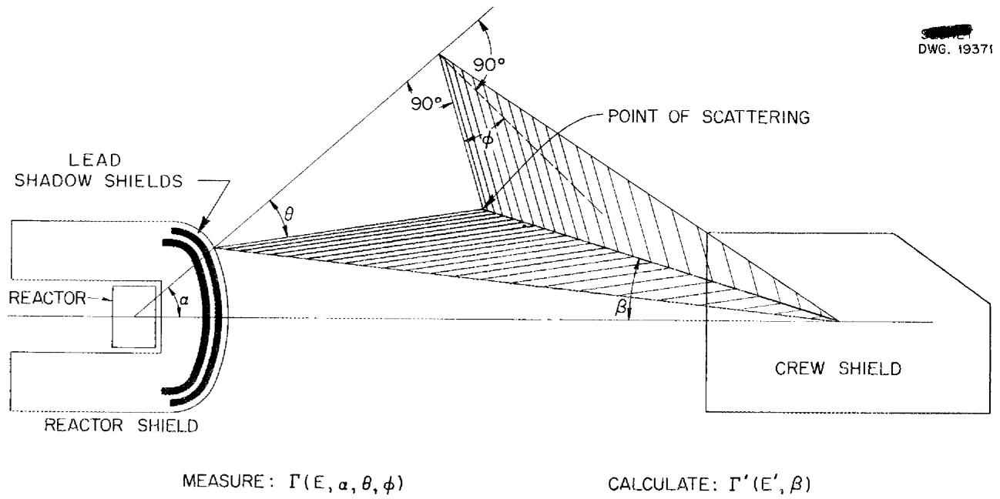  
Fig. 13.5. Definition of Angles for Gamma-Ray Air-Scattering Calculations.

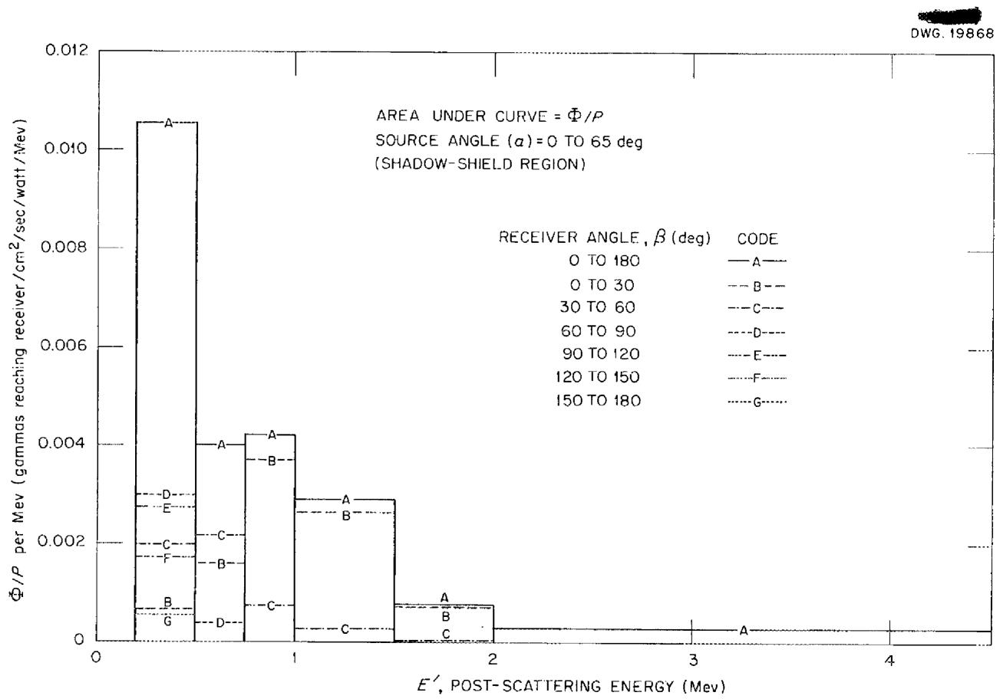  
Fig. 13.6. Spectra at the Crew Compartment of the Scattered Gamma Rays from the Front of the Reactor Shield.

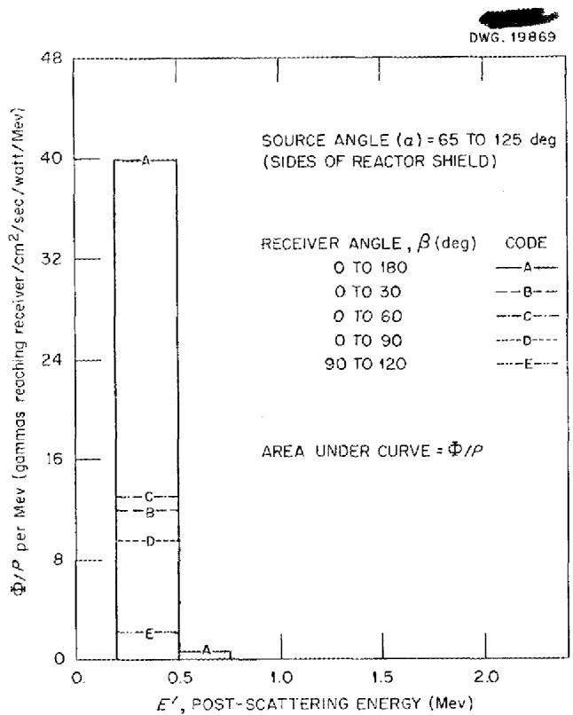  
Fig. 13.7. Spectra at the Crew Compartment of the Scattered Gamma Rays from the Side of the Reactor Shield.

reactor shield. All the high-energy flux arrives from this region. The side of the reactor shield contributes much more low-energy radiation as shown in Fig. 13.7 and, finally, Fig. 13.8 shows the small contribution of low-energy radiation from the rear of the shield.

A graphical representation of the contribution from various volume elements in space is shown in Figs. 13.9 and 13.10. Figure 13.9 gives the flux contribution in photons/cm²/sec/watt, while Fig. 13.10 is shaded to demonstrate the same information for larger volume elements. Thus it may be seen that regions far from the aircraft contribute a substantial portion of the gamma radiation arriving at the outside of the crew compartment. However, since this radiation has to be scattered through a large angle, it is of low energy and it loses some of its importance after penetrating the crew shield. All gamma rays arriving at the crew shield with an

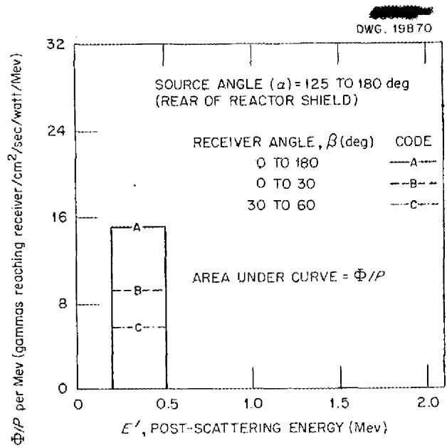  
Fig. 13.8. Spectra at the Crew Compartment of the Scattered Gamma Rays from the Rear of the Reactor Shield.

energy greater than 0.5 MeV, for example, must have $a + \beta \leq 90$ degrees. This condition implies scattering from a point closer than 8.6 meters from the aircraft axis.

The direct-beam radiation arriving at the crew shield is shown in Fig. 13.11. Since this contribution is plotted as a function of the angle $\alpha$ , rather than as that of the solid angle, the dose will tend to increase with $\alpha$ . Counteracting this, however, is the fact that $\theta$ increases with increasing $\alpha$ and that the radial nature of the emerging radiation causes the contribution to rapidly decrease. The marked increase at the edge of the shadow shield indicates that the shadow shield should be made larger and that it should be tapered in thickness toward the edges.

Integral Results. The integral results are shown in Table 13.2, for which the gamma flux was converted into dose units.(11) The results are compared with the calculations of ANP-53,(8) and they agree to within a factor of about 3. This is

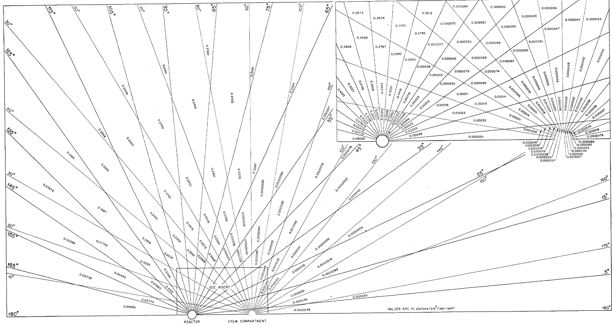  
Fig. 13.9. Gamma-Ray Scattering for an Aircraft Divided Shield.

<table><tr><td></td></tr></table>

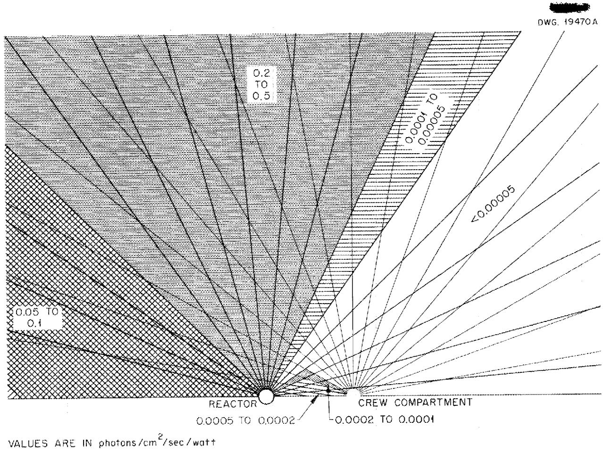  
Fig. 13.10. Gamma-Ray Scattering for an Aircraft Divided Shield.

TABLE 13.2. TOTAL GAMMA DOSE AT THE OUTSIDE OF THE CREW SHIELD   

<table><tr><td rowspan="2">METHOD</td><td colspan="2">SCATTERED BEAM (r/hr/watt × 10-6)</td><td rowspan="2">DIRECT BEAM (r/hr/watt × 10-6)</td></tr><tr><td>Radial</td><td>Skew</td></tr><tr><td>This report</td><td>9.3</td><td>0.034</td><td>29</td></tr><tr><td>ANP-53</td><td>3.0*</td><td></td><td></td></tr><tr><td>Experiment</td><td>50</td><td></td><td></td></tr></table>

*Corrected for a leakage ratio of 5.

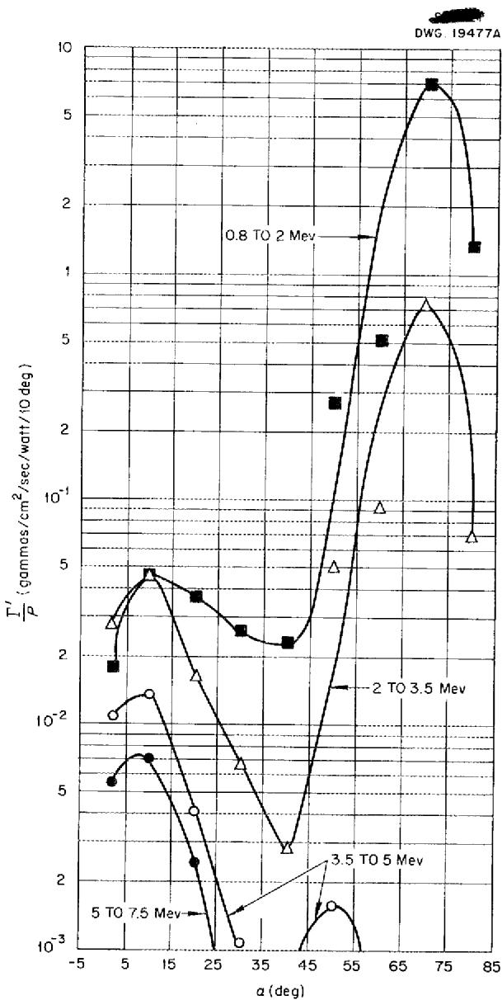  
Fig. 13.11. Direct-Beam Gamma Rays Arriving at the Crew Shield as a Function of $\alpha$ .

surprisingly good agreement, since for the calculations in ANP-53 it was assumed that all the gamma rays had an energy of 2.5 MeV and that they emerged radially.

A comparison was also made with the air-scattering experiment(12) which was carried out at the Bulk Shielding Facility. After corrections had been made for the difference in reactor-crew separation distance, the calculations just described indicated a dose about five times less than that measured in the air-scattering experiment. This disagreement is not to be interpreted as fundamental, since the experimental arrangement was but a poor replica of the shield which was calculated.

# 14. LID TANK FACILITY

J.D.Flynn

J. N. Miller

G. T. Chapman

F. N. Watson

Physics Division

M. E. LaVerne

F. H. Abernathy

ANP Division

Experiments on a unit shield for the circulating-fuel reflector-moderated reactor, as described in the previous quarterly report, are in progress. Fifty-four configurations have been tested to date. Effective removal cross sections have been obtained for oxygen, nickel, and Inconel.

# REFLECTOR-MODERATED REACTORSHIELD TESTS

A preliminary series of shielding tests has been run in the Lid Tank Facility on the basic type of shield for the reflector-moderated reactor.(1) Three basic reflector-intermediate-heat-exchanger-pressure-shell configurations have been tested. Various thicknesses and spacings of lead layers were tested with each configuration. A typical assembly was then used to determine the effects of such factors as boron concentration, replacement of iron by Inconel, water by transformer oil, lead by tungsten carbide, etc.

The only beryllium available for this first series of tests consisted of one tank of beryllium pellets approximately 1 ft thick with an average beryllium density of $1.23\mathrm{g/cm^3}$ and two beryllium slabs, 21 by 42 by 3.6 in., with a density of $1.84\mathrm{g/cm^3}$ . By placing the two beryllium slabs together to form a 42-in. square and placing this square in series with the tank of beryllium pellets, an equivalent thickness of 11.3 in. of solid beryllium was obtained. The heat exchanger was simulated by using thin, slab-shaped steel tanks that were 3.5 cm thick and filled with NaF. The sheet-steel tank walls of the tanks served to simulate the matrix of tubing that would be present in a full-scale heat exchanger. Provision was made for the insertion of capsules of NaF in each tank to permit measurements of sodium activation at various points in the heat exchanger. A typical shield configuration is shown in Fig. 14.1.

The capsules consisted of 0.250-in.-OD aluminum tubing attached to the lower end of 0.250-in.-dia aluminum rod. Even though the heat exchanger tanks were loaded with NaF in as dry a condition as possible and were closed off, it was feared that the moisture content might change during the course of the test and have an effect on the amount of neutron moderation in the simulated heat exchanger. Therefore the central position of each heat exchanger tank was filled with cans of sodium rather than with NaF powder. The cans of sodium were borrowed from the Critical Experiment Facility.

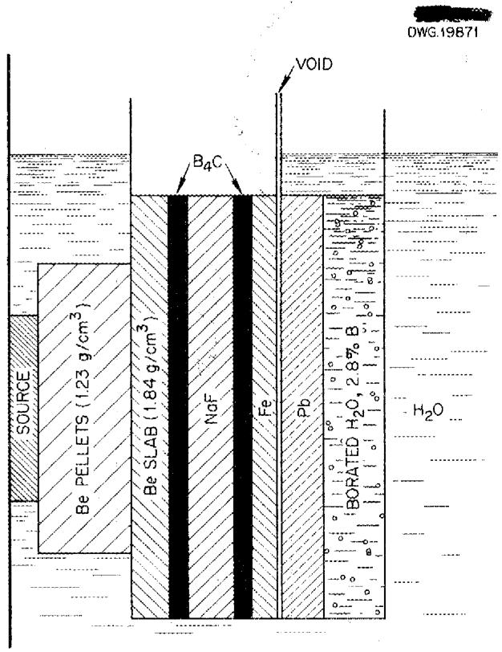  
Fig. 14.1. Typical Reflector-Moderated Reactor Shield Configuration in Lid Tank.

The regular Lid Tank slabs of lead, iron, and boron carbide were used wherever these materials were needed. Dry tanks selected from those used in previous Lid Tank experiments were employed to hold the various configurations tested.

Shield Configurations. The first set of experiments was carried out with a simulated heat exchanger region that was only 2.75 in. thick. To determine the shielding requirements for a reactor surrounded by a heat exchanger of this thickness, some 14 configurations were tested. The first configuration mocked up a shield arrangement in which no heavy shielding material would be placed at the reactor, that is, an arrangement suitable for use with a divided shield. The other configurations tested employed various thicknesses of lead, various arrangements of the lead relative to the pressure shell, and various concentrations of boron in the water region immediately outside the pressure shell.

Twenty-two other configurations in this first series of tests employed a heat exchanger region 6.9 in. thick. Four of the configurations were used for investigating the effect of various thicknesses of a lead region placed immediately outside the pressure shell. A few tentative tests indicated that there was little or no overall advantage to be gained from moving the lead away from the pressure shell, since its increased effectiveness would be largely offset by its greater radius, and the greater structural complexity would be undesirable.

Examination of the data from the first 18 configurations indicated that secondary gamma rays were responsible for most of the gamma dose measured well out in the water region of the shield. It seemed likely that the iron tank walls between the beryllium pellets and the beryllium slab were a major source of secondary gamma rays that would not exist in a full-scale reactor--heat exchanger assembly. Also, it was decided that a thicker beryllium region would be desirable and could be simulated by introducing a layer of water between the tank of beryllium pellets and the beryllium slab. A configuration was assembled with this extra water region and with 0.250-in.-thick boral sheets placed against the iron tank walls to inhibit the production of capture gamma rays in the iron. Also, a 0.125-in.-thick boral sheet was placed against the outer face of the lead slabs to prevent the thermal neutrons from the borated water from entering the lead region. Five configurations involved the use of various thicknesses of lead

with this arrangement. Three more configurations were tested to investigate the effectiveness of the boral sheets and the water layer which had been inserted between the tank of beryllium pellets and the beryllium slab.

Five additional configurations that were similar but contained no lead were tested to compare the relative effectivenesses of iron, nickel, copper, and Inconel. There was practically no difference between these four materials when allowance was made for density variations.

Inasmuch as it is possible that the problem of containing lead at high temperatures may be solved at some future date, a test was made with a lead slab between the source plate and the beryllium region to simulate a reactor design that might be used if lead were employed as a moderator coolant.

A substantial saving in shield weight might be effected through the use of a material more dense than lead for the gamma shield. Since some tungsten carbide was available from supplies that had been acquired by NEPA, a series of tests was run with tungsten carbide instead of with lead. Various arrangements of boral sheet and lead layers were employed in an effort to investigate the production of secondary gamma rays in the tungsten.

Gamma-Ray Attentuation Data. The test results for the various configurations tested in the Lid Tank Facility have been plotted directly, without correction for air gaps. Figure 14.2 shows curves

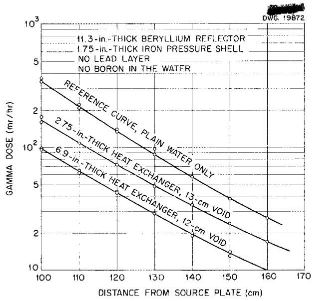  
Fig. 14.2. Gamma Attenuation with No Lead Layer for Two Heat Exchanger Thicknesses,

for operation with only water in the Lid Tank Facility, together with curves for both a thin and a thick heat exchanger with no lead layers. Note that despite the relatively large void present in the assemblies, the mockups for the reflector-heat exchanger-pressure shell configurations give lower gamma-ray doses at any given distance from the source plate than would be obtained with water only. The effects on gamma dose of various thicknesses of lead placed immediately outside the pressure shell are shown in Fig. 14.3 for the 2.75-in.-thick heat exchanger. Figure 14.4 shows test results for essentially the same configuration as that of Fig. 14.3, except that the thickness of the heat exchanger region was increased from 2.75 to 6.9 inches. Note that the thicker heat exchanger gave some increase in the gamma-ray dose when used with thick layers of lead (because of an increase in secondary gamma-ray production), while with no lead layer, it gave a reduction in gamma-ray dose by absorbing a substantial amount of primary gamma radiation.

A careful examination of Figs. 14.3 and 14.4 indicated that the secondary gamma-rays consti

tuted the major portion of the gamma-ray dose well out in the shield when relatively thick layers were employed. When the moderator region was thickened and boral sheets were inserted to inhibit neutron capture in the iron tank walls, the data plotted in Fig. 14.5 were obtained. Examination of Fig. 14.5 discloses that the addition of lead just outside the pressure shell, up to a thickness of 6 in., gives a configuration in which the lead is as effective as could be hoped for. The addition of 1.5 in. of lead to give an over-all lead thickness of 7.5 in. attenuated the gamma flux by a factor of only 2.4. Thus, the apparent attenuation length in the last layer of lead was approximately $5.3\mathrm{cm}$ which indicated that the secondary gamma-ray production in the lead is important in this region.

Neutron Attenuation Data. Figure 14.6 shows a neutron attenuation curve for a typical configuration superimposed on a reference curve obtained with only water in the tank. Note that in spite of the void space in the assembly, the beryllium was so effective in slowing down fast neutrons that the neutron dose $140~\mathrm{cm}$ from the source plate is well below that for water alone, and the steeper slope of the curve indicates a shorter attenuation length

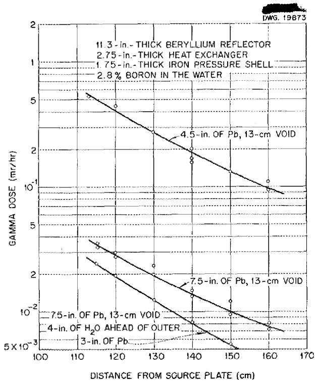  
Fig. 14.3. Gamma Attenuation with Various Lead Layers and a 2.75-in.-Thick Heat Exchanger.

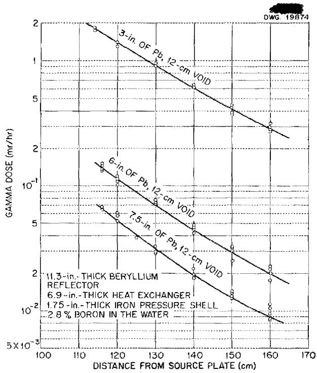  
Fig. 14.4. Gamma Attenuation with Various Lead Layers and a 6.9-in.-Thick Heat Exchanger.

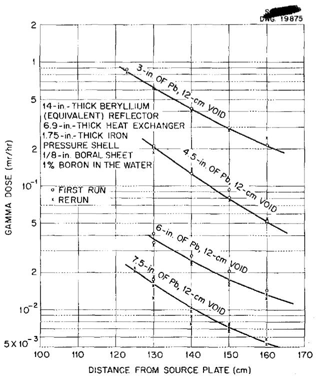

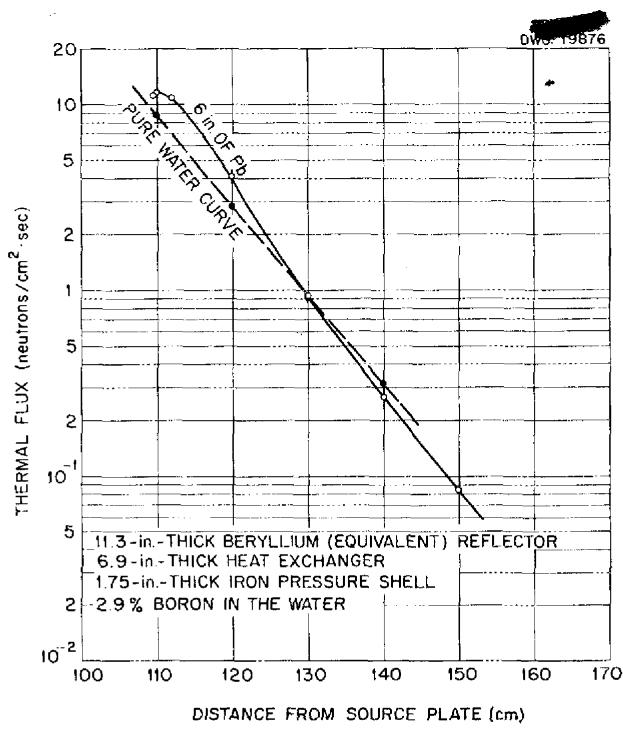  
Fig. 14.5. Gamma Attenuation for Various Lead Layers with Thick Reflector and Heat Exchanger.   
Fig. 14.6. Thermal-Neutron Attenuation for a Typical Shield Configuration.

for those neutrons that do get through the reflector-heat exchanger-pressure shell assembly.

Changing the thickness of either the heat exchanger or lead regions had little effect on the neutron attenuation. The neutron-flux curves for all the configurations covered by Figs. 14.3, 14.4, and 14.5 fell within $20\%$ of the values given in Fig. 14.6 for the configuration with the thin heat exchanger, thin reflector, and 6-in.-thick lead layer.

# REMOVAL CROSS SECTIONS

Several measurements have been made to determine a true removal cross section for oxygen. Previously reported values, for example, those reported by Welton and Blizzard,[2] have been based on an average removal effect for oxygen distributed throughout a hydrogenous shield and are therefore not comparable to other removal cross sections because the material should be placed close to the source and followed by a large thickness of water.

For the recent measurements, a slab of carbon was inserted next to the source, and an effective removal cross section for carbon was determined. Then, a slab of oil $(\mathsf{CH}_2)$ was measured to obtain a difference, by comparison with water data, in the effective removal cross section for oxygen and carbon. From the difference, the value for oxygen is obtained by addition. The oil measurement was verified by another measurement for which a slab of paraffin $(C_{30}H_{62})$ was used. The results are as follows:

Carbon measurement

$$
\sigma_ {C} = 0. 8 4 b
$$

Oil measurement $(\mathsf{H}_2\mathsf{O} - \mathsf{H}_2\mathsf{C})$

$$
\sigma_ {0} \cdot \sigma_ {C} = 0. 1 5 b
$$

Oxygen removal cross section from oil measurement $\sigma_0 = 0.99\mathrm{b}$

Paraffin measurement (31H2O-C30H62)

$$
3 1 \sigma_ {0} - 3 0 \sigma_ {C} = 6. 0 7 b
$$

Oxygen removal cross section from paraffin measurement

$$
\sigma_ {0} = 1. 0 1 \mathrm {b}
$$

In addition, an effective removal cross section for nickel and a removal relaxation length for

(2) T. A. Welton and E. P. Blizzard, The Shielding of Mobile Reactors (Part II), TID-2002, p. 73 (Aug. 1952).

Inconel have been measured. The results are as follows:

$$
\text {N i c k e l}, \sigma_ {\text {N i}} = 1. 8 5 b,
$$

$$
\text {I n c o n e l}, \quad \lambda = 6. 3 3 \mathrm {c m}.
$$

The relaxation length obtained for Inconel is probably accurate for specifying the performance of the alloy, but it is not adequate for determining the removal cross section for chromium, since this element constitutes only $13.5\%$ of the alloy.

# FACILITY MODIFICATION

During April, a new shutter and an iris made with $\frac{1}{8}$ -in. boral were installed behind the Lid Tank source plate to replace those made of boron-painted

aluminum. This change was necessary because the gradual sagging of the Lid Tank toward the pile restricted the movement of the $\frac{1}{4}$ -in.-thick shutter.

The iris, the purpose of which is to limit the effective source to a circle, had previously been unsatisfactory because some of the boron paint had crumbled and partly filled the circular space which should have been boron-free. The new design makes this occurrence impossible. The neutron and gamma fluxes in the water of the tank have been remeasured since the new shutter and iris have been installed, and the new flux values agree very well with the values obtained previously.

# 15. TOWER SHIELDING FACILITY

J. Y. Estabrook, ANP Division

C. E. Clifford

T. V. Blosser

L. B. Holland

M. K. Hullings

Physics Division

H. E. Stern, Consolidated Vultee Aircraft Corp.

Although no structural steel has been delivered to the site of the Tower Shielding Facility, the tower foundation and cable anchors are completed and the construction may be said to be well under way. A three-week delay occasioned by a strike, while inconvenient, will probably not cause a setback in the deadline for final completion at the end of 1953.

Actuating mechanisms for the control rods have been built and are undergoing tests. The first models are unsatisfactory, but it is hoped that

they can be modified and that the defects can be remedied.

A report to the Reactor Safeguard Committee is essentially complete.(1) In the course of the study, it appeared that there were no unusual hazards for this particular reactor which could not be minimized by careful design and prudent operation.

(1)C. E. Clifford and L. Abbott, Tower Shielding Facility Hazards Summary Report, ORNL-1550 (to be issued).

Part IV

# APPENDIX

16. LIST OF REPORTS ISSUED DURING THE QUARTER   

<table><tr><td>REPORT NO.</td><td>TITLE OF REPORT</td><td>AUTHOR(S)</td><td>DATE ISSUED</td></tr><tr><td colspan="4">1. Reactor Design</td></tr><tr><td>CF-53-3-184</td><td>Comments on the ARE Review Committee Criticisms</td><td>J. H. Buck</td><td>3-23-53</td></tr><tr><td>CF-53-3-210</td><td>A Reflector-Moderated Circulating Fuel Reactor for an Aircraft Power Plant</td><td>A. P. Fraas</td><td>3-27-53</td></tr><tr><td>CF-53-4-43</td><td>Minutes of the Final Meeting of the ARE Design Review Committee</td><td>W. R. Gall</td><td>4-7-53</td></tr><tr><td>CF-53-4-195</td><td>Design Review Committee Report on Tower Reactor Facility</td><td>C. J. Borkowski</td><td>4-22-53</td></tr><tr><td>ORNL-1509</td><td>Preliminary Design and Performance Studies of Sodium-to-Air Radiators</td><td>A. P. Fraas
H. J. Stumpf
W. S. Farmer
C. D. Whitman</td><td>to be issued</td></tr><tr><td>ORNL-1517</td><td>Fireball Reactor Moderating Cooling System</td><td>E. P. Blizzard
W. S. Farmer
A. H. Fox
A. P. Fraas
C. B. Mills</td><td>to be issued</td></tr><tr><td>ORNL-1535</td><td>Thermal Dynamic and Heat Transfer Analysis of the ARE</td><td>B. L. Greenstreet</td><td>to be issued</td></tr><tr><td colspan="4">II. Reactor Physics</td></tr><tr><td>CF-53-3-125</td><td>Multigroup Method Calculations</td><td>A. H. Fox</td><td>3-16-53</td></tr><tr><td>CF-53-3-231</td><td>Kinetics of the Circulating Fuel Nuclear Reactor</td><td>W. K. Ergen</td><td>3-30-53</td></tr><tr><td>CF-53-4-29</td><td>Study of the Kinetics of the General Electric Aircraft Reactor</td><td>E. R. Mann
J. J. Stone</td><td>4-7-53</td></tr><tr><td>ORNL-1178</td><td>Dynamics of an Aircraft Reactor</td><td>Nuclear Development Associates, Inc.</td><td>4-22-53</td></tr><tr><td colspan="4">III. Shielding</td></tr><tr><td>CF-52-12-225</td><td>Preliminary Direct Cycle Reactor Assembly - Part V.</td><td>Dixon Callihan et al.</td><td>12-15-52</td></tr><tr><td>CF-53-2-250</td><td>The Shielding of Nuclear Aircraft</td><td>E. P. Blizzard</td><td>2-27-53</td></tr><tr><td>CF-53-3-81</td><td>Radiation Cataract Meeting in Washington, D. C., February 28, 1953</td><td>J. L. Meem</td><td>3-11-53</td></tr><tr><td>ORNL-1526</td><td>A Neutron Time-of-Flight Spectrometer</td><td>G. S. Pawlicki</td><td>4-9-53</td></tr><tr><td>CF-53-3-166</td><td>Attenuation by Lead of Fast Neutrons from a Fission Source</td><td>J. D. Flynn
G. T. Chapman</td><td>3-10-53</td></tr><tr><td>CF-53-4-67</td><td>Foil Exposures</td><td>M. K. Hullings</td><td>4-10-53</td></tr><tr><td>CF-53-4-76</td><td>ANP Engineering Test Facility Requirements</td><td>E. P. Blizzard</td><td>4-13-53</td></tr><tr><td>CF-53-4-108</td><td>Fuel Elements for Bulk Shielding Reactor</td><td>J. L. Meem</td><td>4-17-53</td></tr><tr><td>CF-53-4-118</td><td>Fuel Elements for Tower Shielding Reactor</td><td>C. E. Clifford</td><td>4-14-53</td></tr><tr><td>CF-53-4-140</td><td>1953 Summer Shielding Session</td><td>E. P. Blizzard</td><td>4-17-53</td></tr><tr><td>ORNL-1438</td><td>Determination of the Power of the Bulk Shielding Reactor - Part II. Neutron Flux Measurements in Several Beryllium Oxide-Reflected Critical Assemblies</td><td>E. B. JohnsonJ. L. Meem</td><td>4-21-53</td></tr><tr><td>CF-53-5-21</td><td>Energy per Fission and Power of the Bulk Shielding Reactor</td><td>J. L. MeemR. E. HungerfordE. B. Johnson</td><td>4-25-53</td></tr><tr><td>ORNL-1537</td><td>The Determination of the Power of the Bulk Shielding Reactor - Part III</td><td>J. L. Meem</td><td>to be issued</td></tr><tr><td>ORNL-1550</td><td>Tower Shielding Facility Safeguard Report</td><td>C. E. Clifford</td><td>6-9-53</td></tr><tr><td colspan="4">IV. Chemistry</td></tr><tr><td>CF-53-2-165</td><td>Analytical Chemistry ANP Program for 2/15/53</td><td>J. C. White</td><td>2-20-53</td></tr><tr><td>CF-53-3-142</td><td>Fused Salt Systems, Chapters 6.1, 6.2, 6.3, and 6.4 of Reactor Engineering Handbook</td><td>W. R. GrimesD. R. CuneoW. B. CottrellF. F. Blankenship</td><td>3-20-53</td></tr><tr><td>CF-53-5-47</td><td>Preparation of Enriched Uranium for Fireball Critical Experiments</td><td>A. D. Callihan</td><td>5-7-53</td></tr><tr><td>ORNL-1538</td><td>The Determination of Traces of Hydrogen Fluoride in Inert Gases</td><td>D. L. ManningJ. C. White</td><td>4-28-53</td></tr><tr><td colspan="4">V. Metallurgy and Ceramics</td></tr><tr><td>CF-53-1-256</td><td>Fluoride Corrosion Tests of Type 347 Stainless Steel Weldments</td><td>D. C. Vreeland</td><td>1-24-53</td></tr><tr><td>CF-53-3-100</td><td>Examination of As-Received 4-Ply Inconel Bellows</td><td>G. M. AdamsonR. S. Crouse</td><td>3-4-53</td></tr><tr><td>CF-53-3-183</td><td>Fabrication of Spherical Particles</td><td>A. Levy</td><td>3-19-53</td></tr><tr><td>CF-53-4-46</td><td>Evaluation of Properties of Solid Fuel Elements</td><td>A. LevyE. S. Bomar</td><td>4-1-53</td></tr><tr><td>ORNL-1514</td><td>Cone-Arc Welding</td><td>P. PatriarcaG. M. Slaughter</td><td>3-26-53</td></tr><tr><td>ORNL-1540</td><td>Behavior of Chronomal</td><td>W. J. SturmR. J. Jones</td><td>to be issued</td></tr><tr><td>MM-35</td><td>Quarterly Progress Report on Production of Sound Ductile Joints in Molybdenum</td><td>Battelle Memorial Institute</td><td>1-30-53</td></tr><tr><td>BMI-788</td><td>The Effect of Purification on Welds in Molybdenum</td><td>Battelle Memorial Institute</td><td>12-1-52</td></tr><tr><td>BMI-787</td><td>Evaluation of Oxidation-Resistant Ceramics for High-Temperature Reactor Elements</td><td>Battelle Memorial Institute</td><td>12-1-52</td></tr><tr><td>BMI-792</td><td>Properties of Some Columbium Oxide-Basis Ceramics</td><td>Battelle Memorial Institute</td><td>12-15-52</td></tr><tr><td>BMI-794</td><td>Continued Studies of Corrosion by Fused Caustic</td><td>Battelle Memorial Institute</td><td>12-18-52</td></tr><tr><td>BMI-804</td><td>Protective Coatings for High-Temperature Metal Alloys</td><td>Battelle Memorial Institute</td><td>12-15-52</td></tr><tr><td>MM-101</td><td>Progress Report No. 2 on Gas Plated Coatings on Metals and Alloys</td><td>The Commonwealth Eng. Co. of Ohio</td><td>4-14-53</td></tr><tr><td>ORO-79</td><td>Coatings for the Protection of Low Carbon Steel at Elevated Temperatures</td><td>University of Alabama</td><td>11-52</td></tr><tr><td>IG-800-S-7</td><td>Seventh Bimonthly Progress Report on Development of a High Temperature Strain Gage Jan. 1, 1953 to Feb. 28, 1953.</td><td>Cornell Aeronautical Laboratory</td><td>3-19-53</td></tr><tr><td>IG-800-S-6</td><td>Sixth Bimonthly Progress Report on Development of a High Temperature Strain Gage. November 1, 1952 to December 31, 1952.</td><td>Cornell Aeronautical Laboratory</td><td>1-12-53</td></tr><tr><td colspan="4">VI. Heat Transfer and Physical Properties</td></tr><tr><td>CF-53-3-176</td><td>Minimum Weight Analysis for an Air Radiator</td><td>W. S. Farmer</td><td>to be issued</td></tr><tr><td>CF-53-3-261</td><td>Physical Property Charts for Some Reactor Fuels, Coolants, and Miscellaneous Materials, 3d ed.</td><td>ANP Physical Properties Group</td><td>3-20-53</td></tr><tr><td>CF-53-3-259</td><td>Preliminary Surface Tension Measurements of the ARE Fuel (Fluoride Mixture No. 30)</td><td>S. I. Cohen T. N. Jones</td><td>3-27-53</td></tr><tr><td>CF-53-5-103</td><td>Heat Capacity of the Eutectic of Lithium Hydroxide and Sodium Hydroxide</td><td>W. D. Powers G. C. Blalock</td><td>5-18-53</td></tr><tr><td>CF-53-5-113</td><td>Heat Capacity of Fuel Composition No. 14</td><td>W. D. Powers G. C. Blalock</td><td>5-18-53</td></tr><tr><td>CF-53-5-149</td><td>Preliminary Study of the Electrical Conductivity of Strong Electrolytes for Possible Application in Volume Heat Source Experiments.</td><td>N. D. Greene</td><td>5-19-53</td></tr><tr><td colspan="4">VII. Miscellaneous</td></tr><tr><td>NAA-SR-208</td><td>Cyclotron Irradiation of Fused Fluorides</td><td>North American Aviation, Inc.</td><td>1-26-53</td></tr><tr><td>CF-53-2-246</td><td>ANP Information Meeting of February 18, 1953</td><td>W. B. Cottrell</td><td>2-26-53</td></tr><tr><td>ORNL-1515</td><td>Aircraft Nuclear Propulsion Project Quarterly Progress Report for Period Ending March 10, 1953.</td><td>W. B. Cottrell</td><td>4-16-53</td></tr><tr><td>CF-53-5-234</td><td>ANP Information Meeting of May 20, 1953</td><td>J. M. Cisar</td><td>to be issued</td></tr></table>