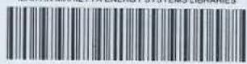
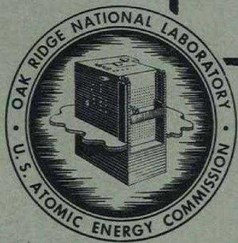
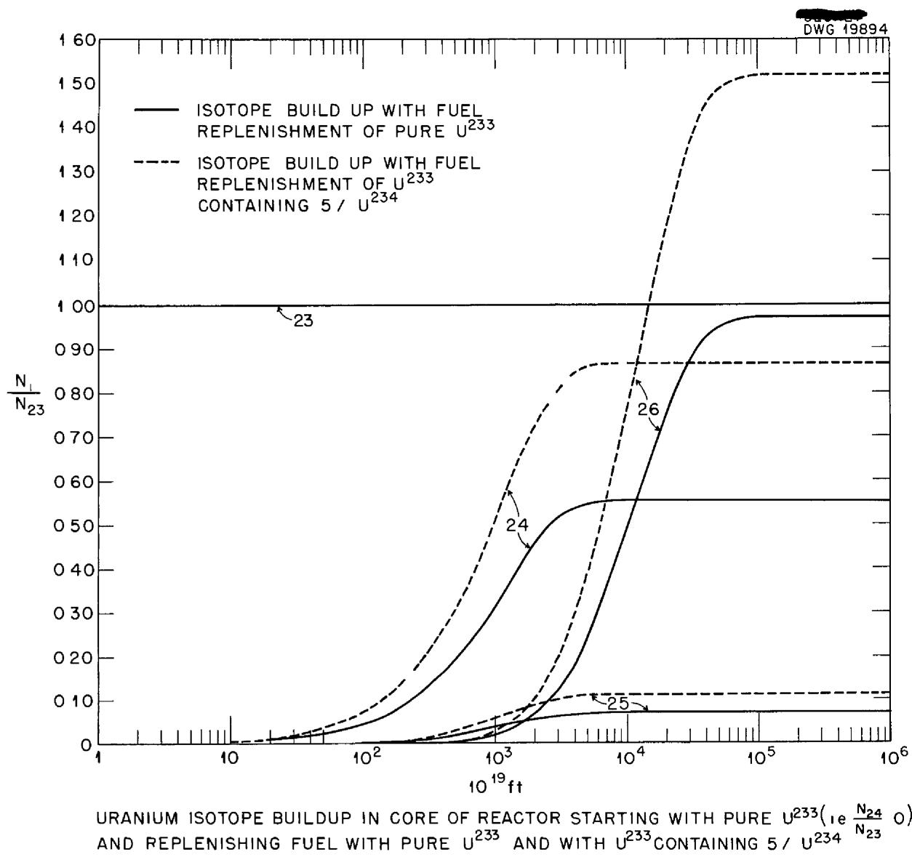
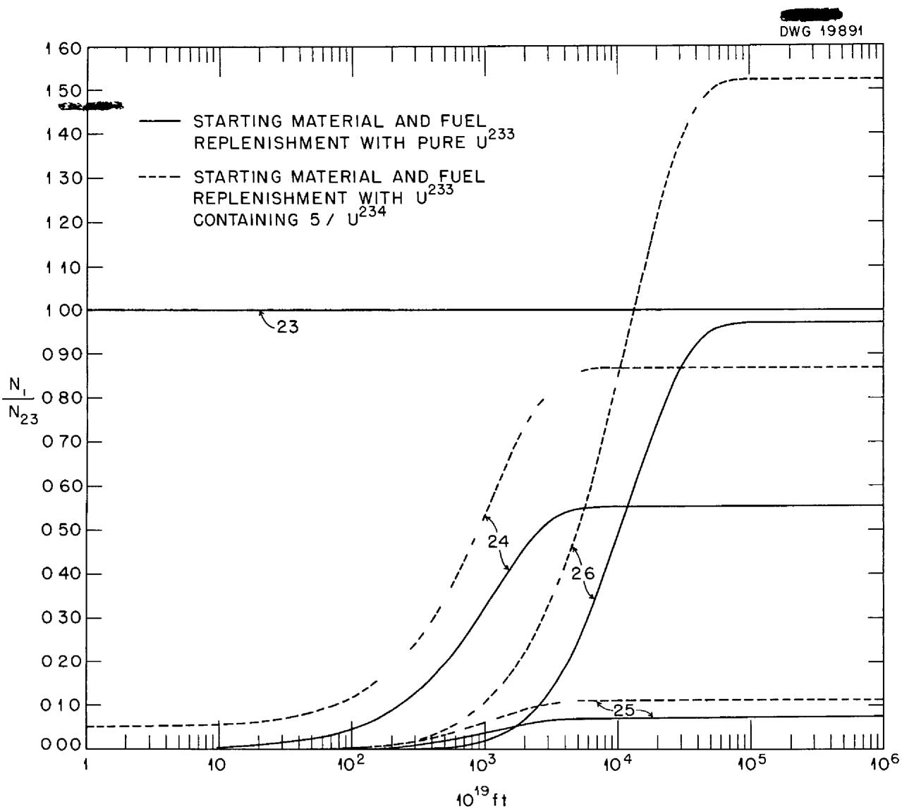
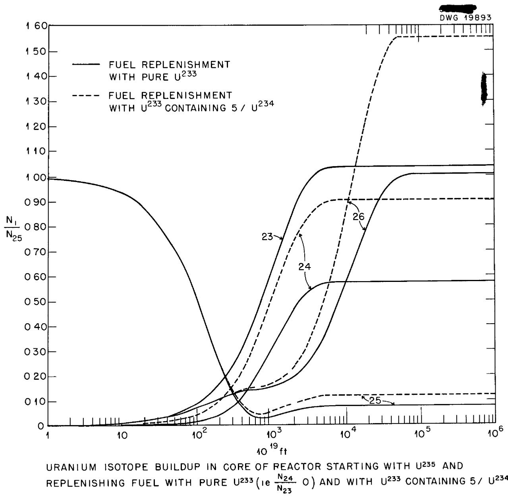
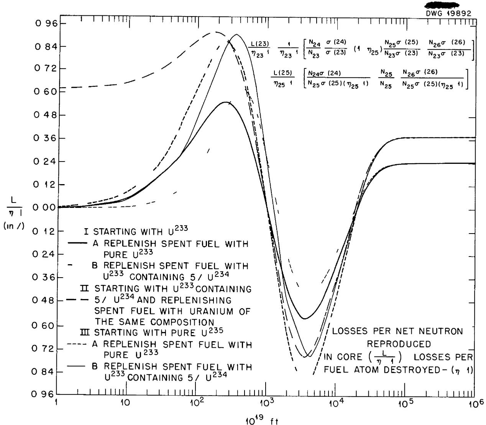
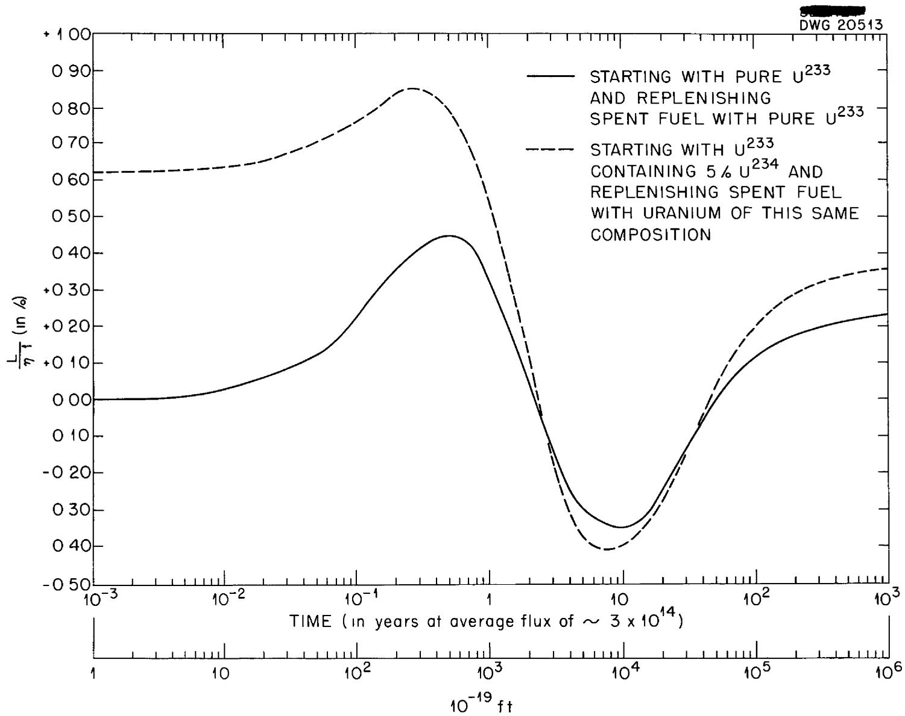

ORNL 1567

Reactors-Research and Power

MARTIN MARIETTA ENERGY SYSTEMS LIBRARIES

3445603494939

HEAVY ISOTOPE BUILD-UP IN CORE

OF U233 BREEDER

J. Halperin and R. W. Stoughton

CENTRAL RESEARCH LIBRARY DOCUMENT COLLECTION

LIBRARY LOAN COPY

DO NOT TRANSFER TO ANOTHER PERSON

If you wish someone else to see this document, send in name with document and the library will arrange a loan.

OAK RIDGE NATIONAL LABORATORY

OPERATED BY

CARBIDE AND CARBON CHEMICALS COMPANY

A DIVISION OF UNION CARBIDE AND CARBON CORPORATION

UCC

POST OFFICE BOX P

OAK RIDGE, TENNESSEE

Contract No W-7405-eng-26

CHEMISTRY DIVISION

HEAVY ISOTOPE BUILD-UP IN CORE OF U²³³ BREEDER

J Halperin and R W Stoughton

DATE ISSUED

OCT 6 1953

CLASSIFICATION CHANGED TO

BY AUTHORIOF

e 1/21/s 2

Operated by

CARBIDE AND CARBON CHEMICALS COMPANY

A Division of Union Carbide and Carbon Corporation

Post Office Box P

Oak Ridge, Tennessee

# INTERNAL DISTRIBUTION

1 E Center

33 M T Kelley

2 Biology Library

34 G H C Wett

3 Health Physics Library

35 K Z. organ

4-5 Central Research Library

36 T Lincoln

6 Reactor Experimental

37 A Householder

Engineering Library

38 S Harrill

7-11 Laboratu Records Dept

39. E Winters

12 Laborato. Records, ORNL R C

4CD W Cardwell

13 C E Larrn

E M King

14 W B Hume (K-25)

2 D D Cowen

15 L B Emlet-12)

43 D S Billington

16 A M Weinber

44 R A Charpie

17 E H Taylor

45 J A Lane

18 E D Shipley

46 M C Edlund

19-23 S C Lind

47 R B Briggs

24 F C VonderLage

48 K A Kraus

25 C P Keim

49 W C Waggener

26 J H Frye, Jr

50 C H Secoy

27 R S Livingston

51 D E Ferguson

28 R C Briant

52 F R Bruce

29 J A Swartout

53 H E Goeller

30 F L Culler

54 J Hulperin

31 A H Snell

56 R W Stoughton

32 A Hollaender

# EXTERNAI L DISTRIBUTION

57 AF Plant Representative, Burbank   
58 AF Plant Representative, Seattle   
59 AF Plant Representative, Wood-Ridge   
60 ANP Project Office, Forth Worth

61-72 Argonne National and L Katzin

73 Armed Forces Special Weapons Project (India)   
74-78 Atomie Energy Commission, Washington   
79 Batttle Memorial Institute   
80 Bechtel Corporation   
81-84 Brookhaven National Laboratory (1 copy to 1 T Miles)   
85 Bureau of Ships   
86-87 California Research and Development Company   
88-93 Carbide and Carbon Chemicals Company (Y-12 Plant)   
94. Chicago Patent Group   
95 Chief of Naval Research   
% Commonwealth Edison Company   
Department of the Navy - Op-362   
3 Detroit Edison Company

99-2 duPont Company, Augusta

16 duPont Company, Wilmington

104 Foster Wheeler Corporation

105-107 General Electric Company (ANPP)

108-111 General Electric Company, Richland

112 Hanford Operations Office

113-119 Idaho Operations Office

120 Iowa State College

121-125 Knolls Atac Power Laboratory 1 copy to E L Zebroski)

126-127 Los Alamos scientific Laboratory

128 Massachusetts Institute of Technology (Kaufmann)

129 Monsanto Chemical Company

130 Mound Laboratory

131 National Advisory Committee for Aeronautics, Cleveland

132 National Advisory Committee for Aeronautics, Washington

133 Naval Research Labora rry

134-135 New York Operations, 196

136-137 North American Aviation, Inc.

138 Nuclear Development Associates, Inc

139 Patent Branch, Washington

140 Pioneer Service Engineering Company

141 Powerplant Laboratory (WADC)

142 Pratt and Whitney Aircraft Division (Fox Project)

143 Rand Corporation

144 San Francisco Operations Office

145 Savanr River Operations Office, Astana

146 USAF Headquarters

147 U 9 Naval Radiological Defense Laboratory

148-151 University of California Radiation Laboratory, Berkeley

copy ea to G T Seaborg and I Perlman

152-153 University of California Radiation Laborator Livermore

15.7 Vitro Corporation of America

5 Walter Kidde Nuclear Laboratories, Inc

15 161 Westinghouse Electric Corporation

22-176 Technical Information Service, Oak Ridge

Heavy Isotope Build-Up In Core of U $^{233}$ Breeder

J. Halperin and R. W. Stoughton

# Abstract

The build-up of uranium isotopes with time in a $U^{233}$ breeder core was calculated for five different cases, the difference depending on the starting fuel and the isotopic composition of the continuously added make-up fuel. The total uranium concentration was found to approach slowly an equilibrium value of 2.6 to 3.5 times the starting value, depending on the composition of the make-up fuel. In all cases the net neutron losses per net neutron reproduced in the core go through a maximum of less than $1\%$ at a flux-time of about $3 \times 10^{21}$ , go through a minimum of about $-0.6\%$ (i.e. a net gain) at about a flux-time of $4 \times 10^{22}$ , and approach equilibrium values of about $0.3\%$ at flux-times above $6 \times 10^{23}$ .

The principle heavy isotopes in the core of a $\mathbf{U}^{233}$ breeder reactor and their modes of formation may be depicted by the following diagram.

$$
\begin{array}{l}U ^ {2 3 3} \quad \left(n, r\right)\rightarrow U ^ {2 3 4} \quad \left(n, r\right)\rightarrow U ^ {2 3 5} \quad \left(n, r\right)\rightarrow U ^ {2 3 6} \quad \left(n, r\right)\rightarrow\\\downarrow (n, f _ {1} s s _ {\bullet})\end{array}
$$

The production of these species as well as of several other heavy nuclides in the core of a breeder starting with pure $\mathbf{U}^{233}$ has been discussed by Visner(1)

(1) S Visner, ORNL-CF No. 51-10-110 (oct. 1951).

and by Halperin and Stoughton(1a). Both the growth of the various isotopes and

(la) J. Halperin and R W. Stoughton, ORNL-1368 (Sept. 1952).

the net effect on neutron economy were presented In this paper five cases will be considered with more recent values for the various cross-sections

I. Pure $\mathbf{U}^{233}$ in core at start, pure $\mathbf{U}^{233}$ added to core.

II. Pure $U^{233}$ in core at start, $U^{233}$ containing $5\% U^{234}$ added to core as the fuel is consumed.

III. U233 containing 5% U234 in core at start and added to core.

IV. Pure $\mathsf{U}^{235}$ in core at start, pure $\mathsf{U}^{233}$ added to core.

V. Pure $U^{235}$ in core at start, $U^{233}$ containing $5\%$ $U^{234}$ added to core.

In any practical case the core will probably start with $U^{235}$ . As this material is consumed $U^{235}$ will be added at first, and then very soon the added material should consist of the $U^{233}$ product produced in the blanket. Some $U^{234}$ will be produced in the blanket by neutron capture of the members of the 233

chain (Th $^{233}$ , Pa $^{233}$ and U $^{233}$ ) and it is felt that an upper limit on the U $^{234}$ /U $^{233}$ ratio for the blanket product will be about 0.05 if the overall losses are to be kept within reason. Hence any practical case is expected to lie somewhere in between Cases IV and V - Cases I, II and III are included for comparison and because some future reactors may actually start with U $^{233}$ in the core - The effect of U $^{237}$ will not be considered because it is expected to be destroyed predominantly by beta decay and its cross-sections are not known. Its concentrations and possible effects have been considered in a previous paper(1)

For Case I the concentration of $U^{233}$ is considered constant. Actually its concentration will increase somewhat as various pile poisons (e.g. fission products, $U^{234}$ etc.) grow in and its concentration may then decrease somewhat in the core as it increases in the blanket. If the core and blanket are processed continuously, however, these effects will reach a steady state value rather soon, if they are processed batchwise, then the time average value will be constant from period to period. The effect of the heavy isotope build-up itself on required $U^{233}$ concentration changes is small as will be seen from the small effect of this build-up on neutron economy.

The values of the various cross-sections used here are given in Table 1.

Table 1.   
Thermal Cross-Sections and Eta Values   

<table><tr><td>Nuclide</td><td>σc</td><td>σa</td></tr><tr><td>U233</td><td>50</td><td>564</td></tr><tr><td>U234</td><td>90</td><td>90</td></tr><tr><td>U235</td><td>106</td><td>682</td></tr><tr><td>U236</td><td>8</td><td>8</td></tr></table>

$$
\eta_ {2 5} = 2. 1 2 \quad \eta_ {2 3} = 2. 3 0
$$

Case I • Pure U²³³ In Core at Start, Pure U²³³ Added.

The differential equations for the three changing species are

$$
\frac {d N _ {2 l _ {4}}}{d t} = N _ {2 3} f \sigma_ {c} (2 3) - N _ {2 l _ {4}} f \sigma_ {c} (2 l _ {4}) \tag {1}
$$

$$
\frac {\mathrm {d} \mathrm {N} _ {2 5}}{\mathrm {d} t} = \mathrm {N} _ {2 4} f \sigma_ {\mathrm {c}} (2 4) - \mathrm {N} _ {2 5} f \sigma_ {\mathrm {a}} (2 5) \tag {2}
$$

$$
\frac {\mathrm {d} \mathrm {N} _ {2 6}}{\mathrm {d} t} = \mathrm {N} _ {2 5} ^ {\mathrm {f}} \sigma_ {\mathrm {c}} (2 5) - \mathrm {N} _ {2 6} ^ {\mathrm {f}} \sigma_ {\mathrm {c}} (2 6) \tag {3}
$$

Here the N's indicate concentrations, $\sigma_{\mathrm{c}}$ and $\sigma_{\mathrm{a}}$ indicate cross-sections for neutron capture and absorption (i.e. capture plus fission) respectively, and the two-figure index numbers indicate the last figure of the atomic number and last figure of the atomic mass respectively for the nuclide in question. The relative concentrations of the heavy isotopes at equilibrium are obtained by equating the differential equations to zero, thus

$$
\frac {N _ {2 4}}{N _ {2 3}} = \frac {\sigma_ {c} ^ {(2 3)}}{\sigma_ {c} ^ {(2 4)}} = \frac {5 0}{9 0} = 0. 5 5 6
$$

$$
\frac {N _ {2 5}}{N _ {2 3}} = \frac {\sigma_ {c} (2 3)}{\sigma_ {a} (2 5)} = \frac {5 0}{6 8 2} = 0. 0 7 3
$$

$$
\frac {N _ {2 6}}{N _ {2 3}} = \frac {\sigma_ {c} (2 5) \sigma_ {c} (2 3)}{\sigma_ {c} (2 6) \sigma_ {a} (2 5)} = \frac {1 0 6 x 5 0}{8 x 6 8 2} = 0. 9 7 1
$$

Adding unity for the $\mathbf{U}^{233}$ itself, the ratio of total uranium to $\mathbf{U}^{233}$ at equilibrium becomes 2.60.

Integrating Equations (1), (2) and (3) the time dependent isotopic ratios become

$$
\frac {\mathrm {N} _ {2 4}}{\mathrm {N} _ {2 3}} = \mathrm {a l} _ {4} (1 - e ^ {- \sigma_ {c} (2 4) f t}) \tag {l4}
$$

$$
- 4 -
$$

$$
\mathrm {w h e r e} a _ {4} = \frac {\sigma_ {c} (2 3)}{\sigma_ {c} (2 4)} = 0. 5 5 5 5 5 5 5 5 5 6
$$

$$
\frac {N _ {2 5}}{N _ {2 3}} = a _ {5} + b _ {5} e ^ {- \sigma_ {c} (2 4) f t} + c _ {5} e ^ {- \sigma_ {a} (2 5) f t} \tag {5}
$$

$$
\text {w h e r e} a _ {5} = \frac {\sigma_ {c} (2 3)}{\sigma_ {a} (2 5)} = 0. 0 7 3 3 1 3 7 8 2 9 9
$$

$$
b _ {5} = \frac {- \sigma_ {\mathrm {c}} (2 3)}{\sigma_ {\mathrm {a}} (2 5) - \sigma_ {\mathrm {c}} (2 4)} = - 0. 0 8 4 4 5 9 4 5 9 4 6
$$

$$
c _ {5} = \frac {\sigma_ {c} (2 3) \sigma_ {c} (2 4)}{\sigma_ {a} (2 5) \left[ \sigma_ {a} (2 5) - \sigma_ {c} (2 4) \right]} = 0. 0 1 1 1 4 5 6 7 6 4 6
$$

$$
\frac {N _ {2 6}}{N _ {2 3}} = a _ {6} + b _ {6} e ^ {- \sigma_ {c} (2 4) f t} + c _ {6} e ^ {- \sigma_ {a} (2 5) f t} + d _ {6} e ^ {- \sigma_ {c} (2 6) f t} \tag {6}
$$

$$
\text {w h e r e} a _ {6} = \frac {a _ {5} \sigma_ {c} (2 5)}{\sigma_ {c} (2 6)} = 0. 9 7 1 4 0 7 6 2 4 6
$$

$$
b _ {6} = \frac {\pi b _ {5} \sigma_ {c} (2 5)}{\sigma_ {c} (2 4) - \sigma_ {c} (2 6)} = 0. 1 0 9 1 7 9 3 0 1 2
$$

$$
c _ {6} = \frac {- c _ {5} \sigma_ {c} (2 5)}{\sigma_ {a} (2 5) - \sigma_ {c} (2 6)} = - 0. 0 0 1 7 5 2 8 8 0 8 6 8
$$

$$
d _ {6} = - (a _ {6} + b _ {6} + c _ {6}) = - 1. 0 7 8 8 3 4 0 4 4 9
$$

The net neutron loss per fuel atom destroyed in the core is then

$$
L (2 3) _ {0} = \frac {N _ {2 4}}{N _ {2 3}} \quad \frac {\sigma_ {c} (2 4)}{\sigma_ {a} (2 3)} + (1 - \eta_ {2 5}) \quad \frac {N _ {2 5}}{N _ {2 3}} \quad \frac {\sigma_ {a} (2 5)}{\sigma_ {a} (2 3)} + \frac {N _ {2 6}}{N _ {2 3}} \quad \frac {\sigma_ {c} (2 6)}{\sigma_ {a} (2 3)} \tag {7}
$$

The net loss per net neutron reproduced in the core is

$$
L (2 3) _ {0} / (\eta_ {2 3} - 1),
$$

where $\aleph_{23}$ is the neutrons produced per neutron absorbed by $U^{233}$ . The subscript zero indicates no $U^{234}$ in the $U^{233}$ added to the core.

Case II Pure U233 In Core at Start, U233 Containing 5% U234 Added.

The contribution to each isotope $(\mathsf{U}^{234},\mathsf{U}^{235}$ and $\mathsf{U}^{236})$ is divided into two

$$
= 5 =
$$

parts (1) that resulting from the $\mathbf{U}^{233}$ originally present and the $\mathbf{U}^{233}$ added to the core, $\mathbf{N}_{\mathbf{1}}^{\prime}$ , and (2) that resulting from the $\mathbf{U}^{234}$ added with the $\mathbf{U}^{233}$ , the $\mathbf{N}_{\mathbf{1}}^{\prime \prime}$ contribution. The first part $\mathbf{N}_{\mathbf{1}}^{\prime}$ in each case is just that calculated in Case I. The second part in each case $\mathbf{N}_{\mathbf{1}}^{\prime \prime}$ is proportional to $\mathbf{N}_{\mathbf{1}}^{\prime}$ . This can easily be seen as follows.

Remembering that $\mathbf{U}^{233}$ (from the blanket) is added at the same rate that it is destroyed in the core

$$
\begin{array}{l} \frac {d N _ {2 4} ^ {\prime \prime}}{d t} = p r o d u c t i o n - d e s t r u c t i o n \\ = r N _ {2 3} f \sigma_ {a} (2 3) - N _ {2 4} ^ {n} f \sigma_ {c} (2 4). \\ \end{array}
$$

where $r = N_{24} / N_{23}$ ratio in the blanket product, this product is added to the core as needed.

Thus this equation is similar to Equation (1) except that $\underline{\sigma}_{\mathbf{c}}(23)$ in Equation (1) is here replaced by $\underline{\mathbf{r}}\mathcal{S}_{\mathbf{a}}(23)$ . The solution then is

$$
\frac {\mathrm {N} _ {2 4} ^ {\prime \prime}}{\mathrm {N} _ {2 3}} = \frac {\mathrm {r} \sigma_ {\mathrm {a}} (2 3)}{\sigma_ {\mathrm {c}} (2 4)} (1 - e ^ {- \sigma_ {\mathrm {c}} (2 4) f t}) = \frac {\mathrm {r} \sigma_ {\mathrm {a}} (2 3)}{\sigma_ {\mathrm {c}} (2 3)} \frac {\mathrm {N} _ {2 4} ^ {\prime}}{\mathrm {N} _ {2 3}}
$$

The total $U^{234}$ is given by

$$
\frac {\mathrm {N} _ {2 4}}{\mathrm {N} _ {2 3}} = \frac {\mathrm {N} _ {2 4} ^ {\prime}}{\mathrm {N} _ {2 3}} + \frac {\mathrm {N} _ {2 4} ^ {\prime \prime}}{\mathrm {N} _ {2 3}} = \left[ \begin{array}{l l} 1 & \frac {\mathrm {r S} _ {\mathrm {a}} (2 3)}{\mathrm {S} _ {\mathrm {c}} (2 3)} \end{array} \right] \frac {\mathrm {N} _ {2 4} ^ {\prime}}{\mathrm {N} _ {2 3}} \tag {8}
$$

where $\mathrm{N}_{24}^{\prime} / \mathrm{N}_{23}$ in Case II is equal to $\mathrm{N}_{24} / \mathrm{N}_{23}$ calculated in Case I.

Similarly the total of each of the other isotopes is given by

$$
\begin{array}{l} \frac {\mathrm {N} _ {2 5}}{\mathrm {N} _ {2 3}} = \left[ 1 + \frac {\mathrm {r} \sigma_ {\mathrm {a}} (2 3)}{\sigma_ {\mathrm {c}} (2 3)} \right] \frac {\mathrm {N} _ {2 5} ^ {9}}{\mathrm {N} _ {2 3}} (9) \\ \frac {\mathrm {N} _ {2 6}}{\mathrm {N} _ {2 3}} = \left[ 1 + \frac {\mathrm {r} \sigma_ {\mathrm {a}} (2 3)}{\sigma_ {\mathrm {c}} (2 3)} \right] \frac {\mathrm {N} _ {2 6}}{\mathrm {N} _ {2 3}} (10) \\ \end{array}
$$

where the primed $\mathbb{N}_{24}^{\prime},\mathbb{N}_{25}^{\prime}$ and $\mathbb{N}_{26}^{\prime}$ here are equal respectively to $\mathbb{N}_{24},\mathbb{N}_{25}$ and $\mathbb{N}_{26}$ in Equations (4), (5) and (6).

$$
- 6 -
$$

The net loss per net neutron reproduced in the core becomes

$$
\frac {\mathrm {L} (2 3) _ {\mathrm {r}}}{\eta_ {2 3} - 1} = \left[ 1 + \frac {\mathrm {r} \sigma_ {\mathrm {a}} (2 3)}{\sigma_ {\mathrm {c}} (2 3)} \right] \frac {\mathrm {L} (2 3) _ {\mathrm {o}}}{\eta_ {2 3} - 1}, \tag {11}
$$

where $L(23)_0$ is given by Equation (7). Thus each isotopic ratio and the net loss in Case II is equal to $\left[1 + r\sigma_{a}(23) / \sigma_{c}(23)\right]$ times the same quantity for Case I. The value taken for $\underline{r}$ is 0.05 (i.e. 5%).

Case III U233 Containing $5 \%$ U234 In Core At Start And Added To Core.

This case will be the same as Case II except for the added contribution to the $U^{234}$ , $U^{235}$ and $U^{236}$ resulting from the $U^{234}$ originally present in the core. This contribution is calculated for each isotope and added to the results in Case II.

$$
\begin{array}{l} \text {L e t t i n g} \mathrm {N} _ {2 l 4} ^ {\circ} = \text {o r i g i n a l c o n c e n t r a t i o n o f} \mathrm {U} ^ {2 3 l 4} \\ N _ {2 4} ^ {*} = \text {c o n c e n t r a t i o n o f t h i s U} ^ {2 3 4} \text {l e f t a t a n y t i m e ,} \\ \end{array}
$$

$$
\frac {N _ {2 4} ^ {*}}{N _ {2 3}} = \frac {N _ {2 4} ^ {\circ}}{N _ {2 3}} e ^ {- \sigma_ {c} (2 4) f t} = 0. 0 5 e ^ {- \sigma_ {c} (2 4) f t}
$$

Using this equation and solving equations like (2) and (3), the $\mathsf{U}^{235}$ and $\mathsf{U}^{236}$ contributions, $\mathsf{N}_{25}^*$ and $\mathsf{N}_{26}^*$ are obtained

$$
\begin{array}{l} \frac {N _ {2 5} ^ {*}}{N _ {2 3}} = \frac {\sigma_ {c} (2 4)}{\left(\sigma_ {a} (2 5) - \sigma_ {c} (2 4)\right)} \frac {N _ {2 4} ^ {0}}{N _ {2 3}} \left(e ^ {- \sigma_ {c} (2 4) f t} - e ^ {- \sigma_ {a} (2 5) f t}\right) \\ = 0. 0 0 7 6 0 1 3 5 \left(e ^ {-} \sigma_ {c} (2 4) f t - e ^ {-} \sigma_ {a} (2 5) f t\right) \\ \end{array}
$$

$$
\begin{array}{l} \frac {\mathrm {N} _ {2 6} ^ {*}}{\mathrm {N} _ {2 3}} = \frac {\sigma_ {\mathrm {c}} (2 4) \sigma_ {\mathrm {c}} (2 5)}{(\sigma_ {\mathrm {a}} (2 5) - \sigma_ {\mathrm {c}} (2 4))} \frac {\mathrm {N} _ {2 4} ^ {0}}{\mathrm {N} _ {2 3}} \left[ \frac {\mathrm {e} ^ {- \sigma_ {\mathrm {a}} (2 5) \mathrm {f t}}}{\sigma_ {\mathrm {a}} (2 5) - \sigma_ {\mathrm {c}} (2 6)} - \frac {\mathrm {e} ^ {- \sigma_ {\mathrm {c}} (2 4) \mathrm {f t}}}{\sigma_ {\mathrm {c}} (2 4) - \sigma_ {\mathrm {c}} (2 6)} + \right. \\ \left(\frac {1}{\sigma_ {\mathrm {c}} (2 4) - \sigma_ {\mathrm {c}} (2 6)} - \frac {1}{\sigma_ {\mathrm {a}} (2 5) - \sigma_ {\mathrm {c}} (2 6)}\right) e ^ {- \sigma_ {\mathrm {c}} (2 6) f t} \\ = 0. 0 2 3 9 0 9 3 e ^ {- \sigma_ {a} (2 5) f t} = 0. 1 9 6 5 2 3 e ^ {- \sigma_ {c} (2 4) f t} + 0. 1 7 2 6 1 3 e ^ {- \sigma_ {c} (2 6) f t}. \\ \end{array}
$$

The total concentrations of each isotope then become respectively,

$$
\begin{array}{l} \frac {\mathrm {N} _ {2 4}}{\mathrm {N} _ {2 3}} (\text {E q .} (8)) + \frac {\mathrm {N} _ {2 4} ^ {*}}{\mathrm {N} _ {2 3}} \\ \frac {N _ {2 5}}{N _ {2 3}} (E q. (9)) \cdot \frac {N _ {2 5} ^ {*}}{N _ {2 3}} \\ \frac {N _ {2 6}}{N _ {2 3}} (\text {E q .} (1 0)) + \frac {N _ {2 6} ^ {*}}{N _ {2 3}} \\ \end{array}
$$

The contribution to the loss term due to the $\mathbf{N}_{\mathbf{i}}^{\star}$ is

$$
\frac {L ^ {*} (2 3)}{\eta_ {2 3} - 1} = \frac {1}{\eta_ {2 3} - 1} \left[ \frac {\mathrm {N} _ {2 4} ^ {*}}{\mathrm {N} _ {2 3}} \frac {\sigma_ {\mathrm {c}} (2 4)}{\sigma_ {\mathrm {a}} (2 3)} + (1 - \eta_ {2 5}) \frac {\mathrm {N} _ {2 5} ^ {*}}{\mathrm {N} _ {2 3}} \frac {\sigma_ {\mathrm {a}} (2 5)}{\sigma_ {\mathrm {a}} (2 3)} + \frac {\mathrm {N} _ {2 6} ^ {*}}{\mathrm {N} _ {2 3}} \frac {\sigma_ {\mathrm {c}} (2 6)}{\sigma_ {\mathrm {a}} (2 3)} \right],
$$

and the total loss per net neutron reproduced in the core becomes

$$
\frac {L (2 3) _ {r}}{n _ {2 3} - 1} (\mathrm {E q .} (1 1)) + \frac {L ^ {*} (2 3)}{n _ {2 3} - 1}
$$

Case IV Pure U235 In Core At Start, Pure U233 Added.

In this case none of the four isotopes has a constant concentration. As the original $U^{235}$ is consumed $U^{233}$ is added and a relation must be assumed between these two species. The assumption made here is that $U^{233}$ is added at such a rate that the net neutrons reproduced in the core fuel is kept constant,

1.e

$$
(\eta_ {2 5} - 1) \mathrm {N} _ {2 5} ^ {0} \sigma_ {\mathrm {a}} (2 5) = (\eta_ {2 5} - 1) \mathrm {N} _ {2 5} ^ {\prime \prime \prime} \sigma_ {\mathrm {a}} (2 5) + (\eta_ {2 3} - 1) \mathrm {N} _ {2 3} ^ {\prime} \sigma_ {\mathrm {a}} (2 3)
$$

$$
\mathrm {o r} \mathrm {I} = \frac {\mathrm {N} _ {2 5} ^ {\prime \prime}}{\mathrm {N} _ {2 5} ^ {8}} + \frac {(\eta_ {2 3} - 1)}{(\eta_ {2 5} - 1)} \frac {\mathrm {N} _ {2 3} ^ {\prime}}{\mathrm {N} _ {2 5} ^ {8}} \frac {\sigma_ {\mathrm {a}} (2 3)}{\sigma_ {\mathrm {a}} (2 5)} \equiv \frac {\mathrm {N} _ {2 5} ^ {\prime \prime}}{\mathrm {N} _ {2 5} ^ {0}} + \frac {\mathrm {N} _ {2 3} ^ {\prime}}{\mathrm {k N} _ {2 5} ^ {0}}, \tag {12}
$$

where k = 25 (n25 - 1)

Here the triple prime indicates any isotope resulting from the original $\mathbf{U}^{235}$ , the single prime indicates any isotope growing from the added $\mathbf{U}^{233}$ , and $\mathbf{N}_{25}^{\bullet}$ indicates the original $\mathbf{U}^{235}$ concentration. The restriction between $\mathbf{N}_{25}^{\circ}$ , $\mathbf{N}_{25}^{\prime \prime}$ and $\mathbf{N}_{23}^{\prime}$

could just as well have been made on a neutron reproduction basis (i.e. keeping $\aleph_{25}^{\prime \prime} \aleph_{25} \sigma_{\mathbf{a}}(25) + \aleph_{23}^{\prime} \aleph_{23} \sigma_{\mathbf{a}}(23)$ constant). Using such a different basis would not have significantly altered the net losses due to the heavy isotope build-up as calculated here except for the different factor in the denominator depending on the different basis.

The fraction of the original amount of $U^{235}$ remaining at any time is given by the expression

$$
\frac {N _ {2 5} ^ {\prime \prime}}{N _ {2 5} ^ {\prime \prime}} = e ^ {- \sigma_ {a} (2 5) f t} \tag {13}
$$

Using Equation (13) and the differential equation

$$
\frac {d N _ {2 6} ^ {\prime \prime}}{d t} = N _ {2 5} ^ {\prime \prime} f \sigma_ {c} (2 5) - N _ {2 6} ^ {\prime \prime} f \sigma_ {c} (2 6)
$$

the expression for the $U^{236}$ resulting from the original $U^{235}$ becomes

$$
\frac {N _ {2 6} ^ {\prime \prime}}{N _ {2 5} ^ {o}} = \frac {\sigma_ {c} (2 5)}{\sigma_ {a} (2 5) - \sigma_ {c} (2 6)} \left[ e ^ {- \sigma_ {c} (2 6) f t} - e ^ {- \sigma_ {a} (2 5) f t} \right] \tag {14}
$$

The amounts of the various isotopes $\mathbf{N}_{23}^{\prime}, \mathbf{N}_{24}^{\prime}, \mathbf{N}_{25}^{\prime}$ and $\mathbf{N}_{26}^{\prime}$ resulting from the $U^{233}$ added will now be considered. Combining Equations (12) and (13)

$$
\frac {N _ {2 3} ^ {\prime}}{N _ {2 5} ^ {0}} = k (1 - e ^ {- \sigma_ {a} (2 5) f t}) \tag {15}
$$

where $k \equiv \frac{(\eta_{25} - 1)}{(\eta_{23} - 1)} \frac{\sigma_{a}(25)}{\sigma_{a}(23)} = 1.04178941$

The differential equations for the other isotopes are the same as Equations (1), (2) and (3) with each concentration term being primed. Using these and Equation (15) and integrating

$$
\frac {N _ {2 4} ^ {\prime}}{N _ {2 5} ^ {\circ}} = a _ {4} ^ {\prime} \left[ 1 + b _ {4} ^ {\prime} e ^ {- O _ {c} (2 4) f t} + c _ {4} ^ {\prime} e ^ {- O _ {a} (2 5) f t} \right] \tag {16}
$$

where $a_{4}^{\prime} = k\frac{\sigma_{c}^{2}(23)}{\sigma_{c}^{2}(24)} = 0.5787718945$

$$
- 9 -
$$

$$
b _ {4} ^ {\prime} = - \frac {\sigma_ {a} (2 5)}{\sigma_ {a} (2 5) - \sigma_ {c} (2 4)} = - 1. 1 5 2 0 2 7 0 2 7
$$

$$
c _ {4} ^ {1} = \frac {\sigma_ {c} (2 4)}{\sigma_ {a} (2 5) - \sigma_ {c} (2 4)} = 0. 1 5 2 0 2 7 0 2 7
$$

$$
\frac {N _ {2 5} ^ {\prime}}{N _ {2 5} ^ {0}} = a _ {5} ^ {\prime} \left[ 1 + b _ {5} ^ {\prime} e ^ {- \sigma_ {c} (2 4) f t} + c _ {5} ^ {\prime} e ^ {- \sigma_ {a} (2 5) f t} + d _ {5} ^ {\prime} f t e ^ {- \sigma_ {a} (2 5) f t} \right] \tag {17}
$$

$$
\text {w h e r e} \quad a _ {5} ^ {\prime} = k \frac {\sigma_ {c} (2 3)}{\sigma_ {a} (2 5)} = 0. 0 7 6 3 7 7 5 2 2 6 3
$$

$$
b _ {5} ^ {\prime} = - \frac {\left(\sigma_ {a} (2 5)\right) ^ {2}}{\left(\sigma_ {a} (2 5) - \sigma_ {c} (2 4)\right) ^ {2}} = - 1. 3 2 7 1 6 6 2 7 1
$$

$$
c _ {5} ^ {\prime} = \left[ \frac {\left(\sigma_ {a} (2 5)\right) ^ {2}}{\left(\sigma_ {a} (2 5) - \sigma_ {c} (2 4)\right) ^ {2}} - 1 \right] = 0. 3 2 7 1 6 6 2 7 1
$$

$$
d _ {5} ^ {\prime} = \frac {\sigma_ {c} (2 4) \sigma_ {a} (2 5)}{\sigma_ {a} (2 5) - \sigma_ {c} (2 4)} = 1 0 3. 6 8 2 4 3 2 4 b a r n s
$$

$$
\begin{array}{l} \frac {N _ {2 6} ^ {\prime}}{N _ {2 5} ^ {0}} = a _ {5} ^ {\prime} \left[ a _ {6} ^ {\prime} + b _ {6} ^ {\prime} e ^ {- \sigma_ {c} (2 4) f t} + c _ {6} ^ {\prime} e ^ {- \sigma_ {a} (2 5) f t} + d _ {6} ^ {\prime} f t e ^ {- \sigma_ {a} (2 5) f t} + g _ {6} ^ {\prime} e ^ {- \sigma_ {c} (2 6) f t} \right] \tag {18} \\ w h e r e \quad a _ {5} ^ {\prime} \text {i s g i v e n a b o v e} \\ a _ {6} ^ {\prime} = \frac {\sigma_ {c} (2 5)}{\sigma_ {c} (2 6)} = 1 3. 2 5 0 0 0 0 0 0 \\ b _ {6} ^ {\prime} = \frac {- b _ {5} ^ {\prime} \sigma_ {c} (2 5)}{\sigma_ {c} (2 4) - \sigma_ {c} (2 6)} = 1. 7 1 5 6 0 5 1 7 8 \\ c _ {6} ^ {\prime} = \frac {- c _ {5} ^ {\prime} \sigma_ {c} (2 5)}{\sigma_ {c} (2 5) - \sigma_ {c} (2 6)} - \frac {d _ {5} ^ {\prime} \sigma_ {c} (2 5)}{(\sigma_ {a} (2 5) - \sigma_ {c} (2 6)) ^ {2}} = - 0. 0 7 5 6 4 6 5 3 4 0 \\ d _ {6} ^ {\prime} = \frac {- d _ {5} ^ {\prime} \sigma_ {c} (2 5)}{\sigma_ {a} (2 5) - \sigma_ {c} (2 6)} = - 1 6. 3 0 6 1 3 9 2 1 2 6 b a r n s \\ g _ {6} ^ {\prime} = - \left(a _ {6} ^ {\prime} + b _ {6} ^ {\prime} + c _ {6} ^ {\prime}\right) = - 1 4. 8 8 9 9 5 8 6 4 4 0 0 \\ \end{array}
$$

The total $\mathsf{U}^{233}$ and $\mathsf{U}^{234}$ are given by Equations (15) and (16), respectively. The total $\mathsf{U}^{235}$ is given by the sum of Equations (13) and (17), i.e.,

$$
\frac {N _ {2 5}}{N _ {2 5} ^ {0}} = \frac {N _ {2 5} ^ {\prime \prime}}{N _ {2 5} ^ {0}} + \frac {N _ {2 5} ^ {\prime}}{N _ {2 5} ^ {0}},
$$

and the total $\mathbf{U}^{236}$ is given by the sum of Equations (14) and (18).

$$
\frac {N _ {2 6}}{N _ {2 5} ^ {o}} = \frac {N _ {2 6} ^ {\prime \prime}}{N _ {2 5} ^ {o}} + \frac {N _ {2 6} ^ {\prime}}{N _ {2 5} ^ {o}}.
$$

The loss then per net neutron reproduced in the core fuel in Case IV is given by

$$
\begin{array}{l} \frac {L (2 5) _ {o}}{\eta_ {2 5} - 1} = \left[ \frac {N _ {2 4} ^ {\prime}}{N _ {2 5} ^ {o}} \frac {\sigma_ {c} (2 4)}{\sigma_ {a} (2 5)} \frac {1}{(\eta_ {2 5} - 1)} - \frac {N _ {2 5} ^ {\prime}}{N _ {2 5} ^ {o}} + \frac {N _ {2 6} ^ {\prime}}{N _ {2 5} ^ {o}} \frac {\sigma_ {c} (2 6)}{\sigma_ {a} (2 5)} \frac {1}{\eta_ {2 5} - 1} \right] + \frac {N _ {2 6} ^ {\prime \prime}}{N _ {2 5} ^ {o}} \frac {\sigma_ {c} (2 6)}{\sigma_ {a} (2 5)} \frac {1}{(\eta_ {2 5} - 1)} \\ = \frac {L ^ {\prime} (2 5) _ {0}}{n _ {2 5} - 1} + \frac {L ^ {\prime \prime} (2 5) _ {0}}{n _ {2 5} - 1} \tag {19} \\ \end{array}
$$

Here the single prime indicates contribution from neutron reactions on the $\mathbf{U}^{233}$ added, the subscript zero indicates $\underline{\mathbf{r}} = 0$ , i.e. that pure $\mathbf{U}^{233}$ is added to the core. The reason for dividing these losses into two components will become apparent in the discussion of Case V.

Case V U235 In Core At Start, U233 Containing 5% U234 Added.

Here there are three contributions to some of the isotopes (1) that resulting from the original $\mathbf{U}^{235}$ , the $\mathbf{N}_1^{\prime\prime\prime}$ part, (2) that resulting from neutron reactions on the $\mathbf{U}^{233}$ added, the $\mathbf{N}_1^{\prime}$ part, and (3) that resulting from the $\mathbf{U}^{234}$ added with the $\mathbf{U}^{233}$ , the $\mathbf{N}_1^{\prime\prime}$ part. The contributions (1) and (2) have already been evaluated in Case IV. Item (3) will now be considered and then added to the other two. For this contribution it is necessary to know the rate of addition of $\mathbf{U}^{233}$ and not just its concentration which is fixed by Equation (12). Using Equation (13) and differentiating Equation (12) gives the net rate of

change of $\mathfrak{U}^{233}$

$$
\frac {d N _ {2 3} ^ {\prime}}{d t} = - k \frac {d N _ {2 5} ^ {\prime \prime \prime}}{d t} = k N _ {2 5} ^ {\prime \prime \prime} f \sigma_ {a} (2 5).
$$

But $\mathsf{U}^{233}$ is destroyed at the rate of $\mathbb{N}_{23}^{\prime}\mathsf{f}\mathcal{O}_{\mathbf{a}}(23)$ . Hence the total rate of addition of $\mathsf{U}^{233}$ is

$$
\mathrm {k N} _ {2 5} ^ {\prime \prime} \mathrm {f} \sigma_ {\mathrm {a}} (2 5) + \mathrm {N} _ {2 3} ^ {\prime} \mathrm {f} \sigma_ {\mathrm {a}} (2 3),
$$

since the net rate of change of $U^{233}$ = rate of addition - rate of destruction. The rate of addition of $U^{234}$ is $\underline{r}$ times the rate of addition of $U^{233}$ (where $\underline{r}$ is the $U^{234} / U^{233}$ ratio in the blanket product). Using Equation (12) with the above expression for the total rate of adding $U^{233}$ the rate of addition of $U^{234}$ becomes

$$
\operatorname {r k N} _ {2 5} ^ {0} f \sigma_ {a} (2 5) - \operatorname {r N} _ {2 3} ^ {\prime} f (\sigma_ {a} (2 5) - \sigma_ {a} (2 3))
$$

and the net rate of change of this contribution to the total $\mathbb{U}^{234}$ becomes

$$
\frac {d N _ {2 4} ^ {n}}{d t} = r \left[ k N _ {2 5} ^ {0} f \sigma_ {a} (2 5) - N _ {2 3} ^ {\prime} f (\sigma_ {a} (2 5) - \sigma_ {a} (2 3)) \right] - N _ {2 4} ^ {n} f \sigma_ {c} (2 4) \tag {20}
$$

The first term in the brackets is a constant and the second one varies as $\mathbf{N}_{23}^{\prime}$ . As will be seen, the calculations may be somewhat simplified if Equation (20) is broken up into two equations, one involving the constant production term and the other a negative variable "production" term. Let

$$
\mathrm {N} _ {2 l _ {4}} ^ {\prime \prime} = \left(\mathrm {N} _ {2 l _ {4}} ^ {\prime \prime}\right) _ {\mathrm {C}} + \left(\mathrm {N} _ {2 l _ {4}} ^ {\prime \prime}\right) _ {\mathrm {V}},
$$

where the subscripts $\underline{\mathbf{C}}$ and $\underline{\mathbf{V}}$ indicate constant and variable terms, respectively.

Then

$$
\frac {d \left(\mathrm {N} _ {2 l _ {4}} ^ {\prime \prime}\right) _ {\mathbf {C}}}{d t} = r k \mathrm {N} _ {2 5} ^ {0} f \sigma_ {\mathbf {a}} ^ {\prime} (2 5) - \left(\mathrm {N} _ {2 l _ {4}} ^ {\prime \prime}\right) _ {\mathbf {C}} f \sigma_ {\mathbf {c}} ^ {\prime} (2 l _ {4}) \tag {20a}
$$

$$
\frac {d \left(\mathrm {N} _ {2 l _ {4}} ^ {\prime \prime}\right) _ {\mathrm {V}}}{d t} = - r \mathrm {N} _ {2 3} ^ {\prime} f \left(\sigma_ {\mathrm {a}} (2 5) - \sigma_ {\mathrm {a}} (2 3)\right) - \left(\mathrm {N} _ {2 l _ {4}} ^ {\prime \prime}\right) _ {\mathrm {V}} f \sigma_ {\mathrm {c}} (2 4) \tag {20b}
$$

Equation (20a) is similar to Equation (1) in Case I where $\mathbf{N}_{23}$ is held constant,

Equation (20b) is similar to Equation (1) with $\mathbb{N}_{23}^{\prime}$ being given by Equation (15). Equations similar to (2) and (3) can be written for $(\mathbb{N}_{25}^{\prime \prime})_{\mathbb{C}^{\prime}}$ $(\mathbb{N}_{25}^{\prime \prime})_{\mathbb{V}^{\prime}}$ $(\mathbb{N}_{26}^{\prime \prime})_{\mathbb{C}}$ and $(\mathbb{N}_{26}^{\prime \prime})_{\mathbb{V}^{\prime}}$ . The total solution for $\mathbb{N}_{24}^{\prime \prime}$ will then be a superposition of the solutions given by Equation (4) and that given by Equation (16), that for $\mathbb{N}_{25}^{\prime \prime}$ , a superposition of the solutions given by Equations (5) and (17), that for $\mathbb{N}_{26}^{\prime \prime}$ , a superposition of the solutions given by Equations (6) and (18). The contribution to the loss term of the effects of $\mathbb{N}_{24}^{\prime \prime}$ , $\mathbb{N}_{25}^{\prime \prime}$ and $\mathbb{N}_{26}^{\prime \prime}$ will likewise be a superposition of L(23) given by Equation (7) and the L' (25) part of Equation (19). Since the solution to the differential equation

$$
\frac {d N}{d t} = K _ {1} (1 - e ^ {- a t}) - K _ {2} N, \text {w h e r e} K _ {1}, K _ {2} \text {a n d} a \text {a r e a r b i t r a r y c o n s t a n t s ,}
$$

$$
\mathrm {N} = \frac {\mathrm {K} _ {1}}{\mathrm {K} _ {2}} \left(1 + \frac {\mathrm {a e} ^ {- \mathrm {K} 2 \mathrm {t}}}{\mathrm {K} _ {2} - \mathrm {a}} - \frac {\mathrm {K} _ {2} \mathrm {e} ^ {- \mathrm {a t}}}{\mathrm {K} _ {2} - \mathrm {a}}\right),
$$

it is clear that the solution of the differential equation differing only from the above by a multiplicative constant in $\mathbf{K}_1$ will differ in its solution from the above by this same multiplicative constant in $\mathbf{K}_1$ . The coefficients of the superposed solutions are simply the ratios of the coefficients to $\mathbf{N}_1$ and $\mathbf{N}_1(1 - e^{-\sigma_a(25)ft})$ in the "production" terms in Equations (20a) and (20b) to those in Equation (1) with $\mathbf{N}_{23}$ being constant and with $\mathbf{N}_{23}$ being given by Equation (15), respectively. Thus

$$
\frac {\left(\mathrm {N} _ {2 4} ^ {\prime \prime}\right) _ {\mathrm {C}}}{\mathrm {N} _ {2 5} ^ {\mathrm {O}}} = \mathrm {A} \left[ \frac {\mathrm {N} _ {2 4}}{\mathrm {N} _ {2 3}} (\mathrm {E q .} (4)) \right]
$$

$$
\frac {\left(\mathrm {N} _ {2 4} ^ {n}\right) _ {\mathrm {V}}}{\mathrm {N} _ {2 5} ^ {0}} = \mathrm {B} \left[ \frac {\mathrm {N} _ {2 4} ^ {1}}{\mathrm {N} _ {2 5} ^ {0}} (\text {E q . (1 6)}) \right] \tag {21}
$$

$$
\frac {\left(\mathrm {N} _ {2 5} ^ {\prime \prime}\right) _ {\mathrm {C}}}{\mathrm {N} _ {2 5} ^ {\circ}} = A \left[ \frac {\mathrm {N} _ {2 5} ^ {\prime}}{\mathrm {N} _ {2 3}} (\text {E q .} (5)) \right]
$$

$$
\frac {\left(\mathrm {N} _ {2 5} ^ {\prime \prime}\right) _ {\mathrm {V}}}{\mathrm {N} _ {2 5} ^ {\mathrm {O}}} = \mathrm {B} \left[ \frac {\mathrm {N} _ {2 5} ^ {\prime}}{\mathrm {N} _ {2 5} ^ {\mathrm {O}}} (\text {E q .} (1 7) \right] \tag {22}
$$

$$
\frac {\left(\mathrm {N} _ {2 6} ^ {n}\right) _ {\mathrm {C}}}{\mathrm {N} _ {2 5} ^ {o}} = A \left[ \frac {\mathrm {N} _ {2 6}}{\mathrm {N} _ {2 3}} (\text {E q .} (6)) \right]
$$

$$
\frac {\left(\mathrm {N} _ {2 6} ^ {\prime \prime}\right) _ {\mathrm {V}}}{\mathrm {N} _ {2 5} ^ {\mathrm {O}}} = \mathrm {B} \left[ \frac {\mathrm {N} _ {2 6} ^ {\prime}}{\mathrm {N} _ {2 5} ^ {\mathrm {O}}} (\text {E q .} (1 8) \right] \tag {23}
$$

$$
\text {w h e r e} A \equiv \frac {\operatorname {r k} \sigma_ {a} (2 5)}{\sigma_ {c} (2 3)} = 0. 7 1 0 5 0 0, \quad \text {w h e r e} B \equiv \frac {- r (\sigma_ {a} (2 5) - \sigma_ {a} (2 3))}{\sigma_ {c} (2 3)} = - 0. 1 1 8 0 0 0
$$

And for each of the three isotopes

$$
\frac {\mathrm {N} _ {1} ^ {n}}{\mathrm {N} _ {2 5} ^ {n}} = \frac {\left(\mathrm {N} _ {1} ^ {n}\right) _ {\mathrm {C}}}{\mathrm {N} _ {2 5} ^ {0}} + \frac {\left(\mathrm {N} _ {1} ^ {n}\right) _ {\mathrm {V}}}{\mathrm {N} _ {2 5} ^ {0}} \tag {24}
$$

The total concentration of each isotope is then obtained by adding all the various contributions. The total $U^{233}$ is given by Equation (15). The total concentrations of the other isotopes are

$$
\frac {\mathrm {N} _ {2 4}}{\mathrm {N} _ {2 5} ^ {0}} = \left[ \frac {\mathrm {N} _ {2 4} ^ {1}}{\mathrm {N} _ {2 5} ^ {0}} (\text {E q . (1 6)}) \right] + \left[ \frac {\mathrm {N} _ {2 4} ^ {n}}{\mathrm {N} _ {2 5} ^ {0}} (\text {E q . s (2 1) a n d (2 4)}) \right] \tag {25}
$$

$$
\frac {\mathrm {N} _ {2 5}}{\mathrm {N} _ {2 5} ^ {\circ}} = \left[ \frac {\mathrm {N} _ {2 5} ^ {\prime \prime}}{\mathrm {N} _ {2 5} ^ {\circ}} (\text {E q .} (1 3)) \right] + \left[ \frac {\mathrm {N} _ {2 5} ^ {\prime}}{\mathrm {N} _ {2 5} ^ {\circ}} (\text {E q .} (1 7)) \right] + \left[ \frac {\mathrm {N} _ {2 5} ^ {\prime}}{\mathrm {N} _ {2 5} ^ {\circ}} (\text {E q .} s (2 2) a n d (2 4)) \right] \tag {26}
$$

$$
\frac {\mathrm {N} _ {2 6}}{\mathrm {N} _ {2 5} ^ {\mathrm {O}}} = \left[ \frac {\mathrm {N} _ {2 6} ^ {\prime \prime}}{\mathrm {N} _ {2 5} ^ {\mathrm {O}}} (\text {E q .} (1 4)) \right] + \left[ \frac {\mathrm {N} _ {2 6} ^ {\prime}}{\mathrm {N} _ {2 5} ^ {\mathrm {O}}} (\text {E q .} (1 8)) \right] + \left[ \frac {\mathrm {N} _ {2 6} ^ {\prime \prime}}{\mathrm {N} _ {2 5} ^ {\mathrm {O}}} (\text {E q .} (2 3) \text {a n d} (2 4)) \right] \tag {27}
$$

The total neutron loss per net neutron reproduced in the core fuel is

$$
\frac {\mathrm {L} (2 5) _ {\mathrm {r}}}{\eta_ {2 5} - 1} = \left[ \frac {\mathrm {L} (2 5) _ {\mathrm {o}}}{\eta_ {2 5} - 1} (\text {E q .} (1 9)) \right] + \frac {\mathrm {A}}{\mathrm {k}} \left[ \frac {\mathrm {L} (2 3) _ {\mathrm {o}}}{\eta_ {2 3} - 1} \text {E q .} (7)) \right] + \mathrm {B} \left[ \frac {\mathrm {L} _ {1} ^ {\prime} (2 5) _ {\mathrm {o}}}{\eta_ {2 5} - 1} (\text {S e e E q .} (1 9)) \right]
$$

$$
\text {w h e r e} \quad \frac {\mathrm {A}}{\mathrm {k}} = \frac {\mathrm {r} \sigma_ {\mathrm {a}} (2 5)}{\sigma_ {\mathrm {c}} (2 3)} \quad 0. 6 8 2 0 0 0 \quad \text {a n d B} = \frac {- \mathrm {r} (\sigma_ {\mathrm {a}} (2 5) - \sigma_ {\mathrm {a}} (2 3))}{\sigma_ {\mathrm {c}} (2 3)} = 0. 1 1 8 0 0
$$

It should be noted that the losses calculated on the basis of $\mathbb{N}_{25}^{0},\sigma_{a}(25)$ and $(\eta_{25} - 1)$ are equivalent to those calculated on the basis of $\mathbb{N}_{23}^{\infty},\sigma_{a}(23)$ and $(\eta_{23} - 1)$ since

$$
\mathrm {N} _ {2 5} ^ {0} \sigma_ {\mathrm {a}} (2 5) (\eta_ {2 5} - 1) = \mathrm {N} _ {2 3} ^ {\infty} \sigma_ {\mathrm {a}} (2 3) (\eta_ {2 3} - 1)
$$

$$
\mathrm {o r} \quad N _ {2 3} ^ {\infty} = k N _ {2 5} ^ {0}
$$

Obviously the constant, $\mathbb{N}_{23}$ , in the Case I, II, and III are equal to $\mathbb{N}_{23}^{\infty}$ in the Cases of IV and V.

Figures 1, 2, 3 and 4 show the total relative concentrations of each isotope and the total losses in each of the five cases considered. From the

$$
= 1 4 -
$$

way the calculations were made the following conditions concerning the total amount of each isotope present and the losses should hold after final equilibrium in reached

(1) $\frac{kN_{1}}{N_{23}}$ (Case I) = $\frac{N_{1}}{N_{25}^{0}}$ (Case IV)   
(2) $\frac{\mathrm{L}(23)_0}{\eta_{23} - 1}$ (Case I) = $\frac{\mathrm{L}(25)_0}{\eta_{25} - 1}$ (Case IV)   
(3) $\frac{\mathrm{kN}_{1}}{\mathrm{N}_{23}}$ (Case II) = $\frac{\mathrm{N}_{1}}{\mathrm{N}_{25}^{\mathrm{O}}} \quad (\text{Case V}) = \frac{\mathrm{kN}_{1}}{\mathrm{N}_{23}} \quad (\text{Case III})$   
(4) $\frac{\mathrm{L}(23)_\mathbf{r}}{\eta_{23} - 1}$ (Case II) = $\frac{\mathrm{L}(25)_\mathbf{r}}{\eta_{25} - 1}$ (Case V) = $\frac{\mathrm{L}(23)_\mathbf{r}}{\eta_{23} - 1}$ (Case III)

From the figures these conditions are seen to be satisfied.

A summary of the maximum losses (all at about ft = 3 x $10^{21}$ ), the minimum losses (all at about ft = 4 x $10^{22}$ ) and the equilibrium losses (attained at about ft = 6 x $10^{23}$ ) are presented in Table 2. In the last column of Table 2 are presented the ratios of the total uranium to $U^{233}$ at equilibrium, these values are 2.60 if pure $U^{233}$ is added to the core as fuel is burned and 3.50 if $U^{233}$ containing 5% $U^{234}$ is added. Since these two values probably represent the two extremes (within the accuracy of the cross-sections and $\eta$ values used) the most likely value may be about 3.0. Depending on the concentration ranges being considered, this increase in total uranium could cause increased corrosion rates or solubility troubles. In aqueous homogeneous $U^{233}$ breeder reactors the uranium concentration ranges anticipated (a few grams per liter) are low enough so that a three-fold increase probably will not cause any appreciable harm.

The losses presented in Fig. 4 are instantaneous values at any given ft.

The integrated average losses up to any ft value in question are presented in Fig. 5 for Cases I and III, as mentioned previously these two cases probably represent extremes between which any practical case will lie. The integrated losses are negative (showing a small net neutron gain), between ft values of about $2 \times 10^{22}$ and $5 \times 10^{23}$ . For a reactor with a core flux of about $1.5 \times 10^{15}$ and with a total fuel hold-up (in core, heat exchanger, chemical processing, etc.) of 4 or 5 times that in the core, an ft of $10^{22}$ corresponds to about one year's operation. Hence for such a reactor the integrated net effect of the heavy isotope build-up is to cause a small neutron gain from about the second to the fifteenth year of operation.

Table 2   
Summary of Losses and Increase In Total Uranium Concentration.   

<table><tr><td rowspan="2">Case</td><td rowspan="2">In Core At Start</td><td rowspan="2">Added to Core</td><td colspan="2">Max. Loss</td><td colspan="2">Min. Loss</td><td colspan="2">Eq. Loss</td><td rowspan="2">Total U
U233
Eq. Value</td></tr><tr><td>Value
in %</td><td>At ft</td><td>Value
in %</td><td>ft</td><td>Value
in %</td><td>ft above</td></tr><tr><td>I</td><td>pure U233</td><td>pure U233</td><td>0.55</td><td>3 x 1021</td><td>-.56</td><td>4 x 1022</td><td>0.25</td><td>6 x 1023</td><td>2.60</td></tr><tr><td>II</td><td>pure U233</td><td>(U234/U233) = 0.05</td><td>.87</td><td>3 x 1021</td><td>-.86</td><td>4 x 1022</td><td>.38</td><td>6 x 1023</td><td>3.50</td></tr><tr><td>III</td><td>(U234/U233) = 0.05</td><td>(U234/U233) = 0.05</td><td>.90</td><td>2 x 1021</td><td>-.76</td><td>3 x 1022</td><td>.38</td><td>6 x 1023</td><td>3.50</td></tr><tr><td>IV</td><td>U235</td><td>pure U233</td><td>.63</td><td>4 x 1021</td><td>-.45</td><td>4 x 1022</td><td>.25</td><td>6 x 1023</td><td>2.60</td></tr><tr><td>V</td><td>U235</td><td>(U234/U233) = 0.05</td><td>.89</td><td>4 x 1021</td><td>-.76</td><td>4 x 1022</td><td>.38</td><td>6 x 1023</td><td>3.50</td></tr></table>

  
FIGURE 1

FIGURE 2   
  
URANIUM ISOTOPE BUILDUP IN CORE OF REACTOR STARTING WITH PURE U233 (ie $\frac{N_{24}}{N_{23}}$ O)  
AND REPLENISHING SPENT FUEL WITH PURE U233 AND STARTING WITH U233   
CONTAINING 5/ U234 AND REPLENISHING THE SPENT FUEL WITH URANIUM   
OF THE SAME COMPOSITION

  
FIGURE 3

  
FIGURE 4

LOSSES PER NET NEUTRON REPRODUCED IN CORE DUE TO GROWTH OF URANIUM ISOTOPES

  
FIGURE 5 INTEGRATED LOSSES AS A FUNCTION OF FLUX-TIME

# Acknowledgement

The authors happily acknowledge the helpful advice and criticism of R A Charpie during the preparation of this report.

1