AEG. RESEARCH AND DEVELOPMENT REPORT

CHEMICAL METHODS FOR THE SEPARATION

OF LITHIUM ISOTOPES

V. D. Allred

Ivan B. Cutler

INV. 53

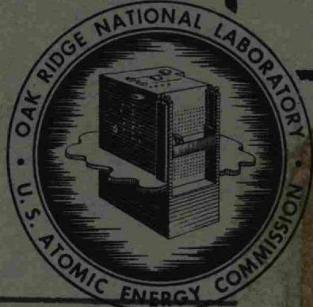

CLASSIFICATION CANCELLED

DATEUL 12 1979

$\therefore m = \frac{3}{11}$

DECLASSIFICATION OFFICER

OAK RIDGE NATIONAL LABORATORY

ANTHORITY DELEGATED BY LRDA 8-15-77

OAK RIDGE NATIONAL LABORATORY

OPERATED BY

CARBIDE AND CARBON CHEMICALS COMPANY

A DIVISION OF UNION CARBIDE AND CARBON CORPORATION

UCC

POST OFFICE BOX P

OAK RIDGE, TENNESSEE

NCI ID:10347

This document contains Restricted Data as defined in the Atomic Energy Act of 1946. Its transmission or the disclosure of its contents in any manner to an unauthorized person is prohibited.

SE

SECURITY INFORMATION

# ALLOY DEVELOPMENT PROJECT

# CHEMICAL METHODS FOR THE SEPARATION

# OF LITHIUM ISOTOPES

V. Dean Allred and Ivan B. Cutler (of the Catalytic Construction Company assisting the Oak Ridge National Laboratory under the terms of AEC Contract AT (40-1) 1520)

MATERIALS CHEMISTRY DIVISION

G. H. Clewett, Director

July 10, 1953

Date Issued

AUG 18 1953

OAK RIDGE NATIONAL LABORATORY

Operated by

CARBIDE AND CARBON CHEMICALS COMPANY

A DIVISION OF UNION CARBIDE AND CARBON CORPORATION

Oak Ridge, Tennessee

Contract No. W-7405-eng-26

# Internal Distribution

1. V. D. Allred   
2. T. A. Arehart   
3. M. D. Barringer   
4. G. M. Begun   
5. R. E. Blanco   
6. E. G. Bohlmann   
7. W. H. Brand   
8. F. R. Bruce   
9. W. L. Carter

10. C. E. Center   
11. G. H. Clewett   
12. F. L. Culler   
13. W. DeLany   
14. M. L. Drabkin   
15. J. S. Drury   
16. G. A. Eaton   
17. W. K. Eister   
18. L.B. Emlet   
19. D. E. Ferguson   
20. H. H. Garretson   
21. H. E. Goeller   
22. R. M. Healy   
23. W. B. Humes   
24. E. D. Innes   
25. H. K. Jackson   
26. A. C. Jealous   
27. W. N. Johnson   
28. K. O. Johnsson   
29. C. P. Johnston   
30. M. T. Kelley   
31. H. T. Kite

32. B. B. Klima   
33. W. B. Lanham   
34. L. Landau   
35. C. E. Larson   
36. D. A. Lee   
37. W. J. Lilley   
38. R. B. Lindauer   
39. A. C. Martinsen   
40. H. M. McLeod   
41. R. P. Milford   
42. D. J. Oriolo   
43. A. A. Palko   
44. F. S. Patton   
45. R. H. Powell   
46. G. A. Ropp   
47. A. D. Ryon   
48. A. C. Rutenberg   
49. J. Shacter   
50. G. A. Strasser   
51. J. W. Strohecker   
52. E. H. Taylor   
53. L. P. Twichell   
54. W. E. Unger   
55. A. M. Weinberg   
56. H. O. Weeren   
57. J. J. Williams   
58. C. E. Winters   
59. L. B. Yeatts   
63. Y-l2 Central Files   
64-67. X-10 Central Files   
68. ORNL-RC

# External Distribution

69-70. R. W. Cook, c/o A. J. Vander Weyden, AEC, Washington   
71. Brigadier General K. E. Fields, D.M.A., AEC, Washington   
72. Jane Hall, L.A.S.L., Los Alamos   
73. T. H. Johnson, AEC, Washington   
74-75. K. Kasschau, AEC, Oak Ridge   
76. J. H. Rushton, Illinois Institute of Technology, Chicago   
77. W. W. Weinrich, Catalytic Philadelphia, Pa.

RESTRICTED DATA

rnnnne nnnnne nnnnne nnnnne nnnnne nnnnne nnnnne nnnnne nnnnne nnnnne nnnnne nnnnne nnnnne nnnnne nnnnne nnnnne nnnnne nnnnne nnnnne nnnnne nnnnne nnnnne nnnnne nnnnne nnnnne nnnnne

unauthorized person is, 1d.

SECURITY INFORMATION

# PREFACE

This report has been prepared by personnel of the Catalytic Construction Company (Philadelphia, Pa.) under technical supervision of the Oak Ridge National Laboratory for ADP development under the terms of AEC Contract AT-(40-1)-1520. Many members of the ORNL staff and Catalytic Construction Company personnel in Oak Ridge have made contributions and aided in making corrections to the preliminary draft. Special acknowledgement should be given to G. M. Begun, R. E. Blanco, G. H. Clewett, J. S. Drury, H. H. Garretson, K. O. Johnsson, and D. J. Oriolo for their assistance.

# RESTRICTED DATA

This document contains restricted data as defined in the Atomic Energy Act of 1946. Its transmittal or the disclosure of its contents in any manner to an unauthorized person is prohibited.

# CONTENTS

PREFACE. 1

INTRODUCTION 1

# PART ONE. PROCESS CHEMISTRY

# I. CHEMICAL EQUILIBRIUM METHODS

A. Introduction. 6   
B. Exchange Equilibria 7   
C. Exchange Kinetics 14

# II. REFLUX PROCESSES

A. Introduction. 15   
B. The Dual Temperature Process. 16   
C. Chemical Reflux Processes

1. Waste End Reflex

a. Electrolytic Reflux 17   
b. Magnesium Amalgam Reflux. 21   
c. Potassium and Sodium Amalgam Reflux. 25

# 2. Product End Reflux

a. Decomposition Reflux. 30   
b. Hydrogen Chloride Reflux. 30   
c. Sodium and Potassium Chloride Refluxes 31

# III. SOLVENT AND FEED PURIFICATION

A. Solvent Purification. 33   
B. Feed Purification 34

# PART TWO. CHEMICAL AND PHYSICAL DATA

# I. INTRODUCTION

A. Arrangement of Data 37   
B. Contents 39

# II. LITHIUM AND LITHIUM COMPOUNDS

A.Lithium. 44

B.Lithium Chloride. 72   
C. Lithium Hydroxide 94

# III. MAGNESIUM AND MAGNESIUM COMPOUNDS

A．Magnesium 99   
B. Magnesium Chloride. 108

# IV. POTASSIUM AND POTASSIUM COMPOUNDS

A. Potassium 112   
B. Potassium Chloride. 117

# V. SODIUM AND SODIUM COMPOUNDS

A. Sodium 120   
B. Sodium Chloride 123   
C. Sodium Hydroxide. 126   
D. Sodium Phosphate. 127

# VI. LIQUID SOLVENTS

A. Ammonia 127   
B.Benzene 133   
C.Decane 137   
D.Dodecane. 142   
E. Ethylenediamine 142   
F. Ethylene Glycol 148   
G. 2-Ethyl Hexanol 150   
H. Isopropanol 151   
I．Methanol. 153   
J. Mercury 155   
K. Propylenediamine 158   
L.Tetrahydrofuran 161

REFERENCES 165

# RESTRICTED DATA

This document contains extracted data as defined in the Atomic Energy fact of 1946. The transmittal or the disclosure contents in any manner on an unauthorized person is prohibited.

SEC T

SECURITY INFORMATION

# FIGURES

1. Simplified Chemical Reflux System 3

2. Amalgam-Amine Dual Temperature System 4

3. Energies of Lithium Isotopes 9

4. The Effect of Temperature on the Separation Factor 10

5. Closed Reflux Systems 18

6. Effect of Temperature on Decomposition of Lithium Amalgam in Water 22

7. Vapor Pressure of Metals. 45

8. Viscosity of Liquid Alkali Metals 46

9. Density of Lithium Amalgam. 48

10. Density of Lithium and Magnesium Amalgams 49

11. Viscosity of Lithium Amalgams 50

12. Conductivity of Amalgams 51

13. Surface Tension of Amalgams 52

14. Lithium-Mercury Phase Diagram 53

15. Solubility of Metals in Mercury 54

16. Solubility of Alkali Metals and Salts in Selected Solvents 55

17. Lithium-Potassium Phase Diagram 57

18.Lithium-Sodium Phase Diagram. 57

19.Lithium-Potassium-Mercury Solubility Curve. 58

20.Lithium-Sodium-Mercury Solubility Curve 59

21. Effect of Temperature on the Separation Factor. 63

22. Separation Factor as a Function of Temperature. 64

23. Effect of Temperature on the Separation Factor. 66

24. Effect of Temperature on the Separation Factor. 67

25. Effect of Temperature on the Separation Factor. 68

26. The Kinetics of Sodium Chloride Inversion 71

27. Viscosity of Anhydrous Ethylenediamine. 74

28. Solubility of Lithium Chloride in Propylenediamine and Ethylenediamine. 75

29. Solubility Curves for Salts in Anhydrous Ethylenediamine 76

30. Phase Diagram for Lithium Chloride-Ethylenediamine System. 77

31. Density of Lithium Chloride Propylenediamine Solutions 79

32. Density Nomograph: Lithium Chloride-Propylenediamine Solutions. 80

33. Viscosity of Lithium Chloride- Propylenediamine Solutions 81

34. Viscosity of Lithium Chloride-Propylenediamine Solutions 82   
35. Integral Heat of Solution of Lithium Chloride in Propylenediamine at Room Temperature. 83   
36. Vapor Pressure of Propylenediamine and Lithium Chloride Propylenediamine Solutions. 84   
37. Lithium Chloride - Water Phase Diagram 85   
38. Phase Diagram: Lithium Chloride - Magnesium Chloride - Propylenediamine. 87   
39. Solubility of Magnesium Chloride in Lithium Chloride - Propylenediamine Solutions. 88   
40. Solubility of Sodium Chloride in Lithium Chloride - Propylenediamine Solutions 90   
41. Lithium Chloride - Propylenediamine - Water Phase Diagram 91   
42. Effect of Temperature on the Magnesium Reflux Reaction Rate. 93   
43. Percent Conversion of Potassium to Lithium Amalgam. 95   
44. Effect of Temperature on Conversion of Potassium Amalgam to Lithium Amalgam 96   
45. Equilibrium Concentration of Lithium Amalgam for Close Cycle Reflux at $100^{\circ}\mathrm{C}$ 97   
46. Percent Conversion of Sodium Amalgam to Lithium Amalgam 98   
47. Phase Diagram for Lithium Hydroxide - Water. 100   
48. Solubility of Lithium Hydroxide in Water 101   
49. Densities of Water Solutions of Lithium Hydroxide. 102   
50. Densities of Water Solutions of Lithium Hydroxide. 103   
51. Density of Magnesium Amalgams. 105   
52. Viscosity of Magnesium Amalgams. 106   
53. Magnesium - Mercury Phase Diagram. 107   
54. Vapor Pressure in Atmospheres of Magnesium Chloride - Ammonia Compounds 110   
55. Solubility of Magnesium Chloride - Tri-Propylenediamine in Methanol 113   
56. Solubility of Magnesium Chloride Hexammonia in Methanol 114   
57. Effect of Propylenediamine in Solution on Propylenediamine in Magnesium Chloride Hexammonia Precipitate 115   
58. Potassium Mercury Phase Diagram. 118   
59. Potassium - Sodium Phase Diagram 119   
60. Sodium - Mercury Phase Diagram 122   
61. Solubility of Sodium Chloride in Ethylenediamine. 124

62. Solubility of Sodium Chloride in Propylenediamine 125   
63. Sodium Hydroxide Phase Diagram 128   
64. Miscibility of the System Ethylenediamine - Sodium Hydroxide - Water 129   
65. Miscibility of the System Propylenediamine - Sodium Hydroxide - Water 130   
66. Solubility of Tri Sodium Phosphate in Water. 131   
67. Solubility of Ammonia in Methanol. 134   
68. Densities of Ammonia Solutions in Methanol 135   
69．Vapor Pressure of Benzene. 136   
70. Phase Diagram: Benzene - Ethylenediamine. 138   
71．Vapor-Liquid Composition Diagram Ethylene-diamine-Benzene 139   
72. Propylenediamine - Benzene Phase Diagram 140   
73. Vapor-Liquid Equilibrium Composition Diagram Propylenediamine - Benzene 141   
74. Decane - Propylenediamine Vapor-Liquid Composition Diagram 143   
75．Vapor Pressure of Anhydrous Ethylenediamine. 145   
76. Density Curves 146   
77. Surface Tension for Anhydrous Ethylenediamine. 147   
78.Boiling Point Composition Curve for System Ethylenediamine -Water. 149   
79. 2-Ethylhexanol - Propylenediamine Vapor-Liquid Composition Diagram 152   
80. Phase Diagram: Isopropanol - Water System 154   
81. Phase Diagram: Methanol - Propylenediamine. 156   
82．Methanol-Water Phase Diagram 156   
83. Methanol - Propylenediamine Composition Diagram. 157   
84. Viscosity of Mercury 159   
85. Density of Propylenediamine. 160   
86. Propylenediamine - Water Phase Diagram 162   
87. Vapor-Liquid Composition Diagrams for Water - Propylenediamine 163

# RESTRICTED DATA

This document contains restricted data as defined in the Atomic Energy Act of 1946. Its transmittal or the disclosure of its contents in any manner to an unauthorized person is prohibited.

# INTRODUCTION

By the first part of 1953, the program for the separation of lithium isotopes by chemical methods had expanded and matured to such a point that it was believed an interim report condensing the chemistry under one cover would be advantageous. Consequently, under the direction of the project director, G. H. Clewett, the task of compiling this report was undertaken with the following original objectives:

(1) Organize all chemical and physical data under one cover.   
(2) Make data readily available with logical presentation, visual representation, and cross indexing.   
(3) Evaluate data to give clear understanding and stimulate research activity.

Although these objectives were not attained in their entirety, they guided the assembly of this material.

This report is divided into two parts. The first part is an evaluation of the data pointed toward an understanding of some of the current problems. It is expected that this section will rapidly become out of date as a better understanding of underlying principles is obtained. The second part contains physical and chemical data that should be of more lasting value to those who continue development of separation processes for lithium isotopes. The data presented are largely those available from classified information available as weekly, biweekly, monthly, quarterly, etc., reports from the divisions of the Oak Ridge National Laboratory. In addition, several excellent topical reports and handbooks issued by this laboratory have been drawn upon heavily.

The ideas and methods utilized in the correlation and evaluation of the data are not original with the authors. The ideas of many of the chemists and engineers associated with the project have been used freely. Special acknowledgement should be given to the chemists in the Materials Chemistry and Chemical Technology Divisions.

To the uninitiated, it may be well to illustrate briefly the main features of a chemical system for the separation of isotopes employing chemical reflux. It may be seen in Figure 1 that the heart of the process is an isotopic exchange and enrichment section which in most instances is a column in which lithium amalgam flows countercurrent to a lithium salt dissolved in a suitable solvent. Next in importance are two reflux sections which remove the lithium from the phase flowing from the column and insert it into the phase flowing to the column. A certain number of auxiliary processes, of course, are necessary for continuous operation. The product in the separation of lithium isotopes is enriched in lithium six (Li $^6$ ) and the waste is enriched in lithium seven (Li $^7$ ).

Experimental data from all of the systems investigated for the chemical separation of lithium isotope have shown the separation factor to be a marked function of temperature. For this reason it is possible to consider a unique method of achieving reflux known as the dual temperature process. A simplified sketch of a dual temperature system for the separation of lithium isotopes is presented in Figure 2. This process has maximum utility when it is possible to operate an exchange system between two widely separated temperatures. The theory of the dual temperature process is not given in this report but may be found in the work of Spivack (114), Eidinoff (115), and Demarcus (116).

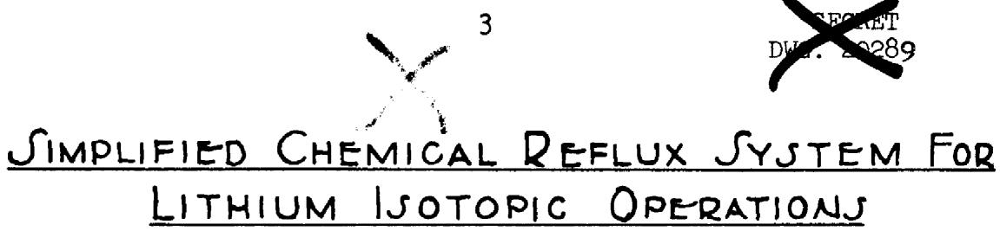  
FIGURE 1

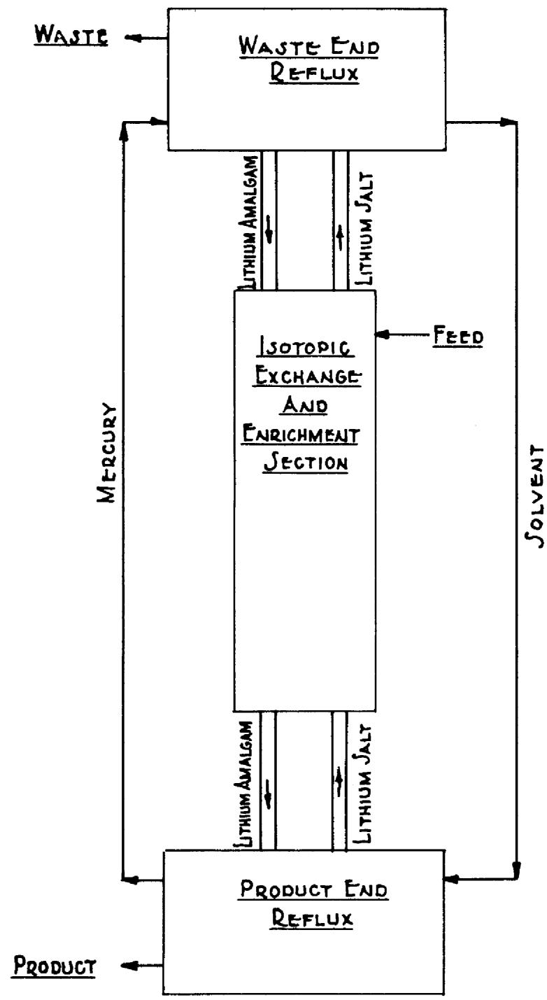

# SIMPLIFIED DUAL TEMPERATURE PROCESS FOR

# LITHIUM ISOTOPE SEPARATION

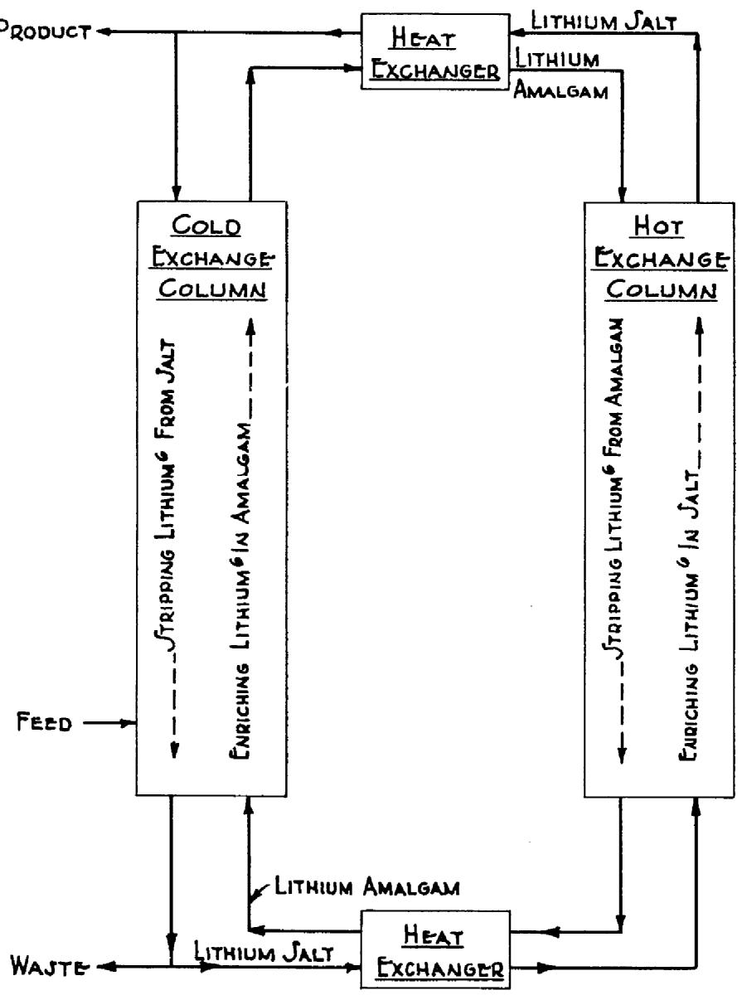

# PART ONE

# PROCESS CHEMISTRY

# I: CHEMICAL EQUILIBRIUM METHODS

# A. INTRODUCTION

Theoretically, the energy requirements for the separation of isotopes of the same element need not be any larger than that needed to overcome the entropy of mixing of the isotopes provided a thermodynamically reversible system is employed. In addition to being slow at times, thermodynamically reversible processes are difficult to obtain; however, it is desirable from an economic point of view to approach these ideal conditions within engineering limits. Processes carried out at chemical equilibrium offer this opportunity.

The separation of isotopes by chemical equilibrium methods is possible with two phase systems such as a gas and a liquid, two immiscible liquids, a liquid and a solid, or a gas and a solid. Since compounds of lithium which remain gaseous at room temperature are unknown, the separation of lithium isotopes by chemical methods has been limited to liquid-liquid and liquid-solid systems. At present, all of the systems which have plant production feasibility are liquid-liquid systems in which one of the liquids is lithium amalgam. If lithium isotopic separation could be extended to a gaseous-liquid system by discovery of a volatile lithium compound, perhaps some improvements over present systems could be realized.

Separation of lithium isotopes in a system of lithium amalgam in contact with lithium chloride dissolved in ethyl alcohol was described by Lewis and MacDonald (110) in 1936. This important contribution indicated that isotopic exchange took place with astonishing rapidity, that the separation factor $(\alpha)$ per stage was at least 1.025, and that the heavier isotope was found preferentially in the alcohol phase indicating that chemical bonding of lithium in the solvent was stronger than it was in the amalgam.

The separation factor, $\alpha$ , may be defined by the equation

$$
\alpha = \frac {\left(\mathrm {L i} ^ {6} / \mathrm {L i} ^ {7}\right)}{\left(\mathrm {L i} ^ {6} / \mathrm {L i} ^ {7}\right)} - \text {a m a l g a m}
$$

where the ratios shown are atomic ratios.

Systems involving lithium amalgam in contact with lithium hydroxide in aqueous solution have been reported in the literature (lll) but confusion as to whether the separation factors were due to equilibrium or to kinetic effects developed because potentials were applied to these systems to prevent lithium depletion through decomposition of the amalgams. The isotopic separation systems for lithium under current investigation may be classified according to the stability of lithium amalgam in contact with an organic or aqueous solution. Reactive solvents such as water and various alcohols decompose lithium amalgam to form lithium hydroxide or lithium alcoholate and hydrogen gas. These solvents depend on a slow rate of amalgam decomposition for their usefulness. Much more research and development has been applied to aqueous solution of lithium hydroxide in contact with lithium amalgam than any other reactive system. Stable solvent systems employ lithium chloride dissolved in amines or unreactive ethers in contact with lithium amalgam. In this latter class of solvents, propylenediamine (1,2, diamine propane) has received the most attention.

# B. EXCHANGE EQUILIBRIA

The reasons for expecting separation factors for systems at chemical equilibrium are due to the difference in chemical properties of isotopes of the same element. These differences are accentuated with isotopes of elements of low atomic weight; consequently, chemical methods of separation have proved to be the most efficient methods available for separating isotopes of hydrogen, nitrogen, carbon, boron, etc.

One method of representing the chemical separation of lithium isotopes is illustrated in Figure 3. The heavier isotope is found preferentially in the organic or water phase indicating that the chemical stability of the lithium in this phase is higher than the stability of the lithium in the amalgam phase. Since chemical stability is associated with low free energy content, lithium in the propylene-diamine phase, for example, is at a lower free energy level

than lithium in the amalgam phase. For the energy changes indicated in Figure 3, we have

$$
\mathrm {L i} ^ {7} (\text {a m a l g a m}) \rightarrow \left(\mathrm {L i} ^ {7}\right) ^ {+} (\mathrm {P D A}) + \mathrm {e}, \Delta \mathrm {F} ^ {\mathrm {O}} = - \mathrm {A} \tag {1}
$$

$$
\mathrm {L i} ^ {6} (\text {a m a l g a m}) \rightarrow \left(\mathrm {L i} ^ {6}\right) ^ {+} (\mathrm {P D A}) + e, \Delta F ^ {0} = - B \tag {2}
$$

where $|A|$ is larger than $|B|$ , but $-A$ is smaller than $-B$ . Subtracting equation (2) from (1),

$$
\mathrm {L i} ^ {7} (\text {a m a l g a m}) + \left(\mathrm {L i} ^ {6}\right) ^ {+} (\mathrm {P D A}) \rightarrow \mathrm {L i} ^ {6} (\text {a m a l g a m}) + \left(\mathrm {L i} ^ {7}\right) ^ {+} (\mathrm {P D A}) \tag {3}
$$

$$
\Delta \mathbf {F} ^ {\mathrm {O}} = - \mathbf {A} + \mathbf {B} = - \mathbf {C} \tag {4}
$$

Since our illustration is greatly exaggerated, $-C$ does not represent a very large free energy change ( $\Delta F^0 \cong -31$ cal. at $25^\circ C$ for the system in question).

The separation factor $(\alpha)$ and equilibrium constant for equation (3) are identical since $\alpha$ is defined as the $\mathbf{Li}^6 / \mathbf{Li}^7$ ratio in the amalgam phase divided by the $\mathbf{Li}^6 / \mathbf{Li}^7$ ratio is the amine phase. The dependence of $\alpha$ on temperature may be given by the equations

$$
\log_ {e} \alpha = \frac {- \Delta F ^ {O}}{R T} = \frac {\Delta H ^ {O}}{R T} + \frac {\Delta S ^ {O}}{R} \tag {5}
$$

and

$$
\alpha - 1 \cong - \frac {\Delta H ^ {O}}{R T} + \frac {\Delta S ^ {O}}{R} \tag {6}
$$

where $\Delta H^0$ and $\Delta S^0$ are assumed to be independent of temperature over small temperature changes. The binomial approximation that $\alpha - 1$ is equal to $\log_{e} \alpha$ contains an error of less than $3\%$ up to $\alpha = 1.06$ . The assumption that $\Delta H^0$ and $\Delta S^0$ are independent of temperature over the range of temperature in which isotopic separation factors have been measured (0 - $100^{0}\mathrm{C}$ ) appears to be as accurate as the analytical methods available for the determination of isotopic abundance. Other ideas concerning the dependence of separation factors on temperature have been given by Begun, Drury and Palko (111).

The temperature dependence of the separation factor for three systems having approximately the same degree of chemical stability is shown in Figure 4. The agreement with theory is within the accuracy of the data. Furthermore, it

9

  
FIGURE 3

ENERGIES OF LITHIUM ISOTOPES

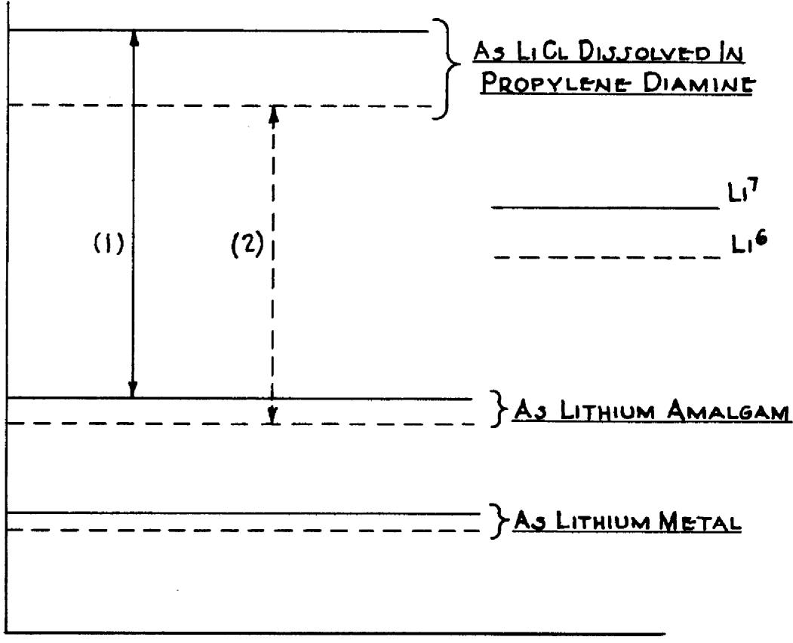  
ENERGY

THE EFFECT OF TEMPERATURE ON THE JEPARATION FACTOR  
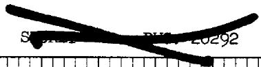  
G.M. Begun, J.J.Dzury, A.L.Palko, R.EF 34, 36, 42

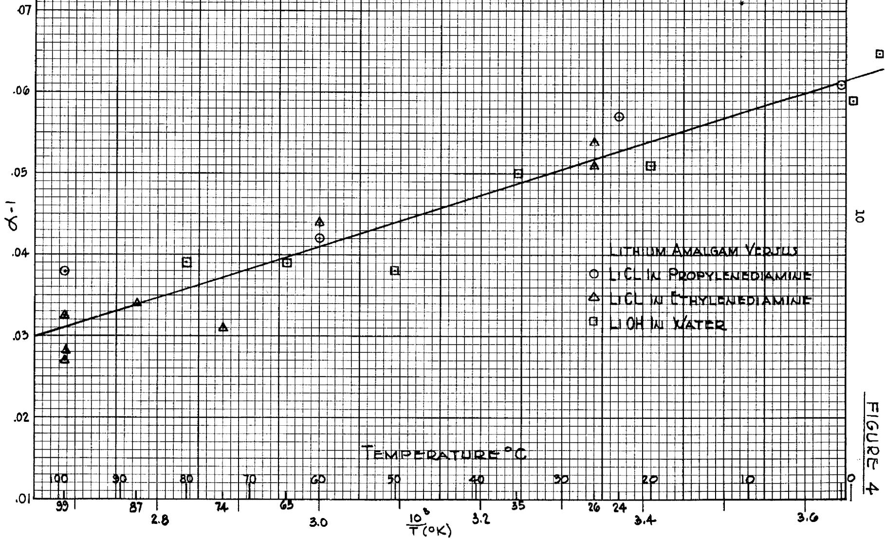

should be noted that one of the systems investigated was an aqueous solution of lithium hydroxide in contact with amalgam in which a variable holding current was necessary, yet the agreement with the other systems indicates the rate of electrolysis and decomposition has little or no effect on the separation factor.

Not all solvents for lithium salts in contact with lithium amalgams yield similar results to those shown in Figure 4. Table 1 illustrates the results obtained with solvent of markedly different properties. Evidently, both the salt and the solvent determine the separation factor obtained in contact with lithium amalgam. This is explainable on the basis that different solvents have varying affinities for lithium ions and that different salts dissociate in varying degrees to produce lithium ions.

Table 1   
Separation Factors* for Solvent Systems in Contact with Lithium Amalgam**   

<table><tr><td rowspan="2">Salt</td><td colspan="3">Solvent</td></tr><tr><td>Dimethyl- cellosolve</td><td>Tetra- hydrofuran</td><td>Propylene diamine</td></tr><tr><td>Lithium chloride</td><td>1.023 ± 0.013</td><td>1.036 ± 0.006</td><td>1.057 ± 0.021</td></tr><tr><td>Lithium benzophenone</td><td>1.056 ± 0.008</td><td>1.045 ± 0.008</td><td>1.055 ± 0.016</td></tr><tr><td>Lithium benzophenone anil</td><td>1.037 ± 0.008</td><td>1.046 ± 0.012</td><td>1.047 ± 0.012</td></tr></table>

* Precision given for 95% confidence interval.   
** Data by G. M. Begun, ref. 40.

In a liquid-liquid method for chemical separation of lithium isotopes, one of the difficulties encountered in the development of economical systems is the limited number of solvents for lithium salts and lithium metal that are available. Three factors limit the selection of an organic solvent; limited solubility of lithium salts, rapid reactivity of some solvents toward lithium amalgam, and emulsifying characteristics of some organic solvents toward lithium amalgam. The emulsification of amalgams has received very little attention. Probably very few of the amalgam "emulsions" described as such are true emulsions, but appear to be insoluble reaction products containing chemically bonded or physically adsorbed mercury.

Solvents for ionic salts as a rule have large dielectric constants which are a measure of their ion separating and isolating power. Other effects, however, appear to be more important in the case of lithium chloride solubility. Ethylenediamine which has a rather low dielectric constant of 12.9 compared to 81.7 for water shows low solubility for sodium and potassium chlorides, but high solubility for lithium chloride. It is expected that propylenediamine would have an even lower dielectric constant for it shows only one-tenth the solubility for sodium and potassium chloride, yet lithium chloride is four times as soluble in propylenediamine than in ethylenediamine.

The logical conclusion to these results is that a specific interaction exists between lithium and some solvents. At least part, if not all, of this specific interaction effect is the result of the coordination demanded by lithium ion. With a coordination number of four, two ethylenediamine or two propylenediamine molecules could be tightly bound to a lithium ion. Because of steric effects due to the methyl group, propylenediamine probably has a greater chance of accomplishing the desired coordination.

The cyclic ether series gives even stronger indication of this coordinating effect. Six membered rings are apparently too large and any additional groups on a five membered ring (tetrahydrofuran) also presents a molecule too large for four-coordination. Tetrahydrofuran itself is the borderline size for four-coordination as indicated by the inverse solubility of lithium chloride with temperature. Table 2 illustrates these conclusions.

Table 2   
Specific Interaction Effects of Selected Solvents I   

<table><tr><td rowspan="2">Solvent</td><td rowspan="2">Dielectric Constant</td><td colspan="2">Solubility</td><td colspan="4">in moles/liter at 25°C</td></tr><tr><td colspan="2">LiCl</td><td colspan="2">NaCl</td><td colspan="2">KCl</td></tr><tr><td>Ethylenediamine</td><td>12.9 (25°C) (17)</td><td>0.27</td><td>(48)</td><td>0.045</td><td>(11)</td><td>0.0017</td><td>(11)</td></tr><tr><td>Propylenediamine</td><td>12.9</td><td>1.0</td><td>(47)</td><td>0.0048</td><td>(60)</td><td>0.0001</td><td>(43)</td></tr><tr><td>Water</td><td>81.7 (18°C) (17)</td><td>14.0</td><td>(56)</td><td>5.43</td><td>(4)</td><td>4.13</td><td>(4)</td></tr></table>

Specific Interaction Effects of Selected Solvents II (105)   

<table><tr><td>Solvent</td><td>Structure</td><td>Solubility of LiCl (moles/liter at 25°C)</td></tr><tr><td>Propylene oxide</td><td>CH3-CH-CH2</td><td>0.22</td></tr><tr><td>Trimethylene oxide</td><td>CH2CH2CH2</td><td>6.0</td></tr><tr><td>Tetrahydrofuran</td><td>CH2-CH2CH2CH2</td><td>0.78</td></tr><tr><td>2-Methyltetrahydrofuran</td><td>CH2-CH2CH3-CH2CH2</td><td>0.07</td></tr><tr><td>Tetrahydropyran</td><td>CH2CH2CH2CH2CH2CH2</td><td>0.08</td></tr></table>

Mercury as a solvent for lithium metal has many advantages and disadvantages for a liquid-liquid system. Unfortunately, there are no alternate solvents for lithium metal that remain liquid down to room temperature that have been brought to the attention of the research groups.

# C. EXCHANGE KINETICS

One property of alkali metal amalgams which deserves particular attention is their high surface activity since it may account, at least in part, for the rapid exchange of isotopes. The application of Gibbs adsorption thermodynamics to data obtained by Convers (26) and by Johnston and Ubbelohde (112) indicates adsorption (surface excess) of alkali metals at amalgam surfaces. Qualitatively, amalgams have been observed to disperse much more readily in propylenediamine than mercury indicating the amalgam interface has lower interfacial tension than the mercury interface. The lowering of surface or interfacial tension upon the addition of another component to a system is the result of adsorption of the added component at the interface.

The limitations of analytical techniques for isotopes and the extremely rapid exchange reaction (even at room temperature) have made the direct observation of reaction kinetics very difficult.

It is quite possible that with a rapid continuous method of isotopic analysis, such as the neutron adsorption technique, a system could be devised which would prove satisfactory for such an investigation.

Theoretical stage heights obtained from operation of isotopic exchange columns reflect the kinetics of the exchange reaction. If the reaction is diffusion controlled, the following factors appear to be important to the amalgam phase or solvent phase which ever is rate controlling: (1) agitation, (2) concentration, (3) viscosity, and (4) temperature. Of these factors, agitation is the most important since better agitation would produce larger interfacial areas as well as thinner diffusion films. If the adsorption of lithium of the amalgam interface produces a rigid film, the rate of formation of fresh surfaces may be

a rate controlling step. Temperature has only a slight effect on diffusion controlled reactions.

If diffusion is not the rate controlling step in the isotopic exchange reaction, the following factors appear to be important: (1) interfacial area and (2) temperature. An increase in interfacial area or temperature should increase the rate of the reaction and decrease the stage height; however, these two factors are difficult to vary independent of each other in the system employing propylene-diamine because interfacial tension increases with increased temperatures resulting in poorer dispersions and lower interfacial areas. If the rate of the exchange reaction shows first order dependence on the lithium concentration in the amalgam (similar to the waste end reaction), then the stage height should be independent of lithium concentration in the amalgam.

# II: REFLUX PROCESSES

# A. INTRODUCTION

A major consideration in large scale isotopic separation by equilibrium exchange is the reflux process. Refluxes may be achieved by either physical or chemical processes and many alternate schemes are possible.

No attempt will be made in this report to differentiate between reflux methods with regard to economics and with the exception of the dual temperature system discussion will be limited to chemical reflux processes. Further, only those schemes which appeared to have engineering adaptation to existing systems have been considered.

The degree and rate at which the inversion (refluxes) are attained are prime considerations in evaluating the reflux processes since the systems involved require recycling of solvents.

The degree of inversion or removal of enriched lithium from the amalgam phase (product reflux) is important in that this material not only represents a valuable product but also either its loss or its cycling to the waste end would greatly

affect the cascade equilibrium. On the waste end the last traces of lithium must be removed prior to cycling the solvent stream to the product end for even small amounts of material are capable of reducing the enrichment to a point where the desired product could not be attained.

The rate at which the reflux processes proceed is equally important. It must be very rapid not only to yield the desired degree of inversion, but also to prevent a large holdup of material which would greatly influence the length of time required to reach isotopic steady state conditions.

# B. THE DUAL TEMPERATURE PROCESS

The dual temperature process is applicable to any of chemical isotopic exchange system employing nonreactive substances and in which the separation factor is a function of temperature. It may be seen from Figure 4 that the separation factor in several lithium systems is a function of temperature.

The operability of the dual temperature process has been demonstrated by the Materials Chemistry Division (See ORNL reports 1238, 1306, 1401, YB 35-12, and ORNL CF 53-4-299). The extremely rapid isotopic exchange noted in the laboratory was confirmed by pilot plant data. Both ethylenediamine and propylenediamine were utilized as solvents for lithium chloride in contact with lithium amalgam. Propylenediamine appears to have the widest useful temperature range of from room temperature to $100^{\circ}\mathrm{C}$ ; however, the stability of propylenediamine above $100^{\circ}\mathrm{C}$ in the presence of an alkali amalgam has not been well established.

A schematic representation of the dual temperature process is shown in Figure 2. Since the effective separation factor for a dual temperature system is dependent upon the difference between the factors in the hot and cold columns and is generally less than either one, many more stages are required for this method than for a chemical reflux system (to effect the same overall separation).

# C. CHEMICAL REFLUX PROCESSES

Although chemical reflux schemes are classified in this report according to which end of the isotopic exchange system they are applicable, this is not entirely satisfactory since many of the waste end refluxes can be tied together into desirable overall processes. Two such processes are illustrated in Figure 5 to indicate how reflux at one end may supplement reflux at the other end.

# 1. Waste End Reflex

# a. Electrolytic Reflux

Four reactions have been considered for the electrolysis of lithium salts to form lithium amalgam: aqueous electrolysis of lithium hydroxide with a mercury cathode, aqueous electrolysis of lithium chloride with a mercury cathode, electrolysis of an organic solution of lithium chloride, and electrolysis of fused salts with a liquid lithium product from the cathode. These may be illustrated in the following equations:

$$
2 \mathrm {L i O H} _ {\mathrm {a q}} + (\text {p o t e n t i a l}) \rightarrow 2 \mathrm {L i} (\mathrm {H g}) + 1 / 2 \mathrm {O} _ {2} \text {g a s} + \mathrm {H} _ {2} \mathrm {O} \tag {7}
$$

$$
\mathrm {L i C l} _ {\mathrm {a q}} + (\text {p o t e n t i a l}) \rightarrow \mathrm {L i} (\mathrm {H g}) + 1 / 2 \mathrm {C l} _ {2} \text {g a s} \tag {8}
$$

$$
\mathrm {L i C l} _ {\text {o r g}} + \mathrm {N a} (\mathrm {H g}) + (\text {p o t e n t i a l}) \rightarrow \mathrm {L i} (\mathrm {H g}) + \mathrm {N a C l} _ {(\text {i n s o l u b l e})} (9)
$$

$$
\operatorname {L i C l} (\text {f u s e d s a l t w i t h K C l}) + (\text {p o t e n t i a l}) \rightarrow \operatorname {L i} (\text {m e t a l}) + 1 / 2 \operatorname {C l} _ {2} (1 0)
$$

Industrial equipment and methods are available for the processes utilizing reactions (7), (8), and (10). Current efficiencies of $90\%$ or higher have been reported for such installations. Reaction (9) which has a mercury cathode and a sodium amalgam anode would require an extensive cell development program for successful application as a plant reflux method.

Under completely thermodynamically reversible conditions reactions (7) and (8) would be impossible as only hydrogen would be produced at the cathode. Under actual operating conditions hydrogen ion develops an over-potential which prevents the electrolysis of water. Certain impurities in the electrolysis systems catalyze the formation of hydrogen by lowering the over-voltage. Possibilities of minimizing this

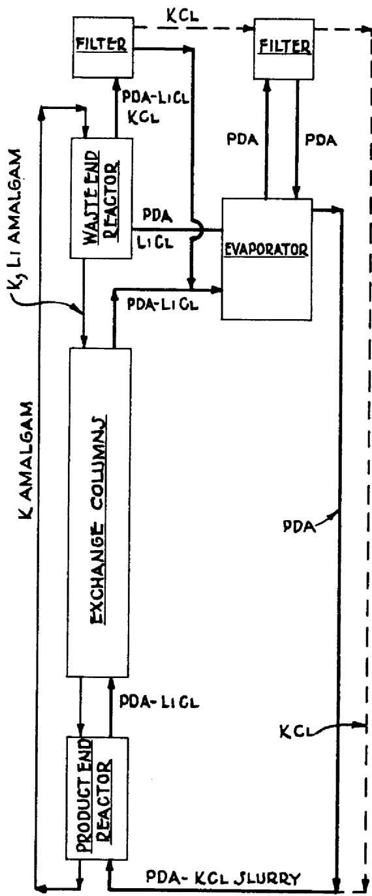  
POTASSIUM CLOSED   
REFLUX SYSTEM

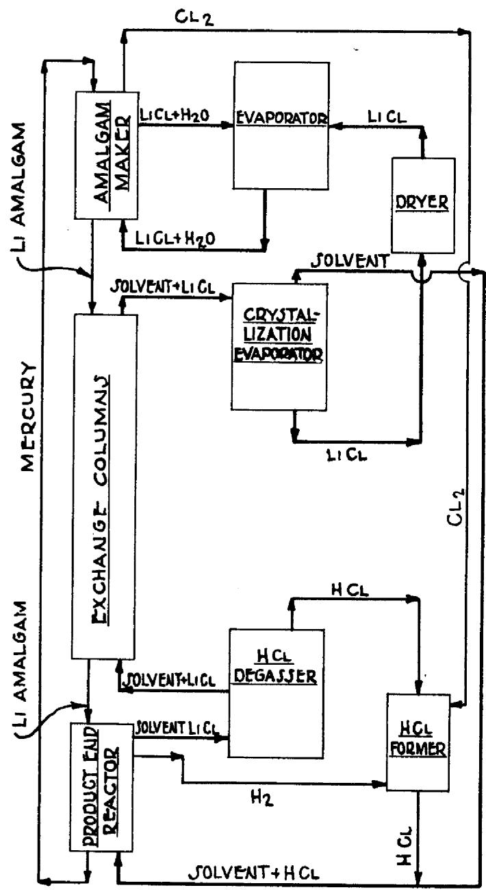  
ELECTROLYTIC CLOSED   
REFLUX SYSTEM

important side reaction are: (1) purification of cell feed, (2) addition of inhibiting agents that complex the catalyzing impurities, and (3) removal of oxygen and other depolarizing agents.

Reactions (8) and (10) if applied to organic systems require the desolvation of the lithium chloride. This is no problem with tetrahydrofuran or isopropanol according to preliminary scanning experiments (see Part II - Lithium Chloride-Isopropanol and Lithium Chloride - Tetrahydrofuran); however, with ethylenediamine and propylenediamine the problem becomes significant. At the time of the writing of this report, a research program was well under way for the determination of vapor pressures of lithium chloride solvates with propylenediamine. Preliminary scanning experiments have demonstrated the engineering applicability of several methods of thermal decomposition to this material with success.

Reaction rates for systems involving electrolysis are not generally defined in the same sense as those of the usual chemical reaction. The kinetics are usually studied from the single electrode standpoint*. They are complicated for the usual type of rate study in that there are an increased number of variables not strictly chemical in nature which may be rate controlling or else have an effect on the rate controlling step. Further, electrolytic reactions often have complicating side or decomposition reactions which proceed spontaneously.

From a viewpoint that the applied potential only overcomes the driving force (free energy) tending to keep the reactants in their present low energy state it is possible, at least qualitatively, to look at electrolytic reactions as though they were only simple chemical reactions with an additional energy term involved. One such method of looking at the rate process for an electrolytic reaction is as follows. The equation:

$$
\left(\mathrm {E}\right) + 2 \mathrm {L i O H} + (\mathrm {H g}) \xrightarrow {\mathrm {k} ^ {\prime}} 2 \mathrm {L i} (\mathrm {H g}) + \mathrm {H} _ {2} \mathrm {O} + 1 / 2 \mathrm {O} _ {2}
$$

represents a process that produces liquid lithium amalgam Li(Hg). The rate of formation of amalgam may be represented by:

$$
d \frac {[ L i (H g) ]}{d t} = k ^ {\prime} f [ (E), L i O H, L i (H g), O _ {2}, T ] \tag {11}
$$

where the items inside the brackets are variables which are probably involved in the rate. The effects of these variables have not been elucidated at this time. However, for a given cell operating under steady state conditions the reaction can be represented by the equation:

$$
d \frac {[ L i (H g) ]}{d t} = k ^ {\prime} f (E) \tag {12}
$$

where $\mathbf{k}'$ is not a true rate constant but is dependent upon operation at steady state condition with fixed current density, temperature, concentrations, etc.

For the case under consideration the most important side reaction is decomposition which proceeds as follows:

$$
\mathrm {L i} (\mathrm {H g}) + \mathrm {H} _ {2} \mathrm {O} \xrightarrow {\mathrm {k} _ {2}} [ \mathrm {L i O H} ] \mathrm {a q} + 1 / 2 \mathrm {H} _ {2} (\text {g a s}) + \mathrm {H g}
$$

The rate of disappearance of amalgam is given by the equation:

$$
- d \frac {\left[ L i (H g) \right]}{d t} = k _ {2} f \left\{\left[ L i (H g) \right], L i O H, S, T \right\} \tag {13}
$$

where 'S' is the interfacial surface area between phases, 'T' the temperature: $\left[\mathrm{Li}(\mathrm{Hg})\right]$ the amalgam concentration, and LiOH the hydroxide concentration. These variables are known to effect the rate 29,30. In addition, this reaction rate may be greatly affected by the catalytic action of certain impurities which have low hydrogen over-voltages. For example, the presence of oxygen is considered to greatly accelerate the decomposition rate. Other variables not well defined, such as, rate of agitation are incorporated into the rate constant $\mathbf{k}_2$ by operating under fixed condition.

The function, $f[\mathrm{Li}(\mathrm{Hg})]$ , has been shown to depend upon the one-half power of the amalgam concentration 29,30,108. For constant conditions of lithium hydroxide concentration, interfacial area, and temperature, equation 13 becomes:

$$
- d \frac {\left[ L i (H g) \right]}{d t} = k _ {2} ^ {\prime} \left[ L i (H g) \right] ^ {1 / 2} \tag {14}
$$

or

$$
\mathbf {k} ^ {\prime} = \frac {\left[ \mathrm {L i} (\mathrm {H g}) \right] _ {\mathrm {o}} ^ {1 / 2} - \left[ \mathrm {L i} (\mathrm {H g}) \right] _ {\mathrm {f}} ^ {1 / 2}}{\mathrm {t}} \tag {15}
$$

The effect of hydroxide concentration has not been clearly established, but available data tends to show that the rate constant decreases in direct proportion to the increase in hydroxide concentration 29. The pronounced effect of temperature is shown by Figure 6. The effect of the interfacial area per unit of amalgam volume upon the rate apparently is directly proportional (1st order), but methods of completely elucidating the actual area of the surface involved have not been devised at this time.

By combining the electrolytic rate (equation 12) and the decomposition rate (equation 14), one obtains an expression for the net rate of amalgam formation for steady state conditions as follows:

$$
d \frac {\left[ L i (H g) \right]}{d t} = k _ {1} ^ {\prime} f (E) - k _ {2} ^ {\prime} \left[ L i (H g) \right] ^ {1 / 2} \tag {16}
$$

Equation 16 qualitatively defines the kinetics of the "Elex" process. For example, if $\mathbf{k}_1' \cdot f(\mathbf{E})$ is greater than $\mathbf{k}_2' \cdot [\mathrm{Li}(\mathrm{Hg})]^{1/2}$ , the reaction rate is positive and lithium is transferred from the aqueous to the amalgam phase. This corresponds to the waste end reflux. When the two terms are equal the rate is zero, and no net lithium transfer takes place; however, the exchange reaction between isotopes proceeds uninhibited. This corresponds to conditions maintained in the exchange section. Finally, when $\mathbf{k}_1' \cdot f(\mathbf{E})$ is less than $\mathbf{k}_2' \cdot [\mathrm{Li}(\mathrm{Hg})]^{1/2}$ the rate is negative and net decomposition of the amalgam occurs to provide a product end reflux.

Similar treatment could be extended to the reactions represented by equations 8-10; however, little is to be gained by such a generalized development. It is important, however, to recognize that these electrolytic refluxes are complex and that the presence of traces of impurity can greatly alter the rates especially by influencing the decomposition reactions.

# b. Magnesium Amalgam Reflux

Magnesium amalgam as a reflux agent is of importance in systems using the amine solutions of lithium chloride. The details of the reaction,

$$
M g a m a l g a m + 2 L i C l (P D A s o l ^ {\prime} n) \rightarrow L i a m a l g a m + M g C l _ {2} \cdot 3 P D A \tag {17}
$$

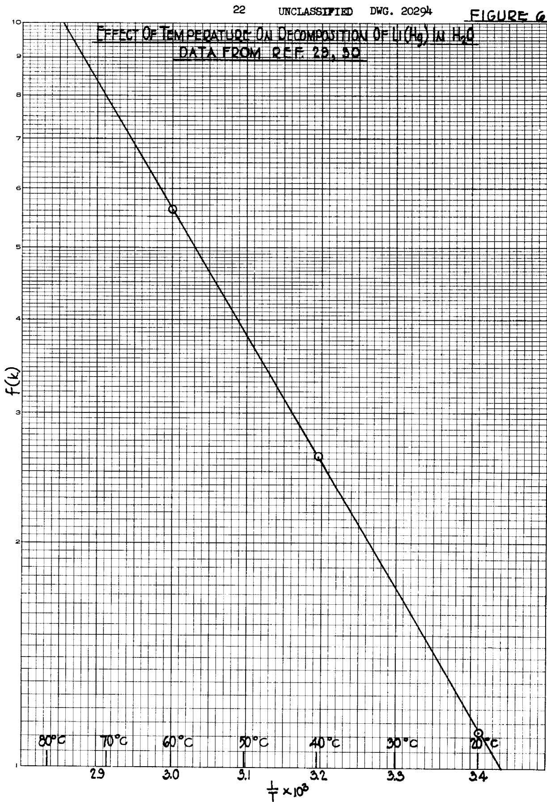

have been worked out for propylenediamine solutions, but they should apply equally as well to ethylenediamine solutions. Reaction (17) proceeds very near completion because of the high stability and insolubility of the magnesium chloride solvate with propylenediamine. However, the equilibrium ratio of lithium to magnesium in the amalgam as a function of temperature or amine concentration has not been fully investigated (57).

Laboratory batch data (90, 91, 92 and 100) indicate that the conversion of magnesium amalgam to lithium amalgam follows a first order rate with respect to magnesium in the amalgam and to be independent of lithium chloride concentration in the amine phase as long as it was in stoichiometric excess. The rate may be defined as follows:

$$
- d \frac {\left[ M g (H g) \right]}{d t} = k [ M g (H g) ] \tag {18}
$$

or

$$
\ln \frac {\left[ \mathrm {M g} (\mathrm {H g}) \right] _ {\mathrm {o}}}{\left[ \mathrm {M g} (\mathrm {H g}) \right] _ {\mathrm {f}}} = \mathrm {k t} \tag {19}
$$

where $\left[\mathrm{Mg(Hg)}\right]_{\mathrm{o}}$ and $\left[\mathrm{Mg(Hg)}\right]_{\mathrm{f}}$ are the initial and final concentration of the magnesium in the amalgam.

In addition to the effect of magnesium concentration in the amalgam, the reaction rate is greatly influenced by the degree of dispersion (interfacial contact area) of the two phases. The optimum rate of agitation has not been established but will probably vary considerably from one type of equipment to another.

Increasing the temperature also increases the reaction rate. However, the optimum rate is likely to be determined by the maximum temperature for which the organic solvent will remain stable in the presence of the amalgam phase rather than by decreasing the holdup time to a point where a further increase of rate would not be economical from an equipment standpoint.

An important side reaction of the magnesium amalgam re-flux is the chemical combination of trace amounts of water with magnesium amalgam to form magnesium hydroxide and hydrogen as follows:

$$
\mathrm {M g} \text {a m a l g a m} + 2 \mathrm {H} _ {2} \mathrm {O} \rightarrow \mathrm {M g} (\mathrm {O H}) _ {2} + \mathrm {H} _ {2} \tag {20}
$$

Although propylenediamine is a very hydroscopic solvent, reaction (20) is likely to contribute heavily to preventing any buildup of water in the solvent.

The favorable equilibrium conditions resulting from reaction (17) making it an excellent reflux reaction for the waste end of the exchange system are largely due to the stability of the complex salt, $\mathrm{MgCl}_2\cdot 3\mathrm{PDA}$ . The chemical stability, however, has prevented the utilization of simple thermal methods for complete desolvation of the magnesium chloride and recovery of the propylenediamine. (See Part II, Magnesium Chloride - Propylenediamine System for Vapor Pressure Data).

Chemical methods for recovery of propylenediamine by cleavage of the $\mathrm{MgCl}_2\cdot 3\mathrm{PDA}$ structure fall into two classes: (1) replacement of the propylenediamine with a cheaper chemical having the ability of forming a more stable solvate and (2) chemical reaction to form new salts that do not have stable solvates with propylenediamine. Successful methods have utilized ammonia in the first classification and sodium hydroxide in the second.

Reaction of the solvate, $\mathrm{MgCl}_2\cdot 3\mathrm{PDA}$ with ammonia may be illustrated as follows:

$$
\mathrm {M g C l} _ {2} \cdot 3 \mathrm {P D A} + 6 \mathrm {N H} _ {3} \rightarrow \mathrm {M g C l} _ {2} \cdot 6 \mathrm {N H} _ {3} + 3 \mathrm {P D A} \tag {21}
$$

This reaction may be carried out either at room temperature under pressure or below the boiling point of liquid ammonia at atmospheric pressure. Research is currently under way to disclose the details of this reaction.

The same reaction has been studied using methanol as a solvent for the solvate, $\mathsf{MgCl}_2\cdot 3\mathsf{PDA}$ . (See Part II, Magnesium Chloride - Ammonia - Methanol - Propylenediamine Systems). In this instance, the amount of excess propylenediamine accompanying the solvate, $\mathsf{MgCl}_2\cdot 3\mathsf{PDA}$ , limits the solubility of the solvate. Apparently, lithium chloride dissolved in the accompanying propylenediamine also limits the solvate, $\mathsf{MgCl}_2\cdot 3\mathsf{PDA}$ , solubility (see Figure 55). The degree of completion of the precipitation of $\mathsf{MgCl}_2\cdot 6\mathsf{NH}_3$ from a methanol solution, $\mathsf{MgCl}_2\cdot 3\mathsf{PDA}$ is highly dependent upon the concentration of ammonia. Some propylenediamine has been found in the precipitate, $\mathsf{MgCl}_2\cdot 6\mathsf{NH}_3$ , as may be seen in Figure 57. From the data available, it is impossible to predict whether this propylene-diamine content is the result of mechanical occlusion or chemical interaction.

The reaction with sodium hydroxide may be carried out in aqueous or nonaqueous media. The reaction is essentially the same and may be illustrated as follows:

$$
2 \mathrm {N a O H} + \mathrm {M g C l} _ {2} \cdot 3 \mathrm {P D A} \longrightarrow \mathrm {M g} (\mathrm {O H}) _ {2} + 2 \mathrm {N a C l} + 3 \mathrm {P D A} \tag {22}
$$

The released propylenediamine must be separated from the solvent (water or alcohol) before it can be considered as completely recovered. Although the propylenediamine can be chemically released by reaction (22), because of the nature of the magnesium hydroxide precipitate, physical recovery of propylenediamine is difficult. Evaporation from the slurry has been effective where water and 2-ethyl hexanol have been used as solvents. Advantage may be taken of the two phase immiscibility with excess aqueous caustic. With methanol as solvent for sodium hydroxide, the magnesium hydroxide was found to be filterable. These propylenediamine recovery problems have been largely engineering in nature.

Regardless of the solvent used for reaction (22) the rate of reaction and equilibrium are very favorable for the release of propylenediamine. The reaction under agitation proceeds more rapidly than measurements can be taken. The propylenediamine remaining with the magnesium hydroxide is held there by physical entrainment as the chemical reaction apparently goes quantitatively to the right within the limits of analytical measurements. Some decomposition of the propylenediamine has been noted at high temperatures and high caustic concentrations and constitutes a disadvantage of this desolvation method. In alcohol solutions some dehydration of the magnesium hydroxide may take place due to the great affinity propylenediamine shows towards water. If this dehydration is appreciable, wet propylenediamine will result and the advantages of using an alcohol solvent will be lessened.

# c. Potassium and Sodium Amalgam Refluxes

Both potassium and sodium amalgam reactions have been shown to have application to the waste end reflux utilizing propylenediamine as solvent. The reactions do not proceed to virtual completion as they do in the case of magnesium amalgam, and a mixed amalgam is the result in both cases. The reactions are as follows:

$$
\mathrm {K} (\text {a m a l g a m}) + \operatorname {L i C l} (\text {P D A s o l} ^ {\prime} \mathrm {n}) \rightleftharpoons \operatorname {L i K} (\text {a m a l g a m}) + \mathrm {K C l} (\text {p p t .}) \tag {23}
$$

$$
\mathrm {N a} (\text {a m a l g a m}) + \operatorname {L i C l} (\text {P D A s o l} ^ {\prime} \mathrm {n}) \rightleftharpoons \operatorname {L i N a} (\text {a m a l g a m}) + \operatorname {N a C l} (\text {p p t .}) \tag {24}
$$

The conditions under which the mixed amalgam is produced is that of high temperatures and high lithium chloride concentration in the amine phase. These conditions are also ideal for the reactivity of any trace amounts of water in the amine phase with the mixed amalgam to produce insoluble lithium hydroxide and hydrogen gas.

Reaction rates for these types of inversion (similar to isotopic exchange) are extremely rapid (93, 101). For this reason the reaction mechanism has not been elucidated to this date. It may be inferred, however, that the rate determining step will be similar to that of the magnesium inversion reaction and probably shows first order dependence upon the amalgam concentration.

An indication of why potassium or sodium amalgams reflux at the waste end at high temperature, and yet at low temperature form very stable amalgams can be shown qualitatively from thermochemical considerations.

Table 3 gives a series of idealized reflux reactions involving alkali amalgams and alkali halide salts. The heats and free energies are computed from data presented in Table 4. These equations represent reactions in which no interaction (solvation) of the halide salts would be involved, however, the effect of solvation will be discussed in a following paragraph.

From Table 3 it is observed that for these reactions under ideal conditions at room temperature the formation of lithium amalgam is slightly favored over sodium or potassium amalgam. The tendency being much more pronounced with increasing atomic weight of either the anion or the cation in the salt.

Experimental data (See Part II: Lithium - Mercury - PDA - NaCl - KCl) show that at room temperature lithium amalgam in contact with amine solution of sodium or potassium chloride is unstable and an inversion to sodium or potassium amalgam proceeds rapidly and to virtual completion (this is discussed under product end refluxes). These data indicate that the behavior of the halide salts in amine solution deviate widely. This behavior can be best understood by examining the solvation energies involved since a difference in

Table 3

Thermochemistry of Idealized Reflux Reactions

1. $\mathrm{LiCl}_{(\mathrm{s})} + \mathrm{Na(Hg)}_{100} \rightleftharpoons \mathrm{NaCl}_{(\mathrm{s})} + \mathrm{Li(Hg)}_{100}$ $\frac{\triangle H_{298}^{0}}{-0.3}$ $\frac{\triangle F_{298}^{0}}{-0.05}$

$$
\operatorname {L i B r} _ {(s)} + \mathrm {N a} (\mathrm {H g}) _ {1 0 0} \rightleftharpoons \mathrm {N a B r} _ {(s)} + \operatorname {L i} (\mathrm {H g}) _ {1 0 0} - 2. 6 - 1. 9
$$

$$
\operatorname {L i I} _ {(s)} + \operatorname {N a} (\mathrm {H g}) _ {1 0 0} \stackrel {\text {一}} {\Longrightarrow} \operatorname {N a I} _ {(s)} + \operatorname {L i} (\mathrm {H g}) _ {1 0 0} - 3. 9 - 3. 3
$$

2. $\mathbf{LiCl}_{(\mathbf{s})} + \mathbf{K}(\mathbf{Hg})_{100} \rightleftharpoons \mathbf{KCl}_{(\mathbf{s})} + \mathbf{Li}(\mathbf{Hg})_{100} - 0.2 - 1.5$

$$
\operatorname {L i B r} _ {(s)} + K (H g) _ {1 0 0} \underset {\sim} {\rightleftharpoons} K B r _ {(s)} + L i (H g) _ {1 0 0} - 3. 8 - 4. 8
$$

$$
\operatorname {L i I} _ {(s)} + K (H g) _ {1 0 0} \rightleftharpoons K I _ {(s)} + L i (H g) _ {1 0 0} - 7. 3 - 8. 1
$$

solvation energy between lithium and potassium or sodium halide as small as $6\mathrm{k}$ cal could account for the observed reactions.

It is well known that neither sodium or potassium chlorides solvate to any great extent with PDA or EDA. It is equally well established that lithium chloride solvates readily with these amines. Solvation is accompanied by the evolution of an appreciable quantity of heat as follows: (53) (47)

$$
\begin{array}{l} \operatorname {L i C l} _ {(s)} + (3 4 5) \quad \mathrm {P D A} _ {(1)} \rightarrow \operatorname {L i C l} \cdot (3 4 5) \quad \mathrm {P D A} _ {(1)} \\ \Delta H \stackrel {\Delta} {=} - 1 9. 4 1 k c a l / g m o l e \tag {25} \\ \end{array}
$$

$$
\begin{array}{l} \operatorname {L i C l} _ {\left(\mathbf {s}\right)} + (1 0) \operatorname {P D A} _ {(1)} \longrightarrow \operatorname {L i C l} \cdot (1 0) \operatorname {P D A} _ {(1)} \\ \Delta H \cong - 1 3. 5 \mathrm {k c a l} / \mathrm {g} \text {m o l e} \tag {26} \\ \end{array}
$$

$$
\operatorname {L i C l} \cdot 2 \mathrm {P D A} _ {(s)} + (8) \mathrm {P D A} _ {(1)} \rightarrow \operatorname {L i C l} \cdot (1 0) \quad \mathrm {P D A} _ {(1)}
$$

$$
\Delta \mathrm {H} \cong - 7 \mathrm {k c a l} / \mathrm {g} \text {m o l e} \tag {27}
$$

Table 4   
Selected Thermodynamic Properties   
T = 288.16 $^{\circ}$ K Kcal/g mole   

<table><tr><td>Component</td><td>State</td><td>ΔHf</td><td>ΔFf</td><td>Reference</td></tr><tr><td>LiCl</td><td>c</td><td>-97.7</td><td>-92.2</td><td>6</td></tr><tr><td>LBr</td><td>c</td><td>-87.4</td><td>-82.3</td><td>6</td></tr><tr><td>LiI</td><td>c</td><td>-72.5</td><td>-67.5</td><td>6</td></tr><tr><td>NaCl</td><td>c</td><td>-98.3</td><td>-91.9</td><td>6</td></tr><tr><td>NaBr</td><td>c</td><td>-90.3</td><td>-83.9</td><td>6</td></tr><tr><td>NaI</td><td>c</td><td>-76.7</td><td>-70.5</td><td>6</td></tr><tr><td>KCl</td><td>c</td><td>-104.4</td><td>-97.8</td><td>6</td></tr><tr><td>KBr</td><td>c</td><td>-97.7</td><td>-91.2</td><td>6</td></tr><tr><td>KI</td><td>c</td><td>-86.3</td><td>-79.7</td><td>6</td></tr><tr><td>ZnCl2</td><td>c</td><td>-99.6</td><td>-88.4</td><td>7</td></tr><tr><td>ZnBr2</td><td>c</td><td>-78.2</td><td>-</td><td>7</td></tr><tr><td>ZnI2</td><td>c</td><td>-50.0</td><td>-</td><td>7</td></tr><tr><td>ZnCl2·EDA</td><td>c</td><td>-138</td><td>-</td><td>7</td></tr><tr><td>ZnCl2·3EDA</td><td>c</td><td>-179.4</td><td>-</td><td>7</td></tr><tr><td>ZnBr2·EDA</td><td>c</td><td>-112.5</td><td>-</td><td>7</td></tr><tr><td>ZnBr2·3EDA</td><td>c</td><td>-157.1</td><td>-</td><td>7</td></tr><tr><td>ZnI2·EDA</td><td>c</td><td>86.9</td><td>-</td><td>7</td></tr><tr><td>ZnI2·3EDA</td><td>c</td><td>133.7</td><td>-</td><td>7</td></tr><tr><td>EDA</td><td>1</td><td>-8.8</td><td>-</td><td>11</td></tr><tr><td>Li(Hg)100</td><td>1</td><td>-19.6</td><td>(-20.3)*</td><td>7,13</td></tr><tr><td>Na(Hg)100</td><td>1</td><td>-19.9</td><td>(-19.95)*</td><td>7,13</td></tr><tr><td>K(Hg)100</td><td>1</td><td>-26.08</td><td>(-24.4)*</td><td>7,13</td></tr></table>

In the absence of any free energy data it is assumed that they will be in the order of magnitude of the heats of reaction. In this event the reactions shown in Table 3 will have lower free energy in the direction which yields stable sodium or potassium amalgam.

In order to appreciate the magnitude of the energy involved in solvation more fully the system zinc halide versus ethylenediamine is presented. Thermochemical data are available and are presented in Table 4. The solvation reactions are presented in Table 5.

In addition to the magnitude of the heats of formation of these solvates another fact becomes quite evident from Table 5, i. e., apparently the anion contributes little to the heat of formation. If this observation holds true for systems involving lithium halides solvated with EDA or PDA then it is expected that solvation energy would have a less pronounced effect upon the inversion reaction in going from sodium to potassium and especially from sodium chloride to potassium iodide systems.

Table 5 Solvation of Zinc Halides with Ethylenediamine   

<table><tr><td colspan="4">Reaction</td><td>ΔH0298</td></tr><tr><td>ZnCl2+</td><td colspan="3">EDA → ZnCl2·EDA</td><td>-29.8</td></tr><tr><td>ZnBr2+</td><td colspan="3">EDA → ZnBr2·EDA</td><td>-25.0</td></tr><tr><td>ZnI2+</td><td colspan="3">EDA → ZnI2·EDA</td><td>-28.1</td></tr><tr><td>ZnCl2+</td><td colspan="3">3EDA → ZnCl2·3EDA</td><td>-53.6</td></tr><tr><td>ZnBr2+</td><td colspan="3">3EDA → ZnBr2·3EDA</td><td>-52.0</td></tr><tr><td>ZnI2+</td><td colspan="3">3EDA → ZnI2·3EDA</td><td>-56.9</td></tr></table>

Lithium chloride may be desolvated from EDA or PDA by heating to a moderately high temperature (113). From this it can be concluded that the degree (energy) of solvation is greatly affected by temperature. Such being the case at high temperature the effect of solvation energy upon the reaction given by equations 23 and 24 would be largely overcome and the more idealized reactions (Table 3) proceed to yield

lithium or mixed amalgams. These conclusions are borne out by examination of figures 43, 44 and 46 (Part II) where the effect of temperature and lithium chloride concentration upon the inversion of potassium and sodium amalgams to lithium amalgam is shown.

# 2. Product End Reflux

# a. Decomposition Reflux

Product end reflux with lithium amalgam in the water system appears to be comparatively simple upon first inspection. During isotopic exchange the decomposition of lithium amalgam takes place all the time that the amalgam and the aqueous solution are in contact. An applied potential in the exchange system does not prevent decomposition but replaces the amount decomposed. Thus reflux may be obtained by discontinuation of an applied potential and/or an increase in temperature of the system to increase the rate of the reaction. The kinetics of this reflux have been previously discussed as a complicating or side reaction to the Electrolytic Waste End Reflux Section, Page 17. Decomposition is illustrated as:

$$
\mathrm {L i} (\text {a m a l g a m}) + \mathrm {H} _ {2} \mathrm {O} \rightarrow \mathrm {L i O H} + 1 / 2 \mathrm {H} _ {2} (\text {g a s}) + \mathrm {H g} \tag {28}
$$

The similar type decomposition has application to systems utilizing the simple alcohols as a solvent to replace water.

$$
\mathrm {L i} (\text {a m a l g a m}) + \mathrm {R O H} \rightarrow \mathrm {L i O R} + 1 / 2 \mathrm {H} _ {2 (\text {g a s})} + \mathrm {H g} \tag {29}
$$

The rate of reaction is expected to decrease with the series of solvents - water, methanol, ethanol, propanol, etc., with water having the highest rate of reaction; however, solubility of the decomposition product decreases as the series increases in molecular weight.

# b. Hydrogen Chloride Reflux

Product end reflux with hydrogen chloride has promise in exchange systems containing lithium chloride dissolved in a solvent in contact with lithium amalgam. At the product end where lithium amalgam is to be decomposed and the lithium sent back to the isotopic exchange system as lithium chloride, the reaction with hydrogen chloride is perhaps the fastest and most complete of all product end refluxes.

$$
\mathrm {L i} \quad \text {a m a l g a m} + \mathrm {H C l} \longrightarrow \mathrm {L i C l} + 1 / 2 \mathrm {H} _ {2} + \mathrm {H g} \tag {30}
$$

One of the problems encountered in utilizing this reaction is decreasing the rate of the reaction rather than in increasing it as with other reflux reactions. The reaction appears to go entirely to completion and at a rate far too rapid for measurement under conditions applied to date.

Two methods are available for application of this reaction: (1) solution of the hydrogen chloride gas in the solvent and subsequent contact with the amalgam phase and (2) contact of the hydrogen chloride gas with the amalgam with subsequent contact with the organic solvent. Only the first method has been investigated to date. This has proved to be successful with propylenediamine and isopropanol as solvents. With tetrahydrofuran, some reaction of the solvent with hydrogen chloride was noted.

# c. Sodium and Potassium Chloride Refluxes

Product end reflux with sodium and potassium chlorides has been extensively studied in amine solutions, especially propylenediamine solution. The reactions involved are the reverse of reactions (23) and (24). As previously discussed, it is evident that solvated conditions of lithium chloride contributes greatly to the reversal of these reactions at low temperature.

Several so-called equilibrium constants have been given for the reflux reactions. This method of reporting data may have many advantages but the fact that the equilibrium constants are greatly different for the forward reaction compared to the reverse reaction points to the conclusion that the given constants are not applicable beyond the range of concentrations and temperatures in which they were measured. It is quite evident that activities of the constituents are markedly different from their concentrations and have unusual temperature coefficients.

The rate determining steps in these reactions are markedly different from those of the forward reaction given by equation 23 and 24. Laboratory data (89 - 94) indicate that the rate determining step is independent of (zero order with respect to) the amalgam concentration and may be interpreted to follow a rate:

$$
- d \frac {\left[ L i (H g) \right]}{d t} = k f [ S, I _ {A} ] \tag {31}
$$

$(\mathbf{I}_{\mathbf{A}})$ is the interfacial area between phases. The quantity (S) involves the surface area of the salt particles in the slurry and is not well-defined. However, when a large excess of finely divided salt is used (S) is constant and under conditions of fixed agitation $(\mathbf{I}_{\mathbf{A}})$ is approximately constant.

For these conditions, equation 31 becomes:

$$
- d \frac {\left[ L i (H g) \right]}{d t} = k ^ {\prime} \tag {32}
$$

and

$$
\mathrm {k} ^ {\prime} = \frac {\left[ \mathrm {L i} (\mathrm {H g}) \right] _ {1} - \left[ \mathrm {L i} (\mathrm {H g}) \right] _ {2}}{\mathrm {t} _ {1} - \mathrm {t} _ {2}} \tag {33}
$$

These data indicate that the rate determining (slow) step is the rate of solution of the salt particles. This is further substantiated by the observation that the relative magnitude of the rate constant is consistent with the relative solubility of sodium and potassium chlorides in propylenediamine. (See Pages 69, 70 for evaluation of rate constants). Furthermore, the rate constant does not increase as an exponential function of temperature which would be expected if a chemical reaction were the slow step.

Figure 26, (Part II) shows the results of laboratory investigation on the rate for sodium chloride inversion as a function of the temperature, size and amount of sodium chloride particles in the amine phase. These data indicate that size of the particles is more important than the temperature in the rate determining step. The effect of agitation on the rate constant has not been fully investigated.

As pointed out in the section on waste end refluxes for the potassium or sodium amalgam systems, temperature and lithium chloride concentration have marked effects upon the final degree of inversion. If the general behavior predicted by the equations given in Table 3 holds then from equilibrium considerations a sodium chloride system should yield a better reflux than bromide or iodide in that a lower concentration of lithium remaining the amalgam per given stage would result. However, the rate at which equilibrium is achieved will probably change in the opposite order due to increased solubility of bromide and iodide.

# III: SOLVENT AND FEED PURIFICATION

# A. SOLVENT PURIFICATION

As chemical technology advances, chemical specifications become more difficult to meet and engineering complications increase. Certainly isotope separation is no exception to this trend. For successful separation of lithium isotopes by present chemical methods, exceptionally low impurity levels are required that have and will continue to demand chemical research and engineering development.

Impurities in the aqueous-amalgam system for lithium isotope separation are: (1) those that cannot be tolerated because of the catalytic effect they have on the rate of decomposition of lithium amalgam and (2) those that preferentially build up in some part of the system or dilute the product. Quantitative knowledge of tolerances for impurities in the first class is unknown indicating the necessity of further research. Having determined the catalyzing impurities and their concentration effects, at least two different avenues of approach should be investigated; i. e., solvent purification by such means as filtration and ion exchange, and the use of additives to poison or complex the catalyzing impurities. The second class of impurities may be controlled through feed purification.

Impurities in the organic-amalgam system for lithium isotope separation are little understood except for the system employing propylenediamine as the organic solvent. Even with propylenediamine, the impurity problem is only partially understood because pilot plant data for extended operation are not available as yet. The tolerance for water in propylenediamine is believed to be at least as low as methods of analysis (less than $0.01\%$ by weight) for propylenediamine systems utilizing a waste end reflux with magnesium, potassium, or sodium amalgam. No quantitative data is available on the thermal stability of propylenediamine or of the nature and effects of the decomposition products.

Methods of drying propylenediamine consist of distillation and chemical reaction methods. Benzene azeotropic distillation (See Part II: Benzene-Propylenediamine and

Propylenediamine-Water Systems) has received engineering attention. Some data on an alternate system are available (See Part II: Ethylene Glycol-Propylenediamine-Water System). Chemical reaction of water in the propylenediamine with calcium carbide which produces calcium oxide and acetylene gas constitutes a successful chemical method of drying propylenediamine.

Mercury, like propylenediamine may be purified by distillation or chemical reaction. In this case, however, the serious impurities are contaminating metals and not water. Chemical reaction with an aqueous solution of dilute nitric acid under oxidizing conditions has long been used as a satisfactory method of removing base metals from mercury and need not be discussed here.

# B. FEED PURIFICATION

Purification of lithium amalgam feed in the aqueous-amalgam system has been investigated and it is understood that partial decomposition of the amalgam has been successfully used to control sodium and potassium impurities; however, published data are not available as yet to substantiate the extent of the purification.

Among the systems using propylenediamine as a solvent, lithium feed purification is most important to the closed reflux system employing potassium chloride and potassium amalgam as reflux reagents. Impurities introduced with the feed are likely to build up in one of the reflux ends if the solubilities of the impurities are exceeded. Since it is possible to feed either lithium amalgam or lithium chloride solution to the exchange columns, a feed purification section could be designed for either situation. Data on the solubilities of the major impurities as metals in the amalgam phase and as chlorides in the amine phase are needed as a function of temperature. Assuming withdrawal of product and waste and introduction of feed are made in the same phase, predictions could be made with solubility data as to the extent of impurity build-up. In the absence of experimental data it appears that amalgam feed and amine feed are equivalent provided either feed stream is equilibrated against the opposite phase in a clean-up section prior to introduction into the exchange columns.

Generally the drying of salts and metals utilized as reflux reagents and isotopic exchange feeds can be accomplished by using a dry air except for lithium chloride which forms a hydrate which is stable at room temperatures. (See Part II: Lithium Chloride - Water System). In order to obtain anhydrous lithium chloride drying at temperatures above $100^{\circ}\mathrm{C}$ is required. Fortunately, little if any decomposition to form hydrogen chloride takes place in the drying operation (55).

Dry, inert atmospheres are required in all organic-amalgam systems. Nitrogen and helium when properly purified have shown no reactivity toward amalgams (13,28,67).

# PART TWO

# CHEMICAL AND PHYSICAL DATA

# I. INTRODUCTION

# A. ARRANGEMENT OF DATA

Systemization of information often leads to complexities in presentation. The attempted arrangement of chemical and physical properties presented here is organized in a somewhat complex but ordered manner. All information falls under the general headings:

Lithium and Lithium Compounds Magnesium and Magnesium Compounds Potassium and Potassium Compounds Sodium and Sodium Compounds Liquid Solvents

Under each of the above-mentioned headings, technical information is classified according to the initial chemical components of the reactions or equilibrium systems under consideration. While this method of presentation requires a knowledge of the initial components of the chemical reactions involved, it has an advantage of being self-indexing to those who are aware of the method of arrangement. For example, in the product end reflux with sodium chloride, lithium and mercury are reacted with a slurry of sodium chloride in propylenediamine to produce a solution of lithium chloride in propylenediamine and sodium amalgam. Lithium, mercury, sodium chloride and propylenediamine are the initial components, and the physical and chemical data for this reaction can be found with the system "Lithium - Mercury - Sodium Chloride - Propylenediamine". This system is listed with other four component systems under "Lithium" which is found under "Lithium and Lithium Compounds" since this is the first general heading that contains any of the four initial components.

In some systems the initial components are identical with the chemical species present at equilibrium. Such is the case with magnesium and mercury. The information concerning solubility, density, viscosity, etc., is to be found among the two component systems under "Magnesium" which is under the general heading "Magnesium and Magnesium Compounds".

The compilation of all chemical and physical data on the Orex process (as of April 1953) was one of the objectives

that guided the writing of this report. Much of the data has been plotted or replotted in an attempt to obtain a correlation and, consequently, allow for extrapolation beyond the area of experimental results. Justification of this procedure may be questionable in several cases where limited precision or small number of data are available; however, in the majority of cases, theoretical considerations were utilized as a basis for this "best guess".

All data appearing in this report have been referenced for easy access to the original publication and to give credit to those who have derived the data. Some confusion was encountered in the ORNL literature over the use of the term "molarity". In many instances, molarity appeared to be the number of moles per liter of solution regardless of the temperature of the solution. In other reports, molarity referred to the number of moles per unit weight of solution corresponding to a liter at room temperature. When these differences were recognized, they were tabulated in this report accordingly.

The convention utilized in previous reports to indicate liquid amalgam has been followed here; for example, liquid lithium amalgam is designated as Li(Hg).

Missing from Part Two, Section VI, of this report are the chemical and physical properties of water. These data are tabulated in the usual handbooks of chemistry, and consequently, they have been omitted in this report.

# B. CONTENTS

I. INTRODUCTION. 37

# II. LITHIUM AND LITHIUM COMPOUNDS

A.Lithium. 44

Lithium - Mercury 47

Lithium - Potassium 56

Lithium - Sodium 56

Lithium - Potassium - Mercury. 56

Lithium - Sodium - Mercury 56

Lithium - Mercury - Water. 56

Lithium - Mercury - Ammonium Chloride - Tetrahydrofuran. 60

Lithium - Mercury - Lithium Anthracene - Dimethylcellosolve 60

Lithium - Mercury - Lithium Benzophene - Dimethylcellosolve 60

Lithium - Mercury - Lithium Benzophenone anil - Dimethylcellosolve. 61

Lithium - Mercury - Lithium Chloride - Dimethylcellosolve 61

Lithium - Mercury - Lithium Benzophenone - Propylenediamine 61

Lithium - Mercury - Lithium Benzophenone anil - Propylenediamine. 61

Lithium - Mercury - Lithium Benzophenone - Tetrahydrofuran. 62

Lithium - Mercury - Lithium Benzophenone anil - Tetrahydrofuran 62

Lithium - Mercury - Lithium Chloride - Ethylenediamine. 62

Lithium - Mercury - Lithium Chloride - Isopropanol. 65

Lithium - Mercury - Lithium Chloride - Propylenediamine 65

Lithium - Mercury - Lithium Chloride - Tetrahydrofuran. 65

Lithium - Mercury - Lithium Hydroxide - Water. 65

Lithium - Mercury - Potassium Chloride - Propylenediamine 69

Lithium - Mercury - Propylenediamine - Propylenediamine - Hydrochloride 69

Lithium - Mercury - Sodium Chloride - Propylenediamine 70

Lithium - Potassium - Mercury - Lithium Chloride - Propylenediamine. 72

Lithium - Sodium - Mercury - Lithium Chloride - Propylenediamine. 72

B. Lithium Chloride 72

Lithium Chloride - Ethylenediamine 73

Lithium Chloride - 2 Ethylhexanol 73

Lithium Chloride - Propylenediamine. 73

Lithium Chloride - Tetrahydrofuran 78

Lithium Chloride - Water 78

Lithium Chloride - Ethylenediamine - Propylenediamine 86

Lithium Chloride - Ethylenediamine - Sodium Chloride. 86

Lithium Chloride - Magnesium Chloride - Propylenediamine 86

Lithium Chloride - Potassium Chloride - Propylenediamine 86

Lithium Chloride - Sodium Chloride - Propylenediamine 89

Lithium Chloride - Propylenediamine - Tetrahydrofuran. 89

Lithium Chloride - Mercury - Water 89

Lithium Chloride - Propylenediamine - Water. 89

Lithium Chloride - Propylenediamine - Magnesium - Mercury. 89

Lithium Chloride - Propylenediamine - Potassium - Mercury. 94

Lithium Chloride - Propylenediamine - Sodium - Mercury 94

C.Lithium Hydroxide. 94

Lithium Hydroxide - Water. 99

Lithium Hydroxide - Sodium Phosphate - Water. 99

# III. MAGNESIUM AND MAGNESIUM COMPOUNDS

A. Magnesium 99

Magnesium - Mercury 104

B. Magnesium Chloride 108

Magnesium Chloride - Ammonia 108

Magnesium Chloride - 2 Ethylhexanol 109

Magnesium Chloride - Propylenediamine 109

Magnesium Chloride - Ammonia - Propylenediamine 111

Magnesium Chloride - Decane - Propylenediamine 111

Magnesium Chloride - Dodecane - Propylenediamine 111

Magnesium Chloride - Ethylene Glycol - Propylenediamine 111

Magnesium Chloride - 2 Ethylhexanol - Propylenediamine 111

Magnesium Chloride - Methanol - Propylenediamine 112

Magnesium Chloride - Propylenediamine - Water 112

Magnesium Chloride - Ammonia - Methanol - Propylenediamine. 112

# IV. POTASSIUM AND POTASSIUM COMPOUNDS

A. Potassium 112

Potassium - Mercury 116

Potassium - Sodium 117

B. Potassium Chloride 117

Potassium Chloride - Ethylenediamine. 117

Potassium Chloride - Propylenediamine 120

# V. SODIUM AND SODIUM COMPOUNDS

A. Sodium 120

Sodium - Mercury 121

B. Sodium Chloride 123

Sodium Chloride - Ethylenediamine 123

Sodium Chloride - Propylenediamine 123

Sodium Chloride - Tetrahydrofuran 123

Sodium Chloride - Propylenediamine - Water 126

C. Sodium Hydroxide 126

Sodium Hydroxide - 2 Ethylhexanol 126

Sodium Hydroxide - Propylenediamine 126

Sodium Hydroxide - Water 127

Sodium Hydroxide - Ethylenediamine - Water. 127

Sodium Hydroxide - Propylenediamine - Water. 127

D. Sodium Phosphate 127

Sodium Phosphate - Water 127

# VI. LIQUID SOLVENTS

A. Ammonia 127

Ammonia-Methanol 133

B. Benzene 133

Benzene - Ethylenediamine. 137

Benzene - Propylenediamine 137

C. Decane 137

Decane - Propylenediamine. 142

D. Dodecane 142

Dodecane - Propylenediamine. 142

E. Ethylenediamine 142

Ethylenediamine - Water. 148

F. Ethylene Glycol 148   
Ethylene Glycol - Propylenediamine - Water. 150   
G. 2 Ethylhexanol 150   
2 Ethylhexanol - Propylenediamine. 151  
2 Ethylhexanol - Water 151   
H. Isopropanol 151   
Isopropanol - Water 153   
I. Methanol 153   
Methanol - Propylenediamine. 155  
Methanol - Water 155   
J. Mercury. 155   
K. Propylenediamine 158   
Propylenediamine - Water 161   
L. Tetrahydrofuran 161

# II. LITHIUM AND LITHIUM COMPOUNDS

# A. LITHIUM

<table><tr><td>Atomic Weight</td><td>6.94</td><td></td></tr><tr><td>Normal Isotopic 
Abundance</td><td>7.5% Li6, 92.5% Li7</td><td>(2)</td></tr><tr><td>Melting Point</td><td>179°C, 354°F</td><td>(1)</td></tr><tr><td>Boiling Point</td><td>1317°C, 2403°F (1640°C from 
vapor pressure data)</td><td>(1)</td></tr><tr><td>Latent Heat of 
Fusion</td><td>158 cal/g, 284 Btu/lb, 
1100 cal/g mole, 1970 Btu/lb 
mole</td><td>(1)</td></tr><tr><td>Latent Heat of 
Vaporization</td><td>4680 cal/g, 8430 Btu/lb, 
32500 cal/g mole, 58500 
Btu/lb mole</td><td>(1)</td></tr><tr><td>Vapor Pressure</td><td>Log10P (mm) = -8143/T(K) + 8.00</td><td>(20)</td></tr><tr><td></td><td>Accuracy - 10% (1100-1400^K) 
30% (700-1100^K)</td><td></td></tr><tr><td></td><td>See Figure 7</td><td></td></tr><tr><td>Density</td><td>0.534 g/ml at 20°C, 0.507 g/ml 
at 200°C, 0.441 g/ml at 1000°C</td><td></td></tr><tr><td></td><td>34.4 lbs/ft3 at 68°F</td><td>(2)</td></tr><tr><td>Heat Capacity</td><td>1.0 cal/g C (200°C to 1000°C) 
1.0 Btu/lb °F</td><td>(1)</td></tr><tr><td>Thermal Conductivity</td><td>0.09 cal/sec - cm - °C 
(218 - 233°C) 23 Btu/hr ft°F</td><td>(1)</td></tr><tr><td>Viscosity</td><td>See Figure 8</td><td>(1)</td></tr><tr><td>Electrical Resistivity</td><td>45.25 μohms at 230°C</td><td>(1)</td></tr></table>

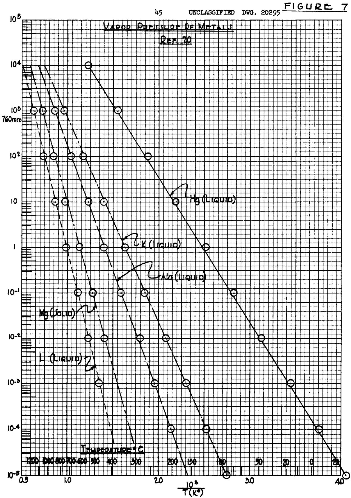

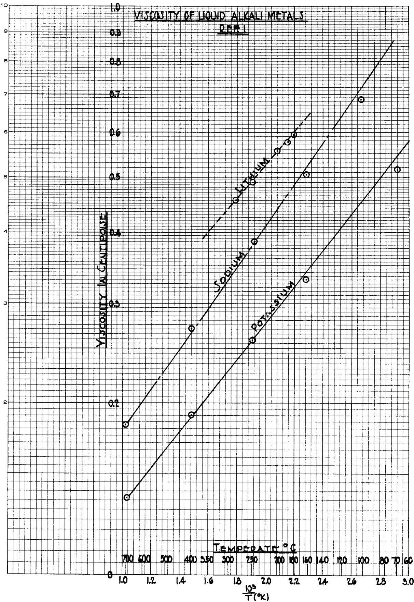

Volume Change on Fusion 1.5% (1) (% of solid volume)

# Lithium - Mercury

Density See Figures 9, 10 (21)

Heat Capacity 0.0340 cal/g at $25^{\circ}C$ and 0.0336 cal/g at $75^{\circ}C$ (106)

Viscosity See Figure 11 (21)

Electrical Conductivity See Figure 12 (13,29)

Surface Tension See Figure 13 (13,26)

Phase Diagram See Figure 14 (22)

Solubility of Lithium See Figures 15, 16 (13,23 in Mercury 24,25)

Chemical Reactions

With $\mathbf{O}_2$ Rate of reaction is appreciable at room temperature (28)

With $\mathbf{N}_2$ Apparently stable against dry $\mathbf{N}_2$ at temperatures from $20^{\circ}\mathrm{C}$ beyond $165^{\circ}\mathrm{C}$ and atmospheric pressures (28)

With $\mathbf{H}_2\mathbf{O}$ See Lithium - Mercury - Water System

Heat of Solution $(\mathbf{Li})_{\mathbf{s}} + 99(\mathbf{Hg})_{1}\rightarrow \mathbf{Li}(\mathbf{Hg})_{99}$ (5)

$\Delta \mathbf{H}_{298}^{\circ} \mathbf{o}_{\mathbf{K}} = -19.6 \mathrm{k cal/g mole}$

Activity Coefficient $\begin{array}{rlr}{\mathrm{Log}_{10}\gamma}&{=}&{0.1428\mathrm{M}(15^{\circ}\mathrm{C}~to~55^{\circ}\mathrm{C})}\end{array}$ (54)

Where $\gamma =$ activity coefficient and M $=$ g-atoms Li per 13,534 g Hg at $25^{\circ}C$

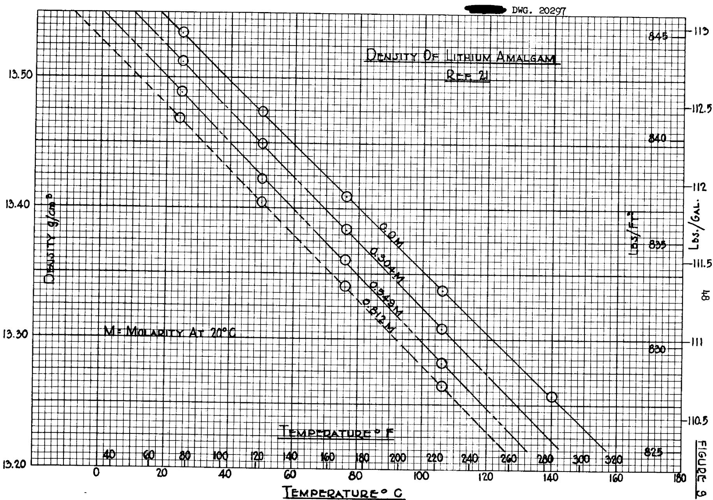

49

DENSITY OF LI AND MG AMALGAMS DATA BY E.L. COMPERE REF.65,67 C.M. BOYD REF.21

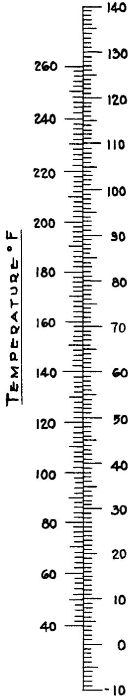  
TEMPERATURE

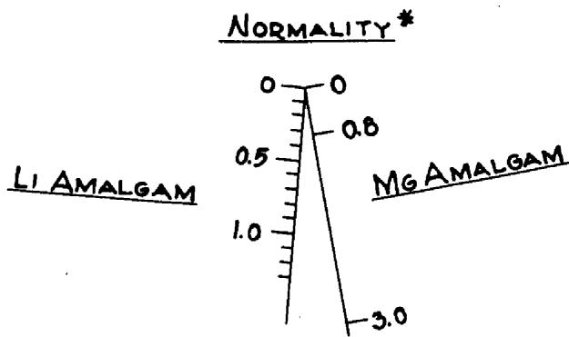  
LDS/GAL.

*GRAM EQUIVALENT OF METAL PER 13,540g MERCURY (NORMALITY AT 20°C)

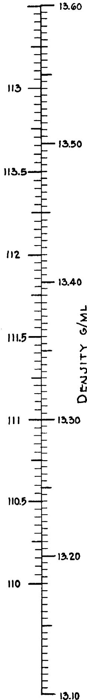

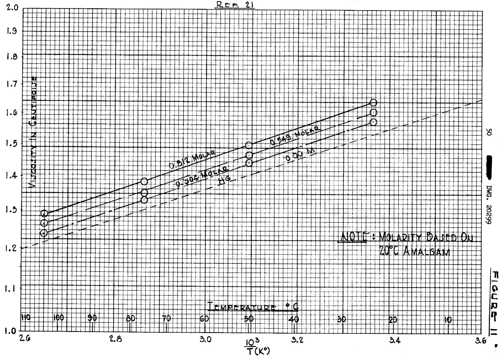  
Viscoity of Lithium Amalgams

UNCLASSIFIED DWG. 20300

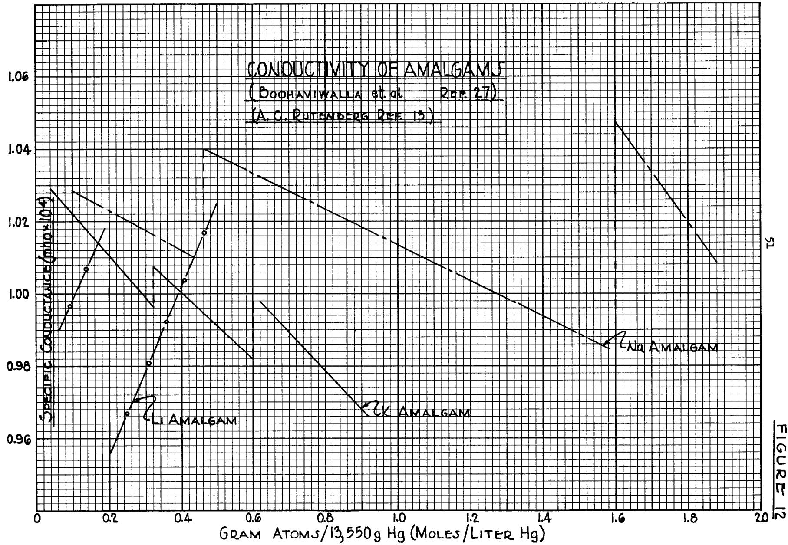

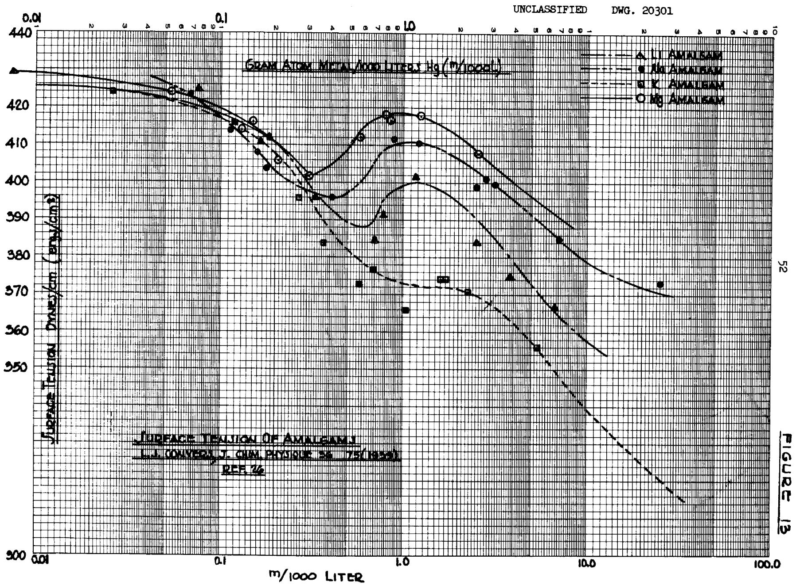

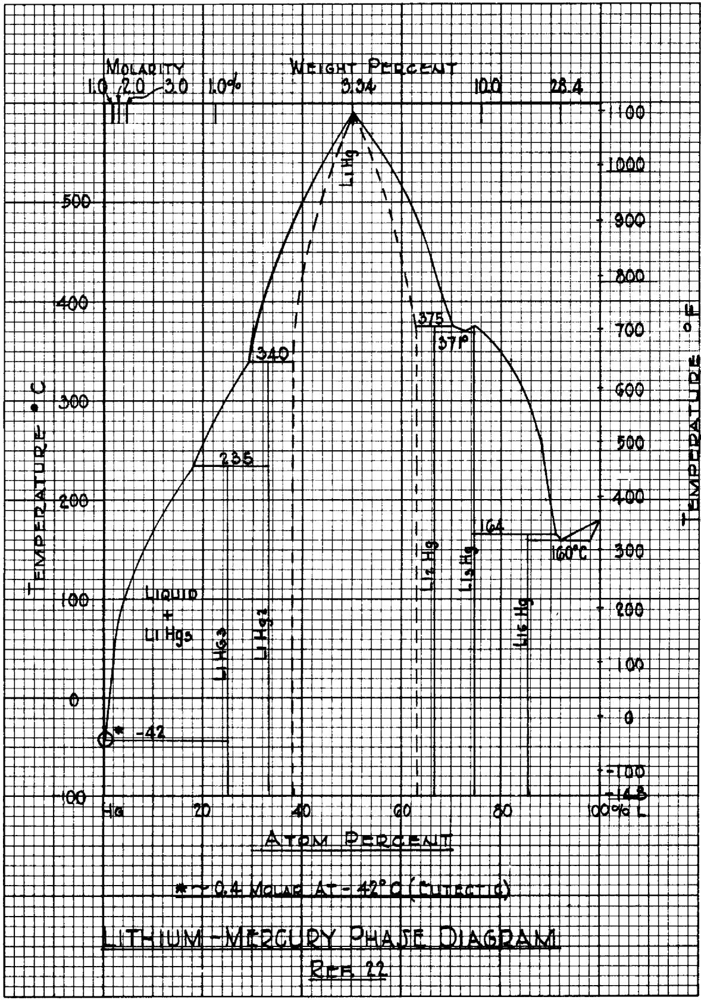

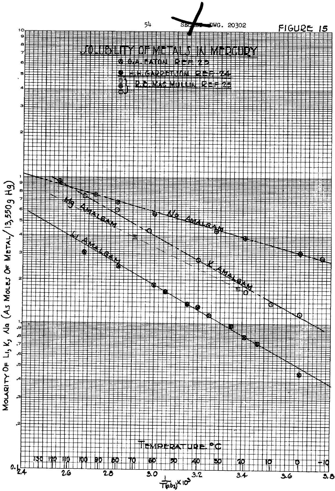

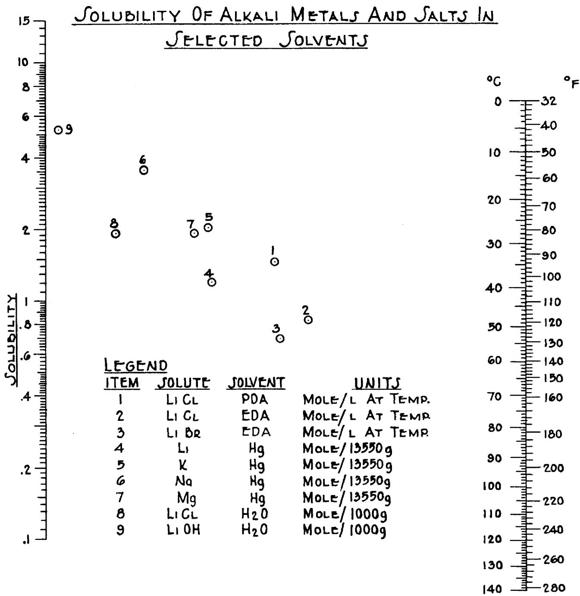  
DWG. 20303   
  
FIGURE 10

55

Lithium - Potassium

See phase diagram

Figure 17

Lithium - Sodium

See phase diagram

Figure 18

Lithium - Potassium - Mercury

Solubility Curve

See Figure 19 (38)

Lithium - Sodium - Mercury

Solubility Curve

See Figure 20 (38)

Lithium - Mercury - Water

Reversible Electrode

$$
\begin{array}{c c} \operatorname {L i} _ {\mathbf {o}} (\mathrm {H g}) & \parallel \quad \operatorname {L i} ^ {+} (\mathrm {a q}) \end{array}
$$

$$
\mathrm {E} _ {2 9 8} ^ {\circ} \mathrm {K} = 2. 0 7 9 \text {v o l t s} \tag {107}
$$

Chemical Reaction

$$
\mathrm {L i} (\mathrm {H g}) + \mathrm {x s} \mathrm {H} _ {2} \mathrm {O} \rightarrow
$$

$$
\left(\mathrm {L i O H}\right) \mathrm {a q} + \mathrm {H g} ^ {-} + 1 / 2 \mathrm {H} _ {2}
$$

$$
\Delta H _ {2 9 8} ^ {o} K = - 3 3. 5 k c a l / g m o l e
$$

$$
\Delta \mathrm {F} _ {2 9 8} ^ {\mathrm {O}} \mathrm {K} = - 2 8. 7 5 \mathrm {k c a l / g}
$$

mole (107)

Rate of Reaction

$$
\mathbf {k} = \frac {2 \left(\mathrm {C} _ {\mathbf {o}} ^ {1 / 2} - \mathrm {C} _ {\mathbf {f}} ^ {1 / 2}\right)}{\mathrm {s t}} \quad \text {f o r w e a k}
$$

(29,30, acids and water solution 108)

Appears to have following dependence in LiOH solution:

$$
k ^ {1} = \frac {k s}{2} = \frac {\left(C _ {o} ^ {1 / 2} - C _ {f} ^ {1 / 2}\right) (C _ {O H})}{t}
$$

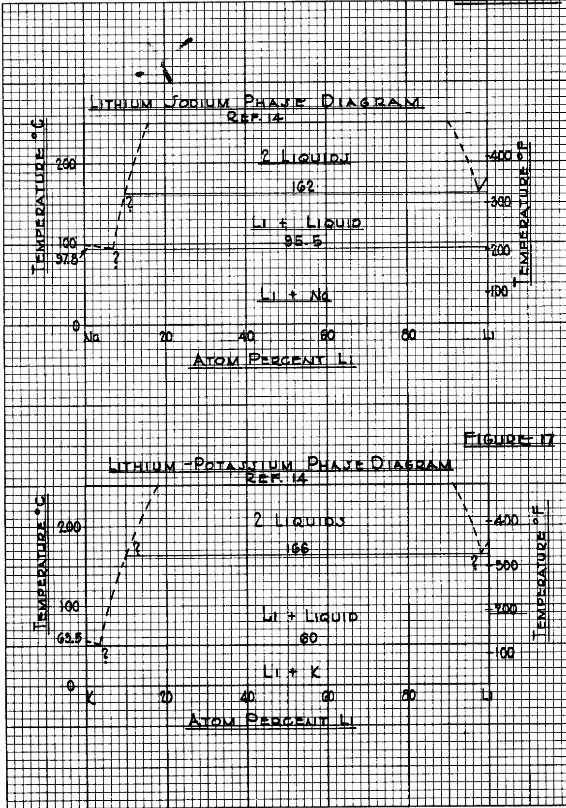

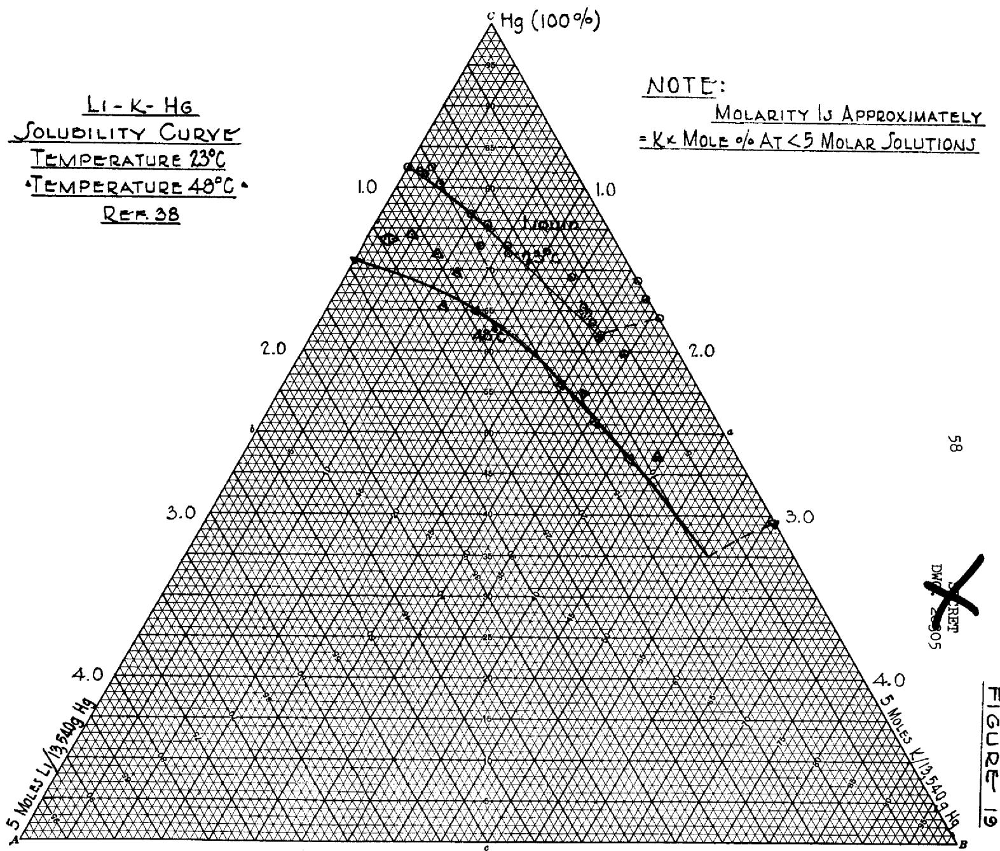

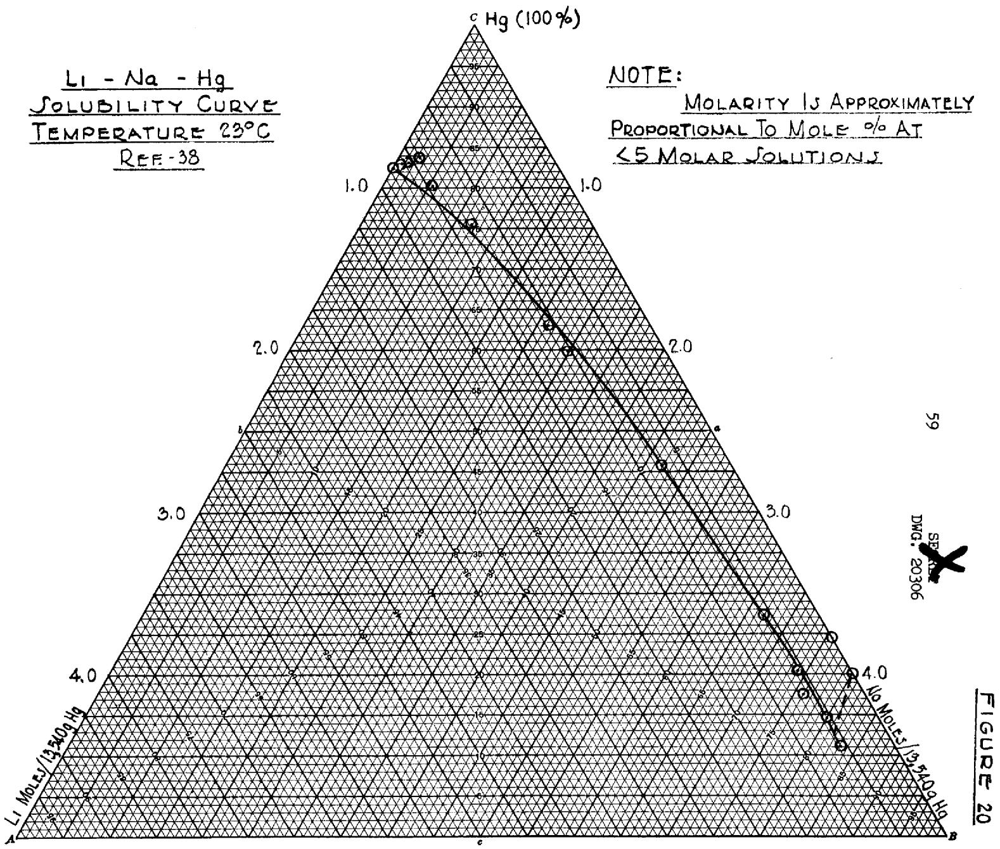

Where k is the specific rate constant, s the interfacial area, $C_0$ and $C_f$ the initial and final concentration of Lithium in the amalgam, t is the time corresponding to $C_f$ , and $(C_{OH})$ is the LiOH concentration

Activation Energy

$\mathbf{E}^{\ddagger}\approx 7.75\mathrm{kcal / g - mole}$ (See Figure 6).

Lithium - Mercury - Ammonium Chloride - Tetrahydrofuran

Chemical Reaction $\begin{array}{rl} & {\mathrm{Li(Hg) + NH_4Cl}_{\mathrm{(solid)}} + \mathrm{THF}\rightarrow}\\ & {\mathrm{LiCl}_{\mathrm{(dissolved)}} + \mathrm{THF} + \mathrm{Hg} + }\\ & {1 / 2\mathrm{H}_2 + \mathrm{NH}_3} \end{array}$

Rate of Reaction Apparently limited by solubility of $\mathrm{NH_4Cl}$ in THF (31)

Lithium - Mercury - Lithium Anthracene - Dimethylcellosolve

Isotopic Exchange System Li(Hg) vs Li Anthracene dis-solved in Dimethylcellosolve (33)

Separation Factor $\alpha = 1.042 \pm 0.012(95\% \mathrm{CI})$ at $27^{\circ} \mathrm{C}$ (32)

Lithium - Mercury - Lithium Benzophenone - Dimethylcellosolve

Isotopic Exchange System Li(Hg) vs Li-Benzophenone dis-solved in Dimethylcellosolve (33)

Separation Factor First Run $\alpha = 1.057 \pm 0.012(95\% \mathrm{CI})$ at $27^{\circ} \mathrm{C}$ (32)

Second Run - $\alpha = 1.056 \pm 0.008(95\% \mathrm{CI})$ at $27^{\circ} \mathrm{C}$ (40)

Lithium - Mercury - Lithium Benzophenone anil - Dimethylcellosolve

Isotopic Exchange System Li(Hg) vs Li-Benzophenone anil dissolved in Dimethyl- cellosolve (33)

Separation Factor First Run - $\alpha = 1.038 \pm 0.011(95\% \mathrm{CI})$ (32, at $27^{\circ} \mathrm{C}$ 34)

Second Run - $\alpha = 1.037 - 0.008(95\% \mathrm{CI})$ at $26.5^{\circ}C$

Lithium - Mercury - Lithium Chloride - Dimethylcellosolve

Isotopic Exchange System Li(Hg) vs LiCl dissolved in Dimethylcellosolve

Separation Factor $\alpha = 1.023 \pm 0.013(95\% \mathrm{CI})$ at $26^{\circ} \mathrm{C}$ (34)

Low solubility of LiCl in Dimethylcellosolve made this run difficult.

Lithium - Mercury - Lithium Benzophenone - Propylenediamine

Isotopic Exchange Li(Hg) vs Li-Benzophenone dissolved in Propylenediamine

Separation Factor $\alpha = 1.055 \pm 0.016 (95\% \mathrm{CI})$ at $27^{\circ} \mathrm{C}$

Lithium - Mercury - Lithium Benzophenone anil - Propylenediamine

Isotopic Exchange System Li(Hg) vs Li-Benzophenone anil dissolved in Propylenediamine

Separation Factor $\alpha = 1.047 \pm 0.012(95\% \mathrm{CI})$ at $26.5^{\circ} \mathrm{C}$ (40)

Lithium - Mercury - Lithium Benzophenone - Tetrahydrofuran

Isotopic Exchange System Li(Hg) vs Li-Benzophenone dissolved in THF

Separation Factor $\alpha = 1.045 \pm 0.008(95\% \mathrm{CI})$ at $27^{\circ} \mathrm{C}$ (40)

Lithium - Mercury - Lithium Benzophenone anil - Tetrahydrofuran

Isotopic Exchange System Li(Hg) vs Li-Benzophenone anil dissolved in TFH

Separation Factor $\alpha = 1.046 \pm 0.012(95\% \mathrm{CI})$ at $27^{\circ} \mathrm{C}$ (40)

Lithium - Mercury - Lithium Chloride - Ethylenediamine

Isotopic Exchange System Li(Hg) vs LiCl dissolved in EDA

Separation Factor See Figures 21, 22 (36)

Isotopic Exchange Rate $\leq 30$ seconds required to reach isotopic equilibrium according to shakeout tests. (35)

Mass Transfer

After

Before

Equilibration

Amalgam phase 3.7g Li/1 3.4g Li/1

Amine phase 1.8 g Li/1 1.9g Li/1 (35)

Stability of System

Temperature and metallic contact increase decomposition of EDA as indicated by color change. (36)

Interfacial (Surface) Tension

Dispersion in pulse column inversely proportional to temperature. This indicates interfacial tension increases with temperature. (37)

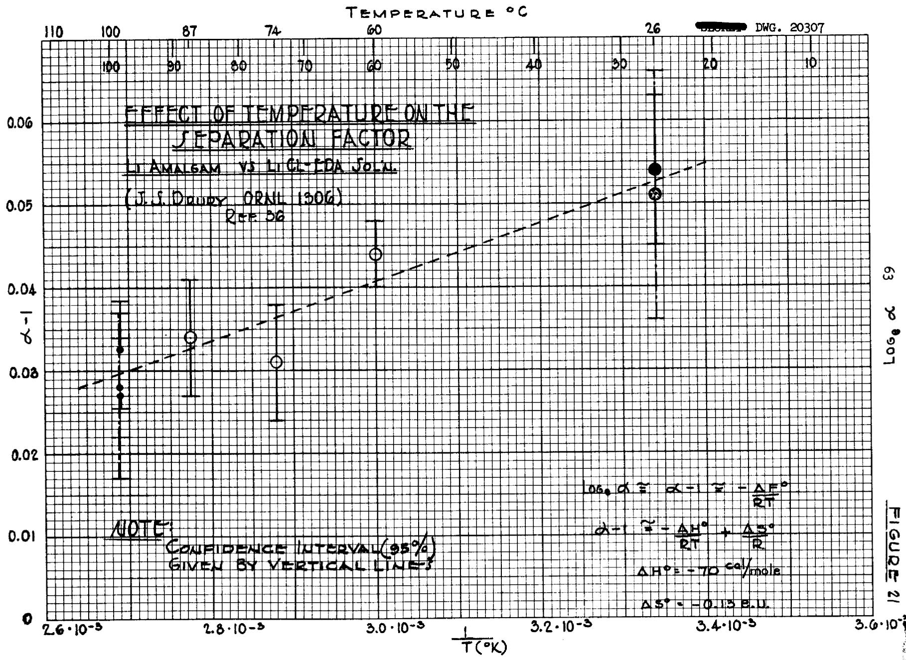

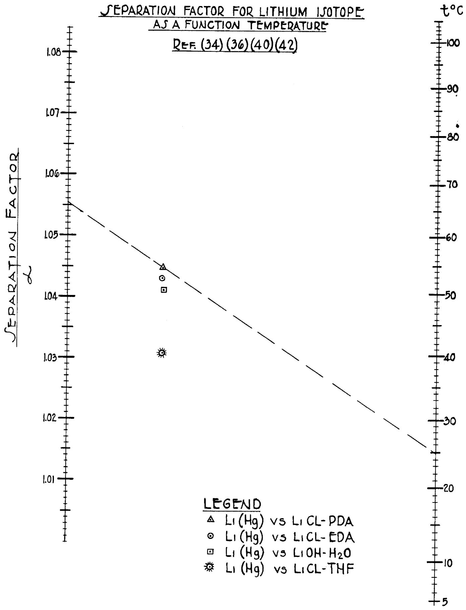

Lithium - Mercury - Lithium Chloride - Isopropanol

Isotopic Exchange System Lithium amalgam vs LiCl dissolved in Isopropanol

Separation Factor $\alpha = 1.055 \pm 0.009(95\% \mathrm{CI})$ at $26.5^{\circ} \mathrm{C}$ (40)

Lithium - Mercury - Lithium Chloride - Propylenediamine

Isotopic Exchange System Li(Hg) vs LiCl dissolved in PDA

Separation Factor See Figures 22, 23 (34,40)

Lithium - Mercury - Lithium Chloride - Tetrahydrofuran

Isotopic Exchange System Li(Hg) vs LiCl dissolved in THF

Separation Factor See Figures 22, 24 (34)

Rate of Reaction Isotopic exchange was reported complete in less than 5 minutes in laboratory shakeout tests. (41)

Lithium - Mercury - Lithium Hydroxide - Water

Isotopic Exchange System Li(Hg) vs LiOH dissolved in $\mathbf{H}_2\mathbf{O}$ (Chemical reaction $\begin{array}{rl} & {\mathrm{Li(Hg)} + \mathrm{H_2O}\longrightarrow}\\ & {\mathrm{LiOH} + 1 / 2\mathrm{H_2}\uparrow +\mathrm{Hg~minimized}}\\ & {\mathrm{by~applied~potential~and/or}}\\ & {\mathrm{low~temperature.})} \end{array}$

Separation Factor See Figures 22, 25 (42)

Stability of System See Li-Hg- $\mathbf{H}_2\mathbf{O}$ system (Reaction Rate)

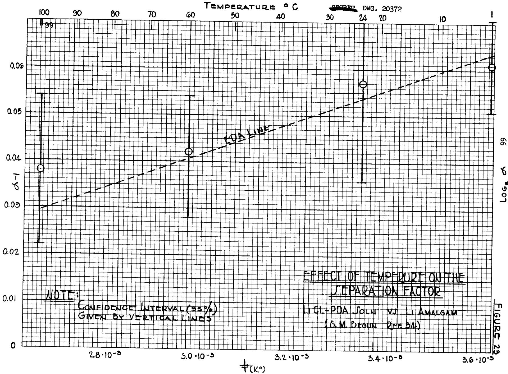

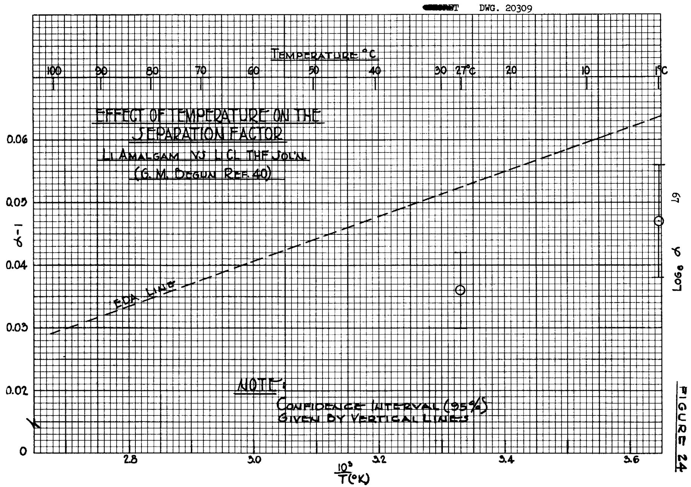

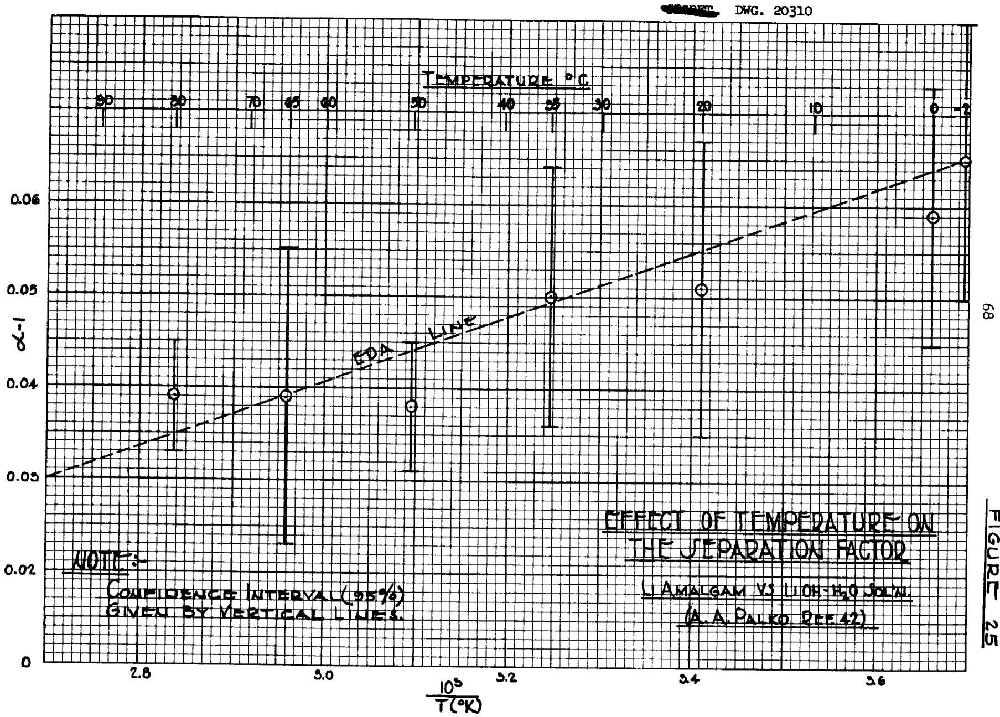

Lithium - Mercury - Potassium Chloride - Propylenediamine

Chemical Reaction $\mathrm{Li(Hg) + KCl}_{\mathrm{(solid)}} + \mathrm{PDA}$

$$
\operatorname {L i C l} (\mathrm {P D A}) + \mathrm {K} (\mathrm {H g})
$$

Reaction Kinetics Laboratory data indicate that the rate determining step is independent of the amalgam concentration, but is a function of available surface area of KCl when both phases are well dispersed by rapid agitation. (93, 94)

$$
- d \frac {[ L i (H g) ]}{d t} = k f (K C 1)
$$

$$
\mathrm {k} \cong 0. 0 6 \frac {\text {m o l e s / l - H g}}{\min } \quad \mathrm {a t}
$$

temperature of $25^{\circ}C$ and 3 molar (325 mesh) KCl slurry in a laboratory sized mixing unit.

Equilibrium Data $\mathbf{K}_{\mathrm{eq}} \stackrel{\approx}{=} \frac{[\mathrm{KCl}][\mathrm{Li(Hg)}]}{[\mathrm{LiCl}][\mathrm{K(Hg)}]}$ (39)

$\mathbf{K}_{\mathrm{eq}} \stackrel{\sim}{=} 1.6 \times 10^{-5}$ at room temperature ( $\sim 25^{\circ} \mathrm{C}$ )

(These data are valid when starting with 0.4M K-amalgam and 0.7M LiCl - PDA solution).

Lithium - Mercury - Propylenediamine - Propylenediamine-Hydrochloride

Chemical Reaction 2Li(Hg)+PDA·2HCl (solution in PDA) $\rightarrow$ 2LiCl + Hg + PDA + H2

Rate of Reaction Rapid: decomposition of a lithium amalgam was complete within 10 minutes with inefficient laboratory agitation. (39)

Lithium - Mercury - Sodium Chloride - Propylenediamine

Chemical Reaction

$$
\begin{array}{l} \mathrm {L i (H g)} + \mathrm {N a C l} _ {\text {(s o l i d)}} + \mathrm {P D A} \\ \mathrm {L i C l} (\text {s o l u t i o n i n P D A}) + \mathrm {N a (H g)} \end{array}
$$

Reaction Kinetics

Laboratory tests show rate determining step is a function of the particle size of solid NaCl when both phases are well dispersed by rapid mixing. (89-92)

$$
\frac {- d [ L i (H g) ]}{d t} = k f _ {(N a C l)}
$$

where $f_{\mathrm{(NaCl)}}$ is some function of the total surface area of salt particles.

Data shown in Figure 26 indicate that

$\mathbf{k}_{(\max)} \cong 1.2 \frac{\text{moles}}{1 - \text{Hg}} / \min.$ where the NaCl (PDA-slurry) is 3 molar (-325 mesh) and rate of mixing is 578 rpm in a laboratory sized mixing unit.

Temperature (25 - 100°C) appears to have a negligible effect upon the rate of reaction.

Equilibrium Data

$$
\mathrm {K} _ {\mathrm {e q}} = \frac {[ \mathrm {N a} (\mathrm {H g}) ] [ \mathrm {L i C l} ]}{[ \mathrm {L i} (\mathrm {H g}) ] [ \mathrm {N a C l} ]} \tag {97}
$$

$$
\mathbf {K} \cong 2. 8 \mathbf {x} 1 0 ^ {4} \text {a t} 2 5 ^ {\circ} \mathrm {C}
$$

$$
\mathbf {K} \cong 1. 6 \times 1 0 ^ {4} a t 5 8 ^ {\circ} \mathrm {C}
$$

These data are valid when starting with 0.7M. Li-amalgam and excess NaCl in PDA).

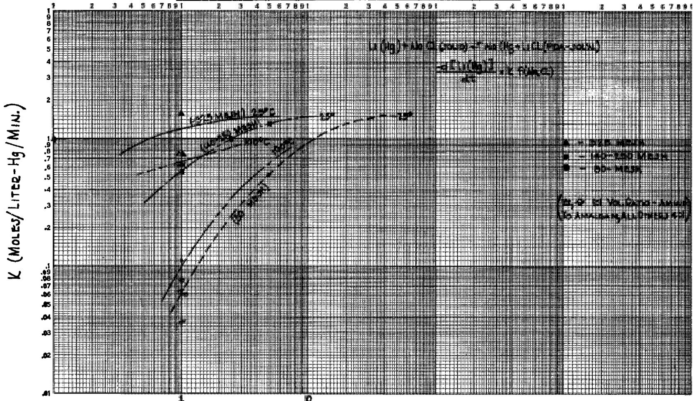  
KINETICS OF SODIUM CHLORIDE INVERSION

#

331

1000 2

Na CL CONCENTRATION IN SLUBBY (Moles Na/C/LITER-PDA)

Lithium - Potassium - Mercury - Lithium Chloride - Propylenediamine

Isotopic Exchange System $\mathbf{Li}(\mathbf{Hg}) + \mathbf{K}(\mathbf{Hg})$ vs LiCl dissolved in PDA

Separation Factor $\alpha = 1.045 \pm 0.008(95\% \mathrm{CI})$ at $23^{\circ} \mathrm{C}$ (38)

(K/Li in amalgam varied from 2 to 1)

Lithium - Sodium - Mercury - Lithium Chloride - Propylenediamine

Isotopic Exchange System Li(Hg) + Na(Hg) vs LiCl dissolved in PDA

Separation Factor $\alpha = 1.051 \pm 0.05$ (95% CI) at $23^{\circ}C$ (38)

(Na/Li in amalgam = 1)

# B. LITHIUM CHLORIDE

Formula Weight 42.40 (3)

Melting Point 614°C, 1137°F (6)

Boiling Point $1382^{\circ}C$ ， $2520^{\circ}\mathbf{F}$ (6)

$1360^{\circ}\mathbf{C}, 2480^{\circ}\mathbf{F}$ (3)

Latent Heat of Fusion 3200 cal/g mole, 75.5 cal/g, 5760 Btu/lb mole, 136 Btu/lb (6)

Latent Heat of Vapor 36,000 cal/g mole, 850 cal/g, 65,000 Btu/lb mole, 153 Btu/lb (6)

Vapor Pressure $10^{-4}$ atm at $663^{\circ}C$ 10-3 atm at $769^{\circ}C$ 10-2 atm at 911OC (6)

Density 2.068 g/ml at $25^{\circ}\mathrm{C}$ (3)

<table><tr><td>Heat Capacity</td><td>0.288 cal/°C g(Btu/°F lb) 
at 25°C, 12.2 cal/°C g mole 
(Btu/°F lb mole)at 25°C</td></tr><tr><td>Refractive Index</td><td>1.662 (3)</td></tr><tr><td>Structure</td><td>Cubic - NaCl type (3)</td></tr><tr><td>Purity of Reagent 
Grade</td><td>&lt;0.01% Basic constituents in 
Baker and Adamson reagent 
grade LiCl (43)</td></tr><tr><td>Solubility in Anhydrous 
Solvents</td><td>See &quot;Experimental Solubilities 
of Salts in Anhydrous Solvents&quot; 
by G. M. Begun (44)</td></tr></table>

# Lithium Chloride - Ethylenediamine

<table><tr><td>Thermal Conductivity</td><td>5.78 x 10-4cal/secOCcm,0.140 Btu/hr ft OF for 0.2MLiCl solution</td></tr></table>

Viscosity See Figure 27 (11)

Conductivity 1.73 x $10^{-4}$ mho for 0.227M LiCl at 25.2°C (46)

Solubility See Figures 16, 28, 29 (47)

Phase Diagram See Figure 30 (48,49)

# Lithium Chloride - 2 Ethylhexanol

Solubility (approx.) Temp. $^\circ \mathrm{C}$ LiCl mole/liter (50)

Rm 1.1   
165 0.23   
184 0.09

# Lithium Chloride - Propylenediamine

Boiling Point Rise 3.5°C/mole LiCl in PDA Constant solution (51)

Latent Heat of 129.5 cal/gm (79-119°C) (51) Vaporization

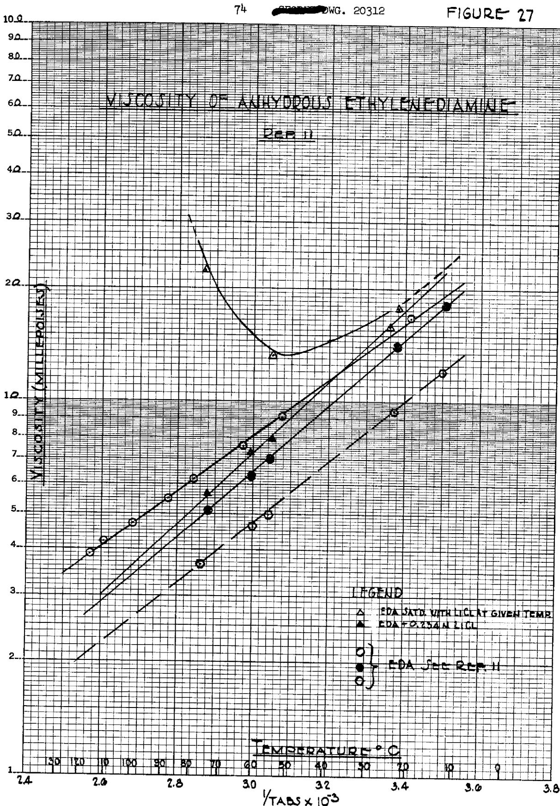

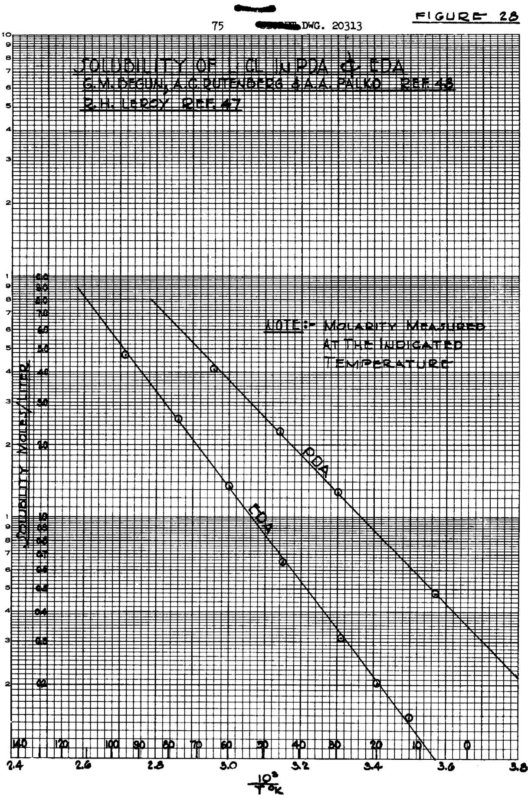

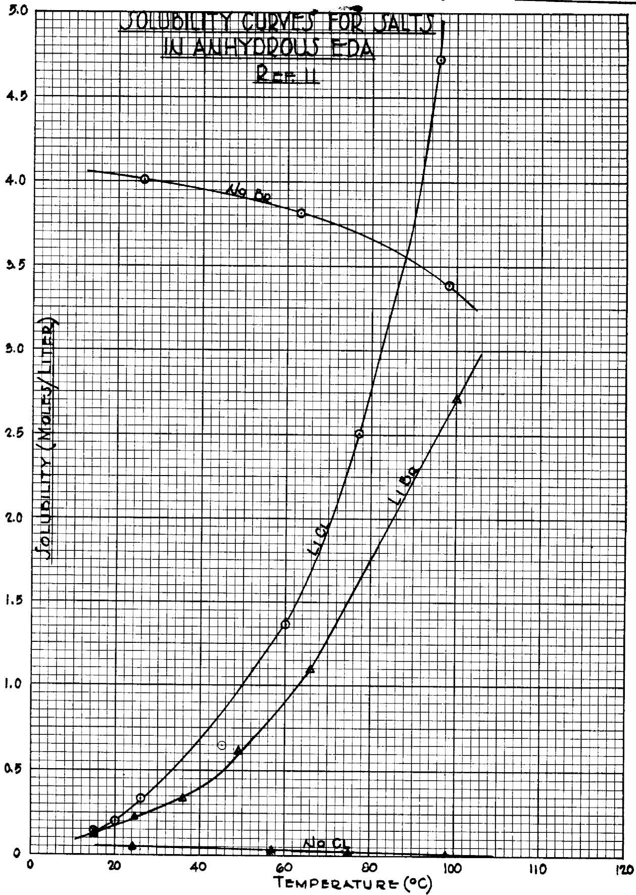

PHASE DIAGRAM FOR L1-GL-FDA SYTEM

FROM DATA OF G.M. DEGUN, A.C. QUTENBERG

A. A Palko AND C.P. Johnston

$R = F,{48},{49}$

Density See Figures 31, 32 (47,52)

Thermal Conductivity 5.5 x $10^{-4}$ cal/sec ${}^{\mathrm{OC}}$ cm, 0.133 Btu/hr ${}^{\mathrm{OF}}$ ft for 0.8M LiCl/liter (45)

Viscosity See Figures 33, 34 (47)

Heat of Solution See Figure 35 (53)

Solubility See Figures 16, 28

Chemical Reactions LiCl + 2 PDA $\rightarrow$ LiCl·2 PDA at room tempera-ture to ? (49)

LiCl + PDA $\rightarrow$ LiCl·PDA at $120^{\circ}\mathrm{C}$

Vapor Pressure of PDA solution containing See Figure 36 (51) LiCl

# Lithium Chloride - Tetrahydrofuran

Solubility 1.67 moles/liter at $1^{\circ}C$ 0.8 moles/liter at $27^{\circ}C$ (31,32) 0.2 moles/liter at $60^{\circ}C$

Solvation No stable solvate at $100^{\circ}C$ (31)

# Lithium Chloride - Water

Phase Diagrams See Figure 37 (56)

Chemical Reactions 2 LiCl + H $_2$ O → 2 HCl + Li $_2$ O (55)

This reaction does not proceed to any marked degree at temperature up to $150^{\circ}\mathrm{C}$ .

Formula Weight 60.41 LiCl·H2O

Stability LiCl·H2O→LiCl + H2O ~96°C (56)

Formula Weight 78.43 LiCl·2H2O

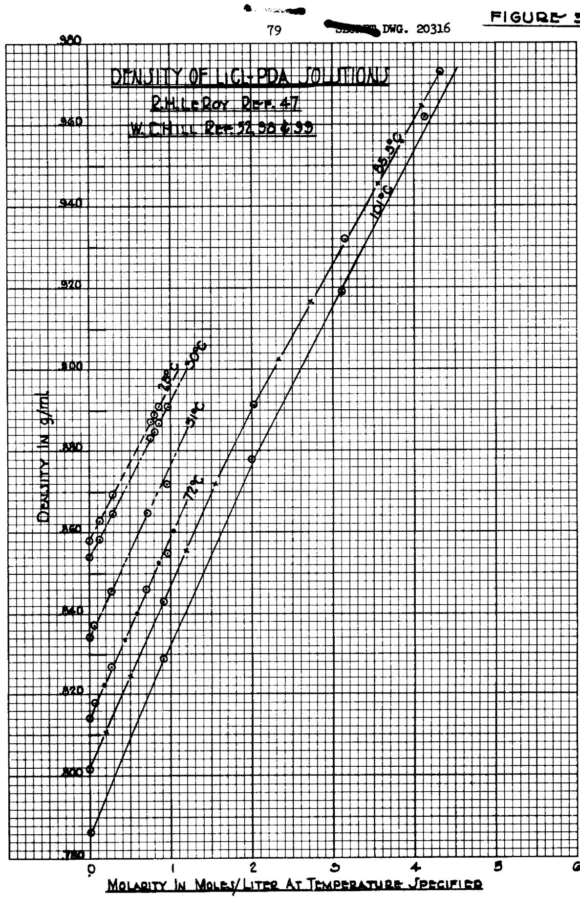

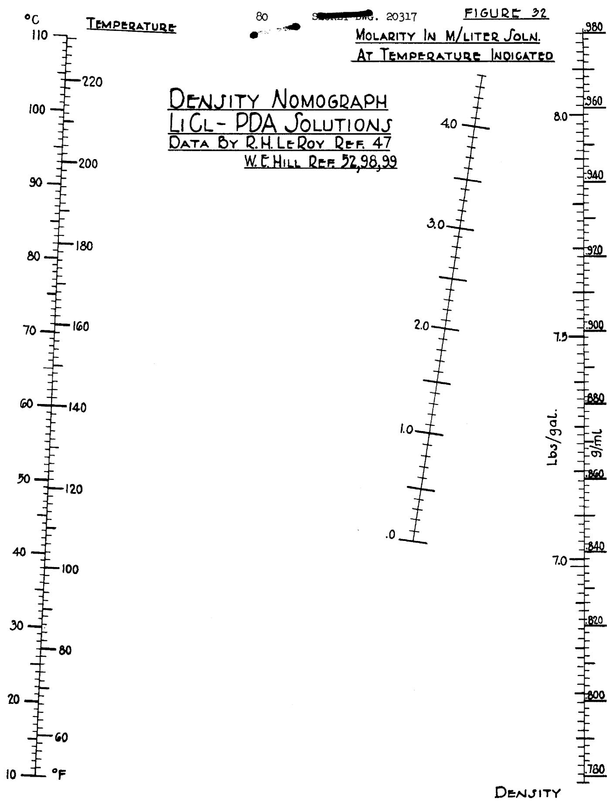

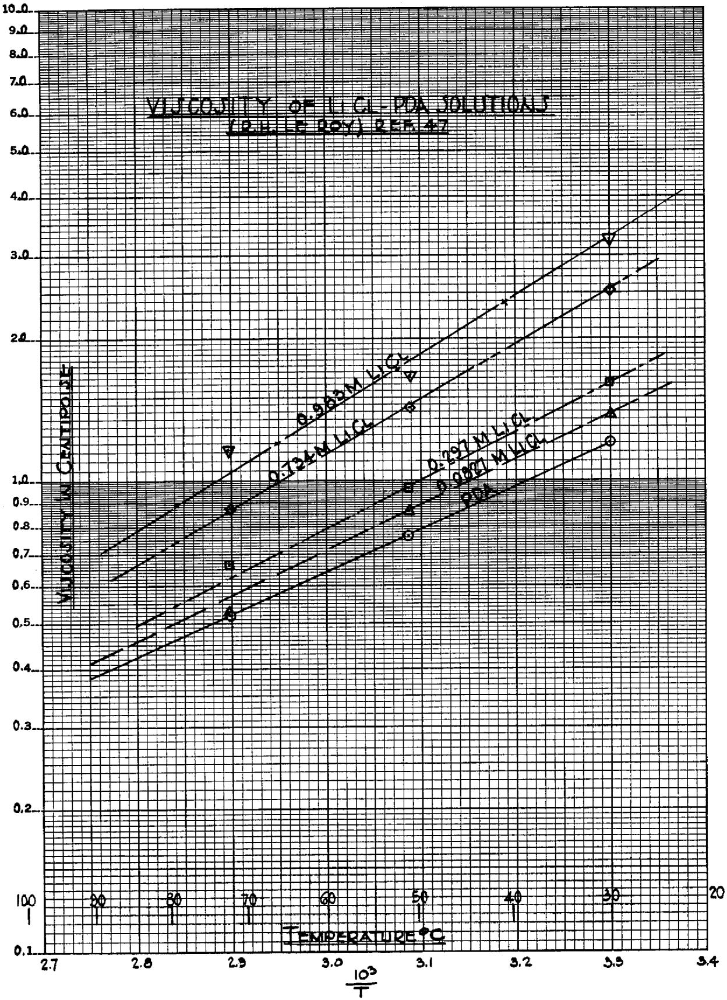

FIGURE 34

# VISCOSITY OF LIGILDBA SOLNS

# DATA BY R.H.LEROY REF.47

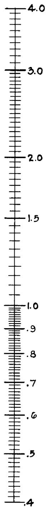  
VIJCOJITY IN CENTIPOJJE

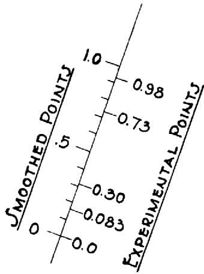  
MOLARITY IN MOLES/LITER (AT TEMPERATURE IN QUESTION)

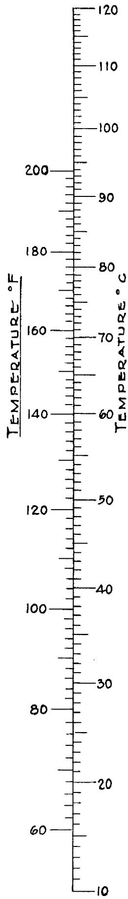

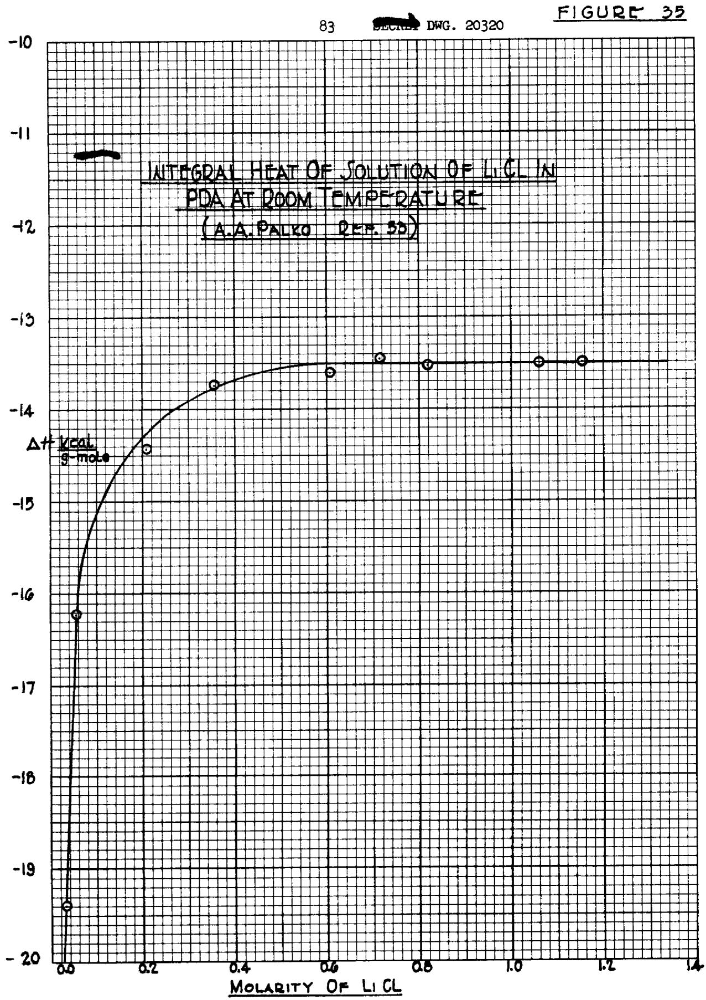

  
84   
FIGURE 36

# VAPOR PRESSURE OF PDA AND LIGL-PDA SOLNS

Q.E.F. 51,86

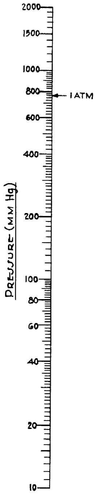  
DWG. 2032

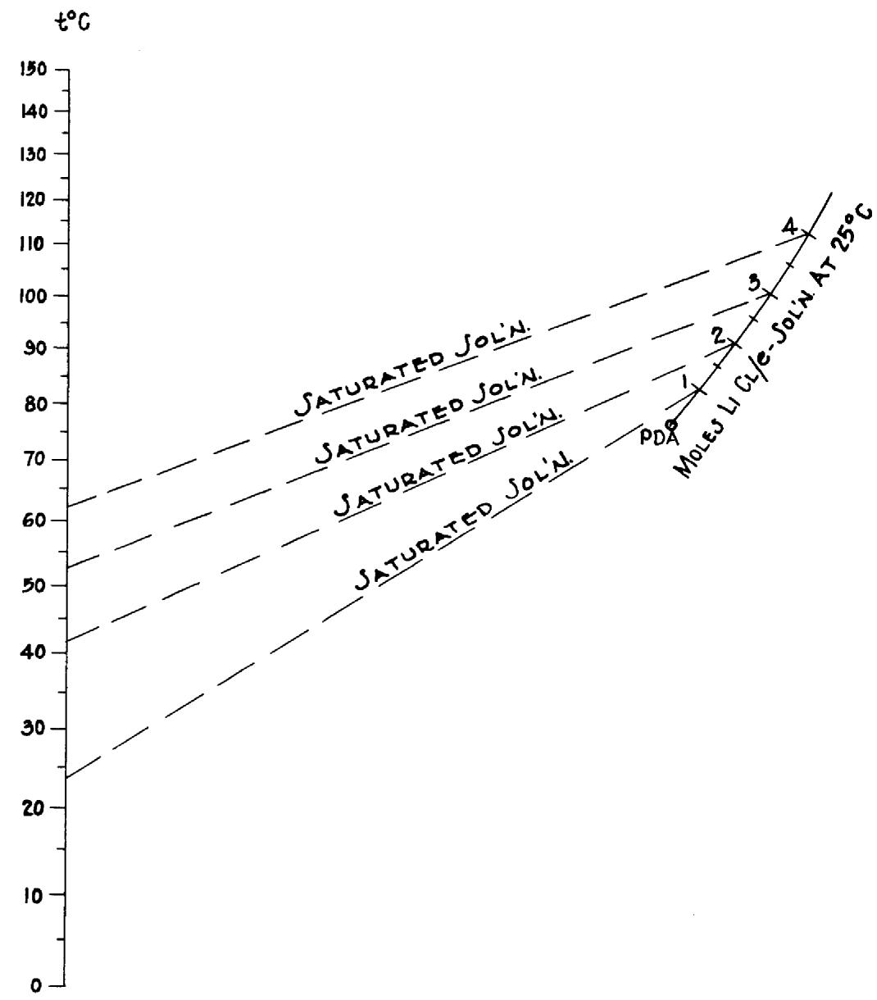

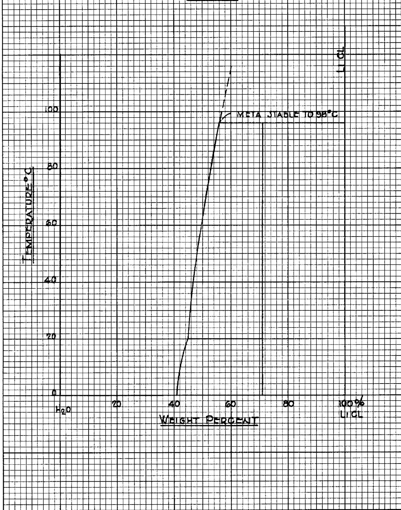  
${L}_{1} = C{l}_{2} + {H}_{2}O$ PHASEDIAGRAM   
FRIEND.HALEANDRYOFO   
$R \in  E,S \cap  O$

Stability

$$
\begin{array}{l} \mathrm {L i C l} \cdot 2 \mathrm {H} _ {2} \mathrm {O} \leftarrow \mathrm {L i C l} \cdot \mathrm {H} _ {2} \mathrm {O} + \mathrm {H} _ {2} \mathrm {O} \\ \sim 2 0 ^ {\circ} \mathrm {C} \tag {56} \\ \end{array}
$$

# Lithium Chloride - Ethylenediamine - Propylenediamine

Solubility of LiCl in mixed solvents

$\%$ EDA*

Solubility of LiCl mole/liter at room (40)

temperature

0 1.2

10 1.63

20 1.55

30 1.37

40 0.72

50 0.72

60 0.44

70 0.3

80 0.3

100 0.3

* % EDA was reported as % of original EDA - PDA mixture prior to addition of excess LiCl.

# Lithium Chloride - Sodium Chloride - Ethylenediamine

Solubilities in Solution Solubility moles/liter (45)

Saturated with NaCl and LiCl Temp. $^{\mathrm{OC}}$ NaCl LiCl

26 0.078 0.31

60 0.074 0.69

80 0.049 2.85

101 0.026 4.6

# Lithium Chloride - Magnesium Chloride - Propylenediamine

Phase Diagram See Figure 38 (57,58)

Solubilities. See Figure 39 (57,58)

# Lithium Chloride - Potassium Chloride - Propylenediamine

Solubility of KCl in LiCl-PDA solutions

$\sim 0.005$ moles KCl/liter of LiCl solution between $24^{\circ}$ (59)

and $115^{\circ}C$ and between 1

and 3.4 molar LiCl

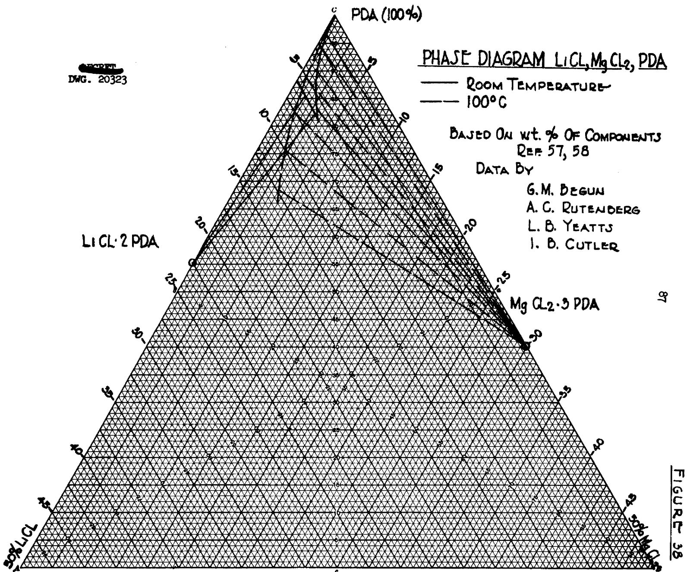

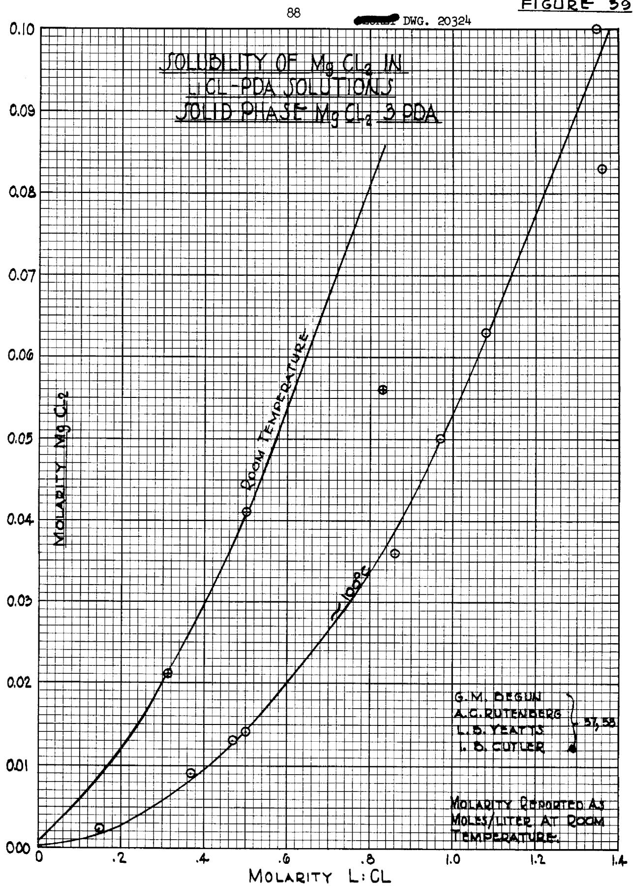

Lithium Chloride - Sodium Chloride - Propylenediamine

<table><tr><td rowspan="2">Solubilities in Solution saturated with NaCl and LiCl</td><td rowspan="2">Temp.℃</td><td colspan="2">Solubility moles/liter</td></tr><tr><td>NaCl</td><td>LiCl (45)</td></tr><tr><td></td><td>30</td><td>0.008</td><td>0.943</td></tr><tr><td></td><td>72</td><td>0.0047</td><td>3.31</td></tr><tr><td></td><td>92</td><td>0.006</td><td>3.73</td></tr><tr><td></td><td>100</td><td>0.018(?)</td><td>3.97</td></tr><tr><td></td><td>130</td><td>0.013(?)</td><td>4.28</td></tr></table>

Solubilities in Solution See Figure 40 saturated with NaCl (60)

Lithium Chloride - Propylenediamine - Tetrahydrofuran

<table><tr><td>Solubility of LiCl in mixed solvents of PDA and THF</td><td>% PDA</td><td>Room Temperature (34) Solubility (moles/liter)</td></tr><tr><td></td><td>1.4</td><td>0.31</td></tr><tr><td></td><td>40.9</td><td>0.054</td></tr><tr><td></td><td>87.4</td><td>0.77</td></tr></table>

Lithium Chloride - Mercury - Water

Chemical Reaction LiCl (in $\mathbf{H}_2\mathbf{O}$ solution) + Hg + e → (electrolysis of LiCl) Li(Hg) + 1/2 Cl₂ + H₂O

Effect of PDA impurity PDA/LiCl $\geq 0.001$ lowers cell efficiency $\geq 10\%$ . This may be due to two indistinguishable side reactions $\mathrm{H}_3\mathrm{O} + \mathrm{e} \rightarrow \mathrm{l} / 2\mathrm{H}_2 + \mathrm{H}_2\mathrm{O}$ and $\mathrm{Li(Hg)} + \mathrm{H}_2\mathrm{O} \rightarrow \mathrm{LiOH} + \mathrm{l} / 2\mathrm{H}_2$

Lithium Chloride - Propylenediamine - Water

Phase Diagram See Figure 41 (61)

Lithium Chloride - Propylenediamine - Magnesium - Mercury

Chemical Reaction $\begin{array}{rl} & {\mathrm{Mg(Hg) + LiCl(in PDA solution)\rightarrow}}\\ & {\mathrm{Li(Hg) + MgCl_2\cdot 3PDA(insoluble)}}\\ & {\mathrm{+PDA}} \end{array}$

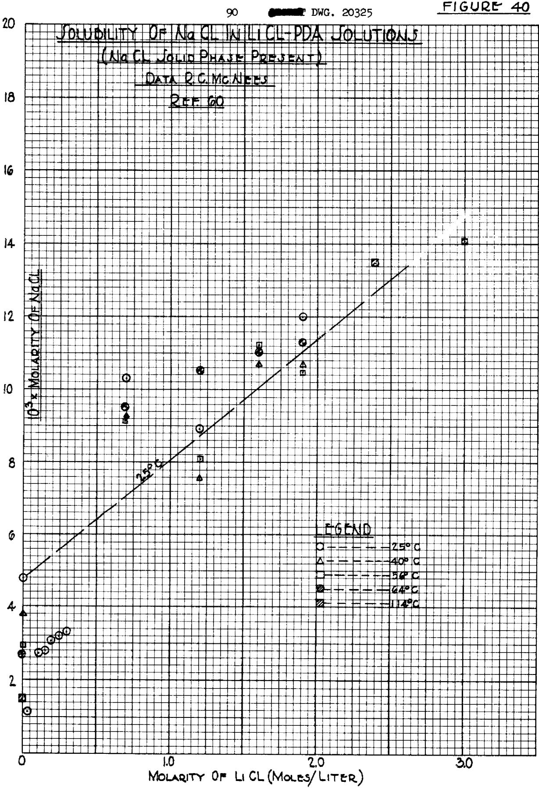

${L}_{1}{C}_{L} - {PDA} - {H}_{2}O$ PHASE DIAGRAM

1. ${45.5}\mathrm{\;g}/{100}\mathrm{\;g}$ . SAT. SOL. p 9/2 SeIDELL REF 4

2.46 g/100g SAT.SOL INTERPOLATED FROM

OREX REPORT YB-30-107

REFG

THE SOLID LINE REPRESENTS THE SOLUBILITY OF LICLIN VARIOUS MIXTURES OF PDA AND H2O.

100%PDA

L1CL-2PDA

A

1. $\overrightarrow{OA} = 2\overrightarrow{OB}$

※

#

C100%LCL

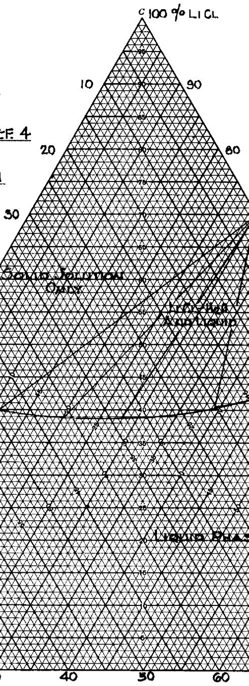

DWG. 20326

CONDITIONS

${23} \pm  {10}^{ \circ  }C$ .

ATMOJPHERIC PRESSJURE.

ALL MEASUREMENT AS

WEIGHT PERCENT

$\mathrm{LiCl} \cdot \mathrm{H}_{2}\mathrm{O}$

#

FIGURE 41

$- {H}_{2}O$

# Reaction Kinetics

(1) Reaction Rate appears to (100, be first order with respect 90, to concentration of Mg in 91, the amalgam and independent 92) of the LiCl in the amine phase when LiCl is in stoichiometric excess.

$$
- d \left(\frac {M g}{d t}\right) = k (M g)
$$

or:

$$
\ln \left(\frac {\mathrm {M g}}{\mathrm {M g}) _ {\mathrm {f}}} \right. = \mathrm {k t}
$$

where k is specific rate constant, $\mathbf{Mg}_{\mathrm{o}}$ and $\mathbf{Mg_f}$ are the initial and final Mg amalgam concentrations, and 't' is the time required to reach a concentration of $\mathbf{Mg_f}$ .

(2) Effect of temperature: See Figure 42.

$$
\ln \mathrm {k} \cong - 2 0 0 0 + 5. 9 2
$$

where $\mathbf{T}$ is the absolute temperature (Kelvin)

k ≈ 1.8 (min. -1) when the phases are vigorously contacted at 100°C in a laboratory (Rushton type) contactor.

$$
\mathrm {K} _ {\mathrm {e q}} = \frac {\left[ \mathrm {L i} (\mathrm {H g}) \right] ^ {2} \left[ \mathrm {M g C l} _ {2} \right]}{\left[ \mathrm {L i C l} \right] ^ {2} \left[ \mathrm {M g} (\mathrm {H g}) \right]} \tag {57}
$$

$$
\mathbf {K} \cong 7 8 a t 2 5 ^ {\circ} \mathrm {C}
$$

$$
\mathbf {K} \cong 1 0. 6 a t 6 0 ^ {\circ} \mathrm {C}
$$

(These data are valid when starting with about 0.4 molar Magnesium - Amalgam and excess LiCl - PDA solution).

# Equilibrium data

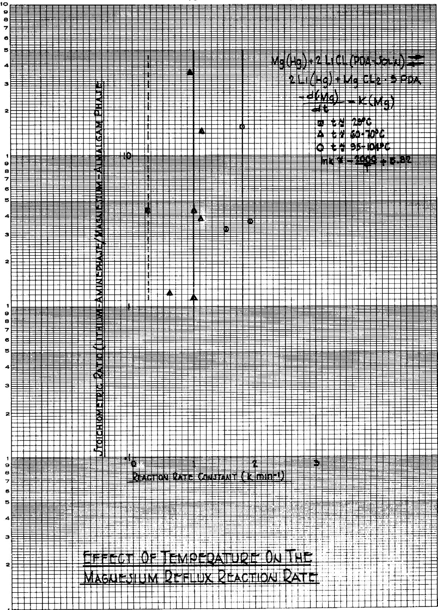

Lithium Chloride - Propylenediamine - Potassium - Mercury   

<table><tr><td>Chemical Reaction</td><td>K(Hg) + LiCl (in PDA solution) &lt; 
Li(Hg) + PDA + KCl (insoluble)</td></tr><tr><td>Reaction Kinetics</td><td>Reaction rate is very rapid when 
phases are well dispersed. Equi-
librium was reached in less than 
2 minutes in a laboratory mixer 
column contactor at 100°C. The 
effect of temperature on the re-
action rate has not been investi-
gated. (101)</td></tr><tr><td>Equilibrium Data</td><td>See Figures 43, 44, 45 (93,102)</td></tr></table>

Lithium Chloride - Propylenediamine - Sodium - Mercury (See also Li-Hg-NaCl-PDA)   

<table><tr><td>Chemical Reaction</td><td>Na(Hg) + LiCl (in PDA solution) ⇌ 
Li(Hg) + PDA + NaCl (insoluble)</td></tr><tr><td>Reaction Kinetics</td><td>See page 70 for kinetics of reverse reaction. Rate of forward reaction has not been investigated.</td></tr><tr><td>Equilibrium Data</td><td>See Figure 46. (93)</td></tr></table>

C. LITHIUM HYDROXIDE   

<table><tr><td>Formula Weight</td><td>23.95</td><td></td></tr><tr><td>Melting Point</td><td>462°C</td><td>(5)</td></tr><tr><td></td><td>450°C</td><td>(2)</td></tr><tr><td></td><td>445°C</td><td>(3)</td></tr><tr><td>Boiling Point</td><td>Decomposes 900°C</td><td>(63)</td></tr><tr><td>Density</td><td>1.43 g/ml at 20°C</td><td>(3)</td></tr><tr><td></td><td>2.54 g/ml at 20°C</td><td>(2)</td></tr></table>

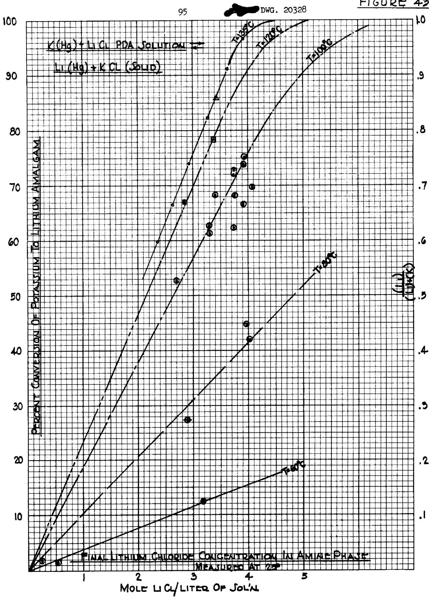

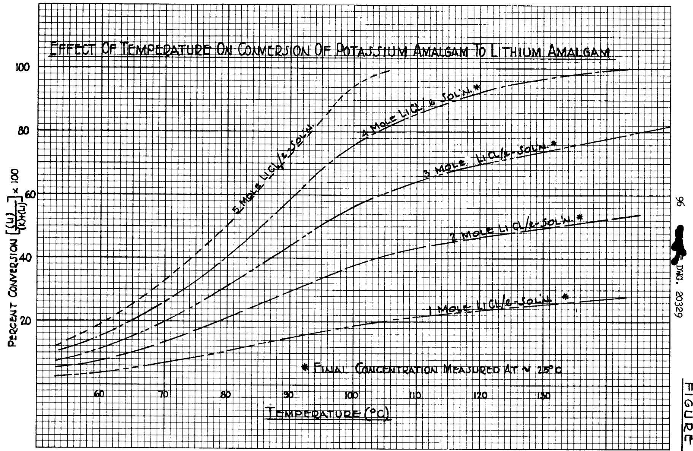

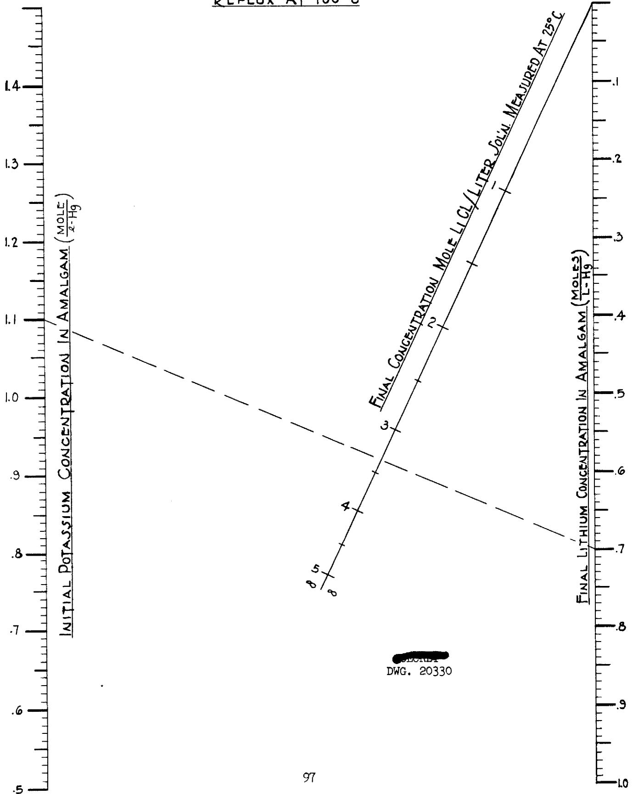

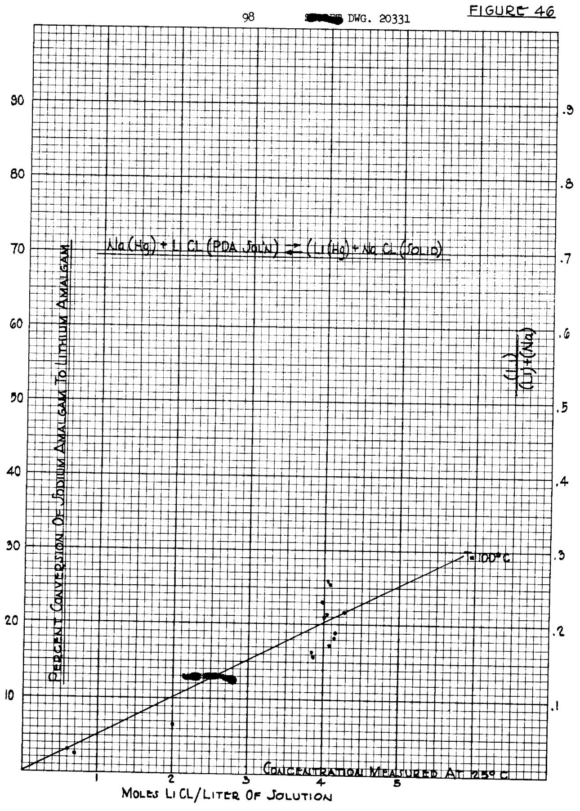

Lithium Hydroxide - Water

Formula Weight 41.96 (LiOH·H2O)

Phase Diagram See Figure 47 (64)

Solubility of LiOH in $\mathbf{H}_2\mathbf{O}$ See Figures 16, 48 (64)

Density of LiOH Solutions See Figures 49, 50 (9)

Lithium Hydroxide - Sodium Phosphate - Water

Chemical Reaction LiOH aq. $+\mathrm{Na}_{3}\mathrm{PO}_{4}$ aq $\rightarrow$ $\mathrm{Li}_3\mathrm{PO}_4$ (insoluble) $+\mathrm{NaOH}$ aq.

Conditions for Filterable Precipitate Determined by A. A. Palko (53)

# III. MAGNESIUM AND MAGNESIUM COMPOUNDS

# A. MAGNESIUM

Atomic Weight 24.36

Melting Point 651°C, 1204°F (1)

Boiling Point 1103°C, 2017°F (1)

Latent Heat of Fusion 82.2 cal/g, 148 Btu/lb, 1990 cal/g mole, 3590 Btu/lb mole (1)

Latent Heat of 1337 cal/g, 2405 Btu/lb, Vaporization 3250 cal/g mole, 5850 Btu/lb mole (1)

Vapor Pressure $\log_{10}P_{\mathrm{mm}} = \frac{-7167}{T(0_{K})} + 8.088$ (1)

Accuracy

10% 1000 - 1400 K (1)

20% 600 - 1450 $^{\text{O}}$ K

See Figure 7

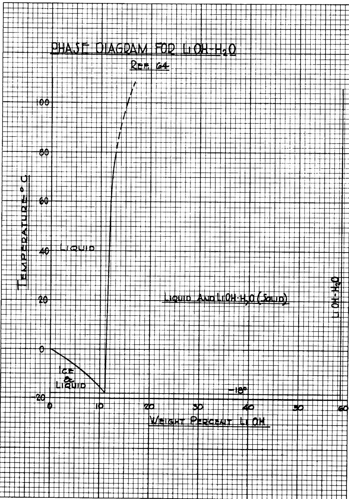

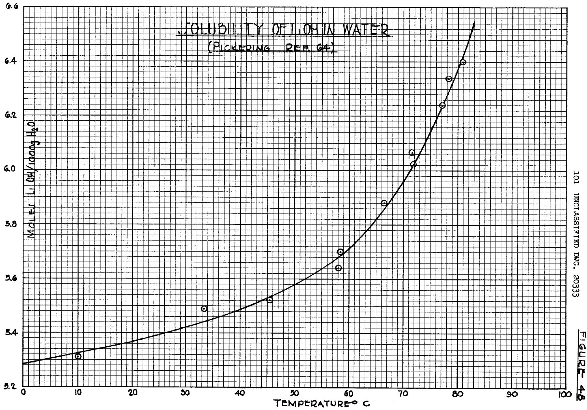  
EEO2 DMI CHIASSYTONTOT   
8+ -2a n1d

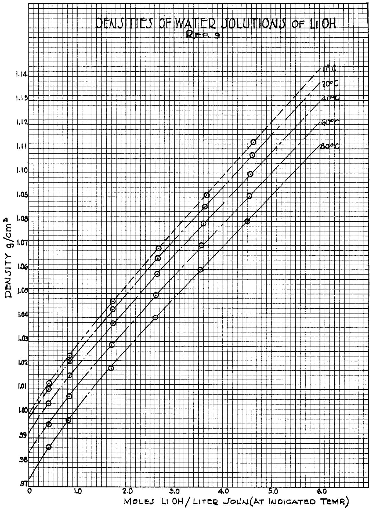

# 103 DENSITIES OF WATER SOLUTIONS OF LI OH DATA FROM REF.9

Accuracy $\pm 0.001\mathrm{G / ML}$ FOR TEMP. $<  20^{\circ}C$ $\pm 0.002\mathrm{G / ML}$ FOR MOLARlY 3.5To4.5 $\pm 0.01\mathrm{G / ML}$ FOR MOLARlY $<  3.5,$ TEMP>20°C

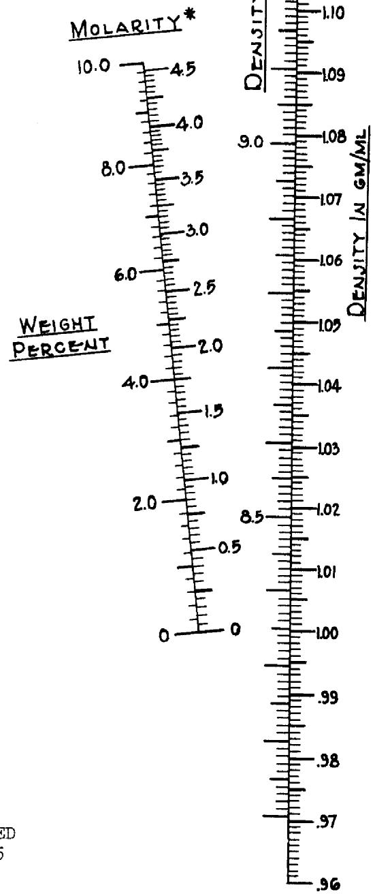  
FIGURE 50

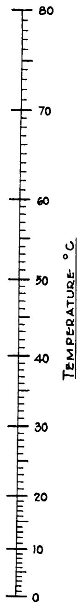

*AT INDICATED TEMPERATURE

UNCLASSIFIED DWG. 20335

Density 1.74 g/ml at $20^{\circ}\mathrm{C}$ , 1.536 g/ml (3) at $700^{\circ}\mathrm{C}$ , 108.5 lbs/ft³ at $68^{\circ}\mathrm{F}$

Heat Capacity 0.317 cal/gC at 651°C, 0.342 cal/gC at 1120°C (1)

Surface Tension 563 dynes/cm at $681^{\mathrm{o}}\mathrm{C}$ 502 dynes/cm at $894^{\mathrm{o}}\mathrm{C}$ (1)

Volume Change on Fusion (% of sol. volume) 4.2% (1)

# Magnesium - Mercury

Density D 13.55744 - 0.0022656t (°C) (13, for 0.8N amalgam 65, D 13.4388 - 0.002125t (°C) 66, for 3.0N amalgam 67)

See Figures 10, 51

Viscosity $\begin{array}{rl} & {\log_{10}\eta = -0.2489 + 132.3 / \mathbf{T}_{(\mathbf{o}_{\mathbf{K}})}}\\ & {\mathrm{for~0.8N~amalgam}}\\ & {\log_{10}\eta = -0.2799 + 148.4 / \mathbf{T}_{(\mathbf{o}_{\mathbf{K}})}}\\ & {\mathrm{for~3.0N~amalgam}} \end{array}$ (13, 65, 66, 67)

See Figure 52

Surface Tension See Figure 13 (13,26)

Phase Diagram See Figure 53 (14,15)

Solubility See Figures 15, 16 (13,25)

Chemical Reactions with Impurities No reaction with $\mathbf{O}_2$ ， $\mathbf{H}_2\mathbf{O}$ free $\mathbf{N}_2$ has been observed at room temperature.Both $\mathbf{O}_2$ and $\mathbf{H}_2\mathbf{O}$ impurities in $\mathbf{N}_2$ or He blanketing gases form scums on magnesium amalgams. (13,67)

Thermodynamics $\triangle H$ mixing - 17.3 K cal/mole for $\mathrm{Mg} + 40.5\mathrm{Hg}\rightarrow \mathrm{Mg(Hg)}_{\mathrm{X}}$ in Hg (13)

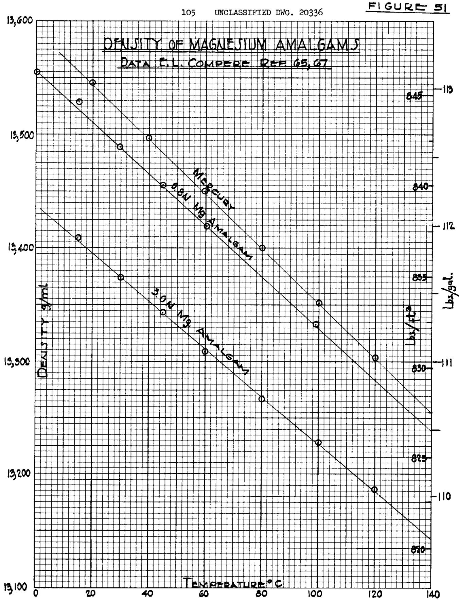

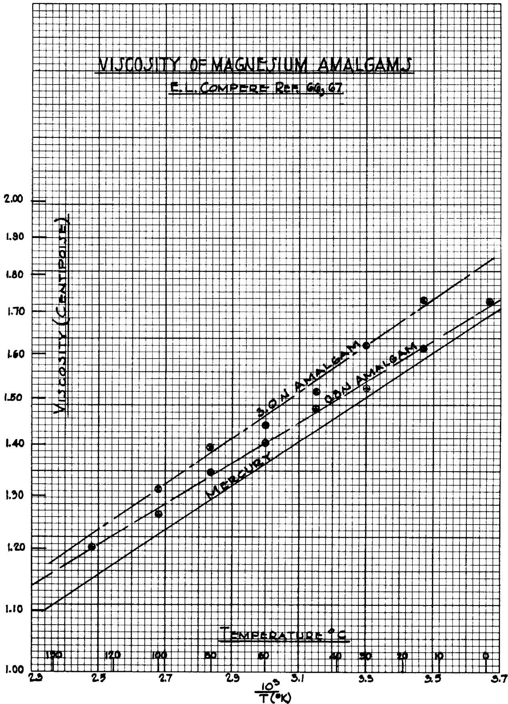

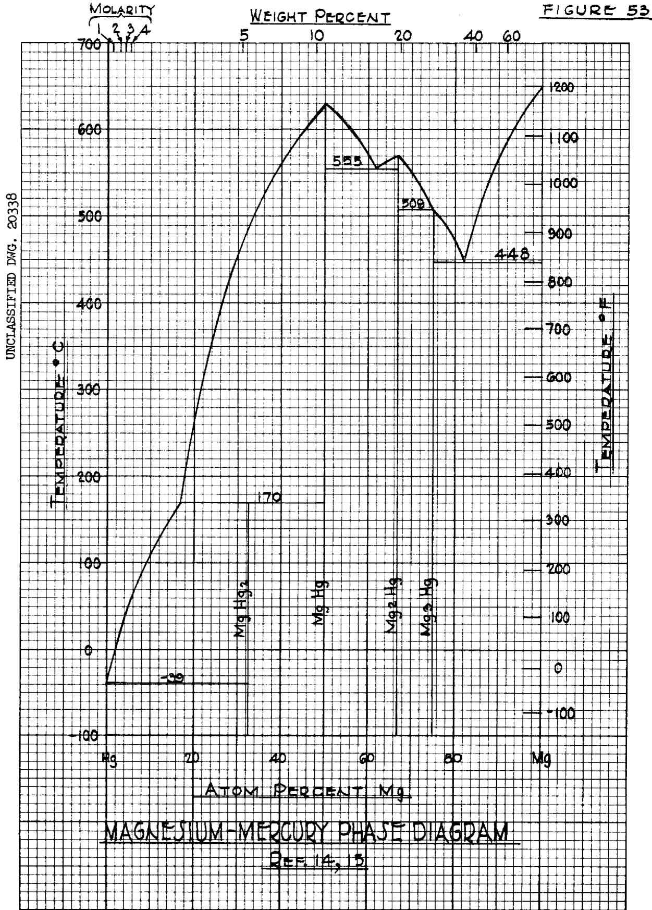

# B. MAGNESIUM CHLORIDE

<table><tr><td>Formula Weight</td><td>95.23</td><td></td></tr><tr><td>Melting Point</td><td>714°C, 1317°F</td><td>(5,6)</td></tr><tr><td>Boiling Point</td><td>1418°C, 2584°F</td><td></td></tr><tr><td>Heat of Fusion</td><td>10,300 cal/g mole, 108 cal/g, 
18,500 Btu/lb mole, 194 
Btu/lb</td><td>(5,6)</td></tr><tr><td>Heat of Vaporization</td><td>32,700 cal/g mole, 344 cal/g, 
58,800 Btu/lb mole, 
618 Btu/lb</td><td>(5,6)</td></tr><tr><td>Vapor Pressure</td><td>10-3atm at 763°C, 10-2atm 
at 907°C</td><td>(6)</td></tr><tr><td>Density</td><td>2.32 g/ml, 145 lbs/ft3</td><td>(2)</td></tr><tr><td>Refractive Indices</td><td>1.675, 1.59</td><td>(2)</td></tr><tr><td>Preparation of Anhydrous 
Magnesium Chloride</td><td colspan="2">Best method of preparation 
was found to be that of thermal 
decomposition of NH4Cl·MgCl2·6H2O 
discussed by Richards, Proc. Amer. 
Acad. 32 53, (1896).</td></tr></table>

# Magnesium Chloride - Ammonia

<table><tr><td colspan="2">Formula Weights of 
Compounds:</td></tr><tr><td>MgCl2·6NH3</td><td>197.41</td></tr><tr><td>MgCl2·4NH3</td><td>163.35</td></tr><tr><td>MgCl2·2NH3</td><td>129.29</td></tr><tr><td>MgCl2·NH3</td><td>112.26</td></tr></table>

Decomposition Temperatures and Heats: (9)

$$
\begin{array}{c c} \underline {{\text {R e a c t i o n}}} & \underline {{\text {T e m p} ^ {\circ} \mathrm {C}}} \\ \mathrm {M g C l} _ {2} \cdot 6 \mathrm {N H} _ {3} & \longrightarrow \mathrm {M g C l} _ {2} \cdot 4 \mathrm {N H} _ {3} + 2 \mathrm {N H} _ {3} \\ \triangle \mathrm {H} = ? & \\ \end{array}
$$

$$
\begin{array}{r l} \mathrm {M g C l} _ {2} \cdot 4 \mathrm {N H} _ {3} & \longrightarrow \mathrm {M g C l} _ {2} \cdot 2 \mathrm {N H} _ {3} + 2 \mathrm {N H} _ {3} \\ \Delta \mathrm {H} = ? \end{array}
$$

$$
\begin{array}{r l} \mathrm {M g C l} _ {2} \cdot 2 \mathrm {N H} _ {3} & \longrightarrow \mathrm {M g C l} _ {2} \cdot \mathrm {N H} _ {3} + \mathrm {N H} _ {3} \\ \Delta \mathrm {H} & = 1 7, 9 0 0 \mathrm {c a l / m o l e} \end{array} \quad 2 7 2 ^ {\circ} \mathrm {C}
$$

$$
\begin{array}{r l} \mathrm {M g C l} _ {2} \cdot \mathrm {N H} _ {3} & \longrightarrow \mathrm {M g C l} _ {2} + \mathrm {N H} _ {3} \\ \Delta \mathrm {H} & = 2 0, 8 0 0 \mathrm {c a l / m o l e} \end{array} \quad 3 6 5 ^ {\circ} \mathrm {C}
$$

Vapor Pressure

See Figure 54 (9)

Magnesium Chloride - 2 Ethylhexanol

Solubility of Magnesium (0.07 moles $\mathsf{MgCl}_2$ /liter) Chloride in 2 Ethylhexanol (solution at room temp.) (69)

Magnesium Chloride - Propylenediamine

Chemical Reaction

$$
\begin{array}{l}\mathrm {M g C l} _ {2} + 3 \mathrm {P D A} \rightarrow \mathrm {M g C l} _ {2} \cdot 3 \mathrm {P D A}\\(\text {c r y s t a l l i n e})\end{array}
$$

Solubility of $\mathbf{MgCl}_2\cdot 3\mathbf{PDA}$ in PDA

$$
\begin{array}{l l} \text {T e m p .} & \text {S o l u b i l i t y m o l e / l i t e r (4 3 ,} \\ 2 7 ^ {\circ} \mathrm {C} & 8. 5 \times 1 0 ^ {- 4} \\ 6 0 ^ {\circ} \mathrm {C} & 2. 1 \times 1 0 ^ {- 3} \end{array}
$$

Vapor Pressure of PDA over $\mathsf{MgCl}_2$ in PDA

$$
\begin{array}{l l l} \text {S p e c i e s} & \text {V a p o r} & \text {P r e s s u r e} \\ \mathrm {M g C l} _ {2} \cdot 3 \mathrm {P D A} & 3 0 \mathrm {m m} & 1 6 0 ^ {\circ} \mathrm {C} \\ \mathrm {M g C l} _ {2} \cdot 2 \mathrm {P D A} & \sim 0. 0 4 \mathrm {m m} & 1 6 2 ^ {\circ} \mathrm {C} \\ \mathrm {M g C l} _ {2} \cdot 2 \mathrm {P D A} & 2. 1 \mathrm {m m} & 2 0 0 ^ {\circ} \mathrm {C} \\ \mathrm {M g C l} _ {2}. 1 \mathrm {P D A} & <   2 \mathrm {m m} & 4 0 0 ^ {\circ} \mathrm {C} \end{array}
$$

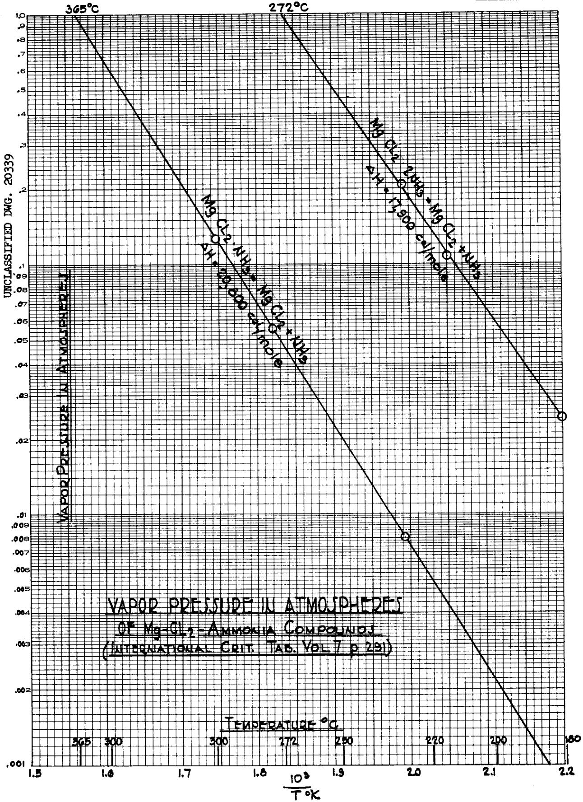  
FIGURE 54

Magnesium Chloride - Ammonia - Propylenediamine   

<table><tr><td rowspan="2">Chemical Reaction</td><td colspan="4">MgCl2·3PDA + 6NH3→</td></tr><tr><td colspan="4">MgCl2·6NH3 + 3PDA</td></tr><tr><td rowspan="5">Mole ratio PDA/MgCl2in washed MgCl2·6NH3precipitate</td><td>Pressure</td><td>Temp.</td><td>Starting Mat.</td><td>Product (104)</td></tr><tr><td></td><td></td><td>PDA/MgCl2</td><td>PDA/MgCl2</td></tr><tr><td>1 atm</td><td>-33°C</td><td>~ 3</td><td>0.031</td></tr><tr><td>1 atm</td><td>-33°C</td><td>~ 9</td><td>.050</td></tr><tr><td>1 atm</td><td>-33°C</td><td>~ 9</td><td>.053</td></tr></table>

Magnesium Chloride - Decane - Propylenediamine   

<table><tr><td>Apparent equilibrium</td><td>0.46, 0.75</td><td>PDA/MgCl2</td><td>(68)</td></tr><tr><td>PDA/MgCl2ratio after refluxing and dis- tilling at decane boil- ing point</td><td colspan="3">(decane returning to the system upon refluxing carried room temperature saturation of PDA)</td></tr></table>

Magnesium Chloride - Dodecane - Propylenediamine   

<table><tr><td>Apparent equilibrium</td><td>1.1, 1.2 PDA/MgCl2(72)</td></tr><tr><td>PDA/MgCl2ratio after refluxing and distilling at dodecane boiling point</td><td>(dodecane returning to the system upon refluxing carried room temperature saturation of PDA)</td></tr></table>

Magnesium Chloride - Ethylene glycol - Propylenediamine   

<table><tr><td>Apparent equilibrium</td><td>0.2 PDA/MgCl2</td><td>(73)</td></tr><tr><td>PDA/MgCl2ratio after refluxing and distilling</td><td rowspan="2">(Ethylene glycol replaces PDA to some extent in the solvated salt structure)</td><td></td></tr><tr><td>at Ethylene glycol boiling point</td><td></td></tr></table>

Magnesium Chloride - 2 Ethyhexanol - Propylenediamine   

<table><tr><td>Apparent equilibrium</td><td>1.3</td><td>PDA/MgCl2</td><td>(73)</td></tr><tr><td>PDA/MgCl2ratio after refluxing and distilling at 2 ethylhexanol boiling point</td><td></td><td></td><td></td></tr></table>

Magnesium Chloride - Methanol - Propylenediamine

Solubility of $\mathsf{MgCl}_2\cdot 3\mathsf{PDA}$ See Figure 55 in Methanol-PDA mixtures (103)

Magnesium Chloride - Propylenediamine - Water

Chemical Reaction $\mathrm{MgCl}_2 + \mathrm{xsH}_2\mathrm{O} + \mathrm{xsPDA}\longrightarrow$ $\mathrm{Mg(OH)}_2 + 2\mathrm{PDA}\cdot \mathrm{HCl} + \mathrm{H}_2\mathrm{O} + \mathrm{PDA}$

<table><tr><td>Solubility of Mg++ in H2O - PDA mixtures</td><td>Solubility Mg++ in moles/liter</td><td>% PDA</td><td>Temp °C</td><td>(60)</td></tr><tr><td></td><td>0.007</td><td>90</td><td>25</td><td></td></tr><tr><td></td><td>0.033</td><td>60</td><td>25</td><td></td></tr><tr><td></td><td>0.012</td><td>30</td><td>25</td><td></td></tr><tr><td></td><td>0.010</td><td>60</td><td>60</td><td></td></tr><tr><td></td><td>0.003</td><td>30</td><td>60</td><td></td></tr></table>

Magnesium Chloride - Ammonia - Methanol - Propylenediamine

Chemical Reaction MgCl2·3PDA (in MeOH sol'n) + NH3 MgCl2·6NH + 3PDA (in MeOH sol'n)

Solubility of $\mathsf{MgCl}_2\cdot 6\mathsf{NH}_3$ See Figure 56 in MeOH in presence of NH and PDA

PDA content of $\mathsf{MgCl}_2\cdot 6\mathsf{NH}_3$ See Figure 57 (103) precipitate

# IV. POTASSIUM AND POTASSIUM COMPOUNDS

# A. POTASSIUM

Atomic Weight 39.096

Melting Point 63.7°C, 147°F (1)

Boiling Point $760^{\circ}\mathrm{C}, 1400^{\circ}\mathrm{F}$ (1)

Latent Heat of Fusion 14.6 cal/g, 571 cal/g mole, 26.3 Btu/lb, 1027 Btu/lb mole (1)

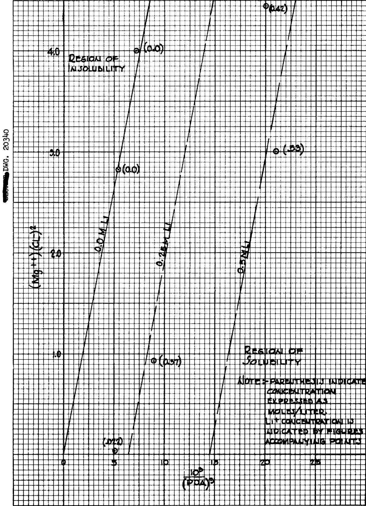  
SOLUBILITY OF MgCl. 3PDA IN METHANOL FIGURE 59 DATA BY L.B.YEATTJ REF.103

114

UNCLASSIFIED DWG. 20341

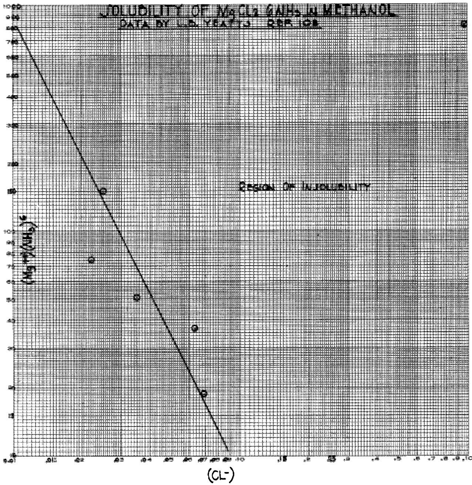

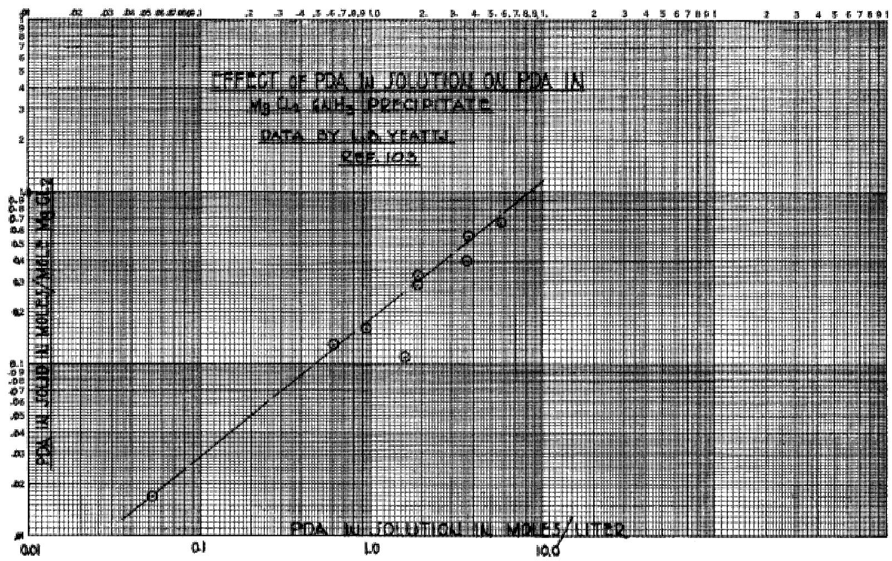  
115   
UNCLASSIFIED DWG. 20342

FIGURE 57

<table><tr><td>Latent Heat of Vaporization</td><td>496 cal/g, 1940 cal/g mole, 892 Btu/lb, 3490 Btu/lb mole</td><td>(1)</td></tr><tr><td>Vapor Pressure</td><td>log10Pmm = -4552/T(℃) - 0.5 log T(℃) + 8.793</td><td>(1)</td></tr><tr><td></td><td>Accuracy 5% from 600-1100℃; 20% 350-1200℃</td><td></td></tr><tr><td></td><td>See Figure 7</td><td></td></tr><tr><td>Density</td><td>0.86 g/ml at 20℃, 53.6 lbs/ft3at 68°F, 0.82 g/ml at 100℃</td><td>(1)</td></tr><tr><td>Heat Capacity</td><td>0.1956 cal/g℃ (Btu/lb℉) at 75℃ (as a liquid)</td><td>(1)</td></tr><tr><td>Viscosity</td><td>0.515 centipoise at 70℃, 0.331 cp at 167℃</td><td>(1)</td></tr><tr><td></td><td>See Figure 8</td><td></td></tr><tr><td>Thermal Conductivity</td><td>0.1073 cal/sec cm℃ at 200℃</td><td>(1)</td></tr><tr><td>Electrical Resistivity</td><td>13.16 μohms at 64℃</td><td>(1)</td></tr><tr><td>Surface Tension</td><td>86 dynes/cm (100 to 150℃)</td><td>(1)</td></tr><tr><td>Volume Change on Fusion (% of Sol. Vol.)</td><td>2.41%</td><td>(1)</td></tr><tr><td>Potassium - Mercury</td><td></td><td></td></tr><tr><td>Surface Tension</td><td>See Figure 13</td><td>(13,26)</td></tr><tr><td>Electrical Conductivity</td><td>See Figure 12</td><td>(13,27)</td></tr><tr><td>Density</td><td>13.371 g/ml for 0.629 moles K/liter sol&#x27;n (0.184 wt %)</td><td>(13,74)</td></tr><tr><td></td><td>12.908* g/ml for 3.14 moles K/liter sol&#x27;n (0.950 wt %)</td><td></td></tr><tr><td></td><td>both at room temperature</td><td></td></tr><tr><td></td><td>* must contain KHg9 crystalline solid</td><td></td></tr></table>

Solubility of K in Hg See Figures 15, 16 (13,25)

Phase Diagram See Figure 58 (13,22)

Heat of Solution $\mathbf{K} + 199\mathrm{Hg}\rightarrow \mathbf{K}(\mathrm{Hg})_{199}$

$$
\Delta \mathrm {H} = 2 6, 3 5 0 \mathrm {c a l}
$$

$$
\mathrm {K} + 4 9 \mathrm {H g} \rightarrow \mathrm {K} (\mathrm {H g}) _ {4 9}
$$

$$
\Delta H = 2 6, 1 2 0 \mathrm {c a l}
$$

Activity Coefficient $\log_{10} \gamma = 0.4396 \mathrm{M} (25^{\circ} \mathrm{C})$ (54)

where $\gamma =$ activity coefficient and M $=$ g atom K per 13,534 g Hg at 25C

Potassium - Sodium

Phase Diagram See Figure 59

# B. POTASSIUM CHLORIDE

Formula Weight 74.55

Melting Point 770°C (6)

Boiling Point 1407°C (6)

Heat of Fusion 6410 cal/g mole (6)

Heat of Vaporization 38,840 cal/g mole (6)

Vapor Pressure $10^{-4}$ atm at $607^{\mathrm{OC}}$ , $10^{-3}$ atm (6)

at $806^{\mathrm{OC}}$ , $10^{-2}$ atm at $948^{\mathrm{OC}}$

Density 1.984 g/ml (2)

Refractive Index 1.490 (2)

Potassium Chloride - Ethylenediamine

Solubility 0.0017 moles KCl/liter sol'n at room temperature (11)

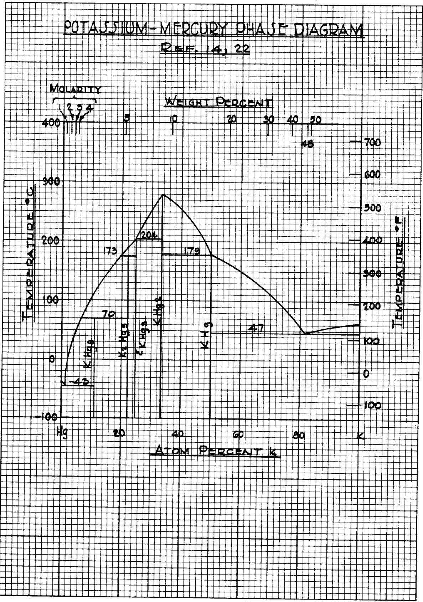

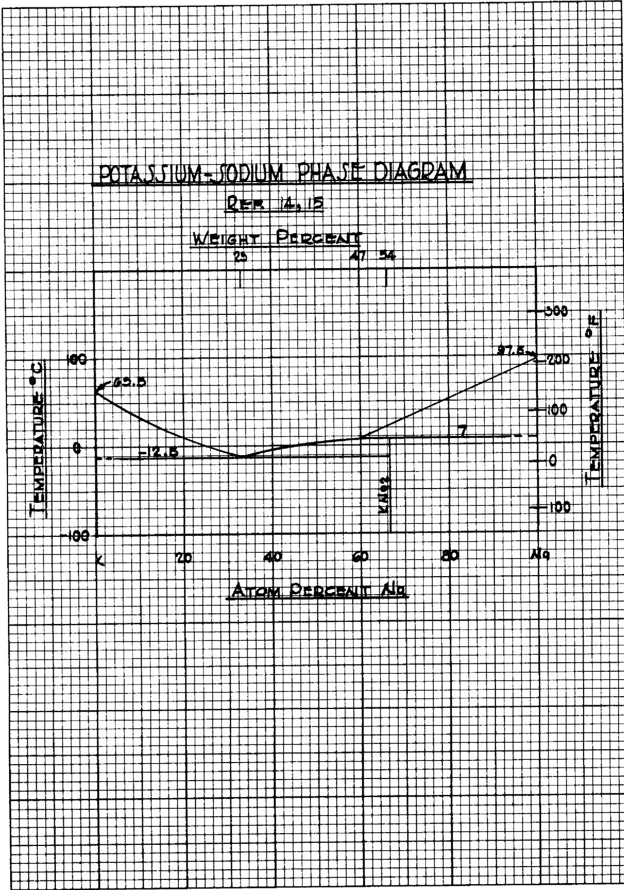

Potassium Chloride - Propylenediamine

Solubility

0.0001 moles KCl/liter (43,55)

sol'n at $20^{\circ}C$

0.0002 moles KCl/liter

sol'n at $60^{\circ}C$

0.0004 moles KCl/liter

sol'n ave. from 240to 115OC

# V. SODIUM AND SODIUM COMPOUNDS

# A. SODIUM

Atomic Weight 22.997

Melting Point 97.8°C, 208°F (1)

Boiling Point $883^{\circ}C$ ，16210F (1)

Latent Heat of Fusion 27.05 cal/g, 622 cal/mole, 48.7 Btu/lb, 1120 Btu/lb mole (1)

Latent Heat of 1005 cal/g, 2315 cal/mole, Vaporization 1810 Btu/lb, 4160 Btu/lb mole (1)

Vapor Pressure $\log_{10}P_{\mathrm{mm}} = \frac{-5567}{T}$ (1)

0.5 $\log_{10} T - 9.235$

$\mathbf{T} = \mathbf{0}_{\mathbf{K}}$

Accuracy 1200 - 450 $^{\text{O}}$ K, 5%; 1250 - 370 $^{\text{O}}$ K, 10%

See Figure 7

Density 0.97 g/ml at 20°C, 0.928 g/ml (1)  
at 100 C (Liquid) 60.5 lb/ft³  
at 68 F

Heat Capacity 0.3305 cal/g $^{\text{O}}$ C at 100 $^{\text{O}}$ C (Btu/lb $^{\text{O}}$ F) (as a liquid)

Viscosity 0.686 centipoise at $103.7^{\circ}\mathrm{C}$ (1)

See Figure 8

Thermal Conductivity 0.2055 cal/sec cm $^{\circ}$ C at 100°C (1)

49.7 Btu/hr ft $^{\text{O}}$ F at 212 $^{\text{O}}$ F

Electrical Resistivity 9.65 $\mu$ ohms at $100^{\circ}\mathrm{C}$ (1)

Surface Tension 206.4 dynes/cm at $100^{\circ}\mathrm{C}$ (1)

Volume Change on Fusion 2.5% (1) (% of sol. vol.)

Sodium - Mercury

Density 13.448 g/ml for 0.601 g atoms Na/liter sol'n (0.103 wt %) (13,74)

12.965 g/ml for 3.37 g atoms Na/liter sol'n (0.597 wt %)

both at room temperature.

Viscosity 1.74 centipoise for 1.95 g atoms Na/liter sol'n at $25^{\circ}C$ (13)

2.2 centipoise for saturated sol'n at $25^{\circ}\mathrm{C}$

Surface Tension See Figure 13 (13,26)

Electrical Conductivity See Figure 12 (13,27)

Solubility of Na in Hg See Figure 15, 16 (13,25)

Phase Diagram See Figure 60 (13,22,14)

Heat of Mixing $\mathrm{Na} + 199\mathrm{Hg}\rightarrow \mathrm{Na(Hg)}_{199}$ (13)

$\Delta_{\textbf{H}} = -19,930$ cal

Na + 49 Hg → Na(Hg)₄9

$\Delta \textbf{H} = -19,860$ cal

Activity Coefficient $\begin{array}{rl} & {\log_{10}\mathcal{A} = 0.2148\mathrm{Mat}25^{\circ}\mathrm{C}}\\ & {\mathrm{where}\mathcal{A} = \mathrm{activity~coefficient~and}}\\ & {\mathrm{M = g~atom~Na~per~13,534g~Hg~at~25^{\circ}C}} \end{array}$

# SODIUM-MERCURY PHASE DIAGRAM

${2km}$ 22,14

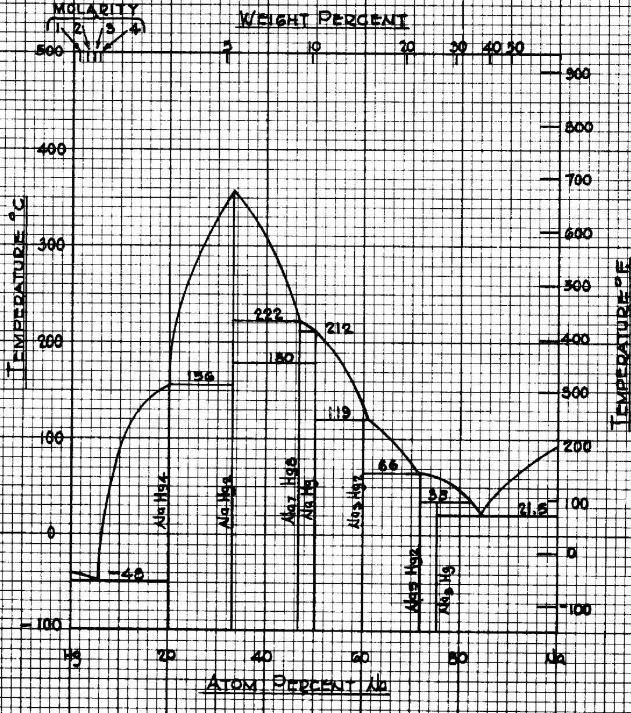

B. SODIUM CHLORIDE   

<table><tr><td>Formula Weight</td><td>58.45</td><td></td></tr><tr><td>Melting Point</td><td>800°C</td><td>(6)</td></tr><tr><td>Boiling Point</td><td>1465°C</td><td>(6)</td></tr><tr><td>Latent Heat of Fusion</td><td>7220 cal/g mole</td><td>(6)</td></tr><tr><td>Latent Heat of Vaporization</td><td>40,808 cal/g mole</td><td>(6)</td></tr><tr><td>Vapor Pressure</td><td>0.01 atm. at 996°C, 0.0001 atm. 
at 741°C</td><td>(6)</td></tr><tr><td>Density</td><td>2.165 g/ml</td><td>(2)</td></tr><tr><td>Heat Capacity</td><td>11.88 cal/°C mole at 25°C</td><td>(5)</td></tr><tr><td>Refractive Index</td><td>1.5442</td><td>(2)</td></tr></table>

Sodium Chloride - Ethylenediamine   

<table><tr><td>Solubility of NaCl in
EDA</td><td>See Figures 29, 61</td></tr></table>

Sodium Chloride - Propylenediamine   

<table><tr><td>Solubility in NaCl</td><td>See Figure 62</td><td>(45,60)</td></tr><tr><td>in PDA</td><td></td><td></td></tr></table>

Sodium Chloride - Tetrahydrofuran   

<table><tr><td>Solubility of NaCl in THF</td><td>~2 x 10-4moles NaCl/liter sol&#x27;n at 27°C</td></tr></table>

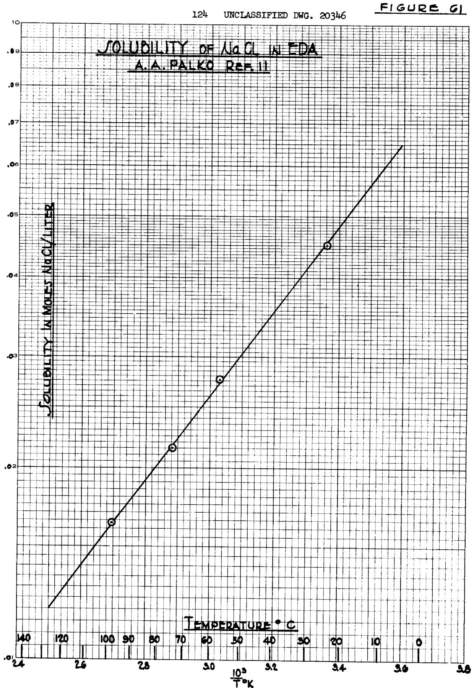

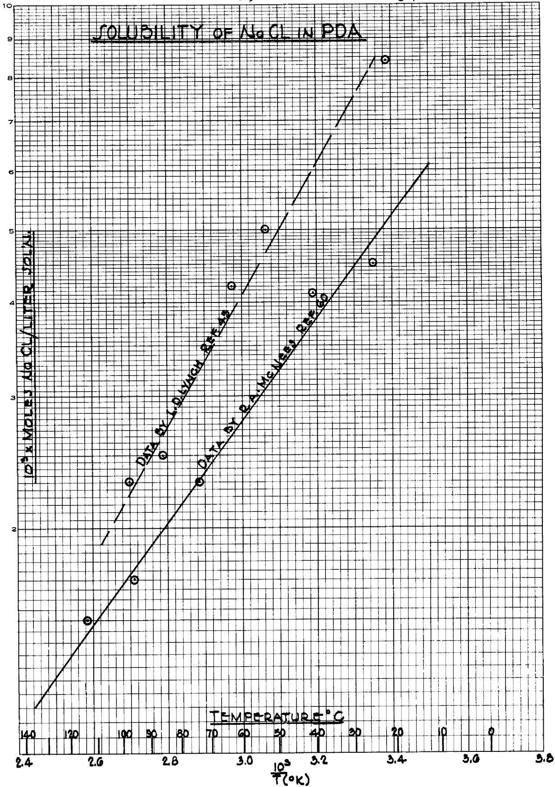  
FIGURE 62

Sodium Chloride - Propylenediamine - Water   

<table><tr><td rowspan="2">Solubility of NaCl in wet PDA</td><td rowspan="2">Temp.OC25</td><td colspan="2">Molarity NaCl/liter sol&#x27;n (60)</td></tr><tr><td>1% H2O-99% PDA 9.4 x 10-3</td><td>2% H2O-98% PDA 15.2 x 10-3</td></tr><tr><td></td><td>40.5</td><td>6.8 x 10-3</td><td>11.2 x 10-3</td></tr><tr><td></td><td>56</td><td>5.1 x 10-3</td><td>8.6 x 10-3</td></tr><tr><td></td><td>63</td><td>5.0 x 10-3</td><td>8.0 x 10-3</td></tr><tr><td></td><td>80</td><td>4.3 x 10-3</td><td>6.9 x 10-3</td></tr></table>

# C. SODIUM HYDROXIDE

Formula Weight 40.01

Melting Point 320°C (5)

Boiling Point 1390 C (2)

Latent Heat of Fusion 1700 cal/g mole (5)

Density 2.130 g/ml (2)

Heat Capacity 19.2 cal/°C mole, (Btu/1b°F) (5)

Refractive Index 1.3576 (2)

# Sodium Hydroxide - 2 Ethylhexanol

<table><tr><td rowspan="2">Solubility</td><td>0.51 moles NaOH/liter sol&#x27;n at room temperature</td><td rowspan="2">(79)</td></tr><tr><td>0.47 moles NaOH/liter sol&#x27;n at 184°C</td></tr></table>

# Sodium Hydroxide - Propylenediamine

<table><tr><td>Solubility.of NaOH
in PDA</td><td>~0.0008 moles NaOH/liter
sol&#x27;n at room temperature
&lt;0.013 mole/liter sol&#x27;n at
75oC</td></tr></table>

Sodium Hydroxide - Water

Phase Diagram See Figure 63 (4)

Sodium Hydroxide - Ethylenediamine - Water

Phase Diagram See Figure 64 (11)

Sodium Hydroxide - Propylenediamine - Water

Phase Diagram See Figure 65 (75)

# D. SODIUM PHOSPHATE

Formula Weight 163.97

Melting Point 1340°C (3)

Density 2.537 g/ml at $17.5^{\circ}C$ (3)

Sodium Phosphate - Water

Solubility of $\mathbf{Na}_3\mathbf{PO}_4$ in See Figure 66 (76) water

# VI. LIQUID SOLVENTS

# A. AMMONI A

Formula Weight 17.03

Melting Point -77.7°C (16)

Boiling Point -33.35°C (16)

Latent Heat of Fusion 1352 cal/g mole, 79.4 cal/g (16)

83.9 cal/g (17)

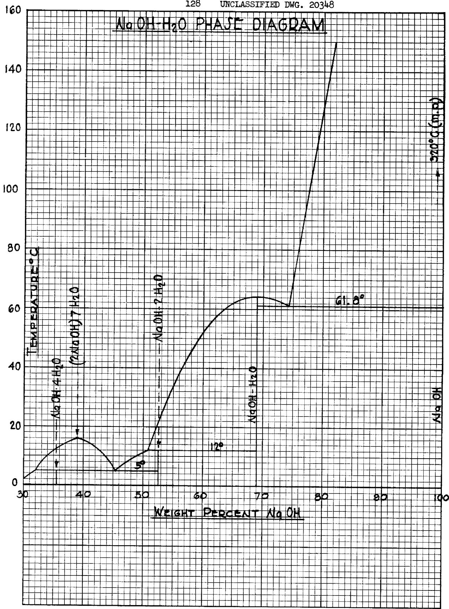  
FIGURE 69

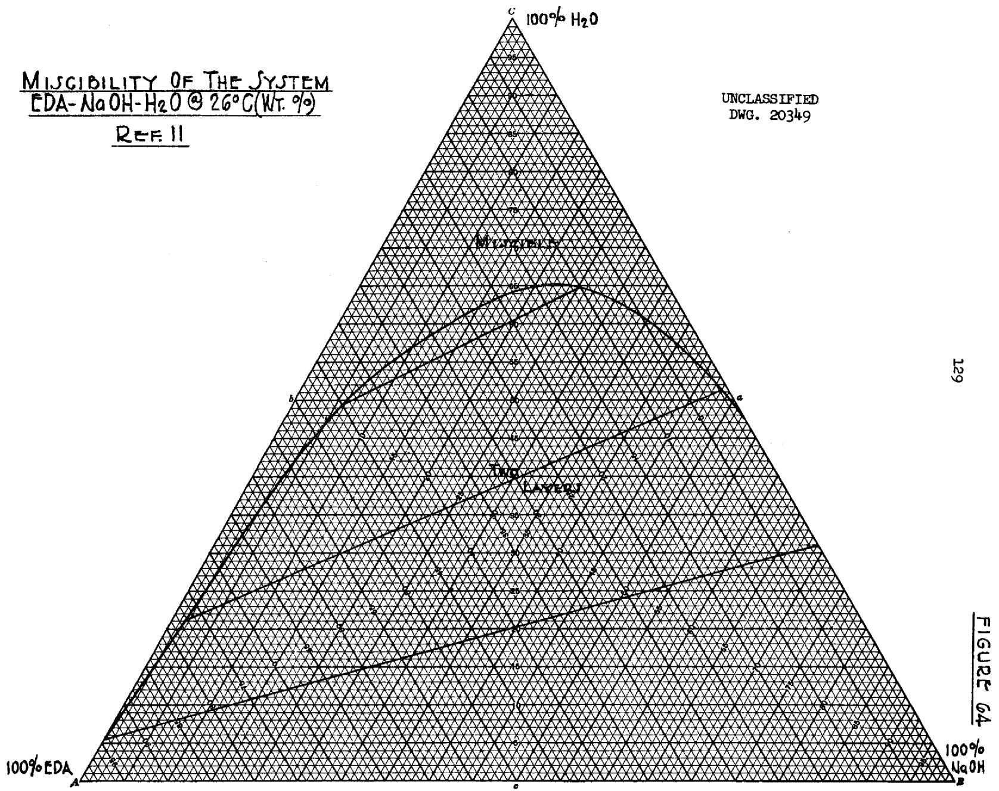  
MISIBILITY OF THE SYSTEM   
${EDA} - {NaOH} - {H}_{2}O$ ② ${26}^{ \circ  }\mathrm{C}\left( {W,{T}_{2}{H}_{2}O}\right)$   
RE:11

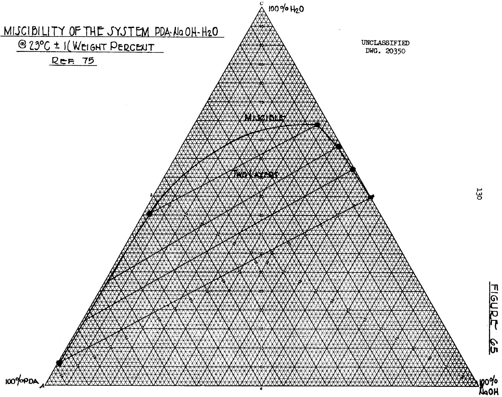

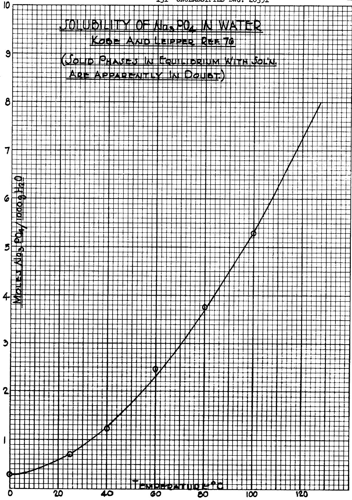  
131 UNCLASSIFIED DWG. 20351   
FIGURE 66

<table><tr><td>Latent Heat of Vaporization</td><td colspan="2">5581 cal/g mole, 327 cal/g</td><td>(16)</td></tr><tr><td>Vapor Pressure</td><td colspan="3">log10Pmm = 12.465400 - 1648.6068 T - 0.01638646 T + 2.403276 x 10-5T2 - 1.168708 x 10-8T3 (183.1°&lt;T&lt;343.1°K)</td></tr><tr><td>Critical Pressure</td><td colspan="2">112.3 atm</td><td>(16)</td></tr><tr><td>Critical Temperature</td><td colspan="2">133°C</td><td>(16)</td></tr><tr><td>Density</td><td>Temperature°C</td><td>Density g/ml</td><td>(16)</td></tr><tr><td></td><td>-30</td><td>0.6777</td><td></td></tr><tr><td></td><td>-10</td><td>0.6520</td><td></td></tr><tr><td></td><td>0</td><td>0.6386</td><td></td></tr><tr><td></td><td>20</td><td>0.6103</td><td></td></tr><tr><td>Heat Capacity</td><td colspan="2">1.1 cal/g°C at 0°C</td><td>(17)</td></tr><tr><td>Viscosity</td><td colspan="2">0.135 centipoise at 25°C</td><td>(16)</td></tr><tr><td>Dielectric Constant</td><td colspan="2">16.26 at 25°C</td><td>(16)</td></tr><tr><td>Dipole Moment</td><td colspan="2">1.46 x 10-18e.s.u.</td><td>(16)</td></tr><tr><td>Conductivity</td><td colspan="2">5 x 10-11mho at - 33°C</td><td>(17)</td></tr><tr><td>Ignition Temperature</td><td colspan="2">651°C, 1204°F</td><td>(3)</td></tr><tr><td>Limits of Inflammability</td><td colspan="2">&gt;15% and &lt;28% (vol.)NH3in dry air at 25°C</td><td>(3)</td></tr><tr><td>Solubility of Metals in Ammonia</td><td colspan="2">Metal Solubility g/100 g NH3</td><td>Temp. °C</td></tr><tr><td></td><td>Li</td><td>10.7</td><td>-33.2</td></tr><tr><td></td><td>Li</td><td>11.3</td><td>0</td></tr><tr><td></td><td>Na</td><td>24.6</td><td>-33</td></tr><tr><td></td><td>K</td><td>49.0</td><td>-33</td></tr><tr><td></td><td></td><td></td><td>(17)</td></tr></table>

<table><tr><td rowspan="3">Solubility of Some 
Salts in Ammonia</td><td rowspan="3">Cation</td><td colspan="3">Solubility g/100 g NH3at 0°C</td></tr><tr><td colspan="3">Anion</td></tr><tr><td>Cl</td><td>Br</td><td>I</td></tr><tr><td></td><td>Li</td><td>1.43</td><td>---</td><td>---</td></tr><tr><td></td><td>Na</td><td>11.37</td><td>39.00</td><td>56.88</td></tr><tr><td></td><td>K</td><td>0.132</td><td>21.18</td><td>64.81</td></tr><tr><td></td><td>NH4</td><td>39.91</td><td>57.96</td><td>76.99</td></tr><tr><td></td><td>Mg</td><td>---</td><td>0.004</td><td>0.156</td></tr><tr><td>Ammonia - Methanol</td><td></td><td></td><td></td><td></td></tr><tr><td>Solubility of NH3in 
Methanol</td><td colspan="3">See Figure 67</td><td>(77,4)</td></tr><tr><td>Densities of sol&#x27;ns of 
NH3in Methanol</td><td colspan="3">See Figure 68</td><td>(77)</td></tr><tr><td></td><td colspan="3">B. BENZENE</td><td></td></tr><tr><td>Formula Weight</td><td colspan="3">78.11</td><td></td></tr><tr><td>Melting Point</td><td colspan="3">5.5°C, 42°F</td><td>(3)</td></tr><tr><td>Boiling Point</td><td colspan="3">80.1°C, 176.2°F</td><td>(3)</td></tr><tr><td>Latent Heat of Fusion</td><td colspan="3">2351 cal/g mole</td><td>(2)</td></tr><tr><td>Latent Heat of 
Vaporization</td><td colspan="3">7,353 cal/g mole, 94.14 cal/g, 
169.34 Btu/lb</td><td>(2)</td></tr><tr><td>Vapor Pressure</td><td colspan="3">See Figure 69</td><td>(2)</td></tr><tr><td>Density</td><td colspan="3">0.874 g/ml, 7.29 lb/gal, 
54.5 lb/ft3 at 25°C</td><td>(3)</td></tr><tr><td>Heat Capacity (as gas)</td><td colspan="3">19.52 cal/°C g mole at 25°C, 
26.74 cal/°C g mole at 127°C</td><td>(7)</td></tr><tr><td>(as liquid)</td><td colspan="3">0.410 cal/°g at 20°C</td><td>(8)</td></tr><tr><td>Viscosity</td><td colspan="3">0.7 centipoise at 20°C</td><td>(8)</td></tr><tr><td>Flash Point</td><td colspan="3">- 11°C, 12°F</td><td>(3)</td></tr></table>

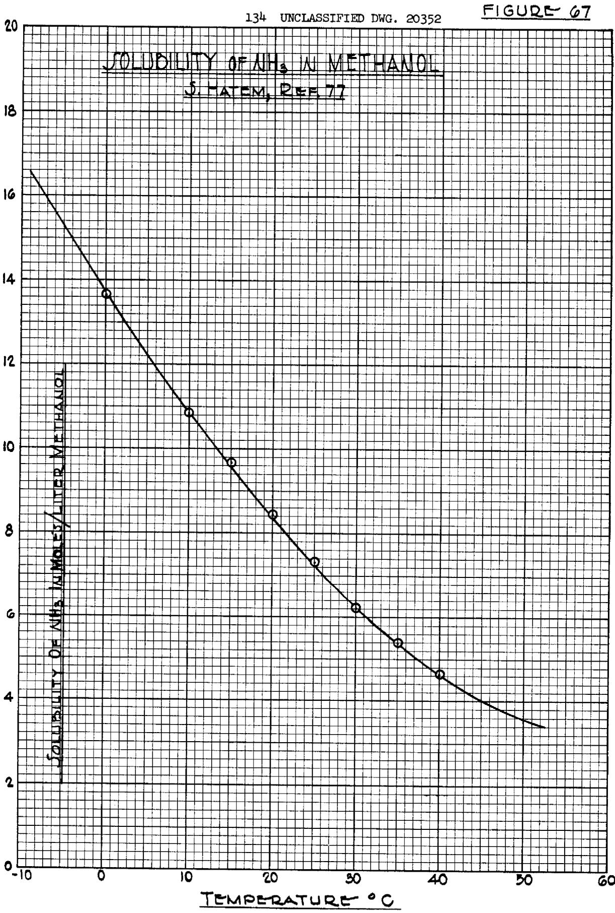

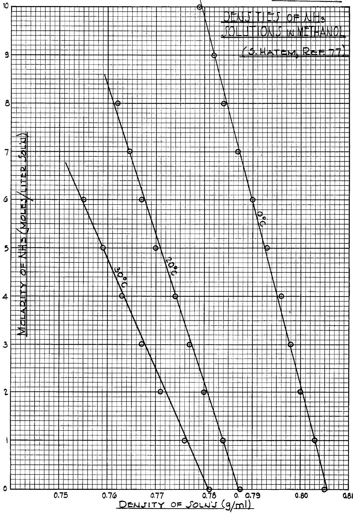

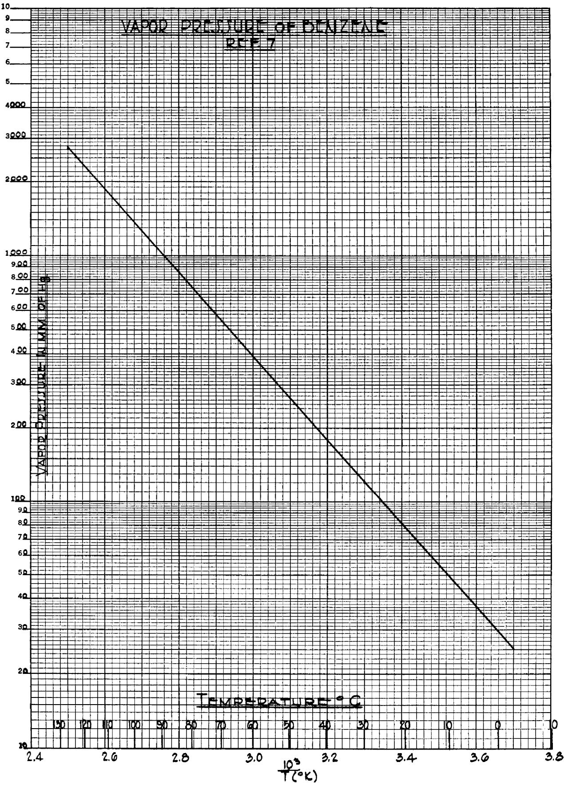

Ignition Temperature 580°C, 1076°F (3)

Limits of Inflammability $>1.35\%$ and $< 6.75\%$ (vol.) of $\mathbf{C}_6\mathbf{H}_6$ in air (3)

Refractive Index 1.05011 at $20^{\circ}\mathrm{C}$ (8)

# Benzene - Ethylenediamine

Phase Diagram See Figure 70 (78,11)

Vapor Liquid Composition Diagram See Figure 71 (78)

# Benzene - Propylenediamine

Phase Diagram See Figure 72 (79)

Vapor Liquid Composition Diagram See Figure 73 (79,80)

# C. DECANE

Formula Weight 142.28 Melting Point - $29.7^{\circ}C$ (3)

Boiling Point 172.5°C at 762 mm (81)

Density 0.730 at $20^{\circ}\mathrm{C}$ (81)

Heat Capacity 58.10 cal/°C g mole for gas at $25^{\circ}\mathrm{C}$ (7)

Viscosity 0.9204 centipoise at $20^{\circ}\mathrm{C}$ (7)

Surface Tension 23.7 dynes/cm at $20^{\circ}C$ (81)

Flash Point $46^{\mathrm{OC}}$ (3)

Ignition Temperature 250°C (3)

Explosive Limits 0.67 to $2.60\%$ by vol. in air (3)

$\left( {{Ta}{10} : {MM}\text{中点}}\right)$

$\left( {0,A,{LEE},{2EF}7B,1}\right)$

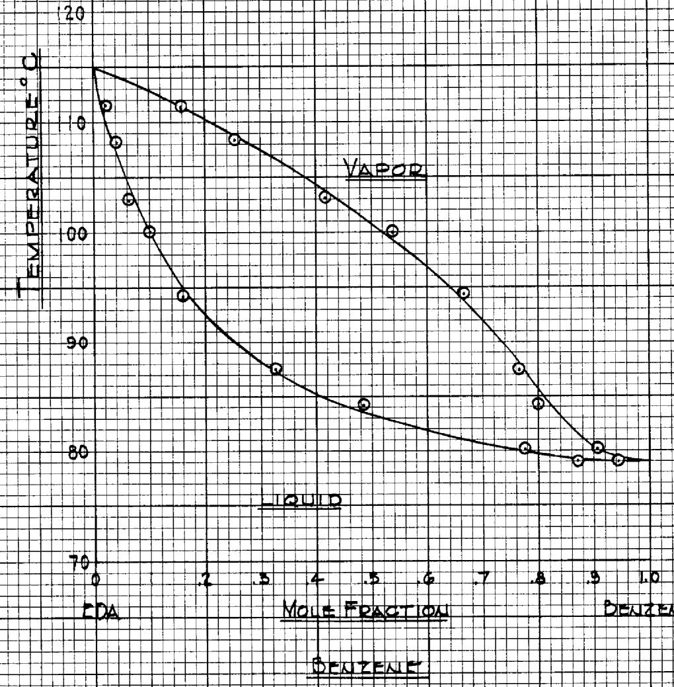  
PHASE DIAGRAM BENZENE-EDA

# VAPOR- LIGUID EQUILIBRA COMPOSITION DIAGRAM

# ${FDA} + {DAI} + {FEA} + 5$

# $\left( {O,A,E,F,O,E,F,{TB}}\right)$

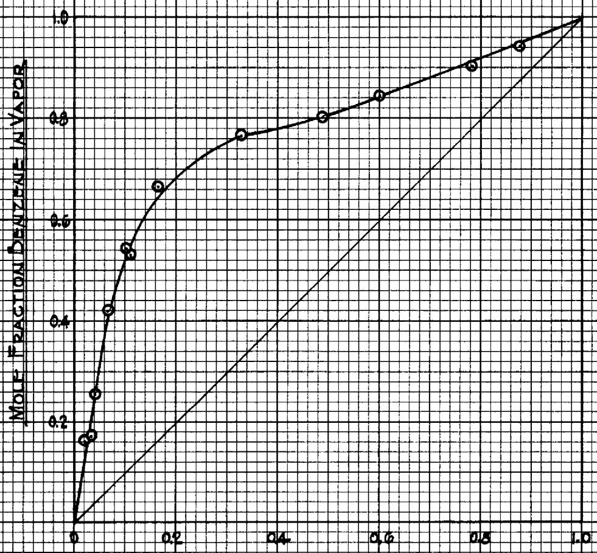  
Molecule FROACTION DENZENE MO liquid

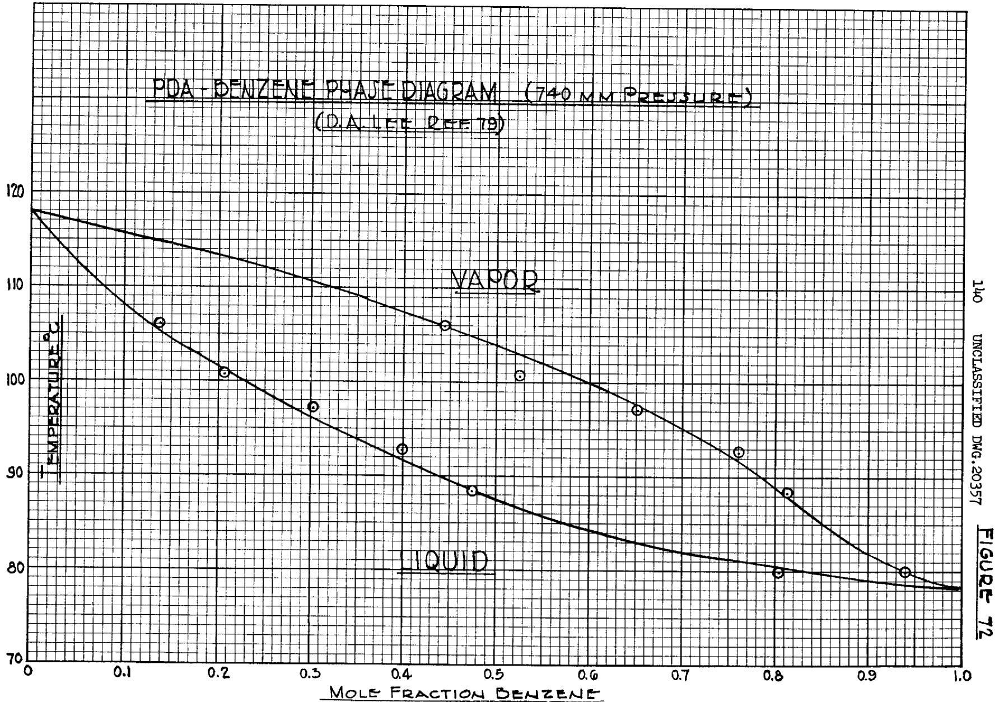

# VAPOR+LIQUID EQUILIBQIA COMPOSITION DIAGRAM

# ${PDA} - 3$ 代入式子有

$\left( {0,A,L}\right)  = \left( {0, - A, - B, - C}\right)$

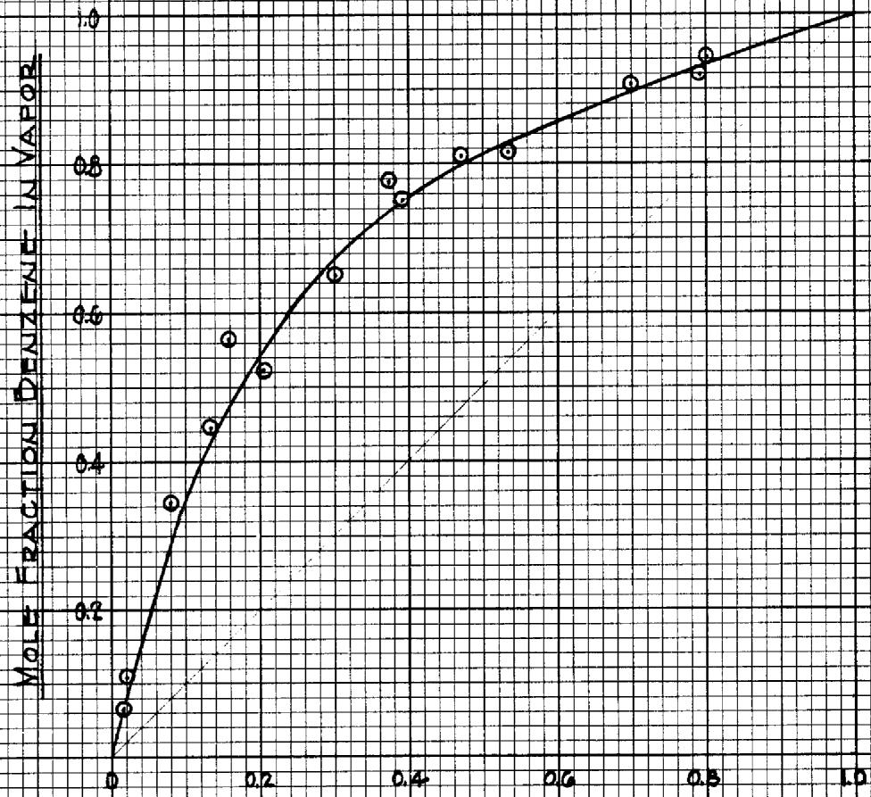

Moles Fraction Benzene LIquid

Refractive Index 1.41206 at $20^{\circ}\mathrm{C}$ (81)

# Decane - Propylenediamine

Vapor Liquid Composition See Figure 74 (82) Diagram

Limits of Solubility 0.01 moles PDA soluble per Room temperature liter decane phase (68)

0.15 mole decane soluble per liter PDA phase

# D. DODECANE

Formula Weight 170.33

Melting Point -9.6 C (3)

Boiling Point 214.5°C (3)

Density 0.750 g/ml at $20^{\circ}\mathrm{C}$ (81)

Heat Capacity 69.62 cal/°C g mole for gas at $25^{\circ}\mathrm{C}$ (7)

Viscosity 1.49 centipoise at $20^{\circ}\mathrm{C}$ (7)

Surface Tension 25.5 dynes/cm at $20^{\circ}\mathrm{C}$ (81)

Flash Point $74^{\mathrm{o}}\mathrm{C}$ (3)

Ignition Temperature 534OC (3)

Explosive Limits 0.60 to -- % by vol. in air (3)

Refractive Index 1.42186 at $20^{\circ}\mathrm{C}$ (81)

# Dodecane - Propylenediamine

Limits of Solubility 0.04 moles PDA per liter of (72) at room temperature dodecane phase

0.01 moles dodecane per liter of PDA phase

# E. ETHYLENEDIAMINE

Formula Weight 60.08

# DECANE-PDA VAPOR LIQUID COMPOSITION DIAGRAM

# $\left( {D,A,L,E,O = E,{BQ}}\right)$

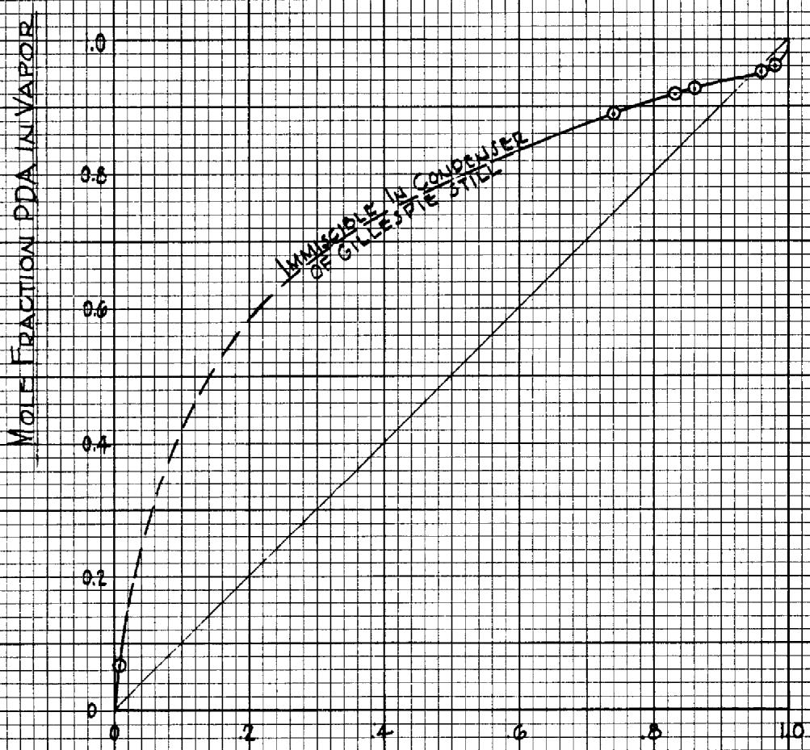  
MOLE FRACTION PDA   
南国国

<table><tr><td>Melting Point</td><td>10.8°C</td><td>(8)</td></tr><tr><td>Boiling Point</td><td>116.2°C</td><td>(11)</td></tr><tr><td>Latent Heat of Fusion</td><td>77 cal/g (monohydrate)</td><td>(11)</td></tr><tr><td>Latent Heat of Vaporization</td><td>167 cal/g (monohydrate)</td><td>(11)</td></tr><tr><td>Vapor Pressure</td><td>See Figure 75</td><td>(11)</td></tr><tr><td>Density</td><td>See Figure 76</td><td>(11)</td></tr><tr><td>Heat Capacity</td><td>0.66 cal/g °C (12° - 26°C)</td><td>(11)</td></tr><tr><td>Thermal Conductivity</td><td>0.00060 cal/sec °C cm, 0.145 Btu/hr °F ft</td><td>(11)</td></tr><tr><td>Viscosity</td><td>See Figure 27</td><td>(11)</td></tr><tr><td>Conductance</td><td>9.0 x 10-8mho</td><td>(11)</td></tr><tr><td>Surface Tension</td><td>See Figure 77</td><td>(11)</td></tr><tr><td>Flash Point</td><td>110°F</td><td>(8)</td></tr><tr><td>Refractive Index</td><td>1.4565 at 20°C</td><td>(8)</td></tr><tr><td>Solubilities of Salts in EDA</td><td>See Figures 16,28,29</td><td>(11)</td></tr><tr><td>Solubilities of Salts in EDA at room temp.</td><td>Salt</td><td>Solubility moles/liter sol&#x27;n</td></tr><tr><td></td><td>LiF</td><td>0.001</td></tr><tr><td></td><td>LiCl</td><td>0.29</td></tr><tr><td></td><td>LiBr</td><td>0.25</td></tr><tr><td></td><td>LiI</td><td>0.37</td></tr><tr><td></td><td>KCl</td><td>0.0017</td></tr><tr><td></td><td>KBr</td><td>0.059</td></tr><tr><td></td><td>KI</td><td>3.44</td></tr><tr><td></td><td>NaCl</td><td>0.05</td></tr><tr><td></td><td>NaBr</td><td>4.09</td></tr><tr><td></td><td>NaI</td><td>1.9</td></tr><tr><td></td><td>EDA·2HCl</td><td>1.70</td></tr><tr><td></td><td>EDA·H2SO4</td><td>0.001</td></tr><tr><td></td><td>EDA·H2CO3</td><td>1.0</td></tr></table>

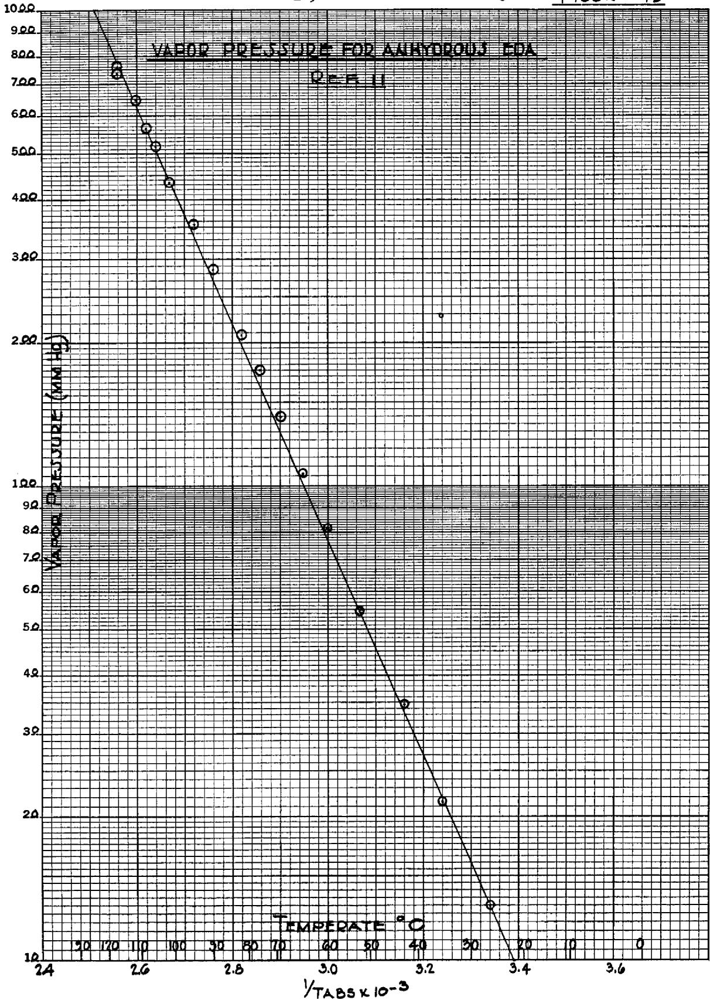  
145 UNCLASSIFIED DWG. 20360   
FIGURE 75

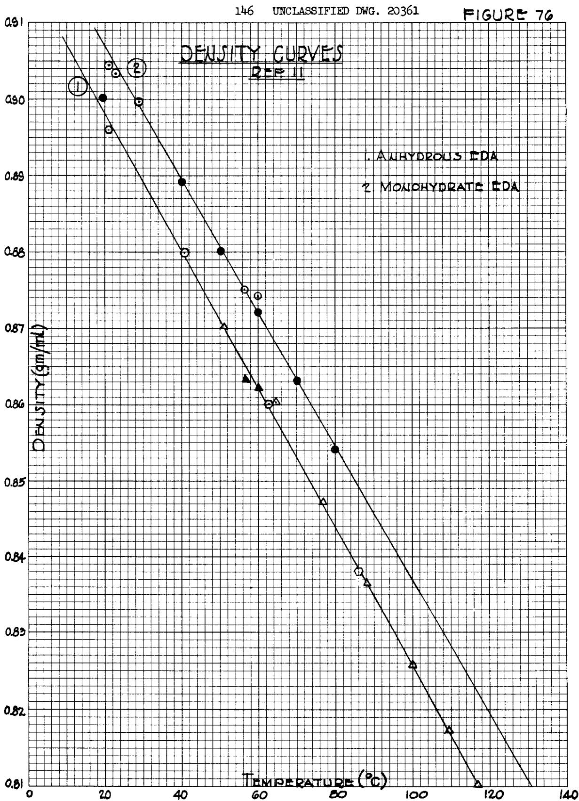

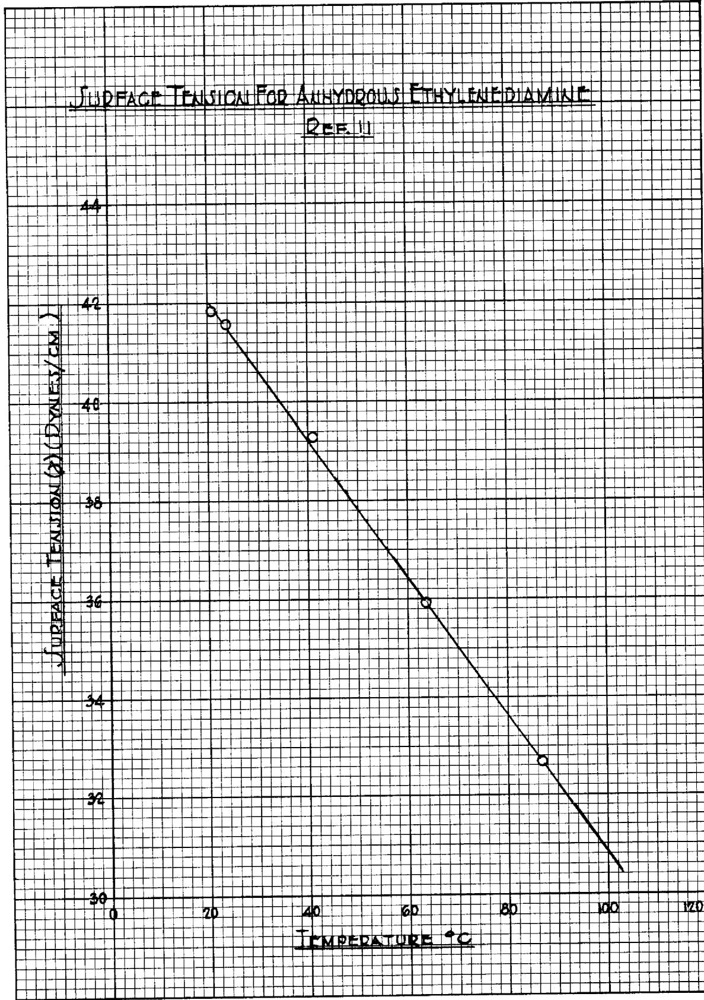

# Ethylenediamine - Water

Phase Diagram See Figure 78 (11)

# F. ETHYLENE GLYCOL

Formula Weight 62.07

Melting Point - 13.0°C (8)

Boiling Point 197.2OC (8)

Latent Heat of Fusion 44.7 cal/g (18)

Latent Heat of 191 cal/g, 344 Btu/1b (8) Vaporization

Vapor Pressure 0.06 mm at $20^{\circ}\mathrm{C}$ , 10 mm at 89°C, 50 mm at 123°C (8)

$\log_{10}P_{mm} = 7.8808 -$ 1957/(193.8+ tOC) (18)

Density 1.11336 g/ml at $20^{\circ}\mathrm{C}$ (18)

Specific Gravity 1.1154 20/20 $^{\text{O}}$ C, 9.28 lb/gal (8) at $20^{\circ}\text{C}$

Heat Capacity 0.561 cal/g ${}^{\mathrm{O}}\mathbf{C}$ (Btu/lb ${}^{\mathrm{O}}\mathbf{F}$ ) (8) at $20^{\circ}\mathbf{C}$

0.538 + 0.00113t $\mathbf{O}_{\mathbf{C}}$ (18)

Thermal Conductivity 0.000690 cal/sec cm $^\circ \mathrm{C}$ (18) at $20^{\circ}C$

Viscosity 57.4 cp at $0^{\circ}\mathrm{C}$ , 20.9 cp at (8) 20°C, 9.5 cp at 40°C

Conductivity 1.07 x $10^{-6}$ mhos (18)

Surface Tension 48.4 dynes/cm at $20^{\circ}\mathrm{C}$ , 50.21 - 0.089t ${}^{\circ}\mathrm{C}$ (18)

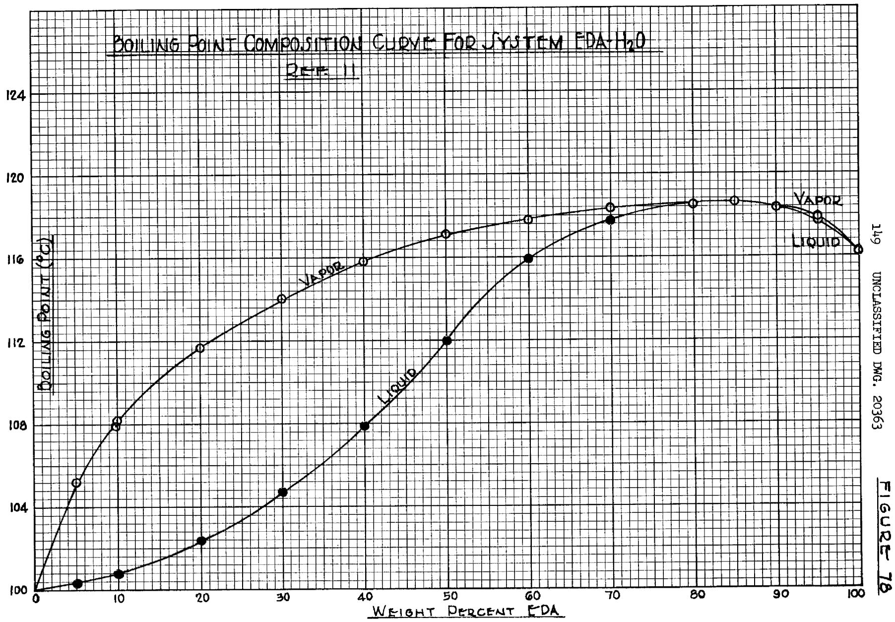

Flash Point 111°C, 232°F (3)

Ignition Temperature 413°C, 775°F (3)

Refractive Index 1.4316 at $20^{\circ}\mathrm{C}$ (8)

Solubility of Salts Solubility in Ethylene Glycol Salt g salt moles salt Temp. $^\circ \mathrm{C}$ 100g solvent liter solvent

LiCl 14.3 3.76 25

LiBr 39.4 5.05 25

KCl 5.18 0.77 25

NaCl 7.15 1.36 25

Ethylene Glycol - Propylenediamine - Water

Vapor - Liquid Composition For mole ratio PDA/Ethylene (83) Glycol 0.5

Mole Fraction $\mathbf{H}_2\mathbf{O}$

Vapor Liquid

.694 341

.731 424

.799 .524

# G. 2 ETHYLHEXANOL

Formula Weight 130.22

Melting Point -76°C (84)

Boiling Point 184.40C (8)

Latent Heat of 92.8 cal/g, 167 Btu/1b (8) Vaporization

Vapor Pressure .2 mm at $20^{\circ}\mathrm{C}$ 10 mm at $78^{\circ}\mathrm{C}$ (8) 50 mm at 109OC

Specific Gravity 0.8345 20/20 $^{\text{O}}$ C, 6.94 lbs/gal at $20^{\circ}\text{C}$ (8)

Heat Capacity 0.564 cal/g $^\circ \mathbf{C}$ (Btu/lb F) (8) at $25^{\circ}C$

Viscosity 10.0 centipoise at $20^{\circ}\mathrm{C}$ , 4.0 (8) centipoise at $40^{\circ}\mathrm{C}$

Flash Point 1850F (8)

Refractive Index 1.4313 at $20^{\circ}\mathrm{C}$ (8)

Solubility in Water 0.10 wt % at $20^{\circ}\mathrm{C}$ (8)

Solubility of Water 2.6 wt % at $20^{\circ}\mathrm{C}$ (8) in 2-EH

# 2 Ethylhexanol - Propylenediamine

Vapor Liquid Composition See Figure 79 Diagram

# 2 Ethylhexanol - Water

Limits of Solubility Solubility of $\mathbf{H}_2\mathbf{O}$ in (8) at Room Temperature 2 Ethylhexanol = 2.6% by wt.

# H. ISOPROPANOL

Formula Weight 60.09

Melting Point -87.8OC (8)

Boiling Point 82.3°C (8)

Latent Heat of 159 cal/g, 287 Btu/lb (8) Vaporization

Vapor Pressure 10 mm at $2^{\circ}\mathrm{C}$ , 33.0 mm at (8) 20°C, 50 mm at 27°C

Specific Gravity 0.7868 20/20 $^{\text{O}}$ C, 6.55 lb/gal. (8) at $20^{\circ}\text{C}$

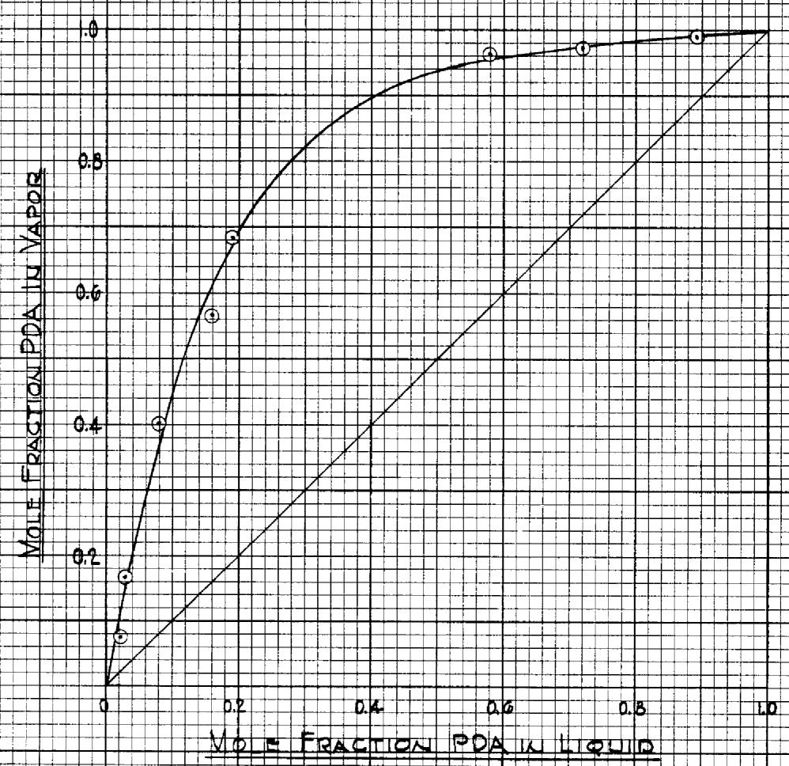  
2. ETHYLEHEXANOL - PROPYLENE DIAMENE VAPOR LIQUID COMPOSITION DIAGRAM (D A L E R e E 79)

Heat Capacity 0.596 cal/g ${}^{\mathrm{OC}}$ (Btu/lb ${}^{\mathrm{OF}}$ ) (8) at $20^{\circ}\mathbf{C}$

Viscosity 2.4 cp at $20^{\circ}\mathrm{C}$ (8)

Flash Point 70OF (8)

Limit of Inflammability 2.02% by vol. lower limit (3)

Refractive Index 1.3772 at $20^{\circ}\mathrm{C}$ (8)

Isopropanol - Water

Phase Diagram See Figure 80 (19)

# I. METHANOL

Formula Weight 32.04 Melting Point -97.6°C (8)

Boiling Point 64.5°C (8)

Latent Heat of 263 cal/g, 473 Btu/lb (8) Vaporization

Vapor Pressure 10 mm at -17°C, 50 mm at 9°C, (8) 92 mm at 20°C

Specific Gravity 0.7939 20/20 $^{\text{O}}$ C, 6.61 lb/gal (8) at $20^{\text{O}}$ C

Heat Capacity 0.599 cal/g ${}^{\circ}\mathbf{C}$ (Btu/1b ${}^{\circ}\mathbf{F}$ ) (8) at $20^{\circ}\mathbf{C}$

Viscosity 0.59 cp at $20^{\circ}\mathbf{C}$ (8)

Flash Point $11^{\circ}C,52^{\circ}F$ (3)

Ignition Temperature $470^{\circ}C$ ，878OF (3)

Limits of Inflammability 6.72 to 36.50% by volume (3) in air

Refractive Index 1.3285 at $20^{\mathrm{OC}}$ (8)

# PHASE DIAGRAM ISOPROPANOL-WATER SYSTEM

# PRESSEURET GOMM

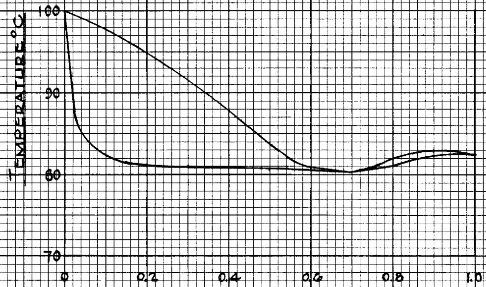

# MOLE FRCTION ISOPROPANOL

# Methanol - Propylenediamine

Phase Diagram See Figure 81 (79)

Vapor Liquid Composition See Figure 83 (85) Diagram

# Methanol - Water

Phase Diagram See Figure 82 (19)

# J. MERCURY

Atomic Weight 200.61 Melting Point -38.9OC, -38.0OF (1)

Boiling Point $357^{\circ}\mathrm{C}, 675^{\circ}\mathrm{F}$ (1)

Latent Heat of Fusion 2.8 cal/g, 562 cal/g atom, (1) 5.04 Btu/lb, 1010 Btu/lb atom

Latent Heat of 69.7 cal/g, 1390 cal/g atom, (1) Vaporization 125.4 Btu/lb, 2500 Btu/lb atom

Vapor Pressure $\begin{array}{rl} & {\log_{10}\mathrm{P}_{\mathrm{mm}} = -\frac{3308}{\mathrm{T}} -0.8\log \mathrm{T}}\\ & {+10.3735} \end{array}$ (1)

Accuracy $2\%$ , $400 - 800^{\mathbf{O}}\mathbf{K}$ ; $5\%$ , $234 - 850^{\mathbf{O}}\mathbf{K}$

See Figure 7

Density 13.546 g/ml at $20^{\circ}\mathrm{C}$ , 13.352 g/ml (1) at $100^{\circ}\mathrm{C}$

845.68 lbs/ft³, 113.04 lbs/gal at $68^{\mathrm{O}}\mathbf{F}$

See Figures 9, 10, 51

Heat Capacity 0.0332 cal/g ${}^{\mathrm{OC}}$ (Btu/lb ${}^{\mathrm{OF}}$ ) (1) at $20^{\mathrm{OC}}$ , 0.03279 cal/g ${}^{\mathrm{OC}}$ at $100^{\mathrm{OC}}$

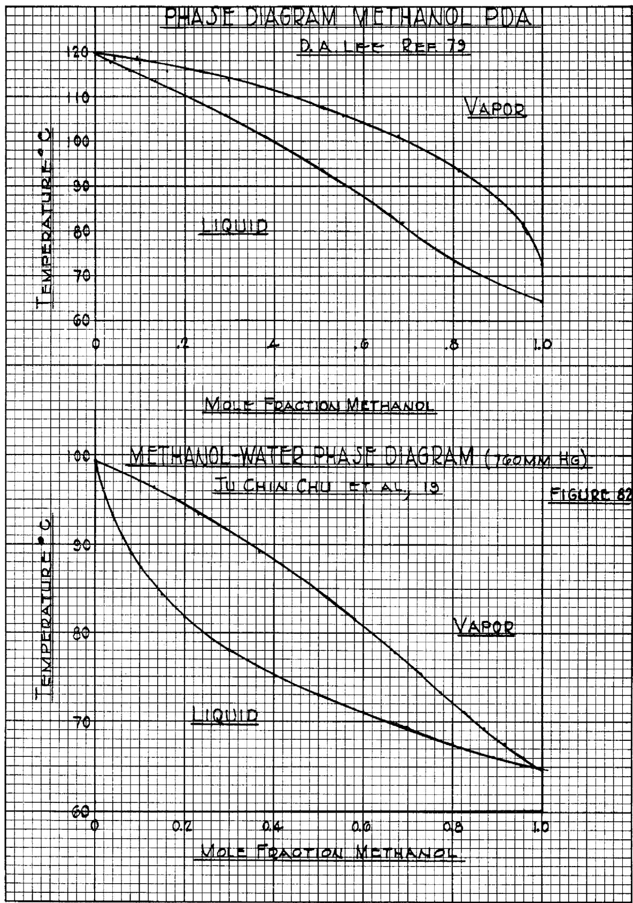

METHANOL-PDA COMPOSITION DIAGRAM

$D$ . A. LFE FEE8B

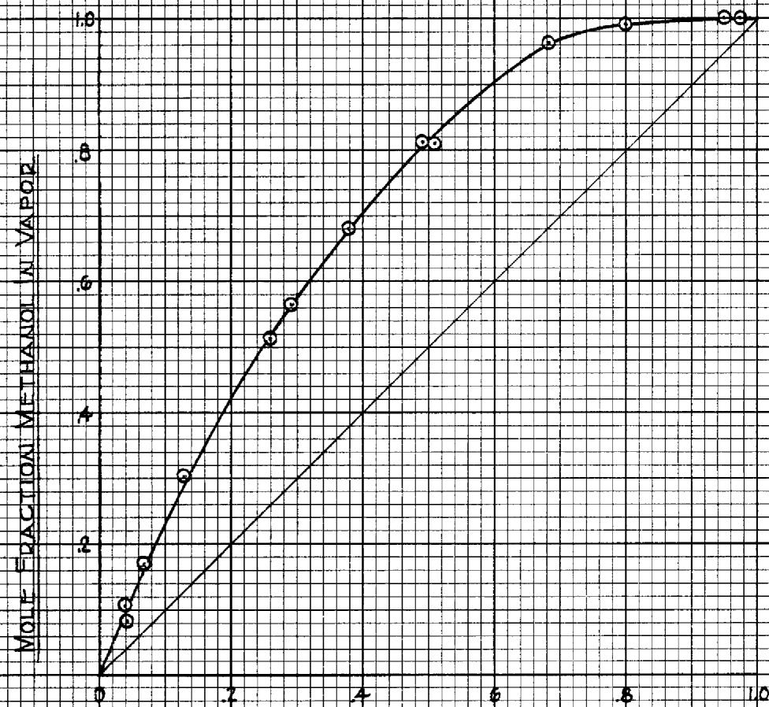  
Mole Fraction Methanol lnLiquid

Viscosity 1.55 centipoise at $20^{\circ}\mathrm{C}$ (1)

See Figures 11, 52, 84

Thermal Conductivity 0.021 cal/sec cm $^{\mathrm{OC}}$ at $20^{\mathrm{OC}}$ , (1)

5.08 Btu/hr ft $\mathbf{O}\mathbf{F}$ at $68^{\mathrm{O}}\mathbf{F}$

0.026 cal/sec cm $^{\mathrm{OC}}$ at $120^{\mathrm{OC}}$ , 6.3 Btu/ft $^{\mathrm{OF}}$ at $248^{\mathrm{OC}}$

Electrical Resistivity 98.4 $\mu$ ohms at $50^{\circ}\mathrm{C}$ (1)

Surface Tension 465 dynes/cm at $20^{\circ}C$ (1)

454 dynes/cm at 112°C

# K. PROPYLENEDIAMINE

Formula Weight 74.13

Melting Point -38.6°C (47)

Boiling Point 120.5°C (86)

Latent Heat of 130 cal/gm, 234 Btu/1b (8) Vaporization

Vapor Pressure $\log_{10}P_{\mathrm{mm}} = 7.6487 - \frac{1671.2}{t^{\circ}C + 230}$ (86)

Density See Figures 36, 85 (12)

Heat Capacity 0.65 cal/g $^{\mathrm{OC}}$ (Btu/1b ${}^{\mathrm{O}}\mathbf{F}$ ) (87) at $27^{\mathrm{o}}\mathrm{C}$

Thermal Conductivity 0.125 Btu/hr ${}^{\mathrm{O}}\mathbf{F}$ ft from (45) 95-200

Viscosity See Figure 33 (47)

Flash Point 160°F (8)

Refractive Index 1.4492 at $20^{\circ}\mathrm{C}$ (8)

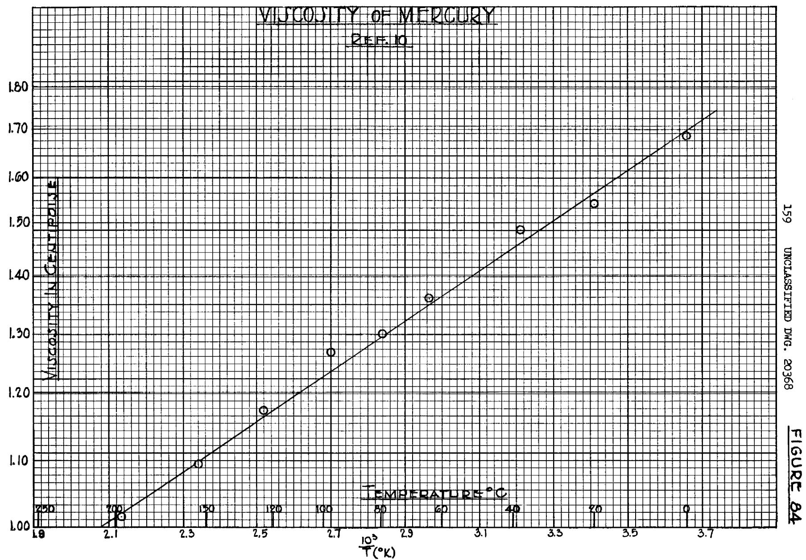

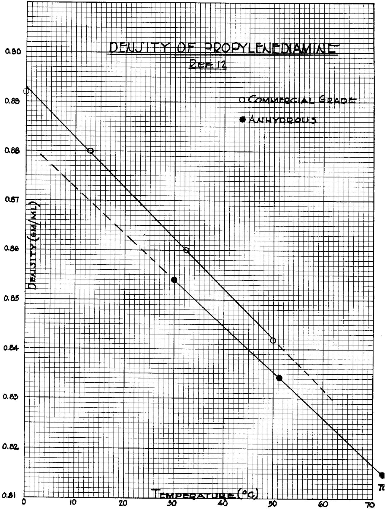  
160 UNCLASSIFIED DWG. 20369   
FIGURE 85

<table><tr><td>Solubility of Salts in PDA</td><td>Salt</td><td>Solubility moles/liter sol&#x27;n</td><td colspan="2">Temperature °C</td></tr><tr><td></td><td>LiCl</td><td>1.05</td><td>25</td><td>(47)</td></tr><tr><td></td><td>LiBr</td><td>1.9</td><td>27</td><td>(43)</td></tr><tr><td></td><td>NaCl</td><td>0.005</td><td>25</td><td>(60)</td></tr><tr><td></td><td>NaBr</td><td>2.4</td><td>27</td><td>(43)</td></tr><tr><td></td><td>KCl</td><td>0.0001</td><td>27</td><td>(43)</td></tr><tr><td></td><td>KBr</td><td>0.007</td><td>25</td><td>(59)</td></tr><tr><td></td><td>KI</td><td>1.64</td><td>25</td><td>(59)</td></tr><tr><td></td><td>LiOH</td><td>0.001</td><td>27</td><td>(43)</td></tr></table>

# Propylenediamine - Water

Phase Diagrams See Figure 86 (79)

Vapor-Liquid Composition See Figure 87 (78,79) Diagram

# L. TETRAHYDROFURAN

Formula Weight 72.10 Melting Point -108.52C (-163.3F) (88)

Boiling Point $65 - 67^{\circ}C$ (149-152.6 $\mathbf{F}$ ) (88)

Vapor Pressure mm Hg Temp. $^\circ \mathrm{C}$ (88) 114 15 176 25 263 35 385 45 550 55 760 65

Density 0.888 g/ml at $20^{\circ}\mathrm{C}$ , 7.4 lbs/gal. (88)

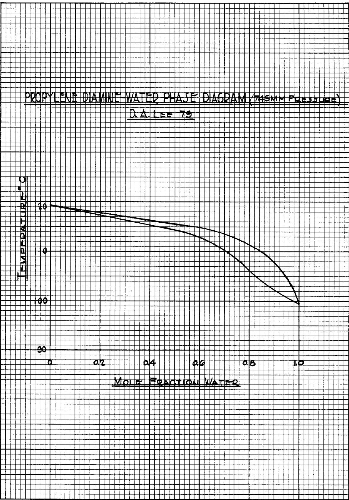

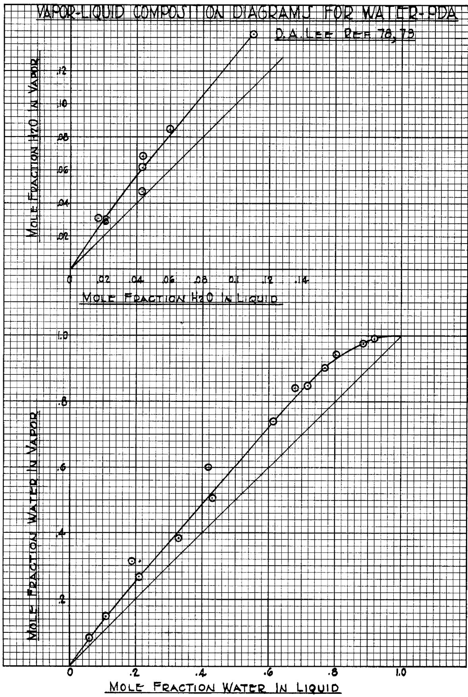

# Viscosity

<table><tr><td>cp</td><td>Temp. \( ^{\circ} \)C</td><td>(88)</td></tr><tr><td>0.66</td><td>0</td><td></td></tr><tr><td>0.55</td><td>20</td><td></td></tr><tr><td>0.47</td><td>30</td><td></td></tr><tr><td>0.42</td><td>40</td><td></td></tr></table>

Surface Tension 26.4 dynes/cm at $25^{\circ}C$ (88)

Flash Point - $17^{\circ}C$ ， $\mathbf{l}^{\circ}\mathbf{F}$ (88)

Index of Refraction 1.4073 at $20^{\circ}\mathrm{C}$ (88)

# REFERENCES

1. Lyon, R. N., et. al. "Liquid-Metals Handbook", U. S. Govt. Printing Office, Washington, D. C., 2nd ed., (1952).   
2. Hodgman, C. D., et. al. "Handbook of Chemistry and Physics", Chemical Rubber Publishing Company, Cleveland, Ohio, 30th ed., (1947).   
3. Perry, John H., et. al. "Chemical Engineer's Handbook", McGraw-Hill Book Co., Inc., New York, 3rd ed., (1950).   
4. Seidell, A. "Solubilities of Inorganic and Metal Organic Compounds", D. Van Nostrand Co., Inc., New York, 3rd ed., (1940).   
5. Rossini, F. D., et. al. "Selected Values of Chemical Tehrmodynamic Properties: Nat'l. Bur. Standards Circ. 500, U. S. Govt. Printing Office, Washington, D. C., (1950).   
6. Quill, L. L., et. al. "The Chemistry and Metallurgy of Miscellaneous Materials", McGraw-Hill Book Co., Inc., New York, (1950).   
7. Rossini, F. D., et. al. "Selected Values of Properties of Hydrocarbons", Nat'l. Bur. Standards Circ. 461, U. S. Govt. Printing Office, Washington, D. C., (1947).   
8. Works Laboratory Manual, "Physical Property Tables", Carbide and Carbon Chemical Corp., South Charleston, West Va., Vol. 40, (July 1, 1950).   
9. International Critical Tables, McGraw-Hill Book Co., Inc., New York, (1933).   
10. Lange, N. A. "Handbook of Chemistry", Handbook Publishers, Sandusky, Ohio, 8th ed., (1952).   
11. Palko, A. A. "Handbook on Ethylenediamine", ORNL-1329.   
12. Palko, A. A. "Handbook on Propylenediamine", ORNL-1391.   
13. Rutenberg, A. C. "Notes on Some Selected Liquid Amalgams", ORNL-1457.   
14. Smithells, C. T. "Metal Reference Book", Inter-Science Pub., Inc., New York, (1949).   
15. Janecke, E. "Handbook aller Legierungen", Heidelberg, (1949).   
16. Yost, D. M. and Russel, H., Jr. "Systematic Inorganic Chemistry", Prentice-Hall, Inc., N. Y., (1944).

17. Audrieth, L. F. and Kleinberg, J. "Non-Aqueous Solvents", John Wiley and Sons, N. Y., (1953).   
18. Curme, G. O., et. al. "Glycols", Reinhold Pub. Corp., New York, (1952).   
19. Chu, Ju Chin, et. al. "Distillation Equilibrium Data", Reinhold Pub. Corp., New York, (1950).   
20. Ditchburn, R. W. and Gilmour, J. C. Rev. Modern Physics 13, 310, (1941).   
21. Boyd, C. M. ORNL CF 53-1-298.   
22. Grube, G. and Woff, W. Z. Electrochemical, 41, 675, (1935).   
23. Eaton, G. A. ORNL-1299.   
24. Garretson, H. H. ORNL-1457.   
25. MacMullin, R. B. Chem. Eng. Prog. 46, 440, (1950).   
26. Convers, L. J. J. Chim. Physique 36, 175, (1939).   
27.Boohaviwalla,et.al.Ind.J.Physics4，147,(1929)。  
28. Begun, G. M. and Rutenberg, A. C. ORNL-1401.   
29. Sklyarenko, S. I. and Sakharov, B. A. Zhur. Fiz. Khim. 21, 97, (1947).   
30. Ibid. Zhur. Obshch. Khim. 17, 1385, (1947).   
31. Rutenberg, A. C. ORNL CF 53-2-174.   
32. Begun, G. M. ORNL CF 53-2-174.   
33. Dowling, E. J. and Hess, D. N. ORNL CF 53-1-328.   
34. Begun, G. M. ORNL CF 53-4-161.   
35. Drury, J. S. and Garretson, H. H. ORNL-1238.   
36. Drury, J. S. ORNL-1306   
37. Ryon, A. D., Ramsey, J. W. and Weithaupt, R. R. ORNL-1306.   
38. Eaton, G. A. ORNL-1511.   
39. Begun, G. M. ORNL Y-B30-116.   
40. Begun, G. M. ORNL CF 53-5-164.   
41. Warren, K. S. ORNL CF 53-1-328.   
42. Palko, A. A. ORNL CF 53-5-164.   
43. Rutenberg, A. C. ORNL Y-B30-116.   
44. Begun, G. M. ORNL-1552.   
45．Lynch，L.D. ORNL CF 52-11-199.   
46. Rutenberg, A. C. ORNL-1306.   
47. LeRoy, R. H. ORNL-1388.   
48. Begun, G. M., Rutenberg, A. C. and Palko, A. A. ORNL-1238.   
49. Johnston, C. P. ORNL Y-B30-116.   
50.Harley，P.H. ORNL Y-B35-9   
51. Krohn, N. A. ORNL CF 52-11-199.   
52. Hill, W. E. ORNL Y-B30-124.   
53. Palko, A. A. ORNL Y-B30-124.   
54. Garretson, H. H. "Notes on Activities and Standard Electrode Potentials", ORNL-1457.

55. Rutenberg, A. C. ORNL Y-B30-118.   
56. Friend, Hale, Ryder, J. Chem. Soc. (Lond.) 1937, 907.   
57. Begun, G. M. and Rutenberg, A. C. ORNL CF 53-4-81.   
58. Yeatts, L. B. ORNL CF 53-2-174.   
59. Morrison, B. H. ORNL CF 53-2-61.   
60. McNees, R. A. ORNL CF 53-1-106.   
61. Morrison, B. H. ORNL CF 53-3-85.   
62. Friels, J. V. ORNL CF 52-11-199.   
63. Huckel, W. "Structural Chemistry of Inorganic Compounds", (Trans. L. H. Long) Elserier Pub. Co., Inc., New York, (1950).   
64. Pickering. J. Chem. Soc. (Lond.) 63, 909, (1893).   
65. Compere, E. L. ORNL Y-B30-124.   
66. Compere, E. L. ORNL CF 53-1-298.   
67. Compere, E. L. ORNL CF 53-2-174.   
68. Healy, R. M. ORNL Y-B30-124.   
69. Healy, R. M. ORNL Y-B30-118.   
70. Hill, W. E. ORNL CF 53-4-81.   
71. Hill, W. E. ORNL CF 53-4-161.   
72. Healy, R. M. ORNL CF 53-1-298.   
73. Healy, R. M. ORNL CF 53-4-81.   
74. Mellor, J. W. "Comprehensive Treatise on Inorganic and Theoretical Chemistry", Longmans, Green and Co., New York, (1922-1937).   
75. Barringer, M. D. ORNL CF 53-2-61.   
76. Kobe and Leipper. Ind. and Eng. Chem. 32, 198, (1940).   
77. Hafem, S. Bull. Soc. Chim. France, 1949, 337, (1949).   
78. Lee, D. A. ORNL-1401.   
79. Lee, D. A. ORNL CF 53-5-164.   
80. Lee, D. A. ORNL Y-B30-124.   
81. Vogel, A. I. "Physical Properties and Chemical Constitution, Part IX, Aliphatic Hydrocarbons", J. Chem. Soc. 1946, 133, (1946).   
82. Lee, D. A. ORNL Y-B30-124.   
83. Lee, D. A. ORNL CF 53-4-161.   
84. Sax, N. I. "Handbook of Dangerous Chemicals", Reinhold Pub. Corp., New York, (1951).   
85．Lee，D．A．ORNL CF 53-2-174.   
86. Hill, W. E. ORNL Y-B30-116.   
87. Weeren, H. O. and Carter, W. L. ORNL CF 52-10-161.   
88. Sales Bulletin, E. I. Dupont de Nemours and Co.   
89. Joseph, E. F. ORNL Y-B35-6.   
90. Joseph, E. F. ORNL Y-B35-7.   
91. Joseph, E. F. and Buchanan, J. R. ORNL Y-B35-9.   
92. Sachs, J. W., Decarlo, V. A. and Buchanan, Y-B35-10.

93．Lynch，L.D. ORNL-1511.   
94. Lynch, L. D. ORNL CF 53-5-123.   
95. Morrison, B. H. ORNL CF 53-5-123.   
96. Morrison, B. H. ORNL-1511.   
97. Yeatts, L. B. ORNL CF 53-4-81.   
98. Hill, W. E. ORNL CF 53-5-164.   
99. Hill, W. E. ORNL CF 53-6-208.   
100. Daley, F. L. and Sacks, J. W. ORNL Y-B35-6.   
101. Lynch, L. D. ORNL CF 53-4-210.   
102. Morrison, B. H. ORNL CF 53-4-210.   
103. Yeatts, L. B. ORNL CF 53-5-164.   
104. Johnston, C. P. ORNL CF 53-4-81.   
105. Dowling, E. J. and Warren, K. S. ORNL CF 53-4-285.   
106. Boyd, C. M. Anal. Div. ORNL CF 53-4-161.   
107. Clark, W. E. ORNL-1524.   
108. Fletcher, F. and Kilpatrick, M. J. Phys. Chem. 42, 113, (1938).   
109. Garretson, H. H. ORNL-1299.   
110. Lewis, G. N. and McDonald, R. T. "The Separation of Lithium Isotopes", J. Am. Chem. Soc. 58, 2519-24, (1936).   
111. Begun, G. M. and Drury, J. S. A Review of Isotopic Separation to be Issued.   
112. Johnston, R. J. and Ubbelohde, A. R. "Wedge Effect at Amalgam Electrolyte Surfaces", Proc. Roy. Soc. (London) A206, 275-86, (1951).   
113. Bradley, N. C. ORNL Y-B35-6.   
114. Spevack, J. S. Columbia Univ. Report A-393.   
115. Eidenoff, M. L. "Laboratory Studies for Separation Processes", National Nuclear Energy Series III-4D (1951).   
116. Demarcus, W. C. Y-12 Y-887.