# DECLASSIFIED

${AE} - 2 = \frac{10}{3} - \frac{10}{3} - \frac{10}{3} - \frac{10}{3} - \frac{10}{3} - \frac{10}{3} - \frac{10}{3} - \frac{10}{3} - \frac{10}{3} - \frac{10}{3} - \frac{10}{3} - \frac{10}{3} - 2$

LABORATORY RECORD

L A B O R A T O R Y M E S K

1

AIRCRAFT NUCLEAR PROPULSION PROJECT

QUARTERLY PROGRESS REPORT

FOR PERIOD ENDING SEPTEMBER 10, 1953


CEN LING RESEARCH CO.,LTD.

#

OAK RIDGE NATIONAL LABORATORY

OPERATED BY

CARBIDE AND CARBON CHEMICALS COMPANY

A. DIVISION OF UNION, CATHODE AND CATHODE CATHODE AT A POINT

ECC

POST OFFICE BOX P

SAK BIDGE TENDNEDSEE


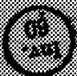


ORNL-1609

This document consists of 172 pages.

Copy of 262 copies. Series A.

Contract No. W-7405-eng-26

# AIRCRAFT NUCLEAR PROPULSION PROJECT

# QUARTERLY PROGRESS REPORT

# For Period Ending September 10, 1953

R.C.Briant,Director

A. J. Miller, Assistant Director

W. B. Cottrell, Editor

DATE ISSUED

007 15 1963

OAK RIDGE NATIONAL LABORATORY Operated by

CARBIDE AND CARBON CHEMICALS COMPANY

A Division of Union Carbide and Carbon Corporation

Post Office Box P

Oak Ridge, Tennessee

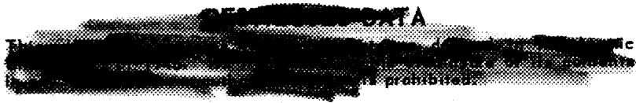


3 4456 03606809

# INTERNAL DISTRIBUTION

1. G. M. Adamson   
2. R.G.Affel   
3. C. R. Baldock   
4. C. J. Barton   
5. E. S. Bettis   
6. D. S. Billington   
7. F. F. Blankenship   
8. E.P.Blizard   
9. M. A. Bredig   
10. R.C.Briant   
11. F. R. Bruce   
12. A. D. Callihan   
13. D. W. Cardwell   
14. J. V. Cathcart   
15. C. E. Center   
16. R.A. Charpie   
17. J. M. Cisar   
18. G.H.Clewett   
19. C. E. Clifford   
20. W. B. Cottrell   
21. R. G. Cochran   
22. D. D. Cowen   
23. F. L. Cuiher   
24. W. K. Ester   
25. L.B. Emlet (Y-12)   
26. W. K. Ergen   
27. A. P. Fraas   
28. W. R. Gall   
29. C. B. Graham   
30. W. Grigorieff (consultant)   
31. W.R.Grimes   
32. A. Hollaender   
33. S. Householder   
34. J. T. Howe   
35. W. B. Humes (K-25)   
36. R.W. Johnson   
37. G. W. Keilholtz   
38. C. P. Keim   
39. M. T. Kelley   
40. F. Kertesz   
41. E. M. King

42. J. A. Lane   
43. C. E. Larson   
44. R. S. Livingston   
45. R. N. Lyon   
46. W.D. Manly   
47. L. A. Mann   
48. W. B. McDonald   
49. J. L. Meem   
50. A. J. Miller   
51. K. Z. Morgan   
52. E. J. Murphy   
53. H. F. Poppendiek   
54. P. M. Reyling   
55. H. W. Savage   
56. E. D. Shipley   
57. 0. Sisman   
58. L. P. Smith (consultant)   
59. A. H. Snell   
60. C. L. Storrs   
61. C. D. Susano   
62. J. A. Swartout   
63. E. H. Taylor   
64. P. M. Uthe   
65. E.R.VanArtsdalen   
66. F. C. VonderLage   
67. J.M.Warde   
68. A. M. Weinberg   
69. J.C. White   
70. E. P. Wigner (consultant)   
71. G. C. Williams   
72. J. C. Wilson   
73. C. E. Winters   
-83. ANP Library   
84. Biology Library   
85-89. Laboratory Records Department   
90. Laboratory Records, ORNL R.C.   
91. Health Physics Library   
92. Metalurgy Library   
93. Reactor Experimental Engineering Library   
94-95. Central Research Library

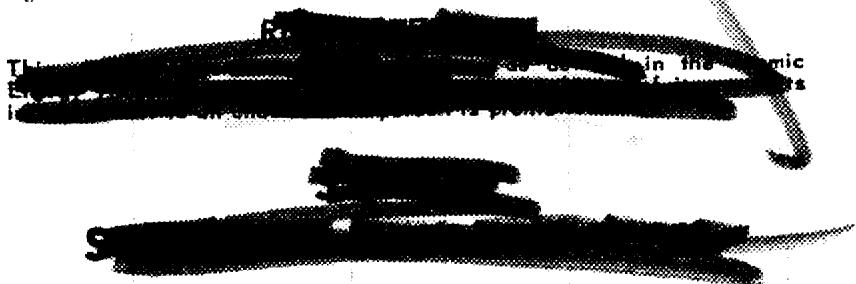

# EXTERNAL DISTRIBUTION

96-98. Air Force Engineering Office, Oak Ridge

99. Air Force Plant Representative, Burbank   
100. Air Force Plant Representative, Seattle   
101. Air Force Plant Representative, Wood-Ridge   
102. AN Project Office, Fort Worth

103-114. Argonne National Laboratory (1 copy to Kermit Anderson)

115. Armed Forces Special Weapons Project (Sandia)

116-123. Atomic Energy Commission, Washington

124. Battelli Memorial Institute   
125. Bechtel Corporation

126-130. Brookhaven National Laboratory

131. Bureau of Aeronautics (Grant)   
132. Bureau of Ships

133-134. California Research and Development Company

135-140. Carbide and Carbon Chemicals Company (Y-12 Plant)

141. Chicago Patent Group   
142. Chief of Naval Research   
143. Commonwealth Edison Company   
144. Department of the Navy - Op-362   
145. Detroit Edison Company

146-149. duPont Company, Amgust 3

150. duPont Company, Wilmington   
151. Foster Wheeler Corporation

152-154. General Electric Company, NPP

155-158. General Electric Company, Richland

159. Hanford Operations Office   
160. USAF-Headquarters, Office of Assistant for Atomic Energy

161-168. Idaho Operations Office (1 copy to Phillips Petroleum Company)

169. Iowa State College

170-177. Knolls Atomic Power Laboratory

178-179. Lockland Area Office

180-181. Los Azamos Scientific Laboratory

182. Massachusetts Institute of Technology (Benedict)   
183. Massachusetts Institute of Technology (Kaufmann)   
184. Materials Laboratory (WADC) (Col. P. L. Hill)   
185. Moisanto Chemical Company

186-188. Mound Laboratory

189-192. National Advisory Committee for Aeronautics, Cleveland (3 copies to A. Silverstein)

193. National Advisory Committee for Aeronautics, Washington


194. Naval Research Laboratory

195-196. New York Operations Office

197-198. North American Aviation, Inc.

199-204. Nuclear Development Associates, Inc.

205. Paten Branch, Washington

206. Pioneer Service and Engineering Company

207-216. Pratt and Whitney Aircraft Division (Fox Project)

217-228. Powerplan Laboratory (WADC) (2 copies to E. Bleaman)

229-230. Rand Corporation (1 copy to V. G. Henning)

231. San Francisco Operations Office

232. Savannah River Operations Office, Augusta

233. USAF Headquarters

234. U. S. Naval Radiological Defense Laboratory

235-236. University of California Radiation Laboratory, Berkeley

237-238. University of California Radiation Laboratory, Livermore

239. Vitro Corporation of America

240. Walter Kidde Nuclear Laboratories, Inc.

241-246. Westinghouse Electric Corporation

247-261. Technical Information Service, Oak Ridge, Tennessee

262. Curtis-Wright Corp., Wright Aeronautical Division (K. Campbell)


Reports previously issued in this series are as follows:

ORNL-528 Period Ending November 30, 1949

ORNL-629 Period Ending February 28, 1950

ORNL-768 Period Ending May 31, 1950

ORNL-858 Period Ending August 31, 1950

ORNL-919 Period Ending December 10, 1950

ANP-60 Period Ending March 10, 1951

ANP-65 Period Ending June 10, 1951

ORNL-1154 Period Ending September 10, 1951

ORNL-1170 Period Ending December 10, 1951

ORNL-1227 Period Ending March 10, 1952

ORNL-1294 Period Ending June 10, 1952

ORNL-1375 Period Ending September 10, 1952

ORNL-1439 Period Ending December 10, 1952

ORNL-1515 Period Ending March 10, 1953

ORNL-1556 Period Ending June 10, 1953


# CONTENTS

FOREWORD 1

# PART I. REACTOR THEORY AND DESIGN

INTRODUCTION AND SUMMARY 5

# 1. CIRCULATING-FUEL AIRCRAFT REACTOR EXPERIMENT 7

The Experimental Reactor 7

Calculation of critical mass 8

Reactor design 8

Reactor control 9

Flow characteristics in fuel tubes 9

External Fuel Circuits 10

Fuel system design 11

Sodium system design 13

Pumps 13

Valves 13

The NaF-ZrF4-UF4 Fuel 14

Composition 14

Physical properties 15

Fuel solvent production 15

Fuel concentrate production 17

Corrosion of Inconel 17

Instrumentation 18

Auxiliary Systems 18

Off-gas system 18

Electrical system 18

Gas monitoring system 18

# 2. EXPERIMENTAL REACTOR ENGINEERING 20

Pumps for High-Temperature Liquids 20

Frozen-sodium-sealed pump for sodium 20

Gas-sealed sump pump for the ARE 21

Combination packed-frozen sealed pump for fluorides 22

Frozen-lead-sealed pump for fluorides 23

Allis-Chalmers canned-rotor pump 23

Rotary-Shaft and Valve-Stem Seals for Fluorides 23

Spiral-grooved graphite-packed shaft seals 23

Annular-grooved shaft seal 24

V-ring seal 24

Graphite-BeF $^2$ packing 24

Bronze-wool and MoS $_2$ -packed frozen seal 25

Bronze-wool, graphite, and $\mathsf{MoS}_2$ -packed frozen seal 25

Copper-braid and $\mathsf{MoS}_2$ -packed seal test 25

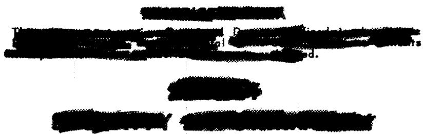

Frozen-lead seal 26   
Vitreous seals 26   
Graphitar-Graphitar shaft seal 27   
Packing-penetration tests 28

High-Temperature Bearing Development Program 28

Instrumentation 29

Fluoride leak detection 29   
Sodium leak detection 29   
Flow measurement 30

3．AIRCRAFT REACTOR DESIGN STUDIES 31

Shield Designs for Reflector-Moderated Reactors 31   
Comparative Analyses of Liquid Metal Coolants 37

Activation of rubidium, potassium, and sodium 37   
Effect of secondary coolant on power plant weight 37

Power Plant Performance and Control 38

Description of power plant 39   
Design performance 43   
System characteristics that affect reactor control 43

4. UNIFORM THERMAL-NEUTRON FLUX REACTOR 47

Critical Mass 47   
Neutron Flux 49   
Importance Function 50

# PART II. MATERIALS RESEARCH

INTRODUCTION AND SUMMARY 53   
5. CHEMISTRY OF HIGH-TEMPERATURE LIQUIDS 55

Thermal Analysis of Fluoride Fuels 55

NaF-ZrF-UF4 56   
KF-ZrF4-UF 56   
Systems containing $\mathrm{ThF}_4$ 57   
$\mathrm{UF}_3 - \mathrm{ZrF}_4$ 57   
$\mathrm{UF}_3 - \mathrm{UF}_4 - \mathrm{ZrF}_4$ 57   
NaF-ZrF4-UF4-UF3. 57

Thermal Analysis of Chloride Fuels 57

NaCl-UC14 58   
KC1-UC1 58   
CsCl-UCI4 59

CaCl-UC1 59

Thermal Analysis of Fluoride Coolants 59   
Quenching Experiments with Fluorides 59

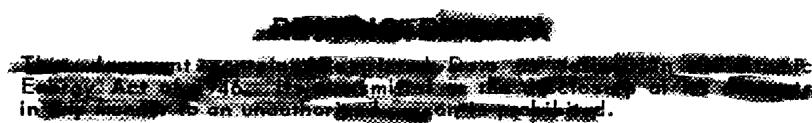

Differential Thermoanalysis of Fluorides 61

Phase Equilibria of Fused Salts by Filtration 61

X-Ray Diffraction Studies of Fluorides 61

NaF-UF. 61

NaF-ZrF4-UF4 62

Fundamental Chemistry of High-Temperature Liquids 62

Spectrophotometry in fused salts 62

Thermogalvanic potentials in liquids 65

EMF measurements in fused salts 66

Production and Purification of Fluoride Mixtures 69

Treatment of $\mathrm{NaZrF}_5$ melts with metallic zirconium 69

Treatment of NaBeF, with metallic beryllium 70

Reduction of dissolved chromous fluoride by hydrogen. 70

Preparation of various fluorides 70

6. CORROSION RESEARCH 71

Fluoride Corrosion of Inconel in Static and Seesaw Tests 72

Effect of oxide layer 72

Removal of oxide layer 73

Effect of oxide additives 73

Effect of small zirconium hydride additions 73

Effect of exposure time 74

Corrosion by fluorides with high $\mathbf{U}\mathbf{F}_4$ concentrations 75

Corrosion of high-purity Inconel 76

Effect of temperature 76

Fluoride Corrosion of Inconel in Rotating Test 76

Fluoride Corrosion of Inconel in Thermal Convection Loops 76

Zirconium hydride additive 77

Effect of type 316 stainless steel insert in Inconel loop . . . . 77

Effect of temperature on Inconel corrosion 77

Carbon insert in Inconel loop 78

Effect of exposure time 79

Fluoride Corrosion of Stainless Steels of Varying Purity 80

Liquid Metal Corrosion of Structural Metals 80

Rotating tests with sodium 80

Static tests with lithium 80

Dynamic tests with liquid lead in convection loops 80

Fundamental Corrosion Research 83

Oxidizing power of hydroxide corrosion products 83

Equilibrium pressure of hydrogen over sodium hydroxide-metal systems 84

Chemical equilibria in fused salts 85

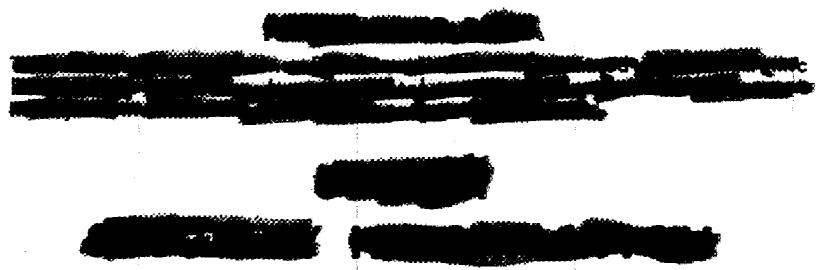

# 7.METALLURGY AND CERAMICS 87

Welding and Brazing Research 88

Low-melting-point Nicrobraz 88   
Brazing of radiator fins with LMNB 88   
Nickel-chromium-phosphorous brazing alloys 90   
Brazing of radiator assemblies with Microbraz 94   
Brazing of radiator assemblies with G-E alloy No. 62 95

# High Conductivity Metals for Radiator Fins 95

Vapor plated chromium and nickel on copper 96   
Chromium-plated copper 96   
Inconel clad copper 96   
Type 310 stainless steel-clad copper 96   
Type 446 stainless steel-clad copper 96   
Copper clad with copper-aluminum alloy 96

# Mechanical Properties of Inconel 97

Creep and stress-rupture tests 97   
Tube-burst tests 97

# Fabrication of Pump Seals 98

Hot-pressed pump seals 98   
Vitreous seals 98

# Tubular Fuel Elements 99

# Inflammability of Sodium Alloys 100

# 8. HEAT TRANSFER AND PHYSICAL PROPERTIES 101

Enthalpy and Heat Capacity of Halides 101   
Viscosity of Fluorides 103   
Density of Fluorides 104   
Electrical Conductivity of Liquids 104   
Thermal Conductivity 104

Diatomaceous earth 104   
Development of thermal conductivity measuring devices 105

# Vapor Pressure of Fluorides 106

Forced-Convection Heat Transfer with NaF-KF-LiF Eutectic 106   
Circulating-Fuel Heat Transfer 107   
Bifluid Heat Transfer Experiments 109

# 9. RADIATION DAMAGE 111

Irradiation of Fused Materials 111

Analyses of irradiated fuel 111   
Examination of irradiated fuel containers 112

# In-Pile Circulating Loops 113

Sodium-Beryllium Oxide Stability Test 113

# Creep Under Irradiation 115


10. ANALYTICAL STUDIES OF REACTOR MATERIALS 118

Analytical Chemistry of Reactor Materials 118

Determination of zirconium by differential spectrophotometry 118

Determination of chromium and chromium trifluoride 119

Determination of $\mathbf{U}\mathbf{F}_{3}$ and $\mathbf{U}\mathbf{F}_{4}$ 119

Determination of oxygen in metallic oxides 120

Petrographic Examination of Fluorides 120

Summary of Service Chemical Analyses 121

# PART III. SHIELDING RESEARCH

INTRODUCTION AND SUMMARY. 125

11. BULK SHIELDING FACILITY 126

Tower Shielding Reactor Critical Experiment 126

Gamma-Ray Air-Scattering Calculations 126

12. LID TANK FACILITY 128

Reflector-Moderated-Reactor Shield Tests 128

Gamma-ray attenuation data 135

Neutron Attenuation Data 137

Shield Investigations for GE-ANP 142

Investigation of Shielding Properties of Uranium 142

Removal Cross Sections 145

13．TOWERSHIELDINGFACILITY 149

14. SHIELDING THEORY 151

Neutron Spectra 151

Neutron Streaming in Iron 151

The 1953 Summer Shielding Session 151

# PART IV. APPENDIX

15. LIST OF REPORTS ISSUED DURING THE QUARTER 157

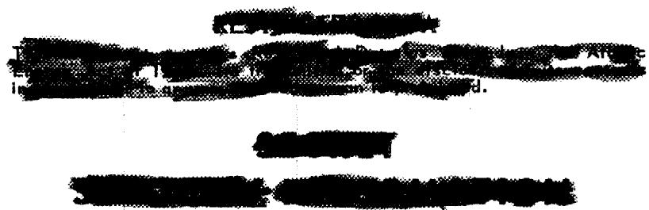

# ANP PROJECT QUARTERLY PROGRESS REPORT

FOREWORD

This quarterly progress report of the Aircraft Nuclear Propulsion Project at ORNL records the technical progress of the research on the circulating-fuel reactor and all other ANP research at the Laboratory under its Contract W-7405-eng-26. The report is divided into three major parts: I. Reactor Theory and Design, II. Materials Research, and III. Shielding Research. Each part has a separate introduction and summary.

The ANP Project is comprised of about 300 technical and scientific personnel engaged in many phases of research directed toward the achievement of nuclear propulsion of aircraft. A considerable portion of this research is performed in support of the work of other organizations participating in the national ANP effort. However, the bulk of the ANP research at ORNL is directed toward the development of a circulating-fuel type of reactor.

The nucleus of the effort on circulating-fuel reactors is now centered upon the Aircraft Reactor Experiment - a high-temperature prototype of a circulating-fuel reactor for the propulsion of aircraft. The equipment for this reactor experiment is now being assembled; the current status of the experiment is summarized in Section 1 of Part I. The supporting research on materials and problems peculiar to the ARE - previously included in the subject sections - is now included in this ARE section, where convenient. The few exceptions are referenced to the specific section of the report where more detailed information may be found.

The ANP research, in addition to that for the Aircraft Reactor Experiment, falls into three general categories: (1) studies of aircraft-size circulating-fuel reactors, (2) materials problems associated with advanced reactor designs, and (3) studies of shields for nuclear aircraft. These three phases of research are covered in Parts I, II, and III, respectively, of this report.

Part I

REACTOR THEORY AND DESIGN


# INTRODUCTION AND SUMMARY

The experimental reactor has been subject to some alteration primarily because of a recently obtained higher value for the reactor critical mass (sec. 1). As a consequence of the increase in critical mass, additional $\mathrm{U}^{235}$ has been requested, the fuel volume external to the reactor has been reduced, and some structural poisons have been removed from the core. Although the exact value of the critical mass is still not known with certainty, it is expected that the reactor will now be able to "go critical" with the additional uranium requested. This assurance was secured at the expense of reactor power, that is, the external system now has only one-half the previous heat removal capacity. Coincident with these necessary changes, both the fuel and the sodium systems were revised to operate with only one pump, although a second pump is available in each system in the event of failure. Vertical-shaft, sump-type, gas-sealed, centrifugal pumps will be employed in both systems because their reliability is superior to that of either the frozen-sodium-sealed pump for sodium or the packed-sealed pump for fluorides. Although about two months have been required to make the changes brought about by the increase in critical mass, the attendant system changes have greatly increased the reliability of the system.

Valves, pumps, instrumentation, and other components of high-temperature fluoride and liquid-metal systems are being developed (sec. 2). Pump seals with packings of graphite, graphite and metal wool, and graphite and beryllium fluoride and various vitreous seals and frozen seals have been tested. Despite the concentration of effort on packed seals for fluoride pumps, no such seal suitable for continuous remote operation has yet been

devised. Several seals, however, have operated in excess of 1000 hr with leakage rates of less than $10~\mathrm{cm}^3$ per day when it was possible to make periodic inspection and adjustments. The vertical-shaft, gas-sealed, sump-type pump, on the other hand, has performed satisfactorily without periodic service. In anticipation of its need in pumps and elsewhere, development of high-temperature bearings amenable to operation in fluorides has been initiated. Suitable instrumentation to indicate leaks in the sodium and the fluoride systems has been developed. Sodium can be detected by the change in electrical resistance of the sodium-contaminated insulation; the fluoride can be detected by a phenol-red indicator solution. Reliable fluid-flow measurements can be made by using two Moore pressure transmitters across a venturi.

The reflector-moderated reactor studies have been extended to include a wider variety of such reactors, as well as the performance and control of such a power plant in a nuclear aircraft (sec. 3). Because of the importance of shield weights and sizes to aircraft performance, several series of reactor and shield designs were made to determine the effects of reactor power, reactor core diameter, and division of the shield. In conjunction with these studies, the activation of various secondary coolants, including sodium and potassium, was measured. On the basis of the total weight of the system, sodium is superior to potassium (natural lithium is better still), although the activity of the potassium was about 2 to $5\%$ of that of the sodium. An analysis of the power plant system external to the reactor was made for a 200,000-lb aircraft with a 100- or 200-megawatt reflector-moderated reactor and two or four Wright turbojet engines. From this

# ANP QUARTERLY PROGRESS REPORT

study, it appears that the off-design, as well as the normal performance and control of these subsonic planes, is satisfactory when four engines are employed with chemical augmentation, as required.

The critical experiment facility has been used to determine the relation between minimum critical mass and uniform thermal-neutron flux (sec. 4). The assembly used in this

investigation consisted of concentric cylindrical aluminum shells filled with varying concentrations of aqueous uranyl fluoride solution. The experimentally measured critical height and mass based on the theoretically determined fuel loading were within $2\frac{1}{2}$ of the corresponding calculated parameters. Other data obtained from the assembly were also compatible with the predictions.

# 1. CIRCULATING-FUEL AIRCRAFT REACTOR EXPERIMENT

E. S. Bettis, ANP Division

Developments during this quarter required that the ARE be rather drastically revised. It was found that the critical mass of the reactor, as well as the volume of the external fuel system, was greater than the corresponding value which had been used in previous calculations and design considerations. Because of these findings, it was imperative that not only the volume of the external circuit and the amount of structural poisons in the reactor be minimized but also that additional uranium be requested. The additional $46\mathrm{kg}$ requested will bring the total allocated for the experiment to $115\mathrm{kg}$ and should provide an ample margin for contingencies.

The changes in the critical mass of the reactor and the volume of the external system required a compensating change in only the maximum reactor power, which was halved as a result of the removal of one-half the heat ex-changers in the external fuel system. Coincident with these changes, it was desirable, and convenient, to make other system changes, such as conversion to the use of a single operating sump-type gas-sealed pump in both the fuel and the reflector coolant circuits and the use of frangible-disk valves in certain locations.

The uranium concentration of the fuel has been increased, but the fuel can still be taken from the NaF-ZrF $_4$ -UF $_4$ system, and it will be compounded by the addition of sufficient fuel concentrate, $\mathrm{Na}_2\mathrm{UF}_6$ , to the fuel solvent, $\mathrm{NaZrF}_5$ , to make the reactor critical. Production of the fuel solvent has been completed; production of the fuel concentrate has started,

A report on the nuclear operation of the reactor was prepared, which gives the step-by-step procedure that will be incorporated in an "ARE

Operations Manual".(1) The procedure is too detailed for inclusion in this progress report.

In general, the project is about two months behind schedule because of the changes made necessary by the higher critical mass.

# THE EXPERIMENTAL REACTOR

G. A. Christy

Engineering and Maintenance Division

A. L. Southern W. K. Ergen

ANP Division

J. I. Lang G. M. Winn

Reactor Experimental Engineering

Division

The reactor core was studied in considerable detail to determine whether changes could be made in it to lower the critical mass. A modification in the sleeves around the rod holes was made which reduced the critical mass by about 5 pounds. The critical mass is being calculated on the UNIVAC, but the calculation is probably good only to $\pm 10\%$ , and thus the exact critical mass will not be known until the hot critical experiment is made with the reactor. However, with the changes in the reactor and the external system and the additional uranium, it is certain that the critical mass can be attained.

The laminar and turbulent flow phenomena in the reactor fuel tubes have been studied in a full-scale glass replica of the system. In general, pressure drop and dye diffusion studies have indicated that (1) at a Reynolds modulus of about 2400, the flow changes from laminar to transitional, and (2) at Reynolds moduli above 5000, fully developed turbulent flow has probably been established.

Calculation of Critical Mass (W. K. Ergen, ANP Division). At the time the previous quarterly report(2) was written, doubt had arisen concerning the stated value of the critical mass of the ARE. Since then, substantial effort has been made to reduce this uncertainty, and it appears now that the critical mass of the ARE will be about $30\%$ higher than the previously(3) quoted value.

The increase in the estimate for the critical mass is greater than the previously assumed probable uncertainty. In part, the increase is admittedly the result of error, but it is due, in part, to uncertainties in the basic data. For example, the age in beryllium oxide is given by the AFC Neutron Cross Section Advisory Group with a probable uncertainty of $10\%$ ; the absorption cross section of stainless steel, which plays an important part in the interpretation of the critical experiment, may vary by $25\%$ , depending on the value that is used, within the limits of the available chemical analysis, for the content of such elements as cadmium and boron; the absorption cross section in uranium is still somewhat in dispute. Also, the multigroup calculations in their present form apply only to concentric, homogeneous, spherical shells, and the reactor is neither spherical nor made up of homogeneous regions. The self-shielding of the fuel tubes, the local poisoning by the control rod sleeves, the streaming through holes, etc., still have to be computed separately by tedious methods, and the calculations require experimental validation.

Improved constants are now being used in the UNIVAC calculations. In the meantime, a two-group calculation has been performed for which the

previous results from multigroup calculations were used as an estimate of the flux distribution at various lethargies. These flux distributions determine the average parameters for the reactor.(4)

Reactor Design. In order to reduce the structural poisons in the reactor, it was decided to replace the three concentric Inconel sleeves around the four control rods (one regulating, three safety) with a single stainless steel Inconel-clad sleeve in each hole. With the exception of this change, the reactor core is complete. This change effects a saving in critical mass of 4 to 5 lb, but it will require greater heat dissipation by the helium rod-cooling system, as well as higher operating temperatures for the rods. Preliminary rod-drop tests indicate satisfactory operation under these simulated conditions.

The Inconel-clad sleeves for the rods are being fabricated by the International Nickel Company, and they will be installed in approximately three weeks. The old Inconel sleeves have been removed from the core. The new sleeve will have an outside diameter of approximately 2.95 in. and will be welded outside the pressure shell at top and bottom. The space between this 2.95-in. sleeve and the beryllium oxide blocks in the core (a hexagonal hole 3.75 in. across the flats) will be filled with beryllium oxide pellets approximately 0.25 in. in diameter. The reactor has been moved from the shop and is now in the ARE Building (7503).

A new pressure shell top, the 0.040-in.-wall fuel tubes, and the 0.060-in.-wall fuel tube bends have also been ordered. (Replacement of the 0.060-in.-wall fuel tubes with 0.040-in.-wall fuel tubes would reduce the poison in the core but would

require the destructive removal of the top of the present pressure shell.) It is not anticipated that these items will be required to operate the ARE, but their procurement is insurance against further increases in critical mass.

Reactor Control. The reactor rod actuator and the instrument drive assembly have been completely checked out to the console in the control room. All Selsyn indicators on the safety rods, limit switch settings, and associated interlocks for scream and automatic rod insertion have been checked.

A full-length linkage between the safety rod actuator and the safety rod was installed for one of these rods. The safety rod was located in a furnace and the action of the safety rod drive, clutch, and mechanical linkage was checked out. The safety rod was heated to $1400^{\circ}\mathrm{F}$ , and test scams of the rod were made to see that the rod dropped with consistent uniformity into the hot guide under conditions that simulated the new rod operating conditions.

The servo system was checked out for stability and functional behavior by using a simulated error signal. Some "debugging" of the servo amplifier was necessary, and the servo system is now ready for use. In addition to the temperature-controlled servo, a flux servo is being installed to facilitate some phases of operation at zero power.

Flow Characteristics in Fuel Tubes (J. I. Lang, G. M. Winn, Reactor Experimental Engineering Division). From heat transfer and wall temperature limitations, it is important to know at which Reynolds modulus the flow within the ARE fuel tubes changes from laminar to transitional and also at what Reynolds modulus fully established turbulent flow occurs. To determine these characteristics, an exact-scale fuel tube system consisting of 1-in. glass pipe was con

structed. A 0.040-in.-OD hypodermic tube was inserted into the first of the many fuel tubes that make up the fuel tube system to permit injection of a methylene-blue dye. Static pressure taps were located at the inlet and outlet of the fuel tube system. A carbon tetrachloride inclined manometer was used to measure the pressure differences. The water flow rates through the tube system were measured by a rotameter and by weighing. The flow phenomena of this fuel tube system were studied by visual observation of the diffusion of a dye filament in flowing water and by experimental determination of the friction factor over the Reynolds modulus range of interest.

A plot of the friction factor as a function of Reynolds modulus for the ARE fuel tube system is shown in Fig. 1.1. The friction factor is defined as

$$
f = \frac {D h}{4 \frac {L}{D} \frac {V ^ {2}}{2 g}},
$$

where

$$
\begin{array}{l} D h = \text {h e a t} \\ L / D = \text {t o t a l} \quad \text {l e n g t h} \quad \text {o f} \quad \text {p i p e} \quad \text {b e t w e e n} \quad \text {s t a t i c} \quad \text {p r e s s u r e} \quad \text {t a p s} \quad \text {d i v i d e d} \quad \text {b y} \quad \text {p i p e} \quad \text {d i a m e t e r}, \\ V = \text {a v e r a g e f l u i d v e l o c i t y}, \\ g = \text {a c c e l e r a t i o n} \\ \end{array}
$$

It appears that at a Reynolds modulus of about 2400, the flow changed from laminar to transitional and that at Reynolds moduli above 5000, fully developed turbulent flow had probably been established. Conventional friction factor data for smooth straight pipes have also been plotted in Fig. 1.1 for comparison. Note that the laminar flow and the turbulent flow curves for the two systems are parallel. The ARE fuel tube friction factor data lie above the smooth pipe data, as would be expected because of the presence of additional head loss resulting from secondary flow in the

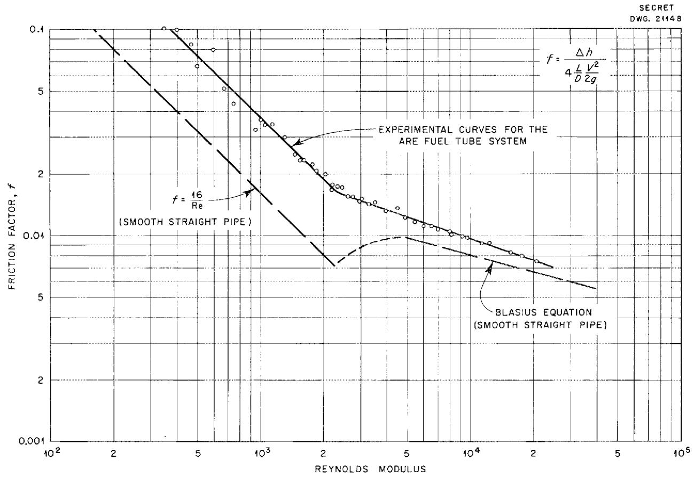  
Fig. 1.1. Friction Factor vs. Reynolds Modulus for the ARE Fuel Tube.

180-deg bends. There is some evidence in the literature that head losses in 180-deg bends under laminar flow conditions are relatively more important than those under turbulent flow; this behavior would explain why the ARE laminar flow data lie relatively higher above straight pipe data than do the turbulent flow data.

The dye experiments confirmed, in general, the results obtained from the pressure-drop measurements. It was at times difficult to distinguish between the random turbulence associated with high Reynolds moduli and the nonrandom secondary flow originating at the 180-deg bends. Laminar motion was observed at Reynolds moduli of less than 2000. At these low Reynolds moduli, some mixing occurred at the 180-deg bends; the secondary

flow patterns which are characteristic of all bends were easily discernible, and the resultant disturbance was propagated several diameters downstream from the bends.

# EXTERNAL FUEL CIRCUITS

G. A. Christy

Engineering and Maintenance Division

G. D. Whitman

ANP Division

The largest single saving in uranium was effected by the elimination of one of the two parallel heat exchanger loops. This decrease of almost $25\%$ in the external fuel volume resulted in a decrease in reactor temperature drop but not in the maximum temperature. The total fuel circuit volume, not including that for the

enriched fuel, is now below 5 ft³ at room temperature.

Before the revisions in design had been made, the fuel circuit was gas tested and hydraulically checked with circulating water. The tests indicated that the welds were good (insofar as such tests can reveal the quality of the welds), but it was found that some valves leaked because of the adherence of filings, weld droppings, etc. to the valve seat. Although these valves, when subsequently cleaned, proved to be tight, the importance of a tight system has led to the use of freeze valves and frangible-disk valves in some locations.

The various packed or frozen seals tested by the Experimental Engineering Group proved to be unreliable. Consequently, it was decided to change the design to provide for incorporation of the gas-sealed sump-type pump which has been operated satisfactorily for several hundred hours with fluorides in the Experimental Engineering Building. Although the frozen-sodium seal for use in the reflector coolant pumps has operated satisfactorily, it was felt that these pumps should also be changed to the gas-sealed sump type to eliminate the hazard of a seal failure which would permit a sodium leak into the pit.

Fuel System Design. A considerable saving in the total uranium investment in the ARE was obtained by the elimination of one of the two fuel heat exchange loops. At the same time, it was necessary to install a bypass with a throttling valve around the remaining heat exchangers to maintain the same total flow in the system without increasing the pressure drop across the reactor. With this new arrangement, the total fuel volume (less about 1 ft³ for the fuel concentrate) is only 5 ft³ at 1300°F. As a consequence of the elimination of the one heat exchange loop, however, the ΔT across the reactor is reduced from 350 to 175°F,

and the total power is correspondingly reduced from 3 to 1.5 megawatts. Since the outlet fuel temperature is maintained at $1500^{\circ}\mathrm{F}$ , the inlet fuel temperature and mean fuel temperature are increased. The revised fuel system arrangement is shown in Fig. 1.2.

Although one heat exchanger loop has been completely removed from the system, the duel pump system is being retained, but with a different functional arrangement. Formerly, two pumps ran simultaneously, each pump delivering half the total system flow. Now one pump is used to supply full flow and the other pump is to be used only as a spare. The spare pump is isolated from the system by two frangible-disk valves so that this pump with the associated sump tank will be empty until its use is desired. At such time, the liquid will be forced out of the dead pump into the spare, and the pump will be isolated from the system by freezing the liquid in the very bottom of the sump tank of the dead pump.

Since the valves cannot be depended upon to give zero leakage, the fuel system will be isolated from the fill and flush tanks by means of freeze valves that back up the mechanical valves. As soon as the freeze valves have been set by chilling, the mechanical valves will be opened and left in the open position during the run. The freeze valves will ensure that a failure in the mechanical valve will not make it impossible to dump the system.

The old fuel system piping and all components of one heat exchanger loop have been removed. Some of the new fuel piping configuration has been fabricated into subassemblies, but $75\%$ of the installation remains to be done. The new pump casings will not be available until the latter part of September 1953; so the fuel system will not be ready for testing before the middle of October.

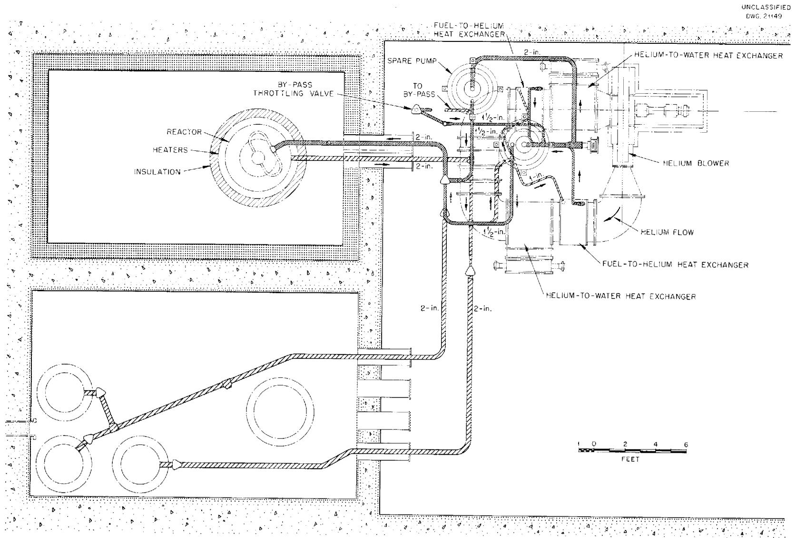  
Fig. 1.2. ARE Fuel System.

Sodium System Design. The reflector coolant (sodium) circuit remains unchanged, except for the use of one gas-sealed sump-type pump and a spare instead of the two frozen-sodium-sealed pumps previously specified. Most of the piping system for this circuit has been installed, and work on the system will be completed when the sump tanks for the new pumps arrive.

Pumps. Because of the limited success with packed-sealed pumps, the gas-sealed sump-type centrifugal pump previously described has been specified for the fuel system. The requirement of the ARE for dependable remote operation of the fuel pump could not be fulfilled by a packed-sealed pump in the near future, even though some packed seals are potentially useful. At the same time and for the same reason, it was decided to employ the same gas-sealed pump in the sodium system. Only one such pump will be required in the fuel system and one in the sodium systems, although a spare pump will be provided in each system.

Gas-sealed pumps are limited to operation with the shaft in a nearly vertical position in order to maintain gas above the liquid surface. This type of pump has operated for several thousands of hours in circulating various fluoride mixtures at temperatures of up to $1300^{\circ}\mathrm{F}$ . The pump has not yet been tested with sodium, but no difficulties are anticipated so long as the gas seal is protected from sodium vapor.

A gas-sealed pump, as required by the ARE, has been fabricated and is now being tested (for details of test on this pump see sec. 2, "Experimental Reactor Engineering"). Two design problems encountered involved the parting faces and stationary seals and a tank design for minimum holdup that would provide space for enriched fuel addition, thermal expansion, and

priming. It has been necessary to enlarge the pump structure because of the increased fuel requirement. Four complete pumps with spare parts are being built and should be completed by the latter part of October.

Valves. Both the 2-in, bellows valves and the frangible-disk valves are being tested for operation in the fluorides at $1300^{\circ}\mathrm{F}$ . The bellows valves installed in the ARE fuel system leaked during preliminary tests with water, but, when cleaned, they operated satisfactorily in a fluoride fuel at temperatures of up to $1200^{\circ}\mathrm{F}$ . The frangible-disk valve is being developed as an isolation unit between the fuel loop and the components that require positive sealing and only one valve operation.

A 2-in., Fulton Sylphon, air-operated, normally closed valve is being tested for leakage and self-welding with NaF-ZrF $_4$ -UF $_4$ (50-46-4 mole %). This valve was originally installed in the ARE fuel system and leaked during the initial water testing, as did several other valves. After removal, the valve was cleaned by water flushing, and the present test was started. Thus far, the valve has been operated in the fluoride mixture for about 200 hr with a fluid temperature of $1200^{\circ}\mathrm{F}$ and a differential pressure of 30 psi without detectable leakage. After being opened and closed 12 times, the valve was left in the closed position for 150 hr to determine whether self-welding between the plug and seal might occur. At the end of this time, the valve opened smoothly without noticeable sticking, and it reseated without leakage.

The temperature of the fluid in the valve has been raised to $1300^{\circ}\mathrm{F}$ to investigate self-welding of the valve over the same time period. The unit pressure between the sealing surfaces is approximately 4000 psi. Another valve of the same type and size that leaked very badly in the water test

was removed, and, after thorough cleaning, it was checked and found to be helium tight at differential pressures of up to 50 psi. These tests indicate that the leak tightness of these valves is satisfactory, and the temperature limitation is to be investigated.

The frangible-disk valve is being developed to serve as an isolation unit between the fuel loop and the components that need to be used only once in the course of ARE operation, such as the hot fuel dump tank and the spare pumps. These valves are comprised of 2-in. Fulton Sylphon valve upper assemblies and bodies which have been adapted to contain 0.005-in. Inconel sealing disks that may be sheared by the air-operated bellows.

Six dry tests have been run to check the mechanical design and the reproducibility of the disk failure. Three disks have been sheared at room temperature and three at $1200^{\circ}\mathrm{F}$ . In the room-temperature tests, the rupture strengths agreed quite well with the predicted values, and all the disks failed at the same point. In the tests at $1200^{\circ}\mathrm{F}$ , the rupture strength varied about $35\%$ above and below the predicted value, which was $50\%$ below the strength at room temperature. The variation in the hot tests is probably due to poor temperature instrumentation, since the thermocouple was not located directly on the disk and the soaking times at temperature varied. A complete valve is to be built and tested in contact with the fuel.

# THE NaF-ZrF4-UF4 FUEL

G. J. Nessle W. R. Grimes Materials Chemistry Division

H. F. Poppendiek

Reactor Experimental Engineering Division

The circulating fuel to be used in the ARE will still be taken from the NaF-ZrF $_4$ -UF $_4$ system, although the

composition of the fuel, as well as the fuel concentrate (for loading), has changed. The final fuel composition will, of course, depend upon the required critical mass, but uranium concentrations as high as 7.5 mole $\%$ $\mathrm{UF}_4$ will be tolerable.

The preparation of nearly 3500 lb of ARE fuel solvent $(\mathrm{NaZrF}_5)$ was completed during the quarter. This material is, apparently, of higher purity than any previously prepared. Apparatus for preparation of the ARE fuel concentrate, similar to that for preparation of the fuel solvent, has been constructed and is being tested. It is apparent that the preparation method used will produce material of satisfactory purity without excessive reduction of the $\mathrm{UF}_4$ .

Composition. The original estimates indicated that the reactor would go critical with about 4 mole $\%$ UF $_4$ , but the latest critical mass estimate indicates that about 6.5 mole $\%$ will be required. This fuel concentration can be obtained from within the NaF-ZrF $_4$ -UF $_4$ system, but considerable effort has been required to ascertain not only that the physical properties of the resulting fuel will be amenable to reactor requirements but also that the anticipated loading procedure of the reactor will remain unaltered. The contemplated loading procedure requires the addition of an enricheduranium-bearing mixture to a non-uranium-bearing mixture, in this case, NaZrF $_5$ . The feasibility of this loading procedure is dependent upon the following three properties of the fluorides: (1) the temperatures of the carrier, the enriched fuel, and all intermediate mixtures, (2) the volume of the enriched fuel (since only $1 \, \text{l/2 ft}^3$ of concentrate is provided for in the design of the system), and (3) no segregation of the fuel during loading. These requirements apparently are best fulfilled if the compound $\mathrm{Na}_2\mathrm{UF}_6$ is employed as the

fuel concentrate. It is mixed with the carrier, $\mathrm{NaZrF}_5$ , in the quantity required to make the reactor critical. It is expected that the final composition of the fuel will be in the neighborhood of 53.5-40.0-6.5 mole % of NaF-ZrF₄ - UF₄.

A phase diagram of the $\mathrm{Na}_2\mathrm{UF}_6$ - NaZrF5 system is shown in Section 5, "Chemistry of High Temperature Liquids." From the diagram, it may be seen that the mixture with 6.5 mole % UF4 has a melting point of about $570^{\circ}\mathrm{C}$ . Should higher fuel concentrations be necessary, as much as 7.5 mole % UF4 could be obtained with melting temperatures of less than $600^{\circ}\mathrm{C}$ . The new fuel concentrate $\mathrm{Na}_2\mathrm{UF}_6$ melts at $650^{\circ}\mathrm{C}$ ; therefore the loading system will have to operate at somewhat higher temperatures.

Physical Properties. The physical properties, the most important of which are density and viscosity, of the fuel concentrate and fuel composition with 6.5 mole % UF4 are being measured. At this time only the data on the NaF-ZrF4-UF4 (53.5-40.0-6.5 mole %) fuel composition are available. These are: viscosity, 16 cp at 580°C, 5.7 cp at 950°C; density, ρ (g/cm³) = 4.06 - 0.00097 T (600 < T < 800°C).

Fuel Solvent Production (G. J. Nessle, C. R. Croft, J. Truitt, J. E. Eorgan, C. M. Blood, R. E. Thoma, Materials Chemistry Division). In a period of five weeks of this quarter, 14 batches of approximately 250 lb each of NaF-ZrF $_4$ (50-50 mole %) mixture were prepared in the 9201-3 production facility for ARE usage. There were no failures in the material processing; the material balance of the operation, which involved a total of 1548.5 kg of charge material, shows a deficit of only 1.6 kg.

The first of the 14 batches was prepared from high-hafnium-content $\mathbf{ZrF_4}$ as a trial run. One other batch has been largely consumed in testing. Accordingly, 2800 lb of material is

available for charging into the ARE. Table 1.1 presents the analytical data received, to date, on individual batches from the entire operation. Spectrographic data, other than those shown for the hafnium and boron content, are on record. These data indicate a high degree of material purity.

The operating procedure adopted and used for the production of the ARE fluoride batches is briefly the following:

1. melt constituents under a hydrogen fluoride atmosphere;   
2. treat with hydrogen (1500°F) for 1 hr;   
3. treat with hydrogen fluoride $(1500^{\circ}\mathrm{F})$ for 1 l/2 hr;   
4. hydrogen flush to an out-gas sample reading of $1 \times 10^{-4}$ mole of HF per liter of out-gas $(1500^{\circ}\mathrm{F})$ ;   
5. transfer treated fluorides to receiver can with helium $(1500^{\circ}\mathrm{F})$   
6. flush with helium until receiver can has been disconnected and removed after cooling to room temperature;   
7. place receiver can containing ARE fluorides on helium header system under positive helium pressure of 5 lb for storage until needed.

All process equipment and lines exposed to the fluorides or heat were fabricated of nickel metal.

The final hydrogen flushing process has two purposes: (1) to flush out the excess hydrogen fluoride left from the hydrogen fluoride treatment and (2) to reduce the contaminating metal content of the processed fluorides by reducing the respective fluorides, $\mathrm{NiF}_2$ , $\mathrm{FeF}_3$ , and $\mathrm{CrF}_3$ , to base metals. These metals seem to deposit on the walls of the reactor vessel or are filtered out during the transfer step.

Flushing with hydrogen to an out-gas reading of $1 \times 10^{-4}$ mole of HF per liter of out-gas was set as a practical limit for removing the metallic impurities introduced or contained in

TABLE 1.1. PRODUCTION DATA FOR ARE FUEL SOLVENT   

<table><tr><td rowspan="3">BATCH NO.</td><td rowspan="3">BATCH WEIGHT (kg)</td><td colspan="6">CHEMICAL ANALYSES</td><td rowspan="3">pH</td><td rowspan="2" colspan="2">SPECTROGRAPHIC ANALYSIS (ppm)</td></tr><tr><td colspan="3">Per Cent</td><td colspan="3">ppm</td></tr><tr><td>Zr</td><td>F</td><td>Na</td><td>Fe</td><td>Cr</td><td>Ni</td><td>Iff</td><td>B</td></tr><tr><td>1</td><td>106.5</td><td>43.3</td><td>45.0</td><td>9.76</td><td>30</td><td>&lt;10</td><td>&lt;10</td><td>2.20</td><td>1000</td><td>0.2</td></tr><tr><td>2</td><td>97.3</td><td>43.9</td><td>45.2</td><td>11.0</td><td>45</td><td>&lt;20</td><td>&lt;20</td><td>2.21</td><td>55</td><td>0.2</td></tr><tr><td>3</td><td>103.00</td><td>43.9</td><td>45.5</td><td>10.6</td><td>60</td><td>&lt;10</td><td>25</td><td>2.50</td><td>100</td><td>0.9</td></tr><tr><td>4</td><td>107.3</td><td>42.0</td><td>44.7</td><td>10.8</td><td>55</td><td>&lt;20</td><td>45</td><td>2.00</td><td>80</td><td>0.9</td></tr><tr><td>5</td><td>125.5</td><td>44.1</td><td>44.9</td><td>11.0</td><td>90</td><td>&lt;20</td><td>&lt;20</td><td>2.25</td><td>60</td><td>0.6</td></tr><tr><td>6</td><td>109.4</td><td>43.6</td><td>44.7</td><td>10.5</td><td>35</td><td>&lt;20</td><td>30</td><td>2.12</td><td>85</td><td>0.5</td></tr><tr><td>7</td><td>111.4</td><td>43.6</td><td>45.2</td><td>10.4</td><td>35</td><td>&lt;20</td><td>30</td><td>2.22</td><td>70</td><td>0.5</td></tr><tr><td>8</td><td>106.9</td><td>43.4</td><td>44.6</td><td>10.4</td><td>35</td><td>&lt;20</td><td>&lt;20</td><td>2.50</td><td>103</td><td>0.1</td></tr><tr><td>9</td><td>112.8</td><td>43.1</td><td>44.6</td><td>10.6</td><td>35</td><td>&lt;20</td><td>&lt;20</td><td>2.05</td><td>67</td><td>1.0</td></tr><tr><td>10</td><td>104.9</td><td>43.8</td><td>44.6</td><td>10.6</td><td>45</td><td>&lt;20</td><td>35</td><td>3.01</td><td>60</td><td>0.3</td></tr><tr><td>11</td><td>98.1</td><td>43.7</td><td>45.1</td><td>10.5</td><td>40</td><td>&lt;20</td><td>35</td><td>3.00</td><td>71</td><td>0.4</td></tr><tr><td>12</td><td>103.3</td><td>43.7</td><td>44.8</td><td>10.7</td><td>30</td><td>&lt;20</td><td>&lt;20</td><td>2.95</td><td colspan="2">Not reported</td></tr><tr><td>13</td><td>118.6</td><td>44.1</td><td>44.5</td><td>10.3</td><td>40</td><td>&lt;20</td><td>30</td><td>3.01</td><td colspan="2">Not reported</td></tr><tr><td>14</td><td>114.0</td><td>43.9</td><td>44.7</td><td>10.3</td><td>20</td><td>&lt;20</td><td>35</td><td>3.00</td><td colspan="2">Not reported</td></tr><tr><td>Total</td><td>1519.0 kg 3347.8 lb</td><td></td><td></td><td></td><td></td><td></td><td></td><td></td><td></td><td></td></tr></table>

the raw fluorides during the first steps of the processing. The amount of hydrogen required to accomplish this increased sharply with each successive batch for each cubicle until a somewhat constant value of 8000 liters was reached. The observations are tabulated in Table 1.2.

It is known that the base metal fluorides, especially those of iron and nickel, are reduced to the metallic state by hydrogen and that the metals are left as a spongy deposit in the reactor. A possible explanation for the increasing quantity of hydrogen required is that hydrofluorination of this sponge metal occurs during treat-

ment of the new batch with hydrogen fluoride. However, when sufficiently large deposits of these metals are built up, the quantity of base metal fluoride in the melt at conclusion of hydrofluorination is limited by the 90-min treatment with hydrogen fluoride. The hydrogen required to strip to a low base metal value should, therefore, increase to a maximum with repeated use of the equipment. It is possible that a decrease in hydrofluorination time might yield a satisfactory product with considerably shorter stripping periods.

The material is stored in gastight containers of nickel under an

TABLE 1.2. VOLUME OF HYDROGEN REQUIRED FOR STRIPPING ARE FUEL SOLVENT*   

<table><tr><td colspan="2">CUBICLE NO. 2</td><td colspan="2">CUBICLE NO. 3</td></tr><tr><td>ARE Batch No.</td><td>Volume of H2(liters)</td><td>ARE Batch No.</td><td>Volume of H2(liters)</td></tr><tr><td>1</td><td>2560</td><td>2</td><td>3912</td></tr><tr><td>3</td><td>5488</td><td>4</td><td>5838</td></tr><tr><td>5</td><td>7304</td><td>6</td><td>6240</td></tr><tr><td>7</td><td>7437</td><td>8</td><td>7032</td></tr><tr><td>9</td><td>7102</td><td>10</td><td>8159</td></tr><tr><td>11</td><td>7975</td><td>12</td><td>7943</td></tr><tr><td>13</td><td>7842</td><td>14</td><td>8264</td></tr></table>

Each batch stripped to $10^{-4}$ mole of HF per liter of $\mathbf{H}_2$ at exit.

applied positive pressure of pure dry helium.

The production facility has been examined carefully and repaired, and the auxiliary equipment (pumps, cold traps, drying trains, etc.) has been cleaned and readied for operation. It appears that the plant, as designed, is as good as new and could be placed in operation on less than one week's notice.

The price of the ARE solvent produced, including raw materials, labor, maintenance, analyses, and 50% depreciation of the capital investment in the plant, is about $25.00 per pound; this figure includes all overhead charges.

Fuel Concentrate Production (G. J. Nessle, J. E. Eorgan, Materials Chemistry Division; F. A. Doss, ANP Division). The $\mathrm{Na}_2\mathrm{UF}_6$ fuel concentrate will be prepared for the ARE by the Y-12 Chemical Production Division. Installation of the equipment in the production area is virtually complete and the equipment is being tested. A skeleton staff of operators has been trained in handling of the equipment, and a two-week period of training for a larger staff is under way. It is

anticipated that the production of the fuel concentrate will begin during the second week in September, and it should be completed about November 1. Since the Production Group prefers to load the enriched fuel storage tank at the ARE Building rather than at Building 9212, the storage tank will be available for a check run on the loading procedure for using fuel solvent material.

The process which was effective in removing oxidizing impurities during manufacture of $\mathrm{NaZrF_5}$ has been studied on $3\mathrm{-kg}$ batches of $\mathrm{Na}_2\mathrm{UF}_6$ . Because of the high concentration of $\mathrm{UF}_4$ in this material, it was suspected that the long treatment with hydrogen might cause formation of $\mathrm{UF}_3$ to an undesirable extent. However, no evidence that the process would require modification has been discovered.

Corrosion of Inconel. The corrosion of Inconel by fluoride fuels has been discussed at length in this (sec. 6, "Corrosion Research") and preceding quarterly reports. In loop tests in which the fluoride is circulated at about 4 bpm by thermal convection, the maximum depth of attack by the pure fluoride is about 10 mils in 500 hr at $1500^{\circ}\mathrm{F}$ . Not only does the rate of

attack diminish with time (so that at 1000 hr it is an additional 2 mils), but also the initial corrosion rate may be decreased by the addition of zirconium hydride which effectively reduces structural metal impurities. Consequently, zirconium hydride will be added to the ARE fuel to the extent of about 0.1 wt % - the amount found adequate to reduce such impurities as are always found in the purified fuel.

Since the fuel tubes in the reactor are 60 mils thick, corrosion rates are quite compatible with the maximum anticipated reactor operating time, 1000 hr, which includes preliminary tests with the fuel solvent. It is recognized, with some apprehension, that there has been no corrosion test at both ARE flow velocity ( $\sim$ 4 fps) and temperature drop (now $175^{\circ}\mathrm{F}$ ). For the report of the investigation of the effect of various parameters on corrosion in the fluoride-Inconel system, as well as the postulated mechanism, see Section 6, "Corrosion Research."

# INSTRUMENTATION

# R. G. Affel, ANP Division

Nothing of significance remains to be done on instrumentation, except for the refinement of the leak-detection system. The control room has been checked out and all instrumentation is ready for use, with a few very minor exceptions. A change is being made in the humidity indicator for the pit atmosphere. Because of the alterations in the fuel circuit, some changes were required in a few of the instruments; several of the instruments are no longer required for the experiment.

The fuel leak detector consists of a bath of a neutral phenol-red indicator solution through which the helium from the fuel annulus is bubbled. A fuel leak, which would cause hydrogen fluoride to be formed, turns the indicator solution to

yellow. The sodium leak, on the other hand, is detected by a decrease in the electrical resistance of sodium-contaminated insulation. Both systems have been checked out in principle by a series of experiments, and they have proved to be satisfactory (cf., sec 2, "Experimental Engineering").

# AUXILIARY SYSTEMS

R. G. Affel, ANP Division

G. A. Christry, Engineering and Maintenance Division

Off-Gas System. The secondary off-gas system for handling contaminated pit gas has been completely designed and is partially fabricated. This system is designed to handle 1 cfm of gas from the pit, and the absorber is large enough to allow discharge of the exhaust gas up the stack when the wind velocity is only 1 mph. This system will be used only when there is leakage of contaminated gas from the pit at such a rate as to indicate above-tolerance levels on the personnel monitors.

Electrical System. The electrical work has been drastically curtailed because of the changes in the liquid circuits. Routine heater installations have been made wherever the status of the work permitted.

Gas-Monitoring System. The gas-monitoring, or leak-detection, system consists of an annulus about both the fuel and sodium circuits in which helium is circulated. The helium is led through one of several sensory stations which indicate the presence of sodium or fluoride in the helium (cf., "Instrumentation," above). A flow diagram of the gas-monitoring system for both the fuel and the sodium circuits is shown schematically in Fig. 1.3.

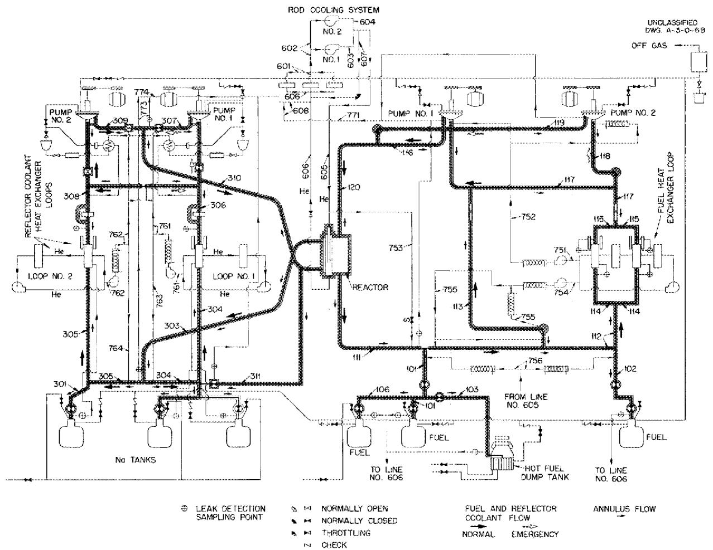  
Fig. 1.3. Gas Monitoring System.

# 2. EXPERIMENTAL REACTOR ENGINEERING

H. W. Savage, ANP Division

During this quarter, primary emphasis has been placed on the problem of sealing the ARE fuel pump; a decision has been made to use vertical-shaft, gas-sealed, sump pumps. This type of pump was selected after the completion of tests of a number of horizontal-shaft packings, including graphite, graphite and metal-wool combinations, graphite and $\mathrm{BeF}_2$ , and fluorides containing $\mathrm{BeF}_2$ , as sealing compounds for molten fluorides. Frozen-fluoride seals for horizontal shafts were also tried. Several of the packings tested sealed sufficiently well for periods in excess of 1000 hr to be reliable enough (leakage of less than $10~\mathrm{cm}^3$ per day) for an ordinary industrial application where periodic or as-needed inspection could be made. However, none of the seals tested operated with sufficiently uniform friction and thermal characteristics for them to be considered as reliable for remote operation in a reactor application, since periodic or as-needed inspections could not be made and observations of operation would be dependent upon instrumentation. Ultimately, a satisfactory packed-sealed pump may be found, but the prospects of finding it in the immediate future are not encouraging.

The gas-sealed, vertical-shaft, sump pump for the ARF, on the other hand, has performed well. The only difficulties found to date are associated with minor design features that can be readily corrected to provide proper fitting of parts and to take into account thermal expansion, etc. The pumps being built for the ARE are designed to accommodate fuel thermal expansion and contraction and, also, to accept the enriched fuel additive without loss of pump prime or excessive filling of the sump tank.

Because this pump is more reliable than the frozen-sodium-sealed pump, it is also planned to provide such pumps for the sodium moderator-coolant circuit of the ARE. As reported previously, the frozen-sodium-sealed pump consumes an excessive amount of power in friction and does have some intermittent leakage. While the friction requirement can be overcome by improved seal design, the reliable leak tightness cannot be guaranteed to the same degree as with the sump pump.

# PUMPS FOR HIGH-TEMPERATURE LIQUIDS

J.F.Bailey W.B.McDonald

W.G.Cobb P.E.MacPherson

A.G.Grindell J.Romano

W.R.Huntley D.F.Salmon

J. M. Trummel

ANP Division

Frozen-Sodium-Sealed Pump for Sodium. The test of the model FP sodium pump previously designated for use in the ARF was terminated after 1273 hr of operation at substantially ARF moderator-coolant (sodium) pump design conditions. Operation was reliable during the entire test. Leakage and power characteristics of the 5 13/16-in.-long frozen seal were reported previously.(1) Postrun inspection of the pump showed the interior surfaces to be in good condition, although some wear between impeller hubs and mating surfaces was observed and the shaft surface at the seal was roughened.

In order to lower the power consumption of the seal and yet maintain low leakage, the pump has been redesigned to accommodate a 1/2-in.-long freezing gland with gas-pressure backing. Gas-pressure backing had

been found to be necessary with the 5 13/16-in.-long seal previously tested if low leakage were to be obtained at low powers. The new, short, sealing gland was mounted on the 2 1/2-in.-dia shaft with a 0.015-in. radial clearance between the shaft and the gland. With the helium chamber for "backing-up" the seal, it is possible to reduce the pressure stress on the seal from 50 to 5 psi, or less. The helium chamber is sealed from the atmosphere by a rubber O-ring seal.

A model FP pump, complete except for the impeller, has been run to test the characteristics of a 1/2-in.-long sealing gland. The results obtained to date indicate that this seal requires 1/2 to 3/4 hp at 1700 rpm with $75^{\circ}\mathrm{F}$ water as the coolant. This is about one-tenth the power required for the 5-13/16-in.-long gland under similar conditions. A stable, predictable leak rate has not yet been determined. Leak rates in excess of $100\mathrm{cm}^3$ per day and as low as zero have been observed. The average leak rate for 960 hr of operation with a speed of 1700 rpm and a seal pressure differential of 5 psia is $40\mathrm{cm}^3$ per day. A characteristic of the short seal being tested is a tendency for leakage rates to increase once any appreciable leakage occurs. Leak-free operation for periods as long as eight days has occurred, but periods of operation with high leak rates have followed. Upon removal of the leakage, another period of leak-free operation usually follows.

The power and leakage characteristics of the 513/16-in.-long seal could be described as analogous to those of a viscous film model, as reported previously, but this has not been possible for the 1/2-in.-long seal running under a 5-psi pressure differential. A re-evaluation of the sealing mechanism, along with an analysis of test results, suggests

that wetting or nonwetting of the shaft by seal sodium is an important factor for the short seal. Since wetting is essentially an end effect, it would be considerably less important for a long seal operating under a 50-psi pressure differential. This is a likely explanation for reasonable success of the viscous film model in predicting performance of the longer seal.

Gas-Sealed Sump Pump for the ARE. The gas-sealed sump-type pump described and illustrated in the previous report(2) has been fabricated and partially tested. This pump requires a vertical shaft to maintain a liquid-gas interface, and only a gas seal is necessary. In addition, the sump tank for the pump suction bell serves as an expansion and degassing tank for the system fluid. The construction of the pump and test loop was completed in June, and test runs with $\mathrm{NaF - ZrF_4 - UF_4}$ (50-46-4 mole%) were started promptly. The pump has now operated a total of 546 hr, 410 hr at temperatures between 1200 and $1300^{\circ}\mathrm{F}$ and 136 hr at temperatures between 1450 and $1500^{\circ}\mathrm{F}$ .

Pump operation during this testing period was suspended on three occasions. However, inspection of the hardened-tool-steel vs. silver-impregnated-graphite gas seal, after each of the three terminations, revealed good sealing surfaces. A dry, hot, shakedown run was terminated when noise indicated that the shaft was rubbing against a stationary surface. The pump was reworked so that the clearance between the labyrinth seal and the shaft was increased from approximately 0.010 in. on the diameter to approximately 0.040 inch.

The second termination, after a high-temperature test with the fluoride fuel, was to permit investigation of power pulses of 200 to 400 watts superimposed on the normal power

curve. No evidence of metal scoring was found; however, frozen fluorides were found clinging to heat radiation shielding just above the labyrinth. This layer of frozen fluorides was pressing against the shaft in brake fashion over an arc of about 120 degrees. The presence of the fluorides in this region was due to accidental overfilling of the surge tank.

The third termination was for an investigation of bearing housing noise. The noise appeared to be due mostly to the inner races slipping on the shaft, accompanied by a small amount of wear caused by material suspended in the bearing lubricant. At present, the bearing fits, both on the shaft and in the bearing housing, are being improved. After reassembly, high-temperature tests will be resumed.

The level of fluid in the pump tank was raised and lowered to simulate ARE operation. The pump primed immediately with the impeller submerged. With pumping flow established, the liquid level was lowered to 1 in. below the inlet eye of the impeller (which level also provided 1-in. submergence of the inlet to the suction bell), and satisfactory behavior of the pump was noted, that is, steady flow, steady head, steady power, and no evidence of entrapment of system fluid.

The pump was subjected to many stop-and-start tests with the fluoride in the system; 13 of the tests were logged. Most of the tests logged were made to verify a minimum priming level located approximately one-half the way up on the leading edges of the impeller vanes. The pump primed successfully at this minimum priming level for all tests in which the shaft speed was 300 rpm or greater. The slower the speed, the greater was the time required to obtain definite priming, that is, resumption of substantially the head and flow for the test shaft speed. During these tests, the power trace gave evidence of

nearly complete degassing of system fluid in less than 10 minutes.

The excellent performance of these pumps to date has resulted in their selection for use in the Aircraft Reactor Experiment, not only in the fluoride system but also in the sodium (moderator-coolant) system.

Combination Packed-Frozen Sealed Pump for Fluorides. Three different packed-frozen seals were tested on the ARE-size fluoride pump described previously.(3) The first seal was made up of alternate layers of silicon-bronze wool and graphite powder, the second contained a l:l mixture of $\mathrm{BeF}_2$ and graphite powder fused in place under temperature and pressure, and the third was composed of NaBeF powder in small annular cavities between close-fitting machined rings placed around the shaft. An inert gas was maintained on the frozen end of the seal, and a water-cooling sleeve was added.

The first seal operated for a period of 160 hr in circulating NaF-ZrF $_4$ -UF $_4$ (50-46-4 mole %). The fluid temperature was $1250^{\circ}\mathrm{F}$ , the shaft speed was 1250 rpm, the flow rate was 50 gpm, the developed head was 50 psi, and the motor power was 5.7 kw. Heat removed by the water was 5000 Btu/hr. The estimated power absorbed in the seal was 0.8 hp, while the average leakage rate was 100 g per day. The test was terminated because of excessive leakage. Startup was very difficult with the second seal, and excessive heating was required to begin shaft rotation. Gross leakage occurred when the pump loop was filled with the circulating fluid. The third seal arrangement was inoperable because the closely fitting metal rings seized the pump shaft during initial dry runs.

The work on beryllium-type seals has been discontinued, and the pump

is now being assembled with a short (1/4-in.-long) frozen-fluoride seal with no packing.

Frozen-Lead-Sealed Pump for Fluor-rides. An ARE size pump was modified to incorporate the frozen-lead seal described previously.(3) A lead-fluoride interface is maintained within the pump, and the seal is on the bottom side of the pump in the denser lead. A test of a pump with this seal was terminated after 120 hr of operation when it was found that lead from the seal reservoir had been carried out into the loop. A combination of the mixing action of the rotating shaft at the lead-fluoride interface and of the high rate of fuel circulation over this region because of the drilled impeller seems to have caused this lead transfer.

Operation of the seal appears to have been satisfactory; the power input to the seal is low and it is relatively insensitive to speed and pressure changes. Ten stop-start tests that ranged in duration from 1 min to 1 l/2 hr were made during the run.

A subsequent test with a 2 1/2-in.-dia shaft rotating in a pot containing both lead and fluorides at $1200^{\circ}\mathrm{F}$ showed that the fluorides contained approximately $5\%$ lead during operation and that the lead immediately settled to the bottom when shaft rotation ceased. The mixing during operation makes this type of seal impractical for sealing a fluoride pump.

# Allis-Chalmers Canned-Rotor Pump.

The Allis-Chalmers canned-rotor pump described previously $^{(3)}$ was operated with NaK at a maximum temperature of $1085^{\circ}\mathrm{F}$ . Difficulty was encountered with the impeller binding against the pump housing at temperatures above $1000^{\circ}\mathrm{F}$ . Also, the coolant passages through the motor windings showed a tendency to plug during prolonged operation. This plugging was caused

by deposits of zinc transported from the galvanized pipe in the distilled-water coolant circuit. Replacement of the galvanized pipe with copper pipe apparently corrected this condition.

Pump performance data were taken at various temperatures. The data in Table 2.1, which were taken at $800^{\circ}\mathrm{F}$ , are typical. Several attempts to operate the pump at temperatures substantially above $1000^{\circ}\mathrm{F}$ resulted in mechanical binding; therefore the pump was returned to Allis-Chalmers, at their request, for modifications to eliminate the binding.

TABLE 2.1. PERFORMANCE DATA ON THE ALLIS-CHALMERS CANNED-BOTOR PUMP  

<table><tr><td>HEAD (psi)</td><td>FLOW (gpm)</td><td>POWER (kw)</td></tr><tr><td>13.3</td><td>19.1</td><td>0.93</td></tr><tr><td>14.3</td><td>17.9</td><td>0.91</td></tr><tr><td>15.3</td><td>16.0</td><td>0.9</td></tr><tr><td>16.1</td><td>14.0</td><td>0.87</td></tr><tr><td>16.9</td><td>11.9</td><td>0.83</td></tr><tr><td>17.4</td><td>10.0</td><td>0.8</td></tr><tr><td>17.8</td><td>8.0</td><td>0.79</td></tr><tr><td>18.1</td><td>5.9</td><td>0.75</td></tr><tr><td>18.5</td><td>3.8</td><td>0.73</td></tr><tr><td>19.1</td><td>1.5</td><td>0.71</td></tr></table>

# ROTARY-SHAFT AND VALVE-STEM SEALS FOR FLUORIDES

J.Cisar W.B.McDonald

W.R.Huntley G.Petersen

L.A.Mann W.C.Tunnel

R.N.Mason P.G.Smith

D. R. Ward

ANF Division

W. K. Stair, Consultant

Spiral-Grooved Graphite-Packed Shaft Seals. The previously mentioned investigation(4) of the nonwetting of graphite by molten fluorides was continued. A test was conducted with a

13/16-in.-dia vertical shaft that rotated clockwise and had a left-hand V-thread groove machined on the shaft in the seal area. The powdered, artificial-graphite packing was compressed by a gland in the packing area, and the spiral groove further compressed the packing at the fluoride graphite packing interface.

There was no fluoride leakage, stops and starts could be made without the addition of heat, and there were no signs that freezing was occurring within the seal region after rotation was stopped. After the seal had operated for 158 hr, the pressure to the gland for compressing the packing was inadvertently left off overnight, and the seal began to leak and to act as a frozen seal. Operation continued for another 675 hr before termination, with the seal operated as a frozen seal; the leakage rate was low. This test was duplicated and is still running with zero leakage after over 700 hours. Stops and starts have been made without the characteristic freezing that is associated with frozen seals. The fuel temperature is about $1250^{\circ}\mathrm{F}$ and the seal temperature gradient is from 500 to $900^{\circ}\mathrm{F}$ , with power to the seal reasonably constant at less than 150 watts.

Annular-Grooved Shaft Seal. Another test was made with the annular-grooved shaft seal reported previously.(4) The packing material used was bronze wool and a mixture of Asbury graphite and $\mathrm{MoS}_2$ . Only the mixture of graphite and $\mathrm{MoS}_2$ was packed in the grooved region of the seal. The test was operated for a period of 106 hr, during which time the leakage rate was higher than in previous tests. The test was terminated because of leakage of molten fuel which resulted from overheating of the seal by friction in the packing.

V-Ring Seal. The V-ring seal described previously(5) was tested with

$\mathrm{NaF - ZrF_4 - UF_4}$ (50-46-4 mole %) at about $1200^{\circ}\mathrm{F}$ and 5-psi pressure. A leakage rate of about 0.5 g/hr occurred for 100 hrof operation; the power requirement of the seal was low. The coldest part of the seal was above $1050^{\circ}\mathrm{F}$ during this period, and therefore there was no freezing. The test was terminated for inspection after 100 hr of operation, and no damage was apparent. During disassembly, the seal region was heated to remove a thermocouple, and some oxidation apparently occurred. As a result, in retesting the same seal there was gross leakage.

The same seal arrangement was set up for a test of a 2 l/2-in.-dia horizontal shaft. Since all the heat is supplied external to the seal region and shaft, the seal clearances are temperature sensitive. The sensitivity in this test was much more severe than that in the previous test for which a 13/16-in.-dia shaft was used. There were periods of apparent zero leakage and low power requirements, but slight temperature changes had cumulative effects; that is, a temperature increase caused greater friction and resulted in an even greater temperature increase and binding, and, conversely, a temperature drop increased the clearance in the annulus and resulted in leakage. The total operating time was 114 hr with the whole seal region above $1050^{\circ}\mathrm{F}$ . This seal arrangement will be retested with a heater inside the shaft to provide more stable temperature control.

Graphite -BeF $_2$ Packing. A seal consisting of a mixture of artificial graphite and $20\%$ BeF $_2$ with a bronze-wool retainer was tested with a 3/16-in.-dia vertical shaft. Since BeF $_2$ is glass-like, it should act as a high-temperature lubricant, as well as a binder for the packing material. The material was mixed, heated, and compressed in place, then heated again and compressed to permit the melted

$\mathrm{BeF}_2$ to fill the voids in the graphite. The seal is being tested with NaF $\mathrm{ZrF}_4$ - $\mathrm{UF}_4$ (50-46-4 mole %) at about $1200^{\circ}\mathrm{F}$ and 10-psi pressure. The seal temperature gradient is 500 to $1000^{\circ}\mathrm{F}$ , and the power requirement is lower than that with straight graphite at shaft speeds to 2400 rpm. The total operating time, to date, is over 1300 hr, and the seal leakage rate was a little over 4 g per day for the first 1000 hours.

Bronze-Wool and $\mathsf{MoS}_2$ -Packed Frozen Seal. The test of the seal with bronze-wool and $\mathsf{MoS}_2$ packing on a 13/16-in.-dia shaft was reported previously.(6) The seal was tested with NaF-ZrF4-UF4 (50-46-4 mole %), and it continued to operate smoothly until the test was terminated at the end of 1652 hr to make the equipment available for other tests. The average leakage rate of the fuel from the seal was less than $3.5~\mathrm{cm}^3$ per day.

The same seal was then set up with a packing material of bronze wool and Asbury graphite. An attempt was made to pack the seal so that the packing would be a uniform mixture of the two materials. The test was operated for a period of 338 hr, and the results were much the same as those in the above test, but the leakage rate was slightly higher. This test was terminated to release the equipment for other seal tests.

Bronze-Wool, Graphite, and $\mathsf{MoS}_2$ -Packed Frozen Seal. A packed-frozen seal of bronze wool with graphite and $\mathsf{MoS}_2$ as a lubricant has been tested on a 2 l/2-in.-dia shaft. The seal was operated for a period of 76.5 hr, and the test was terminated because of excessive leakage - about $8~\mathrm{cm}^3/\mathrm{hr}$ at the conclusion of the test. The test was made with the shaft rotating at 1150 rpm to seal NaF- $\mathsf{ZrF}_4$ - $\mathsf{UF}_4$ against a pressure of 5 psi at $1100^\circ\mathrm{F}$ .

Another test, similar to the above, is being made with a cooling coil added to the seal and packing of 1/4-in. layers of bronze wool sandwiched between 1/4-in. layers of powdered Asbury graphite. This test was first operated for 242 hr with the shaft in a vertical position, then with the shaft in a horizontal position. This change from vertical to horizontal operation was made without disturbing the seal. There is no apparent difference in operation in these two positions. While the shaft was operated in the vertical position, the average leakage rate of fuel from the seal was as great as $2.3\mathrm{cm}^3$ per day, but for most of the time, the leakage was less than $1\mathrm{cm}^3$ per day. The test was made at shaft speeds from 800 to 1400 rpm to seal fuel against a pressure of 10 psi at $1175^{\circ}\mathrm{F}$ .

The average leakage rate of the fuel from the seal in the horizontal test has been about $7.5\mathrm{cm}^3$ per day, but the test operated for a considerable time with leakage rates of less than $1\mathrm{cm}^3$ per day. To date, the seal has operated for 1000 hr in the horizontal position. There have been power fluctuations in both positions of as much as 500 watts, but, at times, the power requirement was constant for periods of up to 12 hours.

Copper-Braid and $\mathsf{MoS}_2$ -Packed Seal Test. A packed seal employing copper braid lubricated with $\mathsf{MoS}_2$ has been tested with $\mathsf{NaF - ZrF_4 - UF_4}$ (50-46-4 mole %) under the following conditions: fuel temperature, $1250^{\circ}\mathsf{F}$ ; shaft speed, 2000 to 2800 rpm; shaft diameter, 13/16 in.; shaft material, Stellite No. 6 (coated); $L / D$ ratio, 4.2; power to seal, 0.1 to 0.35 kw. This test was terminated after 1000 hr of operation. Power surges to the seal became large during the later stages of the test. Postrun examination showed severe welding or galling of the copper to the Stellite shaft surface,

and, in addition, the usual scoring of the seal region was quite severe.

Frozen-Lead Seal. The second lead seal test has operated for 2100 hours. The equipment for this test differed from that for the initial lead seal test (7) in that a relatively short (approximately 1/2 in.) frozen seal was obtained by providing water cooling, and an inert atmosphere was maintained over the open end of the seal. The lead used in this test was $99.49\%$ pure, and it was hydrogenated before it was loaded into the equipment. The shaft used for this test was 13/16 in. in diameter, the shaft material was type 316 stainless steel, the shaft speed was 1000 to 4000 rpm, and the power to the seal was 0.04 to 0.20 kw.

The seal operated reliably over the available speed range, 1000 to 4000 rpm. Power input to the seal varied with the speed of the shaft from 0.04 to 0.20 kw. Tests of power input to the seal vs. pressure showed no effect over the pressure range of 0

(7) Ibid., p. 19.

to 26 psi. Approximately 40 stop-start tests were made during this test, and there were no failures of the frozen seal (cf., "Frozen-Lead-Sealed Pump for Fluorides," above).

Vitreous Seals. Seven tests of the use of a vitreous substance, such as $\mathrm{BeF}_2$ , in the packing gland of a shaft seal were described in the previous report.(7) In addition, two other seals have been tested. A summary of these two seal tests is given in Table 2.2.

For the first vitreous seal test made during this quarter (number 8 in the series) the seal region around the 13/16-in.-dia shaft was divided into fifteen 3/16-by 3/16-in. compartments, and each compartment was packed with granular $\mathrm{NaBeF}_3$ which had passed a Tyler 8-mesh screen. The test was started with the shaft in the vertical position, but, after a short period, the test rig was rotated to place the shaft in a horizontal position. The shaft seal operated satisfactorily for

TABLE 2.2. TESTS OF VITREOUS SEALS ON ROTATING SHAFTS OPERATED IN NaF-ZrF4-UF4 (50-46-4 mole %)  

<table><tr><td rowspan="2"></td><td colspan="2">TEST NUMBER</td></tr><tr><td>8*</td><td>9*</td></tr><tr><td>Seal Packing Chamber</td><td></td><td></td></tr><tr><td>Over-all length, in.</td><td>5</td><td>4</td></tr><tr><td>Length of packing, in.</td><td>4</td><td>2 3/2</td></tr><tr><td>Number of compartments</td><td>15</td><td>5</td></tr><tr><td>Thickness of Facking Annulus, in.</td><td>1/4</td><td>7/6</td></tr><tr><td>Diameter of Shaft, in.</td><td>1 3/6</td><td>2 1/2</td></tr><tr><td>Speed of Shaft, rpm</td><td>1350 to 4400</td><td>640 to 800</td></tr><tr><td>Helium Pressure, psi</td><td>5</td><td>5</td></tr><tr><td>Duration of Operation, hr</td><td>679**</td><td>57**</td></tr></table>

*Composition of seal packing: Test No. 8, 100% NaBeF₃; Test No. 9, 50% BeF₂, 25% KF, 16% MgF₂, and 9% AlF₃.
**Terminated because of system failure, not at seal.

679 hr, and the test was terminated because of leakage at a flange joint that was independent of the seal. The shaft surface speed was held at approximately 930 rpm during the test to simulate operation of the ARE pump shaft. A seal leakage of not more than $4\mathrm{cm}^3$ of dry powder per day occurred from the fifth to the fifteenth day of the test. During the remainder of the test the leakage was zero. The friction power loss at the seal was less than 200 watts during most of the test; there were, however, intermittent power surges of greater magnitude. The seal temperature ranged from $100^{\circ}\mathrm{F}$ at the cold end to $1000^{\circ}\mathrm{F}$ at the hot end.

The second vitreous seal tested (number 9 of the series) employed a 2 1/2-in.-dia shaft with the seal annulus that contained five seal compartments filled with a vitreous precast ring of a mixture of fluorides (by weight: $\mathrm{BeF}_2$ , $50\%$ ; KF, $25\%$ ; $\mathrm{MgF}_2$ , $16\%$ ; $\mathrm{AlF}_3$ , $9\%$ ). This mixture of fluorides was chosen because of its high viscosity over a wide temperature range. The mixture was hydrofluorinated to remove all moisture and oxides and then mixed with an equal weight of $\mathrm{BeF}_2$ and cast (under an argon blanket) into the packing rings with which the seal was packed.

The seal operated successfully for 46 hr with zero leakage, but the test was terminated when a heater failed. Examination revealed that the heater failed when it was contacted by molten fluorides which leaked from a flange joint that was not part of the seal region. During most of the successful run, the friction power dissipated at the seal was about 1000 watts. The seal temperature ranged from $300^{\circ}\mathrm{F}$ at the cold end to $1000^{\circ}\mathrm{F}$ at the hot end.

Graphitar-Graphitar Shaft Seal. Graphite has been used as one of the sealing elements in much of the work with packed and ring types of shaft seals for fluorides. One of the

characteristics of graphite which has prompted its continued use is its apparent resistance to wetting by the fluoride fuel. However, all the packed and ring types of seals tested have had one of the sealing elements, usually the shaft, made of Stellite. This provided a wetted surface for the passage of the fuel. Thus the real significance of the nonwetting characteristic of the graphite on seal performance was masked by other variables.

In an effort to ascertain the importance of the nonwetting property of graphite, a 3/16-in.-dia shaft seal was designed which employed solid Graphitar 14 shaft bushings running against similar bushings in the seal housing. The seal housing was provided with heaters and a cooling medium. It was then possible, by varying the temperature difference between the shaft and housing, to control the running clearance of the seal to a small degree.

The seal was operated for 195 l/2 hr under pressure differentials of up to 10 psi with the seal temperature above the fuel melting point. The power required was very low and steady, and the maximum leakage rate observed was 4 g per day. During two successful stop-start tests that were made it was found that the seal temperature should be maintained above the fuel melting point.

Disassembly and inspection revealed that (1) the Graphitar 14 wear was slight (small amount of cracking noted), (2) the clearance between the Graphitar 14 and the adjacent stationary metal surface was filled with fluoride, and smaller amounts of fluoride were retained between the mating Graphitar rings, and (3) mounting of the Graphitar 14 had been accomplished without excessive cracking at high temperature.

In summary, these results confirm the usefulness of the nonwetting property of graphite in seal design.

Packing-Penetration Tests. Several additional $^{(8)}$ packing-penetration tests were made this quarter; the results are summarized in Table 2.3. Test 16, which employed a mixture of graphite and $\mathrm{BeF}_2$ and was reported previously $^{(8)}$ as "still running," was terminated after 736 hr of operation with no leakage. Upon examination, there appeared to be no penetration of the packing by the fuel and no oxidation of the graphite at the lower opening where the packing material was exposed to the atmosphere.

Five of the tests reported this quarter contained artificial graphite. One of the most promising graphites yet tested is Asbury graphite 805. The test with this material ran for 1660 hr and was terminated with no leakage. Examination showed that there was no penetration by the fuel and very little oxidation of the graphite. Rotating shaft seals packed with this material show low power dissipation from friction.

It is believed that a small amount of $\mathbf{BaF}_2$ added to the graphite will

(8) Ibid., p. 22 and Table 2.4, p. 23.

reduce the friction. A penetration test was first run with only $\mathsf{BaF}_2$ as the packing material. This packing leaked immediately, and the test showed that the $\mathsf{BaF}_2$ was soluble in the fuel. A subsequent test with a mixture of $10\% \mathsf{BaF}_2$ and $90\%$ Asbury graphite 805 has been running for 550 hr with no leakage.

# HIGH-TEMPERATURE BEARING DEVELOPMENT PROGRAM

W.C.Tunnell，ANP Division W.K.Stair,Consultant

In future work contemplated by the ANP Division, there will be need for a journal bearing that is suitable for operation in a fluoride fuel and that can be lubricated by the fuel. The expected applications will impose low radial bearing loads, but the operating temperature will be in the range of 1100 to $1500^{\circ}\mathrm{F}$ . Except for the problem of material selection, the design of the bearing is expected to be more or less routine. The phase of the program now being started involves a study of the compatibility of various material

TABLE 2.3. SUMMARY OF PACKING-PENETRATION TESTS PERFORMED AT ${1500}^{ \circ  }\mathrm{F}$ AND 30-psi PRESSURE DURING THIS QUARTER   

<table><tr><td>TEST NO.</td><td>PACKING MATERIAL</td><td>DURATION OF TEST (hr)</td><td>REMARKS</td></tr><tr><td>16</td><td>80% graphite from Y-12 Carbon Shop, 20% BeF2</td><td>736</td><td>Terminated with no leakage</td></tr><tr><td>18</td><td>National Carbon Company graphite BB-4</td><td>1/2</td><td></td></tr><tr><td>19</td><td>Asbury graphite 805</td><td>1660</td><td>Terminated with no leakage</td></tr><tr><td>20</td><td>National Carbon Company brush-type graphite</td><td>1/2</td><td></td></tr><tr><td>21</td><td>Norton Company graphite BN</td><td>1275</td><td>Terminated with no leakage</td></tr><tr><td>22</td><td>Carborundum Company graphite BN</td><td>140</td><td></td></tr><tr><td>23</td><td>BaF2</td><td>1/2</td><td></td></tr><tr><td>24</td><td>ZrO2</td><td>1/2</td><td></td></tr><tr><td>25</td><td>90% Asbury graphite 805, 10% BaF2</td><td></td><td>Had not leaked at 500 hr, test continuing</td></tr><tr><td>26</td><td>Asbury graphite 805 and FeJ-Pro C-5 high-temperature lubricant</td><td></td><td>Had not leaked at 250 hr, test continuing</td></tr></table>

combinations and their resistance to attack by $\mathrm{NaF - ZrF_4 - UF_4}$ (50-46-4 mole %). Compatibility in this application implies the ability of bearing materials to move relative to each other while in contact under load in the fluoride without excessive wear or corrosion and without galling or seizing. A compatibility tester is being fabricated, and it will be used to screen from a large group of material combinations those materials which have good compatibility and merit further examination. This phase of the program will probably include tests on the mechanical face seal, which equally necessitates knowledge of compatibility.

# INSTRUMENTATION

G. Petersen P.W. Taylor ANP Division

Fluoride Leak Detection. A test which simulated a small leak from an ARE fluoride fuel pipe into the helium annulus surrounding it was conducted at $1250^{\circ}\mathrm{F}$ with $\mathrm{NaF - ZrF_4 - UF_4}$ (50-46-4 mole%). With a gas flow of 4 cfh (80% He, 20% air) passing through the annulus and out into a sight feed bubbler containing a neutral phenol-red indicator solution, approximately 0.5 in.3 of fluoride was expelled into the annulus. The resulting hydrogen fluoride rapidly changed the color of the indicator solution to yellow.

Another test was run with dry air instead of with helium in the annulus, and the total gas flow (80% dry air, 20% air) was increased to 50 cfh. Only a fraction of the gas passing through the annulus section was exhausted through the bubbler. When the fuel was expelled into the annulus, the indicator solution turned yellow, as in the previous test.

The tests indicate that this leak detection system may be used in the ARE fuel system. In both cases, the line leading to the bubbler was $1/4$ .

in. copper tubing approximately 50 ft long.

Sodium Leak Detection. The apparatus for detecting sodium leaks involves the decrease in electrical resistance of sodium-contaminated insulation. As shown in Fig. 2.l, an ohmmeter and a filament lamp were connected between the container wall and the 0.020-in. stainless steel sheet stock with a 6-volt battery. The resistance of the circuit was then tabulated against temperature as heat was added to the sodium. When the sodium temperature was increased to $850^{\circ}\mathrm{F}$ , the resistance of the circuit increased. At this point, the ohmmeter showed a drop in resistance because sodium vapor began to contaminate the spun glass and therefore to decrease its electrical resistance.

At $1200^{\circ}\mathrm{F}$ the apparatus was tilted and liquid sodium was forced through the leak. The lamp filament was energized immediately and the resistance reading dropped to zero. This test was performed with the sodium leaking through a 0.125-in.-dia opening and a 0.028-in.-dia opening. In each case, the same results were obtained.

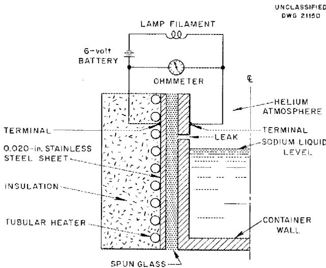  
Fig. 2.1. Sodium Leak-Detection Test System.

This method would work well for a small system with perhaps 10 to 20 welds, but for a larger system, such as the ARE, the wiring and instrumentation would be complicated and difficult.

Flow Measurement. Venturi meters used in conjunction with Moore Nullmatic pressure transmitters have been demonstrated as being reliable for measuring flows of high-temperature fluids. The outputs from the two Moore transmitters that measure the venturi $\Delta P$ are fed into a differential pressure transmitter. The output gage of this transmitter is calibrated to read flow directly in gpm. Such a system has been used successfully for about 550 hr on a pump loop to measure flows of up to 67 gpm. The pressure transmitters, rated 0 to 100 psi, are attached to the underside of the venturi section and filled completely with liquid to avoid a liquid-gas interface. The pressure-sensitive element in the transmitters is a 3-ply Inconel bellows. The temperature of the transmitters is maintained at $1100^{\circ}\mathrm{F}$ maximum to avoid serious cor

rosion. The liquid in the transmitters on this loop has been frozen and remelted with no apparent damage to the instruments, and the instruments have not required recalibration upon restarting.

The null-balance transmitters are accurate as long as the zero setting remains fixed. When the transmitters are initially heated to $1100^{\circ}\mathrm{F}$ , there is a substantial zero shift that can easily be adjusted. Subsequent zero shifts are probably caused by sudden decreases in applied pressure. Because of the balancing pressure on the inside of the bellows and the reduced spring rate at the high temperature, the bellows is often stretched beyond its elastic limit. This permanent set causes a zero shift. Although its occurrence is unpredictable, such a zero shift can readily be corrected when the applied pressure is brought to zero. When the temperature is maintained constant at $1100^{\circ}\mathrm{F}$ and sudden pressure changes are eliminated, the Moore pressure transmitters can be expected to give accurate and dependable service.

# 3. AIRCRAFT REACTOR DESIGN STUDIES

A. P. Fraas, ANP Division

Early in 1953, the Air Force requested that designs be prepared for 100-, 300-, and 600-megawatt reflectormoderated(1,2) reactors for evaluation. Since the outstanding uncertainty was that of shield weight, it was decided to outline a still wider range of reactor and shield designs to provide a fairly clear picture of the implications of variations in such factors as reactor power density, core diameter, design power output, etc. At the same time, further test data were obtained on the relative activation of several secondary circuit fluids, and the effects of using them instead of NaK were examined. The power plant system outside the reactor shield was also given further attention to produce a more detailed picture of problems in performance and control.

# SHIELD DESIGNS FOR REFLECTOR-MODERATED REACTORS

M. E. LaVerne F. H. Abernathy A. F. Fraas ANP Division

C. S. Burtnette R. M. Spencer USAF

A fairly complete survey of shield designs was made to determine the effects of reactor power, core diameter, and division of the shield on shield size and weight. The work was carried out in conjunction with the Shielding Board, (3) and all details of the calculations were made by using methods recommended by the Board. Each reactor shield was designed on the basis of Lid Tank Facility test

results(4) to give one-eighth of the radiation dose in neutrons and seven-eighths in gammas. Crew shield weights were calculated for two representative crew compartment configurations; the right-circular cylinder in one configuration was 8 ft in diameter and 12 ft long, and was 5 ft in diameter and 10 ft long in the other configuration. Designs were prepared for attenuation factors of 10, 100, 1,000, and 10,000, respectively. Total reactor and crew shield weights can be readily obtained by combining the proper reactor and shield combination with the proper crew compartment. This was done to give a crew dose rate of 1.0 rem/hr. Tables 3.1 to 3.4 summarize the significant weight and dimensional data calculated.

Typical curves were prepared to show the effects of major parameters on shield weight. A careful scrutiny of these leads to the following conclusions:

1. A divided shield makes possible a large saving in total shield weight as the full-power radiation dose 50 ft from the center of the reactor is increased from 1 to $100\mathrm{r / hr}$ . Further division of the shield results in little, if any, reduction in weight, except for large-diameter cores and small crew compartments. It does permit substantial reductions in shield diameters, however. See Figs. 3.1 and 3.2.

2. The shield weight for a given power output is not very sensitive to reactor core diameter for cores less than 30 in. in diameter. The shield weight increases rapidly for larger cores. See Figs. 3.1 and 3.3.

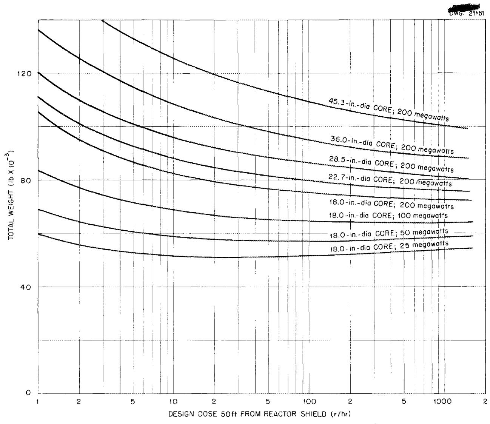  
Fig. 3.1. Effect of Design Dose from Reactor Shield on Total Reactor and Shield Weight for 1 r/hr in Crew Compartment 8 ft in Diameter and 12 ft Long.

3. Shield weight is quite sensitive to reactor power output. A reduction in the reactor power makes possible a substantial saving in weight. See Figs. 3.1 and 3.3.   
4. A reduction of the dose in the crew compartment by a factor of 10 imposes a weight penalty of from 5,000 to 15,000 lb, depending primarily on crew compartment size. See Figs. 3.1 and 3.4.   
5. For most of the designs considered, the dose from the activated

secondary coolant can be kept quite small. Although activation of the secondary coolant circuit (cf., "Activation of Rubidium, Potassium, and Sodium," this section) was not included in the calculations, in no case will it affect the designs for which the dose at 50 ft is $10\mathrm{r / hr}$ or greater. Its only effect would be to increase the weight of the crew compartments with very nearly unit shields for reactor outputs of greater than 200 megawatts. See Fig. 3.5.

TABLE 3.1. REACTOR-INTERMEDIATE HEAT EXCHANGER-SHIELD WEIGHT FOR A DOSE OF 1 rem/hr 50 ft FROM CENTER OF REACTOR WITH DOSE SEVEN-EIGHTS GAMMAS AND ONE-EIGHTH NEUTRONS  

<table><tr><td rowspan="2">CORE DIAMETER (in.)</td><td rowspan="2">POWER (megawatts)</td><td rowspan="2">Z (cm)</td><td rowspan="2">(Lid Tank Dose Full-Scale Dose) (Power)</td><td colspan="2">LEAD THICKNESS (in.)</td><td rowspan="2">LEAD INSIDE DIAMETER (in.)</td><td rowspan="2">LEAD OUTSIDE DIAMETER (in.)</td><td rowspan="2">WATER OUTSIDE DIAMETER (in.)</td><td rowspan="2">LEAD WEIGHT (lb)</td><td rowspan="2">WATER WEIGHT (lb)</td><td rowspan="2">REACTOR AND PRESSURE SHELL ASSEMBLY WEIGHT (lb)</td><td rowspan="2">BASIC SPHERE WEIGHT (lb)</td><td rowspan="2">WEIGHT OF PATCH (lb)</td><td rowspan="2">WEIGHT OF STRUCTURE (lb)</td><td>TOTAL REACTOR AND REACTOR SHIELD WEIGHT (lb)</td></tr><tr><td>For Core Gammas (Assuming 0.8 r/hr)</td><td>For Core Plus Heat Exchanger Gammas</td><td></td></tr><tr><td rowspan="3">14.3</td><td>25</td><td>133.5</td><td>1.55</td><td>6.25</td><td>6.18</td><td>44.4</td><td>56.8</td><td>119.3</td><td>20,500</td><td>28,650</td><td>5,088</td><td>54,240</td><td>1,200</td><td>1,080</td><td>56,500</td></tr><tr><td>50</td><td>138.0</td><td>1.47</td><td>7.10</td><td>7.03</td><td>46.3</td><td>60.4</td><td>122.9</td><td>26,000</td><td>30,920</td><td>5,852</td><td>62,770</td><td>1,700</td><td>1,260</td><td>65,700</td></tr><tr><td>100</td><td>145.0</td><td>1.36</td><td>8.10</td><td>8.09</td><td>49.4</td><td>65.6</td><td>128.5</td><td>34,000</td><td>34,770</td><td>7,398</td><td>76,770</td><td>2,500</td><td>1,540</td><td>80,800</td></tr><tr><td rowspan="4">18</td><td>25</td><td>130.0</td><td>2.16</td><td>6.00</td><td>5.94</td><td>47.8</td><td>59.6</td><td>120.2</td><td>22,100</td><td>28,810</td><td>6,100</td><td>57,000</td><td>1,300</td><td>1,140</td><td>59,400</td></tr><tr><td>50</td><td>135.5</td><td>2.04</td><td>6.70</td><td>6.59</td><td>49.5</td><td>62.7</td><td>124.6</td><td>26,600</td><td>31,880</td><td>7,000</td><td>65,480</td><td>1,800</td><td>1,310</td><td>68,600</td></tr><tr><td>100</td><td>141.5</td><td>1.90</td><td>7.70</td><td>7.65</td><td>52.3</td><td>67.6</td><td>129.2</td><td>35,800</td><td>34,920</td><td>8,300</td><td>79,020</td><td>2,500</td><td>1,580</td><td>83,100</td></tr><tr><td>200</td><td>149.0</td><td>1.75</td><td>8.80</td><td>8.82</td><td>57.0</td><td>74.6</td><td>135.3</td><td>49,200</td><td>38,950</td><td>11,400</td><td>99,550</td><td>3,750</td><td>1,990</td><td>105,300</td></tr><tr><td rowspan="4">22.7</td><td>50</td><td>133.0</td><td>2.68</td><td>6.55</td><td>6.48</td><td>53.7</td><td>66.7</td><td>127.3</td><td>30,500</td><td>33,370</td><td>8,480</td><td>72,450</td><td>1,850</td><td>1,450</td><td>75,700</td></tr><tr><td>100</td><td>139.0</td><td>2.50</td><td>7.33</td><td>7.26</td><td>56.0</td><td>70.5</td><td>132.1</td><td>37,800</td><td>36,920</td><td>9,900</td><td>84,620</td><td>2,650</td><td>1,690</td><td>88,900</td></tr><tr><td>200</td><td>146.0</td><td>2.32</td><td>8.33</td><td>8.31</td><td>60.2</td><td>76.8</td><td>137.7</td><td>50,900</td><td>40,760</td><td>13,000</td><td>104,660</td><td>4,150</td><td>2,100</td><td>110,900</td></tr><tr><td>400</td><td>153.5</td><td>2.15</td><td>9.70</td><td>9.71</td><td>67.0</td><td>86.4</td><td>143.7</td><td>73,800</td><td>43,860</td><td>18,500</td><td>136,160</td><td>6,400</td><td>2,720</td><td>145,300</td></tr><tr><td rowspan="3">28.5</td><td>200</td><td>143.5</td><td>3.06</td><td>8.00</td><td>7.97</td><td>64.4</td><td>80.3</td><td>141.5</td><td>54,300</td><td>43,750</td><td>15,300</td><td>113,350</td><td>4,700</td><td>2,260</td><td>120,300</td></tr><tr><td>400</td><td>151.0</td><td>2.84</td><td>9.15</td><td>9.16</td><td>70.4</td><td>88.7</td><td>147.2</td><td>76,000</td><td>47,060</td><td>20,500</td><td>143,560</td><td>7,450</td><td>2,870</td><td>153,900</td></tr><tr><td>800</td><td>158.0</td><td>2.65</td><td>10.6</td><td>10.66</td><td>79.7</td><td>101.0</td><td>152.8</td><td>114,000</td><td>48,210</td><td>31,360</td><td>193,570</td><td>11,200</td><td>3,870</td><td>208,600</td></tr><tr><td rowspan="3">36</td><td>200</td><td>141.0</td><td>4.20</td><td>7.55</td><td>7.51</td><td>70.4</td><td>85.4</td><td>147.0</td><td>59,500</td><td>48,520</td><td>18,700</td><td>128,720</td><td>5,300</td><td>2,570</td><td>136,600</td></tr><tr><td>400</td><td>148.0</td><td>3.90</td><td>8.65</td><td>8.65</td><td>74.2</td><td>91.5</td><td>152.5</td><td>76,600</td><td>52,830</td><td>25,200</td><td>154,630</td><td>8,800</td><td>3,090</td><td>166,500</td></tr><tr><td>800</td><td>155.0</td><td>3.64</td><td>10.05</td><td>10.10</td><td>84.0</td><td>104.2</td><td>158.0</td><td>115,500</td><td>53,445</td><td>34,400</td><td>203,440</td><td>19,000</td><td>4,070</td><td>226,500</td></tr><tr><td rowspan="3">45.3</td><td>200</td><td>138.5</td><td>5.60</td><td>7.15</td><td>7.11</td><td>78.4</td><td>92.6</td><td>154.3</td><td>67,000</td><td>54,720</td><td>24,800</td><td>146,520</td><td>6,300</td><td>2,930</td><td>155,700</td></tr><tr><td>400</td><td>146.0</td><td>5.20</td><td>8.10</td><td>8.08</td><td>82.4</td><td>98.6</td><td>160.2</td><td>85,500</td><td>59,910</td><td>29,400</td><td>174,810</td><td>12,000</td><td>3,500</td><td>190,300</td></tr><tr><td>800</td><td>152.0</td><td>4.90</td><td>9.50</td><td>9.53</td><td>89.7</td><td>108.8</td><td>164.9</td><td>121,100</td><td>60,730</td><td>39,900</td><td>221,730</td><td>20,000</td><td>4,440</td><td>246,200</td></tr></table>

TABLE 3.2. REACTOR-INTERMEDIATE HEAT EXCHANGER-SHIELD WEIGHT FOR A DOSE OF 10 rem/hr 50 ft FROM CENTER OF REACTOR WITH DOSE SEVEN-EIGHTS GAMMAS AND ONE-EIGHT H NEUTRONS  

<table><tr><td rowspan="2">CORE DIAMETER (in.)</td><td rowspan="2">POWER (megawatts)</td><td rowspan="2">Z (cm)</td><td rowspan="2">(Lid Tank Dose Full-Scale Dose)(Power)</td><td colspan="2">LEAD THICKNESS (in.)</td><td rowspan="2">LEAD INSIDE DIAMETER (in.)</td><td rowspan="2">LEAD OUTSIDE DIAMETER (in.)</td><td rowspan="2">WATER OUTSIDE DIAMETER (in.)</td><td rowspan="2">LEAD WEIGHT (lb)</td><td rowspan="2">WATER WEIGHT (lb)</td><td rowspan="2">REACTOR AND PRESSURE SHELL ASSEMBLY WEIGHT (lb)</td><td rowspan="2">BASIC SPHERE WEIGHT (lb)</td><td rowspan="2">WEIGHT OF PATCH (lb)</td><td rowspan="2">WEIGHT OF STRUCTURE (lb)</td><td>TOTAL REACTOR AND REACTOR SHIELD WEIGHT (lb)</td></tr><tr><td>For Core Gammas (Assuming 6 r/hr)</td><td>For Core Plus Heat Exchanger Gammas</td><td></td></tr><tr><td rowspan="3">14.3</td><td>25</td><td>111</td><td>2.60</td><td>4.70</td><td>4.58</td><td>43.9</td><td>53.1</td><td>101.9</td><td>13,600</td><td>17,260</td><td>5,088</td><td>35,948</td><td>1,100</td><td>719</td><td>37,767</td></tr><tr><td>50</td><td>116</td><td>2.42</td><td>5.30</td><td>5.23</td><td>45.8</td><td>56.3</td><td>105.5</td><td>17,900</td><td>18,471</td><td>5,852</td><td>42,223</td><td>1,600</td><td>844</td><td>44,667</td></tr><tr><td>100</td><td>122</td><td>2.23</td><td>5.90</td><td>5.81</td><td>48.9</td><td>60.5</td><td>110.3</td><td>22,500</td><td>21,389</td><td>7,398</td><td>51,287</td><td>2,100</td><td>1,026</td><td>54,413</td></tr><tr><td rowspan="4">18.0</td><td>25</td><td>108.5</td><td>3.60</td><td>4.50</td><td>4.34</td><td>47.3</td><td>56.0</td><td>103.9</td><td>14,900</td><td>17,828</td><td>6,100</td><td>38,828</td><td>1,250</td><td>776</td><td>40,854</td></tr><tr><td>50</td><td>114</td><td>3.33</td><td>5.1</td><td>5.03</td><td>49.0</td><td>59.1</td><td>108.0</td><td>19,000</td><td>19,894</td><td>7,000</td><td>45,894</td><td>1,700</td><td>918</td><td>48,500</td></tr><tr><td>100</td><td>119.6</td><td>3.08</td><td>5.7</td><td>5.65</td><td>51.8</td><td>63.1</td><td>112.0</td><td>24,800</td><td>21,789</td><td>8,300</td><td>54,889</td><td>2,375</td><td>1,098</td><td>58,375</td></tr><tr><td>200</td><td>125.5</td><td>2.86</td><td>6.25</td><td>6.19</td><td>56.5</td><td>68.9</td><td>117.0</td><td>31,600</td><td>24,298</td><td>11,400</td><td>67,298</td><td>3,200</td><td>1,346</td><td>71,850</td></tr><tr><td rowspan="4">22.7</td><td>50</td><td>112</td><td>4.37</td><td>4.9</td><td>4.78</td><td>53.7</td><td>63.3</td><td>110.7</td><td>21,400</td><td>20,800</td><td>8,480</td><td>50,680</td><td>1,400</td><td>1,014</td><td>53,400</td></tr><tr><td>100</td><td>117.5</td><td>4.05</td><td>5.45</td><td>5.40</td><td>55.5</td><td>66.4</td><td>113.5</td><td>26,200</td><td>21,661</td><td>9,900</td><td>57,761</td><td>2,300</td><td>1,156</td><td>61,250</td></tr><tr><td>200</td><td>123.3</td><td>3.76</td><td>6.05</td><td>6.02</td><td>59.7</td><td>71.7</td><td>119.9</td><td>33,800</td><td>25,781</td><td>13,000</td><td>72,581</td><td>3,500</td><td>1,452</td><td>77,550</td></tr><tr><td>400</td><td>129.5</td><td>3.50</td><td>6.60</td><td>6.57</td><td>66.5</td><td>79.6</td><td>124.7</td><td>44,800</td><td>27,816</td><td>18,500</td><td>91,116</td><td>5,100</td><td>1,822</td><td>98,020</td></tr><tr><td rowspan="3">28.5</td><td>200</td><td>121.3</td><td>4.92</td><td>5.80</td><td>5.77</td><td>63.9</td><td>75.4</td><td>124.3</td><td>36,000</td><td>28,647</td><td>15,300</td><td>79,947</td><td>4,000</td><td>1,598</td><td>85,500</td></tr><tr><td>400</td><td>127</td><td>4.56</td><td>6.5</td><td>6.46</td><td>69.9</td><td>82.8</td><td>128.5</td><td>49,100</td><td>29,547</td><td>20,500</td><td>99,147</td><td>6,000</td><td>1,982</td><td>107,080</td></tr><tr><td>800</td><td>134</td><td>4.25</td><td>7.2</td><td>7.13</td><td>79.2</td><td>93.5</td><td>134.3</td><td>69,000</td><td>30,883</td><td>31,360</td><td>131,243</td><td>9,900</td><td>2,624</td><td>143,740</td></tr><tr><td rowspan="3">36.0</td><td>200</td><td>119</td><td>6.7</td><td>5.55</td><td>5.49</td><td>69.9</td><td>80.9</td><td>129.8</td><td>40,300</td><td>30,845</td><td>18,700</td><td>89,845</td><td>4,600</td><td>1,796</td><td>96,250</td></tr><tr><td>400</td><td>125.3</td><td>6.2</td><td>6.20</td><td>6.13</td><td>73.7</td><td>86.0</td><td>135.0</td><td>50,800</td><td>34,501</td><td>25,200</td><td>110,501</td><td>7,500</td><td>2,210</td><td>120,200</td></tr><tr><td>800</td><td>131</td><td>5.8</td><td>6.9</td><td>6.87</td><td>83.5</td><td>97.2</td><td>139.2</td><td>73,300</td><td>34,188</td><td>34,400</td><td>141,888</td><td>11,000</td><td>2,840</td><td>155,800</td></tr><tr><td rowspan="3">45.3</td><td>200</td><td>117</td><td>8.95</td><td>5.35</td><td>5.23</td><td>77.9</td><td>88.4</td><td>137.5</td><td>47,300</td><td>35,397</td><td>24,800</td><td>107,497</td><td>5,600</td><td>2,150</td><td>115,250</td></tr><tr><td>400</td><td>123.3</td><td>8.3</td><td>5.55</td><td>5.48</td><td>81.9</td><td>92.9</td><td>143.5</td><td>53,800</td><td>39,731</td><td>29,400</td><td>123,931</td><td>9,000</td><td>2,480</td><td>135,400</td></tr><tr><td>800</td><td>129</td><td>7.8</td><td>6.60</td><td>6.54</td><td>89.2</td><td>102.3</td><td>146.9</td><td>76,600</td><td>40,573</td><td>39,900</td><td>157,073</td><td>16,000</td><td>3,140</td><td>176,200</td></tr></table>

TABLE 3.3. REACTOR-INTERMEDIATE HEAT EXCHANGER-SHIELD WEIGHT FOR A DOSE OF 100 rem/hr 50 ft FROM CENTER OF REACTOR WITH DOSE SEVEN-EIGHTHS GAMMAS AND ONE-EIGHTH NEUTRONS  

<table><tr><td rowspan="2">CORE DIAMETER (in.)</td><td rowspan="2">POWER (megawatts)</td><td rowspan="2">Z (cm)</td><td rowspan="2">(Lid Tank Dose Full-Scale Dose)(Power)</td><td colspan="2">LEAD THICKNESS (in.)</td><td rowspan="2">LEAD INSIDE DIAMETER (in.)</td><td rowspan="2">LEAD OUTSIDE DIAMETER (in.)</td><td rowspan="2">WATER OUTSIDE DIAMETER (in.)</td><td rowspan="2">LEAD WEIGHT (lb)</td><td rowspan="2">WATER WEIGHT (lb)</td><td rowspan="2">REACTOR AND PRESSURE SHELL ASSEMBLY WEIGHT (lb)</td><td rowspan="2">BASIC SPHERE WEIGHT (lb)</td><td rowspan="2">WEIGHT OF PATCH (lb)</td><td rowspan="2">WEIGHT OF STRUCTURE (lb)</td><td>TOTAL REACTOR AND REACTOR SHIELD WEIGHT (lb)</td></tr><tr><td>For Core Gammas (Assuming 50 r/hr)</td><td>For Core Plus Heat Exchanger Gammas</td><td></td></tr><tr><td rowspan="3">14.3</td><td>25</td><td>95</td><td>2.64</td><td>2.95</td><td>2.74</td><td>44.4</td><td>49.9</td><td>89.0</td><td>7,800</td><td>10,984</td><td>5,088</td><td>23,870</td><td>1,000</td><td>476</td><td>25,300</td></tr><tr><td>50</td><td>100</td><td>2.44</td><td>3.55</td><td>3.40</td><td>46.3</td><td>53.1</td><td>93.1</td><td>10,800</td><td>12,430</td><td>5,852</td><td>29,080</td><td>1,300</td><td>580</td><td>31,000</td></tr><tr><td>100</td><td>105.5</td><td>2.24</td><td>4.15</td><td>4.00</td><td>49.4</td><td>57.4</td><td>97.5</td><td>14,800</td><td>13,943</td><td>7,398</td><td>36,140</td><td>1,750</td><td>720</td><td>38,600</td></tr><tr><td rowspan="4">18.0</td><td>25</td><td>93</td><td>3.6</td><td>2.7</td><td>2.38</td><td>47.8</td><td>52.6</td><td>91.2</td><td>8,180</td><td>11,599</td><td>6,100</td><td>25,880</td><td>1,200</td><td>516</td><td>27,600</td></tr><tr><td>50</td><td>97.5</td><td>3.35</td><td>3.33</td><td>3.19</td><td>49.5</td><td>55.9</td><td>94.8</td><td>11,500</td><td>12,860</td><td>7,000</td><td>31,360</td><td>1,600</td><td>626</td><td>33,600</td></tr><tr><td>100</td><td>103</td><td>3.10</td><td>3.95</td><td>3.83</td><td>52.3</td><td>60.0</td><td>99.1</td><td>15,800</td><td>14,323</td><td>8,300</td><td>38,420</td><td>2,100</td><td>768</td><td>41,300</td></tr><tr><td>200</td><td>108.5</td><td>2.86</td><td>4.50</td><td>4.38</td><td>57.0</td><td>65.8</td><td>103.4</td><td>21,600</td><td>15,519</td><td>11,400</td><td>48,500</td><td>2,800</td><td>970</td><td>52,300</td></tr><tr><td rowspan="4">22.7</td><td>50</td><td>96</td><td>4.40</td><td>3.1</td><td>2.91</td><td>53.7</td><td>59.5</td><td>98.3</td><td>12,000</td><td>13,970</td><td>8,480</td><td>34,450</td><td>1,650</td><td>688</td><td>36,800</td></tr><tr><td>100</td><td>101</td><td>4.06</td><td>3.7</td><td>3.59</td><td>56.0</td><td>63.2</td><td>103.0</td><td>16,000</td><td>15,890</td><td>9,900</td><td>41,790</td><td>2,250</td><td>836</td><td>44,900</td></tr><tr><td>200</td><td>106.5</td><td>3.77</td><td>4.25</td><td>4.18</td><td>60.2</td><td>68.6</td><td>106.6</td><td>22,200</td><td>16,814</td><td>13,000</td><td>52,010</td><td>3,000</td><td>1,040</td><td>56,000</td></tr><tr><td>400</td><td>112</td><td>3.48</td><td>4.95</td><td>4.83</td><td>67.0</td><td>76.7</td><td>111.0</td><td>32,300</td><td>17,341</td><td>18,500</td><td>68,140</td><td>4,900</td><td>1,362</td><td>74,400</td></tr><tr><td rowspan="3">28.5</td><td>200</td><td>104</td><td>4.90</td><td>4.10</td><td>4.00</td><td>64.4</td><td>72.4</td><td>110.4</td><td>24,200</td><td>18,276</td><td>15,300</td><td>57,780</td><td>3,800</td><td>1,156</td><td>62,700</td></tr><tr><td>400</td><td>110</td><td>4.55</td><td>4.70</td><td>4.62</td><td>70.4</td><td>79.6</td><td>115.1</td><td>32,500</td><td>19,298</td><td>20,500</td><td>72,300</td><td>5,600</td><td>1,446</td><td>79,300</td></tr><tr><td>800</td><td>116</td><td>9.22</td><td>5.25</td><td>5.20</td><td>79.7</td><td>91.1</td><td>120.0</td><td>53,900</td><td>18,372</td><td>31,360</td><td>103,630</td><td>8,000</td><td>2,072</td><td>113,700</td></tr><tr><td rowspan="3">36</td><td>200</td><td>102.5</td><td>6.61</td><td>3.90</td><td>3.74</td><td>70.4</td><td>77.9</td><td>116.7</td><td>26,600</td><td>21,117</td><td>18,700</td><td>66,420</td><td>4,000</td><td>1,128</td><td>71,500</td></tr><tr><td>400</td><td>108.5</td><td>6.10</td><td>4.45</td><td>4.32</td><td>74.2</td><td>82.8</td><td>121.4</td><td>34,200</td><td>23,114</td><td>25,200</td><td>82,510</td><td>6,100</td><td>1,650</td><td>90,300</td></tr><tr><td>800</td><td>114</td><td>5.70</td><td>5.00</td><td>5.00</td><td>84.0</td><td>94.0</td><td>125.9</td><td>51,000</td><td>22,028</td><td>34,400</td><td>107,430</td><td>8,300</td><td>2,148</td><td>117,900</td></tr><tr><td rowspan="3">45.3</td><td>200</td><td>100.5</td><td>8.80</td><td>3.65</td><td>3.43</td><td>78.4</td><td>85.3</td><td>124.4</td><td>33,300</td><td>24,664</td><td>24,800</td><td>82,760</td><td>4,800</td><td>1,656</td><td>89,200</td></tr><tr><td>400</td><td>107</td><td>8.10</td><td>4.20</td><td>4.07</td><td>82.4</td><td>90.5</td><td>129.7</td><td>39,400</td><td>27,256</td><td>29,400</td><td>96,060</td><td>7,600</td><td>1,920</td><td>105,600</td></tr><tr><td>800</td><td>112</td><td>7.61</td><td>4.85</td><td>4.79</td><td>89.7</td><td>98.3</td><td>133.7</td><td>49,000</td><td>27,240</td><td>39,900</td><td>116,140</td><td>9,000</td><td>2,322</td><td>127,500</td></tr></table>

TABLE 3.4. REACTOR-INTERMEDIATE HEAT EXCHANGER-SHIELD WEIGHT FOR A DOSE OF 1000 rem/hr 50 ft FROM CENTER OF REACTOR WITH DOSE SEVEN-EIGHTS GAMMAS AND ONE-EIGHT H NEUTRONS  

<table><tr><td rowspan="2">CORE DIAMETER (in.)</td><td rowspan="2">POWER (megawatts)</td><td rowspan="2">Z (cm)</td><td rowspan="2">(Lid Tank Dose Full-Scale Dose) (Power)</td><td colspan="2">LEAD THICKNESS (in.)</td><td rowspan="2">LEAD INSIDE DIAMETER (in.)</td><td rowspan="2">LEAD OUTSIDE DIAMETER (in.)</td><td rowspan="2">WATER OUTSIDE DIAMETER (in.)</td><td rowspan="2">LEAD WEIGHT (lb)</td><td rowspan="2">WATER WEIGHT (lb)</td><td rowspan="2">REACTOR AND PRESSURE SHELL ASSEMBLY WEIGHT (lb)</td><td rowspan="2">BASIC SPHERE WEIGHT (lb)</td><td rowspan="2">WEIGHT OF PATCH (lb)</td><td rowspan="2">WEIGHT OF STRUCTURE (lb)</td><td>TOTAL REACTOR AND REACTOR SHIELD WEIGHT (lb)</td></tr><tr><td>For Core Gammas (Assuming 500 r/hr)</td><td>For Core Plus Heat Exchanger Gammas</td><td></td></tr><tr><td rowspan="3">14.3</td><td>25</td><td>81.3</td><td>3.30</td><td>1.28</td><td>1.12</td><td>44.4</td><td>46.5</td><td>78.4</td><td>2,785</td><td>7,207</td><td>5,088</td><td>15,080</td><td>700</td><td>300</td><td>16,100</td></tr><tr><td>50</td><td>85.0</td><td>3.08</td><td>1.85</td><td>1.76</td><td>46.3</td><td>49.8</td><td>81.3</td><td>5,190</td><td>7,939</td><td>5,852</td><td>18,880</td><td>1,150</td><td>376</td><td>20,400</td></tr><tr><td>100</td><td>89.0</td><td>2.90</td><td>2.33</td><td>2.29</td><td>49.4</td><td>54.0</td><td>84.5</td><td>7,900</td><td>8,424</td><td>7,398</td><td>23,720</td><td>1,500</td><td>474</td><td>25,700</td></tr><tr><td rowspan="4">18.0</td><td>25</td><td>80.1</td><td>4.45</td><td>1.05</td><td>0.92</td><td>47.8</td><td>49.6</td><td>81.0</td><td>2,741</td><td>7,723</td><td>6,100</td><td>16,560</td><td>900</td><td>330</td><td>17,800</td></tr><tr><td>50</td><td>83.5</td><td>4.23</td><td>1.65</td><td>1.56</td><td>49.5</td><td>52.6</td><td>83.7</td><td>5,190</td><td>8,341</td><td>7,000</td><td>20,530</td><td>1,400</td><td>410</td><td>22,300</td></tr><tr><td>100</td><td>87.0</td><td>3.98</td><td>2.10</td><td>2.12</td><td>52.3</td><td>56.5</td><td>86.5</td><td>7,940</td><td>8,826</td><td>8,300</td><td>25,060</td><td>1,900</td><td>500</td><td>27,500</td></tr><tr><td>200</td><td>91.5</td><td>3.71</td><td>2.65</td><td>2.68</td><td>57.0</td><td>62.4</td><td>90.0</td><td>12,360</td><td>9,193</td><td>11,400</td><td>32,950</td><td>2,650</td><td>858</td><td>36,500</td></tr><tr><td rowspan="4">22.7</td><td>50</td><td>82.5</td><td>5.46</td><td>1.40</td><td>1.27</td><td>53.7</td><td>56.2</td><td>87.7</td><td>4,840</td><td>9,402</td><td>8,480</td><td>22,720</td><td>1,400</td><td>454</td><td>24,600</td></tr><tr><td>100</td><td>85.5</td><td>5.16</td><td>1.93</td><td>1.81</td><td>56.0</td><td>59.6</td><td>90.3</td><td>7,720</td><td>9,914</td><td>9,900</td><td>27,530</td><td>2,000</td><td>550</td><td>30,100</td></tr><tr><td>200</td><td>90.0</td><td>4.82</td><td>2.40</td><td>2.49</td><td>60.2</td><td>65.2</td><td>93.5</td><td>12,610</td><td>10,216</td><td>13,000</td><td>35,830</td><td>2,900</td><td>716</td><td>39,400</td></tr><tr><td>400</td><td>94.5</td><td>4.46</td><td>3.00</td><td>3.08</td><td>67.0</td><td>73.2</td><td>96.9</td><td>19,570</td><td>9,779</td><td>18,500</td><td>47,840</td><td>4,100</td><td>956</td><td>52,900</td></tr><tr><td rowspan="3">28.5</td><td>200</td><td>88.5</td><td>6.20</td><td>2.27</td><td>2.30</td><td>64.4</td><td>69.0</td><td>98.1</td><td>13,120</td><td>11,633</td><td>15,300</td><td>40,050</td><td>3,200</td><td>800</td><td>44,100</td></tr><tr><td>400</td><td>93.0</td><td>5.80</td><td>2.80</td><td>2.90</td><td>70.4</td><td>76.2</td><td>102.1</td><td>20,000</td><td>11,753</td><td>20,500</td><td>52,250</td><td>4,900</td><td>1,044</td><td>58,200</td></tr><tr><td>800</td><td>98.0</td><td>5.37</td><td>3.30</td><td>3.48</td><td>79.7</td><td>86.7</td><td>105.5</td><td>30,110</td><td>9,881</td><td>31,360</td><td>71,350</td><td>7,200</td><td>1,426</td><td>80,000</td></tr><tr><td rowspan="3">36</td><td>200</td><td>87.0</td><td>8.30</td><td>2.05</td><td>2.03</td><td>70.4</td><td>74.5</td><td>104.4</td><td>13,850</td><td>13,528</td><td>18,700</td><td>46,080</td><td>4,200</td><td>920</td><td>51,200</td></tr><tr><td>400</td><td>91.0</td><td>7.80</td><td>2.65</td><td>2.65</td><td>74.2</td><td>79.5</td><td>107.6</td><td>20,100</td><td>14,055</td><td>25,200</td><td>59,350</td><td>5,600</td><td>1,186</td><td>66,100</td></tr><tr><td>800</td><td>96.0</td><td>7.25</td><td>3.13</td><td>3.33</td><td>84.0</td><td>90.7</td><td>111.6</td><td>32,810</td><td>12,172</td><td>34,400</td><td>79,380</td><td>8,400</td><td>1,586</td><td>89,400</td></tr><tr><td rowspan="3">45.3</td><td>200</td><td>85.5</td><td>10.68</td><td>1.90</td><td>1.77</td><td>78.4</td><td>81.9</td><td>112.5</td><td>14,400</td><td>16,527</td><td>24,800</td><td>55,730</td><td>4,400</td><td>1,114</td><td>61,200</td></tr><tr><td>400</td><td>89.5</td><td>10.16</td><td>2.40</td><td>2.42</td><td>82.4</td><td>87.2</td><td>115.7</td><td>22,150</td><td>16,317</td><td>29,400</td><td>67,870</td><td>6,900</td><td>1,356</td><td>76,100</td></tr><tr><td>800</td><td>93.5</td><td>9.70</td><td>2.95</td><td>3.11</td><td>89.7</td><td>95.9</td><td>118.9</td><td>34,300</td><td>15,046</td><td>39,900</td><td>89,250</td><td>10,800</td><td>1,784</td><td>101,800</td></tr></table>

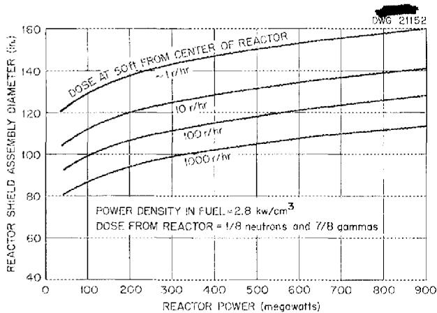  
Fig. 3.2. Effects of Power Output and Shield Division on the Diameter of the Reactor Shield Assembly. The diameter given is for the basic sphere. If a higher radiation level at the top of the reactor is to be avoided, an extra "patch" about 5 in. thick will be required there.

# COMPARATIVE ANALYSES OF LIQUID METAL COOLANTS

A.P.Fraas M.E.LaVerne ANP Division

Activation of Rubidium, Potassium, and Sodium. A limiting factor in the degree to which a unit shield may be approached is the gamma dose from the secondary coolant outside the main gamma shield. In an effort to determine the extent to which this gamma dose might be reduced, several tests were run in which fluoride salts of three of the alkali metals, sodium, potassium, and rubidium, were irradiated and their relative activations determined. These data are reported in detail in a separate report.(4) From the basic data, gamma doses for potassium and rubidium relative to sodium were calculated for a variety of irradiation times, decay times, and lead shield thicknesses. In general, the results indicate that potassium is far

superior to sodium, the relative gamma dose from potassium being from 1 to $5\%$ of that from sodium for almost any combination of conditions. These data are shown in Fig. 3.6. For rubidium, on the other hand, the dose relative to sodium depends strongly on the combination of conditions considered; the dose ratio ranges from about 10:1 for short irradiation and decay times and no shielding to about 0.002:1 for moderate irradiation and decay times and heavy shielding. No tests were run with lithium, but previous work indicates that its activity would be of the order of $0.1\%$ of that of sodium. Unfortunately, there is, as yet, no suitable metal available to contain lithium in the temperature range of interest.

Effect of Secondary Coolant on Power Plant Weight. The effect of the secondary coolant on the over-all power plant weight is an important consideration. Although many bases for comparison can be used, it appeared that a good indication would be obtained by modifying the 200-megawatt power plant previously described(1) to maintain the same pressure and temperature drops with all coolants considered, that is, sodium, potassium, and natural lithium. The resulting effects of the choice of a secondary fluid are given in Table 3.5 in terms of the weight increase or decrease relative to the original design for use with NaK. The lower specific heat and the lower density of potassium require larger lines, larger tubes in the intermediate heat exchanger, greater pumping power, etc., and hence potassium requires a heavier system. The detailed character of the effects is shown more clearly by the data in Table 3.6, which lists the physical properties and related parameters of the alkali metals considered for operation at a mean temperature of $700^{\circ}\mathrm{C}$ .

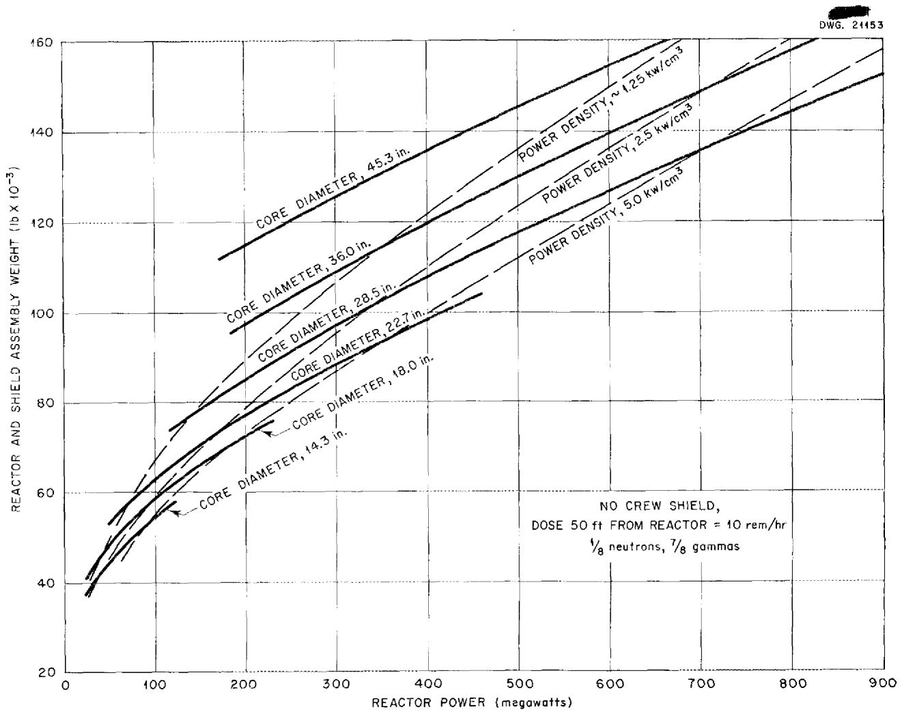  
Fig. 3.3. Effects of Power Output and Core Diameter on the Weight of the Reactor and Shield Assembly.

# POWER PLANT PERFORMANCE AND CONTROL

D. M. Walley W. K. Moran

W. J. Graff

Oak Ridge School of Reactor Technology

A detailed design, control, and performance study of the entire power plant system was made by three students of the Oak Ridge School of Reactor Technology in conjunction with the General Design Group studies of the reflector-moderated reactor. The power plant system performance analysis is being reported in detail in a

separate report(5) and is only summarized here. Preliminary design and off-design performance calculations had been made previously by members of the ANP Division and reported in the two previous quarterly reports.(1,2) These original studies were based on the use, first, of a Sapphire engine and then later on the use of a modified Wright engine on information supplied

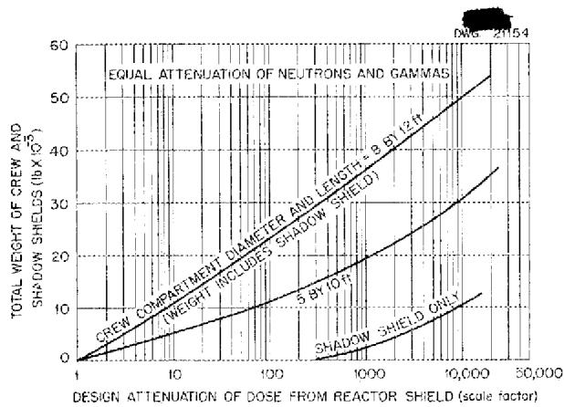  
Fig. 3.4. Effects of Design Attenuation on Crew and Shadow Shield Weights.

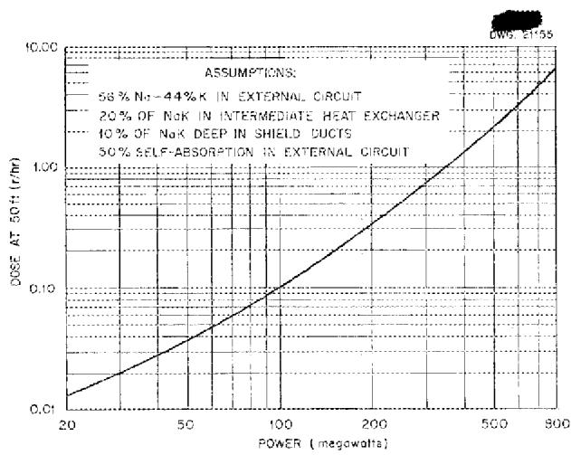  
Fig. 3.5. Effect of Reactor Power Output on the Activation in Sodium in the External Circuit.

verbally by the manufacturer. Although these studies were only preliminary surveys, they were sufficient to establish that the modified Wright engine is the more suitable of the two. Further, they established many of the system parameters and seemed to give reasonable estimates of the expected performance at various speeds and altitudes. This study, accordingly, was based on the use of four modified Wright engines to absorb the power

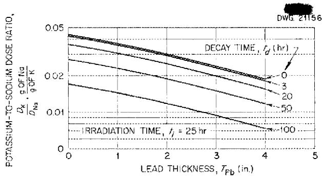

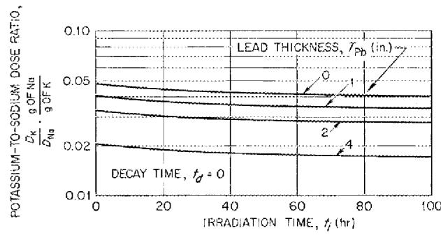

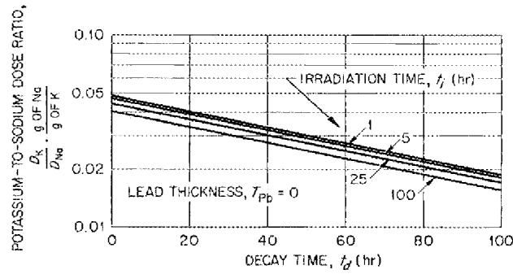  
Fig. 3.6. Potassium-to-Sodium Dose Ratio as a Function of Decay Time, Lead Thickness, and Irradiation Time.

delivered by a 200-megawatt version of the reflector-moderated circulating-fuel reactor.

Description of Power Plant. The power plant system envisioned is shown schematically in Fig. 3.7. A fairly detailed description of the proposed power plant was reported in previous quarterly reports.(1,6) As indicated

in these reports, the heat produced in the core is carried by the circulating fuel to the intermediate heat exchanger located around the outside of the beryllium reflector. The reflector is cooled by sodium, and the sodium, in turn, is cooled by some of the NaK from the engine air radiators after being subcooled in an auxiliary

heat exchanger. The two fuel pumps are driven by two constant-speed air turbines supplied with lleed air from each engine. It is important to note that a variable-inlet-area turbine can be designed to give a constant rpm over a wide range of inlet air conditions.

The heat from the intermediate heat exchanger would be picked up by NaK

TABLE 3.5. WEIGHT EFFECT ON 200-MEGAWATT POWER PLANT OF SUBSTITUTION OF SODIUM, POTASSIUM, AND LITHIUM FOR NaK* IN THE SECONDARY FLUID SYSTEM   

<table><tr><td rowspan="2">COMPONENT</td><td colspan="3">WEIGHT CHANGE (1b)</td></tr><tr><td>With Potassium</td><td>With Sodium</td><td>With Natural Lithium</td></tr><tr><td>Shield**</td><td>2000</td><td>-600</td><td>-1500</td></tr><tr><td>Liquid metal</td><td>700</td><td>-200</td><td>-1700</td></tr><tr><td>Pipes</td><td>600</td><td>-200</td><td>-1000</td></tr><tr><td>Fumps</td><td>500</td><td>-200</td><td>-600</td></tr><tr><td>Radiators</td><td>500</td><td>-150</td><td>-300</td></tr><tr><td>Total</td><td>4100</td><td>-1350</td><td>-5100</td></tr></table>

*Composition: 56% Na and 44% K.   
**Shield weight data are for a shield designed to give 10 r/hr at 50 ft from the center of the reactor.

TABLE 3.6. PHYSICAL PROPERTIES AND RELATED PARAMETERS* FOR ALKALI METALS  

<table><tr><td></td><td>NaK</td><td>Rb</td><td>K</td><td>Na</td><td>Li</td></tr><tr><td>Specific heat, Btu/1b·°F</td><td>0.25</td><td>0.09**</td><td>0.185</td><td>0.301</td><td>1.02</td></tr><tr><td>Density, g/cm³</td><td>0.742</td><td>1.22**</td><td>0.676</td><td>0.78</td><td>0.465</td></tr><tr><td>Viscosity, cp</td><td>0.161</td><td>0.18**</td><td>0.136</td><td>0.182</td><td>0.23**</td></tr><tr><td>Thermal conductivity, cal/sec·cm-°C</td><td>0.069</td><td>0.05**</td><td>0.08**</td><td>0.14</td><td>0.07**</td></tr><tr><td>Melting point, °F</td><td>66.2</td><td>102</td><td>147</td><td>208</td><td>354</td></tr><tr><td>Boiling point, °F</td><td>1518</td><td>1270</td><td>1400</td><td>1621</td><td>2403</td></tr><tr><td>Vapor pressure at 1600°F, psia</td><td>23</td><td>70**</td><td>40</td><td>12.8</td><td></td></tr><tr><td>Cp× density</td><td>0.185</td><td>0.110</td><td>0.125</td><td>0.234</td><td>0.475</td></tr><tr><td>Pressure drop relative to NaK***</td><td>1.00</td><td>4.65</td><td>2.0</td><td>0.66</td><td>0.095</td></tr><tr><td>Pumping power relative to NaK***</td><td>1.00</td><td>7.8</td><td>2.96</td><td>0.52</td><td>0.037</td></tr></table>

*Considered at $700^{\circ}C$ unless otherwise specified.   
\*\*Extrapolated.   
\*\*\*In any particular fixed system.

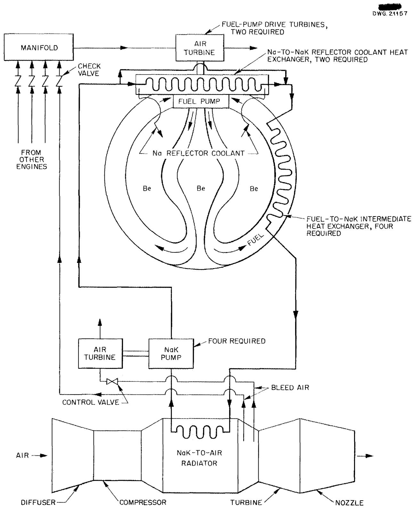  
Fig. 3.7. Schematic Diagram of Power Plant System.

(56% Na, 44% K) pumped in a closed loop through the heat exchanger and through NaK-to-air radiators located in the engines between the compressor and the turbine. The NaK would be pumped by a variable-speed bleed-air turbine, and the control of the bleed air might serve as the primary control of the system.

A variable nozzle area would also be provided on the engines. The bleed air required to pump the fuel and the NaK was determined to be from 1 to $2\%$ of the total engine air flow at full power.

For full power operation, control of the nozzle area could be coupled to a governor in such a way that the engine rpm would be kept constant. This would give close to maximum efficiency for the turbine and compressor, maximum air flow, and thus maximum thrust. To reduce power, the bleed air to the NaK-pump drive turbines could be throttled to reduce the NaK flow rate and, in turn, the quantity of heat transported by the NaK. In addition, the automatic nozzle area control could be bypassed for any throttle setting below full power. Since the turbojet nozzle area could be frozen in the full open position (for the operating speed and altitude), the engine rpm would be reduced as the throttle for the pump drive turbine was being closed. This feature was found to be necessary because, if constant turbojet rpm were maintained, the temperature of the NaK returning to the intermediate heat exchanger might be below the freezing point of the fuel for operation below about $85\%$ power.

It is expected that the negative temperature coefficient of reactivity of the fluoride fuel in the core will be sufficiently high to maintain the mean temperature of the core at a constant value and to maintain the effective multiplication constant at 1.00, regardless of the power demand on the reactor.

The principal parameters that were used in the calculations of the system are given in the following:

<table><tr><td>Air flow rate per engine (at sea-
level static, which was estab-
lished as the design point)</td><td>220 lb/sec</td></tr><tr><td>NaK flow rate for full power per
engine</td><td>480 lb/sec</td></tr><tr><td>NaK-to-air radiator heat transfer
area per engine</td><td>10,000 ft2</td></tr><tr><td>NaK-to-air radiator volume per
engine</td><td>27.7 ft3</td></tr><tr><td>Fuel-to-NaK intermediate heat ex-
changer heat transfer area,
total</td><td>2,400 ft2</td></tr><tr><td>Fuel flow rate</td><td>1,250 lb/sec</td></tr><tr><td>Maximum fuel temperature</td><td>1590°F</td></tr><tr><td>Minimum fuel temperature</td><td>1190°F</td></tr><tr><td>Maximum NaK temperature</td><td>1500°F</td></tr><tr><td>Minimum full-power NaK tempera-
ture</td><td>1100°F</td></tr><tr><td>Compression ratio of the main
engine compressor</td><td>4:1</td></tr></table>

It should be emphasized that all these parameters, and others, are completely interrelated and that a change in one parameter would, in all probability, change all the others. All values must be considered as preliminary because the fluoride fuel is not definitely specified; hence, typical values were assumed for the characteristics (specific heat, thermal conductivity, etc.) of the fuel. The heat transfer characteristics of all heat exchangers are preliminary because these units are being improved. The flow characteristics of the fuel channels are currently being studied. It is believed, however, that this study does outline fairly well the control and performance characteristics of the system.

The characteristics of the entire system were found to depend heavily upon the characteristics of the NaK-to-air radiator. The radiator assumed was a finned-tube, multipass, crossflow design, the characteristics of

which have been established by test.(7) The NaK flow rate of 2.5 cfs, as specified in the previous quarterly report,(6) was assumed, while the air flow rate was established by the operating speed and altitude. The fluoride fuel flow rate was determined from the maximum and minimum allowable fuel temperatures, the assumed specific heat, and the full-power reactor output. It was assumed that the fuel flow rate should be maintained constant under all operating conditions. With these parameters, the NaK-to-air radiator heat transfer area required to transfer the full power output of the reactor was calculated for sea-level static conditions. If the design point were chosen at a high altitude, a smaller heat transfer area would be required, but sea-level performance would be drastically reduced. If the design point were chosen at a high sea-level speed, the heat transfer area (and weight) would be increased and the thrust per pound of power plant weight would be reduced.

In the course of the investigation, it was found that a reduced NaK flow rate reduced the size of the intermediate heat exchanger and the total power plant weight without an appreciable increase in the NaK-to-air radiator size or the pressure drop in the fuel system. However, the optimization was not completed, and the initially assumed NaK flow rate was retained.

Design Performance. With the parameters established above, the performance of the power plant at various speeds and altitudes is as shown in Fig. 3.8. The solid lines are the performance at the speeds and altitudes indicated for a maximum fuel temperature of $1590^{\circ}\mathrm{F}$ (but a maximum structural metal temperature of $1500^{\circ}\mathrm{F}$ ). The dotted lines, labeled

"War Emergency Operation," are for a maximum fuel temperature of $1690^{\circ}\mathrm{F}$ (maximum structural metal temperature of $1600^{\circ}\mathrm{F}$ ). The line labeled "Chemical Augmentation, Sea Level," is the estimated performance with sufficient chemical augmentation (interburning) to maintain a constant turbine air inlet temperature at $1600^{\circ}\mathrm{F}$ . The tail cone openings required to maintain constant rpm were found to be reasonable. The maximum and minimum fluid temperatures varied with the speed and altitude within the limits indicated above. For part-power operation, the thrust varied with rpm in a conventional manner. Minimum sustained operation under sea-level static conditions was as follows:

Per cent normal rated rpm 52

NaK flow rate 50 lb/sec

Minimum NaK temperature 910°F

The above engine performance calculations were applied to a typical 200,000-lb, four-engine sea plane.

The performance of the aircraft with a 100-megawatt reactor and two combinations of nuclear and chemical power at sea level is given in Fig. 3.9. Top speed could probably be improved in both cases with a cleaner aerodynamic design than that possible for a sea plane. The arrangement with two nuclear-powered engines and two chemically powered engines gives better performance than that with only two nuclear engines, even with chemical augmentation. The arrangement having two chemically augmented nuclear-powered engines was not considered as practical because of the low take-off thrust and rate of climb indicated. Fuel consumption was very high because both interburning and afterburning had to be provided.

System Characteristics That Affect Reactor Control. The most significant part of the control portion of the study was an investigation of the nature and magnitude of perturbations


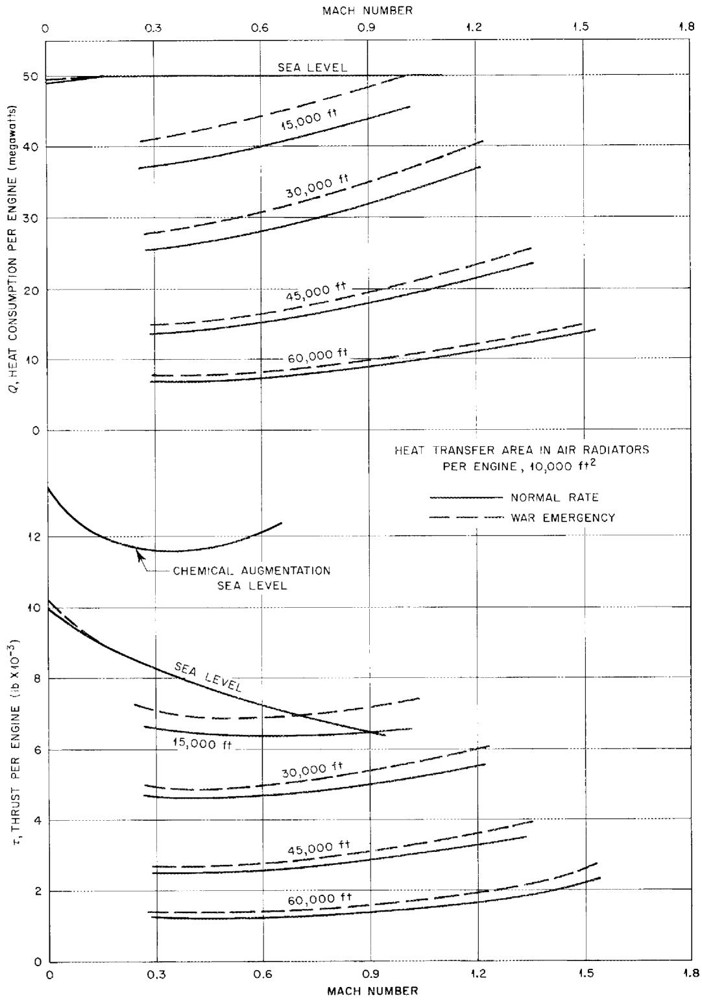  
Fig. 3.8. Power Plant Performance at Various Speeds and Altitudes.

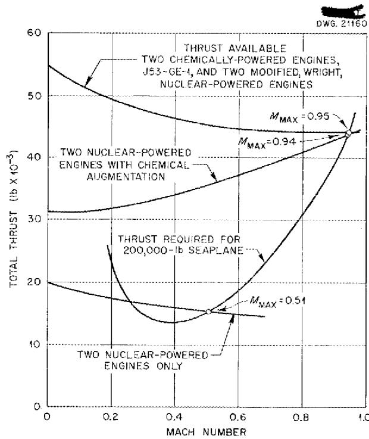  
Fig. 3.9. Sea-Level Performance of a 200,000-lb Plane with a 100-Megawatt Reactor.

that might arise in the system, external to the reactor, and affect the reactivity. In circulating-fuel reactors, the only way that such perturbations can affect the reactor is through changes in the temperature of the fluid entering the core. The salient point with regard to reactor stability and control is the rate at which these changes may occur. If such changes take place very rapidly, that is, in time intervals of the order of 1 sec or less, they might conceivably cause serious power oscillations and temperature overshoots. Core inlet temperature changes may take place as a result of changes in control settings and operating conditions, or they may result from such accidents as pump or engine failures. In any case, the rates of change will depend upon the properties of the system, that is, the thermal capacities,

transit times, etc. Although this analysis was for a particular power plant, the results should be typical.

Since no large amount of heat would be added to the system (except in the case of a very severe fire), an abrupt and substantial fluid temperature change could come about only through changes in either the rate of power generation or in the rate of heat removal. For a circulating-fluoride-fuel reactor with the type of secondary circuit envisioned, a change in the rate of power generation could come about only as a result of a change in the rate of heat removal; hence, the rate of heat rejection to the air flowing through the turbojet engine radiators is critical, and will, in turn, depend upon the engine air flow rate, the NaK temperature, and the NaK flow rate through the radiators.

The engine air flow rate will depend mainly upon the engine rpm and the airplane altitude and speed. Variations in engine air flow with changes in aircraft altitude and speed will take place at relatively low rates and, hence are not of serious consequence so far as the fast response of the system is concerned. Variations in engine air flow caused by changes in engine rpm will be only moderately rapid; acceleration from idling at $40\%$ rated speed to rated speed would require from 5 to 10 sec because of the high inertia of the rotor assembly. Since the air flow will be directly proportional to the engine speed, the change in heat rejection rate will be from not less than 8 to 50 megawatts per engine in from 5 to 10 seconds.

The heat input to the air flowing through the engine under idling conditions will depend upon the method of engine control. The method chosen in this particular study was to vary both the jet nozzle area and the NaK pump speed. Other means of control were considered, including varying the amount of air allowed to bypass the

radiators or, similarly, allowing a part of the NaK flow to bypass the radiators. If only the jet nozzle area were varied, the engine heat consumption under idling conditions might be as much as $50\%$ of the full-power heat consumption. It is unlikely that this method of control would be used alone, however, because it would be very difficult to maintain full NaK pump speed at low turbojet engine rpm with the air-bleed turbine type of pump drive that seems most promising.

There does not appear to be any way in which step changes in the temperature of the circulating fuel entering the reactor core can be effected, either accidentally or deliberately. Even if, in some manner, a step change could be introduced into either the air stream entering the NaK radiator or the NaK circuit, the transit times through the radiator and the heat exchanger, the heat capacities, and the time lags in the lines from the radiator to the heat exchanger and from the heat exchanger to the core would most certainly cause the step change to be "ramped out" over a period of the order of tenths of a second or longer.

Some of the typical mechanical failures that might be sources of serious perturbations are interesting as an indication of the rates of change that must be considered. Turbo-jet engine failure could result from failure of any of the three major components, the compressor, the radiator, or the turbine. A compressor failure could result from the breakdown of a thrust bearing or from the fatigue failure of a blade. A radiator failure could result from

the rupture of a tube or a welded connection. Turbine failure could result from the fatigue failure of a turbine blade. In any case, an engine failure would act to decrease the power or heat demand on the reactor. As the rate at which heat removal from the fuel passing through the heat exchanger is reduced, the fuel temperature will increase. This, in turn, will act immediately to reduce the reactivity and hence the core power level. A failure of a turbojet engine could not cause a step-type temperature change in the fuel entering the reactor core. Simultaneous failure of all four engines, however, would be drastic because without the engines operating it would not be possible to remove the tremendous heat generated in the core. Even though the increased fuel temperature in the core caused the power to drop radically, even to the extent of shutting down the reactor, a large source of after-heat from the fission-product decay activity would still remain. In such a situation, there would be no facilities for heat removal other than the heat capacities of the components, and, in a relatively short time, the vessel containing the fuel would melt. However, circumstances in which all four engines might fail simultaneously are exceedingly rare and would probably result in the loss of the aircraft.

Other possible sources of system failure are NaK pump failure, air turbine failure, rupture of bleed air or NaK lines, etc. These would affect the system in the same manner as the primary type of engine failures described above, but probably at less rapid rates.

# 4. UNIFORM THERMAL-NEUTRON FLUX REACTOR

J. W. Morfitt, Development Divisions (Y-12)

A. D. Callihan, Physics Division

The relationship between minimum critical mass and uniform thermal-neutron core flux has been experimentally investigated for a water-moderated water-reflected nuclear reactor employing $\mathbf{U}^{235}$ as fuel. The reactor vessel assumed was a right-circular cylinder of aluminum 72 cm in diameter and 91.4 cm long. The core, 30.2 cm in diameter, was divided into five concentric regions by aluminum partitions and was surrounded by an effectively infinite water reflector on its lateral surface only. The aluminum matrix of the reactor is pictured in Fig. 4.1. Aqueous uranyl fluoride solution, made from uranium containing 93.2% of the $\mathbf{U}^{235}$ isotope, was added in various concentrations to the several regions to simulate a theoretical fuel distribution having a continuous concentration gradient. This theoretical fuel distribution is that given by a calculation method developed in an analytical treatment of the problem by Goertzel, (1) who demonstrated mathematically that the condition of minimum critical mass in a suitably chosen thermal reactor required that the thermal-neutron flux be uniform in the fuel-containing region.

# CRITICAL MASS

The experimentally measured critical height and mass for the theoretically determined fuel loading were within $2.5\%$ of the corresponding calculated parameters. These results, given in Table 4.1, clearly establish the validity of the Goertzel theory.

The concentrations of the solutions in the fuel regions were then altered slightly to establish the critical height at its predicted value, 41.6

cm, and thereby reduce the measured critical mass to 1055 g of $\mathbf{U}^{235}$ . The results, both experimental and calculated, are compared in Table 4.2 with the corresponding masses obtained with the uranium uniformly distributed throughout a core of the same length and diameter.

TABLE 4.1. CRITICAL PARAMETERS FOR THEORETICALLY DETERMINED FUEL CONCENTRATIONS   

<table><tr><td></td><td>CRITICALHEIGHT(cm)</td><td>CRITICALMASS(g)</td></tr><tr><td>Calculated</td><td>41.6</td><td>1038</td></tr><tr><td>Measured</td><td>42.7</td><td>1061</td></tr></table>

TABLE 4.2. COMPARISON OF CRITICAL MASS FOR UNIFORM LOADING AND FOR THE GOERTZEL LOADING   

<table><tr><td rowspan="2"></td><td colspan="2">CRITICAL MASS</td><td rowspan="2">CRITICAL MASS REDUCTION (%)</td></tr><tr><td>Uniform Loading (g)</td><td>Goertzel Loading (g)</td></tr><tr><td>Calculated</td><td>1296</td><td>1038</td><td>19.9</td></tr><tr><td>Measured</td><td>1162</td><td>1055</td><td>9.2</td></tr></table>

The critical mass for the Goertzel loading was about $9\%$ less than that for a uniformly loaded reactor of identical dimensions. This measured difference is less than that calculated from a modified variational solution of the critical equation in integral form by using a constant trial function. Experience has shown that results obtained by this method are about $8\%$ too high when applied to uniformly loaded reactors. An adjustment of this magnitude in the above data would bring the values into satisfactory agreement.

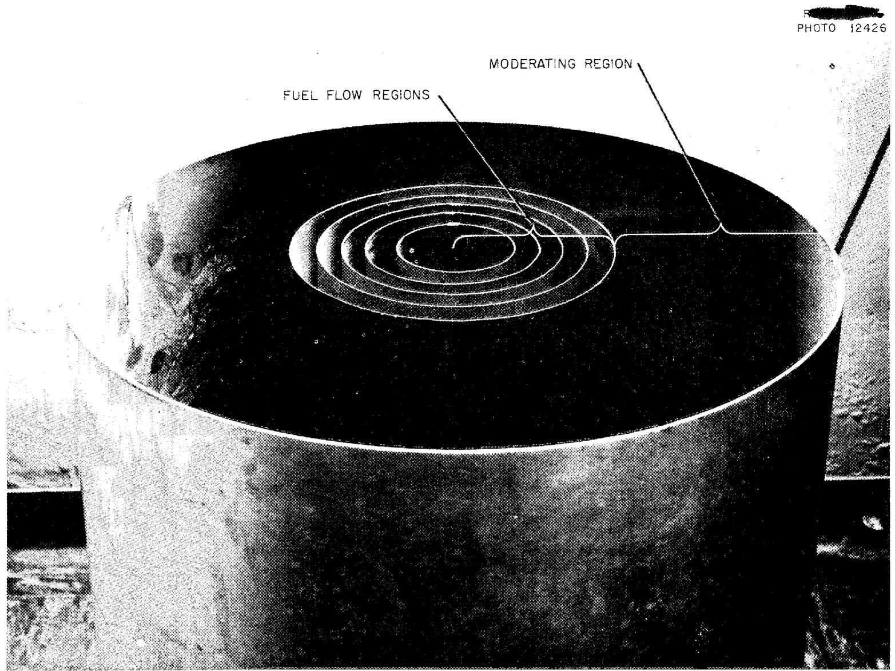  
Fig. 4.1. Matrix for Uniform-Thermal-Neutron-Flux Reactor.

An exploratory investigation for obtaining experimental verification of a modification of the theory postulated by Goertzel and for predicting how the mass of fuel can be minimized in a reactor of less than optimum radius met with little success. Although some lowering of the critical mass was produced by the theoretically determined fuel distribution, a discrepancy of more than $35\%$ was found to exist between theory and experiment.

# NEUTRON FLUX

The measured thermal and nonthermal components of the neutron flux were in good agreement with those predicted by theory, and the thermal flux, except for deviations produced by a stepwise approximation to the ideal fuel distribution, was uniform along a radius of the core, as shown in Fig. 4.2. A comparison of the experimental and calculated thermal-neutron fluxes is shown in Fig. 4.3. The longitudinal

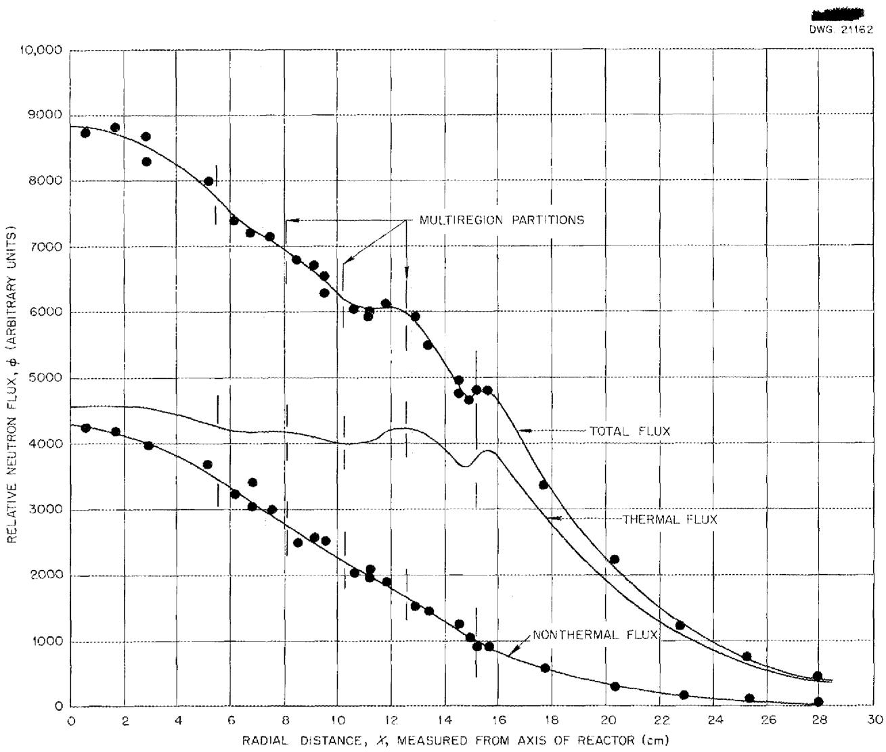  
Fig. 4.2 Radial Neutron Flux in the Uniform-Thermal-Neutron-Flux Reactor.

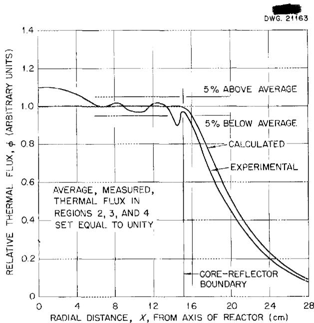  
Fig. 4.3. Comparison of Theoretical and Experimental Values for the Radial Thermal-Neutron Flux.

neutron flux behaved as was expected. Approximately $96\%$ of the fissions were caused by neutrons with energies below the 0.02-in.-thick cadmium cut-off energy; thus, the reactor was essentially thermal. This result was ex

pected because the hydrogen molecule density of the fuel was about $99\%$ of that of water. In general, data obtained from the experimental reactor were compatible with the postulates and predictions of the Goertzel theory.

# IMPORTANCE FUNCTION

The importance function of the $\mathbf{U}^{235}$ in the minimum-mass reactor was measured by adding an increment of fuel to a localized volume in each of the five concentric fuel regions and by noting in each instance its effect on the overall reactivity of the system. This fuel importance function was found to be radially uniform to within 5% of its average value. In a second test, equal volumes of fuel were exchanged between the inner and outer regions, where the concentrations and the importance functions differ most; the resulting net mass shift of 8 g of $\mathbf{U}^{235}$ changed the reactivity only slightly. The theoretically predicted fuel concentration distribution for uniform thermal-neutron flux is, therefore, very insensitive to small concentration changes, and the relation between critical mass and concentration distribution has a broad minimum.

Part II

MATERIALS RESEARCH

# INTRODUCTION AND SUMMARY

The primary concern in the research on high-temperature liquids has been the determination of the phase diagrams of fluoride and chloride systems with and without uranium (sec. 5). Detailed study of the $\mathrm{NaF - ZrF_4 - UF_4}$ system has continued because of the ARE requirement for higher uranium concentration. The composition containing about 6.5 mole $\%$ UF obtained by the addition of $\mathrm{Na}_2\mathrm{UF}_2$ (the ARE fuel concentrate) to $\mathrm{NaZrF_5}$ (the ARE fuel carrier) should provide a suitable fuel. Data are reported from several other systems containing either UF, UF, ThF, or UCl, which have been examined in the search for suitable aircraft fuels. To date, most of the data have been obtained by the direct thermal analysis technique. Since this technique is not adequate to completely define the phase equilibria of complex systems, other techniques, including quenching, differential thermal analysis, high-temperature x-ray diffraction, and high-temperature phase separation, are also being employed. Several problems associated with the preparation and purification of fluoride mixtures have been investigated.

The recent corrosion studies have been devoted almost entirely to the effect of various parameters on the corrosion of Inconel by fluorides, although some work with hydroxides and liquid metals was continued (sec. 6). Studies of the corrosion of Inconel by the fuel NaF-ZrF4-UF4 (50-46-4 mole %) as a function of time and of temperature have provided a better picture of the corrosion mechanism. While the corrosion rates at 1500 and $1650^{\circ}\mathrm{F}$ in runs of 500-hr duration are comparable, the initial corrosion rate is higher at the higher temperature. These initial corrosion rates (~1 mil/day) decrease after several days by a factor of 10. While the initial corrosion mechanism is associated with the concentration of fluoride contaminants

$(\mathrm{NiF}_2$ and $\mathrm{FeF}_2)$ and can be minimized, the secondary corrosion mechanism may be an inherent limitation of Inconel-fluoride systems. The beneficial effect of adding $\mathrm{ZrH}_2$ has been demonstrated in additions of quantities as small as 0.1 wt% - an amount consistent with the known concentration of structural metals in the fuel. The corrosiveness of fluorides on Inconel in tests at high fluid velocities is apparently no greater than that in static tests. This is not generally true when the fluid is liquid sodium, however; its attack on some metals was more severe in rotating tests. Of the several stainless steel convection loops recently tested with circulating lead, only the loop constructed of type 410 stainless steel did not plug.

The fabrication of high-conductivity radiator fins and their subsequent assemblage into high-temperature high-performance radiator segments represent the major accomplishment of the metallurgical research program. Other work in this program included investigations of the mechanical properties of Inconel and the fabrication of pump seal and tubular fuel elements (sec. 7). The most satisfactory radiator fins are formed from 10-mil sheets of copper (for high thermal conductivity) clad with type 310 or type 346 stainless steel (for oxidation resistance). Three brazing alloys appear to be suitable with regard to melting point and corrosion resistance for the fabrication of radiator assemblies: a low-melting-point Microbraz, G-E No. 62 alloy, or Ni-P alloy. The Ni-P alloy is very promising, since it can readily be preplated (by an "electroless" plating technique) to the to-be-brazed joint, even though the joint must be subsequently chrome plated to attain the desired corrosion resistance. Creep-rupture data have now been obtained for both coarse- and fine-grained Inconel in fluorides at

$815^{\circ}C$ over the stress range 2500 to 7500 psi. Techniques for drawing tubular solid-fuel elements are being investigated.

The high-temperature physical properties of several molten fluorides, chlorides, and hydroxides have been measured, and the heat transfer characteristics of these liquids are being studied in various systems (sec. 8). The viscosity and density of the latest ARE fuel, NaF-ZrF $_4$ -UF $_4$ (53.5-40-6.5 mole %), have been measured, and the values for these properties proved to be very similar to the values for the previous fuel composition. In particular, the viscosity decreased from 16 cp at $580^{\circ}\mathrm{C}$ to 5.7 cp at $950^{\circ}\mathrm{C}$ , while the density did not change significantly. The measured fluid-to-wall temperature difference in a simulated circulating-fuel system fell within $\pm 30\%$ of theoretical values. Additional heat transfer data for circulating NaF-KF-LiF eutectic in Inconel substantiated previous data which showed this eutectic to have about one-half the heat transfer capacity of the comparable fluoride-nickel system. The poorer performance with Inconel was caused by a $\mathbf{K}_3\mathbf{CrF}_6$ film. The film, which was formed by mass transfer in the bimetallic system, was also responsible for the decreased heat transfer capacity in the fluoride-to-NaK heat exchange system.

The irradiation damage program included studies of fuel stability,

corrosion of beryllium oxide by sodium and of Inconel by fluorides, creep of metals, and the in-pile circulating loop, which is now being constructed (sec. 9). Refined chemical and mass spectrometric techniques of fuel analysis have indicated that there is no gross segregation of the uranium in irradiated fluoride fuels. The corrosion of Inconel capsules is more severe when they are irradiated; however, it is not certain whether the radiation is directly or only indirectly responsible. With beryllium oxide in sodium, however, there was no effect due to irradiation. The in-pile creep tests in the LITR with both Inconel and type 347 stainless steel show no serious effect of irradiation on creep rate.

The analytical studies of reactor materials include chemical and petrographic analyses of fuel composition or corrosion products (sec. 10). The zirconium in fluorides may be determined rapidly and precisely by a differential spectrophotometric technique which utilizes the zirconium-alizarin red-S complex. Methods for determining the concentrations of the reactants and products of the reaction

$$
\mathrm {C r} ^ {\circ} + 3 \mathrm {U F} _ {4} \rightleftharpoons 3 \mathrm {U F} _ {3} + \mathrm {C r F} _ {3}
$$

are being investigated. Petrographic examination of about 750 fluoride mixtures, which involved the determination of optical data for 11 unreported fluoride compounds, was completed.

# 5. CHEMISTRY OF HIGH-TEMPERATURE LIQUIDS

W. R. Grimes, Materials Chemistry Division

In the course of the past three years, the technique of thermal analysis has been applied to a large number of two- and three-component fluoride systems. The data obtained, which have been incorporated into a number of progress reports, have been sufficient to demonstrate which one of the various systems shows promise for reactor application but, especially in systems with complex behavior, have seldom served to completely define the phase equilibria involved. This "exploratory" study is nearing completion.

Among the fluoride systems studied, it appears that $\mathrm{NaF - ZrF_4 - UF_4}$ , $\mathrm{NaF - BeF_2 - UF_4}$ , $\mathrm{LiF - BeF_2 - UF_4}$ , and the corresponding systems containing thorium are of general value as reactor materials. Increasing emphasis will be placed during the next several months on the development of detailed and complete phase diagrams for these complex three-component systems and their associated binary systems. The $\mathrm{NaF - ZrF_4 - UF_4}$ system will be studied first because it is to be used in the ARE.

In this program, the techniques of quenching, differential thermal analysis, high-temperature x-ray diffraction, high-temperature phase separation, and x-ray diffraction will be used simultaneously on the system under study. Apparatus has been prepared and tested for each of these methods, and the applicability of the methods to certain aspects of phase equilibria in fluoride systems has been demonstrated.

# THERMAL ANALYSIS OF FLUORIDE FUELS

C. J. Barton W. C. Whitley

L. M. Bratcher J. Truitt

Materials Chemistry Division

Although the direct thermal analysis method of studying fluoride fuels is

expected to be supplanted by other techniques during the next year, it has been used considerably during this quarter. In general, the experiments have been confined to exploratory studies of systems containing $\mathrm{ThF_4}$ , to re-examination of several binary fluoride systems to refine the data so that other techniques can be applied directly, and to examination of some systems for which the data obtained previously were quite meager.

No previously unreported fluoride systems containing $\mathbf{U}\mathbf{F}_4$ were investigated during this quarter. Further study was applied, however, to several systems for which previous thermal analyses were incomplete or needed to be refined. Early studies of the NaF- $\mathbf{U}\mathbf{F}_4$ , RbF- $\mathbf{U}\mathbf{F}_4$ , KF- $\mathbf{U}\mathbf{F}_4$ , and CsF- $\mathbf{U}\mathbf{F}_4$ binary systems were repeated, in large part. Only minor changes in the published diagrams seem to be indicated by these experiments. The final diagrams will be published after additional study by x-ray and quenching techniques. Some new data were obtained on the KF-ZrF- $\mathbf{U}\mathbf{F}_4$ system.

Study of the complex $\mathrm{NaF - ZrF_4 - UF_4}$ system was continued during this quarter. Thermal analysis data for several "joins" in this system have been obtained in an effort to improve understanding of the phase relationships in this system. One such join, the $\mathrm{Na}_2\mathrm{UF}_6$ -NaZrF5 system, is of especial importance, since the proposed ARE fuel makes use of the two components.

Studies of fuel mixtures containing $\mathbf{U}\mathbf{F}_{3}$ included the systems $\mathbf{U}\mathbf{F}_{3} - \mathbf{Z}\mathbf{r}\mathbf{F}_{4}$ , $\mathbf{U}\mathbf{F}_{3} - \mathbf{U}\mathbf{F}_{4} - \mathbf{Z}\mathbf{r}\mathbf{F}_{4}$ , and $\mathbf{NaF} - \mathbf{ZrF}_{4} - \mathbf{U}\mathbf{F}_{3} - \mathbf{U}\mathbf{F}_{4}$ . Some data on the first two of these systems were reported previously. (1)

Study of the NaF-ZrF4-UF4-UF3 system was initiated in an effort to identify a yellow phase that is present when slight reduction of NaF-ZrF4-UF4 mixtures occurs. In connection with these studies, about 1.5 kg of UF3 (99% pure by petrographic examination) was synthesized by a previously described method.(2)

$\mathbf{NaF - ZrF_4 - UF_4}$ Thermal data indicate that the liquidus line for the $\mathrm{Na}_2\mathrm{UF}_6$ NaZrF5 join has the shape shown in Fig. 5.1. No high-melting-point compositions will result from mixtures of these components in any proportion. Recent interest in higher uranium-content fuels has focused attention

(2) W. C. Whitley and C. J. Barton, ANP Quar. Prog. Rep. Sept. 10, 1951, ORNL-1154, p. 159.

on the region of Fig. 5.1 that lies between 77.5 and $82\%$ $\mathrm{NaZrF}_5$ (7.5 to 6.0 mole $\%$ $\mathrm{UF}_4$ ). The data in this region indicate a steady increase in melting point with increasing $\mathrm{UF}_4$ concentration.

Further study has indicated the probable existence of a ternary eutectic at about 63.5 mole % NaF, 19 mole % ZrF₄, 17.5 mole % UF₄, which melts at 600 ± 5°C.

KF-ZrF4-UF. Thermal data were obtained on several mixtures in the KF-ZrF4-UF4 system, and special precautions were taken to minimize hydrolysis. The evidence from all the mixtures tested is that, in spite of the low melting point (445°C) of KZrF5, addition of as little as 2 mole % UF4 produces high-melting-point

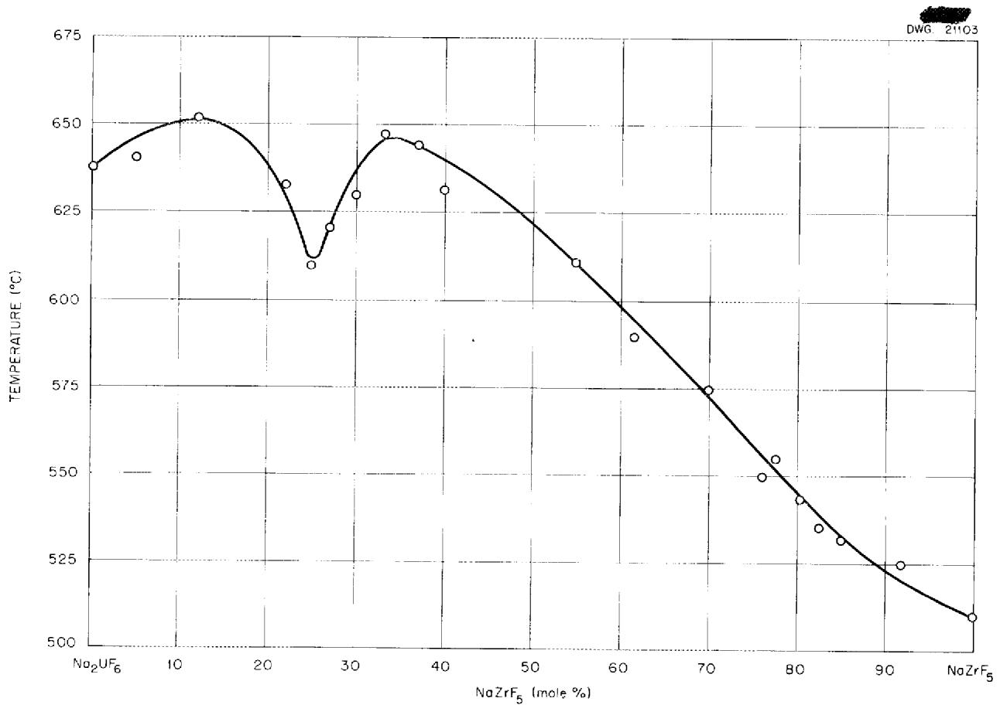  
Fig. 5.1. The Pseudo-Binary System $\mathbf{Na}_2\mathbf{UF}_6 - \mathbf{NaZrF}_5$

mixtures. The high-melting-point $\mathbf{KF - UF_4}$ complexes seem to dominate the diagram throughout the region studied.

Systems Containing $\mathbf{ThF}_4$ . Phase diagrams for three alkali fluoride-thorium fluoride systems have been published - the KF-ThF and RbF-ThF systems in the open literature and the LiF-ThF system in the classified literature. Since it was felt that data on the system NaF-ThF might contribute to a better understanding of the NaF-UF system, a phase study of the NaF-ThF system was started during this quarter. X-ray diffraction studies of this system have been reported in the literature. Preliminary results indicate that the NaF-ThF phase diagram is quite similar to the NaF-UF phase diagram.

$\mathbf{U}\mathbf{F}_{3} - \mathbf{Z}\mathbf{r}\mathbf{F}_{4}$ .Work on the $\mathbf{U}\mathbf{F}_{3} - \mathbf{Z}\mathbf{r}\mathbf{F}_{4}$ system was continued, with the range of 16.67 to 66.67 mole $\%$ $\mathbf{U}\mathbf{F}_{3}$ being studied.The effects of varying heating time and container materials were studied by means of petrographic examination and x-ray diffraction observations of several compositions that had been heated for various periods of time at $900^{\circ}C$ under helium. No new compounds have yet been definitely identified, but there are indications of solid-solution formation. A previously reported( compound, $\mathbf{U}\mathbf{F}_{3}\cdot 2\mathbf{Z}\mathbf{r}\mathbf{F}_{4}$ (R.I. $= 1.556)$ , now appears to be olive-drab in color, rather than the orange-red previously observed.

$\mathbf{U}\mathbf{F}_{3} - \mathbf{U}\mathbf{F}_{4} - \mathbf{Z}\mathbf{r}\mathbf{F}_{4}$ .Thermal and optical data for seven compositions of the $\mathrm{UF_3 - UF_4 - ZrF_4}$ system have been reported.(1) During this quarter, four additional mixtures of the following compositions were prepared and subjected to x-ray and petrographic

examination after heating at $900^{\circ}C$ under helium: $\mathsf{1UF}_3\mathsf{-}\mathsf{1UF}_4\mathsf{-}\mathsf{lZrF}_4$ $\mathsf{1UF}_3$ - $\mathsf{1UF}_4\mathsf{-}\mathsf{2ZrF}_4$ $\mathsf{1UF}_3\mathsf{-}\mathsf{2UF}_4\mathsf{-}\mathsf{lZrF}_4$ and $2\mathsf{UF}_3\mathsf{-}\mathsf{lUF}_4\mathsf{-}\mathsf{lZrF}_4$ . Each of these four mixtures contained a brownish, slightly birefringent phase with a refractive index of 1.584, and the second mixture was composed entirely of this material. The other mixtures were found to contain an excess of one or two of the other components. The range of the refractive indices reported for mixtures in this system suggests the existence of solid solutions.

$\mathrm{NaF - ZrF_4 - UF_4 - UF_3}$ . Four compositions of the $\mathrm{NaF - ZrF_4 - UF_4 - UF_3}$ system were prepared; each contained 96 mole $\%$ $\mathrm{NaZrF_5}$ . The remaining material was made up of $\mathrm{UF_3}$ and $\mathrm{UF_4}$ , with the $\mathrm{UF_3}$ content being varied from 0.5 to $3.0\%$ . After heating for 3 hr in sealed tubes at $800^{\circ}\mathrm{C}$ , the light-green to grayish-green products were found by petrographic examination to be chiefly the solid-solution $\mathrm{NaZr(U)F_5}$ . Additional findings included the following: fine-grained material with a low refractive index was observed in all the mixtures; the amount of brown phase (probably a $\mathrm{ZrF_4 - UF_3}$ complex) that appeared increased in the mixtures with increased $\mathrm{UF_3}$ concentrations; a yellowish color was noted only for the low-index-of-refraction phase in the mixture containing $1\%$ $\mathrm{UF_3}$ and $3\%$ $\mathrm{UF_4}$ .

# THERMAL ANALYSIS OF CHLORIDE FUELS

R.J.Sheil S.A.Boyer C.J.Barton

Materials Chemistry Division

A quantity of UCl₄ produced by vapor-phase chlorination of UO₃ by the Y-12 Plant was received. Chemical analysis indicated that the material was approximately 99.5% UCl₄; the remainder was probably U₃O₈ and metallic impurities. The melting point of one batch of this material was checked, and it appeared to be 565 ± 5°C; this material, as-received, has been used

in studies of the NaCl-UCl, KCl-UCl, CsCl-UCl, and CaCl2-UC1 binary systems.

NaCl-UC1. Melting points for several compositions in the NaCl-UC1 system were reported in a previous report.(6) The data reported indicated that Kraus' diagram for this system(7) was probably erroneous. Further melting-point determinations of mixtures prepared with the Y-12 UCl4 essentially confirm the data obtained previously in this laboratory. A tentative diagram for this system is shown in Fig. 5.2. The liquidus line

(6) R. J. Sheil and C. J. Barton, ANP Quar. Prog. Rep. Mar. 10, 1953, ORNL-1515, p. 108.   
(7) C. A. Kraus, Phase Diagrams of Some Complex Salts of Uranium with Halides of the Alkali and Alkaline Earth Metals, M-251 (July 1, 1943).

is quite similar to that for the LiCl $\mathsf{UCl}_4$ system given in the previous report.(8) Some minor changes from the earlier data are noted. The eutectic at about 30 mole $\%$ UCl $_4$ melted at $430 \pm 5^{\circ}\mathrm{C}$ , and the compound $\mathsf{Na}_2\mathsf{UCl}_6$ melted at $440 \pm 5^{\circ}\mathrm{C}$ . The eutectic melting at $370^{\circ}\mathrm{C}$ was found to contain approximately 47 mole $\%$ UCl $_4$ . No further attempt was made to identify the compound containing more than 50 mole $\%$ UCl $_4$ that apparently melts incongruently at about $415^{\circ}\mathrm{C}$ .

KCl-UC1. Cooling curves have been plotted for a number of compositions in the KCl-UC1 system, but no satisfactory equilibrium diagram has been

(8) R. J. Sheil and C. J. Barton, ANP Quar. Prog. Rep. June 10, 1953, ORNL-1556, Fig. 6.2, p. 43.

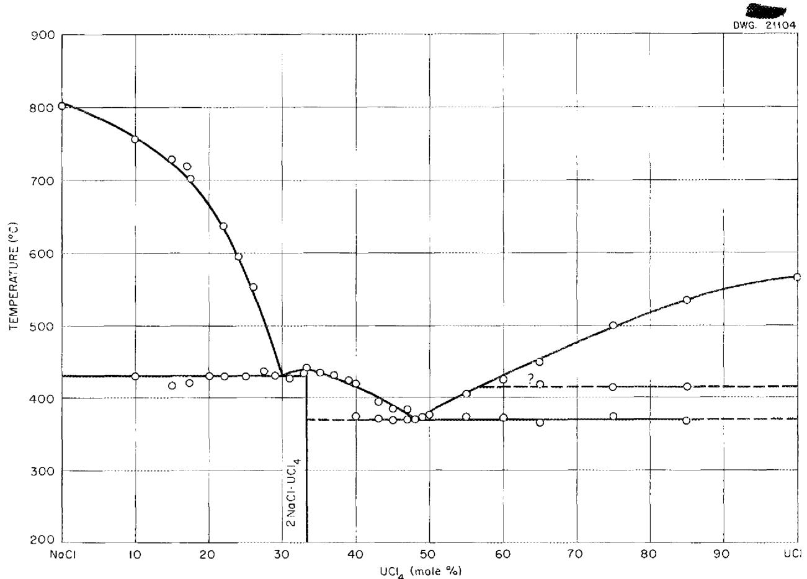  
Fig. 5.2. The System NaCl-UCl₄ (Tentative).

obtained, to date, because of difficulty in obtaining reproducible liquidus breaks in certain parts of the system.

Cscl-UC1. The study of the CsCl- UCl4 system is quite incomplete, but from the data obtained, it appears that there is a eutectic at approximately 20 mole $\%$ UCl4 that melts at $505\pm 5^{\circ}C$ and another one at approximately 60 mole $\%$ UCl4 that melts at $370\pm 5^{\circ}C.$ The melting point of the compound between these two eutectics, probably $\mathrm{Cs}_2\mathrm{UCl}_6$ , has not been accurately determined.

$\mathbf{CaCl}_2 - \mathbf{UCl}_4$ Cooling curves were obtained for 14 compositions in the $\mathrm{CaCl}_2$ - $\mathrm{UCl}_4$ system containing 10 to 85 mole $\% \mathrm{UCl}_4$ . Liquidus breaks were poorly defined for most of the compositions, but the data agreed reasonably well with the data reported by Kraus(7) for four compositions in this system and appeared to confirm his conclusion that no compounds are formed between these components. The eutectic at approximately 65 mole $\% \mathrm{UCl}_4$ melted at $475 \pm 5^{\circ}\mathrm{C}$ . This melting point is comparable to the $490 \pm 5^{\circ}\mathrm{C}$ melting point reported by Kraus for the eutectic. Kraus did not specify the composition of the eutectic, but a plot of the few data given in his report indicated a eutectic composition of approximately 60 mole $\% \mathrm{UCl}_4$ .

# THERMAL ANALYSIS OF FLUORIDE COOLANTS

L. M. Bratcher C. J. Barton Materials Chemistry Division

Data obtained with mixtures in the CsF-ZrF $_4$ system were reported previously. This system was reexamined recently in an effort to obtain sufficiently reliable data to construct an equilibrium diagram. The difficulty experienced with hydrolysis in the more highly hygroscopic alkali

fluorides was very evident in this system. Although CsF dried under a vacuum at about $400^{\circ}\mathrm{C}$ was used to obtain much of the data, it is doubtful whether water was completely excluded from the mixtures. Consequently, the equilibrium diagram shown in Fig. 5.3 is considered tentative. The compounds $\mathrm{Cs}_3\mathrm{ZrF}_7$ and $\mathrm{CsZrF}_5$ appear to melt congruently at $775^{\circ}\mathrm{C}$ and at $520 \pm 10^{\circ}\mathrm{C}$ , while the compound $\mathrm{Cs}_2\mathrm{ZrF}_6$ apparently melts incongruity at about $520^{\circ}\mathrm{C}$ . However, the 50 mole $\% \mathrm{ZrF}_4$ mixture is reported to be poorly crystallized mixture of two phases. It is likely therefore that the mixtures in the 40-60 mole $\% \mathrm{ZrF}_4$ region behave in a more complex manner than that indicated by this simple diagram.

# QUENCHING EXPERIMENTS WITH FLUORIDES

R.E.Moore C.J.Barton

Materials Chemistry Division

T. N. McVay, Consultant

Metallurgy Division

Techniques for quenching mixtures in fluoride systems are being developed, with special attention being given to the NaF-ZrF4 binary system. Samples are contained in small nickel capsules (3/4 in. long, 100 mils OD, 80 mils ID). After the capsules are filled, they are flattened and welded closed to prevent oxidation and vaporization of the contents. In order to achieve complete quenching of a liquid to a glass from above the liquidus temperature, it was found necessary to employ mercury for the quenching bath. Platinum weights attached to the capsules by short lengths of fine wire are used to pull the capsules beneath the surface of the mercury.

Considerable difficulty was encountered because of the formation of zirconium oxide crystals and other oxidation products during the melting of some of the mixtures in the NaF-ZrF $_4$ system. In most cases, the oxide can be traced to the presence of water in the original samples.

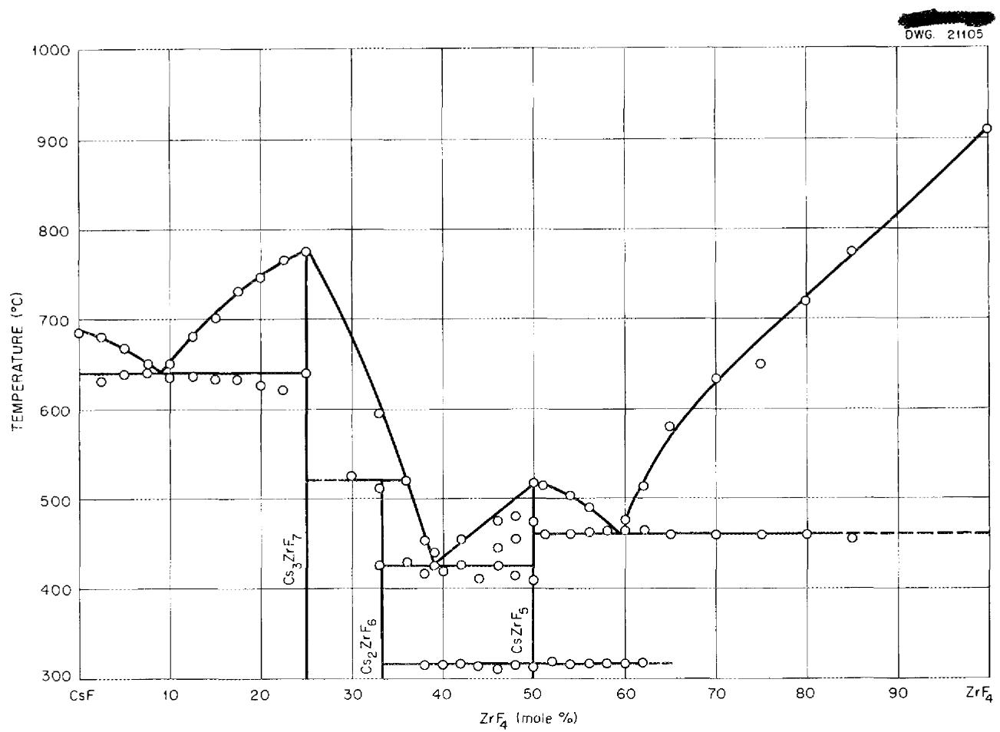  
Fig. 5.3. The System CsF-ZrF $_4$ (Tentative).

In the preparation of fluoride fuels, it was found that small samples (20 to 30 g) of these mixtures could be fused and hydrofluorinated successfully in platinum crucibles in a hydrogen fluoride atmosphere. As many as 32 mixtures can be prepared and purified at one time. Oxidation products have not been so troublesome with these specially purified mixtures. Those compositions which contain a moisture-sensitive compound that is believed to be $\mathrm{Na}_{3}\mathrm{Zr}_{4}\mathrm{F}_{19}$ must be handled exclusively in the dry box.

Quenching work on the NaF-ZrF $_4$ system is still far from complete; however, the most significant results obtained thus far are listed below. The region in the middle of the NaF-

$\mathbf{ZrF_4}$ diagram was given first attention because of its practical interest and because in that region the existing thermal data were not satisfactory. Although this region exhibits phase behavior much more complex than was formerly believed, the original liquidus temperatures are nowhere in serious error.

The quenching experiments and the petrographic examinations of the products have shown the following behavior in the NaF-ZrF $_4$ binary system. Samples containing 57 mole % NaF are very near the eutectic composition; both liquidus and solidus temperatures are between 494 and $500^{\circ}\mathrm{C}$ . The crystals below the solidus are too small for petrographic examination. At 52 mole %

NaF, both liquidus and solidus temperatures are near $504^{\circ}\mathrm{C}$ ; the crystal previously identified as $\mathrm{NaZrF_5}$ is the predominant phase below the solidus temperature. At 50 mole % NaF, the liquidus and solidus temperatures are between 504 and $510^{\circ}\mathrm{C}$ ; below the solidus line the $\mathrm{NaZrF_5}$ crystal is the predominant phase, but not the only one. At 46.3 mole % NaF, the liquidus temperature is slightly above $518^{\circ}\mathrm{C}$ , while the solidus temperature is below $513^{\circ}\mathrm{C}$ . At 42.8 mole % NaF, the liquidus temperature seems to be between 540 and $550^{\circ}\mathrm{C}$ ; the solidus is below $513^{\circ}\mathrm{C}$ . Each of the last two compositions shows quite complex behavior; the crystalline phases are not completely identified. It appears that $\mathrm{Na_3Zr_4F_{19}}$ is the compound involved; it is possible that two stable modifications of this material, with the transition temperature at $518^{\circ}\mathrm{C}$ , exist in these samples. The complex behavior of this system in the 40-60 mole % NaF region is still being studied.

# DIFFERENTIAL THERMOANALYSIS OF FLUORIDES

R. A. Bolomey C. J. Barton Materials Chemistry Division

The differential thermoanalysis apparatus has been used to study the middle region of the NaF-ZrF4 binary system, and considerable time has been spent in modifying the equipment so as to obtain more precise results. It appears that the best results are obtained from heating curves when temperature changes of about $0.5^{\circ}\mathrm{C / min}$ are used.

Figure 5.4 presents data obtained by both direct and differential thermal analysis of the $\mathrm{NaF - ZrF_4}$ system. While reasonable agreement between the two methods has been realized, it is apparent that the phase behavior of this system is more complex than was previously believed. Additional study by several techniques is in progress.

# PHASE EQUILIBRIA OF FUSED SALTS BY FILTRATION

R. J. Sheil C. J. Barton Materials Chemistry Division

High-temperature filtration apparatus has been used by other workers in this Laboratory for various studies of fused salt systems. During this quarter, the apparatus was applied to phase equilibrium studies. The apparatus permits filtration of a melt through a sintered nickel filter while the melt is kept at a chosen temperature and atmosphere. To date, the data obtained have been insufficient for a proper evaluation of the degree of separation of solid from liquid at a given temperature of filtration, but it seems likely that the method will provide valuable information to supplement the standard thermal analysis studies of phase equilibria.

Table 5.1 contains data obtained by filtering various fluoride melts at the indicated temperatures. In most cases there was not sufficient residue for a complete analysis; therefore x-ray and petrographic examinations were utilized for identification of the phases present in the material.

# X-RAY DIFFRACTION STUDIES OF FLUORIDES

P. A. Agron R. E. Thoma  
Materials Chemistry Division

$\mathbf{NaF - UF_4}$ Two 2- to 3-kg batch preparations of $\mathrm{Na}_2\mathrm{UF}_6$ gave the $\beta_{3}$ form, as the major constituent, and minor amounts of unidentified material. In one of these preparations, a small quantity of $\mathrm{NaUF}_{5}$ was observed. No apparent segregation of these phases appears in samples taken from different portions of the melts.

However, the peritectic nature of $\mathrm{Na}_2\mathrm{UF}_6$ is more forcibly indicated in small-scale experiments (15- to 20-g

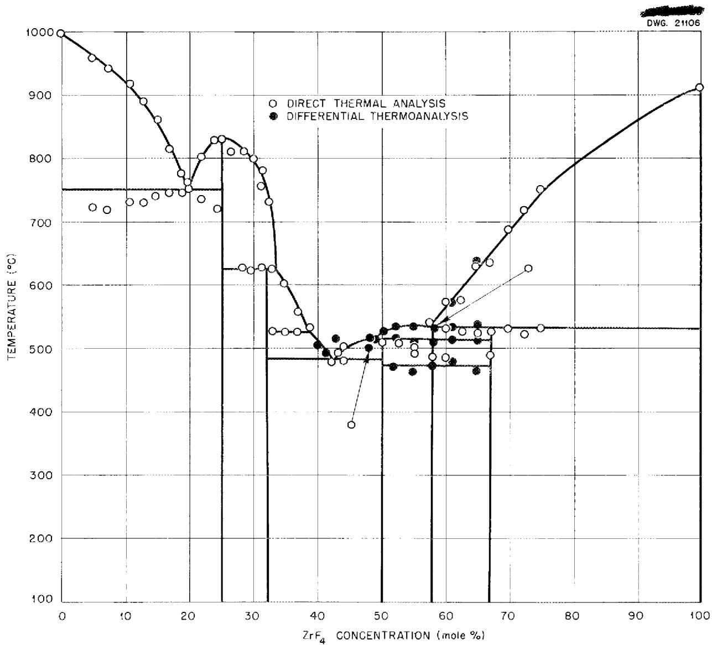  
Fig. 5.4. Thermal Analysis Data for the NaF-ZrF $_4$ System.

samples) in which, upon freezing, equilibrium conditions are more difficult to maintain. In these instances, the appearance of the $\mathrm{NaUF}_5$ and $\mathrm{Na}_3\mathrm{UF}_7$ phases is much more marked.

$\mathbf{NaF - ZrF_4 - UF_4}$ . Ternary salt mixtures in the $\mathrm{NaF - ZrF_4 - UF_4}$ system have been examined. Several materials from thermal analysis experiments were sampled to yield the data shown in Table 5.2. It is apparent that this material, which is nearly that proposed for the ARE fuel, shows complex phase behavior and that two solid solutions,

one rich in uranium, occur. It is likely that these specimens were not in thermal equilibrium during the entire cooling cycle.

# FUNDAMENTAL CHEMISTRY OF HIGH-TEMPERATURE LIQUIDS

W. R. Grimes F. F. Blankenship Materials Chemistry Division

Spectrophotometry in Fused Salts (H. A. Friedman, Materials Chemistry Division; D. G. Hill, Consultant). The absorption spectra of solutions in

a fused salt are being investigated as a possible means of determining the species present in the mixture. The method is that developed by Job(11) for the determination of complex ion formulas in aqueous solution. A similar measurement would be very

difficult to make on the fused salt at the melting temperature, but it can be readily effected at room temperature by using a glass of the melt. The glass is obtained from the melt by a quenching technique. The composition of the glass thus obtained is believed to be representative of that of the salt at high temperatures.

TABLE 5.1. HIGH-TEMPERATURE FILTERATION STUDIES  

<table><tr><td rowspan="2">COMPOSITION (mole %)</td><td rowspan="2">Filtration TEMPERATURE (°C)</td><td rowspan="2">MATERIALANALYZED</td><td colspan="4">CHEMICAL ANALYSIS (wt %)</td><td rowspan="2">REMARKS</td></tr><tr><td>Na</td><td>Zr</td><td>U</td><td>F</td></tr><tr><td rowspan="2">NaF-ZrF4(50-50)</td><td rowspan="2">520 ± 1</td><td>Charge</td><td>10.4</td><td>43.6</td><td></td><td>45.2</td><td rowspan="2">Residue predominantly NaZrF5; analysis indicates material to be all liquid at 520 ± 1°C</td></tr><tr><td>Filtrate</td><td>10.6</td><td>43.9</td><td></td><td>44.1</td></tr><tr><td rowspan="2">NaF-ZrF4-UF4(50-25-25)</td><td rowspan="2">630 ± 12</td><td>Charge</td><td>8.17</td><td>16.4</td><td>41.9</td><td></td><td rowspan="2">Only UO2in residue</td></tr><tr><td>Filtrate</td><td>8.03</td><td>16.1</td><td>42.1</td><td></td></tr><tr><td rowspan="3">NaF-ZrF4-UF4(53.5-40.5-6.0)</td><td rowspan="3">539 ± 5</td><td>Charge</td><td>10.8</td><td>33.5</td><td>13.5</td><td>41.4</td><td rowspan="3">Filtered slightly below liquidus temperature; filtrate and residue both appeared to be solid solutions</td></tr><tr><td>Filtrate</td><td>10.9</td><td>35.3</td><td>11.1</td><td>41.9</td></tr><tr><td>Residue</td><td>9.67</td><td>27.9</td><td>23.4</td><td>37.2</td></tr><tr><td rowspan="3">NaF-ZrF4-UF4(53.5-40-6.5)</td><td rowspan="3">560 ± 10</td><td>Charge</td><td>11.2</td><td>32.2</td><td>16.3</td><td>40.6</td><td rowspan="3">Residue contained higher uranium solid solution than the above mixture; the solid solution apparently separated at a higher temperature than it did for the mixture containing 6 mole % uranium</td></tr><tr><td>Filtrate</td><td>11.4</td><td>33.7</td><td>13.2</td><td>41.5</td></tr><tr><td>Residue</td><td>10.9</td><td>30.6</td><td>18.7</td><td>39.9</td></tr></table>

TABLE 5.2. X-RAY EXAMINATION OF NaF-ZrF4-UF4 MIXTURES NEAR THE ARE FUEL COMPOSITION   

<table><tr><td rowspan="2">COMPOSITION OF NaF-ZrF4-UF4 MIXTURE (mole %)</td><td colspan="4">DIFFRACTION INTENSITY OF PHASES</td></tr><tr><td>NaZr(U)F5(a)</td><td>Na(U-Zr)F5(b)</td><td>“Z6”-I(c)</td><td>Unidentified</td></tr><tr><td>53-42.5-5.75</td><td>100</td><td>30</td><td>10</td><td>15</td></tr><tr><td>53.5-40.5-6.0</td><td>80</td><td>10</td><td>10</td><td>15</td></tr><tr><td>53.5-40.0-6.5</td><td>100</td><td>40</td><td>20</td><td>20</td></tr></table>

Various compositions (by weight) were made up, sealed in small flattened nickel tubes, and quenched in mercury from a temperature known to be well above the melting point. Evidence that glasses were obtained was provided by microscopic examination. The glass was powdered, and a suspension of a weighed amount of the powder in a colorless oil with the same refractive index was placed in a cell made by boring a 1-cm hole in a microscope slide and cementing another slide to it as a base. The cell was then completely filled with the chosen oil and closed with a cover glass for examination with the spectrophotometer. A Beckman DU spectrophotometer was mounted on its end so that the slide was horizontal when used in the cell holder. In this way, the solids were distributed fairly uniformly upon the base of the cell. By using various weights of sample, it was shown that the Beer-Lambert law was followed within $\pm 5\%$ ; thus the nonuniformity of the specimen was not too serious.

Absorption spectra of any transparent solid, that is, crystalline solids as well as glasses, may be obtained in this manner. However, since a crystal has, in general, different indices of refraction along the several optic axes, an exact match of refraction with the suspending oil is not possible. A mismatch results in a rise in the general level of absorption, because of increased scattering, and in poorer resolution of the spectrum.

The spectrum obtained for crystalline $\mathrm{UF_4}$ is compared in Fig. 5.5 with that of a glass made from a solution of $\mathrm{UF_4}$ at $18\mathrm{~mol}\%$ in $\mathrm{NaZrF_5}$ . For comparison, all spectra are calculated on the basis of the Beer-Lambert law to the absorption per 0.01 mmole of compound (or solute). It is apparent that the spectra are different, both qualitatively and quantitatively, which makes reasonable the supposition that the $\mathrm{UF_4}$ has reacted to form a complex,

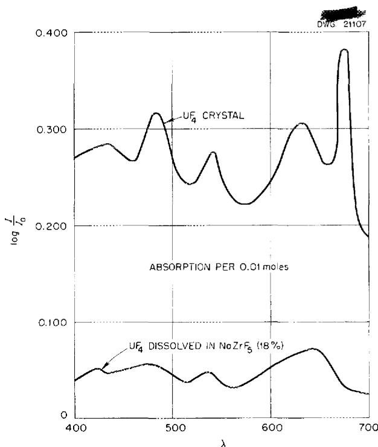  
Fig. 5.5. Absorption Spectra of Crystalline and Dissolved $\mathbf{U}\mathbf{F}_{4}$ .

perhaps one of those known to exist in the solid state. The change of state from solid to liquid is probably not entirely responsible for the difference in the spectrum if the results shown in Fig. 5.6 are typical. Here, the spectrum of crystalline $\mathrm{Na}_{2}\mathrm{UF}_{6}$ is compared with that of glassy $\mathrm{Na}_{2}\mathrm{UF}_{6}$ prepared by quenching the pure compound. A general decrease in intensity of absorption is found, which was observed in the $\mathrm{UF}_{4}$ as well, but the spectra are qualitatively very similar.

A series of mixtures of $\mathbf{U}\mathbf{F}_{4}$ and NaF in $\mathrm{NaZrF_5}$ is being studied in an attempt to identify the compounds formed. The absorption curves for four of the mixtures are given in Fig. 5.7; all calculations were made on the basis of 0.01 mmole of solute at 18 mole % concentration. It would appear that no new compounds are formed between the solutes as the proportions are changed from pure $\mathbf{U}\mathbf{F}_{4}$

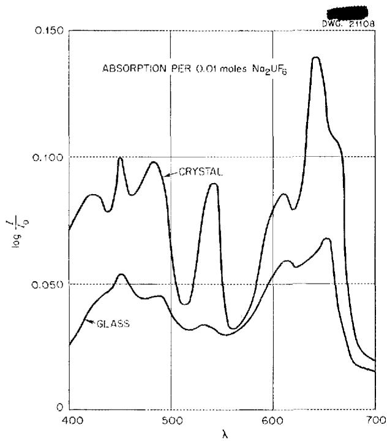  
Fig. 5.6. Absorption Spectra for Crystalline and Glassy $\mathbf{Na}_{2}\mathbf{U}\mathbf{F}_{6}$ .

to $\mathrm{NaUF}_5$ , but rather that the complex formed between $\mathrm{UF}_4$ and the solvent shows reasonable adherence to the dilution law. The study of other proportions is expected to provide a formula for the one compound found and to indicate whether there is more than one compound formed.

Experience has shown that the absorption measurements are very sensitive to the small amounts of dark-colored impurities that are presumably introduced by the nickel tubing. Such impurities raise the general level of absorption without altering the shape of the curve too much. The deviation shown in these curves from the expected concentration dependence may be due to such impurities.

Thermogalvanic Potentials in Liquids (A. R. Nichols, D. R. Cuneo, Materials Chemistry Division). Thermogalvanic potentials between nickel electrodes in fused sodium hydroxide have been measured by the method described

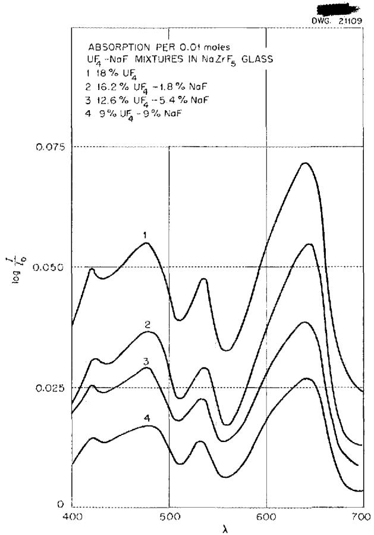  
Fig. 5.7. Absorption Spectra of Several NaF-UF $_4$ Mixtures in NaZrF $_5$ .

previously. (12, 13) The results obtained during this quarter are in general agreement with those previously reported, although trials made under apparently identical conditions have shown a variance of about $20\%$ in the value of the potential in millivolts per degree of temperature difference. These results were obtained in an atmosphere of hydrogen. In a helium atmosphere the potentials were erratic. In general, they were smaller than those in hydrogen, and they occasionally changed sign.

The function of hydrogen in this system is not clear. The original assumption that the hydrogen merely cleans up traces of oxide from the electrodes and makes it possible to start each series of measurements with the electrodes in a uniform condition appears to be wrong. If the atmosphere is changed to helium in the middle of a trial, the potentials diminish erratically, but when hydrogen is again supplied, the potentials return to the previous values. In a series of experiments now in progress, the thermogalvanic cell is shorted through a low resistance and is allowed to discharge over a period of hours. Measurement of the voltage drop across the resistance permits recording of the current. In one experiment with a hydrogen atmosphere and sodium hydroxide alone, the nickel electrodes showed no change in weight, although sufficient current had passed to account for an appreciable amount of dissolution and deposition if the electrode processes had involved oxidation and reduction of nickel. If the following half-reaction occurs at the nickel electrodes, it may account for the observed potentials and currents in the absence of dissolved nickel:

$$
\mathrm {H} _ {2} + 2 \mathrm {O H} ^ {-} \underset {\text {c o l d}} {\xrightarrow {\text {h o t}}} 2 \mathrm {H} _ {2} \mathrm {O} + 2 e ^ {-}.
$$

Further coulometric experiments with sodium hydroxide alone in a hydrogen atmosphere and with sodium hydroxide and nickel oxide in a helium atmosphere are in process.

A few trials have been made with potassium hydroxide instead of sodium hydroxide. Preliminary results indicate that the behavior of potassium hydroxide is practically the same as that of sodium hydroxide.

Several trials have been made in which potassium chloride, the potassium chloride-lithium chloride eutectic (41.3-58.7 mole %), and a 55 mole %

potassium chloride-45 mole % sodium chloride mixture were used instead of sodium hydroxide. Potentials were of the order of a few tenths of a milli-volt per degree, that is, considerably less than those observed with sodium hydroxide. As in hydroxide trials, a hydrogen atmosphere appears to be necessary to obtain consistent potentials. Trials have been made with and without nickel chloride added to the alkali chloride. Additional trials will be necessary to determine the electrode process and its possible relationship to metal transport.

EMF Measurements in Fused Salts (L. E. Topol, L. G. Overholser, Materials Chemistry Division). Electrolytic measurements of various fused salts have been undertaken to learn the mechanism of electrochemical reactions in fused-salt systems. During recent months, investigations were made of potassium fluoride, several chlorides, and several oxides. The use of chlorides eliminates, or at least minimizes, the corrosive effects of the corresponding fluoride compounds on ceramic container and diaphragm materials.

Decomposition potentials of potassium fluoride, as determined in a helium atmosphere at $885^{\circ}\mathrm{C}$ , are listed in Table 5.3. In general, two changes in slope in the $E - I$ curves were detected, although the first may be inconsequential. Figure 5.8 presents typical data for both potassium fluoride and potassium chloride.

The theoretical decomposition potential of potassium chloride is 3.28 volts at $850^{\circ}\mathrm{C}$ and 3.4 volts at $800^{\circ}\mathrm{C}$ ; experimental values ranging from 3.10 to 3.34 volts at $800^{\circ}\mathrm{C}$ have been reported in the literature. $^{(14,15,16)}$

Values obtained in this laboratory are shown in Table 5.4 and in Fig. 5.8.

A series of electrolyses made with potassium chloride as the solvent for several metal chlorides was completed. Platinum or nickel cathodes and graphite anodes were used.

An electrolysis of ferrous chloride in potassium chloride yielded an $E$

value of 0.32 volt for the reaction:

$$
F e C l _ {2} + N i = F e + N i C l _ {2}.
$$

Experiments in which NiO, FeO, $\mathbf{Fe}_2\mathbf{O}_3$ $\mathrm{Fe}_{3}\mathrm{O}_{4}$ , and $\mathrm{Cr_2O_3}$ were added to potassium chloride did not yield potential measurements which were characteristic of the added material; it appears that these oxides are virtually insoluble in molten potassium chloride.

TABLE 5.3. ELECTROLYSIS OF POTASSIUM FLUORIDE AT ${885}^{ \circ  }\mathrm{C}$   

<table><tr><td>ANODE</td><td>CATHODE</td><td>CONTAINER</td><td>DIAPHRAGM</td><td>E (volts)</td></tr><tr><td>Platinum*</td><td>Nickel**</td><td>Nickel</td><td>None</td><td>(2.05, 2.67)</td></tr><tr><td>Platinum*</td><td>Nickel**</td><td>Alumina</td><td>None</td><td>2.10 to 2.30, 2.47 to 2.63</td></tr><tr><td>Platinum*</td><td>Platinum*</td><td>Alumina</td><td>None</td><td>2.67, 2.00 to 2.05</td></tr></table>

\*Diameter, 50 mils.   
\*Diameter, 63 mils.

TABLE 5.4. ELECTROLYSIS OF POTASSIUM CHLORIDE AT ${850}^{ \circ  }\mathrm{C}\left( a\right)$   

<table><tr><td>ANODE</td><td>CATHODE</td><td>CONTAINER</td><td>DIAPHGRAM(b)</td><td>E (volts)</td></tr><tr><td>Graphite(c)</td><td>Platinum(d)</td><td>Nickel</td><td>Alumina or none</td><td>3.08 to 3.10</td></tr><tr><td>Graphite</td><td>Platinum or nickel(e)</td><td>Alumina</td><td>Alumina or none</td><td>3.05 to 3.10</td></tr><tr><td>Graphite</td><td>Platinum(f)</td><td>Alumina or graphite</td><td>Thoria or none</td><td>3.14 to 3.24</td></tr><tr><td>Graphite</td><td>Graphite</td><td>Alumina</td><td>None</td><td>2.90 to 3.12</td></tr><tr><td>Platinum</td><td>Platinum or nickel</td><td>Alumina</td><td>None</td><td>2.70 to 2.95</td></tr><tr><td>Nickel</td><td>Nickel</td><td>Alumina</td><td>None</td><td>1.80 to 1.93</td></tr><tr><td>Iron</td><td>Platinum or nickel</td><td>Alumina</td><td>None</td><td>1.45 to 1.63</td></tr></table>

(a) A number of experiments were made in which a nickel or a platinum container was used as the cathode. The measured potentials were lower than those listed and therefore were deemed worthless.   
(b) A small slotted crucible inserted around the cathode.   
(c) Diameter, 1/8 inch.   
$(d)$ Diameter, 62.5 mils.   
$(e)$ Diameter, 63 mils.   
$(f)$ Diameter, 20 mils.

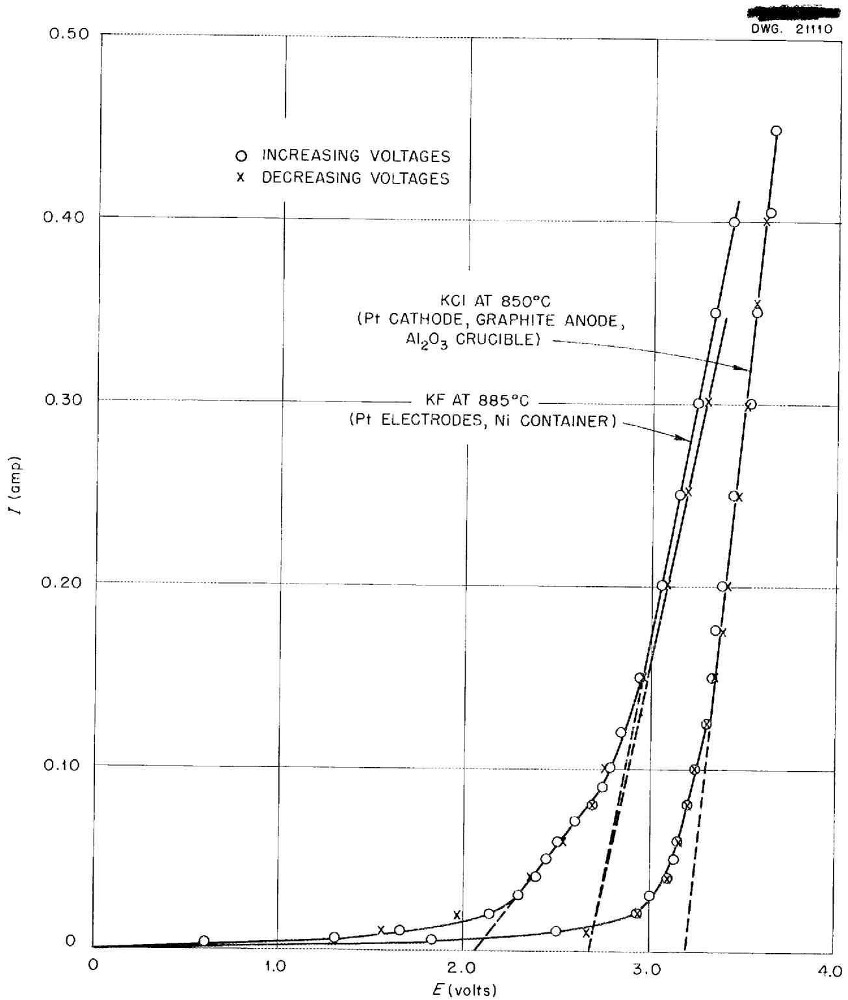  
Fig. 5.8. Decomposition Potentials of KF and KCl.

# PRODUCTION AND PURIFICATION OF FLUORIDE MIXTURES

C. M. Blood

F. P. Boody

G. F. Watson

F. F. Blankenship

Materials Chemistry Division

Preliminary experiments have demonstrated that treatment of $\mathrm{NaZrF}_5$ melts with metallic zirconium gives a product which contains fewer structural metal impurities than similar melts treated with hydrogen. It appears that the metal-treated melts contain reduced zirconium species.

Other studies have included treatment of the $\mathrm{NaBeF}_3$ seal compound with beryllium and reduction of dissolved $\mathrm{CrF}_2$ by hydrogen. Numerous complex fluoride compounds which result from the interaction of alkali with structural metal fluorides have been prepared for identification or characterization.

Treatment of NaZrF5 Melts with Metallic Zirconium. The available thermodynamic data indicate that zirconium metal is a suitable reducing agent for structural metal fluorides. The standard free-energy changes for the reactions at $800^{\circ}\mathrm{C}$ are the following:

with argon. Examination of the argon for hydrogen fluoride content has been useful in determining the rate and the extent of reaction of free hydrogen fluoride with the zirconium fluoride; reduction of structural metal ions by the zirconium fluoride is measured by subsequent treatment of the melt with hydrogen and observation of the hydrogen fluoride content of the exit gas.

In each case, it was observed that the hydrogen fluoride content of the exit argon dropped on exposure of the melt to zirconium. In addition, the difference in equilibrium hydrogen fluoride content of the hydrogen before and after exposure demonstrates the effectiveness of reduction of iron, chromium, and nickel compounds by this reagent. A large portion of the structural metals is deposited on the platinum wire with which the zirconium bar is suspended in the melt.

Attempts to measure the potential of the zirconium-nickel couple during exposures of this sort in which the zirconium was insulated by a spark- plug connection through the nickel vessel

$$
1 / 2 \mathrm {N i F} _ {2} (\mathrm {c}) + 1 / 4 \mathrm {Z r} (\mathrm {c}) \longrightarrow 1 / 2 \mathrm {N i} (\mathrm {c}) + 1 / 4 \mathrm {Z r F} _ {4} (\mathrm {c}),
$$

$$
\Delta F ^ {\circ} = - 3 1. 8 \mathrm {k c a l},
$$

$$
1 / 3 \mathrm {F e F} _ {3} (\mathrm {c}) + 1 / 4 \mathrm {Z r} (\mathrm {c}) \longrightarrow 1 / 3 \mathrm {F e} (\mathrm {c}) + 1 / 4 \mathrm {Z r F} _ {4} (\mathrm {c}),
$$

$$
\Delta F ^ {\circ} = - 3 2. 7 \mathrm {k c a l},
$$

$$
1 / 3 \operatorname {C r F} _ {3} (c) + 1 / 4 \operatorname {Z r} (c) \longrightarrow 1 / 3 \operatorname {C r} (c) + 1 / 4 \operatorname {Z r F} _ {4} (c),
$$

$$
\Delta F ^ {\circ} = - 2 2. 2 \mathrm {k c a l}.
$$

The possibility of reducing these and other extraneous materials, such as hydrogen fluoride, with metallic zirconium has been tested in several experiments. In general, metallic zirconium (machined crystal bar) has been suspended in the $800^{\circ}\mathrm{C}$ melt after hydrofluorination and hydrogenation. Agitation of the melt has been accomplished in each case by sparging

indicate that the potential varies from 0.5 volt after 2 hr to less than 0.1 volt at the conclusion of the treatment.

In every case the weight loss of the zirconium bar is higher by a factor of at least 5 than the loss expected from the reduction of structural metal ions. The melt so obtained has been shown to be capable of reduction of considerable amounts of added nickel

fluoride after removal of the zirconium bar. Analytical tests made after filtration of the product through sintered nickel indicated that the "reducing power" was still present. It appears likely that this reducing action is due to soluble di- or trivalent zirconium fluoride. Further study of this phenomenon is planned.

Treatment of $\mathbf{NaBeF}_3$ with Metallic Beryllium. In connection with a study of the utilization of metallic reducing agents in the purification of fluoride melts, beryllium metal was used in conjunction with hydrogen on a sample of $\mathbf{NaBeF}_3$ prepared for trials as a frozen seal material. The beryllium metal lost weight in an amount corresponding to 710 ppm of beryllium consumed by the melt even though the melt had previously received a prolonged hydrogen treatment. The melt was allowed to solidify without filtration, and it was found to be badly contaminated with reduced metals and with unidentified reaction products.

Reduction of Dissolved Chromous Fluoride by Hydrogen. The raw materials for production of ARE fuel mixtures are, in general, low in chromium compounds; therefore very little information is available regarding possible reduction of such materials by hydrogen. Accordingly, a sample of $\mathrm{CrF}_2$ , corresponding to 0.1 wt % of $\mathrm{Cr}^{+ + }$ , was added to a completely hydrofluorinated and hydrogenated bath of $\mathrm{NaZrF}_5$ and the resulting melt was treated at $800^{\circ}\mathrm{C}$ with 166 liters of hydrogen. Throughout the experiment, the hydrogen fluoride concentration was constant at $2\times 10^{-5}$ mole of hydrogen fluoride per liter of exit gas. Since the background hydrogen fluoride concentration is about $1\times 10^{-5}$ mole of hydrogen

fluoride per liter of hydrogen, the hydrogen fluoride generated corresponds to a reduction of about $1\%$ of the $\mathrm{CrF}_2$ added.

Chemical analysis of the product showed 830 ppm of chromium, whereas 1000 ppm was added. These results seem to indicate that divalent chromium is reduced by hydrogen very slowly, if at all.

Preparation of Various Fluorides (L. G. Overholser, B. J. Sturm, Materials Chemistry Division). Additional batches of $\mathrm{FeF}_2$ , $\mathrm{FeF}_3$ , $\mathrm{NiF}_2$ , $\mathrm{CrF}_2$ , $\mathrm{CrF}_3$ , $(\mathrm{NH}_4)_3\mathrm{CrF}_6$ , $\mathrm{Na}_3\mathrm{CrF}_6$ , and $\mathrm{Na}_3\mathrm{FeF}_6$ have been prepared by the methods described previously. (17,18,19) Anhydrous $\mathrm{CdF}_2$ was prepared by dehydration under HF of the precipitate obtained by adding $\mathrm{NH}_4\mathrm{HF}$ to an aqueous solution of $\mathrm{Cd(NO_3)_2}$ . Previously, it was found that heating $\mathrm{CdCl}_2\cdot 2$ l/2 H₂O under HF failed to convert the chloride quantitatively to the fluoride. It was also learned that the precipitate formed by adding $\mathrm{NH}_4\mathrm{HF}$ to an aqueous solution of $\mathrm{CdCl}_2$ contained equivalent quantities of chloride and fluoride. This suggested the formation of a double salt. Anhydrous AgF was prepared by treating $\mathrm{Ag}_2\mathrm{CO}_3$ with HF at about $150^{\circ}\mathrm{C}$ . The product was darkened by a small quantity of metallic silver.

Small batches of anhydrous $\mathrm{NiCl}_2$ and $\mathrm{FeCl}_2$ were prepared for special uses. These anhydrous chlorides were prepared by slowly heating the respective hydrates to $600^{\circ}\mathrm{C}$ while anhydrous HCl was passed through the system.

# 6. CORROSION RESEARCH

W. D. Manly

Metallurgy Division

W.R.Grimes F.Kertesz

Materials Chemistry Division

H. W. Savage

ANP Division

During this quarter, the static, seesaw, and rotating corrosion testing facilities have been used primarily for the study of the corrosion of Inconel by a proposed fluoride fuel mixture, $\mathrm{NaF - ZrF_4 - UF_4}$ (50-46-4 mole%). The few rotating tests completed showed no different or greater attack than that experienced in static and seesaw tests. Among the corrosion parameters examined in the latter tests of 100-hr duration at $1500^{\circ}\mathrm{F}$ were the effect and removal of an oxide layer, exposure time, oxide and zirconium hydride additives, temperature, and uranium content of the melt. As expected, an increase in the uranium concentration increases corrosion. The effectiveness of small (0.1%) additions of zirconium hydride in reducing the impurities is consistent with the known metal content of pure fuel after exposure to Inconel. An oxide layer on the Inconel also increases corrosion but can be readily removed by pretreatment of the metal with $\mathrm{NaZrF_5}$ . Corrosion has been correlated with a decrease in the iron content of the melt (and a compensating increase in the chromium content) during the first 100-odd hr of exposure. Although the depth of attack is essentially independent of temperature from 800 to $1400^{\circ}\mathrm{F}$ , the attack is much greater at temperatures from 1600 to $2000^{\circ}\mathrm{F}$ .

Fluoride corrosion studies in Inconel thermal convection loops supplement and extend the data obtained above. Although these loops normally operate for 500 hr with a hot-leg temperature of $1500^{\circ}\mathrm{F}$ , the effects of

both time and temperature have been studied. While the corrosion rates after 500 hr at $1500^{\circ}\mathrm{F}$ and at $1650^{\circ}\mathrm{F}$ are comparable, the initial corrosion rate is higher at the higher temperature. However, high initial corrosion rates (correlated with $\mathrm{NiF}_2$ and $\mathrm{FeF}_2$ fuel contaminants) are superseded around 250 hr by much lower corrosion rates, possibly because of the oxidation of chromium by $\mathrm{UF}_4$ . A type 316 stainless steel insert in the Inconel loop was preferentially attacked by the fluorides, whereas graphite immersed in the fluoride causes carburization of the Inconel loop. The hot-leg deposits, previously encountered when zirconium hydride was added to the loops, have been eliminated by adding the hydride to the fuel before it is filtered when the loop is filled.

The postulated long-term mechanism for the corrosion of Inconel by fluorides is being investigated in a study of chemical equilibria in fluoride systems. Equilibrium constants for reactions of the type

$$
\begin{array}{l} F e F _ {2} + C r \rightleftharpoons C r F _ {2} + F e \\ a n d \\ 2 \mathrm {U F} _ {4} + \mathrm {C r} \rightleftharpoons 2 \mathrm {U F} _ {3} + \mathrm {C r F} _ {2}, \\ \end{array}
$$

where the active species are dissolved in $\mathrm{NaF - ZrF_4}$ melts at high temperatures, are being measured.

A limited number of tests were performed with liquid metals, including sodium, lithium, and lead. In general, spinner tests with sodium show greater attack than comparable static sodium tests. In static tests with lithium, types 309 and 316 stainless steel

exhibited superior corrosion resistance (1 to 2 mils in 400 hr at $1000^{\circ}\mathrm{C}$ ) to that of types 347 and 430 stainless steel. Additional studies on the mass transfer of container materials in lead have been continued with the use of small thermal convection loops. Of the metal loops tested recently, only the type 410 stainless steel loop did not plug, and it showed only a small amount of mass transfer; nickel-iron alloy (30-70 wt %), chromium, nichrome V, and nickel loops plugged in 275, 100, 12, and 2 hr, respectively.

The corrosion of structural metal by hydroxides at $1500^{\circ}\mathrm{F}$ has not been sufficiently well controlled to permit consideration of these liquids for use in high-temperature reactors. Hydroxide corrosion is at a minimum, however, in nickel (and silver and gold) systems in which a hydrogen atmosphere is maintained. In recent studies on hydroxide corrosion, attempts have been made to study the oxidizing power of hydroxide corrosion products and to determine the equilibrium pressure of hydrogen over the hydroxide in several metals.

# FLUORIDE CORROSION OF INCONEL INSTATIC AND SEESAW TESTS

H. J. Buttram C. R. Croft

R. E. Meadows

Materials Chemistry Division

D.C.Vreeland E.E.Hoffman

Metallurgy Division

Both the static and the seesaw tests provide relatively cheap and simple means of investigating the many parameters which affect fluoride corrosion. Once an effect or mechanism has been fairly well isolated, it is then subjected to more severe and extensive loop tests (cf., "Fluoride Corrosion of Inconel in Thermal Convection Loops," below). The static tests in which the fluoride mixture is sealed in an Inconel capsule were operated for 100 hr at $816^{\circ}\mathrm{C}$ unless

otherwise stated. The seesaw tests in which the capsule containing the fluoride is rocked in a furnace were operated at 4 cps with the hot end of the capsule at $800^{\circ}\mathrm{C}$ and the cold end at $650^{\circ}\mathrm{C}$ .

Effect of Oxide Layer. Structural metal oxides are known to be unstable in the presence of $\mathbf{ZrF}_4$ -bearing mixtures with respect to reactions of the type

$$
\mathrm {Z r F} _ {4} + \mathrm {N i O} \longrightarrow \mathrm {Z r O F} _ {2} + \mathrm {N i F} _ {2},
$$

$$
\mathrm {Z r F} _ {4} + 2 \mathrm {N i O} \longrightarrow \mathrm {Z r O} _ {2} + 2 \mathrm {N i F} _ {2},
$$

and

$$
3 \mathrm {Z r F} _ {4} + 2 \mathrm {C r} _ {2} \mathrm {O} _ {3} \longrightarrow 3 \mathrm {Z r O} _ {2} + 4 \mathrm {C r F} _ {3}.
$$

Since such structural metal fluorides are soluble to a considerable extent in the molten mixture and can attack the Inconel by reaction with the chromium, oxide films on the metal walls are a potential source of increased corrosion.

The chromium uptake of a pure preparation of $\mathrm{NaZrF_5}$ in degreased Inconel capsules is compared in Table 6.1 with that observed when the Inconel was subjected to a 24-hr exposure in air at $1000^{\circ}C$ prior to the test. Both specimens were exposed for 100 hr in the seesaw test apparatus. The unoxidized specimens revealed, upon metallographic examination, scattered subsurface void formation to a depth of 0.5 mil. Heavy subsurface void formation to a depth of 2.5 to 3 mils was observed in the oxidized tubes at the hot end. Although the oxide layer was still visible in some spots in these specimens, the cold ends of the tubes also showed moderate oxide attack.

It is of interest to note that when pure fuel is used on Inconel in the as-received condition, a total of 30 to $35\mathrm{meq / kg}$ of iron and chromium compounds is found after testing. This lower limit of corrosion products has been observed in several experiments (cf., "Effect of Small Zirconium

TABLE 6.1. EFFECT OF OXIDE LAYER ON RESISTANCE OF INCONEL TO FLUORIDE MELTS   

<table><tr><td rowspan="3">NO. OF TESTS</td><td rowspan="3">TREATMENT OF TUBE</td><td colspan="6">METAL CONTENT AFTER TEST*</td></tr><tr><td colspan="3">ppm</td><td colspan="3">meq/kg**</td></tr><tr><td>Fe</td><td>Cr</td><td>Ni</td><td>Fe</td><td>Cr</td><td>Ni</td></tr><tr><td>3</td><td>Oxidized at 1000°C</td><td>385</td><td>1600</td><td>85</td><td>13.8</td><td>61.6</td><td>3.0</td></tr><tr><td>2</td><td>Degreased</td><td>140</td><td>725</td><td>25</td><td>4.9</td><td>28.0</td><td>0.78</td></tr></table>

* Metal content before test: Fe, 20 ppm; Cr, 20 ppm; Ni, 20 ppm.   
** Divalent ions assumed for calculation.

Hydride Additions," below). It is possible that in the handling of the pure powdered $\mathrm{NaZrF}_5$ mixture, sufficient water is picked up to account for the observed concentration of metallic constituents. It also appears possible that as-received Inconel has an oxide layer that is sufficient to account for this attack.

Removal of Oxide Layer. The ability of the fluoride $\mathrm{NaZrF}_5$ to remove the oxide layer on Inconel is being investigated because of its possible use in the ARE.

The specific objectives of these latest tests were to determine the lowest temperature at which the fluoride will remove oxide from Inconel and the amount of attack which takes place during descaling. Static tests were run with $\mathrm{NaZrF}_5$ and Inconel specimens that had been oxidized for 24 hr at $1500^{\circ}\mathrm{F}$ . Results of these tests can be seen in Fig. 6.1. All specimens were completely descaled, except the one treated at $950^{\circ}\mathrm{F}$ . From this series of tests, it would appear that a temperature of $1000^{\circ}\mathrm{F}$ could be recommended for descaling Inconel. However, since previous tests indicated that descaling was not accomplished after 4 hr at $1000^{\circ}\mathrm{F}$ , a temperature of $1100^{\circ}\mathrm{F}$ gives the more certain results. In the previous tests the specimens were electropolished, before oxidizing, and possibly the oxide layer on these specimens was more adherent. Metal-

lographic examination of specimens which had been oxidized and then descaled showed that only very light attack is to be expected during the usual short time of descending.

Effect of Oxide Additive. As mentioned above, the use of $\mathrm{NaZrF}_5$ to remove the oxide layer on Inconel is being investigated. Since buildup of zirconium oxide in the fluoride with successive cleanings had been reported, static corrosion tests were made with the $\mathrm{NaZrF}_5$ to which 0.75 and $1.5\% \mathrm{ZrO}_2$ had been added. There was possibly a slight increase in depth of attack by the fluorides containing zirconium oxide during the 100-hr test at $816^{\circ}\mathrm{C}$ ; but for the short times used for descaling, no measurable increase in attack as a result of the zirconium oxide in the fluoride should be expected.

Effect of Small Zirconium Hydride Additions. The beneficial effect of zirconium hydride additions on the corrosion behavior of fluoride melts in Inconel has been discussed in several previous reports. The most recent report in this series (1) indicated that for the NaF-ZrF $_4$ -UF $_4$ mixtures tested the 0.1% addition of $\mathrm{ZrH}_2$ showed nearly the same effect as larger additions. In additional studies of this problem, amounts of zirconium

hydride as small as $0.01\%$ were added to $\mathrm{NaF - ZrF_4 - UF_4}$ (50-46-4 mole %) mixture and to $\mathrm{NaZrF_5}$ before exposure to Inconel in a seesaw test for 100 hr. The data obtained are shown in Fig. 6.2. The higher values for soluble chromium in the $\mathrm{NaZrF_5}$ when no addition of zirconium hydride was made is probably the result of the $\mathrm{NaZrF_5}$ containing 315 ppm of iron, whereas the $\mathrm{NaF - ZrF_4 - UF_4}$ mixture contained only 115 ppm. The uranium-bearing mixture is the more corrosive, however, at all zirconium hydride concentrations, probably because of reactions of the type

$$
2 \mathrm {U F} _ {4} + \mathrm {C r} \longrightarrow \mathrm {C r F} _ {2} + 2 \mathrm {U F} _ {3}.
$$

The interesting point is that the beneficial effect of zirconium hydride is obtained when as little as 0.06 to $0.1\%$ of the material is added to either

specimen. If the reducing power of the hydrogen is neglected, 0.08 wt % $\mathrm{ZrH_2}$ furnishes 35 meq of reducing agent per kilogram of fuel. This figure is in excellent agreement with the amount of structural metal fluorides known to be present in the fuel (cf., "Effect of Oxide Layer," above). The question is still not answered as to whether the material that causes the corrosion and that is reduced by zirconium hydride is an unknown impurity in the fuel, is the hydrogen fluoride introduced by hydrolysis during handling, or is the oxide on the Inconel.

Effect of Exposure Time. A previous report(1) gave some data for the structural metal content of the fluoride melt after exposure times of from 1 to 10 hr in Inconel capsules in the tilting furnace. Additional data for exposure times of from 2 to 128 hr

UNCLASSIFIED Y-9553

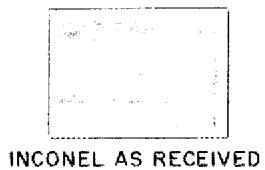

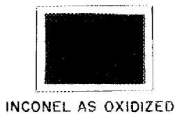

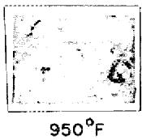

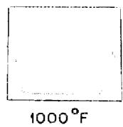

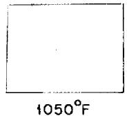

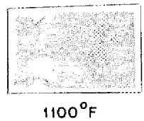

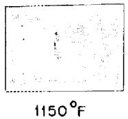

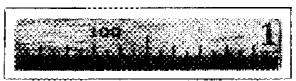  
Fig. 6.1. Descaling of Oxidized Inconel by $\mathbf{NaZrF}_5$ . Specimens treated for 4 hr at indicated temperatures.

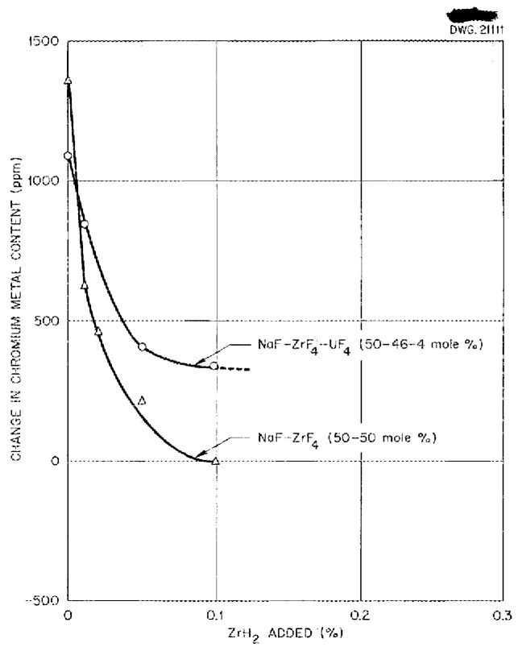  
Fig. 6.2. Chromium Uptake of Two Fluoride Mixtures as a Function of $\mathbf{ZrH}_2$ Additions.

that show the concentration of iron, chromium, and nickel in the melt as a function of exposure time are presented in Table 6.2.

It appears that the chromium content of the melt rises immediately in each case, whereas the iron values remain essentially constant during the first few hours. The chromium content continues to increase steadily, but the iron content drops. In $\mathrm{NaF - ZrF_4 - }$ $\mathrm{UF}_4$ , the final value for chromium content was considerably higher than that expected from stoichiometric considerations.

Corrosion by Fluorides with High $\mathbf{U}\mathbf{F}_{4}$ Concentrations. There are little data available on the behavior of fluoride mixtures with high uranium concentrations and with low concentrations of structural metal ions. Since a high-uranium concentration

TABLE 6.2. METAL CONTENT OF FLUORIDE MIXTURES AS A FUNCTION OF EXPOSURE TIME   

<table><tr><td rowspan="3">EXPOSURE TIME (hr)</td><td colspan="6">METAL CONTENT AFTER TEST \( \left( {\mathrm{{meq}}/\mathrm{{kg}}}\right) {}^{\left( a\right) } \)</td></tr><tr><td colspan="3">\( \mathrm{{NaF}} - {\mathrm{{ZrF}}}_{4} - {\mathrm{{UF}}}_{4}{}^{\left( b\right) } \) Mixture</td><td colspan="3">\( \mathrm{{NaF}} - {\mathrm{{ZrF}}}_{4}{}^{\left( c\right) } \) Mixture</td></tr><tr><td>Fe</td><td>Cr</td><td>\( \mathbf{{Ni}} \)</td><td>Fe</td><td>Cr</td><td>\( \mathbf{{Ni}} \)</td></tr><tr><td>\( {0}^{\left( d\right) } \)</td><td>4.1</td><td>0.4</td><td>1.5</td><td>11.1</td><td>0.8</td><td>1.0</td></tr><tr><td>2</td><td>6.3</td><td>5.7</td><td>1.4</td><td>11.8</td><td>5.2</td><td>1.4</td></tr><tr><td>4</td><td>6.4</td><td>4.6</td><td>1.2</td><td>10.0</td><td>5.2</td><td>1.9</td></tr><tr><td>16</td><td>2.7</td><td>12</td><td>0.8</td><td>8.2</td><td>11.2</td><td>1.1</td></tr><tr><td>64</td><td>1.1</td><td>13</td><td>0.7</td><td>2.6</td><td>14.6</td><td>1.3</td></tr><tr><td>128</td><td>1.3</td><td>21</td><td>0.7</td><td>1.3</td><td>14.6</td><td>0.7</td></tr></table>

(a) Each element considered to be in the divalent state.   
(b) 50 mole % NaF, 46 mole % ZrF₄, 4 mole % UF₄.   
(c)50 mole % NaF, 50 mole % ZrF₄.   
$(d)$ Each value is the average of duplicate determinations.

mixture will be used as the fuel concentrate for the ARE (cf., sec. 5), a series of seesaw tests with the NaF-ZrF $_4$ -UF $_4$ mixture (50-25-25 mole %) in Inconel capsules has been initiated. The available batch of this mixture contained, initially, about 40 ppm Fe, 25 ppm Cr, and 20 ppm Ni, and, since it had been given a very thorough treatment with hydrogen during preparation, it probably contained a small quantity of UF $_3$ .

In the standard 100-hr tilting test, this material produced scattered subsurface void formation to a depth of 0.5 mil and slight roughening of the metal at the hot end of the tube. Chemical examination of the melt after test revealed the presence of about 3 meq of $\mathrm{Fe}^{+ + }$ and 18 meq of $\mathrm{Cr}^{+ + }$ per kilogram of mixture. This attack can be considered as being slightly less than that commonly observed from more dilute fuel mixtures of somewhat lower purity; this slight improvement probably reflects the presence of $\mathrm{UF}_3$ .

The addition of 0.7 wt $\%$ $\mathrm{ZrH_2}$ had little, if any, effect on this slight corrosion. However, the chromium content of the melt, as determined after testing, dropped from $18\mathrm{meq / kg}$ to about 6.

Corrosion of High-Purity Inconel. Static tests were run on several specimens of high-purity Inconel prepared by the Metallurgy Division. The nominal analysis of these specimens (by weight) was $15\%$ Cr, $78\%$ Ni, and $7\%$ Fe, but the C, S, Ti, Mn, Al, and Mg contents ranged to a maximum of 1.6, 0.026, 0.25, 0.25, 0.15, and $0.05\%$ , respectively, in the various Inconels. Specimens of these materials contained in off-the-shelf Inconel tubing were tested in NaF-KF-LiF-UF $_4$ (10.9-43.5-44.5-1.1 mole %) at $816^{\circ}\mathrm{C}$ for 100 hours. In general, the as-cast, low-carbon specimens had fewer subsurface voids than did the extruded specimens, but attack of the extruded specimens was not excessive. In the tests in which the as-cast and the extruded material from the same ingot were tested, no significant difference in corrosion was observed. The attack in the as-cast specimen containing $1.6\%$ C was the most severe, but depth of attack in this specimen was only slightly greater than that in the low-carbon (0.03 wt %) specimens. With the exception of this high-carbon material, the laboratory-melted alloys were not significantly different from commercial alloys with respect to attack by the fluoride.

Effect of Temperature. Static corrosion tests were made on Inconel in NaF-KF-LiF-UF $_4$ (10.9-43.5-44.5-1.1 mole %) at seven different temperatures covering the range $800^{\circ}\mathrm{F}$ (427°C) to $2000^{\circ}\mathrm{F}$ (1093°C). The duration of each test was 100 hours. Within the range 800 to $1400^{\circ}\mathrm{F}$ , the depth of attack seemed to be independent of temperature, being approximately 0.5 mil. Within the range 1600 to $2000^{\circ}\mathrm{F}$ , there was no systematic variation in

depth of attack with temperature; but the depth of attack was much greater than that at lower temperatures, being from 2 to 4 mils.

# FLUORIDE CORROSION OF INCONEL IN ROTATING TEST

D.C.Vreeland E.E.Hoffman Metallurgy Division

Several tests were completed on the NACA-type rotating apparatus. With this apparatus, fluid velocities of up to 10 fps can be obtained with a maximum temperature of $810^{\circ}\mathrm{C}$ and temperature drops of from 20 to $75^{\circ}\mathrm{C}$ . The attack of Inconel by fluorides was no greater than the attack during static tests. Additions of titanium formed a surface layer and inhibited attack. Additions of $\mathrm{NiF}_2$ and $\mathrm{CrF}_2$ , as expected, increased attack. Some small globular crystals were found attached to the tube wall in the test of fluorides to which $5\%$ $\mathrm{NiF}_2$ was added. Chemical analysis of the crystals revealed their composition to be $92.34\%$ Ni, $6.53\%$ Fe, $0.99\%$ Cr, and $0.14\%$ Mn.

# FLUORIDE CORROSION OF INCONEL IN THERMAL CONVECTION LOOPS

G. M. Adamson, Metallurgy Division

The use of thermal convection loops for determining dynamic corrosion by liquids has been previously described.(2) Unless otherwise stated for the tests described in the following sections, the temperature of the hot leg of the loop was maintained at $1500^{\circ}\mathrm{F}$ and the temperature of the uninsulated cold leg was approximately $1300^{\circ}\mathrm{F}$ . With the fluoride salts, this temperature difference results in a fluid velocity of about 6 to 8 bpm. The usual testing period was 500 hours.

Zirconium Hydride Additive. Previously, when zirconium hydride was added to the fluoride in an Inconel loop, the depth of attack was reduced, but a layer was deposited on the hot-leg wall. An Inconel loop has been run with $\mathrm{NaF - ZrF_4 - UF_4}$ (50-46-4 mole %) treated with zirconium hydride in the fill pot. After the batch had been held at $1200^{\circ}\mathrm{F}$ and agitated for 3 hr, it was transferred to the loop through a micrometallic grade-G filter; the loop was then operated for 500 hr at $1500^{\circ}\mathrm{F}$ . No layer could be found in the hot leg, and the hot-leg attack had been reduced to a maximum penetration of 2.5 mils, which is the same as the attack obtained with previous zirconium-hydride additions.

Effect of Type 316 Stainless Steel Insert in Inconel Loop. One Inconel loop in which a type 316 stainless steel section 6 in. long had been welded into the upper part of the hot leg was operated with NaF-ZrF $_4$ -UF $_4$ (50-46-4 mole %). The Inconel showed only very light and widely scattered subsurface void formation to a depth of 3 mils, and the depth of attack decreased near the stainless steel joint. The joining stainless steel showed a very rough surface, with some areas spalling off. Heavy attack extended to a depth of 12 mils and was primarily intergranular in nature. Figure 6.3 shows both the Inconel and the type 316 stainless steel surfaces. In the center of the stainless steel insert, the attack decreased to 8 mils. The Inconel below the stainless steel showed a reduction in attack. In the cold leg, a well-diffused surface deposit 0.3 mil thick was found.

It appears, then, that stainless steel is preferentially attacked by fluorides in the presence of Inconel. Since protection is afforded both above and below the insert, an electro

chemical reaction is probably the cause of this protection. While it may be possible to protect an Inconel system by using stainless steel, such a combination does not look promising. The major difficulty expected in such a system would be mass transfer. The major benefit derived from this experiment is the warning against obtaining corrosion data from a loop in which any stainless steel is present.

Effect of Temperature on Inconel Corrosion. As an extension of work previously reported, (5) a loop was operated with a hot-leg temperature of $1250^{\circ}\mathrm{F}$ . The attack by NaF-ZrF $_4$ -UF $_4$ (50-46-4 mole %) was a moderate-to-heavy subsurface void formation to a depth of 3 mils. These voids were small and evenly distributed. Six inches below the hot leg, no attack was found. Also, since the chromium in the fluoride did not build up during the test, it is concluded that little corrosion occurred. Since the attack was low in the upper section of the loop and completely absent in other sections, it seems likely that attack may be eliminated by operating at a slightly lower maximum temperature.

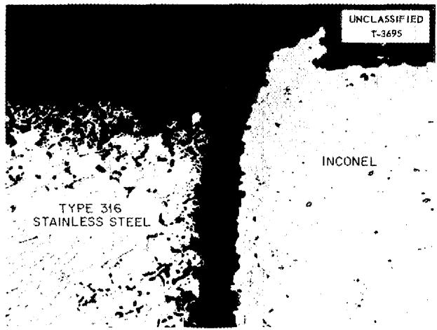  
Fig. 6.3. Inconel-Type 316 Stainless Steel Couple After 500 hr at $1500^{\circ}\mathrm{F}$ in NaF-ZrF $_4$ -UF $_4$ (50-46-4 mole %). 100X. Reduced 31%.

As previously mentioned, (5) no difference in maximum depth of attack was found when loops were operated at $1650^{\circ}\mathrm{F}$ instead of at $1500^{\circ}\mathrm{F}$ for 500 hours. After 100 hr of operation, however, the maximum attack in a loop operated at $1650^{\circ}\mathrm{F}$ was 7 mils, while in a loop operated at $1500^{\circ}\mathrm{F}$ , it was only 4 mils. After 100 hr at $1500^{\circ}\mathrm{F}$ , the holes were small and evenly distributed, that is, similar to those found at low temperatures in 500 hr of operation. When the loop was operated at $1650^{\circ}\mathrm{F}$ , the holes were larger and were concentrated in the grain boundaries.

Carbon Insert in Inconel Loop. The use of uncanned graphite in contact with the fluoride fuel in the core of a circulating-fuel reactor is being considered. In the external system, the fluoride fuel would be circulated

in Inconel tubes. To determine the compatibility of such a system, an Inconel loop containing a graphite rod inserted in the center of the upper portion of the hot leg was operated with NaF-ZrF $_4$ -UF $_4$ (50-46-4 mole%). Results obtained with this loop show that under these conditions Inconel may be carburized. In the hot leg, opposite the graphite rod, carbides were found in the Inconel grain boundaries to a depth of almost half the pipe wall thickness (Fig. 6.4). The carbides were also found in the cold leg, but they were evenly dispersed and were to a depth of only 1.5 mils. The hot-leg attack in this loop was heavier than usual and extended to 13 mils.

Upon visual inspection, the graphite rod appeared to be covered with a complete metallic coating. Under the microscope it was shown that this layer was actually a collection of nonmetallic particles; each particle was

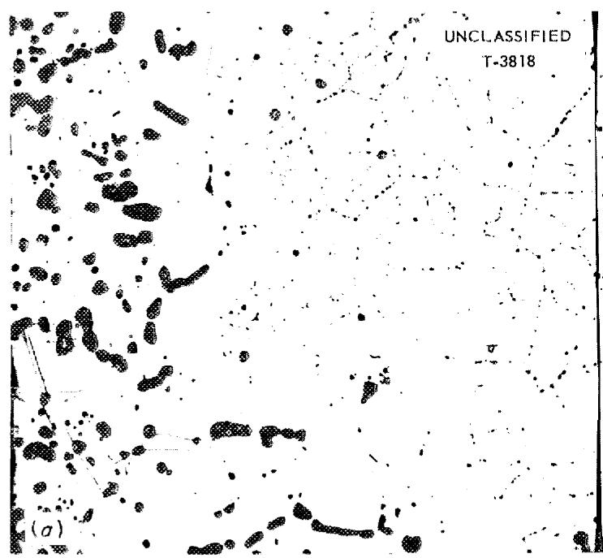

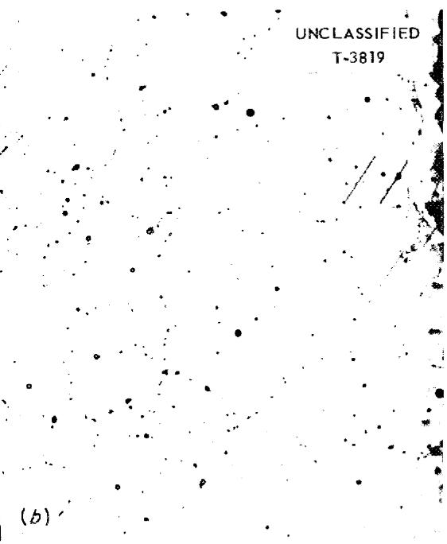  
Fig. 6.4. Carburization of Inconel Loop Containing Graphite Insert After 500 hr of Circulating NaF-ZrF $_4$ -UF $_4$ (50-46-4 mole %) at $1500^{\circ}\mathrm{F}$ . (a) Hot leg. (b) Cold leg. 250X.

covered with a thin, metallic skin. These particles had penetrated the graphite to a depth of 17 mils. This deposit is shown in Fig. 6.5. Spectrographic analyses showed the presence of chromium, zirconium, and sodium, and only traces of iron and nickel. A diffraction pattern revealed the presence of only the fuel. From this, it appears that the layer consisted of clumps of fuel covered with chromium metal. While attack was deeper than usual, the chromium content in the fluoride fuel was lower.

Effect of Exposure Time. In the previous report, (6) information was presented which indicated that after 250 hr very little, if any, increase in the maximum depth of penetration was found. This conclusion was based upon one series of loops filled from the same batch of fuel and operated for various times of up to 250 hr and from several loops filled with fuel from other batches and operated for 500 and 1000 hours. Information is now available from the 500-, 1000-, and 3000-hr loops filled from the same batch of fuel as that used for the

(6) Ibid., p. 58.

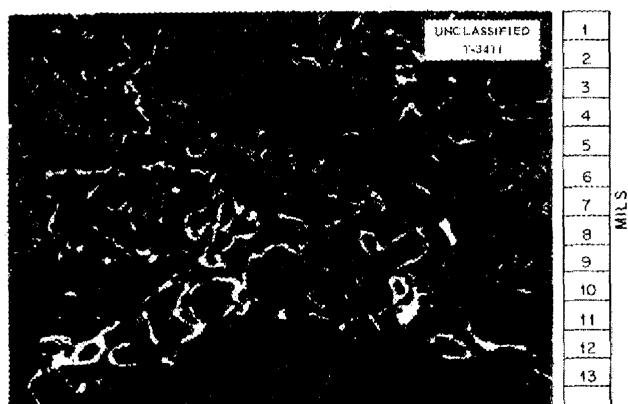  
Fig. 6.5. Deposit on Graphite Rod After 500 hr in an Inconel Loop Circulating NaF-ZrF $_4$ -UF $_4$ (50-46-4 mole %) at $1500^{\circ}\mathrm{F}$ . 250X. Reduced 39%.

shorter times. These data are plotted in Fig. 6.6. To show reproducibility, the data from the single-coolant batch are supplemented by comparable data from other batches.

The curve in Fig. 6.6 shows that while a change in slope takes place at around $250\mathrm{hr}$ , attack continues after 250 hours. This continued attack is based upon the single loop operated for $3000\mathrm{hr}$ and therefore needs to be confirmed. It is thought that the initial steep portion of the curve is caused by a reaction between the chromium in the Inconel and the contaminants in the fuel and the loop. The second phase of the reaction possibly represents the partial reduction of $\mathbf{U}\mathbf{F}_4$ by chromium metal.

An unexpected finding in the loop operated for 3000 hr was the presence of a metallic mass in the cold-leg sump. No deposit was found on the walls of the loop. The mass was identified spectrographically as chromium metal. The method of formation of this metallic chromium is not known, since the reactions are usually considered as an oxidation of chromium metal to chromium fluoride. One possibility is that this reaction is temperature sensitive and reverses itself in the cold leg.

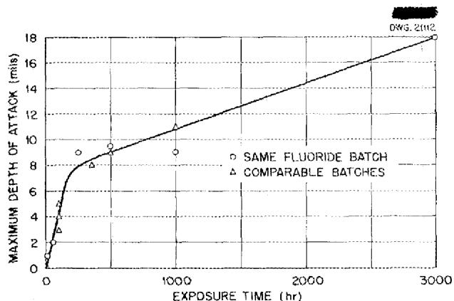  
Fig. 6.6. Depth of Attack of Inconel by Fluorides as a Function of Exposure Time.

# FLUORIDE CORROSION OF STAINLESS STEELS OF VARYING PURITY

D.C.Vreeland E.E.Hoffman Metallurgy Division

In an attempt to determine the effect of various carbon, oxygen, and nitrogen contents of stainless steels on resistance to attack by fluorides, static corrosion tests were made on eight specimens of stainless steels. Two specimens were commercial stainless steel, types 304 and 305, while the other six specimens were stainless steels cast and extruded at MIT. Three of these special steels contained $18\%$ chromium and $12\%$ nickel, while the other three contained $18\%$ chromium and $8\%$ nickel. Each of the eight specimens was contained in a capsule machined from the same material as the specimens, with the exception of the specimens of type 305 stainless steel which was contained in tubing of type 304 stainless steel. The specimens were tested in NaF-KF-LiF- $\mathbf{U}\mathbf{F}_{4}$ (10.9-43.5-44.5-1.1 mole %) for 100 hr at $816^{\circ}C.$ The compositions of the steels and results of the tests are shown in Table 6.3. Insofar as can be determined from these tests, variations of carbon, oxygen, and nitrogen contents within the ranges covered by the specimens tested had no measurable influence on the resistance to corrosion.

# LIQUID METAL CORROSION OF STRUCTURAL METALS

D.C.Vreeland E.E.Hoffman

J. V. Cathcart G. P. Smith

W.H.Bridges

Metalurgy Division

Rotating Tests with Sodium. Several spinner tests have been completed in sodium at a temperature of $816^{\circ}\mathrm{C}$ and a speed of 405 fpm. The materialstested were types 310, 410, and 430 stainless steel, Inconel X, and nichrome V. As in the spinner tests conducted previously, attack seemed

to be more severe than that encountered in static tests with molten sodium. Surface layers were quite apparent on the Inconel X, nichrome V, and type 310 stainless steel and either less apparent or absent on the types 430 and 410 stainless steel. Weight changes were less on the types 410 and 430 stainless steel.

Static Tests with Lithium. Static tests of types 309, 316, 347, and 430 stainless steel were run in lithium. Extreme care was taken in regard to the details of these tests; for example, an extremely good dry box atmosphere was maintained during the loading of the tubes. These tests were run for 400 hr at $1000^{\circ}\mathrm{C}$ . Types 309 and 316 stainless steel exhibited corrosion resistance superior to that of the types 347 and 430 stainless steel. Both types 347 and 430 showed evidence of mass transfer on a macro scale. The type 309 and 316 specimens had small weight losses, very little, if any, mass transfer, and not over 1 to 2 mils of attack. Details of these tests are given in Table 6.4.

Dynamic Tests with Liquid Lead in Convection Loops. Studies have been made of the extent of mass transfer encountered with type 410 stainless steel, chromium, nickel, nichrome V, and a $30\%$ nickel-iron alloy in small quartz thermal convection loops containing liquid lead. Details of the construction and operation of the loops and of the results obtained for Inconel, columbium, molybdenum, types 304, 347, and 446 stainless steel, and Armco iron have been reported previously.(7,8,9)

Of the metals tested during the this quarter, type 410 stainless steel gave by far the best results. The loop was operated for 545 hr with

TABLE 6.3. STATIC CORROSION OF STAINLESS STEELS IN NaF-KF-LiF-UF ${}_{4}$ (10.9-43.5-44.5-1.1 mole %) AFTER 100 hr AT ${816}^{ \circ  }\mathrm{C}$   

<table><tr><td rowspan="2">MATERIAL</td><td colspan="5">COMPOSITION (wt %)</td><td rowspan="2">ASTM GRAIN SIZE</td><td rowspan="2">DEPTH AND TYPE OF ATTACK</td><td rowspan="2">PHASE CHANGE</td></tr><tr><td>Cr</td><td>Ni</td><td>C</td><td>N2</td><td>O2</td></tr><tr><td>Type 304 stainless steel</td><td>18</td><td>8</td><td>0.1</td><td>0.02</td><td>0.01</td><td>8 to 9</td><td>Subsurface voids 2 to 3 mils deep</td><td>Decarburization 1 to 2 mils deeper than voids; some phase transformation</td></tr><tr><td>Type 305 stainless steel</td><td>18</td><td>12</td><td>0.1</td><td>0.02</td><td>0.01</td><td>7</td><td>Intergranular attack and some subsurface voids 2 to 4 mils deep</td><td>Same as above</td></tr><tr><td>Special stainless steel*</td><td>18.24</td><td>12.32</td><td>0.151</td><td>0.0044</td><td>0.021</td><td>5 to 7</td><td>Subsurface voids, some intergranular attack 2 to 4 mils deep; attack 10 mils deep in one place along carbide segregation</td><td>Same as above</td></tr><tr><td></td><td>18.55</td><td>12.44</td><td>0.006</td><td>0.0039</td><td>0.015</td><td>2 to 4</td><td>Mainly intergranular attack 3 to 5 mils in depth; one 10-mil-deep area along grain boundary</td><td>Phase change deeper than attack along grain boundaries</td></tr><tr><td></td><td>18.03</td><td>8.52</td><td>0.011</td><td>0.096</td><td>0.018</td><td>2 to 5</td><td>Mostly intergranular attack; some sub-surface voids 3 to 4 mils deep; one stringer attacked to 6 mils</td><td>Some phase change noted</td></tr><tr><td></td><td>18</td><td>12</td><td>0.001</td><td>0.2</td><td></td><td>2 to 4</td><td>Mostly subsurface voids, some inter-granular attack to a depth of 5 to 7 mils</td><td>Same as above</td></tr><tr><td></td><td>18.51</td><td>8.20</td><td>0.007</td><td>0.0031</td><td>0.031</td><td>2 to 4</td><td>Mostly intergranular, some subsurface voids 3 to 7 mils deep</td><td>Same as above</td></tr><tr><td></td><td>18.55</td><td>8.43</td><td>0.193</td><td>0.0055</td><td>0.017</td><td>4 to 6</td><td>Both subsurface voids and grain boundary attack 2 to 4 mils in depth, attack tended to be deeper along carbide segregation</td><td>Same as above</td></tr></table>

TABLE 6.4. RESULTS OF STATIC TESTS OF VARIOUS STAINLESS STEELS IN LITHIUM AT ${1000}^{ \circ  }\mathrm{C}$ FOR 400 HOURS   

<table><tr><td>TYPE OF STAINLESS STEEL</td><td>WEIGHT CHANGE (g/in.2)</td><td>METALLOGRAPHIC NOTES</td></tr><tr><td>309</td><td>-0.0022</td><td>No evidence of mass transfer upon opening tube; metallographic examination revealed a white phase in grain boundaries throughout the specimen; 0.5-mil crystals were attached to the surface in some areas; 0.25 mil of intergranular attack in scattered areas</td></tr><tr><td>316</td><td>-0.0037</td><td>No evidence of mass transfer upon opening tube, but surface had an etched appearance; metallographic examination revealed very little attack; there were voids in some of the grain boundaries to a depth of 0.5 mil; there was a fine precipitate all around the specimen in a band approximately 1 mil from the surface; in the vapor zone of the tube, there was 4 to 5 mils of intergranular penetration in a few areas</td></tr><tr><td>347</td><td>+0.0076 (crystals clinging to specimen)</td><td>Large amount of mass transfer on both tube and specimen, mainly at bath-level line; specimen was heavily attacked intergranularly to a depth of 10 to 11 mils at one end; attack on rest of specimen did not exceed 0.5 mil; tube attacked 1 to 2 mils; fine precipitate 1 mil under surface</td></tr><tr><td>430</td><td>No data</td><td>A few small crystals were attached to surface tube; surface of specimen had small grains and was attacked intergranularly to a depth of 4 to 5 mils; tubing attacked 2 to 3 mils</td></tr></table>

hot- and cold-leg temperatures of 810 and $525^{\circ}\mathrm{C}$ . No plugging occurred during the test, but a small amount of mass transferred material was found in the cold leg of the loop. As may be seen from Fig. 6.7, the test specimen suffered slight, irregular surface attack. The results for this loop were comparable with those previously obtained for type 446 stainless steel.

Neither nickel nor nichrome V (80% nickel-20% chromium) showed much resistance to mass transfer. The loops for testing these materials were operated with hot- and cold-leg temperatures of 810 and $525^{\circ}\mathrm{C}$ . Plugging occurred in the nickel loop after only 2 hr of operation, while the nichrome

loop operated for 12 hours. Large quantities of mass transferred material were found in both loops. The nickel specimens suffered heavy intergranular penetration. The corrosion encountered in the nichrome specimens was similar to that observed in Inconel, although the attack was more severe. As shown in Fig. 6.8, lead penetrated throughout the nichrome samples.

Because of the good results obtained with iron-chromium alloys, such as types 410 and 446 stainless steel, it was expected that chromium would show a marked resistance to mass transfer in liquid lead. This was not the case, however; the chromium loop plugged in about 100 hours. Hot- and

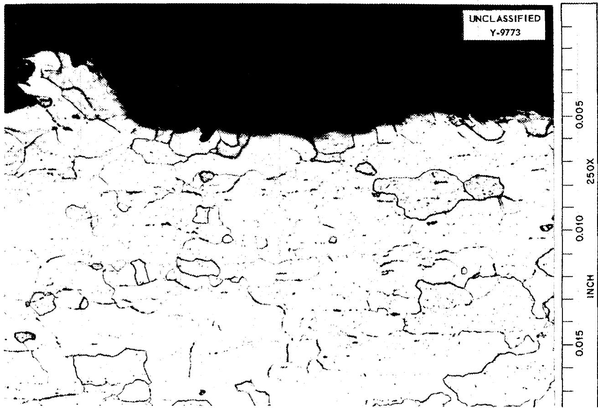  
Fig. 6.7. Hot Leg of Type 410 Stainless Steel Loop After Circulating Lead for 545 hr at $810^{\circ}\mathrm{C}$ . 250x.

cold-leg temperatures for this loop were also 810 and $525^{\circ}\mathrm{C}$ .

The $30\%$ nickel- $70\%$ iron alloy loop plugged in about 275 hours. Again, the hot- and cold-leg temperatures were about 810 and $525^{\circ}\mathrm{C}$ . Metallographic studies of this loop and of the chromium loop have not yet been completed, and therefore no data are available on the corrosion that occurred in these loops.

As a result of the recent studies, it is apparent that much better results are obtained from the 400 series stainless steels than from the pure metals which comprise them. The reverse tends to be the case for the 300 series stainless steels previously tested. Further work will be done in an attempt to obtain an explanation of this behavior.

# FUNDAMENTAL CORROSION RESEARCH

J. V. Cathcart G. P. Smith

L. Dyer

Metallurgy Division

F. A. Knox L. G. Overholser

F. Kertesz J. D. Redman

H. S. Powers

Materials Chemistry Division

Oxidizing Power of Hydroxide Corrosion Products. The preparation of higher valent nickel compounds, that is, the corrosion products which are formed in hydroxide-nickel systems, was attempted in order to study the oxidizing power of the compounds. Manganese, as the permanganate, was found as an impurity in lithium nickelate preparations, and $\mathrm{NaNiO_2}$ and $\mathrm{LiNiO_2}$ preparations were found to

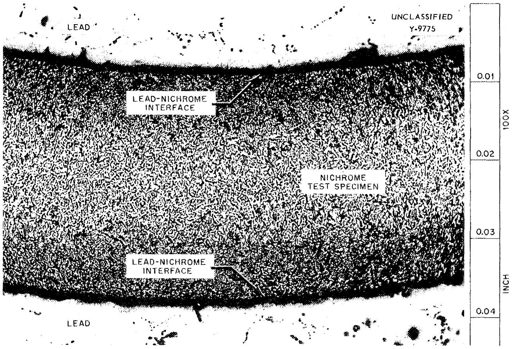  
Fig. 6.8. Hot Leg of Nichrome After Circulating Lead for 12 hr at $810^{\circ}$ C. 100X.

contain some cobalt as an impurity; therefore the preparations were analyzed quantitatively for these elements.

Standard methods for determining oxidizing power were unsatisfactory, and therefore a new technique and an apparatus for analyzing $\mathrm{LiNiO_2}$ preparations were developed. The density of $\mathrm{NaNiO_2}$ was redetermined to be $4.72\mathrm{g / cm^3}$ . Several preparations of $\mathrm{NaNiO_2}$ were made for x-ray investigations. The reason for these x-ray studies was that some regularly occurring striations on the crystal faces were thought to be evidence for a decomposition reaction. By x-ray analysis it has been possible to ascertain that such striations originate

nated from the polycrystalline nature of the particles.

Equilibrium Pressure of Hydrogen Over Sodium Hydroxide-Metal Systems. Empirical tests in a number of laboratories have shown that some of the noble metals such as silver and gold, as well as copper and nickel, are possible containers for sodium hydroxide, although none of these metals can be considered as adequate structural metal. Under a thermal gradient, however, mass transfer of these metals from hot to cold regions of the apparatus occurs; this mass transfer is considerably decreased when a pressure of hydrogen is applied.

It appears likely that reactions of the type

$$
\mathrm {N i} + 2 \mathrm {N a O H} \rightleftharpoons \mathrm {N a} _ {2} \mathrm {O} \cdot \mathrm {N i O} + \mathrm {H} _ {2},
$$

in which the reverse reaction is represented by

$$
\mathrm {N i O} + \mathrm {H} _ {2} \rightleftharpoons \mathrm {N i} + \mathrm {H} _ {2} \mathrm {O}
$$

and

$$
\mathrm {N a} _ {2} \mathrm {O} + \mathrm {H} _ {2} \mathrm {O} \rightleftharpoons \mathrm {N a O H},
$$

may be responsible for these phenomena. Accordingly, an attempt has been made to determine the equilibrium pressure of hydrogen over several metal-sodium hydroxide systems as a function of temperature.

The apparatus consisted of a quartz envelope which was connected to a mercury manometer, a liquid-nitrogen cold trap, and, through stopcocks, to a vacuum pump and a gas-sampling bulb. A crucible of the metal to be tested containing 10 to $15\mathrm{g}$ of sodium hydroxide was enclosed in the quartz envelope. The apparatus was loaded with sodium hydroxide in a helium dry-box and was heated and evacuated to a pressure well below $1\mathrm{mm}$ . The temperature was maintained at a constant level until equilibrium pressures were obtained. In general, the pressure attained a value near equilibrium in 30 minutes. Once attained, equilibrium values remained constant for at least 7 hours.

The values obtained in this preliminary attempt are shown in Table 6.5. It is apparent that gold is more

stable to sodium hydroxide than is either copper or nickel; the value obtained at $850^{\circ}\mathrm{C}$ for nickel appears to be unaccountably high. The pressure of hydrogen observed appeared to be independent of the gas volume of the system.

Repeated removal of the hydrogen formed by pumping at the reaction temperature did not seem to change the equilibrium pressure observed, although the rate of attainment of equilibrium was adversely affected. Since several evacuations should decompose about $1\%$ of the sodium hydroxide charged, this constancy of pressure may indicate either that the pressure measurements are not sufficiently accurate to detect differences resulting from changes of this magnitude or that the three-component system (that is, $\mathrm{Na}_2\mathrm{O - Ni - H}_2\mathrm{O}$ ) is univariant. If the system is actually univariant, in addition to the liquid, the gas, and the solid nickel phases, another solid phase, probably $\mathrm{Na}_2\mathrm{O - NiO}$ or $\mathrm{NiO}$ , is required.

Since this reaction appears to be fundamental to the sodium hydroxide container problem, additional studies with higher accuracy will be performed in attempts to determine equilibrium pressures of hydrogen and the effect of added $\mathsf{H}_2\mathsf{O}$ , NiO, and other possible impurities or corrosion products.

Chemical Equilibria in Fused Salts (cf., sec 10). The results of a great many corrosion experiments have suggested that conversion of chromium

TABLE 6.5. HYDROGEN PRESSURES OVER SODIUM HYDROXIDE-METAL SYSTEMS AT ELEVATED TEMPERATURE   

<table><tr><td rowspan="2">METAL TESTED</td><td colspan="6">MEASURED HYDROGEN PRESSURE (mm Hg)</td></tr><tr><td>At 700°C</td><td>At 750°C</td><td>At 800°C</td><td>At 850°C</td><td>At 900°C</td><td>At 1000°C</td></tr><tr><td>Nickel</td><td></td><td>1</td><td>5</td><td>23</td><td></td><td></td></tr><tr><td>Gold</td><td></td><td></td><td></td><td>1</td><td>3</td><td>6</td></tr><tr><td>Copper</td><td>3</td><td></td><td>7</td><td>10</td><td></td><td></td></tr></table>

in Inconel to soluble chromium fluoride (probably a complex fluoride) by reaction with some oxidizing fluoride in the mixture occurs during high-temperature exposure. A typical reaction would be

$$
2 \mathrm {U F} _ {4} + \mathrm {C r} \rightleftharpoons 2 \mathrm {U F} _ {3} + \mathrm {C r F} _ {2}
$$

in which all the fluorides exist primarily as complex species in dilute solution in $\mathrm{NaF - ZrF_4}$ melts. Since the equilibrium constant for such a reaction would be temperature dependent, the slight "mass transfer" of chromium could be explained on this basis. Direct evaluation of equilibrium constants of such a reaction can be obtained from analysis of the filtrate for soluble chromium if the following conditions are assumed to hold: (1) the physical solubility of chromium metal, as such, is very small in fluoride melts at high temperatures, (2) phase separation at high temperature is possible, (3) the starting materials are of known quantity and adequate purity, and (4) the container is inert and sufficiently clean that no other reactions are important contributors.

Considerable time has been devoted to the development of adequate equilibrium and filtration equipment. In a previous report, (10) a description was given of an assembly fabricated from nickel which has been modified to include a retractable filter stick, which promises to be simpler to fabricate and easier to use. The filter stick uses a sintered nickel filter and is connected through a metal bellows to the melt container so that the filter is above the melt during the equilibration period and is immersed only during collection of the liquid sample.

In preliminary experiments, the materials were charged into the hydrogen-fired nickel equipment, equilibrated at $800^{\circ}\mathrm{C}$ for 5 hr with agitation (the assembly was shaken), and allowed to equilibrate at $600^{\circ}\mathrm{C}$ before filtration. The data obtained show that $\mathrm{Na}_{3}\mathrm{CrF}_{6}$ is quite soluble in the fluoride mixture at $600^{\circ}\mathrm{C}$ . In most cases, it appears that the material was completely dissolved at the concentrations used. This behavior is to be contrasted with the relative insolubility of $\mathrm{K}_2\mathrm{NaCrF}_6$ in LiF-NaF-KF mixtures. Petrographic and x-ray examinations of the filtrate indicate the existence of solid solutions of $\mathrm{Na}_{3}\mathrm{CrF}_{6}$ in the $\mathrm{NaZrF}_{5}$ matrix over a wide range of compositions. Although analyses for zirconium and uranium in these systems show slight variation, there is no evidence that insoluble compounds of these materials result from $\mathrm{Na}_{3}\mathrm{CrF}_{6}$ addition.

In the filtrates from the $\mathrm{Na}_{3}\mathrm{FeF}_{6}$ addition, the lack of discrete phases of iron compounds and the similar lowering of refractive index indicate that this compound also forms solid solutions. However, the solubility of $\mathrm{Na}_{3}\mathrm{FeF}_{6}$ in this mixture is considerably lower than that of $\mathrm{Na}_{3}\mathrm{FeF}_{6}$ , and the analytical results are less certain.

Preliminary experiments have been performed in which known quantities of metallic chromium or iron have been added to the NaF-ZrF $_4$ -UF $_4$ mixture. Again, equilibration at $800^{\circ}\mathrm{C}$ followed by equilibration at $600^{\circ}\mathrm{C}$ and filtration was the general practice. The results indicate that reaction occurs to an extent which makes possible analysis of the products in these systems. Additional studies with more pure materials and refined analytical techniques will be conducted in the near future.

# 7. METALLURGY AND CERAMICS

W. D. Manly J. M. Warde

Metallurgy Division

High-conductivity radiator fins can be satisfactorily brazed to tubes of either a longitudinal or a transverse array by using a low-melting-point Microbraz. Since it has been found that placing the brazing alloy on the brazed joint by the use of wire or washers is advantageous, a technique for the preparation of low-melting-point Microbraz wire through the use of an acryloic cement was developed.

A new brazing alloy series (nickel-phosphorus and nickel-chromium-phosphorus) has been found and is now being studied. Phosphorus additions to nickel and nickel-chromium alloys are extremely effective in lowering the melting point, and phosphorus is suitable for reactor usage because it has a low cross section for the absorption of thermal neutrons. Another advantage of the nickel-phosphorus-chromium type of brazing alloy is the possibility of preplacing the alloy by convenient plating techniques, since tubing can be plated with a nickel strike followed by nickel-phosphorus coating by the "electroless" plating technique followed by chromium plating on top of the nickel-phosphorus alloy. It was found that addition of chromium to the basic nickel-phosphorus alloys is advantageous because it increases the resistance of the brazing alloy to air oxidation and sodium corrosion and gives more strength to the brazed joints.

In actual radiator fabrication, it has been found that Microbraz is not so good a brazing alloy to use as G-E brazing alloy No. 62, a nickel-chromium-silicon alloy. During fabrication, it is best to bring the heat exchanger to $900^{\circ}\mathrm{C}$ so that the fin and tube temperatures will equalize, quickly heat it to the brazing temperature, hold that temperature for the brazing

time, and then furnace cool it. Microbraz is not satisfactory for this cycle because the boron diffuses out of the alloy while it is being held at $900^{\circ}\mathrm{C}$ , and the resulting alloy has a much higher melting temperature than that of Microbraz. The nickel-chromium-silicon brazing alloy in undergoing the same thermal treatment produces a good braze. The cracking tendencies of the nickel-chromium-silicon alloy when applied to a test radiator have been determined by thermally cycling the entire assembly from $1000^{\circ}\mathrm{C}$ to room temperature. Only one small leak occurred after a severe water quench from $1000^{\circ}\mathrm{C}$ .

The drawing of tubular fuel elements has been initiated. Twelve tubes containing cores of type 302 stainless steel, iron, and nickel with 20 and $30\% \mathrm{UO}_2$ are being reduced by plug drawing from a tube 0.750 in. in diameter with a 0.042-in. wall to a tube 0.250 in. in diameter with a 0.015-in. wall.

To give copper the oxidation resistance needed for its use as a high-conductivity fin, plates of chromium and nickel deposited by the thermal decomposition of the carbonyls were tried, but the experiments were not successful. Copper clad with Inconel and types 310 and 446 stainless steel has been studied. The type 310 and the type 446 stainless steel cladding seem to offer oxide protection and to be free of the serious intradiffusion experienced with the Inconel-clad copper.

The creep and stress-rupture measurements for both coarse- and fine-grained Inconel in fluoride fuels at $815^{\circ}\mathrm{C}$ have been completed for the stress range of 2500 to 7500 psi. Specimens have now been in test for 1000 hr at 1500 and 2000 psi. A graph

is presented which summarizes the current test data. In the study of the combustion of sodium and sodium alloys, it has been shown that additions of mercury of about 70 mole% have a pronounced retarding effect on the combustion of sodium.

In an attempt to develop suitable high-temperature-fluoride seals for pumps, packing components have been fabricated from both hot-pressed compacts and vitreous materials. Mixtures of copper and stainless steel with $\mathrm{MoS}_2$ have been fabricated into cylinders to produce rings for packing-gland seals on a 2 l/2-in.-dia pump shaft. In addition, a $\mathrm{BeF}_2$ -KF- $\mathrm{MgF}_2$ - $\mathrm{AlF}_3$ composition has been prepared for testing of a viscous seal.

# WELDING AND BRAZING RESEARCH

P. Patriarca G. M. Slaughter Metallurgy Division

Low-Melting-Point Microbraz. One of the metallurgical problems associated with the use of high-conductivity fin materials for heat exchangers has been the selection of suitable brazing alloys. In order to satisfy the corrosion requirements of resistance to both sodium and air at $816^{\circ}\mathrm{C}$ , the search for a suitable brazing alloy was confined to alloys with a nickel-chromium base. Since the melting point of the copper core of the radiator fin would be about $1083^{\circ}\mathrm{C}$ , the maximum suitable brazing alloy flow temperature was chosen as $1050^{\circ}\mathrm{C}$ . A nickel-chromium-iron-silicon-boron brazing alloy manufactured by the Wall Colmonoy Corporation and known as "Low-Melting Microbraz" (LMNB) was found to have suitable flowability on Inconel-clad copper radiator fins when brazed in $-70^{\circ}\mathrm{F}$ dew-point hydrogen at $1050^{\circ}\mathrm{C}$ . A nominal composition of this alloy is given in Table 7.1, along with that of standard Microbraz (NB). As may be seen, the basic difference is in the

TABLE 7.1. COMPOSITION OF NICROBRAZ AND "LOW-MELTING NICROBRAZ"   

<table><tr><td rowspan="2">CONSTITUENT</td><td colspan="2">COMPOSITION (nominal wt %)</td></tr><tr><td>LMNB (flow point, 1050°C)</td><td>NB (flow point, 1150°C)</td></tr><tr><td>Nickel</td><td>80</td><td>70</td></tr><tr><td>Chromium</td><td>5</td><td>15</td></tr><tr><td>Iron</td><td>5</td><td>5</td></tr><tr><td>Silicon</td><td>5</td><td>5</td></tr><tr><td>Boron</td><td>5</td><td>5</td></tr></table>

nickel and chromium contents of the two alloys.

The techniques used for fabrication of LMNB wire are of general interest, since they are applicable to a large group of brazing alloys which must be initially prepared as a powder. The procedure used is, briefly, the following: (1) $50\mathrm{g}$ of alloy powder, preferably $-100$ to $-200$ mesh, is mixed with approximately $25~\mathrm{cm}^3$ of Rohm and Haas Acryloid B-7 to provide a thick homogeneous slurry; (2) excess binder is driven off by baking for 10 min at $200^{\circ}\mathrm{C}$ to a hard cake; (3) this composite is softened with a small quantity of acetone and kneaded to the consistency of putty; (4) the billet thus formed is extruded on a hydraulic press through a 0.060-in.-ID Lavite die and wound on a 3/16-in.-dia mandrel rotated at approximately 60 rpm by a variable-speed motor; (5) the mandrel is then set aside for curing at room temperature for a minimum of 1 hr; (6) the brazing-alloy helix thus formed is removed from the mandrel and stored in l-in. over-all lengths until cut with a knife to supply individual rings.

Brazing of Radiator Fins with LMNB. An attempt was made to braze clad-copper fins with LMNB, and in order to limit the problems in this preliminary study, the following variables were arbitrarily fixed: (1) The fin material would be Inconel-clad copper,

that is, 10 mils of copper clad on both sides with 2 mils of Inconel. (The fabrication of this material by roll-cladding techniques is described below under "High Conductivity Metals for Radiators Fins.") (2) The 0.188-in. OD, 0.020-in.-wall tubing would be fabricated of Inconel. (3) The service environment would include sodium at $1500^{\circ}\mathrm{F}$ within the tubes and air at $1500^{\circ}\mathrm{F}$ on the exterior of the tubes and on the fin surfaces. The two radiator configurations of interest were a longitudinal-fin design that required attachment of the fins parallel to the tube axis and a radial-fin design that consisted of the popular punched fins and a multitude of tube-to-fin joints.

The radial fin material was prepared by punching holes nominally 0.190 in. in inside diameter in the Inconel-clad copper fin; a lip was left to provide a 15-fin-per-inch spacing. Commercial Microbraz cement was used to firmly attach each pre-placed braze ring prior to brazing of the tube-to-fin assembly. A series of radial, Inconel-clad, copper fins brazed to an Inconel tube are shown in Fig. 7.l. As can be seen, the copper core is adequately protected from attack by an oxidation-resistant brazing alloy fillet. Examination of the joints also revealed that no significant diffusion had occurred to affect the properties of the core material. The dark lines delineating

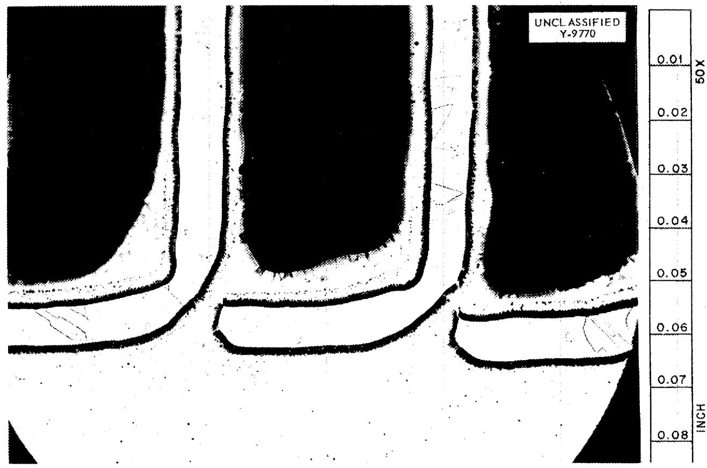  
Fig. 7.1. Section of Radial Fin-to-Tube Joint Brazed with Low-Melting-Point Microbraz. Tube material, Inconel; fin material, copper (10 mils thick) clad on both sides with 2 mils of Inconel. 50X.

the copper core were attributed partially to the presence of a heavy precipitate in the clad material and partially to relief polishing. The precipitate is characteristic of the dilution and diffusion effects observed in nickel-base alloys and stainless steels brazed with the high-boron, high-silicon Microbraz alloys.

To determine the feasibility of the longitudinal (delta) fin design, Inconel-clad copper sheet was preformed into 6-in. lengths of the triangular delta configuration. In order to braze this delta configuration to the tubes, a quantity of LMNB wire was formed in straight lengths and preplaced along the full length of one side of each tube with Microbraz cement. A photomicrograph of the brazed assembly is shown in Fig. 7.2. The success of the brazing operations confirmed the ability of this cement to hold the brazing alloy wire in place until a temperature of 800 to

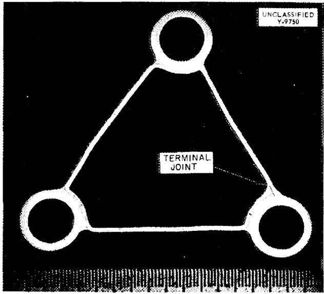  
Fig. 7.2. Section of Longitudinal Fin-to-Tube Joint Brazed with Low-Melting-Point Microbraz and Oxidized for 500 hr at $800^{\circ}\mathrm{C}$ in Air. Tube material, Inconel; fin material, copper (10 mils thick) clad on both sides with 2 mils of Inconel. $10\times$ Reduced $36\%$ .

$900^{\circ}C$ is reached, at which time sintering of the wire to the base material becomes pronounced.

The most critical joint of the basic delta fin is that shown in the lower right corner of Fig. 7.2, where the sheared and therefore exposed edges of the fin mated with each other and the Inconel tube. Previous experiments had verified that LMNB did not flow on copper. Fortunately, preplacing a LMNB wire on the inside and another on the outside of the delta fin effectively reduced the joint design to two T joints, and adequate protection of the fin edges was achieved. The effects of the 500-hr oxidation test at $1500^{\circ}\mathrm{F}$ on the copper core are evident from close examination of Fig. 7.2. The voids in the copper and the diffusion between core and cladding indicate that Inconel-clad copper is not entirely suitable for high-conductivity fins, at least not without diffusion barriers. This and other clad fins are discussed below under "High Conductivity Metals for Radiator Fins."

Nickel-Chromium-Phosphorus Brazing Alloys. The nickel-phosphorus and nickel-chromium-phosphorus systems are being studied to determine their suitability as elevated-temperature brazing alloys. The evaluation of these systems is in preliminary stagcs, but the results indicate that phosphorus additions are extremely effective in lowering the melting point of nickel and nickel-chromium alloys. Phosphorus is especially suitable for reactor applications because of its low cross section for absorption of thermal neutrons. Alloys of the approximate compositions given in Table 7.2 have been prepared from a master alloy of $87\%$ Ni- $13\%$ P.

Stainless steel T joints brazed with these alloys exhibited excellent flow and wetting properties. As was anticipated, however, the joints were quite brittle. It is expected that

TABLE 7.2. MELTING POINTS OF SEVERAL NICKEL-CHROMIUM-PHOSPHORUS BRAZING ALLOYS   

<table><tr><td>ALLOYS</td><td>APPROXIMATE 
MELTING POINT 
(℃)</td></tr><tr><td>87% Ni-13% P</td><td>900</td></tr><tr><td>79% Ni-12% P-9% Cr</td><td>1000</td></tr><tr><td>72% Ni-11% P-17% Cr</td><td>1050</td></tr><tr><td>67% Ni-10% P-23% Cr</td><td>1100</td></tr></table>

diffusion treatments may improve the ductility of these alloys so that they will be comparable to the Microbraz and G-E No. 62 alloys and will thereby retain the obvious advantage of a low melting point and a low cross section.

A survey of the recent literature revealed a unique technique for pre- plating these alloys which involved an "electroless" method of nickel plating that was developed several years ago at the Bureau of Standards. The method requires, first, the deposition of a high-phosphorus-content nickel plate which then becomes the brazing alloy. Briefly, the deposition is effected by the reduction of a nickel salt to metallic nickel. A hypop phosphite is converted to the phosphite with subsequent deposition of phosphorus-containing nickel. An obvious advantage of this method is the possi- bility of depositing a uniform plate on a complex surface without experiencing the difficulties introduced by variations in "throwing power" of the electrolytic methods.

To determine the feasibility of the use of this "electroless" plate as a brazing alloy, a series of type 316 stainless steel strips $1/2$ by 3 by $1/16$ in. were submitted to be "electroless" plated with a nominal thickness of $1\mathrm{mil}$ of nickel-phosphorus in a 7-hr period by using procedures based on the method developed by the Bureau of Standards. Standard T joints

were made for flowability tests by using a plated stainless steel strip against an unplated stainless steel strip. A photomicrograph of such a section is shown in Fig. 7.3. Excellent wetting was observed when the specimens were brazed in dry hydrogen at $900^{\circ}\mathrm{C}$ , which indicated that the reported approximate composition of $90\%$ Ni-10% P was correct. However, when the joint was subjected to an oxidation test of 500 hr at $1500^{\circ}\mathrm{F}$ in still air, some defections appeared, as shown in Fig. 7.4. The voids at the interface in the T are believed to be due to removal of constituents during polishing, whereas the undercut and the irregularities of the fillet surface are believed to be due to oxidation.

Since it was felt that the oxidation resistance of the "electroless" nickel-phosphorus brazing alloy could be improved by alloy addition of chromium, a series of stainless steel test strips were prepared (by using conventional electrolytic plating methods) with approximately 0.2 mil of chromium on 1 mil of "electroless" nickel-phosphorus alloy. These test strips were brazed at $1000^{\circ}\mathrm{C}$ , and they exhibited the same excellent flow as that observed with the "electroless" nickel-phosphorus alloy. However, the oxidation resistance of the nickel-chromium-phosphorus alloy is better than that of the nickel phosphorus alloy. A photomicrograph of a section of the T joint after exposure for 500 hr to static air at $800^{\circ}\mathrm{C}$ is shown in Fig. 7.5. What appears to be voids in the brazing alloy matrix were found to be polishing pits, whereas the irregularities at the brazing alloy fillet surface were attributed to oxidation. Static tests were also run for 100 hr at $816^{\circ}\mathrm{C}$ to check the corrosion resistance of these T joints in sodium. Figure 7.6 shows a nickel-phosphorus braze after exposure; note that small voids are scattered through out the fillet and across the joint.

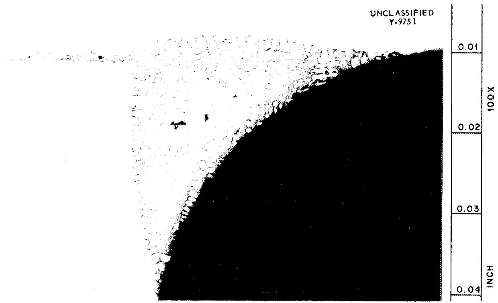  
Fig. 7.3. "Electroless" Ni-P Brazed Type 316 Stainless Steel T Joint, As-Brazed. 100X.

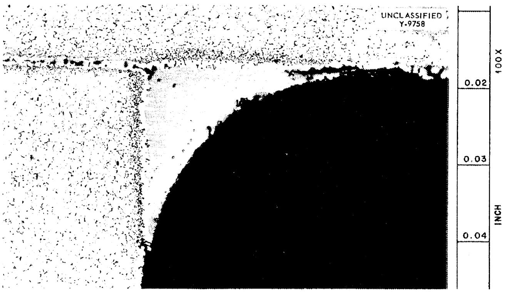  
Fig. 7.4. "Electroless" Ni-P Brazed Type 316 Stainless Steel T Joint, Tested in Air for 500 hr at $800^{\circ}\mathrm{C}$ . 100x.

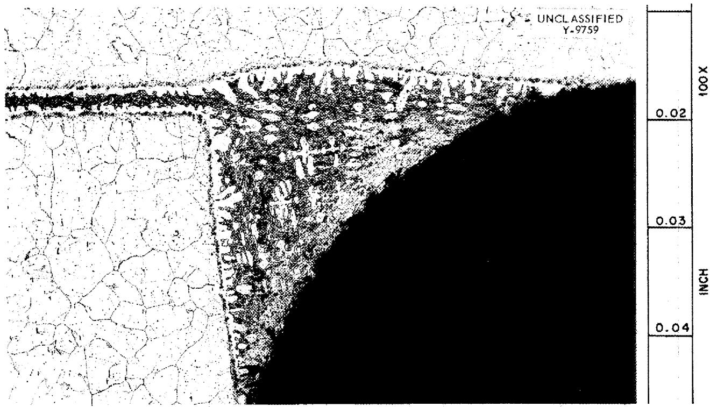  
Fig. 7.5. Chromium-Coated "Electroless" Ni-P Brazed Type 316 Stainless Steel Joint Tested in Air for 500 hr at $800^{\circ}\mathrm{C}$ . 100x.

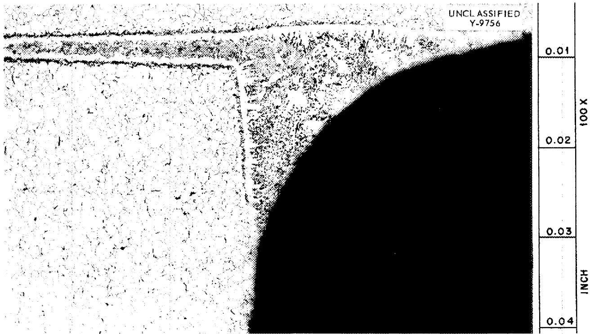  
Fig. 7.6. "Electroless" Ni-P Brazed Type 316 Stainless Steel T Joint Tested in Sodium for 100 hr at $816^{\circ}\mathrm{C}$ . 100x.

Figure 7.7, which shows a chromium-plated nickel-phosphorus brazed joint, reveals a few voids in the fillet to a depth of 3 to 4 mils. It may be concluded, then, that the nickel-phosphorus braze does not have satisfactory corrosion resistance to sodium but that the addition of chromium improves the resistance.

The results of the investigation, to date, indicate that the nickel-chromium-phosphorus system shows promise both when applied conventionally and when applied by "electroless" plate methods. Preliminary remelt tests indicate that remelt temperatures of $1250^{\circ}\mathrm{C}$ can be achieved by treatment at $1000^{\circ}\mathrm{C}$ for times as short at 10 min because of the relatively high diffusivity of phosphorus. The

physical tests conducted to date have been inconclusive, but there is evidence that ductility can be improved by control of brazing temperature and time.

Brazing of Radiator Assemblies with Microbraz. As has been indicated in previous reports, efforts to apply Microbraz as an elevated-temperature brazing alloy for fabrication of ANP sodium-to-air heat exchangers have been complicated by a number of factors. The results of numerous experiments conducted on laboratory-scale test specimens and on full-size heat exchanger assemblies have shown that the rate of heating to the brazing temperature is of great importance. Although early experiments indicated that difficulties in brazing did not arise from

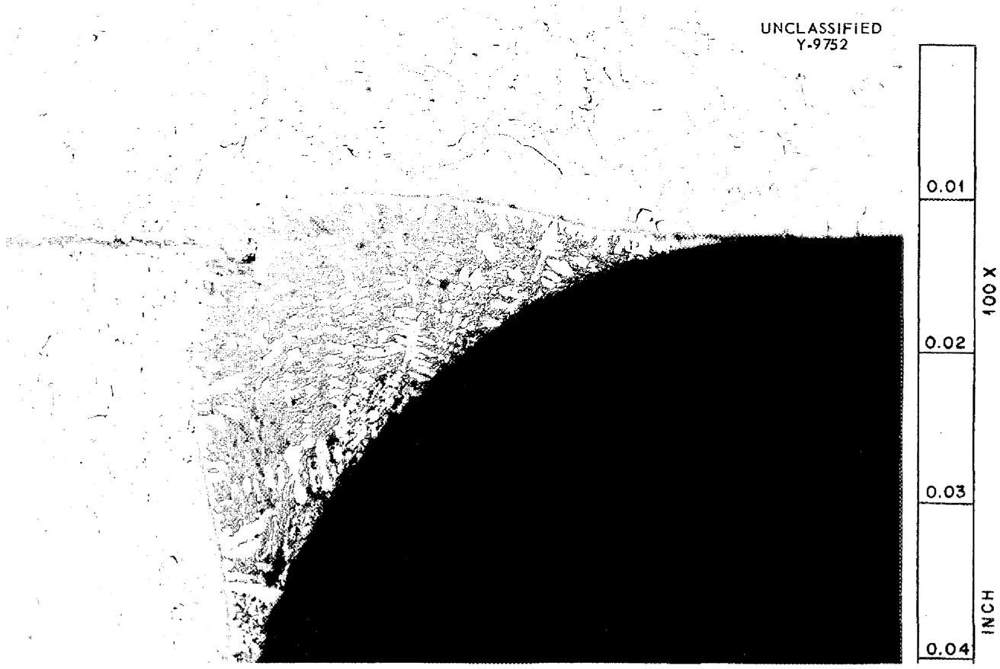  
Fig. 7.7. Chromium-Coated "Electroless" Ni-P Brazed Type 316 Stainless Steel Joint Tested in Sodium for 100 hr at $816^{\circ}\mathrm{C}$ . 100X.

diffusion of constituents from the brazing alloy during heating, which would have resulted in a loss in flowability at the brazing temperature, later tests gave contrary indications. In tests with Microbraz in the form of flat washers prepared by stamping from sheet rolled or extruded from powder mixtures, it was found that during slow heating sufficient boron diffused from the brazing material to appreciably increase the melting point of the brazing alloy and thereby prevent the flow needed to produce a satisfactory joint.

A remedy for the brazing difficulties seemed to be fast heating to the brazing temperature to minimize diffusion and the subsequent lack of flow. (The other possible alternative, that of increasing the brazing temperature, was found to be ineffective because dilution and undercutting also increased materially with temperature.) Rapid heating to the brazing temperature was found to introduce associated problems. As would be expected, unequal heating occurred, and the thin fin material reached the furnace temperature before the tubes did. In addition to an increase in distortion, the unequal heating resulted in "stealing" of preplaced brazing alloy. That is, the alloy would flow on the fin surface and would, consequently, be unavailable for adequate wetting of the tube wall when the temperature equalized. Since the remedy for this alternate effect would be a preheat and since preheating would permit diffusion, there appeared to be no remedy for the situation unless diffusion could be decreased. This was accomplished by the use of especially extruded Microbraz rings. Experiments revealed that rings formed of 60-mil wire and preplaced were relatively unaffected by the rate of rise to temperature because of the relatively small contact area afforded for diffusion. The production of a large

quantity of these rings was therefore initiated on a laboratory scale for future experiments and for possible use in a test heat exchanger.

Brazing of Radiator Assemblies with G-E Alloy No. 62. Brazing evaluation tests were also conducted with the G-E brazing alloy No. 62 (69% Ni-20% Cr-11% Si). Each experiment revealed that this alloy was relatively free of the complicating factors that influence the behavior of Microbraz. The dilution, diffusion, and heating-rate studies indicated that the boron-free G-E alloy could be preplaced in any convenient form and that preheat could be applied without impeding subsequent flow. Seven pounds of this alloy, as -200 mesh powder, was obtained and is being used to study its suitability for brazing heat exchangers.

A 1000-joint tube-to-fin radiator was fabricated with the G-E alloy preplaced, as a slurry, and subjected to the following brazing cycle: (1) heat to $900^{\circ}\mathrm{C}$ at an average of $50^{\circ}\mathrm{C}$ per minute; (2) hold at $900^{\circ}\mathrm{C}$ for 30 min to equalize fin and tube temperatures; (3) heat to $1150^{\circ}\mathrm{C}$ at an average rate of $30^{\circ}\mathrm{C}$ per minute; (4) hold at $1150^{\circ}\mathrm{C}$ for 60 min, furnace cool to black, and air cool to room temperature.

Examination of this test radiator indicated that adequate flow and wetting had occurred. After repeated temperature cycling, including a severe water quench from $1000^{\circ}\mathrm{C}$ , the radiator was found to have only one small leak, and that was subsequently repaired by re brazing.

# HIGH CONDUCTIVITY METALS FOR RADIATOR FINS

E. S. Bomar

R. W. Johnson

J. H. Coobs

H. Inouye

Metallurgy Division

As indicated in the previous report, (1) a high-conductivity radiator

fin, with oxidation resistance at $1500^{\circ}\mathrm{F}$ , is expected to be realized by merely protecting a 10-mil copper fin by cladding it with one of several metals including, among others, chromium, Inconel, and stainless steel. Good bonds have been obtained with Inconel and various stainless steels as claddings, but only the types 310 and 446 stainless steel claddings also give the desired oxidation protection without serious intradiffusion.

Vapor Plated Chromium and Nickel on Copper. Several samples of copper plated by the thermal decomposition of the carbonyls of chromium and nickel were supplied by the Commonwealth Engineering Company of Ohio. The plates deposited were both codeposited and deposited as separate layers of chromium on nickel on copper. Bright smooth deposits were limited to small areas, which were brittle and failed to protect copper from oxidizing at $1500^{\circ}\mathrm{F}$ . The plate thicknesses were between 0.2 and 1.6 mils. No further work on these materials is contemplated.

Chromium-Plated Copper. Samples of "ductile" chromium have been received from the Ductile Chrome Process Company. Cracking of the plate is not evident except by metallographic examination and oxidation tests. Alteration of the copper core does not seem to occur as a result of diffusion.

Inconel-Clad Copper. Several square feet of clad material has been requested from commercial manufacturers for assembling experimental heat exchangers and for evaluation studies. Thus far, about 9 ft² of clad copper (10 mils of copper clad on both sides with 2 mils of Inconel) has been received.

Cladding thicknesses varied between 0.75 and 3 mils, and there were numerous pinholes. Oxidation tests for 100 and 500 hr at $1500^{\circ}\mathrm{C}$ resulted in the eruption of numerous copper oxide nodules. Metallographic examination showed the formation of voids

in the copper core near the interface and diffusion that affected a zone of about 3 mils at the end of 100 hours. In 500 hr, the voids became fewer and larger, and they were distributed throughout the copper core. Diffusion seemed to extend across the entire cross section of the sample (14 mils). By suitable rolling and annealing, cladding variations can be minimized to about $\pm 0.5$ mil and the pinholes can be reduced to an inconsequential number.

Type 310 Stainless Steel-Clad Copper. The results obtained in previous tests of type 310 stainless steel-clad copper have been checked by running additional experiments. As was found in the first series of tests, diffusion appears to be limited to the formation of islands of a dark phase in the cladding to a depth of 0.5 mil. An increase in the testing time from 100 to 500 hr at $1500^{\circ}\mathrm{F}$ increased the number of these islands but not the depth of penetration. Surface failures were limited to a few copper oxide nodules.

Type 446 Stainless Steel-Clad Copper. Type 446 stainless steel was roll clad onto copper by reducing $50\%$ at $1000^{\circ}\mathrm{C}$ in several passes; no bonding was obtained. Good bonds were obtained by melting the copper into a type 446 stainless steel capsule under hydrogen. The clad composite was cold rolled with intermittent anneals to 8 mils, of which 4 mils was copper and 2 mils on each side was cladding.

Oxidation tests for 100- and 500-hr periods resulted in the formation of a few nodules of copper oxide on the surface and severe warpage of the test pieces. Examination of the interfaces showed no apparent diffusion. In 500 hr, a dark precipitate, which is not continuous, forms at the interface to a depth of about 0.1 mil.

Copper Clad with Copper-Aluminum Alloy. Ingots of $6 \%$ Al- $94 \%$ Cu and $8 \%$ Al- $92 \%$ Cu have been made and rolled

into a sheet. Attempts to roll clad the alloys onto copper resulted in bonding on only one side. This may have been due to the formation of $\mathrm{Al}_{2}\mathrm{O}_{3}$ during the welding.

# MECHANICAL PROPERTIES OF INCONEL

R.B.Oliver K.W.Reber

D. A. Douglas J. M. Woods

C. W. Weaver Metallurgy Division

Creep and Stress-Rupture Tests. A compilation of creep and stress-rupture data for both coarse- and fine-grained Inconel tested in NaF-ZrF $_4$ -UF $_4$ (46-50-4 mole %) at 815°C has been completed for the range of stresses from 2500 to 7500 psi. Additional specimens have been in test for 1000 hr at stresses of 1500 and 2000 psi. Data for fine-grained Inconel tested

in argon at $815^{\circ}C$ are complete for the stress range of 3500 to 7500 psi; other specimens have been in test at 1250 psi for about 1000 hours. Figure 7.8 summarizes the data on the Inconel heat that is currently being tested. This new heat of Inconel sheet exhibits roughly twice the rupture life observed for the original heat tested in this program. The improved properties are thought to result from the larger amounts of the minor alloying elements present in this heat as compared with an earlier one.

A series of tests with fine-grained Inconel specimens have been started at $704^{\circ}\mathrm{C}$ (1300°F) and at $899^{\circ}\mathrm{C}$ (1650°F). Tests are being run both in argon and in fuel.

Tube-Burst Tests. A series of Inconel tube-burst tests at $815^{\circ}\mathrm{C}$ , with


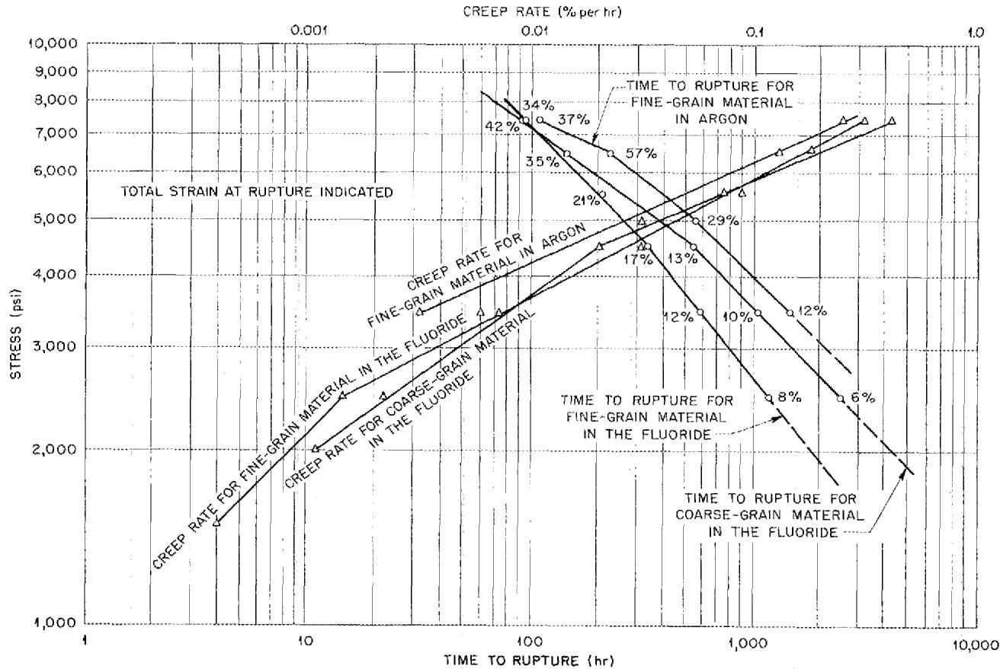  
Fig. 7.8. Creep and Stress-Rupture Data for 65-mil Inconel Sheet Tested in Argon and NaF-ZrF $_4$ -UF $_4$ at $1500^{\circ}$ F.

argon on both sides of the tube, has been completed in the range of tangential stresses from 2000 to 4500 psi; the results are not consistent enough to allow interpretation. Another series of tests with fuel in the tube and argon on the outside is in progress; the rupture life appears to be roughly half that observed when the surfaces are exposed to argon only.

From the tests to date, it was observed that not only is the rupture life longest in air, but, also, the greatest elongations are observed when oxygen is present either in the gaseous atmosphere or as an oxide film. The shortest rupture life and the least ductility are observed for tests in hydrogen, while intermediate values are found for tests in other environments. It was also observed that the total elongation at rupture for specimens tested in the fuel is more regular and reproducible than that for tests in the other environments.

# FABRICATION OF PUMP SEALS

As discussed in Section 2, "Experimental Reactor Engineering," a number of packed seal pumps have been operated with fluoride mixtures at $1300^{\circ}\mathrm{F}$ . Although operation with these seals has been encouraging, the leakage rates are higher than desired. Accordingly, a number of unique packed-seal materials have been fabricated, including vitreous seals and hot-pressed compacts with self-lubricating properties.

Hot-Pressed Pump Seals (E. S. Bomar, J. H. Coobs, H. Inouye, Metal-lurgy Division). Four additional cylinders of the $92\%$ Cu- $8\%$ $\mathrm{MoS}_2$ composition were fabricated for testing as pump seals. These cylinders were 3 3/8 in. OD by 2 1/8 in. ID by 2 in. long, and a sufficient number of rings could be machined from them to obtain a packing gland to seal a 2 1/2 in. -dia pump shaft. The density of the cylinders averaged $96.0\%$ of theoretical.

In addition, it was decided that the stainless steel- $\mathsf{MoS}_2$ composition should be tested because the $\mathsf{Cu - MoS}_2$ composition may not be sufficiently resistant to chemical attack for this application. As mentioned before, the components of the stainless steel- $\mathsf{MoS}_2$ compacts react to some extent during the hot-pressing cycle; there is subsequent conversion of much of the austenite to ferrite, and a sulfide phase of unknown composition remains.

Two cylinders, 1 11/16 in. OD by 1 3/16 in. ID by 2 in. long, were prepared by using -325 mesh type 304 stainless steel with $9\% \mathrm{MoS}_2$ . These were fabricated by hot pressing in a graphite die at $1225^{\circ}\mathrm{C}$ . The density of the cylinders averaged $93.5\%$ of theoretical. It is interesting to note that, under identical conditions of temperature and pressure, straight stainless steel powder is consolidated to only $87\%$ of theoretical density.

Vitreous Seals (L. M. Doney, J. A. Griffin, J. R. Johnson, Metallurgy Division). A limited experiment with a $\mathrm{NaBeF}_3$ mixture in a pump sealing gland $^{(2)}$ indicated that such viscous fluorides might be developed for seal materials. In the initial tests, a number of metal washers served to isolate rings of the fluoride. The ring voids were filled with the powdered fluoride mix. As a consequence of the encouraging results from the use of this fluoride, a program was initiated to develop more suitable high-temperature viscous seal materials. The need is for a glassy substance with appropriate viscosities over the temperature range involved and also stability against devitrification. To provide a freely flowing viscous seal, it is believed that a viscosity gradient of $10^{2}$ poises in the hot end to $10^{15}$ poises or higher in the cold end should be established. Softening of

the whole seal should be carried out first so that wetting will take place on the shaft, housing, and metal spacers. Devitrification, or crystallization in the glass, will lead to a fluid containing relatively hard crystals which will act as an abrasive on the metal parts.

Beryllium fluoride is a glass former that produces a structural network of randomly oriented $\mathrm{BeF}_4$ ion tetrahedra that is analogous to the silica-glass network. Alkali and alkaline earth ions serve the same functions in the fluoride network as they do in the oxide systems. Very few data are available on the physical properties of the fluoride glasses; however, on the basis of similarity to oxide glasses, it is possible to predict their general behavior. Thus, for a glass with little tendency to devitrify and with reasonable stability against atmospheric attack, $\mathrm{Mg}^{+ + }$ or $\mathrm{Ca}^{+ + }$ and $\mathrm{Al}^{+ + }$ ions should be included. A glass which softens to a viscosity of the order of $10^{8}$ poises at $250^{\circ}\mathrm{C}$ is desirable. The addition of alkali ions such as $\mathrm{Na}^{+}$ or $\mathbf{K}^{+}$ will produce the desired viscosity. The glass composition proposed is the following:

<table><tr><td>COMPOSITION (wt %)</td><td>MATERIAL</td></tr><tr><td>50</td><td>BeF2</td></tr><tr><td>25</td><td>KF</td></tr><tr><td>16</td><td>MgF2</td></tr><tr><td>9</td><td>AlF3</td></tr></table>

This glass was found to melt satisfactorily, and it did not devitrify in the handling operations. The glass was melted in platinum at about $900^{\circ}\mathrm{C}$ and cast into a graphite die to form the desired ring shape. It was not possible to cool the rings in air without cracking. By slow cooling in a blanket of glass wool, most cracking was avoided, and it can be

eliminated entirely by furnace cooling and annealing.

# TUBULAR FUEL ELEMENTS

E. S. Bomar J. H. Coobs H. Inouye Metallurgy Division

Preparation of tubular fuel elements by drawing has been initiated. Twelve tubes containing cores of type 302 stainless steel, iron, and nickel with 20 and $30\% \mathrm{UO}_2$ are being reduced a total of $87\%$ from 0.750 in. in diameter with a 0.042-in. wall to 0.250 in. in diameter with a 0.015-in. wall. Reduction by plug drawing is being tried in preference to drawing on a mandrel because the latter process applies a shear stress to the core. The shear stress may have contributed to the failure during earlier experiments (3) of the core material in many of the tubes drawn at the Superior Tube Company. The plans call for the reduction of six tubes on each of two schedules in steps of 15 and $20\%$ reduction per pass, respectively.

The results obtained to date with the $15\%$ schedule have been quite encouraging. Six tubes have been processed through three steps of the schedule without difficulty. All six tubes have excellent inside and outside finishes, and they show no signs of "ripling" or folding in the core region. However, the tubes being processed by the $20\%$ schedule have given discouraging results. Three tubes have been processed for two steps, and all three failed in tension during drawing, one on the first pass and two on the second. In addition, slight rippling was evident at the leading end of the core, and, in some cases, drawing was accompanied by chattering in the die. Evidently, this schedule is fairly severe for

reduction of laminated tubes by plug drawing. However, it is planned to continue drawing the remaining tubes until complete failure or until the drawing is finished.

# INFLAMMABILITY OF SODIUM ALLOYS

G.P. Smith M.E. Steidlitz Metallurgy Division

The new apparatus for examining the combustion of sodium and some of its alloys in various atmospheres has been completed. The equipment consists of a steel box connected to a vacuum pump, a filter system, and a source of dry air. The sodium capsule is heated to a temperature of 700 to $800^{\circ}\mathrm{C}$ in a furnace located on top of the box. The tip of the capsule is then broken off to cause a jet of molten metal to spray into the atmosphere in the box. Observations of the flammability are made visually.

A total of six runs has been made with pure sodium at $800^{\circ}\mathrm{C}$ in the new apparatus. Of these, two were in dry air and four were in room air, all at a pressure of 1 atmosphere. The only observable difference in these tests was the formation of a heavier scum on

the surface of the molten sodium on the floor of the box after burning in room air. This scum was effective in confining the combustion on the floor to a section at the edge of the puddle. The dry air samples burned vigorously all over the puddle.

A series of tests on sodium-mercury mixtures has been run at $700^{\circ}\mathrm{C}$ . Capsules containing 50, 60, 62, 64, 66, 68, 70, and 90 mole % mercury were burned in room air. The results were as follows: with 50 mole % mercury, the combustion of the jet is essentially as vigorous as with pure sodium. With 60 mole % mercury, the combustion is noticeably less vigorous. With 60 to 70 mole % mercury, the rate of combustion decreases rapidly until with 70 mole % and greater, no fire is observed in the jet, although a small amount of white smoke is formed.

It is possible that the compound $\mathrm{NaHg}_2$ , which occurs with 66.7 mole % mercury, is important in this rather sudden change in combustibility with composition. $\mathrm{NaHg}_2$ is the most stable of the sodium-mercury compounds. It has a melting point of $360^{\circ}\mathrm{C}$ and a heat of formation of about 18.3 kcal/mole.

# 8. HEAT TRANSFER AND PHYSICAL PROPERTIES

H. F. Poppendiek  
Reactor Experimental Engineering Division

The heat capacity of the LiCl-KCl eutectic has been measured; in the solid state it was found to be 0.23 cal/g $^{\circ}$ C, and in the liquid state, over the temperature range 351 to $840^{\circ}$ C, it was found to be 0.32 cal/g $^{\circ}$ C. The heat of fusion for this material was approximately 64 cal/g. The heat capacity of NaF-KF-LiF (11.5-42-46.5 mole %) was determined to be 0.41 cal/g $^{\circ}$ C in the solid state and 0.45 cal/g $^{\circ}$ C in the liquid state over the temperature range 475 to $875^{\circ}$ C. The heat of fusion for this material was about 93 cal/g.

Preliminary viscosity measurements have been obtained for two compositions in the NaF-ZrF $_4$ -UF $_4$ system, that is, 53-43-4 mole % and 53.5-40-6.5 mole %. These data were found to be very similar to those previously obtained for the 50-46-4 mole % mixture; for example, the viscosity of the 6.5 mole % UF $_4$ composition varied from about 16 cp at 580°C to 5.7 cp at 950°C. A preliminary study of NaF-KF-UF $_4$ (46.5-26-27.5 mole %) indicated that the viscosity varied from about 30 cp at 600°C to about 12 cp at 800°C.

The density of NaF-ZrF4-UF4 (53.5-40.0-6.5 mole %) has been determined over the temperature range 600 to $800^{\circ}\mathrm{C}$ . The densities of the pump seal materials $\mathrm{BeF}_2$ , $\mathrm{NaBeF}_3$ , and $\mathrm{NaZrF}_5$ have been obtained over the temperature range -30 to $130^{\circ}\mathrm{C}$ . The density of NaF-ZrF4-UF4 (50-46-4 mole %) at room temperature was also determined.

The thermal conductance of an insulated safety-rod sleeve and the thermal conductivity of the diatomaceous earth insulation were measured; the conductance was found to be 2.6 Btu/hr·ft·°F, and the thermal con

ductivity of the insulation with a density of 29 lb/ft³ was 0.057 Btu/hr·ft·°F.

Measurements of the vapor pressures of three compositions in the NaF-ZrF4 binary system have been completed. While the vapor pressure rises quite steeply with the ZrF4 concentration, the previously reported values were considerably high. A summary of the vapor pressures of several ZrF4-bearing fused salts is presented.

The analysis of all the heat transfer data on NaF-KF-LiF eutectic in Inconel has been completed. The results are in agreement with the preliminary information previously reported, namely, that heat transfer data fall $50\%$ lower than would be expected for the specific system being studied. This condition resulted because of the presence of a thin insoluble film composed mostly of $\mathrm{K_3CrF_6}$ at the inner tube wall.

A series of wall to mixed-mean- fluid temperature differences have been measured in a forced-flow volumeheat-source experiment over a range of Reynolds and Prandtl moduli and a range of volume heat sources of from 0.13 to $0.42\mathrm{kw / cm}^3$ . The experimental temperature differences obtained were found to fall within $\pm 30\%$ of the theoretical values.

# ENTHALPY AND HEAT CAPACITY OF HALIDES

W. D. Powers G. C. Blalock Reactor Experimental Engineering Division

The enthalpy and heat capacity of the LiCl-KCl eutectic (59 mole % LiCl) have been investigated with the Bunsen

ice calorimeter with the following results: (1)

$$
H _ {T} (\text {s o l i d}) - H _ {\theta^ {\circ} C} (\text {s o l i d}) = - 4 + 0. 2 3 (6) T,
$$

$$
C _ {p} = 0. 2 3 (6) \pm 0. 0 3,
$$

for 97 to $351^{\circ}\mathrm{C}$

$$
H _ {T} (\text {l i q u i d}) - H _ {0 ^ {\circ} C} (\text {s o l i d}) = 3 0 + 0. 3 2 (5) T,
$$

$$
C _ {p} = 0. 3 2 (5) \pm 0. 0 2,
$$

for 351 to $840^{\circ}\mathrm{C}$

where $H$ is the enthalpy in cal/g, $C_p$ is the heat capacity in cal/g $^{\circ}$ C, $T$ is the temperature in ${}^{\circ}\mathrm{C}$ . The LiCl-KCl

(1)W. D. Powers and G. C. Blalock, Enthalpy and Heat Capacity of Lithium Chloride, Potassium Chloride Eutectic, ORNL CF-53-8-30 (Aug. 5, 1953).

enthalpy data are shown in Fig. 8.l. The heat of fusion for this material is about 64 cal/g.

The enthalpy and the heat capacity of NaF-KF-LiF (11.5-42.0-46.5 mole %) are(2)

$$
H _ {T} (\text {s o l i d}) \dots H _ {\theta^ {\circ} C} (\text {s o l i d}) = 0. 4 1 T - 4 4,
$$

$$
C _ {p} = 0. 4 1 \pm 0. 0 5,
$$

for 300 to $455^{\circ}\mathrm{C}$

$$
H _ {T} (\text {l i q u i d}) \sim H _ {0 ^ {\circ} C} (\text {s o l i d}) = 0. 4 5 T + 3 2,
$$

$$
C _ {p} = 0. 4 5 \pm 0. 0 3,
$$

for 475 to $875^{\circ}\mathrm{C}$

(2) W. D. Powers and G. C. Blalock, Heat Capacity of Fuel Composition No. 12, ORNL CF-53-7-200 (July 31, 1953).

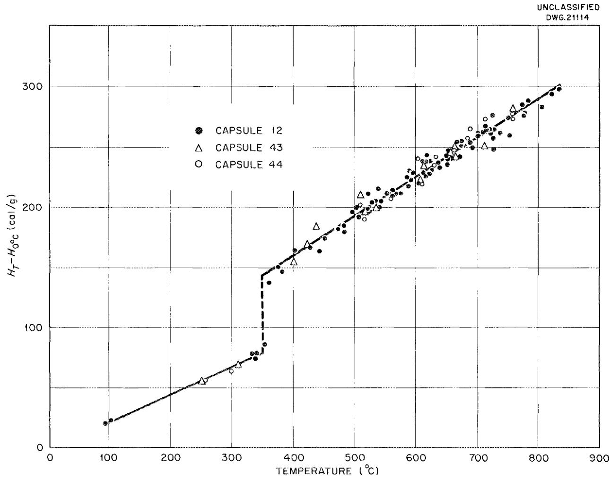  
Fig. 8.1. Temperature-Enthalpy Relationship of the LiCl-KCl Eutectic.

The heat of fusion of this fluoride mixture was found to be about 93 cal/g.

# VISCOSITY OF FLUORIDES

S. I. Cohen T. N. Jones

Reactor Experimental Engineering Division

Preliminary viscosity measurements have been obtained(3) on either the Brookfield or the efflux viscometer,4

(3) S. I. Cohen and T. N. Jones, Preliminary Measurements of the Density and Viscosity of Fluoride Mixture No. 40, ORNL CF-53-7-125 (July 23, 1953).

(4) J. M. Cisar et al., ANP Quar. Prog. Rep. June 10, 1952, ORNL-1294, p. 146.

or on both, for two recently evolved fluoride mixtures, $\mathrm{NaF - ZrF_4 - UF_4}$ (53-43-4 mole %) and $\mathrm{NaF - ZrF_4 - UF_4}$ (53.5-40-6.5 mole %). These data are plotted in Fig. 8.2, together with the viscosity of $\mathrm{NaF - ZrF_4 - UF_4}$ (50-46-4 mole %) for comparison. The viscosities of the three mixtures are quite similar, as would be expected because of their similar chemical compositions. In particular, the viscosity of the 53.5-40-4.6 mole % mixture, the most recent ARE fuel composition, ranged from about 16 cp at $580^{\circ}\mathrm{C}$ to 5.7 cp at $950^{\circ}\mathrm{C}$ .

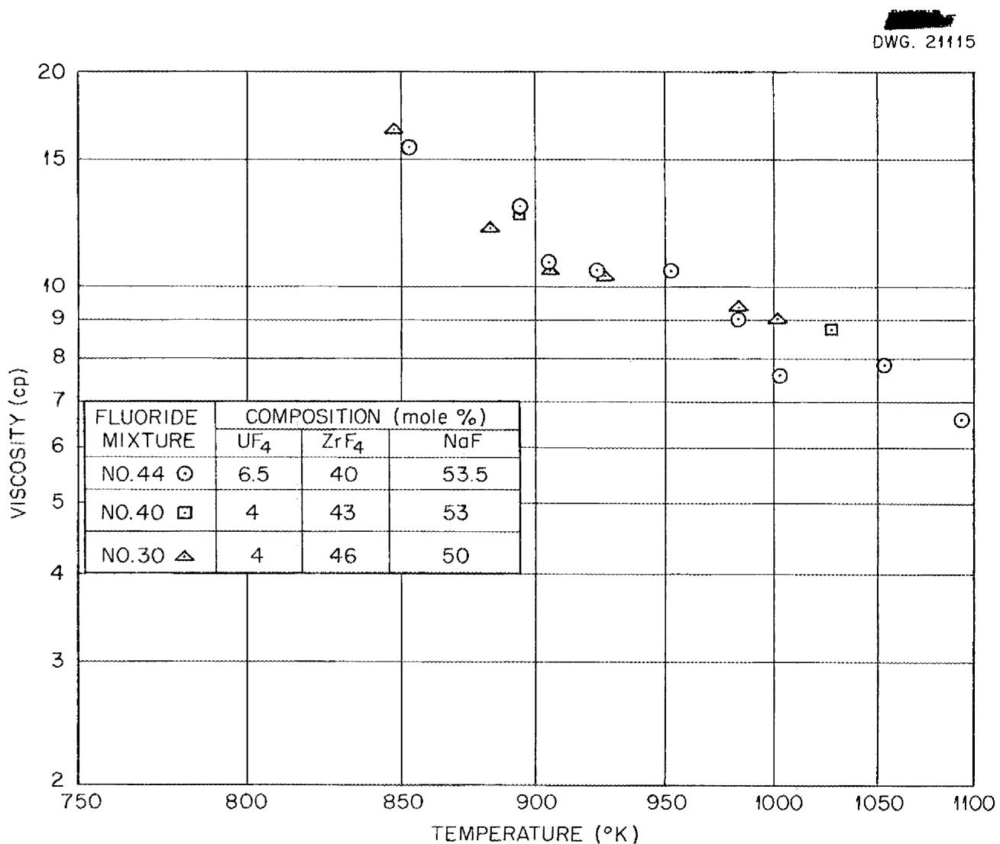  
Fig. 8.2. Viscosity of Several Compositions in the NaF-ZrF $_4$ -UF $_4$ Systems.

Some preliminary measurements of NaF-KF-UF4 (46.5-26.0-27.5 mole %) have also been made. The viscosity ranged from about 30 cp at $600^{\circ}\mathrm{C}$ to about 12 cp at $800^{\circ}\mathrm{C}$ .

# DENSITY OF FLUORIDES

# S. I. Cohen T. N. Jones Reactor Experimental Engineering Division

The density of NaF-ZrF4-UF4 (53.5-40-6.5 mole %) has been determined by the displacement method over the temperature range 600 to $800^{\circ}\mathrm{C}$ , and is best represented by the equation

$$
\rho = 4. 0 6 - 0. 0 0 0 9 7 T,
$$

where $\rho$ is the density in $\mathbf{g} / \mathbf{cm}^3$ and $T$ is the temperature in $^\circ C$ .

Determinations of the solid densities of $\mathrm{BeF}_2$ , $\mathrm{NaReF}_3$ , and $\mathrm{NaZrF}_5$ , all of which have been used in pump seal studies, have been made. (5) Figure 8.3 presents the density-temperature data of $\mathrm{NaBeF}_3$ .

The density of NaF-ZrF $_4$ -UF $_4$ (50-46-4 mole %) at room temperature $(30^{\circ}\mathrm{C})$ was found to be $4.09~\mathrm{g/cm}^3$ .

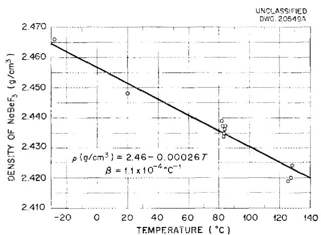  
Fig. 8.3. Density of $\mathbf{NaBeF}_3$ vs. Temperature.

# ELECTRICAL CONDUCTIVITY OF LIQUIDS

N. D. Greene

# Reactor Experimental Engineering Division

An experimental study of the electrical conductivity of molten salts has been initiated. A beryllium oxide conductivity cell has been fabricated and used in some preliminary high-temperature electrical conductivity experiments with molten potassium chloride. Also, the conductivities of concentrated sulfuric acid solutions (60 and $100\%$ by weight) have been determined as a function of temperature. These solutions may be used in volume-heat-source heat transfer experiments.

# THERMAL CONDUCTIVITY

The thermal conductivity of densely packed diatomaceous earth insulation has been determined by measuring the thermal resistance across an annulus containing the material. These measurements indicate a thermal conductivity of 0.057 Btu/hr ft°F when the diatomaceous earth is packed to a density of 29 lb/ft³. In addition, development of both the longitudinal and the flat-plate thermal conductivity devices for accurate, high-temperature measurements has continued.

Diatomaceous Earth (M. W. Rosenthal, J. Lones, Reactor Experimental Engineering Division). An experiment was performed to determine the thermal conductivity of diatomaceous earth insulation contained in the annulus between the concentric walls of a safety-rod sleeve. The diatomaceous earth had been tamped into the sleeve annulus to increase its density to approximately 29 lb/ft³. The sleeve had an inside diameter of 2.38 in., an outside diameter of 3.00 in., and a length of approximately 5 feet. The thermal resistance of the sleeve was determined by heating the inner surface with condensing steam and by removing heat at the outer surface with flowing

water. Determination of the heat flow rate and the temperature difference across the wall permitted calculation of the resistance and, from that, the thermal conductivity of the insulation.

The tube was divided into three chambers by rubber stoppers, and dry steam at atmospheric pressure was supplied to each chamber. Measurements were based on heat flow from the center section; the other two chambers served as guard heaters to eliminate end effects. Various leads into the system and between chambers provided for steam flow, condensate removal, venting of noncondensing gases, and temperature measurements. The tube was centered in a length of standard 3 l/2-in. pipe, and water was passed through the annulus between the pipe and the tube at a velocity of about 1 fps.

The resistances of the steam-side, the water-side, and the metal walls of the tube were negligible compared with the resistance of the insulation. Hence, the temperature difference between the condensing steam and the water was essentially equal to the temperature drop across the insulation. Although the steam temperature was measured to ensure that it was superheated (and hence carrying no water vapor), the condensation temperature corresponding to atmospheric pressure was used as the steam-side temperature.

The conductance of the sleeve per foot of length, $q / L \Delta t$ (where $q$ is heat flow rate, $L$ is length, and $\Delta t$ is temperature difference), was measured at the mean temperature of the insulation, that is, $140^{\circ} \mathrm{F}$ . The values obtained are based on the middle 43 in. of the length of the tube. From the measured conductance (2.6 Btu/hr·ft·°F), the thermal conductivity of the diatomaceous earth insulation was calculated to be 0.057 Btu/hr·ft² ( $^{\circ} \mathrm{F} / \mathrm{ft}$ ).

Some data on the thermal conductivity of diatomaceous earth powder of various densities were found in the

literature(6) and are plotted, together with the value obtained in this investigation, in Fig. 8.4. Note that the measured value of thermal conductivity falls approximately on a curve which was extrapolated from the literature values.

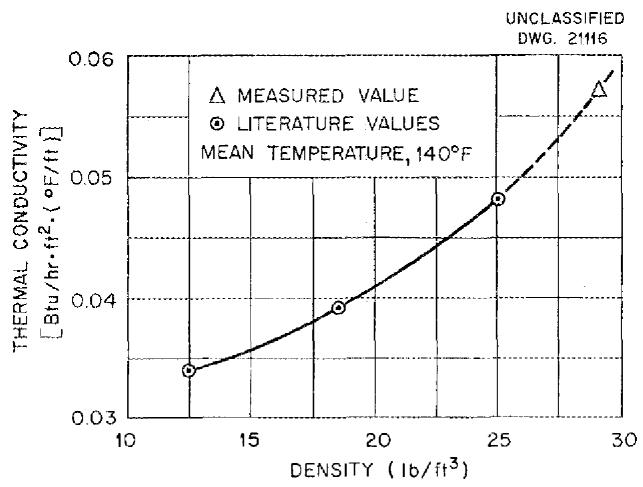  
Fig. 8.4. Thermal Conductivity of Diatomaceous Earth.

Development of Thermal Conductivity Measuring Devices (W. D. Powers, R. M. Burnett, S. J. Claiborne, Reactor Experimental Engineering Division). The flat-plate conductivity measuring devices have been used for checking values previously obtained by use of the variable gap or Deem apparatus. Some difficulty has been experienced in completely filling the cells of the flat-plate conductivity apparatus. An x-ray technique has been devised for detecting void spaces in the conductivity cells.

Additional checks have been made on the longitudinal thermal conductivity apparatus. The reported values for the thermal conductivity of type 316 stainless steel have been checked to within $5\%$ between 150 and $250^{\circ}\mathrm{C}$ . It was found necessary to redesign the guard heaters so that considerably higher temperatures could be obtained.

# VAPOR PRESSURES OF FLUORIDES

R.E.Moore R.E.Traber

Materials Chemistry Division

Measurement of vapor pressure by the method of Rodebush and Dixon(7) was completed for three compositions in the NaF-ZrF4 binary system during this quarter. In addition, measurements were completed on NaF-ZrF4-UF4 (65-15-20 mole %). The preliminary values previously reported(8) appear to be considerably too high.

The vapor pressure values for these compositions are collected in Table 8.1, together with those for $\mathbf{ZrF}_4$ , $\mathbf{UF}_4$ , and the other $\mathbf{ZrF}_4$ -hearing mixtures examined so far. Inspection of the calculated values for vapor pressures at $900^{\circ}\mathrm{C}$ indicates a low

(7) W. H. Rodebush and A. L. Dixon, Phys. Rev. 26, 851 (1925).   
(8) R. E. Moore and R. E. Traber, ANP Quar. Prog. Rep. June 10, 1953, ORNL-1556, p. 89.

activity of $\mathrm{ZrF_4}$ in the melt in all the mixtures. In the binary system NaF-ZrF, the vapor pressure rises quite steeply with increasing $\mathrm{ZrF_4}$ concentration.

# FORCED-CONVECTION HEAT TRANSFER WITH NaF-KF-LiF EUTECTIC

H. W. Hoffman J. Lones

Reactor Experimental Engineering Division

The analysis of the data from the heat transfer experiment in which the NaF-KF-LiF eutectic (11.5-42.0-46.5 mole %) was flowing in an Inconel tube has been completed. The results are presented in terms of the Colburn $j$ -function in Fig. 8.5. These data corroborate the previously reported result(9,10) that heat transfer with

(9) H. W. Hoffman and J. Lones, ANP Quar. Prog. Rep. June 10, 1953, ORNL-1556, p. 90.   
(10) H. W. Hoffman, Preliminary Results on Flinak Heat Transfer, ORNL CF-53-8-106 (Aug. 18, 1953).

TABLE 8.1. VAPOR PRESSURE DATA FOR ${\mathrm{{ZrF}}}_{4}$ -BEARING FUSED SALTS   

<table><tr><td colspan="4">SALT COMPOSITION (mole %)</td><td colspan="2">VAPOR PRESSURE CONSTANTS*</td><td rowspan="2">VAPOR PRESSURE AT 900°C (mm Hg)</td></tr><tr><td>NaF</td><td>KF</td><td>ZrF4</td><td>UF4</td><td>A</td><td>B</td></tr><tr><td></td><td></td><td></td><td>100</td><td>9,171</td><td>7.792</td><td>0.9</td></tr><tr><td></td><td></td><td>100</td><td></td><td>10,936</td><td>12.113</td><td>617</td></tr><tr><td>66.7</td><td></td><td>33.3</td><td></td><td>5,421</td><td>5.057</td><td>2.8</td></tr><tr><td>57</td><td></td><td>43</td><td></td><td>7,289</td><td>7.340</td><td>14</td></tr><tr><td>50</td><td></td><td>50</td><td></td><td>7,213</td><td>7.635</td><td>32</td></tr><tr><td>42.2</td><td></td><td>57.8</td><td></td><td>8,250</td><td>9.000</td><td>93</td></tr><tr><td>65</td><td></td><td>15</td><td>20</td><td>6,944</td><td>5.86</td><td>0.9</td></tr><tr><td>50</td><td></td><td>25</td><td>25</td><td>6,906</td><td>6.844</td><td>9</td></tr><tr><td>53</td><td></td><td>43</td><td>4</td><td>7,105</td><td>7.37</td><td>21</td></tr><tr><td>50</td><td></td><td>46</td><td>4</td><td>7,551</td><td>7.888</td><td>28</td></tr><tr><td>46</td><td></td><td>50</td><td>4</td><td>7,779</td><td>3.281</td><td>46</td></tr><tr><td>5</td><td>51</td><td>42</td><td>2</td><td>6,879</td><td>6.743</td><td>8</td></tr></table>

$$
\cdot \text {F o r e q u a t i o n :} \log P _ {\left(\mathrm {m m H g}\right)} = - \frac {A}{T \left(^ {\circ} \mathrm {K}\right)} + B.
$$

the NaF-KF-LiF eutectic in an Inconel system was $50\%$ lower than that in a nickel system. It was found that this difference in heat transfer was caused by a thin, insoluble film that formed on the inside surface of the Inconel tubes. This film has been identified as $\mathrm{K}_3\mathrm{CrF}_6$ plus some insoluble phases of $\mathrm{Li}_3\mathrm{CrF}_6$ that form when KF- and LiF-bearing fluorides come in contact with the Inconel. A film having a thermal resistance of 0.002 (Btu/hr·ft·°F) $^{-1}$ , for example, a film 1.2-mils thick with a thermal conductivity of 0.5 Btu/hr·ft·°F, could account for the observed disparity.

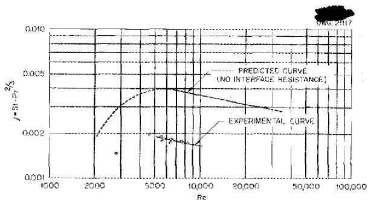  
Fig. 8.5. Heat Transfer with the NaF-KF-LiF Eutectic (11.5-42.0-46.5 mole %) in an Inconel Tube.

The effect on the film formation of electrical current flow through the tube wall was investigated. A piece of Inconel tubing was suspended in a quiescent pot of molten cutectic for 24 hours. On removal of the tube, a film similar to the films previously noted was observed. A piece of nickel tubing tested under the same conditions showed no film.

The experimental system for obtaining fused-salt heat transfer coefficients is now being reassembled. The test section and mixing-pot assembly has been modified to enable easier replacement of the test section. Further attempts will be made to obtain heat transfer coefficients for the NaF-KF-Lif eutectic in turbulent

flow within a nickel tube. Additional small-scale experiments will be undertaken with this eutectic with several other fluorides flowing through Inconel tubing to check the time and temperature characteristics of any films formed. In addition, the thermal conductivity of the films and of pure $\mathbf{K}_3\mathbf{CrF}_6$ will be determined and compared.

# CIRCULATING-FUEL HEAT TRANSFER

H. F. Poppendiek G. M. Winn Reactor Experimental Engineering Division

A series of heat transfer measurements have been obtained from the forced-flow volume-heat-source experiment previously described. This system is shown in Fig. 8.6. The heat generated electrically within the flowing electrolyte in the test section is transferred to an antifreeze coolant in the heat exchanger. Mixed-mean fluid temperatures, tube wall temperatures, fluid flow rates, and external heat losses were measured. The purpose of this experiment was to measure the radial temperature differences for a range of Reynolds and Prandtl moduli and to compare them with the calculations made by using the theory which was previously developed.

Parameters were studied over the following ranges:

$$
5, 8 0 0 <   \mathrm {R e} <   1 4, 0 0 0,
$$

$$
4. 6 <   \Pr <   8. 7,
$$

$$
0. 1 3 <   W <   0. 4 2 \mathrm {k w} / \mathrm {c c},
$$

$$
k = 0. 3 0 \mathrm {B t u} / \mathrm {h r} ^ {\cdot} \mathrm {f t} ^ {2} (\circ \mathrm {F} / \mathrm {f t}),
$$

$$
d = 9 / 3 2 \quad \text {i n}.
$$

A typical set of experimental tube-wall and mixed-mean-fluid temperature

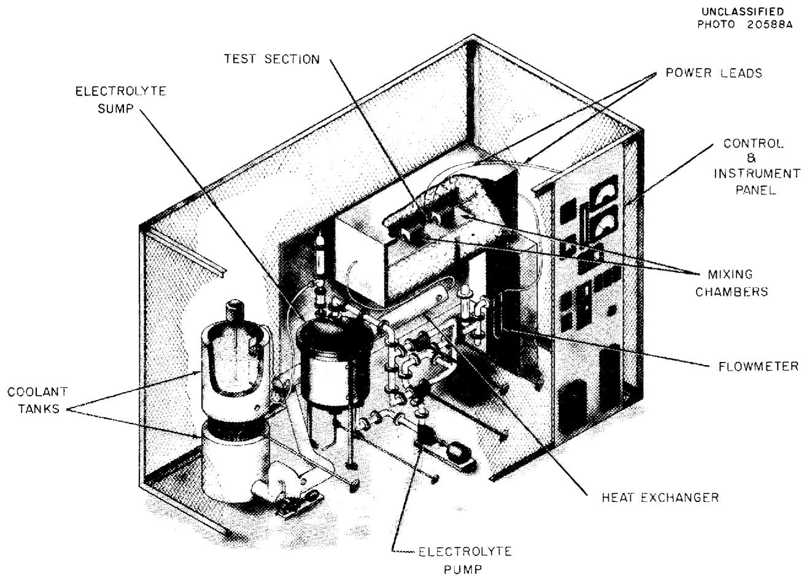  
Fig. 8.6. Experimental Forced-Flow Volume-Heat-Source System.

measurements, together with the conditions of the experiment, is shown in Fig. 8.7. A plot of the theoretical, dimensionless differences between the wall and mixed-mean-fluid temperatures as a function of Reynolds and Prandtl moduli for the case of an insulated pipe wall is shown in Fig. 8.8. Also plotted in Fig. 8.8 are the temperature differences obtained from the experiment described. The experimental temperature data fell within $\pm 30\%$ of the predicted values.

Currently, laminar flow experiments are being conducted. Comparisons between theory and experiment for this type of flow will also be made.

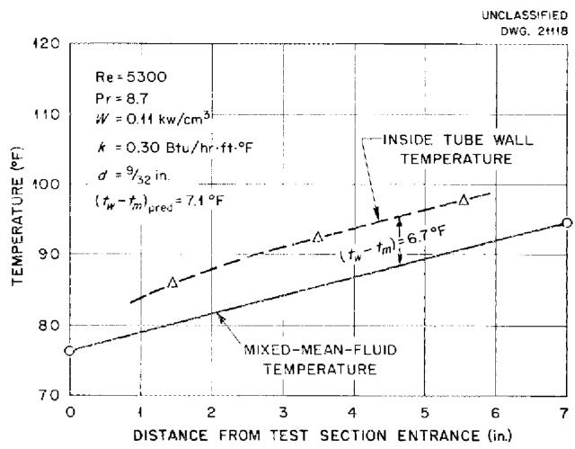  
Fig. 8.7. Experimental Tube-Wall and Mixed-Mean-Fluid Temperatures.

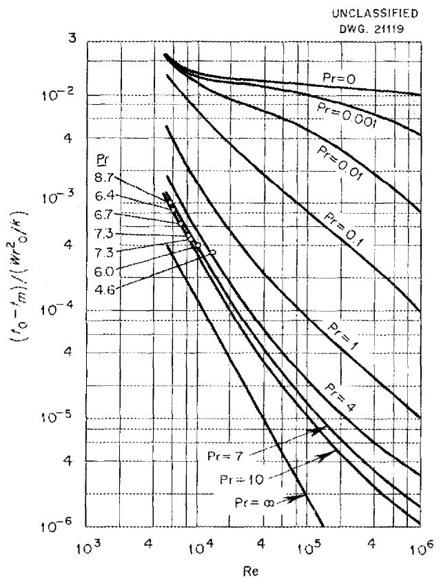  
Fig. 8.8. Theoretical and Experimental Dimensionless Differences Between Wall and Mixed-Mean Temperatures with Pipe Wall Insulated.

# BIFLUID HEAT TRANSFER EXPERIMENTS

D. F. Salmon, ANP Division

The bifluid loop with a concentric tube heat exchanger operated for approximately 500 hours. Heat was transferred from NaF-ZrF $_4$ -UF $_4$ (50-46-4 mole %) in the center tube to NaK in the annulus. All structural material in contact with the fluoride was Inconel, except for several type 316 stainless steel parts in the sump. The center tube was 0.135 in. ID with a 0.025-in. wall and L/D ratio of 587. The fluoride Reynolds numbers ranged from 2000 to 3500. The inlet fluoride temperature was maintained at $1500^{\circ}\mathrm{F}$ , the axial temperature difference was 300 to $350^{\circ}\mathrm{F}$ , and the radial temperature difference was 100 to $125^{\circ}\mathrm{F}$ .

The fluoride heat transfer coefficient was obtained from the overall coefficient by means of a Wilson Plot, which was described in the previous quarterly report(13) for experiments with a larger diameter heat exchanger tube. Figure 8.9 shows the data for the tubes of both heat exchangers compared with data obtained from the Hausen equation. Except for the run at lowest fluoride flows, good agreement is obtained.

Visual inspection of the center tube of the heat exchanger showed a metallic deposit on the wall that was approximately 10 mils thick near the cold end. This deposit was similar in appearance to the iron layer found in the first heat exchanger, but it was not so thick.

The effect of the observed deposit was evident in the gradual reduction of the over-all heat transfer coefficient during the 19 days that the loop operated. The total reduction in the heat transfer coefficient was $16\%$ over this period. It is interesting to note that a 10-mil layer of pure iron inside the center tube would have a thermal resistance only one tenth that of the Inconel wall and would make only a $2\%$ change in the over-all coefficient. This would indicate that the observed deposit had a higher thermal resistance than a 10-mil iron layer.

A metallurgical examination is being made to determine the extent of corrosion and mass transfer. The layer observed in the heat exchanger tube was undoubtedly transferred by the fluoride from the type 316 stainless steel pump to the nickel heat exchanger tube (cf., sec. 6, "Corrosion Research"). An Inconel pump is being fabricated to obtain a monometallic system in which galvanic mass transfer will not be possible.

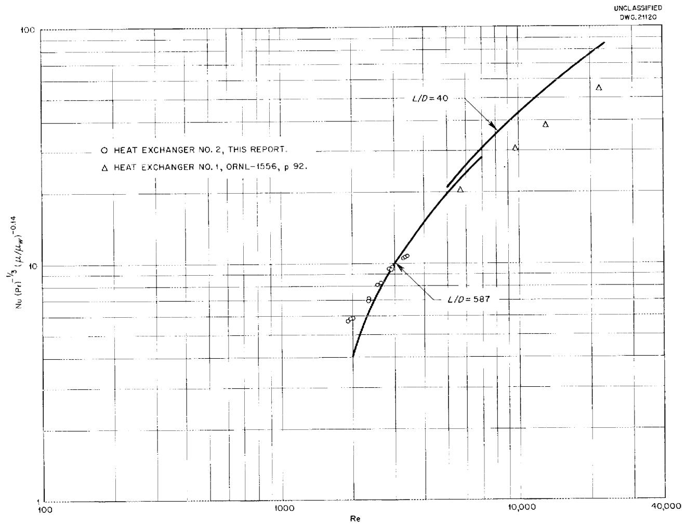  
Fig. 8.9. Comparison of Fluoride Heat Transfer Data with Hausen's Equation.

# 9. RADIATION DAMAGE

J. B. Trice, Solid State Division

A. J. Miller, ANP Division

Additional studies were made on fuel capsules irradiated in the LITR and in the MTR. Improved remote-handling techniques were devised for fuel sampling and weighing, and several innovations were made in the methods of material analyses. No evidence of gross segregation of the uranium in irradiated fuel was evident in this recent work. Examinations of the Inconel capsule walls showed the previously reported tendency toward intergranular corrosion which does not occur in unirradiated static tests, but it cannot be assumed from the evidence obtained to date that this is due to radiation damage per se. Design and construction of in-pile circulating fuel loops are progressing. The in-pile creep experiments performed to date in the LITR show no serious effect of radiation on the creep rate, and construction of the equipment for creep testing in the MTR is nearing completion. Further details of these and other radiation damage studies are reported below, and complete data will be available in the Solid State Division semiannual progress report for the period ending September 10, 1953, ORNI-1606.

# IRRADIATION OF FUSED MATERIALS

G.W. Keilholtz P.R.Klein

J. G. Morgan M. T. Robinson

H. E. Robertson A. Richt

C.C.Webster W.R.Willis

J.C.Pigg M.J.Feldman

Solid State Division

In the past, chemical examination of fuel irradiated in Inconel capsules in the LITR and in the MTR had indicated that the concentration of uranium was not uniform. There is evidence that under the conditions of these early tests some zirconium tetra

fluoride was distilled from the fuel into the free-space portion of the capsule and that the sampling procedure may have been inadequate.

To avoid such uncertainties, a new type of MTR test capsule has been used which has only a small, high-temperature, vapor space above the molten fuel. The sampling facilities have been improved so that the helium atmospheres are more nearly pure and the remote weighing is more accurate. Facilities were also provided for examination of specific core sections of the salt by drilling successively larger sections of the fuel column from the capsule.

Analyses of Irradiated Fuel. Since the new techniques were initiated, five capsules containing $\mathrm{NaF - ZrF_4 - UF_4}$ with various concentrations of $\mathrm{UF_4}$ have been analyzed for segregation data. Four of these capsules were irradiated in the MTR at $1500^{\circ}\mathrm{F}$ , and one was a special control test with a similar thermal history. The samples taken from these capsules were analyzed by two methods: (1) chemical analyses with both potentiometric and polarographic techniques (analyses made by the Analytical Chemistry Division), and (2) mass spectrometry by the isotope dilution technique (analyzed by the Stable Isotope Division). The data from these tests are presented in Table 9.1. In experiments in which several cores were taken from the capsule, those labelled A were from the center of the salt column, those labeled B were the next sample out from the center, etc. The data show some scatter but no evidence of gross segregation of uranium in the irradiated fuels.

TABLE 9.1. ANALYSES OF IRRADIATED FUEL   

<table><tr><td rowspan="2">SAMPLE</td><td rowspan="2">THERMAL FLOW (neutrons/cm2·sec x 10-14)</td><td rowspan="2">POWER DISSIPATION IN FUEL (watts/cm3)</td><td rowspan="2">TIME OF IRRADIATION OR CONTROL TEST (hr)</td><td colspan="2">URANIUM CONTENT (%)</td><td rowspan="2">THEORETICAL URANIUM CONTENT AFTER BURNUP (%)</td><td rowspan="2">ORIGINAL URANIUM CONTENT (%)</td></tr><tr><td>By Mass Spectrometer</td><td>By Chemical Analysis</td></tr><tr><td>75 A</td><td>0.0</td><td>0.00</td><td>510</td><td></td><td>8.46</td><td>8.68</td><td>8.68</td></tr><tr><td>B</td><td>0.0</td><td>0.0</td><td>510</td><td>8.26</td><td>8.85</td><td>8.68</td><td>8.68</td></tr><tr><td>C</td><td>0.0</td><td>0.0</td><td>510</td><td>8.67</td><td>8.69</td><td>8.68</td><td>8.68</td></tr><tr><td>D</td><td>0.0</td><td>0.0</td><td>510</td><td>8.75</td><td>8.86</td><td>8.68</td><td>8.68</td></tr><tr><td>E</td><td>0.0</td><td>0.0</td><td>510</td><td>8.37</td><td>8.71</td><td>8.68</td><td>8.68</td></tr><tr><td>F</td><td>0.0</td><td>0.0</td><td>510</td><td>8.90</td><td>8.68</td><td>8.68</td><td>8.68</td></tr><tr><td>G</td><td>0.0</td><td>0.0</td><td>510</td><td>8.97</td><td>8.42</td><td>8.68</td><td>8.68</td></tr><tr><td>H</td><td>0.0</td><td>0.0</td><td>510</td><td>8.31</td><td>8.70</td><td>8.68</td><td>8.68</td></tr><tr><td>219 A</td><td>2.4</td><td>2300</td><td>330</td><td>6.96</td><td>6.50</td><td>7.55</td><td>8.68</td></tr><tr><td>B</td><td>2.4</td><td>2300</td><td>330</td><td></td><td>7.50</td><td>7.55</td><td>8.68</td></tr><tr><td>C</td><td>2.4</td><td>2300</td><td>330</td><td>7.49</td><td>8.20</td><td>7.55</td><td>8.68</td></tr><tr><td>410</td><td>2.4</td><td>4400</td><td>419</td><td>11.57</td><td>11.20</td><td>11.12</td><td>13.3</td></tr><tr><td>501</td><td>2.4</td><td>9600</td><td>120</td><td>24.28</td><td></td><td>24.7</td><td>26.3</td></tr><tr><td>502</td><td>2.4</td><td>9600</td><td>273</td><td>22.97</td><td></td><td>23.4</td><td>26.3</td></tr></table>

Examination of Irradiated Fuel Containers. The Inconel capsules used in the MTR were unavailable for metallographic examination while the fuel-sampling work was in progress, but several capsules from LITR irradiations at $1500^{\circ}\mathrm{F}$ were examined. The results are shown in Table 9.2.

The method of reporting corrosion in terms of depth of corrosive pen

tration does not lend itself to an accurate evaluation of the amount of corrosion in this particular case. In general, the corrosion in un-irradiated tests has been of a globular or spotty intergranular type, while the corrosion noted on the irradiated samples shows as a continuous network of intergranular attack. Also, it cannot be determined, at this time,

TABLE 9.2. RESULTS OF EXAMINATION OF IRRADIATED FUEL CONTAINERS   

<table><tr><td rowspan="2">IRRADIATION TIME (hr)</td><td colspan="3">PENETRATION OF METAL (mils)</td></tr><tr><td>Salt Region</td><td>Interface</td><td>Vapor Region</td></tr><tr><td colspan="4">LITR Tests (230 watts/cm3)</td></tr><tr><td>53</td><td>0 to 0.5</td><td></td><td>None</td></tr><tr><td>140</td><td>1</td><td>1</td><td>1</td></tr><tr><td>270</td><td>1</td><td>0.5</td><td>None</td></tr><tr><td>565</td><td>2 to 3</td><td>1 to 2</td><td>1</td></tr><tr><td>685</td><td>3 to 4</td><td>3 to 4</td><td>1 to 2</td></tr><tr><td>810</td><td>1</td><td></td><td>1</td></tr><tr><td colspan="4">Control Tests (0 watts/cm3)</td></tr><tr><td>100</td><td>None</td><td>None</td><td></td></tr><tr><td>300</td><td>1 to 2</td><td>1</td><td></td></tr><tr><td>520</td><td>1</td><td>1</td><td></td></tr><tr><td>700</td><td>1</td><td></td><td></td></tr></table>

whether the signs of increased corrosion in the irradiated specimens are due to radiation damage per se or to some extraneous effect, such as temperature control of the convection currents in the in-pile fuel capsule.

# IN-PILE CIRCULATING LOOPS

O. Sisman M. T. Morgan

W. E. Brundage A. S. Olson

Solid State Division

For the past several months, a considerable amount of design and construction work has been done on an in-pile loop for circulating fluoride fuel. It is planned to operate the loop, initially, in the LITR to demonstrate a properly functioning system and to obtain test data at low flux; then, the final experiments will be performed in the MTR.

The design of the loop is such that less than 1 ft of 1/4-in.-ID Inconel tubing is in the highest flux portion of the beam hole. The pumping rate is on the order of 10 fps so that turbulent flow is achieved, but, as a result, $\Delta T$ is small. As it leaves the high-flux region, the fluid will pass through a large-capacity heat exchanger, which can lower the temperature several hundred degrees Fahrenheit, and through the pump and an electrical heating system, which can bring the fuel to almost $1500^{\circ}\mathrm{F}$ before it is returned to the high-flux region. Originally, a small in-pile packed-sealed centrifugal pump was to be used in these experiments, but it now appears that the only pump which can be made available in the near future is a gas-sealed centrifugal pump which must be positioned outside the reactor shield. This arrangement requires a large volume of fuel with a correspondingly high dilution factor, a large amount of external shielding, and the handling of a 15-ft radioactive section of the loop.

# SODIUM-BERYLLIUM OXIDE STABILITY TEST

F. M. Blacksher C. Ellis

W. E. Brundage M. T. Morgan

R. M. Carroll W. W. Parkinson

O. Sisman

Solid State Division

The beryllium oxide moderator in the ARE will be exposed to confined or slowly flowing sodium. To determine the stability of the beryllium oxide with respect to the sodium coolant in the radiation field of the reactor, an experiment under static conditions has been carried out in the LITR.

Beryllium oxide specimen blocks 1/4 by 3/16 by 1 in. were cut from various regions of the moderator blocks for the ARE to give samples of representative densities. These specimens were heated to $825^{\circ}\mathrm{C}$ in a vacuum furnace until the weights were constant. Each specimen was then placed in a stainless steel capsule, 2 1/4 by 9/16 in., and a retaining spring was welded in the capsule to hold the beryllium oxide beneath the surface of the sodium. About $2\mathrm{cm}^3$ of sodium was charged into the capsule in a helium-filled dry box and the capsule was welded closed.

Eight filled capsules were sealed in a can fitted with heaters, thermocouple leads, and inert-gas tubes, as shown in Fig. 9.1. The capsule assembly was attached to a plug which was inserted in the water-cooled reactor hole liner and placed in hole HB-2 of the LITR. The irradiation was carried out for 328 hr at $1500^{\circ}\mathrm{F}$ , 45 hr at $1300^{\circ}\mathrm{F}$ , and 110 hr at $750^{\circ}\mathrm{F}$ . Because of difficulties with the thermocouples, the temperature values are only approximate. The same heat-treating schedule was duplicated on eight unirradiated capsules prepared in the same manner as those which were irradiated.

The capsules were opened (the irradiated ones in a hot cell), the

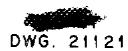

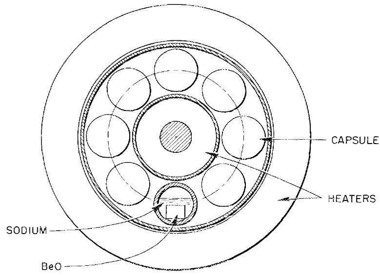  
SECTION B--B

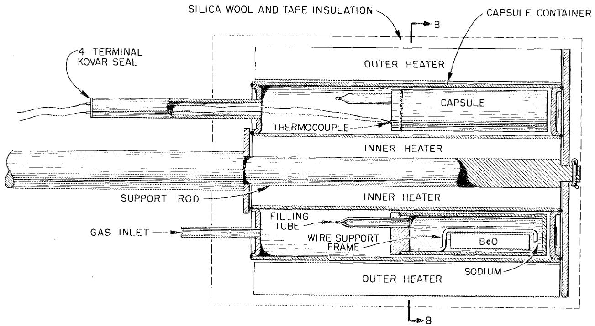  
Fig. 9.1. Capsules for Na-BeO Irradiation Stability Test.

beryllium oxide specimens were removed, and the sodium charges were dissolved in ethanol or ethanol-water mixtures. The empty capsules were leached in $15\%$ NaOH for 48 to 72 hr to dissolve the beryllium oxide on the walls. The solutions, both leach and sodium for each capsule, were analyzed for beryllium by the Analytical Chemistry Division.

The beryllium oxide specimens were protected from the atmosphere, during and after removal from the capsules, by immersion under oil. The sodium and oil were removed from the specimens by heating them to 800 to $825^{\circ}\mathrm{C}$ for about 1 hr under vacuum - a cleaning treatment similar to that used prior to insertion of the specimens in the capsules.

The specimens were weighed, and, with one exception, they were found to have slightly $(0.2\%)$ gained in weight. To remove any possible sodium or $\mathrm{Na}_2\mathrm{O}$ which might not have been removed by the vacuum heating, the specimens were soaked in water for seven to ten days, heated in vacuum again, and reweighed. An average weight loss of $0.0005\mathrm{g}$ was found for both the irradiated and the unirradiated specimens, without differentiation, and all weights were within $\pm 0.002\mathrm{g}$ $(0.1\%)$ of the original weight.

The results of the chemical analyses confirm the absence of corrosion. In all the solutions, both those of the sodium and of the capsule leachings, the beryllium content was below the limit of sensitivity of the analytical method, 0.0001 g total beryllium per sample, or less than 50 ppm in the sodium bath.

Visual inspection of the beryllium oxide specimens showed no change between the irradiated and unirradiated material and neither seemed to have suffered by the heat treatment. The surfaces of all the specimens remained smooth, and the corners were sharp. No evidence of cracks or pits could be

found. The accumulated exposure was about $2 \times 10^{19}$ nvt thermal and greater than $10^{18}$ fast flux.

# CREEP UNDER IRRADIATION

W.W.Davis J.C.Wilson J.C.Zukas Solid State Division

The work during this report period has been concentrated on the determination of the effect of inert atmospheres on the creep rate of Inconel and the temperature dependence of the creep rate during irradiation. One test has been run at the stress and temperature of the ARE pressure vessel. The results reported from LITR and Graphite Reactor cantilever tests give no indication that serious effects of irradiation on the creep strength of Inconel may be expected, although tests in the higher flux of the MTR and further tests in inert atmospheres will be required to guarantee the strength of aircraft reactor structures.

A cantilever creep test of Inconel was run at $1300^{\circ}\mathrm{F}$ at a stress of 6000 psi in the Graphite Reactor for 600 hr to approximate the conditions of the ARE pressure shell. The corresponding bench test has not yet been run. The creep strain was less than $0.08\%$ at 600 hr and the secondary creep rate was about $0.05\% / 1000 \mathrm{hr}$ . For comparison, International Nickel Company data for hot-rolled plate give 6200 psi as the stress required to give a creep rate of $0.1\% / 1000 \mathrm{hr}$ at $1300^{\circ}\mathrm{F}$ .

The effect on creep strength of the decarburized layer normally existing on Inconel sheet is of considerable interest, since the cantilever test would be peculiarly sensitive to any changes in strength of surface layers relative to the bulk of the metals. A series of cantilever beams (square in cross section) was machined from the Inconel plate from which all in-pile test specimens have been made. In one

pair of test bars, the original surfaces of the plate were used as the tension and compression faces of the beam, and another pair was oriented with the plate surface at the sides of the beam; the in-pile test specimens have been made in the latter manner. In bench tests at 3000 psi and $1500^{\circ}\mathrm{F}$ , no difference $(\pm 10\%)$ as a result of orientation was found in the creep behavior. Metallographic determination of the degree of decarburization in this plate has not yet been made, but the tests showed that the creep behavior is not influenced by orientation of the specimen surfaces.

The effects of temperature during the first few hundred hours of operation on the creep rate of Inconel at 3000 psi are shown in Fig. 9.2. The upper band represents the range of values for tests conducted in the LITR in helium; the lower band summarizes the bench tests in air. Also, two points are shown for a helium bench test and an LITR test in air. Despite a fair amount of scatter in the results, it is apparent that the temperature dependence of the creep rate is not seriously affected by the wide variety of test conditions. A reference slope is shown that was taken from International Nickel Company data for hot-rolled Inconel. A number of other creep rate determinations in air, both on the bench and in-pile, show that the temperature dependence of the creep rate is not sensitive to test conditions over the range of variables tested.

Some pre- and postirradiation tests of constant-strength, cantilever-beam Inconel creep specimens have been run. The specimens were irradiated at room temperature in the LITR. The purpose of the work was to determine whether there was a real creep reducing effect of irradiation, to determine the kinetics of annealing the irradiated specimens, and to determine whether annealing during testing would result

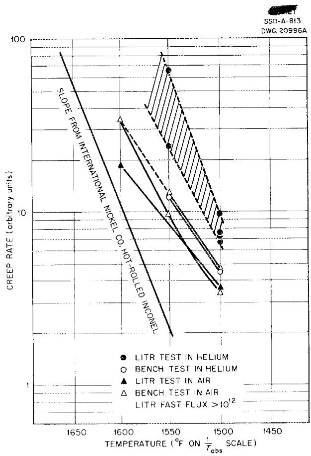  
Fig. 9.2. Temperature Dependence of the Creep Rate at 3000 psi of Inconel Irradiated in the LITR.

in temporary increases in creep rate, such as those observed when cold-worked specimens are annealed. (1) Data obtained at $1500^{\circ}\mathrm{F}$ and 3000 psi were presented previously, (2) and it was noted that the irradiated specimens had a lower creep rate during the early part of the extension than they did later. Another test at 1800 psi and the same temperature gave the same results. Tests at temperatures down to $1300^{\circ}\mathrm{F}$ and at stresses designed to keep the creep rate approximately

constant at each temperature are being run. The metal used for this work has a decarburized surface layer as a result of mill-annealing practice. Some material now available is of sufficient thickness to permit the decarburized layer to be machined off before testing.

Figure 9.3 shows the creep rate vs. temperature relationship for type 347 stainless steel in bench, LITR, and Graphite Reactor tests in air. No major effects of irradiation are apparent.

A tensile type of creep apparatus is being fabricated for use in the MTR, and it is expected that it will be inserted in the MTR in the next several weeks.

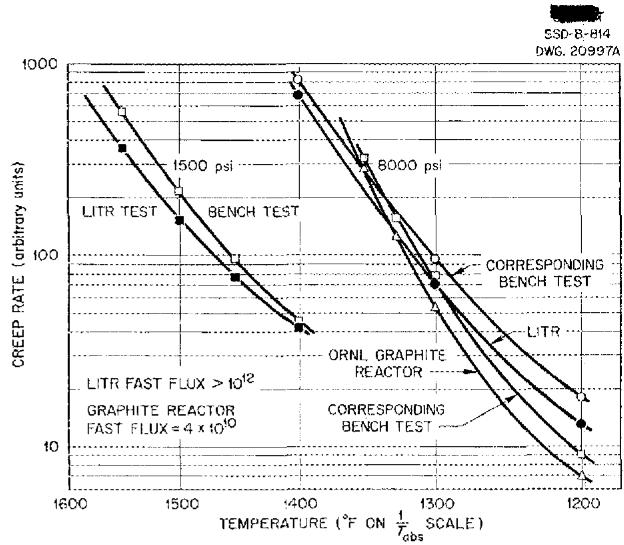  
Fig. 9.3. Temperature Dependence of the Creep Rate of Irradiated Type 347 Stainless Steel.

# 10. ANALYTICAL STUDIES OF REACTOR MATERIALS

C. D. Susano, Analytical Chemistry Division  
J. M. Warde, Metallurgy Division

Developmental work has been completed on the volumetric determination of zirconium in fluoride salt mixtures.(1) However, a more rapid and equally precise method is now being investigated that involves the application of differential spectrophotometry to the zirconium-alizarin red-S complex.

Methods for determining the concentrations of the reactants and products of the reaction

$$
\mathrm {C r F} _ {3} + \mathrm {U F} _ {3} \rightleftharpoons \mathrm {C r} ^ {\circ} + \mathrm {U F} _ {4}
$$

were investigated. A solution of disodium dihydrogen ethylenediaminetetraacetic acid (EDTA) buffered at pH 4.0 with sodium acetate and acetic acid was used to selectively leach $\mathrm{CrF}_3$ from a medium of $\mathrm{NaZrF}_5$ . The rate of complexing of $\mathrm{Cr(III)}$ with EDTA was slow, but it was quantitative after several hours of stirring. Chromium metal and the trivalent oxide $\mathrm{Cr}_2\mathrm{O}_3$ were insoluble in EDTA; the divalent fluoride was soluble and formed the $\mathrm{Cr(II)}$ -EDTA complex in a relatively short time. Uranium tetrafluoride was shown to be very soluble in this medium; uranium trifluoride was only slightly soluble. A solution of EDTA buffered at pH 6.8 showed little solubility effect on $\mathrm{UF}_3$ ; no change in solubility with $\mathrm{UF}_4$ was observed. It is likely that EDTA can be used to leach trivalent chromium and tetravalent uranium selectively from $\mathrm{NaZrF}_5$ .

The major portion of the experimental work with reactions involving the use of bromine trifluoride for the determination of oxygen in metallic oxides was confined to alterations of the apparatus. The apparatus has been

simplified and further simplification is contemplated.

Petrographic examinations of about 750 samples of fluoride mixtures were completed. Optical data are reported for $\mathrm{CsUF}_5$ , $\mathrm{Cs}_2\mathrm{ZrF}_6$ , $\mathrm{Li}_3\mathrm{UF}_7$ , $\mathrm{KUF}_5$ , $\mathrm{K}_2\mathrm{UF}_6$ , $\mathrm{K}_3\mathrm{UF}_7$ , $\mathrm{Na}_2\mathrm{ThF}_6$ , $\mathrm{Na}_3\mathrm{UF}_7$ , $\mathrm{RbUF}_5$ , $\mathrm{Rb}_3\mathrm{UF}_7$ , and $\mathrm{Rb}_2\mathrm{ZrF}_6$ .

The activities of the Analytical Service Laboratory included the development of a method for the determination of uranium in the ARE fuel concentrate and a revision of the procedure for the determination of sodium in fluoride salt mixtures. During the quarter, 930 samples were analyzed that involved 9953 determinations.

# ANALYTICAL CHEMISTRY OF REACTOR MATERIALS

J. C. White

Analytical Chemistry Division

Determination of Zirconium by Differential Spectrophotometry (D. L. Manning, Analytical Chemistry Division). The reaction between zirconium and sodium alizarin sulfonate (alizarin red-S) is commonly used for the spectrophotometric determination of low concentrations of zirconium. The present work was initiated to adapt this reaction, by means of differential spectrophotometry,[2] to the determination of zirconium in ARE fuels which contain approximately $35\%$ zirconium. The method currently used, the gravimetric determination of zirconium by precipitation as zirconium tetramandelate and subsequent ignition to the oxide, although satisfactory in most respects, requires considerable time. The differential technique, which combines the speed of

spectrophotometric procedures with the inherent precision of the gravimetric method, should greatly reduce the actual time of determination. In the differential method, the optical-density scale is set at zero against a blank of a reference standard, which is a highly light-absorbant solution. Greater concentrations of the given component are then measured from this zero point. In order to obtain the amount of light required to adjust the zero scale against the reference standard, the spectrophotometer slit is set at wider apertures than those for normal use. For those systems which conform to Beer's law at wide slit widths, the resultant optical density readings are directly proportional to the difference in concentration between the standard and the unknown solutions.

A standard curve was prepared by plotting the optical density of known zirconium concentrations over the range 1.0 to $1.5\mathrm{mg}$ per $25\mathrm{ml}$ against the increase in concentration over that of the reference solution, $1\mathrm{mg}$ per $25\mathrm{ml}$ . This plot is a straight-line relationship which indicates conformity with Beer's law. The method was tested by taking a solution of known concentration and determining its concentration of zirconium from the standard working curve. A practical test was then conducted by adding known amounts of zirconium to a synthetic ARE fuel. The data obtained indicate that the precision of this method compares favorably with that of the mandelic acid gravimetric method.

Determination of Chromium and Chromium Trifluoride (D. L. Manning, Analytical Chemistry Division). The ANP Reactor Chemistry Group has undertaken the study of the kinetics of the reaction

$$
\mathrm {C r F} _ {3} + \mathrm {U F} _ {3} \rightleftharpoons \mathrm {C r} ^ {\circ} + \mathrm {U F} _ {4} \tag {1}
$$

in a medium of $\mathrm{NaZrF}_5$ at temperatures of the order of $800^{\circ}\mathrm{C}$ . The analytical

chemistry problem is the determination of the concentrations of the reactants and products. The separation and determination of $\mathbf{U}\mathbf{F}_3$ and $\mathbf{U}\mathbf{F}_4$ are discussed in the following section.

The sample must be dissolved or leached without altering the oxidation states of the components; thus a limitation is imposed on the usual methods of dissolving $\mathrm{NaZrF}_5$ , namely, acid attack with nitric, perchloric, or sulfuric acids and fusion with alkali carbonates or nitrates. Solutions that form stable complexes with the oxidation states involved were investigated for possible application. Pribil and Klubalova<sup>(3)</sup> reported that disodium dihydrogen ethylenediaminetetraacetic acid (EDTA) forms a very stable complex with $\mathrm{Cr(III)}$ . Preliminary tests revealed that $50\mathrm{mg}$ of $\mathrm{CrF}_3$ dissolved in $50\mathrm{ml}$ of an acetate-buffered solution $(\mathrm{pH}4.0)$ of EDTA in about 2 to 3 hours. Chromium metal and the trivalent oxide $\mathrm{Cr_2O_3}$ were insoluble in this medium. Further tests were conducted in which $\mathrm{CrF}_3$ was mixed with $\mathrm{NaZrF}_5$ and the mixture was leached with EDTA solution. The trivalent chromium was quantitatively leached, while the $\mathrm{NaZrF}_5$ was not dissolved to any appreciable extent.

Chromium difluoride dissolves much more rapidly in EDTA solution than does the trifluoride. The distinction of $\mathrm{CrF}_2$ from $\mathrm{CrF}_3$ on this basis would be difficult. From the data obtained to date, it can be concluded that EDTA in acetate-buffered solution can selectively leach $\mathrm{CrF}_3$ from the $\mathrm{NaZrF}_5$ matrix, and thus the distinction between $\mathrm{CrF}_3$ and chromium metal or oxide can be made.

Determination of $\mathbf{U}\mathbf{F}_3$ and $\mathbf{U}\mathbf{F}_4$ (W. J. Ross, Analytical Chemistry Division). In addition to the investigation of the determination of chromium in the reaction represented by Eq. 1, a study

was undertaken to determine the concentrations of the uranium compounds. The method developed by Manning, Miller, and Rowan(4) for the determination of $\mathbf{U}\mathbf{F}_3$ in the presence of $\mathbf{U}\mathbf{F}_4$ cannot be applied successfully for this determination because of the possible presence of materials, other than $\mathbf{U}\mathbf{F}_3$ , which liberate hydrogen upon acidification. The ease of oxidation of U(III) to U(IV), in addition to the very small concentration (500 ppm) of the reaction components involved, has led to the investigation of the selective dissolution of a component from the solid sample without chemically altering the oxidation state of the uranium.

A large number of complexing agents have been investigated as possible selective solvents. These reagents include ammonium oxalate, ammonium citrate, ammonium tartrate, salicylic acid, sodium alizarin sulfonate, hydroquinone, $\alpha, \alpha^{1}$ dipyridyl, quinalizarin, catechol, and EDTA. In general, the results obtained can be summarized as follows: None of the reagents in aqueous solutions of various degrees of acidity provide quantitative separation or extraction. The tetrafluoride is much more soluble than the trifluoride; however, the minimum solubility of $\mathrm{UF}_{3}$ found was of the order of 3 to $5\mathrm{mg}$ per $100\mathrm{ml}$ of solvent, a solubility too large for quantitative application. Also, the solubility increases with increasing temperature. Some interesting data were obtained on the dissolution of $\mathrm{UF}_{3}$ and $\mathrm{UF}_{4}$ in EDTA solutions. As much as $50\mathrm{mg}$ of $\mathrm{UF}_{4}$ will dissolve in $10\mathrm{ml}$ of a $5\%$ (w/v) solution of EDTA buffered to pH 4.0 (with sodium acetate and acetic acid) in $30\mathrm{min}$ at room temperature; in contrast, less than $1\mathrm{mg}$ of $\mathrm{UF}_{3}$ will dissolve under the same conditions. The solubility ratio in

creases further as the acidity of the solvent is decreased. Although the data are not sufficiently complete to permit any definite conclusions to be made at this time, it would appear that the use of EDTA solutions for the separation of $\mathbf{U}\mathbf{F}_4$ and $\mathbf{U}\mathbf{F}_3$ is possible if the solubility of $\mathbf{U}\mathbf{F}_3$ can be reduced still further, or if an empirical relationship can be determined on the basis of the solubility of $\mathbf{U}\mathbf{F}_3$ .

Determination of Oxygen in Metallic Oxides (J. E. Lee, Jr., Analytical Chemistry Division). The major portion of the current experimental work with reactions involving the use of bromine trifluoride for the determination of oxygen in metallic oxides has been confined to alterations of the apparatus. The results of tests made to date on reactions with oxides indicate that considerable extension in the range of sample size may be accommodated if adequate instrumentation can be provided. Recent difficulties with the vacuum phases of the processing procedure show that the valves in the nickel section of the equipment are not dependable over reasonable periods of time. It has also been determined that the complexity of the entire apparatus can be greatly reduced.

# PETROGRAPHIC EXAMINATION OF FLUORIDES

G. D. White T. N. McVay, Consultant Metallurgy Division

Petrographic examinations of about 750 samples of fluoride mixtures were carried out. The optical data collected for various new fluoride compounds are given below.

CsUF5

Color: Z, sky blue; X, greenish blue

Crystal form: monoclinic

Interference figure; biaxial positive with $2V = 45$ deg; $X$ is at an angle to $C$ of 10 deg

Refractive indices: $\alpha =$ $\gamma =$

Has polysynthetic twinning

```txt
Cs2ZrF6 
```

Color: colorless

Interference figure: uniaxial negative

Refractive indices: $0 = 1.482$

$E = 1.460$

Li $\mathbf{\Pi}_{3}\mathbf{U}\mathbf{F}_{7}$

Color: Z, dark green; X, light green

Interference figure: biaxial positive with $2V = 45$ deg

Refractive indices: $\alpha = 1.468$

$\gamma = 1.476$

```txt
KUF5 
```

Color: green

Crystal form: rhombohedral

Interference figure: uniaxial negative

Refractive indices: $0 = 1.510$

$E = 1.504$

```txt
K2UF6 
```

Color: light olive drab

Crystal form: hexagonal

Interference figure: uniaxial positive

Refractive indices: $0 = 1.484$

$E = 1.512$

```txt
K3UF7 
```

Color: Z, light blue; X, colorless

```txt
Crystal form: not cubic or tetragonal, as described by Zachariasen(6) 
```

Interference figure: biaxial negative with $2V = 70$ deg

```txt
Refractive index: 1.414; low birefringence 
```

```txt
Na 2ThF6 
```

Color: colorless

Interference figure: uniaxial positive

Refractive indices: $0 = 1.468$

$E = 1.492$

```txt
Na3UF7 
```

Color: greenish blue

Crystal form: tetragonal

Interference figure: uniaxial negative

Refractive indices: $0 = 1.417$

$E = 1.411$

```txt
RbUF 
```

Color: Z, blue; X, green

Crystal form: probably monoclinic

Interference figure: biaxial negative with $2V = 75$ deg; $Y$ is at at angle to $C$ of 20 deg

Refractive indices: $a = 1.514$

$\gamma = 1.528$

Has polysynthetic twinning

```txt
Rb3UF7 
```

Color: green isotropic

Crystal form: cubic

Refractive index: 1.438

```txt
Rb2ZrF6 
```

Color: colorless

Crystal form: hexagonal or tetragonal

Interference figure: uniaxial negative

Refractive indices: $0 = 1.438$

$\pmb{\varepsilon} = 1.432$

# SUMMARY OF SERVICE CHEMICAL ANALYSES

J.C. White

A. F. Roemer, Jr. Williams

Analytical Chemistry Division

A procedure was established for the determination of uranium in the ARE fuel concentrate, $\mathrm{NaF - ZrF_4 - UF_4}$ (65-15-20 mole percent). The procedure, which was formulated in cooperation with the Laboratory Division of Y-12

(L. A. Stephens, private communication to J. C. White), is based on the method reported by Voss and Greene.(7) A 5-g sample was dissolved in HCl $\mathrm{HNO}_3$ ; the small residue (about $100~\mathrm{mg}$ ) was dissolved by fusing with potassium pyrosulfate. The solutions were then combined, converted to sulfate by fuming with sulfuric acid, and passed through a Jones reductor. Trivalent uranium was oxidized to the quadri-valent state by air. The completeness of oxidation was observed by inserting a platinum-calomel electrode couple in the solution and noting when a constant potential existed. A calculated amount of potassium dichromate (NBS standard) was added in slight excess of that required to oxidize the uranium quantitatively. This excess dichromate was then reduced with standard ferrous ammonium sulfate solution. The end point was detected potentiometrically by using the platinum-calomel electrode couple. The standard deviation was $0.16\%$ , and the relative standard error at the $95\%$ confidence level was $0.1\%$ .

Changes in the procedure for the determination of sodium in the fluoride

(7) F. S. Voss and R. E. Greene, A Precise Potentiometric Method of Uranium Analysis, paper presented at Analytical Information Meeting, Oak Ridge National Laboratory, May 19-21, 1953.

salt mixtures were effected to permit aliquots from the master solution (5-g sample in 500 ml) to be taken for this determination so that it would not be necessary to dissolve a separate sample. A considerable saving of time was thus realized.

During the quarter, the work of the Service Laboratory, as before, consisted chiefly of the analysis of fluoride fuel mixtures and alkaline metal fluorides. The Analytical Chemistry Laboratory received 878 samples and reported 930 samples that involved a total of 9953 determinations (Table 10.1). The backlog of analyses was reduced to 35 samples.

TABLE 10.1. SUMMARY OF SERVICE ANALYSES REPORTED   

<table><tr><td></td><td>NO. OF
SAMPLES</td><td>NO. OF
DETERMINATIONS</td></tr><tr><td>Reactor Chemistry</td><td>172</td><td>1111</td></tr><tr><td>Corrosion Studies</td><td>485</td><td>5838</td></tr><tr><td>Experimental Engineering</td><td>233</td><td>2708</td></tr><tr><td>ARE Fluid Circuit</td><td>13</td><td>196</td></tr><tr><td>Radiation Damage</td><td>24</td><td>64</td></tr><tr><td>Physical Properties and Heat Transfer Studies</td><td>3</td><td>36</td></tr><tr><td></td><td>930</td><td>9953</td></tr></table>

Part III

SHIELDING RESEARCH

# INTRODUCTION AND SUMMARY

E. P. Blizzard, Physics Division

The Bulk Shielding Facility (sec. 11) has been used primarily for critical experiments of reactor configurations for the Tower Shielding Facility. The Bulk Shielding Reactor is well suited for this work because it is similar to the Tower Shielding Reactor; also the loading facilities for the two reactors are similar. The calculated gamma radiation reaching the crew compartment of the divided shield appears to be somewhat lower than that measured in the Bulk Shielding Facility, presumably because of limitations in the experimental setup.

The Lid Tank Facility is being used to measure removal cross sections, as well as to examine specific shield designs (sec. 12). In addition to the measurement of the shielding efficiency of part of the G-Eair-cycle reactor, about 80 configurations of near-unit shields for the circulating-fuel reflector-moderated reactor have been examined. Since these latter shields are neither asymmetric nor dependent upon much shielding at the crew position, the Lid Tank Facility data can be considered quite reliable. Improvements in the reflector-moderated-reactor shield weights other than those accruing from replacement of water by a better hydrogenous material will probably be small. The removal cross sections of beryllium, fluorine, and lithium were found to be 1.13, 1.36, and 1.44, respectively. The removal cross section of uranium was measured in conjunction with a study of the effectiveness of uranium as a shield material.

The Tower Shielding Facility is taking shape; however, construction is approximately one month behind schedule (sec. 13). Most concrete work has been completed and the towers are being erected. Fabrication and/or procurement of controls and instrumentation have been initiated and should be effected by the end of October. The Safeguards Committee reviewed the facility and requested only one change; approval is expected subsequent to a Committee inspection.

Although several shielding studies, including the study of the spectrum of neutrons attenuated by water and by neutron streaming in iron, have advanced the shielding art, the most important contribution during this quarter accrued from the Summer Shielding Session (sec. 14). This four-week study session, which was attended by 18 representatives from interested groups, was for the purpose of standardizing shielding design methods. In addition to achieving this end, better methods for the interpretation of bulk shielding data, as well as the calculation of self-absorption in the core, were obtained. Perhaps the single most important conclusion of the session was that the large-scale tests planned for the Tower Shielding Facility are urgently needed for obtaining really reliable shield weight estimates. The shielding program at the Laboratory is being realigned so that as many as possible of the shielding uncertainties can be studied with the facilities now available.

# 11. BULK SHIELDING FACILITY

R. G. Cochran

F. C. Maienschein

J. D. Flynn

H. E. Hungerford

M. P. Haydon

E. B. Johnson

K. M. Henry

T. A. Love

G. M. McCammon

Physics Division

Testing of a series of critical loadings for the reactor for the new Tower Shielding Facility has been initiated in the Bulk Shielding Facility. One recently tested loading was for a water-reflected reactor, which was the first completely water-reflected reactor used at the BSF. Owing to its simplicity, it was considered desirable to use the same loading in a series of fundamental reactor experiments which included tests on the temperature coefficient, xenon poisoning, and temperature stability. These tests will be reported in the Physics Division Semiannual Progress Report.(1)

Calculations of the gamma radiation reaching the crew shield designed by the Shielding Board have been reported, (2) and the results have been compared with new experimental data obtained at the BSF.

# TOWER SHIELDING REACTOR CRITICAL EXPERIMENT

The five- by six-element configuration shown in Fig. 11.1 was the first reactor arrangement tested for the Tower Shielding Reactor. The reactor was completely water-reflected, and the first loading required $3550\mathrm{g}$ of uranium for a critical mass. The final loading contained $3829\mathrm{g}$ of enriched fuel, an amount sufficient to

override the xenon poison for extended operations at 100 kw.

# GAMMA-RAY AIR-SCATTERING CALCULATIONS

Calculations of the gamma radiation reaching the outer side of the crew compartment in the standard divided-shield design(2) have been reported recently.(3) A repeat of the airscattering experiments, plus additional experiments(4) of a more basic nature, has led to a re-evaluation of the experimental data on the gamma dose received at the crew compartment. Both the calculated and experimental doses are compared in Table 11.1 with the dose predicted by the Shielding

TABLE 11.1. GAMMA DOSE AT THE OUTER SIDE OF THE CREW SHIELD DUE TO THE RADIAL SCATTERED BEAM   

<table><tr><td>METHOD</td><td>SCATTERED BEAM (r/hr/watt x 10-6)</td><td>RATIO</td></tr><tr><td>Calculated (ref. 3)</td><td>10</td><td>3</td></tr><tr><td>Experimental (ref. 4)</td><td>15</td><td>4.3</td></tr><tr><td>Shielding Board (ref. 2)</td><td>3.5</td><td>1</td></tr></table>


DWG 21122

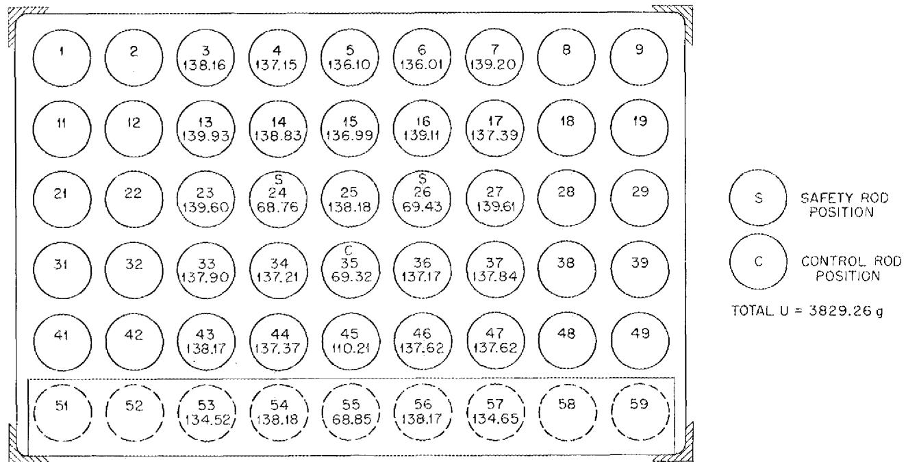  
Fig. 11.1. Loading 22 for Tower Shielding Reactor Critical Experiment.

Board. This table supersedes Table 13.2 in the previous report.(5)

The discrepancy between the calculation reported by the Shielding Board(2) and the present calculation, which is based on experimentally determined leakage spectra and the air-scattering experiment at the Bulk Shielding Facility, is not incomprehensible. The Shielding Board calculation was made at a time when

very little experimental data existed, and it could not be expected to approach the accuracy of the calculations based on subsequent experiments. The discrepancy between the air-scattering experiment data and the present calculation can probably be explained on the basis that the air-scattering experiment was not a true mockup of the situation which was calculated. It is not hard to understand that the surface of the water in the pool is a poor approximation to a round hydrogenous reactor shield such as was assumed in the calculations.

# 12. LID TANK FACILITY

C. L. Storrs, GE-ANP

G. T. Chapman

J. M. Miller

J. D. Flynn

F. N. Watson

Physics Division

The series of shield mockups for the reflector-moderated reactor has been completed; studies of 82 configurations were made. These experiments have been used for exploring some of the many possible shield combinations and have also put the shield-weight calculations on a sounder basis. Calculated shield weights, based on these data, are given in the section on "Aircraft Reactor Design Studies" (sec. 3).

The Lid Tank Facility has also been used this quarter to investigate the shielding efficiency of the transition section of a direct-cycle reactor shield mockup which is to be tested on the Tower Shielding Facility.

Some new basic shielding data have been obtained which involved a measurement of the effectiveness of natural uranium as a neutron and gamma-ray shield.

# REFLECTOR-MODERATED-REACTORSHIELD TESTS

The program of Lid Tank Facility tests for the reflector-moderated reactor shield(1) has been completed with measurements made behind 82 configurations. Interpretation of the data and further design studies are in progress, and a complete report(2) of the measurements is being prepared. The configuration tests are described in Table 12.1. In addition, an exploratory investigation of the optimum placement of lead in water was made; it was concluded that no important

decrease in weight could be achieved by this process.

During this quarter, two significant improvements were made in the materials and equipment used in the Lid Tank tests. (1) The beryllium pellet tank and beryllium slabs (3) were replaced with a tank that contained 11.5 in. of solid beryllium in the form of small blocks. Reflector coolant tubes were simulated, to some extent, by the aluminum walls of this tank and by some additional stainless steel and aluminum. (2) The two dry tanks used to contain the various components in the first 54 configurations tested were replaced by one large tank partitioned to hold all the dry components, including the new beryllium tank, in one section and the borated water in a second section. This arrangement eliminated the spurious water layers between the tanks.

After these improvements were made, measurements behind many of the earlier configurations were repeated. The gamma doses were found to be somewhat higher, probably because of capture gammas formed in the iron partition between the dry and wet sections of the tank (Fig. 12.1) and because of an increase of hard capture gammas in the lead region as a result of the elimination of the water layers. The insertion of boron-impregnated Plexiglas ("plexibor") between the lead layers reduced the gamma dose to the levels observed behind the original configurations and confirmed the capture gamma-ray hypothesis.

TABLE 12.1 SUMMARY OF LID TANK MockUPS OF REFLECTOR-MODERATED REACTOR AND SHIELD   

<table><tr><td>CONFIGUATION NUMBER</td><td>REFLECTOR</td><td>NEUTRON CURTAIN</td><td>HEAT EXCHANGER</td><td>NEUTRON CURTAIN</td><td>PRESSURE SHELL</td><td>\( GAMMA \ SHIELD^{(a)} \)</td><td>LIQUID NEUTRON \( SHIELD^{(b)} \)</td><td>OTHER INFORMATION</td></tr><tr><td>1</td><td>Be pellet tank,\( ^{(e)} \)9.2 cm of solid Be</td><td>\( B_{4}C \)tank\(^{(d)} \)</td><td>\( NaF \) tanks\(^{(e)} \)1, 2</td><td>\( B_{4}C \) tank</td><td>1 3/4 in. of Fe</td><td>None</td><td>Plain \( H_{2}O \)</td><td>Air wafer\((f)\) inserted between Be reflector elements</td></tr><tr><td>1a</td><td></td><td>"</td><td>"</td><td>"</td><td>"</td><td>"</td><td>"</td><td>No air wafer used</td></tr><tr><td>2</td><td></td><td>"</td><td>"</td><td>"</td><td>"</td><td>2 1/2 in. of Pb (D)</td><td>"</td><td></td></tr><tr><td>3</td><td></td><td>"</td><td>"</td><td>"</td><td>"</td><td>4 1/2 in. of Pb (D)</td><td>"</td><td>Last 2 in. of Pb in 15-in. dry tank, leaving large (~11 in.) air void after Pb</td></tr><tr><td>4</td><td></td><td>"</td><td>"</td><td>"</td><td>"</td><td>7 1/2 in. of Pb (D)</td><td>"</td><td>Large air void after Pb</td></tr><tr><td>5</td><td></td><td>"</td><td>"</td><td>"</td><td>"</td><td>2 1/2 in. of Pb (D), 5 in. of Pb (W)</td><td>"</td><td>Air void replaced with \( H_{2}O \)</td></tr><tr><td>6</td><td></td><td>"</td><td>"</td><td>"</td><td>"</td><td>"</td><td>"</td><td>Outer 3 in. of Pb moved out, leaving 12-cm \( H_{2}O \) gap</td></tr><tr><td>7</td><td></td><td>"</td><td>"</td><td>"</td><td>"</td><td>2 1/2 in. of Pb (D), 2 in. of Pb (W)</td><td>"</td><td>Same as configuration 3 except air void replaced with \( H_{2}O \)</td></tr><tr><td>8</td><td></td><td>"</td><td>"</td><td>"</td><td>"</td><td>2 1/2 in. of Pb (D), 5 in. of Pb (W)</td><td>"</td><td>4-cm \( H_{2}O \) gap preceded each of last four Pb slabs</td></tr><tr><td>9</td><td></td><td>"</td><td>"</td><td>"</td><td>"</td><td>"</td><td>10 in. of borated \( H_{2}O \) (1% B)</td><td>Borated \( H_{2}O \) replaced plain \( H_{2}O \) in 15-in. tank; 4-cm bo-rated \( H_{2}O \) gap preceded each of last four Pb slabs</td></tr><tr><td>10</td><td></td><td>"</td><td>"</td><td>"</td><td>"</td><td>"</td><td>"</td><td>Last four Pb slabs moved toward source</td></tr><tr><td>11</td><td></td><td>"</td><td>"</td><td>"</td><td>"</td><td>"</td><td>10 in. of borated \( H_{2}O \) (0.9% B)</td><td>Last four Pb slabs moved toward source</td></tr><tr><td>12</td><td></td><td>"</td><td>"</td><td>"</td><td>"</td><td>"</td><td>10 in. of borated \( H_{2}O \) (2.8% B)</td><td>4-in. borated \( H_{2}O \) gap pre-ceded last 3 in. of Pb</td></tr><tr><td>13</td><td></td><td>"</td><td>"</td><td>"</td><td>"</td><td>"</td><td>"</td><td>Last 3 in. of Pb moved toward source</td></tr><tr><td>14</td><td></td><td>"</td><td>"</td><td>"</td><td>"</td><td>2 1/2 in. of Pb (D), 2 in. of Pb (W)</td><td>13 in. of borated \( H_{2}O \) (2.8% B)</td><td></td></tr><tr><td>15</td><td></td><td>"</td><td>NaF tanks1, 2, 3, 4</td><td>"</td><td>"</td><td>None</td><td>Plain \( H_{2}O \)</td><td></td></tr><tr><td>16</td><td></td><td>"</td><td>"</td><td>"</td><td>"</td><td>3 in. of Pb (W)</td><td>12 in. of borated \( H_{2}O \) (2.8% B)</td><td></td></tr><tr><td>17</td><td></td><td>"</td><td>"</td><td>"</td><td>"</td><td>6 in. of Pb (W)</td><td>9 in. of borated \( H_{2}O \) (2.8% B)</td><td></td></tr><tr><td>18</td><td></td><td>"</td><td>"</td><td>"</td><td>"</td><td>7 1/2 in. of Pb (W)</td><td>7 1/2 in. of borated \( H_{2}O \) (2.8% B)</td><td></td></tr><tr><td>19</td><td>Be pellet tank, 1/4 in. of boral, 3 1/4 in. of \( H_{2}O \), 1/4 in. of boral, 9.2 cm of solid Be</td><td>"</td><td>"</td><td>None</td><td>"</td><td>"</td><td>7 1/2 in. of borated \( H_{2}O \) (2.3% B)</td><td></td></tr><tr><td>24.a</td><td></td><td>"</td><td>"</td><td>"</td><td>"</td><td>3 in. of Pb (W)</td><td>12 in. of borated \( H_{2}O \) (2.3% B)</td><td></td></tr><tr><td>CONFIGU-RATION NUMBER</td><td>REFLECTOR</td><td>NEUTRON CURTAIN</td><td>HEAT EXCHANGER</td><td>NEUTRON CURTAIN</td><td>PRESSURE SHELL</td><td>GAMMA SHIELD</td><td>LIQUID NEUTRON SHIELD</td><td>OTHER INFORMATION</td></tr><tr><td>20b</td><td>Be pellet tank, 1/4 in. of boral, 3 1/4 in. of H2O, 1/4 in. of boral, 9.2 cm of solid Be</td><td>B4C tank</td><td>NaF tanks 1, 2, 3, 4</td><td>None</td><td>1 3/4 in. of Fe</td><td>4 1/2 in. of Pb (W)</td><td>10 1/2 in. of borated H2O (2.3% B)</td><td></td></tr><tr><td>20c</td><td>"</td><td>"</td><td>"</td><td>"</td><td>"</td><td>6 in. of Pb (W)</td><td>9 in. of borated H2O (2.3% B)</td><td></td></tr><tr><td>20d</td><td>"</td><td>"</td><td>"</td><td>"</td><td>"</td><td>7 1/2 in. of Pb (W)</td><td>7 1/2 in. of borated H2O (2.3% B)</td><td></td></tr><tr><td>20e</td><td>"</td><td>"</td><td>"</td><td>"</td><td>"</td><td>7 1/2 in. of Pb (W), 1/8 in. of boral (W)</td><td>7 3/8 in. of borated H2O (2.3% B)</td><td></td></tr><tr><td>21</td><td>"</td><td>"</td><td>"</td><td>"</td><td>"</td><td>6 in. of Pb (W)</td><td>9 in. of borated H2O (2.3% B), 15 in. of oil</td><td>Oil (ρ = 0.88 g/cm3) placed in 15-in. tank behind borated H2O tank</td></tr><tr><td>22</td><td>"</td><td>"</td><td>"</td><td>"</td><td>"</td><td>None</td><td>Plain H2O</td><td></td></tr><tr><td>23</td><td>"</td><td>"</td><td>"</td><td>"</td><td>"</td><td>"</td><td>"</td><td>Fe pressure shell in plain H2O just outside dry tank, leaving 5-cm air void in tank</td></tr><tr><td>24</td><td>"</td><td>"</td><td>"</td><td>"</td><td>2 in. of Ni</td><td>"</td><td>"</td><td>Ni pressure shell in plain H2O just outside dry tank</td></tr><tr><td>25</td><td>"</td><td>"</td><td>"</td><td>"</td><td>2 in. of Cu</td><td>"</td><td>"</td><td>Cu pressure shell in plain H2O just outside dry tank</td></tr><tr><td>26</td><td>"</td><td>"</td><td>"</td><td>"</td><td>2 in. of Cu, 2 in. of Ni</td><td>"</td><td>"</td><td>Cu and Ni pressure shell in plain H2O just outside dry tank</td></tr><tr><td>27</td><td>Be pellet tank, 3 in. of H2O, 9.2 cm of solid Be</td><td>"</td><td>"</td><td>"</td><td>1 3/4 in. of Fe</td><td>"</td><td>"</td><td></td></tr><tr><td>28</td><td>Be pellet tank, 1/4 in. of boral, 9/10 in. of H2O, 1/4 in. of boral, 9.2 cm of solid Be</td><td>"</td><td>"</td><td>"</td><td>"</td><td>"</td><td>"</td><td></td></tr><tr><td>29</td><td>Be pellet tank, 1/4 in. of boral, 3 1/4 in. of H2O, 1/4 in. of boral, 9.2 cm of solid Be</td><td>"</td><td>"</td><td>"</td><td>None</td><td>"</td><td>"</td><td></td></tr><tr><td>30</td><td>"</td><td>"</td><td>"</td><td>"</td><td>2 in. of IncomeI</td><td>"</td><td>"</td><td>Inconel pressure shell in plain H2O just outside dry tank</td></tr><tr><td>31</td><td>1 1/2 in. of Pb, Be pellet tank, 9.2 cm of solid Be</td><td>"</td><td>"</td><td>"</td><td>1 3/4 in. of Fe</td><td>"</td><td>"</td><td></td></tr><tr><td>32</td><td>Be pellet tank, 9.2 cm of solid Be</td><td>"</td><td>"</td><td>"</td><td>"</td><td>"</td><td>"</td><td></td></tr><tr><td>33</td><td>"</td><td>"</td><td>"</td><td>"</td><td>"</td><td>1/4 in. of boral (W), WC tank(g) (W)</td><td>"</td><td></td></tr><tr><td>34</td><td>"</td><td>"</td><td>"</td><td>"</td><td>"</td><td>WC tank (W), 1/4 in. of boral (W)</td><td>"</td><td></td></tr><tr><td>35</td><td>"</td><td>"</td><td>"</td><td>"</td><td>"</td><td>WC tank (W)</td><td>"</td><td></td></tr><tr><td>36</td><td>"</td><td>"</td><td>"</td><td>"</td><td>"</td><td>WC tank (W), 1 1/2 in. of Pb (W)</td><td>"</td><td></td></tr><tr><td>37</td><td>"</td><td>"</td><td>"</td><td>"</td><td>"</td><td>WC tank (W), 3 in. of Pb (W)</td><td>"</td><td></td></tr><tr><td>CONFIGURATION NUMBER</td><td>REFLECTOR</td><td>NEUTRON CURTAIN</td><td>HEAT EXCHANGER</td><td>NEUTRON CURTAIN</td><td>PRESSURE SHELL</td><td>GAMMA SHIELD</td><td>LIQUID NEUTRON SHIELD</td><td>OTHER INFORMATION</td></tr><tr><td>38</td><td>Be pellet tank, 9.2 cm of solid Be</td><td>B4C tank</td><td>NaF tanks1, 2, 3, 4</td><td>None</td><td>1 3/4 in. of Fe</td><td>3 in. of Pb (W), WC tank (W)</td><td>Plain H2O</td><td></td></tr><tr><td>39</td><td>Be tank(h)</td><td>B10 tank(i)</td><td>"</td><td>"</td><td>"</td><td>6 in. of Pb (D)</td><td>"</td><td>Began using new tank which held all dry components of shield</td></tr><tr><td>40</td><td>"</td><td>"</td><td>"</td><td>"</td><td>"</td><td>"</td><td>"</td><td>1/4 in. of boral in plain water just outside large dry tank</td></tr><tr><td>41</td><td>"</td><td>"</td><td>"</td><td>"</td><td>"</td><td>"</td><td>"</td><td>1/4 in. of boral just inside and 1/4 in. of boral just outside large tank</td></tr><tr><td>42</td><td>"</td><td>"</td><td>"</td><td>"</td><td>"</td><td>"</td><td>"</td><td>1/4 in. of boral just inside large tank</td></tr><tr><td>43</td><td>"</td><td>"</td><td>"</td><td>"</td><td>"</td><td>"</td><td>"</td><td>B10 tank spliced out 2 ft on each side with 1/4 in.-thick boral slabs</td></tr><tr><td>44</td><td>"</td><td>"</td><td>"</td><td>"</td><td>"</td><td>3 in. of Pb (D), 3/4 in. of H2O,(j)3 in. of Pb (D)</td><td>"</td><td>Boral splicing removed</td></tr><tr><td>45</td><td>"</td><td>"</td><td>"</td><td>"</td><td>"</td><td>1 1/2 in. of Pb (D), 1/4 in. of boral (D), 3 in. of Pb (D), 1/4 in. of boral (D), 1 1/2 in. of Pb (D), 1/4 in. of Tybor(k)</td><td>"</td><td></td></tr><tr><td>46</td><td>"</td><td>B4C tank</td><td>"</td><td>"</td><td>"</td><td>"</td><td>"</td><td></td></tr><tr><td>47</td><td>"</td><td>"</td><td>"</td><td>"</td><td>"</td><td>"</td><td>15 in. of borated H2O (1% B)</td><td></td></tr><tr><td>48</td><td>"</td><td>"</td><td>"</td><td>"</td><td>"</td><td>"</td><td>"</td><td>Air wafer inserted between borated H2O tank and pre-ceding tank</td></tr><tr><td>49</td><td>"</td><td>"</td><td>"</td><td>"</td><td>"</td><td>1 1/2 in. of Pb (D), 1/4 in. of boral (D), 3 in. of Pb (D), 1/4 in. of boral (D), 1 1/2 in. of Pb (D), 1/4 in. of Tybor (D), 1 1/2 in. of Pb (W)</td><td>13 1/2 in. of borated H2O (1% B)</td><td></td></tr><tr><td>50</td><td>"</td><td>"</td><td>"</td><td>"</td><td>"</td><td>1 1/2 in. of Pb (D), 1/4 in. of boral (D), 3 in. of Pb (D), 1/4 in. of boral (D)</td><td>15 in. of borated H2O (1% B)</td><td></td></tr><tr><td>51</td><td>"</td><td>"</td><td>"</td><td>B4C tank</td><td>"</td><td>6 in. of Pb (D)</td><td>"</td><td></td></tr><tr><td>52</td><td>"</td><td>"</td><td>"</td><td>None</td><td>"</td><td>3 in. of Pb (D), 3/4 in. of .borated H2O,(j)3 in. of Pb (D)</td><td>"</td><td></td></tr><tr><td>53</td><td>1 1/4 in. of Al, Be tank</td><td>"</td><td>"</td><td>"</td><td>"</td><td>6 in. of Pb (D)</td><td>"</td><td></td></tr><tr><td colspan="9">54 Same as configuration 17 except borated H2O was 1% B instead of 2.8% B</td></tr><tr><td>55</td><td>Be tank</td><td>"</td><td>"</td><td>B4C tank</td><td>"</td><td>3 in. of Pb (D), 3/16 in. of plexi-bor(l)(D), 1 1/2 in. of Pb (D), 3/16 in. of plexibor (D), 1 1/2 in. of Pb (W)</td><td>22 1/2 in. of borated H2O (1% B)</td><td>Section welded on tank containing dry components to hold liquid neutron shield and thus eliminate undesired water layers between tanks</td></tr><tr><td>CONFIGU-RATION NUMBER</td><td>REFLECTOR</td><td>NEUTRON CURTAIN</td><td>HEAT EXCHANGER</td><td>NEUTRON CURTAIN</td><td>PRESSURE SHELL</td><td>GAMMA SHIELD</td><td>LIQUID NEUTRON SHIELD</td><td>OTHER INFORMATION</td></tr><tr><td>56</td><td>Be tank</td><td>B4C tank</td><td>NaF tanks1, 2, 3, 4</td><td>3/16 in. of plexibor</td><td>1 3/4 in. of Fe</td><td>3 in. of Pb (D), 3/16 in. of plexi-bor (D), 1 1/2 in. of Pb (D), 3/16 in. of plexibor (D), 1 1/2 in. of Pb (W)</td><td>22 1/2 in. of borated H2O (1% B)</td><td></td></tr><tr><td>57</td><td>"</td><td>"</td><td>"</td><td>"</td><td>"</td><td>4 1/2 in. of Pb (D), 3/16 in. of plexibor (D), 1 1/2 in. of Pb (D), 3/16 in. of plexibor (D)</td><td>24 in. of borated H2O (1% B)</td><td></td></tr><tr><td>58</td><td>"</td><td>"</td><td>"</td><td>"</td><td>"</td><td>Four 1 1/2-in. Pb slabs (D), each preceded by 3/16 in. of plexibor; 3/16 in. of plexibor behind fourth slab</td><td>"</td><td></td></tr><tr><td>59</td><td>"</td><td>"</td><td>"</td><td>B4C tank</td><td>"</td><td>6 in. of Pb (D), 3/16 in. of plexi-bor (D)</td><td>"</td><td></td></tr><tr><td>60</td><td>"</td><td>"</td><td>"</td><td>"</td><td>"</td><td>6 in. of Pb (D), 3/16 in. of plexi-bor (D), 1 1/2 in. of Pb (W)</td><td>22 1/2 in. of borated H2O (1% B)</td><td></td></tr><tr><td>61</td><td>"</td><td>"</td><td>NaF tanks1, 2, 4</td><td>"</td><td>"</td><td>"</td><td>"</td><td></td></tr><tr><td>62</td><td>"</td><td>"</td><td>"</td><td>"</td><td>"</td><td>6 in. of Pb (D), 3/16 in. of plexi-bor (D)</td><td>24 in. of borated H2O (1% B)</td><td></td></tr><tr><td>63</td><td>"</td><td>"</td><td>"</td><td>"</td><td>"</td><td>Four 1 1/2-in. Pb slabs (D), each preceded by 3/16 in. of plexibor; 3/16 in. of plexibor behind fourth slab</td><td>"</td><td></td></tr><tr><td>64</td><td>"</td><td>"</td><td>NaF tanks1, 4</td><td>"</td><td>"</td><td>Four 1 1/2-in. Pb slabs (D), each preceded by 3/16 in. of plexibor; 3/16 in. of plexibor behind fourth slab</td><td>"</td><td></td></tr><tr><td>65</td><td>"</td><td>"</td><td>"</td><td>"</td><td>"</td><td>Three 1 1/2-in. Pb slabs (D), each preceded by 3/16 in. of plexibor; 3/16 in. of plexibor behind third slab</td><td>"</td><td></td></tr><tr><td>66</td><td>Be tank, 9.2 cm of solid Be</td><td>"</td><td>"</td><td>"</td><td>"</td><td>Three 1 1/2-in. Pb slabs (D), 3/16 in. of plexibor behind each slab; 1 1/2 in. of Pb (W)</td><td>22 1/2 in. of borated H2O (1% B)</td><td></td></tr><tr><td>67</td><td>"</td><td>"</td><td>"</td><td>"</td><td>"</td><td>Three 1 1/2-in. Pb slabs (D), 3/16 in. of plexibor behind each slab; 3 in. of Pb (W)</td><td>21 in. of borated H2O (1% B)</td><td></td></tr><tr><td>68</td><td>"</td><td>"</td><td>"</td><td>"</td><td>"</td><td>Three 1 1/2-in. Pb slabs (D), 3/16 in. of plexibor behind each slab</td><td>24 in. of borated H2O (1% B)</td><td></td></tr><tr><td>69</td><td>"</td><td>"</td><td>NaF tanks1, 2, 3, 4</td><td>"</td><td>"</td><td>1 1/2 in. of Pb (D), 3/16 in. of plexibor (D), 4 1/2 in. of Pb (W)</td><td>19 1/2 in. of borated H2O (1% B)</td><td></td></tr><tr><td>70</td><td>"</td><td>"</td><td>NaF tanks1, 2, 4</td><td>"</td><td>"</td><td>3/16 in. of plexibor (D), 3 in. of U (D), 3/16 in. of plexibor (D)</td><td>24 in. of borated H2O (1% B)</td><td></td></tr><tr><td>71</td><td>Be tank, 9.2 cm of solid Be</td><td>B4C tank</td><td>NaF tanks 1, 2, 4</td><td>B4C tank</td><td>1 3/4 in. of Fe</td><td>3/16 in. of plexibor (D), 3 in. of U (D), 3/16 in. of plexibor (D), 1 1/2 in. of Pb (W)</td><td>22 1/2 in. of borated H2O (1% B)</td><td></td></tr><tr><td>72</td><td>"</td><td>"</td><td>"</td><td>"</td><td>"</td><td>3/16 in. of plexibor (D), 3 in. of U (D) plus Pb brick yoke, (m) 3/16 in. of plexibor (D)</td><td>24 in. of borated H2O (1% B)</td><td></td></tr><tr><td>73</td><td>Be tank</td><td>"</td><td>NaF tanks 1, 2, 3, 4</td><td>"</td><td>"</td><td>3 in. of Pb (D), 3/16 in. of plexi-bor (D), 1 1/2 in. of Pb (D), 3/16 in. of plexibor (D)</td><td>"</td><td></td></tr><tr><td>74</td><td>"</td><td>"</td><td>"</td><td>"</td><td>"</td><td>"</td><td>24 in. of borated H2O (0.5% B)</td><td></td></tr><tr><td>75</td><td>"</td><td>"</td><td>"</td><td>"</td><td>"</td><td>"</td><td>24 in. of plain H2O</td><td></td></tr><tr><td>76</td><td>"</td><td>"</td><td>NaF tanks 1, 4</td><td>"</td><td>"</td><td>6 in. of Pb (D), 3/16 in. of plexi-bor (D)</td><td>24 in. of borated H2O (1% B)</td><td>3-cm air void in gamma shield</td></tr><tr><td>77</td><td>"</td><td>"</td><td>Li tanks(n) 1, 2</td><td>"</td><td>"</td><td>Four 1 1/2-in. Pb slabs (D), each preceded by 3/16 in. of plexibor; 3/16 in. of plexibor behind fourth slab</td><td>"</td><td></td></tr></table>

(a) Lead thicknesses in the gamma shield were made up of 1- and 1 l/2-in. slabs. Where possible, these slabs were grouped with the dry components of the shield, but in many cases it was necessary to place some of the slabs in the liquid neutron shield container. (D) indicates dry slabs; (W) indicates wet slabs, both for the plain and for the borated water.   
(b) The borated water used in configurations 1 to 54 was contained in a separate tank. In configurations 55 to 77, the solution was contained in the wet section of a single large tank.   
(c) Beryllium pellets $(\rho = 1.233 \, \text{g/cm}^3)$ encased in iron; dimensions were $0.3 \, \text{cm}$ of Fe, $28.5 \, \text{cm}$ of Be, $0.3 \, \text{cm}$ of Fe, totaling $29.1 \, \text{cm}$ .   
$(d)_{\text{Boron carbide}}$ $(\rho = 1.9 \, \text{g/cm}^3)$ encased in aluminum; dimensions were $0.16 \, \text{cm}$ of Al, $2.70 \, \text{cm}$ of $\mathsf{B}_4\mathsf{C}$ , $0.16 \, \text{cm}$ of Al, totaling $3.02 \, \text{cm}$ .   
$(e)$ Sodium fluoride $(\rho = 0.96 \, \text{g/cm}^3)$ encased in iron; dimensions for tanks 1 and 2 were $0.48 \, \text{cm}$ of Fe, $2.54 \, \text{cm}$ of NaF, $0.48 \, \text{cm}$ of Fe, totaling $3.50 \, \text{cm}$ ; dimensions for tanks 3 and 4 were $0.48 \, \text{cm}$ of Fe, $4.44 \, \text{cm}$ of NaF, $0.48 \, \text{cm}$ of Fe, totaling $5.40 \, \text{cm}$ .   
$(f)_{\text{Air in wafer with 0.16-cm aluminum walls}}$   
(g) Tungsten carbide pebbles (ρ = 8.05 g/cm³) encased in iron; dimensions were 0.635 cm of Fe, 5.08 cm of WC, 0.635 cm of Fe, totaling 6.35 cm.

$(h)$ Solid beryllium $(\rho = 1.48 \, \text{g/cm}^3)$ blocks in aluminum tank. Additional aluminum and stainless steel within tank simulated reflector coolant tubes. Dimensions for the tank were $0.64 \, \text{cm}$ of Al, $7.30 \, \text{cm}$ of Be, $0.16 \, \text{cm}$ of Al, $0.03 \, \text{cm}$ of stainless steel, $7.30 \, \text{cm}$ of Be, $0.16 \, \text{cm}$ of Al, $0.02 \, \text{cm}$ of stainless steel, $14.61 \, \text{cm}$ of Be, $0.15 \, \text{cm}$ of blotter paper, $0.64 \, \text{cm}$ of Al, totaling $31.03 \, \text{cm}$ .

(i) Boron isotope 10; dimensions were $0.05 \, \text{cm}$ of stainless steel, 1.53 of $\mathbf{B}^{10}$ powder, 1.52 cm of Al, totaling 3.1 cm.

$\{j\}$ The $3 / 4$ in. of water was contained in a thin-walled aluminum tank.

$(k)_{\mathrm{Tygon}}$ impregnated with boron.

$\{l\}$ plexiglas impregnated with boron.

$(m)$ Uranium slab was 3 in. thick by 3 ft by 3 ft. Since the radiation cone from the source at the uranium slab position had a greater diameter than 3 ft, a 4-in.-thick yoke of lead bricks was built around the top and sides of the slab to reduce streaming.

$(n)$ Lithium $(\rho = 0.534 \, \text{g/cm}^3)$ encased in iron; dimensions for tank 1 were $0.64 \, \text{cm}$ of Fe, $2.54 \, \text{cm}$ of Li, $0.64 \, \text{cm}$ of Fe, totaling $3.82 \, \text{cm}$ ; dimensions for tank 2 were $0.48 \, \text{cm}$ of Fe, $3.65 \, \text{cm}$ of Li, $0.48 \, \text{cm}$ of Fe, totaling $4.61 \, \text{cm}$ .


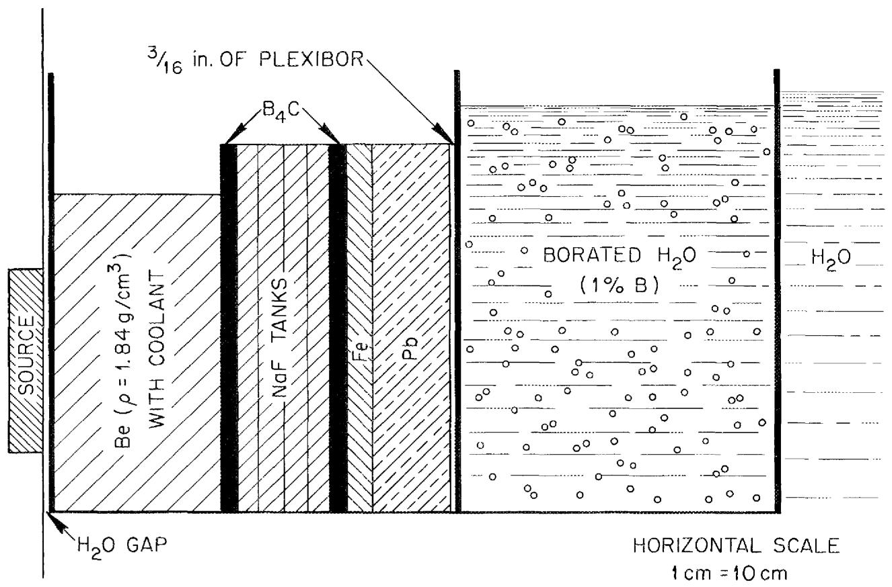  
Fig. 12.1. Typical Reflector-Moderated Reactor Shield Configuration in the Lid Tank Showing Single Containing Tank.

Gamma-Ray Attenuation Data. The gamma-ray attenuation measurements for configurations 16, 17, and 18 show the effect of increasing the thickness of the lead layer (Fig. 12.2). The measurements on configuration 33 show the effect of substituting tungsten carbide for lead in the gamma shield. On the basis of equivalent density, 2 in. of tungsten carbide pellets and 1/2 in. of steel (container walls) should have had the same gamma attenuation as 1.8 in. of lead. Actually, the attenuation was only as effective as 1.1 in. of lead. This indicates that the high rate of capture or inelastic scattering gamma production in tungsten reduces its value as a shield

ing material when it must be used in a high neutron flux.

Except for the two improvements described above and the addition of a 3/16-in. plexibor slab behind the lead slabs in the dry section of the tank, configuration 59 was the same as configuration 17. (Figure 12.1 is a sketch of configuration 59; configuration 17 is similar to the configuration shown in Fig.14.l of ORNL-1556.(4)) The longer relaxation length in water following configuration 59 (Fig. 12.2) indicated an increase in the penetrating capture gammas from lead and iron and a relative decrease in the softer water

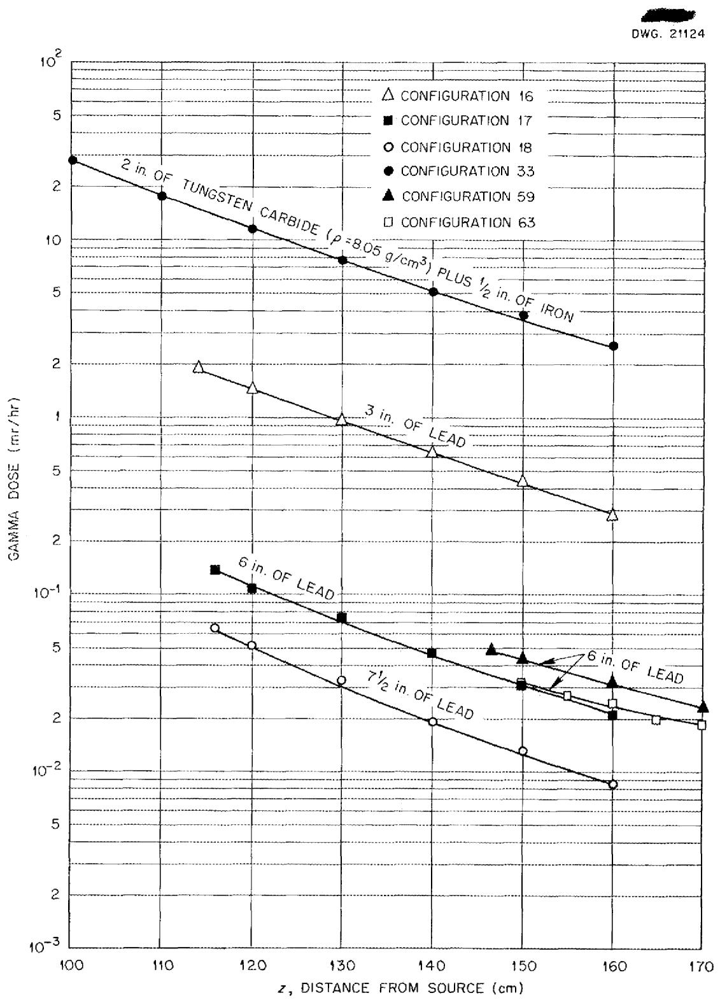  
Fig. 12.2. Gamma Dose Behind Typical Reflector-Moderated Reactor Shield Mockups (Configurations 16, 17, 18, 33, 59, 63).

capture gammas. Data taken behind configuration 63 showed the effect of inserting four plexibor slabs into configuration 59, one slab preceding each 1.5 in. of lead slab in the gamma shield. One heat exchanger tank was removed to allow room for the plexibor slabs. The gamma dose was reduced, but the long relaxation length in the water indicated that soft gammas from the source or captures in the water did not contribute importantly to the total dose in either configuration 59 or 63.

Configuration 64 (data not presented here) was the same as configuration 63 except that the number of heat exchanger tanks was reduced from three to two. The result was an increase in gamma dose of about $10\%$ over that observed behind configuration 63.

The gamma measurements for configuration 66 (Fig. 12.3) show the effect of adding $9.2\mathrm{cm}$ of beryllium to the reflector thickness. It was impossible in assembling this configuration to place the fourth lead slab with the other three in the first dry tank compartment. Placing it in the borated water tank increased the effectiveness of the lead and tended to mask the effects of the increased reflector thickness; so configurations 65 and 68 were tested without slab four in the shield, leaving only $41/2$ in. of lead. Configuration 65 had 11.5 in. of beryllium in the reflector, and configuration 68 had 15.1 in. of beryllium.

Measurements behind configuration 72 (Fig. 12.3) show the effect of using 3 in. of natural uranium clad on each side with $3/16$ in. of plexibor as the gamma shield. By logarithmic interpolation, the natural uranium was found to be as effective for attenuation as 4.7 in. of lead; however, on a density basis, 3 in. of uranium would be expected to be equivalent to 5.15 in. of lead.

The data for configuration 73, 74, and 75 show the effect on the gamma

dose of borating the water in the neutron shield. The addition of $1.2\%$ boron to the water eliminated a large portion of the medium-hard capture gammas in the water (Fig. 12.4) and thereby reduced the gamma dose by a factor of 2.7. This elimination of water capture gammas leaves a harder gamma spectrum (presumably from metal captures), and consequently the attenuation curve exhibits a longer relaxation length. Note also that the rear wall of the borated water tank acts as an increasing source of capture gammas with a decrease in boron content.

In configuration 77 (data not presented here), two lithium-filled iron tanks were substituted for the two sodium fluoride-filled iron tanks, which were used to simulate the heat exchanger in configuration 64. This substitution produced no measurable change in the gamma dose.

Neutron Attenuation Data. Several neutron attenuation curves are shown in Fig. 12.5. Since changes in either the heat exchanger or the lead region had little effect on the neutron attenuation, it appears from comparison of the measurements behind configurations 17 and 55 that the beryllium reflector accounts for the greater initial attenuation of fast neutrons.

Substitution of uranium for lead in the gamma shield caused a noticeable decrease in the neutron flux (Fig. 12.5, configuration 72). A more systematic study of the shielding properties of uranium is discussed in a following section, "Investigation of Shielding Properties of Uranium."

The effect of varying degrees of water boration on the neutron flux is shown in Fig. 12.6. From the data taken outside the borated water tank, it is evident that the boron content affects only the thermal-neutron flux, since its effect is quite well localized in the borated region.

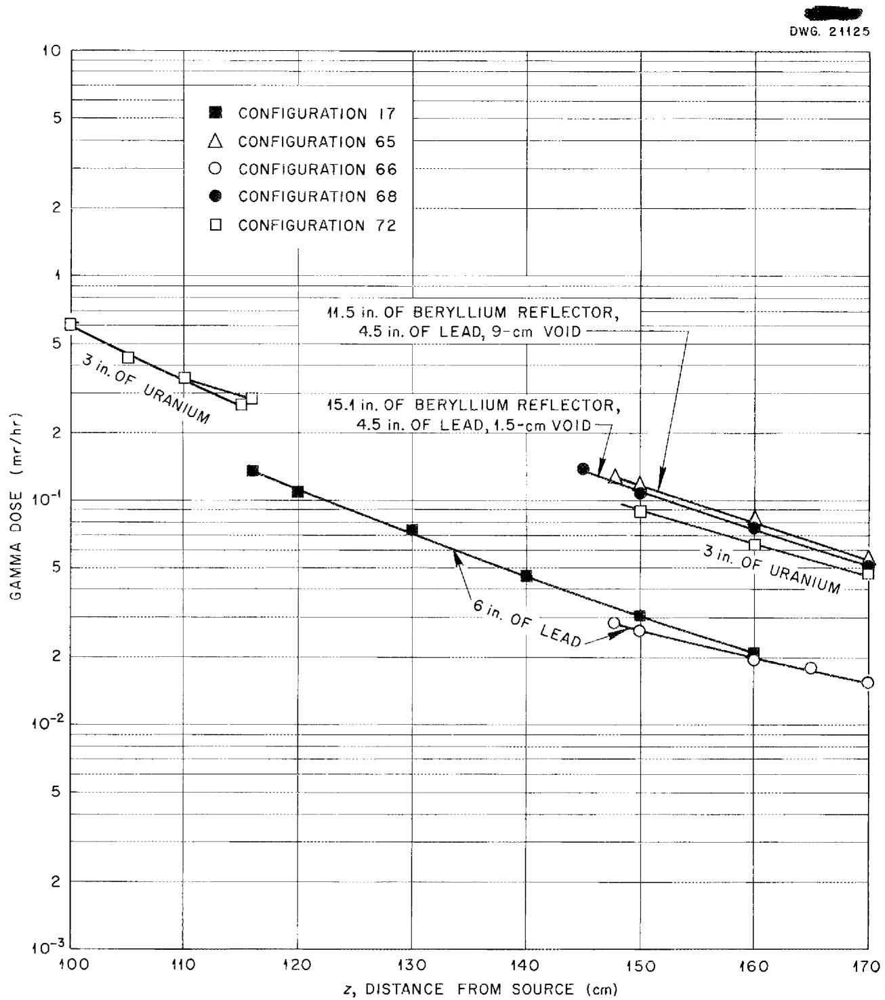  
Fig. 12.3. Gamma Dose Behind Typical Reflector-Moderated Reactor Shield Mockups (Configurations 17, 65, 66, 68, 72).

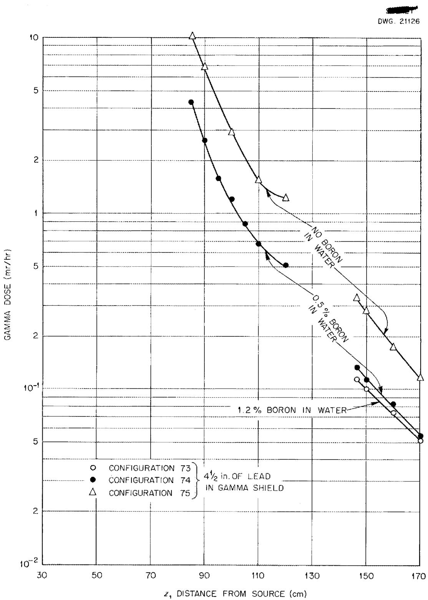  
Fig. 12.4. Gamma Dose Behind Typical Reflector-Moderated Reactor Shield Backups (Configurations 73, 74, 75).

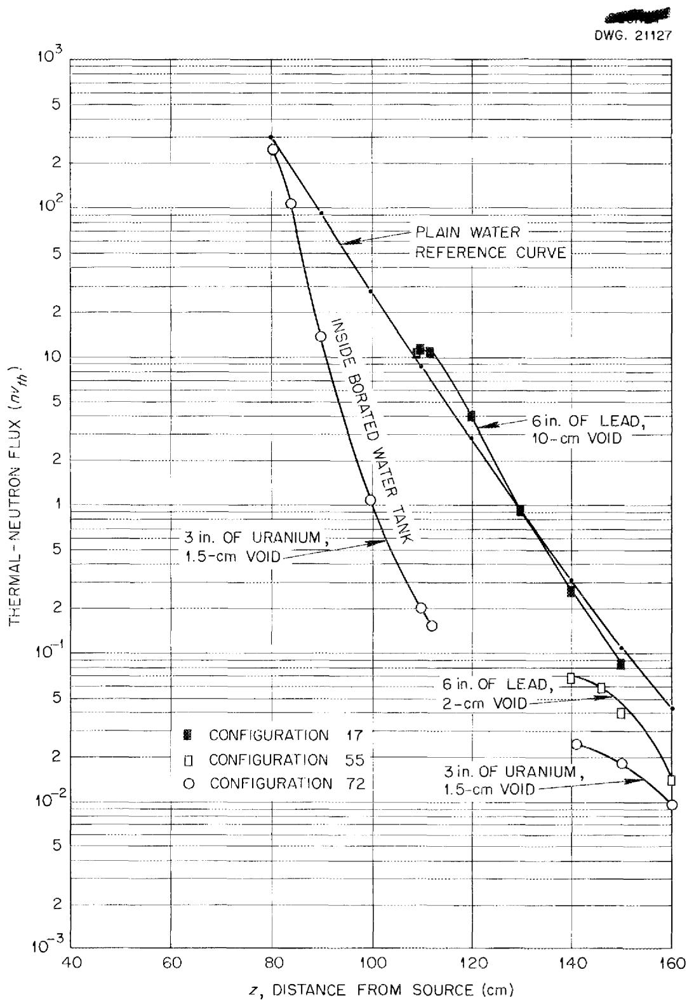  
Fig. 12.5. Thermal-Neutron Flux Behind Typical Reflector-Moderated ReactoShield Mockups (Configurations 17, 55, 72).

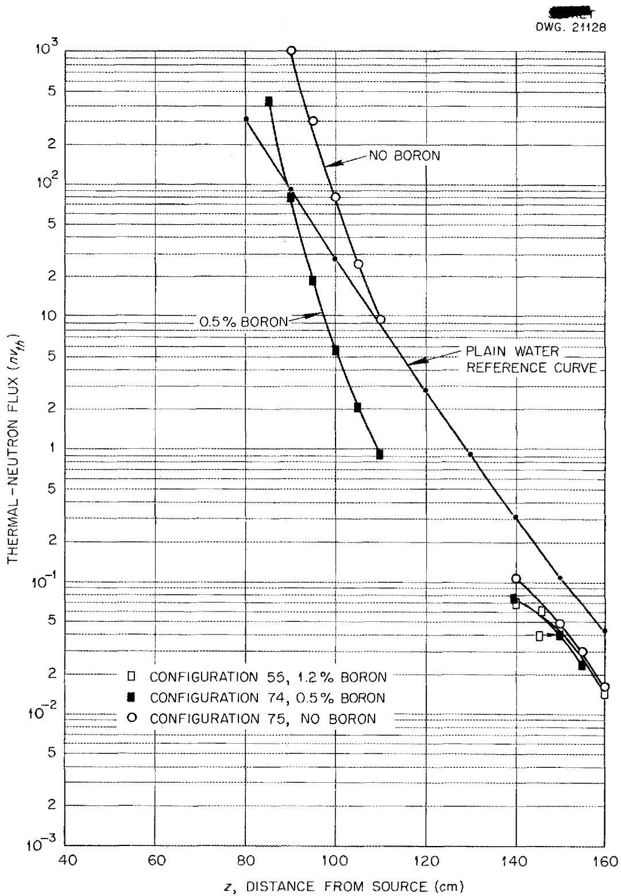  
Fig. 12.6. Thermal-Neutron Flux Behind Typical Reflector-Moderated Reactor Shield Mockups (Configurations 55, 74, 75).

# SHIELD INVESTIGATION FOR GE-ANP

A brief experiment was carried out to determine the shielding efficiency of the "transition section" in the air-cooled R-1 reactor designed by GE-ANP. This section is between the reactor and the annular air ducts and consists of alternate slots perpendicular to the reactor surface for cooling air and moderator water. A mockup of the inlet annular duct and the transition section was placed in the Lid Tank Facility, and radiation measurements were made along the source axis and outside the duct (Fig. 12.7). The measurements were then repeated with the transition section replaced by a rectangular box designed to provide the same amounts of air, water, and aluminum.

The results, given in Figs. 12.8 and 12.9, show that the rectangular box provided better shielding, in all cases, by a factor between 1.5 and 2.

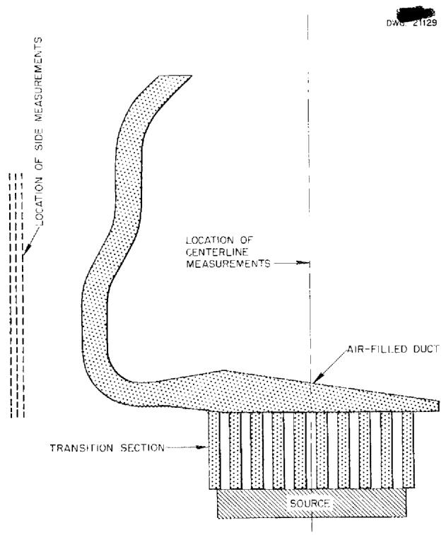  
Fig. 12.7. Mockup of Air Duct for GE-ANP R-1 Reactor.

It was therefore concluded that the mockup of the complete R-1 shield, now under construction for testing in the Tower Shielding Facility, could be made with the much simpler rectangular design, and appropriate corrections could be made to the resulting data.

# INVESTIGATION OF SHIELDING PROPERTIES OF URANIUM

Some information on the use of natural uranium as a shielding material has been obtained from measurements in the Lid Tank Facility. A 3-in. uranium slab was placed at various distances from the source. In some of the measurements, a thermal neutron shield of boron was placed either on the source side or on both sides of the uranium slab. The thermal-neutron fluxes measured $130~\mathrm{cm}$ from the source for the various configurations are recorded in Table 12.2. Note the effect of the boron shield (3/16-in. slab of plexibor) on the production of fission neutrons in the uranium. Gamma measurements made when the uranium was not near the source are of limited interest because of the streaming of radiation around the slab. In the data presented in Table 12.3, however, this difficulty was avoided by having the detector close behind the uranium.

Additional measurements on uranium were made when it was substituted for lead in the gamma shield region of the mockups for the reflector-moderated reactor shield (cf., "Reflector-Moderated-Reactor Shield Tests," above). The decrease in the neutron flux indicated that uranium has a higher fast-neutron removal cross section than either water or lead. As is the case with all heavy elements, uranium is not competitive with water as a neutron shield because of its much greater atomic weight. However, if the capture and fission gamma production of uranium could be held down so that it would be a satisfactory gamma shield, its neutron attenuation

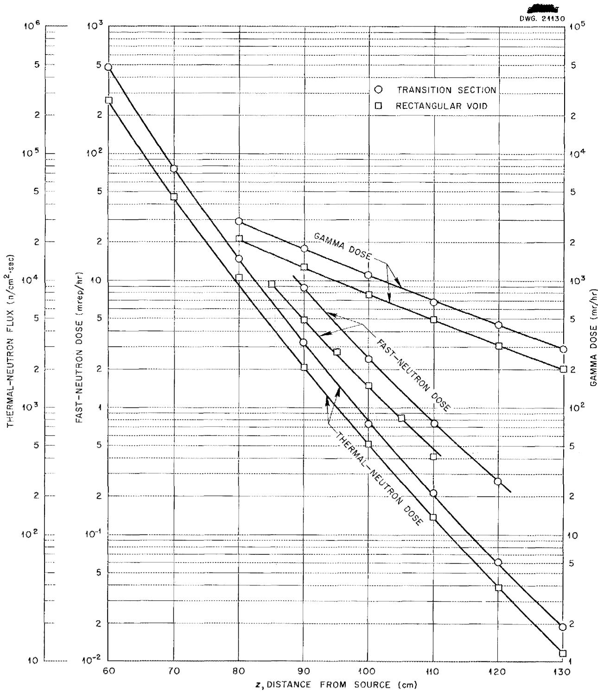  
Fig. 12.8. Center-Line Measurements with Annular Air Duct Mockup for GE-ANP R-1 Reactor.

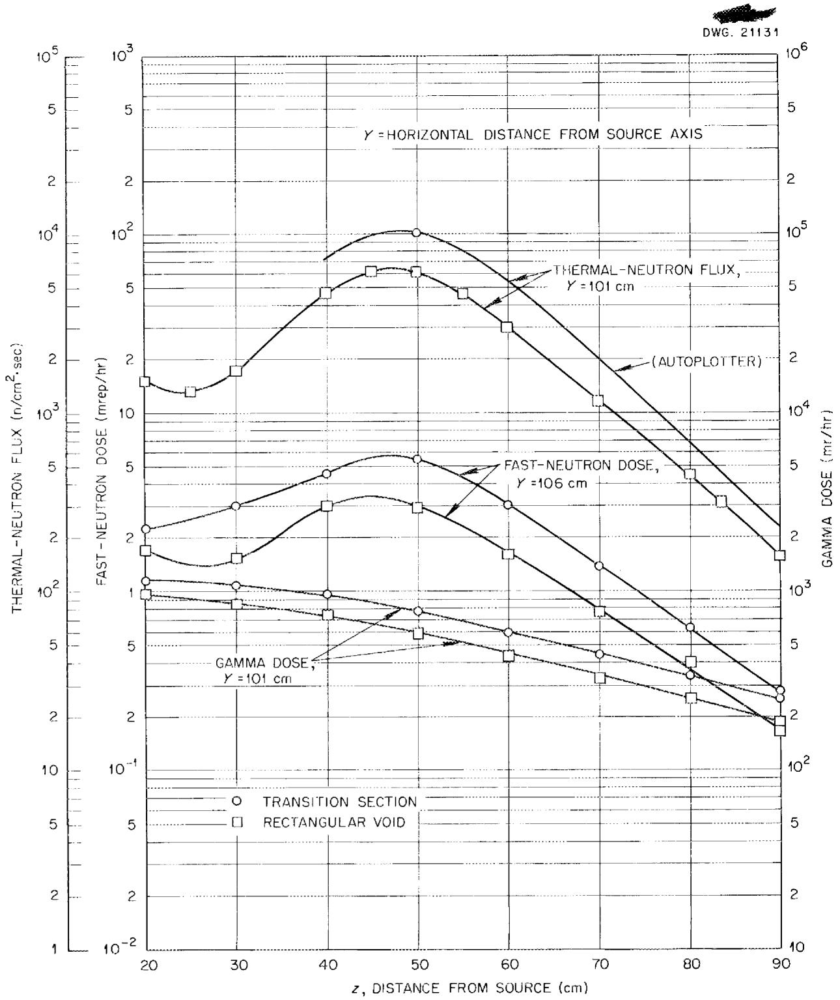  
Fig. 12.9. Measurements at Side of Annular Air Duct Mockup for GE-ANP R-1 Reactor.

TABLE 12.2. THERMAL-NEUTRON FLUX 130 cm FROM SOURCE WITH URANIUM AT VARIOUS INTERMEDIATE POSITIONS   

<table><tr><td rowspan="2">URANIUM DISTANCE FROM SOURCE (cm)</td><td colspan="4">THERMAL NEUTRON FLUX (n/cm2·sec)</td></tr><tr><td>No Plexibor</td><td>Plexibor on Reactor Side</td><td>Plexibor on Both Sides</td><td>Water Only</td></tr><tr><td>0</td><td>1.036 x 100</td><td>7.713 x 10-1</td><td>5.636 x 10-1</td><td>8.00 x 10-1</td></tr><tr><td>10</td><td>9.542 x 10-1</td><td>5.340 x 10-1</td><td>4.672 x 10-1</td><td></td></tr><tr><td>30</td><td>5.278 x 10-1</td><td>5.001 x 10-1</td><td>4.661 x 10-1</td><td></td></tr><tr><td>40</td><td>5.808 x 10-1</td><td>4.808 x 10-1</td><td>4.607 x 10-1</td><td></td></tr></table>

TABLE 12.3. GAMMA DOSE 60 cm FROM SOURCE WITH URANIUM AT VARIOUS INTERMEDIATE POSITIONS   

<table><tr><td rowspan="2">URANIUM DISTANCE FROM SOURCE, MEASUREMENTS TO FRONT FACE (cm)</td><td colspan="4">GAMMA DOSE (mr/hr)</td></tr><tr><td>No Plexibor</td><td>Plexibor on Reactor Side</td><td>Plexibor on Both Sides</td><td>Water Only</td></tr><tr><td>0</td><td>1.552 x 103</td><td>1.105 x 103</td><td>6.152 x 102</td><td>2.3 x 103</td></tr><tr><td>10</td><td>7.032 x 102</td><td>2.562 x 102</td><td>1.578 x 102</td><td></td></tr><tr><td>30</td><td>7.457 x 101</td><td>4.675 x 101</td><td>2.989 x 101</td><td></td></tr><tr><td>40</td><td>3.732 x 101</td><td>2.435 x 101</td><td>1.864 x 101</td><td></td></tr></table>

characteristics could be used advantageously. It should be noted, however, that these reflector-moderated reactor measurements did not constitute a fair test of the effectiveness of uranium as a shield. The slab was only 3 by 3 ft, an area which was not large enough to intercept all the emerging radiation, and there was considerable streaming of gamma rays around the slab. In one test, a yoke of lead bricks was built around the top and sides of the slab to somewhat reduce this streaming.

# REMOVAL CROSS SECTIONS

The previously reported effective removal cross section of beryllium(5) has been confirmed by recent measurements in the Lid Tank Facility (Fig.

12.10). The measurements were taken behind a solid slab of beryllium 9.43 cm thick with a density of $1.84\mathrm{g/cm^3}$ , and they indicate a removal cross section of 1.13 barns. This may be compared with the earlier value of 1.12 barns for beryllium in the form of pellets with an average density of $1.23\mathrm{g/cm^3}$ .

The effective removal cross section of uranium was calculated from data taken in connection with the 'Shielding Effectiveness of Uranium' study discussed above. Results are tabulated in Table 12.4.

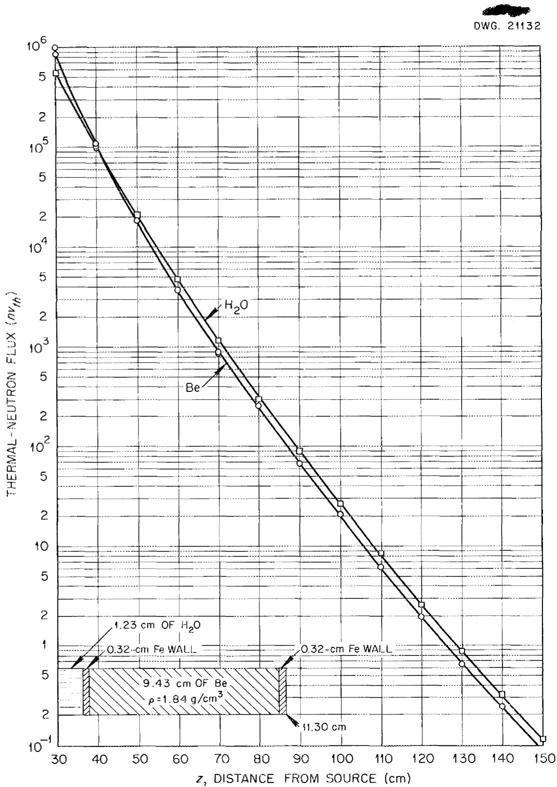  
Fig. 12.10. Thermal-Neutron Flux Beyond 9.43 cm of Solid Beryllium.

TABLE 12.4.EFFECTIVE REMOVAL CROSS SECTIONS FOR URANIUM AT VARIOUS DISTANCES FROM SOURCE   

<table><tr><td rowspan="2">URANIUM
DISTANCE
FROM
SOURCE
(cm)</td><td colspan="2">σ (barns/atom)</td></tr><tr><td>No Plexibor</td><td>Plexibor on
Both Sides</td></tr><tr><td>0</td><td>1.53</td><td>3.15</td></tr><tr><td>40</td><td>3.42</td><td>3.71</td></tr></table>

The fluorine cross section was determined from measurements behind a large quantity of $\mathbf{C}_7\mathbf{F}_{16}$ (Fig. 12.11). By using a value of 0.84 barn for the carbon removal cross section (6) and

the current data, a value of 1.36 barns is obtained for fluorine. Measurements with a considerably smaller sample of the compound $\mathbf{C}_2\mathbf{F}_3\mathbf{Cl}$ have not been completely reconciled with this figure, as yet. These latter measurements indicate a chlorine cross section of only 1 barn, but it should be noted that the chlorine has only a small effect on the total molecular cross section of this compound.

By using 1.36 barns for the fluorine removal cross section and the previous measurements on LiF, the removal cross section for lithium was calculated to be 1.44 barns. This should be considered as a tentative value until a direct measurement on lithium is available, since it is hard to reconcile the 1.44 barns with the Van de Graaff measurements on the basis of presently accepted theoretical considerations.

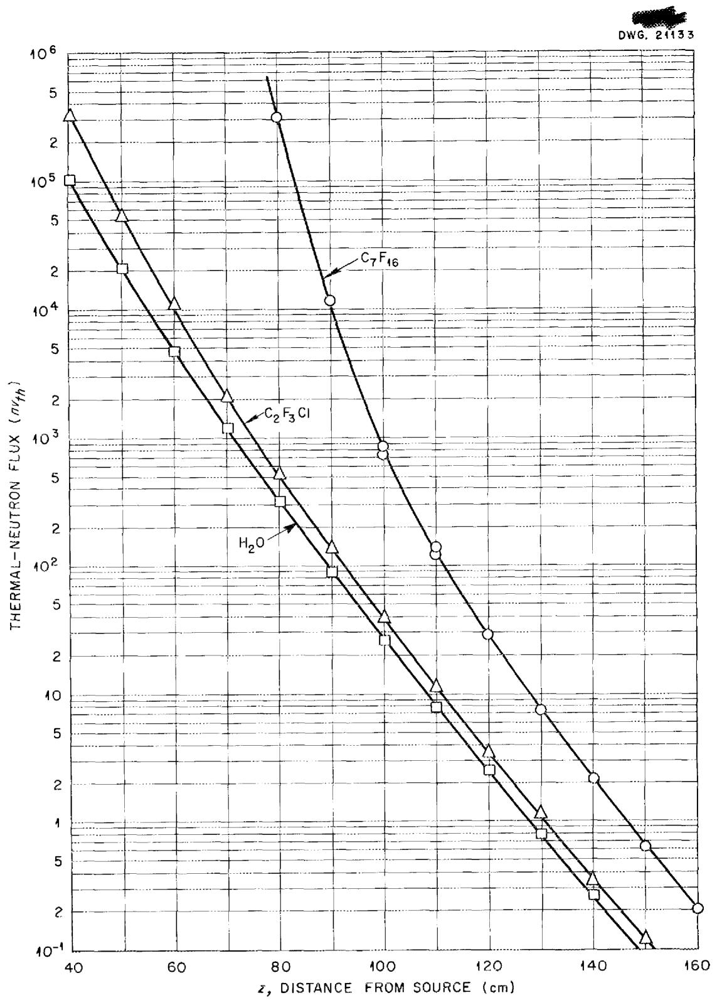  
Fig. 12.11. Thermal-Neutron Flux Beyond 68.6 cm of $\mathbf{C}_7\mathbf{F}_{16}$ and 15.2 cm of $\mathbf{C}_2\mathbf{F}_3\mathbf{Cl}$ .

# 13. TOWER SHIELDING FACILITY

C. E. Clifford

T. V. Blosser L. B. Holland

Physics Division

J.Y. Estabrook, ANP Division

The construction of the Tower Shielding Facility is approximately one month behind schedule because of a general strike during the initial construction phase and a later strike which temporarily halted the steel fabrication. However, the tower leg foundations and guy anchors were completed in mid-July, and erection of the tower steel was started by the contractor on August 8. The steel is being shop-welded in 45-ft sections before delivery to the site, where the sections are bolted in place at a rate of approximately one per day. The status of the construction of the facility as of August 10, 1953 is shown in Fig. 13.1.

The reactor pool, the hoist foundation pads, the 3000-ft radius exclusion fence, and the access road have all been completed. The water line, the control building, and the hoist house are 80, 30, and $10\%$ complete, respectively. Work has not yet been started on the 600-ft radius fence or on the power transmission lines.

The mechanical components of the reactor are being constructed in the ORNL Research Shops and are nearly ready for assembly. Both the general circuit diagram for the reactor controls and associated interlocks and the modification of the servo system for

the regulating rod are soon to be completed by the Reactor Controls Department. Preliminary design of the experimental instrumentation is completed, and fabrication or procurement of the necessary components is expected to be accomplished by the end of October.

The design of the crew compartment tank is complete and the tank is expected to be constructed by September 30. Items for the instrument positioner in the crew compartment are being fabricated in the Research Shops and are approximately $65\%$ complete. Final assembly of the positioner is expected by September 15.

The report(1) to the Reactor Safeguard Committee on the safety aspects of the Tower Shielding Facility was completed. The formal presentation was made to the Safeguard Committee in July, and the Laboratory has subsequently been advised that the facility will be approved for operation subject to one minor alteration. Final approval will not be given until the facility has been built and has been inspected by a member of the Safeguard Committee.

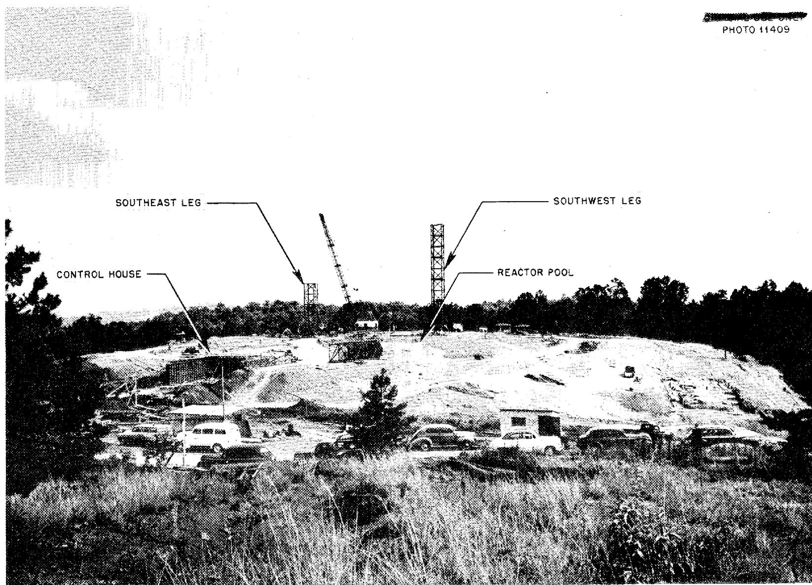  
Fig. 13.1. Tower Shielding Facility Site on August 10, 1953 (View to South-Southeast).

# 14. SHIELDING THEORY

E.P.Blizard M.K.Hullings

J. E. Faulkner F. H. Murray

Physics Division

H. E. Stern, Consolidated Vultee Aircraft Corporation

# NEUTRON SPECTRA

The spectrum of neutrons attenuated by water has been calculated by Certain and others at NDA, with the use of the NYU computer. The shape of the spectrum they calculated differs from the shapes of the spectra obtained from measurements made at ORNL with the use of both a recoil-proton spectrometer(1) and a nuclear plate camera.(2) A maximum in the distribution function at about 1 MeV appears in both sets of experimental data, but it was not evident in the NDA calculations. This discrepancy may well be attributable to the calculations being for neutron flux, whereas the experiments measure only the outwardly directed neutrons. Since this difference was evident for water slabs as thin as 5 cm, the problem appears to be amenable to the Monte Carlo type of calculations. Accordingly, a small calculation of this sort has been undertaken by one operator with the use of a desk type of computer. Although only 25 histories have been followed thus far, one conclusion appears evident already. The neutrons penetrate 5 cm of water (oxygen was ignored) with less than one collision, on the average, there being relatively few much-collided neutrons. The measurement may therefore be expected to give results which are typical of uncollided flux; the spectra obtained from the measurements were consistent with this hypothesis.

# NEUTRON STREAMING IN IRON

The unusually large transparency of iron for neutrons of intermediate energy has been ascribed alternately to a minimum in its cross section at 24 kV and to a lack of inelastic scattering in the low intermediate energy region. The "window" in the cross section would allow a large uncollided current to give rise to collimated streaming along thin iron pieces. To observe this "window" effect, a large slab of iron was used as a collimator and the collimation was measured in air behind the iron. Calculations of the expected flux distribution beyond the air gap that were based on the angular distributions that would exist if diffusion is responsible for the low iron attenuation have failed to explain the large collimation. The low attenuation is therefore ascribed to the minimum in the iron cross section. This conclusion has been confirmed by recent work at Brookhaven National Laboratory and by the early work of Langsdorf and his collaborators at ANL.(3)

# THE 1953 SUMMER SHIELDING SESSION

A four-week study session for the purpose of standardizing shielding design methods and guiding the shielding programs into the most important avenues was held at the Laboratory during the month of June and was attended by the following people:

Lockheed Aircraft Corporation

Julius Jonas

Morris Neustadt

Boeing Airplane Company

R. Olason

Pratt and Whitney Aircraft Division

C. F. deGanahl

John LaMarsh

Curtiss-Wright Corporation

Richard Greene

H. Reese

Consolidated Vultee Aircraft Corporation

D.C.Hamilton

B. P. Leonard

H. E. Stern

General Electric Company - ANPP

T. R. Mitchell

C. L. Storrs

Oak Ridge National Laboratory

F. H. Abernathy, ANP Division

E. P. Blizzard, Physics Division

A. P. Fraas, ANP Division

R. H. Ritchie, Health Physics Division

A. Simon, Physics Division

T. A. Welton, Physics Division

H. P. Yockey, Health Physics Division

A summary report(4) of the session will be issued. The nuclear-powered airplane and its shields will be discussed schematically, with individual treatment given to the reflectormoderated circulating-fuel reactor, the supercritical-water reactor, and the direct-cycle reactor, to illustrate the most important and the most difficult parts of the shield design. This material was presented on the opening day of the session to assist the assembled members in applying themselves to the most important problems.

One of the members worked on correlating the many recommendations and reports concerning the radiation doses which an operating crew should be given. Since the information on this subject is not in any sense complete, the primary accomplishment was a

delineation of the information which shield designers need; the importance of obtaining the information at an early date was indicated.

Considerable attention was paid to interpreting bulk shielding measurements and to drawing from them conclusions as to the doses to be expected in an aircraft with a reactor. In this connection, there were two significant developments: one was the clarification of earlier reactor leakage calculations and shape transformations that also gave first correction terms which had not hitherto been published; the other was an extension of another method which was presented in the report of the Technical Advisory Board of 1950.(5) This method and its extension, being entirely independent of the transformation method, provides a check on that method. Of the two methods, it was determined that the transformation method, which is the more simple to use, is satisfactory for almost all cases of interest.

For the calculations of heating in shields and of air scattering and for the evaluation of the more unusual shielding materials, the more or less standard theory was reported.

In the problem of neutron penetration of a hydrogenous crew-shield side section, there appears to be rather a wide difference between theory and experiment. The only applicable experiment was the air-scattering experiment at the Bulk Shielding Facility, and this gave a relaxation length of 4.4 cm, whereas theoretical estimates indicate about 8 cm. Temporarily, 5 cm was adopted, and strong recommendations were made for further experimental work.

In the activation of coolants in the heat exchanger, new calculations were carried out which are probably the best which have been devised to date. There was some discussion of the interdependence of ground-handling

problems, the choice of cycle, and the degree of dividedness of the shield. In the matter of ground and structure scattering and the effect of ducts on shields, the summary report will essentially restate earlier work.


Part IV

APPENDIX

# 15. LIST OF REPORTS ISSUED DURING THE QUARTER

<table><tr><td>REPORT NO.</td><td>TITLE OF REPORT</td><td>AUTHOR(s)</td><td>DATE ISSUED</td></tr><tr><td colspan="4">I. Aircraft Reactor Experiment</td></tr><tr><td>CF 53-8-2</td><td>ARE Fuel Requirements</td><td>J. L. Meem</td><td>8-3-53</td></tr><tr><td>CF 53-8-167</td><td>ARE Operations Manual</td><td>E. S. Bettis
J. L. Meem</td><td>to be issued</td></tr><tr><td>ORNL-1535</td><td>Thermodynamic and Heat Transfer Analyses of the Aircraft Reactor Experiment</td><td>B. Lubarsky (NACA)
B. L. Greenstreet</td><td>8-10-53</td></tr><tr><td colspan="4">II. Reactor Physics</td></tr><tr><td>CF 53-7-137</td><td>Current Status of the Theory of Reactor Dynamics</td><td>W. K. Ergen</td><td>7-20-53</td></tr><tr><td>CF 53-7-190</td><td>Interpretation of Fission Distribution in ARE Critical Experiment</td><td>Joel Bengston</td><td>7-20-53</td></tr><tr><td>CF 53-8-22</td><td>The (n,g) Cross Section for Na23 at 500-600 Kev</td><td>F. H. Abernathy</td><td>8-4-53</td></tr><tr><td colspan="4">III. Shielding</td></tr><tr><td>CF 53-5-98</td><td>Sverdrup and Parcel Shield</td><td>E. P. Blizzard</td><td>5-12-53</td></tr><tr><td>CF 53-5-105</td><td>Fast Neutron Spectrum of the BSF Reactor</td><td>R. G. Cochram
K. M. Henry</td><td>to be issued</td></tr><tr><td>CF 53-5-117</td><td>A Calculation of the Gamma Radiation Peaching the ANP-53 Crew Shield</td><td>F. Bly
F. C. Maienschein</td><td>to be issued</td></tr><tr><td>CF 53-5-139</td><td>Threshold Measurements in the ESF</td><td>J. B. Trice</td><td>to be issued</td></tr><tr><td>CF 53-6-1</td><td>After-Shutdown Gamma Measurements at BSF</td><td>M. K. Hullings
T. V. Blosser</td><td>6-22-53</td></tr><tr><td>CF 53-6-165</td><td>Summary of Results from Recent Fireball Shielding Studies</td><td>J. B. Trice</td><td>6-11-53</td></tr><tr><td>CF 53-6-185</td><td>The Effect of Iron Behind Be in the ORNL Experiment 3-A Lid Tank</td><td>Flynn Chapman</td><td>to be issued</td></tr><tr><td>CF 53-6-186</td><td>Streaming of Thermal Neutrons Through Iron in the ORNL Lid Tank Experiment 3</td><td>Flynn Chapman</td><td>to be issued</td></tr><tr><td>CF 53-6-187</td><td>A Comparison of the Shielding Properties of Common Iron and Stainless Steel in ORNL Lid Tank</td><td>Flynn Chapman</td><td>to be issued</td></tr><tr><td>CF 53-7-15</td><td>Action of Design Review Committee Report on the TSF</td><td>C. E. Clifford</td><td>7-2-53</td></tr><tr><td>CF 53-7-67</td><td>Plastic Experiments in the Lid Tank</td><td>H. E. Stone</td><td>7-7-53</td></tr><tr><td>CF 53-7-83</td><td>Fast Neutron Leakage from the ORNL Lid Tank</td><td>H. E. Stone</td><td>7-10-53</td></tr><tr><td>CF 53-7-170</td><td>Reactor Leakage for Shielding Calculations</td><td>E. P. Blizzard</td><td>7-24-53</td></tr><tr><td>CF 53-8-146</td><td>Measurement of the Fast Neutron Spectrum of the Bulk Shielding Reactor Using Nuclear Plates</td><td>M. P. Haydon
D. B. Johnson
J. L. Meem</td><td>to be issued</td></tr><tr><td>CF 53-8-164</td><td>An Improved Unit Shield</td><td>E. P. Blizzard</td><td>8-27-53</td></tr><tr><td>ORNL-1526</td><td>A Neutron Line of Flight Spectrometer</td><td>G. S. Pawlicki</td><td>4-9-53</td></tr></table>

ANP QUARTERLY PROGRESS REPORT   

<table><tr><td>REPORT NO.</td><td>TITLE OF REPORT</td><td>AUTHOR(s)</td><td>DATE ISSUED</td></tr><tr><td colspan="4">III. Shielding (continued)</td></tr><tr><td>ORNL-1575</td><td>Report of the 1953 Summer Shielding Session</td><td>E. P. Blizzard</td><td>to be issued</td></tr><tr><td>ORNL-1611</td><td>The Skyshine Experiments at Bulk Shielding Facility</td><td>H. E. Hungerford</td><td>to be issued</td></tr><tr><td>ORNL-1616</td><td>Lid Tank Shielding Tests of the Reflector-Moderated Reactor</td><td>F. N. Watson
A. P. Fraas
M. E. LaVerne
F. Abernathy</td><td>to be issued</td></tr><tr><td colspan="4">IV. Metallurgy</td></tr><tr><td>CF 53-5-95</td><td>Development of a Fabrication Process</td><td>J. R. Johnson</td><td>5-13-53</td></tr><tr><td>CF 53-7-176</td><td>Proposal for Preparation of Molybdenum and Molybdenum-Base Alloys for Welding Studies</td><td>Battelle Memorial Institute</td><td>7-24-53</td></tr><tr><td>CF 53-7-199</td><td>Examination of Bi-Fluid Loop No. 1</td><td>G. M. Adamson</td><td>7-29-53</td></tr><tr><td>MM-106</td><td>Progress Report; The Flash Welding of Molybdenum. Part I - Temperature Distribution During the Flashing Cycle</td><td>Rensselaer Polytechnic Institute</td><td>4-30-53</td></tr><tr><td>MM-107</td><td>Progress Report No. 3 on Gas Plated Coatings on Metals and Alloys</td><td>The Commonwealth Engineering Co. of Ohio</td><td>5-11-53</td></tr><tr><td>MM-116</td><td>Progress Report No. 4 on Gas Plated Coatings on Metals and Alloys</td><td>The Commonwealth Engineering Co. of Ohio</td><td>6-10-53</td></tr><tr><td>MM-119</td><td>Gas Plated Coatings on Metals and Alloys</td><td>The Commonwealth Engineering Co. of Ohio</td><td>7-6-53</td></tr><tr><td>MM-113</td><td>Quarterly Progress Report on Production of Sound Ductile Joints in Molybdenum</td><td>Battelle Memorial Institute</td><td>4-30-53</td></tr><tr><td>NP-4576</td><td>Research and Development of Molybdenum Welding. Final Report for the Period April 30, 1951 to October 23, 1952</td><td>Massachusetts Institute of Technology</td><td>no date</td></tr><tr><td>IG 800-S-8</td><td>Eighth Bimonthly Progress Report Development of a High Temperature Strain Gage</td><td>Cornell Aeronautical Laboratory, Inc.</td><td>6-1-53</td></tr><tr><td>ORNL-1565</td><td>Scaling of Columbium in Air</td><td>H. Inouye</td><td>9-1-53</td></tr><tr><td colspan="4">V. Chemistry</td></tr><tr><td>ORNL-1538</td><td>The Determination of HF in Inert Gases</td><td>White Manning</td><td>4-28-53</td></tr><tr><td>UA-PR-11</td><td>Progress Report for the Period, October 1, 1952 to December 31, 1952</td><td>University of Arkansas</td><td>1-22-53</td></tr><tr><td>UA-PR-12</td><td>Progress Report for the Period January 1, 1953 through March 31, 1953</td><td>University of Arkansas</td><td>4-20-53</td></tr><tr><td colspan="4">VI. Heat Transfer and Physical Properties</td></tr><tr><td>CF 53-7-125</td><td>Preliminary Measurements of the Density and Viscosity of Fluoride Mixture No. 40</td><td>S. I. Cohen
T. N. Jones</td><td>7-23-53</td></tr><tr><td colspan="4">VII. Heat Transfer and Physical Properties (continued)</td></tr><tr><td>CF-53-7-126</td><td>Measurements of the Solid Densities of Fluoride Mixture No. 30, BeF2, and NaBeF3</td><td>S. I. Cohen T. N. Jones</td><td>7-23-53</td></tr><tr><td>CF 53-7-200</td><td>Heat Capacity of Fuel Composition No. 12</td><td>W. D. Powers G. C. Blalock</td><td>7-31-53</td></tr><tr><td>CF 53-7-209</td><td>Thermal Conductivity of Insulation in Safety-Rod Sleeve</td><td>M. Rosenthal J. Lones</td><td>7-29-53</td></tr><tr><td>CF 53-8-30</td><td>Enthalpy and Heat Capacity of LiCl-KCl Eutectic</td><td>W. D. Powers G. C. Blalock</td><td>8-5-53</td></tr><tr><td>CF 53-8-106</td><td>Preliminary Results on Flinak Heat Transfer</td><td>W. W. Hoffman</td><td>8-18-53</td></tr><tr><td>ORNL-915</td><td>Forced Convection Heat Transfer in Thermal Entrance Regions, Part III</td><td>W. B. Harrison</td><td>8-6-53</td></tr><tr><td colspan="4">VII. Miscellaneous</td></tr><tr><td>CF 53-6-6</td><td>Nuclear Rocket Studies</td><td>R. W. Bussard</td><td>7-3-53</td></tr><tr><td>CF 53-8-152</td><td>ANP Information Meeting of August 19, 1953</td><td>W. B. Cottrell</td><td>8-26-53</td></tr><tr><td>ORNL-1530</td><td>The Stability of Several Fused Salt Systems Under Proton Bombardment</td><td>W. J. Sturm R. J. Jones M. J. Feldman</td><td>6-19-53</td></tr><tr><td>CF 53-8-49</td><td>Sodium Plumbing</td><td>W. B. Cottrell L. A. Mann</td><td>8-14-53</td></tr></table>