ORNL 1615

Reactors-Research and Power

${30}\left( \alpha \right)$

MARTIN MARIETTA ENERGY SYSTEMS LIBRARIES

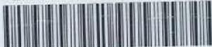

3445603495796

VAPORATORY RECORDS

#

CRITICAL EXPERIMENTS ON DIRECT

CYCLE AIRCRAFT REACTOR

Dixon Callihan

R. C. Keen

AEC RESEARCH AND DEVELOPMENT REPORT

CENTRAL RESEARCH LIBRARY

DOCUMENT COLLECTION

LIBRARY LOAN COPY

DO NOT TRANSFER TO ANOTHER PERSON

If you wish someone else to see this document, send in name with document and the library will arrange a loan.

OAK RIDGE NATIONAL LABORATORY

OPERATED BY

CARBIDE AND CARBON CHEMICALS COMPANY

A DIVISION OF UNION CARBIDE AND CARBON CORPORATION

UCC

POST OFFICE BOX P

OAK RIDGE. TENNESSEE

# CRITICAL EXPERIMENTS ON DIRECT CYCLE AIRCRAFT REACTOR

Work by: Dixon Callihan

E. V. Haake (Consolidated-Vultee)

R.C.Keen (Louisiana State University)

W. G. Kennedy (Pratt & Whitney Aircraft)

J. J. Lynn

Dunlap Scott

D. V. P. Williams

Preparation by: Dixon Callihan

R.C.Keen

OCT 2 2 1953

DATE ISSUED

PHYSICS DIVISION

A. H. Snell

Director

Contract No. W-7405, Eng 26

OAK RIDGE NATIONAL LABORATORY

Operated by

CARBIDE AND CARBON CHEMICALS COMPANY

A Division of Union Carbide and Carbon Corporation

Post Office Box P

Oak Ridge, Tennessee

# INTERNAL DISTRIBUTION

1. C. E. Center   
2. C. E. Larson   
3. L. B. Emlet (1-12)   
4.W.B.Humes (R-25)   
5. A. M. Weinberg   
6. A. H. Snell   
7. R. C. Briant   
8. Dixon Callihan   
9. W. K. Ergen   
10. A. P. Fraas   
11. R. A. Charpie   
12. T. A. Welton   
13. D. K. Holmes   
14. R. R. Coveyou   
15. A. J. Miller   
16. J. A. Swartout   
17. E. D. Shipley   
18. J. A. Lane   
19. E. S. Bettisj   
20. Dunlap Scot;   
21. D. V. P. Williams   
22. E. L. Zimmerman   
26. ANP Report's Office   
27. Biology library   
28. Health Physics Library   
29. Reactor Experimental Engineering Library   
31. Centra Research Library   
36. Laboratory Records Department   
37. Laboratory Records Department ORNL R.C.

# ETERNAL DISTRIBUTION

38. AF Plant Representative, Birbank   
39. AF Plant Representative, Seattle   
40. AF Plant Representative, Wood-Ridge   
41. ANP Project Office, For Worth

42-52. Argonne National Laboratory

53. Armed Forces Special Weapons Project (Sandia)

54-58. Atomic Energy Commission, Washington

59. Battelle Memorial Institute

60. Bechtel Corporation

61-63. Brookhaven National Laboratory

64. Bureau of Ships

65-66. California Research and Development Company

67-72. Carbide and Carb n Chemicals Company (Y-l2 Plant)

73. Chicago Patent Group

74. Chief of Naval Research

75. Commonwealth Fish Company

76. Department of the Navy - OP-362

77. Detroit Edisc Company

78-81. duPont Company, Augusta

82. duPont Company, Wilmington

83. Foster Wheeler Corporation

84-87. General Electric Company (ANPP) (1 copy to J. A. Hunter)

88-91. General Electric Company, Richland

92. Hanford Operations Office

93-99. Idaho Operations Office

100. Iowa State College

101-104. Knolls Atomic Power Laboratory

105-107. Los Alamos Scientific Laboratory (1 copy to H. C. Paxton)   
108. Massa husetts Institute of Technology (Kaufmann)   
109. Monsanto Chemical Company   
110. Mount Laboratory   
111. National Advisory Committee for Aeronautics, Cleveland   
112. National Advisory Committee for Aeronautics, Washington   
113. Nasal Research Laboratory   
114-115. New York Operations Office   
116-117. North American Aviation, Inc.   
118. Nuclear Development Associates, Inc.   
119. Patent Branch, Washington

120. Pioneer Service & Engineering Company   
121. Powerplant Laboratory (WADC),   
122. Pratt and Whitney Aircraft Division (Fox Project)   
123. Rand Corporation   
124. San Francisco Operations Office   
125. Savannah River Operations Office, Augusta   
126. USAF Headquarters   
127. U. S. Naval Radiologist Defense Laboratory   
128-129. University of California Radiation Laboratory, Berkeley   
130-131. University of California Radiation Laboratory, Livermore   
132. Vitro Corporation of America   
133. Walter Kidde Nuclear Laboratories, Inc.   
134-139. Westinghouse Electric Corporation   
140-154. Technical Information Service, Oak Ridge

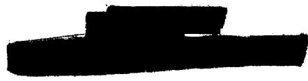

# ABSTRACT

The critical experiment program on the Direct Cycle Aircraft Propulsion Reactor was planned jointly by General Electric Company and the ANP group of Oak Ridge National Laboratory. The experiments were performed by the Laboratory group at the Oak Ridge Critical Experiment Facility.

A cylindrical assembly having a core composed of alternate layers of hydrogenous material and of an open lattice of stainless steel and metallic uranium approximately 36" long and 51" in diameter was constructed. The assembly was reflected by a 6" thick annulus of beryllium around its circumference and 6" of AGOT graphite on the ends which covered both the core and the beryllium jacket. The reactor required a critical mass of 41 kilograms of uranium enriched to 93.3% U-235, and used Plexiglas as a mock-up moderating material. Two mock-ups of the Direct Cycle Reactor are reported here. In one of these modifications the moderator, the fuel disks and the stainless steel supporting layers for the fuel disks were horizontal. The second mock-up consisted of a series of concentric rectangular shells formed by the rotation of an appropriate quantity of the core materials from a horizontal to a vertical position.

Core type fuel and moderator removal control rods were calibrated by both the stable period and the "rod drop" methods.

Power and neutron flux distribution studies were made on microscopic and macroscopic bases for both these assembly mock-ups. Aluminum catcher foils in contract with the U-235 metal were used in the power distribution measurements and the flux distributions were determined by indium foil activation.

Measurements were made of the changes in reactivity resulting from the removal of a section of the beryllium reflector and the substitution of other materials for it. Losses in reactivity were also measured in terms of the separation of the two halves of the assembly at midplane and compared with calculated values, treating the assembly as a bare thermal reactor. Reasonable agreement was obtained between experimental and computed values.

Evaluations were made of certain experimental poison rods and of substituting limited amounts of molybdenum for stainless steel and of graphite for Plexiglas.

The end reflector was removed from approximately one eighth of the assembly and a stack of Plexiglas erected and other alterations made to further mock-up the Direct Cycle Reactor. The effects of these changes on the reactivity and neutron flux were determined.

# TABLE OF CONTENTS

Page

ABSTRACT 5

LIST OF FIGURES 7

LIST OF TABLES 10

I. INTRODUCTION 11

II. DESCRIPTION OF EQUIPMENT AND ASSEMBLIES 11

A. Permanent Equipment 11

B. Shelf Type Mock-Up of Direct Cycle Reactor 14

C. Conversion from Shelf Type Assembly to Rectangular Shell Type 18

D. Conversion from Rectangular Shell to Water-Cone 
Reflected Mock-Up 18

III. EXPERIMENTAL STUDIES IN SHELF TYPE ASSEMBLY 22

A. Control Rod Calibrations 22

B. Temperature Effects 27

C. Reflector Studies 29

D. Power and Neutron Flux Determinations 36

IV. EXPERIMENTAL STUDIES ON RECTANGULAR SHELL TYPE ASSEMBLY 56

A. Control Rod Calibrations 56

B. Temperature Effects 59

C. Flexiglas Thickness Reactivity Coefficient 59

D. Effect of Separation of Core at Midplane 59

E. Reflector Studies 63

F. Danger Coefficient Type Evaluations 66

G. Power and Neutron Flux Determination 72

V. EXPERIMENTAL STUDIES ON WATER-CONE REFLECTED ASSEMBLY 86

A. Traverses in Water-Cone Reflected Assembly 86

VI. CONCLUSIONS 90

VII. APPENDICES 91

A. Conversion from Shelf to Rectangular Shell Mock-Up 91

B. Analyses of Reactor Materials 93

C. Summary of Materials in Reactor Assemblies 95

# LIST OF FIGURES

Page

1. Photograph of Two Halves of Aluminum Matrix 13   
2. Photograph of Fuel Element 15   
3. Loading Chart of Shelf Type Assembly 16   
4. Photograph of Interface of Shelf Type Assembly 17   
5. Loading Diagram for Rectangular Shell Type Assembly 19   
6. Photograph of Midplane of Rectangular Shell Type Assembly 20   
7. Photograph of Small Area of Midplane of Rectangular Shell Type Assembly 21   
8. Calibration of Control Rod A 24   
9. Sensitivity of Control Rod A 25   
10. Reactivity Change vs Temperature for Shelf Type Assembly 28   
11. Reflector Value vs Void Width for Composite Reflector 32   
12. Sensitivity of Reflector Value vs Void Width for Composite Reflector 33   
13. Reflector Value vs Composition for Composite Reflector of Stainless Steel and Plexiglas located at Bottom of Reactor. 35   
14. Reflector Value vs Composition Reflector of Stainless Steel and Plexiglass located at Side of Reactor 37   
15. Photograph of Materials used in Power and Neutron Flux Determinations 39   
16. Radial Power Distribution in Shelf Type Assembly 40   
17. Axial Power Distribution in Shelf Type Assembly 41   
18. Power Distribution in Cell M-12 43   
19. Radial Neutron Flux Distribution in Shelf Type Assembly 44   
20. Axial Neutron Flux Distribution in Shelf Type Assembly 45   
21. Vertical Radial Neutron Flux Distribution in Shelf Type Assembly 46   
22. Outline Drawing of a Unit Cell 48   
23. Vertical Neutron Flux Distribution in Unit Cell Through Center of Fuel Disk 49

24. Vertical Neutron Flux Distribution in Unit Cell off Center . . . of Fuel Disk 50   
25. Vertical Neutron Flux Distribution in Unit Cell near Edge of Fuel Disk 51   
26. Vertical Neutron Flux Distribution Through Axis of Unit Cell Between Fuel Disks 52   
27. Vertical Neutron Flux Distribution off Axis of Unit Cell Between Fuel Disks 53   
28. Vertical Neutron Flux Distribution Near Edge of Unit Cell Between Fuel Disks 54   
29. Neutron Flux Distribution Through a Unit Cell M-12 Having 2-Mil Disks Parallel to Plexiglas 55   
30. Neutron Flux Distribution Through a Unit Cell M-12: Having 2-Mil Disks Perpendicular to Plexiglas 57   
31. Bare and Cadmium Covered Indium Traverses Across a 10-Mil Fuel Disk . 58   
32. Change in Reactivity vs Plexiglas Thickness 60   
33. Change in Reactivity vs Separation Distance at Midplane 62   
34. Change in Reactivity vs Plexiglas Thickness for Stainless Steel-Plexiglas-Boral Composite Reflector 64   
35. Change in Reactivity vs Plexiglas Thickness for Stainless Steel- Plexiglas-Cadmium Composite Reflector 65   
36. Bare and Cadmium Covered Indium Traverses through Composite Reflector with Boral Strips Present 67   
37. Cadmium Fraction vs Distance from Bottom of Test Section for Composite Reflector with Boral Strips Present 68   
38. Bare and Cadmium Covered Indium Traverses Through Composite Reflector with the Boral Strips Removed 69   
39. Cadmium Fraction vs Distance from Bottom of Test Section for Composite Reflector with Boral Strips Removed 70   
40. Power Distribution Through Cells M-12, M-8, M-6 and M-4 in Rectangular Shell Type Assembly 73   
41. Radial Power Distribution at Midplane in Rectangular Shell Type Assembly 75

Page

42. Shelf-Shielding of Fuel Disk 77   
43. Vertical Radial Neutron Flux Distribution between Plexiglas in Rectangular Shell Type Assembly 78   
44. Horizontal Radial Flux Distribution Through Plexiglas in Rectangular Shell Type Assembly 79   
45. Axial Flux Distribution Through Cell M-12 in Rectangular Shell Type Assembly 81   
46. Horizontal Neutron Flux Distribution at Plexiglas Intersection in Rectangular Shell Type Assembly 82   
47. Vertical Neutron Flux Distribution Across Central Rectangular Shell Type Cell, M-12 83   
48. Horizontal Neutron Flux Distribution Around General Electric Company Experimental Poisson Rod 84   
49. Vertical Neutron Flux Distribution Around General Electric Company Experimental Poison Rod 85   
50. Axial Neutron Flux Distribution Through Cell R-12 in Water-Cone  
Reflected Mock-Up 87   
51. Axial Neutron Flux Distribution Through Cell U-12 in Water-Cone  
Reflected Mock-Up 88   
52. Axial Neutron Flux Distribution Through Cell H-12 in Unaltered Segment of Water-Cone Reflected Mock-Up 89

# LIST OF TABLES

Page

I. Comparison of Rod Calibrations 26   
II. Reactivity Change Introduced by Substituting Beryllium for Air 29   
III. Reactivity Change Effected by Substitution of Stainless Steel and Plexiglas for Beryllium 30   
IV. Reactivity Losses for Variable Void Width in Reflector 31   
V. Reactivity Losses Effected by Substitution of Stainless Steel and Plexiglas for Beryllium 31   
VI. Reactivity Losses Effected by Varying Composition of the Bottom Reflector 34   
VII. Reactivity Losses Effected by Varying Composition of the Side Reflector 36   
VIII. Thermal Neutron Distribution in a Unit Cell 56   
IX. Calibration Data for Control Rod "A" in Rectangular Shell Type Assembly 59   
X. Summary of Control Rod Calibration Data 59   
XI. Effect of Core Gap on Reactivity 61   
XII. Poisson Rod Reactivity Changes 71   
XIII. Comparison of Molybdenum and Stainless Steel 71   
XIV. Relative Axial Power 72   
76

# I. INTRODUCTION

This report is a summary of the information contained in five progress reports1, of limited circulation, published at intervals during the course of these experiments. Since these progress reports were of limited circulation and available only to those directly connected with the project, it seemed advisable to make the information obtained from the critical experiments available on a wider basis in the form of an overall report.

A description of the program of the critical experiments to be performed by the Oak Ridge National Laboratory contributing to the design of the Direct Cycle Nuclear Reactor by the General Electric Company is given in their Document DC-51-11-6, dated November 5, 1951, entitled "9213 Critical Experiment Program", and supplements, dated December 14, 1951; June 12, 1952 and others subsequently issued as work on the program progressed.

The first mock-up of the reactor as actually constructed consisted of a right circular cylinder, with axis horizontal, and a core 36" long and 51" nominal diameter containing 41.2 kilograms of uranium or 38.5 kilograms of U-235. The H to U-235 atomic ratio was 225. The core composition by volume fractions was as follows: Plexiglas (to simulate water) 0.319; stainless steel 0.043; uranium 0.00185; aluminum 0.063 and voids 0.573. It was assembled in a matrix of square aluminum tubing which will be described later. This mock-up, in which the Plexiglas was in horizontal layers separating groups of six layers of an open structure of type 302 stainless steel sheets holding the uranium metal disks, was designated as the "shelf type assembly". This mock-up is also referred to as CA-5.

The second mock-up consisted of a series of concentric rectangular shells formed by rotating an appropriate number of Plexiglas strips and their accompanying structure of stainless steel sheets and fuel disks from a horizontal to a vertical position. This rotation was supplemented by minor changes in some core and reflector materials but with no change in the amount of uranium present. This modification, which will also be described in detail later, was known as the "rectangular shell type assembly" and was used to obtain additional data pertinent to concentric annuli in the design of the Direct Cycle Reactor. This mock-up is referred to as CA-6. Additional minor changes were made to the rectangular shell type assembly during the course of the experiments and this third mock-up is designated as CA-7.

# II. DESCRIPTION OF EQUIPMENT AND ASSEMBLIES

A. Permanent Equipment:

The critical experiment assembly has been adequately described in other reports2, and only a brief description of the components which are essential to understanding of current experimental techniques will be included here. Such features as shielding, interlock system, safety systems and scams are omitted since they have very little bearing on these experimental results.

# 1. Assembly Structure

The assembly apparatus consists basically of a matrix of square 2S aluminum tubes stacked horizontally which, when assembled, form a $6^{\prime}$ cube and into which the reactor materials may be placed. The $6^{\prime}$ cube is divided into two identical halves, except that one is stationary and the other can be moved by remote control a distance of $5^{\prime}$ from the stationary half. Each half consists of 576 tubes, stacked in a $24 \times 24$ cell array. These tubes are $36^{\prime\prime}$ in length, $3^{\prime\prime} \times 3^{\prime\prime}$ outside, and $0.047^{\prime\prime}$ wall thickness. Part of the reactor materials are placed in each half and the assembly is made critical by control rod adjustment after the two halves are together. Figure 1 is a photograph of the two halves of the assembly. (The materials visible in the upper portion of the moveable half have no relation to the Direct Cycle Reactor.) The moveable half is driven by a power screw coupled by gears to a 1 HP. D.C. shunt wound motor. The speed of the motor and the reducing gears is so adjusted that the moveable half approaches the fixed half with a speed of $33^{\prime\prime}$ per minute between $5^{\prime}$ and $8^{\prime\prime}$ separation, $6^{\prime\prime}$ per minute between $8^{\prime\prime}$ and $2^{\prime\prime}$ , and $1^{\prime\prime}$ per minute between $2^{\prime\prime}$ and the stopping position of the moveable half. Positions of the moveable half relative to the fixed half are indicated to $0.01^{\prime\prime}$ over the entire $5^{\prime}$ travel by a Selysn Veeder-Root mechanism coupled to the power screw. Separations less than one half inch are indicated to $0.001^{\prime\prime}$ by Starrett Micrometer dial indicators coupled through Autosyn 400 cycle Selsyns to points at the bottom of the matrix. The precision of the incremental separations of the two halves was the order of $0.001^{\prime\prime}$ . Due to a lack of parallelism of these facing halves, however, the inaccuracy of the overall separation was estimated to be about $0.02^{\prime\prime}$ .

# 2. Instrumentation

The radiation level of the reactor is monitored by eight independent instruments: a scintillation counter, a fission chamber, and six $\mathrm{BF}_3$ filled neutron detectors, two of which are proportional counters and four are ionization chambers. Leakage radiation is measured by placing the detectors at varying distances from the reactor core. Of special interest in the present experimental procedures are the logarithmic meter and the pile period meter, both of which derive their incoming signals from a $\mathrm{BF}_3$ ionization chamber, and are used in the calibration of the control rods. The logarithmic meter records power levels over a range of approximately 6-1/2 decades, and the period meter records instantaneous pile periods from infinity to plus 3 seconds and from infinity to minus 30 seconds. Stable pile periods may be observed directly from the slopes of the curves traced by the logarithmic recorder.

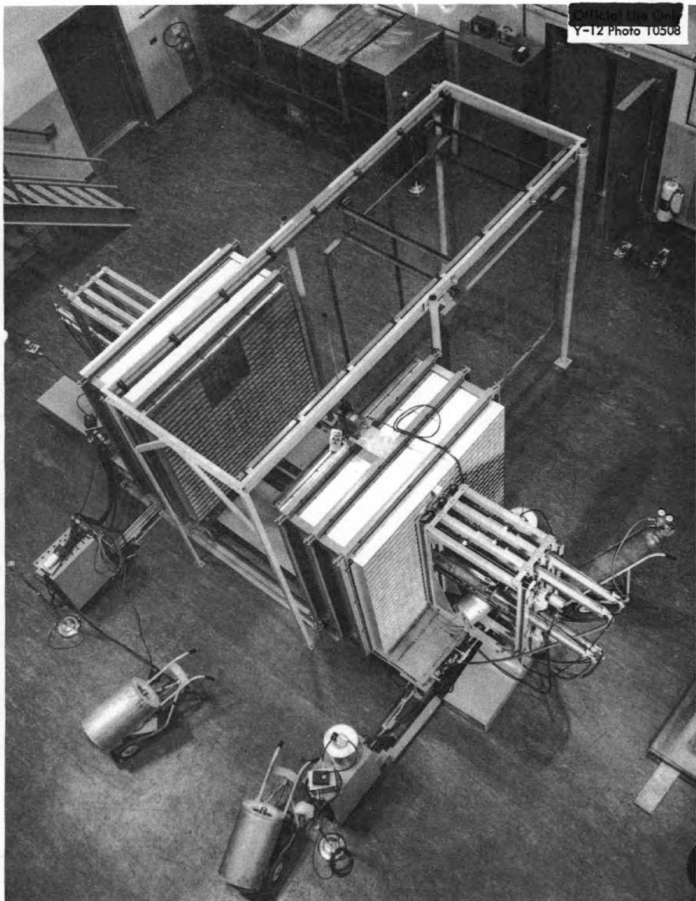  
Fig. 1. Photograph of Two Halves of Aluminum Matrix.

# 1. Core Construction

The enriched uranium metal is in the form of circular disks approximately 0.01" thick with diameters of 2.860" and 1.430" and masses of 18.0 ± 0.1 and 4.5 ± 0.1 grams respectively. Since it was not possible to roll uranium metal foil of sufficient uniformity for this small mass tolerance, many of the disks had small holes punched in them for mass adjustment. Each disk had a 0.196" hole drilled in the center. The fuel elements were assembled by placing the large disks on 3.6" centers above an open array of three sheets of stainless steel and covering them with an inverted three piece open array. Because of insufficient large disks, it was necessary, in some cases, to substitute small ones. Quarter size fuel elements were also assembled and used near the circumference to approximate a circular core from square elements. Photographs of the fuel elements are shown in Fig. 2.

The moderating material, Plexiglas, which has been shown to simulate water in thermal neutron systems3, was in horizontal layers, one inch thick. The separate layers support the open structure of stainless steel and fuel disks as shown in Fig. 4.

Some details of the core construction are shown in the loading chart, Fig. 3. The numbers and letters in the cells show the positions of the safety and control rods respectively. Safety rods 1, 2, 3, and 4 and control rods A and B are in one half of the assembly and an equal number are in the other. The assembly was critical with some of the control rods removed. Correction for the accompanying voids, based on an empirical calibration of the rods in units of mass of uranium indicates the "clean" critical mass to be 41.1 kilograms of uranium or 38.4 kilograms of U-235. The structure of the control and safety rods is, of course, the same as that of the fuel elements.*

# 2. Reflector Construction

The core of the reactor is enclosed in an end reflector of $6''$ of AGOT graphite and a nominal $6''$ thick side reflector of beryllium. The beryllium thickness varies slightly because the annular reflector is fabricated from square pieces. The graphite end reflector extends to the outside surface of the beryllium annulus. The control and safety rods contain the graphite reflector. A photograph of the assembled core at the midplane is shown in Fig. 4.

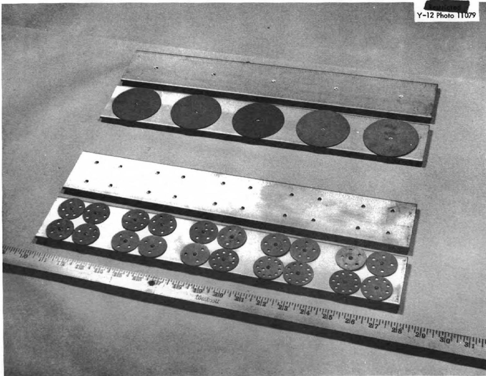  
Fig. 2. Photograph of Fuel Element.

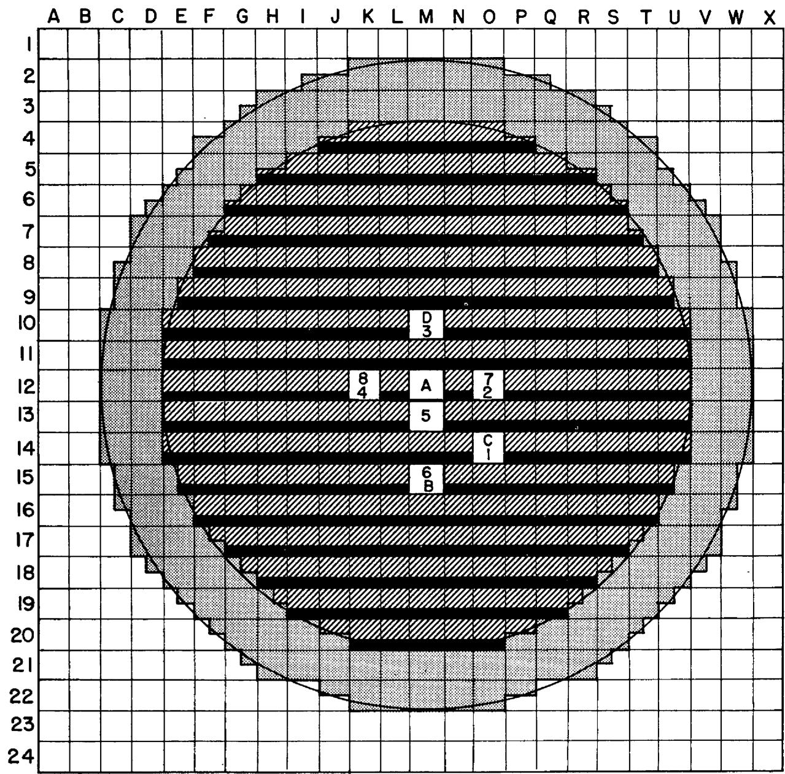

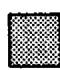  
FIGURE 3. LOADING CHART

Be REFLECTOR, JACKET 18" LONG, EACH HALF BACKED BY 6" GRAPHITE (END).

FUEL ELEMENT, EACH 18" LONG, EACH HALF BACKED BY 6" GRAPHITE. (TOP) -6 LAYERS STAINLESS WITH 5-10 mil x 3" U DISCS, HORIZONTAL; (BOTTOM) - I" PLEXIGLAS. STAINLESS STEEL, AIR, FUEL PLEXIGLAS

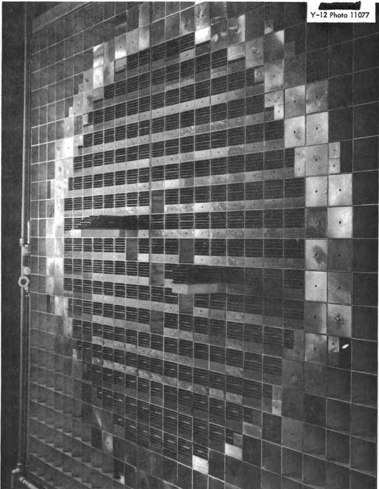  
Fig. 4. Photograph of Shelf Type Assembly.

The conversion from the shelf type critical assembly, shown in Fig. 3 to the rectangular shell (RS) type shown in Fig. 5, consisted essentially of the rotation of the planes of the fuel disks, the stainless steel sheets and the moderator strips from a horizontal to a vertical position in approximately one half of the core cells. The effect on reactivity of the rotation of these core materials has been calculated and is contained in Appendix A. Minor changes in the amounts of core materials were made by substituting stainless steel sheets for Plexiglas in the central cell, M-12, in which control rod A was located. It is recalled that the control and safety rods, all of which contain fuel elements, extend from the end of the reactor to the midplane of the core. The only change in the reflector was the addition of a 2" layer of graphite reflector to one end, making it 8" thick, the other remaining 6". The lengths of control rods A and B were thereby increased 2".

No changes were made in the locations of the control rods and the safety rods nor in the amount of uranium in the core of the reactor. Figures 6 and 7 are two photographs of the RS type assembly taken at the midplane perpendicular to the axis of the reactor. Figure 6 shows the overall loading and Fig. 7 shows, somewhat more in detail, the arrangements of stainless steel and Plexiglas within the cells. The vacant cells shown in the photographs indicate the locations of either control or safety rods. The irregular boundary between those cells which have the planes of the fuel elements vertical and those in which they are horizontal is also visible.

If the rotation of the fuel, stainless steel and moderator strips is in such a direction as to place the fuel adjacent to the beryllium reflector the assembly is more reactive than when the rotation is in the opposite direction since the latter puts a thick layer of hydrogenous material between the core and the reflector. It was estimated that the RS type loading, as shown in Fig. 5, was less reactive than the former shelf type by about one percent in $\Delta \mathrm{k} / \mathrm{k}_{\mathrm{eff}}$ .

# D. Conversion from the Rectangular Shell to the Water-Cone Reflected Mock-up.

The water-cone reflected mock-up was constructed to better simulate water cooling channels of the reactor, ascertaining their effect on the flux distribution and reactivity. This information, coupled with the reflector studies, determined the severity of the penalty associated with the contemplated substitution of the iron-water reflector for beryllium.

Reflector changes made in the (RS) type mock-up of the Direct Cycle Reactor to simulate the water-cone reflector proposed for the end of the reactor were the following: The six inch graphite end reflector was removed from one quadrant of one half of the assembly consisting of the following cells: N-12; O-11, 12; P-10 through P-14, inclusive; Q-9 through Q-15, inclusive; R-8 through R-16, inclusive; S-7 through S-17, inclusive; T-8 through T-16, inclusive; U-10 through U-14, inclusive. The Plexiglas in this group of 49 cells was extended 10 1/4". These alterations in the reflector made the reactor subcritical even

DWG. 21338

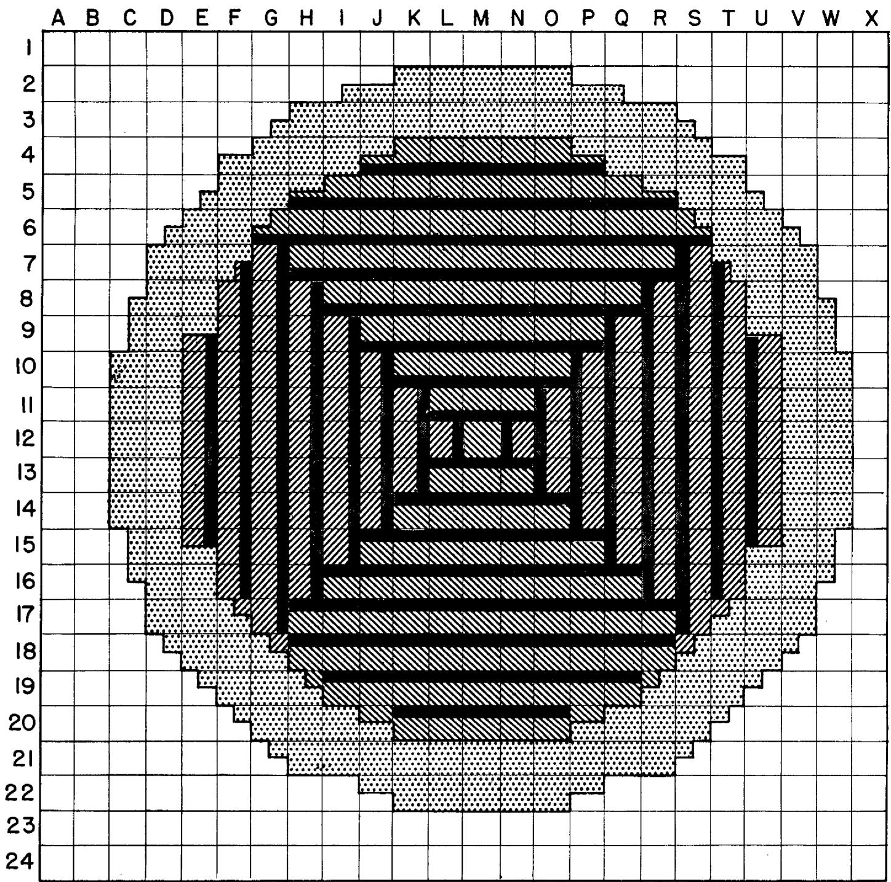

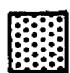  
Be JACKET REFLECTOR, 36" LONG

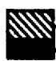  
FUEL ELEMENT, 36" LONG STAINLESS STEEL, URANIUM, AIR SPACE, I $\frac{7}{8}$ " THICK PLASTIC, I" THICK   
FIGURE 5. LOADING DIAGRAM

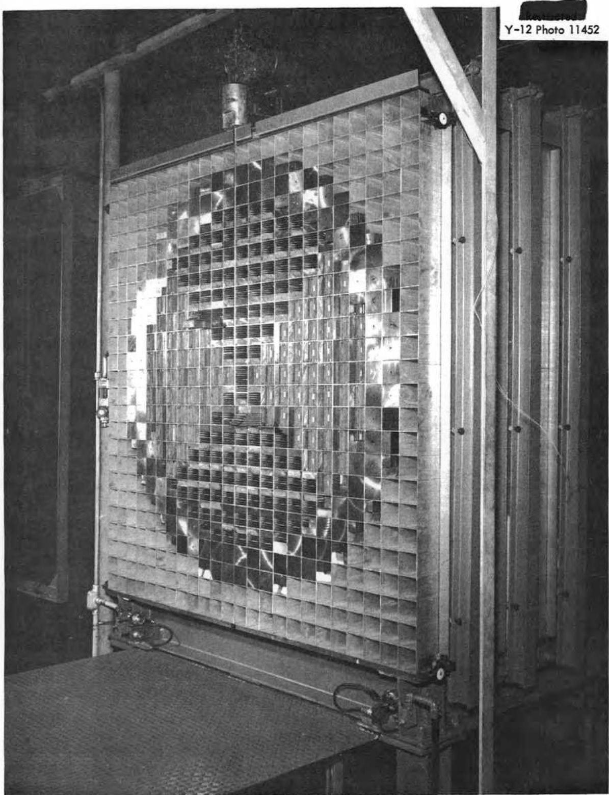  
Fig. 6. Photograph of Rectangular Shell Type Assembly.

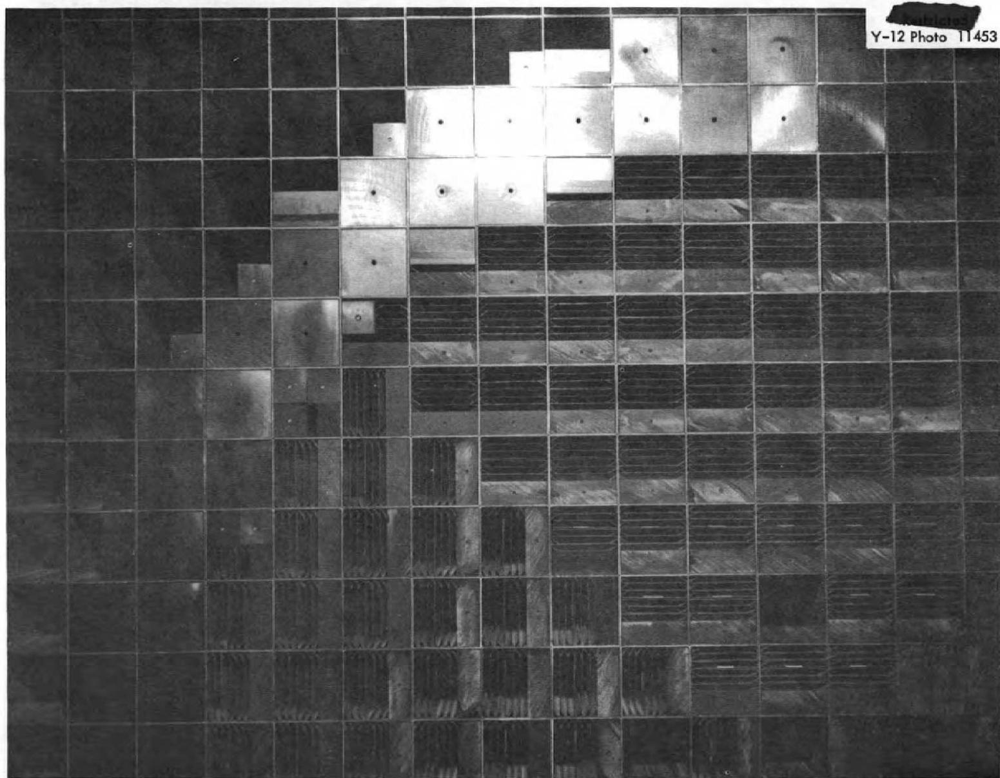  
Fig. 7. Photograph of Small Area at Midplane of Rectangular Shell Type Assembly.

with all the control rods in. This subcriticality was compensated for by the addition of $36^{\prime \prime}$ lengths of beryllium to the following cells: B-8 through B-16, inclusive; C-6, 7, 17, 18: D-5, 19; E-4, 20; F-3, 21; G-2, 22; H-1, 2, 22; I-1, 22; J-1, 23; K-1, 23; L-1, 23. The $6^{\prime \prime}$ graphite end reflector was removed from the portion of the beryllium jacket which was adjacent to the quadrant containing the $10\frac{1}{4}''$ Plexiglas extension and replaced by a $10\frac{1}{4}''$ beryllium extension making the reflector the same length as the altered core. The final change consisted of erecting a stack of Plexiglas, approximately $12''$ thick, adjacent to one end of the reactor and starting at the table top and terminating at top of the following cells: Q-7, R-6, S-5, T-5, U-5, V-5 and W-6. The vertical edge of this Plexiglas stack, which simulated the water-cone, was $3/4''$ from the end of the aluminum matrix. The width of the simulated water-cone began at the first safety and control rod supporting column and extended to within about $1/2''$ of the edge of aluminum matrix.

The change in reactivity produced by the removal of the graphite and the extension of the Plexiglas in the 49 cells listed in the loading change was a decrease of 85.2 cents. The addition of the $36^{\prime \prime}$ extension to the beryllium reflector produced a gain in reactivity of 106.3 cents. Gains in reactivity were also observed due to the $10\frac{1}{4}$ extension of the beryllium reflector and to the erection of the simulated water-cone in the amounts of 17 cents and 8.4 cents, respectively.

# III. EXPERIMENTAL STUDIES ON SHELF TYPE ASSEMBLY

# A. Control Rod Calibrations:

The displacement of a calibrated control rod serves as a measure of the changes in reactivity of a critical system. In the calibration the changes in reactivity introduced by the linear displacement of a control rod may be determined by either of two methods: 1) the measurement of the stable period resulting from the reactivity change, and 2) the "rod-drop" method.

# 1. The Period of a Super Critical System

A measurement is made of the period of the super critical system resulting from the insertion of a control rod. When the change in reactivity is small, it is related to the super critical period by the following expression:

$$
\frac {\delta_ {k}}{k _ {\text {e f f .}}} = \sum_ {1} ^ {n} \frac {\omega + \beta_ {i}}{\omega + \lambda_ {i}} = \sum_ {1} ^ {n} \frac {\beta_ {i}}{1 + \lambda_ {i} T} \tag {1}
$$

Where $\frac{\delta k}{k_{\text{eff}}}$ = change in multiplication or excess reactivity

T = stable pile period in seconds   
$n =$ number of groups of delayed neutrons   
$\lambda_{i} =$ decay constant for neutron precursors of group 1   
$\beta_{1}^{1} =$ fraction of fission neutrons in delayed group 1

or in units of cents:

$$
\rho = 1 0 0 \frac {\delta_ {k}}{k _ {\text {e f f}}} \left(\frac {1}{\sum^ {n} \beta_ {i}}\right) = 1 0 0 \left(\sum_ {i} ^ {n} \frac {\beta_ {i}}{1 + \lambda_ {i} T}\right) \left(\frac {1}{\sum^ {n} \beta_ {i}}\right) \tag {2}
$$

where $100\phi$ is the reactivity equivalent to the effective fraction of delayed neutron. The symbols in equation (2) have the same significance as in equation (1). Reactivity results are reported in cents values to avoid the uncertainty in the effective value of the delayed neutron fraction necessary in converting to $\delta k / k_{\text{eff}}$ .

# 2. "Rod-drop" Method

In this method a measurement is made of the transient occurring when the safety rod is quickly removed from the assembly. The change in reactivity in cents $(\rho)$ may be computed from the equation

$$
\rho = 1 0 0 \frac {\mathrm {N} _ {0} - \mathrm {N} _ {1}}{\mathrm {N} _ {1}} \tag {3}
$$

where $\mathbf{N}_{\mathbf{O}} =$ power level at critical

$N_1 =$ extrapolated power level of the slow transient at the instant the rod is removed

The change in reactivity produced by the linear displacement of each control rod was determined by these two methods. The supercritical period was measured for various increments of displacement until the rod had been displaced its full length and the corresponding changes in reactivity were computed from equation (2). Each of the safety rods, which was colinear with a control rod, was evaluated from the transient occurring in the flux as it was dropped. Evaluations of the safety rods were made from equation (3) and compared, respectively, with the integrated value of the symmetrically located control rod. Table I gives a summary of the total rod evaluations, in cents, for the four control rods and the values obtained by the rod drop method for the corresponding safety rods. Typical data obtained in the incremental calibration by the stable period method are shown in Figs. 8 and 9. The change in reactivity occurring when the rod is withdrawn from the reactor, plotted as a function of the rod position from the midplane, is shown in Fig. 8. In Fig. 9 is plotted the change in reactivity per unit displacement, the rod sensitivity, as a function of the same rod position. The horizontal lines represent the average sensitivity over the incremental displacement. The peaks

FIGURE 8.   
CONTROL ROD A   
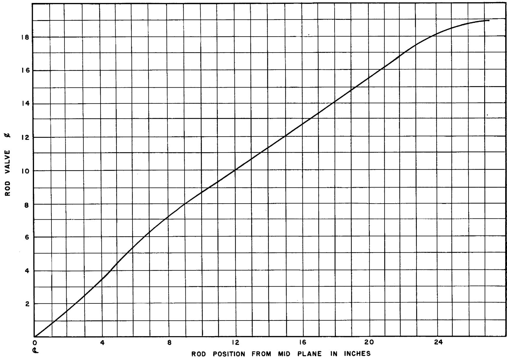  
66612 5M   
$\therefore m = \frac{3}{11}$ ;

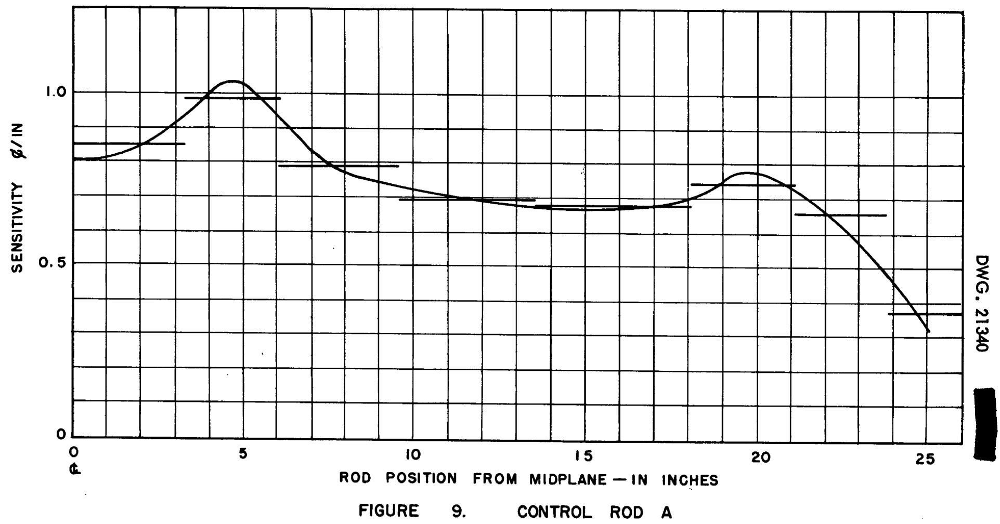

in Fig. 9 are attributed to the structure of the rod, but this result was not investigated. It should be noted however, that these peaks occur at the approximate positions where the channel at end of the reactor is opened first by the reflector removal and then by the removal of the complete element.

TABLEI COMPARISON OF ROD CALIBRATIONS   

<table><tr><td colspan="2">Control Rods
(by integrated periods)</td><td colspan="2">Safety Rods
(by rod drop)</td></tr><tr><td>A</td><td>18.2¢</td><td>5</td><td>16¢</td></tr><tr><td>B</td><td>15.9</td><td>6</td><td>16</td></tr><tr><td>C</td><td>15.9</td><td>1</td><td>18</td></tr><tr><td>D</td><td>18.3</td><td>3</td><td>18</td></tr></table>

It is believed that the precision of the rod drop method is no greater than 2 cents so that the agreement in some of the above cases is perhaps coincidental.

In the course of the rod calibration experiments by the integrated period method it was noted that the positions of the control-rods, when critical at an increased power level in a reactor which has been operated for several hours reproduced, within the limits of experimental error, the previous critical positions at a lower power, whereas the reverse was not true. That is, when the power was decreased by a factor of ten it was found necessary, in order to re-establish a critical system, to remove the control rod a few tenths of an inch beyond the position where the system had been critical at the higher power level.

This variation in rod position for criticality is attributed to an effective source of neutrons arising from the Be $(\gamma, n)$ reaction which is relatively stronger at lower power levels following operation at higher power. In order to minimize errors arising from this source the following procedure was used in the calibration of, say, control rod A. With the neutron flux constant at the lower level sufficient excess reactivity was introduced by inserting some rod, not A, to produce a stable period of between 250 and 400 seconds. The power was allowed to increase, on this period, approximately ten fold and the assembly was made critical by withdrawing rod A. This displacement of A corresponded to the observed period. The power was then reduced and leveled by the appropriate manipulation of other rods and the procedure repeated, thereby evaluating successive increments of rod A. It is believed that, except for the first measurement, the rod displacement which produced the positive period is not exactly related to the period because, at the lower level, the assembly is not critical

due to the $(\gamma, n)$ neutrons. In the Direct Cycle Reactor there was no beryllium in the core and this effect may not have been very large.

An investigation was made of the linearity of response of the amplifier ion chamber circuit used in the period measurement by comparing it, at several lower levels, with proportional counters. A small deviation from linearity was found at power levels above those used in the control rod calibrations so the results are not significantly in error4.

# B. Temperature Effects

At various times during the operation of reactor assemblies variations have been observed in the day-to-day settings of control rods required for criticality under constant loading conditions. In the work reported here these variations exceeded the sensitivity required to detect the reactivity differences produced by some structural changes under study. Investigations have indicated the probable cause to be ambient temperature irregularities. The stability of the room temperature has been improved so that the exit air temperature is constant to one half Fahrenheit degree at $80^{\circ}\mathrm{F}$ . An empirical relationship between reactor temperature and reactivity has been established. The temperature, measured at two points in the matrix with an iron-constantan thermocouple, has been varied from $63^{\circ}\mathrm{F}$ to $80^{\circ}\mathrm{F}$ by altering the room temperature and allowing sufficient time for the temperature throughout the reactor to equalize. The attending reactivity differences, from the reactivity at $72.9^{\circ}\mathrm{F}$ , were measured in terms of previously calibrated control rods and are plotted as a function of temperature in Fig. 10. It is noted from this graph that the reactivity increases with increasing temperature, i.e. fuel control rods must be removed from the reactor to maintain criticality if the temperature increases. It is realized that, if reference is made to a reactor temperature coefficient, the sign of the coefficient is opposite to that expected for hydrogenous systems. The effect is possibly due to thermo-mechanical changes in the assembly which are complex because of structure, loading and operation. It might also be noted that an experiment in which the reactivity as a function of the Plexiglas thickness was measured, showed a maximum at a thickness slightly less than one inch. The above temperature effect may be accounted for, at least in part, by considering the concomitant change in density as effectively altering the thickness of the Plexiglas. No systematic investigation of this phenomenon has been made. If, during experimental operations, temperature variations became severe the empirical relation of Fig. 10 allowed the interpolation of all reactivity data to some arbitrary value. It has also been shown that, to at least the first order, the magnitude of the temperature effect, $1.25\phi / F_0$ , is independent of the experimental structural changes described below.

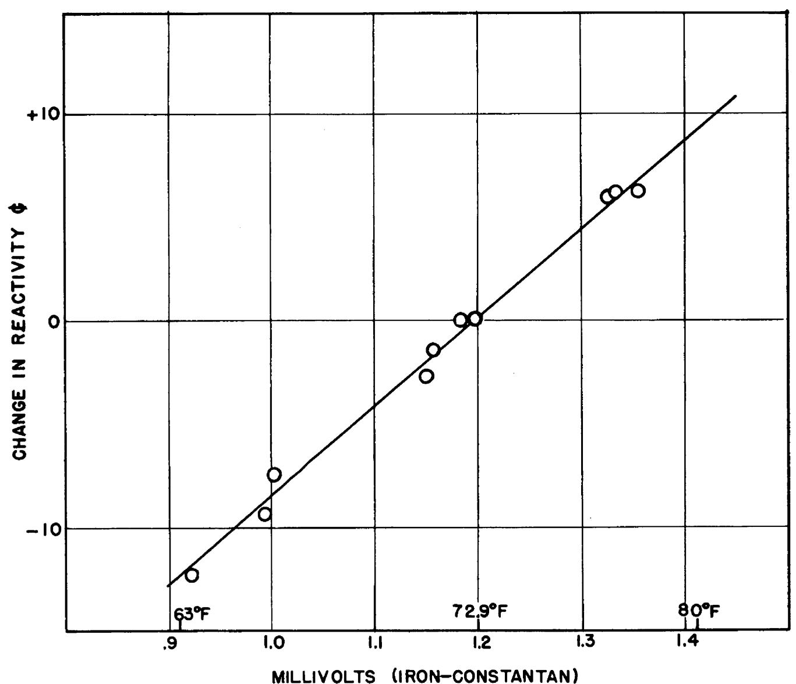  
FIGURE IO. CHANGE IN REACTIVITY VS. TEMPERATURE REFERRED TO $72.9^{\circ}F$

Some comparisons have been made of the reactivity effectiveness of the beryllium reflector and of one of a Plexiglas-stainless steel composite.

# 1. Reflector Comparisons With Constant Void Thickness

A very approximate value of the beryllium reflector was obtained by removing beryllium sections, 22" long from cells M-21, V-11 and W-11 of Fig. 3. It is to be pointed out that these measurements were made before the shelf-type mock-up was in final form and when the length of the beryllium jacket was 44" with no graphite end reflector behind the beryllium. The initial purpose of the experiment was to compare the reactivity value of a reflector element with that of a fuel element in order to ascertain the most satisfactory location of a safety rod. For this reason only a 22" length, i.e. half of the reflector length, of beryllium was removed and the resulting reactivity change ascertained from a calibrated control rod. In each case the data compare the beryllium filled tube with an empty one. The error in the results, as given in Table II, is estimated to be $\pm 1\phi$ .

TABLE II   
REACTIVITY CHANGE INTRODUCED BY SUBSTITUTING BERYLLIUM FOR AIR   

<table><tr><td>Test Cell</td><td>Reactivity Increase in Cents</td></tr><tr><td>M-21</td><td>4.4</td></tr><tr><td>V-11</td><td>10.9</td></tr><tr><td>V-11 and W-11</td><td>27.5</td></tr></table>

The reactivity change for cell M-21 was checked by the rod drop method and found to be the same within limits of experimental error. This change is small because of the presence of the one inch layer of Plexiglas in the core cells adjacent to this region of the reflector. The changes obtained for cells V-ll and W-ll were expected to be larger since the removal of these two reflector cells opens a partial void extending deep into the reactor.

In a second series of experiments, with final reactor geometry, a section of the beryllium reflector was replaced by a composite of Plexiglas and stainless steel, each one-half the beryllium thickness. The beryllium in a section 9" wide, 36" long and 6" thick* was replaced by a 9" x 36" x 3" section of Plexiglas adjacent to the core and backed by a section of stainless steel,

Type $310^{*}$ , of the same dimensions. This change was made separately at three positions at the side of the reactor, at the top and at the bottom.

The results, giving the changes in reactivity effected by the substitutions and the locations of the reflector alterations using the designations of Fig. 3, are tabulated in Table III. The system was more reactive with the beryllium reflector than with the combination of stainless steel and Plexiglas.

TABLE III   
REACTIVITY CHANGE EFFECTED BY SUBSTITUTING PLASTIC AND STAINLESS   
STEEL FOR BERYLLIUM   

<table><tr><td>Position</td><td>Original 
Reflector: 
Be in Cells</td><td>Altered 
Reflector: 
Plastic 
in Cells</td><td>Stainless 
Steel in Cells</td><td>Reactivity 
Loss 
in Cents</td></tr><tr><td>Side</td><td>V, W-11, 12, 13</td><td>V-11, 12, 13</td><td>W-11, 12, 13</td><td>56.5</td></tr><tr><td>Top</td><td>L, M, N-2, 3</td><td>L, M, N-3</td><td>L, M, N-2</td><td>41.3</td></tr><tr><td>Bottom</td><td>L, M, N-21, 22</td><td>L, M, N-21</td><td>L, M, N-22</td><td>33.0</td></tr></table>

2. Variable Reflector Void Width and Thickness of Stainless Steel and Plexiglas Constant.

A larger slab in the reflector, 15" wide, 36" long and 6" thick, occupying cells K-21 through 0-21 and K-22 through 0-22, inclusive, was selected and measurements made in the following order. The beryllium was removed in 3" x 36" x 6" thick units, the first being at the center, M-21 and M-22, next N-21, 22, then L-21 and L-22, etc., until all cells in the group were vacant, the system being made critical between each removal. It was, of course, necessary to add some additional beryllium reflector near the top and sides of the reactor to override the reactivity loss due to this reflector removal at the bottom. The successive changes in reactivity, due to these reflector alterations, were noted from the critical positions of the control rods. The void was then filled with a composite reflector of 1-7/8" of Plexiglas and 3-7/8" of stainless steel, the former being adjacent to the core. This composite reflector was loaded step-wise in the reverse order to the removal of the beryllium, and the successive increments in reactivity measured.

Table IV contains the losses in reactivity for various void widths and also the losses per unit width of the void as the beryllium is removed from the reflector.

TABLE IV   
REACTIVITY LOSSES FOR VARIABLE VOID WIDTH IN REFLECTOR   

<table><tr><td>Void Width
in Inches</td><td>Reactivity Loss
in Cents</td><td>Reactivity Loss
in Cents per Inch</td></tr><tr><td>0.0</td><td>0.0</td><td>-</td></tr><tr><td>3.0</td><td>19.5</td><td>6.5</td></tr><tr><td>6.0</td><td>36.0</td><td>5.5</td></tr><tr><td>9.0</td><td>52.0</td><td>5.3</td></tr><tr><td>12.0</td><td>64.5</td><td>4.2</td></tr><tr><td>15.0</td><td>77.0</td><td>4.2</td></tr></table>

Table V contains the losses due to the substitution of 2" of Plexiglas plus 4" of stainless steel for the 6" of beryllium in these bottom reflector cells, referred to zero loss for a complete beryllium reflector.

TABLE V   
REACTIVITY LOSSES EFFECTED BY SUBSTITUTION OF STAINLESS STEEL AND PLEXIGLAS FOR BERYLLIUM   

<table><tr><td>Width of Section 
Substituted in Inches</td><td>Reactivity Loss 
in Cents</td><td>Reactivity Loss 
in Cents per Inch</td></tr><tr><td>0.0</td><td>0.0</td><td>-</td></tr><tr><td>3.0</td><td>7.5</td><td>2.5</td></tr><tr><td>6.0</td><td>13.9</td><td>2.1</td></tr><tr><td>9.0</td><td>20.6</td><td>2.0</td></tr><tr><td>12.0</td><td>26.5</td><td>2.0</td></tr><tr><td>15.0</td><td>32.5</td><td>2.0</td></tr></table>

Figure 11 is a graph of the losses, referred to a complete beryllium reflector, plotted as a function of the void width when the reflector was removed. This graph also shows the losses incurred by substituting the $2''$ of Plexiglas and $4''$ of stainless steel for the $6''$ of beryllium as a function of the same void width. Figure 12 is a graph of the loss per unit width plotted as a function of the same distances, that is, the slopes of curves in Fig. 11. As the leakage path becomes wider, the incremental value of the reflector approaches a constant value.

# 3. Variation of Bottom Reflector Composition

In another series of studies in these cells, K-21 through 0-21 and K-22 through 0-22, the relative thicknesses of Plexiglas and stainless steel in the composite reflector were varied for two overall thicknesses. For one series of measurements the thicknesses of the individual layers varied from zero to the nominal six inches and in the second series from zero to four inches. The accompanying changes in reactivity were noted for each incremental thickness.

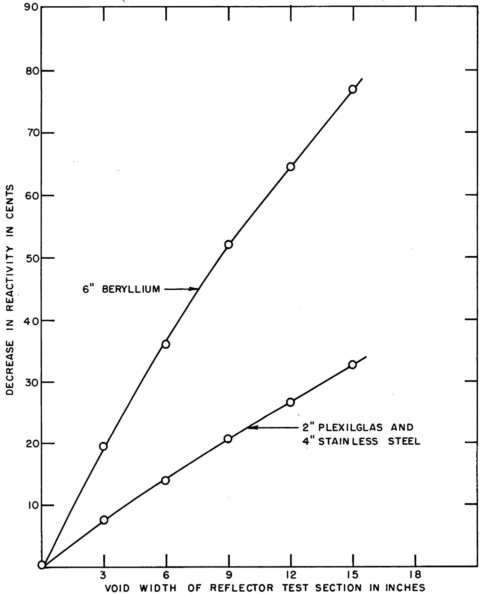  
FIGURE II. DECREASE IN REACTIVITY VS. VOID WIDTH

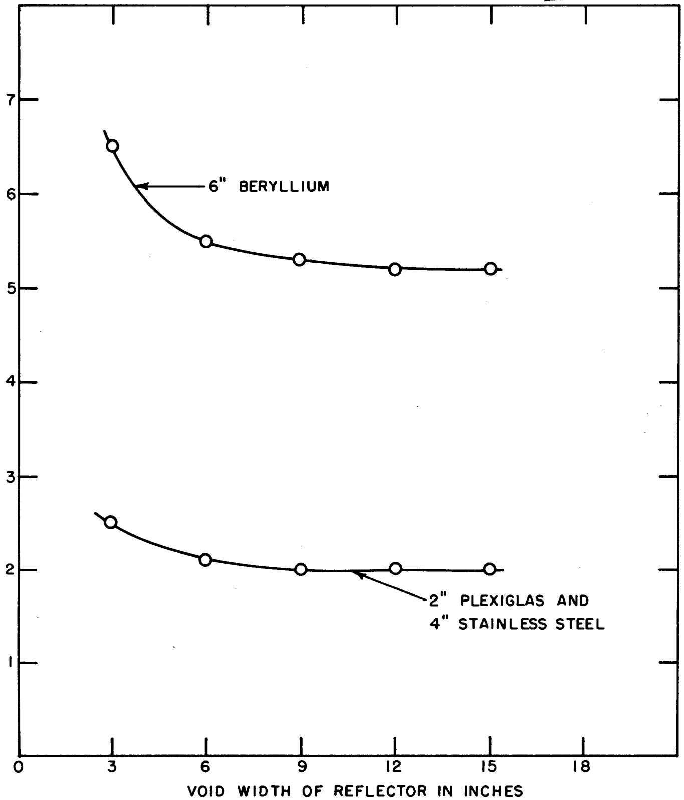  
REACTIVITY LOSS IN CENTS PER UNIT Void Width   
FIGURE 12. REACTIVITY LOSS PER UNIT Void Width

Table VI contains data showing the losses in reactivity as a function of the material thickness in the composite reflectors for both the nominal four-inch and six-inch thicknesses. The changes refer to the reactivity with the beryllium reflector. The results are plotted in Fig. 13. It is to be noted in Fig. 3, that this test section of the reflector is adjacent to a $l$ " thick layer of Plexiglas which is nominally a part of the core. The measurements were extended by replacing this Plexiglas with stainless steel, that is, extending the stainless steel $l$ " into the core, giving a structure simulating that at the top of the reactor. Figure 13 is plotted with this $l$ " layer of Plexiglas included in the reflector.

TABLE VI   
LOSSES IN REACTIVITY EFFECTED BY VARYING COMPOSITION OF BOTTOM REFLECTOR   

<table><tr><td colspan="3">Four-Inch Composite Material Thickness in Inches</td><td colspan="3">Six-Inch Composite Material Thickness in Inches</td></tr><tr><td>Plexiglas</td><td>Stainless Steel</td><td>Reactivity Losses in Cents</td><td>Plexiglas</td><td>Stainless Steel</td><td>Reactivity Losses in Cents</td></tr><tr><td>0</td><td>4-7/8</td><td>49.2</td><td>0</td><td>6-3/4</td><td>44.7</td></tr><tr><td>1/2</td><td>4-3/8</td><td>39.7</td><td>1/4</td><td>6-1/2</td><td>37.2</td></tr><tr><td>3/4</td><td>4-1/8</td><td>39.8</td><td>1/2</td><td>6-1/4</td><td>35.3</td></tr><tr><td>1</td><td>3-7/8</td><td>40.5</td><td>3/4</td><td>6</td><td>35.6</td></tr><tr><td>1-7/16</td><td>3-7/16</td><td>42.1</td><td>1</td><td>5-3/4</td><td>36.5</td></tr><tr><td>1-7/8</td><td>3</td><td>43.6</td><td>1-3/16</td><td>5-9/16</td><td>37.7</td></tr><tr><td>2-7/8</td><td>2</td><td>45.7</td><td>1-7/16</td><td>5-5/16</td><td>39.2</td></tr><tr><td>3-7/8</td><td>1</td><td>46.1</td><td>1-7/8</td><td>4-7/8</td><td>41.8</td></tr><tr><td>4-7/8</td><td>0</td><td>45.7</td><td>2-7/8</td><td>3-7/8</td><td>44.9</td></tr><tr><td></td><td></td><td></td><td>3-7/8</td><td>2-7/8</td><td>45.9</td></tr><tr><td></td><td></td><td></td><td>4-3/4</td><td>2</td><td>46.3</td></tr><tr><td></td><td></td><td></td><td>5-3/4</td><td>1</td><td>46.7</td></tr><tr><td></td><td></td><td></td><td>6-3/4</td><td>0</td><td>46.8</td></tr></table>

# 4. Variation of Side Reflector Composition

Since the planes of the fuel and the Plexiglas moderator in the shelf-type mock-up were horizontal it is apparent that the reflector savings per unit of reflector perimeter was a function of its location. For this reason the above experiment was repeated in a test section 9" wide, 36" long and 6" thick at the side of the core using cells V-11 through V-13 and W-11 and through W-13. The width of the test section was reduced from 15" to 9" in order to remain critical without increasing the loading or adding excessive extra beryllium to the reflector.

Table VII contains data showing the losses in reactivity as a function of the thickness of the reflector materials. These data are again referred to a complete beryllium reflector as representing zero reactivity loss. Figure 14 is a graph of the losses in reactivity plotted as a function of Plexiglas thickness.

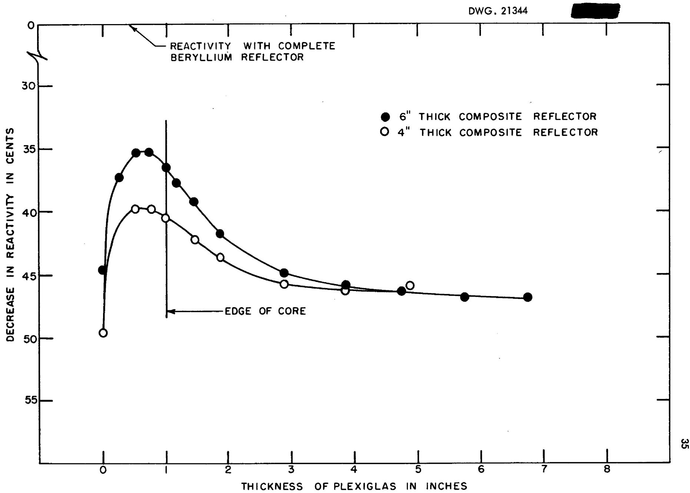  
FIGURE 13. CHANGE IN REACTIVITY VS. COMPOSITION OF REFLECTOR FOR $15^{\prime \prime}$ SECTION AT BOTTOM IN CELLS K THROUGH O-21,22

TABLE VII   
LOSSES IN REACTIVITY EFFECTED BY VARYING THE COMPOSITION OF THE SIDE REFLECTOR   

<table><tr><td colspan="2">Reflector Material Thickness in Inches</td><td>Reactivity Loss</td></tr><tr><td>Plexiglas</td><td>Stainless Steel</td><td>in Cents</td></tr><tr><td>0</td><td>5-3/4</td><td>61.4</td></tr><tr><td>3/16</td><td>5-9/16</td><td>57.5</td></tr><tr><td>7/16</td><td>5-5/16</td><td>54.2</td></tr><tr><td>7/8</td><td>4-7/8</td><td>53.3</td></tr><tr><td>1-7/16</td><td>4-5/16</td><td>54.4</td></tr><tr><td>1-7/8</td><td>3-7/8</td><td>55.5</td></tr><tr><td>2-7/8</td><td>2-7/8</td><td>56.4</td></tr><tr><td>4-3/4</td><td>1</td><td>57.2</td></tr><tr><td>5-3/4</td><td>0</td><td>57.1</td></tr></table>

The curve for the 9" section is extrapolated to a width of 15", based on a comparison of reactivity change produced by replacing beryllium reflector at the bottom, rows 21 and 22, with a composite one of stainless steel and Plexiglas.

# 5. Effect of Void Between Core and Reflector

A preliminary experiment was run in which about one-half of one 6" graphite end reflector was withdrawn one inch leaving a gap between the end reflector and both the core and the beryllium side reflector. The concomitant reduction in reactivity was 25.1 cents. When this gap was between the end reflector and the core only, that is with the graphite in contact with the beryllium jacket, the reactivity decrease was only 17.4 cents.

# D. Power Distribution and Neutron Flux Determination in Shelf Type Assembly:

# 1. Description of Foil Techniques and Counting Equipment

If an aluminum foil is in contact with uranium fuel while a reactor is in operation, the activity of the fission fragments collected on the aluminum is a measure of the fission rate at the surface of the fuel disk. Fission rates measured by this method have been shown to be the same as those obtained from counting the uranium disks activated in this reactor. Essentially all power distributions reported here were obtained by this "catcher foil" method. The foils used were 2S aluminum disks, 2" in diameter and 0.005" thick with a 0.5" hole in the center. These foils, in all cases, were exposed 20 minutes, counted in a Radiation Counter Laboratories gas flow proportional counter. Their activities were normalized to 60 minutes after shut-down using an empirically determined decay curve5. The counting time for each catcher foil varied from 2 to 4 minutes which gave a minimum of 105 counts. The average variation in successive counts from the same foil is slightly less than 2%.

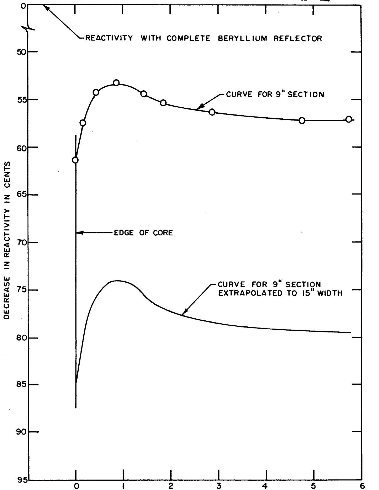  
THICKNESS OF PLEXIGLAS IN INCHES   
FIGURE 14. CHANGE IN REACTIVITY VS. COMPOSITION OF REFLECTOR FOR 9" SECTION AT SIDE IN CELLS V-II THROUGH I3 AND W-III THROUGH I3

Indium foils were irradiated in the critical assembly for a study of the neutron flux distributions. These foils were 5/16" in diameter, 0.01" thick and weighed 0.0288+0.0001 grams. They were composed of 90% aluminum and 10% indium by weight*, with an equivalent indium thickness of 0.0004". These foils were covered with cadmium 0.02" thick when it was desirable to shield from the low energy neutrons. All indium foil activations were determined with an Atomic Instrument Co. Model l010 binary scalar using an Amperex Model l20-C mica window**Geiger tube. Each foil was counted for two minutes on both sides in each of four counters and the eight values were averaged after they had been corrected for dead-time, background, decay and counter sensitivity6. The average variation between successive counts of a given foil is about 3%.

Since it was not possible to expose all the indium foils necessary for one traverse simultaneously because of the resulting perturbations arising from interactions of the foils, it was necessary to normalize the exposures for variations in power level. An aluminum catcher foil was located in the same position in the reactor during each exposure and the appropriate ratio of their activities was used for these normalizations.

Figure 15 is a photograph of some of the materials used in obtaining power and flux distributions. An aluminum catcher foil is located on one of the uranium fuel disks and some indium foils are seen between the disks. The countersunk beryllium blocks were used when the neutron flux was measured in the reflector. Some cadmium boxes, used to cover the indium foils, are also shown.

# 2. Power Distribution in Shelf-Type Mock-Up

Three radial power distribution curves taken in the midplane of the assembly, along a horizontal radius, a $45^{\circ}$ radius and along a vertical radius, are shown in Fig. 16. These power traverses originate in Cell M-12, Fig. 3, and extend to Cells U-12, R-7 and M-4 respectively. The vertical power traverse, which terminates in Cell M-4, shows a comparatively large decrease in power as it approaches the edge of the core. A zero order Bessel function of first kind curve is included in this figure for comparison.

The power traverses shown in Fig. 17 were measured parallel to the axis of the assembly, one being along the axis through Cell M-12, and the others along the periphery of the core, originating in Cells U-12, R-7 and M-4 at the termini of the three radial power traverses. It should be noted that some of the data were obtained from the aluminum catcher foils while other are measurements of the fission product activity induced in the uranium

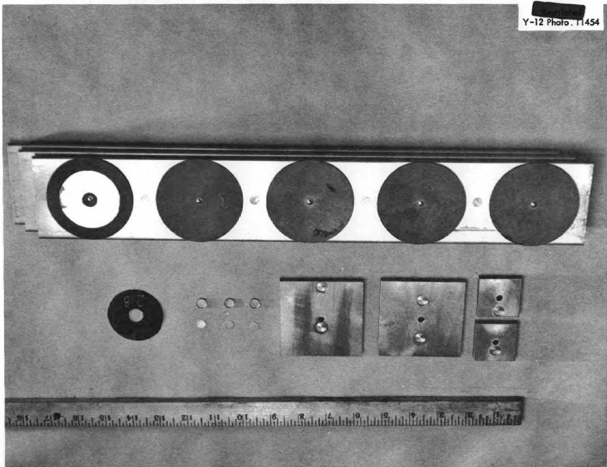  
Fig. 15. Photograph of Materials Used in Power and Neutron Flux Determinations.

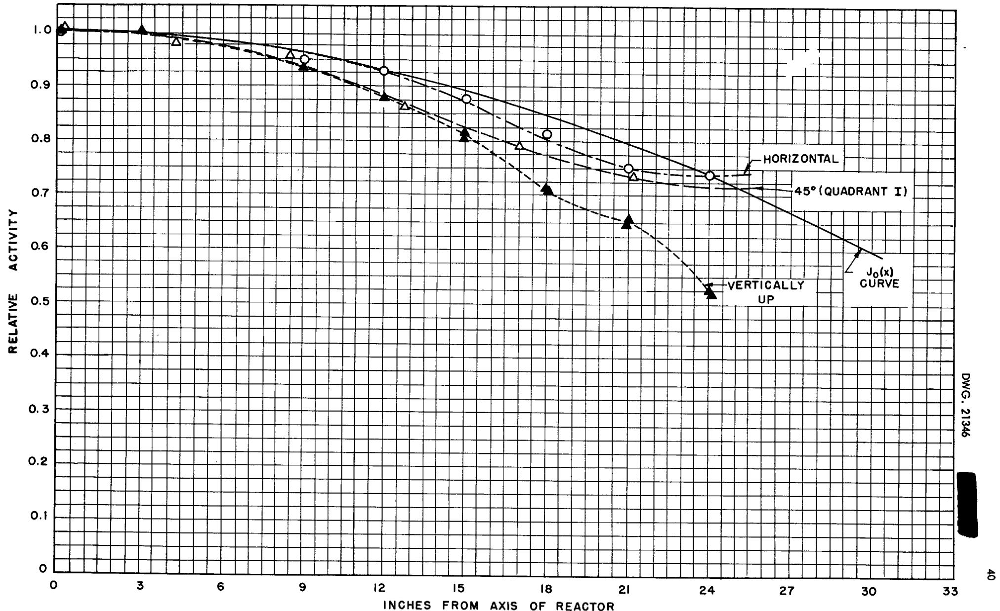  
FIGURE 16. GROSS POWER DISTRIBUTION RADIALLY IN MID-PLANE OF REACTOR

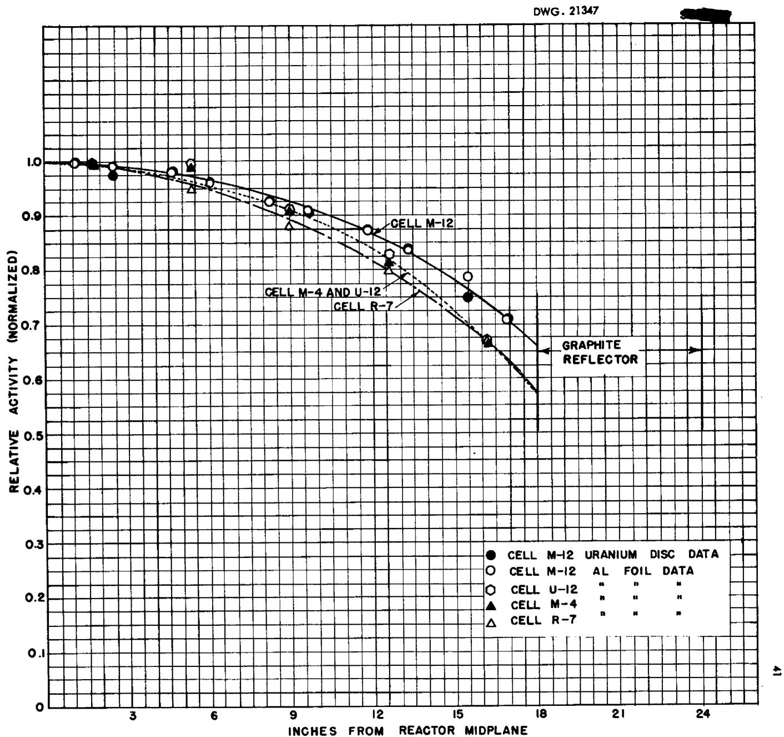  
FIGURE 17. POWER DISTRIBUTIONS EXTENDING FROM REACTOR MIDPLANE TO GRAPHITE END REFLECTOR

disks. The results from the two methods are not distinguishable, validating the catcher foil technique, at least for this reactor.

The best fit zero order Bessel functions of the first kind which represent these power distribution curves extrapolate to a core diameter of 78" and a length of 49". Using these values of extrapolation distances, reasonably good agreement was obtained between the measured and calculated values of reactivity losses due to separation of the two halves of assembly at the midplane, which are tabulated in Section IV, Part D of this report.

# 3. Power Distribution in Unit Cell

Because of the inhomogeneity of both moderator and fuel in this assembly, the distributions of power and neutron flux inside the unit cell are of interest. Figure 18 shows the vertical power distribution in Cell M-12 when 0.002" thick fuel disks are in Cells L-12, M-12 and N-12 and parallel to the planes of the Plexiglas layers. This distribution was obtained by placing an aluminum catcher foil on each face of the thin fuel disks. The curve drawn through these relative activities assumes all the absorption between the fuel disks occurs in the stainless steel. The average activity over the cell is approximately $89\%$ of the maximum value. The self shielding of the fuel disks and the fuel cadmium fractions are discussed in detail in Part IV, Section G of this report.

# 4. Neutron Flux Distribution in Shelf-Type, Mock-Up

Macroscopic, or gross, neutron flux distributions were made by placing, successively, bare and cadmium covered indium foils at an equivalent position within each of the cells in the region of interest. The position chosen was in the fuel plane between the uranium disks as shown in Fig. 15. The results of the horizontal traverses, taken radially at the mid-plane, and the axial traverses are shown in Figs. 19 and 20, respectively. In Fig. 19 the foil activity is plotted as a function of the distance from the axis of the reactor, parallel to the mid-plane, and in Fig. 20 the activity is plotted as a function of the distance from the mid-plane along the axis of the reactor in Cell M-l2. The vertical radial traverse, Fig. 21, was also taken in the mid-plane and extends from cell M-l2 vertically downward through the beryllium reflector. It is to be noted that in this lower region of the core the beryllium reflector is adjacent to a $l$ layer of Plexiglas. No foils were placed in this layer of plastic during these traverses and the interpolation is based on exposures in a single cell which will be described later. A curve of a zero order Bessel function of the first kind is also included in this figure for comparison.

# 5. Flux Distribution in A Unit Cell

Inhomogeneous loading of a reactor produces local variations in power and flux distributions which are of importance in reactor calculations. Bare and cadmium covered traverses were made in a unit cell where both fuel thickness and orientation could be varied. The unit cell used was always near the center of the reactor where the flux is relatively constant over a 3" test section.

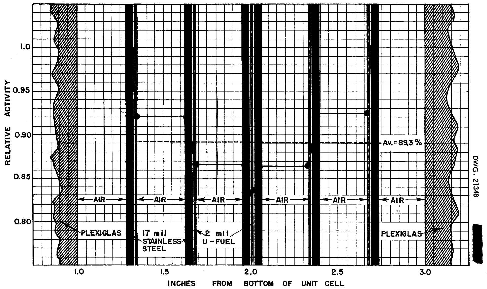  
FIGURE 18. POWER DISTRIBUTION IN UNIT CELL USING 2mil U-DISCS

(STAINLESS STEEL AND U-DISC NOT DRAWN TO SCALE)

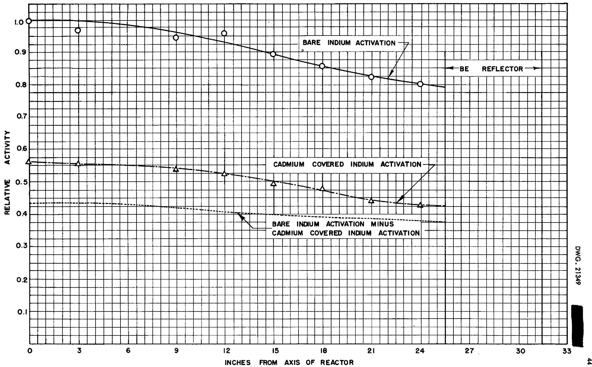  
FIGURE 19. GROSS INDIUM TRVERSE HORIZONTAL IN PLANE OF INTERFACE (M-12 THROUGH U-12)

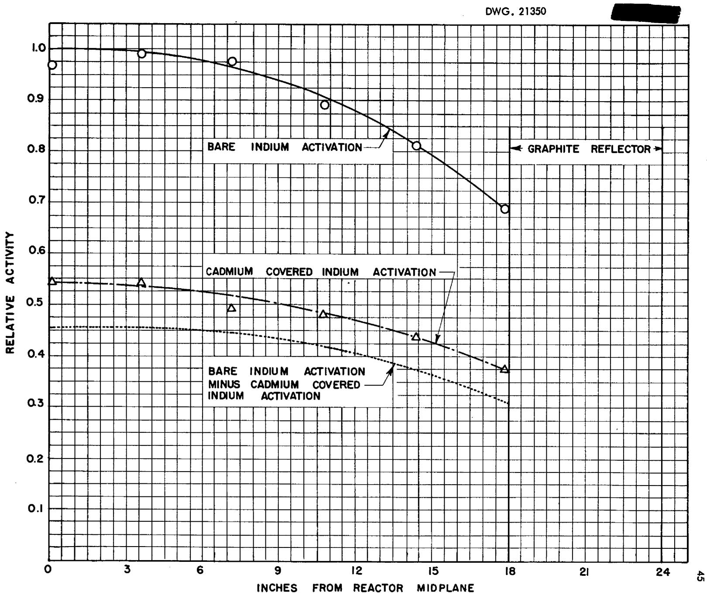  
FIGURE 20. GROSS INDIUM TRVERSE ALONG REACTOR AXIS (M-12)

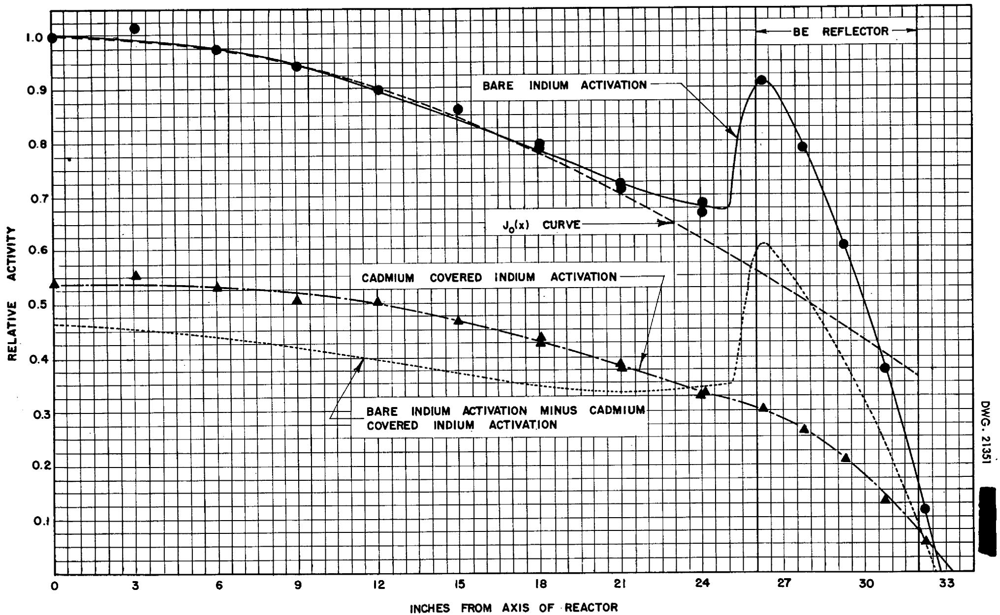  
FIGURE 21. GROSS INDIUM TRVERSE VERTICALLY DOWN IN PLANE OF INTERFACE (M-12 THROUGH M-22)

In a normal unit cell the fuel disk is located $2''$ from the bottom of the test cell and $1''$ above the Plexiglas, producing a flux in the cell which is symmetrical above and below the fuel disks. The vertical flux traverses are, therefore, symmetrical about the fuel plane.

Figure 22 is drawing of a unit cell with the stainless steel removed to show the relative positions of the fuel disks and the outline of the Plexiglas in the bottom of the cell. The lines A-A, B-B, etc. show the locations of various traverses made through the cell. Figures 23, 24 and 25 show three vertical flux traverses, perpendicular to the fuel plane, taken through a unit cell along the paths A-A in Cell M-12, B-B in Cell N-12 and C-C in L-12 respectively. The reductions in neutron flux which occur at the fuel disks are the results of shadow shielding by the fuel and the neutron sinks produced by lumped fuel. The reduction is less pronounced in the A-A traverse, Fig. 23, because the indium foil, in this traverse, was located over the center hole of the fuel disk and the shadow shielding was greatly reduced.

Three vertical neutron flux traverses were also made in a unit cell between the fuel disks and the results are shown in Fig. 26, 27 and 28. The increase in flux occurring at the fuel plane along traverse D-D, Fig. 26, was verified experimentally, although its cause is not fully known. Figures 27 and 28 indicate that the flux along E-E and F-F, between the Plexiglas layers, is essentially constant.

Determinations of neutron flux distributions in a unit cell were also made with one 10-mil fuel disk replaced by five 2-mil thick disks. Only fifteen 2-mil disks were available so a large test volume was impossible. The thin disks were substituted in cells L-12, M-12 and N-12 near the reactor midplane with their planes parallel to the planes of the Plexiglas. The thin disks were equally spaced between the Plexiglas layer and the top of the cell. The neutron flux distribution in cell M-12, along path A-A Fig. 22, is shown in Fig. 29. This change caused the average neutron induced activity in cell M-12 to decrease by about 8 percent. In these traverses the indium foils were placed 0.25" from the center of the fuel disk to avoid the effect of the hole. The ratio of the average thermal neutron activity in the Plexiglas to that in the space between two adjacent layers of the plastic, with the 2-mil disks loaded is 1.82 which is not significantly different from the ratio when a 10-mil disk is used. The results of an experiment measuring the ratio of thermal neutron flux inside and outside the Plexiglas will be given later.

Another set of experiments was done with five 2-mil fuel disks each in Cells L-12, M-12 and N-12 placed perpendicular to the Plexiglas layers and parallel to the axis of the core. The thin uranium disks were equally spaced between the vertical sides of the unit cells and extended into narrow slots cut into the Plexiglas. Vertical traverses, centrally located in the fuel disk array, were made in cell M-12 with the indium foils perpendicular to the Plexiglas and repeated with the foils parallel to it. The activity of the foils which were

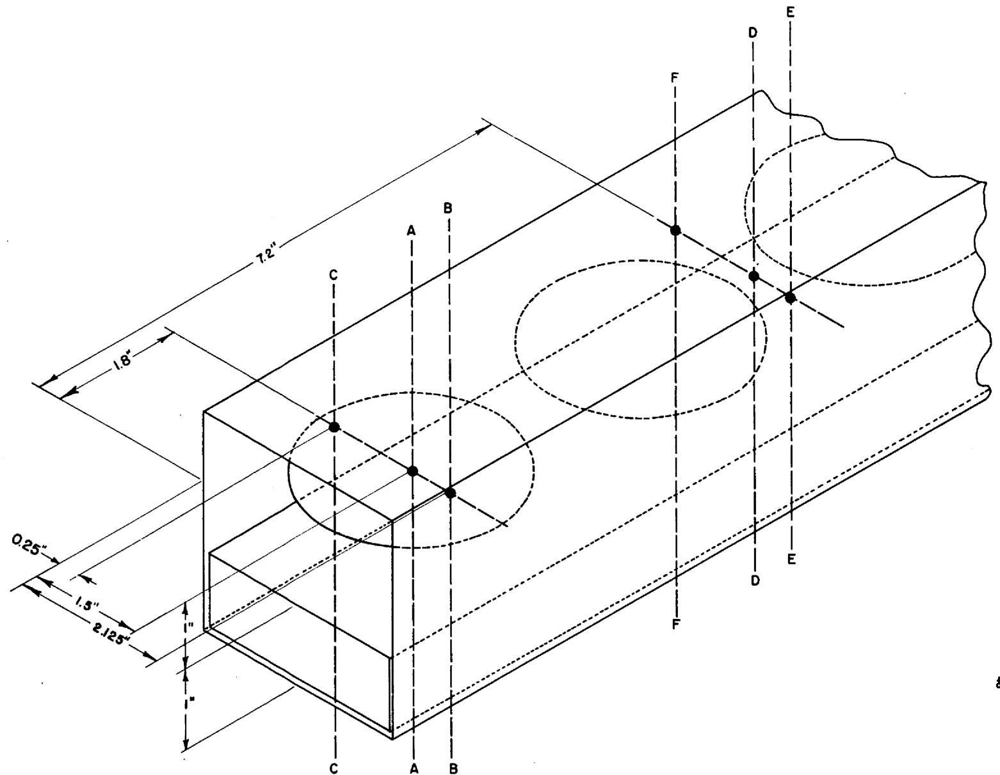  
FIGURE 22. TYPICAL CELL (WITHOUT STAINLESS STEEL)

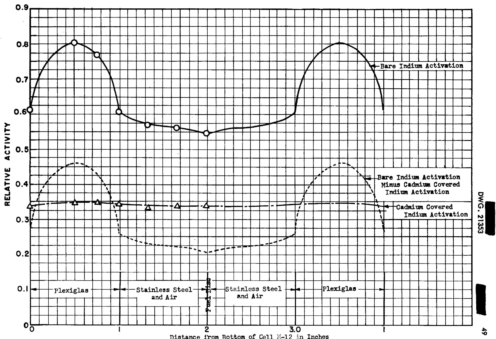  
FIGURE 23. INDIUM TRVERSE IN UNIT CELL LOCATION: A-A IN M-12 (SEE FIGURE 22.)

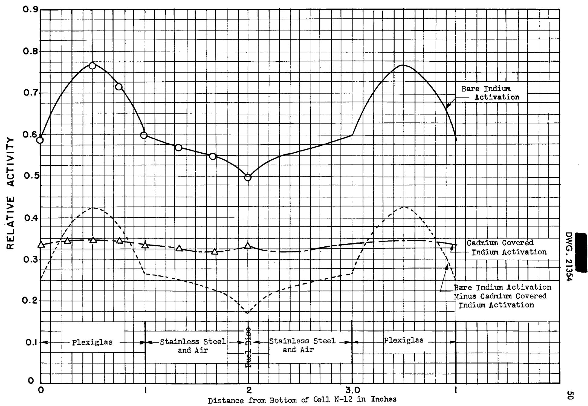  
FIGURE 24. INDIUM TRVERSE IN UNIT CELL LOCATION: B-B IN N-12 (SEE FIGURE 22)

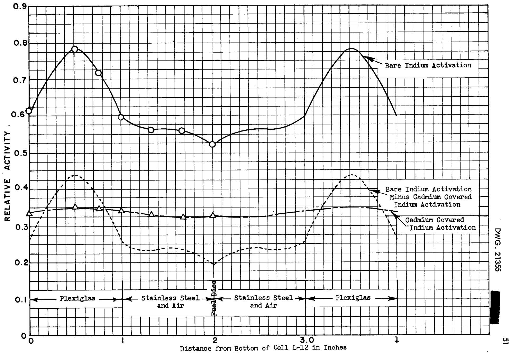  
FIGURE 25. INDIUM TRVERSE IN UNIT CELL LOCATION: C-C IN L-I2 (SEE FIGURE 22.)

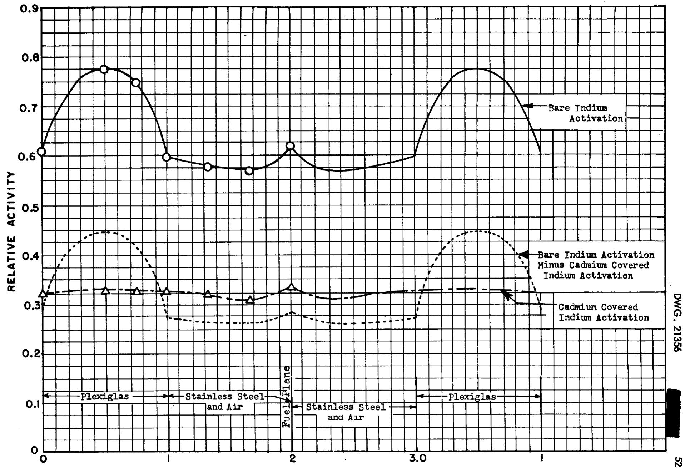  
Distance from Bottom of Cell M-12 in Inches   
FIGURE 26. INDIUM TRVERSE IN UNIT CELL LOCATION: D-D IN M-12 (SEE FIGURE 22.)

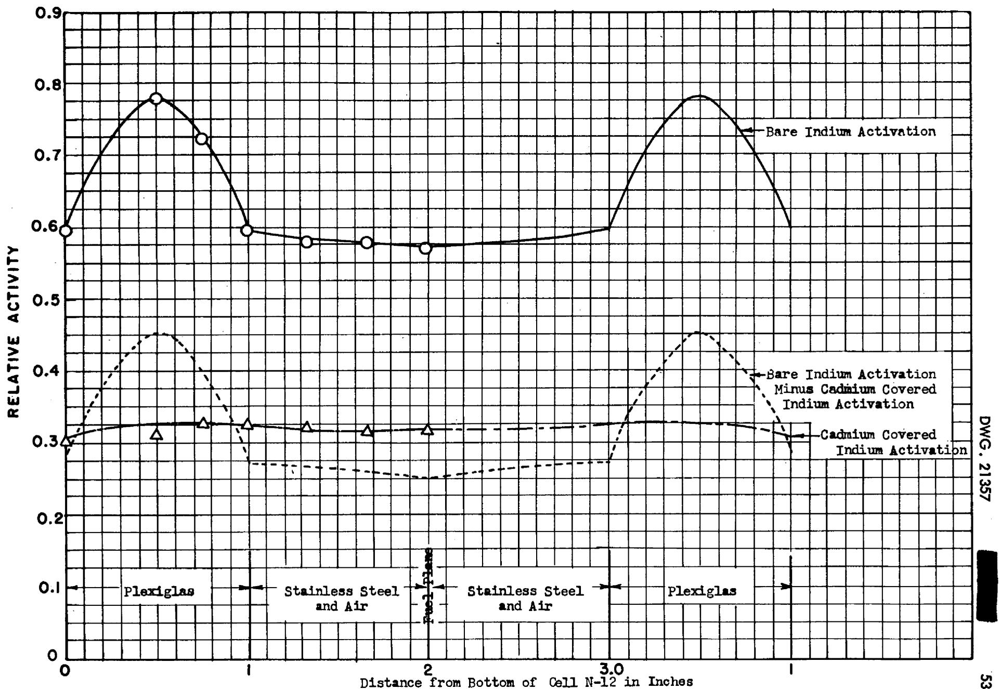  
FIGURE 27. INDIUM TRVERSE IN UNIT CELL LOCATION: E-E IN N-12 (SEE FIGURE 22.)

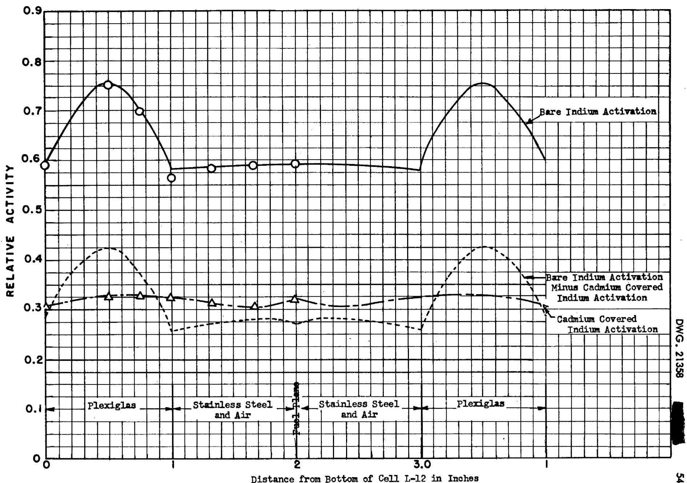  
FIGURE 28. INDIUM TRVERSE IN UNIT CELL LOCATION: F-F IN L-12 (SEE FIGURE 22.)

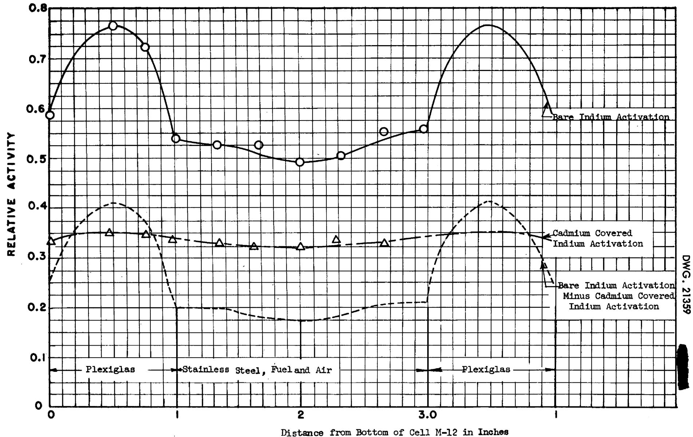  
FIGURE 29. INDIUM TRAVERSES   
IN UNIT CELL M-12 WHICH HAS 5- 2mil U-DISCS PARALLEL   
TO PLEXIGLAS

oriented perpendicular to the Plexiglas was about $6\%$ less than that in those which were parallel. The two sets of data were normalized at a point $2^{\prime \prime}$ from the bottom of the cell and are shown in Fig. 30. The minimum in the flux distribution occurs at a point $1.5^{\prime \prime}$ from the bottom of the cell which is the location of the center of mass of the fuel disks.

A measure of the flux distribution across the diameter of a 10-mil fuel disk was obtained from bare and cadmium covered indium traverses across a disk located in cell M-12 and the results are shown in Fig.3l. No foils, however, were located adjacent to the edge of the disk.

The ratios of the average thermal flux, i.e., below the cadmium cut-off, in the Plexiglas to that in the space between the Plexiglas layers for this group of unit cell traverses are given in Table VIII.

TABLE VIII   
THERMAL NEUTRON DISTRIBUTION IN A UNIT CELL   

<table><tr><td>Location of Traverse in the Unit Cell</td><td>Average Flux in Plexiglas</td><td>Average Flux Between Plexiglas Layers</td><td>Av. Flux in Plexiglas Av. Flux between Plexiglas layers</td></tr><tr><td>A-A</td><td>4080</td><td>2275</td><td>1.79</td></tr><tr><td>B-B</td><td>3610</td><td>2345</td><td>1.54</td></tr><tr><td>C-C</td><td>3690</td><td>2300</td><td>1.60</td></tr><tr><td>D-D</td><td>3980</td><td>2650</td><td>1.50</td></tr><tr><td>E-E</td><td>3900</td><td>2655</td><td>1.47</td></tr><tr><td>F-F</td><td>3700</td><td>2750</td><td>1.35</td></tr></table>

# IV. EXPERIMENTAL STUDIES ON RECTANGULAR SHELL TYPE ASSEMBLY

A. Control Rod Calibrations In: The Rectangular Shell Type Assembly:

The control rods in the rectangular shell type mock-up were calibrated by the super-critical period method as described previously. The rod drop method was not used for comparison. The reactivity values obtained for three of these rods are comparable to those obtained when the planes of all the core materials were horizontal. The fourth, Rod A, is significantly more effective in the rectangular shell type mock-up due to the change on the neutron distribution resulting from the omission of the Plexiglas from this rod and also surrounding the rod on all four sides by one inch layers of the plastic. It is interesting to note that the rod calibration was not changed by a gap, in the axial direction at the midplane of the core, of thickness up to 0.8".

Detailed data for rod A are given in Table IX and a summary for all four rods in Table X.

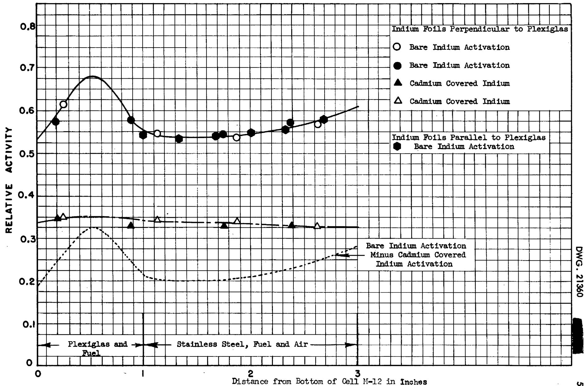  
FIGURE 30. INDIUM TRVERSE IN UNIT CELL IN WHICH 5-2 mil U-DISCS ARE

PLACED PERPENDICULAR TO THE PLEXIGLAS AND REPLACE I-10 mil U-DISC

LOCATION:A-A IN M-12 (SEE FIGURE 2.)

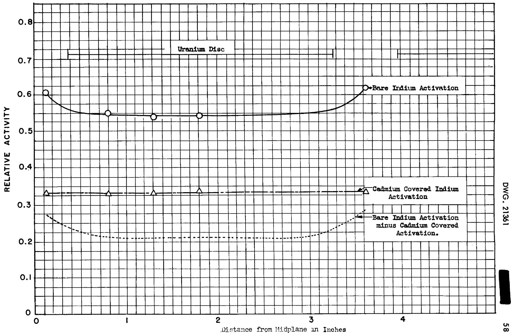  
FIGURE 31. INDIUM TRVERSE ACROSS A O.OIO" FUEL DISC LOCATION: M-12

TABLE IX   
CONTROL ROD "A" CALIBRATION   
TABLE X   

<table><tr><td>Position of Rod &quot;A&quot; from Core Mid-plane in Inches</td><td>Integrated Value in Cents</td><td>Average Sensitivity in Cents per Inch</td></tr><tr><td>0.00</td><td>0.00</td><td>--</td></tr><tr><td>3.23</td><td>3.42</td><td>1.06</td></tr><tr><td>4.93</td><td>6.80</td><td>1.98</td></tr><tr><td>6.43</td><td>9.81</td><td>2.01</td></tr><tr><td>8.35</td><td>13.08</td><td>1.79</td></tr><tr><td>10.30</td><td>16.95</td><td>1.99</td></tr><tr><td>13.73</td><td>21.22</td><td>1.25</td></tr><tr><td>17.01</td><td>24.58</td><td>1.02</td></tr><tr><td>21.39</td><td>27.39</td><td>0.64</td></tr><tr><td>26.09</td><td>28.79</td><td>0.30</td></tr></table>

SUMMARY OF CONTROL ROD CALIBRATION DATA   

<table><tr><td>Control Rod</td><td>Lengths in Inches</td><td>Reactivity Value in Cents</td></tr><tr><td>A</td><td>26.</td><td>28.8</td></tr><tr><td>B</td><td>26.</td><td>17.1</td></tr><tr><td>C</td><td>24.</td><td>15.6</td></tr><tr><td>D</td><td>24.</td><td>17.0</td></tr></table>

# B. Temperature Effects in Rectangular Shell Type Assembly:

The effect of temperature on reactivity in the rectangular shell type assembly was measured by the same procedure and over approximately the same temperature range as was used in the shelf type assembly. The increase in reactivity with increasing temperature observed was 1.43 cents per Fahrenheit degree, compared with the earlier value of 1.25 cents per Fahrenheit degree.

# C. Plexiglas Thickness Reactivity Coefficient:

The thickness of the Plexiglas moderator strips in five cells, K-16 through 0-16, was varied and the changes in reactivity produced were determined from the control rod positions. In Fig. 32 the changes in reactivity in cents referred to the reactivity with one inch strips, are plotted as a function of the Plexiglas thickness. This curve shows an optimum thickness of approximately 0.9 inches for this region of the reactor at the operating temperature.

# D. Effect of Separation of Core at Midplane on Reactivity:

It was desired to determine the loss in reactivity due to the separation of the two halves of the reactor core, the limit of the experiment to be a gap of one inch or a reactivity decrease of 100 cents, whichever occurred first.

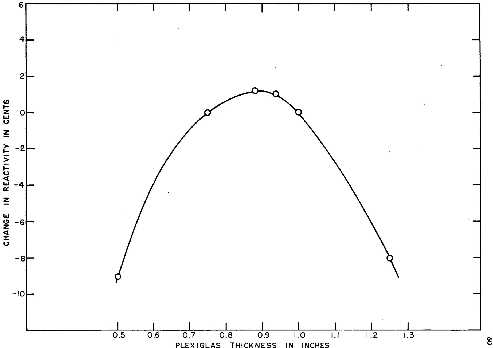  
FIGURE 32. CHANGE IN REACTIVITY VS. PLEXIGLAS THICKNESS IN TEST CELLS

The procedure used was to start with the two halves together and, as they were separated in an axial direction, compensate for the loss in reactivity by driving in control rods. The reactivity loss for each increment of separation was then determined from the control rod calibration curves. When all the control rods were in, extra beryllium reflector was added to strategic areas and evaluated, allowing withdrawal of the control rods, and the process was repeated, with some overlapping in distance, until the desired magnitude of separation had been achieved.

Table XI shows the reactivity losses for various separation distances and the average values of the reactivity losses per unit distance over successive increments of separation.

TABLE XI   
EFFECT OF CORE GAP ON REACTIVITY   

<table><tr><td>Separation Distance at Mid-plane in Inches</td><td>Reactivity Loss in Cents</td><td>Average Sensitivity in Cents per Inch</td></tr><tr><td>0.03</td><td>1.92</td><td>61.9</td></tr><tr><td>0.06</td><td>4.37</td><td>74.25</td></tr><tr><td>0.10</td><td>7.39</td><td>81.6</td></tr><tr><td>0.14</td><td>11.20</td><td>90.5</td></tr><tr><td>0.19</td><td>16.41</td><td>99.8</td></tr><tr><td>0.26</td><td>23.88</td><td>114.6</td></tr><tr><td>0.34</td><td>33.75</td><td>124.2</td></tr><tr><td>0.43</td><td>45.83</td><td>133.2</td></tr><tr><td>0.46</td><td>50.00</td><td>138.1</td></tr><tr><td>0.26</td><td>25.30</td><td>99.4</td></tr><tr><td>0.43</td><td>48.17</td><td>131.4</td></tr><tr><td>0.51</td><td>59.57</td><td>139.0</td></tr><tr><td>0.59</td><td>71.43</td><td>148.2</td></tr><tr><td>0.63</td><td>77.13</td><td>150.1</td></tr><tr><td>0.29</td><td>26.61</td><td>91.1</td></tr><tr><td>0.44</td><td>46.05</td><td>134.1</td></tr><tr><td>0.55</td><td>62.50</td><td>150.9</td></tr><tr><td>0.60</td><td>71.23</td><td>143.9</td></tr><tr><td>0.64</td><td>77.95</td><td>158.1</td></tr><tr><td>0.70</td><td>86.22</td><td>159.0</td></tr><tr><td>0.75</td><td>94.23</td><td>160.2</td></tr><tr><td>0.79</td><td>102.2</td><td>162.3</td></tr><tr><td>0.81</td><td>105.7</td><td>164.8</td></tr></table>

When separated, the facing sides of the core halves are somewhat non-parallel introducing an inaccuracy in the separation distance estimated to be about 0.02". In Fig. 33 the solid curve shows the values of the measured reactivity losses as a function of the distance between the two halves of the core when separated at the midplane. The broken line in this figure represents the calculated values of the reactivity losses using the method suggested by Tamor7,

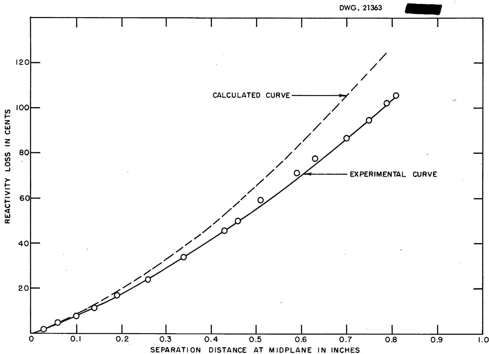  
FIGURE 33. LOSS OF REACTIVITY VS. SEPARATION OF TWO HALVES OF CORE AT MIDPLANE

and treating the assembly as a bare homogeneous reactor. The reactor constants used were those recorded by Leverett8.

E. Reflector Studies on The Rectangular Shell Type Assembly:

1. Stainless Steel, Plexiglas and Boral Composite Reflector

The test cells used in these reflector studies were K-21 through 0-21 and K-22 through 0-22. The beryllium reflector was removed from these cells, on both halves of the assembly, and replaced by stainless steel, except for a $5/16''$ layer adjacent to the core which was filled with Boral\* strips 36" long. The system was then made critical by the addition of beryllium reflector at locations remote from the test section and by control rod adjustment, thereby measuring the loss in reactivity. Keeping the overall dimensions of the test section constant, the thickness of the stainless steel was reduced and Plexiglas was added between the core and the Boral in a stepwise manner until all the steel had been removed. The changes in reactivity, referred to the all beryllium reflector, which were incurred by these reflector alterations are shown in Fig. 34. An additional experimental point in this figure, designated as $2-9/16''$ Plexiglas and $2-7/8''$ stainless steel shows the effect of removing the Boral from a Plexiglas-stainless steel composite. Another point, measured with the Boral replaced by $5/16''$ of Plexiglas shows the effect of a $5/16''$ void between the Plexiglas and the steel to be small. The effect of the removal of all materials from the test section is also shown on the graph.

2. Stainless Steel, Plexiglas and Cadmium Composite Reflector

The experiment described above was repeated with a layer of cadmium substituted for the Boral. Since the cadmium sheets, which were 0.02" thick and sandwiched between 5-mil aluminum, were thinner than the Boral, the Plexiglas-steel composite was correspondingly thicker. Changes in reactivity were measured as the thickness of the Plexiglas, separating the core from the cadmium sheets, was increased from zero to 2-3/16". As in the preceding experiment, the total reflector thickness remained constant. The results are shown graphically in Fig. 35, where, for reference, the zero reactivity change is again taken as that with the normal beryllium reflector.

3. Neutron Flux Distribution through Stainless Steel, Plexiglas and Boral Composite Reflector

Bare and cadmium covered indium traverses were made through this composite reflector starting at a point 9" inside the core

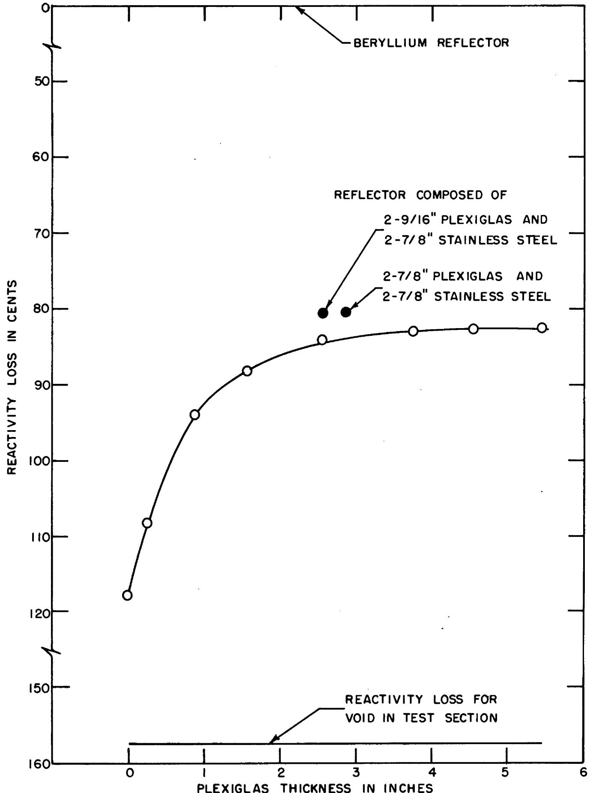  
FIGURE 34. REACTIVITY LOSSES VS. PLEXIGLAS THICKNESS FOR STAINLESS STEEL-PLEXIGLAS-BORAL COMPOSITE REFLECTOR

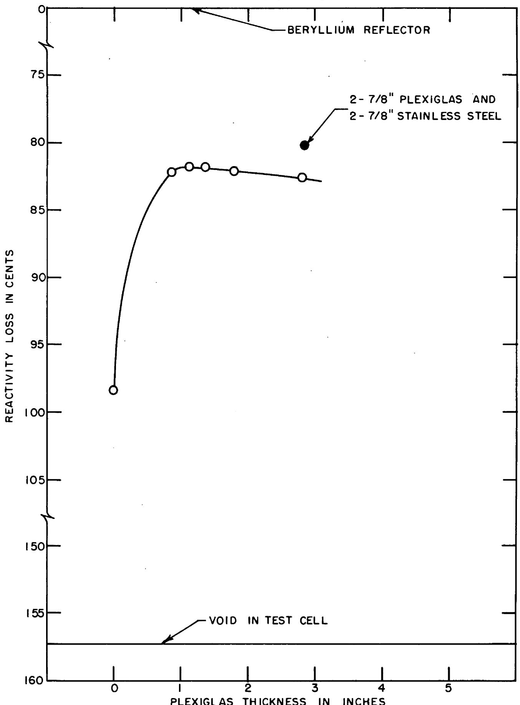  
FIGURE 35. REACTIVITY LOSS VS. PLEXIGLAS THICKNESS FOR STAINLESS STEEL - PLEXIGLAS - CADMIUM-COMPOSITE REFLECTOF

and terminating at the bottom edge of the reflector. For these traverses the composite reflector consisted of an outside layer of 2-7/8" of stainless steel separated from a 2-9/16" Plexiglas inner layer by the Boral sheet. Figure 36 shows the results of these traverses, in which the various activities are plotted as a function of the distance from the bottom of the test section. Figure 37 shows the cadmium fraction computed from the relation

$$
\text {C a d m i u m F r a c t i o n} = \frac {A _ {B} - A _ {C}}{A _ {B}}
$$

(where A refers to the activity induced in an indium foil and the subscripts B and C indicate it to have been bare or cadmium covered, respectively) and plotted as a function of the same distance.

Figure 38 shows the results obtained along the traverses reported in Fig. 36, except that the Boral strips were omitted and the space left void. Cadmium fractions were again computed and are plotted in Fig. 39. No flux traverses nor cadmium fraction determinations were made with the stainless steel, Plexiglas and cadmium composite reflector.

F. Danger Coefficient Type Evaluations in Rectangular Shell Type Assembly:

# 1. Poison Rods

The changes in reactivity caused by prototypes of various control rods in design by General Electric were obtained from the positions of calibrated control rods when the assembly was critical.

The solid strip of Plexiglas in the bottom of a test cell was replaced by a piece through which a hole $5/8''$ in diameter had been bored. The axis of the hole was parallel to the long axis of the Plexiglas strip and equally spaced between the top and bottom faces. A hole was also bored through the graphite end reflector to match the one in the Plexiglas. The poison rod was inserted into the hole with one end of the rod flush with the midplane. The reactor was then made critical. The rod was displaced $18''$ , the end of the rod being at the end reflector-core interface, the solid piece of Plexiglas replaced and the system again made critical.

Table XII gives a description of the rods for identification, the matrix cells in which the evaluation was made and the decreases in reactivity, in cents, incurred when the rods replaced the plastic. The three values recorded in Table XII and evaluated in cell I-12 were made after the conversion of one quadrant of one half of the assembly from the rectangular shell type, graphite reflected, to the water-cone reflected mock-up. The other four values were obtained in the rectangular shell type assembly before the conversion.

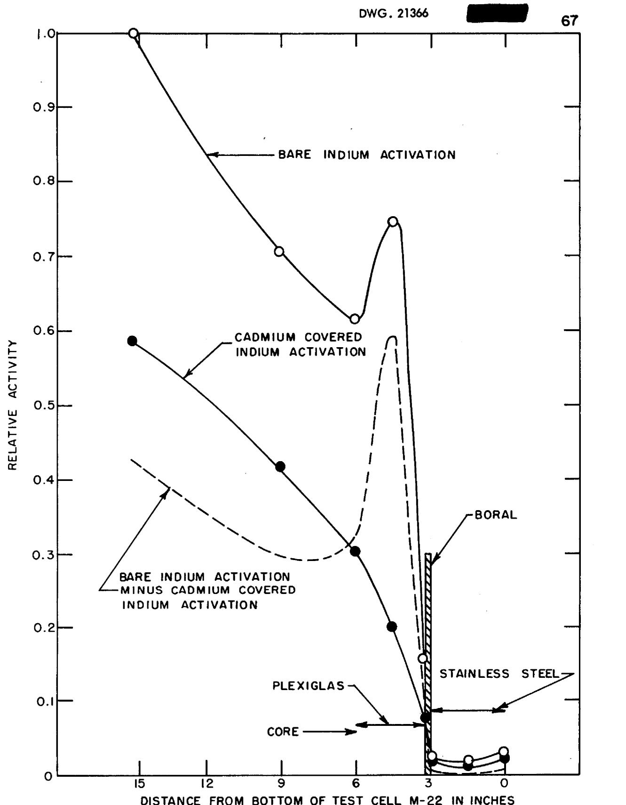  
FIGURE 36. BARE AND CADMIUM COVERED INDIUM TRAVESSES THROUGH STAINLESS STEEL- PLEXIGLAS-BORAL COMPOSITE REFLECTOR

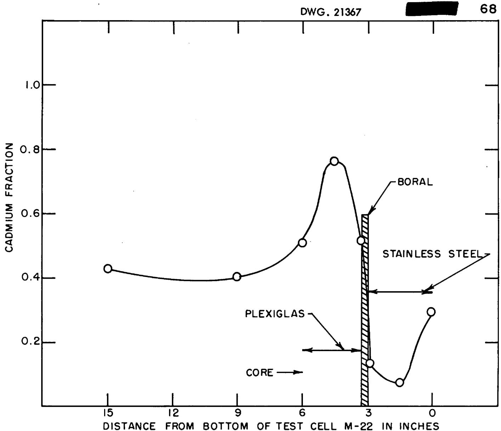  
FIGURE 37. CADMIUM FRACTION VS. DISTANCE FROM BOTTOM OF TEST CELL FOR STAINLESS STEEL - PLEXIGLAS - BORAL COMPOSITE REFLECTOR

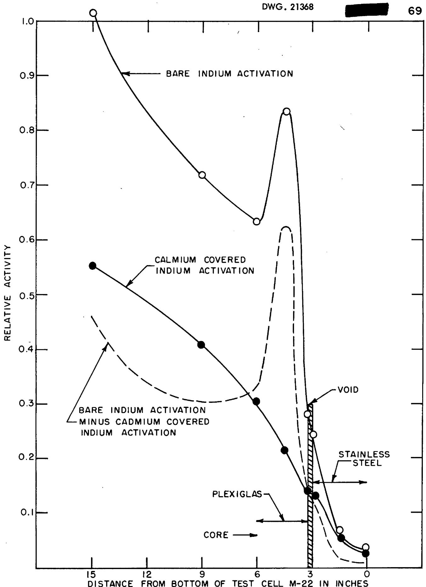  
FIGURE 38. BARE AND CADMIUM COVERED INDIUM TRAVESSES THROUGH STAINLESS STEEL- PLEXIGLAS COMPOSITE REFLECTOR

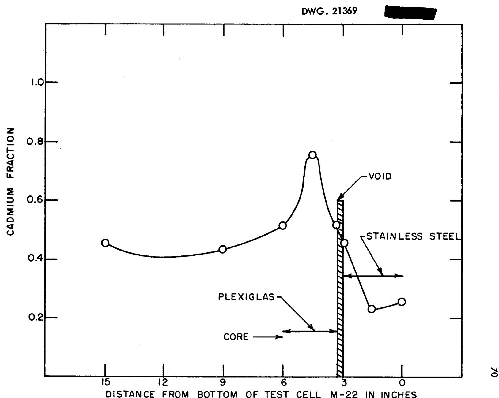  
FIGURE 39. CADMIUM FRACTION VS. DISTANCE FROM BOTTOM OF TEST CELL FOR STAINLESS STEEL-PLEXIGLAS COMPOSITE REFLECTOR

TABLE XII   
POISON ROD REACTIVITY CHANGES   

<table><tr><td>Rod Description</td><td>Cell Number</td><td>Reactivity Loss in Cents</td></tr><tr><td>GE Rod #1*</td><td>I-12</td><td>18.5</td></tr><tr><td>Rod Labelled &quot;Silver&quot;</td><td>I-12</td><td>12.9</td></tr><tr><td>Rod Containing 85.6% Ag and 14.4% Boron</td><td>I-12</td><td>18.2</td></tr><tr><td>GE Rod #1*</td><td>M-8</td><td>17.5</td></tr><tr><td>GE Rod #1*</td><td>M-11</td><td>19.9</td></tr><tr><td>Rod Detailed in GE Print #B4098083-55*</td><td>M-11</td><td>23.2</td></tr><tr><td>Cadmium Rod Containing 8.56 grams Cd/cm3; 34-1/2&quot; long and 1/2&quot; O.D.</td><td>M-11</td><td>13.2</td></tr></table>

# 2. Comparison of Molybdenum and Stainless Steel

The stainless steel sheets in three adjacent cells in one half of the core were replaced by ones of molybdenum having the same dimensions. The resulting change in reactivity was determined, in terms of previously calibrated control rod settings, by bringing the reactor to criticality before and after the molybdenum sheets were introduced. The experiment was repeated in three other positions in the reactor, using three adjacent cells each time. Table XIII gives the group of cells used and the corresponding gains in reactivity resulting from the substitution of the molybdenum for stainless steel.

TABLE XIII   
COMPARISON OF MOLYBDENUM AND STAINLESS STEEL   

<table><tr><td>Cells Used</td><td>Gain in Reactivity in Cents</td></tr><tr><td>L-12, M-11, N-12</td><td>11.9</td></tr><tr><td>L-9, M-9, N-9</td><td>7.9</td></tr><tr><td>L-7, M-7, N-7</td><td>5.6</td></tr><tr><td>L-4, M-4, N-4</td><td>1.9</td></tr></table>

# 3. Comparison of Plexiglas and Graphite

Removal of the Plexiglas from an array of nine matrix cells, K through M-16, 17 and 18, in one half of the assembly incurred a loss in reactivity of 47.8 cents. When graphite was substituted for Plexiglas in these same nine cells the loss amounted to only 26.7 cents.

# 4. Effect of Arco Soil Sample on Reactivity

The loss in reactivity incurred when a small sample of Arco, Idaho, soil* was introduced into the reactor was determined by comparing the reactivity of the assembly when the soil sample was placed in a stainless steel box $l"$ x 2-7/8" x 2-7/8", having a wall thickness of 8 mils, located at the mid-plane of the reactor core in cell M-l2, to that of a void in a box of equal volume at the same location. The results show that with 16l.4 grams of soil in the box there was a loss of reactivity of 0.83 cents.

# G. Power Distribution and Neutron Flux Determinations in Rectangular Shell Type Assembly:

Axial and radial power traverses were made through the rectangular shell type assembly employing the aluminum catcher foil technique which has already been described. Since no fuel disks were located at the center of the core, the axial traverses were extrapolated to the midplane for normalization. Relative power was then plotted as a function of the distance from the core midplane. The one radial power distribution which is reported was taken with all catcher foils 1.8" from the midplane.

Neutron flux distributions in the rectangular shell type assembly were determined using indium foils. In each case the bare indium activation, the cadmium covered indium activation and their difference are shown on each graph, plotted as a function of the appropriate distance.

# 1. Axial Power Traverses

Axial power traverses were made through cells M-12, M-8, M-6 and M-4. The small variations in relative power through cells M-12, M-8 and M-6, do not justify plotting separate curves for each of these cells. There is, however, an appreciable decrease through cell M-4 and a separate curve is plotted. A summary of the results is given in Fig. 40 and Table XIV.

TABLE XIV   
RELATIVE AXIAL POWER   

<table><tr><td rowspan="2">Cell Number</td><td colspan="6">Distance from Midplane in Inches</td></tr><tr><td>0.0</td><td>1.8</td><td>5.4</td><td>9.0</td><td>12.6</td><td>16.2</td></tr><tr><td>M-12</td><td>1.00</td><td>0.99</td><td>0.99</td><td>0.87</td><td>0.84</td><td>0.71</td></tr><tr><td>M-12</td><td>1.00</td><td>0.99</td><td>0.98</td><td>0.88</td><td>0.81</td><td>0.69</td></tr><tr><td>M-8</td><td>1.00</td><td>0.99</td><td>0.97</td><td>0.88</td><td>0.82</td><td>0.73</td></tr><tr><td>M-6</td><td>1.00</td><td>0.99</td><td>0.98</td><td>0.87</td><td>0.82</td><td>0.72</td></tr><tr><td>M-4</td><td>1.00</td><td>0.99</td><td>0.94</td><td>0.83</td><td>0.75</td><td>0.62</td></tr><tr><td>M-4</td><td>1.00</td><td>0.99</td><td>0.93</td><td>0.88</td><td>0.74</td><td>0.65</td></tr></table>

* An analysis of this soil sample is given in Appendix B.

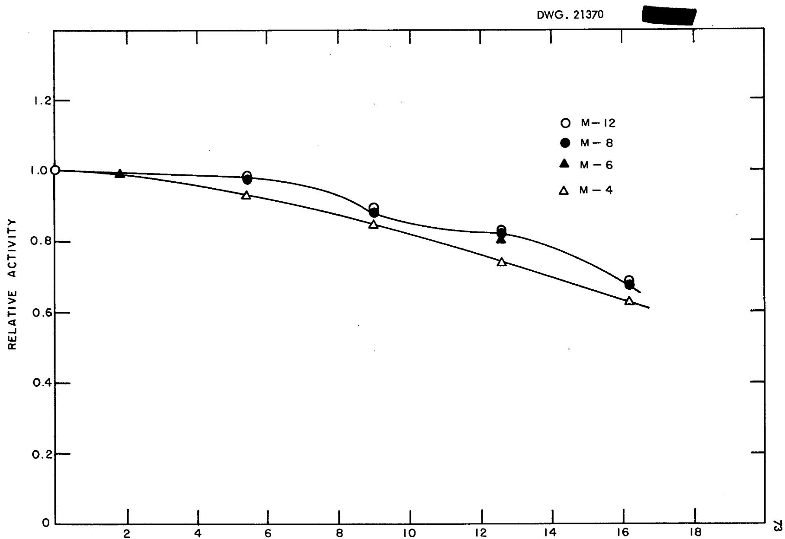  
DISTANCE FROM MIDPLANE IN INCHES   
FIGURE 40. AXIAL POWER TRAVESSES THROUGH CELLS M-12, M-8, M-6 AND M-4

# 2. Radial Power Traverse

One vertical radial power traverse was made 1.8" from and parallel to the midplane starting at the axis of the reactor and extending through the fuel plane of cell M-4. The results of this traverse are shown graphically in Fig. 41. The large decrease in relative power which occurs along the first few inches of this traverse is due to cell M-12 being surrounded on all four sides by a one inch layer of Plexiglas which forms the innermost of the series of concentric shells making up the assembly.

The data represented by the last two points on this curve were obtained from aluminum catcher foils placed in contact with the uranium fuel disk in cell M-4, one foil being adjacent to the top and one on the bottom of this fuel disk. The curve is drawn through points representing data obtained from the upper surfaces of the fuel disks.

# 3. Factors Affecting Power Production by Fuel Disks

# a. Self Shielding

If the fissionable material in a reactor is of high density the neutron flux producing fissions is depressed, a phenomenon known as fuel self shielding. The self shielding of a 0.01" fuel disk was measured before the conversion from the shelf type to the rectangular shell type mock-up by forming a sandwich composed of five 2-mil fuel disks separated by aluminum catcher foils. The results are summarized in Fig. 42 where the experimental points are the averages of catcher foil counting rates which varied less than $1\%$ . The distribution is assumed to be symmetrical about the central disk and the experimental points have been reflected about the plane of symmetry. The ratio of the average activity to that at the surface of the 10-mil disk is $88\%$ .

# b. Cadmium Fraction of Fuel Disk

The cadmium fraction for a fuel disk is defined as the fraction of fissions which are produced by neutrons having energies below that of the cadmium cut-off. It is obtained by the relation:

$$
\text {C a d m i u m F r a c t i o n} = \frac {\mathrm {F} _ {\mathrm {B}} - \mathrm {F} _ {\mathrm {C}}}{\mathrm {F} _ {\mathrm {B}}}
$$

where F refers to the fission fragment activity on the aluminum catcher foil and the subscripts B and C indicate the uranium disk as having been bare or covered with cadmium. Cadmium fractions for fuel disks were obtained both before and after the conversion from the shelf to rectangular shell type mock-up from aluminum catcher foil measurements. All cadmium fractions for fuel disks were measured at a distance of 1.8" from the midplane of the assembly. The results are summarized in Table XV.

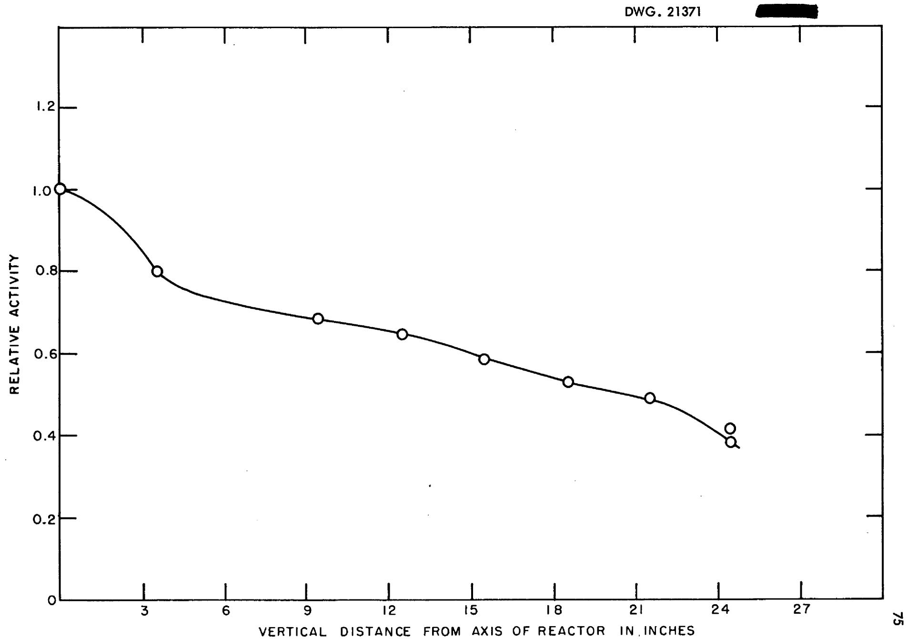  
FIGURE 41. VERTICAL RADIAL POWER TRVERSE AT MIDPLANE

# TABLE XV

# CADMIUM FRACTIONS OF FUEL DISKS

<table><tr><td colspan="2">Shelf Type Assembly</td><td colspan="2">Rectangular
Shell Type Assembly</td></tr><tr><td>Cell</td><td>Cadmium Fraction</td><td>Cell</td><td>Cadmium Fraction</td></tr><tr><td>M-12</td><td>0.92</td><td>M-12</td><td>0.94</td></tr><tr><td>U-12</td><td>0.92</td><td>M-8</td><td>0.92</td></tr><tr><td>M-4</td><td>0.90</td><td>M-4</td><td>0.90</td></tr></table>

The plastic enclosing Cell M-12 in the RS mock-up appears to increase the fraction of thermal fissions there.

# 4. Absolute Power Determination

Absolute power in the rectangular shell type assembly was determined by normalizing the power traverses to absolute fission rates by comparing a one-mil gold foil activation in the critical assembly with that induced by the Oak Ridge National Laboratory Standard Pile. From this normalization the absolute power during foil exposures was found to be approximately two watts.

# 5. Radial Flux Distributions

# a. Traverses not in Plexiglas

Bare and cadmium covered indium activations were measured along a vertical radius starting at the axis of the reactor in Cell M-12 and extending downward through the beryllium reflector, terminating at the bottom of cell M-22. Data for these traverses were taken with the indium foils located as near the mid-plane as possible and not in the Plexiglas. Results are shown graphically in Fig. 43.

These curves indicate that the flux in cell M-12 is high. This flux distribution agrees with the peak found in the relative radial power distribution shown in Fig. 4l. The flux peak in the beryllium reflector also corresponds to that found for the shelf type assembly as shown in Fig. 2l.

# b. Traverses Through Plexiglas

Bare and cadmium covered indium traverses were made through the Plexiglas starting at the axis of the reactor in cell M-12 and extending through the beryllium reflector along a horizontal radius. The results are shown graphically in Fig. 44. The relatively high values of the flux in cell M-12, which is surrounded on four sides by one inch thick layers of Plexiglas, and the peak in the beryllium reflector, which have been noted previously, are again observed.

# 6. Axial Flux Distribution

Bare and cadmium covered indium traverses were made through cell M-12 along the axis of the reactor, starting at the midplane and

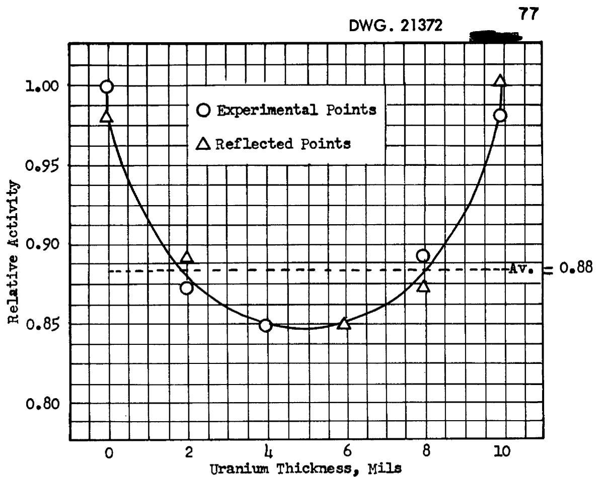  
FIGURE 42. POWER GENERATION THROUGH FUEL

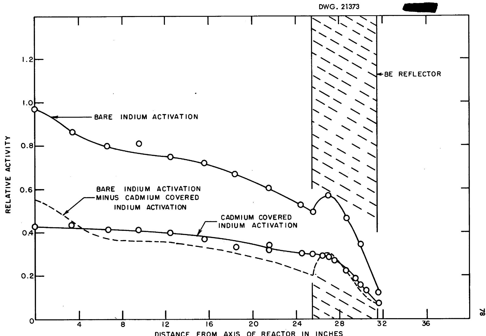  
FIGURE 43. VERTICAL BARE AND CADMIUM COVERED INDIUM TRaverse AT MIDPLANE; FROM CELL M-12 THROUGH M-22

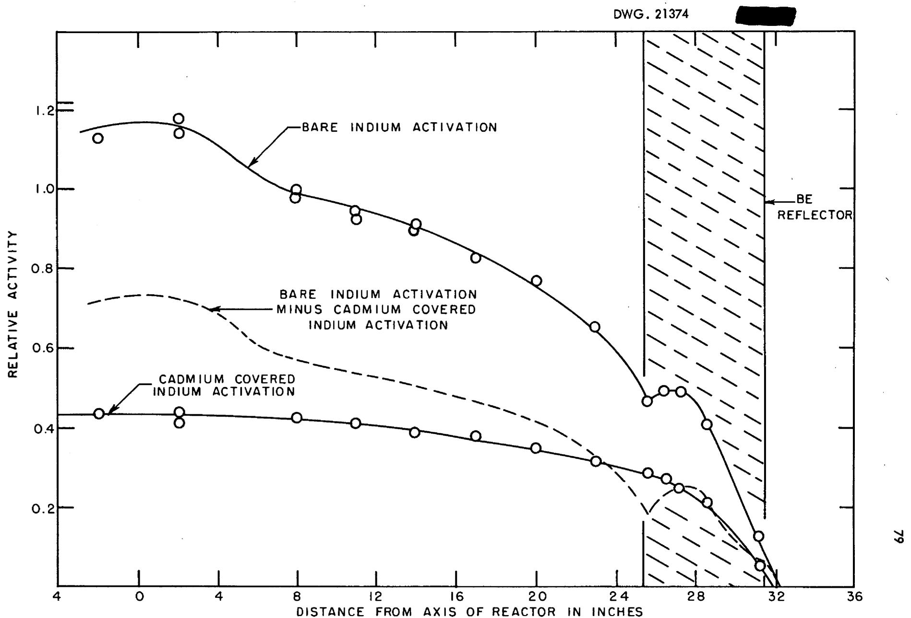  
FIGURE 44. RADIAL BARE AND CADMIUM COVERED INDIUM TRAVESSES TAKEN HORIZONTALLY AT MIDPLANE THROUGH PLEXIGLAS

extending through the graphite end reflector. The results are shown graphically in Fig. 45.

# 7. Neutron Flux Distribution at Plexiglas Intersection

The conversion from the shelf type to the rectangular shell type of mock-up produced intersections of the vertical and horizontal layers of the Plexiglas strips extending radially from the four corners of cell M-12 at azimuthal angles of about $45^{\circ}$ both above and below the horizontal. The object of the measurements noted here is to study the flux distribution in the vicinity of one of these intersections. The region selected is illustrated in Fig. 46. The vertical columns of the matrix are indicated by the notation at the bottom of the figure and the row selected is noted on the right of the figure. The arrangement of the Plexiglas may be clearly seen from the loading diagram, Fig. 5.

Bare and cadmium covered indium traverses were measured along a horizontal in the midplane with the indium foils occupying the positions indicated by the small triangles in Fig. 46. This figure also shows graphically the results of the traverses.

# 8. Unit Cell Traverses

Bare and cadmium covered indium traverses were made vertically across cell M-12 and extending through the one inch layers of Plexiglas adjacent to the top and bottom of this cell. This central cell contains stainless steel and uranium fuel disks but no Plexiglas. It is, however, surrounded by a one inch layer of Plexiglas on all four sides. The results of these traverses are shown graphically in Fig. 47.

# 9. Neutron Flux Distribution Around a Poison Rod

Two flux distributions, each mutually perpendicular to the axis of one of the experimental poison rods supplied by the General Electric Company, and designated as Rod #1*, were determined. One traverse was in the plane of the Plexiglas layer and the other perpendicular to it.

The poison rod occupied the position in cell M-8 which had been used during the reactivity evaluations and which has been previously described in this report. This position is illustrated in Fig. 49. The foil positions for the horizontal and vertical traverses are illustrated in Figs. 48 and 49 respectively, and the diagonally cross-hatched lines in these two figures represent sections through the Plexiglas.

The horizontal flux distribution is represented graphically in Fig. 48 and the vertical distribution in Fig. 49.

All the flux distribution curves taken in the vicinity of the poison rod show a discontinuity at the surface of the rod since it was not possible to make neutron flux determinations inside the rod. In Fig. 48 those foils whose distances

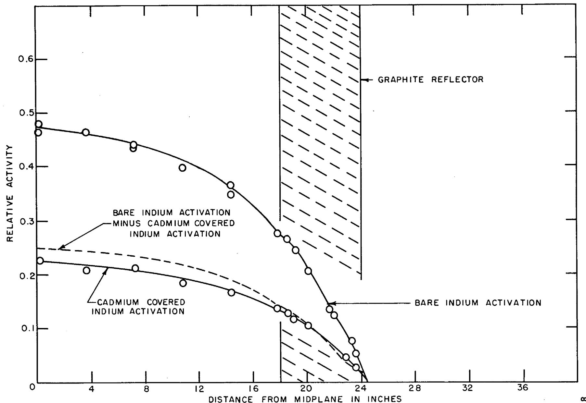  
FIGURE 45. BARE AND CADMIUM COVERED INDIUM TRVERSE ALONG AXIS OF THE REACTOR THROUGH CELL M-12

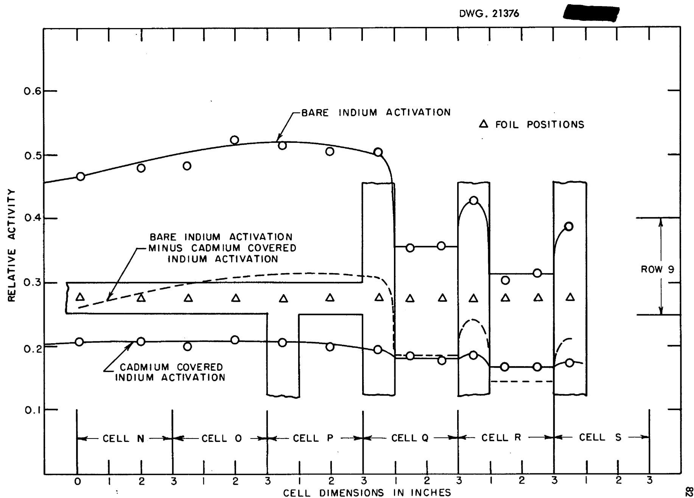  
FIGURE 46. HORIZONTAL BARE AND CADMIUM COVERED INDIUM TRAVESES AT PLEXIGLAS INTERSECTION. TAKEN AT MIDPLANE

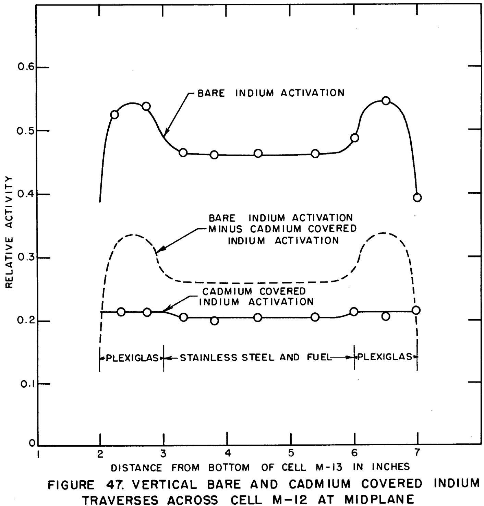

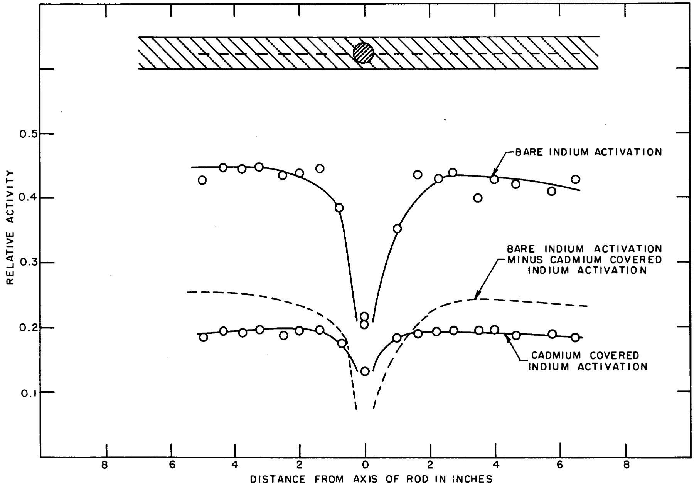  
FIGURE 48. BARE AND CADMIUM COVERED INDIUM TRAVESSES THROUGH PLEXIGLAS IN REGION OF POISON ROD # I. ROD LOCATED IN CELL M-8

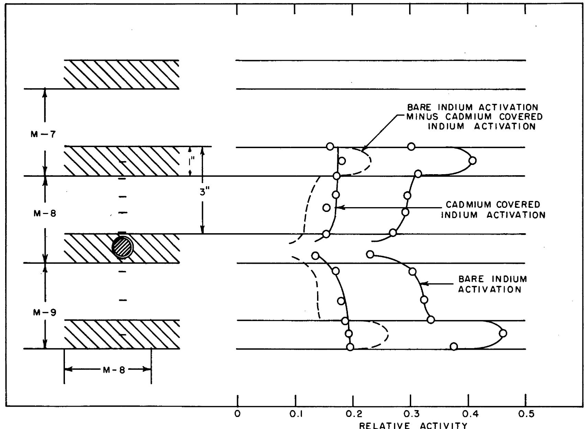  
FIGURE 49. VERTICAL BARE AND CADMIUM COVERED INDIUM TRAVESSES IN MIDPLANE THROUGH POISON ROD #1. ROD LOCATED IN CELL M-8

from the axis are indicated as zero were actually attached to the circumference of the rod by a very narrow strip of tape.

# V. EXPERIMENTAL STUDIES ON WATER-CONE REFLECTED ASSEMBLY

A. Traverses in The Water-Cone Reflected Assembly:

Bare and cadmium covered indium neutron flux traverses were made through cells R-12 and U-12 parallel to the axis, in the quadrant of the reactor in which the reflector had been altered to represent a mock-up of the water-cone reflected assembly. The traverses began at the mid-plane and extended through the simulated water cone. Both the bare and the cadmium covered foils were located in the Plexiglas strips one-half inch from the bottom of the cells. The results of these traverses are shown graphically in Figs. 50 and 51.

Bare and cadmium covered indium traverses were made through cell H-12, in a quadrant of the assembly in which the reflector was unaltered, for comparison with those of R-12 and U-12. Cell H-12 is the same horizontal radial distance from the central rectangular shell cell, M-12, as is R-12. Also safety rod No. 8 occupies the same relative position with respect to cells H-12 and M-12 as No. 7 occupies relative to cells R-12 and M-12. The bare and cadmium covered foils were again located in the Plexiglas one-half inch from bottom of cell. The graphic results of these traverses are shown in Fig. 52.

No satisfactory explanation for the neutron flux peak observed in the vicinity of the midplane in cell H-12 is immediately available. Most other axial flux curves taken through this assembly follow the general shape of the zero order Bessel function of the first kind, especially near the midplane. The dotted portion of the bare indium activation curve shows this relation.

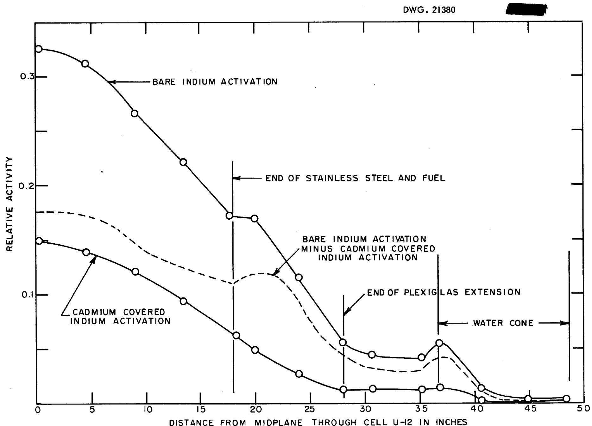  
FIGURE 50. BARE AND CADMIUM COVERED INDIUM TRAVESSES THROUGH CELL U-12

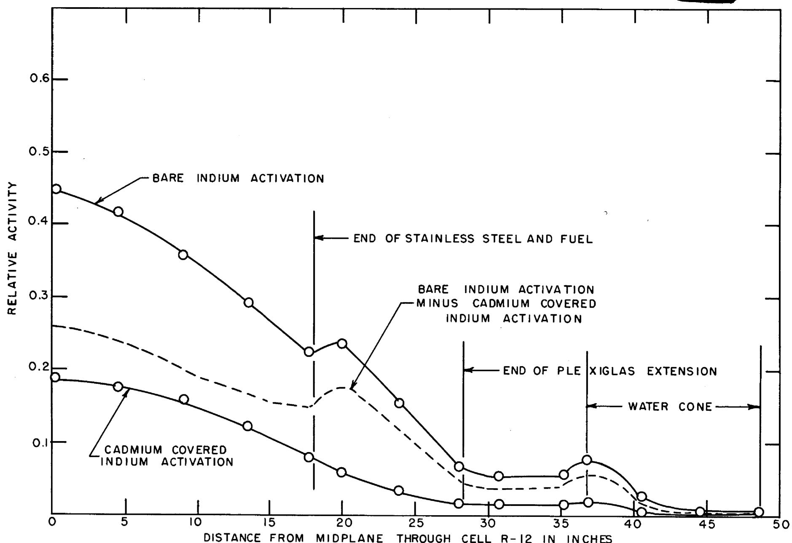  
FIGURE 51. BARE AND CADMIUM COVERED INDIUM TRAVESSES THROUGH CELL R-12

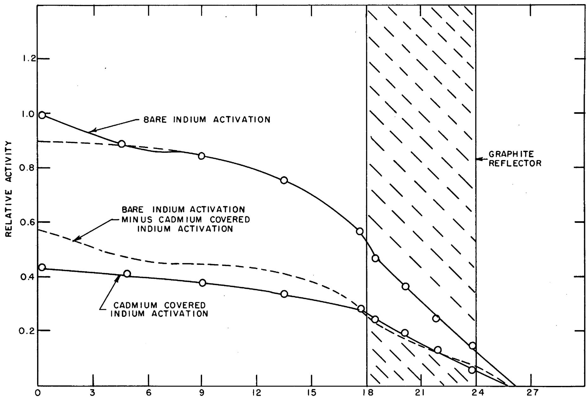  
DISTANCE FROM MIDPLANE THROUGH CELL H-12 IN INCHES   
FIGURE 52. BARE AND CADMIUM COVERED INDIUM TRAVERSES THROUGH CELL H-12

# VI CONCLUSIONS

Results of the Critical Experiments on the various mock-ups of the Direct Cycle Aircraft Reactor indicate satisfactory agreement between the theoretical and experimental values despite the complexity of the assembly.9 The agreement obtained between the measured and computed reactivity losses due to separation of the two halves of the core at the midplane, based on a homogeneous thermal reactor, gives added confidence to the application of methods of reactor calculations to complicated assemblies.

The similarity of the results obtained for power distributions from catcher foil activities and the counting of fission product radiations directly from the fuel disks indicates that this method of measuring fission rates and for normalizing indium foil exposures between different runs is satisfactory for the neutron spectrum studied here. This eliminates the necessity for counting the fuel element back-ground prior to exposure.

The fair agreement between the results obtained for rod calibrations by the stable period and the rod-drop methods indicates that the latter may be used with confidence. Since the rod-drop method is much less laborious, it may be used to check the integrated value of control rods and to quickly evaluate safety rods.

Some effects observed during the course of the critical experiments have not been thoroughly studied. Among these are the peak observed on the control rod sensitivity curve; the peak in the reactivity vs Plexiglas thickness curve; the increase in reactivity with an increase in temperature of the assembly. Some of the changes in reactivity which accompany alterations of the reflector in different localities have not been explained.

9 Ibid. Table 8, p. 70.

# CONVERSION FROM SHELF TO RECTANGULAR SHELL Mock-UP

During the early stages of the critical experiments on the Direct Cycle Aircraft Reactor, considerable controversy arose over the proper method of including neutron streaming in the calculation of age. One of the purposes of the comparison of the shelf and rectangular shell configurations was to estimate this streaming effect. Whatever the magnitude of the streaming effect, it was anticipated that reducing the radial straight line void distances would result in an increase in multiplication. Contrary to the expected effect, converting from the shelf to the rectangular shell configuration caused a substantial negative change in multipli-cation.

While the original question was not answered, a partial explanation for the negative change is given on the basis of a net shift of fuel away from the region of greatest importance in the assembly.

To affect the change from the shelf to the rectangular shell type assembly, approximately half the cells were rotated through $90^{\circ}$ in such a way that, in these cells, the fuel was moved $1/2$ or $1.27$ cm away from vertical longitudinal midplane of the assembly. Call this displacement a. The component of the displacement a along a radius at an angle $\theta$ is given by a cos $\theta$ ; b represents the distance of a particular cell from the axis.

$$
\text {A v e r a g i n g} \quad \text {r a d i a l} \quad \text {d i s p l a c e m e n t} \quad \text {o v e r} \quad \text {i n t e r v a l} \quad 0 \leq \theta \leq \pi
$$

$$
\overline {{a}} = \frac {\int_ {0} ^ {\pi / 4} \frac {a b \cos \theta d \theta}{\cos^ {2} \theta}}{\int_ {0} ^ {4 \pi / 4} \frac {b d \theta}{\cos^ {2} \theta}} = \frac {a}{2} \ln \frac {1 + \frac {1}{\sqrt {2}}}{1 - \frac {1}{\sqrt {2}}} = 0. 8 8 1 a \tag {1}
$$

Approximately half of the elements were rotated, so the overall average displacement amounted to

$$
\overline {{\mathcal {A}}} = \frac {\overline {{a}}}{\overline {{2}}} = 0. 5 6 \mathrm {c m}
$$

For a bare reactor of radius R having the asymptotic flux distribution of the actual assembly, the radial part of the flux is given by $\phi (\boldsymbol {r}) = J_{\mathrm{o}}(\boldsymbol{B}_{\boldsymbol{r}}\cdot \boldsymbol {r})$ where $B_{r} = 2.405$ , is the radial bucking component. Since, in the asymptotic approximation, the flux is self ajoint, the importance function is $[\phi (\vec{r})]^2$ The change in multiplication due to increasing the fuel density by a small amount sm at r is c sm $\phi^2 (r)$ . Integrating over the entire radius one has

$$
\delta_ {k} = 2 \pi c \delta_ {m} \int_ {0} ^ {R} \phi^ {2} (r) r d r \tag {2}
$$

This change in multiplication may also be found by adding the perturbation

$(1 + \frac{\delta_{\mathrm{m}}}{\mathrm{m}})$ to the fuel cross sections in the critical equation:

$$
k _ {\text {e f f}} = 1 + \delta k = \frac {\nu \sum_ {f} (1 + \frac {\delta m}{m}) p ^ {\text {t h}} e - T B ^ {2}}{\sum_ {a} ^ {u} (1 + \frac {\delta m}{m}) + \sum_ {a} ^ {m} + D B ^ {2}} \tag {3}
$$

Where $\sum_{a}^{m}$ refers to the thermal absorption cross-section in materials other than the fuel and $\sum_{a}^{u}$ is the thermal absorption cross-section in the fuel. Solving (3) for $\delta k$ and neglecting second order term gives

$$
\delta_ {k} = \left[ \frac {\sum_ {a} ^ {m} + D B ^ {2}}{\sum_ {a} ^ {u} + \sum_ {a} ^ {m} + D B ^ {2}} \right] \frac {\delta m}{m} \quad \because 0. 4 7 4 \frac {\delta m}{m}. \tag {4}
$$

The term in the brackets is evaluated from the unperturbed reactor constants.

The change in multiplication caused by shifting an element of fuel a distance $\overline{d}$ is

$$
C \left[ \phi^ {2} (\gamma + \overline {{\phi}}) - \phi^ {2} (\gamma) \right] m = c m 2 \overline {{\phi}} \phi (\gamma) \frac {d \phi}{d r} | _ {r ^ {\prime}} \tag {5}
$$

Integrating over the entire radius and substituting the value of $c$ found by comparing equations (2) and (4) gives:

$$
\delta \mathrm {k} = 2 \bar {\alpha} \left[ \frac {\sum_ {\mathrm {a}} ^ {\mathrm {m}} + \mathrm {D B} ^ {2}}{\sum_ {\mathrm {a}} ^ {\mathrm {u}} + \sum_ {\mathrm {a}} ^ {\mathrm {m}} + \mathrm {D B} ^ {2}} \right] \frac {\int_ {0} ^ {\mathrm {R}} \phi (\boldsymbol {r}) \phi^ {\prime} (\boldsymbol {r}) r d \boldsymbol {r}}{\int_ {0} ^ {\mathrm {R}} \phi^ {2} (\boldsymbol {r}) r d \boldsymbol {r}} \tag {6}
$$

Substituting $J_{0}(\mathbf{B}_{r}^{\tau})$ for $\varnothing (\tau)$ , the values from (4),

$$
a n d B _ {r} = 0. 0 3 5 5 c m ^ {- 1},
$$

gives the result

$$
\delta_ {k} = - 0. 0 0 9 3 8,
$$

or a loss in reactivity of about 130 cents

# ANALYSES OF REACTOR MATERIALS

# 1. Arco Soil Sample

Principal Constituents Silicon, Aluminum, and Iron

Present in Smaller Quantities Sodium, Calcium, and Potassium

Quantitatively Measured

<table><tr><td>Boron</td><td>0.05%</td></tr><tr><td>Lithium</td><td>0.1%</td></tr><tr><td>Magnesium</td><td>0.02%</td></tr><tr><td>Maganese</td><td>0.05%</td></tr></table>

Elements not Detected
Cadmium and Copper

2. General Electric Company Experimental Poison Rod #1.

<table><tr><td>Volume of B4C as Packed</td><td>50.77 cm3</td></tr><tr><td>*Length of Rod Packed with B4C</td><td>28.8 inches</td></tr><tr><td>Weight of B4C</td><td>81.0 grams</td></tr><tr><td>Packed Density of B4C</td><td>1.595 grams/cm3</td></tr><tr><td>*Boron per cc</td><td>1.248 grams</td></tr><tr><td>Length of Lavite Plug</td><td>3/8 inch</td></tr></table>

*Inside Measurement
**Assuming Pure B4C

3. General Electric Company Experimental Poisson Rod Detailed in GE Print No. B 4098083 - 55.

This poison rod consisted of a cadmium portion 20" long whose cross-sectional area was a Maltese cross, having arms 0.082" thick and a total length of $3/4''$ , formed from 0.041" cadmium sheet stock. This cadmium rod was inserted into an aluminum tube 30" long, 0.835" inside diameter and 0.083" wall thickness. The cadmium cross was held in position by a suitable plug.

4. Stainless Steel, Type 302

<table><tr><td>Maganese</td><td>1.11%</td></tr><tr><td>Chromium</td><td>17.3</td></tr><tr><td>Nickel</td><td>7.6</td></tr><tr><td>Boron</td><td>0.001</td></tr></table>

Note: The 7.6 percent of nickel is below the specifications for type 302 stainless steel. This value was determined six times by three methods.

5. Spectrographic Analysis of Stainless Steel Type 310

<table><tr><td>Ag &lt; 0.04%</td><td>Cd &lt; 0.04%</td><td>Hf &lt; 0.5%</td><td>Ni &gt; 10.0%</td><td>Ti &lt; 0.005%</td></tr><tr><td>Al &lt; 0.04%</td><td>Co 0.63</td><td>In &lt; 0.15</td><td>Pb &lt; 0.08</td><td>V 0.08</td></tr><tr><td>B &lt; 0.004</td><td>Cr &gt; 10.0</td><td>Mg &lt; 0.02T</td><td>Si 0.63</td><td>W &lt; 1.3</td></tr><tr><td>Ba &lt; 0.02</td><td>Cu 0.15</td><td>Mn 0.63</td><td>Sn &lt; 0.04T</td><td>Zn &lt; 0.31</td></tr><tr><td>Be &lt; 0.0003</td><td>Fe &gt; 10.</td><td>Mo 0.31</td><td>Sr &lt; 0.06</td><td>Zr &lt; 0.15</td></tr><tr><td>Ca &lt; 0.80</td><td>Ga &lt; 0.04</td><td>Na &lt; 0.63</td><td>Ta &lt; 1.3</td><td></td></tr></table>

6. Analysis of 2S Aluminum Used as Catcher Foils

QUANTITIES PRESENT IN PERCENT   

<table><tr><td>Ag&lt;0.04</td><td>Co&lt;0.08</td><td>Mn 0.04</td><td>Sn&lt;0.04</td></tr><tr><td>Al&gt;5.0</td><td>Cr 0.08</td><td>Mo&lt;0.08</td><td>Sr&lt;0.1</td></tr><tr><td>B&lt;0.01</td><td>Cu 0.04</td><td>Na&lt;0.01</td><td>Ti&lt;0.04 T</td></tr><tr><td>Ba&lt;0.04</td><td>Fe 0.3</td><td>Ni&lt;0.08</td><td>V&lt;0.08</td></tr><tr><td>Be&lt;0.001</td><td>K 0.02</td><td>Pb&lt;0.08</td><td>Zn&lt;0.3</td></tr><tr><td>Ca&lt;0.08</td><td>Mg&lt;0.02T</td><td>S1 0.3</td><td>Zr&lt;0.15</td></tr></table>

7. Analysis of Square Aluminum Tubing Used in Matrix

QUANTITIES PRESENT IN PERCENT   

<table><tr><td>Ag&lt;0.04</td><td>Co&lt;0.08</td><td>Mn 0.04</td><td>Sn&lt;0.04</td></tr><tr><td>Al&gt;5.0</td><td>Cr 0.08</td><td>Mo&lt;0.08</td><td>Sr&lt;0.1</td></tr><tr><td>B&lt;0.01</td><td>Cu 0.15</td><td>Na&lt;0.01</td><td>Ti&lt;0.04 T</td></tr><tr><td>Ba&lt;0.04</td><td>Fe 0.6</td><td>Ni&lt;0.08</td><td>V&lt;0.08</td></tr><tr><td>Be&lt;0.001</td><td>K&lt;0.02</td><td>Pb&lt;0.08</td><td>Zn&lt;0.3</td></tr><tr><td>Ca&lt;0.08</td><td>Mg 0.02</td><td>Si 0.2</td><td>Zr&lt;0.15</td></tr></table>

8. Analysis of Plexiglas Used as Moderator

<table><tr><td>Carbon</td><td>58.7%</td></tr><tr><td>Hydrogen</td><td>8.15%</td></tr><tr><td>Ignited Oxides</td><td>0.0053%</td></tr></table>

Spectrographic Analysis of Ignited Oxides

QUANTITIES PRESENT IN PERCENT   

<table><tr><td colspan="2">Ag &lt; 0.04</td><td colspan="2">Co &lt; 0.08</td><td colspan="2">Mo &lt; 0.08</td><td colspan="2">Sr &lt; 0.1</td></tr><tr><td>Al</td><td>0.2</td><td>Cr</td><td>0.15</td><td colspan="2">Na &lt; 1.0</td><td>T1</td><td>0.2</td></tr><tr><td>B</td><td>&lt; 0.01</td><td>Cu</td><td>0.15</td><td>Ni</td><td>0.3</td><td>V</td><td>&lt; 0.08</td></tr><tr><td>Ba</td><td>&lt; 0.04</td><td>Fe&gt;</td><td>0.5</td><td>Pb</td><td>&lt; 0.08</td><td>Zn</td><td>&lt; 0.3</td></tr><tr><td>Be</td><td>0.001</td><td>Mg</td><td>0.2</td><td>Si</td><td>2.5</td><td>Zr</td><td>&lt; 0.15</td></tr><tr><td>Ca</td><td>0.08</td><td>Mn</td><td>0.3</td><td>Sn</td><td>&lt; 0.08 T</td><td></td><td></td></tr></table>

9. Chemical Analysis of Stainless Steel Type 310

<table><tr><td>Fe</td><td>52.8%</td></tr><tr><td>Ni</td><td>19.1%</td></tr><tr><td>Cr</td><td>25.0%</td></tr></table>

# A. Shelf Type Assembly

1. Core

<table><tr><td>Material</td><td>Density gm/cc</td><td>Mass kg</td><td>Mass Fraction</td><td>Volume liters</td><td>Volume* Fraction</td></tr><tr><td>Urenium (total)</td><td>18.7</td><td>41.2**</td><td>0.038</td><td>2.2</td><td>0.002</td></tr><tr><td>U-235</td><td>--</td><td>(38.4)**</td><td>---</td><td>--</td><td>--</td></tr><tr><td>Stainless Steel</td><td></td><td></td><td></td><td></td><td></td></tr><tr><td>Type 302</td><td>7.87</td><td>384.5</td><td>0.357</td><td>48.9</td><td>0.040</td></tr><tr><td>Plexiglas</td><td>1.18</td><td>460.9</td><td>0.426</td><td>391.5</td><td>0.320</td></tr><tr><td>Aluminum Tubes</td><td></td><td></td><td></td><td></td><td></td></tr><tr><td>Type 2S</td><td>2.72</td><td>193.0</td><td>0.179</td><td>70.5</td><td>0.058</td></tr><tr><td>Void</td><td>--</td><td>--</td><td>--</td><td>708.9</td><td>0.580</td></tr><tr><td></td><td></td><td>1079.6</td><td></td><td>1222.0</td><td></td></tr></table>

2. Reflector

<table><tr><td>Beryllium</td><td>1.86</td><td>1096.1</td><td>0.486</td><td>589.3</td><td>0.465</td></tr><tr><td>Graphite (AGOT)</td><td>1.72</td><td>957.8</td><td>0.425</td><td>556.8</td><td>0.440</td></tr><tr><td>Aluminum Tubes</td><td></td><td></td><td></td><td></td><td></td></tr><tr><td>Type 2S</td><td>2.72</td><td>200.0</td><td>0.089</td><td>73.5</td><td>0.058</td></tr><tr><td>Void</td><td>--</td><td>--</td><td>--</td><td>46.9</td><td>0.037</td></tr><tr><td></td><td></td><td>2253.9</td><td></td><td>1266.5</td><td></td></tr></table>

# B. Rectangular Shell Type Assembly

1. Core

<table><tr><td>Uranium (Total)</td><td>18.7</td><td>41.2**</td><td>0.038</td><td>2.2</td><td>0.002</td></tr><tr><td>U-235</td><td>--</td><td>(38.3)**</td><td>--</td><td>--</td><td>--</td></tr><tr><td>Stainless Steel</td><td></td><td></td><td></td><td></td><td></td></tr><tr><td>Type 302</td><td>7.87</td><td>383.4</td><td>0.357</td><td>48.6</td><td>0.040</td></tr><tr><td>Plexiglas</td><td>1.18</td><td>459.2</td><td>0.426</td><td>389.8</td><td>0.319</td></tr><tr><td>Aluminum Tubes</td><td></td><td></td><td></td><td></td><td></td></tr><tr><td>Type 2S</td><td>2.72</td><td>192.9</td><td>0.179</td><td>70.6</td><td>0.058</td></tr><tr><td>Void</td><td>--</td><td>--</td><td>--</td><td>710.2</td><td>0.581</td></tr><tr><td></td><td></td><td>1076.7</td><td></td><td>1221.4</td><td></td></tr></table>

2. Reflector

<table><tr><td>Beryllium</td><td>1.86</td><td>1096.1</td><td>0.451</td><td>589.3</td><td>0.429</td></tr><tr><td>Graphite (AGOT)</td><td>1.72</td><td>1119.0</td><td>0.460</td><td>650.6</td><td>0.475</td></tr><tr><td>Aluminum Tubes</td><td></td><td></td><td></td><td></td><td></td></tr><tr><td>Type 2S</td><td>2.72</td><td>216.6</td><td>0.089</td><td>79.2</td><td>0.058</td></tr><tr><td>Void</td><td>--</td><td>--</td><td>--</td><td>52.0</td><td>0.038</td></tr><tr><td></td><td></td><td>2431.7</td><td></td><td>1371.1</td><td></td></tr></table>

* These values are averages over the entire core or reflector and differ slightly from those given in the text, page 11, because of peripheral irregularities.   
** The mass of uranium reported here is the amount loaded in the matrix; the mass of U-235 is that required to make the system critical with all control rods completely inserted.