CENTRAL RESEARCH LIBRARY DOCUMENT COLLECTION

ORNL 1634

Reactors-Research and Power

34456 03495885

PRELIMINARY CRITICAL ASSEMBLY FOR THE AIRCRAFT REACTOR EXPERIMENT

Dixon Callihan Dunlap Scott

CENTRAL RESEARCH LIBRARY DOCUMENT COLLECTION

LIBRARY LOAN COPY

DO NOT TRANSFER TO ANOTHER PERSON

If you wish someone else to see this document, send in name with document and the library will arrange a loan.

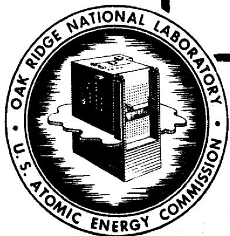

OAK RIDGE NATIONAL LABORATORY

OPERATED BY

CARBIDE AND CARBON CHEMICALS COMPANY

A DIVISION OF UNION CARBIDE AND CARBON CORPORATION

UCC

POST OFFICE BOX P

OAK RIDGE. TENNESSEE

# DECLASSIFIED

This document contains 59 pages

is is copy 30 of 155, Series A.

CLASSEPIATION CHANGED TO:

By

B1:

AEC 7/257

Subject Category: Reactors-Research

and Power.

PRELIMINARY CRITICAL ASSEMBLY

for the

AIRCRAFT REACTOR EXPERIMENT

Work by: Dixon Callihan

J. F. Ellis (Now in U.S. Army)

E. V. Haake (Now at Consolidated Vultee

Aircraft Corp.)

J.J.Lynn

E.R.Rohrer

Dunlap Scott

D. V. P. Williams

Preparation by: Dunlap Scott

Dixon Callihan

DATE ISSUED

OCT 28 1953

PHYSICS DIVISION

A. H. Snell

Director

Contract No. W-7405, Eng. 26

OAK RIDGE NATIONAL LABORATORY

Operated by

CARBIDE AND CARBON CHEMICALS COMPANY

A Division of Union Carbide and Carbon Corporation

Post Office Box P

Oak Ridge, Tennessee

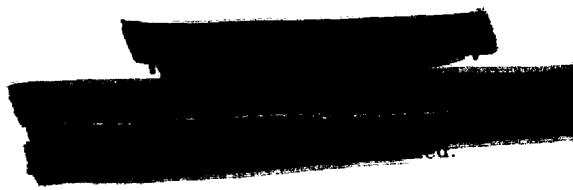

ed

tal

to

${13}/{14}$

$\therefore m = \frac{3}{11}$

${13}/{14}$

${13}/{14}$

${13}/{14}$

$\therefore m = \frac{3}{11}$

#

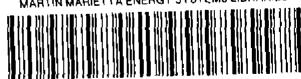  
MARTIN MARIETTA ENERGY SYSTEMS LIBRARIES

3445603495885

# INTERNAL DISTRIBUTION

C. E. Center

C. E. Larson

3 W. B. Humes (K-25)

4. L. B. Emlet (Y-12)

5. M. Weinberg

6. Del Bengston

7. EAS. Bettis

8. R. J. Briant

9. Dix Callihan

L0.R.ACharpie

11. W. K. Irgen

12. A. P. Raas

13. W. R. 8 times

14. D. K. Haines

15. J. A. Lad

16. J. L. Meel

17. A. J. Mill

18. C. B. Mills

19. Dunlap Scott

20. A. H. Snell

21. J. A. Swartout

22. D. V. P. Willia

23. E. L. Zimmerman

24. E. D. Shipley

25-27. ANP Reports Office

28. Biology Library

29. Health Physics Libra

30-31. Central Research Libr

32. Reactor Experimental Engineering Library

33-37. Laboratory Records Department

38. Laboratory Records, ORNL R.C.

# EXTERNAL DISTRIBUTION

AF Plant Representative, Burbank

AF Plant Representative, Seattle

4AF Plant Representative, Wood-Ridge

42. TP Project Office, Fort Worth

43-53.1 Ronne National Laboratory

54. At d Forces Special Weapons Project (Sandia)

55-59. Atta c Energy Commission, Washington

60. Batale Memorial Institute

61. Becht Corporation

62-64. Brookhaven National Laboratory

65. Bureau of Ships

66-67. California Research and Development Company

68-73. Carbide and Carbon Chemicals Company (Y-12 Plant)

74. Chicago Patrt Group

75. Chief of Nav Research

76. Commonwealth Museum Company

77. Department of the Navy - Op-362

78. Detroit Edison Company

79-82. duPont Company, Augusta

83. duPont Company, Wilmington

84. Foster Wheeler Corporation

85-87. General Electric Company (ANPP)

88-91. General Electric Company, Richland

92. Hanford Operations Office

93-99. Idaho Operations Office

100. Iowa State College

101-104. Knolls Atomic Power Laboratory

105-107. Los Alamos Scientific Laboratory (1 copy to H. C. Paxton)

108. Massachusetts Institute of Technology (Kaufmann)

109. Monsanto Chemical Company

110. Mound Laboratory

111. National Advisory Committee for Aeronautics, Cleveland

112. National Advisory Committee for Aeronautics, Washington

113. Naval Research Laboratory

114-115. New York Operations Office

116-117. North American Aviation, Inc.

118. Nuclear Development Associates, Inc.

119. Patent Branch, Washington

120. Pioneer Service & Engineering Company

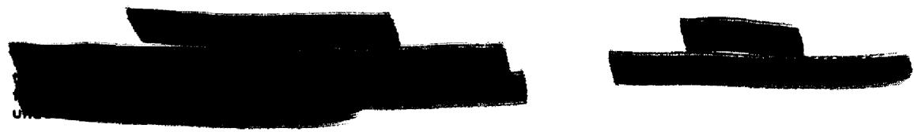

121. Powerplant Laboratory (WADC)   
123. Pratt and Whitney Aircraft Division (Fox Project) (1 copy to W. G. Kennedy)   
124 and Corporation   
125. Francisco Operations Office   
126. Savitzh River Operations Office, Augusta   
127. USAF dquarters   
128. U. S. Naïl Radiological Defense Laboratory   
129-130. University of California Radiation Laboratory, Berkeley   
131-132. University of California Radiation Laboratory, Livermore   
133. Vitro Corporati of America   
134. Walter Kidde Nuclei Laboratories, Inc.   
135-140. Westinghouse Electric Corporation   
141-155. Technical Information Service, Oak Ridge

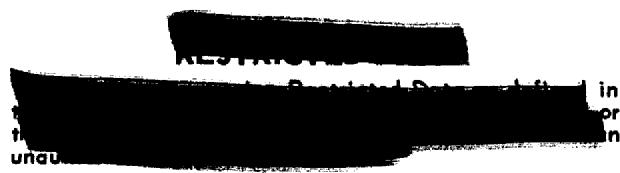

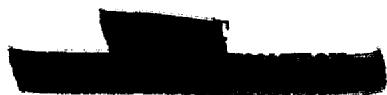

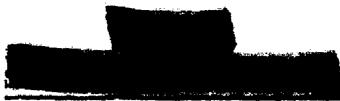

# ABSTRACT

A zero power mock-up of the Aircraft Reactor Experiment or ARE was constructed in the Oak Ridge National Laboratory Critical Facility. The assembly was BeO moderated and reflected and used a powder mixture of Zr, Na, and enriched uranium, simulating the reactor fuel, packed in stainless steel tubes as fuel elements. The clean critical mass, without the ARE regulating and safety rods, was 5.8 kg of U-235 to be compared to the predicted value of 5.5 kg. The addition of the regulating rod guide assembly at the center of the reactor increased the critical mass to 6.68 kg U-235. The value of the ARE regulating rod was 125φ or 1-l/4 times the effective delayed neutron fraction for this reactor. The calibration of one ARE safety rod gave a value of approximately 550φ.

Neutron flux distributions were measured by comparing bare indium and cadmium covered indium foil activations at various points in the reactor. The power distribution was found by measuring the fission fragment activity on aluminum catcher foils placed in contact with a fused uranium bearing salt contained in an Inconel tube of ARE specifications placed at various points in the reactor. The spatial distribution of those neutrons capable of producing fission was measured in the moderator and reflector using the same catcher foil method with a metallic uranium disk.

The reactivity contributions by a number of materials, primarily constituents of the ARE structural components, were measured. The radial importances of fuel and fuel containers were determined by the reactivity coefficient method as was the contribution of a partial mock-up of a steel pressure shell.

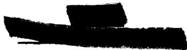

# TABLE OF CONTENTS

# Page

Abstract 5

List of Figures 7

List of Tables 8

I. INTRODUCTION 9

II. DESCRIPTION OF CRITICAL ASSEMBLY 9

A. Moderator and Reflector 9   
B. Fuel and Coolant 12   
C. Mechanical Equipment 14   
D. Instruments and Power Interlocks 14

III．FIRST LOADING 18

A. Critical Mass 18   
B. Control Rod Calibration 18   
C. Reactivity Value of Pressure Shell 23   
D. Radial Importance of Fuel and Fuel Element Container 23   
E. Reactivity Value of Reflector Coolant and Tubes 23   
F. Attempt to Calibrate ARE Regulating Rod 25   
G. Measurement of Neutron Flux 25

IV. SECOND LOADING 32

A. Critical Mass 32   
B. Regulating Rod Calibration 32   
C. Fuel Tube Reactivity Coefficients 34   
D. Reactivity Value of Reflector Coolant and Tubes 38   
E. Reactivity Coefficients 40   
F. Evaluation of Fuel Tube Type Safety Rod 42   
G. Reactivity Value of End Reflector. 42   
H. Neutron Flux Distribution 42   
I. Fission Neutron Flux Distribution 48   
J. Power Distribution 53   
K. Evaluation of ARE Type Safety Rod 56

V. SUMMARY 57   
VI. ACKNOWLEDGEMENTS 58   
VII. APPENDIX 59

Analysis of Materials

1. Top Surface of BeO Columns 11   
2. Fuel and Coolant Tubes with BeO Blocks 15   
3. Critical Assembly Structure 16   
4. Details of Critical Assembly 17   
5. Loading Chart, First Loading 19   
6. Control Rod A Calibration 21   
7. Control Rod A Sensitivity 22   
8. Radial Importance of Fuel and Fuel Tube 24   
9. Indium Traverse, Radial 27   
10. Indium Traverse, Axial 28   
ll. Indium Traverse, Longitudinal at 8.38" Radius 30   
12. Indium Traverse, Longitudinal at 15.88" Radius 31   
13. Loading Chart, Second Loading 33   
14. ARE Regulating Rod Calibration 35   
15. ARE Regulating Rod Sensitivity 36   
16. Radial Importance, Stainless Steel Fuel Tube vs Void 37   
17. Radial Importance, Low Density Fuel and Inconel Fuel Tube vs Stainless Fuel Tube 39   
18. Indium Traverse, Longitudinal at 12.06" Radius 44   
19. Indium Traverse, Radial at Midplane (Regulating Rod In) 45   
20. Indium Traverse, Radial at Midplane (Regulating Rod Out) 47   
21. Indium Traverse, Longitudinal in Fuel 49   
22. Fission Flux Distribution, Radial at Midplane 50   
23. Fission Flux Distribution, Longitudinal at 10.09" Radius 52   
24. Power Traverse, Longitudinal at Three Radii 54   
25. Power Traverse, Radial at Five Elevations 55   
26. Fuel Self-Shielding 56

# LIST OF TABLES

Page

I. Composition of Core and Reflector 10   
II. Reactivity Value of Fuel Tubes 18   
III. Radial Importance of Fuel and Fuel Container 23   
IV. Neutron Flux Traverse Radial at Reactor Midplane 26   
V. Neutron Flux Traverse, Axial 29   
VI. Neutron Flux Traverse, Longitudinal 29   
VII. Radial Importance of Stainless Steel Fuel Tube 38   
VIII. Radial Importance of Fuel and Container Material 38   
IX. Reactivity Value of Fuel Tubes 40   
X. Reactivity Coefficients 41   
XI. Summary of Fuel and Tube Reactivity Coefficients 42   
XII. Neutron Flux Traverse, Longitudinal at 12.06" Radius. 43   
XIII. Neutron Flux Traverse, Radial at Midplane (Regulating Rod In) 46   
XIV. Neutron Flux Traverse, Radial at Midplane (Regulating Rod Out). 46   
XV. Neutron Flux Traverse, Longitudinal in Fuel 48   
XVI. Fission Neutron Flux Distribution, Radial at Midplane 51   
XVII. Fission Neutron Flux Distribution, Longitudinal at 10.08" Radius 51   
XVIII. Power Traverse, Longitudinal at Three Radii 53

# I. INTRODUCTION

The Aircraft Reactor Experiment being planned at Oak Ridge National Laboratory is a high temperature, intermediate power reactor having a beryllium oxide moderator and reflector and a liquid fuel-coolant. This fuel is designed as a mixture of the fluorides of zirconium, sodium and enriched uranium in the proportion required to meet the requirements at the operating temperature and to include sufficient U-235 to insure a nuclear chain reacting system1. A series of experiments has been performed at room temperature and essentially zero power on a mock-up of the reactor constructed in the Oak Ridge Critical Experiments Facility. The main purpose of the experiment was to provide a comparison of the experimental value of the critical mass and of the power and neutron flux distributions with those predicted for this mock-up. In addition, an evaluation was made of the reactivity coefficients of the regulating and safety rods designed for the ARE and of samples of certain ARE structural materials. The reflector and moderator used in this critical assembly were the BeO blocks which had been prepared for the ARE. The fuel was a mixture of powdered fluorides having essentially the nuclear properties of the ARE fuel except those dependent upon density and was packed in stainless steel tubes. A similar powder, but without uranium, was contained in tubes located in the BeO reflector to simulate the fluid reflector coolant of the ARE.

The range of reactivity required to first build an essentially "clean" just critical system and then to evaluate the rather large amount of poison in the centrally located ARE safety rod necessitated two fuel loadings of significantly different uranium concentration. The experimental results, for purposes of reporting are divided between these two loadings.

It was necessary to release the BeO for preparation of the ARE reactor before the experiments reported here could be logically concluded. It was not possible, for instance, to measure all of the ARE regulating and safety systems simultaneously. Nor was it possible to evaluate the data before disassembly of the equipment so doubtful results could not be re-investigated. There were, for example, several neutron flux values which were considered not representative and are not reported. The construction and operating temperatures of the ARE will not permit a further study of the microscopic nuclear characteristics of the reactor for which these experiments were designed.

No attempt at theoretical analysis has been made in this report. It is intended to present a description of the mock-up and the experimental procedure, where necessary, with a presentation of the data obtained.

# II. DESCRIPTION OF CRITICAL ASSEMBLY

# A. Moderator and Reflector

The core was a right cylinder, with its axis vertical, 32.8" in diameter and 35.6" in length and consisted of fuel tubes and hexagonal faced BeO blocks. These blocks were approximately 6" long and 3-3/4" across the hexagonal flats with a 1-1/4" diameter hole, parallel to the long axis, through the center for the fuel tube. The average density of the BeO in the

blocks was 2.76 gm/cc. The BeO side reflector was 47.5" in diameter outside and also 35.6" in length. These blocks had the same dimensions as the core blocks except that the central hole was $1/2$ in diameter. Some of the peripheral reflector blocks were cut to approximate a cylindrical outer surface. There was no BeO end reflector.

The BeO blocks had been hot pressed to shape with a rather close limit on the hexagonal dimensions but a large permissible variation (10.1") in the length. Although it was possible to make the top and bottom surfaces of the assembly plane by selective stacking, the ends of the blocks, in successive layers, were not, in general, coplanar. The uniform top surface of the BeO and the ends of the fuel tubes are shown in Fig. 1. The large hole, 2" in diameter, in the BeO block in the left foreground is for one of the ARE fission chambers. Kerosene was used in the machining of the blocks and all of it was not removed by a final wash with trichlorethylene as evidenced by the strong odor remaining. A quantitative measure of the residue was not made. A chemical analysis of the BeO powder (taken prior to pressing) is given in the appendix as sample #19.

A summary of the core constituents is given in Table I. The two weights of fuel mixture given are the contents of 70 fuel tubes in the first (#I) and second (#II) loadings, respectively, with the second loading being used to calculate the weight percent composition.

TABLEI   
COMPOSITION OF CORE AND REFLECTOR   
Core   

<table><tr><td></td><td>Volume ft3</td><td>Volume %</td><td>Weight 1b</td><td>Weight %</td></tr><tr><td>Be0</td><td>15.50</td><td>89.05</td><td>2660</td><td>89.26</td></tr><tr><td>Stainless Steel</td><td>0.32</td><td>1.84</td><td>153.45</td><td>5.15</td></tr><tr><td>Fuel (70 tubes)</td><td>1.42</td><td>8.16</td><td>#I 165.79</td><td>5.59</td></tr><tr><td>Void</td><td>0.17</td><td>0.95</td><td>#II 166.68</td><td>--</td></tr><tr><td>Total</td><td>17.41</td><td>100.00</td><td>2980.1</td><td>100.00</td></tr></table>

Reflector   

<table><tr><td></td><td>Volume ft3</td><td>Volume %</td><td>Weight lb</td><td>Weight %</td></tr><tr><td>Be0</td><td>18.09</td><td>94.70</td><td>3104.</td><td>98.36</td></tr><tr><td>Inconel</td><td>0.043</td><td>0.23</td><td>22.86</td><td>0.72</td></tr><tr><td>Coolant</td><td>0.24</td><td>1.26</td><td>29.17</td><td>0.92</td></tr><tr><td>Void</td><td>0.60</td><td>3.13</td><td>--</td><td>--</td></tr><tr><td>Void 2&quot; Instrument</td><td></td><td></td><td></td><td></td></tr><tr><td>Hole</td><td>0.13</td><td>0.68</td><td>--</td><td>--</td></tr><tr><td>Total</td><td>19.10</td><td>100.00</td><td>3156.0</td><td>100.00</td></tr></table>

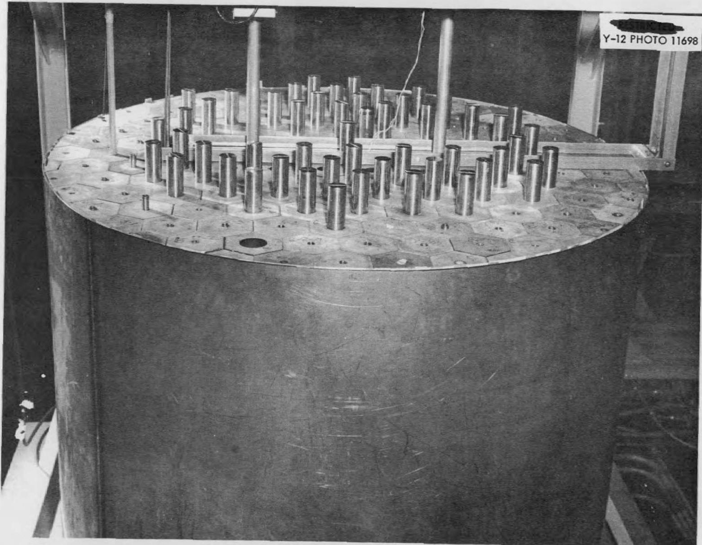  
Fig.1.Top Surface of BeO Columns

The BeO blocks were stacked on a $1"$ thick Inconel plate which, in turn, was supported by eighteen Inconel "legs", $1"$ in diameter. The support plate was machined to match the fuel and reflector coolant tube matrix. The blocks were contained by a $47 - 1 / 2"$ diameter, $1 / 16"$ thick, open end Inconel can. Since the reactor design prescribes a small clearance between adjacent BeO block columns the can did not fit snugly and consequently the blocks were rather loose. Subsequent tightening by shimming with aluminum strips between the can and blocks gave only a small change in reactivity. (The dimensional change was not measurable since the block shift was not uniform but the effect on the reactivity was only about $9\phi$ .) This tightening was done to reduce day to day shifts in reactivity.

# B. Fuel and Coolant

The fuel mixture used in the critical assembly was patterned after the ARE fuel mix #27 which prescribed

50 mol % ZrF4

46 mol % NaF

$\sim 4$ mol $\%$ UF

Since insufficient $\mathrm{ZrF_4}$ was available at the time of the experiments, $\mathrm{ZrO_2}$ was substituted and sufficient carbon, as powdered graphite, was added to compensate for the difference between the thermal neutron scattering by the mixtures.

The mixture used in the critical experiments consisted of

65.6 wt% ZrO2

23.7 wt% NaF

10.5 wt% C

0.3 wt% H2O

with $\mathbf{U}\mathbf{F}_{4}$ added to give the specified uranium density. For the initial loading this density was prescribed by Mills² to be 0.1632 gm U-235/cc or a fuel composition of:

12.4 wt % UF₄ (U enriched to 93.2% in U-235)

57.4 wt% ZrO₂

20.8 wt% NaF

9.2 wt% C

0.26 wt% E20

The average packed density of the fuel mixture was 1.87 gm/cc.

Since no theoretical prediction was made of the amount of uranium required to provide sufficient reactivity to evaluate the ARE regulating and safety rods, the fuel for the second loading was empirically selected to have a U-235 density about $25\%$ greater than the first one. The composition of the mixture prepared was

$$
\begin{array}{c}16.2\text{wt}\% \mathrm{UF}_{4}\\ 55.0\text{wt}\% \mathrm{ZrO}_{2}\\ 19.9\text{wt}\% \mathrm{NaF}\\ 8.8\text{wt}\% \mathrm{C}\\ 0.25\text{wt}\% \mathrm{H}_{2}\mathrm{O} \end{array}
$$

The uranium density was 0.2138 gm U-235/cc and the average packed density of the mixture was 1.88 gm/cc.

The ARE reflector coolant, at the time of the experiment, was defined as the same base mixture as the fuel but without the $\mathrm{UF_4}$ . The blend actually used was

$$
\begin{array}{l}69.2 \text{wt}\% \mathrm{ZrO}_2\\ 22.7 \text{wt}\% \mathrm{NaF}\\ 9.1 \text{wt}\% \mathrm{C} \end{array}
$$

which differs from that above because of batching irregularities. A spectrographic analysis of the materials used for these blends is given in the Appendix, samples 10, 20, and 21.

A small quantity of material having properties more like those of the liquid fuel was prepared from a liquid mixture of $\mathrm{ZrF}_4$ , NaF, and $\mathrm{UF}_4$ by casting it into cylindrical slugs. Its composition was

$$
\begin{array}{l}74.0wt\% \mathrm{ZrF}_{4}\\ 17.2wt\% \mathrm{NaF}\\ 8.8wt\% \mathrm{UF}_{4} \end{array}
$$

The bulk density of the solid was $3.75 \, \text{gm/cc}$ and the uranium density was $0.235 \, \text{gm U-235/cc}$ . These slugs were $1.06''$ in diameter, varied in length between $1''$ and $5''$ and were of sufficient quantity to fill one fuel tube when packed end to end. There were small voids between adjacent slugs which reduced the loaded density to $3.54 \, \text{gm/cc}$ or $0.224 \, \text{gm U-235/cc}$ . Loaded in this manner there was $114.2 \, \text{gm U-235}$ in the $35.6''$ core length to be compared with the average $123.6 \, \text{gm U-235}$ in the packed fuel powder of the second loading.

The ARE fuel tubes are to be of Inconel 1.235" OD and 0.060" wall and are connected above and below the BeO to provide flow channels. Inconel was not available at the time of this experiment, so type 302 stainless steel was substituted. Spectrographic analysis of this stainless steel is given in the appendix, sample 17. The tubes were $4\text{L} - \text{L} / 4$ long overall with a fuel filling length of $39.86''$ . This provided $2 - 1 / 8''$ of fuel both above and below the core to simulate the tube bends of the ARE. The tubes were sealed with threaded stainless steel caps $1 - 3 / 16''$ long, the threads being coated with Glyptal paint to prevent powder leakage and water absorption. The tubes were packed by vibrating longitudinally as the specified amount of fuel mixture was added. X-ray photographs taken of the filled tubes and examined on a densitometer indicated a variation in the linear uranium density near the tube ends which was not measured quantitatively. The method of loading gave less than $1\%$ variation in the overall density from tube to tube.

The reflector coolant tubes were of Inconel, $1/2$ outside diameter, 0.020" wall thickness and $36$ long, and were packed to an average density of 1.95 gm/cc by the same method as the fuel. They were sealed by welding small Inconel plugs

into the ends. These tubes occupied 66 holes in the BeO reflector and were centered vertically. The neutron source was located in the 67th hole in the reflector. The two types of BeO blocks with the fuel and reflector tubes are shown in Fig. 2.

# C. Mechanical Equipment

Figure 3 shows the reactor table, safety rod, and source drive support structure. The control rod drives are shown mounted below the reactor table. The location of the safety and control elements are indicated in Fig. 4. The control elements were fuel tubes mounted on a lead screw driven by a three-phase motor. The rod position indication was transmitted to the panel in the control room by selsyn motors for the intermediate positions and limit switches for the extremes of travel.

Each safety rod consisted of seven fuel tubes arranged in a hexagonal pattern mounted on a common base plate and supported by a cadmium lined rod connected above the center tube. This array was drawn into the reactor by a magnet mounted on a drive similar to that of the control rod, with selsyns and limit switches for remote indication, the latter also being integral with the interlock system. Panel lights indicated the "in" position of the safety rods, the "out" position of the magnets, and contact of the magnets and rods; selsyn-driven Veeder Root counters indicated intermediate positions of the magnets. The two safety rods are shown in the "out" or least reactive position in Fig. 4. In the normal or "in" position during operation the fuel tubes of the safety rods were centered vertically in the reactor.

The Po-Be neutron source was located in the reflector and was moved by a remotely controlled motor between the midplane of the reactor and a paraffin-boron carbide shield mounted above the BeO. The source strength was about $4 \times 10^{6}$ neutrons per second.

# D. Instruments and Power Interlocks

The reactivity of the assembly was regulated by positioning the control and safety rods from the control panel and certain interlocks were provided in the system to avoid improper sequence of operations during start-up. It was necessary that the source be all the way in the reactor and the control rods in their least reactive position before the safety rods could be raised. The control rods could be moved only after both safety rods were in contact with their magnets, and one was completely raised and the other partially raised. In the event that the BeO blocks of the array were displaced vertically the upward motion of rods was stopped by interlocks.

Neutron and gamma sensitive detecting devices were placed about the assembly for measurement of the reactor power level with associated amplifiers, scalers and recorders located in the control room. Two $\mathbf{BF}_3$ proportional counters supplied information to scalers through linear amplifiers for the determination of neutron multiplication during the initial approach to critical. A record of the relative power and period of the assembly was provided by a log N amplifier. One D-C amplifier and two vibrating reed electrometers fed by $\mathbf{BF}_3$ ionization chambers and a sensitive scintillation detector provided additional relative power level information. Each of these last four instrument channels contained relays which were used to actuate the safety system.

The purpose of the safety devices was to shut down the reactor quickly in the event of unusual rises in reactivity. Actuation of the safety system

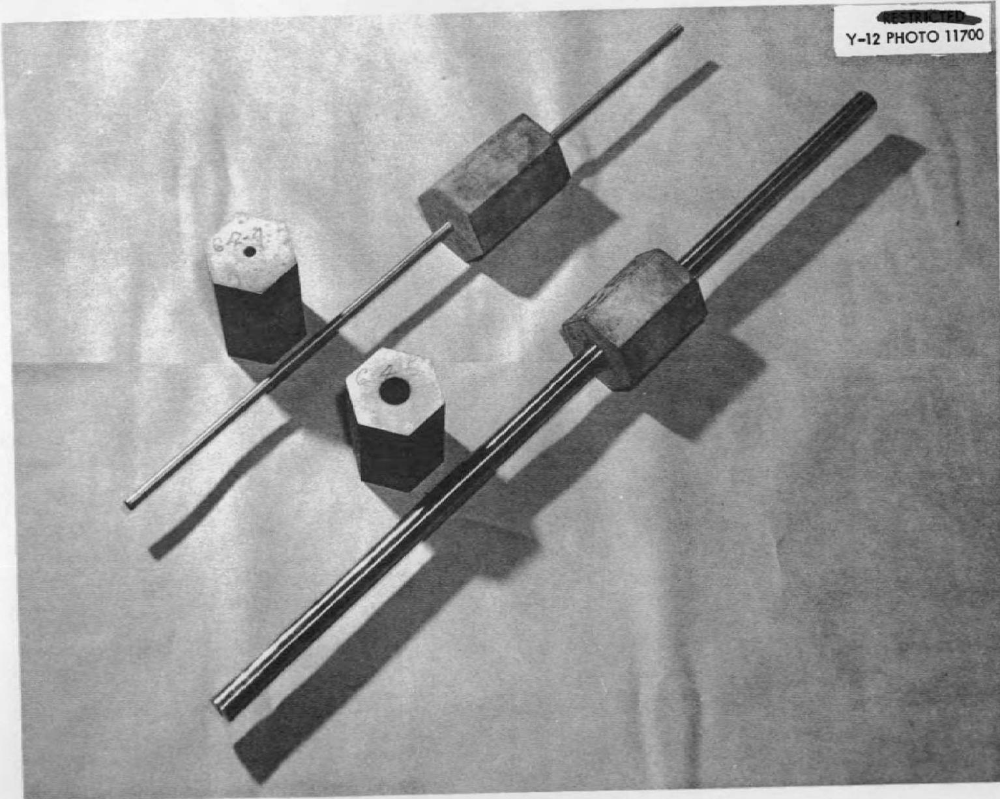  
Fig. 2. Fuel and Coolant Tubes with BeO Blocks

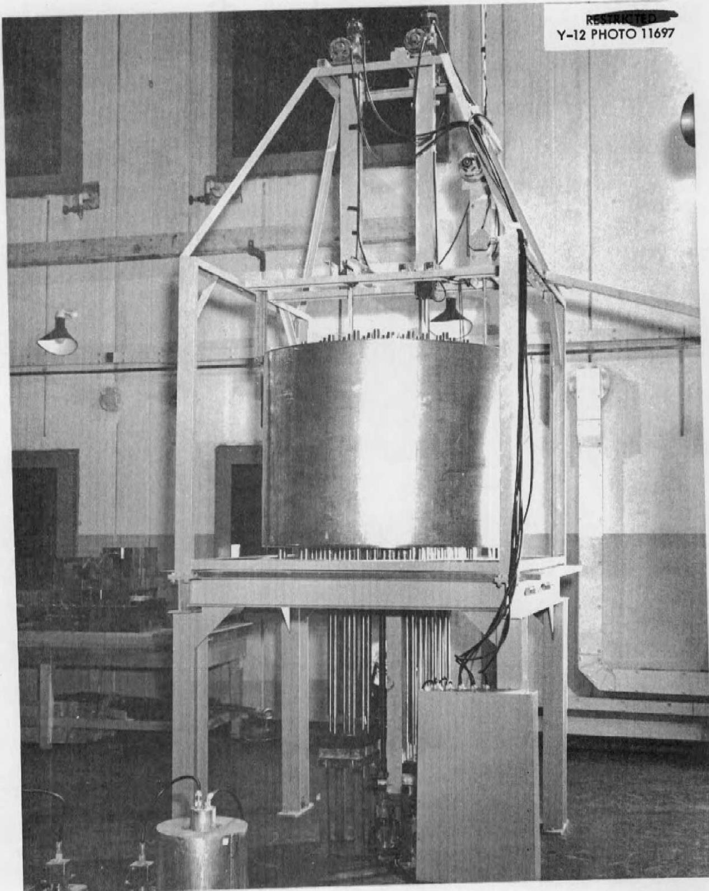  
Fig. 3. Critical Assembly Structure

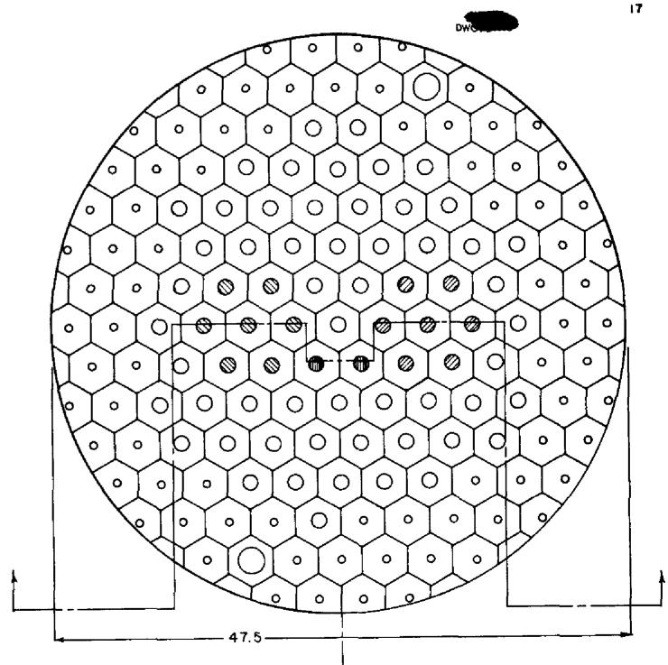

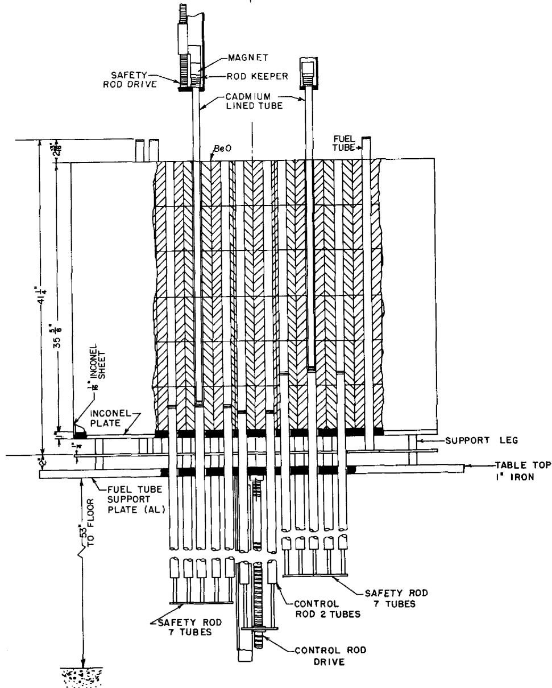  
FIGURE 4. DETAILS OF CRITICAL ASSEMBLY

either manually or by instruments at a preset radiation level, de-energized the magnets allowing the safety rods to drop thereby removing fuel and adding poison to the reactor. Also the control rods were driven down removing additional fuel. Another magnet release, actuated by instruments and operating at a slightly higher flux level, dropped the safety rods in case of failure of the lower level trip.

# III. FIRST LOADING

# A. Critical Mass

Successive increments of fuel were added, starting at the center of the assembly by first loading the safety and control rods, until the system became critical. The reflector coolant tubes were in place at this time. The system was first critical with a loading of 5.85 kg U-235, contained in 62 fuel tubes, and with the single fuel tube of control rod A almost completely inserted. (The remaining eight fuel tube positions were empty.) With Rod A completely inserted the excess reactivity corresponded to about $18\phi$ , or $18\%$ of that due to the effective delayed

neutrons--the evaluation being made in the manner described in Section III-B below. Figure 5 shows the loading arrangement for the critical system*. It was shown in a similar way that the excess reactivity, when the assembly was loaded with a full complement of seventy fuel tubes, was $268\phi$ or about $2\%$ in $\Delta k / k$ . The contribution to this excess reactivity by individual pairs of tubes was also measured, allowing considerable latitude in the loading, so changes could be made from time to time throughout this series of experiments. Table II gives the reactivity value and position of these tubes.

# B. Control Rod Calibration

The control rods were calibrated by the method described essentially by Gladstone and Edlund in which

a measurement is made of the period resulting from a change in reactivity produced here by the displacement of a rod from its position when the assembly is critical. This period is related to the change in reactivity by the well known inhour formula: 5

$$
\rho = \frac {\sum_ {i = 1} ^ {5} \frac {\theta_ {i}}{1 + \lambda_ {i} T}}{\sum_ {i = 1} ^ {5} \theta_ {i}} \times 1 0 0 \quad f o r \rho \sum_ {i = 1} ^ {5} \theta_ {i} <   <   1
$$

TABLE II   

<table><tr><td colspan="2">Reactivity Value of Fuel Tubes</td></tr><tr><td>Position</td><td>Value (φ)</td></tr><tr><td>11-36-11}</td><td>64.6</td></tr><tr><td>10-115-3}</td><td>65.7</td></tr><tr><td>13-53-5}</td><td>62.0</td></tr><tr><td>6-35-10}</td><td>56.1</td></tr></table>

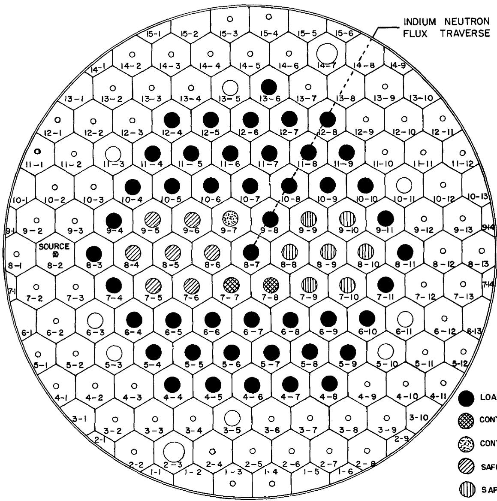  
CONTROL ROD A

LOADING CHART I 1

62 TUBES

FIGURE 5

LOADED HOLES

CONTROL ROD B

SAFETY ROD 2

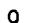  
SAFETYROD\*I   
COOLANT & TUBES

# Where

$\rho =$ the change in reactivity in cents

$\hat{\pmb{\theta}}_i =$ the fraction of fission neutrons in the ith delayed group

$\lambda_{i} =$ the corresponding decay constant

T = the reactor period resulting from the reactivity change

produced by the control rod displacement

Since this reactor assembly contained a large quantity of beryllium, recognition must be made of the production of photoneutrons by fission product gamma radiation which may be considered as equivalent to additional groups of delayed neutrons. Their immediate effect is to make the control rod calibration sensitive to previous reactor operation. An attempt to minimize the error was made by the following procedure. With the reactor critical at some lower power an increment of reactivity was added by moving a rod other than the one being calibrated and the resulting reactor period was allowed to stabilize. The assembly was then brought back to critical, at a power an order of magnitude greater than the lower level, by adjusting the rod being calibrated. The incremental change in the control rod position corresponded, therefore, to the period with which the power had increased. The power was then returned to the lower level without disturbing the rod being calibrated and the procedure repeated, using successive increments of the rod to override the corresponding periods. Summation of these increments gives the value of any section of the rod. It is believed that the above method minimizes the error due to the photo-neutrons since the rod increments are taken at the upper limit of the range of operating power levels where the ratio of fission neutrons to pseudo-source ( $\gamma$ -n) neutrons from previous high level operation is a maximum.

The effective total delayed neutron fraction for this reactor was calculated to be $\sim 0.8\%$ which includes the increased importance due to their lower energy of emission but does not include the photoneutrons from the beryllium.

Figure 6 is the calibration curve of control rod A, consisting of one fuel tube, located in position 9-7 shown in the loading plan, Fig. 5. In the zero position the fuel tube is centered in the reactor\* In Fig. 7 is plotted the sensitivity of the rod, in cents/inch, against the rod position. These data were obtained by dividing the incremental displacement of the rod into the resultant change in reactivity. The lengths of the horizontal lines show the displacements and their ordinates give the corresponding average sensitivities. It is to be recalled that while rod A was being withdrawn during calibration, a second nearby rod consisting of two fuel tubes, (Control Rod B), was being inserted simultaneously, but in smaller increments. It so happened, from the experimental arrangement, that the ends of the rods passed each other when A was withdrawn about $18"$ . There was possibly some disturbance of the flux distribution when the rod ends with their stainless steel end caps were proximate, a probable cause of the dip in the sensitivity curve near the center of the range of calibration.

FIGURE 6   
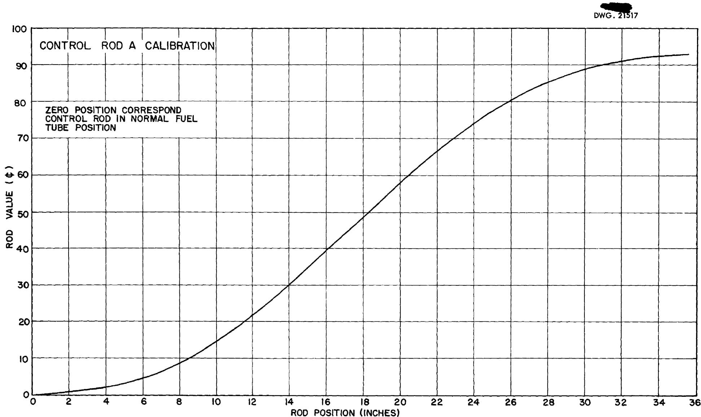  
DWG.21517

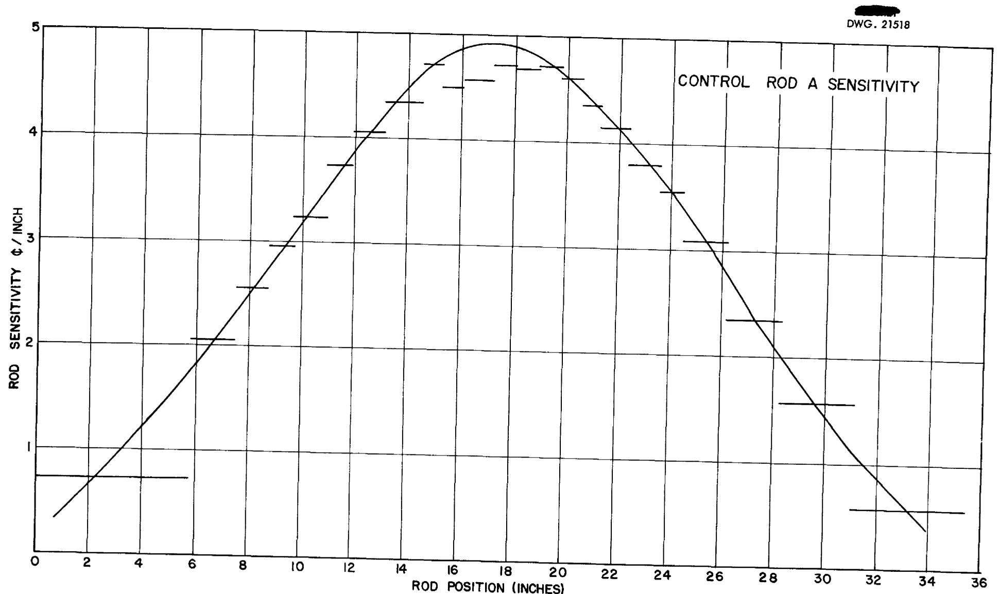  
FIGURE 7

# C. Reactivity Value of Pressure Shell

Cylindrical sheets of mild steel were added outside the Inconel can, encircling the BeO reflector of this preliminary assembly and extending $6''$ above and below it, in an attempt to estimate the contribution to the reactivity of the ARE by its pressure shell. The addition of a sheet $1/4''$ thick increased the reactivity $34.5\phi$ ; a second $1/4''$ thick layer resulted in an additional gain of $21.0\phi$ or a total increase of $55.5\phi$ for the $1/2''$ thick layer. Because of time limitations and since further additions to the thickness would have contributed successively smaller increments of reactivity, the measurements were not extended beyond the $1/2''$ value.

# D. Radial Importance of Fuel and Fuel Element Container

The contribution to the total reactivity of single fuel elements was measured as a function of the radial position of the element. These measurements were incorporated with an evaluation of reactor poisoning by the stainless steel container of the fuel, also as a function of radius, in the following manner. The system was made critical under each of three loading conditions in five locations along a radius. In the first of these three conditions the fuel element position was empty, in the second it was filled with the standard stainless tube containing the fuel mixture. For the third measurement an aluminum tube of like dimensions and filled with the fuel mixture was substituted for the steel one. The results, referred to the reactivity with a void in the test position, are given in Table III and plotted in Fig. 8

TABLE III   

<table><tr><td colspan="3">Radial Importance of Fuel and Fuel Container</td></tr><tr><td rowspan="2">Position</td><td colspan="2">Increase in Reactivity φ</td></tr><tr><td>Stainless Steel Fuel Tube</td><td>Aluminum Fuel Tube</td></tr><tr><td>8-7</td><td>107.2</td><td>187.0</td></tr><tr><td>9-8</td><td>104.8</td><td>173.0</td></tr><tr><td>10-8</td><td>79.8</td><td>130.1</td></tr><tr><td>11-8</td><td>51.2</td><td>85.3</td></tr><tr><td>12-8</td><td>37.0</td><td>57.9</td></tr></table>

The difference between the two sets of data is a measure of the steel poisoning and its shielding of the fuel. Except near the reflector the importance of the fuel is of the form $\mathbf{Y} = \mathbf{A}\mathbf{J}_{\mathbf{O}}^2 (\mathbf{B}\mathbf{R})$ where $\mathbf{J}_{\mathbf{O}}(\mathbf{B}\mathbf{R})$ is the zero order Bessel function corresponding to the radial asymptotic solution of the flux distribution in a bare cylindrical reactor. The constant $\mathbf{B}$ was evaluated from the neutron flux measurements described in Section III-G below using experimental points near the center of the reactor.

# E. Reactivity Value of Reflector Coolant and Tubes

A measurement was made evaluating the loss in reactivity due to the reflector coolant and the Inconel tubes in which it was contained. The assembly contained sixty-six tubes, each $1/2''$ in diameter, filled with the

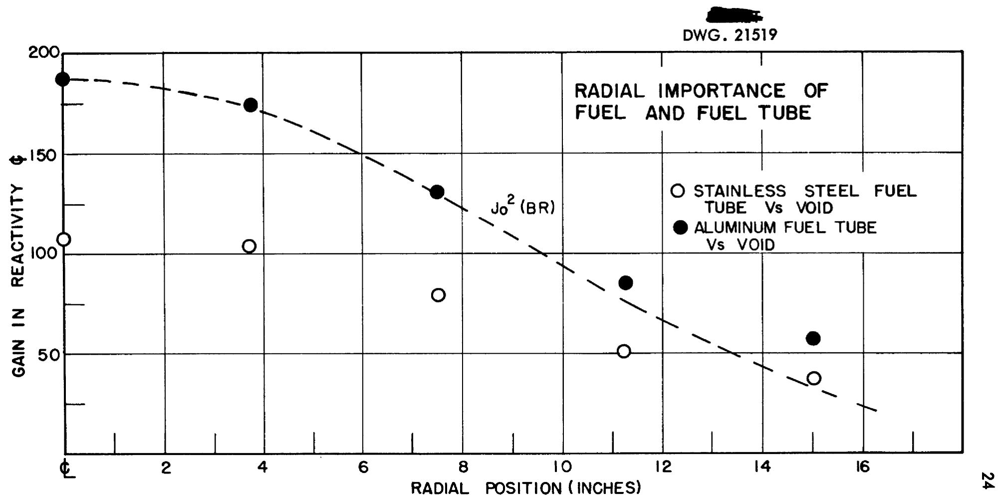  
FIGURE 8

basic mixture of $\mathsf{ZrO_2}$ , C, and NaF but without $\mathsf{UF_4}$ . The location of these tubes is described in Section II-B. The removal of fifty-three of these tubes resulted in an increase in reactivity of $66\phi$ . Linear extrapolation gives $82\phi$ as the total poisoning effect of all the tubes and their contents.

# F. Attempt to Calibrate ARE Regulating Rod

One of the purposes of this preliminary assembly was to evaluate the regulating rod designed for the ARE. The rod is a segmented array of small cylindrical annuli, containing a poison, having their axes colinear, which is to be moved vertically along the reactor axis. Two such poison rods of different values were fabricated for test. Each segment is 1.86" OD and 1.26" ID by about 2" long*. The "weak" rod is made up of fourteen segments packed with $\mathrm{Al}_{2}\mathrm{O}_{3}$ impregnated with $\mathrm{B}_{4}\mathrm{C}$ and containing $0.005\mathrm{gm}$ $\mathrm{B}_{4}\mathrm{C} / \mathrm{cc}$ . A cylinder of stainless steel, $2 - 13 / 16$ long, is located above and below these segments. The "strong" rod was of identical construction with the poison sections filled with a mixture containing $0.023\mathrm{gm}$ $\mathrm{B}_{4}\mathrm{C} / \mathrm{cc}$ . Preparation for evaluation of the rod required the removal of the central fuel tube, the central BeO column, and the insertion of Inconel guide tubes. The removal of the central fuel tube lowered the reactivity $107\phi$ the removal of the central BeO column, position 8-7, lowered it an additional $263\phi$ . It then became apparent that the loading contained insufficient excess reactivity to override the further loss to be incurred by the introduction of the Inconel guide tubes and even the weaker regulating rod.

# G. Measurement of Neutron Flux

The distribution of neutrons within the reactor core and reflector was measured by the usual method using bare and cadmium covered indium foils. The foils were $5/16''$ in diameter cut from a 0.01" thick sheet of nine weight per cent indium in aluminum mixture. The effective indium thickness was $5.4 \, \text{mg/cm}^2$ or about $3 \times 10^{-4}$ inches. The cadmium covers were 0.02" thick. After irradiation the foils were counted on four Amperex Geiger counters** with associated binary scalers. Each side of each foil was counted for two minutes in all of the four counters, a total of eight sets of counts per foil. The exposures were such as to give the order of $5 \times 10^4$ observed counts from each foil. The results were corrected empirically for counter dead-time and background and normalized for the indium decay by methods described previously. A gold foil was irradiated at the same position in each run to normalize the exposures. Some of the runs were further normalized by comparing the activities in indium foils located in the same position each time. The precision of the neutron flux measurements due to errors in this normalization is estimated to be $\pm 2\%$ . The location of the flux traverses made in this assembly is shown on the loading chart, Fig. 5. Table IV shows the

TABLE IV   

<table><tr><td colspan="5">Neutron Flux Traverse Radial at Reactor Midplane</td></tr><tr><td rowspan="2">Radius</td><td colspan="3">Indium Activity in Arbitrary Units</td><td rowspan="2">Cadmium Fraction</td></tr><tr><td>Bare</td><td>Cd Covered</td><td>Bare-Cd Covered</td></tr><tr><td>0.875&quot;</td><td>48,500</td><td>30,950</td><td>17,550</td><td>0.362</td></tr><tr><td>6.625</td><td>42,290</td><td>26,920</td><td>15,370</td><td>0.347</td></tr><tr><td>10.375</td><td>31,900</td><td>21,280</td><td>10,620</td><td>0.333</td></tr><tr><td>13.250</td><td>26,070</td><td>15,880</td><td>10,190</td><td>0.391</td></tr><tr><td>14.125</td><td>23,620</td><td>14,020</td><td>9,600</td><td>0.406</td></tr><tr><td>17.000</td><td>18,520</td><td>8,900</td><td>9,620</td><td>0.520</td></tr><tr><td>17.875</td><td>16,230</td><td>6,980</td><td>9,250</td><td>0.570</td></tr><tr><td>20.125</td><td>12,570</td><td>4,670</td><td>7,900</td><td>0.628</td></tr><tr><td>21.125</td><td>7,360</td><td>2,350</td><td>5,010</td><td>0.680</td></tr></table>

In addition to the bare and cadmium covered activations the thermal neutron flux (Bare Indium Activation - Cd Covered Indium Activation) and the Cadmium Fraction are plotted. The cadmium fraction is here defined as

# Bare Indium Activation - Cd Covered Indium Activation Bare Indium Activation

or the fraction of the absorptions in indium lying below the energy of the cadmium cutoff. The dashed lines on the figure are $J_{0}(\mathrm{BR})$ curves plotted using the two points furtherest from the reflector to determine the constant $B$ . The values of $R$ for $J_{0}(\mathrm{BR}) = 0$ for the three curves agree very well being 21.6" for the total neutron distribution, 21.2" for the epi-cadmium, and 21.6" for the thermal neutrons with an average of approximately 21.5". It was this value of $R$ which was used for the fuel importance curve Fig. 8.

An axial traverse was made in position 8-7 by placing the foils between the BeO blocks. Table V shows the counting data and Fig. 10 is a plot of the flux against the distance from the bottom of the assembly.

DWG. 21520

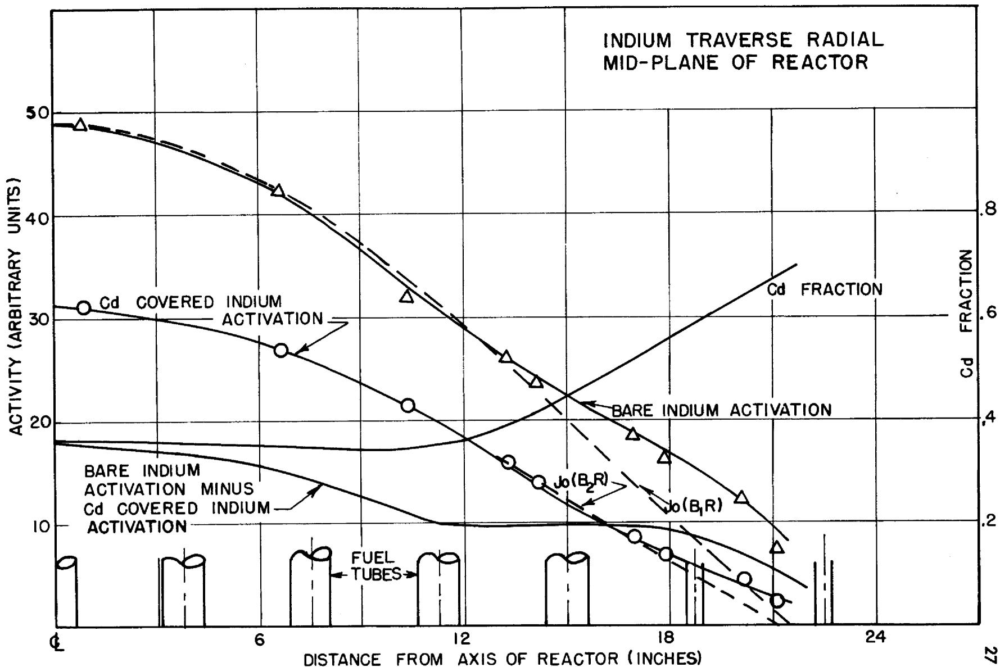  
FIGURE

DWG. 21521

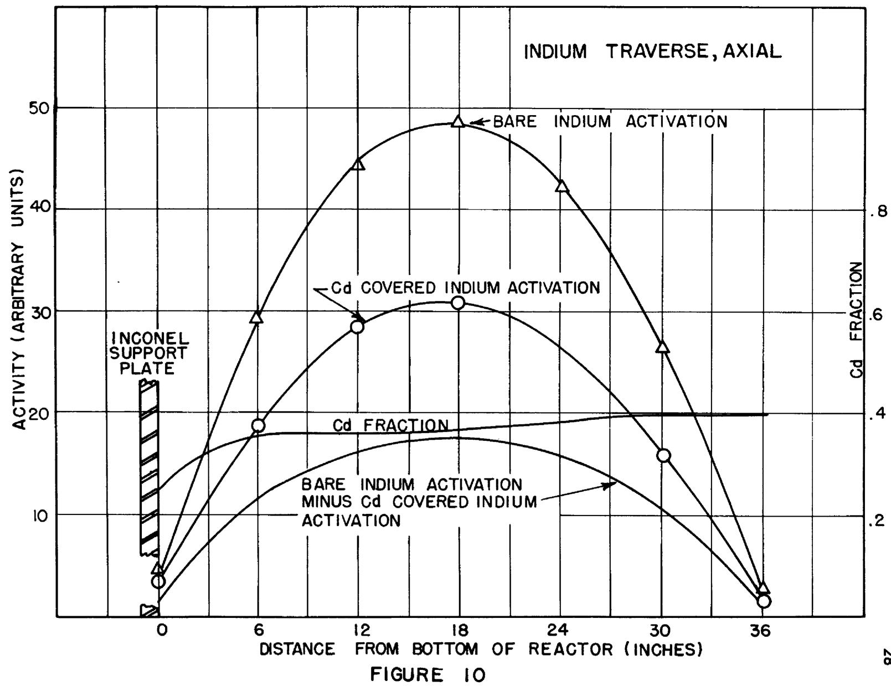

TABLE V   

<table><tr><td colspan="5">Neutron Flux Traverse
Axial</td></tr><tr><td rowspan="2">Distance from
Bottom of
Reactor</td><td colspan="3">Indium Activity in Arbitrary Units</td><td rowspan="2">Cadmium
Fraction</td></tr><tr><td>Bare</td><td>Cd
Covered</td><td>Bare-Cd
Covered</td></tr><tr><td>0&quot;</td><td>4,870</td><td>3,670</td><td>1,200</td><td>0.245</td></tr><tr><td>6</td><td>29,400</td><td>18,930</td><td>11,470</td><td>0.356</td></tr><tr><td>12</td><td>44,580</td><td>28,600</td><td>15,980</td><td>0.358</td></tr><tr><td>18</td><td>48,500</td><td>30,950</td><td>17,550</td><td>0.362</td></tr><tr><td>24</td><td>42,100</td><td>30,070</td><td>12,030</td><td>0.286</td></tr><tr><td>30</td><td>26,420</td><td>15,970</td><td>10,450</td><td>0.396</td></tr><tr><td>36</td><td>2,440</td><td>1,480</td><td>960</td><td>0.396</td></tr></table>

The low cadmium fraction and the tendency for a non-symmetrical flux at the bottom of the reactor are to be noted, a result probably due to the fast neutron reflection by the Inconel support plate.

Similar longitudinal traverses were made at radial distances of 8.38" and 15.88" (Cells 10-8 and 12-8) but in the upper half of the reactor only. Table VI and Figs. 11 and 12 show these data.

TABLE VI   

<table><tr><td colspan="5">Neutron Flux Traverse Longitudinal</td></tr><tr><td rowspan="2">Distance from Bottom of Reactor</td><td colspan="3">Indium Activity in Arbitrary Units</td><td rowspan="2">Cadmium Fraction</td></tr><tr><td>Bare</td><td>Cd Covered</td><td>Bare-Cd Covered</td></tr><tr><td>18&quot;</td><td colspan="2">8.38&quot; Radius</td><td>14,400</td><td>0.367</td></tr><tr><td>24</td><td>39,200</td><td>24,800</td><td>13,210</td><td>0.387</td></tr><tr><td>30</td><td>34,100</td><td>20,890</td><td>6,830</td><td>0.332</td></tr><tr><td>36</td><td>20,540</td><td>13,710</td><td>640</td><td>0.330</td></tr><tr><td></td><td>1,920</td><td>1,280</td><td></td><td></td></tr><tr><td colspan="5">15.88&quot; Radius</td></tr><tr><td>18</td><td>20,600</td><td>11,300</td><td>9,300</td><td>0.450</td></tr><tr><td>24</td><td>18,290</td><td>10,250</td><td>8,040</td><td>0.439</td></tr><tr><td>30</td><td>11,210</td><td>6,040</td><td>5,170</td><td>0.462</td></tr><tr><td>36</td><td>1,030</td><td>540</td><td>490</td><td>0.473</td></tr></table>

DWG. 21522

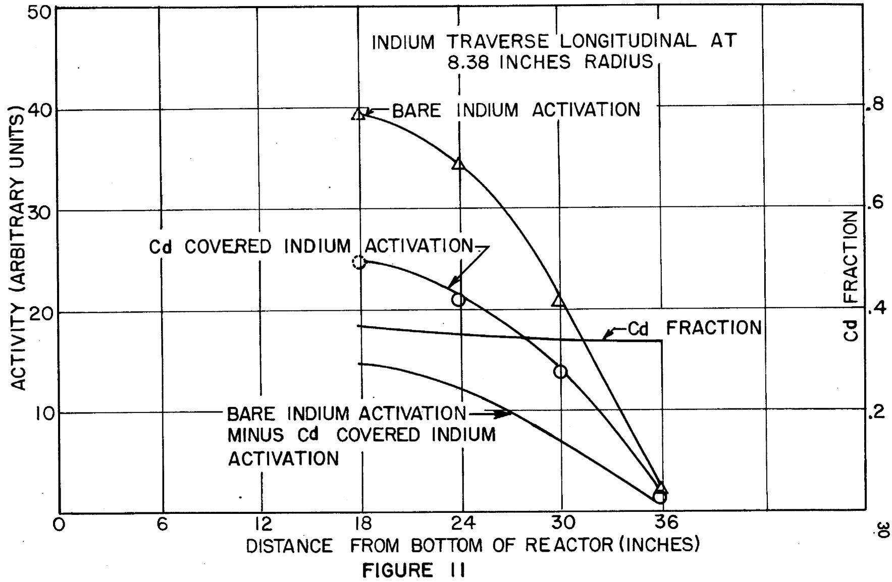

DWG. 21523

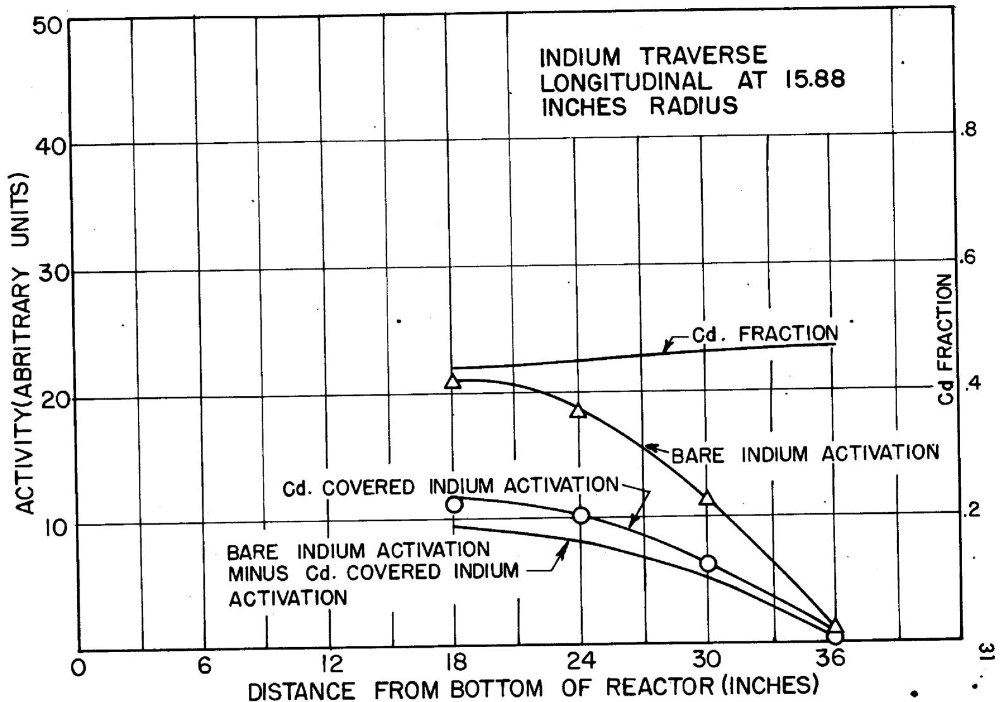  
FIGURE 12

# A. Critical Mass

Provision was made to increase the reactivity in the available tube positions by increasing the uranium concentration in the powder mixture, thereby allowing further investigation of the poison regulating and safety rods of the ARE. The U-235 content of the fuel was increased from 0.1632 gm/cc to 0.2138 gm/cc by adding $\mathrm{UF_4}$ , the relative proportions of the other salts remaining the same. The details of the composition are given in Section II-B. The "clean" assembly was again made critical requiring 5.19 kg U-235 in the 35.6" length of the core and contained in 42 fuel tubes with Rod A removed an equivalent of $15\phi$ .* The values are to be compared with 5.85 kg in 62 tubes which were initially critical with the fuel of lower uranium density. The lower critical mass is a consequence of several factors other than the change in uranium density. The stainless steel loading was significantly less since the twenty positions formerly filled with fuel tubes were left empty in this experiment. The reflector was also effectively thicker since the overall dimensions of the BeO were the same in both cases. The critical mass of this loading had not been predicted theoretically but subsequent calculations give a multiplication constant of 1.009. No additional experiments were done with this clean assembly.

Immediately after determining the critical mass, the regulating rod assembly with its associated components were mounted at the center of the reactor requiring the removal of the center fuel element, the center $36^{\prime \prime}$ column of BeO, and the insertion of three Inconel tubes. The three tubes extended completely through the reactor and were 3.75" OD by 0.052" wall thickness, 2-31/32" OD by 0.042" wall thickness, and 2-15/32" OD by 0.039" wall thickness. The tubes were approximately concentric. This unit arrangement was exactly the same as that in the ARE except the insulation in the annulus between the inner two tubes was omitted**.

A step-wise evaluation of this change was not done but the mass required to keep the system critical was determined. The required loading was 55 fuel tubes or $6.80\mathrm{kg}$ U-235 with the regulating rod inserted a distance corresponding to a reactivity value of $54.5\phi$ which was approximately equal to that of one fuel tube. The critical mass therefore, with the regulating rod assembly mounted but with the rod removed was $6.68\mathrm{kg}$ U-235 in 54 fuel tubes. Figure 13 gives the arrangement of the 55 fuel tubes. This represents an increase of $1.5\mathrm{kg}$ U-235, or 12 fuel tubes over the unpoisoned system.

The large change in critical mass shows the Inconel at the center of the core is a strong poison which greatly reduced the total rod effectiveness.

# B. Regulating Rod Calibration

The weak ARE regulating rod was evaluated in the central position, 8-7, The loading pattern consisted of a hexagon of 4 columns on the side, plus the following tubes: 10-10, 10-4, 6-4, 6-10, 8-3.   
6 Mills, C. B. ANP Quarterly Progress Report June 10, 1953, ORNL 1556, p.28   
** A subsequent evaluation of $\mathbf{S}_{\mathbf{i}}\mathbf{O}_{\mathbf{2}}$ , a rough equivalent to this insulation, made independently of the Inconel tubes, showed it to effect only a small change in reactivity. The result is given in Table X, and an analysis in the Appendix, sample 8.

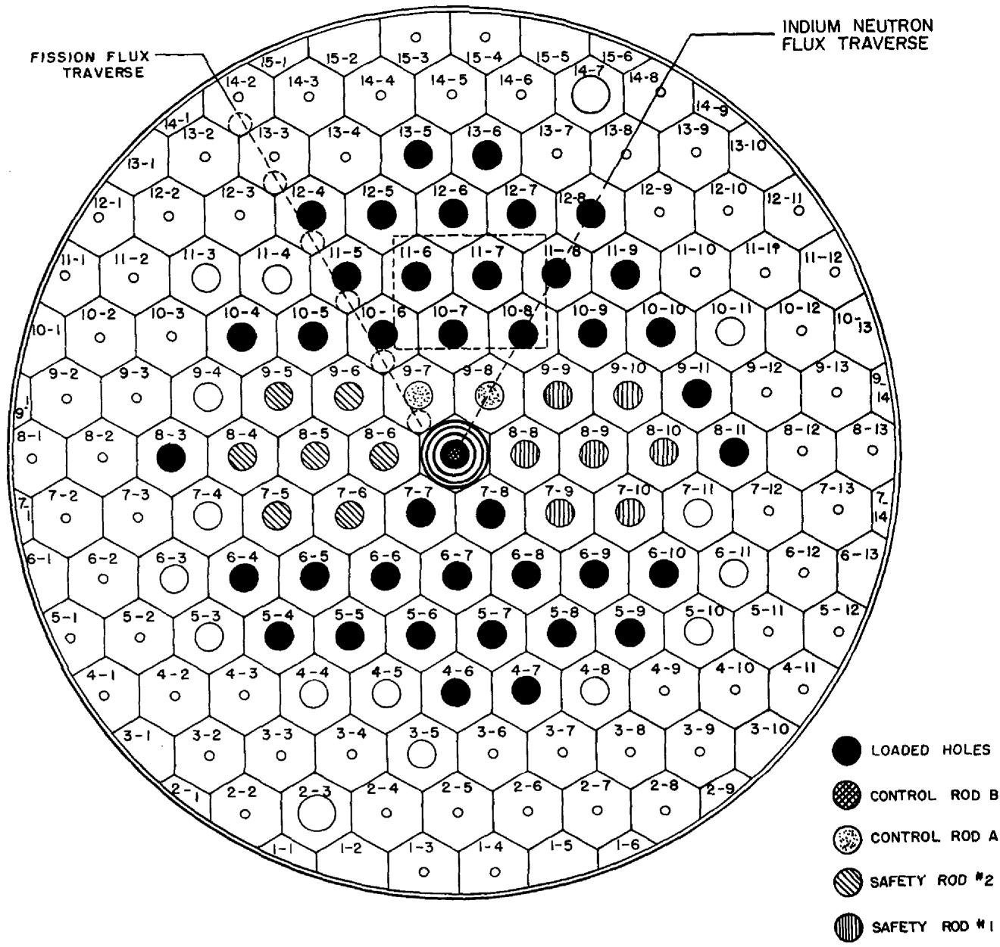

LOADING CHART 2nd LOADING

55 TUBES

FIGURE 13

and subsequently used for operational control. The method of calibration was the same as that described in the Section III-B for the fuel tube type rod and yielded a total reactivity value of about $125\phi$ . At the "zero" rod position all of the $\mathsf{B}_{4}\mathsf{C}$ of the rod was above the reactor and the bottom of the stainless steel section of the rod was flush with the top of the BeO. Figure 14 gives the calibration curve of the regulating rod. It is of particular interest that the minimum and maximum values of the rod as a reactor poison occurred when it was somewhat displaced from the limits of its travel, being a minimum when inserted approximately $3''$ and a maximum when inserted $32''$ . The reactivity increase in the interval from zero to $3''$ can probably be attributed to a contribution of the rod to the neutron reflection or to the reduction in neutron channeling in this bare ended assembly. When the rod was at the $32''$ position, the top of the $30''$ section containing boron was at the level of the top of the BeO blocks. Further downward displacement, therefore, did not introduce additional poison and redistributed that already present only slightly. It did, however, bring the top $2-3/16''$ long steel section into the core, providing some neutron reflection and reducing the channeling. The reactivity would have increased upon further lowering of the rod as boron was removed at the bottom of the core. In a second installation of the rod, to be described later, at a radial distance of $7.5''$ from the center, the above behavior at the $3''$ displacement was verified. It is to be noted in Fig. 15 that the net result of these end effects is to give the rod a negative sensitivity in these ranges. The irregularities in the data near the peak of the sensitivity curve has been attributed to the interaction with an adjacent fuel type control rod which was being inserted with the poison rod. At this position their ends were at the same level. These effects were not investigated further.

Since the maximum reactivity of this assembly did not occur when the rod was at the upper limit of its travel it is important that some consideration be given to the operating position of the ARE safety rods. The data of Figs. 14 and 15, or similar results from the ARE, should be used to ascertain the appropriate raised position of the ARE rods to insure that the reactivity is always decreased as they are inserted, without significant loss in total rod value. A positive mechanical stop should be provided to limit the downward travel of the rods at the points where the reactivity is a minimum. It is believed, however, that the neutron reflection provided is the ARE by the pressure shell and the moderator coolant will reduce these effects.

# C. Fuel Tube Reactivity Coefficients

In an effort to provide additional data for comparison with the clean reactor of the first loading, the experiment in which the importance of the stainless steel fuel tube was measured as a function of radius was repeated and the data are shown in Table VII and Fig. 16. Since the holes in the BeO were $3 - 3 / 4$ apart, no intermediate points have a real meaning and therefore no curve has been drawn through the measured values.

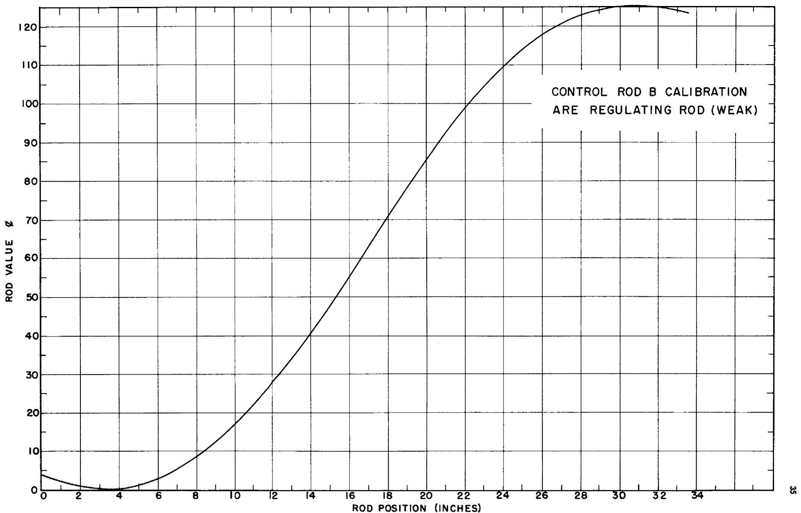  
FIGURE 14

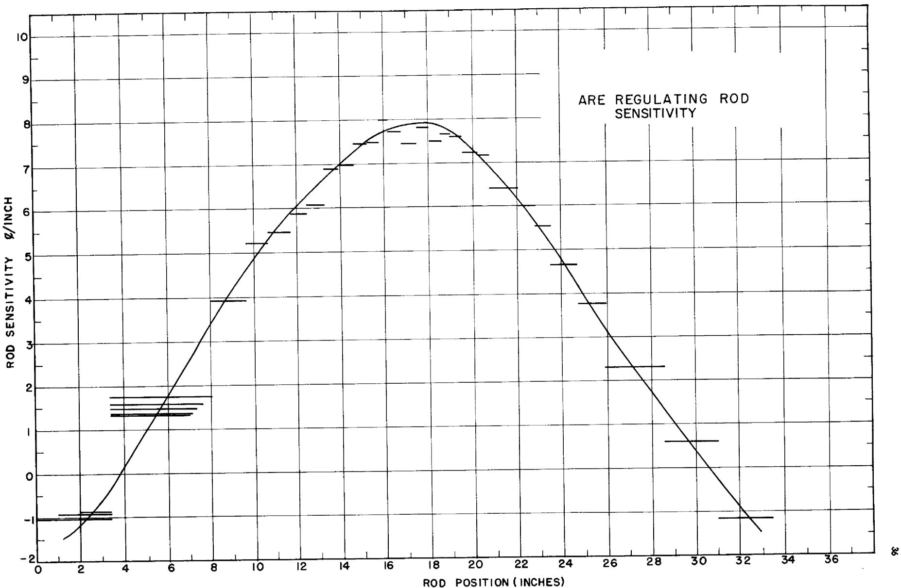  
FIGURE 15

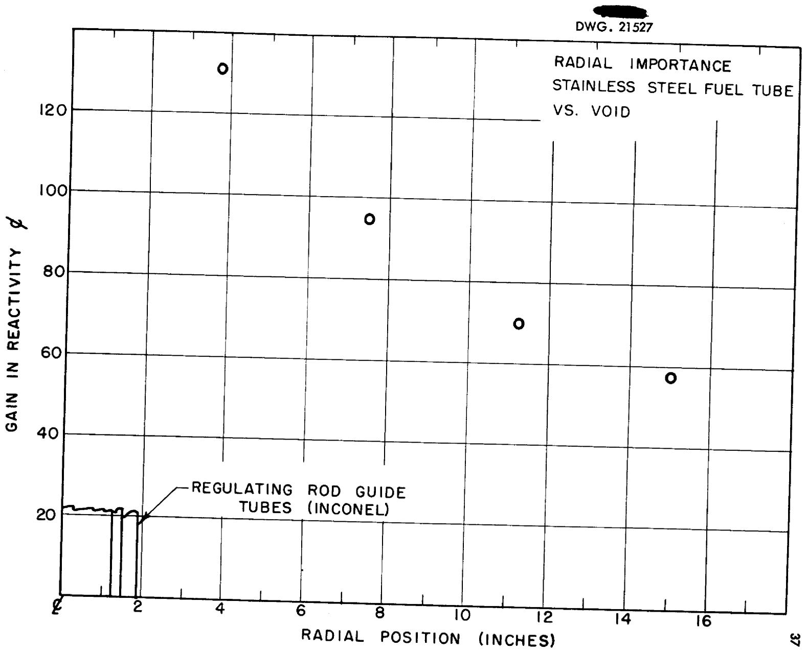  
FIGURE 16

TABLE VII   

<table><tr><td colspan="2">Radial Importance of Stainless Steel Fuel Tube</td></tr><tr><td>Position</td><td>Reactivity Value in θ</td></tr><tr><td>9-8</td><td>131.0</td></tr><tr><td>10-8</td><td>94.1</td></tr><tr><td>11-8</td><td>69.9</td></tr><tr><td>12-8</td><td>57.3</td></tr></table>

A comparison of the reactivity coefficients of an Inconel fuel tube with the stainless steel fuel tube was made. An Inconel tube of ARE dimensions and specifications was filled with powdered fuel having the same density and U-235 concentration as that contained in the stainless steel tube. This tube then replaced the stainless steel one in successive positions along a radius. In another experiment some evaluation of the radial effect of a variation in U-235 concentration was indicated by substituting a stainless steel fuel tube with the first loading (0.163 gm of U-235/cc) for one with the higher concentration (0.214 gm of U-235/cc). A summary of these data is given in Table VIII and Fig. 17.

TABLE VIII   

<table><tr><td colspan="3">Radial Importance of Fuel and Container Material Compared to Normal Fuel Tube</td></tr><tr><td rowspan="2">Position</td><td colspan="2">Reactivity Value in φ</td></tr><tr><td>Low U-235 Density Fuel Tube</td><td>Inconel Fuel Tube</td></tr><tr><td>9-8</td><td>-29.0</td><td>-27.2</td></tr><tr><td>10-8</td><td>-21.1</td><td>-24.9</td></tr><tr><td>11-8</td><td>-14.5</td><td>-17.2</td></tr><tr><td>12-8</td><td>-9.0</td><td>-10.1</td></tr></table>

The reduction of the relative value of the Inconel fuel tube at the 3.75" radius (position on 9-8) might be explained by its proximity to the large quantity of Inconel in the regulating rod guide tubes. In general, the stainless steel fuel tube values and the low density fuel tube values are consistent but do not compare very well with the flux and power distributions described later in this report.

# D. Reactivity Value of Reflector Coolant and Tubes

Since the center of the reactor was strongly poisoned by the Inconel tubes of the regulating rod assembly which might cause a change in the total reactivity value of the filled reflector coolant tubes, it was remeasured for this assembly. The removal of 56 of 66 tubes gave an increase

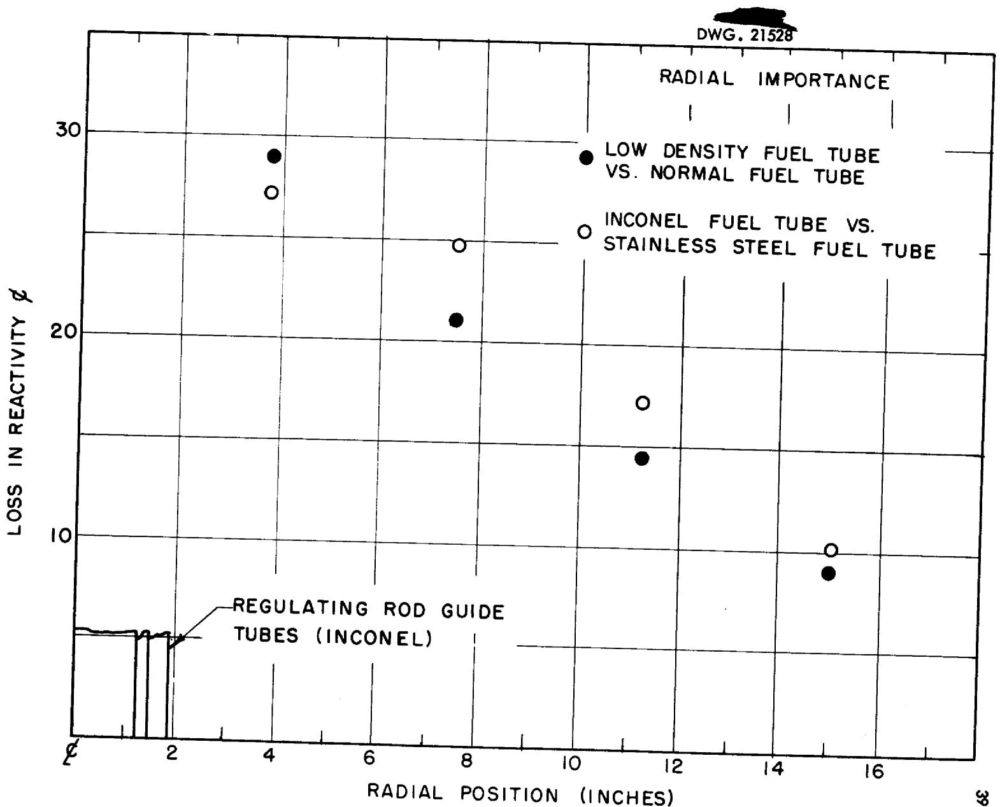  
FIGURE 17

in reactivity of $78.2\phi$ . When this is extrapolated linearly, the value of 66 tubes becomes $92\phi$ , an increase from the $82\phi$ extrapolated in the first loading. There was not enough additional Inconel tubing available to evaluate the containers alone but, considering the small value of the coolant and containers combined, this did not appear necessary. It should be noted that the ARE has a similar coolant in the interstices of the BeO blocks. Because of the difficulties in handling the hygroscopic material, a total evaluation of this poison was impractical. As reported below, however, constituents of this coolant were evaluated at one point in the reactor.

# E. Reactivity Coefficients

The effects on the reactor of a number of different materials were evaluated at a single point as follows: The fuel tube of position 10-8 $(7\frac{1}{2}''$ from the center) was removed and, with the reactor critical, the control rod position was noted as the base point. This base point was used as reference for the subsequent runs in which the material to be evaluated was placed in this same position. In the case of a large change

in reactivity, additional fuel tubes were added at selected points on the core periphery. The tubes were evaluated as added and the data are given in Table IX.

The sample materials were used in the form of rods, tubes, chips, or powder the latter two being packed into aluminum tubes and sealed to prevent leakage and water absorption. The reactivity coefficients of the aluminum tubes (samples 1 and 2 in Table X) were measured and used to obtain the net result for the samples contained. Two samples (chromium and manganese) were packed into both an aluminum tube and into an annulus formed by two concentric aluminum tubes while others were run twice in a single tube using different quantities of

materials. Comparisons gave some measures of the self-shielding. For cobalt in particular there is a marked change in the loss in reactivity per mole between the two runs. Table X gives a complete summary of these data.

There were several reactivity coefficients measured in the same position (10-8) which pertained more directly to the fuel and containers. Some of these values have been given previously but for each comparison a summary is given in Table XI. The aluminum fuel tube was packed with fuel to the same density (0.2138 gm U-235/cc) as the stainless steel fuel tube. All reactivity values are referred to a void in the test cell.

TABLE IX   

<table><tr><td colspan="2">Reactivity Value of Fuel Tubes</td></tr><tr><td>Position</td><td>Value in φ</td></tr><tr><td>11-3</td><td>46.4</td></tr><tr><td>4-5</td><td>60.5</td></tr><tr><td>5-10</td><td>39.3</td></tr><tr><td>5-9</td><td>51.8</td></tr><tr><td>5-4}</td><td>99.3</td></tr><tr><td>4-6}</td><td>48.7</td></tr><tr><td>4-7</td><td>56.5</td></tr><tr><td>7-4}</td><td>83.5</td></tr><tr><td>5-10}</td><td>149.7</td></tr><tr><td>6-11}</td><td></td></tr><tr><td>5-3}</td><td></td></tr><tr><td>4-8}</td><td></td></tr><tr><td>4-4}</td><td></td></tr></table>

TABLE X REACTIVITY COEFFICIENTS   

<table><tr><td rowspan="2">Sample</td><td rowspan="2">Mt&#x27;1 &amp; Form</td><td colspan="3">Dimensions (Inches)</td><td colspan="2">Volume</td><td rowspan="2">Total Weight gms</td><td rowspan="2">Density gm/cc</td><td rowspan="2">Weight in Core gm</td><td rowspan="2">Moles in Core</td><td rowspan="2">/</td><td rowspan="2">g/mole in Core</td></tr><tr><td>U. D.</td><td>Wall Thick</td><td>Length</td><td>In.3</td><td>cc</td></tr><tr><td>1</td><td>Al Tube</td><td>1.001</td><td>0.034</td><td>40.0</td><td>4.17</td><td>68.33</td><td>184.5</td><td>2.70</td><td>164.3</td><td>6.09</td><td>-2.0</td><td>-0.33</td></tr><tr><td>2</td><td>Al Tubes (Annulus)*</td><td>0.545</td><td>0.092</td><td>39.05</td><td></td><td>152.1</td><td>411</td><td>2.70</td><td>370</td><td>13.73</td><td>-4.2</td><td>-0.31</td></tr><tr><td>3</td><td>Iron Rod</td><td>1.248</td><td>Solid</td><td>44.5</td><td>54.43</td><td>891.95</td><td>6995</td><td>7.84</td><td>5599</td><td>100.25</td><td>-196.7</td><td>-1.96</td></tr><tr><td>4</td><td>Iron Rod</td><td>0.50</td><td>Solid</td><td>44.95</td><td>8.83</td><td>144.70</td><td>1129</td><td>7.80</td><td>894</td><td>16.2</td><td>-50.8</td><td>-3.14</td></tr><tr><td>5</td><td>Iron Tube</td><td>0.543</td><td>0.091</td><td>40.12</td><td>5.18</td><td>84.88</td><td>652</td><td>7.68</td><td>578</td><td>10.35</td><td>-33.8</td><td>-3.26</td></tr><tr><td>6</td><td>Nickel Rod</td><td>0.999</td><td>Solid</td><td>42-1/16</td><td>32.97</td><td>540.3</td><td>4789.2</td><td>8.86</td><td>4056</td><td>69.1</td><td>-206.3</td><td>-2.98</td></tr><tr><td>7</td><td>Nickel Tube</td><td>1.004</td><td>0.036</td><td>48.0</td><td>5.28</td><td>86.52</td><td>770.5</td><td>8.90</td><td>571</td><td>9.73</td><td>-53.9</td><td>-5.54</td></tr><tr><td>8</td><td>SiO2(Sand)</td><td>0.930</td><td>Solid Pack</td><td>39.0</td><td>26.49</td><td>434.1</td><td></td><td>1.76</td><td>697</td><td>11.6</td><td>+0.9</td><td>+0.08</td></tr><tr><td>9</td><td>KF Powder</td><td>0.930</td><td>Solid Pack</td><td>39.0</td><td>26.49</td><td>434.1</td><td></td><td>1.43</td><td>566.3</td><td>9.75</td><td>-27.6</td><td>-2.83</td></tr><tr><td>10</td><td>NaF Powder</td><td>0.930</td><td>Solid Pack</td><td>39.0</td><td>26.49</td><td>434.1</td><td></td><td>1.08</td><td>427.7</td><td>10.18</td><td>-4.5</td><td>-0.44</td></tr><tr><td>11</td><td>Cr Powder</td><td>0.930</td><td>Solid Pack</td><td>39.0</td><td>26.49</td><td>434.1</td><td>1801.6</td><td>4.15</td><td>1645</td><td>31.63</td><td>-106.6</td><td>-3.37</td></tr><tr><td>12</td><td>Cr Powder</td><td>0.930</td><td>0.1925</td><td>39.0</td><td>17.39</td><td>285.0</td><td>1193.1</td><td>4.19</td><td>1089.8</td><td>20.95</td><td>-76.3</td><td>-3.64</td></tr><tr><td>13</td><td>Mn (Chips)</td><td>0.930</td><td>Solid Pack</td><td>39.0</td><td>26.49</td><td>434.1</td><td>1273.0</td><td>2.93</td><td>1162</td><td>21.15</td><td>-208.8</td><td>-9.87</td></tr><tr><td>14</td><td>Mn (Chips)</td><td>0.930</td><td>0.1925</td><td>39.0</td><td>17.39</td><td>285.0</td><td>769</td><td>2.70</td><td>702</td><td>12.78</td><td>-153.8</td><td>-12.03</td></tr><tr><td>15</td><td>Cobalt (Slugs)</td><td>0.930</td><td>Random Filled</td><td>39-1/8</td><td>26.58</td><td>435.6</td><td>1966.5</td><td>4.51</td><td>1790</td><td>30.37</td><td>-325.3</td><td>-10.71</td></tr><tr><td>16</td><td>Cobalt (Slugs)</td><td>0.408</td><td>Solid</td><td>39.0</td><td>5.1</td><td>83.57</td><td>717.3</td><td>8.58</td><td>655</td><td>11.11</td><td>-190.4</td><td>-17.14</td></tr><tr><td>17</td><td>S. Steel Tube</td><td>1.240</td><td>0.06</td><td>40.0</td><td>8.92</td><td>146.2</td><td>1119.6</td><td>7.66</td><td>997.1</td><td>18.01</td><td>-70.0</td><td>-3.89</td></tr><tr><td>18</td><td>Inconel Tube</td><td>1.235</td><td>0.06</td><td>40.0</td><td>3,87</td><td>145.3</td><td>1200.2</td><td>8.26</td><td>1068.9</td><td>18.72</td><td>-93.5</td><td>-4.99</td></tr></table>

* Sample #2 consisted of two tubes assembled to form the annulus used for samples 12 & 13. The outer tube was sample 1 and the inner was as described under dimensions of sample 2 above.

TABLE XI   

<table><tr><td colspan="2">Summary of Fuel and Tube Reactivity Coefficients</td></tr><tr><td>Material</td><td>Reactivity Change</td></tr><tr><td>Aluminum Fuel Tube</td><td>+ 155.5¢</td></tr><tr><td>Low U-235 Density Stain-less Steel Fuel Tube</td><td>+ 73.0</td></tr><tr><td>Stainless Steel Fuel Tube</td><td>+ 94.1</td></tr><tr><td>Stainless Steel Tube (Empty)</td><td>- 70.0</td></tr><tr><td>Inconel Fuel Tube</td><td>+ 69.2</td></tr><tr><td>Inconel Tube (empty)</td><td>- 93.5</td></tr><tr><td>Stainless Steel Tube and Cast Fuel</td><td>+ 87.4</td></tr><tr><td>Inconel Tube and Cast Fuel</td><td>+ 62.2</td></tr></table>

# F. Evaluation of Fuel Tube Type Safety Rod

A reference check of the value of the fuel tube type safety rod was made by the rod drop method. This method, briefly, involves making the reactor critical with the safety rod in the most reactive position and then, as the rod is actuated, using a high speed recorder to observe the fast transient of neutron level decay. The relation which applies in this case is

$$
\frac {\mathrm {N} _ {0} - \mathrm {N} _ {1}}{\mathrm {N} _ {1}} \times 1 0 0 \phi = \text {t h e r e a c t i v i t y c h a n g e i n c e n t s}
$$

where:

$N_{\bullet}$ is the neutron level at critical

$N_{1}^{0}$ is the extrapolated level at the time the rod is dropped.

The value of one of the rods, $\# 2$ , was $480\phi$ and that of both when removed simultaneously was $900\phi$ .

# G. Reactivity Value of End Reflector

To obtain some measure of the contribution to the reactivity of the reflector coolant and pressure shell at the ends of the ARE, the following measurements were made. A one-inch thick $6''$ x $9''$ layer of stainless steel was placed on the top of the fuel-tubes in a location shown by the dotted lines in the vicinity of position 10-8 of Fig. 13. This gave an increase in reactivity of approximately $6\phi$ . A like area and thickness of sodium gave a $2.9\phi$ increase in reactivity. This sodium was contained in 8 mil wall stainless steel cans.

# H. Neutron Flux Distribution

The neutron flux distribution was measured with indium foils by the method previously described except that a remotely placed uranium metal disk and aluminum catcher foil were used to normalize the power level from run to run. The

uranium disk was approximately 1-7/16" in diameter and 0.01" thick, weighed 4.5 gm and was enriched to 93% in U-235. The Al foil was against the uranium disc during the foil exposure and was counted in an in-chamber type proportional counter. The activities were empirically corrected for counter dead time, background, and fission fragment decay and then used for power normalization Table XII and Fig. 18 give the result of the bare indium and cadmium covered indium longitudinal traverse at a point 12.06" from the center (position 11-8). The zero of the abscissa is the bottom of the BeO column where it rests on the 1" thick Inconel support plate. The scattering by the Inconel possibly accounts for the reduction of the Cd fraction at this point.

TABLE XII   

<table><tr><td colspan="5">Neutron Flux Traverse
Adjacent to Inconel Cast Fuel Tube
Longitudinal at 12.06&quot; Radius</td></tr><tr><td rowspan="2">Distance from Bottom of Reactor</td><td colspan="3">Indium Activity in Arbitrary Units</td><td rowspan="2">Cadmium Fraction</td></tr><tr><td>Bare</td><td>Cd Covered</td><td>Bare-Cd Covered</td></tr><tr><td>0&quot;</td><td>8,920</td><td>7,025</td><td>1,895</td><td>0.212</td></tr><tr><td>6</td><td>37,280</td><td>26,450</td><td>10,830</td><td>0.299</td></tr><tr><td>12</td><td>55,396</td><td>38,630</td><td>16,766</td><td>0.303</td></tr><tr><td>18</td><td>59,941</td><td>41,019</td><td>18,922</td><td>0.316</td></tr><tr><td>24</td><td>51,612</td><td>33,654</td><td>17,958</td><td>0.348</td></tr><tr><td>30</td><td>32,202</td><td>21,062</td><td>11,140</td><td>0.346</td></tr><tr><td>36</td><td>2,858</td><td>1,845</td><td>1,013</td><td>0.354</td></tr></table>

The radial flux traverse at the midplane of the reactor is given in Table XIII and Fig. 19. The dashed lines on the figure are activities extrapolated from the data obtained in the fine structure measurements taken near the eleven inch position. There were no similar measurements made in the first loading. The wide gap in this traverse was unexplored because of the importance which was attached to the study of a unit core cell in the time available. This emphasis has been at least partially contradicted by the fission flux traverse described in the following section. The strong effect of the center regulating rod assembly is indicated in these curves. The comparatively small flux and cadmium fraction depressions at the center of the regulating rod accentuates the relative inefficiency of this type of rod and guide tube arrangement for reactor control.

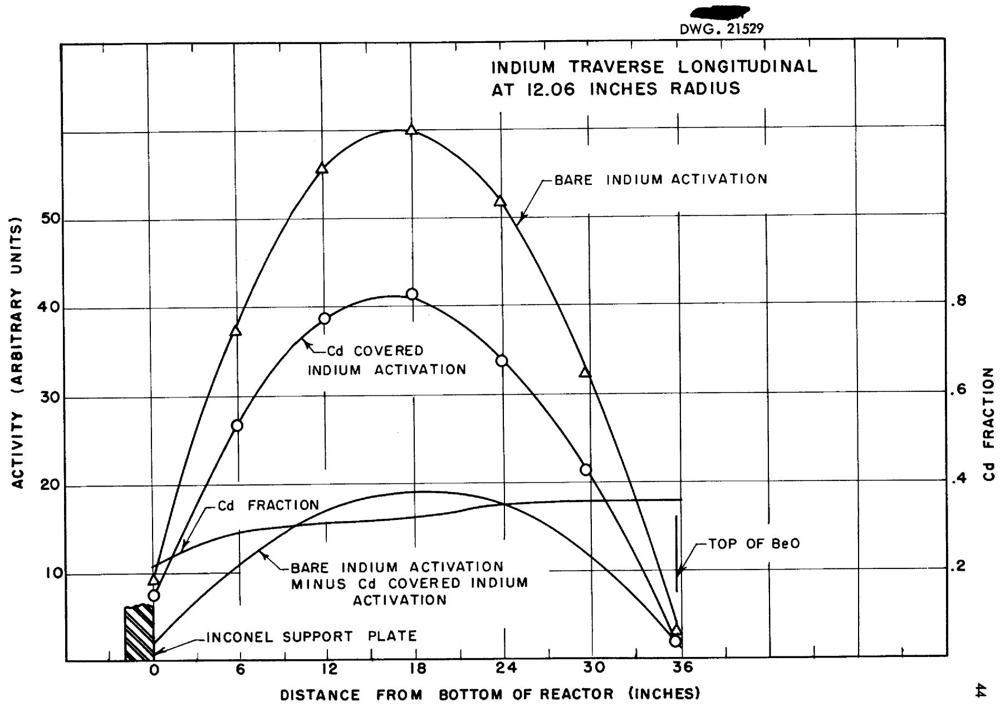  
FIGURE 18

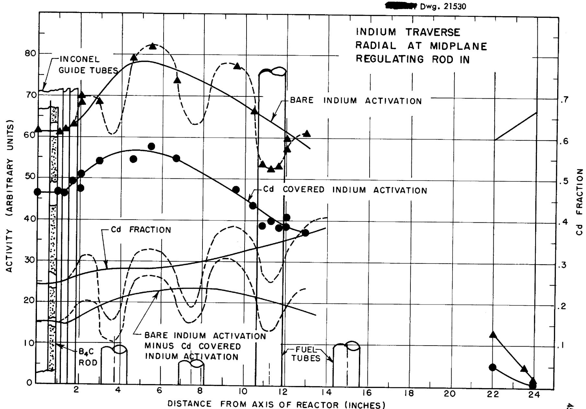  
FIGURE 19

TABLE XIII   

<table><tr><td colspan="5">Neutron Flux Traverse
Radial at Midplane
(Regulating Rod In)</td></tr><tr><td rowspan="2">Radius</td><td colspan="3">Indium Activity in Arbitrary Units</td><td rowspan="2">Cadmium
Fraction</td></tr><tr><td>Bare</td><td>Cd
Covered</td><td>Bare-Cd
Covered</td></tr><tr><td>0.00&quot;</td><td>61,492</td><td>46,396</td><td>15,096</td><td>0.245</td></tr><tr><td>1.03</td><td>61,265</td><td>46,508</td><td>14,760</td><td>0.241</td></tr><tr><td>1.28</td><td>61,579</td><td>46,185</td><td>15,329</td><td>0.249</td></tr><tr><td>1.69</td><td>63,181</td><td>49,418</td><td>13,763</td><td>0.218</td></tr><tr><td>2.06</td><td>68,352</td><td>47,244</td><td>21,108</td><td>0.309</td></tr><tr><td>2.06</td><td>69,858</td><td>50,976</td><td>18,882</td><td>0.270</td></tr><tr><td>2.94</td><td>68,414</td><td>54,196</td><td>14,220</td><td>0.208</td></tr><tr><td>4.56</td><td>79,064</td><td>54,666</td><td>24,400</td><td>0.309</td></tr><tr><td>5.44</td><td>81,787</td><td>57,679</td><td>24,108</td><td>0.295</td></tr><tr><td>6.69</td><td>73,689</td><td>54,792</td><td>18,898</td><td>0.256</td></tr><tr><td>9.56</td><td>77,086</td><td>47,463</td><td>29,623</td><td>0.384</td></tr><tr><td>10.44</td><td>66,231</td><td>43,445</td><td>22,786</td><td>0.344</td></tr><tr><td>10.88</td><td>53,510</td><td>38,794</td><td>14,716</td><td>0.275</td></tr><tr><td>11.25</td><td>52,798</td><td>39,888</td><td>12,910</td><td>0.245</td></tr><tr><td>11.62</td><td>53,367</td><td>38,197</td><td>15,170</td><td>0.284</td></tr><tr><td>12.06</td><td>57,380</td><td>38,441</td><td>18,939</td><td>0.331</td></tr><tr><td>12.94</td><td>61,021</td><td>37,054</td><td>23,967</td><td>0.392</td></tr><tr><td>22.06</td><td>12,818</td><td>5,122</td><td>7,696</td><td>0.600</td></tr><tr><td>23.56</td><td>4,716</td><td></td><td></td><td></td></tr><tr><td>24.00</td><td>1,998</td><td>633</td><td>1,335</td><td>0.668</td></tr></table>

Table XIV and Fig.20 give a similar traverse at the same location but with the regulating rod removed. The neutron flux is slightly greater than that observed in the preceding experiment.

TABLE XIV   

<table><tr><td colspan="5">Neutron Flux Traverse
Radial at Midplane
(Regulating Rod Out)</td></tr><tr><td rowspan="2">Radius</td><td colspan="3">Indium Activity in Arbitrary Units</td><td rowspan="2">Cadmium
Fraction</td></tr><tr><td>Bare</td><td>Cd
Covered</td><td>Bare-Cd
Covered</td></tr><tr><td>0.00&quot;</td><td>66,596</td><td>50,628</td><td>15,968</td><td>0.240</td></tr><tr><td>1.28</td><td>68,250</td><td>50,233</td><td>18,017</td><td>0.264</td></tr><tr><td>1.69</td><td>67,604</td><td>52,705</td><td>14,899</td><td>0.220</td></tr><tr><td>2.06</td><td>72,671</td><td>52,689</td><td>19,982</td><td>0.275</td></tr><tr><td>5.44</td><td>85,886</td><td>59,994</td><td>25,892</td><td>0.301</td></tr><tr><td>6.69</td><td>76,695</td><td>55,810</td><td>23,885</td><td>0.300</td></tr><tr><td>9.19</td><td>81,760</td><td>55,818</td><td>25,942</td><td>0.318</td></tr></table>

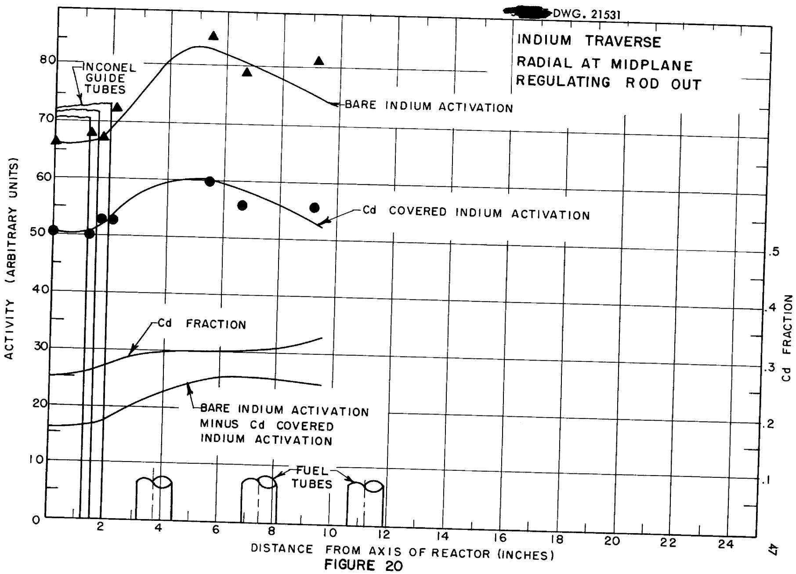

An Inconel tube, loaded with the cast fuel salt described in Section II-B was inserted in position 11.8 (11.25" from the center) replacing the normal powder packed stainless steel fuel tube. A longitudinal neutron flux traverse was made axially in this tube with the foils placed between the cast slugs. Table XV and Fig. 21 are the result of this traverse. The three points of Fig. 19 at positions 10.88", 11.25", and 11.62" were made in the same Inconel tube-cast fuel arrangement.

TABLE XV   

<table><tr><td colspan="5">Neutron Flux Traverse
Cast Fuel in Inconel Tube
Longitudinal at 11.25 inches Radius</td></tr><tr><td rowspan="2">Distance from Bottom of Reactor</td><td colspan="3">Indium Activity in Arbitrary Units</td><td rowspan="2">Cadmium Fraction</td></tr><tr><td>Bare</td><td>Cd Covered</td><td>Bare-Cd Covered</td></tr><tr><td>0.18&quot;</td><td>9,487</td><td>7,317</td><td>2,170</td><td>0.229</td></tr><tr><td>3.74</td><td>25,062</td><td>19,622</td><td>5,440</td><td>0.217</td></tr><tr><td>6.68</td><td>36,026</td><td>26,126</td><td>9,900</td><td>0.275</td></tr><tr><td>10.68</td><td>47,233</td><td>33,638</td><td>13,595</td><td>0.288</td></tr><tr><td>13.74</td><td>50,904</td><td>38,140</td><td>12,764</td><td>0.251</td></tr><tr><td>20.30</td><td>52,798</td><td>39,888</td><td>12,910</td><td>0.245</td></tr><tr><td>25.80</td><td>42,726</td><td>30,759</td><td>11,967</td><td>0,280</td></tr><tr><td>29.74</td><td>29,709</td><td>20,748</td><td>8,961</td><td>0.302</td></tr><tr><td>34.80</td><td>7,467</td><td>4,978</td><td>2,489</td><td>0.333</td></tr></table>

# I. Fission Neutron Flux Distribution

A measure of the distribution of neutrons causing fissions was obtained by use of the catcher foil method. A $4 - 1 / 2$ gm enriched U disk O.01" in thickness and approximately $1 - 7 / 16''$ in diameter, was exposed, together with an Al catcher foil, at each of the points in the reactor* indicated on Fig. 13. The exposures were repeated with the disks and catcher foils covered with O.02" Cd. Table XVI and Fig. 22 give a radial traverse at the midplane of the reactor.

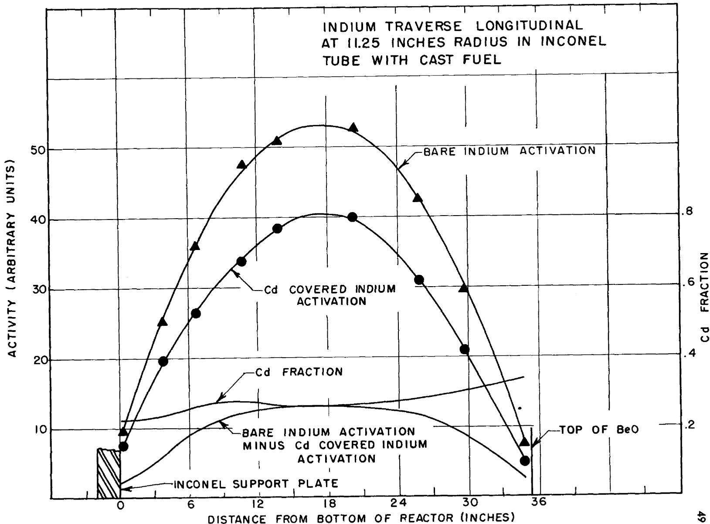  
DWG.21532   
FIGURE 21

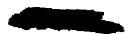  
DWG. 21533

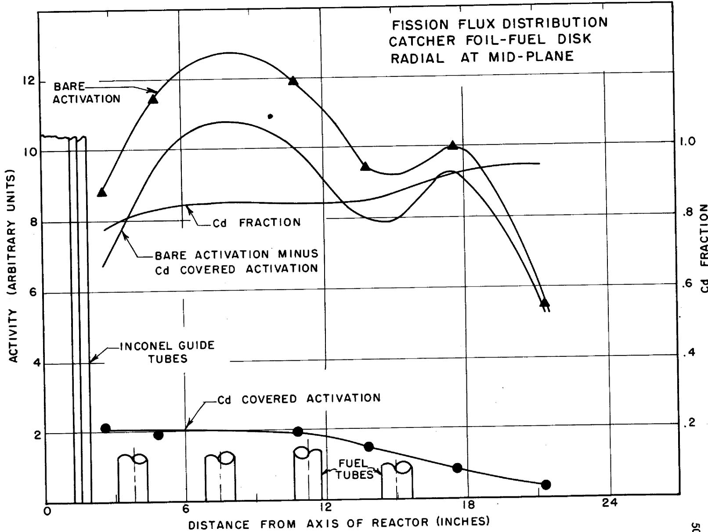  
FIGURE 22

TABLE XVI   

<table><tr><td colspan="5">Fission Neutron Flux Distribution
Catcher Foil-Uranium Disk
Radial at Midplane</td></tr><tr><td rowspan="2">Radius</td><td colspan="3">Relative Activity</td><td rowspan="2">Cadmium
Fraction</td></tr><tr><td>Bare</td><td>Cd
Covered</td><td>Bare-Cd
Covered</td></tr><tr><td>2.59&quot;</td><td>8,805</td><td>2,104</td><td>6,701</td><td>0.761</td></tr><tr><td>4.91</td><td>11,444</td><td>1,949</td><td>9,495</td><td>0.830</td></tr><tr><td>10.09</td><td>11,929</td><td>1,932</td><td>9,997</td><td>0.838</td></tr><tr><td>13.84</td><td>9,450</td><td>1,464</td><td>7,986</td><td>0.845</td></tr><tr><td>17.59</td><td>10,099</td><td>809</td><td>9,290</td><td>0.920</td></tr><tr><td>21.34</td><td>5,496</td><td>268</td><td>5,228</td><td>0.952</td></tr></table>

The flux of low energy neutrons producing fissions peaks near the reflector, and is depressed by the Inconel tube at the center. The cadmium fraction* follows roughly the same pattern. Similar half length longitudinal traverses were made 10.09" from the center and are shown in Table XVII and Fig. 23.

TABLE XVII   

<table><tr><td></td><td colspan="4">Fission Neutron Flux Distribution
Catcher Foil-Uranium Disks
Longitudinal at 10.09&quot; Radius</td></tr><tr><td rowspan="2">Reactor</td><td colspan="3">Relative Activity</td><td rowspan="2">Cadmium Fraction</td></tr><tr><td>Bare</td><td>Cd Covered</td><td>Bare-Cd Covered</td></tr><tr><td>18&quot;</td><td>11,929</td><td>1,932</td><td>9,997</td><td>0.838</td></tr><tr><td>24</td><td>9,934</td><td>1,778</td><td>8,156</td><td>0.822</td></tr><tr><td>36</td><td>411</td><td>93</td><td>319</td><td>0.775</td></tr></table>

* As before the cadmium fraction is defined as the bare activation minus the cadmium covered activation divided by the bare activation. It is a measure of the fraction of fissions produced by neutrons having energies below the cadmium cut-off.

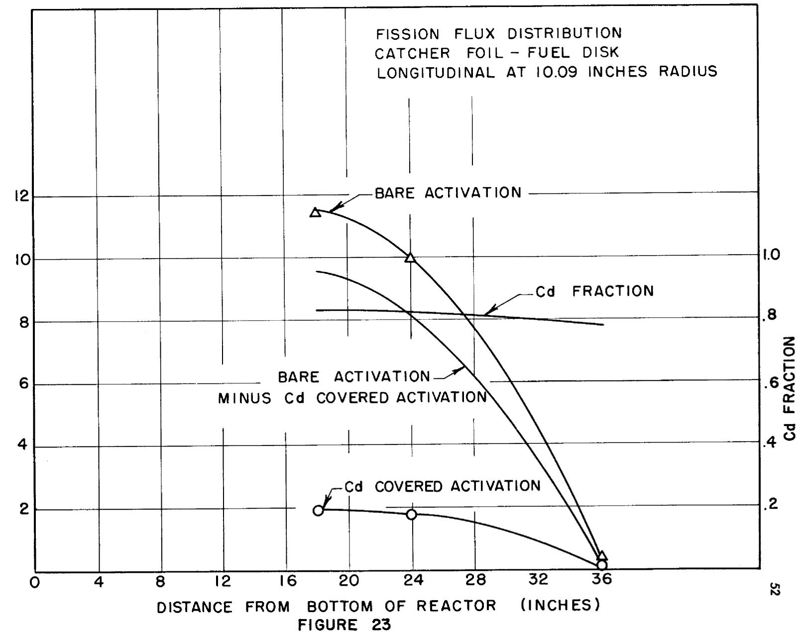  
ACTIVITY (ARBITRARY UNITS)

# J. Power Distribution

Three longitudinal power distributions in this reactor assembly were measured by using aluminum catcher foils, 0.5" in diameter and 0.005" thick, placed against the end surfaces of the short cast fuel slugs contained in an Inconel tube. The size of these foils, initially selected arbitrarily, was such that the counting rate from each was higher than necessary for the desired statistics. In the arbitrary units reported, an activity of 50 represents approximately $10^{5}$ counts. Had time permitted it would have been desirable to repeat the experiment using smaller foils, thereby improving the resolution, particularly since the results were very sensitive to foil location because of fuel self-shielding. Each catcher foil was nominally located centrally on the axis of a fuel slug. One traverse extended from below the Inconel support plate to above the top of the BeO; the other two covered the upper half of the core. Table XVIII and Fig. 24 give the data obtained in the fuel tubes at the indicated radii.

TABLE XVIII   

<table><tr><td colspan="4">Power Traverse
Cast Fuel in Inconel Tube
Longitudinal at three Radii</td></tr><tr><td rowspan="2">Distance from Bottom of Reactor Core</td><td colspan="3">Catcher Foil Activity Arbitrary Unit</td></tr><tr><td>11.25&quot; radius</td><td>3.75&quot; radius</td><td>15&quot; radius</td></tr><tr><td>-2.26&quot;</td><td>3.52</td><td></td><td></td></tr><tr><td>0.18</td><td>10.35</td><td></td><td></td></tr><tr><td>3.74</td><td>33.39</td><td></td><td></td></tr><tr><td>6.68</td><td>47.38</td><td></td><td></td></tr><tr><td>12.43</td><td>67.41</td><td></td><td></td></tr><tr><td>17.36</td><td>70.32</td><td></td><td></td></tr><tr><td>18.24</td><td>72.71</td><td>77.07</td><td>66.98</td></tr><tr><td>23.17</td><td>61.26</td><td>66.01</td><td>50.03</td></tr><tr><td>28.92</td><td>41.85</td><td>44.03</td><td>26.43</td></tr><tr><td>35.42</td><td>6.36</td><td>7.09</td><td>3.25</td></tr><tr><td>37.87</td><td>2.53</td><td>3.02</td><td>2.09</td></tr></table>

Also plotted on the figure for comparison is the normalized longitudinal indium thermal neutron curve of Fig. 21 measured at a distance of $11.25''$ from the center. The data of Fig. 24 are replotted in Fig. 25 showing the radial power distribution at several elevations in the reactor all normalized at the center. It is to be noted that the $37.86''$ elevation traverse is $2''$ above the top of the BeO column.

Two additional experiments were performed in an attempt to measure the self-shielding in this fuel. In the first, a cast fuel slug was split longitudinally along a diameter, three aluminum catcher foils were placed between the split surfaces as shown in Fig. 26a, and the slug was loaded in an Inconel fuel tube at the midplane of the reactor about $11^{\prime \prime}$ from the center. The tube was otherwise filled with cast slugs. Since the diameters of the split slug and the aluminum foils were $1 - 1 / 16$ and $1 / 2$ , respectively, the two "side" foils were separated only $1 / 16$ so the resolution of the measurements is not high.

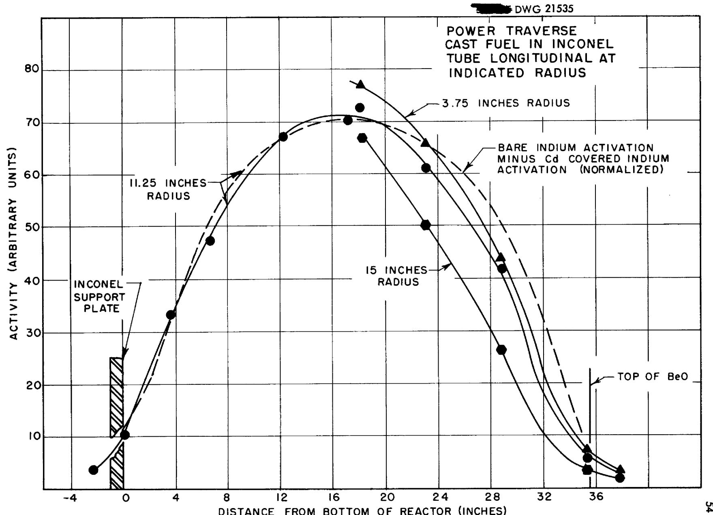  
FIGURE 24

DWG. 21536

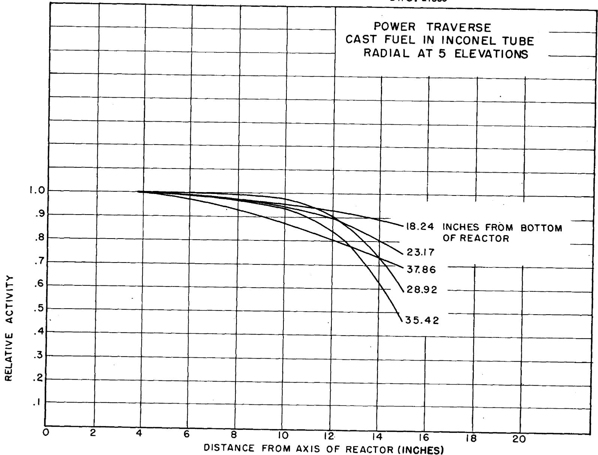  
FIGURE

5

The relative fission fragment activities collected on the three foils are noted on the figure. Since this fission fragment activity is strongly dependent on the uranium density in the slug surface, a measure was made of the homogeneity of the uranium in the second experiment. Three aluminum foils were again located on the split surface of the slug as shown in Fig. 26b. This arrangement, without the second half of the slug, was exposed to the leakage neutron flux of another critical assembly and the resultant fission fragment activities measured. Ignoring the differential back scattering across the face of the slug and assuming the flux to which it was exposed to be uniform, these activities, included in Fig. 26b, give a relative distribution of uranium across the slug face used in the self-shielding measurements. Applying this indicated variation as a linear correction to the values in Fig. 26a and normalizing, the values for the relative fission rates across the fuel slug become 72.6 and 72.4 at the sides of 65.6 at the center. These measurements and those of the neutron flux shown on Fig. 19 within the fuel tube at an abscissa of 11.5" were made at the same points.

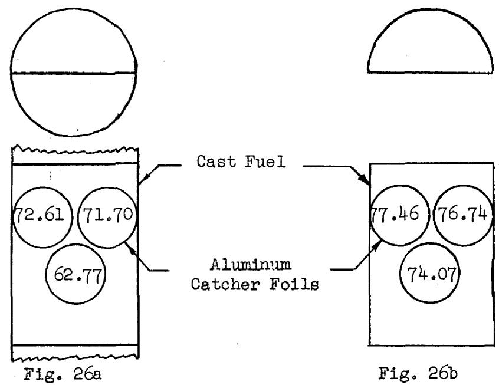  
Fuel Self-Shielding

# K. Evaluation of ARE Type Safety Rod

The safety rod of the ARE was mounted in position 10-8 (7½" from the center). The components of this rod assembly are identical with those of the regulating rod except the construction of the poison rod itself. The total length of this rod is 40-3/8" which includes a 2-3/16" stainless steel guide on each end. The poison section consisted of eighteen annular stainless steel cans, each 2" long and 2" OD, containing a sintered B₄C-iron mixture having a density of 2.45 gm/cc and composed of 80% B₄C by volume. The dimensions of the sintered slugs were 1.86" OD, 1.26" ID and 1.88" long.

In this case, the step-wise evaluation of the reactivity change during the mounting of the equipment for this safety rod was made. The removal of the fuel tube gave a loss of $94.1\phi$ . The removal of the $35.6''$ column of BeO gave a loss of $224\phi$ , the insertion of the two larger Inconel thinble tubes gave a loss of $172\phi$ , the third or central Inconel guide tube gave a loss of

$31\phi$ for a total of $521\phi$ . Since there was not sufficient reactivity available to maintain the assembly critical with the safety rod inserted, it was necessary to again use the rod drop method of evaluation. It was observed that the maximum reactivity of the system with the safety rod assembly mounted occurred when the bottom of the rod was $3.2''$ below the top of the BeO, a condition comparable to that found with the regulating rod mounted on the axis. The rod was dropped a distance of $32 - 1/4''$ from this position and caused a decrease in reactivity of $550\phi$ .

For comparison the two ARE regulating rods were evaluated by the same method in this position, 10-8. Although of somewhat different construction, their position of maximum reactivity was also with the lower end of the rod 3.2" below the top of the BeO. The rods were also "dropped" $32 - 1 / 4$ from this position. The reactivity value of the "strong" rod was $160\phi$ and that of the "weak" rod was $80\phi$ . The "weak" rod referred to here is the one calibrated in the center of the reactor by the period method described in Section IV-B. The value of the rod there was $125\phi$ .

# V. SUMMARY

The preliminary assembly for the ARE contributed information for checking calculational methods and applicable nuclear constants for a BeO moderated and reflected reactor. The rather close agreement between the predicted and experimentally determined critical mass of the first loading increased the confidence in the multigroup calculations. Although the first calculated value of the critical mass was $5\%$ lower than the measured mass, subsequent refinements in the calculations reduced this to about $1\%$ .

The step by step transition from the clean, unpoisoned reactor to a low temperature mockup of the ARE was intended to aid in the understanding of the mechanisms involved for calculational purposes and did so to the extent that the transition was carried out.

The calibration of the "weaker" of the two regulating rods indicated that its value was, for safety reasons, too high for use with an automatic control device of the type designed for the circulating fuel reactor. The total value of the ARE safety rod was found to be sufficient to accomplish its intended purpose.

The flux measurements were not as complete as could be desired, although the radial importance functions and reactivity coefficients which were measured should aid in the understanding of the flux and spectrum of this reactor. There was essentially no work done in determining the neutron leakage spectrum from the reflector surface. The power distribution measurements across the fuel within a tube suffered from poor resolution but give some indication of the value of the fuel self-shielding.

# VI. ACKNOWLEDGEMENTS

The work of Dr. L. G. Overholser, Messrs. D. R. Cuneo and A. B. Townsend in the preparation of the fuel is gratefully acknowledged. Appreciation is expressed to Drs. R. C. Keen, and E. L. Zimmerman for their help in preparation and review of this report.

# APPENDIX

# ANALYSIS OF MATERIALS

<table><tr><td>SAMPLE</td><td>MATERIAL</td><td>FORM</td><td></td><td>Ag</td><td>Al</td><td>B</td><td>Ba</td><td>Be</td><td>Ca</td><td>Cd</td><td>Co</td><td>Cr</td><td>Cu</td><td>Fe</td><td>Gd</td><td>K</td><td>Li</td><td>Mg</td><td>Mn</td><td>Mo</td><td>Na</td><td>Ni</td><td>Pb</td><td>Si</td><td>Sn</td><td>Sr</td><td>Ta</td><td>Ti</td><td>V</td><td>W</td><td>Zn</td><td>Zr</td><td></td></tr><tr><td>1</td><td>Al</td><td>1 in. OD Tube</td><td>% wt</td><td>&lt;.04</td><td></td><td>&lt;.004</td><td>&lt;.02</td><td>&lt;.001</td><td>&lt;.08</td><td>&lt;.04</td><td>&lt;.04</td><td>&lt;.04</td><td>&lt;.08</td><td>&lt;1</td><td></td><td></td><td></td><td></td><td>&lt;.04</td><td>&lt;.04</td><td>&lt;.04</td><td>&lt;.04</td><td>&lt;.08</td><td>&lt;.04</td><td>&lt;.15</td><td>&lt;.04</td><td>&lt;.2</td><td>&lt;1</td><td>&lt;.04</td><td>&lt;.04</td><td>&lt;1</td><td>&lt;.3</td><td>&lt;.08</td></tr><tr><td>2</td><td>Al</td><td>1/2in. OD Tube</td><td>% wt</td><td>&lt;.04</td><td></td><td>&lt;.004</td><td>&lt;.02</td><td>&lt;.001</td><td>&lt;.08</td><td>&lt;.04</td><td>&lt;.04</td><td>&lt;.04</td><td>&lt;.08</td><td>&lt;.6</td><td></td><td></td><td></td><td></td><td>&lt;.04</td><td>&lt;.04</td><td>&lt;.04</td><td>&lt;.04</td><td>&lt;.08</td><td>&lt;.04</td><td>.3</td><td>&lt;.04</td><td>&lt;.2</td><td>&lt;1</td><td>&lt;.04</td><td>&lt;.04</td><td>&lt;1</td><td>&lt;.3</td><td>&lt;.08</td></tr><tr><td>3</td><td>Fe</td><td>1/4in. Rod</td><td>% wt</td><td>&lt;.04</td><td>&lt;.04</td><td>&lt;.004</td><td>&lt;.02</td><td>.001</td><td>&lt;.08</td><td>&lt;.04</td><td>&lt;.04</td><td>&lt;.04</td><td>&lt;.04T</td><td></td><td></td><td></td><td></td><td></td><td>&lt;.04</td><td>.6</td><td>&lt;.04</td><td></td><td>.1</td><td>&lt;.04</td><td>.08</td><td>&lt;.04</td><td>&lt;.2</td><td>&lt;1</td><td>&lt;.04</td><td>&lt;.04</td><td>&lt;1</td><td>&lt;.3</td><td>&lt;.08</td></tr><tr><td>4</td><td>Fe</td><td>1/2in. Rod</td><td>% wt</td><td>&lt;.04</td><td>&lt;.04</td><td>&lt;.004</td><td>&lt;.02</td><td>.001</td><td>&lt;.08</td><td>&lt;.04</td><td>&lt;.04</td><td>&lt;.04</td><td>&lt;.04</td><td></td><td></td><td></td><td></td><td></td><td>&lt;.04</td><td>.6</td><td>&lt;.04</td><td></td><td>.1</td><td>&lt;.04</td><td>.08</td><td>&lt;.04</td><td>&lt;.2</td><td>&lt;1</td><td>&lt;.04</td><td>&lt;.04</td><td>&lt;1</td><td>&lt;.3</td><td>&lt;.08</td></tr><tr><td>5</td><td>Fe</td><td>1/2in. Tube</td><td>% wt</td><td>&lt;.04</td><td>&lt;.04T</td><td>&lt;.004</td><td>&lt;.02</td><td>.001</td><td>&lt;.08</td><td>&lt;.04</td><td>&lt;.04</td><td>&lt;.04</td><td>&lt;.04</td><td></td><td></td><td></td><td></td><td></td><td>&lt;.04</td><td>.3</td><td>&lt;.04</td><td></td><td>.3</td><td>&lt;.04</td><td>.08</td><td>&lt;.04</td><td>&lt;.2</td><td>&lt;1</td><td>&lt;.04</td><td>&lt;.04</td><td>&lt;1</td><td>&lt;.3</td><td>&lt;.08</td></tr><tr><td>6</td><td>Ni</td><td>1 in. Rod</td><td>% wt</td><td>&lt;.04</td><td>.08</td><td>&lt;.004</td><td>&lt;.02</td><td>.001</td><td>&lt;.08</td><td>&lt;.04</td><td>.6</td><td>&lt;.04</td><td>.04</td><td>.3</td><td></td><td></td><td></td><td></td><td>&lt;.04</td><td>.3</td><td>&lt;.04</td><td></td><td></td><td>&lt;.04</td><td>.08</td><td>&lt;.04</td><td>&lt;.2</td><td>&lt;1</td><td>&lt;.04T</td><td>&lt;.04</td><td>&lt;1</td><td>&lt;.3</td><td>&lt;.08</td></tr><tr><td>7</td><td>Ni</td><td>1 in. Tube</td><td>% wt</td><td>&lt;.04</td><td>&lt;.04T</td><td>&lt;.004</td><td>&lt;.02</td><td>.001</td><td>&lt;.08</td><td>&lt;.04</td><td>.15</td><td>&lt;.04</td><td>.04</td><td>.3</td><td></td><td></td><td></td><td></td><td>&lt;.04</td><td>.3</td><td>&lt;.04</td><td></td><td></td><td>&lt;.04</td><td>.08</td><td>&lt;.04</td><td>&lt;.2</td><td>&lt;1</td><td>&lt;.04T</td><td>&lt;.04</td><td>&lt;1</td><td>&lt;.3</td><td>&lt;.08</td></tr><tr><td>8</td><td>SiO2</td><td>Sand</td><td>% wt</td><td>&lt;.04</td><td>&lt;.04</td><td>&lt;.0004</td><td>&lt;.02</td><td>&lt;.001</td><td>&lt;.08</td><td>&lt;.04</td><td>&lt;.04</td><td>&lt;.04</td><td>&lt;.04</td><td>&lt;.04</td><td></td><td>&lt;.01</td><td>&lt;.01</td><td>&lt;.04</td><td>&lt;.04</td><td>&lt;.02</td><td>&lt;.04</td><td>&lt;.04</td><td>&lt;.04</td><td>&lt;.02</td><td>&lt;.08</td><td>&lt;.04</td><td></td><td>&lt;.02</td><td>&lt;.2</td><td></td><td>&lt;.04</td><td>&lt;.04</td><td></td></tr><tr><td>9</td><td>KF</td><td>Powder</td><td>% wt</td><td>&lt;.04</td><td>&lt;.04</td><td>&lt;.03</td><td>&lt;.04</td><td>&lt;.001</td><td>&lt;.08</td><td>&lt;.04</td><td>&lt;.04</td><td>&lt;.04</td><td>&lt;.04T</td><td>&lt;.04</td><td></td><td></td><td></td><td>.04</td><td>&lt;.04T</td><td>&lt;.04</td><td>&lt;.04</td><td>&lt;.04</td><td>&lt;.08</td><td>&lt;.04</td><td>&lt;.04</td><td>&lt;.2</td><td>&lt;1</td><td>&lt;.04</td><td>&lt;.04</td><td>&lt;1</td><td>&lt;.3</td><td>&lt;.08</td><td></td></tr><tr><td>10</td><td>NaF</td><td>Powder</td><td>% wt</td><td>&lt;.04</td><td>&lt;.04</td><td>&lt;.004</td><td>&lt;.02</td><td>&lt;.001</td><td>&lt;.08</td><td>&lt;.04</td><td>&lt;.04</td><td>&lt;.04</td><td>&lt;.04</td><td>&lt;.04</td><td></td><td></td><td>.08</td><td>&lt;.01T</td><td>&lt;.04</td><td>&lt;.02</td><td>&lt;.04</td><td></td><td>&lt;.08</td><td>&lt;.04</td><td>.08</td><td>&lt;.02</td><td>&lt;.1</td><td>&lt;1</td><td>&lt;.04</td><td>&lt;.04</td><td>&lt;1</td><td>&lt;.3</td><td>&lt;.08</td></tr><tr><td>11 &amp; 12</td><td>Cr</td><td>Powder</td><td>% wt</td><td>&lt;.04</td><td>&lt;.04</td><td>&lt;.004</td><td>&lt;.04</td><td>&lt;.001</td><td>&lt;.08</td><td>&lt;.04</td><td>.04</td><td></td><td>.08</td><td>.1</td><td></td><td>&lt;.01</td><td>&lt;.01</td><td>&lt;.04</td><td>&lt;.04</td><td>&lt;.04</td><td>&lt;.01</td><td>&lt;.08T</td><td>&lt;.04</td><td>.08</td><td>&lt;.04</td><td>&lt;.2</td><td></td><td>&lt;.04</td><td>&lt;.04</td><td></td><td>&lt;.3</td><td>&lt;.08</td><td></td></tr><tr><td>13 &amp; 14</td><td>Mn</td><td>Chips</td><td>% wt</td><td></td><td>&lt;.04</td><td>&lt;.004</td><td>&lt;.02</td><td>&lt;.001</td><td>&lt;.08</td><td>&lt;.04</td><td>&lt;.04</td><td>&lt;.04</td><td>&lt;.04</td><td>2</td><td></td><td></td><td></td><td></td><td>&lt;.04T</td><td></td><td></td><td>&lt;.04</td><td>.1</td><td>&lt;.02</td><td>&lt;.2</td><td>&lt;1</td><td>&lt;.04</td><td>&lt;.04</td><td></td><td>&lt;.3</td><td>&lt;.08</td><td></td><td></td></tr><tr><td>15 &amp; 16</td><td>Co</td><td>Solid Cylinders .5 in.,×A in.dia</td><td>% wt</td><td>&lt;.04</td><td>&lt;.04T</td><td>&lt;.004</td><td>&lt;.02</td><td>&lt;.001</td><td>&lt;.08</td><td>&lt;.04</td><td></td><td>&lt;.04</td><td>&lt;.04T</td><td>2</td><td></td><td></td><td></td><td></td><td>&lt;.04</td><td>.3</td><td>&lt;.04</td><td></td><td>.6</td><td>&lt;.04</td><td>.3</td><td>&lt;.04</td><td>&lt;.2</td><td>&lt;1</td><td>&lt;.04</td><td>&lt;.04</td><td>&lt;1</td><td>&lt;.3</td><td>&lt;.08</td></tr><tr><td>17</td><td>302 Stainless Steel</td><td>Tube 1/4 in.</td><td>% wt</td><td>&lt;.04</td><td>.04</td><td>&lt;.0005</td><td>&lt;.02</td><td>&lt;.001</td><td>&lt;.05</td><td>&lt;.002</td><td>.2</td><td>18.4</td><td>.1</td><td></td><td></td><td></td><td></td><td></td><td>&lt;.005</td><td>.7</td><td>.12</td><td></td><td>8.2</td><td>&lt;.1</td><td>.6</td><td>&lt;.02</td><td>&lt;.1</td><td>&lt;.5</td><td>&lt;.02</td><td>.02</td><td>&lt;.5</td><td>&lt;.2</td><td>&lt;.1</td></tr><tr><td>18</td><td>Inconel</td><td>Tube 1/4 in.</td><td>% wt</td><td>&lt;.04</td><td>.2</td><td>&lt;.002</td><td>&lt;.02</td><td>&lt;.001</td><td>&lt;.05</td><td>&lt;.002</td><td>.2</td><td>14.77</td><td>.14</td><td>6.41</td><td>&lt;.01</td><td></td><td></td><td></td><td></td><td>.02</td><td>.4</td><td>&lt;.02</td><td></td><td>78.14</td><td></td><td>.23</td><td>&lt;.05</td><td></td><td>&lt;.5</td><td>.25</td><td>.02</td><td>&lt;.5</td><td>&lt;.2</td></tr><tr><td>19</td><td>BeO</td><td>Blocks</td><td>PPM</td><td>.1</td><td>275</td><td>1.6</td><td></td><td></td><td></td><td></td><td></td><td></td><td></td><td></td><td></td><td></td><td></td><td></td><td></td><td></td><td></td><td></td><td></td><td></td><td></td><td></td><td></td><td></td><td></td><td></td><td></td><td></td><td></td></tr><tr><td>20</td><td>C</td><td>Powder</td><td>% wt</td><td>&lt;.04</td><td>.6</td><td>.004</td><td>.04</td><td>&lt;.001T</td><td>.2</td><td>&lt;.04</td><td>&lt;.04</td><td>&lt;.04</td><td>.04</td><td>.3</td><td></td><td></td><td></td><td></td><td></td><td></td><td></td><td></td><td></td><td></td><td></td><td></td><td></td><td></td><td></td><td></td><td></td><td></td><td></td></tr><tr><td>21</td><td>ZrO2</td><td>Powder</td><td>PPM</td><td></td><td>100</td><td>&lt;.2</td><td></td><td></td><td></td><td></td><td></td><td></td><td></td><td></td><td></td><td></td><td></td><td></td><td></td><td></td><td></td><td></td><td></td><td></td><td></td><td></td><td></td><td></td><td></td><td></td><td></td><td></td><td></td></tr></table>