DECLASSIFIED

AEC

3445603606836

ORNL-1449

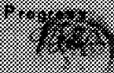

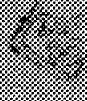

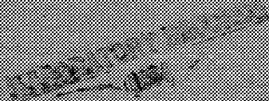

AIRCRAFT NUCLEAR PROPULSION PROJECT

QUARTERLY PROGRESS REPORT

FOR PERIOD ENDING DECEMBER 10, 1953

CENTRAL RESEARCH LIBRARY DOCUMENT COLLECTION

LIBRARY LOAN COPY

DO NOT TRANSFER TO ANOTHER PERSON

If you wish someone else to see this document, send in name with document and the library will arrange a loan.

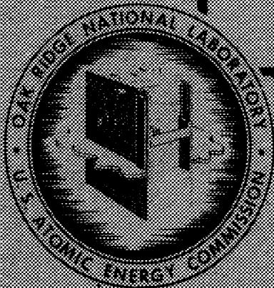

OAK RIDGE NATIONAL LABORATORY

OFHATID 由

CARBIDE AND CARBON CHEMICALS COMPANY

A DIVISION OF UNION CARBID AND CARBON COORDIATION

图2

POST OFFICE BOX

OAK HIDGE TENNESSE

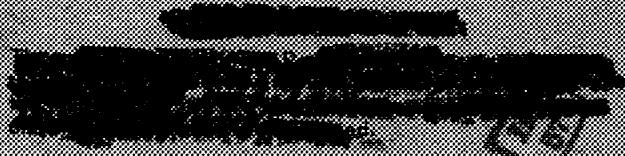

ORNL-1649

This document consists of 152 pages.

Copy 76 of 266 copies. Series A.

Contract No. W-7405-eng-26

# AIRCRAFT NUCLEAR PROPULSION PROJECT

# QUARTERLY PROGRESS REPORT

# For Period Ending December 10, 1953

R.C.Briant,Director

A. J. Miller, Assistant Director

W.B.Cottrell,Editor

DATE ISSUED

JAN 18 1954

OAK RIDGE NATIONAL LABORATORY

Operated by

CARBIDE AND CARBON CHEMICALS COMPANY

A Division of Union Carbide and Carbon Corporation

Post Office Box P

Oak Ridge, Tennessee

34456 03606836

# INTERNAL DISTRIBUTION

1. G. M. Adamson   
2. R.G.Affel   
3. C.R. Baldock   
4. C. J. Barton   
5. E. S. Bettis   
6. D. S. Billington   
7. F. F. Blankenship   
8. E. P. Blizzard   
9. M. A. Bredig   
10. R.C. Briant   
11. F.R.Bruce   
12. A. D. Callihan   
13. D.W.Cardwell   
14. J. V. Cathcart   
15. C. E. Center   
16. R. A. Charpie   
17. J.M.Cisar   
18. G.H. Clewett   
19. C. E. Clifford   
20. W. B. Cottrell   
21. R.G.Cochran   
22. D. D. Cowen   
23. F. L. Culler   
24. W. K. Eister   
25. L. B. Emlet (Y-12)   
26. W. K. Ergen   
27. A. P. Fraas   
28. W. W. Grigorieff (consultant)   
29. W.R.Grimes   
30. A. Hollander   
31. A. S. Householder   
32. J. T. Howe   
33. W. B. Humes (K-25)   
34. R.J. Johnson   
35. Gw. Keilholtz   
36. C. P. Keim   
37. M. T. Kelley   
38. F. Kertesz

39. E.M. King   
40. J.A. Lane   
41. C.E. Larson   
42. R. S. Livingston   
43. R. N. Lyon   
44. W. D. Manly   
45. L. A. Mann   
46. W. B. McDonald   
47. J. L. Meem   
48. A. J. Miller   
49. K. Z. Morgan   
50. E. J. Murphy   
51. G. J. Nessle   
52. H. F. Poppendiek   
53. P. M. Reyling   
54. H.W.Savage   
55. A. W. Savolainen   
56. E. D. Shipley   
57. O. Sisman   
58. L. P. Smith (consultant)   
59. A. H. Snell   
60. C. L. Storrs   
61. C. D. Susano   
62. J.A. Swartout   
63. E.H. Taylor   
64. J. B. Trice   
65. E.R. Van Artsdalen   
66. F. C. VonderLage   
67 J.M. Warde   
68. A.M. Weinberg   
69. J.C. White   
70. G. D. Whitman   
71. E.P. Wigner (consultant)   
72. G.C.Williams   
73. J. C. Wilson   
74. C. E. Winter's   
84. ANP Library   
85. Biology Library

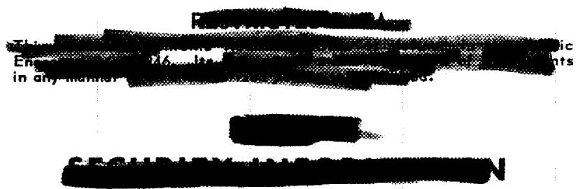

86-90. Laboratory Records Department   
91. Laboratory Records, ORNL R.C.   
92. Health Physics Library   
93. Metallurgy Library

94. Reactor Experimental

Engineering Library

95-97. Central Research Library

# EXTERNAL DISTRIBUTION

98-100. Air Force Engineering Office, Oak Ridge

101. Air Force Plant Representative, Burbank   
102. Air Force Plant Representative, Seattle   
103. Air Force Plant Representative, Wood-Ridge   
104. ANP Project Office, Fort Worth

105-116. Argonne National Laboratory (1 copy to Kermit Anderson)   
117. Armed Forces Special Weapons Project (Sandia)

118-126. Atomic Energy Commission, Washington (Lt. Col. M. J. Nielsen)   
127. Battelle Memorial Institute

128-133. Brookhaven National Laboratory

134. Bureau of Aeronautics (Grant)   
135. Bureau of Ships

136-137. California Research and Development Company

138-145. Carbide and Carbon Chemicals Company (Y-12 Plant)

146. Chicago Patent Group   
147. Chief of Naval Research   
148. Commonwealth Edison Company   
149. Convair, San Diego (C. H. Helms)   
150. Department of the Navy - Op-362   
151. Detroit Edison Company

152-155. duPont Company, Augusta

156. duPont Company, Wilmington   
157. Foster Wheeler Corporation

158-160. General Electric Company, ANPP

161-164. General Electric Company, Richland

165. Glen L. Martin Co. (T. F. Nagey)   
166. Hanford Operations Office   
167. Iowa State College

168-175. Knolls Atomic Power Laboratory

176-177. Lockland Area Office

178-179. Los Alamos Scientific Laboratory

180. Massachusetts Institute of Technology (Kaufmann)   
181. Materials Laboratory (WADC) (Col. P. L. Hill)   
182. Monsanto Chemical Company

183-185. Mound Laboratory

186-189. National Advisory Committee for Aeronautics, Cleveland (3 copies to A. Silverstein)

190. National Advisory Committee for Aeronautics, Washington   
191. Naval Research Laboratory

192-193. New York Operations Office

194-195. North American Aviation, Inc.

196-201. Nuclear Development Associates, Inc.

202. Patent Branch, Washington

203-210. Phillips Petroleum Company

211-220. Pratt and Whitney Aircraft Division (Fox Project)

221-232. Powerplant Laboratory (WADC) (2copies to B. Beaman)

233-234. Rand Corporation (1 copy to V. G. Henning)

235. San Francisco Operations Office   
236. Sylvania Electric Products, Inc.   
237. U. S. Naval Radiological Defense Laboratory   
238. USAF Headquarters

239-240. University of California Radiation Laboratory, Berkeley

241-242. University of California Radiation Laboratory, Livermore

243. Walter Kidde Nuclear Laboratories, Inc.

244-249. Westinghouse Electric Corporation

250-264 Technical Information Service, Oak Ridge, Tennessee

268. Curtiss-Wright Corp., Wright Aeronautical Division (K. Campbell)   
263. Armed Forces Special Weapons Project, Washington

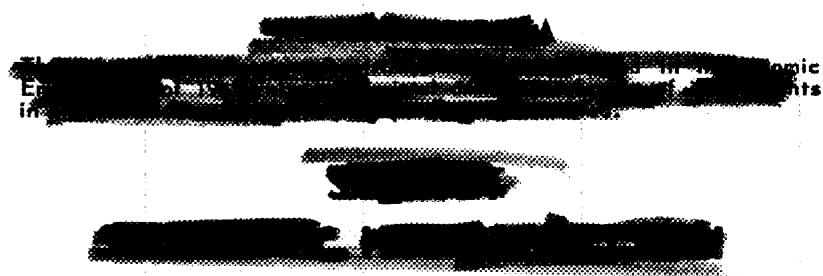

Reports previously issued in this series are as follows:

ORNL-528 Period Ending November 30, 1949

ORNL-629 Period Ending February 28, 1950

ORNL-768 Period Ending May 31, 1950

ORNL-858 Period Ending August 31, 1950

ORNL-919 Period Ending December 10, 1950

ANP-60 Period Ending March 10, 1951

ANP-65 Period Ending June 10, 1951

ORNL-1154 Period Ending September 10, 1951

ORNL-1170 Period Ending December 10, 1951

ORNL-1227 Period Ending March 10, 1952

ORNL-1294 Period Ending June 10, 1952

ORNL-1375 Period Ending September 10, 1952

ORNL-1439 Period Ending December 10, 1952

ORNL-1515 Period Ending March 10, 1953

ORNL-1556 Period Ending June 10, 1953

ORNL-1609 Period Ending September 10, 1953

# CONTENTS

# FOREWORD

# PART I. REACTOR THEORY AND DESIGN

# INTRODUCTION AND SUMMARY

# 1. CIRCULATING-FUEL AIRCRAFT REACTOR EXPERIMENT

<table><tr><td>The Experimental Reactor</td><td>6</td></tr><tr><td>Control rod sleeves</td><td>8</td></tr><tr><td>Reactor control</td><td>8</td></tr><tr><td>Flow in fuel tubes</td><td>8</td></tr><tr><td>Fuel tube cleaning</td><td>8</td></tr><tr><td>Reactor Physics</td><td>12</td></tr><tr><td>Critical mass</td><td>12</td></tr><tr><td>Effect of delayed neutrons</td><td>12</td></tr><tr><td>Xenon poisoning</td><td>12</td></tr><tr><td>The NaF-ZrF4-UF4Fuel</td><td>13</td></tr><tr><td>Physical properties</td><td>13</td></tr><tr><td>Fuel production</td><td>13</td></tr><tr><td>Corrosion of Inconel</td><td>14</td></tr><tr><td>Pumps</td><td>15</td></tr><tr><td>Prototype sodium pump test</td><td>15</td></tr><tr><td>Pump auxiliaries</td><td>15</td></tr><tr><td>Impeller fabrication</td><td>16</td></tr><tr><td>Acceptance tests</td><td>16</td></tr><tr><td>Fluid Circuits</td><td>16</td></tr><tr><td>Fuel system</td><td>16</td></tr><tr><td>Sodium system</td><td>16</td></tr><tr><td>Valves</td><td>16</td></tr><tr><td>Auxiliary systems</td><td>19</td></tr><tr><td>Instrumentation</td><td>19</td></tr><tr><td>Reactor and Fluid Circuit Cleaning</td><td>19</td></tr><tr><td>Fuel Recovery and Reprocessing</td><td>20</td></tr><tr><td>Transportation of fuel</td><td>20</td></tr><tr><td>Rate of dissolution of ARE fuel</td><td>21</td></tr><tr><td>Molten fuel dissolution</td><td>22</td></tr><tr><td>EXPERIMENTAL REACTOR ENGINEERING</td><td>22</td></tr><tr><td>Pumps for High Temperature Liquids</td><td>22</td></tr><tr><td>Frozen-sodium-sealed pump for sodium</td><td>23</td></tr><tr><td>Gas-sealed sump pump for in-pile loop test</td><td>23</td></tr></table>

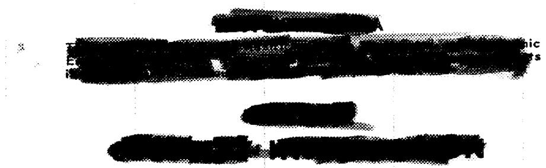

# S

Magnetic-torque-transmitter pump 24

Rotary-Shaft and Valve-Stem Seals for Fluorides 24

Graphite-packed seal for spiral-grooved shaft 24

Graphite-BeF $_2$ packed seals 24

V-ring seal 24

Bronze-wool, graphite, and $\mathsf{MoS}_2$ -packed frozen seal 25

Packed seals for valve stems 25

High-Temperature Bearing Development 25

Materials compatibility tests 25

Bearing characteristics 26

Heat Exchanger Test 28

Forced-Circulation Corrosion Loop 29

3. REFLECTOR-MODERATED REACTOR DESIGN STUDIES 31

Reactor Physics 31

Fuel Composition and Properties 33

Moderator Regions 33

Hydrodynamics of the Fuel Circuit 38

Pump Design 39

Pressure Shell 41

Fuel-to-NoK Heat Exchanger 42

Reactor Controls 42

Shielding 43

Filling and Draining of the Reactor 43

4. CRITICAL EXPERIMENTS 44

# PART II. MATERIALS RESEARCH

INTRODUCTION AND SUMMARY 47

5. CHEMISTRY OF HIGH-TEMPERATURE LIQUIDS 49

Thermal Analysis of Fluoride Systems 49

NaF-ZrF-UF 49

RbF-LiF-UF 50

NaF-ThF, 50

LiF-RbF-BeF 51

RbF-BeF2-ZrF4 51

Thermal Analysis of Chloride Systems 51

LiCl-UCI 51

NaCl-UCI 51

KCI-UCI 51

RbCl-UCI 52

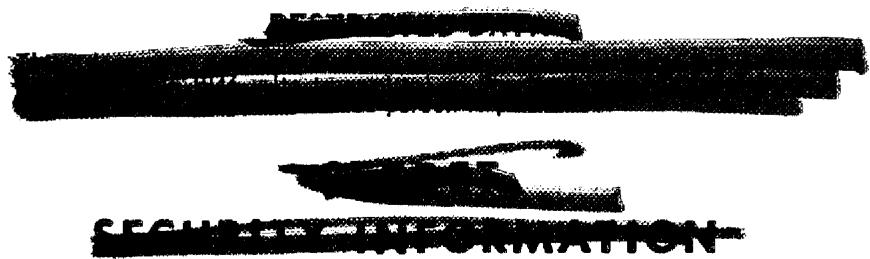

CsCl-UCI3

KCI-LiCl-UCI3

RbCl-UCI4

CsCI-UCI

KCI-LiCI-UCI

NaCl-LiCl-UCI

Quenching Experiments with the NaF-ZrF4 System

Differential Thermoanalysis of the NaF-ZrF4 System

Filtration Analysis of Fluorides

Mixtures with 53 mole% NaF

Mixtures with 50 mole % NaF

Mixtures with 75 mole % NaF

Fundamental Chemistry

Spectrophotometry of supercooled fused salts

EMF measurements in fused salts

Physical chemistry of fused salts

Production of Purified Fluorides

Laboratory-scale production of molten fluorides

Purification of small fluoride samples for phase studies

Production of enriched material for in-pile loop experiment

Experimental production facilities

Reduction of $\mathrm{Na}_2\mathrm{UF}_6$ by hydrogen

Treatment of molten NaZrF with strong reducing agents

Reduction of NiF, by hydrogen

Preparation of various fluorides

Purification and Properties of Hydroxides

Purification of hydroxides

Reaction of sodium hydroxide with carbonaceous matter

# 6. CORROSION RESEARCH

Fluoride Corrosion in Static and Seesaw Tests

Inconel corrosion by fluorides with metal fluoride additives

Corrosion of various metal combinations

Corrosion of cermets

Inconel with oil and trichloroethylene additives

Inconel corrosion by fluorides with $\mathsf{MoS}_2$ additive

Screening tests of metallic bearing materials

Fluoride Corrosion of Inconel in Thermal Convection Loops

Effect of fluoride batch purity

Effect of chromium additives

Pretreatment of fluoride with Inconel

Effect of exposure time

Effect of temperature

52

52

52

52

53

53

54

54

55

55

55

55

56

56

57

58

59

59

59

59

60

60

60

61

62

63

63

63

64

65

6

6

66

67

67

67

67

6

7

72

72

72

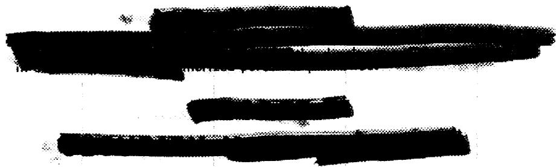

Effect of surface-to-volume ratio 72

Fluoride with 6.5 mole $\%$ UF4 72

The fluoride NaZrF 5 73

Fluoride Corrosion of Nickel and Stainless Steel Loops 73

Liquid Metal Corrosion 74

Mass transfer in liquid lead 74

Static tests of BeO in sodium, lithium, and lead 75

Spinner tests of Inconel and type 405 stainless steel in sodium 75

Static tests of bearing materials in sodium, lithium, and lead 76

Static tests of stainless steels in lithium 76

Static tests of solid fuel elements in sodium and sodium hydroxide 76

Fundamental Corrosion Research 80

Oxidizing power of hydroxide corrosion products 80

Equilibrium pressure of hydrogen in hydroxide-metal systems 80

Mass transfer of chromium in Inconel-fluoride systems 82

7.METALLURGY AND CERAMICS 83

Welding and Brazing Research 84

Brazing of radiator assemblies 84

Brazing of high-conductivity radiator fins 86

"Electroless" preplating of braizing alloys 89

Inert-arc welding of solid fuel elements 89

Mechanical Properties of Inconel 91

Stress-rupture of Inconel in fluoride fuel 91

Tube-burst tests of triaxially stressed tubes 91

Environmental effects on creep of Inconel 92

High-Conductivity Metals for Radiator Fins 92

Diffusion barriers 93

Clad copper 93

Electroplated copper 93

Solid phase bonding 93

Fabrication of Special Materials 93

Extrusion of Inconel-type alloys 93

Rolling of chromium-cobalt alloy 94

Rolling of cobalt 94

Rolling of iron-chromium-nickel alloy 94

Cold-rolled columbium alloy 94

Tubular Fuel Elements 94

Ceramic Research 96

Glass-type pump seals 96

96

High-density graphite 96

Combustion of Sodium Alloys 96

# 8. HEAT TRANSFER AND PHYSICAL PROPERTIES RESEARCH 97

Heat Capacity 97   
Thermal Conductivity of Solidified Salts 98   
Density and Viscosity of Fluorides 98   
Vapor Pressures of Fluorides 99   
Electrical Conductivity of Fluorides 99   
Forced Convection Heat Transfer with NaF-KF-LiF Eutectic 100   
Flow in Thermal-Convection Loops 101   
Fluid Flow in an Annulus 102   
Transient Surface-Boiling Studies 102   
Circulating-Fuel Heat Transfer 102

# 9. RADIATION DAMAGE 103

Irradiation of Fuel Capsules 103   
Creep Under Irradiation 104   
In-Pile Circulating Loops 106

# 10. ANALYTICAL STUDIES OF REACTOR MATERIALS 107

Analytical Chemistry of Reactor Materials 107

Oxidation states of iron 107   
Oxidation states of chromium 108   
Determination of UF and UF 108   
Reducing power of $\mathsf{NaZrF}_5$ with zirconium addition 109   
Dissolution of fluoride mixtures containing zirconium 109

Petrographic Examination of Fluorides 109   
Mass Spectrometer Investigations of Irradiated Fluoride Fuels 110   
Calculation of $\mathsf{UF}_4$ in unirradiated fuels 110   
Calculation of U235 lost from irradiated fuel 111   
Determination of U235 burnup 111   
Summary of Service Chemical Analyses 112

# PART III. SHIELDING RESEARCH

# INTRODUCTION AND SUMMARY 115

# 11. BULK SHIELDING REACTOR 116

Spectrum of Gamma Rays Emitted by the BSR 116

Spectrometer arrangement 116   
Results 116   
Fast-Neutron Leakage Spectra of the BSR 117

# 12. LID TANK FACILITY 120

Slant Penetration of Neutrons Through Water 120   
Air Duct Tests 121

Removal Cross Sections 122

Survey of Lid Tank Experiments 123

13. TOWER SHIELDING FACILITY 125

14. SHIELDING ANALYSIS 126

Visible Light from a Nuclear Power Plant 126

Neutron Reflection Coefficient for Water 126

# PART IV. APPENDIXES

15. LIST OF REPORTS ISSUED DURING THE QUARTER 129   
16. DIRECTORY OF ACTIVE ANP RESEARCH PROJECTS AT ORNL 131

ORGANIZATION CHART 139

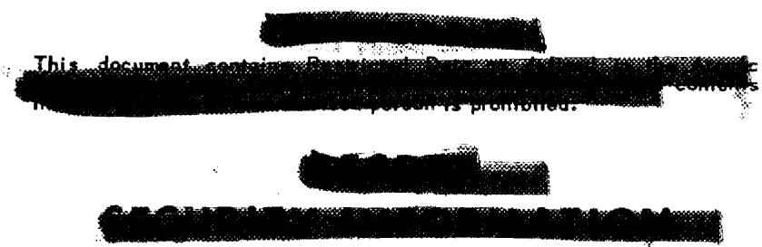

# ANP PROJECT QUARTERLY PROGRESS REPORT

# FOREWORD

This quarterly progress report of the Aircraft Nuclear Propulsion Project at ORNL records the technical progress of the research on the circulating-fuel reactor and all other ANP research at the Laboratory under its Contract W-7405-eng-26. The report is divided into three major parts: I. Reactor Theory and Design, II. Materials Research, and III. Shielding Research. Each part has a separate introduction and summary.

The ANP Project is comprised of about 300 technical and scientific personnel engaged in many phases of research directed toward the achievement of nuclear propulsion of aircraft. A considerable portion of this research is performed in support of the work of other organizations participating in the national ANP effort. However, the bulk of the ANP research at ORNL is directed toward the development of a circulating-fuel type of reactor.

The nucleus of the effort on circulating-fuel reactors is now centered upon the Aircraft Reactor Experiment - a high-temperature prototype of a circulating-fuel reactor for the propulsion of aircraft. The equipment for this reactor experiment is now being assembled; the current status of the experiment is summarized in Section 1 of Part 1. The supporting research on materials and problems peculiar to the ARE - previously included in the subject sections - is now included in this ARE section, where convenient. The few exceptions are referenced to the specific section of the report where more detailed information may be found.

The ANP research, in addition to that for the Aircraft Reactor Experiment, falls into three general categories: (1) studies of aircraft-size circulating-fuel reactors, (2) materials problems associated with advanced reactor designs, and (3) studies of shields for nuclear aircraft. These three phases of research are covered in Parts I, II, and III, respectively, of this report.

Part I

REACTOR THEORY AND DESIGN

# INTRODUCTION AND SUMMARY

Assembly of the Aircraft Reactor Experiment (sec. 1) is nearing completion; all but a few of the components have been received and installed. The items still missing include the new control rod sleeves and parts of the fuel and sodium gas-sealed pumps. As the installation progresses, various auxiliary systems, such as the helium, water, and hydraulic off-gas systems, are being subjected to operational tests. Tests of a prototype pump have established the design criteria for the pump cooling and lubricating systems, as well as the operating characteristics of the pump. The new control rod sleeves will effect a reduction in the structural poison in the core and hence reduce the critical mass. Recent physics calculations indicate that the uranium requirement inside the pressure shell will be well under 40 lb of U²³⁵. Other physics calculations on reactor kinetics reveal that reactor operation and control will not be adversely affected by either xenon poisoning or the loss of delayed neutrons in the circulating fuel. The fuel, which will be obtained by the addition of a concentrate, Na₂UF₆⁻ to a solvent mixture, Na₂F₅⁻, has been shown to be reasonably compatible with the Inconel container metal for the temperatures and times required. Production of both the solvent and concentrate are essentially complete and the impurities in each are well below acceptable levels. Procedures have been established to assure that the fuel and sodium systems in the experiment will be adequately cleaned prior to being filled with the solvent and sodium, respectively. Additional studies of the fuel recovery and processing problem have established dissolution rates for both molten and solid fuel in batches containing 4 kg of U²³⁵.

With the near-completion of the Aircraft Reactor Experiment the emphasis of the experimental work has shifted to the development of components for general aircraft reactor application and supporting research. Valves, pumps, bearings and other components of high-temperature fluoride and liquid metal systems are being developed for these studies (sec. 2). Satisfactory, short, frozen-sodium shaft seals, with length-to-inside-diameter ratios of 1 to 5, have been developed for sodium pumps. A small gas-sealed pump for an in-pile loop and a canned

magnetic-torque transmitter for a high-temperature aircraft pump are being developed. Packed seals for fluoride pumps and valves have achieved limited success under controlled conditions, but none of the seals are sufficiently reliable for service conditions. Equipment for high-temperature bearing tests is being assembled, and a number of potential bearing materials are being screened on the basis of wear. A fluoride-to-sodium heat exchange tube bundle and a high-velocity forced-convection corrosion loop are being operated, but results are not yet available on either test.

The designs of a family of 50- to 300-megawatt reflector-moderated reactors have been prepared to permit an Air Force evaluation of over-all aircraft performance (sec. 3). The four reactors considered for 50-, 100-, 200-, and 300-megawatt power outputs are all of the same general species, having all been extrapolated from the same base. The designs are based upon presumed fuel and were made with insufficient physics information for the establishment of over-all design limitations. In other respects, however, the designs are on a firmer basis, since considerable shielding and heat exchanger data are available and the hydrodynamics of the fuel circuit and fuel pump have been confirmed by hydraulic mockups. The gas-sealed centrifugal pump is designed with special baffling above the impeller so that it will operate continuously with its shaft 80 deg from the vertical, and it will even operate for 1 min when inverted without "gassing" the pump. Other aspects of the aircraft reactor, including moderator cooling, assembly of the reactor, control, and fuel filling and draining, are discussed.

The Critical Experiment Facility was used during this quarter to determine the static physics characteristics of a mockup of an air-cooled watermoderated reactor for the General Electric Aircraft Nuclear Propulsion Project (sec. 4). At the same time, preparations were made for measurements of a mockup of a Pratt and Whitney supercritical-water reactor and a Nuclear Development Associates sodium-cooled reactor, as well as the Laboratory's reflector-moderated reactor.

# 1. CIRCULATING-FUEL AIRCRAFT REACTOR EXPERIMENT

E. S. Bettis J. L. Meem  
ANP Division

There were no modifications in the ARE design or critical developments in the ARE program during the quarter, and therefore installation of equipment received maximum attention. The installation is proceeding satisfactorily, and there was no major holdup occasioned by lack of components. For the first time since the project began, it is not necessary to explain either the cause for some delay or some change in plan, and this is the most significant remark that can be made to indicate the status the project attained during this quarter. It is fairly clear now that completion of the installation of the ARE can be effected in an uneventful manner.

One fuel pump sump tank and one sodium pump sump tank were received, and therefore the installation of piping for the fuel and sodium circuits could proceed in a relatively uninhibited manner, even though the spare fuel and spare sodium tanks have not yet been received. Tests on a prototype pump have established the requirements of the auxiliary systems for the pumps, as well as the pump's operating characteristics and performance.

Since all major components of the experiment are now on hand, all crafts have been able to proceed with relatively little interference. Installation of electrical heaters and insulation is progressing rapidly. The heaters are approximately $65\%$ installed, but, since the locations for the remaining heaters are more accessible, the job is $75\%$ complete with regard to man-hours. Insulation work is following closely behind heater installation. The most difficult insulating job, that of insulating tanks and lines in the dump tank pit, is $95\%$ finished, and about $15\%$ of the other insulation has been installed.

Additional data have been obtained from calculations of the reactor statics and dynamics. An evaluation of the effects of xenon poisoning and of the loss of delayed neutrons indicated that neither will be of much consequence to reactor operation. Calculations of the critical mass by two different methods gave values which show that the uranium requirement in the pressure shell will be well below the 40 lb permissible from the viewpoint of uranium allocation and ARE technology. A saving in mass of about 4 lb was realized by a reduction in the poisoning from the control rod sleeves.

The new Inconel-clad control rod sleeves, which will replace the three concentric rod sleeves that were to be used around each rod, have been fabricated. The space outside each new sleeve will be filled with beryllium oxide strips. The reactor, which is complete except for installation of the new rod sleeves and the beryllium oxide strips, has been subjected to preliminary cleaning tests. Tests with simulated reactor fuel tubes indicate that fully established turbulent flow will be realized at a Reynolds number of 5000, which is well under the ARE design value of 14,000.

The ultimate fuel will be obtained by the addition of sufficient fuel concentrate, $\mathsf{Na}_2\mathsf{UF}_6$ to the fuel solvent, $\mathsf{NaZrF}_5$ , to make the reactor critical. The production of the 3300 lb of solvent was completed some time ago, and conversion of the 115 kg of $\mathsf{U}^{235}$ into $\mathsf{Na}_2\mathsf{UF}_6$ is nearing completion. Initial tests of the concentrate show that, with the exception of one batch which was rejected, the impurities in the concentrate are gratifyingly low. Density and viscosity data have been obtained for the concentrate.

Methods for recovering and reprocessing the fuel after completion of the experiment have received increased attention. It now appears that the used fuel may be transported from the experiment to the reprocessing area in aluminum containers containing $4\mathrm{kg}$ of $\mathsf{U}^{235}$ and that about 20 such transfers will be required. While the reprocessing procedures had been established previously, additional data have been obtained on dissolution rates for the fuel in both liquid and molten states.

# THE EXPERIMENTAL REACTOR

The reactor is completely assembled (Fig. 1.1) except for the Inconel-clad stainless steel control rod sleeves, which have not yet been received, and the beryllium oxide strips that will be placed around these sleeves. The fuel tubes have been cleaned according to the established cleaning procedures. Additional measurements of flow phenomena in glass mockups of the fuel tube indicate that fully developed turbulent flow is realized at Reynolds numbers above 5000, that is, well under the reactor design value of 14,000.

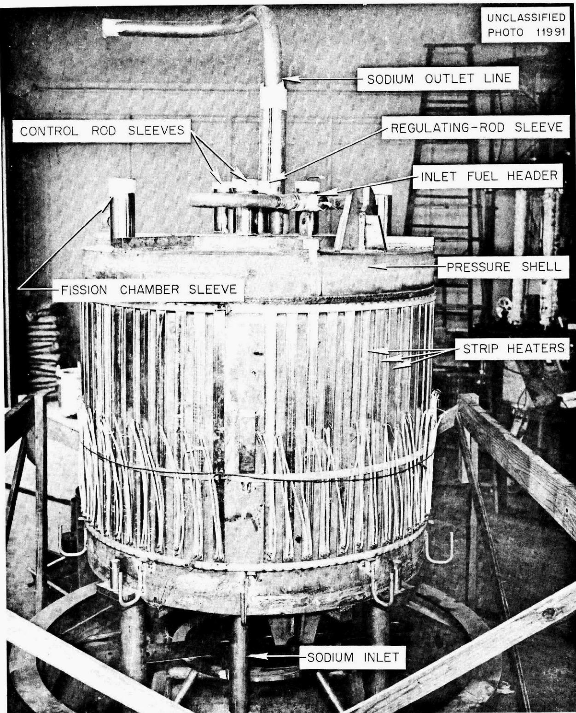  
Fig. 1.1. Photograph of the Experimental Reactor.

# Control Rod Sleeves

In order to reduce the structural poisons in the reactor, it was decided to replace the three concentric Inconel sleeves around each of the four control rods (one regulating and three safety) with a single Inconel-clad stainless steel sleeve in each hole. Fabrication of the new control rod sleeves has been finished by the International Nickel Company, but they have not yet been delivered.

To further reduce the critical mass of the reactor, the volume outside the rod sleeve was to be packed with beryllium oxide pellets. However, since the beryllium oxide pellets would occupy only about $50\%$ of the volume, it was recently decided to fill this volume with strips from unused beryllium oxide moderator blocks. It is anticipated that approximately $90\%$ of the void volume can be filled with the beryllium oxide strips.

# Reactor Control

A. L. Southern

J. K. Leslie

ANP Division

There has been only one change (an addition) to the reactor control equipment. An auxiliary low-speed drive has been designed for the regulating rod. This addition was made to provide a means of manually operating the regulating rod when the reactor is operating at zero power during rod calibration.

In the event of fission chamber failure or inadequate $\Delta k$ in the regulating rod, it may be necessary to change these components during the course of the experiment. Consequently, some of the drive mechanism has been relocated to facilitate replacement of both the regulating rod and the fission chambers. No other changes have been made in the reactor controls and this phase of the work is complete insofar as preliminary checking can determine completeness.

# Flow in Fuel Tubes

J. Lang

G.M.Winn

Reactor Experimental Engineering Division

The experimental relationship between the friction factor and the Reynolds modulus obtained in a glass replica of the reactor fuel tube system

indicated that the transition region (that region which lies between laminar and fully developed turbulent flow) lies approximately between Reynolds moduli of 2000 and 5000. Recent photographs, Figs. 1.2, 1.3, and 1.4, show the diffusion of dye filaments in the second 180-deg return bend in a fuel tube under three Reynolds number flow conditions: 600, 1300, and 2000, respectively. Unfortunately, there was more than one dye source present in the entrance region of the fuel tube system, and thus several filament trajectories were superimposed. In general, the sharp, distinct filaments shown in Figs. 1.2 and 1.3 are characteristic of laminar flow, whereas the diffuse filaments indicate some turbulence, Fig. 1.4.

# Fuel Tube Cleaning

G. D. Whitman, ANP Division

The cleaning procedures for the fuel and sodium systems inside and outside the reactor are described in a following subsection (cf., "Reactor and Fluid Circuit Cleaning"). However, a description of the application of these procedures to the actual cleaning of the reactor fuel tubes follows.

The six parallel fuel circuits in the reactor were first rinsed, individually, with tap water. This flushing was accomplished by valving off the outlets of all but one circuit and passing water at a pressure of 60 psi into the fuel inlet header. Following this pressure flushing, each circuit was flushed with distilled water, and the water was blown out as completely as possible with helium. After the water that could be blown out had been removed, a vacuum system was connected through a dry-ice cold trap to the fuel tubes, and the remaining water was evaporated from the fuel circuit at room temperature. During the evaporation process 2 cfh of helium was bled into the system inlet to sweep out all moisture. The residual moisture was determined by the Karl Fisher and dew-point methods.

The reactor will be complete when the control rod sleeves and the bottom fuel outlet manifold have been installed, and it will then be ready for inclusion in the system.

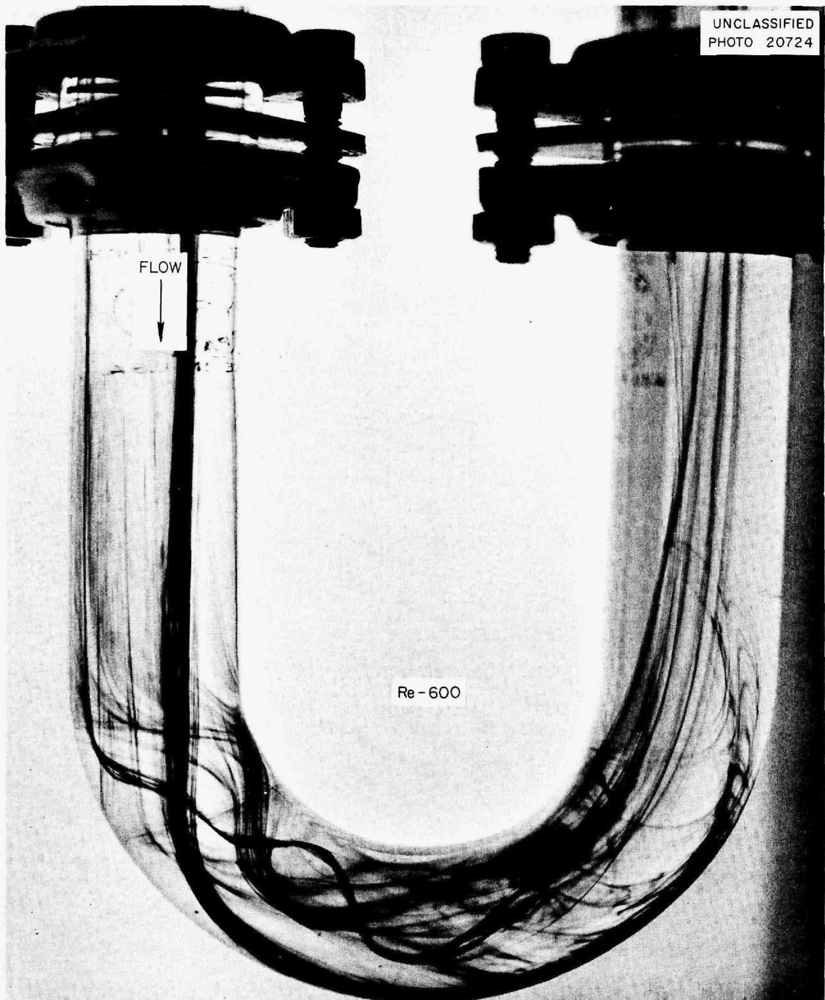  
Fig. 1.2. Diffusion of Dye Filaments in a Mockup of a Fuel Tube at a Reynolds Number of 600 (Second 180-deg Bend).

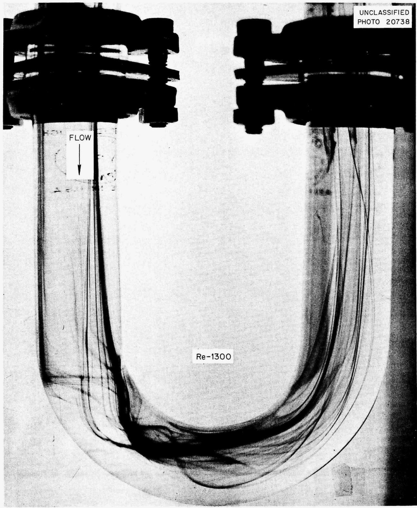  
Fig. 1.3. Diffusion of Dye Filaments in a Mockup of a Fuel Tube at a Reynolds Number of 1300 (Second 180-deg Bend).

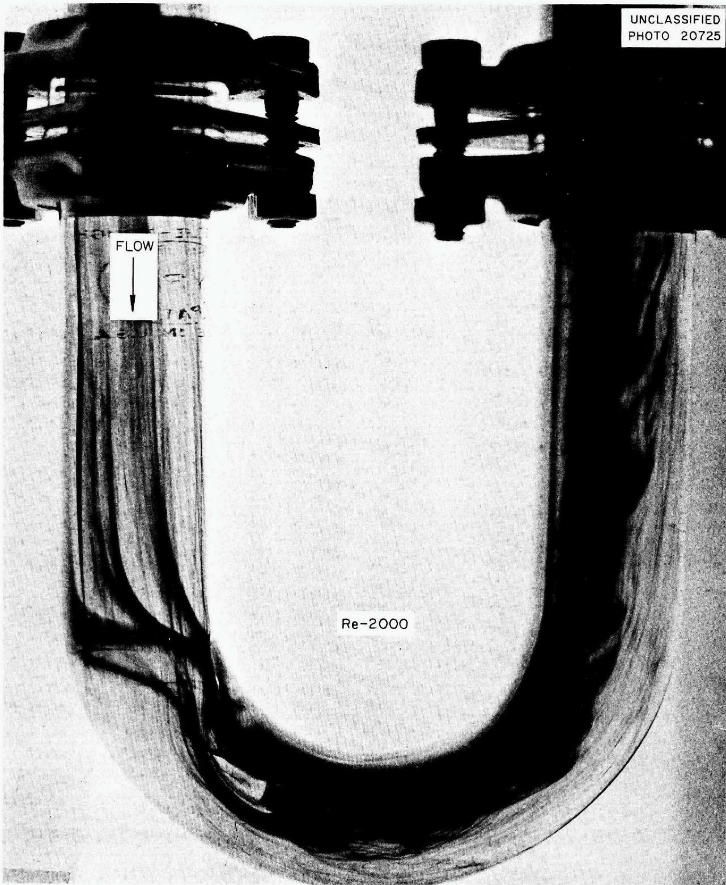  
Fig. 1.4. Diffusion of Dye Filaments in a Mockup of a Fuel Tube at a Reynolds Number of 2000 (Second 180-deg Bend).

# REACTOR PHYSICS

W. K. Ergen J. Bengston

C. B. Mills, ANP Division

The UNIVAC multigroup calculations and the locally performed two-group calculations gave values which show that the reduction of the poisoning by the control rod sleeves has brought the ARE uranium requirement in the pressure shell to well below the 40 lb permissible from the viewpoint of uranium allocation and ARE technology. The delayed neutrons lost from the reactor by fuel circulation are predominantly those of long decay constants, and hence a small amount of excess reactivity makes it unnecessary for the reactor to wait for the long-delayed neutrons. Small excess reactivities will bring the reactor to relatively short-time constants (10 sec or so), but when the reactor is at such a time constant it is still substantially below the prompt-critical condition because the short-delayed neutrons are not appreciably reduced by fuel circulation. Speculation as to the xenon poisoning shows that the poisoning effect would be easily observable if the xenon were not lost from the fuel and if the xenon cross section were as large for the ARE as it is for low-temperature reactors. Failure to observe the poisoning might mean that $Xe^{135}$ or its parent iodine had evaporated from the fuel, or it might mean that the effective xenon cross section was reduced by the high moderator and neutron temperature. In the latter case, xenon poisoning would still be a problem in high-powered reactors of the ARE type.

# Critical Mass

The multigroup calculations made by using the UNIVAC at New York University and essentially the method previously employed2 by the ANP Physics Group have now yielded fairly reliable, though not yet final, data regarding the uranium requirement of the ARE. These data are in agreement with data obtained by the two-group method. They indicate that the elimination of much of the poison originally incorporated into the control rod sleeves has brought the mass requirement to about $15\%$ below the 40 lb which would be permissible from the viewpoint of phase diagrams, corrosion, and allocation.

# Effect of Delayed Neutrons

About one half the delayed neutrons are given off outside the reactor and lost from the chain reaction. These delayed neutrons are predominantly those with long-lived precursors. Most of the short-lived precursors decay before they are swept out of the reactor, and their delayed neutrons are hence not appreciably reduced by the fuel circulation. Since the neutrons with the long delay times are not very effective, it will take only a small excess reactivity to allow the chain reaction to proceed without "waiting" for these neutrons. A small excess reactivity will hence bring the reactor to a relatively short time constant of about 10 seconds. When the reactor is operating at full power, it will probably exhibit small reactivity fluctuations, and this may temporarily bring the reactor from just critical (infinite period) to a period as low as 10 seconds. Hence, it might be difficult to keep the reactor steadily at a period longer than 10 seconds. It should be noted that reactivity fluctuations are not expected at low power operation so that it should be possible to operate the reactor on a 30-sec period during the preliminary, low-power experiments. Because of the only slightly reduced effectiveness of neutrons with short delay times, the amount of additional reactivity required to bring the reactor from a 10-sec period to prompt critical is quite substantial, and the fuel circulation of the ARE does not appreciably reduce this safety feature below its value familiar in stationary-fuel reactors.

# Xenon Poisoning

Renewed consideration was given to the problem of xenon poisoning of the ARE. There is reason to believe that the Xe135, and probably also its parent iodine, will evaporate from the fuel so that the xenon poisoning effect will not occur in a reactor of the circulating-fluoride-fuel type. Confirmation of this would be a major accomplishment of the ARE. To investigate the problem experimentally, the reactor would have to be run for a time somewhat shorter than the half life of 1135 at full power and then reduced to very low power. If the xenon poisoning is appreciable, the reactivity will exhibit the characteristic behavior of first dropping because of xenon formation by 1135 decay and of then increasing because of Xe135 decay. Calculations performed by standard methods3 show that this behavior should be easily detectable if the iodine and xenon do not evaporate from the fuel. If the behavior is not found it could mean

that the poison is given off. However, it could also mean that the xenon poisoning is largely reduced by the high moderator and neutron temperature and that the xenon cross section is rather low for neutrons that are somewhat faster than room-temperature thermal neutrons. If the latter explanation were correct, xenon, even with reduced cross section, would be a poison for reactors of higher power than the ARE.

There is the interesting possibility that the xenon, and maybe the iodine, is released from the fuel at a rate comparable to the rate of radioactive decay. If so, the build-up and decay of the xenon poisoning could still be observed, but the time constants would be different. A quantitative analysis of the reactivity following a full-power run would disclose this situation. There is also the theoretical possibility that other fission fragments have large absorption resonances at neutron energies above those corresponding to the xenon resonance. In high-temperature reactors such as the ARE, these poisons might conceivably be observable.

# THE NaF-ZrF4-UF4 FUEL

The reactor fuel will be obtained by the addition of a sufficient amount of the fuel concentrate, $\mathrm{Na}_2\mathrm{UF}_6$ , to the fuel solvent, $\mathrm{NaZrF}_5$ , to make the reactor critical. It is expected that the final fuel composition will contain approximately 5.5 mole % $\mathrm{UF}_4$ . In lieu of more precise knowledge of the ultimate fuel composition, extensive material research and physical property measurements have been conducted on the fuel composition with 4 and with 6.5 mole % $\mathrm{UF}_4$ , as well as on the carrier and solvent. About 3300 lb of the carrier has been produced and is being held under helium pending its use in the experiment. The batch production of the fuel concentrate is nearing completion. The impurities in all but one of these batches were exceptionally low, averaging (not including the one poor batch) 48 ppm of Fe, 16 ppm of Cr, and 46 ppm of Ni.

# Physical Properties

# H. F. Poppendiek

Reactor Experimental Engineering Division

The densities and viscosities of the fuel solvent, NaZrF₅, and of the fuel concentrate, Na₂UF₆, are being measured; these properties of the fuel with 6.5 mole % UF₄ were reported previously.4 Pre

liminary density and viscosity values for $\mathsf{Na}_2\mathsf{UF}_4$ are: viscosity, 17.5 cp at $725^{\circ}\mathsf{C}$ , 9.9 cp at $975^{\circ}\mathsf{C}$ ; density, 5.598 - 0.00119 T g/cm³, where $660^{\circ}\mathsf{C} < T < 1000^{\circ}\mathsf{C}$ .

# Fuel Production

G.J.Nessle J.E.Eorgan

F.A.Doss

Materials Chemistry Division

Production of the required 3300 lb of $\mathsf{NaZrF}_5$ is now complete, and the material is being held under helium pending its use in the ARE. Processing of the 253 lb of U235 to produce the fuel concentrate, $\mathsf{Na}_2\mathsf{UF}_{61}$ is nearing completion.

The fuel concentrate is being produced by the Y-12 Production Division to permit control of the large quantities of enriched uranium (93.5% U $^{235}$ ) involved. Several weeks were spent training operators in the handling of the equipment, as well as in testing the equipment. A few necessary changes and repairs were made at that time. The production equipment and the processing technique are essentially the same as those previously described for fuel solvent production.

The concentrate will be produced in 15 batches of approximately 30 lb each. It has proved possible, after some simple operational changes, to process three batches of material per week. However, three weeks of down-time have been necessary during this period because of analytical difficulties and lack of approval of an additional uranium allotment. To date, 10 of the required 15 batches have been processed, and it is estimated that the production operation will be completed before December 1.

As the material was produced by the Y-12 Production Division for use in the ARE, analyses of the material were made by both the Y-12 and the ORNL groups involved. Any differences in these analyses were to be explained and corrected by using, if necessary, the triplicate sample originally taken before production operations proceeded. The analytical situation appears quite satisfactory at present, insofar as production control and fissionable material accountability is concerned. Some discrepancies between the two laboratories have occurred in determinations of the uranium content of the UF; these difficulties have

# ANP QUARTERLY PROGRESS REPORT

been shown to be due to faulty sampling of some poorly milled $\mathsf{UF}_4$ . Agreement between the laboratories on uranium content of the $\mathsf{Na}_2\mathsf{UF}_6$ has been excellent; tentative plans call for accountability transfer of the material on the basis of these analyses.

A comparison of the analytical data for eight of the ten batches for which results are available is shown in Table 1.1. It should be noted here that the Y-12 laboratory used spectrographic analysis for determining the metallic impurities, while the ANP laboratory used chemical methods of analysis. In general, the agreement is exceptionally good. One batch (AREU-4) must, on

the basis of these figures, be reprocessed to lower the impurities to an acceptable level.

# Corrosion of Inconel

G. M. Adamson

W. D. Manly

Metallurgy Division

The corrosion of Inconel by fluoride fuels has been discussed at length in this and preceding quarterly reports. In loop tests in which the fluoride is circulated at 4 gpm by thermal convection, the maximum depth of attack is less than 10 mils after 500 hr at $1500^{\circ}\mathrm{F}$ . The recent corrosion data emphasize the value of minimizing the impurities in the fluoride and, to a lesser extent,

TABLE 1.1. COMPARISON OF ANALYTICAL RESULTS FOR SAMPLES OF ARE FUEL CONCENTRATE   

<table><tr><td rowspan="3">BATCH NO.</td><td rowspan="3">LABORATORY</td><td colspan="7">COMPOSITION ANALYSIS</td></tr><tr><td colspan="3">Weight Fraction (g/g)</td><td colspan="4">Impurities (ppm)</td></tr><tr><td>U</td><td>Na</td><td>F</td><td>Fe</td><td>Cr</td><td>Ni</td><td>B</td></tr><tr><td>AREU-1</td><td>Y-12*</td><td>0.59534</td><td>0.1142</td><td>0.2881</td><td>25</td><td>25</td><td>35</td><td>1</td></tr><tr><td>(310423)</td><td>ANP**</td><td>0.59521</td><td>0.1225</td><td>0.2830</td><td></td><td>20</td><td>20</td><td></td></tr><tr><td>AREU-2</td><td>Y-12</td><td>0.59529</td><td>0.1158</td><td>0.2865</td><td>23</td><td>11</td><td>53</td><td>0.2</td></tr><tr><td>(310430)</td><td>ANP</td><td>0.59598</td><td></td><td></td><td>80</td><td>20</td><td>90</td><td></td></tr><tr><td>AREU-3</td><td>Y-12</td><td>0.59702</td><td>0.1168</td><td>0.2879</td><td>30</td><td>20</td><td>50</td><td>0.2</td></tr><tr><td>(310431)</td><td>ANP</td><td>0.59661</td><td></td><td></td><td>75</td><td>20</td><td>20</td><td></td></tr><tr><td>AREU-4</td><td>Y-12</td><td>0.59470</td><td>0.1160</td><td>0.2876</td><td>150</td><td>12</td><td>7400</td><td>0.2</td></tr><tr><td>(310432)</td><td>ANP</td><td>0.59577</td><td></td><td></td><td>220</td><td>25</td><td>475</td><td></td></tr><tr><td>AREU-5</td><td>Y-12</td><td>0.59637</td><td>0.1171</td><td>0.2883</td><td>14</td><td>6</td><td>21</td><td>0.2</td></tr><tr><td>(310433)</td><td>ANP</td><td>0.59649</td><td></td><td></td><td>60</td><td>20</td><td>35</td><td></td></tr><tr><td>AREU-6</td><td>Y-12</td><td>0.59548</td><td>0.1174</td><td>0.2905</td><td>21</td><td>9</td><td>42</td><td>0.2</td></tr><tr><td>(310434)</td><td>ANP</td><td>0.59582</td><td></td><td></td><td>60</td><td>20</td><td>45</td><td></td></tr><tr><td>AREU-7</td><td>Y-12</td><td>0.59513</td><td></td><td></td><td>35</td><td>6</td><td>67</td><td>0.2</td></tr><tr><td>(310435)</td><td>ANP</td><td>0.59583</td><td></td><td></td><td>100</td><td>20</td><td>65</td><td></td></tr><tr><td>AREU-8</td><td>Y-12</td><td>0.59530</td><td></td><td></td><td>32</td><td>6</td><td>56</td><td>0.2</td></tr><tr><td>(310437)</td><td>ANP</td><td>0.59544</td><td></td><td></td><td>75</td><td>20</td><td>50</td><td></td></tr></table>

*Fe, Cr, and Ni contents were obtained by spectrographic analysis.   
\*\* ANP analyses were made by wet chemical means.

the value of clean container systems. Additives to the fluoride, such as $\mathsf{ZrH}_{2}$ , which would serve to reduce the impurities in the fluoride mixtures and hence the fluoride corrosion, are being evaluated. For a detailed report of the investigation of the effect of various parameters on corrosion in the fluoride-Inconel system, as well as of the postulated mechanism, see sec. 6, "Corrosion Research."

# PUMPS

H. W. Savage

W. R. Huntley

W.G.Cobb

A. G. Grindell

ANP Division

Developmental work on the gas-sealed pumps and auxiliaries for the ARE has progressed to the point where acceptance tests of the pumps for the ARE and the mockup reliability test of a spare pump and auxiliaries are being performed.

Parts for the two fuel and two sodium gas-sealed sump-type pumps are being received; one pump has been completely assembled and two others are almost complete. The pumps for the two systems will be identical except for minor differences in the impeller designs and the volumes of the sump tanks, since the fuel pump sump tank must provide volume for the addition of the fuel concentrate, as well as for the thermal expansion of the fuel. The operating characteristics of these pumps, as well as of the components, and the design of the pump auxiliary systems for oil and dibutylcarbitol distribution are being determined on a prototype sodium pump. The fuel pump auxiliary system design will be the same as that determined for the sodium pump, since the requirements of the latter will be the more severe.

# Prototype Sodium Pump Test

The tests of the gas-sealed sump pump with NaF-ZrF4-UF4 (50-46-4 mole %) were reported previously. This pump is a prototype of those being assembled for the ARE. The termination of these tests was caused by bearing noises which were determined to be the result of slippage of the inner bearing race on the shaft. The bearing race and the shaft were altered to give a 0.0002-to 0.0004-in. interference fit between them in an attempt to eliminate the slippage. Subsequent

operation of the pump with sodium was terminated after more than 300 hr at $1200^{\circ}\mathrm{F}$ , because a gasket leak at the parting face of the pump casing allowed sodium to jet against the top flange near the primary gas seal. No further bearing trouble was experienced during the tests, and postrun examination revealed no bearing or shaft wear. It is therefore concluded that altering the interference fit between the bearing and the shaft did successfully eliminate the slippage that occurred in the previous tests.

Postrun examination showed that sodium vapor had no deleterious effect on the silver-impregnated graphite seal material. To confirm this, silver-impregnated graphite was immersed in sodium at $300^{\circ}\mathrm{F}$ for 150 hr in a laboratory test, and again no harmful effects could be observed. The test to determine the reliability of the secondary gas seal at high system pressure (50 psig) was not completed because of the gasket leak which brought about early termination of pump operation. This test is now being made without sodium in the pump.

It was found that gas entrained during pump startup could be rejected in $\frac{1}{2}$ min at a pumping rate of 35 gpm and in 4 min at a pumping rate of 125 gpm. Since there is no apparent demand for higher pumping rates during startup, the degassing characteristic appears to be satisfactory.

# Pump Auxiliaries

The auxiliary systems for the ARE pumps are (1) a system for circulating light spindle oil as shaft coolant and seal lubricant and (2) a system for circulating dibutylcarbitol, which acts as a heat barrier between the sump tank liquid and the gas seal. With the prototype sodium pump operating at $1500^{\circ}\mathrm{F}$ , heat loads of 11,000 Btu/hr in the dibutylcarbitol from the seal-cavity cooling annulus and 7,000 Btu/hr in the light spindle oil used as shaft and bearing lubricant were found. This heat was removed by water in external heat exchangers.

The tests conducted with the prototype pump to determine heat loads of the shaft- and seal-cooling circuits showed the need for redesign of these circuits to eliminate the rotary union in the shaft-cooling circuit at the upper end of the pump shaft. The cooling circuits have been modified, and the cooling and lubricating oil now enters the bearing housing between the upper bearing and the lubricant-to-air face seal. Upon entry, the oil is divided; some of it trickles over the bearings for lubrication

and heat removal and the other portion passes into the hollow shaft for heat removal. All the oil collects below the bottom bearing in a cavity outside the primary face seal. It flows from the cavity by gravity through nine $\frac{1}{4}$ -in.-dia connections at the bottom of the bearing housing to the lubricant reservoir for cooling and recirculation.

Heat exchanger tests indicate that eight pumps will be required for the pump lubrication (oil) system, that is, one operating and one spare pump for each of the sodium and fuel pumps. One pump and its spare will suffice for the dibutylcarbitol system for all sodium and fuel pumps. These auxiliary lubrication and coolant pumps have been checked and found to be satisfactory.

# Impeller Fabrication

All the Inconel impeller castings made by the vendor have been rejected because of imperfections such as sand inclusions, cold shots in the cast metal, and porosity. Each of these imperfections could result in pump failure because of structural failure of the impeller vanes or because the removal of sand inclusions and metal particles in the cold shots would cause intolerable unbalance of the impeller. As a consequence of these rejections, impellers for ARE pumps are being fabricated from Inconel plate stock. Impellers for the sodium pumps (high flow) will have curved vanes to provide heat and flow characteristics similar to those of the cast impellers. Impellers for the fuel pumps (low flow) will be drilled, and, although somewhat less efficient than the curved-vane impellers, they will be easier to fabricate.

# Acceptance Tests

Test equipment has been designed and some of it has been placed in operation for running acceptance tests on all ARE pumps. These tests will include (1) water tests to determine head, flow, and efficiency of each pump, (2) short-time, cold, run-in tests of seals at 65 psig, and (3) hot tests at ARE temperature, flow, and pressure conditions. The water test equipment is now in operation, and an all-Inconel loop is being fabricated for the hot tests. The hot test loop will include an ARE-type gas control system and the cooling and lubricating circuits described above. One ARE pump has been assembled and checked with cold water. The performance of the pump in this preliminary test was acceptable.

# FLUID CIRCUITS

G. D. Whitman

ANP Division

G.A.Cristy

Engineering and Maintenance Division

Except for the installation of the pumps, the external fuel and sodium systems are essentially completed. Installation of heaters and insulation on these systems is about $65\%$ complete. Additional tests of the bellows-seal and the frangible-disk valves have demonstrated the reliability of each under ARE operating conditions. A flow diagram showing the major fluid circuits and design-point operating conditions is presented in Fig. 1.5.

# Fuel System

One fuel pump casing has been received and installed in the fuel system; the other is expected early in December. Only seven welds remain to be made before the system, including the spare pump, is completed; some operational tests may be undertaken before installation of the spare pump. The fuel fill-and-flush tanks have been thoroughly cleaned by hot-water flushing and dried by prolonged evacuation at slightly elevated temperatures (around $200^{\circ}\mathrm{C}$ ).

# Sodium System

The status of the sodium system is comparable to that of the fuel system. Assembly of the sodium piping is essentially complete, except for 17 welds that are in the vicinity of either the pump casings or of the reactor.

# Valves

The valve tests reported previously indicated that the valves to be used in the ARE would give satisfactory performance if held at a temperature of $1200^{\circ}\mathrm{F}$ or below. The only additional information on bellows-seal valves involves operational tests at 1100 to $1275^{\circ}\mathrm{F}$ after the valve had first been held for some time at $1300^{\circ}\mathrm{F}$ in contact with the fluoride $\mathrm{NaF - ZrF_4 - UF_4}$ (50-46-4 mole%). In these latter tests, there was no leakage but some sticking; the operation at $1300^{\circ}\mathrm{F}$ apparently softened the sealing surfaces. The pressure required to open the stuck valves increased rapidly and then leveled off as the valve-closed time was increased; at no time, however, did the pressure exceed 30 psig.

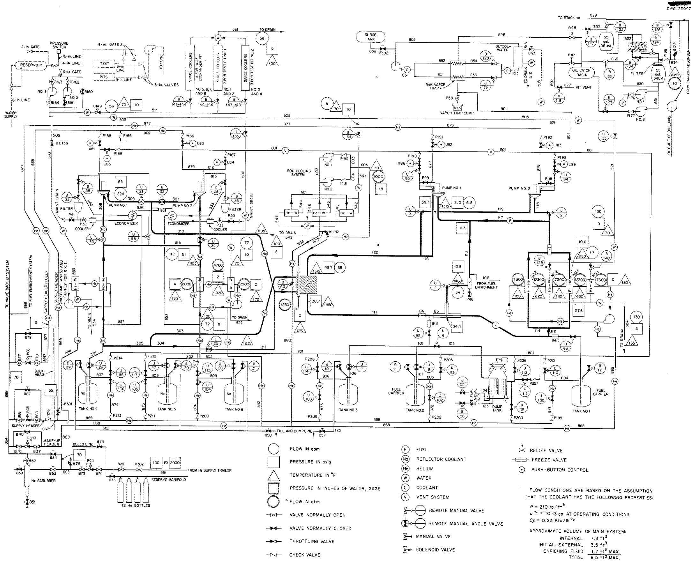  
Fig. 1.5. Aircraft Reactor Experiment Flow Diagram.

Additional data are also available from tests of the frangible-disk valves operated in the fluoride fuel. The frangible-disk valve was held in contact with molten fuel at a temperature of about $1300^{\circ}\mathrm{F}$ for 160 hr and was opened immediately by the actuator at the end of this period. The valve operation was normal in every way. These tests on ARE-type valves in fluoride mixtures have produced confidence in the valves that are to be used in the ARE, and no serious valve problems are anticipated in the operation of the experiment. All frangible-disk valves have been completely fabricated, tested, and installed. All the Fulton-Sylphon valves were thoroughly flushed and tested with helium for leak tightness across the valve seat.

# Auxiliary Systems

The helium heat exchanger loops and the associated hydraulic systems have been completed and tested in air. These tests have shown that the systems have lower pressure drop than calculated, which will result in lower operational speeds and consequently greater factors of safety (or greater heat transfer capacity).

The pit for the secondary off-gas system has been completed, and about $75\%$ of the piping for the system has been installed. The planned program for inspecting and testing of individual systems is being put into operation as rapidly as the installations are completed.

# INSTRUMENTATION

R.G.Affel

ANP Division

The detailing of all instrumentation is essentially complete. System changes have necessitated the

ordering of several small components which will arrive soon. Approximately two man-weeks of labor will be required before the control room is ready for complete testing. The flux servo system was installed and tested with simulated error signals. Ninety per cent of the needed copper tubing $(12,000^{+}\mathrm{ft})$ is installed. All this tubing is to be checked for leaks. The major jobs remaining to be done are checking and testing.

# REACTOR AND FLUID CIRCUIT CLEANING

L.A.Mann

ANP Division

F. F. Blankenship

Materials Chemistry Division

G. A. Adamson

Metallurgy Division

G. A. Cristy

Engineering and Maintenance Division

Corrosion tests have repeatedly demonstrated the deleterious effects of surface contamination of container metals and of impurities in the fluoride mixture on the corrosive attack on the container. Accordingly, both the sodium and the fuel systems will be cleaned. The methods and procedures to be followed in cleaning these systems have been established by a group consisting of representatives from the ANP chemical, metallurgical, engineering, and ARE groups. The complete, final report of this committee has been issued, and a brief outline of the procedures is given below in the order in which they will be used.

<table><tr><td>TEST</td><td>TEMPERATURE</td><td>PURPOSE</td></tr><tr><td colspan="3">Reactor Fuel Tubes</td></tr><tr><td>1. Helium pressure test</td><td>Room</td><td>Leak test</td></tr><tr><td>2. Flush with hot, high-velocity water</td><td>150 to 180°F</td><td>Remove foreign material</td></tr><tr><td>3. Flush with distilled water</td><td>Room</td><td>Replace dirty water</td></tr><tr><td>4. Purge with helium</td><td>Room</td><td>Remove water</td></tr><tr><td>5. Dry by evacuation</td><td>Room</td><td>Complete removal of water</td></tr><tr><td colspan="3">Fuel System Without Reactor</td></tr><tr><td>1. Flush components with hot water</td><td>150 to 180°F</td><td>Remove foreign material</td></tr><tr><td>2. Rinse with distilled water</td><td>Room</td><td>Replace dirty water</td></tr><tr><td>3. Helium pressure test</td><td>Room</td><td>Leak test</td></tr><tr><td>4. Circulate hot water with detergent7</td><td>150 to 180°F</td><td>Remove grease</td></tr><tr><td>5. Drain and evacuate</td><td>Room</td><td>Remove dirty water</td></tr></table>

The detergent to be used is "Kon Kleen," active ingredient, sodium metasilicate.

TEST

TEMPERATURE

PURPOSE

# Sodium System Without Reactor

1. Flush components with hot water

150 to 180°F

Remove foreign material

2. Rinse with distilled water

Room

Replace dirty water

3. Helium pressure test

Room

Leak test

4. Circulate hot water with detergent

150 to $180^{\circ}F$

Remove grease

5. Drain

Room

Remove dirty water

6. Rinse with distilled water

Room

Remove all traces of dirt

7. Alternate evacuation and helium purging

Up to $600^{\circ}F$

Remove moisture

# Fuel System with Reactor, Part 18

1. Pressure test

Room

Leak test

2. Circulate hot water with detergent

150 to $180^{\circ}F$

Remove grease

3. Rinse with tap water

Room

Remove cleaning water

4. Rinse with distilled water

Room

Remove all contamination

5. Alternate evacuation and helium purging

UP to $600^{\circ}\mathrm{F}$

Remove moisture

6. Vacuum rate of rise

Up to 600 F

Leak test

7. Hot gas test; argon in fuel tubes, helium in annulus

Up to $600^{\circ}F$

Leak test

# Sodium System with Reactor

1. Alternate evacuation and helium purging

Up to $600^{\circ}F$

Remove moisture

2. Circulate sodium

$600^{\circ}F$

Clean and leak test

# Fuel System with Reactor, Part II8

1. Heat reactor and fuel piping

1200°F

Above fluoride mixture melting point

2. Evacuate

1200°F

To fill system

3. Circulate solvent, NaZrF 5

1100°F

Clean and leak test

4. Replace with clean solvent

1100°F

Ready for operation

# FUEL RECOVERY AND REPROCESSING

D. E. Ferguson

F. N. Browder

G. I. Cathers

Chemical Technology Division

# Transportation of Fuel

Although the basic outline of an aqueous processing method to be used for ARE fuel recovery has been established,9 the method of transporting the fuel from the reactor to the processing site

will somewhat affect the details of the dissolution procedure. A comparative study indicated that the most satisfactory method would be transportation of the solid fuel in partially filled open-top aluminum cans. A measured amount of the molten fuel would be poured into the cans and allowed to solidify, and the cans would be transported one at a time to the Metal Recovery Building where both can and contents would be dissolved. The use of open-top instead of sealed cans would simplify the remote-filling operation and decrease the dissolution time. None of the valuable material should be lost as a result of fragmentation of the charge if there is sufficient freeboard in the aluminum container.

To illustrate the feasibility of canning molten fluorides in metallic aluminum, three 10-kg batches

of NaF-ZrF $_4$ .UF $_4$ (50-46-4 mole %) were transferred to air-cooled aluminum containers. Each of the cans, two with 0.065-in. walls and one with a 0.25-in. wall, withstood the test in which the fluoride temperature was $600^{\circ}\mathrm{C}$ . It was discovered that the thin-walled cans should not be subjected to more than 5-in. vacuum or 5-psig pressure.

Previously, cans approximately 5 in. in diameter for transporting $6.6\mathrm{kg}$ of fuel plus flush material, which would contain $0.5\mathrm{kg}$ of $\mathsf{U}^{235}$ if the mixture were homogeneous (or a maximum of $1\mathrm{kg}$ of $\mathsf{U}^{235}$ if the mixture were not homogeneous), were considered. $^{10}$ This amount of fuel would dissolve to give about 35 gal of solution.

The process appears to be most attractive if $4\mathrm{kg}$ of uranium per container, which amounts to $53\mathrm{kg}$ of fuel plus flush (assuming a homogeneous mixture), can be transported and charged to the 500-gal dissolver to make one 265-gal batch of solution. For this size batch, the containers would be about 9 in. in diameter and 18 in. long. This quantity would be more compatible with the size of the Metal Recovery Building equipment, and the number of containers required to transport the 80 to $100\mathrm{kg}$ of $\mathsf{U}^{235}$ would be reduced from 100 to about 25. Processing of $4\mathrm{kg}$ of $\mathsf{U}^{235}$ per batch in the existing dissolver is subject to approval by the Criticality Hazards Committee.

Another method of dissolving the fuel involves introducing it to the dissolver in the molten state. If this method were used, the fuel could be transported in a special can that would hold about $25\mathrm{kg}$ of $\mathsf{U}^{235}$ . The advantages of this method are the

rapidity of the dissolution and the decrease in the number of truck trips required for the transportation. The disadvantages are the difficulty of providing shielding suitable for use in the handling of the molten material and the excessive development work required on equipment that would have to be built into the cans, for example, heaters for remelting the fuel if it solidified before the dissolution was carried out, temperature-measuring instruments, and devices for controlling flow. Construction of the dissolver at the ARE site would eliminate the need for constructing transportable shielding and would permit the use of less rugged heaters, but it would require too large a capital expenditure. It would also split the locations of the chemical operations, and additional operators would be required.

# Rate of Dissolution of ARE Fuel

Based on the results of laboratory dissolution experiments, a dissolution time of 6 to 12 hr is estimated for a 53-kg charge of ARE fuel. For a 6.6-kg batch, a dissolution time of 3 to 6 hr is estimated. A reliable value for the dissolution time cannot be calculated from the data obtained in these small-scale experiments, since the dissolution rate is not constant throughout the dissolving.

With a 1-in.-dia cylindrical charge weighing approximately $50\mathrm{g}$ , an initial penetration rate of 0.003 in./min was observed over a 4-min period (Table 1.2). Over the next 3 min, the penetration rate increased to 0.006 in./min, based on the initial dimensions. This increased rate is due to uneven penetration and cracking, which exposes

TABLE 1.2. DISSOLUTION RATE OF SOLID ARE FUEL   
Cylindrical samples 1 in. in diameter tested in boiling $4\text{M}$ nitric acid plus $0.67\text{M}$ aluminum nitrate solution   

<table><tr><td></td><td>INITIAL AREA OF SAMPLE (in.2)</td><td>TIME IN DISSOL VANT (min)</td><td>AMOUNT DISSOLVED (wt %)</td><td>CALCULATED PENETRATION RATE (in./min)</td></tr><tr><td>First immersion</td><td>3.5</td><td>4</td><td>8.7</td><td>0.003</td></tr><tr><td>Second immersion</td><td>3.5</td><td>3</td><td>23</td><td>0.006</td></tr><tr><td>First immersion</td><td>5.2</td><td>5</td><td>13</td><td>0.005</td></tr><tr><td>First immersion*</td><td>3.9</td><td>2</td><td>2.2</td><td>0.002</td></tr></table>

more surface area. In a second experiment, a penetration rate of 0.005 in./min was observed over a 5-min interval. After the 5-min period, the sample had broken up into several smaller pieces. Another fresh sample tested in a solution that already contained a normal complement of dissolved fuel gave a penetration rate of 0.002 in./min; however, in the final stage of an actual dissolution, the charge would probably have broken up to expose a very large surface area per unit weight. Based on these results, the average penetration rate will probably exceed 0.006 in./min.

The sample charges for these experiments were prepared by pouring molten fuel (NaF-ZrF₄-UF₄, 50-48-2 mole %) into a split graphite mold and cooling. The pit formed by contraction on cooling was removed by pressing the cylinder against a hot metal plate. The sample was placed in the dissolvent (boiling 4 M nitric acid and 0.67 M aluminum nitrate solution) and then removed and weighed after a measured interval to determine the amount dissolved.

Since the scale-up of these laboratory data is inconclusive, three charges will be poured into aluminum cans, 6 in. in diameter and 9 in. long, and

dissolved to establish the dissolution time more accurately.

# Molten Fuel Dissolution

No excessive violence was observed in several preliminary tests in which molten ARE fuel, at temperatures of over $550^{\circ}C$ , was poured into the aqueous solvent (4 M nitric acid plus 0.67 M aluminum nitrate). On contact with the aqueous phase, the fuel solidified in the form of small irregular particles 1 to 2 mm in diameter and then dissolved at a rate of about 50 g in 10 min, which is comparable with the rate of 50 g in 5 min that had been observed with finely ground fuel. Apparently the only precaution required is to make sure that the addition is slow enough to prevent excessive overheating and overboiling. However, colloidal material has been present in all dissolver solutions prepared to date from molten fuel, possibly as a result of the instability or hydrolysis of zirconium compounds in aqueous solutions at high temperatures. Some modification of the dissolver solution to prevent formation of this material would probably be required if molten fuel dissolution were to be used.

# 2. EXPERIMENTAL REACTOR ENGINEERING

H. W. Savage, ANP Division

The completion of the developmental work on the gas-sealed sump pumps for the ARE has made possible a change in emphasis of the experimental work, and increased effort has been devoted to the development of a hydrodynamic type of bearing and a heat exchanger for the reflector-moderated reactor.

The developmental work on the frozen-sodium-sealed pump for sodium during this quarter included tests of a frozen-sodium shaft seal with a single $\frac{1}{2}$ -in.-long frozen-sodium sealing region backed up with helium pressure in the sealing cavity. The short seal is being developed in an effort to lower the power consumption of the seal and yet maintain the low leakage obtained with the $5^{13}$ in.-long seal previously described. In tests, the new short seal dissipated approximately $\frac{3}{4}$ hp, with no power fluctuations, and it was found that the sodium leakage could be made negligible if back-up pres

sure was used to reduce the pressure differential across the seal. Water tests on the gas-sealed sump pump for the in-pile loop showed fluid gassing to be a problem, and, accordingly, changes are being made in an effort to eliminate this condition. In other tests, the problems associated with developing a canned magnetic-torque-transmitter for a high-temperature pump for aircraft application are being explored.

Since the adoption of the gas-sealed sump pump for ARE operation, seal developmental work has been carried on at a reduced rate; however, tests for rotary shaft and valve stem seals have continued with materials which showed promise in earlier tests. These include graphite packed around a spiral-grooved shaft, graphite and $\mathsf{BeF}_2$ mixtures, a V-ring type seal, and a bronze-wool, graphite, and $\mathsf{MoS}_2$ mixture. Although each of these seals

has performed well under laboratory controlled conditions, none has demonstrated sufficient reliability to warrant adoption in a pump for reactor operation. Also, none of the packing materials tested thus far for valve-stem seals has demonstrated sufficient reliability to replace the bellows as a valve-stem seal.

A hydrodynamic type of bearing which will operate in liquid metals, fused salts, or other fluids at temperatures of up to $1500^{\circ}\mathrm{F}$ is being developed. Materials for this application are being screened in a compatibility testing device, and a test program is being planned for obtaining the bearing characteristics, which are usually represented as friction factor vs. Sommerfeld number.

A heat exchanger incorporating some design features proposed for the reflector-moderated reactor is currently being tested. The fluoride system has operated at above $1200^{\circ}\mathrm{F}$ for over 600 hr, but performance data are not yet available.

A small forced-convection loop is being operated to test corrosion of Inconel in circulating fluoride mixture NaF-ZrF $_4$ -UF $_4$ at high fluid velocities and high temperature differences. The fluid velocities obtained in this loop are a factor of 50 or 60 greater than those of thermal-convection loops, but the Reynolds modulus remains in the laminar region at approximately 1700.

# PUMPS FOR HIGH TEMPERATURE LIQUIDS

W.G.Cobb

W.R.Huntley

A. G. Grindell

W. B. McDonald

D.R.Ward

ANP Division

# Frozen-Sodium-Sealed Pump for Sodium

A frozen-sodium shaft seal with a $\frac{1}{2}$ -in.-long frozen-sodium region backed up with helium pressure in the sealing cavity was tested. This seal differed from the previously tested short seal in that only one $\frac{1}{2}$ -in.-long sealing region was used and the blanket gas was under pressure. The short seal is being developed in an effort to lower the power consumption of the seal and yet maintain the low leakage obtained with the $5^{13}_{16}$ -in.-long seal previously described.

For the first 168 hr of operation with the new short seal, the sodium temperature at the pump was $960^{\circ}\mathrm{F}$ , the suction pressure was 20 psig, and the back-up pressure was 15 psig. The total sodium leakage past the seal during this period was 32 $\mathrm{cm}^3$ or an average of $4.8\mathrm{cm}^3$ per day. Approximately $3/4$ hp was dissipated in the seal and the power trace was smooth.

The Buna N rubber O ring used to seal the backup gas was destroyed during the application of heat to remove the sodium leakage at the end of 168 hr, and the remainder of the testing was accomplished without the use of backup pressure. Operation was continued for a total of 980 hr with a shaft speed of 1800 rpm, a sodium temperature of $960^{\circ}\mathrm{F}$ , and a suction pressure of 12 psig. A slight flow of helium was maintained across the back of the seal. The increase in the pressure differential across the seal from 5 psig during the first part of the test to approximately 12 psig during the remainder of the test resulted in an increase in sodium leakage past the seal to approximately $20\mathrm{cm}^3$ per day.

Erratic power fluctuations caused by sodium oxide migrating to the cold section of the seal became negligible when a standard, cold-trap, bypass filter was installed in the loop. The filter bypasses approximately 0.25 gpm of sodium. Excessive heat loss in the filter (approximately 3 kw) necessitated its redesign to incorporate a heat economizer designed to waste only 0.3 kw. Transit time through the new filter is approximately 6 minutes.

The results of these tests, together with the previously reported results of tests with longer frozen-sodium seals, have led to the conclusion that a frozen-sodium shaft seal is manageable for a sodium pump. A satisfactory length-to-diameter ratio for such a seal is approximately 1 to 5. Leakage of sodium past the seal can be made negligible by using back-up pressure to reduce the pressure differential across the seal. Water cooling is an efficient means of freezing the seal, and several thousand hours of operation have demonstrated that the hazard in using water with a properly designed seal is trivial.

# Gas-Sealed Sump Pump for In-Pile Loop Test

A pump is being developed for in-pile loop tests which is similar to the laboratory-sized gas-sealed pump but which has been scaled down to reduce

the fluid holdup in the pump. Water tests of the first pump constructed show that the pump head and flow are within design specifications; however, a fluid gassing problem exists which indicates that some design changes will be necessary.

While some gassing of the fluid is evident under all operating conditions, its magnitude increases rapidly as the height of the free fluid surface above the suction is decreased or the shaft speed is increased. This indicates that the difficulty is caused by vortexing of the free fluid surface because of shaft rotation. As an initial attempt to suppress vortexing, changes are being made in the antiswirl baffles in the pump, and the opening through which the rotating shaft enters the suction chamber is being moved to a point well below the free surface of the fluid.

# Magnetic-Torque-Transmitter Pump

High-temperature pumps for aircraft application may include a canned magnetic-torque-transmitter pump with the external shaft driven by suitable means, for example, a gas turbine. The problems encountered in building such a torque transmitter are being investigated. Reduced-scale tests have been conducted for determining the expected efficiency of a magnetic torque transmitter at elevated temperatures, the geometry of such a transmitter, and to what extent slippage occurs as a function of temperature.

The first transmitter tested consisted of a permanent magnet outer rotor and a squirrel cage (from a $\frac{1}{40}$ -hp motor) inner rotor. A nonmagnetic stainless steel can separated the driving and driven rotors. The entire assembly (excluding the outboard bearings) was heated to above $1100^{\circ}\mathrm{F}$ , and the slippage rate was appreciable in the temperature range of 600 to $1100^{\circ}\mathrm{F}$ . However, the full $\frac{1}{40}$ -hp torque was transmitted from room temperature to $600^{\circ}\mathrm{F}$ , but the efficiency then dropped off rapidly at higher temperatures. It is yet to be determined whether the drop in efficiency is due to the drop of the flux of the permanent magnet or to lowered resistance of the windings of the rotor. A permanent magnet inner rotor is presently being constructed which will resolve this question.

# ROTARY-RAFT AND VALVE-STEM SEALS FOR FLUORIDES

R.N.Mason P.G.Smith

W.C.Tunnell

ANP Division

# Graphite-Packed Seal for Spiral-Grooved Shaft

Operation of the spiral-grooved shaft with a powdered-graphite-packed seal has continued for over 3000 hr with no detectable leakage of fused fluorides. During this period of operation, heater failure occurred on two occasions and caused the shaft rotation to stop. When repairs were made, operation was resumed with no difficulty.

# Graphite-BeF $_2$ Packed Seal

The previously reported test of a seal packed with a mixture of $80\%$ graphite powder and $20\%$ $\mathrm{BeF}_2$ has now operated for over 3700 hours. The leakage for the past 3500 hr was less than 15 in. Power fluctuations have occurred, and some of them were accompanied by squeaking, which indicated possible metal-to-metal contact between the shaft and the gland.

When this packing material was installed in a tester having a $2\frac{1}{4}$ -in.-dia shaft, excessive graphite and $\mathsf{BeF}_2$ leakage occurred. Investigation disclosed that the temperature during pretreatment was insufficient to fuse the $\mathsf{BeF}_2$ , and thus the seal contained loosely packed material rather than the solidly fused material desired. For the second test, the pretreatment temperature was raised to $1800^{\circ}\mathsf{F}$ , and the $\mathsf{BeF}_2$ -graphite mixture fused solidly. During the dry run of this seal, there was no leakage of powder. The seal region has been operated at a higher temperature (above $975^{\circ}\mathsf{F}$ ) in this test than in previous tests to reduce power fluctuations. There has been some fluoride leakage.

# V-Ring Seal

Operation of the V-ring seal test was continued, and a heater was installed inside the $2\frac{1}{2}$ -in.-dia rotating shaft. During an extended dry run in which the seal was gradually heated to about $1200^{\circ}\mathrm{F}$ , satisfactory sealing of helium was attained. The inert gas blanket and seal gas supply was inadvertently shut off for about 20 min during operation, and, since some damage to the seal rings occurred, satisfactory sealing could no longer be obtained. Examination of the rings after disassembly of the seal showed that the outside

ring was $75\%$ destroyed and the other rings had either oxidized or worn about 0.0005 to 0.0015 in. on the inside diameter; the shaft was undamaged. The outside ring has been replaced and another dry run will be made in an attempt to seal helium at above $1000^{\circ}\mathrm{F}$ before fluorides are introduced.

# Bronze-Wool, Graphite, and MoS $_2$ -Packed Frozen Seal

The test of the bronze-wool, graphite, and $\mathsf{MoS}_2^*$ packed frozen seal continued until operation was terminated at the end of 1198 hr because of leakage of the fluoride mixture NaF-ZrF4-UF4 from a flange. The leakage rate was less than $1\mathrm{cm}^3$ per day with the fluoride pot at $1175^{\circ}\mathrm{F}$ and pressurized to 10 psi.

An additional test was made with the packing annulus reduced from $\frac{3}{4}$ to $\frac{3}{8}$ inch. This test was unsuccessful and was terminated at the end of 211 hours. The failure was attributed to faulty alignment between the shaft and the packing housing.

# Packed Seals for Valve Stems

A series of tests is in progress to determine whether the packing materials which sealed well in the packing penetration tests will seal high-temperature fused salts under simulated valve operating conditions. None of the materials tested has demonstrated sufficient reliability to replace the bellows as a valve-stem seal.

The test apparatus consists of a standard valve stem and bonnet placed in a vertical position with the stem down. The pot in which the molten fluoride mixture is pressurized against the packing in the bonnet is welded to the top of the bonnet. The stem is rotated at frequent intervals to simulate valve operation. Three tests have been completed in which the valve stem was cycled once every 24 hr, and the pressure on the packing was 5 psi. The packings tested were Asbury graphite 805 at $1100^{\circ}\mathrm{F}$ , $90\%$ Asbury graphite 805 plus $10\%$ $\mathsf{BaF}_2$ at $1100^{\circ}\mathrm{F}$ , and $50\%$ graphite (from the Y-12 Carbon Shop) plus $50\%$ $\mathsf{BeF}_2$ at $1350^{\circ}\mathrm{F}$ . Each of these tests was terminated because of fluoride leakage.

# HIGH-TEMPERATURE BEARING DEVELOPMENT

R.N.Mason

P. G. Smith

W.C.Tunnell

W. K. Stair

ANP Division

Developmental work is under way on a hydrodynamic type of bearing which will operate in liquid metals, fused salts, or other fluids at temperatures of up to $1500^{\circ}\mathrm{F}$ . This developmental program will probably be carried out in three phases: (1) test programs to find materials which have low wear and low corrosion rates in the fluids of interest at $1500^{\circ}\mathrm{F}$ , (2) a test program to establish the bearing characteristics, which are usually represented as friction factor vs. Sommerfeld number, and (3) the design and test of a bearing for a particular application using the information obtained in phases 1 and 2. Effort to date has been confined to materials compatibility tests and to an evaluation of the accuracy which may be expected in carrying out the program for obtaining bearing characteristics.

# Materials Compatibility Tests

Initial screening tests for finding materials that possess satisfactorily low wear and low corrosion rates are being made in apparatus in which a $2\frac{3}{4}$ -in.-dia, $\frac{1}{2}$ -in.-thick plate specimen of one material rotates against a $\frac{1}{2}$ -in.-dia stationary pin of another or the same material. The end surface of the pin is ground to a $\frac{1}{2}$ -in.-radius cylinder to approximate line contact along a radial line of the rotating plate at a mean radius of 1 in. from its center (Fig. 2.1). Contact pressure between the plate and pin is maintained by means of an external coil spring and a sliding shaft.

A test was run of the equipment made with a Graphitar plate and an Inconel pin. A Hertz stress (estimated stress in the line of contact) of about 10,000 psi, or a 5-lb force load between the plate and pin, was used. With the test specimens submerged in acetylene tetrabromide to simulate the fluoride melt, it was found that the 5-lb load was insufficient for breaking through the hydrodynamic film and that the film persisted until a load of about 10 lb was applied to give a Hertz stress of about 15,000 psi. The rate of rotation was 850 rpm, which gave a sliding speed of about 7.4 fps. Having determined the load requirement, a series of correlation tests was conducted with plates of type 416 stainless steel rotating against stationary

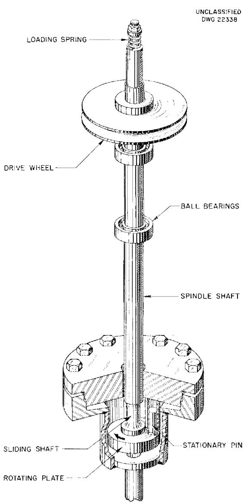  
Fig. 2.1. Bearing Materials Compatibility Tester.

pins made of babbit, a die steel, a high-speed tool steel, Stellar 6, Stellar Star J, and Superoilite. In each case, the stationary pin and the rotating plate were submerged in a regular-grade, Texaco, Regal "A" oil, without additives, that has a viscosity of SUS 40-44 at $210^{\circ}\mathrm{F}$ . The results of this series of tests conformed with those obtained earlier at KAPL.

The first test at a high temperature was made with Graphitar rotating against Inconel in NaF-

$\mathsf{ZrF}_4\cdot \mathsf{UF}_4$ at $1200^{\circ}\mathsf{F}$ for 2 hours. The Graphitar appeared to be scratched lightly and it was warped, while the Inconel specimen appeared to be burred and built up at the rubbing surface.

The following materials are being screened in seesaw corrosion tests: B, ZrC + Fe, MgO + Ni, BeO + Ni, BeO, hot-pressed Al $_2$ O $_3$ , high-density graphite, TiC + Ni, TiC + Co, CrC, B $_4$ C, WC + Co, and WC + Ni. Plates and pins of most of the above materials either have been ordered or will be fabricated.

Combinations of materials which possess both satisfactorily low wear and low corrosion rates based on the qualitative results of the screening tests will subsequently be tested in equipment which simulates a conventional journal and bearing.

# Bearing Characteristics

An evaluation has been made of the accuracy of the data which will be obtained in the test program for determining bearing characteristics. Two experimental approaches for obtaining the data have been reviewed. First, the test may be simply a load-life experimental study to establish reliability of a single bearing design in fluoride melts. Information gained from this approach might or might not be useful in predicting the behavior of other bearings; certainly, the information could be used only with limited assurance. On the other hand, the experimental study may be a performance test in which an effort is made to establish parameters which will describe the bearing characteristics in such a way that they may be employed to determine design configurations other than the one tested.

The information to be obtained by using the second approach is usually presented as a plot of $f_{b}$ vs. $S_{n}$ , where $f_{b}$ is the bearing friction factor (dimensionless) and $S_{n}$ is the Sommerfeld variable (dimensionless):

$$
S _ {n} = \frac {\mu N}{P} \left(\frac {r}{c}\right) ^ {2} \tag {1}
$$

and

$$
f _ {b} = f \left(\frac {r}{c}\right), \tag {2}
$$

where

$$
\begin{array}{l} \mu = \text {a b s o l u t e v i s c o s i t y o f l u b r i c a t i n g f l u i d}, \\ \mathrm {I b} _ {f} - \sec / \mathrm {i n}. ^ {2}, \end{array}
$$

$N =$ journal speed, rps,

$P =$ unit bearing load, psi,

$r =$ journal radius, in.,

$c =$ radial clearance, in.,

$f =$ coefficient of bearing friction.

The significance of these relationships in design work will depend on their accuracy, which can be defined in terms of the accuracy to be associated with each of the variables. The fractional precision of $S_{n}$ will depend upon the fractional precision of $\mu, P, N, r,$ and $c$ , and it may be shown that

(3) $P_{S_n}^2 = \left(\frac{\partial S_n}{\partial\mu}\right)^2 P_{\mu}^2 +\left(\frac{\partial S_n}{\partial N}\right)^2 P_N^2$

$$
\begin{array}{l} + \left(\frac {\partial S _ {n}}{\partial P}\right) ^ {2} \quad P _ {P} ^ {2} + \left(\frac {\partial S _ {n}}{\partial r}\right) ^ {2} \quad P _ {r} ^ {2} \\ + \left(\frac {\partial S _ {n}}{\partial c}\right) ^ {2} P _ {c} ^ {2}, \\ \end{array}
$$

where $P_{S_n}, P_{\mu'} \ldots$ represent the probable errors of $S_{n'}, \mu', \ldots$ . Taking the partial derivative of $S_{n}$ with respect to $\mu, N, \ldots$ and substituting in Eq. 3 gives

(4) $P_{S_{n}}^{2} = \left(\frac{S_{n}}{\mu}\right)^{2} P_{\mu}^{2} + \left(\frac{S_{n}}{N}\right)^{2} P_{N}^{2}$

$$
\begin{array}{l} + \left(\frac {S _ {n}}{P}\right) ^ {2} P _ {P} ^ {2} + 4 \left(\frac {S _ {n}}{r}\right) ^ {2} P _ {r} ^ {2} \\ + 4 \left(\frac {S _ {n}}{c}\right) ^ {2} P _ {c} ^ {2}, \\ \end{array}
$$

and dividing both sides by $S_{n}^{2}$ gives

(5) $\left(\frac{P_{S_n}}{S_n}\right)^2 = \left(\frac{P_\mu}{\mu}\right)^2 + \left(\frac{P_N}{N}\right)^2 + \left(\frac{P_P}{P}\right)^2$

$$
+ 4 \left(\frac {P _ {r}}{r}\right) ^ {2} + 4 \left(\frac {P _ {c}}{c}\right) ^ {2}.
$$

As an example, suppose that it is desired to evaluate $S_{n}$ with a precision of $\pm 10\%$ . If it is assumed, for the first approximation, that each of the quantities $\mu, N, P, r,$ and $c$ may be measured with the same precision, then

$$
\frac {P _ {x}}{x} = \sqrt {\frac {1}{1 1} \left(\frac {P _ {S _ {n}}}{S _ {n}}\right) ^ {2}} = \sqrt {\frac {1}{1 1}} (0. 1) = 0. 0 3 0 2,
$$

and $P_{x} / x$ is the fractional precision of $\mu, N, P, r,$ or $c$ . The variables $N, P,$ and $r$ can be measured to even greater precision than that required for the example given above, but it is doubtful whether $\mu$ or $c$ can be measured to even this fractional precision. In this case, it may be assumed that $N, P,$ and $r$ are measured without error, and $P_{\mu} / \mu$ and $P_{c} / c$ are then found to have a fractional precision of

$$
\frac {P _ {x}}{x} = \sqrt {\frac {1}{5} (0 . 1) ^ {2}} = 0. 0 4 4 7.
$$

It is possible to measure $c$ with this degree of precision, but $\mu$ is likely to involve a much larger error; thus, if it were necessary to evaluate $S_{n}$ to $\pm 10\%$ , the measuring technique for $\mu$ would have to be much refined.

Equation 5 may be used to indicate the resulting precision of $S_{n}$ for the case in which the probable errors in $\mu, N, P, r,$ and $c$ are known. As an example, a journal bearing in a fluoride mixture under the following typical operating conditions will be considered: speed, 1800 rpm; unit load, 20 psi; journal radius, 1 in.; fluoride temperature, $1200^{\circ}\mathrm{F}$ ; radial clearance between bearing and sleeve, 0.0015 inch. At $1200^{\circ}\mathrm{F}$ , the viscosity of the fluoride mixture $\mathrm{NaF - ZrF_4 - UF_4}$ is reported to be 11.8 cp plus or minus approximately 30%, or $\mu = 11.8 \times 1.45 \times 10^{-7} = 1.72 \times 10^{-6} (\mathrm{lb}_f\cdot \mathrm{sec / in.}^2) \pm 30\%$ . The expected fractional precisions for the variables are then:

<table><tr><td></td><td>\( P_x/x \)</td><td>\( (P_x/x)^2 \)</td></tr><tr><td>μ</td><td>0.3</td><td>0.09</td></tr><tr><td>N</td><td>0.0025</td><td>0.0000063</td></tr><tr><td>P</td><td>0.025</td><td>0.00063</td></tr><tr><td>r</td><td>0.001</td><td>0.000001</td></tr><tr><td>c</td><td>0.067</td><td>0.00449</td></tr></table>

and

$$
\begin{array}{l} \frac {P _ {S _ {n}}}{S _ {n}} = \sqrt {(0 . 0 9) + (0 . 0 0 0 0 0 6 3) + (0 . 0 0 0 6 3) + (0 . 0 0 0 0 0 4) + (0 . 0 1 7 9 6)} \\ = \sqrt {0 . 1 0 8 6} = 0. 3 2 9 6 \text {or} 3 2. 9 6 \\ \end{array}
$$

and

$$
\begin{array}{l} S _ {n} = \frac {1 . 7 2 \times 1 0 ^ {- 6} \times 3 0}{2} \left(\frac {1}{0 . 0 0 1 5}\right) ^ {2} \\ = 1.146 \pm 33 \% \\ \end{array}
$$

If $f_{b}$ (bearing friction factor) is considered in a similar manner,

$$
f _ {b} = \frac {F r ^ {2}}{R W c},
$$

where

$r =$ radius of journal, in.,   
$F =$ frictional force of torque arm length, $R,$ $\mathrm{lb}_{f}$   
$R =$ torque arm length, in.,   
W = total bearing load, lb   
$c =$ radial clearance between bearing and sleeve, in.

The expression for obtaining the fractional precision can then be written as

$$
\begin{array}{l} \left(\frac {P f _ {b}}{f _ {b}}\right) ^ {2} = \left(\frac {P _ {F}}{F}\right) ^ {2} + 4 \left(\frac {P _ {r}}{r}\right) ^ {2} + \left(\frac {P _ {W}}{W}\right) ^ {2} \\ + \left(\frac {P _ {R}}{R}\right) ^ {2} + \left(\frac {P _ {c}}{c}\right) ^ {2}. \\ \end{array}
$$

For the assumed operating conditions stated above, the estimated values of the quantities measured for evaluating $f_{b}$ are: $r, l$ in.; $R = 6$ in.; $W, 180$ lb; $c, 0.0015$ in.; $F, 0.5$ lb. The expected fractional precisions for the variables are then

$$
\begin{array}{l} P _ {x} / x \quad \left(P _ {x} / x\right) ^ {2} \\ F \quad 0. 2 0 \quad 0. 0 4 \\ R \quad 0. 1 0 \quad 0. 0 1 \\ r \quad 0. 0 0 1 \quad 0. 0 0 0 0 0 1 \\ w \quad 0. 1 \quad 0. 0 1 \\ c \quad 0. 0 6 7 \quad 0. 0 0 4 9 \\ \end{array}
$$

and

$$
\frac {P _ {f _ {b}}}{f _ {b}} = \sqrt {(0 . 0 4) + (0 . 0 0 0 0 0 4) + (0 . 0 1) + (0 . 0 1) + (0 . 0 0 4 9)} = \sqrt {0 . 0 6 4 9} = 0. 2 5 5 \text {or} 2 5. 5
$$

and

$$
f _ {b} = \frac {0 . 5 \times 1 ^ {2}}{180 \times 6 \times 0 . 0 0 1 5} = 0. 3 0 8 \pm 2 5. 5 \%
$$

Thus it appears that the precision of the experimental effort on bearing characteristics is limited by the precision of the data available for the viscosity of the fluoride and the ability to accurately measure the radial clearance and frictional force. If consideration is given to the fact that the $\Delta \mu / \Delta T$ for the fluoride is quite large and that the lubricant film temperature is extremely difficult to accurately measure, the precision of the experimental results will be even lower. Because errors of this type are usually cumulative

and the derivations represent ideal conditions, reality may result in errors in the relationships as high as 75 or $100\%$ , which would indicate that refinements in measuring all critical parameters may be needed.

# HEAT EXCHANGER TEST

R.E.MacPherson H.J.Stumpf

ANP Division

A heat exchanger incorporating some design features proposed for the reflector-moderated reactor is currently being tested. This exchanger, which is enclosed in a 5-in. tube furnace for preheating, has the molten fluoride mixture NaF-ZrF $_4$ (53-47 mole %) circulating in the shell and high

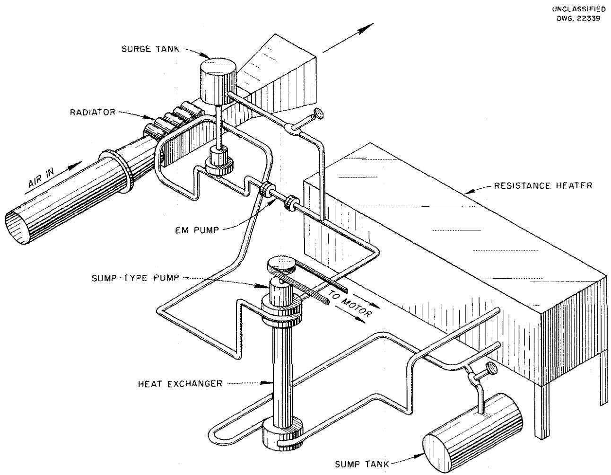  
Fig. 2.2. Heat Exchanger Test Apparatus.

temperature sodium circulating through the tube bundles (Fig. 2.2). A sump-type pump continuously circulates the fluoride mixture; the sodium flow is maintained by an electromagnetic pump. The sodium is resistance heated, and it enters the tubes in one half the exchanger to heat the fluorides. It is then cooled in a sodium-to-air radiator (100 kw, interrupted-fin type) from which it enters the tubes in the other half of the heat exchanger to cool the fluorides and then returns to the sodium heating coil. Thus both the fluoride mixture and the sodium are alternately cooled and heated. The heat exchanger is designed to transfer 1.5 megawatts, but performance to date has been limited by an inability to supply sufficient power to the resistance heater for the sodium. The fluoride system has been in operation at above $1200^{\circ}\mathrm{F}$ for

over 600 hr, and the completed bifluid system has been operating at 1200 to $1400^{\circ}\mathrm{F}$ for 300 hours. Performance data are not yet available.

# FORCED-CIRCULATION CORROSION LOOP

D. F. Salmon

ANP Division

A small forced-circulation corrosion loop was operated with $\mathsf{NaF - ZrF_4 - UF_4}$ to extend the corrosion data being obtained from low-velocity thermal convection loops. The aim is to eventually obtain a fluid velocity of 5 fps or greater with a temperature difference of $200^{\circ}F$ . Circulation is obtained with an Eastern Industries, E-100, centrifugal pump that was redesigned for sump-type operation and fabricated of Inconel. A gas seal is maintained in a water-cooled, Teflon-packed gland on

the shaft. The loop was fabricated of 0.1-in.-OD, 0.025-in.-wall Inconel tubing. Heating is accomplished by passing an electric current through 17 ft of the tubing, and cooling is by natural convection to air from 9 ft of tubing. The tubing is coiled to reduce the space requirement.

The fluid velocities obtained in this loop are a factor of 50 or 60 greater than those of thermal convection loops, but the Reynolds modulus remains in the laminar region at approximately 1700. The loop operated approximately 200 hr with a

gradual slowing down of flow, which indicated possible plugging. A summary of the results is presented graphically in Fig. 2.3, which shows velocity and temperature difference as a function of elapsed time. The speed of the pump, which was checked periodically, did not vary appreciably. The velocity of the fluoride mixture was calculated, rather than measured, from heat balance data on the loop heating section. The loop was terminated because of the indicated plugging and is being examined metallurgically. A second loop is being constructed.

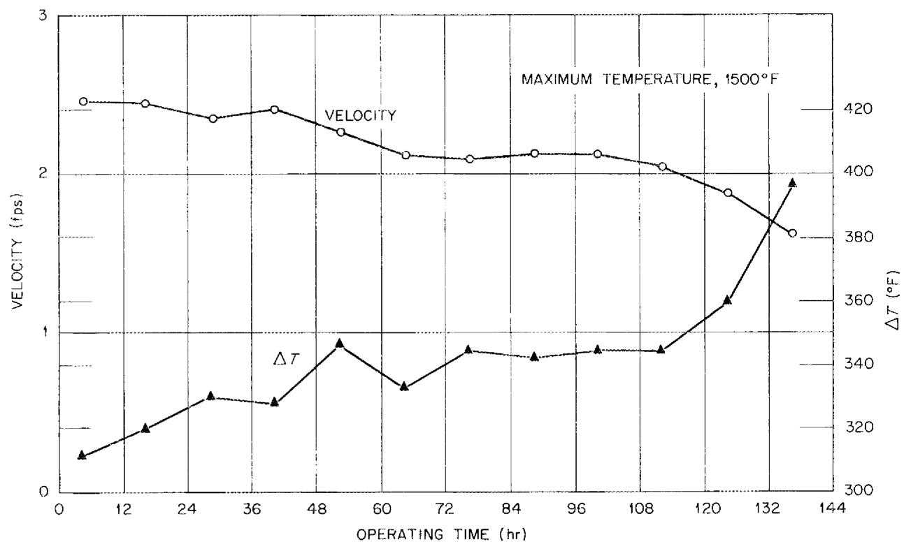  
Fig. 2.3. Velocity and Temperature Difference as a Function of Operating Time for NaF-ZrF $_4$ -UF $_4$ in an Inconel Forced-Circulation Corrosion Loop.

# 3. REFLECTOR-MODERATED REACTOR DESIGN STUDIES

R.W.Bussard A.P.Fraas ANP Division

In May 1953, the U. S. Air Force requested that a series of design studies be prepared to outline the characteristics of 100-, 300-, and 600-megawatt circulating-fuel reactors. Unfortunately, the reactor physics work essential for establishing the overall design limitations has lagged far behind schedule, and many materials questions are not yet solved. However, even though detailed designs cannot be prepared at this time, it has been recognized that design information is urgently needed, and therefore the preliminary layouts presented in this report were prepared to give the best estimate of preliminary designs that can be made now. While interest was expressed in reactor power outputs of as much as 600 megawatts, a careful examination of the basic limiting factors indicated that it would not be prudent to extrapolate the information currently available beyond a reactor size of 300 megawatts. The design for the 600-megawatt reactor was therefore dropped, and studies for 50- and 200-megawatt reactors, in addition to the 100- and 300-megawatt reactor designs requested, were prepared.

The more important parameters for the designs are presented in Tables 3.1 and 3.2. Layouts for 50-, 100-, and 300-megawatt reactors are presented in Figs. 3.1, 3.2, and 3.3, respectively. Detail drawings for the main heat exchanger, pumps, and core shells have been prepared for the 50-megawatt reactor. The designs for the 50- and 100-megawatt reactors appear to be quite conservative so that it seems probable that their ratings could be increased to 75 and 150 megawatts, respectively. Parameters such as flow rates and temperature drops would, of course, increase accordingly.

An explanation and qualification of the more important features of the principal components and the considerations that determined them has been prepared to supplement the drawings. The static physics, moderator cooling, pumps, hydrodynamics, heat exchangers, pressure shell, control, and fuel addition and drainage systems are each discussed, in turn. An effort has been made to include in these discussions an indication of the status of the design at this time and of the experimental work planned to provide badly needed design data.

A familiarity with information published previously is presumed.1,2

# REACTOR PHYSICS

A wide variety of reactor types and geometries has been considered for circulating fluoride fuels. Of these, the most promising at this time appears to be a reflector-moderated reactor with a central island. Sodium-cooled beryllium seems to be the best choice as the moderating material. However, the picture is very incomplete because calculations for only about 25 reflector-moderated reactors had been completed until recently because of lack of computing facilities. Calculations for approximately 100 two-region reactors have just been completed, and the results are being analyzed; calculations for about 200 three- to nine-region reactors have been started. By April 1954, this work should be far enough along to give a more complete picture of the effects of reactor geometry and materials of construction on parameters such as critical mass and power distribution for every type of circulating-fuel reactor that has appeared promising. A particular effort will be made to find an arrangement that will give the most rugged, reliable, and simple reactor construction consistent with limitations imposed by corrosion and gamma-heating effects.

Five critical assemblies have been run to date on reflector-moderated reactors. All these have been rather rough approximations to what currently appears to be a promising full-scale aircraft reactor. The weakest element in all of these approximations has been the fuel region composition. In the first critical assembly, the fuel region was simulated with cans of sodium interspersed with disks of metallic uranium, while in the subsequent assemblies, cans of powdered $\mathrm{NaF - ZrF_4 - UO_2}$ were employed. The first assembly suffered from severe inhomogeneity and self-shielding of the fuel, and the subsequent assemblies had the shortcoming

TABLE 3.1. PRINCIPAL DIMENSIONS OF A SERIES OF REFLECTOR-MODERATED CIRCULATING-FUEL REACTORS   

<table><tr><td>Power, megawatts</td><td>50</td><td>100</td><td>200</td><td>300</td></tr><tr><td>Core diameter, in.</td><td>18</td><td>18</td><td>20</td><td>23</td></tr><tr><td>Power density in fuel, kw/cm3</td><td>1.35</td><td>2.7</td><td>3.9</td><td>3.9</td></tr><tr><td>Pressure shell outside diameter, in.</td><td>48.5</td><td>50.6</td><td>56.4</td><td>62.0</td></tr><tr><td>Fuel System</td><td></td><td></td><td></td><td></td></tr><tr><td>Fuel volume in core, ft3</td><td>1.3</td><td>1.3</td><td>1.8</td><td>2.7</td></tr><tr><td>Core inlet outside diameter, in.</td><td>10</td><td>10</td><td>11</td><td>12.8</td></tr><tr><td>Core inlet inside diameter, in.</td><td>7</td><td>7</td><td>7.7</td><td>9</td></tr><tr><td>Core inlet area, in.2</td><td>40</td><td>40</td><td>49</td><td>67</td></tr><tr><td>Fuel volume in inlet and outlet ducts, ft3</td><td>0.4</td><td>0.4</td><td>0.5</td><td>0.7</td></tr><tr><td>Fuel volume in heat exchanger, ft3</td><td>1.25</td><td>2.5</td><td>5</td><td>7.5</td></tr><tr><td>Fuel volume in pump and plenum, ft3</td><td>0.3</td><td>0.3</td><td>0.5</td><td>1.0</td></tr><tr><td>Total fuel volume circulating, ft3</td><td>3.25</td><td>4.5</td><td>7.8</td><td>11.9</td></tr><tr><td>Fuel expansion tank volume, ft3 (8% of system volume)</td><td>0.26</td><td>0.36</td><td>0.62</td><td>0.95</td></tr><tr><td>Fuel Pumps</td><td></td><td></td><td></td><td></td></tr><tr><td>Fuel pump impeller diameter, in.</td><td>5.75</td><td>7</td><td>8.5</td><td>10</td></tr><tr><td>Fuel pump impeller inlet diameter, in.</td><td>3.5</td><td>4.5</td><td>5.5</td><td>6.75</td></tr><tr><td>Fuel pump impeller discharge height, in.</td><td>1.1</td><td>1.5</td><td>1.8</td><td>3.2</td></tr><tr><td>Fuel pump shaft center line to center line spacing, in.</td><td>20</td><td>21</td><td>22.5</td><td>27</td></tr><tr><td>Plenum chamber width, in.</td><td>14.5</td><td>15</td><td>15.5</td><td>17.5</td></tr><tr><td>Plenum and volute chamber length, in.</td><td>30</td><td>31</td><td>33</td><td>37</td></tr><tr><td>Plenum and volute chamber height, in.</td><td>2.0</td><td>2.0</td><td>2.4</td><td>3.0</td></tr><tr><td>Impeller rpm</td><td>2700</td><td>2700</td><td>2500</td><td>2300</td></tr><tr><td>Estimated impeller weight, lb</td><td>8</td><td>12</td><td>17</td><td>24</td></tr><tr><td>Impeller shaft diameter, in.</td><td>1.5</td><td>1.75</td><td>2</td><td>2.25</td></tr><tr><td>Impeller overhang, in.</td><td>12</td><td>13</td><td>14</td><td>15</td></tr><tr><td>Critical speed, rpm</td><td>6000</td><td>6000</td><td>5200</td><td>5000</td></tr><tr><td>Sodium Pump</td><td></td><td></td><td></td><td></td></tr><tr><td>Na pump impeller diameter, in.</td><td>3.4</td><td>4.1</td><td>5.0</td><td>5.9</td></tr><tr><td>Na pump impeller inlet diameter, in.</td><td>2.4</td><td>2.9</td><td>3.5</td><td>4.2</td></tr><tr><td>Na pump impeller discharge height, in.</td><td>0.75</td><td>0.9</td><td>1.1</td><td>1.2</td></tr><tr><td>Na expansion tank volume, ft3 (10% of system volume)</td><td>0.08</td><td>0.09</td><td></td><td></td></tr><tr><td>Na in Be passages, ft3</td><td>0.43</td><td>0.47</td><td></td><td></td></tr><tr><td>Na in pressure shell, ft3</td><td>0.15</td><td>0.15</td><td></td><td></td></tr><tr><td>Na in pump and heat exchanger, ft3</td><td>0.20</td><td>0.25</td><td></td><td></td></tr><tr><td>Fuel-to-NaK Heat Exchanger</td><td></td><td></td><td></td><td></td></tr><tr><td>Heat exchanger thickness, in.</td><td>1.7</td><td>2.75</td><td>4.65</td><td>5.9</td></tr><tr><td>Heat exchanger inside diameter, in.</td><td>42</td><td>42</td><td>44</td><td>47</td></tr><tr><td>Heat exchanger outside diameter, in.</td><td>45.4</td><td>47.5</td><td>53.3</td><td>58.8</td></tr><tr><td>Heat exchanger volume, ft3</td><td>6</td><td>10</td><td>20</td><td>30</td></tr><tr><td>Angle between tubes and equatorial plane, deg</td><td>27</td><td>27</td><td>27</td><td>27</td></tr><tr><td>Number of tubes</td><td>2304</td><td>3744</td><td>6600</td><td>9072</td></tr><tr><td>Tube diameter, in.</td><td>0.1875</td><td>0.1875</td><td>0.1875</td><td>0.1875</td></tr><tr><td>Tube spacing, in.</td><td>0.2097</td><td>0.2097</td><td>0.2119</td><td>0.2094</td></tr><tr><td>Number of tube bundles</td><td>12</td><td>12</td><td>12</td><td>12</td></tr><tr><td>Tube arrangement in each bundle</td><td>8 × 24</td><td>13 × 24</td><td>22 × 25</td><td>28 × 27</td></tr><tr><td colspan="5">Moderator Region</td></tr><tr><td>Volume of Be plus fuel, ft3</td><td>22.4</td><td>22.4</td><td>25.8</td><td>31.5</td></tr><tr><td>Volume of Be only, ft3</td><td>21.1</td><td>21.1</td><td>24.0</td><td>28.8</td></tr><tr><td>No. of coolant holes in reflector</td><td>208</td><td>208</td><td>554</td><td>554</td></tr><tr><td>No. of coolant holes in island</td><td>86</td><td>86</td><td>210</td><td>210</td></tr><tr><td>Na coolant tube inside diameter, in.</td><td>0.155</td><td>0.187</td><td>0.187</td><td>0.218</td></tr><tr><td>Na coolant tube wall thickness, in.</td><td>0.016</td><td>0.016</td><td>0.016</td><td>0.016</td></tr><tr><td>No pressure shell annulus thickness, in.</td><td>0.125</td><td>0.125</td><td>0.187</td><td>0.200</td></tr></table>

that the atomic density in the fuel region was only about $33\%$ of that of liquid fluoride fuel. These shortcomings will be largely eliminated in a new critical experiment that is being planned. Sheet Teflon and 0.002-in.-thick uranium foil will be stocked in laminae to simulate the fluoride fuel, both from the standpoint of atomic density and of neutron-scattering and absorption cross sections.

Another weak point in the critical assemblies that have been run has been that the geometric approximation left much to be desired. It is planned that the sheet Teflon and the uranium foil will be cut to appropriate lengths to permit the construction of a configuration essentially the same as that envisioned for the full-scale reactor.

# FUEL COMPOSITION AND PROPERTIES

It was assumed in the design work that the physical properties of the fluoride fuel at $1500^{\circ}\mathrm{F}$ would be similar to those of NaF-KF-LiF-UF $_4$ (10.9-43.5-44.5-1.1 mole %), which are, approximately, the following: heat capacity, 0.45 Btu/lb $^{\circ}\mathrm{F}$ ; thermal conductivity, 2.6 Btu/hr $^{\circ}\mathrm{F}$ ; viscosity, 3 cp; density 2.0 g/cm $^3$ . Heat transfer considerations show that such a fuel would be much better than the sodium-zirconium fuel that has been prepared for the ARE. If such a fuel were not developed, it would be necessary to increase the heat exchanger size given in the accompanying designs by a factor of 2 or 3. This would mean an increase in shield weight of about 6% and a serious increase in heat exchanger header complexity.

There are two possible ways of obtaining a satisfactory fuel. The first is to use the above-mentioned fluoride, or some modification of it, in a container fabricated of an alloy that has no chromium. This should eliminate the serious shortcoming of this particular fluoride mixture, that is, its tendency to form low-conductivity films of a highly insoluble potassium-chromium-fluoride mix

ture on surfaces in Inconel systems. Initial tests show Hastelloy B (80% Ni-20% Mo) to be a possible container material for this fluoride, and it will be tested in the coming months.

A second way to obtain a fuel with satisfactory physical properties is to test various melts that have compositions that seem promising, and such a program is now under way. Melts of seven different compositions containing lithium, sodium, rubidium, and beryllium are being prepared, and their physical properties are being determined. The best of these melts will be selected for corrosion test work.

# MODERATOR REGIONS

Heat transfer analyses indicate that a sodium-cooled beryllium moderator is superior from the heat transfer standpoint to any other arrangement considered thus far. Static and seesaw Inconel capsule tests show virtually no signs of corrosion or mass transfer at $1500^{\circ}\mathrm{F}$ for beryllium specimens immersed in sodium. However, it is felt that mass transfer in a larger-scale test loop operating with a substantial temperature differential and with the beryllium presenting the hottest surface in the system (as in a full-scale reactor) is very likely to be serious. A test loop to investigate this possibility has been designed, and it is scheduled to operate about February 1954. Should mass transfer prove to be serious, canned beryllium will be tested.

It is expected that the results of the multigroup reactor calculations will indicate what further moderator designs should be prepared and analyzed from the heat transfer standpoint to investigate the possibilities of exploiting lead and bismuth as moderator coolants. Lead and bismuth are

interesting because of their high densities. Some metallurgical work is currently under way in an attempt to find a system that is satisfactory with respect to corrosion and mass transfer.

Some structural problems exist in designing the support of the reflector and the island. At first glance, it would appear that these assemblies

hang from the flat decks that span the pump region. This would not be the case when the fluoride system had been filled, however, because the beryllium density $(1.84\mathrm{g} / \mathrm{cm}^3)$ would be somewhat less than the expected fuel density (about 2.0 g/cm³) and hence the moderator region would tend to float in the fuel. With the moderator region

TABLE 3.2. HEAT TRANSFER SYSTEM CHARACTERISTICS FOR A SERIES OF REFLECTOR-MODERATED CIRCULATING-FUEL REACTORS   

<table><tr><td>REACTOR POWER, megawatts</td><td>50</td><td>100</td><td>200</td><td>300</td></tr><tr><td colspan="5">Fuel-to-Nak Heat Exchanger and Related Systems</td></tr><tr><td>Fuel temperature drop, °F</td><td>400</td><td>400</td><td>400</td><td>400</td></tr><tr><td>NaK temperature rise, °F</td><td>400</td><td>400</td><td>400</td><td>400</td></tr><tr><td>Fuel ΔP in heat exchanger, psi</td><td>35</td><td>51</td><td>61</td><td>75</td></tr><tr><td>NaK ΔP in heat exchanger, psi</td><td>40</td><td>58</td><td>69</td><td>85</td></tr><tr><td>Fuel flow rate, lb/sec</td><td>263</td><td>527</td><td>1,053</td><td>1,580</td></tr><tr><td>NaK flow rate, lb/sec</td><td>474</td><td>948</td><td>1,896</td><td>2,844</td></tr><tr><td>Fuel flow rate, cfs</td><td>2.1</td><td>4.2</td><td>8.4</td><td>12.6</td></tr><tr><td>NaK flow rate, cfs</td><td>10.5</td><td>21.0</td><td>42.0</td><td>63.0</td></tr><tr><td>Fuel velocity in heat exchanger, fps</td><td>8.0</td><td>9.9</td><td>11.2</td><td>12.2</td></tr><tr><td>Fuel flow Reynolds number in heat exchanger</td><td>4,600</td><td>5,700</td><td>6,700</td><td>7,000</td></tr><tr><td>NaK velocity in heat exchanger, fps</td><td>36.4</td><td>44.9</td><td>50.9</td><td>55.4</td></tr><tr><td>Overall heat transfer coefficient, Btu/hr&#x27;ft2, °F</td><td>3,150</td><td>3,500</td><td>3,700</td><td>3,850</td></tr><tr><td>Fuel-NaK temperature difference, °F</td><td>95</td><td>100</td><td>110</td><td>115</td></tr><tr><td colspan="5">Sodium-to-Nak Heat Exchanger and Related Systems</td></tr><tr><td>No temperature drop in heat exchanger, °F</td><td>100</td><td>150</td><td>150</td><td>150</td></tr><tr><td>NaK temperature rise in heat exchanger, °F</td><td>100</td><td>150</td><td>150</td><td>150</td></tr><tr><td>Na ΔP in heat exchanger, psi</td><td>7</td><td>7</td><td>7</td><td>7</td></tr><tr><td>NaK ΔP in heat exchanger, psi</td><td>7</td><td>7</td><td>7</td><td>7</td></tr><tr><td>Power generated in island, kw</td><td>500</td><td>1,000</td><td>2,000</td><td>3,000</td></tr><tr><td>Power generated in reflector, kw</td><td>1,700</td><td>3,400</td><td>7,500</td><td>11,200</td></tr><tr><td>Power generated in pressure shell, kw</td><td>190</td><td>350</td><td>500</td><td>620</td></tr><tr><td>Na flow rate in reflector, lb/sec</td><td>53</td><td>72</td><td>154</td><td>234</td></tr><tr><td>Na flow rate in island and pressure shell, lb/sec</td><td>22</td><td>28</td><td>51</td><td>76</td></tr><tr><td>Total Na flow rate, lb/sec</td><td>75</td><td>100</td><td>205</td><td>310</td></tr><tr><td>Na temperature rise in pressure shell, °F</td><td>28</td><td>39</td><td>30</td><td>26</td></tr><tr><td>Na ΔP in pressure shell, psi</td><td>4</td><td>6</td><td>6</td><td>6</td></tr><tr><td>Na temperature rise in island, °F</td><td>72</td><td>111</td><td>120</td><td>124</td></tr><tr><td>Na ΔP in island, psi</td><td>32</td><td>21</td><td>12</td><td>12</td></tr><tr><td>Na temperature rise in reflector, °F</td><td>100</td><td>150</td><td>150</td><td>150</td></tr><tr><td>Na ΔP in reflector, psi</td><td>36</td><td>27</td><td>18</td><td>18</td></tr><tr><td>Na-Nak temperature difference, °F</td><td>43</td><td></td><td></td><td></td></tr><tr><td colspan="5">Shield Cooling System</td></tr><tr><td>Power generated in 6-in. lead layer, kw</td><td>110</td><td>210</td><td>300</td><td>350</td></tr><tr><td>Power generated in 24-in. H2O layer, kw</td><td>&lt;3</td><td>&lt;6</td><td>&lt;12</td><td>&lt;18</td></tr></table>

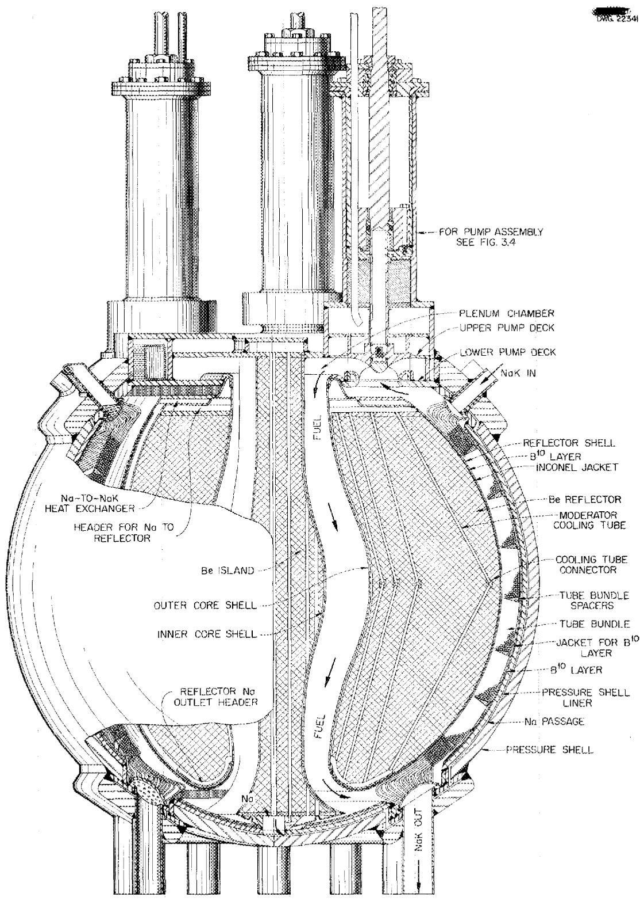  
Fig. 3.1. 50-Megawatt Reflector-Moderated Reactor.

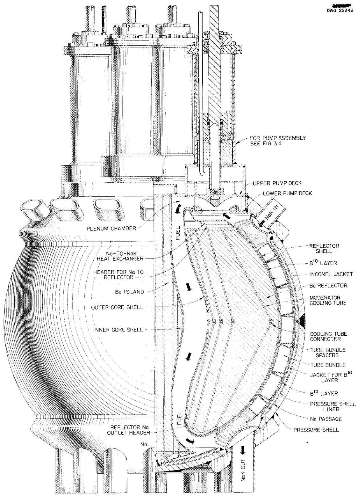  
Fig. 3.2. 100-Megawatt Reflector-Moderated Reactor.

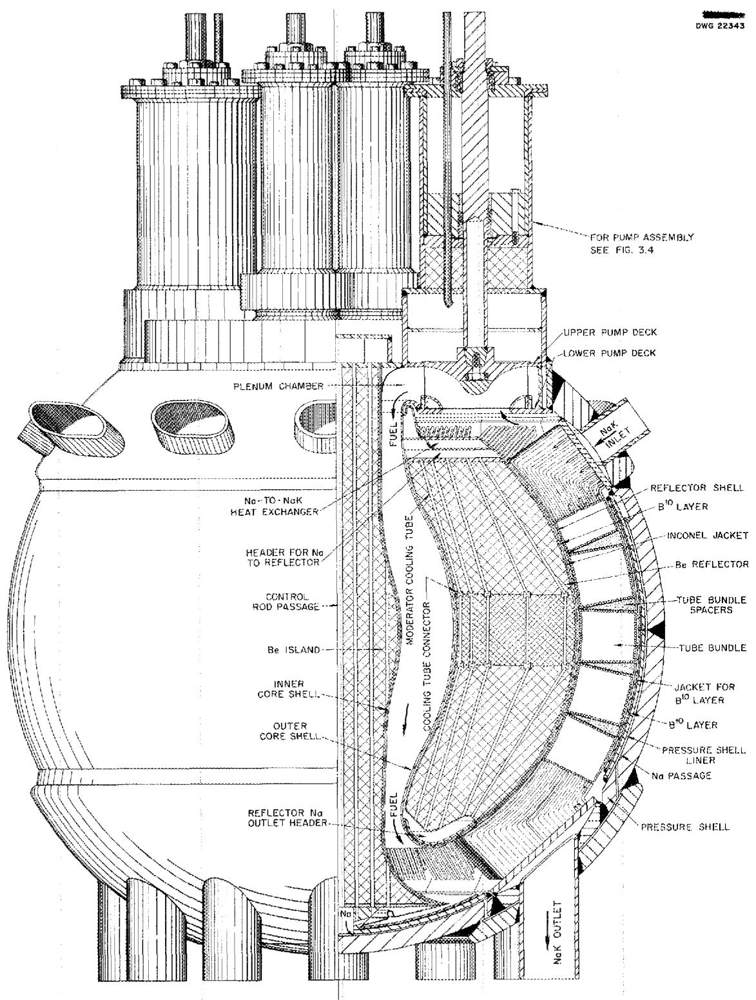  
Fig. 3.3. 300-Megawatt Reflector-Moderated Reactor.

buoyed up by the fuel in an almost ideal "shock mounting," accelerations that would occur under crash landing conditions (in which vertical accelerations of as much as $10\mathrm{g}$ should be anticipated) would yield a net upward force on the reflector assembly that would be about equal to its weight. In the designs illustrated, the reflector assemblies are attached to the lower deck of the pump region by welds to the walls of the sodium return passages.

The sodium pump and heat exchanger subassemblies are positioned around the top edge of the upper pump deck. The pipe from the sodium pump discharge makes a slip fit into the reflector sodium inlet tube. The leakage through this slip fit into the sodium return passage simply recirculates with no penalty other than a small increase in the required pump capacity. The two sodium pump and heat exchanger assemblies could be welded in place by passing a bead around the lower edge at the outer periphery and up and across the top where they adjoin the plenum chamber between the two fuel pumps.

The reactor designs illustrated in Figs. 3.1, 3.2, and 3.3 presume that canning of the beryllium will be required but that trace leaks in the Inconelto-can connections can be tolerated. Therefore the tubes passing through the rifle-drilled holes in the reflector are designed to be driven into tapered bores in the fittings shown at the equator, and the outer ends of these same tubes are to be rolled into their respective header sheets at the top and bottom. The tube connecting fittings at the equator also serve as dowels to locate the two beryllium hemispheres relative to each other.

# HYDRODYNAMICS OF THE FUEL CIRCUIT

Hydrodynamic considerations impose a number of restraints on the geometry of the fuel passages in the reactor fuel circuit. These restraints are not sharply defined, but they are sufficiently rigid that they limit the fuel circuit proportions for a well-balanced design to a considerably narrower range than would at first be expected. The pressure drop through the heat exchanger goes up very rapidly with fuel flow rate - so much so that there is little to be gained by going to fuel velocities which correspond to pressure drops in the heat exchanger of greater than 80 psi. This is particularly true if an effort is made to keep the stresses in the core shells and heat exchanger tube walls

to 500 psi or less. If the rest of the fuel system is examined carefully, it is evident that it should involve a pressure drop very much less than that across the heat exchanger in a well-balanced design. Thus, since a bleed-off-air turbine-pump-drive arrangement seems to be at once the lightest, simplest, and most flexible and since such a pump drive system should be designed to require less than $3\%$ air bleed-off from the compressors, there seems to be a strong incentive to limit the pressure drop through the pump inlet and discharge passages and the core inlet and outlet ducts to not more than 15 psi.

If it is assumed that the reactor core diameter is determined by a compromise between shielding and other considerations and that the island diameter will be determined by fission density distribution considerations, it becomes evident that these two basic dimensions for the fuel circuit may be taken as a base for determining the proportions for the rest of the system. The inlet and outlet duct passage arrangements should be as small as possible to simplify the shielding problem and to reduce shield weight. However, it is of paramount importance that boundary-layer thickening and flow separation be avoided in the diffuser region at the inlet to the core. This, in turn, imposes a lower limit on the flow passage area that may be used at the core inlet. An asymmetric design might be employed in that this flow limitation would not apply to the outlet duct, particularly since a diffuser giving a reasonably high efficiency can probably be provided between that duct and the inlet to the heat exchanger. It is quite evident from this standpoint alone that further shielding tests should be made to investigate the effect of fuel duct size on overall shield weight. While the problem is not clearly defined, it does appear from flow test work, as well as from analyses of the adverse pressure gradients along the diffuser walls in the core inlet region, that the outer diameter of the core inlet duct should be roughly $60\%$ of the core diameter, while the inner diameter of that duct should be between 60 and $70\%$ of the outer diameter.

The plenum chamber between the volute discharges and the core inlet ducts should provide for smooth transition and uniform velocity distribution at the inlet to the core. One promising way of accomplishing this would be to provide a plenum chamber having a height somewhat greater than the

thickness of the core inlet duct and a diameter at least half again as large as that of the inlet duct. The pump volutes could then be designed to give a fluid velocity entering the plenum chamber about equal to that in the core inlet duct. This would mean that for high power density reactors, for example, a 200-megawatt reactor with an 18-in.-dia core, the discharge annulus of a mixed flow impeller should be made as wide as possible so that it would approach the height of the plenum chamber. For low power density reactors, for example, a 50-megawatt reactor with an 18-in.-dia core, the disparity in these dimensions is inherently large. A careful examination of the magnitude of the eddy losses to be expected at the pump inlet, through the impeller, in the pump volute, and in the plenum chamber leads to the conclusion that the pump should be designed for an inlet velocity of not much more than about 30 fps, that is, a velocity giving a dynamic head of about 12 psi.

On the basis of these considerations, it is possible to specify dimensions for the principal fuel flow passages for a wide range of reactor power outputs. While the dimensions are given in Table 3.2, it should be noted that there is some latitude in the selection of these dimensions. Furthermore, it is clear that passages of larger size would require substantially heavier shields, while passages of substantially smaller size would be likely to give some sort of difficulty from the hydrodynamic standpoint.

Some preliminary flow tests were carried out a year ago, and the results were encouraging. Additional flow tests are being made to determine whether the proportions indicated in Table 3.2 lead to a satisfactory configuration for a reactor designed for an output of 50 to 100 megawatts.

# PUMP DESIGN

In examining the overall system requirements, it becomes evident that it would be very desirable if the fuel pumps could perform several functions in addition to that of pumping the fuel. It seems likely that most of the xenon and possibly some of the other fission-product poisons might be removed from the fluoride mixture if helium could be bubbled through the fuel while it was being thoroughly agitated. Furthermore, it would be advantageous

to have the pumps serve as mixing chambers in which high-uranium-content fuel could be added to the main fuel stream to enrich the mixture and compensate for burnup. Finally, it is essential that an expansion tank be provided so that entrainment of bubbles would not prove to be a problem in maneuvers or in "bumpy" flight.

The pump arrangement shown in Fig. 3.4 was worked out to provide for all the points mentioned above. The pump design embodies a variation of an idea tested three years ago.5 The back of the impeller is used to centrifuge out the gas bubbles. The design also uses the overhung impeller, the bearing arrangement, and the face-type gas seal of the previous pump, along with several features that have proved to be successful in sump pump test work during the past year. The principles of operation are quite simple and have been demonstrated with a plastic model. The fuel in the expansion tank above the impeller tends to swirl in the same direction as the impeller (but at a lower speed) so that it forms a vortex with a roughly conical free surface. A relatively large amount of fluid leaks from the high-pressure region at the impeller outlet through the labyrinth seal at the periphery of the impeller into the swirl chamber immediately above the impeller. Since this swirl chamber is connected through a bypass line to the impeller inlet, the leakage is simply recirculated at no cost other than an increase in pumping power. Some fluid leaks upward through the clearance between the top lip of the swirl chamber and the outside of the centrifuge cup on the back face of the impeller, but this leakage rate is small because there is little pressure differential across this gap. The leakage that does occur is made up by bleed flow from small holes in the periphery of the centrifuge cup on the back of the impeller. Thus there is a small, continuous flow from the fluid vortex in the expansion tank into the centrifuge cup and thence into the swirl chamber. The fluid region close to the surface of the vortex in the expansion tank is highly turbulent and full of bubbles so that it should be effective in degassing the fuel.

In initial tests of a water pump with the above-mentioned features, the pump continued to pump when it was inverted for as much as a minute before the liquid supply in the centrifuge cup and

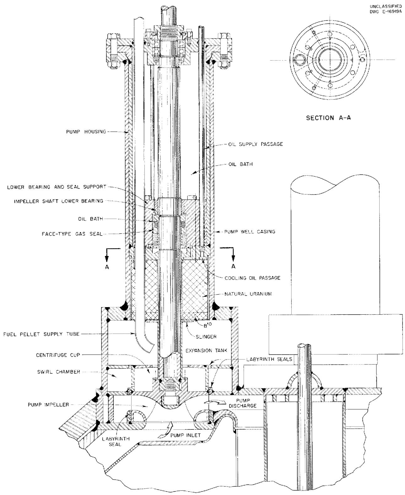  
Fig. 3.4. Gas-Sealed Aircraft Pump.

swirl chamber was depleted by fluid leakage from the swirl chamber into the expansion tank. The slinger ring on the impeller shaft at the top of the expansion tank acts to throw the fluid away from the shaft when the pump is inverted and thus prevent flow into the clearance around the shaft between the slinger and the face-type gas seal.

A number of other special features have been included in the pump design to adapt it to the full-scale reactor shield. The pump has been designed so that it can be removed or installed as a sub-assembly with the impeller, shaft, seals, and bearings in a single compact unit. As can be seen from Figs. 3.1 and 3.4, this assembly fits into the bore of a cylindrical casing welded to the top of the reactor pressure shell. A 3-in. layer of uranium just above a $\frac{1}{2}$ -in. layer of $B^{10}$ around the lower part of the impeller shaft is at the same level as the reactor gamma shield just outside the pressure shell. The steel seal and bearing support above the layer of uranium gives additional gamma shielding, while the oil-filled cavity between the bearings acts as neutron shielding. An air-driven turbine and gear box could be mounted on the flange at the upper end of the pump casing. Since the outer surface of this casing was designed to be about 8 in. inside the outer surface of the shield, there need be no protuberances from the shield surface in the final installation. The long, slender, "pill supply" tube for fuel enrichment is sufficiently small that it should not permit much gamma leakage.

The large amount of impeller shaft overhang inherent in the design of the pump could be avoided if a journal bearing could be operated with the molten fluoride mixture acting as the lubricant. The pump impeller and volute could be designed so that the radial load on such a bearing would be very small, perhaps not more than 25 psi. Since the viscosity of the fluoride mixture is greater than that of water, the arrangement should be completely satisfactory after the pump was started. Pickup and scuffing of the bearing or shaft during startup or shutdown might prove to be problems. A test rig for investigating the compatibility of different materials in sodium at high temperature has been built and is being used to evaluate the compatibility of various material combinations in fluorides (cf., sec. 2). Preliminary results are encouraging.

# PRESSURE SHELL

As much as $\frac{1}{2}\%$ of the reactor output may go into gamma heating of the pressure shell. The provision for the removal of this heat presents several design choices, none of which is entirely satisfactory. If no provision is made for cooling the pressure shell, it will be much hotter than the fluoride mixture that contacts its inner surface. Unfortunately, this would give the highest pressure shell temperatures in precisely the zone in which the stresses are the highest, that is, in the ligaments between the NaK ducts in the lower header region. The pressure shell might be cooled with the coolant system that serves the lead gamma shield, but this would make temperature control difficult over a wide range of power outputs because of the inherently large temperature differential. Furthermore, it would make necessary the dumping of large amounts of heat at a low temperature level through the shield coolant radiator - a costly matter in an airplane. Cooling of the pressure shell with sodium from the island moderator cooling system has the disadvantage of complicating the pressure shell construction, but it has many advantages. It provides a simple way of returning the sodium that has passed through the island cooling passages to the sodium-to-NaK heat exchanger. It not only serves to cool the pressure shell in the critically stressed fuel discharge end of the reactor so that the creep strength of the Inconel there becomes more than adequate, but it makes it possible to maintain the entire pressure shell at an essentially uniform temperature. This should markedly reduce both thermal distortion and clearance buildups resulting from differential thermal expansion between the pressure shell, heat exchanger tube bundles, and the reflector.

The construction envisioned is shown in Figs. 3.1, 3.2, and 3.3. The inner liner assembly consists of a $\frac{3}{8}$ -in.-thick Inconel shell, a $\frac{1}{8}$ -in. hot-pressed $B^{10}$ layer, and an inner 0.062-in.-thick Inconel can. Inconel is also used to cover the interior of the pressure shell between the two end headers. Closely spaced grooves, $\frac{1}{8}$ in. deep and 2 in. wide, milled into the outer surface of the liner provide ample flow passage area for the sodium to flow upward. Four transfer tubes carry the sodium from the top of the pressure shell to the outer face of the pressure shell at the sodium-to-NaK heat exchanger inlets. The hot-pressed

boron blocks are diamond-shaped, with 60-deg angles at their vertexes, and they have rabbeted edges. This design permits the covering of a spherical surface with a single block size and shape.

The construction in the vicinity of the end header regions was deliberately varied in Figs. 3.1, 3.2, and 3.3 to show three different ways in which the detail design may be handled. Another design would involve the use of a pressure shell with forged annular protuberances to receive the headers, while yet another possibility would be a shell sufficiently thick (about 2.5 in.) to permit machining annular grooves for the headers. This latter arrangement would have the advantage of a more regular exterior surface on the pressure shell.

# FUEL-TO-NoK HEAT EXCHANGER

The heat exchanger envisioned for the reflectormoderated reactors is similar to that described previously.6 The major unknowns in the fuel-toNaK heat exchanger are concerned with fabrication. It is presumed that the tube-to-header connections would be heliarc welded by hand, as in the 210-tubesix-tube-bundle fluoride-to-NaK heat exchanger presently being tested. It is expected that a large amount of welding research and component testing will be required to obtain a satisfactory solution to this tube-to-header welding problem.

The tube bundles are separated by long cans that are triangular in cross section and parallel the tubes. The cans would be filled with hot-pressed B10 to assist in inhibiting the low-energy neutron flux in the heat exchanger region.

# REACTOR CONTROLS

One of the salient features of the circulating-fuel reactor is its inherent stability. It appears that no fast-moving control rods will be required to cope with fast transients. No large amounts of shim control are required to compensate for burnup, because a uranium-rich fluoride can be added at intervals during the course of operation. The only important control needed is a means of varying the mean operating temperature. In examining overall power plant considerations, it appeared that provision for effecting a temperature change of $200^{\circ}\mathrm{F}$ should be included in the design (that is, about

$3\% \Delta k / k)$ . It appears from critical experiments that this could be provided by a $3/6$ -in.-OD tube filled with B10 and placed to give a 27-in. stroke from the pump deck down through the center of the island. While the rod and its actuating mechanism are not shown in designs illustrated, a 0.50-in.-ID tube has been provided through the center of the island to receive the rod. In the design contemplated, the rod would be machined from a thick-walled tube to give three equally spaced $1/6$ -in.-high ridges along its entire length. These ridges would serve to center the rod in the passage provided and thus give uniform flow of sodium coolant around the rod periphery. The ridges would also engage a grooved guide at the upper end to prevent rotation. A short length of $5/6$ -in.,-10 thread at the top of the rod would be engaged by an internally threaded tube enclosed in a casing extending up through the shield. The tube would be rotated by a drive at the top end through a bellows seal. This seal would be brazed to the center of a bar with three spherical bearings, one at each end and one in the center. This bar would be inclined at an angle of about 15 deg to the axis of the control rod drive tube. The center bearing would be fixed relative to the rod casing, while a crank attached to the upper end of the control rod drive tube would be attached to the lower spherical bearing. As the rod drive tube rotated, the axis of the drive bar would generate a cone, with the centers of the spherical bearings at its upper and lower ends generating circles. The drive actuator would be an electric motor and gear box connected to the upper spherical bearing. The closed end of the bellows at the center bearing would describe a wobble-plate type of motion.

The fuel enrichment system that appears most attractive is based on the use of cold-pressed disks of $\mathsf{Na}_2\mathsf{UF}_6$ about $1/2$ in. in diameter and $1/4$ in. high. These disks could be fed to the tops of the fuel addition tubes in the pumps by means of a relatively simple "pill vending" machine. Several promising detail designs of such machines have been prepared from which it appears that this phase of the development should not prove to be a serious problem. However, it may be difficult to prevent the fuel in the expansion tank from entering, freezing, and blocking the fuel enrichment tube during inadvertent inverted flight. The pump design has been worked out so that this should not happen,

but the effectiveness of this feature of the swirl expansion tank design has not yet been checked.

# SHIELDING

A substantial amount of fundamental work on the shielding problems of the reflector-moderated reactor has been covered in other reports.2,7,8 Three important factors remain undetermined: namely, the energy spectrum of the short half-lived fission-product gammas, the effect of variations in endduct and in fuel pump and header tank geometry, and the possibilities in the use of unusual materials such as lithium hydride. Tests have been carefully planned to provide the essential design data necessary for determining the first two of these factors during the coming months, and a long-range program is contemplated for investigating unusual materials. It is hoped that a shielding experiment that is to be carried out in conjunction with a critical experiment will yield data that will validate the use of multigroup, multiregion calculations as an aid in shield analysis.

Analyses of the effects of the neutron-to-gamma dose ratio and of varying proportions of gamma shielding on shield weight are being made. The strength of lead and bismuth alloys at temperatures of 250 to $350^{\circ}\mathrm{F}$ , shield design for jet fuels in place of water, shield heat removal, and the dose from the shield after shutdown are also subjects currently being investigated.

# FILLING AND DRAINING OF THE REACTOR

After 100 hr or more of full-power operation, the fuel charge will require roughly 10 in. of lead shielding to bring the radiation from it down to a level of 1 r/hr at 5 feet. This will mean that a tank to contain the roughly 4 ft³ of fuel required for a 50-megawatt reactor will require about 10 tons

of lead shielding. This could be mounted on a heavily constructed dolly or on an elevator designed to raise it up from a pit under the runway. A cooling system to remove the afterheat from the fuel will also be required. Preliminary estimates indicate that the afterheat can be removed most readily by circulating a liquid metal through a coiled tube in the fluoride drain tank and then through a radiator to dump the heat to air forced through the radiator by a blower. Such a system should be reasonably light, compact, and mobile.

The filling and draining operation could be carried out by carefully positioning the airplane over the tank after removing a vertical plug, perhaps 5 in. in diameter, from the bottom of the reactor shield. The shielded tank assembly with a pipe extending vertically upward from it could be raised so that the pipe would project into the hole in the shield. A coupling at the upper end of the pipe would engage a corresponding coupling at the bottom of the reactor pressure shell. The space between the drain valve at the bottom of the reactor and the valve at the top of the pipe from the drain tank could then be evacuated, the drain tank valve and the reactor drain valve opened, and the fuel drained. A blast of helium directed through appropriate fittings could be used to blow out the fuel droplets between the valves. The valves could then be closed, the tank disconnected, lowered, and dropped into its pit or removed to a suitable location. The reverse procedure could be followed in the filling operation. Helium pressure on the liquid in the shielded tank would serve to force the fuel up into the reactor.

The biggest problem in the design of a system of this sort is the detail design of the valves and the remotely operated coupling to get the high degree of leak tightness and exceptional reliability required. Several rough preliminary layouts have been sketched and work is proceeding in an effort to develop valves and couplings that could be used for routine filling and draining operations in current ORNL experimental laboratory work.

# 4. CRITICAL EXPERIMENTS

A. D. Callihan D. V. P. Williams H. Lynn Physics Division

J. W. Noaks, Pratt and Whitney Aircraft Division

The Critical Experiment Facility at the Oak Ridge National Laboratory may be used to determine the static physics characteristics of a wide variety of reactor mockups. During the past quarter, measurements were completed on a mockup of an air-cooled, water-moderated reactor (AC-1) for the General Electric Aircraft Nuclear Propulsion Project, and preparations were made for measurements on a mockup of a Pratt and Whitney supercritical-water reactor, a Nuclear Development Associates sodium-cooled reactor, and the ORNL's reflector-moderated reactor (cf., sec. 3, "The Reflector-Moderated Reactor").

The air-cycle reactor (AC-1) mockup was an approximated cylinder 27 in. in length, 30 in. in diameter, surrounded by a $7\frac{1}{2}$ -ft-thick beryllium reflector. The fuel elements and the uranium dis

ribution were simulated by properly spaced uranium disks sandwiched between mild steel which represented the structural materials of the reactor. Each fuel element was surrounded by a 1-in.-thick layer of Plexiglas to simulate the water moderator. The originally designed assembly was an octagonal array of 37 fuel channels. This system, however, could not be made critical with the 7.5-in.-thick beryllium reflector until the number of fuel channels had been increased to 43 and five channels had been loaded with twice the uranium prescribed. The critical loading was then $29.8\mathrm{kg}$ of $\mathsf{U}^{235}$ with $98.9\mathrm{kg}$ of steel. Flux and power distributions have been determined throughout the core and reflector. The data will be reported in detail in a topical report to be issued by ORNL when the experiment is complete and are discussed in General Electric's Engineering Progress Reports.

Part II

MATERIALS RESEARCH

# INTRODUCTION AND SUMMARY

The research on high-temperature liquids for reactors has been primarily concerned with the determination of phase diagrams of fluoride and chloride systems with and without fissionable material, although a substantial effort has been devoted to the production and purification of halides and hydroxides (sec. 5). Detailed study of the NaF-ZrF $_4$ -UF $_4$ system has continued because of its intended application in the Aircraft Reactor Experiment, wherein Na $_2$ UF $_6$ will be added to NaZrF $_5$ to produce a suitable fuel. Techniques such as quenching, petrographic and x-ray analysis, differential thermal analysis, and high-temperature filtration, as well as the customary thermal analyses, have been applied to the binary and ternary systems NaF-ZrF $_4$ and NaF-ZrF $_4$ -UF $_4$ . Spectrophotometric measurements of fused salts containing UF $_4$ show only two absorption-spectrum patterns in the NaF-ZrF $_4$ -UF $_4$ system. Some physical property data substantiate the concept that the fused salts are essentially totally ionized. A number of fluoride samples were purified in the laboratory for various tests while the facilities for the routine production of these fluoride mixtures are being constructed. In an examination of various phases of fluoride purification techniques, it was found that the reduction rate of Na $_2$ UF $_6$ by hydrogen increases with temperature. The reducing power of NaH when added to NaZrF $_5$ is being studied, as well as the kinetics of the H $_2$ reduction of Ni $^{++}$ in NaZrF $_5$ . Chemical studies of hydroxides were limited to the purification of NaOH and Sr(OH) $_2$ and the determination of the carbonaceous content of NaOH at $700^{\circ}\mathrm{C}$ .

The recent corrosion studies have been devoted almost entirely to the effects of various parameters on the corrosion of Inconel by fluorides, although some work with hydroxides and liquid metals was continued (sec. 6). Studies of the corrosion of Inconel by the fluoride fuel NaF-ZrF4-UF4 (50-46-4 mole %) have substantiated earlier conclusions that the total attack in 500 hr is independent of temperature from 1500 to $1650^{\circ}\mathrm{F}$ and that the attack rate is time dependent. The value of having purified fluoride melts in clean container systems has been investigated not only with regard to the metallic fluoride impurities in the melt, the concentration of which may be directly correlated with corrosive attack, but also with regard to contami

nation of the container surface, which has a less deleterious effect. Pretreatments of the fuel with chromium and Inconel, as well as the precirculation of fuel, have each been effective in reducing attack, and an observed correlation between depth of attack and surface-to-volume ratio of the Inconel and fluoride also indicates that the impurities in the fluorides are the major factor in corrosion. The attack by fluorides on Inconel at $1500^{\circ}\mathrm{F}$ apparently increases in intensity, although not in maximum depth, as the $\mathsf{UF}_4$ content of the melt is increased from 0 to 6.5 mole%. Static tests of various combinations of metals in fluorides at $1500^{\circ}\mathrm{F}$ have shown that one of the metals is attacked to a greater extent than the other, even though the heavily attacked metal may be relatively unattacked when alone in the fluoride. The fluoride fuel NaF-ZrF $_4$ -UF $_4$ (50-46-4 mole%) has also been circulated in nickel and type 430 stainless steel loops for 500 hr at $1500^{\circ}\mathrm{F}$ ; no plugging occurred, but some mass transfer was observed in the stainless steel loop. A number of metal specimens were tested in circulating lead in quartz thermal convection loops. Of the metals tested, oxidized types 347 and 304 stainless steel and molybdenum-nickel alloy produced the least mass transfer. Other liquid metal studies included tests of Inconel, stainless steels, and potential bearing materials in lithium, sodium, and lead. The more fundamental corrosion studies included the determination of the equilibrium pressure of hydrogen in hydroxide metal systems and an attempt to determine the chemical equilibria for the postulated fluoride corrosion which results in the selective leaching of chromium from Inconel.

The fabrication of high-performance radiators and high-conductivity radiator fins represents the major undertaking of the metallurgical research program, which also included stress-rupture tests of Inconel, the forming of special alloys, the fabrication of solid fuel elements, and the development of ceramic materials (sec. 7). Although Inconel-clad copper fins are inadequate because of diffusion of nickel into the copper, a copper-aluminum bronze fin and types 310 or 346 stainless steel clad copper fins have been fabricated and satisfactorily brazed to Inconel or stainless steel tubing with a number of special brazing alloys. The technique of "backing-up" the heliarc-welded

radiator joints with a brazing alloy produces sound, leak-tight radiators. The stress-rupture life of Inconel under various combinations of temperature, stress, and environment is being measured; the tests at 3500 psi and $1500^{\circ}\mathrm{F}$ show that, as far as rupture life is concerned, air is the most beneficial environment and hydrogen the most deleterious. Stress-rupture data are also being obtained for Inconel tubes and for fine- and coarse-grained Inconel sheet. The limited effort on solid fuel elements has been confined to the drawing of tubular fuel elements and the plug welding of stainless steel-clad fuel plates, both of which were effected with some success. Inconel tubing for experimental equipment is being drawn satisfactorily with reductions as high as $36\%$ . The rolling of various metals and alloys was effected: columbium sheet after an $87.5\%$ reduction at $1100^{\circ}\mathrm{F}$ showed complete recrystallization.

The physical properties of several fluorides and metal alloys have been measured at temperatures of up to $1000^{\circ}\mathrm{C}$ , and the heat transfer characteristics of reactor coolants are being studied in various systems (sec. 8). The viscosity and density of the ARE fuel concentrate, $\mathsf{Na}_2\mathsf{UF}_6$ , and the vapor pressure of the fuel solvent, $\mathsf{NaZrF}_5$ , have been measured. All these values are in line with those anticipated for these materials. Other heat capacity, thermal conductivity, density, and vapor pressure data for fluoride compositions of interest have been obtained. Measurements of the velocity in a thermal convection loop indicate that the radial temperature gradients cause turbulence in the liquid flow at Reynolds numbers above 100; the laminar flow solutions for flow in this regime are thus in serious error. Forced-convection heat transfer data with the NaF-KF-LiF eutectic in nickel and in Inconel tubes have been confirmed; the heat transfer in Inconel is less than that in nickel because of film formation. Preliminary data are available on a forced-flow heat transfer experiment in the laminar flow regime, and apparatus is

being prepared for measurements of fluid flow in an annulus and for studies of surface-boiling phenomena.

The radiation damage program included studies of the stability of fluoride mixtures in Inconel and determinations of the creep of metals under irradiation, as well as the construction of the in-pile circulating loop (sec. 9). Although Inconel capsules containing fluorides show more tendency toward intergranular corrosion under irradiation than they do in out-of-pile control tests, there is no definite trend in corrosion behavior that can be correlated with either irradiation time (from 53 to 810 hr) or irradiation level (from 230 to 8000 watts/cm³). There were no in-pile creep tests made in the LITR or in the MTR during this quarter, because more reliable apparatus for creep measurements in both these irradiation facilities was being developed and constructed. The in-pile circulating loop, types of which will be used for forced-convection corrosion tests in the LITR and in the MTR, is being fabricated and assembled.

The analytical studies of reactor materials included chemical, spectrometric, and petrographic analyses of fuel composition and corrosion products (sec. 10). The chemical analyses were primarily concerned with the oxidation states of the constituents and the metallic corrosion products in the various fluoride mixtures. Techniques were established for determining the amounts of $\mathsf{FeF}_{2}$ , $\mathsf{CrF}_{2}$ , and $\mathsf{UF}_{3}$ in fluoride fuel mixtures, as well as the reducing power of $\mathsf{NaZrF}_{5}$ . None of a number of solvents tested were as effective for dissolving the proposed fluoride fuels from the walls of metal containers as the nitric and boric acid mixtures which are currently used. Petrographic examination of a number of irradiated and unirradiated fuel samples did not reveal any differences in the two species. A technique has been developed by which the mass spectrometer may provide a measurement of the uranium burnup (due to irradiation), as well as a quantitative analysis of the uranium in the fuel.

# 5. CHEMISTRY OF HIGH-TEMPERATURE LIQUIDS

# W. R. Grimes   Materials Chemistry Division

Exploratory investigations of phase equilibria in fused salt systems by the simple thermal analysis technique have been extended to a number of chloride systems containing $\mathsf{UCl}_4$ and $\mathsf{UCl}_3$ as the fissionable components, as well as to examination of several fluoride systems with and without uranium that are of possible interest as fuels, fuel solvents, or coolants. In addition, the thermal analysis technique has been applied to a number of previously studied systems in attempts to verify some doubtful values in various regions or to amplify data for regions in which previous experimentation was limited.

During the past several months, other techniques useful for more refined studies of systems previously shown to be valuable have been developed and perfected. These techniques, especially quenching, with petrographic and x-ray examination of the solids, differential thermal analysis, and high-temperature filtration, have been applied, in general, to the binary and ternary systems $\mathsf{NaF - ZrF_4}$ and $\mathsf{NaF - ZrF_4 - UF_4}$ . While it is not yet possible to interpret even the binary system uniquely, it appears that combining the data obtained by these techniques and the thermal analysis data will permit rapid progress to be made.

Spectrophotometric measurements of the absorption spectra of $\mathsf{UF}_4$ and $\mathsf{UF}_3$ in fused salts were made. Only two absorption spectrum patterns were found for glasses from the NaF-ZrF $_4$ - $\mathsf{UF}_4$ system. Glasses were obtained with compositions of between 16.65 and 50 mole % $\mathsf{UF}_3$ in the $\mathsf{ZrF}_4$ - $\mathsf{UF}_3$ binary system.

Additional electrolyses of various solutions of metal chlorides in potassium chloride were made. Erratic results obtained with chromium anodes have been ascribed tentatively to oxidation of the chromium. When a thin plate of nickel was used to protect zirconium electrodes from oxidation, reproducible emf's were observed.

Measurements of the density and electrical conductivity of the fused salt system LiCl-KCl are indicative of considerable short-range order persisting in these high-temperature fluids; these and other measurements substantiate the concept that fused salts are essentially totally ionized.

Facilities for the production of a variety of fluoride compositions are being prepared and laboratory-scale production is to be discontinued, except for the preparation of small enricheduranium-bearing specimens for radiation stability tests. A number of small fluoride samples were purified for phase equilibria studies, plans were made for producing the enriched material for the in-pile loop experiments, and various simple structural metal fluorides were prepared for corrosion studies.

In a study of the reduction of $\mathrm{Na}_2\mathrm{UF}_6$ by hydrogen it was found that the rate of reduction increased as a function of temperature. A further check on the possibility of retaining reducing species in $\mathrm{NaZrF}_5$ melts was attempted by treating $\mathrm{NaZrF}_5$ with $\mathrm{NaH}_2$ and the kinetics of the reduction of $\mathrm{Ni}^{+ + }$ in $\mathrm{NaZrF}_5$ by $\mathsf{H}_{2}$ at $800^{\circ}\mathsf{C}$ was studied because of the importance of this reduction in fluoride purification procedures. Studies of the reaction of sodium hydroxide with carbonaceous matter suggest that it would not be possible to maintain sodium hydroxide free from carbonate at high temperatures in metals which contain appreciable quantities of carbon.

# THERMAL ANALYSIS OF FLUORIDE SYSTEMS

C.J.Barton

L. M. Bratcher

J. Truitt

Materials Chemistry Division

Additional data that are believed to be more reliable than some obtained early in the phase study program were obtained on a number of binary and ternary fluoride systems. Revised diagrams will be published in topical reports when the studies are completed. Although some data for compositions in the NaF-ZrF $_4$ -UF $_4$ system were obtained by the thermal analysis technique, it is expected that the major emphasis will be placed upon other techniques for study of this system.

# NaF-ZrF4-UF4

The probable existence of a ternary eutectic NaF-ZrF4-UF4 (63.5-19.0-17.5 mole %) with a melting point of $600^{\circ}\mathrm{C}$ was mentioned in the previous report. Closer study of this region has

shown that this composition is probably near the bottom of a very narrow valley extending down toward the $\mathrm{Na}_{2}\mathrm{ZrF}_{6} - \mathrm{NaZrF}_{5}$ eutectic. Additional data between the 40 to 50 mole $\%$ NaF lines at several uranium concentration levels essentially confirmed the location of the isotherms in this region that are shown in the published diagram for the system. Data for the $75\%$ NaF mixtures are shown in Fig. 5.1. These data indicate solid solution formation between $\mathrm{Na}_{3}\mathrm{ZrF}_{7}$ and $\mathrm{Na}_{3}\mathrm{UF}_{7}$ over a wide range of compositions, and they have been confirmed by other methods (cf., subsection on "Filtration Analysis of the NaF-ZrF4-UF4 System"). Thermal data obtained from sealed capsules of ternary mixtures containing more than $75\%$ NaF have, in general, indicated melting points that were lower than had been anticipated for this region and lower than had been indicated by the few runs made previously. Further study of this system by other methods is planned.

1L. M. Bratcher, R. E. Trober, Jr., and C. J. Barton, ANP Quar. Prog. Rep. Sept. 10, 1952, ORNL-1375, Fig. 41, p. 78.

# RbF-LiF-UF4

Data for the system RbF-LiF- $\mathsf{U}\mathsf{F}_4$ were published in a previous report.2 Additional data obtained during this quarter confirmed the existence of two low-melting-point regions in the ternary system, one close to the RbF-LiF binary eutectic and the other in the vicinity of the LiF- $\mathsf{U}\mathsf{F}_4$ eutectic. These data indicate that revision of the isotherms shown in the published diagram is needed. It appears to be rather difficult to obtain reproducible thermal data in this system, possibly because of the oxygen introduced into the mixtures by the hygroscopic alkali fluorides.

# NaF-ThF4

Thermal analysis of the system NaF-ThF4 supplemented by petrographic study of a number of slowly cooled compositions, continued during this quarter. It seems to be a difficult matter to prepare

2J. P. Blakely et al., ANP Quar. Prog. Rep. Sept. 10, 1951, ORNL-1154, Fig. 13.3, p. 159.

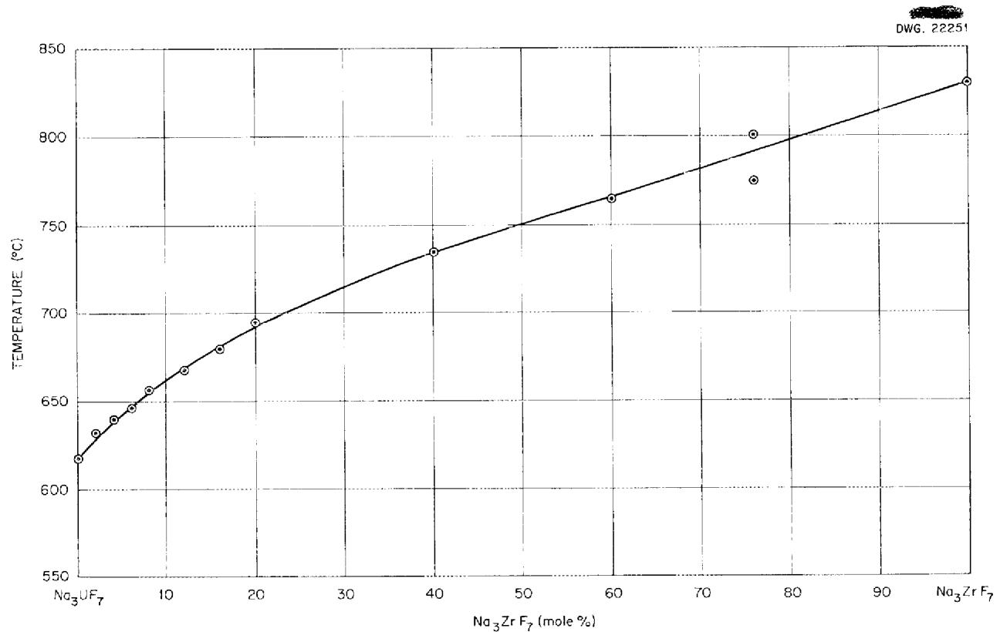  
Fig. 5.1. The System $\mathsf{Na}_3\mathsf{UF}_7 - \mathsf{Na}_3\mathsf{ZrF}_7$

compounds in this system in the pure, well-crystallized condition needed for petrographic identification. Two crystalline phases have been observed, and one of them is believed to be $\mathsf{Na}_2\mathsf{ThF}_6$ , the identity of the other is still uncertain. Further study will be required before a satisfactory equilibrium diagram for the system can be prepared.

# LiF-RbF-BeF2

Thermal data were obtained in the system LiF-RbF-BeF $_2$ for 50 compositions with up to a BeF $_2$ concentration of 60 mole%. The lowest melting point observed with these mixtures was $345^{\circ}\mathrm{C}$ for material containing (in mole%) $37\%$ LiF, $8\%$ RbF, and $55\%$ BeF $_2$ . The composition of this material is close to that of the LiF-BeF $_2$ binary eutectic reported to melt at $356^{\circ}\mathrm{C}$ . It appears unlikely that compositions with melting points substantially lower than $350^{\circ}\mathrm{C}$ exist in this system, except possibly in the high BeF $_2$ region which is not amenable to thermal analysis; materials with such high BeF $_2$ concentration would probably be of little interest in the reactor program because of their probable high viscosity. These results are similar to those reported previously for the KF-LiF-Be $_2$ system.

# RbF-BeF2-ZrF4

The system $\mathsf{RbF - BeF}_2\cdot \mathsf{ZrF}_4$ was investigated with $\mathsf{ZrF}_4$ concentrations of up to 50 mole $\%$ and with $\mathsf{BeF}_2$ concentrations of up to 60 mole $\%$ . Halts in the cooling curves at temperatures near $300^{\circ}\mathsf{C}$ were observed for several compositions in this system. It is likely that the lowest thermal effects observed can be attributed to a solid-phase transition, since the $\mathsf{RbF - BeF}_2$ and $\mathsf{RbF - ZrF}_4$ binary systems showed thermal effects in the 300 to $350^{\circ}\mathsf{C}$ temperature range which were almost certainly due to such transition. No liquidus temperatures significantly lower than $380^{\circ}\mathsf{C}$ (the minimum melting point in the $\mathsf{RbF - BeF}_2$ system) were observed with the compositions tested.

# THERMAL ANALYSIS OF CHLORIDE SYSTEMS

C.J.Barton

S.A.Boyer

Materials Chemistry Division

The $\mathsf{UCl}_3$ used for most of the phase studies of chloride systems made this quarter was prepared

by the Y-12 Chemical Division by hydrogenation of $\mathsf{UCl}_4$ . The melting point $(840^{\circ}\mathsf{C})$ obtained for this material agrees well with the melting point of $842 \pm 5^{\circ}\mathsf{C}$ reported by Kraus. Uranium and chloride analyses of the as-received material checked with the theoretical values very closely; however, slight hydrolysis of the material occurs on heating, even when considerable precaution is taken to avoid exposure.

# LiCl-UCI3

Thermal data obtained with a number of compositions in the system $\mathsf{LiCl - UCl}_3$ are shown in Fig. 5.2. The only eutectic in the system contains approximately 25 mole $\%$ UCl and melts at $495\pm 5^{\circ}C.$ This is apparently the lowest melting alkali chloride-UCI binary eutectic. The thermal data gave no indication of compound formation in this system, but, since the solid phases have not yet been studied, the absence of incongruity melting compounds is not completely demonstrated.

# NaCl-UCI3

An equilibrium diagram for the system NaCl-UCI₃ was reported by Kraus, who stated that there were no compounds formed by these components. Thermal data obtained with nine mixtures containing 33 to 85 mole % UCl₃ are in reasonable agreement with Kraus' data. However, the absence of the eutectic break in the cooling curves for the mixtures containing 65 mole % UCl₃ or more seems to indicate the possibility of compound formation in the high UCl₃ region. A thermal effect at 415 ± 5°C throughout the region studied here, which was not reported by Kraus, could be due to a solid transition of a compound in the system.

# KCI-UCI3

Kraus also published an equilibrium diagram for the system KCl-UCI.5 Thermal analysis of the system in this laboratory with mixtures containing 12 to 65 mole $\%$ UCI has essentially verified Kraus' data. The maximum difference in liquidus temperatures in the two studies was about $15^{\circ}C$ .

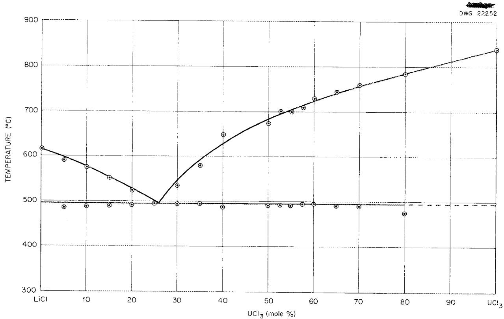  
Fig. 5.2. The System LiCl-UCl3.

# RbCl-UCI3

Preliminary data indicate that there are two eutectics in the system $\mathsf{RbCl - UCl}_3$ one at about 15 mole $\%$ UCI, that melts at $605\pm 5^{\circ}C$ and another lying between 40 and 50 mole $\%$ UCI, that melts at $515\pm 5^{\circ}C.$ The compound $\mathsf{Rb}_{3}\mathsf{UCl}_{6}$ melts congruently at about $730^{\circ}C,$ while $\mathsf{Rb}_{2}\mathsf{UCl}_{5}$ appears to melt incongruently at approximately $565^{\circ}C.$

# CsCl-UCI3

Only a few thermal measurements have been made on the system CsCl-UCI3, but there is indication that there are probably only two eutectics in this system. One eutectic has a high CsCl content and melts at 580°C, and the other contains approximately 47 mole % UCI3 and melts at about 540°C.

# KCl-LiCl-UCl 3

The few studies that have been made on the system KCl-LiCl-UCI3 indicate that the addition of about 4 mole $\%$ UCI3 to the KCl-LiCl eutectic lowers the melting point from 355 to $345^{\circ}C$ , but

further additions of $\mathsf{UCl}_3$ result in a sharp increase in melting point that is probably due to formation of the high-melting-point $\mathsf{K}_2\mathsf{UCl}_5$ complex. Study of this system will be resumed at a later date.

# RbCl-UCI

Preliminary data for the system $\mathsf{RbCl - UCl}_4$ indicate that $\mathsf{Rb}_{2}\mathsf{UCl}_{6}$ melts congruently at about $630^{\circ}C$ and that the eutectic in the 40 to 50 mole $\%$ region melts at approximately $340^{\circ}C$ .

# C5Cl-UCI4

Preliminary data for the system $\mathsf{CsCl - UCl}_4$ were presented in the previous report. A tentative equilibrium diagram for this system, based on the available thermal data, is shown in Fig. 5.3. The compound $\mathsf{Cs}_2\mathsf{U}\mathsf{C}\mathsf{l}_6,$ with a melting point of $657\pm 5^{\circ}C,$ is believed to be the only congruently melting compound in this system. There is some evidence for a compound such as $\mathsf{CsU}_2\mathsf{Cl}_9$ or

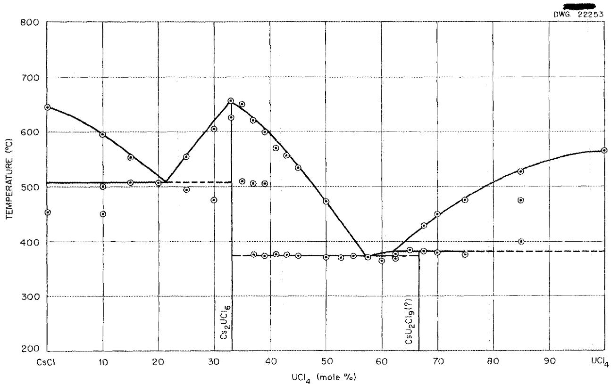  
Fig. 5.3. The System CsCl-UCI4.

$\mathsf{CsU}_{3}\mathsf{Cl}_{13}$ that would melt incongruity at about $382^{\circ}C$ which is only a few degrees above the melting point of the eutectic containing approximately 58 mole $\%$ UCI.

# KCI-LiCl-UCI4

Preliminary data reported for the system KCl-LiCl-UCI4 indicated a eutectic of unknown composition that melts at approximately $275^{\circ}C$ . Further investigation of the system during this quarter confirmed the existence of the low-melting-point eutectic, which appears to contain (in mole %) approximately $45\%$ KCl, $20\%$ LiCl, and $35\%$ UCI4. However, a more complete study of the system will be required for determining the eutectic composition with more certainty.

# NaCl-LiCl-UCl4

The very complete investigation of the system NaCl-LiCl-UCI4 made during this quarter failed to show a ternary eutectic with a melting point significantly lower than that of the lowest melting NaCl-UCI4 binary eutectic $(375^{\circ}C)$ . Since this investigation covered the region where low melting compositions are believed most likely to occur, no further work with this system is contemplated at the present. It is interesting to note that when small amounts of UCI4 (2 to 10 mole %) were added to the NaCl-LiCl binary eutectic, the resulting ternary mixtures had lower melting points than those of the binary mixtures. The smallest addition of UCI4 (1 mole %) to the KCl-LiCl eutectic resulted in a higher melting point. This difference in behavior probably can be attributed to the higher melting point of the K2UCI6 complex as compared with that of the Na2UCI6 complex.

# QUENCHING EXPERIMENTS WITH THE NaF-ZrF $_4$ SYSTEM

C.J.Barton

R.E.Thoma

R.E.Moore

J. Truitt

G.D. White

Materials Chemistry Division

Recent improvements in previously described8 techniques and equipment for quenching small samples of fused fluorides have greatly improved the reproducibility of results. The technique of determining equilibrium conditions in solid phases by quenching a composition to glass and then heating to the temperature of interest to grow crystalline phases in the glass gives promise of solving some of the more difficult problems in the NaF-ZrF4 system. Only preliminary results with this technique have been obtained.

It is apparent that very accurate temperature control is necessary to establish phase relationships in the 40 to 60 mole $\%$ $\mathsf{ZrF}_4$ region of the NaF-ZrF4 binary system in which most of the quenching work has been done. The improved equipment in use at present controls and measures temperatures to $\pm 0.5^{\circ}\mathsf{C}$ . The two furnaces now in operation make possible the quenching of about 40 samples a day.

Oil has proved to be as effective a quenching medium as mercury and it is much more convenient because it eliminates the necessity of having to attach it to the capsules. The formation of crystals during quenching has been kept to a minimum through the use of small samples (about $3\mathrm{mg}$ ) and by severe pressing of the portion of the capsule that contains the sample to decrease the sample thickness. However, quench growth is still sometimes troublesome in the NaF-ZrF₄ system. Another problem that is not yet completely solved is the presence in most quench samples of small amounts of an unidentified phase believed to be a complex sodium zirconium oxyfluoride. However, the practice of hydrofluorination of small samples (cf., subsection on "Production of Purified Fluorides") and the handling of the finely ground samples in vacuum dry boxes have been of value in keeping these phases at a minimum.

Quenching of specimens containing 33 to 46 mole $\%$ ZrF₄ reveals a cubic crystalline phase. Because the phase is isotropic, petrographic

identification is difficult; x-ray diffraction techniques will be required to establish the liquidus temperatures. The cubic material is believed to be a form of $\mathsf{Na}_2\mathsf{ZrF}_6$ but the possibility that it is $\mathsf{Na}_3\mathsf{Zr}_2\mathsf{F}_{11}$ has not yet been eliminated.

Material containing 46 mole $\%$ ZrF shows NaZrF as the primary phase. The liquidus temperature is 512 to $515^{\circ}C,$ and the solidus temperature is $510^{\circ}C.$ Devitrification at $506^{\circ}C$ of glass of this composition gave NaZrF and a small amount of the cubic material.

Material containing 48 mole $\%$ ZrF shows as its primary phase on easily crystallized species believed to be a high-temperature form of Na3Zr4F19 (designated R3).

In the mixture containing 50 mole $\%$ $\mathsf{ZrF}_4$ the primary phase is R3; the liquidus temperature is near $518^{\circ}C$ ; and the solidus temperature is slightly above $510^{\circ}C$ . Slow cooling of mixtures with this composition invariably gives a phase referred to as $\mathsf{NaZrF}_5$ and $\mathsf{Na}_3\mathsf{Zr}_4\mathsf{F}_{19}$ . However, devitrification of the glass of $506^{\circ}C$ provided only crystalline $\mathsf{NaZrF}_5$ with some glass residue. It now appears that solid solutions of $\mathsf{Na}_2\mathsf{ZrF}_6$ in $\mathsf{NaZrF}_5$ exist which show optical properties that differ only slightly from those of $\mathsf{NaZrF}_5$ . The devitrification experiments seem to indicate that $\mathsf{NaZrF}_5$ is the stable solid phase at this concentration.

Material containing 53.8 mole $\%$ ZrF4 shows R3 as the primary phase; the liquidus temperature has not been established, but it is above $517^{\circ}C$ ; the solidus temperature is about $511^{\circ}C$ . Both NaZrF19 and NaZrF5 are present below the solidus temperature.

Mixtures containing 57.2 mole $\%$ ZrF4 correspond to the formula Na3Zr4F19. A glass devitrification experiment produced an almost pure crystalline phase with this composition. Although this single experiment apparently confirms the formula, further experimentation at this and neighboring compositions will be required to establish beyond doubt the composition of the compound.

# DIFFERENTIAL THERMOANALYSIS OF THE NaF-ZrF4 SYSTEM

R.A.Bolomey

Materials Chemistry Division

The equipment used for differential thermoanalysis was modified during this quarter by replacing the capsules that had thermocouples

welded to the side with small capsules that have center thermocouple wells. With the new capsules, much better agreement is obtained between heating and cooling curves, and, for most samples, the break for the liquidus transition is sharper and better defined. Heating and cooling rates of $1^{\circ}\mathrm{C}$ per minute can now be employed satisfactorily for most samples. Data have been obtained with these capsules for mixtures in the system NaF-ZrF4 that were hydrofluorinated before use. A break at about $512^{\circ}\mathrm{C}$ for samples containing 57 to 60 mole % ZrF4 suggests that the composition of the phase which precipitates from 50 mole % material is probably above 57 mole %. It is possible, however, that the existence of the $512^{\circ}\mathrm{C}$ break in this region is due to a solid transition; this point will be established by combining the data obtained from differential analysis with that obtained by using quenching techniques. Data are being collected in the 40 to 50 mole % ZrF4 range, and, when extended to higher ZrF4 concentrations, a complete phase diagram will be presented.

# Filtration Analysis OF FLUORIDES

C.J.Barton R.J.Sheil

Materials Chemistry Division

The high-temperature filtration method of studying phase equilibria mentioned in the previous report9 was applied mainly to NaF-ZrF4-UF4 compositions during this quarter. Two attempts to filter UF4-ZrF4 mixtures were unsuccessful because the high vapor pressure of ZrF4 resulted in separation by sublimation rather than liquid-solid separation. In the NaF-ZrF4-UF4 system, the filtration method provided useful information about an important fuel composition in addition to data for fundamental studies of phase relationships in this system.

# Mixtures with 53 mole % NaF

The melting point of a mixture containing (in mole %) $53.5\%$ NaF, $40.0\%$ $\mathsf{ZrF}_4$ , and $6.5\%$ UF4 has been reported as $545^{\circ}\mathrm{C}$ . However, in a previous filtration at $560^{\circ}\mathrm{C}$ of a 7 mole $\%$ UF4 mixture, analysis of the residue and of the filtrate indicated some segregation of a high-uranium-content material. This experiment has been repeated carefully with a mixture containing (in mole

$\%$ 53.0% NaF, 40.0% ZrF₄, and 7.0% UF₄, which was filtered at 604, 575, and 560°C. At the two higher temperatures, there was no detectable difference between the filtrate and the residue, when examined either petrographically or by x-ray diffraction. At 560°C, more than 99% of the charge material passed through the filter, but examination of the residue indicated that it was a higher uranium solid solution than the filtrate. There was not enough residue obtained in this experiment for a chemical analysis, and therefore the significance of the apparent phase separation is not clear. In one filtration carried out at 525°C with the same composition, 63 wt % of the material filtered. Both filtrate and residue were found to be solid solutions of the type Na(U)ZrF₅, with the residue having the higher uranium content. It is considered significant that no trace of free UF₄ was detected in the solid phases.

# Mixtures with 50 mole % NaF

Thermal data for NaF-ZrF4-UF4 mixtures10 containing 50 mole % NaF seemed to indicate that NaUF5 and NaZrF5 form solid solutions. Petrographic and x-ray diffraction studies have shown that solid solutions do occur in this system but that UF4 is probably the primary phase that separates from the mixture containing 50% NaF, 25% UF4, and 25% ZrF4. Filtration experiments with 50% NaF mixtures containing 10, 12.5, 25, 31, and 37.5 mole % UF4 showed that UF4 separated in significant amounts from the 12.5, 25, and 31% UF4 compositions, with the maximum separation occurring at 25%. Trace amounts of UF4 were found in several of the other solid phases. Because of the UF4 separation, chemical analysis of the filtrate and residue did not give a reliable indication of the liquidus and solidus temperatures for most of the 50% NaF join.

# Mixtures with 75 mole % NaF

The thermal data for the $75\%$ NaF compositions in the $\mathsf{NaF - ZrF}_4\mathsf{-UF}_4$ system showed evidence of more or less complete solid solution formation between $\mathsf{Na}_{3}\mathsf{UF}_{7}$ and $\mathsf{Na}_{3}\mathsf{ZrF}_{7}$ . Since $\mathsf{Na}_{3}\mathsf{UF}_{7}$ melts incongruity, it was expected that the solid solutions would break down near the uranium end of the series. However, preliminary data indicate

that a comparatively small amount of $\mathsf{ZrF}_4$ (1.5 mole %) stabilizes the $\mathsf{Na}_3\mathsf{UF}_7$ structure.

Filtrations with mixtures containing $8\frac{1}{3}, 12\frac{1}{2}$ , and $16\frac{2}{3}$ mole $\% \mathrm{UF}_4$ (equivalent to 25, 50, and 75 mole $\% \mathrm{Na}_3\mathrm{UF}_7$ ) gave evidence of complete solid solution formation within this range. The x-ray diffraction pattern for all six samples from these filtrations showed only the $\mathrm{Na}_3\mathrm{ZrF}_7$ and $\mathrm{Na}_3\mathrm{UF}_7$ lines with the maximums shifted to varying extents. Petrographic examination, which is capable of detecting trace amounts of crystalline phases not shown by x-ray diffraction, showed the presence in some samples of other phases, such as $\mathrm{Na}_2\mathrm{ZrF}_6$ and $\mathrm{NaZrF}_5$ , that contained dissolved uranium and, in one case, a small amount of $\mathrm{UO}_2$ . An unidentified yellow-brown phase, which appears to be characteristic of $\mathrm{NaF-ZrF}_4$ - $\mathrm{UF}_4$ mixtures containing more than 75 mole $\% \mathrm{NaF}$ , was reported to be present in both the filtrate and the residue from the filtration of the $8\frac{1}{3}$ and $12\frac{1}{2}$ mole $\% \mathrm{UF}_4$ mixtures. Since this phase did not appear in hydrofluorinated mixtures, it seems probable that it is an oxygen-containing complex.

The data shown in Table 5.1 indicate that, within the range of compositions and temperatures covered in these experiments, the system NaF-ZrF4-UF4 is a true binary system, since the phase separation resulted in mixtures of very nearly the same NaF content as the starting material. The liquidus temperatures determined by the filtration method agreed well with the thermal data shown in Fig. 5.1 (cf., subsection on "Thermal Analysis of Fluoride Systems"). Since cooling curves for these compositions failed to indicate solidus temperatures, the data in Table 5.1 give the first indication of the temperature spread between liquidus and solidus lines for this system. Further filtrations with compositions approaching that of

the pure compounds are planned for the near future in an attempt to determine whether limits of solid solution exist in this system.

# FUNDAMENTAL CHEMISTRY

# Spectrophotometry of Supercooled Fused Salts

H. A. Friedman

Materials Chemistry Division

Measurements of the absorption spectra for $\mathsf{UF}_4$ and $\mathsf{UF}_3$ in quenched fluoride melts with a Beckman DU spectrophotometer and the procedure described by Friedman and Hill have been continued. More efficient quenching was obtained by flattening the sealed samples in a hydraulic press to give larger surface areas and thinner melts.

With glasses from the NaF-ZrF4-UF4 system, only two absorption spectrum patterns have been found. One of these superficially resembles that of crystalline UF4; the other more closely resembles crystalline Na2UF6. The Na2UF6 type of pattern was found only in a localized region near the Na2UF6 composition. Glasses of the ZrF4-UF4 system were prepared with compositions in the range from 30 to 70 mole % UF4 in 10 mole % intervals. Outside this region, no glasses were obtained; within this region, Beer's law was closely followed by the UF4 type of pattern. Samples along the Na2UF6-Na2ZrF6 join that contained less than 60% Na2UF6 were not studied because of quench growth; the Na2UF6 type of pattern was found in samples that contained from 60 to 100 mole % Na2UF6. Nine mixtures were prepared in which the ZrF4 content was held at 41 mole %, but the NaF-to-UF4 ratios were adjusted to cover the

TABLE 5.1. LIQUIDUS-SOLIDUS EQUILIBRIA OBTAINED BY FILTRATION   

<table><tr><td rowspan="2" colspan="2">INITIAL COMPOSITION (mole %)</td><td rowspan="3">Filtration TEMPERATURE (°C)</td><td rowspan="3">FRACTION OF CHARGE IN FILTRATE (wt %)</td><td colspan="6">ANALYSIS OF FRACTIONS (mole %)</td></tr><tr><td colspan="3">Filtrate</td><td colspan="3">Residue</td></tr><tr><td>Na3UF7</td><td>Na3ZrF7</td><td>NaF</td><td>ZrF4</td><td>UF4</td><td>NaF</td><td>ZrF4</td><td>UF4</td></tr><tr><td>75</td><td>25</td><td>695</td><td>63</td><td>74.9</td><td>5.1</td><td>20.0</td><td>74.9</td><td>8.4</td><td>16.7</td></tr><tr><td>50</td><td>50</td><td>742</td><td>29</td><td>75.0</td><td>10.5</td><td>14.5</td><td>75.1</td><td>13.8</td><td>11.1</td></tr><tr><td>25</td><td>75</td><td>786</td><td>60</td><td>74.9</td><td>17.4</td><td>7.8</td><td>75.6</td><td>20.6</td><td>3.8</td></tr></table>

region from 6 to 59 mole $\%$ UF4; all nine mixtures formed glasses and exhibited the UF4 type of absorption in conformity with Bear's law. The NaUF5-NaZrF5 system is currently being investigated.

Glasses were obtained with compositions of between 16.67 and 50 mole $\%$ UF3 in the ZrF4-UF3 binary system. At higher concentrations, crystallization of UF3 could not be avoided. No shift in pattern occurred in the glass region to indicate a change in the nature of the UF3 species in the liquid melt at concentrations below 50 mole $\%$ UF3. The color of the glasses was rust-olive. A typical spectrum is shown in Fig. 5.4.

# EMF Measurements in Fused Salts

L. E. Topol

Materials Chemistry Division

The techniques described previously have been used for additional electrolyses of various solutions of metal chlorides in potassium chloride. Containers of morganite, graphite anodes, and platinum or nickel cathodes are used, and the electrolyses are carried out at a temperature of $850^{\circ}\mathrm{C}$ . Potassium chloride solutions containing 1 wt $\%$ of $\mathrm{NiCl}_2$ (theoretical $E^0 = 0.82$ volt) gave decomposition potentials at 1.20 to 1.26 volts, while solutions containing 10 wt $\%$ $\mathrm{NiCl}_2$ yielded values in the range 1.0 to 1.06 volts. Solutions

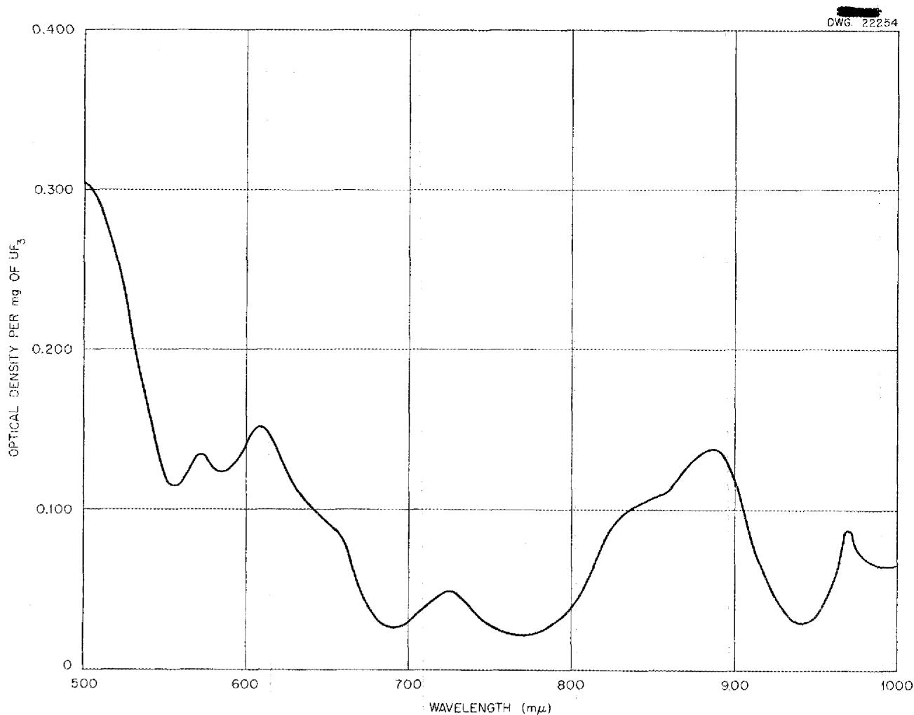  
Fig. 5.4. Absorption Spectrum of the $\mathsf{ZrF}_4\cdot \mathsf{UF}_3$ System Containing 33.3 mole $\%$ UF

containing 1 to 2 and 10 wt % of $\mathsf{FeCl}_2$ (theoretical $E^0 = 1.11$ volts) yielded decomposition potentials at 1.50 to 1.55 and 1.20 volts, respectively. A mixture containing 2 wt % of $\mathsf{NiCl}_2$ and 2 wt % of $\mathsf{FeCl}_2$ in KCl yielded two distinct breaks in the I-E curve at 1.18 and 1.56 volts, as shown in Fig. 5.5.

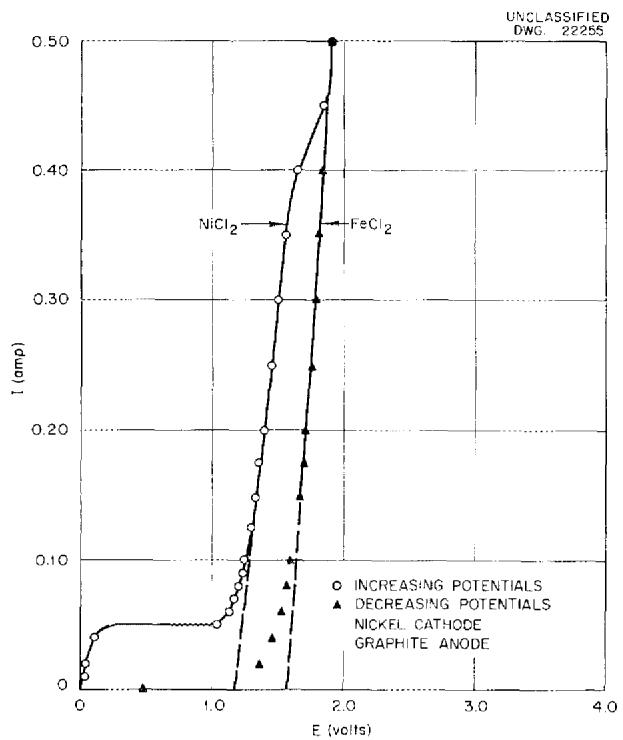  
Fig. 5.5. Electrolysis at $850^{\circ}\mathrm{C}$ of Mixture Containing 2 wt $\%$ of $\mathsf{NiCl}_2$ and 2 wt $\%$ of $\mathsf{FeCl}_2$ in KCl.

Attempts to electrolyze $\mathsf{CrF}_3$ in KCl in similar experiments have yielded decomposition potentials at about 1.15 to 1.30 and 1.50 to 1.75 volts, but reproducibility of the results has been rather poor. Electrolyses of KCl with chromium anodes have shown erratic results that are tentatively ascribed to oxidation of the chromium, even though attempts are made to maintain an inert atmosphere. Rather erratic changes of slope at about 1.2 and 1.9 volts are observed.

When a thin plate of nickel was used to protect zirconium electrodes from oxidation, reproducible emf's at 1.06 to 1.12 volts were observed in electrolyses of KCl. Since nickel is not dissolved in KCl at potentials below 1.8 volts, the emf's

obtained are considered to be characteristic of the zirconium. Based on the value for zirconium and the decomposition potential for KCl (3.1 volts), the potential for the reaction

$$
Z r C l _ {4} \rightarrow Z r + 2 C l _ {2}
$$

appears to be 2.0 volts. When a hydrogen atmosphere is used over the zirconium electrode system, the decomposition potential rises to 1.12 to 1.18 volts. Whether this may be due to formation of hydrides of zirconium is not certain.

# Physical Chemistry of Fused Salts

E.R.Van Artsdalen

Chemistry Division

Some insight into the fundamental physical chemistry of fused salt systems may be realized from the physical properties of these systems. Accordingly, the depression of the freezing point of sodium nitrate by a wide variety of solutes was determined, and measurements were made of the density and electrical conductivity of the LiCl-KCl system and the heat capacity of $\mathsf{CdI}_2$ . The molten NaCl-KCl system is also being investigated in the hope that it will yield not only practical data, but will also contribute to the understanding of short-range order and the nature of electrical conductivity of fused salt systems. This work is reviewed briefly below and is reported in detail in the Chemistry Division semiannual report.[12]

Detailed, highly reproducible measurements of the density and the electrical conductivity of the fused salt system LiCl-KCl were completed for the entire composition field over wide temperature ranges. An exact linear relation between molar volume and composition at any specified temperature indicates that no complex formation occurs in this molten system. On a molar basis, lithium chloride is a considerably better electrical conductor than potassium chloride. It was therefore significant to discover that substitution of lithium chloride for some of the potassium chloride actually lowered the equivalent conductance of the solution below that of pure potassium chloride. This phenomenon was interpreted to be indicative of considerable short-range order persisting in these high-temperature fluids. A further tentative explanation of this

behavior was based on the consideration of the relative sizes of the ions. Substitution of small $\mathsf{Li}^{+}$ ions for some of the much larger $\mathsf{K}^{+}$ ions will shrink the short-range chloride semilattice of the fluid and make transport by $\mathsf{K}^{+}$ appreciably more difficult. As more and more $\mathsf{Li}^{+}$ is substituted for $\mathsf{K}^{+}$ , the conductivity will pass through a minimum and again increase until, finally, pure LiCl is present.

The depression of the freezing point of sodium nitrate was investigated with a wide variety of solutes. The results significantly substantiate the concept that fused salts are essentially totally ionized and behave as nearly ideal electrolytes, even at relatively high concentrations of the solute. Thus, calcium, strontium, barium, and lead chlorides, for example, are completely dissociated, as is $\mathrm{LaCl}_3$ . $\mathrm{FeCl}_3$ seems to form two particles only, apparently $\mathrm{FeCl}_2^+$ and $\mathrm{Cl}^-$ . Chromate, dichromate, and bromate ions are stable in liquid sodium nitrate, but the metaperiodate ion, $\mathrm{IO}_4^-$ , decomposes to yield oxygen and the iodate ion.

The heat capacity of high-purity crystalline cadmium iodide has been measured from $15^{\circ}\mathrm{K}$ to room temperature. It remains necessary to determine $c_{p}$ in the range well below $15^{\circ}\mathrm{K}$ because of the observed high heat capacity at this temperature. The heat capacity shows approximately a 1.4-power temperature dependence at the lowest measured range and, therefore, does not yet fit either the usual Debye $T^{3}$ law or the $T^{2}$ law observed here for boron nitride. At $298.16^{\circ}\mathrm{K}$ , the following thermodynamic values have been found for cadmium iodide: $c_{p} = 19.12\text{cal / mole}$ , $S^{\circ} = 38.5_{0}$ , $-\left(F^{\circ} - H_{0}^{\circ}\right) / T = 23.19$ , $\left(H^{\circ} - H_{0}^{\circ}\right) / T = 15.31$ . The $S^{\circ}$ value has an uncertainty of about $\pm 0.5$ because of the high heat capacity value at $15^{\circ}\mathrm{K}$ and its attendant inherent difficulty of extrapolation to $0^{\circ}\mathrm{K}$ . This uncertainty is, of course, reflected in the two derived quantities.

# PRODUCTION OF PURIFIED FLUORIDES

F. F. Blankenship G. J. Nessle

Materials Chemistry Division

# Laboratory-Scale Production of Molten Fluorides

F.F.Blankenship F.P.Boody

C.M.Blood G.M.Watson

Materials Chemistry Division

Twenty-eight batches totaling $55\mathrm{kg}$ of molten fluorides and including one batch containing $15\mathrm{g}$

of enriched uranium were prepared and distributed to various laboratories for testing. When the experimental production facilities have been expanded (cf., subsection on "Experimental Production Facilities"), production of materials in this laboratory will be terminated, except for the preparation of small enriched-uranium-bearing specimens for radiation stability tests.

# Purification of Small Fluoride Samples for Phase Studies

F. F. Blankenship C. M. Blood

F.P.Boody

Materials Chemistry Division

Studies of phase equilibria in the NaF-ZrF and NaF-ZrF-UF systems by the quenching technique have been hampered by contamination of the materials with traces of water which caused hydrolysis of the tetravalent halides during the heating period and consequent contamination of the quenched melt with oxide or oxyfluoride phases. Materials for this and similar phase equilibrium studies that are essentially free from water and oxygenated compounds are now routinely prepared by a modification of the hydrofluorination-hydrogenation pretreatment method used for larger specimens.

In this process a number (up to 28) of small $(\sim 25\mathrm{g})$ samples are placed in nickel or platinum crucibles on a nickel rack inside a 4-in.-diameter nickel reactor for processing. A typical processing cycle of 2 hr of treatment with HF at $800^{\circ}\mathrm{C}$ followed by stripping with $\mathsf{H}_2$ at $600^{\circ}\mathrm{C}$ for 18 hr has been shown to produce material satisfactory for these purposes. To date, a total of six batches comprising 67 samples has been prepared. It appears, however, that handling of the specimens in a vacuum dry box may be required if freedom from oxygenated phases is to be maintained.

# Production of Enriched Material for In-Pile Loop Experiment

G.J.Nessle

Materials Chemistry Division

Plans for preparation of the enriched fuel for a miniature in-pile loop facility and for charging of the material into it have been prepared in accordance with the necessary technical and accountability considerations. It is planned that this loop will be charged with a uranium-free mixture for preliminary testing before the enriched concentrate is added for final testing.

The processing equipment for this production operation has been fabricated. When production of the ARE enriched concentrate has been completed, the new process equipment will be installed in Building 9212 in the area now occupied by the ARE facilities. The enriched fluorides for the in-pile loop will be transferred to the X-10 site where the loop will be filled.

# Experimental Production Facilities

J.P.Blakely

C. R. Croft

Materials Chemistry Division

D. E. McCarty

R. Reid

R.G.Wiley

ANP Division

A total of $329.2\mathrm{kg}$ of mixed fluorides was processed and dispensed to various requestors during this quarter. Included in this total were 14 batches of approximately $2.5\mathrm{kg}$ each, 3 batches of approximately $10\mathrm{kg}$ each, and 10 batches of approximately $27\mathrm{kg}$ each.

Although the quantity of fluorides processed decreased, the variety of demand increased sharply. This tendency is becoming more pronounced, and it appears that production of large quantities of a few materials will be of considerably less importance; versatility and adaptability of equipment will be primary requirements. Consequently, an installation is being planned for producing a variety of fluoride compositions with a minimum loss of time and equipment.

# Reduction of $\mathsf{Na}_2\mathsf{UF}_6$ by Hydrogen

F. F. Blankenship

F. P. Boody

Materials Chemistry Division

The $\mathrm{Na}_2\mathrm{UF}_6$ which had previously been hydrofluorinated and stripped with hydrogen so that the structural metal content should have been reduced to less than 30 ppm was bubbled with hydrogen gas in the original nickel reactor for

considerable periods of time at 692, 785, and $882^{\circ}C$ . It was found that the rate of reduction of the uranium according to the equation

$$
U F _ {4} + \frac {1}{2} H _ {2} = U F _ {3} + H F
$$

increased with temperature, as shown in Table 5.2. When the data given in Table 5.2 are plotted on a semilogarithmic scale as reaction rate vs. $(1 / T)\times 10^{4}$ the straight line shown in Fig. 5.6 is obtained. From the slope of this curve, the activation energy of the reduction can be calculated to be $33,700\pm 2600$ cal/mole.

# Treatment of Molten NaZrF $_5$ with Strong Reducing Agents

F. F. Blankenship

C. M. Blood

G.M.Watson

Materials Chemistry Division

It was previously reported[13] that zirconium bars suspended in molten $\mathrm{NaZrF}_5$ contained at $800^{\circ}\mathrm{C}$ in graphite-lined reactors and stirred by bubbling argon undergo weight losses far in excess of the amount required to reduce structural metal ions. This observation was further confirmed by additional experiments that involved the treatment of $\mathrm{NaZrF}_5$ in graphite-lined nickel at $800^{\circ}\mathrm{C}$ with zirconium chips; the unrecovered zirconium metal amounted to at least 20 g per kilogram of fused salt. However, it has since been observed that little if any loss of weight occurred when zirconium metal chips were exposed in a parallel experiment without the graphite liner. The difference might be due to the formation of zirconium carbide, but the available data are insufficient to show it. The possibility that a portion of the zirconium enters the melt as the trifluoride or as dissolved zirconium metal has not been ruled out.

13C. M. Blood et al., ANP Quar, Prog. Rep. Sept. 10, 1953, ORNL-1609, p. 69.

TABLE 5.2. RATE OF REDUCTION OF ${\mathrm{{Na}}}_{2}{\mathrm{{UF}}}_{6}$ WITH ${\mathrm{H}}_{2}$ AS A FUNCTION OF TEMPERATURE  

<table><tr><td colspan="2">TEMPERATURE</td><td rowspan="2">1 × 104T(℃)</td><td rowspan="2">REACTION RATE AS MOLES OF HF PER LITER OF H2 BUBBLED</td></tr><tr><td>°C</td><td>℃</td></tr><tr><td>692</td><td>965</td><td>10.36</td><td>8.8 × 10-6</td></tr><tr><td>785</td><td>1058</td><td>9.45</td><td>3.7 × 10-5</td></tr><tr><td>882</td><td>1155</td><td>8.65</td><td>1.58 × 10-4</td></tr></table>

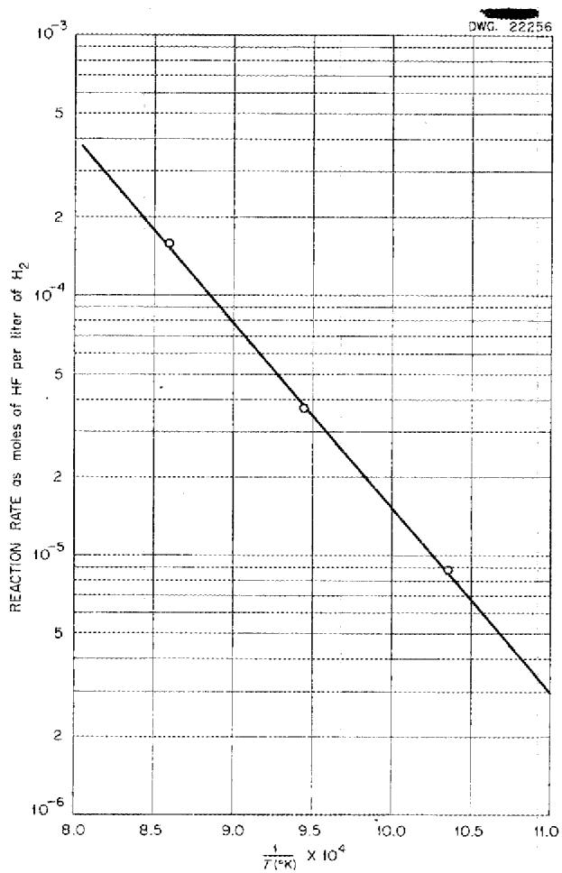  
Fig. 5.6. Reaction Rate vs. Reciprocal Temperature According to the Equation $\mathbf{U}\mathbf{F}_{4} + \frac{1}{2}\mathbf{H}_{2} = \mathbf{U}\mathbf{F}_{3} + \mathbf{H}\mathbf{F}$ .

The effect of uranium metal on $\mathrm{NaZrF}_5$ was studied by adding 5.5 wt % of uranium chips to the material in a graphite-lined reactor. Unlike the previous experiments, the mixture was treated with hydrogen for 2 hr at $800^{\circ}\mathrm{C}$ , and the material was subsequently filtered at $700^{\circ}\mathrm{C}$ . The filtrate started freezing at about $540^{\circ}\mathrm{C}$ and contained five phases typically found in fuels which are reduced to the extent that orange-red $\mathrm{UF}_3\cdot 2\mathrm{ZrF}_4$ and purple $\mathrm{UF}_3$ appear. The uranium content of the filtrate was 5.00 wt %, and apparently about $90\%$ of the uranium reacted. If it is considered that the dissolved uranium is present as $\mathrm{UF}_3$ and that all other reduced phases are insoluble, a reducing power of 210 meq per kilogram of melt should have resulted; if all reduced phases remained in solution,

the theoretical reducing power would be 840 meq/kg. Chemical analysis by $\mathsf{H}_2$ evolution showed 550 meq of reducing power per kilogram of filtrate, which indicated the presence of soluble reduced phases in addition to the UF3. Less than 20 ppm of nickel and chromium and 85 ppm of iron were found. The unfiltered residue in the reactor contained black opaque material which liberated gas readily when treated with dilute acids. X-ray analysis of the residue revealed the presence of ZrH, UF3, and uranium metal, along with occluded melt. Thus it appears that the uranium did not react quite completely and that some zirconium tetrafluoride was reduced to the metal by the uranium. Since ZrH2 is decomposed to the extent of about 25% at 800°C under 1 atm of H2, most of the zirconium appears as ZrH.

A further check on the possibility of retaining reducing species such as $\mathsf{Zr}^{\circ}$ , $\mathsf{ZrF}_3$ , $\mathsf{ZrC}$ , $\mathsf{ZrH}$ , and $\mathsf{ZrH}_2$ in $\mathsf{NaZrF}_5$ melts was attempted by treating $\mathsf{NaZrF}_5$ with $\mathsf{NaH}$ (2 moles per kilogram of melt). The mixture was sparged with hydrogen in a graphite liner for 24 hr at $800^{\circ}\mathsf{C}$ and then filtered. The reactor heel contained a dark-black residue which was tentatively identified as $\mathsf{ZrH}$ mixed with the melt. Chemical analysis of the white filtrate showed 106.5 meq of reducing power per kilogram or about $5\%$ of that expected if all reduced species were soluble. Efforts to learn more about the nature of this apparent reducing power will be continued.

# Reduction of $\mathbf{NiF}_2$ by Hydrogen

F. F. Blankenship C. M. Blood

G.M.Watson

Materials Chemistry Division

Considerable attention has been given to the kinetics of the reduction of $\mathbf{N}\mathbf{i}^{+ + }$ in $\mathrm{NaZrF}_5$ by $\mathsf{H}_{2}$ at $800^{\circ}C$ because of the importance of this reduction in fluoride purification procedures. The use of graphite liners in the nickel reactors for handling molten salts is a great convenience in loading and unloading and in avoiding excessive contamination with $\mathbf{N}\mathbf{i}\mathbf{F}_2$ during the HF treatment. Accordingly, for most of the kinetic studies, graphite-lined reactors have been used. Early suspicions that graphite might reduce $\mathbf{N}\mathbf{i}^{+ + }$ were allayed by the large, positive, standard free energy estimated for

the reduction with carbon,

$$
\begin{array}{l} 2 \mathrm {N i F} _ {2} (\text {s o l i d}) + \mathrm {C} (\text {s o l i d}) \longrightarrow 2 \mathrm {N i} ^ {\circ} (\text {s o l i d}) \\ + C F _ {4} (\text {g a s}) \Lambda F _ {1 0 0 0 ^ {\circ} K} ^ {\circ} = 1 1 8 k c a l, \\ \end{array}
$$

and by the failure to find a noticeable difference in short experiments without graphite liners. In carrying out more detailed measurements over a period of days, the graphite liners have been found to play an important but incompletely understood role in the reduction of $\mathbf{N}\mathbf{i}^{+ + }$ .As a result, the apparent complexity of the reduction kinetics is now explainable from a qualitative standpoint, but a new set of experiments without the graphite liner must supplant the many experiments made with the use of the graphite liner before quantitative data can be assumed.

In a series of trials which provide evidence for the effect of graphite, a weighed portion of nickel fluoride was mixed with previously purified $\mathrm{NaZrF}_5$ which was then pretreated at $800^{\circ}\mathrm{C}$ in a graphite-lined reactor by bubbling inert gas through it at an approximate rate of $400~\mathrm{cm}^3 /\mathrm{min}$ and, finally, treated with hydrogen at the same approximate bubble rate. The varying concentrations of hydrogen fluoride in the effluent gases were continuously determined by direct titration of standard potassium hydroxide samples to the phenolphthalein end point as the gases bubbled through.

In Table 5.3 are listed the initial concentrations of nickel fluoride used, the volume of inert gas passed during pretreatment, the volume of hydrogen passed, and the percentage of hydrogen fluoride recovered during the hydrogen treatment. From the results given in Table 5.3, it appears that the recovery of hydrogen fluoride decreases as the length of pretreatment increases; that is, it is apparent that a fraction of the nickel fluoride added is reduced by some agent other than hydrogen

and that this fraction increases with increasing length of pretreatment.

Since it appeared that the graphite liner was in some fashion effectively reducing the $\mathsf{NiF}_2$ , one experiment that essentially duplicated the last test shown in Table 5.3 was conducted without the graphite liner in the nickel vessel. Copious evolution of hydrogen fluoride occurred. The recovery measured amounted to $72.6\%$ at the end of passage of 60 liters of hydrogen. Kinetically, the reaction appears complex in the presence of graphite, as evidenced by the variable overall order with respect to the apparent nickel fluoride concentrations.

Preparation of Various Fluorides

B. J. Sturm

Materials Chemistry Division

The methods of preparation and some of the physical properties of numerous complex fluorides that resulted from the interaction of alkali with structural metal fluorides have been previously reported.15 During this quarter, the simple structural metal fluorides have been used increasingly in corrosion studies, and a major portion of the available time has been devoted to preparation of these materials. The compositions of these fluorides were determined by chemical analyses, and some supplementary x-ray and petrographic determinations were made for further characterization.

Several batches of $\mathsf{FeF}_3$ and $\mathsf{FeF}_2$ have been prepared by hydrofluorination of the anhydrous chlorides. Emphasis was placed on the preparation of relatively small batches of these two fluorides

TABLE 5.3. RESULTS OF TESTS OF THE REDUCTION OF NiF ${}_{2}$ BY HYDROGEN   

<table><tr><td rowspan="2">INITIAL CONCENTRATION OF NiF2 (meq/kg)</td><td colspan="2">VOLUME OF GAS PASSED</td><td rowspan="2">HF RECOVERED DURING HYDROGEN TREATMENT (%)</td></tr><tr><td>Helium Pretreatment (liters)</td><td>Hydrogen Pretreatment (liters)</td></tr><tr><td>15.7</td><td>44</td><td>69</td><td>82.5</td></tr><tr><td>29.2</td><td>132</td><td>119</td><td>81.6</td></tr><tr><td>228.0</td><td>1285</td><td>60</td><td>9.0</td></tr></table>

of the highest possible purity. Several pounds of anhydrous $\mathrm{NiF}_2$ were prepared by hydrofluorination of the hydrated $\mathrm{NiF}_2$ . Small quantities of anhydrous $\mathrm{NiCl}_2$ were similarly prepared from hydrated $\mathrm{NiCl}_2$ for special uses.

Previous work had indicated that the precipitate resulting from the addition of $\mathsf{NH}_4\mathsf{HF}_2$ to an aqueous solution of CdCl2 could not be quantitatively converted to CdF2by hydrofluorination. Further studies have shown that the solids resulting from the addition of $\mathsf{NH}_4\mathsf{HF}_2$ to aqueous solutions of either CdSO4 or $\mathsf{Cd}(\mathsf{C}_2\mathsf{H}_3\mathsf{O}_2)_2$ give the same x-ray pattern as that found for the material prepared from CdCl2; this pattern differs from the accepted pattern for CdF2and apparently indicates complex or double salt formation. It was observed that the interaction of HF with CdCO3 in an aqueous medium gives a precipitate of CdF2that has the x-ray properties accepted for CdF2.

In an effort to prepare some of the fluorides of molybdenum, the powdered metal was brominated to produce a material consisting mainly of $\mathsf{MoBr}_3$ . A first attempt to hydrofluorinate this material was incomplete; components of the mixture have not yet been identified.

# PURIFICATION AND PROPERTIES OF HYDROXIDES

# Purification of Hydroxides

E.E.Ketchen L.G.Overholser

Materials Chemistry Division

The work with hydroxides during this quarter has been confined to the purification of NaOH and $\mathrm{Sr(OH)_2}$ according to the methods previously described.16 Earlier studies indicated that $\mathrm{Na}_2\mathrm{CO}_3$ could be separated from NaOH by filtering the 50 wt $\%$ aqueous solution of NaOH through a fine sintered-glass filter instead of deconting off the NaOH solution, as had been done. Further work has shown that the filtration method produces a material with a slightly lower $\mathrm{Na}_2\mathrm{CO}_3$ content and without a significant increase in silica content.

Seven batches of NaOH containing approximately 400 g each have been prepared by filtration and dehydration during this quarter. The material obtained contained from 0.02 to 0.10 wt% of $\mathrm{Na}_2\mathrm{CO}_3$ and less than 0.1 wt% of $\mathsf{H}_2\mathsf{O}$ .

The $\mathrm{Sr(OH)_2}$ purified during this quarter contains considerably less $\mathrm{SrCO_3}$ than the material previously prepared; the improvement resulted from the replacement of a faulty filter. For the 12 batches produced, the $\mathrm{SrCO_3}$ contents range from 0.02 to 0.06 wt $\%$ and the total alkalinities, as determined by titration, range from 99.8 to $100.0\%$ .

# Reaction of Sodium Hydroxide with Carbonaceous Matter

E. E. Ketchen L. G. Overholser  
Materials Chemistry Division

A few experiments were run to check observations made elsewhere which suggested that the $\mathsf{Na}_2\mathsf{CO}_3$ content increased when NaOH was heated at $700^{\circ}\mathsf{C}$ in a sealed nickel container. If the increase occurs, it may be due to the presence in the hydroxide of carbonaceous matter capable of oxidation to $\mathsf{Na}_2\mathsf{CO}_3$ . Samples of commercial NaOH (about 1.5 wt $\%$ $\mathsf{Na}_2\mathsf{CO}_3$ ) showed no significant change after heating at $700^{\circ}\mathsf{C}$ for 24 hours. However, the analytical results were not sufficiently precise to detect very small changes in this range of carbonate concentration. When samples of purified NaOH (one purified by filtration and one by decantation) for which accurate $\mathsf{CO}_3^{2-}$ analyses could be obtained were heated in nickel for 24 hr at $700^{\circ}\mathsf{C}$ , slight increases in carbonate content were observed. Both purified NaOH samples contained 0.02 wt $\%$ $\mathsf{Na}_2\mathsf{CO}_3$ prior to heating. After heating, the NaOH purified by decantation contained 0.05 wt $\%$ $\mathsf{Na}_2\mathsf{CO}_3$ and that purified by filtration contained 0.06 wt $\%$ . The increase observed could be due to oxidation of the carbon present in the nickel or the NaOH. Additional tubes were filled with NaOH to which had been added 0.2 wt $\%$ graphite. After these tubes were heated at $700^{\circ}\mathsf{C}$ for 24 hr, preliminary analyses indicated a marked increase in carbonate content. This suggests that carbon is oxidized by NaOH at $700^{\circ}\mathsf{C}$ ; if this is the case, NaOH could not be maintained carbonate free at high temperatures in metals which contain appreciable percentages of carbon.

# 6. CORROSION RESEARCH

W. D. Manly

Metallurgy Division

W. R. Grimes

F. Kertesz

Materials Chemistry Division

H. W. Savage

ANP Division

The static and the seesaw corrosion testing facilities have been used to study the corrosion of Inconel, cermets, and some special alloys in the fluoride fuel NaF·ZrF4·UF4 (50-46-4 mole %). The effects of improper degreasing of metals and of contaminants in the fluorides were studied. Several tests of bearing materials and hard-facing alloys have been completed in which the molten fluorides were used as the corroding agent. The materials tested are of considerable interest because of their prospective uses as high-temperature bearings and valve facings. Various cermets have also been tested in the fluorides to determine their fitness for these same applications. Static tests in graphite capsules of Inconel specimens exposed to fluoride fuel to which FeF3, FeF2, or NiF2 additions were made gave anomalous results that were presumably due to the reduction of the added metal fluorides by the graphite. Static tests of two dissimilar metals indicated that one metal is usually preferentially attacked.

Fluoride corrosion tests were made in Inconel thermal convection loops to supplement and extend the data obtained in the above-mentioned and previous static tests. Although the thermal convection loops normally operate with a hot-leg temperature of $1500^{\circ}\mathrm{F}$ , the temperatures were varied to determine the effects of both time and temperature. Additional tests have substantiated the earlier conclusion that attack by NaF-ZrF $_4$ -UF $_4$ (50-46-4 mole %) on Inconel is independent of temperature, at least in the range of 1500 to $1650^{\circ}\mathrm{F}$ , and dependent on exposure time. The purity of the fluoride mixture was shown to be important when the attack depth was increased by a factor of 3 in a loop operated with a low-purity batch of fuel. Reductions in attack, in comparison with that found in the standard loop, that is, a loop operated for 500 hr at $1500^{\circ}\mathrm{F}$ , were achieved by (1) precirculating the fluorides, (2) pretreating the fluorides with chromium metal flakes, and (3) holding the fluorides in contact with Inconel

turnings before circulation in the loop. While pretreatment of the fluorides with metallic chromium was beneficial, a chromium plate on the pipe wall was not. Increasing the $\mathsf{UF}_4$ content in the fluoride mixture from 4 to 6.5 mole $\%$ caused an increase in mass transfer in the loops and possibly a slight increase in corrosion. The maximum depth of attack by the purified ARE fuel solvent, $\mathsf{NaZrF}_{5'}$ was comparable to that of the purified fuel mixture (with 4 mole $\%$ $\mathsf{UF}_4$ ), although the intensity of the $\mathsf{NaZrF}_{5}$ attack was much less and the same mass transfer was noted.

Additional studies were performed in an attempt to establish the chemical equilibria of the postulated corrosion reaction which results in the selective leaching of chromium from Inconel. Preliminary values have been obtained for the equilibrium constants involved, but the data are not yet sufficiently reliable.

Nickel and type 430 stainless steel thermal convection loops were also operated with the fluoride NaF·ZrF₄·UF₄ (50·46·4 mole %). There was no measurable mass transfer in the nickel loop, and the hot-leg surface had a polished finish. The hot leg of the type 430 stainless steel loop showed a small amount of smooth, even removal, with no subsurface voids or intergranular attack; metal crystals were deposited in the cold leg.

A number of tests, both static and dynamic, were performed with the liquid metals lithium, sodium, and lead. Tests have been completed on beryllium oxide and a number of bearing materials and cermets.

The investigation of the mass transfer and corrosion of metals and alloys in quartz thermal convection loops containing liquid lead have continued. The metals tested during this quarter included a molybdenum-nickel (25% Mo-75% Ni) alloy, a chromium-iron-silicon (14% Cr-84% Fe-2% Si) alloy, and types 304 and 347 stainless steel specimens which were oxidized prior to contact with the lead. The most significant result from

this study was the marked improvement in the resistance to mass transfer of these metals because of the oxide film. Some static tests on the corrosion and mass transfer characteristics of various alloys in contact with lithium were completed.

Static tests on a number of solid fuel elements were performed in sodium and sodium hydroxide. While there was no evidence of attack in any of the sodium tests, all the fuel elements were severely attacked in the hydroxide. In connection with a study of hydroxide containment, the equilibrium pressures of hydrogen over a number of hydroxides-metal systems are being determined.

# FLUORIDE CORROSION IN STATIC AND SEESAW TESTS

E.E.Hoffman L.R.Trotter

J.E.Pope D.C.Vreeland

Metallurgy Division

H. J. Buttram R. E. Meadows

N.V. Smith

Materials Chemistry Division

Both the static capsule and the seesaw tests provide relatively cheap and simple means of investigating the many parameters which affect fluoride corrosion. The seesaw tests in which the capsule containing the fluoride is rocked in a furnace were operated at 4 cps with the hot end of the capsule at $815^{\circ}C$ and the cold end at $700^{\circ}C$ . The static tests in which the fluoride mixture is sealed in a capsule were usually conducted for 100 hr at $816^{\circ}C$ . In order to permit testing of material which could not be readily fabricated into capsules or to permit variation of the surface-to-volume ratio of fluoride to metal, a number of tests were performed in which the fluoride and metal specimens were contained in graphite capsules. All capsules are filled in a helium dry box, and therefore oxidation or hydrolysis of the contents of the capsules is improbable.

# Inconel Corrosion by Fluorides with Metal Fluoride Additives

In general, corrosion of Inconel specimens by several fluoride preparations in graphite capsules was similar to that obtained when Inconel capsules were used in static tests. Some carburization of the specimens was obtained, but no other special effects were observed.

However, when fluorides to which had been added considerable quantities of $\mathsf{FeF}_{3}, \mathsf{FeF}_{2}$ or $\mathsf{NiF}_{2}$ were tested in graphite capsules containing Inconel specimens, rather surprising results were obtained. In each case, tests at $800^{\circ}\mathsf{C}$ showed extensive deposition of iron or nickel, usually in films on the graphite capsule and on the specimen. When $\mathsf{FeF}_{3}$ was the additive (in amounts up to 5 wt %), the corrosion of the Inconel specimen, as observed by metallographic examination and by analysis of the final melt for chromium, was much less than expected. In similar tests with $\mathsf{FeF}_{2}$ corrosion of the Inconel was virtually undetectable by either technique. In this case, the precipitated film of metal appeared to be protective.

When $\mathsf{NiF}_2$ was the added material, however, no protection of the specimen by the film resulted. In these experiments, extremely heavy subsurface void formation to a depth of 9 mils was observed. There is evidence that corrosion by fluoride mixtures with $\mathsf{NiF}_2$ added is more severe at 600 than at $800^{\circ}\mathsf{C}$ .

These experiments suggest that graphite or some unknown contaminant in the graphite is responsible for reduction of the added metal fluoride. While reduction of $\mathsf{FeF}_2$ , for example, by graphite should have an extremely low equilibrium constant, it is possible that the volatile reaction product $(\mathsf{CF}_4)$ escapes from the system and permits the reaction to proceed. It is also possible that there is sufficient oxygen or water adsorbed in or on the graphite so that reduction of oxide by carbon (a reaction with an appreciable equilibrium constant at these temperatures) is responsible for these effects. Further study of this and similar reactions is in progress.

# Corrosion of Various Metal Combinations

A series of experiments in which various metals, either alone or in combination, were tested in molten fluorides in graphite capsules have yielded the following results. (1) Nickel alone shows no attack. (2) Chromium-plated Inconel shows heavy subsurface void formation at all temperatures above $600^{\circ}\mathrm{C}$ ; the voids were 3 to 4 mils deep at $700^{\circ}\mathrm{C}$ and above. (3) Chromium metal yielded high values for chromium content of the melt; it is possible, however, that slight surface oxidation of the chromium pellets used was responsible for this dissolved material. (4) When Inconel and chromium specimens were exposed together, the chromium

# ANP QUARTERLY PROGRESS REPORT

test piece was nearly completely dissolved, while the Inconel specimen, which was covered with a thin metal layer, was almost completely unattacked. (5) However, when Inconel and nickel were exposed together, the nickel appeared unaffected, while the Inconel was badly attacked; at $700^{\circ}\mathrm{C}$ , for example, the heavy subsurface void formation reached a depth of 3 to 4 mils.

# Corrosion of Cermets

Several cermets which were considered for bearings and hard-facing applications were tested for resistance to fluoride corrosion. Three of these ceramic-metal materials were subjected to static tests. The materials consisted of heavy metal

carbides bonded by nickel and were obtained from the Firth Sterling Company. Table 6.1 presents results obtained when the cermets were exposed to two fluoride mixtures in graphite capsules. The results indicate fair resistance to the two fluoride mixtures under the conditions of the test, and there was no apparent change in the appearance of the specimens after testing.

Another set of specimens was subjected to seesaw tests in Inconel capsules for 100 hr, with the specimens restricted to the hot zone of the Inconel tube. The hot-zone temperature was $816^{\circ}C,$ and the cold-zone temperature was $730^{\circ}C.$ Results of these tests are presented in Table 6.2. Some of these specimens contained chromium as a binding

TABLE 6.1. RESISTANCE OF CERMETS TO TWO FLUORIDE MIXTURES   
Static tests at $800^{\circ}\mathrm{C}$ for 100 hr in graphite containers   

<table><tr><td>CERMET(wt %)</td><td>FLUORIDE COMPOSITION(mole %)</td><td>WEIGHT CHANGE(%)</td></tr><tr><td rowspan="2">TiC-Cr3C2-Ni (42.9-7.1-50.0)*</td><td>NaF-ZrF4(50-50)</td><td>+1.12</td></tr><tr><td>NaF-ZrF4-UF4(53-43-4)</td><td>+1.27</td></tr><tr><td rowspan="2">TiC-Mo2C-Ni (72-5-23)</td><td>NaF-ZrF4(50-50)</td><td>+0.047</td></tr><tr><td>NaF-ZrF4-UF4(53-43-4)</td><td>-0.005</td></tr><tr><td rowspan="2">Cr3C-Ni (89-11)</td><td>NaF-ZrF4(50-50)</td><td>+0.152</td></tr><tr><td>NaF-ZrF4-UF4(53-43-4)</td><td>+0.153</td></tr></table>

\*Firth Sterling 27.

TABLE 6.2. RESULTS OF SEESAW TESTS OF VARIOUS CERMET MATERIALS TESTED IN   
NaF-ZrF4-UF4(50-46-4 mole %)   

<table><tr><td>MATERIAL</td><td>COMPOSITION (wt %)</td><td>METALLOGRAPHIC NOTES</td></tr><tr><td>Metamic LT-1 (not heat treated)</td><td>Cr-Al2O3(77·23)</td><td>Specimen completely penetrated</td></tr><tr><td>Metamic LT-1 (heat treated)</td><td>Cr-Al2O3(77·23)</td><td>Specimen completely penetrated</td></tr><tr><td>Firth Sterling 27</td><td>TiC2with Ni-Cr binder*</td><td>Attack zone 2 to 5 mils deep, 3 mils in most places</td></tr><tr><td>Kenametal 151A</td><td>TiC2with 20% Ni</td><td>Slightly affected zone 1 to 2 mils deep</td></tr></table>

\*Cf.,Table 6.1.

agent, and, as expected, these materials were attacked by the fluorides. Metamic LT-1, in both the heat-treated and unheat-treated conditions, was attacked severely. While the attack on the Firth Sterling 27 and on the Kenametal 151A in the seesaw tests was only moderate, the increased severity of attack in the seesaw tests compared with that in the static tests is evidenced by the test data on Firth Sterling 27.

# Inconel with Oil and Trichloroethylene Additives

Several thermal convection loops had more than average depths of attack which were thought to be due to improper degreasing of the loops prior to filling. Therefore, a static test was run in which six drops of oil and six drops of trichloroethylene were added to an Inconel capsule containing an Inconel specimen and the solution was allowed to evaporate in an attempt to duplicate improper degreasing. This capsule was then loaded with the fluoride mixture NaF-ZrF4-UF4 (50-46-4 mole %) and tested for 100 hr at $816^{\circ}\mathrm{C}$ under static conditions, along with a control capsule for comparison. The specimen in the control capsule had greater weight loss and depth of attack than the specimen contaminated by the evaporation of the trichloroethylene-oil solution. It appears that under the conditions of this test, the contamination was not detrimental and might even have been beneficial.

# Inconel Corrosion by Fluorides with $\mathsf{MoS}_2$ Additive

Molybdenum disulfide is being used as a Swage-lok lubricant in fluoride production systems, and therefore it was pertinent to determine whether increased corrosion of the Inconel tubing would result if some of the $\mathsf{MoS}_2$ were to contaminate the fluoride. Accordingly, two seesaw tests of the fluoride mixture NaF-ZrF $_4$ -UF $_4$ (50-46-4 mole %) in Inconel tubing were run for 100 hr. In one of these tests, an addition of 3 wt % MoS $_2$ was made to the fluoride; the other test was run with no addition to fluoride.

Metallographic examination of sections of tubing from hot and cold zones of both tests showed that more severe attack had taken place in the test with the $\mathsf{MoS}_2$ addition. The cause of this increased corrosion is not known. The type and extent of attack both with and without $\mathsf{MoS}_2$ additions is shown in Fig. 6.1.

# Screening Tests of Metallic Bearing Materials

Several tests have been completed in the screening program on materials for potential use in bearing and hard-facing applications. Materials for these uses must be resistant to corrosion by molten fluorides. One set of specimens consisted of Hastelloy's B, C, and D, and Stellites 1, 6, 12, 21, 25, 40, and 41 deposited on pieces of type 347 stainless steel. These composite specimens were tested in the fluoride mixture NaF-ZrF $_4$ -UF $_4$ (50-46-4 mole %) for 100 hr at $816^{\circ}\mathrm{C}$ under static conditions. In these tests, it appeared that Hastelloy's B, C, and D and Stellites 21, 25, and 40 satisfactorily resisted attack by this fluoride mixture. Stellites 1, 6, 12, and 41 appeared to be attacked severely. The appearance of Stellite 40 after the test is shown in Fig. 6.2; the attack is limited to a depth of 4 or 5 mils. As reported previously, it is apparently the carbides in thestellites which are preferentially attacked by the fused fluoride salts, and it appears that thestellites of low carbon content are not so severely attacked. The results of these tests are presented in Table 6.3.

# FLUORIDE CORROSION OF INCONEL IN THERMAL CONVECTION LOOPS

G. M. Adamson  
Metallurgy Division

The use of thermal convection loops for determining dynamic corrosion by liquids has been previously described. Unless otherwise stated for the tests described in the following sections, the temperature of the hot leg of the loop was maintained at $1500^{\circ}\mathrm{F}$ and the temperature of the uninsulated cold leg was approximately $1300^{\circ}\mathrm{F}$ . With the fluoride salts, this temperature difference results in a fluid velocity of about 6 to 8 bpm. The usual testing period is 500 hours.

# Effect of Fluoride Batch Purity

Pilot-plant batches of the fluoride fuel mixture NaF-ZrF4-UF4 (50-46-4 mole %) which received a 24-hr gas purification instead of the customary 8 hr or less are now available for thermal convection loop work. The longer gas purification results in a reduction of the hydrogen fluoride content of the melt. Corrosion results from three

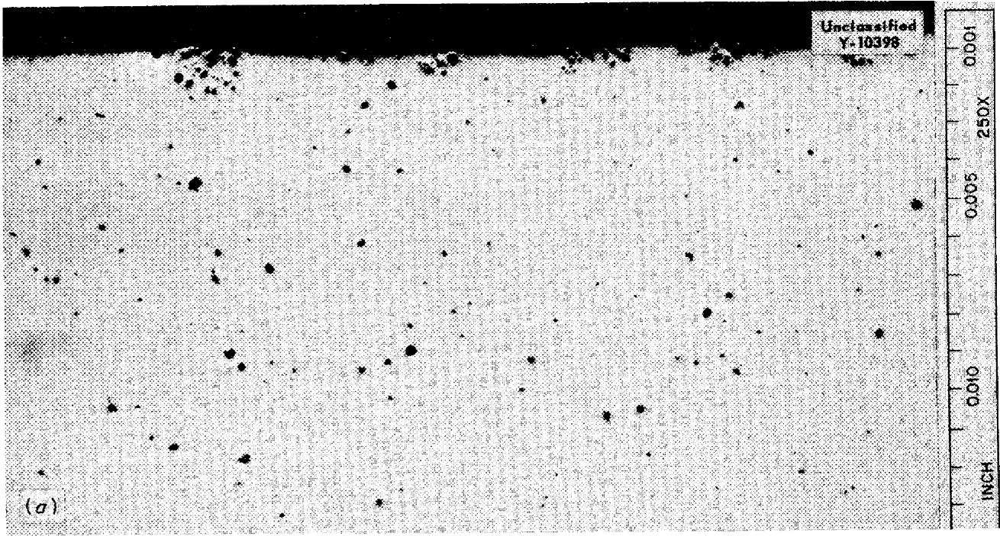

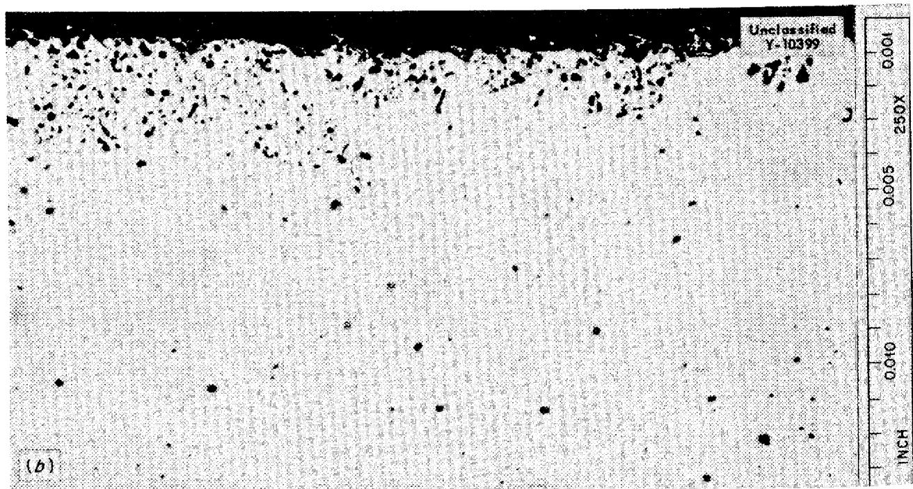  
Fig. 6.1. Corrosion of Inconel after a 100-hr Seesaw Test at $815^{\circ}\mathrm{C}$ in the Fluoride NaF-ZrF $_4$ -UF $_4$ (50-46-4 mole %) with and Without 3 wt% MoS $_2$ Additive. a. Tested with no additive. 250X. b. Tested with 3 wt% MoS $_2$ added. 250X.

TABLE 6.3. CORROSION OF HARD-FACED TYPE 347 STAINLESS STEEL SPECIMENS EXPOSED TO $\mathrm{{NaF}} - {\mathrm{{ZrF}}}_{4} - {\mathrm{{UF}}}_{4}$ FOR ${100}\mathrm{{hr}}$ AT ${816}^{ \circ  }\mathrm{C}$ UNDER STATIC CONDITIONS   

<table><tr><td>HARD-FACING
MATERIAL</td><td>COMPOSITION (wt %)</td><td>METALLOGRAPHIC NOTES</td></tr><tr><td>Hastelloy</td><td></td><td></td></tr><tr><td>B</td><td>Mo, 26 to 30
Fe, 4 to 7
C, 0.12 max
Ni, balance</td><td>A few voids to a depth of 0.5 mil</td></tr><tr><td>C</td><td>Mo, 16 to 18
Fe, 4.5 to 7
C, 0.15 max
Cr, 15.5 to 17.5
W, 3.75 to 5.25
Ni, balance</td><td>A little spalling and a few voids to a maximum depth of 1 mil</td></tr><tr><td>D</td><td>Cu, 3
Al, 1
Si, 10
Mn, 1
Ni, balance</td><td>Subsurface voids to a depth of 1.5 mils</td></tr><tr><td>Stellite</td><td></td><td></td></tr><tr><td>1</td><td>Cr, 30.5
W, 12.5
Fe, 3 max
C, 2.5
Ni, 1
Co, balance</td><td>Many voids to a depth of 5 to 10 mils</td></tr><tr><td>6</td><td>Cr, 27.5
W, 4
Fe, 2 to 3 max
C, 1
Co, balance</td><td>Erratic attack up to 15 mils deep along carbides in grain boundaries</td></tr><tr><td>12</td><td>Cr, 29.5
W, 8.25
Fe, 2 to 3 max
C, 1.4
Ni, 1
Co, balance</td><td>Erratic intergranular attack 0 to 13 mils deep</td></tr><tr><td>21</td><td>Cr, 25 to 30
Ni, 1.5 to 3.5
Mo, 4.5 to 6.5
Fe, 2 max
Co, balance
C, 0.2 to 0.35</td><td>A few voids to a depth of 0.5 mil</td></tr><tr><td>Stellite</td><td>Cr, 19 to 21</td><td rowspan="8">A few voids to a depth of 0.5 mil</td></tr><tr><td>25</td><td>C, 0.15</td></tr><tr><td></td><td>Ni, 9 to 11</td></tr><tr><td></td><td>W, 14 to 16</td></tr><tr><td></td><td>Si, 1</td></tr><tr><td></td><td>Mn, 1 to 2</td></tr><tr><td></td><td>Fe, 2</td></tr><tr><td></td><td>Co, balance</td></tr><tr><td>40</td><td>Composition not available</td><td>Voids to a depth of 3 to 5 mils</td></tr><tr><td>41</td><td>Composition not available</td><td>Heavy, erratic intergranular attack
4 to 23 mils deep</td></tr></table>

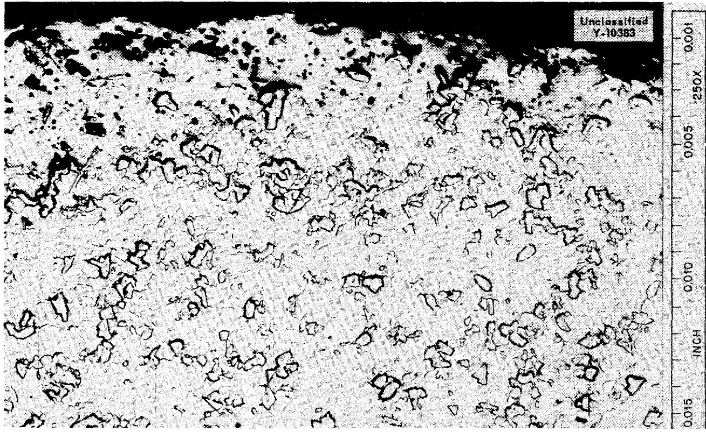  
Fig. 6.2. Stellite 40 After Static Testing in NaF-ZrF $_4$ -UF $_4$ (50-46-4 mole %) for 100 hr at $816^{\circ}\mathrm{C}$ .

Inconel loops operated with this material showed general attack to a depth of 3 mils and some intergranular penetration to a depth of 6 mils. The importance of purity of the materials is evident from these tests, since the average maximum penetration in standard production batches has been

9 mils. The reduction in attack, shown on Fig. 6.3, was also reflected in the chromium pickup, which was down to 450 to 600 ppm, that is, less than one half the previous contamination. Some reduction was also obtained in the amount of iron present.

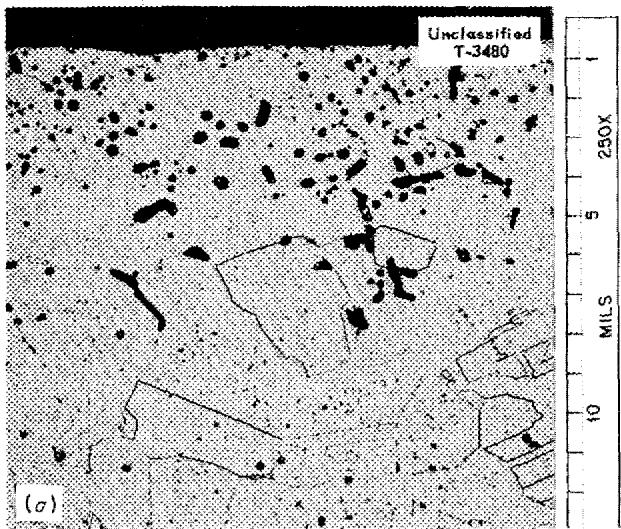

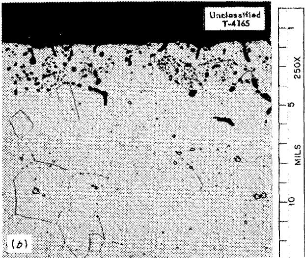  
Fig. 6.3. Effect of Fluoride Batch Purity on the Corrosion of Inconel Exposed in Thermal Convection Loops to NaF-ZrF4-UF4 (50-46-4 mole %) for 500 hr at $1500^{\circ}\mathrm{F}$ . a. Exposed to standard production batch. 250X. b. Exposed to high-purity batch. 250X. Reduced 17%.

Fluoride fuel mixtures with high hydrogen fluoride content were circulated in a number of loops. Increased corrosion, as indicated by heavy attack and maximum penetrations of 14 and 15 mils, was found under standard operating conditions.

# Effect of Chromium Additives

Data were presented previously² which indicated doubtful improvement in corrosion characteristics when chromium powder was added to the fluoride

mixtures. However, in a new test, in which the chromium was added in the form of coarse metallic flakes, a reduction in the depth of attack was found. The fluoride mixture was held in contact with the chromium flakes overnight at a temperature of $1300^{\circ}\mathrm{F}$ before being charged into the loop. Examination subsequent to operation of the loop showed a maximum penetration of only 4 mils, as compared with penetration of the control loop to a depth of 15 mils. As in previous tests with chromium additions, a thin, continuous, metallic deposit was found in the cold leg of the loop.

One thermal convection test was run in which the chromium was added in the form of an electroplated layer on the inner surface of a 6-in. length of Inconel pipe. This pipe was welded into the top of the hot leg of a standard loop. After operation of the loop, no trace of the chromium could be found in the hot leg by metallographic examination. Typical subsurface void attack was found in the Inconel, with a maximum penetration of 10 mils. No data are available on the hydrogen fluoride content of the batch circulated in this loop. The 10 mils of attack is slightly higher than the average, but no change in attack could be seen on opposite sides of the hot leg where the section was welded into the loop. Scattered metallic particles were found on the cold-leg wall. This test confirms the earlier finding that, while a direct chromium addition to the fuel may result in a beneficial effect, a chromium plate on the pipe wall does not offer any protection in a dynamic system.

Although large additions of chromium were made to the fluoride mixtures in both these loops, the chromium concentration in the fluoride mixtures after circulation in both loops was uniform and was only 1600 ppm. A study of the chemical analyses of fluoride mixtures from other loops showed this concentration to be the maximum reported. Attempts have been made by the Materials Chemistry Division to obtain apparent solubilities of chromium of over $1\%$ at $800^{\circ}\mathrm{C}$ in this fluoride mixture, but it is speculated that 1600 ppm is an equilibrium concentration. Attempts to obtain this concentration in the laboratory have not yet been successful.

# Pretreatment of Fluoride with Inconel

Some reduction in corrosive attack was obtained by first holding the fluorides in contact with Inconel turnings for 100 hr at $1300^{\circ}\mathrm{F}$ . After subsequent operation of the convection loop, examination revealed the maximum depth of attack of the Inconel to be 11 mils, as compared with a maximum depth of 14 mils in the control tests. This pretreatment, although it apparently does not have as beneficial an effect on the corrosion properties as does the chromium addition, has the advantage that it prevents the formation of a layer on the cold-leg wall. It is likely that larger reductions in attack would be obtained with higher treatment temperatures, although it is not convenient to do this with existing equipment.

# Effect of Exposure Time

Two series of Inconel loops have been filled and are now being operated to determine the effect of time on corrosion and mass transfer. One series is circulating the fluoride fuel NaF $\mathsf{ZrF}_4$ -UF $_4$ (50-46-4 mole \%), and the other is circulating the fuel solvent NaZrF $_5$ ; periods of operation have ranged from 500 to 5000 hours. Both series of loops were filled with especially purified fluorides. Metallographic results are now available for the loops which circulated fuel for 500 and 1000 hours.

Moderate to heavy subsurface void formation with a maximum penetration of 8 mils was found in the hot leg of a loop that operated for 1000 hours. The voids tended to concentrate more in the grain boundaries than they do in standard loops. An intermittent very thin layer that appeared to be metallic was noted in the cold leg, and a thin, metallic ring of chromium metal was visible in the cold trap. This is the first Inconel loop circulating the NaF-ZrF4-UF4 fuel in which a definite cold-leg layer has been found.

The standard loop that operated for 500 hr showed moderate to heavy attack with a maximum penetration of 6 mils. No metallic deposit was visible in the cold leg or in the trap of this loop. A dark layer was found in the trap, but it was not metallic. Comparison of the results from these two loops helps to confirm the previous observation that a decrease in rate of attack is apparent with longer operating times; however, the attack does not stop completely. The increase in the metallic deposit on the cold leg and in the trap points to

mass transfer as the cause of the continuing attack.

# Effect of Temperature

Additional confirmation of the conclusion presented in the previous report3 that attack is independent of hot-leg temperature from 1400 to $1650^{\circ}\mathrm{F}$ has been obtained. A loop operated for 1000 hr with a hot-leg temperature of $1650^{\circ}\mathrm{F}$ showed attack comparable to that of another loop which operated for 1000 hr at $1500^{\circ}\mathrm{F}$ . Both loops were filled with fluoride fuel of comparable purity, and the attack in both was moderate, with a maximum penetration of 8 mils. Furthermore, the voids in both loops were similar, although they were larger and more concentrated at the grain boundaries than they were in similar loops operated for only 500 hours.

# Effect of Surface-to-Volume Ratio

Large differences have always been observed between the corrosion results obtained in seesaw tests and those obtained in convection loops. One of the main variations is in the surface-to-volume ratios. To determine the effect of this variable, a loop was constructed from 1-in. tubing instead of from the standard $\frac{1}{2}$ -in.-IPS pipe. The loop with the 1-in. tubing has a surface-to-volume ratio of 4.5 in. $^{2}$ /in. $^{3}$ , while that of a standard loop is 6.5 in. $^{2}$ /in. $^{3}$ . The attack in the hot-leg of the loop with 1-in. tubing was light to moderate, with a maximum penetration of 9 mils. A standard loop filled from the same fuel batch showed similar attack, with a maximum penetration of 5.5 mils. The percentage increase in attack depth was about the same as that for the decrease in the surface-to-volume ratios. This increase in attack depth with a decrease in surface-to-volume ratio again points to impurities in the fluorides as the major factor in corrosion.

# Fluoride with 6.5 mole % UF4

Tests have been completed on two Inconel loops circulating the fluoride fuel mixture with the highest $\mathsf{UF}_4$ concentration contemplated for use in the ARE, that is, NaF-ZrF-UF (53.3-40.0-6.5 mole%). For the first test, which was run to provide preliminary data, the loop was not thoroughly

cleaned, and the fuel preparation was not of optimum purity. The preliminary test loop was operated for 350 hr at $1500^{\circ}\mathrm{F}$ , and, upon examination, was found to have moderate to heavy attack in the form of subsurface voids to a maximum depth of 12.5 mils. A very thin metallic deposit was found in the cold leg. The second test loop was cleaned by circulating $\mathsf{NaF - ZrF}_4$ , and it was charged with high-purity fuel. After 500 hr of operation, this loop showed heavy attack to a maximum penetration of 7 mils, as shown in Fig. 6.4. Again, a thin, metallic layer was found in the cold leg. Two more standard Inconel loops are now being operated with this high-purity fuel mixture. The preliminary tests indicate that the higher uranium content of this fuel may cause a small increase in the depth of attack, but additional tests are needed for confirmation. The higher uranium content also causes an increased amount of mass transfer, as shown by the thin, metallic layer in the cold leg.

# The Fluoride NaZrF5

One batch of $\mathsf{NaZrF}_{5}$ , the ARE fuel solvent, was tested in a series of six Inconel loops. Upon examination, the loops showed light to moderate attack, with maximum penetration ranging from 4 to 8 mils, and the fluoride was found to contain average impurities, that is, 230 ppm of Cr, 55 ppm

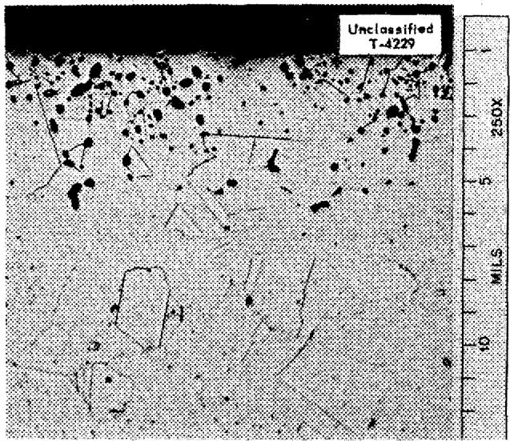  
Fig. 6.4. Corrosion of Inconel Thermal Convection Loop by High-Purity NaF-ZrF $_4$ -UF $_4$ (53.5-40.0-6.5 mole %) After 500 hr at $1500^{\circ}\mathrm{F}$ . 250X. Reduced 15%.

of Fe, and less than 20 ppm of Ni. A typical corrosion specimen taken from the hot leg of one of these loops is shown in Fig. 6.5. The voids are larger, and they are more definitely concentrated in the grain boundaries than they were in the tests with the uranium-bearing fluoride mixture. The low chromium content of the fluoride after circulation in these loops is not understood because, even though the attack was less, it was not decreased so much as was the chromium content. There was a gray layer above the freezing line in the trap of each of these loops that was about $\frac{1}{6}$ to $\frac{1}{4}$ in. in thickness. This material was identified petrographically as fine, needle-like, metallic crystals of chromium metal dispersed in the fluoride. Some mass transfer had, therefore, taken place even with the low chromium concentrations found in these loops.

# FLUORIDE CORROSION OF NICKEL AND STAINLESS STEEL LOOPS

G. M. Adamson  
Metallurgy Division

A small amount of mass transfer was previously observed4 in a nickel loop in which the fuel NaF $\mathsf{ZrF}_4$ -UF $_4$ (50-46-4 mole %) was circulated. To confirm this single test, another nickel loop was

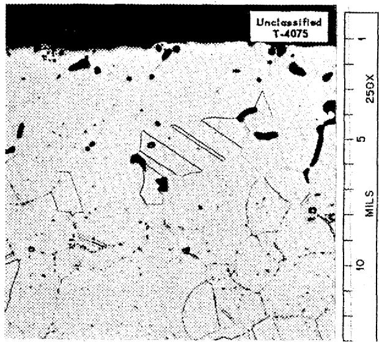  
Fig.6.5.Corrosion of Inconel Thermal Convection Loop by $\mathsf{NaZrF}_5$ After 500 hr at $1500^{\circ}\mathsf{F}$ 250X. Reduced $12\%$

cleaned with $\mathsf{NaZrF}_5$ and operated with high-purity fuel. After circulation of the fuel, no metallic crystals were found in the fluorides in the cold leg or in the trap nor could any layer be identified on the cold-leg surface. The surface of the hot leg was bright and polished, and there was no evidence of subsurface voids or intergranular attack. The wall thickness was within commercial tolerances, but it was again on the low side. It seems likely that a small amount of even removal had taken place, since the surface was polished; however, this seems to be the smallest amount of mass transfer yet found.

One type 430 stainless steel loop operated with the fuel NaF-ZrF-UF (50-46-4 mole %) for 500 hr at $1500^{\circ}\mathrm{F}$ with no sign of plugging. However, a preliminary metallographic examination revealed unexpected even surface removal in the hot leg rather than the subsurface voids in the grain boundaries that were found in the type 316 stainless steel loop. The hot-leg surface was smooth, with no subsurface voids or intergranular type of attack. Carbides appear to have been leached (or possibly to have gone back into solution) from a zone about 2 mils wide on the surface, and considerable grain growth had taken place in this zone. The outer surface of the pipe was quite rough, and therefore the wall thickness measurements are questionable. Variations in thickness of from 0.106 to 0.109 in. were found. Since the specified thickness of the wall was 0.109 in., it is evident, at least, that no large amount of even removal occurred. However, some removal had taken place, as shown by the scattered metallic crystals adhering to the cold-leg surface.

# LIQUID METAL CORROSION

W.H.Bridges

J. E. Pope

J.V.Cathcart

G.P.Smith

E.E.Hoffman

L. R. Trotter

D.C.Vreeland

Metallurgy Division

# Mass Transfer in Liquid Lead

Investigations of mass transfer and corrosion of various metal specimens in small, quartz, thermal convection loops containing liquid lead have been continued. Details of the construction and operation of the loops and the results obtained for Inconel, columbium, molybdenum, types 304, 347, 410, and 446 stainless steel, Armco iron, nickel, chromium,

Nichrome V, and a nickel-iron (30% Ni-70% Fe) alloy were reported previously.5 The metals tested during this quarter included a molybdenum-nickel (25% Mo-75% Ni) alloy, a chromium-iron-silicon (14% Cr-84% Fe-27% Si) alloy, and types 304 and 347 stainless steel specimens which were oxidized prior to contact with the lead.

The molybdenum-nickel alloy loop was operated for 672 hr with hot- and cold-leg temperatures of 820 and $480^{\circ}\mathrm{C}$ , respectively. Plugging did not occur, but a small amount of mass-transferred material was found in the bottom of the cold leg. The extent of the corrosive attack may be seen in Fig. 6.6. A spectroscopic analysis showed that the mass-transferred material consisted almost entirely of nickel, the concentration of molybdenum being less than $0.01\%$ . The results for this loop were comparable to those previously obtained for the 400 series stainless steels.

The loop containing chromium-iron-silicon alloy specimens was operated for 550 hr with hot- and cold-leg temperatures of 805 and $490^{\circ}\mathrm{C}$ , respectively. Again, the mass transfer which occurred was not sufficient to stop circulation, but a plug was starting to form in the cold leg. The amount of mass-transferred material was slightly greater than that found in loops containing the 400 series stainless steels. Rather severe intergranular attack to a depth of 12 mils was found.

The effect of an oxide coating on the metal specimens was also studied. Sections of types 347 and 304 stainless steel tubing were oxidized until they showed interference colors corresponding to oxide thicknesses of 500 to 1000 A. These test specimens were then tested in quartz loops, and marked improvement in resistance to mass transfer was noted with both metals. A loop containing oxidized, tubular, type 347 stainless steel specimens was operated for 550 hr with hot- and cold-leg temperatures of 815 and $510^{\circ}\mathrm{C}$ , respectively. The loop was terminated on schedule and only a small amount of mass-transferred material was found in the cold leg. When the type 347 stainless steel specimens were used in the as-received condition, a plug formed in the loop within 140 hours. Although uniform intergranular attack was observed on the inner surface of the oxidized

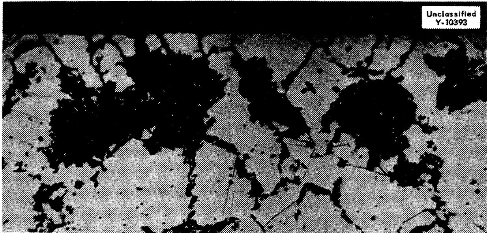

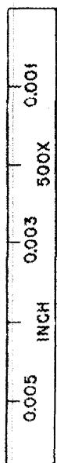  
Fig. 6.6. Corrosion of a Molybdenum-Nickel (25% Mo-75% Ni) Alloy Specimen in a Quartz Thermal Convection Loop After Circulation of Lead for 672 hr at $820^{\circ}\mathrm{C}$ . 500X.

tubular specimen, much less corrosion was observed on the outer surface. The attack appeared to have started on the outer surface of the specimen at isolated points along the surface, perhaps corresponding to breaks in the oxide film, and to have spread out in fan-like fashion (Fig. 6.7). Corrosion of the specimen in the cold leg of the loop was much less pronounced.

A type 304 stainless steel loop containing previously oxidized specimens was also operated for $550\mathrm{hr}$ without the formation of a plug large enough to stop circulation. The hot- and cold-leg temperatures were 800 and $550^{\circ}\mathrm{C}$ , respectively. Metallographic examination of this loop is incomplete. In previous tests with type 304 stainless steel specimens in the as-received condition, the loops had to be terminated within $100\mathrm{hr}$ because of plug formation.

# Static Tests of Beryllium Oxide in Sodium, Lithium, and Lead

Specimens of beryllium oxide, approximately $\frac{1}{2}$ by $\frac{1}{4}$ by $\frac{1}{4}$ in., cut from 2-in. hexagonal blocks hot pressed by the Norton Company were tested in sodium, lithium, and lead. One half the specimens were tested as cut from the original block, and one half were tested after having been refired for 2 hr at $1800^{\circ}\mathrm{C}$ . The refired specimens had higher density and lower apparent porosity than

those specimens which were not refired. The sodium was contained in Inconel tubes, and the lithium and the lead were contained in Armco iron tubes. The test time was 100 hr, and the temperature was $538^{\circ}\mathrm{C}$ . The weight and dimension changes after test were less than $1.5\%$ . The weight gains in sodium and lithium were presumed to be due to absorption of these metals. The specimens tested in lead appeared to be affected the least. Edges of the specimens appeared to be just as sharp after test as before. The refired beryllium oxide specimens apparently had greater resistance to attack than did the specimens that were not refired. The one exception appeared in the sodium test, and, even in this test, the refired specimen was more dimensionally stable.

# Spinner Tests of Inconel and Type 405 Stainless Steel in Sodium

A spinner test was run with Inconel-X in sodium, but the apparatus was not rotated. This test was run to check the possibility that attack noted in a previous spinner test might be due to impurities in the sodium or in the atmosphere rather than to the velocity of test. However, much lighter attack and less weight change was noted on these specimens than on the Inconel-X specimens previously tested at fluid velocities of 405 fpm; therefore it is evident that most of the attack in spinner tests is due to velocity effects.

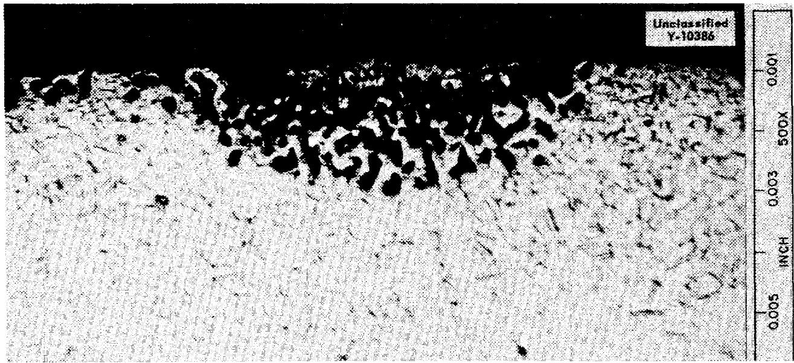  
Fig. 6.7. Corrosion on Outer Surface of a Tubular Type 347 Stainless Steel Specimen Exposed to Circulating Lead in a Quartz Convection Loop for 550 hr at $815^{\circ}\mathrm{C}$ . 500X.

A spinner test with type 405 stainless steel $(12\% Cr)$ has also been run at a velocity of 405 bpm. These tests were conducted at a temperature of $816^{\circ}C$ for 100 hr in sodium. The weight change was of the order of $+0.5\%$ , and the attack was intergranular to a maximum depth of 3 mils, with surface roughness to approximately 1 mil.

# Static Tests of Bearing Materials in Sodium, Lithium, and Lead

A number of metal alloys of potential value in bearing and hard-facing applications in liquid metals have been tested in sodium, lead, and lithium under static conditions for 100 hr at $816^{\circ}C$ . The results of these screening tests are given in Table 6.4.

# Static Tests of Stainless Steels in Lithium

A series of static tests of various stainless steels in two types of lithium (helium packed and oil packed) have been run for 100 hr at $816^{\circ}C$ . In this group of tests, types 310 and 446 stainless steel showed the least resistance to attack by lithium, while type 347 stainless steel showed the best resistance. Types 304, 309, 316, and 347 stainless steel showed very little or no subsurface attack. Crystals of what were identified by x-ray diffraction as a chromium carbide phase (DPH 1000 to 1100) were detected on the exposed sur

face of all the austenitic stainless steel specimens, as shown in Fig. 6.8. These crystals were more numerous and slightly larger on the specimens tested in the oil-packed lithium, as would be expected because of the higher carbon content of this material. Chemical analyses of the lithium baths after testing revealed no significant changes in the iron, nickel, and chromium contents of the oil-packed and helium-packed lithium. In the tests in which weight changes were noted, the weight changes of the specimens in helium-packed lithium were less than those of the specimens in oil-packed lithium, possibly because of the higher purity of the gas-packed lithium. Results of these tests are summarized in Table 6.5.

# Static Tests of Solid Fuel Elements in Sodium and Sodium Hydroxide

Core materials $(\mathrm{UO}_2)$ that had been clad with nickel, copper, and types 304, 316, and 347 stainless steel were tested in sodium and sodium hydroxide for $100\mathrm{hr}$ at $816^{\circ}\mathrm{C}$ under static conditions. These specimens were prepared to the specifications given in Table 6.6.

Specimens clad with nickel and types 304, 316, and 347 stainless steel were annealed for 15 min at $1000^{\circ}\mathrm{C}$ in hydrogen; copper-clad specimens were annealed for 15 min at $450^{\circ}\mathrm{C}$ in hydrogen. These specimens were approximately 1 by 0.35

TABLE 6.4. STATIC TESTS OF VARIOUS ALLOYS IN SODIUM, LITHIUM, AND LEAD FOR 100 hr AT $816^{\circ}C$   

<table><tr><td>MATERIAL</td><td>COMPOSITION</td><td>CORRODANT</td><td>METALLOGRAPHIC NOTES</td></tr><tr><td>Hastelloy B</td><td>Mo, 26 to 30Fe, 4.7C, 0.12 maxNi, balance</td><td>SodiumLeadLithium</td><td>Some voids to 0.5 mil in a few places0 to 5 mils of erratic alloying type of attack5 mils of subsurface voids</td></tr><tr><td>C</td><td>Mo, 16 to 18Fe, 4.5 to 7C, 0.15 maxCr, 15.5 to 17.5W, 3.75 to 5.25Ni, balance</td><td>SodiumLeadLithium</td><td>Some voids in a few places to 0.5 milErratic attack; practically complete penetration in some places, very little in others4 to 8 mils of subsurface voids</td></tr><tr><td>D</td><td>Cu, 3Al, 1Si, 10Mn, 1Ni, balanceC, ?</td><td>SodiumLeadLithium</td><td>Layer of subsurface voids 1 to 2 mils deep on some portions of specimenSpecimen appeared to be completely penetrated4 to 6 mils of subsurface voids</td></tr><tr><td>Stellite 1</td><td>Cr, 30.5W, 12.5Fe, 3 maxC, 2.5Ni, 1Co, balance</td><td>SodiumLeadLithium</td><td>Apparently no attack2 mils of voids and intergranular attack0.5 to 1 mil subsurface voids where carbides were attacked</td></tr><tr><td>6</td><td>Cr, 27.5W, 4Fe, 2 to 3 maxC, 1Co, balance</td><td>SodiumLeadLithium</td><td>Very slight intergranular penetration, less than 0.5 milIntergranular attack 1 to 2 mils deep4 to 6 mils of subsurface voids where carbides were attacked</td></tr><tr><td>12</td><td>Cr, 29.5W, 8.25Fe, 2 to 3 maxC, 1.4Ni, 1Co, balance</td><td>SodiumLeadLithium</td><td>Very slight intergranular penetration, less than 0.5 milApparently no attackLess than 0.5 mil of attack on carbide phase</td></tr><tr><td>21</td><td>Cr, 25 to 30Ni, 1.5 to 3.5Fe, 2 maxMo, 4.5 to 6.5C, 0.2 to 0.35Co, balance</td><td>SodiumLeadLithium</td><td>Apparently no attackA slight roughening and intergranular penetration to about 0.5 mil0.5 mil of small subsurface voids</td></tr><tr><td>Stellite 25</td><td>Cr, 19 to 21C, 0.15Ni, 9 to 11W, 14 to 16Si, 1Mn, 1 to 2Fe, 2Co, balance</td><td>SodiumLeadLithium</td><td>Some voids and intergranular attack to 1 mil maximum in a few places Voids to about 0.5 mil 2 mils of subsurface voids in most places, 10 to 12 mils in several places</td></tr><tr><td>40</td><td>Composition not available</td><td>SodiumLeadLithium</td><td>Very heavy penetration to about 50 mils Subsurface voids to a depth of 10 mils</td></tr><tr><td>41</td><td>Composition not available</td><td>SodiumLeadLithium</td><td>Apparently no attack Apparently complete penetration Subsurface voids to a depth of 10 to 15 mils</td></tr></table>

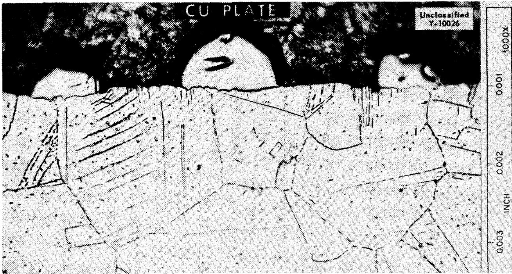  
Fig. 6.8. Type 316 Stainless Steel After Static Testing in Lithium for 100 hr at $816^{\circ}\mathrm{C}$ . Note crystals attached to surface. 1000X. Specimen copper plated to preserve edge during polishing.

by 0.050 inch. The thickness of the core and of each of the cladding layers was approximately 16 mils.

In sodium, the specimens clad with nickel and types 304, 347, and 316 stainless steel showed no evidence of attack. The sample clad with copper had a slightly irregular edge and showed weight and dimensional increases after testing. The many, copper, mass-transferred crystals at

tached to this specimen were probably caused by temperature gradients during the test. In the tests in sodium hydroxide, the copper- and nickel-clad specimens were unattacked, and the types 304, 316, and 347 stainless steel-clad materials were attacked more or less severely, that is, from 5 to 18 mils. The type 347 stainless steel-clad specimen tested in sodium hydroxide is shown in Fig. 6.9.

TABLE 6.5.STATIC CORROSION OF STAINLESS STEELS TESTED IN TWO TYPES OF LITHIUM FOR 100 hr AT $816^{\circ}C$   

<table><tr><td>TYPE OF STAINLESS STEEL</td><td>WEIGHT CHANGE (g/in.2)</td><td>ANALYSIS (wt %)</td><td>METALLOGRAPHIC NOTES</td></tr><tr><td rowspan="3">304 (a)*</td><td rowspan="3">0</td><td>Fe, 0.024</td><td rowspan="3">Small crystals (0.5 mil thick) attached to surface; some of this same phase concentrated in grain boundaries near surface</td></tr><tr><td>Ni, 0.017</td></tr><tr><td>Cr, &lt;0.001</td></tr><tr><td rowspan="3">(b)**</td><td rowspan="3">0</td><td>Fe, 0.026</td><td rowspan="3">Same as above, with surface of specimen slightly irregular, 0.5 mil of attack</td></tr><tr><td>Ni, 0.021</td></tr><tr><td>Cr, 0.002</td></tr><tr><td rowspan="3">309 (a)</td><td rowspan="3">-0.0010</td><td>Fe, 0.017</td><td rowspan="3">Specimen attacked to 4 mils in one area; several small crystals attached to surface</td></tr><tr><td>Ni, 0.034</td></tr><tr><td>Cr, 0.018</td></tr><tr><td rowspan="3">(b)</td><td rowspan="3">-0.0013</td><td>Fe, 0.017</td><td rowspan="3">No attack on specimen; crystals (0.25 mil thick) attached to surface in some areas</td></tr><tr><td>Ni, 0.040</td></tr><tr><td>Cr, 0.011</td></tr><tr><td rowspan="3">310 (a)</td><td rowspan="3">-0.0007</td><td>Fe, 0.012</td><td rowspan="3">Grain boundaries of specimen exuded moisture to a depth of 6 to 7 mils, which indicated penetration by lithium to this depth; crystals attached to surface in some areas</td></tr><tr><td>Ni, 0.032</td></tr><tr><td>Cr, 0.028</td></tr><tr><td rowspan="3">(b)</td><td rowspan="3">-0.0007</td><td>Fe, 0.018</td><td rowspan="3">Grain boundaries of specimen exuded moisture to a depth of 6 to 8 mils, as above; surface layer on part of specimen approximately 0.25 mil in thickness</td></tr><tr><td>Ni, 0.030</td></tr><tr><td>Cr, 0.046</td></tr><tr><td rowspan="3">316 (a)</td><td rowspan="3">0</td><td>Fe, 0.007</td><td rowspan="3">Grain boundaries exuded moisture to a depth of 5 mils in some areas; specimen heavily attacked to 0.5 mil in one area; crystals attached to surface</td></tr><tr><td>Ni, 0.037</td></tr><tr><td>Cr, 0.01</td></tr><tr><td rowspan="3">(b)</td><td rowspan="3">+0.0009</td><td>Fe, 0.006</td><td rowspan="3">Approximately 0.5 mil of grain boundary attack; 1-mil-thick crystals attached to surface</td></tr><tr><td>Ni, 0.038</td></tr><tr><td>Cr, 0.01</td></tr></table>

*Tested in helium-packed lithium.   
**Tested in oil-packed lithium.

TABLE 6.5 (continued)   

<table><tr><td>TYPE OF STAINLESS STEEL</td><td>WEIGHT CHANGE (g/in.2)</td><td>ANALYSIS (wt %)</td><td>METALLOGRAPHIC NOTES</td></tr><tr><td rowspan="3">317 (a)</td><td rowspan="3">+0.0007</td><td>Fe, 0.009</td><td rowspan="3">No attack except for surface layer 0.1 to 0.2 mil thick</td></tr><tr><td>Ni, 0.028</td></tr><tr><td>Cr, 0.008</td></tr><tr><td rowspan="3">(b)</td><td rowspan="3">+0.0009</td><td>Fe, 0.004</td><td rowspan="3">Same as above, with crystals to a maximum thickness of 0.7 mil</td></tr><tr><td>Ni, 0.009</td></tr><tr><td>Cr, 0.035</td></tr><tr><td rowspan="3">347 (a)</td><td rowspan="3">-0.0003</td><td>Fe, 0.11</td><td rowspan="3">No attack except for 0.25-mil-thick crystals attached to surface in some areas</td></tr><tr><td>Ni, 0.038</td></tr><tr><td>Cr, 0.003</td></tr><tr><td rowspan="3">(b)</td><td rowspan="3">+0.0003</td><td>Fe, 0.015</td><td rowspan="3">Same as above</td></tr><tr><td>Ni, 0.039</td></tr><tr><td>Cr, 0.002</td></tr><tr><td>446 (b)</td><td>+0.0026</td><td></td><td>Grain boundary voids to a depth of 10 mils</td></tr></table>

TABLE 6.6. SPECIFICATIONS OF SOLID FUEL ELEMENTS   

<table><tr><td>CLADDING</td><td>CORE</td><td>ROLLING TEMPERATURE (°C)</td><td>HOT REDUCTION (%)</td></tr><tr><td>Type 304 stainless steel</td><td>Type 302 stainless steel- \( UO_2 \)</td><td>1225</td><td>60</td></tr><tr><td>Type 316 stainless steel</td><td>Type 302 stainless steel- \( UO_2 \)</td><td>1225</td><td>60</td></tr><tr><td>Type 347 stainless steel</td><td>Type 302 stainless steel- \( UO_2 \)</td><td>1225</td><td>60</td></tr><tr><td>Nickel</td><td>Nickel- \( UO_2 \)</td><td>1100</td><td>60</td></tr><tr><td>Copper</td><td>Copper- \( UO_2 \)</td><td>1000</td><td>60</td></tr></table>

# FUNDAMENTAL CORROSION RESEARCH

J. V. Cathcart

G.P. Smith

Metallurgy Division

# Oxidizing Power of Hydroxide Corrosion Products

The work on trivalent nickel compounds formed in hydroxides was continued. The compound $\mathrm{NaNiO}_2$ was found to undergo a change in crystal structure at about $225^{\circ}\mathrm{C}$ , and the structure of the high-temperature form has been determined. The existing evidence indicates that the transformation may be of the martensitic type.

# Equilibrium Pressure of Hydrogen in Hydroxide-Metal Systems

F. Kertesz

F. A. Knox

Materials Chemistry Division

During this quarter, equilibrium pressures of hydrogen over the KOH-Ni system were partially determined, and values previously reported for NaOH-Cu and NaOH-Au systems were redetermined by using a modified form of the apparatus previously described.

The modified apparatus includes a long nickel tube which serves as a reaction chamber in place of the metal crucible previously used. This tube is surrounded by a quartz tube to which it is

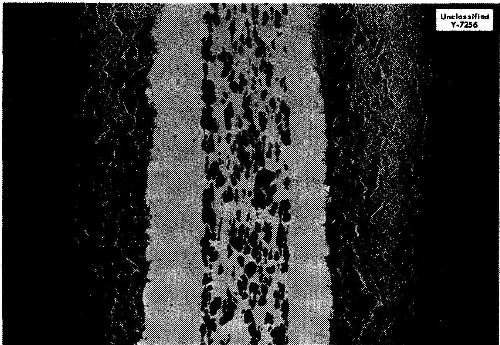  
Fig. 6.9. Static Test of a Type 347 Stainless Steel-Clad Fuel Plate After 100 hr at $816^{\circ}\mathrm{C}$ in Sodium Hydroxide. 80X.

sealed by means of a Kovar seal. The pressures established inside the nickel tube and in its quartz jacket (nickel being permeable to hydrogen at the temperatures utilized in these experiments) are measured by two mercury manometers connected to the system by seals; therefore the pressure built up by the hydrogen that diffuses through the nickel can be determined independently from the pressure inside the tube. This apparatus utilizes both the passivity of nickel to sodium hydroxide and the nonpermeability of quartz to hydrogen. Equilibrium pressures may be established more rapidly by adding hydrogen to the quartz-nickel cavity to bring its pressure close to that inside the nickel tube.

The hydrogen pressure of the KOH-Ni system, as determined in the above-described apparatus,

was found to be less than $1\mathrm{mm}$ at $600^{\circ}\mathrm{C}$ , while it is in the range of 8 to $12\mathrm{mm}$ at $700^{\circ}\mathrm{C}$ . Measurements at higher temperatures are being made.

The NaOH-Cu and NaOH-Au hydrogen equilibrium pressures were redetermined, and the results agreed closely with those previously reported: for the NaOH-Au system at $900^{\circ}\mathrm{C}$ , 3.5 mm compared with 3.0; at $1000^{\circ}\mathrm{C}$ , 7.5 compared with 6.0 mm. The results for the NaOH-Cu system show reasonable agreement at $700^{\circ}\mathrm{C}$ (2.2 mm compared with 3.0 mm); however, the more recent determination at $800^{\circ}\mathrm{C}$ shows a thus far unexplained time dependence of the hydrogen pressure. An initial pressure of 14 mm gradually fell to about 10 mm after a few hours; the 10-mm pressure then remained constant.

# Mass Transfer of Chromium in Inconel-Fluoride Systems

L.G.Overholser J.D.Redman

C. F. Weaver

Materials Chemistry Division

When Inconel is exposed to molten fluorides at elevated temperatures, chromium is selectively leached from the alloy. While a considerable fraction of this corrosion may be ascribed to oxidizing impurities in the molten material or on the capsule walls, reactions of $\mathsf{UF}_4$ with the container metals to yield $\mathsf{UF}_3$ and complex metal fluorides could well be responsible. The reaction

$$
\mathrm {C r} + 2 \mathrm {U F} _ {4} = 2 \mathrm {U F} _ {3} + \mathrm {C r F} _ {2}
$$

has at $600^{\circ}C$ a standard free energy change of $-7\mathrm{kcal}$ and should, if the ionic species were soluble and showed activities proportional to their concentrations, proceed nearly to completion. That such is not the case, or at least that the reaction does not equilibrate at a reasonable rate, is well demonstrated in a large number of corrosion tests.

If the assumption that the physical solubility of chromium as metal in fused $\mathsf{NaZrF}_5$ is quite low is permissible, then equilibration of UF $^4$ dissolved in $\mathsf{NaZrF}_5$ with chromium metal followed by separation of the phases and analysis of the filtrate would permit evaluation of the equilibrium constant of the reaction. For these studies, the purest $\mathsf{NaZrF}_5$ available was used, along with chromium metal hydrogen fired at $2000^{\circ}\mathsf{F}$ in nickel equipment of the type previously described. All handling of the materials before testing was per

formed in an inert-atmosphere dry box. The filtrates obtained were submitted for chemical analysis, and the results shown in Table 6.7 were obtained.

These data indicate that equilibration is rapid because the values obtained after 5 hr at temperature are not distinguishable from those obtained for a shorter exposure. It is obvious from the exposure of the nonuranium-bearing material that the chromium contains some oxide and that hydrogen firing of the nickel equipment is not sufficiently complete. (Subsequent experiments, not sufficiently complete to report, in which the chromium was fired under dry hydrogen directly in the nickel reaction vessel demonstrate that it is possible to have less than 200 ppm of Cr in the nonuranium-bearing material.) The chromium concentration increase resulting from the reduction of $\mathsf{UF}_4$ to $\mathsf{UF}_3$ was obtained by subtracting the chromium content of the nonuranium-bearing material from the total chromium found, and this value was used for obtaining the $\mathsf{UF}_3$ concentration, since the methods for determining $\mathsf{UF}_3$ in the presence of divalent chromium are not sufficiently accurate to permit a direct determination of $\mathsf{UF}_3$ .

If unit activity is assumed for the chromium and activities equal to concentrations (in moles per mole of solvent) are assumed for the uranium and chromium species, these data indicate that the equilibrium constant at $600^{\circ}C$ is 1.2 by $10^{-3}$ , and, at $800^{\circ}C$ , it is 1.7 by $10^{-3}$ . The data are certainly not sufficient in amount or in precision for an evaluation of this small difference. It does

TABLE 6.7. ANALYSES OF FILTRATES FROM EQUILIBRATION OF CHROMIUM WITH NaF-ZrF4-UF4 MELTS   

<table><tr><td colspan="2">CONDITIONS OF EQUILIBRATION</td><td colspan="4">FILTRATE ANALYSIS</td></tr><tr><td>Time (hr)</td><td>Temperature (°C)</td><td>Total Uranium (%)</td><td>Chromium (ppm)</td><td>Nickel (ppm)</td><td>Iron (ppm)</td></tr><tr><td rowspan="2">5</td><td rowspan="2">800</td><td>0</td><td>935</td><td>355</td><td>75</td></tr><tr><td>0</td><td>930</td><td>200</td><td>40</td></tr><tr><td rowspan="2">3</td><td rowspan="2">800</td><td>8.47</td><td>3420</td><td>30</td><td>65</td></tr><tr><td>8.80</td><td>3330</td><td>40</td><td>60</td></tr><tr><td rowspan="2">3</td><td rowspan="2">600</td><td>8.80</td><td>3200</td><td>130</td><td>50</td></tr><tr><td>8.65</td><td>3100</td><td>125</td><td>50</td></tr><tr><td rowspan="2">5</td><td rowspan="2">600</td><td>8.65</td><td>3100</td><td>130</td><td>70</td></tr><tr><td>8.88</td><td>3200</td><td>130</td><td>60</td></tr></table>

appear, however, that the standard free energy change for the reaction at $600^{\circ}\mathrm{C}$ is about +11.5 kcal. The discrepancy between this measured value and the value of $-7$ kcal calculated for the reaction by assuming no complexing is probably to be ascribed to solvation of the $\mathsf{UF}_4$ .

These experiments are being refined, insofar as purity of the materials and improvement of techniques are concerned, and additional experiments will be conducted at considerably lower reagent concentrations so that the assumptions regarding activities will have more validity.

# 7. METALLURGY AND CERAMICS

W. D. Manly J. M. Warde Metallurgy Division

A sodium-to-air radiator was fabricated by brazing the tube-to-fin joints and backing up the previously heliarc-welded tube-to-header and manifold joints with brazing alloy G-E No. 62, a nickel-chromium-silicon alloy. The radiator assembly was welded and then dry-hydrogen brazed at $2100^{\circ}\mathrm{F}$ for approximately 30 minutes. Subsequent testing after slow cooling showed all the welded and brazed joints to be satisfactorily leak and pressure tight. The duplex fabrication technique, that is, the combination of heliarc welding and high-temperature brazing, apparently produces satisfactory, sound, leak-tight radiators and minimizes many of the problems encountered in brazing operations. The use of the G-E No. 62 brazing alloy eliminates many of the deleterious effects of the Microbraz alloy that was formerly used.

The investigation of the fabrication of high-conductivity fin materials included a study of diffusion barriers for use between Inconel and copper, electroplating copper to obtain oxidation resistance, and the fabrication of clad-copper fin material in sufficient quantities for experimental radiators. Furthermore, several new high-conductivity fin materials were studied because it was found that diffusion of nickel and copper made the brazing of Inconel-clad copper fins to Inconel tubing less satisfactory than it was previously thought to be. Each clad-copper and copper-aluminum bronze fin material was tested by brazing to either Inconel or stainless steel tubing with each of the following brazing alloys: low-melting-point Nicrobraz (LMNB), "electroless" nickel-phosphorus, LMNB plus 10 wt % "electroless" nickel-phosphorus, and nickel-phosphorus-chromium alloys. A summary of the results of this study is given. A

series of one hundred $3 \times 3$ in. nickel fins is being "electroless" preplated with nickel-phosphorus alloy for brazing into a radiator assembly. In a preliminary test, good-quality brazes were obtained with this material at-tube-to-fin joints.

The assembly of stainless steel-clad fuel plates into fuel elements is being studied, and it appears that inert-arc plug welding may be a feasible method of fabrication. The configuration investigated consisted basically of a 0.026-in.-thick type 304 stainless steel-clad type 304 stainless steel sheet 24 in. long that was to be joined on the edge at 2-in. intervals to a 0.041-in.-thick type 304 stainless steel side plate.

Stress-rupture tests of coarse- and fine-grained Inconel in argon and in fluoride fuel NaF-ZrF4-UF4 at temperatures of 1300, 1500, and $1650^{\circ}\mathrm{F}$ are being made. The tests completed at $1500^{\circ}\mathrm{F}$ show that hydrogen is the most detrimental environment and that air is the most beneficial, as far as rupture life is concerned, and that increased ductility in air and in sodium is probably the result of decarburization. Tube-burst tests of triaxially stressed Inconel tubes are being made with fluoride fuel NaF-ZrF4-UF4 inside the tube and purified argon outside. Comparison of the data obtained with creep data shows that the tube-burst time is about the same as the time for $2\%$ elongation in the tensile creep tests.

Several special alloys for the corrosion testing program were melted in the high-vacuum melting furnace and extruded into a draw blank. The draw blank was drawn into tubing by the Superior Tube Company. Columbium cold worked to a reduction of $87.5\%$ has been shown to have a recrystallization temperature of between 1000 and $1100^{\circ}\mathrm{C}$ .

Tubular fuel elements are being produced by using plug drawing techniques. The drawing schedule was found to be too severe in that it caused premature failure during drawing. However, even this severe working schedule produced tubing that had excellent inside and outside finishes and there was no evidence of rippling or folding in the core region.

Ten test rings of a beryllium fluoride glass were prepared for determining their suitability as high-temperature pump seals. A ceramic container for use in the investigation of the electrical resistivity of fluoride fuels is being prepared by isostatically pressing and sintering beryllium oxide. High-density graphite (Graph-i-tite) is being tested for compatibility with fluorides and other molten salts and molten metals.

Studies of the flammability of jets of sodium alloyed with numerous metals have been made. Sodium-mercury alloys containing less than 34 mole $\%$ sodium and sodium-bismuth alloys contain

ing less than 40 mole % sodium did not burn; all other alloys tested burned.

# WELDING AND BRAZING RESEARCH

P. Patriarca G.M.Slaughter Metallurgy Division

J. M. Cisar, ANP Division

# Brazing of Radiator Assemblies

It was stated in the previous report that the G-E No. 62 brazing alloy (69% Ni-20% Cr-11% Si) might be suitable for use on ANP-type sodium-to-air radiators. Stainless steel joints brazed with this alloy were considered to possess adequate resistance to cracking. This alloy was also shown to exhibit excellent resistance to high-temperature oxidation. A metallographic section of a joint of an Inconel tube brazed to a type 304 stainless steel fin and exposed in static air for 1200 hr at $1500^{\circ}\mathrm{F}$ is shown in Fig. 7.1. It can be seen that

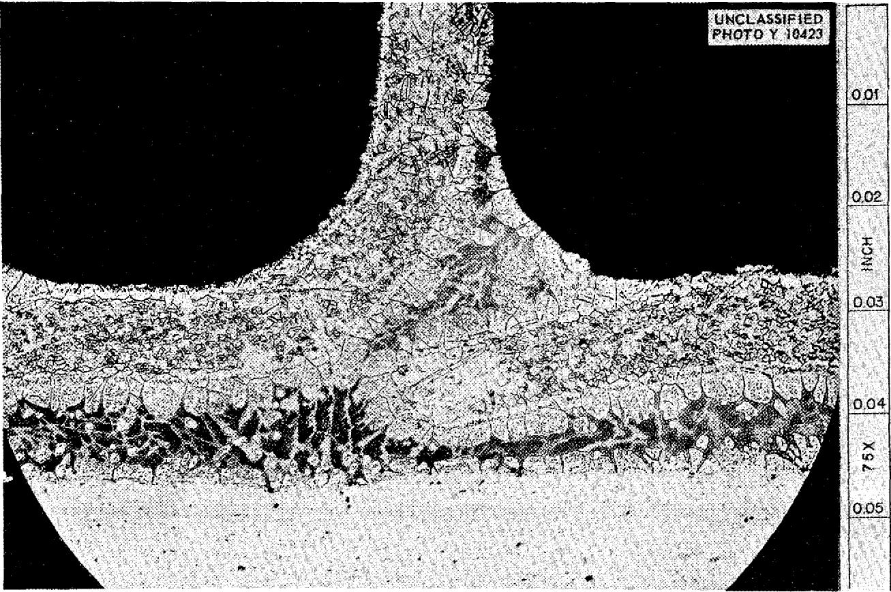  
Fig. 7.1. Section of Joint of Inconel Tube Brazed to a Type 304 Stainless Steel Fin with G-E No. 62 Brazing Alloy and Exposed to Static Air at $1500^{\circ}$ F for 1200 Hours. Etchant: glyceria regia, 75X

the extent of attack is minor. Previous tests had also shown that this alloy was attacked by maltensodium only slightly at $1500^{\circ}\mathrm{F}$ in a 100-hr test.

Therefore the sodium-to-air radiator shown in Fig. 7.2 was fabricated by brazing the tube-to-fin joints and backing up the previously heliarc-welded tube-to-header and manifold joints with brazing alloy. This method of fabrication is thought to be the most reliable for obtaining a pressure-tight system with one brazing operation.

The tube-to-header welds were manually inert-gas tungsten-arc welded with argon as the shielding gas and helium as the back-up gas. The header caps and the manifold were also heliarc welded by using suitable joint designs to permit complete penetration.

The sequence of manifold and header cap welding was such that the nickel-chromium-silicon alloy could always be applied to the underside of the joint after welding. Each tube-to-header weld was also backed up with this brazing alloy. A typical

heliarc-welded joint backed up with the nickel-chromium-silicon braze is shown in Fig. 7.3. It can be seen that the probability of obtaining a leak-tight joint is very good.

The completed assembly was then dry-hydrogen brazed by using the thermal cycle shown in Fig. 7.4. A preheat at $1600^{\circ}\mathrm{F}$ was utilized to permit an equilization of temperatures over the assembly. The thermocouple, which was placed directly on the radiator, also indicated that a maximum temperature of $2150^{\circ}\mathrm{F}$ was attained and that the unit was held above $2100^{\circ}\mathrm{F}$ for approximately 30 minutes. The brazing technique used for this fabrication ensures a relatively slow cooling rate so that cracking upon cooling as a result of uneven thermal contractions should not be a major problem.

Helium leak testing at less than $0.03\mu$ vacuum revealed that all welded and brazed joints in the radiator were leak tight. The assembly was also pressure tight to a 20-psi helium pressure when it was immersed in water.

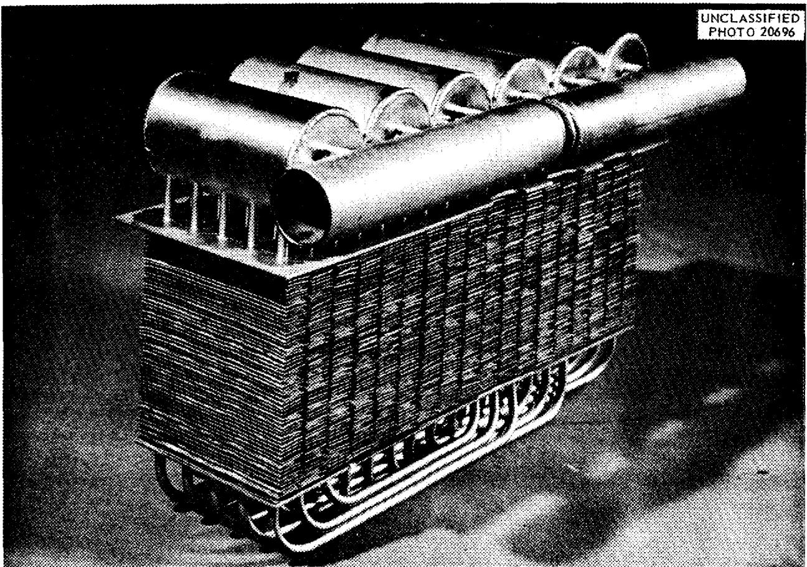  
Fig. 7.2. Sodium-to-Air Radiator Fabricated by the Combined Welding and Brazing Technique.

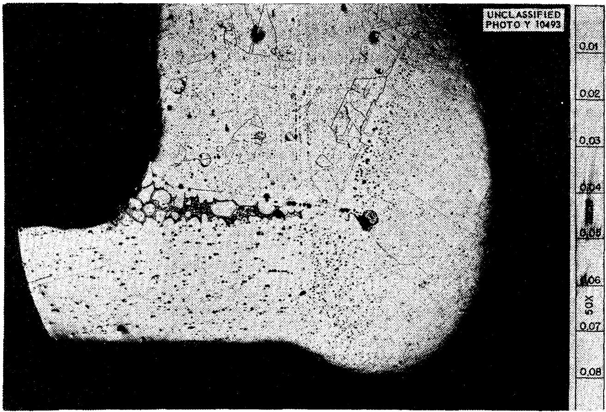  
Fig. 7.3. Inconel Tube-to-Header Heliarc Welded Joint Backed Up with G-E No. 62 Brazing Alloy. Etchant: glyceria regia. 50X

It is thus believed that a combination heliar-cwelding and high-temperature-brazing procedure is satisfactory for fabricating sound leak-tight radiators. This duplex technique has been shown to minimize many of the problems and difficulties usually encountered in brazing operations. The use of the G-E No. 62 brazing alloy also seems to minimize or completely eliminate many of the deleterious effects of the Microbraz alloy that was formerly used.

# Brazing of High-Conductivity Radiator Fins

Although the problem of brazing Inconel-clad copper high-conductivity fin material to Inconel tubing was satisfactorily resolved, as described in the previous report, the subsequent determination of the detrimental effects of diffusion of nickel and copper has proved to be a limitation of the

method. Accordingly, a group of other high-conductivity fin materials was fabricated for brazing tests.

The high-conductivity fin materials studied during the current investigation were types 446 and 310 stainless steel-clad copper and a copper-aluminum (94% Cu-6% Al) bronze. The fabrication of these materials is described below under "High-Conductivity Metals for Radiator Fins." The brazing alloys investigated were low-melting-point Nicrobraz (LMNB), "electroless" nickel-phosphorus (90% Ni-10% P) alloy, low-melting-point Nicrobraz plus 10 wt % "electroless" nickel-phosphorus alloy, and nickel-phosphorus-chromium (80% Ni-10% P-10% Cr) alloy. Each of the brazing alloys was used in conjunction with each of the high-conductivity fin materials against Inconel tubing, as well as against tubing of the same nominal composition as that of the stainless steel component of the fin material.

The test specimens were designed to simulate T flowability specimens. A sheet and a tube were

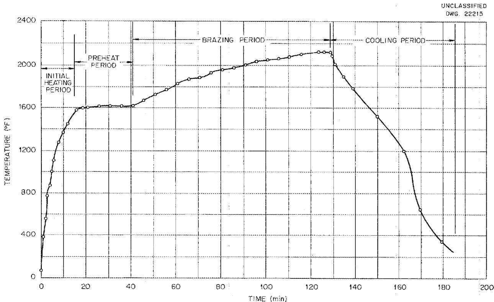  
Fig. 7.4. Thermal Cycle Employed in Furnace Brazing a Heat Exchanger with G-E No. 62 Alloy. Temperatures were obtained with a chromel-alumel thermocouple secured to the heat exchanger.

placed side by side, and the brazing alloy was applied initially to one end of the specimen. All test specimens were brazed in $-70^{\circ}\mathrm{F}$ dew-point hydrogen for 10 minutes. A summary of the data and the results of this study are presented in Table 7.1, along with an evaluation of the flowability of of the braze material based on visual observations.

The following conclusions have been drawn from these tests:

1. All the brazing alloys investigated, which were chosen because of oxidation resistance and favorable melting temperature, exhibited excellent flow against types 310 and 446 stainless steel-clad copper when used against Inconel tubing. It appears that the Inconel behaved as a "carrier" for the alloys.

2. The oxide films present on the as-received type 310 stainless steel tubing used in this investigation inhibited in varying degrees the flow of all the brazing alloys tested. The removal of

this oxide by prebright annealing at $1150^{\circ}C$ or by electropolishing improved the observed flow. The most marked effect was the improved flow of LMNB.

3. Removal of oxide films by prebright annealing or by electropolishing the type 446 stainless steel tubing did not markedly improve the flow of the brazing alloys and was particularly ineffective for the LMNB alloy.   
4. The addition of 10 wt % nickel-phosphorus (90% Ni-10% P) alloy to the LMNB alloy markedly improved flow against type 446 stainless steel tubing, although this addition was not beneficial against type 310 stainless steel tubing.   
5. The oxide film which formed on the copper-aluminum $(94\% \mathrm{Cu} - 6\% \mathrm{Al})$ fin material during the brazing cycle impeded flow of all the brazing alloys investigated. Prevention of this oxide formation by preplating with electrolytic nickel permitted excellent wetting and flow of all the brazing alloys investigated.

TABLE 7.1. SUMMARY OF BRAZING STUDIES OF HIGH-CONDUCTIVITY FIN MATERIALS   

<table><tr><td colspan="2">T SPECIMEN</td><td rowspan="2">BRAZING ALLOY</td><td rowspan="2">BRAZING TEMPERATURE (°C)</td><td rowspan="2">FLOWABILITY (visual observation)</td></tr><tr><td>Fin Material</td><td>Tubing</td></tr><tr><td rowspan="16">Type 446 stainless steel-clad copper (0.004 in. of copper clad on both sides with 0.002 in. of the steel)</td><td rowspan="4">Inconel, as-received</td><td>LMNB</td><td>1050</td><td>Good</td></tr><tr><td>90% Ni-10% P</td><td>1000</td><td>Excellent</td></tr><tr><td>LMNB + 10% Ni-P*</td><td>1050</td><td>Excellent</td></tr><tr><td>80% Ni-10% P-10% Cr</td><td>1050</td><td>Excellent</td></tr><tr><td rowspan="4">Type 446 stainless steel, as-received</td><td>LMNB</td><td>1050</td><td>None</td></tr><tr><td>90% Ni-10% P</td><td>1000</td><td>Excellent</td></tr><tr><td>LMNB + 10% Ni-P</td><td>1050</td><td>Good</td></tr><tr><td>80% Ni-10% P-10% Cr</td><td>1050</td><td>Excellent</td></tr><tr><td rowspan="4">Type 446 stainless steel, prebright annealed in dry H2at 1150°C for 15 min</td><td>LMNB</td><td>1050</td><td>None</td></tr><tr><td>90% Ni-10% P</td><td>1000</td><td>Excellent</td></tr><tr><td>LMNB + 10% Ni-P</td><td>1050</td><td>Good</td></tr><tr><td>80% Ni-10% P-10% Cr</td><td>1050</td><td>Excellent</td></tr><tr><td rowspan="4">Type 446 stainless steel, electropolished</td><td>LMNB</td><td>1050</td><td>None</td></tr><tr><td>90% Ni-10% P</td><td>1000</td><td>Excellent</td></tr><tr><td>LMNB + 10% Ni-P</td><td>1050</td><td>Excellent</td></tr><tr><td>80% Ni-10% P-10% Cr</td><td>1050</td><td>Excellent</td></tr><tr><td rowspan="16">Type 310 stainless steel-clad copper (0.004 in. of copper clad on both sides with 0.002 in. of the steel)</td><td rowspan="4">Inconel, as-received</td><td>LMNB</td><td>1050</td><td>Excellent</td></tr><tr><td>90% Ni-10% P</td><td>1000</td><td>Excellent</td></tr><tr><td>LMNB + 10% Ni-P</td><td>1050</td><td>Excellent</td></tr><tr><td>80% Ni-10% P-10% Cr</td><td>1050</td><td>Excellent</td></tr><tr><td rowspan="4">Type 310 stainless steel, as-received</td><td>LMNB</td><td>1050</td><td>None</td></tr><tr><td>90% Ni-10% P</td><td>1000</td><td>Good</td></tr><tr><td>LMNB + 10% Ni-P</td><td>1050</td><td>None</td></tr><tr><td>80% Ni-10% P-10% Cr</td><td>1050</td><td>Fair</td></tr><tr><td rowspan="4">Type 310 stainless steel, prebright annealed in dry H2at 1150°C for 15 min</td><td>LMNB</td><td>1050</td><td>Good</td></tr><tr><td>90% Ni-10% P</td><td>1000</td><td>Excellent</td></tr><tr><td>LMNB + 10% Ni-P</td><td>1050</td><td>Excellent</td></tr><tr><td>80% Ni-10% P-10% Cr</td><td>1050</td><td>Excellent</td></tr><tr><td rowspan="4">Type 310 stainless steel, electropolished</td><td>LMNB</td><td>1050</td><td>Good</td></tr><tr><td>90% Ni-10% P</td><td>1000</td><td>Excellent</td></tr><tr><td>LMNB + 10% Ni-P</td><td>1050</td><td>Excellent</td></tr><tr><td>80% Ni-10% P-10% Cr</td><td>1050</td><td>Excellent</td></tr><tr><td rowspan="12">Copper-aluminum (94% Cu-6% Al) alloy electroplated with 0.0002 in. of nickel**</td><td rowspan="4">Inconel, as-received</td><td>LMNB</td><td>1030</td><td>Excellent</td></tr><tr><td>90% Ni-10% P</td><td>1000</td><td>Excellent</td></tr><tr><td>LMNB + 10% Ni-P</td><td>1030</td><td>Excellent</td></tr><tr><td>80% Ni-10% P-10% Cr</td><td>1030</td><td>Excellent</td></tr><tr><td rowspan="4">Type 446 stainless steel, prebright annealed</td><td>LMNB</td><td>1030</td><td>Excellent</td></tr><tr><td>90% Ni-10% P</td><td>1000</td><td>Excellent</td></tr><tr><td>LMNB + 10% Ni-P</td><td>1030</td><td>Excellent</td></tr><tr><td>80% Ni-10% P-10% Cr</td><td>1030</td><td>Excellent</td></tr><tr><td rowspan="4">Type 310 stainless steel, prebright annealed</td><td>LMNB</td><td>1030</td><td>Excellent</td></tr><tr><td>90% Ni-10% P</td><td>1000</td><td>Excellent</td></tr><tr><td>LMNB + 10% Ni-P</td><td>1030</td><td>Excellent</td></tr><tr><td>80% Ni-10% P-10% Cr</td><td>1030</td><td>Excellent</td></tr></table>

*Low-melting-point Nicrobraz plus 10 wt % of nickel-phosphorus (90% Ni-10% P) alloy.   
\*\*Without the electroplate, this alloy was not wet by any of the brazing alloys.

"Electroless" Preplating of Brazing Alloys.

Work on the "electroless" preplating of nickel-phosphorus brazing alloy, as described previously, has continued, and the method is being applied to practical brazing problems. A commercially available system of plating solutions is now being successfully used to plate the nickel-phosphorus alloy on to-be-brazed specimens. The system, Lustralloy, manufactured by Metal Processing Company, Inc., is cheaper and as satisfactory as the procedure developed by the ORNL Research Shops. A series of approximately one hundred $3 \times 3$ in, nickel fins is currently being preplated with nickel-phosphorus alloy for brazing into a radiator assembly for the Griscom-Russell Company. As a preliminary test, two of these fins were sheared into $\frac{3}{4}$ -in. sections; nickel tubes were

inserted into holes in these fins, and the mock assembly was placed into the hydrogen furnace at $1020^{\circ}C$ for approximately 10 minutes. The specimen was then cooled slowly under a hydrogen atmosphere. The finished specimen was bright, and the joints were well brazed. A similarly brazed assembly is shown in Fig. 7.5. As can be seen, the brazing alloy, originally uniformly distributed on the fins and absent on the tubes, was drawn to the capillary. Figure 7.6, a photomicrograph of the tube-to-fin joints, shows the good quality of the braze.

# Inert-Arc Plug Welding of Solid Fuel Elements

The assembly of stainless steel-clad fuel plates into fuel elements of the size and configuration of interest presents a problem for which there are several possible solutions. One method that may prove useful in certain applications utilizes inert-

UNCLASSIFIED PHOTO Y 10200

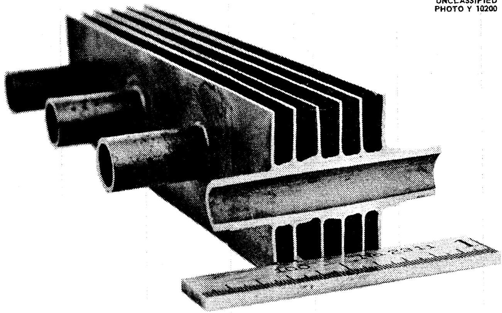  
Fig. 7.5. Tube-to-Fin Assembly Brazed with Preplated "Electroless" Nickel-Phosphorus Brazing Alloy.

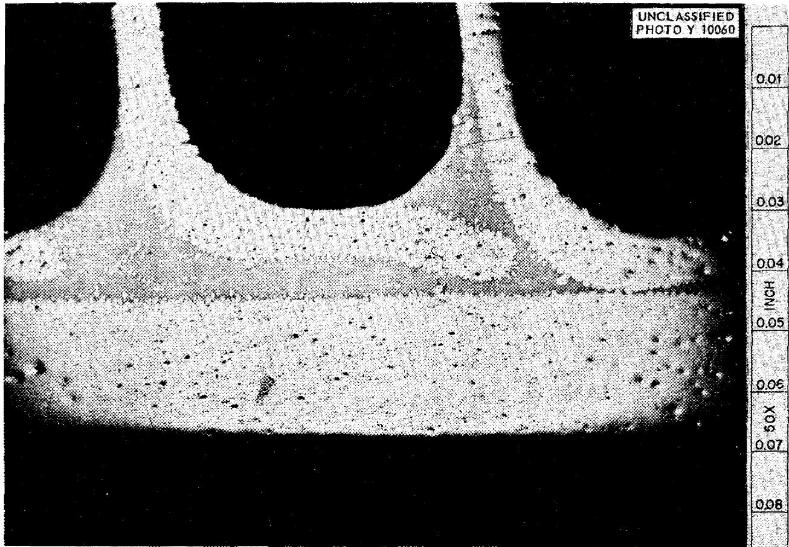  
Fig. 7.6. Tube-to-Fin Joints Brazed with Preplated "Electroless" Nickel-Phosphorus Brazing Alloy.

arc plug welding techniques. The configuration investigated in these preliminary experiments consisted basically of a 0.026-in.-thick type 304 stainless steel-clad type 304 stainless steel sheet 24 in. long that was to be joined on the edge at 2-in. intervals to a 0.041-in.-thick type 304 stainless steel side plate.

The joint design considered to be optimum for welding is shown in Fig. 7.7. A hole 0.067 in. in diameter is drilled in a 0.041-in.-thick header sheet to receive a projection $0.062 \times 0.026 \times 0.125$ in. obtained by edge milling the 0.026-in. type 304 stainless steel-clad sheet. The 0.84-in. extension of the projection above the header sheet was predetermined from the following volume considerations: (1) the volume of the 0.067-in.-dia, 0.041-in.-deep header hole was 0.00015 in. $^{3}$ ; (2) the volume of the $0.062 \times 0.026 \times 0.125$ in. projection was 0.0002 in. $^{3}$ ; (3) the excess of 0.00005 in. $^{3}$ would ensure adequate weld buildup and could be removed by finish machining.

A series of specimens of the design shown in Fig. 7.7 were welded with variations in arc current, arc time, arc distance, and welding sequence. Since precise control of these variables was required, cone-arc equipment was used throughout the study. The welds were examined metallographically for penetration and flaws.

Examination of test specimens indicated that the most favorable weld geometry could be achieved by two separate inert-arc welding operations. The projection was melted into a "rivet" by an initial choice of arc current, arc time, and arc distance. The arc distance was then reduced, and an additional application of current was used to form the the finished weld, the filler metal being provided by the rivet.

The rivet formed during the first operation by using the optimum welding conditions is shown in Fig. 7.8, which is a section through the weld joint corresponding to section A-A in Fig. 7.7. The plug weld formed in the second operation is shown in

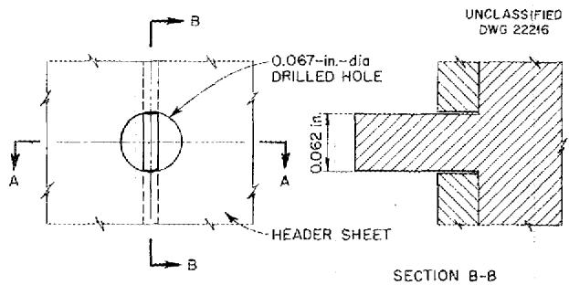  
Fig. 7.9. As may be noted, the penetration of the type 304 stainless steel-clad sheet was complete and reasonably uniform, which indicates that an apparently sound weld joint was obtained. It thus appears that inert-arc plug welding may be a feasible method of fabrication of these assemblies.

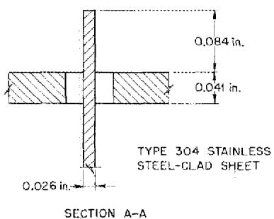  
Fig. 7.7. Assembly of Type 304 Stainless Steel Components Prior to Inert-Arc Plug Welding.

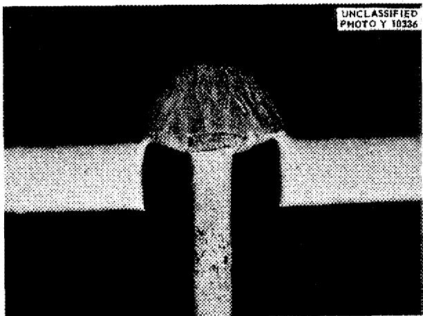  
Fig. 7.8. Section of "Rivet" Formed by Initial Application of a 30-amp (DCSP) Arc Current for an Arc Time of 2 sec at an Arc Length of 0.140 in. Etchant: aqua regia. 21X

However, the application of these techniques to the fabrication of a multiweld unit should be investigated further.

# MECHANICAL PROPERTIES OF INCONEL

R.B.Oliver

D. A. Douglas

K.W.Reber

J. M. Woods

Metallurgy Division

# Stress-Rupture of Inconel in Fluoride Fuel

Stress-rupture tests of coarse- and fine-grained Inconel in argon and in fluoride fuel NaF-ZrF4-UF4 at temperatures of 1300, 1500, and $1650^{\circ}\mathrm{F}$ are being made. Data for the higher stress ranges are complete, and the tests being made currently are expected to run from three to eight months. Testing in the stress range from 500 to 1500 psi will commence in about six months when the six new units designed for low loads are completed. The results obtained to date for fine-grained Inconel are summarized in Table 7.2.

# Tube-Burst Tests of Triaxially Stressed Tubes

In the past, data obtained in the tube-burst tests of triaxially stressed Inconel tubes have shown considerable scatter and interpretation has been difficult. However, data obtained in recent tests have shown reasonable reproducibility, and it is believed that most of the operating difficulties have been overcome. The present procedure is to

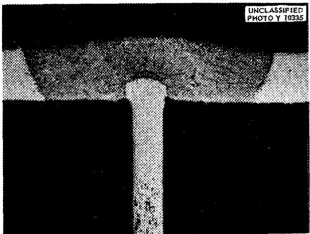  
Fig. 7.9. Section of Completed Weld Formed by Application of a 30-amp Arc Current for 4 sec at an Arc Length of 0.060 in. to the "Rivet" Shown in Fig. 7.8. Etchant: aqua regia, 21X

TABLE 7.2. RESULTS OF STRESS-RUPTURE TESTS OF FINE-GRAINED INCONEL IN NaF-ZrF ${}_{4}$ -UF ${}_{4}$   

<table><tr><td>TEMPERATURE (°F)</td><td>STRESS (psi)</td><td>RUPTURE TIME IN ARGON (hr)</td><td>RUPTURE TIME IN FLUORIDES (hr)</td></tr><tr><td>1300</td><td>10,000</td><td>2000</td><td></td></tr><tr><td>1500</td><td>10,000</td><td>50</td><td>30</td></tr><tr><td>1300</td><td>5,000</td><td>7000</td><td></td></tr><tr><td>1500</td><td>5,000</td><td>540</td><td>260</td></tr><tr><td>1650</td><td>5,000</td><td>25</td><td>25</td></tr><tr><td>1500</td><td>2,500</td><td>4000</td><td>1200</td></tr><tr><td>1650</td><td>2,500</td><td>450</td><td>175</td></tr></table>

test the tube with the fluoride fuel $\mathsf{NaF - ZrF_4 - UF_4}$ inside and purified argon outside. The stress range from 500 to 3500 psi is currently being investigated and tests have been completed in the upper half of the range. In comparing the data with creep data at the same stresses in the same fuel, it is found that the tube-burst time is about the same as the time for $2\%$ elongation in the tensile creep tests. The tube specimens loaded by internal pressures give an axial-to-tangential stress ratio of $\frac{1}{2}$ , which results in minimum ductility; thus the results probably represent the minimum life expectancy, other factors being equal. In the near future, these tube specimens will be tested with the fuel inside the tube and sodium, instead of argon, outside.

# Environmental Effects on Creep of Inconel

Creep tests of Inconel specimens in nitrogen and in sodium environments at $1500^{\circ}\mathrm{F}$ have recently been completed. Thus it is now possible to compare the effects of six types of environments that Inconel structures might encounter. The results of these creep tests are summarized in Table 7.3.

Table 7.3 shows that hydrogen is the most detrimental environment and that air is the most beneficial, as far as rupture life is concerned. It is interesting to note that, with the exception of the tests in air and sodium, all the specimens reached about the same total elongation regardless of the rupture time. The increased ductility in air and in sodium is probably the result of decarburization. Chemical analyses are being made to test this hypothesis. The results presented in Table 7.3 are for Inconel specimens that were annealed at

TABLE 7.3. RESULTS OF CREEP TESTS OF INCONEL ANNEALED AT ${1650}^{ \circ  }\mathrm{F}$ AND TESTED UNDER A STRESS OF 3500 psi at ${1500}^{ \circ  }\mathrm{F}$ IN VARIOUS ENVIRONMENTS   

<table><tr><td>ENVIRONMENT</td><td>LIFE RUCTURE (hr)</td><td>FINAL ELONGATION (%)</td></tr><tr><td>Hydrogen</td><td>446</td><td>13.0</td></tr><tr><td>NaF-ZrF4-UF4</td><td>550</td><td>12.0</td></tr><tr><td>Sodium</td><td>1333</td><td>35.0</td></tr><tr><td>Argon</td><td>1467</td><td>12.0</td></tr><tr><td>Nitrogen</td><td>1770</td><td>11.6</td></tr><tr><td>Air</td><td>2567</td><td>50.0</td></tr></table>

$1650^{\circ}F$ before being tested. Specimens annealed at $2050^{\circ}F$ and then stressed in hydrogen or NaF $\mathsf{ZrF}_4\cdot \mathsf{UF}_4$ have shown more resistance to the environmental effect. Tests of this type of specimen in the other environments are now being made.

# HIGH-CONDUCTIVITY METALS FOR RADIATOR FINS

E. S. Bomar J. H. Coobs H. Inouye, Metallurgy Division

The investigation of the fabrication of high- thermal-conductivity fins was confined during this period to a study of diffusion barriers for use between Inconel and copper, the fabrication of clad-copper fin material in sufficient quantities for the assembly of experimental radiators, and the investigation of special materials.

# Diffusion Barriers

Barrier material for use between Inconel and copper was selected on the basis of low solubility of the element or alloy in copper or Inconel. In addition, it was desired to fabricate thin composite clads to determine their rolling characteristics. The barrier materials used were tungsten, molybdenum, titanium, zirconium, tantalum, vanadium, types 310 and 446 stainless steel, and iron plus silver.

Several composites were hot rolled approximately $50\%$ at $1800^{\circ}\mathrm{F}$ and then finished cold to 0.008 in, total thickness. Bonding was not achieved between molybdenum and Inconel or between vanadium and Inconel, and the following composites could not be successfully rolled: (1) Inconel-Ag-Fe-Cu-Fe-Ag-Inconel and (2) Inconel-W-Cu-W-Inconel. The first of these composites was unsuccessful because of improper design, and the second showed severe stretcher marks. Oxidation and diffusion tests of the other composites are being made.

Some of the earlier tests of Inconel-clad copper showed the absence of diffusion voids, and therefore a few tests are now being made to determine the effect of surface preparation on void formation and diffusion. The composites for this study have been fabricated; they consist of a layer of oxide on Inconel formed by heating in wet hydrogen and in air at $1300^{\circ}\mathrm{F}$ .

# Clad Copper

As reported previously, types 310 and 446 stainless steel are suitable cladding material for copper for use at $1500^{\circ}\mathrm{F}$ , while Inconel cladding causes severe diffusion. In order to establish which of the claddings is most suitable on copper and also to determine the effect of diffusion on thermal conductivity, approximately $15\text{-ft}^2$ samples of copper clad with Inconel, type 310 stainless steel, and type 446 stainless steel have been or are being made. The fin material is to be strips 4 in. wide and 0.010 in. total thickness; the copper core will be 0.006 in. thick and the cladding material will be 0.002 in. thick. This material is to be used for the fabrication of experimental heat exchangers.

# Electroplated Copper

Plates of chromium plus iron and of iron plus nickel plus chromium to give compositions corresponding to types 446 and 310 stainless steel,

respectively, did not protect copper from oxidizing at $1500^{\circ}\mathrm{F}$ . A composite made entirely by electroforming showed the same results. The inability of these plates to protect copper at $1500^{\circ}\mathrm{F}$ is ascribed to the lack of a metallurgical bond between the copper and the plate and to the brittleness of the deposits. Although the ductility can be restored by heating to $1600^{\circ}\mathrm{F}$ , the damaging cracks are present in the as-received or annealed material.

# Solid Phase Bonding

An alternate investigation for obtaining uniform thin claddings is being made. A bond between the copper and the cladding can be obtained by seam welding material of the final desired thickness. The Glen L, Martin Company proposed this method and has supplied samples up to 4 in. long which appear satisfactory. Joint efforts have, to date, produced claddings 0.002 and 0.001 in. thick.

The thermal properties of the aluminum bronzes at low temperatures indicate that the conductivity of alloys containing about $6\%$ aluminum is greater than that of the stainless steels or Inconel by a factor of about 6 at $1500^{\circ}\mathrm{F}$ . To verify this, measurements are now being made on 6 and $8\%$ aluminum bronzes. These alloys are oxidation resistant, and if the expected thermal properties are correct, the need to fabricate composite bodies will be eliminated because these alloys may be suitable for use as radiator fins. This is especially important because difficulties have been experienced in obtaining clad material from commercial suppliers.

# FABRICATION OF SPECIAL MATERIALS

E. S. Bomar J. H. Coobs H. Inouye, Metallurgy Division

# Extrusion of Inconel-Type Alloys

Extruded Inconel tubing was redrawn from 1 in. in outside diameter with a 0.125-in. wall to 0.500 in. in outside diameter with a 0.035-in. wall by the Superior Tube Company. These materials were drawn satisfactorily at reductions as high as $36\%$ per pass with annealing after each stage at $1900^{\circ}\mathrm{F}$ . The properties of the tubing are listed in Table 7.4.

The extrusion of near-Inconel alloys from seven other vacuum melts was attempted with varying degrees of success. Temperatures from 2150 to

TABLE 7.4. PROPERTIES OF ANNEALED HIGH-PURITY INCONEL TUBING 0.505 in. IN OUTSIDE DIAMETER WITH A 0.035-in. WALL   

<table><tr><td>MELT NO.*</td><td>GRAIN SIZE (mm)</td><td>TENSILE STRENGTH (psi)</td><td>YIELD STRENGTH (psi)</td><td>ELONGATION (%)</td></tr><tr><td>DPI-7</td><td>0.090/0.130</td><td>81,000</td><td>35,000</td><td>52</td></tr><tr><td>DPI-8</td><td>0.075</td><td>83,400</td><td>36,000</td><td>50</td></tr><tr><td>DPI-9</td><td>0.090/0.110</td><td>83,500</td><td>40,000</td><td>48</td></tr><tr><td>DPI-10</td><td>0.090/0.130</td><td>80,400</td><td>40,800</td><td>46</td></tr></table>

*Analyses of melts 8, 9, and 10 were given in the Metallurgy Division Progress Report for the Period Ending April 10, 1953, ORNL-1551, Table 22, p. 54.

$2350^{\circ}F$ were employed to produce the tubing (or rod), and, in some instances, extrusion ratios as low as 10:1 were required. All the extruded tubing has been sent to the Superior Tube Company for further reduction. A molybdenum-nickel alloy (20% Mo-80% Ni, nominal composition) did not extrude at a reduction of 13:1 at $2350^{\circ}F$ . An attempt will be made to extrude this alloy at a lower reduction ratio.

# Rolling of Chromium-Cobalt Alloy

A chromium-cobalt alloy ingot 6 in. long and 1 in. in diameter (45% Cr-55% Co, nominal composition) was cost, and attempts to roll it at $2350^{\circ}\mathrm{F}$ showed that this alloy was hot-short. Additions of 0.5% manganese and 0.5% aluminum did not improve the hot-rolling properties. A solid rod of this alloy which was precision cast was readily machinable, but it cracked severely. The present plans call for precision casting the alloy tubing. The hardness of the cast alloy is Rockwell C-50.

# Rolling of Cobalt

A $1\frac{1}{2}$ -in.-dia, 6-in.-long cobalt ingot containing $0.5\%$ manganese and $0.5\%$ aluminum was successfully rolled to $\frac{1}{2}$ -in.-dia rod at $2300^{\circ}\mathrm{F}$ . Previously, it was found that cobalt without the manganese and aluminum additions was hot-short. The alloy containing aluminum and manganese has an as-cast hardness of Rockwell A-49.

# Rolling of Iron-Chromium-Nickel Alloy

A $1\frac{1}{2}$ -in.-dia, 6-in.-long ingot of iron-chromium-nickel alloy (45% Fe-40% Cr-15% Ni) was rolled to $\frac{1}{2}$ -in.-dia rod at $2350^{\circ}\mathrm{F}$ . This alloy was found to be hot-short at $1850^{\circ}\mathrm{F}$ , even though it contained

1% of a nickel-manganese-titanium master alloy. Previously, attempts to hot roll this alloy at $1850^{\circ}\mathrm{F}$ without the alloy addition were unsuccessful because of hot-shortness. The as-cast alloy has a hardness of Rockwell A-62.

# Cold-Rolled Columbium

Columbium sheet 0.200 in. thick obtained from the Fansteel Corporation was annealed to a grain size of ASTM 7 at $1100^{\circ}\mathrm{C}$ in a vacuum. The sheet was cold rolled to 0.025 in., which represented a reduction of $87.5\%$ in thickness. The room-temperature mechanical properties were determined on specimens vacuum annealed for $\frac{1}{2}$ hr at various temperatures and are summarized in Table 7.5.

The microstructure of columbium under these conditions shows partial recrystallization at $1000^{\circ}\mathrm{C}$ , and, at $1100^{\circ}\mathrm{C}$ , recrystallization is complete. Vacuums of the order of $10^{-5}$ mm Hg were obtained in the annealing furnace. The analysis of the sheet shows $0.75 + 0.3\%$ tantalum, and traces of copper, iron, and titanium. Analysis of the oxide content of the sheet is not complete, but it is expected to be greater than $0.3\%$ .

# TUBULAR FUEL ELEMENTS

# J. H. Coobs, Metallurgy Division

Drawing of tubular fuel elements has been continued. Plans called for the reduction of six tubes on each of two schedules in steps of $15\%$ and $20\%$ reduction per pass, respectively. All tubes were to be reduced from 0.750 in. in diameter with a 0.042-in. wall to a final size of 0.250 in. in diameter with a 0.015-in. wall, or a total reduction of $87\%$ . Plug drawing was used in preference to drawing on a

mandrel, as explained previously. However, because of failure of the tubes at intermediate steps, the drawing schedules could not be carried to completion. Reduction of the tubes was continued as long as was considered practical, that is, until each tube had failed within the core region or near the starting end in such a way as to make further drawing difficult or impossible. The final sizes of the tubes processed on the $15\%$ schedule are given in Table 7.6, along with core composition and total reduction.

Because the results with the $20\%$ schedule were discouraging, only three tubes were processed; all

4bids,p.99.

tubes failed on the second pass. Total reduction of these tubes was $36\%$ .

In general, the tubes reduced by both schedules developed excellent finishes on both inner and outer diameters, with no evidence of rippling or folding in the core region. In most cases, failure occurred near the trailing end of the core. The failures were attributed mainly to inability to keep the plugs positioned in the die properly, with the result that the reductions did not conform strictly to the schedule. The reductions were somewhat higher than scheduled on several passes and caused galling in the dies and failure of the tubes because of severe tensile stresses. Samples have been cut from the nine tubes drawn and are now being examined metallographically.

TABLE 7.5. MECHANICAL PROPERTIES OF COLUMBIUM COLD ROLLED TO A REDUCTION OF 87.5%   

<table><tr><td>SPECIMEN NO.</td><td>ANNEALING TEMPERATURE (°C)</td><td>HARDNESS (VPN)</td><td>YIELD POINT AT 0.1% OFFSET (psi)</td><td>TENSILE STRENGTH (psi)</td><td>ELONGATION IN 1½ in. (%)</td><td>MODULUS OF ELASTICITY (×10-6psi)</td></tr><tr><td>1</td><td>As rolled</td><td>145</td><td></td><td>76,500</td><td>4.0</td><td></td></tr><tr><td>2</td><td>300</td><td>154</td><td>69,500</td><td>80,700</td><td>2.6</td><td>17.66</td></tr><tr><td>3</td><td>600</td><td>147</td><td>62,300</td><td>73,400</td><td>6.0</td><td>16.60</td></tr><tr><td>4</td><td>900</td><td>136</td><td>57,300</td><td>63,100</td><td>8.3</td><td>17.30</td></tr><tr><td>5</td><td>1000</td><td>100</td><td>37,500</td><td>50,800</td><td>12.6</td><td>17.88</td></tr><tr><td>6</td><td>1100</td><td>85</td><td>23,400</td><td>42,200</td><td>26.6</td><td>19.30</td></tr><tr><td>7</td><td>1200</td><td>86</td><td>24,000</td><td>45,000</td><td>18.6</td><td>17.20</td></tr></table>

TABLE 7.6. FINAL SIZES OF TUBES PROCESSED ON THE $15\%$ SCHEDULE   

<table><tr><td>TUBE NO.</td><td>COMPOSITION (BY VOLUME)</td><td>NO. OF PASSES</td><td>FINAL SIZE (in.)</td><td>TOTAL REDUCTION (%)</td></tr><tr><td>1</td><td>80% type 302 stainless steel-20% UO2</td><td>5</td><td>0.562</td><td>56</td></tr><tr><td>2</td><td>70% Ni-30% UO2</td><td>9</td><td>0.396</td><td>77</td></tr><tr><td>3</td><td>80% Ni-20% UO2</td><td>9</td><td>0.396</td><td>77</td></tr><tr><td>4</td><td>70% type 302 stainless steel-30% UO2</td><td>10</td><td>0.355</td><td>80</td></tr><tr><td>5</td><td>80% Fe-20% UO2</td><td>3</td><td>0.625</td><td>39</td></tr><tr><td>6</td><td>70% Fe-30% UO2</td><td>5</td><td>0.562</td><td>56</td></tr></table>

# CERAMIC RESEARCH

L. M. Doney

J.A.Griffin

J. R. Johnson, Metallurgy Division

# Glass-Type Pump Seals

Work continued on the development of a suitable, viscous, high-temperature pump seal. Ten test rings, $2\frac{1}{2}$ in. ID, $3\frac{1}{2}$ in. OD, $\frac{7}{16}$ in, thick, of a beryllium fluoride glass were prepared by melting the glass batch in a platinum crucible and casting the glass in graphite dies (Fig. 7.10). The rings were cooled slowly in a blanket of glass wool to minimize cracking. The finished rings were sent to the Experimental Engineering Group for testing.

# Ceramic Container for Fuel

Further work is being done on the fabrication of a ceramic container for use in the investigation of the electrical resistivity of the fluoride fuels (cf., sec. 8, "Heat Transfer and Physical Properties"). Three specimens, $5\frac{1}{2} \times 1 \times 1$ in., were cut from hot-pressed beryllium oxide blocks (ARE blocks). A hole $\frac{7}{16}$ in. in diameter was drilled $4\frac{1}{2}$ in. deep along the long axis of the specimen and then tapered to 0.158 in. in diameter for the remaining length of the specimen. These specimens were tested and found to be resistant to attack by the fuel; however, they were too short to satisfy the test conditions. Work has commenced on the fabrication of a

5L. M. Doney, J. A. Griffin, and J. R. Johnson, ANP Quar. Prog. Rep. Sept. 10, 1953, ORNL-1609, p. 98.

  
Fig. 7.10. Glass-Type Pump Seal. Composition (by weight): $\mathsf{BeF}_2$ , $50\%$ ; KF, $25\%$ ; $\mathsf{MgF}_2$ , $16\%$ ; $\mathsf{AlF}_3$ , $9\%$ .

suitably sized beryllium oxide shape by isostatically pressing and sintering.

# High-Density Graphite

Specimens of high-density graphite (Graph-i-tite) supplied by the Graphite Specialties Corporation were obtained and sent to the Metallurgy Division's Corrosion Group for compatibility tests with the fluorides and other molten salts and molten metals. Typical properties of this graphite are given by the manufacturer as:

Apparent density, g/cm3 1.85 to 1.92

Tranverse breaking strength, psi 4000 to 4500

Modulus of elasticity, 1b/in.²/in./in. $20 \times 10^{5}$ to $25 \times 10^{5}$

Electrical resistance, ohm-in. 0.00032 to 0.00040

Permeability 1.85-g/cm³ den

1.92-g/cm³ density

Impermeable to water at 40 psi and room temperature for 10 min minimum

Impermeable to air at 40 psi and room temperature for 10 min minimum

# COMBUSTION OF SODIUM ALLOYS

G.P.Smith M.E.Steidlitz Metallurgy Division

Studies of the flammability of jets of sodium alloys in wet and dry air at temperatures of up to $800^{\circ}C$ have been continued. Sodium-mercury alloys containing less than 34 mole $\%$ sodium and sodium-bismuth alloys containing less than 40 mole $\%$ sodium did not burn. All other alloys tested burned in degrees ranging from slight to violent. The combustible alloys tested were: binary alloys containing, in addition to sodium, $90\%$ aluminum, 50 to $60\%$ bismuth, $90\%$ indium, $90\%$ lead, 0.6 to $66\%$ mercury, $90\%$ silver, or $90\%$ zinc; ternary alloys having a $45\%$ sodium- $50\%$ bismuth base and containing $5\%$ each of calcium, copper, magnesium, mercury, potassium, or silver; and ternary alloys having a $30\%$ sodium- $65\%$ mercury base with $5\%$ each of aluminum, bismuth, calcium, copper, magnesium, potassium, or silver. The humidity of the air was noted to have a very slight effect on the rate of combustion.

# 8. HEAT TRANSFER AND PHYSICAL PROPERTIES RESEARCH

# H. F. Poppendiek   Reactor Experimental Engineering Division

The physical properties of a number of fluorides and other materials of interest to aircraft reactor technology have been measured. Preliminary density and viscosity measurements have been obtained for the ARE fuel concentrate over the temperature range of 660 to $1000^{\circ}\mathrm{C}$ ; the viscosity varied from about 17.5 cp at $725^{\circ}\mathrm{C}$ to 9.9 cp at $975^{\circ}\mathrm{C}$ . The vapor pressure equations for two $\mathrm{NaF - ZrF_4}$ mixtures were determined. The thermal conductivity of the solid fluoride mixture NaF-KF-LiF-UF $_4$ (10.9-43.5-44.5-1.1 mole %) was determined to be 1.7 Btu/hr $^{-\circ}\mathrm{F}$ , while that of the solid heat transfer salt $\mathrm{NaNO}_2\cdot \mathrm{NaNO}_3\cdot \mathrm{KNO}_3$ (40-7-53 wt %) was only 0.6 Btu/hr $^{-\circ}\mathrm{F}$ . The heat capacity of NaF-ZrF $_4$ -UF $_4$ (50-25-25 mole %) was 0.17 cal/g $^{-\circ}\mathrm{C}$ in the solid state and 0.27 cal/g $^{-\circ}\mathrm{C}$ in the liquid state over the temperature range of 610 to $930^{\circ}\mathrm{C}$ , with a heat of fusion of 42 cal/g. The heat capacities of two special samples of type 310 stainless steel and of G-E No. 62 brazing alloy have also been measured.

Additional forced-convection heat transfer experiments with NaF-KF-LiF eutectic in a nickel tube were made, and the data obtained were found to be in agreement with data from the former experiments. No additional thermal resistance was present and no film deposits on the inner surface of the nickel tube were observed, in contrast to the conditions found with this fluoride mixture in Inconel.

Temperature and velocity measurements were obtained in a glass thermal convection loop over a Grashof modulus range from $2 \times 10^{4}$ to $67 \times 10^{4}$ . The experimental velocity data are compared with predicted values which were obtained by the numerical solution of the laminar-flow heat-conduction equation. The measured values diverge radically from the theoretical values, undoubtedly because of the turbulence which was introduced by the radial temperature gradient and which was observed at Reynolds numbers as low as 100.

Forced-laminar-flow volume-heat-source velocity and temperature solutions have been derived for the case in which the fluid viscosity is temperature dependent. These solutions are functions of a new dimensionless modulus which is a measure of

the importance of the viscosity variation of the system.

Experimental apparatus is being assembled for measurements of fluid flow in an annulus and for studies of transient surface-boiling phenomena. The annulus flow will be determined by photographing dust particles; the essential photographic technique is being developed. The boiling studies will be conducted on a flat metal filament suspended in water.

# HEAT CAPACITY

W. D. Powers

G.C.Blalock

Reactor Experimental Engineering Division

The enthalpy and the heat capacity of NaF-ZrF $_4$ . UF $_4$ (50-25-25 mole %) were determined in the liquid and the solid state with a Bunsen ice calorimeter. The data can be represented by the following equations:

$$
\begin{array}{l} H _ {T} (\text {s o l i d}) - H _ {0 ^ {\circ} C} (\text {s o l i d}) = - 1 8 + 0. 1 7 T, \\ c _ {p} \approx 0. 1 7 \pm 0. 0 2, \\ \mathrm {a t} 2 8 0 \mathrm {t o} 6 1 0 ^ {\circ} \mathrm {C}, \\ \end{array}
$$

$$
\begin{array}{l} H _ {T} (\text {l i q u i d}) - H _ {0 ^ {\circ} C} (\text {s o l i d}) = - 3 9 + 0. 2 7 T, \\ c _ {p} = 0. 2 7 \pm 0. 0 2, \\ \text {a t} 6 1 0 \text {t o} 9 3 0 ^ {\circ} \mathrm {C}, \\ \end{array}
$$

where $H$ is the enthalpy in $\mathrm{cal / g}$ , $T$ is the temperature ${}^{\circ}\mathrm{C}$ , $c_{p}$ is the heat capacity in $\mathrm{cal / g}^{\circ}\mathrm{C}$ . The heat of fusion is 42 cal/g at $610^{\circ}\mathrm{C}$ .

The enthalpy and the heat capacity of two special samples of type 310 stainless steel and of brazing compound G-E No. 62 (69% Ni-20% Cr-11% Si) were determined for the General Electric Company:²

1. for type 310 stainless steel (heat 64177) from 238 to $858^{\circ}C$ ,

$$
\begin{array}{l} H _ {T} - H _ {0} \circ_ {C} = - 7. 2 + 0. 1 4 3 T, \\ c _ {p} = 0. 1 4 3 \pm 0. 0 0 7; \\ \end{array}
$$

2. for type 310 stainless steel (heat 64270) from 240 to $834^{\circ}C$ ,

$$
H _ {T} - H _ {0 ^ {\circ} C} = - 5. 5 + 0. 1 3 9 T,
$$

$$
c _ {p} = 0. 1 3 9 \pm 0. 0 0 5;
$$

3. for G-E No. 62 brazing alloy from 211 to $840^{\circ}C$

$$
\begin{array}{l} H _ {T} \dots H _ {0 ^ {\circ} C} = - 4. 3 + 0. 1 4 2 T, \\ c _ {p} = 0. 1 4 2 \pm 0. 0 1 2. \\ \end{array}
$$

# THERMAL CONDUCTIVITY OF SOLIDIFIED SALTS

W.D.Powers R.M.Burnett

S. J. Claiborne

Reactor Experimental Engineering Division

The thermal conductivities of solid fluorides have been measured by a transient cooling method. A sphere of the material being studied is allowed to remain in a calorimeter until a uniform initial temperature is established. The sphere is then rapidly transferred to a large circulating bath at a lower temperature. A fine-gage thermocouple at the center of the sphere is used to determine the time-temperature curve as the sphere cools. Classical transient temperature solutions in terms of the physical properties of the sphere are available and may be used to extract the thermal conductivity of the sphere from the experimental time-tempera

ture data. In this way the thermal conductivity of the solid fluoride mixture NaF-KF-LiF-UF $_4$ (10.9-43.5-44.5-1.1 mole %) was found to be 1.7 Btu/hr $^2$ ft $^2$ (°F/ft), as compared with a value of 2 Btu/hr $^2$ ft $^2$ (°F/ft) for the same fluoride mixture in the liquid state. The thermal conductivity of a solid heat transfer salt (NaNO $_2$ -NaNO $_3$ -KNO $_3$ ; 40-7-53 wt %) is also being determined by the transient cooling method. Preliminary measurements indicate a value of 0.6 Btu/hr $^2$ ft $^2$ (°F/ft) over the temperature range 80 to 170°F.

# DENSITY AND VISCOSITY OF FLUORIDES

S. I. Cohen

T. N. Jones

Reactor Experimental Engineering Division

Preliminary viscosity and density measurements on $\mathsf{Na}_2\mathsf{UF}_6$ were made on a Brookfield viscometer and displacement apparatus, respectively. The density, as plotted in Fig. 8.1, is given by the equation

$$
\rho = 5. 5 9 8 - 0. 0 0 1 1 9 T,
$$

where $\rho$ is in $\mathrm{g/cm^3}$ and $660^{\circ}C < T < 1000^{\circ}C$ . The viscosity varies from about 17.5 cp at $725^{\circ}C$

${}^{3}$ S. I. Cohen, Preliminary Measurement of the Density and Viscosity of Composition 43 (Na ${}_{2}{UF}_{6}$ ), ORNL CF 53-10-86 (Oct. 14, 1953).

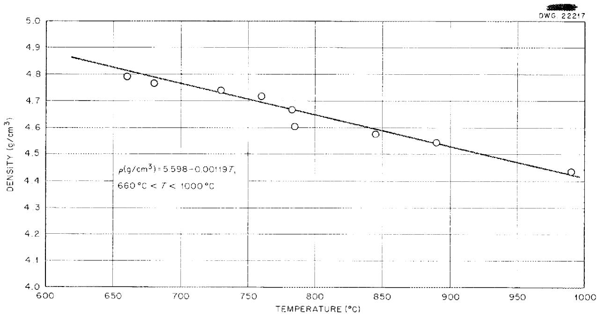  
Fig. 8.1. Density of $\mathsf{Na}_2\mathsf{UF}_6$ as a Function of Temperature.

to about 9.9 cp at $975^{\circ}C$ (Fig. 8.2), and the experimental data are represented by the equation

$$
\mu = 0. 9 2 e ^ {2 9 3 6 / T},
$$

where $\mu$ is in centipoises and $T$ is in ${}^{\circ}\mathsf{K}$ .

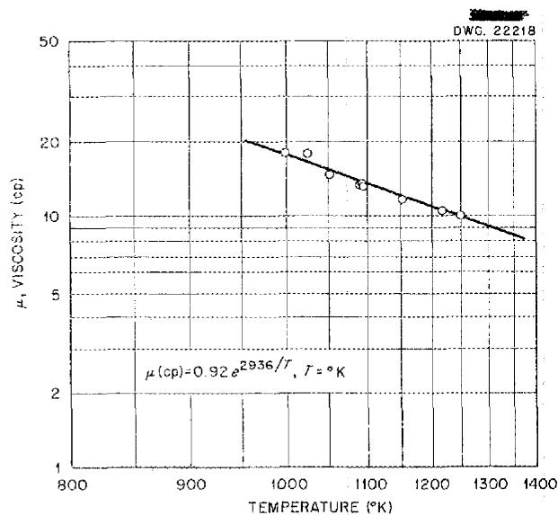  
Fig. 8.2. Viscosity of $\mathsf{Na}_2\mathsf{UF}_6$ as a Function of Temperature.

The following solid density measurements at room temperature were made on $\mathsf{NaF - ZrF}_4$ mixtures in support of phase studies of these materials:

$$
D E N S I T Y (g / c m ^ {3})
$$

Batch B-62 (53-47 mole %) 4.00

Batch R-132 (52-48 mole%) 4.103

Batch R-133 4.124

A method for predicting densities of fluoride mixtures have been developed and will be described in a forthcoming report. Plots of liquid densities at any temperature vs. the calculated room-temperature densities have been developed that correlate all the experimental data available to within $2\%$ . Similar plots have been devised for viscosity data, but the correlation is not dependable.

# VAPOR PRESSURES OF FLUORIDES

R.E.Traber, Jr. R.E.Moore

C.J.Barton

Materials Chemistry Division

Additional measurements of vapor pressures by the method of Rodebush and Dixon were made.

Chemical analysis has shown that the material used for the previously reported measurement of the vapor pressure of NaF-ZrF4, nominally 50-50 mole %, actually contained 47 mole % ZrF4. Instead of being the pure compound NaZrF5, it was probably a solid solution of NaZrF5 and Na2ZrF6. The vapor pressure equation for this 47 mole % ZrF4~53 mole % NaF mixture is

$$
\log P = - \frac {7 2 1 3}{T} + 7. 6 3 5,
$$

where $P$ is in mm Hg and $T$ is in ${}^{\circ}\mathrm{K}$ . The vapor pressure equation for the mixture NaF-ZrF $_4$ (50-50 mole %) is

$$
\log P = - \frac {6 8 2 7 . 7}{T} + 7. 5 0 3
$$

over the temperature range 812 to $942^{\circ}C$

# ELECTRICAL CONDUCTIVITY OF FLUORIDES

N. D. Greene

Reactor Experimental Engineering Division

Preliminary electrical conductivity measurements of $\mathsf{NaF - ZrF_4}$ (50-50 mole %) and $\mathsf{NaF - ZrF_4}$ (57-43 mole %) have been obtained for the temperature range 1000 to $1800^{\circ}\mathsf{F}$ . For these measurements, a thick-walled cylindrical tube of beryllium oxide is mounted vertically in an open Inconel crucible containing the molten fluoride. An electrode is inserted through the tube, and the electrical path is defined from the electrode just under the liquid surface to the Inconel at the bottom of the crucible. However, the beryllia tube was not sufficiently long to prevent nonisothermal regions in the cell, and therefore accurate measurement of the salt temperatures were difficult. A longer tube has been ordered.

An attempt was also made to measure the conductivity of NaF-KF-LiF by using the apparatus described above, but this salt penetrated and eroded the tube so badly that the data obtained were deemed unreliable. A new cell in which only platinum is in direct contact with the salt has been designed and is now being constructed. This cell will be used to measure the conductivities of salts which are not compatible with

beryllia. Since slight contamination of the melts occurred as a result of the constituent materials of the crucible going into solution, a more noble material than either Inconel or stainless steel is indicated. Accordingly, a platinum crucible has been designed and constructed for this purpose.

# FORCED-CONVECTION HEAT TRANSFER WITH NoF-KF-LiE EUTECTIC

H.W.Hoffman J.Lones Reactor Experimental Engineering Division

Additional data have been obtained for NaF-KF-LiFeutectic (11.5-42.0-46.5 mole %)flowing through a heated nickel tube. The experimental results are presented in Fig. 8.3 in terms of the Colburn $j$ -function. The previously reported results for NaF-KF-LiF in both nickel and Inconel tubes are also shown.

In review, NaF-KF-LiF heat transfer data were first obtained by using a nickel tube. The results (shown by the inverted triangles in Fig. 8.3) indicated that the anticipated heat transfer correlation was followed. The experiment was then repeated with the eutectic flowing through an Inconel tube,

and the data (circles in Fig. 8.3) were found to lie approximately $50\%$ below the expected correlation. The discrepancy was believed to be due to the formation of a film of corrosion products at the fluid-metal interface. The heat transfer results and the existence of the film were both definitely verified for NaF-KF-LiF in Inconel tubes in a subsequent experiment (squares in Fig. 8.3). The film was analyzed and found to be $\mathsf{K}_3\mathsf{CrF}_6$ plus a small amount of $\mathsf{Li}_3\mathsf{CrF}_6$ .

The data reported at this time were obtained to establish the validity of the original results for NaF-KF-LiF in nickel tubes. The results (normal triangles in Fig. 8.3) are essentially in agreement with those for nickel tube No.1; visual observation of the tube showed no film. The experiment was terminated because of fatigue failure of the nickel tube at the high operating temperatures used.

Experimental apparatus is being constructed for studying fluoride films formed on Inconel as a function of time and temperature. Because of the unavailability of pure $\mathsf{K}_3\mathsf{CrF}_6$ , it has not yet been possible to measure the thermal conductivity of this material. Several other fluoride mixtures are being studied to determine the thermal conductivity of such films because they may form on Inconel tubes.

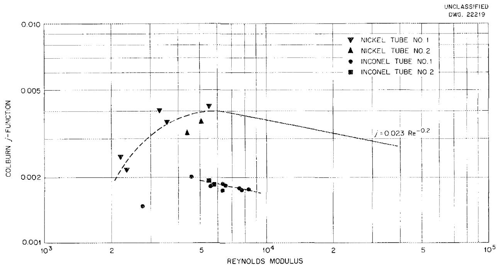  
Fig. 8.3. The $j$ -Modulus vs. Reynolds Modulus for NaF-KF-LiF (11.5-42,0-46.5 mole %).

# FLOW IN THERMAL-CONVECTION LOOPS

D.C.Hamilton F.E.Lynch

L. D. Palmer

Reactor Experimental Engineering Division

Thermal-convection loops have been used for observing the nature of flow of ordinary fluids and to determine the accuracy and range of usefulness of an analytical method for predicting the mean velocity, or Reynolds modulus, from wall temperature measurements. A discussion of the velocity measurements and flow observations was given in a previous report. Additional velocity and wall temperature data have been taken, fluid temperature traverses have been made, the analytical analyses have been completed, and a report of the results is being prepared.

Measurements of temperature and velocity were taken for five specific conditions over the range of Grashof modulus from $2 \times 10^{4}$ to $67 \times 10^{4}$ . The corresponding variation of Reynolds modulus was from 50 to 270. The Grashof and Reynolds moduli are, respectively,

$$
\operatorname {G r} _ {d} = \frac {d ^ {3} \beta g \theta_ {w} (\max )}{\nu^ {2}}
$$

and

$$
R e = \frac {u _ {m} d}{\nu},
$$

where $d$ is the tube diameter, $\nu$ is the kinetic viscosity of the liquid, $\beta$ is the thermal coefficient of expansion of the liquid, $g$ is the acceleration of gravity, $u_{m}$ is the mean fluid velocity, and $\theta_w(\max)$ is the maximum variation in wall temperature.

The flow and heat transfer observed in these experiments were characteristic of free convection rather than forced convection, and thus the significant parameter which dictates the character of the flow is the Grashof modulus rather than the Reynolds modulus.

At Reynolds moduli of up to about 100, the flow was essentially laminar. Above this value, the Grashof modulus was supercritical, and the flow was laminar over part of the circuit and turbulent

in other parts. As the Grashof modulus (and thus Reynolds modulus) was increased, the length of the circuit in laminar flow decreased. In addition, when the Grashof modulus was high, the radial temperature gradient was sufficient to cause vigorous secondary flow cells in the laminar part of the circuit.

The method for predicting the Reynolds modulus from wall temperature measurements employed the numerical solution of the laminar flow equation for heat conduction. The problem was solved on the ORNL high-speed computer, the ORACLE.

In Fig. 8.4, the predicted and measured values of Reynolds moduli are compared. For the first two sets of data, for which the flow was essentially laminar, the correlation is no worse than $30\%$ ; for Reynolds moduli greater than 100, the flow was observed to be partly turbulent, and a laminar flow solution is obviously not applicable. The prediction is satisfactory for the laminar flow regime, but a similar prediction for the turbulent flow regime cannot be made because the turbulent diffusivity is not known for this type of turbulent flow.

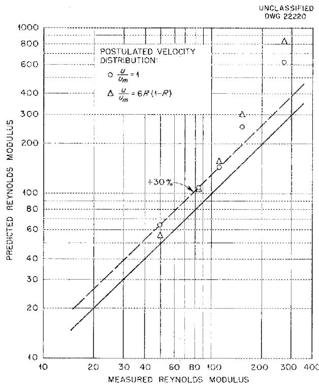  
Fig. 8.4. Comparison of Predicted and Measured Reynolds Moduli for a Thermal Convection Loop.

The method used in the previous work for measuring velocity is not applicable to higher flows. Therefore a velocity measuring device is being developed which will be applicable at higher velocities and which will not offer resistance to the flow.

# FLUID FLOW IN AN ANNULUS

J.O.Bradfute

Reactor Experimental Engineering Division

The experiment to be used for measuring fluid velocity profiles in annulus systems was described previously. In essence, the method consists of photographing dust particles which are entrained in air flowing in an annulus. Most of the recent effort on this research was devoted to photographic experimentation to develop a procedure for photographing the grid system and the dust particles with the light available from a single flash of a Strobolume. This has been accomplished.

The problem stemmed from the fact that colimating a beam of light into a sharply defined region in space, a necessary requirement, is extremely inefficient. A pair of parallel slits, each about $2\mathrm{mm}$ wide and approximately $25~\mathrm{cm}$ apart, with the Strobolume placed immediately behind the last one, produced what seemed to be the optimum combination of intensity and definition in the usable portion of the beam. Although about 700 lumen-seconds per flash of the light energy was dissipated by the light source, the developed image of the grid system obtained by using Kodak Tri-X panchromatic film and a stop opening of f:4.7 was so underexposed that even the doubly accented centimeter lines were barely visible upon careful examination. Several film sensitization and latensification materials, as well as high-speed developers, were tried with varying degrees of success and failure. An f:1.8 lens was obtained, and, by employing this lens and following a complex developing process, negatives were produced which have sufficient contrast for satisfactory printing. Chalk-dust particles were also photographed by applying this procedure.

# TRANSIENT SURFACE-BOILING STUDIES

M. W. Rosenthal

Reactor Experimental Engineering Division

In the event a water-cooled reactor suddenly became supercritical, the time required for produc

tion of a certain volume of steam would be of importance. Of primary interest would be the effect of generation of heat at rates increasing exponentially with time in vertical plates (such as the fuel plates of an MTR-type reactor) submerged in water that was initially at below the boiling point.

To obtain information on this phenomenon, an experimental study of heat transfer to water under transient conditions has been undertaken. The basic experimental system is a flat metal filament positioned vertically in a tank of water with heat generated electrically in the filament. The research program consists of two phases: a study involving exponential generation of heat, which will be started when the necessary electrical equipment has been developed, and a preliminary general study of boiling from a vertical filament, which will begin immediately.

Arrangements have been made for the Instrumentation and Controls Division to develop and construct equipment to regulate the flow of current in the filament and to produce an exponential heating curve. This equipment will also measure and record instantaneous values of the variables of interest. The filament and the adjacent water will be photographed by using a high-speed motion-picture camera synchronized with the heat generation system.

# CIRCULATING-FUEL HEAT TRANSFER

H.F.Poppendiek L.D.Palmer

G.M.Winn

Reactor Experimental Engineering Division

Some preliminary experimental temperature measurements have been obtained in a forced-flow volume-heat-source system under laminar flow conditions. The volume-heat-source is generated within the flowing electrolyte by passing an electric current through it. In general, the experimental results are in agreement with the previously developed laminar flow theory. At low flow rates (Reynolds number of 600 or less), the effect of the free convection which is superimposed on the forced convection was observed. The variable ranges within which theoretical and experimental forced-flow volume-heat-source behavior have been

compared to date are the following:

$$
6 0 0 <   \mathrm {R e} <   1 4, 0 0 0,
$$

$$
4. 6 <   \Pr <   8. 7,
$$

$$
3 \times 1 0 ^ {- 4} <   \frac {t _ {0} - t _ {m}}{\frac {W \nu_ {0} ^ {2}}{k}} <   6 \times 1 0 ^ {- 2}.
$$

The next set of experiments is to be made with the test section in a vertical rather than a horizontal position; also, concentrated sulfuric acid is to be used as the electrolyte so that a new Prandtl modulus range can be studied.

Currently, the forced-turbulent-flow temperature solution for the case of fluid flow between parallel plates and annular spaces with volume heat sources in the fluids is being evaluated. This solution will be useful in estimating fluid temperature distributions in reactor systems such as the reflector-moderated reactor.

Forced-laminar-flow volume-heat-source velocity and temperature solutions have been derived for the case in which the fluid viscosity is temperature dependent. A simple, algebraic viscosity-temperature expression which closely approximates experimental viscosity data was substituted into the hydrodynamic equation. A power series with unknown coefficients was substituted into the heat transfer equation, and two integrations were carried out. The resulting temperature solution was then substituted into the hydrodynamic equation, and an integration was carried out. The coefficients of the resulting power series velocity solution were determined by relating them to the initially proposed velocity power series and the integral equation describing the mean fluid velocity. The resulting velocity and temperature solutions are functions of a new dimensionless modulus, as well as radial position. This dimensionless modulus is a measure of the importance of the viscosity variation in the flow system.

# 9. RADIATION DAMAGE

J. B. Trice, Solid State Division

A.J.Miller, ANP Division

Inconel capsules containing the fluoride fuel $\mathrm{NaF - ZrF_4 - UF_4}$ were irradiated in the LITR and in the MTR. Examination of the capsule walls showed a tendency toward intergranular corrosion that does not occur in unirradiated static tests. The data on depth of penetration showed considerable scatter, and therefore no correlation with power production rate and exposure time could be made. Design and construction continued on the in-pile circulating-fuel loops and the MTR creep test equipment.

# IRRADIATION OF FUEL CAPSULES

G.W. Keilholtz

C.C.Webster

J. G. Morgan

M. T. Robinson

H. E. Robertson

W.R.Willis

W.E.Browning

Solid State Division

Inconel capsules containing various compositions of the fluoride fuel system, NaF-ZrF4-UF4 have been irradiated in both the Low-Intensity Test Reactor (LITR) and in the Materials Testing Re

actor (MTR). These tests have included irradiation times of from 53 to 800 hr with power production from the 230 watts/cm³ with a 4 mole % UF₄ fuel in the LITR to the 8000 watts/cm³ with a 12 mole % UF₄ fuel in the MTR. In general, Inconel surfaces show more tendency toward intergranular corrosion when in contact with irradiated fuel than they do in out-of-pile tests. However, the data so far available indicate no definite trend in corrosion penetration either as a function of rate of power production in the fuel or of irradiation time.

Six Inconel specimens containing the fluoride mixture $\mathrm{NaF - ZrF_4 - UF_4}$ (50-46-4 mole %) which were irradiated in the LITR for 53, 140, 270, 565, 685, and 810 hr each are shown in Fig. 9.1. In each case, the power dissipation in the fluoride was 230 watts/cm³. Out-of-pile control capsules for this series of tests are shown in Fig. 9.2.

Inconel capsules which were irradiated in the MTR with power production in the fluoride mixture of 2500, 3900, and 8000 watts/cm³ are shown in Figs. 9.3, 9.4, and 9.5, respectively. The NaF-

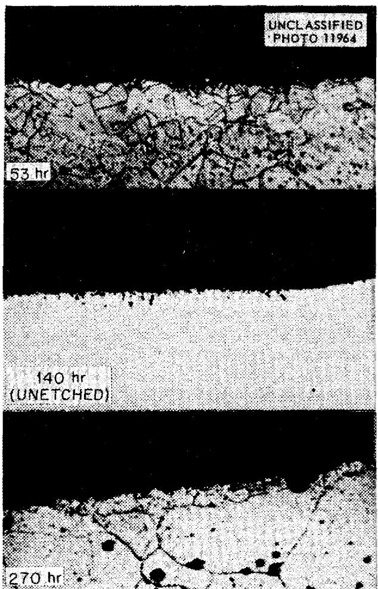

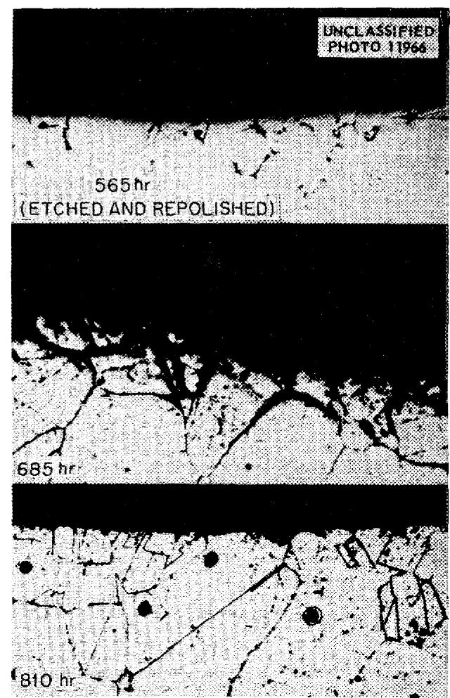  
Fig. 9.1. Static Corrosion of Inconel by NaF-ZrF $_4$ -UF $_4$ (50-46-4 mole %) After Exposure at $1500^{\circ}\mathrm{F}$ in the LITR to 230 watts/cm $^3$ for Various Irradiation Times.

$\mathsf{ZrF}_4\mathsf{-UF}_4$ system was used in each of these tests, although the composition was varied and the UF4 content was 4, 6.5, and 12 mole $\%$ respectively, in the three tests. The sample shown in Fig. 9.5, which was contacted for 575 hr in the MTR with fuel producing power at a rate of the order 8000 watts/cm³, has only 3 or 4 mils of corrosion penetration and is similar to the sample shown in Fig. 9.1, which was exposed at only 230 watts/cm³. In a few samples in which the Inconel had a very large grain size, occasional penetration to a depth of 12 mils has been observed. This phenomenon appears to be fairly independent of power density or time of irradiation, and, as with the other effects observed, there is no certainty as to how much of the effect is due to radiation.

In confirmation of the analytical work reported previously, petrographic examinations of irradiated fuels showed no decomposition or segregation of the fuel as a result of irradiation.

# CREEP UNDER IRRADIATION

W.W.Davis

J.C.Wilson

N. E. Hinkle

J.C.Zukas

Solid State Division

No new creep tests were made during this quarter. The recent increase in power of the LITR causes excessive microformer operating temperatures, and the increasing incidence of microformer failures (which occurred even before the power was increased) prevents reliable strain measurements.

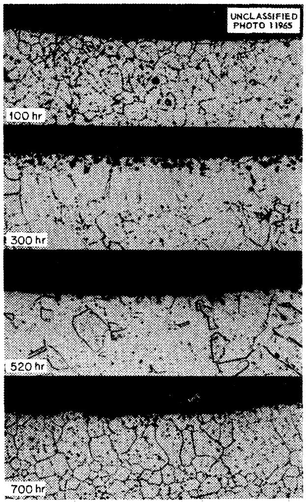  
Fig. 9.2. Static Corrosion of Inconel Exposed to NaF-ZrF4-UF4 (50-46-4 mole %) at 1500°F for Various Times.

Accordingly, no more creep tests will be operated in the LITR until a suitable strain transducer is found. Both the Bourdon-tube extensometer and a bimetal expansion extensometer now being developed show promise of becoming reliable measuring instruments for use in the LITR and in the MTR.

Several models of an in-pile stress-corrosion apparatus are being built to determine the best system for conducting stress-corrosion tests. The discovery of an effect of straining on the corrosion of Inconel and the recent observation of intergranular corrosion in static, in-pile fuel irradiations

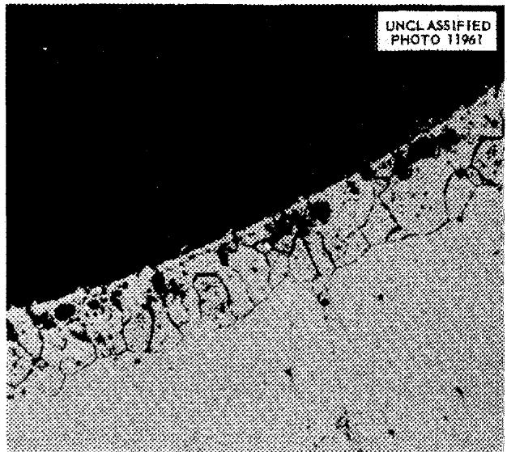

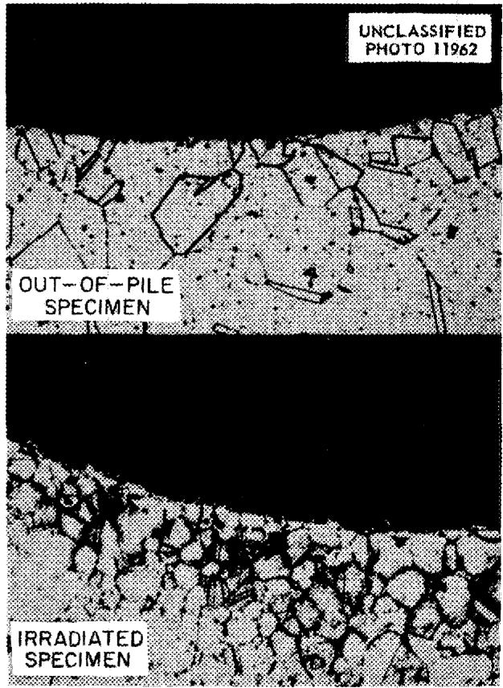  
Fig. 9.3. Static Corrosion of Inconel by NaF-ZrF $_4$ -UF $_4$ (50-46-4 mole %) After Irradiation in the MTR at 2500 watts/cm³ for 575 hr at 1500°F.   
Fig. 9.4. Static Corrosion of Inconel by NaF-ZrF $_4$ -UF $_4$ (53.5-40-6.5 mole %) After 419 hr at $1500^{\circ}\mathrm{F}$ With and Without Irradiation in the MTR at 3900 watts/cm $^3$ .

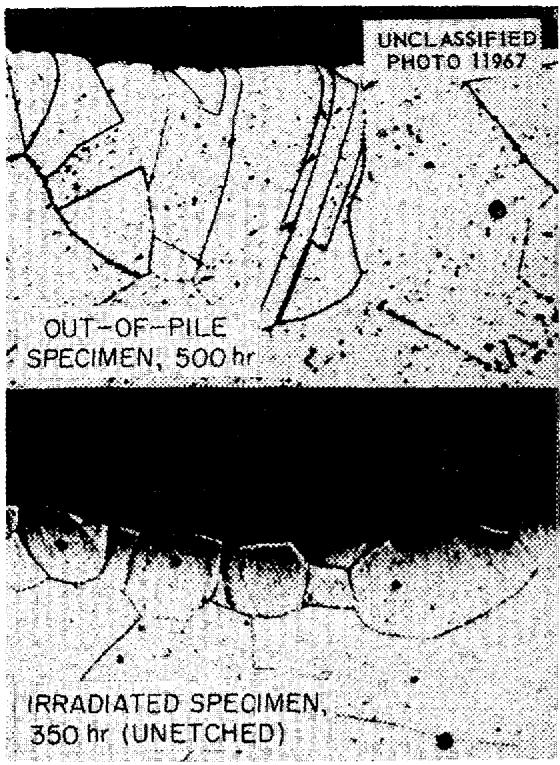  
Fig. 9.5. Static Corrosion of Inconel by NaF-ZrF4-UF4 (63-25-12 mole %) at $1500^{\circ}\mathrm{F}$ With and Without Irradiation in the MTR at 8000 watts/cm³.

have pointed to the need for data on the effects of in-pile stress corrosion.

The MTR creep test rig has been welded shut, but considerable difficulty has been experienced with leaks in the helium supply system and in the seals where the lead wires exit from the pressurized portion of the experimental plug. The complete

instrument assembly has been tested and found satisfactory.

# IN-PILE CIRCULATING LOOPS

O. Sisman

C. Ellis

W.E.Brundage

M. T. Morgan

F. M. Blacksher

A. S. Olson

W. W. Parkinson

Solid State Division

In-pile circulating loops for studying the corrosion of Inconel by fluoride fuels under dynamic conditions in a neutron flux are being built for insertion in hole HB-2 of the LITR. It is expected that similar loops can be used in the MTR. A loop consists essentially of U-shaped sections of 0.225-in.-OD tubing, which will be in the neutron flux, thick-walled $\frac{1}{2}$ -in. tubing that will connect the irradiated section with a Venturi flowmeter and an air-cooled heat exchanger just inside the reactor shield, and a centrifugal sump pump outside the shield. All these components, except the shaft and seal portion of the pump, will be enclosed in a helium atmosphere. All in-pile components, other than the pump, will be surrounded by a water-cooled jacket.

The fabrication of components for the first loop is $80\%$ complete and most of the work remaining to be done on this loop consists of welding or brazing together the finished parts. The components for a second loop are $40\%$ complete. The withdrawal shield is being fabricated, but work on the shield for the pump has not started. The design of the instrumentation is $90\%$ complete, and about $85\%$ of the instruments and controls are on hand.

# 10. ANALYTICAL STUDIES OF REACTOR MATERIALS

C. D. Susano, Analytical Chemistry Division

J. M. Warde, Metallurgy Division

R. Baldock, Stable Isotope Research and Production Division

Developmental work was mainly concerned with the investigation of methods for the determination of the oxidation states of the constituents and the metallic corrosion products in fluoride fuel mixtures and fuel solvents. Divalent iron fluoride was leached from samples of fluoride mixtures with $0.1\text{M}\text{H}_2\text{SO}_4$ and the iron was determined as the o-phenanthroline complex. Divalent chromium fluoride was found to be complexed by $0.17\text{M}(\text{NH}_4)_2\text{C}_2\text{O}_4$ and could be distinguished from trivalent chromium fluoride, which is readily complexed with a dilute solution of disodium dihydrogen ethylenediaminetetraacetate (EDTA) at pH 4.0.

Studies were continued on the use of ammonium oxalate for the determination of traces of $\mathsf{UF}_3$ in the presence of $\mathsf{UF}_4$ . A separation based on solubility difference is possible but not for low concentrations of $\mathsf{UF}_3$ . The absorption spectra of solutions of $\mathsf{UF}_4$ in EDTA and HCl were determined.

The effectiveness of solutions of ammonium oxalate, oxalic acid, and acetic acid as solvents for removing fluoride fuels, which contain zirconium, from metallic thermal convection loops was investigated. Ammonium oxalate proved the most effective solvent tested; however, it was not considered so satisfactory as the nitric and boric acid mixtures which are currently used.

Petrographic examinations were made of irradiated samples of fluoride fuel mixtures. No difference was noted under the petrographic microscope between the irradiated specimens and the comparable control samples.

The mass spectrometer method for quantitative analysis of the uranium content of irradiated fluoride fuel mixtures has recently been extended for use as a measure of uranium burnup during irradiation. A procedure has been developed for calculating the percentage of uranium by weight in both the unirradiated and the irradiated conditions. Hence, the loss in uranium content can be determined to the accuracy that the isotope abundances are known in the original material. The portion of this total uranium loss that is due to burnup is then determined by mathematical analysis.

The activities of the Analytical Service Laboratory have increased markedly during the past quarter. A total of 1,378 samples was received as compared with 878 for the previous quarter, and 1,201 samples involving a total of 11,034 determinations were reported.

# ANALYTICAL CHEMISTRY OF REACTOR MATERIALS

J.C. White

Analytical Chemistry Division

The developmental work during this quarter consisted almost entirely of a search for methods for determining the oxidation states of the constituents and the metallic corrosion products in ARE fuels and fuel solvents. Three phases of the problem are currently being studied: the determination of the oxidation states of iron in fuel solvent and in the fuel; the determination of the oxidation states of chromium in similar media; and the determination of the oxidation states of uranium in the fuel. The ultimate aim of these investigations is the determination of each specie in the presence of the other species. The reducing power of specially prepared $\mathrm{NaZrF}_5$ with zirconium additive was also determined. The effectiveness of certain solvents for dissolving proposed fuels from the walls of metal containers was investigated. No additional work was conducted on the determination of metallic oxides in reactor fuels because of the urgency of other problems.

# Oxidation States of Iron

P.V.Hoffman

Analytical Chemistry Division

A number of samples of the fuel mixture NaF $\mathsf{ZrF}_4$ -UF $_4$ (50-46-4 mole %) and iron (5 wt %) were heated and filtered. Divalent, trivalent, and total iron contents were determined, in addition to uranium trifluoride. The finely divided samples were leached with $0.1 \, \text{M} \, \text{H}_2\text{SO}_4$ on the steam bath for 1 hr to remove iron. Ferrous iron in the filtrate

from the leach was determined with o-phenanthroline; iron was determined in the leach filtrate by first reducing the iron present with hydroquinone and then determining it as the o-phenanthroline complex. In order to test the efficiency of the leaching process, a separate sample was dissolved, and the iron was then determined by the o-phenanthroline method.

The results, with a relative standard error of $10\%$ , show that a single acid leach is sufficient to leach iron quantitatively from the fuel mixture. Further evaluation of the data shows that only a small fraction of the added iron reacts with the fuel and passes in solution through the filter. The oxidation state of this iron is predominantly, if not completely, bivalent. It should be recognized, however, that if $\mathsf{FeF}_3$ and $\mathsf{UF}_3$ exist as such in the mixture, reduction of trivalent iron to the bivalent state undoubtedly occurs on contact with sulfuric acid. The absence of $\mathsf{UF}_3$ was indicated by the hydrogen evolution method. However, this method is not sufficiently sensitive to determine the probable small concentration of $\mathsf{UF}_3$ which may be present in these samples. The need for a sensitive method for determining $\mathsf{UF}_3$ in reactor fuels is evident.

# Oxidation States of Chromium

D. L. Manning

Analytical Chemistry Division

Work has continued on the determination of the oxidation states of chromium following its reaction with $\mathsf{UF}_4$ in fuel solvent NaZrF. The formula for the reaction is

$$
\mathrm {C r F} _ {3} + 3 \mathrm {U F} _ {3} \xrightarrow [ 8 0 0 ^ {\circ} \mathrm {C} ]{\text {N a Z r F}} \mathrm {C r} ^ {\circ} + \mathrm {U F} _ {4}. \tag {1}
$$

It has been shown that chromium trifluoride can be separated from chromium metal by leaching with an acetate-buffered solution $(\mathsf{pH},4.0)$ of disodium dihydrogen ethylenediaminetetraacetate (EDTA). Chromium metal is insoluble in this medium. Several samples were leached with EDTA at 60 to $70^{\circ}C$ for 3 hr to determine the extent of reduction of $\mathrm{CrF}_3$ to metallic chromium during the heating period. No residues indicative of metallic chromium were

obtained. This suggests that chromium trifluoride is either not reduced to metallic chromium or that the metal obtained is in such a finely divided and reactive state that it dissolves in the leach solution. However, previous tests would indicate incomplete reduction, probably to divalent chromium fluoride.

Since EDTA solutions complex both di- and tri-valent chromium, other complexing agents were studied to distinguish between $\mathsf{CrF}_2$ and $\mathsf{CrF}_3$ . Preliminary experiments have indicated that a 0.17 M (2.5%) solution of ammonium oxalate will readily dissolve $\mathsf{CrF}_2$ at the refluxing temperature, and a purple complex will form. Metallic chromium, $\mathsf{CrF}_3$ , and $\mathsf{Cr}_2\mathsf{O}_3$ appear to be insoluble, and they show no tendency to form complexes. The absorption spectrum of the complex formed by divalent chromium fluoride and ammonium oxalate is identical with that of the complex formed by the reaction between trivalent chromium chloride and ammonium oxalate. Further investigation of the nature of this complex is under way.

The work on the determination of the oxidation states of chromium in reactor fuels has shown that (1) divalent chromium fluoride can apparently be selectively leached with $0.17\text{M}$ ammonium oxalate, (2) divalent and trivalent chromium fluoride can be leached simultaneously with EDTA, and (3) the metal and the trivalent oxide are not attacked by either of these solvents.

# Determination of $\mathbf{U}\mathbf{F}_3$ and $\mathbf{U}\mathbf{F}_4$

W.J.Ross

Analytical Chemistry Division

Work on the development of a method for the determination of $\mathsf{UF}_3$ and $\mathsf{UF}_4$ in $\mathsf{NaZrF}_5$ has been continued, and the more complete studies show, as reported previously, that EDTA dissolves $\mathsf{UF}_4$ but apparently has little effect on $\mathsf{UF}_3$ . The effects of temperature and the concentration and acidity of EDTA on the reaction between $\mathsf{UF}_4$ and EDTA were investigated. Concentration of the reagent was not critical over the range 0.08 to 0.15 M; a concentration of 0.1 M was used in most of the tests. Solutions of EDTA with acid concentrations of pH 4 were not appreciably more effective in dissolving $\mathsf{UF}_4$ than those with acid concentrations approaching a pH of 7. Use of solutions less acidic than pH 7 resulted in hydrolysis of uranium. Temperature was the most critical condition. The rate of

reaction at $100^{\circ}C$ was approximately ten times that at $25^{\circ}C$ ; however, the data obtained at $25^{\circ}C$ were not reproducible because of variations in particle size.

Under various conditions of temperature and acidity, the absorption spectra of $\mathsf{UF}_4$ -EDTA are essentially identical with those for $\mathsf{UF}_4$ dissolved in HCl, except that the spectra for the $\mathsf{UF}_4$ -EDTA systems are shifted by approximately $20~\mathrm{m}\mu$ toward the infrared by the presence of EDTA. The maximum molar extinction coefficients for the four spectra shown are nearly equivalent; they range from 35.7 for $\mathsf{UF}_4$ -HCl to 25.0 for $\mathsf{UF}_4$ -EDTA at a pH of 6.8 and a temperature of $100^{\circ}\mathrm{C}$ .

Petrographic and chemical analyses of the three batches of UF3 used for the study of solubility in 0.1 M EDTA showed UF4 contents of 92.4, 90.4, and 90.7%, respectively. Samples of these batches were treated with 0.2 M ammonium oxalate at reflux temperature and filtered, and petrographic examination revealed that the residues were essentially free from UF4. The data indicate that during the first hour of reflux the greater portion of UF4 present is removed but that quantitative separation is questionable. The solubility of UF3 in ammonium oxalate is low; however, UF3 may oxidize slowly upon contact with this solvent, as indicated by the appreciable concentration of uranium in the solution when allowed to stand overnight. The UF3 content of the sample which had been treated with oxalate is being determined and is expected to be near 100%.

On the basis of the data obtained thus far, $\mathsf{UF}_4$ and $\mathsf{UF}_3$ can be separated by ammonium oxalate. However, the method is not sufficiently precise for the separation of traces of $\mathsf{UF}_3$ from $\mathsf{UF}_4$ . Similar tests are under way to determine the feasibility of using 0.1 M EDTA for separating $\mathsf{UF}_3$ .

# Reducing Power of $\mathbf{NaZrF}_5$ with Zirconium Addition

D. L. Manning  
Analytical Chemistry Division

The total reducing power of $\mathrm{NaZrF}_5$ specially prepared by treatment with metallic zirconium was determined. In the hydrogen evolution method used for this determination, the sample is treated with $0.2\text{MHF}$ to liberate the hydrogen which is formed by the reaction between zirconium and hydrofluoric

acid; the gas is collected and measured; and the reducing power is calculated. Essentially no reducing power was observed in these samples. A second method which involved complete dissolution of the sample in standard ceric sulfate solution in $9\mathrm{M}$ $\mathrm{H}_2\mathrm{SO}_4$ and back-titration with standard ferrous sulfate solution was used to confirm the results. Further tests by the hydrogen evolution method on synthetic samples of $\mathrm{NaZrF}_5$ and zirconium demonstrated that the method is quantitative.

# Dissolution of Fluoride Mixtures Containing Zirconium

P. V. Hoffman  
Analytical Chemistry Division

Nitric and boric acid mixtures have been used successfully as solvents for fluoride mixtures, but, in an effort to find a less-corrosive solvent, small-sized lumps of $\mathsf{NaF - ZrF_4 - UF_4}$ (50-46-4 mole %) were contacted with various concentrations of ammonium oxalate, oxalic acid, and acetic acid at 70 to $80^{\circ}C$ for various periods of time. The optimum concentration of ammonium oxalate was 1 M, which is approximately a saturated solution at $50^{\circ}C$ . [One hundred ml of 1 M $(\mathsf{NH}_4)_2\mathsf{C}_2\mathsf{O}_4\cdot \mathsf{H}_2\mathsf{O}$ will dissolve 1 g of small lumps of fuel in approximately 2 hr.] A 2 M solution was the most effective oxalic acid concentration and was approximately equivalent to 1 M ammonium oxalate in dissolution effectiveness. The optimum acetic acid concentration was 0.2 M, which yielded only $50\%$ of the solubility strength of the oxalates. A comparison of the effectiveness of the three reagents tested is shown in Fig. 10.1. The rate of dissolution with 1 M ammonium oxalate is greater than the rate with 2 M oxalic acid, although their effectiveness is nearly equivalent. Ammonium oxalate (1.0 M), because of its higher pH (6.5), is to be preferred over 2 M oxalic acid (pH 0.7), however, with respect to possible corrosiveness. None of these solvents are suitable, however, for dissolving large-sized lumps of NaF-ZrF4-UF4from metallic containers.

# PETROGRAPHIC EXAMINATION OF FLUORIDES

G.D. White

Metallurgy Division

T. N. McVay

Consultant, Metallurgy Division

Petrographic examinations were made of fluoride fuel mixtures NaF-ZrF4-UF4 (50-46-4 mole %) and

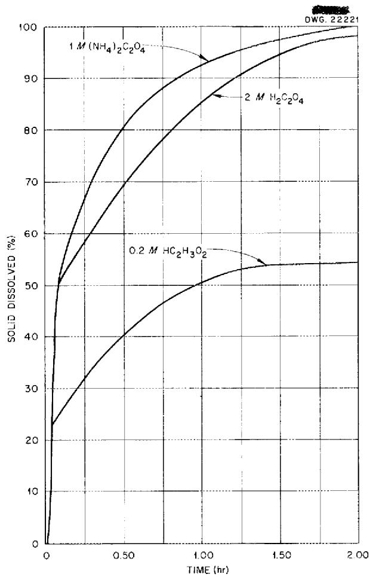  
Fig. 10.1. Comparison of Effectiveness of Solutions of Ammonium Oxalate, Oxalic Acid, and Acetic Acid as Solvents for NaF-ZrF $_4$ -UF $_4$ (50-46-4 mole%).

(53.5-40-6.5 mole %) which had been irradiated a maximum of 492 hr in the MTR. Unirradiated control samples were examined at the same time. These fuels are normally composed of NaZr(U)F, which is green, and perhaps a very small amount of a lower refractive index complex, which is designated E-2. The irradiated samples were normal, except that

the $\mathrm{NaZr(U)F_5}$ had a slightly low refractive index and was slightly reduced. There were no differences between the control samples and the irradiated samples which could be observed with a petrographic microscope.

# MASS SPECTrometer INVESTIGATIONS OF IRRADIATED FLUORIDE FUELS

C. R. Boldock

Stable Isotope Research and Production Division

The mass spectrometer has been successfully employed in the quantitative analysis of the uranium content of irradiated fluoride fuel mixtures. Initially, the mass spectrometer method was used to test the validity of chemical analyses, but it was recognized that the method could be extended to obtain an accurate measure of fuel burnup. In addition, by using accepted values of cross sections, an average value of the flux in which the fuel has been irradiated can be determined. This gives an independent check of values predicted from other types of measurements and of the internal consistency of the calculations. The isotope dilution method as applied to the analysis of irradiated fuel has been used extensively with a routine accuracy of $\pm 1\%$ , which is not the ultimate limit of accuracy.

# Calculation of $\mathbf{U}\mathbf{F}_{\mathbf{A}}$ in Unirradiated Fuels

For the calculation of the percentage of $\mathsf{UF}_4$ (by weight) in unirradiated fluoride fuel samples of known isotopic composition, the exact values for the isotopic masses are used to compute the atomic weight of the uranium in the fuel:

$$
\begin{array}{l} (1) \mathrm {A t . w t} = 2 3 5. 1 2 A _ {2 3 5} + 2 3 4. 1 2 A _ {2 3 4} \\ + 2 3 8. 1 2 A _ {2 3 8}, \\ \end{array}
$$

where $A_{n}$ denotes abundance of uranium isotope of mass number $\pi$ . The ratio, $R$ , of $U^{235}$ to $U^{238}$ is obtained from the mass spectrometer measurement, and since the atoms of $U^{235}$ and $U^{238}$ are obtained from both the uranium in the fuel and the natural $U_{3}O_{8}$ spike material added,

$$
R = \frac {\left(\text {a t o m s} U ^ {2 3 5} \text {f r o m f u e l}\right) + \left(\text {a t o m s} U ^ {2 3 5} \text {f r o m s p i k e}\right)}{\left(\text {a t o m s} U ^ {2 3 8} \text {f r o m f u e l}\right) + \left(\text {a t o m s} U ^ {2 3 8} \text {f r o m s p i k e}\right)}. \tag {2}
$$

The atomic weight of uranium in the spike is 238.07, and therefore

$$
R = \frac {\frac {W _ {1} F _ {1} Y A _ {2 3 5}}{\text {a t . w t}} + \frac {W _ {2} F _ {2} A _ {2 3 5}}{2 3 8 . 0 7}}{\frac {W _ {1} F _ {1} Y A _ {2 3 8}}{\text {a t . w t}} + \frac {W _ {2} F _ {2} A _ {2 3 8}}{2 3 8 . 0 7}}, \tag {3}
$$

where

$$
W _ {1} = \text {w e i g h t o f u r a n i u m - b e a r i n g f u e l},
$$

$$
W _ {2} = \text {w e i g h t} \cup_ {3} O _ {8} \text {s p i k e m a t e r i a l ,}
$$

$$
F _ {1} = \frac {U / U F _ {4}}{in f u e l},
$$

$$
F _ {2} = 3 U / U _ {3} O _ {8} = \text {g r a v i m e t r i c f a c t o r f o r u r a n i -}
$$

$Y \times 100 =$ percentage of $\mathsf{UF}_4$ (by weight) in fuel. If Eq.3 is solved for $Y_{t}$

$$
\begin{array}{l} Y = \frac {\frac {W _ {2} F _ {2} A _ {2 3 5}}{2 3 8 . 0 7} - R}{R \frac {W _ {1} F _ {1} A _ {2 3 8}}{\mathrm {a t} . \mathrm {w t}} - \frac {W _ {1} F _ {1} A _ {2 3 5}}{\mathrm {a t} . \mathrm {w t}}} \tag {4} \\ = \left(\frac {W _ {2} F _ {2}}{W _ {1} F _ {1}}\right) \left(\frac {\alpha t . w \dagger}{2 3 8 . 0 7}\right) \left(\frac {A _ {2 3 5} - R A _ {2 3 8}}{R A _ {2 3 8} - A _ {2 3 5}}\right). \\ \end{array}
$$

# Calculation of $\mathsf{U}^{235}$ Lost from Irradiated Fuel

If $C$ is defined as the number of gram atomic weights of $U^{235}$ in $W_{1}$ grams of fuel before irradiation, then

$$
C = \frac {W _ {1} F _ {1} Y A _ {2 3 5}}{\text {a t . w t}}, \tag {5}
$$

and, for the irradiated spiked fuel sample, the following equation must hold:

$$
R = \frac {X + \frac {W _ {2} F _ {2} A _ {2 3 5}}{2 3 8 . 0 7}}{\frac {W _ {1} F _ {1} Y A _ {2 3 8}}{a t . w t} + \frac {W _ {2} F _ {2} A _ {2 3 8}}{2 3 8 . 0 7}}, \tag {6}
$$

where $X$ is the gram atomic weight of the $U^{235}$ present in $W_{1}$ grams of fuel after irradiation. Solving Eq. 6 for $X$ gives

$$
\begin{array}{l} X = R \frac {W _ {1} F _ {1} Y A _ {2 3 8}}{a t . w t} + R \frac {W _ {2} F _ {2} A _ {2 3 8}}{2 3 8 . 0 7} \tag {7} \\ - \frac {W _ {2} F _ {2} A _ {2 3 5}}{2 3 8 . 0 7}. \\ \end{array}
$$

Then, the gram atomic weight of the $U^{235}$ lost from $W_{1}$ grams of fuel, from Eqs. 5 and 7, is

$$
\begin{array}{l} C - X = \left(A _ {2 3 5} - R A _ {2 3 8}\right) \frac {W _ {1} F _ {1} Y}{\text {a t . w t}} \tag {8} \\ + \frac {W _ {2} F _ {2}}{2 3 8 . 0 7}, \\ \end{array}
$$

and the percentage of $U^{235}$ lost from the fuel follows as

$$
\frac {C - X}{C} \times 1 0 0,
$$

# Determination of $\mathbf{U}^{235}$ Burnup

Equation 6 gives only the total percentage of $U^{235}$ lost from the fuel. However, this loss may be due to several factors, including burnup, radiation damage, and replacement of chromium leached from the Inconel walls. A graphical method has been developed to test this loss to determine whether it can be completely ascribed to the capture of neutrons to produce fission products and $U^{236}$ , that is, to burnup.

The solution of the differential equation for the first-order rate expression for burnup is found to be

$$
\log \frac {U _ {0} ^ {2 3 5}}{U _ {t} ^ {2 3 5}} = \frac {\left(\alpha_ {1} + \alpha_ {2}\right) \phi t}{2 . 3 0 3}, \tag {9}
$$

where

$$
\begin{array}{l} \alpha_ {1} = \text {f i s s i o n c r o s s s e c t i o n} = 5 8 0 \text {b a r n s}, \\ \alpha_ {2} = \text {c a p t u r e c r o s s s e c t i o n} = 1 0 5 \text {b a r n s}, \\ \phi = \text {n e u t r o n f l u x d e s i t y} = 2. 1 7 \times 1 0 ^ {1 4} \mathrm {n / c m ^ {2} . s e c}, \\ t = \text {i r r a d i a t i o n} \\ \end{array}
$$

and the slope is

$$
\frac {\left(a _ {1} + a _ {2}\right) \phi}{2 . 3 0 3} = 6. 4 5 4 4 \times 1 0 ^ {- 8}. \tag {10}
$$

Therefore

$$
\log \frac {U _ {0} ^ {2 3 5}}{U _ {t} ^ {2 3 5}} = 6. 4 5 4 4 \times 1 0 ^ {- 8} t. \tag {11}
$$

If a plot is made of Eq. 11, which might be called the theoretical curve, it is possible to compare the experimental results on burnup with the results predicted by theory. In addition, Eq. 11 can be used to check the product of the three constants $a_1$ , $a_2$ , and $\phi$ . Or, if the $(a_1 + a_2)$ values are assumed to be correct, Eq. 11 can be used as a check on $\phi$ , the average flux density.

The values of $a_1 = 580$ barns and $a_2 = 105$ barns are rather well established. The value of $\phi = 2.17 \times 10^{14} \, \text{n/cm}^2 \cdot \text{sec}$ has been tentatively chosen because it gives the best fit to the data based on samples from four test capsules and it is consistent with values determined by other means.

# SUMMARY OF SERVICE CHEMICAL ANALYSES

J.C. White

A. F. Roemer

C. R. Williams

Analytical Chemistry Division

Sixty-four samples of $\mathsf{UF}_4$ and ten samples of $\mathsf{Na}_2\mathsf{UF}_6$ (the ARE fuel concentrate) have been analyzed to date. The $\mathsf{UF}_4$ samples were analyzed for uranium only, but complete analyses were made of the fuel concentrates, including determinations

of iron, nickel, and chromium. The cooperative program with the Laboratory Division of Y-12 was continued on the determination of uranium, as described in the previous report.4 The relative difference between laboratories on the determination of uranium in the fuel concentrate was $0.04\%$ , and the difference on the UF4 analyses was $0.18\%$ . The larger difference was attributed mainly to the heterogeneity of the samples of UF4, which contained black particles and comparatively large hard pieces of a lighter hue than that of the powdered salt; the large pieces were probably $\mathrm{UO}_2\mathrm{F}_2$ . Uranium metal that was considered to be $99.94\%$ pure was used as the standard. The relative standard error of 12 samples at a $95\%$ confidence level was $0.02\%$ .

Some specimens of Inconel metal used in corrosion tests were analyzed for uranium, zirconium, sodium, and fluoride and the major constituents nickel, iron, and chromium. Traces of sodium carbonate in the range of $0.05\%$ and less in sodium hydroxide were determined.

The major portion of the work was concerned with the analysis of fluoride fuel mixtures. A decided increase occurred in the number of samples received during the quarter. A total of 1,378 samples was received, 1,201 were reported, and 11,034 determinations were made (Table 10.1).

4J. C. White et al., ANP Quar. Prog. Rep. June 10, 1953, ORNL-1609, p. 121.

TABLE 10.1. SUMMARY OF SERVICE ANALYSES REPORTED   

<table><tr><td></td><td>NUMBER OF 
SAMPLES</td><td>NUMBER OF 
DETERMINATIONS</td></tr><tr><td>Experimental Engineering</td><td>596</td><td>6,411</td></tr><tr><td>Corrosion Studies</td><td>271</td><td>3,247</td></tr><tr><td>Reactor Chemistry</td><td>256</td><td>1,000</td></tr><tr><td>ARE Fluid Circuit</td><td>74</td><td>328</td></tr><tr><td>Heat Transfer and Physical Properties Studies</td><td>4</td><td>48</td></tr><tr><td></td><td>1,201</td><td>11,034</td></tr></table>

Part III

SHIELDING RESEARCH

# INTRODUCTION AND SUMMARY

E. P. Blizzard, Physics Division

The spectra of gamma rays and of fast neutrons from the Bulk Shielding Reactor were measured (sec. 11). The neutron spectrometer was altered for this work to improve the sensitivity at some sacrifice in energy resolution; however, thicker water shields can now be studied. The gamma-ray spectrum of the Bulk Shielding Reactor without a shield showed the usual broad peaks at 2.2 Mev that are due to water capture and those at 7 to 8 Mev that are due to capture in aluminum and possibly other materials. The fast-neutron leakage spectra of the BSR were obtained from proton-recoil measurements for the water-reflected reactor loading No. 22. Data obtained with the nuclear plate camera have been used to extend the spectrometer data from 1.3 Mev down to 0.5 Mev. A measurement of the angular distribution of fast neutrons in water was also made. At neutron energies above 8 Mev, the intensities at various angles converge.

The Lid Tank Facility was used for studying the slant penetration of fission neutrons in a hydrogenous shield (sec. 12). This problem is encountered in specifying a crew-shield side-wall thickness. The uncertainty lay in the importance of the short circuiting of the shield by scattering into paths more nearly normal to the shield surfaces. For the shield thicknesses which have been measured, it appears that this short circuiting is unimportant, and the attenuation is characteristic of the slant thickness. This is not unexpected for the thin shields $(< 7.5\mathrm{cm})$ which have been measured to date. There is as yet nothing conclusive about the behavior of very thick shields with slant-incidence radiation, but it will be advantageous if the slant thickness gives the attenuation for the thicker shields.

The Lid Tank Facility was also used for air duct experiments designed to give some insight into the interaction between parallel ducts (sec. 12). Data from three sources, (1) a duct consisting of three sections, 22 in. long and $3^{15}_{16}$ in. in diameter, joined at angles of 45 deg, (2) a second duct consisting of two such sections, and (3) the slant penetration experiments, were put into the Simon-Clifford formula, and the formula was solved for the reflection factor. The values obtained were in agreement with those obtained from previous thermal measurements and thus constituted an important confirmation of those measurements. It is now felt that engineering designs based on the

Simon-Clifford theory are on a sound basis when applied to a single duct, especially when the dimensions are similar to those studied. Since it was observed that the peak values of dose measured at the end of the 19-duct array were a factor of approximately 10 higher than those observed with the single duct, a study of interference between adjacent ducts has been started. Tests are planned to give more quantitative information on the interaction between neighboring ducts and possibly to improve the formula for streaming through ducts.

The effective removal cross section work for which the Lid Tank Facility is used was continued, and old experiments have been reviewed. A new set of values is reported (sec. 12).

A summary of the first 50 Lid Tank experiments is being prepared (sec. 12). The summary will be useful because of the large role the Lid Tank Facility has had in the development of various reactor shield designs and because of the constant need for reference to the data.

The steel structure of the Tower Shielding Facility has been erected, and the ground structures are approximately $75\%$ complete (sec. 13). The optimistic date for completion of the facility is January 15.

Some basic shielding research which is not reported here because it is supported by another activity is, nevertheless, of vital interest to ANP. The development of a scintillating fast-neutron spectrometer has received considerable impetus recently with the growth of a few clear europium-activated lithium iodide crystals. These crystals have been tested on the ORNL Van de Graaff generator and show encouraging energy sensitivity, but an anomalous lack of energy resolution indicates that the development is far from complete. Most of the theoretical shielding work has been reported in the Physics Division Semiannual Report with the exception of a few problems which originated in the experimental program (sec. 14). An unusual calculation has been made of the visible light to be expected from divided-shield aircraft. An estimate of the neutron reflection coefficient for water was obtained by using a simple model with a coincident source and a nondirectional receiver located above the water surface.

# 11. BULK SHIELDING REACTOR

R. G. Cochran

F.C. Maienschein

J.D.Flynn

H. E. Hungerford

M.P.Haydon

E. B. Johnson

K.M.Henry

T. A. Love

J. L. Hull

G. M. McCammon

Physics Division

During this quarter, the main effort at the Bulk Shielding Facility was directed toward obtaining neutron and gamma-ray spectroscopic data. The gamma-ray leakage spectrum of the Bulk Shielding Reactor has been measured because it is typical of the spectrum of gamma radiation incident upon a shield.

In addition, considerable fast-neutron spectral data were obtained on the present loading for the water-moderated reactor. The measurement of the energy spectrum of neutrons attenuated by various thicknesses of water was repeated and extended to a 50-cm distance from the face of the reactor. A measurement of the angular distribution of fast neutrons in water has been made, and the attenuated neutron spectrum through a shield mockup was measured.

# SPECTRUM OF GAMMARAYS EMITTED BY THE BSR

Results of measurements of the gamma-ray energy spectra and angular distributions through lead and water were published previously. In the following, the results of measurements of the gamma-ray spectrum of the Bulk Shielding Reactor without a shield are presented. These measurements may be considered as an extension of the earlier work.

The measurement of the spectrum from the unshielded reactor was necessarily delayed until the BSR was loaded with "cold" fuel elements, that is, elements which had not been used when the reactor power was higher than 3 watts. The low power level of the reactor was dictated by the counting-rate limitation of the spectrometer. With

the reactor "hot," the power level from fission-product activity alone would have been too great.

For this particular experiment, a 6 by 5 fuel element arrangement was used in an unreflected reactor. The total power and the power distribution were determined with gold foils in the usual manner.

Spectrometer Arrangement. One end of an air-filled aluminum tube was placed against the face of the reactor, and the tube extended to the three-crystal gamma-ray spectrometer3 (Fig. 11.1). For the first run, the air tube was only 5 in. long and was surrounded by a 5-in. thickness of lead which shielded the spectrometer proper from gamma radiation from other parts of the reactor. The results of this run showed that the neutron-induced background was so high as to make a meaningful interpretation of the data impractical.

In a second run, a 40-in. air column surrounded by water, except for the 5-in. thickness of lead at the end next to the spectrometer, served as a collimator. The additional water shielding reduced the neutron level sufficiently for the neutron-induced background to be negligibly small. The total background was measured by plugging the collimator within the spectrometer with lead. It was also found that the background from reactor fission products was small.

Results. The absolute photon (gamma-ray) flux obtained is plotted as a function of photon energy in Fig. 11.2. The flux values were determined from the known sensitivity of the spectrometer and from the solid angle defined by the collimator shown in Fig. 11.1. Since the water surrounding the aluminum tube was not very effective in preventing gamma rays from entering the sides of the air column, the spectrum shown in Fig. 11.2 is too large by a small fraction, perhaps $20\%$ .

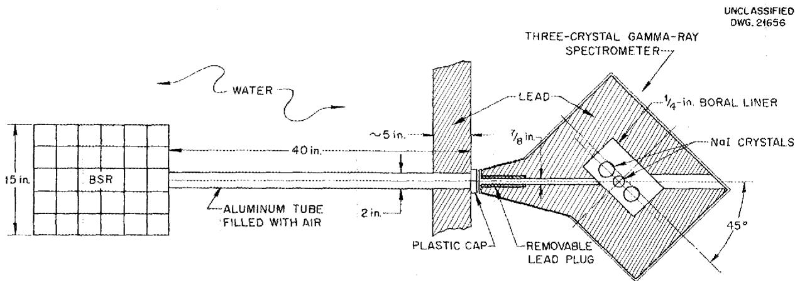  
Fig. 11.1. Experimental Arrangement for Measurement of Bulk Shielding Reactor Gamma-Ray Spectrum.

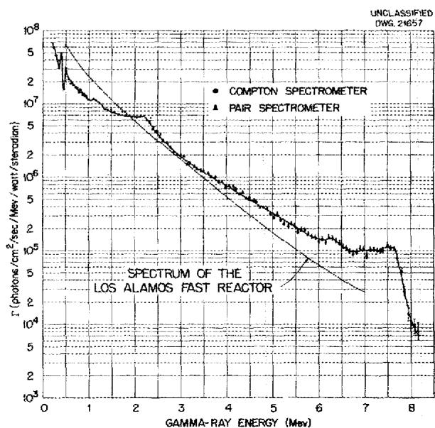  
Fig. 11.2. Spectrum of Gamma Rays from the Bulk Shielding Reactor.

The spectrum shape shows the usual broad peaks at 2.2 Mev that are due to water capture and those at 7 to 8 Mev that are due to capture in aluminum and possibly other materials. The cause of the 0.4-Mev peak, which appears to be real, has not been found. The 0.49-Mev peak, however, may well be due to gamma rays from the 0.478-Mev level in the Li formed by neutron capture in the boron liner of the spectrometer.

The smooth curve in Fig. 11.2 represents the spectral shape (not intensity) obtained by Motz4

4. J. W. Motz, Phys. Rev. 86, 753 (1952).

with a Compton-recoil magnetic spectrometer looking at a $U^{235}$ slug in the center of the Los Alamos water boiler and one at the active core of the fast reactor. The curves cannot be expected to correspond closely because of the differences in neutron-capture gamma-ray sources and because the low resolution of the spectrometer used by Motz would smooth out any structure present. The general similarity in slopes, however, is interesting.

# FAST-NEUTRON LEAKAGE SPECTRA OF THE BSR

The neutron spectrum of the BSR obtained with the reactor surrounded by cans of beryllium oxide as a reflector was reported previously. For the data reported here, the previous spectral measurements were repeated and additional measurements were made; however, a water-reflected reactor (loading No. 22) was used.

The measurements were made with the BSF proton-recoil fast-neutron spectrometer. Except for the spectrum at the face of the reactor, the spectral measurements in water out to $30~\mathrm{cm}$ from the fuel are in agreement with the previous measurements. The spectrum at the face of the reactor

is shown in Fig. 11.3. In addition to the protonrecoil measurements, data obtained with the nuclear plate camera have been used to extend the spectrometer data from 1.3 Mev down to 0.5 Mev.

Measurements were also made out to $50~\mathrm{cm}$ from the reactor. The spectrum measured at $50~\mathrm{cm}$ is shown in Fig. 11.4; the statistics on these data are quite poor, since the neutron intensity was approximately at the limit of sensitivity of the spectrometer.

An attempt was also made to measure the spectrum of neutrons emerging from the side of an aircraft divided-shield mockup. The mockup consisted of a slab of lead in thick placed 16 in. from the reactor. The shield therefore extended out through the water to a position $113\mathrm{cm}$ from the reactor. Unfortunately, the neutron spectrometer was not sufficiently sensitive to detect neutrons at $113\mathrm{cm}$ ; however, a spectral measurement was made at $70\mathrm{cm}$ , but the statistics (Fig. 11.5) were rather poor.

A measurement of the angular distribution of the fast neutrons in water was made during the

9M. P. Haydon, E. B. Johnson, and J. L. Meem, Measurement of the Fast Neutron Spectrum of the Bulk Shielding Reactor Using Nuclear Plates, ORNL CF 53-8-146 (to be published).   
10Report of the ANP Shielding Board for the Aircraft Nuclear Propulsion Program, ANP-53 (Oct. 16, 1950).

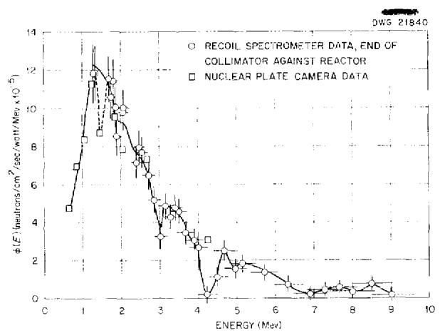  
Fig. 11.3. Neutron Spectrum at the Face of the BSR.

quarter.11 The experimental setup for this measurement is shown in Fig. 11.6, and the spectra vs. angle data are plotted in Fig. 11.7. At neutron energies above 8 MeV, the intensities at the various angles converge. This effect is probably due to neutrons which bypass part or all of the collimator. A distance greater than 10 cm from the reactor would be more desirable for this measurement, but then it would be difficult to obtain sufficient intensity. Figure 11.8 shows the variation of flux with direction for each of several neutron energies.

11R. G. Cochran and K. M. Henry, Angular Distribution of Fast Neutrons in Water, ORNL CF 53-11-46 (to be published).

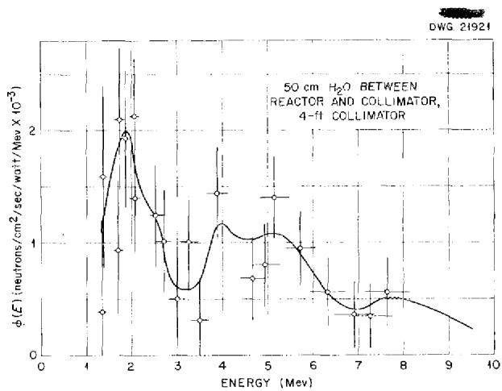

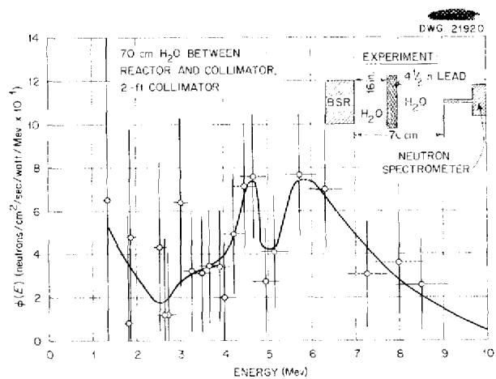  
Fig. 11.4. Neutron Spectrum 50 cm from the BSR.   
Fig. 11.5. Neutron Spectrum $70~\mathrm{cm}$ from BSR.

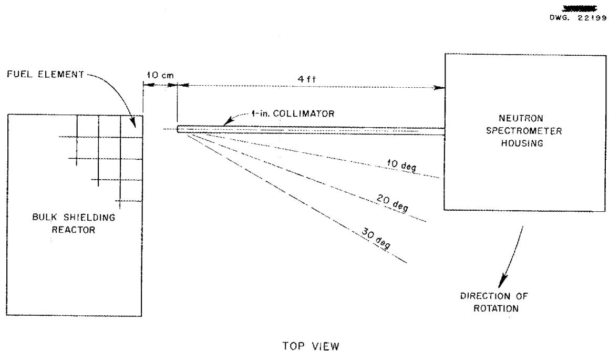

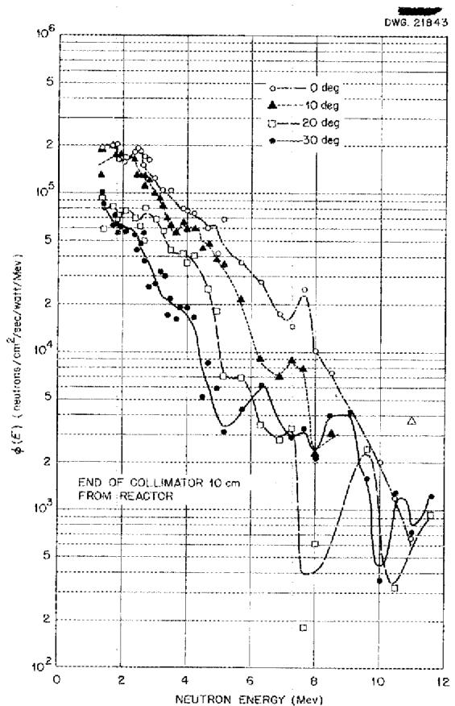  
Fig. 11.6. Experimental Arrangement for Measurement of Angular Distribution of Neutrons from BSR in Water.

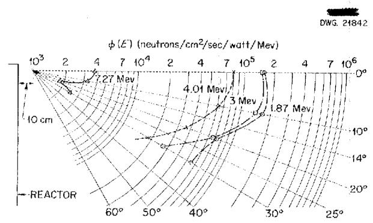  
Fig. 11.8. Energy Angular Distribution of Neutrons from BSR in Water.   
Fig. 11.7. Angular Distribution of Neutrons from BSR in Water.

# 12. LID TANK FACILITY

C. L. Storrs

GE-ANP

G. T. Chapman

J.M.Miller

D. K. Trubey

F. N. Watson

Physics Division

Tentative results of a preliminary experiment performed at the Lid Tank indicate that most of the air-scattered neutrons that penetrate an aircraft crew shield follow the slant path. In another experiment, the study of neutron streaming through air ducts was resumed; data from the initial experiments have presented an important confirmation of the Simon-Clifford theory. A re-evaluation of all measurements for the determination of removal cross sections has improved some of the values. Reference to Lid Tank neutron and gamma data is facilitated by a recent survey of the first 50 experiments.

Approval has been received for the use of enriched uranium for a new Lid Tank source plate, and a design has been developed which will make possible a far more accurate power calibration. The source plate, as well as its appurtenant power-measuring equipment, is at present being constructed in the ORNL Research Shops. It is planned to install the source plate in January.

# SLANT PENETRATION OF NEUTRONS THROUGH WATER

A preliminary experiment has been performed to determine the slant penetration of fission neutrons through water. An air-filled aluminum duct, 40 in. long and 2 in. in diameter, was used as a collimated "point" source of fast neutrons, and the fast-neutron dose was determined in the water around the end. The duct was tilted from the normal to the source plate to reduce background of fast neutrons from the ORNL Graphite Reactor. Since the fast neutrons are collimated in the outward direction, if not reduced they would overshadow the fission-plate neutrons which are, of course, isotropic. The data, plotted as isodoses around the duct, are shown in Fig. 12.1.

By integrating the dose along planes through the radiation field, the dose penetrating different thicknesses of water at various angles was determined (Fig. 12.2). This information must be regarded as tentative until the dose determinations

have been repeated with more care, but the results obtained so far indicate that most of the dose comes from neutrons that penetrate the shield along the slant path. This indication is similar to that obtained for gamma rays for comparable attenuations.1

The observed relaxation lengths range from 4.9 to $6.3\mathrm{cm}$ . As would be expected, these values are smaller than those obtained with thick shields, since a fission spectrum was used as a source and the shields were quite thin.

1F. S. Kirn, R. J. Kennedy, and H. O. Wyckoff, Oblique Attenuation of Gamma-Rays from Cobalt-60 and Cesium-137 in Polyethylene, Concrete and Lead, NBS-2125 (Dec. 23, 1952).

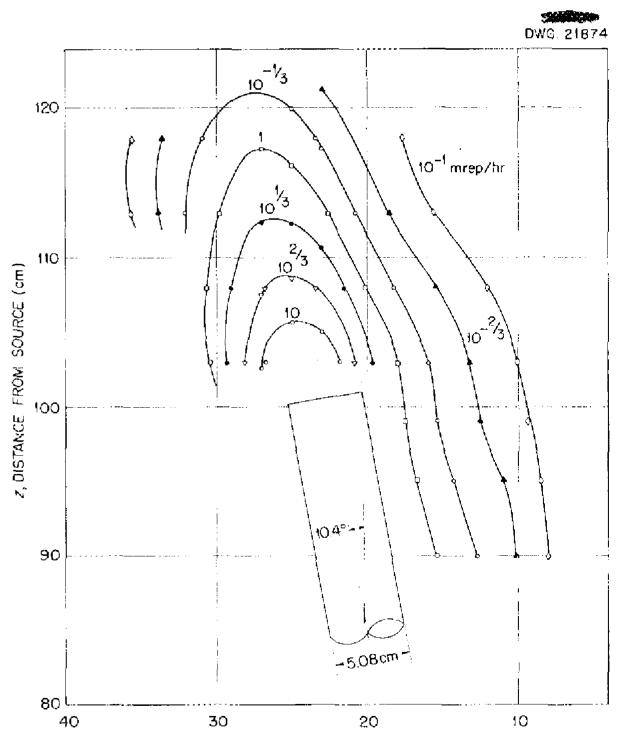  
Fig. 12.1. Fast-Neutron Dose Distribution Off the End of a Duct 101.6 cm Long by 5.08 cm in Diameter.

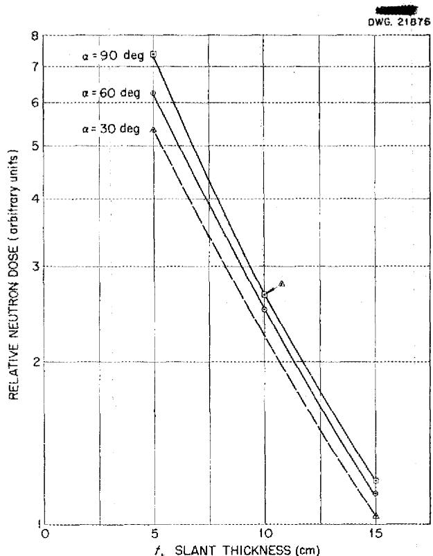  
Fig. 12.2. Slant Penetration of Neutrons in Water.

To determine the total air-scattered dose in a divided shield, it is necessary to integrate over all angles. Such an integration would presumably give a straight-through relaxation length comparable to that observed in the BSR air-scattering experiment. It would be desirable to extend the measurements to greater thicknesses of water and to harden the spectrum by putting water between the source and the duct entrance. Intensity problems limit the extent to which this can be accomplished, however.

# AIR DUCT TESTS

The use of the Lid Tank Facility for the study of neutron streaming through air ducts has been resumed with emphasis on fast-neutron measurements. A flow-type dosimeter with somewhat greater sensitivity than that available heretofore was used to determine the dose around the ends of several ducts. One of these ducts was taken from

the 19-duct array studied a year ago.3 It had three sections, 22 in. long and $3^{15}$ in. in diameter, joined at angles of 45 degrees. A second duct consisted of two such sections. The slant penetration experiment described in the preceding subsection provided a third measurement.

Putting the data from these three measurements into the Simon-Clifford formula and solving for the reflection factor, $a$ , gave values of 1.0 and 0.9, respectively, for the first and second bends. These values are in agreement with the value of about 1 obtained from the previous thermal measurements made in water at a distance of 30 cm from the ends of the ducts (thus the emergent flux was filtered and was representative of the hard neutrons that determine the dose), and they constitute an important confirmation of those measurements. The value of 1 has been assumed in recent direct-cycle design studies. It is now felt that engineering designs based on the Simon-Clifford theory are on a sound basis when applied to a single duct, especially when the dimensions are similar to those studied.

Since it was observed that the peak values of dose measured at the end of the 19-duct array were a factor of approximately 10 higher than those observed with the single duct, a study of interference between adjacent ducts was indicated. This study has been started, with a single section and a three-section duct being used. In the first configuration, one of the possible streaming paths was reproduced in the array by placing the short duct parallel to the first section of the long duct and $12\frac{1}{2}$ in. from it. In this position, it lined up, approximately, with the last section. The result was an increase by a factor of 4.5 in the dose at the end of the long duct.

The short duct was then moved to a position that was again parallel to the first section but considerably closer (6 in.) and above it in a different plane so that there was no direct streaming path. The data (which must be considered tentative) showed no increase in the peak dose beyond the long duct but did show a broadening of the emergent neutron beam. The results obtained from these experiments are shown in Fig. 12.3.

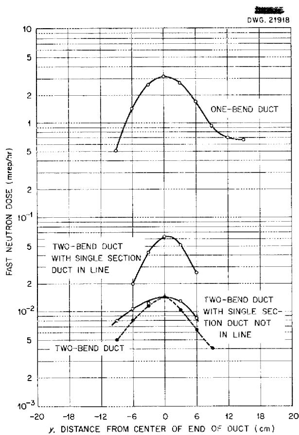  
Fig. 12.3. Fast-Neutron Dose Beyond Various Configurations of Ducts with 45-deg Bends.

Further tests are planned to give more quantitative information on the interaction between neighboring ducts and possibly to improve the formula for streaming through ducts.

# REMOVAL CROSS SECTIONS

The measurement of the effective fast-neutron removal cross section of $C_7F_{16}$ has been repeated with the use of 15 in. of the liquid instead of 28 in. as in the previous measurement. Despite this large difference in thickness, the measured values of the molecular removal cross section agreed to within $5\%$ , which is within the experimental error, and thus they provide an interesting check on the validity of the geometrical corrections that were made. The revised value for carbon, 0.80 barn/atom instead of 0.84 barn/atom, when used with the

current $C_7F_{16}$ measurements, gives a removal cross section of 1.31 barns/atom for fluorine as compared with the value of 1.36 barns/atom reported in the previous report.

A re-examination of all the Lid Tank measurements for the determination of removal cross sections has improved some of the values. A summary of the presently accepted values obtained from direct measurements is given in Table 12.1. Additional values based on the direct measurements are given in Table 12.2.

TABLE 12.1.EFFECTIVE FAST-NEUTRON REMOVAL CROSS SECTION VALUES OBTAINED FROM LID TANK DIRECT MEASUREMENTS   

<table><tr><td>MATERIAL</td><td>σR</td></tr><tr><td>Al</td><td>1.31 barns/atom</td></tr><tr><td>Be</td><td>1.05</td></tr><tr><td>Bi</td><td>3.43</td></tr><tr><td>C</td><td>0.80</td></tr><tr><td>Cu</td><td>2.08</td></tr><tr><td>Fe</td><td>1.95</td></tr><tr><td>Ni</td><td>1.85</td></tr><tr><td>W</td><td>2.6 + 0.2</td></tr><tr><td>C7F16</td><td>26.6 barns/molecule</td></tr><tr><td>C2F3Cl</td><td>6.50</td></tr><tr><td>B4C</td><td>4.26</td></tr><tr><td>H2O*</td><td>(2.90)</td></tr><tr><td>D2O*</td><td>(2.78)</td></tr></table>

Neither hydrogen nor deuterium has, properly, an effective removal cross section, since the total cross section is not nearly constant in the high-energy region. Rough values have been obtained for $\mathsf{H}_2\mathsf{O}$ and $\mathsf{D}_2\mathsf{O}$ based on 140-cm shields. These are reported in parentheses.

TABLE 12.2.EFFECTIVE FAST-NEUTRON REMOVAL CROSS SECTIONS BASED ON LID TANK DIRECT MEASUREMENTS   

<table><tr><td>MATERIAL</td><td>σR(bars/atom)</td></tr><tr><td>B</td><td>0.87</td></tr><tr><td>D*</td><td>(0.92)</td></tr><tr><td>F</td><td>1.31</td></tr><tr><td>H*</td><td>(0.98)</td></tr><tr><td>O</td><td>0.94</td></tr></table>

$^{*}$ Cf., footnote to Table 12.1.

# SURVEY OF LID TANK EXPERIMENTS

Shielding experimentation at the ORNL Lid Tank Facility began in June 1949, and since that time approximately 60 major experiments have been performed. In view of the large role this facility has had in the development of various reactor shield designs and because of the constant need for reference to the data, it was felt that the experimental results should be compiled in one publication. Accordingly, a summary of the first 50 Lid Tank experiments will soon be presented by E. L. Czapek.[7,8]

As described in several previous reports, the Lid Tank Facility consists of a large water tank adjacent to an opening in the concrete shield of the

7ORSORT student from Electric Boat Division of General Dynamics Corporation.   
8E. L. Czapek, General Survey of Lid Tank Experiments 1 Through 50, ORNL-1636 (to be published).

ORNL Graphite Reactor (Fig. 12.4). A converter plate of uranium covers the opening between the water tank and the reactor shield. This plate absorbs most of the incident thermal neutrons emerging from the reactor and causes fission, which, in turn, produces the known uranium spectrum of neutrons, as well as gamma rays of various energies. Shielding samples are inserted in the tank, and the transmitted radiation is measured behind the shield. The geometry of the Lid Tank permits the use of very large samples, which, in turn, help to reduce uncertainties due to boundary conditions. The water in the tank protects personnel from radiation and allows easy positioning of test samples.

The Lid Tank Facility was built to test both compositions and geometries of shields. With the resulting experimental data, difficult attenuation problems could be quickly solved and shield thicknesses could be predicted (to within an accuracy of

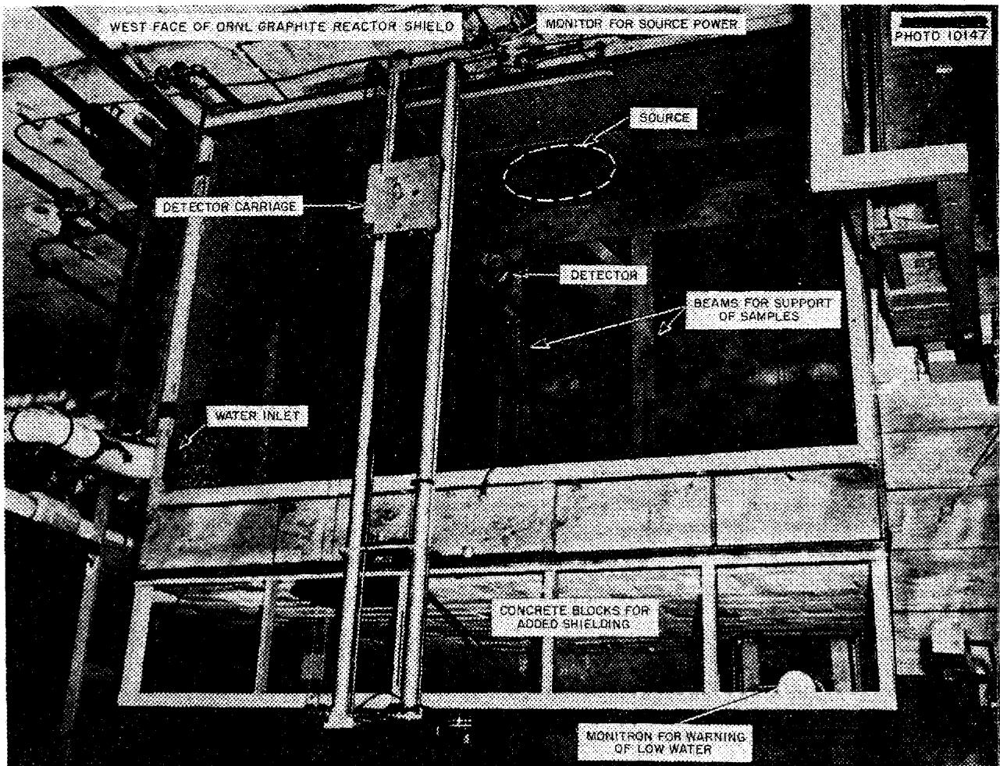  
Fig. 12.4. View of Lid Tank Facility from Above.

$\pm 5\%$ without having to rely too much on a knowledge of the attenuation processes.

Experimentation at this facility has primarily been limited to investigations of the "unit shield" in which all material that functions primarily as shielding is located around the reactor. All the experiments covered in the survey can be grouped as follows:

1. Water Shield (experiments 1, 4, 10, 13)

2. Preliminary Investigations9 (experiments 2, 3, 5, 6, 8, 10)

a. Lead-water shield

b. Iron-water shield

3. Boron Carbide Shields (experiments 11, 12)

4. Thermal Shields (experiments 10, 20, 36)

a. Lead-water shield

$b_{s}$ Iron-water shield

5. Shield Mockups (experiments 7, 14, 15, 16, 17, 18, 29, 45)

a. Submarine Thermal Reactor

b. Submarine Intermediate Reactor

c. Reflector-Moderated Reactor (ANP)

6. Shield Optimizations (experiments 9, 13, 24)

a. Two-component shield of lead and borated water

b. Suppression of capture gammas in lead-water shield

c. Optimum position of a lead-iron gamma shield in relation to pressure shell

7. Shield Penetrations (experiments 19, 21, 22, 25, 26, 37, and 38 and special experiments)

a. Cylindrical air ducts with or without bends   
b. Array of cylindrical air ducts with or without bends   
c. Annularduct (specialized mockups simulating GE-R1 air outlet and inlet sections)   
d. Structural members in shields (streaming effects)   
e. Instrument plug (modification in shield to improve control instrumentation)

8. Removal Cross Sections (experiments 23, 30, 31, 32, 33, 34, 35, 39, 40, 41, 42, 43, 46, 47, 49, 50)

9. Special Investigations

a. Effects of boration of water (experiment 10)   
b. Effects of water and air gaps in shields (experiment 48)   
c. Induced radioactivity outside an air duct (experiment 27)   
d. Activation expected in a coolant (sodium) at various locations in a boron carbide shield (experiment 10)   
e. Gamma scattering around submarine bulkhead (sodium source) (special experiment)

The situation at present in regard to unit shields or reactor parts of divided shields appears to be that the basic mechanisms are understood and that, except for the very simplest problems, shield mockups are essential, although the effects of small changes in design can be quite well predicted. The Lid Tank method of mockup testing is highly developed, and large amounts of data can be collected in relatively short times.

# 13. TOWER SHIELDING FACILITY

C. E. Clifford

T.V.Blosser L.B.Holland

Physics Division

The steel structure of the Tower Shielding Facility has been erected (Fig. 13.1), and the ground structures are approximately $75\%$ complete. The underground building for the reactor controls and for personnel will be available for occupancy by December 10; access to the control area of the building was authorized in November.

The mechanical components of the reactor have been constructed and are now being assembled, and the reactor tank has been received. Construction of the crew-compartment tank is nearing completion. The last hoist is scheduled for delivery by January 1, 1954.

The optimistic date for completion of the facility is January 15, after which there will be a one-month period for critical experiments and shakedown operation. This will be followed by differential shielding measurements in the reactor and the crew-compartment water tanks.

A mockup of a GE air-cooled reactor shield design is scheduled for delivery by March 15 by the General Electric Company, and for testing in conjunction with this, a crew-shield mockup will be supplied by ORNL.

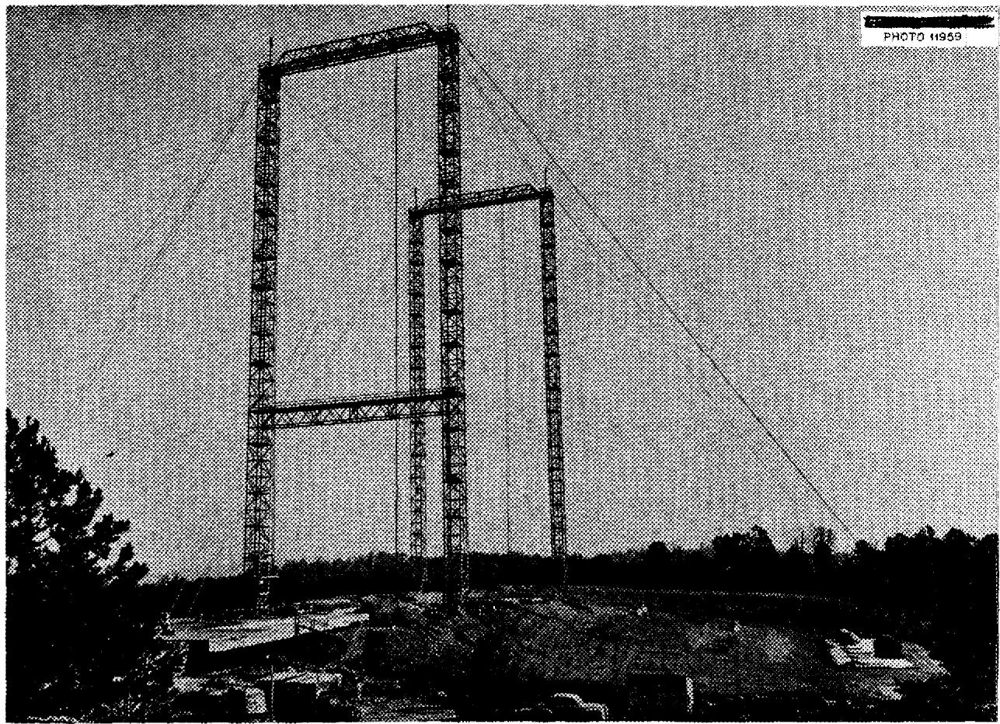  
Fig. 13.1. Tower Shielding Facility, November 13, 1953.

# 14. SHIELDING ANALYSIS

E. P. Blizzard

M. K. Hullings

J.E.Faulkner

F. H. Murray

Physics Division

H. E. Stern

Consolidated Vultee Aircraft Corporation

Much of the shielding analysis work for this quarter was reported in the Physics Division Semi-annual Report and is not repeated here. The work reported in the Division report included two treatments of geometrical transformations with methods of estimating reactor leakage. In addition, some calculational methods for obtaining neutron attenuation were presented. On comparison of the calculated attenuations with measured attenuations, it was possible to derive "effective removal cross sections" that when compared with other measurements showed reasonable agreement. In addition, gamma-ray absorption coefficients which have been measured for some elements have been used to interpolate the coefficients for other elements.

The visible light from an aircraft nuclear power plant has been estimated, and the calculations will be compared with measurements made on the BSR. The measurements of visible light are made in air and are not to be confused with the Cerenkov radiation (blue glow) which is so obvious in water. An estimate of neutron albedo was obtained to supply a simple model for ground and structure scattering problems.

# VISIBLE LIGHT FROM A NUCLEAR POWER PLANT

The results of some experiments carried out at Los Alamos on the visible light from a polonium source have been used in obtaining an estimate of the ionizing radiation that would have to be present

around the aircraft reactor shield to just make it visible. If the airplane were approximately 200 ft from the observer, the ionizing radiation near the shield would have to be about $5 \times 10^{6} \mathrm{r/hr}$ . If the airplane were very far from the observer, say 50,000 ft, the ionizing radiation would have to be about $10^{9} \mathrm{r/hr}$ . These estimates will be compared with measurements made on the BSR.

# NEUTRON REFLECTION COEFFICIENT FOR WATER

An estimate of the neutron reflection coefficient for water has been obtained by using a simple model with a coincident source and a nondirectional receiver located above the water surface. If isotropic oxygen scatter and attenuation governed by the removal cross sections are assumed, the reflected flux $F$ at height $b$ for source strength $N_0$ is

$$
F = \frac {N _ {0}}{4 8 \pi b ^ {2}} \left(\frac {\sum_ {\text {s c o t t e r}}}{\sum_ {\text {r e m o v a l}}}\right).
$$

The albedo approach gives

$$
F = \frac {N _ {0} a}{1 0 \pi b ^ {2}}
$$

for a re-emission distribution between isotropic and cosine, where $\alpha$ is the reflection coefficient. A value of $\alpha = 0.085$ is thus obtained which is in fair agreement with the experimental value of 0.08.

Part IV

APPENDIXES

# 15. LIST OF REPORTS ISSUED DURING THE QUARTER

<table><tr><td>REPORT NO.</td><td>TITLE OF REPORT</td><td>AUTHOR(s)</td><td>DATE ISSUED</td></tr><tr><td colspan="4">I. Aircraft Reactor Experiment</td></tr><tr><td>CF 53-9-15</td><td>Experimental Procedure on the ARE (Preliminary)</td><td>J. L. Meem</td><td>9-3-53</td></tr><tr><td>CF 53-9-53</td><td>Supplement to ARE Hazards Summary Report (ORNL-1407)</td><td>E. S. Bettis
W. B. Cottrell</td><td>9-25-53</td></tr><tr><td>CF 53-10-62</td><td>ARE Fuel Recovery</td><td>F. N. Browder</td><td>10-5-53</td></tr><tr><td>CF 53-11-95</td><td>Report and Recommendations of Second ARE Cleaning Committee</td><td>G. A. Cristy
L. A. Mann
F. F. Blankenship
G. M. Adamson</td><td>11-10-53</td></tr><tr><td>CF 53-12-9</td><td>ARE Design Data</td><td>W. B. Cottrell</td><td>to be issued</td></tr><tr><td>ORNL-1650</td><td>Stress Analysis of the ARE</td><td>R. L. Maxwell
J. W. Walker</td><td>to be issued</td></tr><tr><td colspan="4">II. Experimental Engineering</td></tr><tr><td>CF 53-9-32</td><td>ANP Experimental Engineering Quarterly Status Report</td><td>H. W. Savage</td><td>9-2-53</td></tr><tr><td>CF 53-9-102</td><td>Design Data and Proposed Test Schedule for Sodium-to-Air Radiators</td><td>H. J. Stumpf</td><td>9-8-53</td></tr><tr><td>CF 53-9-180</td><td>LITR Fluoride Fuel Test Loop</td><td>O. Sisman</td><td>9-25-53</td></tr><tr><td>CF 53-10-208</td><td>A Flat Plate Heat Exchanger for Reactor System Uses</td><td>R. W. Bussard</td><td>10-26-53</td></tr><tr><td colspan="4">III. Critical Experiments</td></tr><tr><td>CF 53-9-19</td><td>Static Analysis of the ARE Criticality Experiment</td><td>C. B. Mills</td><td>9-1-53</td></tr><tr><td>ORNL-1615</td><td>Critical Experiments on Reactor</td><td>D. Callihan
R. C. Keen</td><td>10-22-53</td></tr><tr><td>ORNL-1634</td><td>Preliminary Critical Assembly for the Aircraft Reactor Experiment</td><td>D. Callihan
D. Scott</td><td>10-28-53</td></tr><tr><td colspan="4">IV. Shielding</td></tr><tr><td>CF 53-5-239</td><td>Nuclear Dose Measurements on the Divided Shield Mockup at the Bulk Shielding Facility</td><td>H. E. Hungerford</td><td>5-20-53</td></tr><tr><td>CF 53-9-4</td><td>Lid Tank Shielding Test of the Reflector-Moderated Reactor</td><td>F. N. Watson</td><td>9-30-53</td></tr><tr><td>CF 53-9-16</td><td>Minimum Shield Weight Penalty for Air Ducts</td><td>E. P. Blizzard</td><td>9-2-53</td></tr><tr><td>CF 53-8-146</td><td>Measurement of the Fast Neutron Spectrum of the Bulk Shielding Reactor Using Nuclear Plates</td><td>M. P. Haydon
E. B. Johnson
J. L. Meem</td><td>to be issued</td></tr><tr><td>CF 53-9-161</td><td>An Estimate of the Neutron Reflection Coefficient, Using the Concept of Removal Cross-Section</td><td>H. E. Stern</td><td>9-29-53</td></tr><tr><td>CF 53-10-1</td><td>Computation of Effective Removal Cross-Section Measured at ORNL Lid Tank</td><td>L. S. Abbott</td><td>no date</td></tr><tr><td>CF 53-10-16</td><td>Spectrum of Gamma Rays Emitted by the Bulk Shielding Reactor</td><td>F. C. Maienschein
T. A. Love</td><td>to be issued</td></tr><tr><td>CF 53-11-2</td><td>The Shielding of Nuclear Radiations, Lecture I</td><td>E. P. Blizzard</td><td>11-2-53</td></tr><tr><td>CF 53-11-45</td><td>Fast Neutron Spectrum of the Bulk Shielding Reactor, Part II</td><td>R. G. Cochran
K. M. Henry</td><td>to be issued</td></tr><tr><td colspan="4">IV. Shielding (continued)</td></tr><tr><td>CF 53-11-46</td><td>Angular Distribution of Fast Neutrons in Water</td><td>R. G. Cochran
K. M. Henry</td><td>to be issued</td></tr><tr><td>CF 53-11-53</td><td>The Effect of Some Liquid Metal Ducts on Reactor Shields</td><td>M. K. Hullings</td><td>to be issued</td></tr><tr><td>CF 53-11-54</td><td>Gamma-Ray Spectrum of the Bulk Shielding Reactor</td><td>F. C. Maienschein</td><td>11-8-53</td></tr><tr><td>ORNL-1636</td><td>General Survey of Lid Tank Experiments 1 Through 50</td><td>E. L. Czapek</td><td>to be issued</td></tr><tr><td colspan="4">V. Metallurgy</td></tr><tr><td>CF 53-10-117</td><td>Examination of LF Pump Loop</td><td>G. M. Adamson
R. S. Crouse</td><td>10-6-53</td></tr><tr><td>CF 53-10-228</td><td>Metallographic Examination of Second Heat Exchanger from Bi-Fluid Pump Loop</td><td>G. M. Adamson
R. S. Crouse</td><td>10-27-53</td></tr><tr><td>ORNL-1565</td><td>Scaling of Columbium in Air</td><td>H. Inouye</td><td>9-1-53</td></tr><tr><td>ORNL-1633</td><td>Fabrication of Spherical Particles</td><td>A. Levy</td><td>11-12-53</td></tr><tr><td>ORNL-1647</td><td>Interim Report on Static Liquid Metal Corrosion</td><td>W. D. Manly</td><td>to be issued</td></tr><tr><td>MM-147</td><td>Third Progress Report on the Flash Welding of Molybdenum, Part I - Temperature Distribution During the Flashing Cycle</td><td>Rensselaer
Polytechnic
Institute</td><td>9-30-53</td></tr><tr><td>MM-151</td><td>Redrawing of Special High Purity Inconel</td><td>Superior Tube
Company</td><td>10-7-53</td></tr><tr><td>MM-157</td><td>Progress Report and Final Report to Carbide and Carbon Chemicals Company</td><td>Commonwealth
Engineering
Co. of Ohio</td><td>11-9-53</td></tr><tr><td colspan="4">VI. Chemistry</td></tr><tr><td>CF 53-10-78</td><td>Fused Salt Compositions</td><td>C. J. Barton</td><td>10-9-53</td></tr><tr><td>ORNL-1626</td><td>Determination of Zirconium by the Chloranilic Acid Method</td><td>O. Menis</td><td>10-28-53</td></tr><tr><td>UA-PR-13</td><td>Progress Report for the Period April 1, 1953 Through June 30, 1953</td><td>University of
Arkansas</td><td>7-30-53</td></tr><tr><td>BMI-852</td><td>Vapor Pressures of Beryllium Fluoride and Zirconium Fluoride</td><td>Battelle Memorial
Institute</td><td>7-13-53</td></tr><tr><td>BMI-864</td><td>Potential Liquid Fuels for Nuclear Power Reactors</td><td>Battelle Memorial
Institute</td><td>9-8-53</td></tr><tr><td colspan="4">VII. Heat Transfer and Physical Properties</td></tr><tr><td>CF 53-8-106</td><td>Preliminary Results on Flinak Heat Transfer</td><td>H. W. Hoffman</td><td>8-18-53</td></tr><tr><td>CF 53-8-217</td><td>Preliminary Measurements of the Density and Viscosity of Fluoride Mixture No. 44</td><td>S. I. Cohen
T. N. Jones</td><td>8-31-53</td></tr><tr><td>CF 53-9-98</td><td>Heat Capacity of Two Samples of 310 Stainless Steel and of a Brazing Compound</td><td>W. D. Powers
G. C. Blalock</td><td>9-18-53</td></tr><tr><td>CF 53-10-86</td><td>Preliminary Measurement of the Density and Viscosity of Composition 43 (Na2UF6)</td><td>S. I. Cohen
T. N. Jones</td><td>10-14-53</td></tr><tr><td>CF 53-11-128</td><td>Heat Capacity of Fuel Composition No. 33</td><td>W. D. Powers
G. C. Blalock</td><td>11-23-53</td></tr><tr><td>ORNL-1624</td><td>The Nature of the Flow of Ordinary Fluids in a Thermal Convection Harp</td><td>D. C. Hamilton
F. E. Lynch
L. D. Palmer</td><td>to be issued</td></tr><tr><td colspan="4">VIII. Miscellaneous</td></tr><tr><td>CF 53-9-8</td><td>The Small Hydrogen Moderated Reactor</td><td>C. B. Mills</td><td>9-2-53</td></tr><tr><td>CF 53-11-147</td><td>Directory of Active ANP Research Projects at ORNL</td><td>W. B. Cottrell</td><td>11-27-53</td></tr><tr><td>ORNL-1609</td><td>Aircraft Nuclear Propulsion Project Quarterly Progress Report for Period Ending September 10, 1953</td><td>W. B. Cottrell</td><td>10-15-53</td></tr><tr><td>ORNL-1632</td><td>ORNL Control Computer</td><td>J. J. Stone</td><td>to be issued</td></tr></table>

# 16. DIRECTORY OF ACTIVE ANP RESEARCH PROJECTS AT ORNL

NOVEMBER 27, 1953

# I. REACTOR THEORY AND COMPONENT DESIGN

A. Aircraft Reactor Design

1. Reflector-Moderated Reactor Studies 9704-1 Fraas, LaVerne, Bussard   
2. Fluid-Fuel Flow Studies 9704-1 Stumpf   
3. Gamma Heating of the Moderator 9704-1 Bussord, Wilner   
4. Design Consultants 9704-1 Wislicenus, JHU; Haines; Chambers, U.T.

B. ARE Design

1. Building 1000 Browning   
2. Electrical Power Circuits 1000 Walker   
3. Fluid Circuit Design 7503 Cristy   
4. Fuel Recovery Equipment 9201-3 Estabrook

C. ARE Installation

1. Plumbing 7503 Webster et al.   
2. Electrical System 7503 Packard et al.   
3. Controls 7503 Epler, Mann   
4. Instrumentation 7503 Affel   
5.Expeditors 7503 Perrin,West   
6. Coordinators 7503 Wischhusen, Watts

D. ARE Operations

1. Staff 7503 Bettis, Meem, Cristy, Mann   
2. Day Shift 7503 Whitman, Cottrell, Grindell, Croley, Schafer, Williams, Southern   
3. Night Shift 7503 Affel, Perrin, Cobb, Leslie, Allen, Reid, Morrison, Huntley, Gregory, Addison

E. ARE Control Studies

1. High-Temperature Fission Chamber 4500 Hanauer

2. Control System Design

4500

Epler, Ruble, Mann, Green, Hanauer

3. Control Studies on Simulator

4500

Oakes, Mann, Green

# F. Reactor Physics

1. Analysis of Critical Experiments

9704-1

Mills

2. Kinetics of Circulating-Fuel Reactors

9704-1

Ergen

3. Computation Techniques for ARE-Type Reactors

9704-1

Bengston, Ergen

4. Statics of Reflector-Moderated Reactors

9704-1

LaVerne, Burtnette, Spencer

5. Machine Computations

4500

Chorpie, Coveyou, Sangren, Gerberich, Given, Atta

6. Interpretation of Critical Experiments

4500

Prohammer

# G. Critical Experiments

1. Reflector-Moderated Reactor Critical Assembly

9213

Callihan, Williams, Scott

2. Preliminary Assembly of Supercritical-Water Reactor (Pratt & Whitney)

Zimmerman, Lynn, Noakes (P&W)

3. Preliminary Assembly of AC-1 (General Electric ANPP)

9213

Callihan et al.

# H. Bearing, Seal, and Pump Development

1. Mechanical Pumps for High-Temperature Fluids

9201-3

McDonald, Cobb, Huntley, Grindell

2. High-Temperature Seals for Rotary Shafts

9201-3

McDonald, Tunnell, Smith, Mason

3. Pump for Hydroxide Systemis

BMI

Dayton

4. Seals for Hydroxide Systems

BMI

Simons, Allen

5. Bearings for High-Temperature Application

9201-3

Stair, Tunnell, Smith, Mason

6. Canned-Rotor Pump Development

9201-3

McDonald, Stair, MacPherson, Grindeil

7. Materials Compatibility in Molten Salts at High Temperatures

9201-3

Stair, Tunnell, Smith, Mason

# I. Valve Development

1. Valves for High-Temperature Fluid Systems

9201-3

McDonald

2. Valves for Hydroxide Systems

BMI

Simons, Allen et al.

# J. Heat Exchanger and Radiator Development

1. High-Temperature Fluid-to-Air Heat Exchange Test

9201-3

MacPherson, Salmon, Fraas, Stumpf

2. Fluoride-to-Liquid Metal Heat Exchange Test

9201-3

Salmon, Fraas, MacPherson, Bussard

3. Heat Exchanger Fabrication

9201-3

Petersen, Fiaas

4. Boeing Turbojet with Sodium Radiator

9201-3

Fraas, Coughlen

5. Radiator and Heat Exchanger Design Studies

9201-3

Fraas, Stumpf, Bailey, U.T.

6. Full-Scale Test Facilities

9201-3

Coughlen

# K. Fluid Dynamics of Liquid Fuel Reactors

1. Pump-Core Shell Component Test

9201-3

Bussard, Gallagher

# Instrumentation

1. Pressure-Measuring Devices for High-Temperature Fluid Systems

9201-3

McDonald, Smith

2. Flow-Measuring Devices for High-Temperature Fluid Systems   
3. High-Temperature Strain Gage   
4. High-Temperature Calibration Gage

9201-3

BLH

Cornell

McDonald, Smith

# II. MATERIALS RESEARCH

A. Phase Equilibrium Research

1. Thermal Analysis of Fluoride Systems   
2. Thermal Analysis of Chloride Systems   
3. Phase Equilibria Among Fluorides by Quenching   
4. Equilibria in $\mathsf{BeF}_2$ -Bearing Systems by Quenching   
5. Differential Thermal Analysis of Fluorides   
6. Differential Thermal Analysis of $\mathsf{BeF}_2$ -Bearing Systems   
7. Equilibria Among Fluorides and Chlorides by Filtration   
8. X-Ray Diffraction Studies of Complex Fluorides   
9. Phase Equilibria in Hydride-Hydroxide Systems   
10. Phase Equilibria Consultant

9733-2   
9733-2   
9733-2   
Mound   
9733-2   
Mound   
9733-2   
4500   
9766   
MHI3

Insley, Barton, Bratcher, Truitt

Barton, Boyer   
Insley, Moore, Metcalf, Truitt, Thoma, White   
Heik,Orban,Joy et al.   
Bolomey

Orban et al.

Barton, Sheil

Bredig

Agron, Thoma

Banus et al.

McVay, U. Ala.

Smothers et al.

Knox, Kertesz

Otto,Orban

Overholser, Redman, Weaver

Bredig, Johnson, Bronstein

Cuneo

Topol,Overholser

Friedmon, Blankenship

Barton, Truitt, Blood, Watson, Blankenship

Blood, Watson, Blankenship

Simons et al.

Mann, Petersen, Cisar

Ketchen,Overholser

Sturm,Overholser

Gibb, Tufts U.

Hill, Duke U.

Carter, Carter Lab.

Nessie, Blakely, Eorgon, Croft, Didlake

Blood, Watson, Blankenship, Boody

B. Chemistry of High-Temperature Liquids

1. Equilibrium Pressures in Hydroxide-Metal Systems   
2. Equilibrium Pressures in Hydroxide-Metal Systems   
3. Equilibrium Pressure in Hydride-Halide Systems   
4. Chemical Reactions in Fused Salts   
5. Solutions of Metals in Fused Salts   
6. Thermagalvanic Potentials in Fused Systems   
7. Decomposition Potentials in Fused Systems   
8. Spectrophotometric Investigations of Fused Salts   
9. Preparation, Phase Behavior, and Reactions of UF3

10. Rates of Reduction in Fused Salts   
11. Solubility of Uranium Compounds in Hydride-Hydroxide Systems   
12. Free Energy of Fluorides   
13. Preparation of Pure Hydroxides   
14. Preparation of Complex Fluorides   
15. Chemistry Consultants

C. Fluoride Production and Handling

1. Pilot-Scale Production of Fluorides   
2. Laboratory-Scale Fluoride Production

9928   
9733-2

3.Preparation of Materials for Radiation Damage 9733-2   
4. ARE Fuel Carrier Production 9201-3   
5. ARE Fuel Concentrate Production 9212   
6. ARE Filling Operation 7503   
7. Sampling Techniques 9201-3   
8. Sampling Techniques 9766

# D. ARE Fuel Reprocessing

1. Fuel Recovery Process Development 4500   
2. Fuel Recovery Design Studies 4500   
3. Unit Operations Studies 4505   
4.Pilot Plant Operations 3019

5. Fuel Recovery Process Studies

# E. Corrosion by Liquid Metals

1. Static Carrosion Tests 2000   
2. Dynamic Corrosion Research in Convection Loops 9201-3   
3. Effect of Crystal Orientation on Corrosion 2000   
4, Effect of Carbides 2000   
5. Dynamic Corrosion by Liquid Lead 2000

6. Diffusion of Molten Media into Solid Metals 2000   
7. Structures of Liquids by Diffraction Techniques 2000   
8. Protective Coatings for Corrosion Resistance 2000   
9. Corrosion Inhibitor Studies 9201   
10. Handling of Liquid Metal Samples 9201-3   
11. Compatibility of Cermets in Liquid Metals 2000   
12. Mechanism of Isothermal Mass Transfer 2000

# F. Corrosion by Fluorides

1. Static Corrosion of Metals 2000   
2. Static Corrosion of Metals 9766   
3. Corrosion in Small-Scale Dynamic Systems 2000

4. Dynamic Corrosion Tests in Thermal-Convection Loops 9201-3

5. Corrosion of Nonmetallic Materials 9766   
6. Forced-Convection Corrosion Loop 9201-3

# G. Corrosion by Hydroxides

1. Static Corrosion of Metals and Alloys 2000   
2. Physical Chemistry of Hydroxide Corrosion 2000   
3. Static and Dynamic Corrosion 9766   
4. Static and Dynamic Corrosion by Hydroxides

# H. Physical Properties of Materials

1. Density of Liquids 9204-1   
2. Viscosity of Liquids 9204-1   
3. Thermal Conductivity of Solids 9204-1   
4. Thermal Conductivity of Liquids 9204-1   
5. Specific Heat of Solids and Liquids 9204-1   
6. Electrical Conductivity of Fluorides 9204-1   
7. Surface Tension of Fluorides 9204-1   
8. Viscosity of Fused Salt Systems 9766

Blankenship, Boody

Nessle, Eorgan, Blood, Thoma

Nesslo, Eorgan

Nessle, Eorgan

Mann, Blakely

Kertesz, Meadows, Didlake

Ferguson, Cathers

Goeller, Browder, Ruch

Eister, Nurmi, Kockenmester

Jackson

Lewis, Matherne

Nessla, Blakely, Croft, Eorgon

Vreeland, Hoffman

Adamson

Smith, Cathcart, Bridges

Vreeland, Hoffman

Cathcart

Adamson

Smith, Cathcart

Smith

Vreeland,Hoffman

Adamson

Ketchen

Vreeland, Hoffman

Cathcart

Vreeland, Hoffman

Kertesz, Buttram, Smith, Meadows

Vreeland, Trotter, Nicholson, Hoffman

Adamson

Kertesz, Buttram, Meadows, Smith Salmon

Vreeland, Smith, Hoffman, Cathcart

Smith, Steidlitz, Boston

Kertesz, Buttram, Smith

Simons et al.

Jones, Cohen

Jones, Cohen

Powers, Burnett

Cloiborne, Powers, Burnett

Powers, Blalock

Greene

Cohen, Jones

Kertesz, Knox

9. Vapor Pressure of Fluoride Systems   
10. Vapor Pressure of BeF $_2$ -Bearing Systems   
11. Vapor Pressure of Fluid Systems

9733-2 Moore

Mound Orban et al.

BMI1 Simons et al.

# 1. Heat Transfer

1. Heat Transfer Coefficients of Fluoride and Hydroxide Systems   
2. Heat and Momentum Transfer in Convection Loops   
3. Heat Transfer in Circulating-Fuel Systems   
4. Forced Convection in Annuli   
5. Transient Boiling Research   
6. Fluid-Flow Phenomena

9204-1 Hoffman, Lones   
9204-1 Hamilton, Palmer, Lynch   
9204-1 Poppendiek, Winn, Palmer   
9204-1 Bradfute   
9204-1 Rosenthal   
9204-1 Palmer, Winn, Poppendiek

# J. Metals Fabrication Methods

1. Welding and Brazing Techniques for ARE   
2. Molybdenum Welding Research   
3. Molybdenum Welding Research   
4. Resistance Welding for Molybdenum and Clad Metals   
5. Welds in the Presence of Various Corrosion Media   
6. Nondestructive Testing of Tube-to-Header Welds   
7. Basic Evaluation of Welds Metal Deposits in Thick Plates   
8. Development of High-Temperature Brazing Alloys   
9. Evaluation of the High-Temperature Brazing Alloys   
10. Application of Resistance-Welding Methods to ANP Materials

2000 Manly, Housley, Slaughter, Patriarca   
BMI Russell   
MIT 4 Wulff   
RPI5 Nipples, Savage   
2000 Vreeland, Slaughter Hoffman, Patriarca   
2000 Slaughter, Patriarca   
2000 Slaughter, Gray, Patriarca   
2000 Patriarca, Slaughter   
2000 Slaughter, Patriarca   
2000 Slaughter, Patriarca

# K. New Metals Development

1. Molybdenum and Columbium Alloy Studies   
2. Heat Treatment of Alloys for Special Projects   
3. Alloy Development of New Container Materials

# L. Solid Fuel Element Fabrication

1. Solid Fuel Element Fabrication   
2. Diffusion-Corrosion in Solid Fuel Elements   
3. Determination of the Engineering Properties of Solid Fuel Elements   
4. Inspection Methods for Fuel Elements

# M. Ceramics and Metals Ceramics

1. Metal Cladding for Beryllium Oxide   
2. Hot Pressing of Bearing Materials   
3. High-Temperature Firing of Uranium Oxide to Produce Selective Powder Sizes   
4. Development of Cermets for Reactor Components   
5. Ceramic Coatings for ANP Radiators

2000 Inouye   
2000 Bomar, Coobs   
2000 inouye

2000 Bomar, Coobs   
2000 Bomar, Coobs   
2000 Bomar, Coobs, Woods, Oliver, Douglas   
2000 Bomar

Gerity Graof Mich.

2000 Bomar, Coobs   
2000 Bomar, Coobs   
9766 Johnson, Shevlin, Taylor, Hammer   
9766 White, Griffin

6. Ceramic Valve Parts for Liquid Metals and Fluorides 9766 Shevlin, Johnson, Taylor   
7. Ceramic Reflector 9766 Johnson, White   
8. Ceramic Coatings for Shielding 9766 White, Shevlin   
U. Ala, Handwerk   
9. Fabrication of BeO Shapes 9766 Doney   
10. Corrosion of Ceramics 9766 Curtis, Kertesz, Buttram   
2000 Vresland, Hoffman   
11. High-Density Graphite 9766 Doney, Corey

# N. Strength of Materials

1. Creep Tests in Fluoride Fuels 9201-3 Adamson   
2. Creep and Stress Rupture Tests of Metals in Vacuum Gaseous Environments and in Fluid Media 2000 Oliver, Douglas   
3. High-Temperature Cyclic Tensile Tests 2000 Oliver, Woods   
4. Tube-Burst Tests 2000 Oliver, Douglos   
5. Relaxation Tests of Reactor Materials 2000 Oliver et al.   
6. Evaluation Testing for Other Development Groups 2000 Oliver, Woods, Reber   
7. Fatigue Testing of Reactor Materials 2000 Oliver, Reber

# 0. Radiation Damage

1. Fused Salt Fuels Irradiation in LITR 3550 Keilholtz, Morgan   
3005   
2. Fused Salt Fuels Irradiation in MTR 3550   
3. LITR Dynamic Corrosion Loop 3550 Keilholtz et al.   
4. Fluoride Fuel Loops for LITR and MTR 3550 Sisman, Baumann,   
5. Engineering Properties of Irradiated Metals 3550   
6. Neutron Spectrum of LITR 3005 Trice, Sisman   
7. Creep of Metals and Stress Corrosion in ORNL 3025 Wilson, Zukas

Graphite Reactor and LITR 3001

8.Crep of Metals in MTR 3025 Wilson,Hinkle   
9. Thermal Conductivity of Metals in ORNL Graphite 3001 Cohen, Templeton

Reactor and LITER 3005

10. Remote Metallography for GE-ANP, Pratt & Whitney, 3025 Feldman, Richt and In-Pile Corrosion Tests 3001 Acton, Schwartz   
11. Radiation Damage Consultants Ruark, U. Ala.

# P. Materials Analysis and Inspection Methods

1. Determination of the Oxidation States of Metallic Corrosion Products 9733-4   
2. Determination of Trivalent Uranium in Fuels 9733-4   
3. Analysis of Reactor Fuels and Coolants 9733-4   
4. Determination of Reducing Power of Fuels and Coolants 9733-4   
5. Determination of Oxides in Reactor Fuels 9733-4   
6. High-Temperature Mass Spectrometry 9735   
7. X-Ray Study of Complex Fluorides 3500

White, Manning

White, Ross   
White, Ross, Roemer, Manning

White, Manning

White

Baldock, Sites   
Agron, Johnson, Bredig   
Thoma

8. Petrographic Examination of Fuels 9766 McVay, White   
9. Chemical Methods of Fluid Handling 9201-3 Mann, Bla   
10. Metallographic Examination 2000   
11. Identification of Corrosion Products from Dynamic Loops   
12. Assembly and Interpretation of Corrosion Data from Dynamic Loop Tests   
13. Metallurgical Examination of Engineering Parts   
14. Identification of Corrosion Products   
15. Experimental Material Distribution

<table><tr><td>9766</td><td>McVay, White</td></tr><tr><td>9201-3</td><td>Mann, Blakely</td></tr><tr><td>2000</td><td>Gray, Krouse, Roeche</td></tr><tr><td>9733-3</td><td>Blankenship</td></tr><tr><td>2000</td><td>Smith, Borie, Dyer</td></tr><tr><td>9201-3</td><td>Adamson, Blankenship</td></tr><tr><td>2000</td><td>Smith, Vreeland</td></tr><tr><td>9201-3</td><td>Adamson, Gray, Vreeland</td></tr><tr><td>2000</td><td>Yakel</td></tr><tr><td>9766</td><td>Kertesz, Meadows, Didlake</td></tr></table>

# III. SHIELDING RESEARCH

A. Cross-Section Measurements

1. Effective Removal Cross Sections 3001

B. Shielding Measurements

1. Slant Penetration of Neutrons 3001   
2. Air Duct Tests - Fast Neutrons 3001   
3. Unit Shield Optimization 3001   
4. Mockup Tests for Shield Design 3001   
5. Divided-Shield Mockup Tests (GE-ANPP) 3010   
6. Duct Tests (GE-ANPP) 3010   
7. Gamma Rays from Fission 3010   
8. Full-Size Mockup Tests of Aircraft Shields TSF   
9. Design Parameter Studies (Divided Shield) TSF

Storrs, Trubey, Watson   
Storrs, Chapman   
Storrs, Miller   
Storrs and crew   
Storrs and crew   
Cochran and crew   
Cochran, Flynn, Hull, Hungerford   
Maienschein, Love, Cochran, Henry   
Clifford, Blosser, Holland, Watson   
Clifford, Blosser, Holland, Watson

C. Shielding Instruments

1. Gamma-Ray Spectroscopy and Calculations 3010   
2. Short-Period Fission-Product Gamma-Ray Spectra 3010

Maienschein, Love   
Maienschein   
Campbell, Love   
Blosser, Hurst   
Cochran, Henry   
Cochran, Henry   
Haydon, Johnson, Cochran

D. Shielding Analysis

1. Development of New Calculational Methods 4500   
2. Application of Stochastic Methods 4500   
3. Calculation of Neutron Attenuations NDA   
4. Calculations of Gamma-Ray Attenuation NDA

Murray   
Faulkner, Zerby   
Goldstein, Aronson, Certaine   
Goldstein, Wilkins

E. Experiments on Shielding Facility Reactors

1. Miscellaneous Reactor Experiments (Temperature Coefficient, Xenon Poisoning, etc.) 3010   
2. Bulk Shielding Reactor Power Calibration 3010

Cochran, Meem, Cole, Johnson, Flynn

Johnson, Cochran

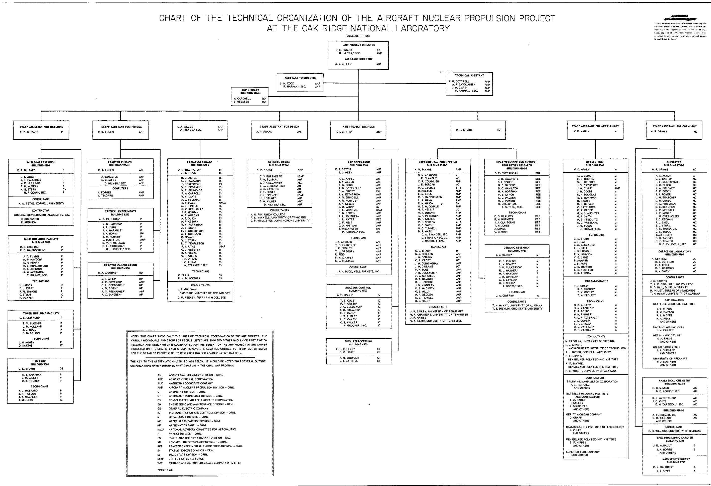