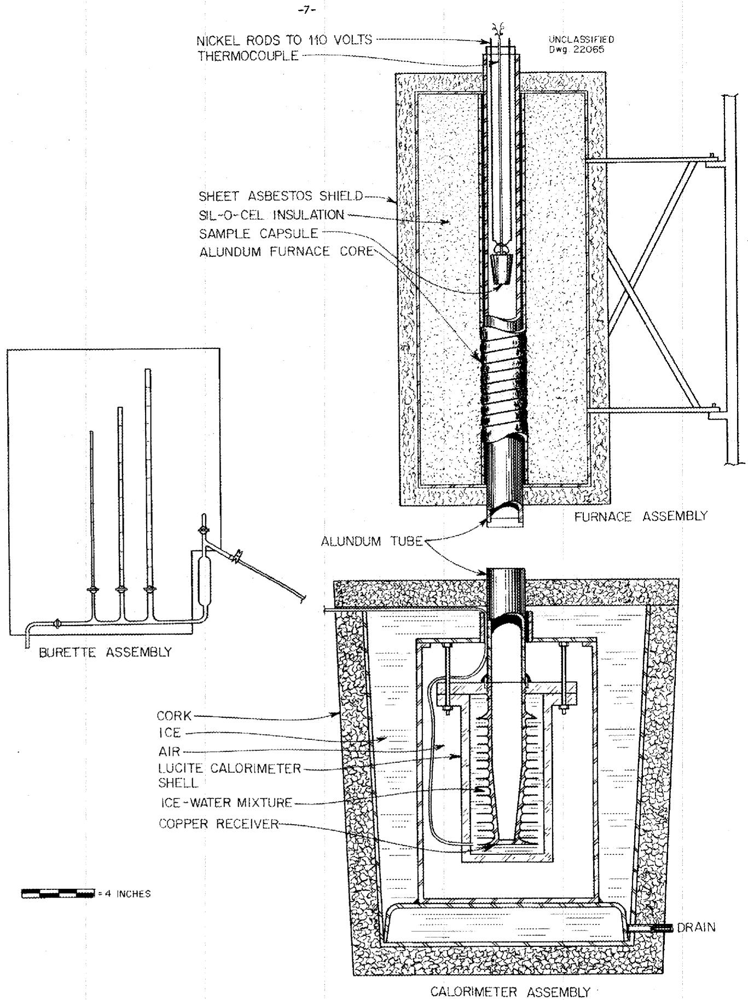
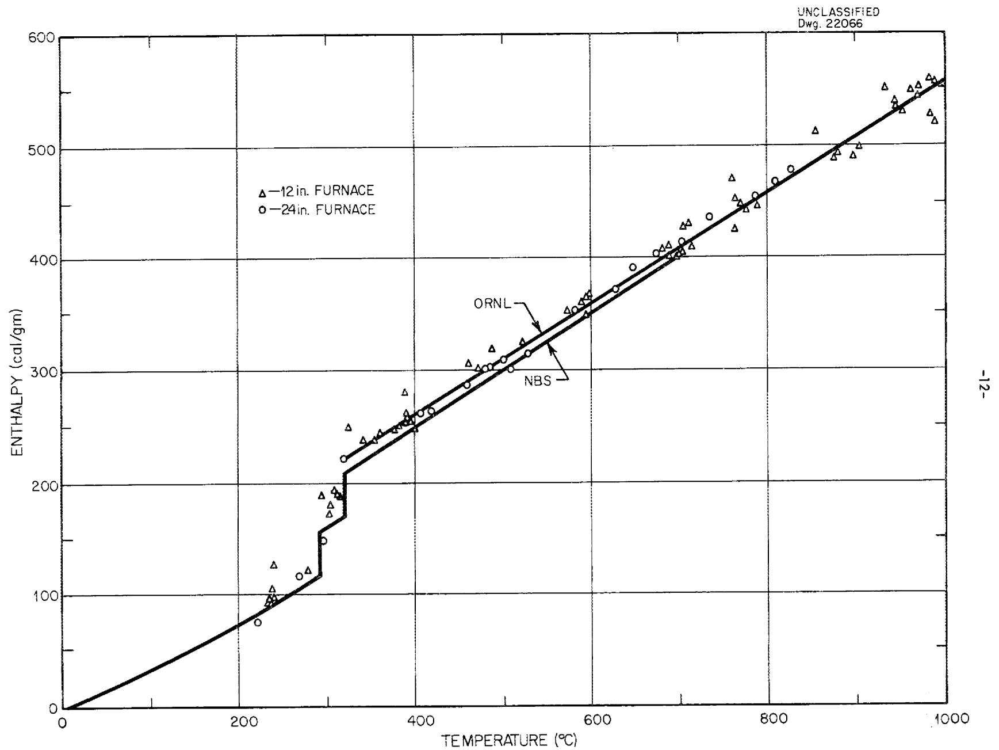
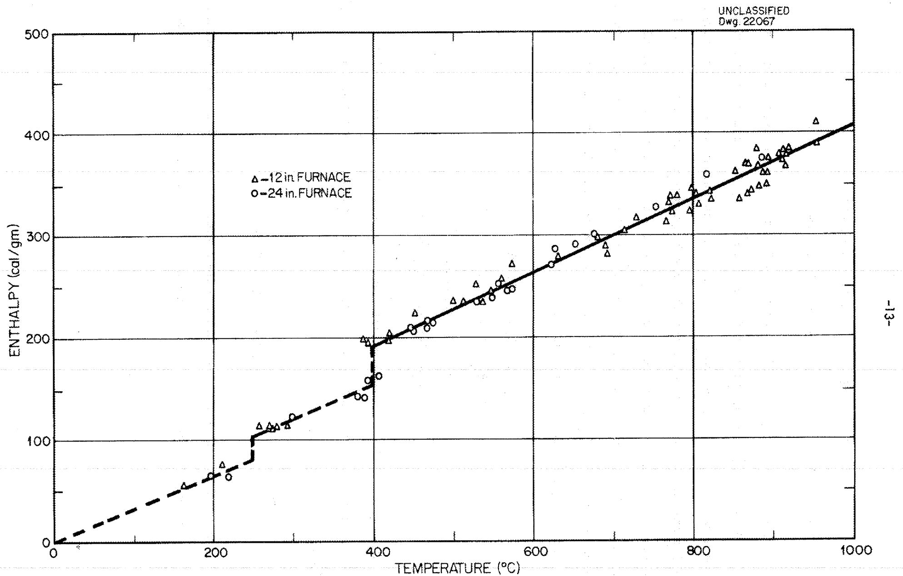
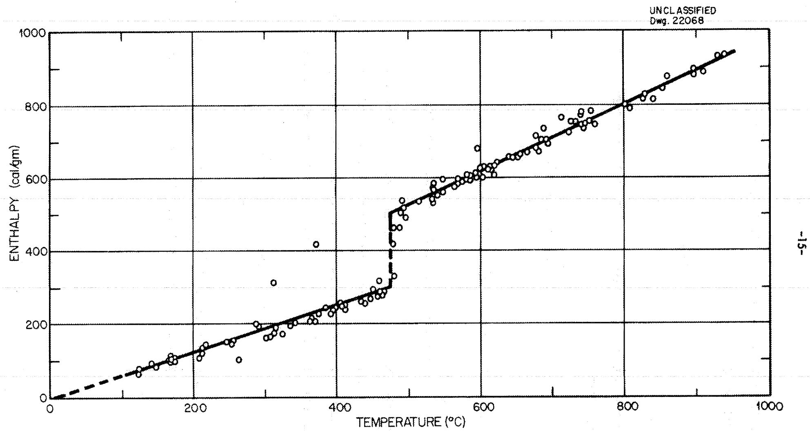
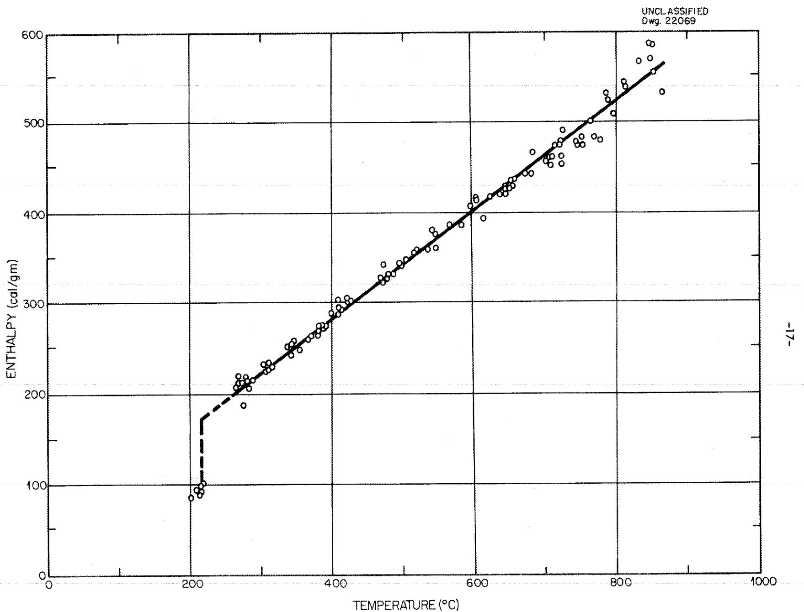
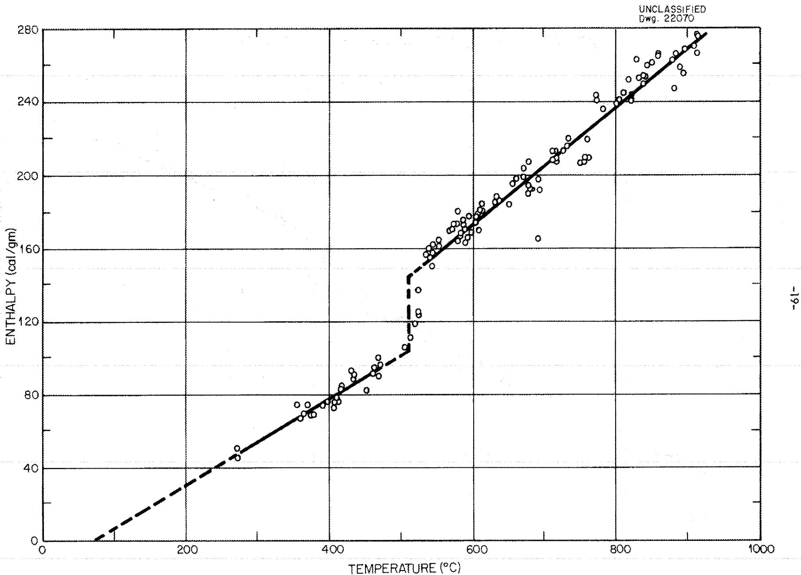
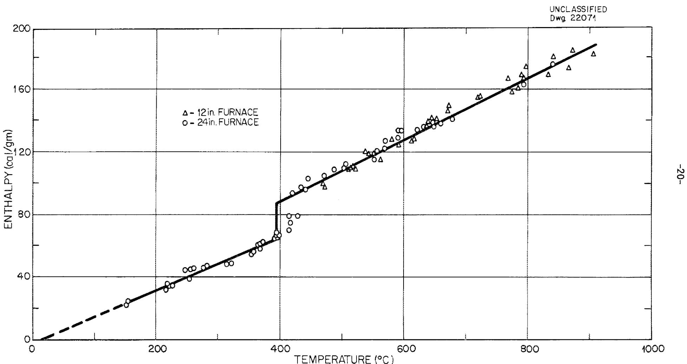
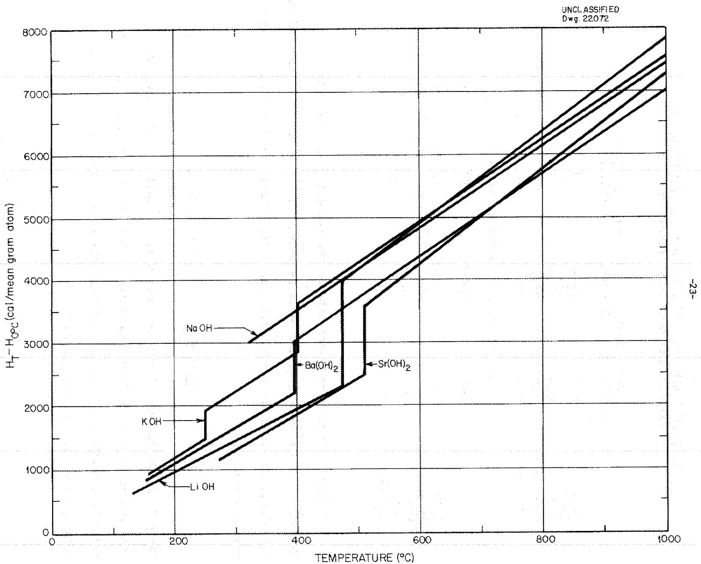
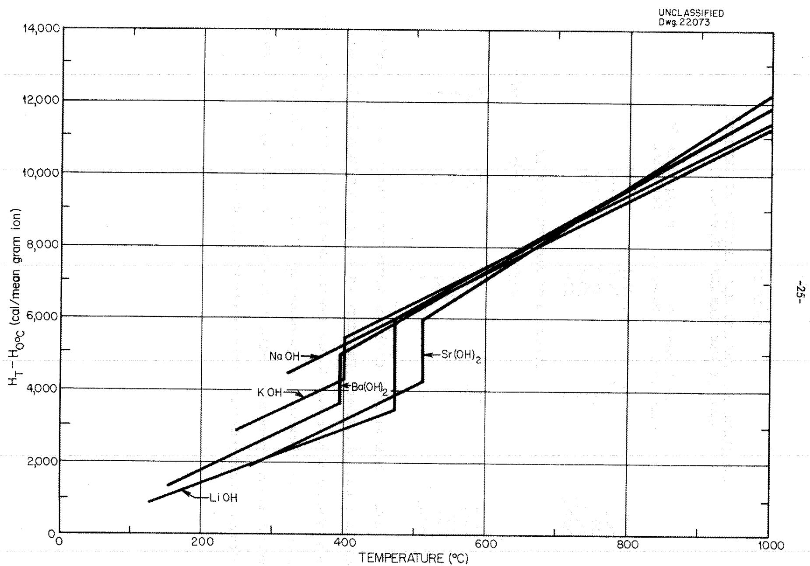

ORNL 1653

Engineering

ENTHALPIES AND SPECIFIC HEATS OF ALKALI

AND ALKALINE EARTH HYDROXIDES

AT HIGH TEMPERATURES

W. D. Powers

G.C.Balock

OAK RIDGE NATIONAL LABORATORY

OPERATED BY

CARBIDE AND CARBON CHEMICALS COMPANY

A DIVISION OF UNION CAMBID AND CANN CHN COMPOHATION

#

POST OFFICE BOX #

OAK RIDGE, TENNESCE

Contract No. W-7405, eng 26

Reactor Experimental Engineering Division

ENTHALPTES AND SPECIFIC HEATS OF AIKALI AND AIKALINE EARTH HYDROXIDES AT HIGH TEMPERATURES

by

W. D. Powers  
G. C. Blalocl

DATE ISSUED 7 1084

OAK RIDGE NATIONAL LABORATORY

Operated by  
CARBIDE AND CARBON CHEMICALS COMPANY  
A Division of Union Carbide and Carbon Corporation  
Post Office Box P  
Oak Ridge, Tennessee

# INTERNAL DISTRIBUTION

1. C. E. Center

2. Biology Library

3. Health Physics Library

4-5. Central Research Library

6. Reactor Experimental Engineering Library

7-11. Laboratory Records Department

12. Laboratory Records, ORNL R C

13. C. E. Larson

14. W. B. Humes (K-25)

15. L. B. Emlet (Y-12)

16. A. M. Weinberg

17. E. H. Taylor

18. E. D. Shipley

19. C. E. Winters

20. F. C. VonderLage

21. R. C. Briant

22. J. A. Swartout

23. S. C. Lind

24. F. L. Culler

25. A. H. Snell

26. A. Hollander

27. M. T. Kelley

28. W. J. Freitague

29. G. H. Clewett

30. K. Z. Morgan

31. T. A. Lincoln

32. A. S. Householder

33. C. S. Harrill

34. D. W. Cardwell

35. D. S. Billington

36. E. M. King

37. J. A. Lane

38. A. J. Miller

39. R. B. Briggs

40. A. S. Kitzes

41. O. Sisman

42. R. W. Stoughton

43. C. B. Graham

44. W. R. Call

45. H. F. Poppendiek

46. R. N. Lyon

47. S. E. Beall

48. J. P. Gill

49. D. D. Cowen

50. W. M. Breazeale (consultant)

51. R. A. Charpie

52. C. J. Barton

53. E. S. Bettis

54. J. P. Blakely

55. G. C. Blalock

56. F. F. Blankenship

57. E. P. Blizzard

58. E. G. Bohlmann

59. J. O. Bradfute

60. M. A. Bredig

61. A. D. Callihan

62. S. I. Cohen

63. C. P. Coughlen

64. G. A. Cristy

65. M. C. Edlund

66. W. K. Ergen

67. A. P. Fraas

68. N. D. Greene

69. W. R. Grimes

70. D. C. Hamilton

71. H. W. Hoffman

72. J. R. Johnson

73. F. Kertesz

74. E. E. Ketchen

75. F. E. Lynch

76. W. B. MacDonald

77. W. D. Manly

78. L. A. Mann

79. L. G. Overholser

80. L. D. Palmer

81-120. W. D. Powers

121. M. W. Rosenthal

122. H. W. Savage

123. G. P. Smith

124. C. D. Susano

125. E. R. VanArtsdalen

126. J. M. Ward

127. M. J. Skinner

# EXTERNAL DISTRIBUTION

128. R. F. Bacher, California Institute of Technology   
129. M. D. Bends, Metal Hydrides, Inc.   
130. E. G. Brush, Knolls Atomic Power Laboratory

131. J. M. Carter, Consultant, Moivrouia, California   
132. T. B. Douglas, National Bureau of Standards   
133. J. L. Dever, National Bureau of Standards   
134. L. P. Epstein, Knolls Atomic Power Laboratory   
135. W. Z. Friend, International Nickel Company   
136. W. N. Harrison, National Bureau of Standards   
137. D. G. Hill, Duke University   
138. R. A. Lad, National Advisory Committee for Aeronautics   
139. H. Marcus, Wright Air Development Center (WCRTY-3)   
140. P. D. Miller, Battelle Memorial Institute   
141. S. L. Simon, National Advisory Committee for Aeronautics   
142. E. M. Simons, Battelle Memorial Institute   
143. W. J. Smothers, University of Arkansas   
144. D. D. Williams, Naval Research Laboratory   
145. W. F. Zelezny, National Advisory Committee for Aeronautics   
146. H. R. Copson, International Nickel Company   
147. E. N. Skinner, International Nickel Company   
148-391. Given distribution as shown in TID-4500 under Engineering Category

DISTRIBUTION PAGE TO BE REMOVED IF REPORT IS GIVEN PUBLIC DISTRIBUTION

# TABLE OF CONTENTS

# PAGE

SUMMARY. 5   
INTRODUCTION. 5   
ALUMINUM OXIDE DETERMINATIONS. 2   
CHEMICAL PURITY OF THE HYDROXIDES. 2   
ENTHALPY AND HEAT CAPACITY. 8

Sodium Hydroxide. 11   
Potassium Hydroxide. 11   
Lithium Hydroxide. 14   
Lithium-Sodium Hydroxide Eutectic 16   
Strontium Hydroxide. 1.3   
Barium Hydroxide. 13

DISCUSSION OF RESULTS. 21   
REFERENCES. 23

APPENDIX - EXPERIMENTAL ENTHALPY TEMPERATURE DATA FOR THE INDIVIDUAL HYDROXIDE SAMPLES.

Sodium Hydroxide 29   
Potassium Hydroxide. 32   
Lithium Hydroxide. 35   
Lithium-Sodium Hydroxide Eutectic 39   
Strontium Hydroxide. 42   
Barium Hydroxide. 46

# ENTHALPTES AND SPECIFIC HEATS OF ALKALI AND ALKALINE EARTH HYDROXIDES AT HIGH TEMPERATURES

# SUMMARY

The enthalpies and heat capacities of lithium, potassium, strontium, and barium hydroxides in the liquid and solid state have been determined with a Bunsen Ice Calorimeter; sodium hydroxide and the lithium-sodium hydroxide eutectic in the liquid state were also studied. Estimates of the heat of fusion have been made. General empirical equations have been developed which represent the enthalpy and heat capacity of the hydroxides in the liquid state.

# INTRODUCTION

Samples of the hydroxides heated to constant and uniform temperatures were dropped into Bunsen ice calorimeters. The differences in the heat contents of the samples at constant pressure between the furnace temperature and $0^{\circ}\mathrm{C}$ were measured by observing the change in volume of the ice-water mixture in the calorimeter. The enthalpy was thus obtained directly. The derivative of the enthalpy with respect to temperature yielded the heat capacity.

The design of the apparatus has been described fully elsewhere (1). It was a modification of the device used by the National Bureau of Standards (2). Ease of construction and simplicity in use were the prime objectives in the design.

Briefly, the apparatus consisted of two parts, the furnace and the calorimeter (Figure I). During this investigation the furnaces were changed from 12 to 24 inch long units. The longer furnaces gave more reproducible results than did the 12 inch furnaces. The samples were contained in tapered metal capsules. They were sealed by heliarc welding in an inert gas filled dry box to avoid any possible contamination with water and carbon dioxide. The temperatures of the samples were measured by platinum, platinum-rhodium thermocouples. The capsules were dropped into the calorimeter by electrically fusing a short length of wire on which they were suspended in the furnaces.

The calorimeter was of the Bunsen type in which the heat liberated by the sample was absorbed by an ice-water mixture. The change in volume measured by a system of burets gave the amount of heat liberated (one ml. change in volume is equivalent to 878.7 cal. as calculated from the density of ice and water and the heat of fusion)(1)(2). The calorimeter was surrounded by flaked ice except for the alundum tube through which the sample dropped from the furnace. Freezing of the copper water lines between the buret assembly and the calorimeter was experienced when the flaked ice was in direct contact with the copper tubing. A steel shell was made which eliminated this trouble by providing an air gap between the ice and the calorimeter through which the copper tubing passed.

The total heat measured by the calorimeter was the sum of the heat liberated by the sample and capsule and the heat leakage from the surroundings into the calorimeter down the alundum tube through which the sample dropped. The contribution of the capsule was found from the enthalpy temperature

  
Fig.1. Schematic Diagram of Bunsen Ice Calorimeter

relationship of empty capsules; the heat leakage was determined from the heat leakage measurements made before the capsule was dropped and after equilibrium was established. At $500^{\circ}\mathrm{C}$ the heat liberated by the sample and capsule was of the order of 15000 calories, 50 to $70\%$ of which came from the sample. The heat leakage from the surroundings was 100 to 200 calories for the hour in which the measurements were made.

The linear dependence of enthalpy on temperature of the samples was calculated by least squares; the scatter of the data was large enough so that representing the data by a higher power relation was not warranted. Thus the reported heat capacities are not temperature dependent. The standard deviation of the heat capacity was calculated. This was used to determine the $95\%$ confidence limits on the reported heat capacity.

At the start of this investigation the only high temperature data reported in the literature were those for sodium hydroxide (3). The preliminary results of the heat capacity research on the several hydroxides at Oak Ridge National Laboratory have been reported in a series of memoranda (4); some of these were obtained using 12 inch furnaces. Recently the National Bureau of Standards has reported data for sodium hydroxide (5) which are compared to the results previously determined at ORNL.

# ALUMINUM OXIDE DETERMINATIONS

Enthalpy and specific heat determinations have been made for pure aluminum oxide. It has been proposed as a high temperature calorimetric standard by the Bureau of Standards (6). One hundred and three determinations at ORNL over the temperature range of $400 - 900^{\circ}\mathrm{C}$ (average temperature $664^{\circ}\mathrm{C}$ ) agree with the NBS results within $3.3\%$ for the enthalpy and $1.3\%$ for the heat capacity as shown in Table I.

TABLE I   
ENTHALPY AND HEAT CAPACITY OF ALUMINUM OXIDE   

<table><tr><td></td><td>ORNL</td><td>NBS</td><td>% Deviation</td></tr><tr><td>H500oc, (cal./gm)</td><td>126</td><td>122</td><td>3.3</td></tr><tr><td>H8000 - HOC</td><td>214</td><td>209</td><td>2.4</td></tr><tr><td>cp at 664oc, (cal./gm. °C)</td><td>0.294 ± 0.013</td><td>0.2901</td><td>1.3</td></tr></table>

# CHEMICAL PURITY OF THE HYDROXIDES

Pure hydroxides of low water and carbonate content were used in this investigation. A summary of the analytical data is shown in Table II.

The low total alkalinity of the lithium hydroxide and of the strontium hydroxide after use was due to the corrosion of the metal capsule and consequent metallic impurities. These particular capsules were used at higher temperatures more often than the other capsules analyzed. Most of the capsules were run until the hydroxide leaked through the capsule (in most cases at the

welded joint). Final analyses were made only on samples which had not ruptured. The error due to the solution of metal in the hydroxide is believed to be within the error of the determination as any reaction products between the sample and the capsule would have enthalpies and heat capacities approximating the original materials. No significant change of enthalpy was noted after prolonged use of the capsules at high temperatures.

TABLE II   
ANALYSIS OF MATERIALS   

<table><tr><td>Material</td><td>NaOH</td><td>KOH</td><td>LiOH</td><td>LiOH NaOH</td><td>Sr(OH)2</td><td>Ba(OH)2</td></tr><tr><td>Capsule</td><td>YW</td><td>YV</td><td>ZI</td><td>ZN</td><td>ZK</td><td>ZR</td></tr><tr><td>Capsule material</td><td>Nickel</td><td>Nickel</td><td>Inconel</td><td>Inconel</td><td>Inconel</td><td>Inconel</td></tr><tr><td>Original Analysis (% by Wt.)</td><td></td><td></td><td></td><td></td><td></td><td></td></tr><tr><td>% Total Alkalinity</td><td>99.97</td><td>100.00</td><td>*</td><td>*</td><td>99.80</td><td>100.4</td></tr><tr><td>% Metal Carbonate</td><td>.13</td><td>.12</td><td></td><td></td><td>.47</td><td>.43</td></tr><tr><td>Final Analysis</td><td></td><td></td><td></td><td></td><td></td><td></td></tr><tr><td>% Total Alkalinity</td><td>99.46</td><td>98.68</td><td>96.6</td><td>99.73</td><td>94.1</td><td>99.81</td></tr><tr><td>% Metal Carbonate</td><td>.28</td><td>.37</td><td>.05</td><td>.28</td><td>.19</td><td>.30</td></tr></table>

*No original analysis was made on this material. The purity of the lithium hydroxide is of the same order of purity as the other hydroxides. A typical analysis is 99.90% total alkalinity, 0.13% Li2CO3.

# SODIUM HYDROXIDE

The individual results of the enthalpies of sodium hydroxide are listed in the appendix and plotted in Figure II. Capsule YW was run in the 24 inch furnaces, the others in the 12 inch furnaces. The enthalpies obtained by the different furnaces agreed within $5\%$ of each other. The enthalpy and heat capacity of liquid sodium hydroxide are represented by the following equations:

$$
\begin{array}{l} \mathrm {H} _ {\mathrm {T}} - \mathrm {H} _ {\mathrm {O O C}} = 6 5. 8 + 0. 4 9 4 \mathrm {T} \\ c _ {p} = 0. 4 9 \pm 0. 0 2 \\ \end{array}
$$

where $\mathbf{H}$ is the enthalpy in cal./g.

T is the temperature $^\circ \mathrm{C}$

$c_p$ is the heat capacity in cal./g. $^\circ C$

No attempt was made to determine the properties of the solid phases because of the insufficient data in that region. The results obtained by NBS for the liquid and solid phases are plotted in Figure II together with the results of this investigation obtained below the melting point.

# POTASSIUM HYDROXIDE

The individual results of the enthalpies of potassium hydroxide are listed in the appendix and plotted in Figure III. Capsule YV was run in the 24 inch furnaces, the others in the 12 inch furnaces. The enthalpy and heat capacity of liquid potassium hydroxide are represented by the following equations:

  
Fig.2. Temperature vs. Enthalpy for Sodium Hydroxide

  
Fig. 3. Temperature vs. Enthalpy for Potassium Hydroxide

$$
\begin{array}{l} H _ {T} - H _ {O O C} = 5 2. 5 + 0. 3 5 4 T \\ c _ {p} = 0. 3 5 \pm 0. 0 2 \\ \end{array}
$$

The heats of transition of the two solid states of potassium hydroxide $(\alpha \geq \beta$ at $249^{\circ}\mathrm{C})$ and the heat of fusion $(400^{\circ}\mathrm{C})$ may be roughly estimated from the data below the melting point. A linear relationship between the enthalpy and temperature was calculated for the low temperature form from $0^{\circ}\mathrm{C}$ to the transition point. A mean heat capacity between the $\alpha$ form and the liquid was used for the $\beta$ form. The enthalpy points at $379^{\circ}\mathrm{C}$ and above for the $\beta$ form were considered subject to error since they were near the melting point. The following equations were calculated

$$
\begin{array}{l} \mathrm {H} _ {\mathrm {T}} (\alpha) - \mathrm {H} _ {\mathrm {O O C}} = 0. 3 2 \mathrm {T} \\ \mathrm {H} _ {\mathrm {T}} (\beta) - \mathrm {H} _ {\mathrm {O O C}} = 2 0. 2 +. 3 5 5 \mathrm {T} \\ \mathrm {H} _ {2 4 9 0} (\beta) - \mathrm {H} _ {2 4 9 0} (\alpha) = 2 4 \\ \mathrm {H} _ {4 0 0 0} (\text {l i q u i d}) - \mathrm {H} _ {4 0 0} (\beta) = 4 0 \\ \end{array}
$$

These agree within the experimental error of previously reported values of the heat of transition (7), 27 cal./g. and heat of fusion 32.6 cal./g. (7) (8).

# LITHIUM HYDROXIDE

The individual results of lithium hydroxide are listed in the appendix and plotted in Figure IV. All the capsules were run in the 24 inch furnaces.

  
Fig. 4. Temperature vs. Enthalpy for Lithium Hydroxide

The enthalpy and heat capacity of the liquid lithium hydroxide are represented by the following equations:

$$
\begin{array}{l} \mathrm {H} _ {\mathrm {T}} - \mathrm {H} _ {\mathrm {O O C}} = 6 4 + 0. 9 2 3 \\ c _ {p} = 0. 9 2 \pm 0. 0 4 \\ \end{array}
$$

The enthalpy and heat capacity of the solid are represented by the following equations:

$$
\begin{array}{l} \mathrm {H} _ {\mathrm {T}} - \mathrm {H} _ {\mathrm {O O C}} = - 5 + 0. 6 2 7 \\ c _ {p} = 0. 6 3 \pm 0. 0 4 \\ \end{array}
$$

The heat of fusion at $473^{\circ}C$ is 210 cal./g.

# EUTECTIC OF LITHIUM AND SODIUM HYDROXIDES

The individual results of the enthalpies of lithium-sodium hydroxide eutectic (27 Mole % LiOH) are listed in the appendix and plotted in Figure V. All capsules were run in the 24 inch furnaces. The enthalpy and heat capacity of the liquid mixture are represented by the following equations:

$$
\begin{array}{l} \mathrm {H} _ {\mathrm {T}} - \mathrm {H} _ {\mathrm {O O C}} = 4 4. 3 + 0. 5 9 9 \mathrm {T} \\ c _ {p} = 0. 6 0 \pm 0. 0 2 \\ \end{array}
$$

The melting point is at $218^{\circ} \pm 5^{\circ}\mathrm{C}$ . There is also a transition point at $180^{\circ} \pm 5^{\circ}\mathrm{C}$ . Because of the small amount of data no estimate is made of the heat of fusion.

  
Fig. 5. Temperature vs. Enthalpy for Lithium - Sodium Hydroxide Eutectic

# STRONTIUM HYDROXIDE

The individual results of the enthalpies of strontium hydroxide are listed in the appendix and plotted in Figure VI. All the capsules were run in the 24 inch furnaces. The enthalpy and the heat capacity of the liquid are represented by the following equations:

$$
\mathrm {H} _ {\mathrm {T}} - \mathrm {H} _ {\mathrm {O O C}} = - 1 3. 5 + 0. 3 1 4 \mathrm {T}
$$

$$
c _ {p} = 0. 3 1 \pm 0. 0 2
$$

The enthalpy and heat capacity for the solid from $272^{\circ}\mathrm{C}$ to $470^{\circ}\mathrm{C}$ are represented by the following equations:

$$
\mathrm {H} _ {\mathrm {T}} - \mathrm {H} _ {\mathrm {O O C}} = - 1 7. 6 + 0. 2 3 9 \mathrm {T}
$$

$$
c _ {p} = 0. 2 4 + 0. 0 4
$$

The heat of fusion is 43 cal./g. at $510^{\circ}C$ .

# BARIUM HYDROXIDE

The individual results of the enthalpies of barium hydroxide are listed in the appendix and plotted in Figure VII. Capsules ZB and ZC were run in 12 inch furnaces, capsules ZP, ZR, ZX and ZY in the 24 inch furnaces.

The enthalpy and the heat capacity of the liquid are represented by the following equations:

$$
\mathrm {H} _ {\mathrm {T}} - \mathrm {H} _ {\mathrm {O O C}} = 1 1. 7 + 0. 1 9 5
$$

$$
c _ {p} = 0. 1 9 5 \pm 0. 0 2
$$

  
Fig. 6. Temperature vs. Enthalpy for Strontium Hydroxide

  
Fig. 7. Temperature vs. Enthalpy for Barium Hydroxide

The enthalpy and heat capacity for the solid from $150^{\circ}\mathrm{C}$ to $395^{\circ}\mathrm{C}$ are represented by the following equations:

$$
\begin{array}{l} \mathrm {H} _ {\mathrm {T}} - \mathrm {H} _ {\mathrm {O O C}} = - 2. 0 + 0. 1 6 8 \mathrm {T} \\ c _ {p} = 0. 1 7 \pm 0. 0 2 \\ \end{array}
$$

The heat of fusion is 24 cal./g. at $395^{\circ}\mathrm{C}$ . Seward (9) reported 20 cal./g.

# DISCUSSION OF RESULTS

It is of interest to find general relationships between the enthalpies and heat capacities of the various hydroxides. For most of the solid elements the heat capacity at constant volume is equal to 3R or 6 cal./ $^{\circ}$ C per gram atom. The more modern theories of Einstein and Debye have the same value as a limit which is reached at normal temperatures for most elements (10). At constant pressure the heat capacities are found to be greater, being about 6.4 cal./ $^{\circ}$ C per gram atom (Dulong and Petit's law). The Debye equation also predicts correctly the heat capacity of some compounds, these being the compounds that crystallize in the cubic system. The equation may be modified to predict compounds that do not crystallize in the cubic lattice. In 1865 Kopp suggested that the molar heat capacity of a compound is approximately equal to the sum of the atomic heat capacities of its constituent elements.

In the case of liquid compounds which have no definite group of atoms or radicals such as the sulfate or hydroxide ion it has been found empirically

that each atom contributes approximately 8 cal/°C to the molar heat capacity of the compound (ll). Molar heat capacities for the hydroxides were found to be 6.86 cal/°C per atom for the alkali hydroxides and 7.20 cal/°C per atom for the alkaline earth hydroxides. Groups of atoms would be expected to lower the molar heat capacity of the compound. Molar heat capacities for the hydroxides were found to be ll.0 cal/°C per ion for both classes of hydroxides.

In Figure VIII the comparison between the enthalpies of the different hydroxides on the mean gram atom basis is shown. The hydroxides form two groups, the alkalies and the alkaline earths. For the alkali hydroxides the molar enthalpy may be represented by

$$
\underline {{\underline {{H}}}} _ {T} - \underline {{\underline {{H}}}} _ {O O C} = N (7 9 5 + 6. 8 6 T) \tag {1}
$$

and for the alkaline earth hydroxides by

$$
\underline {{\mathrm {H}}} _ {\mathrm {T}} - \underline {{\mathrm {H}}} _ {\mathrm {O O C}} = \mathrm {N} (1 0 + 7. 2 0 \mathrm {T}) \tag {2}
$$

where $\mathbb{N}$ is the number of atoms per molecule

$\underline{\underline{\mathbf{H}}}$ is the enthalpy in cal./gram mole

T is the temperature $^\circ \mathrm{C}$

In Table III are shown the calculated and observed heat capacities of the liquid hydroxides and their deviation together with the deviations between the observed and calculated enthalpies at various temperatures.

  
Fig. 8. Comparison of Hydroxides (Enthalpy per Mean Gram Atom)

TABLE III   
CALCULATED AND OBSERVED HEAT CAPACITY AND ENTHALPY BASED ON MEAN GRAM ATOM (Equations 1, 2)   

<table><tr><td></td><td colspan="2">Heat Capacity</td><td colspan="2">cal./g. mole °C</td></tr><tr><td></td><td>Calculated</td><td>Observed</td><td>Deviation</td><td></td></tr><tr><td>LiOH</td><td>20.6</td><td>22.1</td><td>7%</td><td></td></tr><tr><td>NaOH</td><td>20.6</td><td>19.8</td><td>-4</td><td></td></tr><tr><td>KOH</td><td>20.6</td><td>19.9</td><td>-3</td><td></td></tr><tr><td>Sr(OH)2</td><td>36.0</td><td>38.2</td><td>6</td><td></td></tr><tr><td>Ba(OH)2</td><td>36.0</td><td>33.4</td><td>-7</td><td></td></tr><tr><td colspan="5">Deviation of Observed Enthalpy</td></tr><tr><td></td><td>400°C</td><td>600°C</td><td>800°C</td><td>1000°C</td></tr><tr><td>LiOH</td><td>----</td><td>1%</td><td>2%</td><td>3%</td></tr><tr><td>NaOH</td><td>-1%</td><td>-2</td><td>-2</td><td>-2</td></tr><tr><td>KOH</td><td>3</td><td>1</td><td>0</td><td>-1</td></tr><tr><td>Sr(OH)2</td><td>----</td><td>-2</td><td>0</td><td>1</td></tr><tr><td>Ba(OH)2</td><td>6</td><td>2</td><td>0</td><td>-2</td></tr></table>

In Figure IX the comparison between the enthalpies of the different hydroxides on the mean gram ion basis is shown. There is no difference between the alkali and alkaline earth hydroxides. The enthalpies of all the hydroxides may be expressed as

$$
\underline {{\mathrm {H}}} _ {\mathrm {T}} - \underline {{\mathrm {H}}} _ {\mathrm {O O C}} = \mathrm {N} ^ {\prime} (7 1 0 + 1 1. 0 \mathrm {T}) \tag {3}
$$

where $\mathbb{N}^{\prime}$ is the number of ions per molecule. In Table IV are shown the observed and calculated heat capacities of the liquid hydroxides and their deviations together with the deviations between observed and calculated enthalpies at various temperatures.

  
Fig.9. Comparison of Hydroxides (Enthalpy per Mean Gram Ion)

TABLE IV   
CALCULATED AND OBSERVED HEAT CAPACITY AND ENTHALPY BASED ON MEAN GRAM ION (Equation 3)   

<table><tr><td></td><td colspan="2">Heat Capacity</td><td>cal./g. mole °C</td></tr><tr><td></td><td>Calculated</td><td>Observed</td><td>Deviation</td></tr><tr><td>LiOH</td><td>22.0</td><td>22.1</td><td>0%</td></tr><tr><td>NaOH</td><td>22.0</td><td>19.8</td><td>-10</td></tr><tr><td>KOH</td><td>22.0</td><td>19.9</td><td>-10</td></tr><tr><td>Sr(OH)2</td><td>33.0</td><td>38.2</td><td>16</td></tr><tr><td>Ba(OH)2</td><td>33.0</td><td>33.4</td><td>1</td></tr></table>

Deviation of Observed Enthalpy   

<table><tr><td></td><td>400°C</td><td>600°C</td><td>800°C</td><td>1000°C</td></tr><tr><td>LiOH</td><td>----</td><td>1%</td><td>1%</td><td>1%</td></tr><tr><td>NaOH</td><td>3%</td><td>-1</td><td>-3</td><td>-4</td></tr><tr><td>KOH</td><td>7</td><td>2</td><td>-1</td><td>-3</td></tr><tr><td>Sr(OH)2</td><td>----</td><td>-3</td><td>1</td><td>4</td></tr><tr><td>Ba(OH)2</td><td>0</td><td>1</td><td>1</td><td>1</td></tr></table>

Both methods satisfactorily correlated the enthalpy and heat capacity of the liquid hydroxides. The first set of equations (based on the equal contribution of each atom to the specific heat) gives better values for the specific heat. However the hydroxides are divided into two groups. The second method (based on the equal contribution of each ion) gives an overall picture without subdividing the hydroxides into groups.

The heat capacity of the eutectic mixture of lithium and sodium hydroxide is additive, i.e., it is the sum of the product of the individual heat capacities and mole fraction. The enthalpies are not additive, however. The observed enthalpy is lower indicating a heat of solution of the order of 20-30 calories per gram of solution.

TABLE V   

<table><tr><td></td><td>Observed</td><td>Calculated</td></tr><tr><td>cp(cal./g. °C)</td><td>0.60</td><td>0.59</td></tr><tr><td>H5000 - H0oc(cal./g.)</td><td>344.</td><td>373.</td></tr><tr><td>H8000 - H0oc(cal./g.)</td><td>525.</td><td>550.</td></tr></table>

# REFERENCES

(1) R. F. Redmond and J. Lones, ORNL Report 1040, August, 1951   
(2) Defoe C. Ginnings and Robert J. Corruccini, J. Research N.B.S. 38 583 (1947)   
(3) Terashkevich and Vishnevskii, Jour. Gen. Chem. (U.R.S.S.) 7:3 2175(1937)   
(4) W. D. Powers and G. C. Blalock  
NaOH ORNL CF 51-11-195 November 30, 1951  
KOH ORNL CF 52-3-229 March 31, 1952  
LiOH ORNL CF 52-11-104 November 15, 1952  
LiOH-NaOH ORNL CF 53-5-103 May 18, 1953  
Sr(OH)₂ ORNL CF 53-2-84 February 9, 1953  
Ba(OH)₂ ORNL CF 52-4-186 April 30, 1952   
(5) Thomas B. Douglas and James L. Dever, N.B.S. Report 2301, February, 1953   
(6) Defoe C. Ginnings and Robert J. Corruccini, J. Research N.B.S. 38 593 (1947)   
(7) F. D. Rossini, D. D. Wagman, W. H. Evans, S. Levine, I. Jaffe Selected Values of Chemical Thermodynamic Properties N.B.S. Circular 500, February, 1952   
(8) Ralph P. Seward and Kenneth E. Martin, JACS 71 3564 (1949)   
(9) Ralph P. Seward, J.A.C.S. 67 1189 (1945)   
(10) Samuel Glasstone, Thermodynamics for Chemists, D. Van Nostrand (1947) page 121   
(11) K. K. Kelley, Contributions to the Data on Theoretical Metallurgy X High Temperature Heat-Content, Heat-Capacity and Entropy Data for Inorganic Compounds, Bureau of Mines, Bulletin 476 (1949)

SODIUM HYDROXIDE INDIVIDUAL ENTHALPIES   

<table><tr><td>Capsule</td><td>Calorimeter</td><td>Temperature
°C</td><td>HT - HooC
cal./g.
Obs.</td><td>HT - HooC
Calc.</td><td>Diff.
Obs-Calc</td></tr><tr><td>YW</td><td>1</td><td>220</td><td>77</td><td></td><td></td></tr><tr><td>YH</td><td>4</td><td>231</td><td>93</td><td></td><td></td></tr><tr><td>YH</td><td>4</td><td>233</td><td>97</td><td></td><td></td></tr><tr><td>YH</td><td>3</td><td>235</td><td>95</td><td></td><td></td></tr><tr><td>YH</td><td>3</td><td>236</td><td>106</td><td></td><td></td></tr><tr><td>YH</td><td>1</td><td>239</td><td>98</td><td></td><td></td></tr><tr><td>YH</td><td>1</td><td>240</td><td>127</td><td></td><td></td></tr><tr><td>YW</td><td>1</td><td>268</td><td>118</td><td></td><td></td></tr><tr><td>YH</td><td>1</td><td>281</td><td>122</td><td></td><td></td></tr><tr><td>YH</td><td>3</td><td>293</td><td>189</td><td></td><td></td></tr><tr><td>YW</td><td>1</td><td>296</td><td>149</td><td></td><td></td></tr><tr><td>YH</td><td>2</td><td>303</td><td>178</td><td></td><td></td></tr><tr><td>YH</td><td>3</td><td>304</td><td>171</td><td></td><td></td></tr><tr><td>YH</td><td>1</td><td>309</td><td>192</td><td></td><td></td></tr><tr><td>YH</td><td>1</td><td>311</td><td>189</td><td></td><td></td></tr><tr><td>YH</td><td>2</td><td>314</td><td>187</td><td></td><td></td></tr><tr><td>YH</td><td>3</td><td>326</td><td>259*</td><td></td><td></td></tr><tr><td>YH</td><td>4</td><td>342</td><td>238</td><td>235</td><td>3</td></tr><tr><td>YH</td><td>5</td><td>354</td><td>238</td><td>241</td><td>-3</td></tr><tr><td>YH</td><td>2</td><td>361</td><td>243</td><td>244</td><td>-1</td></tr><tr><td>YI</td><td>4</td><td>376</td><td>247</td><td>251</td><td>-4</td></tr><tr><td>YH</td><td>4</td><td>380</td><td>249</td><td>253</td><td>-4</td></tr><tr><td>YH</td><td>1</td><td>386</td><td>253</td><td>256</td><td>-3</td></tr><tr><td>YH</td><td>1</td><td>386</td><td>281</td><td>256</td><td>25</td></tr><tr><td>YH</td><td>4</td><td>389</td><td>256</td><td>258</td><td>-2</td></tr><tr><td>YH</td><td>4</td><td>390</td><td>256</td><td>258</td><td>-2</td></tr><tr><td>YH</td><td>3</td><td>391</td><td>260</td><td>259</td><td>1</td></tr><tr><td>YI</td><td>4</td><td>394</td><td>255</td><td>260</td><td>-5</td></tr><tr><td>YI</td><td>1</td><td>398</td><td>250</td><td>262</td><td>-12</td></tr><tr><td>YW</td><td>1</td><td>407</td><td>262</td><td>267</td><td>-5</td></tr><tr><td>YW</td><td>1</td><td>421</td><td>264</td><td>274</td><td>-10</td></tr><tr><td>YW</td><td>3</td><td>458</td><td>307</td><td>292</td><td>15</td></tr><tr><td>YW</td><td>3</td><td>460</td><td>288</td><td>293</td><td>-5</td></tr><tr><td>YW</td><td>2</td><td>472</td><td>302</td><td>299</td><td>3</td></tr><tr><td>YW</td><td>2</td><td>473</td><td>298</td><td>299</td><td>-1</td></tr><tr><td>YW</td><td>1</td><td>479</td><td>302</td><td>302</td><td>0</td></tr><tr><td>YI</td><td>4</td><td>484</td><td>304</td><td>305</td><td>-1</td></tr></table>

*This measurement was not used in the least-squares analysis.

SODIUM HYDROXIDE (Con't.)   

<table><tr><td>Capsule</td><td>Calorimeter</td><td>Temperature °C</td><td>HT - HooC cal./g.</td><td>HT - HooC Calc.</td><td>Diff. Obs-Calc</td></tr><tr><td>YH</td><td>4</td><td>486</td><td>319</td><td>306</td><td>13</td></tr><tr><td>YW</td><td>1</td><td>500</td><td>309</td><td>313</td><td>-4</td></tr><tr><td>YW</td><td>2</td><td>506</td><td>301</td><td>316</td><td>-15</td></tr><tr><td>YH</td><td>5</td><td>524</td><td>326</td><td>324</td><td>2</td></tr><tr><td>YW</td><td>1</td><td>528</td><td>316</td><td>326</td><td>-10</td></tr><tr><td>YL</td><td>3</td><td>572</td><td>353</td><td>348</td><td>5</td></tr><tr><td>YW</td><td>2</td><td>582</td><td>354</td><td>353</td><td>1</td></tr><tr><td>YJ</td><td>4</td><td>588</td><td>359</td><td>356</td><td>3</td></tr><tr><td>YH</td><td>4</td><td>594</td><td>364</td><td>359</td><td>5</td></tr><tr><td>YH</td><td>1</td><td>595</td><td>348</td><td>360</td><td>-12</td></tr><tr><td>YH</td><td>4</td><td>596</td><td>365</td><td>360</td><td>5</td></tr><tr><td>YW</td><td>1</td><td>600</td><td>361</td><td>362</td><td>-1</td></tr><tr><td>YW</td><td>5</td><td>628</td><td>372</td><td>376</td><td>-4</td></tr><tr><td>YW</td><td>3</td><td>646</td><td>391</td><td>385</td><td>6</td></tr><tr><td>YW</td><td>3</td><td>673</td><td>405</td><td>398</td><td>7</td></tr><tr><td>YH</td><td>2</td><td>680</td><td>408</td><td>402</td><td>6</td></tr><tr><td>YL</td><td>3</td><td>688</td><td>401</td><td>405</td><td>-4</td></tr><tr><td>YH</td><td>3</td><td>688</td><td>410</td><td>405</td><td>5</td></tr><tr><td>YL</td><td>4</td><td>696</td><td>400</td><td>409</td><td>-9</td></tr><tr><td>YH</td><td>4</td><td>697</td><td>400</td><td>410</td><td>-10</td></tr><tr><td>YI</td><td>1</td><td>702</td><td>405</td><td>412</td><td>-7</td></tr><tr><td>YW</td><td>2</td><td>702</td><td>415</td><td>412</td><td>3</td></tr><tr><td>YH</td><td>5</td><td>704</td><td>428</td><td>413</td><td>15</td></tr><tr><td>YL</td><td>5</td><td>710</td><td>431</td><td>416</td><td>15</td></tr><tr><td>YW</td><td>1</td><td>712</td><td>409</td><td>417</td><td>-8</td></tr><tr><td>YW</td><td>3</td><td>734</td><td>437</td><td>428</td><td>9</td></tr><tr><td>YH</td><td>5</td><td>760</td><td>456</td><td>441</td><td>15</td></tr><tr><td>YL</td><td>5</td><td>761</td><td>452</td><td>441</td><td>11</td></tr><tr><td>YH</td><td>1</td><td>763</td><td>426</td><td>442</td><td>-16</td></tr><tr><td>YH</td><td>3</td><td>770</td><td>444</td><td>446</td><td>-2</td></tr><tr><td>YL</td><td>3</td><td>775</td><td>443</td><td>448</td><td>-5</td></tr><tr><td>YW</td><td>2</td><td>784</td><td>455</td><td>453</td><td>2</td></tr><tr><td>YH</td><td>1</td><td>788</td><td>446</td><td>455</td><td>-9</td></tr><tr><td>YW</td><td>4</td><td>808</td><td>468</td><td>465</td><td>3</td></tr><tr><td>YW</td><td>5</td><td>826</td><td>479</td><td>474</td><td>5</td></tr><tr><td>YH</td><td>2</td><td>854</td><td>513</td><td>487</td><td>26</td></tr><tr><td>YL</td><td>4</td><td>875</td><td>489</td><td>498</td><td>-9</td></tr><tr><td>YH</td><td>4</td><td>876</td><td>492</td><td>498</td><td>-6</td></tr><tr><td>YW</td><td>5</td><td>891</td><td>533</td><td>506</td><td>27</td></tr></table>

SODIUM HYDROXIDE (Con't.)   

<table><tr><td>Capsule</td><td>Calorimeter</td><td>Temperature °C</td><td>HT - HooC cal./g.</td><td>HT - HooC Calc.</td><td>Diff. Obs-Calc.</td></tr><tr><td>YH</td><td>1</td><td>896</td><td>490</td><td>508</td><td>-18</td></tr><tr><td>YL</td><td>1</td><td>904</td><td>499</td><td>512</td><td>-13</td></tr><tr><td>YL</td><td>5</td><td>934</td><td>553</td><td>527</td><td>26</td></tr><tr><td>YL</td><td>3</td><td>943</td><td>538</td><td>531</td><td>7</td></tr><tr><td>YH</td><td>3</td><td>944</td><td>535</td><td>532</td><td>3</td></tr><tr><td>YL</td><td>3</td><td>953</td><td>530</td><td>536</td><td>-6</td></tr><tr><td>YL</td><td>3</td><td>962</td><td>548</td><td>541</td><td>7</td></tr><tr><td>YL</td><td>1</td><td>969</td><td>543</td><td>544</td><td>-1</td></tr><tr><td>YL</td><td>4</td><td>970</td><td>553</td><td>545</td><td>8</td></tr><tr><td>YH</td><td>1</td><td>984</td><td>528</td><td>552</td><td>-24</td></tr><tr><td>YH</td><td>4</td><td>984</td><td>560</td><td>552</td><td>8</td></tr><tr><td>YL</td><td>4</td><td>986</td><td>558</td><td>553</td><td>5</td></tr><tr><td>YL</td><td>1</td><td>990</td><td>521</td><td>555</td><td>-34</td></tr></table>

POTASSIUM HYDROXIDE   
INDIVIDUAL ENTHALPIES   

<table><tr><td>Capsule</td><td>Calorimeter</td><td>Temperature
°C</td><td>Ht - Hoccal./g.</td><td>Ht - HocCalc.</td><td>Diff. 
Obs-Calc.</td></tr><tr><td>YK</td><td>1</td><td>162</td><td>54</td><td>52</td><td>2</td></tr><tr><td>YK</td><td>1</td><td>196</td><td>63</td><td>63</td><td>0</td></tr><tr><td>YK</td><td>5</td><td>212</td><td>74</td><td>68</td><td>4</td></tr><tr><td>YV</td><td>1</td><td>218</td><td>63</td><td>70</td><td>-7</td></tr><tr><td>YK</td><td>3</td><td>259</td><td>112</td><td>107</td><td>5</td></tr><tr><td>YV</td><td>1</td><td>269</td><td>114</td><td>110</td><td>4</td></tr><tr><td>YK</td><td>4</td><td>272</td><td>112</td><td>111</td><td>1</td></tr><tr><td>YK</td><td>4</td><td>274</td><td>111</td><td>112</td><td>-1</td></tr><tr><td>YK</td><td>4</td><td>277</td><td>111</td><td>113</td><td>-2</td></tr><tr><td>YK</td><td>1</td><td>292</td><td>112</td><td>118</td><td>-6</td></tr><tr><td>YV</td><td>1</td><td>298</td><td>122</td><td>120</td><td>2</td></tr><tr><td>YV</td><td>4</td><td>379</td><td>142*</td><td></td><td></td></tr><tr><td>YV</td><td>5</td><td>388</td><td>140*</td><td></td><td></td></tr><tr><td>YK</td><td>2</td><td>388</td><td>197*</td><td></td><td></td></tr><tr><td>YK</td><td>2</td><td>392</td><td>194*</td><td></td><td></td></tr><tr><td>YV</td><td>1</td><td>392</td><td>157*</td><td></td><td></td></tr><tr><td>YV</td><td>1</td><td>406</td><td>162*</td><td></td><td></td></tr><tr><td>YK</td><td>2</td><td>418</td><td>197</td><td>200</td><td>-3</td></tr><tr><td>YK</td><td>5</td><td>420</td><td>203</td><td>201</td><td>2</td></tr><tr><td>YV</td><td>1</td><td>422</td><td>204</td><td>202</td><td>2</td></tr><tr><td>YV</td><td>3</td><td>446</td><td>209</td><td>210</td><td>-1</td></tr><tr><td>YV</td><td>2</td><td>450</td><td>205</td><td>212</td><td>-7</td></tr><tr><td>YK</td><td>2</td><td>452</td><td>221</td><td>212</td><td>9</td></tr><tr><td>YV</td><td>1</td><td>466</td><td>215</td><td>217</td><td>-2</td></tr><tr><td>YV</td><td>2</td><td>467</td><td>210</td><td>218</td><td>-8</td></tr><tr><td>YV</td><td>1</td><td>475</td><td>214</td><td>221</td><td>-7</td></tr><tr><td>YK</td><td>5</td><td>495</td><td>288*</td><td></td><td></td></tr><tr><td>YK</td><td>2</td><td>500</td><td>235</td><td>229</td><td>6</td></tr><tr><td>YK</td><td>1</td><td>512</td><td>234</td><td>234</td><td>0</td></tr><tr><td>YK</td><td>2</td><td>527</td><td>250</td><td>239</td><td>11</td></tr><tr><td>YV</td><td>1</td><td>528</td><td>234</td><td>239</td><td>-5</td></tr><tr><td>YU</td><td>4</td><td>536</td><td>233</td><td>242</td><td>-9</td></tr><tr><td>YU</td><td>4</td><td>546</td><td>244</td><td>246</td><td>-2</td></tr><tr><td>YV</td><td>2</td><td>548</td><td>239</td><td>246</td><td>-7</td></tr><tr><td>YV</td><td>2</td><td>557</td><td>251</td><td>250</td><td>1</td></tr><tr><td>YK</td><td>3</td><td>560</td><td>257</td><td>251</td><td>6</td></tr><tr><td>YV</td><td>2</td><td>568</td><td>244</td><td>253</td><td>-9</td></tr><tr><td>YK</td><td>5</td><td>572</td><td>270</td><td>255</td><td>15</td></tr><tr><td>YK</td><td>4</td><td>572</td><td>226*</td><td></td><td></td></tr><tr><td>Capsule</td><td>Calorimeter</td><td>Temperature</td><td>HT - HooC</td><td>HT - HooC</td><td>Diff. Obs-Calc</td></tr><tr><td>YV</td><td>1</td><td>574</td><td>246</td><td>256</td><td>-10</td></tr><tr><td>YV</td><td>5</td><td>624</td><td>271</td><td>273</td><td>-2</td></tr><tr><td>YV</td><td>3</td><td>627</td><td>286</td><td>274</td><td>12</td></tr><tr><td>YU</td><td>1</td><td>633</td><td>278</td><td>276</td><td>2</td></tr><tr><td>YV</td><td>3</td><td>652</td><td>289</td><td>283</td><td>6</td></tr><tr><td>YK</td><td>2</td><td>663</td><td>150*</td><td></td><td></td></tr><tr><td>YV</td><td>2</td><td>676</td><td>300</td><td>292</td><td>8</td></tr><tr><td>YU</td><td>4</td><td>681</td><td>296</td><td>293</td><td>3</td></tr><tr><td>YK</td><td>2</td><td>691</td><td>289</td><td>297</td><td>-8</td></tr><tr><td>YK</td><td>1</td><td>692</td><td>281</td><td>297</td><td>-16</td></tr><tr><td>YU</td><td>3</td><td>714</td><td>305</td><td>305</td><td>0</td></tr><tr><td>YV</td><td>3</td><td>714</td><td>307</td><td>305</td><td>2</td></tr><tr><td>YK</td><td>4</td><td>726</td><td>314</td><td>309</td><td>5</td></tr><tr><td>YU</td><td>3</td><td>732</td><td>187*</td><td></td><td></td></tr><tr><td>YV</td><td>2</td><td>754</td><td>327</td><td>319</td><td>8</td></tr><tr><td>YU</td><td>1</td><td>765</td><td>311</td><td>323</td><td>-12</td></tr><tr><td>YK</td><td>4</td><td>769</td><td>331</td><td>325</td><td>6</td></tr><tr><td>YU</td><td>5</td><td>770</td><td>337</td><td>325</td><td>12</td></tr><tr><td>YK</td><td>3</td><td>774</td><td>322</td><td>326</td><td>-4</td></tr><tr><td>YK</td><td>3</td><td>781</td><td>337</td><td>329</td><td>8</td></tr><tr><td>YU</td><td>5</td><td>794</td><td>321</td><td>333</td><td>-12</td></tr><tr><td>YK</td><td>3</td><td>798</td><td>344</td><td>335</td><td>9</td></tr><tr><td>YU</td><td>3</td><td>802</td><td>339</td><td>336</td><td>3</td></tr><tr><td>YK</td><td>2</td><td>806</td><td>329</td><td>338</td><td>-9</td></tr><tr><td>YV</td><td>5</td><td>806</td><td>335</td><td>338</td><td>-3</td></tr><tr><td>YV</td><td>4</td><td>814</td><td>359</td><td>341</td><td>18</td></tr><tr><td>YK</td><td>2</td><td>822</td><td>334</td><td>343</td><td>-9</td></tr><tr><td>YU</td><td>4</td><td>822</td><td>341</td><td>343</td><td>-2</td></tr><tr><td>YU</td><td>3</td><td>852</td><td>361</td><td>354</td><td>7</td></tr><tr><td>YU</td><td>2</td><td>857</td><td>334</td><td>356</td><td>-22</td></tr><tr><td>YK</td><td>3</td><td>863</td><td>369</td><td>358</td><td>11</td></tr><tr><td>YU</td><td>3</td><td>865</td><td>370</td><td>359</td><td>11</td></tr><tr><td>YU</td><td>3</td><td>867</td><td>340</td><td>359</td><td>-19</td></tr><tr><td>YU</td><td>5</td><td>874</td><td>342</td><td>362</td><td>-20</td></tr><tr><td>YU</td><td>2</td><td>878</td><td>384</td><td>363</td><td>21</td></tr><tr><td>YU</td><td>3</td><td>880</td><td>367</td><td>364</td><td>3</td></tr><tr><td>YU</td><td>5</td><td>880</td><td>346</td><td>364</td><td>-18</td></tr><tr><td>YU</td><td>1</td><td>886</td><td>360</td><td>366</td><td>-6</td></tr><tr><td>YV</td><td>5</td><td>886</td><td>375</td><td>366</td><td>9</td></tr><tr><td>YU</td><td>3</td><td>891</td><td>349</td><td>368</td><td>-19</td></tr><tr><td>YU</td><td>4</td><td>893</td><td>359</td><td>368</td><td>-9</td></tr></table>

*This measurement was not used in the least-squares analysis.

POTASSIUM HYDROXIDE (Con't.)   

<table><tr><td>Capsule</td><td>Calorimeter</td><td>Temperature °C</td><td>HT - HOC cal./g.</td><td>HT - HOC Calc.</td><td>Diff. Obs.-Calc.</td></tr><tr><td>YU</td><td>3</td><td>894</td><td>375</td><td>369</td><td>6</td></tr><tr><td>YU</td><td>3</td><td>900</td><td>236*</td><td></td><td></td></tr><tr><td>YU</td><td>4</td><td>907</td><td>379</td><td>373</td><td>6</td></tr><tr><td>YU</td><td>3</td><td>910</td><td>383</td><td>374</td><td>9</td></tr><tr><td>YU</td><td>4</td><td>910</td><td>372</td><td>374</td><td>-2</td></tr><tr><td>YU</td><td>1</td><td>912</td><td>382</td><td>375</td><td>7</td></tr><tr><td>YU</td><td>4</td><td>916</td><td>379</td><td>377</td><td>2</td></tr><tr><td>YU</td><td>4</td><td>916</td><td>366</td><td>377</td><td>-11</td></tr><tr><td>YU</td><td>3</td><td>918</td><td>383</td><td>377</td><td>6</td></tr><tr><td>YU</td><td>4</td><td>933</td><td>240*</td><td></td><td></td></tr><tr><td>YU</td><td>4</td><td>953</td><td>409</td><td>390</td><td>19</td></tr><tr><td>YU</td><td>2</td><td>955</td><td>388</td><td>390</td><td>-2</td></tr></table>

*This measurement was not used in the least-squares analysis.

LITHIUM HYDROXIDE INDIVIDUAL ENTHALPIES   

<table><tr><td>Capsule</td><td>Calorimeter</td><td>Temperature</td><td>HT - HOC cal./g. Obs.</td><td>HT - HOC Calc.</td><td>Diff Obs-Calc</td></tr><tr><td>ZI</td><td>3</td><td>124</td><td>82</td><td>73</td><td>9</td></tr><tr><td>YS</td><td>3</td><td>124</td><td>70</td><td>73</td><td>-3</td></tr><tr><td>YS</td><td>3</td><td>142</td><td>92</td><td>84</td><td>8</td></tr><tr><td>ZI</td><td>3</td><td>149</td><td>87</td><td>84</td><td>3</td></tr><tr><td>YS</td><td>3</td><td>164</td><td>103</td><td>98</td><td>5</td></tr><tr><td>YS</td><td>3</td><td>167</td><td>104</td><td>99</td><td>5</td></tr><tr><td>YS</td><td>3</td><td>168</td><td>109</td><td>100</td><td>9</td></tr><tr><td>ZI</td><td>3</td><td>168</td><td>100</td><td>100</td><td>0</td></tr><tr><td>ZI</td><td>3</td><td>172</td><td>104</td><td>103</td><td>1</td></tr><tr><td>ZI</td><td>3</td><td>172</td><td>100</td><td>103</td><td>-3</td></tr><tr><td>YS</td><td>3</td><td>207</td><td>110</td><td>125</td><td>-15</td></tr><tr><td>YS</td><td>3</td><td>210</td><td>120</td><td>126</td><td>-6</td></tr><tr><td>ZI</td><td>3</td><td>212</td><td>136</td><td>128</td><td>8</td></tr><tr><td>ZI</td><td>3</td><td>215</td><td>142</td><td>130</td><td>12</td></tr><tr><td>YS</td><td>3</td><td>244</td><td>151</td><td>148</td><td>3</td></tr><tr><td>YS</td><td>3</td><td>254</td><td>148</td><td>154</td><td>-6</td></tr><tr><td>ZI</td><td>3</td><td>254</td><td>155</td><td>154</td><td>1</td></tr><tr><td>ZI</td><td>3</td><td>263*</td><td>103</td><td></td><td></td></tr><tr><td>YS</td><td>3</td><td>288</td><td>201</td><td>175</td><td>26</td></tr><tr><td>ZI</td><td>3</td><td>292</td><td>195</td><td>178</td><td>17</td></tr><tr><td>YS</td><td>3</td><td>302</td><td>164</td><td>184</td><td>-20</td></tr><tr><td>YS</td><td>4</td><td>306</td><td>165</td><td>187</td><td>-22</td></tr><tr><td>YS</td><td>4</td><td>312*</td><td>314</td><td></td><td></td></tr><tr><td>YS</td><td>3</td><td>313</td><td>178</td><td>191</td><td>-13</td></tr><tr><td>ZI</td><td>3</td><td>314</td><td>183</td><td>192</td><td>-9</td></tr><tr><td>ZI</td><td>3</td><td>325</td><td>175</td><td>198</td><td>-23</td></tr><tr><td>YS</td><td>1</td><td>336</td><td>199</td><td>205</td><td>-6</td></tr><tr><td>YS</td><td>3</td><td>341</td><td>205</td><td>209</td><td>-4</td></tr><tr><td>ZI</td><td>1</td><td>362</td><td>210</td><td>222</td><td>-12</td></tr><tr><td>YS</td><td>1</td><td>365</td><td>216</td><td>224</td><td>-8</td></tr><tr><td>ZI</td><td>1</td><td>372</td><td>212</td><td>228</td><td>-16</td></tr><tr><td>YS</td><td>4</td><td>374*</td><td>419</td><td></td><td></td></tr><tr><td>ZT</td><td>3</td><td>374</td><td>231</td><td>229</td><td>2</td></tr><tr><td>YS</td><td>4</td><td>386</td><td>244</td><td>237</td><td>7</td></tr><tr><td>YS</td><td>4</td><td>393</td><td>236</td><td>241</td><td>-5</td></tr><tr><td>YS</td><td>4</td><td>394</td><td>240</td><td>242</td><td>-2</td></tr><tr><td>Capsule</td><td>Calorimeter</td><td>TemperatureoC</td><td>HT - HooCcal./g.Obs.</td><td>HT - HooCCalc.</td><td>Diff.Obs-Calc</td></tr><tr><td>YS</td><td>3</td><td>396</td><td>245</td><td>243</td><td>2</td></tr><tr><td>YS</td><td>3</td><td>404</td><td>260</td><td>248</td><td>12</td></tr><tr><td>ZW</td><td>2</td><td>408</td><td>250</td><td>250</td><td>0</td></tr><tr><td>YS</td><td>4</td><td>410</td><td>251</td><td>252</td><td>-1</td></tr><tr><td>ZI</td><td>3</td><td>410</td><td>247</td><td>252</td><td>-5</td></tr><tr><td>ZI</td><td>4</td><td>434</td><td>267</td><td>267</td><td>0</td></tr><tr><td>ZI</td><td>3</td><td>440</td><td>256</td><td>271</td><td>-15</td></tr><tr><td>ZT</td><td>4</td><td>445</td><td>270</td><td>274</td><td>-4</td></tr><tr><td>ZU</td><td>4</td><td>450</td><td>284</td><td>277</td><td>7</td></tr><tr><td>YS</td><td>4</td><td>451</td><td>298</td><td>277</td><td>21</td></tr><tr><td>ZT</td><td>4</td><td>456</td><td>276</td><td>281</td><td>-5</td></tr><tr><td>ZI</td><td>4</td><td>460</td><td>319</td><td>283</td><td>36</td></tr><tr><td>ZW</td><td>4</td><td>462</td><td>289</td><td>284</td><td>5</td></tr><tr><td>ZT</td><td>4</td><td>463</td><td>290</td><td>285</td><td>5</td></tr><tr><td>ZU</td><td>4</td><td>464</td><td>283</td><td>286</td><td>-3</td></tr><tr><td>ZI</td><td>4</td><td>478</td><td>423</td><td></td><td></td></tr><tr><td>YS</td><td>4</td><td>479</td><td>466</td><td></td><td></td></tr><tr><td>ZT</td><td>3</td><td>480</td><td>333</td><td></td><td></td></tr><tr><td>ZU</td><td>4</td><td>488</td><td>466</td><td></td><td></td></tr><tr><td>ZI</td><td>4</td><td>490</td><td>505</td><td></td><td></td></tr><tr><td>ZU</td><td>3</td><td>493</td><td>540</td><td></td><td></td></tr><tr><td>YS</td><td>4</td><td>494</td><td>520</td><td></td><td></td></tr><tr><td>ZW</td><td>2</td><td>496</td><td>492</td><td></td><td></td></tr><tr><td>ZT</td><td>3</td><td>517</td><td>537</td><td>541</td><td>-4</td></tr><tr><td>ZU</td><td>3</td><td>534</td><td>576</td><td>557</td><td>19</td></tr><tr><td>ZW</td><td>2</td><td>534</td><td>532</td><td>557</td><td>-25</td></tr><tr><td>ZW</td><td>2</td><td>534</td><td>537</td><td>557</td><td>-20</td></tr><tr><td>ZT</td><td>5</td><td>536</td><td>580</td><td>559</td><td>21</td></tr><tr><td>ZU</td><td>5</td><td>538</td><td>570</td><td>559</td><td>11</td></tr><tr><td>ZS</td><td>5</td><td>542</td><td>552</td><td>562</td><td>-10</td></tr><tr><td>ZT</td><td>5</td><td>551</td><td>560</td><td>571</td><td>-11</td></tr><tr><td>ZW</td><td>4</td><td>552</td><td>596</td><td>572</td><td>24</td></tr><tr><td>ZW</td><td>3</td><td>564</td><td>574</td><td>583</td><td>-9</td></tr><tr><td>ZT</td><td>5</td><td>570</td><td>599</td><td>588</td><td>11</td></tr><tr><td>ZW</td><td>3</td><td>571</td><td>586</td><td>589</td><td>-3</td></tr><tr><td>ZU</td><td>5</td><td>575</td><td>588</td><td>592</td><td>-4</td></tr><tr><td>ZW</td><td>5</td><td>582</td><td>610</td><td>601</td><td>9</td></tr><tr><td>ZW</td><td>3</td><td>582</td><td>599</td><td>601</td><td>-2</td></tr><tr><td>ZT</td><td>4</td><td>585</td><td>610</td><td>604</td><td>6</td></tr><tr><td>ZW</td><td>3</td><td>586</td><td>596</td><td>605</td><td>-9</td></tr></table>

LITHIUM HYDROXIDE (Con't.)   

<table><tr><td>Capsule</td><td>Calorimeter</td><td>Temperature °C</td><td>HT - Hoc cal./g.</td><td>HT - Hoc Calc.</td><td>Diff. Obs-Calc</td></tr><tr><td></td><td></td><td></td><td>Obs.</td><td></td><td></td></tr><tr><td>ZT</td><td>2</td><td>593</td><td>614</td><td>611</td><td>3</td></tr><tr><td>ZT</td><td>4</td><td>596</td><td>610</td><td>614</td><td>-4</td></tr><tr><td>ZS</td><td>5</td><td>597</td><td>682*</td><td></td><td></td></tr><tr><td>ZT</td><td>2</td><td>598</td><td>611</td><td>616</td><td>-5</td></tr><tr><td>ZT</td><td>5</td><td>600</td><td>624</td><td>618</td><td>6</td></tr><tr><td>ZU</td><td>4</td><td>605</td><td>631</td><td>622</td><td>9</td></tr><tr><td>ZW</td><td>2</td><td>605</td><td>606</td><td>622</td><td>-16</td></tr><tr><td>ZT</td><td>3</td><td>611</td><td>623</td><td>628</td><td>5</td></tr><tr><td>ZT</td><td>2</td><td>614</td><td>624</td><td>631</td><td>-7</td></tr><tr><td>ZU</td><td>3</td><td>614</td><td>637</td><td>631</td><td>6</td></tr><tr><td>ZU</td><td>2</td><td>622</td><td>634</td><td>638</td><td>-4</td></tr><tr><td>ZW</td><td>2</td><td>622</td><td>604</td><td>638</td><td>-34</td></tr><tr><td>ZU</td><td>4</td><td>624</td><td>643</td><td>640</td><td>3</td></tr><tr><td>ZU</td><td>3</td><td>640</td><td>659</td><td>655</td><td>4</td></tr><tr><td>ZT</td><td>2</td><td>644</td><td>653</td><td>658</td><td>-5</td></tr><tr><td>ZT</td><td>5</td><td>652</td><td>657</td><td>666</td><td>-9</td></tr><tr><td>ZT</td><td>2</td><td>656</td><td>664</td><td>669</td><td>-5</td></tr><tr><td>ZW</td><td>3</td><td>666</td><td>671</td><td>679</td><td>-8</td></tr><tr><td>ZT</td><td>1</td><td>676</td><td>719</td><td>688</td><td>31</td></tr><tr><td>ZU</td><td>2</td><td>678</td><td>682</td><td>690</td><td>-8</td></tr><tr><td>ZU</td><td>2</td><td>678</td><td>677</td><td>690</td><td>-13</td></tr><tr><td>ZW</td><td>4</td><td>686</td><td>733</td><td>697</td><td>36</td></tr><tr><td>ZW</td><td>4</td><td>686</td><td>707</td><td>697</td><td>10</td></tr><tr><td>ZT</td><td>2</td><td>692</td><td>702</td><td>703</td><td>-1</td></tr><tr><td>ZU</td><td>2</td><td>694</td><td>694</td><td>704</td><td>-10</td></tr><tr><td>ZT</td><td>3</td><td>714</td><td>764</td><td>723</td><td>41</td></tr><tr><td>ZW</td><td>5</td><td>724</td><td>724</td><td>732</td><td>-8</td></tr><tr><td>ZW</td><td>5</td><td>729</td><td>754</td><td>737</td><td>17</td></tr><tr><td>ZT</td><td>3</td><td>733</td><td>753</td><td>740</td><td>13</td></tr><tr><td>ZU</td><td>3</td><td>737</td><td>771</td><td>744</td><td>27</td></tr><tr><td>ZW</td><td>5</td><td>740</td><td>782</td><td>747</td><td>35</td></tr><tr><td>ZW</td><td>1</td><td>744</td><td>742</td><td>751</td><td>-9</td></tr><tr><td>ZT</td><td>1</td><td>744</td><td>735</td><td>751</td><td>-16</td></tr><tr><td>ZU</td><td>2</td><td>746</td><td>748</td><td>752</td><td>-4</td></tr><tr><td>ZW</td><td>1</td><td>753</td><td>783</td><td>759</td><td>24</td></tr><tr><td>ZT</td><td>2</td><td>753</td><td>755</td><td>759</td><td>-4</td></tr><tr><td>ZW</td><td>2</td><td>758</td><td>745</td><td>764</td><td>-19</td></tr><tr><td>ZT</td><td>2</td><td>802</td><td>799</td><td>804</td><td>-5</td></tr><tr><td>ZU</td><td>2</td><td>807</td><td>790</td><td>809</td><td>-19</td></tr></table>

*This measurement was not used in the least-squares analysis.

LITHIUM HYDROXIDE (Con't.)   

<table><tr><td>Capsule</td><td>Calorimeter</td><td>Temperature °C</td><td>HT - Hoc cal./g. Obs.</td><td>HT - Hoc Calc.</td><td>Diff. Obs-Calc.</td></tr><tr><td>ZU</td><td>3</td><td>828</td><td>823</td><td>828</td><td>-5</td></tr><tr><td>ZT</td><td>3</td><td>828</td><td>818</td><td>828</td><td>-10</td></tr><tr><td>ZT</td><td>5</td><td>840</td><td>816</td><td>839</td><td>-23</td></tr><tr><td>ZW</td><td>4</td><td>854</td><td>842</td><td>852</td><td>-10</td></tr><tr><td>ZW</td><td>3</td><td>860</td><td>879</td><td>858</td><td>21</td></tr><tr><td>ZT</td><td>4</td><td>896</td><td>881</td><td>891</td><td>-10</td></tr><tr><td>ZU</td><td>4</td><td>898</td><td>893</td><td>893</td><td>0</td></tr><tr><td>ZU</td><td>2</td><td>906</td><td>890</td><td>900</td><td>-10</td></tr><tr><td>ZT</td><td>1</td><td>934</td><td>930</td><td>926</td><td>4</td></tr><tr><td>ZW</td><td>1</td><td>940</td><td>935</td><td>931</td><td>4</td></tr></table>

LITHIUM-SODIUM HYDROXIDE EUTECTIC INDIVIDUAL ENTHALPIES   

<table><tr><td>Capsule</td><td>Calorimeter</td><td>Temperature °C</td><td>Ht - Hoc cal./g.</td><td>Ht - Hoc Calc.</td><td>Diff. Obs-Calc</td></tr><tr><td></td><td></td><td></td><td>Obs.</td><td></td><td></td></tr><tr><td>ZN</td><td>3</td><td>202</td><td>86</td><td></td><td></td></tr><tr><td>ZO</td><td>3</td><td>210</td><td>95</td><td></td><td></td></tr><tr><td>ZN</td><td>3</td><td>214</td><td>89</td><td></td><td></td></tr><tr><td>ZN</td><td>3</td><td>214</td><td>99</td><td></td><td></td></tr><tr><td>ZO</td><td>3</td><td>215</td><td>92</td><td></td><td></td></tr><tr><td>ZO</td><td>3</td><td>218</td><td>102</td><td></td><td></td></tr><tr><td>ZN</td><td>3</td><td>264</td><td>208</td><td>202</td><td>6</td></tr><tr><td>ZO</td><td>3</td><td>268</td><td>220</td><td>205</td><td>15</td></tr><tr><td>ZN</td><td>3</td><td>268</td><td>213</td><td>205</td><td>8</td></tr><tr><td>ZN</td><td>3</td><td>274</td><td>213</td><td>208</td><td>5</td></tr><tr><td>ZN</td><td>3</td><td>275</td><td>188</td><td>209</td><td>-21</td></tr><tr><td>ZO</td><td>3</td><td>278</td><td>220</td><td>211</td><td>9</td></tr><tr><td>ZN</td><td>3</td><td>282</td><td>214</td><td>213</td><td>1</td></tr><tr><td>ZO</td><td>3</td><td>283</td><td>207</td><td>214</td><td>-7</td></tr><tr><td>ZO</td><td>3</td><td>289</td><td>216</td><td>217</td><td>-1</td></tr><tr><td>ZN</td><td>3</td><td>304</td><td>233</td><td>226</td><td>7</td></tr><tr><td>ZN</td><td>3</td><td>305</td><td>225</td><td>227</td><td>-2</td></tr><tr><td>ZO</td><td>3</td><td>310</td><td>232</td><td>230</td><td>2</td></tr><tr><td>ZO</td><td>3</td><td>310</td><td>234</td><td>230</td><td>4</td></tr><tr><td>ZO</td><td>3</td><td>312</td><td>226</td><td>231</td><td>-5</td></tr><tr><td>ZN</td><td>3</td><td>312</td><td>227</td><td>231</td><td>-4</td></tr><tr><td>ZN</td><td>3</td><td>315</td><td>229</td><td>233</td><td>-4</td></tr><tr><td>ZN</td><td>3</td><td>336</td><td>252</td><td>246</td><td>6</td></tr><tr><td>ZN</td><td>4</td><td>342</td><td>243</td><td>249</td><td>-6</td></tr><tr><td>ZO</td><td>4</td><td>344</td><td>255</td><td>250</td><td>5</td></tr><tr><td>ZM</td><td>5</td><td>346</td><td>260</td><td>252</td><td>8</td></tr><tr><td>ZN</td><td>3</td><td>354</td><td>250</td><td>256</td><td>-6</td></tr><tr><td>ZO</td><td>3</td><td>366</td><td>260</td><td>264</td><td>-4</td></tr><tr><td>ZM</td><td>1</td><td>372</td><td>264</td><td>267</td><td>-3</td></tr><tr><td>ZN</td><td>3</td><td>380</td><td>264</td><td>272</td><td>-8</td></tr><tr><td>ZN</td><td>3</td><td>382</td><td>269</td><td>273</td><td>-4</td></tr><tr><td>ZM</td><td>1</td><td>382</td><td>275</td><td>273</td><td>2</td></tr><tr><td>ZO</td><td>3</td><td>387</td><td>275</td><td>276</td><td>-1</td></tr><tr><td>ZO</td><td>3</td><td>388</td><td>272</td><td>277</td><td>-5</td></tr><tr><td>ZO</td><td>3</td><td>392</td><td>275</td><td>279</td><td>-4</td></tr><tr><td>ZN</td><td>3</td><td>400</td><td>290</td><td>284</td><td>6</td></tr><tr><td>ZN</td><td>3</td><td>408</td><td>289</td><td>289</td><td>0</td></tr><tr><td>ZM</td><td>4</td><td>408</td><td>304</td><td>289</td><td>15</td></tr></table>

LITHITUM-SODIUM HYDROXIDE EUTECTIC (Con't.)   

<table><tr><td>Capsule</td><td>Calorimeter</td><td>Temperature °C</td><td>HT - HooC cal./g.</td><td>HT - HooC Calc.</td><td>Diff. Obs-Calc</td></tr><tr><td>ZO</td><td>1</td><td>410</td><td>295</td><td>290</td><td>5</td></tr><tr><td>ZO</td><td>3</td><td>415</td><td>293</td><td>293</td><td>0</td></tr><tr><td>ZO</td><td>4</td><td>423</td><td>306</td><td>298</td><td>8</td></tr><tr><td>ZN</td><td>4</td><td>426</td><td>302</td><td>300</td><td>2</td></tr><tr><td>ZN</td><td>1</td><td>426</td><td>302</td><td>300</td><td>2</td></tr><tr><td>ZO</td><td>5</td><td>470</td><td>328</td><td>326</td><td>2</td></tr><tr><td>ZO</td><td>1</td><td>474</td><td>344</td><td>328</td><td>16</td></tr><tr><td>ZM</td><td>2</td><td>475</td><td>323</td><td>329</td><td>-6</td></tr><tr><td>ZN</td><td>5</td><td>478</td><td>327</td><td>331</td><td>-4</td></tr><tr><td>ZN</td><td>3</td><td>481</td><td>333</td><td>333</td><td>0</td></tr><tr><td>ZN</td><td>3</td><td>487</td><td>332</td><td>336</td><td>-4</td></tr><tr><td>ZO</td><td>3</td><td>497</td><td>345</td><td>342</td><td>3</td></tr><tr><td>ZO</td><td>3</td><td>497</td><td>343</td><td>342</td><td>1</td></tr><tr><td>ZM</td><td>5</td><td>499</td><td>342</td><td>343</td><td>-1</td></tr><tr><td>ZM</td><td>3</td><td>506</td><td>348</td><td>348</td><td>0</td></tr><tr><td>ZM</td><td>1</td><td>516</td><td>356</td><td>354</td><td>2</td></tr><tr><td>ZL</td><td>1</td><td>520</td><td>360</td><td>356</td><td>4</td></tr><tr><td>ZM</td><td>2</td><td>536</td><td>359</td><td>366</td><td>-7</td></tr><tr><td>ZM</td><td>5</td><td>542</td><td>380</td><td>369</td><td>11</td></tr><tr><td>ZL</td><td>5</td><td>546</td><td>377</td><td>372</td><td>5</td></tr><tr><td>ZM</td><td>3</td><td>548</td><td>361</td><td>373</td><td>-12</td></tr><tr><td>ZM</td><td>1</td><td>566</td><td>388</td><td>383</td><td>5</td></tr><tr><td>ZM</td><td>4</td><td>584</td><td>387</td><td>394</td><td>-7</td></tr><tr><td>ZM</td><td>1</td><td>590</td><td>557*</td><td></td><td></td></tr><tr><td>ZM</td><td>5</td><td>596</td><td>407</td><td>401</td><td>-6</td></tr><tr><td>ZM</td><td>4</td><td>599</td><td>503*</td><td></td><td></td></tr><tr><td>ZM</td><td>5</td><td>603</td><td>418</td><td>406</td><td>12</td></tr><tr><td>ZN</td><td>3</td><td>605</td><td>413</td><td>407</td><td>6</td></tr><tr><td>ZN</td><td>1</td><td>615</td><td>394</td><td>413</td><td>-19</td></tr><tr><td>ZO</td><td>3</td><td>624</td><td>417</td><td>418</td><td>-1</td></tr><tr><td>ZM</td><td>3</td><td>638</td><td>420</td><td>427</td><td>-7</td></tr><tr><td>ZM</td><td>4</td><td>646</td><td>429</td><td>431</td><td>-2</td></tr><tr><td>ZM</td><td>1</td><td>646</td><td>425</td><td>431</td><td>-6</td></tr><tr><td>ZM</td><td>1</td><td>647</td><td>421</td><td>432</td><td>-11</td></tr><tr><td>ZM</td><td>5</td><td>652</td><td>426</td><td>435</td><td>-9</td></tr><tr><td>ZM</td><td>4</td><td>655</td><td>436</td><td>437</td><td>-1</td></tr></table>

*This measurement was not used in the least-squares analysis.

LITHIUM-SODIUM HYDROXIDE EUTECTIC (Con't.)   

<table><tr><td>Capsule</td><td>Calorimeter</td><td>Temperature °C</td><td>Ht - HooC cal./g.</td><td>HT - HooC Calc.</td><td>Diff. Obs-Calc</td></tr><tr><td>ZM</td><td>1</td><td>656</td><td>430</td><td>437</td><td>-7</td></tr><tr><td>ZM</td><td>1</td><td>660</td><td>437</td><td>440</td><td>-3</td></tr><tr><td>ZM</td><td>1</td><td>674</td><td>444</td><td>448</td><td>-4</td></tr><tr><td>ZM</td><td>1</td><td>684</td><td>444</td><td>454</td><td>-10</td></tr><tr><td>ZN</td><td>3</td><td>686</td><td>466</td><td>455</td><td>11</td></tr><tr><td>ZM</td><td>1</td><td>703</td><td>457</td><td>466</td><td>-9</td></tr><tr><td>ZM</td><td>4</td><td>708</td><td>462</td><td>469</td><td>-7</td></tr><tr><td>ZN</td><td>3</td><td>710</td><td>463</td><td>470</td><td>-7</td></tr><tr><td>ZM</td><td>1</td><td>710</td><td>453</td><td>470</td><td>-17</td></tr><tr><td>ZN</td><td>3</td><td>714</td><td>473</td><td>472</td><td>1</td></tr><tr><td>ZM</td><td>3</td><td>721</td><td>475</td><td>476</td><td>-1</td></tr><tr><td>ZN</td><td>3</td><td>722</td><td>478</td><td>477</td><td>1</td></tr><tr><td>ZM</td><td>4</td><td>724</td><td>462</td><td>478</td><td>-16</td></tr><tr><td>ZM</td><td>1</td><td>725</td><td>454</td><td>479</td><td>-25</td></tr><tr><td>ZN</td><td>4</td><td>726</td><td>491</td><td>479</td><td>12</td></tr><tr><td>ZN</td><td>3</td><td>744</td><td>478</td><td>490</td><td>-12</td></tr><tr><td>ZM</td><td>5</td><td>747</td><td>475</td><td>492</td><td>-17</td></tr><tr><td>ZO</td><td>3</td><td>751</td><td>502</td><td>494</td><td>8</td></tr><tr><td>ZM</td><td>3</td><td>754</td><td>495</td><td>496</td><td>-1</td></tr><tr><td>ZM</td><td>4</td><td>766</td><td>521</td><td>503</td><td>18</td></tr><tr><td>ZM</td><td>5</td><td>770</td><td>503</td><td>506</td><td>-3</td></tr><tr><td>ZM</td><td>5</td><td>778</td><td>500</td><td>511</td><td>-11</td></tr><tr><td>ZM</td><td>4</td><td>787</td><td>532</td><td>516</td><td>16</td></tr><tr><td>ZM</td><td>4</td><td>789</td><td>525</td><td>517</td><td>8</td></tr><tr><td>ZM</td><td>4</td><td>798</td><td>508</td><td>523</td><td>-15</td></tr><tr><td>ZM</td><td>4</td><td>813</td><td>543</td><td>532</td><td>11</td></tr><tr><td>ZM</td><td>4</td><td>814</td><td>538</td><td>532</td><td>6</td></tr><tr><td>ZM</td><td>4</td><td>834</td><td>567</td><td>544</td><td>23</td></tr><tr><td>ZM</td><td>4</td><td>848</td><td>586</td><td>553</td><td>33</td></tr><tr><td>ZM</td><td>4</td><td>850</td><td>568</td><td>554</td><td>14</td></tr><tr><td>ZM</td><td>4</td><td>852</td><td>553</td><td>555</td><td>-2</td></tr><tr><td>ZM</td><td>4</td><td>853</td><td>586</td><td>556</td><td>30</td></tr><tr><td>ZM</td><td>4</td><td>866</td><td>532</td><td>563</td><td>-31</td></tr></table>

STRONTIUM HYDROXIDE   
INDIVIDUAL ENTHALPIES   

<table><tr><td>Capsule</td><td>Calorimeter</td><td>TemperatureoC</td><td>HT - HooCcal./g.Obs.</td><td>HT - HooCCalc.</td><td>Diff.Obs-Calc</td></tr><tr><td>ZJ</td><td>3</td><td>272</td><td>50</td><td>47</td><td>3</td></tr><tr><td>ZK</td><td>3</td><td>272</td><td>45</td><td>47</td><td>-2</td></tr><tr><td>ZK</td><td>4</td><td>354</td><td>74</td><td>67</td><td>7</td></tr><tr><td>ZJ</td><td>4</td><td>359</td><td>67</td><td>68</td><td>-1</td></tr><tr><td>ZJ</td><td>3</td><td>364</td><td>69</td><td>69</td><td>0</td></tr><tr><td>ZK</td><td>3</td><td>368</td><td>74</td><td>70</td><td>4</td></tr><tr><td>ZJ</td><td>3</td><td>374</td><td>69</td><td>72</td><td>-3</td></tr><tr><td>ZK</td><td>3</td><td>376</td><td>69</td><td>72</td><td>-3</td></tr><tr><td>ZJ</td><td>1</td><td>390</td><td>74</td><td>76</td><td>-2</td></tr><tr><td>ZK</td><td>1</td><td>398</td><td>76</td><td>77</td><td>-1</td></tr><tr><td>ZJ</td><td>2</td><td>406</td><td>73</td><td>79</td><td>-6</td></tr><tr><td>ZK</td><td>2</td><td>408</td><td>76</td><td>80</td><td>-4</td></tr><tr><td>ZJ</td><td>2</td><td>408</td><td>76</td><td>80</td><td>-4</td></tr><tr><td>ZK</td><td>2</td><td>408</td><td>78</td><td>80</td><td>-2</td></tr><tr><td>ZJ</td><td>1</td><td>416</td><td>85</td><td>82</td><td>3</td></tr><tr><td>ZK</td><td>1</td><td>416</td><td>83</td><td>82</td><td>1</td></tr><tr><td>ZJ</td><td>2</td><td>425</td><td>85</td><td>84</td><td>1</td></tr><tr><td>ZK</td><td>5</td><td>431</td><td>93</td><td>85</td><td>8</td></tr><tr><td>ZK</td><td>2</td><td>434</td><td>88</td><td>86</td><td>2</td></tr><tr><td>ZJ</td><td>5</td><td>435</td><td>90</td><td>86</td><td>4</td></tr><tr><td>ZK</td><td>4</td><td>451</td><td>82</td><td>90</td><td>-8</td></tr><tr><td>ZJ</td><td>2</td><td>461</td><td>91</td><td>92</td><td>-1</td></tr><tr><td>ZK</td><td>2</td><td>462</td><td>94</td><td>93</td><td>1</td></tr><tr><td>ZJ</td><td>4</td><td>466</td><td>90</td><td>94</td><td>-4</td></tr><tr><td>ZK</td><td>4</td><td>468</td><td>100</td><td>94</td><td>6</td></tr><tr><td>ZJ</td><td>4</td><td>470</td><td>96</td><td>95</td><td>1</td></tr><tr><td>ZJ</td><td>2</td><td>506</td><td>106</td><td></td><td></td></tr><tr><td>ZK</td><td>1</td><td>512</td><td>111</td><td></td><td></td></tr><tr><td>ZK</td><td>1</td><td>518</td><td>120</td><td></td><td></td></tr><tr><td>ZK</td><td>1</td><td>518</td><td>119</td><td></td><td></td></tr><tr><td>ZJ</td><td>1</td><td>523</td><td>125</td><td></td><td></td></tr><tr><td>ZJ</td><td>2</td><td>524</td><td>137</td><td></td><td></td></tr><tr><td>ZK</td><td>2</td><td>524</td><td>123</td><td></td><td></td></tr><tr><td>ZJ</td><td>1</td><td>535</td><td>156</td><td>155</td><td>1</td></tr><tr><td>ZK</td><td>1</td><td>538</td><td>160</td><td>156</td><td>4</td></tr><tr><td>ZK</td><td>5</td><td>540</td><td>158</td><td>156</td><td>2</td></tr><tr><td>ZK</td><td>2</td><td>540</td><td>155</td><td>156</td><td>-1</td></tr><tr><td>ZJ</td><td>5</td><td>542</td><td>157</td><td>157</td><td>0</td></tr><tr><td>ZK</td><td>2</td><td>542</td><td>150</td><td>157</td><td>-7</td></tr></table>

STRONTIUM HYDROXIDE (Con't.)   

<table><tr><td>Capsule</td><td>Calorimeter</td><td>Temperature
oc</td><td>HT - HooC
cal./g.
Obs.</td><td>HT - HooC
Calc.</td><td>Diff.
Obs-Calc</td></tr><tr><td>ZJ</td><td>2</td><td>542</td><td>162</td><td>157</td><td>5</td></tr><tr><td>ZK</td><td>2</td><td>552</td><td>164</td><td>160</td><td>4</td></tr><tr><td>ZJ</td><td>2</td><td>552</td><td>161</td><td>160</td><td>1</td></tr><tr><td>ZJ</td><td>2</td><td>566</td><td>169</td><td>164</td><td>5</td></tr><tr><td>ZJ</td><td>4</td><td>570</td><td>170</td><td>166</td><td>4</td></tr><tr><td>ZK</td><td>2</td><td>574</td><td>173</td><td>167</td><td>6</td></tr><tr><td>ZK</td><td>4</td><td>576</td><td>180</td><td>167</td><td>13</td></tr><tr><td>ZK</td><td>2</td><td>578</td><td>173</td><td>168</td><td>5</td></tr><tr><td>ZJ</td><td>4</td><td>580</td><td>164</td><td>169</td><td>-5</td></tr><tr><td>ZK</td><td>5</td><td>582</td><td>166</td><td>169</td><td>-3</td></tr><tr><td>ZK</td><td>4</td><td>584</td><td>168</td><td>170</td><td>-2</td></tr><tr><td>ZJ</td><td>2</td><td>586</td><td>175</td><td>171</td><td>4</td></tr><tr><td>ZK</td><td>2</td><td>586</td><td>172</td><td>171</td><td>1</td></tr><tr><td>ZJ</td><td>2</td><td>587</td><td>170</td><td>171</td><td>-1</td></tr><tr><td>ZJ</td><td>5</td><td>590</td><td>163</td><td>171</td><td>-8</td></tr><tr><td>ZK</td><td>2</td><td>593</td><td>166</td><td>173</td><td>-7</td></tr><tr><td>ZK</td><td>2</td><td>594</td><td>177</td><td>173</td><td>4</td></tr><tr><td>ZJ</td><td>2</td><td>596</td><td>168</td><td>174</td><td>-6</td></tr><tr><td>ZJ</td><td>2</td><td>604</td><td>174</td><td>176</td><td>-2</td></tr><tr><td>ZK</td><td>1</td><td>604</td><td>177</td><td>176</td><td>1</td></tr><tr><td>ZJ</td><td>2</td><td>606</td><td>179</td><td>177</td><td>2</td></tr><tr><td>ZJ</td><td>1</td><td>607</td><td>170</td><td>177</td><td>-7</td></tr><tr><td>ZK</td><td>2</td><td>610</td><td>181</td><td>178</td><td>3</td></tr><tr><td>ZJ</td><td>1</td><td>611</td><td>181</td><td>178</td><td>3</td></tr><tr><td>ZK</td><td>1</td><td>612</td><td>184</td><td>179</td><td>5</td></tr><tr><td>ZJ</td><td>1</td><td>629</td><td>185</td><td>184</td><td>1</td></tr><tr><td>ZK</td><td>1</td><td>633</td><td>188</td><td>185</td><td>3</td></tr><tr><td>ZK</td><td>4</td><td>637</td><td>186</td><td>187</td><td>-1</td></tr><tr><td>ZJ</td><td>4</td><td>650</td><td>182</td><td>191</td><td>-9</td></tr><tr><td>ZJ</td><td>4</td><td>656</td><td>195</td><td>193</td><td>2</td></tr><tr><td>ZK</td><td>4</td><td>658</td><td>198</td><td>193</td><td>5</td></tr><tr><td>ZJ</td><td>1</td><td>667</td><td>199</td><td>196</td><td>3</td></tr><tr><td>ZK</td><td>1</td><td>670</td><td>203</td><td>197</td><td>6</td></tr><tr><td>ZK</td><td>2</td><td>676</td><td>190</td><td>199</td><td>-9</td></tr><tr><td>ZK</td><td>1</td><td>676</td><td>194</td><td>199</td><td>-5</td></tr><tr><td>ZK</td><td>4</td><td>678</td><td>207</td><td>199</td><td>8</td></tr><tr><td>ZJ</td><td>1</td><td>680</td><td>192</td><td>200</td><td>-8</td></tr><tr><td>ZJ</td><td>2</td><td>681</td><td>192</td><td>200</td><td>-8</td></tr><tr><td>ZJ</td><td>4</td><td>692</td><td>198</td><td>204</td><td>-6</td></tr></table>

STRONTIUM HYDROXIDE (Con't.)   

<table><tr><td>Capsule</td><td>Calorimeter</td><td>Temperature °C</td><td>HT - HOC cal./g. Obs.</td><td>HT - HOC Calc.</td><td>Diff. Obs.-Calc.</td></tr><tr><td>ZK</td><td>2</td><td>692</td><td>165</td><td>204</td><td>39</td></tr><tr><td>ZJ</td><td>2</td><td>693</td><td>192</td><td>204</td><td>-12</td></tr><tr><td>ZK</td><td>4</td><td>710</td><td>213</td><td>210</td><td>3</td></tr><tr><td>ZJ</td><td>2</td><td>712</td><td>208</td><td>210</td><td>-2</td></tr><tr><td>ZK</td><td>2</td><td>714</td><td>208</td><td>211</td><td>-3</td></tr><tr><td>ZJ</td><td>4</td><td>716</td><td>213</td><td>211</td><td>2</td></tr><tr><td>ZJ</td><td>1</td><td>716</td><td>209</td><td>211</td><td>-2</td></tr><tr><td>ZK</td><td>1</td><td>726</td><td>213</td><td>215</td><td>-2</td></tr><tr><td>ZK</td><td>1</td><td>732</td><td>216</td><td>216</td><td>0</td></tr><tr><td>ZJ</td><td>1</td><td>734</td><td>220</td><td>217</td><td>3</td></tr><tr><td>ZJ</td><td>4</td><td>750</td><td>206</td><td>222</td><td>-16</td></tr><tr><td>ZJ</td><td>1</td><td>755</td><td>207</td><td>224</td><td>-17</td></tr><tr><td>ZK</td><td>4</td><td>756</td><td>210</td><td>224</td><td>-14</td></tr><tr><td>ZK</td><td>1</td><td>760</td><td>219</td><td>225</td><td>-6</td></tr><tr><td>ZJ</td><td>1</td><td>763</td><td>210</td><td>226</td><td>-16</td></tr><tr><td>ZK</td><td>4</td><td>772</td><td>244</td><td>229</td><td>15</td></tr><tr><td>ZJ</td><td>4</td><td>774</td><td>240</td><td>230</td><td>10</td></tr><tr><td>ZJ</td><td>2</td><td>781</td><td>236</td><td>232</td><td>4</td></tr><tr><td>ZK</td><td>1</td><td>800</td><td>239</td><td>238</td><td>1</td></tr><tr><td>ZJ</td><td>1</td><td>804</td><td>241</td><td>239</td><td>2</td></tr><tr><td>ZK</td><td>4</td><td>810</td><td>245</td><td>241</td><td>4</td></tr><tr><td>ZK</td><td>4</td><td>816</td><td>252</td><td>243</td><td>9</td></tr><tr><td>ZK</td><td>2</td><td>822</td><td>241</td><td>245</td><td>-4</td></tr><tr><td>ZJ</td><td>4</td><td>822</td><td>243</td><td>245</td><td>-2</td></tr><tr><td>ZJ</td><td>2</td><td>822</td><td>242</td><td>245</td><td>-3</td></tr><tr><td>ZK</td><td>2</td><td>822</td><td>245</td><td>245</td><td>0</td></tr><tr><td>ZJ</td><td>4</td><td>822</td><td>244</td><td>245</td><td>-1</td></tr><tr><td>ZK</td><td>4</td><td>828</td><td>263</td><td>247</td><td>18</td></tr><tr><td>ZK</td><td>2</td><td>832</td><td>253</td><td>248</td><td>5</td></tr><tr><td>ZJ</td><td>2</td><td>838</td><td>254</td><td>250</td><td>4</td></tr><tr><td>ZJ</td><td>4</td><td>838</td><td>250</td><td>250</td><td>0</td></tr><tr><td>ZK</td><td>1</td><td>840</td><td>254</td><td>250</td><td>4</td></tr><tr><td>ZJ</td><td>1</td><td>844</td><td>260</td><td>252</td><td>8</td></tr><tr><td>ZJ</td><td>4</td><td>850</td><td>261</td><td>254</td><td>7</td></tr><tr><td>ZK</td><td>4</td><td>858</td><td>265</td><td>256</td><td>9</td></tr><tr><td>ZJ</td><td>4</td><td>858</td><td>266</td><td>256</td><td>10</td></tr><tr><td>ZJ</td><td>1</td><td>879</td><td>263</td><td>263</td><td>0</td></tr><tr><td>ZK</td><td>1</td><td>883</td><td>266</td><td>264</td><td>2</td></tr><tr><td>ZJ</td><td>2</td><td>883</td><td>247</td><td>264</td><td>-17</td></tr></table>

STRONTIUM HYDROXIDE (Con't.)   

<table><tr><td>Capsule</td><td>Calorimeter</td><td>Temperature °C</td><td>HT - Hoc cal./g.</td><td>HT - Hoc Calc.</td><td>Diff. Obs-Calc</td></tr><tr><td>ZJ</td><td>1</td><td>890</td><td>259</td><td>266</td><td>-7</td></tr><tr><td>ZK</td><td>2</td><td>894</td><td>255</td><td>267</td><td>-12</td></tr><tr><td>ZK</td><td>1</td><td>896</td><td>269</td><td>268</td><td>1</td></tr><tr><td>ZJ</td><td>4</td><td>908</td><td>281</td><td>272</td><td>9</td></tr><tr><td>ZJ</td><td>2</td><td>910</td><td>270</td><td>272</td><td>-2</td></tr><tr><td>ZK</td><td>2</td><td>912</td><td>277</td><td>273</td><td>4</td></tr><tr><td>ZK</td><td>4</td><td>914</td><td>266</td><td>274</td><td>-8</td></tr><tr><td>ZK</td><td>1</td><td>914</td><td>276</td><td>274</td><td>2</td></tr></table>

BARIUM HYDROXIDE INDIVIDUAL ENTHALPIES   

<table><tr><td>Capsule</td><td>Calorimeter</td><td>Temperature °C</td><td>HT - H0oc cal./g.</td><td>HT - H0oc Calc.</td><td>Diff. Obs-Calc</td></tr><tr><td>ZX</td><td>5</td><td>152</td><td>23</td><td>24</td><td>-1</td></tr><tr><td>ZY</td><td>5</td><td>153</td><td>24</td><td>24</td><td>0</td></tr><tr><td>ZY</td><td>5</td><td>216</td><td>32</td><td>35</td><td>-3</td></tr><tr><td>ZX</td><td>5</td><td>218</td><td>36</td><td>35</td><td>1</td></tr><tr><td>ZP</td><td>3</td><td>220</td><td>34</td><td>35</td><td>-1</td></tr><tr><td>ZR</td><td>3</td><td>226</td><td>35</td><td>36</td><td>-1</td></tr><tr><td>ZY</td><td>1</td><td>248</td><td>45</td><td>40</td><td>5</td></tr><tr><td>ZP</td><td>3</td><td>253</td><td>39</td><td>41</td><td>-2</td></tr><tr><td>ZR</td><td>3</td><td>254</td><td>45</td><td>41</td><td>4</td></tr><tr><td>ZX</td><td>1</td><td>257</td><td>45</td><td>42</td><td>3</td></tr><tr><td>ZX</td><td>4</td><td>277</td><td>46</td><td>45</td><td>1</td></tr><tr><td>ZY</td><td>4</td><td>281</td><td>47</td><td>46</td><td>1</td></tr><tr><td>ZP</td><td>3</td><td>314</td><td>48</td><td>51</td><td>-3</td></tr><tr><td>ZR</td><td>3</td><td>322</td><td>49</td><td>52</td><td>-3</td></tr><tr><td>ZX</td><td>2</td><td>356</td><td>54</td><td>58</td><td>-4</td></tr><tr><td>ZY</td><td>2</td><td>358</td><td>56</td><td>58</td><td>-2</td></tr><tr><td>ZX</td><td>5</td><td>364</td><td>60</td><td>59</td><td>1</td></tr><tr><td>ZX</td><td>3</td><td>366</td><td>58</td><td>60</td><td>-2</td></tr><tr><td>ZY</td><td>1</td><td>367</td><td>61</td><td>60</td><td>1</td></tr><tr><td>ZY</td><td>3</td><td>368</td><td>58</td><td>60</td><td>-2</td></tr><tr><td>ZX</td><td>1</td><td>372</td><td>62</td><td>61</td><td>1</td></tr><tr><td>ZY</td><td>5</td><td>391</td><td>64</td><td>64</td><td>0</td></tr><tr><td>ZX</td><td>2</td><td>395</td><td>67</td><td>65</td><td>2</td></tr><tr><td>ZX</td><td>5</td><td>395</td><td>68</td><td>65</td><td>3</td></tr><tr><td>ZX</td><td>3</td><td>396</td><td>66</td><td>65</td><td>1</td></tr><tr><td>ZY</td><td>3</td><td>397</td><td>65</td><td>65</td><td>0</td></tr><tr><td>ZX</td><td>2</td><td>415</td><td>78</td><td></td><td></td></tr><tr><td>ZP</td><td>4</td><td>415</td><td>70</td><td></td><td></td></tr><tr><td>ZY</td><td>2</td><td>416</td><td>75</td><td></td><td></td></tr><tr><td>ZX</td><td>4</td><td>421</td><td>94</td><td></td><td></td></tr><tr><td>ZP</td><td>2</td><td>431</td><td>79</td><td></td><td></td></tr><tr><td>ZY</td><td>4</td><td>436</td><td>97</td><td>97</td><td>0</td></tr><tr><td>ZX</td><td>2</td><td>442</td><td>96</td><td>98</td><td>-2</td></tr><tr><td>ZR</td><td>4</td><td>446</td><td>103</td><td>99</td><td>4</td></tr><tr><td>ZC</td><td>2</td><td>470</td><td>99</td><td>103</td><td>-4</td></tr><tr><td>ZB</td><td>2</td><td>472</td><td>98</td><td>104</td><td>-6</td></tr><tr><td>ZP</td><td>4</td><td>472</td><td>105</td><td>104</td><td>1</td></tr><tr><td>ZR</td><td>4</td><td>488</td><td>109</td><td>107</td><td>2</td></tr><tr><td>ZP</td><td>1</td><td>504</td><td>110</td><td>110</td><td>0</td></tr><tr><td>Capsule</td><td>Calorimeter</td><td>Temperature °C</td><td>HT - HOC cal./g.</td><td>HT - HOC Calc.</td><td>Diff. Obs-Calc</td></tr><tr><td>ZR</td><td>1</td><td>506</td><td>112</td><td>110</td><td>2</td></tr><tr><td>ZB</td><td>1</td><td>512</td><td>108</td><td>111</td><td>-3</td></tr><tr><td>ZC</td><td>1</td><td>514</td><td>109</td><td>112</td><td>3</td></tr><tr><td>ZB</td><td>1</td><td>516</td><td>109</td><td>112</td><td>-3</td></tr><tr><td>ZC</td><td>1</td><td>522</td><td>109</td><td>113</td><td>-4</td></tr><tr><td>ZB</td><td>5</td><td>540</td><td>120</td><td>117</td><td>3</td></tr><tr><td>ZC</td><td>5</td><td>546</td><td>119</td><td>118</td><td>1</td></tr><tr><td>ZC</td><td>5</td><td>552</td><td>119</td><td>119</td><td>0</td></tr><tr><td>ZR</td><td>1</td><td>554</td><td>115</td><td>120</td><td>-5</td></tr><tr><td>ZP</td><td>1</td><td>554</td><td>120</td><td>120</td><td>0</td></tr><tr><td>ZB</td><td>5</td><td>565</td><td>115</td><td>122</td><td>-7</td></tr><tr><td>ZP</td><td>3</td><td>570</td><td>122</td><td>123</td><td>-1</td></tr><tr><td>ZX</td><td>4</td><td>574</td><td>127</td><td>123</td><td>4</td></tr><tr><td>ZB</td><td>4</td><td>582</td><td>128</td><td>125</td><td>3</td></tr><tr><td>ZY</td><td>4</td><td>585</td><td>131</td><td>126</td><td>5</td></tr><tr><td>ZY</td><td>4</td><td>590</td><td>133</td><td>127</td><td>6</td></tr><tr><td>ZR</td><td>3</td><td>590</td><td>129</td><td>127</td><td>2</td></tr><tr><td>ZC</td><td>4</td><td>593</td><td>125</td><td>127</td><td>-2</td></tr><tr><td>ZX</td><td>4</td><td>593</td><td>133</td><td>127</td><td>6</td></tr><tr><td>ZB</td><td>2</td><td>615</td><td>127</td><td>132</td><td>-5</td></tr><tr><td>ZC</td><td>2</td><td>618</td><td>127</td><td>132</td><td>-5</td></tr><tr><td>ZP</td><td>3</td><td>622</td><td>134</td><td>133</td><td>1</td></tr><tr><td>ZP</td><td>3</td><td>634</td><td>135</td><td>135</td><td>0</td></tr><tr><td>ZB</td><td>3</td><td>637</td><td>136</td><td>136</td><td>0</td></tr><tr><td>ZC</td><td>3</td><td>640</td><td>139</td><td>136</td><td>3</td></tr><tr><td>ZB</td><td>5</td><td>646</td><td>142</td><td>138</td><td>4</td></tr><tr><td>ZP</td><td>1</td><td>647</td><td>139</td><td>138</td><td>1</td></tr><tr><td>ZR</td><td>1</td><td>648</td><td>136</td><td>138</td><td>-2</td></tr><tr><td>ZC</td><td>5</td><td>654</td><td>141</td><td>139</td><td>2</td></tr><tr><td>ZP</td><td>2</td><td>658</td><td>138</td><td>140</td><td>-2</td></tr><tr><td>ZC</td><td>1</td><td>672</td><td>146</td><td>143</td><td>3</td></tr><tr><td>ZB</td><td>1</td><td>674</td><td>149</td><td>143</td><td>6</td></tr><tr><td>ZR</td><td>2</td><td>680</td><td>141</td><td>144</td><td>-3</td></tr><tr><td>ZC</td><td>4</td><td>719</td><td>155</td><td>152</td><td>3</td></tr><tr><td>ZB</td><td>4</td><td>720</td><td>155</td><td>152</td><td>3</td></tr><tr><td>ZB</td><td>3</td><td>770</td><td>167</td><td>162</td><td>5</td></tr><tr><td>ZB</td><td>3</td><td>776</td><td>158</td><td>163</td><td>-5</td></tr><tr><td>ZC</td><td>2</td><td>784</td><td>161</td><td>165</td><td>-4</td></tr><tr><td>ZB</td><td>1</td><td>791</td><td>168</td><td>166</td><td>2</td></tr><tr><td>ZC</td><td>5</td><td>794</td><td>167</td><td>166</td><td>1</td></tr><tr><td>ZR</td><td>4</td><td>794</td><td>163</td><td>166</td><td>-3</td></tr></table>

BARIUM HYDROXIDE (Con't.)   

<table><tr><td>Capsule</td><td>Calorimeter</td><td>Temperature °C</td><td>HT - Hocal./g.</td><td>HT - Hocalc.</td><td>Diff. Obs-Calc</td></tr><tr><td>ZC</td><td>3</td><td>799</td><td>174</td><td>167</td><td>7</td></tr><tr><td>ZB</td><td>2</td><td>834</td><td>169</td><td>174</td><td>-5</td></tr><tr><td>ZB</td><td>5</td><td>842</td><td>181</td><td>176</td><td>5</td></tr><tr><td>ZR</td><td>5</td><td>842</td><td>176</td><td>176</td><td>0</td></tr><tr><td>ZC</td><td>5</td><td>867</td><td>174</td><td>181</td><td>-7</td></tr><tr><td>ZC</td><td>1</td><td>874</td><td>185</td><td>182</td><td>3</td></tr><tr><td>ZB</td><td>4</td><td>908</td><td>182</td><td>189</td><td>-7</td></tr></table>