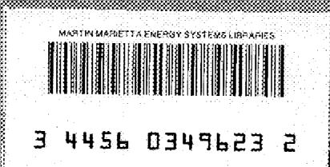

# EG RESEARCH AND DEVELOPMENT REPORT

AIRCRAFT NUCLEAR PROPULSION PROJECT

QUARTERLY PROGRESS REPORT

FOR PERIOD ENDING MARCH 10, 1954

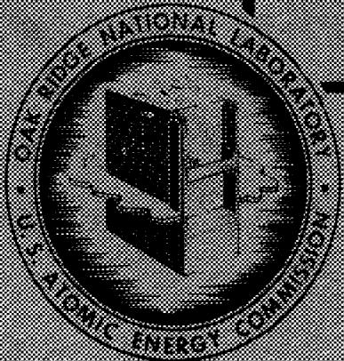

CENTRAL RESEARCH LIBRARY

DOCUMENT COLLECTION

# LIBRARY LOAN COPY

DO NOT TRANSFER TO ANOTHER PERSON

If you wish someone else to see this document, send in name with document and the library will arrange a loan.

OAK RIDGE NATIONAL LABORATORY

中中中中中

CARBIDE AND CARBON CHEMICALS COMPANY

4 DIVISION OF UNION CANBIDE AND CANBIDN COMPLIANT

#

POST OFFICE BOX F

GAK HIDGE TENNESSEE

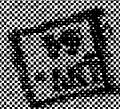

Contract No. W-7405-eng-26

# AIRCRAFT NUCLEAR PROPULSION PROJECT

# QUARTERLY PROGRESS REPORT

For Period Ending March 10, 1954

R.C.Briant,Director

W. H. Jordan, Associate Director

A. J. Miller, Assistant Director

A.W.Savolainen,Editor

DATE ISSUED

AP213 1954

OAK RIDGE NATIONAL LABORATORY

Operated by

CARBIDE AND CARBON CHEMICALS COMPANY

A Division of Union Carbide and Carbon Corporation

Post Office Box F

Oak Ridge, Tennessee

MARTIN MARIETA ENERGY SYSTEMS LIBRARIES

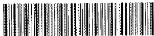

34456 03496232

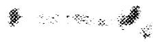

中

#

#

# INTERNAL DISTRIBUTION

1. G. A. Adamson   
2. R.G.Affel   
3. C. R. Banck   
4.C.J.Barton   
5. E. S. Bettis   
6. D. S. Billington   
7. F. F. Blankenship   
8. E.P. Blizzard   
9. M. A. Bredig   
10. R.C. Briant   
11. F.R.Bruce   
12. A. D. Callihan   
13. D. W. Cardwell   
14. C. E. Center   
15. R. A. Charpie   
16. G.H. Clewett   
17. C. E. Clifford   
18. W. B. Cottrell   
19. R. G. Cochran   
20. D. D. Cowen   
21. F. L. Culler   
22. L. B. Emlet (K-25)   
23. W. K. Ergen   
24. A. P. Fraas   
25. W.R.Grimes   
26. E. E. Hoffman   
27. A. Hollgender   
28. A. S. Householder   
29. J. T. Howe   
30. R.W. Johnson   
31. W.H. Jordan   
32. G.W. Keilholz   
33. C. P. Keim   
34. M. T. Kell   
35. F. Kertes   
36. E.M.King   
37. J.A. Lane   
38. C. E. Larson   
39. R. S. Livingston   
40. R. N. Lyon   
41. W.D. Manly   
42. L. A. Mann

43. W. B. McDonald   
44. J. L. Meem   
45. A. Miller   
46. K. Z. Morgan   
47. E.J. Murphy   
48. J. P. Murray (Y-12)   
49. G. J. Nessle   
60. P. Patriarca   
51. H. F. Poppendiek   
52. P. M. Reyling   
53. H. W. Savage   
54. A. W. Savolainen   
55. E. D. Shipley   
56. O. Sisman   
57. G.P. Smith   
58. L. P. Smith (consultant)   
59. A. H. Snell   
60. C. L. Storrs   
C.D.Susano   
62. J. A. Swartout   
63. E.H. Taylor   
64. J. B. Trice   
65. E. R.Van Artsdalen   
66. F. C. VanderLage   
67. J. M. Wandel   
68. A. M. Weinberg   
69. J. C. White   
70. G. D. Whitman   
71. E. P. Wigner (consultant)   
72. G.C. Williams   
73. J. C. Wilson   
74. C. E. Winters   
75-84. ANP Library   
85. Biology Library   
86-90. Laboratory Records Department   
91. Laboratory Records, ORNL RIC.   
92. Health Physics Library   
93. Metallurgy Library   
94. Reactor Experimental Engineering Library   
95-97. Central Research Library

# EXTERNAL DISTRIBUTION

98. Air Force Engineering Office, Oak Ridge   
99. Air Force Plant Representative, Burbank   
100. Air Force Plant Representative, Seattle   
101. Air Force Plant Representative, Wood-Ridge   
102. ANP Project Office, Fort Worth

103-114. Argonne National Laboratory (1 copy to Keenit Anderson)

115. Armed Forces Special Weapons Project (Siddia)   
116. Armed Forces Special Weapons Project, Washington (Gertrude Camp)

117-125. Atomic Energy Commission, Washington (Lt. Col. M. J. Nielsen)

126. Battelle Memorial Institute

127-132. Brookhaven National Laboratory

133. Bureau of Aeronautics (Grant)   
134. Bureau of Ships

135-136. California Research and Development Company

137-144. Carbide and Carbon Chemicals Company (Y-12 Plant)

145. Chicago Patent Group   
146. Chief of Naval Research   
147. Commonwealth Edison Company   
148. Convair, San Diego (C. H. Helms)

149. Curtiss-Wright Corporation, Wright Aeronautical Division (K. Campbell)

150. Department of the Navy - Op-362   
151. Detroit Edison Company

152-155. duPont Company, Augusta

156. duPont Company, Wilmington   
157. Foster Wheeler Corporation

158-160. General Electric Company, ANPP

161-164. General Electric Company, Richland

165. Glen L. Martin Company (T. F. Nagey)   
166. Hanford Operations Office   
167. Iowa State College

168-175. Knolls Atomic Power Laboratory

176-177. Lockland Area Office

178-179. Los Alamés Scientific Laboratory

180. Massachusetts Institute of Technology (Kaufmann)   
181. Materials Laboratory (WADC) (Col. P. L. Hill)   
182. Monsanto Chemical Company

183-185. Mound Laboratory

186-189. National Advisory Committee for Aeronautics, Cleveland (A. Silverstein)

190. National Advisory Committee for Aeronautics, Washington   
191. Naval Research Laboratory

192-193. New York Operations Office   
194-195. North American Aviation, Inc.   
196-201. Nuclear Development Associates, Inc.   
202. Patent Branch, Washington   
203-210. Phillips Petroleum Company   
211-222. Powerplant Laboratory (WADC) (A.M. Nelson)   
223-232. Pratt and Whitney Aircraft Division (Fox Project)   
233-234. Rand Corporation (1 copy to V. G. Henning)   
235. San Francisco Operations Office

236. Slovakia Electric Products, Inc.   
237.USAHEADQUARTS   
238. U.S. Naval Radiological Defense Laboratory

239-240. University of California Radiation Laboratory, Berkeley   
241-242. University of Calnebia Radiation Laboratory, Livermore   
243. Walter Budde Nuclear Laboratories, Inc.   
244-249. Westinghouse Electric Corporation   
250-264. Technical Information Service, Oak Ridge

Reports previously issued in this series are as follows:

ORNL-528 Period Ending November 30, 1949

ORNL-629 Period Ending February 28, 1950

ORNL-768 Period Ending May 31, 1950

ORNL-858 Period Ending August 31, 1950

ORNL-919 Period Ending December 10, 1950

ANP-60 Period Ending March 10, 1951

ANP-65 Period Ending June 10, 1951

ORNL-1154 Period Ending September 10, 1951

ORNL-1170 Period Ending December 10, 1951

ORNL-1227 Period Ending March 10, 1952

ORNL-1294 Period Ending June 10, 1952

ORNL-1375 Period Ending September 10, 1952

ORNL-1439 Period Ending December 10, 1952

ORNL-1515 Period Ending March 10, 1953

ORNL-1556 Period Ending June 10, 1953

ORNL-1609 Period Ending September 10, 1953

ORNL-1649 Period Ending December 10, 1953

# FOREWORD

This quarterly progress report of the Aircraft Nuclear Propulsion Project at ORNL records the technical progress of the research on the circulating-fuel reactor and all other ANP research at the Laboratory under its Contract W-7405-eng-26. The report is divided into three major parts: I. Reactor Theory and Design, II. Materials Research, and III. Shielding Research.

The ANP Project is comprised of about 300 technical and scientific personnel engaged in many phases of research directed toward the achievement of nuclear propulsion of aircraft. A considerable portion of this research is performed in support of the work of other organizations participating in the national ANP effort. However, the bulk of the ANP research at ORNL is directed toward the development of a circulating-fuel type of reactor.

The nucleus of the effort on circulating-fuel reactors is now centered upon the Aircraft Reactor Experiment - a high-temperature prototype of a circulating-fuel reactor for the propulsion of aircraft. The equipment for this reactor experiment is now being assembled; the current status of the experiment is summarized in Section 1 of Part I. The supporting research on materials and problems peculiar to the ARE - previously included in the subject sections - is now included in this ARE section, where convenient. The few exceptions are referenced to the specific section of the report where more detailed information may be found.

The ANP research, in addition to that for the Aircraft Reactor Experiment, falls into three general categories: (1) studies of aircraft-size circulating-fuel reactors, (2) materials problems associated with advanced reactor designs, and (3) studies of shields for nuclear aircraft. These phases of research are covered in Parts I, II, and III, respectively, of this report.

# CONTENTS

FOREWORD vii

SUMMARY 1

# PART I. REACTOR THEORY AND DESIGN

1. CIRCULATING-FUEL AIRCRAFT REACTOR EXPERIMENT 7

The Experimental Reactor System. 7   
Reactor Physics 8   
Neutron temperature 8   
Criticality in the ARE fill-and-flush tank 8   
The ARE critical experiment. 9

Production of Fuel Concentrate 9

Pumps 10

Acceptance test program 10   
Pump assembly. 11   
Impeller fabrication and testing 11

Fuel Recovery and Reprocessing 12   
Fuel dissolution, 12   
Solvent extraction processing 13

2. EXPERIMENTAL REACTOR ENGINEERING 15

In-Pile Loop Component Development 15   
Vertical-shaft sump pump 15   
Pump with a centrifugal seal 15   
Horizontal-shaft sump pump 17

Heat Exchanger and Radiator Tests 18   
Heat exchanger test 18   
Sodium-to-air radiator test 18

Forced-Circulation Loops 19   
Air-cooled loop. 19   
Beryllium-NaK compatibility test 20   
Bifluid heat transfer loop 20

High-Temperature Bearing Development 22

Materials compatibility tests. 22   
Bearing tester design 22

Rotary-Shaft and Valve-Stem Seals for Fluorides 22

Spiral-grooved graphite-packed shaft seals. 22   
Graphite-BeF, packed seal. 23   
V-ring seal 24   
Chevron seal 24   
Graphite-BaF $_2$ packed seal 25   
Shaft seal for in-pile pump 26   
Packing penetration tests 26   
Valve-stem packing tests 26   
Self-Bonding Tests of Materials in Fluoride Mixtures 27   
Removal of Fluoride Mixtures from Equipment 27

3. REFLECTOR-MODERATED REACTOR 28

Effects of Reactor Design Conditions on Aircraft Gross Weight. 28   
Core Flow Experiment 37

Reactor Calculations 39   
Reactor Dynamics 40   
Computational Techniques 40   
Beryllium Cross Sections 41   
Chemical Processing of Fluoride Fuel by Fluorination 42

4. CRITICAL EXPERIMENTS 45

Supercritical-Water Reactor 45   
Air-Cooled Reactor 45   
Reflector-Moderated Reactor 45

# PART II. MATERIALS RESEARCH

5. CHEMISTRY OF HIGH-TEMPERATURE LIQUIDS 49

Thermal Analysis of Fluoride Systems. 49

NaF-LiF-ZrF-UF 4 50   
NaF-BeF2-ZrF4-UF4 50   
NaF-LiF-BeF2-UF 50

Thermal Analysis of Chloride Systems 50

RbCl-UCI 51   
NaCl-ZrCI4 52

Quenching Experiments with Fluoride Systems 52

NaF-UF 52   
NaF-ZrF4 53

Filtration Analysis of Fluoride Systems. 54

NaF-ZrF 54   
NaF-ZrFA-UF 54   
NaF-KF-ZrF-UF 55

Production of Purified Fluoride Mixtures 55

Laboratory-scale production and purification of fluoride mixtures 55   
Purification of fluoride mixtures for phase studies. 55   
Experimental production facilities 55   
Production-scale facility 56

Purification and Properties of Hydroxides 56

Purification of hydroxides 56   
Reaction of sodium hydroxide with carbon 56

Chemical Reactions in Molten Salts 56

Chemical equilibria in fused salts 56   
Formation of UF in NaF-ZrF4 melts 60   
Treatment of molten $\mathsf{NaZrF}_5$ with strong reducing agents 61   
Reduction of $\mathsf{NiF}_2$ and $\mathsf{FeF}_2$ by hydrogen 62   
Spectrophotometry of supercooled fused salts 62   
EMF measurements in fused salts 63

6. CORROSION RESEARCH 65

Fluoride Corrosion in Static and Tilting-Furnace Tests 66

Effect of methods of manufacturing the fuel on the corrosion of Inconel 66   
Corrosion of ceramic materials 66   
Effect of graphite additions 66   
Effect on nickel and Inconel rods exposed to fluoride mixtures in air 67

Thermal Convection Loop Design and Operation 67   
Fluoride Corrosion of Inconel in Thermal Convection Loops 68   
Effect of exposure time on depth of attack 68

Effect of exposure time on chemical stability of the fluorides 69

Effect of exposure time on corrosion by nonuranium-bearing fluorides 69

Effect of variation in uranium concentration 70

Effect of temperature 71

Effect of variations in loop size and composition 71

Effect of additions to the fluorides. 72

Corrosion of various metal combinations 73

Fluoride Corrosion of Stainless Steel, Izett Iron, and Hastelloy Loops 73

Corrosion by High-Velocity High-Temperature Fluorides 74

Forced-circulation corrosion loop 74

Oscillating-furnace studies 75

Static Tests of Brazing Alloys in Fluorides and Sodium 75

Mass Transfer in Liquid Lead 77

7.METALLURGYAND CERAMICS 84

Mechanical Properties of Metals 84

Stress-rupture tests of Inconel 84

Creep Tests of Columbium 87

Brazing Research 87

High-conductivity radiator fins 87

Fluoride-to-air radiator 89

Helium-atmosphere brazing 89

Nickel-phosphorus brazing alloy 90

Nickel-germanium brazing alloy 90

High-Conductivity Metals for Radiator Fins 91

Diffusion barriers 91

Diffusion couples 91

Commercially clad copper 91

Fabrication of Special Materials 92

Clad columbium disks 92

Clad molybdenum and columbium tubing 93

Drawn tubular fuel elements 93

Ceramic Research 93

Ceramic container for fluoride fuel 93

Ceramic pump bearings 94

Boron carbide-iron cermets 94

8. HEAT TRANSFER AND PHYSICAL PROPERTIES 95

Physical Properties Measurements 95

Heat capacity. 95

Thermal conductivity 95

Density, viscosity, and surface tension 97

Electrical conductivity of molten salts 98

Fused-Salt Heat Transfer 98

Hydrodynamics Research 98

Circulating-Fuel Heat Transfer 99

9. RADIATION DAMAGE 102

Radiation Stability of Fused-Salt Fuels 102

Petrographic examination of fuels 102

Temperature control in static capsule tests 102

Miniature circulating loops 103

Stress-Corrosion Apparatus 103   
Creep Under Irradiation 103   
LITR Fluoride-Fuel Loop 105

10. ANALYTICAL STUDIES OF REACTOR MATERIALS 107

Analytical Chemistry of Reactor Materials 107

Oxidation states of chromium and iron in ARE fuel solvent, NaZrF 107   
Oxidation states of chromium and uranium in ARE fuel solvent, NaZrF 108   
Separation of $\mathbf{U}\mathbf{F}_4$ from $\mathbf{U}\mathbf{F}_3$ 109

Fluoride Fuel Investigations 112

Summary of Service Chemical Analyses 112

# PART III. SHIELDING RESEARCH

11. SHIELDING ANALYSIS 115

Estimates of Removal Cross Sections Based on the Continuum Theory of   
the Scattering of Neutrons from Nuclei 115   
Critique of Lithium Hydride as a Neutron Shield 116

12. LID TANK FACILITY 117

Air-Duct Tests 117   
Shielding Tests for the Reflector-Moderated Reactor 117   
Lid tank dose measurements corrected to designed reflector-moderated reactor shield 118   
Shield weight calculations 120

Removal Cross Sections 122   
Instrumentation 122

13. BULK SHIELDING FACILITY 123

G-E Test Fixture Duct Experiment 123   
GE-ANP Shield Mockup Experiments 124

14. TOWER SHIELDING FACILITY 135

Facility Construction. 135   
Radiation Detection Equipment 135

Thermal-neutron flux 135  
Fast-neutron dose. 135   
Gamma-ray dose 135   
Other gamma-ray detectors 136   
Isodose plotter 136

Estimate of Neutron and Gamma Radiation Expected at the Tower Shielding Facility 137

# PART IV. APPENDIX

15. LIST OF REPORTS ISSUED DURING THE QUARTER 141

# ANP PROJECT QUARTERLY PROGRESS REPORT

# SUMMARY

# PART I. REACTOR THEORY AND DESIGN

Assembly of the Aircraft Reactor Experiment is proceeding, the fuel and the sodium circuit pumps are being assembled and tested, and the methods for recovery and reprocessing of the fuel are being developed (Sec. 1). The reactor was installed in the pit, and the fuel and the sodium circuits were completed except for the pump assemblies. An examination of a spare heat exchanger, however, confirmed doubts as to the reliability of these units, and they are now being rebuilt. The operations manual has been completed, and training of the operating personnel is continuing. The production of the ARE fuel concentrate was completed, and the analytical results were verified. An analysis indicated that the fill-and-flush tank would be subcritical if it were necessary under emergency conditions to admit the fuel to it. The ARE pumps are being inspected and tested, and the pump tanks and covers have been made available for installation. The fabricated impellers designed to replace the faulty cast impellers were found to be satisfactory.

The experimental reactor engineering work includes the development of pumps for circulating fluoride mixtures in in-pile loops, the design and construction of forced-circulation loops for corrosion testing, developmental work on high-temperature bearings, and tests of rotary-shaft and valve-stem seals for fluoride mixtures (Sec. 2). The pumps being developed and tested for circulating fluoride mixtures in in-pile loops for studying radiation damage of the fluoride mixture and the loop material are of two types: pumps for use inside reactor holes and pumps for use external to reactor holes. Work is under way on a vertical-shaft sump pump, an in-pile pump with a centrifugal seal, and a horizontal-shaft sump pump. Since the in-pile pump with a centrifugal seal is not sensitive to its orientation with respect to gravity, it also shows promise as an aircraft type of pump. Limited test operations have been completed on the 1-megawatt regenerative heat exchanger which employs some of the design features of the proposed heat exchanger for the reflectormoderated aircraft reactor. A sodium-to-air radiator is used as the heat dump for this heat ex

changer test, and radiator performance and endurance data are being obtained. Two all-Inconel corrosion testing loops and one beryllium and Inconel loop are being developed that will provide high liquid velocities and high temperature differences between the hottest and coldest parts of the circuit. Design work and developmental investigations are continuing on a hydrodynamic type of bearing which will operate at high temperatures in a fluoride mixture. The work thus far has been primarily concerned with determining the compatibility of materials with respect to wear and corrosion. Additional tests were made of rotary-shaft and valve-stem seals for fluoride mixtures, and a program for testing the self-bonding of materials in fluoride mixtures was planned. Methods for removing fluoride mixtures from equipment are being developed. Preliminary tests show promising results in rapid dissolution of $\mathsf{NaF - ZrF_4 - UF_4}$ with a nitric acid-boric acid solution. There was only light attack on the Inconel container walls.

Studies of the reflector-moderated reactor were primarily concerned with the effects of reactor design conditions on aircraft gross weight, but these studies also included a core flow experiment, reactor physics considerations, and the development of a method for chemically processing the fuel (Sec. 3). A parametric study was made to determine the effects on aircraft gross weight of reactor temperature, power density, and radiation doses inside and outside the crew compartment. The results of analyses of three design conditions show that the gross weight of the airplane is relatively insensitive to reactor design conditions for Mach 0.9, sea-level operation but that it is quite sensitive for the much higher performance, supersonic flight conditions. Also, an increase in reactor temperature level of $100^{\circ}\mathrm{F}$ is more effective in reducing gross weight than is a factor-of-2 increase in power density. Preliminary tests of a full-scale Lucite core model indicated the need for cutoffs in the pump volutes and turning vanes around one quadrant of the impeller periphery to obtain uniform flow distribution at the core inlet and also the need for a set of turbulator vanes in the core inlet passage to assure axially symmetric flow and no flow

separation at the core shell wall. Specifications were prepared for studies of the effects of the geometry of the reactor on the physical quantities of interest and for precalculations of several proposed critical experiments. In addition, developmental work was done on a new, nonaqueous method for processing fuels of the NaF-ZrF $_4$ -UF $_4$ system which consists of (1) recovery of the uranium by converting the UF $_4$ in the molten NaF-ZrF $_4$ -UF $_4$ mixture to the volatile hexafluoride, using elemental fluoride; (2) gas-phase reduction of the partly decontaminated UF $_6$ to UF $_4$ ; and (3) refabrication of the molten salt fuel from this UF $_4$ .

Critical experiments were assembled to test the designed core dimensions and core compositions of the supercritical-water reactor and the G-E, air-cooled, water-moderated reactor. Also, the critical experiment program for the reflector-moderated reactor was re-evaluated (Sec. 4). Reflector-moderated assemblies of simple geometry are to be constructed, and material variations will be made to check consistency with theory and the fundamental constants.

# PART II. MATERIALS RESEARCH

The chemical research on liquids for use in high-temperature reactor systems has been primarily a continuing effort to obtain fuels with physical properties superior to those of the mixtures in the NaF-ZrF $_4$ -UF $_4$ system (Sec. 5). Thermal analysis techniques were used for studies of the NaF-KF-ZrF $_4$ -UF $_4$ , NaF-LiF-ZrF $_4$ -UF $_4$ , NaF-BeF $_2$ -ZrF $_4$ -UF $_4$ , NaF-LiF-BeF $_2$ -UF $_4$ , RbCl-UCI $_3$ , and NaCl-ZrCl $_4$ systems. The NaCl-ZrCl $_4$ system is of interest because a low-melting-point water-soluble mixture in this system would be useful for removing fluorides from equipment. In addition, the quenching technique applied previously has been used along with x-ray and petrographic examination of slowly cooled specimens to obtain a better understanding of the complex relationships in the NaF-UF $_4$ and NaF-ZrF $_4$ systems. High-temperature phase separation has also been used for studying systems, such as NaF-ZrF $_4$ , NaF-ZrF $_4$ -UF $_4$ , and NaF-KF-ZrF $_4$ -UF $_4$ , in which solid solutions are expected. Experimental studies of the reaction of chromium and iron in the metallic state with UF $_4$ in molten NaZrF $_5$ have shown that the deviation of the activity coefficient from unity is probably due to the formation of complex ions

such as $\mathsf{UF}_5^-$ , $\mathsf{UF}^{- - }$ , and $\mathsf{FeF}_3^-$ . Two methods were developed for preparing $\mathsf{NaZrF}_5$ melts containing $\mathsf{UF}_3$ ; one sample was found to contain 3.54 wt $\%$ $\mathsf{UF}_3$ and another contained 5.95 wt $\%$ $\mathsf{UF}_3$ . Evidence was accumulated which shows that the presence of $\mathsf{ZrF}_4$ in a nonuranium-bearing fluoride melt does not afford a mechanism for storing latent reducing power and that $\mathsf{ZrH}_2$ does not impart a hydrogenous character to the melt. Rates of reduction of $\mathsf{NiF}_2$ and $\mathsf{FeF}_2$ by hydrogen in nickel reactors were determined at 600 and $700^{\circ}\mathsf{C}$ . Additional spectrophotometric determinations of absorption spectra for $\mathsf{UF}_4$ and $\mathsf{UF}_3$ in quenched fluoride melts were carried out. The facilities for the production of experimental fluoride mixtures have been modified and expanded, and the large-scale production facility has been reactivated.

The corrosion research effort has been devoted almost entirely to studies of the effects of various parameters on the corrosion of Inconel by fluoride mixtures, although some work has been done with ceramic materials, nickel, various 400 series stainless steels, Izett iron, Hastelloy, and various brazing alloys (Sec. 6). Corrosion testing in thermal convection loops is being accelerated by the addition of loop facilities and modifications of loop design. Additional tests have confirmed that the corrosion of Inconel increases with operating time when exposed to either NaF-ZrF $_4$ -UF $_4$ or to NaF-ZrF $_4$ and that the attack is due to the mass transfer of chromium metal. It was also established that the depth of attack in Inconel increases slowly, but linearly, with increasing uranium content in the fluoride mixture. However, increasing the surface-to-volume ratio in the thermal convection loops decreases the depth of attack in Inconel. The fluoride mixture NaF-ZrF $_4$ -UF $_4$ was circulated for 500 hr at $1500^{\circ}\mathrm{F}$ in several 400 series stainless steel loops, and metal crystals were found in the cold leg of each loop. Attempts were made to circulate NaF-ZrF $_4$ -UF $_4$ at $1500^{\circ}\mathrm{F}$ in Hasteloy B loops, but all attempts failed either because of catastrophic oxidation or mishandling. Static corrosion tests have been made of many brazing alloys, and it has been found that the nickel-phosphorus and the nickel-phosphorus-chromium alloys have the most satisfactory corrosion resistance in NaF-ZrF $_4$ -UF $_4$ . The study of corrosion and mass transfer characteristics of container materials in liquid lead has

been extended to include tests with cobalt, beryllium, titanium, and Hastelloy B.

The work in metallurgy and ceramics included, in addition to the important study of high-conductivity metals for radiator fins, stress-rupture tests of Inconel, preparations for creep tests of columbium, the brazing of various materials to Inconel, the fabrication of clad columbium disks and of columbium and molybdenum tubing, the drawing of tubular fuel elements, the development of ceramic materials for pump bearings and for containers for fluoride fuels, and the preparation of boron carbide-iron cermets for use as shielding in connection with in-pile loop studies (Sec. 7). The studies of the effect of environment on the creep and stress-rupture properties of Inconel have continued, and it has been demonstrated that a small change in the composition of the Inconel has a major effect on its creep properties. Methods were developed for preparing a nickel-phosphorus brazing alloy powder that can be applied in the conventional manner. In the study of high-conductivity metals for radiator fins it was shown that claddings of types 310 and 446 stainless steel on copper are satisfactory with respect to diffusion. However, it may be necessary to use Inconel as the cladding material, and therefore various materials were tested as diffusion barriers between Inconel and copper. None of the refractory materials tested were satisfactory, but diffusion barriers of iron and types 310 and 446 stainless steel were successful in preventing copper diffusion for up to 500 hr at $1500^{\circ}\mathrm{F}$ . Radiator fins of various materials were brazed to Inconel tubing for heat transfer tests, and an Inconel spiral-fin heat exchange unit was fabricated for use in radiation damage experiments. Various composites of beryllium oxide with minor additions of other materials were tested and were found to be unsatisfactory as containers for fluoride fuels.

The physical properties of several fluoride mixtures and other materials of interest to aircraft reactor technology were determined, and the heat transfer characteristics of reactor fluids were studied in various systems (Sec. 8). The feasibility of a small-scale system to be used in studying the rates of deposition of the films or deposits found at interfaces between Inconel and NaF-KF-LiF has been demonstrated, and the system has been constructed. The system was designed to operate at Reynolds moduli of up to

10,000 and therefore may also be useful as a dynamic corrosion testing unit. A technique has been developed for measuring fluid velocity profiles in duct systems by photographing tiny particles suspended in the flowing medium. This method is to be used for determining the hydrodynamic structure in the reflector-moderated reactor flow annulus. Additional forced-convection, laminar flow heat transfer experiments have been conducted in pipe systems which contain circulating liquids with volume heat sources; the heat sources are generated electrically. The laminar flow data fall about $30\%$ below the values predicted by previously developed theory.

The radiation damage program included additional studies of fluoride mixtures in Inconel capsules and determinations of the creep of metals under irradiation, as well as the design and construction of in-pile circulating loops (Sec. 9). Data obtained from recently completed petrographic examinations support the previous indications that fluoride mixtures in the $\mathrm{NaF - ZrF_4 - UF_4}$ system are chemically stable under reactor radiation. Concurrent tests have shown that the corrosion of Inconel by these mixtures increases from 1 to 2 mils of subsurface-void attack for out-of-pile tests to 5 to 6 mils of intergranular attack for in-pile high-temperature tests. Miniature loops are being designed for circulating fluoride mixtures in such space-restricted locations as the vertical holes of the LITR. The designs are based on detailed studies of fuel flow rates, power densities, and rates of heat removal. A new in-pile stress corrosion apparatus has been developed with which it will be possible to determine, simultaneously, the corrosion effects on stressed and unstressed portions of a tube. Tests in the LITR and in the ORNL Graphite Reactor have shown that the creep behavior of Inconel is not seriously affected by neutron bombardment. Similar tests are to be made in the higher flux of the MTR. An in-pile loop for circulating fluoride mixtures in the LITR is $80\%$ complete.

The analytical studies of reactor materials included investigations of methods for determining the oxidation states of the corrosion products, iron, chromium, and nickel, in fluoride mixtures and methods for the separation and determination of $\mathsf{UF}_3$ and $\mathsf{UF}_4$ in fluoride mixtures (Sec. 10). It was established that the solubility of $\mathsf{UF}_3$ in $\mathsf{NaZrF}_5$ involves, first, oxidation to tetravalent

uranium and, then, dissolution. The conversion of $\mathsf{UF}_3$ and $\mathsf{UF}_4$ to the corresponding chlorides by fusion with $\mathsf{NaAlCl}_4$ was accomplished. The uranium chlorides are readily extracted by acetylacetone-acetone mixtures. Samples of the fluoride mixture $\mathsf{NaF - ZrF}_4\mathsf{-UF}_4$ that were exposed to moisture before being canned were examined with the polarizing microscope after having been exposed to gamma radiation in the MTR canal for 265 hours. In comparison with fuel stored and canned in a helium atmosphere, no effects of irradiation could be observed.

# PART III. SHIELDING RESEARCH

The work of the Shielding Analysis Group has been concentrated mainly on the investigation of neutron shields (Sec. 11). Calculations were made according to the continuum theory nuclear model to obtain a better understanding of the relationship of differential fast-neutron cross sections to effective removal cross sections, as measured in bulk experiments. The calculated values agree well with Lid Tank data for the elements calculated, namely, aluminum, iron, copper, lead, and bismuth. Other heavy-element cross sections can be calculated with relative ease and fair assurance of accuracy. This approach is not, however, useful for the calculation of cross sections for light nuclei. Recent calculations by NDA on the UNIVAC show that a slab of lithium hydride used as a neutron shield would weigh only $63\%$ as much as a thickness of water which would give the same attenuation. Independent estimates made at ORNL confirmed the NDA value. It was shown that the cooling of a lithium hydride shield for the reflectormoderated reactor would not be difficult.

The effects of one and two air ducts on the fast-neutron dose received outside a reactor shield were further investigated at the Lid Tank Facility (Sec. 12). Each of the two ducts consists of one to three 22-in.-long straight sections. The sections were joined at 45-deg angles. The experi

mental results show that when two ducts are parallel and in the same plane the dose is increased. If they are parallel but in different planes, the dose is the same as for a single duct. In the case where the axis of a nearby short straight duct intersects the middle of a long duct, the dose is again increased. The Lid Tank radiation dose measurements made behind 82 reflectormoderated reactor and shield mockups were analyzed. Although there are still uncertainties about the air and structure scattering, the heat exchanger region, ducts and voids, and optimization of the shield size and weight, a preliminary calculation indicates that the weight of the basic, designed reactor and shield assembly (excluding the crew-compartment shield) will be 44,500 pounds. For this estimate, the core diameter was 18 in., the power was 50 megawatts, and the dose rate outside the crew shield at 50 ft from the reactor center was 10 rem/hr. A recent Lid Tank measurement shows the removal cross section of $\mathsf{B}_2\mathsf{O}_3$ to be $4.4\pm 0.14$

Two bulk shields for the GE-ANP program were tested at the Bulk Shielding Facility (Sec. 13). The first test was of a mockup of a duct system and shield to be used at the G-E Idaho reactor test facility. The second mockup consisted of two sections of the shield for the R-1 reactor. While the data from these tests have not been completely analyzed, it appears that the results agree quite well with calculated estimates for the designs.

The Tower Shielding Facility is nearing completion and operation should begin during the month of March (Sec. 14). A complete set of instruments has been collected for the experimental program; some of the instruments were especially developed for use at this facility. Consideration of the Tower Shielding Facility for use in a biological program for establishing dose rates for pilots in a nuclear-powered aircraft has prompted a study of radiation doses which can be achieved.

Part I

REACTOR THEORY AND DESIGN

# 1. CIRCULATING-FUEL AIRCRAFT REACTOR EXPERIMENT

E. S. Bettis

J.L.Meem

ANP Division

The reactor for the Aircraft Reactor Experiment was installed in the pit and the fuel and the sodium circuits were completed except for the pump assemblies. An examination of a spare heat exchanger, however, confirmed previous doubts as to the reliability of these units, and they are now being rebuilt. The work necessary to make these heat exchangers as reliable as the rest of the system is expected to require approximately four months. The operations manual has been completed and training of the operating personnel is continuing. The production of the ARE fuel concentrate, $\mathsf{No}_2\mathsf{UF}_6$ was completed, and the analytical results were verified.

The possibility of the fill-and-flush tank going critical if the fuel were admitted to it under certain emergency conditions was explored. A pertinent comparison with an earlier critical experiment and with a machine calculation indicated that the fill-and-flush tank would be subcritical even if it were necessary to admit all the fuel to it. In addition, the calculated and experimental values for the cadmium fraction as obtained from the critical experiments for the reactor are presented.

Each ARE pump is being subjected to component inspection, cold shakedown testing with air at room temperature, testing at operating temperatures with sodium, and visual inspections both after assembly and after each cold and hot shakedown test. All pump tanks and covers have been fabricated and made available for installation. The fabricated Inconel pump impellers designed to replace the faulty cast impellers have been tested and were found to be satisfactory.

Recovery and reprocessing of the ARE fuel has been studied further, and it is planned to dissolve the solid fuel in an aqueous solution, extract the uranium with $5\%$ tributyl phosphate, and isolate it by ion exchange. A dissolution rate of $5\mathrm{kg}$ of uranium per day is anticipated. Batch ion-exchange tests have been made, and calculations indicate that a Higgins continuous ion-exchange contactor 3 in. in diameter and 6 ft in length will permit a processing rate of $9\mathrm{kg}$ of uranium per day. However, the capacity will be limited by the fuel dissolution rate.

# THE EXPERIMENTAL REACTOR SYSTEM

The fuel and sodium heat exchangers for the ARE were fabricated by an outside contractor over a year ago. There has been considerable concern throughout the project as to whether the welding was up to the standards maintained on the remainder of the system. As a check on these units, a spare heat exchanger was cut up and examined. The examination showed that the welds at the lugs for stress relief of the tube-to-header plate joints had been made with coated rod and were entirely unsatisfactory. In addition, it was found that an accidental strike had been made on the end of one tube bend with a metallic arc. These findings further emphasized the doubts about the heat exchangers, and therefore a decision has been made to disassemble and rebuild the heat exchangers to eliminate all the original welds. The materials required are available, and it is estimated that this work will require approximately four months.

The reactor is installed in the pit and both the fuel and the sodium circuits are complete except for the pump assemblies. There is a bypass around the reactor in the sodium circuit which will not be removed until after the sodium circuit has been tested with water, since it would be undesirable to contact the beryllium oxide blocks with water. The pumps for the sodium circuit have been tested at operating temperature and are now ready for installation in the system.

A modification was effected in the fuel circuit by removing one of the fill-and-flush tanks. This tank became superfluous when the liquid metal cleaning of the fuel circuit was eliminated from the procedure. The tank was removed from the system in order to eliminate a potential source of trouble associated with the valve in the line to this tank.

A simplification was effected in the pump auxiliaries when the dibutyl carbitol system for pump seal cooling was replaced with a direct water cooling system that requires no circulating pumps or heat exchangers. This cooling system was checked and was found to be satisfactory in the tests run on the pumps. The lubricant cooling systems for the main sodium and fuel pumps have

been completed and two of the systems have been installed in the pits. Each of these units is comprised of an oil-to-water heat exchanger, an oil pump and a spare, and the changeover solenoid valves for selecting the operating oil pump.

Installation of electrical heaters and insulation on the pipe lines are $90\%$ complete. All valves are now heated on individual circuits with variac controls for each valve. The heating circuits have been checked out on all fuel tanks in the tank pit, and strip heaters on the hot fuel dump tank have been replaced with Cromolox tubular heaters. The dump tank "chimney" was equipped with a damper in order to make possible adequate temperature control of this tank.

The sodium circuit helium loops have been checked out and the hydraulic drives for these blowers have been put in operation. The 3-hp electric motors for driving the hydraulic pumps were exchanged for 5-hp units to provide ample power should the ducts not be completely filled with helium. Also, the helium ducts were welded at the joints to reduce the helium leakage and to improve the "open pit" operation prior to the power run of the system.

The operations manual has been completed and issued. Definite training sessions for operating personnel are being held on schedule and operational procedures are becoming firm.

# REACTOR PHYSICS

W. K. Ergen J. Bengston

C. B. Mills

ANP Division

# Neutron Temperature

As mentioned previously, there is some uncertainty as to the effectiveness of xenon poisoning in a high-temperature reactor, particularly in a reactor with strong thermal absorption such as that in the ARE. This uncertainty results from the rapid drop of the xenon absorption cross section with increasing neutron energy. The high temperature of the reactor means a high average energy of neutrons in thermal equilibrium with the moderator, and the average neutron energy is even higher than this equilibrium energy because some neutrons are absorbed during the slowing-down process

before they reach equilibrium. Only data from experiments at room temperature are available for studying this problem, and they are not applicable to the ARE problem.

The neutron energy spectrum in an infinite absorbing moderator can be computed according to the Wigner and Wilkins method in which one integration must be performed numerically. This numerical integral is being coded for machine calculation. The calculations are to be carried out for the following moderators: H, D, Li, Be, C, O, H₂O, and F. Constant scattering and 1/v absorption will be considered. The ratio of absorption cross section (taken, for instance, at the energy in equilibrium with the moderator temperature) to scattering cross section will assume several representative values. Various moderator temperatures, T, can be taken care of by introducing a dimensionless parameter, neutron energy per kT.

# Criticality in the ARE Fill-and-Flush Tank

It was not intended originally that the final ARE fuel mixture would ever be admitted to the tank provided for flushing the ARE fuel system and for filling the system with the nonuranium-bearing fuel carrier. However, during the construction of the ARE the desirability of being able to admit all the fuel and carrier to the fill-and-flush tank under certain emergency conditions became apparent. At that stage of construction it was not possible to replace the tank with a tank designed for definite subcriticality nor was it possible to perform a critical experiment on the tank.

Some of the cross sections and other nuclear data for determining the criticality of the tank are somewhat in doubt, but if all these data are adjusted (within the limits of present knowledge) to be most favorable for criticality, the possibility of the tank going critical could not initially be excluded. However, it was found that a pertinent comparison could be made with data extrapolated from an earlier critical experiment.3 Criticality was not achieved in this experiment, but extrapolation of the measured curve of multiplication

constant vs. uranium investment showed that to be critical the assembly would have had to have been at least as large as the fill-and-flush tank. Since the shapes of the critical assembly and of the tank are different, the reciprocal of the buckling was used as the "size." The scattering and moderating properties of the critical assembly and of the tank are essentially the same, but the extrapolated assembly contained very much more fissionable material than the tank. On this basis, the tank would be subcritical. A machine calculation was performed which confirmed this conclusion.

# The ARE Critical Experiment

Computed values were compared with experimental data for cadmium fraction in the cylindrical ARE critical assembly with a bare top, an Inconel-covered bottom, and BeO-reflected sides. Spherical coordinates were used for the calculations. Figure 1.1 shows median-plane radial values for critical assembly CA-8, which had a reflector thickness of $7\frac{1}{2}$ inches. Similar data for critical assembly CA-9, which had a reflector thickness of 12 in., are shown in Fig. 1.2. The depression at the center of Fig. 1.2 is due to the control rod assembly. Figure 1.3 shows the axial values in CA-8, and Fig. 1.4 shows similar values for CA-9. The discrepancy between the experimental and the calculated values in Fig. 1.3 indicates that an incorrect value was assumed for the

radius in the spherical system used to represent the diffusion equation in the axial direction.

# PRODUCTION OF FUEL CONCENTRATE

G.J.Nessle J.E.Eorgan

Materials Chemistry Division

F.A.Doss

ANP Division

The production of the ARE fuel concentrate, $\mathsf{Na}_2\mathsf{UF}_6$ was completed and the analytical results were verified as acceptable on December 14, 1953.

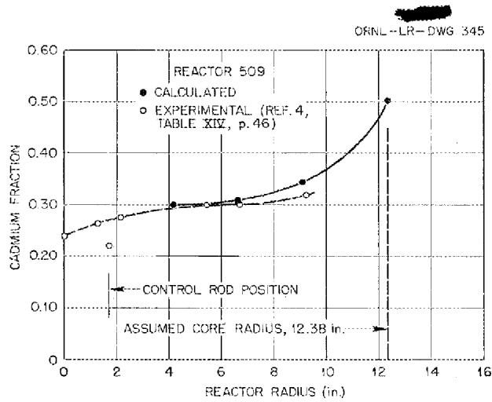  
Fig. 1.2. Radial Cadmium Fraction in Critical Assembly CA-9.

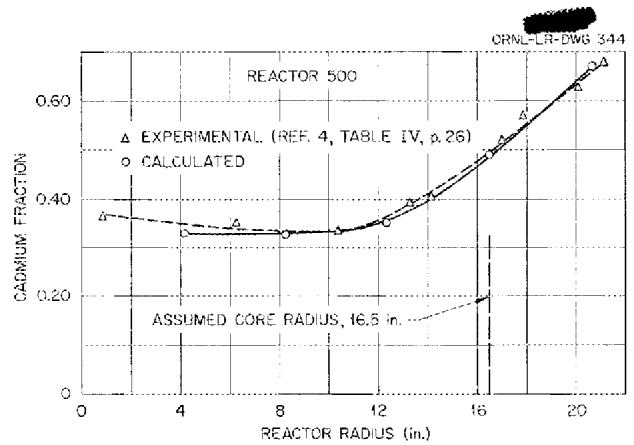  
Fig. 1.1. Radial Cadmium Fraction in Critical Assembly CA-8.

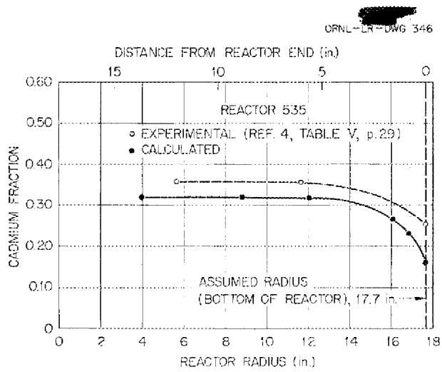  
Fig. 1.3. Axial Cadmium Fraction in Critical Assembly CA-8.

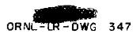

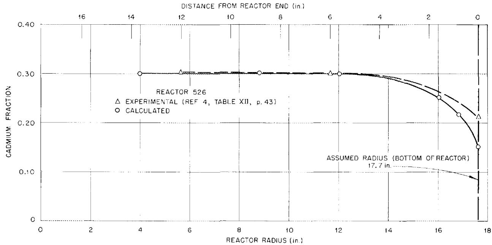  
Fig. 1.4. Axial Cadmium Fraction in Critical Assembly CA-9.

One batch of the concentrate was reprocessed because the metallic impurity content was too high. The analytical results obtained by the Y-12 Laboratory and by the ANP Laboratory are summarized and compared below. The Y-12 analyses for Fe, Cr, and Ni were obtained by use of a spectrograph, and the ANP analyses were obtained by wet chemical techniques.

<table><tr><td></td><td>Y-12Laboratory</td><td>ANPLaboratory</td></tr><tr><td>Weight fraction of Uin Na2UF6(g/g)</td><td>0.59590</td><td>0.59599</td></tr><tr><td>Impurities (ppm)</td><td></td><td></td></tr><tr><td>Fe</td><td>38</td><td>84</td></tr><tr><td>Cr</td><td>14</td><td>&lt;20</td></tr><tr><td>Ni</td><td>54</td><td>46</td></tr><tr><td>B</td><td>&lt;0.2</td><td></td></tr></table>

On completion of the production operation, all components of the processing equipment which had been contacted by the concentrate were salvaged, and the uranium recovery operation was carried out to determine the magnitude of uranium loss, if any, during production. Preliminary results show that the total amount of uranium used, less

the amount salvaged, differs by 41 g from the analytical determination of the total amount of uranium to be transferred for use in the ARE. This difference is well within the limits of error and marks this production operation as successful with regard to uranium accountability. The uranium will be transferred to the ARE on the basis of the actual amount of uranium contained in the 15 storage cans, as determined by the analytical laboratories involved.

# PUMPS

H.W.Savage W.G.Cobb

A.H.Grindell W.R.Hundley

ANP Division

P. Patriarca G.M.Slaughter

Metallurgy Division

# Acceptance Test Program

Specific acceptance tests for ARE pumps were formulated, and the pumps are being assembled and tested. Each ARE pump is subjected to component inspection, cold shakedown testing in air at room temperature with no fluid in the system, hot shakedown testing with sodium as the system fluid, and certain measurements and visual inspections both after assembly and after each cold

and hot shakedown test. The pump components are being subjected to measurement inspections, visual checking of joint surfaces, and pressure testing of welded joints. The components of rotary mechanical seals are tested for hardness and leaks and inspected for flatness and parallelism, where applicable.

Each rotary pump element is operated for 72 or more hours at 2000 rpm in a test stand with a 65-psi pressure difference across the upper rotary mechanical seal in the bearing housing. A leakage rate of less than 1 gal of oil per month is considered as acceptable.

Each rotary pump element is also subjected to a hot shakedown test in a sodium system. With the pump and its auxiliary systems operating, the sodium system temperature is raised as rapidly as possible to between 1375 and $1400^{\circ}\mathrm{F}$ and held there for approximately 24 hr, after which it is dropped as rapidly as possible to between 275 and $325^{\circ}\mathrm{F}$ . The sodium system temperature is then again raised to between 1375 and $1400^{\circ}\mathrm{F}$ and held there for approximately 100 hr, after which time it is dropped to between 250 and $275^{\circ}\mathrm{F}$ . The rotary pump element is then removed from the test stand.

The subassembly, consisting of shaft, bearing housing, and seals, is inspected after initial assembly, after cold shakedown testing, and after hot shakedown testing. During subassembly, the degree of squareness of the mounted seal with the shaft on which it is mounted is determined. After subassembly and after each cold and hot shakedown test, total-indicator-reading measurements are made of shaft eccentricity and wobble at the impeller location on the shaft and of axial end play on each subassembly. In addition, after the cold shakedown test, the seal surfaces are visually inspected for satisfactory wear-in. After the hot shakedown test, all sodium contaminated portions of the sump are cleaned.

# Pump Assembly

All ARE pump tanks and covers have been fabricated and made available for installation in the ARE. All components of the pump rotary elements have been fabricated and are considered as finished except for a few minor alterations. Cold shakedown testing of some of the rotary elements revealed excessive oil leakage across the upper rotary mechanical seal. Inspection showed that

several of the bellows seal elements furnished by the Fulton-Sylphon Company did not meet specifications with regard to flatness (to less than 0.000069 in.), hardness (Rockwell C-60), and/or leak tightness (no leak indication from Model H detector at 65-psi Freon). These seals were returned to the manufacturer and, in the main, have been satisfactorily reworked. On some units, flatness lapping operations are being performed by ORNL research machine shops. All rotary elements were completely disassembled and are being reassembled with seals which have passed the flatness, hardness, and leak-tightness inspections.

Three subassemblies of shaft-bearing seals were mounted on center and checked for shaft eccentricity (less than 0.001 in.) and for squareness of the seals with respect to the axis of rotation (less than 0.0004-in. variation at a specified radius). After these subassemblies were mounted in bearing housings, the shaft eccentricity at the impeller mount was measured and found, in each case, to be less than 0.001 inch. The cold shakedown tests of each of these three rotary elements revealed minor problems. For example, some of the bellows seals (both upper and lower) do not seal concentrically to the axis of rotation of the shaft, that is, in some instances, the inner diameter of the seal nose rubs against rotating shaft surfaces. This defect is being repaired and the oil leakage rates past the upper mechanical seal are being brought to within tolerance.

The lower seal assemblies, as furnished by the vendor, were found to be of varying lengths and to require adjustment for installation. Reworking has resulted in proper seal bearing pressures, and the adjusted seals operate with only very slight leakage with an unbalance of less than 1 psi across the seal.

# Impeller Fabrication and Testing

All the cast Inconel impellers received were rejected upon inspection because of casting defects. The defects have been attributed to the lack of fluidity of Inconel at pouring temperatures and the complexity of the blade design of the impeller. Therefore, an attempt was made to fabricate a drilled-port impeller and an impeller with curved vanes by machining and welding.

A drilled-port impeller was initially contemplated for use with the fluoride pump. Although this

type of impeller operated satisfactorily at ARE flow conditions (68 gpm and 40-ft head) even with entrained gas in the fluid, it would lose its prime if there were large gas pockets in the fluid system. Since the currently prescribed pressure-fill will leave large gas pockets in the ARE system, the fuel pump will have to employ the fabricated impellers which show excellent degassing characteristics, even with large quantities of gas.

In order to maintain the precise dimensional tolerances demanded by the finished, fabricated, curved-vane impeller, a sequence of fabrication was established which incorporated frequent stress-relief annealing. The components were dry hydrogen fired at $1850^{\circ}\mathrm{F}$ after each machining and welding operation. The impeller is shown in Fig. 1.5 in its completed form. A detailed description of the machining, welding, and heat-treating sequences used is being prepared in conjunction with the current fabrication of a second impeller. The fabricated pump impeller was inspected by x ray and Dy-check and found to be structurally sound. In hydraulic performance, it is very similar to the cast impellers of the same design and is considered to be satisfactory (Fig. 1.6).

# FUEL RECOVERY AND REPROCESSING

F. N. Browder

G. I. Cathers

D. E. Ferguson

E. O. Nurmi

Chemical Technology Division

The present plans for recovery and reprocessing of the ARE fuel call for dissolving the solid fuel in an aqueous solution, extracting the uranium with $5\%$ tributyl phosphate, and isolating it by

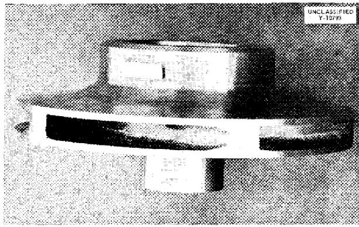  
Fig. 1.5. ARE Pump Impeller Fabricated by Welding and Machining.

ion exchange. A dissolution rate of about $5\mathrm{kg}$ of uranium per day is anticipated. The ARE fuel will be transported to the processing site in aluminum cans 8.5 in, in diameter and 17 in, in length. Each can will have a capacity of $53\mathrm{kg}$ of fused salt, but the amount per can will be limited to that containing $4\mathrm{kg}$ of $\mathsf{U}^{235}$ , the maximum permitted by criticality considerations. A proposed flowsheet of the process has been submitted to the Criticality Review Committee for approval.

Calculations based on 15-Mwd fuel irradiation and 100 days' cooling indicate that 8 in. of lead shielding will be required for a carrier to handle one can at a time. Preliminary calculations indicate that most of the shielding at the Metal Recovery Building may be adequate for ARE processing but that heavier shielding will be required above the dissolver. The charging equipment to be built will also require shielding.

Batch ion-exchange tests have been made, and calculations indicate that a Higgins continuous ion-exchange contactor 3 in, in diameter and 6 ft in length will permit a processing rate of $9\mathrm{kg}$ of uranium per day. However, the capacity of the plant will be limited by the fuel dissolution rate.

Preliminary laboratory studies indicate that severe corrosion of stainless steel may take place in the dissolving stage of the process. The Corrosion Section of the Reactor Experimental Engineering Division is studying this problem.

# Fuel Dissolution

Extrapolation of dissolving-rate data obtained in runs with 25 gal of dissolvent (5 kg of ARE fuel) indicates that a minimum of 12 hr will be required to dissolve each 53-kg fuel batch in an open-top can 8.5 in, in diameter and 17 in, in length. Criticality requirements, if concentration control is used, indicate the need for a heel dissolution after every two charge dissolutions. The throughput is estimated as 5.3 kg of U $^{235}$ per day if each charge contains 4 kg of U $^{235}$ and if a 12-hr heel dissolution is assumed.

The dissolution studies made on the fuel mixture NaF-ZrF4-UF4 (50-46-4 mole %) were scaled up from the laboratory experiments described previously in order to simulate more closely the con

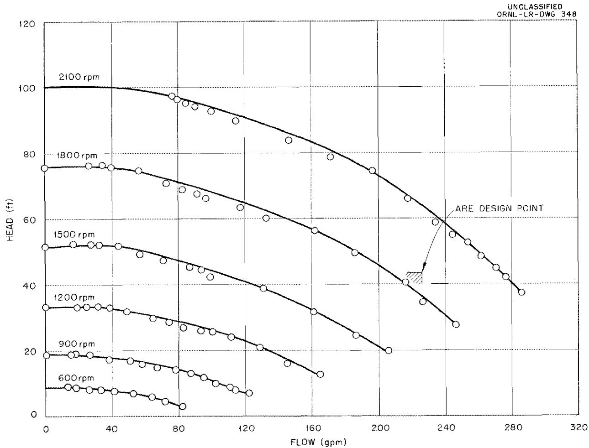  
Fig. 1.6. Performance Characteristics with Water of Moderator Coolant Pump with Fabricated Curved-Vane Impeller.

ditions in the recovery plant. Two dissolvings of 5-in.-dia by 5-in.-long open-top aluminum cans, containing $5\mathrm{kg}$ of fuel each, in a 50-gal vessel, were $100\%$ complete after 6 hours. Violent boiling plus mechanical agitation was used in one run, and violent boiling without agitation was used the other run. Dissolution of a 5-kg charge with a $25\%$ excess of dissolvent was indicated by uranium analyses of the solution to be complete in 5 hours. However, because of erratic zirconium analytical results, the dissolution was allowed to proceed for another hour. No fuel fragments were found when the vessel was opened at the end of the 6-hr period. Zirconium analyses seem to be reasonably accurate only when the concentration is less than $10\mathrm{g / liter}$ , that is, when half the fuel has dissolved. This is unfortunate, as

it would be convenient to follow the progress of the dissolution by zirconium concentrations when the quantity of uranium in the charge is unknown.

The first experiments in this series were made on 6-in.-dia by 9-in.-long open-top aluminum cans, each containing $10\mathrm{kg}$ of fuel. However, the volume of dissolvent required for $10\mathrm{kg}$ of fuel was too large to permit a fast boiling rate without overflowing the 50-gal dissolver. In each case, when the vessel was opened after $12\mathrm{hr}$ , large fragments of undissolved fuel were present.

# Solvent Extraction Processing

A gross beta decontamination factor of $3 \times 10^{5}$ was obtained in a batch countercurrent extraction of uranium with $5\%$ TBP from dissolved ARE-type fuel, which had been prepared in the large-scale

demonstration of the dissolution procedure. Based on a $U^{235}$ burnup of $0.07\%$ , the maximum expected in the ARE fuel, a decontamination factor of only $2 \times 10^4$ is necessary to lower the fission-product beta activity of the recovered $U^{235}$ below a tolerance of 10 times that of $U^{235}$ . The apparent improvement of this decontamination factor over the previously reported value of $>10^4$ is due to greater reliability of analytical results gained by a tenfold increase in initial fission-product activity spiked into the dissolved fuel.

Further study of tributyl phosphate solvent extraction processing of ARE fuel solution is under way for determining the optimum extraction conditions. Preliminary results (Table 1.1) on the effects of variations in feed nitric acid concentrations over a range of TBP concentrations show that the test decontamination with $0.5\text{M}\text{HNO}_3$

is obtained in the range 5 to $7.5\%$ TBP in Amsco 125-90W. With $3\text{M}$ $\mathsf{HNO}_3$ feed, the maximum decontamination occurs at a lower TBP concentration. In both cases, at low TBP concentrations, ruthenium beta activity is much less important than zirconium.

These decontamination factors are tenfold lower than those obtained with ARE-type fuel, primarily because of the high ARE-type fuel feed fluoride content, over 1 M, while the feeds used in these experiments contained no fluoride. A high fluoride content is particularly important in increasing zirconium decontamination, and the complexing action of fluoride lowers to a somewhat less extent the extractability of other fission products and uranium. The optimum ratio of fluoride to aluminum is one of the most important factors yet to be studied in ARE solvent extraction processing.

Ratio of feed to scrub to extractant: 3:1:4

Uranium saturation of solvent: $20\%$

Feed: 0.5 or $3\mathrm{M}$ HNO $_3$ plus aluminum nitrate for extraction factor of $\sim 4$ at feed plate; gross beta activity of $10^{7}$ counts/min/ml

Scrub: aluminum nitrate for extraction factor of 2 at fourth scrub stage

TABLE 1.1.EFFECT OF FEED ACIDITY ON DECONTAMINATION IN BATCH COUNTERCURRENT TESTS  

<table><tr><td rowspan="2">TBP CONCENTRATION
IN AMSCO 125-90W
(%)</td><td rowspan="2">GROSS BETA
DECONTAMINATION FACTOR
OF PRODUCT</td><td colspan="2">ACTIVITY OF PRODUCT
(% of gross)</td></tr><tr><td>Ruthenium β</td><td>Zirconium β</td></tr></table>

0.5 M Nitric Acid   

<table><tr><td>3</td><td>7.0 × 103</td><td>0.01</td><td>94</td></tr><tr><td>5</td><td>2.6 × 104</td><td>32</td><td>40</td></tr><tr><td>7.5</td><td>3.1 × 104</td><td>41</td><td>37</td></tr><tr><td>15</td><td>5.3 × 103</td><td>85</td><td>7.3</td></tr><tr><td>30</td><td>920</td><td>86</td><td>5.1</td></tr></table>

3 M Nitric Acid   

<table><tr><td>3</td><td>3.1 × 104</td><td>7.7</td><td>67</td></tr><tr><td>5</td><td>2.4 × 103</td><td>0.6</td><td>89</td></tr><tr><td>15</td><td>2.7 × 103</td><td>99</td><td>2.3</td></tr></table>

# 2. EXPERIMENTAL REACTOR ENGINEERING

H. W. Savage, ANP Division

Two types of pumps are being developed for in-pile test work - pumps for use inside reactor holes and pumps for use just external to reactor holes. The downflow, gas-sealed pump for external use has demonstrated the required performance characteristics with no gassing. A preliminary water test indicated promising performance of a centrifugally sealed pump model. Development work is continuing on packed seals for horizontal in-pile pumps, and designs are being developed for horizontal-shaft gas-sealed pumps.

Development of corrosion testing units employing simultaneously, high liquid velocity and high temperature difference between the hottest and coldest points in the liquid circuit was continued. The units being developed include two all-Inconel units that will operate with NaF-ZrF4-UF4 (50-46-4 mole %) as the liquid and will be cooled with air and NaK, respectively, and one beryllium and Inconel unit that will operate with NaK as the fluid and will be cooled with a heat economizer.

The 1-megawatt regenerative heat exchanger has operated for $1680\mathrm{hr}$ , including 1370 hr of fluoride pump operation. A high-performance sodium-to-air radiator was employed as a heat sink.

Additional tests were made of high-temperature bearing materials and of rotary-shaft and valve-stem seals for fluorides. A program for testing the self-bonding of materials in fluorides has been planned, and a preliminary test of Inconel vs. Inconel is under way. Methods for removing fluoride mixtures from equipment are being developed.

All pump housings and covers have been fabricated, inspected, and delivered to the ARE for installation. Intensive proof-testing and inspection of all pump parts is in progress and will continue until all ARE pumps have been delivered. Details of the work on these pumps are presented in Sec. 1, "Circulating-Fuel Aircraft Reactor Experiment."

# IN-PILE LOOP COMPONENT DEVELOPMENT

W. B. McDonald

J.A.Conlin

C.D.Baumann

D. F. Salmon

W. G. Cobb

D. R, Ward

ANP Division

Components are being developed for in-pile loops which are to be operated in the LITR and the MTR

for studying the effect of radiation on fuel stability and corrosion of container materials (cf., sec. 9, "Radiation Damage"). The components to be developed are compact fused-salt pumps which can be operated inside reactor beam holes, high-performance heat exchangers for removal of fission heat, flow and pressure-measuring devices suitable for in-pile service, and other equipment essential for the operation of in-pile loops. The in-pile loops are to operate with fuel power densities of from 1 to $5\mathrm{kw/cm^3}$ , flow rates in the turbulent range, a maximum fuel temperature of $1500^{\circ}\mathrm{F}$ , and temperature differentials of from 100 to $300^{\circ}\mathrm{F}$ . Development of the pumps is now under way.

# Vertical-Shaft Sump Pump

Three vertical-shaft gas-sealed sump pumps have been constructed and are undergoing tests. Initial testing with water revealed the entrainment of large quantities of gas in the pump discharge at most pump shaft speeds and flow rates. The pump is of the downflow type, with the fluid entering the impeller around the rotating shaft. Vortexing of the fluid around the rotating shaft was found to be a major cause of gassing. In addition, poor distribution of the fluid upon entrance into the suction chamber caused turbulence of the free fluid surface. Design changes were made (Fig. 2.1) which corrected both these difficulties and eliminated gas entrainment in the fluid at shaft speeds and flow rates well above the design conditions. The pump is sealed with a Morganite (MYIF) face seal, and the shaft and seal are cooled by circulating oil.

One pump was tested for 218 hr with fused salts at $1200^{\circ}\mathrm{F}$ and 305 hr at $1400^{\circ}\mathrm{F}$ . The normal operating conditions during this test included a shaft speed of 3200 rpm and a flow rate of 1.3 gpm with a developed head of 26 feet. The second and third pumps are undergoing water tests preparatory to testing at $1500^{\circ}\mathrm{F}$ with sodium.

# Pump with a Centrifugal Seal

A Plexiglas test model of an in-pile pump with no mechanical liquid seal has been constructed (Fig. 2.2). The sealing in this pump is accomplished by centrifugal action of the pumped liquid. This is analogous to a sump pump with the gravitational field replaced by a centrifugal field.

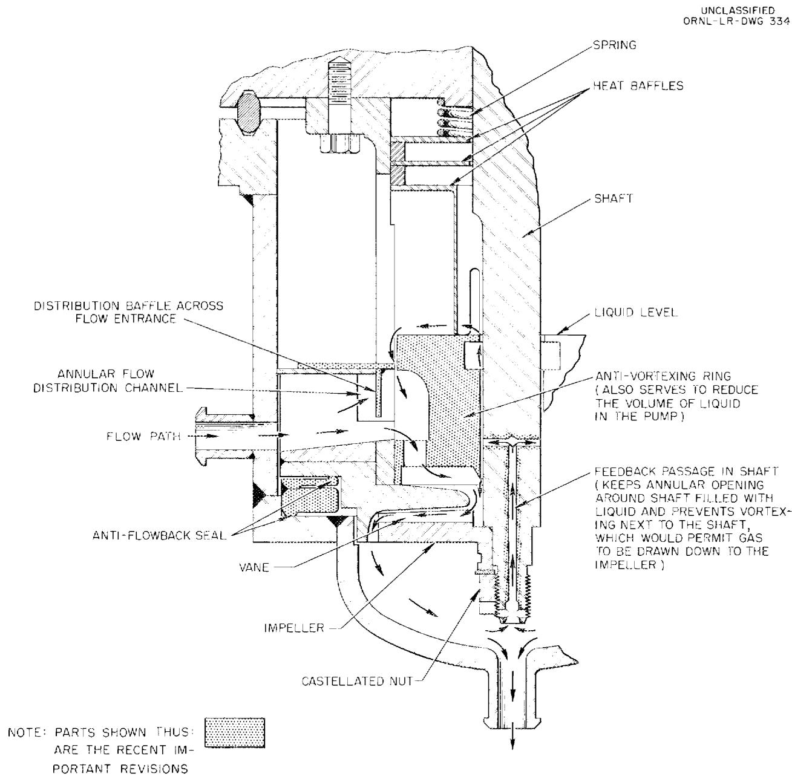  
Fig. 2.1. Vertical-Shoft Sump Pump (Model LFA) Showing Modifications Made to Prevent Gassing.

The inlet side of the impeller is conventional; however, the back side is extended to form an annular chamber which is partially filled with the pumped fluid which rotates at high speed during operation and forms an annulus of liquid with a free surface that never reaches the pump shaft. The annular chamber is pressurized with gas. Since this gas pressure contributes to the absolute pressure throughout the system, it must be such that at no place in the system does the total

pressure drop below the vapor pressure of the fluid. The face seal shown in Fig. 2.2 is a gas seal for retention of the pressurizing gas.

The small radial holes in the annular section of the back of the impeller are designed to permit any gas which might be entrapped due to turbulence between the rotating fluid and the stationary wall of the pump housing to be centrifuged out. Entrapped gas will thus be prevented from entering the main fluid system.

The pump was tested with water as the working fluid and air as the pressurant. The sealing characteristics were very good, and there was no observable pump leakage regardless of pump orientation, even when the pump was inverted. The test also indicated that the loop can be easily filled. A bypass from the pump discharge to the annular chamber at the centrifugal seal removes entrained gas in a short period of operation. Since

this pump is not sensitive to its orientation in respect to gravity, it also shows promise as an aircraft type of pump. This possible application is being further explored.

# Horizontal-Shaft Sump Pump

A horizontal-shaft sump pump (Fig. 2.3) is contemplated for use with in-pile loop experiments in

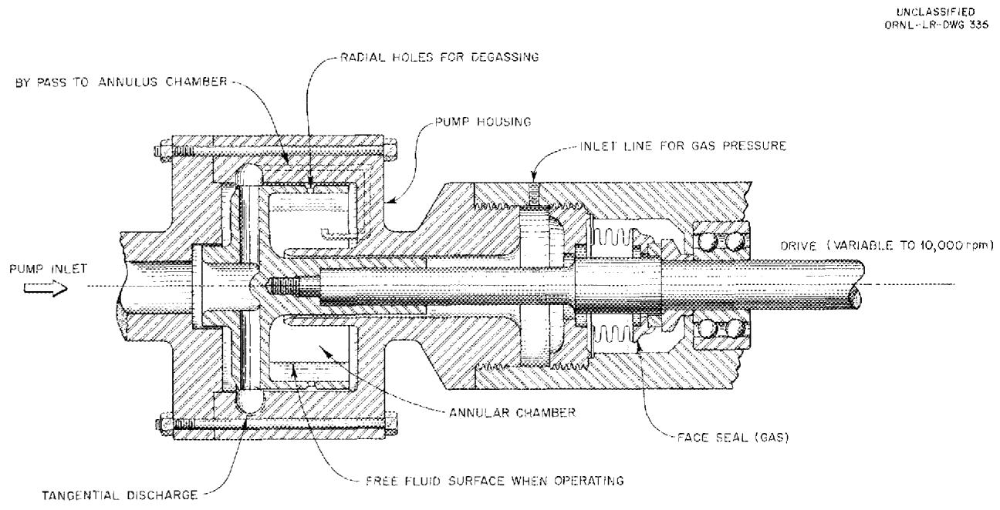  
Fig. 2.2. Centrifugal Seal Pump.

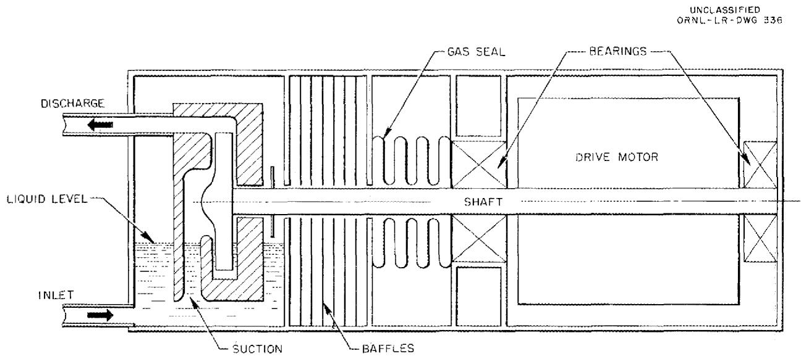  
Fig. 2.3. Horizontal-Shaft Sump Pump.

which it is desirable to have all equipment contained within the reactor access holes and existing shielding. The pump takes its suction from a controlled volume of liquid below the pump shaft, and a rotary face seal is used to maintain an inert-gas atmosphere above the liquid in the pump. A mockup has demonstrated that a pump of this design can be primed by increasing the pressure on the liquid surface in the pump to force fluid into the impeller.

# HEAT EXCHANGER AND RADIATOR TESTS

A. P. Fraas

R.E.MacPherson

R.W.Bussard

H. J. Stumpf

ANP Division

# Heat Exchanger Test

Limited test operations have been completed on the 1-megawatt regenerative heat exchanger which employs some of the design features of the heat exchanger proposed for the reflector-moderated aircraft reactor. The test apparatus was described previously. The scope of the test program was limited by several factors.

1. Original designs of the heat exchanger were based on the use of NaF-KF-LiF (11.5-42.0-46.5 mole %) as the circulating fluoride medium. Since this mixture was not available at the time required in sufficient quality or quantity, it was necessary to use NaF-ZrF₄ (53-47 mole %), a more dense and more viscous fluid, which put serious limitations on the attainable Reynolds numbers on the fluoride side of the tube bundles.

2. A design error in the area of the sodium flow path through the heat exchanger made it necessary to hold sodium flow rates to one-half to one-third the desired levels in order to prevent serious overheating of the electromagnetic pump cell.

3. Circuit limitations on the power supply to the resistance heater which supplies heat to the sodium circuit limited heat input to a maximum of 50 kw, that is, approximately one-half the desired value.

These limitations prevent the drawing of reliable conclusions from the performance data obtained on the heat exchanger. However, considerable confidence has been gained in the practicability of such a heat exchanger design.2

Since initial startup, the heat exchanger has been on heat at temperature levels varying from 1200 to $1600^{\circ}\mathrm{F}$ for 1680 hours. The fluoride pump was in operation for 1370 hr of this time, and the entire bifluid system was in complete operation for a total of 712 hours. This period of trouble-free heat exchanger operation was interrupted by binding of the fluoride circulating pump. Upon removal and inspection of the pump assembly, it was found that the binding was caused by the condensation of zirconium fluoride crystals in an annular area around the pump shaft above the liquid level in the pump sump. Considerable crystal formation was also present on the pump sump wall above the liquid level where it was cooled by the lower flange of the top head assembly (Fig. 2.4). Inspection of the internal surfaces of the heat exchanger showed them to be in excellent condition. Modifications are being made in the test loop, and future operation will be concerned mostly with endurance testing of the component parts.

# Sodium-to-Air Radiator Tests

R.E. MacPherson

H. J. Stumpf

ANP Division

J. G. Gallagher

American Locomotive Company

The design of the intermediate heat exchanger test loop1,3 indicated that a sodium-to-air radiator would be the most convenient form of heat dump and at the same time would provide an opportunity to obtain additional radiator endurance and performance data with little extra cost and setup time. A strip-fin and tube radiator designed to dissipate 100 kw of heat was built for the rig4 and was operated for 1013 hr at sodium inlet temperatures ranging from 600 to $1550^{\circ}\mathrm{F}$ . A leak in the sodium heater coil made it necessary to interrupt the test. The heater coil is being replaced and the test is to be resumed.

The air flow through the radiator was varied from 0.58 lb/sec-ft² to 17.32 lb/sec-ft² at the inlet face area, with corresponding Reynolds numbers of 327 to 11,100. The radiator geometry was the same as that of core element No. 3 described in ref. 5.

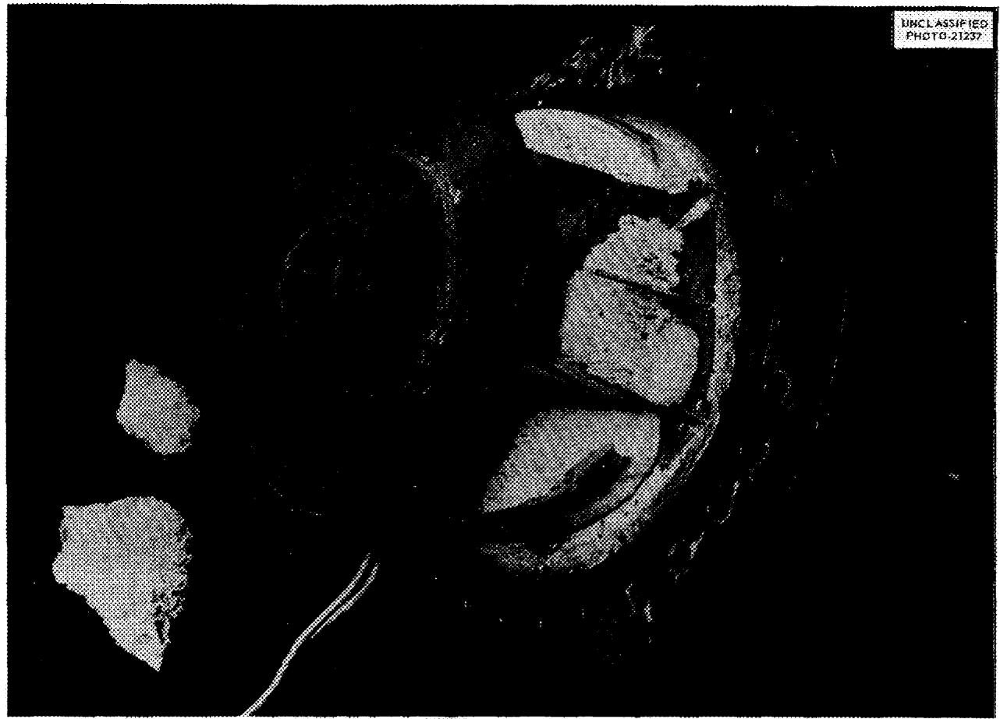  
Fig. 2.4. Zirconium Fluoride Crystal Formation in Sump Pump Used to Circulate NaF-ZrF₄ for 1370 hr at 1200 to 1600°F.

except that the fins were interrupted every $\frac{2}{3}$ inch. The performance data plotted as Colburn modulus (j) and friction factor (f) vs. Reynolds number are given in Fig. 2.5. A plot of air-side film coefficient (h) and over-all heat transfer coefficient (U) vs. Reynolds number is given in Fig. 2.6 for radiator No. 3, which is a plate-fin type of core element with the fins interrupted every 2 inches.

Reduction of the test data for radiator No. 3 to plots of $j$ and $f$ vs. Reynolds number indicated that more frequent interruption of the fins increased both the heat transfer modulus $j$ and the friction factor $f$ and resulted in no net gain in performance. A more complete analysis of the strip-fin radiator and comparisons with other compact surfaces will be given in a forthcoming report.

# FORCED-CIRCULATION LOOPS

D. F. Salmon

ANP Division

# Air-Cooled Loop

A second air-cooled forced-circulation loop was fabricated from 0.15-in.-OD by 0.025-in.-wall Inconel tubing. Difficulty was encountered in filling and starting the loop with the fluoride mixture NaF-ZrF $_4$ -UF $_4$ (50-46-4 mole %). The tubing was ruptured in the process, and, after the necessary repairs were made, the same difficulty was again experienced. Freezing at an electrical-resistance heater connection, followed by thawing with a torch, caused the failures.

Another loop, fabricated from $\frac{1}{4}$ -in.-OD by 0.035-in.-wall tubing, started with ease after it was filled. This loop operated for 100 hr before a brush failure in the pump motor caused the cold

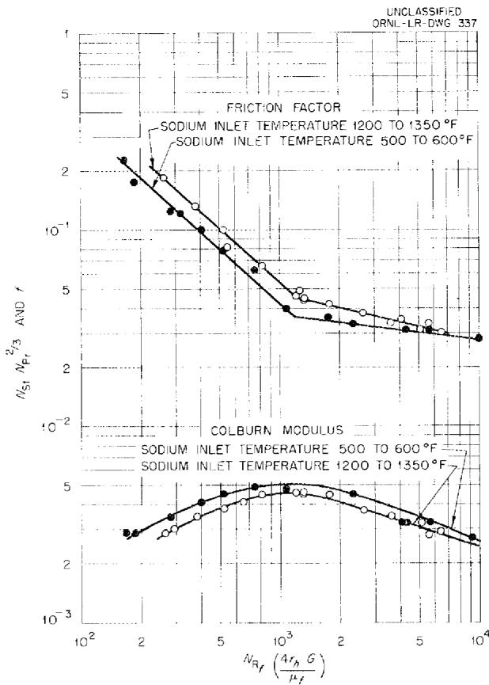  
Fig. 2.5. Sodium-to-Air Radiator Performance Data Plotted as Colburn Modulus and Friction Factor vs. Reynolds Number.

leg to freeze. The resultant excessive heating in the hot leg caused a tube rupture. The first 50 hr of operation was at $1400^{\circ}\mathrm{F}$ (maximum) with a temperature differential of $120^{\circ}\mathrm{F}$ , and the remaining operation was at $1500^{\circ}\mathrm{F}$ (maximum) with a temperature differential of $160^{\circ}\mathrm{F}$ . The fluid velocity (calculated by heat balance) during this test was 2 fps (Reynolds number, 1155). No deterioration of performance with time was found.

Use of the larger diameter tubing corrected the filling and starting troubles, but, to obtain the desired turbulence and temperature difference, a pump with greater head must be obtained and the magnitudes of the heat source and heat sink must be increased.

# Beryllium-NaK Compatibility Test

The compatibility of beryllium metal with NaK is being tested to determine whether protection of the beryllium would be required if these materials were used together. A sample of beryllium $\frac{1}{2}$ in thick and 1 in. in diameter with ten $\frac{1}{8}$ -in.-dia flow passages was inserted in an Inconel figure 8 loop and exposed to circulating NaK for 1100 hours. The sample and the NaK at the sample were maintained at $1450^{\circ}\mathrm{F}$ , and the velocity of the NaK through the sample was 20 fps (Reynolds number, 8600). The minimum temperature in the cold zone of the loop was $900^{\circ}\mathrm{F}$ . The beryllium sample is now being analyzed metallurgically; it had a heavy, black scale when it was removed from the loop.

# Bifluid Heat Transfer Loop

The bifluid loop for transferring heat between the fluoride mixture $\mathrm{NaF - ZrF_4 - UF_4}$ (50-46-4 mole %) and NaK in two double-tube heat exchangers has been completely rebuilt for a third test. The primary purpose of this loop is to determine corrosion and mass-transfer effects in an all-Inconel system with the fluoride mixture circulating at definitely turbulent flow (Reynolds number, $>5000$ ) and with a total temperature difference in the fuel in excess of $100^{\circ}\mathrm{F}$ from the hottest to the coldest point. (The results of metallurgical examination of the loop after the second test are presented in sec. 7, "Corrosion Research.") The system consists of the two double-tube heat exchangers operating between the hot and cold legs of a figure 8 loop. The NaK circulating in the annulus of one heat exchanger heats the fluoride mixture, and the NaK circulating in the other heat exchanger cools it by the same amount. The center tubes of the heat exchangers are made of 0.225-in.-OD by 0.025-in.-wall Inconel tubing 45 in. long. A model LFA, centrifugal, sump-type pump is used to circulate the fluoride mixture (cf., Fig. 2.1).

Preliminary cleaning by circulating a fluoride mixture for 2 hr at $1200^{\circ}\mathrm{F}$ has been accomplished. Startup with the regular charge of the fluoride mixture has been delayed because a leak developed in the NaK side of one heat exchanger and that heat exchanger is being replaced.

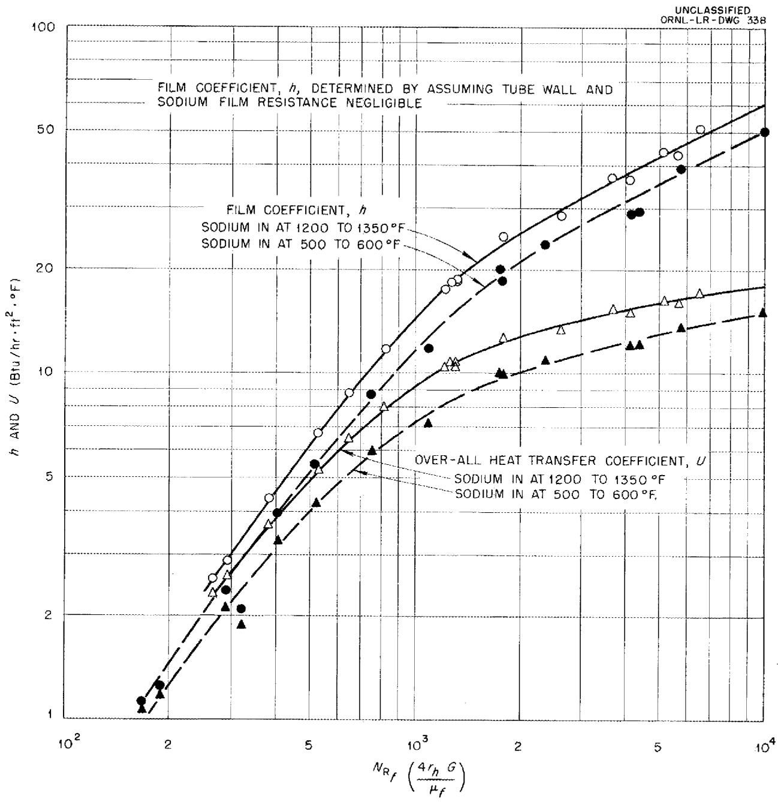  
Fig. 2.6. Air-Side Film Coefficient and Over-All Heat-Transfer Coefficient vs. Reynolds Number for Sodium-to-Air Radiator No. 3.

# HIGH-TEMPERATURE BEARING DEVELOPMENT

W.C.Tunnell

J.W.Kingsley

R.N.Mason

P. G. Smith

ANP Division

W. K. Stair, Consultant

University of Tennessee

Design work and developmental investigations are continuing on a hydrodynamic type of bearing which will operate at elevated temperature in a fluoride mixture. The work to date has been concerned with determining the compatibility of materials with respect to wear and corrosion.

# Materials Compatibility Tests

Tests were continued with the use of the equipment described previously, in which a rotating plate specimen is maintained in contact with a stationary pin specimen under a known load. Tests of a chrome carbide pin and a titanium carbide plate, a titanium carbide pin and a titanium carbide plate, and an Inconel pin and a graphite plate were operated at $1200^{\circ}\mathrm{F}$ for 2 hr each in $\mathsf{NaF - ZrF}_4\mathsf{-UF}_4$ (50-46-4 mole %). In each test, metal buildup of material between the specimens prevented proper contact. This metal buildup has been identified as iron, presumably from the type 316 stainless steel container material. Figure 2.7 shows the metallic buildup on a chrome carbide pin specimen. Investigation is under way to determine whether this condition is due to having a multimetallic system and whether it would be possible to sufficiently reduce the metal transfer by using different container materials. It is probable that any bearing design or application will have at least one material other than the container material in the fluid system. One test for which a nickel-plated pot and an Inconel sump pot with chrome carbide and titanium carbide specimens were used also showed an unidentified magnetic deposit that is being analyzed.

# Bearing Tester Design

Design calculations for bearings operating in fluoride fuels have been made for a number of expected operating conditions. The deflections of Inconel shafts at temperatures of up to $1500^{\circ}\mathrm{F}$ have been evaluated for various diameters of up to

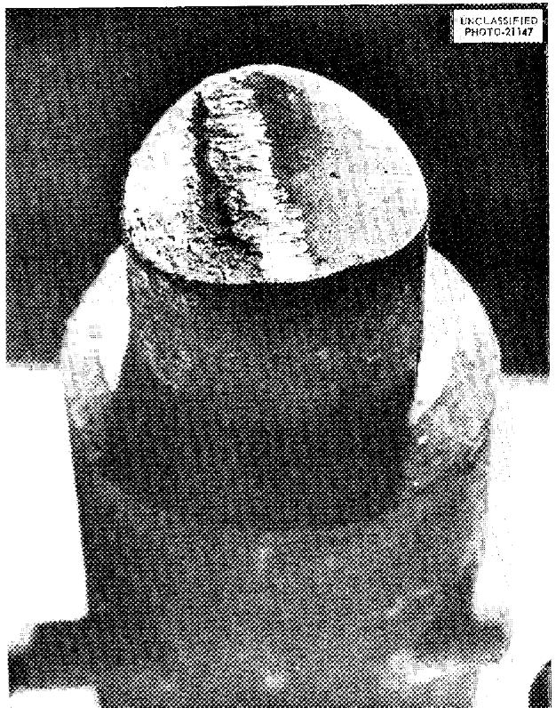  
Fig. 2.7. Metallic Iron Buildup of Chrome Carbide Bearing Material Tested at $1200^{\circ}\mathrm{F}$ for 2 hr in Fluoride Mixture $\mathsf{NaF - ZrF_4 - UF_4}$ (50-46-4 mole %).

2 in. and for shaft overhangs of up to 22 inches. These studies indicate that bearings having a length-to-diameter ratio of as low as 0.5 may have sufficient load capacity to be used in circulating pumps at fuel temperatures of up to $1500^{\circ}\mathrm{F}$ and that for these low length-to-diameter ratios, the bearings may be used without self-aligning mounts. In all cases computed, the maximum load capacity was determined by the bearing limitations rather than by the shaft deflection.

# ROTARY-SHAFT AND VALVE-STEM SEALS FOR FLUORIDES

W.C.Tunnel!

J.W.Kingsley R.N.Mason

P.G. Smith

ANP Division

# Spiral-Crooved Graphite-Packed Shaft Seals

Seal test No. 20 for which a graphite packing was used around a $1\frac{3}{16}$ -in.-dia shaft with a machined

spiral groove was terminated after 3487 hr of operation because of a heater failure. There had been no detectable leakage of the fluoride mixture (NaF-ZrF $_4$ -UF $_4$ , 50-46-4 mole %) during this period, and only a small amount of graphite leaked during the early part of the run. There was essentially no maintenance required or attention given to the apparatus during the last 2500 hr of operation. The power requirement was more regular and smooth than had been experienced with other packed or frozen seals. When the apparatus was disassembled, it was found that the shaft was worn and that the packing had been impregnated with fluorides. Figure 2.8 shows the shaft after disassembly.

Seal test No. 29 was a further attempt to verify the nonwetting characteristic of graphite in a rotating shaft seal for sealing $\mathsf{NaF - ZrF_4 - UF_4}$ (50-46-4 mole%). The shaft was $2\frac{1}{4}$ in, in diameter and it operated in a horizontal position, in contrast to a previous test in which a $1\frac{3}{16}$ -in.-dia shaft operated satisfactorily in a vertical position for a period in excess of 3000 hours.

The apparatus consisted of a rotating shaft, Fig. 2.9, containing a spiral groove that operated in a conventional stuffing box arrangement, to which was attached a fluid container with a means for pressurizing the fluid. The packing material for this test consisted of a mixture of 90 wt % Asbury graphite and 10 wt % MoS₂. The retainers for this material were bronze wool.

This test was made with the fluoride mixture NaF-ZrF4-UF4 (50-46-4 mole %) at 1100 to $1180^{\circ}\mathrm{F}$ and with the shaft rotating at 560 rpm for a period of 47 hours. The packing temperature was from $1000^{\circ}\mathrm{F}$ down to $600^{\circ}\mathrm{F}$ , and the pressure on the fluoride mixture was 5 psi. Leakage occurred during the last 17 hr, and the test was therefore terminated for examination.

Post-run examination revealed that the bronze wool retainer at the hot end of the packing had failed and allowed the packing material to be conveyed into the seal pot. This packing failure is believed to have been the reason for fluid leakage from the seal. Further tests on this seal are planned.

# Graphite-BeF $_2$ Packed Seal

The previously reported test No. 22 in which a $\mathsf{BeF}_2$ -graphite mixture was used as the packing

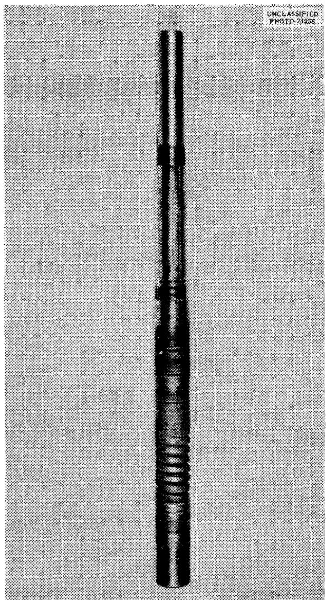  
Fig. 2.8. Spiral-Grooved Graphite-Packed Shaft After Testing in Fluoride Mixture NaF-ZrF4-UF4 (50-46-4 mole %) for 3487 Hours.

material was terminated because of binding of the $1\frac{3}{16}$ -in.-dia shaft after 4530 hr (over six months) of practically continuous operation at speeds of up to 2500 rpm. The total leakage of the fluoride mixture NaF-ZrF $_4$ -UF $_4$ (50-46-4 mole %) during this period was less than 10 in. $^3$ , and the maintenance time was essentially zero. The power requirement during the test was variable, but it is not known how much of this variation was due to intermittent metal-to-metal contact. When the apparatus was disassembled, there was no visible evidence that

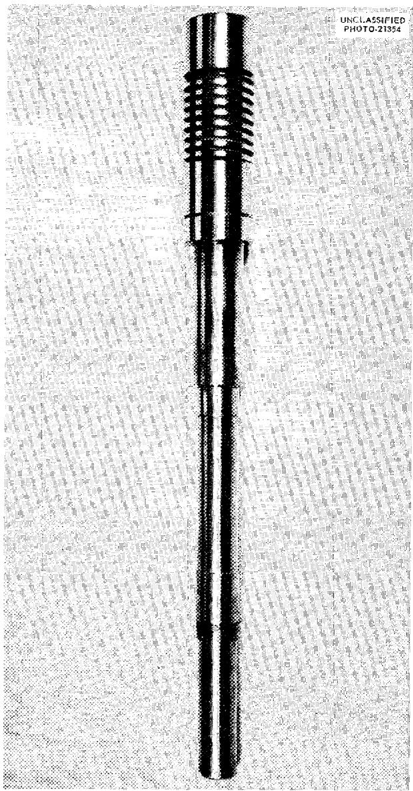  
Fig. 2.9. Spiral-Grooved Shaft.

could explain the sudden binding and stopping of the shaft. The shaft was worn, as can be seen in Fig. 2.10, and the places where the Stellar coating was worn through can be easily seen.

# V-Ring Seal

The V-ring seal test No. 27 reported previously8 was operated again on a $2\frac{1}{2}$ -in.-dia shaft to seal helium at a high temperature. Gas leakage below $1\mathrm{cm}^3/\mathrm{sec}$ was readily obtainable over an extended period of time, and therefore this seal will be tested with fluorides. The leakage appeared to be sensi

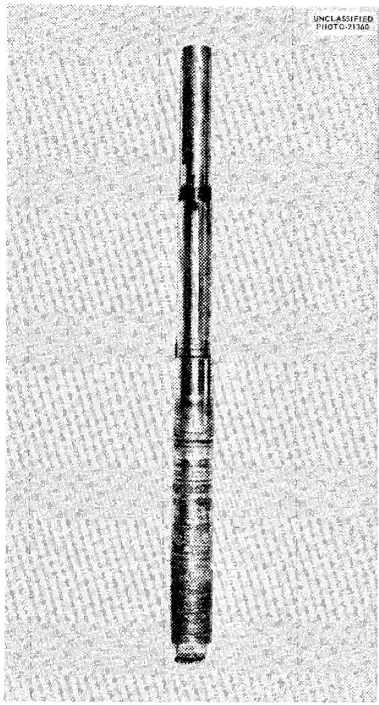  
Fig. 2.10. Graphite-BeF $_2$ Packed Shaft After Continuous Operation for 4530 hr at Speeds of Up to 2500 rpm in Fluoride Mixture NaF-ZrF $_4$ -UF $_4$ (50-46-4 mole%).

tive to the shaft temperature. Power surges were not experienced in this test as in previous tests. The pressure differential across the seal has been low in all tests on this apparatus.

# Chevron Seal

In an attempt to restrain powdered packing materials, a $13\%$ -in.-dia Chevron (Skinner) seal (Fulton-Sylphon Company) was tested (test No. 30). This seal is all metal and was designed for use around

reciprocating shafts or pistons. The sealing element consists of a series of 0.003-in.-thick sheets formed into flexible V or reed-type rings. These elements are made so that the sealing edges are deflected when the seal assembly is engaged externally in a cylinder or internally on a rod or shaft (that is, interference fits). It is claimed that because these seals are flexible they provide seal assemblies that have relatively low friction. Figure 2.11 is a sketch of a possible arrangement of these seals for retaining powdered packing.

Such a seal has been tested as a means of retaining a mixture of 50 wt $\%$ MoS $_2$ and 50 wt $\%$ graphite. The test operated for over 750 hr, with no heat added. There was some wear on the Colmonoy coated shaft and some leakage of the packing. In this test, the packing material was introduced into the stuffing box region by means of a screw conveyer. A pressure differential was established across the seal by helium gas pressure, and leakage of this gas was apparently a function of the packing pressure, since the gas leakage increased with graphite leakage but was reduced

when the screw conveyer was operated. Operation of the screw conveyer caused small increases in power requirements for the seal. The seal was heated to about $1000^{\circ}\mathrm{F}$ , but no detectable difference in operation was noted. It is planned to test this design with fluorides.

# Graphite- $\mathsf{BaF}_2$ Packed Seal

Seal test No. 28 was made in an attempt to verify the lubricating properties of barium fluoride when it is used as an additive with graphite for a packing material. The packing consisted of a mixture of $10 \, \text{wt} \% \, \text{BaF}_2$ and $90 \, \text{wt} \%$ National Carbon graphite No. 2301. The retainers for this packing were bronze wool.

The apparatus consisted of a horizontal rotating shaft $2\frac{1}{4}$ in, in diameter inserted into a seal pot through a stuffing box. The seal was pressurized by helium pressure applied to a surge pot attached to the seal pot. The shaft was driven by a 5-hp Varidrive motor that was belt-connected to the driven shaft.

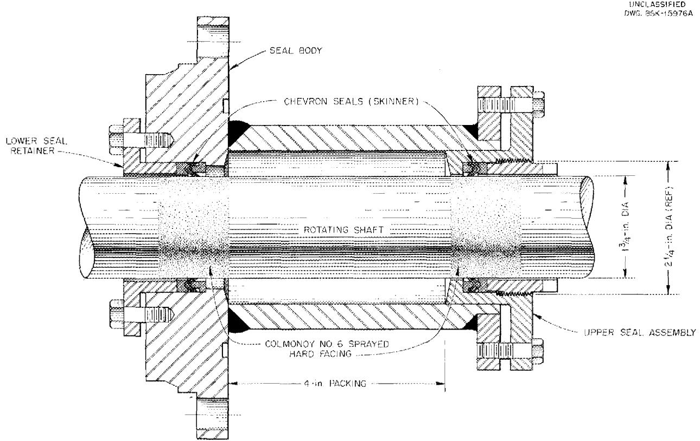  
Fig. 2.11. Chevron (Skinner) Seal Arrangement for Retaining Powdered Packing.

This test operated for 290 hr with a shaft speed of 760 rpm. The fluoride mixture used was NaF-ZrF4-UF4 (50-46-4 mole %) at temperatures of 1100 to $1150^{\circ}\mathrm{F}$ , and the pressure on this fluid was 5 psi. The temperature along the packing was from $1000^{\circ}\mathrm{F}$ down to $600^{\circ}\mathrm{F}$ . The power trace was typical of that of a frozen seal with excessive leakage,

Post-run examination showed that the shaft surface was in very good condition where the packing was located and that the only appreciable wear was in the region of the packing gland. The packing material was coked and quite slick to the touch. Other tests with barium fluoride as an additive to the packing are planned for the near future.

# Shaft Seal for In-Pile Pump

Seal test No. 33 is being made to determine the feasibility of sealing fluorides in an in-pile pump rotating shaft with a packed type of seal. The packing for this test consists of a mixture of 95 wt % Asbury graphite and 5 wt % MoS₂ and is retained by bronze wool at each end of the packing.

The apparatus being used consists of a seal pot to which a stuffing box is attached and through which a $\frac{1}{2}$ -in.-dia Inconel shaft is inserted into the pot. The shaft is driven by a $\frac{1}{4}$ -hp constant-speed motor with a rated speed of 3450 rpm. The test unit is constructed with the stuffing box off-center on the seal pot so that the container will perform both as a sump tank and a seal pot. The seal pot functions as a sump tank before and after the test. The system is dumped by pivoting the test to a vertical position. The pot is filled to between half full and full to provide a gas space for pressurizing the fuel against the seal. Heat is applied externally through the wall of the pot; cooling is by natural convection.

To date, this test has operated for a period of 360 hr with $\mathsf{NaF - ZrF_4 - UF_4}$ (50-46-4 mole %) at a temperature of 1180 to $1250^{\circ}F$ . The temperature drop along the seal is from 1100 to $550^{\circ}F$ , and the pressure on the seal is 2 psi. Operation has been quite successful in that no difficulties have been encountered. The power required by the seal has been of the order of 100 to 200 watts for most of the test; however, for a period of one to two days, the power requirement was of the order of 200 to 300 watts. This increased power appeared to have been the result of a slight lowering of the temperature of the seal. The average leakage rate is

about $\frac{2}{3}$ cm³/day, with lower rates at times for periods of two to three days. The power trace is quite variable and resembles those previously encountered with frozen seals. When this test has been completed, another test will be made with this equipment with a hard-faced shaft.

# Packing Penetration Test

A packing penetration test was made with NaF $\mathsf{ZrF}_4$ -UF $_4$ (50-46-4 mole %) against an Asbury graphite that was similar to Asbury 805 with respect to amorphous carbon content and spectrographic analysis, but the particle size was smaller and more uniform. The operating conditions were the same as in previous tests. $^9$ The test was terminated after 1125 hr, and there had been no fluoride seepage through the packing material.

# Valve-Stem Packing Tests

Two additional valve-stem packing tests were made this quarter. One test was made under the same operating conditions as those used for the previous tests.[10] The material tested was Asbury 805 graphite with Fel Pro C-5 high-temperature lubricant against NaF-ZrF $_4$ -UF $_4$ (50-46-4 mole %). This test was terminated at 350 hr because of leakage.

The other test was made under actual operating conditions. A $1/4$ -in. stainless steel valve in a fluoride transfer line was backed with the Asbury graphite used in the packing penetration test. The fluoride used was a mixture of $\mathrm{NaF - ZrF_4 - UF_4}$ (50-46-4 mole %) and NaF-KF-LiF-UF (10.9-43.5-44.5-1.1 mole %). There were no modifications in the valve. The original packing was removed and replaced with the graphite, and a thin layer of bronze wool was used at the bottom of the stuffing box. Operation of the valve was quite satisfactory. The valve was under fluoride pressure about 1 hr, during which time it was opened and closed 32 times; there was no leakage. When the transfer was completed, the line and valve were blown clear of all fluorides. After cooling, the valve was not frozen or stuck and could be cycled easily.

# SELF-BONDING TESTS OF MATERIALS IN FLUORIDE MIXTURES

G.F.Petersen

ANP Division

The successful operation of some equipment may depend on the resistance of some of its parts to self-bonding, or self-welding, at high temperatures. An example is valve operation, in which the seal may become stuck.

The purpose of this experiment is to check the validity of the design of the test apparatus, a modified stress-rupture tester. The long-range purpose is to test materials and establish criteria for selection of materials couples (metals, ceramics, cermets).

A preliminary test is being made of a couple of Inconel against Inconel in NaF-ZrF4-UF4 (50-46-4 mole %) with a total load of about 50 pounds. The $\frac{3}{8}$ -in.-dia by $\frac{3}{4}$ -in.-long Inconel cylinders have flat contact surfaces. In the present test, the fluoride temperature is $1375^{\circ}\mathrm{F}$ , and the system pressure (helium) is 1 to $1\frac{1}{2}$ psig. The test will be operated for 100 hours. Alterations in design, if any, will depend on inspection of the sample and equipment upon completion of the test. It is intended that many combinations of materials will be tested.

# REMOVAL OF FLUORIDE MIXTURES FROM EQUIPMENT

L.A.Mann

G.F.Petersen

ANP Division

A laboratory-size project is in progress for determining methods for removing fluoride mixtures from equipment. The rate of attack on Inconel of a nitric acid-boric acid solution vs. acid concentration is being studied.[11] Preliminary tests show promising results in rapid dissolution of $\mathsf{NaF - ZrF}_4$ . $\mathsf{UF}_4$ (50-46-4 mole %) with only very light attack on the Inconel container walls.

There are some indications that the solution attacks Inconel faster if the Inconel has previously been exposed to molten fluorides. Quantitative tests are being made to determine rates of solution of the fluorides and rates of attack on Inconel under various conditions of concentration of the acid solution and temperature on both untreated Inconel samples and samples pretreated with the fluorides.

In a bench-scale test with $50\mathrm{ml}$ of $18\%$ $\mathsf{HNO}_3$ and $10\mathrm{g}$ of $\mathsf{H}_3\mathsf{BO}_3$ per $150\mathrm{ml}$ of water at $180^{\circ}\mathsf{F}$ and 1 gpm flow through a $\frac{1}{2}$ -in. Inconel pipe laden with a $\frac{1}{2}$ -in. thickness of fluorides, about three-fourths of the pipe area was cleaned down to the metal in 1 hr; a variable-thickness film of fluorides was left on the remaining pipe area. The uncleaned area may have been partially protected by bubbles. Further bench-scale tests will be made.

# 3. REFLECTOR-MODERATED REACTOR

A. P. Fraas, ANP Division

A parametric study was made to determine the effects on aircraft gross weight of the reactor temperature, power density, and radiation doses inside and outside the crew compartment. A chart was prepared for use in the calculations which gives the weights for the reactor, the reactor shield, the crew shield, and the propulsion machinery as functions of aircraft gross weight and useful load.

The results of the calculations for three design conditions are presented, and it is concluded from this study that the gross weight of the airplane is relatively insensitive to reactor design conditions for Mach 0.9, sea-level operation but that it is quite sensitive for the much higher performance and supersonic-flight conditions. Also, an increase in reactor temperature level of $100^{\circ}\mathrm{F}$ is more effective in reducing gross weight than is a factor-of-2 increase in power density.

An evaluation of the results of preliminary tests of a full-scale Lucite core model indicated the need for cutoffs in the pump volutes and turning vanes around one quadrant of the impeller periphery to obtain uniform flow distribution at the core inlet. Studies of flow in the core have shown that a set of turbulator vanes is required in the core inlet passage to assure axially symmetric flow and no flow separation at the core shell wall.

Specifications were prepared for a parametric study of the effects of the geometry of the reflector-moderated reactor on the physical quantities of interest, such as critical mass, required mole per cent of uranium in the fuel, and power distribution. The reactivity coefficients of Inconel, sodium, and beryllium as functions of reactor radius were completed for a 50-megawatt reactor design. Specifications were prepared for precalculations of several proposed critical experiments. The calculations are being made on the UNIVAC according to the multigroup, nine-region procedure coded by the ORNL Mathematics Panel.

Techniques for performing reactor statics calculations on the ORACLE and a method for computing the "age-to-indium" and the $k_{\text{eff}}$ for berylliummoderated systems are described. Developmental work was done on a new, nonaqueous method for processing fuels of the NaF-ZrF $_4$ -UF $_4$ system.

# EFFECTS OF REACTOR DESIGN CONDITIONS ON AIRCRAFT GROSS WEIGHT

A.P.Fraas

ANP Division

B. Wilner

Aerojet-General Corp.

The costs of construction, operation, and maintenance of aircraft are directly proportional to the gross weight. Thus it is important to know the effects on airplane gross weight of reactor temperature, power density, and radiation doses inside and outside the crew compartment. A parametric survey was carried out by using the quite complete set of shield weight data prepared in the course of the 1953 Summer Shielding Session and the engine performance data given in a recent Wright Aeronautical Corporation report. The basic method used by the Technical Advisory Board, North American Aviation, Inc., and the Boeing Airplane Company was used to prepare a set of tables and charts to facilitate aircraft performance calculations. The engine compression ratio was taken as 6:1 and the pressure drop from the compressor to the turbine was taken as $10\%$ of the compressor outlet absolute pressure. The specific impulse and specific heat consumption were taken from Figs. IX-1 through IX-12 of the Wright report; engine compressor and turbine weight were taken from Fig. I-19 and engine air flow from Fig. I-18. Engine nacelle drag was taken from Fig. 67 of ANP-57, except that $50\%$ submergence of the nacelles in the fuselage was assumed. The weight of the engine tailpipe, cowling, and support structure was taken as $25\%$ of the compressor and turbine weight. The weights of the NaK pumps, lines, and pump drive equipment were calculated on the same bases as were the estimates given in

ORNL-1515.4 The radiator cores were designed to give $1140^{\circ}\mathrm{F}$ as the turbine air inlet temperature, with a peak NaK temperature of $1500^{\circ}\mathrm{F}$ , and an air pressure drop across the radiator core equal to $5\%$ of the compressor outlet pressure. The resulting weight of the NaK system was somewhat higher than would be obtained from the Wright report. Table 3.1 presents the results of this survey. Table 3.2 gives the installed weight of the propulsion machinery and the reactor power as functions of thrust. The weight of the reactor plus the reactor shield was given as a function of reactor power in Tables 3.1 through 3.4 of ORNL-1609. These data were plotted to give charts similar to Fig. 3.3 of ORNL-1609.

The basic equation relating aircraft gross weight to the weight of the aircraft structure, the useful load, the shield weight, and the weight of the propulsion machinery is the same as that used by the Technical Advisory Board, North American Aviation, and Boeing:

$$
W _ {g} = W _ {s t} + U L + W _ {s b} + W _ {p m},
$$

where

$$
\begin{array}{l} W _ {p} = \text {g r o s s w e i g h t}, \mathrm {l b}, \\ \begin{array}{l} W _ {s t} ^ {\circ} = \text {s t r u c t u r a l} \\ \text {g e a r}), \text {l b}, \end{array} \quad \text {w e i g h t} \quad (\text {i n c l u d i n g} \quad \text {l a n d i n g} \\ U L = \text {u s e f u l l o a d}, \mathrm {l b}, \\ W _ {s b} = \text {s h i e l d w e i g h t}, \mathrm {l b}, \\ W _ {p m} = \text {p r o p u l s i o n m a c h i n e r y w e i g h t , l b .} \\ \end{array}
$$

The weight of the structure was taken as $30\%$ of the gross weight, a value in keeping with proportions used by the TAB, North American Aviation, Boeing, and the Lockheed Aircraft Corporation. While this value would probably be closer to $25\%$ for subsonic aircraft (except for aircraft using low specific-impulse power plants, such as the supercritical-water cycle), the value used seemed representative and adequate for the purpose of this analysis.

In solving the equation for gross weight, it was found most convenient to prepare a chart such as that in Fig. 3.1, which gives the total weight for the reactor, the reactor shield, the crew shield, and the propulsion machinery as a function of aircraft gross weight and useful load. The useful load was considered to include the crew, radar equipment,

armament, bomb load, and other such items. Since the shield weight used was for a dose of 1 r/hr in the crew compartment, the useful load can also be construed to include any extra crew shielding required to reduce the crew dose to less than 1 r/hr. The solution for gross weight was obtained graphically by plotting the weight of the propulsion machinery plus reactor and shield against gross weight, as in Fig. 3.1. The lift-to-drag ratio for the aircraft was taken as a function of the flight design condition, with allowance for the fact that the flight design condition would, in general, not give the optimum lift-to-drag ratio obtainable with the airplane, because take-off, landing, and climb requirements would necessitate wing loadings lower than those for minimum drag. The values used for the various flight conditions considered are given in Table 3.3. The lift-to-drag ratios given are for the airplane configuration without nacelles, an allowance for nacelle drag having been deducted from the specific thrust in Table 3.1. Thus the lift-to-drag ratio with nacelles would be lower than that indicated in Table 3.1, particularly at high Mach numbers.

The results of calculations for three design conditions are shown in Figs. 3.2, 3.3, and 3.4. A number of important conclusions can be deduced from these curves, and perhaps the most important is that the gross weight of the airplane is relatively insensitive to reactor design parameters for the Mach 0.9, sea-level conditions, but it becomes quite sensitive for the much higher performance supersonic-flight conditions. It is also evident that an increase in reactor temperature level of $100^{\circ}\mathrm{F}$ is more beneficial than a factor-of-2 increase in power density. It should be noted that the turbine air inlet temperature will be lower than the peak fuel temperature by roughly $400^{\circ}\mathrm{F}$ , depending on the heat exchanger proportions. Thus a turbine air inlet temperature of $1140^{\circ}\mathrm{F}$ corresponds to a peak fuel temperature of about $1540^{\circ}\mathrm{F}$ .

In general, it appears that the aircraft gross weight is not very sensitive to the degree of division of the shield, except in the range of reactor shield design dose rates below 10 r/hr at 50 feet. The effect is greater at dose rates below 10 r/hr, partly because the incremental weight of a given radial thickness of shielding material increases as the square of its radius and, hence, the shield weight increases at a progressively more rapid rate as a unit shield is approached. A second

# TABLE 3.1. CALCULATIONS FOR POWER PLANT SPECIFIC OUTPUT

Compressor Pressure Ratio $= 6:1$

Ratio of Radiator Outlet Pressure to inlet Pressure = 0.90

<table><tr><td>a</td><td>b</td><td>c</td><td>d</td><td>e</td><td>f</td><td>g = f(3600)d/3413/e</td><td>h</td><td>i = h/e</td><td>j</td><td>k = i + j</td></tr><tr><td rowspan="2">Mach No.</td><td rowspan="2">Altitude (ft)</td><td rowspan="2">Turbine Inlet Temperature (°F)</td><td rowspan="2">Specific Thrust (lb-sec/lb)</td><td rowspan="2">Specific Thrust Less Nacelle Drag (lb-sec/lb)</td><td colspan="2">Specific Heat Constants</td><td colspan="2">Turbojet Engine Installed Weight</td><td rowspan="2">NaK System Weight (lb/lb of thrust)</td><td rowspan="2">Propulsion Machinery Weight (lb/lb of thrust)</td></tr><tr><td>Btu/sec-lb of thrust</td><td>kw/lb of thrust</td><td>lb/lb of air</td><td>lb/lb of thrust</td></tr><tr><td rowspan="3">0.6</td><td rowspan="3">Sea level</td><td>1140</td><td>25.7</td><td>25.2</td><td>6.22</td><td>6.69</td><td>15.25</td><td>0.605</td><td>0.494</td><td>1.099</td></tr><tr><td>1240</td><td>30.7</td><td>30.2</td><td>6.07</td><td>6.51</td><td>15.0</td><td>0.496</td><td>0.481</td><td>0.977</td></tr><tr><td>1340</td><td>35.5</td><td>35.0</td><td>6.04</td><td>6.46</td><td>14.81</td><td>0.424</td><td>0.478</td><td>0.902</td></tr><tr><td rowspan="3">0.6</td><td rowspan="3">35,000</td><td>1140</td><td>40.8</td><td>40.3</td><td>5.35</td><td>5.71</td><td>56.6</td><td>1.405</td><td>0.532</td><td>1.937</td></tr><tr><td>1240</td><td>45</td><td>44.5</td><td>5.54</td><td>5.91</td><td>55.9</td><td>1.255</td><td>0.550</td><td>1.805</td></tr><tr><td>1340</td><td>48.3</td><td>47.8</td><td>5.6</td><td>5.97</td><td>55.1</td><td>1.154</td><td>0.555</td><td>1.709</td></tr><tr><td rowspan="4">0.9</td><td rowspan="4">Sea level</td><td>1140</td><td>19.6</td><td>18.6</td><td>6.86</td><td>7.62</td><td>12.05</td><td>0.648</td><td>0.549</td><td>1.197</td></tr><tr><td>1240</td><td>24.8</td><td>23.8</td><td>6.73</td><td>7.40</td><td>11.89</td><td>0.500</td><td>0.533</td><td>1.033</td></tr><tr><td>1340</td><td>29.3</td><td>28.3</td><td>6.55</td><td>7.15</td><td>11.73</td><td>0.414</td><td>0.515</td><td>0.929</td></tr><tr><td>1540</td><td>37.5</td><td>36.5</td><td>6.35</td><td>6.88</td><td>11.40</td><td>0.313</td><td>0.496</td><td>0.809</td></tr><tr><td rowspan="4">0.9</td><td rowspan="4">35,000</td><td>1140</td><td>35.8</td><td>34.8</td><td>5.63</td><td>6.11</td><td>43.5</td><td>1.250</td><td>0.555</td><td>1.805</td></tr><tr><td>1240</td><td>40</td><td>39</td><td>5.75</td><td>6.22</td><td>43.0</td><td>1.103</td><td>0.565</td><td>1.668</td></tr><tr><td>1340</td><td>43.5</td><td>42.5</td><td>5.8</td><td>6.26</td><td>42.4</td><td>0.998</td><td>0.570</td><td>1.568</td></tr><tr><td>1540</td><td>50.8</td><td>49.8</td><td>5.85</td><td>6.29</td><td>41.4</td><td>0.831</td><td>0.572</td><td>1.403</td></tr><tr><td rowspan="4">1.5</td><td rowspan="4">35,000</td><td>1140</td><td>24.5</td><td>20.0</td><td>6.30</td><td>8.14</td><td>24.6</td><td>1.231</td><td>0.635</td><td>1.866</td></tr><tr><td>1240</td><td>28.5</td><td>24.0</td><td>6.26</td><td>7.84</td><td>24.3</td><td>1.010</td><td>0.612</td><td>1.622</td></tr><tr><td>1340</td><td>33</td><td>28.5</td><td>6.20</td><td>7.57</td><td>24.0</td><td>0.843</td><td>0.590</td><td>1.433</td></tr><tr><td>1540</td><td>40.5</td><td>36.0</td><td>6.16</td><td>7.32</td><td>23.6</td><td>0.656</td><td>0.571</td><td>1.227</td></tr><tr><td rowspan="4">1.5</td><td rowspan="4">45,000</td><td>1140</td><td>24.5</td><td>20.0</td><td>6.30</td><td>8.14</td><td>39.6</td><td>1.979</td><td>0.748</td><td>2.727</td></tr><tr><td>1240</td><td>28.5</td><td>24.0</td><td>6.26</td><td>7.84</td><td>39.0</td><td>1.625</td><td>0.720</td><td>2.345</td></tr><tr><td>1340</td><td>33</td><td>28.5</td><td>6.20</td><td>7.57</td><td>38.6</td><td>1.353</td><td>0.696</td><td>2.049</td></tr><tr><td>1540</td><td>40.5</td><td>36.0</td><td>6.16</td><td>7.32</td><td>38.0</td><td>1.055</td><td>0.673</td><td>1.728</td></tr></table>

Compressor Pressure Ratio = 6:1

Ratio of Radiator Outlet Pressure to Inlet Pressure = 0.90

TABLE 3.2. PROPULSION MACHINERY WEIGHT AND REACTOR OUTPUT FOR VARIOUS THRUST REQUIREMENTS  

<table><tr><td rowspan="3">MACH NO.</td><td rowspan="3">ALTITUDE (ft)</td><td rowspan="3">TURBINE INLET TEMPERATURE (°F)</td><td colspan="15">THRUST (lb)</td><td></td></tr><tr><td colspan="2">10,000</td><td colspan="2">15,000</td><td colspan="2">20,000</td><td colspan="2">25,000</td><td colspan="2">30,000</td><td colspan="2">40,000</td><td colspan="2">50,000</td><td colspan="2">60,000</td></tr><tr><td>Wpm*</td><td>P**</td><td>Wpm</td><td>P</td><td>Wpm</td><td>P</td><td>Wpm</td><td>P</td><td>Wpm</td><td>P</td><td>Wpm</td><td>P</td><td>Wpm</td><td>P</td><td>Wpm</td><td>P</td></tr><tr><td rowspan="3">0.6</td><td rowspan="3">Sea level</td><td>1140</td><td>10.99</td><td>66.9</td><td>16.48</td><td>100.4</td><td>21.95</td><td>133.8</td><td>27.45</td><td>167.2</td><td>32.95</td><td>200.7</td><td>43.95</td><td>267.6</td><td>54.95</td><td>334.5</td><td>65.90</td><td>401.4</td></tr><tr><td>1240</td><td>9.77</td><td>65.1</td><td>14.65</td><td>97.6</td><td>19.53</td><td>130.2</td><td>24.40</td><td>162.8</td><td>29.30</td><td>195.3</td><td>39.10</td><td>260.4</td><td>48.85</td><td>325.5</td><td>58.60</td><td>390.6</td></tr><tr><td>1340</td><td>9.02</td><td>64.6</td><td>13.52</td><td>96.9</td><td>18.03</td><td>129.2</td><td>22.52</td><td>161.5</td><td>27.05</td><td>193.8</td><td>36.05</td><td>258.4</td><td>45.05</td><td>323.0</td><td>54.05</td><td>387.6</td></tr><tr><td rowspan="3">0.6</td><td rowspan="3">35,000</td><td>1140</td><td>19.37</td><td>57.1</td><td>29.05</td><td>85.6</td><td>38.70</td><td>114.2</td><td>48.40</td><td>142.8</td><td>58.05</td><td>171.3</td><td>77.45</td><td>228.4</td><td>96.80</td><td>285.5</td><td>116.2</td><td>342.6</td></tr><tr><td>1240</td><td>18.05</td><td>59.1</td><td>27.05</td><td>88.6</td><td>36.10</td><td>118.2</td><td>45.10</td><td>147.8</td><td>54.15</td><td>177.3</td><td>72.20</td><td>236.4</td><td>90.2</td><td>295.5</td><td>108.3</td><td>354.6</td></tr><tr><td>1340</td><td>17.09</td><td>59.7</td><td>25.65</td><td>89.6</td><td>34.20</td><td>119.4</td><td>42.75</td><td>149.2</td><td>51.30</td><td>179.1</td><td>68.40</td><td>238.8</td><td>85.50</td><td>298.5</td><td>102.5</td><td>358.2</td></tr><tr><td rowspan="4">0.9</td><td rowspan="4">Sea level</td><td>1140</td><td>11.97</td><td>76.2</td><td>17.95</td><td>114.3</td><td>23.95</td><td>152.4</td><td>29.95</td><td>190.5</td><td>35.90</td><td>228.6</td><td>47.90</td><td>304.8</td><td>59.90</td><td>381.0</td><td>71.80</td><td>457.2</td></tr><tr><td>1240</td><td>10.33</td><td>74.0</td><td>15.50</td><td>111.0</td><td>20.65</td><td>148.0</td><td>25.80</td><td>185.0</td><td>31.00</td><td>222.0</td><td>41.30</td><td>296.0</td><td>51.70</td><td>370.0</td><td>62.00</td><td>444.0</td></tr><tr><td>1340</td><td>9.29</td><td>71.5</td><td>13.95</td><td>107.2</td><td>18.60</td><td>143.0</td><td>23.20</td><td>178.8</td><td>27.90</td><td>214.5</td><td>37.15</td><td>286.0</td><td>46.45</td><td>357.5</td><td>55.75</td><td>429.0</td></tr><tr><td>1540</td><td>8.09</td><td>68.8</td><td>12.13</td><td>103.2</td><td>16.20</td><td>137.6</td><td>20.20</td><td>172.0</td><td>24.30</td><td>206.4</td><td>32.35</td><td>275.2</td><td>40.40</td><td>344.0</td><td>48.50</td><td>412.8</td></tr><tr><td rowspan="4">0.9</td><td rowspan="4">35,000</td><td>1140</td><td>18.05</td><td>61.1</td><td>27.05</td><td>91.6</td><td>36.10</td><td>122.2</td><td>45.10</td><td>152.8</td><td>54.15</td><td>183.3</td><td>72.20</td><td>244.4</td><td>90.2</td><td>305.5</td><td>108.3</td><td>366.6</td></tr><tr><td>1240</td><td>16.68</td><td>62.2</td><td>25.00</td><td>93.3</td><td>33.35</td><td>124.4</td><td>41.70</td><td>155.5</td><td>50.00</td><td>186.6</td><td>66.70</td><td>248.8</td><td>83.40</td><td>311.0</td><td>100.0</td><td>373.2</td></tr><tr><td>1340</td><td>15.68</td><td>62.6</td><td>23.50</td><td>93.9</td><td>31.35</td><td>125.2</td><td>39.20</td><td>156.5</td><td>47.00</td><td>187.8</td><td>62.70</td><td>250.4</td><td>78.30</td><td>313.0</td><td>94.00</td><td>375.6</td></tr><tr><td>1540</td><td>14.3</td><td>62.9</td><td>21.05</td><td>94.3</td><td>28.10</td><td>125.8</td><td>35.10</td><td>157.2</td><td>42.20</td><td>188.6</td><td>56.20</td><td>251.6</td><td>70.25</td><td>314.4</td><td>84.30</td><td>377.2</td></tr><tr><td rowspan="4">1.5</td><td rowspan="4">35,000</td><td>1140</td><td>18.66</td><td>81.4</td><td>28.00</td><td>122.1</td><td>37.30</td><td>162.8</td><td>46.70</td><td>203.5</td><td>56.00</td><td>244.2</td><td>74.70</td><td>325.6</td><td>93.30</td><td>407.0</td><td>104.5</td><td>488.4</td></tr><tr><td>1240</td><td>16.22</td><td>78.4</td><td>24.35</td><td>117.6</td><td>32.50</td><td>156.8</td><td>40.60</td><td>196.0</td><td>48.70</td><td>235.2</td><td>64.90</td><td>313.6</td><td>81.20</td><td>392.0</td><td>97.30</td><td>470.4</td></tr><tr><td>1340</td><td>14.33</td><td>75.7</td><td>21.50</td><td>113.6</td><td>28.70</td><td>151.4</td><td>35.85</td><td>189.2</td><td>43.00</td><td>227.1</td><td>57.30</td><td>302.8</td><td>71.70</td><td>378.5</td><td>86.00</td><td>454.2</td></tr><tr><td>1540</td><td>12.27</td><td>73.2</td><td>18.40</td><td>109.8</td><td>24.55</td><td>146.4</td><td>30.70</td><td>183.0</td><td>36.80</td><td>219.6</td><td>49.10</td><td>292.8</td><td>61.30</td><td>366.0</td><td>73.60</td><td>439.2</td></tr><tr><td rowspan="4">1.5</td><td rowspan="4">45,000</td><td>1140</td><td>27.27</td><td>81.4</td><td>40.85</td><td>122.1</td><td>54.50</td><td>162.8</td><td>68.20</td><td>203.5</td><td>81.80</td><td>244.2</td><td>109.0</td><td>325.6</td><td>136.3</td><td>407.0</td><td>163.5</td><td>488.4</td></tr><tr><td>1240</td><td>23.45</td><td>78.4</td><td>35.20</td><td>117.6</td><td>46.95</td><td>156.8</td><td>58.70</td><td>196.0</td><td>70.45</td><td>235.2</td><td>93.90</td><td>313.6</td><td>117.30</td><td>392.0</td><td>141.0</td><td>470.4</td></tr><tr><td>1340</td><td>20.49</td><td>75.7</td><td>30.75</td><td>113.6</td><td>41.00</td><td>151.4</td><td>51.30</td><td>189.2</td><td>61.50</td><td>227.1</td><td>82.10</td><td>302.8</td><td>102.5</td><td>378.5</td><td>123.0</td><td>454.2</td></tr><tr><td>1540</td><td>17.28</td><td>73.2</td><td>25.90</td><td>109.8</td><td>34.55</td><td>146.4</td><td>43.20</td><td>183.0</td><td>51.80</td><td>219.5</td><td>69.15</td><td>292.8</td><td>86.40</td><td>366.0</td><td>103.6</td><td>439.2</td></tr></table>

$\star W_{pm} =$ Propulsion machinery weight, $10^{-3}$ lb.   
$\star \star P^{\prime} =$ Reactor power, megawatts.

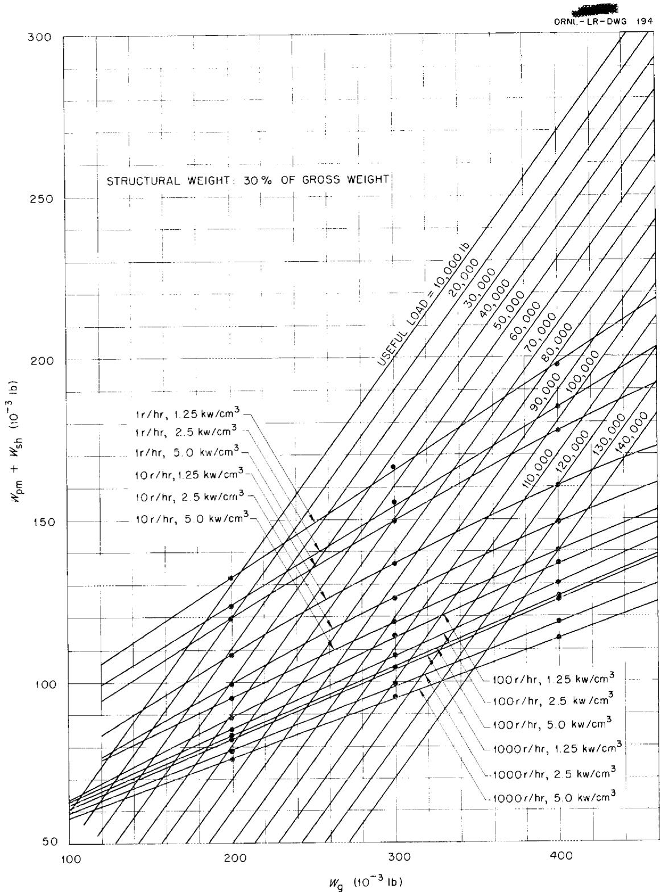  
Fig. 3.1. Chart for Determining Aircraft Gross Weight for Mach 0.9 at Sea Level.

and possibly even more important factor is that as the lead thickness is increased beyond about 6 in., the secondary gamma rays produced in the outer lead layer become of about the same importance as the prompt gamma rays from the core. This makes it necessary to add disproportionally large amounts of lead if the dose from the reactor shield is to be reduced below about $10\mathrm{r / hr}$ at 50 feet.

An important point that can be deduced from Fig. 3.1 is that an increase in crew shield weight of 6000 lb, enough to reduce the crew dose by a factor of 10, produces an increase in aircraft gross weight of only about 12,000 lb for the Mach 1.5,

TABLE 3.3.LIFT-TO-DRAG RATIOS FOR VARIOUS FLIGHT CONDITIONS   

<table><tr><td>MACH NUMBER</td><td>ALTITUDE (ft)</td><td>LIFT-TO-DRAG RATIO (without nacelles)</td></tr><tr><td>0.6</td><td>Sea level</td><td>15</td></tr><tr><td>0.6</td><td>35,000</td><td>15</td></tr><tr><td>0.9</td><td>Sea level</td><td>10</td></tr><tr><td>0.9</td><td>35,000</td><td>12</td></tr><tr><td>1.5</td><td>35,000</td><td>6</td></tr><tr><td>1.5</td><td>45,000</td><td>6</td></tr></table>

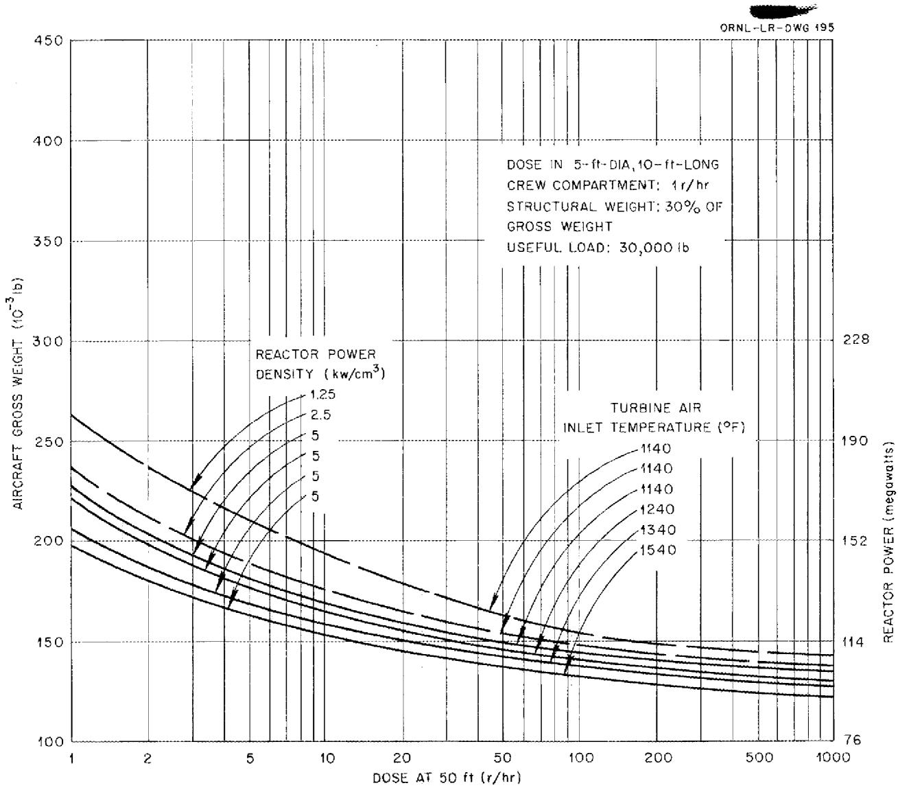  
Fig. 3.2. Effects of Shield Division, Power Density, and Turbine Air Inlet Temperature on Aircraft Gross Weight for Mach 0.9 at Sea Level.

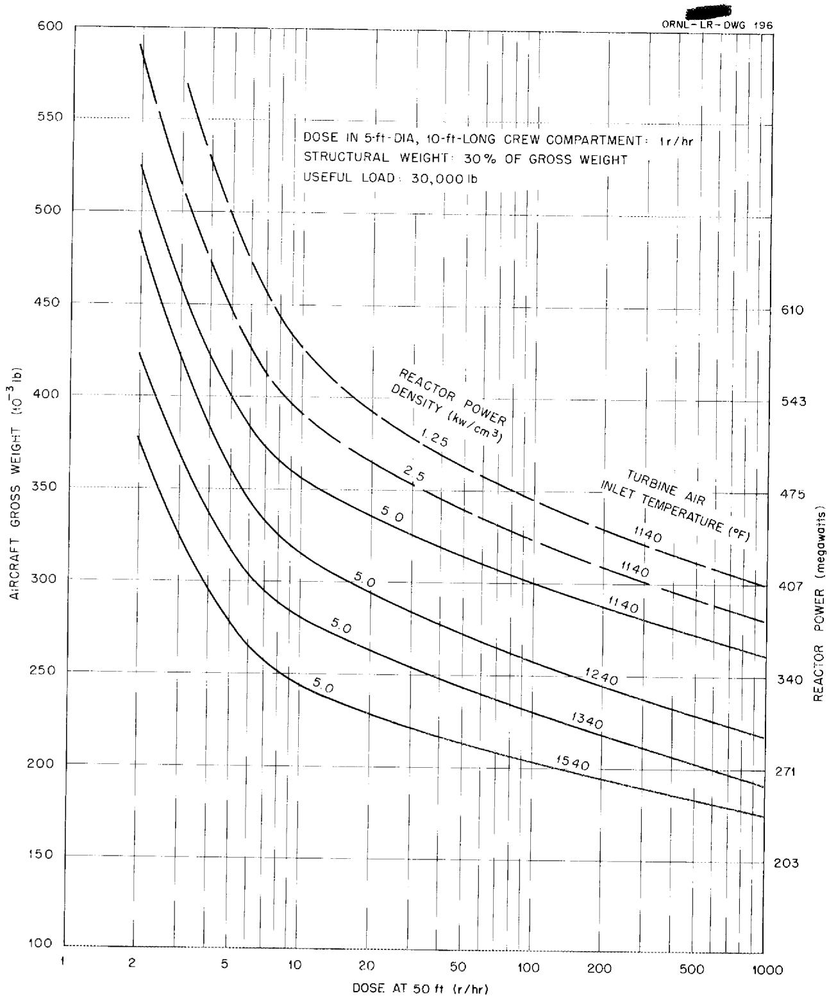  
Fig. 3.3. Effects of Shield Division, Power Density, and Turbine Air Inlet Temperature on Aircraft Gross Weight for Mach 1.5 at 35,000 Feet.

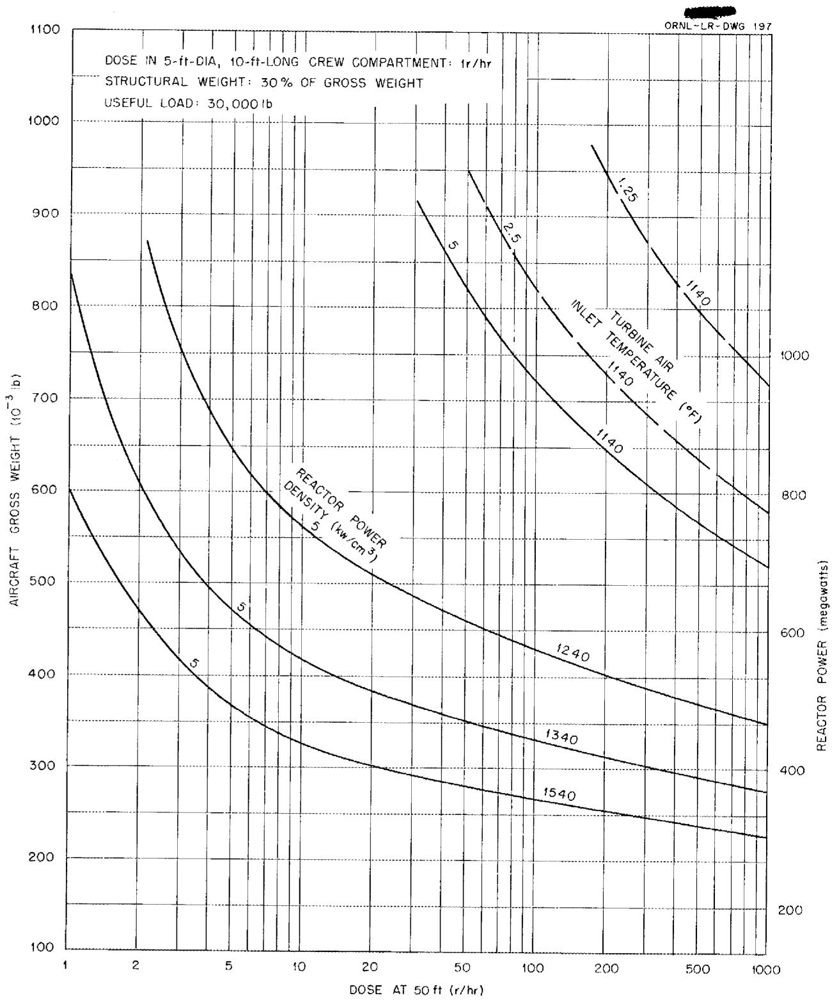  
Fig. 3.4. Effects of Shield Division, Power Density, and Turbine Air Inlet Temperature on Aircraft Gross Weight for Mach 1.5 at 45,000 Feet.

35,000-ft design condition. This, of course, is for a relatively small crew compartment (5 ft in diameter and 10 ft long). The weight increase associated with a larger compartment would be roughly proportional to its surface area.

The performance data presented above were for design-condition operation on nuclear power alone. Some additional calculations were made for all nuclear cruise operation at Mach 0.9 and 35,000 ft and sprint performance with chemical fuel augmentation at Mach 1.5 and 45,000 feet. A turbine air inlet temperature of $1640^{\circ}\mathrm{F}$ was assumed with interburning in the nuclear turbojets together with additional engines for operation on chemical fuel only for the sprint condition. The effect of sprint range on aircraft gross weight for several combinations of power density, radiator air outlet temperature, and degree of division of the shield are shown in Fig. 3.5. Comparison of this figure with Fig. 3.4 shows that an important saving in aircraft gross weight and a drastic reduction in reactor power can

be effected through the use of chemical fuel augmentation. Furthermore, as the chemical fuel is burned during the sprint, the aircraft speed and altitude can be increased in comparison with the values for the initial sprint condition. Yet another important advantage of burning up the fuel would be that the gross weight would be substantially reduced for landing.

A parametric study such as this is dependent upon the assumptions that form the bases for the calculations. Perhaps the most important of the assumptions were the lead-water reactor shield weight estimates prepared during the 1953 Summer Shielding Session.

These weight estimates were based on Lid Tank Facility tests, and calculated allowances were made for effects such as geometry, ducts, and decay gamma rays from fuel in the heat exchanger. It seems likely that the weight of an actual full-scale shield would be within $10\%$ of the estimates. If bismuth were used in place of lead, or lithium

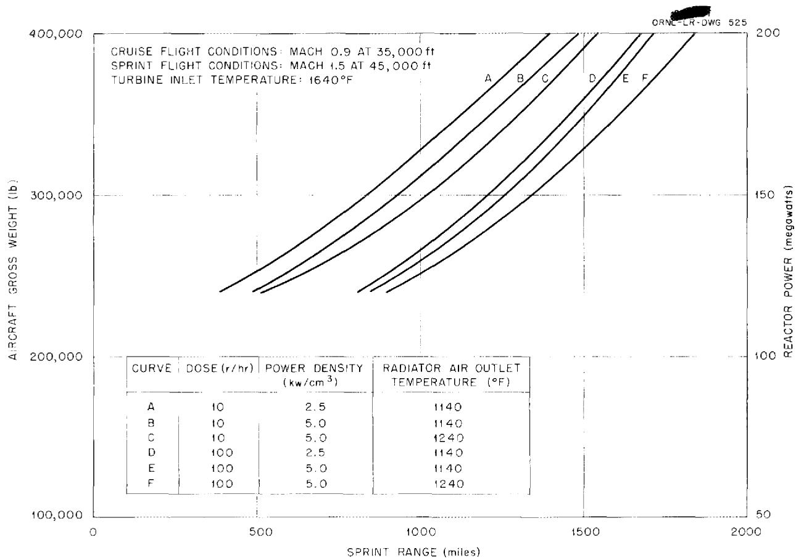  
Fig. 3.5. Nuclear Aircraft Performance with Chemical Augmentation.

hydride in place of water, a reactor shield weight saving of possibly $10\%$ might be effected. A second major assumption was the use of a fluoride fuel having physical properties equivalent to those of NaF-KF-LiF-UF4. If a high-viscosity fuel, such as the NaF-ZrF4-UF4 mixture developed for the ARE, were to be used, the resulting loss in the performance would be roughly equivalent to an increase of $100^{\circ}\mathrm{F}$ in the temperature drop from the peak fuel temperature to the turbine air inlet temperature. A third major assumption was that the NaK-to-air radiator would make use of a core with nickel fins similar to that for which full-scale radiator performance curves were given in ORNL-1509.6 It seems likely that both higher conductivity fin materials and somewhat better heat transfer geometries can be developed. It is possible that these improvements may serve to reduce the temperature drop from the NaK to the air by as much as $100^{\circ}\mathrm{F}$ .

6W. S. Farmer et al., Preliminary Design and Performance Studies of Sodium-to-air Radiators, ORNL-1509 (Aug. 3, 1953).

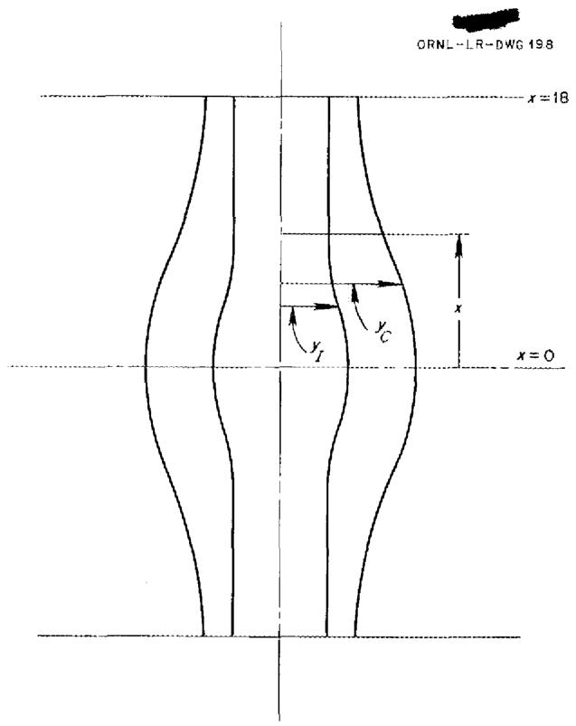  
Fig. 3.6. Diagram of Reflector-Moderated Reactor Core.

# CORE FLOW EXPERIMENT

B.M. Wilner

Aerojet-General Corporation

H. J. Stumpf

ANP Division

Preliminary testing of the full-scale Lucite core model was initiated. The dimensions of the core model are given in Table 3.4, with reference to Fig. 3.6. The tests made to date have been con

TABLE 3.4. CORE AND ISLAND DIMENSIONS   

<table><tr><td>x*(in.)</td><td>yc*(in.)</td><td>yI** (in.)</td></tr><tr><td>0</td><td>9.000</td><td>4.500</td></tr><tr><td>1</td><td>8.962</td><td>4.478</td></tr><tr><td>2</td><td>8.848</td><td>4.414</td></tr><tr><td>3</td><td>8.666</td><td>4.311</td></tr><tr><td>4</td><td>8.421</td><td>4.176</td></tr><tr><td>5</td><td>8.125</td><td>4.016</td></tr><tr><td>6</td><td>7.791</td><td>3.840</td></tr><tr><td>7</td><td>7.433</td><td>3.659</td></tr><tr><td>8</td><td>7.067</td><td>3.484</td></tr><tr><td>9</td><td>6.709</td><td>3.324</td></tr><tr><td>10</td><td>6.375</td><td>3.188</td></tr><tr><td>11</td><td>6.079</td><td>3.086</td></tr><tr><td>12</td><td>5.834</td><td>3.022</td></tr><tr><td>13</td><td>5.652</td><td>3.000</td></tr><tr><td>14</td><td>5.502</td><td>3.000</td></tr><tr><td>15</td><td>5.335</td><td>3.000</td></tr><tr><td>16</td><td>5.169</td><td>3.000</td></tr><tr><td>17</td><td>5.038</td><td>3.000</td></tr><tr><td>18</td><td>5.000</td><td>3.000</td></tr></table>

*Equations for core:

$$
\begin{array}{l} y _ {c} = 7. 2 5 + 1. 7 5 \cos \frac {x \pi}{1 5}, \\ 1 3. 5 \geq x \geq 0, \\ \end{array}
$$

$$
\begin{array}{l} y _ {c} = 6. 7 5 + 1. 7 5 \cos \frac {(x - 3) \pi}{1 5}, \\ 1 8 \geq x \geq 1 6. 5. \\ \end{array}
$$

For straight-line joins: $x = 13.5$ ,

$$
\begin{array}{l} y _ {c} = 5. 5 8 5 \text {f o} x = 1 6. 5, \\ y _ {c} = 5. 1 3 5. \\ \end{array}
$$

**Equations for island:

$$
y _ {I} = 3, \quad 1 8 \geq x \geq 9,
$$

$$
y _ {I} = 3. 7 5 + 0. 7 5 \cos \frac {x \pi}{9}, \quad 1 8 \geq x \geq 0.
$$

duced with air as the working fluid to facilitate changes in the vital pump volute-core inlet region. The distribution and the direction of flow were determined by the use of tufts. A careful evaluation of the tuft patterns indicated the need for cutoffs in the pump volutes and turning vanes around one quadrant of the impeller periphery to obtain uniform flow distribution at the core inlet. After experimenting with a number of arrangements, it was found that the configuration of Fig. 3.7 was the most satisfactory because it operated with no appreciable flow separation. This arrangement is the same as that envisioned in the designs presented in the previous report, except in the details of the shape of the turning vanes.

After the pump discharge-core inlet region had been investigated, a qualitative study was made of

the flow in the core by using a tuft on the end of a wire probe. The results indicated that the rounded flow nozzle shown at the core inlet is necessary to avoid regions of unstable and asymmetric flow in the core. A set of turbulator vanes placed in the core inlet passage and designed to produce the vortex pattern shown in Fig. 3.6 gave better velocity distribution through the core. From all indications, it appears that this arrangement satisfies the flow requirements, namely, axially symmetric flow and no separation at the core shell wall.

Fabrication of the equipment required to convert the system to permit flow tests with water has been started. With the water system, it is expected that

7R. W. Bussard and A. P. Fraas, ANP Quar. Prog. Rep. Dec. 10, 1953, ORNL-1649, p. 31 ff.

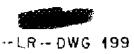

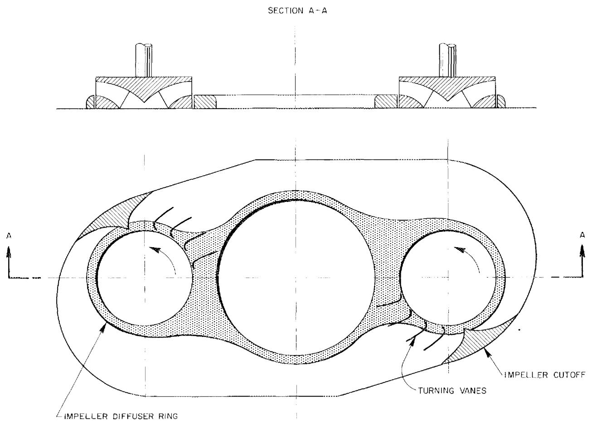  
Fig. 3.7. Core Header Region of Reflector-Moderated Reactor.

a thorough and quantitative study will be made. Pitot-tube traverses of the core and header regions should establish the velocity distributions of interest and hence enable a meaningful heat transfer analysis to be made of the system. In addition, it should be possible to determine the hydraulic characteristic of the pump impellers for various operating conditions.

# REACTOR CALCULATIONS

M.E.LaVerne

ANP Division

C. S. Burtnette

USAF

Specifications were prepared for a parametric study of a set of 48 related reactors in which the parameters of core diameter, reflector thickness, and fuel thickness will be varied over a wide range. In this study the effects of the geometry of the reflector-moderated reactor on the physical quantities of interest, such as critical mass, required mole per cent of uranium in the fuel, and power distribution, will be ascertained. Calculations on this set of reactors are about two-thirds complete; the remaining calculations are being made as rapidly as available machine time permits.

As part of a study of a 50-megawatt reactor with an 18-in. core, a 4-in.-thick fuel annulus, and a 12-in.-thick reflector, reactivity coefficients have been obtained for Inconel, sodium, and beryllium as functions of regions within the reactor. In computing these coefficients, the amount of material $M$ (of Inconel, sodium, or beryllium) was increased in each region by an amount $\Delta M$ without displacing any of the other components. The resulting change in reactivity produced by this idealized experiment can be of practical significance in critical experiments where voids already exist. In an actual reactor, the over-all change in reactivity could be obtained by summing algebraically the effects of adding one material and removing another.

The reactivity coefficients of Inconel, sodium, and beryllium are presented in Figs. 3.8, 3.9, and 3.10. Other data of interest are:

Critial mass

40.7 Ib

Volume of reactor core

4.1175×104 cm3

Power density (normalized to 1

fission per cm3)

At surface of island

1.29672

Minimum

0.68781

At outer surface of fuel region

1.90198

Reactivity coefficient for U235

0.19526

$\Delta k / (\Delta M / M)$

33.149

Per cent thermal fissions

Critical experiment precalculations were specified for (1) two-region reactors with 16- and 21-in. dia uranium-foil and Teflon-laminate cores and beryllium reflectors and (2) a three-region reactor with a beryllium reflector and island and a 21-in. OD core (with and without Inconel core shells) similar to those in the two-region reactors. Calculational difficulties make a firm estimate of critical mass impossible at this time; however, preliminary results indicate a critical mass of about 16 lb for the two-region reactor with a 16-in.-dia core. Additional calculations have been requested for a more precise determination.

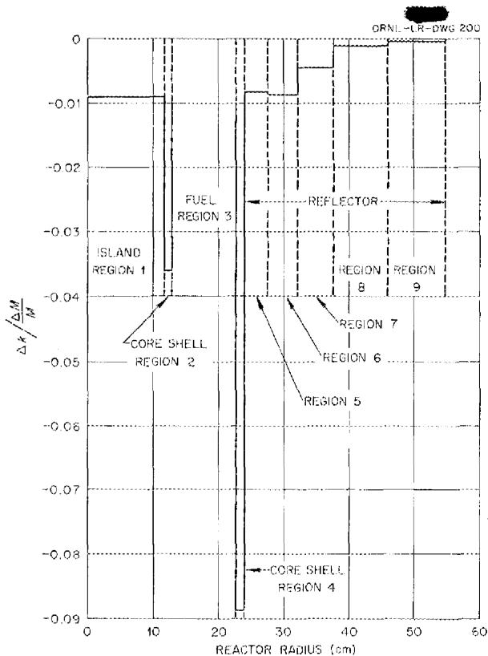  
Fig. 3.8. Reactivity Coefficient of Inconel as a Function of Reactor Radius.

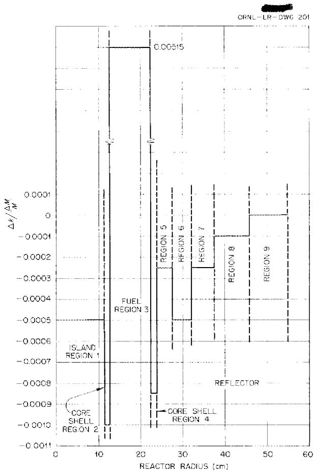  
Fig. 3.9. Reactivity Coefficient of Sodium as a Function of Reactor Radius.

# REACTOR DYNAMICS

W.K.Ergen

ANP Division

The results of previous investigations on the kinetics of circulating-fuel reactors were summarized previously, but, in the mathematical sense, the results could not be proved rigorously at that time. Brownell of the Institute of Advanced Study was consulted in the matter and he prepared a paper which proves some of the points with mathe

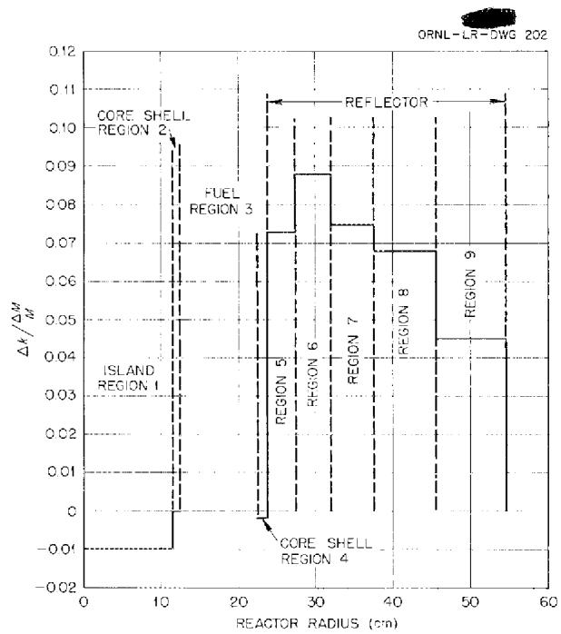  
Fig. 3.10. Reactivity Coefficient of Beryllium as a Function of Reactor Radius.

matical rigor. It is expected that the new rigorous methods will be extended in the future to cover all the tentative results in the previous work.

The considerations regarding the inhour formula of a circulating-fuel reactor, as mentioned in the previous report, $^{10}$ were summarized in a memorandum. $^{11}$

# COMPUTATIONAL TECHNIQUES

R. R. Coveyou

ANP Division

R.B.Bate

Corps of Engineers, U.S. Army

The methods of reactor statics computations described by Holmes12 are being modified for use on the ORACLE. Since the old methods were designed for the then available IBM machine and since the ORACLE exceeds these machines in speed of

computation, the modification of the technique will include the introduction of new features which tend to improve the accuracy of the results. The following such features will probably be incorporated:

1. A "P3 approximation" of the angular distribution of the neutron flux, which is an improvement over the previously used "P1 approximation," will be used to increase the reliability of the technique, particularly near the interfaces between media of different characteristics. In thin layers, such as those that occur in the various reflector-moderated reactor designs, each point is necessarily close to such an interface. Consideration has been given to the replacement of the thin layers by special boundary conditions, but these special boundary conditions will probably become unnecessary with the improved treatment of the thin layers.

2. For each element, the cross sections will be averaged over each group and then the group averages will be averaged over the various elements present. Previously, the opposite procedure was used; that is, for a number of lethargy points within a group the cross sections were averaged over the elements and then the group average was obtained. The new procedure greatly simplifies the computation.

3. Self-shielding13 will be coded into the machine computations to eliminate the necessity of computing the self-shielding corrections to the cross sections by hand.

4. Inelastic scattering will be treated in a manner analogous to fission. The neutron is "absorbed" in one lethargy group and each such absorption gives rise to sources of neutrons in other lethargy groups.

5. The "Fox technique" will be employed. This is a mathematical trick which eliminates the necessity of the introduction of "trial functions" for the flux distribution in each lethargy group and the necessity of repeated iteration. The "Fox technique" gives the solution by traversing the space points in each lethargy group twice.

The actual coding of the technique described above will be attempted in the near future.

# BERYLLIUM CROSS SECTIONS

C. B. Mills

ANP Division

It has been difficult to compute both "age-to-indium" and $k_{\text{eff}}$ for beryllium-moderated systems. Direct use of tabulated values of $\sigma_t$ and $\sigma_a$ has given $62 \, \text{cm}^2$ for the age and 1.00 for the $k_{\text{eff}}$ of a small reactor. Use of a $p$ -scattering correction to adjust the age to $80.2 \, \text{cm}^2$ results in a $k_{\text{eff}}$ value of 0.90. This inconsistency is not serious for most reactors of design interest, for which the error in $k_{\text{eff}}$ with $p$ -scattering is about $2\%$ . Therefore it has been sufficient to assume an inelastic and an $(n, 2n)$ cross section of the proper magnitude to absorb the $k_{\text{eff}}$ error. The cross sections in the $10 > E > 0.2$ Mev neutron energy range were then adjusted to give a neutron escape value the same as that with $\sigma_n$ or $\sigma_{n-2n}$ reactions.

The effects of angle-scattering corrections on $\sigma_{tr}$ and $\xi$ for several assumptions on symmetry of scattering in the center of mass system are:

Case 1. For $s$ -scattering, isotropic in the center-of-mass system:

$$
\begin{array}{l} p (\cos \theta) = 1, \\ \sigma_ {t r} = (1 - b) \sigma_ {s}, \\ b = \frac {2}{3 A}, \\ \xi = \xi_ {0} = 1 + \frac {\alpha \ln a}{1 - 6}, \\ a = \left(\frac {A - 1}{A + 1}\right) ^ {2}. \\ \end{array}
$$

Case 2. For $p$ -scattering (groups 1 to 8; $10 > E > 0.2$ Mev):

$$
\begin{array}{l} p (\cos \theta) = 1 + C \cos \theta , \\ \sigma_ {t r} = (1 - b) \sigma_ {s}, \\ b = \frac {2}{3 A} + c \left(\frac {1}{3} - \frac {1}{5 A ^ {2}}\right), \\ \xi = \xi_ {0} \left[ 1 - c \left(\frac {1}{1 - a} - \frac {1}{2 \xi_ {0}}\right) \right]. \\ \end{array}
$$

Case 3. For $d$ -scattering (groups 1 to 5; $10 > E > 0.8$ Mev):

$$
p (\cos \theta) = 1 + a \cos^ {2} \theta ,
$$

$$
\sigma_ {i r} = (1 - b) \sigma_ {s},
$$

$$
b = \frac {\frac {2}{3 A} + \frac {2 a}{1 5 A}}{1 + \frac {a}{3}},
$$

$$
\begin{array}{l} \xi = \frac {\xi_ {0}}{1 + \frac {a}{3}} \left\{1 + \frac {a}{(1 - a) ^ {2}} \left[ \frac {a ^ {2}}{3} + 1 \right. \right. \\ \left. \left. + \frac {1}{9 \xi_ {0}} (\alpha + 5) (\alpha - 1) \right] \right\}. \\ \end{array}
$$

The cross-section curves presented in AECU-2040 and the $p$ - and $d$ -scattering effects described above can be used to obtain a correct "age-to-indium" $(80.2\mathrm{cm}^2)$ value if a $p$ -scattering correction value is assumed that varies uniformly from 0 at 0.2 Mev to 1 at 10 Mev. At 10 Mev, $\xi/\xi_0 = 0.640$ and $(1 - b)/(1 - b_0) = 0.654$ , where $\xi_0 = 0.208$ and $b_0 = 0.0745$ . To compute the correct $k_{\text{eff}}$ (1.00) for a small $(B^2 = 0.0085)$ beryllium-moderated critical experiment, an inelastic scattering cross section of near 0.076 barns must be assumed [an $(n,2n)$ reaction cross section can be one-half this value]. With this assumption, the various numbers can be computed reasonably well. In particular, $\tau = 80\mathrm{cm}^2$ , $k_{\text{eff}} = 1.00$ , and $\tilde{\sigma}_t$ and $\tilde{\sigma}_{tr}$ in the $7 > E > 1$ Mev region are 2.12 and 1.45 in comparison with experimental values of $2.18 \pm 0.05$ and $1.37 \pm 0.11$ barns.[16] The $\cos^2\theta$ term adds $1.3\mathrm{cm}^2$ for $a = 0.55$ ; the first flight correction is $3.9\mathrm{cm}^2$ , and the last flight adds $0.6\mathrm{cm}^2$ .

# CHEMICAL PROCESSING OF FLUORIDE FUEL BY FLUORINATION

F.N.Browder D.E.Ferguson   
G. I. Cathers E. O. Nurmi

Chemical Technology Division

A new, nonaqueous method for processing fuels of the NaF-ZrF₄-UF₄ system from an actual aircraft reactor has been shown to be feasible. It consists of three steps: (1) recovery of the uranium by converting the uranium tetrafluoride in the molten NaF-ZrF₄-UF₄ mixture to the volatile hexafluoride, using elemental fluorine; (2) gas-phase reduction of the partially decontaminated UF₆ to UF₄; and (3) refabrication of the molten salt fuel from this UF₄.¹⁸ Scouting runs made by the Chemical Technology Division on the first step of the process have shown that more than 99% of the fission products and less than 0.05% of the U²³⁵ would remain in the original NaF-ZrF₄ mixture and be discarded to waste. The process appears to be attractive from the standpoint of cost, inventory of fissionable material, and radioactive waste volume. The major chemical cost is for the hafnium-free zirconium fluoride used in the fuel, which is not recovered, and would be about 25¢ per gram of U²³⁵ processed, at present prices. The fluorine would cost only 1¢ per gram of U²³⁵ processed, based on a 4% fluorine efficiency and a unit cost of $1.00 per pound for fluorine. The process appears to be less hazardous than the BrF₃ or CIF₃ processes for uranium recovery, since it can be operated at atmospheric pressure or under a slight vacuum.

In the scouting runs, fluorine gas was passed through $100\mathrm{g}$ of $\mathrm{NaF - ZrF_4 - UF_4}$ (50-46-4 mole $\%$ 8.5 g of uranium per charge) at temperatures above the melting point $(530^{\circ}C)$ , and the volatilized UF $_6$ was recovered in a dry ice trap. In some cases, the product was resublimed under vacuum. The fluorination was carried out in an Inconel vessel in a table furnace with a dip tube for bubbling fluorine through the molten salt; atmospheric pressure was used to minimize any hazard from leaks. Unused fluorine passed into a chemical trap of soda lime and alumina. The fluorine flow, which was approximately $100\mathrm{ml / min}$ over a period of several hours, was controlled by a needle valve feeding into a glass Rotameter type of flow meter, but pressure changes in the supply tank of known volume were considered to be more reliable than

the flowmeter for estimating the total amount of fluorine used in each run.

In the first two runs (Table 3.5) with 4 and 13 times the theoretical amount of fluorine, 43 and $99.7\%$ of the uranium was volatilized, as determined by analysis of the $\mathsf{NaF - ZrF_4}$ residue. In the next three runs, in which more than 20-fold the stoichiometric amount of fluorine was used, 99.93 to $99.97\%$ of the uranium was volatilized and good material balances were obtained. The low fluorine efficiency was probably partly due to the poor contact between the gas and the molten salt. There was no evidence in any of the experiments of volatilization of $\mathsf{ZrF_4}$ . The line leading from the fluorinator to the trap was kept at $70^{\circ}C$ to prevent deposition of $\mathsf{UF_6}$ .

The charge in the last three runs was spiked with fission products to the extent of $2 \times 10^{9}$ beta counts/min. Gross beta decontamination factors of 100 to 270 were obtained in the fluorination step (Table 3.6). The major contaminants of the

product were ruthenium and niobium, and radiochemical analysis of the residue showed that over $90\%$ of the ruthenium and 60 to $80\%$ of the niobium had followed the uranium. Sparging of the molten salt prior to fluorination would therefore lead to better decontamination from ruthenium and niobium, as well as from the more volatile short-lived fission products. The possibility of loss during nuclear operation of some ruthenium and niobium, as well as of halogen and rare gas fission products, is also indicated.

In two runs, part of the $\mathsf{UF}_6$ product was resublimed into a second dry ice trap under vacuum. An overall gross beta decontamination factor of 4000 to 5000 was obtained in both cases (Table 3.6). The poor yield of $33\%$ in one case was due to partial hydrolysis of $\mathsf{UF}_6$ in the first trap because of faulty drying and conditioning of the apparatus. Better conditioning would undoubtedly improve the yield in both the fluorination and the sublimation steps.

TABLE 3.5. URANIUM RECOVERY IN FLUORINATION OF FLUORIDE FUEL   
Initial charge: 8.5 g of uranium in 100 g of NaF-ZrF₄-UF₄ (50-46-4 mole %)   

<table><tr><td>FLUORINATION TEMPERATURE (°C)</td><td>RATIO OF FLUORINE USED TO THEORETICAL REQUIREMENT</td><td>URANIUM IN RESIDUE (% of initial charge)</td><td>AMOUNT OF URANIUM RECOVERED BY RESUBLIMATION (% of initial charge)</td></tr><tr><td>665</td><td>4:1</td><td>57</td><td></td></tr><tr><td>585 to 605</td><td>13:1</td><td>0.25</td><td></td></tr><tr><td>600 to 635</td><td>24:1</td><td>0.02</td><td>99</td></tr><tr><td>620 to 655</td><td>26:1</td><td>0.07</td><td>80</td></tr><tr><td>585 to 600</td><td>40:1</td><td>0.03</td><td>97</td></tr></table>

Initial charge: 8.5 g of uranium in 100 g of NaF-ZrF $_4$ -UF $_4$ (50-46-4 mole %)

TABLE 3.6. DECONTAMINATION OF URANIUM BY FLUORINATION OF FLUORIDE FUEL   

<table><tr><td rowspan="2">PROCESS</td><td colspan="5">BETA DECONTAMINATION FACTORS*</td><td rowspan="2">URANIUM RESUBLIMED (% of initial charge)</td></tr><tr><td>Gross</td><td>Ru</td><td>Zr</td><td>Nb</td><td>TRE</td></tr><tr><td>Fluorination at 600 to 635°C</td><td>270</td><td>14</td><td>4.2 × 103</td><td>13</td><td>2.1 × 104</td><td></td></tr><tr><td>Fluorination at 620 to 655°C</td><td>100</td><td>6</td><td>1.4 × 104</td><td>6</td><td>3.0 × 104</td><td></td></tr><tr><td>Resublimation</td><td>5 × 103</td><td>250</td><td>8.4 × 104</td><td>5.8 × 103</td><td>4.6 × 105</td><td>33</td></tr><tr><td>Fluorination at 585 to 600°C</td><td>230</td><td>17</td><td>1.9 × 103</td><td>5</td><td>6.0 × 103</td><td></td></tr><tr><td>Resublimation</td><td>4.4 × 103</td><td>270</td><td>4.5 × 104</td><td>360</td><td>5.6 × 105</td><td>77</td></tr></table>

*Decontamination factors for resublimed material include decontamination obtained in the fluorination step.

# 4. CRITICAL EXPERIMENTS

A.D.Caffihan

Physics Division

# SUPERCRITICAL-WATER REACTOR

E.L.Zimmerman

Physics Division

J. S. Crudele

J.W.Noaks

Pratt & Whitney Aircraft Division

A critical experiment was assembled to test the designed core dimensions and core composition of the supercritical-water reactor. A 38-in., equilateral, cylindrical, aluminum tank is used for this experiment. An organic liquid $(\mathrm{C}_5\mathrm{H}_4\mathrm{O}_2)$ , which has a hydrogen density similar to that of water in the supercritical state, serves as the neutron reflector and as part of the moderator. The fissionable material, enriched uranium in an aqueous solution of $\mathrm{UO}_2\mathrm{F}_2$ , is contained in 1-in.-dia stainless steel tubes. The effective loading for initial criticality was about $5\mathrm{kg}$ of $\mathrm{U}^{235}$ without stainless steel inserts in the core. Stainless steel is inserted in the core by loading $\frac{3}{16}$ -in.-OD tubes into the $\mathrm{UO}_2\mathrm{F}_2$ solution. In the current experiments the designed dimensions and composition of the core are being approached by varying the height of the organic liquid reflector and moderator (assumed to be the effective core height) as a function of the number of fuel tubes loaded at increasing steel-touranium ratios.

# AIR-COOLED REACTOR

D. V. P. Williams

J. J. Lynn

D. F. Cronin

C. Cross

Physics Division

J. D. Simpson

R.C.Evans

W. Baker

H. E. Brown

General Electric Co., ANP Division

A preliminary assembly of the AC-100-A, air-cooled, water-moderated reactor of the General Electric Aircraft Nuclear Propulsion Project was made. The fuel is enriched-uranium metal disks placed between steel disks. The disks are mounted inside aluminum tubes, 4 in. in diameter. The fuel section is 30 in. high. Thirty-seven aluminum tubes, in a pattern designed to give uniform radial power, constitute the core. The core is immersed in water,

which serves as the neutron moderator and as an effectively infinite reflector. In order to make the system initially critical, it was necessary to deviate significantly from the prescribed loading by increasing the uranium from 26.6 to $45.6\mathrm{kg}$ and by decreasing the steel content by about one-half. A series of measurements is being made to ascertain the cause of the discrepancy between the reactivity of the experiment as designed and that which could be made critical. The details of the experiments will be reported by the General Electric Company.

# REFLECTOR-MODERATED REACTOR

D. Scott

B. L. Greenstreet

ANP Division

The critical experiment program for the reflectormoderated reactor has been altered to provide more fundamental information than that obtained by previous experiments. The earlier work was designed for direct measurements on rough mockups of possible reactors, with the purpose of establishing design parameters. These mockups were, in general, of complicated geometry and usually contained materials unique to the unit being studied. The effort in the immediate future will be centered on reflector-moderated assemblies of simple geometry, and material variations will be made to check consistency with theory and the fundamental constants. These results should also aid in the evaluation of previous reflector-moderated critical assemblies.

It is now planned, first, to build a basic reflectormoderated reactor with two regions - fuel and reflector. The fuel region is to contain uranium and a fluorocarbon plastic, Teflon, to simulate the fluoride fuels, and the reflector region will contain beryllium. The fuel region is to be rhombicuboctahedral (essentially, a cube with the edges and corners cut away) to approximate a sphere within the limitations imposed by the shape of the available beryllium. The purpose of this first experiment is to check machine calculations. The program is set up to then follow either of two alternatives, depending on the results from the first assembly.

If the experiments confirm the theoretical calculations to a sufficient degree, three-region octahedrons with a beryllium "island" separated from the reflector by the fuel will be built. The first of these assemblies will have no Inconel core shells, the second will include Inconel, and the final one will mock up the reactor, including the end ducts. In the event that poor agreement between theory and the first experiment is found, a second two-region assembly of different core size will be constructed.

In all cases, the fuel region will be built of alternating sheets of uranium metal and Teflon to permit some variation in the uranium density. The uranium sheets are to be 0.004 in. thick, and they will be coated with a protective film to reduce surface oxidation. The Teflon sheets will be $\frac{1}{16}$ and $\frac{1}{32}$ in. thick to make possible fairly homogeneous distribution of the uranium. The reflector and the reflector-moderator will be beryllium metal.

Part II

MATERIALS RESEARCH

# 5. CHEMISTRY OF HIGH-TEMPERATURE LIQUIDS

# W.R.Grimes Materials Chemistry Division

A number of four-component systems with low $\mathsf{UF}_4$ concentrations have been re-examined in the continuing effort to obtain fuels with physical properties better than those of the NaF-ZrF-UF4 system. The low viscosity reported for a NaF-KF-ZrF-UF4 mixture has served to stimulate interest in this system, and additional thermal data are being obtained. Other systems being studied by thermal analysis are NaF-LiF-ZrF-UF4, NaF-BeF2-ZrF4-UF4, NaF-LiF-BeF2-UF4. Thermal analyses were also made of the RbCl-UCI3 and NaCl-ZrCI4 systems. The study of the NaCl-ZrCl4 system was initiated to verify the low melting points reported in the literature for this system. A low-melting-point water-soluble mixture of this type would be of interest for removal of fluorides from equipment. Also, the quenching technique applied previously to NaF-ZrF4 mixtures has been used along with x-ray and petrographic examination of slowly cooled specimens to obtain a better understanding of the complex phase relationships in the NaF-UF4 and NaF-ZrF4 systems. High-temperature phase separation has proved to be a useful tool for studying systems in which solid solutions are expected and for which petrographic and x-ray examination can, accordingly, give only rough approximations of the composition of the separated phases. The systems NaF-ZrF4, NaF-ZrF4-UF4, and NaF-KF-ZrF4-UF4 were studied by using this technique.

The experimental production facilities for the preparation of fluoride mixtures have been modified and expanded for supplying the research materials required for the long-range ANP program. The 250-lb capacity equipment has also been reactivated to supply the fluoride mixtures ordered by the Pratt and Whitney Aircraft Division of United Aircraft Corporation and the sizeable demands of the ORNL-ANP program.

Analyses for silica in two purified batches of $\mathrm{Sr(OH)_2}$ confirmed the finding that less than 500 ppm of silica is introduced by passage of the material through a fine sintered-glass filter. Additional studies of the reaction of sodium hydroxide with carbon have confirmed that graphite is oxidized by NaOH at elevated temperatures. Conse

sequently, the carbonate content of molten NaOH will increase if any carbonaceous matter is present.

The experimental study of the reaction of chromium metal with $\mathsf{UF}_4$ in molten $\mathsf{NaZrF}_5$ was repeated with the use of improved techniques, and the reaction of iron with $\mathsf{UF}_4$ in this solvent was also studied. These experiments have shown that the deviation of the activity coefficients from unity is probably due to the formation of complex ions such as $\mathsf{UF}_5^-$ , $\mathsf{UF}^{\text{一}}$ , and $\mathsf{FeF}_3^-$ . Two methods for producing $\mathsf{NaZrF}_5$ melts containing $\mathsf{UF}_3^-$ were developed. One sample, filtered at $600^{\circ}\mathsf{C}$ , was found to contain 3.54 wt $\%$ $\mathsf{UF}_3^-$ , and another, filtered at $700^{\circ}\mathsf{C}$ , contained 5.95 wt $\%$ $\mathsf{UF}_3^-$ . Evidence was accumulated which showed that no mechanism for storing latent reducing power in a nonuranium-bearing fluoride melt is afforded by the presence of $\mathsf{ZrF}_4$ and, as a corollary, that there are no prospects for imparting hydrogenous character to a melt by means of $\mathsf{ZrH}_2$ solubility. Rates of reduction of $\mathsf{NiF}_2$ and $\mathsf{FeF}_2$ by hydrogen in nickel reactors were determined at 600 and $700^{\circ}\mathsf{C}$ . Further determinations of absorption spectra for $\mathsf{UF}_4$ and $\mathsf{UF}_3^-$ in quenched fluoride melts were carried out with a Beckman DU spectrophotometer, and additional decomposition potential measurements in KCl melts in a hydrogen atmosphere were made.

# THERMAL ANALYSIS OF FLUORIDE SYSTEMS

C. J. Barton H. Insley  
Materials Chemistry Division

In the continuing effort to obtain fuels with physical properties better than those of the NaF-ZrF $_4$ -UF $_4$ system, a number of four-component systems with low UF $_4$ concentrations have been re-examined. The low viscosity reported for a NaF-KF-ZrF $_4$ -UF $_4$ mixture has served to stimulate interest in this system, and additional thermal data are being obtained.

# NaF-LiF-ZrF-UF

It was previously reported² that the ternary mixture NaF-LiF-ZrF₄ (40-20-40 mole %) melted at 426°C; however, data presented in the same report showed that the melting points increased considerably with increases in UF₄ concentration. Additional data have been taken to confirm these findings and to explore the effect of UF₄ on other ternary compositions. The addition of 5 mole % UF₄ to the 40-20-40 mole % composition mentioned above gave a mixture with a melting point of 485°C, which is in reasonable agreement with the previous data. The lowest melting point so far established at the 4 mole % UF₄ level is 470°C for NaF-ZrF₄-LiF-UF₄ (24-38.4-33.6-4.0 mole %). This mixture has a melting point that is nearly 50°C less than that of NaF-ZrF₄-UF₄ (53-43.4-3.6 mole %).

# NoF-BeF2-ZrF4\*UF4

Some thermal data were obtained with mixtures in the NaF-BeF $_2$ -ZrF $_4$ -UF $_4$ system in connection with a study of BeF $_2$ pump seals, $^{3,4}$ These data were collected by mixing various amounts of BeF $_2$ with a ternary mixture NaF-ZrF $_4$ -UF $_4$ (50-46-4 mole %) and running cooling curves with the resulting mixtures. A limited thermal analysis of this four-component system has been conducted by adding UF $_4$ in amounts of up to 10 mole % to six low-melting-point ternary mixtures and observing the thermal effects when the fused mixtures are allowed to cool. In all cases the melting points of mixtures

containing 2 or 2.5 mole $\%$ UF $_4$ were higher than that of the ternary mixture. The minimum melting point at this uranium level was about $450^{\circ}\mathrm{C}$ . At the 4 mole $\%$ level, the minimum melting point was near $460^{\circ}\mathrm{C}$ . Although this investigation can be regarded as only preliminary, the melting points observed do not seem low enough to justify a detailed examination of the system unless it seems to be attractive because of other physical properties.

$$
\mathrm {N a F - L i F - B e F} _ {2} \mathrm {- U F} _ {4}
$$

Two compositions in the NaF-LiF-BeF $_2$ -UF $_4$ system were subjected to thermal analysis in connection with the preparation of ternary mixtures for viscosity determination. The thermal effects observed on cooling curves, which may be too low because of supercooling, are shown in Table 5.1.

The mixture NaF-LiF-BeF $_2$ (35-20-45 mole %) was chosen for viscosity tests to be made by the Physical Properties Group in the near future. Viscosity data obtained from another installation, which indicate that LiBeF $_3$ has a much higher viscosity than that of NaBeF $_3$ , strongly influenced the choice.

# THERMAL ANALYSIS OF CHLORIDE SYSTEMS

A.B.Wilkerson R.J.Sheil

C.J.Barton

Materials Chemistry Division

The investigation of chloride fuel systems during the past quarter was limited to the binary alkali chloride- $\mathsf{UCl}_3$ and -UcI4 systems for which satisfactory equilibrium diagrams had not been obtained.

TABLE 5.1. THERMAL EFFECTS WITH THREE- AND FOUR-COMPONENT ${\mathrm{{BeF}}}_{2}$ MIXTURES   

<table><tr><td colspan="4">COMPOSITION (mole %)</td><td rowspan="2">THERMAL EFFECTS (°C)</td></tr><tr><td>NaF</td><td>LiF</td><td>BeF2</td><td>UF4</td></tr><tr><td>20</td><td>35</td><td>45</td><td>0</td><td>323, 295, 245</td></tr><tr><td>19</td><td>33.3</td><td>42.7</td><td>5</td><td>395, 288*, 237</td></tr><tr><td>35</td><td>20</td><td>45</td><td>0</td><td>330*</td></tr><tr><td>33.3</td><td>19</td><td>42.7</td><td>5</td><td>420, 307*</td></tr></table>

* Indicates supercooling occurred.

The $\mathsf{UCl}_4$ systems, particularly KCl-UCI and RbCl-UCI, have shown poorer reproducibility of thermal effects than the UCl systems, and the liquidus for these two systems cannot at the present time be located with certainty in the low-melting-point regions extending from about 40 to 60 mole $\%$ UCl. It appears that other techniques, such as quenching, filtration, or differential thermal analysis, will be required to determine accurately the melting points and phase relationships in these regions. Petrographic examination has been less satisfactory for determining compound compositions in fused chloride mixtures than in the fluoride systems because of difficulty in handling the very hygroscopic samples, reaction of the solid material with some refractive index oils, and lack of pure, crystalline compounds for standards. Oxide phases are apparently not so easily observed in chloride melts as in fused fluorides.

An investigation of the NaCl-ZrCl system was

initiated to verify the low melting points reported in the literature for this system. A low-melting-water-soluble mixture of the type found in the NaCl-ZrCl₄ system would be of interest for removal of fluorides from engineering equipment or, possibly, for final flushing of the ARE fuel circuit after operation.

# RbCl-UCI3

Preliminary data for the $\mathsf{RbCl - UCl}_3$ system were reported previously.7 A tentative diagram for this system, based only on thermal analysis data, is shown in Fig. 5.1. Three compounds are indicated: $\mathsf{Rb}_3\mathsf{UCl}_6,$ which melts congruently at $745\pm 10^{\circ}\mathrm{C};$ $\mathsf{Rb}_2\mathsf{UCl}_5,$ which melts incongruity at $560\pm 10^{\circ}\mathrm{C};$ and $\mathsf{RbUCl}_4,$ which melts incongruity at $550\pm$

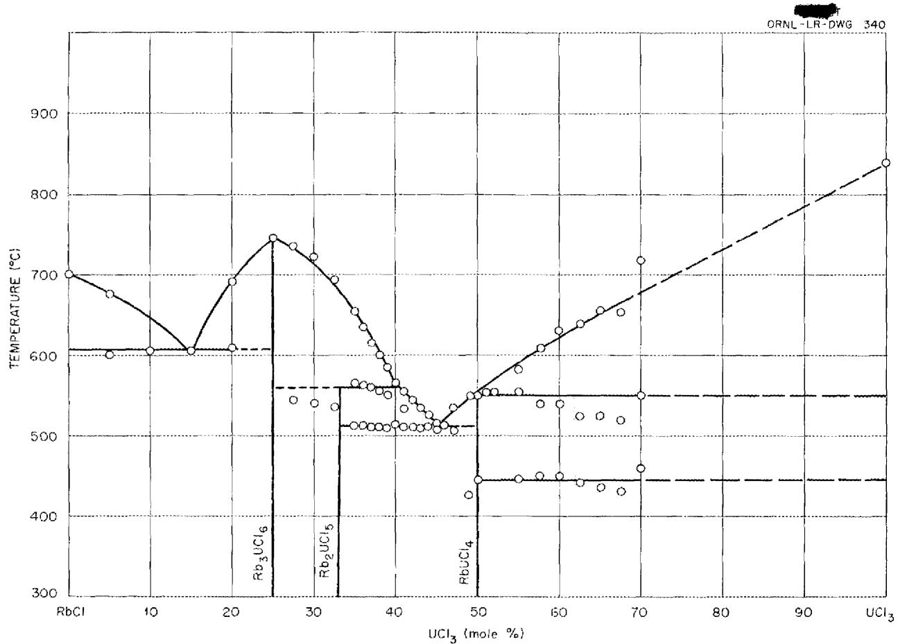  
Fig. 5.1. The System $\mathsf{RbCl - UCl}_3$ (Tentative).

$10^{\circ}C$ . It is possible that the latter compound melts congruently, but incongruent melting behavior seems to be more likely from the available data. The lowest melting point observed was $513 \pm 5^{\circ}C$ at approximately 45.5 mole $\% \mathrm{UCl}_3$ .

# NaCl-ZrCl 4

Eutectic compositions that melt at 390, 220, and $162^{\circ}C$ and the compounds $\mathrm{Na}_4\mathrm{ZrCl}_8$ and $\mathrm{NaZrCl}_5$ which melt at 535 and $330^{\circ}C$ , respectively, were reported for the $\mathrm{NaCl - ZrCl}_4$ system. Neither the compounds nor the eutectic temperatures reported have been verified in this laboratory. Some compositions in the range 11 to 45 mole $\% \mathrm{ZrCl}_4$ were placed in glass capsules equipped with thermocouple wells so that, in addition to thermal analysis, visual observation could be made. The lowest thermal effect observed was $355^{\circ}C$ . The incomplete thermal data obtained in this laboratory seem to indicate a congruently melting compound at 33.3 mole $\% \mathrm{ZrCl}_4$ with a melting point of about $615^{\circ}C$ . The identity of the compound was confirmed by petrographic examination of the fused melts; a single phase was indicated at this composition. Study of this system is continuing.

# QUENCHING EXPERIMENTS WITH FLUORIDE SYSTEMS

R.E.Thoma

R.E.Moore

M. S. Grim

C.J.Barton

Materials Chemistry Division

G. D. White H. Insley, Consultant Metallurgy Division

The quenching technique previously applied to NaF-ZrF4 mixtures has been used along with x-ray and petrographic examination of slowly cooled specimens to obtain a better understanding of the complex phase relationships in the NaF-UF4 and NaF-ZrF4 systems. The materials used in these studies were, in each case, prepared in small batches by the hydrofluorination-hydrogenation technique described in subsequent paragraphs of this section.

The quenching procedure was described in a previous report. The slowly cooled specimens consisted of 10 to $15\mathrm{g}$ of the material contained in sealed capsules of nickel. These samples were

heated in a furnace to considerably above the liquidus temperature and allowed to cool to room temperature over a period of 2 to 4 hours. Data from a large number of experiments of each type are presented and correlated in the following paragraphs.

# NaF-UF 4

Previous thermal analysis of this system showed two compounds: $\mathsf{Na}_2\mathsf{UF}_6$ which melts incongruity, and $\mathsf{NaUF}_5$ which melts congruently. Zachariasen also reported the compound $\mathsf{Na}_3\mathsf{UF}_7$ and recent thermal analyses have confirmed the existence of this material. The compound $\mathsf{Na}_3\mathsf{UF}_7$ appears to melt incongruity a few degrees above the eutectic temperature. While it appears that the major phase fields are well established in this system, the range of existence of the several stable modifications of $\mathsf{Na}_2\mathsf{UF}_6$ is still in doubt; there are also some questions regarding possible crystalline modifications of $\mathsf{Na}_3\mathsf{UF}_7$ .

Zachariasen reported three forms of $\mathsf{Na}_2\mathsf{UF}_6$ a (cubic), $\beta_{2}$ (hexagonal), and $\gamma$ (orthorhombic). However, slowly cooled compositions containing 22 to 50 mole $\%$ UF prepared in this laboratory show a fourth form designated as $\beta_{3}$ (hexagonal). Data obtained by petrographic and x-ray diffraction of nine such specimens are shown in Table 5.2.

When material of the $\mathrm{Na}_2\mathrm{UF}_6$ composition was quenched from temperatures in the range 390 to to $747^{\circ}\mathrm{C}$ , it was not possible to obtain a glass without some crystalline material. The $a$ (cubic) form of $\mathrm{Na}_2\mathrm{UF}_6$ was the predominant phase at $610^{\circ}\mathrm{C}$ and above. At $604^{\circ}\mathrm{C}$ and below, the $\beta_3$ form was the principal phase. One sample quenched at $590^{\circ}\mathrm{C}$ , however, showed nearly pure $\beta_2$ crystals. Further studies will be necessary to determine the stability range of the $\beta_2$ form and to explain the absence of the $y$ form.

The observance of crystalline phases with the $\mathrm{Na}_3\mathrm{UF}_7$ structure with refractive indices ranging from about 1.414 to 1.428 indicates possible solid solution formation between $\mathrm{Na}_3\mathrm{UF}_7$ and $\mathrm{Na}_2\mathrm{UF}_6$ . Crystalline phases with approximately the same refractive index but with different degrees of birefringence, along with some crystals which show anomalous interference colors, are also observed.

TABLE 5.2. PHASES PRESENT IN SLOWLY COOLED NaF-UF ${}_{4}$ MIXTURES   

<table><tr><td>COMPOSITION (male % UF4)</td><td>PHASES IDENTIFIED BY PETROGRAPHIC AND X-RAY DIFFRACTION ANALYSIS</td></tr><tr><td>22</td><td>β3-Na2UF6, NaF</td></tr><tr><td>25</td><td>β3-Na2UF6, Na3UF7, NaF (trace)</td></tr><tr><td>28</td><td>β3-Na2UF6 (major), Na3UF7</td></tr><tr><td>30</td><td>β3-Na2UF6 (major), Na3UF7</td></tr><tr><td>33.3</td><td>β3-Na2UF6</td></tr><tr><td>37</td><td>β3-Na2UF6 (major), NaUF5</td></tr><tr><td>40</td><td>β3-Na2UF6, NaUF5</td></tr><tr><td>43</td><td>β3-Na2UF6, NaUF5</td></tr><tr><td>50</td><td>NaUF5 (major), β3-Na2UF6, UF4, UO2(trace)</td></tr></table>

It appears likely that there are also different crystalline forms of $\mathsf{Na}_3\mathsf{UF}_7$ . Thermal analysis of compositions in this region showed thermal effects well below the solidus temperature.

Quenches with 37, 40, and 43 mole $\%$ UF $_4$ compositions at 690 to $719^{\circ}\mathrm{C}$ produced only isotropic material believed to be glass. Quenches with the 50 mole $\%$ NaF-50 mole $\%$ UF $_4$ mixture in the same temperature range produced fibrous birefringent crystals. The refractive index of these crystals was approximately the same as that reported for NaUF $_5$ . Glass may have been present in some of the quenched samples. A melting point of $710^{\circ}\mathrm{C}$ was reported earlier for the 50-50 composition, $^9$ but a more recent determination gave $714^{\circ}\mathrm{C}$ ; this is the value reported by Kraus. $^{11}$

# NaF-ZrF4

The methods and apparatus described previously have been used for further studies of the NaF-ZrF $_4$ system. Because the published thermal data seem to furnish an adequate picture of the equilibrium diagram from pure NaF to 30 mole % ZrF $_4$ , quenching experiments have been largely confined to work

with materials of higher $\mathsf{ZrF}_4$ content.

Petrographic and x-ray diffraction examinations of slowly cooled preparations have led to postulation of a compound at 40 mole $\%$ ZrF. This material, for which published data show some evidence, is nearly isotropic and often exhibits a distinctly fibrous structure; its refractive index is 1.470 (birefringence, 0.004). Since anisotropic Na $_2$ ZrF $_6$ appears in preparations containing as much as 42 mole $\%$ ZrF, the 40% compound (Na $_3$ Zr $_2$ F $_{11}$ ) must melt incongruity. Examination of quenched specimens of 43 mole $\%$ ZrF, which were previously equilibrated after cooling from higher temperatures, has shown this material to be close to a eutectic composition; the melting point appears to be $495^{\circ}C$ .

Slowly cooled specimens of the 50 mole $\%$ $\mathsf{ZrF}_4$ material have produced mixtures of two phases. One of these phases, with refractive indices of $O = 1.508$ and $E = 1.500$ , was previously believed to be $\mathsf{NaZrF}_5$ ; the other material, with refractive indices $a = 1.420$ and $y = 1.432$ , is believed to be $\mathsf{Na}_3\mathsf{Zr}_4\mathsf{F}_{19}^{14}$ . In addition, a third phase known as R-3 (refractive indices of $O = 1.445$ and $E = 1.417$ ), which is described below, occurs frequently in compositions containing 47 to 57 mole $\%$ $\mathsf{ZrF}_4$ . Studies of this system are complicated by the fact that liquidus and solidus temperatures are very close together in this region and, in addition, liquidus temperatures appear to depend on previous thermal history of the specimen. Samples quenched after heating to a high temperature $(750^{\circ}\mathsf{C})$ followed by equilibration at temperatures near the liquidus show lower liquidus temperatures than those which have never been above the equilibration temperature. However, the following observations seem to be justified.

Data from quenching experiments, in agreement with previous thermal data, show the liquidus temperature at 57 mole $\%$ ZrF4 (near the Na3Zr4F19 composition) to be $530^{\circ}C$ . The primary phase from 52 to 57 mole $\%$ ZrF4 appears to be Na3Zr4F19. Below the solidus temperature (510°C when approached from above, 519°C when approached from below), NaZr4F19 and the material formerly believed to be NaZrF5 are found over the composition interval 52 to 57 mole $\%$ ZrF4.

However, if $\mathsf{NaZrF}_5$ and $\mathsf{Na}_{3}\mathsf{Zr}_{4}\mathsf{F}_{19}$ coexist below the solidus at 50 mole $\% \mathsf{ZrF}_4$ , then $\mathsf{Na}_{3}\mathsf{Zr}_{4}\mathsf{F}_{19}$ must be the primary phase. Numerous quenches at this composition have shown that this is not the case. When equilibrium is approached from higher temperatures with 50 mole $\% \mathsf{ZrF}_4$ , only glass or glass with R-3 is found above $511^{\circ}C$ . Below $511^{\circ}C$ , "NaZrF" and $\mathsf{Na}_{3}\mathsf{Zr}_{4}\mathsf{F}_{19}$ are found. When equilibrium is approached from below, "NaZrF" and $\mathsf{Na}_{3}\mathsf{Zr}_{4}\mathsf{F}_{19}$ coexist at as high as $519^{\circ}C$ ; above this temperature, glass or glass and R-3 are found.

When equilibrium is approached from higher temperatures with 47 mole $\%$ ZrF, the liquidus temperature is $510^{\circ}C$ ; "NaZrF" and liquid coexist at as high as $523^{\circ}C$ when approached from below. The solid phase is "NaZrF," alone, in either case.

While other explanations are possible, it appears that the crystalline material of refractive indices $O = 1.508$ and $E = 1.500$ is not $\mathsf{NaZrF}_5$ but $\mathsf{Na}_{9}\mathsf{Zr}_{8}\mathsf{F}_{41}$ ; this material probably melts congruently at $523^{\circ}\mathsf{C}$ and has a eutectic with $\mathsf{Na}_{3}\mathsf{Zr}_{4}\mathsf{F}_{19}$ at about 52 mole % $\mathsf{ZrF}_4$ . The $\mathsf{Na}_{9}\mathsf{Zr}_{8}\mathsf{F}_{41}$ compound forms solid solutions with $\mathsf{Na}_{3}\mathsf{Zr}_{2}\mathsf{F}_{11}$ in which the optical properties vary in a uniform manner with composition.

The unidentified phase R-3 which has appeared over the 45 to 57 mole $\%$ ZrF4 range has almost without exception been associated with a glass phase. In one case, a sample containing 49.9 mole $\%$ ZrF4 that was quenched from a temperature far above the liquidus was nearly pure R-3. Samples of this material equilibrated at 485 and $498^{\circ}C$ before quenching yielded crystals too small for petrographic examination; x-ray diffraction indicated that the material had decomposed completely into NaZrF41 and NaZrF19. It is possible that R-3 is the compound NaZrF5.

Samples of $\mathsf{ZrF}_4$ containing 1 to 5 mole $\%$ NaF, cooled slowly from temperatures above the liquidus, show coexistence of $\mathsf{ZrF}_4$ with small amounts of $\mathsf{Na}_3\mathsf{Zr}_4\mathsf{F}_{19}$ . It seems obvious that no complex compounds of $\mathsf{ZrF}_4$ content higher than 57 mole $\%$ exist in this system.

# Filtration Analysis of Fluoride Systems

C.J.Barton

R.J.Sheil

Materials Chemistry Division

High-temperature phase separation by filtration, as described in previous reports,[15,16] has been applied to a number of materials during the past quarter. This technique has, in general, been reserved for studies in which solid solutions are expected and for which petrographic and x-ray examination can, accordingly, give only rough approximations of the compositions of the separated phases. Since enough material is used in the filtration experiments to provide samples adequate for chemical analysis, the filtration technique is a useful tool for studying solid solutions.

$$
\mathrm {N o F - Z r F} _ {4}
$$

In filtration of NaF-ZrF₄ samples containing 37 mole % ZrF₄ at 560°C, 96% of the charge was recovered as filtrate; similar filtration at 537°C yielded 75% of the charge. In each case, the residue was found by petrographic examination to be predominantly Na₂ZrF₆. Chemical analysis of the residue at 537°C confirmed this finding. The filtrate cooled in each case to a mixture of a nearly cubic phase and Na₂ZrF₆; the cubic phase is, presumably, Na₃Zr₂F₁₁, as described above. There seems to be no evidence for solid solutions in the range 33 to 40 mole % ZrF₄.

$$
N a F - Z r F _ {4} ^ {-} U F _ {4}
$$

Two filtrations with $\mathsf{NaF - ZrF_4 - UF_4}$ samples containing 85 mole $\%$ NaF and 7.5 mole $\%$ $\mathsf{ZrF}_4$ indicate that NaF is the primary phase in this region. When NaF precipitates sufficiently to reduce the concentration of this material to 81 mole $\%$ , a second phase appears which is rich in $\mathsf{ZrF}_4$ ; composition of the liquid then moves toward that of the $\mathsf{NaF - UF_4}$ binary. Additional studies in this region will be made as time permits, since it appears that previous thermal analyses do not reliably indicate the liquidus temperature.

Some data on the pseudo binary system $\mathsf{Na}_3\mathsf{UF}_7$ . $\mathsf{Na}_3\mathsf{ZrF}_4$ were presented in a previous report. Additional filtration data obtained during the past quarter have shown essentially complete miscibility of these compounds in the solid state, at least to 92 mole $\% \mathsf{Na}_3\mathsf{UF}_7$ . Behavior of materials of higher uranium content will be determined as time permits.

# NaF-KF-ZrF4-UF4

Quite low melting points can be obtained with the ternary system NaF-KF-ZrF.17 However, thermal analysis indicated that the melting point of such low melting compositions was raised considerably by small amounts of UF. This point has been checked during the past quarter by filtration of material containing NaF-KF-ZrF (5-52-43 mole %) to which excess UF had been added. Only 1.2 mole % UF and 2.4 mole % UF were dissolved at 426 and $503^{\circ}C$ , respectively. While these values do not necessarily represent the maximum solubility obtainable at these temperatures, they do verify the low solubility of UF, as shown by thermal analysis.

# PRODUCTION OF PURIFIED FLUORIDE MIXTURES

F. F. Blankenship G. J. Nessle Materials Chemistry Division

# Laboratory-Scale Production and Purification of Fluoride Mixtures

G.M.Watson

C. M. Blood

F. P. Boody

F. F. Blankenship

Materials Chemistry Division

During this quarter, a total of 21 batches of various fluoride mixtures was prepared or purified in laboratory-scale apparatus. Seventeen of these batches were special preparations to be used in reduction and kinetic studies for which a higher than normal degree of purity is required. The desired purity was obtained by hydrogen reduction of the structural metal fluorides at $800^{\circ}\mathrm{C}$ to approximately $3.0 \times 10^{-5}$ mole of HF per liter of effluent gas.

# Purification of Fluoride Mixtures for Phase Studies

F.P.Boody

Materials Chemistry Division

Nine batches of small samples of fluoride mixtures with a total of 63 different compositions in amounts of 25 g each were purified during the past quarter.[18] The occurrence of large differences in

melting point and in vapor pressure with small changes in composition made it necessary to restrict the mixtures in a single batch to a narrow composition range (10 mole % in the case of $\mathsf{ZrF}_4$ ). Usually, the samples, contained in platinum crucibles, were treated with HF for about 90 min at temperatures up to $700^{\circ}\mathsf{C}$ and then treated with $\mathsf{H}_{2}$ for 90 min at $500^{\circ}\mathsf{C}$ and allowed to cool under helium. This procedure was effective in removing oxides and hydrolysis products; however, a small amount of unidentified black scum appeared on the surface of each melt.

# Experimental Production Facilities

G. J. Nessle

J. E. Eorgan

J.P.Blakely

F.A.Doss

C.R.Croft

R.G.Wiley

J. Truitt

F.H.DeFord

Materials Chemistry Division

A total of 365.5 kg of fluoride mixtures was prepared during the quarter in the equipment in Building 9928. Of this quantity, the greatest portion consisted of NaF-ZrF $_4$ -UF $_4$ (50-46-4 mole %) and NaF-ZrF $_4$ (50-50 mole %). In order to eliminate the use of any fluoride mixture of unknown purity which could possibly invalidate important research, a policy has been instituted which does not allow release of any material until all analyses have been completed and evaluated.

Planning for conversion of the facilities in Building 9928 for producing beryllium-bearing fluoride mixtures is essentially complete, with actual work scheduled to begin in a few weeks. Recommendations of the Y-12 Health Physics Division have been followed in the planning of this equipment revision.

The additional experimental fluoride facility being installed in the basement of Building 9201-3 is progressing rapidly, insofar as the processing equipment is concerned. Installation of utilities to serve this equipment is expected soon.

These changes and equipment increases are due to the need for greater experimental versatility in fluoride preparations. Until recently, the entire efforts of this group have been directed toward providing sufficient quantities of processed fluorides to allow all testing necessary to the ARE program. Since the ARE program is nearing completion, the fluoride production group will be able to direct its main efforts to exploration of new fluoride compositions which will be important in the long-range

ANP program. Present plans call for the experimental production to become less routine and to deal mainly with new fuel and coolant mixtures. Any large, routine processing required in the future will be done with the 250-lb units in Building 9201-3.

# Production-Scale Facility

J. E. Eorgan

F.A.Doss

R. Reid

R.G.Wiley

M. S. Freed

Materials Chemistry Division

The 250-lb capacity equipment for the production of fluoride mixtures has been reactivated to supplement the production of the pilot-scale equipment. About 750 lb of NaF-ZrF₄ (53-47 mole %) was processed and dispensed to requestors of this material. This operation included repackaging the material from large (250-lb) receivers to receivers ranging in size from 10- to 600-lb capacity.

As indicated above, this equipment is to be utilized for the production of large quantities of fuel and coolant mixtures. For some months to come, a large order placed by the Pratt and Whitney Aircraft Division of United Aircraft Corporation plus sizeable demands by the ORNL-ANP program will make it economically desirable to operate the 250-lb unit on a nearly continuous schedule. Facilities are to be built to allow reducing the 250-lb batches to any convenient size that may be requested.

# PURIFICATION AND PROPERTIES OF HYDROXIDES

Purification of Hydroxides

E. E. Ketchen

L.G.Overholser

Materials Chemistry Division

The effort devoted to the purification of hydroxides during this quarter was considerably reduced from previous levels. Only two batches of $\mathrm{Sr(OH)}_2$ were purified; the purified material presently on hand totals approximately 5 lb of $\mathrm{Sr(OH)}_2$ containing less than $0.2\mathrm{wt}\% \mathrm{H}_2\mathrm{O}$ and less than $0.1\mathrm{wt}\% \mathrm{SrCO}_3$ .

Five batches of NaOH were purified by filtering a 50 wt % aqueous solution of NaOH through a fine sintered-glass filter to remove $\mathrm{Na_2CO_3}$ prior to dehydration. The purified material contained less than 0.1 wt % $\mathrm{H}_2\mathrm{O}$ and $\mathrm{Na_2CO_3}$ ; these values are in agreement with those obtained for earlier batches,

Analyses for silica in these lots confirmed the finding that less than 50 ppm of this material is introduced by passage through a fine sintered-glass filter.

# Reaction of Sodium Hydroxide with Carbon

E. E. Ketchen

L.G.Overholser

Materials Chemistry Division

In a previous report, preliminary results were presented which indicated that carbon or carbonaceous matter would react with NaOH at $700^{\circ}\mathrm{C}$ to yield $\mathrm{Na}_2\mathrm{CO}_3$ . Further studies have shown that graphite is easily oxidized by NaOH at temperatures of $500^{\circ}\mathrm{C}$ or higher.

Graphite $(0.2\mathrm{wt}\%)$ was added to NaOH contained in nickel capsules, which were then sealed under inert atmospheres and heated for 24 hr at $500^{\circ}C$ This treatment increased the $\mathrm{Na}_2\mathrm{CO}_3$ content of the caustic from O.05 to 0.3 wt%. In similar tests at $700^{\circ}C,$ the $\mathrm{Na}_2\mathrm{CO}_3$ concentration increased from O.06 to 0.6 wt%. That this increase is not due to NiO on the capsule walls or to diffusion of air through the capsules has been shown by using hydrogen-fired capsules and enclosing the sealed capsules in a quartz envelope filled with purified helium. The results leave no room for doubt that graphite is oxidized by NaOH at elevated temperatures. Consequently, the carbonate content of molten NaOH will increase if any carbonaceous matter is present.

# CHEMICAL REACTIONS IN MOLTEN SALTS

F. F. Blankenship

L. G. Overholser

W.R.Grimes

Materials Chemistry Division

# Chemical Equilibria in Fused Solts

L.G.Overholser

J.D.Redman

C. F. Weaver

Materials Chemistry Division

Some preliminary results from experimental study of the reaction of $\mathsf{Cr}^{\circ}$ with $\mathsf{UF}_4$ in molten $\mathsf{NaZrF}_5$ were reported previously.20 These studies have been repeated with the use of improved techniques, and similar, but probably more accurate, values

have been obtained. In addition, the reaction of $\mathsf{Fe}^{\circ}$ with $\mathsf{UF}_4$ in this solvent has been studied, and some equilibrium data have been obtained at $600^{\circ}\mathsf{C}$ and at $800^{\circ}\mathsf{C}$ . Preliminary study of the reaction of $\mathsf{Cr}^{\circ}$ with $\mathsf{FeF}_2$ in this solvent has shown that the reaction proceeds nearly completely to $\mathsf{CrF}_2$ and $\mathsf{Fe}^{\circ}$ ; consequently, values reported for equilibrium constants for this reaction are approximations only.

Study of the reaction

$$
\begin{array}{l} 2 U F _ {4} (\text {s o l u t i o n}) + C r ^ {0} (\text {c r y s t a l}) \rightleftharpoons \\ 2 U F _ {3} (\text {s o l u t i o n}) + C r F _ {2} (\text {s o l u t i o n}) \\ \end{array}
$$

was continued by using the apparatus previously described. In these experiments, approximately 2 g of chromium metal was placed in the nickel charge bottle and treated at $1200^{\circ}\mathrm{C}$ with dry hydrogen for

2 hours. The required quantities of $\mathsf{UF}_4$ and pure NaZrF were loaded into the bottle in a vacuum dry-box to avoid exposure of the container or contents to air or water. The system was assembled, tested for leaks, and heated to the predetermined temperature. After equilibration, the molten mixture was filtered, and the solidified filtrate was prepared for analysis.

The results of a number of experiments are shown in Table 5.3. The $K_{x}$ shown in Table 5.3 is defined as

$$
K _ {x} = \frac {X _ {\mathsf {U F} _ {3}} ^ {2} \cdot X _ {\mathsf {C r F} _ {2}}}{X _ {\mathsf {U F} _ {4}} ^ {2}},
$$

where the $X$ values are the concentrations of the species at equilibrium expressed as mole fraction.

TABLE 5.3. EQUILIBRIUM DATA FOR THE REACTION OF ${\mathrm{{Cr}}}^{0}$ WITH ${\mathrm{{UF}}}_{4}$ IN MOLTEN ${\mathrm{{NaZrF}}}_{5}$   

<table><tr><td colspan="3">EXPERIMENTAL CONDITIONS</td><td rowspan="2">CONCENTRATION OF Cr++ IN FILTRATE (ppm)(b)</td><td rowspan="2">Kx(c)</td></tr><tr><td>Time (hr)</td><td>Temperature (°C)</td><td>UF4Added (moles/kg of melt)(a)</td></tr><tr><td>5</td><td>800</td><td>0</td><td>195</td><td></td></tr><tr><td>5</td><td>800</td><td>0</td><td>240</td><td></td></tr><tr><td>3</td><td>600</td><td>0.363</td><td>2310</td><td>4.0 × 10-4</td></tr><tr><td>5</td><td>600</td><td>0.363</td><td>2400</td><td>4.6 × 10-4</td></tr><tr><td>5</td><td>600</td><td>0.363</td><td>2290</td><td>3.9 × 10-4</td></tr><tr><td>3</td><td>800</td><td>0.363</td><td>2880</td><td>9.5 × 10-4(d)</td></tr><tr><td>3</td><td>800</td><td>0.363</td><td>2330</td><td>4.0 × 10-4</td></tr><tr><td>3</td><td>800</td><td>0.363</td><td>2410</td><td>4.7 × 10-4</td></tr><tr><td>5</td><td>800</td><td>0.363</td><td>3250</td><td>1.5 × 10-3(d)</td></tr><tr><td>5</td><td>800</td><td>0.363</td><td>2450</td><td>4.8 × 10-4</td></tr><tr><td>5</td><td>800</td><td>0.363</td><td>2300</td><td>3.9 × 10-4</td></tr><tr><td>5</td><td>800</td><td>0.181</td><td>1470</td><td>4.1 × 10-4</td></tr><tr><td>5</td><td>800</td><td>0.181</td><td>1420</td><td>3.5 × 10-4</td></tr></table>

(a) Total weight of $\mathrm{UF}_4 + \mathrm{NaZrF}_5 = 40$ grams.   
$(b)$ Blank of 200 ppm to be subtracted from determined values in calculations.   
(c) $K_{X}$ calculated from mole fractions of $\mathsf{UF}_4$ , $\mathsf{UF}_3$ , and $\mathsf{CrF}_2$ , assuming one formula weight of $\mathsf{NaZrF}_5 = 2$ moles.   
(d) These values omitted in subsequent discussion by Chauvenet's criterion.

Since there is, as yet, no reliable method for analytically determining $\mathsf{UF}_3$ in the presence of $\mathsf{Cr}^{+ + }$ the $\mathsf{UF}_3$ and final $\mathsf{UF}_4$ concentrations were calculated from the measured $\mathsf{Cr}^{+ + }$ concentration. All available evidence indicates that the dissolved chromium is divalent; petrographic examination reveals that $\mathsf{UF}_3$ is formed.

The $K_{x}$ values have been calculated on the basis that one formula weight of $\mathsf{NaZrF}_5$ is 2 moles, that is, NaF plus $\mathsf{ZrF}_4$ ; this choice permits the use of rational activities based on mole fractions of the simplest pure components for all constituents of a melt. This is convenient, since estimates of the free energy of formation of pure components in their most stable states are readily available[21] and are widely used for predicting feasibility of chemical reactions.

Since for the previously reported20 values for $K_{x}$ the formula weight of $\mathsf{NaZrF}_5$ was assumed to represent 1 mole, the values given here are smaller by about a factor of 2. When compared on the same basis, the $K_{x}$ values reported here are only slightly smaller than the previous values; the agreement in $\Delta F^0$ for the reaction, as written, is within 500 calories. This difference is well within the accuracy of the estimates of free energy of formation

21 L. L. Quill (ed.), The Chemistry and Metallurgy of Miscellaneous Materials, NNES IV-19B, McGraw-Hill, New York, 1950.

of the pure compounds at these temperatures. The values listed here are probably more accurate, since the soluble chromium "blank" has been reduced from 900 to 200 ppm.

The reaction

$$
\begin{array}{l} 2 U F _ {4} (\text {s o l u t i o n}) + F e ^ {0} (\text {c r y s t a l}) \xleftarrow {} \\ 2 U F _ {3} (\text {s o l u t i o n}) + F e F _ {2} (\text {s o l u t i o n}) \\ \end{array}
$$

has been evaluated by using similar techniques. Iron wire, hydrogen fired at $900^{\circ}C,$ was used for these studies. The system was virtually free of FeO; only 100 ppm of soluble iron was found in blank runs.

In nearly all cases, analysis indicated that all the dissolved iron was in the ferrous state, and no $\mathsf{UF}_3$ was detected petrographically. It is possible that the equilibrium concentrations are so low that no discrete crystals of the material are formed. The experimental data, along with the $K_{x}$ values calculated in the manner described above, are shown in Table 5.4.

From the data shown in Tables 5.3 and 5.4, it is possible to estimate the relative magnitudes of the activity coefficients of materials dissolved in $\mathrm{NaZrF}_5$ for use with free energies of formation of the pure substances. For the reaction

$$
2 U F _ {4} + M \xleftarrow {} 2 U F _ {3} + M F _ {2},
$$

it would be possible to tabulate free energies of

TABLE 5.4. EQUILIBRIUM DATA FOR THE REACTION OF ${\mathrm{{Fe}}}^{ \circ  }$ WITH ${\mathrm{{UF}}}_{4}$ IN MOLTEN NaZrF ${}_{5}$   

<table><tr><td>TIME (hr)</td><td>TEMPERATURE (°C)</td><td>\( U_{F} \)ADDED (moles/kg of melt)*</td><td>CONCENTRATION OF \( Fe^{++} \) IN FILTRATE (ppm)</td><td>\( K_x \)</td></tr><tr><td>5</td><td>800</td><td>0</td><td>100</td><td></td></tr><tr><td>3</td><td>600</td><td>0.363</td><td>770</td><td>\( 0.8 \times 10^{-5} \)</td></tr><tr><td>5</td><td>600</td><td>0.363</td><td>990</td><td>\( 1.7 \times 10^{-5} \)</td></tr><tr><td>3</td><td>800</td><td>0.363</td><td>540</td><td>\( 2.1 \times 10^{-6} \)</td></tr><tr><td>5</td><td>800</td><td>0.363</td><td>790</td><td>\( 8.5 \times 10^{-6**} \)</td></tr><tr><td>5</td><td>800</td><td>0.181</td><td>310</td><td>\( 1.1 \times 10^{-6} \)</td></tr><tr><td>5</td><td>800</td><td>0.72</td><td>710</td><td>\( 1.3 \times 10^{-6} \)</td></tr></table>

* Total weight of UF₄ + Na₂rF₅ = 40 grams.   
\*\* This value can be omitted by Chauvenet's criterion.

formation of the pure compounds as supercooled liquids at various temperatures. By using these supercooled liquids as reference states, and equilibrium constant, $K_{\alpha'}$ could be defined by

$$
- \Delta F ^ {\circ} = R T \ln K _ {a}.
$$

Then for the reaction in solution in molten NaZrF 5,

$$
K _ {a} = K _ {x} \frac {\gamma_ {U F _ {3}} ^ {2} \cdot \gamma_ {M F _ {2}}}{\gamma_ {U F _ {4}} ^ {2}} = K _ {x} \cdot K _ {y},
$$

where the $\gamma_{i}$ values, defined by

Activity $(A_{i}) = \gamma_{i} \times \text{mole fraction}$ ,

represent deviation of the solution from ideality. However, if the standard states, that is, the crystalline solids, are taken as the reference states, then the activity coefficient will include, at temperatures below the melting point of the constituent, a correction due to the free energy of melting. Since this correction is in many cases negligible in comparison with the uncertainties in the tabulated free energy of formation, the conventional standard states have been adopted as the reference states. Table 5.5 shows the activity coefficient quotients calculated from data given in Tables 5.3 and 5.4. There is no evidence that $K_{\gamma}$ is dependent on concentration over the narrow range studied; hence,

an average of values at the same temperature would seem to be justified. The quotients of the appropriate $K_{y}$ values indicate that the ratio $\gamma_{\mathrm{CrF}_2} / \gamma_{\mathrm{FeF}_2}$ is 140 at $600^{\circ}\mathrm{C}$ and 2.45 at $800^{\circ}\mathrm{C}$ .

Some measure, although perhaps an optimistic one, of the reliability of these values may be gained by computing $\Delta F^0$ for the reaction

$$
\begin{array}{l} F e F _ {2} (\text {s o l u t i o n}) + C r ^ {0} (c r s t a l) \rightleftharpoons \\ F e ^ {o} + C r F _ {2} (s o l u t i o n) \\ \end{array}
$$

at $600^{\circ}C$ from the experimentally determined value of $K_{x}$ and the value $\gamma_{\mathrm{CrF}_2} / \gamma_{\mathrm{FeF}_2} = 140$ . Experimental study of this reaction has been attempted by appropriate modification of the technique described above. Since the reaction, as written, proceeds nearly to completion, accurate values for the constant are difficult to obtain. However, the best value obtained to date is $K_{x} = 35$ .

Then

$$
K _ {a} = K _ {x} \times K _ {\gamma} = 3 5 \times 1 4 0 = 4. 9 \times 1 0 ^ {3},
$$

and from this value, $\Delta F^{0}_{(600^{\circ}C)} = -14.8\text{kcal}$ , a value which is in startling agreement with the literature value of $-15\text{kcal}$ .

The following general conclusions can be drawn from these data. Deviation of the activity coefficients from unity is probably due to formation of complex ions such as UF, UF, FeF, etc.

TABLE 5.5. APPARENT ACTIVITY COEFFICIENT QUOTIENTS FOR   
2UF4 solution) + M(oCrystal) 2UF3(solution) + MF2(soluion)   

<table><tr><td rowspan="2">METAL</td><td colspan="3">CONCENTRATION OF SALT (mole fraction)</td><td rowspan="2">TEMPERATURE (°C)</td><td rowspan="2">Δf°(a) (kcal)</td><td rowspan="2">Ka(b)</td><td rowspan="2">Kx</td><td>γ2UF3·γMF2(c)</td></tr><tr><td>UF4</td><td>UF3</td><td>MF2</td><td>γ2UF4</td></tr><tr><td>Cr</td><td>0.32</td><td>0.0091</td><td>0.0050</td><td>600</td><td>0</td><td>1.0</td><td>4.2 × 10-4</td><td>2400</td></tr><tr><td>Cr</td><td>0.32</td><td>0.0091</td><td>0.0050</td><td>800</td><td>+4</td><td>0.1</td><td>4.3 × 10-4</td><td>230</td></tr><tr><td>Cr</td><td>0.15</td><td>0.0052</td><td>0.0031</td><td>800</td><td>+4</td><td>0.1</td><td>3.8 × 10-4</td><td>260</td></tr><tr><td>Fe</td><td>0.37</td><td>0.0031</td><td>0.0017</td><td>600</td><td>+15</td><td>2 × 10-4</td><td>1.2 × 10-5</td><td>17</td></tr><tr><td>Fe</td><td>0.39</td><td>0.0017</td><td>0.0011</td><td>800</td><td>+19</td><td>1.4 × 10-4</td><td>2.1 × 10-6</td><td>67</td></tr><tr><td>Fe</td><td>0.19</td><td>0.0008</td><td>0.0006</td><td>800</td><td>+19</td><td>1.4 × 10-4</td><td>1.1 × 10-6</td><td>127</td></tr><tr><td>Fe</td><td>0.78</td><td>0.0024</td><td>0.0014</td><td>800</td><td>+19</td><td>1.4 × 10-4</td><td>1.3 × 10-6</td><td>108</td></tr></table>

$(a)$ Based on free energies of formation of pure crystalline solids.   
(b) $K_{a}$ is defined by: $-\Lambda F^{0} = RT\ln K_{a}$ .   
(c) $\gamma_{i}$ is defined by: $A_{i} = \gamma_{i}X_{i}$ , where $A_{i}$ is activity (unity for pure components) and $X_{i}$ is mole fraction.

The value 140 for $y_{\mathrm{CrF}_2} / y_{\mathrm{FeF}_2}$ at $600^{\circ}\mathrm{C}$ suggests that $\mathrm{CrF}_2$ is largely uncomplexed at this temperature, while $\mathrm{FeF}_2$ is strongly complexed. Since this value drops to 2.45 at $800^{\circ}\mathrm{C}$ , it appears that the complex ferrous ion is not very stable at high temperatures. It seems likely that of the dissociation reactions

$$
\mathrm {C r F} _ {3} \rightleftharpoons \mathrm {C r F} _ {2} + \mathrm {F} ^ {-}
$$

and

$$
F e F _ {3} \stackrel {\sim} {=} = F e F _ {2} + F ^ {-},
$$

the former is nearly complete at $600^{\circ}C$ , while the latter is not yet complete at $800^{\circ}C$ .

If $\gamma_{\mathrm{CrF}_2}$ is taken to be nearly unity at $600^{\circ}\mathrm{C}$ , then $\gamma_{\mathrm{UF}_3} / \gamma_{\mathrm{UF}_4}$ is about 50 at $600^{\circ}\mathrm{C}$ and about 15 at $800^{\circ}\mathrm{C}$ . Obviously, among reactions of the type

$$
U F _ {5} \quad \text {一} \quad U F _ {4} + F ^ {\prime \prime}
$$

and

$$
U F _ {4} \overline {{\longrightarrow}} U F _ {3} + F ^ {-},
$$

the former are much less complete than the latter at both temperatures. This suggests that $\mathsf{U}\mathsf{F}_3$ is hardly complexed, even at $600^{\circ}\mathsf{C}$ , while $\mathsf{U}\mathsf{F}_4$ is more than $90\%$ complexed, even at $800^{\circ}\mathsf{C}$ .

The increase in $\gamma_{\mathrm{UF}_3}^2\cdot \gamma_{\mathrm{FeF}_2} / \gamma_{\mathrm{UF}_4}^2$ between 600 and $800^{\circ}\mathrm{C}$ shows that the complex ferrous ions are less stable toward dissociation at higher temperatures than are the complex ions of U(IV).

It is recognized that many additional experiments on these reactions are needed and that there may be alternative explanations of the data. However, these conclusions are in good agreement with qualitative data obtained from phase equilibria, vapor pressure, and other experiments. It is believed that these experiments are valuable for studying the nature of fused salts, and it is expected that these studies will be continued and, perhaps, augmented in the future.

Formation of $\mathsf{UF}_3$ in NaF-ZrF4 Melts

C.M.Blood

F. P. Boody

G.M.Watson

Materials Chemistry Division

Two methods for producing $\mathsf{NaZrF}_5$ melts containing $\mathsf{UF}_3$ have been developed and studied. In the first method, dissolved $\mathsf{UF}_4$ is reduced to $\mathsf{UF}_3$ by using hydrogen or, preferably, metallic zirconium or uranium, or zirconium or sodium hydride.

In the second method, added uranium metal is oxidized by the melt according to the reaction $4U^{\circ}(\text{crystal}) + 3ZrF_{4}(\text{solution}) \longrightarrow$

$$
3 Z r ^ {\circ} (\text {c r y s t a l}) + 4 U F _ {3} (\text {s o l u t i o n})
$$

or, in the presence of hydrogen, according to the reaction

$$
\begin{array}{l} 3 H _ {2} (\text {g a s}) + 4 U ^ {\circ} (\text {c r e s t a l}) + 3 Z r F _ {4} (\text {s o l u t i o n}) \longrightarrow \\ 3 Z r H _ {2} (\text {c r y s t a l}) + 4 U F _ {3} (\text {s o l u t i o n}). \\ \end{array}
$$

The reduction of $\mathsf{UF}_4$ in such melts by hydrogen gas is too slow to be of practical interest. Treatment at $800^{\circ}\mathrm{C}$ of 3 kg of a mixture containing 6.5 mole $\%$ $\mathsf{UF}_4$ with 600 liters of hydrogen gas for 30 hr yielded 4.4 moles of HF per liter of exit hydrogen and, on the basis of HF produced, should have converted about $5\%$ of the contained $\mathsf{UF}_4$ to $\mathsf{UF}_3$ . Traces of free $\mathsf{UF}_3$ were visible on petrographic examination of the melt. Heretofore, olive-drab and orange-red reduced phases were found, but no free $\mathsf{UF}_3$ was observed when trivalent uranium species were present in such low concentrations. However, a similar treatment of molten $\mathsf{Na}_2\mathsf{UF}_6$ yielded a five- to tenfold lower rate of HF production; the amount of reduction produced by 850 liters of hydrogen in this system was not detected on petrographic examination. These differences in rate, as well as the nature of the trivalent uranium species, are probably related to the influence of free NaF on the activity coefficient of $\mathsf{UF}_4$ . They suggest that measurement of rate of reaction of $\mathsf{UF}_4$ with hydrogen in various melts can provide a relative rating of corrosivity of the melt.

Two batches of material containing $\mathsf{U}\mathsf{F}_3$ with virtually no $\mathsf{U}\mathsf{F}_4$ were prepared by the addition of uranium metal to $\mathsf{NaZrF}_5$ in an amount sufficient to produce 2 mole $\%$ of $\mathsf{U}\mathsf{F}_3$ . In one case, hydrogen was admitted to the reactor at a low temperature so that $\mathsf{U}\mathsf{H}_3$ could be formed and subsequently dissociated as the temperature was raised. By using this technique, the uranium metal was finely divided and a large surface area was exposed; the reaction was complete in 2 hours. In the other attempt, hydrogen was admitted only at a temperature too high for $\mathsf{U}\mathsf{H}_3$ formation, and after 2 hr of reaction time, only $90\%$ of the uranium had reacted.

The latter batch was filtered at $600^{\circ}\mathrm{C}$ , and a sample of the filtrate was found to contain 3.54 wt $\%$ of $\mathsf{UF}_3$ . This material was circulated for 520 hr in

an Inconel thermal convection loop, and no corrosion was detected. However, during transfer of the material to the loop, insufficient time was given for the segregated $\mathsf{UF}_3$ -bearing phases to redissolve; accordingly, the material in the loop contained 3.31 wt % (1.23 mole %) of $\mathsf{UF}_3$ .

Another sample to which 5.5 wt % of uranium (equivalent to 6.8 wt % of $\mathsf{UF}_3$ ) had been added yielded, on filtration at $700^{\circ}\mathsf{C}$ , a filtrate containing more than $85\%$ of the added uranium (5.95 wt % of $\mathsf{UF}_3$ ).

On petrographic examination, the $\mathsf{UF}_3$ -saturated $\mathsf{NaZrF}_5$ melts usually show $\mathsf{Na}_{9}\mathsf{Zr}_{8}\mathsf{F}_{41}$ as the major phase, with some of the orange-red $\mathsf{UF}_3$ - $2\mathsf{ZrF}_4$ and small amounts of $\mathsf{UF}_3$ and an unidentified yellow phase present.

# Treatment of Molten NaZrF $_5$ with Strong Reducing Agents

G.M.Watson C.M.Blood F.P.Boody Materials Chemistry Division

Evidence accumulated during the past quarter has confirmed that no mechanism for storing latent reducing power in a nonuranium-bearing fluoride melt is afforded by the presence of $\mathsf{ZrF}_4$ and, as a corollary, that there are no prospects for imparting hydrogenous character to a melt by means of $\mathsf{ZrH}_2$ solubility. It was previously reported[22] that the loss of weight by zirconium metal in contact with liquid $\mathsf{NaZrF}_5$ contained in graphite at $800^{\circ}\mathsf{C}$ far exceeds the loss that could be attributed to reaction with impurities. The possibility of zirconium metal going into solution, either as the trifluoride or as dissolved elemental metal, was strongly suggested by the relatively large reducing power (40 to 150 meq/kg) of the filtered melt, as found by chemical analysis.

In order to test further for the presence or absence of reducing power in these fuels, a treated and filtered melt having a reported reducing power of 80 meq/kg was treated with 100 meq/kg of nickel fluoride and brought to $800^{\circ}\mathrm{C}$ in a nickel container under a helium atmosphere. After a 24-hr equilibration period with continuous helium stirring at $800^{\circ}\mathrm{C}$ , hydrogen was bubbled through the melt, and the yield of hydrogen fluoride was measured. The number of milliequivalents of hydrogen fluoride

thus obtained matched closely the yield expected for the reduction of the $\mathrm{NiF}_2$ by $\mathsf{H}_2$ and indicated that the zirconium-treated melt had little, if any, latent reducing power. This result is in agreement with the belief that intermediate valence states of zirconium are not stable under the conditions of these experiments and that elemental zirconium exhibits no physical solubility in fluoride mixtures at $800^{\circ}C$ .

A qualitative test for reducing power was made by adding known amounts (1 and 2 mole %) of uranium tetrafluoride to separate portions of a "reducing" melt. The mixtures were contained in nickel crucibles and kept at $800^{\circ}\mathrm{C}$ for several hours in a helium atmosphere. The resulting melts were examined petrographically for the presence of reduced phases. Negligible reduction of the $\mathsf{UF}_4$ was noted. A control experiment with zirconium hydride added at a concentration of 200 meq/kg to give reducing power showed obvious reduction, even upon visual inspection.

The conclusion was reached that no latent reducing power can be developed in $\mathrm{NaZrF}_5$ by treatment with $Zr^{\circ}$ and that the apparent reducing power obtained by wet analytical methods was in error. Whether or not the formation of $\mathrm{ZrC}$ with the graphite liner was responsible for the previously reported disappearance of zirconium is not known.

It is apparently impossible to dissolve appreciable amounts of zirconium hydride in $\mathrm{NaZrF}_5$ . In two trials, zirconium hydride was formed by the addition of 1 mole of sodium hydride per kilogram of $\mathrm{NaZrF}_5$ and subsequent heating to $800^{\circ}\mathrm{C}$ under sufficient hydrogen pressure to prevent the decomposition of the zirconium hydride. In each case, a residue, identified as zirconium hydride, remained in the reactor after filtration at 700 to $800^{\circ}\mathrm{C}$ .

The presence of zirconium hydride in the filtrate was tested by the addition of $\mathsf{UF}_4$ followed by equilibration and petrographic examination of the resultant mixture, as described above. This test indicated only a very slight reduction of the uranium tetrafluoride. Since this method is, apparently, very sensitive, no further attempts at determination of the reducing power, if any, of the melt were made.

Reduction of $\mathsf{NiF}_2$ and $\mathsf{FeF}_2$ by Hydrogen

G.M.Watson

C. F. Blood F. F. Blankenship

Materials Chemistry Division

Rates of reduction of nickel fluoride by hydrogen in nickel reactors were determined at 600 and $700^{\circ}\mathrm{C}$ ; in addition, a brief survey of the behavior of this reaction at $800^{\circ}\mathrm{C}$ was made. Comparison of the results of these experiments with similar trials in graphite-lined reactors show several differences.

In nickel containers, the per cent recovery of hydrogen fluoride was independent of the length of pretreatment with inert gas and could be reproduced to within $\pm 4\%$ . The rate of reaction is enhanced 12- to 14-fold at $800^{\circ}\mathrm{C}$ in nickel, as compared with graphite, although the gas inlet tube is nickel, regardless of the container construction. The increase in the rate of reaction is roughly proportional to the approximately ninefold increase in nickel surface in contact with the reacting mixture and suggests a catalytic effect by the nickel surface.

An experimental reaction order approaching unity with respect to nickel fluoride concentration appears to hold for a portion of the reaction at 600 and $700^{\circ}\mathrm{C}$ . The kinetics of this reaction in graphite containers appear to be more complex. An energy of activation of about 9000 cal is obtained by comparison of rates at 600 and $700^{\circ}\mathrm{C}$ in nickel apparatus.

The rapid decrease of hydrogen fluoride concentration with volume of hydrogen passed (half-life volume about 1 liter at $800^{\circ}C$ for $3\mathrm{kg}$ of $\mathsf{NaZrF}_5$ suggests that stripping of the HF produced is the rate-controlling step and that the solubility of HF in the melt is low. A solubility coefficient, $(\mathsf{HF})_{g} / (\mathsf{HF})_{d'}$ of $2\mathrm{kg}/$ liter is obtained if it is assumed that the experimentally measured HF concentration in the effluent gas represents equilibrium conditions.

When rates of reduction of $\mathsf{FeF}_2$ in molten $\mathsf{NaZrF}_5$ contained in nickel were measured, the yield of hydrogen fluoride was reproducible to within $2\%$ and amounted to about $93\%$ of the theoretical value if the ferrous fluoride used was assumed to be $100\%$ pure. A comparison of the rates of reduction of nickel and ferrous fluorides at equal concentrations (10 meq/kg) showed that nickel was reduced about 60 times faster than was ferrous fluoride.

# Spectrophotometry of Supercooled Fused Salts

H.A.Friedman

Materials Chemistry Division

Determinations of absorption spectra for $\mathsf{UF}_4$ and $\mathsf{UF}_3$ in quenched fluoride melts with a Beckman DU spectrophotometer have been continued.23 As previously reported,24 two characteristic spectrum patterns have been found in the NaF-ZrF-UF4 ternary. Special attention has been given to regions which might show a new pattern or a transition between the two prevalent types.

The results with respect to pattern type are shown in Fig. 5.2. Transitions were found to occur as the ratio of $F^{-}$ to $UF_{4}$ plus $ZrF_{4}$ changed from 1:1 to 2:1 (that is, between 50 and 67 mole % NaF). Inability to supercool in many composition ranges without forming crystals has hampered the work considerably. In order to obtain rapid cooling, samples which contained only 15 to 20 mg of fluorides were used, and of some 90 quenches performed during the quarter, in 25% of the cases crystals were successfully avoided. It is particularly disappointing that binary mixtures of $NaF-UF_{4}$ containing 50 mole % and more of $UF_{4}$ have not given glasses, since the glasses would make possible an interpretation of some aspects of the $NaF-UF_{4}$ binary system and, perhaps, a determination of whether $UF_{5}^{-}$ exists in the liquid state.

The spectra of a mixture containing 40 mole $\%$ $\mathsf{UF}_4$ and 60 mole $\%$ $\mathsf{ZrF}_4$ were obtained for both a crystalline solid solution and a glass. These spectra are compared with each other and with the spectrum of crystalline UF in Fig. 5.3.

An attempt was made to study the spectra of glasses in the UF $_3$ -NaF binary system. The only compositions which could be quenched to glass were the 10, 20, 50, and 60 mole $\%$ UF $_3$ samples, and, even in these cases, some quench growth occurred. These drabs, brown glasses gave very poorly resolved patterns with no prominent maximums and minimums.

In a preliminary attempt to produce a glass in the $\mathsf{UF}_3$ -NaF system, potassium bromide was used as a dispersing medium. Crystalline $\mathsf{UF}_4$ was ground with dried potassium bromide, and a flat, transparent window was made by compressing the mixed

ORNL-LR-DWG 341

- PATTERN FOR COORDINATION NUMBER OF FOUR.   
$\triangle$ PATTERN FOR COORDINATION NUMBER OF SIX.   
PATTERN FOR TRANSITION FROM FOUR TO SIX.   
OTHER PATTERN.   
GLASS OF THIS COMPOSITION COULD NOT BE FORMED.

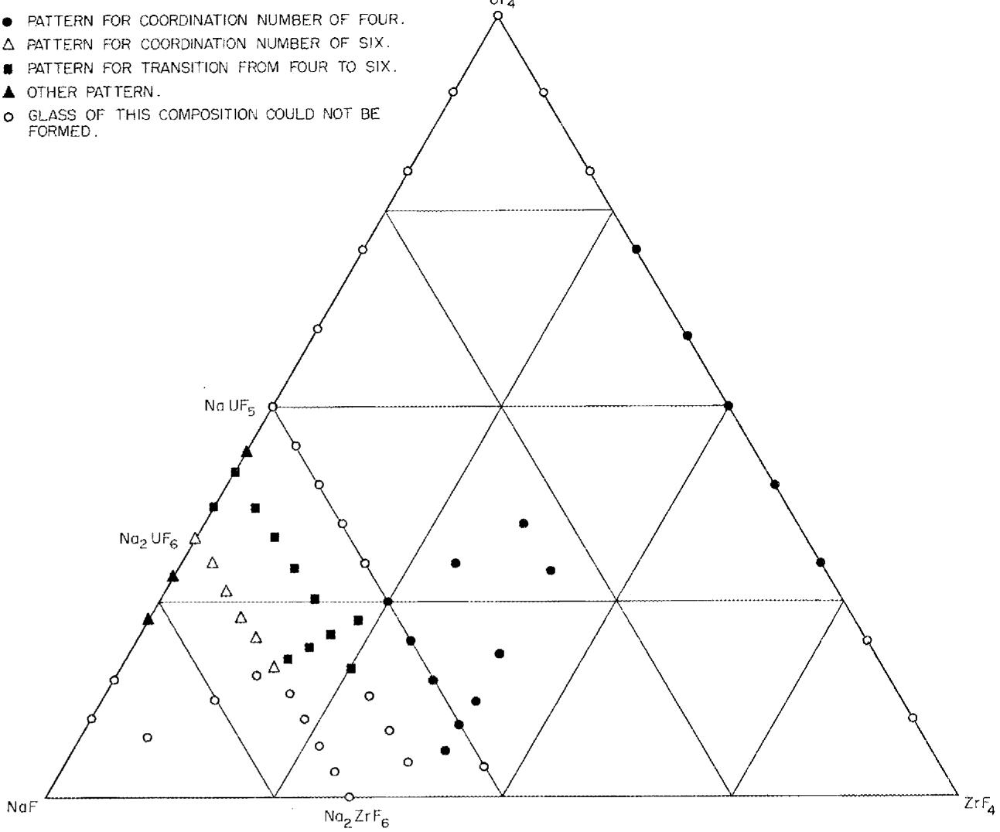  
Fig. 5.2. Distribution of Types of Spectra Exhibited by $\mathsf{UF}_4$ in Liquid NaF-ZrF $_4$ - $\mathsf{UF}_4$ Solutions (Glasses).

salt in a vacuum press.25 When the spectrum of a window containing 17 mg of $\mathsf{UF}_4$ was compared with a potassium bromide window prepared similarly but without $\mathsf{UF}_4$ , the results were disappointing because of the very large subtractions for the blank and an implausible apparent increase in the general absorption with decreasing wave length.

Another effort to improve the reproducibility and resolution of the spectra involved the use of a supersonic generator to disperse the ground

fluoride glass in a liquid of matching refractive index. Clumping, rather than dispersion, occurred.

# EMF Measurements in Fused Salts

L. E. Topol

Materials Chemistry Division

Additional decomposition potential measurements in KCl melts in a hydrogen atmosphere were made. All the experiments were carried out at $850^{\circ}\mathrm{C}$ with nickel or platinum cathodes, nickel or graphite anodes, and Morganite alumina containers. Electrolyses of KCl result in decomposition potentials $(E)$ of 3.15 volts with graphite anodes and 2.00

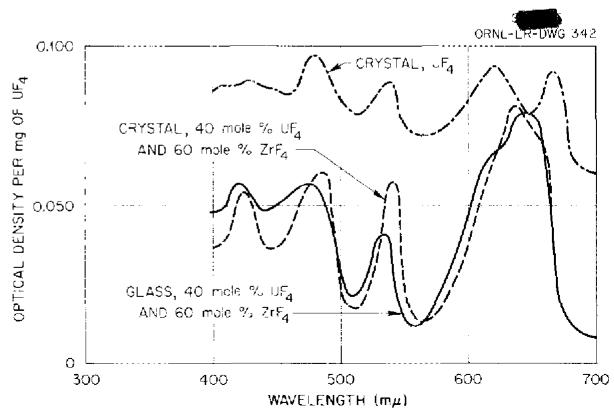  
Fig. 5.3. Comparison of the Absorption Spectra of $\mathbf{ZrF}_4\cdot \mathbf{UF}_4$ (60-40 mole %) in Glass and Crystal Form and Crystalline UF.

volts with nickel anodes; both these values agree with those found by using a helium atmosphere.[26] With chromium anodes (prepared by electroplating chromium on copper or gold wire) decomposition potentials at 1.45 to 1.52 volts are measured. Typical curves obtained for the electrolysis of KCl by using nickel and chromium anodes are shown in Fig.5.4. With the decomposition potential of 1.5 volts obtained with chromium anodes and the value of 3.15 volts obtained with inert anodes, the potential of the reaction

$$
\mathrm {C r C l} _ {x} = \mathrm {C r} + \frac {x}{2} \mathrm {C l} _ {2}
$$

in $\mathsf{H}_2$ is computed to be 1.6 volts. At this temperature the standard emf of $\mathrm{CrCl}_2$ is 1.36 volts and that of $\mathrm{CrCl}_3$ is 1.08 volts. Thus it appears that divalent chromium is formed when the metal is oxidized electrochemically and that the effective $\mathrm{Cr}^{++}$ concentration present is extremely small because of complexing by the KCl.

Solutions of $\mathrm{CrCl}_3$ in KCl (1 to 2 wt %) were electrolyzed at potentials of 0.98 to 1.10 volts with graphite anodes. With nickel anodes, $\mathrm{CrCl}_3$ solutions show two distinct changes in slope on current vs. voltage curves with repeated $E-I$ measurements. The first emf at 0.45 to 0.56 volt seems to be due to the reaction

$$
\begin{array}{l} \mathrm {N i} + \mathrm {C r C l} _ {2} = \mathrm {N i C l} _ {2} + \mathrm {C r}, \\ E ^ {\circ} = 0. 5 4 \text {v o l t}, \\ \end{array}
$$

while the second emf at 0.25 to 0.30 volt may be ascribed to the reaction

$$
\begin{array}{l} 3 \mathrm {N i} + 2 \mathrm {C r C l} _ {3} = 3 \mathrm {N i C l} _ {2} + 2 \mathrm {C r}, \\ E ^ {\circ} = 0. 2 6 \text {v o l t}. \\ \end{array}
$$

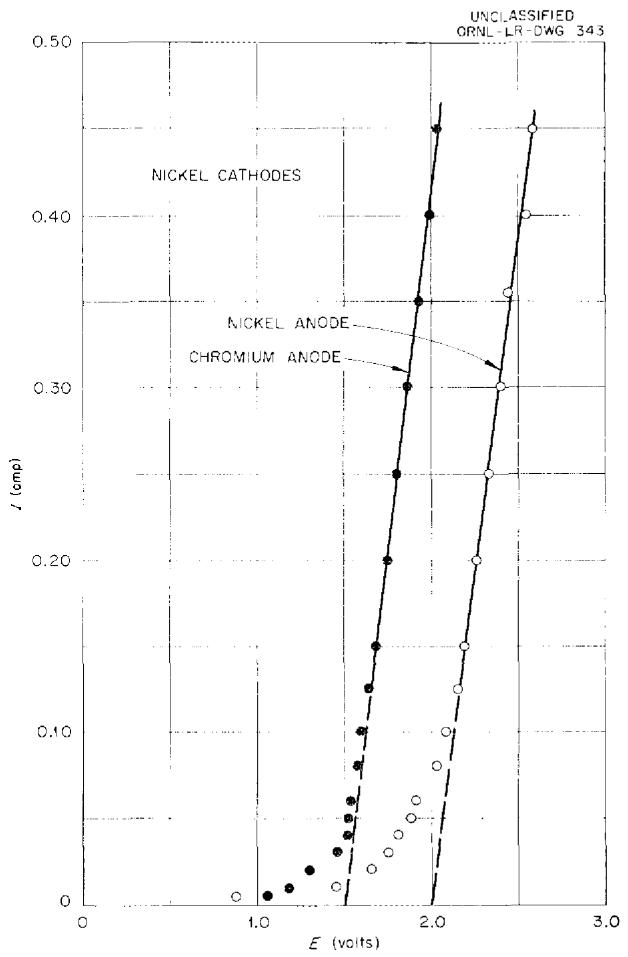  
Fig. 5.4. Electrolysis of KCl at $850^{\circ}\mathrm{C}$ in Hydrogen.

It should be mentioned that the reaction

$$
\mathrm {N i} + 2 \mathrm {C r C l} _ {3} = \mathrm {N i C l} _ {2} + 2 \mathrm {C r C l} _ {2}
$$

will occur "spontaneously."

Similar experiments with equal weight mixtures of $\mathsf{ZrCl}_4$ and KCl yield decomposition potentials at 1.00 to 1.05 volts and 0.55 to 0.70 volt. These values agree well with the decomposition potentials of 1.1, 0.4, and 0.7 volts for the following reactions:

$$
\begin{array}{l} Z r C l _ {4} + 2 N i = 2 N i C l _ {2} + Z r, \\ 2 Z r C l _ {4} + N i = N i C l _ {2} + 2 Z r C l _ {3}, \\ Z r C l _ {4} + N i = N i C l _ {2} + Z r C l _ {2}. \\ \end{array}
$$

To increase the vaporization of $\mathsf{ZrCl}_4$ on heating and to minimize the corrosion of the apparatus in further runs, the compound $\mathsf{K}_2\mathsf{ZrCl}_6$ has been prepared by heating the appropriate mixture of chlorides to $700^{\circ}\mathsf{C}$ in an evacuated, sealed quartz tube.

# 6. CORROSION RESEARCH

W.D.Monly

Metallurgy Division

W.R.Grimes

F. Kertesz

Materials Chemistry Division

H.W.Savage

ANP Division

The static and tilting-furnace corrosion testing facilities were used for further studies of the corrosion of ceramic materials, Inconel, and nickel in fluoride mixtures. Tests made in the tilting-furnace apparatus indicate that both hydrofluorination and filtration are important in the control of the corrosive properties of high-purity fluoride mixtures. Silicon nitride exposed to NaF-ZrF $_4$ -UF $_4$ and NaF-ZrF $_4$ for 100 hr at $800^{\circ}$ C under static conditions showed weight gains of more than $100\%$ , and therefore tests of this material have been discontinued. Titanium oxide dissolved almost completely under similar conditions. Tests of Inconel specimens exposed to NaF-ZrF $_4$ in beryllium oxide crucibles showed that less chromium was removed from the Inconel at $1000^{\circ}$ C than at $800^{\circ}$ C, probably because of the more rapid formation of a protective layer.

Tilting-furnace tests in which graphite rod was added to $\mathrm{NaF - ZrF_4 - UF_4}$ in contact with Inconel showed that the graphite caused only a slight increase in the chromium content of the fluoride mixture; however, powdered graphite caused a more-than-threefold increase of the chromium concentration under similar conditions. Nickel and Inconel rods were exposed to fluoride mixtures in air to test their suitability as materials for sensory elements in fuel level indicators for the ARE fuel recovery system. Of these two materials, Inconel appears to be the more satisfactory.

Corrosion testing in thermal convection loops is being accelerated by the addition of loop facilities and modifications of loop design. Additional tests have confirmed that the corrosion of Inconel increases with operating time when exposed to both NaF-ZrF4-UF4and NaF-ZrF4and that the attack is due to the mass transfer of chromium metal. The mechanism of this mass transfer is still not completely understood, but it takes place with very low concentrations of chromium in the fluoride mixtures and the concentrations do not change with time. Chemical analyses of NaF-ZrF4-UF4after

circulation in Inconel thermal convection loops have shown that some segregation of the uranium takes place on cooling.

In loop tests for which the uranium content of the fluoride mixture was varied, it was established that the depth of attack in Inconel increases slowly, but linearly, with increasing uranium content in the fluoride mixture. The hoped for absence of corrosion at low temperatures was not found. There was still considerable attack in the upper hot-leg sections of loops operated at $1200^{\circ}\mathrm{F}$ . Loops were operated to test special, high-purity, low-carbon-content Inconel, and almost the same depth of attack was found as in loops constructed from commercial tubing. However, these loops, which were constructed of $\frac{1}{2}$ -in. tubing, showed less attack than that found in similar loops constructed of $\frac{1}{2}$ -in. pipe. The data obtained confirm the previous conclusion that increasing the surface-to-volume ratio decreases the depth of attack.

Several 400 series stainless steels were fabricated into loops in which $\mathsf{NaF - ZrF_4 - UF_4}$ was circulated for 500 hr at $1500^{\circ}F$ . In each loop, a considerable quantity of metal crystals was found in the cold leg. The mechanism of the attack changes as the chromium content of these steels increases. With the low-chromium-content alloy, type 410 stainless steel, removal of the entire surface was found, while with the high-chromium-content, type 446 stainless steel, subsurface voids and surface roughening were found. Considerable effort has been exerted to get a Hastelloy B loop to circulate $\mathsf{NaF - ZrF_4 - UF_4}$ for 500 hr at $1500^{\circ}F$ . All loops failed either through catastrophic oxidation or mishandling. These alloys are hot short in the temperature range of the test.

An Inconel forced-convection loop in which NaF-ZrF4-UF4 was circulated at high velocity (5 fps) and with a high temperature drop $(200^{\circ}\mathrm{F})$ was examined after termination because of plugging. The examination showed that the plugging was probably caused by gradual freezing of the fluoride

mixture at a cold spot and not by corrosive attack. In a further attempt to study corrosion by turbulently flowing fluorides, an oscillating furnace has been constructed in which turbulent flow is simulated by suddenly stopping and cooling a heated, rotating V-shaped capsule. Preliminary tests indicate that the effect of flow is rather small in comparison with the increase in attack which can be attributed to the temperature effect.

Static corrosion tests in fluoride mixtures have been made of many of the brazing alloys developed by the Welding and Brazing Group, and it has been found that the nickel-phosphorus and the nickel-phosphorus-chromium brazing alloys have good corrosion resistance in NaF-ZrF $_4$ -UF $_4$ .

The study of corrosion and mass transfer characteristics of container materials in liquid lead by the use of quartz thermal convection loops has been extended to include tests with cobalt, beryllium, titanium, and Hastelloy B. Results already obtained for a molybdenum-nickel alloy (25% Mo-75% Ni) were rechecked. The influence of oxides in retarding mass transfer in a system with type 347 stainless steel inserts was further investigated.

# FLUORIDE CORROSION IN STATIC AND TILTING-FURNACE TESTS

F. Kertesz

H. J. Buttram

N.V. Smith

R.E.Meadows

J. M. Didlake

Materials Chemistry Division

# Effect of Methods of Manufacturing the Fuel on the Corrosion of Inconel

A study was made to ascertain whether corrosiveness would be affected by omission of either the hydrofluorination or the filtration step in the preparation of purified fluoride mixtures. Tilting-furnace tests indicated that when hydrofluorination was omitted the depth of subsurface-void formation and the amount of chromium in the fluoride mixture after testing were higher than those observed with the control mixture prepared by the usual process, including hydrofluorination and filtration. The results, which agree with previous findings, show that both hydrofluorination and filtration are important in the control of the corrosive properties of high-purity fluoride mixtures.

# Corrosion of Ceramic Materials

The study of the resistance of nonmetallic materials to attack by fluoride mixtures has been

continued. Silicon nitride exposed to the mixtures NaF-ZrF4-UF4 (53.5-40.0-6.5 mole %) and NaF-ZrF4 (53.0-47.0 mole %) for 100 hr at $800^{\circ}\mathrm{C}$ under static conditions showed weight gains of more than $100\%$ . These weight gains were probably due to the penetration of the fluorides into the pores of the hot-pressed material. Tests with this material have been discontinued. Titanium oxide (American Lava Corporation body, Al Si Mag No. 192) was found to dissolve nearly completely when exposed to the fluoride mixtures under the same conditions.

It was known from previous tests that beryllium oxide reacts with uranium-containing fluoride mixtures and that a layer of uranium oxide is formed on the beryllium oxide. Tests were run with the mixture $\mathrm{NaF - ZrF_4}$ (53-47 mole %) in beryllium oxide crucibles fabricated from the ARE moderator blocks. After exposure at temperatures of 800 and $1000^{\circ}\mathrm{C}$ for 100 hr in the presence of Inconel specimens, the formation of a $\mathrm{ZrO}_2$ layer could be observed on the crucible walls. Less chromium was found to be removed from the Inconel at $1000^{\circ}\mathrm{C}$ than at $800^{\circ}\mathrm{C}$ , probably because the reaction

$$
2 \mathrm {B e O} + \mathrm {Z r F} _ {4} \longrightarrow 2 \mathrm {B e F} _ {2} + \mathrm {Z r O} _ {2}
$$

is accelerated at the higher temperature and there is more rapid formation of a protective layer.

# Effect of Graphite Additions

The effect of graphite on the behavior of fluoride mixtures in contact with Inconel was studied by adding various amounts of graphite in either powder form or as a rod to NaF-ZrF $_4$ -UF $_4$ (53.5-40.0-6.5 mole %) and exposing the mixtures to the usual tilting-furnace test. The graphite rod caused only a slight increase of the chromium concentration of the fluoride mixture, while addition of large amounts of powdered graphite resulted in a more-than-threefold increase of the chromium concentration.

Comparison tests were then made in an attempt to determine the effect of absorbed oxygen in the powdered graphite. As-received graphite and graphite which had been outgassed were used. The outgassing was attempted by heating the graphite capsules under vacuum to $800^{\circ}\mathrm{C}$ for 4 hr before loading and to $400^{\circ}\mathrm{C}$ for 4 hr after loading. The vacuum chamber of the furnace was then filled with helium and the temperature raised to $800^{\circ}\mathrm{C}$ to carry out the test. Chemical analyses of the fluoride mixtures after the tests did not show

changes attributable to outgassing. Microscopic studies by T. N. McVay revealed the presence of $\mathsf{ZrO}_2$ crystals in the fluoride mixtures used in both tests; so it must be concluded that the attempted outgassing was not effective in removing all the oxygen.

# Effect on Nickel and Inconel Rods Exposed to Fluoride Mixtures in Air

In order to determine a suitable material for sensory elements to indicate fuel level in the containers to be used in the ARE fuel-recovery operation, Inconel and nickel rods have been tested for resistance to attack by molten fluorides in air. The first of these tests was carried out with $\mathrm{NaF - ZrF_4 - UF_4}$ (53.5-40.0-6.5 mole %) heated to $700^{\circ}C$ in an open nickel crucible. The Inconel and nickel rods were held 1 in. from the bottom of the crucible for 48 hours. Determinations of the electrical resistance between the crucible and each rod were made periodically. After 48 hr of contact, the rods were examined metallographically, and it was found that the nickel suffered a $50\%$ loss in cross section, while the Inconel was attacked to a lesser degree.

In the second test, the rods were removed periodically for a 5-min cooling period. During 50 immersions, the resistance between the nickel rod and the crucible ranged from 1.2 to 7.5 ohms, while the resistance between the Inconel rod and the crucible varied from 0.5 to 1.1 ohms. A heavy crust was observed to form on the nickel rod during the test, while only a thin crust formed on the Inconel rod. The nickel crucible suffered considerable attack during the tests. Of the two materials tested, Inconel appears to be the more desirable for use as sensory elements in fluoride mixtures.

# THERMAL CONVECTION LOOP DESIGN AND OPERATION

G.M.Adamson

Metallurgy Division

The design of the standard thermal convection loops was changed to eliminate the expansion pot so that only one size of pipe or tubing would be required for a loop. Figure 6.1 shows the new configuration without insulation. Schedule-40, $\frac{1}{2}$ -in. IPS pipe is still being used as the standard loop material, but it will be replaced by $\frac{3}{8}$ -in. schedule-10 pipe as soon as a supply is available.

Another change in the design consisted of replacing the sharp bends at both junctions of the legs with curved sections. The curved sections should reduce the flow resistance and give a slight increase in velocity.

The emphasis in the loop work is shifting from 500-hr operation to operation for from 1000 to 2000 hours. The longer circulation times are required for studies of mass transfer. With the shift to long-time operation, it has been necessary to increase the number of loops. During this quarter,

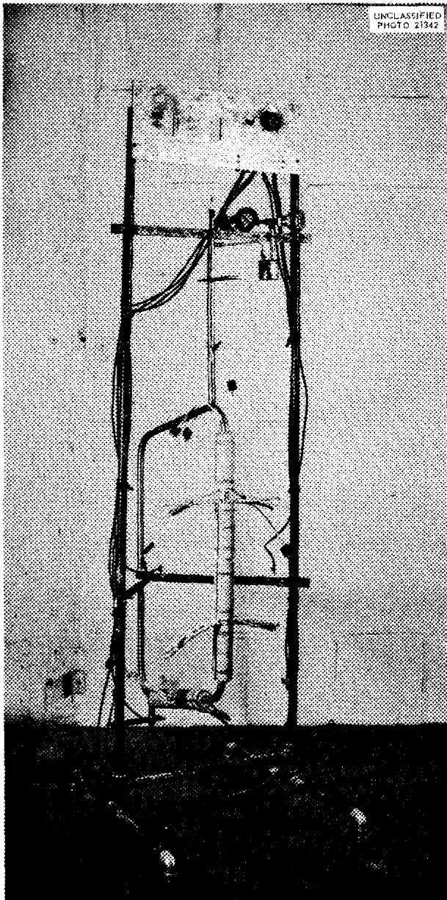  
Fig. 6.1. Modified Thermal Convection Loop.

the number has been increased from 14 to 20, and instruments have been ordered for a line with 34 loop stations.

# FLUORIDE CORROSION OF INCONEL IN THERMAL CONVECTION LOOPS

G. M. Adamson

Metallurgy Division

# Effect of Exposure Time on Depth of Attack

The results obtained in tests for determining the effect of exposure time on the corrosion of Inconel by high purity NaF-ZrF4-UF4 circulated in a thermal convection loop at $1500^{\circ}\mathrm{F}$ confirm the results reported previously. Results from four loops filled from the same batch of fluorides and circulated for varying times are tabulated in Table 6.1.

The attack continued with time but at a rate lower than that found in the early stages. The holes grew in size and became more concentrated in the grain boundaries with increasing time. Figure 6.2 presents typical sections from loops 345 and 329. The results given in Table 6.1 show that chromium metal is mass transferred, that the chromium concentrations in the fluorides are very

1G.M.Adomson,ANPQuar.Prog.Rep.Sept.10,1953, ORNL-1609,p.79.

low, and that the chromium concentration remains fairly constant.

Both the chemical and metallurgical results obtained from examination of loop 328, which operated for 2000 hr, conflict with the results from other tests in this series and with previous results. Check samples from this loop have been submitted for chemical and metallurgical examination, and the operating record is being closely studied in an attempt to explain the discrepancies.

The 20 mils of penetration found after the 3000-hr test with the high-purity fluorides is deeper than the penetration (18 mils) found in the first series of tests after 2850 hr of operation with impure fluorides. The two results are not exactly comparable, because samples were cut from the loop operated with high-purity fluorides from an area about 2 in. higher up the hot leg. However, the error resulting from the sampling should be less than 2 mils. In any case, the recently completed tests indicate that purifying the fluorides will not result in a reduction in mass transfer. This conclusion is further confirmed by results obtained with another loop that circulated for 3000 hr the same batch of fluorides that had been further purified by the addition of zirconium hydride. This loop showed a maximum penetration of 13.5 mils. While this loop showed a reduction in depth of attack, it showed about the same

TABLE 6.1.EFFECT OF EXPOSURE TIME ON CORROSION OF INCONEL BY NaF-ZrF-UF4  

<table><tr><td>LOOP NO.</td><td>EXPOSURE TIME (hr)</td><td>AMOUNT AND TYPE OF ATTACK</td><td>MAXIMUM PENETRATION (mils)</td><td>TRAP AND COLD-LEG APPEARANCE</td><td>AVERAGE CHROMIUM CONCENTRATIONS IN FLUORIDES (ppm)</td></tr><tr><td>345</td><td>500</td><td>General, moderate to heavy, with small voids</td><td>6</td><td>Dark layer, but no metal in trap; no layer on cold-leg wall</td><td>620</td></tr><tr><td>327</td><td>1000</td><td>General, moderate and intergranular</td><td>10</td><td>Metallic ring around wall; possibly thin layer on cold leg</td><td>550</td></tr><tr><td>328</td><td>2000</td><td>Moderate to heavy; intergranular</td><td>7</td><td>Metallic ring around wall</td><td>250</td></tr><tr><td>329</td><td>3000</td><td>Heavy; intergranular, with large voids</td><td>20</td><td>Layer of chromium in trap and layer on cold-leg wall</td><td>620</td></tr></table>

reduction as would be found by comparing loops with and without $\mathsf{ZrH}_2$ after 500 hr of operation.

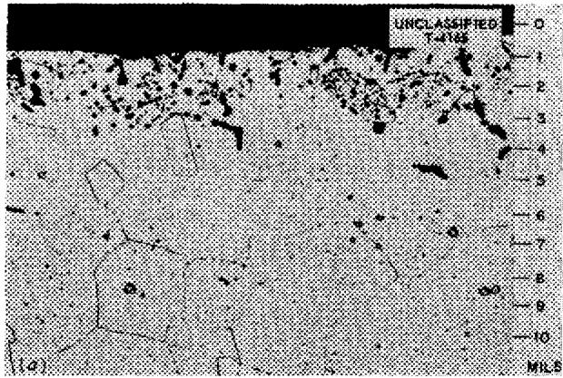

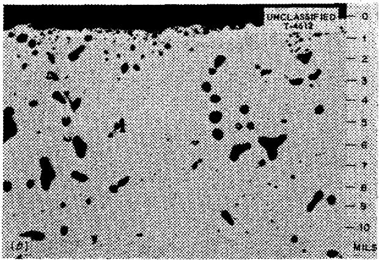  
Fig. 6.2. Sections from Inconel Thermal Convection Loops Showing Effect of Exposure Time on Corrosion By NaF-ZrF4-UF4 Circulated at $1500^{\circ}\mathrm{F}$ . a. Loop 345; exposure time, 500 hours. b. Loop 329; exposure time, 3000 hours. Etched with aqua regia. 250X

The size and distribution of the holes in this loop were very similar to those found in loop 329. Metal crystals were found in the trap, and there was a thin, but continuous, metal deposit on the cold-leg surface.

# Effect of Exposure Time on Chemical Stability of the Fluorides

Changes have been noted in the uranium analyses of the fluorides both after circulation in thermal convection loops and after tests in seesaw apparatus. These chemical changes have usually been explained as sublimation of zirconium fluoride and as sampling or analytical errors. The chemical analyses of the fluorides circulated in the loops described above are presented in Table 6.2.

The uranium percentage increased $1.2\%$ , while the zirconium content dropped $2.9\%$ . Although the zirconium content change is greater than that for the uranium (if the change is allotted in proportion to the amounts of all the ingredients present), the change is not large enough to explain the change in uranium content as being due to zirconium sublimation. In addition, the change in the fluorine is not large enough to substantiate the postulated sublimation of the zirconium as $\mathsf{ZrF}_4$ . However, the zirconium analyses are not particularly accurate, and segregation undoubtedly occurred during cooling, although no low-uranium-content phase has yet been found.

# Effect of Exposure Time on Corrosion by Nonuranium-Bearing Fluorides

Loops filled from a single batch of NaF-ZrF $_4$ (50-50 mole %) which had been produced for the ARE were operated for 500, 2000, and 3000 hours. The data from this series of tests are tabulated in Table 6.3. The same conclusions can be drawn from

TABLE 6.2. CHEMICAL ANALYSES OF $\mathrm{{NoF}} - {\mathrm{{ZrF}}}_{4} - {\mathrm{{UF}}}_{4}$ AFTER CIRCULATION IN THERMAL CONVECTION LOOPS   

<table><tr><td rowspan="3">LOOP NO.</td><td rowspan="3">CIRCULATION TIME (hr)</td><td colspan="6">CHEMICAL COMPOSITION AFTER TEST</td></tr><tr><td colspan="3">wt %</td><td colspan="3">ppm</td></tr><tr><td>U</td><td>Zr</td><td>F</td><td>Ni</td><td>Cr</td><td>Fe</td></tr><tr><td>345</td><td>500</td><td>9.2</td><td>37.2</td><td>41.7</td><td>&lt;20</td><td>620</td><td>45</td></tr><tr><td>327</td><td>1000</td><td>9.6</td><td>36.5</td><td>41.9</td><td>&lt;20</td><td>550</td><td>95</td></tr><tr><td>329</td><td>3000</td><td>10.0</td><td>35.2</td><td>41.5</td><td>&lt;20</td><td>620</td><td>110</td></tr><tr><td colspan="2">Original composition</td><td>8.8</td><td>38.1</td><td>41.9</td><td>40</td><td>60</td><td>70</td></tr></table>

TABLE 6.3.EFFECT OF EXPOSURE TIME ON CORROSION OF INCONEL BY $\mathsf{N}\mathsf{o}\mathsf{F} - \mathsf{Z}\mathsf{r}\mathsf{F}_{4}$   

<table><tr><td>LOOP NO.</td><td>EXPOSURE TIME (hr)</td><td>AMOUNT AND TYPE OF ATTACK</td><td>MAXIMUM PENETRATION (mils)</td><td>TRAP AND COLD-LEG APPEARANCE</td><td>AVERAGE CHROMIUM CONCENTRATION IN FLUORIDES (ppm)</td></tr><tr><td>348</td><td>500</td><td>Light, intergranular</td><td>5.5</td><td>Few scattered patches of deposit on cold-leg wall; dark layer in trap</td><td>130</td></tr><tr><td>346</td><td>2000</td><td>Moderate to heavy, intergranular</td><td>9</td><td>Thin layer on cold-leg wall; dark layer and metal in trap</td><td>300</td></tr><tr><td>347</td><td>3000</td><td>Heavy, intergranular, with large voids</td><td>11</td><td>Continuous metallic deposit on wall; chromium metal in trap</td><td>115</td></tr></table>

these data as from those obtained with NaF-ZrF4- UF. There is rapid initial attack followed by continuing attack at a reduced rate. The depth of attack, however, is less than that obtained with the uranium-bearing fluorides. It is apparent, even with nonuranium-bearing mixtures, that chromium metal may be mass transferred and that the chromium concentrations in the fluorides are very low.

# Effect of Variation in Uranium Concentration

Two series of tests were conducted for determining the effect on corrosion of changes in the uranium concentration of the fluoride mixture. In the first series, the fluoride mixture $\mathrm{NaF - ZrF_4}$ , with uranium additions that varied from 0.5 to 15 wt % (0.2 to 7.2 mole % UF_4), was circulated. In the second series of tests, the high-uranium-content fuel $(\mathrm{NaF - ZrF_4 - UF_4}, 53.5 - 40.0 - 6.5$ mole %) was circulated in three loops. It has now been determined that the fluorides used in both series of tests received inadequate and varying amounts of gas purging during production. The variations in gas purging lead to varying hydrogen fluoride content and make the results difficult to interpret.

While the results of these tests cannot be considered as conclusive, the trends can be partially confirmed by other results. The two loops operated with low-uranium-content fluorides, 0.5 and 2.8 wt%, showed much less attack than was expected, and

thus the data are not consistent with the data obtained from other loops. The two batches of fluorides used for these tests were probably of higher purity than the batches used for the other tests. In spite of the low attack, a very thin, apparently metallic deposit was found on the cold-leg wall of each loop. In the other three loops, in which the uranium contents of the fluoride mixtures were 5.1, 9.8, 14.4 wt $\%$ , respectively, the attack increased linearly with increasing uranium content. A very thin layer was found in the loop which circulated the lowest-uranium-content mixture, but no layers were found in the other two loops. While depth of attack increases with increasing uranium content, the probability of layer formation in the cold-leg decreases.

These results are confirmed if the results obtained with NaF-ZrF4 (50-50 mole %), NaF-ZrF4-UF4 (50-46-4 mole %), and the lowest penetration with NaF-ZrF4-UF4 (53.5-40.0-6.5 mole %) are considered. The attack in each case showed a small, but linear, increase from 5 to 7 mils with increasing uranium content.

Two other Inconel loops were operated for 500 hr with NaF-ZrF4-UF4 (53.5-40.0-6.5 mole %, 14 wt % U). These loops showed maximum attacks of 16.5 and 10 mils. Since the mixtures circulated were impure, the attack should be compared with the 9 mils found with impure NaF-ZrF4-UF4 (50-46-4 mole %).

In each of the four loops in which NaF-ZrF4-UF4 (53.5-40.0-6.5 mole %) was circulated, large variations in uranium content were found, as shown in Table 6.4. In each loop, the uranium content varied about $3\%$ , with the lowest values being found in the hot leg. Similar variations have not been found with the other fluoride mixtures. Additional samples from the lower portion of the hot leg have now been submitted for analysis. The segregation of the uranium undoubtedly takes place during cooling, but it is not certain at what temperature the segregation starts.

# Effect of Temperature

In a loop operated at $1250^{\circ}F$ , only the upper portion of the hot leg was attacked, and the attack was to a depth of 3 mils. It was hoped that at slightly lower temperatures all attack would be eliminated. Two loops were therefore operated with hot-leg temperatures of $1200^{\circ}F$ . Loop 390 showed a maximum hot-leg attack of 5 mils, and in loop 350, the maximum attack in the hot leg was 4 mils. The samples were cut from an area 2 in. further up the hot legs of these loops, and therefore the cor

TABLE 6.4. URANIUM CONTENT OF NaF-ZrF₄-UF₄ (53.5-40.0-6.5 mole %) AT VARIOUS POINTS IN INCONEL THERMAL CONVECTION LOOPS AFTER CIRCULATION AT 1500°F FOR 500 HOURS   

<table><tr><td rowspan="3">SAMPLE TAKEN</td><td colspan="4">URANIUM CONTENT (wt %)</td></tr><tr><td colspan="4">Loop Number</td></tr><tr><td>320</td><td>326</td><td>381</td><td>387</td></tr><tr><td>Production batch</td><td></td><td>16.5</td><td>13.8</td><td>15.6</td></tr><tr><td>Loop sample (before circulation)</td><td>17.2</td><td>14.4</td><td>14.6</td><td>15.3</td></tr><tr><td>Hot leg</td><td></td><td></td><td></td><td></td></tr><tr><td>Position 1</td><td>12.9</td><td>13.6</td><td>10.8</td><td></td></tr><tr><td>Position 2</td><td>12.9</td><td>10.0</td><td>10.4</td><td>13.5</td></tr><tr><td>Position 3</td><td></td><td></td><td>8.8</td><td>16.7</td></tr><tr><td>Lower horizontal leg</td><td>16.6</td><td>14.8</td><td>13.0</td><td>16.0</td></tr><tr><td>Cold leg</td><td></td><td></td><td></td><td></td></tr><tr><td>Position 1</td><td>16.8</td><td>15.4</td><td></td><td>15.2</td></tr><tr><td>Position 2</td><td>17.3</td><td>14.0</td><td>13.0</td><td>14.8</td></tr><tr><td>Upper horizontal leg</td><td>17.6</td><td>13.8</td><td></td><td></td></tr></table>

rosion values are not comparable to those found in the loop operated at $1250^{\circ}\mathrm{F}$ . In both loops, the attack was found only in the upper portion of the hot leg. The voids were very small and evenly distributed. Figure 6.3 shows a sample from the hot leg of loop 350. A hot-leg temperature of $1200^{\circ}\mathrm{F}$ is the lowest temperature at which fluorides may be circulated in present loops.

# Effect of Variations in Loop Size and Composition

Two loops constructed from $\frac{1}{2}$ -in. tubing instead of the customary $\frac{1}{2}$ -in.-IPS schedule-40 pipe were operated with NaF-ZrF $_4$ -UF $_4$ (50-46-4 mole %). These loops were operated both as standard loops for the high-purity fluoride vs. Inconel tests and as a part of a surface-to-volume ratio study. A maximum attack of 9 mils was reported previously² for a loop constructed from 1-in. tubing with a surface-to-volume ratio of 4.5 in. $^{2}$ /in. $^{3}$ , and an attack of 5.5 mils was reported for a standard loop with a surface-to-volume ratio of 6.5 in. $^{2}$ /in. $^{3}$ . The ratio in a loop with $\frac{1}{2}$ -in. tubing is 10.5 in. $^{2}$ /in. $^{3}$ . The attack found in the $\frac{1}{2}$ -in. tubing of loop 359, which had been filled from the same batch of fluorides as that used for the other two loops, was moderate to heavy, with a maximum depth of 4 mils. Loop 362, also constructed of $\frac{1}{2}$ -in. tubing, showed similar attack to a depth of 3.5 mils, with a few areas extending to 5 mils. Plots of attack vs. the three surface-to-volume

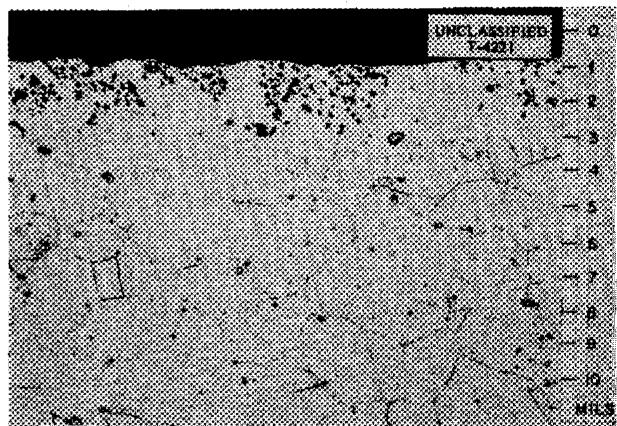  
Fig. 6.3. Section from Hot Leg of Inconel Loop 350 in Which NaF-ZrF4-UF4 (50-46-4 mole %) Was Circulated at $1200^{\circ}\mathrm{F}$ for 500 Hours. Etched With aqua regia, 250X

ratios do not quite yield straight-line relationships. With a thermal convection loop, both the velocity and the temperature drop change with any change in pipe size, and these variations probably cause the deviations from straight-line relationships.

A series billets of high-purity, low-carbon heats of Inconel made by the Metallurgy Division were shipped to Superior Tubing Company and drawn into $\frac{1}{2}$ -in. tubing. This tubing was then fabricated into thermal convection loops. Standard Inconel contains 0.08% carbon, whereas these heats contained about 0.014% carbon. To further tie up the carbon, 0.31% titanium was added to one heat.

Two loops fabricated from the low-carbon-content Inconel tubing, one with titanium added and one without titanium, were filled from the same batch of fluorides as that used with the $\frac{1}{2}$ -in. commercial tubing discussed above. The loop (366) without titanium showed moderate, general, hot-leg attack, with a maximum penetration of 3.5 mils. The loop with added titanium, loop 367, also showed moderate to heavy, general, hot-leg attack to a depth of 3.5 mils. Typical hot-leg sections from these three loops are shown in Fig. 6.4. Within the limits studied, very little, if any, reduction in attack was found. There may have been very slight reduction in depth of attack, but many more loops would have to be tested to confirm this. The Inconel was cleaner than in previous loops and did not contain as many inclusions.

One other loop fabricated from low-carbon-content Inconel tubing was filled from a different batch of fluorides, which happened to be one of the several impure batches recently received. After circulation of the fluoride mixture, very large grains were found in the Inconel. The hot-leg attack in this loop was heavy and to a depth of 13 mils. This loop is still being studied.

# Effect of Additions to the Fluorides

Batches of the fluoride mixture NaF-ZrF4 (50-50 mole %) were held overnight at $1300^{\circ}\mathrm{F}$ in contact with various materials and then circulated in Inconel thermal convection loops for various times at $1500^{\circ}\mathrm{F}$ . The pretreatments used and the test results are given in Table 6.5.

The standard loop was filled from the same batch of fluorides as that used for the treated loops. These tests do not show the large reduction in depth of attack found with previous zirconium hydride additions. The fluoride batch was quite

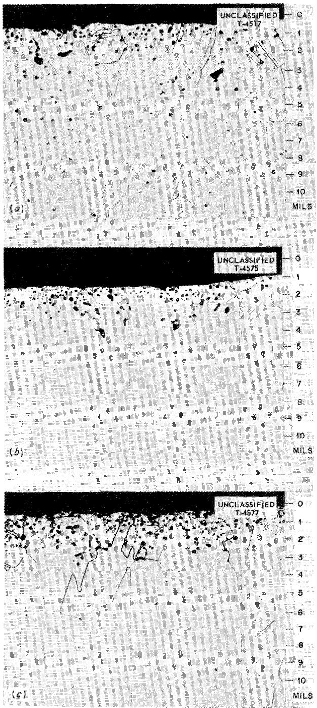  
Fig. 6.4. Sections from Hot Legs of Inconel Loops 359, 366, and 367 in Which $\mathsf{NaF - ZrF_4 - UF_4}$ (50-46-4 mole %) Was Circulated at $1500^{\circ}F$ for 500 Hours. a. Loop 359, commercial tubing. b. Loop 366, high-purity, low-carbon-content tubing. c. Loop 367, high-purity, low-carbon-content tubing with added titanium. Etched with aqua regia. 250X

TABLE 6.5. CORROSION BY PRETREATED FLUORIDE MIXTURES CIRCULATED IN INCONEL THERMAL CONVECTION LOOPS FOR 500 HOURS   

<table><tr><td>LOOP NO.</td><td>PRETREATMENT MATERIAL</td><td>HF CONTENT IN FLUSHING GAS (relative units)</td><td>EXPOSURE TIME IN LOOP (hr)</td><td>HOT-LEG ATTACK</td><td>MAXIMUM PENETRATION (mils)</td></tr><tr><td>370</td><td>Zr metal*</td><td>7</td><td>500</td><td>Moderate to heavy, intergranular</td><td>6</td></tr><tr><td>371</td><td>Zr metal*</td><td>17</td><td>500</td><td>Light to moderate, intergranular</td><td>4</td></tr><tr><td>374</td><td>0.3% ZrH2</td><td>4</td><td>500</td><td>Light to moderate, intergranular</td><td>6</td></tr><tr><td>373</td><td>0.3% ZrH2</td><td>2.4</td><td>1000</td><td>Moderate to heavy, intergranular</td><td>8</td></tr><tr><td>399</td><td>None</td><td>2</td><td>1000</td><td>Heavy, intergranular</td><td>10</td></tr></table>

*Black deposit found in treatment pot.

impure, but the purity should not have been a factor. Samples taken before and after circulation of these fluorides have been submitted for chemical analysis.

# Corrosion of Various Metal Combinations

A series of Inconel loops has been placed in operation with various combinations of type 316 stainless steel or nickel inserts in the hot and cold legs. This series of loops is being operated for studying the effects of the presence of various quantities of these metals on the corrosion of Inconel. The results from the operation of the first such loop, reported previously, showed that a short length of type 316 stainless steel in the top of the hot leg would reduce the attack on the Inconel but would cause increased mass transfer.

Loop 379, the second in this series, was operated with a length of nickel in the hot leg. The Inconel showed heavy subsurface void attack to a depth of 5 mils, and no change in attack in the Inconel was apparent near the nickel insert. The nickel near the weld had a few scattered voids to a depth of 1 mil, while the rest of the insert appeared to be unattacked. If any even removal had taken place, it could not be determined. No deposit was found in the cold leg. If any reduction in attack was

caused by the nickel, it was too slight to be conclusive on the basis of a single loop.

# FLUORIDE CORROSION OF STAINLESS STEEL, IZETT IRON, AND HASTELLOY LOOPS

The results from the first 400 series stainless steel loop in which $\mathsf{NaF - ZrF_4 - UF_4}$ (50-46-4 mole %) was circulated were presented in the previous report. The loop was constructed from type 430 stainless steel (0.12% carbon, maximum; 14 to 18% chromium). After the test, the hot-leg surface of the loop was smooth, and there was no visible attack. Metallic crystals were found in the cold leg, and thus there was indication that some even removal had taken place. Two more 400 series stainless steel loops have now circulated $\mathsf{NaF - ZrF_4 - UF_4}$ (50-46-4 mole %) satisfactorily for 500 hours.

Loop 138 was constructed from type 410 stainless steel (0.15% carbon, maximum; 11.5 to 13.5% chromium). Unlike the other 400 series stainless steels studied, type 410 stainless steel is martensitic. After operation for 500 hr at $1500^{\circ}\mathrm{F}$ , the hot leg of loop 138 was very rough, with sharp depressions to a depth of 1.5 mils. There was no evidence of intergranular or subsurface-void types of attack. The outer surface was too rough to permit accurate wall thickness measurements;

however, it seems likely that some thinning of the wall had taken place. The cold-leg wall was covered with a metallic layer, and the fluoride mixture was full of dendritic metallic crystals.

The second loop was constructed from type 446 stainless steel (0.35% carbon, maximum; 23 to 27% chromium). After operation for 500 hr, the hot leg of this loop was rough and uneven, but, in addition, a heavy concentration of subsurface voids to a maximum depth of 10 mils was found. The cold leg had a very heavy deposit of metal, and there were dendritic crystals in the fluoride mixture. With both this loop and loop 138, the cold-leg crystals were shown to contain primarily iron, but chromium was also present. It is obvious that a change in the chromium content of the alloys causes a change in the corrosion mechanism. With type 430 stainless steel, even removal occurs, while with type 446 stainless steel, both even removal and a subsurface-void type of attack, similar to that found in type 316 stainless steel, are found.

A single loop of Izett iron was filled with NaF $\mathsf{ZrF}_4$ -UF $_4$ (50-46-4 mole %) and circulated at $1500^{\circ}\mathsf{F}$ . This loop was terminated after 39 hr of operation because of plug formation. In this short period of operation, the lower sections of the loop had collected many balls of needle-like dendritic iron crystals. These crystals are similar in appearance to the nickel crystals found in hydroxide systems. Also, a thick deposit was found on the cold-leg wall. The hot-leg surface of this loop was very rough, with areas in which entire grains had been removed.

One loop was constructed from $\frac{1}{2}$ -in. Hastelloy C tubing (58% Ni--17% Mo-15% Cr--5% W--5% Fe). This loop was terminated because of a leak in the weld at the top of the hot leg after having circulated NaF-ZrF4-UF4 (50-46-4 mole %) for 456 hr at 1500°F. The hot leg of this loop showed light, subsurface-void formation to a depth of 1.5 mils. The attack was primarily in the second phase found in these alloys. No attack or deposit was found in the cold leg.

Attempts were made to circulate NaF-ZrF-UF4 (50-46-4 mole %) in several loops constructed from Hastelloy B (62% Ni-30% Mo-5% Fe). The tubes for these loops varied from 0.035-in.-wall, $\frac{1}{2}$ -in. tubing to 0.065-in.-wall, 1-in. tubing, but all loops failed. Two failures were due to poor handling, one to a poor weld, and the others to catastrophic

oxidation. This oxidation occurred under the Saurizen cement used to protect the thermocouples. The Hastelloy's are hot short in the temperature range 1100 to $1600^{\circ}\mathrm{F}$ , and thus they are difficult to handle. For the loops now being fabricated, the tubing will be given a high-temperature anneal to minimize these difficulties.

One Hastelloy B loop constructed of 1-in. tubing was examined after it had operated at $1500^{\circ}\mathrm{F}$ for 91 hr before failing because of catastrophic oxidation. The hot- and cold-leg surfaces of this loop were rough. Fabrication cracks were visible in the cold leg but not in the hot leg. Since the surface of the hot leg had a matte finish, it is likely that some general removal had taken place; no intergranular or subsurface-void types of attack were visible.

# CORROSION BY HIGH-VELOCITY HIGH-TEMPERATURE FLUORIDES

Forced-Circulation Corrosion Loop

G. M. Adamson  
Metallurgy Division

An Inconel forced-circulation loop operated at a maximum temperature of $1500^{\circ}\mathrm{F}$ for 200 hr at a maximum fluid velocity of about 2.5 fps was described previously. After termination, this loop was subjected to metallurgical examination. The normal, subsurface-void type of attack was found in the hot leg. The attack gradually increased in depth to a maximum of 11 mils in the hottest portion and was both more intense and more concentrated in the grain boundaries than that found in the thermal convection loops operated under similar conditions. The depth of attack was only slightly deeper, but, since turbulent flow was not obtained, no large increase would be expected. Considerable carburization of the Inconel was found in the hot leg. The carbides must have originated from oil used to lubricate the gas seal. In the hottest portion, a general layer of carbide precipitate was found to a depth of 14 mils, and there was an intergranular layer through the sample.

No deposits were found in any of the cold-leg sections examined. Some attack and carburization was found in the first or hottest cold-leg section but not in the other sections. Diffraction and

petrographic examination of the fluorides, before and after circulation, failed to reveal any changes that might have caused plugging. It seems likely that the plugging of this loop was caused by gradual freezing of the fluorides at a cold spot and not by corrosion.

# Oscillating-Furnace Studies

F. Kertesz

H.J.Buttram J.M.Didlake

R.E.Meadows N.V.Smith

Materials Chemistry Division

Corrosion by turbulently flowing fluorides is being investigated with an oscillating-furnace apparatus. Turbulent flow is simulated by suddenly stopping a rotating V-shaped capsule which has been heated to $800^{\circ}\mathrm{C}$ by a gas furnace. One of the legs of the rotating capsule is shorter than the other, and, at the instant the liquid is at the apex (bottom) of the V with its level being below the top of the short leg, the capsule is abruptly stopped; this causes the liquid to rush into the empty part of the leg. When the capsule is stopped, the gas is turned off and the capsule cools. After cooling to $600^{\circ}\mathrm{C}$ , the capsule is rotated back to its original position, with the apex pointing downward, while the heating cycle is resumed. The complete cycle takes about 90 seconds.

The absence of steady-flow conditions makes it difficult to estimate the actual Reynolds number of the system at the time of stoppage, but in view of the rapid deceleration, it is expected that turbulent conditions should prevail for a short period in the capsule.

In order to evaluate the relative importance of flow conditions and of temperature, static tests were run at the same time at 600 and at $800^{\circ}\mathrm{C}$ , since the welding required in the fabrication of the V-shaped capsules could have changed the properties of the tube walls and thus changed their resistance to corrosion. In another series of check tests, stationary capsules were thermally cycled by alternately heating and cooling from 650 to $800^{\circ}\mathrm{C}$ . The effect of motion without a temperature gradient was studied by slowly rotating nearly horizontally placed capsules inside an isothermal furnace with the ends kept at 650 and $800^{\circ}\mathrm{C}$ . Tilting-furnace tests were also run in which the hot- and cold-end capsule wall temperatures were kept at 650 and $800^{\circ}\mathrm{C}$ , respectively. In addition to the usual 4-cpm

tilting-furnace tests, a series of 2-cpm tests was made; the duration of all these tests was 100 hours. The chromium concentrations of the melts after the tests are summarized in Table 6.6.

The results given in Table 6.6 indicate that, within the range of the experimental conditions used, the effect of temperature on the amount of chromium dissolved by the fluoride melt is very noticeable. On the other hand, the effect of flow (ranging from static flow to the viscous flow obtained in the horizontally rotated capsules, to the tilting-furnace test, and finally to the presumably turbulent conditions in the oscillating furnace) is rather small in comparison with the increase in attack which can be attributed to the temperature effect.

# STATIC TESTS OF BRAZING ALLOYS IN FLUORIDES AND SODIUM

E.E.Hoffman J.E.Pope

L.R.Trotter

Metallurgy Division

Brazed T-joints have been tested in static NaF $\mathsf{ZrF}_4$ -UF $_4$ (50-46-4 mole %) for 100 hr at $816^{\circ}\mathrm{C}$ . The brazing alloys used were the eutectics $90\%$ Ni- $10\%$ P and $80\%$ Ni- $10\%$ P- $10\%$ Cr, and the base materials were type 316 stainless steel and Inconel. The details of preparation of the T-joints and properties of the as-brazed joints are given in Sec. 7 of this report, "Metallurgy and Ceramics."

The results of the static tests are summarized in Table 6.7. As can be seen from the weight-change data, none of the specimens were appreciably attacked. The greater part of the weight loss may be attributed, in each case, to attack on the base material. The excellent resistance of the $90\%$ Ni-10% P brazed joint to attack may be seen in Fig. 6.5. A layer (0.25 to 1 mil in thickness) of nickel-rich solid solution formed on the surface of all the joints tested (Fig. 6.6), except the Inconel joint brazed with the $80\%$ Ni-10% P-10% Cr alloy. These brazing alloys seem to be very satisfactory with respect to corrosion, but the brittleness of the grey $\mathrm{Ni}_3\mathrm{P}$ phase is well illustrated in Fig. 6.7, which shows the brazed specimen before the corrosion test.

Inconel and type 316 stainless steel joints brazed with $75\%$ Ni- $25\%$ Ge alloy have been tested in NaF-ZrF $_4$ -UF $_4$ (50-46-4 mole $\%$ ) and in sodium. This brazing alloy was corroded to an appreciable

TABLE 6.6. CORROSION OF INCONEL BY MOLTEN FLUORIDES DURING STATIC AND DYNAMIC TESTS   

<table><tr><td rowspan="2">TYPE OF TEST</td><td colspan="2">CHROMIUM CONCENTRATION</td></tr><tr><td>meq Cr/kg NaF-ZrF4-UF4*</td><td>meq Cr/kg NaF-ZrF4**</td></tr><tr><td>Static at 600°C</td><td>11.6</td><td>9.5</td></tr><tr><td>Static at 800°C</td><td>56.4</td><td>25.3</td></tr><tr><td>Thermal cycling</td><td>58.5</td><td>45.6</td></tr><tr><td>Horizontal rotation, 600°C</td><td>18.8</td><td>16.4</td></tr><tr><td>Horizontal rotation, 800°C</td><td>55.4</td><td>18.8</td></tr><tr><td>Static at 800°C, V-shaped capsules</td><td>63.3</td><td>40.1</td></tr><tr><td>Oscillating furnace, helium atmosphere, 600 to 800°C</td><td>75.0</td><td>44.1</td></tr><tr><td>Tilting furnace, 2 cpm, 650 to 800°C</td><td>66.4</td><td>28.8</td></tr><tr><td>Tilting furnace, 4 cpm, 650 to 800°C</td><td>55.9</td><td>21.3</td></tr><tr><td>Oscillating furnace, vacuum, 600 to 800°C</td><td>51.9</td><td>49.6</td></tr></table>

* 53.5-40.0-6.5 mole %.   
53-47 mole%.

TABLE 6.7. RESULTS OF STATIC TESTING OF BRAZING ALLOYS IN NaF-ZrF4-UF4 (50-46-4 mole %) AT ${1500}^{ \circ  }\mathrm{F}$ FOR 100 HOURS   

<table><tr><td>BRAZING ALLOY</td><td>BASE MATERIAL</td><td>WEIGHT CHANGE* (%)</td><td>METALLOGRAPHIC NOTES</td></tr><tr><td>90% Ni-10% P</td><td>Inconel</td><td>0.06</td><td>No attack on the brazed joint; 0.25-mil nickel-rich phase on surface of braze fillet after test, no cracks in joint of either the as-brazed joint or the corrosion-tested joint</td></tr><tr><td>80% Ni-10% P-10% Cr</td><td>Inconel</td><td>0.07</td><td>Subsurface void formation in braze fillet to a depth of 2 to 3 mils; voids resulted from attack on the globular particles of the nickel-rich phase</td></tr><tr><td>90% Ni-10% P</td><td>Type 316 stainless steel</td><td>0.06</td><td>Braze fillet unattacked; 0.5- to 1-mil layer of nickel-rich phase on surface of braze fillet; large cracks evident both in the as-brazed and corrosion-tested joints</td></tr><tr><td>80% Ni-10% P-10% Cr</td><td>Type 316 stainless steel</td><td>0.18</td><td>Scattered subsurface voids in Ni3P phase beneath the 0.5-mil nickel-rich solid solution on the surface; surface layer unattacked; no cracks in either the as-brazed or the corrosion-tested joint</td></tr></table>

* Per cent weight change includes weight of brazing alloy (approximately 5% of total) and weight of base material.

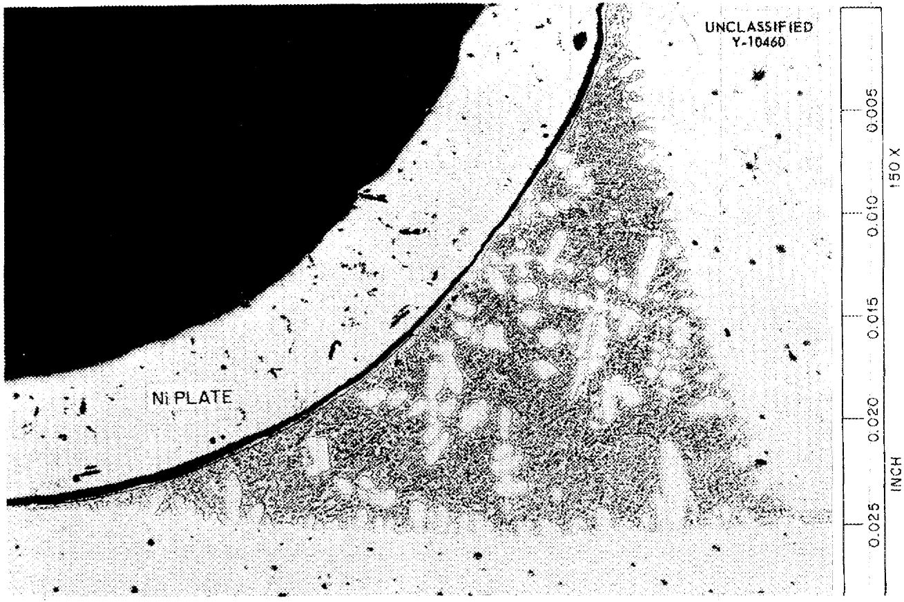  
Fig. 6.5. Inconel T-Joint Brazed with $90\%$ Ni-10% P Alloy after Exposure for 100 hr at $1500^{\circ}\mathrm{F}$ in NaF-ZrF4-UF4 (50-46-4 mole %). Specimen nickel plated after testing to preserve the edge during polishing. Etched with aqua regia. 150X

degree in both media. Results of examination of these joints after testing are summarized in Table 6.8.

# MASS TRANSFER IN LIQUID LEAD

C. R. Boston

J. E. Pope

W.H.Bridges

G.P. Smith

J.V.Cathcart

M. E. Steidlitz

E. E. Hoffman

L.R.Trotter

Metallurgy Division

The study of corrosion and mass transfer in liquid lead has been extended to include tests with cobalt, beryllium, titanium, and Hastelloy B. As in previous experiments, these metals were inserted in small, quartz, thermal convection loops and tested in circulating liquid lead. The results already obtained for the $25\%$ Mo-75% Ni alloy were

rechecked, and the influence of oxides in retarding mass transfer in loops with inserts of type 347 stainless steel systems was further investigated.

The loop with beryllium inserts was operated for 456 hr before circulation stopped because of plug formation. The hot- and cold-leg temperatures were 815 and $600^{\circ}\mathrm{C}$ , respectively. As shown in Fig. 6.8, the corrosion of the beryllium specimen was relatively uniform, with very little intergranular attack. The results for the beryllium loop must still be regarded as tentative, however, since the quartz tubing of the loop appeared to have suffered attack. It is possible that part of the mass transfer observed may be attributed to interaction between the beryllium and the quartz. This problem is being investigated further.

Plugging occurred in the loop with titanium inserts after only 5 hr of operation. Hot- and cold-leg temperatures were 815 and $575^{\circ}\mathrm{C}$ , respectively. In addition to the plug formed in the cold leg, a

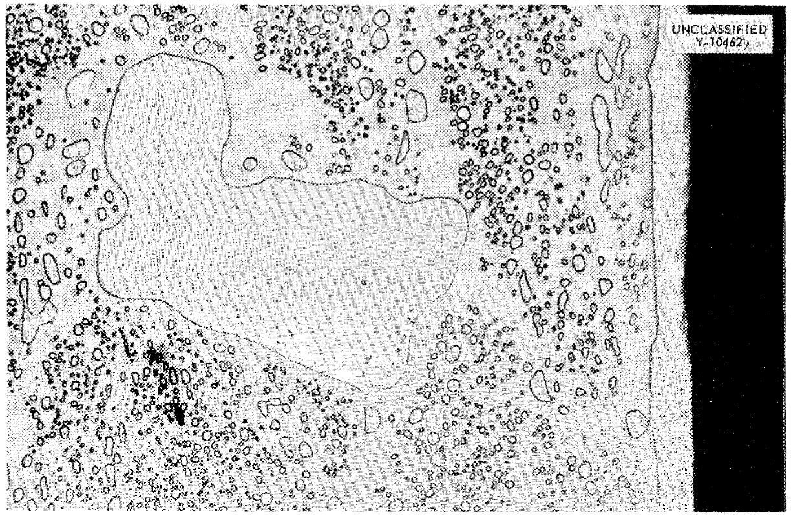

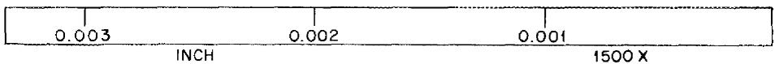  
Fig. 6.6. Inconel T-Joint Brazed with $90\%$ Ni- $10\%$ P Alloy after Exposure for 100 hr at $1500^{\circ}\mathrm{F}$ in NaF-ZrF4-UF4 (50-46-4 mole%). Note uniform layer of nickel-rich solution which formed on surface of braze fillet during test. Etched with aqua regia. 1500X

TABLE 6.8. RESULTS OF STATIC TESTS OF $75\%$ Ni-25% Ge BRAZING ALLOY IN NaF-ZrF4-UF4 (50-46-4 mole %) AND IN SODIUM AT $1500^{\circ}\mathrm{F}$ FOR 100 HOURS   

<table><tr><td>BASE MATERIAL</td><td>BATH</td><td>METALLOGRAPHIC NOTES</td></tr><tr><td>Inconel</td><td>NaF-ZrF4-UF4(50-46-4 mole %)</td><td>Braze fillet attacked to a depth of 7 mils in several areas; attack confined to the nickel-rich phase formed on exposed surface of the fillet during test</td></tr><tr><td>Inconel</td><td>Sodium</td><td>Very similar to above specimen, with voids to a maximum depth of 4 mils</td></tr><tr><td>Type 316 stainless steel</td><td>Sodium</td><td>Specimen attacked to a maximum depth of 9 mils; attack confined to nickel-rich phase</td></tr></table>

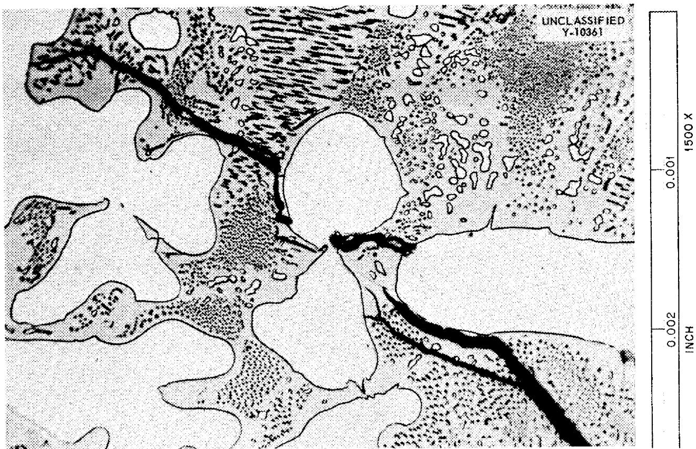

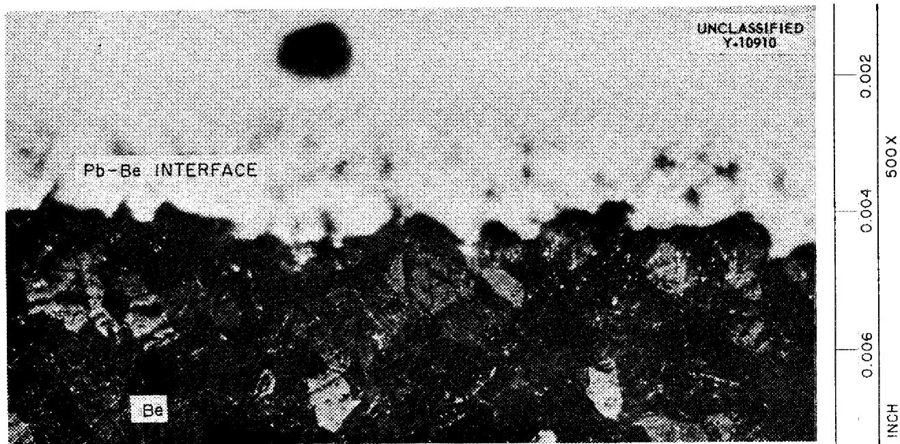  
Fig. 6.7. Type 316 Stainless Steel T-Joint Brazed with $90\%$ Ni- $10\%$ P Alloy Prior to Testing. All cracks are in brittle $\mathbf{N}\mathbf{i}_{3}\mathbf{P}$ phase. Etched with aqua regia. 1500X   
Fig. 6.8. Transverse Section of Beryllium Specimen Exposed to Liquid Lead at $815^{\circ}C$ for 456 hr in the Hot Leg of a Quartz Thermal Convection Loop. Polarized light. 500X

large quantity of mass-transferred material was deposited on the hot-leg specimen. Figure 6.9 shows some of the dendritic crystals found on the walls of the hot leg. A transverse section of the hot leg is shown in Fig. 6.10. There is a heavy layer of deposited material at the inside surface of the specimen. Some deposition was also noted on the cold leg but not to the extent found on the hot leg. Two loops with cobalt inserts have been tested. The first loop plugged after 61 hr of operation with hot- and cold-leg temperatures of 820 and $550^{\circ}\mathrm{C}$ . Figure 6.11 shows a transverse section of the hot-leg specimen from this loop. A heater failure caused the termination of the second loop after 97 hr of operation with hot- and cold-leg temperatures of 815 and $500^{\circ}\mathrm{C}$ . The gradual decrease in the cold-leg temperature of this loop indicated that plugging would probably have occurred in another few hours of operation. Examination of the test specimen from the second cobalt loop has not been completed.

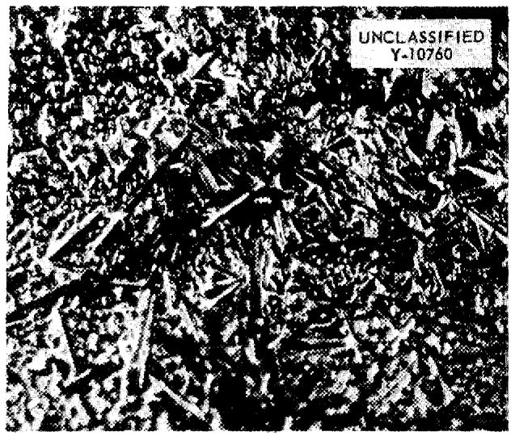  
Fig. 6.9. Dendritic Growth Forms Deposited on the Titanium Specimen Exposed to Liquid Lead at $815^{\circ}C$ for 5 hr in the Hot Leg of a Quartz Thermal Convection Loop. 30X

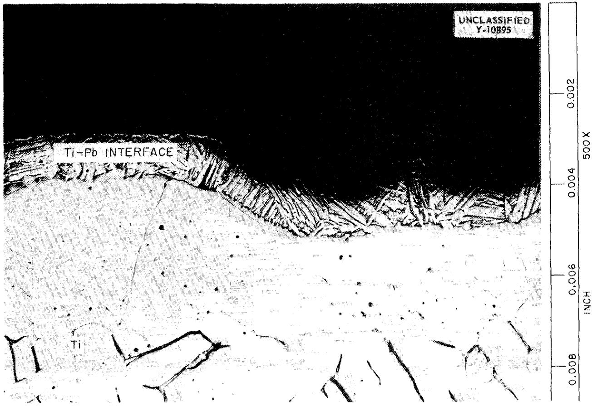  
Fig. 6.10. Transverse Section of Titanium Specimen Exposed to Liquid Lead at $815^{\circ}\mathrm{C}$ for 5 hr in the Hot Leg of a Quartz Thermal Convection Loop. 500X

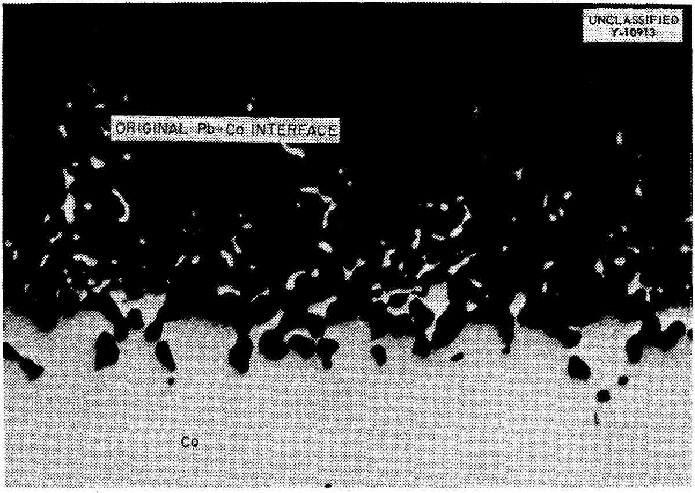

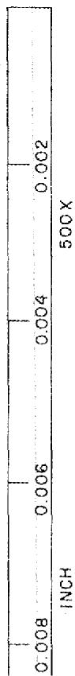  
Fig. 6.11. Transverse Section of Cobalt Specimen Exposed to Liquid Lead at $820^{\circ}\mathrm{C}$ for 61 hr in the Hot Leg of a Quartz Thermal Convection Loop. 500X

The loop with Hastelloy B (64% Ni-5% Fe-28% Mo-1% Si-1% Mn) inserts was terminated on schedule after 504 hr of operation with hot- and cold-leg temperatures of 800 and $600^{\circ}\mathrm{C}$ . Although some mass-transferred material was found in the cold leg, there was not enough to cause plugging. As is shown in Fig. 6.12, the hot-leg specimen suffered very severe corrosive attack. Lead penetrated almost all the way through the specimen. The cold-leg specimen, on the other hand, was virtually unattacked, with only a thin layer of mass-transferred material deposited on the inside of the specimen.

The results obtained from a second loop with $25\%$ Mo-75% Ni alloy inserts confirmed the results obtained in the first test. The loop was terminated on schedule after 331 hr of operation with hot- and cold-leg temperatures of 820 and $590^{\circ}\mathrm{C}$ . Severe intergranular penetration occurred in the hot-leg specimen but little corrosive attack was observed in the cold leg.

Figure 6.13 shows a transverse section from the hot leg of a loop with type 304 stainless steel inserts in which the test specimens were oxidized prior to loading. The loop was operated for 550 hr without the formation of a plug large enough to stop circulation. In contrast, loops containing type 304 stainless steel specimens in the as-received condition had to be terminated within 100 hr because of plug formation.

In order to test further the effect of the presence of oxides on mass transfer, a loop with type 347 stainless steel inserts was operated in which the lead was not deoxidized prior to loading. The loop operated for 240 hr before failing because of plug formation; the hot- and cold-leg temperatures were 815 and $500^{\circ}\mathrm{C}$ . In previous loops with type 347 stainless steel inserts for which the standard deoxidized procedure was followed, plugging occurred in approximately 150 hours. As indicated in Fig. 6.14, the hot-leg specimen showed intergranular penetration similar to that obtained in other tests with type 347 stainless steel inserts.

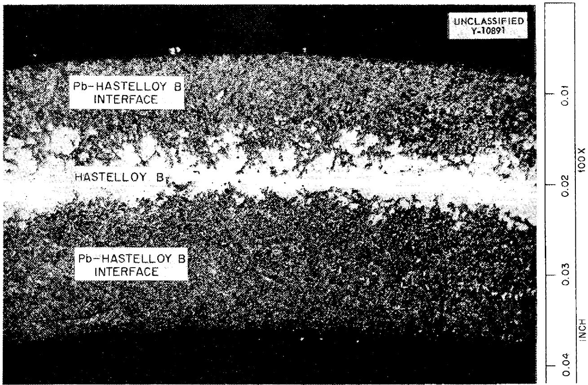

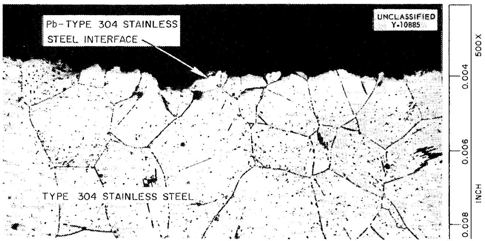  
Fig. 6.12. Transverse Section of Hastelloy B Specimen Exposed to Liquid Lead at $800^{\circ}\mathrm{C}$ for 504 hr in the Hot Leg of a Quartz Thermal Convection Loop. 100X   
Fig. 6.13. Transverse Section of Type 304 Stainless Steel Specimen Exposed to Liquid Lead at $815^{\circ}\mathrm{C}$ for 550 hr in the Hot Leg of a Quartz Thermal Convection Loop. Etched with aqua regia, 500X

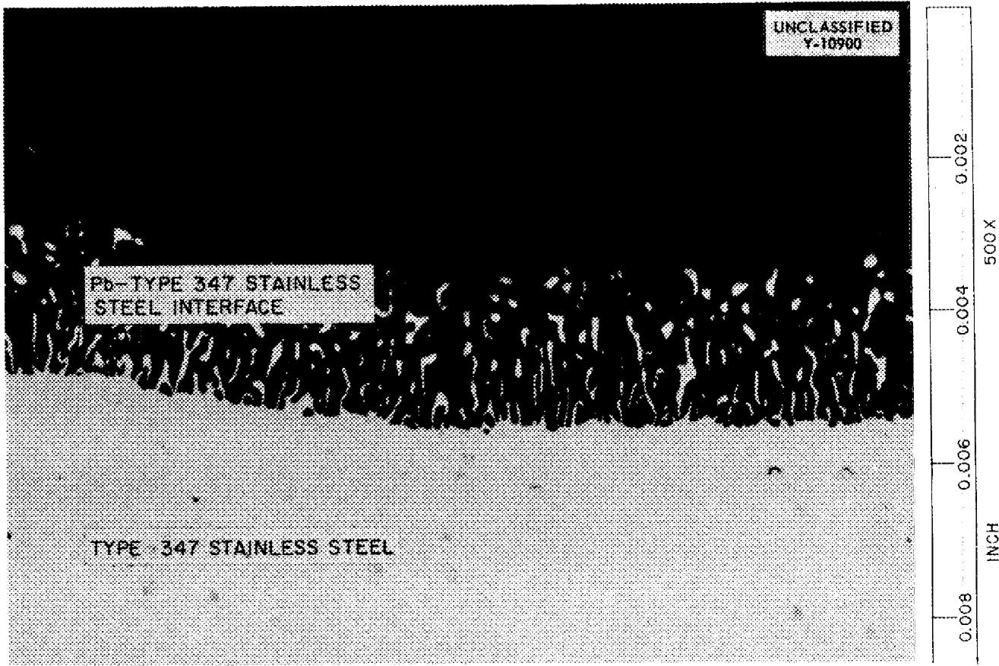  
Fig. 6.14. Transverse Section of Type 347 Stainless Steel Specimen Exposed to Liquid Lead at $815^{\circ}\mathrm{C}$ for 240 hr in the Hot Leg of a Quartz Thermal Convection Loop. 500X

# 7. METALLURGY AND CERAMICS

W. D. Manly

J.M.Warde

Metallurgy Division

The studies of the effect of environment on the creep and stress-rupture properties of Inconel have continued, and rupture curves are presented for Inconel annealed at $1650^{\circ}\mathrm{F}$ and at $2050^{\circ}\mathrm{F}$ and tested in argon and in the fluoride mixture NaF $\mathsf{ZrF}_4$ -UF $_4$ at 1300, 1500, and $1650^{\circ}\mathrm{F}$ . A bar graph is presented to show the time required to reach several different extensions and the amount of deformation at rupture for Inconel tested in the various environments after being subjected to annealing procedures. The major effect on creep properties of a small change in composition of Inconel is also shown. Tests of the effect on columbium of the purity of argon and helium atmospheres were made preparatory to conducting creep tests of columbium.

Methods were developed for preparing a nickel-phosphorus brazing alloy powder that can be applied in the conventional manner. An alloy with satisfactory flowability was prepared, and the optimum conditions for producing it were established. Alloys in the nickel-germanium system are being investigated to determine their suitability for use with liquid metals and fused salts. The $75\%$ Ni- $25\%$ Ge alloy used as a master alloy has a melting point of $1151^{\circ}\mathrm{C}$ and has exhibited favorable flowability at $1180^{\circ}\mathrm{C}$ .

Investigations made in the study of high-conductivity metals for radiator fins have shown claddings of types 310 and 446 stainless steel on copper to be satisfactory with respect to diffusion. However, it may be necessary to use Inconel as the cladding material, and various materials have been tested as diffusion barriers between Inconel and copper. None of the refractory-type barrier materials tested, namely, tungsten, molybdenum, zirconium, titanium, and vanadium, were satisfactory. Other tests showed diffusion barriers of iron and types 310 and 446 stainless steel to be successful in preventing copper diffusion for up to 500 hr at $1500^{\circ}\mathrm{F}$ . Commercially produced types 310 and 430 stainless steel-clad copper did not show diffusion of copper in 500 hr at $1500^{\circ}\mathrm{F}$ .

Radiator fins of various materials were brazed to Inconel tubing for heat transfer tests. The fin materials being studied are type 304 stainless steel, nickel, types 310, 430, and 446 stainless

steel-clad copper, Inconel-clad copper, a copper-aluminum alloy, and a silver-magnesium-nickel alloy. An Inconel spiral-fin heat exchange unit was fabricated for a fluoride-to-air radiator to be used in radiation damage experiments.

Preliminary results indicate that conventional brazing alloys and alloys such as nickel-phosphorus and the precious-metal alloys will satisfactorily flow and wet both Inconel and type 316 stainless steel in an atmosphere of welding-grade tank helium. The substitution of helium for dry hydrogen will be quite useful for brazing operations in which ceramic or nonmetallic jig materials must be used.

Examinations of tubular fuel elements plug-drawn at ORNL indicated that the core structures of the elements were greatly improved by decreasing the reduction per pass. The use of nickel as a core material for these elements has been found to be unsatisfactory because of diffusion of the nickel into the stainless steel cladding.

Various composites of beryllium oxide with minor additions of other materials have been tested and found to be unsatisfactory as containers for fluoride fuels. Special bearing shapes fabricated of beryllium oxide and of high-density graphite were prepared for testing. Six boron carbide--iron cermets were prepared for use as shielding in connection with in-pile loop studies of ANP fuels.

# MECHANICAL PROPERTIES OF METALS

# Stress-Rupture Tests of Inconel

R.B.Oliver

D. A. Douglas

J.M.Woods

Metallurgy Division

Stress-rupture tests of sheet Inconel specimens have been conducted in the fluoride mixture NaF $\mathsf{ZrF}_4\cdot \mathsf{UF}_4$ (50-46-4 mole %) and in argon at temperatures of 1300, 1500, and $1650^{\circ}\mathsf{F}$ . Some of the specimens were annealed at $1650^{\circ}\mathsf{F}$ before they were tested and the others were annealed at $2050^{\circ}\mathsf{F}$ . Figure 7.1 shows the rupture-time vs. stress plot for each condition and environment. The rupture curve for the tube-burst test in fuel at $1500^{\circ}\mathsf{F}$ is also shown. The tube-burst curve falls considerably below the curves for the tensile-stressed specimens

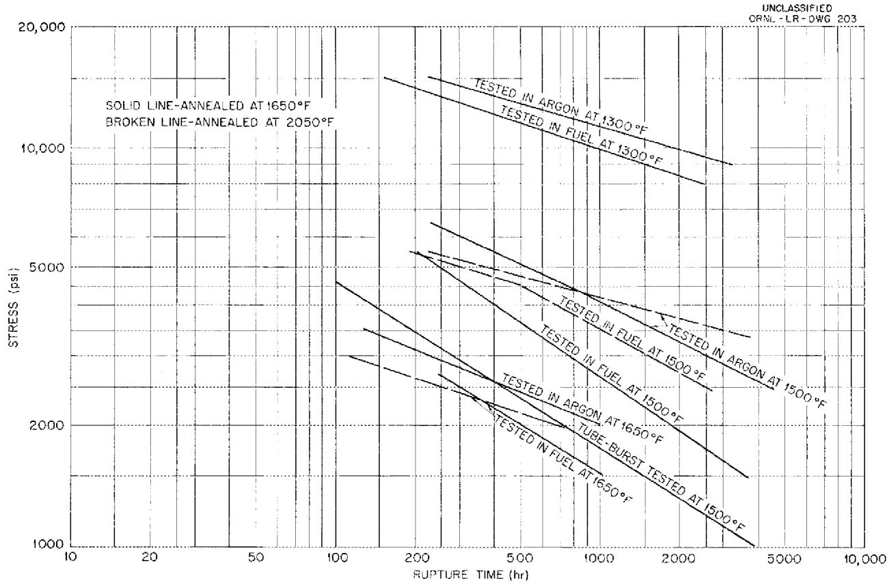  
Fig. 7.1. Rupture-Time vs. Stress Curves for Sheet Inconel Specimens Tested in Fluoride Fuel NaF-ZrF $_4$ -UF $_4$ and in Argon.

tested at the same temperature $(1500^{\circ}\mathrm{F})$ and compares roughly with the curves for the specimens tested at $1650^{\circ}\mathrm{F}$ . It is thought that the tube-burst type of test in which a multiaxial system can be studied is a more realistic test for obtaining information pertinent to the present reactor designs. The rather large differences in rupture properties shown in the data indicate the need for expansion of the tube-burst testing program so that the multi-axial stress system can be more thoroughly studied.

In previous reports, the sensitivity of Inconel to both its test environment and its annealing temperature was shown by comparing the times-to-rupture for the various test conditions. However, it should be emphasized that the selection of the best annealing temperature or environment by using rupture time as the criterion would not necessarily provide the best conditions if some other reference point, such as $1\%$ total strain, were the limiting factor. Figure 7.2 shows the time required to reach several selected extensions and rupture. The bars

are arranged from left to right in order of increasing time required to reach $1\%$ elongation. It can be seen that many of the bars are out of order if extension is neglected and rupture time is used for a comparative basis. The total elongation at rupture is about the same regardless of the annealing temperature or the environment, except in air and in sodium. In sodium; it has been found that the specimen is markedly decarburized during testing, and decarburization would account for the increased ductility. No explanation has yet been found for the greater elongations reached in air.

Examination of Fig. 7.2 shows that the most obvious cases of misfit, with reference to rupture times, are the coarse-grained specimens which were tested in the molten fluoride and in argon. The explanation for this discrepancy can be found in a comparison of the creep curves for the coarse-and fine-grained specimens at 3500 psi. Two such curves for tests conducted in argon are shown in Fig. 7.3. Similar curves for tests in fluoride

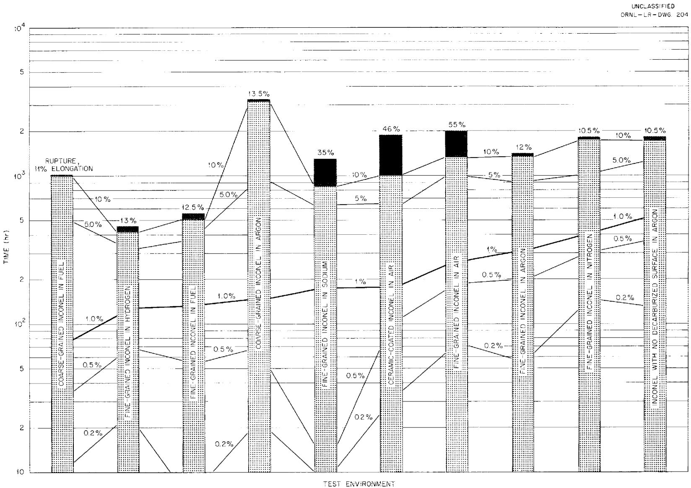  
Fig. 7.2. Time Required to Reach Several Extensions and Rupture for Inconel Tested in Various Environments at 3500 psi and $1500^{\circ}$ F.

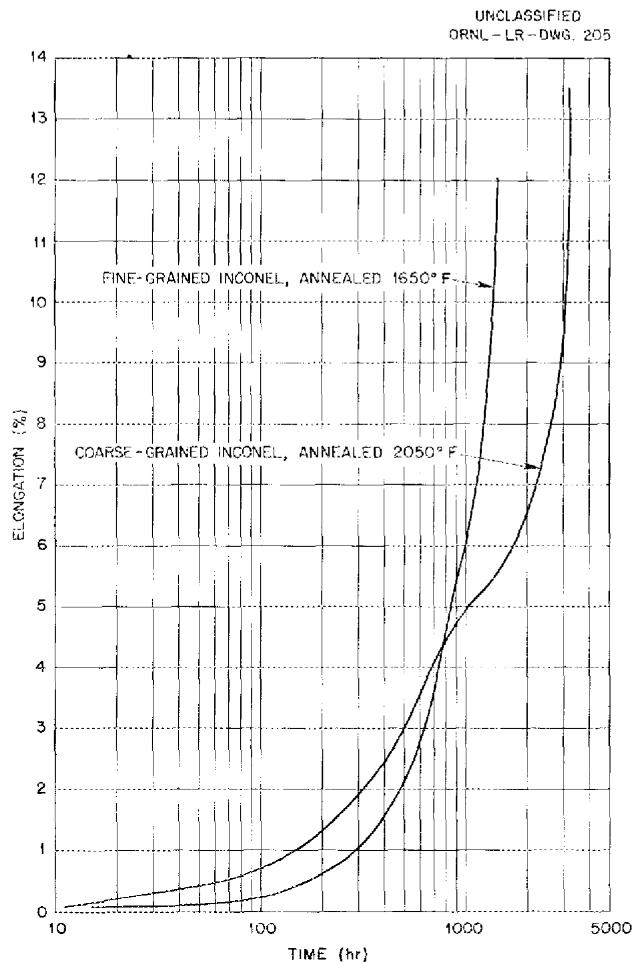  
Fig. 7.3. Creep Curves for Coarse- and Fine-Grained Inconel Specimens Stressed at 3500 psi and Tested at $1500^{\circ}\mathrm{F}$ in Argon.

mixtures would show the same pattern but different magnitudes. These curves show that for the first 200 hr the fine-grained specimen has a much slower creep rate than the coarse-grained specimen, but a transition occurs and a new and faster creep rate is established and maintained until fracture. It can be seen that up to 700 hr and about $4.5\%$ elongation the fine-grained material will show better creep properties than the coarse-grained material, but after 700 hr, the coarse-grained specimen will be superior.

Another variable which must be considered when studying the stress-rupture properties of Inconel is the amount of trace elements, such as aluminum, titanium, and boron, introduced into the heat during deoxidation. The effect of these elements is quite significant, even when they are present in very

small amounts. Figure 7.4 shows rupture curves for two different heats of Inconel tested at $1500^{\circ}\mathrm{F}$ in argon. Heat B, which had an appreciably higher content of trace elements, had a rupture life two to three times longer than that of heat A. An analysis of the effect of annealing temperature on the stress-rupture properties of the two heats showed that annealing at $2050^{\circ}\mathrm{F}$ produced a coarse-grained specimen but did not improve the properties of heat A. However, the same treatment of heat B produced a marked improvement in the rupture properties at stresses below 4500 psi. The improvement can also be attributed to the increased content of trace elements, since the creep curves show that an apparent precipitation-hardening effect took place during testing.

# CREEP TESTS OF COLUMBIUM

H. Inouye R. B. Oliver

D. A. Douglas

Metallurgy Division

The possibility of conducting creep tests of columbium in inert-gas atmospheres is being investigated. It has been shown that atmospheres comparable to vacua of the order of $10^{-5}$ mm of Hg can be obtained by using a pump for recirculating purified gases through the purification train. Use of this method results in a considerable saving in gas consumption, and, with time, the gas becomes purer. The results of tests of columbium in helium and in argon are promising, as shown in Table 7.1.

# BRAZING RESEARCH

# High-Conductivity Radiator Fins

H. Inouye E. S. Bomar, Jr.

Metallurgy Division

An experiment for the qualitative evaluation of the heat transfer efficiency of various fin materials is being conducted by the ANP General Design Group. The test specimens made by the Metallurgy Division consist of $\frac{3}{16}$ -in.-OD, 0.025-in.-wall, Inconel tubing 6 in. long, with disk fins brazed to the center 2 in. of the tube. A typical test specimen is shown in Fig. 7.5. The $\frac{5}{8}$ -in.-OD, 0.010-in.-thick, nickel fins on this specimen were brazed 25 to the inch with Microbraz. Copper leads for voltage-drop measurements were brazed to the specimen by use of low-melting-point Microbraz. Four of these specimens were connected in parallel

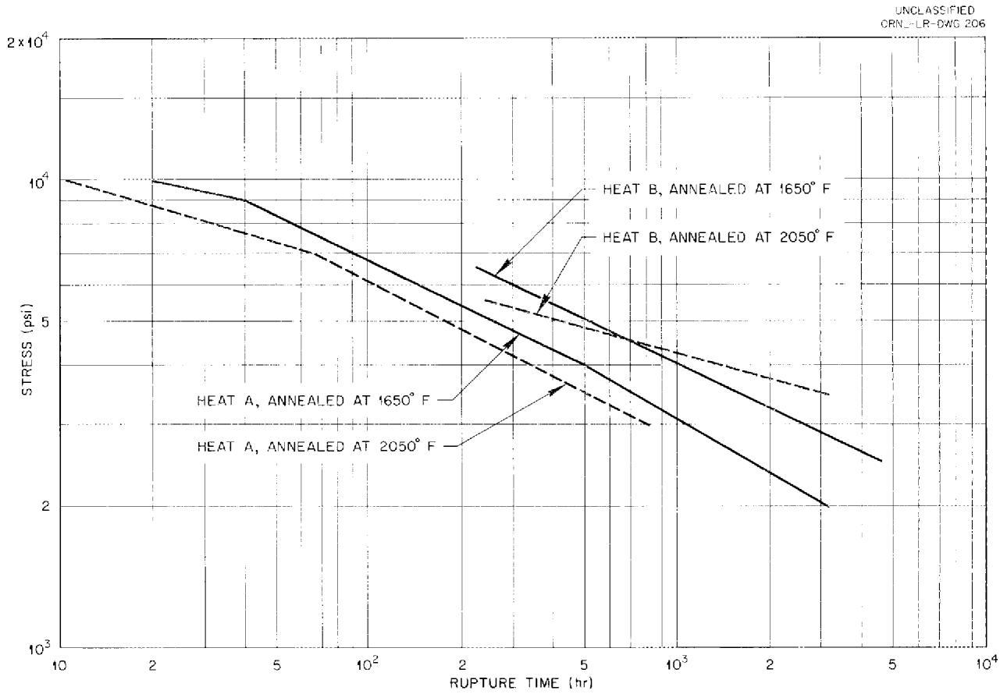  
Fig. 7.4. Stress-Rupture Curves for Two Different Heats of Inconel Sheet Tested at $1500^{\circ}$ F in Argon. Heat A, low in aluminum and titanium; heat B, high in aluminum and titanium.

TABLE 7.1. RESULTS OF TESTS OF COLUMBIUM IN HELIUM AND IN ARGON AT ${1500}^{ \circ  }\mathrm{F}$ FOR 100 HOURS   

<table><tr><td>ATMOSPHERE</td><td>WEIGHT GAIN (g/cm2)</td><td>CHANGE IN HARDNESS (VPN)</td><td>REMARKS</td></tr><tr><td rowspan="3">Helium</td><td>0.00006</td><td>+57</td><td>Helium preparified for 65 hr; furnace not outgassed</td></tr><tr><td>0.00003</td><td>+6</td><td>Helium preparified for 48 hr; furnace outgassed</td></tr><tr><td>0.000005</td><td>-1</td><td>Helium preparified for 51 hr; furnace outgassed</td></tr><tr><td rowspan="2">Argon</td><td>0.0003</td><td>+142</td><td>Static argon preparified for 72 hr</td></tr><tr><td>0.00003</td><td>-1</td><td>Argon preparified for 72 hr; furnace outgassed</td></tr></table>

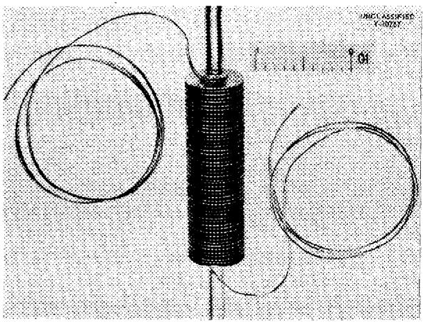  
Fig. 7.5. Typical Heat Transfer Test Specimen for Evaluation of Relative Heat Transfer Properties of High- and Low-Conductivity Fins.

and heated by electrical resistance. The temperature of the exit air blown across the specimens has been used to determine the fin efficiencies (cf., sec. 2, "Experimental Reactor Engineering"). The fin materials that have been or are being brazed for test with fin spacings of 15 and 25 per inch are: type 304 stainless steel, 0.010 in. thick; nickel, 0.010 in. thick; copper, 0.004 in. thick, clad with 0.002 in. of Inconel (total thickness, 0.008 in.); copper, 0.004 in. thick, clad with 0.002 in. of type 310 stainless steel (total thickness, 0.008 in.); copper, 0.004 in. thick, clad with 0.002 in. of type 430 stainless steel (total thickness, 0.008 in.); copper, 0.006 in. thick, clad with 0.002 in. of type 446 stainless steel (total thickness, 0.010 in.); $94\%$ Cu-6% Al bronze, 0.010 in. thick; $99.5\%$ Ag-0.3% Mg-0.2% Ni alloy (made by Handy & Harmon), 0.010 in. thick.

A duplicate set of Inconel-clad copper specimens will be made from sheet oxidized for 500 hr to determine the effect of diffusion on the heat transfer efficiency. Sufficient fin material of Inconel-clad copper and types 310 and 430 stainless steel-clad copper is on hand for the fabrication of conventional sodium-to-air radiators for core element tests. The results of the experiments described above will be used to determine the materials to be used for the radiators.

# Fluoride-to-Air Radiator

A fluoride-to-air radiator was fabricated of Inconel for radiation damage experiments involving in-pile

operation. Although the fins will not be in contact with the fluoride fuel, it was considered desirable to use a brazing alloy that would have at least moderate resistance to the fuel, since excessive dilution or diffusion through the tube wall might be encountered. The $82\%$ Au-18% Ni alloy was used because it exhibits good resistance to oxidation and moderate resistance to corrosion by the fuel. This alloy also possesses a flow point at which grain growth is not considered to be detrimental.

An as-brazed unit of the spiral-fin design developed for these experiments is shown in Fig. 7.6. The brazing material was applied as long narrow strips which had been previously sheared from a rolled sheet. These strips were spiralled along the tube length and therefore closely followed the fin contour. It was possible by this method to readily obtain complete bonding along the tube-to-fin interface,

# Helium-Atmosphere Brazing

P. Patriarca G.M.Slaughter Metallurgy Division

Experiments have indicated that a chemical reaction probably occurs between a hydrogen brazing atmosphere and some ceramic or nonmetallic jig materials. The use of these jig materials may therefore require the use of some neutral atmosphere, such as helium. Since only limited data were available on the flowability of high-temperature brazing alloys in inert atmospheres, an investigation was initiated to obtain applicable information.

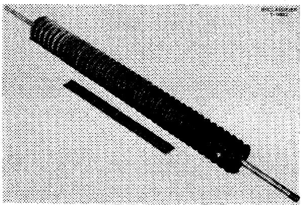  
Fig. 7.6. Inconel Spiral-Fin Heat Exchanger Brazed with $82\%$ Au- $18\%$ Ni Alloy at $1020^{\circ}\mathrm{C}$ .

Preliminary results indicate that conventional alloys such as Microbraz and the G-E nickel-chromium-silicon alloy flow readily on both Inconel and type 316 stainless steel base metals in welding-grade tank helium. Other braze materials, such as nickel-phosphorus and the precious-metal alloys, also appeared to exhibit satisfactory wetting characteristics in a helium atmosphere. Since the results obtained with these preliminary experiments were promising, additional tests are being conducted to more closely determine the effects of a helium atmosphere on the base metal and the brazing alloy composition.

# Nickel.Phosphorus Brazing Alloy

P. Patriarca G. M. Slaughter K. W. Reber

Metallurgy Division

J.M.Cisar

ANP Division

Successful use of the "electroless" method of preplating nickel-phosphorus brazing alloy, as described and illustrated previously, has continued. The method is time-consuming, however, and it would therefore be desirable to find a method for producing nickel-phosphorus powder that could be applied in the conventional manner.

Nickel-phosphorus alloys made by conventional melting methods proved to be unreliable with respect to phosphorus retention and homogeneity. The alloys became contaminated in subsequent crushing and grinding operations on the as-cast ingots. However, a nickel-phosphorus alloy can be prepared in flake form by cataclysmic precipitation from a conventional "electroless" bath. It was found that an excess of the sodium hypophosphate additive would cause flakes of nickel-phosphorus alloy to precipitate on the bottom of the plating bath. The flakes could then be separated and ground into a fine powder. Chemical analyses performed on samples of alloy made in an "electroless" bath showed the phosphorus content to be 11 to $12.5\%$ , that is, slightly higher than the phosphorus content in the binary eutectic.

Researchers at the New York Testing Laboratories, Inc. have developed a process for obtaining nickel-phosphorus coatings in which a slurry of nickelous oxide, dibasic ammonium phosphate, and

water is prepared and then fired in a hydrogen atmosphere at approximately $1700^{\circ}\mathrm{F}$ . Since this method appeared to offer a promising means for obtaining nickel-phosphorus brazing alloy, a series of experiments was performed to evaluate the technique. However, metallic nickel powder was used in this laboratory, since the oxide would be reduced to nickel in the dry hydrogen atmosphere.

Calculations based on $100\%$ phosphorus retention indicated that a phosphate-to-nickel ratio of 2:1 should produce approximately the $90\%$ Ni- $10\%$ P eutectic composition. An alloy prepared in the manner described was found to be quite satisfactory in flowability tests at $950^{\circ}C.$ In order to determine the actual phosphorus retention in this operation, small ingots were prepared with theoretical phosphorus contents of 6, 8, 10, and $12\%$ . Chemical analyses performed on these samples indicated actual percentages of 6.4, 8, 10, and $13.4\%$ , respectively. Experiments performed to determine optimum conditions for producing nickel-phosphorus alloy by this method resulted in the following observations:

1. The particle size of the nickel powder was found to be extremely important from the standpoint of phosphorus retention. Fine powders were found to be very desirable; subsieve powder alloyed with phosphorus yielded much better results than $-200$ mesh powder.   
2. The role of temperature was made less critical as the particle size was decreased. However, higher firing temperatures than the calculated equilibrium temperature were found to be desirable, probably because of the increase in the rate of alloying as compared with the rate of phosphorus loss by vaporization at the higher temperatures.   
3. The use of nickelic oxide was also satisfactory in the production of homogeneous melts.   
4. Preliminary experiments indicated that alloy additions such as chromium and iron could be made by including these elements as metal powders in calculated quantities in the initial mixture.

# Nickel-Germanium Brazing Alloy

P. Patriarca G. M. Slaughter K. W. Reber

Metallurgy Division

J. M. Cisar

ANP Division

The nickel-germanium alloy system has been investigated at other installations, but its suitability for liquid-metal or molten fluoride systems

has not been established. Therefore nickel-germanium and nickel-germanium-chromium alloys were made and are being evaluated with respect to oxidation resistance and static corrosion resistance.

The $75\%$ Ni- $25\%$ Ge alloy used as a master alloy has a melting point of $1151^{\circ}C$ and has exhibited favorable flowability at $1180^{\circ}C$ . The results of corrosion tests conducted in liquid sodium and in fluoride salt mixtures are considered to be promising (cf., sec. 6, "Corrosion Research"). Metallographic examination of an Inconel T-joint brazed with this alloy and exposed to air for 100 hr at $1500^{\circ}F$ showed negligible attack. These results, along with evidence that the alloy can be hot worked, indicate that the nickel-germanium system merits serious consideration for ANP applications.

Alloy additions of chromium and phosphorus have resulted in a substantial decrease of the melting point. A $10\%$ chromium addition lowered the flow point to approximately $1100^{\circ}\mathrm{C}$ . It is expected that oxidation resistance and corrosion resistance in sodium will be increased by the chromium addition. However, it is apparent that the chromium addition makes the alloy more brittle.

# HIGH-CONDUCTIVITY METALS FOR RADIATOR FINS

E.S.Bomar J.H.Coobs H.Inouye Metallurgy Division

The investigations made in the study of high-conductivity metals for radiator fins included a study of diffusion barriers between Inconel and copper, auxiliary diffusion experiments to support metallographic observations of the various clad-copper composites, and the evaluation of composites supplied by commercial fabricators.

# Diffusion Barriers

The gross diffusion between Inconel and copper when heated to $1500^{\circ}\mathrm{F}$ was described previously. Although claddings of types 310 and 446 stainless steel on copper were shown to be satisfactory with respect to diffusion, it seemed advisable to be able to use Inconel as a clad in the event that the brazing of large heat exchangers proved to be difficult with the stainless steel claddings.

Several barrier-containing composites were rolled to a final thickness of 0.008 in., of which 0.004 in. was copper with 0.002 in. Inconel cladding on each

side. The thickness of the refractory-type barrier layer was calculated to be 0.0002 inch. The barrier materials tested included tungsten, tantalum, molybdenum, zirconium, titanium, and vanadium. Bonding was not achieved between molybdenum and Inconel or between vanadium and Inconel. The other barrier metals tested were unsuccessful because discontinuous layers were formed during rolling, either because of fracturing of the barrier metal or because of the differences in strength at the rolling temperature between the barrier metal and the Inconel. When differences in strength existed, the barrier material was found embedded within the copper.

Diffusion barriers of iron and of types 310 and 446 stainless steel were successful in preventing copper diffusion for up to 500 hr at $1500^{\circ}\mathrm{F}$ . Barrier thicknesses of 0.0005 and 0.001 in. were tested. Uniform, continuous, crack-free layers were obtained.

Composites of Inconel-Ag-Fe-Cu-Fe-Ag-Inconel could not be fabricated because of the difficulty of keeping the silver and the copper separated by the iron.

The effect of surface preparation on the diffusion of copper and Inconel was briefly investigated. For this study, oxide layers were formed on Inconel by heat treating it in air and in wet hydrogen at $1350^{\circ}\mathrm{F}$ for various times of up to 1½ hours. Composites fabricated with such oxides did not prevent the formation of the diffusion voids previously described.

# Diffusion Couples

Diffusion couples between copper and types 310 and 446 stainless steel, Inconel, and an $8\%$ aluminum bronze were made. The couples were heated for 500 hr at $1500^{\circ}\mathrm{F}$ and 0.001-in. layers were analyzed. The results, shown in Table 7.2, confirm the metallographic observation that in couples of copper and Inconel or copper and aluminum bronze there is considerable diffusion of the copper into the cladding. It is believed, however, that the experiments lacked precision, and hence calculations of diffusion constants would be misleading.

# Commercially Clad Copper

The General Plate Division of the Metals and Controls Company has fabricated 0.008-in.-thick clad copper up to 5 in. wide and, in single pieces, up to 50 ft long. Samples of types 310 and 430 stainless steel-clad copper received from this

company did not show diffusion in 500 hr at $1500^{\circ}\mathrm{F}$ . No pinholes were found in the 0.002-in.-thick type 430 stainless steel, and the type 310 stainless steel-clad copper was also satisfactory. The Inconel-clad copper showed numerous pinholes, as did some of the Inconel-clad samples received previously.

TABLE 7.2. COPPER DIFFUSION INTO VARIOUS ALLOYS   

<table><tr><td rowspan="2">CL. ADDING MATERIAL</td><td colspan="2">COPPER AT INTERFACE (%)</td></tr><tr><td>Originally</td><td>After 500 hr at 1500°F</td></tr><tr><td>8% aluminum bronze</td><td>8.4*</td><td>5.97*</td></tr><tr><td>Inconel</td><td>None</td><td>31.2</td></tr><tr><td>Type 310 stainless steel</td><td>None</td><td>0.46</td></tr><tr><td>Type 446 stainless steel</td><td>None</td><td>1.4</td></tr></table>

*Percentage aluminum found by chemical analysis; all other amounts determined by spectrographic analysis.

# FABRICATION OF SPECIAL MATERIALS

# Clad Columbium Disks

H. Inouye, Metallurgy Division

Thin disks of columbium, 0.020-in.-thick, were sandwiched between oxidation-resistant alloys and hot rolled in evacuated capsules at various temperatures to determine bonding and rolling characteristics. Since it is known that the "gettering properties" of columbium increase with temperature and its embrittlement in air occurs at around $1500^{\circ}\mathrm{F}$ , it was desired to determine the lowest temperature at which bonding would occur. The results of the first tests are presented in Table 7.3.

The samples, which were clad on all sides, were tested in air at $1500^{\circ}\mathrm{F}$ and at $1832^{\circ}\mathrm{F}$ for 500 hours. The results were not promising, since the bond was broken in most cases, probably because of cracking of the intermetallic or the oxide layers. The thermal expansion coefficients of columbium $(3.95\times 10^{-6}$ in./in.°F) and the cladding material (other than Cb) vary by a factor of about 2. The

TABLE 7.3. RESULTS OF ROLLING CLAD COLUMBIUM TO 68% REDUCTION AT VARIOUS TEMPERATURES  

<table><tr><td rowspan="2">CLADDING MATERIAL</td><td colspan="3">CHARACTERISTICS OF MATERIAL ROLLED AT</td></tr><tr><td>900°C</td><td>1050°C</td><td>1200°C</td></tr><tr><td>Nickel</td><td>Light gray phase at interface</td><td>Same as at 900°C</td><td>Reaction layer in Cb; 
Cb fractured, sur- face rough</td></tr><tr><td>Inconel</td><td>Discontinuous gray phase at interface</td><td>Same as at 900°C</td><td>Reaction layer in Cb; 
Cb fractured, sur- face rough</td></tr><tr><td>Hastelloy B</td><td>Partial bond, smooth</td><td>Questionable</td><td>Surface rough and cracked; reaction layer at interface</td></tr><tr><td>Type 446 stainless steel</td><td>Thin reaction layer at interface</td><td>Thickness of reaction layer increased</td><td>Reaction layer in- creased; surface smooth</td></tr><tr><td>Type 310 stainless steel</td><td>Light gray phase at interface</td><td>Same as at 900°C</td><td>Reaction layer evi- dent; surface smooth</td></tr><tr><td>Columbium</td><td>No interface evident</td><td>Same as at 900°C</td><td>No interface evident</td></tr></table>

tests at $1500^{\circ}F$ show that intermetallic compound formation between columbium and the cladding is not serious. Some embrittlement was noted in the Hastelloy B clad. The tests at $1832^{\circ}F$ were considered to be failures because the columbium core was embrittled or oxidized completely as a result of failure of the cladding or of diffusion. No conclusions can be drawn since only one set of tests was made.

# Clad Molybdenum and Columbium Tubing

H. Inouye

Metallurgy Division

Shipments of clad molybdenum and columbium tubing have been received from the Superior Tube Company. The molybdenum tubing received in the first shipment was clad with 0.020 in. of type 321 stainless steel, and, in an attempt to obtain a good mechanical fit by drawing the molybdenum and cladding, numerous transverse cracks developed in the molybdenum. Of six composite tubes, only three were acceptable. The clad tubes received in the second shipment were scored, but no cracks were found. Ninety-four feet of columbium clad with type 310 stainless steel has also been received; this material is sound. These composite tubes are to be made into thermal convection loops for corrosion studies.

A metallurgical bond between columbium and type 310 stainless steel could not be obtained by simultaneously cold drawing the tubes to a $75\%$ reduction in area and annealing at $1100^{\circ}\mathrm{C}$ in a vacuum.

# Drawn Tubular Fuel Elements

J.H.Coobs

E. S. Bomar, Jr.

Metallurgy Division

Metallographic examination of the nine tubular fuel elements plug-drawn at ORNL was completed. In general, the core structure of these elements is greatly improved compared with those processed at the Superior Tube Company by drawing on a mandrel. The metallic matrices of the cores seemed to be sound, and the core-to-cladding bonds were intact. Stringers of $\mathsf{UO}_2$ were formed because of breaking up of the relatively coarse $\mathsf{UO}_2$ (-270 +325 mesh). The stringers became more predominant and larger as reductions were increased

to about $80\%$ . Figure 7.7 shows a longitudinal section of tube with 30 vol $\%$ $\mathrm{UO}_2$ in a nickel core after $77\%$ cold reduction, during which the $\mathrm{UO}_2$ was broken up into stringers and lost during polishing. This structure is typical of others which had comparable reductions.

Figure 7.7 also shows the definite zone (0.002 to 0.003 in.) of diffusion of nickel into the stainless steel cladding as a result of repeated annealing. Therefore, nickel is being de-emphasized as a core matrix in fuel elements.

Several more tubes of various compositions are to be drawn by the Superior Tube Company. These tubes will also be plug-drawn from $\frac{3}{4}$ in. in diameter to $\frac{1}{4}$ in. in diameter by using reductions of 10 and $15\%$ per pass, followed by mandrel drawing of a segment of each tube to $\frac{1}{8}$ in. in diameter. The tubes will be prepared with cores of iron, prealloyed stainless steel, elemental "stainless steel," and nickel powders with 30 vol % of -325 mesh high-fired $\mathsf{UO}_2$ .

Two or three tubes of each composition will be prepared for use with the different reduction schedules. These tubes will have one core 2 in. wide, as hot rolled, and will be roll-formed and welded with one seam. Starting wall thickness will be 0.025 in. to minimize the amount of tube reduction necessary. Several dummy tubes with 0.025-in. walls have been fabricated to establish optimum welding conditions.

# CERAMIC RESEARCH

L. M. Doney

R. L. Hamner

J.A.Griffin

M.P.Haydon

J. R. Johnson

Metallurgy Division

# Ceramic Container for Fluoride Fuel

Work has continued on the production of a suitable ceramic container for use in the investigation of the electrical resistivities of the fluoride fuels. A crucible of beryllium oxide supplied by Clifton Products Company was found to have a density of $2.62\mathrm{g/cm}^3$ . This crucible was tested by the Heat Transfer and Physical Properties Group (cf., sec. 8, "Heat Transfer and Physical Properties") and found not to be impervious to the fluoride fuel. A rod, $1\frac{3}{4}$ in. in diameter and 11 in. in length, was prepared by isostatic pressing of beryllium oxide powder (-325 mesh) bonded with Carbowax, sintering to $1850^{\circ}\mathrm{C}$ , and holding for $1\frac{1}{4}$ hr at that temperature.

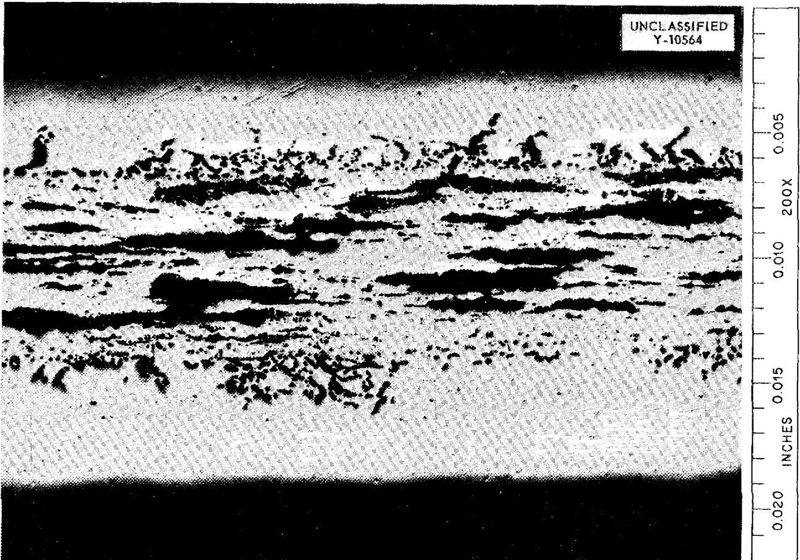  
Fig. 7.7. Longitudinal Section of Tubular Fuel Element with 30 vol % $\mathsf{UO}_2$ in a Nickel Core. Type 316 stainless steel cladding; 77% cold reduction. 200X

This rod was also found not to be impervious to the fuel. A body was prepared with the composition 48 moles of $\mathrm{BeO}_2$ 1 mole of $\mathrm{Al}_{2}\mathrm{O}_{3}$ and 1 mole of $\mathrm{ZrO_2}$ (developed by the National Bureau of Standards) for preparing dense beryllium oxide shapes. The body was made up into a small crucible, $3 / 4$ in. in inside diameter and 4 in. in height, by slip casting, firing to $1850^{\circ}C,$ and holding for $1\frac{1}{4}$ hr at that temperature. Again the ware was found not to be impervious to the fluoride fuel. Additional work on materials with minor additions of $\mathrm{CaF}_2$ and other materials is in progress.

# Ceramic Pump Bearings

Special bearing shapes of beryllium oxide and of high-density graphite are being prepared. The

beryllium oxide shapes are being cut from excess hot-pressed ARE beryllium oxide moderator blocks by the Beryllium Machine Shop. High-density graphite bearing shapes (density, $1.92\mathrm{g/cm}^3$ ) were prepared by Cory, consultant to the Ceramic Laboratory, and furnished to Experimental Engineering Department personnel for testing.

# Boron Carbide-Iron Cermets

Six boron carbide-iron cermets (30% B4C-70% Fe), 8 in. in thickness and 6½ in. in diameter, were prepared for the Solid State Division by hot pressing (1025°C and 1750 psi). The final density of the ware was 3.56 g/cm³. These disks are required for shielding in connection with in-pile loop studies of fluoride fuels.

# 8. HEAT TRANSFER AND PHYSICAL PROPERTIES

H.F.Poppendiek

Reactor Experimental Engineering Division

The physical properties of several fluoride mixtures and other materials of interest to aircraft reactor technology were determined. The heat capacity of NaF-ZrF $_4$ (50-50 mole %) was found to be 0.19 cal/g $^{\circ}$ C in the solid state and 0.33 cal/g $^{\circ}$ C in the liquid state. The thermal conductivity of solid NaF-KF-LiF (11.5-42-46.5 mole %) was determined to be about 2.8 Btu/hr.ft $^{\circ}$ F, which is similar to the liquid conductivity value previously determined. Preliminary thermal-conductivity measurements for a liquid heat-transfer salt $(\mathrm{NaNO}_2 - \mathrm{NaNO}_3 - \mathrm{KNO}_3)$ , eutectic yielded a value of 0.6 Btu/hr.ft $^{\circ}$ F. The density of NaF-ZrF $_4$ -UF $_4$ (62.5-12.5-25 mole %), a mixture to be used in an in-pile loop system, was found to be $\rho(g/cm^3) = 4.836 - 0.00111T$ over the temperature range 650 to $900^{\circ}$ C; the viscosity varied from about 17.1 centipoises at $670^{\circ}$ C to 8.3 centipoises at $900^{\circ}$ C. The density of NaF-LiF (40-60 mole %) was determined to be $\rho(g/cm^3) = 2.429 - 0.00047T$ over the temperature range 700 to $900^{\circ}$ C; the viscosity varied from about 5 centipoises at $700^{\circ}$ C to 2.5 centipoises at $900^{\circ}$ C.

A heat-transfer system which can be used to study the rates of deposition of insoluble chemical deposits in certain fluoride systems has been fabricated.

The feasibility of the technique of measuring fluid velocity profiles in duct systems by photographing tiny particles suspended in the flowing medium has been checked. This method is to be used to determine the hydrodynamic structure in the flow annulus of the reflector-moderated reactor.

Further forced-convection, laminar-flow, heat-transfer experiments have been conducted in pipe systems which contain circulating liquids with volume heat sources; these sources are generated electrically. The laminar-flow data fall about $30\%$ below the values predicted by previously developed theory.

# PHYSICAL PROPERTIES MEASUREMENTS

Heat Capacity

W.D.Powers G.C.Blalock

Reactor Experimental Engineering Division

The enthalpy and heat capacity of the fluoride mixture $\mathrm{NaF - ZrF_4}$ (50-50 mole $\%$ ) were determined in the liquid and solid state. The data can be represented by the following equations: In the solid state (216 to $490^{\circ}C$ ),

$$
\begin{array}{l} H _ {T} (\text {s o l i d}) - H _ {0 ^ {\circ} C} (\text {s o l i d}) = 0. 1 9 T, \\ c _ {p} = 0. 1 9 \pm 0. 0 1; \\ \end{array}
$$

in the liquid state (552 to $875^{\circ}C$ ),

$$
\begin{array}{l} H _ {T} (\text {l i q u i d}) - H _ {0 ^ {\circ} C} (\text {s o l i d}) = - 1 3 + 0. 3 3 T, \\ c _ {p} = 0. 3 3 \pm 0. 0 2, \\ \end{array}
$$

where $H$ is enthalpy in $\mathrm{cal / g}$ , $T$ is temperature in ${}^{\circ}\mathrm{C}$ , and $c_{p}$ is heat capacity in $\mathrm{cal / g}$ . The heat of fusion at the melting point at $510^{\circ}\mathrm{C}$ is about 59 cal/g. The individual results for this salt are shown in Fig. 8.1.

Preliminary values for the heat capacity of two other salts in the liquid state follow: NaF-ZrF4- UF4 (65-15-20 mole %), $c_p = 0.22$ ; NaF-ZrF4-UF4 (53-43-4 mole %), $c_p = 0.27$ .

Silver liners have been placed in the central region of several of the heat-capacity furnaces where the capsules are suspended. Checks with pure aluminum oxide show that more accurate enthalpy data are obtained when the temperatures of the liners rather than the temperatures of the capsule tops are used. Silver liners are being installed in the remaining furnaces.

# Thermal Conductivity

W. D. Powers

R. M. Burnett

S. J. Claiborne

H.W.Hoffman

Reactor Experimental Engineering Division

Attempts are being made currently to measure the thermal conductivity of molten fluorides by using the longitudinal conductivity device. The existence of free-convection currents in some parts of the

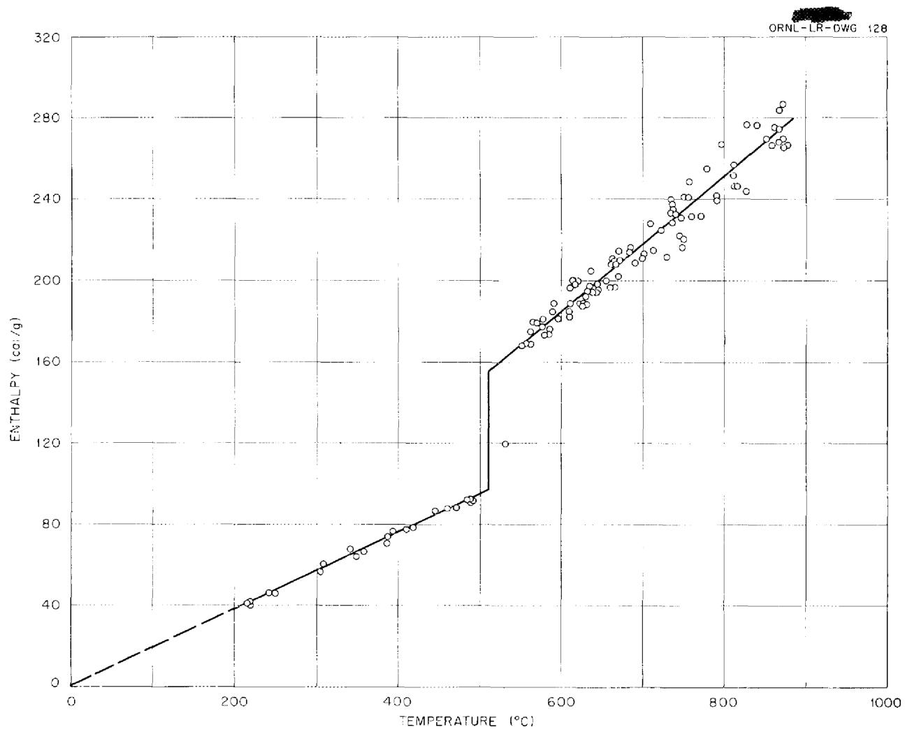  
Fig. 8.1. Temperature vs. Enthalpy for NaF-ZrF $_4$ (50-50 mole %).

system is suspected. Some preliminary measurements of the fluoride mixture NaF-KF-LiF (11.5-42-46.5 mole %) in the solid state yielded a conductivity value of about 2.8 Btu/hr.ftf. $^\circ F$ , which is similar to the liquid conductivity value previously determined for that material.

A steady-state radial method has been developed for determining the thermal conductivities of liquids. The apparatus consists of a $\frac{3}{2}$ -in., thin-walled, stainless steel tube that can be heated directly by an electric current. This tube is centrally placed in a $\frac{1}{4}$ -in. hole drilled in a 2-in. metal rod. Gradients of over $20^{\circ}$ have been obtained in water without appreciable convection. The individual results obtained for water were between 0.33 and 0.37 Btu/hr.ft. These values

are comparable to the literature value of 0.35. Modifications of this apparatus will have to be made before the thermal conductivity of fused fluorides and hydroxides can be determined because of their appreciable electrical conductivity.

Additional data on the thermal conductivity of solid heat-transfer salts $\left(\mathrm{NaNO}_{2}-\mathrm{NaNO}_{3}-\mathrm{KNO}_{3}\right.$ , eutectic) have been obtained. A slab of this heat-transfer salt, approximately 4 in. square and $1/8$ in. thick, was cast with thermocouples located on the slab surfaces. The sample was inserted in the parallel-plate conductivity system, which is presently used for determining the thermal conductivities of liquids. Data obtained over the temperature range 90 to $200^{\circ}\mathrm{F}$ are shown in Fig. 8.2. Also shown are the previously reported data

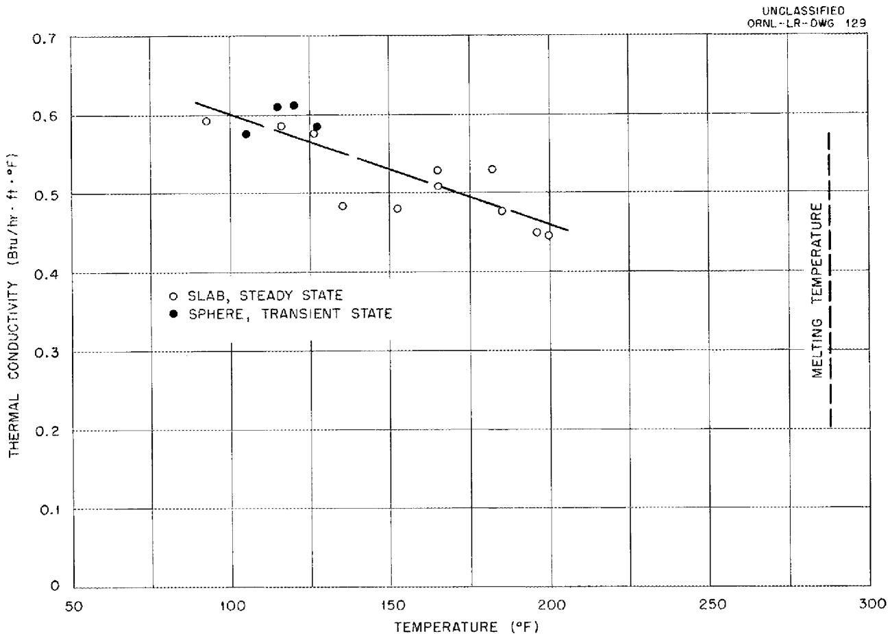  
Fig. 8.2. Thermal Conductivity vs. Temperature for the Heat-Transfer Salt $\mathsf{NaNO}_2$ - $\mathsf{NaNO}_3$ - $\mathsf{KNO}_3$ .

on the thermal conductivity of this salt, which were obtained by transiently cooling a sphere of the salt. Some preliminary conductivity measurements in the liquid state, obtained by using the variable-gap (Deem-type) device, yielded conductivities equal to about 0.6 Btu/hr-ft. $^{\circ}$ F.

Additional experiments have been conducted to determine the thermal conductivities of solid fluorides. However, difficulties continued to arise in attempting to cast solid spheres completely free of voids.

# Density, Viscosity, and Surface Tension

S. I. Cohen T. N. Jones

Reactor Experimental Engineering Division

Preliminary density and viscosity measurements were made on two fluoride mixtures. The density of $\mathrm{NaF - ZrF_4 - UF_4}$ (62.5-12.5-25 mole %), which is the mixture being used for in-pile loop studies, may

be represented by

$$
\begin{array}{l} \rho (g / c m ^ {3}) = 4. 8 3 6 - 0. 0 0 1 1 1 T, \\ 6 5 0 ^ {\circ} \mathrm {C} <   T <   9 0 0 ^ {\circ} \mathrm {C}. \\ \end{array}
$$

The viscosity of this mixture,² which varied from about 17.1 centipoises at $670^{\circ}C$ to about 8.3 centipoises at $900^{\circ}C$ , is represented by

$$
\begin{array}{l} \mu (\mathrm {c p}) = 0. 4 5 9 e ^ {3 4 2 0 / T}, \\ 9 5 0 ^ {\circ} \mathrm {K} <   T <   1 2 0 0 ^ {\circ} \mathrm {K}. \\ \end{array}
$$

The density of the mixture NaF-LiF (40-60 mole %) is represented by

$$
\begin{array}{l} p (g / c m ^ {3}) = 2. 4 2 9 - 0. 0 0 0 4 7 T, \\ 7 0 0 ^ {\circ} \mathrm {C} <   T <   9 0 0 ^ {\circ} \mathrm {C}. \\ \end{array}
$$

The viscosity varied from about 5 centipoises at

$700^{\circ}C$ to about 2.5 centipoises at $900^{\circ}C$ .

A preliminary viscosity study was made on KOH, and the viscosity was found to vary from about 3 centipoises at $450^{\circ}\mathrm{C}$ to about 1.5 centipoises at $650^{\circ}\mathrm{C}$ .

Preliminary surface-tension measurements were made on NaOH. The surface tension was found to vary from about 131 dynes/cm at $325^{\circ}\mathrm{C}$ to about 125 dynes/cm at $585^{\circ}\mathrm{C}$ .

# Electrical Conductivity of Molten Salts

N. D. Green

Reactor Experimental Engineering Division

Development of the beryllia-tube modification of the dip cell for obtaining the electrical conductivities of molten salts at high temperatures has now been halted. Since it has been impossible to produce a beryllia tube of the required density, one of the most accurate methods for determining the conductivities of the non-lithium-containing salts cannot be used,

The platinum conductivity cell, which is known to be compatible with all molten salts, including the lithium-containing compounds, has been tested at its maximum required operating temperature $(1800^{\circ}\mathrm{F})$ and found to be dimensionally stable. The determination of the constant of this cell is now being carried out with several substances for which conductivities at various temperatures are accurately known. It now appears that the problem of contamination of the melt by the constituent elements of the crucible going into solution has been largely eliminated. Several test melts have evidenced no observable contamination.

A modification of the platinum cell is now being developed so that its constant may be calculated readily from the known geometry. However, the utilization, here, of a beryllia insert limits the applicability of the cell to compositions which do not contain lithium.

# FUSED-SALT HEAT TRANSFER

H.W.Hoffman

J. Lones

Reactor Experimental Engineering Division

The feasibility of a small-scale system to be used in studying the rates of deposition of the films or deposits found at interfaces between Inconel and NaF-KF-LiF has been demonstrated, and the system has been constructed. The system consists of two small Inconel tanks connected by a

removable test section made of $\frac{1}{4}$ -in. tubing. The fluid in the tanks is cycled through the test section by inert gas pressure; the cycling mechanism is probe actuated. The test section, which can be constructed of any desired material, is surrounded by a $\frac{3}{8}$ -in.-thick copper jacket to provide an isothermal region. The section is heated by a clam-shell heater. The system has been designed to operate at Reynolds moduli of up to 10,000. Specified temperature conditions can be maintained by adjustment of the tank and test-section heaters.

It is possible that this system could also be used as a dynamic corrosion-testing system in that it needs no mechanical pump and yet can provide fluoride flow rates equivalent to Reynolds moduli of up to 10,000.

The fused-salt heat-transfer system which was used in the past to study the characteristics of molten sodium hydroxide and of NaF-KF-LiF is being reassembled for new heat-transfer experiments with, perhaps, rubidium-bearing salts.

# HYDRODYNAMICS RESEARCH

J.O.Bradfute

L.D.Palmer

G.M.Winn

Reactor Experimental Engineering Division

Fluid velocity measurements have been made in a simple flow system to test the feasibility of a photographic technique. Velocity data were obtained by suspending dust particles in the flowing fluid, illuminating a region with a thin beam of light flashed at measured time intervals, and photographing the particles by the light they scattered. Successive images of each particle appeared as points on a single negative. A grid system was also photographed, and a composite print of the two negatives was made so that the particles could be located in space. With the composite print and the time-interval information, velocities could be computed directly.

A report has been prepared in which the method is described in detail and the initial velocity data are presented. The principal difficulty in this system is inadequate lighting, which imposes a limitation on the technique, although not a major one.

The method is applicable to studies of the flow

channel of the reflector-moderated reactor, and the measurement of velocity profiles in such a system will be attempted presently.

The utilization of phosphorescent materials in determining fluid velocity profiles in flow systems is being investigated. The materials are suspended in the fluids and then excited by ultraviolet light. A phosphorescent rod of fluid is distorted by the velocity pattern which exists in the flow system as the phosphorescent material moves through the duct. The velocity profile can be determined from the degree of distortion. A circulation system containing a glass pipe (to be used to observe the phosphorescent patterns) has been constructed in a small darkroom.

4 H. F. Poppendiek and G. M. Winn, Preliminary Forced Convection Heat Transfer Experiments in Pipes with Volume Heat Sources Within the Fluids, ORNL CF-54-2-1 (to be issued).   
5 H. F. Poppendiek and G. M. Winn, ANP Quar. Prog. Rep. Sept. 10, 1953, ORNL-1609, p. 107.

# CIRCULATING-FUEL HEAT TRANSFER

H.F.Poppendiek G.M.Winn

Reactor Experimental Engineering Division

Additional forced-convection heat-transfer experiments have been conducted in pipe systems which contain circulating liquids with volume heat sources.4 The apparatus, which was described previously, has been modified to facilitate making laminar-flow experiments (Fig. 8.3). The experimental system was normally operated in such a manner that the average wall temperature of the test section was very nearly equal to the room temperature. Under these circumstances, no heat was transferred to or from the circulating electrolyte at the pipe wall. Table 8.1 shows the experimental data for two typical laminar-flow conditions in a $9/32$ -in.-ID tube.

The experimental differences between wall and mixed-mean fluid temperatures (in dimensionless form) are compared to the previously developed

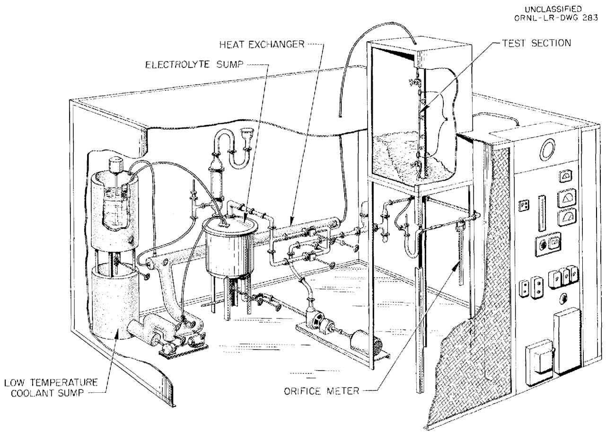  
Fig. 8.3. Experimental Forced-Convection Volume-Heat-Source System.

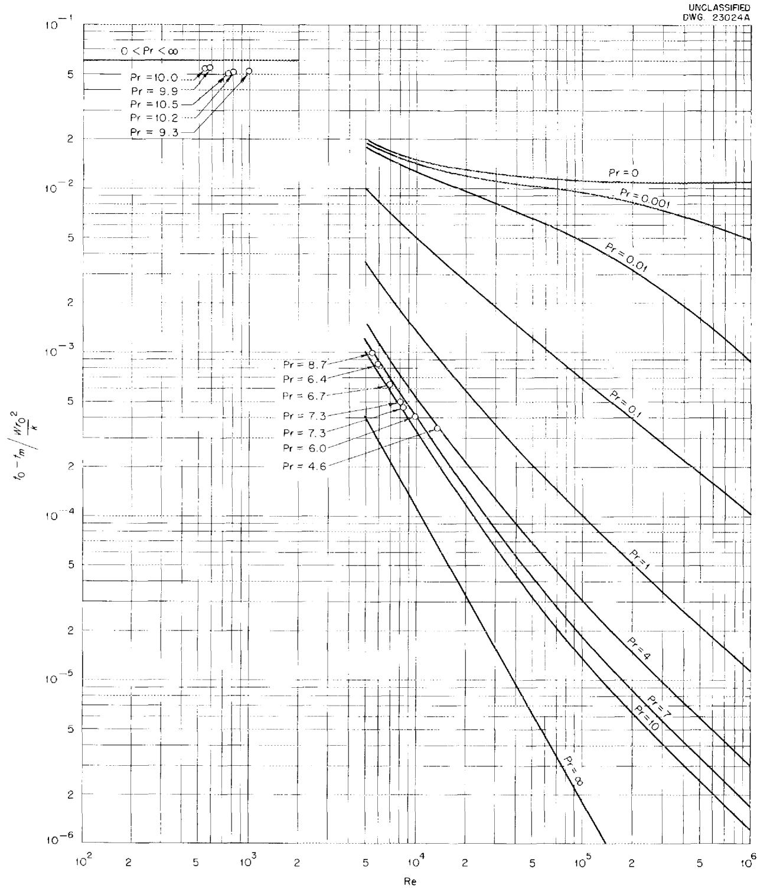  
Fig. 8.4. Theoretical and Experimental Dimensionless Differences Between Wall and Mixed-Mean Fluid Temperatures (with the Pipe Insulated).

theory in Fig. 8.4. The curves represent the mathematical temperature solutions, and the points represent the experimental measurements. The experimental laminar-flow data fall about $30\%$ below the values predicted by theory. This deviation may

exist because of free-convection or entrance phenomena. The experimental turbulent-flow data were reported previously; they fall within $\pm 30\%$ of the predicted values.

TABLE 8.1. EXPERIMENTAL DATA FOR LAMINAR FLOW IN A $\frac{9}{3}2 -$ in.-ID TUBE   

<table><tr><td>HEAT SOURCE (kw/cm3)</td><td>REYNOLDS MODULUS</td><td>PRANDTL MODULUS</td><td>AXIAL TEMPERATURE RISE (°F)</td><td>RADIAL TEMPERATURE RISE, t0 - tm (°F)</td></tr><tr><td>0.0039</td><td>560</td><td>10.0</td><td>13.8</td><td>9.0</td></tr><tr><td>0.0077</td><td>750</td><td>10.5</td><td>20.1</td><td>15.5</td></tr></table>

# 9. RADIATION DAMAGE

J. B. Trice, Solid State Division

A. J. Miller, ANP Division

Tests of fused-salt fuels in Inconel capsules are being conducted to determine the chemical stability of the fuel and the corrosion resistance of the Inconel under high temperatures in reactor radiation fields. In the past, fused-salt fuels in the NaF-ZrF $_4$ -UF $_4$ system were shown by several methods to be chemically stable when they were irradiated for 600-hr periods at fuel power densities of up to 8000 watts/cm $^3$ . Concurrent tests also have shown that container corrosion increases from 1 to 2 mils of subsurface-void attack for out-of-pile tests to 5 to 6 mils of intergranular attack for in-pile high-temperature tests. Data obtained from recently completed petrographic examinations support the previous indications that the fuels are chemically stable under reactor radiation. The occasional appearance of unusually large grains in irradiated capsules has stimulated an intensive study of the errors involved in temperature measurements of the capsules.

Miniature loops are being designed for circulating fuel in such space-restricted locations as the vertical holes in the LITR. The designs are based on the results of intensive studies of such variables as fuel flow rates, power densities, and rates of heat removal. Some components have already been constructed and tested.

An in-pile stress corrosion apparatus has been developed for obtaining information on the function of stress in corrosion. With this apparatus, it will be possible to determine, simultaneously, the corrosion effects on stressed and unstressed portions of a tube.

Tests in the LITR and in the Graphite Reactor have shown that the creep behavior of Inconel is not seriously affected by neutron bombardment. Apparatus for similar tests in the higher flux of the MTR is nearly complete.

An in-pile loop for circulating fuel in a horizontal beam hole of the LITR is $80\%$ complete, and two other loops are being constructed. These loops will be operated to obtain information on the chemical stability of the fuel and the corrosion

characteristics of Inconel under reactor irradiation.

# RADIATION STABILITY OF FUSED-SALT FUELS

G.W. Keilholtz

M. T. Robinson

J. C. Morgan

W.R.Willis

H.E.Robertson

W.E.Browning

C.C.Webster

M. F. Osborne

Solid State Division

# Petrographic Examination of Fuels

Examinations of irradiated fuels by means of an armored petrographic microscope were made to determine the possible presence of products from fuel decomposition. Eleven samples irradiated for periods as long as 492 hr in the MTR and nine bench-tested control samples were examined. For these tests, three salt compositions were chosen that would yield power densities of 2500, 4500, and 8000 watts/cm³.

Four irradiated capsules showed the presence of considerable amounts of $\mathsf{ZrO}_2$ and/or $\mathsf{UO}_2$ . Oxides were not found in any control samples, in any original salts, or in any other irradiated capsules. Attempts to produce oxides at room temperature by the action of $\mathsf{H}_2\mathsf{O}_2$ or of gamma radiation in the presence of moisture were unsuccessful. It must therefore be concluded that these four capsules leaked.

It was found from petrographic studies of the fuel from both the irradiated specimens and the controls that only a very small degree of chemical reduction from $\mathsf{U}^{4+}$ to $\mathsf{U}^{3+}$ occurred. No evidence of a separate $\mathsf{UF}_4$ phase was found. The results of the experiments therefore indicate that the presence of reactor radiation, under the conditions chosen for the experiments, has no detrimental effect on the chemical stability of the fuels studied.

# Temperature Control in Static Capsule Tests

The presence of large Inconel grain sizes together with atypical intergranular cracking in a few Inconel capsules irradiated in the MTR suggested the need for careful investigation of uncertainties in such variables as wall temperatures and thermal stresses in the capsules. The temperature uncertainty arises from the difference in the

wall temperature measured by a thermocouple from that measured without the perturbing effect of the thermocouple. Also, the thermocouple does not measure the true wall temperature because the thermocouple junction is partially out in the air stream adjacent to the capsule and is therefore cooled by it. The problem has received considerable attention from both calculational and experimental analyses.

# Miniature Circulating Loops

The design and construction of components for a small in-pile loop to circulate fused-salt fuels is under way. An attempt is being made to obtain an optimum design with respect to requirements for reflector-moderated aircraft reactors. The results of rigorous calculations are being used for designing the loops so that it will be possible to approach a Reynolds modulus of 2000 (turbulent flow) and a temperature drop of $100^{\circ}\mathrm{F}$ .

The cogent features upon which design and calculations are based are (1) fuel power densities from approximately 500 to 1000 watts/cm³ and (2) physical dimensions such that any single loop can be completely canned and then inserted as a unit 18 in, in length by 2 in. in diameter into hole C-48 of the LITR. The principal variables of the system are rate of cooling-air flow in the annulus around the loop, fuel flow rate through the loop, entrance and exit positions for cooling air, and physical dimensions, such as the surface-to-volume ratio of the Inconel tube. Variations of physical properties of the air and the fuel with temperature have, as yet, been neglected, as has thermal conduction along the length of the loop metal. The calculations indicate that it will be difficult, but not impossible, to obtain both turbulent flow and a large temperature difference.

Two types of pumps are being studied for use in the miniature loops. One is a standard sump pump with a Graphitar gas seal; the other is a hydraulic check valve type of pump, as shown in Fig. 9.1. It consists of a rectifier unit containing four check valves, as shown, surge tanks above this unit, and a solenoid-driven piston to supply power. The piston pressure is transmitted to the pumped fluid by helium gas. It has been found in miniature-loop mockup tests that Inconel ball-type valves have a tendency to stick. Ball check valves made of materials such as cermets are being tested in order to find one which will be suitable.

# STRESS-CORROSION APPARATUS

W.W.Davis J.C.Wilson

J.C.Zukas

Solid State Division

An in-pile stress-corrosion apparatus designed to reveal the function of stress in corrosion has been built and is undergoing heat transfer tests. The test specimen is tubular and stressed in building. This arrangement should considerably reduce the number of tests required to obtain information on corrosion, because postirradiation metallographic examination across a single transverse section will permit simultaneous observation, in the same test specimen, of the corrosive effects of the fused-salt (and, incidentally, of the sodium used as a heat transfer agent) on regions subjected to a continuous range of stresses from tensile to compressive, as well as on regions of zero stress along the neutral axis of the tubular beam.

In the present test, the tubular specimen contains the salt, and an annulus of molten sodium surrounds the specimen to conduct the fission heat to an outer Inconel container that is water cooled at its periphery so that it serves as a heat sink. The column of sodium is cooled at its upper end to minimize vaporization. Initially, no provision is being made for strain measurements during the test, but the design is readily adaptable to such measurements should they be desired in the future.

# CREEP UNDER IRRADIATION

W.W.Davis J.C.Zukas

N.E.Hinkle J.C.Wilson

Solid State Division

At the neutron fluxes obtainable in the LITR and in the ORNL Graphite Reactor, the creep behavior of Inconel is not seriously affected by neutron bombardment over a range of stresses and temperatures applicable to presently conceived aircraft reactor designs. Apparatus for tests in the higher flux of the MTR is nearly complete; the apparatus used in the past for cantilever tests is being modified to give a constant moment over the full gage length and to provide for use of an extensometer other than a microformer. The high incidence of microformer failures has caused their

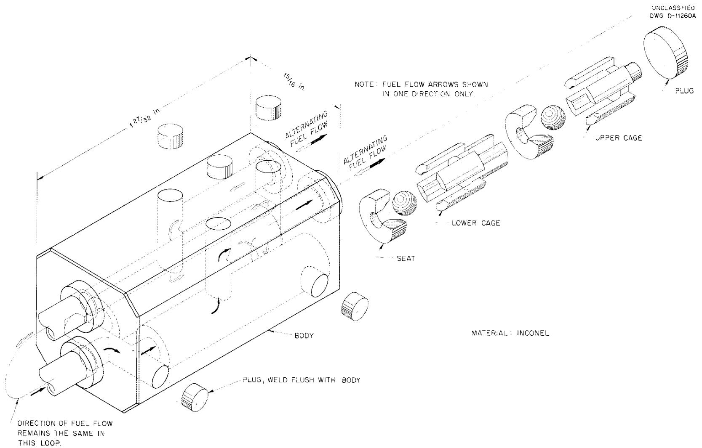  
Fig. 9.1. Hydraulic Check Valve Pump.

use to be discontinued. A choice, which will depend on the outcome of bench tests now in progress, will be made between the Bourdon tube extensometer and a newly developed thermal expansion (bimetal) unit.

# LITR FLUORIDE-FUEL LOOP

W. E. Brundage

C. Ellis

C. D. Baumann

M. T. Morgan

F. M. Blacksher

A. S. Olson

W.W. Parkinson

Solid State Division

The circulating-fuel experiment for studying the stability and corrosion characteristics of molten fluoride fuels under reactor irradiation was described in previous reports. Figure 9.2 shows the major components of the loop. The design values for the loop are:

<table><tr><td>Temperature of irradiated end</td><td>1500°C F</td></tr><tr><td>Temperature at pump</td><td>1400°C F</td></tr><tr><td>Fission heat generation, maximum density</td><td>1000 to 2000 watts/cm3</td></tr><tr><td>Total fission heat generation</td><td>10,000 to 15,000 watts</td></tr><tr><td>Linear flow in irradiated section (0.225 in. ID)</td><td>10 fps</td></tr></table>

The fuel system is constructed entirely of Inconel, and the fuel will be the fluoride mixture NaF-ZrF.4. UF 4 (62.5-12.5-25 mole%).

The fabrication of the shields to protect operating personnel from gamma rays and delayed neutrons from sections of the loop external to the reactor is almost complete. These shields are designed in sections to facilitate removal of the pump from the loop after the fuel has become active. The pump shield will provide 6 in. of lead which will be augmented by stacked lead bricks and 12 in. of paraffin. The tube shield between the pump and the reactor face is comparable in thickness to the pump shield. The completed withdrawal shield, into which the loop and water jacket will be withdrawn after removal of the pump, is a 15-ft horizontal cylinder with an $8\frac{1}{2}$ -in. central hole and 5-in. lead walls.

The disassembly of the fuel loop after operation in the reactor will require additional tools and a special door in the Solid State Division hot cells. The design of the door is complete, and the necessary tools have been ordered. Design work to modify the tools for remote operation is $80\%$ complete.

Fabrication of parts for three complete loops is about $50\%$ complete. The major effort is on the finishing and testing of parts for a single loop, which is about $80\%$ complete.

Parts for three sump-type pumps, including one for test purposes only, have been completed (cf. sec. 2, "Experimental Reactor Engineering"). The test pump, which was modified after being tested with water, is being installed in a fluoride system. A spiral-fin type of heat exchanger was developed and found adequate for removal of the fission heat generated in the fuel at a rate of 10,000 watts.

Approval for insertion of the loop into hole HB-2 of the LITR has been granted by the Reactor Safety Committee.

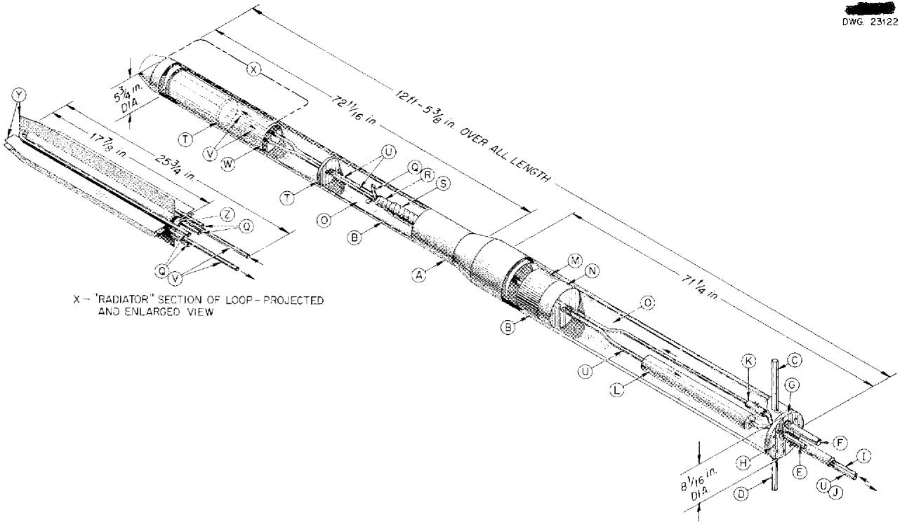  
Fig. 9.2. In-Pile Loop.

A - LINER, WATER JACKET  
B - WATER FLOW THROUGH ANNULAR SPACE   
C - COOLING WATER OUT   
D - COOLING WATER IN   
E - AIR INLET   
F - AIR OUTLET AIR-TO-POLE HEAT EXCHANGER   
G-FACEPLATE   
H - PORTS FOR THERMOCOUPLE, HEATER, AND VENTURI LEADS   
I - FUEL TUBES TO PUMP   
J - FUEL TUBE JACKET (HELIUM FILLED)   
K-VENTURI METER   
L - AIR-TO-FUEL HEAT EXCHANGER

M--GRAPHITE  
RADIATION SHIELDING   
N-STEEL   
O - HELIUM-FILLED SPACE   
Q-CALROD HEATHERS (OVER ENTIRE LENGTH OF LOOP)   
R-STAINLESS STEEL SHEET WRAPPING   
S -- HIGH-TEMPERATURE WRAPPED INSULATION  
T-B4C-Fe DISKS (NEUTRON SHIELDING)   
U-FUEL TUBING (0.404 in. ID, 0.500 in. OD)   
V -- FUEL TUBING (0.225 in. ID, 0.275 in. OD)   
W-STAINLESS STEEL COVER   
X - IRRADIATED SECTION OF LOOP   
Y - RADIATOR FINS   
Z - INTERNAL HEATER, NICHROME V HELIX

# 10. ANALYTICAL STUDIES OF REACTOR MATERIALS

C.D.Susano Analytical Chemistry Division J.M.Warde Metallurgy Division R.Baldock otope Research and Production

Investigations were continued on methods for determining the oxidation states of the corrosion products, iron, chromium, and nickel, in ARE fuels and fuel solvents and methods for the separation and determination of $\mathsf{UF}_3$ and $\mathsf{UF}_4$ in ARE fuels. A procedure was devised for the determination of chromous fluoride and ferrous fluoride in $\mathsf{NaZrF}_5$ . This method is not applicable, however, to samples of the ARE fuel. The possibility of selectively oxidizing divalent chromium and trivalent uranium fluorides was investigated. Hexavalent uranium in the form of uranyl acetate was tested as a possible oxidant for trivalent uranium to the tetravalent state. Various media for this reaction were used, but no satisfactory system was found that would prevent oxidation of trivalent uranium by the hydrogen ion. The oxidation of trivalent uranium to the quadrivalent state with iodine in $80\%$ methanol solution was shown to be essentially quantitative. The preferential dissolution of $\mathsf{UF}_4$ from $\mathsf{UF}_3$ in ARE fuels by means of solutions of ethylenediaminetetraacetic acid and ammonium oxalate was shown to be impractical when applied to actual samples of the fuel. Trivalent uranium fluoride, when heated with $\mathsf{NaZrF}_5$ , was found to be readily soluble in solutions of ammonium oxalate. It was established that the solubility of $\mathsf{UF}_3$ in these solvents involves, first, oxidation to tetravalent uranium and, then, dissolution. The conversion of $\mathsf{UF}_3$ and $\mathsf{UF}_4$ to the corresponding chlorides by fusion with $\mathsf{NaAlCl}_4$ was accomplished. The uranium chlorides are readily extracted by acetylacetone-acetone mixtures. The structure of the uranium compounds with acetylacetone was established by potentiometric titration.

Samples of the fluoride mixture NaF-ZrF4-UF4 that were exposed to moisture before being canned were examined with the polarizing microscope after having been subjected to gamma radiation in the MTR canal for 265 hours. In comparison with fuel

stored and canned in a helium atmosphere, no effects of irradiation could be observed.

The Analytical Chemistry Laboratory received 917 samples and reported 994 samples involving 9709 determinations.

# ANALYTICAL CHEMISTRY OF REACTOR MATERIALS

J. C. White Analytical Chemistry Division

Oxidation States of Chromium and Iron in ARE Fuel Solvent, NaZrF5

D. L. Manning  
Analytical Chemistry Division

In cooperation with the ANP Reactor Chemistry Group, which is investigating the equilibrium kinetics of corrosion mechanisms in $\mathsf{NaZrF}_{5}$ , methods have been devised for the determination of the concentrations of the products and reactants of the following reaction:

$$
\mathrm {C r} ^ {0} + \mathrm {F e F} _ {2} \xrightarrow [ 8 0 0 ^ {\circ} \mathrm {C} ]{\mathrm {N a Z r F} _ {5}} \mathrm {C r F} _ {2} + \mathrm {F e} ^ {0}.
$$

Chromium metal and ferrous fluoride are mixed with $\mathrm{NaZrF}_5$ in a nickel container, heated to $800^{\circ}\mathrm{C}$ , and filtered through a nickel frit. Samples are taken of the solidified filtrate and the residue. It is assumed that filtration will remove the metallic constituents and that the filtrate will contain oxidized chromium and unreacted ferrous fluoride. The residue was observed to contain magnetic particles, that is, metallic iron, and thus the reduction of ferrous fluoride was demonstrated. Since the residue was heterogeneous, only the concentrations of total iron and chromium were determined in the residue.

The filtrate was free from magnetic particles. For the calculation of equilibrium, divalent iron and divalent chromium were determined in the

filtrate. The following reactions were assumed in making these calculations:

Determination of $\mathsf{Fe}^{+ + }$

$$
\begin{array}{l} \mathrm {F e F} _ {2} + \mathrm {H} _ {2} \mathrm {S O} _ {4} \longrightarrow \mathrm {F e} ^ {+ +} \tag {1} \\ + S O _ {4} ^ {- - -} + 2 H ^ {+} + 2 F ^ {-} \\ (2 a) \quad F e ^ {+ +} + o - p h e n a n t h r o l i n e \longrightarrow \\ \left(\text {F e - o - p h e n a n t h r o l i n e} ^ {+ +}\right) \\ \end{array}
$$

Determination of $Cr^{+ + }$

$$
\begin{array}{l} \mathrm {C r F} _ {2} + \mathrm {F e} ^ {3 +} \longrightarrow \mathrm {C r} ^ {3 +} + \mathrm {F e} ^ {+ +} + 2 \mathrm {F} ^ {-} (3) \\ \mathrm {F e} ^ {+ +} + \text {o - p h e n a n t h r o l i n e} \longrightarrow (2b) \\ \end{array}
$$

$$
(F e - o - p h e n a n t h r o l i n e ^ {+ +})
$$

The determination of ferrous iron was accomplished by extracting the iron with $0.2\text{M}\text{H}_2\text{SO}_4$ as outlined in a previous report, An indirect method was used for the determination of divalent chromium. The sample was dissolved in a $1\%$ (w/v) solution of ferric sulfate, as shown in reaction 3. The ferrous iron formed was then measured colorimetrically as the ferrous o-phenanthroline complex. The concentration of $\text{FeF}_2$ originally found (reaction 1) was subtracted from the iron found by reaction 2b. The total concentration of iron and chromium in the filtrate was determined by conventional colorimetric methods. The results indicate that the reaction proceeds essentially as written and that no other oxidation states of these particular metals are present.

This procedure is presently being used in the laboratory. The interferences obviously include any ion that will reduce ferric ions to ferrous ions. The presence of uranium makes impractical the application of this method to samples of the ARE fuel. The correction for the tetravalent uranium present (8 wt%) would seriously limit the precision and accuracy of the methods for determining chromium and iron. Work is under way on the development of suitable procedures for application of the ARE fuel.

# Oxidation States of Chromium and Uranium in ARE Fuel Solvent, NaZrF5

# D. L. Manning   Analytical Chemistry Division

Work has continued on the determination of the different oxidation states of chromium and uranium

which occur as a consequence of the following reaction:

$$
\mathrm {C r F} _ {3} + \mathrm {U F} _ {3} \xrightarrow [ 8 0 0 ^ {\circ} \mathrm {C} ]{\mathrm {N a Z r F} _ {5}} \mathrm {C r F} _ {2} + \mathrm {U F} _ {4}.
$$

The melt is filtered at $800^{\circ}C$ and samples of the filtrate and residue are collected. Previous tests showed that 0.2 M ammonium oxalate selectively leached both $\mathsf{UF}_4$ and $\mathsf{CrF}_2$ from $\mathsf{UF}_3$ and $\mathsf{CrF}_3$ , respectively. However, additional experiments demonstrated that when $\mathsf{CrF}_3$ and $\mathsf{UF}_3$ were allowed to react in $\mathsf{NaZrF}_5$ at $800^{\circ}C$ , the entire sample was soluble in ammonium oxalate solution. A sample of $\mathsf{NaCrF}_4$ , formed by heating $\mathsf{CrF}_3$ and NaF, also dissolved readily in 0.2 M $(\mathsf{NH}_4)_2\mathsf{C}_2\mathsf{O}_4$ . Evidently, the complex formation of $\mathsf{CrF}_3$ and NaF render the chromium compound susceptible to dissolution by oxalate. The absence of divalent chromium in this sample of $\mathsf{NaCrF}_4$ was established by the ferric sulfate test (reaction 3).

As a result of this discovery, the possibility of selectively oxidizing chromium and uranium was investigated. A tentative procedure was formulated which involves the following steps.

I. Determine the reducing power of $\mathsf{CrF}_2$ and $\mathsf{UF}_3$ by the use of an oxidant that will oxidize these compounds to the trivalent and quadrivalent states, respectively.   
2. Determine the reducing power of $\mathsf{CrF}_2$ , $\mathsf{UF}_3$ , and $\mathsf{UF}_4$ by the use of an oxidant that will oxidize divalent chromium to the trivalent state and $\mathsf{UF}_3$ and $\mathsf{UF}_4$ to the hexavalent state.   
3. Determine total uranium,   
4. Determine total chromium.

From the results of these four steps, the four unknown quantities can be calculated. Steps 2, 3, and 4 present no difficulty. The problem of solving step 1 is more formidable. Hydrogen ion $(\mathsf{H}^{+})$ can be used to oxidize $\mathrm{Cr}^{++}$ to $\mathrm{Cr}^{3+}$ and $\mathsf{U}^{3+}$ to $\mathsf{U}^{4+}$ ; however, adequate precision of the measurement of the hydrogen produced has not been attained, as yet. In addition, the volume of gas is usually less than $0.5\mathrm{cm}^3$ , for practical purposes. Hence, attention has been turned to other possible oxidants for this step.

Oxidation of $\mathbf{U}\mathbf{F}_{3}$ by Hexavalent Uranium. Oxidation of trivalent uranium to quadrivalent uranium by hexavalent uranium can be represented as

$$
2 U ^ {3 +} + U O _ {2} ^ {+ +} + 4 H ^ {+} \rightarrow 3 U ^ {4 +} + 2 H _ {2} O,
$$

An obvious advantage of this reaction is that

oxidation proceeds to the quadrivalent state. The difficulty in this reaction is to ensure oxidation by $\mathsf{UO}_2^{++}$ and not $\mathsf{H}^+$ , as is usually the case. Experiments were conducted in which $\mathsf{UF}_3$ was dissolved in excess uranyl acetate solution and the excess $\mathsf{UO}_2^{++}$ was determined polarographically by utilizing the hexavalent uranium reduction wave at about $-0.2$ volt vs. SCE. Helium was used to sweep the solution before the addition of $\mathsf{UF}_3$ , and the reaction was conducted in a helium atmosphere. The reaction was usually complete within 30 min, and green solutions, indicative of quadrivalent uranium, were obtained. The results obtained in various acid media are shown in Table 10.1.

The hydrogen ion apparently is the stronger oxidizing agent in these tests. The oxidation potential of the $\mathrm{UO}_2^{++} / \mathrm{U}^{4+}$ couple should be increased in a solution of high hydrogen-ion concentration. This hypothesis is confirmed by the data obtained, since oxidation of $\mathrm{UF}_3$ by the $\mathrm{UO}_2^{++}$ ion increased with increasing hydrogen concentration from 0 to $44\%$ in sulfuric acid media. However, complex formation of $\mathrm{UO}_2^{++}$ and sulfate

TABLE 10.1. OXIDATION OF URANIUM TRIFLUORIDE BY HEXAVALENT URANIUM   
Uranyl Acetate: 0.0021 M   

<table><tr><td rowspan="2">UF3(mg)</td><td rowspan="2">SOLVENT</td><td colspan="2">UF3(%)OXIDIZED BY</td></tr><tr><td>UO2++</td><td>H+</td></tr><tr><td>42.6</td><td>0.1 NH2SO4</td><td>0</td><td>100</td></tr><tr><td>31.1</td><td>0.3 NH2SO4</td><td>27</td><td>73</td></tr><tr><td>54.8</td><td>1.0 NH2SO4</td><td>44</td><td>56</td></tr><tr><td>39.2</td><td>6.0 NH2SO4</td><td>38</td><td>62</td></tr><tr><td>58.8</td><td>1.0 NH2C2O4</td><td>47</td><td>53</td></tr><tr><td>29.2</td><td>0.5 NH2C3H2O2</td><td>0</td><td>100</td></tr><tr><td>42.0</td><td>1.0 NH2C3H2O2</td><td>0</td><td>100</td></tr><tr><td>37.4</td><td>2.0 NH2C3H2O2</td><td>0</td><td>100</td></tr><tr><td>33.8</td><td>4.0 NH2C3H2O2</td><td>0</td><td>100</td></tr><tr><td>51.4</td><td>1.0 NHCIO4</td><td>0</td><td></td></tr><tr><td>55.6</td><td>2.0 NHCIO4</td><td>0</td><td></td></tr><tr><td>56.7</td><td>4.0 NHCIO4</td><td>0</td><td></td></tr><tr><td>40.3</td><td>0.2 M (NH4)2C2O4</td><td>0*</td><td>0</td></tr></table>

*UF $_3$ did not dissolve in 2 hours.

ions was so marked at higher concentrations that no further increase in oxidation potential was observed. The use of perchloric acid media was unsuccessful because the perchlorate ion was reduced by trivalent uranium. None of the hexavalent uranium was consumed in the acetic acid tests. A preliminary result with an oxalate medium is shown in Table 10.1. Further work is under way with oxalate media, as well as with hydrochloric acid media.

Oxidation of Trivalent Uranium to Quadrivalent Uranium with lodine. In an effort to eliminate oxidation by the hydrogen ion, the use of nonaqueous systems is being investigated. Preliminary work has been concerned with $\mathsf{UCl}_3$ rather than with $\mathsf{UF}_3$ because of its greater solubility in nonaqueous systems. The conversion of $\mathsf{UF}_3$ to $\mathsf{UCl}_3$ by fusion with $\mathsf{NaAlCl}_4$ has been investigated and is reported below under the heading "Separation of $\mathsf{UF}_4$ from $\mathsf{UF}_3$ ."

lodine is sufficiently soluble in organic solutions to permit its use as an oxidant. In aqueous media the oxidation will probably proceed beyond the tetravalent state, as shown in the following reaction, to produce some hexavalent uranium:

$$
U ^ {3 +} + \frac {1}{2} I _ {2} \longrightarrow U ^ {4 +} + I ^ {-}.
$$

Known amounts of $\mathsf{UCl}_3$ were dissolved in excess standard iodine solutions of various concentrations of methanol in water, and the excess iodine was titrated with sodium thiosulfate.

The results indicate that the oxidation potential of iodine decreases with increasing methanol concentration and that, in absolute methanol, incomplete oxidation results. In an $80\%$ alcoholic medium the oxidation of $\mathsf{U}^{3 + }$ to $\mathsf{U}^{4 + }$ is essentially quantitative under the conditions of the test. Further tests are under way, and a more sensitive means of detecting the end point is to be employed. The iodine-starch end point cannot be used in concentrated methanol solutions. A potentiometric titration and the "dead stop" end-point detection systems are to be tested.

Separation of $\mathbf{U}\mathbf{F}_4$ from $\mathbf{U}\mathbf{F}_3$

W.J.Rodd J.L.Mottern

Analytical Chemistry Division

Efforts to develop methods to separate $\mathsf{UF}_4$ and $\mathsf{UF}_3$ in ARE fuels have been continued along two lines: (1) preferential dissolution of $\mathsf{UF}_4$ and (2) conversion of the fluorides to the corresponding

chlorides and subsequent separation of the chlorides.

Preferential Dissolution of $\mathsf{UF}_4$ . The solubilities of $\mathsf{UF}_3$ and $\mathsf{UF}_4$ in solvents such as solutions of ethylenediaminetetraacetic acid (EDTA) and ammonium oxalate were studied further. Uranium trifluoride is soluble to the extent of 0.2 to $0.4\mathrm{mg}$ per $100\mathrm{ml}$ of solvent in $0.1\mathrm{M}$ solutions of EDTA at a pH of 6.8 to 6.9 at $25^{\circ}\mathrm{C}$ after 1 hr of contact. The solubility of $\mathsf{UF}_3$ is a function of time of contact. The rate of dissolution appears to be about $0.4\mathrm{mg}$ of $\mathsf{UF}_3$ per $100\mathrm{ml}$ of solvent per hour of contact. The absorption spectrum, between 370 and $670\mathrm{m}\mu$ , of the supernatant liquor of the mixture of $\mathsf{UF}_3$ and EDTA is similar to that of a solution of $\mathsf{UF}_4$ in EDTA. This indicates that the uranium exists in the same oxidation state in both solutions as was reported previously1 and that the solubility process essentially involves, first, the oxidation of trivalent uranium to the tetravalent state and, then, dissolution.

The time required for complete dissolution of 50 mg of UF₄ in 100 ml of 0.1 M EDTA solution varies from 1 to 20 hr at 25°C, depending upon particle size and previous treatment. Inasmuch as the rate of dissolution of UF₄ varies so markedly, a significant amount of UF₃ would be dissolved in ensuring complete dissolution of UF₄. Any appreciable solubility of UF₃ would cause large errors in determinations of UF₃ and UF₄ in a sample which contained UF₄ in a concentration greatly exceeding that of UF₃. Such an inherent error in the method limits its applicability to the present problem.

Further study of the solvent action of solutions of $0.2\mathrm{M}$ ammonium oxalate upon the solubility of $\mathsf{UF}_3$ at $100^{\circ}\mathsf{C}$ in a helium atmosphere indicated a similar time effect. The rate of dissolution of a batch of $\mathsf{UF}_3,$ which had been analyzed as $90.4\%$ $\mathsf{UF}_3,$ was found to be of the order of 6 to $13\mathrm{mg}$ per $100\mathrm{ml}$ when samples of 50 to $100\mathrm{mg}$ were refluxed for 1 hr under helium. The soluble fraction was approximately $6.5\%$ of the sample. Analysis of the undissolved portion showed that it contained $91.5\%$ $\mathsf{UF}_3.$ After the initial hour of contact, the rate of dissolution remained constant at 0.4 to $0.5\mathrm{mg}$ per $100\mathrm{ml}$ per hour over a 4-hr period at $100^{\circ}\mathsf{C}.$ At $25^{\circ}\mathsf{C},$ the rate of dissolution, after the initial hour, was of the order of $3\mathrm{mg}$ per $100\mathrm{ml}$ per 24 hours.

The absorption spectra of the $\mathsf{UF}_3$ -oxalate extracts are identical to those of $\mathsf{UF}_4$ -oxalate solu

tions. These results reveal that $\mathsf{U}\mathsf{F}_3$ is slowly oxidized to $\mathsf{U}\mathsf{F}_4$ in oxalate media. However, inasmuch as $100\mathrm{mg}$ of $\mathsf{U}\mathsf{F}_4$ rapidly dissolved in $0.2\mathrm{M}$ ammonium oxalate, preferential dissolution of $\mathsf{U}\mathsf{F}_4$ from $\mathsf{U}\mathsf{F}_3$ is more feasible in this medium than in EDTA solutions.

In order to determine the feasibility of preferential dissolution based on differences in rates of solution, a mixture of $8\%$ $\mathsf{UF}_3$ in $\mathsf{NaZrF}_5$ was heated at $800^{\circ}\mathsf{C}$ for 3 hr in a nickel container, and the melt was filtered through a nickel frit. The filtrate was olive drab after solidification, and it constituted approximately $60\%$ of the total sample. The residue, retained on the frit, was an orange solid, which was tentatively identified by petrographic examination as $\mathsf{UF}_3\cdot 2\mathsf{ZrF}_4$ . The composition of each phase is shown in Table 10.2.

TABLE 10.2. COMPOSITION OF FILTRATE AND RESIDUE FROM REACTION OF UF ${}_{3}$ AND NoZrF ${}_{5}$ AT ${800}^{ \circ  }\mathrm{C}$ FOR 3 HOURS   

<table><tr><td rowspan="2">ELEMENT</td><td colspan="3">COMPOSITION (%)</td></tr><tr><td>Original Sample</td><td>Filtrate</td><td>Residue</td></tr><tr><td>U3+</td><td>6.46</td><td>4.42</td><td>4.07</td></tr><tr><td>U, total</td><td>6.46</td><td>6.37</td><td>6.42</td></tr><tr><td>Zr</td><td>40.1</td><td>29.9</td><td>40.2</td></tr><tr><td>Na</td><td>10.1</td><td>10.8</td><td>10.7</td></tr><tr><td>F</td><td>43.4</td><td>42.1</td><td>42.0</td></tr><tr><td>Ni</td><td></td><td>0.07</td><td>0.002</td></tr><tr><td>Cr</td><td></td><td>0.002</td><td>0.002</td></tr><tr><td>Fe</td><td></td><td>0.0125</td><td>0.011</td></tr></table>

Both the residue and filtrate were readily soluble in $0.2\text{M}(\text{NH}_4)_2\text{C}_2\text{O}_4$ ; $200\text{mg}$ dissolved in $50\text{ml}$ of solution in 30 minutes. This solubility shows that a radical change in the nature of $\text{UF}_3$ results when it is heated with $\text{NaZrF}_5$ in a nickel vessel. Similar behavior was observed with $\text{CrF}_3$ , as reported previously. The data demonstrate conclusively that a separation of $\text{UF}_3$ and $\text{UF}_4$ based on the difference in rates of solution is not feasible.

The similarity of the composition of the filtrate and the residue is unique in view of the difference in color. Only the nickel content is different, and this may be explained on the basis of the nickel

container used. It was also noted that the residue, upon exposure to the atmosphere, slowly changed over a period of two weeks from orange to olive drab. The trivalent uranium content, as expected, decreased to $2.29\%$ . The trivalent uranium concentration in the filtrate also decreased upon standing to $2.66\%$ . These data indicate that $\mathsf{UF}_3$ is not stable when it stands in closed, air-filled containers. Additional determinations of $\mathsf{UF}_3$ will be made to observe further oxidation.

Conversion of $\mathsf{UF}_3$ and $\mathsf{UF}_4$ to the Corresponding Chlorides. The literature reveals that $\mathsf{UCl}_3$ and $\mathsf{UCl}_4$ are soluble in a number of organic solvents. It is also known that $\mathsf{UF}_4$ can be converted to $\mathsf{UCl}_4$ by fusion with $\mathsf{NaAlCl}_4$ . Hence, the separation of $\mathsf{UF}_3$ and $\mathsf{UF}_4$ as chlorides merits investigation. The reactions involved in the metatheses are

$$
\mathrm {N a C l} + \mathrm {A l C l} _ {3} \xrightarrow {3 0 0 ^ {\circ} \mathrm {C}} \mathrm {N a A l C l} _ {4},
$$

$$
3 \mathrm {U F} _ {4} + 3 \mathrm {N a A l C l} _ {4} \xrightarrow {3 0 0 ^ {\circ} \mathrm {C}} 3 \mathrm {U C l} _ {4} + 3 \mathrm {N a A l F} _ {4},
$$

$$
\begin{array}{l} 4 U F _ {3} + 3 N a A l C l _ {4} \xrightarrow {3 0 0 ^ {\circ} C} 4 U C l _ {3} \\ + 4 U F I _ {3} + 2 N a A I F _ {4}. \\ \end{array}
$$

Optimum conditions for these reactions are being established. A flux ratio of 10:1 and 1-hr fusion at $300^{\circ}\mathrm{C}$ are necessary to give greater than $90\%$ yield. Attempts to produce a quantitative reaction in one fusion are under way.

Nonaqueous media have been used to extract the uranium chlorides from the melt. Aqueous media would result in immediate hydrolysis and oxidation of the salts. The solubility of $\mathsf{UCl}_3$ was checked in a number of solvents in which $\mathsf{UCl}_4$ is known to be readily soluble. These solvents ranged from the lower alcohols to acetone and acetylacetone, dimethylformamide, dioxane, and ethyl acetate. In none of the solvents tested was $\mathsf{UCl}_3$ insoluble; the lowest solubility was noted in dioxane - 1 mg per 100 ml after 1 hr at $25^{\circ}\mathsf{C}$ . The highest solubility was in acetone - 68 mg per 100 ml, under similar conditions. Stable suspensions of $\mathsf{UCl}_3$ were noted in the alcoholic solvents.

A 1:1 mixture of acetone and acetylacetone quantitatively extracts uranium chlorides from the fluoride conversion melts. Fifty milliliters of the solvent will extract $100\mathrm{mg}$ of uranium chlorides in about 2 hours. Aluminum is also extracted, as is some chromium, iron, and nickel. The behavior of zirconium has not been established quantitatively, but it is assumed that zirconium will also be extracted.

A study was initiated to determine whether $\mathsf{U}^{3+}$ remains in an unaltered oxidation state after being extracted by acetylacetone. If so, it can be determined by potentiometric methods. The potentiometric method of determining the chelation nature of a metal chelate developed by Van Uitert et al.4 was used to study the structures of the U(IV) and U(III) acetylacetone solutions. The hydrogen ions liberated during chelation were titrated with NaOH to determine the equivalents of acetylacetonate which combined with 1 mole of $\mathsf{U}^{3+}$ or $\mathsf{U}^{4+}$ in aqueous and alcoholic solutions of $\mathsf{UCl}_3(\mathsf{UCl}_4)$ -acetylacetone.

The results indicate that 3 moles of acetylacetone is required to chelate $\mathsf{U}^{3+}$ and 4 moles is required to chelate $\mathsf{U}^{4+}$ in both aqueous and nonaqueous media. Strong evidence is provided of the nature of the complex. Trivalent uranium remains unoxidized in the complex.

Attempts to isolate U(III) acetylacetonate and U(IV) acetylacetonate by precipitation from a neutral solution were made. The solid obtained in all tests to date exhibits very low stability to air and heat, and it has not been purified sufficiently for analysis.

A procedure developed by Sone has been used to determine the stability of the acetylacetonates. This method is used to determine the relative stability of the chelate as a function of the shift of the absorption band of the acetylacetone spectra; that is, the greater the stability of the chelating bands, the larger the shift toward higher wave lengths.

The close similarity of the absorption bands of UCl₃-acetylacetone, UCl₄-acetylacetone, and acetylacetone, with respect to wave length, indicates that very unstable bonding exists between

uranium and the chelating agent. Further study of the large differences in molar extinction coefficients between U(III) and U(IV) acetylacetonates is contemplated.

The possibility of determining $\mathsf{U}^{3+}$ in the presence of $\mathsf{U}^{4+}$ ions in solution is now being studied. Differential oxidation by weak oxidizing agents and the application of potentiometric methods are to be used.

# FLUORIDE FUEL INVESTIGATIONS

G. D. White T. N. McVay, Consultant Metallurgy Division

Two samples of the fluoride mixture $\mathsf{NaF - ZrF}_4\cdot$ UF, supplied by the Solid State Division, were studied under the polarizing microscope. These samples had been exposed to moisture prior to canning and subjected to gamma radiation $(5.1\times 10^{9}\mathrm{r}$ at $79^{\circ}F)$ in the MTR canal for 265 hours. The object of this experiment by the Solid State Division was to determine the effects, if any, that the presence of moisture may have on radiation stability of the fuel in comparison with fuel stored and canned in a helium atmosphere. One sample was canned in the laboratory atmosphere, and the other was exposed in a desiccator containing water for

12 hr prior to canning in the laboratory atmosphere. Both samples were found to contain hydrated $\mathrm{Na}_3\mathrm{Zr}_4\mathrm{F}_{19'}$ in addition to $\mathrm{NaZr(U)F_5}$ , as was found previously when $\mathrm{NaF - ZrF_4 - UF_4}$ was exposed to an atmosphere containing moisture. The irradiation produced no effects which could be observed with the polarizing microscope.

The usual routine petrographic examinations were made for the ANP Fuels Section.

# SUMMARY OF SERVICE CHEMICAL ANALYSES

J.C. White

L.J. Brady

A. F. Roemer, Jr.

C. R. Williams

Analytical Chemistry Division

In addition to the usual number of analyses of samples of corrosion tests of ARE fuels and fuel solvents in metal containers, a considerable portion of the laboratory work load was concerned with the determination of oxidation states of iron and chromium in $\mathrm{NaZrF}_5$ and the fuel mixture. A number of samples of sodium and of sodium-potassium alloys were analyzed for oxygen and metallic constituents.

A total of 917 samples was received, 994 were reported, and 8709 determinations were made (Table 10.3).

TABLE 10.3. SUMMARY OF SERVICE ANALYSES REPORTED   

<table><tr><td></td><td>NUMBER OF 
SAMPLES</td><td>NUMBER OF 
DETERMINATIONS</td></tr><tr><td>Reactor Chemistry</td><td>641</td><td>4866</td></tr><tr><td>Experimental Engineering</td><td>299</td><td>3477</td></tr><tr><td>Fuel Production</td><td>16</td><td>204</td></tr><tr><td>ARE Fluid Circuit</td><td>36</td><td>146</td></tr><tr><td>Heat-Transfer and Fluid Properties</td><td>2</td><td>16</td></tr><tr><td>Total</td><td>994</td><td>8709</td></tr></table>

Part III

SHIELDING RESEARCH

__________

# 11. SHIELDING ANALYSIS

E.P.Blizard J.E.Faulkner M.K.Hullings F.H.Murray Physics Division

H. E. Stern, Convair

Estimates of removal cross sections based on the continuum theory of the scattering of neutrons from nuclei have given values which are in reasonable agreement with measured values.

The shielding properties of lithium hydride and water have been compared by using the concept of the effective neutron removal cross section. If lithium hydride could be substituted for water as the neutron shield in an aircraft reactor, there would be a considerable saving in weight.

# ESTIMATES OF REMOVAL CROSS SECTIONS BASED ON THE CONTINUUM THEORY OF THE SCATTERING OF NEUTRONS FROM NUCLEI

F. H. Murray Physics Division

The asymptotic character of the attenuation of neutrons through large thicknesses of material was expressed in a previous progress report in the form $\exp (-\sigma x / \lambda)$ , where $\lambda$ is the largest eigenvalue of an infinite matrix. The scattering was assumed to take place at energies of several Mev ( $>4$ ) from nuclei sufficiently heavy so that energy losses during the elastic-scattering process could be neglected. In order to apply the results to the calculation of removal cross sections for neutrons from a fission source and for a material between

$^{1}$ F. H. Murray, Phys. Div. Semiann. Prog. Rep. Sept. 10, 1953, ORNL-1630, p. 6.

the source and a large thickness of water, it is necessary to compute an average value of the attenuation through the material. The "uncollided flux" of Welton and Blizzard was employed to calculate the average of the exponential attenuation from the formula

$$
e ^ {- \sum t} = \frac {\int S (E , z) e ^ {- \sigma t / \lambda} d E}{\int S (E , z) d E},
$$

with

$$
\int S (E, z) d E = 3 7. 8 (z + \delta) ^ {1 / 4} e ^ {- 1. 5 4 7 (z + \delta) ^ {1 / 4}}.
$$

In this calculation, the distance from the source, $z$ , was 120 cm, and the thickness of the material, $t$ , was 10 or 15 cm. The logarithm of the function $S(E, z) \exp(-\alpha t / \lambda)$ was plotted and represented in the form $-C(E - E_0)^2$ near its maximum, after which the integral was calculated.

The total cross sections of various materials were found from the curves of Nereson and Darden.3 Iron and copper values were adjusted by multiplying their cross sections by a constant factor (0.96) to make their curves pass through the point at 14 Mev, which represents a value of the cross section determined by other authors. The results are presented in Table 11.1.

2. T. A. Welton and E. P. Blizzard, Reactor Sci. Technol., 2, No. 2, TID-2002, p. 73, esp. 85 (1952).

3N. Nereson and S. Darden, Phys. Rev. 89, 775, esp. 782-783 (1953).

TABLE 11.1. REMOVAL CROSS SECTIONS OF SEVERAL MATERIALS   

<table><tr><td rowspan="2">MATERIAL</td><td colspan="2">REMOVAL CROSS SECTION, Σ (barns/atom)</td></tr><tr><td>From Experiment</td><td>From Calculation</td></tr><tr><td>Al</td><td>1.31</td><td>1.23</td></tr><tr><td>Fe</td><td>1.95</td><td>1.95</td></tr><tr><td>Cu</td><td>2.08</td><td>2.21</td></tr><tr><td>Pb</td><td>3.4 (estimated)</td><td>3.36</td></tr><tr><td>Bi</td><td>3.43</td><td>3.32</td></tr></table>

For lead and bismuth the forms of the total-cross-section curves indicate that the "continuum theory" probably does not apply, but the energies of importance were sufficiently high (near 10 MeV) to suggest that the calculation might give values which were nearly correct. If the water thickness were about $60~\mathrm{cm}$ , the energies of importance would be much less² and the application of the continuum theory would be less justified.

# CRITIQUE OF LITHIUM HYDRIDE AS A NEUTRON SHIELD

J. E. Faulkner Physics Division

Water has been the most common neutron shield contemplated for aircraft use to date, and any compound substituted for it must give greater attenuation for the same shield weight. Some rather lengthy calculations performed on the UNIVAC under the direction of NDA have shown that a slab of lithium hydride used as a neutron shield will weigh only $63\%$ as much as a thickness of water which gives the same attenuation. Additional comparisons of the shielding properties of lithium hydride and water have now been made on the basis of the effective neutron removal concept.[5]

Calculations made by using removal-cross-section values of 2.4 barns/mole for lithium hydride and 3.02 barns/mole for water indicate that a lithium hydride shield would weigh $56\%$ as much as a water shield. This is considered to be in reasonable agreement with the NDA results. Lithium hydride is a better neutron attenuator on a volume basis, as well as on a weight basis, and would therefore be

particularly important for spherical reactors where compactness means greater weight saving. In all the calculations, the density of lithium hydride is taken to be $0.78\mathrm{g/cm^3}$ , the value measured by helium displacement. For a spherical reactor with a 100-cm-thick lithium hydride shield beginning 100 cm from the core, the thickness of water necessary to give the same attenuation would be about 137 cm - a LiH-to- $\mathsf{H}_2\mathsf{O}$ weight ratio of 0.44.

In a practical shield for a reflector-moderated reactor (cf., Sec. 3, "Reflector-Moderated Reactor") operating at a power of 600 megawatts, the maximum temperature that would be reached in a 100-cm-thick lithium hydride slab exposed to the resulting neutron flux was calculated to be $315^{\circ}\mathrm{F}$ . The maximum thermal gradient would be $1.12^{\circ}\mathrm{C/cm}$ . In these calculations it was assumed that both faces of the slab were cooled to $300^{\circ}\mathrm{F}$ and that the thermal conductivity of lithium hydride was 0.01 cal./°C·cm·sec.

Lithium hydride decomposes only slightly below its melting point $(1256^{\circ}\mathrm{F})$ , although it begins to soften at $1184^{\circ}\mathrm{F}$ . The question of radiation dissociation, as distinct from radiation heating, is not well understood, although the outlook is favorable. In an investigation at Argonne,[8] lithium hydride under a 50-lb hydrogen pressure was exposed to a flux of $10^{11}$ for a period of three months. After irradiation, the pressure was still 50 pounds. This indicated that lithium hydride dissociation under radiation is completely reversible, and it might be necessary in a practical shield to use a pressure shell which could withstand the 50-lb pressure. This would, of course, add to the shield weight; however, a pressure shell would be needed for the water shield too, particularly at temperatures of $300^{\circ}\mathrm{F}$ .

# 12. LID TANK FACILITY

C. L. Storrs

GE-ANP

G. T. Chapman

D. K. Trubey

J.M.Miller

Physics Division

Investigations of the effects of one and two air ducts on the fast-neutron dose received outside a reactor shield have been continued at the Lid Tank Facility. In addition, the radiation dose measurements made behind 82 mockups of the reflector-moderated reactor and shield have been analyzed, and the effective neutron removal cross section of $\mathsf{B}_2\mathsf{O}_3$ has been measured.

# AIR-DUCT TESTS

J.M.Miller

Physics Division

The air-duct experimentation was continued both as a study of the interference between adjacent ducts and as a study of neutron-streaming through a single duct. The ducts consisted of from one to three straight cylindrical sections (22 in. long and $3^{15}$ in. in diameter) joined at angles of 45 degrees. The first section of each duct was placed adjacent to the source at an angle of $22\frac{1}{2}$ deg with the normal.

At the time the previous studies of interference were reported, measurements had been made beyond a three-section duct with a one-section duct placed near it. In the first measurement, the one-section duct was parallel to the first section of the long duct and $12\frac{1}{2}$ in. from it. In this position, it was in the same plane as the long duct and lined up approximately with the last section. In the second measurement, the small duct was again parallel to the first section but closer (6 in.) and above it in a different plane. It was noted that, with the short duct in line, the fast-neutron dose was a factor of 4.5 higher than for the long duct alone. With the short duct not in line, the peak of the dose was the same as that for the long duct alone, although the curve was broadened.

An additional measurement was made recently in which the axis of a one-section duct intersected the axis of a three-section duct (offset by an angle

of $22\frac{1}{2}$ deg from the plane of the long duct). In this position, there was neutron-streaming from the short duct into the middle section of the long duct to the extent that the fast-neutron dose was increased by a factor of 1.4. It is assumed that the streaming through the one-section duct was considerably higher than was indicated by the dose measurements. The neutrons undoubtedly passed straight across the long duct and scattered in the water beyond.

Other measurements have been made on single ducts consisting of one and two sections. The fast-neutron isodose plots for both these ducts are given in Figs. 12.1 and 12.2. The curves in Fig. 12.2 show that some of the neutrons "feed out" of the duct at the end of the first section, as would be expected. These experiments will be described in detail in a separate report.

# SHIELDING TESTS FOR THE REFLECTOR-MODERATED REACTOR

F. N. Watson, Physics Division3  
R. M. Spencer4 F. R. Westfall4

In several previous progress reports, the status of the experimentation on mockups of the reflectormoderated reactor and shield was reported. The tests have now been completed, and an analysis of all the data will be published. A summary of the results follows.

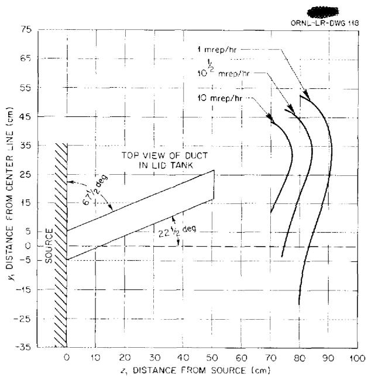  
Fig. 12.1. Fast-Neutron Isodose Curves Beyond One-Section Duct.

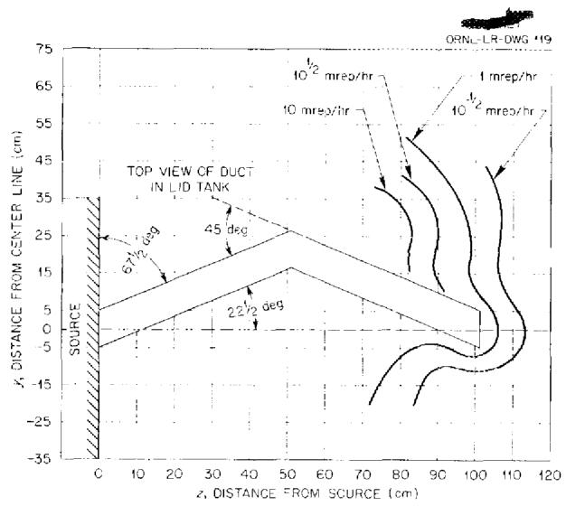  
Fig. 12.2. Fast-Neutron Isodose Curves Around Two-Section Duct.

The beryllium reflector region should be about 12 in. thick to obtain a good compromise between over-all reactor shield weight and core reactivity requirements. The thickness of the heat-exchanger region has relatively little effect on neutron and gamma doses as functions of the distance from the source plate.

For the gamma-shield thicknesses tested (0 to 7.5 in.), the substitution of lead for water has practically no effect on the neutron attenuation well out in the shield. A 0.13-in.-thick layer of $\mathsf{B}^{10}$ (density $= 2.1$ ) is as effective as 1 in. of $\mathsf{B}_4\mathsf{C}$ (density $= 1.95$ ) in depressing the thermal-neutron flux and consequent capture gammas. Dividing the lead region into layers separated by borated hydrogenous material gives some reduction in gamma dose for a given thickness of lead; however, the full-scale shield design is simplified structurally by placing all the lead together just outside the pressure shell. While lumping the lead increases the lead thickness required, keeping its radius to a minimum largely compensates for this; therefore very nearly minimum overall shield weights can be obtained in this way for lead thicknesses of up to 6.0 inches.

On a volumetric basis, transformer oil is as effective as water in attenuating the neutron flux. Since the density of the oil is about 0.87, an appreciable saving in shield weight can be obtained by using oil, if it is borated. Some of this weight saving is offset, since the thickness of the lead layer must be increased because the attenuation of the gamma flux is not so great in the oil. Beryllium is more effective than water on a thickness basis for fast-neutron attenuation.

It is important that a boron curtain be used between the heat exchanger and the pressure shell, as well as between the reflector and the heat exchanger, to inhibit capture gamma production and to reduce secondary coolant activation.

It does not appear to be worthwhile to use rubidium instead of sodium or NaK as a secondary coolant. Potassium is preferable to sodium with regard to activation, but it is inferior as a heat-transfer medium. Air and structure scattering, fission-product decay gammas from the heat-exchanger region, ducts and voids, and optimization of the shield size and weight pose problems that require further investigation.

# Lid Tank Dose Measurements Corrected to Designed Reflector-Moderated Reactor Shield

An effective, preliminary, reactor shield design was based on the tests described above. Dose-rate

curves corresponding to the design were obtained by correcting measurements taken behind the configurations that most closely approximated the design, and these, in turn, were used for the shield weight calculations reported below.

Configuration 62 and the designed shield are compared in Table 12.1. Configuration 62 closely approximates the designed shield, but in configuration 62 there is a 6-in. lead gamma shield, and in the designed shield the thickness of this

TABLE 12.1. COMPARISON OF DESIGNED REFLECTOR-MODERATED REACTOR SHIELD ASSEMBLY WITH CONFIGURATION 62   

<table><tr><td colspan="2">DESIGNED SHIELD</td><td colspan="2">CONFIGURATION 62</td></tr><tr><td>\( Component^{(a)} \)</td><td>Thickness(in.)</td><td>\( Component^{(a)} \)</td><td>Thickness(in.)</td></tr><tr><td></td><td></td><td>\( H_2O \)</td><td>1.06</td></tr><tr><td>Inconel</td><td>0.125</td><td>Fe</td><td>0.19</td></tr><tr><td>Be (Na cooled)</td><td>12.0</td><td>\( Be\ tank\ 2^{(b)} \)</td><td>12.20</td></tr><tr><td>Inconel</td><td>0.0625</td><td></td><td></td></tr><tr><td>\( B^{10} \)</td><td>0.13</td><td>\( B_4C\ tank^{(b)} \)</td><td>1.19</td></tr><tr><td rowspan="3">Heat-exchanger region</td><td rowspan="3">\( 5^{(c)} \)</td><td>\( NaF\ tank\ 1^{(b)} \)</td><td>1.38</td></tr><tr><td>\( NaF\ tank\ 2^{(b)} \)</td><td>1.38</td></tr><tr><td>\( NaF\ tank\ 4^{(b)} \)</td><td>2.12</td></tr><tr><td>Inconel</td><td>0.125</td><td></td><td></td></tr><tr><td>\( B^{10} \)</td><td>0.13</td><td>\( B_4C\ tank \)</td><td>1.19</td></tr><tr><td>Inconel</td><td>1.50</td><td>Fe</td><td>1.75</td></tr><tr><td>Insulation</td><td>0.5</td><td></td><td></td></tr><tr><td rowspan="3">Pb</td><td rowspan="3">\( x^{(d)} \)</td><td>Pb</td><td>6.00</td></tr><tr><td>Plexibor</td><td>0.19</td></tr><tr><td>Air</td><td>1.42</td></tr><tr><td rowspan="3">\( H_2O (1% B) \)</td><td rowspan="3">\( y^{(d)} \)</td><td>Fe</td><td>0.19</td></tr><tr><td>\( H_2O (1% B) \)</td><td>24.22</td></tr><tr><td>Fe</td><td>0.19</td></tr><tr><td>Rubber</td><td>2.00</td><td></td><td></td></tr><tr><td>Total</td><td>16.6975 + X + Y</td><td></td><td>54.60</td></tr></table>

(a) Components listed in sequence from surface of source.   
(b) Be tank 2: 0.64 cm of Al; 7.3 cm of Be ( $\rho = 1.84 \, \text{g/cm}^3$ ); 0.16 cm of Al, 0.03 cm of stainless steel, 7.3 cm of Be; 0.16 cm of Al; 0.02 cm of stainless steel; 14.61 cm of Be; 0.15 cm of blotter paper, 0.64 cm of Al. B₄C tank: 0.16 cm of Al; 2.7 cm of B₄C ( $\rho = 1.9 \, \text{g/cm}^3$ ); 0.16 cm of Al. NaF tanks 1 and 2: 0.48 cm of Fe; 2.54 cm of NaF ( $\rho = 0.96 \, \text{g/cm}^3$ ); 0.48 cm of Fe. NaF tank 4: 0.48 cm of Fe; 4.44 cm of NaF ( $\rho = 0.96 \, \text{g/cm}^3$ ); 0.48 cm of Fe.   
(c) Value assumed for these calculations. Actually, this region varies in thickness according to the design power of the reactor.   
(d) The gamma- and neutron-shield layers are dependent upon the design conditions.

region will be chosen according to design requirements. Gamma doses to be expected at various distances from the designed shield have been determined in the Lid Tank Facility for lead thicknesses of 4.5, 6.0, and 7.5 in. on the basis of measurements behind configuration 62 and similar configurations (61, 65, 73, and 55R). (The correction factors applied to the Lid Tank data are described in detail in ref. 8.) The gamma doses obtained are given in Fig. 12.3. It will be noted that three methods were used to calculate the dose for a shield containing a 4.5-in. lead layer. The results from all three methods agree closely, and therefore there is some assurance that the curve presented is realistic. In Fig. 12.4, the gamma doses at various distances from the shield are given as a function of lead thickness in the gamma-shield region.

A mean curve of the fast-neutron data taken out to 110 cm behind configurations 39 and 75 was chosen as the basis for a neutron dose curve corrected to the designed shield (Fig. 12.5). Since the limitations of the dosimeter prevent measurements of the fast-neutron dose at distances greater

10Report of the 1953 Summer Shielding Session, ORNL-1575 (to be published).

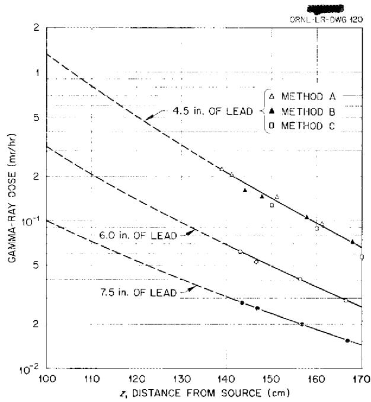  
Fig. 12.3. Lid Tank Gamma-Ray Dose Curves Corrected to Designed Reflector-Moderated Reactor Shield for 4.5, 6.0, and 7.5 in. of Lead.

than $110~\mathrm{cm}$ , the mean curve was extrapolated out to $140~\mathrm{cm}$ by using the trend indicated by thermal-neutron measurements behind configurations 39, 46, 47; and 51.

# Shield Weight Calculation

The data shown in Figs. 12.3 and 12.5 can be used to determine a specific shield weight by applying the following equation:

$$
D _ {L T} = D _ {R M R} \left(\frac {x}{R _ {S}}\right) ^ {2} \left(\frac {S _ {L T}}{S _ {R M R}}\right) \left(\frac {R _ {S}}{R _ {C}}\right) \left(\frac {1}{b}\right),
$$

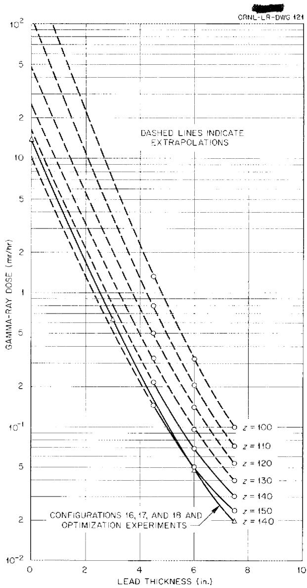  
Fig. 12.4. Lid Tank Gamma-Ray Dose Curves Corrected to Designed Reflector-Moderated Reactor Shield with Various Thicknesses of Lead.

where

$D_{\text{L T}} = \text{Lid Tank dose},$

$D_{\text{RMR}} = \text{dose desired at distance } x$ from shielded reflector-moderated reactor,

$x =$ distance from reactor center to crew position,

$S_{\text{L T}} = \text{Lid Tank surface source strength}$   
$= 9.04 \times 10^{-4}$ watts/cm² (a constant, since the data were always normalized to a power of 6 watts; the self-absorption factor is 0.6, and the source area is $3970\mathrm{cm}^2$ ),

$S_{\text{RMR}} =$ equivalent reflector-moderated reactor surface source strength,

$R_{S} =$ shield outer radius,

$R_{C} =$ core radius,

$\tilde{b} =$ Hurwitz correction   
$= 0.5 + 2(\lambda / \alpha)^{2}[(z / \lambda) + 1]$ ,

$\lambda \approx$ relaxation length for use with Hurwitz correction   
7.5 cm for both neutrons and gamma rays, 10

$\alpha =$ radius of Lid Tank source $(cm)$   
$z = R_{\mathbf{S}} - R_{\mathbf{C}}$

For the calculation given below, the following conditions were assumed:

Beryllium reflector 12 in. thickness

Reactor power 50 megawatts

x 50 ft

DRMR 10 rem/hr

Gammas 3/4 of total dose

Neutrons 1/4 of total dose

$R_{C}$ 9 in. (23 cm)

SRRM (calculated for $(13.2\times 10^{-5}\frac{\text{watts/cm}^2}{\text{watts}})$

9-in. core radius)

$\times (5\times 10^{7}$ watts）.

A solution to the equation was obtained by using successive approximations and the fast-neutron and gamma dose curves presented in Figs. 12.3, 12.4, and 12.5. If $z$ is taken as 105 cm, the Lid Tank total dose, $D_{\text{LT}}$ , is

$$
D _ {L T} = 5. 8 7 \times 1 0 ^ {- 4} m r e p / h r.
$$

Then

$$
\begin{array}{l} D _ {L T} (\text {n e u t r o n s}) = 0. 2 5 (5. 8 7 \times 1 0 ^ {- 4}) \mathrm {r e m / h r} \\ = 1. 4 7 \times 1 0 ^ {- 2} m r e p / h r \\ \end{array}
$$

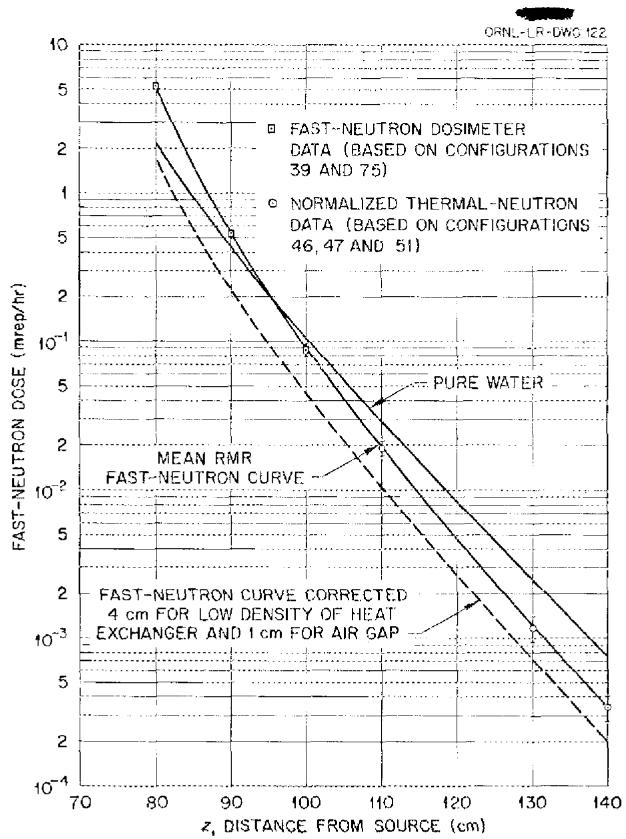  
Fig. 12.5. Lid Tank Fast-Neutron Dose Curves Corrected to Designed Reflector-Moderated Reactor Shield.

and

$$
\begin{array}{l} D _ {L T} (\text {g a m m a s}) = 0. 7 5 (5. 8 7 \times 1 0 ^ {- 4}) \text {r e m / h r} \\ = 4. 4 0 \times 1 0 ^ {- 1} m r / h r. \\ \end{array}
$$

From Fig. 12.5, it can be seen that the corrected Lid Tank neutron dose for $z = 105$ is $2 \times 10^{-2}$ mrep/hr. Since $2 > 1.47$ , the approximate value of $z$ is determined by interpolation to be $107$ cm. Thus

$$
R _ {S} = 1 0 7 \mathrm {c m} + 2 3 \mathrm {c m} = 1 3 0 \mathrm {c m}.
$$

The gamma shield necessary can be read directly from Fig. 12.4 as approximately 5.3 in. of lead.

The weights of the neutron and gamma shields can be computed after their distances from the center of the reactor are determined. The necessary dimensions are presented in Table 12.1. For a 50-megawatt reactor with a 9-in. core radius, a 1.6-in.-thick heat exchanger seems reasonable.[10]

The inner radius of the lead layer is approximately 25.3 in., and its weight is approximately 21,600

pounds. The inner radius of the neutron shield is 30.6 in., and its outer radius is 51.3 in., which gives a neutron shield weight of 15,900 pounds. Thus the total basic reactor shield weight is 37,500 pounds.

Approximate weights of the reactor core, heat exchanger, and pressure vessel components may be determined by a volume-density calculation. (Tables presenting such data appear in refs, 10 and 11.) If the weights of these components are added to the basic shield, the basic designed reactor and shield assembly is found to weigh 44,500 pounds. This weight does not include the weight of the crew shield, which is necessary for reducing the 10 rem/hr dose at 50 ft to acceptable tolerances within the crew compartment. There are problems such as the emission of short-lived fission-product decay gammas in the intermediate heat exchanger and the leakage of radiation through passages in the shield that may require small further additions to the shield weight. Such refinements are not treated in this calculation because the Lid Tank experiments do not contribute to their resolution.

# REMOVAL CROSS SECTIONS

An interesting check on removal-cross-section measurements has been provided by an experiment in which solid $\mathsf{B}_2\mathsf{O}_3$ was used in the usual large-slab geometry. A value of $4.4 \pm 0.14$ barns was obtained in this experiment for the removal cross section of $\mathsf{B}_2\mathsf{O}_3$ , which is to be compared with the

value of 4.56 barns calculated by using the previously published figures of 0.87 barn for boron and 0.94 barn for oxygen.

# INSTRUMENTATION

Experience in operating neutron dosimeters with flowing ethylene has shown that the temperature must be controlled more carefully than has been possible heretofore, and therefore provisions are being made to maintain the temperature of the water in the Lid Tank at some constant value. It is anticipated that the constant water temperature will also improve the accuracy of measurements with other instruments and will eliminate uncertainties arising from the expansion or change in solubility of shielding materials such as $\mathsf{B}_2\mathsf{O}_3$

In measuring gamma doses of less than 0.1 mr/hr, the sensitivity of the Lid Tank scintillation counters is inadequate when an electrometer circuit is used. Amplification of individual pulses followed by an integration of the resulting pulse-height spectrum increases the useful sensitivity of the instrument by a factor of at least 100 and has been extensively used in the Lid Tank and elsewhere. Difficulties encountered in calibration when using artificial sources in air have been avoided by normalizing the data taken in the Lid Tank to measurements made by using the electrometer circuit. A more serious uncertainty has recently been uncovered, namely, a systematic difference in the observed relaxation lengths in water following certain shield configurations when the two techniques are employed. The difference is apparently caused by a change in the energy sensitivity of the instrument when the pulse integrator is being used. This effect is being studied further.

# 13. BULK SHIELDING FACILITY

R.G.Cochran

G. McC. Estabrook

K. M. Henry

J.D.Flynn

H. E. Hungerford

M. P. Haydon

E. B. Johnson

Physics Division

The work at the Bulk Shielding Facility during this quarter was devoted to the measurement of mockups of two bulk shields for the GE-ANP program. The first shield tested (BSF Exp. 18) was a mockup of a duct system and shield to be used at the G-E Idaho reactor test facility. The second mockup consisted of two sections of the reactor shield of the R-1 ANP divided shield. The first of these sections was the rear or aft section (BSF Exp. 19), and the other was the front or forward section (BSF Exp. 20). The minimum reactor power was used for all measurements on these sections so as not to appreciably activate the iron in the shield, since this mockup is scheduled for further testing at the Tower Shielding Facility.

# G-E TEST FIXTURE DUCT EXPERIMENT

H. E. Hungerford

Physics Division

The G-E Idaho facility duct mockup (test fixture duct system) consists of two, long, 10-in.-ID steel ducts, a cubical air void or plenum chamber, and two shields. The experimental setup is shown in Fig. 13.1. The reactor was located along one side of the plenum chamber, and one of the ducts emerged from the plenum chamber and wound out through the two shields. For this experiment, a special offset reactor with a 5 by 7 fuel-element loading was used. This loading permitted as much fuel as possible to be located near the plenum chamber, which was separated from the reactor by 3 in. of water. The duct (upper duct) leading from the plenum chamber contained three right-angle bends, one on the horizontal plane and the other two at an angle of 60 deg with the horizontal plane. An auxiliary duct (lower duct) is shown below the upper duct in Fig. 13.1. One of the shields, which consisted of three $5 \times 5\frac{1}{2}$ ft lead slabs totaling a thickness of 7.0 in. and was encased in steel slabs

1.75 in. in thickness, was located directly between the reactor and the duct system. The other shield was located directly in front of the plenum chamber at the emergence of the upper duct and consisted of iron slabs totaling a thickness of 11.75 inches.

The purpose of the experiment was to test some design features of the shield of the Idaho facility. The mockup represented only a portion of the actual duct and shield system.

Dose measurements were made along the various traverse lines indicated in Figs. 13.1 and 13.2. Figure 13.2, which is an elevation of the mockup looking west, clearly shows the position of the upper and lower ducts, as well as a theoretical outline of the outer surface of the shield. Points A through P indicate the location of the corresponding traverse lines AA through PP.

Fast-neutron measurements made along traverse lines AA through PP are shown in Fig. 13.3. The peaks of all curves, except the DD traverse, occurred at approximately $15\mathrm{cm}$ west of the pool center line and corresponded to the final, long, straight section of the upper duct.

The corresponding thermal-neutron measurements, shown in Fig. 13.4, represent a more extensive survey than that made for fast neutrons. The thermal-neutron peaks of the traverses AA through II showed systematic variation from a location about $20~\mathrm{cm}$ west of the center line for traverses near the upper duct to locations nearer the center line at larger distances from the duct.

The gamma-ray measurements made along the traverse lines AA through PP are shown in Fig. 13.5. These data are of special interest because of the double peak shown on the AA traverse. The larger peak was located $50~\mathrm{cm}$ east of the center line, and the smaller peak appeared at about the center line. In succeeding traverses at larger distances from the mockup, the smaller peak disappeared and the larger peak shifted nearer to the center line. The larger peak was apparently due to radiation leaking out from between the two shields, and the smaller peak was due to capture gamma

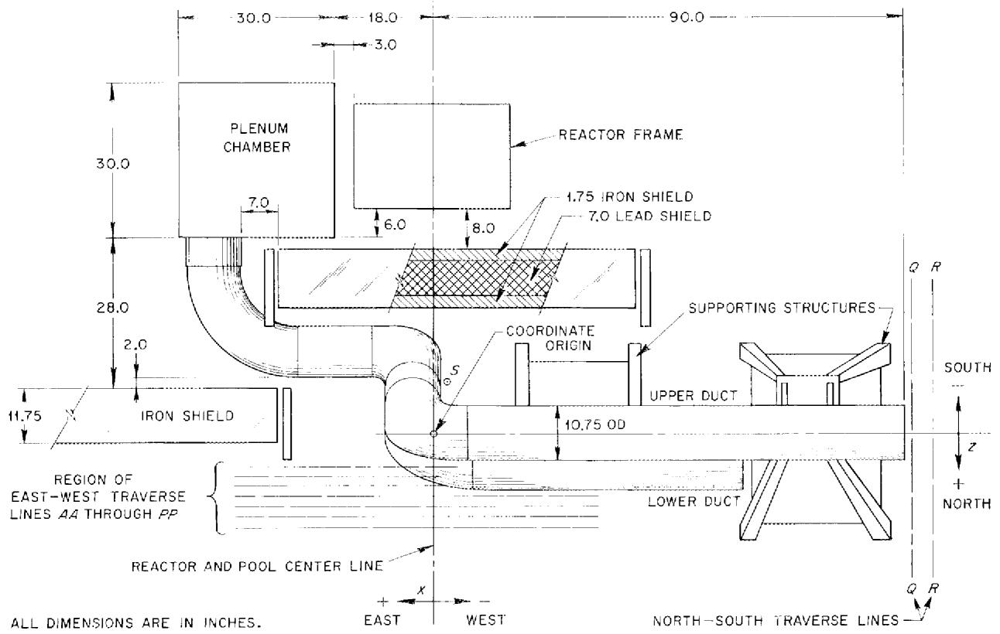  
Fig. 13.1. Test Fixture Duct. Plan view of duct and shield systems as installed in the Swimming Pool; important dimensions and location of traverse lines indicated.

rays from thermal neutrons captured in iron and water near the thermal-neutron peak.

Results of measurements at the end of the duct taken along traverse lines QQ and RR show a large thermal-neutron peak, a small fast-neutron peak, and no gamma-ray peak (Fig. 13.6). These data indicate that, for the most part, only thermal neutrons were scattered down the duct. The intensity of thermal neutrons at the end of the duct was about $1\%$ of their intensity at the entrance of the final, long, straight section of the duct.

In addition, the plenum chamber was flooded with water and the AA traverse measurements were repeated. The measurements taken are compared with the previous measurements in Fig. 13.7. The contribution of the plenum chamber to the dose along line AA is clearly indicated. The fast-neutron dose was diminished by only about $12\%$ by flooding the plenum chamber, while the thermal

neutron flux was reduced by a factor of 5. The large gamma-ray peak disappeared with the flooding, and the small peak was reduced in intensity by a factor of 2. These data indicate that about $80\%$ of the thermal neutrons in the duct system originated in (or passed through) the plenum chamber.

The results of these measurements agree quite well with calculated estimates for the design. The data are reported in greater detail in ref. 3.

# GE-ANP SHIELD MockUP EXPERIMENTS

H. E. Hungerford Physics Division

After removal of the duct mockup described above, the rear (or aft) section of the GE-ANP reactor shield was installed in the pool for testing.

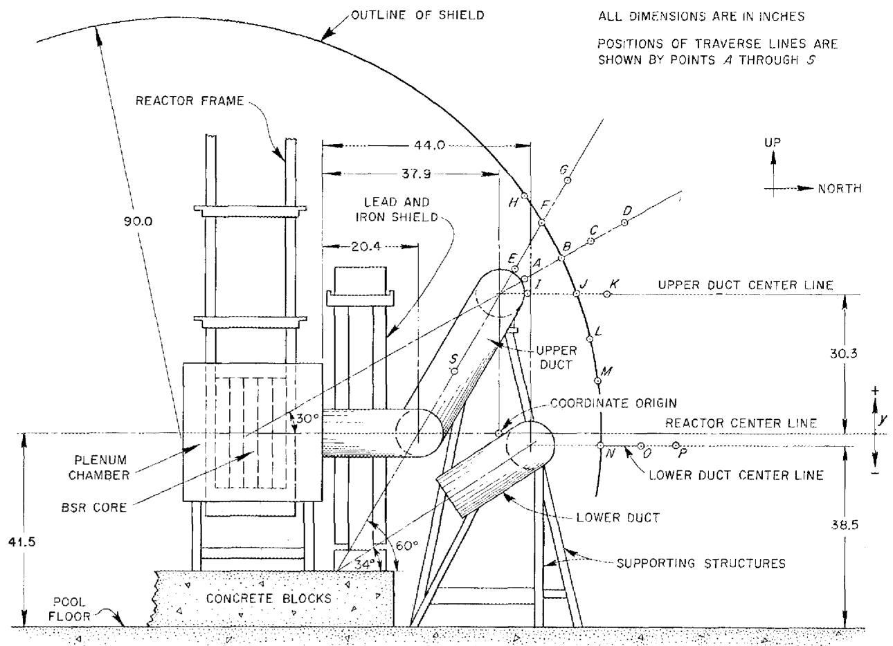  
Fig. 13.2. Test Fixture Duct. Elevation looking west; important dimensions and location of traverse lines indicated.

Figure 13.8 shows a plan view of this section of the shield, together with the location of the various traverse lines along which measurements were made. The main feature of this section is the annular air duct between the inner and outer water shields. Also shown in Fig. 13.8 is a small air void and 3 in. of water located between the reactor and the shield. Dose measurements were taken along traverses north and east of the shield. The results were similar to those taken on the front section (see below) and are not included in this summary.

At the completion of the measurements on the rear section, the mockup was removed and the forward or front section was installed in its place.

This section was of the same diameter as the rear section but was thicker. It also had an air void and 3 in. of water between it and the reactor. In addition, the annular air void contained two extra bends. A lead and steel shadow shield was located within the inner portion of the shield, which also contained water borated to 1.12 wt $\%$ boron. To complete the mockup, a shield made of lead, steel, and borated water was placed on the east side of the reactor. A plan view of the setup and the locations of the various traverse lines along which measurements were made are shown in Fig. 13.9.

Fast-neutron measurements taken along east-west traverse lines on the north side of the shield are shown in Fig. 13.10, and the corresponding thermal

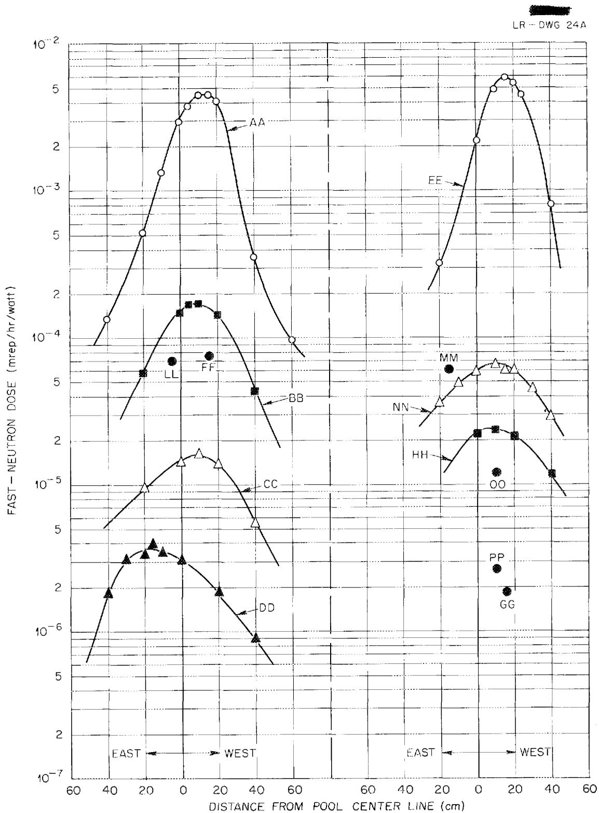  
Fig. 13.3. Fast-Neutron Dose Measurements Along Various East-West Traverse Lines.

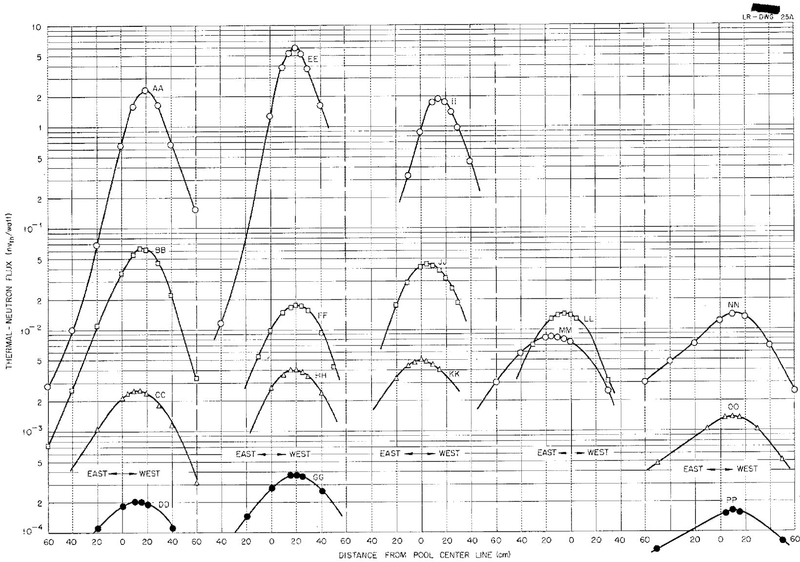  
Fig. 13.4. Thermal-Neutron Flux Measurements Along Various East-West Traverse Lines.

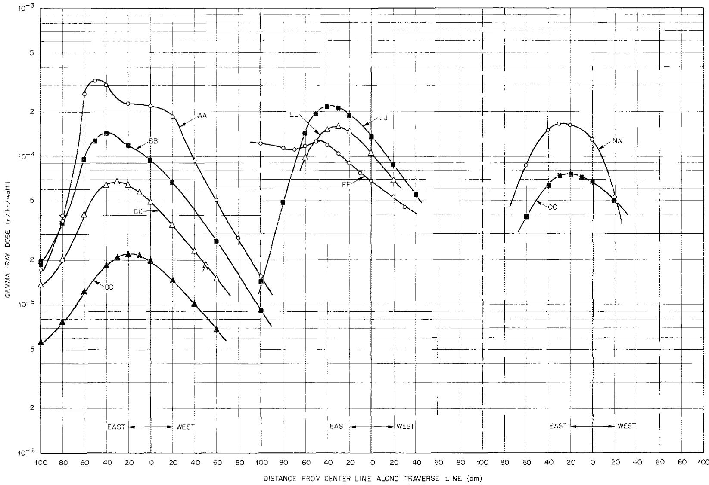  
Fig. 13.5. Gamma-Ray Dose Measurements Along Various East-West Traverse Lines.

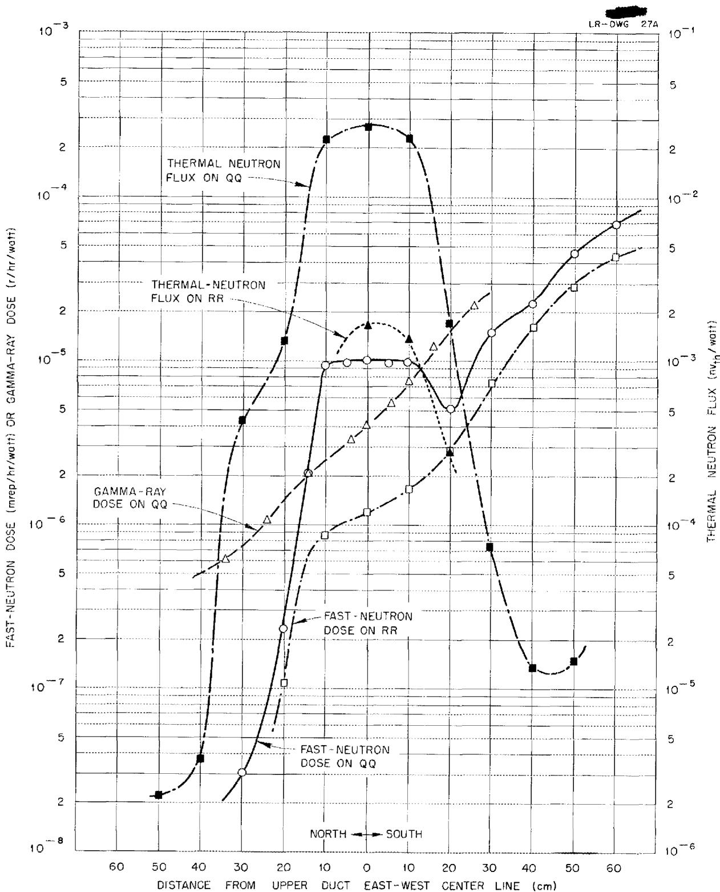  
Fig. 13.6. Dose Measurements at End of Duct Along North-South Traverses QQ and RR.

  
LR-DWG 29A

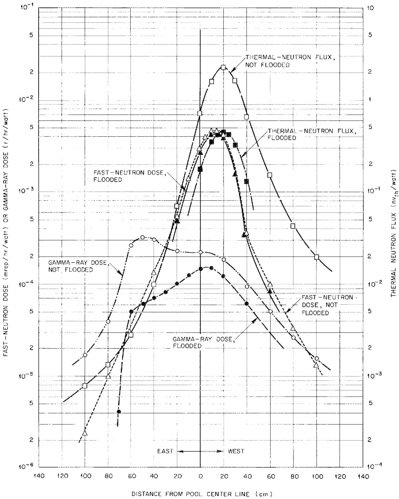  
Fig. 13.7. Comparison of Dose Measurements on Traverse Line AA, With and Without Plenum Chamber Flooded with Water.

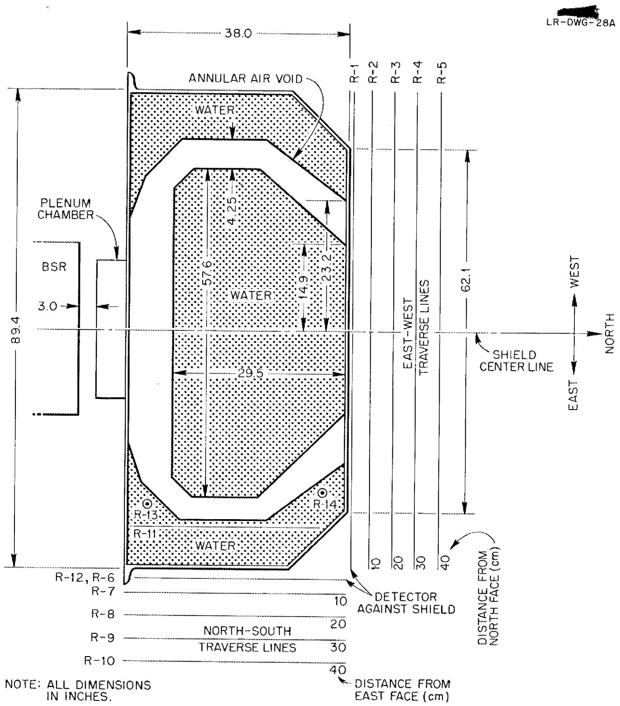  
Fig. 13.8. Plan View of Rear Section of GE-ANP R-1 Reactor Shield. Important dimensions and traverse lines indicated.

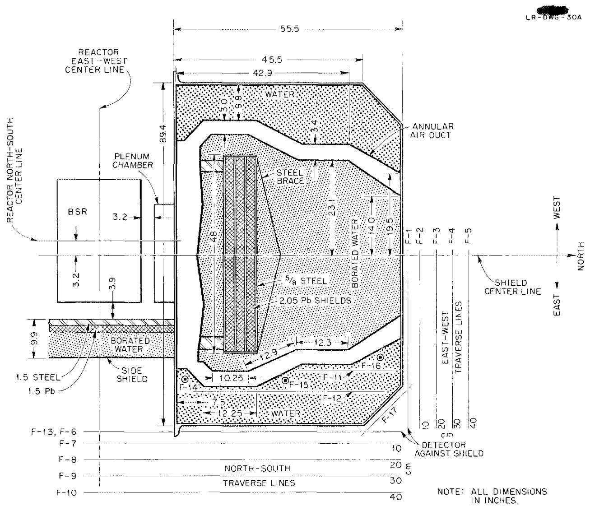  
Fig. 13.9. Plan View of Forward Section of GE-ANP R-1 Reactor Shield. Shadow shield, side shield, and position of traverse lines indicated.

neutron measurements are presented in Fig. 13.11. In each figure, peaks occurring at points $45\mathrm{cm}$ from either side of the shield center line coincided with the end of the air-duct region and "washed out" with distance from the shield. Later, the air void was flooded and some of the measurements were repeated. The peaks $45\mathrm{cm}$ from the center line vanished, as was to be expected. Flooding of the air void also reduced the thermal and fast

neutron intensities emerging at the center line by a factor of 4.

The gamma-ray measurements north of the shield (not shown) indicate that the dose just outside the shield at the center line was $3.0 \times 10^{-6} \, \text{r/hr/watt}$ ; with the air void flooded, the dose dropped to $1.5 \times 10^{-6} \, \text{r/hr/watt}$ .

The effect of the extra thickness of the forward section was to reduce the fast- and thermal-neutron

intensities outside the forward section by a factor of 1000 under the dose outside the corresponding portion of the rear section. In the case of gamma rays, the reduction factor was nearly 10,000 because of the added shadow shield and boration of the water of the inner shield.

The measurements taken along various north-south traverse lines on the east side of this section are shown in Fig. 13.12 (fast neutrons), Fig. 13.13 (thermal neutrons), and Fig. 13.14 (gamma rays). In all cases, a slight peaking effect was observed in the region 115 to $120\mathrm{cm}$ south of the north face of the shield. In some cases, the measurements were extended southward as far as the reactor east-west center line, which was located $186.2\mathrm{cm}$ south of the north face. The south face of the shield proper was located about $140\mathrm{cm}$ south of the north face. When the air duct was flooded, the neutron peaks were eliminated, but curiously the gamma-ray traverse still showed a slight peak.

It is to be emphasized that this is a very preliminary report on the GE-ANP reactor shield. The values reported here are subject to correction factors in reactor power. A more complete report on this shield will be prepared.

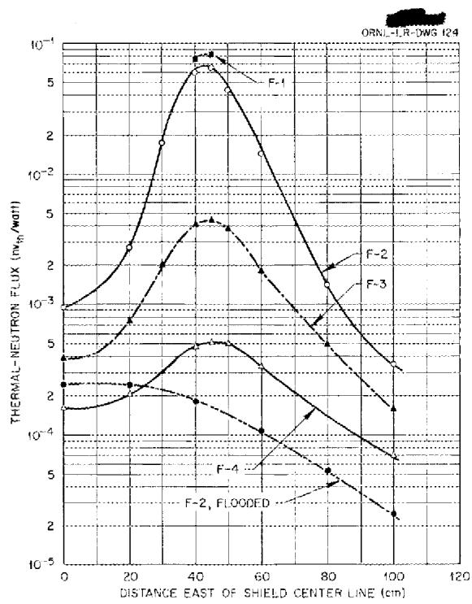  
Fig. 13.11. Thermal-Neutron Measurements North of Front Section.

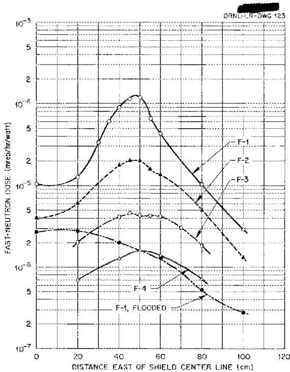  
Fig. 13.10. Fast-Neutron Measurements North of Front Face.

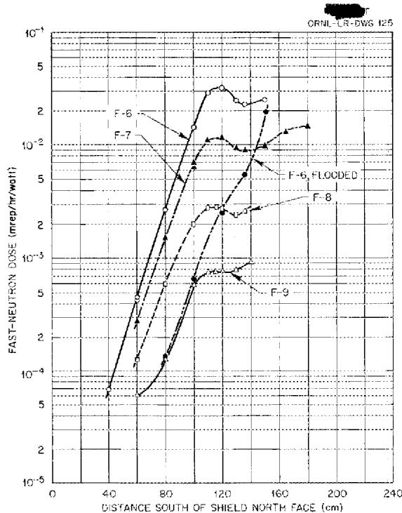  
Fig. 13.12. Fast-Neutron Measurements East of Front Section.

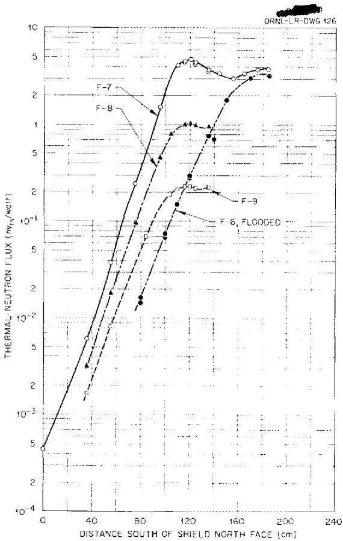  
Fig. 13.13. Thermal-Neutron Measurements East of Front Section.

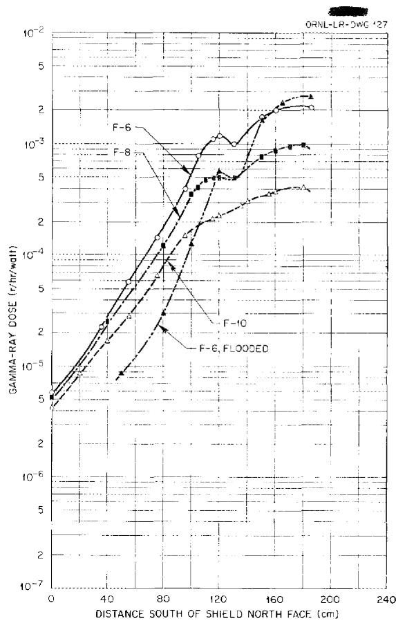  
Fig. 13.14. Gamma-Ray Measurements East of Front Section.

# 14. TOWER SHIELDING FACILITY

C. E. Clifford

T.V.Blosser

J. L. Hull

L. B. Holland

F. N. Watson

Physics Division

The Tower Shielding Facility (Fig. 14.1) is nearly completed, and operation should begin during March. A complete set of instruments has been collected for the experimental program; some of the instruments were especially developed for use at this facility. Consideration is being given to using the Tower Shielding Facility in a biological program for establishing dose rates for pilots in a nuclear-powered aircraft, and therefore a study is under way of the radiation doses which can be achieved.

# FACILITY CONSTRUCTION

The construction of the Tower Shielding Facility (at the 7700 Area) has been completed, and most of the work of the outside contractors has been accepted. All the ground facilities (control building, roads, fences, grading, reactor pool, etc.) were approved by the Laboratory on February 4. The steel structure, hoist house, and hoist installation have been accepted on the condition that some additional painting will be done by the contractor.

The hoists, the last of which was delivered February 1, will require minor modifications. It became apparent during the course of testing that the hoists did not operate properly under no-load conditions; the lines became excessively slack. This condition will be corrected by the addition of weight to the floating sheave blocks. In addition, a slack-line limit switch will be designed and installed which should prevent any damage at the hoist drums because of a slack line.

The mechanical components of the reactor have been tested. It is expected that final installation will have been completed in time for the Tower Shielding Facility to go critical by March 1.

# RADIATION DETECTION EQUIPMENT

T. V. Blosser

Physics Division

During the past year, a complete set of instruments has been collected and checked out for making experimental dose and energy measurements

at the Tower Shielding Facility. Some of the instruments are standard and have been in general use at both the Lid Tank Facility and the Bulk Shielding Facility. Other instruments have been developed or modified to meet the requirements. The instruments used for specific measurements are described in the following paragraphs.

# Thermal-Neutron Flux

1. $\mathsf{BF}_3$ Chamber. The instrument is a standard counter, except that the physical dimensions have been made the same as those of the fast-neutron dosimeter to ensure the same geometry for comparison of measurements.   
2. $U^{235}$ Fission Chamber. A standard counter was modified to give a flatter plateau on the pulse-height curve.   
3. Flow-Type Foil Counter. A standard counter will be used.

# Fast-Neutron Dose

1. Flow-Type Neutron Dosimeter. A three-cavity dosimeter was developed from the Hurst absolute dosimeter. It will be used for medium intensities, that is, approximately 0.1 to 20 rep/hr.   
2. Multichamber Neutron Dosimeter. Three flow-type neutron dosimeters mounted in parallel will be used for low-intensity measurements, that is, approximately 0.03 to 5 rep/hr.   
3. Absolute Dosimeter. A standard Hurst absolute chamber with a built in plutonium alpha source will be used for intercalibration of neutron sources and neutron chambers.   
4. Phantom-Type Dosimeter. A standard Hurst dosimeter will be used in high fluxes, that is, approximately 10 rep/hr to limit of recording equipment.

# Gamma-Ray Dose

1. Ionization Chamber (50 cm³). A standard instrument will be used.

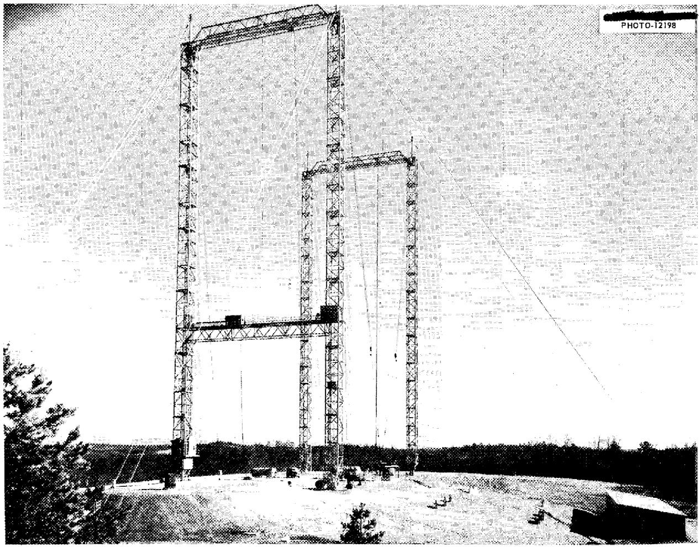  
Fig. 14.1. Tower Shielding Facility, February 12, 1954.

2. Anthracene Crystal $(\frac{1}{2}$ in.). A standard instrument will be used for normal dose rates, that is, approximately 2 r/hr.   
3. Anthracene Crystal $(\frac{1}{2}$ in.) with Lead Absorption Wheel. A $\frac{1}{2}$ -in. anthracene crystal will be mounted in a lead box with a small circular opening in one side. A lead wheel, which varies in thickness from 0 to 0.7 in., can be rotated to cover the opening and thus show the effect of adding small thicknesses of lead to a shield.   
4. Anthracene Crystal (1 in.). A standard instrument will be used for low dose rates, that is, approximately 200 mr/hr.

# Other Gamma-Ray Detectors

1. Sodium Iodide Crystal $(1 \times 1\frac{1}{2}$ in.). A standard counter will be used.

2. Cobalt-Wire Scanner. The scanner, which consists of a single cobalt wire that can be inserted along the full length of center fuel plate, was developed for determining flux distribution within each fuel element of the reactor. Upon withdrawal, the wire will be surveyed with a sodium iodide crystal.

# Isodose Plotter

An isodose plotter was developed for surveying the crew compartment in the $x, y,$ and $z$ coordinates. When the plotter is used with each of the other detection instruments and allied electronics systems, the intensity curves at given positions can be plotted automatically.

# ESTIMATE OF NEUTRON AND GAMMA RADIATION EXPECTED AT THE TOWER SHIELDING FACILITY

C. E. Clifford Physics Division

Estimates of some of the neutron and gamma doses which can be achieved at the Tower Shielding Facility for use in a biological program have been made on the basis of measurements of radiation at the Lid Tank Facility and the Bulk Shielding Facility.

The Bulk Shielding Facility measurements show a gamma dose of 16 r/hr/watt for a 17.5-cm-thick water shield and a neutron dose of 1 rep/hr/watt for an 18.4-cm-thick water shield. The Lid Tank Facility data show that a 17.5-cm-thick lead-borated water shield (11.4 cm of lead) reduces the gamma dose to approximately one-twentieth of that for a pure-water shield of the same thickness. However,

the neutron dose is increased by a factor of 4.8. Thus the gamma dose at the outer surface of an approximately 18-cm-thick lead-borated water shield (11.4 cm of lead) would be $\frac{16}{20}$ or 0.8 r/hr/watt, and the neutron dose would be 4.8 rep/hr/watt. This gives a ratio of 6 rep to 1 r.

If isotropic emission is assumed and the buildup factors are neglected, the distance from the lead-borated water shield surface at which a 10-rep dose would be received for a maximum reactor power of $100\mathrm{kw}$ (area of reactor face $= 3ft^2$ relaxation length of 1.5-Mev neutrons $= 300$ ft) is approximately 123 feet. At the same point, the gamma dose would be $2.0r/hr$ .

The distance from an 18-cm-thick pure-water shield at which a 10-r gamma dose would be received (gamma relaxation length in air = 1200 ft) is 250 ft; the neutron dose at the same point is 0.33 rep/hr. These and other results are given in Table 14.1.

TABLE 14.1. ESTIMATE OF RADIATION DOSES AT TOWER SHIELDING FACILITY FOR A REACTOR POWER OF ${100}\mathrm{\;{kw}}$   

<table><tr><td>POINT OF MEASUREMENT</td><td>NEUTRON DOSE
(rep/hr/100 kw)</td><td>GAMMA DOSE
(r/hr/100 kw)</td></tr><tr><td colspan="3">For an 18-cm-thick Pure-Water Shield</td></tr><tr><td>At surface</td><td>100,000</td><td>1,600,000</td></tr><tr><td>123 ft from surface</td><td>2.08</td><td>41.0</td></tr><tr><td>250 ft from surface</td><td>0.33</td><td>10.0</td></tr><tr><td>600 ft from surface</td><td>0.018</td><td>1.0</td></tr><tr><td colspan="3">For an 18-cm-thick Lead-Borated Water Shield (11.4 cm of Lead)</td></tr><tr><td>At surface</td><td>480,000</td><td>80,000</td></tr><tr><td>123 ft from surface</td><td>10</td><td>2.0</td></tr><tr><td>228 ft from surface</td><td>2.0</td><td>0.57</td></tr><tr><td>294 ft from surface</td><td>1.0</td><td>0.27</td></tr></table>

Part IV

APPENDIX

__________

# 15. LIST OF REPORTS ISSUED DURING THE QUARTER

<table><tr><td>REPORT NO.</td><td>TITLE OF REPORT</td><td>AUTHOR(s)</td><td>DATE ISSUED</td></tr><tr><td colspan="4">I. Aircraft Reactor Experiment</td></tr><tr><td>CF-54-2-68</td><td>ARE Operating Procedures, Parts I, II, and III</td><td>W. B. Cottrell</td><td>2-11-54</td></tr><tr><td>CF-54-2-69</td><td>ARE Operating Procedures, Part IV</td><td>J. L. Meem</td><td>2-11-54</td></tr><tr><td colspan="4">II. Reflector-Moderated Reactor</td></tr><tr><td>CF-53-12-108</td><td>The Inhour Formula for a Circulating Fuel Nuclear Reactor with Slug Flow</td><td>W. K. Ergen</td><td>12-22-53</td></tr><tr><td>CF-53-12-145</td><td>Letter on Critical Mass for Two Region Reactors (to C. N. Klahr, NDA)</td><td>C. S. Burtnette</td><td>12-23-53</td></tr><tr><td>CF-54-1-1</td><td>The Behavior of Certain Functions Related to the Inhour Formula of Circulating Fuel Reactors</td><td></td><td></td></tr><tr><td>CF-54-1-14</td><td>A Memo to A. P. Fraas Re: RMR-RSA Weights</td><td>J. Jonas (Lockheed)</td><td>1-5-54</td></tr><tr><td>CF-54-1-155</td><td>Intermediate Heat Exchanger Test Results</td><td>B. M. Wilner H. J. Stumpf</td><td>1-29-54</td></tr><tr><td>CF-54-2-36</td><td>Shield Designs for the Reflector-Moderated Reactor</td><td>A. P. Fraas</td><td>2-4-54</td></tr><tr><td>CF-54-2-185</td><td>Influence of Nuclear Power Plant Design Parameters on Aircraft Gross Weight</td><td>A. P. Fraas</td><td>2-26-54</td></tr><tr><td colspan="4">III. Experimental Engineering</td></tr><tr><td>CF-53-12-76</td><td>Additional Purification of Fused Fluorides</td><td>H. W. Savage</td><td>12-14-53</td></tr><tr><td>CF-54-2-35</td><td>Preliminary Discussion of Model-T Component Test</td><td>J. G. Gallagher</td><td>2-2-54</td></tr><tr><td colspan="4">IV. Critical Experiments</td></tr><tr><td>CF-54-2-137</td><td>Combination Circulating and Stationary Fuel Reflector-Moderated Reactor</td><td>D. Scott</td><td>2-19-54</td></tr><tr><td>CF-54-2-151</td><td>An SCW Moderated and Reflected Circulating Fuel Reactor</td><td>J. W. Noakes</td><td>2-23-54</td></tr><tr><td colspan="4">V. Shielding</td></tr><tr><td>CF-53-12-13</td><td>Critique of LiH as a Neutron Shield</td><td>J. E. Faulkner</td><td>2-2-53</td></tr><tr><td>CF-53-12-23</td><td>Estimate of Neutron and Gamma Radiation Expected at the Tower Shielding Facility</td><td>C. E. Clifford</td><td>12-10-53</td></tr><tr><td>CF-53-12-60</td><td>Some Estimates of Removal Cross Sections Based on the Continuum Theory of the Scattering of Neutrons from Nuclei</td><td>F. H. Murray</td><td>12-11-53</td></tr><tr><td>CF-54-2-93</td><td>Some Neutron Measurements Around Air Ducts</td><td>C. L. Storrs J. M. Miller</td><td>To be issued</td></tr><tr><td>CF-54-2-94</td><td>The Test Fixture Duct Experiment at the Bulk Shielding Facility</td><td>H. E. Hungerford</td><td>To be issued</td></tr><tr><td>ORNL-1616</td><td>Lid Tank Shielding Tests for the Reflector-Moderated Reactor</td><td></td><td></td></tr><tr><td colspan="4">VI. Chemistry</td></tr><tr><td>CF-53-12-41</td><td>Abstract and Outline of Paper on &quot;Fused Salts as Reactor Fuels&quot;</td><td>W. R. Grimes</td><td>12-8-53</td></tr><tr><td>CF-53-12-112</td><td>Analytical and Accountability Report on ARE Concentrate</td><td>G. J. Nessle</td><td>12-18-53</td></tr><tr><td>CF-54-1-170</td><td>The Sodium-Hydrogen System</td><td>Metal Hydrides</td><td>1-1-54</td></tr></table>

<table><tr><td>REPORT NO.</td><td>TITLE OF REPORT</td><td>AUTHOR(s)</td><td>DATE ISSUED</td></tr><tr><td colspan="4">VII. Heat Transfer and Physical Properties</td></tr><tr><td>CF-53-12-179</td><td>Preliminary Measurements of the Density and Viscosity of NaF-ZrF4-UF4(62.5-12.5-25.0 mole %)</td><td>S. I. Cohen.
T. N. Jones</td><td>12-22-53</td></tr><tr><td>CF-54-2-1</td><td>Some Preliminary Forced-Convection Heat Transfer Experiments in Pipes with Volume-Heat-Sources Within the Fluids</td><td>H. Poppendiek
G. Winn</td><td>To be issued</td></tr><tr><td>CF-54-2-37</td><td>The Measurement of Fluid Velocity by Photography Techniques</td><td>J. O. Bradfute</td><td>To be issued</td></tr><tr><td>CF-54-2-114</td><td>Heat Capacity of Fuel Composition No. 31</td><td>W. D. Powers
G. C. Blalock</td><td>2-17-54</td></tr><tr><td>ORNL-1624</td><td>The Nature of the Flow of Ordinary Fluids in a Thermal Convection Harp</td><td>D. Hamilton
F. Lynch
L. Palmer</td><td>2-23-54</td></tr><tr><td colspan="4">VIII. Radiation Damage</td></tr><tr><td>CF-53-12-42</td><td>The Radiation-Induced Corrosion of Beryllium Oxide in Sodium at 1500°F</td><td>W. E. Brundage</td><td>12-3-53</td></tr><tr><td>CF-53-12-140</td><td>Questionnaire for LITR Fluoride Fuel Loop Experiment</td><td>W. Brundage
W. Parkinson
O. Sisman</td><td>12-17-53</td></tr><tr><td colspan="4">IX. Miscellaneous</td></tr><tr><td>CF-53-12-15</td><td>Proposed ANP Program</td><td>R. C. Briant</td><td>12-3-53</td></tr><tr><td>CF-54-2-79</td><td>The Curtiss-Wright Reactor Set</td><td>C. B. Mills</td><td>2-10-54</td></tr><tr><td>ORNL-1649</td><td>Aircraft Nuclear Propulsion Project Quarterly Progress Report for Period Ending December 10, 1953</td><td>W. B. Cottrell</td><td>1-12-54</td></tr></table>