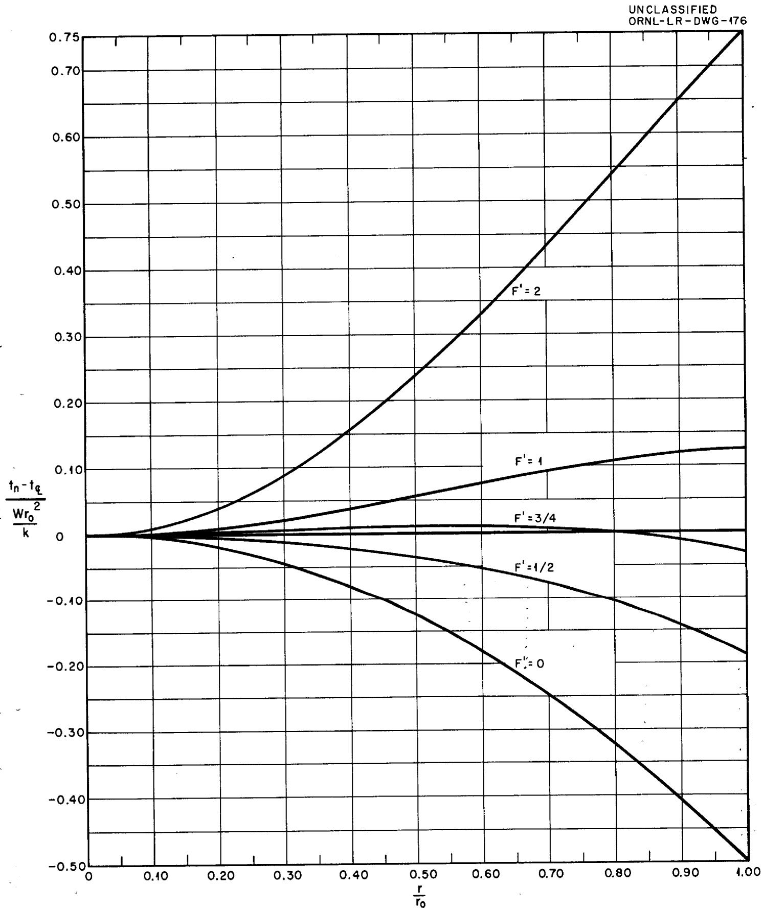
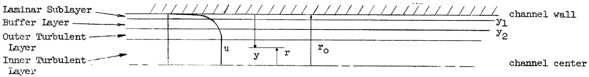
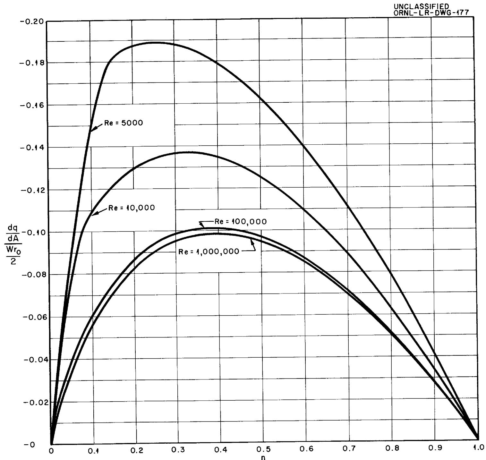
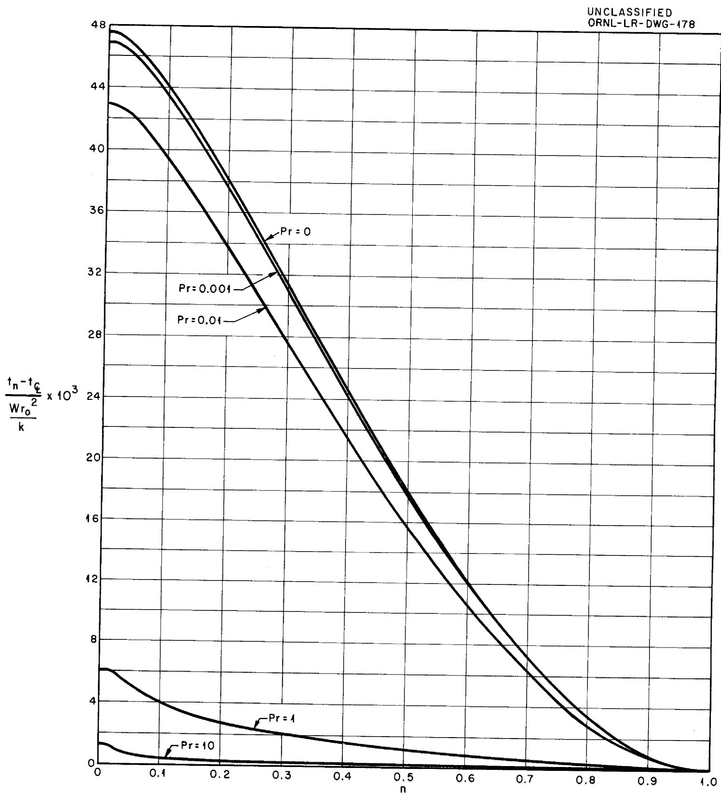
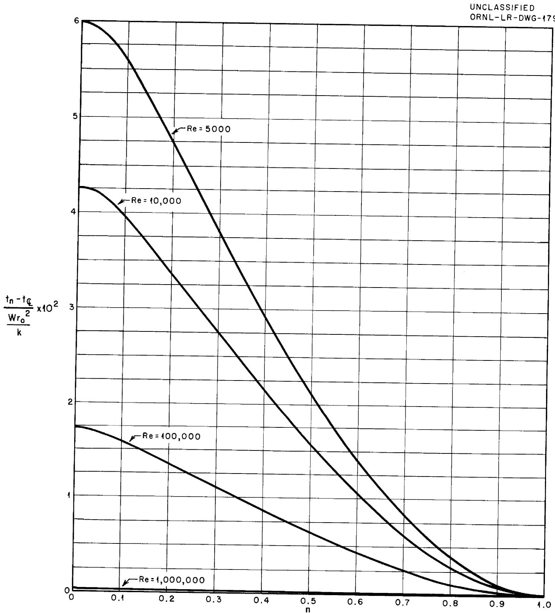
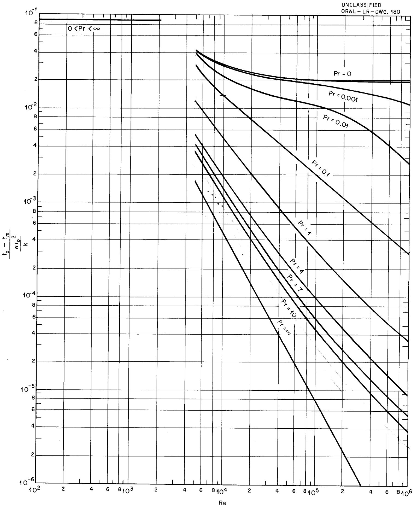
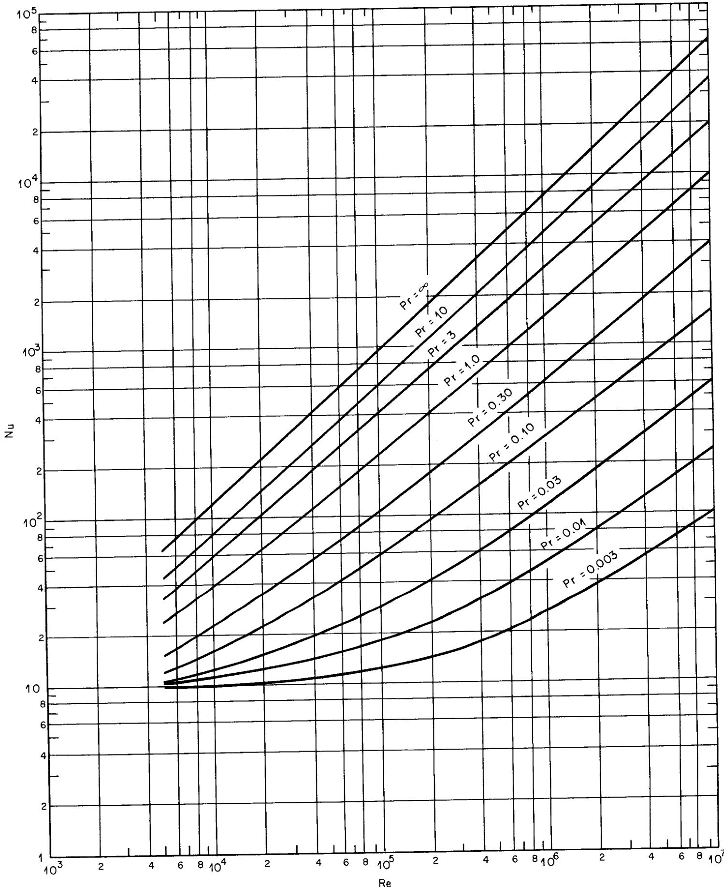

3445603496394

ORNL 1701

Engineering

${C}_{x} \cdot  {47}$

FORCED CONVECTION HEAT TRANSFER

BETWEEN PARALLEL PLATES AND IN

ANNULI WITH VOLUME HEAT SOURCES

WITHIN THE FLUIDS

H. F. Poppendiek

L.D.Palmer

CENTRAL RESEARCH LIBRARY DOCUMENT COLLECTION

LIBRARY LOAN COPY

DO NOT TRANSFER TO ANOTHER PERSON

If you wish someone else to see this document, send in name with document and the library will arrange a loan.

OAK RIDGE NATIONAL LABORATORY

OPERATED BY

CARBIDE AND CARBON CHEMICALS COMPANY

A DIVISION OF UNION CARBIDE AND CARBON CORPORATION

UCC

POST OFFICE BOX P

OAK RIDGE, TENNESSEE

Contract No. W-7405, eng 26

Reactor Experimental Engineering Division

FORCED CONVECTION HEAT TRANSFER BETWEEN PARALLEL PLATES AND IN ANNULI WITH VOLUME HEAT SOURCES WITHIN THE FLUIDS

by

H. F. Poppendiek

L. D. Palmer

DATE ISSUED:

MAY 11 1954

OAK RIDGE NATIONAL LABORATORY

Operated by

CARBIDE AND CARBON CHEMICALS COMPANY

A Division of Union Carbide and Carbon Corporation

Post Office Box P

Oak Ridge, Tennessee

# INTERNAL DISTRIBUTION

1. C. E. Center   
2. Biology Library   
3. Health Physics Library

4-5. Central Research Library

6. Reactor Experimental Engineering Library

7-11. Laboratory Records Department   
12. Laboratory Records, ORNL R.C.   
13. C. E. Larson   
14. L. B. Emlet (K-25)   
15. J. P. Murray (Y-12)   
16. A. M. Weinberg   
17. E. H. Taylor   
18. E. D. Shipley   
19. C. E. Winters   
20. F. C. VonderLage   
21. R. C. Briant   
22. J. A. Swartout   
23. S. C. Lind   
24. F. L. Culler   
25. A. H. Snell   
26. A. Hollaender   
27. M. T. Kelley   
28. W. J. Fretague   
29. G. H. Clewett   
30. K. Z. Morgan   
31. T. A. Lincoln   
32. A. S. Householder   
33. C. S. Harrill   
34. D. S. Billington   
35. D. W. Cardwell   
36. E. M. King   
37. R. N. Lyon   
38. J. A. Lane   
39. A. J. Miller   
40. R. B. Briggs   
41. A. S. Kitzes   
42. 0. Sisman   
43. R. W. Stoughton   
44. C. B. Graham

45. W. R. Gall   
46. H. F. Poppendiek   
47. S. E. Beall   
48. J. P. Gill   
49. D. D. Cowen   
50. W. M. Breazeale (consultant)   
51. R. A. Charpie   
52. L. G. Alexander   
53. E. S. Bettis   
54. E. P. Blizzard   
55. E. G. Bohlmann   
56. J. O. Bradfute   
57. H. C. Claiborne   
58. S. I. Cohen   
59. G. A. Cristy   
60. M. C. Edlund   
61. W. K. Ergen   
62. A. P. Fraas   
63. N. D. Greene   
64. D. C. Hamilton   
65. H. W. Hoffman   
66. P. R. Kasten   
67. G. W. Keilboltz   
68. N. F. Lansing   
69. G. C. Lawson   
70. F. E. Lynch   
71. C. B. Mills   
72. L. D. Palmer   
73. W. D. Powers   
74. M. W. Rosenthal   
75. H. W. Savage   
76. 0. Sisman   
77. D. G. Thomas   
78. J. M. Verda   
7。F。C。Zmola   
14. H. F. Poppendiek   
15. R. W. Bussard.   
16. M. J. Skinner   
17. W. D. Manly

# EXTERNAL DISTRIBUTION

118. R. F. Bacher, California Institute of Technology

119. A.F. Plant Representative, Wood-Ridge (Attn: S. V. Manson)

120-369. Given distribution as shown in TID-4500 under Engineering Category

TABLE OF CONTENTS   

<table><tr><td></td><td>PAGE</td></tr><tr><td>SUMMARY</td><td>6</td></tr><tr><td>NOMENCIATURE</td><td>7</td></tr><tr><td>INTRODUCTION</td><td>9</td></tr><tr><td>LAMINAR FLOW ANALYSIS</td><td>10</td></tr><tr><td>TURBULENT FLOW ANALYSIS</td><td>14</td></tr><tr><td>DISCUSSION</td><td>23</td></tr><tr><td>APPENDIX 1</td><td>24</td></tr><tr><td>APPENDIX 2</td><td>27</td></tr><tr><td>APPENDIX 3</td><td>30</td></tr><tr><td>REFERENCES</td><td>32</td></tr></table>

# SUMMARY

This paper concerns itself with forced convection heat transfer between parallel plates which are infinite in extent and ducting fluids containing uniform volume heat sources; also heat is transferred uniformly to or from the fluids through the parallel plates. Dimensionless differences between the plate wall temperature and the mixed-mean fluid temperature are evaluated in terms of several dimensionless moduli. These analyses pertain to the laminar and turbulent flow regimes and liquid metals as well as ordinary fluids. The solutions may also be used to estimate heat transfer in annulus systems whose inner to outer radius ratios do not differ significantly from unity.

# NOMENCLATURE

# Letters

A cross sectional heat transfer area, ft²

a fluid thermal diffusivity, ft²/hr

$\mathbf{B}_{\mathbf{o}}$ parameter in equation (o), ft/hr

$c_{p}$ fluid heat capacity, Btu/lb ${}^{\mathrm{O}}\mathbb{F}$

$f^{\prime}$ parameter in equation (r), dimensionless

g gravitational force per unit mass, ft/hr²

h heat transfer conductance, Btu/hr ft² of

k fluid thermal conductivity, Btu/hr ft² (°F/ft)

p fluid pressure, lbs/ft²

q heat transfer rate, Btu/hr

r radial distance from centerline of parallel plate system, ft

$r_d$ radial position at which the reference temperature $t_d$ is stipulated, ft

$\mathbf{r}_{\circ}$ half the distance between the two parallel plates, ft

t fluid temperature at position n, ${}^{\mathrm{OF}}$

td a reference temperature at radius rd, $\mathbf{\sigma}_{\mathrm{F}}$

tm mixed-mean fluid temperature, ${}^{\mathrm{O}}\mathbb{F}$

$\mathfrak{t}_{\mathbb{O}}$ fluid temperature at plate walls, ${}^{\mathrm{o}}\mathrm{F}$

$\mathfrak{t}_{\mathbb{C}}$ fluid temperature at the parallel plate system center, ${}^{\mathrm{o}}_{\mathrm{F}}$

u fluid velocity at n, ft/hr

$u_{m}$ mean fluid velocity, ft/hr

W volume heat source, Btu/hr ft3   
x axial distance, ft   
y radial distance from parallel plate walls, ft   
$\nu$ fluid weight density, $\mathrm{lbs / ft}^3$   
eddy diffusivity, ft²/hr   
S friction factor defined in equation (i) dimensionless   
$\mu$ absolute viscosity of fluid, lb hr/ft²   
$\nu$ fluid kinematic viscosity, ft²/hr   
$\rho$ fluid mass density, lbs hr²/ft   
T fluid shear stress at position n, lbs/ft²   
$\mathsf{T}_{0}$ fluid shear stress at parallel plate walls, $\mathrm{lbs / ft^2}$

# Dimensionless Moduli

$$
\begin{array}{l} F ^ {\prime} = 1 - \frac {1}{W r _ {0}} \left(\frac {\mathrm {d} q}{\mathrm {d} A}\right) \\ n = y / r _ {0} \\ n _ {L} = y _ {L} / r _ {O} \\ \mathrm {N u} = \mathrm {h} ^ {4} \mathrm {r} _ {\mathrm {O}} / \mathrm {k}, \text {N u s s e l t M o d u l u s} \\ \Pr = \gamma \cdot c _ {p} / k, \text {P r a n d t l M o d u l u s} \\ R e = u _ {I} 4 r _ {O} / v \\ u ^ {+} = \frac {u}{\sqrt {\frac {T _ {0}}{\rho}}} \\ y ^ {+} = \frac {y \sqrt {\frac {T _ {0}}{\rho}}}{\nu} \\ \end{array}
$$

# INTRODUCTION

The mathematical heat transfer analyses to be presented here for a parallel plates system are accomplished much in the same manner as were those for a pipe system presented previously in reference 1. The present analyses as well as those given in reference 1 can be used to determine the temperature structure in flowing fluids that possess internal sources of heat generation. Such volume heat sources may result from nuclear or chemical reactions or may be generated electrically.

The idealized volume-heat-source system considered in this paper is defined by the following postulates:

1. Thermal and hydrodynamic patterns have been established (parallel plates of infinite extent).   
2. Uniform volume heat sources exist within the fluids.   
3. Physical properties are not functions of temperature.   
4. Heat is transferred uniformly to or from the fluid at the plate walls.   
5. In the case of turbulent flow the generalized turbulent velocity profile defines the hydrodynamic structure.   
6. In the case of turbulent flow there exists an analogy between heat and momentum transfer.

# LAMINAR FLOW ANALYSIS

The differential equation describing heat transfer in the parallel plates system for the case of laminar flow is

$$
\frac {3}{2} u _ {\mathrm {m}} \left[ 1 - \left(\frac {r}{r _ {0}}\right) ^ {2} \right] \frac {\partial t}{\partial x} = a \frac {\partial^ {2} t}{\partial r ^ {2}} + \frac {W}{\gamma c _ {p}} \tag {1}
$$

where,

$\mathbf{u}_{\mathfrak{m}}$ mean fluid velocity

t, temperature

x, axial distance

r, radial distance

a, thermal diffusivity

W, uniform volume heat source

$\gamma$ , fluid weight density

cp, fluid heat capacity

One boundary condition is represented by the uniform wall-heat-flux which may be positive, negative or zero,

$$
\frac {\mathrm {d} q}{\mathrm {d} A} (r = r _ {0}) = \left(\frac {\mathrm {d} q}{\mathrm {d} A}\right) _ {0} = - k \frac {\partial t}{\partial r} (r = r _ {0}) \tag {2}
$$

where $\frac{\mathrm{dq}}{\mathrm{dA}}$ is the radial heat flux and $\left(\frac{\mathrm{dq}}{\mathrm{dA}}\right)_0$ is the wall heat flux. The second boundary condition is, $t_d$ , a reference temperature, such as a wall or centerline temperature,

$$
t (r = r _ {d}) = t _ {d} \tag {3}
$$

Note, the mixed-mean fluid temperature may also be specified as the reference temperature.

Downstream from the entrance region where the thermal pattern (temperature gradients) of the system has become established, the axial temperature gradient, $\frac{\partial t}{\partial x}$ , is uniform and equal to the mixed-mean axial fluid temperature gradient1, $\frac{\partial t_m}{\partial x}$ . The latter gradient can be obtained by making the following heat rate balance. The heat generated in a lattice whose volume is $2r_0 dx$ (the width of the lattice being unity) plus the heat transferred into or out of the lattice at the plate walls must all be lost from the lattice by convection, that is,

$$
W 2 r _ {O} d x - \left(\frac {d q}{d A}\right) _ {O} 2 d x = 2 r _ {O} u _ {m} / c _ {p} \left(\frac {\partial t _ {m}}{\partial x}\right) d x \tag {4}
$$

Hence, in the established flow region the axial temperature gradient is

$$
\frac {\partial t}{\partial x} = \frac {\partial t _ {m}}{\partial x} = \frac {W - \frac {1}{r _ {0}} \left(\frac {d q}{d A}\right)}{u _ {m} y c _ {p}} \tag {5}
$$

Upon substituting equation (5) into equation (1), the following total differential equation results:

$$
\frac {W}{k} \left[ \frac {3}{2} F ^ {\prime} \left(1 - \left(\frac {r}{r _ {0}}\right) ^ {2}\right) - 1 \right] = \frac {d ^ {2} t}{d r ^ {2}} \tag {6}
$$

1. Note, that the mixed-mean fluid temperature at any given axial position is defined as,

$$
t _ {m} = \frac {\int_ {0} ^ {r _ {o}} t u d r}{\int_ {0} ^ {r _ {o}} u d r} = \frac {1}{u _ {m} r _ {o}} \int_ {0} ^ {r _ {o}} t u d r
$$

where $F' = 1 - \frac{1}{W r_{0}}\left(\frac{dq}{dA}\right)_{0}$ . Equation (6) can be solved upon making two integrations. The first integration plus boundary equation (2) yields,

$$
\frac {d t}{d r} = \frac {W}{k} \left[ \left(\frac {3 F ^ {\prime}}{2} - 1\right) r - \frac {F ^ {\prime}}{2 r _ {0} ^ {2}} r ^ {3} \right] \tag {7}
$$

A second integration gives the desired temperature solution,

$$
\frac {t - t _ {0}}{\frac {W r _ {0}}{k} ^ {2}} = \left[ \left(\frac {3 F ^ {\prime} - 2}{4}\right) \left(\left(\frac {r}{r _ {0}}\right) ^ {2} - 1\right) - \frac {F ^ {\prime}}{8} \left(\left(\frac {r}{r _ {0}}\right) ^ {4} - 1\right) \right] \tag {8}
$$

where the reference temperature is, $t_0$ , the wall temperature. The temperature solution in terms of the centerline temperature rather than the wall temperature is given by

$$
\frac {t - t _ {\phi}}{\frac {W r _ {0}}{k} ^ {2}} = \left[ \left(\frac {3 F}{4} ^ {\prime} - \frac {1}{2}\right) \left(\frac {r}{r _ {o}}\right) ^ {2} - \frac {F ^ {\prime}}{8} \left(\frac {r}{r _ {o}}\right) ^ {4} \right] \tag {9}
$$

where $t_{\xi}$ is the centerline temperature. Equation (9) is graphed in Figure 1 for several values of the function $F'$ .

The difference between the plate wall temperature and mixed-mean fluid temperature is defined by

$$
t _ {O} - t _ {M} = \frac {\int_ {O} ^ {r _ {O}} u (t _ {O} - t) d r}{u _ {m} r _ {O}} \tag {10}
$$

Upon substituting the laminar velocity profile relation and equation (8) into equation (10) there results,

$$
\frac {t _ {0} - t _ {m}}{\frac {W r _ {0}}{k} ^ {2}} = \frac {1 7 F ^ {\prime} - 1 4}{3 5} \tag {11}
$$

  
Fig. 4. Dimensionless Radial Temperature Distributions in a Parallel Plates System for Laminar Flow (Equation 9)

# TURBULENT FLOW ANALYSIS

Fluid flow in pipes and channels (parallel plates systems) under turbulent flow conditions has been characterized in terms of a laminar sublayer contiguous to the wall, a buffer layer, and a turbulent core by Nikuradse, von Karman, and others. This structure has been presented in a general fashion by the well known generalized velocity profile which was shown together with the experimental data of Nikuradse, Reichardt, and Laufer in reference 1. Table 1 gives some of the specific hydrodynamic relations for the various flow layers in a parallel plates system; a discussion of some of the details of this table can be found in Appendix 1.

The differential equation describing heat transfer in a parallel plates system for the case of turbulent flow is

$$
u (r) \frac {\partial t}{\partial x} = \frac {\partial}{\partial r} \left[ (a + \epsilon) \frac {\partial t}{\partial r} \right] + \frac {W}{\gamma c _ {p}} \tag {12}
$$

where,

$\mathbf{u}(\mathbf{r})$ , the turbulent velocity profile (given by the generalized velocity profile)

$\epsilon$ ， the eddy diffusivity given in Table 1

Upon substituting equation (5) into equation (12) for the established thermal region, the following total differential equation results,

$$
\frac {u (r) \left[ W - \frac {1}{r _ {0}} \left(\frac {\mathrm {d} q}{\mathrm {d} A}\right) _ {0} \right]}{u _ {m} \gamma c _ {p}} - \frac {W}{\gamma c _ {p}} = \frac {\mathrm {d}}{\mathrm {d} r} \left[ (a + \epsilon) \frac {\mathrm {d} t}{\mathrm {d} r} \right] \tag {13}
$$

2. It is postulated that the heat and momentum transfer eddy diffusivities are equal as proposed by Reynolds and successfully used by von Karman, Martinelli and others.

# TABLE I

# HYDRODYNAMIC RELATIONS FOR THE VARIOUS FLOW LAYERS

# BETWEEN PARALLEL PLATES

<table><tr><td>REGION</td><td>GENERALIZED VELOCITY DISTRIBUTION</td><td>SHEAR STRESS</td><td>STRESS EQUATION</td><td>EDDY DIFFUSIVITY</td></tr><tr><td>Laminar Sublayer o&lt;y&lt;5 or o&lt;y/ro&lt;131.5 Re·9</td><td>u/√To/ρ = √(To/ρ) y /v</td><td>T=To</td><td>T=ρv du/dy</td><td>ε/ν=0</td></tr><tr><td>Buffer Layer 5&lt;y&lt;30 or 131.5/Re·9 &lt; y/ro &lt; 789 Re·9</td><td>u/√To/ρ = -3.05 + 5.00 ln[ y/To/ρ /v]</td><td>T=To</td><td>T=ρ(v+ε) du/dy</td><td>ε/ν=.0076 Re·9 y/ro - 1</td></tr><tr><td>Outer Turbulent Layer 789/Re·9 &lt; y/ro &lt; .5</td><td>u/√To/ρ = 5.5 + 2.5 ln[ y/To/ρ /v]</td><td>T=To (1 - y/ro)</td><td>T=ρ ∈ du/dy</td><td>ε/ν=.0152 Re·9 (1 - y/ro) y/ro</td></tr><tr><td>Inner Turbulent Layer .5 &lt; y/ro &lt; 1</td><td>u/√To/ρ = 5.5 + 2.5 ln[ y/To/ρ /v]</td><td>T=To (1 - y/ro)</td><td>T=ρ ∈ du/dy</td><td>ε/ν=.0038 Re·9</td></tr></table>

The boundary conditions are given by equations (2) and (3). As was done in the case of the pipe system (reference 1) the boundary value problem denoted by equations (13), (2) and (3) was separated into two somewhat simpler boundary value problems whose solutions can be superposed to yield the solution of the original problem. The two boundary value problems to be considered are,

$$
\begin{array}{l} \left. \begin{array}{l} \frac {u (r) W}{u _ {m} \gamma c _ {p}} - \frac {W}{\gamma c _ {p}} = \frac {d}{d r} \left[ (a + \epsilon) \frac {d t}{d r} \right] \\ \frac {d q}{d A} (r = r _ {0}) = 0 \\ t (r = r _ {d}) = t _ {d _ {1}} \end{array} \right\} (14) \\ \left. \begin{array}{l} - \frac {u (r) \frac {1}{r _ {\mathrm {o}}} \left(\frac {\mathrm {d} q}{\mathrm {d A}}\right) _ {\mathrm {o}}}{u _ {\mathrm {m}} \gamma c _ {\mathrm {p}}} = \frac {\mathrm {d}}{\mathrm {d r}} \left[ (a + \epsilon) \frac {\mathrm {d t}}{\mathrm {d r}} \right] \\ \frac {\mathrm {d} q}{\mathrm {d A}} (r = r _ {\mathrm {o}}) = \left(\frac {\mathrm {d q}}{\mathrm {d A}}\right) _ {\mathrm {o}} \\ t (r = r _ {\mathrm {d}}) = t d _ {2} \end{array} \right\} (15) \\ \end{array}
$$

Equations (14) represent a flow system with a volume heat source but with no plate-wall heat flux, and equations (15) represent a flow system without a volume heat source but with a uniform plate-wall heat flux. The superposition of the solutions of (14) and (15) yields the solution of the problem defined

by equations (13), (2) and (3), the sum of reference temperatures $\mathrm{td}_1$ and $\mathrm{td}_2$ being equal to the reference temperature $\mathrm{td}^3$ . The problem defined by equations (15) has already been analyzed by others (see Martinelli, reference 2). The solution of equations (14) is outlined and evaluated in the following paragraphs.

The first integration of equations (14) expressed in terms of the radial heat flow yields,

$$
\frac {\mathrm {d} q}{\mathrm {d} A} = W r _ {0} \int_ {0} ^ {n} \frac {u}{u _ {m}} \mathrm {d} n - W r _ {0} n \tag {16}
$$

where $n \equiv \frac{y}{r_0}$ . The evaluation of the integral in equation (16) is presented in Appendix 2; the radial heat flow profiles for various Reynolds moduli are graphed in Figure 2.

The second integration of the differential equation of (14), yielding the desired temperature solution, was accomplished layer-by-layer, utilizing the hydrodynamic relations listed in Table 1 and the radial heat flow expressions developed in Appendix 2. The details of the procedure were presented in the previous analysis for the pipe system (reference 1). The resulting radial temperature profiles expressed in dimensionless form were determined as functions of Reynolds and Prandtl moduli; some typical radial temperature profiles are given in Figures 3 and 4.

  
Fig. 2. Dimensionless Radial Heat Flow Profiles in a Parallel Plates System with no Wall Heat Transfer

  
Fig. 3. Dimensionless Radial Temperature Distributions Within a Fluid Flowing Between Parallel Plates with Insulated Plates for Several Prandtl Moduli and Re = 10,000

  
Fig. 4. Dimensionless Radial Temperature Distributions Within a Fluid Flowing Between Parallel Plates with Insulated Plates for Several Reynolds Moduli and $\Pr = 0.01$

The difference between the plate wall temperature and the mixed-mean fluid temperature was obtained by evaluating the integral

$$
\frac {t _ {O} - t _ {I I}}{\frac {W r _ {O} ^ {2}}{k}} = \int_ {0} ^ {1} \frac {u}{u _ {m}} \left(\frac {t _ {O} - t}{\frac {W r _ {O} ^ {2}}{k}}\right) d \left(\frac {r}{r _ {O}}\right) \tag {17}
$$

The dimensionless temperature difference, $\frac{t_0 - t_m}{\frac{W r_0^2}{k}}$ , is graphed as a function of Reynolds and Prandtl moduli in Figure 5.

The superposition of solutions of the boundary value problems (14) and (15) yields the more general boundary value problem defined by equations (13), (2) and (3). In the superposition process, all temperatures are expressed as temperature increments above datum temperatures. The radial temperature distribution above the wall temperature, centerline temperature, or mixed-mean fluid temperature for the composite boundary value problem defined by (13), (2), and (3) is obtained by adding the radial temperature distributions above the wall temperatures, centerline temperatures, or mixed-mean fluid temperatures, respectively of boundary value problems (14) and (15). Also, the rise in mixed-mean fluid temperature, at some point in the established flow region of the parallel plates system, above its value at the entrance for the problem defined by (13), (2) and (3) is obtained by adding the corresponding temperature rises for problems (14) and (15). The solution of boundary value problem (15) expressed in terms of Nusselt, Reynolds, and Prandtl moduli as developed by Martinelli is presented in Appendix 3.

  
Fig. 5. Dimensionless Differences Between the Wall and Mixed-Mean Fluid Temperatures as Functions of Reynolds and Prandtl Moduli for Parallel Plate System (Walls Insulated).

# DISCUSSION

The forced convection analyses presented here pertain to the parallel plates system. These analyses may also be used to estimate heat transfer in annulus systems where the inner to outer wall radius ratio does not differ significantly from unity; under such circumstances, the annulus satisfactorily approximates a parallel plates system.

The present report is the second one in a planned series which are to explore the experimental as well as theoretical aspects of volume-heat-source forced convection. Two specific research activities have almost been completed and are to be reported in the near future. One activity involves an experimental study of volume-heat-source forced convection in a pipe system in the laminar and turbulent flow regimes; comparisons are made with the previously developed theory. Another activity is a mathematical study of volume-heat-source forced convection in the laminar regime including a temperature dependent fluid viscosity.

# APPENDIX 1

# HYDRODYNAMIC RELATIONS FOR TURBULENT FLOW IN A SMOOTH PARALLEL PLATES SYSTEM

The hydrodynamic relations given in Table I characterize turbulent flow in a smooth channel (parallel plates system). The manner in which this table was developed is illustrated below for the buffer layer.

The turbulent shear stress equation is expressed as

$$
\frac {T}{\rho} = (\nu + \epsilon) \frac {\mathrm {d} u}{\mathrm {d} y} \tag {a}
$$

In the buffer layer, the shear stress is very closely equal to the wall shear stress, $\mathsf{T}_0$ , and the velocity distribution is given by,

$$
u ^ {+} = - 3. 0 5 + 5. 0 0 \ln y ^ {+} \tag {b}
$$

Upon differentiating equation (b) it can be shown that

$$
\frac {\mathrm {d} u}{\mathrm {d} y} = \frac {5 \sqrt {\frac {T _ {0}}{\rho}}}{y} \tag {c}
$$

Upon substituting equation (c) and the wall shear stress in equation (a) and solving for the eddy diffusivity, there results,

$$
\frac {\varepsilon}{\nu} = \frac {y \sqrt {\frac {T _ {0}}{\rho}}}{5 \cdot \nu} - 1 \tag {d}
$$

Two relations describing the pressure drop and wall shear stress in the parallel plates system are,

$$
\frac {\Delta p}{\Delta x} = \frac {S _ {V}}{l + r _ {O}} \frac {u ^ {2} m}{2 g} \tag {e}
$$

and

$$
T _ {0} = \frac {\Delta p}{\Delta x} r _ {0} \tag {f}
$$

where the quantity, $4r_{0}$ , is sometimes called the equivalent duct diameter and, $S$ , is the friction factor which is uniquely related to the Reynolds modulus. Upon substituting equation (e) into equation (f) there results,

$$
\sqrt {\frac {T _ {0}}{\rho}} = \sqrt {\frac {5}{8}} u _ {m} \tag {g}
$$

The Reynolds modulus for the parallel plates system (based on the equivalent diameter) and the friction factor relation are expressed as,

$$
R e = \frac {4 r _ {O} u _ {m}}{v} \tag {h}
$$

and

$$
\frac {5}{8} = \frac {. 0 2 3}{\mathrm {R e} \cdot 2} \text {f o r} 5 \times 1 0 ^ {3} <   \mathrm {R e} <   1 0 ^ {6} \tag {i}
$$

Upon substituting equations (g), (h), and (i) into equation (d) and simplifying, there results,

$$
\frac {\epsilon}{v} = 0. 0 0 7 6 \mathrm {R e} ^ {- 9} \mathrm {n} - 1 \tag {j}
$$

where $n = \frac{y}{r_0}$ .

The thickness of the buffer layer can be obtained from the defining $y^{+}$ relation,

$$
y ^ {+} = \frac {y \sqrt {\frac {T _ {0}}{\rho}}}{\nu} \tag {k}
$$

Upon substituting equations (g), (h), and (i) into equation (k) and simplifying, there results,

$$
n = \frac {2 6 . 3 y ^ {+}}{R e ^ {. 9}} \tag {2}
$$

The buffer layer thus extends from $n = \frac{131.5}{\mathrm{Re} \cdot 9}$ (corresponding to $y^+ = 5$ ) to $n = \frac{789}{\mathrm{Re} \cdot 9}$ (corresponding to $y^+ = 30$ ).

# APPENDIX 2

# RADIAL HEAT FLOW RELATIONS

The turbulent velocity profile in the radial heat flow expression, equation (16) may be represented satisfactorily by two layers (a laminar layer and a turbulent core) rather than the four layers which are used in the temperature analysis. The laminar layer, which is postulated to extend to $y^{+} = 12$ , is represented by the linear velocity expression,

$$
u ^ {+} = y ^ {+} \tag {m}
$$

$$
\text {o r} u = 0. 0 0 5 7 5 u _ {m} R e ^ {\cdot 8} n \text {f o r} 0 <   n <   \frac {3 1 6}{R e ^ {\cdot 9}} \tag {n}
$$

Equation (m) was reduced to equation (n), with the aid of equations (g), (h), and (i). The turbulent layer, which is postulated to extend from $y^{+} = 12$ to the channel center, is represented by the one seventh power law expression,

$$
u = B _ {0} n ^ {1 / 7} \tag {o}
$$

where $B_{0}$ is related to the mean velocity on the basis that the sum of the volumetric flow rates in the laminar layer and the turbulent core is equal to the total volumetric flow rate; this relation is obtained as follows:

$$
2 r _ {O} 1 u _ {m} = \int_ {0} ^ {r _ {L}} u l d r + \int_ {r _ {L}} ^ {r _ {O}} u l d r \tag {p}
$$

or

$$
\begin{array}{l} u _ {m} = \int_ {n L} ^ {1} u d n + \int_ {0} ^ {n L} u d n \\ = \frac {7}{8} B _ {0} \left[ 1 - n _ {L} ^ {8 / 7} \right] + 0. 0 0 5 7 5 u _ {m} R e ^ {. 8} \frac {n _ {L} ^ {2}}{2} (q) \\ \text {T h u s} \quad B _ {O} = \frac {\left(1 - 0 . 0 0 5 7 5 R e ^ {. 8} \frac {n _ {L}}{2} ^ {2}\right) u _ {m}}{\frac {7}{8} \left(1 - n _ {L} ^ {8 / 7}\right)} = f ^ {\prime} u _ {m} \tag {r} \\ \end{array}
$$

where $n_{L}$ is the dimensionless thickness of the laminar layer equivalent to $y^{+} = 12$ .

The radial heat flow in the laminar layer is obtained by substituting equation (n) into equation (16) and integrating,

$$
\begin{array}{l} \frac {\frac {d q}{d A}}{\frac {W r _ {O}}{2}} = 2 \int_ {0} ^ {n} 0. 0 0 5 7 5 R e ^ {. 8} n d n - 2 n \\ = \frac {0 . 0 1 1 5}{2} \mathrm {R e} ^ {- 8} \mathrm {n} ^ {2} - 2 \mathrm {n} \tag {s} \\ \end{array}
$$

The radial heat flow in the turbulent layer is obtained by substituting equations (o) and (r) into a modified form of equation (16) (limits are $n_L$ to $n$ ),

$$
\begin{array}{l} \frac {\frac {d q}{d A}}{\frac {W r _ {O}}{2}} = \frac {\left(\frac {d q}{d A}\right) _ {n _ {L}}}{\frac {W r _ {O}}{2}} + 2 \int_ {n _ {L}} ^ {n} \frac {u}{u _ {m}} d n - 2 (n - n _ {L}) \\ = \frac {\mathrm {n} _ {\mathrm {L}}}{\frac {\mathrm {W r} _ {\mathrm {O}}}{2}} + \frac {2 \left[ 1 - \frac {0 . 0 0 5 7 5}{2} \mathrm {R e} ^ {- 8} \mathrm {n} _ {\mathrm {L}} ^ {2} \right]}{(1 - \mathrm {n} _ {\mathrm {L}} ^ {8 / 7})} \quad (t) \\ \end{array}
$$

Equations (s) and (t) are graphed in Figure 2 as functions of Reynolds modulus.

# APPENDIX 3

# TURBULENT FORCED CONVECTION IN A PARALLEL PLATES SYSTEM WITH A UNIFORM WALL-HEAT-FLUX BUT NO VOLUME HEAT SOURCES WITHIN THE FIUID

A list of some of the heat and momentum transfer analogy solutions given in the literature can be found in reference 1. Martinelli's solution for a parallel plates system is graphed in Figure 6 in terms of Nusselt, Reynolds, and Prandtl moduli. The Nusselt modulus can be expressed in terms of the wall-fluid temperature difference and the wall heat flux (these quantities arise in boundary value problem (15)),

$$
\mathrm {N u} = \frac {\mathrm {h} 4 r _ {\mathrm {O}}}{\mathrm {k}} = \frac {\left(\frac {\mathrm {d q}}{\mathrm {d A}}\right) _ {\mathrm {O}} ^ {4 r _ {\mathrm {O}}}}{\left(\mathrm {t} _ {\mathrm {O}} - \mathrm {t} _ {\mathrm {m}}\right) \mathrm {k}} \tag {u}
$$

where $h$ is the heat transfer conductance or coefficient.

UNCLASSIFIED

ORNL-LR-DWG.181

  
Fig. 6. Nusselt Modulus as a Function of Reynolds Modulus for Turbulent Heat Transfer Between Parallel Plates for Several Prandtl Moduli.

# REFERENCES

1. Poppendiek, H. F. and Palmer, L. D., "Forced Convection Heat In Pipes with Volume Heat Sources Within The Fluids," ORNL-1395.   
2. Martinelli, R. C., "Heat Transfer to Molten Metals," Trans. Am. Soc. Mech. Engr., 69, 1947, pp 947-959.