DECLASSIFIED

CLASSIFICATION CHANGED TO: BY AUTHORITY OF:

MARTIN MARIETTA ENERGY SYSTEMS LIBRARIES

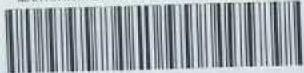

3445603496447

ORNL 1702

Chemistry-General

${C}_{y} + {f}_{y}$

A SUMMARY OF DENSITY MEASUREMENTS ON

MOLTEN FLUORIDE MIXTURES AND A

CORRELATION FOR PREDICTING DENSITIES

OF FLUORIDE MIXTURES

S. I. Cohen

T. N. Jones

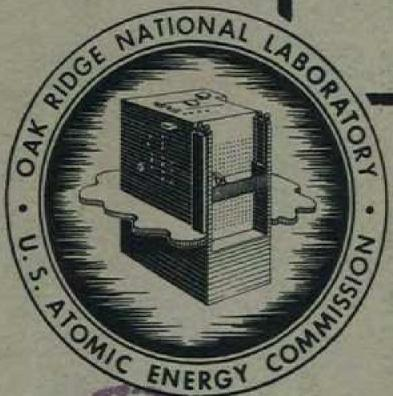

# CENTRAL RESEARCH LIBRARY DOCUMENT COLLECTION

# LIBRARY LOAN COPY

DO NOT TRANSFER TO ANOTHER PERSON

If you wish someone else to see this document, send in name with document and the library will arrange a loan.

OAK RIDGE NATIONAL LABORATORY

OPERATED BY

CARBIDE AND CARBON CHEMICALS COMPANY

A DIVISION OF UNION CARBIDE AND CARBON CORPORATION

UCC

POST OFFICE BOX P

OAK RIDGE. TENNESSEE

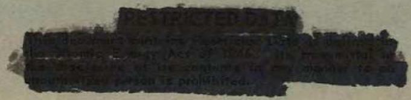

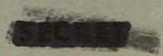

Contract No W-7405-eng-26

Reactor Experimental Engineering Division

A SUMMARY OF DENSITY MEASUREMENTS ON MOLTEN FLUORIDE MIXTURES AND A CORRELATION FOR PREDICTING DENSITIES OF FLUORIDE MIXTURES

S I Cohen

T N Jones

DATE ISSUED

JUL 19 1954

OAK RIDGE NATIONAL LABORATORY

Operated by

CARBIDE AND CARBON CHEMICALS COMPANY

A Division of Union Carbide and Carbon Corporation

Post Office Box P

Oak Ridge, Tennessee

# INTERNAL DISTRIBUTION

<table><tr><td>1</td><td>C</td><td>E</td><td>Center</td></tr><tr><td>2</td><td colspan="3">Biology Library</td></tr><tr><td>3</td><td colspan="3">Health Physics Library</td></tr><tr><td>4-5</td><td colspan="3">Central Research Library</td></tr><tr><td>6</td><td colspan="3">Reactor Experimental</td></tr><tr><td></td><td colspan="3">Engineering Library</td></tr><tr><td>7-13</td><td colspan="3">Laboratory Records Department</td></tr><tr><td>14</td><td colspan="3">Laboratory Records, ORNL R C</td></tr><tr><td>15</td><td>C E</td><td colspan="2">Larson</td></tr><tr><td>16</td><td>L B</td><td colspan="2">Emlet (K-25)</td></tr><tr><td>17</td><td>J P</td><td colspan="2">Murray (Y-12)</td></tr><tr><td>18</td><td>A M</td><td colspan="2">Weinberg</td></tr><tr><td>19</td><td>E H</td><td colspan="2">Taylor</td></tr><tr><td>20</td><td>E D</td><td colspan="2">Shipley</td></tr><tr><td>21</td><td>C E</td><td colspan="2">Winters</td></tr><tr><td>22</td><td>F C</td><td colspan="2">VonderLage</td></tr><tr><td>23</td><td>W H</td><td colspan="2">Jordan</td></tr><tr><td>24</td><td>J A</td><td colspan="2">Swartout</td></tr><tr><td>25</td><td>S C</td><td colspan="2">Lind</td></tr><tr><td>26</td><td>F L</td><td colspan="2">Culler</td></tr><tr><td>27</td><td>A H</td><td colspan="2">Snell</td></tr><tr><td>28</td><td colspan="3">A Hollaender</td></tr><tr><td>29</td><td>M T</td><td colspan="2">Kelley</td></tr><tr><td>30</td><td>W J</td><td colspan="2">Fretague</td></tr><tr><td>31</td><td>G H</td><td colspan="2">Clewett</td></tr><tr><td>32</td><td>K Z</td><td colspan="2">Morgan</td></tr><tr><td>33</td><td>T A</td><td colspan="2">Lincoln</td></tr><tr><td>34</td><td>A S</td><td colspan="2">Householder</td></tr><tr><td>35</td><td>C S</td><td colspan="2">Harrill</td></tr><tr><td>36</td><td>D S</td><td colspan="2">Billington</td></tr><tr><td>37</td><td>D W</td><td colspan="2">Cardwell</td></tr><tr><td>38</td><td>E M</td><td colspan="2">King</td></tr><tr><td>39</td><td>R N</td><td colspan="2">Lyon</td></tr><tr><td>40</td><td>J A</td><td colspan="2">Lane</td></tr><tr><td>41</td><td>A J</td><td colspan="2">Miller</td></tr><tr><td>42</td><td>R B</td><td colspan="2">Bryggs</td></tr><tr><td>43</td><td>A S</td><td colspan="2">Kitzes</td></tr><tr><td>44</td><td>O S</td><td colspan="2">Sisman</td></tr><tr><td>45</td><td>R W</td><td colspan="2">Stoughton</td></tr><tr><td>46</td><td>C E</td><td colspan="2">Graham</td></tr><tr><td>47</td><td>W R</td><td colspan="2">Gall</td></tr><tr><td>48</td><td>H F</td><td colspan="2">Poppendiek</td></tr><tr><td>49</td><td>S E</td><td colspan="2">Beall</td></tr><tr><td>50</td><td>J P</td><td colspan="2">Gill</td></tr><tr><td>51</td><td>D D</td><td colspan="2">Cowen</td></tr><tr><td>52</td><td>W M</td><td colspan="2">Breazeale (consultant)</td></tr><tr><td>53</td><td>R A</td><td colspan="2">Charpie</td></tr><tr><td>54</td><td>W K</td><td colspan="2">Ergen</td></tr><tr><td>55</td><td>E P</td><td colspan="2">Blizard</td></tr></table>

<table><tr><td>56</td><td>A</td><td>D</td><td>Callihan</td></tr><tr><td>57</td><td>G</td><td>W</td><td>Keilholtz</td></tr><tr><td>58</td><td>J</td><td>B</td><td>Trice</td></tr><tr><td>59</td><td>A</td><td>P</td><td>Fraas</td></tr><tr><td>60</td><td>R</td><td>W</td><td>Bussard</td></tr><tr><td>61</td><td>M</td><td>E</td><td>LaVerne</td></tr><tr><td>62</td><td>E</td><td>S</td><td>Bettis</td></tr><tr><td>63</td><td>J</td><td>L</td><td>Meem</td></tr><tr><td>64</td><td>G</td><td>A</td><td>Cristy</td></tr><tr><td>65</td><td>W</td><td>B</td><td>Cottrell</td></tr><tr><td>66</td><td>H</td><td>W</td><td>Savage</td></tr><tr><td>67</td><td>C</td><td>P</td><td>Coughlen</td></tr><tr><td>68</td><td>G</td><td>M</td><td>Adamson</td></tr><tr><td>69</td><td>L</td><td>A</td><td>Mann</td></tr><tr><td>70</td><td>G</td><td>M</td><td>Nessle</td></tr><tr><td>71</td><td>J</td><td>O</td><td>Bradfute</td></tr><tr><td>72</td><td>S</td><td>I</td><td>Cohen</td></tr><tr><td>73</td><td>N</td><td>D</td><td>Greene</td></tr><tr><td>74</td><td>D</td><td>C</td><td>Hamilton</td></tr><tr><td>75</td><td>H</td><td>W</td><td>Hoffman</td></tr><tr><td>76</td><td>F</td><td>E</td><td>Lynch</td></tr><tr><td>77</td><td>L</td><td>D</td><td>Palmer</td></tr><tr><td>78</td><td>W</td><td>D</td><td>Powers</td></tr><tr><td>79</td><td>M</td><td>W</td><td>Rosenthal</td></tr><tr><td>80</td><td>T</td><td>N</td><td>Jones</td></tr><tr><td>81</td><td>W</td><td>D</td><td>Manly</td></tr><tr><td>82</td><td>G</td><td>P</td><td>Smith</td></tr><tr><td>83</td><td>J</td><td>V</td><td>Cathcart</td></tr><tr><td>84</td><td>M</td><td>T</td><td>Robinson</td></tr><tr><td>85</td><td>C</td><td>B</td><td>Mills</td></tr><tr><td>86</td><td>W</td><td>R</td><td>Grimes</td></tr><tr><td>87</td><td>F</td><td>F</td><td>Blankenship</td></tr><tr><td>88</td><td>C</td><td>J</td><td>Barton</td></tr><tr><td>89</td><td>C</td><td>J</td><td>Barton</td></tr><tr><td>90</td><td>L</td><td>G</td><td>Overholser</td></tr><tr><td>91</td><td>P</td><td>A</td><td>Agron</td></tr><tr><td>92</td><td>F</td><td>Kertesz</td><td></td></tr><tr><td>93</td><td>E</td><td>G</td><td>Bohlmann</td></tr><tr><td>94</td><td>H</td><td>C</td><td>Claiborne</td></tr><tr><td>95</td><td>M</td><td>C</td><td>Edlund</td></tr><tr><td>96</td><td>M</td><td>Tobias</td><td></td></tr><tr><td>97</td><td>M</td><td>A</td><td>Bredig</td></tr><tr><td>98</td><td>J</td><td>S</td><td>Culver</td></tr><tr><td>99</td><td>J</td><td>Y</td><td>Estabrook</td></tr><tr><td>100</td><td>N</td><td>F</td><td>Iansing</td></tr><tr><td>101</td><td>E</td><td>R</td><td>Van Artsdalen</td></tr><tr><td>102</td><td>J</td><td>M</td><td>Warde</td></tr><tr><td>103</td><td>D</td><td>J</td><td>Sasmor</td></tr><tr><td>104</td><td>G</td><td>C</td><td>Williams</td></tr></table>

# EXTERNAL DISTRIBUTION

105 American Cyanamid Company

106-113 Argonne National Laboratory

114 Armed Forces Special Weapons Project (Sindia)

ll Army Chemical Center

116-120 Atomic Energy Commission, Washington

121 Battelle Memorial Institute

122-123 Brookhaven National Laboratory

124-125 Carbide and Carbon Chemicals Company (C-31 Plant)

126-128 Caride and Carbon Chemicals Company (K-25 Plant)

129-132 Carbide and Carbon Chemicals Company (Y-12 Plant)

133 Chicago Patent Group

134 Chief of Naval Research

135 Columbia University (Hassidis)

136. Dow Chemical Company, Pittsburgh

137 Dow Chemical Company (Rocky Flats)

138-142 duPont Company, Augusta

143-145 General Electric Company (ANPP)

146-151. General Electric Company, Richland

152-153 Goodyear Atomic Corporation

154 Hanford Operations Office

155 Iowa State College

156-159 Knolls Atomic Power Laboratory

160-161. Los Alamos Scientific Laboratory

162. Mallinckrodt Chemical Works

163 Massachusetts Institute of Technology (Kaufmann)

164 Materials Laboratory (WADC)

165 Merrill Company

166-168. Mound Laboratory

169 National Advisory Committee for Aeronautics, Cleveland

170 National Bureau of Standards

171 National Lead Company of Chil

172 Naval Medical Research Institute

173-174 Naval Research Laboratory

175 New Brunswick Laboratory

176-178. New York Operations Office

179-180 North American Aviation, Inc

181/ Patent Branch, Washington

182-185. Phillips Petroleum Company

186. Pratt & Whitney Aircraft Division (Fox Project)

187 Rand Corporation

188 Rohm and Haas Company

189 Sandia Corporation

190. Sylvania Electric Products, Inc

191. Tennessee Valley Authority

192 U. S Naval Radiological Defense Laboratory

193 UCLA Medical Research Laboratory (Warren)

194-197 University of California Radiation Laboratory, Berkeley

198-199 University of California Radiation Laboratory, Livermore

200-201 University of Rochester

202 Virginia-Carolina Chemical Corporation

203-204 Vitro Corporation of America

205 Western Reserve University (Friedell)

206-207 Westinghouse Electric Corporation

208-222 Technical Information Service, Oak Ridge

TABLE OF CONTENTS   

<table><tr><td>SUMMARY</td><td>5</td></tr><tr><td>INTRODUCTION</td><td>6</td></tr><tr><td>DESCRIPTION OF EXPERIMENTAL PROCEDURE</td><td>8</td></tr><tr><td>A Discussion of Method</td><td>8</td></tr><tr><td>B Description of Equipment</td><td>10</td></tr><tr><td>EXPLANATION OF THE CORRELATION</td><td>15</td></tr><tr><td>REFERENCES</td><td>26</td></tr><tr><td>APPENDIX</td><td>27</td></tr><tr><td>TABLE 1 Experimental Density-Temperature Data</td><td>28</td></tr><tr><td>TABLE 2 Constants Used in Calculating Room Temperature Densities</td><td>29</td></tr><tr><td>TABLE 3 Calculation of Room Temperature Densities</td><td>30</td></tr><tr><td>TABLE 4 Comparison of Predicted and Experimental Density-Temperature Data</td><td>37</td></tr></table>

# SUMMARY

This report contains a summary of all the experimental density measurements on molten fluoride mixtures that have been developed for the Aircraft Nuclear Propulsion Project. A correlation of these data is presented which can be used to predict liquid densities of fluoride mixtures of known composition over wide, elevated temperature ranges

Experimental measurements were made by the buoyancy principle using a plummet suspended in the molten salts from an analytical balance, the entire system being enclosed in a dry-box

All the information available on compositions, experimental densities, melting points and cubical coefficients of expansion may be found in this report, calculated values of liquid and room temperature densities, molecular weights and molecular volumes of all the mixtures that have been developed for the ANP program are also presented

# INTRODUCTION

Since the outset of the Aircraft Nuclear Propulsion project, interest has been centered on molten fluoride mixtures as the best potential circulating fluids for use in high temperature reactors of the ARE type. During the course of the project, some fifty or more mixtures of fluorides have been suggested and a number of these aroused sufficient interest to merit measurements of their physical properties

In the early stages of the density research program the experimental accuracy was somewhat lower than in the later stages During the former period some questions concerning purity of both the molten salts and the blanketing atmosphere arose Also, the techniques of temperature measurement and control, and weighing facilities were refined during the latter period As a result, the more recent determinations afford a somewhat higher degree of accuracy than the earlier ones

The correlation described in this report is based on measurements on all the mixtures that have been studied. In a few instances, notably composition No 12 (Flinak), it has been possible to make a second set of measurements on a mixture for which the properties had been measured very early in the project, and in these instances the data listed below are the revised values. In past reports on several of the compositions, a correction based

on the volume change of the plummet with temperature was omitted, the error introduced being well within the accuracy claimed for the data. However, this correction has been applied where necessary in this report and it is suggested that in subsequent studies involving the densities of fluorides, the data in this report be used

# DESCRIPTION OF EXPERIMENTAL PROCEDURE

# A Discussion of Method

Density values reported here were determined by the buoyancy principle involving a plummet suspended in a liquid The density of the liquid, $\mathsf{p}$ is defined by

$$
\rho = \frac {w _ {L}}{v _ {L}} \tag {1}
$$

where,

$w_{L}$ , weight of liquid displaced by the plummet

$\mathbf{v}_{\mathbf{L}}$ volume of liquid displaced by the plummet

and

where,

$W_{A}$ , weight of plummet in air

$W_{L}$ , weight of plummet in liquid

Upon substituting (2) in (1), there results

$$
\rho = \frac {W _ {A} - W _ {L}}{v _ {L}} \tag {3}
$$

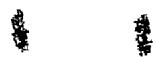

The volume of liquid displaced by the plummet, $v_{L}$ , is also equal to the volume of the plummet and may be determined by weighing the plummet in a liquid of known density (water was used) At room temperature the volume of the plummet is

$$
v _ {L O} = \frac {W _ {A} - W _ {H _ {2} O}}{\rho_ {H _ {2} O}} \tag {4}
$$

where,

$\mathbb{W}_{\mathbb{H}_20}$ , weight of the plummet in $\mathbb{H}_20$ at room temperature

$\rho_{\mathrm{H}_2\mathrm{O}}$ density of water at room temperature

The volume of the plummet at elevated temperatures is

$$
v _ {L} = v _ {L _ {0}} \left[ 1 + \beta_ {p} (T - T _ {0}) \right] = \frac {W _ {A} - W _ {H 2 ^ {O}}}{\rho_ {H 2 ^ {O}}} \left[ 1 + \beta_ {p} (T - T _ {0}) \right] \tag {5}
$$

where,

T, liquid temperature

$\mathbf{T}_{\mathbf{O}}$ room temperature

$\beta_{p}$ , cubical expansion coefficient of the plummet

Upon substituting equation (5) into equation (3), one obtains

$$
\rho = \frac {\left(W _ {A} - W _ {L}\right)}{\left(W _ {A} - W _ {H 2 0}\right)} \frac {\rho_ {H 2 0}}{\left[ 1 + \beta_ {p} (T - T _ {o}) \right]} \tag {6}
$$

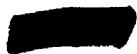

$W_{A}$ , $W_{H_{2}O}$ and the temperature of water were measured before the experiment was started. Values for $\rho_{H_{2}O}$ and $\beta_{p}$ are known, values of $W_{L}$ at the various temperatures were measured

Experimental density data are represented in this report by the equation

$$
\rho = a - b T \tag {7}
$$

Values of the cubical coefficients of expansion were calculated from the defining equation

$$
\beta_ {L} = - \frac {1}{\rho} \left(\frac {\mathrm {d} \rho}{\mathrm {d} T}\right) _ {\mathrm {p}} \tag {8}
$$

The experimental data are given in Table 1 and in Figure 3 where the temperature range over which measurements were made on each mixture is shown. The experimental data are also tabulated in Table 4 in the form of equation (7). A simple analysis indicates that these data are probably not in error by more than $\pm 5\%$ Experimental values for the coefficients of cubical expansion of the various liquids may be found in Table 1

# B Description of the Equipment

The system (see Figure 1) used for taking these measurements consisted principally of a stainless steel plummet suspended in the molten salts by a

UNCLASSIFIED ORNL-LR-DWG 577

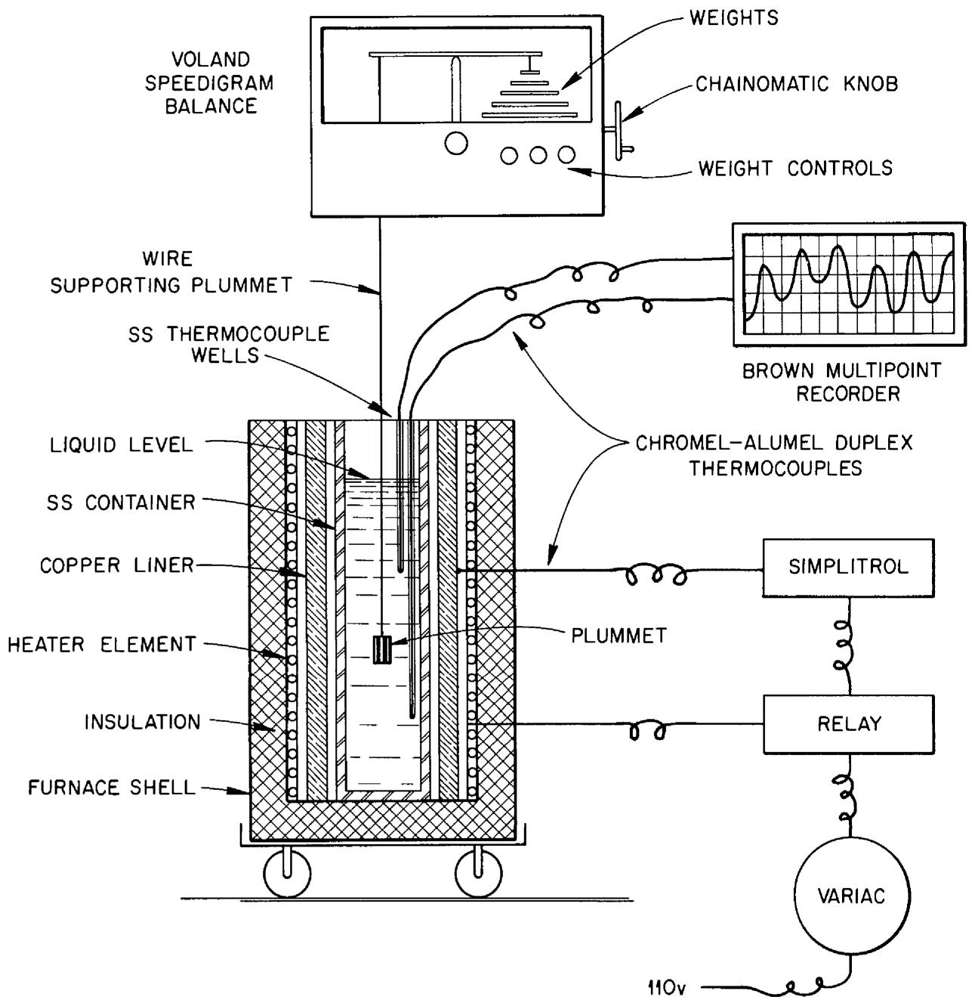  
Fig 1 Schematic Diagram of Density Measurement System

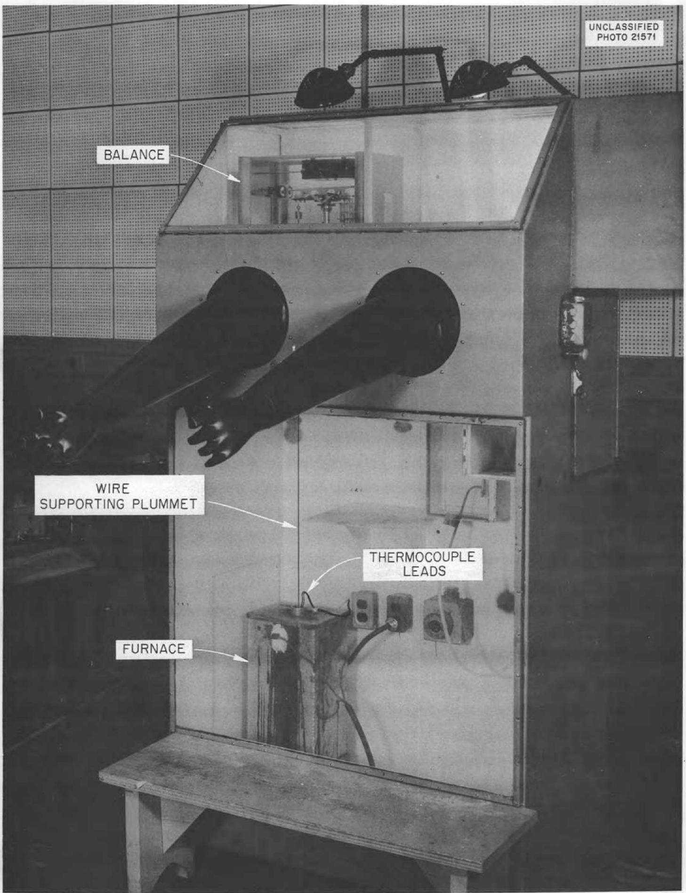  
Fig.2. Photograph of Dry Box Containing Density Measurement System.

fine steel wire from a Voland 'Speedigram" balance (a chainomatic balance on which weights larger than 100 mg are controlled mechanically by knobs with no loss in accuracy) The plummets were fabricated from $1/4"$ No 316 stainless steel rod The containers for the molten salts were fabricated from 1 1/2' I P S , Schedule 40, No 316 stainless steel pipe The tube furnace was mounted on a small rolling platform equipped with ball-bearing casters to facilitate centering of the tube under the balance as well as under the two systems for determining viscosities which were also housed in the dry-box (Both density and viscosity measurements were made during the same heat-up period Viscosity studies will be discussed in a separate report)

The temperature of the melt was measured with the aid of two chromel-alumel thermocouples and a Brown multipoint recorder, the couples were inserted in wells made of 1/8' stainless tubing and supported in the liquid salt so that one couple was 2-3 inches below the surface and the other 5-6 inches below the surface. The wire supporting the plummet was of such length that the plummet was suspended at a depth between the two couples. Temperature of the furnace was controlled by a combination of a variac and a Simplitrol with a chromel-alumel thermocouple. The hot junction of this couple was imbedded in the outside surface of a thick-walled copper pipe used as a thermal diffuser between the heating surfaces of the tube furnace and the tube containing the melt. Since this hot junction "sees" the heating element face, a very sensitive temperature control was afforded. As the experiment progressed, the temperature setting was increased by a small

increment and in a short time the temperatures indicated by the two immersed thermocouples rose to a point slightly below that set on the Simplitrol, leveled off and approached each other, at this point the two readings were usually no more than 5 degrees apart. After this practically isothermal condition was reached, a weight reading and the average temperature were recorded

Since the fluorides in the molten state are very sensitive to the atmosphere, a number of precautions were taken to insure its purity. Argon was circulated through the dry-box and out of a bubbler at a measured rate until the calculated concentration of argon was above $99\%$ These calculations have been checked experimentally by measuring the oxygen concentration of the gas in the dry-box with a Burrell Gas Analyzer Effort was made to remove the final traces of oxygen and water, these being the chief undesirable impurities, by placing indicating Drierite from a closed container into a flat open dish to get the water and by starting up an oxygen removal device consisting of a tube furnace containing a cartridge of copper filings and equipped with a 15 CFM blower The filings were brought to red heat and the atmosphere in the dry-box circulated over them Purity of the atmosphere, which determines the purity of the melt, is indicated by the appearance of the plummet when it is withdrawn from the melt The plummet, though dis-colored, will have a clean smooth surface when taken from a clean melt No difficulty was encountered with condensation on the wire except during measurements on mixtures containing $\mathrm{ZrF_4}$ When working with these salts, the plummet was removed between weighings and the tube containing the melt was covered to retard the zirconium snow effect

# EXPLANATION OF THE CORRELATION

Although more than fifty different fluoride mixtures have been developed since the initiation of the ANP program, density measurements have been made on only fifteen of these mixtures. In addition, new mixtures are developed as the program continues. For these reasons it was felt that a method for predicting densities of molten fluorides would be useful and the correlation described below was developed

The correlation is based on plots of the experimentally determined liquid densities at any one temperature against the calculated densities of the corresponding mixture at room temperature. These room temperature densities are calculated by the formula

$$
\rho = \frac {\sum_ {1 = 1} ^ {N} M _ {1} f _ {1}}{\sum_ {1 = 1} ^ {N} \left(M _ {1} / \rho_ {1}\right) f _ {1}} \tag {9}
$$

where,

$\mathfrak{p}$ density at room temperature of the mixture (gm/cc)

$\mathbf{M}_{1}$ , molecular weight of a component of the mixture (gm/mol)

$f_{1}$ , mol fraction of that component

$\rho_{1}$ , density at room temperature1 of that component (gm/cc)

The values used for the various components are listed in Table 2 of the appendix

The numerator is the calculated molecular weight of the mixture and the denominator is the calculated molecular volume of the mixture. Values of the room temperature density calculated from this formula were checked against experimentally determined values for a series of 10 fluoride mixtures and were found to differ by no more than $\pm 5$ percent (Reference 1)

Figure 3 gives the density-temperature data for all of the liquid fluoridemixtures that have been studied to date (References 2, 3, 4, 5, 6, 7, 8, 9, 10, 11, 12) The figures in parentheses are the calculated room temperature densities The data given in Table 1 were used in drawing these curves It is noted that the average liquid densities are proportional to the calculated room temperature densities of the corresponding mixtures

Figures 4a, 4b, 4c and 4d represent plots of liquid densities against the calculated room temperature densities of corresponding mixtures at $600^{\circ}\mathrm{C}$ , $700^{\circ}\mathrm{C}$ , $800^{\circ}\mathrm{C}$ and $900^{\circ}\mathrm{C}$ respectively, these isotherms were cross-plotted from Figure 3. Figure 5 is a composite of figures 4a, 4b, 4c and 4d. Knowing only the calculated room temperature density, the liquid density may be predicted for any mixture of fluorides over this temperature range

Figures 6 and 7 were derived from Figure 5 and give the constants, a and b, for equation 7, as a function of the room temperature density

The density correlation presented here satisfactorily represents all the experimental measurements on the fluoride mixtures, the mean deviation is about $3\%$ and the maximum deviation is $6\%$ . Table 3 gives the calculated room

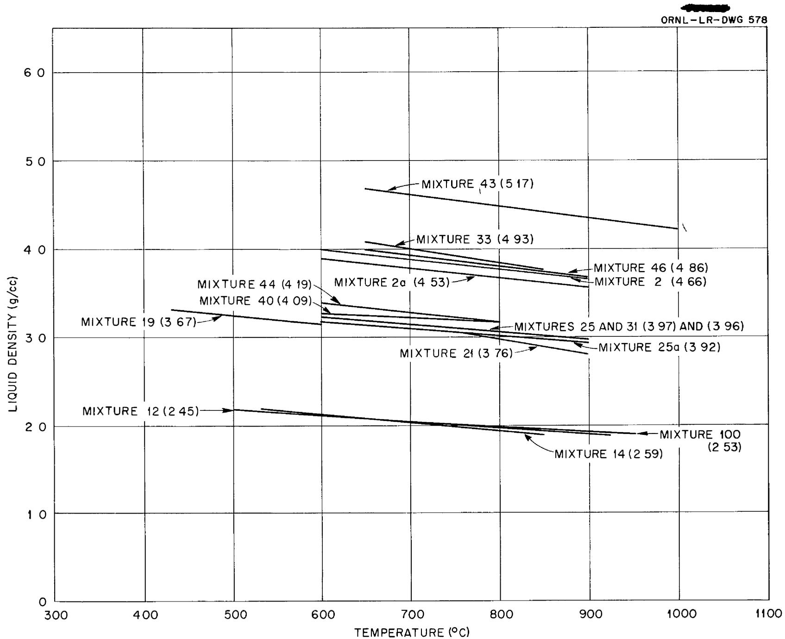  
Fig 3 Densities of Fluoride Mixtures (g/cc) vs Temperature $(^{\circ}\mathrm{C})$ (Numbers in Parentheses are Calculated Room Temperature Densities)

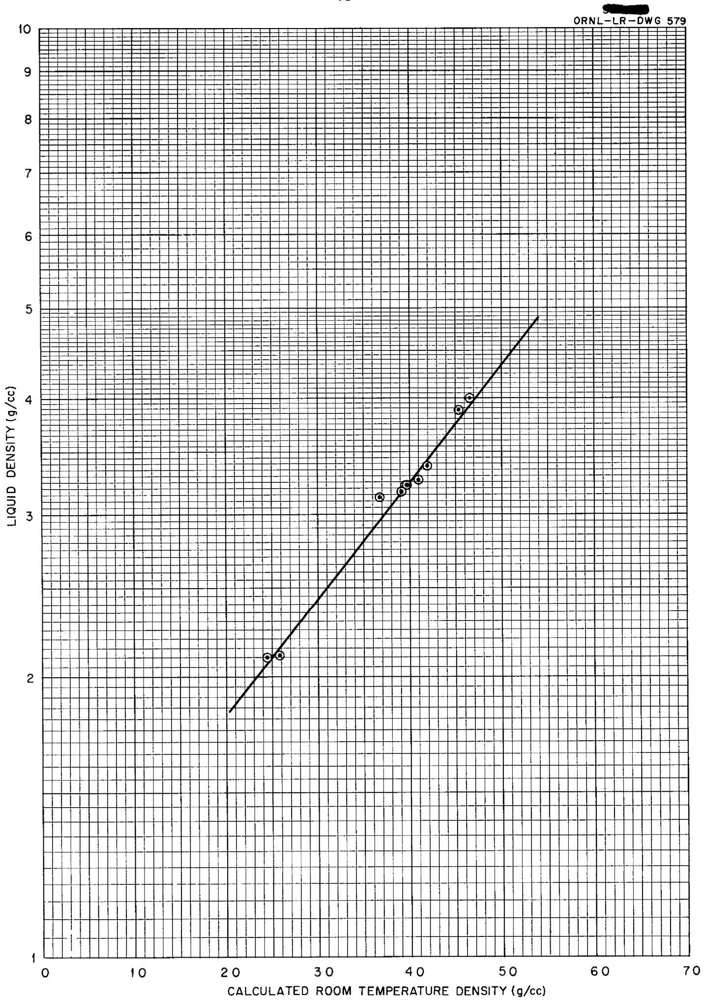  
Fig 4a Liquid Density at $600^{\circ}\mathrm{C}$ vs Calculated Room Temperature Density

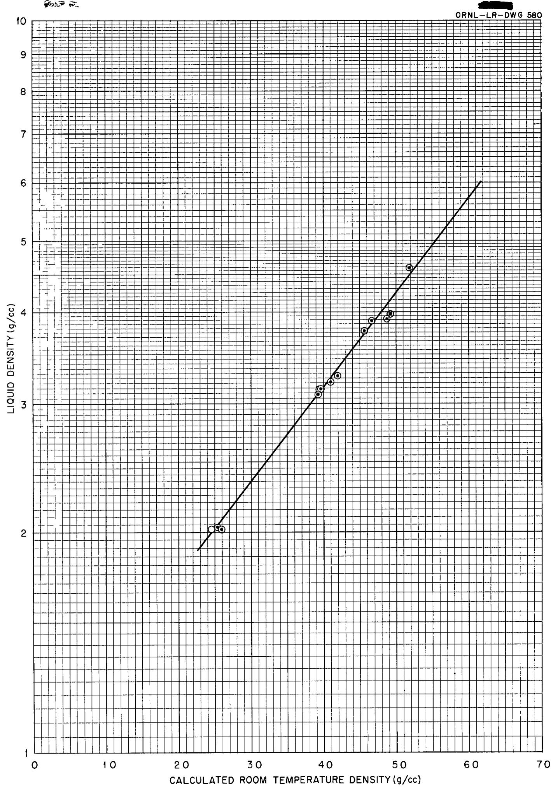  
Fig 4b Liquid Density at $700^{\circ}\mathrm{C}$ vs Calculated Room Temperature Density

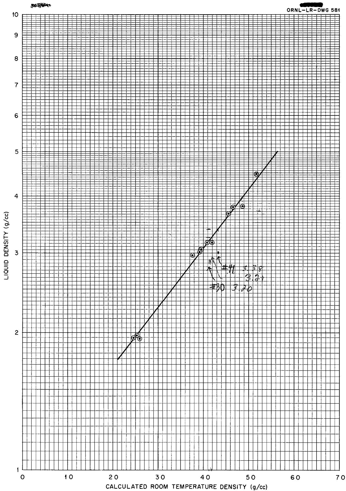  
Fig 4c Liquid Density at $800^{\circ}\mathrm{C}$ vs Calculated Room Temperature Density

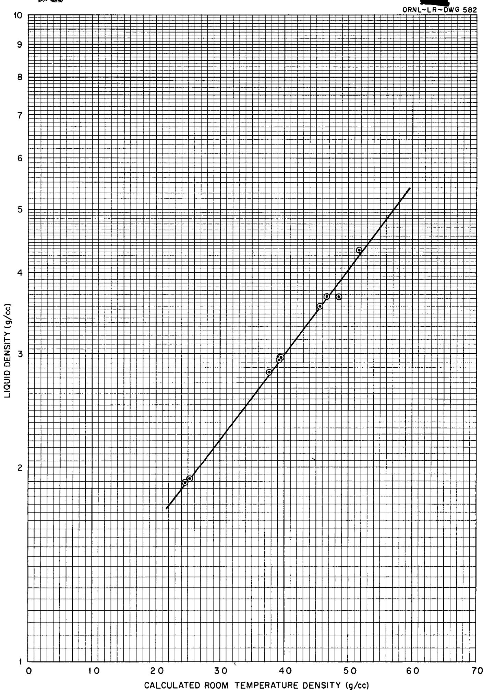  
Fig 4d Liquid Density at $900^{\circ}\mathrm{C}$ vs Calculated Room Temperature Density

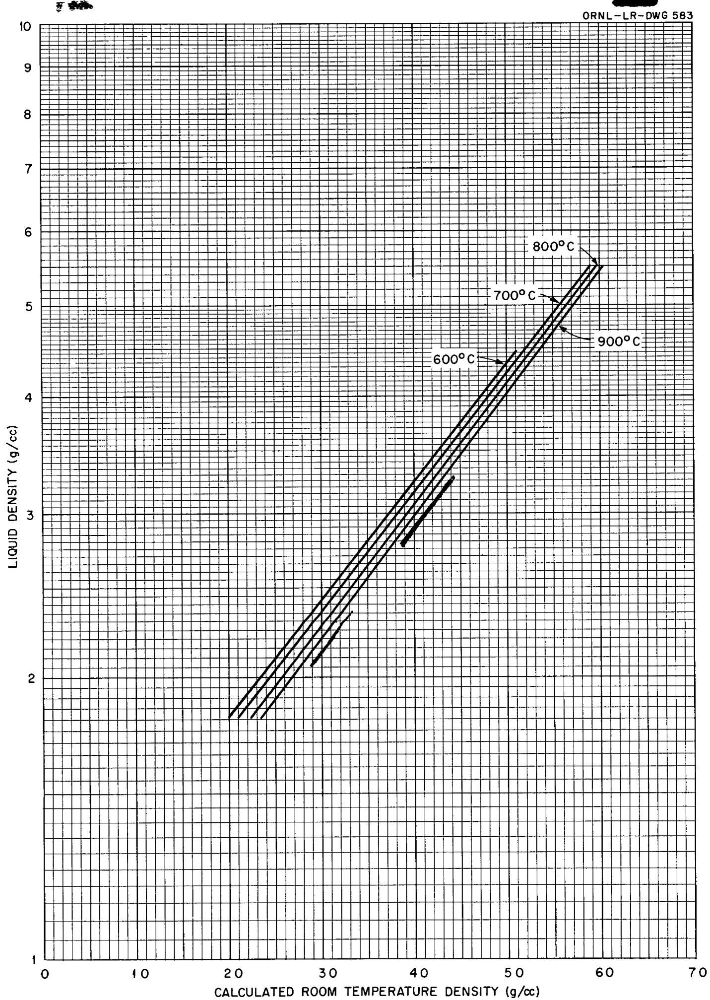  
Fig 5 Liquid Density vs Calculated Room Temperature Density (Composite of Figures 2a 2b 2c 2d)

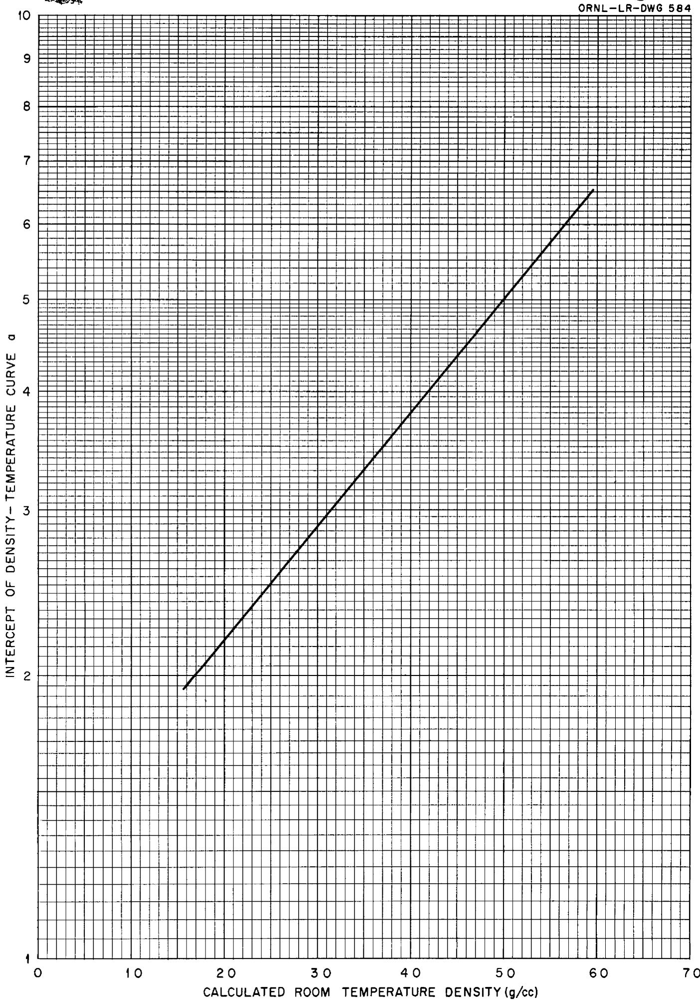  
Fig 6 Intercept of Density-Temperature Curve (a) vs Calculated Room Temperature Density

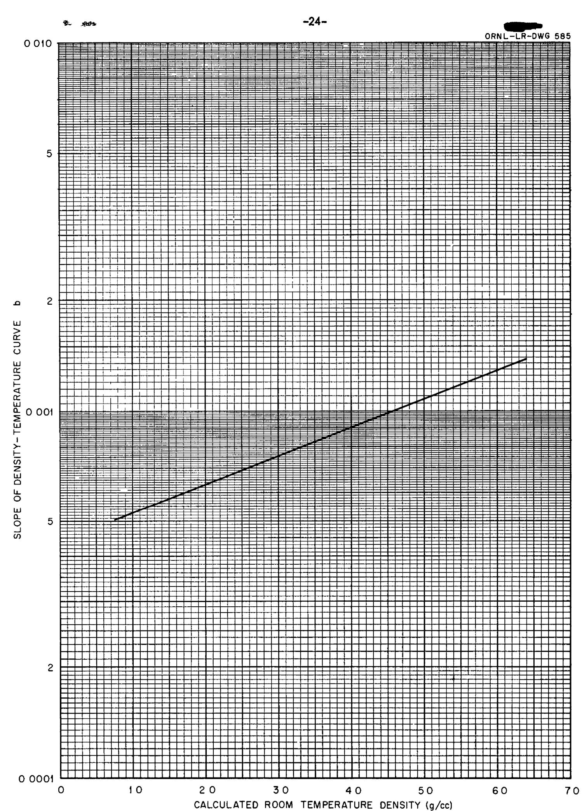  
Fig 7 Slope of Density-Temperature Curve (b) vs Calculated Room Temperature Density

temperature densities, as well as compositions, molecular weights and molecular volumes, for all the fluoride mixtures that have been formulated in the ANP program (References 13 and 14) and Table 4 lists the predicted densities in terms of equation 7 for all of these mixtures as well as the experimentally determined formulae to illustrate the agreement

Cubical coefficients of expansion at $700^{\circ}\mathrm{C}$ of the liquids calculated from this correlation are inversely proportional to density and vary from $360 \times 10^{-4} (1/^\circ\mathrm{C})$ for a mixture having a room temperature density of $20(\mathrm{gm/cc})$ to $237 \times 10^{-4} (1/^\circ\mathrm{C})$ for a mixture having a room temperature density of $55(\mathrm{gm/cc})$

# REFERENCES

1 Melvin Tobias, S I Kaplan, S J Claiborne, ORNL CF 52-3-230   
2 S I Kaplan, ORNL CF 51-8-97   
3 J Cisar, ORNL CF 51-ll-78   
4 J Cisar, ORNL CF 51-11-198   
5 J Cisar, Personal communication   
6 R F Redmond, T N Jones, ORNL CF 52-11-105   
7 S I Cohen, T N Jones, ORNL CF 53-7-125   
8 S I Cohen, T N Jones, ORNL CF 53-10-86   
9 S I Cohen, T N Jones, ORNL CF 53-8-217   
10 S I Cohen, T N Jones, ORNL CF 53-12-179   
ll S I Cohen, T N Jones, Memo to be issued   
12 ANP Physical Properties Group, ORNL CF 53-3-261   
13 C J Barton, ORNL CF 53-10-78   
14 C J Barton, Personal communications   
15 Katz and Rabinowitch, "The Chemistry of Uranium," N N E S VIII-5, p 366   
16 Henglein, F A , Z Elektrochem , Vol 30, p 5, 1924

# APPENDIX

TABLE 1 Experimental Density-Temperature Data   
TABLE 2 Constants used in Calculating Room Temperature Densities   
TABLE 3 Calculation of Room Temperature Densities   
TABLE 4 Comparison of Predicted and Experimental Density-Temperature Data

TABLE 1   
EXPERIMENTAL DENSITY-TEMPERATURE DATA  

<table><tr><td rowspan="2">Composition</td><td colspan="4">LIQUID DENSITY (gm/cc)</td><td rowspan="2">Cubical Coefficient of Expansion2 1/°C x 104</td><td rowspan="2">Reference</td></tr><tr><td>600°C</td><td>700°C</td><td>800°C</td><td>900°C</td></tr><tr><td>2</td><td>400</td><td>389</td><td>378</td><td>367</td><td>296</td><td>2,12</td></tr><tr><td>2a</td><td>388</td><td>377</td><td>366</td><td>355</td><td>292</td><td>3,12</td></tr><tr><td>12</td><td>210</td><td>202</td><td>194</td><td>188</td><td>361</td><td>11</td></tr><tr><td>14</td><td>211</td><td>202</td><td>193</td><td></td><td>446</td><td>4,12</td></tr><tr><td>19</td><td>313</td><td></td><td></td><td></td><td>348(600°C)</td><td>5,12</td></tr><tr><td>21</td><td></td><td></td><td>296</td><td>280</td><td>551(800°C)</td><td>5,12</td></tr><tr><td>25</td><td>323</td><td>314</td><td>305</td><td>296</td><td>290</td><td>5,12</td></tr><tr><td>25a</td><td>317</td><td>309</td><td>301</td><td>293</td><td>259</td><td>5,12</td></tr><tr><td>31</td><td>323</td><td>314</td><td>305</td><td>296</td><td>296</td><td>6,12</td></tr><tr><td>33</td><td></td><td>398</td><td></td><td></td><td>399</td><td>6,12</td></tr><tr><td>40</td><td>327</td><td>321</td><td>316</td><td></td><td>171</td><td>7</td></tr><tr><td>43</td><td></td><td>460</td><td>447</td><td>434</td><td>283</td><td>8</td></tr><tr><td>44</td><td>338</td><td>327</td><td>316</td><td></td><td>336</td><td>9</td></tr><tr><td>46</td><td></td><td>391</td><td>379</td><td>367</td><td>307</td><td>10</td></tr><tr><td>100</td><td></td><td>203</td><td>197</td><td>192</td><td>271</td><td>11</td></tr></table>

2 Value is for $700^{\circ}\mathrm{C}$ unless otherwise noted The calculated range of cubical expansion coefficients is from 36 x $10^{-4}~\text{l} / \text{OC}$ to $24\times 10^{-4}~\text{l} / \text{OC}$ The few experimental values which fall outside of this range probably do so because they are based on early or incomplete sets of data

TABLE 2   
CONSTANTS USED IN CALCULATING ROOM TEMPERATURE DENSITIES  

<table><tr><td>Component</td><td>Molecular Weight, M1(gm/mol)</td><td>Room Temperature Density, ρ1(gm/cc)</td><td>Molecular Volume, M1/ρ1(cc/mol)</td></tr><tr><td>LiF</td><td>25 9</td><td>2 30</td><td>11 26</td></tr><tr><td>NaF</td><td>42</td><td>2 79</td><td>15 05</td></tr><tr><td>BeF2</td><td>47</td><td>1 98</td><td>23 74</td></tr><tr><td>KF</td><td>58 1</td><td>2 48</td><td>23 43</td></tr><tr><td>ZrF4</td><td>167 2</td><td>4 43</td><td>37 74</td></tr><tr><td>UF4</td><td>314 1</td><td>6 703</td><td>46 88</td></tr><tr><td>RbF</td><td>104 5</td><td>3 5574</td><td>29 38</td></tr><tr><td>PbF2</td><td>245 2</td><td>8 24</td><td>29 75</td></tr><tr><td>ThF4</td><td>308 1</td><td>6 705</td><td>45 99</td></tr><tr><td>UF3</td><td>295 1</td><td>8 956</td><td>32 97</td></tr></table>

3Reference 15   
4Reference 16   
5Value for $\mathbf{U}\mathbf{F}_4$ Value for $\mathbf{ThF_4}$ not available   
6Derived from X-ray data

All other values taken from Lange's Handbook of Chemistry, Eighth Edition

TABLE 3   
CALCULATION OF ROOM TEMPERATURE  
DENSITIES OF FLUORIDE MIXTURES   

<table><tr><td colspan="2">ρRoom Temp = Mol/Mol Wt of Mixture = ∑N1=1M2f1/∑N1=1M2f1 where,</td></tr></table>

$\mathbf{M}_{1}$ , molecular wt of component

f, mol % of that component

$\rho_{i}$ , density at room temperature of that component

<table><tr><td>Mixture</td><td>Component</td><td>f1</td><td>M2f1</td><td>Mol Wt of Mixture</td><td>(M1/ρ1)f1</td><td>Mol Vol of Mixture</td><td>ρRoom Temp</td></tr><tr><td rowspan="3">1</td><td>BeF2</td><td>12</td><td>56</td><td>752</td><td>285</td><td>1992</td><td>377</td></tr><tr><td>NaF</td><td>76</td><td>319</td><td></td><td>1144</td><td></td><td></td></tr><tr><td>UF4</td><td>12</td><td>377</td><td></td><td>563</td><td></td><td></td></tr><tr><td rowspan="3">2</td><td>NaF</td><td>465</td><td>195</td><td>1210</td><td>700</td><td>2598</td><td>466</td></tr><tr><td>KF</td><td>260</td><td>151</td><td></td><td>609</td><td></td><td></td></tr><tr><td>UF4</td><td>275</td><td>864</td><td></td><td>1289</td><td></td><td></td></tr><tr><td rowspan="3">2a</td><td>NaF</td><td>482</td><td>202</td><td>1143</td><td>725</td><td>2525</td><td>453</td></tr><tr><td>KF</td><td>268</td><td>156</td><td></td><td>628</td><td></td><td></td></tr><tr><td>UF4</td><td>250</td><td>785</td><td></td><td>1172</td><td></td><td></td></tr><tr><td rowspan="3">3</td><td>BeF2</td><td>600</td><td>282</td><td>858</td><td>1424</td><td>2503</td><td>343</td></tr><tr><td>NaF</td><td>250</td><td>105</td><td></td><td>376</td><td></td><td></td></tr><tr><td>UF4</td><td>150</td><td>471</td><td></td><td>703</td><td></td><td></td></tr><tr><td rowspan="3">4</td><td>NaF</td><td>35</td><td>147</td><td>1676</td><td>527</td><td>3106</td><td>540</td></tr><tr><td>KF</td><td>20</td><td>116</td><td></td><td>469</td><td></td><td></td></tr><tr><td>UF4</td><td>45</td><td>1413</td><td></td><td>2110</td><td></td><td></td></tr><tr><td rowspan="3">5</td><td>NaF</td><td>60</td><td>252</td><td>1350</td><td>903</td><td>2384</td><td>566</td></tr><tr><td>PbF2</td><td>23</td><td>564</td><td></td><td>684</td><td></td><td></td></tr><tr><td>UF4</td><td>17</td><td>534</td><td></td><td>797</td><td></td><td></td></tr><tr><td rowspan="3">6</td><td>NaF</td><td>30</td><td>126</td><td>461</td><td>452</td><td>2112</td><td>218</td></tr><tr><td>BeF2</td><td>65</td><td>306</td><td></td><td>1543</td><td></td><td></td></tr><tr><td>KF</td><td>5</td><td>29</td><td></td><td>117</td><td></td><td></td></tr></table>

TABLE 3 (Con't)   
CALCULATION OF ROOM TEMPERATURE  
DENSITIES OF FLUORIDE MIXTURES   

<table><tr><td>Mixture</td><td>Component</td><td>f1</td><td>M1f1</td><td>Mol Wt of Mixture</td><td>(M1/ρ1)f1</td><td>Mol Vol of Mixture</td><td>ρRoom Temp</td></tr><tr><td rowspan="3">7</td><td>NaF</td><td>50</td><td>21</td><td>126 8</td><td>7 53</td><td>26 28</td><td>4 83</td></tr><tr><td>KF</td><td>20</td><td>11 6</td><td></td><td>4 69</td><td></td><td></td></tr><tr><td>UF4</td><td>30</td><td>94 2</td><td></td><td>14 06</td><td></td><td></td></tr><tr><td>8</td><td>NaF</td><td>100</td><td></td><td>42</td><td></td><td></td><td>2 797</td></tr><tr><td>9</td><td>BeF2</td><td>100</td><td></td><td>47</td><td></td><td></td><td>1 987</td></tr><tr><td>10</td><td>LiF</td><td>100</td><td></td><td>25 9</td><td></td><td></td><td>2 307</td></tr><tr><td>11</td><td>KF</td><td>100</td><td></td><td>58 1</td><td></td><td></td><td>2 487</td></tr><tr><td rowspan="3">12 (Flinak)</td><td>NaF</td><td>11 5</td><td>4 8</td><td>41 2</td><td>1 73</td><td>16 81</td><td>2 45</td></tr><tr><td>KF</td><td>42 0</td><td>24 4</td><td></td><td>9 84</td><td></td><td></td></tr><tr><td>LiF</td><td>46 5</td><td>12 0</td><td></td><td>5 24</td><td></td><td></td></tr><tr><td rowspan="3">13</td><td>NaF</td><td>53</td><td>22 3</td><td>128</td><td>7 98</td><td>25 52</td><td>5 02</td></tr><tr><td>RbF</td><td>20</td><td>20 9</td><td></td><td>5 88</td><td></td><td></td></tr><tr><td>UF4</td><td>27</td><td>84 8</td><td></td><td>12 66</td><td></td><td></td></tr><tr><td rowspan="4">14 (Flinak)</td><td>KF</td><td>43 5</td><td>25 3</td><td>44 9</td><td>10 19</td><td>17 36</td><td>2 59</td></tr><tr><td>LiF</td><td>44 5</td><td>11 5</td><td></td><td>5 01</td><td></td><td></td></tr><tr><td>NaF</td><td>10 9</td><td>4 6</td><td></td><td>1 64</td><td></td><td></td></tr><tr><td>UF4</td><td>1 1</td><td>3 5</td><td></td><td>52</td><td></td><td></td></tr><tr><td rowspan="4">15</td><td>NaF</td><td>29 5</td><td>12 4</td><td>50 3</td><td>4 44</td><td>21 53</td><td>2 34</td></tr><tr><td>BeF2</td><td>64 0</td><td>30 1</td><td></td><td>15 19</td><td></td><td></td></tr><tr><td>KF</td><td>4 9</td><td>2 8</td><td></td><td>1 15</td><td></td><td></td></tr><tr><td>UF4</td><td>1 6</td><td>5 0</td><td></td><td>75</td><td></td><td></td></tr><tr><td rowspan="3">16</td><td>NaF</td><td>34 0</td><td>14 3</td><td>68 0</td><td>5 12</td><td>22 76</td><td>2 99</td></tr><tr><td>BeF2</td><td>57 5</td><td>27 0</td><td></td><td>13 65</td><td></td><td></td></tr><tr><td>UF4</td><td>8 5</td><td>26 7</td><td></td><td>3 99</td><td></td><td></td></tr></table>

7Taken from Lange's Handbook of Chemistry, Eighth Edition

TABLE 3 (Con't)   
CALCULATION OF ROOM TEMPERATURE  
DENSITIES OF FLUORIDE MIXTURES   

<table><tr><td>Mixture</td><td>Component</td><td>f1</td><td>M1f1</td><td>Mol Wt of Mixture</td><td>(M1/ρ1)f1</td><td>Mol Vol of Mixture</td><td>ρRoom Temp</td></tr><tr><td rowspan="3">17</td><td>NaF</td><td>47 0</td><td>19 7</td><td>50 0</td><td>7 07</td><td>20 12</td><td>2 49</td></tr><tr><td>BeF2</td><td>51 0</td><td>24 0</td><td></td><td>12 11</td><td></td><td></td></tr><tr><td>UF4</td><td>2 0</td><td>6 3</td><td></td><td>94</td><td></td><td></td></tr><tr><td rowspan="3">18</td><td>NaF</td><td>45 0</td><td>18 9</td><td>96 5</td><td>6 77</td><td>20 80</td><td>4 64</td></tr><tr><td>LiF</td><td>33 0</td><td>8 5</td><td></td><td>3 72</td><td></td><td></td></tr><tr><td>UF4</td><td>22 0</td><td>69 1</td><td></td><td>10 31</td><td></td><td></td></tr><tr><td rowspan="4">19</td><td>NaF</td><td>5 0</td><td>2 1</td><td>108 2</td><td>75</td><td>29 49</td><td>3 67</td></tr><tr><td>KF</td><td>51 0</td><td>29 6</td><td></td><td>11 95</td><td></td><td></td></tr><tr><td>ZrF4</td><td>42 0</td><td>70 2</td><td></td><td>15 85</td><td></td><td></td></tr><tr><td>UF4</td><td>2 0</td><td>6 3</td><td></td><td>94</td><td></td><td></td></tr><tr><td rowspan="3">20</td><td>NaF</td><td>5 0</td><td>2 1</td><td>104 2</td><td>75</td><td>29 16</td><td>3 57</td></tr><tr><td>KF</td><td>52 0</td><td>30 2</td><td></td><td>12 18</td><td></td><td></td></tr><tr><td>ZrF4</td><td>43 0</td><td>71 9</td><td></td><td>16 23</td><td></td><td></td></tr><tr><td rowspan="4">21</td><td>NaF</td><td>4 8</td><td>2 0</td><td>112 1</td><td>72</td><td>29 83</td><td>3 76</td></tr><tr><td>KF</td><td>50 1</td><td>29 1</td><td></td><td>11 74</td><td></td><td></td></tr><tr><td>ZrF4</td><td>41 3</td><td>69 1</td><td></td><td>15 59</td><td></td><td></td></tr><tr><td>UF4</td><td>3 8</td><td>11 9</td><td></td><td>1 78</td><td></td><td></td></tr><tr><td rowspan="3">22</td><td>KF</td><td>46 0</td><td>26 7</td><td>122 9</td><td>10 78</td><td>31 53</td><td>3 90</td></tr><tr><td>ZrF4</td><td>50 0</td><td>83 6</td><td></td><td>18 87</td><td></td><td></td></tr><tr><td>UF4</td><td>4 0</td><td>12 6</td><td></td><td>1 88</td><td></td><td></td></tr><tr><td rowspan="4">23</td><td>KF</td><td>41 8</td><td>24 3</td><td>42 9</td><td>9 79</td><td>16 99</td><td>2 53</td></tr><tr><td>NaF</td><td>11 4</td><td>4 8</td><td></td><td>1 72</td><td></td><td></td></tr><tr><td>L1F</td><td>46 2</td><td>12 0</td><td></td><td>5 20</td><td></td><td></td></tr><tr><td>ThF4</td><td>0 6</td><td>1 8</td><td></td><td>28</td><td></td><td></td></tr><tr><td rowspan="3">24</td><td>KF</td><td>18 0</td><td>10 5</td><td>102 5</td><td>4 22</td><td>27 00</td><td>3 80</td></tr><tr><td>NaF</td><td>36 0</td><td>15 1</td><td></td><td>5 42</td><td></td><td></td></tr><tr><td>ZrF4</td><td>46 0</td><td>76 9</td><td></td><td>17 36</td><td></td><td></td></tr></table>

TABLE 3 (Con't)   
CALCULATION OF ROOM TEMPERATURE  
DENSITIES OF FLUORIDE MIXTURES   

<table><tr><td>Mixture</td><td>Component</td><td>f1</td><td>M1f1</td><td>Mol Wt of Mixture</td><td>(M1/ρ1)f1</td><td>Mol Vol of Mixture</td><td>ρRoom Temp</td></tr><tr><td rowspan="4">25</td><td>KF</td><td>17 4</td><td>10 1</td><td>109 9</td><td>4 08</td><td>27 70</td><td>3 97</td></tr><tr><td>NaF</td><td>34 7</td><td>14 6</td><td></td><td>5 22</td><td></td><td></td></tr><tr><td>ZrF4</td><td>44 4</td><td>74 2</td><td></td><td>16 76</td><td></td><td></td></tr><tr><td>UF4</td><td>3 5</td><td>11 0</td><td></td><td>1 64</td><td></td><td></td></tr><tr><td rowspan="4">25a</td><td>NaF</td><td>35 1</td><td>14 7</td><td>107 7</td><td>5 28</td><td>27 48</td><td>3 92</td></tr><tr><td>KF</td><td>17 6</td><td>10 2</td><td></td><td>4 12</td><td></td><td></td></tr><tr><td>ZrF4</td><td>44 8</td><td>74 9</td><td></td><td>16 91</td><td></td><td></td></tr><tr><td>UF4</td><td>2 5</td><td>7 9</td><td></td><td>1 17</td><td></td><td></td></tr><tr><td rowspan="4">26</td><td>KF</td><td>14 0</td><td>8 1</td><td>111 6</td><td>3 28</td><td>27 78</td><td>4 02</td></tr><tr><td>NaF</td><td>36 6</td><td>15 4</td><td></td><td>5 51</td><td></td><td></td></tr><tr><td>ZrF4</td><td>45 6</td><td>76 2</td><td></td><td>17 21</td><td></td><td></td></tr><tr><td>UF4</td><td>3 8</td><td>11 9</td><td></td><td>1 78</td><td></td><td></td></tr><tr><td rowspan="3">27</td><td>NaF</td><td>46 0</td><td>19 3</td><td>115 5</td><td>6 92</td><td>27 67</td><td>4 17</td></tr><tr><td>ZrF4</td><td>50 0</td><td>83 6</td><td></td><td>18 87</td><td></td><td></td></tr><tr><td>UF4</td><td>4 0</td><td>12 6</td><td></td><td>1 88</td><td></td><td></td></tr><tr><td rowspan="2">28</td><td>NaF</td><td>48 0</td><td>20 2</td><td>107 1</td><td>7 22</td><td>26 84</td><td>3 99</td></tr><tr><td>ZrF4</td><td>52 0</td><td>86 9</td><td></td><td>19 62</td><td></td><td></td></tr><tr><td rowspan="2">29</td><td>NaF</td><td>42 2</td><td>17 7</td><td>114 3</td><td>6 35</td><td>28 16</td><td>4 06</td></tr><tr><td>ZrF4</td><td>57 8</td><td>96 6</td><td></td><td>21 81</td><td></td><td></td></tr><tr><td rowspan="3">30</td><td>NaF</td><td>50 0</td><td>21 0</td><td>110 5</td><td>7 53</td><td>26 77</td><td>4 13</td></tr><tr><td>ZrF4</td><td>46 0</td><td>76 9</td><td></td><td>17 36</td><td></td><td></td></tr><tr><td>UF4</td><td>4 0</td><td>12 6</td><td></td><td>1 88</td><td></td><td></td></tr><tr><td rowspan="2">31</td><td>NaF</td><td>50 0</td><td>21 0</td><td>104 6</td><td>7 53</td><td>26 40</td><td>3 96</td></tr><tr><td>ZrF4</td><td>50 0</td><td>83 6</td><td></td><td>18 87</td><td></td><td></td></tr><tr><td rowspan="2">32</td><td>NaF</td><td>52 0</td><td>21 8</td><td>102 1</td><td>7 83</td><td>25 95</td><td>3 93</td></tr><tr><td>ZrF4</td><td>48 0</td><td>80 3</td><td></td><td>18 12</td><td></td><td></td></tr></table>

TABLE 3 (Con't)   
CALCULATION OF ROOM TEMPERATURE  
DENSITIES OF FLUORIDE MIXTURES   

<table><tr><td>Mixture</td><td>Component</td><td>f1</td><td>M1f1</td><td>Mol Wt of Mixture</td><td>(M1/ρ1)f1</td><td>Mol Vol of Mixture</td><td>ρRoom Temp</td></tr><tr><td rowspan="3">33</td><td>NaF</td><td>50 0</td><td>21 0</td><td>141 4</td><td>7 53</td><td>28 69</td><td>4 93</td></tr><tr><td>ZrF4</td><td>25 0</td><td>41 8</td><td></td><td>9 44</td><td></td><td></td></tr><tr><td>UF4</td><td>25 0</td><td>78 6</td><td></td><td>11 72</td><td></td><td></td></tr><tr><td rowspan="2">34</td><td>NaF</td><td>57 0</td><td>23 9</td><td>95 8</td><td>8 58</td><td>24 81</td><td>3 86</td></tr><tr><td>ZrF4</td><td>43 0</td><td>71 9</td><td></td><td>16 23</td><td></td><td></td></tr><tr><td rowspan="2">35</td><td>NaF</td><td>57 0</td><td>23 9</td><td>44 1</td><td>8 59</td><td>18 80</td><td>2 35</td></tr><tr><td>BeF2</td><td>43 0</td><td>20 2</td><td></td><td>10 21</td><td></td><td></td></tr><tr><td rowspan="3">36</td><td>NaF</td><td>55 0</td><td>23 1</td><td>57 6</td><td>8 28</td><td>20 12</td><td>2 86</td></tr><tr><td>BeF2</td><td>40 0</td><td>18 8</td><td></td><td>9 50</td><td></td><td></td></tr><tr><td>UF4</td><td>5 0</td><td>15 7</td><td></td><td>2 34</td><td></td><td></td></tr><tr><td rowspan="2">37</td><td>NaF</td><td>50 0</td><td>21 0</td><td>178 05</td><td>7 53</td><td>30 97</td><td>5 75</td></tr><tr><td>UF4</td><td>50 0</td><td>157 05</td><td></td><td>23 44</td><td></td><td></td></tr><tr><td rowspan="3">38</td><td>NaF</td><td>50 0</td><td>21 0</td><td>107 54</td><td>7 53</td><td>26 59</td><td>4 04</td></tr><tr><td>ZrF4</td><td>48 0</td><td>80 26</td><td></td><td>18 12</td><td></td><td></td></tr><tr><td>UF4</td><td>2 0</td><td>6 28</td><td></td><td>94</td><td></td><td></td></tr><tr><td rowspan="3">39</td><td>NaF</td><td>65 0</td><td>27 3</td><td>115 18</td><td>9 78</td><td>24 82</td><td>4 64</td></tr><tr><td>ZrF4</td><td>15 0</td><td>25 08</td><td></td><td>5 66</td><td></td><td></td></tr><tr><td>UF4</td><td>20 0</td><td>62 80</td><td></td><td>9 38</td><td></td><td></td></tr><tr><td rowspan="3">40</td><td>NaF</td><td>53 0</td><td>22 3</td><td>106 8</td><td>7 98</td><td>26 09</td><td>4 09</td></tr><tr><td>ZrF4</td><td>43 0</td><td>71 9</td><td></td><td>16 23</td><td></td><td></td></tr><tr><td>UF4</td><td>4 0</td><td>12 6</td><td></td><td>1 88</td><td></td><td></td></tr><tr><td rowspan="3">41</td><td>NaF</td><td>63 0</td><td>26 46</td><td>105 95</td><td>9 48</td><td>24 55</td><td>4 32</td></tr><tr><td>ZrF4</td><td>25 0</td><td>41 8</td><td></td><td>9 44</td><td></td><td></td></tr><tr><td>UF4</td><td>12 0</td><td>37 69</td><td></td><td>5 63</td><td></td><td></td></tr></table>

TABLE 3 (Con't)   
CALCULATION OF ROOM TEMPERATURE  
DENSITIES OF FLUORIDE MIXTURES   

<table><tr><td>Mixture</td><td>Component</td><td>f1</td><td>M1f1</td><td>Mol Wt of Mixture</td><td>(M1/ρ1)f1</td><td>Mol Vol of Mixture</td><td>ρRoom Temp</td></tr><tr><td rowspan="3">42</td><td>NaF</td><td>64 5</td><td>27 09</td><td>129 78</td><td>9 71</td><td>25 80</td><td>5 03</td></tr><tr><td>ZrF4</td><td>6 0</td><td>10 03</td><td></td><td>2 26</td><td></td><td></td></tr><tr><td>UF4</td><td>29 5</td><td>92 66</td><td></td><td>13 83</td><td></td><td></td></tr><tr><td rowspan="2">43</td><td>NaF</td><td>66 7</td><td>28 0</td><td>132 6</td><td>10 04</td><td>25 67</td><td>5 17</td></tr><tr><td>UF4</td><td>33 3</td><td>104 6</td><td></td><td>15 63</td><td></td><td></td></tr><tr><td rowspan="3">44</td><td>NaF</td><td>53 5</td><td>22 5</td><td>109 8</td><td>8 05</td><td>26 20</td><td>4 19</td></tr><tr><td>ZrF4</td><td>40 0</td><td>66 9</td><td></td><td>15 10</td><td></td><td></td></tr><tr><td>UF4</td><td>6 5</td><td>20 4</td><td></td><td>3 05</td><td></td><td></td></tr><tr><td rowspan="2">45</td><td>NaF</td><td>53 0</td><td>22 27</td><td>100 87</td><td>7 98</td><td>25 72</td><td>3 92</td></tr><tr><td>ZrF4</td><td>47 0</td><td>78 6</td><td></td><td>17 74</td><td></td><td></td></tr><tr><td rowspan="3">46</td><td>NaF</td><td>62 5</td><td>26 3</td><td>125 7</td><td>9 41</td><td>25 85</td><td>4 86</td></tr><tr><td>ZrF4</td><td>12 5</td><td>20 9</td><td></td><td>4 72</td><td></td><td></td></tr><tr><td>UF4</td><td>25 0</td><td>78 5</td><td></td><td>11 72</td><td></td><td></td></tr><tr><td rowspan="3">47</td><td>NaF</td><td>35</td><td>14 7</td><td>41 1</td><td>5 27</td><td>18 20</td><td>2 26</td></tr><tr><td>L1F</td><td>20</td><td>5 2</td><td></td><td>2 25</td><td></td><td></td></tr><tr><td>BeF2</td><td>45</td><td>21 2</td><td></td><td>10 68</td><td></td><td></td></tr><tr><td rowspan="2">C Test</td><td>NaF</td><td>66 7</td><td>28 0</td><td>83 7</td><td>10 04</td><td>22 61</td><td>3 70</td></tr><tr><td>ZrF4</td><td>33 3</td><td>55 7</td><td></td><td>12 57</td><td></td><td></td></tr><tr><td>50-99</td><td colspan="7">(to be hydroxide mixtures)</td></tr><tr><td rowspan="2">100</td><td>L1F</td><td>60 0</td><td>15 5</td><td>32 3</td><td>6 76</td><td>12 78</td><td>2 53</td></tr><tr><td>NaF</td><td>40 0</td><td>16 8</td><td></td><td>6 02</td><td></td><td></td></tr><tr><td rowspan="3">101</td><td>L1F</td><td>57 6</td><td>14 9</td><td>43 6</td><td>6 49</td><td>14 15</td><td>3 08</td></tr><tr><td>NaF</td><td>38 4</td><td>16 1</td><td></td><td>5 78</td><td></td><td></td></tr><tr><td>UF4</td><td>4 0</td><td>12 6</td><td></td><td>1 88</td><td></td><td></td></tr></table>

TABLE 3 (Con't)   
CALCULATION OF ROOM TEMPERATURE  
DENSITIES OF FLUORIDE MIXTURES   

<table><tr><td>Mixture</td><td>Component</td><td>f1</td><td>M1f1</td><td>Mol Wt of Mixture</td><td>(M1/ρ1)f1</td><td>Mol Vol of Mixture</td><td>ρRoom Temp</td></tr><tr><td rowspan="2">102</td><td>LiF</td><td>50 0</td><td>13 0</td><td>42 1</td><td>5 63</td><td>17 35</td><td>2 43</td></tr><tr><td>KF</td><td>50 0</td><td>29 1</td><td></td><td>11 72</td><td></td><td></td></tr><tr><td rowspan="3">103</td><td>LiF</td><td>48 0</td><td>12 4</td><td>52 9</td><td>5 41</td><td>18 54</td><td>2 85</td></tr><tr><td>KF</td><td>48 0</td><td>27 9</td><td></td><td>11 25</td><td></td><td></td></tr><tr><td>UF4</td><td>4 0</td><td>12 6</td><td></td><td>1 88</td><td></td><td></td></tr><tr><td rowspan="2">104</td><td>RbF</td><td>57 0</td><td>59 6</td><td>70 7</td><td>16 75</td><td>21 59</td><td>3 27</td></tr><tr><td>LiF</td><td>43 0</td><td>11 1</td><td></td><td>4 84</td><td></td><td></td></tr><tr><td rowspan="3">105</td><td>RbF</td><td>54 7</td><td>57 2</td><td>80 5</td><td>16 07</td><td>22 60</td><td>3 56</td></tr><tr><td>LiF</td><td>41 3</td><td>10 7</td><td></td><td>4 65</td><td></td><td></td></tr><tr><td>UF4</td><td>4</td><td>12 6</td><td></td><td>1 88</td><td></td><td></td></tr></table>

107 2.09 @ 808c.

foc Cp 0RNL-1956

Theand of 107- 1035 moc

2 870

Fon.

foweno

#

TABLE 4   
CALCULATED DENSITY-TEMPERATURE RELATIONSHIPS   
FOR ALL FLUORIDE MIXTURES   
COMPARISON OF CALCULATED RELATIONSHIPS AND   
AVAILABLE EXPERIMENTAL RELATIONSHIPS   

<table><tr><td>Composition</td><td>M P (°C)</td><td>Calculated Density</td><td>Experimental Density</td><td>Agreement8</td><td>Reference</td></tr><tr><td>1</td><td>480</td><td>ρ = 3 60 - 0 00087T</td><td></td><td></td><td></td></tr><tr><td>2</td><td>530</td><td>ρ = 4 55 - 0 00102T</td><td>ρ = 4 70 - 0 00115T</td><td>&gt;2%</td><td>2,12</td></tr><tr><td>2a</td><td>558</td><td>ρ = 4 40 - 0 00099T</td><td>ρ = 4 54 - 0 00110T</td><td>&gt;2%</td><td>3,12</td></tr><tr><td>3</td><td>465</td><td>ρ = 3 24 - 0 00082T</td><td></td><td></td><td></td></tr><tr><td>4</td><td>708</td><td>ρ = 5 60 - 0 00116T</td><td></td><td></td><td></td></tr><tr><td>5</td><td>465</td><td>ρ = 6 01 - 0 00122T</td><td></td><td></td><td></td></tr><tr><td>6</td><td>435</td><td>ρ = 2 29 - 0 00065T</td><td></td><td></td><td></td></tr><tr><td>7</td><td>575</td><td>ρ = 4 78 - 0 00104T</td><td></td><td></td><td></td></tr><tr><td>8</td><td>9927</td><td></td><td></td><td></td><td></td></tr><tr><td>9</td><td>8007</td><td></td><td></td><td></td><td></td></tr><tr><td>10</td><td>8707</td><td></td><td></td><td></td><td></td></tr><tr><td>11</td><td>8807</td><td></td><td></td><td></td><td></td></tr><tr><td>12</td><td>460</td><td>ρ = 2 47 - 0 00068T</td><td>ρ = 2 53 - 0 00073T</td><td>&gt;2%</td><td>11</td></tr><tr><td>13</td><td>490</td><td>ρ = 5 05 - 0 00108T</td><td></td><td></td><td></td></tr><tr><td>14</td><td>452</td><td>ρ = 2 56 - 0 00070T</td><td>ρ = 2 65 - 0 00090T</td><td>&gt;3%</td><td>4,12</td></tr><tr><td>15</td><td>433</td><td>ρ = 2 40 - 0 00067T</td><td></td><td></td><td></td></tr><tr><td>16</td><td>500</td><td>ρ = 2 87 - 0 00075T</td><td></td><td></td><td></td></tr><tr><td>17</td><td></td><td>ρ = 2 49 - 0 00069T</td><td></td><td></td><td></td></tr><tr><td>18</td><td>506</td><td>ρ = 4 54 - 0 00101T</td><td></td><td></td><td></td></tr><tr><td>19</td><td>405</td><td>ρ = 3 46 - 0 00085T</td><td>ρ = 3 78 - 0 00109T</td><td>6% (600°C)</td><td>5,12</td></tr><tr><td>20</td><td>450</td><td>ρ = 3 38 - 0 00084T</td><td></td><td></td><td></td></tr><tr><td>21</td><td>540</td><td>ρ = 3 55 - 0 00087T</td><td>ρ = 4 27 - 0 00163T</td><td>&gt;4% (800°C)</td><td>5,12</td></tr><tr><td>22</td><td>605</td><td>ρ = 3 69 - 0 00089T</td><td></td><td></td><td></td></tr><tr><td>23</td><td>450</td><td>ρ = 2 52 - 0 00070T</td><td></td><td></td><td></td></tr><tr><td>24</td><td>450</td><td>ρ = 3 59 - 0 00087T</td><td></td><td></td><td></td></tr><tr><td>25</td><td>545</td><td>ρ = 3 75 - 0 00090T</td><td>ρ = 3 78 - 0 00091T</td><td>&gt;1%</td><td>5,12</td></tr><tr><td>25a</td><td>545</td><td>ρ = 3 71 - 0 00089T</td><td>ρ = 3 65 - 0 00080T</td><td>&gt;1%</td><td>5,12</td></tr><tr><td>26</td><td>540</td><td>ρ = 3 82 - 0 00091T</td><td></td><td></td><td></td></tr><tr><td>27</td><td>510</td><td>ρ = 4 97 - 0 00093T</td><td></td><td></td><td></td></tr></table>

[ - \frac{1}{4}]

# CALCULATED DENSITY-TEMPERATURE RELATIONSHIPS

# FOR ALL FLUORIDE MIXTURES

# COMPARISON OF CALCULATED RELATIONSHIPS AND

# AVAILABLE EXPERIMENTAL RELATIONSHIPS

<table><tr><td>Composition</td><td>M P (°C)</td><td>Calculated Density</td><td>Experimental Density</td><td>Agreement8</td><td>Reference</td></tr><tr><td>28</td><td>510</td><td>ρ = 3 79 - 0 00090T</td><td></td><td></td><td></td></tr><tr><td>29</td><td>570</td><td>ρ = 3 86 - 0 00092T</td><td></td><td></td><td></td></tr><tr><td>30</td><td>520</td><td>ρ = 3 93 - 0 00093T</td><td></td><td></td><td></td></tr><tr><td>31</td><td>510</td><td>ρ = 3 75 - 0 00090T</td><td>ρ = 3 79 - 0 00093T</td><td>&gt;1%</td><td>6,12</td></tr><tr><td>32</td><td>500</td><td>ρ = 3 72 - 0 00089T</td><td></td><td></td><td></td></tr><tr><td>33</td><td>610</td><td>ρ = 4 90 - 0 00107T</td><td>ρ = 5 09 - 0 00159T</td><td>&gt;5%</td><td>6,12</td></tr><tr><td>34</td><td>490</td><td>ρ = 3 65 - 0 00088T</td><td></td><td></td><td></td></tr><tr><td>35</td><td>360</td><td>ρ = 2 40 - 0 00067T</td><td></td><td></td><td></td></tr><tr><td>36</td><td>&gt;500</td><td>ρ = 2 76 - 0 00073T</td><td></td><td></td><td></td></tr><tr><td>37</td><td>715</td><td>ρ = 6 16 - 0 00123T</td><td></td><td></td><td></td></tr><tr><td>38</td><td>510</td><td>ρ = 3 83 - 0 00091T</td><td></td><td></td><td></td></tr><tr><td>39</td><td>610</td><td>ρ = 4 55 - 0 00102T</td><td></td><td></td><td></td></tr><tr><td>40</td><td>520</td><td>ρ = 3 89 - 0 00092T</td><td>ρ = 3 60 - 0 00055T</td><td>&gt;2%</td><td>7</td></tr><tr><td>41</td><td>595</td><td>ρ = 4 15 - 0 00096T</td><td></td><td></td><td></td></tr><tr><td>42</td><td>650</td><td>ρ = 5 05 - 0 00107T</td><td></td><td></td><td></td></tr><tr><td>43</td><td>640</td><td>ρ = 5 25 - 0 00111T</td><td>ρ = 5 51 - 0 00130T</td><td>&gt;3%</td><td>8</td></tr><tr><td>44</td><td>545</td><td>ρ = 4 00 - 0 00093T</td><td>ρ = 4 04 - 0 00110T</td><td>&gt;3%</td><td>9</td></tr><tr><td>45</td><td>500</td><td>ρ = 3 71 - 0 00089T</td><td></td><td></td><td></td></tr><tr><td>46</td><td>635</td><td>ρ = 4 83 - 0 00105T</td><td>ρ = 4 75 - 0 00120T</td><td>&gt;5%</td><td>10</td></tr><tr><td>47</td><td>350 ± 20°</td><td>ρ = 2 33 - 0 00066T</td><td></td><td></td><td></td></tr><tr><td>C Test</td><td>625</td><td>ρ = 3 49 - 0 00086T</td><td></td><td></td><td></td></tr><tr><td>100</td><td>652</td><td>ρ = 2 52 - 0 00069T</td><td>ρ = 2 42 - 0 00055T</td><td>&gt;1%</td><td>11</td></tr><tr><td>101</td><td>645</td><td>ρ = 2 95 - 0 00077T</td><td></td><td></td><td></td></tr><tr><td>102</td><td>492</td><td>ρ = 2 46 - 0.00068T</td><td></td><td></td><td></td></tr><tr><td>103</td><td>&gt;500</td><td>ρ = 2 75 - 0 00073T</td><td></td><td></td><td></td></tr><tr><td>104</td><td>462</td><td>ρ = 3 10 - 0 00079T</td><td></td><td></td><td></td></tr><tr><td>105</td><td>465?</td><td>ρ = 3 36 - 0 00084T</td><td></td><td></td><td></td></tr></table>

Agreement or percent difference $= \frac{\rho_{\text{exp}} - \rho_{\text{calc}}}{1/2(\rho_{\text{exp}} + \rho_{\text{calc}})}$ x 100 (Determined at $700^{\circ} \text{C}$ unless otherwise stated)