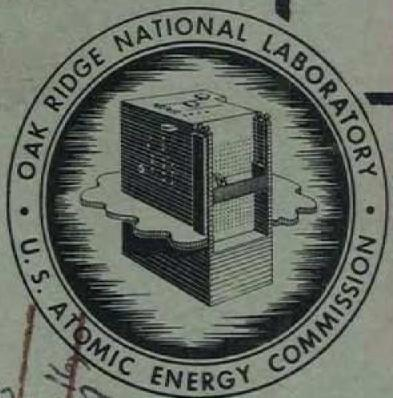

# DECLASSIFIED

MARTIN MARIETTA ENERGY SYSTEMS LIBRARIES

3445603496474

ORNL 1711

Reactors-Research and Power

$+ \infty )$

Per Letter Instructions of

[{L}_{id} = {1147}]

$E.C.{BONNEY}$

For: N.T. Bray, Supervisor/LRD

PRESENT STATUS OF THE INVESTIGATION OF

AQUEOUS SOLUTIONS SUITABLE FOR USE

IN A THORIUM BREEDER BLANKET

M. H. Lietzke

W. L. Marshall

CENTRAL RESEARCH LIBRARY DOCUMENT COLLECTION

LIBRARY LOAN COPY

DO NOT TRANSFER TO ANOTHER PERSON

If you wish someone else to see this document, send in name with document and the library will arrange a loan.

OAK RIDGE NATIONAL LABORATORY

OPERATED BY

CARBIDE AND CARBON CHEMICALS COMPANY

A DIVISION OF UNION CARBIDE AND CARBON CORPORATION

UCC

POST OFFICE BOX P

OAK RIDGE, TENNESSEE

P. S. BAKER, ORAL/CO

TNNNNEAENNNN NNNNNEAENNNN   
Prrnne nnnnne nee

eannnnnne

$\frac{1 + u}{1} - \frac{u}{1} = \frac{\left( {1 + u}\right) u}{1} < \frac{u}{1} = u$   
2   
$\therefore m : x = 1$ 或 ${3x} + {4y} + 1 = 0$   
$\frac{a - b}{a + b} = \frac{c - d}{c + d}$

Contract No W-7405-eng-26

PRESENT STATUS OF THE INVESTIGATION OF AQUEOUS SOLUTIONS SUITABLE FOR USE IN A THORIUM BREEDER BLANKET

M H Lietzke and W L Marshall

DATE ISSUED

MAY 13 1954

OAK RIDGE NATIONAL LABORATORY

Operated by

CARBIDE AND CARBON CHEMICALS COMPANY

A Division of Union Carbide and Carbon Corporation

Post Office Box P

Oak Ridge, Tennessee

3 4456 0349647 4

# INTERNAL DISTRIBUTION

<table><tr><td>1</td><td>C</td><td>E</td><td>Center</td><td>30</td><td>G</td><td>H</td><td>Clewett</td></tr><tr><td>2</td><td colspan="3">Biology Library</td><td>31</td><td>K</td><td>Z</td><td>Morgan</td></tr><tr><td>3</td><td colspan="3">Health Physics Library</td><td>32</td><td>T</td><td>A</td><td>Lincoln</td></tr><tr><td>4-5</td><td colspan="3">Central Research Library</td><td>33</td><td>A</td><td>S</td><td>Householder</td></tr><tr><td>6</td><td colspan="3">Reactor Experimental</td><td>34</td><td>C</td><td>S</td><td>Harrill</td></tr><tr><td></td><td colspan="3">Engineering Library</td><td>35</td><td>C</td><td>E</td><td>Winters</td></tr><tr><td>7-11</td><td colspan="3">Laboratory Records Department</td><td>36</td><td>D</td><td>W</td><td>Cardwell</td></tr><tr><td>12</td><td colspan="3">Laboratory Records, ORNL R C</td><td>37</td><td>E</td><td>M</td><td>King</td></tr><tr><td>13</td><td>C</td><td>E</td><td>Larson</td><td>38</td><td>D</td><td>D</td><td>Cowen</td></tr><tr><td>14</td><td>L</td><td>B</td><td>Emlet (K-25)</td><td>39</td><td>D</td><td>S</td><td>Billington</td></tr><tr><td>15</td><td>J</td><td>P</td><td>Murray (Y-12)</td><td>40</td><td>J</td><td>A</td><td>Lane</td></tr><tr><td>16</td><td>A</td><td>M</td><td>Weinberg</td><td>41</td><td>C</td><td>H</td><td>Secoy</td></tr><tr><td>17</td><td>E</td><td>H</td><td>Taylor</td><td>42</td><td>W</td><td>L</td><td>Marshall</td></tr><tr><td>18</td><td>E</td><td>D</td><td>Shipley</td><td>43-45</td><td>H</td><td>F</td><td>McDuffie</td></tr><tr><td>19</td><td>S</td><td>C</td><td>Lind</td><td>46</td><td>R</td><td>W</td><td>Stoughton</td></tr><tr><td>20</td><td>F</td><td>C</td><td>VonderLage</td><td>47</td><td>J</td><td>H</td><td>Halperin</td></tr><tr><td>21</td><td>C</td><td>P</td><td>Keim</td><td>48</td><td>W</td><td>C</td><td>Waggoner</td></tr><tr><td>22</td><td>J</td><td>H</td><td>Frye, Jr</td><td>49</td><td>M</td><td>H</td><td>Lietzke</td></tr><tr><td>23</td><td>R</td><td>S</td><td>Livingston</td><td>50</td><td>F</td><td>R</td><td>Bruce</td></tr><tr><td>24</td><td>W</td><td>H</td><td>Jordan</td><td>51</td><td>D</td><td>E</td><td>Ferguson</td></tr><tr><td>25</td><td>J</td><td>A</td><td>Swartout</td><td>52</td><td>K</td><td>A</td><td>Kraus</td></tr><tr><td>26</td><td>F</td><td>L</td><td>Culler</td><td>53</td><td>M</td><td>D</td><td>Silverman</td></tr><tr><td>27</td><td>A</td><td>H</td><td>Snell</td><td>54</td><td>R</td><td>A</td><td>Charpie</td></tr><tr><td>28</td><td>A</td><td colspan="2">Hollander</td><td>55</td><td colspan="3">Sigfred Peterson</td></tr><tr><td>29</td><td>M</td><td>T</td><td>Kelley</td><td>56</td><td>M</td><td>J</td><td>Skinner</td></tr></table>

# EXTERNAL DISTRIBUTION

<table><tr><td>57</td><td>AF Plant Representative, Burbank</td></tr><tr><td>58</td><td>AF Plant Representative, Seattle</td></tr><tr><td>59</td><td>AF Plant Representative, Wood-Ridge</td></tr><tr><td>60</td><td>American Machine and Foundry Company</td></tr><tr><td>61</td><td>ANP Project Office, Fort Worth</td></tr><tr><td>62-72</td><td>Argonne National Laboratory</td></tr><tr><td>73</td><td>Armed Forces Special Weapons Project (Sandia)</td></tr><tr><td>74</td><td>Armed Forces Special Weapons Project, Washington</td></tr><tr><td>75-79</td><td>Atomic Energy Commission, Washington</td></tr><tr><td>80</td><td>Babcock and Wilcox Company</td></tr><tr><td>81</td><td>Battelle Memorial Institute</td></tr><tr><td>82</td><td>Bendix Aviation Corporation</td></tr><tr><td>83-85</td><td>Brookhaven National Laboratory</td></tr><tr><td>86</td><td>Bureau of Ships</td></tr><tr><td>87-92.</td><td>Carbide and Carbon Chemicals Company (Y-12 Plant</td></tr><tr><td>93</td><td>Chicago Patent Group</td></tr><tr><td>94</td><td>Chief of Naval Research</td></tr><tr><td>95</td><td>Commonwealth Edison Company</td></tr></table>

96 Department of the Navy - OP-362   
97 Detroit Edison Company

98-102 duPont Company, Augusta

103 duPont Company, Wilmington   
104 Duquesne Light Company   
105 Foster Wheeler Corporation

106-108 General Electric Company (ANPD)

109 General Electric Company (APS)

110-117 General Electric Company, Richland

118 Hanford Operations Office   
119 Iowa State College

120-123 Knolls Atomic Power Laboratory

124-125 Los Alamos Scientific Laboratory

126 Metallurgical Project   
127 Monsanto Chemical Company   
128 Mound Laboratory   
129 National Advisory Committee for Aeronautics, Cleveland

130 National Advisory Committee for Aeronautics, Washington

131-132 Naval Research Laboratory

133 Newport News Shipbuilding and Dry Dock Company   
134 New York Operations Office

135-136 North American Aviation, Inc

137 Nuclear Development Associates, Inc   
138 Patent Branch, Washington

139-145 Phillips Petroleum Company (NRTS)

146 Powerplant Laboratory (WADC)   
147 Pratt & Whitney Aircraft Division (Fox Project)   
148 Rand Corporation   
149 San Francisco Field Office   
150 Sylvania Electric Products, Inc.   
151 Tennessee Valley Authority (Dean)   
152 USAF Headquarters   
153 U S Naval Radiological Defense Laboratory

154-155 University of California Radiation Laboratory, Berkeley   
156-157 University of California Radiation Laboratory, Livermore   
158 Walter Kidde Nuclear Laboratories, Inc   
159-164 Westinghouse Electric Corporation   
165-179 Technical Information Service, Oak Ridge

Present Status of the Investigation of Aqueous Solutions Suitable for Use

in a Thorium Breeder Blanket.

M H Lietzke and W L Marshall

Oak Ridge National Laboratory

Oak Ridge, Tennessee

# Abstract

The present report summarizes the work that has been done in the search for an aqueous solution suitable for use in a thorium breeder blanket. Some of the work has been previously reported in H R P and Chemistry Division Quarterly Reports, but data concerning the basic nitrate system and the phosphate-nitrate system are reported here for the first time. It has been felt desirable to summarize all the work in this report so that an overall-picture may be had of the exploratory work that has been done to date

# Thorium Nitrate-Water System

The system thorium nitrate-water has been studied by Templeton(1) from $20^{\circ}$ C to $160^{\circ}$ C and by Marshall, Gill, and Secoy(2) from $20^{\circ}$ C to $211^{\circ}$ C Above $130^{\circ}$ C nitrogen oxides are liberated and basic thorium oxide is precipitated. However, in a closed system the vapor phase appears to equilibrate with the liquid phase, and the system in this form does not show precipitation until a temperature of about $230^{\circ}$ C is reached for systems containing 80-90% thorium nitrate by weight. The experimental data indicate that a solution of thorium nitrate containing 1000 g Th/l will be stable in the temperature range $120^{\circ}$ C to $230^{\circ}$ C and that solutions containing lower concentrations of thorium will be stable from room temperature to the $100 - 230^{\circ}$ C range.

# Effect of Excess Nitric Acid on the Thorium Nitrate-Water Systems

Marshall and Secoy(3) investigated the effectiveness of excess nitric acid in preventing hydrolysis of thorium nitrate solutions at high temperatures. Solutions with $\mathrm{NO}_3/\mathrm{Th}$ ratios of 3, 95, 5, 47, and 6 65 were prepared in concentrations that varied from 20 to $400\mathrm{g}$ Th/l. The first mole of excess nitrate caused the greatest elevation in precipitation temperature, while the vapor phase coloration was much greater per unit change of nitrate after the initial four moles were added to the thorium. Crystalline solids appeared in the concentrated regions, the composition of which may have corresponded to acid salts. The crystalline compounds were reversible in solubility over the time of the experiments as contrasted to the apparent irreversibility in the solubility of the hydrolysis products. Solutions containing $400\mathrm{g}$ Th/l with $\mathrm{NO}_3/\mathrm{Th}$ ratios of 5, 47 and 6 65 were stable to temperatures between 300 and $340^{\circ}\mathrm{C}$ .

Effect of Excess Base on the Thorium Nitrate-Water System

A series of experiments was performed by Lietzke and Marshall to determine whether solutions in which the thorium had been partially hydrolyzed would be stable at higher temperatures. The partial hydrolysis was accomplished in two ways (1) by the addition of $\mathrm{LiOH}$ to a stoichiometric thorium nitrate solution, and (2) by precipitating thorium hydroxide and dissolving the precipitate in less than the stoichiometric amount of nitric acid.

Table 1 shows the results obtained with thorium nitrate solutions that had been partially hydrolyzed by the addition of LiOH. The effect of fluoride both on the partially hydrolyzed and on the stoichiometric thorium nitrate solutions is also shown. The rate of heating in each case was $2.5^{\circ} \mathrm{C} / \mathrm{min}$ .

Table 1   
Precipitation Temperatures of Thorium Nitrate Solutions to Which Lithium   
Hydroxide and Lithium Fluoride Have Been Added.   

<table><tr><td>Thorium Concentration</td><td>NO3-/Th</td><td>OH-/Th</td><td>F-/Th</td><td>Observations</td></tr><tr><td rowspan="5">400 g Th/1</td><td>4</td><td>1.8</td><td>0</td><td>Cloudy at 210° C, abundant ppt at 238° C.</td></tr><tr><td>4</td><td>1.8</td><td>1</td><td>Abundant ppt. between 180° and 188° C</td></tr><tr><td>4</td><td>1</td><td>1</td><td>Ppt at 225° C.</td></tr><tr><td>4</td><td>0</td><td>1</td><td>Some particles at 260° C, much cloudiness at 264° C.</td></tr><tr><td>4</td><td>0</td><td>1.8</td><td>Cloudy ppt at 248° C.</td></tr></table>

None of the precipitates redissolved upon cooling to room temperature.

The second method of preparing partially hydrolyzed thorium nitrate solution consisted in precipitating thorium hydroxide from diluted aliquots of thorium nitrate solution by saturation with ammonia gas. The thorium hydroxide was washed by centrifugation and decantation, then dissolved in sufficient concentrated nitric acid to give a $\mathrm{NO}_3/\mathrm{Th}$ ratio of 2:2. The thorium concentration was varied from $200\mathrm{g}$ Th/l to $1000\mathrm{g}$ Th/l. Table 2 summarizes the data obtained upon heating these solutions at temperatures of $70^{\circ}\mathrm{C}$ and $80^{\circ}\mathrm{C}$ .

Table 2   
Precipitation Temperatures of Thorium Nitrate Solutions With a Hydroxyl   

<table><tr><td colspan="3">Number of 18</td></tr><tr><td>Thorium Concentration</td><td>Temp. °C.</td><td>Observations</td></tr><tr><td rowspan="2">200 g/1</td><td>70</td><td>No ppt. in 24 hrs.</td></tr><tr><td>80</td><td>Ppt. after 3 hrs</td></tr><tr><td>400 g/1</td><td>70</td><td>Ppt. in 24 hrs.</td></tr><tr><td rowspan="2">530 g/1</td><td>70</td><td>No ppt in 24 hrs.</td></tr><tr><td>80</td><td>Cloudy after 3 hrs.
Ppt after 24 hrs.</td></tr><tr><td rowspan="2">800 g/1</td><td>70</td><td>No ppt. in 24 hrs.</td></tr><tr><td>80</td><td>Cloudy after 24 hrs
Ppt after 48 hrs.</td></tr><tr><td>1000 g/1</td><td>70</td><td>Ppt after 1½ hrs.</td></tr></table>

In all cases the precipitates did not redissolve upon cooling to room temperature. When HF was added to the solutions to give a F/Th ratio of 1.0 precipitation occurred upon standing at room temperature The precipitate would not redissolve upon heating.

# $\mathrm{ThO}_2 = \mathrm{H}_3\mathrm{PO}_4 = \mathrm{H}_2\mathrm{O}$ System

The marked solubility of $\mathsf{ThO_2}$ or $\mathsf{Th}_3(\mathsf{PO}_4)$ in concentrated phosphoric acid and the low neutron cross-section of phosphorus favor the consideration of the $\mathsf{ThO_2 - H_3PO_4}$ system as a possible breeder blanket solution $^{(4)}$ . Although apparently stable phosphate solutions containing up to $1100\mathrm{g}$ Th/1 with $\mathsf{PO_4 / Th}$ ratios of 5 to 7 could be prepared, the high viscosities of these solutions leave considerable doubt as to their applicability. However, solutions containing a $\mathsf{PO_4 / Th}$ ratio of 10 with a total Th concentration of $400\mathrm{g / l}$ are stable at $250^{\circ} - 300^{\circ}\mathrm{C}$ and have a viscosity little higher than that of concentrated phosphoric acid.

A series of experiments was performed $^{(5)}$ in an effort to lower the viscosity of the thorium phosphate solutions containing the $\mathsf{PO_4}$ /Th ratios of 5 to 7 without at the same time decreasing the thorium concentration. It was found that some concentrated hydrofluoric acid can be added to the concentrated $\mathsf{H}_3\mathsf{PO}_4$ mixture but that precipitation occurs before any significant improvement in properties becomes evident, dissolving $\mathsf{ThF}_4$ in $\mathsf{H}_3\mathsf{PO}_4$ appears to give a similarly viscous mixture at $\mathsf{PO}_4/\mathsf{Th}$ ratio of 5. Solutions in $\mathsf{H}_2\mathsf{PO}_3\mathsf{F}$ seem to act similarly to those in $\mathsf{H}_3\mathsf{PO}_4$ with no improvement in solubility or viscosity. Adding $\mathsf{H}_2\mathsf{SO}_4$ to $\mathsf{H}_3\mathsf{PO}_4 - \mathsf{Th}_3(\mathsf{PO}_4)_4$ mixtures lowers the solubility under otherwise similar conditions and appears to offer no advantages.

# The $\mathsf{ThO}_2\mathsf{-H}_3\mathsf{PO}_4\mathsf{-HNO}_3$ System

Table 3 summarizes data obtained by Marshall in a study of the thorium-phosphate-nitrate system.

# Table 3

Thermal Phase Stability of the $\mathsf{ThO}_2\mathsf{-H}_3\mathsf{PO}_4\mathsf{-HNO}_3$ System   

<table><tr><td>Molarity H3PO4</td><td>Molarity HNO3</td><td>Molarity ThO2</td><td>Mole Ratio Th/PO4/NO3</td><td>After 1 l/2 weeks at 125-150°C</td></tr><tr><td>5.0</td><td>5.0</td><td>5.0</td><td>1/1/1</td><td>Completely solid (white)</td></tr><tr><td>5.0</td><td>5.0</td><td>2.5</td><td>1/2/2</td><td>&quot; &quot; &quot;</td></tr><tr><td>5.0</td><td>5.0</td><td>1.67</td><td>1/3/3</td><td>Ca 95% &quot; &quot;</td></tr><tr><td>10.0</td><td>5.0</td><td>5.0</td><td>1/1/2</td><td>Completely &quot; &quot;</td></tr><tr><td>10.0</td><td>5.0</td><td>2.5</td><td>1/2/4</td><td>Ca. 60% &quot; &quot;</td></tr><tr><td>10.0</td><td>5.0</td><td>1.67</td><td>1/3/6</td><td>Ca 1% &quot; &quot;</td></tr><tr><td>7.5</td><td>2.5</td><td>2.5</td><td>1/1/3</td><td>Completely &quot; &quot;</td></tr><tr><td>7.5</td><td>2.5</td><td>1.25</td><td>1/2/6</td><td>Ca. 90% &quot; &quot;</td></tr></table>

From the data in Table 3 it appears that the $\mathrm{ThO_2 - H_3PO_4 - HNO_3}$ system is stable at elevated temperatures only in the presence of concentrated $\mathrm{H_3PO_4}$ . In all cases the precipitates did not redissolve upon cooling to room temperature

Thorium Systems Involving $\mathbf{SO}_4^{\pm}$ and $\mathbf{F}^{-}(5)$

Preliminary results on dissolving $\mathrm{Th(OH)_4}$ in an $\mathrm{HF - H_2SO_4}$ mixture, containing one HF and one and one half $\mathrm{H_2SO_4}$ molecules per molecule of $\mathrm{Th(OH)_4}$ indicated a "solubility" of about 200 g Th/l. (There was evidence for the presence of a colloid.) Immediate dissolution occurred followed by slow precipitation. Changing the $\mathrm{F}^{-} / \mathrm{SO}_{4}^{-} = / \mathrm{Th(IV)}$ ratios while maintaining stoichiometric neutrality showed no improvement in solubility. It was also found to be impossible to prepare similar solutions containing higher concentrations of thorium (400 and 600 g Th/l). The pH of all the supernatant solutions indicated that some

hydrolysis occurred during the precipitation A solution made up to contain $50\mathrm{g}$ Th/1 as the nitrate plus one mole of HF, one of $\mathsf{HNO}_3$ , and one and one half of $\mathsf{H}_2\mathsf{SO}_4$ per mole of thorium showed some precipitation on standing a few days. No hydrolysis would be expected to occur in this solution.

Thorium Systems Involving $\mathsf{SO}_{4} = \mathsf{,}$ $\mathsf{SeO}_{4} = \mathsf{,}$ $\mathsf{Li}^{+},$ and $\mathsf{Mg}^{+ + }$

A large number of exploratory tests with various combinations of thorium sulfate or thorium selenate with lithium and magnesium salts of the same anions have indicated

(1) The addition of the lithium or magnesium salt increases the solubility of the thorium salt at $25^{\circ} \mathrm{C}$ but not to a very great extent. The maximum amount of thorium that can be kept in solution is of the order of 100-150 g Th/1.   
(2) In all cases thorium selenate is more soluble than the sulfate, but not sufficiently more so to compensate for the higher neutron cross-section of selenium.   
(3) At temperatures above $100^{\circ}$ C the solubility of the Th salts decrease rapidly The formation of precipitates and their dissolution at room temperature are both slow. There is a strong possibility that the "solutions" at $25^{\circ}$ C are actually metastable and that, in time, much of the thorium would precipitate   
(4) At $43^{\circ} \mathrm{C}$ a solution of thorium sulfate may be prepared containing $19 \, \mathrm{g} \, \mathrm{Th} / 1000 \, \mathrm{g} \, \mathrm{H}_2\mathrm{O}$ . This is the maximum solubility of thorium sulfate in water.

# Conclusions

(1) Of the systems investigated only two, the $\mathrm{Th(NO_3)_4}^+$ excess $\mathrm{HNO}_3$ and the $\mathrm{Th}_3\mathrm{PO}_4)_4 + \mathrm{H}_3\mathrm{PO}_4$ with a $\mathrm{PO}_4 / \mathrm{Th}$ ratio of 10, have both the necessary thermal stability and desirably low viscosity.   
(2) From the standpoint of neutron capture cross-section the $\mathrm{Th}_{3}(\mathrm{PO}_{4})_{3}-$ H $_3$ PO $_4$ system is perhaps satisfactory In the case of the Th(NO $_3$ ) $_4$ system separated N $^{15}$ isotope would have to be used.   
(3) There is no present evidence that corrosion in the nitrate system would be intolerable. However, the phosphate system attacks both T1 and Zr at relatively low temperatures and no satisfactory container is yet known for this system. A more thorough study of the corrosion properties of the solutions should be made.   
(4) The radiation decomposition of nitrate (including the products formed under varying conditions) appears to be the most important unknown concerning the nitrate system. A preliminary experiment by Bidwell of Los Alamos using a uranyl phosphate = H3PO4 solution containing enriched U235 in the LITR showed no gross decomposition of phosphate ion.   
(5) Whenever hydrolytic phenomena seem to be responsible for precipitation in thorium systems the time factor is very important. Solutions which seem to be stable at higher temperatures on short time heating usually show precipitation upon being held at much lower temperatures for a longer period of time.   
(6) On the basis of the rather extensive survey that has been made it seems unlikely that any thorium systems other than the two mentioned will be found that satisfy both the thermal stability and low neutron capture cross-section requirements. However this statement cannot be made with certainty unless a thorough phase study is made of some of the systems investigated.

# References

(1) C Templeton, AECU-1721 (1950).   
(2) W L Marshall, J S Gill, C H Secoy, H R.E Quarterly Progress Report for Period Ending Nov. 30, 1950, ORNL-925, p 279.   
(3) W L. Marshall and C H. Secoy, H.R.P Quarterly Progress Report for Period Ending Oct. 31, 1953, ORNL-1658, pp. 93-96.   
(4) P A Agron and W L Marshall, Chem Div Semiannual Progress Report for Period Ending June 20, 1953, ORNL-1587, pp 90-93.   
(5) P A Agron et al, H R P Quarterly Progress Report for Period Ending July 31, 1953, ORNL-1605, pp. 128-130.