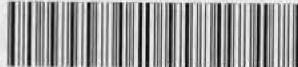
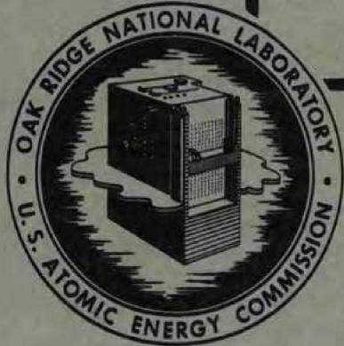
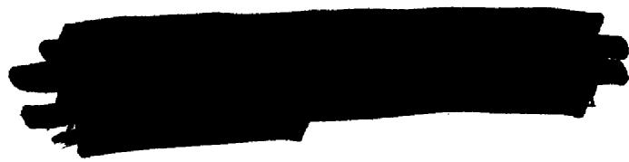

MARTIN MARIETTA ENERGY SYSTEMS LIBRARIES



3445603496465

ORNL 1712

Chemistry-General

THE OPTICAL PROPERTIES OF SOME INORGANIC

FLUORIDE AND CHLORIDE COMPOUNDS

T. N. McVay

G.D. White

CHANGES CHANGED TO

THE INFORMATION CHANGED TO:

DECLASSIFIED



CENTRAL RESEARCH LIBRARY DOCUMENT COLLECTION

LIBRARY LOAN COPY

DO NOT TRANSFER TO ANOTHER PERSON

If you wish someone else to see this document, send in name with document and the library will arrange a loan.

OAK RIDGE NATIONAL LABORATORY

OPERATED BY

CARBIDE AND CARBON CHEMICALS COMPANY

A DIVISION OF UNION CARBIDE AND CARBON CORPORATION

UCC

POST OFFICE BOX P

OAK RIDGE, TENNESSEE

Contract No. W-7405-eng-26

METALLURGY DIVISION

THE OPTICAL PROPERTIES OF SOME INORGANIC

FLUORIDE AND CHLORIDE COMPOUNDS

T. N. McVay

G. D. White

DATE ISSUED

MAY 5 1954



OAK RIDGE NATIONAL LABORATORY

Operated by

CARBIDE AND CARBON CHEMICALS COMPANY

A Division of Union Carbide and Carbon Corporation

Post Office Box P

Oak Ridge, Tennessee

# THE OPTICAL PROPERTIES

OF SOME INORGANIC FLUORIDE

AND CHLORIDE COMPOUNDS

T. N. McVay and G. D. White

Metallurgy Division

# ABSTRACT

Optical properties are listed for various fluoride and chloride compounds.

# INTRODUCTION

In the course of investigation of various inorganic fluoride and chloride systems, it was found advisable to determine the optical properties of numerous fluoride and chloride compounds.

The optical data collected on these substances are recorded in this report. The refractive indices are believed to be precise to $\pm 0.003$ ; the optic angles of biaxial crystals were estimated.

The authors wish to acknowledge the assistance of W. C. Whitley, B. J. Sturm, R. J. Sheil, J. Truitt and Virginia Coleman, who prepared the samples under the direction of C. J. Barton and W. R. Grimes of the Materials Chemistry Division, of which G. H. Clewett is the head.

# OPTICAL PROPERTIES

Beryllium lead fluoride, $\mathsf{BeF}_2\cdot \mathsf{PbF}_2$

Biaxial - $2\mathrm{V} = 70^{\circ}$ $\alpha = 1.602$ $\gamma = 1.627$ Colorless

Cesium uranium fluoride, CsF-UFl4

Biaxial $^+$ 2V =450 $\alpha = 1.553$ $\gamma = 1.560$ Polysynthetic twinning, X A c =100   
Z = sky blue X = greenish blue

Cesium uranium fluoride, 2 CsF·UF<sub>4</sub>

Biaxial $^+$ 2V = 450 $\alpha = 1.516$ $\gamma = 1.524$ Z = light blue X = light greenish blue

Cesium zirconium fluoride, CsF-ZrF4

Biaxial - $2V = 20^{\circ} - 45^{\circ}$ (varies) $\alpha = 1.464$ $\gamma = 1.476$ Colorless

Cesium zirconium fluoride, 2 CsF·ZrF4

```txt
Uniaxial - 0 = 1.482 E = 1.460 Colorless 
```

Iron fluoride, $\mathbf{FeF_2}$

Uniaxial $^+$ 0 =1.524 E=1.540 Brown

Lead uranium fluoride, $\mathsf{PbF_2\cdot UF_4}$

Uniaxial - $0 = 1.750$ E = 1.730 Green

Lead uranium fluoride, 6 $\mathsf{PbF}_2\cdot \mathsf{UF}_4$

Isotropic

$\mathbf{n} = \mathbf{1.77}$

Light blue

Lithium beryllium fluoride, LiF·BeF2

Uniaxial +

$0 = 1.312$

Colorless

E = 1.319

Lithium chromium fluoride, 3 LiF·CrF₃

Biaxial -

X normal to one face

$\alpha = 1.444$

Green

$2\mathrm{V} = {40}^{ \circ  }$

$\gamma = 1.464$

Lithium uranium fluoride, LiF·2UF<sub>4</sub>

Biaxial -

$\alpha = 1.584$

Yellowish green

$2 \mathrm{~V} = 10^{\circ}$

$\gamma = 1.600$

Lithium uranium fluoride, 3 LiF·UF<sub>4</sub>

Biaxial +

$\alpha = 1.468$

Z = dark green

${2v} = {450}$

y=1.476

X = light green

Lithium zirconium fluoride, LiF·ZrF<sub>4</sub>

Biaxial +

$\alpha = 1.468$

Colorless

$2 \mathrm{~V} = 30^{\circ}$

y=1.476

Lithium zirconium fluoride, 2 LiF·ZrF<sub>4</sub>

Uniaxial +

$0 = 1.462$

Colorless

E = 1.482

Manganese fluoride, MnF2

Uniaxial +

$0 = 1.476$

E = 1.504

0 = colorless

E = gray

Potassium aluminum fluoride, 3 KF-AlF<sub>3</sub>

Isotropic

$\mathbf{n} = 1.376$

Colorless

Potassium chromium fluoride, 3 KF·CrF₃

Isotropic

n = 1.422

Green

Potassium fluoride, acid KF·HF

Uniaxial - Some crystals show small optic angle.

$0 = 1.354$ $\mathbf{E} = 1.331$

Colorless

Potassium sodium iron fluoride, 2 KF·NaF·FeF3

Isotropic

n = 1.414

Colorless

Potassium thorium fluoride, 3 KF·ThF4

Isotropic

n = 1.424

Colorless

Potassium uranium chloride, KCl·UCl4

Biaxial + 2V = small

$\alpha = 1.692$ $\beta = 1.705$

$\gamma = 1.759$

X = gray Z = blue-green

Potassium uranium fluoride, KF·UF4

Uniaxial -

$0 = 1.510$ E $= 1.504$

Green

Potassium uranium fluoride, 2 KF-UF4

Uniaxial +

$0 = 1.484$ E $= 1.512$

Light olive drab

Potassium zirconium fluoride, KF·ZrF4

$$
\begin{array}{l l} \text {B i a x i a l} + & 2 V = 7 5 ^ {\circ} \\ \alpha = 1. 4 8 8 & \gamma = 1. 5 0 4 \end{array}
$$

$$
\mathbf {\Gamma} _ {\mathrm {c o l o r l e s s}}
$$

Rubidium beryllium fluoride, RbF·BeF2

Biaxial + n av. = 1.390 with low birefringence Colorless

Rubidium uranium fluoride, Rb-UF4

$$
\begin{array}{l l} \text {B i a x i a l -} & 2 V = 7 5 ^ {\circ} \\ \alpha = 1. 5 1 4 & \gamma = 1. 5 2 8 \\ \text {P o l y s n t h e t i c t w i n n i n g , Y A C = 2 0 ^ {\circ}} \\ \text {Z = b l u e} & \text {X = g r e e n} \end{array}
$$

Rubidium uranium fluoride, 2 RbF·UF4

$$
\begin{array}{l l} \text {B i a x i a l +} & 2 V = 7 0 ^ {\circ} \\ \alpha = 1. 4 7 3 & \gamma = 1. 4 8 7 \\ \mathrm {Z} = \text {l i g h t v i o l e t} & \mathrm {V} = \text {l i g h t g r e e n} \end{array}
$$

Rubidium uranium fluoride, 3 RbF·UF4

Isotropic n = 1.438 Green

Rubidium zirconium fluoride, 2 RbF·ZrFl4

Uniaxial - 0 = 1.438 Colorless

$$
E = 1. 4 3 2
$$

Rubidium zirconium fluoride, 3 RbF·ZrF<sub>4</sub>

Isotropic $n = 1.432$ Colorless

Sodium beryllium fluoride, NaF·BeF2

Biaxial n = 1.312 with low birefringence Length slow Colorless

Sodium beryllium fluoride, 2 NaF·BeF $_2$ Biaxial  
n = 1.303 with low birefringence  
Yllc  
Colorless

```txt
Sodium chromium fluoride, 3 NaF·CrF3 Isotropic n = 1.411 Green 
```

```txt
Sodium fluoride, acid NaF·HF 
```

Uniaxial $^+$ 0 = 1.261 Colorless

$$
E = 1. 3 2 8
$$

```txt
Sodium thorium fluoride, 2 NaF·ThF4  
Uniaxial +  
0 = 1.468  
Colorless 
```

```txt
Sodium uranium chloride, 2 NaCl·UCl4  
Uniaxial -  
0 = 1.664  
Pale green 
```

```txt
Sodium uranium fluoride, NaF·UF4 Uniaxial - 0 = 1.520 Green 
```

```txt
Sodium uranium fluoride, 2 NaF·UF4  
Uniaxial - 0 = 1.495  
Green 
```

```txt
Sodium uranium fluoride, 3 NaF·UF4  
Uniaxial - 0 = 1.417  
Greenish blue 
```

Sodium zirconium fluoride, 3 NaF·4 ZrF<sub>4</sub>

Biaxial + $2\mathrm{V} = 30^{\circ}$ $\alpha = 1.420$ $\gamma = 1.432$ Colorless

Sodium zirconium fluoride, NaF·ZrF4

Uniaxial - $0 = 1.508$ E = 1.500 Indices vary depending on NaF:ZrF4 ratio Appears to be a solid solution Colorless

Sodium zirconium fluoride, 2 NaF·ZrF<sub>4</sub>

Biaxial - $2\mathrm{V} = 75^{\circ}$ $\alpha = 1.412$ $\gamma = 1.419$ Colorless

Sodium zirconium fluoride, 3 NaF·ZrF<sub>4</sub>

Uniaxial - $0 = 1.386$ E = 1.381 Colorless

Thorium fluoride, ThF4

Isotropic $n = 1.532$ Colorless

Uranium chloride (III) UCl3

Uniaxial, probably -   
High index 2.04 Low index 1.94   
Dark brownish red

Uranium chloride (III) UCl4

Uniaxial - $0 = 2.03$ E=1.95 Z = greenish brown X = light brownish green

Zirconium chloride $\mathbf{ZrCl}_4$

Probably monoclinic Biaxial Large 2V $\gamma = 1.83$ $\alpha = 1.76$ Z A c $22^{\circ}$ White