DECLASSIFIED

BY AUTHORITY OF: AEC $= 7 - {16} = 5 - 5$

# AIG RESEARCH AND DEVELOPMENT REPORT

TURBULENT HEAT TRANSFER FROM A

MOLTEN FLUORIDE SALT MIXTURE TO

SODIUM-POTASSIUM ALLOY IN A

DOUBLE-TUBE HEAT EXCHANGER

D.F.Salmon

# CENTRAL RESEARCH LIBRARY DOCUMENT COLLECTION

# LIBRARY LOAN COPY

DO NOT TRANSFER TO ANOTHER PERSON

If you wish someone else to see this document, send in name with document and the library will arrange a loan.

OAK RIDGE NATIONAL LABORATORY

OPERATED BY

CARBIDE AND CARBON CHEMICALS COMPANY

A DIVISION OF UNION CARBIDE AND CARBON CORPORATION

ORNL 1716

Th document ons ts of 31 pages

Copy of 265 copies Sees A

Contract No W 7405-eng 26

ANP DIVISION

# TURBULENT HEAT TRANSFER FROM A MOLTEN FLUORIDE SALT

# MIXTURE TO SODIUM POTASSIUM ALLOY IN A

# DOUBLE TUBE HEAT EXCHANGER

DF Salmon

DATE ISSUED

NOV 3 1954

OAK RIDGE NATIONAL LABORATORY

Operated by

CARBIDE AND CARBON CHEMICALS COMPANY

A Division of Union Carbide and Carbon Corporation

Post Office Box P

Oak Ridge Tennessee

3445603496571

# INTERNAL DISTRIBUTION

1 G M Adamson

2 RG Affel

3 J F Bailey (consultant)

4 CR Baldock

5 C J Barton

6 E S Bettis

7 D S Billington

8 F F Blankenship

9 E P Blizzard

10 M A Bredig

11 FR Bruce

12 A D Callihan

13 D W Cardwell

14 C E Center

15 R A Charpie

16 G H Clewett

17 C E Clifton

18 W B Cottrell

19 RG Cochran

20 D D Cowen

21 F L Culler

22 L B Emlat (K 25)

23 W K Ergen

24 A P Fraas

25 W R Grimes

26 A G Grindell

27 D C Hamilton

28 E E Hoffman

29 H W Hoffman

30 A Hollaender

31 A S Householder

32 J T Howe

33 R W Johnson

34 W H Jordan

35 G W Keilholtz

36 C P Keim

37 M T Kelley

38 F Kertesz

39 E M King

40 J A Lane

41 C E Larson

42 R S Livingston

43 R N Lyon

44 W D Manly

45 L A Mann

$\therefore m - 1 \neq  0$ ;

46 W B McDonald

47 J L Meem

48 A J Miller

49 K Z Morgan

50 E J Murphy

51 J P Murray (Y 12)

52 G J Nessle

53 P Patriarca

54 H F Poppendiek

55 P M Reyling

56 D F Salmon

57 H W Savage

58 A W Savolainen

59 E D Shipley

60 O Sisman

61 M J Skinner

62 G P Smith

63 L P Smith (consultant)

64 A H Snell

65 W K Stair (consultant)

66 C L Storrs

67 C D Susano

68 J A Swartout

69 E H Taylor

70 J B Trice

71 E R Van Artsdalen

72 F C VonderLage

73 J M Warde

74 A M Weinberg

75JC White

76 G D Whitman

77 E P Wigner (consultant)

78 G C Williams

79 J C Wilson

80 C E Winters

8190 ANP Library

91 Biology Library

92 96 Laboratory Records Dept

97 Laboratory Records ORNL RC

98 Health Physics Library

99 Metallurgy Library

100 Reactor Experimental

Engineering Library

Central Research Library

# EXTERNAL DISTRIBUTION

104 Air Force Engineering Office Oak Ridge   
105 Air Force Plant Representative Burbank   
106 Air Force Plant Representative Seattle   
107 Air Force Plant Representative Wood Ridge   
108 ANP Project Office Fort Worth

109 120 Argonne National Laboratory (I copy to Kermit Anderson)

121 Armed Forces Special Weapons Project Sandia   
122 Armed Forces Special Weapons Project Washington (Gertrude Camp)

123 131 Atomic Energy Commission Washington (Lt Col M J Nielsen)

132 Battelle Memorial Institute

133 138 Brookhaven National Laboratory

139 Bureau of Aeronautics (Grant)   
140 Bureau of Ships

141 148 Carbide and Carbon Chemicals Company (Y 12 Plant)

149 Chicago Patent Group   
150 Chief of Naval Research   
151 Commonwealth Edison Company   
152 Convair San Diego (C H Helms)   
153 Curtiss Wright Corporation Wright Aeronautical Division (K Campbell)   
154 Department of the Navy - Op 362   
155 Detroit Edison Company

156-160 duPont Company Augusta

161 duPont Company Wilmington   
162 Foster Wheeler Corporation

163 165 General Electric Company ANPD

166 170 General Electric Company Richland

171 Glen L Martin Company (T F Nagey)   
172 Hanford Operations Office   
173 Iowa State College

174 181 Knolls Atomic Power Laboratory

182 183 Lockland Area Office

184 185 Los Alamos Scientific Laboratory

186 Materials Laboratory (WADC) (Col P L Hill)   
187 Monsanto Chemical Company   
188 Mound Laboratory

189 190 National Advisory Committee for Aeronautics Cleveland (A Silverstein)   
191 National Advisory Committee for Aeronautics Washington   
192 193 Naval Research Laboratory   
194 New York Operations Office

195 196 North American Aviation Inc

197 202 Nuclear Development Associates Inc   
203 Patent Branch Washington   
204 210 Phillips Petroleum Company (NRTS)   
211 222 Powerplant Laboratory (WADC) (A M Nelson)   
223 232 Pratt & Whitney Aircraft Division (Fox Project)   
233 234 Rand Corporation (1 copy to V G Henning)   
235 San Francisco Field Office   
236 Sylvania Electric Products Inc.   
237 USAF Headquarters   
238 U S Naval Radiological Defense Laboratory

239 240 University of California Radiation Laboratory Berkeley

241 242 University of California Radiation Laboratory Livermore

243 Walter Kidde Nuclear Laboratories Inc

244 249 Westinghouse Electric Corporation

250 264 Technical Information Service Oak Ridge

265 Division of Research and Medicine AEC ORO

# CONTENTS

Introduction 1   
Description of Equipment 1   
Test Procedure 4   
Method of Calculation 4   
Correlation of Data 6   
Test Results 7   
Discussion of Results 10   
Conclusions 12   
Nomenclature 13   
Appendix 1 Equation for Intermediate Axial Stream Temperature with Logarithmic Distribution 16   
Appendix 2 Derivation of Equations for Wilson Line Analysis 18   
Appendix 3 Physical Properties of the Fluoride Salt NaF $\mathsf{ZrF}_4$ UF4 (50 46 4 mole %) and of Sodium Potassium Eutectic Alloy 19   
Appendix 4 Sample Calculation of Data Point 4 22

# TURBULENT HEAT TRANSFER FROM A MOLTEN FLUORIDE SALT MIXTURE TO SODIUM POTASSIUM ALLOY IN A DOUBLE TUBE HEAT EXCHANGER

D F Salmon

# INTRODUCTION

Circulating fuel reactor systems for high performance high temperature power plants place exacting requirements on the fluids which must serve as heat transfer media. It is necessary that the fluids have good heat transfer properties be stable chemically at an elevated temperature have a reasonably low melting point be compatible with container materials and require only a minimum in pumping power. Aside from the chemical problem involved in finding materials with which the proper amount of nuclear fuel may be combined there are the research and the experimentation required to determine whether the above

mentioned specifications are met

Mixtures of fluoride salts were found to show promise for the circulating fuel application. This report is concerned with an experiment to measure the heat transfer characteristics of the fluoride salt mixture NaF ZrF4 UF4 (50 46 4 mole %)

The primary purpose of the experiment was to make a correlation of film heat transfer coefficients and a secondary purpose was to determine the effect on heat transfer of deposits resulting from corrosion or mass transfer of container materials

# DESCRIPTION OF EQUIPMENT

A schematic diagram of the various components of the test apparatus is shown in Fig 1

The only pump available for the fluoride salt circuit was a type 316 stainless steel sump pump capable of delivering 10 gpm at 40 ft of head and 3600 rpm. This pump was designed for high temperature application and for liquids which could not be sealed against directly at the shaft in the ordinary manner. It had a water-cooled rotary face seal for maintaining an inert gas blanket on the fluid being pumped. An automatic level control system was provided for maintaining the liquid level in the pump within prescribed limits

The heat transfer coefficients were measured in a double tube heat exchanger. The fluoride salt was cooled in the center tube by a countercurrent flow in the annulus of sodium potassium alloy (hereafter referred to as NaK). The center tube of the heat exchanger made of nickel was 0.269 in in inside diameter with a length to diameter ratio of 40. The outer tube was in schedule 40 type 316 stainless steel pipe which was rigidly connected to the center tube at one end and bellows joined at the other end to allow for differential expansion

Heating of the fluoride salt was accomplished in a length of 1 in schedule 40 Inconel pipe by electrical tube furnace elements assembled on the pipe and covered with preformed insulation The NaK stream was cooled by natural convection of air in a section of finned pipe which was ducted and provided with a damper for control

The NaK was circulated by a conventional electromagnetic pump The fluoride salt and the NaK flaw rates were measured by water calibrated venturi tubes the calibrations were corrected to reflect the discharge coefficients and the differences in densities of the respective fluids An electromagnetic flowmeter was also available for determining the NaK flow rate

Inlet and outlet temperatures of the fluoride salt and the NaK were measured by fixed Inconel sheathed Chromel Alumel probes on the center lines of the piping An adjustable probe that was provided in the annulus of the heat exchanger could be brought in touch-contact with the outer surface of the center tube wall for temperature measurement These probes were calibrated to $1 / 2^{\circ}F$ against a National Bureau of Standards

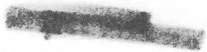

certified platinum-platinum-rhodium thermocouple in a calibrating furnace. Thermocouple readings were taken on a Leeds and Northrup K-2 potenti

ometer, and an ice-bath cold junction was used.

Figures 2, 3, and 4 are photographs of the test equipment.

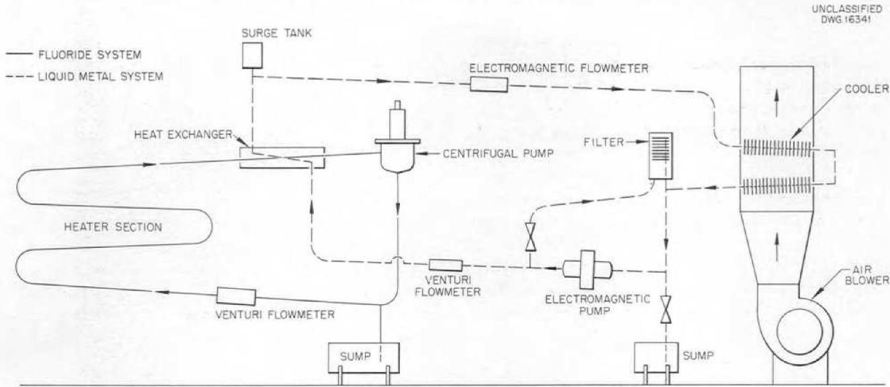  
Fig. 1. Schematic Diagram of Bifluid Loop.

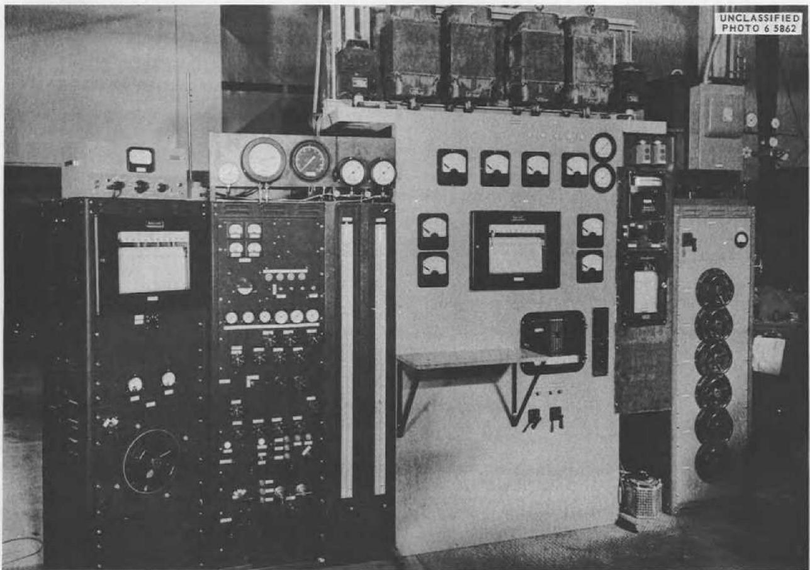  
Fig. 2. Instrument and Power Panel.

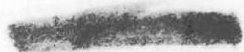

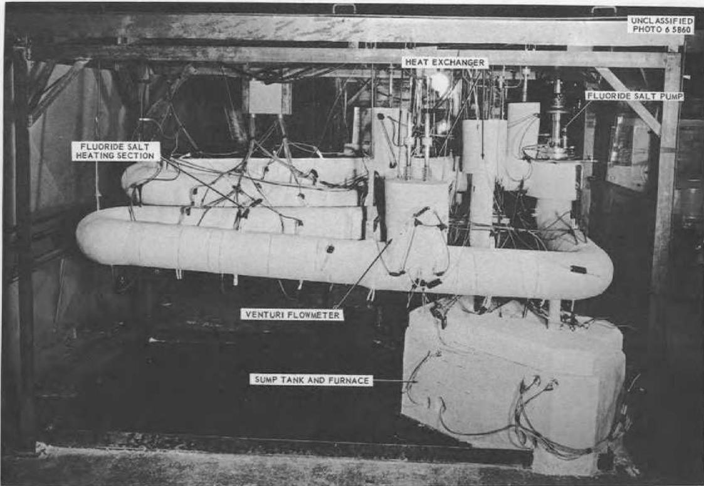  
Fig. 3. Fluoride Salt Loop.

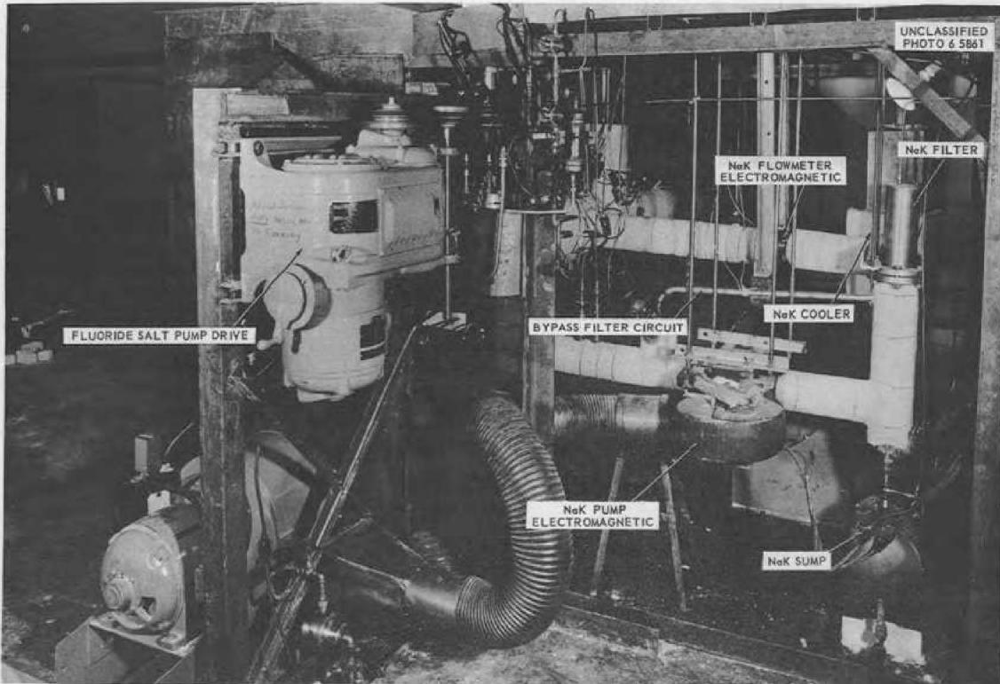  
Fig. 4. NaK Loop.

# TEST PROCEDURE

The melting point of the fluoride salt was approximately $960^{\circ} \mathrm{F}^{1}$ and consequently it was necessary at all times to maintain the walls of the fluoride salt system above this value. In fact, the walls were kept at from 50 to $100^{\circ} \mathrm{F}$ above the melting point as a precaution against freezing. For all runs the electrical power to the fluoride

salt heaters was controlled to maintain a constant inlet temperature to the heat exchanger The fluoride salt pump speed was set to give a desired flow rate and this flow was maintained for a series of different NaK flow rates The damper to the NaK cooling section was adjusted in each case to hasten attainment of steady state conditions before data were recorded Data were taken during each run at each NaK flow rate a total of 80 data points was taken

1Physical Property Charts for Some Reactor Fuels Coolants and Miscellaneous Material (3rd Edition) ORNL CF 53 3-261 (March 20 1953)

# METHOD OF CALCULATION

A heat balance on the fluoride salt and NaK streams in the heat exchanger was made initially to serve as a check on the validity of the data and to provide the basis for calculation of the heat flux $q / A_{0}$ . The value of $q$ used for determining the heat flux was an average of that obtained by applying the first two of Eqs 1 to the fluoride salt and NaK streams

$$
\begin{array}{l} q = w _ {F} c _ {F} \Delta t _ {F} \tag {1} \\ = w _ {N} c _ {N} \Delta t _ {N} \\ = U _ {o} A _ {o} \Delta t _ {L M} \\ \end{array}
$$

where the subscripts $F$ and $N$ refer to the fluoride salt and the NaK respectively. The insulation heat loss from the heat exchanger was neglected since it was in actuality less than 1% The overall heat transfer coefficient was calculated from the third of Eqs 1

$$
U _ {o} = \frac {q / A _ {o}}{\Delta t _ {L M}} \tag {2}
$$

The adjustable probe located 16 diameters down stream from the fluoride inlet provided the outer surface temperature of the center tube from the outer surface temperature the inside surface temperature was determined by using the conduction equation

$$
t _ {w F} = t _ {w N} + \frac {q _ {a} \ln \frac {D _ {o}}{D _ {i}}}{2 \pi k _ {w} L} \tag {3}
$$

A logarithmic axial distribution of temperature

was assumed for calculating the stream temperature opposite the measured wall temperature Derivations of the equations for obtaining these temperatures are presented in Appendix I The following equations were then used to arrive at a film heat transfer coefficient

$$
b _ {F} = \frac {q _ {\alpha}}{A _ {2} \left[ t _ {F (0 4)} - t _ {w F} \right]} \tag {4}
$$

and

$$
b _ {N} = \frac {q _ {\text {v}}}{A _ {o} \left[ t _ {w N} - t _ {N (0 4)} \right]} \tag {5}
$$

An individual heat transfer coefficient may be distinguished from the film coefficients given above in that it is obtained by separation of the over all coefficient defined in Eq 2 Some such separation process is always required when the difficult problem of measuring surface temperature is not attempted In this case the valuable graphical analysis of the over all heat transfer coefficient attributed to Wilson by McAdams2 is useful The analysis is based on the premise that a plot of $1 / U_{o}$ vs $1 / \nu^{0.8}$ will produce a straight line if one of the fluid velocities is held constant and the other is varied over a specific range of values Wilson's method was applied to the data of this experiment as shown in Fig 5 where $1 / U_{o}$ is plotted against $1 / \nu_{N}^{0.8}$ The run with the greatest number of values for NaK velocity was used to

establish the slope of the lines The lines were extrapolated to $1 / \nu_{N}^{0.8} = 0$ which was equivalent to letting the NaK velocity approach infinity in which case the NaK film resistance $1 / b_{N}$ approached zero

An individual heat transfer coefficient for the fluoride salt was then separated from the extrapolated over all coefficients at $1 / \nu_{N}^{0.8}$ by using the equation (derived in Appendix 2)

By assuming the value of $b_{F}$ to be constant along each of the Wilson lines an individual coefficient for NaK was separated from the over all coefficient by using the following equation (derived in Appendix 2)

$$
b _ {N} = \frac {1}{\frac {1}{U _ {o}} - \frac {1 2 2}{b _ {F}} - 0 0 0 0 7 8 8} \tag {7}
$$

$$
b _ {F} = \frac {1 2 2}{\frac {1}{U _ {0 0}} - 0 0 0 0 7 8 8} \tag {6}
$$

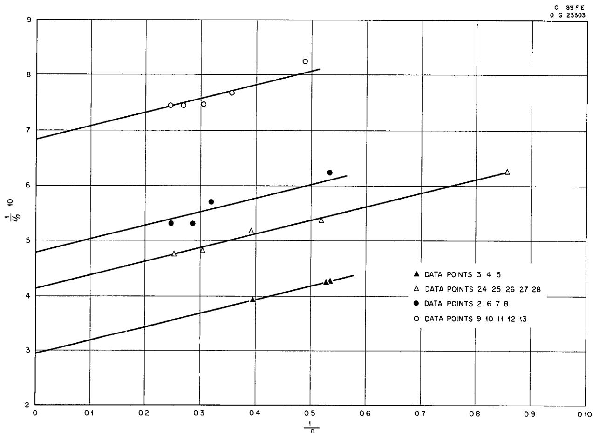  
Fig 5 Wilson Line Plot

# CORRELATION OF DATA

Dimensional analysis of the physical properties together with the hydrodynamic and geometric factors affecting heat transfer between a turbulently flowing fluid and a bounding surface such as a tube gives a product function of the Nusselt Reynolds and Prandtl moduli. The function is usually written as

$$
\mathrm {N u} = C \mathrm {R e} ^ {n} \mathrm {P r} ^ {p} \tag {8}
$$

The relationships of these parameters for ordinary fluids such as water gases or oils as differ entiated from liquid metals have been empirically determined from the data of many experimental investigations The generally accepted value for the exponent $n$ is 0.8 However for the constant $C$ and the exponent $\pmb{p}$ there is variation in the evidence the values depend on whether the fluid is being heated or cooled on the magnitude of the fluid viscosity and on whether the evaluation is based on the bulk temperature of the stream or on an average of this temperature and the surface temperature

McAdams recommends3 for fluids of high viscosity that is presumably higher than twice that of water the Colburn equation

$$
\mathrm {N u} = 0. 0 2 3 \mathrm {R e} _ {f} ^ {0. 8} \mathrm {P r} _ {f} ^ {1 / 3} \tag {9}
$$

or that of Sieder and Tate

$$
\mathrm {N u} = 0. 0 2 7 \left(\frac {\mu}{\mu_ {w}}\right) ^ {0. 1 4} \mathrm {R e} ^ {0. 8} \mathrm {P r} ^ {1 / 3} \tag {10}
$$

For these equations the Reynolds modulus should be in excess of 10 000 The viscosity correction term $(\mu /\mu_w)^{0.14}$ compensates for the variation in the temperature difference between the bulk temperature of the stream and that of the wall In the transition range of Reynolds moduli from approximately 2 100 to 10 000 called by McAdams the dip region there is a dependency on the length to diameter $(L / D)$ ratio of the heat exchange surface the amount being a function of the Reynolds modulus Eckert states that the equation of Hausen

$$
\begin{array}{l} \mathrm {N u} = 0. 1 1 6 \left(\frac {\mu}{\mu_ {w}}\right) ^ {0. 1 4} \left(\mathrm {R e} ^ {2} - 1 2 5\right) \tag {11} \\ \Pr^ {\frac {1}{3}} \left[ 1 + \left(\frac {D}{L}\right) ^ {2} \right] \\ \end{array}
$$

will satisfactorily reproduce values in the Reynolds modulus range from 2300 to 6000 Equation 11 is also useful for the entrance region of tubes where the velocity profile has not developed fully although the Reynolds modulus based on mean stream velocity is sufficiently high for full development

The theoretical approach to turbulent heat transfer in a tube has advanced to the stage where experimental values can be predicted with very good agreement von Karman's postulation of three zones in the flow field namely the laminar sub layer the buffer layer and the turbulent core was largely responsible for the advance Although the theoretical approach was not used in this work reference will be made to an extension of von Karman's theory by Boelter Martinelli and Jonassen (as described by Eckert) and by Martinelli The extension concerns the temperature ratio $(t_w - t) / (t_w - t_c)$ which was determined by them and plotted as a function of Reynolds and Prandtl moduli The result gives the amount of deviation expected when center line temperature rather than bulk temperature is used to evaluate physical properties in correlating experimental heat transfer data

The correlations discussed above for ordinary fluids do not hold for liquid metals which have low viscosity and high thermal conductivity and thus very low Prandtl moduli. Thermal conductivity is important even in the turbulent core of the stream where for ordinary fluids it is assumed in the equations that all the heat is transferred by mixing action. For heat transfer to liquid metals in a tube Martinelli8 derived an equation which was later greatly simplified by Lyon9 but there is as

yet no abundance of data to substantiate their work

There is no widely accepted procedure for calculating heat transfer to turbulently flowing fluids in annulus whether they are ordinary fluids or liquid metals. The usual practice is to apply the tube equations with an equivalent diameter substituted and to add a correction term consisting of the ratio of annulus diameters to some power. One equation for liquid metals in annuli corroborated in particular with NaK by Werner King and Tidball (described in the work of Claiborne10)

is the following

$$
\begin{array}{l} \mathrm {N u} _ {\text {a n}} = [ 4 9 + 0 0 1 7 5 (\mathrm {R e} \times \Pr) ^ {0. 8} ] \tag {12} \\ \left(\frac {D _ {1}}{D _ {o}}\right) ^ {0. 5 3} \\ \end{array}
$$

The bracketed quantity is equal to 0.7 of Lyon's expression for Nusselt's modulus in a tube and the diameter ratio correction is recommended by Monrad and Pelton who experimented with ordinary fluids in annular spaces. The work of Monrad and Pelton is described by Claiborne and also by McAdams

# TEST RESULTS

A total of 80 data points was taken during the test but only 19 of the points were used in the analysis for this report. The remaining data were not used because of fouling that occurred on the fluoride salt side of the heat exchanger as a result of mass transfer of iron from the stainless steel pump parts. When the heat exchanger was sectioned a layer was found which built up gradually from the hot end to a thickness of approximately 0.030 in at the cold end Spectrographic analysis showed the layer to be pure iron

The basis for selecting the data points that were analyzed is indicated in Fig 6 where the fluoride salt system pressure drop is plotted as a function of volume flow rate. The points are compared with a theoretically calculated curve of pressure drop vs volume flow rate. The chosen points fall on the curve representing an unfouled condition while the rejected points lie considerably above this curve. The sequence of the measurements can be traced. Instances can be seen where pressure drop increased sharply without increase in flow and in other cases where pressure drop remained constant while flow increased

The data points used in the analysis and the pertinent calculated quantities are tabulated in Table 1 Physical properties of the fluoride salt and the NaK are plotted as functions of temperature

in Appendix 3 A sample calculation of data point 4 is presented in Appendix 4

The fluoride salt flow rate was varied from 1 to 5 gpm and the system pressure drops for these flows were respectively 5 to 55 psi. The NaK flow rate was varied from 17 to 925 gpm the NaK system pressure drop was not measured. Reynolds numbers for the ranges of flow rates given were 4400 to 21000 for the fluoride salt and 21000 to 100000 for the NaK

Limits of the over all heat transfer coefficient based on the outside area of the center tube were 1140 and 2550 Btu/hr ft² F Fluoride salt film coefficients from 2000 to 8200 Btu/hr ft² F were calculated

Heat fluxes at the outer surface of the center tube from 196000 to 484000 Btu/hr ft² were obtained

Minimum and maximum fluid velocities in the heat exchanger were 8 to 30 fps for the fluoride salt and 1 to 6.5 fps for the NaK Fluoride salt temperature at the heat exchanger inlet was varied from 1200 to $1400^{\circ}\mathrm{F}$ and the corresponding outlet NaK temperature was varied from 1050 to $1250^{\circ}\mathrm{F}$ . The range of the axial temperature differences through the heat exchanger was 10 to $42^{\circ}\mathrm{F}$ for the fluoride and 37 to $300^{\circ}\mathrm{F}$ for the NaK. The logarithmic mean temperature difference varied from 172 to $305^{\circ}\mathrm{F}$

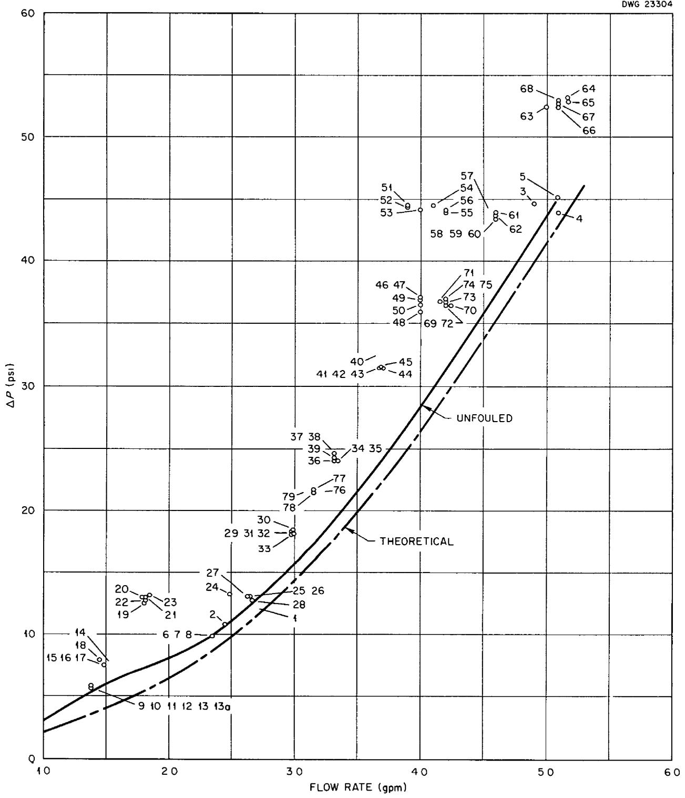  
Fig 6 Fluoride Salt System Pressure Drop vs Flow Rate for Each Run

TABLE 1 MEASURED AND CALCULATED RESULTS OF HEAT TRANSFER EXPERIMENTS   

<table><tr><td rowspan="2">MEASURED OR CALCULATED QUANTITY</td><td colspan="18">DATA POINTS</td><td></td></tr><tr><td>(1)</td><td>(2)</td><td>(3)</td><td>(4)</td><td>(5)</td><td>(6)</td><td>(7)</td><td>(8)</td><td>(9)</td><td>(10)</td><td>(11)</td><td>(12)</td><td>(13)</td><td>(13 )</td><td>(24)</td><td>(25)</td><td>(26)</td><td>(27)</td><td>(28)</td></tr><tr><td>1</td><td>1220 5</td><td>1343 3</td><td>1323 0</td><td>1323 7</td><td>1321 5</td><td>1317 1</td><td>1328 8</td><td>1330 8</td><td>1315 7</td><td>1332 8</td><td>1333.4</td><td>1333.4</td><td>1333.4</td><td>1334 2</td><td>1429 1</td><td>1419 3</td><td>1423 0</td><td>1420 8</td><td>1405 3</td></tr><tr><td>N1</td><td>1154 5</td><td>1140 2</td><td>1181 9</td><td>1179 8</td><td>1164 5</td><td>1102.4</td><td>1118 3</td><td>1126 0</td><td>1057 4</td><td>1058 2</td><td>1057 1</td><td>1053.2</td><td>1054 6</td><td>1055 2</td><td>1267.4</td><td>1232 7</td><td>1228.4</td><td>1222 9</td><td>1200 7</td></tr><tr><td>wN</td><td>1151 9</td><td>1185 1</td><td>1195 0</td><td>1201.4</td><td>1203 5</td><td>1115 0</td><td>1142 9</td><td>1151 9</td><td>1083.4</td><td>1053 9</td><td>1053 6</td><td>1049 8</td><td>1053 5</td><td>1056 1</td><td>1253.3</td><td>1218 7</td><td>1217 6</td><td>1214 1</td><td>1214 5</td></tr><tr><td>ΔtF</td><td>10 1</td><td>26 8</td><td>14 8</td><td>14 6</td><td>15 6</td><td>27 2</td><td>29 8</td><td>28.3</td><td>37 9</td><td>41 3</td><td>41 5</td><td>42.3</td><td>41 9</td><td>42 4</td><td>25.3</td><td>26 9</td><td>27 0</td><td>28 4</td><td>27 6</td></tr><tr><td>ΔtN</td><td>300 0</td><td>82 9</td><td>108 7</td><td>111 9</td><td>84 8</td><td>57 1</td><td>48 2</td><td>38 5</td><td>81 4</td><td>59 8</td><td>49 9</td><td>43 0</td><td>37.4</td><td>37 0</td><td>150 8</td><td>96 6</td><td>71.4</td><td>54.2</td><td>46 6</td></tr><tr><td>wF</td><td>4580</td><td>4060</td><td>8110</td><td>8450</td><td>8450</td><td>3810</td><td>3810</td><td>3810</td><td>2300</td><td>2300</td><td>2300</td><td>2300</td><td>2300</td><td>2300</td><td>4050</td><td>4325</td><td>4325</td><td>4290</td><td>4340</td></tr><tr><td>wN</td><td>2250</td><td>1170</td><td>1180</td><td>1160</td><td>1700</td><td>2235</td><td>2560</td><td>3060</td><td>1320</td><td>1960</td><td>2405</td><td>2780</td><td>3120</td><td>3120</td><td>635</td><td>1196</td><td>1700</td><td>2360</td><td>2950</td></tr><tr><td>qF</td><td>14 320</td><td>33 700</td><td>37 200</td><td>38 240</td><td>40 850</td><td>32 150</td><td>35 200</td><td>33 420</td><td>27 000</td><td>29,400</td><td>29 600</td><td>30 150</td><td>29 900</td><td>30 200</td><td>31 780</td><td>36 040</td><td>36 200</td><td>37 750</td><td>37 100</td></tr><tr><td>qN</td><td>16 720</td><td>24 000</td><td>31 800</td><td>32 190</td><td>35 750</td><td>31 640</td><td>30 600</td><td>29 200</td><td>26 600</td><td>29 050</td><td>29 760</td><td>29 620</td><td>28 950</td><td>28 620</td><td>23 750</td><td>28 620</td><td>30 040</td><td>31 700</td><td>34 100</td></tr><tr><td>q</td><td>15 520</td><td>28 850</td><td>34 500</td><td>35 220</td><td>38 300</td><td>31 895</td><td>32 900</td><td>31 310</td><td>26 800</td><td>29 225</td><td>29 680</td><td>29 885</td><td>29 425</td><td>29 400</td><td>27 765</td><td>32,330</td><td>33 120</td><td>34 725</td><td>35 600</td></tr><tr><td>ΔLM</td><td>172.4</td><td>230 2</td><td>184 1</td><td>188.6</td><td>189.6</td><td>230 0</td><td>220 6</td><td>209 9</td><td>279 4</td><td>284 0</td><td>280 2</td><td>280 9</td><td>276.4</td><td>276.9</td><td>218.6</td><td>219 9</td><td>216 1</td><td>210.3</td><td>214 4</td></tr><tr><td>U</td><td>1138</td><td>1582</td><td>2362</td><td>2357</td><td>2553</td><td>1750</td><td>1882</td><td>1882</td><td>1212</td><td>1300</td><td>1338</td><td>1342</td><td>1342</td><td>1600</td><td>1858</td><td>1931</td><td>2080</td><td>2096</td><td></td></tr><tr><td>F(0 4)</td><td>1218.3</td><td>1333.4</td><td>1318 0</td><td>1318 8</td><td>1315 9</td><td>1306 7</td><td>1317 0</td><td>1319 6</td><td>1301 1</td><td>1316 7</td><td>1316 8</td><td>1316 8</td><td>1317 8</td><td>1316 5</td><td>1420.3</td><td>1410 3</td><td>1412 8</td><td>1409 9</td><td>1394 6</td></tr><tr><td>N(0 4)</td><td>1091.2</td><td>1111 5</td><td>1145.6</td><td>1142 3</td><td>1134.3</td><td>1080 6</td><td>1099 2</td><td>1110 8</td><td>1026 2</td><td>1034 8</td><td>1037 2</td><td>1032 6</td><td>1040 6</td><td>1039 8</td><td>1215.4</td><td>1200.4</td><td>1197 1</td><td>1202 0</td><td>1182 6</td></tr><tr><td>wF</td><td>1168 2</td><td>1215 5</td><td>1231 2</td><td>1236 6</td><td>1243 7</td><td>1148 5</td><td>1177 5</td><td>1184 8</td><td>1111 6</td><td>1084 7</td><td>1084 8</td><td>1081 2</td><td>1084 5</td><td>1087 0</td><td>1282.4</td><td>1252 7</td><td>1252.4</td><td>1250 6</td><td>1251 9</td></tr><tr><td>bF</td><td>4780</td><td>3785</td><td>6150</td><td>6620</td><td>8190</td><td>3110</td><td>3640</td><td>3590</td><td>2182</td><td>1950</td><td>1977</td><td>1961</td><td>1950</td><td>1980</td><td>3108</td><td>3165</td><td>3182</td><td>3360</td><td>3855</td></tr><tr><td>bN</td><td>3230</td><td>4950</td><td>8830</td><td>7520</td><td>7160</td><td>11 700</td><td>9500</td><td>9610</td><td>5910</td><td>19 320</td><td>22 840</td><td>21 970</td><td>28 800</td><td>22 800</td><td>9240</td><td>22,280</td><td>20 400</td><td>36 200</td><td>14 100</td></tr><tr><td>bF(W I )</td><td></td><td></td><td>5740</td><td>5740</td><td>5740</td><td>3055</td><td>3055</td><td>3055</td><td>2025</td><td>2025</td><td>2025</td><td>2025</td><td>2025</td><td>2025</td><td>3672</td><td>3672</td><td>3672</td><td>3672</td><td></td></tr><tr><td>bN(W I )</td><td></td><td></td><td>7700</td><td>7500</td><td>10 100</td><td>10 880</td><td>19 230</td><td>19 230</td><td>7040</td><td>11 570</td><td>15 400</td><td>16 120</td><td>16 120</td><td>15 880</td><td>4700</td><td>8580</td><td>9430</td><td>14 600</td><td>15 400</td></tr><tr><td>N F</td><td>8 12</td><td>6 25</td><td>10 30</td><td>11 17</td><td>13 80</td><td>5 25</td><td>6 15</td><td>6 01</td><td>3 72</td><td>3 26</td><td>3 31</td><td>3 28</td><td>3.26</td><td>3 32</td><td>4 78</td><td>4 86</td><td>4 86</td><td>5 16</td><td>6 01</td></tr><tr><td>N N</td><td>8 03</td><td>12 3</td><td>21 95</td><td>18.45</td><td>17 80</td><td>29 10</td><td>23 60</td><td>23 64</td><td>14 80</td><td>48.3</td><td>57 1</td><td>54 8</td><td>71 9</td><td>57 0</td><td>22 83</td><td>55 15</td><td>50 5</td><td>89 50</td><td>34 95</td></tr><tr><td>N F(W I )</td><td></td><td></td><td>9 55</td><td>9 55</td><td>9 55</td><td>5 16</td><td>5 16</td><td>5 16</td><td>3 39</td><td>3 39</td><td>3 39</td><td>3 39</td><td>3 39</td><td>3 39</td><td>5 64</td><td>5 64</td><td>5 64</td><td>5 64</td><td>5 64</td></tr><tr><td>N N(W I )</td><td></td><td></td><td>19 14</td><td>18 73</td><td>25 1</td><td>26 1</td><td>47 8</td><td>47 4</td><td>17 60</td><td>28 8</td><td>38 4</td><td>40 2</td><td>40 2</td><td>39 65</td><td>11 63</td><td>21 2</td><td>23 35</td><td>36 1</td><td>38,15</td></tr><tr><td>R F</td><td>9040</td><td>10 260</td><td>19 970</td><td>20 800</td><td>20 620</td><td>9100</td><td>9300</td><td>9380</td><td>5450</td><td>5640</td><td>5640</td><td>5640</td><td>5640</td><td>5640</td><td>12 200</td><td>12 800</td><td>12 880</td><td>12 700</td><td>12 470</td></tr><tr><td>R F I</td><td>8610</td><td>9080</td><td>18 170</td><td>19 080</td><td>19 180</td><td>7680</td><td>8000</td><td>8090</td><td>4435</td><td>4400</td><td>4400</td><td>4400</td><td>4400</td><td>4400</td><td>10 680</td><td>10 880</td><td>10 980</td><td>10 750</td><td>10 780</td></tr><tr><td>R N</td><td>72 700</td><td>38 750</td><td>39 100</td><td>38 420</td><td>56,300</td><td>72 100</td><td>82 600</td><td>101 300</td><td>41 600</td><td>61 800</td><td>75 900</td><td>87 700</td><td>98 400</td><td>98 400</td><td>21 580</td><td>40 600</td><td>57 700</td><td>80 100</td><td>100 200</td></tr><tr><td>P F</td><td>6 75</td><td>5 13</td><td>5 35</td><td>5 35</td><td>5 43</td><td>5 55</td><td>5 43</td><td>5 35</td><td>5 64</td><td>5 36</td><td>5 36</td><td>5 36</td><td>5 36</td><td>5 36</td><td>3 93</td><td>4 07</td><td>4 02</td><td>4 08</td><td>4.26</td></tr><tr><td>P F I</td><td>7 09</td><td>5 79</td><td>5 87</td><td>5 83</td><td>5 85</td><td>6 57</td><td>6 31</td><td>6 20</td><td>6 91</td><td>6 86</td><td>6 86</td><td>6 86</td><td>6 86</td><td>6 86</td><td>4.50</td><td>4 80</td><td>4 72</td><td>4 81</td><td>4.93</td></tr><tr><td>P N</td><td>0 00611</td><td>0 00596</td><td>0 00596</td><td>0 00596</td><td>0 00596</td><td>0 00611</td><td>0 00611</td><td>0 00596</td><td>0 0063</td><td>0 00629</td><td>0 00629</td><td>0 00629</td><td>0 00629</td><td>0 00579</td><td>0 00579</td><td>0 00579</td><td>0 00579</td><td>0 00579</td><td>0 00580</td></tr></table>

Nmb dl 1whihd k h f h b Fi ur 6. Rme reme d l 1 i fd p1 13

# DISCUSSION OF RESULTS

The fluoride salt results are compared with Eq 9 in Fig 7 and with Eqs 10 and 11 in Fig 8. A least squares analysis of the data in Fig 7 determines a line to within $4\%$ of Eq 9 while the averaging line compared with Eqs 10 and 11 is approximately $20\%$ low. It appears then that evaluating the physical constants at an average of the bulk temperature and the wall temperature produces a better comparison of the results for the fluoride salt with correlating equations for ordinary fluids

The scatter of the fluoride salt data is no doubt a reflection of the erratic nature of the heat balances Although the axial temperature differences measured were small and would result in large percentage errors for a small discrepancy in absolute value they would tend to be consistent The electromagnetic flowmeter readings for the NaK would likewise be consistent even if in error The fluoride salt flow rate on the other hand al though measured with an accurately calibrated

venturi was quite likely the cause of the scattering The pressure measuring technique on this venturi involved closely controlling liquid levels in the transmitters by means of floats and automatically operated solenoid gas valves

The length to diameter ratio of the center tube warrants some consideration here For short tubes where the velocity profile and boundary layer have not developed fully the heat transfer coefficients will be greater than those for established flow investigations cited by Brown and Marco12 indicate the limiting $(L / D)$ ratio for this condition to be 40 Hoffman13 shows entrance length that is number of tube diameters where the film coefficient is 1] times the established value plotted as a function

12A Brown and S M Marco Introduction to Heat Transfer 2d ed p 110 McG aw Hill New York 1951

13H W Hoffman Turbulent Forced Convection Heat Transfer in Circular Tubes Containing Molten Sodium Hydroxide ORNL 1370 (Oct 3 1952)

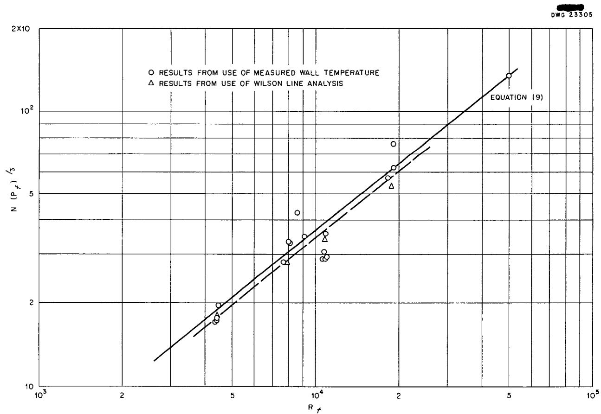  
Fig 7 Comparison of Fluoride Salt Results with the Colburn Equation

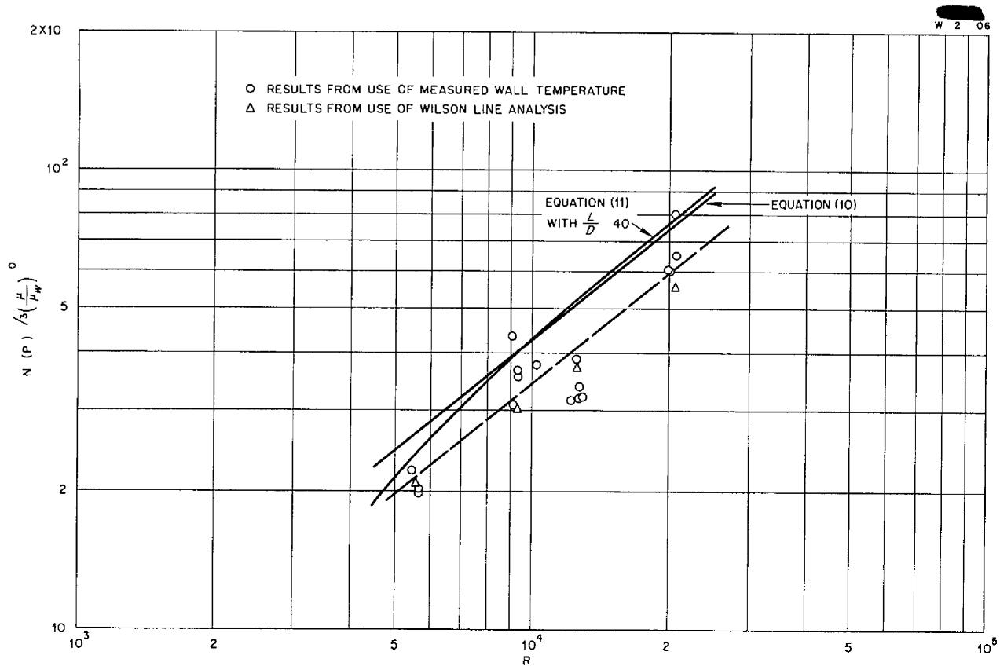  
Fig 8 Comparison of Fluoride Salt Results with the Sieder and Tate Equation and with the Hausen Equation

of Reynolds modulus times Prandtl modulus for molten sodium hydroxide Since the fluoride salt has a comparable Prandtl modulus the plot should be applicable and for the range of data of this experiment entrance lengths up to 50 are indicated. Therefore it would be expected that the fluoride salt results would be slightly high and it is possible that such a condition is masked by the fouling that occurred

Another point to be discussed is that in all the correlating equations a bulk temperature was used for evaluating the results while center line or axis temperatures were measured in the equipment The work of Boelter et al 67 when applied to salts indicates the ratio $(t_w - t) / (t_w - t_c)$ for the fluoride salt results to be 0.92 and the ratio for the NaK to be approximately 0.58 For the

fluoride salt data therefore the discrepancy in volved in using an axis temperature rather than a bulk temperature is small and certainly within the accuracy of the experiment but a large amount of uncertainty arises for the NaK data. This uncertainty is borne out in the comparison of the NaK results with Eq 12 in Fig 9 The relationship between axis and bulk temperature however has limited meaning for the NaK stream since it was flowing in an annular space

Failure of the measured NaK heat transfer coefficients to coincide with the theoretical equations does not necessarily reflect on the accuracy of the fluoride salt measurements but it indicates the difficulty involved and the greater precision required in making liquid metal heat transfer correlations

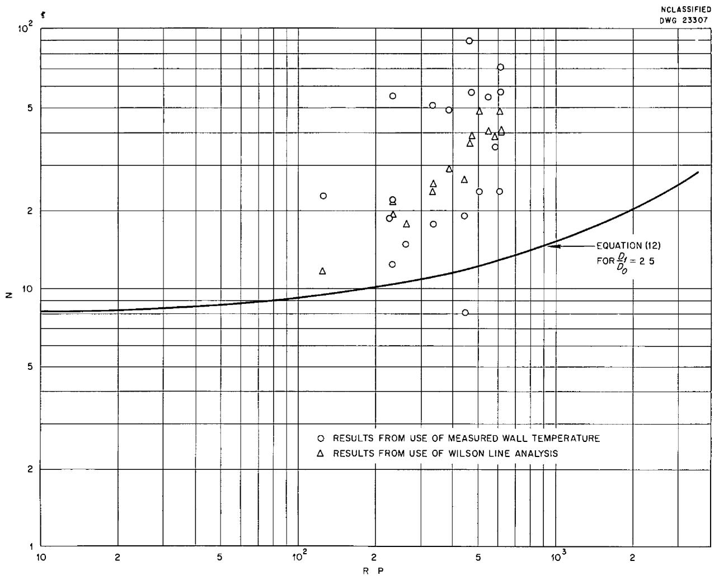  
Fig 9 Comparison of the NaK Results with the Werner King and Tidball Equation

# CONCLUSIONS

The fluoride salt can be considered to be an ordinary fluid with respect to heat transfer and the equations in the literature can be used to design heat exchange equipment or to predict its performance. A similar conclusion was made by other workers at ORNL for the nonuranium bearing fluoride salt mixture NaF KF LiF (115420465 mole%) This would not include cases where the fluid had self generating heat sources

Use of iron bearing alloys such as type 316

stainless steel together with material not containing iron in high temperature fluoride salt circulating systems will result in mass transfer of the iron to cold surfaces if there is turbulent flow and if there exist large temperature differences Frictional resistance to flow will be greatly increased and heat transfer performance of equipment will be likewise impaired

The Wilson Line approach can be used to determine heat transfer coefficients of fluoride salts at elevated temperatures in a double tube heat exchanger where sodium potassium alloy is used as the cooling or heating fluid

# NOMENCLATURE

<table><tr><td>a</td><td>Constant</td></tr><tr><td>Ao</td><td>Outer area of heat exchanger center tube ft2</td></tr><tr><td>At</td><td>Inner area of heat exchanger center tube ft2</td></tr><tr><td>Aan</td><td>Transverse flow area of heat exchanger annulus ft2</td></tr><tr><td>b</td><td>Constant</td></tr><tr><td>cF</td><td>Specific heat of the fluoride salt Btu/lb °F</td></tr><tr><td>cn</td><td>Specific heat of the NaK Btu/lb F</td></tr><tr><td>C</td><td>Constant</td></tr><tr><td>CF</td><td>Product of specific heat and mass flow rate for the fluoride salt Btu/hr °F</td></tr><tr><td>CN</td><td>Product of specific heat and mass flow rate for the NaK Btu/hr °F</td></tr><tr><td>D</td><td>Tube or pipe diameter in general ft</td></tr><tr><td>Dt</td><td>Inner diameter of center tube ft</td></tr><tr><td>Do</td><td>Outer diameter of center tube inner diameter of annulus ft</td></tr><tr><td>D1</td><td>Outer diameter of annulus ft</td></tr><tr><td>De</td><td>Equivalent diameter of the annulus or hydraulic diameter (D1-D0) ft</td></tr><tr><td>bf</td><td>Film heat transfer coefficient for the fluoride salt Btu/hr ft2 F</td></tr><tr><td>bn</td><td>Film heat transfer coefficient for the NaK Btu/hr ft2 °F</td></tr><tr><td>kw</td><td>Thermal conductivity of center tube wall material Btu/hr ft °F</td></tr><tr><td>kF</td><td>Thermal conductivity of the fluoride salt Btu/hr ft °F</td></tr><tr><td>kn</td><td>Thermal conductivity of the NaK Btu/hr ft °F</td></tr><tr><td>L</td><td>Length of heat exchanger center tube ft</td></tr><tr><td>dL</td><td>Differential length of center tube ft</td></tr><tr><td>M</td><td>Constant equivalent to (UoπD0), Btu/hr ft F</td></tr><tr><td>n</td><td>Constant</td></tr><tr><td>p</td><td>Constant</td></tr><tr><td>qF</td><td>Rate of heat transfer from the fluoride salt stream Btu/hr</td></tr><tr><td>qN</td><td>Rate of heat transfer to the NaK Btu/hr</td></tr><tr><td>q</td><td>Average rate of heat transfer between the fluoride salt and NaK streams Btu/hr</td></tr><tr><td>qd</td><td>Differential rate of heat transfer Btu/hr</td></tr><tr><td>t</td><td>Bulk temperature of stream °F</td></tr><tr><td>tF</td><td>Bulk temperature of fluoride °F</td></tr><tr><td>tN</td><td>Bulk temperature of NaK F</td></tr><tr><td>tc</td><td>Axis or center line temperature of stream °F</td></tr><tr><td>tw</td><td>Temperature of tube wall surface °F</td></tr><tr><td>tF1</td><td>Inlet fluoride axis temperature to heat exchanger F</td></tr><tr><td>tF2</td><td>Outlet fluoride axis temperature from heat exchanger °F</td></tr><tr><td>tN1</td><td>Outlet NaK axis temperature from heat exchanger °F</td></tr><tr><td>tN2</td><td>Inlet NaK axis temperature to heat exchanger °F</td></tr><tr><td>tF(0 4)</td><td>Fluoride axis temperature at 0 4L °F</td></tr><tr><td>tN(0 4)</td><td>NaK axis temperature at 0 4L °F</td></tr><tr><td>twF</td><td>Center tube surface temperature on fluoride salt side at 0 4L °F</td></tr><tr><td>twN</td><td>Center tube surface temperature on NaK side at 0 4L °F</td></tr><tr><td>tFf</td><td>Fictive fluoride salt film temperature at 0 4L [tF(0 4) + twF/2] °F</td></tr><tr><td>dtF</td><td>Differential fluoride salt bulk temperature °F</td></tr><tr><td>dtN</td><td>Differential NaK bulk temperature °F</td></tr><tr><td>Uo</td><td>Over all heat transfer coefficient based on outer area of heat exchanger center tube Btu/hr ft2 °F</td></tr><tr><td>Uoo</td><td>Over all heat transfer coefficient at zero ordinate of Wilson plot Btu/hr ft2 °F</td></tr><tr><td>ν</td><td>Mean flow velocity ft/hr</td></tr><tr><td>νN</td><td>Mean NaK velocity in annulus fps</td></tr><tr><td>wF</td><td>Mass flow rate of fluoride salt lb/hr</td></tr><tr><td>wN</td><td>Mass flow rate of NaK lb/hr</td></tr><tr><td>Δt</td><td>Temperature difference of fluoride salt and NaK at any cross section of heat exchanger °F</td></tr><tr><td>ΔtF</td><td>Temperature drop of fluoride salt through the exchanger °F</td></tr><tr><td>ΔtN</td><td>Temperature rise of NaK through the exchanger °F</td></tr><tr><td>Δt1</td><td>Temperature difference of fluoride salt and NaK at hot end of exchanger °F</td></tr><tr><td>Δt2</td><td>Temperature difference of fluoride salt and NaK at cold end of exchanger °F</td></tr><tr><td>ΔtLM</td><td>Logarithmic mean of Δt1and Δt2 °F</td></tr><tr><td>β</td><td>Constant (1/C_F + 1/C_N) hr °F/Btu</td></tr><tr><td>π</td><td>Constant 3 1416</td></tr><tr><td>ρ</td><td>Mass density evaluated at bulk temperature lb/ft3</td></tr><tr><td>ρF</td><td>Mass density of fluoride salt evaluated at axis temperature lb/ft3</td></tr><tr><td>ρN</td><td>Mass density of NaK evaluated at axis temperature lb/ft3</td></tr><tr><td>μ</td><td>Absolute viscosity evaluated at bulk temperature lb/hr ft</td></tr><tr><td>μF</td><td>Absolute viscosity of fluoride salt evaluated at axis temperature lb/hr ft</td></tr><tr><td>μN</td><td>Absolute viscosity of NaK evaluated at axis temperature lb/hr ft</td></tr><tr><td>μFf</td><td>Absolute viscosity of fluoride salt evaluated at film temperature lb/hr ft</td></tr></table>

$\mu_{w}$ Absolute viscosity evaluated at tube surface temperature Ib/hr ft

N u $\frac{bD}{k}$ Nusselt modulus (tube)

Nuselt modulus for fluoride salt

Nun $\frac{b_N^D e}{k_N}$ Nusselt modulus for NaK

$N u_{a n} \frac{b D_{e}}{k}$ Nusselt modulus for an annular passage

Re $\frac{\rho D\nu}{\mu}$ Reynolds modulus

ReF $\frac{\rho_F^D\iota^\nu_F}{\mu_F}$ Reynolds modulus for fluoride salt

Re $Ff$ $\frac{\rho_{F}D_{t}\nu_{F}}{\mu_{Ff}}$ Reynolds modulus for fluoride salt with viscosity evaluated at $t_{Ff}$

ReN $\frac{\rho_N^D e^\nu N}{\mu_N}$ Reynolds modulus for NaK

Pr $\frac{C_p\mu}{k}$ Prandtl modulus

PrF C F Prandlt modulus for fluoride salt

Pr $Ff$ $\frac{C_F\mu_{Ff}}{k_F}$ Prandtl modulus for fluoride salt with viscosity evaluated at $t_{Ff}$

PrN C Nmu Prandtl modulus for NaK

# APPENDIX 1

# EQUATION FOR INTERMEDIATE AXIAL STREAM TEMPERATURE WITH LOGARITHMIC DISTRIBUTION

To evaluate the temperature difference across the film at the point in the heat exchanger where the center wall temperature was measured it was necessary to determine the stream temperature at this position

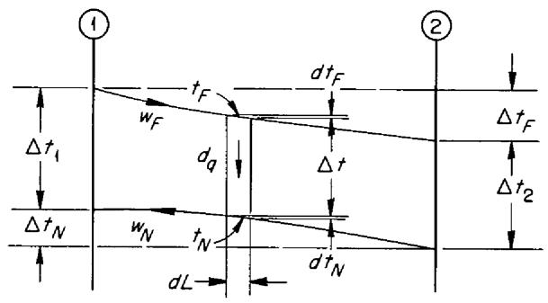

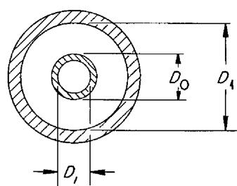

By assuming a constant over all heat transfer coefficient with steady state operation and neglecting heat losses the basic equation for this configuration is

$$
d _ {q} = - w _ {F} c _ {F} d t _ {F} = - w _ {N} c _ {N} d t _ {N} = U _ {o} \pi D _ {o} d L \Delta t \tag {1}
$$

For the fluoride stream

$$
d t _ {F} = - \frac {U _ {o} \pi D _ {o} d L \Delta t}{w _ {F} c _ {F}} \tag {2}
$$

To integrate Eq 2 $\Delta t$ must be written as a function of $L$ . This is done in the usual derivation of the logarithmic mean temperature difference found in the literature therefore

$$
\Delta t = \Delta t _ {1} e ^ {- \beta M L} \tag {3}
$$

The constants have been grouped and simplified as follows

$$
w _ {F} c _ {F} = C _ {F} \quad \text {a n d} \quad w _ {N} c _ {N} = C _ {N}
$$

$$
\beta = \frac {1}{C _ {F}} - \frac {1}{C _ {N}}
$$

$$
M = U _ {o} \pi D _ {o}
$$

Substituting Eq 3 in Eq 2 gives

$$
d t _ {F} = - \frac {M \Delta t _ {1}}{C _ {F}} e ^ {- \beta M L} d L \tag {4}
$$

Integrating and considering the boundary condition when $L = 0$ and $t_F = t_{F1}$ Eq 4 becomes

$$
t _ {F} = t _ {F 1} - \frac {\Delta t _ {1}}{\beta C _ {F}} (1 - e ^ {- \beta M L}) \tag {5}
$$

In like manner for the NaK stream

$$
t _ {N} = t _ {N 1} - \frac {\Delta t _ {1}}{\beta C _ {N}} (1 - e ^ {- \beta M L}) \tag {6}
$$

Equations 5 and 6 can be written for the position where the wall temperatures were measured at $0.4L$ and also changed to involve only the measured temperature quantities. By noting that

$$
\beta C _ {F} = 1 - \frac {\Delta t _ {N}}{\Delta t _ {F}} \text {a n d} \beta C _ {N} = \frac {1 - \frac {\Delta t _ {N}}{\Delta t _ {F}}}{\frac {\Delta t _ {N}}{\Delta t _ {F}}}
$$

and by using Eq 5

$$
t _ {F (0 4)} = t _ {F 1} - \frac {\Delta t _ {1}}{1 - \frac {\Delta t _ {N}}{\Delta t _ {F}}} \left[ 1 - \left(\frac {\Delta t _ {2}}{\Delta t _ {1}}\right) ^ {0. 4} \right] \tag {7}
$$

and by using Eq 6

$$
t _ {N (0 4)} = t _ {N 1} - \frac {\Delta t _ {1} \frac {\Delta t _ {N}}{\Delta t _ {F}}}{1 - \frac {\Delta t _ {N}}{\Delta t _ {F}}} \left[ 1 - \left(\frac {\Delta t _ {2}}{\Delta t _ {1}}\right) ^ {0. 4} \right] \tag {8}
$$

# APPENDIX 2

# DERIVATION OF EQUATIONS FOR WILSON LINE ANALYSIS

In a liquid to liquid heat exchanger where neither fluid changes phase if one of the fluid velocities is held constant and the other is varied over a range of settings in turbulent flow the film coefficient of the fluid at constant velocity can be determined by a graphical method called the Wilson Line or Wilson plot

When the mean temperature of the constant velocity fluid does not vary appreciably the film coefficient will be essentially constant The film coefficient of the other fluid where there are not large changes of physical properties with temperature is a function solely of the velocity

The graphical method was used in this experiment to obtain coefficients of the fluoride salt and thus separate the over all heat transfer coefficient to obtain a NaK film coefficient. If the series resistance concept is used the over all coefficient is related to the film coefficients as follows

$$
\frac {1}{U _ {o}} = \frac {D _ {o}}{b _ {F} D _ {t}} + \frac {D _ {o} \ln \frac {D _ {o}}{D _ {t}}}{2 k _ {w}} + \frac {1}{b _ {N}} \tag {1}
$$

Equation 1 neglects the resistance of any foreign deposits on the heat exchanger walls but such deposits would enter the equation in a term similar to that for the wall resistance that is the middle term in the right side of the expression

The equation relating the NaK coefficient (Eq 12 in the text) reduces to

$$
b _ {N} = a + b \nu_ {N} ^ {0 8} \tag {2}
$$

For $D_{o} = 0329$ in $D_{t} = 0269$ in and $k_{w} = 348\mathrm{Btu / hr}$ ft $\text{一} F$ Eq 1 above becomes

$$
\frac {1}{U _ {o}} = \frac {1 2 2 2}{b _ {F}} + 0 0 0 0 7 8 8 + \frac {1}{a + b v _ {N} ^ {0 8}} \tag {3}
$$

Since the NaK velocity is the only significant variable a plot of $\frac{1}{U_o}$ vs $\frac{1}{(a + b\nu_N)^8}$ should produce a straight line. For such a plot the constants $a$ and $b$ must be known. They could be taken from Eq 12 of the text instead $\frac{1}{U_o}$ was plotted against $\frac{1}{\nu_N^8}$ , as is usually done with ordinary fluids. The data of the experiment proved to be fairly well correlated by straight lines

Inspection of Eq 3 above shows that when the term involving $\nu_{N}^{08}$ approaches zero or when the Wilson Line is extrapolated to the zero ordinate it is possible to write for all the intercepts

$$
\frac {1}{U _ {\circ \circ}} = \frac {1 2 2 2}{b _ {F}} + 0 0 0 0 0 7 8 8 \tag {4}
$$

From Eq 4 it is possible to solve for the fluoride salt film coefficient that is

$$
b _ {F} = \frac {1 2 2 2}{\frac {1}{U _ {0 0}} - 0 0 0 0 0 7 8 8} \tag {5}
$$

Since the fluoride salt film coefficient is essentially constant along any of the lines it is possible to separate the NaK film coefficient from any of the over all coefficients. Substitution in Eq 1 above gives

$$
b _ {N} = \frac {1}{\frac {1}{U _ {o}} - \frac {1 2 2 2}{b _ {F}} - 0 0 0 0 7 8 8} = \frac {1}{\frac {1}{U _ {o}} - \frac {1}{U _ {o o}}} \tag {6}
$$

# APPENDIX 3

# PHYSICAL PROPERTIES OF THE FLUORIDE SALT NaF $\mathsf{ZrF}_4$ UF4 (50-46-4 mole %) AND OF SODIUM POTASSIUM EUTECTIC ALLOY

The physical properties of the fluoride salt were taken from the third edition charts of the ANP Physical Properties Group1 and are represented as a function of temperature in Fig 10. The charts are revised periodically as new data become available. The NaK properties given in Fig 11 were taken from the second edition of the Liquid Metals Handbook15

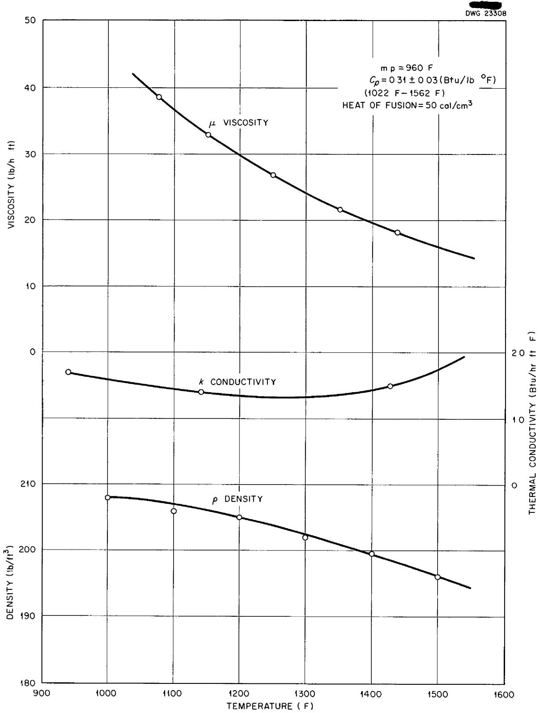  
Fig 10 Physical Properties of the Fluoride Salt vs Temperature

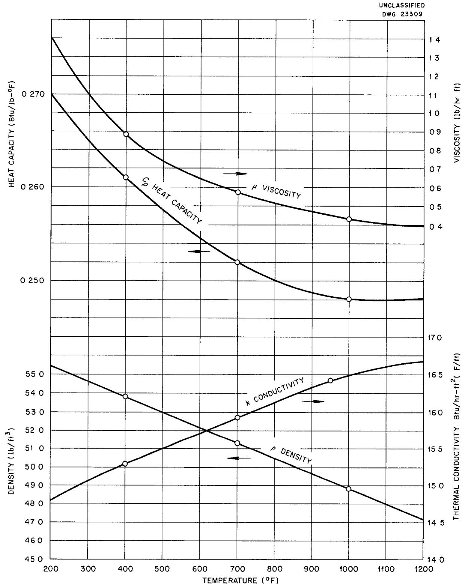  
Fig 11 Physical Properties of NaK (56 wt% Na-44 wt% K) vs Temperature

# APPENDIX 4

# SAMPLE CALCULATION OF DATA POINT 4

Experimental Data

$$
t _ {F 1} = 1 3 2 3 7 ^ {\circ} \mathrm {F}
$$

$$
t _ {F 2} = 1 3 0 9 1 ^ {\circ} F
$$

$$
t _ {N 1} = 1 1 7 9 8 ^ {\circ} \mathrm {F}
$$

$$
t _ {N 2} = 1 0 6 7 9 ^ {\circ} \mathrm {F}
$$

$$
w _ {F} = 8 4 5 0 \mathrm {l b / h r}
$$

$$
w _ {N} = 1 1 6 0 \mathrm {l b / h r}
$$

$$
t _ {w N} = 1 2 0 1 4 ^ {\circ} \mathrm {F}
$$

Heat Balance

$$
\begin{array}{l} q _ {F} = w _ {F} c _ {F} \left(t _ {F 1} - t _ {F 2}\right) \\ = (8 4 5 0) (0 3 1) (1 4 6) = 3 8 2 4 0 B t u / h r \\ \end{array}
$$

$$
\begin{array}{l} q _ {N} = w _ {N} c _ {N} \left(t _ {N 1} - t _ {N 2}\right) \\ = (1 1 6 0) (0 2 4 8) (1 1 1 9) = 3 2 1 9 0 \mathrm {B t u} / \mathrm {h r} \\ \end{array}
$$

(Heat loss less than $1\%$ and therefore neglected)

$$
\frac {q _ {F} - q _ {N}}{q _ {F}} = \frac {6050}{38240} = 16 \%
$$

$$
q = 3 5 2 2 0 \mathrm {B t u} / \mathrm {h r}
$$

Over all Heat Transfer Coefficient

$$
U _ {o} = \frac {q _ {a v}}{A _ {o} \Delta t _ {L M}}
$$

$$
\Delta t _ {L M} = \frac {\left(t _ {F 1} - t _ {N 1}\right) - \left(t _ {F 2} - t _ {N 2}\right)}{\ln \frac {t _ {F 1} - t _ {N 1}}{t _ {F 2} - t _ {N 2}}} = \frac {1 4 3 . 9 - 2 4 1 . 2}{\ln \frac {1 4 3 . 9}{2 4 1 . 2}} = 1 8 8. 6 ^ {\circ} F
$$

$$
U _ {o} = \frac {3 5 2 2 0}{0 . 0 7 9 2 (1 8 8 6)} = 2 3 5 7 B t u / h r f t ^ {2} ^ {\circ} F
$$

Wall Temperatures

$$
\begin{array}{l} t _ {w N} = 1 2 0 1 4 \text {(m e a s u r e d)} \\ t _ {w F} = t _ {w N} + \frac {q _ {a v} \ln \frac {D _ {o}}{D _ {i}}}{2 \pi k _ {w} L} \\ = 1 2 0 1 4 + \frac {3 5 2 2 0 \ln \frac {0 3 2 9}{0 2 6 9}}{2 \pi (3 4 8) (0 9 2 2)} = 1 2 3 6 6 ^ {\circ} F \\ \end{array}
$$

# Stream Temperatures

$$
\begin{array}{l} t _ {F (0 4)} = t _ {F 1} - \frac {\Delta t _ {1}}{1 - \frac {\Delta t _ {N}}{\Delta t _ {F}}} \left[ 1 - \left(\frac {\Delta t _ {2}}{\Delta t _ {1}}\right) ^ {0 4} \right] \\ = 1 3 2 3 7 - \frac {1 4 3 9}{(1 - 7 6 6)} [ 1 - 1 2 2 9 ] = 1 3 1 8 8 ^ {\circ} F \\ \end{array}
$$

$$
\begin{array}{l} t _ {N (0 4)} = t _ {N 1} - \frac {\Delta t _ {1} \frac {\Delta t _ {N}}{\Delta t _ {F}}}{1 - \frac {\Delta t _ {N}}{\Delta t _ {F}}} \left[ 1 - \left(\frac {\Delta t _ {2}}{\Delta t _ {1}}\right) ^ {0 4} \right] \\ = 1 1 7 9 8 - (4 9) (7 6 6) = 1 1 4 2 3 ^ {\circ} \mathrm {F} \\ \end{array}
$$

# Film Coefficients

$$
\begin{array}{l} b _ {F} = \frac {q _ {a v}}{A _ {t} [ t _ {F (0 4)} - t _ {w F} ]} \\ = \frac {3 5 2 2 0}{0 . 0 6 4 7 (8 2 2)} = 6 6 2 0 B t u / h r f t ^ {2} ^ {\circ} F \\ \end{array}
$$

$$
\begin{array}{l} b _ {N} = \frac {q _ {a v}}{A _ {o} \left[ t _ {w N} - t _ {N (0 4)} \right]} \\ = \frac {3 5 2 2 0}{0 . 0 7 9 2 (5 9 1)} = 7 5 2 0 B t u / h r f t ^ {2} \circ F \\ \end{array}
$$

# Wilson Line

$$
\frac {1}{U _ {o}} = \frac {1}{2 3 5 7} = 0. 0 0 0 4 2 5 h r f t ^ {2} ^ {\circ} F / B t u
$$

$$
v _ {N} = \frac {w _ {N}}{\rho_ {N} A _ {a n}} = \frac {1 1 6 0 (1 4 4)}{(4 8 2) (0 4 4 8) (3 6 0 0)} = 2. 1 5 \mathrm {f t / s e c}
$$

$$
\frac {1}{v _ {N} ^ {0 8}} = \frac {1}{1 8 4} = 0 5 4 2
$$

From Fig 5 $\frac{1}{U_{oo}}$ at $\frac{1}{\nu_N^08} = 0$ for this line is 0 000292

$$
b _ {F} = \frac {1 2 2 2}{\frac {1}{U _ {0 0}} - 0 0 0 0 0 7 8 8} = 5 7 4 0 B t u / h r f t ^ {2} ^ {\circ} F
$$

$$
b _ {N} = \frac {1}{\frac {1}{U _ {o}} - \frac {1 2 2 2}{b _ {F}} - 0 0 0 0 7 8 8} = 7 5 0 0 B t u / h r f t ^ {2} ^ {\circ} F
$$

Dimensionless Moduli

$$
A t t _ {F f} = 1 2 7 8 ^ {\circ} F
$$

$$
c _ {F} = 0. 3 1 \mathrm {B t u / l b} ^ {\circ} \mathrm {F}
$$

$$
\mu_ {F f} = 2 5 2 \mathrm {l b / h r f t}
$$

$$
k _ {F} = 1 3 4 \mathrm {B t u / h r f t} ^ {\circ} \mathrm {F}
$$

$$
N u _ {F} = \frac {b _ {F} D _ {1}}{k _ {F}} = \frac {6 6 2 0 (0 2 6 9)}{1 3 4 (1 2)} = 1 1 1 7
$$

$$
\operatorname {R e} _ {F f} = \frac {4 w _ {F}}{\pi \mu_ {F f} D _ {i}} = \frac {4 (8 4 5 0) (1 2)}{\pi (2 5 2) (0 2 6 9)} = 1 9 0 8 0
$$

$$
\Pr_ {F f} = \frac {c _ {F} \mu_ {F f}}{k _ {F}} = \frac {0 3 1 (2 5 2)}{1 3 4} = 5 8 3 \quad \left(\Pr_ {F}\right) ^ {\frac {1}{3}} = 1 8 0 1
$$

$$
\mathrm {N u} _ {F} \left(\Pr_ {F f}\right) ^ {- \frac {1}{3}} = 6 2
$$

$$
A t t _ {F (0 4)} = 1 3 1 9 ^ {\circ} F
$$

$$
c _ {F} = 0. 3 1 \mathrm {B t u / l b} ^ {\circ} \mathrm {F}
$$

$$
\mu_ {F} = 2 3 1 \mathrm {l b / h r f t}
$$

$$
k _ {F} = 1 3 4 \mathrm {B t u / h r f t ^ {\circ} F}
$$

$$
\mathrm {A t} t _ {w F} = 1 2 3 7 ^ {\circ} \mathrm {F}
$$

$$
\mu_ {w F} = 2 7 5 \mathrm {l b / h r f t}
$$

$$
\mathrm {N u} _ {F} = \frac {b _ {F} D _ {1}}{k _ {F}} = \frac {6 6 2 0 (0 2 6 9)}{1 3 4 (1 2)} = 1 1 1 7
$$

$$
\operatorname {R e} _ {F} = \frac {4 w _ {F}}{\pi \mu_ {F} D _ {2}} = \frac {4 (8 4 5 0) (1 2)}{\pi (2 3 1) (0 2 6 9)} = 2 0 8 0 0
$$

$$
\Pr_ {F} = \frac {c _ {F} \mu_ {F}}{k _ {F}} = \frac {0 3 1 (2 3 1)}{1 3 4} = 5 3 5
$$

$$
\left(\Pr_ {F}\right) ^ {\frac {1}{3}} = 1 7 5
$$

$$
\left(\frac {\mu}{\mu_ {w}}\right) _ {F} = \frac {2 3 1}{2 7 5} = 0. 8 4
$$

$$
\left(\frac {\mu}{\mu_ {w}}\right) _ {F} ^ {0 1 4} = 0 9 7 6
$$

$$
\mathrm {N u} _ {F} \left(\Pr_ {F}\right) ^ {- 1 / 3} \left(\frac {\mu}{\mu_ {w}}\right) _ {F} ^ {- 0. 1 4} = 6 4 8
$$

$$
A t t _ {N (0 4)} = 1 1 4 2 ^ {\circ} F
$$

$$
c _ {N} = 0 2 4 8 B t u / l b ^ {\circ} F
$$

$$
\rho_ {N} = 4 7 7 \mathrm {l b / f t} ^ {3}
$$

$$
\mu_ {N} = 0. 4 \mathrm {l b / h r f t}
$$

$$
k _ {N} = 1 6 6 5 \mathrm {B t u / h r f t} ^ {\circ} \mathrm {F}
$$

$$
\mathrm {N u} _ {N} = \frac {b _ {N} D _ {e}}{k _ {N}} = \frac {7 5 2 0 (0 4 9 5)}{1 6 6 5 (1 2)} = 1 8 4 5
$$

$$
R e _ {N} = \frac {\rho_ {N} ^ {D} e ^ {V} _ {N}}{\mu_ {N}} = \frac {4 7 7 (0 4 9 5) (2 1 5) (3 6 0 0)}{(1 2) (0 4)} = 3 8 4 2 0
$$

$$
\Pr_ {N} = \frac {c _ {N} \mu_ {N}}{k _ {N}} = \frac {0 2 4 8 (0 4)}{1 6 6 5} = 0 0 0 5 9 6
$$

$$
R e _ {N} \times P r _ {N} = 2 2 9
$$