# AEG RESEARCH AND DEVELOPMENT REPORT FORM-1721

Special

7.4

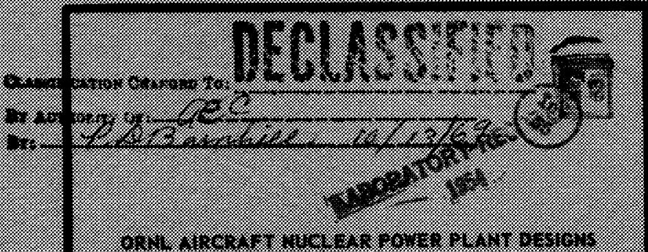

A. P、Prow

A.W.Sayolainen

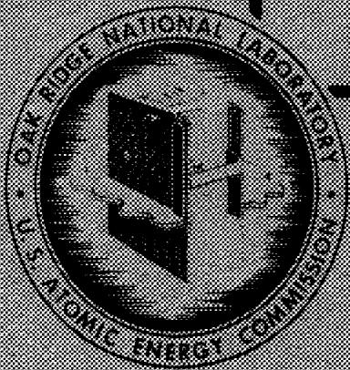

# CENTRAL RESEARCH LIBRARY DOCUMENT COLLECTION

# LIBRARY LOAN COPY

DO NOT TRANSFER TO ANOTHER PERSON

If you wish someone else to see this document, send in some with document and the library will arrange a loan.

OAK RIDGE NATIONAL LABORATORY

CIPENATCD日

CARBIDE AND CARBON CHEMICALS COMPANY

A. OP BYON OF UNIOFF CARGO DE AND UNION COORATION

#

POST OFFICE BOX P

OAK HIDGE TENNEBSEE

RESTRICTED DATA

This document provides the following information about includingthe "Energy" Act of 1965, its comprehensive orthe disclosure of its contents in any minister to an

unauthorized person is prohibited

ORNL-1721

This document consists of 107 pages.

Copy 7.2 of 231 copies. Series A.

Contract No. W-7405-eng-26

# AIRCRAFT REACTOR ENGINEERING DIVISION

# ORNL AIRCRAFT NUCLEAR POWER PLANT DESIGNS

A.P.Fraas

A.W.Savolainen

May 1954

DATE ISSUED

NOV 10 1954

OAK RIDGE NATIONAL LABORATORY

Operated by

CARBIDE AND CARBON CHEMICALS COMPANY

A Division of Union Carbide and Carbon Corporation

Post Office Box P

Oak Ridge, Tennessee

34456 0360699 A

：

1

中

中

# INTERNAL DISTRIBUTION

1. A. A. Abbatiello   
2. R.M. Batch   
3. G.E. Boyd   
4. R.W. Bussard   
5. D.W.Cardwell   
6. C.E. Center   
7. R.A. Charpie   
8. G.H.Clewett   
9. W. B. Cottrell   
10. D. D. Cowen   
11. S. J. Cromer   
12. F. L. Culler   
13. L. B. Emlet   
14. A. P. Fraas   
15. H.C. Gray   
16. W. R. Grimes   
17. A. Hollander   
18. A. S. Householder   
19. W.H. Jordan   
20. C. P. Keim   
21. M. T. Kelley   
22. J.A. Lane   
23. C. E. Larson   
24. M.E. LaVerne   
25. R. S. Livingston   
26. W.D. Manly   
27. F.R. McQuilken   
28. J. L. Meem   
29. A. J. Miller

30. K. Z. Morgan

31. E. J. Murphy

32. J.P.Murray

33. W. G. Piper

34. H. F. Poppendiek

35. P. M. Reyling

36. H.W. Savage

37. A.W. Savolainen

38. R.D. Schultheiss

39. E.D. Shipley

40. M. J. Skinner

41. A, H. Snell

42. R. I. Strough

43. J. A. Swartout

44. E.H. Taylor

45. D. B. Trauger

46. J. B. Trice

47. F.C. VonderLage

48. A. M. Weinberg

49. G. C. Williams

50. C.E. Winters   
51-60. X-10 Document Reference Library (Y-12)   
61. Biology Library   
62-67. Laboratory Records Department   
68. Laboratory Records, ORNL R.C.   
69. Health Physics Library   
70. Metallurgy Library   
71. Reactor Experimental Engineering Library   
72-73. Central Research Library

# EXTERNAL DISTRIBUTION

74. Air Force Engineering Office, Oak Ridge   
75. Air Force Plant Representative, Burbank   
76. Air Force Plant Representative, Seattle   
77. Air Force Plant Representative, Wood-Ridge   
78. American Machine and Foundry Company   
79. ANP Project Office, Fort Worth

80-91. Argonne National Laboratory (I copy to Kermit Anderson)

92. Armed Forces Special Weapons Project (Sandio)   
93. Armed Forces Special Weapons Project, Washington (Gertrude Camp)

94.98. Atomic Energy Commission, Washington (Lt. Col. T. A. Redfield)

99. Babcock and Wilcox Company   
100. Battelle Memorial Institute   
101. Bendix Aviation Corporation

102. Boeing Airplane Company   
103-105. Brookhaven National Laboratory   
106. Bureau of Aeronautics (Grant)   
107. Bureau of Ships   
108. Chicago Patent Group   
109. Chief of Naval Research   
110. Commonwealth Edison Company   
111. Convair, San Diego (C. H. Helms)   
112. Curtiss-Wright Corporation, Wright Aeronautical Division (K. Campbell)   
113. Department of the Navy - Op-362   
114. Detroit Edison Company

115-119. duPont Company, Augusta

120. duPont Company, Wilmington   
121. Duquesne Light Company   
122. Foster Wheeler Corporation

123-125. General Electric Company, ANPD

126. General Electric Company, APS

127-134. General Electric Company, Richland

135. Glenn L. Martin Company (T. F. Nagey)   
136. Hanford Operations Office   
137. Iowa State College

138-139. Kirtland Air Force Base   
140-143. Knolls Atomic Power Laboratory   
144-145. Lockland Area Office   
146-147. Los Alamos Scientific Laboratory

148. Materials Laboratory (WADC) (Col. P. L. Hill)   
149. Nuclear Metals, Inc.   
150. Monsanto Chemical Company   
151. Mound Laboratory

152-155. National Advisory Committee for Aeronautics, Cleveland (A. Silverstein)

156. National Advisory Committee for Aeronautics, Washington

157-158. Naval Research Laboratory

159. Newport News Shipbuilding and Dry Dock Company   
160. New York Operations Office

161-162. North American Aviation, Inc.

163-165. Nuclear Development Associates, Inc.

166. Patent Branch, Washington

167-173. Phillips Petroleum Company (NRTS)

174-175. Powerplant Laboratory (WADC) (A. M. Nelson)

176-185. Pratt and Whitney Aircraft Division (Fox Project)

186-187. Rand Corporation (1 copy to V. G. Henning)

188. San Francisco Field Office   
189. Sylvania Electric Products, Inc.   
190. Tennessee Valley Authority (Dean)   
191. USAF Headquarters   
192. U. S. Naval Radiological Defense Laboratory

193-194. University of California Radiation Laboratory, Berkeley.

195-196. University of California Radiation Laboratory, Livermore   
197. Walter Kidde Nuclear Laboratories, Inc.   
198-203. Westinghouse Electric Corporation   
204-215. Wright Air Development Center (WCSNS, Col. John R. Hood, Jr.)   
216-230. Technical Information Service, Oak Ridge   
231. Division of Research and Medicine, AEC, ORO

# FOREWORD

Formal Air Force interest in nuclear propulsion for aircraft dates from October 1944, when the head of the Power Plant Laboratory (WPAFB), Col. D. J. Keirn, approached Dr. Vannevar Bush on the subject. Subsequent to that and other discussions, the NEPA group was formed in 1946. The NEPA group moved to Oak Ridge in 1947, and by 1948, ORNL had begun to provide assistance in research and testing. The ORNL effort gradually expanded, and the ORNL-ANP General Design Group was formed in the spring of 1950 to help guide the program and to evaluate and make use of the information being obtained.

Four years of work at ORNL on the design of aircraft nuclear power plants have disclosed much of interest. In a project so complex and so varied it is inevitable that many of these points should escape the attention of nearly all but those immediately concerned or be forgotten in the welter of information produced. Some of this material is buried in ANP quarterly reports, and much has never been formally reported.

Many reactor designs have been prepared, but each design has represented an isolated design study, and the issues have been much confused by variations in the assumptions made in the course of each reactor design. This report is intended to provide a critical evaluation of the more promising reactors on the basis of a common, reasonable set of design conditions and assumptions.

# CONTENTS

FOREWORD

SUMMARY 1

# PART I. DESIGN CONSIDERATIONS

MILITARY REQUIREMENTS 2

PROPULSION SYSTEM CHARACTERISTICS 2

Vapor-Cycle Compressor-Jet 3

Gas-Cycle Compressor-Jet 3

Turbojet 3

Specific Thrust and Specific Heat Consumption 4

Chemical Fuel as a Supplementary Heat Source 4

REACTOR TYPES 4

AIRCRAFT PERFORMANCE 6

Effects of Reactor Design on Aircraft Gross Weight 6

Effect of Chemical Fuel Augmentation 11

SHIELDING 16

Units of Radiation Dose Measurements 16

Permissible Dose Rate for Crew 17

Radiation Damage to Organic Materials and Activation of Structure 17

Ground-Handling and Maintenance Problems 18

Shield Weight 21

NUCLEAR PROPERTIES 33

Moderating and Reflecting Materials 35

Effect of Moderating Material on Design 36

Reflector-Moderated Reactor 38

REACTOR CONTROL 39

MATERIALS 40

Structure 41

Solid Fuel Elements 42

High-Temperature Liquid Coolants and Fuel Carriers 48

HEAT REMOVAL 51

TEMPERATURE GRADIENTS AND THERMAL STRESSES 55

TEMPERATURE DISTRIBUTION IN CIRCULATING-FUEL REACTORS 59

# PART II. REACTOR STUDIES

COMPARISON OF REACTOR AND CYCLE TYPES 63

REACTOR,HEAT EXCHANGER,AND SHIELD ARRANGEMENTS 64

Shield and Heat Exchanger Designs 67

Reactor Core Configurations 76

DETAILED DESIGNS OF REACTORS 79

Sodium-Cooled Solid-Fuel-Element Reactor 79   
Circulating-Fuel Aircraft Reactor Experiment 83   
Fluid-Moderated Circulating-Fuel Reactor 83   
Reflector-Moderated Circulating-Fuel Reactor 87

SECONDARY FLUID SYSTEM 93

MAJOR DEVELOPMENT PROBLEMS 96

# ORNL AIRCRAFT NUCLEAR POWER PLANT DESIGNS

A.P.Fraas

A.W.Savolainen

# SUMMARY

The detailed design of an aircraft nuclear power plant poses an extraordinarily difficult set of problems. It will be found implicit in this report that the problems are so intimately interrelated that no one problem can be considered independently of the others; yet each problem is sufficiently complex in itself to be confusing. In an effort to correlate the work that has been done, a tentative set of military requirements for nuclear-powered aircraft is presented first and accepted as axiomatic. The types of propulsion system that might be used are discussed next, and the turbojet engine is shown to be the most promising. Aircraft performance considerations are then presented on the basis of a representative power plant, and the shield data used are validated in a section on shielding. It is shown in these sections that the reactor should be capable of a power density in the reactor core of at least $1\mathrm{kw/cm^3}$ and, preferably, $5\mathrm{kw/cm^3}$ , and it should operate at a sufficiently high temperature to provide a turbine air inlet temperature of at least $1140^{\circ}\mathrm{F}$ for the turbojet engines. The effects of nuclear considerations

on the size, shape, and composition of the reactor core are presented, and in the light of the preceding presentation, possible combinations of materials and the limitations on the materials are discussed. The effects of the physical properties of several representative coolants on the maximum power density obtainable from a given solid-fuel-element structure is determined on the basis of a consistent set of assumptions. Design limitations imposed by temperature distribution and thermal stress are also examined.

From the data presented in the section on aircraft performance and in the sections on nuclear materials and heat removal considerations, it is shown that the reactor types having the most promising development potential and the greatest adaptability to meet the wide variety of military requirements are those in which a liquid removes heat from the reactor core at temperatures of $1500^{\circ}\mathrm{F}$ or higher. Designs for several high-temperature reactors are presented, and their advantages and disadvantages are discussed.

The problems involved are too complex to permit anything approaching an Aristotelian proof to support a choice of reactor type, but it is hoped that this report will convey something more than an appreciation for the various decisions and compromises that led first to the circulating-fluoride-fuel reactor and then to the design of the reflector-moderated reactor type recently chosen as the main line of development at ORNL.

# PART I. DESIGN CONSIDERATIONS

# MILITARY REQUIREMENTS

The potential applications of nuclear-powered aircraft to the several types of Air Force mission are quite varied. Robot aircraft, ram-jet and rocket missiles, and unmanned large nuclear-powered tugs towing small manned craft have been suggested as a means of avoiding the shielding problem involved in the use of nuclear power. As will be shown later, it is probable that even in missiles some shielding would be required because of difficulties that would otherwise arise from radiation damage and radiation heating. Furthermore, from the information available, it appears that these applications, while possibly important, either would not justify the large development expense of the nuclear power plant required or, in the case of nuclear rockets, would represent such an extrapolation of existing experience as to be very long-range projects. A number of different missions for manned aircraft with shielded reactors are, however, of such crucial importance as to more than justify the development cost of the nuclear power plant. All these missions involve strategic bombing. Studies by Air Force contractors have indicated that the aircraft should be capable of operation (1) at sea level and a speed of approximately Mach 0.9, or (2) at 45,000 ft at Mach 1.5, or (3) at 65,000 ft at about Mach 0.9. A plane of unlimited range that could fly any one or, even better, two or three of these missions promises to be extremely valuable if available by 1965. In addition to the strategic-bombing application, there are important requirements for lower speed (Mach 0.5 to 0.6), manned aircraft, such as radar picket ships and patrol bombers. The problems associated with supplying a beach head a substantial distance from the nearest advance base indicate that a logistics-carrier airplane of unlimited range would also be of considerable value.

In re-examining these requirements, it is seen that a nuclear power plant of sufficiently high performance to satisfy the most difficult of the design conditions, namely, manned aircraft flight at Mach 1.5 and 45,000 ft, would be able to take care of any of the other requirements, except those involving rocket missiles. Because of the rapid

rate of advance of aeronautical technology and because of the inherently long period of time required to develop a novel power plant of such exceptional performance, it appears that developmental efforts should, if at all possible, be centered on a power plant of sufficiently promising developmental potential to meet the design condition of Mach 1.5 at 45,000 ft either with or without the use of chemical fuel for thrust augmentation under take-off and high-speed flight conditions. It has been on this premise that work at ORNL has proceeded since the summer of 1950.

# PROPULSION SYSTEM CHARACTERISTICS

Several types of propulsion system well suited for use with manned aircraft are adaptable to the use of nuclear power as a heat source for the thermodynamic cycle on which they operate. One of these is the turbopropeller system in which a steam or gas turbine is employed to drive a conventional aircraft propeller, with heat being added to the thermodynamic cycle between the compressor and the turbine. A second is the compressor-jet system, a binary cycle in which a steam or gas turbine is employed to drive a low-pressure-ratio air compressor. The air from the compressor is heated in the condenser or cooler by the turbine working fluid and then expanded through a nozzle to produce thrust. A third system, the turbojet, employs a gas-turbine cycle. In this system enough energy is removed from the air passing through the turbine to drive the compressor. The balance of the expansion of the air is allowed to take place through a nozzle to produce a relatively large thrust per pound of air handled. A fourth system, the ram-jet, will work well only at flight speeds above Mach 2.0, because it depends upon the ram effect of the air entering the engine air inlet duct; the ram effect provides the compression portion of the thermodynamic cycle. Heat is added after compression and the air is allowed to expand through a jet nozzle to produce thrust. Because it eliminates the relatively heavy and complicated parts associated with the compressor and turbine, the ram-jet system appears, on the surface, to be much the simplest mechanically, but in practice, serious complications arise because any given unit will work well only in the very narrow range of flight speeds for which it was designed. It

should be noted that each of these four systems operates on a thermodynamic cycle that involves an adiabatic compression, followed by addition of heat at constant pressure, and then an adiabatic expansion.

Of the four types of propulsion system cited, only the compressor-jet and the turbojet look promising for the applications envisioned. The turbopropeller system is handicapped by the poor aerodynamic performance of propellers above high subsonic speeds and by the very serious problems associated with the high blade stresses inherent in such designs. The ram-jet power plant is useless for take-off and landing and is so sensitive to speed and altitude that it does not look promising for manned aircraft.

# Vapor-Cycle Compressor-Jet

The wide-spread use of vapor cycles has directed attention to water as a working fluid for the thermodynamic cycle of an aircraft power plant. The principal difficulty associated with such a power plant is the size, weight, and drag associated with the condenser. In attempting to establish the proportions of such a power plant, it soon became evident that only by going to high temperatures and pressures and by using the cycle in conjunction with a compressor-jet engine to give a binary cycle could a reasonably promising set of performance characteristics be obtained. By superimposing the water-vapor cycle on a compressor-jet cycle, the power generated in the steam turbine could be used to drive the air compressor, while the condenser that would serve as the heat dump for the steam cycle could also serve to heat the air of the compressor-jet cycle. With this arrangement, the air pressure drop across the condenser could be kept from imposing an intolerable drag penalty on the airplane.

Vapor cycles essentially similar to the water-vapor cycle have been proposed which use mercury, sodium, or rubidium as the working fluid. These fluids make possible much lower operating pres

sures than could be used with water at any particular temperature level. Unfortunately, the weight of the mercury required per unit of power output for the mercury-vapor system appears to be too high, while the sodium-vapor system must be operated at a temperature well above that feasible for iron-chrome-nickel alloys.

# Gas-Cycle Compressor-Jet

A somewhat similar system has also been considered which would use helium as the working fluid with a closed-cycle gas turbine. Helium could be compressed, passed through the reactor, expanded through a turbine, directed through a heat exchanger to reject its heat to the air stream of the compressor jet, and returned to the helium compressor. The extra power obtained from the helium turbine, over and above that required to drive the helium compressor, would be employed to drive the air compressor of the compressor-jet cycle. This system would have the advantage of using helium to cool the reactor and thus would avoid any form of corrosion of materials in the reactor.

# Turbojet

Several cycles that use air as the thermodynamic working fluid have been proposed. The first of these would employ the reactor to heat the air directly by diverting it from the compressor through the reactor before directing it to the turbine of the turbojet engine. With this arrangement the only large heat exchanger in the system would be the reactor core, because, with an open cycle, no bulky condenser or cooler would be required.

A versatile variant of the turbojet system is based on a high-temperature liquid-cooled reactor that could serve as the heat source for not only a turbojet but for any of the other propulsion systems mentioned, that is, turbopropeller, compressor-jet, or ram-jet. Versatility would be obtained by completely separating the air that would serve as the working fluid of the thermodynamic cycle from the reactor and by using a good heat transfer fluid to carry the heat from the reactor to a heat exchanger placed at a convenient position in the propulsion system. While heat exchangers would be required with systems of this type, they could be kept

relatively small because they would operate at a high temperature with superior heat transfer mediums.

# Specific Thrust and Specific Heat Consumption

In evaluating the merits of any particular propulsion system, it is convenient to work in terms of specific thrust and specific heat consumption because the size and the weight of the power plant depend on these two parameters. The higher the specific thrust in pounds per pound of air handled, and the lower the specific heat consumption in Btu per pound of thrust, the smaller and lighter the power plant will be. The most important factor that affects these two parameters is the peak temperature of the working fluid in the thermodynamic cycle.[2,9] In the binary cycles, such as the supercritical-water and helium cycles, the peak temperature in the air portion of the cycle is also a very important factor. A comprehensive presentation of the effect of temperature on specific thrust and heat consumption can be found in the report of the Technical Advisory Board,[2] which shows that the specific thrust is dependent mainly on the peak temperature of the thermodynamic cycle, irrespective of whether a compressor-jet or a turbojet is employed. This is a very important conclusion, since it indicates that compressor-jets and turbojets give substantially the same performance for the same design conditions, except insofar as the weight and drag of the machinery required is concerned.

# Chemical Fuel as a Supplementary Heat Source

The use of chemical fuel as a supplementary heat source has important implications. The foremost among these is that the chemical fuel could be used to sustain flight in the event of a nondestructive reactor failure. Another very important application would be the use of chemical fuel for warmup and check-out work when operation of the reactor would present radiation hazards to ground personnel. Yet another important possibility would be the use of chemical fuel for interburning to raise the air temperature just ahead of the turbine in the turbojet engine or for afterburning following the turbine. Either arrangement could be used to obtain increases in thrust of as much as

100% with little increase in the weight of the machinery required. Such arrangements would be most attractive to meet take-off and landing or high-speed requirements. The use of interburning or afterburning would not be practical with the vapor or helium cycles because the low pressure ratio of a compressor-jet engine makes it inherently insensitive to the addition of extra heat from a chemical-fuel burner. Similarly, the large pressure drop through the direct-air-cycle reactor would make the air cycle less responsive to the addition of heat from a chemical-fuel burner than a high-temperature-liquid turbojet system would be. While separate engines operating on chemical fuel only might be employed, a lighter power plant and a lower drag installation should be obtainable by the addition of burner equipment to the nuclear engines.

# REACTORTYPES

Each of the various types of propulsion system described in the previous section could be coupled to one or more of a wide variety of reactor types. The most promising of the reactor types can be classified, as in Table 1, on the basis of the form of the fuel, the manner in which the moderator is introduced, and the type of fluid passing through the reactor core. The materials considered for each design are also given in Table 1, together with the type of propulsion system to which the design is best adapted. References to the studies of these reactor types are given. The only reactor types for which studies have not been made have been the boiling homogeneous reactor and the stationary-fuel-element liquid-fuel reactor cooled by either a boiling liquid or a gas. Studies were not made of these types because, at present, there are no known combinations of materials that would give good performance in these reactors.

Many factors influence the selection of a reactor type because many different requirements must be satisfied. The various limitations imposed on the reactor design by aircraft requirements, nuclear and heat transfer considerations, materials problems, etc., are discussed in the following sections. The information brought out in this way is then applied to a critical examination of detailed designs for reactors representative of the more promising types.

TABLE 1. AIRCRAFT REACTOR TYPES   

<table><tr><td colspan="2">REACTOR TYPE</td><td>FORM OF MODERATOR</td><td>FLUID FLOWING THROUGH REACTOR</td><td>PREFERRED TYPE OF PROPULSION SYSTEM</td><td>REFERENCES</td></tr><tr><td rowspan="10">Stationary fuel</td><td rowspan="6">Solid fuel (sintered \( \mathrm {U O}_{2} \) and stainless steel in a stainless steel-clad compact, graphite- \( \mathrm {U O}_{2},\mathrm {SiC}-\mathrm {U O}_{2},\text{ cermets} \))</td><td rowspan="2">Circulating</td><td>\( H_{2}O \)</td><td>Supercritical-water-compressor-jet</td><td>10</td></tr><tr><td>NaOH</td><td>High-temperature liquid-turbojet</td><td>11</td></tr><tr><td rowspan="4">Stationary(Be,BeO,C,Be \( _{2} \) C)</td><td>Liquid coolant \( (Li^{7} \), Na,Pb,Bi,fused fluorides)</td><td>High-temperature liquid-turbojet</td><td>1,2,12</td></tr><tr><td>Boiling coolant(Na)</td><td>Sodium-vapor-compressor-jet</td><td>7</td></tr><tr><td>Gas coolant (air,helium)</td><td>Helium,gas turbine,compressor-jet</td><td>8</td></tr><tr><td></td><td>Direct-air-cycle turbojet</td><td>1,2,3</td></tr><tr><td rowspan="4">Liquid fuel (static fluorides in tubes)</td><td>Circulating</td><td>NaOH</td><td>High-temperature liquid-turbojet</td><td>Not reported</td></tr><tr><td rowspan="3">Stationary(Be,BeO,C,Be \( _{2} \) C)</td><td>Liquid coolant(Na,Pb,Bi)</td><td>High-temperature liquid-turbojet</td><td>13,14</td></tr><tr><td>Boiling coolant</td><td></td><td>Not studied</td></tr><tr><td>Gas coolant</td><td></td><td>Not studied</td></tr><tr><td rowspan="6">Circulating fuel</td><td rowspan="3">Homogeneous (fuel dispersed or dissolved in liquid moderator)</td><td>Boiling</td><td></td><td></td><td>Not studied</td></tr><tr><td rowspan="2">Nonboiling</td><td>\( NaOH-UO_{2} \) slurry</td><td>High-temperature liquid-turbojet</td><td>15</td></tr><tr><td>\( Li^{7}OH-NaOH-UO_{2} \) solution</td><td>High-temperature liquid-turbojet</td><td>15,16</td></tr><tr><td rowspan="3">Separate moderator</td><td rowspan="2">Solid (Be,BeO,C)</td><td>Fused fluorides</td><td>High-temperature liquid-turbojet</td><td>17,18</td></tr><tr><td>U-Bi</td><td>High-temperature liquid-turbojet</td><td>19</td></tr><tr><td>Liquid \( (H_{2}O,NaOH,NaOD,Li^{7}OD) \)</td><td>Fused fluorides</td><td>High-temperature liquid-turbojet</td><td>17,18</td></tr></table>

# AIRCRAFT PERFORMANCE

Quite a number of different approaches have been made to the problem of determining the feasibility of nuclear aircraft. Most of the NEPA studies were devoted to fairly detailed designs for a few particular aircraft to meet certain specified conditions. Both the Lexington Committee and the Technical Advisory Board did some parametric survey work, but, because of the limited time and information available, there were many questions left unanswered. North American Aviation, Inc., followed the same general approach as that used by the Technical Advisory Board, but again, because of the limited information available, their survey was incomplete. The Boeing Airplane Company has done a fair amount of parametric survey work, but the bulk of that published has been devoted to the supercritical-water cycle.

The design gross weight of an airplane is a good indication of its feasibility partly because a high gross weight with a low payload indicates a marginal aircraft, and partly because it is doubtful whether a craft of more than 500,000-lb gross weight would be tactically useful if it could carry only a small payload. Further, the costs of construction, operation, and maintenance of aircraft are directly proportional to gross weight.

Any difficulty that required for its solution a small increase in component weight over the value assumed for design purposes would require a large compensatory increase in gross weight. Therefore it is important to know the effects on aircraft gross weight of the key reactor design conditions,

namely, temperature, power density, and radiation doses inside and outside the crew compartment. Effects of Reactor Design on Aircraft Gross Weight

A parametric survey $^{20}$ of airplane gross weight was carried out by using the quite complete set of shield-weight data prepared in the course of the 1953 Summer Shielding Session $^{21}$ and the turbojet-engine performance and weight data given in a recent Wright Aeronautical Corporation report. $^{22}$ The shield-weight charts are reprinted here as Figs. 11 to 15 in the section on "Shielding." These charts constitute the only consistent set of shield-weight data available for a wide range of reactor powers and degrees of shield division. The degree of shield division is a function of the location of the shield material. The more divided the shield, the heavier is the crew shield and the lighter the reactor shield. The shield-weight data are for shields made up primarily of layers of lead and water. The reactor shields of Figs. 11 to 15 were "engineered" for reflector-moderated circulating-fuel reactors to include weight allowances for reactor, heat exchanger, pressure shell, structure, headers, ducts, and pumps. As will be shown in the latter part of the section on "Shielding," the total shield weights given are representative for most reactor types, except air- or gas-cooled reactors, for which the large voids introduced in the shields by ducts and headers would cause major increases in shield weight in comparison with the values given. The Wright data for turbojet-engine weight are representative of the propulsion machinery weight required for the most promising types of propulsion system.

A set of tables was prepared from the reactor design data to facilitate solution of the basic equation for aircraft gross weight. Studies have shown that over-all power plant performance is not too sensitive to either the compressor pressure ratio or the pressure drop from the compressor to the turbine provided the pressure drop does not

exceed $10\%$ of the absolute pressure at the compressor outlet.[23] Hence the engine compression ratio was taken as 6:1 and the pressure drop from the compressor to the turbine was taken as $10\%$ of the absolute pressure at the compressor outlet, with one-half of this considered as chargeable to the radiators. The turbojet-engine data were taken largely from the Wright report. The specific thrust and the specific heat consumption were taken from Figs. IX-1 through IX-12,[22] the engine, compressor, and turbine weight were taken from Fig. I-19, and the engine air flow from Fig. I-18. Engine nacelle drag was taken from Fig. 67 of ANP-57,[9] except that $50\%$ submergence of the nacelles in the fuselage was assumed. The weight of the engine tailpipe, cowling, and support structure was taken as $25\%$ of the compressor and turbine weight. The total weight of the NaK pumps, lines, and pump-drive equipment was calculated from the estimates given in ORNL-1515[18] to be 38 lb/Mw. The radiator cores were designed to give a turbine air inlet temperature of $1140^{\circ}\mathrm{F}$ with a $1500^{\circ}\mathrm{F}$ peak NaK temperature and an air pressure drop across the radiator core equal to $5\%$ of the compressor outlet pressure. The radiator size and specific weight were determined by extrapolation of the experimental curves in ORNL-1509[23] for a tube-and-fin core employing 15 nickel fins per inch. These data were combined with the turbojet-engine data to obtain the propulsion machinery weight, and then the installed weight of the propulsion machinery and the reactor power output as functions of thrust for various flight conditions were determined. The results of these calculations are presented in Tables 2 and 3.

The basic equation used to relate aircraft gross weight to the weight of the aircraft structure, the useful load, the shield weight, and the weight of the propulsion machinery was the same as that used by the Technical Advisory Board, North American Aviation, and Boeing:

$$
W _ {g} = W _ {s t} + U L + W _ {s h} + W _ {p m},
$$

where

$$
w _ {a} = \text {g r o s s w e i g h t}, \mathrm {i b},
$$

$$
W _ {s t} ^ {g} = \text {s t r u c t u r a l} \quad \text {w e i g h t} \quad (\text {i n c l u d i n g} \quad \text {l a n d i n g}
$$

$$
U L = \text {u s e f u l l o a d}, \mathrm {f b},
$$

$W_{sh} =$ shield weight (reactor shield and crew shield), lb,

$W_{\rho m} =$ propulsion machinery weight, lb.

The weight of the structure was taken as $30\%$ of the gross weight. While the value would probably be closer to $25\%$ for subsonic aircraft (except for aircraft using power plants with low specific thrust, such as the supercritical-water cycle), the value used seemed representative and adequate for the purposes of this analysis.

The solution for aircraft gross weight was obtained graphically by preparing charts such as Fig. 1. The weight of the propulsion machinery plus reactor and shield that could be carried by an airplane after providing for structural weight and useful load was plotted against gross weight to give a family of steeply sloping parallel straight lines. The weight of the shield and the propulsion machinery required for each of a series of gross weights was then plotted on the same coordinates, the aircraft gross weight being taken as the product of the thrust and the lift-drag ratio. The solution for the gross weight is defined by the intersection of the curve for the total power plant weight required with the line defining the power plant weight that could be carried with a particular useful load.

The lift-drag (L/D) ratio estimated for each flight design condition would not be the optimum lift-drag ratio obtainable with the airplane because take-off, landing, and climb requirements would necessitate wing loadings lower than those for minimum drag. The L/D values used are given in Table 4. These L/D ratios are for the airplane configuration without nacelles, an allowance for nacelle drag having been deducted from the specific thrust given in Table 2. Thus the L/D ratio with nacelles would be lower than that indicated, particularly at high Mach numbers.

The useful load was considered as including the crew, radar equipment, armament, bomb load, and other such items. Since the shield weights used were for a dose rate of 1 r/hr in the crew compartment, the useful load can also be construed to include any extra crew shielding required to reduce the crew dose to less than 1 r/hr. For the purposes of the study, a useful load of 30,000 lb was selected as typical.

The aircraft gross weights obtained were then plotted against dose rate at 50 ft from the center of the reactor (at locations other than in line with

# TABLE 2. CALCULATIONS FOR POWER PLANT SPECIFIC OUTPUT

Compressor Pressure Ratio - 6:1

Ratio of Radiator Outlet Pressure to Inlet Pressure $= 0.90$

<table><tr><td>a</td><td>b</td><td>c</td><td>d</td><td>e</td><td>f</td><td>g = f(3600 d/3413 e)</td><td>b</td><td>i = -e</td><td>j*</td><td>k = i + j</td></tr><tr><td rowspan="2">Mach No.</td><td rowspan="2">Altitude (ft)</td><td rowspan="2">Turbine Inlet Temperature (°F)</td><td rowspan="2">Specific Thrust (lb-sec/lb)</td><td rowspan="2">Specific Thrust Less Nacelle Drag (lb-sec/lb)</td><td colspan="2">Specific Heat Consumption</td><td colspan="2">Turbojet Engine Installed Weight</td><td rowspan="2">NaK System Weight (lb/lb of thrust)</td><td rowspan="2">Propulsion Machinery Weight (lb/lb of thrust)</td></tr><tr><td>Btu/sec-lb of thrust</td><td>kw/lb of thrust</td><td>lb-sec/lb of air</td><td>lb/lb of thrust</td></tr><tr><td rowspan="3">0.6</td><td rowspan="3">Sea level</td><td>1140</td><td>25.7</td><td>25.2</td><td>6.22</td><td>6.69</td><td>15.25</td><td>0.605</td><td>0.494</td><td>1.099</td></tr><tr><td>1240</td><td>30.7</td><td>30.2</td><td>6.07</td><td>6.51</td><td>15.0</td><td>0.496</td><td>0.481</td><td>0.977</td></tr><tr><td>1340</td><td>35.5</td><td>35.0</td><td>6.04</td><td>6.46</td><td>14.81</td><td>0.424</td><td>0.478</td><td>0.902</td></tr><tr><td rowspan="3">0.6</td><td rowspan="3">35,000</td><td>1140</td><td>40.8</td><td>40.3</td><td>5.35</td><td>5.71</td><td>56.6</td><td>1.405</td><td>0.532</td><td>1.937</td></tr><tr><td>1240</td><td>45</td><td>44.5</td><td>5.54</td><td>5.91</td><td>55.9</td><td>1.255</td><td>0.550</td><td>1.805</td></tr><tr><td>1340</td><td>48.3</td><td>47.8</td><td>5.6</td><td>5.97</td><td>55.1</td><td>1.154</td><td>0.555</td><td>1.709</td></tr><tr><td rowspan="4">0.9</td><td rowspan="4">Sea level</td><td>1140</td><td>19.6</td><td>18.6</td><td>6.86</td><td>7.62</td><td>12.05</td><td>0.648</td><td>0.549</td><td>1.197</td></tr><tr><td>1240</td><td>24.8</td><td>23.8</td><td>6.73</td><td>7.40</td><td>11.89</td><td>0.500</td><td>0.533</td><td>1.033</td></tr><tr><td>1340</td><td>29.3</td><td>28.3</td><td>6.55</td><td>7.15</td><td>11.73</td><td>0.414</td><td>0.515</td><td>0.929</td></tr><tr><td>1540</td><td>37.5</td><td>36.5</td><td>6.35</td><td>6.88</td><td>11.40</td><td>0.313</td><td>0.496</td><td>0.809</td></tr><tr><td rowspan="4">0.9</td><td rowspan="4">35,000</td><td>1140</td><td>35.8</td><td>34.8</td><td>5.63</td><td>6.11</td><td>43.5</td><td>1.250</td><td>0.555</td><td>1.805</td></tr><tr><td>1240</td><td>40</td><td>39</td><td>5.75</td><td>6.22</td><td>43.0</td><td>1.103</td><td>0.565</td><td>1.668</td></tr><tr><td>1340</td><td>43.5</td><td>42.5</td><td>5.8</td><td>6.26</td><td>42.4</td><td>0.998</td><td>0.570</td><td>1.568</td></tr><tr><td>1540</td><td>50.8</td><td>49.8</td><td>5.85</td><td>6.29</td><td>41.4</td><td>0.831</td><td>0.572</td><td>1.403</td></tr><tr><td rowspan="4">1.5</td><td rowspan="4">35,000</td><td>1140</td><td>24.5</td><td>20.0</td><td>6.30</td><td>8.14</td><td>24.6</td><td>1.231</td><td>0.635</td><td>1.866</td></tr><tr><td>1240</td><td>28.5</td><td>24.0</td><td>6.26</td><td>7.84</td><td>24.3</td><td>1.010</td><td>0.612</td><td>1.622</td></tr><tr><td>1340</td><td>33</td><td>28.5</td><td>6.20</td><td>7.57</td><td>24.0</td><td>0.843</td><td>0.590</td><td>1.433</td></tr><tr><td>1540</td><td>40.5</td><td>36.0</td><td>6.16</td><td>7.32</td><td>23.6</td><td>0.656</td><td>0.571</td><td>1.227</td></tr><tr><td rowspan="4">1.5</td><td rowspan="4">45,000</td><td>1140</td><td>24.5</td><td>20.0</td><td>6.30</td><td>8.14</td><td>39.6</td><td>1.979</td><td>0.748</td><td>2.727</td></tr><tr><td>1240</td><td>28.5</td><td>24.0</td><td>6.26</td><td>7.84</td><td>39.0</td><td>1.625</td><td>0.720</td><td>2.345</td></tr><tr><td>1340</td><td>33</td><td>28.5</td><td>6.20</td><td>7.57</td><td>38.6</td><td>1.353</td><td>0.696</td><td>2.049</td></tr><tr><td>1540</td><td>40.5</td><td>36.0</td><td>6.16</td><td>7.32</td><td>38.0</td><td>1.055</td><td>0.673</td><td>1.728</td></tr></table>

$^{*}j = g$ 0.038 NaK plumbing weight + specific radiator weight).

Compressor Pressure Ratio = 6:1

Ratio of Radiator Outlet Pressure to Inlet Pressure = 0.90

TABLE 3. PROPULSION MACHINERY WEIGHT AND REACTOR OUTPUT FOR VARIOUS THRUST REQUIREMENTS  

<table><tr><td rowspan="3">MACH NO.</td><td rowspan="3">ALTITUDE (ft)</td><td rowspan="3">TURBINE INLET TEMPERATURE (°F)</td><td colspan="15">THRUST (lb)</td><td></td></tr><tr><td colspan="2">10,000</td><td colspan="2">15,000</td><td colspan="2">20,000</td><td colspan="2">25,000</td><td colspan="2">30,000</td><td colspan="2">40,000</td><td colspan="2">50,000</td><td colspan="2">60,000</td></tr><tr><td>Wpm</td><td>P**</td><td>Wpm</td><td>P</td><td>Wpm</td><td>P</td><td>Wpm</td><td>P</td><td>Wpm</td><td>P</td><td>Wpm</td><td>P</td><td>Wpm</td><td>P</td><td>Wpm</td><td>P</td></tr><tr><td rowspan="3">0.6</td><td rowspan="3">Sea level</td><td>1140</td><td>10.99</td><td>66.9</td><td>16.48</td><td>100.4</td><td>21.95</td><td>133.8</td><td>27.45</td><td>167.2</td><td>32.95</td><td>200.7</td><td>43.95</td><td>267.6</td><td>54.95</td><td>334.5</td><td>65.90</td><td>401.4</td></tr><tr><td>1240</td><td>9.77</td><td>65.1</td><td>14.65</td><td>97.6</td><td>19.53</td><td>130.2</td><td>24.40</td><td>162.8</td><td>29.30</td><td>195.3</td><td>39.10</td><td>260.4</td><td>48.85</td><td>325.5</td><td>58.60</td><td>390.6</td></tr><tr><td>1340</td><td>9.02</td><td>64.6</td><td>13.52</td><td>96.9</td><td>18.03</td><td>129.2</td><td>22.52</td><td>161.5</td><td>27.05</td><td>193.8</td><td>36.05</td><td>258.4</td><td>45.05</td><td>323.0</td><td>54.05</td><td>387.6</td></tr><tr><td rowspan="3">0.6</td><td rowspan="3">35,000</td><td>1140</td><td>19.37</td><td>57.1</td><td>29.05</td><td>85.6</td><td>38.70</td><td>114.2</td><td>48.40</td><td>142.8</td><td>58.05</td><td>171.3</td><td>77.45</td><td>228.4</td><td>96.80</td><td>285.5</td><td>116.2</td><td>342.6</td></tr><tr><td>1240</td><td>18.05</td><td>59.1</td><td>27.05</td><td>88.6</td><td>36.10</td><td>118.2</td><td>45.10</td><td>147.8</td><td>54.15</td><td>177.3</td><td>72.20</td><td>236.4</td><td>90.2</td><td>295.5</td><td>108.3</td><td>354.6</td></tr><tr><td>1340</td><td>17.09</td><td>59.7</td><td>25.65</td><td>89.6</td><td>34.20</td><td>119.4</td><td>42.75</td><td>149.2</td><td>51.30</td><td>179.1</td><td>68.40</td><td>238.8</td><td>85.50</td><td>298.5</td><td>102.5</td><td>358.2</td></tr><tr><td rowspan="4">0.9</td><td rowspan="4">Sea level</td><td>1140</td><td>11.97</td><td>76.2</td><td>17.95</td><td>114.3</td><td>23.95</td><td>152.4</td><td>29.95</td><td>190.5</td><td>35.90</td><td>228.6</td><td>47.90</td><td>304.8</td><td>59.90</td><td>381.0</td><td>71.80</td><td>457.2</td></tr><tr><td>1240</td><td>10.33</td><td>74.0</td><td>15.50</td><td>111.0</td><td>20.65</td><td>148.0</td><td>25.80</td><td>185.0</td><td>31.00</td><td>222.0</td><td>41.30</td><td>296.0</td><td>51.70</td><td>370.0</td><td>62.00</td><td>444.0</td></tr><tr><td>1340</td><td>9.29</td><td>71.5</td><td>13.95</td><td>107.2</td><td>18.60</td><td>143.0</td><td>23.20</td><td>178.8</td><td>27.90</td><td>214.5</td><td>37.15</td><td>286.0</td><td>46.45</td><td>357.5</td><td>55.75</td><td>429.0</td></tr><tr><td>1540</td><td>8.09</td><td>68.8</td><td>12.13</td><td>103.2</td><td>16.20</td><td>137.6</td><td>20.20</td><td>172.0</td><td>24.30</td><td>206.4</td><td>32.35</td><td>275.2</td><td>40.40</td><td>344.0</td><td>48.50</td><td>412.8</td></tr><tr><td rowspan="4">0.9</td><td rowspan="4">35,000</td><td>1140</td><td>18.05</td><td>61.1</td><td>27.05</td><td>91.6</td><td>36.10</td><td>122.2</td><td>45.10</td><td>152.8</td><td>54.15</td><td>183.3</td><td>72.20</td><td>244.4</td><td>90.2</td><td>305.5</td><td>108.3</td><td>366.6</td></tr><tr><td>1240</td><td>16.68</td><td>62.2</td><td>25.00</td><td>93.3</td><td>33.35</td><td>124.4</td><td>41.70</td><td>155.5</td><td>50.00</td><td>186.6</td><td>66.70</td><td>248.8</td><td>83.40</td><td>311.0</td><td>100.0</td><td>373.2</td></tr><tr><td>1340</td><td>15.68</td><td>62.6</td><td>23.50</td><td>93.9</td><td>31.35</td><td>125.2</td><td>39.20</td><td>156.5</td><td>47.00</td><td>187.8</td><td>62.70</td><td>250.4</td><td>78.30</td><td>313.0</td><td>94.00</td><td>375.6</td></tr><tr><td>1540</td><td>14.3</td><td>62.9</td><td>21.05</td><td>94.3</td><td>28.10</td><td>125.8</td><td>35.10</td><td>157.2</td><td>42.20</td><td>188.6</td><td>56.20</td><td>251.6</td><td>70.25</td><td>314.4</td><td>84.30</td><td>377.2</td></tr><tr><td rowspan="4">1.5</td><td rowspan="4">35,000</td><td>1140</td><td>18.66</td><td>81.4</td><td>28.00</td><td>122.1</td><td>37.30</td><td>162.8</td><td>46.70</td><td>203.5</td><td>56.00</td><td>244.2</td><td>74.70</td><td>325.6</td><td>93.30</td><td>407.0</td><td>104.5</td><td>488.4</td></tr><tr><td>1240</td><td>16.22</td><td>78.4</td><td>24.35</td><td>117.6</td><td>32.50</td><td>156.8</td><td>40.60</td><td>196.0</td><td>48.70</td><td>235.2</td><td>64.90</td><td>313.6</td><td>81.20</td><td>392.0</td><td>97.30</td><td>470.4</td></tr><tr><td>1340</td><td>14.33</td><td>75.7</td><td>21.50</td><td>113.6</td><td>28.70</td><td>151.4</td><td>35.85</td><td>189.2</td><td>43.00</td><td>227.1</td><td>57.30</td><td>302.8</td><td>71.70</td><td>378.5</td><td>86.00</td><td>454.2</td></tr><tr><td>1540</td><td>12.27</td><td>73.2</td><td>18.40</td><td>109.8</td><td>24.55</td><td>146.4</td><td>30.70</td><td>183.0</td><td>36.80</td><td>219.6</td><td>49.10</td><td>292.8</td><td>61.30</td><td>366.0</td><td>73.60</td><td>439.2</td></tr><tr><td rowspan="4">1.5</td><td rowspan="4">45,000</td><td>1140</td><td>27.27</td><td>81.4</td><td>40.85</td><td>122.1</td><td>54.50</td><td>162.8</td><td>68.20</td><td>203.5</td><td>81.80</td><td>244.2</td><td>109.0</td><td>325.6</td><td>136.3</td><td>407.0</td><td>163.5</td><td>488.4</td></tr><tr><td>1240</td><td>23.45</td><td>78.4</td><td>35.20</td><td>117.6</td><td>46.95</td><td>156.8</td><td>58.70</td><td>196.0</td><td>70.45</td><td>235.2</td><td>93.90</td><td>313.6</td><td>117.30</td><td>392.0</td><td>141.0</td><td>470.4</td></tr><tr><td>1340</td><td>20.49</td><td>75.7</td><td>30.75</td><td>113.6</td><td>41.00</td><td>151.4</td><td>51.30</td><td>189.2</td><td>61.50</td><td>227.1</td><td>82.10</td><td>302.8</td><td>102.5</td><td>378.5</td><td>123.0</td><td>454.2</td></tr><tr><td>1540</td><td>17.28</td><td>73.2</td><td>25.90</td><td>109.8</td><td>34.55</td><td>146.4</td><td>43.20</td><td>183.0</td><td>51.80</td><td>219.5</td><td>69.15</td><td>292.8</td><td>86.40</td><td>366.0</td><td>103.6</td><td>439.2</td></tr></table>

\*W $\equiv$ Propulsion machinery weight, $10^{-3}$ lb.   
$\star \star P =$ Reactor power, megawatts.

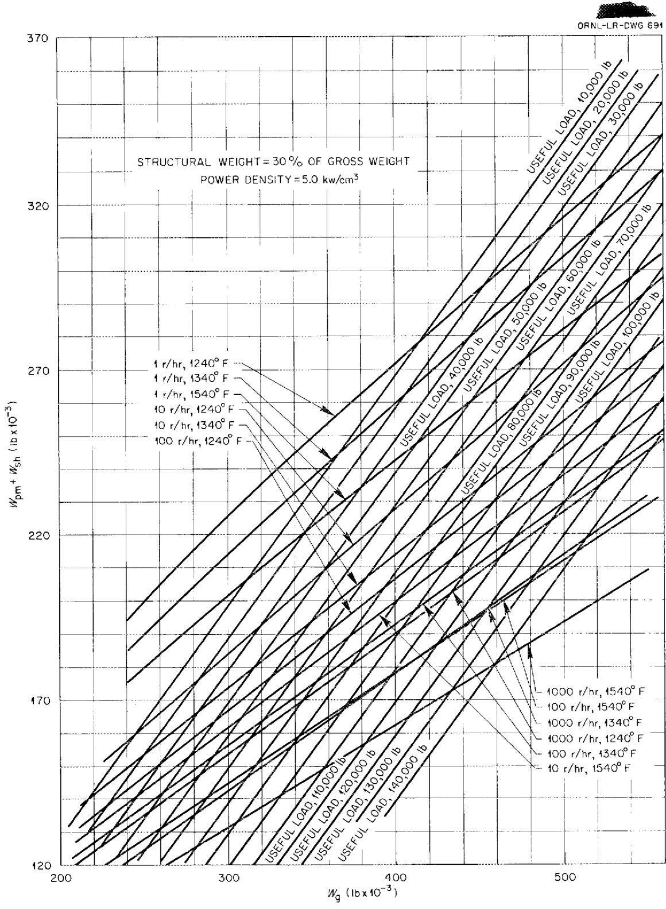  
Fig. 1. Chart for Determining Aircraft Gross Weight at Mach 1.5 and 35,000 ft for Various Turbine Inlet Temperatures.

TABLE 4. L/D RATIOS FOR VARIOUS FLIGHT CONDITIONS   

<table><tr><td>MACH NUMBER</td><td>ALTITUDE (ft)</td><td>L/D (without nocelles)</td></tr><tr><td>0.6</td><td>Sea level</td><td>15</td></tr><tr><td>0.6</td><td>35,000</td><td>15</td></tr><tr><td>0.9</td><td>Sea level</td><td>10</td></tr><tr><td>0.9</td><td>35,000</td><td>12</td></tr><tr><td>1.5</td><td>35,000</td><td>6</td></tr><tr><td>1.5</td><td>45,000</td><td>6</td></tr></table>

the crew shield) to show the effects of various degrees of shield division in relation to the important design conditions (Figs. 2 through 5). The dose rate expressed here, for simplicity, in r/hr is actually the personnel exposure dose rate (rem/hr) from radiation made up of seven-eighths gamma rays and one-eighth neutrons, assuming a relative biological effectiveness of 10.

A number of important conclusions can be deduced from Figs. 2 through 5. Perhaps the most important is that the gross weight of the airplane is very sensitive to reactor power density and the operating temperature, except under the subsonic design conditions with power densities greater than $1\mathrm{kw/cm}^3$ . For a power density of about $1\mathrm{kw/cm}^3$ and a turbine air inlet temperature of about $1200^{\circ}\mathrm{F}$ , an increase in reactor temperature level of $100^{\circ}\mathrm{F}$ is more beneficial than a factor-of-2 increase in power density. The turbine air inlet temperature will be lower than the peak fuel temperature by roughly $400^{\circ}\mathrm{F}$ , depending on the heat exchanger proportions, and thus a turbine air inlet temperature of $1140^{\circ}\mathrm{F}$ might correspond to a peak fuel temperature of about $1540^{\circ}\mathrm{F}$ . Since it is doubtful whether reactor structural materials will be available that will permit reactor operating temperatures of much above $1650^{\circ}\mathrm{F}$ , it is likely that, to achieve turbine air inlet temperatures of much above $1200^{\circ}\mathrm{F}$ , it will be necessary to provide for interburning of chemical fuel between the radiator and the turbine.

For reactor power densities of more than 1 kw/cm³, the aircraft gross weight is not very sensitive to the degree of division of the shield, except in the range of reactor shield design doses rates below 10 r/hr at 50 ft. This effect occurs

partly because the incremental weight of a given radial thickness of shielding material increases at a progressively more rapid rate as a unit shield is approached and partly because, for the particular series of shields used, the secondary gamma rays produced in the outer lead layer become of about the same importance as the prompt gamma rays from the core if the lead thickness is more than about 6 in. The secondary gamma rays make it necessary to add disproportionately large amounts of lead to reduce the dose rate from the reactor shield to below about $10\mathrm{r / hr}$ at 50 ft.

# Effect of Chemical Fuel Augmentation

It is possible to use the same basic techniques for investigating cases in which chemical fuel is burned between the radiators and turbines to obtain extra thrust for take-off, landing, and high-speed flight. If the power required (in Mw) is multiplied by 3413 Btu/kw-hr and divided by the lower heating value of the fuel (about 18,000 Btu/lb), the equivalent rate of chemical fuel consumption is obtained in lb/hr, that is,

(Fuel consumption, lb/hr)

$$
\begin{array}{l} = \left(\text {P o w e r}, M w\right) \frac {3 4 1 3 \times 1 0 ^ {3}}{1 8 , 0 0 0} \\ = 1 9 0 \left(\text {P o w e r}, M w\right). \\ \end{array}
$$

The weight of the burners and the related equipment required for chemical augmentation of nuclear-powered turbojets should be roughly $25\%$ of the installed weight of the basic engine without radiators. Thus the extra weight of the equipment for interburning may be readily calculated by multiplying column $i$ of Table 2 by $25\%$ and by the total thrust required. It is assumed that the weight of

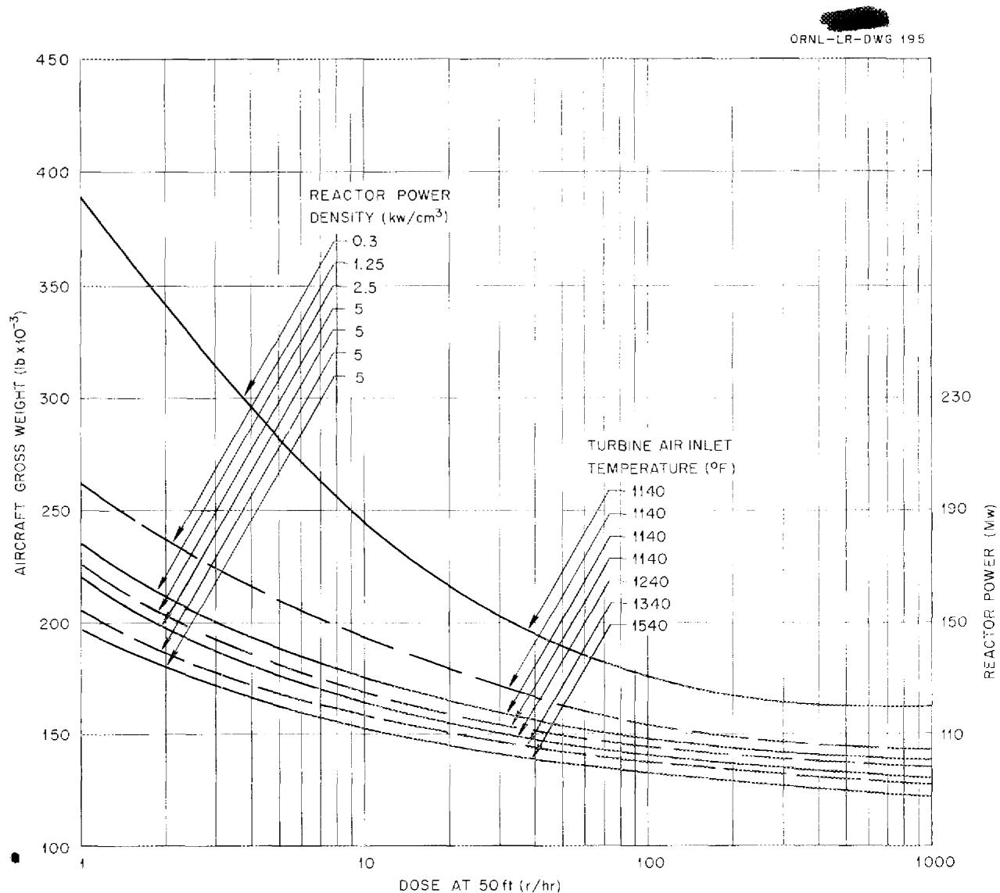  
Fig. 2. Effects of Shield Division, Power Density, and Turbine Air Inlet Temperature on Aircraft Gross Weight at Sea Level and Mach 0.9.

the fuel tanks and lines can be offset by savings in structural weight that can be effected by relieving the wing bending and torsional loads through judicious location of the fuel storage system. Therefore, the fuel tank system is treated as if the entire weight were made up of fuel. If additional turbojet engines are required for use with chemical fuel exclusively, their approximate weight in pounds per pound of thrust can be obtained from column $i$ of Table 2 as functions of altitude and Mach number by multiplying by a factor of 1.25 to account for the burner equipment.

The performance of an aircraft with chemically augmented nuclear power is illustrated in Fig. 6 to show the effect of sprint range on gross weight for various reactor design conditions for a sprint condition of Mach 1.5 and 45,000 ft. A comparison with Fig. 5 shows that, for sprint ranges of 1000 to 1500 miles, the chemically augmented nuclear-powered airplane is lighter than the all-nuclear-powered airplane and the reactor power is much lower, especially for the lower reactor operating temperatures. Furthermore, the gross weight for landing would be reduced, and the chemical fuel

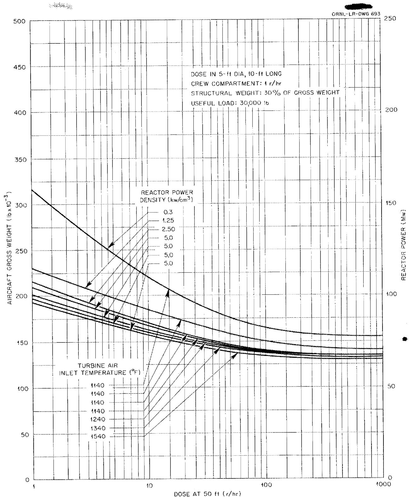  
Fig. 3. Effects of Shield Division, Power Density, and Turbine Air Inlet Temperature on Aircraft Gross Weight at 35,000 ft and Mach 0.9.

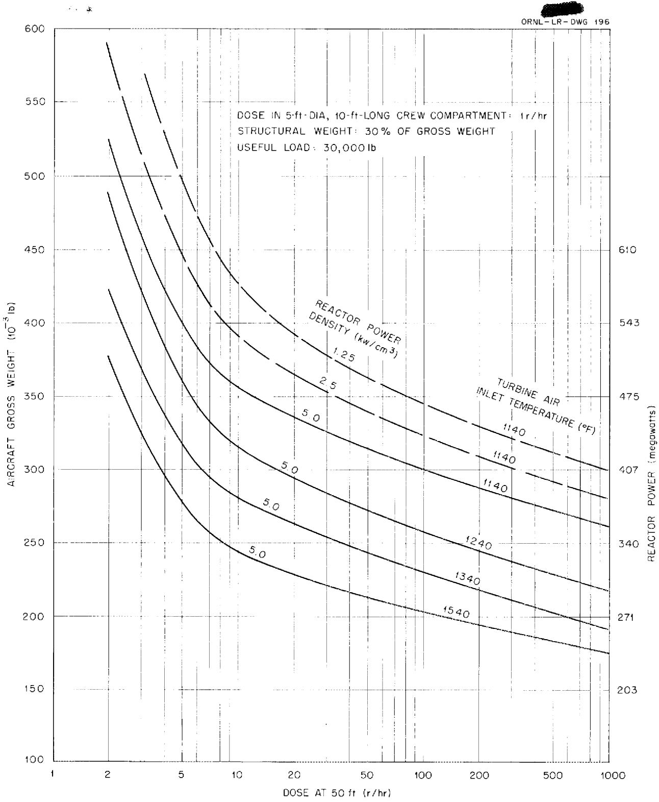  
Fig. 4. Effects of Shield Division, Power Density, and Turbine Air Inlet Temperature on Aircraft Gross Weight at 35,000 ft and Mach 1.5.

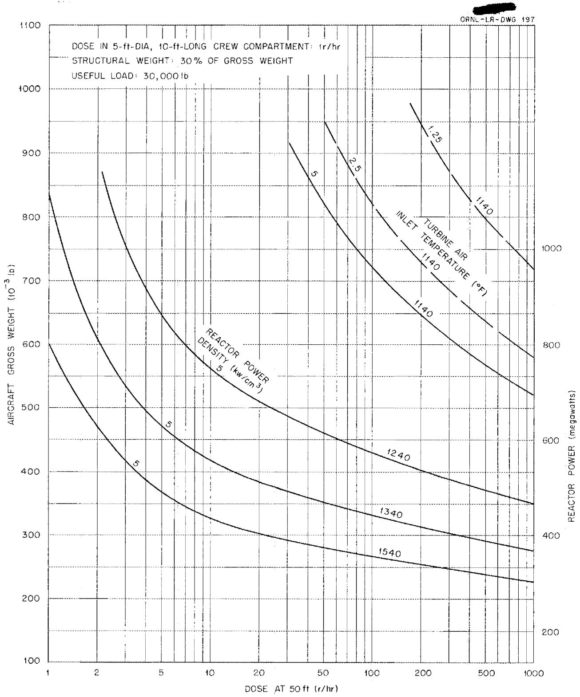  
Fig. 5. Effects of Shield Division, Power Density, and Turbine Air Inlet Temperature on Aircraft Gross Weight at 45,000 ft and Mach 1.5.

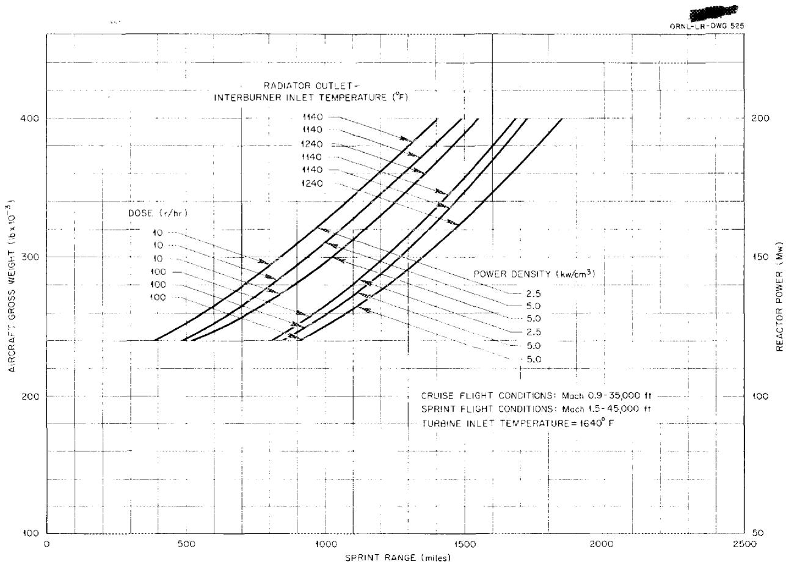  
Fig. 6. Performance of Aircraft with Chemically Augmented Nuclear Power.

system would be available for stand-by power in the event of a reactor failure. Also, as the chemical fuel is burned, the weight of the aircraft will decrease; therefore maneuverability, ceiling, and speed would be continuously improving throughout the sprint relative to the initial Mach 1.5 and 45,000 ft design condition.

# SHIELDING

The shield weight is the key to the problem of a manned nuclear-powered airplane. The weight depends partly on the tolerable radiation dose for the crew and partly on the degree to which the shield is divided between the reactor and the crew compartment. Division of the shield introduces problems of radiation damage to organic materials in the airplane, radio and radar reception and detection, light emission from ionization of air around the airplane, and the shielding of ground-handling and maintenance personnel.

# Units of Radiation Dose Measurements

Gamma radiation doses have been expressed in roentgens (r) for many years, 1 r being the gamma radiation dose giving an energy deposition of 83.8 erg/g of air. On the same basis, the "rep" (roentgen equivalent physical) was devised to serve as a measure of both neutron and gamma radiation doses. Thus 1 rep in gammas is equal to 1 r, and 1 rep in neutrons is a dose giving an energy deposition of 83.8 erg/g of tissue. The rep value gives a good measure of radiation damage to organic materials; that is 1 rep of gamma rays causes roughly the same damage as 1 rep of fast neutrons (thermal neutrons cause very little damage). Living tissue, however, has been found to be very sensitive to fast neutrons, and the unit "rem" (roentgen equivalent man) was devised to correlate neutron and gamma radiation damage to man. The neutron dose in rem is obtained by multiplying the neutron dose in rep by the "relative

biological effectiveness" (RBE). While the RBE varies from 2 to 50 for various parts of the body, a factor of 10 is ordinarily used; hence 1 rep of fast neutrons is usually taken as being equal to 10 rem, and 1 rep of gammas is equal to 1 rem.

# Permissible Dose Rate for Crew

In attempting to establish a permissible dose rate for military operations, it is instructive to examine the standard laboratory radiation dose tolerances in current use. These permit dose rates of about 15 rem/yr through the normal working lifetime of laboratory personnel. It has been found that radiologists ordinarily get an average of seven times this laboratory tolerance dose, largely through carelessness. The principal ill effects appear to be an incidence of leukemia among radiologists of approximately twice that of the population as a whole. The small amount of information available on humans indicates that genetic effects may begin to appear in the form of mutation rates double the normal value if the total radiation dose reaches something like 75 to 100 rem. The threshold for cataract formation in the eyes is about 200 rem of fast neutrons. While the dose-rate problem is very complex, many aspects of it are debatable, and the data are inadequate, a total dose of 100 to 200 rem, of which about one-eighth could be in neutrons, should be admissible, particularly if the personnel were carefully selected so that the probability of their having children would be low; that is, a minimum age limit of 30 or 35 years might be imposed. The genetic effects, which would be recessive and would affect subsequent generations, would be undesirable even though only a small percentage of the offsprings would be affected. If a relatively low value of 100 rem were arbitrarily specified as a permissible total dose for the crew, shielding designed to expose the crew to 1 rem/hr would permit any individual a total of 100 hr of flying time in nuclear-powered aircraft, a limited but possibly acceptable period. If the crew design dose rate were 0.1 rem/hr, the flying time for an individual in nuclear-powered aircraft would be extended to 1000 hr, a period that would seem to be entirely adequate. On this basis the analysis presented in the following section has covered only the range of crew dose rates from 1 to 0.1 rem/hr, of which one-eighth could be in neutrons.

# Radiation Damage to Organic Materials and Activation of Structure

The amount of maintenance work required will depend to a large extent on the reliability and service life of the equipment in the airplane. Since organic materials deteriorate in high-intensity radiation fields, radiation damage to organic materials seems to impose an upper limit on the degree of division of the shielding. The results of extensive experiments are available on radiation damage to rubber C-rings, gasket materials, electrical insulation, lubricants, hydraulic fluids, etc.[24,25,26] Some representative data have been organized in a separate report[27] to put them in a convenient form for engineering purposes, and Fig. 7 is an applicable illustration taken from that report. Briefly, it appears that, after 300 hr of exposure at full power, the best rubber hose and C-ring materials tested to date would be seriously damaged if they received a dose rate in excess of 30,000 rep/hr, while the poorest would be damaged by one-tenth of that dose. Greases are similarly affected, and the best petroleum oils can withstand doses as much as ten times higher than the greases. If a nuclear-powered airplane is to become truly operational, it will be highly desirable - if not essential - to limit the radiation dose from the reactor to a value such that elastomers and greases would have a life of at least 300 hr if located 10 ft from the reactor. To satisfy this condition the reactor shield should be designed to give a dose of not more than 1000 rep/hr at a distance of 50 ft from the center of the reactor.

The structural members of the airplane or of the engines might present serious sources of radiation if they were activated by absorption of neutrons. This problem is discussed in considerable detail in a G-E report,[26] which indicates that neutron activation of the engines constitutes the more serious problem and becomes important if the full-power neutron dose at the engines is greater than 100 rem/hr. Thus, if the reactor shield is designed to give one-eighth of the radiation dose in

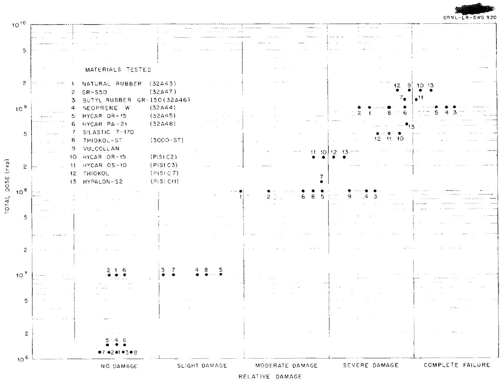  
Fig. 7. Radiation Damage to Representative Elastomers Irradiated in the ORNL Graphite Reactor.

neutrons and the engines are located 15 ft from the reactor, the shield may be divided to the point where the total dose at full power 50 ft from the reactor can be as high as 1000 rem/hr without introducing any serious maintenance problems resulting from neutron activation of equipment outside the reactor shield.

# Ground-Handling and Maintenance Problems

It is instructive to examine ground-handling and maintenance problems on the premise that, because of radiation damage to organic materials and activation of structural materials, division of the shielding is limited so that the full-power dose at 50 ft from the reactor may not exceed 1000 rem/hr. Three major types of work that would require people to be within 50 ft of the reactor shield are involved. The first is the regular maintenance

work that could be scheduled for a period during which auxiliary ground shielding might be arranged. The second type of work is ground-handling or maintenance immediately prior to take-off or after landing in the course of which the use of auxiliary shielding would be very awkward and expensive. The third type of work includes unscheduled activity required by an emergency such as a fire or a crash immediately preceding take-off or following a landing when auxiliary ground shielding would probably not be available. The shielding requirements for these three major types of ground-handling and maintenance work differ considerably because of differences in exposure time and dose.

The first type of work, which might be carried out with auxiliary shielding in place, covers the bulk of the regular maintenance operations. It is

of interest to note that experience in the B-36 flight-test program indicates that over 2000 man-hours of work of this sort must be carried out per test flight and that there is an average of one flight per week. While the dose rate to be expected in the vicinity of the reactor after shutdown will vary with the amount of gamma shielding around the reactor, within minutes of the shutdown it will generally drop by a factor of at least 20 from the dose rate for full-power operation. If much of the full-power dose is from secondary gammas generated in the shield, the reduction upon shutdown will be correspondingly greater. Decay of the short-lived fission products will effect a further reduction in dose rate by a factor of about 2 in the first day and, again, by a factor of 3 in the next three days; after that the dose rate falls off very slowly. These effects are shown more explicitly in Fig. 8.

If the ground personnel worked 40 hr/wk, it should be possible, with little inconvenience, to arrange that they spend only one-third of their time in the vicinity of the airplane, while the rest of the time could be spent an appreciable distance away. However, because of the character of the maintenance work that would have to be carried out, a disproportionately large amount of time would have to be spent in the vicinity of the airplane immediately after shutdown. A fair assumption might be that ground personnel would have to take one-half their total weekly dose during the first 8 hr following a landing.

Thus if a man is to receive not more than 0.35 rem/wk and he receives 0.18 rem during the first 8 hr following shutdown and spends 2 hr of that time at an average distance of 15 ft from the center of the reactor, the permissible dose rate would be 0.09 rem/hr at 15 ft. This dose rate at 15 ft would give a dose rate of about 0.01 rem/hr at 50 ft from the center of the reactor. If no auxiliary ground shielding were used, this would require that the shield be designed to give 0.2 rem/hr at 50 ft for full-power operation; only a unit shield would meet this requirement. Auxiliary ground shielding for a divided shield could probably be arranged most conveniently by draining part or all of the fuel or water from the outer hydrogenous region of the shield and replacing it with zinc bromide, mercury, or an oil-metal shot mixture. The shield structure would, of course, have to be strong enough to carry the resulting loads. Since a load factor only a

little greater than 1 is required when the aircraft is at rest on the ground because of the absence of dynamic loads, it should not be difficult to handle the structural problem.

The second type of activity for which tolerable dose levels must be set involves much shorter periods of exposure to radiation. This category covers the ground-handling work that will be required prior to the installation of auxiliary shielding immediately after a landing or immediately prior to a take-off after the auxiliary shielding has been removed. This work would include towing the airplane into position, last-minute tuneup, checking or repair operations, and the installation or removal of the auxiliary shielding. While this work might be carried out with highly specialized equipment, the cost and time involved could be cut tremendously if the dose level in the vicinity of the airplane could be kept sufficiently low so that personnel could carry out the necessary operations without special protection. If the dose rate were 1 rem/hr at 50 ft and if no appreciable amount of work within a 50-ft radius were required, the personnel might be permitted to get the bulk of their weekly dose, say 0.25 rem, in a 15-min period. This indicates that, to meet the requirements for this second type of work, it would be desirable to design the shield to give not more than 1 rem/hr at 50 ft after shutdown, which would mean about 20 rem/hr at 50 ft at full power.

The third type of ground-handling work that should be considered in establishing shield specifications is that associated with emergencies. While it is very difficult to predict the character of the work and the time required to cope with the emergencies that might arise in connection with a fire or a crash, a total dose of 25 rem is permitted under such circumstances by AEC regulations. If the time of exposure to radiation were 15 min, a dose rate of 100 rem/hr could be tolerated on this basis. Since emergency operations might have to be carried out up to 15 ft from the center of the reactor, it appears that the shield should not be divided beyond the point where it would give 100 rem/hr at 15 ft immediately after shutdown, that is, 200 rem/hr at 50 ft at full power. If the crash were so violent as to strew the surrounding area with fission products, the shield would be ineffective and the dose would not be a function of shield design; hence such a case does not pose a shield design problem.

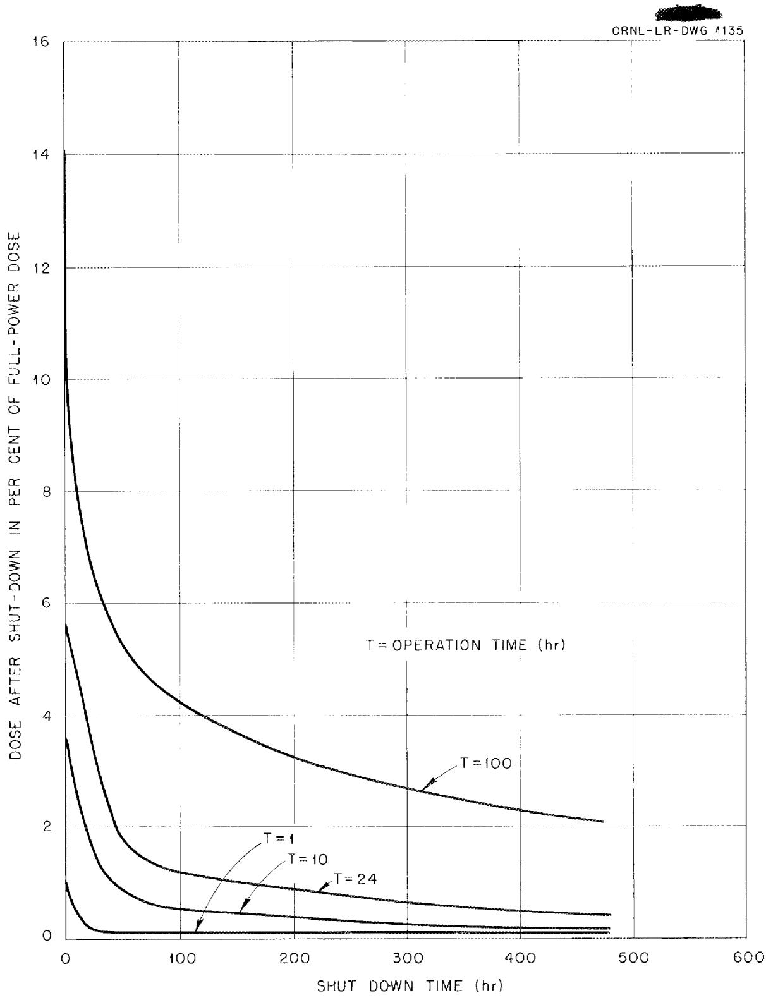  
Fig. 8. Dose at 50 ft from Reactor as a Function of Time After Shutdown.

The results of the above discussion have been summarized in Fig. 9. The left column gives the dose at full power 50 ft from the center of the reactor as an index of the degree of division of the shielding. The chart is applicable to any shield design. The first four columns simply give dose rates for representative conditions. (Note that the characteristics of any particular shield design fall along a horizontal line.) Typical radiation damage limits are given in the fifth column. The sixth shows the amount of auxiliary shielding required to reduce the dose after shutdown to a level that will permit a man to work within 15 ft of the center of the reactor for 2 hr shortly after shutdown and for a total of an additional 10 hr during the succeeding week (assuming one flight per week). The last two columns show the effects of neutron activation of turbojet-engine parts.

In re-examining Fig. 9 and the preceding discussion, it appears that the reactor shield may be divided to the point where at full power it would give 100 rem/hr at 50 ft from the center of the reactor without imposing exceptionally difficult limitations on ground-handling and maintenance operations. If the shield were divided beyond the point where at full power it would give 1000 rep/hr 50 ft from the reactor, radiation damage to elastomers and greases would be serious. Also, ground operations would be severely restricted and time-consuming, and much expensive, specialized remote-handling equipment would be required.

# Shield Weight

The weight of a carefully designed reactor shield depends primarily on the reactor power, the power density, and the specified full-power radiation dose level at a given distance from the reactor, usually 50 feet. It is also heavily dependent on the disposition of equipment such as pumps and heat exchangers inside the shield and the presence of voids such as ducts and headers. Another factor is, of course, the kind of shielding material used. A diligent search for superior shielding materials has failed to disclose any that are markedly superior to a combination of lead and water (the lead for gamma-ray attenuation and the water for neutron attenuation). While the investigation of materials is not complete, the most promising combination of shield materials found thus far is uranium, bismuth, and lithium hydride. A shield of these materials might make possible a shield weight saving of as

much as $15\%$ in comparison with the more conventional shield of lead and water. The shield weight also depends on the weights of the shield structure and of the cooling equipment required to dissipate the energy of the radiation absorbed in the shield. These items have been responsible for increases in shield weight of as much as $20\%$ in some designs, and they may increase the weights for shields of special materials more than they increase the weights of lead-water shields. It should be mentioned that jet fuel is as effective as water as a neutron shield on a volumetric basis. The lower density of the jet fuel gives a small saving in neutron shield weight that is largely offset by the additional lead required for gamma shielding.

A general idea of good shield design practice can be gained from a highly simplified approach. Roughly, one fast neutron and one hard gamma-ray (over 1.5 MeV in either case) escape from the reactor core per fission. This radiation can be attenuated by a factor of 2.72 by a thickness of approximately 3 in. of lead or water for the neutrons or thicknesses of 1 in. of lead or 10 in. of water for the gamma rays. The neutron flux from a 200-Mw reactor must be attenuated through the shielding material by a factor of about 100,000,000 if the resulting neutron radiation dose is to be reduced to 0.125 rem/hr (that is, one-eighth of the total dose), and the gamma flux must be attenuated by a factor of about 1,000,000 if the resulting gamma dose is to be reduced to 0.875 rem/hr (seven-eighths of the total dose) to give a total dose of 1 rem/hr.

About 20 attenuation lengths will be required for the neutrons and about 15 for gamma rays. Since the fast-neutron attenuation lengths in lead and water are about the same, this means that about 60 in. of shielding material must be interposed between the reactor and personnel 50 ft away to cut their neutron dose rate to 0.125 rem/hr. Since 60 in. of water represents only six attenuation lengths for gammas, about 10 in. of the shielding material would have to be lead instead of water to cut the total dose rate to 1.0 rem/hr.

The situation is complicated by the generation of hard, secondary gammas from inelastic scattering of fast neutrons in lead or structural materials and from neutron captures in hydrogen, lead, or structural materials such as steel or aluminum. The production of secondary gamma rays can be inhibited by introducing boron or lithium to absorb the neutrons as soon as they are slowed down by

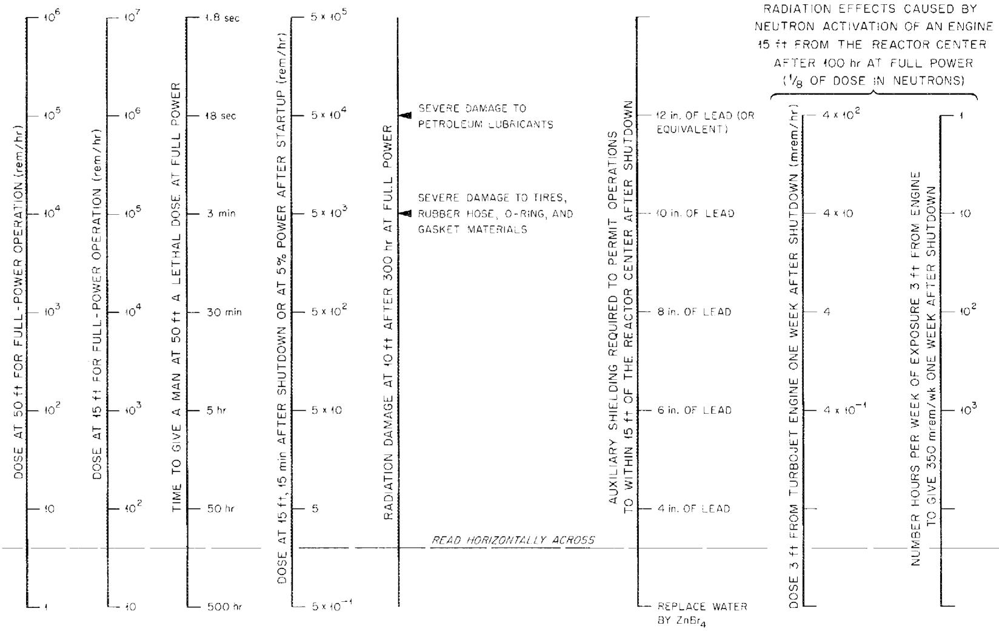  
Fig. 9. Approximate Effects on Ground-Handling and Maintenance of Degree of Division of the Shielding.

the water shielding. (B10 and Li6 are the only materials that do not give off hard capture gamma rays.) The production of secondary gammas in the lead can be kept to an unimportant level by distributing the lead through the shield in such a way that the neutron flux in the lead at any given point is low enough so that the secondary gamma flux produced there is below the local level of the primary gamma flux from the core. This concept of the "matched" shield28 has proved invaluable. It is equally applicable to the disposition of structural materials.

The above concepts can be best illustrated by examining their application to a typical shield design. The arrangement of reactor, heat exchanger, pressure shell, and shield assembly shown in Fig. 10 was evolved in an effort to get the lightest possible over-all assembly consistent with reactor physics, heat transfer, and other requirements for a circulating-fluoride-fuel reactor.[18,21] The arrangement is such that, except for the pumps at the top, the various regions are enclosed by surfaces of revolution about the vertical axis of the reactor. It was found that the reflector around the reactor core should be at least 12 in. thick and should be followed by a layer of about 0.13 in. of B[10] if the Inconel pressure shell were to be kept from becoming a more important gamma source than the core insofar as gammas leaking from the shield surface are concerned. Similar reflector and boron-layer dimensions were found to minimize the activation of the secondary fluid in the heat exchanger by neutrons from the core. It was also found that decay gammas from the fuel in the heat exchanger would make the heat exchanger a gamma source of about the same importance as the core, and therefore little would be gained by placing gamma shielding inside of the heat exchanger. It was found that attenuation of the fast-neutron flux by the 12-in.-thick reflector would be sufficiently great that a lead layer of up to 6 in. in thickness could be placed just outside the pressure shell without creating a seriously high level of secondary gamma-ray production in the outer lead layers of the shield.

The only fairly complete set of shield weights available to show the effects of reactor power,

power density, and shield division is a set computed for the basic arrangement shown in Fig. 10. This set is presented in Figs. 11 to 15. The shield weight increases with power at much less than a linear rate, and at a given power, it is not very sensitive to reactor core diameter for core diameters of less than about 24 in.; however, it becomes progressively more sensitive for larger cores.

The data for seven representative cases have been crossplotted in Figs. 16 and 17 to show that the total reactor and crew shield weight is not very sensitive to the degree of division of the shield, except for the nearly unit shields in which the lead thickness exceeds 6 in. and hence disproportionately large amounts of lead must be added to take care of secondary gammas produced in the outer lead layers. A considerable saving in weight might be effected by distributing part of the thick lead region throughout the water; however, such a step cannot be taken effectively until experimental test data are available. The larger crew compartment of Fig. 17 gives less incentive for dividing the shield than does the smaller compartment of Fig. 16.

An effort was made to estimate the shield weight for a set of "ideal" lead-water shields for the design conditions used for the engineered shields described above[29] so that some insight into the effects of the heat exchanger, pumps, structure, etc. could be obtained. The only data available to indicate the proper distribution of the lead to give an ideal matched shield are from experiments carried out by Clifford[30] to establish the lead disposition for minimum weight in a lead-water shield for a 36-in.-dia reactor. Perturbations were applied to Clifford's data to obtain estimated total shield weights for a power density of $2.5\mathrm{kw/cm}^3$ and a dose 50 ft from the reactor of 10 rem/hr with a crew shield designed to give 1 rem/hr inside of a crew compartment 5 ft in diameter and 10 ft in length. The results are plotted in Fig. 18. To facilitate comparison, similar data for engineered shields (taken from the calculations made for Fig. 12) have been plotted on the same coordinates.

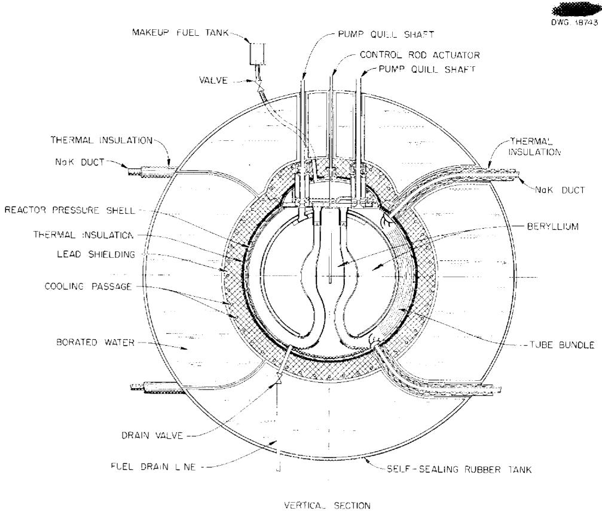

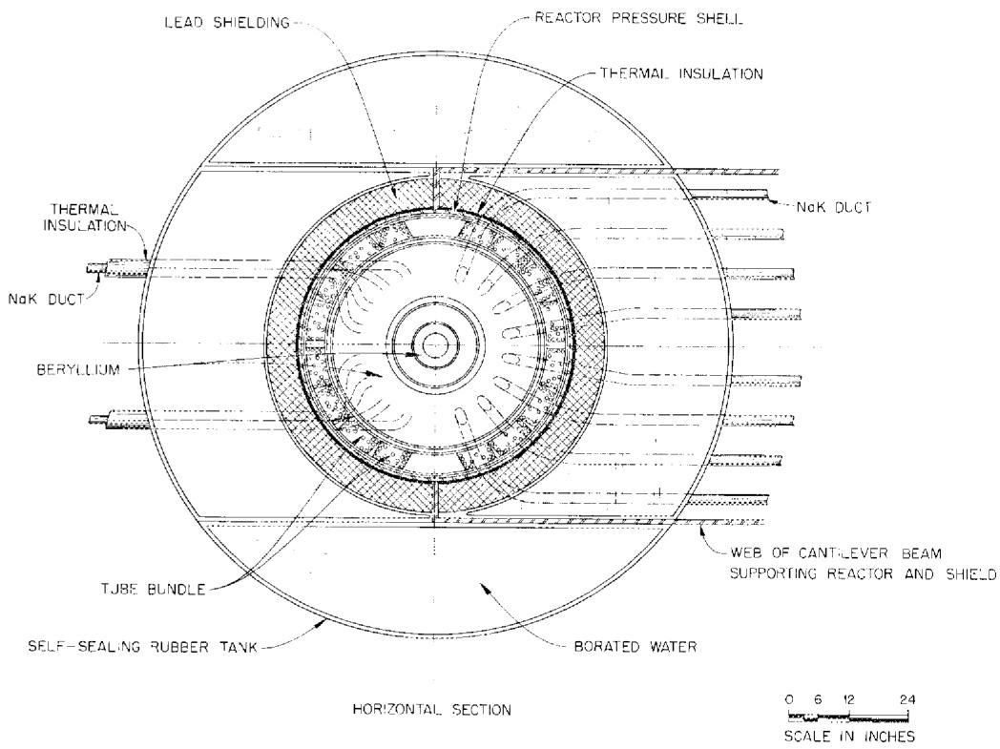  
Fig. 10. Sections Through a Lead-Water Type of Shield.

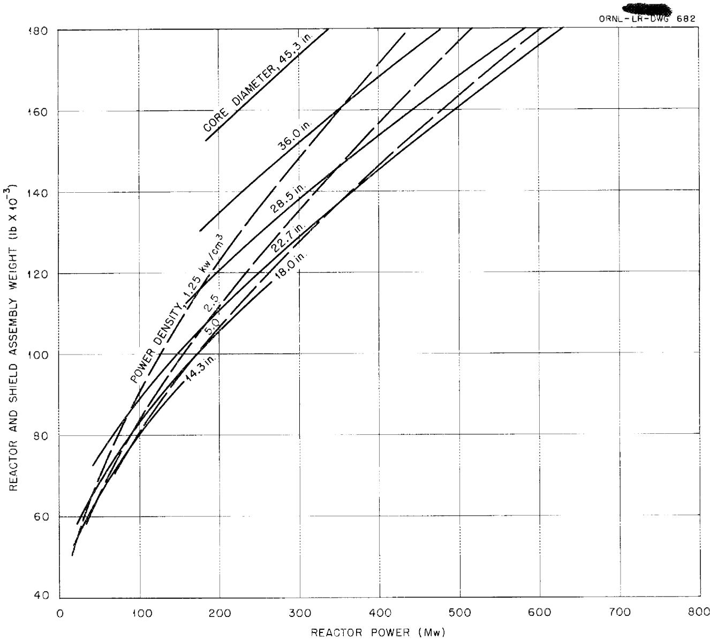  
Fig. 11. Effects of Power Output and Core Diameter on the Weight of the Reactor and Reactor Shield Assembly (No Crew Shield) for Dose 50 ft from Reactor of 1 rem/hr ( $\frac{1}{8}$ Neutrons, $\frac{7}{8}$ Gammas).

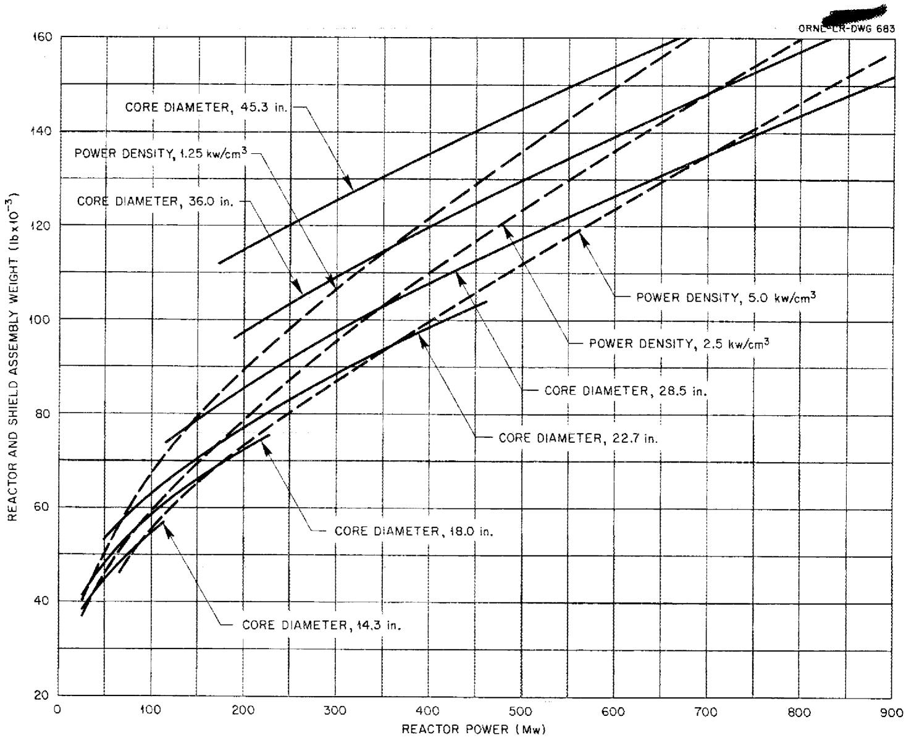  
Fig. 12. Effects of Power Output and Core Diameter on the Weight of the Reactor and Reactor Shield Assembly (No Crew Shield) for Dose 50 ft from Reactor of 10 rem/hr ( $\frac{1}{8}$ Neutrons, $\frac{7}{8}$ Gammas).

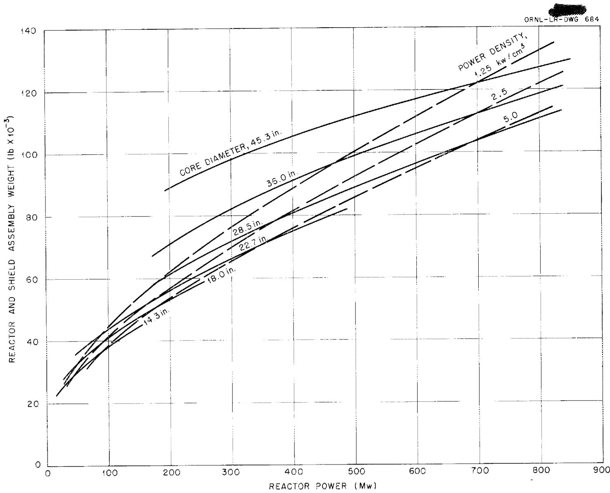  
Fig. 13. Effects of Power Output and Core Diameter on the Weight of the Reactor and Reactor Shield Assembly (No Crew Shield) for Dose 50 ft from Reactor of 100 rem/hr ( $\frac{1}{2}$ Neutrons, $\frac{7}{8}$ Gammas).

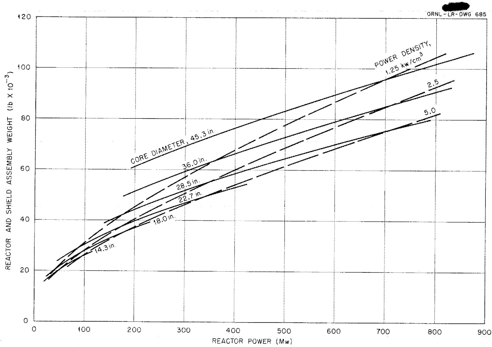  
Fig. 14. Effects of Power Output and Core Diameter on the Weight of the Reactor and Reactor Shield Assembly (No Crew Shield) for Dose 50 ft from Reactor of 1000 rem/hr ( $\frac{1}{8}$ Neutrons, $\frac{7}{8}$ Gammas).

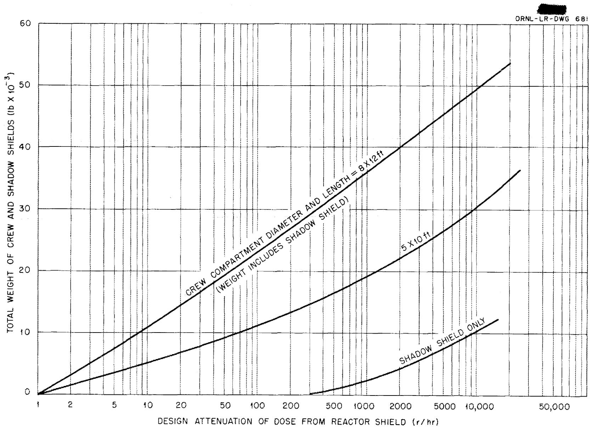  
Fig. 15. Effects of Design Attenuation on Crew Shield and Shadow Shield Weights for Equal Attenuation of Neutrons and Gammas.

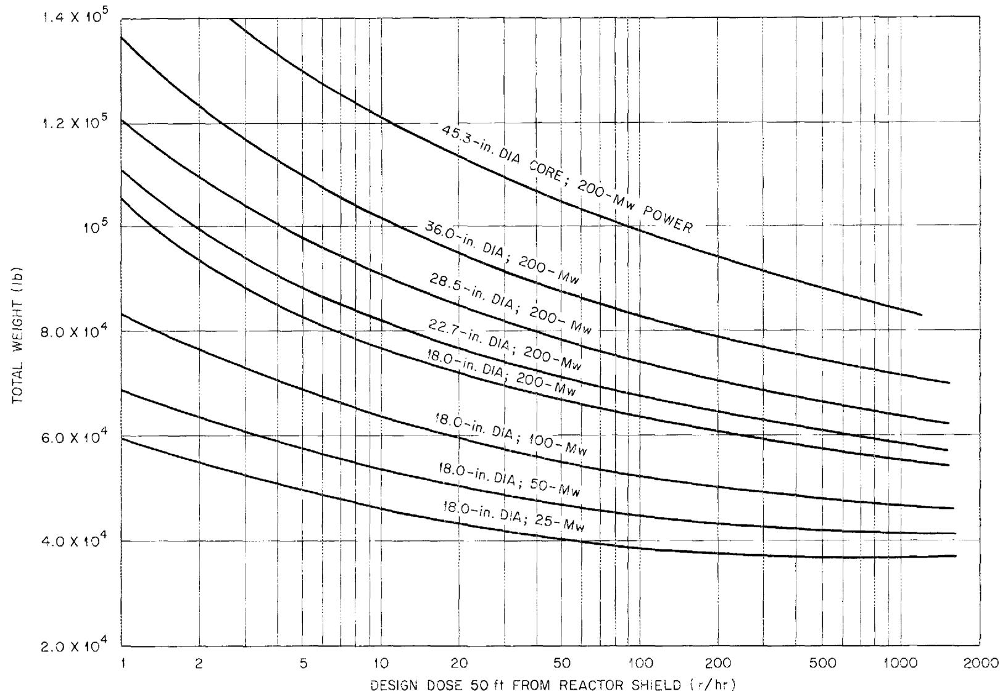  
Fig. 16. Effect of Design Dose from Reactor Shield on Total Reactor and Crew Shield Weight for a Dose of 1 rem/hr in a Crew Compartment 5 ft in Diameter and 12 ft in Length.

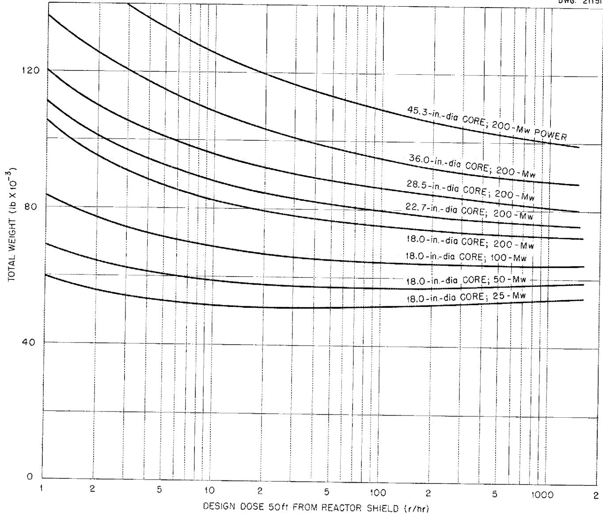  
Fig. 17. Effect of Design Dose from Reactor Shield on Total Reactor and Crew Shield Weight for a Dose of 1 rem/hr in a Crew Com-portion 8 ft in Diameter and 12 ft in Length.

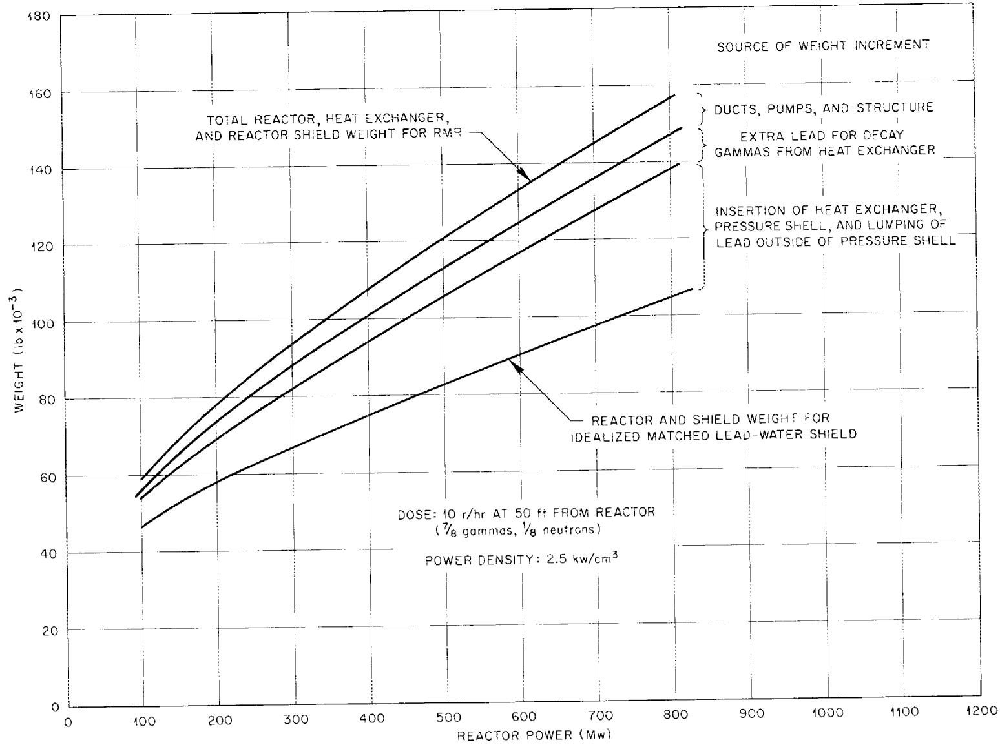  
Fig. 18. Comparison of Reflector-Moderated Reactor Shield Weight with Weight of Corresponding Idealized Matched Lead-Water Shield.

The major factors that cause the weight of the engineered shield to be greater than that of the idealized shield are the insertion of the heat exchanger and the pressure shell and the lumping of the lead into a single region immediately outside the pressure shell. Because of the lumping of the lead, however, there is little increase in shield weight required to take care of fission-product decay gammas from the fuel in the heat exchanger. The ducts through the shield increase the weight, but this increase is not very serious because the ducts are filled with liquid and their cross-sectional area is small. The very much larger ducts required for an air- or helium-cooled reactor would be responsible for far more serious increases in shield weight.

In re-examining Fig. 18, it is interesting to note that, in the reactor power range of greatest current interest (200 Mw), the engineered shield is about one-third heavier than the idealized lead-water matched shield. While this is a rough estimate since all the shield weight estimates are subject to errors totaling about $10\%$ , the character of the calculations was such that the values for the various conditions should be comparable.

Since the shield weight data given in Figs. 11 to 15 were used in the parametric aircraft performance study presented earlier, it is pertinent to consider the applicability of this data to other types of reactor. Since most other reactor types make use of cores in the form of right circular cylinders, an allowance for their less favorable geometry must usually be made. It has been shown that the diameter of a sphere equivalent to a right circular cylinder from the shielding standpoint is about $25\%$ greater than that of the cylinder. Since the cube of 1.25 is about 2.0, it can also be said that the effective power density for the cylinder should be considered as roughly twice its average actual power density to be equivalent to that for a spherical core of the same diameter.

Other items that might have substantially different effects in other reactor types would be the heat exchanger and the ducts. From Fig. 18, it appears that elimination of the heat exchanger might make possible a weight saving of about $15\%$ . Most of the other items considered in Fig. 18, except the ducts, seem to have small effects for other reactor types. Insertion of the large voids required for the ducts and headers of a gas-cooled reactor would be responsible for major increases in weight,

particularly for the more nearly unit shields. In fact, since the shield thickness increases little with reactor power, while the duct flow-passage area must increase in direct proportion to reactor power, and since the radiation leakage through a duct increases more rapidly than its cross-sectional area, many shielding experts feel that the extra weight required for the ducts for a near-unit shield for a high-power gas-cooled reactor represents an extremely large weight increment. The problem is clearly quite formidable, as is indicated by the fact that to date no shield weights for gas-cooled reactors have been published except those for highly divided shields that give 80,000 rem/hr or more at 50 ft from the reactor.

While some weight savings might be effected by using shielding materials other than lead and water, no substantially lighter engineered design based on such materials has been prepared to date. In any event, a weight saving of more than $10\%$ through the use of special materials seems unlikely. After reviewing all the above-mentioned factors, it appears that there is little likelihood of getting an operational reactor and shield assembly that will weigh less than perhaps $85\%$ of the values given in Figs. 11 to 15.

# NUCLEAR PROPERTIES

Design proposals for high-powered reactors have ranged from those for the near-thermal water-moderated reactor of the supercritical-water cycle to those for fast reactors, as can be seen from the values given in Table 5 for median energy for fission. The important aircraft reactor design proposals are compared in Tables 5 and 6 with other representative reactors. In general, it has appeared that the higher the median energy for fission, the greater is the critical mass. This is particularly true for solid-fuel-element reactors, because relatively large core volumes of at least $2.0\mathrm{ft}^3$ are required to satisfy heat transfer and fluid flow requirements (to be discussed in a later section). Further, because of the shorter neutron lifetime inherent in the faster reactors, it has been felt that they would present markedly more serious control problems. Because of these factors, all the reactor designs that have looked promising enough to receive considerable attention for aircraft application have been thermal or epithermal, that is, have had a median energy for fission of between 0.025 and 1 ev. As is evident

TABLE 5. REACTOR PHYSICS DATA FOR REPRESENTATIVE REACTORS   

<table><tr><td></td><td>MTR</td><td>STR</td><td>SCW</td><td>SIR</td><td>EBR</td><td>ARE</td><td>AC-100</td><td>RMR</td></tr><tr><td>Critical Mass Clean, kg of U235</td><td>2.3</td><td>9.5</td><td>18</td><td>52</td><td>48.2</td><td>8 to 15</td><td>24.5</td><td>18</td></tr><tr><td>Poison allowance</td><td>500 g</td><td>8.7 kg</td><td></td><td>5 kg/1000 hr at 62.5 Mw</td><td>None</td><td>(a)</td><td></td><td>(a)</td></tr><tr><td>Burnup allowance</td><td>38 g/day</td><td>2.0 kg</td><td>2 kg/cycle</td><td>87.2 g/day at 62.5 Mw</td><td>1 g/day</td><td>1.5 g/day</td><td>0.833 g/hr</td><td>2.1 g/hr</td></tr><tr><td>Power, Mw</td><td>30</td><td>70</td><td>700</td><td>62.5</td><td>1.4</td><td>1.5</td><td>20</td><td>60</td></tr><tr><td>Hours at full power</td><td>600</td><td>600</td><td>144</td><td>900</td><td>&gt;3000</td><td>1000</td><td>100</td><td>1000</td></tr><tr><td>Per cent thermal fissions</td><td>~95</td><td>94</td><td>~40</td><td>0.7</td><td>0</td><td>65</td><td>76</td><td>35</td></tr><tr><td>Mean neutron lifetime, sec × 10-5</td><td>~15</td><td>8</td><td>~1</td><td>~2</td><td>1</td><td>14</td><td>4.214</td><td>~40</td></tr><tr><td>Temperature coefficient of reactivity, per °C</td><td>-15 × 10-5</td><td>-3.9 to -15 × 10-5</td><td>-5 × 10-5</td><td>10-5</td><td>-2.55 × 10-5</td><td>-2.8 × 10-5</td><td>-3.6 × 10-4(b)</td><td>-7 × 10-5</td></tr><tr><td>Peak-to-average power density</td><td>1.8</td><td>3.9</td><td>~1.5</td><td>2.28</td><td>1.25</td><td>~2.0</td><td>1.3 (longitudinal)</td><td>1.7</td></tr><tr><td>Fuel heat capacity, cal/°C</td><td>22.9 × 103(c)</td><td>37 × 103</td><td>~5 × 104</td><td>4.9 × 103</td><td>1.6 × 103</td><td>3.8 × 104</td><td>26.3 × 103</td><td>4 to 6 × 104</td></tr><tr><td>Median energy for fission</td><td>Thermal</td><td>Thermal</td><td>~0.1 ev</td><td>52 ev</td><td>Fast</td><td>Thermal</td><td>Thermal</td><td>~0.2 ev</td></tr><tr><td>Free-flow ratio in core</td><td>0.63</td><td>~0.7</td><td>~0.3</td><td>0.3</td><td>0.273</td><td>0.007</td><td>0.438</td><td>0.75</td></tr><tr><td>Power density, kw/cm3</td><td>0.3</td><td>0.10</td><td>1.0</td><td>0.218 (avg.)</td><td>0.167</td><td>0.03</td><td>0.05</td><td>1.0</td></tr></table>

(a) Fuel! to be added as required.   
(6) ${BMC}\bot$ Prove that $f\left( x\right)  \geq  0$   
Preponderer $\{c\} _{\mathrm{At}}127^{\circ}\mathrm{C}$

TABLE 6. DIMENSIONS AND COMPOSITIONS OF REPRESENTATIVE REACTORS   

<table><tr><td>REACTOR</td><td>CORE SIZE</td><td>CORE COMPOSITION (vol %)</td><td>REFLECTOR THICKNESS</td><td>REFLECTOR COMPOSITION</td></tr><tr><td>MTR</td><td>73 × 23.4 × 60 cm</td><td>0.25, U235; 36.66, Al; 63.09, H2O</td><td>12 in. Be +44 in. C</td><td>Be, C</td></tr><tr><td>STR</td><td>36.4 in. dia × 43 in. high</td><td>0.15, U235; 57.8, Zr; 42.0, H2O</td><td>9 in.</td><td>H2O</td></tr><tr><td>SCW</td><td>2.5 ft long × 2.5 ft dia</td><td>0.3673, U235; 17.36, stainless steel; 82.272, H2O</td><td>2½ in.</td><td>H2O</td></tr><tr><td rowspan="2">SIR</td><td>Hexagonal prism (eff.)</td><td rowspan="2">55.2, Be; 31.1, Na; 7.9, stainless steel; 2.2, MgO; 1.6, UO2(93% enriched); 2.0 void</td><td rowspan="2">8 in.</td><td rowspan="2">Be</td></tr><tr><td>27.25 in. high × 27.25 in. dia</td></tr><tr><td>EBR</td><td>Hexagonal cylinder 7.5 in. high, 7.5 in. across flats</td><td>53, uranium; 13.5, stainless steel; 33.5, NaK</td><td>10 in. U238 in breeding blanket</td><td>U238</td></tr><tr><td>ARE</td><td>33.0 in. dia × 35½4 in. high</td><td>82.6, BeO; 7.6, fuel; 4.8, Na; 2.2, Inconel; 2.8, void for rods</td><td>7½ in.</td><td>BeO coolant: Na</td></tr><tr><td>AC-100</td><td>Hexagonal cylinder 30 in. high, 29.5 in. across flats, and 33.4 in. across diagonal</td><td>40, H2O; 4.7, Al; 11, insulation; 5.2, fuel, including UO2; 39.1, void</td><td>~3 ft</td><td>H2O</td></tr><tr><td>RMR</td><td>Sphere, 23.75 cm radius</td><td>40.98, F; 39, Na; 17.47, Zr; 2.55, U235</td><td>31 cm</td><td>Be</td></tr></table>

in Table 6, this has necessitated that the concentration of iron-chrome-nickel alloy structural material be kept to less than 18 vol % and that the microscopic neutron absorption cross section of the coolant be less than 1 barn. In fact, the only reactor listed in Tables 5 and 6 that does not meet these conditions is the EBR, a nonmobile reactor.

# Moderating and Reflecting Materials

At first glance there appear to be several materials to choose from for the moderator. Beryllium, beryllium oxide, graphite, water and heavy water, sodium hydroxide, sodium deuteroxide, lithium, copper, lead, and bismuth all might be used as either moderating or reflecting materials. Beryllium, beryllium oxide, $\mathsf{D}_2\mathsf{O}$ , and graphite have such low capture cross sections that they may be used in very thick sections without serious loss to the neutron economy. Thermal stress considerations make beryllium oxide of doubtful value for reactors having core power densities of greater than 0.5 kw/cm³, even though beryllium oxide is one of the

best of the ceramics from the standpoint of thermal shock resistance. Beryllium and graphite appear to be satisfactory from the thermal stress standpoint, although they present other problems. The cost of fabricated beryllium must be expected to be from $75 to$ 300 per pound, while the cost of reactor-grade graphite is only about $0.15 per pound. However, its much higher atomic density and its better high-energy scattering cross section make beryllium much superior to graphite on a volumetric basis. The use of beryllium gives a much more compact reactor and hence a much lighter shield. Normal water has such a short diffusion length that it may not be used in sections thicker than 1 in. without excessive loss of neutrons to captures in the water. Partly because of this and partly because of its predominantly forward scattering, normal water is much less effective as a reflector than beryllium, beryllium oxide, or graphite. For the same reasons, much the same can be said for NaOH, NaOD, and Li $^{7}$ OD. The properties of the principal moderating materials are shown in Table 7.

TABLE 7. PROPERTIES OF PRINCIPAL MODERATING MATERIALS  

<table><tr><td></td><td>H2O</td><td>BE</td><td>BeO</td><td>D2O</td><td>NaOH</td><td>Li7OH</td><td>C</td></tr><tr><td>Density, g/cm3</td><td>1.0</td><td>1.84</td><td>2.84</td><td>1.1</td><td>1.8</td><td>1.4</td><td>1.6</td></tr><tr><td>Age-to-thermal, cm2</td><td>33.0</td><td>98.0</td><td>105.0</td><td>120.0</td><td>120.0</td><td></td><td>350.0</td></tr><tr><td>Thermal diffusion length, cm</td><td>2.88</td><td>23.6</td><td>28.5</td><td>100.0</td><td>5.0</td><td>5.9</td><td>50.0</td></tr><tr><td>Thermal conductivity, Btu/hr·ft2·(°F/ft)</td><td>0.35</td><td>48.0</td><td>15.0</td><td>0.35</td><td>0.7</td><td></td><td>72.0</td></tr><tr><td>Thermal expansion coefficient, in./in·°F</td><td></td><td>10.0 × 10-6</td><td>5.5 × 10-6</td><td></td><td></td><td></td><td>1.1 × 10-6</td></tr><tr><td>Modulus of elasticity, psi</td><td></td><td>40.0 × 106</td><td>42.0 × 106</td><td></td><td></td><td></td><td>1.5 × 106</td></tr></table>

# Effect of Moderating Material on Design

Any detail design is heavily dependent on the materials used, and many different materials combinations appear interesting at first glance. If moderating material is distributed throughout the core, it displaces fuel and coolant and makes the core larger for a given power than would be required by heat transfer and fluid flow considerations. Normal water can constitute as little as 25 vol % of a reactor core for which the fuel investment is kept to within tolerable limits. If beryllium is used, at least 50 vol % of the core should be occupied by moderator, unless the principle of reflector moderation is employed, in which case a fairly uniform power distribution can be obtained with as little as 25 vol % of beryllium. Much the same relations hold for $\mathsf{D}_2\mathsf{O}$ , $\mathsf{NaOH}$ , and $\mathsf{Li}^7\mathsf{OH}$ as for beryllium. The relationships on which these observations are based were discussed in earlier reports31,32 from which Figs. 19 to 22 were taken to show these effects. If allowances are made for the volume required for structure, control rods, etc., the ratio of the flow passage area for the reactor coolant to the cross-sectional area of the reactor can hardly be better than indicated in the free-flow-ratio entry in Table 5 for representative reactors.

Hydrogen is such an obvious choice as a moderator that some further remarks about its limitations must be made. The forms in which hydrogen could be used in a reactor are limited, namely, water, a

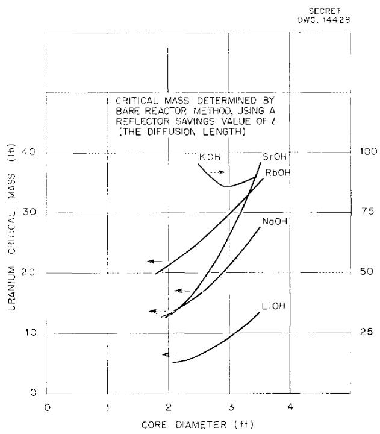  
Fig. 19. Critical Mass vs Core Diameter for Hydroxide Moderated Reactors with Thick Hydroxide Reflectors.

hydroxide, an organic compound, or a metal hydride. If water were used, either it would have to be kept at a pressure of around 5000 psi, which would pose exceedingly difficult structural and pump seal problems, or it would have to be thermally insulated from the hot zone of the reactor, a measure that would be wasteful of core volume and would probably introduce poisons. An even

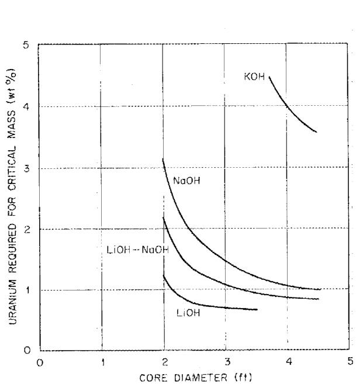  
(σ)

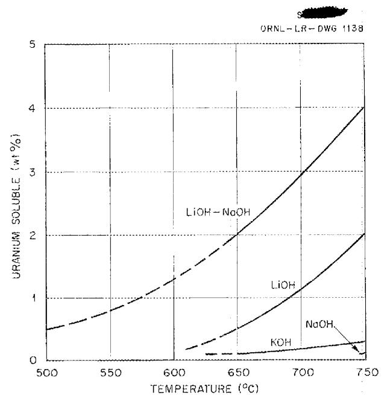  
（b）  
Fig. 20. (a) Weight Per Cent of Uranium Required to Achieve Criticality as a Function of Core Diameter for Various Hydroxides. (b) Weight Per Cent of Uranium Soluble in Various Hydroxides as a Function of Temperature.

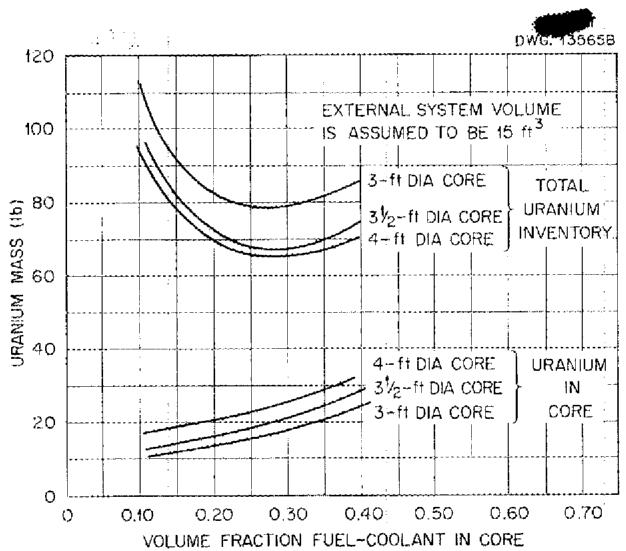  
Fig. 21. Total Uranium Inventory and Uranium in Core as a Function of the Volume Fraction of Fuel-Coolant in the Core for BeO-Moderated Circulating-Fuel Reactors with $3-$ , $3\frac{1}{2}$ , and 4-ft-dia Cores and NaF-UF4 Fuel-Coolant.

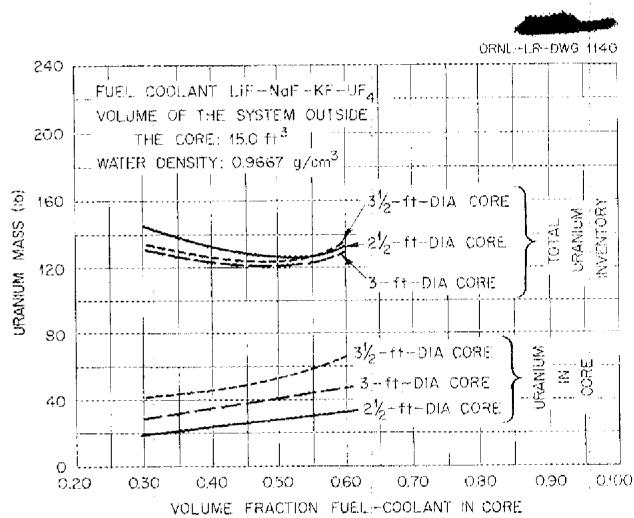  
Fig. 22. Total Uranium Inventory and Uranium in Core as a Function of the Volume Fraction of Fuel-Coolant in the Core for $\mathsf{H}_2\mathsf{O}$ -Moderated Circulating-Fuel Reactors with $2\frac{1}{2}^{\prime \prime}, 3^{\prime \prime}$ , and $3\frac{1}{2}^{\prime \prime}$ ft-dia Cores and LiF-NaF-KF-UF4 Fuel-Coolant.

more important factor if the water were thermally insulated would be that between 8 and $15\%$ of the reactor output would go into heating the water; thus not only would heat be wasted, but the wasted heat would have to be dumped through a radiator at low temperature, and the radiator would impose a weight-and-drag penalty equivalent to a further loss in power-plant output of at least $10\%$ . An overall performance penalty of 15 to $20\%$ seems to be a stiff price to pay for the privilege of using water as the moderator. The design compromises that would be necessary to cope with problems of thermal distortion and differential thermal expansion would probably entail still further penalties.

Various organic compounds of hydrogen have been suggested as moderators, for example, diphenyl oxide, cyanides, etc. However, radiation damage tests on organic compounds indicate that this is not a promising course because the gamma flux in the moderator would be about $10^{15}$ gammas/cm²·sec for a reactor core power density of 1 kw/cm³. All organic liquids tested to date have shown severe radiation damage after an integrated gamma flux of, at most, $10^{18}$ gammas/cm². This would give an operating life of only 20 min for the moderator material. Not only would radiation decomposition of the moderator fluid present a problem, but it seems likely that deposits of carbon and sludge on heat transfer surfaces would tend to render them ineffective. Metal hydrides might prove sufficiently stable under radiation, but none with truly satisfactory physical properties has been developed to date. Hydrogen gas is too diffuse for use as a moderator, and liquid hydrogen would present cooling problems inconsistent with high-temperature aircraft reactor design.

The lowest estimated critical masses for the various configurations considered are for some of the hydrogen-moderated cores. However, there is less chance to get a low critical mass in a high-power reactor through the use of hydrogenous moderators than appears at first glance, because the data of Figs. 19 through 22 do not include allowances for temperature effects, control rods, burnup, and fission-product poisons. The low-critical-mass reactors are highly sensitive to these poisons and require much larger allowances to take care of them. This can be deduced from the first two lines of Table 5. The same data show that the lower the critical mass for the clean, cold

condition the more sensitive is the reactor to the accumulation of fission-product poisons and to fuel burnup.

# Reflector-Moderated Reactor

The reflector-moderated reactor presents a number of important advantages. By removing most of the moderator from the core to the reflector, the effective power density in the core can be nearly doubled for a given average power density in the fuel region. By heavily lumping the fuel, it is possible to eliminate much of the parasitic structural material ordinarily required to separate the moderator and fuel regions. If beryllium is employed as the reflector-moderator, a substantial proportion of the neutrons are reflected back into the fuel region at epithermal energies so that they penetrate even fairly thick layers of fuel and keep the ratio of the peak-to-average fission density from exceeding something of the order of 1.5 to 2.0.

Many factors influence the critical mass of the reflector-moderated reactor. Perhaps the most important is the poison concentration in the reflector. Other factors include the core radius and the fuel annulus thickness. Figure 23 shows critical mass plotted against these last two factors

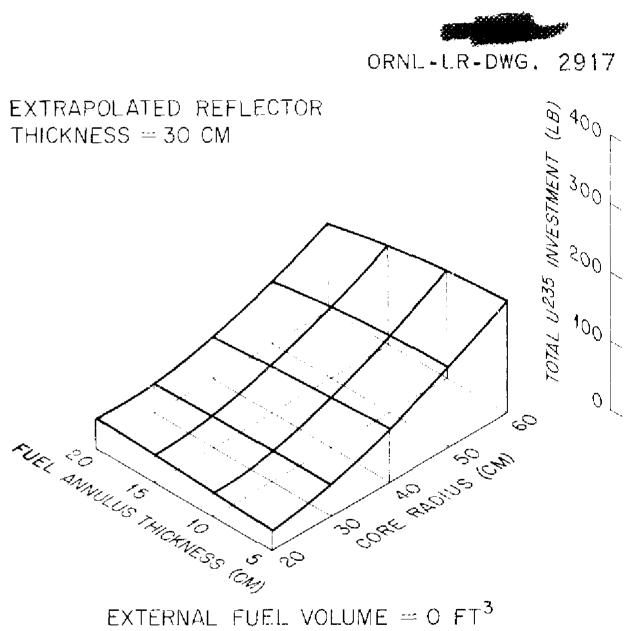  
Fig. 23. Effect of Reactor Dimensions on Concentration of Uranium in a $\mathsf{NaZrF}_5$ Fuel for a Reflector-Moderated Circulating-Fuel Reactor.

for a 30-cm-thick reflector containing an amount of poison representative of that which would be involved if canning of the beryllium with Inconel should prove necessary. If the canning is not required, the critical mass will be reduced by about $30\%$ . A quite complete set of multigroup calculations (from which Fig. 23 was taken) is being made to determine these effects.[33]

# REACTOR CONTROL34

The problem of reactor control is essentially one of matching the power of the reactor to the load.35 This usually amounts to keeping the fuel elements at a prescribed temperature and making absolutely certain that they do not go above a maximum temperature considered to be the threshold for damage. The ease with which this control can be accomplished is associated with the temperature coefficient of reactivity. It has been demonstrated that a reactor with a large negative temperature coefficient in the fuel does not even require a control rod; slow-acting shim rods for shutting down the reactor, for compensating for long-term drifts in reactivity, or for changing the operating temperature may be incorporated in some instances.

A large negative temperature coefficient in the fuel has been achieved only in liquid-fuel reactors, such as the "water-boiler" and the Homogeneous Reactor Experiment. The Aircraft Reactor Experiment and the reflector-moderated reactor should also exhibit the demonstrated stability of other liquid-fuel reactors. Consequently, the control of the ARE and the proposed reactor should be simple. It may well be that no nuclear instrumentation will be required for the circulating-fuel aircraft reactor; the proposed Homogeneous Test Reactor (HRT) is not to have mechanical control rods.

Reactors with solid fuel elements do not exhibit a large negative temperature coefficient in the fuel, although they may have a small overall negative temperature coefficient as a result of expansion of the moderator or the coolant. It is not

implied that such reactors cannot be controlled or that they are even inordinately difficult to control; nevertheless, they do involve control problems that do not occur in the circulating-fuel reactors. The problems are summarized in the following statements.

1. A solid-fuel reactor must have a large number of shim rods to override xenon and to compensate for fuel depletion. This entails much mechanical gadgetry, as well as distortion of the flux pattern. Distortion of the flux pattern, in turn, makes the already difficult problem of hot spots much worse. By contrast, the liquid-fuel reactor does not have these problems because fuel can be added to give a uniformly higher fuel concentration to take care of depletion, and xenon may be removed as it is formed.   
2. While flux-sensing elements may be desirable in a liquid-fuel reactor, they are so vital in a solid-fuel reactor that they must be compounded.   
3. Most of the proposed control systems for solid-fuel-element reactors include a fast-acting servo-controlled rod to compensate for quick changes in reactivity. Such a rod is a hazard in itself, since it might introduce a sharp increase in reactivity. Probably the only satisfactory solution to this problem is to try to design the reactor so that abrupt increases in reactivity cannot occur.

Even though step changes in reactivity are not anticipated, they afford a useful basis for analysis because a step change of the proper magnitude can be introduced into an analogous system to simulate most perturbations of practical interest. Thus, the controllability of a reactor can be deduced from the rise in fuel temperature that would result from a step change in reactivity. This is particularly important in aircraft reactors where the operating temperature is made as close as possible to that likely to damage the reactor. When the response of a reactor with a negative temperature coefficient of reactivity $(a)$ in the fuel is considered, it can be readily shown that the maximum temperature rise in the fuel $(\Delta T)$ as a result of a step change in reactivity $\delta k / k$ is given by

$$
\Delta T = \frac {2 \frac {\delta k}{k}}{\alpha}
$$

Thus, if $\alpha = 5 \times 10^{-5} / ^{\circ}\mathrm{C}$ and $\delta k / k = 3 \times 10^{-3}$ , $\Delta T$ will be $120^{\circ}\mathrm{C}$ or $216^{\circ}\mathrm{F}$ .

The temperature rise to be expected in a solid-fuel reactor can be approximated if it is assumed (1) that the heat capacity of the fuel element is small, (2) that an increase in power produces a corresponding increase in the film drop between the fuel element and the coolant, and (3) that the increase in power caused by a step change in reactivity is the transient term only, further increases being stopped by a servo control. In this case the power increase is given by $\delta k / k\beta$ . Then

$$
\left(\theta_ {f} ^ {\prime} - \theta_ {c}\right) = \left(1 + \frac {\delta k}{k \beta}\right) \left(\theta_ {f} - \theta_ {c}\right),
$$

where

$\theta_{t} =$ fuel temperature before the step change,

$\theta_{l}^{\prime} =$ fuel temperature after the step change,

$\theta_{C}^{\prime} =$ coolant temperature,

$\tilde{\beta} =$ delayed neutron fraction.

It can be seen that the increase in fuel temperature over coolant temperature depends upon the original difference between $\theta_{f}$ and $\theta_{c}i$ for example, the ratio

$$
\frac {\theta_ {f} ^ {\prime} - \theta_ {c}}{\theta_ {f} - \theta_ {c}} = 1 + \frac {\delta k}{k \beta} = 1. 4
$$

for a $\delta k / k$ of $3\times 10^{-3}$

The power and temperature perturbations for a sodium-cooled solid-fuel-element reactor were calculated on the ORNL reactor simulator according to the following conditions:

1. The volumetric heat capacity of the solid fuel elements was $1.0 \, \text{cal/cm}^3 \, \text{oC}$ .   
2. The fuel-region power density at design point was $5.7\mathrm{kw / cm}^3$   
3. The coolant was a liquid with thermal properties comparable to those of liquid sodium.   
4. The design-point power was 200 Mw and the coolant system was designed to extract power at this rate.   
5. The step perturbation, $\Delta k / k$ , was $0.305\%$ .

A servo system of reasonable proportions was simulated, and it was presumed that the power would be controlled from an error signal proportional to $(p - p_0)$ , where $p$ was the power at any time $t$ and $p_0$ was the design-point power. The transient responses in power and in fuel temperature are shown in Fig. 24, where it is clear that the temperature rise depends on the original difference in temperature between fuel element and coolant. Thus in a loosely coupled system, such as an air

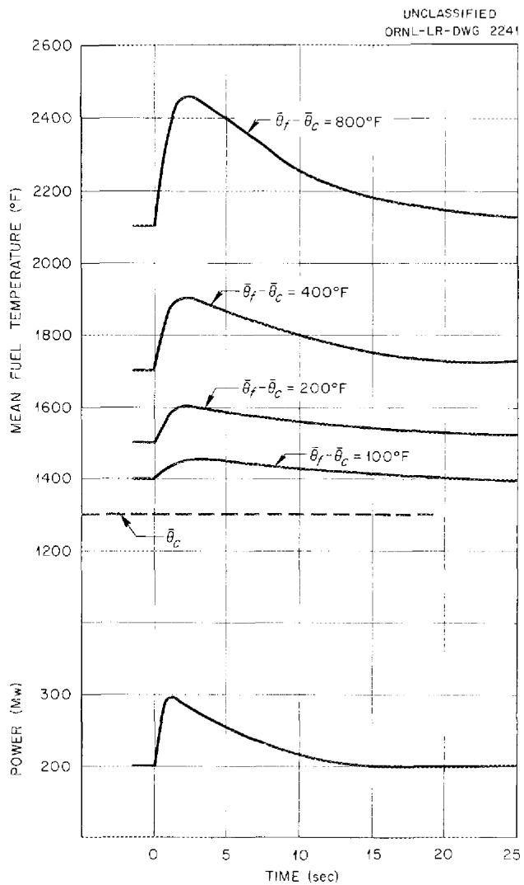  
Fig. 24. Power and Temperature Overshoots for Step Changes in Reactivity of $0.305\Delta k / k$ for a Sodium-Cooled Solid-Fuel-Element Reactor with an Average Power Density in the Fuel of 5.7 $\mathrm{kw/cm^3}$ .

cooled reactor in which the fuel element temperature must be much higher than the coolant temperature, the temperature rise would be much more severe than in the sodium-cooled reactor.

# MATERIALS

The various moderating materials that might be employed were discussed in the previous section because nuclear considerations are dominant in their selection. This section covers structural,

fuel element, and coolant materials, the selection of which is usually based mainly on engineering considerations.

# Structure

A key factor in the design of a reactor is the structural material of which it is to be built. An indication of the structural materials that might be employed in a high-temperature nuclear power plant may be gained from an examination of the program carried on during the past 15 years for the development of superior materials for gasturbine buckets. The most frequently used refractory alloys have been those of iron, chromium, and nickel, particularly the 18-8 stainless steels and Inconel. A group of alloys that give even better high-temperature performance are cobalt-base alloys containing various amounts of iron, chromium, nickel, molybdenum, and tungsten. Unfortunately, cobalt has a high neutron-absorption cross section and becomes an exceptionally bad source of gammas if exposed to thermal neutrons. If even trace amounts of cobalt were carried outside the shield in a fluid circuit they would be serious sources of radiation. Both ceramic materials and cermets have also been employed, but their brittleness has led to difficulties; they have yet to be developed to the point where they are capable of withstanding the severe thermal stresses imposed in turbojet engines.

All the materials mentioned above were considered because of their oxidation resistance. However, in certain types of reactor it would be possible to employ refractory materials such as molybdenum, columbium, and graphite in an ambient completely free of oxygen, for example, a molten metal. Further, it is conceivable that a completely new refractory alloy might be developed from such high-melting-point materials as molybdenum, tungsten, columbium, zirconium, chromium, and vanadium. The recent development of iron-aluminum-molybdenum alloys, such as Theromafor, lends credence to this possibility.

A particular system must be examined in order to evaluate the relative merits of the various structural materials, but, in general, the structural metal should have both high creep strength at high temperatures and ductility throughout the operating temperature range of at least 2 or $3\%$ so that high local thermal stresses will be relieved by plastic flow without cracking. It further seems necessary

in most instances that the structural metal be highly impermeable and weldable, with ductility in the weld zone of at least 2 or $3\%$ throughout the temperature range from the melting point to room temperature. Some of the materials that have been considered for use in aircraft nuclear power plants are listed in Table 8, together with their significant properties for this application. The availability of the material is a most important consideration in the conduct of a development program, because a good assortment of bar stock, tubing, and sheet is essential to the fabrication of test rigs. It has been primarily the availability consideration that has led to the use of iron-chrome-nickel alloys in most of the development work to date. It is hoped, however, that better materials will be available for future, more advanced reactors.

The effects of temperature on the stress-rupture properties and the creep rates of some typical metals and alloys are shown in Figs. 25 through

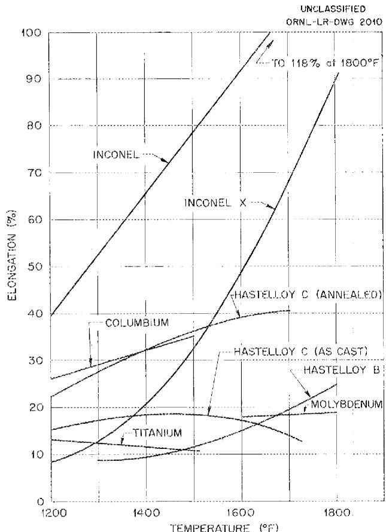  
Fig. 25. Effect of Temperature on Elongation of Various Materials.

28.36 Unfortunately, these curves do not tell the whole story. All the iron-chrome-nickel alloys over-age at temperatures above $1650^{\circ}\mathrm{F}$ , because the hardening constituents, such as the carbides, tend to migrate to the grain boundaries. Annealing and grain growth inevitably accompany over-aging. Intergranular corrosion would be likely to follow and would probably cause trouble in thin sections where a grain might extend all the way through a 0.010- to 0.20-in.-thick sheet or tube wall.

# Solid Fuel Elements

While the bulk of the ORNL-ANP effort since the fall of 1951 has been directed toward the development of a circulating-fluoride-fuel reactor, the

36J. M. Woods, Mechanical Properties of Metals and Alloys at High Temperatures, ORNL-1754 (to be issued).

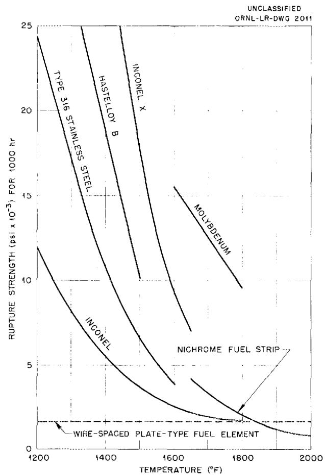  
Fig. 26. Effect of Temperature on Rupture Strength of Various Materials.

major effort prior to that time was on the development of reactors utilizing stationary fuel elements. The work on solid fuel elements is continuing, but on a very limited basis, so that another avenue of approach to the high-temperature aircraft reactor may be kept open.

The fissionable material for a high-power reactor with stationary fuel elements may, in general, take the form of uranium metal, uranium metal alloy, $\mathrm{UO}_2$ , $\mathrm{UC}_2$ , or, possibly, other uranium compounds. However, at high temperatures serious difficulties are encountered because of the low melting point of uranium metal and most of its alloys.[37] The melting point of pure uranium is about $2066^{\circ}\mathrm{F}$ , that is, not much above the proposed fuel surface temperature for the reactor, so that the metal would be so weak at operating temperature as to require additional support. The support might be provided

37R. W. Bussard and H. E. Cleaves, Journal of Metalurgy and Ceramics, Vol. I, No. 1 (1948).

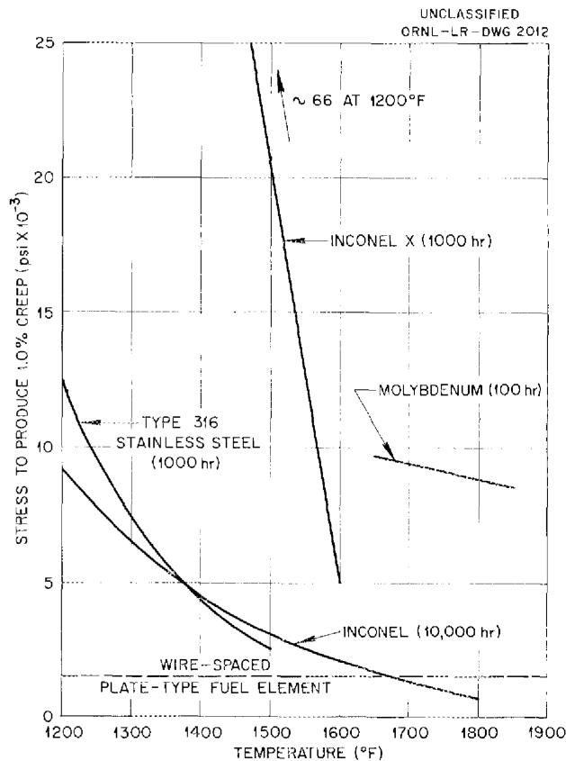  
Fig. 27. Effect of Temperature on Stress to Produce $1.0\%$ Creep for Various Materials.

TABLE 8. PROPERTIES OF REFRACTORY METALS AND ALLOYS  

<table><tr><td></td><td>MELTING POINT (°F)</td><td>DENSITY NEAR 20°C (g/cm3)</td><td>THERMAL-NEUTRON ABSORPTION CROSS SECTION (barns/atom)</td><td>MODULUS OF ELASTICITY (psi)</td><td>COEFFICIENT OF THERMAL EXPANSION PER °F (in./in.)</td><td>SPECIFIC HEAT (cal/g°C)</td><td>THERMAL CONDUCTIVITY AT 70°F Btu/hr.ft2(°F/ft)</td><td>WELDABILITY</td><td>AVAILABILITY</td><td>COST (S/lb)</td></tr><tr><td>Tungsten</td><td>6170</td><td>19.3</td><td>19.2</td><td>52 × 10^6</td><td>2.4 × 10^-6</td><td>0.032</td><td>96</td><td>Poor</td><td>Poor</td><td>10.43 (ingot)</td></tr><tr><td>Tantalum</td><td>5425</td><td>16.6</td><td>21.3</td><td>27 × 10^6</td><td>3.6 × 10^-6</td><td>0.036</td><td>31</td><td>Good</td><td>Fair</td><td>39 (sheet)</td></tr><tr><td>Molybdenum</td><td>4760</td><td>10.2</td><td>2.4</td><td>48 × 10^6</td><td>2.7 × 10^-6</td><td>0.061</td><td>85</td><td>Poor</td><td>Poor</td><td>4 (pressed ingot)</td></tr><tr><td>Niobium</td><td>4380</td><td>8.57</td><td>1.1</td><td>18 × 10^6</td><td>4.0 × 10^-6</td><td>0.065</td><td></td><td>Good</td><td>Fair</td><td>75 (powder)</td></tr><tr><td>Vanadium</td><td>3150</td><td>6.1</td><td>4.7</td><td>21.5 × 10^6</td><td>4.3 × 10^-6</td><td>0.15</td><td>17</td><td>No data</td><td>Poor</td><td>30</td></tr><tr><td>Zirconium</td><td>3200</td><td>6.5</td><td>0.18</td><td>11 × 10^6</td><td>3.0 × 10^-6</td><td>0.08</td><td>14</td><td>Fair</td><td>Fair</td><td>35</td></tr><tr><td>Titanium</td><td>3300</td><td>4.54</td><td>5.6</td><td>15 × 10^6</td><td>4.7 × 10^-6</td><td>0.13</td><td>100</td><td>Fair</td><td>Fair</td><td>15 (sheet)</td></tr><tr><td>Chromium</td><td>3430</td><td>7.19</td><td>2.9</td><td></td><td>3.4 × 10^-6</td><td>0.11</td><td>39</td><td>Bad</td><td>Difficult</td><td>3.60 (electrolytic)</td></tr><tr><td>Iron</td><td>2802</td><td>7.87</td><td>2.43</td><td>29 × 10^6</td><td>6.5 × 10^-6</td><td>0.11</td><td>36</td><td>Good</td><td>Good</td><td>0.11 to 1.48</td></tr><tr><td>Cobalt</td><td>2723</td><td>8.9</td><td>34.8</td><td>30 × 10^6</td><td>6.8 × 10^-6</td><td>0.099</td><td>40</td><td>Poor</td><td>Difficult</td><td>2.60</td></tr><tr><td>Nickel</td><td>2650</td><td>8.90</td><td>4.5</td><td>30 × 10^6</td><td>7.4 × 10^-6</td><td>0.105</td><td>34</td><td>Good</td><td>Good</td><td>0.865 (sheet)</td></tr><tr><td>Nichrome V</td><td>2550</td><td>8.4</td><td></td><td>30 × 10^6</td><td>9.8 × 10^-6</td><td>0.107</td><td>7.8</td><td>Good</td><td>Fair</td><td>1.00</td></tr><tr><td>Inconel</td><td>2600</td><td>8.51</td><td>4.0</td><td>31 × 10^6</td><td>6.4 × 10^-6</td><td>0.11</td><td>8.7</td><td>Good</td><td>Good</td><td>0.925 (sheet)</td></tr><tr><td>Inconel X</td><td>2600</td><td>8.3</td><td>4.0</td><td>31 × 10^6</td><td>10.0 × 10^-6</td><td>0.13</td><td>8.5</td><td>Fair</td><td>Good</td><td>2.75</td></tr><tr><td>Type 316 stainless steel</td><td>2550</td><td>8.02</td><td>2.9</td><td>28 × 10^6</td><td>9.7 × 10^-6</td><td>0.12</td><td>9</td><td>Good</td><td>Good</td><td>0.645 (sheet)</td></tr><tr><td>Hastelloy B</td><td>2900</td><td>9.24</td><td>3.9</td><td>30.7 × 10^6</td><td>5.6 × 10^-6</td><td>0.091</td><td>6.5</td><td>Fair</td><td>Fair</td><td>2.50</td></tr><tr><td>Zircaloy-2 (1.44% Sn; 0.05 Ni; 0.12 Fe; 0.11 Cr)</td><td></td><td>6.55</td><td>0.25</td><td>13.8 × 10^6</td><td>6.5 × 10^-6</td><td>0.08</td><td>8.2</td><td>Fair</td><td>Fair</td><td>35</td></tr></table>

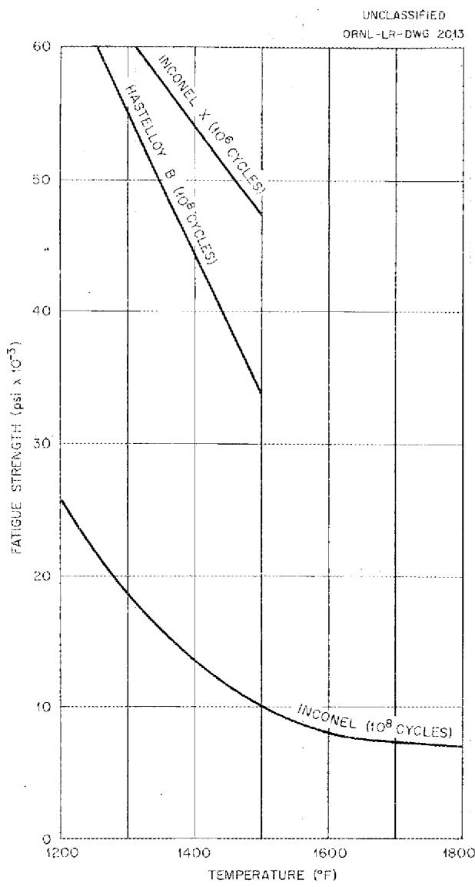  
Fig. 28. Effect of Temperature on Fatigue Strength of Various Materials.

by using rods of solid moderator (such as BeO) coated with uranium metal, but the uranium coating would be very thin and would be very likely to break up and spall off because of thermal stresses. Even worse, the metallic uranium would migrate by diffusion and mass transfer in the coolant to the walls of the pressure shell, heat exchanger tubes, etc., where it would tend to diffuse into the base metal and form a low-melting-point eutectic in the grain boundaries. The eutectic of iron and uranium melts at $1337^{\circ}\mathrm{F}$ , and the eutectics of

uranium with nickel and chromium melt at temperatures well below $1800^{\circ}\mathrm{F}$ . Uranium-molybdenum alloy melts at $2345^{\circ}\mathrm{F}$ over most of the composition range, and thus the presence of uranium metal would seriously reduce the strength of molybdenum. About the only metal that does not form a low-melting-point eutectic with uranium is cobaltium, but this material is expensive and difficult to procure and fabricate. Cladding or canning metallic uranium or its alloys would serve to reduce the diffusion rate but would not reduce it sufficiently at the operating temperatures involved.

The difficulties associated with the low melting points of uranium metal and uranium alloys, can be avoided by introducing the uranium as $\mathsf{UO}_2$ , which is a chemically stable material with a very high melting point, $3949^{\circ}\mathsf{F}$ . Uranium carbide might also be used, but it is less stable chemically, and it would react with most moderators, coolants, or canning materials at the temperatures considered here. Therefore, $\mathsf{UC}_2$ seems quite inferior to $\mathsf{UO}_2$ , except, perhaps, on the basis of thermal conductivity and resistance to thermal shock. Other uranium compounds have been considered, but none appears to be superior to $\mathsf{UO}_2$ .

Uranium oxide can be fabricated into fuel elements in a number of ways. For an air- or helium-cooled reactor it might be contained in a matrix of chromium and $\mathrm{Al}_{2}\mathrm{O}_{3}$ , in the form of a ceramic, or in a matrix of silicon carbide, in the form of a ceramic. Since a large surface area is essential, the fuel elements could be in the form of thin flat plates or tubes or a pebble bed. The support of such fuel elements would be difficult if they were to be used at high temperatures. If thin plates or tubes of a ceramic or a ceramic were held rigidly, they would be virtually certain to crack under thermal stress; if they were supported loosely, they would flutter in the high-velocity gas stream and fail as a result of abrasion of the contact surfaces. If a pebble bed were used, the same difficulties would be encountered. In any case the support structure would have to be metal. While the metal could be cooled, it is hard to see how hot spots could be prevented if the ceramic or the ceramic were at operating temperatures much above the temperature of the metal.

The $\mathsf{UO}_2$ might be poured loosely into long slender metal tubes or pins, but at high power densities the temperature at the center of even 0.080-in.-ID pins would exceed the melting point

of the $\mathsf{UO}_2$ and cause fusion. Hence, there would probably be objectionable concentrations of $\mathsf{UO}_2$ that would create hot spots at indeterminate regions in the pin. A better arrangement would appear to be to place a thin layer of $\mathsf{UO}_2$ on the inside of the tube wall, as proposed in the KAPL-SIR design.[38] The problem of supporting and accurately spacing these pins or tubes is a most serious one, however, as has been clearly shown by experience at KAPL.

Probably the most promising way to fabricate $\mathsf{UO}_2$ into a fuel element is to clad with stainless steel a sintered compact of $\mathsf{UO}_2$ and stainless steel in which the $\mathsf{UO}_2$ may constitute as much as one-third of the volume. Sandwiches of this type can be rolled to give plates with minimum thicknesses of 0.006 in. of cladding and 0.008 in. of $\mathsf{UO}_2$ compact in the core. One obvious way to use such fuel plates would be to stock alternate flat and corrugated plates to give the arrangement shown in Fig. 29. The coolant would flow between the corrugations. This arrangement has the disadvantage, particularly when used with low-thermal-conductivity coolants, of giving hot spots in the low-velocity regions in the vicinity of the points of contact between the flat and corrugated plates. Short spacers containing no fuel can be placed between the corrugated and flat sheets to avoid this, as in the arrangement shown in Fig. 30. In a third arrangement, shown in Fig. 31, wire spacers are passed perpendicularly through flat plates at intervals sufficiently close to maintain good spacing in spite of tendencies toward thermal distortion. A fourth arrangement, shown in Fig. 32, is based on the demonstrated practicality of fabricating the $\mathsf{UO}_2$ stainless compact in the form of tubes. This arrangement gives a fuel element that is very resistant to warping and thermal distortion. Yet another arrangement, shown in Fig. 33, depends on the use of $\mathsf{UO}_2$ packed into small-diameter tubes which can be drawn or swaged to give wires as small as 0.020 in. in diameter. Another arrangement, shown in Fig. 34, employs

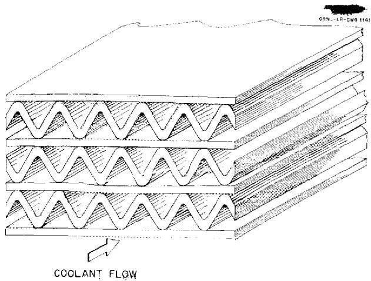

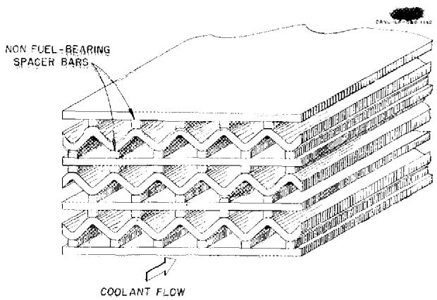  
Fig. 29. Corrugated Plate Type of Fuel Element.   
Fig. 30. Corrugated Plate Type of Fuel Element with Nonfuel-Bearing Spacer Bars.

sintered blocks of $\mathsf{UO}_2$ and stainless steel compact in which a closely spaced hole pattern would provide coolant flow passages and heat transfer surface area. If erosion or spalling should prove a problem with this arrangement, the holes might be lined with thin-walled tubes and the gap between the blocks and the tube walls might be filled with a molten metal, such as sodium, to provide a good thermal bond.

Some idea of the amount of core volume that must be devoted to the fuel elements can be gained from an illustrative example. If the critical mass for a reactor were 50 lb of U²³⁵ and a sintered stainless steel matrix containing 33 vol % UO₂ were employed, the ceramic matrix volume would have to be about 0.25 ft³. The volume of cladding

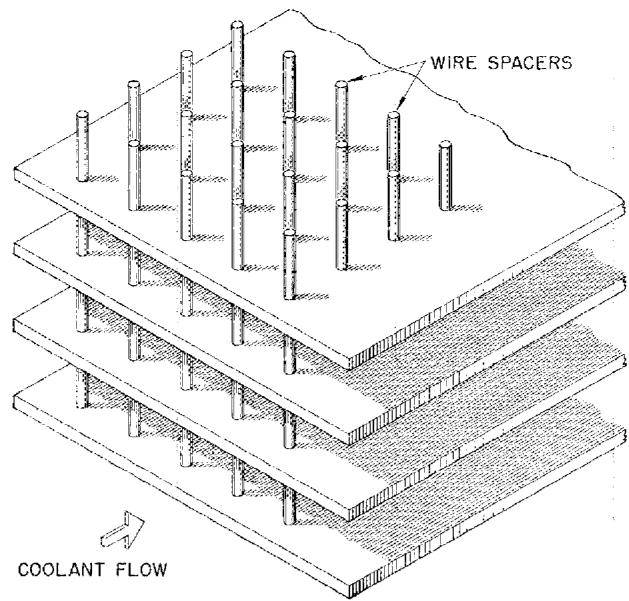

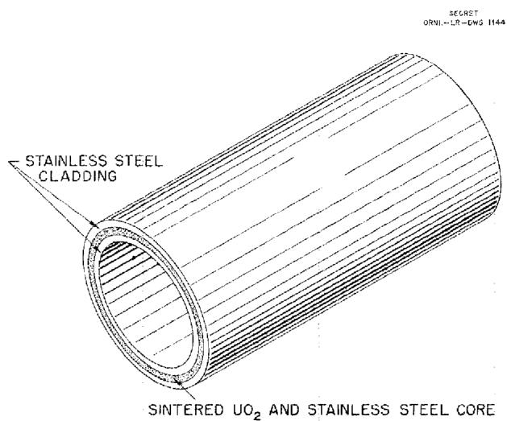  
Fig. 31. Wire-Spaced Plate Type of Fuel Element.   
Fig. 32. Sandwich-Tube Type of Fuel Element.

material required to provide adequate surface area to meet heat transfer requirements usually proves to be about the same as the matrix volume, and therefore the volume of material in the fuel elements would be about $0.5\mathrm{ft}^3$ . This would constitute $12\%$ of the volume of a 2-ft-dia spherical reactor core.

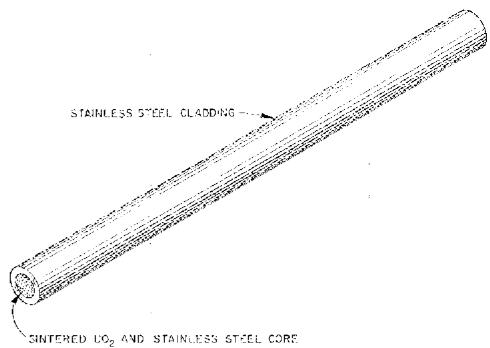  
Fig. 33. Wire Type of Fuel Element.

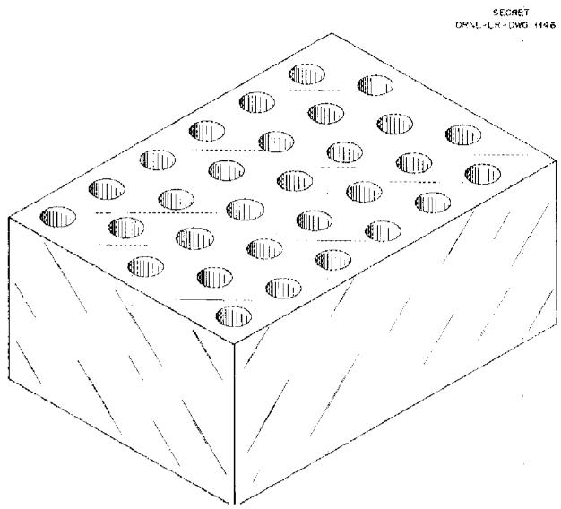  
Fig. 34. Sintered $\mathsf{UO}_2$ and Stainless Steel Block Type of Fuel Element.

In summary, a good detail design for a solid-fuel-element system for an aircraft reactor should provide the following:

1. an adequate volume of $\mathsf{UO}_2$ to insure criticality,   
2. adequate surface area to meet heat transfer requirements,   
3. a surface that would not give trouble with corrosion, mass transfer, erosion, or spalling, or have a tendency to pick up surface films that would impede heat transfer,   
4. a geometry that would give a fairly uniform temperature distribution throughout the fuel element and avoid both excessive temperatures

in the interior and thermal stresses that would induce cracking or warping under power- and temperature-cycling conditions,

5. adequate strength and stiffness to insure structural integrity and the surface spacing required by heat transfer considerations so that hot spots could be avoided,   
6. a fuel element that could be consistently fabricated with the requisite quality at reasonable cost,   
7. structural material in an amount consistent with a reasonable critical mass requirement.

# High-Temperature Liquid Coolants and Fuel-Carriers

A thorough survey of materials that appear promising as heat transfer fluids for high-temperature aircraft reactors was presented in ORNL-360.40 The first requirement is that the fluid must be liquid and thermally stable over the temperature range from 1000 to $1800^{\circ}\mathrm{F}$ . A melting point considerably below $1000^{\circ}\mathrm{F}$ would be preferable for ease in handling, while a substance that would be liquid at room temperature would be even better. Other desirable characteristics are low neutron absorption, high volumetric specific heat, and high thermal conductivity. Above all, it must be possible to contain the liquid in a good structural material at high temperatures without serious corrosion or mass transfer of the structural material. The principal substances so far suggested that show much promise of satisfying these requirements are listed in Table 9, together with some of their physical properties. Of these materials, sodium hydroxide, lead, and bismuth are considered to be only marginally useful because of their corrosion and mass transfer characteristics. The promising liquid metals can be separated into a light group, lithium and sodium, and a heavy group, lead and bismuth. As will be discussed in the next section, the light metals are highly preferred because of their superior heat transfer properties and corrosion and mass transfer characteristics.

Liquids intended to serve as vehicles for uranium in circulating-fuel reactors that operate at high temperatures are subject to the same criteria as those that serve as coolants. In addition, the

solubility of uranium and its effect on the physical properties of the fluid must be considered. All the fluids in Table 9, except the fluorides, can be shown to be unsuitable, for one reason or another, as vehicles for uranium. Fortunately there are many different fluorides that can be used.[41] The $\mathrm{NaF - ZrF_4}$ melt $(\mathrm{NaZrF}_5)$ was chosen for the ARE because the materials were readily available, nontoxic, and not too expensive. Unfortunately, the physical properties of this fluoride mixture, particularly the melting point, vapor pressure, and viscosity, leave much to be desired. Both $\mathrm{BeF}_2$ and LiF can be used to reduce the melting point, but $\mathrm{BeF}_2$ is toxic and LiF would require Li[7], a material that is not available, although it could be obtained at a price that should not be unreasonable. Other promising components are KF and RbF; however, KF has a neutron absorption cross section that is higher than is desirable (Table 7), while RbF is expensive because there is no commercial demand for it. It has been determined that ample stocks of rubidium-containing ore are available, and the price of RbF should not be unreasonable if substantial amounts are ordered.

The terms corrosion and mass transfer need some clarification. Corrosion implies the removal of surface material from the container by a chemical reaction with the liquid or by simple solution in the liquid, as is the case with liquid metals. Corrosion damage to a solid material caused by contact with a fluid results in a loss in strength of the solid material. Mass transfer in liquid metals is a phenomenon that involves removal of container material from the hotter portion and deposition in the cooler zone of a closed circuit with a temperature gradient in which the liquid is being circulated. The removal and deposition result from variations in solubility as a function of temperature. However, when the circulating fluid is a fused salt, the container material is transported from the hotter to the cooler zone of the circuit because of variations in the equilibrium constants of the chemical reactions as functions of temperature. For example, in an Inconel system circulating a fused-fluoride-salt fuel, the differences in chemical equilibria at the two temperature zones may cause mass transfer of chromium according to

TABLE 9. PROPERTIES OF REPRESENTATIVE REACTOR COOLANTS  

<table><tr><td>COOLANT</td><td>MELTING POINT (°F)</td><td>BOILING POINT, 760 mm (°F)</td><td>THERMAL CONDUCTIVITY [Btu/hr·ft2·(°F/ft)]</td><td>VISCOSITY (cp)</td><td>SPECIFIC HEAT (cal/g/°C)</td><td>DENSITY (g/cm3)</td><td>VOLUMETRIC HEAT CAPACITY (cal/°C·cm3)</td><td>MACROSOCOPIC THERMAL-NEUTRON ABSORPTION CROSS SECTION (cm-1)</td><td>PREFERRED CONTAINING MATERIAL</td><td>REMARKS</td></tr><tr><td>Li7</td><td>354.0</td><td>2403</td><td>25.0</td><td>0.4</td><td>1.0</td><td>0.46</td><td>0.46</td><td>0.00131</td><td>Type 430 stainless steel</td><td>Severe mass transfer above 1150°F</td></tr><tr><td>Na</td><td>208.0</td><td>1621</td><td>34.5</td><td>0.2</td><td>0.30</td><td>0.78</td><td>0.23</td><td>0.0092</td><td>Type 316 stainless steel or Inconel</td><td>Virtually no corrosion or mass transfer up to 1600°F</td></tr><tr><td>NaK (56% Na, 44% K)</td><td>66.2</td><td>1518</td><td>16.7</td><td>0.161</td><td>0.253</td><td>0.742</td><td>0.188</td><td>0.0183</td><td>Type 316 stainless steel or Inconel</td><td>Virtually no corrosion or mass transfer up to 1600°F</td></tr><tr><td>Pb</td><td>621.0</td><td>3159</td><td>8.6</td><td>1.2</td><td>0.037</td><td>10.0</td><td>0.37</td><td>0.00592</td><td>Type 430 stainless steel</td><td>Severe corrosion* and mass transfer above 1150°F</td></tr><tr><td>Bi</td><td>520.0</td><td>2691</td><td>9.0</td><td>1.0</td><td>0.039</td><td>9.4</td><td>0.367</td><td>0.000406</td><td>Type 430 stainless steel</td><td>Severe corrosion and mass transfer above 1150°F</td></tr><tr><td>NaOH</td><td></td><td></td><td>0.7</td><td>1.0</td><td>0.49</td><td>1.7</td><td>0.83</td><td>0.021</td><td>Nickel</td><td>Severe corrosion and mass transfer above 1150°F</td></tr><tr><td>NaZrF5</td><td>950.0</td><td></td><td>2.0</td><td>7.5</td><td>0.29</td><td>3.0</td><td>0.87</td><td>0.00367</td><td>Inconel</td><td>No corrosion or mass transfer up to 1500°F when used as a vehicle for UF3</td></tr><tr><td>NaF-KF-LiF</td><td>851.0</td><td></td><td>2.5</td><td>2.5</td><td>0.40</td><td>1.9</td><td>0.76</td><td></td><td>Inconel</td><td>Probably no corrosion or mass transfer up to 1500°F when used as a vehicle for UF3</td></tr><tr><td>H2O (100°F)</td><td>32.0</td><td>212</td><td>0.35</td><td>0.7</td><td>1.0</td><td>1.0</td><td>1.0</td><td>0.048</td><td>Type 347 stainless steel</td><td>Severe corrosion above 1650°F**</td></tr><tr><td>Air (sea level)</td><td></td><td></td><td>0.04</td><td>0.04</td><td>0.26</td><td>0.00032</td><td>0.00008</td><td>0.00002</td><td>Type 310 stainless steel or Nichrome V</td><td>Severe corrosion above 1800°F</td></tr></table>

*The term "severe corrosion" is used where the attack exceeds a depth of 0.010 in. after 500 hr of testing, because in most reactors the thickness of many structural elements must be less than 0.025 in.   
\*\*G.H.Hawkins et al.,Trans.Am.Soc.Mech.Engrs.65,301(1943).

the reaction

$$
\mathrm {C r} + 2 \mathrm {U F} _ {4} \rightleftharpoons 2 \mathrm {U F} _ {3} + \mathrm {C r F} _ {2}.
$$

Another set of reactions, known as dissimilar metal transfer, makes it desirable that complex plumbing systems be fabricated entirely from one metal or alloy. Dissimilar metal transfer involves the removal of one or more of the constituents of one alloy and its transport through the liquid to another alloy where the deposited material diffuses into the base metal. The transport driving force in this case is a difference in chemical potential; the chemical potential of a constituent of a complex alloy is lower than that of a pure metal or of a simple-solution alloy. Examples of dissimilar metal transfer have included the plugging of nickel heat exchanger tubing by iron which was transported to the nickel surface through the liquid medium from a stainless steel pump chamber and a stainless steel expansion tank.

# HEAT REMOVAL

The power density in the reactor core is limited by the rate at which heat can be removed by the fluid passing through the core. The heat removal rate depends, in turn, on the permissible fluid velocity and the temperature rise through the reactor and on the density and specific heat of the heat transfer fluid. The optimum coolant temperature rise depends upon the characteristics and proportions of the overall power plant. While the relations are quite complex and depend in large measure upon the characteristics of the various components of the system, for most aircraft reactor types the optimum temperature rise for the fluid passing through the reactor core appears to be of the order of $400^{\circ}\mathrm{F}$ . In fact, a temperature rise greater than $600^{\circ}\mathrm{F}$ has been proposed for only one of the detailed major cycle proposals made to date - the air cycle. For the air cycle the allowable temperature rise will be the difference between the maximum reactor air outlet temperature obtainable and the turbojet compressor outlet temperature. The resulting temperature rise is likely to be of the order of $600^{\circ}\mathrm{F}$ , depending on the compression ratio.

Once a permissible temperature rise is established and a coolant is chosen, a major limiting

factor for solid-fuel-element reactors is the per-missible pressure drop across the reactor core. While there is some variation in the pressure drop associated with different types of fuel element and different reactor core arrangements, it appears, in general, that the pressure drop across the core should be kept to something of the order of 30 to 50 psi because of limitations imposed by pumping power and fuel-element stress considerations.

A third important factor associated with heat removal from the core of a solid-fuel-element reactor is the difference in temperature between the fuel element and the coolant. The higher the heat transfer coefficient obtainable, the lower this temperature difference becomes. In attempting the detailed design of any particular reactor, it soon becomes evident that, regardless of how desirable an increased amount of heat transfer surface area may be, the problems associated with the fabrication of the fuel elements become progressively greater as the amount of heat transfer surface area per unit of volume is increased and the structure becomes progressively more delicate and "lacey." In almost every instance the inclination is to decrease the hydraulic radius of the coolant passage to a value as low as possible consistent with problems of fabricating the fuel-element surfaces and with stress considerations associated both with the fluid pressure drop and the thermal stresses that would produce thermal distortion.

A third factor affecting the power density obtainable from a reactor core is the free-flow ratio, that is, the ratio of the effective flow-passage area to the total cross-sectional area of the reactor core. For most reactors the maximum practical value for this parameter appears to be about 0.40, but for the reflector-moderated high-temperature-liquid type it appears to be closer to 0.60, and for the circulating-moderator type it appears to be of the order of 0.85. Water-moderated reactors in which water is not the prime heat transfer medium can be designed for free-flow ratios as high as 0.50 because water is so potent a moderator.

If an attempt is made to get the maximum power density from a given core matrix geometry with a given coolant, it soon becomes evident that any actual reactor must be expected to differ considerably from the commonly assumed ideal reactor in which there is a perfectly uniform fluid flow distribution and the core matrix is stressed by a perfectly uniform loading. Careful consideration of the

usual perversities of velocity distribution under turbulent flow conditions disclosed marked deviations from ideal conditions. Also, the ideal conditions are clearly unreasonable if allowances are made for ordinary amounts of thermal distortion. Experience in brazing radiator core matrices, for example, has shown that even the relatively slow rates of temperature change associated with the furnace brazing operations produce variations in passage thickness of as much as $30\%$ . Thus it is felt that even if great care is taken in the design to minimize the cumulative effects of thermal distortion and fabrication tolerances, variations in effective thickness of the coolant passage of the order of at least $20\%$ will occur. Heat transfer analyses show that variations in coolant passage thickness would lead to the formation of hot spots, and thus in some regions the local temperature difference between the fuel-element surface and the coolant would be greater than the design value.

Substantial variations in power density throughout the core matrix can be expected to result from nonuniform fission densities, since even in the ideal reactor, there would be variations in fission density because of the effects of geometry on the neutron flux. Allowances must be made in any actual reactor for additional irregularities caused by the presence of control rods and by the nonuniform distribution of the fission-product poisons that will accumulate. It therefore appears that local power densities at least $50\%$ greater than the mean power density must be expected. If further allowance is made for vagaries in flow distribution and for irregularities in channel shape as a result of thermal distortion, it would seem that in a realistic design, local temperature differences between the fuel element and the coolant of at least twice the mean should be anticipated.

A careful examination of the stress analysis problem for any core matrix shows that the same basic reasoning must be applied as that applied to thermal distortion. Heat removal requirements for the maximum available flow passage area and the maximum possible heat transfer area, coupled with nuclear requirements to minimize neutron absorption in structural material, have led to a relatively complex, finely divided structure in every design proposed to date. Since a complex structure is inherent in a solid-fuel-element reactor, the stresses induced in the fuel elements and their supports by the pressure drop across the core

matrix always constitute a problem. The most probable cause of failure would be the fatigue stresses arising from the pressure fluctuations associated with the turbulent flow of the coolant through the core matrix. Just as in the blades in turbojet engines, the stresses induced would probably be two or three times the direct stresses indicated by the average pressure drop across the core matrix.

As was pointed out in the previous section, the iron-chrome-nickel alloys are the only structural materials from which it seems reasonable at this time to expect to fabricate fuel elements. The data available on the high-temperature strength of these alloys indicate that even if the stresses are kept low, the permissible operating temperature can scarcely exceed $1800^{\circ}\mathrm{F}$ . The strength properties of Inconel and other possible structural materials are presented in Figs. 25 through 28 as functions of temperature. Dotted lines on Figs. 26 and 27 show the stresses anticipated in one of the most favorable fuel element matrices devised to date, that is, the wire-spaced plate-type fuel element shown in Fig. 31. A consideration of the safety factor that would be acceptable for so vital a structure as a reactor core indicates that the maximum allowable operating temperature of a solid fuel element would probably be between 1600 and $1800^{\circ}\mathrm{F}$ .

Since the wire-spaced plate-type fuel element (Fig. 31) is representative of the possible solid fuel elements, it was used as a basis for comparing the characteristics of various potential reactor coolants. For this study it was assumed that the plates were 0.020 in. thick and spaced on 0.120-in. centers and that the wire spacers obstructed $5\%$ of the effective flow passage area. The operating conditions assumed were a fluid temperature rise of $400^{\circ}\mathrm{F}$ , a fluid pressure drop of 50 psi, and a limiting fuel-element-metal temperature of $1700^{\circ}\mathrm{F}$ . The limiting fluid outlet temperature was to be determined by hot-spot considerations; that is, the maximum permissible temperature differential between the fluid and the fuel element was to be twice the mean. If a higher limiting fuel element temperature were used, a lower fluid pressure drop would seem to be necessary. Table 10 shows the results of a set of calculations based on these assumptions.

Air, as a coolant, was treated as a special case. The limiting flow velocity for the air was de

TABLE 10. LIMITING POWER DENSITIES FOR VARIOUS REACTOR COOLANTS   

<table><tr><td>REACTOR COOLANT</td><td>COOLANT PASSAGE LENGTH (in.)</td><td>FLUID DENSITY (g/cm3)</td><td>VELOCITY FOR 50-psi Δp (ft/sec)</td><td>SPECIFIC HEAT (cal/g/°C)</td><td>HEAT REMOVED PER UNIT OF PASSAGE FLOW AREA (Btu/sec·ft2·°F)</td><td>FREE-FLOW RATIO</td><td>COOLANT-FLOW-LIMITED POWER DENSITY (kw/cm3)</td><td>HEAT TRANSFER COEFFICIENT (Btu/hr·ft2·°F)</td><td>MEAN TEMPERATURE DIFFERENCE (°F)</td><td>HEAT-TRANSFER-LIMITED POWER DENSITY FOR A LOCAL TEMPERATURE DIFFERENCE OF 100°F (kw/cm3)</td></tr><tr><td>Li7</td><td>20</td><td>0.46</td><td>68</td><td>1.0</td><td>1960</td><td>0.6</td><td>10.4</td><td>55,000</td><td>128</td><td>8.1</td></tr><tr><td>Na</td><td>20</td><td>0.78</td><td>53.5</td><td>0.30</td><td>782</td><td>0.6</td><td>4.17</td><td>39,300</td><td>71.6</td><td>5.7</td></tr><tr><td>NaK</td><td>20</td><td>0.742</td><td>55</td><td>0.25</td><td>636</td><td>0.6</td><td>3.4</td><td>24,100</td><td>95</td><td>3.6</td></tr><tr><td>Pb</td><td>20</td><td>10.0</td><td>14.9</td><td>0.037</td><td>343</td><td>0.6</td><td>1.83</td><td>12,800</td><td>96.5</td><td>1.9</td></tr><tr><td>Bi</td><td>20</td><td>9.4</td><td>15.2</td><td>0.039</td><td>347</td><td>0.6</td><td>1.85</td><td>13,000</td><td>95.5</td><td>1.9</td></tr><tr><td>NaOH</td><td>30</td><td>1.7</td><td>29.5</td><td>0.49</td><td>1530</td><td>0.85</td><td>11.6</td><td>6,100</td><td>601</td><td>1.9</td></tr><tr><td>NaZrF5</td><td>30</td><td>3.0</td><td>22.2</td><td>0.29</td><td>1206</td><td>0.6</td><td>4.27</td><td>8,000</td><td>362</td><td>1.18</td></tr><tr><td>NaF-KF-LiF</td><td>30</td><td>1.87</td><td>28.7</td><td>0.4</td><td>1340</td><td>0.6</td><td>4.76</td><td>16,000</td><td>201</td><td>2.4</td></tr><tr><td>H2O (100°F, no boiling)</td><td>30</td><td>1</td><td>38.8</td><td>1</td><td>2420</td><td>0.85</td><td>18.3</td><td>1,200</td><td>4840</td><td>0.38</td></tr><tr><td>Supercritical water*</td><td>30</td><td></td><td></td><td></td><td></td><td>0.4</td><td>0.70</td><td></td><td>200*</td><td>0.70</td></tr><tr><td>Air (sea level)</td><td>40</td><td>0.0059</td><td>350**</td><td>0.26</td><td>33.4</td><td>0.5</td><td>0.088</td><td>360</td><td>198</td><td>0.088</td></tr><tr><td>Air (45,000 ft)</td><td>40</td><td>0.00134</td><td>322**</td><td>0.26</td><td>7.0</td><td>0.5</td><td>0.027</td><td>118</td><td>187</td><td>0.027</td></tr></table>

*Supercritical water calculations were based on heat transfer and pressure-drop data given in Pratt & Whitney Aircraft Div., Nuclear Propulsion Program Engineering Progress Reports, No. 9, PWAC-75 and No. 10, PWAC-83. The limiting temperature difference of $200^{\circ}\mathrm{F}$ was the temperature difference in the outlet region.   
\*\*Mach 0.20 at inlet.

terminated by a compressibility loss consideration; that is, the Mach number was controlling. In all other cases the fluid velocity was computed to give an ideal pressure drop across the fuel element of 30 psi, and an additional 20 psi was assigned to the spacers and supports for the fuel plates to give an over-all pressure drop of 50 psi. The temperature rise in the air also required special treatment. It was taken as being equal to the difference between the compressor outlet temperature given in APEX-943 and $1700^{\circ}\mathrm{F}$ minus twice the mean temperature difference between the fuel element surface and the air.

It is evident from columns 9 and 10 of Table 10 that, except for air and the liquid metals, the principal limitation on reactor power density is the temperature differential between the fuel element and the coolant rather than the rate at which coolant can be forced through the fuel element matrix. Therefore the mean local temperature differential between the metal surface and the coolant was specified as $100^{\circ}\mathrm{F}$ so that the peak fuel-element-surface temperature would be $1700^{\circ}\mathrm{F}$ , the average fuel-element temperature would be $1600^{\circ}\mathrm{F}$ at the coolant-outlet face, and the average coolant outlet temperature would be $1500^{\circ}\mathrm{F}$ . The resulting heat-transfer-limited power densities are given in the last column. It can be seen that on a heat removal basis for a consistent set of conditions lithium is clearly the best reactor coolant and that sodium is a close second, while air is the poorest in that it requires a reactor core volume 50 times greater than that required by sodium for a given power output. A remarkable point is that the molten salts are actually superior to the heavy liquid metals as heat transfer mediums. H. F. Poppendiek and M. W. Rosenthal are preparing a report covering a more sophisticated and complete analysis than that given in Table 10. In their work they also varied the hydraulic radius of the heat transfer passages; however, their work leads to essentially the same conclusions as those presented here.

An important point for which no allowance was made in the above analysis is that the local heat transfer coefficient is much less sensitive to vagaries in the local fluid velocity for molten metals than for the other coolants. This makes

the molten metals definitely more desirable because with them the likelihood of hot spots and thermal distortion would be reduced. Unfortunately, however, of the good heat transfer mediums only sodium, NaK, and the molten fluorides can be used for periods of 100 hr or more at temperatures of around $1500^{\circ}\mathrm{F}$ in any structural material currently available and fabricable.

# TEMPERATURE GRADIENTS AND THERMAL STRESSES

Thermal stresses have been referred to a number of times in previous sections. These stresses may be induced by a temperature difference between two fluid streams, as in the tube walls of a heat exchanger, or by a temperature difference between the surface and the core of a solid in which heat is being generated.[44] Examples of the latter are fission heating in solid fuel elements and gamma and neutron heating in solid moderator materials. A calculated thermal stress gives a good indication of the behavior of a brittle material; that is, cracking is likely to occur if the calculated thermal stress exceeds the normal tensile or shear strength of the material. Only a small amount of yielding is necessary in a ductile material, however, to relieve the thermal stress. Therefore the calculated thermal stresses for ductile materials are significant only in that they indicate that if the elastic limit of the material is exceeded, plastic flow and, possibly, distortion will result. Progressively greater distortion may result from thermal cycling. This might lead, for example, to partial blocking of a flow passage between adjacent plates in a solid-fuel-element assembly. Thus thermal stresses in a fuel plate might lead to a hot spot and hence to burn-out of a fuel element.

For most purposes, thermal stresses can be approximated by considering one of two ideal configurations, namely, flat slabs and thick-walled cylinders with uniformly distributed volume heat sources. Charts for the simpler flat-slab configuration are presented in Figs. 35 and 36 to show both the temperature difference and the thermal stress between the surface and the core for the materials of greatest interest. The values given are for a uniformly distributed heat source giving

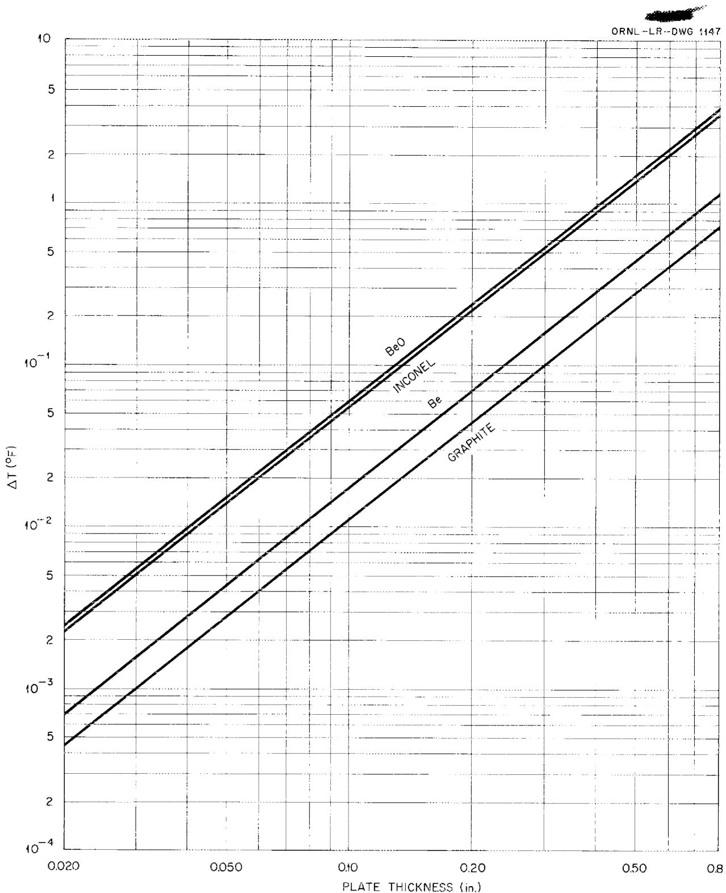  
Fig. 35. Maximum Temperature Differential in Flat Plates with Uniformly Distributed Volume Heat Sources.

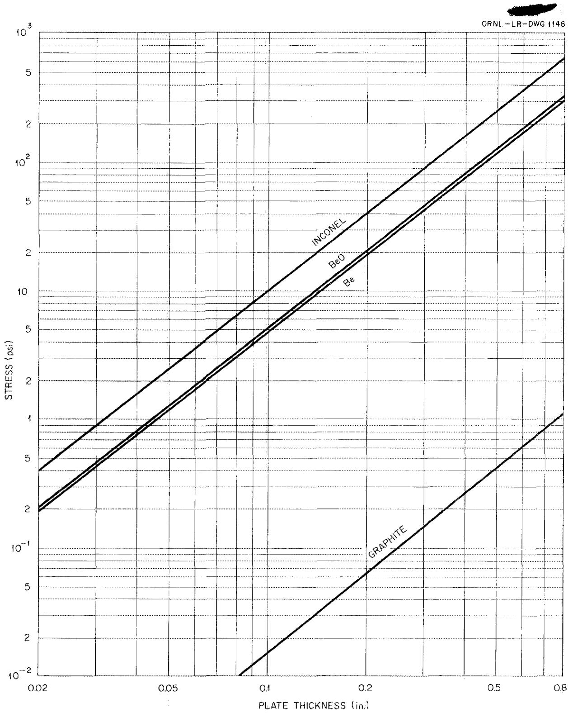  
Fig. 36. Thermal Stress in Flat Plates with Uniformly Distributed Volume Heat Sources.

a power density of 1 watt/cm³. Both the temperature difference and the thermal stress are directly proportional to the power density. Many other geometries can easily be reduced to the flat-slab configuration. A flat plate with heat generated in a plane at the center will have twice the temperature differential and one and one-half times the stress of a plate of equal thickness with uniform heat generation. A cylindrical rod with uniform heat generation will have one-half the temperature differential and three-eighths the stress of a flat plate with uniform heat generation and a thickness equal to the diameter of the rod.

It is instructive to apply Figs. 35 and 36 to some typical structures, for example, the fuel plates for a sodium-cooled reactor with stainless-steel-clad $\mathrm{UO}_2$ and stainless steel fuel elements. By taking the solid fuel element design shown in Fig. 31, on which Table 10 was based, and a reactor core power density of $4.2\mathrm{kw/cm^3}$ , the power density in the fuel element will be $35\mathrm{kw/cm^3}$ because it constitutes only $12\%$ of the total core volume. It can be seen from the curve for Inconel (Fig. 36), which has properties about the same as those for stainless steel, that the thermal stress for 0.020-in.-thick fuel plates would be 0.4 psi for 1 watt/cm³, or 14,000 psi for $35\mathrm{kw/cm^3}$ , if the fuel is uniformly distributed throughout the plates. If, instead, the cladding constitutes one-half the total thickness, it can be shown that the temperature differential and the thermal stresses are approximately half again as great, and thus there would be a $120^{\circ}\mathrm{F}$ temperature difference between the center and the surface and a thermal stress of about 20,000 psi. By referring to Fig. 27, it can be seen that this thermal stress is many times the creep strength of the stainless steel at a temperature of $1700^{\circ}\mathrm{F}$ ; therefore severe thermal distortion would be likely to result. Thus the actual power density might have to be substantially less than the 4.2 kw/cm³ permitted by heat transfer considerations.

The more complex geometry of the thick-walled cylinder requires a more complex representation. For the purposes of this report, the typical set of curves shown in Fig. 37 will suffice to show the basic relationships. These curves apply to an important particular case; namely, a reactor moderator region cooled by equilaterally spaced circular passages. It can be shown that the temperature and the thermal stress distribution in a rigid block cooled by equilaterally spaced parallel circular

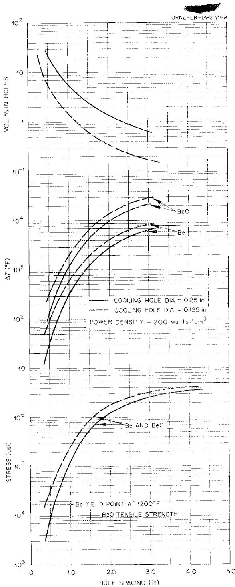  
Fig. 37. Effects of Hole Spacing and Diameter on Temperature Distribution and Thermal Stress in a Rigid Block Having a Uniformly Distributed Volume Heat Source and Equilaterally Spaced Circular Cooling Passages.

passages can be closely approximated by considering the block to be a stack of thick-walled cylinders having hole diameters the same as those in the block and an outside diameter equal to $105\%$ of the hole spacing in the block. For the case shown, the power density in the reactor core was taken as approximately $4\mathrm{kw/cm^3}$ , which gives gamma- and neutron-heating density in the moderator of about 200 watt/cm³ (that is, $5\%$ of the power density in the core). The chart is equally applicable to a reactor core geometry similar to that of the ARE or to the regions in the reflector or the island immediately adjacent to the fuel region of the reflector-moderated reactor. It is quite evident that BeO, because of its brittleness, could be considered for use only if pierced with many closely-spaced cooling passages; however, such a structure would be flimsy and easily damaged.

# TEMPERATURE DISTRIBUTION IN CIRCULATING-FUEL REACTORS

The circulating-fuel reactor poses some special temperature distribution problems that have not demanded attention in other fields of technology. These problems arise because the temperature of any given element of fluid in the reactor core at any given instant is a complex function of the time that it has spent in the fissioning region, the power density, the amount of heat that it has gained from or lost to the rest of the fluid through conduction or turbulent mixing, and its own heat capacity. As a consequence, there are two major sets of problems that may arise in any circulating-fuel reactor. The first of these is the formation of severe local hot spots as a result of flow separation. If the hot spots caused local boiling in a reactor having a high power density, there would be erratic fluctuations in power and, possibly, instability of the reactor. Therefore it seems essential that the fuel flow passages be carefully proportioned to avoid flow separation. The second problem, boundary-layer heating, arises because fissioning in the nearly stagnant fluid at the fuel-channel surface makes the temperature there tend to be much higher than that of the free stream. A rigorous and comprehensive study of the boundary-layer phenomenon has been in process since 1952.[45,46] A few curves based on that study are presented here to show some of the more important relationships.

A good insight into the problem can be gained from examination of an important typical case - that presented by an ARE type of right-circular-cylinder reactor core containing parallel circular passages proportioned so that 50 vol % of the core is filled with fuel while the remainder of the core is moderator and structural material. If the passage wall between the moderator and the fuel were not cooled, the wall temperature would exceed the local mean fuel temperature by a substantial amount, as can be seen in Fig. 38. At a given fuel velocity the temperature difference between the wall and the fuel is directly proportional to power density, but, if the reasoning of the previous section is followed and the fluid temperature rise is kept constant at $400^{\circ}\mathrm{F}$ for a given reactor core, the fuel velocity becomes directly proportional to the power density. Surprisingly enough, the reduction in boundary-layer thickness associated

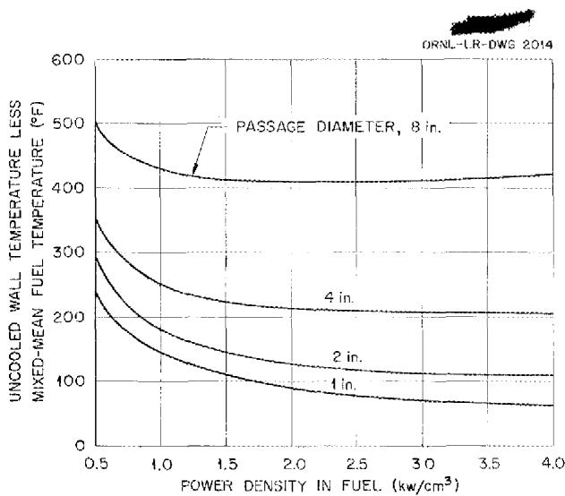  
Fig. 38. Effect of Passage Diameter and Power Density on the Difference Between the Uncooled Wall Temperature and the Mixed-Mean Fuel Temperature for an ARE Type of Reactor Core. A 21-in.-dia right circular-cylinder reactor core containing 50 vol % of NaF-ZrF4-UF4 as the fuel was assumed.

with the increase in the Reynolds number causes the temperature difference between the fuel and the wall to drop somewhat with an increase in power density. This effect is shown in Fig. 38, together with the effects of variations in passage diameter. The smaller passages give markedly reduced wall temperatures. Unfortunately, reducing the diameter of the passage also increases the amount of structural material in the reactor and, hence, increases the critical mass. A similar set of data is presented in Fig. 39 for a 21-in.-dia fuel annulus that is typical of reflector-moderated reactors. The effects of variations in fuel physical properties are indicated by curves for two different fluoride melts having respectively about as good and as poor sets of heat transfer properties as are likely to prove of practical interest.

It is clear from Figs. 38 and 39 that, since the temperature of the structural metal wall is the limiting temperature in the system, there is a strong incentive to cool the walls. The temperature distribution through the fuel stream, the wall, and the wall coolant for several conditions is shown in Fig. 40 for a 4-in.-dia fuel tube, a $\frac{1}{8}$ -in.-thick Inconel wall, and a $\frac{1}{8}$ -in.-dia wall coolant channel. Sodium was assumed as the wall coolant, and the fuel assumed had physical properties similar to those of NaK-KF-LiF-UF $_4$ (10.9-43.5-44.5-1.1 mole %). Similar curves are given in Fig. 41 for a fuel

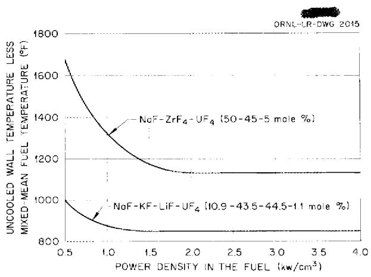  
Fig. 39. Effects of Power Density in Two Different Fuels on the Difference Between the Un-cooled Wall Temperature and the Mixed-Mean Fuel Temperature for a 21-in.-dia Core Reflector-Moderated Reactor.

having the same physical properties except viscosity, which was assumed to be ten times greater than that of the fuel assumed for Fig. 40. The difference in temperature between the center of the stream and the peak fuel temperature is nearly twice as great as that for the lower viscosity fuel.

The sensitivity of the system to velocity distribution in either the fuel or the wall coolant fluid streams is shown in Figs. 42 and 43. The curves in Fig. 42 are for sodium-cooled walls, while those presented in Fig. 43 are for the same system except that NaOH is used as the wall coolant. An examination of these two sets of curves shows that moderate variations in fuel velocity have relatively little effect on the temperature distribution. Further, from the temperature distribution standpoint, the NaOH coolant is inferior to the sodium because it gives fairly wide variations in wall temperature for variations in the wall-coolant

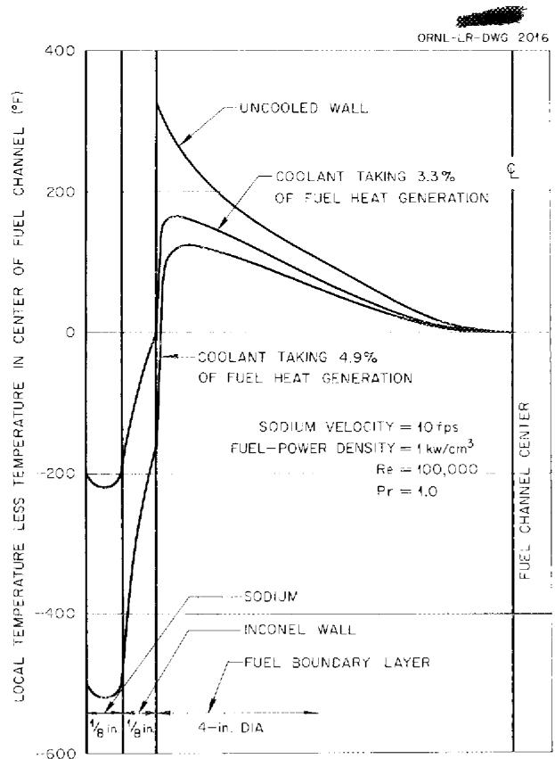  
Fig. 40. Effect of Wall Cooling on the Temperature Distribution Through the Fuel Stream, the Wall, and the Wall Coolant (Sodium).

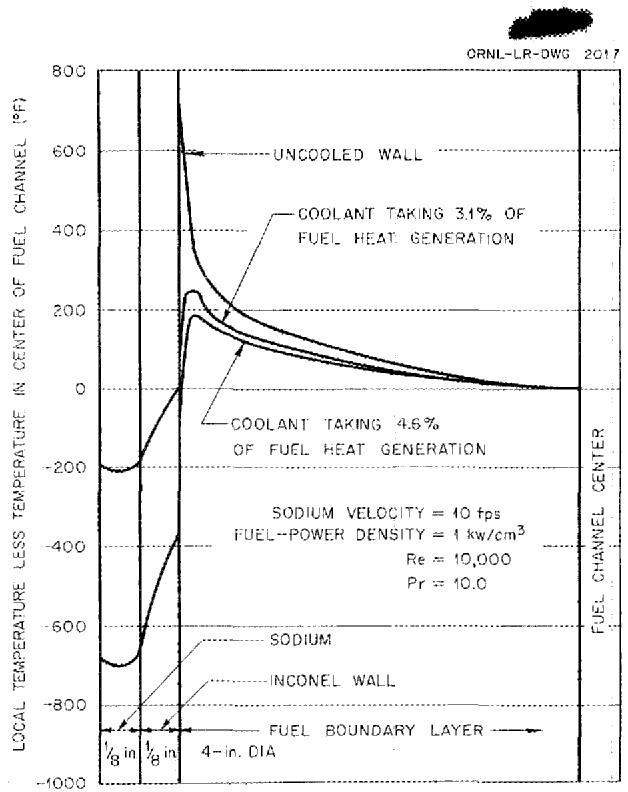  
Fig. 41. Effect of Fuel Viscosity on Temperature Distribution Through the Fuel Stream, the Wall, and the Wall Coolant (Sodium). Fuel viscosity assumed to be ten times greater than that of fuel assumed for Fig. 40.

velocity. The wall temperature variations would be likely to lead to thermal distortion and warping or buckling of the wall.

The use of a hydroxide as both moderator and wall coolant for an ARE type of core has some attractive possibilities. As can be deduced from Figs. 38 and 39, the use of perhaps 50 fuel tubes about 2.0 in. in diameter instead of a thick annulus of fuel would give lower uncooled wall temperatures. Figure 43 gives some idea of the possibilities of such a design. Closely fitted baffles would be required to direct the hydroxide flow over the tube walls at a uniformly high velocity. Irregularities in wall temperature would tend to give progressive thermal distortion and deterioration in the hydroxide velocity distribution. The cumulative effects of this process might lead to a hot spot and severe corrosion of the tube wall.

While quantitative data are not now available, some comments on the fuel boundary-layer heating

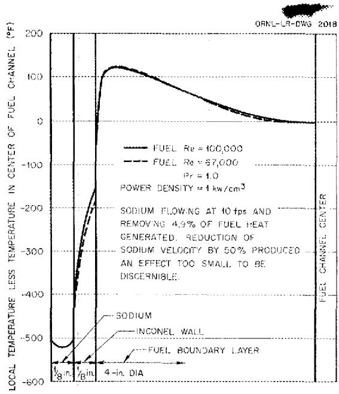

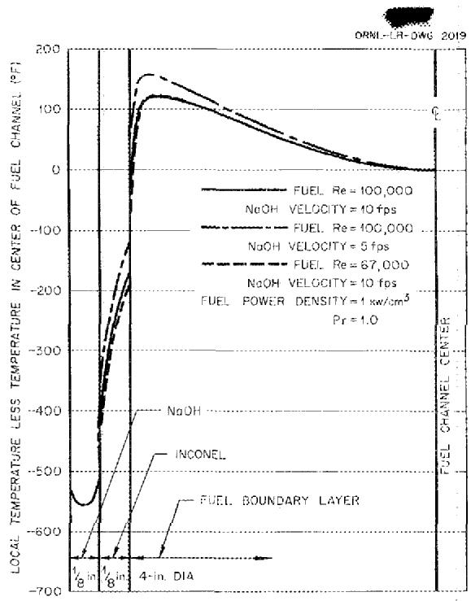  
Fig. 42. Effect of Fuel and Coolant (Sodium) Velocities on Temperature Distribution Through the Fuel Stream, the Wall, and the Wall Coolant.   
Fig. 43. Effect of Fuel and Coolant (NaOH) Velocities on Temperature Distribution Through the Fuel Stream, the Wall, and the Wall Coolant.

problems of the reflector-moderated circulating fuel reactor can be made. The curves given in Figs. 38 to 43 were all obtained from derivations based on flow in infinitely long passages with fully developed boundary layers. This approximation is good for the exit ends of ARE type cores having fairly large tube length-to-diameter ratios. For reflector-moderated reactors, however, the entire passage through the core will be subject to entrance effects that will markedly alleviate the boundary-layer heating problem. The high-intensity, fine-grain turbulence induced by the pumps coupled with the mixing effects of the turbulator

vanes at the core inlet $^{47}$ should serve both to increase the eddy diffusivity by a large factor and to inhibit boundary layer thickening in the diffuser region between the core inlet and the mid-plane. In the highest temperature region from the midplane to the outlet the fuel passage converges and should give a marked reduction in boundary layer thickness and hence in the heating problem.

# PART II. REACTOR STUDIES

# COMPARISON OF REACTOR AND CYCLE TYPES

The report of the TAB provides what is probably both the most authoritative and the most comprehensive comparison of the principal aircraft reactors and propulsion systems that have been proposed. The key conclusions of the TAB were set forth in the form of a list of the various cycles proposed in the order of their promise as aircraft power plants. The list is almost as pertinent today as it was four years ago and is as follows:

1. sodium-cooled stationary-fuel-element reactor,   
2. circulating-fuel reactor (fused-fluoride fuel),   
3. homogeneous reactor (fused-hydroxide fuel),   
4. circulating-moderator reactor (fused hydroxide moderator, solid fuel elements),   
5. supercritical-water reactor,   
6. helium-cooled solid-fuel-element reactor,   
7. air-cooled solid-fuel-element reactor.

This list was the first one that included the circulating-fuel reactor as a promising type for propulsion of aircraft. It had been feared that the loss of delayed neutrons through circulation of the fuel would make such reactors unstable, and it was not until the TAB deliberations that the inherent stability of circulating-fuel reactors was appreciated. This realization constituted one of the major advances in the program.

The TAB conclusions can be justified more effectively now than was possible four years ago by using the information presented in the first portion of this report. Key data have been compiled in Table 11 to indicate the major characteristics of the most promising of the reactor types that have been considered.

One of the best measures of the performance of a system comprising reactor, shield, and propulsion machinery is the weight of the system in pounds per pound of effective thrust, that is, the net thrust minus the drag chargeable to the engine installation. As was shown in the section on "Aircraft Requirements," this weight can be conveniently split into two parts, namely, the weight of the reactor and shield assembly and the weight of the propulsion machinery. For any given set of reactor temperature and flight conditions, the propulsion machinery weight per pound of thrust is essentially independent of power. The reactor

and shield assembly weight per pound of thrust is a complex function of the reactor power, but under all circumstances it decreases rapidly as the power density in the reactor core is increased. Since the shield weight is probably the most important single item and is largely determined by power density, the first line in Table 11 gives the limiting power density for each type of reactor as established by heat removal considerations as summarized in Table 10. The limiting temperatures both in the reactor and in the jet engine air stream have an important influence on the weight and drag of the power plant installation. These data, along with the weight of the propulsion machinery per pound of thrust and the specific thrust, are presented in the next four lines. The temperature coefficient of reactivity for fast transients, together with remarks on the controllability, are presented next, along with estimates of the fuel investment required per airplane and the cost of fabricating and reprocessing the fuel. The last two lines are devoted to remarks on the efficacy of chemical fuel augmentation and to the hazards associated with each type of cycle.

The data for the helium and mercury-vapor cycles were taken from studies made by North American Aviation Corporation under an ORNL subcontract. Even by going to reactor temperatures substantially higher than those assumed for the other cycles listed, it was not found possible to reduce the weight of the propulsion machinery for the helium and for the mercury-vapor cycles to an acceptable level; hence, these cycles are clearly not of further interest. This approach in which weight considerations are considered paramount can be justified by considering that for supersonic aircraft for which the lift-drag ratio will be 5 or 6, roughly one-third of the aircraft gross weight must go for structure and equipment, one-third is available for the reactor and the shield, and one-third can be used for the propulsion machinery. Thus the weight of the propulsion machinery should not exceed 2.0 lb/lb of thrust.

The reactor power densities in Table 11 for the direct air and the supercritical water cycles were taken from Table 10. They agree with the power density estimates published by Air Force contractors except for differences in assumptions.

Both the General Electric Company and the Pratt & Whitney Aircraft Division in some of their designs have assumed more complex and finely divided fuel elements and hence greater heat transfer areas per unit of volume. The General Electric Company has also assumed higher metal temperatures (peak temperatures within $150^{\circ}\mathrm{F}$ of the melting point of the structural material, for example) and thus further increased design power densities. If the higher metal temperature should ever prove practicable for the air cycle, it should be equally applicable to the other cycles. The combined effects of these more optimistic assumptions yield power densities for the G-E design that are approximately twice as high as those given in Table 11.[48] The propulsion machinery weight for the air cycle was estimated from the same data as that used for the high-temperature-liquid cycles. The weight estimate agrees well with G-E data if allowances are made for the differences in turbine air inlet temperature. The propulsion machinery weight for the supercritical-water cycle was taken from Pratt & Whitney reports.

In comparing the data in Table 11 for the various cycles it is evident that the performance of the air cycle is seriously handicapped by a reactor power density that is inherently only 1 to $10\%$ of that for the high-temperature liquid-cooled cycles. This, coupled with the large air ducts required in the shield, leads to a high shield weight unless the shield is very heavily divided. The supercritical-water cycle has the disadvantage of being a low-temperature and, hence, a low-specific-impulse system so that it inherently gives a heavy, bulky, high-frontal-area power plant with virtually no promise of thrust augmentation through interburning or afterburning. The hydroxides are afflicted with such severe corrosion and mass transfer problems that even after five years of research there is still no known method of containing them at temperatures above $1000^{\circ}\mathrm{F}$ . Thus performance would be so limited as to rule out the circulating-moderator and the homogeneous reactors.

From the above discussion it follows that during the past few years the only cycles giving promise of high performance with the materials available have been those employing high-temperature liquid-cooled reactors coupled to turbojet engines. On

the basis of materials considerations, the field was narrowed to the sodium-cooled solid-fuel-element reactor and the circulating-fuel reactor. In both these reactors an intermediate heat transfer fluid is required because the fluid that passes through the reactor is rendered far too radioactive to be circulated outside the shield.

# REACTOR, HEAT EXCHANGER, AND SHIELD ARRANGEMENTS

A historical survey of ORNL aircraft reactor design work provides a further approach to a critical comparison of high-temperature-liquid reactortypes. Some work on the ANP Project was started at ORNL in 1948 to provide experimental data for NEPA. As the effort directed toward fundamental problems, such as shielding and materials, was expanded, the need for supporting work on power plant design became evident. The General Design Group was set up in March 1950, and an intensive study of reactor types and cycles was initiated. By June 1950, it had been concluded that a high-temperature liquid-cooled reactor coupled to turbo-jet engines evinced markedly greater promise than any other arrangement. The program formulated on this basis was given great impetus by the TAB recommendations in August 1950.

In examining the problems associated with the sodium-cooled solid-fuel-element and circulating-fuel reactors it was felt that the latter should have a substantially higher performance potential so far as upper temperature limit and power density are concerned. Further, the use of a circulating fuel would greatly simplify problems of preparing and reprocessing the fuel, and would give an almost assuredly simple reactor control system, because the negative temperature coefficient associated with expansion of the fuel would be entirely adequate to take care of any fast transient perturbations. Problems associated with a solid-fuel-element reactor include xenon override and limitations on the operating life imposed by the tolerable burnup in the fuel elements and by the degree to which provision can be made to compensate for the reactivity losses associated with burnup through the use of such devices as the addition of poisons that would burn out during the course of operation. Insertion of a large number of control rods would seriously impair the heat transfer characteristics of the core and require much complex actuating equipment. The high

TABLE 11. COMPARISON OF KEY DATA FOR THE MORE PROMISING TYPES OF AIRCRAFT REACTOR SYSTEMS   
Reactor Power Density Conditions given in Table 10, $1700^{\circ}\mathrm{F}$ Peak Metal Temperature (Except for Helium and Mercury Vapor Cycles), Flight at Mach 1.5 and 45,000 ft   

<table><tr><td></td><td>SODIUM-COOLED SOLID-FUEL-ELEMENT REACTOR</td><td>CIRCULATING-FUEL REACTOR</td><td>HOMOGENEOUS REACTOR</td><td>CIRCULATING-MODERATOR REACTOR</td><td>SUPERCRITICAL-WATER REACTOR(a)</td><td>AIR-COOLED SOLID-FUEL-ELEMENT REACTOR(b)</td><td>MERCURY-VAPOR CYCLE REACTOR(c)</td><td>HELIUM-COOLED(d) SOLID-FUEL-ELEMENT REACTOR (2000 psi helium)</td></tr><tr><td>Heat-removal-limited power density, kw/cm3</td><td>4.2</td><td>&gt;10</td><td>&gt;10</td><td>1.9</td><td>0.70</td><td>0.027</td><td>4.2</td><td>0.66</td></tr><tr><td>Limiting reactor fluid outlet temperature, °F</td><td>1550</td><td>1700</td><td>1200</td><td>1200</td><td>1300</td><td>1280</td><td>1730</td><td>3100</td></tr><tr><td>Limiting air temperature, °F</td><td>1240</td><td>1350</td><td>990</td><td>990</td><td>455</td><td>1280</td><td>1160</td><td>1230</td></tr><tr><td>Specific thrust (less nacelle drag), lb/lb of air/sec</td><td>22.4</td><td>29.0</td><td>14</td><td>14</td><td>19.4</td><td>26.0</td><td>28.8</td><td>38.5</td></tr><tr><td>Weight of propulsion machinery at Mach 1.5 and 45,000 ft, lb/lb of thrust</td><td>2.5</td><td>2.0</td><td>4.0</td><td>4.0</td><td>3.3</td><td>1.9</td><td>4.3</td><td>2.7</td></tr><tr><td>Probable temperature coefficient for fast transients, Δk/k-°C</td><td>±10-5</td><td>-5 × 10-5</td><td>-5 × 10-5</td><td>-10-5</td><td>±10-5</td><td>±10-5</td><td>±10-5</td><td>±10-5</td></tr><tr><td>Remarks on controllability</td><td>Difficult and complex</td><td>Simple and inherently reliable</td><td>Simple and inherently reliable</td><td>Startup procedure difficult</td><td>Difficult and complex</td><td>Difficult and complex</td><td>Difficult and complex</td><td>Difficult and complex</td></tr><tr><td>Total fuel investment (U235) in reactor, lb</td><td>60</td><td>120</td><td>60</td><td>25</td><td>30</td><td>100</td><td>60</td><td>100</td></tr><tr><td>Cost of fabrication and reprocessing per gram of U235 dollars(e)</td><td>16.00</td><td>1.50</td><td>1.50</td><td>16.00</td><td>16.00</td><td>16.00</td><td>16.00</td><td>16.00</td></tr><tr><td>Efficacy of chemical fuel augmentation</td><td>Very good</td><td>Very good</td><td>Very good</td><td>Very good</td><td>Poor</td><td>Good</td><td>Poor</td><td>Poor</td></tr><tr><td>Major hazards</td><td>Reactor runaway and melt-down; sodium fire</td><td>Fuel spill; NaK fire</td><td>Fuel spill; NaK fire</td><td>NaOH spill; NaK fire</td><td>Burst of some part of 5000-psi system</td><td>Reactor runaway and melt-down; burst of 300-psi system</td><td>Reactor runaway</td><td>Reactor runaway and melt-down; burst of 3000-psi system</td></tr></table>

(a) Data calculated from Pratt & Whitney Aircraft Div., Nuclear Propulsion Program Engineering Progress Report, No. 9, PWAC-75, p. 28.   
(b) General Electric Co., Aircraft Nuclear Propulsion, Department of Engineering, Progress Report No. 9, APEX-9 (Sept. 1953).   
(c) Data calculated from work of A. Dean and S. Nakazato, Investigation of Mercury Vapor Power Plant for Nuclear Propulsion of Aircraft, NAA-SR-110 (Mar. 21, 1951).   
(d) Data calculated from work of H. Schwartz, An Analysis of Inert Gas Cooled Reactors for Application to Supersonic Nuclear Aircraft, NAA-SR-111 (Sept. 8, 1952).   
(e)Data calculated from memorandum from C. E. Larson to G. Beardsley, Preliminary Comparison for Reprocessing Fuels from an SCwR and a CFR, ORNL CF-53-12-11 (Dec. 1, 1953).

temperatures required of an aircraft reactor coupled with leaktightness requirements and shield weight and residual radiation considerations make it seem unlikely that a sodium-cooled solid-fuel-element reactor could be reloaded readily. On the other hand, little information was available in 1950 on fluids that might serve as vehicles for fuel. Hydroxides had been considered by NEPA,[49] but it was felt that serious corrosion problems would be inherent in their use because the oxygen in them is not bound tightly enough to give assurance of their remaining inactive at high temperatures. R. C. Briant, in April 1950, pointed out that, on the basis of chemical thermodynamics, the alkali fluorides should be inherently stable relative to the iron-chrome-nickel alloys even at the high temperatures required and advocated their use as circulating fuels. It was recognized, however, that the use of the fused fluorides as a circulating fuel would mean the opening of a whole new field of reactor technology that would be filled with unknowns and that there would be no guarantee of success. Therefore it was decided in September 1950 that the major emphasis should be placed on the sodium-cooled solid-fuel-element reactor, while a substantial research program should be directed toward the solution of the corrosion problems associated with the hydroxides and the fluorides.

# Shield and Heat Exchanger Designs

To implement the design effort on the sodium-cooled solid-fuel-element reactor, an intensive study was made of the shielding problem by a joint ORNL-NEPA committee in the fall of 1950. A number of the reactor and shield designs included in the committee report are of interest. Figure 44 shows the first design prepared, which followed the NEPA practice of using conventional tube-and-shell heat exchangers disposed relative to the reactor and to the pumps in a quite conventional fashion with the shield simply wrapped around the resulting assembly. The estimated shield weight for this assembly was over 230,000 lb. The layouts shown in Figs. 45 and 46 make use of an

unconventional heat exchanger in which the reactor coolant flows axially through the interstices between small-diameter, closely spaced tubes, while the secondary circuit fluid passes through the tubes to give a virtually pure counterflow system. The shield weight for the tandem heat exchanger arrangement of Fig. 45 was estimated to be about 160,000 lb, while that for the annular heat exchanger arrangement of Fig. 46 was 122,000 lb. This was close to the weight of the ideal matched lead-water shield, the weight of which was estimated to be 116,000 lb. A fourth configuration, which made use of lead as the reactor coolant, is shown in Fig. 47. This arrangement, the weight of which was estimated to be about 120,000 lb, was designed to employ the lead reactor coolant as shielding material by placing the heat exchanger at the same region in the shield as would normally be occupied by the gamma-ray shielding material. Differential thermal expansion appeared to pose some rather difficult structural problems in connection with the fairly large volume, low-temperature shield region inside the high-temperature heat exchanger shell. The design also had the disadvantage that the lead-corrosion problem showed no promise of solution.

Concurrently with the 1950 Shielding Board investigation, a second joint ORNL-NEPA group carried out an intensive study of the reactor and engine control problem.35 This group reluctantly reached the conclusion that a solid-fuel-element, high-temperature, high-power-density reactor might be unstable and that if at all possible an effort should be made to obtain a reactor with a negative temperature coefficient, even if it meant compromising the reactor design. While there was little doubt that the sodium-cooled solid-fuel-element reactor could be controlled, it appeared that an unusually complex control system would be required which, when coupled to the very complex control system required for the turbojet engines, would probably seriously impair the reliability of the power plant. In view of this serious development, the situation was reappraised. It was decided that the materials research work was still not sufficiently far along to permit shifting the major emphasis to a circulating-fuel type of reactor and therefore development would have to continue on a stationary-fuel-element reactor. It was felt, however, that it would be possible to use a design

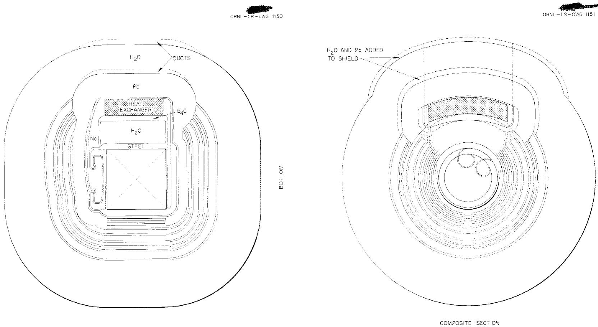  
Fig. 44. Shield Design for a Sodium-Cooled Solid-Fuel-Element Reactor with Conventional Tube-and-Shell Heat Exchangers.

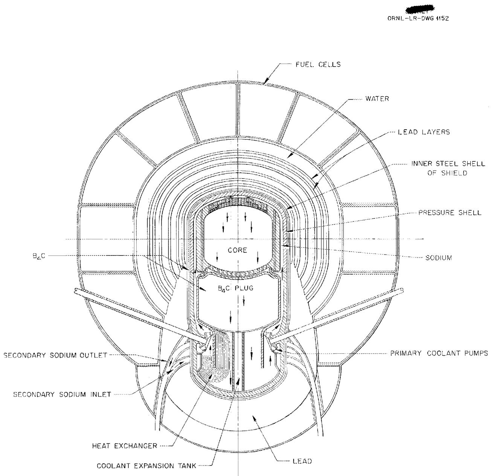  
Fig. 45. Design of a Sodium-Cooled Solid-Fuel-Element Reactor with a Tandem Heat Exchanger Arrangement.

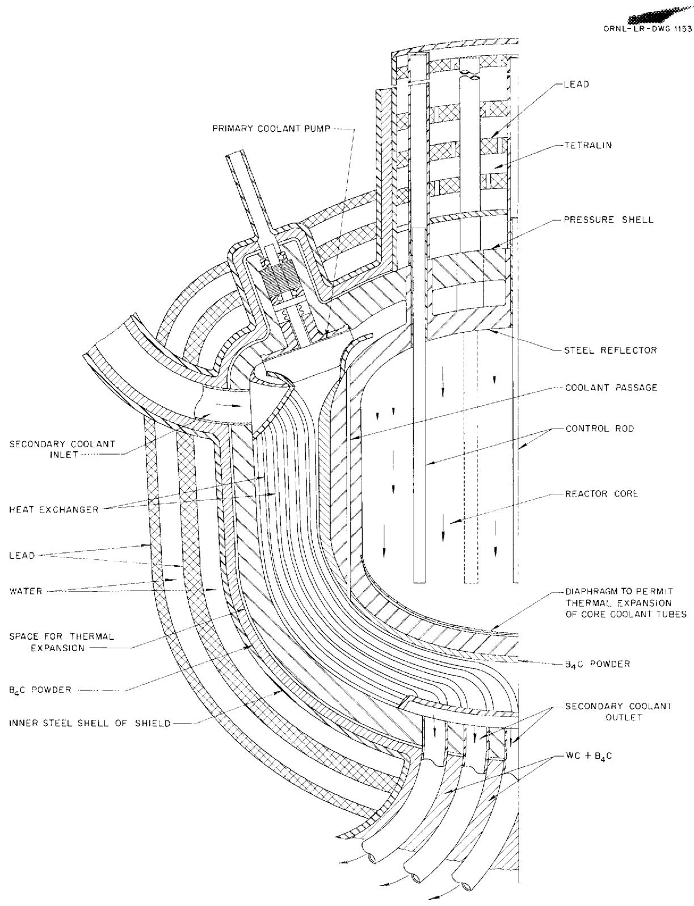  
Fig. 46. Design of a Solid-Fuel-Element Reactor with an Annular Heat Exchanger Arrangement.

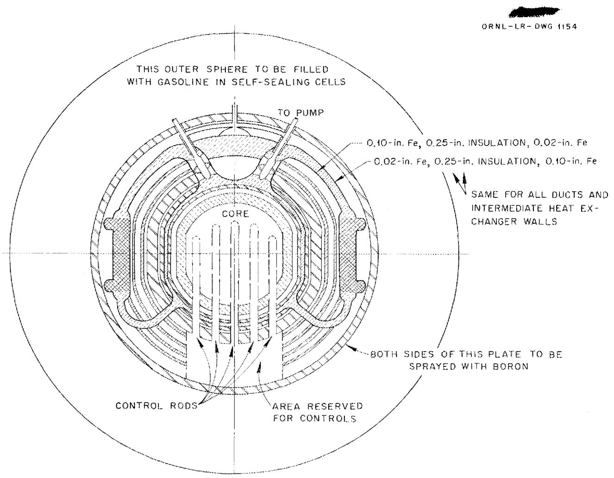  
Fig. 47. Design of a Lead-Cooled Solid-Fuel-Element Reactor with Heat Exchangers Arranged to Act as Gamma-Ray Shielding.

similar to that of the KAPL Submarine Intermediate Reactor but with a molten fluoride salt containing uranium in solution instead of solid $\mathrm{UO}_2$ in the fuel pins. Thermal expansion would push some of this fluid fuel out of the reactor core into an expansion tank to give the desired negative temperature coefficient of reactivity. Work on this design proceeded for nearly a year until, in the fall of 1951, it developed that the GE-ANP project had dropped its plan to base development on high-temperature liquid-cooled reactors and had instead returned to the air cycle. Since this change eased the pressure for ORNL to get an experimental reactor into operation at the earliest possible date, the entire nuclear-powered aircraft situation was reappraised.

No structurally satisfactory design had been evolved for a high-power-density reactor core employing the molten-salt-filled fuel pins, and two major problems associated with the fuel pins seemed well-nigh insuperable. First, there was, inherently, a temperature drop of over $1000^{\circ}\mathrm{F}$ between the center and the outside of the fuel pin. While this would not have been serious in a low power reactor of the type to be used for the Aircraft Reactor Experiment, it probably would have been quite serious in a full-scale aircraft reactor. Second, as in any solid-fuel-element reactor, adequate support and satisfactory maintenance of spacing of the fuel elements would have been exceedingly difficult to arrange. Thus, on the basis of structural and heat transfer considerations,

attention was turned to the circulating-fluoride-fuel reactor with its then more difficult materials problems. Considerable progress had been made in the investigations of the chemistry of fluoride fuels, and it was believed that in the long run the problems associated with the use of circulating fuels would prove easier to solve than the less obvious, but nonetheless vital, problems inherent in fixed-fuel-element reactors.

An intensive design effort was initiated in October 1951 for examining the problems associated with a full-scale aircraft nuclear power plant employing a circulating fluoride fuel. In one of the first studies, an examination was made of the possibility of piping the fluoride fuel directly to heat exchangers in the turbojet engines and thus eliminating the complications associated with an intermediate heat transfer circuit. The design study of this proposal is covered in ORNL-1287.[51] Even by going to the exceptionally large reactor-crew separation distance of 120 ft and a crew-engine separation distance of 135 ft, which badly compromised the airplane design, the arrangement led to a shield weight actually greater than that obtainable with an intermediate heat transfer circuit. Also, the radiation dose level of about $6 \times 10^{6} \mathrm{r/hr}$ at 50 ft from the reactor that would result from this arrangement would be completely intolerable. Shielding of the engine radiators appeared to be out of the question because of their large size. Ground-handling and maintenance problems seemed to many people to be insuperable. Thus this arrangement was dismissed and attention was directed to reactor systems employing an intermediate heat transfer fluid.

A careful study of arrangements of the reactor, intermediate heat exchanger, and shield was made in an effort to determine the effect of configuration on shield weight.52 Activation of the secondary coolant threatened to be a much more severe problem in these arrangements than in the arrangements for use with solid-fuel-element reactors (Figs. 44 through 47) because delayed neutrons from the circulating fuel would be released in the heat exchanger. It was found that this key problem

could be handled by keeping moderating material out of the heat exchanger so that most of the neutrons would escape before they would slow down. By filling 5 to $10\%$ of the heat exchanger volume with boron carbide, most of the neutrons that did not escape would be captured in boron rather than in the secondary coolant. This solution to the problem of neutron activation of the secondary coolant makes the circulating-fuel reactor superior to a homogeneous reactor. In homogeneous reactors, moderation of the delayed neutrons by moderator-fuel would greatly aggravate the problem.

The first circulating-fluoride-fuel reactor, intermediate heat exchanger, and shield arrangement studied - an arrangement in which the reactor and heat exchanger were placed in tandem - is shown in Fig. 48. To keep the activation of the sodium in the secondary circuit to a tolerable level, it was found that it would be necessary to separate the heat exchanger from the reactor core by at least 12 in. of good moderating material followed by a 1 in. thick layer of boron carbide (or, if $B^{10}$ were used instead of natural boron, a thickness of 0.2 in.). A careful analysis of this arrangement disclosed also that the pressure shell should be separated from the reactor core by a layer of boron carbide of similar thickness to keep the pressure shell from becoming a more important source of gammas than the core. It also became clear that activation of the secondary coolant by delayed neutrons emitted from the fuel in the heat exchanger could be markedly reduced by spreading the heat exchanger out in a thin layer and thereby increasing the neutron escape probability. Further, it was observed that with the tandem arrangement (Fig. 48), the lead shielding required just for the heat exchanger constituted a major portion of the total shield weight.

The annular heat exchanger arrangement shown in Fig. 49 was evolved to place the heat exchangers around the reactor within the primary reactor shield and thus eliminate the extra lead shielding of the heat exchangers. This arrangement gave an estimated shield weight of 128,000 lb, as compared with 156,000 lb for the tandem arrangement. Careful examination of this design led to the conclusion that an additional weight saving could be realized by changing the geometry of the design to make it more nearly spherical. The spherical arrangement shown in Fig. 50 was

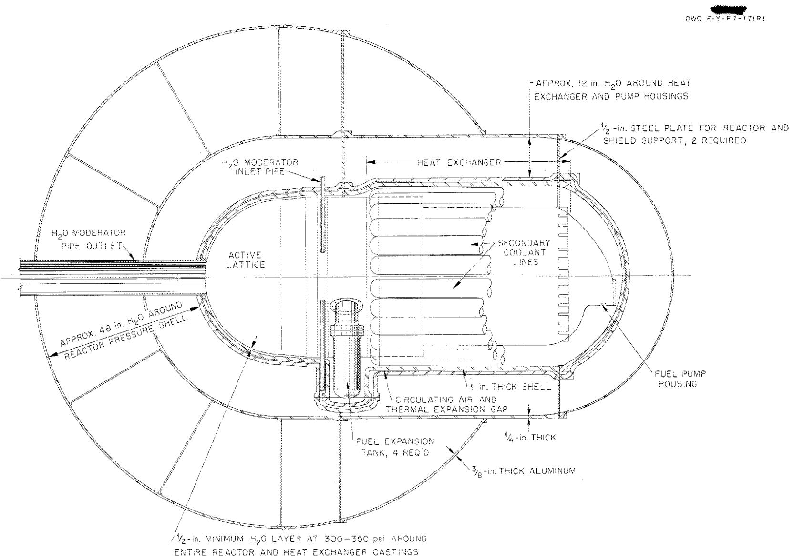  
Fig. 48. Water-Moderated Circulating-Fuel Reactor with a Tandem Heat Exchanger.

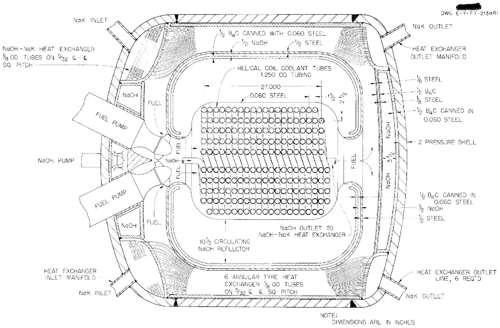  
Fig. 49. Schematic Longitudinal Cross Section Through Hydroxide-Moderated Circulating-Fuel Reactor with Annular Heat Exchangers.

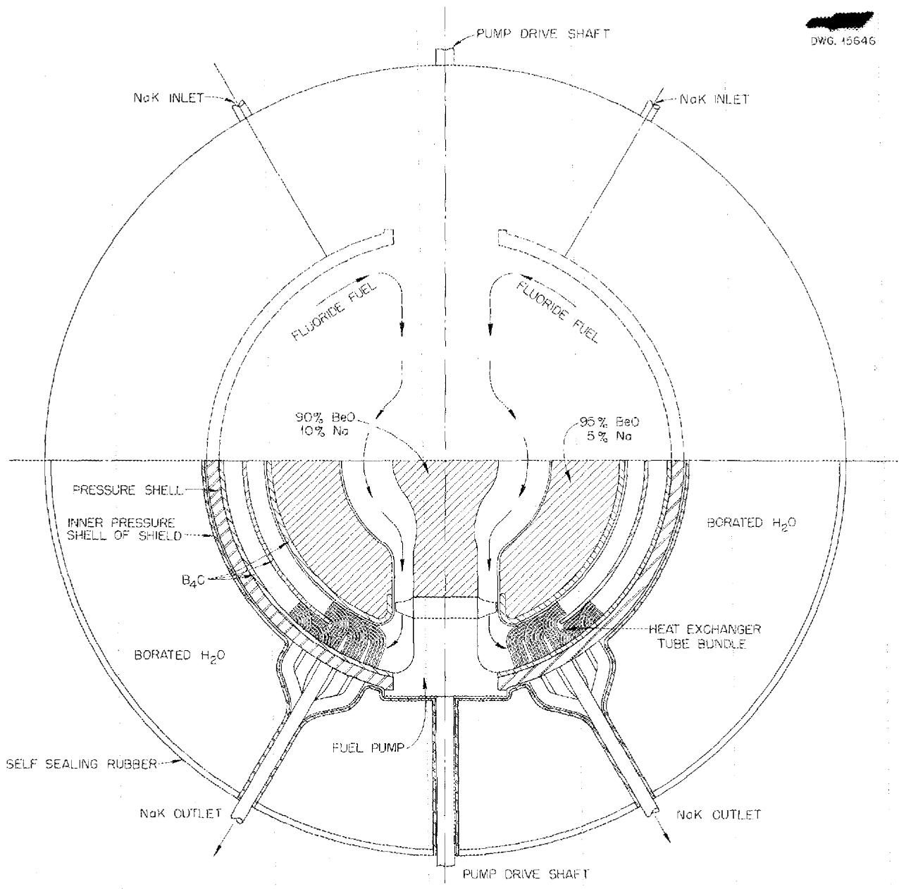  
Fig. 50. Arrangement of Circulating-Fuel Reflector-Moderated Reactor with Spherical Heat Exchanger.

then designed, and it was found to give an estimated shield weight of 120,000 lb. The shield weights given here were estimated for a quasi unitshield design condition, namely, $7\mathrm{r / hr}$ at 50 ft from the reactor, and 1 r/hr inside the crew compartment. Various degrees of shield division were also considered in an effort to reduce shield

weights for the various designs, and in each instance the spherical-shell heat exchanger arrangement shown in Fig. 50 was found to be superior. In all cases, the reactor output design condition was $400\mathrm{Mw}$ , and the reactor core diameter was about 30 in.

# Reactor Core Configurations

The reactor cores used in the shield design studies of Figs. 48 and 49 were conventional in that the moderator was distributed throughout the active fuel region with relatively little lumping. However, the reactor core design shown in Fig. 50 was evolved on a quite different basis. A brief account of the reasoning that led to this reflectormoderated reactor design may be of interest. A number of people had felt that a small (perhaps 18-in.-dia) fast reactor might be built to utilize one of the uranium-bearing fluoride-salt fuels. Rough calculations made by T. A. Welton indicated that the high concentration of uranium atoms required to achieve criticality with this type of reactor would be difficult to obtain in any fluoride salt melt likely to have desirable physical properties. Others felt that the concentrations of Li7 and Be in the fluoride melt might be increased to the point where their moderating effect would be sufficient to make possible a homogeneous fused-fluoride reactor. A minimum critical mass of the order of $150\mathrm{kg}$ was indicated by one- and two-group calculations for such a reactor. Since the shield design studies had clearly shown the desirability of a thick reflector, it was felt that it might be possible to capitalize on this thick reflector and effect a major reduction in critical mass with a quasi-homogeneous fluoride fuel. (At the time, a fairly high uranium concentration in the fluoride mixture was not considered to be too serious.)

Multigroup calculations indicated that a beryllium reflector could be made so effective that the critical mass could be cut to something of the order of $15\mathrm{kg}$ . This prediction was later confirmed by critical experiments. It has also been found that the good high-energy neutron-scattering cross section of the fluorine in the fuel is more important for a reactor of this type than the moderating effects of Be or Li. In fact, the neutron-scattering cross section is so much more important that heavier elements such as Na and Rb may be used in the fluorides instead of Be or Li with little effect on critical mass.

The heavily lumped fuel region of the reflectormoderated reactor has a number of major advantages. The removal of all structural material from

the core except the core shells reduces parasitic neutron capture in structural material to a minimum and hence reduces the critical mass. The placement of most of the moderating material in the reflector gives a smaller diameter core for a given power density in the fuel and hence a lighter shield.

Many circulating-fuel reflector-moderated reactor arrangements have been proposed to take advantage of the spherical-shell heat exchanger and shield arrangement shown in Fig. 50. In general, it appears that there are eight basic types of construction that might be employed. The simplest type, shown in Fig. 51, comprises a thick, spherical shell of moderator surrounding a spherical chamber containing liquid fuel. Ducts at the top and bottom of the shell direct cold fuel into the reactor core and carry off high-temperature fuel. Such an arrangement has two major disadvantages. First, the well-moderated neutrons reflected to the fuel region from the reflector tend to be absorbed near the fuel-reflector interface so that the power density falls off rapidly from that interface to a relatively low value at the center. Second, the flow pattern through such a core is indeterminate, and large regions of flow separation and probable stagnation would be likely to occur in a highly irregular, unpredictable fashion, although vanes or screens at the inlet might be effective in slowing down and distributing the flow. The arrangement shown in Fig. 52, which makes use of a central "island," appeared to be more promising. The central island has the advantage that it reduces the critical mass and yields a more uniform power distribution. Thus the extra complexity of a cooling system for the island appears to be more than offset by the reduced critical mass, improved power distribution, and much superior hydrodynamic characteristics.

The most serious problem associated with the arrangement of Fig. 52 appears to be that of cooling the moderator,[54] a problem common to all high-power density reactors. If beryllium is used as the reflector-moderator material, closely spaced cooling passages must be employed in those portions close to the fuel region to remove the heat generated by gamma-absorption and the

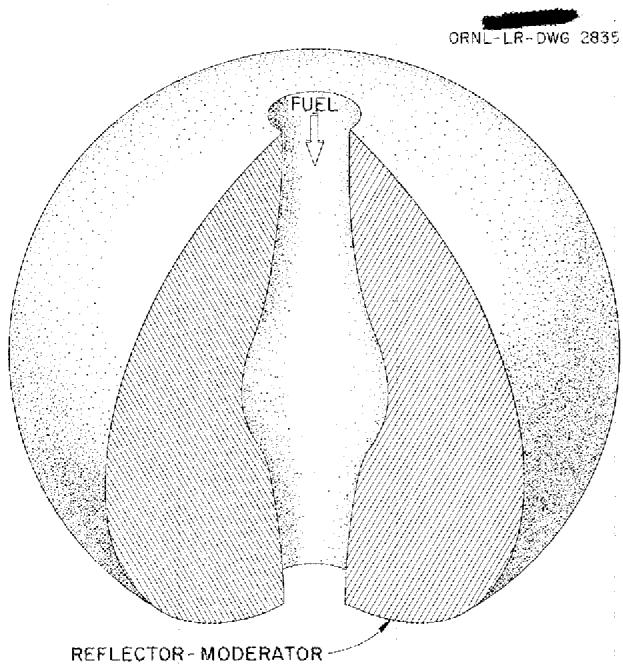  
Fig. 51. Simple Two-Region Reactor Core with Thick, Spherical Shell of Moderator Surrounding a Spherical Chamber Containing Liquid Fuel.

neutron-slowing-down processes. Other arrangements have been considered; for example, the high temperature gradients and thermal stresses induced in the beryllium in this fashion might be avoided if a layer of a liquid such as lead or bismuth could be interposed between the fuel and the reflector-moderator regions, as indicated in Fig. 53. This liquid could be circulated to carry off the heat and the beryllium cooling problem would be markedly relieved.

It appears feasible to use graphite in direct contact with fluoride fuels without damage to the graphite or contamination of the fuel. Therefore a possible design (Fig. 54) comprises a block of graphite drilled to give a large number of parallel passages through which the fuel might flow. This design, in effect, gives a very nearly homogeneous mixture of fuel and graphite in the reactor core. A variation of this design is shown in Fig. 55. Several concentric shells of graphite might be placed in such a way that they would serve to guide the fuel flow and at the same time act as moderating material. From the hydrodynamic standpoint, either of these arrangements appears to be preferable to the screens or vanes placed in the

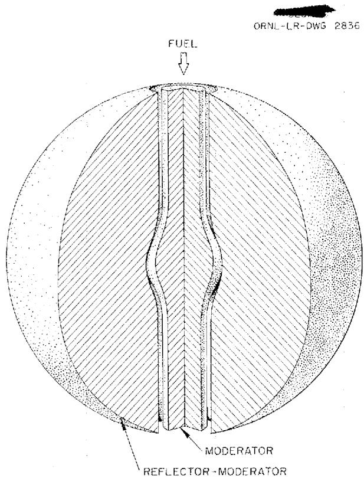  
Fig. 52. Three-Region Reactor Core with Central Island of Moderating Materials.

fuel inlet mentioned in connection with Fig. 51. While these arrangements appear to have the advantage of simplifying the core design and dispersing moderator through the fuel region, calculations indicate that the fluoride fuel compares favorably with graphite as a moderating material, and therefore the arrangements of Figs. 54 and 55 are little better from the nuclear standpoint than that shown in Fig. 51.

A number of different types of fluid-moderated reactors has been considered. One variant is shown in Fig. 56. A set of coiled tubes through which sodium hydroxide could be pumped might be placed in the reactor core. These could be made to serve both to improve the fuel velocity distribution and to moderate fast neutrons in the reactor core. The principal disadvantage associated with such an arrangement is that it would be difficult to avoid local hot spots in the liquid fuel in zones where flow separation and stagnation might occur. Also, the relatively large amount of structural material in the tube walls would capture

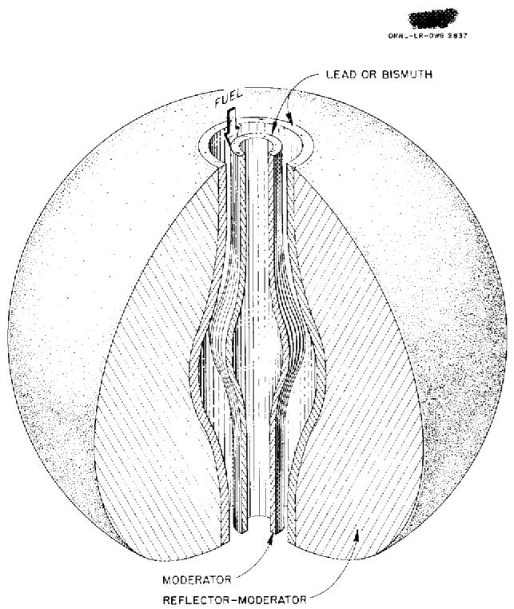  
Fig. 53. Five-Region Reactor Core with Provision for Cooling Reflector-Moderator Regions.

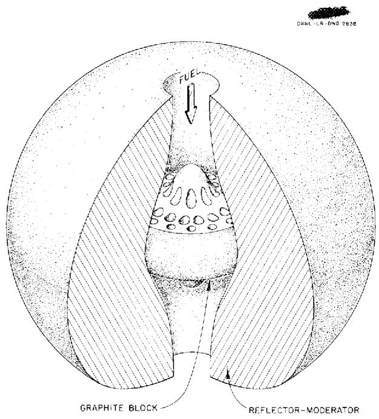  
Fig. 54. Reactor Core with Fuel Channels in Graphite Block.

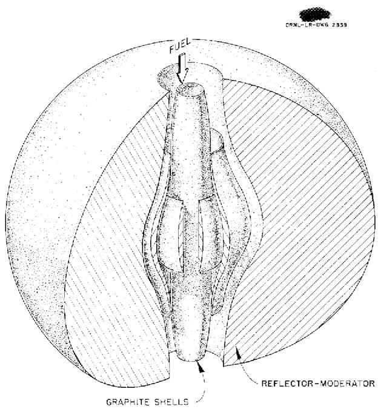  
Fig. 55. Reactor Core with Graphite Shells in Fuel Channel.

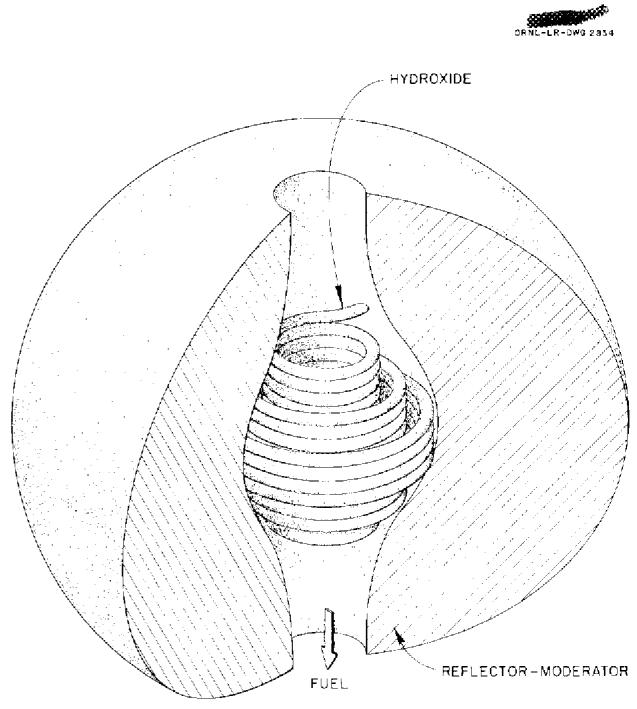  
Fig. 56. Fluid-Moderated Reactor Core with Coiled Tubes for Circulating the Moderator.

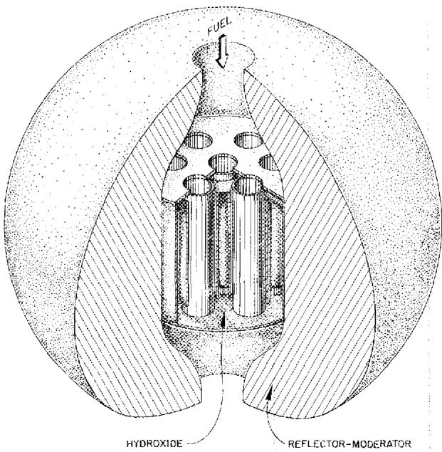  
Fig. 57. Fluid-Moderated Reactor Core with Straight-Tube Fuel Passages and Provision for Circulating Moderator Around Fuel Tubes.

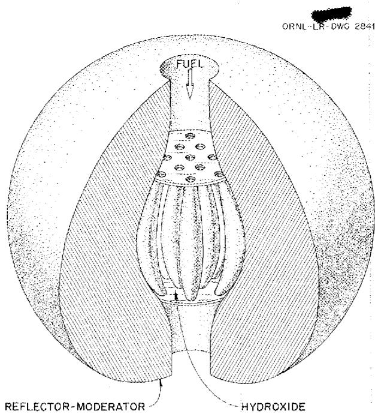  
Fig. 58. Fluid-Moderated Reactor Core with Spheriodized Fuel Passages and Provision for Circulating Moderator Around Fuel Passages.

a substantial percentage of the neutrons, and therefore the critical mass would be increased.

The arrangement of Fig. 57 also presumes the use of a fused hydroxide as a fluid moderator. The fluoride fuel would circulate through the circular passages and pass down through the reactor core, while the hydroxide moderator would circulate through the spaces between the fuel passages. Because of the fuel boundary-layer heating problem (cf., section on "Temperature Distribution in Circulating-Fuel Reactors"), baffles would have to be provided around the fuel tubes so that the hydroxide could be circulated at a high velocity over the tube wall with good velocity distribution to prevent hot spots. The arrangement of Fig. 58 is similar to that of Fig. 57, except that the tubes are specially shaped to reduce the volume of the header regions and to give a more nearly spherical core and hence a lower shield weight.

# DETAILED DESIGNS OF REACTORS

# Sodium-Cooled Solid-Fuel-Element Reactor

The first detailed design studies of reactors were based on sodium-cooled solid-fuel-element reactor cores, and several types of fuel element were examined. The pin type used in the SIR core39 appeared to be attractive, but the problems of supporting the pins and maintaining uniform spacing between them were exasperatingly difficult, particularly for high-power-density cores. An arrangement that promised to give a much higher power density potential incorporated stainless-steel-clad sandwich fuel plates having a sintered $\mathrm{UO}_2$ and stainless steel core, as described in the previous section on "Materials." The most highly developed design of this character is that shown in Fig. 59, which was prepared in the summer of 1952 by A. S. Thompson. This core was designed to employ a fuel element of the type shown in Fig. 60, but it is equally well adapted to the use of sandwich tube fuel elements of the type shown in Fig. 61. The core design was based upon the flow of sodium downward through the annular fuel element matrix and the reflector and then radially outward and upward through the heat exchanger in the annulus between the reflector and the pressure shell. Pumps at the top of the pressure shell were designed to take the sodium as it left the heat exchanger and deliver it back to the core inlet passage.

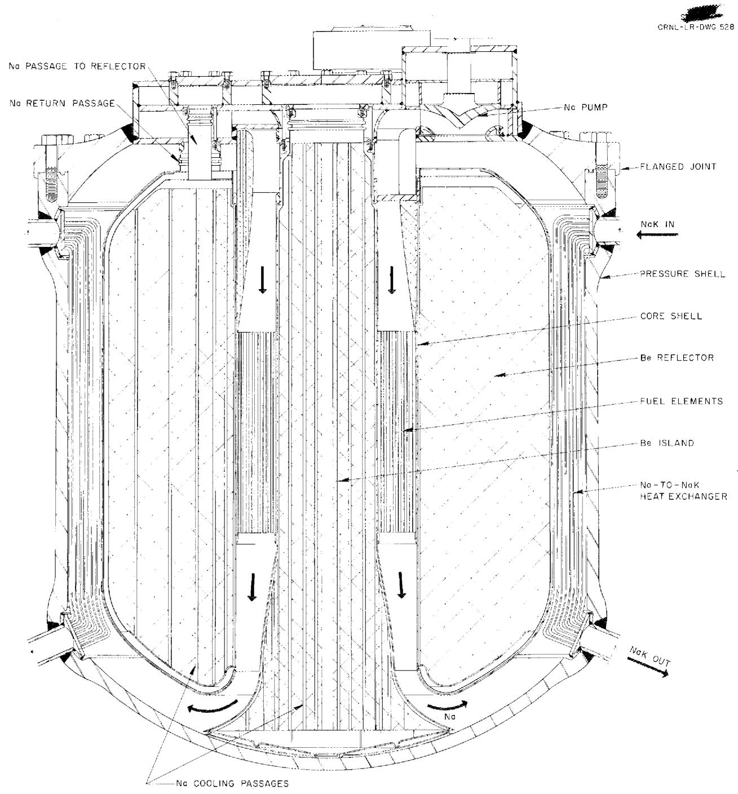  
Fig. 59. Sodium-Cooled Solid-Fuel-Element 100-Mw Reactor.

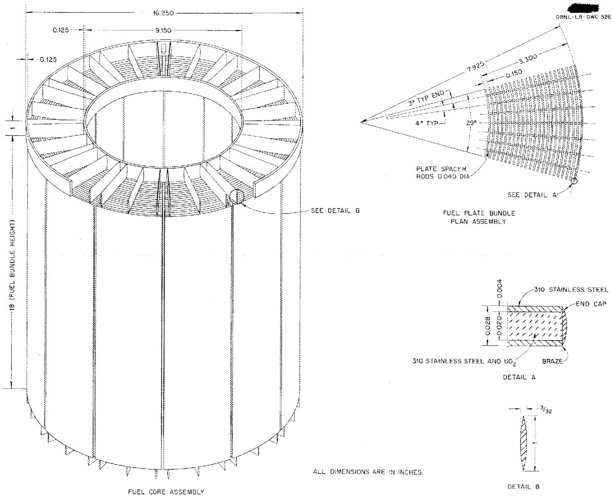  
Fig. 60. Reactor Core Employing Stainless-Steel-Clad Sandwich Fuel Plates.

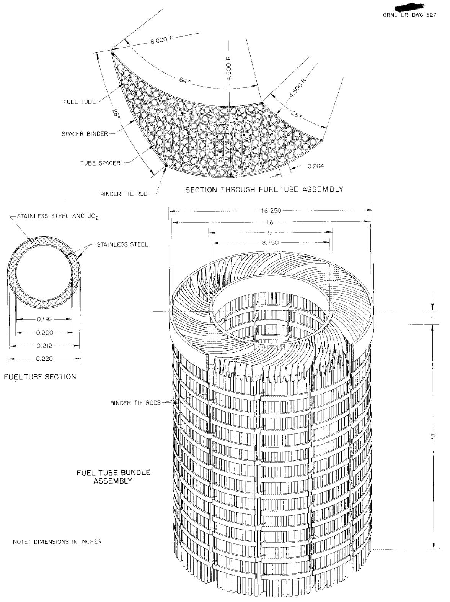  
Fig. 61. Reactor Core Employing Stainless-Steel-Clad Sandwich Fuel Tubes.

A careful examination of the over-all characteristics of an aircraft power plant using alternatively sodium-cooled solid-fuel-element and circulating-fuel reflector-moderated reactors led to the conclusion that the circulating-fuel type gave the greater promise. The presence of fuel in the heat exchanger seemed to increase the NaK activation by about a factor of 10 and gave a shield weight increase of 3000 to 5000 lb for the circulating-fuel reactor. These disadvantages appeared to be more than offset by the higher NaK temperature obtainable. That is, since the limiting reactor temperature appears to be the peak allowable metal temperature and since the temperature drop through the solid-fuel-element core and cladding and from the solid-fuel-element surface to the sodium must be $100^{\circ}\mathrm{F}$ or more (with allowances for hot spots), the NaK temperature leaving the heat exchanger could be at least $100^{\circ}\mathrm{F}$ higher for the circulating-fuel reactor than for the sodium-cooled solid-fuel-element type. Further, for the fluid-fuel type, the reactor and power plant should be much easier to control, the fuel reprocessing costs should be very much lower, and the fuel loading and unloading operations much simpler. Thus ORNL effort was concentrated on the circulating-fuel reactor with the thought that most of the work would be almost equally applicable to either type and that in the event something quite unforeseen arose to handicap the fluoride fuel it should prove fairly easy to shift to the sodium-cooled solid fuel element.

# Circulating-Fuel Aircraft Reactor Experiment

Many different designs have been prepared for circulating-fluoride-fuel reactors; the ARE is representative of an important class of these. As shown in Figs. 62 and 63 the design of the ARE was based on the use of passages approximately $1\frac{1}{4}$ in, in diameter spaced on approximately $3\frac{1}{2}$ -in. centers in a BeO matrix. The BeO matrix was prepared in the form of hexagonal blocks approximately 6 in, long and $3\frac{1}{2}$ in, across the flats. While the ARE design was prepared for a reactor power of only 3000 kw, it was intended to simulate a reactor capable of developing a much higher power output.[51] For the high-power case, it was intended

that simple tube-to-header sheets be used at the top and bottom in place of the complicated return bend arrangement shown in Fig. 62. The tube-to-header sheets could not be employed for the ARE simply because, at the low powers for which the ARE was designed, the fuel flow through the reactor would have been so low that laminar flow would have prevailed and the tube wall temperature would have been about $500^{\circ}\mathrm{F}$ higher than the mean fuel temperature in the core. By using return bends and connecting eleven of the passages in series to give five parallel groups it was possible to increase the flow velocity sufficiently to ensure turbulent flow and thus reduce the temperature difference between the tube wall and the mean fluid temperature to about $50^{\circ}\mathrm{F}$ .

It was mentioned that the ARE was intended to simulate in a rough fashion a reactor core potentially capable of power outputs of at least 200 megawatts. It was recognized, however, at the time the ARE was designed that there were many features that would have to be changed to permit the higher power output. Of most importance would be a change to some better moderator arrangement than the hexagonal BeO blocks, which as shown in the earlier section on "Temperature Gradients and Thermal Stresses," would break up into rather small pieces under the action of the thermal stresses that would be induced by gamma heating in a high-power reactor. The ARE design also has the disadvantage that the average power density in the reactor core is very much lower than the power density in the fuel. It also requires a relatively high concentration of uranium fluoride in the fuel melt, which is considered undesirable because the relatively high uranium concentration yields a fluoride that has inferior physical properties and less than optimum corrosion characteristics.

# Fluid-Moderated Circulating-Fuel Reactor

An arrangement somewhat similar to that for the ARE was worked out for the design shown in Fig. 64. In this reactor, water or hydroxide was to serve as a liquid moderator that would fill the interstices between the tubes that carried the fluoride fuel through the reactor core. To avoid

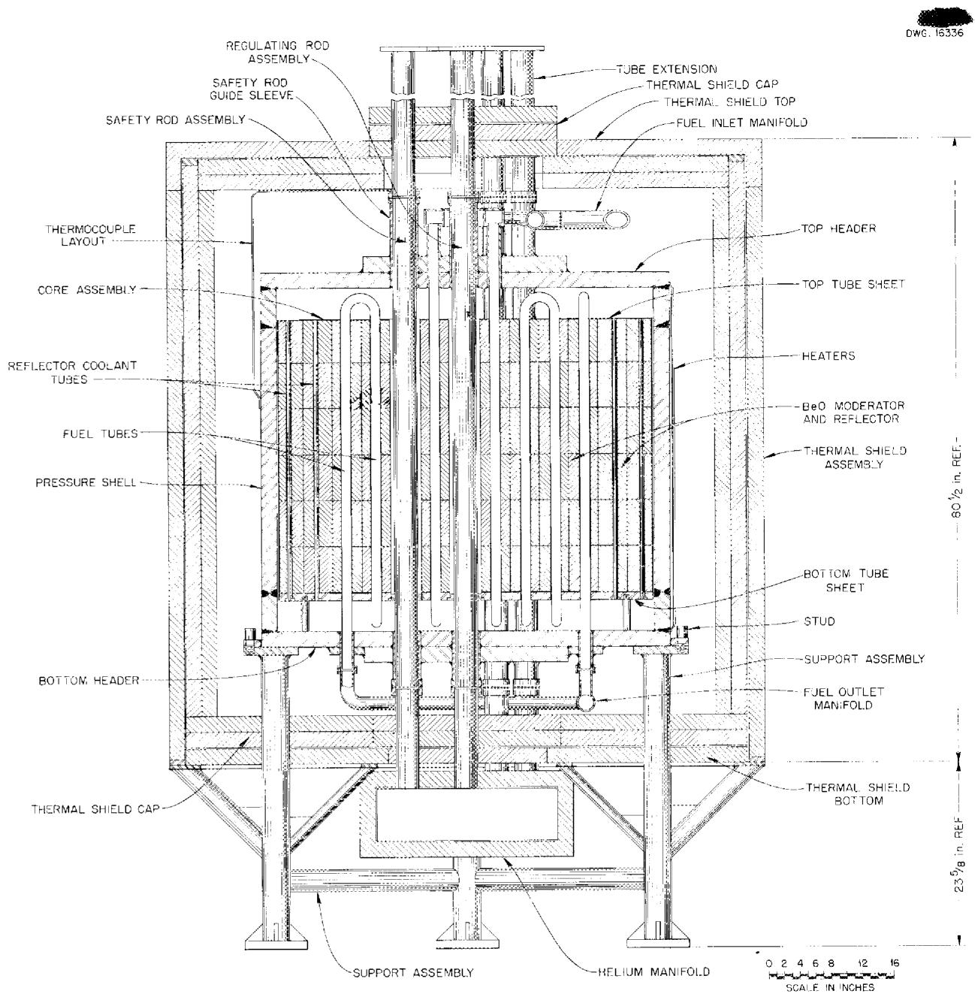  
Fig. 62. Vertical Section of the ARE.

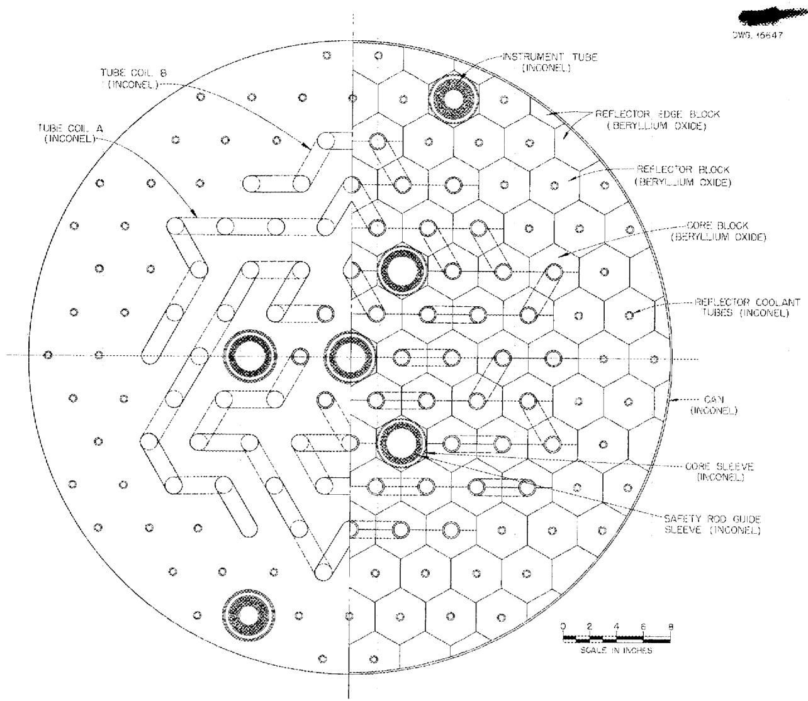  
Fig. 63. Cross Section of the ARE.

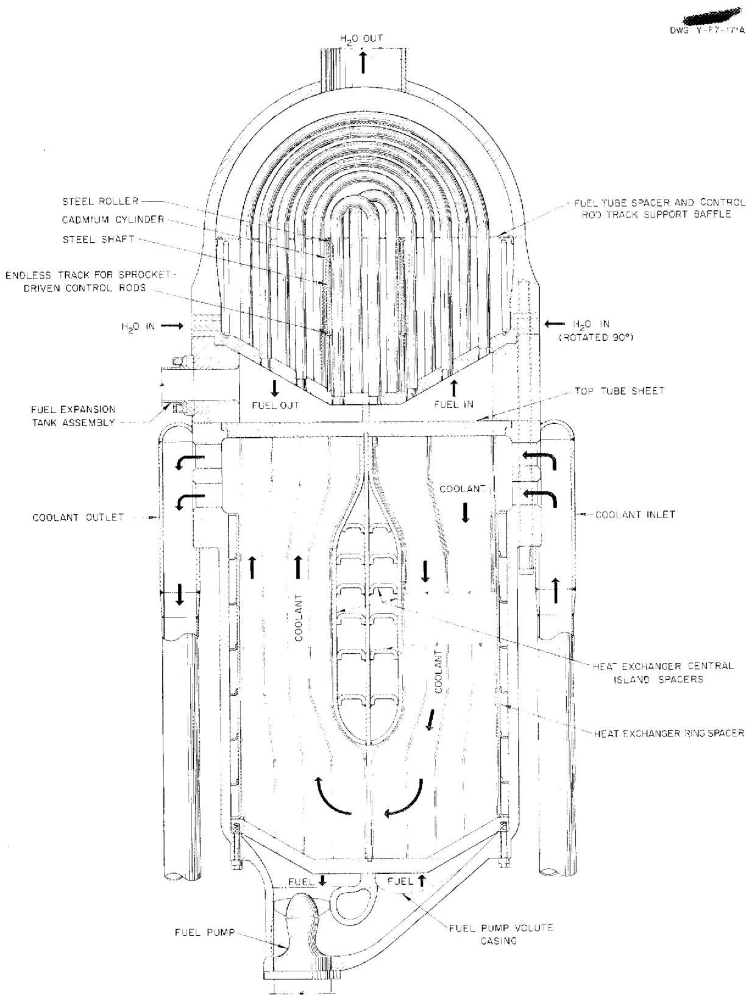  
Fig. 64. Reactor Design for Use with Liquid Moderator (Water or Hydroxide) and Circulating Fluoride Fuel.

freezing the fuel at zero or low power if water were used, it was planned that a thin layer of insulation would be placed between the walls of the double-walled fuel tubes. It would thus be possible to operate the reactor with the water at a substantially lower temperature than that of the fluoride fuel. Unfortunately, the thermal insulation would preclude cooling of the fuel-tube walls during high-power operation, and hence the allowable fluoride fuel temperature would be perhaps $300^{\circ}\mathrm{F}$ lower than might otherwise be possible. The temperature differential between the water and the fuel could be reduced, of course, by providing a heavy pressure shell and operating the reactor with the water at high temperature and pressure. However, a major disadvantage of this arrangement would be that to keep the stresses in the fuel tube walls to within reasonable values it would be necessary for the fuel system to operate at high pressures. In turn, there would be difficulty with the pump-shaft seals, and the pressure shell would be excessively heavy.

Two variants of this design were prepared. In the first, the reactor was designed to generate steam for a supercritical-water cycle in which the moderator region of the reactor would serve as the feedwater heater. In the alternate arrangement, the heat added to a hydroxide moderator could be dumped at a high temperature, while the bulk of the heat would be transmitted from the fuel to NaK in the heat exchanger and the NaK would, in turn, be directed to turbojet engines. A major innovation in heat exchanger design was introduced which involved the use of a fairly large number of small tube bundles with the tubes terminating in small, circular-disk headers. This arrangement had the advantage that the heat exchanger could be fabricated in elements, and each element could be carefully inspected and pressure tested. The elements or tube bundles could then be welded into the pressure shell with a relatively simple, rugged joint. By breaking the heat exchanger up in this fashion it was believed that the ultimate cost could be markedly reduced and the reliability substantially increased. The principal uncertainty associated with this alternate arrangement was that it was difficult to see how a sufficiently uniform hydroxide flow distribution could be maintained over the outside of the fuel tubes through the core. If the flow were not uniform hot spots might form and rapid corrosion of the tube wall

by the hydroxide would result. As discussed previously, both designs gave a high shield weight because of the unfavorable geometric effects associated with the tandem reactor-heat exchanger arrangement.

The problems associated with the reactor core arrangement designed for use with annular heat exchangers (Fig. 49) are in direct contrast to those of the tandem heat exchanger arrangement. Although the hydroxide flow through the moderator tubes in the core could probably be kept at a uniformly high velocity and hence the hydroxide tube wall would be cooled effectively, the turbulence pattern in the fluoride fuel flowing across the moderator tube coils would probably be erratic and unpredictable and local hot spots in the fuel would be likely to occur. The hot spots in the fuel might cause local boiling and, possibly, instability from the reactor control standpoint.

# Reflector-Moderated Circulating-Fuel Reactor

The design shown in Fig. 65 is representative of a series of circulating-fluoride-fuel reflectormoderated reactors employing sodium-cooled beryllium as the moderator and reflector material. A fairly complete set of data for these reactors is given in Tables 12 and 13. The designs for these have been the most carefully worked out of any full scale ORNL-ANP reactor designs prepared to date and hence merit special attention, particularly since the problems dealt with are common to most high-temperature liquid-cooled reactors.

The cross section (Fig. 65) through the reactor core, moderator, and heat exchanger shows a series of concentric shells, each of which is a surface of revolution about the vertical axis. The two inner shells surround the fuel region at the center (that is, the core of the reactor) and separate it from the beryllium island and the outer beryllium reflector. The fuel circulates downward through the bulbous region where the fissioning takes place and then downward and outward to the entrance of the spherical-shell heat exchanger that lies between the moderator outer shell and the main pressure shell. The fuel flows upward between the tubes in the heat exchanger into two mixed-flow fuel pumps at the top. From the pumps it is discharged inward to the top of the annular passage leading back to the reactor core. The fuel pumps are sump-type pumps located in the expansion tank at the top. A horizontal section through this

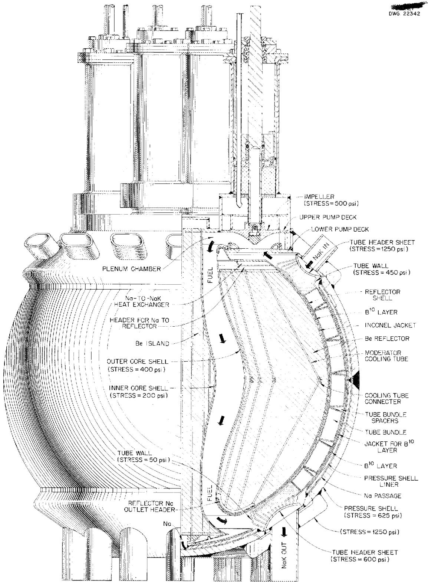  
Fig. 65. Reflector-Moderated 100-Mw Reactor. Stresses for key structural elements are given.

TABLE 12. PRINCIPAL DIMENSIONS OF A SERIES OF REFLECTOR-MODERATED CIRCULATING-FUEL REACTORS   

<table><tr><td>Power, megawatts</td><td>50</td><td>100</td><td>200</td><td>300</td></tr><tr><td>Core diameter, in.</td><td>18</td><td>18</td><td>20</td><td>23</td></tr><tr><td>Power density in fuel, kw/cm3</td><td>1.35</td><td>2.7</td><td>3.9</td><td>3.9</td></tr><tr><td>Pressure shell outside diameter, in.</td><td>48.5</td><td>50.6</td><td>56.4</td><td>62.0</td></tr><tr><td>Fuel System</td><td></td><td></td><td></td><td></td></tr><tr><td>Fuel volume in core, ft3</td><td>1.3</td><td>1.3</td><td>1.8</td><td>2.7</td></tr><tr><td>Core inlet outside diameter, in.</td><td>10</td><td>10</td><td>11</td><td>12.8</td></tr><tr><td>Core inlet inside diameter, in.</td><td>7</td><td>7</td><td>7.7</td><td>9</td></tr><tr><td>Core inlet area, in.2</td><td>40</td><td>40</td><td>49</td><td>67</td></tr><tr><td>Fuel volume in inlet and outlet ducts, ft3</td><td>0.4</td><td>0.4</td><td>0.5</td><td>0.7</td></tr><tr><td>Fuel volume in heat exchanger, ft3</td><td>1.25</td><td>2.5</td><td>5</td><td>7.5</td></tr><tr><td>Fuel volume in pump and plenum, ft3</td><td>0.3</td><td>0.3</td><td>0.5</td><td>1.0</td></tr><tr><td>Total fuel volume circulating, ft3</td><td>3.25</td><td>4.5</td><td>7.8</td><td>11.9</td></tr><tr><td>Fuel expansion tank volume, ft3 (8% of system volume)</td><td>0.26</td><td>0.36</td><td>0.62</td><td>0.95</td></tr><tr><td>Fuel Pumps</td><td></td><td></td><td></td><td></td></tr><tr><td>Fuel pump impeller diameter, in.</td><td>5.75</td><td>7</td><td>8.5</td><td>10</td></tr><tr><td>Fuel pump impeller inlet diameter, in.</td><td>3.5</td><td>4.5</td><td>5.5</td><td>6.75</td></tr><tr><td>Fuel pump impeller discharge height, in.</td><td>1.1</td><td>1.5</td><td>1.8</td><td>3.2</td></tr><tr><td>Fuel pump shaft center line to center line spacing, in.</td><td>20</td><td>21</td><td>22.5</td><td>27</td></tr><tr><td>Plenum chamber width, in.</td><td>14.5</td><td>15</td><td>15.5</td><td>17.5</td></tr><tr><td>Plenum and volute chamber length, in.</td><td>30</td><td>31</td><td>33</td><td>37</td></tr><tr><td>Plenum and volute chamber height, in.</td><td>2.0</td><td>2.0</td><td>2.4</td><td>3.0</td></tr><tr><td>Impeller rpm</td><td>2700</td><td>2700</td><td>2500</td><td>2300</td></tr><tr><td>Estimated impeller weight, lb</td><td>8</td><td>12</td><td>17</td><td>24</td></tr><tr><td>Impeller shaft diameter, in.</td><td>1.5</td><td>1.75</td><td>2</td><td>2.25</td></tr><tr><td>Impeller overhang, in.</td><td>12</td><td>13</td><td>14</td><td>15</td></tr><tr><td>Critical speed, rpm</td><td>6000</td><td>6000</td><td>5200</td><td>5000</td></tr><tr><td>Sodium Pump</td><td></td><td></td><td></td><td></td></tr><tr><td>Na pump impeller diameter, in.</td><td>3.4</td><td>4.1</td><td>5.0</td><td>5.9</td></tr><tr><td>Na pump impeller inlet diameter, in.</td><td>2.4</td><td>2.9</td><td>3.5</td><td>4.2</td></tr><tr><td>Na pump impeller discharge height, in.</td><td>0.75</td><td>0.9</td><td>1.1</td><td>1.2</td></tr><tr><td>Na expansion tank volume, ft3 (10% of system volume)</td><td>0.08</td><td>0.09</td><td></td><td></td></tr><tr><td>Na in Be passages, ft3</td><td>0.43</td><td>0.47</td><td></td><td></td></tr><tr><td>Na in pressure shell, ft3</td><td>0.15</td><td>0.15</td><td></td><td></td></tr><tr><td>Na in pump and heat exchanger, ft3</td><td>0.20</td><td>0.25</td><td></td><td></td></tr><tr><td>Fuel-to-NaK Heat Exchanger</td><td></td><td></td><td></td><td></td></tr><tr><td>Heat exchanger thickness, in.</td><td>1.7</td><td>2.75</td><td>4.65</td><td>5.9</td></tr><tr><td>Heat exchanger inside diameter, in.</td><td>42</td><td>42</td><td>44</td><td>47</td></tr><tr><td>Heat exchanger outside diameter, in.</td><td>45.4</td><td>47.5</td><td>53.3</td><td>58.8</td></tr><tr><td>Heat exchanger volume, ft3</td><td>6</td><td>10</td><td>20</td><td>30</td></tr><tr><td>Angle between tubes and equatorial plane, deg</td><td>27</td><td>27</td><td>27</td><td>27</td></tr><tr><td>Number of tubes</td><td>2304</td><td>3744</td><td>6600</td><td>9072</td></tr><tr><td>Tube diameter, in.</td><td>0.1875</td><td>0.1875</td><td>0.1875</td><td>0.1875</td></tr><tr><td>Tube spacing, in.</td><td>0.2097</td><td>0.2097</td><td>0.2119</td><td>0.2094</td></tr><tr><td>Number of tube bundles</td><td>12</td><td>12</td><td>12</td><td>12</td></tr><tr><td>Tube arrangement in each bundle</td><td>8 × 24</td><td>13 × 24</td><td>22 × 25</td><td>28 × 27</td></tr><tr><td colspan="5">Moderator Region</td></tr><tr><td>Volume of Be plus fuel, ft3</td><td>22.4</td><td>22.4</td><td>25.8</td><td>31.5</td></tr><tr><td>Volume of Be only, ft3</td><td>21.1</td><td>21.1</td><td>24.0</td><td>28.8</td></tr><tr><td>No. of coolant holes in reflector</td><td>208</td><td>208</td><td>554</td><td>554</td></tr><tr><td>No. of coolant holes in island</td><td>86</td><td>86</td><td>210</td><td>210</td></tr><tr><td>Na coolant tube inside diameter, in.</td><td>0.155</td><td>0.187</td><td>0.187</td><td>0.218</td></tr><tr><td>Na coolant tube wall thickness, in.</td><td>0.016</td><td>0.016</td><td>0.016</td><td>0.016</td></tr><tr><td>Na pressure shell annulus thickness, in.</td><td>0.125</td><td>0.125</td><td>0.187</td><td>0.200</td></tr></table>

region is shown in Fig. 66. A pump of the type proposed recently completed $1600\mathrm{hr}$ of operation in a fluoride system with pump inlet temperatures ranging from 1000 to $1500^{\circ}\mathrm{F}$ .

The moderator is cooled by sodium which flows downward through passages in the beryllium and back upward through the annular space between the beryllium and the enclosing shells. Two centrifugal pumps at the top circulate the sodium first through the moderator and then through the small toroidal sodium-to-NaK heat exchangers around the outer periphery of the pump-expansion-tank region. Two sodium pumps and two sodium-to-NaK heat exchangers are provided so that failure of one pump will not completely disable the reactor. Two fuel pumps were provided for the same reason.

The design of Fig. 65 presumes that canning of the beryllium will be required to protect it from the sodium, but that trace leaks of sodium through the Inconel can connections can be tolerated. As a result, the Inconel canning tubes that would be fitted into the rifle-drilled holes in the reflector were designed to be driven into tapered bores in the fittings shown at the equator, while the outer ends of these same tubes would be rolled into their respective header sheets at the top and bottom. The tube-connecting fittings at the equator would also serve as dowels to locate the two beryllium hemispheres relative to each other. Corrosion tests on the beryllium-sodium-Inconel system are under way, and preliminary tests indicate that there is good reason to hope that it will be possible to allow the sodium to flow directly over the beryllium; if so, the rather complex canning operation would be unnecessary. Of even more importance, however, elimination of the Inconel canning would remove poison from the reflector and reduce both the critical mass and the production of capture gammas (and hence the shield weight).

The spherical-shell heat exchanger that makes possible the compact layout of the reactor-heat exchanger assembly is based on the use of tube bundles curved in such a way that the tube spacing is uniform irrespective of "latitude."55 The individual tube bundles terminate in headers that resemble shower heads before the tubes are welded in place. This arrangement facilitates assembly because it is much easier to get a large number of small tube-to-header assemblies leaktight than one large unit. Further, these tube bundles give a rugged, flexible construction (resembling steel cable) that is admirably adapted to service in which large amounts of differential thermal expansion must be expected. This basic tube bundle and spacer construction was used in a small NaK-to-NaK heat exchanger that operated for 3000 hr with a NaK inlet temperature of $1500^{\circ}\mathrm{F}^{56}$ and in a fluoride-to-NaK heat exchanger that operated successfully for over 1600 hr.57

The allowable power density in the fuel region may be limited by radiation-damage, control, moderator-cooling, or hydrodynamic considerations. While the experimental results obtained to date are difficult to interpret, no clearly defined radiation-damage limit to the power density has been established, and it is entirely conceivable that radiation-damage considerations will prove to be less important than other factors in establishing a limit on power density. The kinetics of reactor control are very complex. Work carried out to date indicates that control considerations are likely

TABLE 13. HEAT TRANSFER SYSTEM CHARACTERISTICS FOR A SERIES OF REFLECTOR-MODERATED CIRCULATING-FUEL REACTORS   

<table><tr><td>REACTOR POWER, megawatts</td><td>50</td><td>100</td><td>200</td><td>300</td></tr><tr><td colspan="5">Fuel-to-Nak Heat Exchanger and Related Systems</td></tr><tr><td>Fuel temperature drop, °F</td><td>400</td><td>400</td><td>400</td><td>400</td></tr><tr><td>NaK temperature rise, °F</td><td>400</td><td>400</td><td>400</td><td>400</td></tr><tr><td>Fuel ΔP in heat exchanger, psi</td><td>35</td><td>51</td><td>61</td><td>75</td></tr><tr><td>NaK ΔP in heat exchanger, psi</td><td>40</td><td>58</td><td>69</td><td>85</td></tr><tr><td>Fuel flow rate, lb/sec</td><td>263</td><td>527</td><td>1,053</td><td>1,580</td></tr><tr><td>NaK flow rate, lb/sec</td><td>474</td><td>948</td><td>1,896</td><td>2,844</td></tr><tr><td>Fuel flow rate, cfs</td><td>2.1</td><td>4.2</td><td>8.4</td><td>12.6</td></tr><tr><td>NaK flow rate, cfs</td><td>10.5</td><td>21.0</td><td>42.0</td><td>63.0</td></tr><tr><td>Fuel velocity in heat exchanger, fps</td><td>8.0</td><td>9.9</td><td>11.2</td><td>12.2</td></tr><tr><td>Fuel flow Reynolds number in heat exchanger</td><td>4,600</td><td>5,700</td><td>6,700</td><td>7,000</td></tr><tr><td>NaK velocity in heat exchanger, fps</td><td>36.4</td><td>44.9</td><td>50.9</td><td>55.4</td></tr><tr><td>Overall heat transfer coefficient, Btu/hr·ft2.0F</td><td>3,150</td><td>3,500</td><td>3,700</td><td>3,850</td></tr><tr><td>Fuel-NaK temperature difference, °F</td><td>95</td><td>100</td><td>110</td><td>115</td></tr><tr><td colspan="5">Sodium-to-Nak Heat Exchanger and Related Systems</td></tr><tr><td>Na temperature drop in heat exchanger, °F</td><td>100</td><td>150</td><td>150</td><td>150</td></tr><tr><td>NaK temperature rise in heat exchanger, °F</td><td>100</td><td>150</td><td>150</td><td>150</td></tr><tr><td>Na ΔP in heat exchanger, psi</td><td>7</td><td>7</td><td>7</td><td>7</td></tr><tr><td>NaK ΔP in heat exchanger, psi</td><td>7</td><td>7</td><td>7</td><td>7</td></tr><tr><td>Power generated in island, kw</td><td>500</td><td>1,000</td><td>2,000</td><td>3,000</td></tr><tr><td>Power generated in reflector, kw</td><td>1,700</td><td>3,400</td><td>7,500</td><td>11,200</td></tr><tr><td>Power generated in pressure shell, kw</td><td>190</td><td>350</td><td>500</td><td>620</td></tr><tr><td>Na flow rate in reflector, lb/sec</td><td>53</td><td>72</td><td>154</td><td>234</td></tr><tr><td>Na flow rate in island and pressure shell, lb/sec</td><td>22</td><td>28</td><td>51</td><td>76</td></tr><tr><td>Total Na flow rate, lb/sec</td><td>75</td><td>100</td><td>205</td><td>310</td></tr><tr><td>Na temperature rise in pressure shell, °F</td><td>28</td><td>39</td><td>30</td><td>26</td></tr><tr><td>Na ΔP in pressure shell, psi</td><td>4</td><td>6</td><td>6</td><td>6</td></tr><tr><td>Na temperature rise in island, °F</td><td>72</td><td>111</td><td>120</td><td>124</td></tr><tr><td>Na ΔP in island, psi</td><td>32</td><td>21</td><td>12</td><td>12</td></tr><tr><td>Na temperature rise in reflector, °F</td><td>100</td><td>150</td><td>150</td><td>150</td></tr><tr><td>Na ΔP in reflector, psi</td><td>36</td><td>27</td><td>18</td><td>18</td></tr><tr><td>Na-Nak temperature difference, °F</td><td>43</td><td></td><td></td><td></td></tr><tr><td colspan="5">Shield Cooling System</td></tr><tr><td>Power generated in 6-in. lead layer, kw</td><td>110</td><td>210</td><td>300</td><td>350</td></tr><tr><td>Power generated in 24-in. H2O layer, kw</td><td>&lt;3</td><td>&lt;6</td><td>&lt;12</td><td>&lt;18</td></tr></table>

to limit the power density in the reactor to a value such that the temperature rise in the circulating fluoride fuel will not exceed something like 1000 to $2000^{\circ}\mathrm{F} / \mathrm{sec}$ . A $2000^{\circ}\mathrm{F} / \mathrm{sec}$ temperature rise in the fuel would imply a power density of approximately $4\mathrm{kw/cm}^3$ . The difficulties associated with

cooling the moderator and with the hydrodynamics of fuel flow through the core increase with power density, as shown in the section on "Temperature Distribution in Circulating-Fuel Reactors." The results of that work also indicate that it would be desirable to keep the average power density in the

  
DWG E-17986A

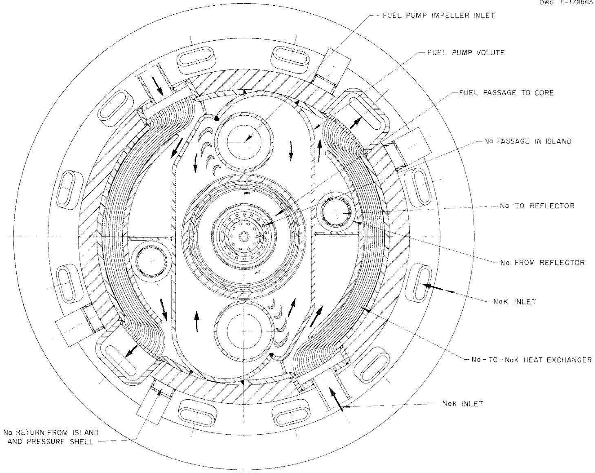  
Fig. 66. Horizontal Section Through Pump Region of Reflector-Moderated Reactor.

fuel to about $4\mathrm{kw/cm^3}$ . This power density would mean that a core diameter of 21 in. would be required for a 200-Mw reactor.

Two major tenets of the design philosophy have been that the pressures throughout the systems should be kept low, particularly in the hot zones, and that all structure should be cooled to a temperature approximately equal to or below that of the secondary coolant leaving the heat exchanger. Great care was exercised in establishing the proportions of the designs presented in Table 12 to satisfy these conditions. The temperature, pressure, and stress values calculated for the various stations in a typical design are indicated in Fig. 65. The stresses in the structural parts have been kept to a minimum and the ability of the structure to withstand these stresses has been made as great as practicable. Thermal stresses are not indicated on Fig. 65, because it is felt that they will anneal out at operating temperatures and, at worst, will cause a little distortion which should not be serious. Examination of Figs. 35, 36, and 37 discloses that the pressure stresses in the major structural elements of Fig. 65 are quite modest.

# SECONDARY FLUID SYSTEM

The ORNL effort has been devoted almost wholly to the reactor and shield, but a small amount of preliminary design and developmental work has been done on the rest of the system. This has been necessary partly because the feasibility of the power plant as a whole depends to a considerable degree on the components outside the shield and partly because only by doing work of this character has it been possible to evaluate the incentives toward higher temperatures and power densities and such factors as the penalties attached to low-temperature moderator systems. Other factors that could also influence reactor and shield design are items such as the size and the shape of ducts through the shield and overall system control.

Figure 67 shows a schematic diagram of a typical complete power plant system based on a circulating-fluoride-fuel reactor. The major part of the heat generated in the reactor would be transferred directly from the fuel to the NaK in the intermediate heat exchanger. About 4 to $5\%$ of the heat developed would appear in the moderator-cooling system, which would operate at a somewhat lower

temperature than that of the fuel system. This heat could be removed by passing perhaps $20\%$ of the NaK returning from the turbojet engines through a heat exchanger that would serve to preheat the NaK before it passed to the main heat exchanger and, at the same time, would cool the sodium in the moderator circuit. It might facilitate system temperature control if the moderator sodium system were cooled by a separate NaK circuit. This circuit might be used to heat compressed air for air turbines to drive the reactor pumps. The air might be bled off the turbojet compressors or it might be supplied by a separate compressor. In either case, the heat would be employed to good advantage and would not be simply wasted.

Quite a number of different coolants have been considered for use in the secondary system. In addition to the molten metals and fused salts included in Table 9, it might be possible to use some other fused salts with less favorable nuclear properties but more favorable physical properties, in particular, lower melting points. Any one of a number of such salts might be substituted for NaK in the secondary system, but to date none having a melting point below $500^{\circ}\mathrm{F}$ has been suggested. It has been felt that the advantages associated with the essentially room-temperature melting point of NaK more than offset the fire hazard inherent in its use. Table 14 lists some of the fluids that have been proposed for the secondary system, together with some of the measures of their desirability. It is clear from this table that lead, representative of the heavy metals, gives system weights that are quite out of the question. Lithium appears to be the most promising from the weight standpoint, but it cannot be used, at least for the present, because it gives severe mass transfer at temperatures above $1200^{\circ}\mathrm{F}$ . Also, its high melting point would probably be a serious handicap in service. The fused salts are less effective heat transfer fluids and would therefore require larger intermediate heat exchangers; also, they have high melting points. The small weight advantage of sodium in comparison with NaK seems to be more than offset by the $200^{\circ}\mathrm{F}$ melting point of sodium which, while not very high, would present a greater service problem than the $56^{\circ}\mathrm{F}$ melting point of the particular NaK alloy assumed. (Eutectic NaK melts at $-15^{\circ}\mathrm{F}$ , but has a somewhat lower specific heat.)

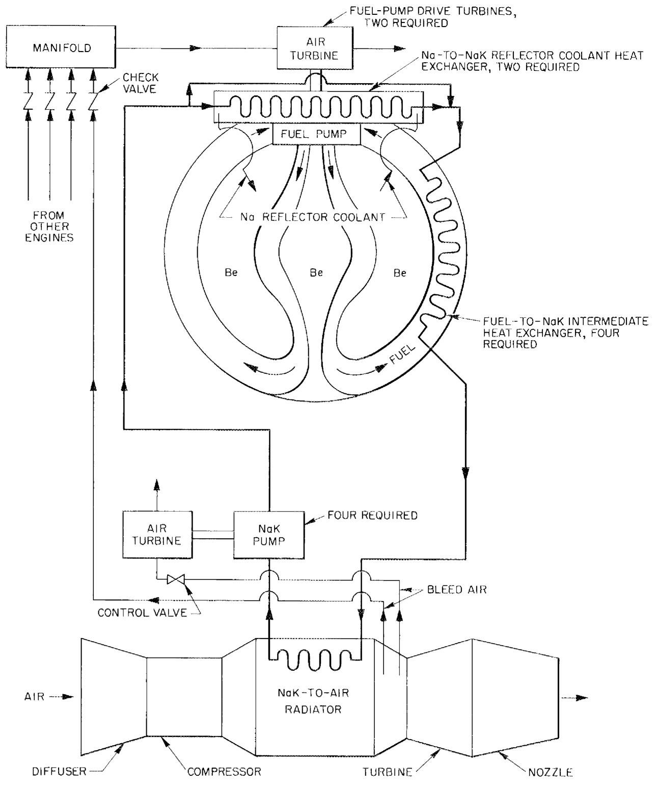  
Fig. 67. Diagram of Reflector-Moderated Reactor Power System.

TABLE 14. EFFECTS OF SECONDARY CIRCUIT FLUID ON THE WEIGHT OF MAJOR SYSTEM COMPONENTS   

<table><tr><td></td><td>WEIGHT OF LIQUID (lb)</td><td>WEIGHT OF PIPES (lb)</td><td>WEIGHT OF RADIATORS (lb)</td><td>WEIGHT OF PUMPS AND PUMP DRIVES (lb)</td><td>SHIELD WEIGHT INIncrement RELATIVE TO NaK (lb)</td><td>TOTAL WEIGHT INIncrement RELATIVE TO NaK (lb)</td></tr><tr><td>NaK</td><td>2,600</td><td>3,300</td><td>6,000</td><td>1,600</td><td>0</td><td>0</td></tr><tr><td>Lithium</td><td>900</td><td>2,300</td><td>5,700</td><td>1,000</td><td>-1,500</td><td>-5,100</td></tr><tr><td>Sodium</td><td>2,400</td><td>3,100</td><td>5,850</td><td>1,400</td><td>-600</td><td>-1,350</td></tr><tr><td>Potassium</td><td>3,300</td><td>3,900</td><td>6,500</td><td>2,100</td><td>2,000</td><td>4,100</td></tr><tr><td>Lead</td><td>57,700</td><td>5,500</td><td>9,000</td><td>1,400</td><td>2,000</td><td>60,300</td></tr><tr><td>NaF-KF-LiF</td><td>1,150</td><td>1,450</td><td>5,900</td><td>650</td><td>2,000</td><td>-1,550</td></tr></table>

These comparisons were made on the basis of a 200-megawatt system. In order to keep stresses in high-temperature metal walls to conservative values, the peak pressure in the system was limited to 100 psi. Some attempts to optimize line size have been made, which indicate that the 100-psi value gives close to a minimum system weight if allowances are made for the extra weight of pumps and pump drive equipment and the thicker pipe walls required for the higher pressures.

A number of methods of system control have been considered. If the circulating-fuel reactor performs as expected it will serve as an essentially constant-temperature heat source. If the pumps are operated at a constant rpm, the temperature rise in the NaK passing through the intermediate heat exchanger will be directly proportional to the power output, but the mean temperature of the fuel system will remain constant. Unfortunately, a substantial amount of power is required to drive the pumps both for the reactor and for the secondary system, and it probably will not prove practicable to keep the pumps running at full speed if the

turbojet engines are idling. This will probably be true irrespective or whether the pumps are driven by air turbines or by electric or hydraulic motors. Actually, the turbojet engine characteristics are such that it would be more desirable to allow the pump speed to vary with engine speed; in fact, it seems likely that after the turbojet engines have been started, the speed of the pumps could be allowed to reach equilibrium under any conditions from idling to full power and still give a reasonable set of flow rates and temperature rises. Since the torque output of a turbine wheel falls off with rpm and since the torque required to drive the pump impeller increases as the square of the rpm, it is evident that the turbine-pump system would be exceedingly stable. Preliminary estimates indicate that the pump-drive turbine speed would follow the turbojet-engine speed very closely during an acceleration of the turbojet. It is clear that a full-scale power plant will be a quite complex system and that possibilities of instability and oscillation exist, but it also appears that the components can be proportioned so that a stable system will result.

# MAJOR DEVELOPMENT PROBLEMS

The following outline of the key design problems of the circulating-fuel reflectormoderated reactor and the status of these problems at this time serves as a summary of the work that has been covered by this report and of the work that remains to be done to provide a sound basis for the design of a full-scale aircraft power plant. The principal reports that cover the work that has been done and an indication of the current priority of the remaining problems is included to give some idea of the progress that has been made and of the magnitude of the task that remains.

OUTLINE OF MAJOR RMR DEVELOPMENT PROBLEMS  

<table><tr><td>Priority</td><td>Development Problem</td><td>Status May 1954</td><td>Reports</td></tr><tr><td colspan="4">Fuel Chemistry and Corrosion</td></tr><tr><td colspan="4">Corrosion</td></tr><tr><td></td><td>Harp tests and simple thermal-convection loops</td><td>Much favorable data</td><td>ORNL-1515, -1609, -1649, -1692</td></tr><tr><td>A-1</td><td>High-temperature-differential, high-velocity loops</td><td>No data</td><td></td></tr><tr><td colspan="4">Radiation Damage and Corrosion</td></tr><tr><td></td><td>In-pile capsule tests</td><td>Some favorable data</td><td>ORNL-1649, -1692</td></tr><tr><td>A-1</td><td>In-pile loop tests</td><td>No data, equipment being assembled</td><td>ORNL-1692</td></tr><tr><td colspan="4">Physical Properties</td></tr><tr><td></td><td>NaF-KF-LiF, NaF-BeF2, NaZrF5, etc.</td><td>Adequate data</td><td>ORNL CF-53-3-261</td></tr><tr><td></td><td>NaF-RbF-LiF</td><td>Data expected soon</td><td></td></tr><tr><td></td><td>Other fuels and fuel carriers</td><td>Data expected by Dec. 30, 1954</td><td></td></tr><tr><td colspan="2">Solubility of UF4and UF3</td><td>Some data</td><td></td></tr><tr><td colspan="2">Methods of Preparation</td><td>Considerable experience</td><td></td></tr><tr><td>A-1</td><td>Xenon Removal</td><td>Little data</td><td></td></tr><tr><td></td><td>Reprocessing Techniques</td><td>Some favorable data</td><td></td></tr><tr><td colspan="4">High-Performance High-Temperature Heat Exchangers</td></tr><tr><td></td><td>NaK-to-NaK</td><td></td><td></td></tr><tr><td></td><td>Pressure losses for flattened-wire tube-spacer arrangement</td><td>Adequate data</td><td>ORNL-1215</td></tr><tr><td></td><td>Heat transfer and endurance test</td><td>More tests needed</td><td>ORNL-1330</td></tr><tr><td></td><td>NaK-to-Air</td><td></td><td></td></tr><tr><td></td><td>Fabricability, performance, and endurance tests (including study of character of failure)</td><td>More tests needed</td><td>ORNL-1509, -1692</td></tr><tr><td></td><td>Fluoride-to-NaK</td><td></td><td></td></tr><tr><td>1</td><td>Tube-to-header welding, endurance and performance tests</td><td>More tests needed</td><td>ORNL CF-54-1-155</td></tr><tr><td>1</td><td>Effects of trace leaks, and fabricability of spherical shell type</td><td>Little data available</td><td></td></tr><tr><td colspan="4">Shielding</td></tr><tr><td></td><td>Preliminary Designs</td><td>Many designs available</td><td>ANP-53, Y-F15-10, ORNL-1575</td></tr><tr><td></td><td>Lid Tank Tests of Basic Configurations</td><td></td><td></td></tr><tr><td></td><td>Effects of thickness of reflector, pressure shell, lead, and boron layers</td><td>Adequate data for preliminary design</td><td>ORNL-1616</td></tr><tr><td></td><td>Estimated Full-Scale Shield Weights</td><td></td><td></td></tr><tr><td></td><td>Effects of power, power density, degree of division</td><td>Adequate data for preliminary design</td><td>ORNL-1575</td></tr><tr><td></td><td>Activation of Secondary Coolant</td><td></td><td></td></tr><tr><td></td><td>Estimated</td><td>Data adequate</td><td>ORNL-1575</td></tr><tr><td></td><td>Measurements for neutrons from core</td><td>Data adequate</td><td>ORNL-1616</td></tr><tr><td></td><td>Measurements for neutrons from heat exchanger</td><td>Data needed</td><td></td></tr><tr><td></td><td>Measurement of Short-Half-Lived Decay Gammas</td><td>Tests in progress</td><td></td></tr><tr><td></td><td>Refined Lid Tank Tests</td><td>Tests planned for late 1954</td><td></td></tr><tr><td></td><td>Experiments on Air Scattering</td><td>Tests in progress</td><td></td></tr><tr><td colspan="4">Static Physics</td></tr><tr><td></td><td>Multigroup Calculation--Effects of Moderator Materials</td><td></td><td></td></tr><tr><td>1</td><td>Effects of core diameter, fuel-region thickness, reflector thickness, reflector poisons, and special materials</td><td>Adequate data expected by Sept. 1, 1954</td><td>ORNL-1515</td></tr><tr><td></td><td>Critical Experiments</td><td></td><td></td></tr><tr><td></td><td>Critical mass with various fuel regions--Na, fluoride, fluoride-graphite</td><td>Preliminary tests promising</td><td>ORNL-1515</td></tr><tr><td></td><td>Control rod effects (rough)</td><td>Some test data available</td><td></td></tr><tr><td></td><td>End duct leakage</td><td>Some test data available</td><td></td></tr><tr><td></td><td>Danger coefficients for Pb, Bi, Rb, Li7, Na, Ni, etc.</td><td>Some test data available</td><td></td></tr><tr><td>A-1</td><td>Check on Multigroup Calculation</td><td>Some data expected by Sept. 1, 1954</td><td></td></tr><tr><td></td><td>Two-region</td><td>Some data expected by Sept. 1, 1954</td><td></td></tr><tr><td></td><td>Three-region</td><td>Some data expected by Sept. 1, 1954</td><td></td></tr><tr><td></td><td>Core shell effects</td><td>Some data expected by Oct. 1954</td><td></td></tr><tr><td></td><td>Effects of end ducts</td><td>Some data expected by Dec. 1954</td><td></td></tr><tr><td></td><td>Danger coefficient</td><td>Some data expected by Dec. 1954</td><td></td></tr><tr><td></td><td>Control rod effects</td><td>Some data expected by Dec. 1954</td><td></td></tr><tr><td></td><td>Moderator Cooling</td><td></td><td></td></tr><tr><td></td><td>Estimation of Heat Source Distribution</td><td>Good estimates made</td><td>ORNL-1517</td></tr><tr><td></td><td>Be-Na-Inconel Corrosion Tests</td><td></td><td></td></tr><tr><td></td><td>Static capsule tests</td><td>Some favorable data</td><td></td></tr><tr><td></td><td>Harp tests</td><td>Some data</td><td>ORNL-1692</td></tr><tr><td>A-1</td><td>High-temperature-differential, high-velocity loop</td><td>Some data</td><td>ORNL-1692</td></tr><tr><td>A-1</td><td>Thermal Stress and Distortion Test with High Power Density</td><td>Test nearly ready to run</td><td></td></tr><tr><td></td><td>Effects of Temperature, ΔT, Surface Volume Ratio, etc.</td><td>Tests planned, data badly needed</td><td></td></tr><tr><td>1</td><td>Creep-Rupture Properties of Inconel Under Severe Thermal Cycling</td><td>Tests planned, data badly needed</td><td></td></tr><tr><td></td><td>Pumps</td><td></td><td></td></tr><tr><td></td><td>Shakedown of Pumps with Face-Type Gas Seals</td><td>Adequate data for design</td><td></td></tr><tr><td>1</td><td>Model Tests of Full-Scale Pump</td><td>Tests being run</td><td></td></tr><tr><td>1</td><td>Endurance Tests of Full-Scale Pump</td><td>Tests planned</td><td></td></tr><tr><td>1</td><td>Fabricability of Full-Scale Pump Impeller</td><td>Tests planned</td><td></td></tr><tr><td></td><td>Power Plant System</td><td></td><td></td></tr><tr><td></td><td>Preliminary Designs</td><td>Adequate data</td><td>ANP-57, ORNL-1255, -1215, -1330, -1509, -1515, -1609, -1648</td></tr><tr><td></td><td>Performance and Weight Estimates</td><td>Adequate data for preliminary design</td><td>ANP-57, ORNL-1255, -1215, -1330, -1509, -1515, -1609, -1648</td></tr><tr><td></td><td>Effects of Temperature, Power Density, Shield Division, etc.</td><td>Adequate data for preliminary design</td><td>ORNL CF-54-2-185</td></tr><tr><td></td><td>Reactor Kinetics</td><td></td><td></td></tr><tr><td>1</td><td>Theoretical Analyses</td><td>Preliminary analysis completed</td><td>ORNL CF-53-3-231</td></tr><tr><td></td><td>ARE Temperature Coefficient Measurements</td><td>Tests planned</td><td></td></tr><tr><td>1</td><td>Xenon Effects</td><td>Data badly needed</td><td></td></tr><tr><td colspan="4">Hydrodynamic Tests</td></tr><tr><td>1</td><td>Flow Separation at Core Inlet</td><td>Some data available</td><td>Y-F15-11, ORNL-1692</td></tr><tr><td></td><td>Effects of Heat Generation in the Boundary Layer</td><td>Theoretical analyses completed for ideal case</td><td>ORNL-1701</td></tr><tr><td></td><td>Fill and Drain System</td><td></td><td></td></tr><tr><td></td><td>Preliminary Design</td><td>Design looks promising</td><td></td></tr><tr><td></td><td>Water and High-Temperature Tests</td><td>Tests planned for fall, 1954</td><td></td></tr><tr><td></td><td>High-Temperature Test with Radioactive Material</td><td>Tests might be run in 1955</td><td></td></tr><tr><td colspan="4">Full-Scale Reactor Tests</td></tr><tr><td colspan="4">Control</td></tr><tr><td>1</td><td>Temperature coefficient</td><td>Some information expected from ARE</td><td></td></tr><tr><td></td><td>Xenon effects</td><td>Information badly needed</td><td></td></tr><tr><td></td><td>Stability</td><td>Information badly needed</td><td></td></tr><tr><td colspan="4">Performance</td></tr><tr><td></td><td>Heat exchanger, pumps, etc.</td><td>Tests being planned</td><td></td></tr><tr><td></td><td>Temperature distribution</td><td>Tests being planned</td><td></td></tr><tr><td colspan="2">Endurance Tests</td><td>Tests being planned</td><td></td></tr></table>