3445603607032

CENTRAL RESEARCH LIRIA

DOCUMENT COLLECTION

P

RESECRN RESECRN REPRP

ORNL-1729

Progress

454

1

AIRCRAFT NUCLEAR PROPULSION PROJECT

QUARTERLY PROGRESS REPORT

FOR PERIOD ENDING JUNE 10, 1954

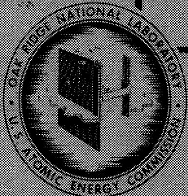

CENTRAL RESEARCH LIBRARY

DOCUMENT COLLECTION

LIBRARY LOAN COPY

DO NOT TRANSFER TO ANOTHER PERSON

If you wish someone else to see this document, send in name with document and the library will arrange a loan.

OAK RIDGE NATIONAL LABORATORY

OPERATED BY

CARBIDE AND CARBON CHEMICALS COMPANY

4 DIVISION OF WHICH CAN BE AND CAN NOT CORRECT

POST OFFICE BOX P

CAB RIDGE TENNESSE

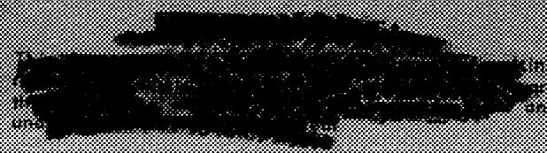

Contract No. W-7405-eng-26

# AIRCRAFT NUCLEAR PROPULSION PROJECT

# QUARTERLY PROGRESS REPORT

For Period Ending June 10, 1954

W.H.Jordan,Director

A. J. Miller, Assistant Director

A.W.Savolainen,Editor

DATE ISSUED

J 1954

OAK RIDGE NATIONAL LABORATORY

Operated by

CARBIDE AND CARBON CHEMICALS COMPANY

A Division of Union Carbide and Carbon Corporation

Post Office Box P

Oak Ridge, Tennessee

3445603607032

# INTERNAL DISTRIBUTION

1. G. M. Adamson   
2. R.G.affel   
3. C. R. Baldock   
4. C. J. Baron   
5. E. S. Betting   
6. D. S. Billington   
7. F. F. Blankenship   
8. E.P.Blizard   
9. M. A. Bredig   
10. F.R.Bruce   
11. A. D. Callihan   
12. D. W. Cardwell   
13. C. E. Center   
14. R. A. Charpie   
15. G. H. Clewett   
16. C. E. Clifford   
17. W. B. Cottrell   
18. R. G. Cochran   
19. D. D. Cowen   
20. S. Cromer   
21. F. L. Culler   
22. L. B. Emlet (K-25)   
23. W. K. Ergen   
24. A. P. Fraas   
25. W.R.Grimes   
26. E. E. Hoffman   
27. A. Hollander   
28. A. S. Householder   
29. J. T. Howe   
30. R.W.Johnson   
31. W.H. Jordan   
32. G.W. Keisholtz   
33. C.P.Keim   
34. M. T. Kelley   
35. F. Keresz   
36. E. M. King   
37. J. Lane   
38. C.E. Larson   
39. R S. Livingston   
40. R.N.Lyon   
41. W. D. Manly   
42. L. A. Mann

43. W. B. McDonald

44. J. L. Meets

45. A. J. Mitter

46. K. Z. Morgan

47. E. J. Murphy

48. J.P. Murray (Y-12)

49. G. J. Nessle

50. P. Patriarca

51. H. F. Poppendiek

52. P. M. Reyling

53. H. W. Savage

54. A. W. Savolainen

55. E. D. Shipley

56. O. Sisman

57. G.P. Smith

58. L. P. Smith (consultant)

59. A. H. Snell

60. C. L. Storrs

61. C. D. Susano

62. J.A. Swartout

63. E.H.Taylor

64. J. B. Trice

65. E.R. Van Artsdalen

66. F. C. VonderLage

67. J.M. Worde

68. A.M. Weinberg

69. J.C. White

70. G. D. Whitman

71. E. P. Wigner (consultant)

72. G.C. Williams

73. J.C. Wilson

74. C.E. Winters

-84. ANP Library

85. Biology Library

-90. Laboratory Records Department

91. Laboratory Records, ORNL R.C.

92. Health Physics Library

93. Metallurgy Library

94. Reactor Experimental

Engineering Library

95-97. Central Research Library

# EXTERNAL DISTRIBUTION

98. Air Force Engineering Office, Oak Ridge   
99. Air Force Plant Representative, Burbank   
100. Air Force Plant Representative, Seattle   
101. Air Force Plant Representative, Wood-Ridge   
102. American Machine and Foundry Company   
103. ANP Project Office, Fort Worth

104-115. Argonne National Laboratory (1 copy to Kermit Anderson)

116. Armed Forces Special Weapons Project (Sandia)   
117. Armed Forces Special Weapons Project, Washington (Gertrude Camp)

118-122. Atomic Energy Commission, Washington (Lt. Col. M. J. Nielsen)

123. Babcock and Wilcox Company   
124. Battelle Memorial Institute   
125. Bendix Aviation Corporation

126-128. Brookhaven National Laboratory

129. Bureau of Aeronautics (Grant)   
130. Bureau of Ships

131-136. Carbide and Carbon Chemicals Company (Y-12 Plant)

137. Chicago Patent Group   
138. Chief of Naval Research   
139. Commonwealth Edison Company   
140. Convair, San Diego (C. H. Helms)   
141. Curtiss-Wright Corporation, Wright Aeronautical Division (K. Campbell)   
142. Department of the Navy - Op-362   
143. Detroit Edison Company   
144. Division of Research and Medicine, AEC, ORO

145-149. duPont Company, Augusta

150. duPont Company, Wilmington   
151. Duquesne Light Company   
152. Foster Wheeler Corporation

153-155. General Electric Company, ANPD

156-163. General Electric Company, APS, Richland

164. Glen L. Martin Company (T. F. Nagey)   
165. Hanford Operations Office   
166. Iowa State College

167-170. Knolls Atomic Power Laboratory   
171-172. Lockland Area Office

173-174. Los Alamos Scientific Laboratory

175. Materials Laboratory (WADC) (Col. P. L. Hill)   
176. Metallurgical Project   
177. Monsanto Chemical Company   
178. Mound Laboratory

179-182. National Advisory Committee for Aeronautics, Cleveland (A. Silverstein)

183. National Advisory Committee for Aeronautics, Washington   
185. Naval Research Laboratory   
186. Newport News Shipbuilding and Dry Dock Company   
187. New York Operations Office

188-189. North American Aviation, Inc.

190. Nuclear Development Associates, Inc.   
191. Pacific Northwest Power Group

192. Patent Branch, Washington   
193-199 Phillips Petroleum Company (NRTS)   
200-201. Powerplant Laboratory (WADC) (A. M. Nelson)   
202-211. Pratt and Whitney Aircraft Division (Fox Project)   
212-213. Rand Corporation (I copy to V. G. Henning)   
214. San Francisco Field Office   
215. Sylvania Electric Products, Inc.   
216. Tennessee Valley Authority (Dean)   
217. USAF Headquarters   
218. U.S. Naval Radiological Defense Laboratory   
219-220. University of California Radiation Laboratory, Berkeley   
221-222. University of California Radiation Laboratory, Livermore   
223. Walter Kidde Nuclear Laboratories, Inc.   
224-228. Westinghouse Electric Corporation   
230-240. Wright Air Development Center (WC3NS, Col. J. R. Hood, Jr.)   
241-255. Technical Information Service, Oak Ridge

Reports previously issued in this series are as follows:

ORNL-528 Period Ending November 30, 1949

ORNL-629 Period Ending February 28, 1950

ORNL-768 Period Ending May 31, 1950

ORNL-858 Period Ending August 31, 1950

ORNL-919 Period Ending December 10, 1950

ANP-60 Period Ending March 10, 1951

ANP-65 Period Ending June 10, 1951

ORNL-1154 Period Ending September 10, 1951

ORNL-1170 Period Ending December 10, 1951

ORNL-1227 Period Ending March 10, 1952

ORNL-1294 Period Ending June 10, 1952

ORNL-1375 Period Ending September 10, 1952

ORNL-1439 Period Ending December 10, 1952

ORNL-1515 Period Ending March 10, 1953

ORNL-1556 Period Ending June 10, 1953

ORNL-1609 Period Ending September 10, 1953

ORNL-1649 Period Ending December 10, 1953

ORNL-1692 Period Ending March 10, 1954

# FOREWORD

This quarterly progress report of the Aircraft Nuclear Propulsion Project at ORNL records the technical progress of the research on the Circulating-Fuel Reactor and all other ANP research at the Laboratory under its Contract W-7405-eng-26. The report is divided into three major parts: I. Reactor Theory and Design, II. Materials Research, and III. Shielding Research.

The ANP Project is comprised of about 300 technical and scientific personnel engaged in many phases of research directed toward the achievement of nuclear propulsion of aircraft. A considerable portion of this research is performed in support of the work of other organizations participating in the national ANP effort. However, the bulk of the ANP research at ORNL is directed toward the development of a circulating-fuel type of reactor.

The nucleus of the effort on circulating-fuel reactors is now centered upon the Aircraft Reactor Experiment - a high-temperature prototype of a circulating-fuel reactor for the propulsion of aircraft. The equipment for this reactor experiment is now being assembled; the current status of the experiment is summarized in Section 1 of Part 1. The supporting research on materials and problems peculiar to the ARE - previously included in the subject sections - is now included in this ARE section, where convenient. The few exceptions are referenced to the specific section of the report where more detailed information may be found.

The ANP research, in addition to that for the Aircraft Reactor Experiment, falls into three general categories: (1) studies of aircraft-size circulating-fuel reactors, (2) materials problems associated with advanced reactor designs, and (3) studies of shields for nuclear aircraft. These phases of research are covered in Parts I, II, and III, respectively, of this report.

# CONTENTS

FOREWORD vii

SUMMARY 1

# PART I. REACTOR THEORY AND DESIGN

1. CIRCULATING-FUEL AIRCRAFT REACTOR EXPERIMENT 7

The Experimental Reactor System 7   
Pumps 7   
Heat exchangers 7   
Fluid circuits 8   
Fuel-enrichment system 8   
Loading facilities 8   
Fuel-sampling facility 9   
Fuel-unloading facility 10   
Reactor control 10

Fuel System Mock-up Tests 10   
Operation of the Fuel System 10   
Cleaning 11   
Pressure filling 11   
Pressure and flow characteristics 11   
Functional tests 11   
Hot-gas test 12   
Pump Fabrication and Tests 12   
Reactor System Component Loop 14   
Fuel Recovery and Reprocessing 14

2. EXPERIMENTAL REACTOR ENGINEERING 18

In-Pile Loop Component Development 18   
Centrifugally sealed pump 18   
Horizontal-shaft sump pump 19   
Vertical-shaft sump pump 19   
Hydraulic pump drives 21   
Fluoride-to-water heat exchanger 21   
Forced-Circulation Corrosion Loops 21   
Sodium-Beryllium-Inconel Mass-Transfer Test 22   
Fluoride-to-Sodium Heat-Exchanger Test 22   
Gas-Furnace Heat-Source Development 23   
Sodium Sampler 24   
Removal of Fluoride Mixtures from Equipment 24   
Bearing-Materials Tests 24   
Rotary-Shaft Seals 26

3. REFLECTOR-MODERATED REACTOR 28

A Comparison of Lithium- and Zirconium-Base Fluoride Fuels 28   
Reactor Physics 32   
Reactor Calculations 32

# PART II. MATERIALS RESEARCH

# 4. CHEMISTRY OF MOLTEN MATERIALS 39

Quenching Experiments with Fluoride Systems 39

NaF-ZrF 39

NaF-UF 41

Visual Observation of Melting Temperatures 42

Differential Thermal Analysis of the NaF-ZrF $^4$ System 42

Filtration Analysis of Fluoride Systems 42

NaF-ZrF 42

NaF-LiF-RbF-UF 42

Thermal Analysis of Fluoride Systems 43

LiF-UF 43

NaF-UF 43

RbF-UF 43

KF-LiF-UF 43

RbF-LiF-UF 44

NaF-ZrF4-UF3-UF3 44

NaF-ThF 44

LiF-BeF-ThF-UF 45

NaF-CrF3 45

Thermal Analysis of Chloride and Mixed Chloride-Fluoride Systems 45

$\mathsf{UCl}_2\text{-}\mathsf{UCl}_4$ 45

$\mathsf{U}\mathsf{C}\mathsf{I}_4^{\bullet}\mathsf{-U}\mathsf{F}_4$ 46

$\mathsf{U}\mathsf{C}\mathsf{I}_3\text{-}\mathsf{U}\mathsf{F}_3$ 46

KCI-UCI 46

RbCl-UCI 47

KCl-CuCl-UCl3 47

X-Ray Diffraction Studies of the NaF-ZrF $^4$ System 47

Chemical Reactions in Molten Salts 50

Chemical equilibria in molten fluorides 50

Solubility of UF3 in NaF-ZrF4 mixtures 51

Solubility of UF in NaF-KF-LiF mixtures 52

Solubility of $\mathsf{UF}_3$ in NaF-RbF-LiF mixtures 53

Chlorination of $\mathbf{\tilde{U}}\mathbf{F}_{3}$ 54

Preparation of UF3-2ZrF 54

Preparation of various fluorides 54

Fundamental Chemistry of Fused Salts 55

EMF measurements 55

Physical chemistry 57

Chemical Effects of Fission Products 57

Quantity of fission products 57

Separation of solid phases 57

Effects on viscosity and heat capacity 58

Effects on corrosion 58

Purification and Properties of Alkali Hydroxides 59

Purification of hydroxides 59

Reaction of sodium hydroxide with metals 59

Production of Purified Molten Fluorides 60

Laboratory-scale production 60

Experimental production 60

Large-scale production 61

Production of enriched fuel for in-pile loop 61

# 5. CORROSION RESEARCH 62

Fluoride Corrosion of Inconel in Static and Seesaw Tests 63

Effect of chromium addition to fluoride melt 63   
Effect of temperature 63   
Effect of surface area 64   
Effect of reduced phases in fluoride melt 65   
Effect of fission products 65

Static and Seesaw Tests of Various Materials in Fluoride Mixtures and Liquid Metals 66

Dissimilar metals in $\mathsf{NaF - ZrF}_4\text{-}\mathsf{UF}_4$ 66   
Molybdenum-coated Inconel in NaF-ZrF $_4$ -UF $_4$ 66   
Stainless steel in lithium with lithium nitride added 66   
Chromalloyed steels in liquid metals 66   
Cermets in NaF-ZrFA-UF 68   
Graphite in NaF-ZrF4-UF and in sodium 70

Fluoride Corrosion of Inconel in Thermal-Convection Loops 72

Effects of $\mathsf{UF}_3$ and mixtures of UF and UF in fluoride fuels 72   
Effect of hydrogen fluoride 74   
Effect of temperature 74   
Effect of exposure time 76

Thermal-Convection-Loop Tests of Various Materials 77

$\mathsf{NaF - ZrF}_4\text{-UF}_4$ in special Inconel 77   
NaF-ZrF-UFin Hastelloy B 77   
NaF-ZrF-UFin stainless steel 77   
NaF-ZrF4-UF4 in Inconel with stainless steel or nickel inserts 77   
Sodium in Inconel with beryllium inserts 79   
Lithium in stainless steel 79

Fundamental Corrosion Research 79

Mass transfer in liquid lead 79   
Products of hydroxide-metal reactions 81   
Dehydration of sodium hydroxide 84   
Color changes in fused hydroxides 85

# 6.METALLURGY 88

Stress-Rupture Tests of Inconel 89   
High-Conductivity Metals for Radiator Fins 91

Special Materials Research 91

Hastelloy's B and C 91   
Nickel-molybdenum alloys 93  
Stainless-steel-clad molybdenum and columbium 93   
Columbium 93   
Boron carbide 93

Welding and Brazing 94

Brazing alloy development 94   
Beryllium test assembly 97

# 7. HEAT TRANSFER AND PHYSICAL PROPERTIES 99

Physical Properties Measurements 99

Heat capacity 99

Density and viscosity 99   
Thermal conductivity 100   
Electrical conductivity 100   
Vapor pressures 101   
Fused-Salt Heat Transfer 101   
Reactor Hydrodynamics 102   
Heat-Removal Study of BSF Reactor 102   
Heat Transfer in Circulating-Fuel Reflector-Moderated Reactor 103   
Heat Transfer in NaOH-Moderated Circulating Fuel Reactor 103

# 8. RADIATION DAMAGE 105

Radiation Stability of Fluoride Fuels 105   
LITER Fluoride-Fuel Loop 107   
In-Pile Stress Corrosion and Creep 107   
Remote Metallography 107

# 9. ANALYTICAL STUDIES OF REACTOR MATERIALS 109

Analytical Chemistry of Reactor Materials 109

Oxidation states of chromium and uranium in NaZrF $_5$ -base fuels 109   
Determination of oxygen in $\mathsf{NaZrF}_5$ -base fuels 110   
Oxidation of trivalent uranium by hexavalent uranium 111   
Stability of trivalent uranium in hydrochloric acid solutions 111   
Removal of film from Inconel tubing 111   
Determination of sulfur in natural gas 112

Petrographic Investigations of Fluoride Fuels 112

Summary of Sercvie Analyses 112

# PART III. SHIELDING RESEARCH

10. LID TANK FACILITY 117

Slant Penetrations of Neutrons Through Water 117   
Secondary Gamma-Ray Study 118

11. BULK SHIELDING FACILITY 121

Gamma-Ray Air-Scattering Calculations 121   
Thermal-Neutron-Flux Perturbation by Gold Foils in Water 128   
Reactor Power Calibration Techniques 128   
Leakage-Flux Changes Due to Control-Rod Settings 135

12. TOWER SHIELDING FACILITY 136

Experimental Program 136   
Operation of the Reactor 136

# PART IV. APPENDIX

13. LIST OF REPORTS ISSUED DURING THE QUARTER 141

# ANP PROJECT QUARTERLY PROGRESS REPORT

# SUMMARY

# PART I. REACTOR THEORY AND DESIGN

The main pump for the fuel system of the Aircraft Reactor Experiment was installed, and it was therefore possible to start the first operational phase of the experiment - the water test of the fuel system (Sec. 1). The objectives of the water test are, in addition to cleaning of the system, determining effectiveness of the pressure fill of the system, checking tightness of the valves, determining the flow characteristics of the system, ascertaining the helium consumption rate, checking ability to transfer liquid (from one fill tank to another) while holding a fixed level in the pump tank, determining operability of the fuel enrichment system, and checking process instrumentation. The main sodium pump has also been installed and the stand-by fuel and sodium pumps will be installed soon. The fuel-to-helium and sodium-to-helium heat exchangers which had faulty welds have been refabricated and reinstalled. Facilities for loading the sodium, fuel carrier, and fuel concentrate, for sampling the fuel, and for unloading the fuel after the experiment have been or are being constructed. Operation of a large-scale test loop for circulating fluoride mixtures to test corrosion and structural stability of ARE components started June 5, 1954; the duration aim of the test is 2000 hr. The loop contains an ARE-type pump, a fuel-to-helium heat exchanger, and two reactor-core hairpin tubes.

The experimental reactor engineering program (Sec. 2) has included the development of components for in-pile loops, the design of forced-circulation corrosion-testing loops, and the construction of a unit for testing the mass-transfer characteristics of a sodium-beryllium-Inconel system. In addition a sodium-sampling device was developed, and a method for removing fluoride mixtures from equipment to be salvaged was devised. Further tests of bearing and shaft-seal materials were also made. Development and hot testing of the vertical-shaft, down-flow sump pump for operation of the initial in-pile loop in the LITR were completed, and a model of an air-driven horizontal-shaft sump pump was fabricated. In additional development work on the centrifugally sealed pump, it was found to be possible to decrease the size with no sacrifice in pump performance. A compact heat exchanger for the

removal of fission heat from in-pile loops is being fabricated. An Inconel corrosion-testing loop is being designed for circulating fluoride mixtures that will provide high-velocity turbulent flow and large temperature differentials. The tests of the 1-Mw, regenerative fluoride-to-sodium heat exchanger were terminated and the test unit is being dismantled for examination. A 100-kw gas-fired furnace is being fabricated to determine its suitability as a heat source for future heat-exchanger tests. If tests indicate that a heat source of this type will be satisfactory, a 1-Mw furnace will be developed.

Components of the proposed 60-Mw Circulating-Fuel Reactor Experiment (CFRE) are now being designed and constructed and are to be tested to determine operational characteristics (Sec. 3). Detailed designs will be prepared from the data thus obtained. A stress analysis of the reactor is being prepared, and a series of charts has been constructed for use in determining temperature distribution and thermal stress. A comparative analysis of lithium- and zirconium-base fuels was made that indicates the superiority of the lithium-base fuels for reflector-moderated reactors. Estimates of the xenon-poisoning effect in the Reflector-Moderated Reactor have emphasized the need for removing the xenon during operation. An experiment is being planned to determine whether adequate purging of the xenon can be obtained. Calculations of a set of 48 reactors are being made that evaluate the effect of reactor dimensions on concentration of $U^{235}$ in the fuel, on total $U^{235}$ investment, on peak-to-average power density in the core, and on the fraction of thermal fissions in the core.

# PART II. MATERIALS RESEARCH

The intensive studies of the fluoride systems of interest as reactor fuels were continued with particular emphasis on systems in which the uranium-bearing component is the less corrosive $\mathsf{UF}_3$ or a mixture of $\mathsf{UF}_3$ and $\mathsf{UF}_4$ rather than $\mathsf{UF}_4$ alone (Sec. 4). It appears that attainable concentrations of $\mathsf{UF}_3$ in $\mathsf{ZrF}_4$ -based fuels are insufficient to fuel aircraft reactors; however, the use of $\mathsf{UF}_3$ in addition to $\mathsf{UF}_4$ in such mixtures appears to be promising. The $\mathsf{UF}_3$ is apparently sufficiently

soluble in NaF-KF-LiF mixtures (which would require $\mathsf{Li}^7$ for utilization) to make such fuels attractive; the use of NaF-RbF-LiF mixtures as solvents for $\mathsf{UF}_3$ (without $\mathsf{UF}_4$ ) has not yet been shown to be possible. The elucidation of the complex NaF-ZrF $_4$ system has virtually been completed, and exploratory phase-equilibrium studies of the chloride-fluoride systems are under way. An apparatus for the visual observation of liquidus temperatures has been tested and found to be satisfactory. The chemical effects of fission products on aircraft reactor fuels are being explored.

The static, seesaw, and thermal-convection loop facilities were used extensively to further test the corrosion resistance of various materials in fluoride mixtures and in liquid metals (Sec. 5). It has been demonstrated in both seesaw and thermal-convection-loop tests that Inconel is not attacked by $\mathsf{ZrF}_4$ -based fuels containing $\mathsf{UF}_3$ instead of the customary $\mathsf{UF}_4$ . Since $\mathsf{UF}_3$ is not sufficiently soluble in NaF- $\mathsf{ZrF}_4$ and several other fluoride mixtures of interest, tests are under way for determining the amount of $\mathsf{UF}_3$ required to eliminate corrosive attack on Inconel by a fuel which contains $\mathsf{UF}_3$ and $\mathsf{UF}_4$ .

The effects of temperature and exposure time have been investigated further and additional confirmation of the relationship of these variables to mass transfer in fluoride-Inconel systems was obtained. The amount of mass transfer increases with an increase in temperature or an increase in temperature difference between the hot and cold legs of a thermal-convection loop. The previously reported rapid initial attack and slower secondary attack after 250 hr of exposure of Inconel to NaF-ZrF $_4$ -UF $_4$ were again demonstrated in a loop operated for 5000 hr. The depth of attack increases about 4 mils for each 1000 hr of exposure.

Reductions in depth of attack by UF4-bearing fluoride mixtures, in comparison with the attack on standard Inconel, were found in loops constructed of Hastelloy B and of a special Inconel with a portion of the chromium replaced by molybdenum. In both seesaw and thermal-convection-loop tests it was shown that, when Inconel and type 316 stainless steel are exposed in the same system to a fluoride mixture, the steel is inferior to Inconel in its resistivity to attack. Two type 316 stainless steel thermal-convection loops filled with high-purity lithium operated for 1000 hr with

only small amounts of mass transfer and no indication of plugging, in contrast to those operated previously, which plugged in 200 to 300 hr. The increased life was probably due to the higher purity of the lithium and, especially, to the decrease in the lithium nitride content. In the study of corrosion and mass-transfer characteristics of materials in contact with liquid lead, it was found that quartz thermal-convection loops which contained types 410 and 446 stainless steel specimens had much longer life prior to plugging than similar loops which contained pure iron and chromium or one of the 300-series stainless steels. Studies are continuing on the identification of compounds produced by hydroxide-metal reactions.

The metallurgical research effort has been devoted to studies of the mechanical properties of Inconel in contact with fluoride mixtures, to investigations of materials suitable for high-thermal-conductivity fins, to searches for container materials other than Inconel for fluoride mixtures, and to the development of fabricational techniques (Sec. 6). Tests have shown that Inconel exposed to fluoride mixtures has a much longer rupture life when stressed under uniaxial conditions than when stressed under the multiaxial conditions that will prevail in reactor applications. Therefore tube-burst or other multiaxial-stress tests are to be emphasized in further studies.

In previous investigations of materials suitable for high-thermal-conductivity fins for radiators, it was found that copper fins clad with types 310, 446, or 430 stainless steel or with Inconel were quite satisfactory in the unstressed condition if a suitable diffusion barrier was provided; however, in oxidation tests under stress it was found that high stresses greatly increased the oxidation of the fin material. Experimental work was started on the preparation of high-boron-content material for use as shielding between the moderator and the heat exchanger and between the heat exchanger and the pressure shell of the Reflector-Moderated Reactor.

High-temperature oxidation tests of several brazing alloys have shown that the majority of the nickel-chromium-base alloys are suitable for service in an oxidizing atmosphere at $1500^{\circ}\mathrm{F}$ and that several of the alloys retain this resistance at $1700^{\circ}\mathrm{F}$ . A new semiautomatic heliarc-welding process for the production of tube-to-header joints is described and its use in the construction of a

prototype sodium-to-air radiator is illustrated. An assembly has been fabricated for use in determining the effect of thermal stresses and thermal cycling on beryllium metal and for studying the compatibility of sodium and beryllium.

The physical properties of several fluoride mixtures and other materials of interest to aircraft reactor technology were determined, and the heat-transfer characteristics of reactor fluids were studied (Sec. 7). The enthalpies and heat capacities of the ARE fuel $(\mathrm{NaF - ZrF_4 - UF_4}, 53.5-40.0 - 6.5$ mole $\%$ ) and of $\mathsf{K}_3\mathsf{CrF}_6$ were determined. Density and viscosity measurements were made for molten RbF-LiF (57-43 mole $\%$ ), and thermal conductivities were measured for molten RbF-LiF and solid NaF-KF-LiF (11.5-42.0-46.5 mole $\%$ ). Electrical conductivity measurements were obtained on molten NaOH over the temperature range of 625 to $1490^{\circ}\mathrm{F}$ . A Lucite model of the circulating-fuel Reflector-Moderated Reactor was fabricated and is to be used to study the hydrodynamic structure in that system. The results of a mathematical analysis of convection are presented for the case of forced flow between parallel plates of fluids with volume-heat sources; this analysis is useful in estimating the temperature structure in the flow annuli of reflector-moderated reactor cores. A study has been initiated to investigate the heat-transfer and fluid-flow characteristics of a NaOH-moderated circulating-fuel reactor system.

The radiation damage program included additional irradiations in the MTR of fluoride mixtures in Inconel capsules, construction of in-pile circulating-fuel loops, and development of creep-testing equipment for use in the MTR (Sec. 8). The Inconel capsules now being irradiated in the MTR contain $\mathsf{UF}_3$ or $\mathsf{UF}_4$ -bearing fluoride mixtures so that additional comparative data can be obtained on the effect of $\mathsf{UF}_3$ in decreasing the corrosiveness of fluoride mixtures. Temperatures of the capsules are being carefully controlled so that the Inconel-fuel interface temperature will remain approximately $1500^{\circ}\mathsf{F}$ throughout each test. A re-examination of a group of Inconel capsules from the earlier irradiations showed that previously reported excessive grain growth and deep penetration of the Inconel had occurred in only a few capsules and in those capsules the Inconel-fuel interface had been heated to temperatures much higher than the desired $1500^{\circ}\mathsf{F}$ .

The analytical studies of reactor materials included the problems of separating $\mathsf{UF}_3$ from $\mathsf{UF}_4$ in $\mathsf{NaZrF}_5$ -base fuels and fuel solvents, the formulation of a method for determining oxygen in these mixtures, stability tests of trivalent uranium in hydrochloric acid solutions, and petrographic examinations of $\mathsf{ZrF}_4$ -based fuels (Sec. 9). In the studies of the separation of $\mathsf{UF}_3$ from $\mathsf{UF}_4$ , methods were investigated for the conversion of the fluorides to chloride salts and the simultaneous extraction of the chlorides into nonaqueous solutions. Petrographic examination of $\mathsf{NaF-ZrF}_4$ - $\mathsf{UF}_4$ fuels reduced with metallic zirconium, with metallic uranium, or with hydrogen has shown that the predominant phase in the reduction complexes obtained is always a solid solution of $\mathsf{U}^{4+}$ and $\mathsf{U}^{3+}$ in $\mathsf{Na}_9\mathsf{Zr}_8\mathsf{F}_{41}$ .

# PART III. SHIELDING RESEARCH

The Lid Tank Facility has been used primarily for studying special attenuation problems which arise in aircraft shield design (Sec. 10). The crew-shield plastic sides attenuate neutrons which arrive at slant incidence, and therefore experiments are being carried out to measure the effect of slant incidence on the attenuation. At 60 deg to the normal, the short-circuiting effect becomes quite important. The gamma-ray attenuations in lead and bismuth have been compared as a function of the neutron flux at the metal in a metal-water shield. A first study of the data shows little difference between the two materials, but more work is to be done to clarify this point.

The work at the Bulk Shielding Facility has included gamma-ray air-scattering calculations, the determination of the thermal-neutron-flux perturbation by gold foils in water, a study of reactor power calibration techniques, and a determination of the effect of control-rod settings on leakage flux (Sec. 11). The calculation of air scattering for the divided shield with a lead shadow shield was carried out some time ago for gamma rays by using the spectral data obtained on the reactor shield mock-up at the Bulk Shielding Facility. The data have now been extended to include attenuation by the crew shield so that a direct comparison is possible with earlier Shielding Board calculations. For scattered radiation there is good agreement, but the leakage around the shadow shield was badly underestimated in the

# ANP QUARTERLY PROGRESS REPORT

early work. This will require redesign of the shield configuration but will not introduce an excessive weight penalty. The correction for flux depression by detector foils is known for indium foils, but since much work is done with gold foils, the determination of flux depression in water has been extended to this element. In connection with intercalibration of the several shielding reactors (Bulk Shielding Facility and Tower Shielding Facility reactors at ORNL and a reactor at Convair), it has been demonstrated that bare-foil activation gives a reliable measure of reactor power density. The effect of safety and control-rod positions on

fast-neutron leakage from the reactor has been determined experimentally for use in correlating data taken on two otherwise similar reactors. Fortunately, the effect appears to be small, as is the effect of small changes in fuel loading.

The Tower Shielding Facility reactor was made critical for the first time at the site on March 12 (Sec. 12). Since that date much time has been spent in determining the operational characteristics of the equipment, and the reactor now operates regularly in the air at powers of up to $4\mathrm{kw}$ . It will soon be operated at up to $100\mathrm{kw}$ , the design maximum power level.

Part I

REACTOR THEORY AND DESIGN

.   
#   
.   
#

# 1. CIRCULATING-FUEL AIRCRAFT REACTOR EXPERIMENT

E. S. Betris

J.L.Meem

ANP Division

The first operational phase of the Aircraft Reactor Experiment is now under way. With the installation of the main fuel pump, it was possible to start the water test of the fuel system. The water was charged to a fill tank and then forced by gas pressure into the system. Subsequent circulation of the water by the fuel pump carried the gas from pockets in the system, which will not pressure fill, to the pump tank where the water degassed. The system probably became gas free, that is, full of liquid, but since there is no positive indication of fullness, vacuum filling of the system is being considered. Data on the pressure and flow characteristics of the system are being obtained.

The main sodium pump has also been installed and the stand-by fuel and sodium pumps will be installed soon. The fuel-to-helium and sodium-to-helium heat exchangers which had faulty welds have been refabricated and reinstalled. Minor modifications were made during refabrication that are expected to improve the performance of these heat exchangers. The thermal-barrier doors, which are lowered to permit preheating of the heat exchangers to above the melting point of the fuel or the sodium, were modified to eliminate thermal buckling. Operation of the helium supply was checked, and the arrangements were made for assuring an adequate supply of helium for operation. The original fuel-injection system, which was dependent on the operation of valves, was modified to permit injection of the fuel concentrate by a more reliable gas-pressure equalization technique. Facilities for loading the sodium, fuel carrier, and fuel concentrate, for sampling the fuel, and for unloading the fuel after the experiment have been or are being constructed. Plans have been made for a leak check of the fuel system at operating temperature. Helium spiked with krypton will be introduced into the fuel system and the helium in the annulus around the fuel piping will be checked for krypton.

A large-scale test loop for circulating fluoride mixtures is being operated to test corrosion and structural stability of ARE components. The loop contains an ARE-type pump, a fuel-to-helium heat

exchanger rebuilt from one originally purchased for the ARE, and two hairpin tubes purchased as spares for the ARE reactor core. The system is operating isothermally at about $1375^{\circ}\mathrm{F}$ with a flow rate of 20 gpm. The duration aim of the test, which started June 5, 1954, is 2000 hr.

# THE EXPERIMENTAL REACTOR SYSTEM

W. B. Cottrell

J.Y. Estabrook

J. K. Leslie

ANP Division

G.J.Nessle

J. E. Eorgan

Materials Chemistry Division

G.A.Cristy

E. Wischhusen

Engineering and Mechanical Division

# Pumps

The main fuel pump and the main sodium pump have been installed in their respective systems. The stand-by sodium pump, which is on hand, and the stand-by fuel pump will be installed in the immediate future. All these pumps have been satisfactorily hot checked with sodium at $1300^{\circ}$ F for 100 hr.

Operation of the main fuel pump with water revealed that the maximum oil flow in the lubricating system was too low ( $\sim 2$ gpm) at high pump speeds ( $\sim 1800$ rpm). Consequently, the auxiliary lubricating pump, now a single-phase Chempump, will be paralleled with a three-phase Chempump, and the single-phase pump will be held in reserve. Tests with the three-phase Chempump show that the oil flow is ample ( $>3$ gpm) at all speeds of the primary pump.

# Heat Exchangers

Disassembly, refabrication, and reinstallation of the fuel-to-helium heat exchangers and the sodium-to-helium heat exchangers which had faulty welds have been completed. The welding was completed by the two qualified ARE welders ahead of schedule. There were two significant design changes in the fuel heat exchangers as refabricated. Each fuel heat exchanger now has three parallel passes, rather than two, in series with

three similar parallel passes. Also, a small bypass line was eliminated to simplify fabrication of the fuel heat exchangers. Without the bypass lines, however, the heat exchangers are not completely drainable.

Two insulated and heated barrier doors are provided for each heat exchanger to permit preheating of the heat exchanger to above the melting point of the fuel or the sodium before these liquids are loaded into their respective systems. These doors, which are lowered within the closed duct to block the flow of helium through the heat exchangers, were tested at operating temperature $(1300^{\circ}\mathrm{F})$ before the heat exchangers were removed for refabrication. The doors stuck at temperatures above $900^{\circ}\mathrm{F}$ , and therefore they have been modified to eliminate thermal buckling. These doors have not yet been retested at operating temperature because of the water tests now in progress.

# Fluid Circuits

The major fluid circuits (fuel and sodium) have been virtually completed for some time. The rewelding of some pipe lines necessitated by the removal and reinstallation of the heat exchangers has been completed. Except for the bypass around the reactor in the sodium system, all fuel and sodium piping is completely welded, instrumented (thermocouples located every 3 ft), heated, and insulated. The heater electrical connections are essentially complete, but a substantial number of thermocouple connections remain to be made.

An operational check of the helium supply system disclosed a few leaks which have been repaired. The helium supply problem has been resolved. Three railroad tank cars have been allocated for ARE use so that a helium tank car should be on hand at all times. Arrangements have been effected to have two helium trailer trucks (capacity 20,200 scf) on hand at all times to transport the helium from the tank cars to the ARE building. The bank of 12 helium cylinders (capacity 2640 scf) held in reserve at the experiment will be supplemented by a bank of 15 larger cylinders (capacity 16,000 scf), which are now being fabricated.

# Fuel-Enrichment System

The original fuel-enrichment system provided for the injection of the fuel concentrate into the system below the liquid-gas interface in the pump

tank. Since such an arrangement is inherently dependent upon the operation of the system valves, freeze valves were inserted in the $3/8$ -in. transfer lines to back up the bellows valves in the system, which are of questionable reliability at the temperatures involved (1300 to $1400^{\circ}\mathrm{F}$ ). These freeze valves were merely sections of tubing from which the heat could be removed so that the liquid fuel inside the tubing would freeze. However, in tests of similar freeze sections the $3/8$ -in. tubing frequently ruptured upon thawing, and this injection technique could not be considered sufficiently reliable.

It was therefore decided to effect transfer of the fuel concentrate into the fuel system by a gas-pressure equalization technique. In order to employ this technique, only two modifications to the existing system were necessary. First, the transfer line had to be installed so that the fuel concentrate would be injected in the pump above the liquid-gas interface, and second, gas equalizer lines, both with gas valves, had to be provided from the storage tank to the transfer tank and from the transfer tank to the pump. The concentrate will now be injected through the pump flange into the pump tank. Since the pump flange is maintained at $600^{\circ}\mathrm{F}$ , it was necessary to develop a special resistance-heated annular fitting which could attain a temperature of $1400^{\circ}\mathrm{F}$ in the center fuel passage.

The transfer tank, originally fabricated of type 316 stainless steel, has been refabricated of Inconel to conform to the rest of the system. The fuel-enrichment system will be tested with water as soon as the transfer tank is installed and connected.

# Loading Facilities

Facilities for loading the sodium, fuel carrier, and fuel concentrate into their respective containers have been, or are being, fabricated. Each of these facilities will effect transfer of the liquid from a portable container into the tank provided for it at the ARE. The transfer will be effected by gas pressure in each case.

The sodium, which will assay less than 0.02 wt % oxygen, will be received in four 55-gal drums. The fuel carrier, NaZrF₄, will be received in 13 cylinders, each containing approximately 250 lb of the fluoride. The fuel concentrate, Na₂UF₆, will be received in 15 cylinders, each

weighing approximately 75 lb. All these materials are on hand. In all cases the fluid to be transferred will be maintained under helium pressure. The transfer temperatures are 600, 1200, and $1300^{\circ}\mathrm{F}$ for the sodium, carrier, and concentrate, respectively.

# Fuel-Sampling Facility

It is anticipated that from 5 to 10 samples of fuel will be drawn from the ARE between the time the fuel system is filled with fuel carrier and the time the reactor is operated at an appreciable power level. For the chemical analyses to be performed on these samples, only 10 to $20\mathrm{g}$ of material are required; however, to ensure that the sample is actually representative of the flowing fuel, at least 300 to $400\mathrm{g}$ of material must be withdrawn. Equipment for accomplishing this sampling operation has been designed, fabricated, and successfully tested.

The sampling apparatus consists, as shown in Fig. 1.1, of a nickel pot containing a machined graphite liner and a flanged top through which

pass the fluoride entrance tube, three electrical contacts, the gas manifold connection, and a lever for moving the graphite-lined sample cup under the fluoride entrance tube. This apparatus will be connected to the system by a heated in-In. Inconel line containing a bellows valve and will be placed in the reactor pit at a level 4 to 8 ft above the highest fuel level in the ARE system. With the sampling cup out of the fuel delivery stream, a vacuum will be drawn on the nickel pot; when sufficient fuel has been drawn into the graphite liner to contact the lowest probe, the sample cup will be swung under the delivery stream. When the sample cup has overflowed sufficient fuel to contact the second probe, an atmosphere of helium will be admitted to stop the flow of fuel. As soon as the apparatus is sufficiently cool to handle, it will be disconnected and replaced by an identical apparatus. It is anticipated that sampling can be accomplished without closing the valve in the sample line and without resorting to the use of freeze valves in the delivery lines.

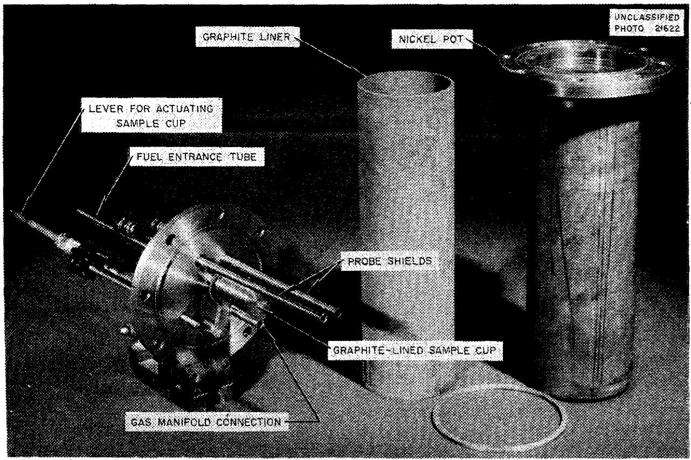  
Fig. 1.1. Fuel-Sampling Apparatus.

Four complete tests of the apparatus have been made with four different values for pressure above the fuel and inside the sampling apparatus. These tests, in which the sampling apparatus was not heated, were satisfactory; it is anticipated that, barring unforeseen complications in the ARE, sampling of the fuel circuit should proceed smoothly.

# Fuel-Unloading Facility

The radioactive fuel mixture will be discharged from the hot-fuel dump tank through a l-in. pipe to aluminum cans for removal to fuel recovery and reprocessing equipment. A mock-up of the unloading equipment was constructed and tested with the fuel carrier $\mathsf{NaZrF}_5$ . The feasibility of unloading the ARE with equipment of this type has been satisfactorily demonstrated.

# Reactor Control

The control actuator assembly has been mounted over the reactor, and the shim and control rods have been installed above the reactor. Accurate measurements have been made from the bottom of the reactor to assure proper location of the rods. The fission-chamber circuits have been checked, and the chambers are now being installed. In order to prevent a chamber from catching where the sleeve changes from 3 in. to $2\frac{1}{2}$ in. in diameter, a tapered transition section will be provided. Except for the final check on the ion chambers, the nuclear instrumentation has been completely checked. The actual installation of the ion chambers and shielding plugs will be accomplished just before the fuel carrier is loaded into the system.

# FUEL SYSTEM Mock-UP TESTS

H. W. Savage

A. G. Grindell

W.G.Cobb

W.R.Huntley

ANP Division

The complete filling of the ARE fuel system would be most easily accomplished with the system under vacuum, but the problems involved in obtaining and holding vacuum are formidable. Therefore, a mock-up was constructed and operated to test filling and degassing characteristics under a helium pressure greater than atmospheric. The mock-up was also used to test the drainability of the circuit.

The test unit was an essentially full-scale mock-up of the ARE fuel system without the heat

exchangers. Included were a reactor core, a pump, a fill tank, piping, and valves with which to duplicate ARE pressure drops. The fill tank, core, and pump were set at levels corresponding to the respective levels in the ARE building. The working fluid used was tetrabromoethane because its room temperature density and viscosity (sp gr = 2.95, μ = 9.3 cp at 77°C) are similar to those of the fluoride fuel at operating temperature. A helium blanket at 20 to 30 psig was maintained in all tests.

The primary objective of the tests was to quantitatively determine the flow rate required to completely fill the reactor core and sweep all gas bubbles from it. A secondary objective was a determination of the degassing and self-priming characteristics of the pump.

In all the tests, flow rates of 60 to 64 gpm were required for filling all six parallel circuits in the core and sweeping out all gas bubbles. Since the tubes in the mock-up were 1.00 in. in inside diameter and the ARE core tubes are 1.115 in. in inside diameter, it is estimated that flows of 85 gpm may be required for filling the ARE. In the mock-up it could be ascertained by visual observation that all gas had been removed from the core, but visual observation will not be possible in the ARE.

The pump degassed well in all tests. In no case was there sufficient surface turbulence to endanger the probes or gas lines by splashing (the liquid surface was visible through glass portholes in the pump casing). In each filling operation, the pump lost its prime several times but regained it each time without adjustments of the controls.

In the drainability tests, gravity draining unassisted by gas pressure resulted in approximately $25\%$ removal of liquid from the reactor core. Helium-pressure-assisted drainage (15 psi differential between pump and dump-tank pressures) resulted in a maximum of approximately $60\%$ removal.

# OPERATION OF THE FUEL SYSTEM

R.G.Affel

W.B.Cottrell

G. D. Whitman

ANP Division

The installation of the main fuel pump essentially completed the fuel system, and the water test of the system is now under way. While this represents attainment of the first operational phase

described in the "ARE Operating Procedures,"1 the immediate objectives of the water test are (1) cleaning of the system, (2) determining effectiveness of the pressure fill of the system, (3) checking tightness of the valves, (4) determining the flow characteristics of the system, (5) ascertaining the helium consumption rate, (6) checking ability to transfer liquid (from one fill tank to another) while holding a fixed level in the pump tank, (7) determining operability of the fuel-enrichment system, and (8) checking process instrumentation.

# Cleaning

In order to remove the scale of calcium metasilicate now deposited throughout the system as a result of previous tests with water and Conklene (a detergent - sodium metasilicate), the system will be washed with a $1\%$ solution of the tetrasodium salt of ethylenediaminetetraacetic acid in water. According to the analytical results (cf. Sec. 9, "Analytical Studies of Reactor Materials"), this solution will dissolve the calcium deposits and leave no residue when it, in turn, is flushed out of the system. It was recommended that the solution be circulated for 4 hr in the system at $170^{\circ}\mathrm{F}$ . Furthermore, because of the significant holdup volume of the system (about 1 cu ft of each 6 cu ft), the rinsing step should be repeated six or seven times to ensure complete removal of the washing agent. To date, the initial cleaning and two rinses have been effected, and the water shows the expected decreasing concentration of impurities. The water for the second rinse is being used in the operational tests described above.

# Pressure Filling

The water was first charged to the fill tank and then forced into the system by gas pressure. Although the system (reactor and heat exchanger) contained gas pockets which would not pressure fill, subsequent circulation of the water by the fuel pump carried the gas pockets around to the pump tank where the water degassed. Although it is probable that the system thus became gas free (full of liquid), there does not appear to be

any positive indication available. The gas remaining in the system is of little consequence in water operation, but it would be intolerable in operation with fuel. Unless operational parameters permit a more positive determination of the extent of filling, it may be necessary to vacuum fill the system. Vacuum filling of the system has thus far been avoided because oxygen could conceivably enter from the vent system and contaminate the hot fuel.

# Pressure and Flow Characteristics

Many data have been taken on the pressure and flow characteristics of the fuel system. It is apparent that the flow through the bypass (in parallel with the heat exchangers) is less than that through the heat exchangers. This is undoubtedly caused by the pressure drop across the bypass throttling valve being greater than anticipated and that across the heat exchanger being less. The pump speed and system pressure-drop data do not check with the system flow data. It is most probable that the flowmeter (a Rotameter which transmits a signal from a coil within which moves a tapered iron core attached to the Rotameter bob) is not calibrated correctly. This possibility is being checked. The Rotameter has shown a tendency to drift, and it has not been possible therefore to make accurate measurements of the system flow characteristics.

# Functional Tests

In the operation of the system to date, the dumpline valves appear to be tight, although there is some indication that the valves to individual tanks leak slightly under pressure. Such slight leaks are tolerable, although not desirable, and the leak tightness of the valves may improve upon repeated operation.

The helium consumption rate during the test with water in the fuel system has been about 3 cfm. It is therefore probable that the maximum helium consumption at any time during the experiment will be about 10 cfm.

It was found to be possible to transfer water from one fill tank to another through the system and to maintain a fixed liquid level in the pump. This operation could be of significance should it be desirable to replace the initial batch of carrier and/or to replace the hot fuel at the conclusion of the test.

# Hot-Gas Test

Although it would be desirable to leak-check both the fuel and the sodium systems at operating temperature, there is no completely satisfactory method for doing this except with fuel and sodium because the systems are not completely drainable. However, the inadequacy of a cold check in comparison with a hot check is so apparent that a gas check of the fuel system at the operating temperature will be effected. Basically this test will consist of heating the system to $1200^{\circ}\mathrm{F}$ , filling the fuel system with one gas under pressure, filling the fuel-system annulus with another gas at lower pressure, and spectrographically analyzing the gas in the annulus for the presence of the gas from the fuel system. Although in principle any two gases would suffice for this test, it would be impossible, for example, to detect a small leak of helium into nitrogen because of the background of air in the annulus system. Accordingly, helium spiked with krypton will be used in the fuel system, and the helium in the annulus will be examined for krypton.

# PUMP FABRICATION AND TESTS

H.W.Savage

W.G.Cobb

A. G. Grindell

W.R.Huntley

R. E, MacPherson  
ANP Division

P. Patriarca

G. M. Slaughter

Metallurgy Division

All six ARE-pump rotary elements have been assembled and were found to meet hot-test requirements in tests made by using the two impellers which have been accepted. Four of the six rotary elements have passed all acceptance tests. The other two rotary assemblies were rejected because of unsatisfactory upper seals which permitted excessive gas leakage. Re-lapping of the seals resulted in no improvement because the lapped surfaces were scored in subsequent testing. It was thought that the lapping abrasives (1500-grit diamond dust, and others) were not being completely removed from the soft nose of the upper seal. As a check on this possibility, the adequacy of lapping with water-soluble

scouring compounds (for example, Bon Ami) is being evaluated.

One of the accepted elements, with a cast impeller (to be exchanged for a fabricated impeller before start-up of ARE), has been installed in the fuel system, and one was installed in the sodium system. One accepted element has been assigned to K-25 for use in a heat-exchanger test. One unaccepted element is installed in the cold shakedown test unit for seal tests. The other unaccepted element is being used in the hot shakedown test unit for hot-testing fabricated impellers. Two fabricated impellers have passed all acceptance tests, and one has been furnished to K-25 for the heat-exchanger test.

Shorting of the probes used for liquid-level indication in the sodium pump has shown the clearance between the riser wall and probe to be inadequate. The original design called for a $3/8$ -in. schedule-40 pipe riser which allowed bridging of sodium condensate between the inner pipe wall and the $3/2$ -in.-dia probe. The size of the riser was increased to $1/2$ in. and no shorting of the probes occurred during subsequent testing. All the sodium pumps have been modified to utilize $1/2$ -in. risers.

The operation of an ARE-type d-c pump drive motor in a dry helium atmosphere continued uneventfully during the quarter. Approximately 3500 hr of operating time have been accumulated at a test temperature of 130 to $140^{\circ}\mathrm{F}$ . This test will be terminated at 4000 hr.

The detail and assembly drawings of the pumps, made in the fall of 1953, are being revised to incorporate the modifications in the pump cooling and lubricating systems and other modifications.

The fabrication of five Inconel impellers for ARE pumps by machining and welding has been completed. The rough-machined parts are shown in Fig. 1.2. These parts, except the vanes, were subjected to a stress-relief annealing heat treatment so that precise dimensional tolerances could be maintained during subsequent machining. The stress-relief thermal cycle consisted of heating at $125^{\circ}\mathrm{C / hr}$ to a temperature of $1000^{\circ}\mathrm{C}$ , maintaining this temperature for $\frac{1}{2}$ hr, and cooling at $125^{\circ}\mathrm{C / hr}$ to room temperature.

The drive-shaft hub was then tack welded to a carbon steel strong-back to prevent warping during welding, and the vanes were heliarc welded

into place, as shown in Fig. 1.3. The stress-relief heat treatment was then repeated. After the vanes had been machine finished, the fluid-entrance hub was heliarc plug-welded into po

sition, and the joints between the hub and the vanes were heliarc welded as far as they were accessible, as shown in Fig. 1.4. The stress-relief heat treatment was again repeated. The

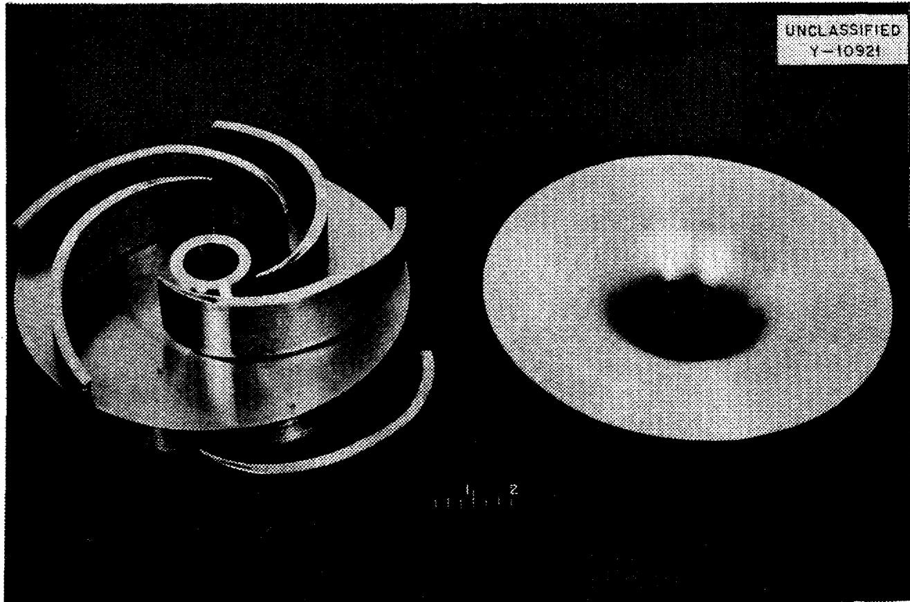  
Fig. 1.2. Rough-Machined Parts of Inconel Impeller.

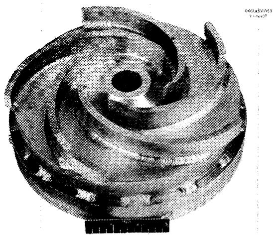  
Fig. 1.3. Impeller After Heliac Welding of Vanes to Drive-Shaft Hub. Impeller is tack welded to carbon steel strong-back.

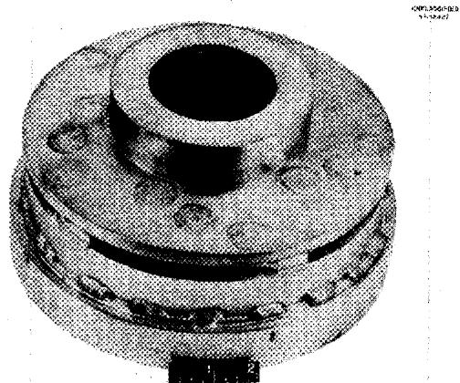  
Fig. 1.4. Impeller with Fluid-Entrance Hub Plug-Welded into Position.

welded impeller was then removed from the strongback and machine finished. The completed assembly is shown in Fig. 1.5.

UNCLASSIFIED Y-10734

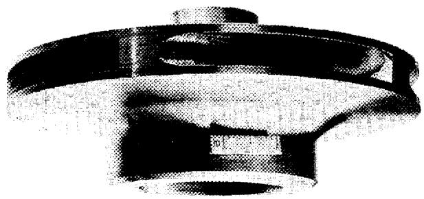  
Fig. 1.5. Completed Impeller.

# REACTOR SYSTEM COMPONENT LOOP

H. W. Savage

A. G. Grindell

W.G.Cobb

W.R.Huntley

ANP Division

The services of the K-25 Technical Division have been secured for constructing a large-scale system for circulating fluoride mixtures and testing reactor-system components. The major components of the system are the pump (mentioned above), a fuel-to-helium heat exchanger rebuilt from one originally purchased for the ARE, and two hairpin tubes purchased as spares for the ARE reactor core (Fig. 1.6). The system is operating isothermally at $1375 \pm 25^{\circ}\mathrm{F}$ , with a flow rate of 20 gpm. The duration aim of the test, which started June 5, 1954, is 2000 hr. When the operation is terminated, the heat exchanger and hairpin tubes will be examined and evaluated in terms of corrosion, structural stability, etc.

# FUEL RECOVERY AND REPROCESSING

D. E. Ferguson

G. I. Cathers

Chemical Technology Division

The chemical process currently being considered for recovery and decontamination of $\mathsf{U}^{235}$ from the ARE fuel mixture NaF-ZrF-UF consists of dissolution of the fuel in an aqueous aluminum nitrate-nitric acid solution, solvent extraction with $5\%$ tributyl phosphate in a kerosene diluent,

and isolation on an ion-exchange resin column. In one solvent-extraction cycle a gross betadecomplementation factor of greater than $10^{4}$ and uranium recovery of greater than $99.9\%$ will be obtained.

Additional work has now been completed on dilute-TBP extraction of uranium solutions having high nitrate-salting strength. In batch counter-current extraction experiments with six TBP concentrations in the range 1 to 30 vol %, with feed nitric acid concentrations of 0.5 and 3 M, ruthenium and total-rare-earth beta-activity decontamination factors improved with decreasing TBP concentration in the solvent (Fig. 1.7). The anomalous zirconium and niobium beta decontaminations obtained affected somewhat the gross-beta decontamination factor determinations in the low TBP concentration range. However, the best gross beta decontamination was obtained at a TBP concentration of 7.5% or less regardless of acidity. There was some evidence of a maximum in gross beta decontamination at 5 to 7.5 vol % TBP with a feed acidity of 0.5 M. Maxima were also observed in the zirconium and niobium decontamination factors at a low acid concentration.

Three extraction and scrub stages were used, with stoichiometrically neutral aluminum nitrate solution as the scrubbing agent. The salting strength was controlled by varying the aluminum nitrate content to obtain a uranium distribution coefficient of about 4 at the feed plate and 0.5 at the last scrub stage. Figure 1.8 is a plot of the distribution coefficients of the various activities at the feed plate. These data could be correlated, in general, with the conclusions drawn from Fig. 1.7.

Testing of the data by log-log plots (Figs. 1.9 and 1.10) showed that the ruthenium and total-rare-earth distribution coefficients have close to second-order dependence on TBP concentration at constant uranium distribution. The equilibrium constant for this case is represented by the equation

$$
K = \frac {D . C _ {\left(R u \beta o r T R E \beta\right)}}{\left(T B P c o n c\right) ^ {n}}
$$

where $n$ , the dependence, is equal to 2. A least-squares analysis showed the average dependence for all data in the case of ruthenium activity to be 2.10 and in the case of total rare earths to be 1.95.

UNCLASSIFIED

ORNL-LR-DWG1688

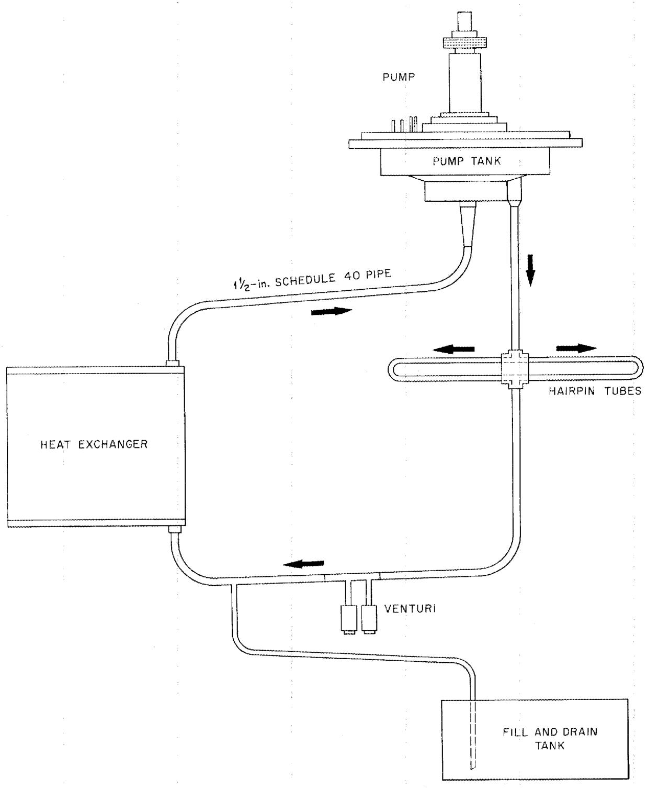  
Fig. 1.6. Fuel-to-Helium Heat-Exchanger Test Loop.

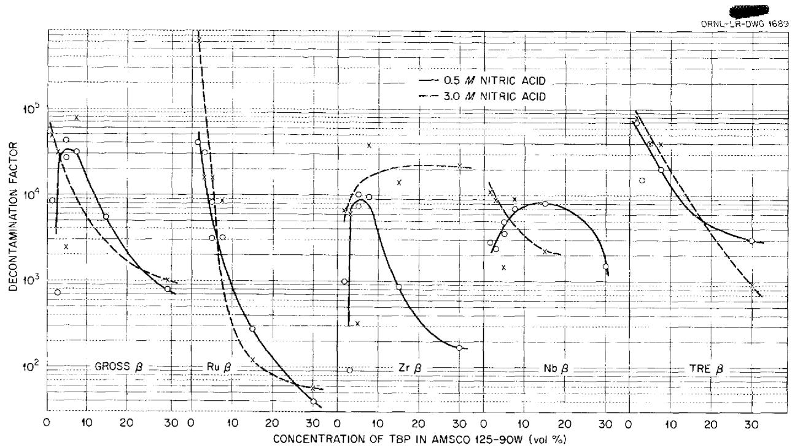  
Fig. 1.7. Decontamination vs TBP Concentration in Solvent Extraction.

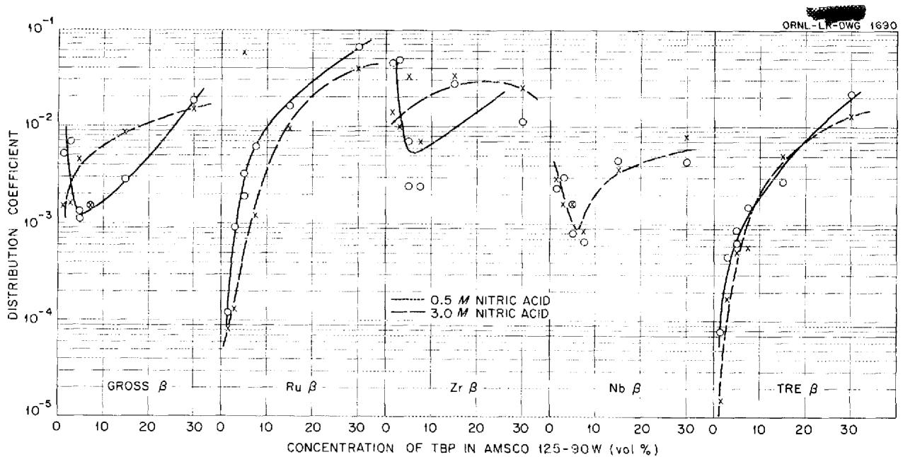  
Fig. 1.8. Activity Distribution Coefficients at Feed Plate vs TBP Concentration in Solvent Extraction.

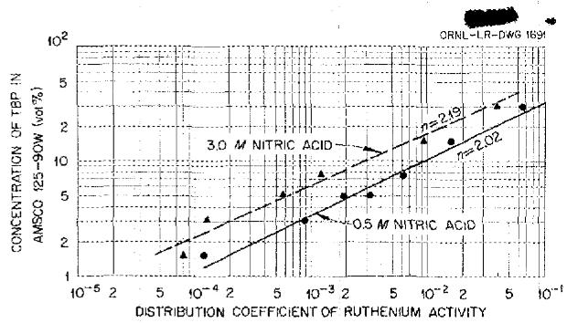  
Fig. 1.9. Dependence of Ruthenium Activity on TBP Concentration.

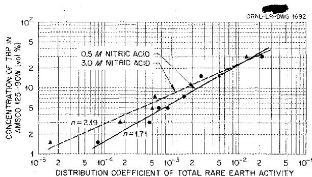  
Fig. 1.10. Dependence of Total-Rare-Earth Activity on TBP Concentration.

# 2. EXPERIMENTAL REACTOR ENGINEERING

H. W. Savage

ANP Division

Development of components for in-pile radiation-damage test loops has continued. Major emphasis was placed on completing development and hot testing of the vertical-shaft, down-flow sump pump for operation of the initial in-pile loop in the LITR and on the design and fabrication of the first hottest model of an air-driven horizontal-shaft sump pump. Further development work has been done on the centrifugally sealed pump, and it has been possible to decrease the size with no sacrifice in pump performance. Tests of hydraulic motors for driving in-pile pumps are being conducted. A compact heat exchanger has been designed for removal of fission heat from in-pile loops. Fabrication of the first exchanger is in progress.

Forced-circulation corrosion-testing loops are being designed for obtaining information on the corrosion of Inconel in high-velocity turbulent fluoride mixtures with large temperature differentials in the system. A test unit for ascertaining the mass-transfer characteristics of a sodium-beryllium-Inconel system was constructed and is now operating with turbulently flowing sodium and a high temperature differential.

Tests of the 1-Mw, regenerative fluoride-to-sodium heat exchanger were terminated and the test unit is being dismantled for examination. A 100-kw gas-fired furnace is being fabricated for testing to determine its suitability as a heat source for future heat-exchanger tests. If tests indicate that a heat source of this type will be satisfactory, a 1-Mw furnace will be developed.

A sampling device for taking an unrestricted number of samples of molten sodium from high-temperature systems was completed and several samples were successfully taken. Also, a satisfactory solvent for removing fluoride mixtures from Inconel was developed, tested, and put into general use.

Several bearing-material combinations were tested in molten fluorides under strictly controlled conditions. It was found possible to screen out some combinations, while others showed sufficient promise for further testing.

# IN-PILE LOOP COMPONENT DEVELOPMENT

W. B. McDonald

ANP Division

# Centrifugally Sealed Pump

J.A.Conlin

ANP Division

Thedeaeration and filling problems encountered with the previously describedcentrifugally sealed pump have been essentially solved, and a series of modifications have been made for increasing pump performance and decreasing the over-all pump dimensions. Some success in reducing pump dimensions has been achieved, but no change in head and flow characteristics has been obtained.

A satisfactory method of deaeration was established by bleeding off 5 to $10\%$ of the total pump flow from the pump discharge and returning it to the centrifugal-seal cavity. The centrifugal-seal cavity acts as a centrifuge for removing the gas from the fluid and replacing the bleed-off with clear fluid from the seal cavity. Deaeration at a low developed head is, as far as can be determined, complete. However, as the developed head is increased by increasing pump speed, deaeration becomes less satisfactory; in fact, some aeration occurs slowly when the pump speed is increased after complete deaeration at low speed. At high speed the gas pressure in the seal cavity is above the pump suction pressure by about $65\%$ of the developed head. After an investigation it was concluded that gas (in this case, air) is dissolved in the fluid (water) under pressure in the seal cavity and then comes out of solution in the form of small bubbles at the low pressure (pump suction) portion of the loop. However, the mechanism of aeration of the water is not definitely known. It is possible that the turbulent surface of the liquid in the seal cavity at high pump speed may increase the rate of solution of the air in the water or even entrap air in the form of bubbles which then pass into the system through the seal. The precise degree of aeration has not been measured, but it is not very great, and, of course, the extent of aeration which would occur

with fluoride mixtures under a helium gas is not known.

The introduction of the degeneration bleed into the seal cavity caused the seal to leak when fluid was added to the system. This seal leakage was corrected by the addition of a deflector to keep the bypass fluid away from the junction between the inner tube in the seal cavity and the pump impeller.

In its present state, the pump may be started empty in a horizontal position and filled by simply adding water to the system, with care being taken not to overfill the system. A series of tests is now under way for developing filling and operating techniques that will be satisfactory for operation of the pump with fluoride mixtures.

In an attempt to improve pump performance, an impeller that had been modified by drilling the flow ports tangentially to the core was tested. However, the resulting performance was somewhat worse instead of better.

A pump casing with an unconventional discharge passage was tested in an attempt to reduce the over-all diameter of this or any similar pump. The modified casing (Fig. 2.1) has a narrow annular passage around the outside diameter of the impeller and a volute-like passage formed in an axial direction from the annulus. The volute turns, at the water deflector (cut-water), into a passage which discharges in an axial direction parallel to the pump inlet at a maximum distance from the axis of the pump no greater than the outside diameter of the annulus around the impeller.

Performance of this casing was slightly better than that of the casing used previously which had a conventional annular collector ring and a tangential discharge nozzle. However, the results were inconsistent because of the aeration conditions, and it is believed that under identical conditions an equally well-designed conventional casing would show slightly better performance than that of the modified casing. The principal advantage in the axial-discharge design is that the discharge nozzle does not extend radially beyond the pump casing. However, this advantage must be balanced by the greater difficulty of fabricating such a casing. The velocity-to-head conversion could probably be improved by modifying the cut-water to extend over the impeller and thereby obtain more benefit from the high fluid velocity in the annulus.

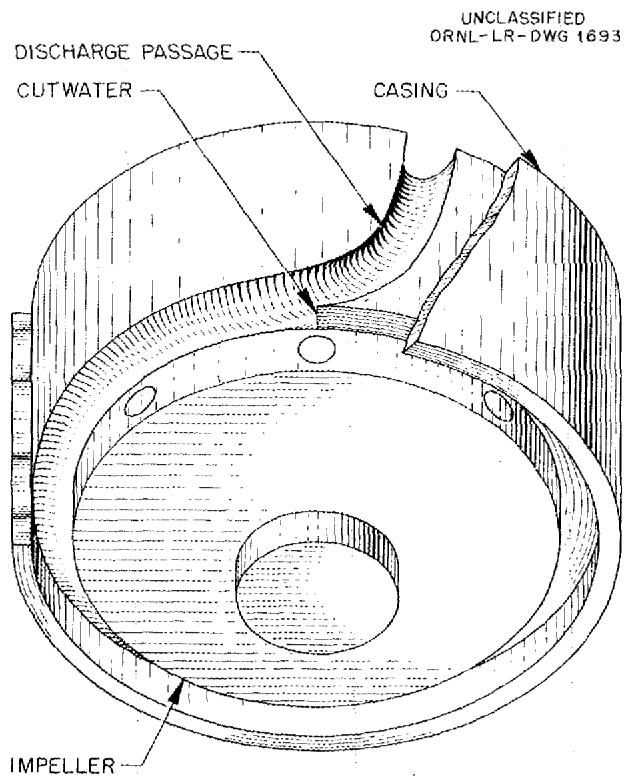  
Fig. 2.1. Modified Axial-Discharge Pump Casing.

# Horizontal-Shaft Sump Pump

D. F. Salmon

ANP Division

A horizontal-shaft air-driven sump pump for hot testing with a fluoride mixture is being assembled (Fig. 2.2). A plastic model of the pump was tested with 1-1,2-2 tetrabromoethane $(\mathfrak{sp}\mathfrak{gr}\sim 3,\mu \sim 9\mathfrak{cp})$ Priming was accomplished by periodic sudden applications of pressure in the sump to force slugs of liquid into the pump inlet. A longer time was required to degas this liquid than water. For faster degassing, part or all of the flow was directed through the sump instead of directly into the pump inlet.

# Vertical-Shaft Sump Pump

D.R.Ward

ANP Division

Two vertical-shaft sump pumps were tested with sodium at $1500^{\circ}\mathrm{F}$ and delivered to the Solid State Division for operation in in-pile loop tests. Two identical pumps are being retained for more testing

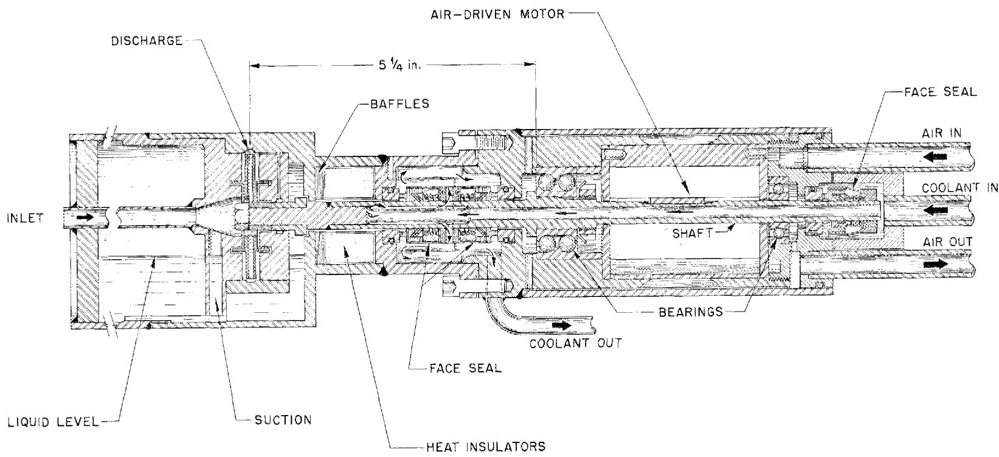  
Fig. 2.2. Horizontal-Shaft Air-Driven Sump Pump for an In-Pile Loop.

and development aimed at simplifying fabrication and increasing pump capacity in anticipation of more severe requirements, both in experimental test loops and in other in-pile loop tests.

# Hydraulic Pump Drives

J.A.Conlin

ANP Division

Hydraulic motors are being considered as possible in-pile pump drives because they have high starting torque and high power output from a very small unit, and there might be a possibility of using the hydraulic oil both as a power source and as a coolant. Two commercially available motors were ordered -- a gear type and an axial-piston type. Since neither of these was immediately available, an axial-piston motor similar in design but of much larger capacity than the one ordered was put on a no-load duration test to determine its operating characteristics. The normal maximum operating speed of this motor is 3600 rpm; however, the test was run at the approximate in-pile pump speed of 5000 rpm.

The motor completed a 500-hr test with no indication of trouble except for a constant shaft oil seal leak of 0.47 cc/hr. The seal leakage was aggravated by two things. First, during initial tests the shaft, for reasons unknown, became excessively hot. Second, it was necessary to bypass about 0.5 gpm of oil through the motor casing and bearings to prevent excessive motor temperatures at the high speed. This caused a 0.7- to 1.0-psig back pressure against the seal, which was a rubber-lip type that was not intended for use under pressure. An operating oil temperature of between 100 and $120^{\circ}\mathrm{F}$ was maintained during the test.

# Fluoride-to-Water Heat Exchanger

D. F. Salmon

ANP Division

A heat-extraction unit is needed for in-pile test loops which is small enough to be inserted in the reactor hole and does not require a complicated external circuit of auxiliaries, since shielding for external apparatus is cumbersome and expensive. A concentric-tube double-wall heat exchanger has been designed that has a stagnant annulus of fluoride mixture between circulating streams of

molten fluoride mixture on one side and cooling water on the other. The stagnant mixture will be solid at the water wall and molten at the circulating-fluoride-mixture wall, and there will be a temperature drop of approximately $1000^{\circ}\mathrm{F}$ radially across the annulus. The circulating cooling water will either be dumped or cooled outside the reactor.

The exchanger is designed around an Inconel-sheathed electrical tubular heater for preheating the unit prior to starting circulation of the fluoride mixture stream. The hairpin design to permit differential thermal expansion is shown in Fig. 2.3. With the fluoride mixture NaF-KF-LiF [11.5-42.0-46.5 mole $\%$ K (solid) = 3.5 Btu/hr·sq ft (°F/ft) and K (liquid) = 2.6 Btu/hr·sq ft (°F/ft)] in the annulus, approximately 12 kw/ft can be removed from a $1500^{\circ}\mathrm{F}$ stream of fluoride mixture NaF-ZrF $_4$ -UF $_4$ (50-46-4 mole $\%$ ) and adsorbed by the water stream.

# FORCED-CIRCULATION CORROSION LOOPS

W.C.Tunnel

ANP Division

W. K. Stair, Consultant

J. F. Bailey, Consultant

University of Tennessee

Previous attempts to circulate fluoride mixtures at simultaneously high velocities and large temperature differentials were only partially successful. Therefore a small loop is being built that is designed to have a temperature differential of about $135^{\circ}\mathrm{F}$ , with a maximum temperature of $1500^{\circ}\mathrm{F}$ and a Reynolds number of about 4500. Electrical resistance heating of the 0.300-in.-OD, 0.025-in.-wall container tube will be used, but the power consumption will be larger than in the previous apparatus. This loop will be used to confirm engineering design estimates of performance, but it may not yield significant metallurgical information.

The Metallurgy Division has provided specifications for six additional loops. Three loops are to have maximum Reynolds numbers of 10,000 and temperature differentials of 100, 200, and $300^{\circ}\mathrm{F}$ , and the other three loops are to have temperature differentials of $200^{\circ}\mathrm{F}$ and Reynolds numbers of 1,000, 3,000, and 15,000. Heat economizers will

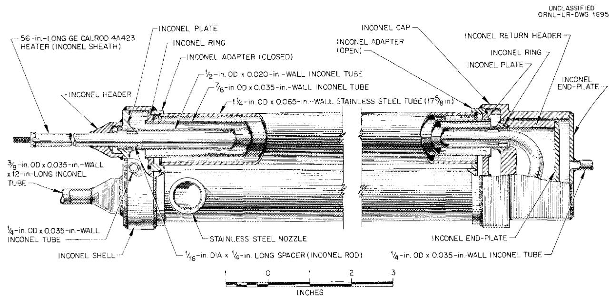  
Fig. 2.3. Concentric-Tube Double-Wall Heat Exchanger for Use Inside a Reactor Hole.

be used, in at least the first three units, to conserve electric power, space, and fabrication costs.

The unit with a $300^{\circ} \mathrm{F}$ AT and a Reynolds number of 10,000 is designed to dissipate 80 kw of heat to air and therefore to have an 80-kw reheating capacity; resistance heating will be used. The unit will also include a vertical-shaft sump pump for circulating the molten fluoride mixture at 5000 lb/hr.

# SODIUM-BERYLLIUM-INCONEL MASS- TRANSFER TEST

L.A.Mann ANP Division

A test unit has been constructed for investigating mass transfer of beryllium to Inconel in a flowing sodium system under conditions which approach those proposed for the Reflector-Moderated Reactor. A series of tests will be run to determine whether it will be necessary to protect the beryllium reflector-moderator from the sodium coolant during operation of the reactor.

The test unit is designed to operate with a sodium flow of 3 gpm through a venturi-shaped

beryllium insert with a minor diameter of about 0.25 in. The sodium temperature will range from $1200^{\circ}\mathrm{F}$ maximum (at the beryllium) to less than $900^{\circ}\mathrm{F}$ minimum. The Reynolds number will be about 100,000 at the beryllium minor diameter and about 50,000 at the coldest section of the loop.

# FLUORIDE-TO-SODIUM HEAT-EXCHANGER TEST

A.P.Fraas R.W.Bussard R.E.MacPherson ANP Division

As was previously reported,4 test operations on the 1-Mw regenerative fluoride-to-sodium heat exchanger were interrupted by failure of the sodium heater coil. The coil was replaced and an attempt was made to continue operation of the equipment to obtain endurance information. However, a leak developed from the sodium side of the heat exchanger into the fluoride side, and the unit has been shut down for dismantling. The heat exchanger will be delivered to the Metallurgy Division for examination.

# GAS-FURNACE HEAT-SOURCE DEVELOPMENT

A.P.Fraas R.W.Bussard R.E.MacPherson ANP Division

Past experience and future plans for the testing of prototypes of the Reflector-Moderated Reactor intermediate heat exchanger have indicated a need for high-capacity, compact heat sources. As a step in this direction, a loop is currently being assembled to check the operating characteristics of a 100-kw gas-fired furnace. This unit, if operable, will provide a basic design capable of being enlarged to accommodate the large heat loads which will be demanded in the near future. The furnace, as shown in Fig. 2.4, is a drastic departure from conventional furnace design. It employs natural gas and pressurized air feed, the air being preheated to $1000^{\circ}\mathrm{F}$ before entry into

the combustion zone, by a countercurrent heat exchanger, with flue gases. The flame temperature is expected to approach $4000^{\circ}\mathrm{F}$ . No ceramic lining is utilized in the combustion chamber; instead, the design provides for cooling of all exposed metal surfaces by the normal sodium flow through the furnace. The combustion chamber is a cylindrical opening 6 in. in length and 5 in. in diameter. The sides of the chamber are formed by sodium coils and the ends by the gas and air inlet arrangements. After combustion, the flue gas passes over the coils to give up its heat to sodium and is then channeled into a spiral discharge duct where it flows countercurrent to feed air to provide an economizer arrangement.

If operability is proved in this test; it is planned to construct a 1-Mw furnace employing the same basic design. This furnace will serve as the heat source for tests of the second prototype of the

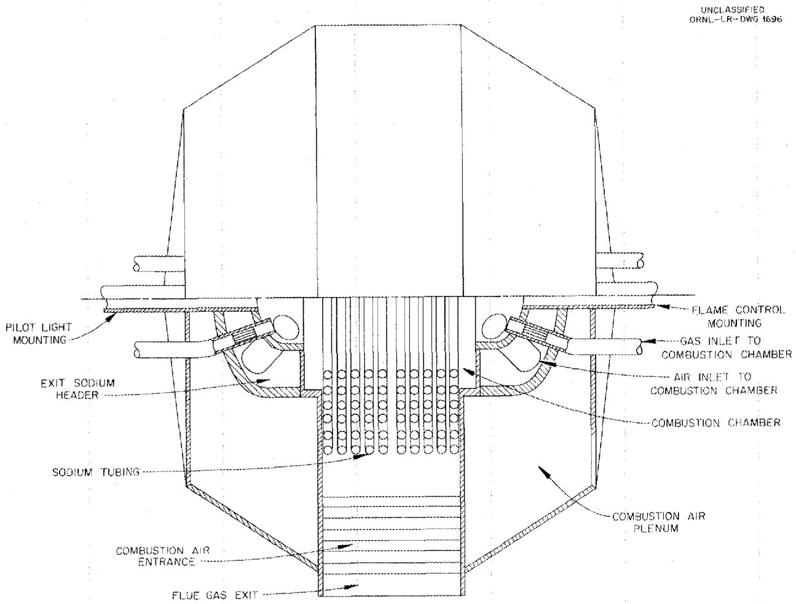  
Fig. 2.4. 100-kw Gas-Fired Furnace.

Reflector-Moderated Reactor intermediate heat exchanger.

# SODIUM SAMPLER

L.A.Mann

ANP Division

A unit has been designed, constructed, and test-operated for repetitive sampling of molten sodium at temperatures of up to $1500^{\circ}\mathrm{F}$ . A device is included in the unit for separating the sodium from its oxide by flotation in mercury and for furnishing the sodium and oxide in separate flasks for titration. The basic method reported by Pepkowitz and Judd for analyzing $\mathsf{Na}_2\mathsf{O}$ in Na is used, and the sampler is a simplified adaptation of a similar device developed at KAPL.

# REMOVAL OF FLUORIDE MIXTURES FROM EQUIPMENT

L.A.Mann

ANP Division

A solvent for $\mathsf{NaF - ZrF_4}$ and $\mathsf{NaF - ZrF_4 - UF_4}$ mixtures has been developed, tested, and put into general use. The solution has the composition (by weight): $15\%$ $\mathsf{HNO}_3$ , $5\%$ $\mathsf{H}_2\mathsf{BO}_3$ , $4\%$ $\mathsf{Pb}(\mathsf{NO}_3)_2$ , $76\%$ $\mathsf{H}_2\mathsf{O}$ . It is used at a temperature of 180 to $200^{\circ}\mathsf{F}$ , with the solution either flowing or being stirred. A hood is required because of the $\mathsf{NO}_2$ fumes evolved. An approximately $1/8$ -in. coating of $\mathsf{NaF - ZrF_4 - UF_4}$ on Inconel was completely removed (visual inspection) in 2 hr, with an Inconel corrosion rate of approximately $1\mathrm{mg/sq}$ in. hr. In further tests, $\mathsf{NaF - ZrF_4}$ was completely removed in 10 min except from very small openings which took longer to clean. This cleaning method is, of course, not recommended for thin-walled tubing or for equipment to be subsequently tested or examined for corrosion.

# BEARING-MATERIALS TESTS

W.C.Tunnel

ANP Division

Tests have continued, with the equipment previously described, in attempts to find combinations of materials usable for journal bearings in high

temperature fluoride mixtures. The early tests showed metal build-up between the test specimens. It is believed that the build-up material was the product of corrosion of the stainless steel containers. Recent tests have been conducted in Inconel containers, and although there is still some evidence of metal build-up, the specimens remain sufficiently clean during the test period so that wear patterns can be obtained. Figures 2.5 and 2.6 are photographic records of some of the test results; Fig. 2.5 shows the wear that resulted in operating a tungsten carbide pin against a tungsten carbide plate, and Fig. 2.6 shows the comparatively little wear that results when a tungsten carbide pin was tested against a titanium carbide plate. Additional records that are made of each test include the surface finish, flatness, and hardness values of each specimen, before and after each run, and a Faxfilm replica of the surface condition of the pin and of a typical section of the plate. (Faxfilm is a surface evaluation process furnished by the Brush Development Company. A clear solvent is applied to the surface to be reproduced. A clear plastic film is then pressed against the surface and solvent, and after a few seconds for drying, the duplicate surface is lifted off with the plastic film. This film is then mounted on a slide and can be projected.) The fluoride mixture is analyzed after each run for corrosion products to determine whether constituents of the specimens have been introduced into the fluoride mixture. No corrosion products have yet been found in the fluoride mixtures analyzed.

The materials tested and the test results are shown in Table 2.1, which lists all the combinations tested to date. Of the materials tested, $\mathrm{Cr}_3\mathrm{C}_2$ appears to be a poor possibility for use as a bearing material because it shows excessive wear. Hot-pressed beryllium oxide and $\mathrm{Al}_{2}\mathrm{O}_{3}$ have been eliminated as possible bearing materials because of excessive corrosion and/or erosion. Tungsten carbide and Kennametal titanium carbide appear to be possible bearing materials; both materials showed very little wear and very little corrosion in the tests. These materials also showed good wear resistance when tested in sodium, as reported by Vail. Boron carbide also indicated promise in wear and corrosion resistance.

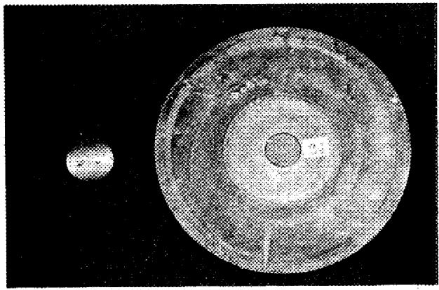

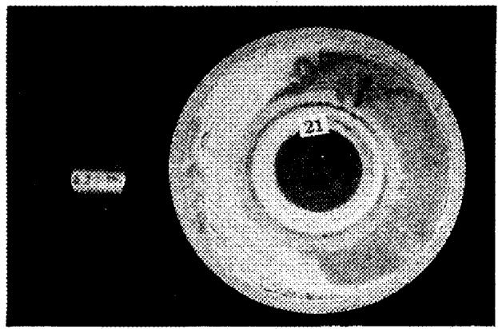

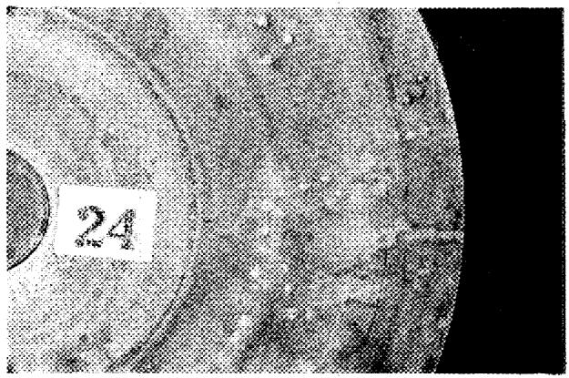

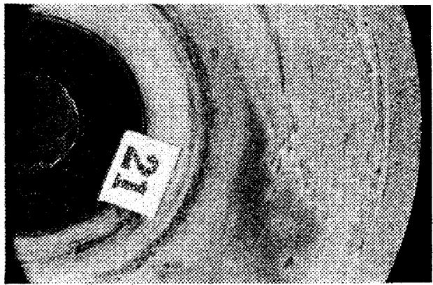

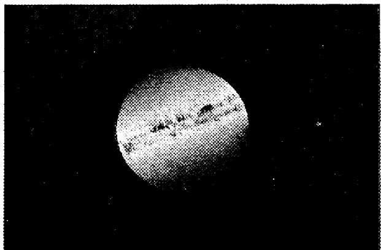

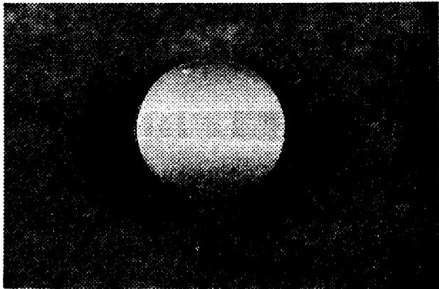  
Fig. 2.5. Tungsten Carbide Pin Operated Against a Tungsten Carbide Plate in Contact with a Fluoride Mixture in an Inconel Container at $1200^{\circ}$ F for 2 hr.   
Fig. 2.6. Tungsten Carbide Pin Operated Against a Titanium Carbide Plate in Contact with a Fluoride Mixture in an Inconel Container at $1200^{\circ}$ F for 2 hr.

TABLE 2.1. RESULTS OF TESTS OF BEARING-MATERIALS COMBINATIONS EXPOSED TO NaF-ZrF4-UF4 AT ${1200}^{ \circ  }\mathrm{F}$ FOR $2\mathrm{{hr}}$ IN BEARING-MATERIALS TESTER*   

<table><tr><td rowspan="2">PIN MATERIAL</td><td colspan="10">PLATE MATERIAL</td><td>RESULTS</td></tr><tr><td>Hot-Pressed BeO</td><td>BeO-Ni</td><td>WC</td><td>Al2O3</td><td>Al2O3-MgO</td><td>B4C</td><td>Cr3C2</td><td>TiC-Ni</td><td>TiC-Co</td><td>Graphitar</td><td>High-Density Graphite</td></tr><tr><td>Hot-pressed BeO</td><td>29</td><td></td><td>27</td><td>X</td><td></td><td></td><td></td><td></td><td></td><td></td><td>Eliminated</td></tr><tr><td>BeO-Ni</td><td>X</td><td></td><td></td><td>X</td><td></td><td></td><td></td><td></td><td></td><td></td><td></td></tr><tr><td>WC</td><td>X</td><td></td><td>21</td><td>30</td><td></td><td>25</td><td></td><td>23</td><td>24</td><td>31</td><td>28</td></tr><tr><td>Al2O3</td><td>X</td><td></td><td></td><td>X</td><td></td><td></td><td></td><td></td><td></td><td></td><td>Eliminated</td></tr><tr><td>Al2O3-MgO</td><td>X</td><td></td><td></td><td>X</td><td></td><td></td><td></td><td></td><td></td><td></td><td></td></tr><tr><td>B4C</td><td>X</td><td></td><td></td><td>X</td><td></td><td></td><td></td><td></td><td></td><td></td><td></td></tr><tr><td>Cr3C2</td><td>X</td><td></td><td>22</td><td>X</td><td></td><td>33</td><td></td><td>18</td><td></td><td></td><td></td></tr><tr><td></td><td></td><td></td><td></td><td></td><td></td><td></td><td></td><td>19</td><td></td><td></td><td></td></tr><tr><td>TiC-Ni</td><td>X</td><td></td><td>20</td><td>X</td><td></td><td></td><td></td><td></td><td>26</td><td></td><td></td></tr><tr><td>TiC-Co</td><td>X</td><td></td><td></td><td>X</td><td></td><td></td><td></td><td></td><td></td><td></td><td></td></tr><tr><td>Graphitar</td><td>X</td><td></td><td></td><td>X</td><td></td><td></td><td></td><td></td><td></td><td></td><td></td></tr><tr><td>High-density graphite</td><td>X</td><td></td><td></td><td>X</td><td></td><td></td><td></td><td></td><td></td><td></td><td></td></tr></table>

*The numbers are test serial numbers. The notation X indicates unsatisfactory combinations. Blank spaces mean not yet tested or results not yet available.

# ROTARY-SHAFT SEALS

W.C.Tunnel P.G.Smith

ANP Division

Tests are under way to determine the feasibility of sealing fluoride mixtures in an in-pile pump with a packed seal on a horizontal shaft. One packing that was tested consisted of a mixture of 95 wt % Asbury Graphite and 5 wt % MoS₂ retained by bronze wool at each end of a stuffing box. The stuffing box was $3\frac{1}{2}$ in. long with a $\frac{1}{4}$ -in. annulus. For this test, the apparatus was operated for a total of 382 hr, and the test was then terminated because a heater burned out as a result of leakage of the fluoride mixture. Leak-

age from this seal (test No. 33) was at the rate of 0.7 cc/day throughout the test. Postrun examination revealed only slight shaft wear at regions where the packing retainers were located and in the gland region. The pot showed no sign of packing leakage from the hot end of the seal.

In another test of the same packing material (test No. 35), an inert blanket was installed on the cold end of the seal to protect the section of the shaft under the gland from wear by oxidation products. A pillow-block bearing was installed on

the $\frac{1}{2}$ -in. shaft to improve alignment. The type 316 stainless steel shaft was coated with $\frac{1}{16}$ -in.-thick Colmonoy ground to a $20 - \mu \mathrm{in}$ . finish. The test apparatus was operated for 603 hr with NaF-ZrF $_4$ -UF $_4$ at a temperature of 1250 to $1300^{\circ}\mathrm{F}$ and with a pressure of 2 psi on the seal. The leakage rate from the seal was about 0.5 cc/day and appeared to be mostly packing material. The power requirement of the seal varied from 100 to 200 watts. Termination was caused by shaft seizure.

Postrun examination revealed shaft wear of about the same magnitude as in test No. 33. A section of the shaft surface at the hot end appeared to have peeled off or to have corroded slightly. Analysis of a sample from the pot showed that

an unsatisfactorily large amount of the packing material had leaked into the pot. There was evidence of corrosion on the hot end of the gland, which indicates a need for an inert-gas blanket between the gland and the stuffing box, as well as between the gland and the shaft. Another test is planned for the near future with an improved inert-gas blanket and improved gland alignment.

Seal test No. 31 was the same as seal test No. $28,^{8}$ except that Asbury Graphite was substituted for the National Carbon Graphite in the 10 wt $\%$ $\mathrm{BaF}_{2} - 90$ wt $\%$ graphite packing material. The results obtained were very similar to those for test No. 28 in that excessive leakage occurred. The duration of the test was 165 hr.

# 3. REFLECTOR-MODERATED REACTOR

A.P.Fraas

ANP Division

Components of the proposed 60-Mw Circulating-Fuel Reactor Experiment (CFRE) are now being designed and constructed and are to be tested to determine operational characteristics. Plans are being made for tests of full-scale fuel pumps and of elements of full-scale heat exchangers. Also, thermal-stress cycling tests for both Inconel and beryllium are to be performed. A fairly complete detailed stress analysis of the reactor is well under way. A series of charts was prepared to facilitate the determination of the temperature distribution and thermal stresses in media having uniformly distributed volume-heat sources. Also, a comparison of lithium- and zirconium-base fluoride fuels for aircraft reactors was made that indicates the definite advantages to be gained through the use of the lithium-base fuel.

Estimates of the xenon-poisoning effect in the Reflector-Moderated Reactor have confirmed the great incentive for removing the xenon during operation. Therefore an experiment is being planned to determine whether the xenon can be adequately purged. Studies of reactor dynamics indicate that the design of the Reflector-Moderated Reactor precludes the possibility of the coupling of mechanical oscillations with nuclear oscil

1F. A. Field, Temperature Gradient and Thermal Stresses in Heat Generating Bodies, ORNL CF-54-5-196 (May 21, 1954).

lations to create antidamped oscillations that would destroy the reactor.

Calculations of a set of 48 related reactors are well under way. The effects of reactor dimensions on concentration of $U^{235}$ in the fuel, on total $U^{235}$ investment, on outside peak-to-average power density in the core, and on the per cent thermal fissions in the core are presented.

# A COMPARISON OF LITHIUM- AND ZIRCONIUM-BASE FLUORIDE FUELS

A key decision in the design of a circulating-fuel reactor is the choice of the fluoride fuel to be employed. Of the fuels that currently seem most promising, the sodium-zirconium-uranium fluoride fuel has the poorest physical properties but would be the easiest and cheapest to prepare, while the sodium-lithium-potassium-uranium fluoride fuel has the best physical properties but would require $\mathsf{Li}^7$ an expensive material. The properties of greatest interest for these two fuels for uranium concentrations of 25 lb/cu ft are given in Table 3.1.

In a comparison of the two fuels it is evident that the lithium-base mixture has both a lower melting point and a much lower vapor pressure. The lower vapor pressure is particularly advantageous in that it should eliminate the many troubles experienced with sublimation of $\mathsf{ZrF}_4$

TABLE 3.1. PHYSICAL PROPERTIES OF TWO FLUORIDE FUELS CONTAINING 25 Ib OF U $^{235}$ PER CUBIC FEET OF FLUORIDE MIXTURE AT $1472^{\circ}$ F   

<table><tr><td>PHYSICAL PROPERTIES</td><td>NaF-ZrF4-UF4(50-44.5-5.5 mole %)</td><td>NaF-LiF-KF-UF4(11-45-41-3 mole %)</td></tr><tr><td>Melting point, °F</td><td>970</td><td>850</td></tr><tr><td>Vapor pressure at 1500°F, mm Hg</td><td>8</td><td>&lt;1</td></tr><tr><td>Prandtl number, Cpμ/K</td><td>3.71</td><td>1.24</td></tr><tr><td>Viscosity, * cp</td><td>6.5</td><td>2.5</td></tr><tr><td>Thermal conductivity, * Btu/hr·sq ft (°F/ft)</td><td>1.25</td><td>1.95</td></tr><tr><td>Specific heat, * Btu/lb</td><td>0.295</td><td>0.40</td></tr><tr><td>Density, * lb/cu ft</td><td>203</td><td>132</td></tr></table>

*Data supplied by H. F. Poppendiek.

and the formation of high-melting-point deposits on the roofs of expansion tanks, in pressure gage lines, etc. The higher viscosity of the zirconium-base fuel gives a lower Reynolds number in the reactor core and hence a more severe boundary-layer heating problem; the temperature differential between the peak temperature in the boundary layer and the mean fuel temperature is about $50\%$ greater than that for the lithium-base fuel.[2] Thus the zirconium-base fuel, with its higher viscosity and its much higher vapor pressure, would be more likely to give trouble with boiling in local hot spots and hence, conceivably, violent fluctuations in power.

Recent multigroup calculations show that for a representative core geometry the critical mass for a lithium-base fuel will be about $16\%$ greater than that for a zirconium-base fuel because of thermal-neutron absorption in the potassium. The reactor under consideration had an 18-in.-dia core with a 12-in.-thick reflector and a 4-in.-thick fuel annulus, and the beryllium in the island and reflector was capped in 0.010-in.-thick Inconel. The core shells were $\frac{1}{2}$ -in.-thick Inconel.

A further consideration in favor of the alkali-metal fluoride fuels is based on radiation damage; the alkali-metal fluorides are very stable compounds, and their recombination rate can be expected to be larger than that for $\mathsf{ZrF}_4$ .

One of the most important design criteria is the effect of the physical properties of the fuel on the heat exchanger. While many design compromises are possible, the most important of these can be deduced from Fig. 3.1, which was prepared for a series of fuel-to-NaK heat exchangers. The pressure-stress limitations are usually controlling, and if the same allowable stresses are to be used, the pressure drop must be held constant. The designs represented by Fig. 3.1 were prepared by determining the number of tubes required for each tube length to give a 50-psi pressure drop through the tubes in the NaK circuit. The tube spacing was then adjusted to give a 40-psi drop in the fuel passages. As shown in Fig. 3.1, the number of tubes in the heat exchanger must be increased to provide more flow passage area as the tube length is increased.

The curves for the temperature differential be

tween the fuel and NaK are instructive. If the temperature difference for the zirconium-base fuel is to be the same as that for the lithium-base fuel, the tube length must be increased, for example, from 6.0 to 7.6 ft if the temperature difference is kept at $91^{\circ}\mathrm{F}$ . This would require a $15\%$ increase in the number of tubes. The Reynolds number would drop from 4850 to 2100, that is, from a value well within the turbulent range to one likely to give laminar flow and hence even poorer heat transfer than that estimated. If the same tube spacing were used and a higher pressure drop accepted, the comparison would be less unfavorable in most respects. However, the pumping horsepower would need to be increased by $50\%$ with the zirconium-base fuel, and many stresses, such as those in the NaK outlet header sheets, would be more than doubled.

The effects of heat-exchanger volume on both shield weight and the activation of the NaK in the secondary circuit are vitally important. The weight of the reactor, heat exchanger, and reactor shield assembly, together with the radiation dose from the NaK in the secondary circuit at a point 50 ft from the engines, is given in Fig. 3.2 as a function of the temperature loss in the fuel-to-NaK heat exchanger. The data are for a 200-Mw reactor with a shield designed to give $10\mathrm{r / hr}$ at 50 ft from the reactor at full power. It can be seen that for a given design temperature loss the lithium-base fuel is markedly superior to the zirconium-base fuel in that it gives one-half the radiation dose and a 6000-lb saving in shield assembly weight.

The limitations on high-temperature heat-exchanger design imposed by pressure stresses merit further explanation. The many closely spaced holes in the header sheets generally make the header sheets much less strong than the thin tube walls. In the spherical-shell heat exchanger for the Reflector-Moderated Reactor, the NaK must enter the heat exchanger at about 100 psi to take care of the roughly 50-psi pressure loss in the heat exchanger, the 40-psi loss in the radiators, and the 10-psi loss in the connecting lines. Most of the estimated 50-psi pressure drop in the fuel system occurs in the heat exchanger. On this basis the pressure difference across the header sheet at the hot end is less than 10 psi, while that at the cold end is about 100 psi. Fortunately, the strength of Inconel is about five times greater

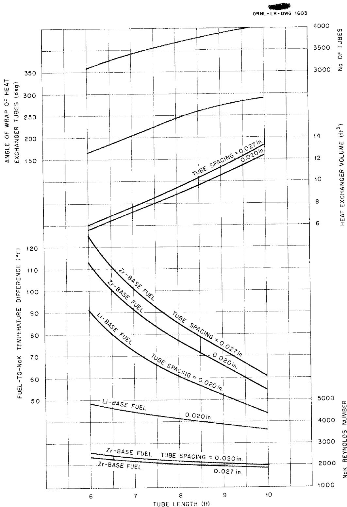  
Fig. 3.1. Effects of Tube Length on Design Variables for a 60-Mw Fuel-to-NaK Heat Exchanger for 50-psi Pressure Drop in the NaK Circuit.

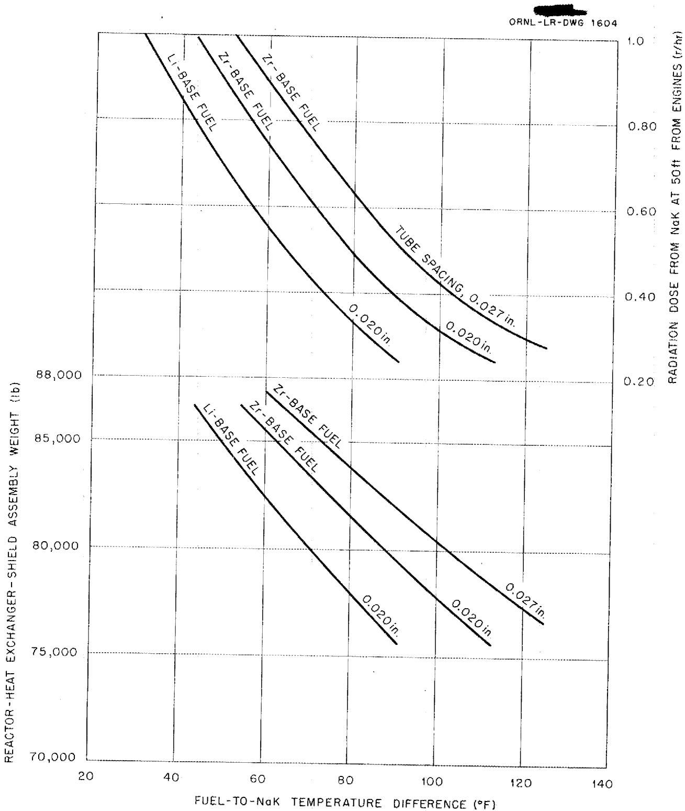  
Fig. 3.2. Weight of Reactor, Heat Exchanger, and Reactor-Shield Assembly and Radiation Dose from the NaK in the Secondary Circuit at a Point 50 ft from the Engines as a Function of the Temperature Loss in the Fuel-to-NaK Heat Exchanger.

at the cold end than at the hot end. It has been shown3 that the optimum tube diameter is close to $\frac{3}{16}$ in. and that the minimum thickness of ligament between holes in the header sheet should be at least 0.10 in. for satisfactory welding. If an essentially cylindrical header sheet, such as that shown in Fig. 3.3, is used to minimize the stresses, the ligaments between the tubes will be in tension. If allowances are made for both the cross-sectional area lost in the holes and the increases in the stresses around the holes that arise from geometric effects, the maximum tensile stress in the ligaments will be about five times that for a simple cylindrical shell of the same wall thickness with no perforations. The 1000-hr rupture strength for Inconel at $1200^{\circ}\mathrm{F}$ is 12,000 psi, and therefore the allowable stress should not exceed 6000 psi to give some factor of safety. If the header-sheet thickness were arbitrarily chosen as 0.25 in., its radius of curvature would be 3 in. (The allowable stress from simple loop tension considerations is 60 times the pressure differential for the unperforated cylinder, or 12 times that for the perforated cylinder. Thus the ratio of headersheet thickness to radius of curvature becomes 1:12.) While other plausible designs can be evolved on a similar basis, that illustrated in Fig. 3.3 appears to be about the best devised to date.

3A. P. Fraas and M. E. LaVerne, Heat Exchanger Design Charts, ORNL-1330 (Dec. 7, 1952).

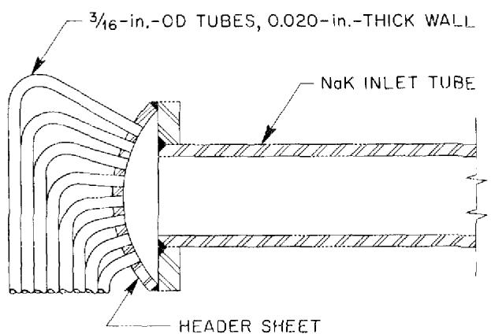  
UNCLASSIFIED ORNL-LR-DWG 1605   
Fig. 3.3. Section Through Header Region of a Tube Bundle for a 60-Mw Heat Exchanger.

# REACTOR PHYSICS

W. K. Ergen

ANP Division

Estimates of the xenon poisoning4 of the 60-Mw Reflector-Moderated Reactor (power density 1.35 kw/cc) indicate that unless the xenon is rather rapidly purged from the fuel during operation a reactivity loss of the order of a few per cent will occur. Also, the maximum xenon concentration after shutdown would give a reactivity loss of about $10\%$ or more. A control mechanism capable of compensating for such reactivity losses would be rather complicated, and the added uranium concentration would be highly undesirable. Therefore, an experiment is now being planned to determine whether the xenon can be adequately purged.

The elaborate coding of the multigroup calculations, mentioned in the previous report, has temporarily been set aside. Instead, a three-group three-region code is being prepared which does not exceed the present capabilities of the ORACLE. This code is adequate for a variety of problems, and the use of the ORACLE is far more convenient than the use of an out-of-town machine.

The possibility of the coupling of mechanical oscillations with nuclear-power oscillations in the Reflector-Moderated Reactor was studied, since such coupling is known to be capable, in principle, of creating antidamped oscillations. In particular, the possibility of the reactor oscillating mechanically like a Helmholtz resonator was investigated. The antidamped oscillations cannot occur if the frequency of the mechanical oscillations is very much higher than the frequency of the nuclear-power oscillations, as will be the case in the 60-Mw CFRE.

# REACTOR CALCULATIONS

M.E.LaVerne

ANP Division

C. S. Burtnette

United States Air Force

Core radii of 20, 30, 40, and $60~\mathrm{cm}$ , fuel thicknesses of 5, 10, 15, and $20~\mathrm{cm}$ , and extrapolated

reflector thicknesses of 20, 30, and 40 cm were selected for calculations of the set of related reactors referred to previously.7 Poison (sodium and Inconel) distributions in the reflector and island were obtained from a previous study.8 The

fluoride fuel NaF-ZrF4-UF4 (53.5-40.0-6.5 mole %) was used for the entire set of calculations. From the set of 48 reactors determined by the specified independent parameters, it was found possible to select 30 reactors that would give results that could be used to cross-plot and interpolate the properties of the 18 omitted reactors to an accuracy sufficient for this survey. The results obtained are summarized in Figs. 3.4, 3.5, 3.6, and 3.7.

  
ORNL-LR-DWG 1177

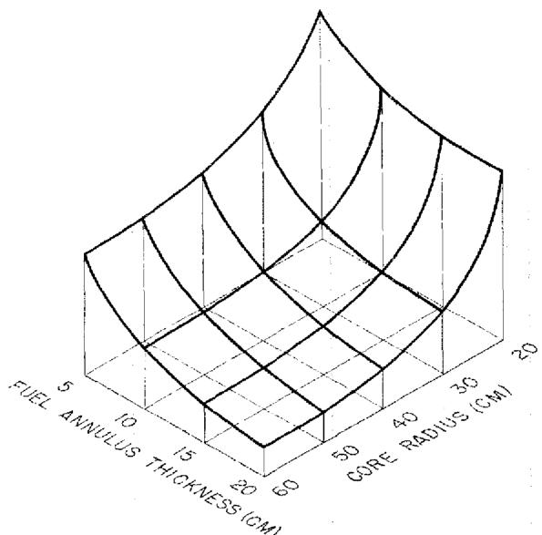  
REFLECTOR THICKNESS = 20 CM

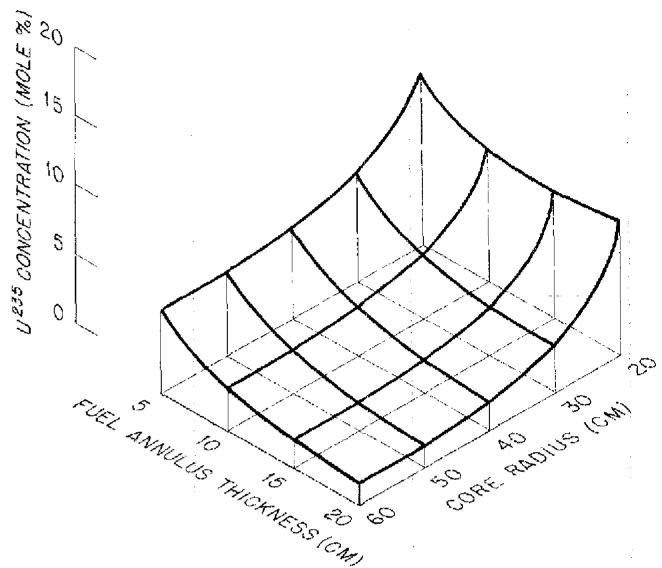  
REFLECTOR THICKNESS $= 30$ cm

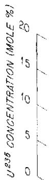

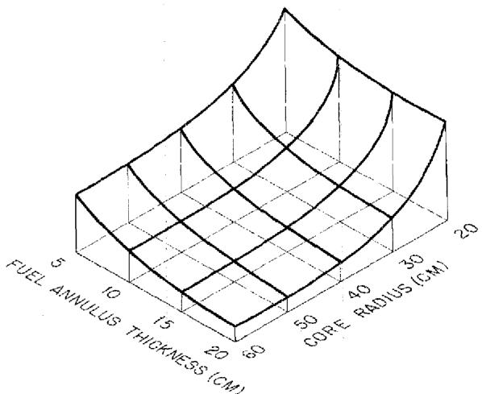  
REFLECTOR THICKNESS = 40 CM   
Fig. 3.4. Effect of Reactor Dimensions on Concentration of $\mathsf{U}^{235}$ in Fuel.

In view of stringent limitations on permissible uranium concentrations in the fuel, it is clear from Fig. 3.4 that there exists a considerable advantage in increasing reflector thickness from 20 to $30~\mathrm{cm}$ but exceedingly little advantage in a further increase to $40~\mathrm{cm}$ . The remaining figures have, therefore, been restricted to a $30\mathrm{-cm}$ reflector thickness.

The effect on total uranium investment of the reactor dimensions and the external fuel volume, such as would exist in a heat exchanger external to the core, is shown in Fig. 3.5. The surface shown for zero external volume is, of course, simply that for critical mass. At a core radius of $30\mathrm{cm}$ the critical mass is virtually independent of fuel thickness. In the surfaces for both the

EXTRAPOLATED REFLECTOR  
THICKNESS = 30 CM

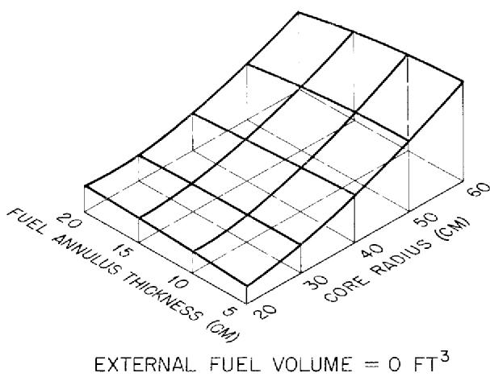

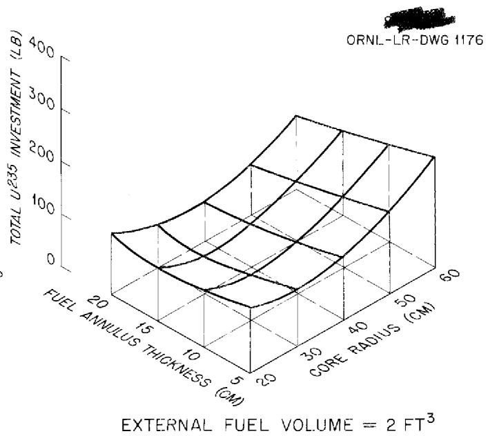

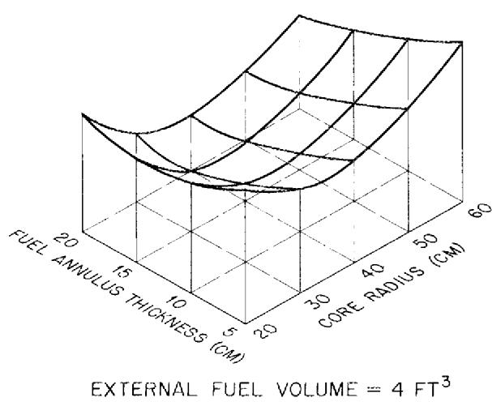

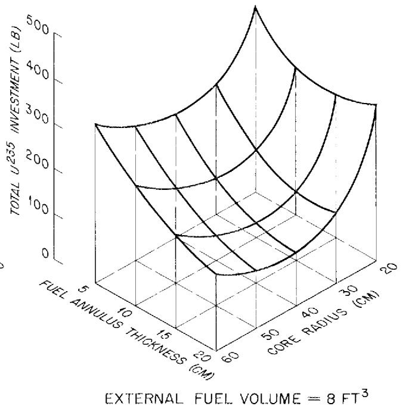  
Fig. 3.5. Effect of Reactor Dimensions and External Fuel Volume on Total $U^{235}$ Investment.

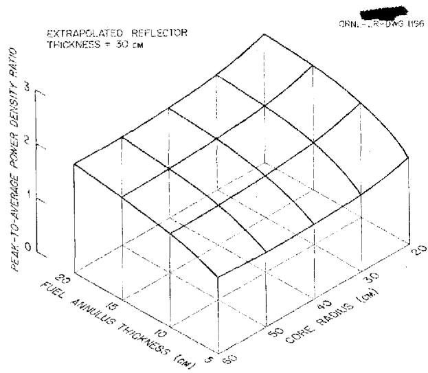  
Fig. 3.6. Effect of Reactor Dimensions on Outside Peak-to-Average Power-Density Ratio in Core of Reflector-Moderated Reactor.

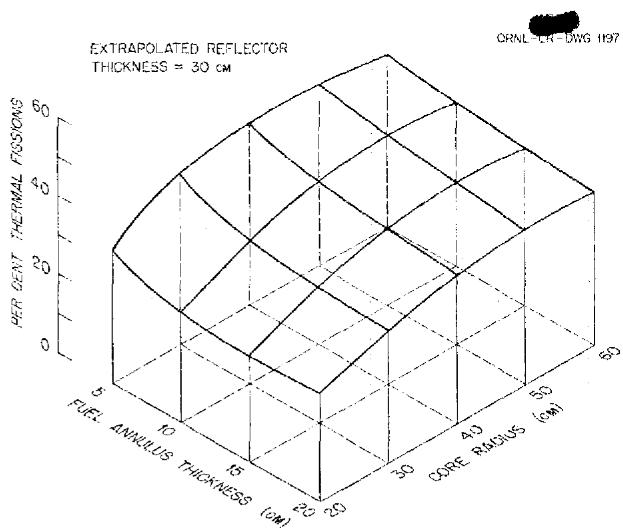  
Fig. 3.7. Effect of Reactor Dimensions on Per Cent Thermal Fissions in Core of Reflector-Moderated Reactor.

2- and 4-cu ft external volumes, simple visual examination indicates the probable existence of an optimum set of proportions. Whether any closed contours (as required for an absolute minimum) actually exist has not yet been determined. The reversal of scales for the 8-cu ft surface was necessitated by the existence of an extreme peak at what was the front corner.

The effect of reactor dimensions on outside peak-to-average power-density ratio is shown in Fig. 3.6. The effects here are not large; an increase in core radius from 20 to $60~\mathrm{cm}$ at a constant fuel thickness gives a decrease in the ratio of about $20\%$ , while an increase in the fuel thickness from 5 to $20~\mathrm{cm}$ at a constant core radius results in an increase in the ratio of about $33\%$ .

The per cent thermal fissions as a function of reactor dimensions is shown in Fig. 3.7. The least-thermal reactor (28%) has the thickest fuel layer and the smallest core, while the most-thermal reactor (45%) has the thinnest fuel layer and the largest core.

When the 60-Mw design reactor7 was modified by deleting the Inconel tubes and their surrounding stagnant sodium and fitting the resulting voids with beryllium, the critical mass decreased by $29\%$ , that is, from an original value of 40.7 lb to 29.0 lb. This percentage decrease was duplicated by $\mathrm{NDA}^9$ in a calculation on a 300-Mw reflector-moderated reactor for which the same method of poison reduction was employed.

The Curtiss-Wright Corporation, under contract to USAF, is performing an extensive series of multigroup, multiregion calculations on the IBM-701 for the ORNL-ANP Project. Specifications for these calculations are being prepared by the ORNL-ANP General Design and Reactor Physics Groups in cooperation with Curtiss-Wright.

Critical mass limits computed by Curtiss-Wright for the two-region, Teflon-uranium foil core, beryllium-reflected critical experiment as affected by foil thickness and space-point interval are listed in Table 3.2. These results agree quite well with the UNIVAC calculation previously reported.[7]

TABLE 3.2. CRITICAL MASS LIMITS FOR RHOMBICUBOCTAHEDRON CRITICAL EXPERIMENTS   

<table><tr><td>FOIL THICKNESS (mils)</td><td>\( \Delta r \) (cm)</td><td>CRITICAL MASS (1b of \( U^{235} \))</td></tr><tr><td>0*</td><td>1.828</td><td>14</td></tr><tr><td>10</td><td>0.457</td><td>18</td></tr></table>

*Homogeneous mixture.

Part II

MATERIALS RESEARCH

# 4. CHEMISTRY OF MOLTEN MATERIALS

# W. R. Grimes   Materials Chemistry Division

The experimental studies of the chemistry of molten materials have been devoted almost exclusively to fluoride systems of interest as fuels. Considerable attention has been paid, during the quarter, to systems in which the uraniferous material consists wholly or in part of $\mathsf{UF}_3$ .

Studies of phase equilibrium by the method of thermal analysis have been continued. This technique has been applied to exploratory studies in mixed chloride-fluoride systems. Quenching techniques have been significantly improved and have been used, with petrographic and x-ray examination of the melts so produced, to virtually finish the elucidation of the complex NaF-ZrF $_4$ system. Differential thermal analysis and filtration techniques have been used in several phase-equilibrium experiments, and an apparatus for visual observation of liquidus temperatures has been tested and found to be satisfactory.

The solubility of $\mathsf{UF}_3$ in several molten-salt systems has been examined experimentally. It appears that attainable concentrations of $\mathsf{UF}_3$ in $\mathsf{ZrF}_4$ -based fuels are insufficient to fuel aircraft reactors; however, use of $\mathsf{UF}_3$ and $\mathsf{UF}_4$ in such mixtures appears to be promising. The $\mathsf{UF}_3$ compound is apparently sufficiently soluble in NaF-LiF-KF mixtures (which would require Li7 for utilization) to make such fuels attractive; the use of NaF-RbF-LiF mixtures as solvents for $\mathsf{UF}_3$ (without $\mathsf{UF}_4$ ) has not yet been shown to be possible.

The large-scale (250-lb-capacity) equipment for the production of fluoride mixtures has been reactivated and is now in three-shift five-day operation for furnishing the $\mathsf{ZrF}_4$ -based materials required for large-scale testing at ORNL and other installations.

# QUENCHING EXPERIMENTS WITH FLUORIDE SYSTEMS

R.E.Thoma

R.E.Moore

M. S. Grim

C.J.Barton

Materials Chemistry Division

G.D. White H. Insley, Consultant Metallurgy Division

The major part of the quenching work with compositions in the NaF-ZrF $_4$ system has been com

pleted and a revised diagram for the system is presented. Work on the $\mathsf{NaF - UF_4}$ system continued, but further work will be required before a revised diagram can be completed. It is anticipated that attention will shift from the binary system to the $\mathsf{NaF - ZrF_4 - UF_4}$ system and possibly the $\mathsf{NaF - ZrF_4 - UF_3}$ system in the near future.

# NoF-ZrF4

The methods and apparatus for performing quenching experiments were described previously. During this quarter, all the quenching experiments were made by heating the sample up to, but not above, the quenching temperature.

The incongruent melting point of the compound $\mathrm{Na}_3\mathrm{Zr}_4\mathrm{F}_{19}$ was established as $538^{\circ}\mathrm{C}$ by quenching mixtures with 57 and 60 mole $\%$ $\mathrm{ZrF_4}$ . The liquidus temperatures of mixtures with 57 and 60 mole $\%$ $\mathrm{ZrF_4}$ were found to be $546\pm 5^{\circ}\mathrm{C}$ and $609\pm 5^{\circ}\mathrm{C}$ , respectively. The 57 mole $\%$ $\mathrm{ZrF_4}$ composition (almost $100\%$ $\mathrm{Na}_3\mathrm{Zr}_4\mathrm{F}_{19}$ ) was converted to $\mathrm{ZrF_4}$ and liquid at $538^{\circ}\mathrm{C}$ . From the shape of the liquidus curve and from x-ray diffraction studies of large samples of slowly cooled mixtures, it appears that the $\mathrm{ZrF_4}$ primary-phase field extends to about 56 mole $\%$ $\mathrm{ZrF_4}$ in the $\mathrm{NaF - ZrF_4}$ system.

Quenching and glass-devitrification experiments indicate that the liquidus-solidus temperature of the 47 mole $\%$ $\mathsf{ZrF_4}$ composition is about $522^{\circ}C,$ and the liquidus-solidus temperature of the 50 mole $\%$ $\mathsf{ZrF_4}$ composition is about $511^{\circ}C.$ Recently, a very careful thermal-analysis comparison of the 47 and 50 mole $\%$ $\mathsf{ZrF_4}$ mixtures showed that the 47 mole $\%$ mixture melts and freezes sharply at $520^{\circ}C$ and the 50 mole $\%$ mixture freezes sharply at $510^{\circ}C.$ These results mean that the single phase which is always obtained on cooling 47 mole $\%$ $\mathsf{ZrF_4}$ compositions is a congruently melting compound $(\mathsf{Na}_{9}\mathsf{Zr}_{8}\mathsf{F}_{41})$ while the 50 mole $\%$ $\mathsf{ZrF_4}$ composition is near a eutectic of $\mathsf{Na}_{3}\mathsf{Zr}_{4}\mathsf{F}_{19}$ and $\mathsf{Na}_{9}\mathsf{Zr}_{8}\mathsf{F}_{41}$ .

A phase referred to as R-3 has appeared in association with glass in compositions ranging

from 45 to 57 mole $\%$ ZrF. This phase forms only when large quench samples are used, that is, under poor quenching conditions. Experiments with very small samples at various temperatures have failed to produce R-3. It was concluded from these experiments that R-3 does not have a stable existence in the binary system but is an easily crystallized metastable compound (probably NaZrF) that is produced by fairly rapid cooling below the equilibrium liquidus temperature.

Petrographic and x-ray diffraction examination of slowly cooled preparations led to the postulation of the existence of a weakly birefringent compound $\mathsf{Na}_3\mathsf{Zr}_2\mathsf{F}_{11}$ and a series of solid solutions between it and $\mathsf{Na}_9\mathsf{Zr}_8\mathsf{F}_{41}$ . Petrographic examinations of samples of 43 and 45 mole $\%$ $\mathsf{ZrF}_4$ compositions heated to $483^{\circ}\mathsf{C}$ and held for 20 hr, before quenching, definitely pointed to an immiscibility gap in this series between about 42 and 44 mole $\%$ $\mathsf{ZrF}_4$ .

Petrographic examinations of a large number of quenched samples with between 39 and 45 mole $\%$ $\mathsf{ZrF}_4$ led to the conclusion that $\mathsf{Na}_3\mathsf{Zr}_2\mathsf{F}_{11}$ is not stable at the liquidus temperature. In 47 to 42 mole $\%$ $\mathsf{ZrF}_4$ compositions, the solid solution $\mathsf{Na}_9\mathsf{Zr}_8\mathsf{F}_{41}$ is the primary phase. The liquidus temperatures of compositions with 47, 45, 43, and 42 mole $\%$ $\mathsf{ZrF}_4$ are about 522, 520, 517, and $508^{\circ}\mathrm{C}$ , respectively. In 39 and 40 mole $\%$ $\mathsf{ZrF}_4$

compositions, the primary phase is $\mathrm{Na}_{2}\mathrm{ZrF}_{6}$ . The liquidus temperature for the 39 mole $\%$ $\mathrm{ZrF}_{4}$ composition is above $513^{\circ}\mathrm{C}$ , and for the 40 mole $\%$ $\mathrm{ZrF}_{4}$ composition it is near $510^{\circ}\mathrm{C}$ . For the 41 mole $\%$ composition the liquidus temperature is about $502^{\circ}\mathrm{C}$ , and this composition is near a eutectic between $\mathrm{Na}_{2}\mathrm{ZrF}_{6}$ and the $\mathrm{Na}_{9}\mathrm{Zr}_{8}\mathrm{F}_{41}$ solid solution. Below about $488^{\circ}\mathrm{C}$ , $\mathrm{Na}_{3}\mathrm{Zr}_{2}\mathrm{F}_{11}$ appears as fine-grained fibers. Slowly cooled compositions with about 40 mole $\%$ $\mathrm{ZrF}_{4}$ usually undergo a reaction just after complete solidification that produces a fluff of very fine-grained material. According to x-ray diffraction results, this material is a mixture of $\mathrm{Na}_{3}\mathrm{Zr}_{2}\mathrm{F}_{11}$ and $\mathrm{Na}_{9}\mathrm{Zr}_{8}\mathrm{F}_{41}$ . It is likely that the reaction is the solid-state conversion at about $488^{\circ}\mathrm{C}$ of the eutectic into these compounds. The formation of $\mathrm{Na}_{3}\mathrm{Zr}_{2}\mathrm{F}_{11}$ in the solid state explains why it has always been found as fine grains.

A number of different forms of $\mathsf{Na}_2\mathsf{ZrF}_6$ have been observed, and quenching experiments have been conducted to establish the transition temperatures. This work is not yet complete, but the approximate temperatures are known. The phases which have been found and the optical properties and the approximate temperatures at which these phases are stable are given in Table 4.1. The temperature of transition from phase 5 to phase 4

TABLE 4.1. CRYSTAL MODIFICATIONS OF ${\mathrm{{Na}}}_{2}{\mathrm{Z}}_{\mathrm{r}}{\mathrm{F}}_{6}$   

<table><tr><td>PHASE</td><td>OPTICAL PROPERTIES</td><td>APPROXIMATE TEMPERATURE (°C)</td></tr><tr><td>1</td><td>Isotropic</td><td>545 to 620</td></tr><tr><td rowspan="2">2</td><td>Uniaxially positive, O = 1.406</td><td rowspan="2">540 to 545</td></tr><tr><td>E = 1.408</td></tr><tr><td rowspan="2">3</td><td>Uniaxially positive, O = 1.376</td><td rowspan="2">505 to 540</td></tr><tr><td>E = 1.386</td></tr><tr><td rowspan="2">4</td><td>Biaxially positive, γ = 1.412</td><td rowspan="2">Below 460</td></tr><tr><td>α = 1.408</td></tr><tr><td rowspan="2">5</td><td>Biaxially negative, γ = 1.419</td><td rowspan="2"></td></tr><tr><td>α = 1.412</td></tr><tr><td rowspan="2">6</td><td>Biaxially negative, γ = 1.429</td><td rowspan="2"></td></tr><tr><td>α = 1.420</td></tr></table>

is not known, but it is below $460^{\circ}C$ .

Phases 3 and 4 have been found in quenches of mixtures with 37 and 40 mole $\%$ $\mathsf{ZrF}_4$ at the appropriate temperatures. The refractive indices were the same as for the 33 mole $\%$ $\mathsf{ZrF}_4$ composition, and thus there appears to be little or no solid-solution range for these phases.

The phase diagram presented in Fig. 4.1 represents the data discussed here and in previous reports. Thermal data obtained from cooling curves, together with visual observation of the $\mathrm{Na}_3\mathrm{ZrF}_7$ compound, were the chief sources of liquidus temperatures in the 0 to 30 mole $\%$ $\mathrm{ZrF}_4$ region. The $\mathrm{Na}_3\mathrm{ZrF}_7$ compound was observed to melt rather sharply between 840 and $850^{\circ}\mathrm{C}$ to a clear liquid that permitted observation of turbidity on cooling to a temperature slightly above $850^{\circ}\mathrm{C}$ . The liquidus temperatures in the 60 to 100 mole $\%$ $\mathrm{ZrF}_4$ region were obtained from thermal data.

# NaF-UF4

Eight samples covering the range in the NaF-UF $_4$ system from 18 to 67 mole $\%$ UF $_4$ , chosen to fill insofar as possible the gaps in the knowledge of the system,² were mixed and hydrofluorinated to minimize oxide contamination. These slowly cooled specimens were examined by petrographic and x-ray techniques. The results of this examination, some of which were published previously, are shown in Table 4.2.

$^{3}$ R. E. Moore, C. J. Barton, and T. N. McVay, ANP Quar. Prog. Rep. Sept. 10, 1953, ORNL-1609, p 59.

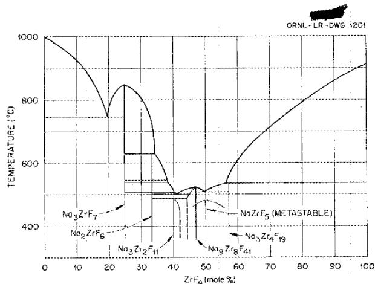  
Fig. 4.1. Phase Diagram of the NaF-ZrF₄ System.

TABLE 4.2. PHASES PRESENT IN SLOWLY COOLED NaF-UF ${}_{4}$ MIXTURES   

<table><tr><td>COMPOSITION (mole % UF4)</td><td>PHASES IDENTIFIED BY PETROGRAPHIC AND X-RAY DIFFRACTION ANALYSES</td></tr><tr><td>18</td><td>β3-Na2UF6, Na3UF7, NaF</td></tr><tr><td>22</td><td>β3-Na2UF6, NaF</td></tr><tr><td>25</td><td>β3-Na2UF6, Na3UF7, NaF (trace)</td></tr><tr><td>28</td><td>β3-Na2UF6 (major), Na3UF7</td></tr><tr><td>30</td><td>β3-Na2UF6 (major), Na3UF7</td></tr><tr><td>31.5</td><td>β3-Na2UF6</td></tr><tr><td>33.3</td><td>β3-Na2UF6</td></tr><tr><td>35</td><td>β3-Na2UF6 (major), NaUF5</td></tr><tr><td>37</td><td>β3-Na2UF6 (major), NaUF5</td></tr><tr><td>38.5</td><td>β3-Na2UF6 (major), NaUF5</td></tr><tr><td>40</td><td>β3-Na2UF6, NaUF5</td></tr><tr><td>43</td><td>β3-Na2UF6, NaUF5</td></tr><tr><td>46</td><td>β3-Na2UF6, NaUF5 (major)</td></tr><tr><td>48</td><td>NaUF5, UF4 (trace)</td></tr><tr><td>50</td><td>NaUF5 (major), β3-Na2UF6, UF4, UO2(trace)</td></tr><tr><td>53</td><td>NaUF5 (major), UF4</td></tr><tr><td>67</td><td>NaUF5, UF4</td></tr></table>

Small portions of these specimens have been used with conventional techniques in quenching experiments. From 18 to 30 quenches have been made on portions of all specimens except the $\mathsf{Na}_2\mathsf{UF}_6$ composition, for which a total of about 80 attempts has been made. By quenching specimens from temperatures as high as $1022^{\circ}\mathsf{C}$ to as low as $399^{\circ}\mathsf{C}$ , it has been established that four crystalline forms of the $\mathsf{Na}_2\mathsf{UF}_6$ composition exist. These crystalline modifications are $\alpha$ (cubic), $\beta_2$ (hexagonal), $\beta_3$ (hexagonal), and $\gamma$ (orthorhombic). In no case could the $\mathsf{Na}_2\mathsf{UF}_6$ be quenched completely to glass; the $\alpha$ and $\gamma$ forms occurred in quenches from $637^{\circ}\mathsf{C}$ or higher. The $\gamma$ form appears to be most prevalent in the more rapid quenches. The $\beta_3$ form has been observed as the major phase in large, slowly cooled melts and in most quenches from temperatures below $637^{\circ}\mathsf{C}$ . The $\beta_2$ form has been prepared in a practically pure state in the

temperature range of 612 to $589^{\circ}C$ by using samples somewhat larger than those customarily used in quenching experiments.

In general, the quenching data indicate that $\mathsf{NaUF}_5$ is the most uranium-rich compound in the NaF-UF4 system. It is anticipated that a definitive diagram of this binary system will be prepared during the next quarter.

# VISUAL OBSERVATION OF MELTING TEMPERATURES

R.J.Sheil

C.J.Barton

Materials Chemistry Division

An apparatus has been constructed that permits visual observation of fused fluoride and chloride mixtures at high temperatures under an inert atmosphere. It consists of a $2\frac{1}{2}$ -in.-OD metal pipe threaded at the ends and mounted vertically. Glass disks gasketed with Teflon are fitted to the tube ends. Large nuts are used to compress the gaskets which form virtually gas-tight connections. Water-cooled copper coils are used to cool the furnace ends and to protect the Teflon gaskets. The inert gas, usually argon, is maintained at slightly above atmospheric pressure; a slow flow of gas enters near the bottom of the apparatus and leaves near the top.

Samples are placed in 20-ml nickel crucibles supported on a tripod near the center of the furnace. A bare chromel-alumel thermocouple junction is immersed in the fluoride sample. The thermocouple was checked at the sodium chloride melting point after several exposures to molten fluorides; it was found that the slight corrosion had not affected the emf output.

Visual observations have been confined thus far to a few compositions in the NaF-ZrF and the NaF-UF systems. However, the usefulness of the equipment for confirmation of liquidus and solidus temperatures has been demonstrated, and its use in phase studies will undoubtedly increase.

# DIFFERENTIAL THERMAL ANALYSIS OF THE NaF-ZrF₄ SYSTEM

R. A. Bolomey  
Materials Chemistry Division

A critical study of the differential thermal-analysis data collected for the NaF-ZrF4 system shows that they are consistent with petrographic and x-ray analysis data obtained from quenching and

devitrification experiments. A comprehensive report on the technique for differential thermal analysis is being prepared. The report will describe the theory of differential thermal analysis in a qualitative manner, the preparation of the samples, the experimental technique, the interpretation of the data, and the precision and accuracy of the method. Suggestions for further improvements of the method will be included.

# Filtration Analysis of Fluoride Systems

R.J.Sheil

C.J.Barton

R. E. Thoma

Materials Chemistry Division

G. D. White

Metallurgy Division

The filtration apparatus was diverted from phase studies to solubility determinations during this quarter because of the urgent need for data on the solubility of $\mathsf{UF}_3$ in alkali fluorides and in NaF $\mathsf{ZrF}_4$ mixtures. A few experiments were made, however, to demonstrate the solubility of $\mathsf{UF}_4$ in the NaF-RbF-LiF eutectic and to define the primary phase in some NaF-ZrF mixtures.

$$
N a F - Z r F _ {4}
$$

One filtration was carried out in the $\mathsf{NaF - ZrF_4}$ system to supplement information obtained by other techniques. A mixture containing 63 mole $\%$ $\mathsf{ZrF}_4$ was filtered at $552^{\circ}C,$ and 79.5 wt $\%$ of the material filtered. The filtrate contained 55 mole $\%$ $\mathsf{ZrF}_4$ and was predominantly $\mathsf{Na}_3\mathsf{Zr}_4\mathsf{F}_{19}$ with a small amount of $\mathsf{Na}_9\mathsf{Zr}_8\mathsf{F}_{41}$ . The residue analyzed 78.5 mole $\%$ $\mathsf{ZrF}_4$ and was predominantly $\mathsf{ZrF}_4$ with some $\mathsf{Na}_3\mathsf{Zr}_4\mathsf{F}_{19}$ and $\mathsf{Na}_9\mathsf{Zr}_8\mathsf{F}_{41}$ . These results, which demonstrate that $\mathsf{ZrF}_4$ is the primary phase in the 63 mole $\%$ $\mathsf{ZrF}_4$ composition, lend support to the revised diagram for the $\mathsf{NaF - ZrF}_4$ system (Fig. 4.1).

$$
N a F \cdot L i F \cdot R b F \cdot U F _ {4}
$$

The solubility of $\mathsf{UF}_4$ in the NaF-LiF-RbF eutectic at $500^{\circ}\mathrm{C}$ was determined by filtering a mixture of the following calculated composition (in mole %) 5.8 NaF-40.3 LiF-49.9 RbF-4.0 UF. A cooling curve obtained prior to the filtration showed a questionable thermal effect at $542^{\circ}\mathrm{C}$ and a definite break at $428^{\circ}\mathrm{C}$ , that is, slightly below the melting point of the ternary alkali fluoride eutectic $(435^{\circ}\mathrm{C})$ . About $90\%$ of the charge material

passed through the filter at $500^{\circ}\mathrm{C}$ . All the uranium was apparently in the form of $\mathsf{Rb}_3\mathsf{U}\mathsf{F}_7$ complex. Petrographic examination showed that the filtrate contained about 10 to 20 wt % of this uranium compound and that the residue contained approximately 50 wt%. Chemical analyses of the separated phases gave the following compositions (in mole %):

<table><tr><td></td><td>In Filtrate</td><td>In Residue</td></tr><tr><td>LiF</td><td>48.5</td><td>30.3</td></tr><tr><td>NaF</td><td>6.9</td><td>9.4</td></tr><tr><td>RbF</td><td>41.7</td><td>50.2</td></tr><tr><td>UF4</td><td>2.8 (10.2 wt %)</td><td>10.1</td></tr></table>

The chemical analyses appear to confirm the petrographic finding that a $\mathsf{RbF - UF_4}$ complex is the primary phase that separates from the NaF-LiF-RbF-UF4 mixture. This result was not unexpected because phase studies of the alkali fluoride-UF4 systems have shown that $\mathsf{Rb}_3\mathsf{U}\mathsf{F}_7$ has the highest melting point and is the most stable of the UF4 complexes that can be formed by the components present in the NaF-LiF-RbF-UF4 system.

# THERMAL ANALYSIS OF FLUORIDE SYSTEMS

L.M.Bratcher A.B.Wilkerson

Materials Chemistry Division

G.D. White T.N.McVay, Consultant

Metallurgy Division

Preliminary data on the NaF-ZrF4-UF3 and NaF-ZrF4-UF4-UF3 systems disclose that conventional thermal-analysis techniques do not give a reliable indication of liquidus temperatures in these potentially useful systems. The apparatus developed for thermal analysis of chloride systems, which consists of a flanged stainless steel container which holds the samples in nickel crucibles, has been found useful for thermal analysis of these UF3-bearing systems. An investigation of phase behavior in the NaF-CrF3 system has been initiated because of the importance of CrF3 in corrosion of Inconel and stainless steels by molten fluorides. Work on the NaF-ThF4 system has been concluded, although the results obtained are not completely satisfactory; should this system become important other techniques will be required for establishing the phase behavior.

# LiF-UF3

Efforts to obtain data on mixtures in the LiF-UF $_3$ system were made rather early in the phase-study program, but the results were unsatisfactory because of the presence of UF $_4$ and $\mathsf{UO}_2$ in the fused mixtures. Relatively pure LiF-UF $_3$ mixtures can be produced by adding $100\%$ excess of uranium metal to a previously fused LiF-UF $_4$ mixture. The few data obtained for the relatively pure mixtures indicate that there is a eutectic containing about 25 mole $\%$ of UF $_3$ that melts at approximately $770^{\circ}\mathsf{C}$ . Petrographic examination of the fused mixtures showed only LiF and UF $_3$ . It is thought that the LiF-UF $_3$ mixtures probably comprise a simple eutectic system.

# NaF-UF3

Data previously reported4,5 indicated the existence of one eutectic and one compound in the NaF-UF3 system. When a mixture containing 33 mole $\%$ UF3 and 67 mole $\%$ NaF was prepared by fusing NaF with previously prepared UF3, thermal effects were noted at 750, 695, 650, and $595^{\circ}C$ . These data agree quite well with the earlier data, but the petrographic examination of the mixture showed the presence of a green, presumably oxidized, phase in addition to the lavender NaF-UF3 complex. Further study of this system is planned.

# RbF-UF3

Very few compositions prepared in the RbF-UF $_3$ system were free of $\mathsf{UO}_2$ and UF $_4$ complexes. The only compound which has been observed (either Rb $_2$ UF $_5$ or Rb $_3$ UF $_6$ ) is described as a brown-orange isotropic phase with a refractive index of 1.44. The 33.3 mole % UF $_3$ composition showed a thermal effect at $860^{\circ}\mathsf{C}$ . The method of preparing alkali fluoride-UF $_3$ mixtures by adding an excess of uranium metal to UF $_4$ mixtures is not suitable for the RbF-UF $_3$ system because the reduction of RbF by uranium gives volatile metallic rubidium.

# KF-LiF-UF3

A KF-LiF-UF $_3$ (48-48-4 mole %) mixture was prepared by reducing a previously fused KF-LiF-UF $_4$ mixture with 100% excess uranium metal. Thermal effects were noted on the cooling curve

at 558, 540, and $487^{\circ}C$ . It is probable, although not yet established, that the thermal effect at $558^{\circ}C$ represents the true liquidus temperature for this composition. The fused melt contained about $15\%$ of an orange, low-birefringent phase of refractive index 1.43 and colorless isotropic materials with the refractive indices of KF and LiF. These two alkali fluorides apparently do not form a complex comparable to the LiF-RbF complex.

# RbF-LiF-UF3

A RbF-LiF-UF3 (56-40-4 mole %) mixture was prepared by mixing uranium metal and previously prepared UF3 with the fused alkali fluorides. No thermal effect was observed above 475°C, the melting point of the RbF-LiF eutectic. Since the filtration experiments reported above indicate that the liquidus temperature for a similar composition is above 550°C, it is concluded that the first separation of a UF3-containing phase from ternary mixtures in this region cannot be readily detected by conventional thermal-analysis techniques. Petrographic examination revealed that the melt contained a colorless birefringent phase, presumably a LiF-RbF complex, and a brownish isotropic phase that was probably a RbF-UF3 complex.

# NaF-ZrF4-UF4-UF3

A series of samples with various amounts of the $\mathsf{UF}_4$ was prepared in sealed nickel capsules in a mixture that contained initially NaF-ZrF- $\mathsf{UF}_4$ (53.5-40-6.5 mole %) with sodium metal added to reduce the UF to UF. When the capsules had been heated to maximum temperatures of about $900^{\circ}C$ they were inverted so that the contents would mix. Duplicate cooling curves were ob

tained with each composition by reheating and remixing the contents. The data obtained are presented in Table 4.3. In the data, the dilution of the melt by the NaF produced in the reaction is disregarded.

The data seem to indicate a minimum melting point when a little more than one-half the uranium is reduced. Petrographic examination of the fused melts showed a regular gradation of properties in the series. Two phases were observed in the unreduced mixture, the $\mathrm{Na}_{9}(\mathrm{Zr},\mathrm{U})_{8}\mathrm{F}_{41}$ solid solution and a small amount of colorless $\mathrm{Na}_{2}\mathrm{ZrF}_{6}$ . Four phases were observed in the reduced mixtures: $\mathrm{UF}_{3}$ , a yellow isotropic material, a yellow-green solid solution, and $\mathrm{Na}_{2}\mathrm{ZrF}_{6}$ . With increasing degrees of reduction, the solid solution became increasingly yellow, and the isotropic yellow phase, free $\mathrm{UF}_{3}$ , and yellow-green $\mathrm{Na}_{2}\mathrm{ZrF}_{6}$ appeared in increasing amounts. This crystalline form of $\mathrm{Na}_{2}\mathrm{ZrF}_{6}$ , usually referred to as "normal" $\mathrm{Na}_{2}\mathrm{ZrF}_{6}$ , does not, according to present knowledge, dissolve tetravalent uranium.

# NaF-ThF4

Thermal analysis of the $\mathsf{NaF - ThF_4}$ system has given data which are difficult to interpret. Petrographic examination of the fused melts has failed to clarify the situation; $\mathsf{Na}_2\mathsf{ThF}_6$ was the only crystalline phase that could be definitely identified. The further study that would be needed for clarification does not appear to be justified at this time, and therefore the available data are presented in the form of a tentative diagram (Fig. 4.2). Petrographic examination of some melts made recently indicated that the 50-50 composition is close to a pure compound and suggested that another crystal

TABLE 4.3. THERMAL EFFECTS OBSERVED WITH NaF-ZrF ${}_{4}$ -UF ${}_{4}$ -UF ${}_{3}$ COMPOSITIONS   

<table><tr><td rowspan="2">COMPOSITION (mole % UF3, calculated)</td><td colspan="2">THERMAL EFFECTS (°C)</td></tr><tr><td>First Cooling Curve</td><td>Second Cooling Curve</td></tr><tr><td>0</td><td>565, 530 (halt), 490</td><td>557, 528, 492</td></tr><tr><td>1.5</td><td>555, 535, 510</td><td>576,525</td></tr><tr><td>3.0</td><td>510, 500</td><td>507, 500 (halt)</td></tr><tr><td>4.5</td><td>507, 495</td><td>509, 495</td></tr><tr><td>5.5</td><td>540, 519 (halt)</td><td>550, 520</td></tr><tr><td>6.5</td><td>525, 487</td><td>525, 490</td></tr></table>

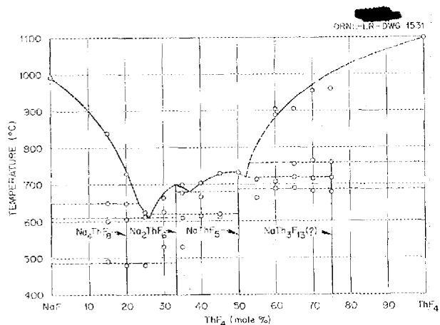  
Fig. 4.2. Tentative Phase Diagram of the NaF-ThF4 System.

line phase observed in the 25 and 30 mole $\%$ ThF mixtures might be Na4ThF8. Zachariasen reported the existence of this compound. These examinations also showed that more oxide was present in compositions formed by adding ThF to the 50-50 mixture than in those formed by adding NaF. Therefore it seems probable that oxide and/or water in the ThF is the major source of oxygen in the fused NaF-ThF4 composition.

$$
\mathrm {L i F} \cdot \mathrm {B e F} _ {2} \cdot \mathrm {T h F} _ {4} \cdot \mathrm {U F} _ {4}
$$

Preliminary examination has been made of the $\mathsf{LiF - BeF}_2\cdot \mathsf{ThF}_4\cdot \mathsf{UF}_4$ system which has been considered as a possible fuel for a breeder-power reactor.7 Cooling curves obtained with two mixtures of $\mathsf{LiF - BeF}_2\cdot \mathsf{ThF}_4\cdot \mathsf{UF}_4$ (48.6-48.6-2.7-0.1 mole %) showed thermal effects at 515, 392, and $325^{\circ}\mathrm{C}$ . The thermal effect at $515^{\circ}\mathrm{C}$ was slight but reproducible and probably represents the first separation of a $\mathsf{ThF}_4$ -containing phase. This separation should be confirmed by other techniques, such as filtration or quenching, if this composition continues to be of interest. It is possible that a composition with a higher LiF and a lower $\mathsf{BeF}_2$ content might have a lower liquidus temperature, although presumably such a mixture would be less efficient as a moderator.

# NaF-CrF3

Mixtures containing 5 to $65\%$ $\mathsf{CrF}_3$ in the NaF $\mathsf{CrF}_3$ system have been examined. The thermal data do not serve to define the system uniquely. Petrographic examination indicates the existence of a compound which seems to be $\mathsf{NaCrF}_4$ . Two other crystalline materials have been observed but neither has the optical properties of the $\mathsf{Na}_3\mathsf{CrF}_6$ compound previously described. Thermal effects are observed below the solidus temperature at 25 mole $\%$ $\mathsf{CrF}_3$ ; it is possible that several crystalline modifications of $\mathsf{Na}_3\mathsf{CrF}_6$ exist.

# THERMAL ANALYSIS OF CHLORIDE AND MIXED CHLORIDE-FLUORIDE SYSTEMS

A.B.Wilkerson C.J.Barton

Materials Chemistry Division

T. N. McVay, Consultant

Metallurgy Division

Studies of chloride systems have been continued at a somewhat diminished rate during the past quarter. The systems studied have included a few mixed chloride-fluoride compositions and some binary and ternary systems containing $\mathsf{UCl}_3$ .

# $\mathsf{UCl}_3\mathsf{-UCl}_4$

Conflicting statements about the $\mathsf{UCl}_3\mathsf{-UCl}_4$ system are found in the literature. It was stated by Kraus that the two compounds are only slightly soluble in each other in the liquid state, and he reported a liquidus break for only one composition. The group at Ames, lowa, stated that there is a eutectic in the system at 88 mole $\%$ UCl, with a melting point $14^{\circ}C$ lower than that of the UCl. Five compositions in this system were prepared in sealed capsules, and thermal effects were noted on the cooling curves obtained after the mixtures had been heated to about $850^{\circ}C$ and the capsules had been inverted to obtain mixing of the contents. Samples of UCl and UCl were also heated in sealed capsules. In addition, one UCl-UCI (80-20 mole $\%$ ) mixture was prepared in a nickel container at atmospheric pressure (helium), but it was not heated to such a high temperature as were the

sealed capsules because of the high vapor pressure of UCl.4. The data are given in Table 4.4.

The thermal data give little indication of a eutectic but are not easily interpreted because of the anomalous thermal effects noted with the two components in the sealed capsules. In open containers under an inert atmosphere, only one break was noted on the $\mathsf{UCl}_3$ cooling curve, at $840^{\circ}\mathsf{C}$ and one with $\mathsf{UCl}_4$ , at $565^{\circ}\mathsf{C}$ . Both $\mathsf{UCl}_3$ and $\mathsf{UCl}_4$ were noted petrographically in the fused $\mathsf{UCl}_4$ probably because of reduction of $\mathsf{UCl}_4$ by the container, but this does not seem to account for all the thermal effects noted. Both $\mathsf{UCl}_3$ and $\mathsf{UCl}_4$ were found in all the mixtures, except for the $12\%$ $\mathsf{UCl}_3$ composition, in which no $\mathsf{UCl}_3$ was visible under the microscope. It is possible that oxidation of the $\mathsf{UCl}_3$ may have occurred before the petrographic examination could be completed.

# $\mathsf{U}\mathsf{C}\mathsf{I}_4\text{-}\mathsf{U}\mathsf{F}_4$

Only one composition was prepared in the UCl4- UF4 system, a 50-50 mixture corresponding to the compound UCl2F2 reported in the literature.11 It gave a single thermal effect at $520^{\circ}C$ with an indi

11J.W.Gates, Jr., G.H.Clewett, and H.A.Young, Preparation of a New Mixed Halide of Tuballoy, CD-454 (July 20, 1944); J. W. Gates, Jr., et al., A Mixed Tuballoy Tetrahalide, CD-460 (Aug. 26, 1944).

TABLE 4.4. THERMAL EFFECTS ON COOLING CURVES FOR MIXTURES OF UCI ${}_{3}$ AND UCI ${}_{4}$   

<table><tr><td>THEORETICAL COMPOSITION (mole % UCl3)</td><td>THERMAL EFFECTS (°C)</td></tr><tr><td>100</td><td>835, 768, 520</td></tr><tr><td>80</td><td>797, 535, 488</td></tr><tr><td>60</td><td>798, (a) 540, (a) 495</td></tr><tr><td>40</td><td>762, 542, 497</td></tr><tr><td>20</td><td>622, (b) 545, 531, 497</td></tr><tr><td>20(c)</td><td>670, 555</td></tr><tr><td>12</td><td>720, 548, 500</td></tr><tr><td>0</td><td>602, 540, (a) 515, 498</td></tr></table>

(a)Indicates that undercooling occurred.   
(6)Questionable thermal effect.   
(c) Prepared at atmospheric pressure.

cation of undercooling. Petrographic examination revealed three crystalline phases: $\mathsf{UCl}_4$ , $\mathsf{UF}_4$ , and a bright greenish-blue phase with refractive indices near 1.747. The latter was the principal phase and is believed to be the $\mathsf{UCl}_2\mathsf{F}_2$ compound. Other workers who have attempted to produce the compound by the fusion method have also failed to obtain a pure product. A probable melting point of $460^{\circ}\mathsf{C}$ , based upon their work, was reported for the compound.

# $\mathsf{U}\mathsf{C}\mathsf{I}_3\text{-}\mathsf{U}\mathsf{F}_3$

Five compositions in the $\mathsf{UCl}_3\mathsf{-UF}_3$ system have been prepared in sealed capsules. The thermal data are too meager to permit definite conclusions to be drawn, and petrographic examination of the fused melts was rather difficult. The 50-50 mole $\%$ mixture showed only one thermal effect, at $615^{\circ}\mathrm{C}$ but it is not known whether the mixture was completely liquid above this temperature. The fused mixture was predominantly a single phase with optical properties different from those of the two components; this suggests the possibility of a compound such as $\mathsf{U}_2\mathsf{Cl}_3\mathsf{F}_3$ . Such a compound would be a novelty, since, insofar as is known here, no mixed chloride-fluoride compound of trivalent uranium has been reported.

# KCl-UCI4

The KCl-UCI4 system, studied by Kraus, has received considerable attention in this laboratory because thermal data obtained here14-16 for a part of the system were at variance with the earlier work. The data, particularly the liquidus breaks in the 30 to 60 mole $\%$ UCI4 region, have not been very reproducible. The reaction of UCI4 with the nickel containers is responsible apparently for some of the difficulty. A crystalline growth, identified as NiCl2, appears in the cooler part of the apparatus above the fused melt; apparently it is more volatile than the UCI4 from these mixtures.

Petrographic examination of the fused melts indicated the probable existence of three compounds in this system, but only $\mathsf{K}_2\mathsf{U}\mathsf{C}\mathsf{I}_6$ has been prepared in sufficient purity to be readily identified. The likely compositions for the other two compounds are $\mathsf{K}\mathsf{U}\mathsf{C}\mathsf{I}_5$ and $\mathsf{K}\mathsf{U}_2\mathsf{C}\mathsf{I}_9$ , but since they were not produced free of the other crystalline phases in the system, it seems probable that they melt incongruently. The diagram shown in Fig. 4.3, which is based upon both petrographic and thermal studies of the system, is believed to give a reasonably accurate representation of the phase relationships. No further work on the system is planned at the present time.

# RbCl-UCI

The $\mathsf{RbCl - UCl_4}$ system, for which preliminary data have been reported,17 has been studied considerably less than the KCl-UCI4 system. Cooling curves with mixtures in the $\mathsf{RbCl - UCl_4}$ system containing 5 to 65 mole $\%$ UCI4 yielded very scattered and confusing data. Petrographic examination of several fused mixtures did not aid materially in the interpretation of the thermal data because none of the crystalline phases observed in the fused melts had been prepared in sufficient purity for definite identification. However, the available data seem to indicate that melting points and phase relationships in this system are not markedly different from those shown for the KCl-UCI4 system in Fig. 4.3.

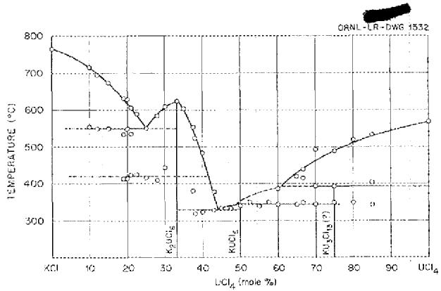  
Fig. 4.3. Tentative Phase Diagram of KCl-UCI $_4$ System.

# KCl-CuCl-UCl3

A eutectic in the KCl-CuCl system that melts at $150^{\circ}\mathrm{C}$ was reported. A mixture corresponding to the reported eutectic composition (65 mole $\%$ CuCl) was prepared by using metallic copper to reduce the $\mathrm{CuCl}_2$ in the CuCl. The resulting mixture, which showed a single thermal effect at $140^{\circ}\mathrm{C}$ , was colorless but contained some opaque inclusions in the crystalline material. No thermal effects were noted on the cooling curves when 2.5 or 5 mole $\%$ UCl $_3$ was added. Petrographic examination of the fused mixture was unsatisfactory, however, since it disclosed only a mass of very fine crystals with opaque material in the aggregates. It is not certain, therefore, that the UCl $_3$ dissolved in the fused KCl-CuCl mixture.

# X-RAY DIFFRACTION STUDIES OF THE NaF-ZrF4 SYSTEM

P. A. Agron M. A. Bredig Chemistry Division

A high-temperature x-ray diffractometer is being utilized to further understanding of the phase transformations that occur in the NaF-ZrF $_4$ system. The equipment, which was originally developed for the temperature range of 1500 to $2200^{\circ}\mathrm{C}$ , was modified to cover the 400 to $900^{\circ}\mathrm{C}$ range. In order to avoid decomposition of binary complexes by partial vaporization, the solid salt is enclosed in a 15-cc beryllium container. The walls were machined to a 10-mil thickness to allow free passage of the x-ray beams. This flanged container has been successfully gasketed to a stainless steel mounting with a combination of gold and copper rings. (In an initial attempt to use a gold gasket in contact with the beryllium, there was rapid deleterious alloying at about $500^{\circ}\mathrm{C}$ .) The sample, about $0.4\mathrm{g}$ of solid material, is held in a flat, nickel holder. This arrangement was successfully tested on the CsCl transition. A more detailed description of this equipment, which is useful only for the examination of solids, will be given at a future date.

In the region of 33 to 40 mole $\%$ ZrF₄ several polymorphic forms of Na₂ZrF₆ are indicated. At the 60% NaF-40% ZrF₄ composition the question of whether a solid solution in the cubic form (a)

of $\mathsf{Na}_2\mathsf{ZrF}_6$ (as in the analogous $\mathsf{Na}_2\mathsf{UF}_6$ system) or a new compound exists, or both, has yet to be settled. Nine separate samples from this composition range were heated successively over temperature intervals from 450 to $575^{\circ}\mathsf{C}$ . A period of 1 hr at a fixed temperature appeared to be sufficient for equilibrating the solid phases.

An analysis of the x-ray data obtained is presented in Table 4.5. The choice of temperatures was influenced by the results of differential thermal analyses and the quenching experiments described above. The data indicate that wide ranges of solid solutions exist in the regions examined. Diffuse scattering would have increased the background in the x-ray diffraction patterns if liquid was present along with the solid. It appears that one or two samples approximating 37 mole $\%$ ZrF $_4$ may have reached the liquidus region at $550^{\circ}\mathrm{C}$ , the highest temperature explored. Further experiments will be carried out before a phase diagram covering this region is drawn.

The phase B-1 was observed for the first time in a high-temperature x-ray pattern and appeared to be easily preserved even on slow cooling, as indicated for the compositions of 33.3, 33.9, and 35.0 mole $\%$ $\mathsf{ZrF}_4$ (Table 4.5). The diffraction pattern of the $(X)$ phase at elevated temperatures appears to be better developed than the pattern observed at room temperature with a quenched sample, "T-12". The agreement of the $(Z)$ phase pattern with the pattern of a quenched "T-5" sample does not appear to be so good.

The x-ray pattern at $495^{\circ}C$ for the 40 mole $\%$ $\mathsf{ZrF}_4$ composition indicates the presence of B-1 and "Z5". The diffraction lines for the (40) phase are coincident with those of "Z5" and therefore cannot be positively identified if the (40) phase is present with an appreciable amount of "Z5". Also, the presence of three phases would indicate that equilibrium had not been established. At room temperature the pattern was that for the (40) phase, some low-temperature polymorphs of "Z6", and a small amount of the "Z5" phase. The petrographic examination20 of this mixture at room temperature showed the presence of B-1 and the (40) phase, but the (40) phase here gave a slightly higher index of refraction than that observed on the original sample. The above observations would indicate

that the (40) phase is not stable in the region of $495^{\circ} \mathrm{C}$ .

Some structural relationships among the compounds in the NaF-ZrF4 binary system have been found to be similar to those in the NaF-UF4 system. The structure of the compound NaUF5 has been given by Zachariasen19 as rhombohedral with 6 molecules per unit cell. The space group is R3 $(C_{3i}^{2})$ . The positions of the cations are given in general positions, that is, $\pm (xyz)(yzx)(zxy)$ with the following parameter values:

<table><tr><td></td><td>x</td><td>y</td><td>z</td></tr><tr><td>U</td><td>3/13</td><td>1/13</td><td>9/13</td></tr><tr><td>Na</td><td>6/13</td><td>2/13</td><td>5/13</td></tr></table>

There is a pseudocubic cell which contains 3.7 metal atoms and 9.2 fluorine atoms, and its structure closely resembles that of fluorite. The phase “Z5” $^{21}$ is isomorphous with $\mathrm{NaUF}_5$ . The relative intensities in the x-ray patterns of the uranium and the zirconium compounds are similar.

It has been noted22 that in kilogram preparations of the $\mathsf{NaZrF}_5$ and of compositions containing 47 mole $\%$ $\mathsf{ZrF}_4$ the latter nonstoichiometric composition froze into a single glass-like phase, whereas the former invariably gave mixtures of the phases "Z5" and "E2".

For a discussion of the structure, a comparison of the directly measured density with the density derived from the x-ray data appeared necessary. Therefore the densities of 5 samples of the glass-like phase were measured,[23] and an average value of $4.11 \pm 0.01\mathrm{g / cc}$ was found. Sampling from different portions of the melt gave no apparent difference in density value. It had also been noticed that no change in cell size of the "Z5" structure was apparent in the range from 43 to 52 mole $\% \mathrm{ZrF}_4$ ; however, some variations in intensity were observed. On the basis of 6 molecules per unit cell the calculated x-ray density is $4.04\mathrm{g / cc}$ . In order to resolve the discrepancy between the values 4.04 and 4.11, a structure model of "Z5" was built and examined. This model showed that it was possible to add another sodium cation at

TABLE 4.5. HIGH-TEMPERATURE PHASES OF THE NaF-ZrF ${}_{4}$ BINARY SYSTEM  

<table><tr><td rowspan="3">COMPOSITION (mole % ZrF4)</td><td colspan="6">TEMPERATURE AND PHASES FROM HIGH-TEMPERATURE X-RAY STUDY</td></tr><tr><td colspan="6">Order of Heating Stages</td></tr><tr><td>a</td><td>b</td><td>c</td><td>d</td><td>e</td><td>f</td></tr><tr><td>33.3(a)</td><td>485°C: B-1(b) major</td><td>25°C: B-1 major</td><td>475°C: B-1</td><td>503°C: (X)(c)</td><td>575°C: sample expanded out of sample holder</td><td></td></tr><tr><td>33.9</td><td>460 to 470°C: B-1 major, plus unidentified</td><td>490°C: B-1 major</td><td>25°C: B-1 major</td><td>530 to 535°C: (X)(c)</td><td>550 to 555°C: (Y)(d)</td><td>520°C: (Y)</td></tr><tr><td>35.0 (i)</td><td>480°C: B-1 major</td><td>25°C: B-1 major</td><td>480°C: B-1 major</td><td>575°C: (Z)(e) plus α(f)</td><td>475°C: unidentified</td><td>540°C: (Y)</td></tr><tr><td>35.0 (II)</td><td>485°C: B-1 plus &quot;Z5&quot;(?)</td><td>500 to 503°C: B-1 and (X)</td><td>505°C: (X)</td><td>540 to 550°C: (X) plus α</td><td>494°C: B-1 plus unidentified</td><td></td></tr><tr><td>36.8</td><td>460°C: B-2(g) plus (40)(h)</td><td>495°C: B-1 plus unidentified</td><td>507°C: (X) plus unidentified</td><td>523°C: unidentified</td><td>550°C: unidentified</td><td></td></tr><tr><td>37.9</td><td>~450°C: B-2 plus (40)</td><td>~500°C: B-1 plus &quot;Z5&quot;(?)</td><td>517°C: (X) plus unidentified</td><td>520°C: (X)</td><td>25°C: B-2, B-3,(i) and unidentified</td><td></td></tr><tr><td>40.0</td><td>460°C: -(40) plus unidentified</td><td>495°C: B-1, &quot;Z5&quot;, and (40)(?)</td><td>25°C: (40) major, &quot;Z6&quot;, and &quot;Z5&quot;</td><td></td><td></td><td></td></tr></table>

$(a)_{\text{Sampled from composition C, a large batch preparation of Na}_2\text{ZrF}_6}$ . Remaining samples were taken from the hydrofluorinated "X-mas tree" preparations.   
(b) B.1 phase shown petrographically to be biaxially positive, R.l. $\approx$ 1.41. Examined by G. D. White, Ceramics Department.   
(c)(X) phase related to "T-12" phase quenched in this temperature region. Quenches of these compositions reported by R. E. Moore, Materials Chemistry Division.   
$\langle d\rangle (Y)$ phases not identified,   
(e)(Z) phase may be related to "T-5" phase; quenched phase identified petrographically.   
$(f)$ a phase corresponds with cubic $\mathsf{Na}_2\mathsf{ZrF}_6$   
(g) B-2 phase may be the polymorphic form of $\mathrm{Na}_2\mathrm{ZrF}_6$ just below B-1.   
(h)The pattern of this (40) phase is similar to that obtained at room temperature with a 40 mole $\%$ ZrF4 sample.   
$\{i\}_{B-2}$ and B-3 are two biaxial optically negative forms of "Z6" normally found at room temperature.

the (0 0 0) position and that it seemed feasible to also place an additional fluorine anion in the $\left(0.0\frac{1}{2}\right)$ positions of the pseudocubic cell without causing a noticeable change in the cell size. The density calculated for this model was 4.16 g/cc at $53.8\%$ NaF-46.2% ZrF. Maximum thermal stability of stoichiometrically odd compositions of solid solutions was noticed in other cases.[24,25] On further additions of NaF, the cell size appears to remain essentially constant. The structural model may explain this, if it is assumed that, below 46.2 mole % ZrF, substitutions of Na+ for Zr[4+] and vacancies in the anion positions occur and counterbalance each other with respect to cell size. (The introduction of the larger sodium cation may be offset by the removal of fluoride ions.) The "Z5" structure is ordered, and as more NaF is substituted into the unit cell the ordered arrangement is disrupted.

At $60\%$ NaF- $40\%$ $\mathsf{ZrF}_4$ on the NaF-rich side of a two-phase region the cations are in a disordered arrangement which gives a unit cell similar to what was referred to above as the pseudocubic cell in the "Z5" lattice. Here that unit cell contains, statistically speaking, 2.4 molecules of NaF and 1.6 molecules of $\mathsf{ZrF}_4$ . The petrographic observations20 of this phase at room temperature have indicated some slight birefringence. Quenching experiments and high-temperature x-ray diffraction studies give some indication that perhaps both phases exist near this composition, in different temperature regions.

An attempt was made to evaluate the effect of changes in composition in the range between 46.2 and 50 mole $\%$ $\mathsf{ZrF}_4$ upon the relative x-ray diffraction intensities. Factors were calculated for the "Z5" structures for both the 6 NaF-6 ZrF (in molecules per unit cell) and the 7 NaF-6 ZrF compositions by considering only the scattering by the cations. However, the omission of the contribution by the numerous anions may account for the lack of agreement between observed diffraction intensities and those calculated from structure factors. A more favorable situation is envisaged for a computation of the fluorite structure with the inclusion of both cation and anion scattering.

# CHEMICAL REACTIONS IN MOLTEN SALTS

F. F. Blankenship L. G. Overholser W. R. Grimes Materials Chemistry Division

# Chemical Equilibria in Molten Fluorides

J.D.Redman C.F.Weaver Materials Chemistry Division

Values for equilibrium constants at 600 and at $800^{\circ}C$ for the reduction of $\mathsf{UF}_4$ in molten NaZrF5 by $\mathsf{Cr}^{\circ}$ and $\mathsf{Fe}^{\circ}$ were presented in the previous report.2 No comparable study has been completed during the past quarter; however, a number of experiments have been made to answer questions suggested by the earlier work.

The solubility of $\mathsf{FeF}_2$ in NaF-ZrF4-UF4 (50- 46-4 mole %) is 0.7 and 7.5 wt % at 600 and $800^{\circ}C,$ respectively. These values, which agree well with those found previously for NaZrF, show that small quantities of UF have a negligible effect on the solubility of $\mathsf{FeF}_2$

Attempts to measure the solubility of $\mathsf{FeF}_3$ in NaZrF at $800^{\circ}\mathrm{C}$ in nickel equipment demonstrated that the reaction

$$
2 F e F _ {3} + N i \rightarrow N i F _ {2} + 2 F e F _ {2}
$$

proceeded nearly to completion. Virtually all the iron appeared in the filtrate as $\mathsf{FeF}_2$ , along with about $60\%$ of the stoichiometric quantity of $\mathsf{NiF}_2$ . Examination of the solid residue indicated clearly that the theoretical quantity of $\mathsf{NiF}_2$ was formed but that solubility of this material at $800^{\circ}\mathsf{C}$ limited the quantity which appeared in the filtered liquid. The solubility of $\mathsf{NiF}_2$ in $\mathsf{NaZrF}_5$ at $800^{\circ}\mathsf{C}$ appears to be about 2.5 wt%.

Experiments at $800^{\circ}C$ have shown that the reaction

$$
2 F e F _ {3} + F e ^ {\circ} \rightarrow 3 F e F _ {2}
$$

proceeds essentially to completion in a short time; no trivalent iron was found in the filtrate. When the reaction

$$
2 F e F _ {3} + 3 C r ^ {\circ} \xrightarrow {\Delta} 3 C r F _ {2} + 2 F e ^ {\circ}
$$

was attempted, no $\mathsf{FeF}_3$ and only 200 ppm (1%) of the original quantity of soluble iron which was added were detected in the filtrate. The $\mathbf{Cr}^{+ + }$ concentration which was found approximated the theoretical concentration.

Unsuccessful attempts have been made to measure the solubility of $\mathsf{CrF}_3$ in NaZrF and the NaF $\mathsf{ZrF}_4$ -UF mixture described above. The molten

salts were difficult to filter; a solid phase which clogged the filter or, as is somewhat less likely, a large increase in viscosity of the melt may have been responsible. The analyses of the few filtrates obtained were quite inconsistent. It does appear, however, that virtually all the $\mathrm{Cr}^{3+}$ is reduced to $\mathrm{Cr}^{++}$ by reaction with the nickel apparatus.

Some data on the reactions

$$
F e ^ {\circ} + 2 C r F _ {3} \longrightarrow 2 C r F _ {2} + F e F _ {2}
$$

and

$$
\mathrm {C r} ^ {\circ} + 2 \mathrm {C r F} _ {3} \rightarrow 3 \mathrm {C r F} _ {2}
$$

in molten $\mathrm{NaZrF}_5$ at 600 and $800^{\circ}\mathrm{C}$ are shown in Table 4.6. The results obtained at $800^{\circ}\mathrm{C}$ indicate that in each case quantitative reduction to $\mathrm{Cr}^{+ + }$ occurs. It is not clear from these data what occurs at $600^{\circ}\mathrm{C}$ .

Preliminary attempts have been made to study the equilibrium

$$
F e + 2 U F _ {4} \rightleftharpoons 2 U F _ {3} + F e F _ {2}
$$

in molten $\mathsf{NaZrF}_5$ by adding $\mathsf{UF}_3$ and $\mathsf{FeF}_2$ rather than Fe and $\mathsf{UF}_4$ to the melt. Equilibrium concentrations of the soluble constituents agree qualitatively with those previously presented. More detailed study of this system will be conducted in the near future.

Preliminary attempts to determine the equilibrium concentrations of $\mathsf{CrF}_2$ and $\mathsf{UF}_3$ when Inconel

turnings are used to reduce $\mathsf{UF}_4$ in molten $\mathsf{NaZrF}_5$ at $800^{\circ}\mathsf{C}$ have been made. The equilibrium concentrations are considerably lower than those found when pure chromium is used; the activity of chromium in Inconel is apparently considerably lower than unity.

# Solubility of $\mathsf{UF}_3$ in NaF-ZrF4 Mixtures

G.M.Watson

C. M. Blood

Materials Chemistry Division

The technique used in solubility experiments was, briefly, the following: About $3\mathrm{kg}$ of an appropriate $\mathrm{NaF - ZrF_4 - UF_4}$ mixture was prepared and purified by hydrogenation and hydrofluorination in the usual manner. The $\mathrm{UF_4}$ was reduced to $\mathrm{UF}_3$ by addition, under an inert atmosphere, of an excess of $\mathrm{Zr}^{\circ}$ or $\mathrm{U}^{\circ}$ to the melt at $800^{\circ}\mathrm{C}$ , followed by continuous sparging with purified hydrogen, usually overnight, to permit equilibration of the mixture. Samples of the mixture were then taken through filter sticks with the filtration medium consisting of sintered nickel. Equilibration times of at least 1 hr with continuous hydrogen sparging were permitted each time the temperature was changed.

The results obtained by filtration at seven temperatures in the range 600 to $900^{\circ}\mathrm{C}$ of a mixture containing 50 mole $\%$ NaF, 46.8 mole $\%$ ZrF $_4$ , and 3.2 mole $\%$ UF $_4$ are shown in Fig. 4.4. Since the

TABLE 4.6. REACTION OF Fe ${}^{ \circ  }$ OR Cr ${}^{ \circ  }$ WITH ${\mathrm{{CrF}}}_{3}$ IN MOLTEN NoZrF ${}_{5}{}^{\left( a\right) }$   

<table><tr><td rowspan="3">REDUCING AGENT\( USED^{(b)} \)</td><td rowspan="3">TEMPERATURE(°C)</td><td colspan="5">PRODUCTS OBSERVED IN FILTRATE</td></tr><tr><td colspan="2">Fe (wt %)</td><td colspan="2">Cr (wt %)</td><td rowspan="2">Ni(ppm)</td></tr><tr><td>\( Fe^{++} \)</td><td>Total</td><td>\( Cr^{++} \)</td><td>Total</td></tr><tr><td rowspan="4">Fe</td><td>800</td><td>0.38</td><td>0.37</td><td>1.50</td><td>\( 1.02^{(c)} \)</td><td>10</td></tr><tr><td>800</td><td>0.41</td><td>0.38</td><td>1.45</td><td>\( 1.01^{(c)} \)</td><td>10</td></tr><tr><td>600</td><td>0.07</td><td>0.18</td><td>0.79</td><td>0.53</td><td>335</td></tr><tr><td>600</td><td>0.08</td><td>0.08</td><td>0.69</td><td>0.33</td><td>80</td></tr><tr><td rowspan="4">Cr</td><td>800</td><td></td><td></td><td>\( 1.53^{(c)} \)</td><td>\( 1.51^{(c)} \)</td><td>10</td></tr><tr><td>800</td><td></td><td></td><td>\( 1.55^{(c)} \)</td><td>\( 1.47^{(c)} \)</td><td>10</td></tr><tr><td>600</td><td></td><td></td><td>0.96</td><td>\( 0.74^{(d)} \)</td><td>90</td></tr><tr><td>600</td><td></td><td></td><td>0.75</td><td>\( 0.55^{(d)} \)</td><td>10</td></tr></table>

(a)1 wt % of $\mathbf{Cr}^{3 + }$ added as $\mathbf{CrF}_3$ to each sample,   
(b) $5\mathrm{wt}\%$ of reducing metal added to sample.   
(c) Theoretical value.   
(d) Low values may be due to low solubility of $\mathrm{CrF}_2$ at $600^{\circ}\mathrm{C}$ .

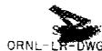

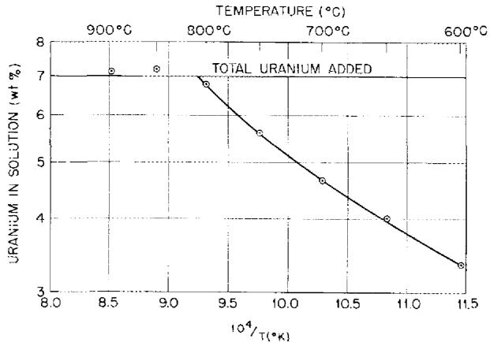  
Fig. 4.4. Solubility of UF $_3$ in $\mathsf{NoF - ZrF}_4$ .

mixture, as prepared, contained 7 wt $\%$ uranium, it is obvious from the analyses that all the uranium which was added was soluble above about $815^{\circ}C$ . A composite sample of the residue which remained after removal of about $10\%$ of the batch as samples contained 6.8 wt $\%$ uranium by analysis; it is apparent that the pretreatment and the considerable period at high temperatures affected the sample only slightly if at all. The accuracy of the data obtained is not sufficient to establish that the curvature of the line below $800^{\circ}C$ in Fig. 4.4 is real. Heats of solution as calculated from the slope of this curve range from 8300 cal/mole at the higher temperatures to 5600 cal/mole at the lower temperatures.

Previous observations[27,28] indicated that the solubility of $\mathsf{UF}_3$ increased with increasing $\mathsf{ZrF}_4$ concentration in the concentration range near 50 mole $\%$ $\mathsf{ZrF}_4$ . Filtration at $600^{\circ}\mathsf{C}$ of five different preparations by the general technique described above has quantitatively confirmed these observations. The data obtained are shown in Fig. 4.5.

An increase in $\mathsf{ZrF}_4$ concentration from 45 to 57 mole $\%$ apparently at least doubles the solubility of UF. Since the UF dissolved by the 57 mole $\%$ ZrF mixture agreed within experimental error with the amount added, the solubility of UF in this mixture at $600^{\circ}\mathrm{C}$ must be equal to or greater than 5.9 wt $\%$ uranium.

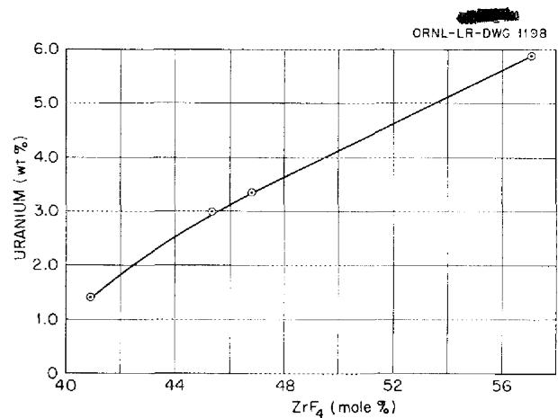  
Fig. 4.5. Solubility of $\mathbf{U}\mathbf{F}_{3}$ at $600^{\circ}C$ in NaF $\mathbf{ZrF}_4$

The increase in solubility of $\mathsf{UF}_3$ with increasing $\mathsf{ZrF}_4$ concentration implies that $\mathsf{UF}_3$ is not complexed strongly by free fluoride ion but that dissociation of $\mathsf{UF}_3$ is aided by the presence of free $\mathsf{ZrF}_4$ . Whether disproportionation of $\mathsf{UF}_3$ into $\mathsf{UF}_4$ and $\mathsf{U}^{\circ}$ is likely to become appreciable at a lower temperature in such melts is, as yet, unknown.

Some auxiliary experiments performed in smaller scale apparatus by other members of the ANP Chemistry Group (R. J. Sheil and C. J. Barton) have shown that a mixture prepared to contain 52.7 mole % NaF, 40.9 mole % ZrF₄, and 6.4 mole % UF₃ when filtered at 600°C yields a filtrate containing only 1.4 wt % uranium. The residue from this filtration comprised about 20% of the total sample and was predominantly UF₃ with some yellow crystals that were shown to be mainly Na₉Zr₈F₄₁ with opaque material which was almost certainly Zr₀ or ZrH₂. These data, which are in general agreement with those cited above, serve to demonstrate that UF₃ and not a complex uraniferous fluoride is the primary phase in the concentration range near 50 mole % ZrF₄.

# Solubility of $\mathsf{UF}_3$ in NaF-KF-LiF Mixtures

G.M.Watson

C. M. Blood

Materials Chemistry Division

Two experiments were performed to determine the solubility of $\mathsf{UF}_3$ in the NaF-KF-LiF eutectic. In both experiments, the $\mathsf{UF}_3$ was obtained by reduction in situ of the dissolved $\mathsf{UF}_4$ with uranium metal. The technique used in obtaining the filtrates

for solubility determinations was otherwise identical to that used in the corresponding experiments with NaF-ZrF4 mixtures, as described above.

When a two-fold excess of metallic uranium was used, potassium metal was distilled from the reactor at temperatures of $800^{\circ}\mathrm{C}$ and above. When filter sticks were introduced into the melt, the filter media immediately became clogged. Filtrates weighing only 1 to $15\mathrm{g}$ could be obtained in contrast to the $50\mathrm{g}$ filtrates obtained in normal operations. At the end of the experiment, a metallic alloy was observed on the reactor walls and as a crust on the solidified melt.

The formation of potassium is explained when the equilibrium constant of the reaction

$$
\begin{array}{l} K F \left(\text {s o l u t i o n}\right) + \frac {1}{3} U (\text {c r y s t a l}) \\ = K (\text {v a p o r}) + \frac {1}{3} U F _ {3} (\text {s o l u t i o n}) \\ \end{array}
$$

is calculated from published values of free energies of formation. At $800^{\circ}\mathrm{C}$ the equilibrium partial pressure of potassium, with the assumption of ideal solutions, may be estimated to be from 15 to $20\mathrm{mmHg}$ .

The constituents of the metallic alloy were identified as nickel and uranium. The alloy formation may be rationalized from consideration of the U-Ni phase diagram,29 which shows that eutectic melting of nickel and uranium can occur at about $738^{\circ}C$ . The eutectic phases are UNi and $\mathsf{U}_{6}\mathsf{N}\mathsf{i}$

In order to avoid or minimize side effects in the second experiment, only the stoichiometric quantity of uranium metal was added with $10\%$ excess of zirconium metal. The mixture was heated to only $750^{\circ}\mathrm{C}$ . Much more satisfactory filtrates were obtained (an average of about $45\mathrm{g}$ above $600^{\circ}\mathrm{C}$ ), and no metallic alloy was observed. The concentrations of uranium in the filtrates and in residues of both experiments are summarized in Table 4.7.

Petrographic examination of composite samples of the residue from each experiment failed to show the presence of tetravalent uranium but detected (in quantity) a bright-orange phase believed to be a $\mathsf{KF - UF}_3$ compound. The tabulated results appear to show essentially constant uranium concentration at the temperatures studied. This effect would be shown if all the uranium were in the liquid phase throughout the temperature range. Unfortunately, the results are not consistent between experiments and the filtrate (or residue) analyses do not agree

TABLE 4.7. SOLUBILITY OF ${\mathrm{{UF}}}_{3}$ IN NaF-KF-LiF EUTECTIC   

<table><tr><td rowspan="2">TEMPERATURE (°C)</td><td colspan="2">SOLUBILITY OF UF3 (wt % U)</td></tr><tr><td>R-153*</td><td>R-154**</td></tr><tr><td>800</td><td>15.4</td><td></td></tr><tr><td>750</td><td>17.3</td><td>16.0</td></tr><tr><td>700</td><td>17.3</td><td>16.1</td></tr><tr><td>650</td><td>17.3</td><td>16.3</td></tr><tr><td>600</td><td>17.2</td><td>16.2</td></tr><tr><td>550</td><td></td><td>16.4</td></tr><tr><td>508</td><td></td><td>15.9</td></tr><tr><td>Residue</td><td>20.1</td><td>17.8</td></tr></table>

*22.0 wt % uranium added.   
**18.6 wt % uranium added.

within experimental error with the amount of uranium added. It is obvious, however, that the solubility of $\mathsf{UF}_3$ in the NaF-KF-LiF eutectic is higher than 15 wt % uranium.

# Solubility of UF3 in NaF-RbF-LiF Mixtures

R.J.Sheil C.J.Barton

Materials Chemistry Division

The solubility of $\mathsf{UF}_3$ in the NaF-RbF-LiF eutectic has been determined at three temperatures by equilibration of a melt to which sufficient $\mathsf{UF}_4$ and excess uranium metal had been added to produce 4 mole $\%$ $\mathsf{UF}_3$ , filtration of a specimen at the desired temperature, and chemical analysis of the resulting solution. Because of the high RbF content of these mixtures, they are extremely hygroscopic; great care in handling the samples is necessary to obtain reliable values for $\mathsf{UF}_3$ solubility.

The data obtained are shown in Table 4.8. The values obtained show that $597^{\circ}C$ is probably above the liquidus temperature for this composition; 9 wt $\%$ of uranium is probably not the maximum that can be dissolved at this temperature. Petrographic examination of the filtrates indicated that no $\mathsf{UF}_4$ or complex fluorides containing tetravalent uranium were present. The samples contained no free $\mathsf{UF}_3$ ; no identification of the complex $\mathsf{U}^{3+}$ fluoride has yet been made.

TABLE 4.8. SOLUBILITY OF ${\mathrm{{UF}}}_{3}$ IN $\mathrm{{NaF}} - \mathrm{{RbF}} - \mathrm{{LiF}}$ EUTECTIC   

<table><tr><td rowspan="2">Filtration TEMPERATURE (°C)</td><td rowspan="2">FRACTION OF SAMPLE FILTERED (%)</td><td rowspan="2">SOLUBILITY OF UF3 (wt % U)</td><td colspan="4">FILTRATE COMPOSITION* (mole %)</td></tr><tr><td>LiF</td><td>RbF</td><td>NaF</td><td>UF3</td></tr><tr><td>497</td><td>67</td><td>4.4</td><td>43.8</td><td>46.8</td><td>8.2</td><td>1.2</td></tr><tr><td>552</td><td>90</td><td>6.8</td><td>39.6</td><td>47.6</td><td>10.7</td><td>2.1</td></tr><tr><td>597</td><td>99</td><td>9.0</td><td>41.1</td><td>46.5</td><td>9.6</td><td>2.84</td></tr></table>

*Calculated from analyses for ${\mathrm{{Li}}}^{ + },{\mathrm{{Na}}}^{ + },{\mathrm{{Rb}}}^{ + }$ ,and total U.

Chlorination of $\mathbf{U}\mathbf{F}_3$ G.M.Watson C.M.Blood Materials Chemistry Division

Analytical determinations of the $\mathsf{UF}_3$ dissolved, with or without added $\mathsf{UF}_{4^{\prime}}$ in fluoride melts gave values considerably lower than those anticipated from petrographic examination or from the stoichiometry of the preparation reactions. The description $^{30}$ of the preparation and the properties of $\mathsf{UF}_3\mathsf{Cl}$ suggested that chlorination of the $\mathsf{UF}_3$ to this compound and subsequent determinations of $\mathsf{Cl}^{-}$ in the product might be successfully used.

Attempts to chlorinate 1- to 2-g portions of a 200-mesh $\mathsf{UF}_3\mathsf{-UF}_4$ mixture contained in ceramic boats in a glass-tube reactor by exposure to dry $\mathsf{Cl}_2$ at $350^{\circ}\mathsf{C}$ for various intervals of from $2\frac{1}{2}$ to 20 hr yielded a green product of uniform appearance. Petrographic examination showed the product to be markedly birefringent and uniaxially (or possibly biaxially) negative, with refractive indices of 1.56 to 1.59. X-ray diffraction revealed no free $\mathsf{UF}_3$ but did reveal an unknown diffraction pattern unrelated either to $\mathsf{UF}_3$ or $\mathsf{UF}_4$ . Chemical analyses of samples chlorinated $2\frac{1}{2}$ to $4\frac{1}{2}$ hr indicated $5.7\%$ total chlorine; since this is roughly one-half the expected value for chlorine, it appears that the chlorination was incomplete or that some hydrolysis and oxidation of the sample had occurred.

Attempts will be made to improve the contact between the powder and the $\mathrm{Cl}_2$ by passage of the gas through the solid contained on a sintered-glass filter. If these attempts are successful, studies with $\mathrm{UF}_3$ -bearing fuel mixtures will be attempted.

Preparation of UF3-2ZrF4 P. Boody H. A. Friedman Materials Chemistry Division

The compound $\mathsf{UF}_3\cdot 2\mathsf{ZrF}_4$ was identified in 1952 as one of the materials obtained on cooling $\mathsf{ZrF}_4$ -bearing melts containing large quantities of $\mathsf{UF}_3$ . Since large quantities of the compound had not been prepared, the preparation of a $3.5\mathrm{-kg}$ batch was attempted to make available a quantity sufficient for measurement of vapor pressure and other physical properties. The method used was a modification of the standard hydrofluorination procedure which involved reduction of a $\mathsf{UF}_4$ -bearing mixture of proper composition with zirconium metal chips at $850^{\circ}\mathrm{C}$ . The product appeared homogeneous and was a dark reddish-brown in color. Only $655\mathrm{g}$ was filtered, since unavoidable cold spots in the transfer line permitted freezing of this relatively high-melting-point material $(740^{\circ}\mathrm{C})$ . The compound material, unlike virtually all other melts observed here, appeared to expand slightly on freezing.

Petrographic examination of the product showed it to be approximately $99\%$ homogeneous, red-orange, uniaxially positive $\mathsf{UF}_3\cdot 2\mathsf{ZrF}_4$ and about $1\%$ free $\mathsf{UF}_3$ . X-ray diffraction analysis confirmed the predominant phase to be $\mathsf{UF}_3\cdot 2\mathsf{ZrF}_4$ , with small amounts of free $\mathsf{UF}_3$ . On warming in air, the color of the product changes from orange-red to olive-green and the refractive index increases. Structurally the crystals do not appear to be altered by the color change, and no evidence of oxidation other than the color is visible.

# Preparation of Various Fluorides

B.J.Sturm E.E.Ketchen L.G.Overholser Materials Chemistry Division

Several of the simple structural-metal fluorides,

as well as complexes of these materials with the alkali-metal fluorides, were prepared for corrosion experiments and some physical and chemical property testing. In an effort to prepare the structural-metal fluorides in a high state of purity, attempts were made to refine crude $\mathrm{NiF}_2$ and $\mathrm{CrF}_3$ by treatment with $\mathrm{BrF}_3$ . In a modification of the apparatus originally assembled by the ANP Analytical Group, the crude material was treated with $\mathrm{BrF}_3$ at 350 to $400^{\circ}\mathrm{C}$ for 1 to 3 hr, and the product was outgassed by thorough pumping at about $350^{\circ}\mathrm{C}$ . Analyses of 10 samples indicated that considerable conversion of oxides and/or oxyfluorides was achieved by this procedure; however, the purity of the product was still not of the order desired.

Large quantities (1.5 to 2 kg) of $\mathsf{K}_3\mathsf{CrF}_6$ and of $\mathsf{K}_3\mathsf{FeF}_6$ were prepared by heating appropriate quantities of $2\mathsf{CrF}_3\cdot 7\mathsf{H}_2\mathsf{O}$ and $\mathsf{FeF}_3\cdot 3\mathsf{H}_2\mathsf{O}$ with $\mathsf{KHF}_2$ . Several batches of $\mathsf{FeF}_3$ , $\mathsf{FeF}_2$ , $\mathsf{FeCl}_2$ , $\mathsf{NiF}_2$ , $\mathsf{NiCl}_2$ , $\mathsf{CrF}_3$ , and $\mathsf{CrF}_2$ were synthesized by methods previously described.

# FUNDAMENTAL CHEMISTRY OF FUSED SALTS

# EMF Measurements

L. E. Topol

Materials Chemistry Division

Measurements of decomposition potentials of KCl and of a variety of chlorides in solution in molten KCl at $850^{\circ}\mathrm{C}$ were attempted. Cathodes of platinum or nickel and anodes of carbon, nickel, zirconium, platinum, electrolytic chromium, Inconel, and stainless steel have been employed. Morganite $(\mathsf{Al}_2\mathsf{O}_3)$ crucibles were used to contain the melt in each case.

The solutions were prepared by heating 2 moles of KCl with 1 mole of the desired anhydrous chloride to above the melting point of the mixture in a sealed, evacuated quartz tube. More dilute solutions were prepared by the addition of KCl to the materials so obtained. The data obtained are tabulated in Table 4.9. If the value of 0.90 volt for electrolysis of KCl with uranium anodes is combined with that of 3.15 volts for electrolysis of this material with inert anodes, $E$ for the reaction

$$
U + \frac {x}{2} C I _ {2} \longrightarrow U C I _ {x}
$$

appears to be 2.25 volts. This value agrees well with the estimated $E^{\circ}$ (2.26 volts) for $\mathsf{UCl}_3$ . The value (1.27 volts) obtained by electrolysis of KCl

with an anode of electrolytic chromium is less than that previously obtained (1.5 volts) with an anode of $\mathbf{Cr}^{\circ}$ plated on gold wire.32

The potentials observed for electrolysis of KCl with Inconel electrodes suggest that $\mathsf{Cr}^{\circ}$ is dissolved first and that, subsequently, Ni is attacked; no dissolution of Fe was detected. However, when the anode is a 300-series stainless steel, it appears that first iron, and then chromium, is dissolved.

Three possible reactions of $\mathrm{CrCl}_2$

(1) $3\mathrm{CrCl}_2 \longrightarrow \mathrm{Cr}^0 + 2\mathrm{CrCl}_3$

$$
E ^ {o} = 0. 3 4 \text {v o l t},
$$

(2) $\mathrm{CrCl}_2 \longrightarrow \mathrm{Cr}^{\circ} + \mathrm{Cl}_2$

$$
E ^ {\circ} = 1. 3 6 \text {v o l t s},
$$

(3) $\mathrm{CrCl}_2 + \mathrm{Ni}^{\circ} \rightarrow \mathrm{NiCl}_2 + \mathrm{Cr}$ ,

$$
E ^ {\circ} = 0. 5 4 \text {v o l t},
$$

may qualitatively explain the experimental observations on electrolysis of solutions of $\mathsf{CrCl}_2$ . It appears that with a nickel anode, reaction 3 occurs at both $\mathsf{CrCl}_2$ concentrations tested. With the inert carbon anode, reaction 1 is controlling at high concentrations of $\mathsf{CrCl}_2$ , while reaction 2 is important in the dilute solutions.

The experimental electrolysis of $\mathsf{ZrCl}_4$ solutions with nickel anodes checks well with $E^0$ values for reactions producing $\mathsf{ZrCl}_3$ , $\mathsf{ZrCl}_2$ , and $\mathsf{Zr}^0$ with $\mathsf{NiF}_2$ , as described previously. The values obtained with the graphite anodes may well be due to the reactions

(4) $\mathrm{ZrCl}_4 \rightarrow \mathrm{Zr}^0 + 2\mathrm{Cl}_2$   
(5) $\mathrm{ZrO}_2 + \mathrm{C} \rightarrow \mathrm{Zr}^{\circ} + \mathrm{CO}_2$

for which the best estimates of $E^0$ are 1.9 and 1.24 volts, respectively. Attack on some of the graphite anodes indicates that reaction 5 occurs.

The electrochemical behavior of $\mathsf{UCl}_3$ appears to be similar to that of $\mathsf{CrCl}_2$ . It is likely that the reactions

(6) $4\mathrm{UCl}_3 \longrightarrow 3\mathrm{UCl}_4 + \mathrm{U}^\circ$

$$
E ^ {\circ} = 1. 0 8 \text {v o l t s},
$$

(7) $2\mathrm{UCl}_3 \longrightarrow 2\mathrm{U}^\circ + 3\mathrm{Cl}_2$

$$
E ^ {\circ} = 2. 2 6 \text {v o l t s},
$$

(8) $2\mathrm{UCl}_3 + \mathrm{Ni} \rightarrow 3\mathrm{NiCl}_2 + 2\mathrm{U}^\circ$

$$
E ^ {\circ} = 1. 4 4 \text {v o l t s},
$$

TABLE 4.9. OBSERVED DECOMPOSITION POTENTIALS FOR REDUCIBLE CHLORIDES IN MOLTEN KCI AT ${850}^{ \circ  }\mathrm{C}$   

<table><tr><td rowspan="2">SOLUTE 
ADDED</td><td rowspan="2">CONCENTRATION 
OF SOLUTE 
(mole %)</td><td colspan="2">ELECTRODES</td><td rowspan="2">BLANKETING 
ATMOSPHERE</td><td rowspan="2">POTENTIAL OBSERVED 
(volt)</td></tr><tr><td>Cathode</td><td>Anode</td></tr><tr><td rowspan="8">None</td><td></td><td>Pt</td><td>U</td><td>He</td><td>0.89</td></tr><tr><td></td><td>Pt</td><td>U</td><td>H2</td><td>0.90</td></tr><tr><td></td><td>Ni</td><td>Zr</td><td>He</td><td>1.03</td></tr><tr><td></td><td>Ni</td><td>Cr*</td><td>H2</td><td>1.27</td></tr><tr><td></td><td>Ni</td><td>Inconel</td><td>H2</td><td>1.85, 2.03</td></tr><tr><td></td><td>Ni</td><td>Inconel</td><td>He</td><td>1.85, 2.03</td></tr><tr><td></td><td>Ni</td><td>Type 316 
stainless steel</td><td>H2</td><td>1.55, 1.85</td></tr><tr><td></td><td>Ni</td><td>Type 347 
stainless steel</td><td>H2</td><td>1.43, 1.85</td></tr><tr><td rowspan="4">CrCl2</td><td>33.3</td><td>Ni</td><td>C</td><td>H2</td><td>0.88 to 0.92</td></tr><tr><td>33.3</td><td>Ni</td><td>Ni</td><td>H2</td><td>0.53 to 0.57</td></tr><tr><td>2.0</td><td>Ni</td><td>C</td><td>He</td><td>1.30 to 1.43</td></tr><tr><td>2.0</td><td>Ni</td><td>Ni</td><td>He</td><td>0.65 to 0.69</td></tr><tr><td rowspan="4">ZrCl4</td><td>33.3</td><td>Ni</td><td>C</td><td>H2</td><td>1.67 to 1.80</td></tr><tr><td>33.3</td><td>Ni</td><td>Ni</td><td>H2</td><td>0.50 to 0.57, 0.80, 1.01</td></tr><tr><td>25.0</td><td>Ni</td><td>C</td><td>H2</td><td>1.33, 1.80 to 1.90</td></tr><tr><td>25.0</td><td>Ni</td><td>Ni</td><td>H2</td><td>0.63, 0.94 to 1.06</td></tr><tr><td rowspan="11">UCl3</td><td>100</td><td>Pt</td><td>Ni</td><td>H2</td><td>0.80 to 0.84, 1.01 to 1.10</td></tr><tr><td>100</td><td>Pt</td><td>Ni</td><td>He</td><td>0.80 to 0.87, 0.98</td></tr><tr><td>33.3</td><td>Pt</td><td>C</td><td>H2</td><td>0.78 to 0.85</td></tr><tr><td>33.3</td><td>Pt</td><td>Ni</td><td>H2</td><td>0.80 to 0.82</td></tr><tr><td>33.3</td><td>Pt</td><td>Ni</td><td>He</td><td>0.83 to 0.85</td></tr><tr><td>33.3</td><td>Ni</td><td>C</td><td>H2</td><td>0.68 to 0.72</td></tr><tr><td>33.3</td><td>Ni</td><td>Ni</td><td>H2</td><td>0.78 to 0.82</td></tr><tr><td>2.0</td><td>Pt</td><td>Ni</td><td>H2</td><td>1.25 to 1.35</td></tr><tr><td>2.0</td><td>Pt</td><td>Pt</td><td>He</td><td>2.10</td></tr><tr><td>2.0</td><td>Pt</td><td>C</td><td>He</td><td>1.15, (2.08), 2.48 to 2.56</td></tr><tr><td>1.0</td><td>Pt</td><td>Ni</td><td>He</td><td>1.36</td></tr></table>

*Electrolytically prepared.

are responsible for most of the effects observed. The agreement between values under He and $\mathsf{H}_2$ suggests that UCl4 is only slightly affected by $\mathsf{H}_2$ in the dilute solutions with relatively poor contact efficiency used. When nickel cathodes were employed, an alloy of uranium and nickel resulted. The general constancy of the potential obtained with both pure UCl3 and $\mathsf{K}_2\mathsf{UCl}_5$ seems to indicate some solubility of UCl4 in UCl3.

A zirconia crucible (fabricated by Titanium Alloys Division of National Lead) was heated at $750^{\circ}\mathrm{C}$ for 4 hr in a hydrogen atmosphere with a charge of NaF-KF-LiF-UF $_3$ . The vessel proved to be somewhat porous; the only evidence of attack observed was a slight reaction to produce $\mathrm{UO}_2$ at the crucible melt interface. It is hoped that vessels of this material may be useful for electrochemical studies of fluoride melts.

# Physical Chemistry33

E. R. Van Artsdalen

Chemistry Division

The density and electrical conductivity of the molten system KCl-NaCl have been determined over the entire composition field from temperatures a little above the melting point of the individual mixtures to about $1000^{\circ}\mathrm{C}$ . Density can be expressed as a linear function of temperature, and the specific conductance can be expressed as a quadratic function of temperature. A plot of the molar volume vs the composition shows a slight positive deviation from linearity, with a maximum deviation of about $0.5\%$ at 50 mole $\%$ KCl. Equivalent conductance, $\Lambda$ , may be expressed in the form

$$
\log \Lambda = C + A \frac {1 0 0 0}{T} + 2 3 0 2. 6 B \log \frac {1 0 0 0}{T},
$$

where $T$ is in degrees Kelvin, $C$ is a constant of integration, and $A$ and $B$ are the intercept and the slope, respectively, of the straight line which results from the graphical differentiation of $\log \Lambda$ vs $(1000 / T)$ . The possibility that this form of equation is general in nature and applicable to many molten salt systems is being investigated. A plot of equivalent conductance vs mole per cent KCl shows that the system is far from additive but that it resembles the molten KCl-LiCl system reported previously.[34] There is a very shallow minimum in equivalent conductance for the KCl-NaCl system at about 85 mole % KCl. The explanation for this is apparently the same as the one advanced in the case of the molten system KCl-LiCl.

An emf cell with transference has been designed for use with fused salts. With such a cell it is possible to make the potential measurements required for obtaining important information and cross-checks on transference numbers and activity coefficients of ions in melts. An initial study with the molten system $\mathrm{NaNO}_3\cdot \mathrm{AgNO}_3$ indicated that useful results can be obtained by measurements of cells with transference. However, the attainment of good reproducibility poses a difficult problem.

Radiotracer techniques are being used for making measurements of the self-diffusion coefficient of

individual ions in molten salts. This work has necessitated the development of new techniques for handling molten materials as well as for precision control of high-temperature furnaces over periods of several days. Measurements of the self-diffusion of sodium ions in molten sodium nitrate indicate that the diffusion coefficient is of the order of 1 or $2 \times 10^{-5} \, \text{sq cm sec}^{-1}$ at temperatures a little above the melting point. This work is being pursued actively and is expected to yield important results applicable to transport processes.

A high-precision, adiabatic, heat-capacity calorimeter has been built for operation in the range up to about $1000^{\circ}\mathrm{C}$ . All preliminary tests have been completed and the calibration should be completed soon. It is anticipated that heats and free energies of formation can be determined with good accuracy for a number of important reactor materials. In addition, fundamental information should be obtained concerning the solid state as well as the molten state of salts.

# CHEMICAL EFFECTS OF FISSION PRODUCTS

R. F. Newton

ANP Division

Other than the absorption of neutrons, the possible undesirable effects of fission products in a reactor are the decrease of heat transfer by separation of a solid phase on heat exchange surfaces and by change of viscosity or heat capacity of the molten mixture, and the acceleration of corrosion. Any such effects will be dependent on the quantities of fission products which accumulate.

# Quantity of Fission Products

The fission products were calculated on the assumption that about 0.1 mole of uranium undergoes fission per kilogram of melt at a uniform rate during 1000 hr. The quantities given in Table 4.10 are for the end of the 1000-hr period. The yields for the various products were taken from the smooth curve of Siegel.[35] The quantities are as large as or larger than any which occur at earlier times and not greatly different than they would be if the fissions were spread over a greater time period.

# Separation of Solid Phases

Of the elements listed, molybdenum, ruthenium, rhodium, and palladium are expected to separate

TABLE 4.10. FISSION-PRODUCT YIELD AT END OF 1000 hr   

<table><tr><td>PRODUCT</td><td>YIELD*</td><td>PRODUCT</td><td>YIELD</td><td>PRODUCT</td><td>YIELD</td></tr><tr><td>Se</td><td>0.4</td><td>Cb</td><td>7.0</td><td>I</td><td>1.2</td></tr><tr><td>Br</td><td>0.25</td><td>Mo</td><td>18.6</td><td>Xe</td><td>18.4</td></tr><tr><td>Kr</td><td>3.5</td><td>Te</td><td>5.1</td><td>Cs</td><td>16.9</td></tr><tr><td>Rb</td><td>4.0</td><td>Ru</td><td>14.0</td><td>Ba</td><td>6.7</td></tr><tr><td>Sr</td><td>12.2</td><td>Rh</td><td>1.0</td><td>La</td><td>6.5</td></tr><tr><td>Y</td><td>5.3</td><td>Pd</td><td>1.3</td><td>Ce</td><td>26.0</td></tr><tr><td>Zr</td><td>24.8</td><td>Te</td><td>1.4</td><td>TRE**</td><td>53.3</td></tr></table>

*In atoms per 100 fissions occurring uniformly over 1000 hr.   
\*\*Total rare earths.

as the metals. Molybdenum and palladium alloy with nickel, and it is presumed that ruthenium and rhodium do likewise. If they form a solid solution with nickel or nickel alloy and slowly diffuse into the heat-exchanger wall, they will probably do no harm; if they deposit on the surface and remain there, they may reduce heat transfer because of roughening of the surface.

The possible separation of either simple or complex solid fluorides, because of their poor heat-transfer properties, would be much more serious than the deposition of metal. Rubidium may be dismissed immediately, since it is a desirable constituent of the fuel; chemically, cesium is also desirable. Zirconium likewise may already be present in the fuel, in which case the zirconium formed by fission will change the relative amount of zirconium in the fuel to a negligible extent. If zirconium is not an intentional constituent, it appears impossible that it could precipitate from a fluoride-based fuel not containing oxygen. Barium fluoride and sodium fluoride form a eutectic at $820^{\circ}\mathrm{C}$ that contains 35 mole $\%$ $\mathsf{BaF}_2$ . The extrapolated solubility of the eutectic is 14 mole $\%$ at $600^{\circ}\mathrm{C}$ . Corresponding data are not available for $\mathsf{SrF}_2$ , but an extrapolation from the eutectic of $\mathsf{CaF}_2$ -NaF gives a solubility of $\mathsf{CaF}_2$ at $600^{\circ}\mathrm{C}$ of 12.3 mole $\%$ . Since the properties of strontium compounds are generally between those of calcium and barium, it is safe to assume a solubility of at least 10 mole $\%$ for the strontium compounds, that is, nearly 100 times the amount produced.

The only remaining substances worthy of consideration are the fluorides of yttrium and the rare earths. These substances are so similar chemi

cally that they undoubtedly form a continuous series of solid solutions and can practically be treated as a single compound. From the phase diagrams of alkali-metal fluorides with $\mathsf{LaF}_3$ and with $\mathsf{YF}_3$ , the lowest solubility ( $\mathsf{YF}_3$ in $\mathsf{KF}$ ) extrapolated to $600^{\circ}\mathsf{C}$ is 8 mole%. Since the total of rare earths plus yttrium is of the order of 0.5 mole%, even here, there seems to be an ample factor of safety regarding the possibility of precipitation.

# Effects on Viscosity and Heat Capacity

The replacement of one uranium atom by two atoms of fission products would be expected to increase the heat capacity per gram, but the density would be decreased at the same time, with very little change in the heat capacity per cubic centimeter. Similarly some fission products would increase the viscosity while others would decrease it. In any case, it is safe to predict that the changes will be no greater than about $1\%$ .

# Effects on Corrosion

It is apparent that the total number of equivalents of cationic fission products exceeds that of anionic fission products plus the fluoride made available by fission of the uranium (assuming the uranium as $\mathsf{UF}_4$ ) only if molybdenum is included as one of the cationic elements. However, if the relative affinity of molybdenum and nickel for fluorine is considered (Glassner36 gives free energies of formation of -56 and -63 kg-cal/gram-atom of fluorine for MoF6 and NiF2, respectively), it is evident that molyb

denum will appear as the element along with ruthenium, rhodium, and palladium. In such cases, the fission of uranium occurring as $\mathsf{UF}_4$ will be accompanied by the solution of a corresponding amount of nickel, chromium, or other wall constituent. The imbalance can be corrected by using a fuel in which one-half of the uranium which undergoes fission is $\mathsf{UF}_3$ . Since it is anticipated that about $20\%$ of the uranium present will undergo fission, the change required to prevent solution of nickel because of this cation-anion imbalance is to have $10\%$ or more of the uranium present as $\mathsf{UF}_3$ . From preliminary data available on the solubility of $\mathsf{UF}_3$ , it appears that even the zirconium-base fuels should be capable of dissolving this amount, while the alkali-metal-fluoride fuels possess a large margin of safety in this regard.

# PURIFICATION AND PROPERTIES OF ALKALI HYDROXIDES

L.G.Overholser F.Kertesz

Materials Chemistry Division

# Purification of Hydroxides

E.E.Ketchen L.G.Overholser

Materials Chemistry Division

Eight batches of NaOH were purified by filtering a 50-wt % aqueous solution through a fine sintered-glass filter to remove the $\mathrm{Na}_2\mathrm{CO}_3$ and then dehydrating at $400^{\circ}\mathrm{C}$ under vacuum. The product, as in the past, contained less than 0.1 wt % of $\mathsf{H}_2\mathsf{O}$ and of $\mathrm{Na}_2\mathrm{CO}_3$ . Four batches of commercial LiOH were dehydrated at $200^{\circ}\mathrm{C}$ under vacuum to yield material containing less than 0.1 wt % of $\mathsf{H}_2\mathsf{O}$ and 0.2 wt % of $\mathsf{Li}_2\mathsf{CO}_3$ . Approximately 5 lb of potassium, after being divided into $\frac{1}{2}$ -lb portions, was reacted with water, and the resulting solutions of KOH were dehydrated at $400^{\circ}\mathrm{C}$ under vacuum. The dehydrated KOH contained approximately 0.1 wt % of Na and less than 0.1 wt % of $\mathsf{K}_2\mathsf{CO}_3$ and of $\mathsf{H}_2\mathsf{O}$ .

# Reaction of Sodium Hydroxide with Metals

F.A.Knox H.J.Buttram

F. Kertesz

Materials Chemistry Division

The hydrogen equilibrium pressures developed in the sodium hydroxide-nickel reaction were further investigated with the use of the previously described quartz-jacketed nickel reaction tube which

was connected to a manometer. It was planned that hydrogen would be added to the jacket to reduce the time necessary for establishment of the pressure equilibrium, but in practice this arrangement proved unsatisfactory. The hydrogen added to the jacket introduced an imbalance in the system and thus increased the pressure inside the reaction tube. It was also recognized that errors were introduced in the previous measurements by hydrogen being removed when the system was evacuated during heating up to $600^{\circ}\mathrm{C}$ , because the sodium hydroxide was thus subjected to heat and to lowering of the pressure. The current measurements are being made by evacuating the system at near the melting point of the hydroxide. The redetermined values, which seem to approximate steady-state conditions, were found to be higher than those reported previously. The redetermined values are given in Table 4.11. These data yield a straight line when log $P_{\mathsf{H}_2}$ is plotted against $1 / T$ as indicated in Fig. 4.6.

In addition to these measurements of the hydrogen pressures developed during the reaction, an attempt was made to study the mechanism involved by determining the amount of metal dissolved. In the first series of experiments, nickel capsules containing hydrogen were sealed in quartz envelopes; in the second series, the capsules were jacketed and the evolved gas was allowed to escape. The capsules were heated for periods which ranged from 2 to 256 hr.

It was found that the nickel concentration in the hydroxide in the capsules with the quartz jackets reached a plateau rather early and remained constant during the prolonged heating periods. It may be assumed that the nickel concentration reached an equilibrium value in the jacketed system. The nickel concentration continued to increase with time in the unjacketed capsules.

TABLE 4.11. HYDROGEN PRESSURE OVER NaOH IN NICKEL   

<table><tr><td>TEMPERATURE (°C)</td><td>PRESSURE (mm Hg)</td></tr><tr><td>600</td><td>46</td></tr><tr><td>700</td><td>77</td></tr><tr><td>800</td><td>126</td></tr><tr><td>900</td><td>160</td></tr><tr><td>1000</td><td>205</td></tr></table>

Similar series of experiments with sodium hydroxide in copper capsules showed similar behavior. After 256 hr of exposure at $600^{\circ}\mathrm{C}$ , the copper concentration in the jacketed capsules was about 700 ppm, while it was as high as 8000 ppm in the unjacketed capsules. For the jacketed capsules the copper concentration rose to about 800 ppm at $700^{\circ}\mathrm{C}$ and 1100 ppm at $800^{\circ}\mathrm{C}$ . The unjacketed capsules that were heated at $800^{\circ}\mathrm{C}$ in a helium-filled dry box had relatively low copper concentrations, but the walls were covered with copper crystals. This is the first time that mass transfer of copper has been observed under these conditions. A larger percentage of the nickel impurity that originally existed in the copper capsule was found in the transferred metal than in the wall material of the capsule.

# PRODUCTION OF PURIFIED MOLTEN FLUORIDES

F. F. Blankenship

G.J.Nessle

Materials Chemistry Division

Laboratory-Scale Production

C. M. Blood

G.M.Watson

F. P. Boody

H. A. Friedman

Materials Chemistry Division

A total of 28 batches of various molten fluorides was processed during the quarter; these materials were used for phase studies, for corrosion testing, for chemical separations research, and for studies in kinetics of high-temperature chemical reactions. The largest usage of these purified materials was in the studies of $\mathsf{UF}_3$ solubility.

Interest has recently developed in the alkali fluoride eutectics as $\mathsf{UF}_3$ solvents. Since there had previously been some difficulty in preparing the NaF-KF-LiF eutectic in a high state of purity by the hydrogenation-hydrofluorination technique without excessive corrosion of the apparatus, a study of the behavior of these materials during purification was attempted.

Two batches of the NaF-KF-LiF eutectic have been prepared successfully in apparatus which was assembled with special care to avoid leaks. The solid fluorides were admitted to the apparatus and dried at 350 to $380^{\circ}\mathrm{C}$ under flowing helium before elevation of the temperature. The fluorides were maintained under hydrogen during the heating to $800^{\circ}\mathrm{C}$ and HF was admitted only after this temperature was reached. One batch was treated for 100

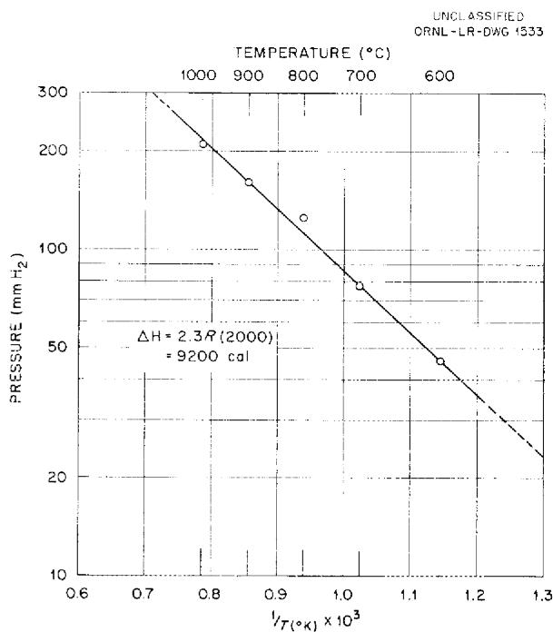  
Fig. 4.6. Hydrogen Pressure over Sodium Hydroxide in Quartz-Jacketed Nickel Capsules.

min with HF and stripped with 500 liters of $\mathsf{H}_2$ ; the other batch was treated with HF for 70 min and stripped with 600 liters of $\mathsf{H}_2$ . The HF concentration in the exit hydrogen from the first batch was $2.5 \times 10^{-4}$ mole/liter and from the second, $1.8 \times 10^{-4}$ mole/liter.

The color of the product was dead white in each case, and the product appeared to be quite homogeneous. Chemical analyses of the products have not been completed. Although there were deposits of metal around the thermocouple well, on the reactor walls, and as a partial plug in the gas-inlet tube that were shown spectrographically to consist of NaF, KF, and LiF, along with an alloy of nickel and iron, attack on the container seemed to compare favorably with that observed in processing NaF-ZrF4 mixtures. Therefore it appears that the alkali-metal-fluoride melts can be prepared in a high state of purity by existing techniques if the procedure described above is followed.

# Experimental Production

J. E. Eorgan

C.R.Croft

J. Truitt

J.P.Blakely

Materials Chemistry Division

A total of 162.7 kg of various fluoride compo

sitions was prepared in the experimental production facility and dispensed to various requesters in the ANP program. The pilot-scale production facility which will somewhat more than double the present pilot-scale capacity is nearly completed and should be available for operations before June 1. The experimental production facility will then be adapted for safe operation with $\mathsf{BeF}_2$ .

# Large-Scale Production

F.A.Doss R.Reid

R.G.Wiley

ANP Division

M. S. Freed

Pratt & Whitney Aircraft Division

F. L. Daley E. F. Joseph

E. L. Youngblood J. P. Blakely

Materials Chemistry Division

To meet the markedly increased demand for processed fluorides, the 250-lb production facility was placed on three-shift operation, and a total of $1358\mathrm{kg}$ of fluorides was processed. Most of this material was transferred to containers which ranged in size from 2 to $25\mathrm{kg}$ . Pratt & Whitney Aircraft Division received approximately $450\mathrm{kg}$ of this material, and, except for about $20\mathrm{kg}$ that was delivered to Battelle Memorial Institute, the remainder was dispensed to requesters in the ANP program at ORNL.

The increasing demands for purified fluorides necessitated, early in this calendar year, an increased output of $\mathsf{ZrF}_4$ from the production plant operated by Y-12 personnel. With the available equipment, this production increase could be accomplished only by decreasing the hydrofluorination time of $\mathsf{ZrCl}_4$ in the converter and by increasing the temperature of sublimation of the crude $\mathsf{ZrF}_4$ . The quality of the $\mathsf{ZrF}_4$ was, accordingly, reduced; the iron content of the $\mathsf{ZrF}_4$ increased from a mean of 250 to about 1000 ppm, while the nickel content rose from about 50 to about 200 ppm.

Although it is possible to prepare fluoride mixtures to rigorous specifications from this $\mathsf{ZrF}_4$ , use of this material has reduced the efficiency of the production facility to a level considerably below that obtained during 1953 when the ARE fuel solvent was being processed. For example, the gas-inlet tubes frequently become plugged by

crystals of nickel and iron during the hydrogen-flushing operation. Since the amount of iron to be stripped (by reduction of $\mathsf{FeF}_2$ with hydrogen) is much larger than that previously considered normal, the time required for the hydrogen stripping has increased from about 30 to nearly 100 hr, and hydrogen requirements have risen from 10,000 liters to nearly 25,000 liters per 250-lb batch of fluoride.

Since the anticipated demand for fluorides will probably preclude a slower production rate of $\mathsf{ZrF}_4$ and since improved purity at the present production rate would require expansion of the facility, attempts are being made to obtain pure $\mathsf{Na}_2\mathsf{ZrF}_6$ from commercial sources. While $\mathsf{ZrF}_4$ must be added to this material to reach the fuel compositions required, the amounts of $\mathsf{ZrF}_4$ needed would be well within the capacity of the Y-12 Plant for $\mathsf{ZrF}_4$ of acceptable purity.

It is anticipated that pure $\mathsf{ZrF}_4$ (or its equivalent) will be available within the next six to eight weeks. Should no commercial concern be able to meet purity specifications (at a competitive price), it may prove more economical in the long run to use hafnium-free $\mathsf{ZrF}_4$ for all fuel production without regard to intended use. This rather startling conclusion (based on price of production of about 3500 lb of hafnium-free material) is due, in part, to the better initial purity of the hafnium-free $\mathsf{ZrCl}_4$ and, in part, to its higher bulk density which permits larger loadings of converters and sublimers and, accordingly, larger throughput of material in existing $\mathsf{ZrF}_4$ production equipment.

# Production of Enriched Fuel for In-Pile Loop

J. E. Eorgan

Materials Chemistry Division

To provide the fuel for an in-pile forced-convection loop (cf., Sec. 8, "Radiation Damage"), two batches of about $6\mathrm{kg}$ each of a mixture of 62.5 mole $\%$ NaF, 12.5 mole $\%$ $\mathsf{ZrF}_4$ , 25 mole $\%$ UF $_4$ were prepared from product-level UF $_4$ by Y-12 personnel with some technical assistance from the ANP Chemistry Group. Actual production of the material was accomplished during the interval March 15 to March 29, 1954.

# 5. CORROSION RESEARCH

W. D. Manly

Metallurgy Division

W.R.Grimes

F. Kertesz

Materials Chemistry Division

H. W. Savage

ANP Division

The static and the seesaw corrosion testing facilities were used for further studies of Inconel, stainless steel, various cermets, and graphite exposed to fluoride mixtures or liquid metals. Chromium metal additions to fluoride mixtures with and without uranium contained in Inconel capsules have been shown to give some protection to the Inconel. Experiments conducted at various temperatures confirmed previous indications that the chromium content of a fluoride mixture contained in Inconel increases to a maximum and subsequently decreases with increasing temperature. The essentially linear relationship between chromium concentration of the fluoride mixture and the surface area of the exposed Inconel indicates that equilibrium concentrations are not attained when Inconel specimens are exposed to fluoride mixtures in graphite crucibles. Fluoride mixtures containing $\mathsf{UF}_3$ were tested in Inconel capsules in the seesaw apparatus and, as in thermal-convection-loop tests, no evidence of attack on the Inconel was found. Experiments are under way to determine the effects of fission products on the corrosion of Inconel by fluoride mixtures.

Tests have shown that when Inconel and type 316 stainless steel are exposed in the same system to fluoride mixtures, the steel is inferior to Inconel in its resistivity to attack even when the steel is in the cold zone. Static tests confirmed the reported increase in corrosiveness of lithium metal when lithium nitride is added. Impregnation of the surfaces of steels with chromium did not improve the corrosion resistance of specimens tested in sodium and several liquid-metal alloys. Extensive tests of various cermets that are being considered for applications as bearing materials in contact with fluoride mixtures are under way. The corrosion resistance of cobalt-base bonded specimens has been found to be superior to that of nickel-base bonded specimens. Special tar-impregnated graphite crucibles showed better corrosion resistance in a fluoride mixture than in sodium. Reactor

grade (C-18) graphite exposed to sodium in a type 304 stainless steel container was unaltered, whereas a similarly exposed, tar-impregnated graphite was badly cracked and spalled.

Thermal-convection loops have been used for additional investigations of corrosive attack of fluoride mixtures and liquid metals on Inconel, a special Inconel-type alloy, stainless steel, Hastelloy B, and Inconel with stainless steel, nickel, or beryllium inserts. It has been shown that it is possible to greatly reduce the attack in Inconel loops when $\mathsf{UF}_3$ is used with zirconium fluoride-base mixtures instead of the customary $\mathsf{UF}_4$ . One difficulty with these mixtures is the formation of layers on the hot-leg surface which may be uranium-Inconel alloys. Fluorides with mixtures of $\mathsf{UF}_3$ and $\mathsf{UF}_4$ are being investigated. Mass transfer of chromium was found to occur in thermal-convection loops with hot-leg temperatures as low as $1200^{\circ}\mathsf{F}$ . The amount of mass transfer increases with an increase either in operating temperature or in temperature difference between the hot and cold legs. When graphed, the values for depth of attack obtained in a loop operated for 5000 hr fell on a straight line with the values obtained in shorter times. The previously presented data which showed a rapid initial attack with a slower secondary attack after 250 hr were confirmed. The increase in depth of attack is about 4 mils for each 1000 hr of exposure. Reductions in depth of attack were obtained with loops of Hastelloy B and a special Inconel with a portion of the chromium replaced by molybdenum. In almost every loop constructed with combinations of Inconel and type 316 stainless steel, evidence of increased attack on the steel was observed. A reduction was usually noted in the attack on the Inconel but mass transfer was increased. Dissimilar-metal mass transfer was found with beryllium metal inserts in Inconel loops in which sodium was circulated at $1500^{\circ}\mathsf{F}$ . More mass transfer was found with a hot-leg insert, but it was present even with a cold-leg

insert. Two lithium-filled type 316 stainless steel thermal-convection loops operated for 1000 hr with hot-leg temperatures of 1445 and $1500^{\circ}\mathrm{F}$ , respectively. Only small amounts of mass transfer occurred, and at no time was there any indication of plugging. These results are in contrast to results obtained with previous loops of this type which would only operate in the neighborhood of 200 to 300 hr prior to plugging. The increased life was probably due to the higher purity of the lithium used and, especially, to a decrease in the lithium nitride content.

In the study of the corrosion and mass-transfer characteristics of materials in contact with liquid lead, it was found that quartz thermal-convection loops containing types 410 and 446 stainless steel specimens had a much longer life prior to plugging than similar loops containing pure iron and chromium or one of the 300-series stainless steels. Two possible explanations of these findings are being investigated. A tenacious oxide film might act as a diffusion barrier between the container material and the molten lead, or it may be that a thin film of sigma phase forms and acts as a diffusion barrier.

Studies are continuing on the identification of the compounds produced by hydroxide-metal reactions. Current research is concerned with the reaction of NaOH and nickel when hydrogen is allowed to escape from the system. In the past, color changes were observed when NaOH was heated to above $500^{\circ}\mathrm{C}$ . Present studies indicate that this is not due to a change in concentration of metallic ions from the container but that it must be due to the existence in thermal equilibrium of some species other than the expected sodium ions and hydroxyl ions. Additives such as oxygen, hydrogen, and water vapor have been studied. The interactions of these materials on hydroxides do not seem to be greatly altered by changing the cation from sodium to cesium, but they do seem to be associated with the anion.

# FLUORIDE CORROSION OF INCONEL IN STATIC AND SEESAW TESTS

H.J.Butfram R.E.Meadows J.M.Didlake F.Kertasz Materials Chemistry Division

# Effect of Chromium Addition to Fluoride Melt

An investigation was made of the effect of chromium additions to the fluoride mixtures NaF-

$\mathsf{ZrF}_4\mathsf{-UF}_4$ (53.5-40.0-6.5 mole $\%$ ) and NaF-ZrF4 (53-47 mole $\%$ ) on the fluoride corrosion of Inconel. In a series of seesaw tests the chromium was added as coarse powder and as slugs of three sizes with surface-area ratios of 1:2:4 to determine the effect of varying the surface area of the chromium. Inconel capsules which contained the fluoride mixtures with and without the chromium additions were tested. The capsules without chromium showed light attack to a depth of about 1 mil. A thin metallic layer was formed on the walls of a capsule tested with chromium powder added to the uranium-bearing mixture; no layer was found on a capsule containing chromium powder and the nonuranium-bearing mixture.

The weight losses of the solid chromium specimens which were added to the capsules were found to be independent of the size of the specimen used, but there was a marked difference between the weight losses caused by the two fluoride mixtures. The weight losses of the solid chromium specimens averaged 0.62 g in the uranium-bearing mixture and 0.11 g in the NaF-ZrF4 mixture. It was obvious that the difference between the weight losses in the two types of mixtures, 0.51 g in this test, did not correspond to the amount of reduction according to the equation

$$
2 U F _ {4} + C r ^ {\circ} \rightarrow C r F _ {2} + 2 U F _ {3}.
$$

A simple calculation shows that the weight lost by the chromium specimen would have been sufficient to reduce all the $\mathsf{UF}_4$ contained in the 30-g charge. However, the chromium content gained by the fluoride mixture (about 2000 ppm) was much too small for the reduction of the $\mathsf{UF}_4$ . Also, an x-ray diffraction study of the solidified mixture revealed only the normal pattern of $\mathsf{Na}_9\mathsf{Zr}(\mathsf{U})_8\mathsf{F}_{41}$ and none of the extraneous lines which would be expected if there were a high concentration of $\mathsf{UF}_3$ . Petrographic examination showed just a tinge of the yellow, reduced phase. The protective action exerted by the chromium was undoubtedly due to the higher activity of the pure metal in comparison with that of the chromium in the Inconel. Since the chromium content of the melt after the test was much lower than the amount lost by the specimen, the chromium must have been deposited and alloyed with the wall, especially at the cold end of the capsule.

# Effect of Temperature

The effect of temperature on corrosion of Inconel in fluoride mixtures was examined previously to

establish the relationship between reaction temperature and chromium concentration in the melt. These studies suggested that the chromium concentration of the melt increased to a maximum and subsequently decreased with increasing temperature.

To check the validity of these rather surprising tentative conclusions, two series of tests were conducted. In each test both $\mathsf{NaZrF}_5$ and NaF $\mathsf{ZrF}_4$ -UF $_4$ (50-46-4 mole %) were used. Both series of tests were made under static, isothermal conditions for 100 hr; the test temperatures ranged from 600 to $1000^{\circ}\mathsf{C}$ . In one series of experiments the fluoride mixtures were contained in graphite capsules to which Inconel specimens were added. The second series of tests was made with the fluoride mixtures contained in Inconel capsules.

Metallographic examination of the Inconel specimens from the graphite capsules showed no attack after exposure at $600^{\circ}\mathrm{C}$ , while after exposure at $700^{\circ}\mathrm{C}$ , light to moderate subsurface-void formation to a depth of about 2 mils was observed. The attack was more marked at $800^{\circ}\mathrm{C}$ , and some of the voids were associated with carbide precipitation on the alloy. The depth of attack increased at $900^{\circ}\mathrm{C}$ , whereas at $1000^{\circ}\mathrm{C}$ a slight reduction in void formation was observed. Metallographic observation of the walls of the Inconel capsules used in the second series of tests showed considerable attack at the lower temperatures; at the higher temperatures the subsurface-void formation was light and scattered, but some areas of very deep intergranular penetration were observed. It is possible that this general decrease in number of subsurface voids at the higher temperatures is due to a much higher rate of diffusion of chromium under these circumstances and a consequent slight depletion in chromium concentration over a large region rather than to void formation.

The results of chemical analyses of the fluoride mixtures for chromium paralleled to some extent the metallographic observations. The chromium content of the fluoride mixtures in the Inconel capsules certainly did not increase in a regular fashion with temperature, as might be expected. While there appear to be slight tendencies toward maximums in the curves of chromium concentration vs temperature, it is likely that the differences observed are within the experimental errors of sampling and specimen analyses. For the samples tested in graphite capsules, however, the chromium

content of the fluoride mixture increased with temperature up to $900^{\circ}\mathrm{C}$ , and a straight line was obtained when the logarithm of chromium concentration was plotted against the reciprocal of absolute temperature. The chromium values for the mixtures tested at $1000^{\circ}\mathrm{C}$ appear to be somewhat lower than the values for those tested at $900^{\circ}\mathrm{C}$ .

The appearance of the maximum values for the tests at $900^{\circ}\mathrm{C}$ , if it is real, is difficult to explain. The increase in chromium concentration with increasing temperature suggests that equilibrium is attained quite slowly at the lower temperatures and that some stage in the corrosion mechanism has a considerable activation energy. The difference between the behavior of specimens in graphite capsules and those in Inconel capsules may well be due to the formation of a carbide film which reduces the rate at which chromium is available to react with the melt. No effects attributable to the presence of uranium in the fluoride mixture could be observed in these tests.

# Effect of Surface Area

In static, isothermal tests in which fluoride mixtures were contained in graphite capsules, two different sizes of Inconel specimens were used in identical quantities of fluoride mixture to establish the influence of ratio of corroding surface to fluoride volume on the quantity of chromium dissolved. Tests were conducted at temperatures from 600 to $1000^{\circ}\mathrm{C}$ at 100-deg intervals; the test time was 100 hr in each case.

The surface areas of the two sizes of Inconel specimen were in the ratio 1.88:1. Except for the tests at $600^{\circ}\mathrm{C}$ , in which the chromium concentrations were very similar for the two specimen sizes, the larger specimen gave higher chromium concentrations in the fluoride mixture. The ratio of chromium concentration in the fluoride mixtures ranged from a minimum value of 1.5 to a maximum of 2.1.

The essentially linear relationship between chromium concentration and surface area exposed cannot, at the chromium concentrations observed, be ascribed to prior surface oxidation of the specimens. It seems likely that equilibrium concentrations are not attained, possibly because of the formation of a carbide film on the specimens, and that the concentrations, which therefore are measurements of reaction rate, are controlled by area of surface exposed.

# Effect of Reduced Phases in Fluoride Melt

The fuel containing trivalent uranium which gave low corrosion values in thermal-convection-loop tests has been tested in seesaw experiments. The $\mathsf{UF}_3$ was obtained by adding metallic uranium in the melt of NaF-ZrF4-UF4 (53.5-40.0-6.5 mole %). After 100 hr of exposure in the seesaw apparatus, the unreduced control batch of the NaF-ZrF4-UF4 mixture showed intermittent, moderate, subsurfacevoid formation to a depth of 1 to 1.5 mils at the hot end of the capsule, whereas none of the batches containing UF3 showed any measurable attack. Chemical analyses confirmed the metallographic observations; the chromium concentration of the unreduced control batch was higher than that of the mixtures containing reduced uranium compounds.

# Effect of Fission Products

Preliminary experiments were run to determine the effect of fission products on the corrosive properties of NaF-ZrF $_4$ -UF $_4$ on Inconel. The total amount of fission products per megawatt day of

operation was taken as about 1.1 g or about 6.6 g for four days of operation at 1.5 Mw.

Most of the fission products would be present in amounts less than $10\%$ of the uranium undergoing fission; so the maximum concentration of the product in highest abundance should be not more than about 1 ppm because the products will be diluted in about 1500 lb of the fuel. Such low concentrations are not expected to cause difficulty from the corrosion standpoint. Since it would be difficult to handle such small quantities in the regular corrosion tests which require only a total of 30 g of fluoride mixture, the concentrations of the simulated fission products were scaled up one-thousandfold.

In order to mock up a fuel containing fission-product elements, a number of arbitrary substitutions had to be made because some of the desired elements are not available. Zirconium was not included as a fission-product element because the mixture already contained a large amount of that element. The additions that were made to the NaF-ZrF $_4$ -UF $_4$ mixture are shown in Table 5.1.

TABLE 5.1. MATERIALS ADDED TO SIMULATE FISSION-PRODUCT ELEMENTS IN A NaF-ZrF4·UF4 MIXTURE   

<table><tr><td>MATERIAL</td><td>QUANTITY ADDED (meq/kg)</td><td>FISSION PRODUCT SIMULATED</td></tr><tr><td colspan="3">Added Before Hydrofluorination of Mixture</td></tr><tr><td>BaF2</td><td>110</td><td>Ba</td></tr><tr><td>CsF</td><td>40</td><td>Cs</td></tr><tr><td>CeF3</td><td>425</td><td>Rare earths</td></tr><tr><td>LaF3</td><td>110</td><td>Rare earths</td></tr><tr><td>RbF</td><td>76</td><td>Rb</td></tr><tr><td>YF</td><td>122</td><td>Y</td></tr></table>

Added After Hydrofluorination of Mixture*   

<table><tr><td>MoBr3</td><td>147</td><td>Br</td></tr><tr><td>Te</td><td>70</td><td>Te</td></tr><tr><td>RuF4</td><td>157</td><td>Pt group</td></tr><tr><td>NaI</td><td>83</td><td>I</td></tr></table>

*These materials were added after hydrofluorination because they would have decomposed or volatilized during hydrofluorination.

Metallographic study of the Inconel-capsule walls after the 100-hr seesaw test showed heavy to very heavy subsurface-void formation 2 to 5 mils deep. In some cases the voids were so concentrated near the grain boundary that the attack appeared at first to be of an intergranular nature. Closer inspection revealed that the generally observed subsurface-void attack was present, and the voids showed a predominant tendency to form near or at the grain boundaries. Chemical analyses of the fluoride mixtures showed very high chromium concentrations that ranged from 0.23 to 0.25 wt % and thus confirmed the severe attack observed metallographically.

Tests are under way to determine the effects of the simulated fission-product materials individually in as small amounts as possible. Preliminary results show that after the usual 100-hr seesaw test, yttrium fluoride caused the greatest attack, with the maximum depth of subsurface-void formation being 3 mils, while molybdenum bromide caused the next greatest. Chemical results confirmed, in general, the metallographic observations. Tests are in progress to establish the exact amount of chromium removed from the Inconel by the various quantities of simulated fission products.

# STATIC AND SEESAW TESTS OF VARIOUS MATERIALS IN FLUORIDE MIXTURES AND LIQUID METALS

E. E. Hoffman

J. E. Pope

W. H. Cook

L.R.Trotter

Metallurgy Division

# Dissimilar Metals in NaF-ZrF4-UF4

A series of tests has been conducted to determine the effect of having dissimilar metals (type 316 stainless steel and Inconel) in contact with the fluoride mixture NaF-ZrF4-UF4 (50-46-4 mole %) in a dynamic system with a temperature differential. Each tube was one-half type 316 stainless steel and one-half Inconel and the joins were made by heliarc welding. The hot zone in the seesaw apparatus used for these tests was at $1500^{\circ}\mathrm{F}$ and the cold zone was at $1256^{\circ}\mathrm{F}$ . Both the type 316 stainless steel and the Inconel sections were tested in the hot zone for 100 and 300 hr. The results of these tests are presented in Table 5.2. The hot and cold zones and the welds joining the two materials were examined after each test. It may be concluded from the results of these tests

that type 316 stainless steel is inferior to Inconel in resistivity to attack by molten fluorides even when the steel occupies the cold zone. The heaviest attack found was to a depth of 6 mils in the type 316 stainless steel tube adjacent to a weld; the Inconel tube adjacent to the opposite side of the weld was attacked to a depth of 1 mil (Fig. 5.1).

# Molybdenum-Coated Inconel in NaF-ZrF4-UF4

Inconel specimens which were coated with molybdenum by the Crawford Fitting Company were tested in static lithium at $1500^{\circ}\mathrm{F}$ for 100 hr. Lithium was chosen as the corrodent in order to determine whether the molybdenum coating was continuous, because molybdenum is resistant to attack by molten lithium at this temperature and Inconel is heavily attacked. Examination of the as-received sample revealed a $\frac{1}{2}$ to $\frac{3}{4}$ -mil molybdenum-rich surface layer. The molybdenum-rich phase penetrated the grain boundaries to a depth of $1\frac{1}{2}$ mils beneath the surface layer. Examination of the tested specimen showed very heavy intergranular attack to a depth of 35 mils; therefore the molybdenum surface layer was either not corrosion resistant or not continuous.

# Stainless Steel in Lithium with Lithium Nitride Added

Static tests were made to confirm the reported increase in corrosiveness of lithium metal when lithium nitride is added. Type 316 stainless steel tubes were exposed at $1600^{\circ}\mathrm{F}$ for 100 hr to lithium metal with 0.1, 0.25, and $1\%$ of lithium nitride added. The test temperature of $1600^{\circ}\mathrm{F}$ was chosen because lithium nitride has a melting point of approximately $1553^{\circ}\mathrm{F}$ . In all the tests the 35-mil walls of the type 316 stainless steel containers were completely penetrated intergranularly (Fig. 5.2). In standard tests under similar conditions, the maximum intergranular attack of type 316 stainless steel by lithium (without lithium nitride) is 5 mils or less.

# Chromalloyed Steels in Liquid Metals

Seesaw tests of chromalloyed stainless steels in liquid sodium and in several liquid alloys were run to determine whether the chromium-rich layer improved the corrosion resistance of the base material. The surfaces of samples of type 304 stainless steel and type 1035 carbon steel were

TABLE 5.2. RESULTS OF SEESAW TESTS OF DISSIMILAR METALS WELDED TOGETHER AND EXPOSED TO NaF-ZrF4-UF4 (50-46-4 mole %)   

<table><tr><td>MATERIAL</td><td>TEMPERATURE (°F)</td><td>EXPOSURE TIME (hr)</td><td>DEPTH OF ATTACK (mils)</td></tr><tr><td>Inconel (hot zone)</td><td>1500</td><td>100</td><td>0.3</td></tr><tr><td>Type 316 stainless steel (cold zone)</td><td>1256</td><td></td><td>2</td></tr><tr><td>Inconel (hot zone)</td><td>1500</td><td>300</td><td>0.5</td></tr><tr><td>Type 316 stainless steel (cold zone)</td><td>1256</td><td></td><td>1</td></tr><tr><td>Type 316 stainless steel (hot zone)</td><td>1500</td><td>100</td><td>2</td></tr><tr><td>Inconel (cold zone)</td><td>1256</td><td></td><td>0</td></tr><tr><td>Type 316 stainless steel (hot zone)</td><td>1500</td><td>300</td><td>2.5</td></tr><tr><td>Inconel (cold zone)</td><td>1256</td><td></td><td>0</td></tr></table>

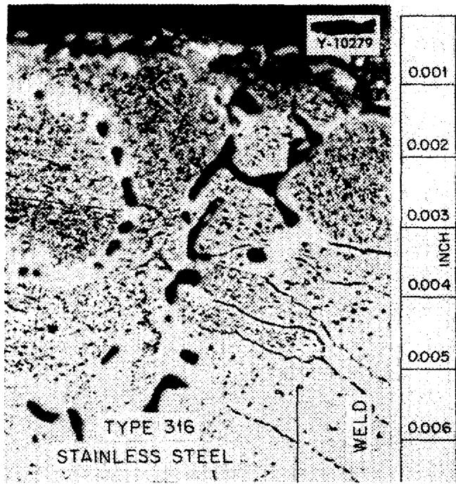

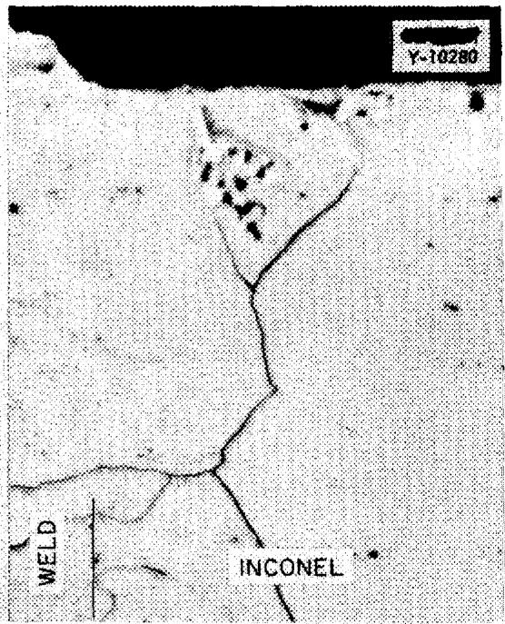  
Fig. 5.1. Attack Adjacent to Weld Joining Type 316 Stainless Steel and Inconel After Exposure to NaF-ZrF $_4$ -UF $_4$ (50-46-4 mole %) in Seesaw Apparatus for 100 hr. During the test the temperature in the weld zone was approximately $1382^{\circ}\mathrm{F}$ . 500X.

impregnated with chromium by the process which uses a reaction between a gaseous chromium compound and iron as a means of exchanging iron atoms for chromium atoms at the surface of the steel. The parts to be treated were packed in a powdered compound containing chromium, an energizer, and an inert material.

Both the type 304 stainless steel and the type 1035 carbon steel after being chromalloyed were tested for 100 hr with hot- and cold-zone temperatures of 1500 and $1220^{\circ}\mathrm{F}$ in sodium, $38\%$ Pb-62% Sn, $82\%$ Pb-18% Cd, $32\%$ Cd-68% Sn, $60\%$ Bi-40% Cd, and $45\%$ Pb-55% Bi. In all cases the chromium-rich layer was found to have cracked, and

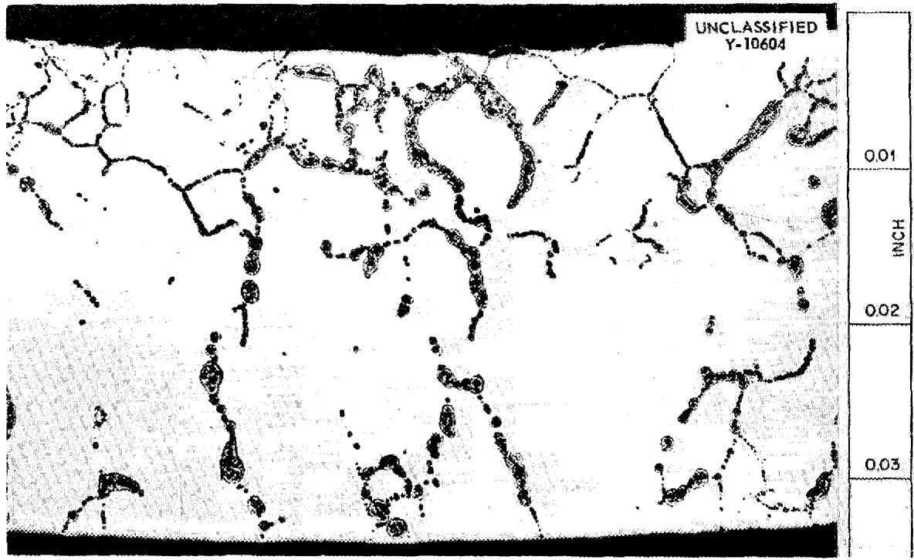  
Fig. 5.2. Intergranular Penetration of Type 316 Stainless Steel Exposed at $1600^{\circ}\mathrm{F}$ for 100 hr to Static Lithium with $0.1\%$ Lithium Nitride Added. Top edge exposed to liquid. 100X.

therefore the corrosion resistance of the base material was unimproved. Figure 5.3 shows photomicrographs of a chromalloyed type 304 stainless steel specimen before and after testing in $45\%$ $\mathrm{Pb - }55\%$ Bi.

# Cermets in NaF-ZrF4-UF4

Various cermets that are being considered as bearing materials were exposed to NaF-ZrF4-UF4 (50-46-4 mole %) in seesaw apparatus. The specimens were restricted to the hot zone of Inconel tubes and were exposed to the fluoride mixture for 100 hr. During the tests the hot zones of the tubes were at $1500^{\circ}\mathrm{F}$ , and the cold zones were at approximately $1292^{\circ}\mathrm{F}$ . The results of the tests are presented in Table 5.3. Of the various cermets of titanium carbide with nickel binder, one specimen with $20\%$ of binder and another with $30\%$ of binder had the best resistance to attack. However, tests of duplicate specimens showed slightly heavier attack. This discrepancy may be due to variations in the specimens. Kennametal D4675 (tungsten carbide plus $2.5\%$ cobalt) showed very good resistance, and additional tests are planned to confirm this result. Since Carboloy X3505, which is the same as Carboloy 608 except that it has no nickel

binder, was not attacked, it appears that the nickel binder in Carboloy 608 $(\mathsf{Cr}_3\mathsf{C}_2$ plus $2 \%$ WC and $15 \%$ Ni) was attacked preferentially (Fig. 5.4).

A second group of cermet samples submitted by Kennametal Inc., and the Sintercast Corp. of America, was exposed under the same conditions. The exact compositions of one of the Kennametal samples and all the Sintercast samples are yet to be obtained from these firms. All these specimens had fair to good resistance to the fluoride mixture, as may be seen in Table 5.4. In general, the corrosion resistance of the cobalt-base bonded specimens was equal to or slightly superior to that of the nickel-base bonded specimens. In all cases the attack appeared to be along the titanium carbide particle surfaces that separate the particles from each other and from the binder. The corrosion along the surfaces of the titanium carbide particles might have been the attack of a fabrication reaction product between the titanium carbide and the binder. It has been reported that a finely dispersed reaction product is usually found in the metallic areas of cermets containing cobalt or nickel.

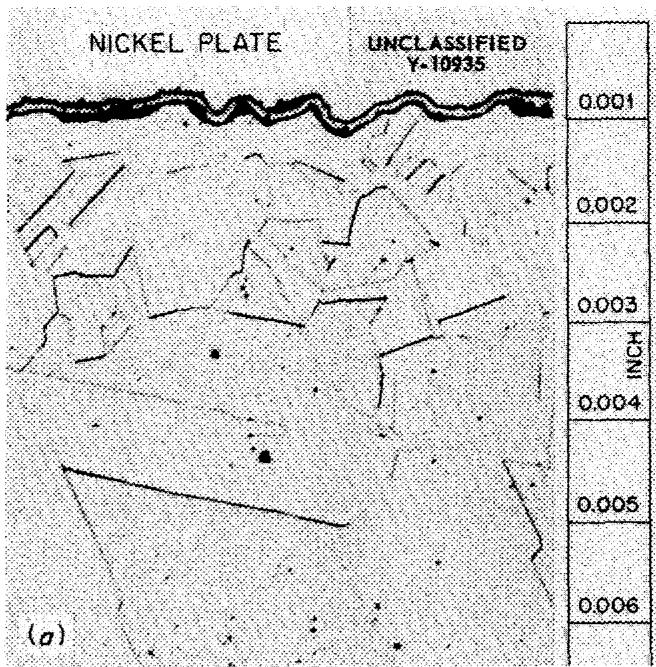

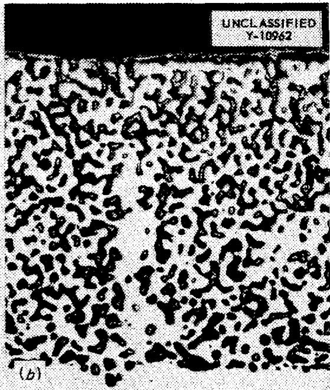  
Fig. 5.3. Chromalloyed Type 304 Stainless Steel Before and After Exposure to $45\%$ Pb- $55\%$ Bi in Seesaw Apparatus. (a) As received. Specimen nickel plated prior to examination to prevent rounding of edge during polishing. (b) After exposure. 500X.

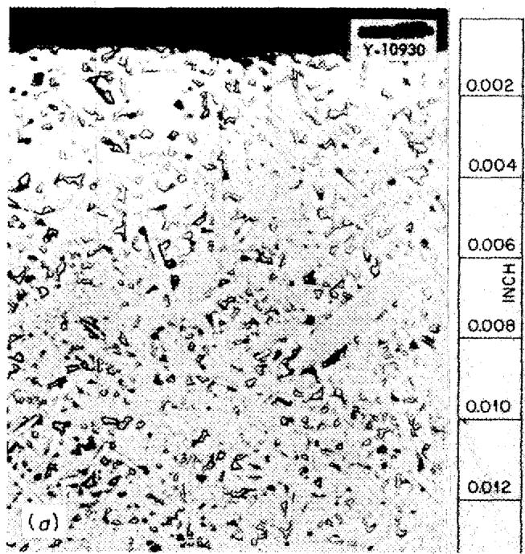

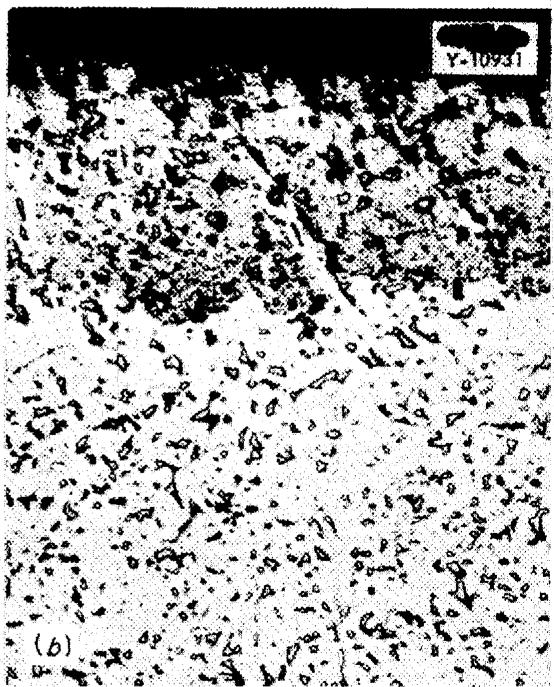  
Fig. 5.4. Carboloy 608 $(\mathsf{Cr}_3\mathsf{C}_2$ plus $2 \%$ WC and $15 \%$ Ni) Before and After Exposure to NaF-ZrF-UF (50-46-4 mole %) for 100 hr at $1500^{\circ}\mathsf{F}$ in Seesaw Apparatus. (a) As received. (b) After exposure. 250X.

TABLE 5.3. RESULTS OF SEESAW TESTS OF CERMETS EXPOSED TO NoF-ZrF4-UF4 (50-46-4 mole %) AT ${1500}^{ \circ  }\mathrm{F}$ FOR 100 hr   

<table><tr><td>MATERIAL</td><td>COMPOSITION</td><td>METALLOGRAPHIC NOTES</td></tr><tr><td>Kentanium K-150-A</td><td>TiC + 10% Ni</td><td>Attacked to a depth of 4 mils</td></tr><tr><td>Kentanium K-151-A</td><td>TiC + 20% Ni</td><td>A zone of slightly affected material to a depth of 1 or 2 mils</td></tr><tr><td>Kentanium K-151-A</td><td>TiC + 20% Ni</td><td>Macroexamination revealed many blisters on the surface of the sample; attack extended to a depth of 6 mils</td></tr><tr><td>Kentanium K-152-B</td><td>TiC + 30% Ni</td><td>Attacked in only a few areas to a maximum depth of 2 mils; much less attack than on either K-150-A or K-151-A</td></tr><tr><td>Kentanium K-152-B</td><td>TiC + 30% Ni</td><td>Attacked somewhat erratically to a depth of 4 to 7 mils; did not resist attack so well as the other sample of K-152-B</td></tr><tr><td>Kentanium K-162-B</td><td>TiC + 25% Ni and 5% Mo</td><td>Macroexamination revealed a surface which had the appearance of a plated specimen with portions of the plating removed; attacked to a depth of 9 mils</td></tr><tr><td>Kennametal D4675</td><td>WC + 2.5% Co</td><td>Subsurface-void attack to a depth of 1 mil</td></tr><tr><td>Firth Sterling 27</td><td>TiC + 7% Cr3C2and 50% Ni</td><td>Attacked to a depth of 2 to 5 mils</td></tr><tr><td>Carboloy 608</td><td>Cr3C2+ 2% WC and 15% Ni</td><td>Attacked to a depth of 4 mils</td></tr><tr><td>Carboloy X3505</td><td>Cr3C2+ 2% WC (no nickel binder)</td><td>No attack detected; both as-received and tested specimens very brittle and similar in appearance</td></tr><tr><td>Metamic LT-I (not heat treated)</td><td>77% Cr-23% Al2O3</td><td>Completely penetrated</td></tr><tr><td>Metamic LT-I (heat treated)</td><td>77% Cr-23% Al2O3</td><td>Completely penetrated</td></tr></table>

These limited tests indicate that corrosion resistance is low for the specimens with the greatest binder content, whether nickel or cobalt.

Titanium boride, zirconium boride, and molybdenum boride samples were also exposed to NaF-ZrF $_4$ -UF $_4$ (53.5-40.0-6.5 mole %) at 1500°F for 100 hr in seesaw apparatus. The specimens were restricted to the hot zone of Inconel tubes. The results of the tests are presented in Table 5.5. The evidence of attack on the zirconium boride specimen may be seen in Fig. 5.5.

# Graphite in NaF-ZrF $_4$ -UF $_4$ and in Sodium

Special tar-impregnated graphite crucibles were exposed to NaF-ZrF4-UF4 (50-46-4 mole %) and to sodium at 1500°F for 100 hr in static tests. As can be seen in Fig. 5.6, the sodium completely penetrated the walls of the crucible and caused them to crack and crumble. The crucible containing

the fluoride mixture had a weight loss of $0.012\%$ , and the surface which was in contact with the fluoride had an etched appearance. The fluoride mixture did not penetrate the crucible walls.

Static tests were also run to compare the corrosion resistance in molten sodium at $1500^{\circ}\mathrm{F}$ for 100 hr of two types of graphite in type 304 stainless steel containers. The types of graphite tested were C-18 (reactor-grade) and a special tar-impregnated graphite that was impregnated and fired 16 times during its preparation. The purpose of the repeated impregnation and firing was to produce a high density and a tough skin that could possibly help to reduce penetration by various liquids. The C-18 graphite was practically unaltered by the test (Fig. 5.7a). The surface of the specimen had an etched appearance and the sharp corners had been rounded slightly. The tar-impregnated cylinder was cracked badly and had spalled, as may be seen in Fig. 5.7b.

TABLE 5.4. RESULTS OF SEESAW TESTS OF TITANIUM CARBIDE CERMETS EXPOSED TO NaF- $ZrF_{4}-UF_{4}$ (50-46-4 mole %) AT 1500°F FOR 100 hr   

<table><tr><td>MATERIAL</td><td>COMPOSITION</td><td>METALLOGRAPHIC NOTES</td></tr><tr><td>Kentanium K-138-A</td><td>65% TiC-20% Co-15% CbTiTaC3</td><td>Attack appeared to be on binder to a depth of 0.5 to 1 mil</td></tr><tr><td>Kentanium K-153-B</td><td>60% TiC-40% Ni</td><td>Attacked to a uniform depth of 3 mils; attack was along the TiC particle surfaces that separate the TiC particles from each other and from the binder</td></tr><tr><td>Kentanium K-161-B</td><td>TiC + Ni and Mo</td><td>No attack; tested surface slightly more irregular than as-received surface</td></tr><tr><td>Sintercast No. 1</td><td>TiC + Co</td><td>Attacked to a depth of 0.5 to 2 mils; many voids throughout specimen probably formed during fabrication</td></tr><tr><td>Sintercast No. 4</td><td>TiC + Co</td><td>Attacked to a depth of 1 mil; some TiC particles had a second phase within them</td></tr><tr><td>Sintercast No. 5</td><td>TiC + Ni</td><td>No attack; binder appeared to be firmly attached to the TiC particles throughout the specimen</td></tr><tr><td>Sintercast No. 8</td><td>TiC + Ni</td><td>Attacked to a depth of 2 mils; small section on corner of speci-men not uniform; appeared to be binder without TiC particles and did not appear to be attacked</td></tr><tr><td>Sintercast No. 10</td><td>TiC + Ni</td><td>Attacked to a depth of 5 mils along the TiC particle surfaces; attack just enough to separate particles from the binder</td></tr></table>

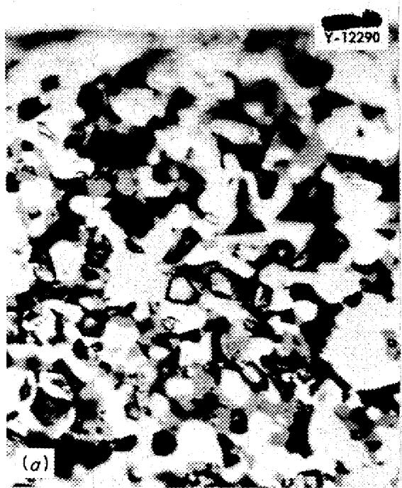

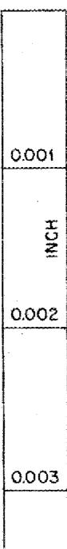

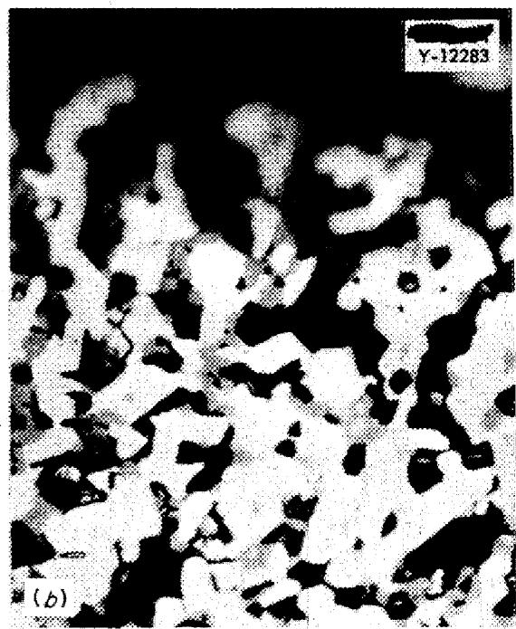  
Fig. 5.5. Zirconium Boride Before and After Exposure to NaF-ZrF $_4$ -UF $_4$ (53.5-40.0-6.5 mole %) for 100 hr at $1500^{\circ}\mathrm{F}$ in Seesaw Apparatus. (a) As received. (b) After exposure. 1000X.

TABLE 5.5. RESULTS OF SEESAW TESTS OF VARIOUS BORIDES EXPOSED TO NaF-ZrF4-UF4 (53.5-40.0-6.5 mole %) AT ${1500}^{ \circ  }\mathrm{F}$ FOR ${100}\mathrm{{hr}}$   

<table><tr><td>SAMPLE</td><td>DEPTH OF ATTACK (mils)</td><td>METALLOGRAPHIC NOTES</td></tr><tr><td>TiB2</td><td>2</td><td>As-received sample had what appeared to be a pressing crack; tested sample had a cracked corner</td></tr><tr><td>ZrB2</td><td>2</td><td>Irregular shaped dark and light grains; as-received sample cracked and porous</td></tr><tr><td>Mo2B</td><td>16</td><td>Corrosion was definite and macroscopically visible in the polished metallographic sample; sample porous and very brittle</td></tr></table>

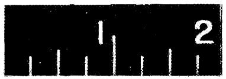

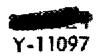

  
UNCLASSIFIED Y-12009

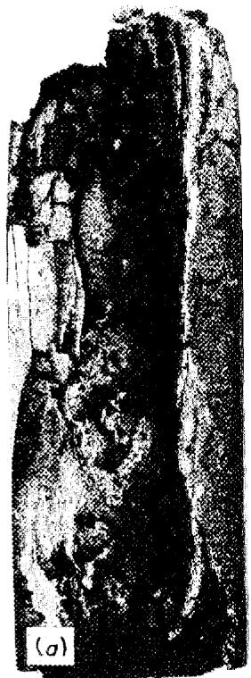

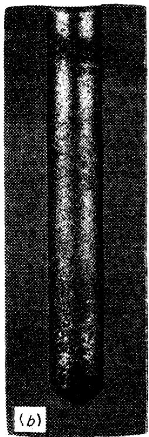

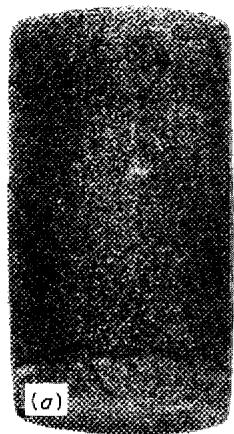

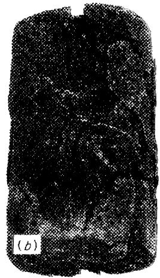  
Fig. 5.7. C-18 Graphite and Tar-Impregnated Graphite After Exposure to Static Sodium in Type 304 Stainless Steel Containers at $1500^{\circ}\mathrm{F}$ for 100 hr. (a) C-18 graphite. (b) Tar-Impregnated graphite.   
Fig. 5.6. Special Tar-Impregnated Graphite Crucibles After Static Tests in Sodium and in NaF-ZrF4-UF4 (50-46-4 mole %) at $1500^{\circ}\mathrm{F}$ for 100 hr. (a) Tested in sodium, (b) Tested in fluoride mixture,

# FLUORIDE CORROSION OF INCONEL IN THERMAL-CONVECTION LOOPS

G. M. Adamson  
Metallurgy Division

# Effects of $\mathsf{UF}_3$ and Mixtures of $\mathsf{UF}_3$ and $\mathsf{UF}_4$ in Fluoride Fuels

An extensive experimental program is under way to determine the effect on corrosion of Inconel thermal-convection loops by circulating fluoride

fuels containing $\mathsf{UF}_3$ and mixtures of $\mathsf{UF}_3$ and $\mathsf{UF}_4$ . It has been determined that fluoride fuels containing uranium as $\mathsf{UF}_3$ are less corrosive to Inconel than $\mathsf{UF}_4$ -bearing fuels. However, $\mathsf{UF}_3$ is not sufficiently soluble in the fluoride mixtures presently being considered for use in the Reflector-Moderated Reactor and mixtures of $\mathsf{UF}_3$ and $\mathsf{UF}_4$ are therefore being investigated. An effort is being made to determine the amount of $\mathsf{UF}_3$ required to eliminate corrosive attack by a fluoride mixture containing $\mathsf{UF}_3$ and $\mathsf{UF}_4$ . A few experiments have been completed with zirconium-base fluoride mixtures and tests with alkali-metal fluoride mixtures are planned.

The fluoride mixture $\mathrm{NaF - ZrF_4 - UF_3}$ was circulated for 500 hr in a standard Inconel thermal convection loop with a hot-leg temperature of $1500^{\circ}F$ ( $\Delta T = 195^{\circ}F$ ). The uranium concentration was low, being only 2.8 wt%. Examination of the loop after 500 hr of operation showed no subsurface voids or intergranular type of attack. The hot-leg

surface was partially covered by a thin, unidentified layer, but no change in the uranium analysis was found.

A mixture with a higher, but still low, uranium concentration was circulated in a second loop. The uranium concentration was 5.8 wt % and to obtain this high a concentration, a mixture of UF₃ and UF₄ was required. Estimates and analyses of the relative amounts of the two compounds have varied from 100% UF₃ to 100% UF₄. While a definite figure cannot be obtained, a reasonable value for the UF₃ seems to lie between one-half and three-fourths of the total uranium. This loop also showed no attack after 500 hr of operation with a hot-leg temperature of 1500°F. Layers were present in both the hot and the cold legs, but the layer in the hot leg was thicker than the layer in the cold leg (Fig. 5.8). The average uranium concentration of the fluoride mixture after circulation was 5.3 wt %, with none of the values as high as the value reported for the mixture before

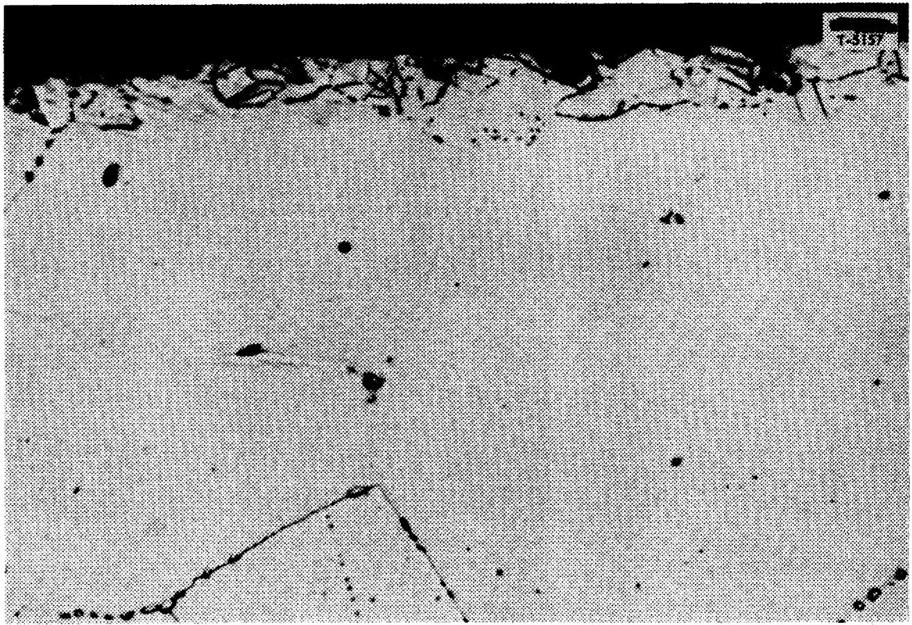  
Fig. 5.8. Layer on Surface of Hot Leg of an Inconel Thermal-Convection Loop After Circulation for $500\mathrm{hr}$ at $1500^{\circ}\mathrm{F}$ of a NaF- $\mathsf{ZrF}_4$ Mixture Containing $\mathsf{UF}_3$ and $\mathsf{UF}_4$ . 1400X.

circulation. It is possible that the deposited material is a uranium-Inconel alloy formed by the dissociation of the $\mathsf{UF}_3$ from the fluoride mixture. This is the main question that must be answered before a decision can be made as to whether these fluoride mixtures will be useful as reactor fuels circulating in Inconel.

An intermediate uranium mixture of 2.7 wt $\%$ UF $_3$ and 8.6 wt $\%$ UF $_4$ or a total uranium concentration of 8.7 wt $\%$ was circulated in another loop. These proportions were obtained by calculations, but the analytically determined uranium concentration of 8.63 wt $\%$ makes the calculated value appear to be reasonable. After 500 hr of circulation, a moderate concentration of subsurface voids with a maximum penetration of 4 mils was found. No layer was found in either the hot or the cold leg. The final analytical values have not been received.

# Effect of Hydrogen Fluoride

Small additions of hydrogen fluoride gas were made to a batch of NaF-ZrF4-UF4 (50-46-4 mole %). Portions of this batch were then circulated for various times at $1500^{\circ}\mathrm{F}$ in Inconel thermal-convection loops in order to determine the effect of hydrogen fluoride on the corrosiveness of the fuel mixture. The data obtained are summarized in Table 5.6.

The doubling of the depth of penetration in loop 415 in comparison with that in loop 421 confirms the adverse effect of small amounts of hydrogen fluoride on the initial rate of attack. In comparison

with the maximum penetration of 17 mils found in loop 417 after 2000 hr of operation, an estimate based on results obtained previously indicates that the maximum penetration in a loop operated for 2000 hr with the as-received fluoride mixture would be 12 mils. The effect of the hydrogen fluoride addition on maximum penetration appears to be about the same after 2000 hr of operation as after 500 hr of operation.

# Effect of Temperature

The effects of temperature drop and of maximum hot-leg temperature on mass transfer in Inconel thermal-convection loops are being studied. The use of thermal-convection loops in the study of the effects of temperature gradients is not entirely satisfactory because the flow in a loop is a function of the density of the fluid and therefore the flow rate changes with changes in the temperature drop. The thermal-convection-loop results are of some value, however, because the flow rates are so low that the changes in flow rate are not so important as the direct changes in temperature drop.

Two series of loops in which the cold-leg temperature was varied while the hot-leg temperature was held at $1500^{\circ}\mathrm{F}$ were operated with $\mathsf{NaF - ZrF_4 - UF_4}$ (50-46-4 mole $\%$ ) as the circulated fluid. The variation in the cold-leg temperature was accomplished by adding insulation or by blowing air on the cold leg. The data from these tests are presented in Table 5.7. The first, more rapid stage of attack is caused by impurities and therefore

TABLE 5.6.EFFECT OF HYDROGEN FLUORIDE ADDITIONS ON CORROSIVENESS OF NaF-ZrF4-UF4 IN INCONEL THERMAL-CONVECTION LOOPS   

<table><tr><td rowspan="2">LOOP NO.</td><td rowspan="2">HYDROGEN FLUORIDE CONCENTRATION (moles/liter of purging gas)</td><td colspan="2">ORIGINAL FLUORIDE- MIXTURE IMPURITY (ppm)</td><td rowspan="2">CIRCULATION TIME (hr)</td><td rowspan="2">MAXIMUM PENETRATION (mils)</td><td rowspan="2">HOT-LEG ATTACK</td></tr><tr><td>Ni</td><td>Fe</td></tr><tr><td>421</td><td>\( 1.2 \times 10^{6} \)</td><td>&lt;10</td><td>110</td><td>500</td><td>5</td><td>Intergranular, moderate to heavy</td></tr><tr><td>415</td><td>\( 3.4 \times 10^{6} \)</td><td></td><td></td><td>500</td><td>10</td><td>Intergranular, moderate to heavy</td></tr><tr><td>416</td><td>\( 6 \times 10^{6} \)</td><td>&lt;10</td><td>345</td><td>1000</td><td>12</td><td>Heavy intergranular</td></tr><tr><td>417</td><td>\( 6 \times 10^{6} \)</td><td>&lt;10</td><td>195</td><td>2000</td><td>17</td><td>Intergranular, moderate to heavy with large voids</td></tr></table>

*Normal concentration of hydrogen fluoride in as-received NaF-ZrF₄-UF₄ mixture.

would not be expected to be greatly influenced by the temperature drop. The differences found appear to take place in the mass-transfer portion of the attack which usually occurs after the first 250 to 500 hr of operation. Although no definite conclusions should be drawn from such meager data, the rate of mass transfer seems to vary quite markedly with changes in temperature drop.

A series of loops filled from one batch of NaF-ZrF $_4$ -UF $_4$ was operated for 2000 hr in an effort to determine the effect on rate of mass transfer of variations in maximum hot-leg temperatures. The

data obtained are presented in Table 5.8. The increases in depth of attack and incidence of cold-leg deposits indicate that the rate of mass transfer increases with increasing hot-leg temperatures.

Loops operated previously for 500 hr with maximum hot-leg temperatures of $1200^{\circ}\mathrm{F}$ showed maximum penetrations of 3 to 5 mils, and in a loop operated for 500 hr with a maximum hot-leg temperature of $1250^{\circ}\mathrm{F}$ the maximum penetration was 3 mils. The previously operated loops were not filled from the batch of fluoride mixture used for filling the loops listed in Table 5.8, but the small vari

TABLE 5.7. EFFECT OF TEMPERATURE GRADIENT ON MASS TRANSFER IN INCONEL THERMAL-CONVECTION LOOPS CIRCULATING NaF-ZrF4-UF4  

<table><tr><td>LOOP
NO.</td><td>MAXIMUM ΔT
(°F)</td><td>OPERATING
TIME
(hr)</td><td>MAXIMUM
PENETRATION
(mils)</td><td>HOT-LEG ATTACK</td></tr><tr><td>447</td><td>65</td><td>1000</td><td>5</td><td>Intergranular, light to moderate</td></tr><tr><td>448</td><td>195*</td><td>1000</td><td>10</td><td>General and intergranular, moderate to
heavy; the deepest penetrations were
scattered</td></tr><tr><td>446</td><td>220</td><td>1000</td><td>12</td><td>Intergranular, moderate to heavy</td></tr><tr><td>422</td><td>130</td><td>500</td><td>5</td><td>Intergranular, moderate to heavy</td></tr><tr><td>423</td><td>140</td><td>2000</td><td>6</td><td>Intergranular, moderate to heavy</td></tr><tr><td>442</td><td>195*</td><td>500</td><td>10</td><td>Intergranular, moderate to heavy</td></tr></table>

*Standard temperature drop.

TABLE 5.8.EFFECT OF VARIATIONS IN MAXIMUM HOT-LEG TEMPERATURE OF THERMAL-CONVECTION LOOPS OPERATED FOR 2000 hr  

<table><tr><td>LOOP NO.</td><td>HOT-LEG TEMPERATURE (°F)</td><td>MAXIMUM PENETRATION (mils)</td><td>HOT-LEG CONDITION</td><td>COLD-LEG CONDITION</td></tr><tr><td>391*</td><td>1200</td><td>7</td><td>Very heavy general attack with small voids</td><td>No deposit</td></tr><tr><td>449</td><td>1250</td><td>6</td><td>Intergranular, moderate to heavy</td><td>No deposit</td></tr><tr><td>392</td><td>1400</td><td>8</td><td>Heavy general attack to 4 mils with occasional deeper intergranular penetrations</td><td>Intermittent metallic deposit</td></tr><tr><td>393</td><td>1600</td><td>13</td><td>Intergranular, moderate to heavy with large voids</td><td>Thin but continuous metallic deposit</td></tr></table>

*This run was terminated after 1313 hr when circulation was stopped for the second time by a power failure.

ations encountered in comparing different batches are not sufficient to invalidate the comparison between the previously operated loops and loops 391 and 449. The difference between the maximum penetration in loop 391 and the maximum penetration in the loops operated previously indicates that mass transfer takes place even at a hot-leg temperature as low as $1200^{\circ}\mathrm{F}$ .

# Effect of Exposure Time

A maximum penetration of 27 mils was found in loop 344 which circulated NaF-ZrF $_4$ -UF $_4$ (50-46-4 mole %) for 5000 hr at $1500^{\circ}\mathrm{F}$ . The fluoride mixture in this loop was from the same batch as that used for a series of tests reported previously. When graphed, the values for the depth of attack in 5000 hr fell surprisingly close to the straight line for the second stage of attack (after 250 hr), as shown in Fig. 6.6 of the previous report. The average increase in depth of attack is about 4 mils for every 1000 hr of operation after the first 250 hr. A layer about $\frac{1}{4}$ -in. thick of dendritic chromium metal crystals was found in the trap at the bottom of the cold leg of the loop operated for 5000 hr (Fig. 5.9).

Another series of experiments is under way to confirm the time curve and to provide samples from which a reaction rate may be obtained by determining the volume of the subsurface voids. The data obtained for the time study (tabulated in Table 5.9) confirm the data obtained previously,2

including the change of slope of the curve at around 250 hr. However, the depth of attack found in the loop that operated for 1000 hr is out of line both with the other data obtained in this series of experiments and with the data from previous experiments.

2G. M. Adamson, ANP Quar. Prog. Rep. Sept. 10, 1953, ORNL-1609, p 79, esp. Fig. 6.6.

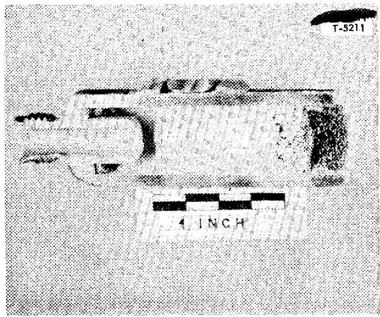  
Fig. 5.9. Dendritic Chromium-Metal Crystals in Trap at Bottom of Cold Leg of an Inconel Thermal-Convection Loop That Circulated NaF-ZrF4-UF4 (50-46-4 mole %) for 500 hr at a Hot-Leg Temperature of $1500^{\circ}\mathrm{F}$ . 250X. Reduced 19.5%.

TABLE 5.9. EFFECT OF OPERATING TIME ON DEPTH OF ATTACK BY NaF-ZrF4-UF4 CIRCULATING IN INCONEL THERMAL-CONVECTION LOOPS AT A HOT-LEG TEMPERATURE OF ${1500}^{ \circ  }F$   

<table><tr><td>LOOP
NO.</td><td>OPERATING
TIME
(hr)</td><td>MAXIMUM
PENETRATION
(mils)</td><td>HOT-LEG ATTACK</td></tr><tr><td>431</td><td>10</td><td>2</td><td>Light with intermittent moderate areas</td></tr><tr><td>432</td><td>50</td><td>3</td><td>Moderate</td></tr><tr><td>433</td><td>100</td><td>4.5</td><td>Light to moderate</td></tr><tr><td>434</td><td>250</td><td>8</td><td>Moderate to heavy, primarily intergranular</td></tr><tr><td>435</td><td>500</td><td>8</td><td>Heavy, primarily intergranular</td></tr><tr><td>436</td><td>1000</td><td>14</td><td>Heavy, intergranular</td></tr><tr><td>445</td><td>1500</td><td>13</td><td>Heavy, intergranular</td></tr></table>

# THERMAL-CONVECTION-LOOP TESTS OF VARIOUS MATERIALS

NaF-ZrF4-UF4 in Special Inconel

G.M. Adamson

Metallurgy Division

A special series of alloys with slight changes from the usual Inconel analysis were vacuum cast at ORNL and drawn into $\frac{1}{2}$ -in. tubing with a 0.065-in. wall by the Superior Tube Co. The first lot of tubing was made into a loop which circulated NaF-ZrF $_4$ -UF $_4$ (50-46-4 mole %) for 500 hr at a hot-leg temperature of $1500^{\circ}\mathrm{F}$ . A portion of the chromium normally found in Inconel had been replaced in this special alloy by molybdenum. An analysis of the special alloy showed $6.0\%$ Cr, $10.0\%$ Fe, $74.4\%$ Ni, and $9.8\%$ Mo. Examination of the tubing after 500 hr showed light attack with a maximum penetration of 3.5 mils. Standard Inconel loops of commercial $\frac{1}{2}$ -in. tubing developed moderate to heavy attack 4 to 5 mils deep under the same conditions. $^3$ Although the attack on the special alloy was somewhat less than the attack on commercial Inconel, the special alloy was not as corrosion resistant as had been expected. Additional loops are to be operated for longer periods to study the effects of mass transfer.

NaF-ZrF4-UF4 in Hastelloy B

G.M.Adamson

Metallurgy Division

A loop of $\frac{1}{2}$ -in. Hastelloy B tubing was fabricated by seam welding and then solution annealed for 1 hr at $2150^{\circ}\mathrm{F}$ and aged 30 hr at $1950^{\circ}\mathrm{F}$ . The fluoride mixture $\mathrm{NaF - ZrF_4 - UF_4}$ (50-46-4 mole %) was then circulated in this loop for 500 hr at a hot-leg temperature of $1500^{\circ}\mathrm{F}$ . Examination of the tubing after 500 hr showed that the inner surface of the hot leg was rough and had light subsurface voids to a depth of 2 mils. The weld bead at the seam showed much less attack than the tubing (Fig. 5.10). The cold leg showed similar attack except that there were fewer subsurface voids.

NaF-ZrF $_4$ -UF $_4$ in Stainless Steel

G.M.Adamson

Metallurgy Division

A second type 430 stainless steel loop was operated with NaF-ZrF $_4$ -UF $_4$ (50-46-4 mole %) for 500 hr at a hot-leg temperature of 1500°F. The

hot leg developed very light, widely scattered subsurface voids to a maximum depth of 7 mils. A phase change of the stainless steel to what appeared to be martensite was noted in the vicinity of the voids. In an area up to 10 mils deep from the surface, the carbides had apparently gone back into solution and grain growth had occurred (Fig. 5.11). Particles of metal had deposited on the surface of the cold leg, and metallic crystals were found in the adhering fluorides. While the attack was less than that found in Inconel loops, more metallic crystals were visible. The attack was also slightly greater than that found in the first type 430 stainless steel loop.

NaF-ZrF4-UF4 in Inconel with Stainless Steel or Nickel Inserts

G.M.Adamson

Metallurgy Division

Mass transfer of dissimilar metals was investigated in a series of loops with various combinations of Inconel and type 316 stainless steel. The fluoride mixture NaF-ZrF4-UF4 (50-46-4 mole %) was circulated in the loops for 500 hr at a hot-leg temperature of $1500^{\circ}\mathrm{F}$ .

Inconel loop 315 had a 6-in. insert of type 316 stainless steel in the upper portion of the hot leg. The Inconel above the insert showed very light, widely scattered attack to a depth of 3 mils. The surface of the type 316 stainless steel insert was very rough and there was attack to a depth of 12 mils. There was a 0.3-mil-thick deposit on the Inconel cold leg.

In Inconel loop 430, the lower half of the hot leg was replaced with type 316 stainless steel. The Inconel showed moderate attack to a depth of 8 mils. At the welds the Inconel was rough but showed no other evidence of attack. The stainless steel had severe intergranular voids to a depth of 4 mils. There was no deposit and no attack in the cold leg.

Loop 429 was constructed with a hot leg of type 316 stainless steel and a cold leg of Inconel. The surface of the hot leg was very rough and showed severe intergranular penetrations to a depth of 4

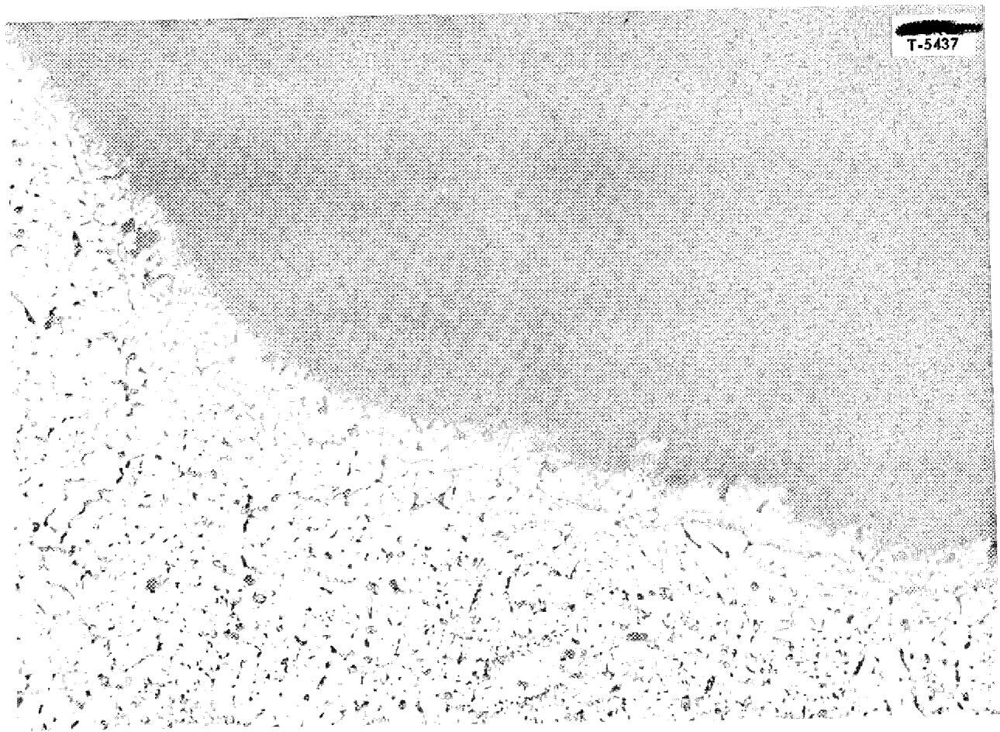  
Fig. 5.10. Hot-Leg Surface and Weld Bead of a Hastelloy B Loop After Circulation of NaF-ZrF $_4$ -UF $_4$ (50-46-4 mole %) for 500 hr at a Hot-Leg Temperature of $1500^{\circ}\mathrm{F}$ . 250X.

mils. At the welds the stainless steel was heavily attacked to a depth of 3 mils. At the lower weld the Inconel was unattacked, but at the upper weld there were many subsurface voids to a depth of 3 mils in the Inconel. A scattered metallic deposit was found on the Inconel cold leg.

In loop 428, the cold leg was type 316 stainless steel and the hot leg was Inconel. The Inconel hot leg showed heavy intergranular attack to a depth of 10 mils. At the welds the Inconel surface was rough and there was a light concentration of subsurface voids to a depth of 0.5 mil. The stainless steel at the welds showed severe but intermittent attack to a depth of 2 mils. The surface of the stainless steel cold leg was very rough with heavy intergranular attack to a depth of 2.5 mils. An all-Inconel loop (435) filled from the same batch of fluorides showed heavy hot-leg attack to a depth of 8 mils.

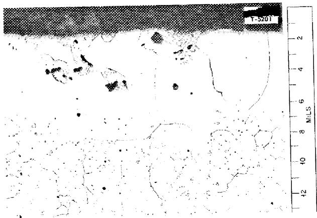  
Fig. 5.11. Hot-Leg Surface of Type 430 Stainless Steel Loop After Circulation of NaF-ZrF $_4$ -UF $_4$ (50-46-4 mole %) for 500 hr at a Hot-Leg Temperature of $1500^{\circ}\mathrm{F}$ . 250X. Reduced 35.5%.

In every loop tested, there was much deeper attack of the type 316 stainless steel insert, especially when it was in contact with Inconel in the hotter portion of the loop, than there would have been in an all-steel loop. The effect of the stainless steel on the Inconel is not so definite, but in most cases there seemed to be a reduction in the attack on the Inconel. Since the data showed rather large variations in wall thickness, the thicknesses are being rechecked, but it seems that considerable reductions in wall thickness occurred in all the type 316 stainless steel tubing.

A nickel insert was also placed in the cold leg of an Inconel loop. With this combination neither material seemed to be affected. This experiment confirms a previous experiment in which a nickel hot-leg insert in an Inconel loop was also shown to have practically no effect.

# Sodium in Inconel with Beryllium Inserts

G.M. Adamson

Metallurgy Division

Two Inconel loops were constructed with cylindrical hot-pressed beryllium inserts about 6 in. long. Both loops circulated sodium for 500 hr at a hot-leg temperature of $1500^{\circ}\mathrm{F}$ . In one loop the insert was in the upper portion of the hot leg. The outer surface of the insert, which was separated from the Inconel by a 0.020-in. annulus filled with slow-moving sodium, showed subsurface-void attack to a maximum depth of 14 mils. The inner surface of the insert did not have the void type of attack, but it was rough, and some even removal had probably occurred. The Inconel adjacent to the beryllium was rough, and there was a metallic appearing deposit on the surface. A black scale was present in all sections of this loop, and metallic crystals were found both in the annulus and in the cold leg. These crystals were predominantly nickel and beryllium. The black scale produced a very complicated diffraction pattern which could not be identified.

In the other loop the beryllium insert was in the lower cold leg. No attack was found in the Inconel hot leg of this loop. A thin metallic deposit was visible on the surface of the Inconel below the insert but not on the surface above it. The insert showed some attack on both faces as surface

roughness, intergranular penetrations, and voids to a maximum depth of 2 mils. Again, some even removal had probably occurred. No metallic crystals were found in this loop, but the same black scale was found in all sections. Three additional loops are now operating with similar hot-leg inserts. These loops are circulating sodium at 900, 1100, and $1300^{\circ}\mathrm{F}$ .

# Lithium in Stainless Steel

E.E.Hoffman

W. H. Cook

J. E. Pope

L.R.Trotter

Metallurgy Division

Two lithium-filled type 316 stainless steel thermal-convection loops completed 1000 hr of operation. One loop operated with a hot-leg temperature of $1500^{\circ}\mathrm{F}$ and a cold-leg temperature of $1220^{\circ}\mathrm{F}$ . The other loop operated with a hot-leg temperature of $1445^{\circ}\mathrm{F}$ and a cold-leg temperature of $1337^{\circ}\mathrm{F}$ . At no time during the tests did the loops give any indication of plugging. There was very little difference in the appearance of the hot leg and the cold leg in either loop. There was no macroscopic evidence of mass-transferred crystals except at the bath-level line below the fill pipe where there was a fine ring of crystals in both loops. Metallographic examination of these loops is not yet complete.

# FUNDAMENTAL CORROSION RESEARCH

G.P. Smith

Metallurgy Division

# Mass Transfer in Liquid Lead

J.V.Cathcart

Metallurgy Division

The investigation of corrosion and mass transfer in liquid lead has revealed that small quartz thermal-convection loops containing types 410 and 446 stainless steel test specimens require from two to three times longer to plug than similar loops containing pure iron and chromium or one of the 300-series stainless steels. An effort has been made to find an explanation for this phenomenon. As in previous experiments, all tests were con

duced in small quartz thermal-convection loops. $^{8}$

Two possible explanations for the increased resistance to mass transfer of the 400-series stainless steels in liquid lead have been considered. First, the influence of the very thin oxide films on the specimens was investigated. It was thought possible that the oxide formed on the 400-series stainless steels possessed a structure which made it especially resistant to attack by liquid lead. In such an event a thin oxide film would present a barrier to the solution of material from the specimen walls and thus reduce the rate of mass transfer. It has been demonstrated that relatively thick oxide films (approximately 1000 Å) greatly reduced mass transfer in loops containing types 304 and 347 stainless steel specimens.

An attempt was also made to remove completely the oxide film from type 446 stainless steel specimens mounted in a loop. A small quartz tube was sealed into the loop at the bottom of the bend in the cold leg and, before the loop was loaded, the specimens were heated to $950^{\circ}\mathrm{C}$ while hydrogen, which had been dried over magnesium perchlorate, was allowed to flow through the loop. After 1 hr of this treatment the side arm was sealed off with a hand torch, and the loop was immediately loaded with liquid lead. The loop plugged after 768 hr of operation with hot- and cold-leg temperatures of 805 and $525^{\circ}\mathrm{C}$ . The long time required for the plugging of this loop was taken as an indication that the presence of an oxide film on the specimens was not the correct explanation for the relatively high resistance to mass transfer in liquid lead exhibited by type 446 stainless steel. Of course, it is possible that the oxide on the test specimens was only partially reduced or that, even if it were completely reduced, enough oxide remained in the lead to reoxidize the surface of the test specimens. In such an event, the results of this test would be inconclusive; however, it is believed that the corrosion characteristics of type 446 stainless steel cannot be explained on the basis of the influence of thin oxide films on the surface of the test specimens.

The second approach made to the problem involved the assumption that a thin layer of sigma phase formed near the surface of the types 446 and

410 stainless steel hot-leg specimens and served as a barrier to solution of the specimens. The presence of such a layer has not yet been revealed either by metallographic examination of the test specimens or by an x-ray study of filings taken from the surface of a type 446 stainless steel hot-leg specimen. If this explanation is correct, however, only a very thin layer of sigma phase would be required to produce the increased resistance to mass transfer and it may not be surprising that such a layer has not been found.

In order to test the effect of sigma phase on resistance to mass transfer in iron-chromium-nickel alloys, a special alloy having a composition of $16\%$ Ni- $37\%$ Cr- $47\%$ Fe was prepared. This alloy was chosen because its composition corresponds to that in the sigma-plus-austenite region of the nickel-chromium-iron phase diagram. Two sets of specimens were prepared; one set was annealed for 80 hr at $810^{\circ}\mathrm{C}$ to facilitate the precipitation of the sigma phase; the other set was annealed at $1200^{\circ}\mathrm{C}$ and water-quenched to leave only ferrite and austenite phases in the alloy.

Two loops containing sigma-phase (sigma and austenite) specimens of this alloy were operated. The first loop plugged after 456 hr of operation with hot- and cold-leg temperatures of 820 and $510^{\circ}\mathrm{C}$ . The second loop plugged after only 306 hr with hot- and cold-leg temperatures of 805 and $550^{\circ}\mathrm{C}$ . Metallographic examination of the second loop has not yet been completed, but a transverse section of the attacked region on the hot-leg specimen from the first loop is shown in Fig. 5.12. As may be seen, the attack was very irregular; thin filaments of the original metal extend into a lead matrix. Close examination revealed that each filament consisted of a core of sigma-phase material surrounded by a thin film of matrix metal. The sigma-phase regions of the test specimens appeared to have suffered much less attack than the austenitic regions.

The nonsigma-phase (ferrite and austenite) specimens of the alloy were also tested in two loops. The first loop plugged after 287 hr of operation with hot- and cold-leg temperatures of 810 and $520^{\circ}\mathrm{C}$ . The second loop plugged after 101 hr with hot- and cold-leg temperatures of 810 and $510^{\circ}\mathrm{C}$ . A transverse section of the hot-leg specimen from the first loop is shown in Fig. 5.13.

The lack of reproducibility in the plugging times for both the sigma- and nonsigma-phase loops can

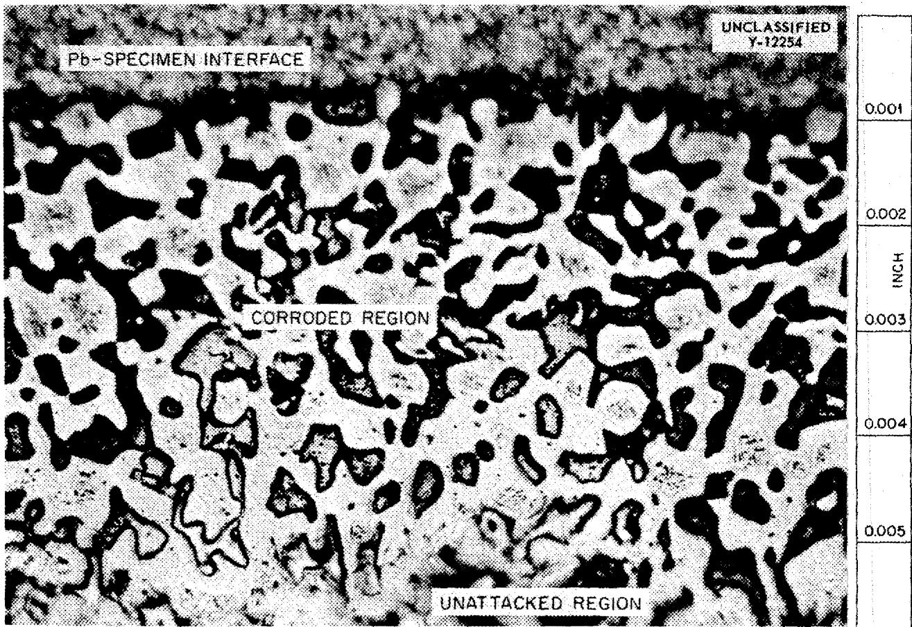  
Fig. 5.12. Transverse Section of a Special Sigma-Phase Alloy (16% Ni-37% Cr-47% Fe) Specimen from the Hot Leg of a Quartz Thermal-Convection Loop Which Circulated Liquid Lead, 750X.

probably be accounted for in terms of differences in the degree of transformation which occurred during the heat treatments of the specimens. The hot-leg temperature during the operation of the loops was very close to the sigma-to-ferrite transformation temperature; thus it is not unlikely that an appreciable amount of sigma phase was either formed or destroyed during the operation of the loops and therefore produced the variation in plugging times which was observed.

The results obtained with the $16\%$ Ni- $37\%$ Cr- $47\%$ Fe alloy indicate a definite increase in resistance to mass transfer for sigma-phase alloys in comparison with the nonsigma-phase alloys. However, no definite conclusions can be drawn as to the role of the sigma phase in the resistance to mass transfer exhibited by the 400-series stainless steels until a sigma-phase layer is actually observed in the test specimens from a loop containing one of these steels.

# Products of Hydroxide-Metal Reactions

H. L. Yakel, Jr. G. P. Smith  
Metalurgy Division

Studies are being made to identify the compounds produced by hydroxide-metal reaction and to determine their properties. Previous studies were concerned with the action of lithium and sodium hydroxides on nickel in the presence of oxidizing agents.[10] Current research is concerned with the reaction which occurs between sodium hydroxide and nickel when hydrogen is allowed to escape from the system.

Miller and Williams11 have shown the existence

10 L. D. Dyer, B. S. Borie, Jr., and G. P. Smith, Alkaline Metal Nickel Oxides Containing Trivalent Nickel, ORNL-1667 (Feb. 26, 1954).   
11Reported by D. D. Williams and C. T. Ewing in Sixth Progress Report on Thermal and Related Physical Properties of Molfen Materials, Naval Research Laboratory Problem No. 32C11-06 (1953) and preceding reports in this series.

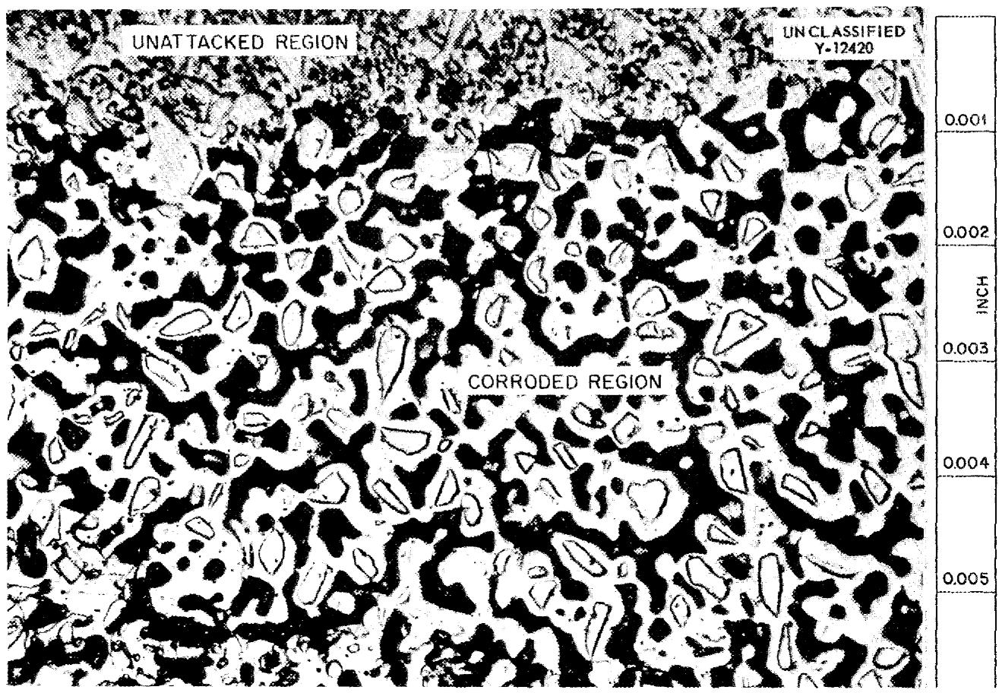  
Fig. 5.13. Transverse Section of a Special Nonsigma-Phase Alloy (16% Ni-37% Cr-47% Fe) Specimen from the Hot Leg of a Quartz Thermal-Convection Loop Which Circulated Liquid Lead. 750X.

of an equilibrium of the type $\mathrm{Ni} + \mathrm{NaOH} = \mathrm{H}_2 +$ unknown products. They reported that when this equilibrium was displaced by evacuating at 900 to $1000^{\circ}\mathrm{C}$ until hydrogen evolution ceased, an "amorphous" product was obtained which had a gross composition corresponding to 1 mole of sodium oxide and 1 mole of nickelous oxide. Woltersdorf found that mixtures of sodium oxide and nickelous oxide react at temperatures as low as $250^{\circ}\mathrm{C}$ to produce various crystalline sodium nickelate(II) compounds. He was able to establish that sodium orthonickelate(II) has the empirical formula $\mathrm{Na}_2\mathrm{NiO}_2$ . Kruh found that a mixture of NaOH and nickel heated to $700^{\circ}\mathrm{C}$ under flowing argon gave x-ray powder patterns which did not

correspond to any patterns in the literature. Kertesz and Knox14 induced a reaction between sodium hydroxide and nickel by slowly removing a relatively small amount of hydrogen gas. X-ray powder patterns of the resulting material did not show any identifiable lines.

During the past few months the reaction which takes place when hydrogen is rapidly evacuated from the NaOH-Ni system has been studied. The primary product of this reaction is a crystalline sodium divalent nickelate of an as yet undetermined formula.

In these studies the reaction chamber was a 1.27-cm-OD, 44-cm-long nickel tube (low-carbon grade). The tube was welded closed at the bottom end and fastened at the top end to the rest of the all-glass apparatus by means of a standard, ground ball joint. The nickel tube could be evacuated

through either of two circuits by turning a stopcock. One circuit was relatively short and allowed fast pumping speeds. The other circuit contained a liquid-nitrogen cold trap. The pressure of the system was measured by means of a Pirani gage and an Octoil-S manometer similar to that described by Biondi.[15] This combination of instruments provided pressure measurements from 1 to $1000\mu$ with a precision of $\frac{1}{5}\mu$ at the low-pressure extreme and $20\mu$ at the high-pressure extreme. The vacuum was produced by a Kinney CVM 3534 mechanical pump. Dry carbon-dioxide-free argon could be admitted to the apparatus when desired. The nickel reaction tube was heated by a tube furnace. Temperatures were measured with chromel-alumel thermocouples which were wired to the nickel tube. The method used for opening the reaction tubes at the end of an experiment did not make it practical to weld the thermocouples to the tube. Hence, the highest temperatures reported $(950^{\circ}\mathrm{C})$ may have been in error by as much as $\pm 20^{\circ}\mathrm{C}$ .

The nickel reaction tube was loaded in air with about $10\mathrm{g}$ of cp-grade sodium hydroxide and then quickly attached to the apparatus. Dehydration of

the hydroxide was accomplished by slowly heating it to about $400^{\circ}\mathrm{C}$ under a vacuum. The circuit containing the cold trap was used to remove the water evolved. The course of the dehydration was followed by observing pressure changes, and some observations were made that are described in the following section.

After the dehydration step the temperature was increased to a predetermined value while the gases evolved were pumped off through the short circuit. After reaction had proceeded as far as desired, the furnace was rapidly cooled. Dry carbon-dioxide-free argon was then admitted to the apparatus, and the reaction tube and its contents were removed to a dry box for examination.

Reactions were carried out over the temperature range of 770 to $950^{\circ}\mathrm{C}$ , and the reaction products were examined. At $770^{\circ}\mathrm{C}$ the pressure (assumed to be due to hydrogen) rose to a maximum of $200\mu$ and slowly decreased to $70\mu$ over a period of about 7 hr. The course of another reaction is shown in Fig. 5.14. It had been intended that this reaction would be carried out at $950^{\circ}\mathrm{C}$ . However, as may be seen from Fig. 5.14, the pressure passed through its maximum before $950^{\circ}\mathrm{C}$ was reached. The shaded area connects the extremes of pressure fluctuations.

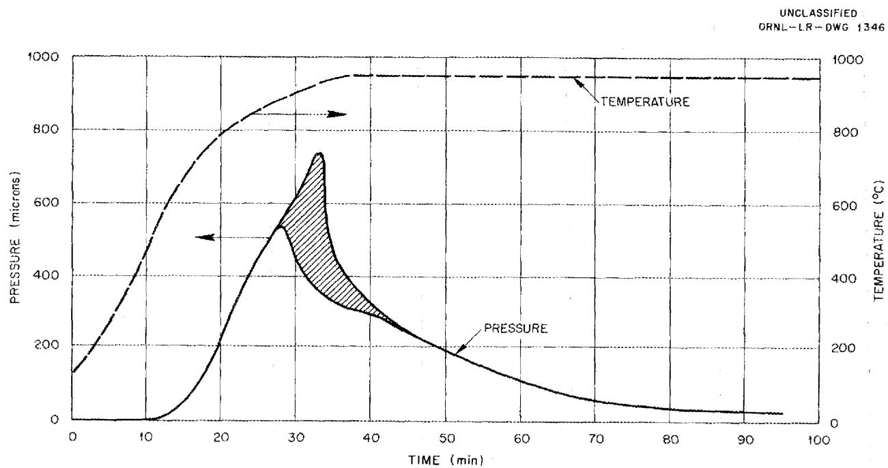  
Fig. 5.14. Gas Evolution in the Reaction of Nickel with Sodium Hydroxide in a Continuously Evacuated System.

In Fig. 5.14, an area $A$ taken under the curve for any time interval $\Delta t$ is proportional to $n$ , the number of moles of gas evolved during the time interval $\Delta t$ . The pumping speed $s$ is defined to be $s = dV / dt$ , where $dV$ is the increment of gas volume passing through a given cross section of tubing in the time interval $dt$ . By applying the ideal gas law in its usual form it is seen that

$$
d n = \frac {s P}{R T} d t.
$$

If $s$ is constant over the pressure range under consideration,

$$
n = \frac {s}{R T} \int_ {t _ {i}} ^ {t _ {f}} P d t = \frac {s A}{R T},
$$

and therefore

$$
n \sim A.
$$

For the pressure range represented in Fig. 5.14, the pumping speed varies by about $20\%$ for the Kinney CVM 3534 pump.

Application of this analysis to Fig. 5.14 shows that the reaction $\mathrm{NaOH} + \mathrm{Ni} = \mathrm{nickelate} + \mathrm{H}_2$ cannot be said to cease at any definite time under the experimental conditions. The effect which the accumulation of the reaction product has on the diffusion of sodium hydroxide to the nickel wall is undoubtedly the reason for this.

The nickel tubes containing the reaction products were opened in a helium-filled dry box. Microscopic examination showed that the reaction products consisted of fibers and a powder, which were subsequently separated.

The fibers, when very thin, were transparent green. They showed no recognizable crystal faces and were frequently bent or partially split along the fiber axis. They dissolved readily in $1N$ hydrochloric acid, had an oxidizing power of less than 0.88 meq/g (probably due to cobalt and manganese impurity), and reacted with moisture and carbon dioxide in the air to form a crust of sodium carbonate monohydrate. The chemical data suggest that the compound is a sodium nickelate(II).

A single fiber was sealed in a glass capillary in the dry box immediately after the nickel reaction tube was open. This fiber, which was found to be a single crystal, was used for preliminary structure determination work. Rotation, Weissenberg, and precession photographs of the single-crystal fiber show orthorhombic symmetry (Laue

symmetry mm). Unit cell dimensions were measured from all three types of photograph, and the suitably averaged results are:

$$
\begin{array}{l} a = 8. 2 8 _ {4} \stackrel {\circ} {A} \pm 0. 0 1 1 \stackrel {\circ} {A}, \\ b = 1 0. 1 4 _ {9} \mathrm {A} \pm 0. 0 0 8 \mathrm {A}, \\ c = 2. 8 1 _ {5} \mathrm {A} ^ {\circ} \pm 0. 0 0 8 \mathrm {A} ^ {\circ}, \\ V \simeq 2 3 6. 6 7 \times 1 0 ^ {- 2 4} c c. \\ \end{array}
$$

The extinctions observed in the single-crystal diffraction pattern are consistent with the three space groups Amam, Ama2, and Ama2. Piezoelectric or pyroelectric experiments might distinguish between the centrosymmetric space group Amam and the other noncentrosymmetric possibilities, but these experiments have not been performed because of the lack of experimental equipment. A statistical averaging of the observed intensities may also permit a distinction to be made between the possible space groups.

If the compound is assumed to consist only of $\mathrm{Na}^{+}$ , $\mathrm{Ni}^{2+}$ , and $\mathrm{O}^{2-}$ , chemical analysis for sodium and nickel of alcohol-washed products gives a composition which cannot exist. If, on the other hand, it is assumed that nickelous hydroxide is present, the chemical analysis is quantitively satisfied by a mixture of $\mathrm{Na}_{2}\mathrm{NiO}_{2}$ with $40\mathrm{wt}\%$ $\mathrm{Ni(OH)}_{2}$ . Such a mixture would be plausible. It is not unlikely that sodium orthonickelate(II) is the original product of the reaction, that it reacts with atmospheric water to form nickelous hydroxide and sodium hydroxide, and that the sodium hydroxide is removed by the alcohol washing.

# Dehydration of Sodium Hydroxide

G.P.Smith

Metallurgy Division

It is well known that sodium hydroxide can be dehydrated by heating to $400^{\circ}\mathrm{C}$ under a vacuum. However, the details of this process have not previously been reported. In studies of the reaction of sodium hydroxide with nickel, as described above, it was possible to measure the evolution of water during the course of dehydration. It was found that virtually all the water evolution occurred near the melting points of sodium hydroxide monohydrate and sodium hydroxide. This result is not surprising in view of the enhanced diffusion rates in the liquid as compared with the solid. However, the quantitative extent of this effect is greater than might have been predicted.

Figure 5.15 is a plot of pressure and temperature vs time during one of four similar dehydrations. As was shown in the preceding section, an area under the pressure-time curve for a specified time interval is proportional to the amount of gas evolved during that time interval. Hence, most of the water was evolved within the relatively narrow limits of two peaks or bands, the first of which corresponds to the melting of sodium hydroxide monohydrate and the second of which corresponds to the melting of sodium hydroxide. The shaded area on the second peak connects the upper and lower limits of rapid pressure fluctuations which were probably caused by the bursting of water vapor bubbles.

# Color Changes in Fused Hydroxides

C.R.Boston M.E.Steidlitz Metallurgy Division

Color changes observed in fused hydroxides indicate the existence of species in thermal equilibrium other than the expected sodium ions and hydroxyl ions. Several years ago it was noted in this laboratory that colorless fused sodium hydroxide in a nickel container under an atmosphere of hydrogen turned green when heated to above $500^{\circ}\mathrm{C}$ and again became colorless when cooled to below $500^{\circ}\mathrm{C}$ . This color change was at first thought to be due to a changing concentration of

nickel ions with changing temperature. Subsequently it was found that the same color change took place when the hydroxide was contained in silver. These observations indicated that the color was not due to the presence of heavy-metal ions. This qualitative study of color changes has been greatly extended.

The experimental method used consisted of placing the hydroxide in a crucible which was contained in a quartz tube which could be evacuated with a mechanical pump and to which various atmospheres could be admitted. The crucible of hydroxide was heated by a small pot-type furnace in which the hydroxide could be observed. The gases were either dried by passing them through a liquid-nitrogen cold trap or they were saturated with water vapor by bubbling them through water. In most of the experiments the crucibles used were pure sintered aluminum oxide (Morganite) to ensure the absence of heavy-metal ions. Morganite is very slowly and uniformly attacked by fused hydroxides. However, of the various ceramic crucibles available, Morganite was by far the most resistant to corrosion. In a few tests, nickel crucibles were used. The lithium, sodium, and potassium hydroxides used were cp grade. The rubidium and cesium hydroxides were supplied by L. G. Overholser of the ORNL Materials Chemistry Division.

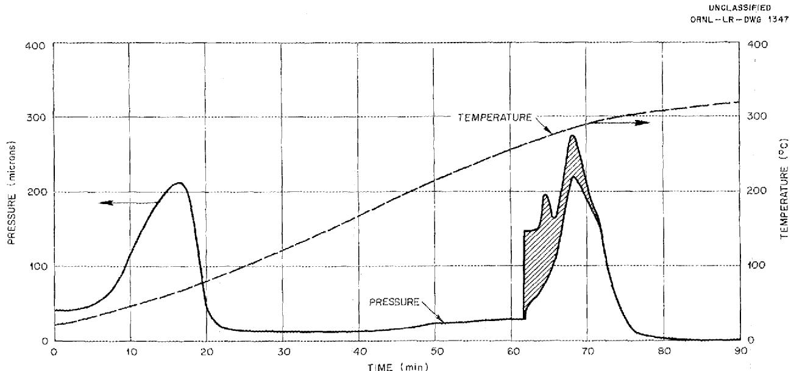  
Fig. 5.15. Water Evolution During the Dehydration of Sodium Hydroxide at a Slow Heating Rate.

A series of experiments was conducted in which the hydroxides were heated to approximately $600^{\circ}\mathrm{C}$ under specified atmospheres. At $600^{\circ}\mathrm{C}$ the initial atmosphere was evacuated and various atmospheres were successively admitted and evacuated. Finally the hydroxide was cooled to room temperature. During each step the color changes were noted.

The colors of the hydroxides (contained in Morganite) which developed on standing in specified atmospheres at $600^{\circ}\mathrm{C}$ are shown in Table 5.10. For each combination of fused hydroxide and atmosphere which was studied, the hydroxide was colorless below approximately $500^{\circ}\mathrm{C}$ and distinctly colored at $600^{\circ}\mathrm{C}$ . The colorless-colored transition was reversible with changing temperature. When the system was evacuated or filled with a specified gas, the color changed sometimes with startling abruptness after a brief induction period.

Lithium hydroxide did not lend itself well to testing because of its tendency to decompose with the evolution of water. Sodium hydroxide, after being heated for a long period in either air or vacuum, changed in color from yellow to a deep red-orange. This color, however, disappeared promptly on cooling or when the atmosphere was changed.

Several experiments were conducted with sodium hydroxide contained in nickel crucibles. The colors found were the same as those observed with a Morganite container except when an atmosphere of air was used. In this instance, reaction with the nickel quickly turned the hydroxide black.

Experiments were performed in which various sodium compounds were added to sodium hydroxide and the mixtures were heated under a vacuum to a temperature of about $400^{\circ}\mathrm{C}$ . These additives

were of commercial purity. Metallic sodium and sodium hydride additions gave, at first, a blue color which, in time, turned to green. Sodium peroxide additions imparted an orange color. With sodium oxide additions the hydroxide was yellow. It should be noted that these colors were formed at a temperature at which the pure hydroxide would have been colorless. All the colors were retained upon cooling the hydroxide to below its melting point.

The results of these experiments are still too incomplete and too qualitative to permit specific conclusions as to the species giving rise to the various colors. Nevertheless, a number of tentative speculations can be made. First, various simple atmospheres such as oxygen, hydrogen, and water vapor can interact with the fused alkali-metal hydroxide to produce different chemical species which can be characterized, at least to a limited extent, by their color. These interactions do not seem to be greatly altered by progressively changing the cation from sodium to cesium. Hence, they seem to be associated with the anion. The extent of interaction is rapidly established and thereafter seems to change only very slowly with time at constant temperature. The extent of interaction seems to increase markedly with increasing temperature.

It is significant that these hydroxide-gas interactions take place in the absence of free metal. It is well known that the atmosphere plays a dominant role in controlling the mass transfer of nickel. It is not entirely unlikely, then, that the chemical reactions that cause mass transfer do not take place directly between nickel and the hydroxyl ion, as is generally believed, but rather between nickel

TABLE 5.10. COLORS OF HYDROXIDES IN VARIOUS ATMOSPHERES AT ${600}^{ \circ  }\mathrm{C}$   

<table><tr><td rowspan="2">HYDROXIDE</td><td colspan="5">COLOR IN SPECIFIED ATMOSPHERE</td></tr><tr><td>Air</td><td>Vacuum</td><td>H2</td><td>He</td><td>Water Vapor in H2or He</td></tr><tr><td>LiOH</td><td>Yellow</td><td></td><td></td><td></td><td></td></tr><tr><td>NaOH</td><td>Yellow, orange</td><td>Yellow, orange</td><td>Green</td><td>Yellow</td><td>Colorless</td></tr><tr><td>KOH</td><td>Yellow</td><td>Yellow</td><td>Green</td><td></td><td></td></tr><tr><td>RbOH</td><td>Yellow</td><td>Yellow</td><td>Green</td><td></td><td></td></tr><tr><td>CsOH</td><td>Yellow</td><td>Yellow</td><td>Green</td><td></td><td></td></tr></table>

and a chemical species whose concentration is dependent on an interaction between the hydroxyl ion and the atmosphere.

Preliminary measurements have been made of the electrical conductivity of fused sodium hydroxide contained in silver exposed to the air at temperatures up to $550^{\circ}\mathrm{C}$ . The results are in fair agree

ment with those reported by Arndt and Ploetz16 who give data up to $450^{\circ}\mathrm{C}$ . It is interesting to note that the conductivity was found to rise rapidly over the temperature range for which a color change is first noted.

# 6. METALLURGY

# W. D. Manly   Metallurgy Division

The studies of the mechanical properties of Inconel in contact with the fused fluorides have shown that material stressed under uniaxial conditions has a much longer rupture life than material tested under multiaxial conditions. Since in any ANP type of reactor the material will be under multiaxial stresses, the testing of alloys for this service should be performed by using tube-burst tests. The uniaxial test conditions are much easier to control and will give a much better insight into the effect of environments, but for obtaining actual design data, the tube-burst tests or other multiaxial-stress tests are preferred. It has been found that the load-carrying abilities of Inconel, as well as the corrosion, are also quite dependent on the ratio of surface area to volume of fluoride mixture. As the ratio of surface area of container material to volume of fluoride mixture decreases, the rupture life for a given stress is also decreased.

Investigations of materials suitable for high-conductivity fins have been primarily concerned with the protection of copper from oxidation and with the prevention of diffusion between the cladding material and the copper. This work has shown that copper clad with types 310, 446, or 430 stainless steel or with Inconel is quite satisfactory in the unstressed condition if a suitable diffusion barrier is provided. In oxidation tests of the clad material under the stress, however, it was found that high stresses greatly increase the oxidation of the material. Additional tests will be made at lower stresses and for longer times.

In the search for container materials for fluid fuels, Hastelloy's B and C were found to have very poor extrusion characteristics. A comparison with the results of extrusion experiments with nickel-molybdenum special alloys indicates that the difficulty in extruding Hastelloy B was probably caused by the impurities in the material and the poor melting practice used in its preparation, rather than poor lubrication during extrusion. The work-hardening characteristics of columbium were determined.

Sheets of high-boron-content material will be

required for shielding between the moderator and the heat exchanger and between the heat exchanger and the pressure shell of the Reflector-Moderated Reactor. Powder compacts of boron carbide blended with copper and with silver powders were hot pressed, and boron densities which approached the density required were obtained. It is thought that the required density can be obtained by warm-pressing compacts of boron carbide and copper.

High-temperature oxidation-resistance tests of several brazing alloys at 1500 and $1700^{\circ}\mathrm{F}$ for 200 and 500 hr have shown that the majority of the nickel and nickel-chromium-base alloys are suitable for service in an oxidizing atmosphere at $1500^{\circ}\mathrm{F}$ and that several of the alloys retain this resistance at $1700^{\circ}\mathrm{F}$ .

A new semiautomatic heliarc-welding process for production of tube-to-header joints is described and its use in the construction of a prototype sodium-to-air radiator is illustrated. The fabrication of a radiator with high-conductivity fins requires a brazing alloy that has good strength at $1600^{\circ}\mathrm{F}$ and flowability at approximately $1900^{\circ}\mathrm{F}$ . Coast Metals alloy No. 52, which will suitably wet stainless steels and flow in dry-hydrogen atmospheres, has been found to be satisfactory for this use. In addition to having a suitable alloy, the furnace temperature must be very carefully controlled so that there will be a minimum of thermal variation over the assembly. To test the brazing alloys and to check the controls of the furnace, a prototype radiator with high-conductivity fins was constructed. The successful fabrication of this prototype radiator indicates that such complicated configurations can be constructed.

An assembly consisting of a beryllium plate canned in an Inconel assembly in which the beryllium will be heated by electrical resistance and cooled by sodium passing through holes in the beryllium plate was fabricated. This unit will be used for determining the effect of thermal stresses and thermal cycling on beryllium metal and for studying the compatibility of sodium and beryllium.

# STRESS-RUPTURE TESTS OF INCONEL

R.B.Oliver

D. A. Douglas

J.W.Woods

Metallurgy Division

The previous report presented results for a series of stress-rupture tests of tubular Inconel specimens under multiaxial stress in contact with NaF-ZrF4-UF4 (50-46-4 mole %). Some additional data which compare time to rupture for multiaxially stressed tubular specimens with that for uniaxially

stressed flat specimens in the same fluoride mixture are presented in Fig. 6.1. The previous results were for specimens tested with the fluoride mixture inside the tube and purified argon gas outside. Metallographic examination of the tubes after rupture did not show the void formation which characterizes the type of corrosive attack found on the straight tension tests. The surface appeared uneven, but there was no evidence of intergranular attack. With the fluoride mixture inside the tube, there is a ratio of about ten units of surface area to one of volume. It was thought that the change in the corrosion rate could be

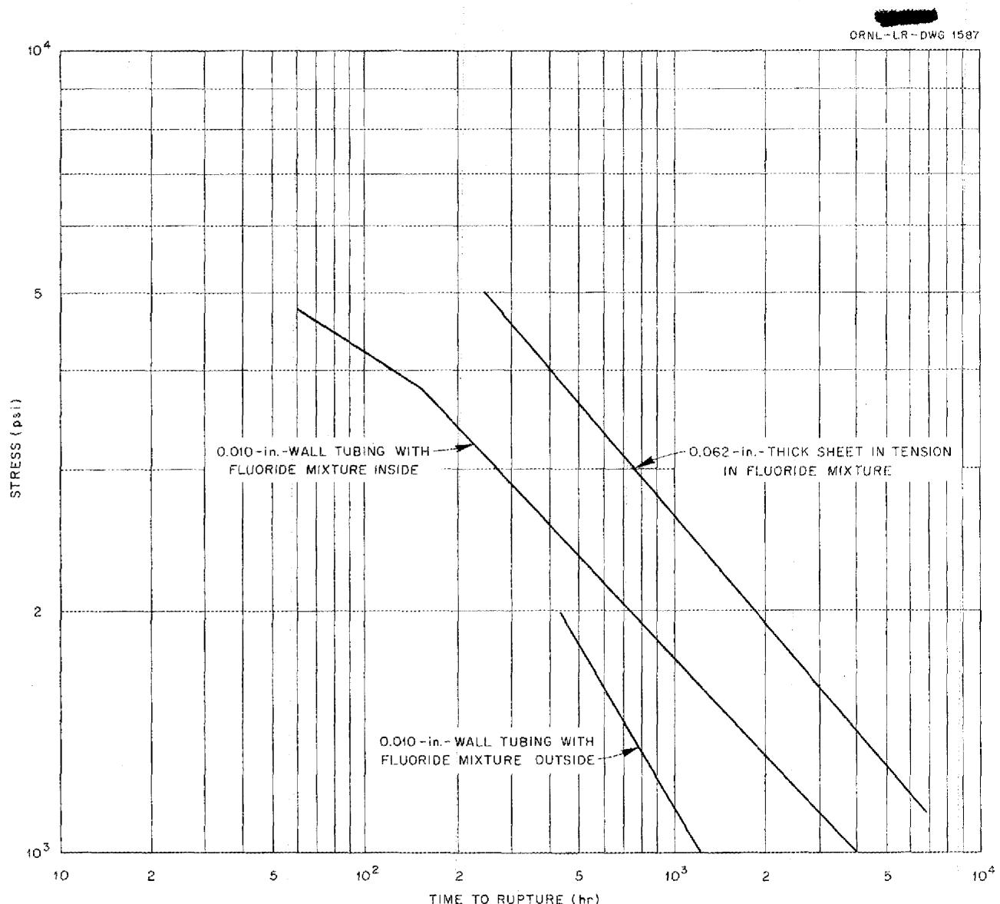  
Fig. 6.1. Stress vs Time to Rupture for Inconel Sheet and Inconel Tubing in NaF-ZrF $_4$ -UF $_4$ (50-46-4 mole %) at $1500^{\circ}\mathrm{F}$ .

explained on the basis that the surface-to-volume ratio was too high to sustain the corrosive attack. With this point in mind, tests were run with the fluoride mixture outside the tube and argon inside, with a resulting ratio of one unit of surface area

to eight units of volume. The types of corrosive attack on these specimens are illustrated in Figs. 6.2 and 6.3. The attack shown in Fig. 6.3, which is similar to that found in uniaxial tests, differs radically from the attack found when the fluoride

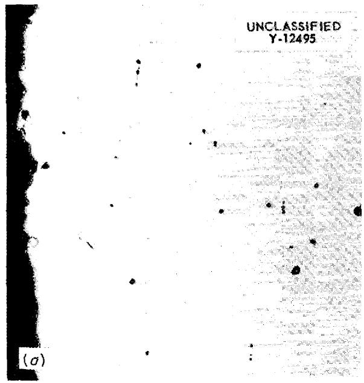

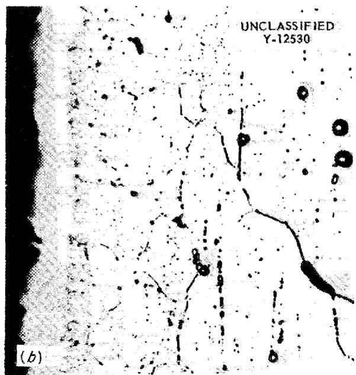

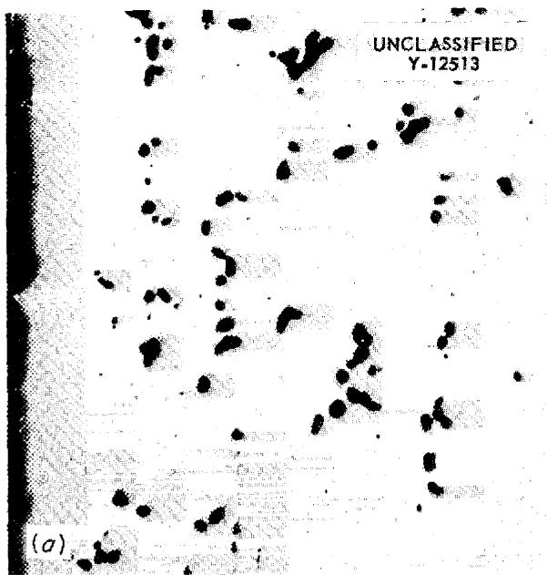  
Fig. 6.2. Inconel Tubing After Exposure to NaF-ZrF4-UF4 at $1500^{\circ}$ F in Stress-Rupture Test in Which the Fluoride Mixture Was Inside the Tube and the Resulting Surface-to-Volume Ratio Was 10 to 1. (a) Unetched. (b) Etched. 250X.

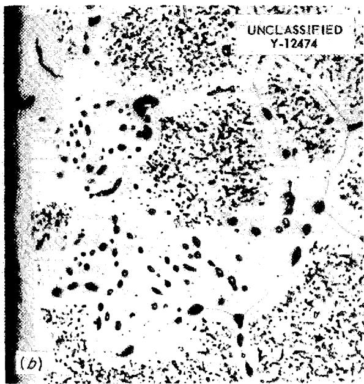  
Fig. 6.3. Inconel Tubing After Exposure to NaF-ZrF $_4$ -UF $_4$ at $1500^{\circ}$ F in Stress-Rupture Test in Which the Fluoride Mixture Was Outside the Tube and the Resulting Surface-to-Volume Ratio Was 1 to 8. (a) Unetched. (b) Etched. 250X.

mixture was inside the tube (Fig. 6.2). It is therefore concluded that the surface-to-volume ratio is as important in stress-rupture tests as it is in corrosion tests. It appears that under these test conditions a certain minimum volume of fluoride mixture in relation to the surface area is required for corrosion to proceed. Since stress-rupture tests in fluoride mixtures are being run at a number of testing laboratories, some of which will be in support of the efforts of ORNL, it seems imperative that the best surface-to-volume ratio for reproducibility be determined. Otherwise, a comparison of the data from the various laboratories may lead to confusion or erroneous conclusions.

Another variable which should be considered in analyzing tube-burst data is the wall thickness of the specimen being tested. The data presented in Fig. 6.1 are for tubular specimens with 0.010-in.-thick walls. Naturally, corrosive attack will have more effect on this type of specimen than on a thick-walled tube. Specimens with wall thicknesses of 0.020, 0.040, and 0.060 in. are being tested so that the effect of this variable can be studied. It is expected that all the tubular specimens will fail in shorter times than will corresponding specimens tested in straight tension. One reason for this prediction is that in the tube-burst test there is a tangential-to-axial stress ratio of 2 to 1. It is generally recognized that this stress distribution will result in the minimum ductility for any given material. No strain measurements are made during the tube-burst test; however, after-test measurements do not show measurable deformation that would be evidence of the brittle behavior of Inconel in this type of test. The lowered ductility of the multiaxially stressed specimen is believed to be the prime reason for its early failure.

Since the available data from tube-burst tests indicate that multiaxial stresses reduce rupture life in comparison with rupture life under the uniaxial stresses used in the more conventional straight-tension tests, it appears that more emphasis should be placed on the tube-burst tests. Information on the behavior of Inconel tubing under multiaxial stress will be particularly pertinent to ANP-type reactor design.

# HIGH-CONDUCTIVITY METALS FOR RADIATOR FINS

E. S. Bomar

H. Inouye

J.H.Coobs

R.W.Johnson

Metallurgy Division

Investigations of fin material have been primarily concerned with the protection of copper from oxidation and with the prevention of diffusion between copper and the cladding material. The materials that were found to be satisfactory as cladding were types 310, 446, and 430 stainless steel and Inconel, provided a suitable diffusion barrier was placed between the cladding and the copper. Since the purpose of the investigation was to develop a high-thermal-conductivity fin, a large ratio of copper to cladding was obviously desirable. With the roll-cladding techniques employed, the minimum clad that could be applied successfully was about 2 mils thick, although clads as thin as 1 mil have been made successfully by other methods. The minimum cladding thickness is apparently dependent only on ability to fabricate the composite. Under the conditions that the fin material will be used it must be assumed that there will be stresses. Therefore tensile-strength tests of the composites under oxidizing conditions are being made.

A few exploratory tests were made on 8-mil-thick type 310 stainless-steel-clad copper composites; the cladding was 2 mils thick on each side of the copper. The composites made by the General Plate Company were tested in the as-received condition. The results of a few tests are presented in Table 6.1. Additional tests at different stresses and temperatures are contemplated. No definite conclusions can be made at this time, but it is evident that low stresses caused failures that were not evident in tests under no-load conditions.

# SPECIAL MATERIALS RESEARCH

E. S. Bomar

H. Inouye

J. H. Coobs

R. W. Johnson

Metallurgy Division

Hastelloysb and C

Seven rod extrusions of as-cast Hastelloys B and C were made to determine the optimum temperatures and the general fabrication characteristics

of these alloys. The extrusion data are presented in Table 6.2. These extrusions were successful in that they demonstrated that the material could be extruded. However, in nearly every instance the extruded rod cracked at the leading edge, and in one instance the extrusion shattered. At the present stage of investigation it is thought that the cracking of the leading edge is due to intermittent welding of the alloy to the die ("rattlesnaking") because of insufficient lubrication. Fractures of a different kind occurred near the

center of the extruded rod that probably resulted from faults in the billets - the melts were made in air. Shattering is believed to be caused by low-melting phases in the grain boundaries.

These extrusion difficulties may be solved by (1) making the melts in vacuum and thus minimizing atmosphere contamination and probably the low-melting constituents, since purification might also be accomplished, (2) changing the die shape to cause more working in the leading edge, (3) canning the billet in such a manner that the alloy

TABLE 6.1. TENSILE STRENGTH TESTS OF TYPE 310 STAINLESS-STEEL-CLAD COPPER AT ${1500}^{ \circ  }F$ IN AIR   
TABLE 6.2. EXTRUSION DATA ON HASTELLOYS B AND C   

<table><tr><td>STRESS (psi)</td><td>TEST DURATION (hr)</td><td>ELONGATION (% in 2½ in.)</td><td>REMARKS</td></tr><tr><td>500</td><td>500</td><td>5</td><td>Surface blistery but otherwise sound</td></tr><tr><td>1000</td><td>500</td><td>20</td><td>Stringers of oxide on surface; a few nodules of copper oxide</td></tr><tr><td>1500</td><td>500</td><td>47.5</td><td>Numerous copper oxide nodules on surface; areas oxidized throughout; considered to be a failure</td></tr><tr><td>1800</td><td>336</td><td>50</td><td>Sample ruptured</td></tr><tr><td>2000</td><td>96</td><td>39</td><td>Sample ruptured</td></tr></table>

Die: CHW* preheated to $572^{\circ}F$ , 45-deg cone

Lubrication: glass wool in container

Ram sleeve: 3 in., preheated to $692^{\circ}F$

Billet: $3\frac{1}{2}$ in. long, 3 in. OD, heated in Houghton's No. 1550 salt bath

<table><tr><td rowspan="2">BILLET</td><td rowspan="2">EXTRUSION TEMPERATURE (°F)</td><td rowspan="2">HEATING TIME (hr)</td><td rowspan="2">EXTRUDED SIZE (in.)</td><td colspan="2">RAM PRESSURE (tons)</td></tr><tr><td>Start</td><td>Run</td></tr><tr><td rowspan="4">Hastelloy B</td><td>2300</td><td>3/4</td><td>1½</td><td>548</td><td>400</td></tr><tr><td>2300</td><td>1½</td><td>1¼</td><td>550</td><td>420</td></tr><tr><td>2100</td><td>17½</td><td>1½</td><td>560</td><td>390</td></tr><tr><td>2100</td><td>20</td><td>1¼</td><td>615</td><td>450</td></tr><tr><td rowspan="3">Hastelloy C</td><td>2100</td><td>18</td><td>1½</td><td>530</td><td>390</td></tr><tr><td>2100</td><td>20½</td><td>1¼</td><td>565</td><td>460</td></tr><tr><td>2100</td><td>4</td><td>1</td><td>570</td><td>450</td></tr></table>

*Manufactured by Latrobe Electric Steel Company.

is placed where lubrication is known to be adequate, that is, by using a dummy in front of the billet.

The short billets $(3\frac{1}{2}$ in.) were extruded at high velocities, and in many instances the tools were broken when the ram struck the die. This difficulty in stopping the ram movement at a precise moment was prevented by using a brass dummy block behind the billet so that the ram could be allowed to move until the press stopped.

# Nickel-Molybdenum Alloys

Two vacuum melts of nominal composition $24\%$ Mo-76% Ni and 20% Mo-80% Ni have been made. Attempts to extrude the 24% Mo-76% Ni alloy at $2350^{\circ}\mathrm{F}$ at reductions of 13 to 1 and 9 to 1 failed because of tool breakage. In the attempt at extrusion at a ratio of 9 to 1, the die insert fractured. A solid die was made, and attempts to extrude the 20% Mo-80% Ni alloy with the new die failed because of mandrel breakage. A straight mandrel and a 25-deg cone die were used. The extruded material that was obtained before the mechanical failures occurred had good surfaces and no evidence of "rattlesnaking."

# Stainless-Steel-Clad Molybdenum and Columbium

Molybdenum tubing (0.620-in.-OD, 0.098-in.-wall) was clad on the outside with 0.065-in.-thick type 321 stainless steel. The composite tube was successfully bent 105 deg on a 3-in. radius at temperatures around $400^{\circ}\mathrm{F}$ and made into the shape of a conventional thermal-convection loop. Attempts to weld the molybdenum were unsuccessful because of porosity and extreme brittleness. Another complicating problem was that, at the temperatures required to fuse the molybdenum, the cladding melted and alloyed in the weld. These difficulties were circumvented by assembling the loop with threaded molybdenum joints and welding the stainless steel cladding. Two such loops were made. Type 310 stainless-steel-clad columbium tubing has been bent into the shape of a conventional thermal-convection loop, but the joint has not yet been welded. The bending was accomplished at room temperature by using Cerrobend inside the tube.

# Columbium

Fansteel columbium sheet 0.250 in. thick was reduced to 0.193 in. in thickness and annealed in

vacuum to an ASTM grain size of 6 to 7. The work-hardening characteristics were determined by making Tukon hardness measurements at various stages of reduction up to $89.6\%$ in thickness. The results of these tests are given in Table 6.3. The data show that hardening in cold-worked columbium does not increase rapidly, and therefore the metal may be severely deformed without danger of fracture. A similar investigation showed somewhat higher hardness values for the same reduction.

TABLE 6.3. WORK-HARDENING CHARACTERISTICS OF COLUMBIUM SHEET AT VARIOUS STAGES OF REDUCTION OF THICKNESS   

<table><tr><td>THICKNESS (in.)</td><td>REDUCTION IN THICKNESS (%)</td><td>HARDNESS (VPN)</td></tr><tr><td>0.193</td><td>Annealed</td><td>72.4</td></tr><tr><td>0.170</td><td>11.9</td><td>98.2</td></tr><tr><td>0.152</td><td>21.2</td><td>100.2</td></tr><tr><td>0.135</td><td>30.0</td><td>108.3</td></tr><tr><td>0.115</td><td>40.3</td><td>111.1</td></tr><tr><td>0.095</td><td>50.2</td><td>115.5</td></tr><tr><td>0.077</td><td>60.1</td><td>123</td></tr><tr><td>0.058</td><td>70.0</td><td>127</td></tr><tr><td>0.040</td><td>79.3</td><td>134</td></tr><tr><td>0.025</td><td>87.0</td><td>144</td></tr><tr><td>0.020</td><td>89.6</td><td>150</td></tr></table>

# Boron Carbide

Thin high-boron-content shielding is required for the heat exchanger of the Reflector-Moderated Reactor. This shield will be in two $\frac{1}{8}$ -in.-thick layers, one inside and one outside the heat exchanger, and it should have as high a boron content as practical. A concentration of 1.5 g/cc of boron, equivalent to $B_4C$ compacted to 80% density, would be sufficient.

The temperature of the shield, which will be about $1500^{\circ} \mathrm{F}$ , severely limits the choice of bonding materials for use in consolidating the

boron carbide. Iron and nickel both react with $\mathsf{B}_4\mathsf{C}$ to form eutectics and brittle intermetallic phases, but they have been used to bond $\mathsf{B}_4\mathsf{C}$ by hot-pressing or high-temperature sintering. Copper and silver are more attractive since they do not react with boron carbide and would therefore retain their strength and conductivity after being formed into a composite. However, silver is somewhat objectionable because of its relatively high cross section and associated gamma activity.

Hirsch3 has reported fabricating strong compacts of boron bonded with 15 vol % of copper or of silver with boron densities as high as 1.52 g/cc by warm-pressing at $500^{\circ}\mathrm{C}$ with 50-ansi pressure. In the hope of producing satisfactory compacts by duplicating this work with high-grade $\mathsf{B}_4\mathsf{C}$ , compositions containing 15 vol % of copper or 20 vol % of silver were prepared. Fine, annealed electrolytic copper and precipitated silver powders were used with blends of various particle-size fractions of $\mathsf{B}_4\mathsf{C}$ . These mixtures were then pressed at $350^{\circ}\mathrm{C}$ with 40-ansi pressure, and the density was determined from the measured volume.

The maximum boron density obtained from these compositions thus far is about $1.25\mathrm{g / cc}$ for high-grade $\mathsf{B}_4\mathsf{C}$ bonded with 20 vol $\%$ of silver. Densities attainable by using sized fractions of metallurgical-grade $\mathsf{B}_4\mathsf{C}$ are 1.1 g/cc of boron with 20 vol $\%$ of copper binder and about 1.2 g/cc with 20 vol $\%$ of silver binder. By using compositions of high-grade $\mathsf{B}_4\mathsf{C}$ ( $>80\%$ boron) with copper and by pressing at $500^{\circ}\mathsf{C}$ , it should be possible to obtain compacts with boron densities at least as high as 1.3 g/cc. This density is somewhat lower than desired but may still be considered. The attainment of higher densities will require one of three alternatives:

1. the use of metallic boron bonded with copper by warm-pressing, as reported by Hirsch,   
2. the high-temperature hot-pressing of $\mathsf{B}_4\mathsf{C}$ , with or without iron or other reactive bonding agent,   
3. the high-temperature sintering, at 1900 to $2000^{\circ}C$ , of carefully prepared $\mathsf{B}_4\mathsf{C}$ -Fe compositions, for which boron densities as high as $1.45\mathrm{g / cc}$ have been reported.

A more complete investigation of the warm-pressing technique is to be made. For this in

vestigation, 15 to 20 vol % of copper in $\mathsf{B}_4\mathsf{C}$ will be pressed at $500^{\circ}\mathsf{C}$ with 40- to 50-tsi pressure. A new die of high-alloy steel will be required for satisfactory service at this temperature.

In addition to the problem of fabricating a satisfactory shield, the possible effects of boron diffusion must be studied. Since the shield will be in contact with Inconel at operating temperatures of $1500^{\circ}\mathrm{F}$ , extensive diffusion of boron may occur. Samples of Inconel coated with $\mathrm{Al}_{2}\mathrm{O}_{3}$ are being obtained for compatibility tests with boron-containing compacts.

# WELDING AND BRAZING

P. Patriarca

C. E. Shubert

G. M. Slaughter

K.W.Reber

B. McDowell

J.M.Cisar

Metallurgy Division

# Brazing Alloy Development

The extent and rate of high-temperature oxidation of brazing alloys during service are among the important factors which will determine the useful life of ANP radiators. Inconel T joints brazed with 15 different high-temperature brazing alloys were subjected to static air at 1500 and $1700^{\circ}\mathrm{F}$ for periods of 200 and 500 hr. The results of these tests, as determined by metallographic examination (100X magnification) in the as-polished condition, are presented in Table 6.4. It appears that the majority of the nickel and nickel-chromium-base alloys are suitable for service in an oxidizing atmosphere at $1500^{\circ}\mathrm{F}$ , and several are suitable at $1700^{\circ}\mathrm{F}$ . However, since G-E alloy No. 81 has shown considerable promise for tube-to-fin joints and as a backup for tube-to-header joints, its unexpected behavior at $1700^{\circ}\mathrm{F}$ is being investigated further. It was encouraging to find that the Coast Metals alloy No. 52 was very oxidation resistant, since its favorable flow point makes this alloy useful for joining high-conductivity fin materials.

A prototype sodium-to-air radiator utilizing Inconel-clad-copper high-conductivity fins was fabricated by a combination heliarc-welding and dry-hydrogen-brazing technique. The assembly, shown in Fig. 6.4, contains 180 heliarc-welded tube-to-header joints and approximately 4300 brazed tube-to-fin joints. As an added precaution against undesirable stress concentrations and leaks during service, the tube-to-header joints were back brazed.

TABLE 6.4. OXIDATION RESISTANCE OF DRY-HYDROGEN-BRAZED T JOINTS   

<table><tr><td rowspan="3">BRAZING ALLOY</td><td rowspan="3">COMPOSITION (wt %)</td><td rowspan="3">BRAZING TEMPERATURE (°F)</td><td colspan="4">OXIDATION IN STATIC AIR(a)</td></tr><tr><td colspan="2">At 1500°F</td><td colspan="2">At 1700°F</td></tr><tr><td>For 200 hr</td><td>For 500 hr</td><td>For 200 hr</td><td>For 500 hr</td></tr></table>

Commercial Alloys   

<table><tr><td>Nicrobraz</td><td>70 Ni-14 Cr-6 Fe-5 B-4 Si-1 C</td><td>2150</td><td>Slight</td><td>Slight</td><td>Slight</td><td>Slight</td></tr><tr><td>Low-melting-point Microbraz</td><td>80 Ni-6 Fe-5 Cr-5 Si-3 B-1 C</td><td>1920</td><td>Slight</td><td>Slight</td><td>Slight</td><td>Slight</td></tr><tr><td>Coast Metals alloy No. 52</td><td>89 Ni-5 Si-4 B-2 Fe</td><td>1840</td><td>Very slight</td><td>Slight</td><td>Slight</td><td>Slight</td></tr><tr><td>Mond Nickel Co. alloy</td><td>64 Ag-33 Pd-3 Mn</td><td>2150</td><td>Severe internal oxidation</td><td>Severe internal oxidation</td><td>Complete</td><td></td></tr><tr><td>Copper</td><td>100 Cu</td><td>2050</td><td>Complete</td><td></td><td></td><td></td></tr></table>

Experimental Nickel-Base Alloys   

<table><tr><td>GE alloy No. 81</td><td>66 Ni-19 Cr-10 Si-4 Fe-1 Mn</td><td>2150</td><td>Very slight</td><td>Slight</td><td>Severe(b)</td><td>Severe(b)</td></tr><tr><td>Ni-Ge</td><td>75 Ni-25 Ge</td><td>2150</td><td>Slight</td><td>Slight</td><td>Moderate</td><td>Moderate</td></tr><tr><td>Ni-Ge-Cr</td><td>65 Ni-25 Ge-10 Cr</td><td>2140</td><td>Very slight</td><td>Slight</td><td>Moderate(b)</td><td>Severe</td></tr><tr><td>Electroless Ni-P</td><td>88 Ni-12 P</td><td>1740</td><td>Very slight</td><td>Slight</td><td></td><td></td></tr><tr><td></td><td>80 Ni-10 P-10 Cr</td><td>1830</td><td>Very slight</td><td>Slight</td><td></td><td></td></tr><tr><td></td><td>68 Ni-32 Sn</td><td>2150</td><td>Slight</td><td>Moderate</td><td>Severe</td><td>Complete</td></tr><tr><td></td><td>40 Ni-60 Mn</td><td>1920</td><td>Complete</td><td></td><td></td><td></td></tr></table>

Precious-Metal-Base Alloys   

<table><tr><td>Au-Ni</td><td>82 Au-18 Ni</td><td>1830</td><td>Very slight</td><td>Slight</td><td>Moderate</td><td>Moderate</td></tr><tr><td>Au-Cu</td><td>80 Au-20 Cu</td><td>1740</td><td>Moderate</td><td>Complete</td><td></td><td></td></tr><tr><td>Pd-Al</td><td>92 Pd-8 Al</td><td>2020</td><td>Very slight</td><td>Very slight</td><td>Very slight</td><td>Slight</td></tr></table>

(a) Very slight, less than 1 mil of penetration.   
Slight, 1 to 2 mils of penetration.   
Moderate, 2 to 5 mils of penetration.   
Severe, greater than 5 mils of penetration.   
Complete, fillet completely destroyed.   
(b) Void formation caused by internal oxidation at braze alloy fillet-Inconel interface.

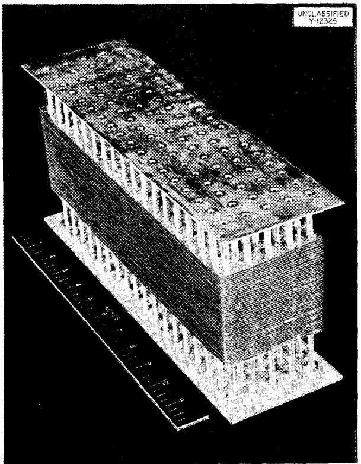  
Fig. 6.4. Sodium-to-Air Radiator.

All tube-to-header joints were heliarc welded by a semiautomatic process. In this process, a commercially available heliarc torch is rotated around the tube periphery by a variable-speed motor-driven offset-cam mechanism which can be adjusted to any desired diameter of swing. A photograph of this equipment is shown in Fig. 6.5.

Preliminary experiments were conducted on typical tube-to-header samples to investigate the effects of arc current and welding speed upon weld size, hole constriction, and weld penetration. It was shown in these tests that welds comparable to those produced manually by a skilled operator could be made semiautomatically. For example, satisfactory welds having a penetration of at least one tube-wall thickness could be made at a weld time of 7 sec over a welding current range from 40 to 50 amp. The hole constriction resulting from welds made over this current range did not exceed $5\%$ .

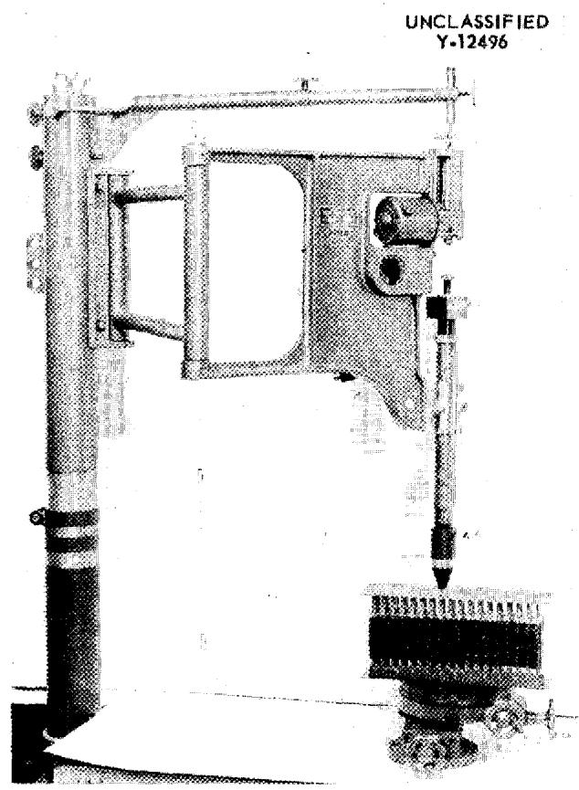  
Fig. 6.5. Semiautomatic Tube-to-Header Welding Machine.

As would be expected, welds made at other welding speeds required corresponding changes in the welding variables. Further experiments are now being conducted to study more thoroughly the relationships between the joint parameters and the welding variables. Since it is expected that the maximum weld penetration will be dependent to a significant extent on the radius of electrode swing, experiments will be conducted to determine this effect.

The fabrication of a radiator containing high-conductivity fins requires close control of the furnace temperatures during brazing to assure a minimum of thermal variations over the assembly. Experiments were conducted which indicated that the large Globar pit furnace available in the Welding Laboratory would permit a temperature control of $\pm 5^{\circ}\mathrm{F}$ over the assembly at $1870^{\circ}\mathrm{F}$ and hence would be satisfactory for this fabrication. Coast Metals alloy No. 52 (Table 6.4) was se

lected as the brazing material because of its superior oxidation resistance and its relatively low flow point of $1840^{\circ}$ F.

A preheat temperature of $1520^{\circ}F$ was utilized in this dry-hydrogen-brazing operation to permit an equalization of temperatures over the assembly before brazing began. The preheat portion of the thermal cycle aided fillet formation by minimizing selective flowing of the brazing alloy to the fins. Boron diffusion from this alloy was not a problem during preheating because very little sintering occurs at this temperature. It also appears that the fin distortion on the assembly was kept to a minimum as a result of the preheating and the careful temperature control during brazing.

Good flowability of the alloy on both the tube-to-fin and tube-to-header joints was obtained during brazing for 30 min at $1870^{\circ}\mathrm{F}$ . Since the copper exposed by the fin-punching operation can be protected adequately by the brazing alloy, it is believed that the oxidation resistance of the tube-to-fin joints should be satisfactory.

# Beryllium Test Assembly

An Inconel assembly for determining the effects

of thermal stresses and thermal cycling on beryllium was fabricated. This unit, which will be used to evaluate the temperature distributions in the beryllium, as well as the compatibility of sodium and beryllium, consists of 46 tube-toheader joints and extensive manifold welding. The beryllium block is enclosed in the center section of the assembly shown in Fig. 6.6. All joints were manually heliarc welded by qualified operators and were leak-tight to helium.

Since heating will be achieved by the electric resistance heating of sodium, it was necessary to fabricate two laminated-copper bus bars and to join these to the Inconel assembly. A silver-copper eutectic brazing alloy was used to join the copper laminations into a solid electrical connection. However, since this silver brazing alloy will not wet Inconel satisfactorily in the available dry-hydrogen atmosphere at the brazing temperature of $1510^{\circ}\mathrm{F}$ , it was necessary to copper-braze nickel sheets to the Inconel cans before subsequent joining of the bus bars to the test assembly with the silver-copper eutectic alloy.

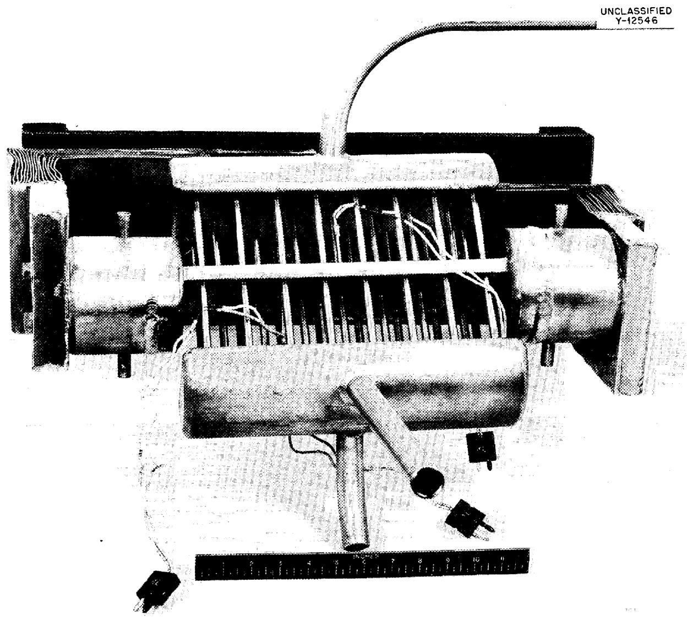  
Fig. 6.6. Beryllium Test Assembly.

# 7. HEAT TRANSFER AND PHYSICAL PROPERTIES

# H. F. Poppendiek   Reactor Experimental Engineering Division

The enthalpies and heat capacities of the ARE fuel $\mathsf{NaF - ZrF_4 - UF_4}$ (53.5-40.0-6.5 mole %) were determined; the heat capacity in the solid state over the temperature range 260 to $490^{\circ}C$ was found to be 0.19 cal/g $^{\circ}C,$ and the heat capacity in the liquid state over the temperature range 590 to $920^{\circ}C$ was found to be 0.23 cal/g $^{\circ}C.$ Enthalpy and heat-capacity measurements for $\mathsf{K}_3\mathsf{CrF}_6$ in the solid state were also obtained. Density and viscosity measurements were made for molten RbF-LiF (57-43 mole %); the viscosity varied from about 8 centipoises (cp) at $550^{\circ}C$ to about 3 cp at $750^{\circ}C.$ The thermal conductivity of molten RbF-LiF (57-43 mole %) was determined to be about 1.2 Btu/hr-sq ft ( $^\circ F / ft$ ). The thermal conductivity of solid NaF-KF-LiF (11.5-42.0-46.5 mole %) was found to be about 3 Btu/hr-sq ft ( $^\circ F / ft$ ). Electrical-conductivity measurements of molten NaOH were obtained over the temperature range 625 to $1490^{\circ}F.$

Additional forced-convection heat-transfer measurements of molten NaF-KF-LiF were made at higher Reynolds numbers than had previously been obtained. Some thermal-conductivity information on $\mathsf{K}_3\mathsf{CrF}_6$ a wall-deposit material, was obtained. A Lucite model of the circulating-fuel reflectormoderated reactor has been fabricated and will be used to study the hydrodynamic structure in that system. The results of a mathematical analysis of convection are presented for the case of forced flow between parallel plates which are ducting fluids with volume heat sources; this analysis is useful in estimating the temperature structure in the flow annuli of reflector-moderated reactor cores. A study has been initiated to investigate the heat-transfer and fluid-flow characteristics of a NaOH-moderated circulating-fuel reactor system.

# PHYSICAL PROPERTIES MEASUREMENTS

# Heat Capacity

W. D. Powers G. C. Blalock Reactor Experimental Engineering Division

The following enthalpy and heat-capacity measurements were made with Bunsen ice calorimeters:

NaF-ZrF4-UF4(53.5-40.0-6.5 mole %) Solid (260 to $490^{\circ}C$

$$
H _ {T} - H _ {0 ^ {\circ} C} = - 4. 1 + 0. 1 9 T
$$

$$
C _ {p} = 0. 1 9 \pm 0. 0 2
$$

Liquid (590 to $920^{\circ}\mathrm{C}$ )

$$
H _ {T} - H _ {0 ^ {\circ} C} = 3 4 + 0. 2 3 (5) T
$$

$$
C _ {p} = 0. 2 3 (5) \pm 0. 0 3
$$

K3CrF6 Solid(50 to 830°C)

$$
H _ {T ^ {\prime}} - H _ {0 ^ {\circ} C} = - 4 + 0. 2 2 (8) T
$$

$$
C _ {p} = 0. 2 2 (8) \pm 0. 0 0 6
$$

NaF-KF-LiF (11.5-42.0-46.5 mole %) Solid (60 to $455^{\circ}\mathrm{C}$ )

$$
\begin{array}{l} H _ {T} \sim H _ {0 ^ {\circ} C} = - 2. 6 + 0. 2 7 T + 0. 9 8 \times 1 0 ^ {- 4} T ^ {2} \\ C _ {p} = 0. 2 7 + 1. 9 6 \times 1 0 ^ {- 4} T \\ \end{array}
$$

In these expressions $H$ is the enthalpy in cal/g, $C_p$ is the heat capacity in cal/g $^{\circ}$ C, and $T$ is the temperature in ${}^{\circ}$ C. The enthalpy of $\mathsf{K}_3\mathsf{CrF}_6$ (an insoluble deposit material) is shown in Fig. 7.1. The enthalpy and heat-capacity data for NaF-KF-LiF (11.5-42.0-46.5 mole %) in the solid state correspond to a much greater temperature range than was previously reported. A copper calorimeter has been constructed that will be used to supplement the Bunsen ice calorimeters now in use. The heat content of the sample will be measured by the temperature rise of the copper housing.

# Density and Viscosity

S. I. Cohen T. N. Jones

Reactor Experimental Engineering Division

Density and viscosity measurements were made on two fluoride mixtures. The viscosities of RbF-LiF (57-43 mole %) were determined with modified Brookfield and capillary viscometers, and the values varied from about 8.0 cp at $550^{\circ}\mathrm{C}$ to about 3 cp at $750^{\circ}\mathrm{C}$ . The density measurements of RbF-LiF in the molten state are represented by the relation

$$
\rho_ {1} = 3. 3 9 - 0. 0 0 0 8 5 T,
$$

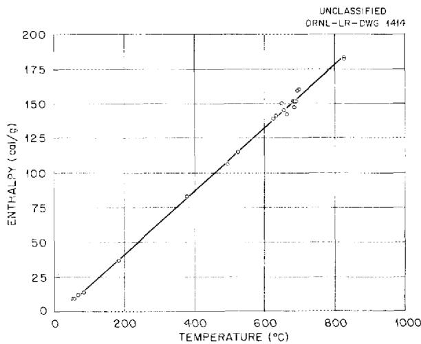  
Fig. 7.1. Enthalpy-Temperature Relationship for $\mathsf{K}_3\mathsf{CrF}_6$

where $\rho$ is in g/cc and the temperature range is $500^{\circ}C < T < 700^{\circ}C$ .

The density and viscosity values for NaF-KF-LiF (11.5-42.0-46.5 mole %) that were determined in the early stages of the ANP Project were checked, and the recent determinations were in substantial agreement with the early ones. The viscosities for the mixture vary from about 8 cp at $500^{\circ}C$ to about 3 cp at $750^{\circ}C,$ and the molten densities are represented by the relation

$$
\begin{array}{l} \rho = 2. 5 3 - 0. 0 0 0 7 3 T, \\ 6 0 0 ^ {\circ} \mathrm {C} <   T <   9 0 0 ^ {\circ} \mathrm {C}. \\ \end{array}
$$

A report2 published recently lists all the density measurements that have been made on molten fluoride mixtures for the ANP Project and includes a correlation of the data that can be used to predict densities of molten fluoride mixtures of known composition.

# Thermal Conductivity

W.D.Powers S.J.Claiborne

R. M. Burnett

Reactor Experimental Engineering Division

The Deem-type apparatus has been used to measure the thermal conductivity of RbF-LiF (57-43 mole %). The conductivity was determined to be 1.2

Btu/hr·sq ft (°F/ft) at an average sample temperature of about $1050^{\circ}\mathrm{F}$ .

A flat-plate method for determining the thermal conductivities of solid salts has been developed in which the salt is cast in the form of a slab. The heat that is passed through the sample is measured by the rise in temperature of the water that circulates through the cooling plate. The temperature drop through the sample is also measured. The conductivity may be calculated easily from this information and the physical dimensions of the slab. The preliminary thermal conductivity value obtained for NaF-KF-LiF (11.5-42.0-46.5 mole %) by using this method was about 3 Btu/hr-sq ft $(^{\circ}\mathrm{F} / \mathrm{ft})$ .

Additional thermal conductivity measurements have been made on solids by using the transient cooling or heating technique. An improved method of casting nonporous spheres has been developed which involves cooling the mold from the bottom at a very slow rate. Improved methods of cooling and heating the spheres have also been developed. The preliminary thermal conductivity value obtained by using this method on NaF-KF-LiF (11.5-42.0-46.5 mole %) in the solid state was about 2.7 Btu/hr·sq ft ( $^\circ F / ft$ ).

# Electrical Conductivity

N. D. Greene

Reactor Experimental Engineering Division

A preliminary determination of the electrical conductivity of molten NaOH at temperatures of up to $1500^{\circ}\mathrm{F}$ has been made with the platinum conductivity cell. This determination has extended the temperature range of the electrical-conductivity measurements of NaOH to approximately $650^{\circ}\mathrm{F}$ higher than the maximum temperature reported in the literature. The experimental conductivity data are shown in Fig. 7.2, together with the published measurements for low temperatures.

Checks on the platinum conductivity cell have been made by studying three molten salts for which conductivity values have been published. The salts investigated, together with the deviation between ORNL and literature values and the tem

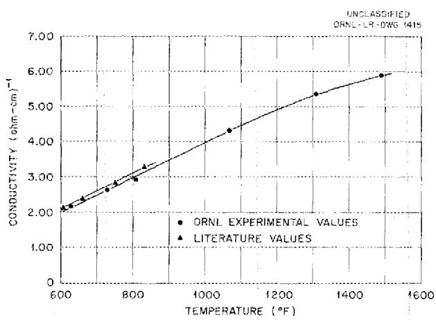  
Fig. 7.2. Electrical Conductivity of Molten NaOH.

perature ranges, are listed in the following:

<table><tr><td></td><td>Mean Deviation (%)</td><td>Temperature Range (°F)</td></tr><tr><td>NaOH</td><td>+2.7</td><td>625 to 835</td></tr><tr><td>LiNO3</td><td>+4.4</td><td>534 to 862</td></tr><tr><td>KNO3</td><td>-3.3</td><td>875 to 900</td></tr></table>

The measurements are difficult to make because of polarization within the cell, and therefore some alternate method of measurement has been sought. It is felt that a hemispherical graphite crucible in which it would be possible to position leads so that both current and potential measurements would be obtained simultaneously might be useful. Since the potential measurement would be independent of the degree of polarization at the current-carrying electrode and an alternating current would be used, it is estimated that good accuracy would be obtained. An attempt to verify the results of the measurements made with the platinum conductivity cell will be made with this alternate method during the coming quarter. The conductivities at various pertinent temperatures of some of the salts which are of interest to the ANP Project will also be determined.

# Vapor Pressures

R.E.Moore C.J.Barton Materials Chemistry Division

In an attempt to resolve some anomalies, observed in another laboratory, in vapor pressures of some NaF-ZrF mixtures, the method and apparatus

of Rodebush and Dixon have been applied to a NaF-ZrF4 mixture containing 75 mole % ZrF4. Preliminary values obtained for this material are 37, 54, 66, 74, 83, 115, and 152 mm Hg at 769, 786, 796, 805, 816, 828, and $844^{\circ}\mathrm{C}$ , respectively. A straight line through these values on a log P vs $1 / T$ plot intersects the plot of vapor pressure of $\mathsf{ZrF_4}$ at $762^{\circ}\mathrm{C}$ . Since the primary phase at 75 mole % $\mathsf{ZrF_4}$ in this system is $\mathsf{ZrF_4}$ , the intersection should correspond to the liquidus temperature for the mixture, which thermal-analysis data indicate to be $755^{\circ}\mathrm{C}$ . The difference between the two temperatures is only slightly larger than the expected error of either method.

It was discovered that there was a consistent temperature error in the vapor pressure data given in a previous report for the 50 mole $\%$ NaF-50 mole $\%$ ZrF4 mixture. Therefore the correct pressures are lower than those given before. The corrected equation for this composition is

$$
\log P (\mathrm {m m H g}) = - \frac {7 4 2 5}{T (^ {\circ} K)} + 7. 8 8 9.
$$

# FUSED-SALT HEAT TRANSFER

H.W.Hoffman J.Lones

Reactor Experimental Engineering Division

Previous NaF-KF-LiF heat-transfer experiments made in systems in which no tube-wall deposits were formed were limited to rather low Reynolds numbers because of the temperature limitations inherent in the use of nickel tubes. It had been observed that molten fluorides could be contained in type 316 stainless steel for short periods of time without serious corrosion results or the formation of the insoluble fluoride deposits, such as $\mathsf{K}_3\mathsf{CrF}_6$ , that are found in Inconel systems. Therefore in order to get data at higher Reynolds numbers it was decided to conduct a heat-transfer experiment of short duration in type 316 stainless steel tubes. The results of the experiment are shown in Fig. 7.3. As was to be expected when there was no wall deposit, the data fell on the curve for normal turbulent-flow for ordinary fluids, that is, the curve expressed by $j = 0.023\mathsf{Re}^{-0.2}$ . The

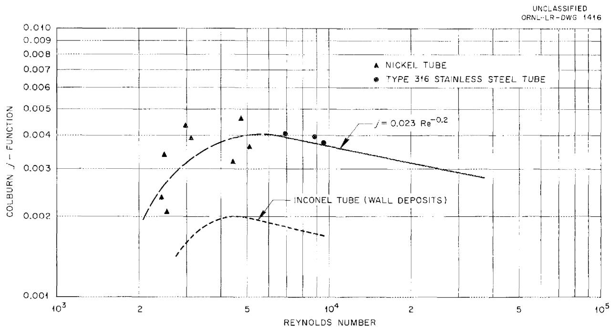  
Fig. 7.3. Colburn $j$ -Function vs Reynolds Number for Molten NaF-KF-LiF.

previously obtained nickel-tube and Inconel-tube data are also shown in Fig. 7.3.

Some preliminary determinations show the thermal conductivity of $\mathsf{K}_3\mathsf{CrF}_6$ to be about 0.13 Btu/hr-sq ft (°F/ft) for the temperature range 100 to $200^{\circ}\mathsf{F}$ . The salt was hydrostatically molded into the shape of a cylinder, approximately in. in diameter and 4 in. in length. The density of the molded salt was $96\%$ of the theoretical value. The cylinder was heated to a uniform temperature and then suddenly exposed to a cool air stream where it was transiently cooled. The thermal conductivity was calculated from the time-temperature measurements obtained in this experiment.

# REACTOR HYDRODYNAMICS

J.O.Bradfute

L. D. Palmer

G.M.Winn

Reactor Experimental Engineering Division

ALucite model of the reflector-moderated reactor core has been fabricated. The fluid velocity distribution in the variable-cross-section flow annulus is to be determined by photographing tiny particles which will be dispersed throughout the flowing

water. An improved method of increasing the light output of the Strobolum (the flashing light source) has been devised. The timing unit for the Strobolum has nearly been completed.

An investigation was made of a technique for visual observation of the nature of fluid flow in transparent duct systems. It was found that the features which determined the average velocity profile, as well as the velocity fluctuations, under turbulent flow conditions could be observed. A beam of ultraviolet light was flashed through a region of the flowing fluid (containing suspended phosphorescent particles) for which the velocity profile was to be observed. The beam of phosphorescent particles generated in the flowing fluid by the ultraviolet light was slowly distorted by the flow into a curve which exactly described the fluid velocity profile. It is believed that this technique can be used to visualize flow characteristics in reactor cores.

# HEAT-REMOVAL STUDY OF BSF REACTOR

D.C.Hamilton

F. E. Lynch

Reactor Experimental Engineering Division

A study has been initiated for determining the heat-removal rate that can be provided by free convection in a bulk-shielding-facility type of reactor.

The problem divides naturally into two cases depending on whether or not nucleate boiling is permitted. When boiling is not permitted, the limiting fuel-plate temperature will be equal to the saturation temperature. If nucleate boiling is permitted, the exit temperature of the water may not exceed the saturation temperature.

The analysis is somewhat similar to an analysis performed on a thermal convection harp. There are two distinct regions in the flow circuit of the reactor, the reactor region and the jet or stock region. The reactor region presents a problem in flow and heat transfer between parallel plates with a known but not uniform wall-heat-flux distribution. At lower reactor powers, the flow is superposed free-and-forced viscous convection. At higher powers, the Reynolds modulus may approach the lower limit for isothermal turbulent flow; in either case, the heat-transfer and friction data are not available in the literature. The manner of mixing of the jet with the surrounding pool will determine the contribution of the jet to the flow through the reactor. An accurate consideration of the jet contribution will be difficult.

# HEAT TRANSFER IN CIRCULATING-FUEL REFLECTOR-MODERATED REACTOR

H. F. Poppendiek

L. D. Palmer

G. M. Winn

Reactor Experimental Engineering Division

A heat-transfer analysis was made for the case of forced convection between parallel plates of infinite extent, which are ducting fluids that contain uniform volume-heat sources, with heat transferred uniformly to or from the fluids through the parallel plates. The laminar and turbulent flow data in terms of dimensionless wall-fluid temperature differences are plotted in Fig. 7.4 as a function of Reynolds moduli for the case of no wall-heat transfer. If it is desired to obtain the solution for the composite case, that is, a flow system with wall-heat transfer as well as volume-heat sources,

the data given in Fig. 7.4 must be superposed on the known data for the case of wall-heat transfer with no volume-heat sources. It will be noted that the data shown in Fig. 7.4 pertain to liquid metals as well as to ordinary fluids and may also be used to estimate heat transfer in annulus systems such as the reflector-moderated reactor for which inner-to-outer radius ratios do not differ significantly from unity.

A series of experiments was conducted recently to determine the influence of electrical-current flow on the hydrodynamic characteristics of a liquid flowing in a tube under both laminar and turbulent flow conditions. This problem arises in convection experiments in which the volume heat sources are generated electrically. No influence of the electrical-current flow on the hydrodynamic structure has yet been detected.

# HEAT TRANSFER IN NaOH-MODERATED CIRCULATING-FUEL REACTOR

J.O.Bradfute

H. F. Poppendiek

Reactor Experimental Engineering Division

A study has been initiated to determine the feasibility of a NaOH-moderated circulating-fuel reactor in terms of heat transfer and fluid flow. In such a reactor, the molten sodium hydroxide would be the moderator as well as the coolant necessary to reduce the high wall temperatures in the fuel region. Because of the corrosion difficulty that arises when NaOH is used with the typical structural materials of reactor systems that operate at temperatures above $1000^{\circ}\mathrm{F}$ , it is further necessary to cool the fuel-tube wall sufficiently (by forced circulation of the NaOH) to yield a NaOH-wall interface temperature of below $1000^{\circ}\mathrm{F}$ . Therefore it is necessary to know whether this cooling can be accomplished with NaOH with reasonable pumping powers and pressure drops. Some preliminary heat- and momentum-transfer analyses have been made for the case in which fuel circulates through tubes that are force-cooled by molten NaOH which circulates in a direction parallel to that of the fuel; the number of tubes was varied in the analyses. The preliminary results suggest that the pumping powers and pressure drops are not prohibitively high. Further calculations on multtube, as well as annulus and channel, systems are being made.

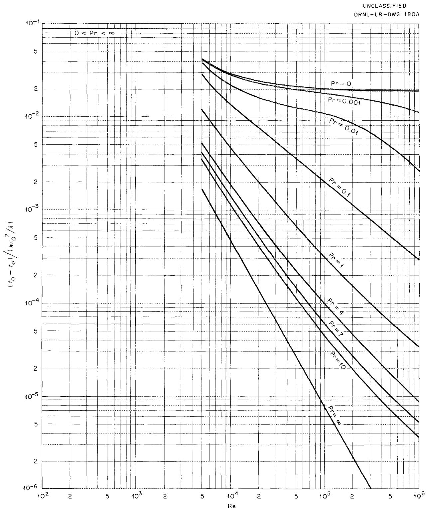  
Fig. 7.4. Dimensionless Differences Between Wall and Mixed-Mean Fluid Temperatures as Functions of Reynolds and Prandtl Moduli for a Parallel Plate System (Walls Insulated).

# 8. RADIATION DAMAGE

J. B. Trice

Solid State Division

A.J.Miller

ANP Division

The program of irradiating fused-salt fuels in the MTR continued with mixtures containing $\mathsf{UF}_3$ and $\mathsf{UF}_4$ bearing fuels. The fuel-Inconel interface temperature is being maintained at more nearly $1500^{\circ}\mathsf{F}$ than in previous tests with $\mathsf{UF}_4$ fuels. A re-examination was made of a group of Inconel capsules from the earlier runs along with a study of the temperature control system used and the thermal histories. It was concluded that in most capsules the interface temperature was in the region of $100^{\circ}\mathsf{F}$ higher than the desired $1500^{\circ}\mathsf{F}$ and that 2 to 4 mils of intergranular corrosion occurred. Excessive grain growth and deep penetration of the Inconel occurred only in a few capsules and those capsules had been heated to much higher temperatures.

The first in-pile circulating fuel loop was installed in a horizontal beam hole of the LITR but difficulties developed before start-up of the reactor which caused the loop to be removed for inspection. Development continued on smaller loops for insertion in LITR and MTR beryllium A-pieces.

Creep-test equipment was revised to permit creep testing in the MTR, and development of in-pile stress-corrosion equipment continued. Metallographic studies were made for Pratt & Whitney Aircraft Division on sandwich-type $\mathrm{UO}_2$ -type 347 stainless steel fuel elements irradiated in the MTR.

# RADIATION STABILITY OF FLUORIDE FUELS

G.W. Keilholtz

M. T. Robinson

J. G. Morgan

W.R.Willis

H. E. Robertson

W.E.Browning

C.C.Webster

M. F. Osborne

Solid State Division

As previously reported, some of the Inconel capsules containing fluoride fuel which were irradiated in the MTR were found to have developed large Inconel grains and deep intergranular cracks. Since such corrosion effects indicated excessive heating, a re-examination of the thermal conditions

that had been imposed on the capsules during the irradiations was undertaken. Temperature control had been based on data from several thermocouples welded to the outside surface of the capsule and was aimed at maintaining this outside temperature at a level that would provide a $1500^{\circ}\mathrm{F}$ fuel-Inconel interface temperature.

In order to evaluate the accuracy of the control method, a series of tests was made to determine the relationship between the temperature of the outside surface of the capsule as indicated by a thermocouple to the actual wall temperature in an equivalent portion of the capsule that was unperturbed by the presence of a thermocouple. The indicated temperature could have low values because of the thermocouple junction being raised slightly above the surface of the capsule and because of conduction of heat by the cooling air stream from the very small amount of uninsulated exposed wire. A review was also made of the chart temperature records of the experiments to detect runs in which the temperature had risen to experimentally undesirable magnitudes.

A bench-test apparatus used to mock up the conditions of the MTR capsule tests is shown schematically in Fig. 8.1. The electrically heated test section which simulates the capsule consists of a l-in. section of an actual Inconel fuel capsule. The annulus for cooling air corresponds to that used in the reactor, and the pyrex portion serves as a sight glass to permit accurate temperature measurements with an optical pyrometer at a point 180 deg from the thermocouple being tested.

Typical data from one of the 30 thermocouples tested are shown for three different airflow rates in Fig. 8.2, in which $T_{S}$ is the unperturbed surface temperature determined with the pyrometer at any position along the length of the capsule. On each of the three curves the temperature indicated by the thermocouple $T_{I}$ is shown at its contact position. For airflow rates of 189, 220, and 250 fps, it can be seen that the thermocouple readings are low by 75, 88, and $105^{\circ}\mathrm{F}$ . The maximum difference between $T_{S}$ and $T_{I}$ for 30 thermocouples was $200^{\circ}\mathrm{F}$

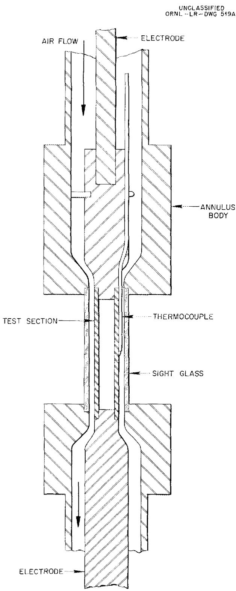  
Fig. 8.1. Thermocouple Test Apparatus.

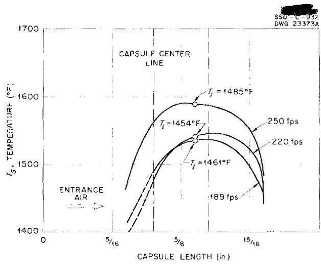  
Fig. 8.2. Temperature Measurements on MTR Capsule Mock-up.

and the average difference at the medium airflow rates used in the reactor was $100^{\circ}\mathrm{F}$ .

This error, together with several others of lesser magnitude, led to the conclusion that the temperature-control system employed in the reactor experiments tended to produce fuel-inconel interface temperatures averaging $1620^{\circ}\mathrm{F}$ and never higher than $1750^{\circ}\mathrm{F}$ at the hottest point of the capsule rather than the desired $1500^{\circ}\mathrm{F}$ . These findings are in agreement with calculations made by H. F. Poppendiek prior to the test experiments.

Temperature record charts of the 13 MTR capsules irradiated so far in the MTR were examined. In every instance of deep intergranular corrosion and abnormally large grains, the temperature pattern for the fuel-inconel interface was found to be either too high or too unsteady. For the cases in which the capsule temperature-time profile was within the limits originally set for the experiment, depth of attack (2 to 4 mils) and grain growth were not grossly different from those observed in bench tests at $1500^{\circ}\mathrm{F}$ . The pattern of corrosion was, however, still intergranular rather than that consisting of subsurface voids as in the case in out-of-pile tests.

An additional aid to interpretation of results from the in-pile capsule tests was afforded by a study of the effect of high temperatures on the grain structure of Inconel. Samples of capsule material were subjected to temperatures of 1800 to $2350^{\circ}\mathrm{F}$ for various periods of time. Metallographic exami

nations of these samples are now being made. Preliminary results indicate that large grains may be found in Inconel which has been heated for periods of time of less than 8 min duration at temperatures of the order of $2100^{\circ}\mathrm{F}$

The Inconel capsules presently being irradiated in the MTR contain both $\mathsf{UF}_3$ and $\mathsf{UF}_4$ -bearing fuel mixtures. The recent indications in out-of-pile tests that the use of $\mathsf{UF}_3$ might result in less corrosion suggested in-pile testing of $\mathsf{UF}_3$ -bearing mixtures. Temperatures of the capsules are being carefully controlled so that the Inconel-fuel interface temperature will remain approximately $1500^{\circ}\mathsf{F}$ throughout each test.

# LITR FLUORIDE-FUEL LOOP

W. E. Brundage

M. T. Morgan

C. D. Baumann

A. S. Olson

F. M. Blacksher

W. W. Parkinson

C. Ellis

O. Sisman

R. M. Carroll

Solid State Division

The design of fluoride-fuel loops for use in the LITR horizontal-beam facility was described in previous reports. The fabrication of components for three of these loops was completed. The first loop was inserted in the LITR but was removed before start-up of the reactor because of a leak in the fuel system. All fuel material was retained within the loop apparatus. Examination to determine the cause of the breakdown is in progress.

Development continued on in-pile pumps for loops to be operated in the horizontal-beam facilities of the LITR and MTR (cf., Sec. 2, "Experimental Reactor Engineering"). Several models are being constructed. A smaller uranium investment and less dilution of fission products would be attained by using such pumps in place of the present pumps which are operated at the reactor face.

# IN-PILE STRESS CORROSION AND CREEP

W.W.Davis

J.C.Wilson

N. E. Hinkle

J.C.Zukas

Solid State Division

Since intergranular corrosion of Inconel by molten fused salts of the type NaF-ZrF-UF has been

observed in bench tests in which a strain was introduced into the Inconel, it is conceivable that thermal stress may be associated with the intergranular type of attack seen in in-pile tests. To investigate this possibility, an in-pile stress-corrosion apparatus for the Inconel-fused salt systems was designed. Several prototypes of this apparatus are being bench tested.

Creep tests of Inconel in the ORNL Graphite Reactor and in the LITR under conditions pertinent to ANP reactor designs have been reported previously. Apparatus for tests in the higher flux of the MTR is being built. Much of the mechanical assembly is completed and the unit is almost ready for wiring. It is planned to use Bourdon tube extensometers rather than thermal-expansion (bi-metal) units since the former are in a more advanced stage of evolution.

# REMOTE METALLOGRAPHY

A. E. Richt

W. Parsley

E. Schwartz

R. Ramsey

M. J. Feldman

Solid State Division

Solid, sandwich-type, $\mathsf{UO}_2$ -type 347 stainless steel fuel elements irradiated in the MTR were submitted to the Laboratory by Pratt & Whitney Aircraft Division for metallographic examination. These studies, which were at first intended to yield information of interest only to the supercritical-water-cycle aircraft reactor, are also related to certain power-package reactor designs because of the similarity between the two types of fuel elements both in materials and in required operating conditions. Both reactors have operating pressures of the order of 5000 psi, temperatures in the range of 300 to $700^{\circ}\mathsf{F}$ , and high power generation rates. Both fuel element prototypes are made as solid sandwich-type elements clad with stainless steel or Inconel.

A typical Pratt & Whitney fuel element test is run with the element immersed in water in a sealed capsule at one of a series of fixed temperatures ranging from 100 to $700^{\circ}\mathrm{F}$ and with pressures of 3000 to 5000 psi. The power density of the fuel runs was as high as several thousand watts per cubic centimeter in the MTR. Results from the five capsules examined so far provide information about the effects of temperature and irradiation on core density changes, bonding of core to cladding, core hardness, and corrosion of the stainless steel

# ANP QUARTERLY PROGRESS REPORT

cladding. No measurable core density changes have been found and general corrosive attack on the cladding is absent. Hardness measurements taken on the core indicate a dependence between particle size and hardness change. Cores with particles less than $3\mu$ in diameter show greater hardness changes than do those in the 15- to $44 - \mu$ range. In general, it can be said that hardness

changes, expressed in DPH units, as great as ratios of 2 to 3 occur for irradiation periods of several hundreds of hours and for test temperatures as high as $700^{\circ}\mathrm{F}$ . Cracking of the core in bending tests (1.5-in. radius bend) was found only in the less than $3 - \mu$ core samples. It is expected that this work will be completed during the next several months.

# 9. ANALYTICAL STUDIES OF REACTOR MATERIALS

C. D. Susano  
Analytical Chemistry Division  
J. M. Warde  
Metallurgy Division  
R. Baldock  
tope Research and Production

Research and development in analytical chemistry for the ANP Project was concentrated on the problem of separating $\mathsf{UF}_3$ from $\mathsf{UF}_4$ in $\mathsf{NaZrF}_5$ -base fuels and fuel solvents. Methods were investigated for the conversion of the fluorides to chloride salts and the simultaneous extraction of the chlorides into nonaqueous solutions. Boron trichloride in a solution of dioxane appeared to be promising for this purpose, since $\mathsf{UCl}_4$ is soluble in dioxane, whereas $\mathsf{UCl}_3$ is essentially insoluble. The separation is also feasible in the presence of chromium chlorides. Chromium dichloride is soluble in dioxane in contrast to $\mathsf{CrCl}_3$ , which is insoluble. However, the conversion reaction was found to proceed slowly.

A method was devised for the determination of oxygen in $\mathrm{NaZrF}_5$ -base fuels and fuel solvents in which the oxides react with anhydrous hydrogen fluoride to produce water, quantitatively; the water materially increases the conductivity of the hydrofluoric acid. It has been calculated that the conductivity of anhydrous hydrogen fluoride is doubled by the addition of 1 ppm of water. In the study of the oxidation of trivalent uranium by hexavalent uranium it was shown that the competitive oxidation with hydrogen ion could not be completely eliminated. Stability tests of trivalent uranium in hydrochloric acid solutions were conducted. Although evaluation of the data is not complete, potentiometric measurements indicated that the transition in color from purple to green, which is considered to be evidence of oxidation, is not accompanied by corresponding changes in potential. A $1\%$ aqueous solution of the tetrasodium salt of ethylenediaminetetraacetic acid effectively removed a film of calcium metasilicate from Inconel. No evidence of corrosion was found by chemical tests. The sulfur content of natural gas was determined to be $0.5\mathrm{mg / cu}$ ft of gas.

Petrographic examination of NaF-ZrF-UF4fuels reduced with metallic zirconium, with metallic uranium, or with hydrogen has shown that the predominant phase in the reduction complexes ob

tained is always a solid solution of reduced $U^{4+}$ in $\mathsf{Na}_{9}\mathsf{Zr}_{8}\mathsf{F}_{41}$ . In the $\mathsf{RbF - UF}_3$ system, there appears to be a compound, 3 $\mathsf{RbF - UF}_3$ , which is tan and isotropic, with an $n = 1.438$ . The $\mathsf{NaF - UF}_3$ system contains a compound of unknown composition which is lavender and uniaxially positive, with refractive indices of approximately 1.552. Examinations of melts in the $\mathsf{NaF - CrF}_3$ system were made, and four compounds were observed.

# ANALYTICAL CHEMISTRY OF REACTOR MATERIALS

J. C. White Analytical Chemistry Division

# Oxidation States of Chromium and Uranium in NaZrF5-Base Fuels

A. S. Meyer, Jr. D. L. Manning  
W. J. Ross  
Analytical Chemistry Division

In extensive studies, covered in previous reports, no solvent has been discovered that will selectively dissolve $\mathsf{UF}_3$ or $\mathsf{UF}_4$ from $\mathsf{NaZrF}_5$ -base fuels. Certain organic solvents preferentially dissolved $\mathsf{UCl}_4$ from $\mathsf{UCl}_3$ , but the equilibrium of the reaction

$$
U ^ {I V} + C r ^ {I I} \rightarrow U ^ {I I I} + C r ^ {I I I}
$$

could conceivably be altered during the conversion of the metallic fuel components by the method of fusing the sample with $\mathsf{NaAlCl}_4$ . Therefore, an attempt is being made to dissolve the $\mathsf{UCl}_4$ into an organic solvent during the conversion of the fuel to the chloride salts.

Dioxane, which has been reported to dissolve $\mathsf{UCl}_4$ from $\mathsf{UCl}_3$ , was selected as the most promising solvent. It may offer an additional advantage in that aliphatic ethers are reported2 to

dissolve $\mathrm{CrCl}_2$ from $\mathrm{CrCl}_3$ to yield stable solutions which are void of reducing power. Thus, if the chlorination of the sample could be carried out in the presence of dioxane, $\mathrm{UCl}_4$ and $\mathrm{CrCl}_2$ would be dissolved, while $\mathrm{UCl}_3$ and $\mathrm{CrCl}_3$ would remain in the residue. It is hoped that the rate of reaction between the solid chlorides is negligibly slow at room temperature.

Preliminary tests were carried out by stirring $25\mathrm{-mg}$ samples of $\mathsf{UF}_3,\mathsf{UF}_4,\mathsf{NaZrF}_5,$ and $\mathsf{NaZrF}_5$ - UF in solutions of aluminum chloride in dioxane for periods of 4 to 24 hr. Visual observations and qualitative tests showed no evidence of dissolution of any of these samples. Similar negative results were obtained when the tests were repeated with solutions of aluminum chloride in ethyl ether, tetrahydrofuran, and benzene, respectively.

Thermodynamic calculations indicated that $\mathsf{BCl}_3$ is superior to $\mathsf{AlCl}_3$ as the reagent for the metatheoretical chlorination of the fluorides of uranium, chromium, and zirconium. In qualitative tests, 25-mg samples of $\mathsf{UF}_4$ and $\mathsf{NaZrF}_5$ - $\mathsf{UF}_4$ fuel were not completely dissolved after 16 hr of stirring in a solution of dioxane that had been saturated with $\mathsf{BCl}_3$ . When $\mathsf{UF}_4$ was stirred with liquid $\mathsf{BCl}_3$ at $0^{\circ}\mathsf{C}$ , there was no apparent dissolution of the sample. Analysis of the residue for chloride indicated that the reaction

$$
4 U F _ {4} + 3 B C I _ {3} \rightarrow 4 U C I _ {4} + 3 B F _ {3}
$$

was only about $20\%$ complete. Since the free-energy change of this reaction is $-110\mathrm{kcal}$ , it appears that a slow reaction rate is responsible for the incomplete dissolution of the samples. Attempts were made to increase the rate of reaction by treating the $\mathsf{UF}_4$ and the fuel samples with $\mathsf{BBr}_3$ at reflux temperatures of $91^{\circ}\mathsf{C}$ . Quantitative results of these experiments are not yet available, but portions of the unreacted samples were visible after refluxing for 3 hr. The reaction appeared to be accelerated by addition of $\mathsf{AICl}_3$ to the $\mathsf{BBr}_3$ .

When $60\mathrm{mg}$ of $\mathsf{UF}_4$ was stirred at room temperature for 6 hr with $60~\mathrm{ml}$ of dioxane, which had been saturated with $\mathsf{BCl}_3$ , about $25\%$ of the salt dissolved to form a green solution. The concentration of uranium in solution did not increase significantly when aluminum chloride was added and the stirring was continued for $90\mathrm{min}$ . No tests of the solubilities of $\mathsf{CrF}_2$ and $\mathsf{CrF}_3$ have yet been carried out.

Since this method is the only approach which appears to offer possibilities of the separation of tetravalent uranium from a fuel containing another element for which the oxidation potential is near that of the $U^{3+} \rightarrow U^{4+}$ couple, efforts will be made to accelerate the reaction to rates suitable for analytical applications. Because ethereal solutions of $\mathrm{BCl}_3$ are decomposed by heating, it will probably be necessary to find a catalyst for the chlorination reaction. Experiments are also being carried out to determine whether $\mathrm{UCI}_4$ may be sublimed by heating the fuels in an atmosphere of $\mathrm{BCl}_3$ .

# Determination of Oxygen in NaZrF5-Base Fuels

A. S. Meyer, Jr. J. M. Peele

Analytical Chemistry Division

Studies have been made to determine whether microgram quantities of oxygen in $\mathsf{NaZrF}_5$ -base fuels can be determined by measuring the water generated by the reaction of the metallic oxides with anhydrous hydrofluoric acid. Calculations of the free energies for the reactions of the type

$\mathsf{M}_2\mathsf{O}_3 + 6\mathsf{HF}$ (liquid) $\rightarrow 2\mathsf{MF}_3 + 3\mathsf{H}_2\mathsf{O}$ (liquid) have been carried out for the oxides which might be present in NaZrF5-base fuels. These calculations indicate that the reaction is quantitative for the following oxides: $\mathsf{ZrO}_2,\mathsf{Cr}_2\mathsf{O}_3,\mathsf{Fe}_2\mathsf{O}_3,$ $\mathsf{UO}_2,\mathsf{NiO},$ and $\mathsf{Na}_2\mathsf{O}$ .

The conductivity of hydrogen fluoride is known to be very sensitive to traces of water. Literature values for the equivalent conductivity of water in hydrogen fluoride were used for calculations which showed that the conductivity of anhydrous hydrofluoric acid is doubled by the addition of 1 ppm of water.

An apparatus is being constructed with which it will be possible to measure the changes in conductivity of hydrofluoric acid that result from the water produced by the fluorination reaction of oxides in the fuel samples. The apparatus includes a drying still, a reaction vessel, and a fluorothene conductivity cell. Provisions can be made for carrying out the reaction with liquid hydrofluoric acid at room temperature or with the gaseous reagent at elevated temperatures.

# Oxidation of Trivalent Uranium by Hexavalent Uranium

A. S. Meyer, Jr. D. L. Manning Analytical Chemistry Division

Experiments were continued on the oxidation of trivalent uranium by the uranyl ion $\mathrm{UO}_2^{++}$ according to the reaction

$$
2 U ^ {3 +} + U O _ {2} ^ {+ +} + 4 H ^ {+} \rightarrow 3 U ^ {4 +} + 2 H _ {2} O.
$$

In previous tests the extent of the reaction was determined by measuring polarographically the concentration of the unreacted uranyl ion. This measurement can also be made by titrating the $\mathsf{U}^{4 + }$ formed with the ceric ion $\mathsf{Ce}^{4 + }$ . Several tests were conducted in which known amounts of $\mathsf{UCl}_3$ were added to $100\mathrm{ml}$ of $0.01N$ uranyl acetate under varying conditions of acidity and temperature. After dissolution of the $\mathsf{UCl}_3$ , the concentration of the $\mathsf{U}^{4 + }$ was determined by titrating with $0.1N\mathsf{Ce}^{4 + }$ . The end point was obtained potentiometrically. The solutions were swept thoroughly with helium and titrated under an inert-gas blanket.

Quantitative oxidation with the uranyl ion was not achieved in any of the tests. Indeed, when solutions more acidic than $1N$ were used as solvent media, evolution of hydrogen was observed. The reaction is favored, however, when the uranium is added as the chloride instead of as the fluoride. This is probably due to the greater dissolution rate for $\mathrm{UCl}_3$ in acid (several minutes) as compared with the slow dissolution rate (several hours) for $\mathrm{UF}_3$ in this medium.

Efforts to eliminate the competitive reaction for the oxidation of trivalent uranium in aqueous solutions,

$$
2 U ^ {3 +} + H ^ {+} \rightarrow U ^ {4 +} + _ {2} H _ {2},
$$

have to date been unsuccessful. Future work will involve investigation of possible nonaqueous systems for the oxidation by uranyl ion.

# Stability of Trivalent Uranium in Hydrochloric Acid Solutions

A. S. Meyer, Jr. W. J. Ross

D. L. Manning

Analytical Chemistry Division

Katz and Rabinowitch stated that the stability of $\mathsf{UCl}_3$ is greater in hydrochloric acid than in

water and reported a "characteristic" purple color for the trivalent ion. An investigation of the stability of trivalent uranium in hydrochloric acid media was made to ascertain the feasibility of titrating $U^{3+}$ . The potential of a solution of $\mathsf{UCl}_3$ in 1.0 N HCl at $0^{\circ}\mathsf{C}$ was followed with a platinum, calomel electrode system. The initial potential upon dissolution was +250 mv vs S.C.E., and the potential decreased only 15 mv in 10 min. No evidence of a purple color was observed in this experiment; the solution turned green upon dissolution.

The experiments were repeated with concentrated hydrochloric acid at both 0 and $-20^{\circ}\mathrm{C}$ . In both cases, instantaneous formation of a. purple-colored solution occurred, and the purple color remained for 10 to 20 min before it changed to green. The purple color remained longest in the solution tested at the lower temperature. The initial potential in all tests was of the order of $+150\mathrm{mv}$ , and the potential did not change appreciably during the transition in color from purple to green. The potential was essentially constant at $+150\mathrm{mv}$ for 30 min. The constancy of the potential of these solutions contradicts the usually accepted hypothesis that the change in color from purple to green represents oxidation to the $\mathsf{U}^{4 + }$ state. Some quantitative data were obtained on the concentrations of tri- and tetravalent uranium in these solutions by titration with ceric ion. In 0.1 N HCl solutions, two distinct breaks in the potential curve were noted, while only one break was observed in concentrated acid solutions. The data have not yet been thoroughly evaluated. The anomaly of the change in color of the solutions without an accompanying change in potential will be investigated.

# Removal of Film from Inconel Tubing

J.C.White

Analytical Chemistry Division

The tetrasodium salt of ethylenediaminetetraacetic acid was tested as a possible reagent for removing a film, probably calcium metasilicate, which was found to be deposited upon the walls of Inconel tubing following a wash with a detergent Conklene. A $1\%$ solution of the reagent in water, heated to 75 to $80^{\circ}\mathrm{C}$ , effectively removed the film from a specimen of Inconel in a few minutes. The metal had a bright finish after it was rinsed with water. Chemical analysis of the reagent solution

after contact for 60 hr at $75^{\circ}\mathrm{C}$ with Inconel showed less than 1 ppm of chromium and nickel.

# Determination of Sulfur in Natural Gas

G. Goldberg

Analytical Chemistry Division

A determination was made of the sulfur content of the natural fuel gas received at the Y-12 Plant because it is planned to use natural gas as a source of heat in future corrosion tests. The Referee5 method was used in which the gas is burned in an ammonia-rich atmosphere and the condensable gases are collected in a tower filled with glass balls and ammonium carbonate. The reaction is

$$
\mathrm {S O} _ {2} + 2 \mathrm {N H} _ {3} + \mathrm {H} _ {2} \mathrm {O} \longrightarrow (\mathrm {N H} _ {4}) _ {2} \mathrm {S O} _ {3}.
$$

The solution of ammonium sulfite is oxidized to sulfate, and the sulfur is determined as barium sulfate. The sulfur content was found to be 0.5 mg/cu ft of gas, which is equivalent to 0.8 grain per 100 cu ft. This concentration is essentially the same as the sulfur concentration (1 grain of sulfur per 100 cu ft) of the propane which is received at the Y-12 Plant.

# PETROGRAPHIC INVESTIGATIONS OF FLUORIDE FUELS

G.D. White T.N.McVay, Consultant Metallurgy Division

With the shift in emphasis to reduced fuels, more effort was devoted to the determination of the optical properties of compounds containing $\mathsf{U}\mathsf{F}_{3}$ . In $\mathsf{NaF - ZrF_4 - U}\mathsf{F}_4$ fuels reduced with metallic zirconium, with metallic uranium, or with hydrogen, the predominant phase in the reduction complexes obtained is always a solid solution of reduced $\mathsf{U}^{4 + }$ in $\mathsf{Na}_{9}\mathsf{Zr}_{8}\mathsf{F}_{41}$ . The color of this complex varies from greenish-yellow, to greenish-ton, to a brilliant yellow. The optic figure remains the same as that for unreduced solid solution, but there is a definite lowering of the refractive indices. Evidently the amount of optic change in the crystal depends upon the amount of reduction. In addition to the reduced solid solution, minor amounts of $\mathsf{U}\mathsf{F}_{3}\cdot 2\mathsf{ZrF}_{4}$ , which is orange, uniaxially positive, and has refractive indices of approximately 1.55, and an olive-drab phase, which is pleochroic with refractive indices

of about 1.54, are found. The composition of the olive-drab phase is unknown. Sometimes a trace of an isotropic yellow phase with $n = 1.44$ is present.

In the $RbF - UF_{3}$ system, there appears to be a compound, $3RbF - UF_{3}$ , which is tan and isotropic, with an $n = 1.438$ . The $NaF - UF_{3}$ system contains a compound which is lavender and uniaxially positive, with refractive indices of approximately 1.552. The composition of this compound is not known.

Examinations of melts in the NaF-CrF $_3$ system were made and four compounds were observed. The compound $\mathrm{Na}_3\mathrm{CrF}_6$ was previously reported as isotropic and green, with $n = 1.411$ . In compositions with high $\mathrm{CrF}_3$ content, two phases were present. The predominant phase was pleochroic, with the fast direction yellow-green and the slow direction blue-green, uniaxially positive, with $O = 1.452$ and $E = 1.460$ , and polysynthetically twinned. A second phase that was present in smaller amounts was green and biaxially negative, with a small optic angle and high dispersion. It had a moderate birefringence, and its refractive indices were near 1.52. A third phase was present in melts with compositions near $50\%$ NaF- $50\%$ CrF $_3$ . It was yellow-green and uniaxially negative, with $O = 1.444$ , and it had an estimated birefringence of 0.008.

The optical properties of the several compounds that have been synthesized were compiled and published in an ORNL report.6

# SUMMARY OF SERVICE ANALYSES

J.C. White W.F.Vaughan

C. R. Williams

Analytical Chemistry Division

Analyses of samples from corrosion tests of the NaZrF5-base fuel continued to be the major portion of the work in the service laboratory. Samples of fuel preparations containing mixtures of UF3 and UF4 were received. In addition to the determinations for the corrosion products iron, nickel, and chromium, the concentrations of UF3 and UF4 were determined. The method7 for hydrogen evolution

has been used for the determination of $\mathsf{UF}_{3^{\prime}}$ and following the determination of total uranium, the content of $\mathsf{UF}_{4}$ is calculated from the difference in concentration between total uranium and $\mathsf{UF}_{3}$ . Samples from corrosion tests of prospective future

fuels which consist of fluorides of sodium, lithium, and potassium or rubidium were also analyzed.

During this quarter the laboratory received 1163 samples and reported 1060 which involved 9357 determinations (Table 9.1).

TABLE 9.1. SUMMARY OF SERVICE ANALYSES REPORTED   

<table><tr><td></td><td>NUMBER OF SAMPLES</td><td>NUMBER OF DETERMINATIONS</td></tr><tr><td>Reactor Chemistry</td><td>610</td><td>4435</td></tr><tr><td>Experimental Engineering</td><td>370</td><td>4116</td></tr><tr><td>Fuel Production</td><td>64</td><td>671</td></tr><tr><td>Miscellaneous</td><td>16</td><td>135</td></tr><tr><td></td><td>1060</td><td>9357</td></tr></table>

Part III

SHIELDING RESEARCH

#

# 10. LID TANK FACILITY

C. L. Storrs

GE-ANP

G. T. Chapman

J.M.Miller

D. K. Trubey

Physics Division

J.B.Dee

Pratt & Whitney Aircraft Division

The Lid Tank Facility (LTF) has been used primarily for studying special attenuation problems which arise in aircraft shield design. One of these studies which is of interest for crew-shield design has been the penetration of slant-incident neutrons through a hydrogenous shield. In another study, comparison was obtained of secondary (neutron-induced) gamma-ray production in lead and in bismuth.

# SLANT PENETRATIONS OF NEUTRONS THROUGH WATER

G. T. Chapman

Physics Division

The experiments for determining the slant penetration of fission neutrons through water have been continued at the LTF. In a previous experiment the neutron flux at the end of the duct was low and it was possible to make measurements with only small amounts of water between the detector and the duct. For the present work, a new duct, larger in diameter and shorter in length (Fig. 10.1), was used, and the flux was increased to the extent that measurements could be made $45~\mathrm{cm}$ from the end of the duct. The distribution of the fast-neutron dose around the end of the duct is plotted in Fig. 10.2.

The dose was integrated along planes at different slant thicknesses $(t_{s})$ of water and at angles $(\alpha_{i})$ of 0, 30, and 60 deg to the incident flux. The results are given in Fig. 10.3. Owing to the large size of the source, the distance to the integration plane is not well defined at other than 0 deg, and therefore the relative magnitudes of the curves are in some doubt; however, the slopes are probably significant.

The observed relaxation length for the 0- and 30-deg measurements was $7.2\mathrm{cm}$ . For the incident

angle of 60 deg, the relaxation length increased from 7.8 to 12.5 cm as the slant thickness increased. This increase in relaxation length is presumably due to the "short-circuiting" effect, that is, the scattering of neutrons in a direction which permits them to penetrate the shield along a nearly normal path rather than along a slant path.

$^{1}$ C. L. Storrs et al., ANP Quar. Prog. Rep. Dec. 10, 1953, ORNL-1649, p 120.

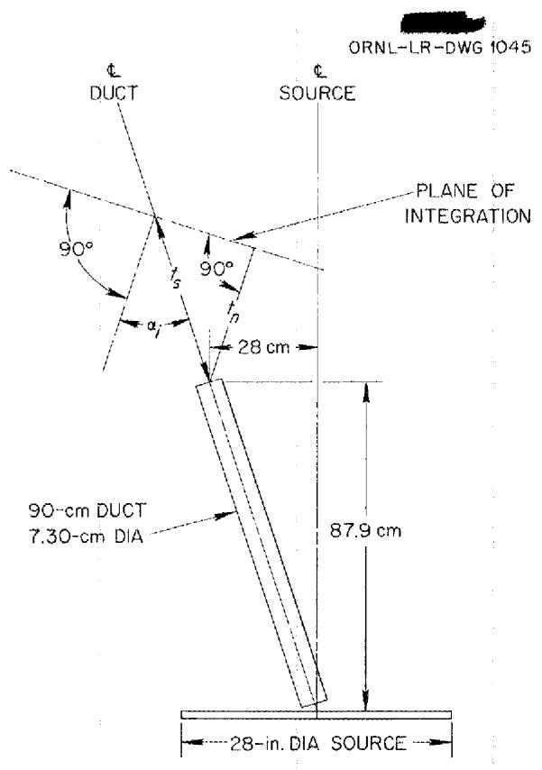  
Fig. 10.1. Duct Arrangement for Slab Penetration Experiment.

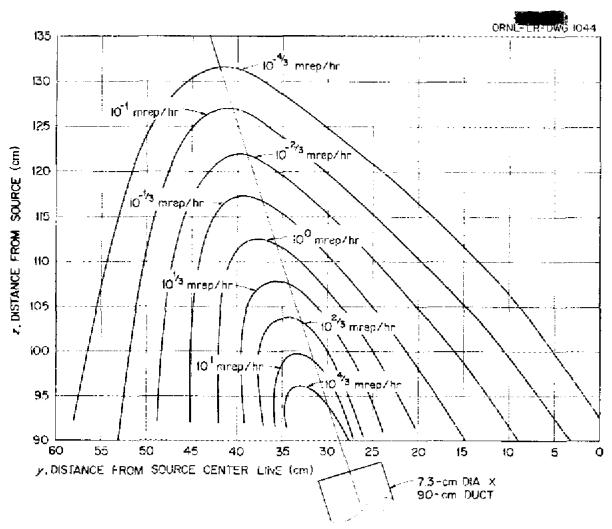  
Fig. 10.2. Fast-Neutron Dose Distribution Beyond End of Duct.

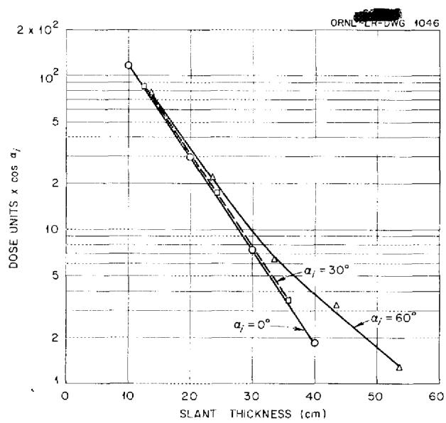  
Fig. 10.3. Slant Penetration of Fast Neutrons in Water.

# SECONDARY GAMMA-RAY STUDY

D. K. Trubey

Physics Division

A study of secondary gamma-ray production in materials considered for use as gamma-ray shields has been undertaken at the LTF. Measurements have been made behind 6 in. of lead or bismuth placed in borated water (1.1 wt % boron) at various

distances from the fission source plate (Fig. 10.4). The 6-in. thicknesses of metal amounted to 145 g/sq cm for the bismuth and 161 g/sq cm for the lead. The borated water was contained in a 36-in.-long aluminum tank placed adjacent to the source. The detector used primarily was a 1-in. anthracene scintillation crystal and a photomultiplier tube.

The gamma-dose measurements taken in the plain water behind the borated-water tank in which the lead or bismuth slabs were placed at various distances $(d)$ from the source are shown in Figs. 10.5 and 10.6. It can be noted that the dose becomes less sensitive to slab position as $d$ increases. In both Figs. 10.5 and 10.6, curves showing the gamma dose in plain water in the Lid Tank and in plain water behind the borated-water tank have been added for comparison. The slopes of these two curves differ because the 2.2-Mev hydrogen-capture gammas produced in the plain water are attenuated more rapidly than the harder-source gammas predominant in the water behind the borated-water tank. In Fig. 10.5 the effects of lead placed 3.2 and 8.4 cm from the source in plain water are also shown.

A comparison of the dose measurements behind lead and bismuth as a function of the position of the metal, with the detector placed $120~\mathrm{cm}$ from the source, is shown in Fig. 10.7. Measurements at any other detector position would be similar. The difference in the two curves for $d = 47.6$ cm is

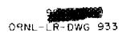

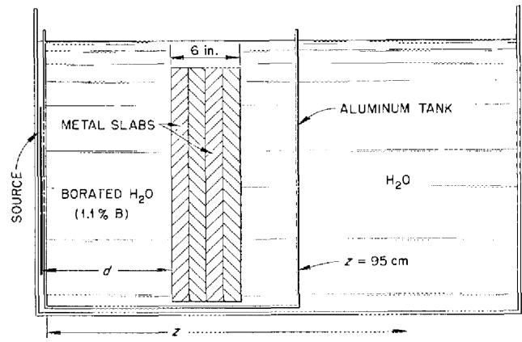  
Fig. 10.4. Arrangement for Measuring Secondary Gamma-Ray Production in Materials Considered for Use as Gamma-Ray Shields.

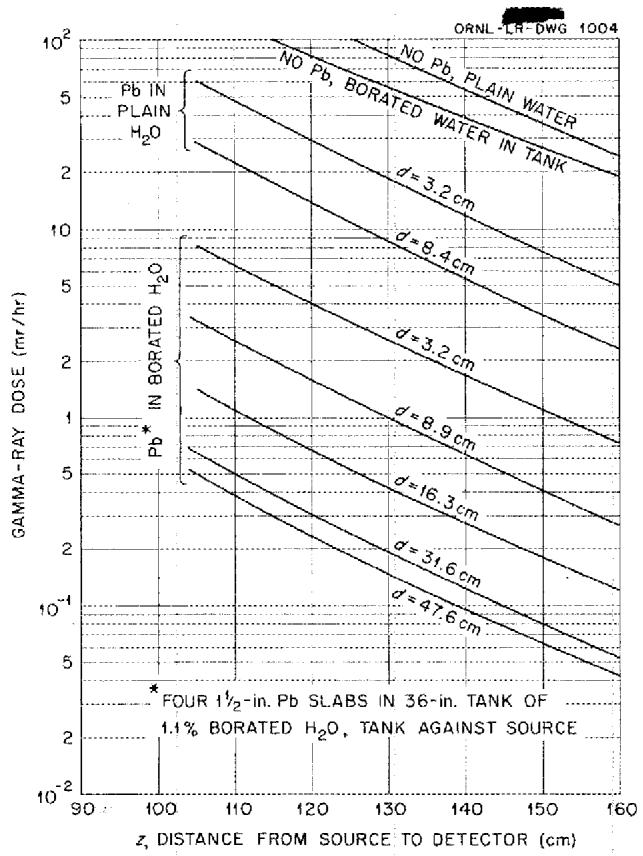  
Fig. 10.5. Effect of Lead on Gamma Dose as a Function of Distance in Water from Fission Source.

presumably due to the difference in the densities of the two metals. The fact that the curves become flat for $d > 47$ cm indicates that the slabs placed at greater distances from the source were in such a small neutron flux that the secondary gamma production had become almost negligible. The gamma-ray dose behind the slabs at $d = 47.6$ cm is therefore considered to be caused by source gamma rays, including those originating in the water near the source because of hydrogen capture of thermal neutrons. The source dose can be subtracted from the dose behind the slabs at other positions to determine the secondary gamma-ray dose at a given distance from the source. The resulting secondary doses for lead and bismuth are given in Figs. 10.8 and 10.9, respectively, as a function of distance from the front face of the slabs, since it was considered that the origin of these gamma rays was associated with the position of the slabs.

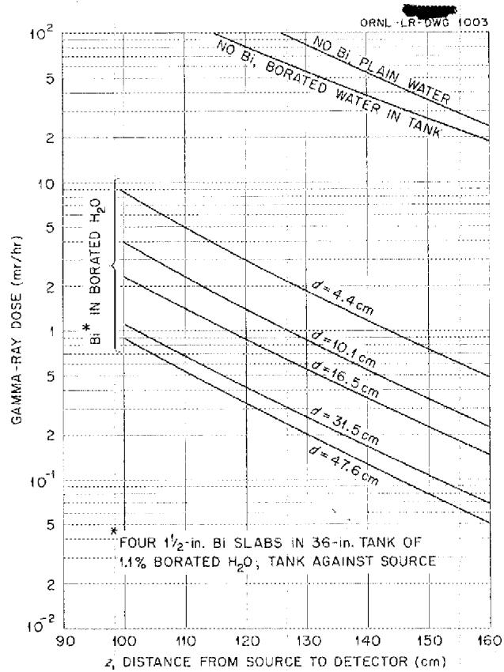  
Fig. 10.6. Effect of Bismuth on Gamma Dose as a Function of Distance in Water from Fission Source.

A comparison of the doses from secondary gamma-ray production in lead and in bismuth is presented in Fig. 10.10, in which the dose at $100~\mathrm{cm}$ from the front face of the metal is plotted as a function of the metal position. The experimental accuracy does not justify concluding that the slopes are different. Normalized thermal-neutron and fast-neutron curves (measurements made in plain water) have been included in Fig. 10.10 to show that the secondary-gamma dose curve has a slope characteristic of neutron curves.

From this experiment little difference between lead and bismuth secondary gamma-ray production can be seen. The data are to be extended in the near future with the hope that it will be possible to obtain a more complete understanding of the phenomena.

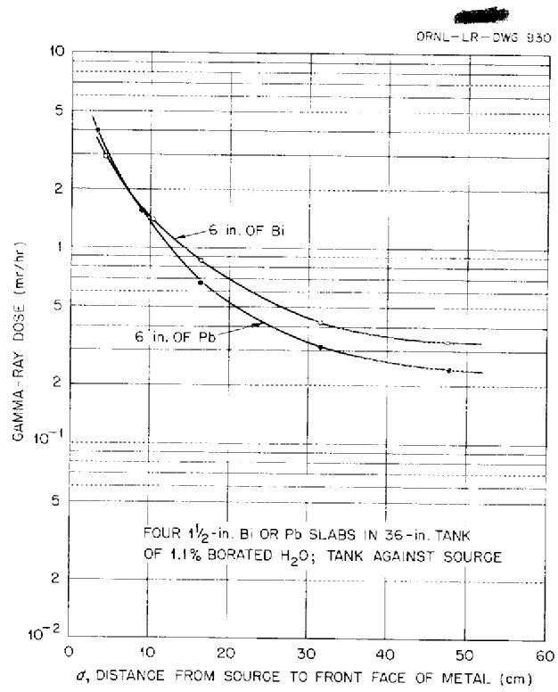  
Fig. 10.7. Gamma-Ray Dose $120\mathrm{cm}$ from Source as a Function of Position of Metal.

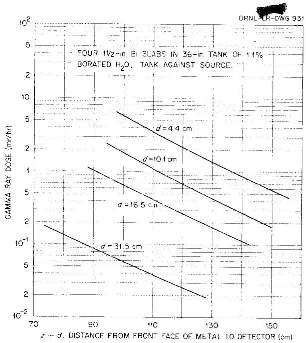  
Fig. 10.9. Dose from Secondary Gamma-Rays (Source Gamma-Rays Substracted) as a Function of Distance from Bismuth Slabs.

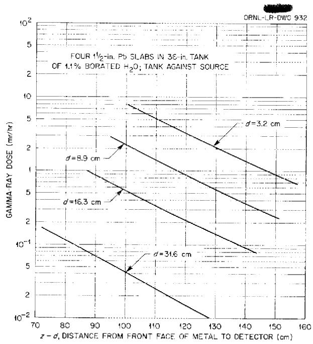  
Fig. 10.8. Dose from Secondary Gamma-Rays (Source Gamma-Rays Substracted) as a Function of Distance from Lead Slabs.

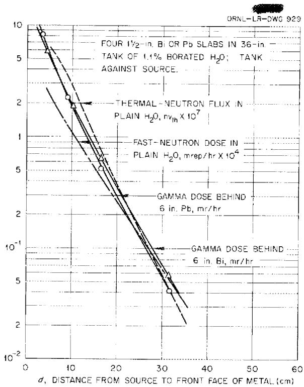  
Fig. 10.10. Dose from Secondary Gamma-Rays (Source Gamma-Rays Substracted) 100 cm from Front Face of Metal as a Function of Position of Metal.

# 11. BULK SHIELDING FACILITY

R. G. Cochran

F. C. Maienschein

G.M. Estabrook

H. E. Thunderford

J.D.Flynn

E. B. Johnson

M.P.Haydon

T. A. Love

K. M. Henry

R.W.Peele

Physics Division

The Bulk Shielding Facility (BSF) reactor has been used for determining the power and power distribution of loadings similar to those used in the new Tower Shielding Facility (TSF) reactor. The search for a better fast-neutron spectrometer continues, but no substantial progress has been made. Calculations of gamma-ray dose in a standard divided-shield design have been extended to include crew-shield penetration.

# GAMMA-RAY AIR-SCATTERING CALCULATIONS

F. C. Maienschein

Physics Division

Calculations of the dose received from airscattered gamma rays at the outside edge of the crew compartment of an aircraft divided shield were reported previously. These calculations have now been extended to determine the dose inside the crew compartment. The NDA method was used for calculations of the gamma-ray penetration through the crew shield, and in this case the ANP-53 crew shield was replaced by a simple cylinder of about the same dimensions.

A further calculation was made of the penetration of the direct (unscattered) gamma radiation reaching the crew position through the rear of the crew shield. The buildup factors used were those reported by Fono.4

Results of the air-scattering calculation indicate that although the skew-beam flux at the outside of the crew shield is extremely small compared with

the radial-beam flux, the dose inside the crew compartment from the skew-beam flux is comparable to the total radial-beam dose. This result was expected, since the skew-beam gamma rays, having scattered through smaller angles on the average than the radial-beam gamma rays, are of higher energy and thus penetrate the crew shield more readily.

The total dose inside the crew compartment from air-scattered gamma rays, as calculated by this method, is somewhat lower than that calculated by the ANP-53 method (Table 11.1); however, the agreement is good if it is considered that for the ANP-53 calculations it was assumed that all the gamma rays were of 3-Mev energy and that all were radially emitted from the reactor shield. The calculations would be in poorer agreement if the correction (unknown) for difference in leakage ratios between the two reactors were applied.

For the direct beam, the large increase shown by this calculation in comparison with the value obtained by the ANP-53 calculation is caused primarily by the gamma radiation that escapes around the edges of the shadow shield. The gamma-ray spectral measurements at the BSF show that a large number of low-energy (<2-Mev) gamma rays emerge from the reactor shield in such a direction that they may strike the crew shield without scattering. Unfortunately, the spectrometer background at such positions was so large that little value can be placed on the absolute magnitude of the dose. In general, for all results from these calculations, the shapes of the curves obtained are considerably more reliable than the absolute magnitudes.

The contributions to the total scattered dose of various regions outside the reactor and crew shields are shown in Figs. 11.1 and 11.2. The effect of the shadow shield is shown in Fig. 11.2, which is shaded proportionally to the dose contribution from each region. Furthermore it is shown in that figure

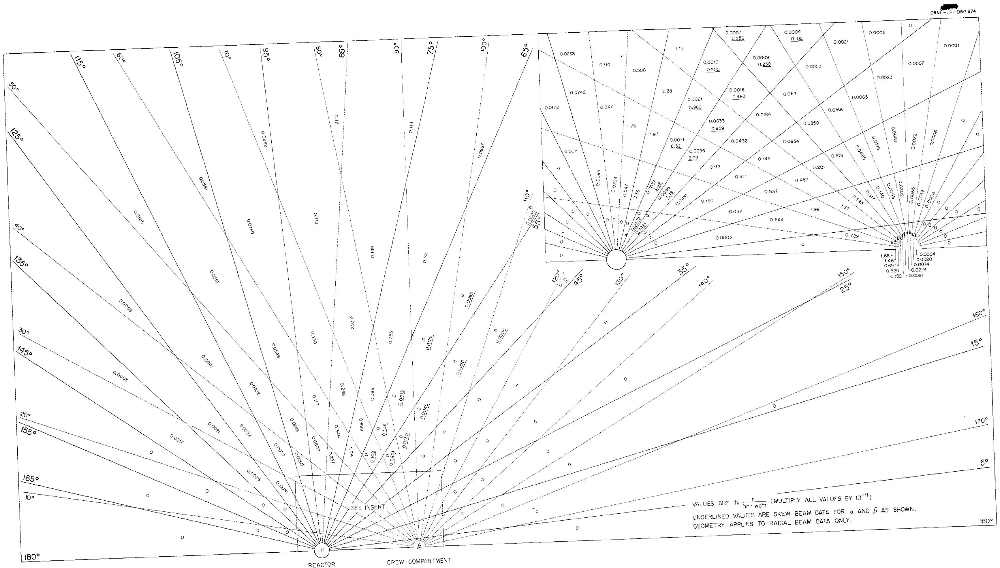  
Fig. 11.1. Gamma-Ray Dose Inside Crew Shield Resulting from Air Scattering from Individual Cells - Radial and Skew Emission.

TABLE 11.1. GAMMA-RAY FLUX AND DOSE AT THE CREW COMPARTMENT   

<table><tr><td>METHOD</td><td>FLUX OUTSIDE CREW
COMPARTMENT, Φ/P
(photons/sec/watt)</td><td>DOSE INSIDE CREW
COMPARTMENT, D
(r/hr/watt)</td></tr><tr><td>Radial scattered</td><td>4.5</td><td>0.36 × 10-9</td></tr><tr><td>Skew scattered</td><td>0.016</td><td>0.19 × 10-9</td></tr><tr><td>Direct</td><td>16.0</td><td>130 × 10-9</td></tr><tr><td>ANP-53 scattered*</td><td></td><td>1.2 × 10-9</td></tr><tr><td>ANP-53 direct*</td><td></td><td>1.2 × 10-9</td></tr><tr><td>Skyshine**</td><td></td><td>1.14 × 10-9</td></tr></table>

*No correction made for reactor leakage.   
\*\*H. E. Hungerford, The Skyshine Experiments at the Bulk Shielding Facility, ORNL-1611 (to be issued).

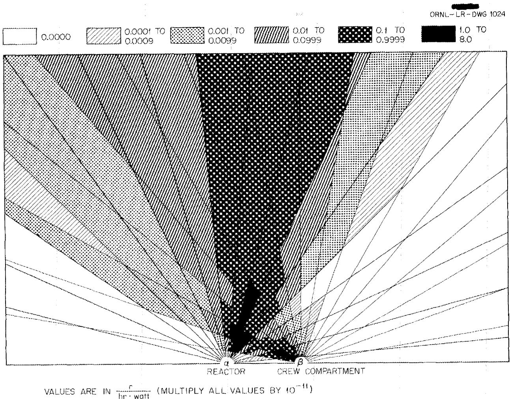  
Fig. 11.2. Gamma-Ray Dose Inside Crew Shield from Air Scattering.

that air-scattering from regions far from the aircraft makes an important contribution to the dose in the crew compartment. In all cases, only the penetration through the side wall of the crew shield has been given, since the front- and rear-wall contributions were negligible. Complete calculations were carried out for the front wall for both radial and skew emission in order to prove that these contributions were actually small.

The dependence of the scattered dose (for all angles) upon the presscatter energy is shown in Fig. 11.3, and the dependence on the postscatter energy in Fig. 11.4. It is interesting to note that the average energy for the skew-emission dose is higher than that for the radial-emission dose.

The scattered dose is presented as a function of the source angle in Fig. 11.5 and as a function of

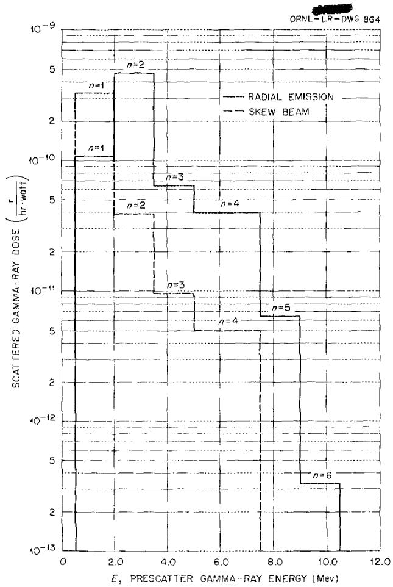  
Fig. 11.3. Scattered Gamma-Ray Dose as a Function of Presscatter Energy.

the receiver angle in Fig. 11.6. The distribution around the reactor shield (Fig. 11.5) clearly shows the peak in the forward direction which is due to the relatively favorable geometry for radiation starting forward. After a drop of a factor of about 300 out to 55 deg, the dose contribution rises rapidly at the edge of the shadow shield and again falls off because of geometry. It thus appears obvious that the shadow shield should extend to larger angles. It should, of course, be thinner with increasing values of $\alpha$ . It also appears that the ANP-53 crew shield was considerably overshielded in the rear. This was recognized at the time it was designed,

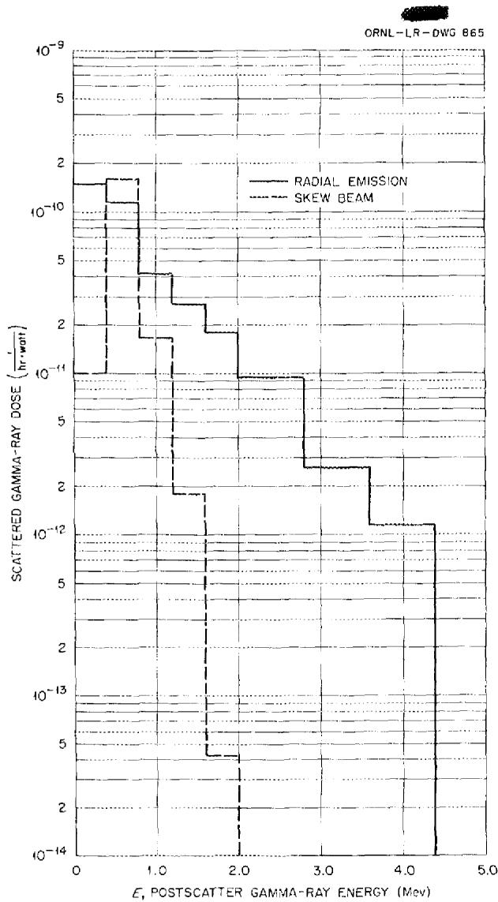  
Fig. 11.4. Scattered Gamma-Ray Dose as a Function of Postscatter Energy.

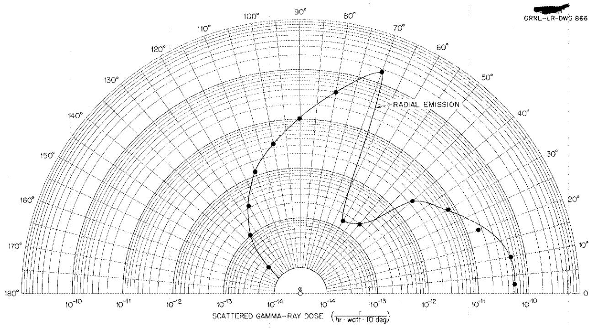  
Fig. 11.5. Scattered Gamma-Ray Dose as a Function of Source Angle.

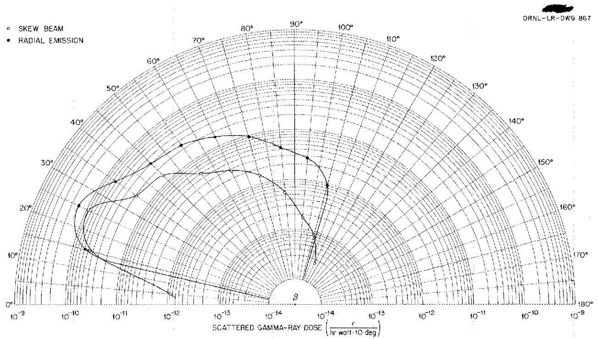  
Fig. 11.6. Scattered Gamma-Ray Dose as a Function of Receiver Angle.

but the excess shielding was supposed to compensate somewhat for the presence of ducts in the rear hemisphere of the reactor shield.

The distribution of the dose inside the crew shield as a function of the angle around the crew-compartment midpoint (Fig. 11.6) shows a larger contribution from scattered gamma rays from the rear of the crew-shield side wall, as would be expected because the crew compartment was taken to be a long cylinder with walls of uniform thickness. The variations observed in this case are not nearly so large as those for the source angle.

The direct dose as a function of the energy of the gamma rays emerging from the reactor shield is shown in Fig. 11.7. The dependence of the dose upon the energy is determined by the large angle at which the major contribution to the direct dose occurs, as shown in Fig. 11.8 in which the direct dose as a function of the source angle $\alpha$ is presented. Figure 11.8 again shows the extreme importance of the radiation escaping around the edges of the shadow shield. The detailed calculations of the gamma radiation reaching the crew compartment will be published in a separate report.

# THERMAL-NEUTRON-FLUX PERTURBATION BY GOLD FOILS IN WATER

E. B. Johnson

Physics Division

It is well known that when a detector that is not infinitely thin is introduced into a neutron flux, the flux is perturbed. The magnitude of the perturbation depends upon the absorption cross section of the detector and its physical dimensions and upon the properties of the medium into which it is introduced. It is customary at the BSF to use the flux of the ORNL Standard Graphile $\text{Pile}^6$ as the reference flux for the calibration of foils and counters. However, when a foil is used for thermal-neutron-flux measurements in water, the flux perturbation caused by the presence of the foil is different since the slowing-down properties of water differ from those of graphite. Klema and Ritchie arrived at a semiempirical

correction for this effect for the 25-sq cm 5-mill-thick indium foils normally used for flux measurements in water. The presence of these foils results in a $22\%$ depression of the flux from its unperturbed value. Frequently it would have been desirable to use gold foils for flux determinations in water, but no value for the flux depression has been available. Therefore an experiment has been completed at the BSF that was designed for measuring this effect.

Thermal-neutron-flux measurements were made with both the indium and the gold (1-sq cm, 5-mil-thick) foils at five positions along the north-south center line of the reactor. The perturbation factor of 1.22 was applied, as usual, to the indium-foil data, but no such correction was made on the gold-foil data. The results are shown in Fig. 11.9. If it is assumed that a probable error of $\pm 2\%$ is associated with each measurement, there is no discernible difference between the thermal-neutron-flux measurements made with indium foils using the perturbation correction and those with gold foils using no correction. While it is recognized that the presence of any absorbing material must result in a local depression of the flux, it seems that this effect is within the probable errors of measurement for small gold foils in a water medium. It should be pointed out that such would not necessarily be the case if gold foils of larger dimensions were used. These results substantiate those obtained by P. M. Uthe from a similar experiment performed in the water tank at the thermal column of the ORNL Graphite Reactor.

# REACTOR POWER CALIBRATION TECHNIQUES

E. B. Johnson

G. M. Estabrook

R.G.Cochran

Physics Division

Correlation of shielding data from the TSF with those from the BSF requires that the power determinations for the two reactors be made by comparable methods. Power determinations at the BSF have been based on thermal-neutron-flux measurements obtained by inserting foils between the

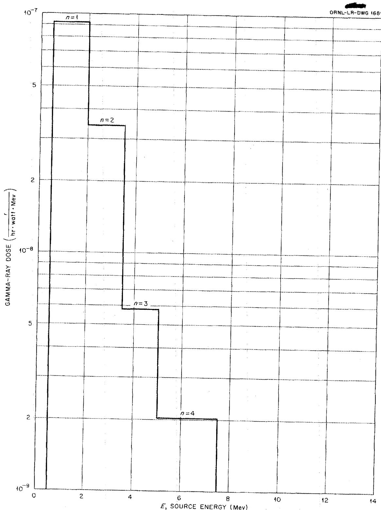  
Fig. 11.7. Direct Gamma-Ray Dose as a Function of Source Energy.

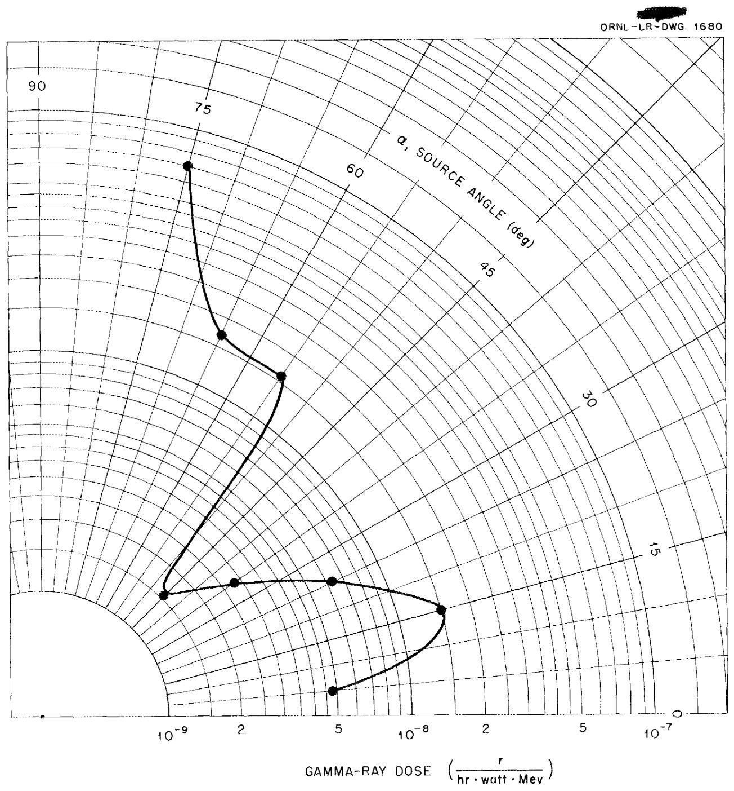  
Fig. 11.3. Direct Gamma-Ray Dose as a Function of Source Angle.

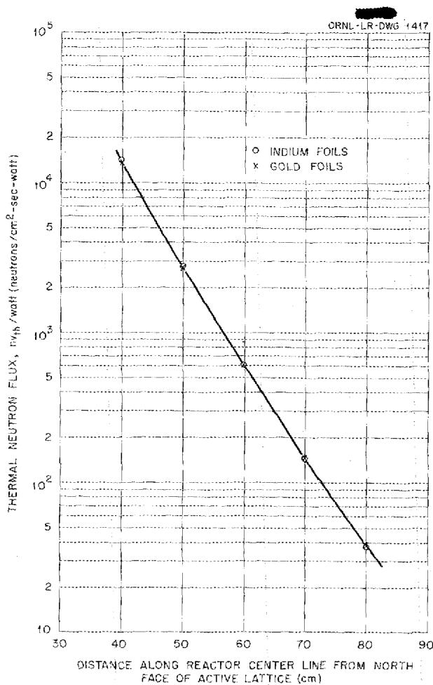  
Fig. 11.9. Comparison of Indium- and Gold-Feil Measurements in Water Surrounding BSF Reactor.

plates of the fuel elements in the reactor lattice.10 However, the Tower Shielding fuel elements have lead-shielded tops which make foil insertion impossible, and, in addition, the reactor control chambers are located directly over the lattice.

It has been planned to make the flux measurements in the TSF reactor by inserting cobalt wires down the center of the fuel elements. However, this technique will yield only a total flux rather than

the thermal flux needed for power-calibration calculations. Therefore, a method for obtaining reactor power directly from total-flux measurements was needed. In the method used at the BSF for power calibration, the total and epicadmium activities of detectors placed throughout the reactor lattice are obtained. The thermal-neutron flux obtained by this method is used to calculate the reactor power, since the fission rate and therefore the power level of an enriched-fuel reactor depend primarily on the thermal-neutron flux. The relation between the thermal-neutron flux as measured with foils and the power produced as indicated by strategically placed thermocouples has been very carefully determined.[11] It was found that the power of the reactor can be expressed as

$$
P = 4. 2 6 4 \times 1 0 ^ {- 1} G \bar {\phi} _ {t b}, \tag {1}
$$

where $P$ is the power in watts and $G$ is the mass of $\mathsf{U}^{235}$ in the volume over which $\vec{\phi}_{tb}$ is the average thermal flux. The constant contains the fission cross section, energy release per fission, fast-fission factor, and conversion factors.

Various methods have been investigated at the BSF for simplifying and adapting the currently used power-calibration procedure for use with the TSF reactor. The reactor power was calculated for each of three loadings by using both total flux and thermal flux as measured with small cobalt foils. Loading 20B (Fig. 11.10) had a slab reflector of beryllium oxide on all four sides, whereas loadings 22A (Fig. 11.11) and 24B (Fig. 11.12) were completely water reflected. The resulting data indicate that there is a constant ratio (within $1\%$ ) between the power calculated from thermal flux and that calculated from total flux. This indicates that if the constant in Eq. 1 is changed to $3.86 \times 10^{-11}$ , the average flux in the equation can be considered to be the total flux as measured with cobalt detectors. Flux measurements made by using cobalt wires have been obtained for the BSF reactor but the calculations have not yet been completed.

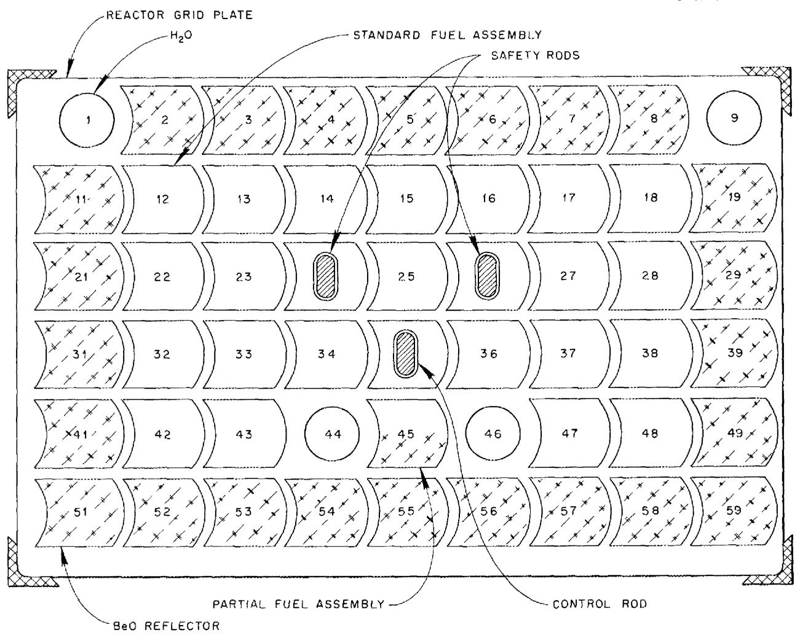  
Fig. 11.10. BSF Reactor Loading 20B.

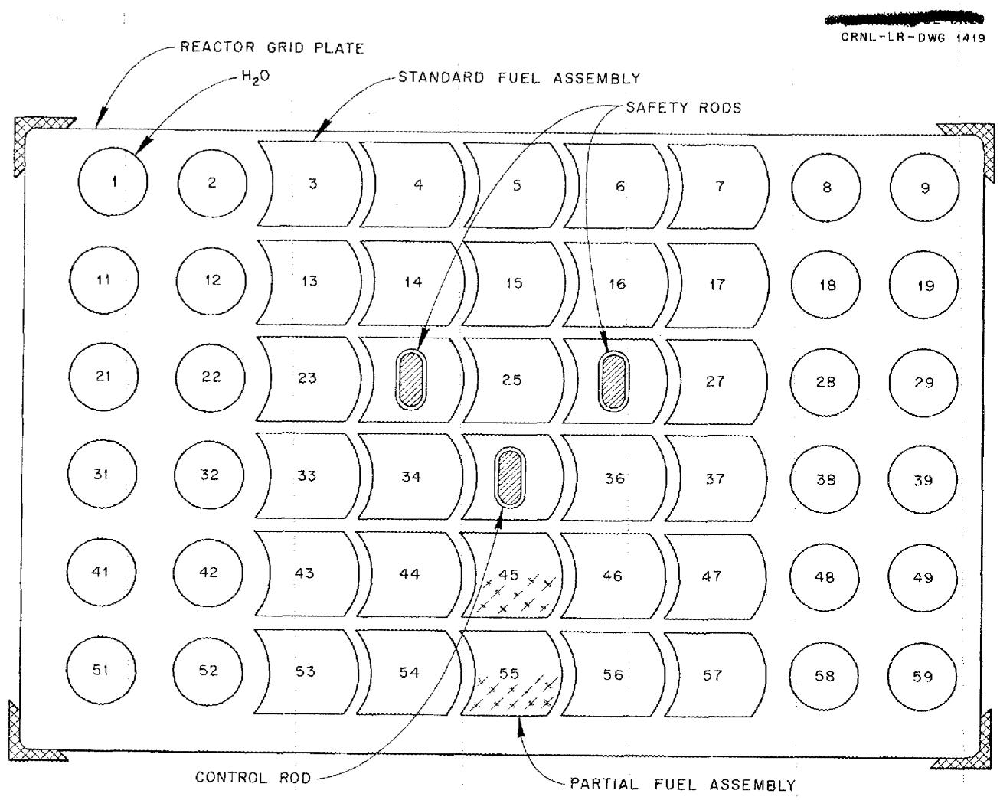  
Fig. 11.11. BSF Reactor Loading 22A.

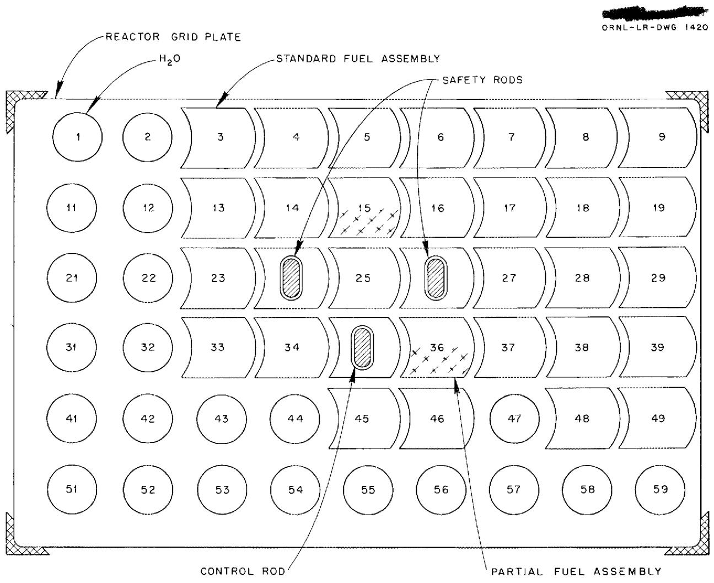  
Fig. 11.12. BSF Reactor Loading 24B.

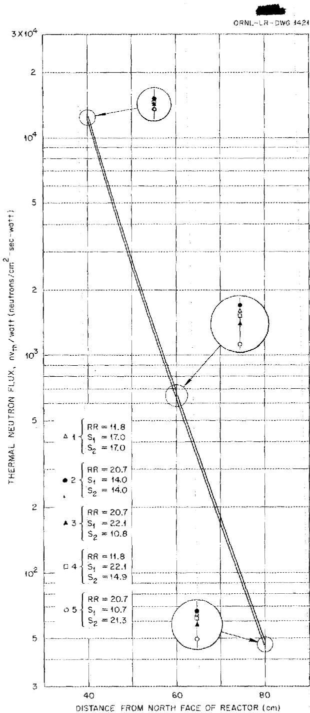  
Fig. 11.13. Comparison of Effects of Various Control-Rod Settings on Leakage Flux of BSF Reactor.

# LEAKAGE-FLUX CHANGES DUE TO CONTROL-ROD SETTINGS

J.D.Flynn R.G.Cochran Physics Division

An experiment was performed at the BSF to determine the effect of the leakage flux of changes in setting of the regulating rod and the safety rods in order to obtain better correlation between successive shielding measurements. At positions close to the reactor face, some effect would be expected; however, at large distances from the reactor, there should be no effect. The data (Fig. 11.13) indicate that there was no appreciable effect on the thermal flux at distances of 40 to 80 cm.

In another experiment, the effect of changing the quantity of $U^{235}$ in a reactor loading was investigated. A 110-g element was replaced with a 140-g element on the side of the reactor opposite to the side at which the measurement was made, and it was found that the leakage flux was insensitive to the quantity of uranium.

# 12. TOWER SHIELDING FACILITY

C. E. Clifford

T.V.Blosser

L.B.Holland

D. L. Gilliland

J. L. Hull

F. N. Watson

Physics Division

Construction at the Tower Shielding Facility (TSF) was completed May 1 (Fig. 12.1), and the facility is now operating on a schedule of four days per week. Critical experiments with the reactor were started early in March, and installation of the detector tank and experimental instrumentation was completely by the end of March. Since that time, experimental operation of the facility has been continued intermittently to permit final adjustments and modifications of all equipment.

# EXPERIMENTAL PROGRAM

Preliminary measurements have been taken for the differential shielding experiments in a small water tank $(5\times 5\times 5\mathrm{ft})$ which is known as the detector tank. For these measurements the reactor was in the 47-ton hemispherical water tank. The relaxation length for the air-scattered neutron radiation entering the sides and front of the detector tank is $5.3~\mathrm{cm}$ which is to be compared to the $4.5\mathrm{-cm}$ relaxation length obtained in the BSF Skyshine experiments2 and the 5-cm relaxation length used in the 1953 Summer Shielding Session.3

Neutron- and gamma-dose measurements in the reactor tank have been made with the 3-in. fission counter, the 900-cc ion chamber, and the three-chamber $\mathsf{BF}_3$ counter. These measurements are in qualitative agreement with those taken at the BSF with a similar reactor loading.

The first of a series of measurements for determining the background from ground-scattered radiation has been completed with the reactor and

detector tanks 4 ft above the ground. The separation distances of the tanks were 35, 65, and 100 ft. Since the power of the reactor is not absolutely established, the data from this experiment will be reported first in terms of radiation intensity relative to a nominal power, which is expected to be within $30\%$ of the actual power.

# OPERATION OF THE REACTOR

The reactor was loaded to criticality on March 12. This loading consisted of 26 fuel elements, the minimum number required for criticality. Since that time, another loading (30 fuel elements in a 5 by 6 array) has been checked by a critical experiment and is now being used for the preliminary measurements. Both these loadings were run earlier in the BSF reactor with TSF reactor fuel elements, and the power distribution of the 5 by 6 element array was determined with BSF reactor elements. The two TSF reactor loadings are comparable in shim-rod and regulating-rod positions to those used at the BSF.

During the experiments the reactor was run at power levels of 1 to 10 watts at the 200-ft elevation and at approximately 4 kw at just above the pool level. The instruments and controls performed satisfactorily under both conditions.

Use has been made of the remote visual-indicator system to observe operation and to position the reactor and the crew compartment. The ease with which it is possible to position the large loads by remote control with this system has exceeded expectations.

A system of slack-line limit switches has been installed on the large hoists to prevent damage to the hoist gear mechanism such as that experienced during the run-in period. The operation of the switches is satisfactory, but, to add assurance, the cables will be kept taut by additional counterweights that will be added to the floating sheave blocks.

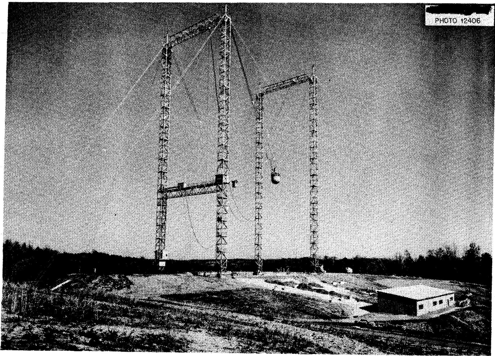  
Fig. 12.1. Completed Tower Shielding Facility.

$\therefore m - 1 \neq  0$ ;

Part IV

APPENDIX

# 13. LIST OF REPORTS ISSUED DURING THE QUARTER

<table><tr><td>REPORT NO.</td><td>TITLE OF REPORT</td><td>AUTHOR(s)</td><td>DATE ISSUED</td></tr><tr><td colspan="4">I. Aircraft Reactor Experiment</td></tr><tr><td>CF-54-3-65</td><td>ARE Design Data Supplement</td><td>W. B. Cottrell</td><td>3-2-54</td></tr><tr><td>CF-54-4-218</td><td>ARE Instrumentation List</td><td>R. G. Affel</td><td>4-7-54</td></tr><tr><td>CF-54-5-51</td><td>Analysis of Critical Experiments</td><td>C. B. Mills</td><td>5-12-54</td></tr><tr><td colspan="4">II. Reflector-Moderated Reactor</td></tr><tr><td rowspan="2">CF-54-2-185</td><td rowspan="2">Effects of Reactor Design Conditions on Aircraft Gross Weight</td><td>H. J. Stumpf</td><td>5-21-54</td></tr><tr><td>B. M. Wilner</td><td></td></tr><tr><td>CF-54-4-6</td><td>The Kinetics of the Circulating-Fuel Reactor</td><td>W. K. Ergen</td><td>5-5-54</td></tr><tr><td rowspan="2">CF-54-4-53</td><td rowspan="2">Reflector-Moderated Critical Assembly Experimental Pro-
gram</td><td>D. Scott</td><td>4-8-54</td></tr><tr><td>B. L. Greenstreet</td><td></td></tr><tr><td rowspan="2">CF-54-4-221</td><td rowspan="2">Radiation Damage Elastomers, Lubricants, Fabrics, and 
Plastics for Use in Nuclear-Powered Aircraft</td><td>H. J. Stumpf</td><td>4-15-54</td></tr><tr><td>B. M. Wilner</td><td></td></tr><tr><td>CF-54-5-1</td><td>The Xenon Problem in the ART</td><td>J. L. Meem</td><td>5-3-54</td></tr><tr><td>CF-54-5-196</td><td>Temperature Gradient and Thermal Stresses in Heat-
Generating Bodies</td><td>F. A. Field</td><td>5-21-54</td></tr><tr><td colspan="4">III. Experimental Engineering</td></tr><tr><td>CF-54-3-37</td><td>50-Mw Design - Canned Be</td><td>C. B. Mills</td><td>3-9-54</td></tr><tr><td>CF-54-3-194</td><td>Cross Sections</td><td>C. B. Mills</td><td>3-8-54</td></tr><tr><td>CF-54-4-195</td><td>Discussions and Results of the Dielectric Heating Test</td><td>A. L. Southern</td><td>4-27-54</td></tr><tr><td rowspan="2">ORNL-1688</td><td rowspan="2">Sodium Plumbing</td><td>W. B. Cottrell</td><td>8-14-53</td></tr><tr><td>L. A. Mann</td><td></td></tr><tr><td>ORNL-1716</td><td>Turbulent Heat Transfer from a Molten Fluoride Salt 
Mixture to Sodium-Potassium Alloy in a Double-Tube 
Heat Exchanger</td><td>D. F. Salmon</td><td>To be issued</td></tr><tr><td colspan="4">IV. Chemistry</td></tr><tr><td>CF-54-4-47</td><td>Data on the BeF2-NoF System</td><td>E. Orban</td><td>4-27-54</td></tr><tr><td>CF-54-5-40</td><td>Effects of Fission Products in Performance of a Reactor 
Using Fluorides as Solvent for Fuel</td><td>R. F. Newton</td><td>5-7-54</td></tr><tr><td>CF-54-5-47</td><td>Measurement of the Stability of Lithium Hydride</td><td>E. Orban</td><td>5-26-54</td></tr><tr><td>CF-54-5-189</td><td>Analysis of Salt Mixtures</td><td>F. F. Blankenship</td><td>5-25-54</td></tr><tr><td>CF-54-6-6</td><td>Fused Salt Compositions</td><td>C. J. Barton</td><td>6-2-54</td></tr><tr><td colspan="4">V. Metallurgy</td></tr><tr><td>CF-54-3-15</td><td>Metallographic Examination of Forced Circulation Loop No.
2</td><td>G. M. Adamson</td><td>3-3-54</td></tr><tr><td>CF-54-3-193</td><td>High Flow Velocity and High Temperature Gradient Loops</td><td>W. D. Manly</td><td>3-18-54</td></tr></table>

<table><tr><td>REPORT NO.</td><td>TITLE OF REPORT</td><td>AUTHOR(s)</td><td>DATE ISSUED</td><td></td></tr><tr><td>CF-54-4-162</td><td>Status of Columbium, Beryllium, and Lithium</td><td>W. D. Manly</td><td>4-6-54</td><td></td></tr><tr><td>CF-54-4-224</td><td>Report of Literature Survey of Beryllium</td><td>J. W. Woods</td><td>4-13-54</td><td></td></tr><tr><td>CF-54-5-88</td><td>Heat Exchanger Fabrication</td><td>E. E. Hoffman
P. Patriarca</td><td>5-17-54</td><td></td></tr><tr><td>CF-54-5-91</td><td>Free Energies of Formation of Oxides and Fluorides</td><td>J. M. Cisar</td><td>5-5-54</td><td></td></tr><tr><td>ORNL-1667</td><td>Alkali-Metal Nickel Oxides Containing Trivalent Nickel</td><td>L. D. Dyer
B. S. Borie, Jr.
G. P. Smith</td><td>2-26-54</td><td></td></tr><tr><td></td><td></td><td></td><td></td><td></td></tr><tr><td></td><td></td><td></td><td></td><td></td></tr><tr><td></td><td></td><td></td><td></td><td></td></tr><tr><td></td><td></td><td></td><td></td><td></td></tr><tr><td></td><td></td><td></td><td></td><td></td></tr><tr><td></td><td></td><td></td><td></td><td></td></tr><tr><td></td><td></td><td></td><td></td><td></td></tr><tr><td></td><td></td><td></td><td></td><td></td></tr><tr><td></td><td></td><td></td><td></td><td></td></tr><tr><td></td><td></td><td></td><td></td><td></td></tr><tr><td></td><td></td><td></td><td></td><td></td></tr><tr><td></td><td></td><td></td><td></td><td></td></tr><tr><td></td><td></td><td></td><td></td><td></td></tr><tr><td></td><td></td><td></td><td></td><td></td></tr><tr><td></td><td></td><td></td><td></td><td></td></tr><tr><td></td><td></td><td></td><td></td><td></td></tr><tr><td></td><td></td><td></td><td></td><td></td></tr><tr><td></td><td colspan="3">VII. Heat Transfer and Physical Properties</td><td></td></tr><tr><td>CF-54-4-205</td><td>A Feasibility Study of Flow Visualization Using a Phosphorescent Particle Method</td><td>L. D. Palmer
G. M. Winn</td><td>4-30-54</td><td></td></tr><tr><td>CF-54-5-159</td><td>Effect of Oil Contamination on the Boiling Heat Transfer Characteristics of Heat Exchangers and Solid Fuel-Plate Reactors</td><td>M. W. Rosenthal
R. L. Miller</td><td>5-19-54</td><td></td></tr><tr><td>CF-54-5-160</td><td>Heat Capacities of Composition No. 12, No. 44, and of K3CrF6</td><td>W. D. Powers
G. C. Blalock</td><td>5-20-54</td><td></td></tr><tr><td>ORNL-1701</td><td>Forced Convection Heat Transfer Between Parallel Plates and in Annuli with Volume Heat Sources within the Fluids</td><td>H. F. Poppendiek
L. D. Palmer</td><td>5-11-54</td><td></td></tr><tr><td>ORNL-1702</td><td>A Summary of Density Measurements on Molten Fluoride Mixtures and a Correlation Useful for Predicting Densities of Fluoride Mixtures of Known Composition</td><td>S. I. Cohen
T. N. Jones</td><td>5-14-54</td><td></td></tr><tr><td></td><td></td><td></td><td></td><td></td></tr><tr><td></td><td></td><td></td><td></td><td></td></tr><tr><td></td><td></td><td></td><td></td><td></td></tr><tr><td></td><td></td><td></td><td></td><td></td></tr><tr><td></td><td></td><td></td><td></td><td></td></tr><tr><td></td><td></td><td></td><td></td><td></td></tr><tr><td></td><td></td><td></td><td></td><td></td></tr><tr><td></td><td></td><td></td><td></td><td></td></tr><tr><td></td><td></td><td></td><td></td><td></td></tr><tr><td></td><td></td><td></td><td></td><td></td></tr><tr><td></td><td></td><td></td><td></td><td></td></tr><tr><td></td><td></td><td></td><td></td><td></td></tr><tr><td></td><td></td><td></td><td></td><td></td></tr><tr><td></td><td></td><td></td><td></td><td></td></tr><tr><td></td><td></td><td></td><td></td><td></td></tr><tr><td></td><td></td><td></td><td></td><td></td></tr><tr><td></td><td></td><td></td><td></td><td></td></tr><tr><td></td><td></td><td></td><td></td><td></td></tr><tr><td></td><td></td><td></td><td></td><td></td></tr><tr><td></td><td></td><td></td><td></td><td></td></tr><tr><td></td><td></td><td></td><td></td><td></td></tr><tr><td></td><td></td><td></td><td></td><td></td></tr><tr><td></td><td></td><td></td><td></td><td></td></tr><tr><td></td><td></td><td></td><td></td><td></td></tr><tr><td></td><td></td><td></td><td></td><td></td></tr><tr><td></td><td></td><td></td><td></td><td></td></tr><tr><td></td><td></td><td></td><td></td><td></td></tr><tr><td></td><td></td><td></td><td></td><td></td></tr><tr><td></td><td></td><td></td><td></td><td></td></tr><tr><td></td><td></td><td></td><td></td><td></td></tr><tr><td></td><td></td><td></td><td></td><td></td></tr><tr><td></td><td></td><td></td><td>6-2-54</td><td></td></tr><tr><td></td><td></td><td></td><td></td><td></td></tr><tr><td></td><td></td><td></td><td></td><td></td></tr><tr><td></td><td></td><td></td><td></td><td></td></tr><tr><td></td><td></td><td></td><td></td><td></td></tr><tr><td></td><td></td><td></td><td></td><td></td></tr><tr><td></td><td></td><td></td><td></td><td></td></tr><tr><td></td><td></td><td></td><td></td><td></td></tr><tr><td></td><td></td><td></td><td></td><td></td></tr><tr><td></td><td></td><td></td><td></td><td></td></tr><tr><td></td><td></td><td></td><td></td><td></td></tr><tr><td></td><td></td><td></td><td></td><td></td></tr><tr><td></td><td></td><td></td><td></td><td></td></tr><tr><td></td><td></td><td></td><td></td><td></td></tr><tr><td></td><td></td><td></td><td></td><td></td></tr><tr><td></td><td></td><td></td><td></td><td></td></tr><tr><td></td><td></td><td></td><td></td><td>To be issued</td></tr></table>

<table><tr><td>REPORT NO.</td><td>TITLE OF REPORT</td><td>AUTHOR(s)</td><td>DATE ISSUED</td></tr><tr><td>ORNL-1714</td><td>Sources and Attenuation of Gamma Radiation from a Di-
vided Aircraft Shield</td><td>F. C. Maienschein
F. Bly
T. A. Love</td><td>To be issued</td></tr><tr><td>ORNL-1723</td><td>Power Calibration Techniques for BSR</td><td>E. B. Johnson
et al.</td><td>To be issued</td></tr><tr><td></td><td>X. Miscellaneous</td><td></td><td></td></tr><tr><td>ORNL-1686</td><td>Quantities and Reactions of Solid Surfaces</td><td>E. P. Carter</td><td>4-7-54</td></tr><tr><td>ORNL-1692</td><td>Aircraft Nuclear Propulsion Project Quarterly Progress
Report for Period Ending March 10, 1954</td><td>A. W. Savolainen</td><td>4-15-54</td></tr></table>