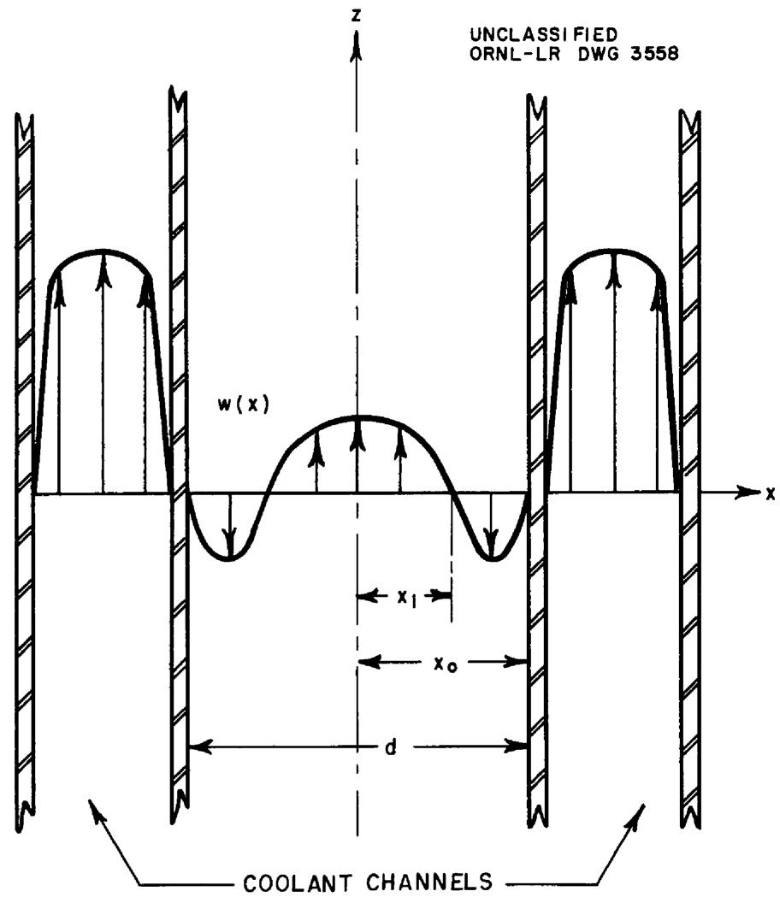
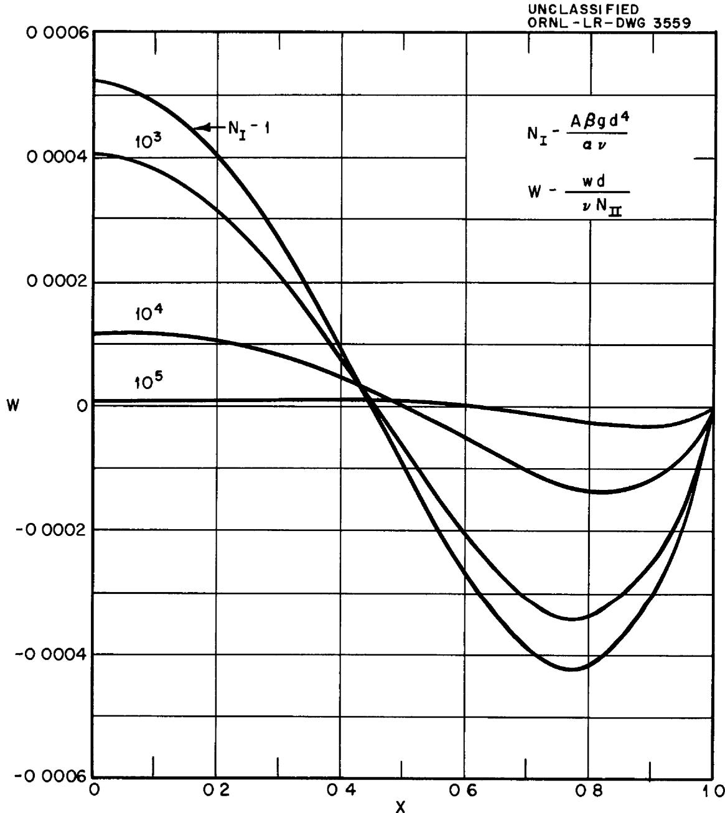
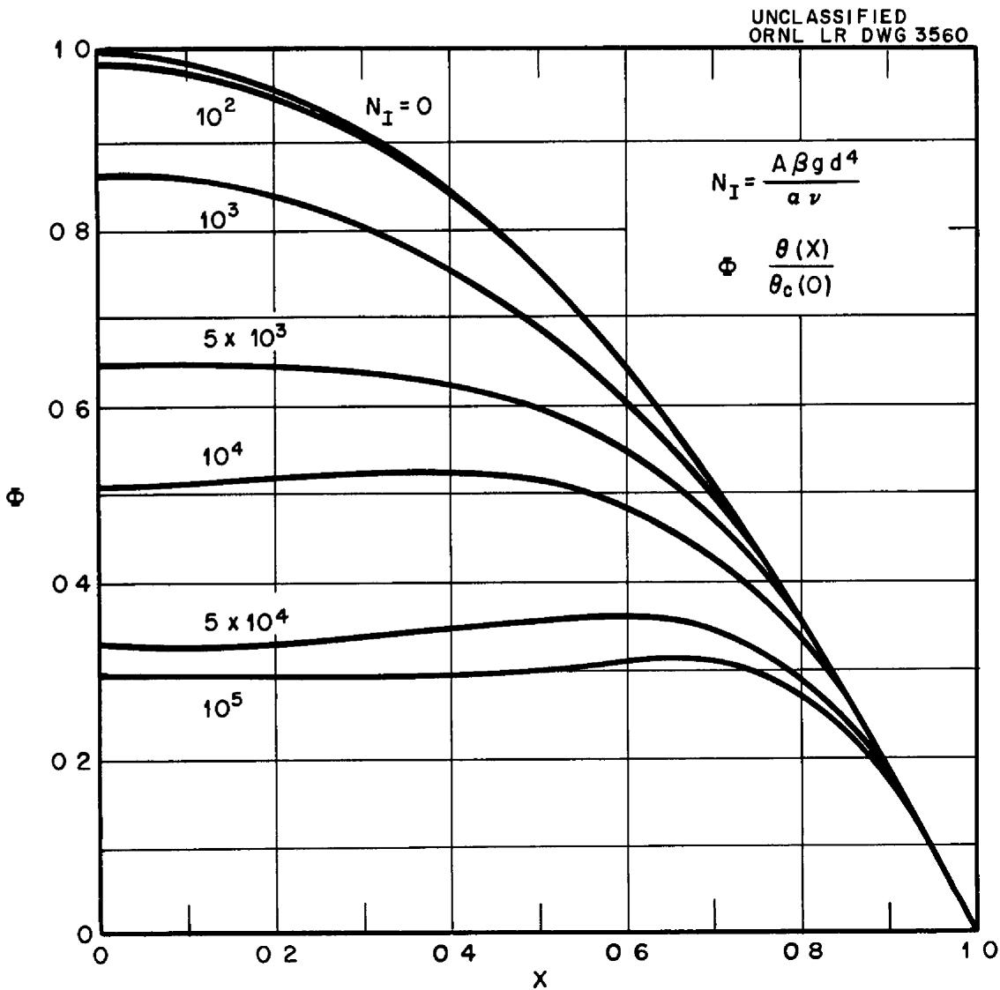
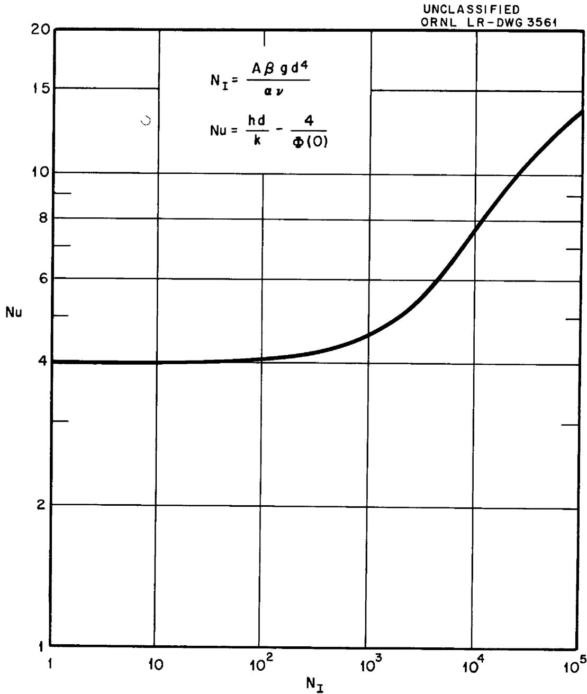
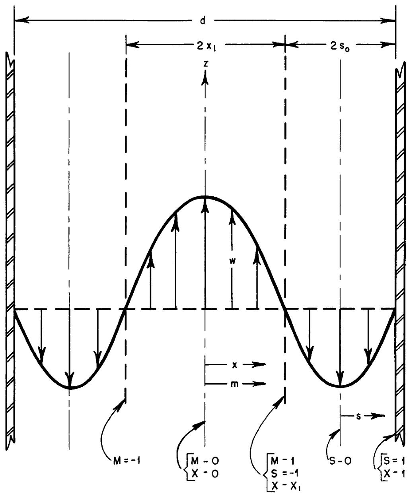
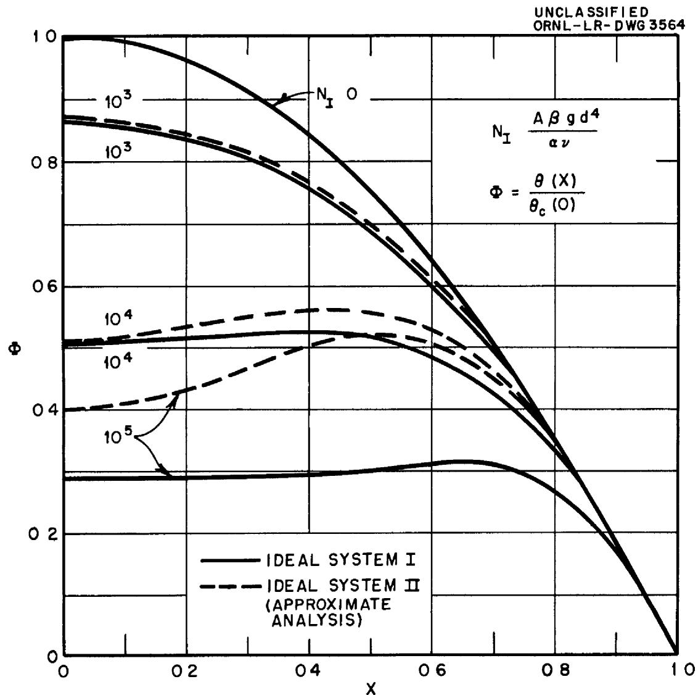
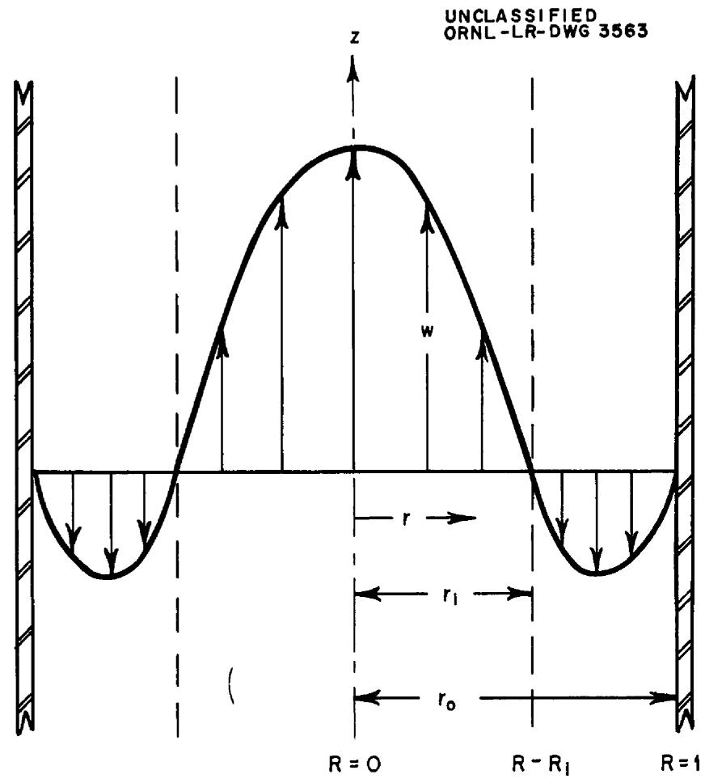
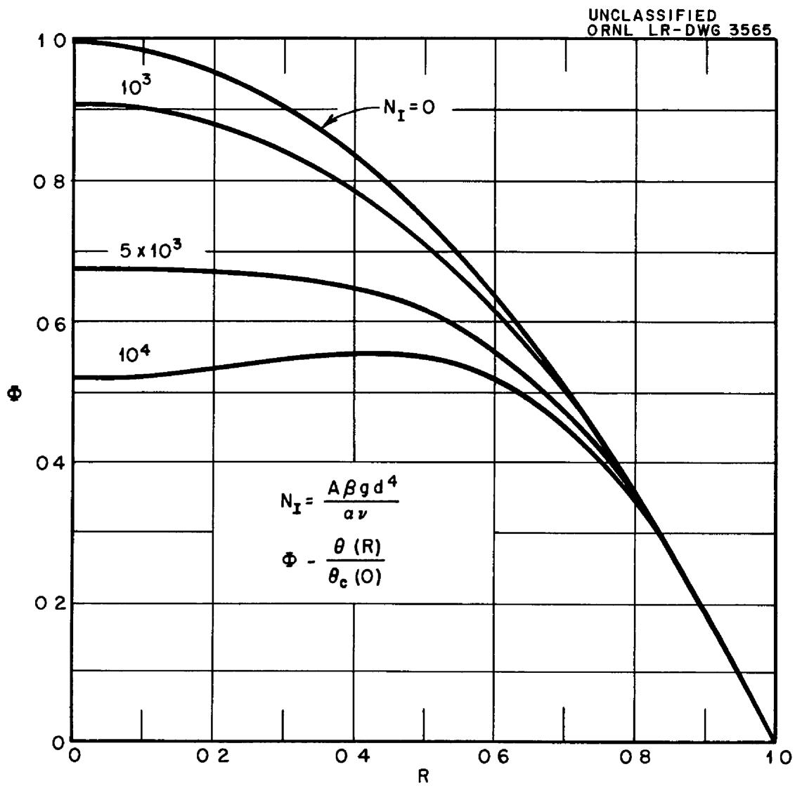
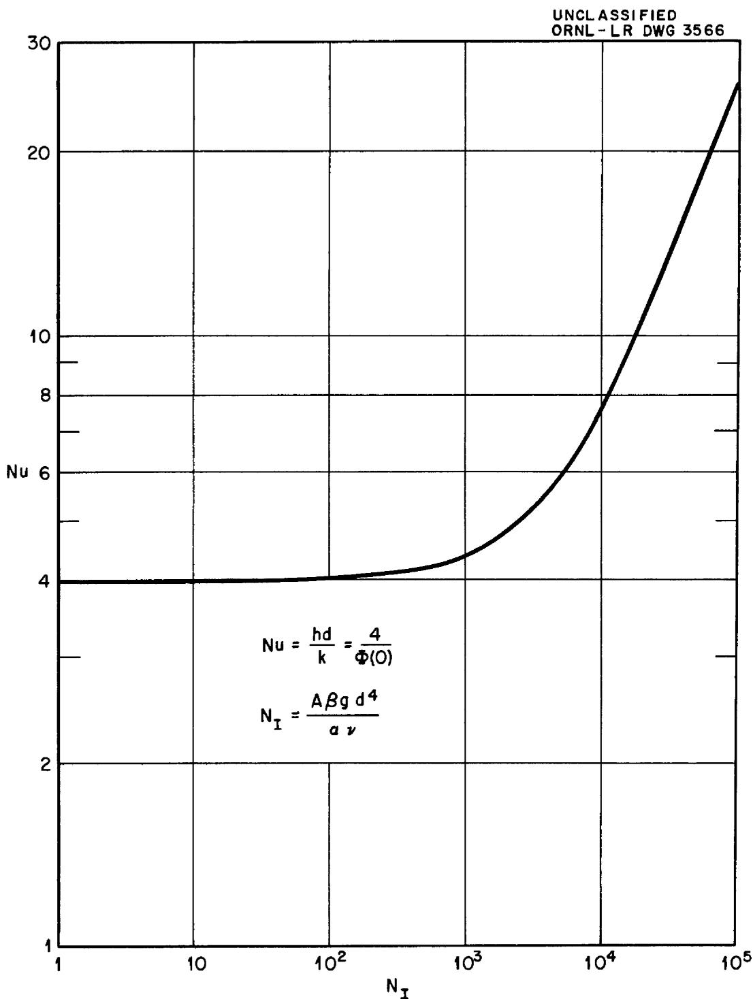

Contract No W-7405, eng 26

Reactor Experimental Engineering Division

FREE CONVECTION IN FLUIDS HAVING A VOLUME HEAT SOURCE (Theoretical Laminar Flow Analyses for Pipe and Parallel Plate Systems)

by

D C Hamilton

H F Poppendiek

R F Redmond

L D Palmer

DATE ISSUED

NOV 15 1954

OAK RIDGE NATIONAL LABORATORY

Operated by

CARBIDE AND CARBON CHEMICALS COMPANY

A Division of Union Carbide and Carbon Corporation

Post Office Box P

Oak Ridge, Tennessee

# INTERNAL DISTRIBUTION

<table><tr><td>1</td><td>C</td><td>E</td><td>Center</td><td>59</td><td>R</td><td>E</td><td>Aven</td></tr><tr><td>2</td><td colspan="3">Biology Library</td><td>60</td><td>H</td><td>W</td><td>Hoffman</td></tr><tr><td>3</td><td colspan="3">Health Physics Library</td><td>61</td><td>M</td><td>C</td><td>Edlund</td></tr><tr><td>4-5</td><td colspan="3">Central Research Library</td><td>62</td><td>R</td><td>W</td><td>Bussard</td></tr><tr><td>6</td><td colspan="3">Reactor Experimental</td><td>63</td><td>S</td><td>Visner</td><td></td></tr><tr><td></td><td colspan="3">Engineering Library</td><td>64</td><td>P</td><td>R</td><td>Kasten</td></tr><tr><td>7-11</td><td colspan="3">Laboratory Records Department</td><td>65</td><td>N</td><td>F</td><td>Lansing</td></tr><tr><td>12</td><td colspan="3">Laboratory Records, ORNL R C</td><td>66</td><td>P</td><td>C</td><td>Zmola</td></tr><tr><td>13</td><td>C</td><td>E</td><td>Larson</td><td>67</td><td>M</td><td>W</td><td>Rosenthal</td></tr><tr><td>14</td><td>L</td><td>B</td><td>Emlet (K-25)</td><td>68</td><td>W</td><td>D</td><td>Powers</td></tr><tr><td>15</td><td>J</td><td>P</td><td>Murray (Y-12)</td><td colspan="3">69-118. D. C.</td><td>Hamilton</td></tr><tr><td>16</td><td>A</td><td>M</td><td>Weinberg</td><td>119</td><td>F</td><td>E</td><td>Lynch</td></tr><tr><td>17</td><td>W</td><td>H</td><td>Jordan</td><td>120-124</td><td>L</td><td>D</td><td>Palmer</td></tr><tr><td>18</td><td>S</td><td>J</td><td>Cromer</td><td>125</td><td>H</td><td>C</td><td>Claiborne</td></tr><tr><td>19</td><td>E</td><td>J</td><td>Murphy</td><td>126</td><td>L</td><td>G</td><td>Alexander</td></tr><tr><td>20</td><td>E</td><td>H</td><td>Taylor</td><td>127</td><td>D</td><td>G</td><td>Thomas</td></tr><tr><td>21</td><td>E</td><td>D</td><td>Shipley</td><td>128</td><td>M</td><td>A</td><td>Arnold</td></tr><tr><td>22</td><td>C</td><td>E</td><td>Winters</td><td>129</td><td>T</td><td>K</td><td>Carlsmith</td></tr><tr><td>23</td><td>J</td><td>A</td><td>Lane</td><td>130</td><td>W</td><td>K</td><td>Ergen</td></tr><tr><td>24</td><td>F</td><td>C</td><td>VonderLage</td><td>131</td><td>C</td><td>B</td><td>Mills</td></tr><tr><td>25</td><td>J</td><td>A</td><td>Swartout</td><td>132</td><td>N</td><td>D</td><td>Greene</td></tr><tr><td>26</td><td>S</td><td>C</td><td>Lund</td><td>133</td><td>G</td><td>M</td><td>Adamson</td></tr><tr><td>27</td><td>F</td><td>L</td><td>Culler</td><td>134</td><td>E</td><td>S</td><td>Bettis</td></tr><tr><td>28</td><td>A</td><td>H.</td><td>Snell</td><td>135</td><td>E</td><td>P.</td><td>Blizard</td></tr><tr><td>29</td><td>A</td><td colspan="2">Hollander</td><td>136</td><td>A</td><td>D</td><td>Callihan</td></tr><tr><td>30</td><td>M</td><td>T</td><td>Kelley</td><td>137</td><td>S</td><td>I</td><td>Cohen</td></tr><tr><td>31</td><td>C</td><td>P</td><td>Keim</td><td>138</td><td>G</td><td>A</td><td>Cristy</td></tr><tr><td>32</td><td>R</td><td>S</td><td>Livingston</td><td>139</td><td>W</td><td>R</td><td>Grimes</td></tr><tr><td>33</td><td>J</td><td>H</td><td>Frye, Jr</td><td>140</td><td>W</td><td>D</td><td>Manly</td></tr><tr><td>34</td><td>G</td><td>H</td><td>Clewett</td><td>141</td><td>L</td><td>A</td><td>Mann</td></tr><tr><td>35</td><td>A</td><td>S</td><td>Householder</td><td>142</td><td>E</td><td>R</td><td>Mann</td></tr><tr><td>36</td><td>C</td><td>S</td><td>Harrill</td><td>143</td><td>W</td><td>B</td><td>McDonald</td></tr><tr><td>37</td><td>D</td><td>S</td><td>Billington</td><td>144</td><td>J</td><td>L</td><td>Meem</td></tr><tr><td>38</td><td>R</td><td>N</td><td>Lyon</td><td>145</td><td>W</td><td>W</td><td>Parkinson</td></tr><tr><td>39</td><td>R</td><td>B</td><td>Briggs</td><td>146</td><td>D</td><td>F</td><td>Salmon</td></tr><tr><td>40</td><td>A</td><td>S</td><td>Kitzes</td><td>147</td><td>H</td><td>W</td><td>Savage</td></tr><tr><td>41</td><td>O</td><td>S</td><td>Sisman</td><td>148</td><td>C</td><td>G</td><td>Lawson</td></tr><tr><td>42</td><td>C</td><td>B</td><td>Graham</td><td>149</td><td>R</td><td>A</td><td>Charpie</td></tr><tr><td>43</td><td>W</td><td>R</td><td>Gall</td><td>150</td><td>M</td><td>Tobias</td><td></td></tr><tr><td>44-53</td><td>H</td><td>F</td><td>Poppendiek</td><td>151</td><td>L</td><td>E</td><td>McTaggart</td></tr><tr><td>54</td><td>S</td><td>E</td><td>Beall</td><td>152</td><td>C</td><td>A</td><td>Moore</td></tr><tr><td>55</td><td>J</td><td>P</td><td>Gill</td><td>153</td><td>L</td><td>F</td><td>Parsly</td></tr><tr><td>56</td><td>J</td><td>O</td><td>Bradfute</td><td>154</td><td>E</td><td>C</td><td>Miller</td></tr><tr><td>57</td><td>A</td><td>P</td><td>Fraas</td><td>155</td><td>M</td><td>J</td><td>Skinner</td></tr><tr><td>58</td><td>P</td><td>N</td><td>Haubenreich</td><td></td><td></td><td></td><td></td></tr></table>

# EXTERNAL DISTRIBUTION

<table><tr><td>156</td><td>R F Bacher, California Institute of Technology</td></tr><tr><td>157</td><td>Division of Research and Medicine, AEC, ORO</td></tr><tr><td>158</td><td>ORNL Document Reference Library (Y-12 Plant)</td></tr><tr><td>159-168</td><td>R F Redmond, Battelle Memorial Institute</td></tr><tr><td>169</td><td>AF Plant Representative, Wood-Ridge (Attn S V Manson)</td></tr><tr><td>170</td><td>AF Plant Representative, E Hartford (Attn: W S Farmer)</td></tr><tr><td>171-413</td><td>Given distribution as shown in TID-4500 under Engineering category</td></tr></table>

TABLE OF CONTENTS   

<table><tr><td></td><td>PAGE</td></tr><tr><td>SUMMARY</td><td>4</td></tr><tr><td>INTRODUCTION</td><td>5</td></tr><tr><td>NOMENCIATURE</td><td>6</td></tr><tr><td>GENERAL DISCUSSION OF THE PROBLEM</td><td>10</td></tr><tr><td>IDEAL SYSTEM I (PARALLEL PIATES)</td><td>16</td></tr><tr><td>Velocity Solution</td><td>17</td></tr><tr><td>Temperature Solution</td><td>19</td></tr><tr><td>IDEAL SYSTEM II (PARALLEL PIATES - APPROXIMATE)</td><td>23</td></tr><tr><td>Velocity Solution</td><td>23</td></tr><tr><td>Temperature Solution</td><td>26</td></tr><tr><td>IDEAL SYSTEM III (CYLINDRICAL PIPE - APPROXIMATE)</td><td>30</td></tr><tr><td>Velocity Solution</td><td>30</td></tr><tr><td>Temperature Solution</td><td>32</td></tr><tr><td>DISCUSSION</td><td>38</td></tr><tr><td>REFERENCES</td><td>39</td></tr></table>

# SUMMARY

Theoretical laminar flow analyses are given for free convection in fluids having a uniform volume heat source and for both parallel plate and cylindrical pipe geometries. The solutions are intended to be valid in the central region (vertically) of channels having small diameters and large lengths, that is, the solutions do not apply to short systems or near the ends of long systems where the velocity and temperature profiles are not yet fully established. In addition, the solutions are restricted to systems in which the long axis is vertical and in which the walls are uniformly cooled by a forced flow coolant flowing vertically upward parallel to the long axis of the system

Solutions are obtained for the parallel plate geometry by two different techniques called exact and approximate' In the "exact method the differential equations for velocity and for temperature, which are interdependent in free convection systems, are solved simultaneously, in the 'approximate" method the form of the velocity distribution is postulated and substituted in the temperature equation which is then integrated Solutions by the two methods agree well in the range where the basic postulates are believed to be valid The velocity and temperature structures are functions of two new dimensionless moduli herein designated as $\mathbb{N}_{\mathrm{I}}$ and $\mathbb{N}_{\mathrm{II}}$

# INTRODUCTION

The purpose of this report is to provide a wider distribution for three analyses performed in 1951 than was accomplished by the very limited local distribution of References 1, 2, and 3. Originally these analyses were performed as the first step in a theoretical-experimental free convection research program. At that time it was planned to withhold publication of these analyses as a report until the experimental data were available which proved their validity. Subsequently, other problems have diverted attention from free convection experiments so that this research has become a part time activity (Reference 4). This reduced experimental program is less comprehensive than would be required to adequately prove or disprove the validity of the basic assumption of these analyses. Therefore the reason for delaying this publication is no longer valid. It is expected that the results of the more modest experimental program will be reported in the near future

The basic postulates that apply to all three analyses are discussed in the next section, following that is the 'exact' solution (Ideal System I) for the parallel plate geometry. Then an approximate solution (Ideal System II) for the parallel plate geometry is presented. Finally, an "approximate" solution (Ideal System III) for the cylindrical pipe geometry is given which is the cylindrical equivalent of Ideal System II

# NOMENCLATURE*

a1, a2 constants

A = dt/dz, uniform vertical temperature gradient $(\theta L^{-1})$ , also area $(L^2)$

$\mathbf{B}_1(z)$ - function of $z$ in Equation (4) $(L^{-1}T^{-1})$

$\mathbf{B}_2(z)$ - function of $z$ in Equation (6)

$c_{1}, c_{2}$ , constants

cp - constant pressure specific heat (FLM-1 $\theta^{-1}$ )

C - circumference of flow channel (L)

d - separation of parallel plates or diameter of cylindrical pipe (L)

Also used as differential operator

$\mathrm{D_h} = \frac{4A}{C},$ hydraulic diameter (L)

$f = \left(\frac{2g_{0}D_{h}}{\rho w^{2}}\right)\left(\frac{d\rho_{f}}{dz}\right),$ friction factor

where $\frac{\mathrm{d}\rho_{\mathrm{f}}}{\mathrm{d}z}$ is the pressure gradient due to friction

g - gravitational acceleration (Lt-2)

$\mathbf{g}_{\mathrm{o}}$ - dimensional constant (IMF-1 T-2)

h - heat transfer coefficient (FT $^{-1}$ L $^{-1}$ $\theta^{-1}$ )

h - height of system (L)

k - thermal conductivity (FT $^{-1}$ $\theta^{-1}$ )

L - length of fluid circuit (L)

$$
m = x, \text {s p a t i a l c o o r d i n a t e (L)}
$$

$$
M = \frac {m}{x _ {1}}
$$

$$
N _ {I} = \frac {A \beta g d ^ {4}}{\alpha \nu}, a f o r m o f G r a s h o f t i m e s P r a n d t l m o d u l u s
$$

$$
N _ {I I} = \frac {q ^ {\prime} \beta g d ^ {5}}{k v ^ {2}}, a f o r m o f G r a s h o f m o d u l u s
$$

$$
\mathrm {N u} = \frac {\mathrm {h d}}{\mathrm {k}} = \frac {4}{\Phi (0)}, \text {N u s s e l t M o d u l u s}
$$

$$
p - p r e s s u r e (F L ^ {- 2})
$$

$$
\Pr = \frac {2}{\alpha}, \text {P r a n d t l M o d u l u s}
$$

$$
q - h e a t t r a n s f e r r a t e \left(F L T ^ {- 1}\right)
$$

$$
q ^ {\prime \prime} - \text {h e a t t r a n s f e r r a t e p e r u n i t a r e a (F L ^ {- 1} T ^ {- 1})}
$$

$$
q ^ {\prime} - v o l u m e h e a t s o u r c e t e r m (F L ^ {- 2} T ^ {- 1})
$$

$$
r - r a d i a l c o o r d i n a t e (L)
$$

$$
\mathbf {r} _ {\perp} - \text {v a l u e o f r a t h e i n t e r f a c e b e t w e e n t h e t w o f r e e c o n v e c t i o n s t r e a m s (L)}
$$

$$
\mathbf {r} _ {\mathrm {O}} = \frac {\mathrm {d}}{2}, \text {p i p e r a d i u s (L)}
$$

$$
R = \frac {r}{r _ {0}}
$$

$$
R e = \frac {w D _ {h}}{v}, R e y n o l d s m o d u l u s
$$

$$
s = x - \left(\frac {x _ {0} + x _ {1}}{2}\right), \text {s p a t i a l c o o r d i n a t e (L)}
$$

$$
s _ {O} = \left(\frac {x _ {O} - x _ {1}}{2}\right), (L)
$$

$$
S = \frac {s}{s _ {O}}
$$

$$
t - t e m p e r a t u r e (\theta)
$$

$$
u - x \text {c o m p o n e n t o f v e l o c i t y} (L T ^ {- 1})
$$

v - y component of velocity (Lr-1)

w - z component of velocity (LT-1)

wh - average velocity in the middle, hot, or upward flowing free convection stream (LT-1)

$w_{c}$ - average velocity in the outer, cold, or downward flowing free convection stream $(LT^{-1})$

W = wd / NII, velocity function

Wh = Wd, mean velocity function

x - spatial coordinate (L)

$x_{1}$ - value of $x$ at the interface between the two free convection streams (L)

$x_0 = \frac{d}{2}$ , half separation of the parallel plates (L)

$$
\mathbf {X} = \frac {\mathbf {x}}{\mathbf {x} _ {0}}
$$

y,z, spatial coordinates (L)

# Greek Symbols

$\alpha = \frac{c_{p} \mu}{k}$ , molecular thermal diffusivity, (L² T⁻¹)

$\beta$ - volume coefficient of expansion $(\theta^{-1})$

$\theta (\mathbf{X}), \theta (\mathbf{R})$ - temperature excess above wall temperature at the same value of $z(\theta)$

$$
\begin{array}{l} \theta_ {c} (0) = \theta (0) \text {f o r c o n d u c t i o n o n l y} (\theta) \\ \theta_ {c} (0) = \frac {q ^ {\prime} d ^ {2}}{8 k} \text {f o r p a r a l l e l p l a t e s} \\ \theta_ {c} (0) = \frac {q ^ {\prime \prime \prime} d ^ {2}}{1 6 k} \text {f o r c y l i n d r i c a l p i p e} \\ \end{array}
$$

$$
\lambda = \left(\frac {N _ {I}}{6 4}\right) ^ {1 / 4}
$$

$$
\mu - \text {d y n a m i c v i s c o s i t y} \left(\mathrm {M L} ^ {- 1} \mathrm {T} ^ {- 1}\right)
$$

$$
v = \frac {\mu}{\rho}, \text {k i n e m a t i c v i s c o s i t y} \left(L ^ {2} T ^ {- 1}\right)
$$

$$
\rho - \text {m a s s d e n s i t y} (\mathbf {M L} ^ {- 3})
$$

$$
\Phi = \frac {\theta}{\theta_ {C} (0)}, t e m p e r a t u r e f u n c t i o n
$$

$\triangle \Phi_{b}$ - mean buoyant temperature difference

# GENERAL DISCUSSION OF THE PROBLEM

Laminar flow free convection systems are described by three equations of motion (Navier Stokes equations) and the heat conduction equation for a moving system These four partial differential equations are interdependent and comprise a set one would hardly attempt to solve It is intended here to briefly discuss the basic postulates that permit simplification of these equations to the quite elementary ordinary differential equations that are solved in this report Although the parallel plate or cartesian geometry of Figure 1 is used in this discussion the comments are equally applicable to the cylindrical pipe geometry

The free convection system to be studied is the fluid in the channel between the parallel plates (Figure 1) separated by a distance, $d$ , and of height, $h$ , which is very long compared to $d$ . Heat is generated uniformly throughout the fluid and the heat is removed uniformly at the walls. Because of these factors and because of the vertical orientation of the $z$ axis there will be three parallel free convection fluid streams, the warm stream in the center of the channel will flow up and the two cool streams near the walls will flow down. Below some critical velocity these streams should be quite stable and, in fact, should behave much as three laminar forced flow streams separated by physical boundaries might behave. This tendency toward stability of the flows suggests that the flow would be one long vertical cell, not a number of small cells or laminar eddies a few diameters in length. In forced flow heat transfer systems in conduits the velocity and temperature distributions are observed to

  
Fig 1 Configuration of Ideal System I (Parallel Plates) and the Accompanying Coolant Channels

become fully established or reach a stable form some diameters beyond the entrance Beyond this entrance region the velocity and temperature distributions no longer change as one proceeds down the pipe The similarity of the flow in the free convection system and the forced flow system above suggests that beyond some entrance region, near the ends of the present system, the velocity and tempera-ture profiles may also become fully established These are the two basic postulates of the systems analysed in this report and are stated more incisively as follows

Postulate 1 $\mathbf{w} = \mathbf{f}(\mathbf{x})$

Postulate 2 $\frac{\mathrm{dt}}{\mathrm{dz}} = A$ , where $A$ is a positive constant and

uniform for the entire system

Other postulates that are necessary to describe the three ideal systems to be analysed are

Postulate 3 The volume heat source term, $\mathbf{q}^{\prime \prime \prime}$ , is uniform throughout the system and constant with time

Postulate 4 The height to diameter ratio, h/d, is very large

Postulate 5 The flow is laminar and steady (1 e, constant with time)

Postulate 6 The flow is two dimensional (1 e, the y component of velocity, v, 1s zero)

Postulate 7 All fluid properties except density are constants

Postulate 8 The density is constant in the heat equation and is a linear function of temperature in the dynamic equation

As a consequence of Postulate 1 one can prove that the $x$ component of velocity, $u$ , and the transverse pressure gradient $\frac{\partial p}{\partial x}$ vanish and that $\frac{dp}{dz}$ is uniform with $x$ . Thus, two of the dynamic equations are eliminated and the third is greatly simplified to

$$
\frac {d ^ {2} w}{d x ^ {2}} = \frac {g _ {0}}{\mu} \left(\frac {d p}{d z} + \rho \frac {g}{g _ {0}}\right) \tag {1}
$$

As a result of Postulate 2 one can prove that the heat flux at the wall is uniform and therefore known, that is, each element of width, $d$ , and height, $dz$ , loses through its own bounding wall surface exactly the amount of heat generated within that element. Thus, no net heat loss occurs in the $z$ direction for such an element. An additional consequence of Postulate 2 is that the use of the temperature function, $\theta$ , eliminates $z$ as a variable and the equations involve only one independent variable, $x$ . The heat conduction equation is then simplified to

$$
\frac {d ^ {2} \theta}{d x ^ {2}} = \frac {A}{\alpha} w - \frac {q ^ {\prime \prime}}{k} \tag {2}
$$

By definition $\rho (t) = \rho (t_{0})\left(1 - \beta (t - t_{0})\right)$ (3)

Employing the function, $\theta$ , and Equation (3), Equation (1) becomes

$$
\frac {d ^ {2} w}{d x ^ {2}} = - \frac {\beta g}{v} \theta (x) + B _ {1} (z) \tag {4}
$$

Note that the function $B_1(z)$ is independent of $x$ .

The heat conduction and dynamic equations that result from employing dimensionless functions in Equation (2) and (4) are

$$
\frac {d ^ {2} \Phi (X)}{d X ^ {2}} = 2 \mathbb {N} _ {I} W (X) - 2 \tag {5}
$$

$$
\frac {d ^ {2} W (X)}{d X ^ {2}} = - \frac {1}{3 2} \Phi (X) + B _ {2} (z) \tag {6}
$$

Equations (5) and (6) together with the accompanying boundary conditions define the parallel plate system to be analysed

The equivalent set for a cylindrical pipe is

$$
\frac {1}{R} \frac {d}{d R} (R \frac {d W (R)}{d R}) = - \frac {1}{6 4} \Phi (R) + B _ {3} (z) \tag {7}
$$

$$
\frac {1}{R} \frac {d}{d R} (R \frac {d \Phi (R)}{d R}) = 4 N _ {I} W (R) - 4 \tag {8}
$$

The boundary conditions and auxiliary information that go with the differential equations to complete the boundary value problem are given here

Due to the definition of the temperature function $\Phi$

$$
\Phi (1) = 0 \tag {9}
$$

It is evident from inspection that both the velocity and temperature functions are symmetrical, thus

$$
W (- X) = W (X) \tag {1Op}
$$

$$
W (- R) = W (R) \tag {10c}
$$

and

$$
\Phi (- X) = \Phi (X) \tag {11p}
$$

$$
\Phi (- R) = \Phi (R) \tag {11c}
$$

The velocity at the walls is zero, thus

$$
w (1) = 0 \tag {12}
$$

No net flow occurs, therefore

$$
\int_ {0} ^ {1} w (X) d X = 0 \tag {13p}
$$

$$
\int_ {0} ^ {1} W (R) R d R = 0 \tag {13c}
$$

No net heat transfer occurs in the $z$ direction so the heat generated at a given level must transfer to the walls at that level, thus

$$
\frac {\mathrm {d} \Phi (1)}{\mathrm {d} X} = \frac {\mathrm {d} \Phi (1)}{\mathrm {d} R} = - 2 \tag {14}
$$

Equations (5) to (14), inclusive, define the systems to be solved

# IDEAL SYSTEM I (PARALLEL PLATES)

The geometry was previously described in Figure 1 and the differential equations and boundary conditions were adequately discussed in the previous section. It is sufficient here to define the system mathematically and then to obtain the solution

The differential equations to be solved are

$$
\frac {\mathrm {d} ^ {2} \Phi (\mathrm {X})}{\mathrm {d X} ^ {2}} = 2 \mathrm {N} _ {\mathrm {I}} \mathrm {W} (\mathrm {X}) - 2 \tag {5}
$$

$$
\frac {d ^ {2} W (X)}{d X ^ {2}} = - \frac {1}{3 2} \Phi (X) + B _ {2} (z) \tag {6}
$$

The boundary conditions to be employed are

$$
w (- x) = w (x) \tag {10p}
$$

$$
W (1) = 0 \tag {12}
$$

$$
\int_ {0} ^ {1} w (x) d x = 0 \tag {13p}
$$

$$
\frac {\mathrm {d} \Phi (0)}{\mathrm {d} X} = 0 \tag {11p}
$$

$$
\Phi (1) = 0 \tag {9}
$$

# Velocity Solution

Eliminating the temperature from Equations (5) and (6) one gets the velocity equation

$$
\frac {\mathrm {d} ^ {4} W (\mathbf {X})}{\mathrm {d} \mathbf {X} ^ {4}} + \frac {\mathrm {N} _ {\mathrm {I}}}{1 6} W (\mathbf {X}) = \frac {1}{1 6} \tag {15}
$$

The general solution to (15) is

$$
\begin{array}{l} W (X) = \frac {1}{N _ {I}} \left(1 + a _ {1} \sin \lambda X \sinh \lambda X + a _ {2} \cos \lambda X \cosh \lambda X \right. \\ + a _ {3} \sin \lambda X \cosh \lambda X + a _ {4} \cos \lambda X \sinh \lambda X) \tag {16} \\ \end{array}
$$

where $\lambda = \left(\frac{\mathrm{N}_{\mathrm{T}}}{64}\right)^{1 / 4}$ (17)

By successive application of boundary conditions (10p), (12), and (13p) one obtains

$$
a _ {3} = a _ {4} = 0 \tag {18}
$$

$$
a _ {1} = - \left(\frac {\sin \lambda \cosh \lambda + \cos \lambda \sinh \lambda - 2 \lambda \cos \lambda \cosh \lambda}{\sinh \lambda \cosh \lambda - \sin \lambda \cos \lambda}\right) \tag {19}
$$

$$
a _ {2} = \left(\frac {\sin \lambda \cosh \lambda - \cos \lambda \sinh \lambda - 2 \lambda \sin \lambda \sinh \lambda}{\sinh \lambda \cosh \lambda - \sin \lambda \cos \lambda}\right) \tag {20}
$$

Thus, the velocity solution, plotted in Figure 2, is given by

$$
N _ {I} W (X) = 1 + a _ {1} \sin \lambda X \sinh \lambda X + a _ {2} \cos \lambda X \cosh \lambda X \tag {16a}
$$

The Reynolds modulus for the central or hot stream is

$$
\operatorname {R e} _ {\mathrm {h}} = \frac {4 x _ {1} w _ {c}}{2} = 2 N I I \int_ {0} ^ {x _ {1}} w (x) d x \tag {21}
$$

  
Fig 2 Dimensionless Velocity Function, W, for Ideal System I (Parallel Plates)

Because the values of $\mathsf{Re_h}$ computed by the numerical integration of Figure 2 disagreed by less than five percent with the equation obtained in Ideal System II, that equation will be employed to display these results

$$
\mathrm {R e} _ {\mathrm {h}} = \frac {\mathrm {N} _ {\mathrm {I I}}}{3 4 6 0 + 0 . 7 8 6 \mathrm {N} _ {\mathrm {I}}} \tag {37a}
$$

The critical value of $\mathrm{Re_h}$ above which the flow is no longer laminar must be determined by experiment Experiments in Reference (5) indicated that the critical value of Reynolds modulus for non-isothermal flow varies in a very complex manner and is not the same as for the isothermal flow case

# Temperature Solution

At least three methods may be used to obtain the temperature solution, the method employed here is to substitute the velocity from Equation (16a) into the temperature Equation (5) and integrate using the boundary conditions (9) and (11p)

$$
\Phi (X) = \int_ {1} ^ {X} d X \int_ {0} ^ {X} \left(2 N _ {I} W (X) - 2\right) X d X \tag {22}
$$

Putting $W(X)$ from Equation (16a) in Equation (22) and performing the integrations one obtains

$$
\begin{array}{l} \Phi (X) = \frac {1}{\lambda^ {2}} \left(a _ {1} (\cos \lambda \cosh \lambda - \cos \lambda X \cosh \lambda X) + \right. \\ - a _ {2} (\sin \lambda \sinh \lambda - \sin \lambda X \sinh \lambda X) \tag {22a} \\ \end{array}
$$

$$
\Phi (0) = \frac {1}{\lambda^ {2}} \left(a _ {1} (\cos \lambda \cosh \lambda - 1) - a _ {2} \sin \lambda \sinh \lambda\right) \tag {23}
$$

A Nusselt modulus may be defined as follows

$$
\mathrm {N u} = \frac {\mathrm {q} \quad \mathrm {d}}{\mathrm {k} \theta (0)} = \frac {4}{\Phi (0)} \tag {24}
$$

The dimensionless temperature function, $\Phi(X)$ is shown in Figure 3 as a function of $X$ and $N_I$ . The value of $N_I = 0$ corresponds to the case of pure conduction. The variation of Nusselt modulus with $N_I$ is given in Figure 4. It is interesting to note the similarity in shape of this curve with conventional Nusselt modulus versus Grashof times Prandtl moduli plots for systems having no volume heat source

  
Fig 3 Dimensionless Temperature Function, $\Phi$ , for Ideal System I (Parallel Plates)

  
Fig 4 Nusselt Modulus for Ideal System I (Parallel Plates)

# IDEAL SYSTEM II (PARALLEL PLATES - APPROXIMATE)

This solution is an approximate method for obtaining an answer to the problem described by Ideal System I If the two solutions agree satisfactorily the approximate" method offers the two advantages of presenting a less difficult boundary value problem and of requiring less time to perform the numerical calculations The technique depends upon the judicious postulation of the form of the velocity distribution to be substituted into Equation (5)

# Velocity Solution

Let the real flow system of Ideal System I be replaced by a counter-current heat exchanger system such as that depicted in Figure 5 To emphasize the method used, the X coordinate is replaced by the coordinate, M, in the hot upward flowing stream, and by the coordinate, S, in the cold, downward flowing stream One can think of these streams as separated by parallel plates inserted at $\pm \mathbf{X}_1$ (or $\mathbf{M} = \pm \mathbf{I}$ ) The velocity distribution in each region is given by the equations with Figure 5, this is the familiar parabolic expression for established isothermal, laminar, forced flow between parallel plates Since there is no net flow

$$
x _ {1} w _ {h} = 2 s _ {o} w _ {c} \tag {25}
$$

To satisfy static equilibrium at the interface, $x_{i}$ , the shear stress must be the same, or

$$
\frac {\mathrm {d} w \left(x _ {1}\right)}{\mathrm {d} m} = \frac {\mathrm {d} w \left(x _ {2}\right)}{\mathrm {d} s} \tag {26}
$$

UNCLASSIFIED ORNL-LR-DWG 3562

  
Fig 5 Coordinate System and Postulated Velocity Distribution for Ideal System II (Parallel Plates)

$$
\begin{array}{l} \frac {w}{w _ {h}} - \frac {3}{2} (1 - M ^ {2}) f o r - 1 \leq M \leq 1 w h e r e M = \frac {x}{x _ {1}} \\ \frac {w}{w _ {c}} = \frac {3}{2} (S ^ {2} - 1) f o r - 1 \leq S \leq 1 w h e r e S = \frac {2 X}{(1 - X _ {1})} - \frac {(1 + X _ {1})}{(1 - X _ {1})} \\ \end{array}
$$

Equations (25) and (26) require that

$$
X _ {1} = \sqrt {2} - 1 \text {a n d} w _ {h} = \sqrt {2} w _ {c} \tag {27}
$$

The pressure drop due to friction around the fluid circuit of length, $L$ , must be equal to the pressure rise due to the difference in the average density of the two streams, that is

$$
\left(\frac {1}{2} \int_ {- 1} ^ {1} \rho d S - \int_ {0} ^ {1} \rho d M\right) g L = \left(\frac {L f \rho w _ {h} ^ {2}}{2 D _ {h}}\right) _ {\text {h o t}} + \left(\frac {L f \rho w _ {c} ^ {2}}{2 D _ {h}}\right) _ {\text {c o l d}} \tag {28}
$$

The friction factor for established, isothermal, laminar flow between parallel plates will be used

$$
f = \frac {9 6}{R e} \tag {29}
$$

The left member of Equation (28) may be expressed in terms of a mean buoyant temperature difference, $\Delta \Phi_{\mathrm{b}}$ , defined as follows

$$
\Delta \Phi_ {b} = \int_ {0} ^ {1} \Phi d M - \frac {1}{2} \int_ {- 1} ^ {1} \Phi d S \tag {30}
$$

Employing Equations (3), (27), (29), and (30) Equation (28) may be expressed as

$$
\Delta \Phi_ {b} = 9 6 (7 + 5 \sqrt {2}) w _ {h} \tag {31}
$$

The velocity structure is now completely defined in terms of constants and $\Delta \Phi_{\mathrm{b}}$ which must be obtained from the temperature solution

# Temperature Solution

The temperature solution will again be obtained by substituting the velocity solution into Equation (5) and performing the integrations

$$
\frac {d ^ {2} \Phi (X)}{d X ^ {2}} = 2 N _ {I} w (X) - 2 \tag {5}
$$

The forms of Equation (5) that will be used here in the hot and cold stream regions, respectively, are

$$
\begin{array}{l} \frac {\mathrm {d} ^ {2} \Phi (\mathrm {M})}{\mathrm {d} \mathrm {M} ^ {2}} = 2 \mathrm {X} _ {1} ^ {2} \mathrm {N} _ {\mathrm {I}} \mathrm {W h} \left(\frac {\mathrm {w}}{\mathrm {w} _ {\mathrm {h}}}\right) - 2 \mathrm {X} _ {1} ^ {2} (5M) \\ \frac {d ^ {2} \Phi (S)}{d S ^ {2}} = \frac {(1 - X _ {1}) ^ {2}}{2} N _ {I} W _ {h} \left(\frac {w _ {c}}{w _ {h}}\right) \left(\frac {w}{w _ {c}}\right) - \frac {(1 - X _ {1}) ^ {2}}{2} (5S) \\ \end{array}
$$

The temperature in the cold stream is obtained by integrating Equation (5S)

$$
\int_ {0} ^ {\Phi} d S \int_ {- \frac {4}{(1 - X _ {1})}} ^ {\frac {d \Phi}{d S}} d \left(\frac {d \Phi}{d X}\right) = - \frac {(1 - X _ {1}) ^ {2}}{2} \int_ {1} ^ {S} d S \int_ {1} ^ {S} \left(\frac {3 N _ {I} W _ {h}}{2 \sqrt {2}} (1 - S ^ {2}) + 1\right) d S \tag {32S}
$$

Integrating, one gets

$$
\begin{array}{l} \Phi (S) = X _ {1} \left(1 - \frac {X _ {1}}{\sqrt {2}} N I W _ {h}\right) (1 - S) + \frac {X _ {1} ^ {2}}{2} \left(1 + \frac {3 \sqrt {2}}{4} N I W _ {h}\right) (1 - S ^ {2}) + \\ - \frac {\sqrt {2} x _ {1} ^ {2}}{1 6} N _ {I} W _ {h} (1 - s ^ {4}) \tag {33s} \\ \end{array}
$$

From Equation (33S) the temperature at the interface between the two streams may be computed for use as the boundary temperature in Equation (32M)

$$
\Phi (- 1) = 2 x _ {1} - \sqrt {2} x _ {1} ^ {2} N I W h \tag {34}
$$

For the hot stream

$$
\int_ {\Phi (1)} ^ {\Phi} \mathrm {d M} \int_ {0} ^ {\frac {\mathrm {d} \Phi}{\mathrm {d M}}} \mathrm {d} \left(\frac {\mathrm {d} \Phi}{\mathrm {d M}}\right) = 2 X _ {1} ^ {2} \int_ {1} ^ {\mathrm {M}} \mathrm {d M} \int_ {0} ^ {\mathrm {M}} \left(\frac {3}{2} N _ {I} W _ {h} (1 - \mathrm {M} ^ {2}) - 1\right) \mathrm {d M} \tag {32M}
$$

Integrating, one gets

$$
\Phi (M) = 2 X _ {1} - \sqrt {2} X _ {1} ^ {2} N I W h + X _ {1} ^ {2} \left(1 - \frac {3}{2} N I W h\right) \left(1 - M ^ {2}\right) + N I W h \left(1 - M ^ {4}\right) \tag {33M}
$$

and

$$
\Phi (0) = 1 - \left(\frac {2 \sqrt {2} - 1}{4}\right) N _ {I} W _ {h} \tag {35}
$$

Also, recall

$$
\mathrm {N u} = \frac {l _ {4}}{\Phi (0)} \tag {24}
$$

From Equations (30), (33M), and (33S) the mean buoyant temperature difference is computed as

$$
\Delta \Phi_ {b} = \frac {\sqrt {2}}{3} - \left(\frac {5 \sqrt {2} - 4}{1 0}\right) N I W h \tag {36}
$$

Eliminating $\Delta \Phi_{\mathrm{b}}$ between Equations (31) and (36) get

$$
W _ {h} = \frac {1}{1 4 4 (1 0 + 7 \sqrt {2}) + \frac {3}{1 0} (5 - 2 \sqrt {2}) N _ {I}} \tag {37}
$$

The Reynolds modulus of the hot stream may be obtained from Equation (37)

$$
\mathrm {R e} _ {\mathrm {h}} = 2 \mathrm {X} _ {1} \mathrm {N} _ {\mathrm {I I}} \mathrm {W} _ {\mathrm {h}} = \frac {\mathrm {N} _ {\mathrm {I I}}}{3 4 6 0 + 0 . 7 8 6 \mathrm {N} _ {\mathrm {I}}} \tag {37a}
$$

The temperature for Ideal System II was computed from Equations (33M), (33S), and (37) for various values of $\mathbf{N}_{\mathbf{I}}$ and plotted in Figure 6 for comparison with the results of Ideal System I. The two solutions are in excellent agreement for values of $\mathbf{N}_{\mathbf{I}}$ up to $10^{4}$ . Above this value the solutions diverge rapidly so that for $\mathbf{N}_{\mathbf{I}}$ equal to $10^{5}$ the approximate solution yields temperatures that are too high

  
Fig 6 Comparison of Dimensionless Temperatures for Ideal Systems I and II (Parallel Plates)

# IDEAL SYSTEM III (CYLINDRICAL PIPE - APPROXIMATE)

The excellent agreement of Ideal Systems I and II for values of $\mathbf{N}_{\mathbf{I}}$ up to $10^{4}$ supports the validity of the approximate method. Since the solution to be presented here is identical with Ideal System II, except for geometry, the accompanying discussion will be reduced to a minimum. The "exact" solution of Equations (7) and (8) is not difficult, it is an uncommon form of Bessel's equation. The disadvantage of the exact solution in this case is the labor involved in the numerical calculations of the solutions

# Velocity Solution

The postulated velocity distribution given in Figure 7 was obtained in the same manner as was used in Ideal System II, in this case the two regions are dynamically characteristic of isothermal, laminar, established forced flow in a pipe (for the hot stream) and in a circular annulus (for the cold stream)

Since there is no net flow

$$
w _ {h} R _ {1} ^ {2} = w _ {c} \left(1 - R _ {1} ^ {2}\right) \tag {38}
$$

To satisfy static equilibrium at the interface

$$
\frac {\mathrm {d} w (R _ {1} -)}{\mathrm {d} R} = \frac {\mathrm {d} w (R _ {1} +)}{\mathrm {d} R} \tag {39}
$$

Equations (38) and (39) require that

$$
R _ {1} ^ {2} = 0. 3 1 6 1 9 8 \tag {40}
$$

and $\mathbf{w_h} = 216258\mathbf{w_c}$ (41)

  
Fig 7 Coordinate System and Postulated Velocity Distribution for Ideal System III (Cylindrical Pipes)

$$
\begin{array}{l} \frac {w}{w _ {h}} 2 (1 - C _ {1} R ^ {2}) f o r 0 \leq R \leq R _ {1} \\ - \frac {w}{w _ {c}} - 2 C _ {2} (1 - R ^ {2} + C _ {3} \ln R) f o r R _ {i} \leq R \leq 1 \\ C _ {1} = R _ {1} ^ {2}, \quad C _ {3} - (1 - R _ {1} ^ {2}) (\ln R _ {1}) ^ {- 1} \\ C _ {2} = (1 + R _ {1} ^ {2} - C _ {3}) ^ {- 1} \quad C _ {4} = C _ {2} (C _ {1} - 1) ^ {- 1} \\ \end{array}
$$

Again, the buoyant force must be equal to the pressure drop due to friction

$$
\rho \beta g \theta_ {c} (0) \Delta \Phi_ {b} = \left(\frac {f \rho w _ {h} ^ {2}}{D _ {H}}\right) _ {\text {h o t}} + \left(\frac {f \rho w _ {c} ^ {2}}{D _ {H}}\right) _ {\text {c o l d}} \tag {42}
$$

where

$$
\Delta \Phi_ {b} = \frac {2}{R _ {1} ^ {2}} \int_ {0} ^ {R _ {1}} \Phi R d R - \frac {2}{\left(1 - R _ {1} ^ {2}\right)} \int_ {R _ {1}} ^ {1} \Phi R d R \tag {43}
$$

The friction factors are

$$
\left(\frac {f \rho w _ {h} {} ^ {2}}{D _ {h}}\right) _ {\text {h o t}} = \frac {6 4 \mu w _ {h}}{d ^ {2} R _ {i} {} ^ {2}} \tag {444}
$$

$$
\left(\frac {f \rho w _ {c} {} ^ {2}}{D _ {h}}\right) _ {\text {c o l d}} = \frac {6 4 \mu w _ {h}}{d ^ {2}} c _ {4} \tag {45}
$$

From Equations (42), (44), and (45) get

$$
\Delta \Phi_ {b} = 1 6 c _ {5} w _ {h} \tag {46}
$$

$$
c _ {5} = 3 2 \left(c _ {1} + c _ {4}\right)
$$

# Temperature Solution

The temperature solution is obtained by substituting the velocity equations from Figure 7 into Equation (7) and then performing the integrations

$$
d (R \frac {d \Phi}{d R}) = \left(N _ {I} W _ {h} \frac {w}{w _ {h}} - 1\right) 4 R d R \tag {7}
$$

For the cold stream region, $\mathbb{R}_1 <   \mathbb{R} <   1,$

$$
\int_ {0} ^ {\Phi} \frac {\mathrm {d} R}{R} \int_ {- 2} ^ {R} \frac {\mathrm {d} \Phi}{\mathrm {d} R} \mathrm {d} \left(R \frac {\mathrm {d} \Phi}{\mathrm {d} R}\right) = - \int_ {1} ^ {R} \frac {\mathrm {d} R}{R} \int_ {1} ^ {R} \left(1 + 2 c _ {2} \frac {w _ {c}}{w _ {h}} (1 - R ^ {2} + c _ {3} \ln R)\right) 4 R \mathrm {d} R \tag {47c}
$$

which, when integrated, becomes

$$
\Phi = 1 - R ^ {2} - c _ {4} N I W _ {h} \left(\frac {1}{2} + 2 (c _ {3} - 1) (1 - R ^ {2} + \ln R) - \frac {R ^ {4}}{4} + 2 c _ {3} R ^ {2} \ln R\right) \tag {48c}
$$

and $\Phi (R_1) = 1 - R_1^2 -c_6N_{\mathrm{T}}W_{\mathrm{h}}$ (49)

where $c_{6} = c_{4}\left(\frac{1 - R_{i}^{4}}{2} + 2(c_{3} - 1)(1 - R_{1}^{2} + \ln R_{1}) + c_{3}R_{i}^{2}\ln R_{i}^{2}\right)$

For the hot stream region $0 < R < R_{1}$

$$
\int_ {\Phi \left(R _ {1}\right)} ^ {\Phi} \frac {\mathrm {d} R}{R} \int_ {0} ^ {R} \frac {\mathrm {d} \Phi}{\mathrm {d} R} \mathrm {d} \left(R \frac {\mathrm {d} \Phi}{\mathrm {d} R}\right) = \int_ {R _ {1}} ^ {R} \frac {\mathrm {d} R}{R} \int_ {0} ^ {R} \left(2 N I W _ {h} \left(1 - c _ {1} R ^ {2}\right) - 1\right) 4 R \mathrm {d} R \tag {47h}
$$

which, when integrated, becomes

$$
\Phi = 1 - R ^ {2} - N _ {I} W _ {h} \left(c _ {7} - 2 R ^ {2} + \frac {c _ {1}}{2} R ^ {4}\right) \tag {48h}
$$

and $\Phi (0) = 1 - c_7\mathbb{N}_1\mathbb{W}_h$ (50)

where $c_7 = 1.5R_1^2 + c_6$

The Nusselt modulus expression is the same as for the previous systems

$$
\mathrm {N u} = \frac {4}{\Phi (0)} \tag {51}
$$

Using the temperature solution, Equations (47c) and (47h), in Equation (43) the mean buoyant temperature difference may be computed

$$
\Delta \Phi_ {b} = \frac {1}{2} - c _ {8} N I W _ {h} \tag {52}
$$

where $c_{8} = c_{6} + \frac{2}{3} R_{1}^{2} - \frac{c_{4}}{12}\left(4 - 3c_{3}(1 + 5R_{1}^{2}) + (34 - \frac{24}{c_{3}})R_{1}^{2} + 10R_{1}^{4}\right)$

Equations (46) and (52) yield

$$
W _ {h} = \frac {1}{3 2 c _ {7} + 2 c _ {8} N _ {I}} \tag {53}
$$

The Reynolds modulus of the hot stream may be computed from Equation (53) since

$$
R e _ {h} = N I I R _ {1} W _ {h} \tag {54}
$$

The important equations are given here with the constants eliminated for $0 < R < R_{1}$

$$
\Phi (\mathrm {R}) = 1 - \mathrm {R} ^ {2} - \frac {(0 . 6 8 3 8 - 2 \mathrm {R} ^ {2} + 1 . 5 8 1 \mathrm {R} ^ {4}) \mathrm {N} _ {\mathrm {I}}}{(6 9 3 0 + 0 . 7 4 2 \mathrm {N} _ {\mathrm {I}})} \tag {55h}
$$

for $\mathbb{R}_1 <   \mathbb{R} <   1$

$$
\Phi (\mathrm {R}) = 1 - \mathrm {R} ^ {2} - \frac {(3 1 5 2 - \mathrm {R} ^ {2} (1 3 5 2 + 1 8 \mathrm {R} ^ {2} - 4 2 7 6 \ln \mathrm {R} ^ {2}) + 0 6 7 6 \ln \mathrm {R} ^ {2}) \mathrm {N I}}{(6 9 3 0 + 0 7 4 2 \mathrm {N I})} \tag {55c}
$$

$$
\Phi (0) = 1 - \left(\frac {N _ {I}}{1 0 , 1 3 0 + 1 0 8 5 N _ {I}}\right) \tag {56}
$$

Equations (55c) and (55h) are plotted in Figure 8, the temperature curves are similar to those given in the parallel plates analyses. In Figure 9 the Nusselt modulus as computed from Equation (56) is shown as a function of $\mathbf{N}_{\mathrm{I}}$

  
Fig 8 Dimensionless Temperature Function, $\Phi$ , for Ideal System III (Cylindrical Pipe)

  
Fig 9 Nusselt Modulus for Ideal System III (Cylindrical Pipe)

# DISCUSSION

In the range where the basic postulates are believed to be valid, that is, for $0 < \mathbb{N}_{\mathrm{I}} < 10^{4}$ , the approximate method, Ideal System II, and the exact method, Ideal System I, yield temperature solutions that are in good agreement Up to $\mathbb{N}_{\mathrm{I}}$ equal to $10^{3}$ the two velocity distributions are in close agreement so that one is not surprised at the good agreement of the temperature solutions in this range. Above $\mathbb{N}_{\mathrm{I}}$ equal to $10^{3}$ the value of $X_{1}$ in the exact solution becomes greater, that is, the interface between the hot and cold streams moves nearer to the wall. Above a value of $\mathbb{N}_{\mathrm{I}}$ of $10^{4}$ the difference in velocity structure is sufficient to cause a marked difference in the two temperature solutions It is interesting that the approximate solution is always in error by giving a temperature that is too high

For the systems analyzed here, it appears that the reduction in temperature due to laminar free convection is of the order of one half

Some of the postulates upon which these analyses are based must yet be verified by free convection experiments in volume heat source channel systems

# REFERENCES

1 Hamilton, D C, Poppendiek, H F, and Palmer, L D *Part I - Heat Transfer from a Fluid in Laminar Flow to Two Parallel Bounding Walls A Simplified Velocity Distribution was Postulated ORNL CF 51-12-70, Dec 18, 1951   
2 Hamilton, D C, Redmond, R F, and Palmer, L D *Part III - Heat Transfer from a Fluid in Laminar Flow to the Walls of a Cylindrical Tube A Simplified Velocity Distribution was Postulated ORNL CF 52-1-2, Jan 11, 1952   
3 Redmond, R F, Hamilton, D C, and Palmer, L D *Part II - Heat Transfer from a Fluid in Laminar Flow to Two Parallel Plane Bounding Walls, ORNL CF 52-1-1, Jan 22, 1952   
4 Hamilton, D C, and Lynch, F E Unpublished Preliminary Free Convection Experiments, 1952-1954   
5 Hamilton, D C, Lynch, F E, and Palmer, L D The Nature of the Flow of Ordinary Fluids in a Thermal Convection Harp, ORNL-1624, Feb 23, 1954

*The first three references are exclusively theoretical analyses and the general title to each is Theoretical and Experimental Analyses of Natural Convection within Fluids in Which Heat is Being Generated