# LEG RESEARCH AND DEVELOPMENT REPORT

PRELIMINARY CRITICAL ASSEMBLIES OF THE

REFLECTOR MODERATOR REACTOR

R.M.Spencer

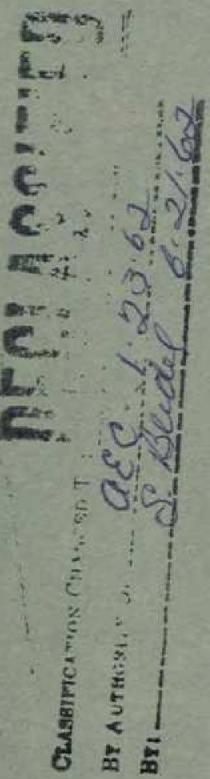

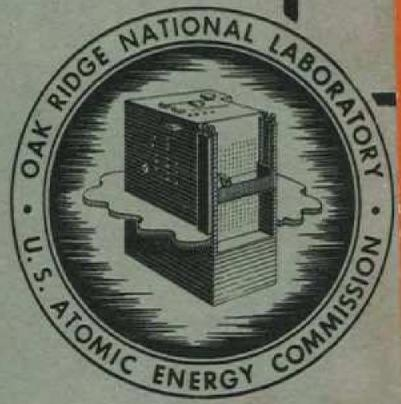

# CENTRAL RESEARCH LIBRARY DOCUMENT COLLECTION

# LIBRARY LOAN COPY

DO NOT TRANSFER TO ANOTHER PERSON

If you wish someone else to see this document, send in name with document and the library will arrange a loan.

OAK RIDGE NATIONAL LABORATORY

OPERATED BY

CARBIDE AND CARBON CHEMICALS COMPANY

A DIVISION OF UNION CARBIOE AND CARBON CORPORATION

UCC

POST OFFICE BOX P

OAK RIDGE, TENNESSEE

ORNL 1770

This document contains 89 pages This is copy of 197 Series A

Subject Category Reactors - Research and Power

PRELIMINARY CRITICAL ASSEMBLIES OF the REFLECTOR MODERATOR REACTOR

Experimentation by D V P Williams  
R C Keen (Louisiana State University)  
J J Lynn  
Dixon Callihan

Reported by R M Spencer, USAF

DATE ISSUED

NOV 2 2 1954

PHYSICS DIVISION

A H Snell Director

Contract No W-7405, Eng 26 OAK RIDGE NATIONAL LABORATORY

Operated by

CARBIDE AND CARBON CHEMICALS COMPANY  
A Division of Union Carbide and Carbon Corporation  
Post Office Box P  
Oak Ridge, Tennessee

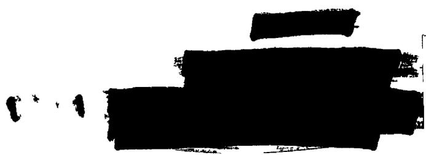

3 4456 03496866

# INTERNAL DISTRIBUTION

1 C E Center

2 Biology Library

3 Health Physics Library

4-5 Central Research Library

6 Reactor Experimental

Engineering Library

7-20 Laboratory Records Department

21 Laboratory Records, ORNL R C

22 C E Larson

23 L B Emlet (K-25)

24 J P Murray (Y-12)

25 A M Weinberg

26 E H Taylor

27 E D Shipley

28 A H Snell

29 F C VonderLage

30 W H Jordan

31 S J Cromer

32 G E Boyd

33 R A Charpie

34 J A Swartout

35 S C Lind

36 F L Culler

37 A Hollaender

38 J H Frye, Jr

39 W M Good

40 M T Kelley

41 G E Clewett

42 R S Livingston

43 K Z Morgan

44 T A Lincoln

45 A S Householder

46 C F Keim

47 C S Harrill

48 C E Winters

49 D S Billington

50 D W Cardwell

51 E M King

52 E O Wollan

53 A J Miller

54 J A Lane

55 R B Briggs

56 L D Roberts

57 R N Lyon

58 W C Koehler

59 E P Blizzard

60 M E Rose

61 D D Cowen

62 W M Breazeale (consultant)

63 M J Skinner

64 J E Sherwood

65 Dixon Callihan

66 A P Fraas

67 T A Welton

68 D K Holmes

69 R R Coveyou

70 E S Bettis

71 C B Mills

72 R M, Spencer

73 Dunlap Scott

74 D V P Williams

75 E L Zimmerman

76-77 ORNL Document Reference

Library, Y-12 Plant

# EXTERNAL DISTRIBUTION

78 AF Plant Representative, Burbank

79 AF Plant Representative, Seattle

80 AF Plant Representative, Wood-Ridge

81 American Machine and Foundry Company

82 ANP Project Office, Fort Worth

83-93 Argonne National Laboratory

94 Armed Forces Special Weapons Project (Sandia)

95 Armed Forces Special Weapons Project, Washington

96-100 Atomic Energy Commission, Washington

101 Babcock and Wilcox Company

102 Battelle Memorial Institute

103 Bendix Aviation Corporation

104-106 Brookhaven National

107 Bureau of Ships

108 Chicago Patent Group   
109 Chief of Naval Research   
110 Commonwealth Edison Company   
111 Department of the Navy - Op-362   
112 Detroit Edison Company   
117 duPont Company, Augusta   
118 duPont Company, Wilmington   
119 Duquesne Light Company   
120 Foster Wheeler Corporation   
121-123 General Electric Company (ANPD)   
124 General Electric Company (APS)   
125-132 General Electric Company, Richland   
133 Hanford Operations Office   
134 Iowa State College   
135-138 Knolls Atomic Power Laboratory   
139-140 Los Alamos Scientific Laboratory   
141 Nuclear Metals, Inc   
142 Monsanto Chemical Company   
143 Mound Laboratory   
144 National Advisory Committee for Aeronautics, Cleveland   
145 National Advisory Committee for Aeronautics, Washington   
146-147 Naval Research Laboratory   
148 Newport News Shipbuilding and Dry Dock Company   
149 New York Operations Office   
150-151 North American Aviation, Inc   
152 Nuclear Development Associates, Inc   
153 Patent Branch, Washington   
154-160 Phillips Petroleum Company (NRTS)   
161 Powerplant Laboratory (WADC)   
162 Pratt & Whitney Aircraft Division (Fox Project)   
163 Rand Corporation   
164 San Francisco Field Office   
165 Sylvaniaia Electric Products, Inc.   
166 Tennessee Valley Authority (Dean)   
167 USAF Headquarters   
168 U S Naval Radiological Defense Laboratory   
169-170 University of California Radiation Laboratory, Berkeley   
171-172 University of California Radiation Laboratory, Livermore   
173 Walter Kidde Nuclear Laboratories, Inc   
174-179 Westinghouse Electric Corporation   
180-194 Technical Information Service, Oak Ridge   
195 Division of Research and Medicine, AEC, ORO   
196 Pacific Northwest Power Group   
197 Materials Laboratory (WADC)

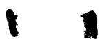

# ABSTRACT

Five preliminary critical assemblies, planned in conjunction with a full scale aircraft type circulating fuel reactor, were constructed at the Oak Ridge Critical Experiment Facility The first assembly was constructed with a beryllium island and reflector, and had enriched uranium disks placed between sodium filled stainless steel cans arranged in a fuel annulus The assembly was critical with 15 1 kg of U-235 The second assembly was also constructed with a beryllium island and reflector, however, a powdered mixture of sodium, zirconium and uranium fluorides packed in aluminum tubes was used as a fuel, and fuel end ducts were provided The assembly was critical with 7 7 kg of U-235 The addition of structural poisons (fifth assembly) to this assembly increased the critical mass to 18 2 kg of U-235 In the third assembly the beryllium island and reflector were replaced by graphite With 17 3 kg of U-235 in the fuel region, this assembly was not critical. In order to make the assembly critical approximately $80\%$ of the graphite in the island and inner six inches of the reflector were replaced by beryllium The fourth assembly was constructed as a two region assembly with a 1 to 1 volume ratio of graphite and powdered fuel in the core and a beryllium reflector This assembly was critical with 15 2 kg of U-235

Neutron flux distributions were determined in these assemblies using indium foil activation Power distributions were determined using aluminum catcher foils in contact with uranium fuel disks

Measurements were made on the effect on reactivity of placing various materials in the fuel and reflector regions, and an estimate of the neutron leakage was obtained for two of the assemblies

# TABLE OF CONTENTS

# ABSTRACT

Page

V

# LIST OF FIGURES

vii

1X

# LIST OF TABLES

1X

# I INTRODUCTION

1

# II DESCRIPTION OF ASSEMBLY AND MATERIALS

2

# III CA-10

4

A Assembly Loading

4

B Control Rod Calibrations

4

C Temperature Effects

11

D Neutron Flux and Power Distribution

11

E Danger Coefficient Measurements

26

# IV CA-11

29

A Assembly Loading

29

B Evaluation of Control Rod D

30

C Neutron Flux Distribution

30

D Power Distributions

38

E Neutron Leakage Measurements

44

F Evaluation of Boral Around Fuel End Ducts

45

G Stainless Steel and Boron Poison Rods

45

H Cadmium Importance Function

45

I Danger Coefficients

48

J Effect of Stainless Steel Around Fuel Annulus

48

# V CA-12

51

# VI CA-13

56

A Assembly Loading

56

B Neutron Flux Distribution

56

C Power Distributions

59

# VII CA-14

63

A Critical Loadings

63

B Importance Function of Three Stainless Steel Rods

66

C Thermal Neutron Leakage

68

D Power Distribution

68

# VIII APPENDICES

72

A Summary of Materials in Reactor Assemblies

72

B Analyses of Reactor Materials

79

# LIST OF FIGURES

<table><tr><td>II-1</td><td>Photograph of Two Halves of Aluminum Matrix</td><td>3</td></tr><tr><td>III-1</td><td>Assembly Loading at Mid-plane</td><td>5</td></tr><tr><td>III-2</td><td>Axial Loading of Assembly in Vertical Plane Containing Reactor Axis</td><td>6</td></tr><tr><td>III-3</td><td>Photograph of Typical Fuel Shish</td><td>7</td></tr><tr><td>III-4</td><td>Calibration Curve for Control Rod D</td><td>9</td></tr><tr><td>III-5</td><td>Average Sensitivities of Control Rod D</td><td>10</td></tr><tr><td>III-6</td><td>Change in Reactivity vs Temperature</td><td>12</td></tr><tr><td>III-7</td><td>Bare and Cadmium Covered Indium Traverses Through Fuel Core</td><td>13</td></tr><tr><td>III-8</td><td>Bare and Cadmium Covered Indium Traverses Parallel to Axis Through Cell 0-12</td><td>14</td></tr><tr><td>III-9</td><td>Bare and Cadmium Covered Indium Traverses Parallel to Axis Through Beryllium Island and Fuel</td><td>15</td></tr><tr><td>III-10</td><td>Indium Traverse Radially in Mid-plane of Reactor, Cell 0-12 to X-12</td><td>18</td></tr><tr><td>III-11</td><td>Bare and Cadmium Covered Indium Traverses Across Fuel Annulus</td><td>19</td></tr><tr><td>III-12</td><td>Power Distribution in Cell Q-13</td><td>21</td></tr><tr><td>III-13</td><td>Power Distribution Across Fuel Annulus</td><td>23</td></tr><tr><td>III-14</td><td>Power Distribution Through 20 Mil Uranium Disk</td><td>24</td></tr><tr><td>III-15</td><td>Effect of Stainless Steel on Power Distribution</td><td>27</td></tr><tr><td>III-16</td><td>Loss in Reactivity Due to Addition of Stainless Steel Core Shells</td><td>28</td></tr><tr><td>IV-1</td><td>Assembly Loading at Mid-plane</td><td>31</td></tr><tr><td>IV-2</td><td>Axial Loading of Assembly in Vertical Plane Containing Reactor Axis</td><td>32</td></tr><tr><td>IV-3</td><td>Fuel Tube Arrangement</td><td>33</td></tr></table>

IV-4 Calibration Curve for Control Rod D 35   
IV-5 Radial Flux Distribution at the Mid-plane 36   
IV-6 Radial Flux Distribution 6-1/4" From Mid-plane 37   
IV-7 Cadmium Fractions in CA-10 and CA-11 39   
IV-8 Position of Boral Inserted Around End Ducts 40   
IV-9 Axial Power Distributions in Call N-14 41   
IV-10 Power Distribution Across Fuel in Mid-plane 43   
IV-11 Reactivity Loss due to Poison Rods Inserted in 0-12 46   
IV-12 Cadmium Importance Function 47   
V-1 Assembly Loading at Mid-plane 52   
V-2 Assembly Loading at Mid-plane 53   
V-3 Neutron Flux Distribution in Mid-plane 54   
VI-1 Assembly Loading at Mid-plane 57   
VI-2 Radial Neutron Flux Distribution in Mid-plane 58   
VI-3 Radial Power Distribution in Mid-plane 60   
VI-4 Axial Power Distribution Through M-12 61   
VI-5 Radial Fuel Cadmium Fractions 62   
VII-1 Assembly Loading at Mid-plane 64   
VII-2 Axial Assembly Loading in Vertical Plane Containing Reactor Axis 65   
VII-3 Position of Nickel Sheets 67   
VII-4 Thermal Flux Leakage vs. Boral Thickness 69   
VII-5 Power Distribution Across Fuel Annulus at Mid-plane 70

# LIST OF TABLES

Page

III-1. Summary of Calibration Data for Rod D. 8   
III-2 Summary of Calibration Data for Rods B and C 8   
III-3 Neutron Flux Traverses in Cell Q-13 16   
III-4 Neutron Flux Traveses Through Cells 0-12 and P-12 16   
III-5 Radial Flux Traverse in Mid-plane 17   
III-6 Neutron Flux Distribution Across Fuel Annulus 20   
III-7 Power Distribution in Cell Q-13 20   
III-8 Power Distribution Across Fuel Annulus 22   
III-9 Power Distribution Through 0 02" Fuel Disk 25   
III-10 Fuel Cadmium Fractions for Cell Q-13 25   
III-ll Effect of Stainless Steel on Power Distribution 26   
IV-1 Rod D Calibration 34   
IV-2 Radial Flux Distribution in Mid-plane 34   
IV-3. Radial Flux Distribution 6-1/4" from Mid-plane 38   
IV-4 Axial Power Distributions in N-14 42   
IV-5 Power Distribution Across Fuel in Mid-plane 42   
IV-6. Summary of Neutron Leakage Measurements 44   
IV-7 Reactivity Loss Due to Poison Rods Inserted in 0-12 45   
IV-8 Cadmium Importance Function 48   
IV-9 Danger Coefficient Measurements 49   
V-1 Radial Neutron Flux Traverse in Mid-plane 55   
VI-1. Radial Flux Distribution in Mid-plane 56   
VI-2 Radial Power Distribution in Mid-plane 59   
VI-3. Axial Power Distribution Through M-12 59   
VI-4. Fuel Cadmium Fractions in the Mid-plane 63

Page

VII-1 Importance Function of Three Stainless Steel Rods 68

VII-2 Thermal Neutron Leakage 71

VII-3 Power Distribution Across Fuel Annulus at Mid-plane 71

# I INTRODUCTION

The Reflector Moderated Reactor (RMR) as presently conceived is a high power, high temperature, circulating fuel reactor, which is characterized by a central beryllium island surrounded by a uranium bearing fluoride fuel annulus and a beryllium reflector. Five critical assemblies have been constructed in which the essential features of the RMR were mocked-up. The series of experiments, which were carried out at room temperature and essentially zero power, provide experimental data on the critical mass and neutron flux and power distributions that can be compared to those predicted by multigroup calculation for the assembly in question. In addition, danger coefficients were obtained for a large number of materials placed at various points in the reactors

The first assembly (CA-10) consisted essentially of a central $12^{\prime \prime}$ cube of beryllium partially surrounded by a 3" fuel annulus and a 12" thick beryllium reflector backed by graphite. The fuel annulus contained sodium filled stainless steel cans between which were placed O 01" thick uranium disks. The majority of the measurements were taken with 15 l kg of U-235 in the reactor, which provided an excess reactivity of 1 9% in $k_{\text{eff}}$

The second assembly (CA-ll) differed from the first in that, 1) the fuel region contained an homogeneous mixture of $\mathrm{ZrO_2}$ , NaF, C, and UF $_4$ packed in aluminum tubes, 2) the thickness of the fuel annulus was increased to $4 - 1 / 2''$ , and end fuel ducts were provided, 3) the central island region was arranged essentially as a $9''$ cube, and 4) the regions were assembled to approximate concentric spheres somewhat more closely. This assembly was critical with $77\mathrm{kg}$ of U-235

The third assembly (CA-12) was originally designed to evaluate the characteristics of a graphite moderated and reflected assembly. The fuel region was built up as a cylindrical shell 21" OD, 3" thick and 36" long. The fuel used was similar to that used in CA-ll with the U-235 concentration approximately doubled. This array was not critical. Approximately $80\%$ of the graphite in the island and the inner 6" of the reflector was then replaced by beryllium in order to make the reactor critical. The fuel region contained 17 3 kg of U-235. In the second modification of this reactor, the 17 3 kg of fuel were rearranged as an ellipsoid with the beryllium and graphite surrounding the central fuel region. This two region reactor was not critical

The fourth assembly (CA-13) was composed of a central ellipsoid containing a 1 to 1 volume ratio of graphite and the fuel used in CA-12. This core was surrounded by a beryllium reflector 12" thick. The reactor was critical with 15 2 kg of U-235

The last assembly (CA-14) was similar to CA-ll except that the fuel with the higher uranium concentration was used and an effort was made to simulate the poisons (core shells, coolants, coolant tubes, etc) that will be present in a full scale reactor. It was critical with 182 kg of U-235

# II DESCRIPTION OF ASSEMBLY AND MATERIALS

The critical experiment assembly has been described in other reports, and only a brief description of the components that are necessary for an understanding of the physical make up of the reactors will be given1

The assembly apparatus consists basically of a matrix of square 2S aluminum tubes, which form a $6^{\prime}$ cube and into which may be placed the reactor materials. The $6^{\prime}$ cube is divided into two identical halves, one of which is stationary and the other movable by remote control. Each half consists of 576 tubes, stacked in a $24 \times 24$ cell array. These tubes are $36^{\prime\prime}$ in length with a $3^{\prime\prime} \times 3^{\prime\prime}$ outside cross-section and have $0.047^{\prime\prime}$ thick walls. Part of the reactor materials are placed in each half and the assembly made critical by control rod adjustment after the two halves have been brought together. A reference system is used to designate each cell. A letter designation is given each column of cells and a number for each row. This system is evident from any of the loading diagrams. The assembly, with the two halves separated, can be seen in Fig II-1 (The materials visible in the upper portion of the movable half have no relation to the subject experiments.)

The basic materials present in the reactors beside the fuel and aluminum matrix were beryllium and graphite. These materials were in the form of square blocks, either $2 - 7 / 8''$ x $2 - 7 / 8''$ or $1 - 7 / 16''$ x $1 - 7 / 16''$ and of various thicknesses Each block had a O 196" hole drilled through its center, normal to the square cross-section When required, a skewer rod was inserted through these holes to form a "shish-kabob" The skewer rods had a $3 / 16''$ diameter and were composed of aluminum except for those "shishes" used as safety or control rods in which case a steel skewer was used All safety and control rods were normal reflector or island shishes

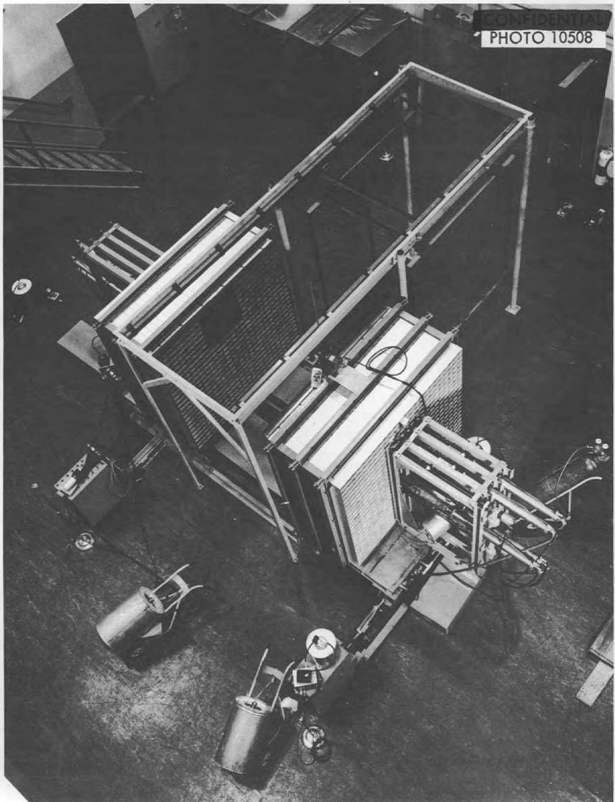  
Fig. II-1 Table Assembly.

The enriched (93 3% U-235) uranium metal disks used were approximately 0 01" thick with diameters of 2 860" and 1 430" and weighed 18 0 ± 0 1 and 4 5 ± 0 1 grams respectively. The weight tolerance was obtained by punching small holes in some of the disks. Each disk had a 0 196" hole drilled through the center. The powdered fuel mixtures are described under the appropriate reactor designation

The appendix contains quantitative information on the materials located in each region of all the assemblies, and also spectrographic analyses of some of the materials used

# III CA-10

# A Assembly Loading

The initial loading for CA-10 is shown in Figs III=1 and III-2, which are cross-sections of the assembly at the mid-plane of the reactor and the vertical plane containing the central axis of the reactor, respectively. It is seen that the assembly consists of a 12" central cube of beryllium, partially surrounded by a 3" fuel annulus composed of sodium filled stainless steel cans (2-7/8" x 2-7/8" x 1") between which were placed the large sized O Ol" thick uranium disks. The components and arrangement of a typical fuel shish are shown in Fig III-3. As can be noted from Fig III-2, a section 6" square at both ends of the fuel annulus was filled with beryllium rather than the uranium disks and sodium. The fuel region was loaded with two fuel disks between each sodium filled can except for the 3" end fuel regions behind the central beryllium cube, which had only one disk between each can. The fuel annulus was surrounded by a 12" thick beryllium reflector backed by 6" of graphite on the sides and 8" on the ends of the reactor

With the loading described above the reactor contained 150 kg of U-235 which at a room temperature of $74^{\circ}\mathrm{F}$ provided an excess reactivity of $19\%$ in $\mathbf{k}_{\mathrm{eff}}$ . The reactor was made critical by removing the reflector from cells J-13 and 14 and I-13 (16%) and by adjustment of the control rods. Measurements that required more reactivity than was available on the control rods were accomplished by inserting one or more reflector shishes in the above cells. All foil and danger coefficient measurements were taken on the opposite side of the reactor where the effect of the voids on the measurements was negligible

# B Control Rod Calibrations

The change in reactivity introduced by the linear displacement of each of three control rods was determined Rod D was cali-

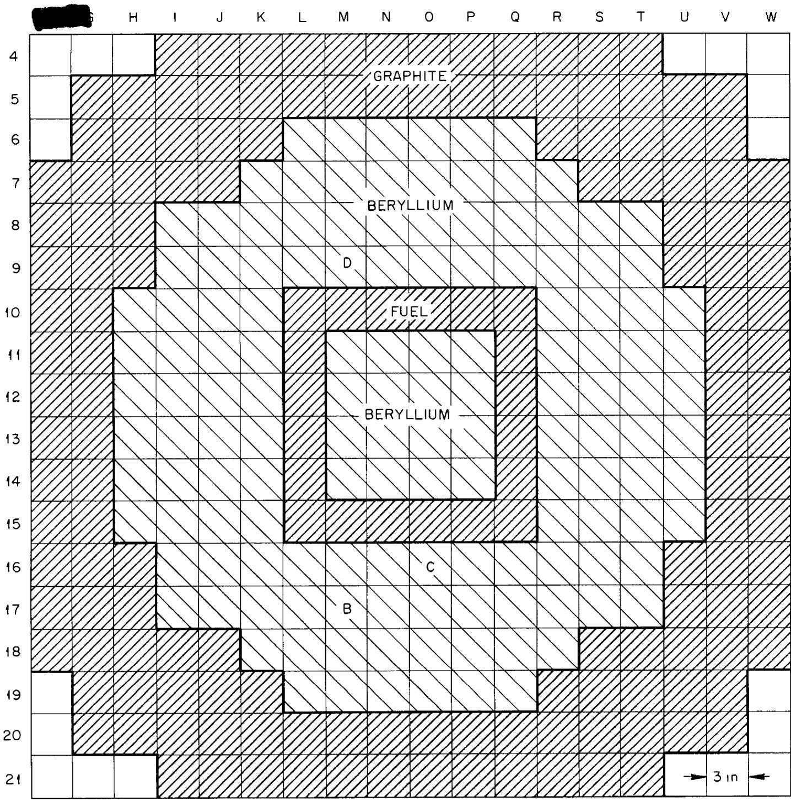  
Fig III-1 Assembly Loading at Mid-Plane

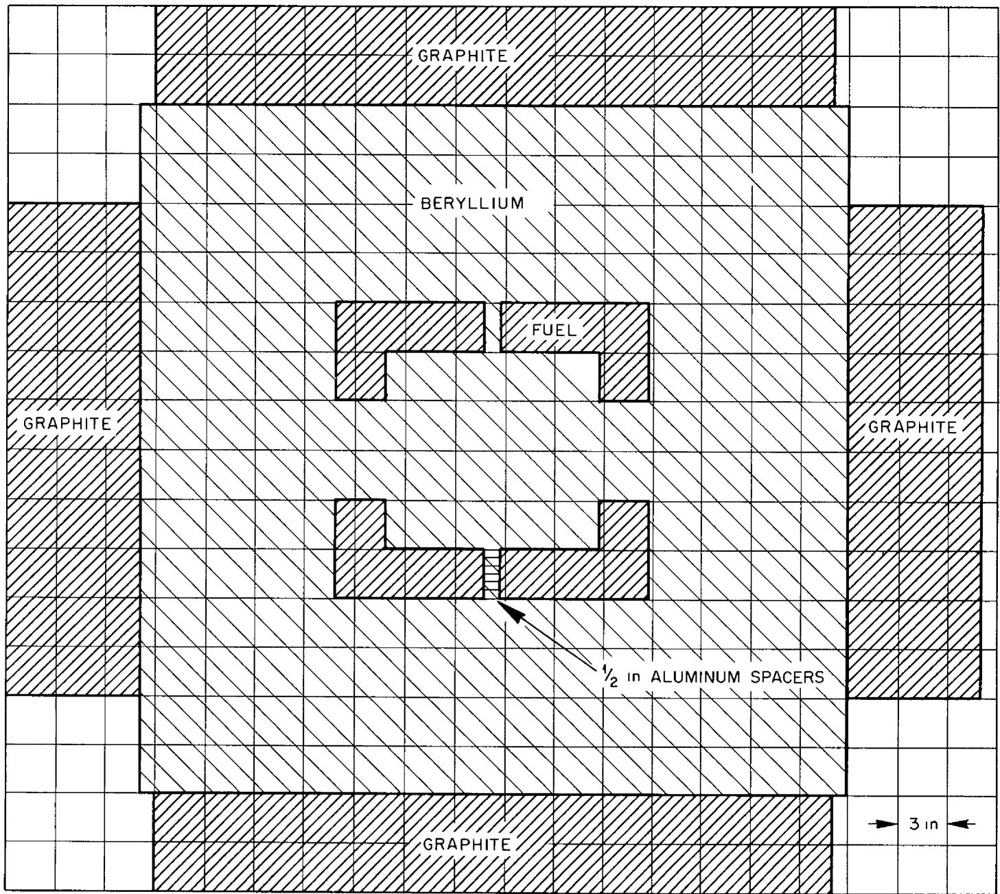  
Fig III-2 Axial Loading of Assembly in Vertical Plane Containing Reactor Axis

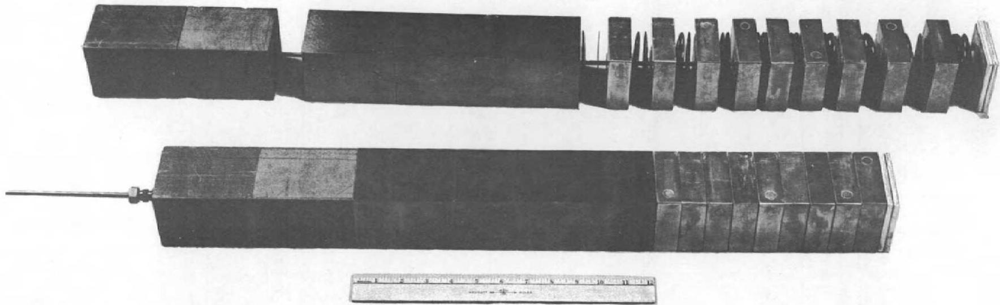  
Fig. III-3. Typical Fuel Shish.

brated by the integrated period method after which rods B and C were evaluated by direct comparison with Rod D². Detailed data for Rod D are given in Table III-1 A graph of reactivity of this rod in cents, versus its linear displacement is shown in Fig III-4. The average change in reactivity per unit displacement for each increment of displacement is plotted for the same rod in Fig. III-5. Similar data for rods B and C are shown in Table III-2 The delayed neutron fraction has been taken as 0 0073

TABLE III - 1   
SUMMARY OF CALIBRATION DATA FOR ROD D   
TABLE III-2   

<table><tr><td>Position of Rod From Mid-Plane in Inches</td><td>Total Change in Reactivity Value in Cents</td><td>Average Incremental Sensitivity in Cents per Inch</td></tr><tr><td>0 0</td><td>0.0</td><td>-</td></tr><tr><td>2.555</td><td>2 01</td><td>0 79</td></tr><tr><td>7.844</td><td>8.98</td><td>1 32</td></tr><tr><td>10.245</td><td>14.62</td><td>2.35</td></tr><tr><td>11 987</td><td>19 80</td><td>2.97</td></tr><tr><td>13 560</td><td>24 74</td><td>3 14</td></tr><tr><td>14 921</td><td>28 98</td><td>3 12</td></tr><tr><td>16 290</td><td>32 50</td><td>2.57</td></tr><tr><td>17 623</td><td>35.02</td><td>1.89</td></tr><tr><td>19 194</td><td>37 79</td><td>1 76</td></tr><tr><td>25 697</td><td>42 69</td><td>0.75</td></tr></table>

SUMMARY CALIBRATION DATA FOR RODS B AND C   

<table><tr><td rowspan="2">Distance of Rod From the Mid-plane in Inches</td><td colspan="2">Reactivity in Cents</td><td colspan="2">Average Sensitivity in Cents per Inch</td></tr><tr><td>Rod B</td><td>Rod C</td><td>Rod B</td><td>Rod C</td></tr><tr><td>0 0</td><td>0 0</td><td>0 0</td><td>-</td><td>-</td></tr><tr><td>5 0</td><td>11 3</td><td>3 5</td><td>2 26</td><td>0 70</td></tr><tr><td>10 0</td><td>20.9</td><td>12.2</td><td>1 92</td><td>1 74</td></tr><tr><td>15.0</td><td>28 5</td><td>28 2</td><td>3 20</td><td>3.20</td></tr><tr><td>20.0</td><td>33.0</td><td>39 3</td><td>2.22</td><td>2 27</td></tr><tr><td>25 0</td><td>35.0</td><td>43.2</td><td>0 78</td><td>0 78</td></tr></table>

2 Callihan, D. "Critical Experiments on Direct Cycle Aircraft Reactor" ORNL-1615, October 22, 1953. p 22.

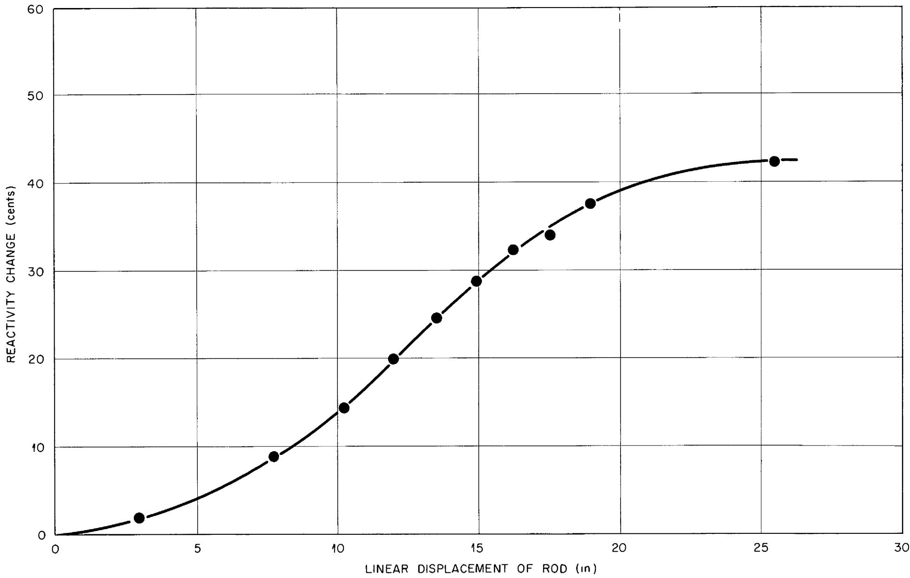  
Fig III-4 Calibration Curve For Control Rod D

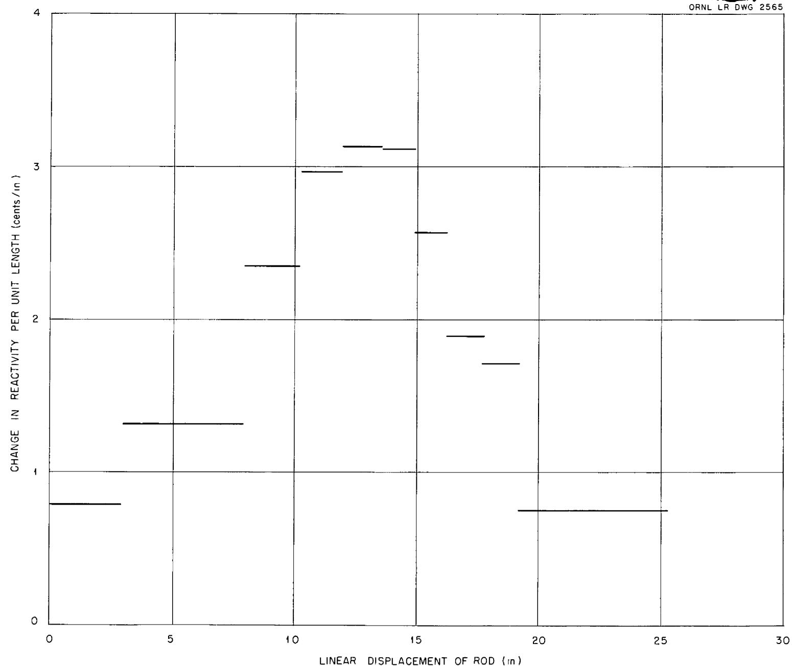  
-01   
Fig III 5 Average Sensitivities of Control Rod D

# C. Temperature Effects

The changes in reactivity produced by changes in temperature over a limited range were determined by changing the demand temperature of the assembly room Several days were allowed for the reactor temperature to reach equilibrium The reactor was made critical before and after the temperature changes, and the reactivity differences determined in terms of the calibrated control rod settings The temperature of the reactor was determined from two iron-constantan thermocouples Figure III-6 shows the reactivity changes plotted as a function of the assembly temperature A systematic study was not undertaken to determine the sources of this temperature effect, it was determined primarily to correct all reactivity measurements to a common reactor temperature

# D Neutron Flux and Power Distribution

Neutron flux distributions were obtained using bare and cadmium covered indium foils The techniques used for these measurements have been adequately covered in previous reports and will not be repeated here' Power distributions were obtained using the aluminum catcher foil technique which is also described in the same reference

# 1 Flux Distributions

Bare and cadmium covered indium traverses were made through the fuel core, starting at the mid-plane and extending to the edge of the graphite reflector and parallel to the axis of the reactor through cell Q-13 Table III-3 contains data showing the positions of the bare and cadmium covered foils and their relative activities Figure III-7 shows the relative activities plotted as a function of the distances of the foils from the mid-plane

Bare and cadmium covered indium traverses were also made through the beryllium island parallel to the axis of the reactor, starting at the mid-plane and extending to the edge of the graphite reflector, through cell O-12 and P-12 The traverses made through cell P-12 pass through the fuel core while those through O-12 do not Table III-4 contains data showing the distances of the foils from the mid-plane in the respective cells and also the relative activity obtained for each foil Figures III-8 and III-9 show the graph of the

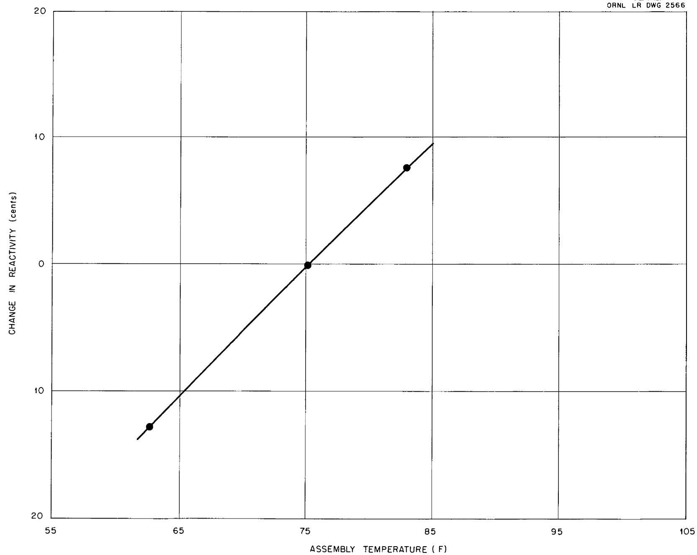  
-21-   
Fig III 6 Change in Reactivity vs Temperature

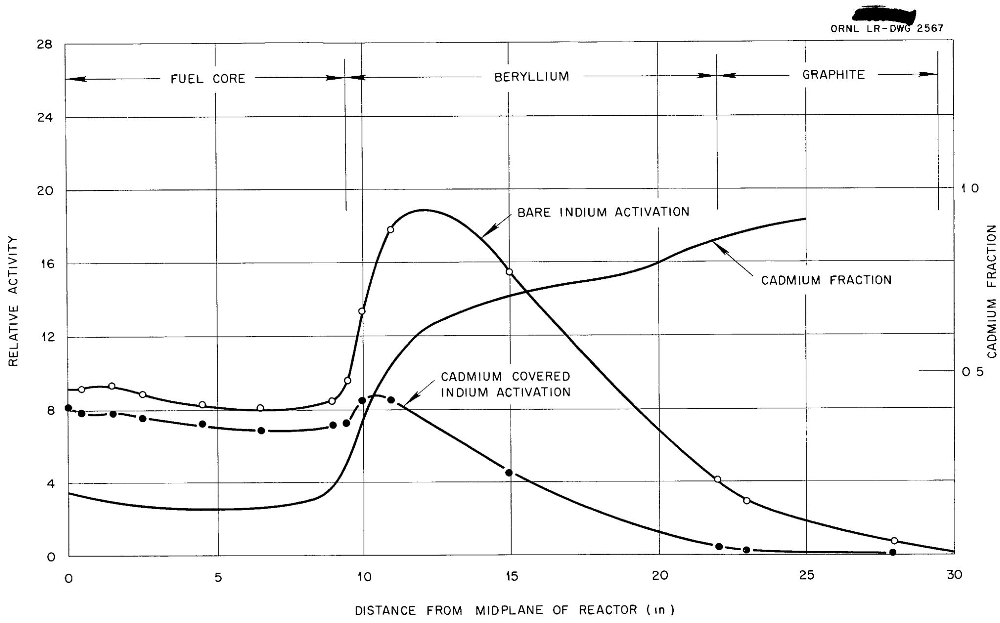  
Fig III-7 Bare and Cadmium-Covered Indium Traverses Through Fuel Core

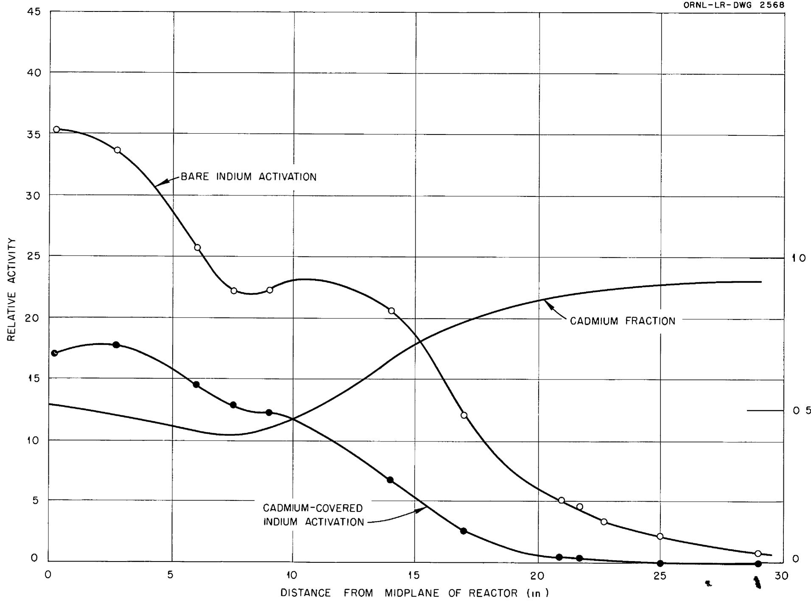  
Fig 111-8 Bare and Cadmium Covered Indium Traverses Parallel to Axis Through Cell O-12

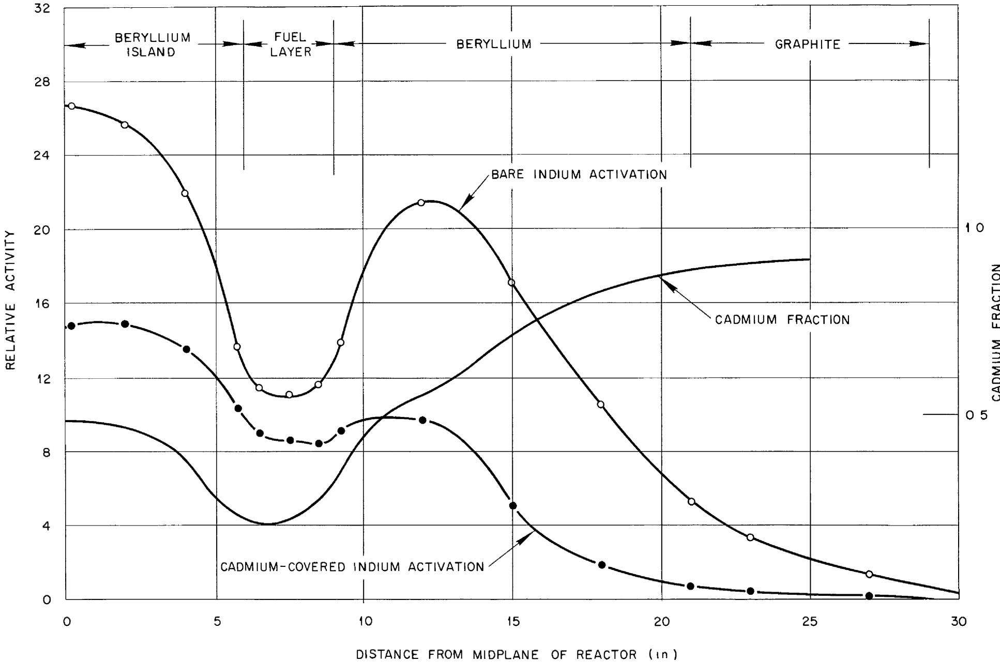  
Fig III-9 Bare and Cadmium-Covered Indium Traverses Parallel To Axis Through Beryllium Island and Fuel

relative activity of the various foils and the corresponding Cd fraction* as a function of their distances from the mid-plane of the reactor for the traverses through cells 0-12 and P-12 respectively

TABLE III-3   
Neutron Flux Traverses in Q-13   
TABLE III-4   

<table><tr><td rowspan="2">Distance of Foil from Mid-plane in Inches</td><td colspan="2">Relative Activity</td></tr><tr><td>Bare Foils</td><td>Cadmium Covered Foils</td></tr><tr><td>0 0</td><td>10 338</td><td>8 084</td></tr><tr><td>0 5</td><td>9 118</td><td>7 889</td></tr><tr><td>1 5</td><td>9 396</td><td>7 959</td></tr><tr><td>2 5</td><td>8 899</td><td>7 663</td></tr><tr><td>4 5</td><td>8 302</td><td>7 393</td></tr><tr><td>6 5</td><td>8 068</td><td>6 910</td></tr><tr><td>8 5</td><td>8 532</td><td>7 160</td></tr><tr><td>9 5</td><td>9 533</td><td>7 370</td></tr><tr><td>10 0</td><td>13 370</td><td>8 569</td></tr><tr><td>11 0</td><td>17 815</td><td>8 580</td></tr><tr><td>15 0</td><td>15 502</td><td>4 578</td></tr><tr><td>21 5</td><td>4 182</td><td>0 464</td></tr><tr><td>23 0</td><td>2 974</td><td>0 341</td></tr><tr><td>28 0</td><td>0 767</td><td>0 078</td></tr></table>

Neutron Flux Traverses Through Cells 0-12 and P-12   

<table><tr><td colspan="3">Cell 0-12</td><td colspan="3">Cell P-12</td></tr><tr><td rowspan="2">Distances From Mid-plane in Inches</td><td colspan="2">Relative Activity</td><td rowspan="2">Distances From Mid-plane in Inches</td><td colspan="2">Relative Activity</td></tr><tr><td>Bare</td><td>Cd Covered</td><td>Bare</td><td>Cd Covered</td></tr><tr><td>0 3</td><td>35 335</td><td>17 232</td><td>0.3</td><td>26 678</td><td>14 736</td></tr><tr><td>2 7</td><td>33 746</td><td>17 702</td><td>2 0</td><td>25 735</td><td>14 931</td></tr><tr><td>6 0</td><td>25 676</td><td>14 596</td><td>4 0</td><td>21 990</td><td>13 557</td></tr><tr><td>7 5</td><td>22 315</td><td>13 008</td><td>5 7</td><td>13 602</td><td>10 234</td></tr><tr><td>9 0</td><td>22.349</td><td>12.414</td><td>6 5</td><td>11.401</td><td>8 938</td></tr><tr><td>14 0</td><td>20 537</td><td>6 840</td><td>7 5</td><td>11.137</td><td>8.599</td></tr><tr><td>17 0</td><td>12 169</td><td>2 675</td><td>8.5</td><td>11 655</td><td>8 463</td></tr><tr><td>21 0</td><td>5 250</td><td>0 614</td><td>9 2</td><td>13.954</td><td>9 094</td></tr><tr><td>21 7</td><td>4.790</td><td>0.551</td><td>12.0</td><td>21.436</td><td>9 662</td></tr><tr><td>22 7</td><td>3 601</td><td>0 428</td><td>15.0</td><td>17 140</td><td>5 158</td></tr><tr><td>25 0</td><td>2.307</td><td>0.254</td><td>18 0</td><td>10 440</td><td>1 980</td></tr><tr><td>29 0</td><td>0 926</td><td>0 054</td><td>21 0</td><td>5 222</td><td>0 638</td></tr><tr><td></td><td></td><td></td><td>23 0</td><td>3 640</td><td>0 406</td></tr><tr><td></td><td></td><td></td><td>27.0</td><td>1 388</td><td>0 142</td></tr></table>

*Cd fraction is defined as the fraction of the total activity induced by neutrons with energies less than 0 O2" cadmium cut-off

Radial bare and cadmium covered indium traverses were made starting at the axis of the reactor in cell 0-12 and extending to cell X-12 Table III-5 contains the data showing the positions and relative activities for both the bare and the cadmium covered foils Figure III-10 is a graph of the relative activities plotted as a function of the distances of the foils from the axis of the reactor

TABLE III-5   
Radial Flux Traverse in Mid-plane   

<table><tr><td>Distance of Foil
From Axis in
Inches</td><td>Relative Bare</td><td>Activity Cd Covered</td></tr><tr><td>0 7</td><td>38 543</td><td>19 677</td></tr><tr><td>2 3</td><td>35 595</td><td>19 826</td></tr><tr><td>4 5</td><td>26 173</td><td>15 230</td></tr><tr><td>6 3</td><td>12 137</td><td>9 683</td></tr><tr><td>7 5</td><td>9 889</td><td>8 500</td></tr><tr><td>8 7</td><td>11 861</td><td>8 898</td></tr><tr><td>10 5</td><td>20 692</td><td>11 568</td></tr><tr><td>13 5</td><td>21 483</td><td>8 509</td></tr><tr><td>16 5</td><td>14 764</td><td>3 930</td></tr><tr><td>19 5</td><td>8 310</td><td>1 317</td></tr><tr><td>22 5</td><td>4 125</td><td>0 515</td></tr><tr><td>25 5</td><td>1 675</td><td>0 197</td></tr><tr><td>27 3</td><td>0 542</td><td>073</td></tr></table>

In order to obtain a more detailed pattern of the neutron flux in the fuel region, short radial traverses were made across the fuel in cell N-10 Table III-6 shows the positions of the foils and their relative activities Figure III-ll shows the activities plotted as a function of the distances of the foils from the axis of the reactor

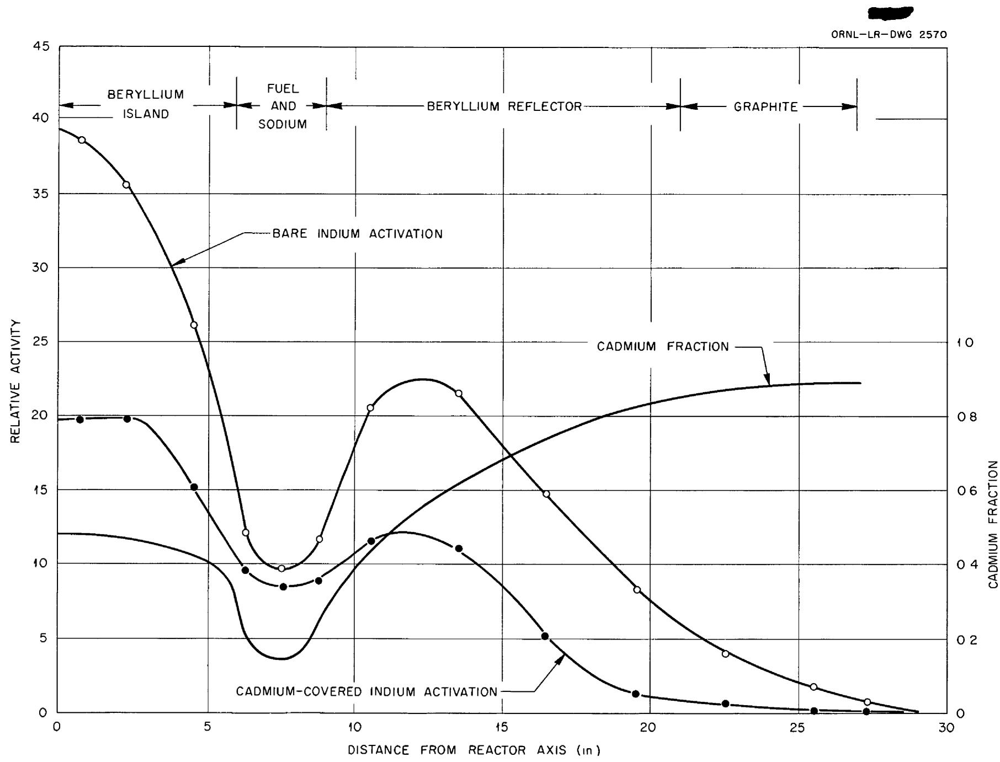  
-81   
Fig III-10 Indium Traverse Radially in Midplane of Reactor Cell O-12 to X-12

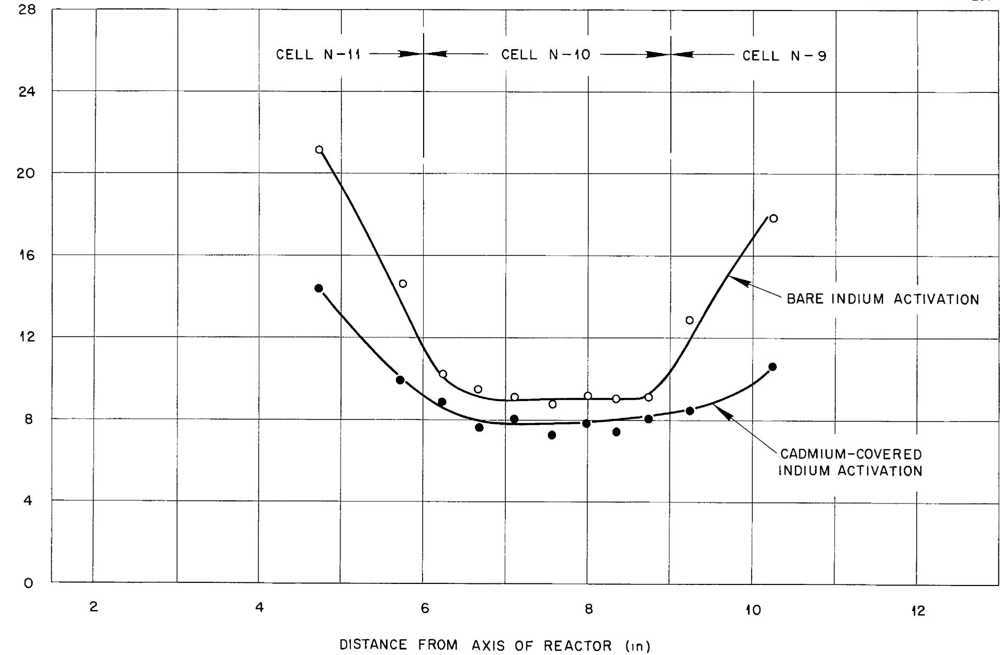  
Fig III-11 Bare and Cadmium-Covered Indium Traverses Across Fuel Annulus

TABLE III-6   
Neutron Flux Distribution Across Fuel Annulus   

<table><tr><td>Distance from 
Axis of Reactor 
In Inches</td><td>Bare</td><td>Cd Covered</td></tr><tr><td>4 7</td><td>21 172</td><td>14 419</td></tr><tr><td>5 5</td><td>14 603</td><td>9 977</td></tr><tr><td>6 3</td><td>10 242</td><td>8 923</td></tr><tr><td>6 7</td><td>9 554</td><td>7 733</td></tr><tr><td>7 1</td><td>9 038</td><td>8 098</td></tr><tr><td>7 6</td><td>8 799</td><td>7 270</td></tr><tr><td>8 0</td><td>9 200</td><td>7 991</td></tr><tr><td>8 4</td><td>9 060</td><td>7 466</td></tr><tr><td>8 7</td><td>9 104</td><td>8 018</td></tr><tr><td>9 3</td><td>12 837</td><td>8 446</td></tr><tr><td>10 3</td><td>17 857</td><td>10 718</td></tr></table>

# 2 Power Distributions

The power distribution through the fuel was measured along the axis of cell Q-13 The aluminum catchers were mounted vertically between the uranium fuel disks and the adjacent sodium cans

Table III-7 contains data showing the distances of the aluminum foils from the mid-plane of the reactor. Figure III-12 is a graph of the relative fission rates plotted as a function of the distance from the mid-plane. The two values shown at 95" from the axis indicate different fission rates on the opposite surfaces of the uranium disks which are adjacent to the sodium cans and the beryllium, the higher fission rate occurring on the surface adjacent to the beryllium.

TABLE III-7   
Power Distribution in Call Q-13   

<table><tr><td colspan="2">Distance from</td></tr><tr><td>Mid-plane in Inches</td><td>Relative Activity</td></tr><tr><td>0 5</td><td>3182</td></tr><tr><td>1 5</td><td>3066</td></tr><tr><td>3 5</td><td>2899</td></tr><tr><td>5 5</td><td>2563</td></tr><tr><td>7 5</td><td>2253</td></tr><tr><td>9 5</td><td>2806</td></tr><tr><td>9 5</td><td>5318</td></tr></table>

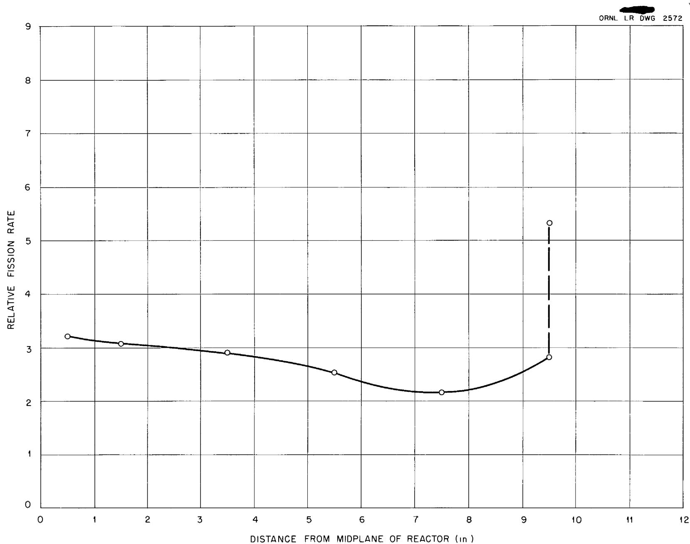  
Fig III-12 Power Distribution in Cell Q-13

A power traverse was also made across the fuel annulus using cell Q-13 Two runs were made and the fission fragment counting rates normalized Table III-8 contains the data showing the distances of the centers of the aluminum catcher foils from the axis of the reactor and the normalized fission fragment activities Figure III-13 is a graph of the activity plotted as a function of the distances of the centers of the foils from the axis of the reactor The dotted portions of the curve extrapolate the activities to the edge of the fuel

TABLE III-8   
Power Distribution Across Fuel Annulus   

<table><tr><td>Distance From
Axis in Inches</td><td>Relative Activity</td></tr><tr><td>6 2</td><td>661</td></tr><tr><td>6 3</td><td>596</td></tr><tr><td>6 6</td><td>588</td></tr><tr><td>6 9</td><td>508</td></tr><tr><td>6 9</td><td>511</td></tr><tr><td>7 3</td><td>485</td></tr><tr><td>7 5</td><td>469</td></tr><tr><td>7 5</td><td>475</td></tr><tr><td>7 7</td><td>482</td></tr><tr><td>8 1</td><td>501</td></tr><tr><td>8 4</td><td>562</td></tr><tr><td>8 4</td><td>570</td></tr><tr><td>8 7</td><td>629</td></tr></table>

The depression in the fissioning distribution through two adjacent O Ol" fuel disks was determined by replacing them with ten 2 mil thick fuel disks separated by catcher foils thereby forming a sandwich. This sandwich was inserted in the normal fuel position between two sodium filled cans. The data obtained are shown in Table III-9 and Figure III-14. Two catcher foils were inserted between the internal disks giving the two values reported. To facilitate drawing the curve, symmetry has been assumed and the points reflected

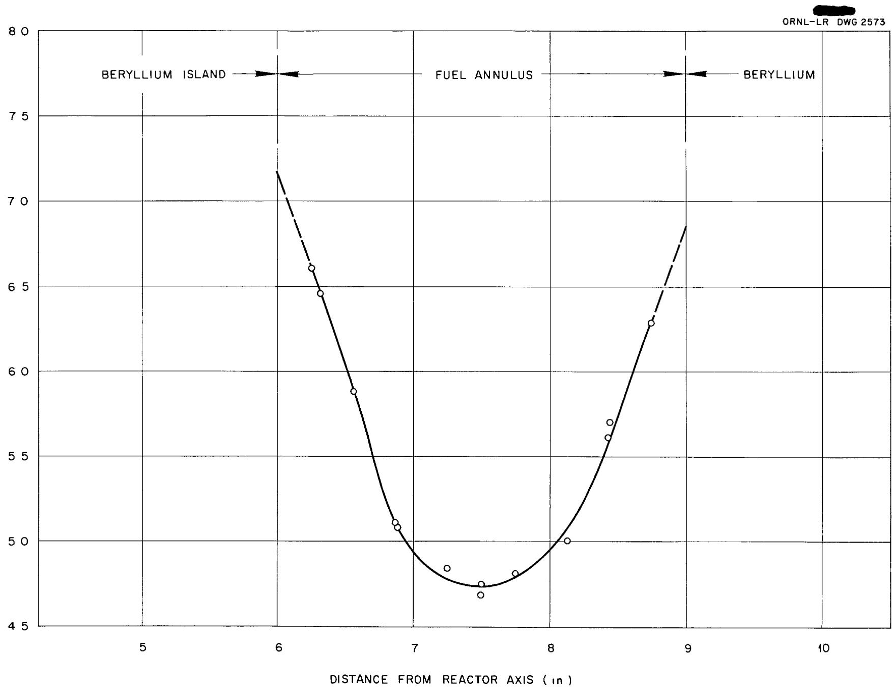  
-2   
RELATIVE POWER   
Fig III - 13 Power Distribution Across Fuel Annulus

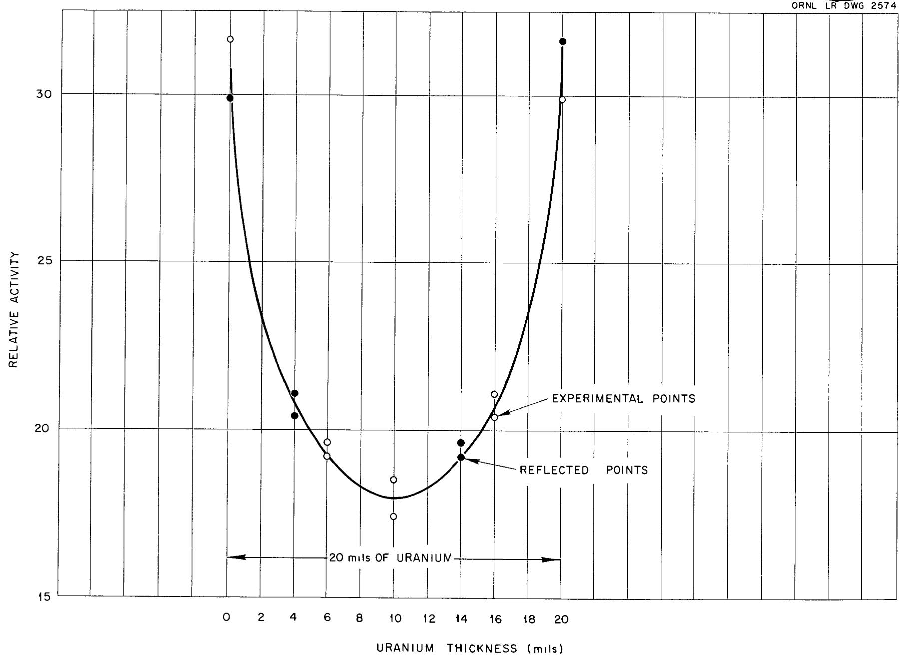  
一  
Fig III-14 Power Distribution Through 20 mil Uranium Disk

TABLE III-9   
POWER DISTRIBUTION THROUGH O 02" FUEL DISK   

<table><tr><td>Distance Through Sandwich in Mils*</td><td>Relative Activity</td></tr><tr><td>0</td><td>31 64</td></tr><tr><td>6</td><td>19 63</td></tr><tr><td>6</td><td>19 23</td></tr><tr><td>10</td><td>18 58</td></tr><tr><td>10</td><td>17 44</td></tr><tr><td>16</td><td>21 19</td></tr><tr><td>16</td><td>20 44</td></tr><tr><td>20</td><td>29 90</td></tr></table>

*Catcher foil thicknesses have been neglected

# 3 Fuel Cadmium Fractions

Cadmium fractions for the uranium fuel disks were measured at various positions axially along cell Q-13 Table III-10 contains the values of the cadmium fractions at various distances from the mid-plane The two values listed for the 95" position indicate that a measurement was made on both sides of the uranium disk

TABLE III-10 FUEL CADMIUM FRACTIONS FOR CELL Q-13   

<table><tr><td>Distance From</td><td>Fuel</td></tr><tr><td>Mid-plane in</td><td>Cadmium</td></tr><tr><td>Inches</td><td>Fractions</td></tr><tr><td>1 5</td><td>0 71</td></tr><tr><td>5 5</td><td>0 68</td></tr><tr><td>9 5</td><td>0 73</td></tr><tr><td>9 5</td><td>0 85</td></tr></table>

# 4 Effect of Stainless Steel on Power Distribution

In order to determine the effect of a stainless steel core shell on the power distribution across the fuel, the beryllium reflector in cells R-10 through R-15 was rearranged so that a void $(5/8" x 2-7/8" x 9")$ existed adjacent to the fuel annulus extending on one side of the mid-plane only A $3''$ longitudinal

section in fuel cell Q-13 was rotated $90^{\circ}$ about a vertical axis from its normally loaded position The sodium filled cans were replaced by aluminum spacers and some of the 0 01" fuel disks replaced by 0 002" disks A radial power distribution was then measured in this 3" section Stainless steel sheets (9" x 2-7/8" x 0 29") were then inserted in the voids in cells R-10 through R-15, and the power distribution remeasured The data obtained from both traverses are shown in Table III-11 and Figure III-15

TABLE III-11   
EFFECT OF STAINLESS STEEL ON POWER DISTRIBUTION   

<table><tr><td rowspan="2">Distance of Foil
From Reactor Axis
In Inches</td><td colspan="2">Relative Activity</td></tr><tr><td>Without
Stainless
Steel</td><td>With
Stainless
Steel</td></tr><tr><td>6.2</td><td>4 885</td><td>4 912</td></tr><tr><td>6.5</td><td>3 348</td><td>3 348</td></tr><tr><td>6 91</td><td>2.287</td><td>2 359</td></tr><tr><td>7 2</td><td>1 977</td><td>1 885</td></tr><tr><td>7 5</td><td>1 745</td><td>1 680</td></tr><tr><td>7 5</td><td>1 816</td><td>1 628</td></tr><tr><td>7.7</td><td>1 971</td><td>1 672</td></tr><tr><td>8 3</td><td>2 822</td><td>2 246</td></tr><tr><td>8 5</td><td>3 546</td><td>2 565</td></tr><tr><td>8.7</td><td>5 199</td><td>3 526</td></tr></table>

# E Danger Coefficient Measurements

# 1 Stainless Steel

The loss in reactivity due to the presence of stainless steel next to the fuel annulus was determined for three different steel thicknesses inserted* in the void in cells R-10 through R-15 described above. The void itself resulted in a loss in reactivity of 87 cents. The loss in reactivity as a function of the stainless steel thickness is plotted in Figure III-16

# 2 Bismuth and Lead

A $1 - 1 / 8''$ layer of beryllium adjacent to the fuel surface and extending $8 - 5 / 8''$ on both sides of the mid-plane was removed from cells R-10 through R-15 The introduction of this void

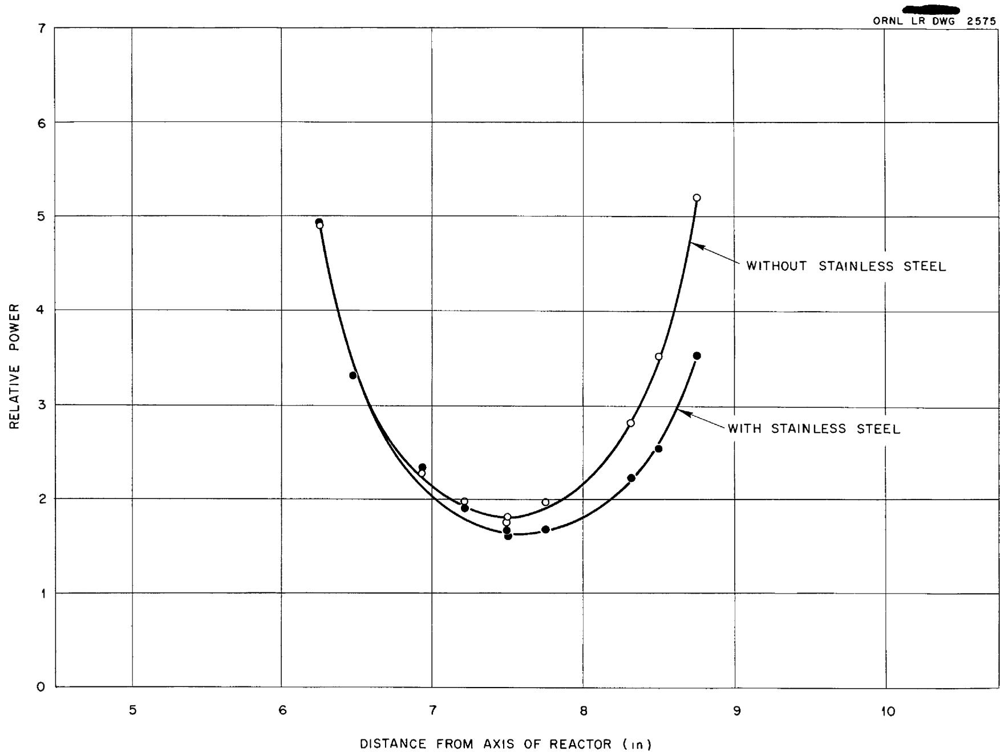  
-∠2-   
Fig III 15 Effect of Stainless Steel on Power Distribution

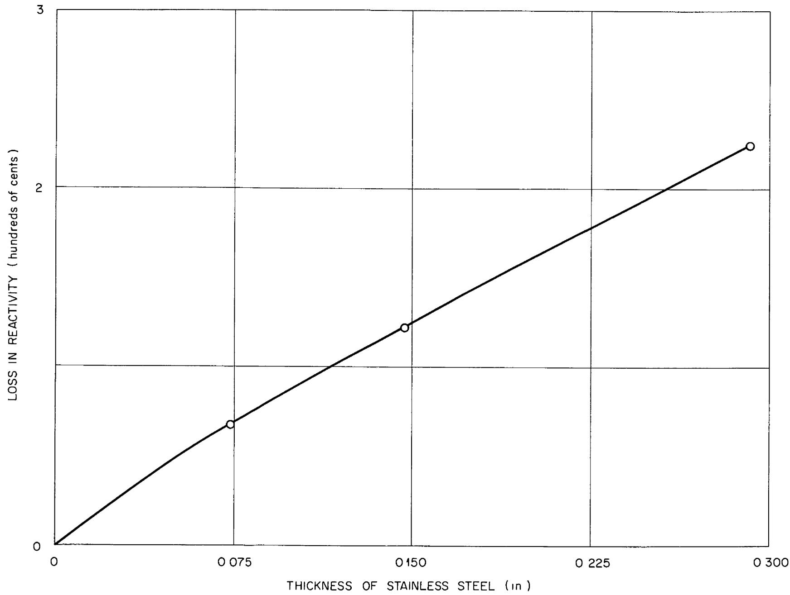  
Fig III-16 Loss in Reactivity Due to Addition of Stainless-Steel Core Shells

resulted in a loss in reactivity of 92 cents Six pieces of bismuth (2-7/8" x 2-7/8" x 1") were then placed in each of these cells to partially fill the void The additional loss in reactivity due to the bismuth was 32 cents The bismuth was then removed and replaced by lead, with a resulting loss in reactivity of 121 cents

# 3 Stainless Steel and Sodium

Four stainless steel cans filled with sodium were removed from cell Q-13 Four aluminum spacers, each approximately $1/4''$ x 1-7/16" x 1-7/16", were substituted for each of the sodium filled cans to anchor the fuel disks in place The change in reactivity due to substituting the aluminum spacers for the cans was determined The aluminum spacers were then replaced by four empty stainless steel cans similar to those containing the sodium; thus the change in reactivity due to the removal of the sodium alone was obtained A gain in reactivity of 8 4 cents was obtained by substitution of the aluminum spacers for the sodium filled cans, and a gain of 2 8 cents was realized by the removal of only the sodium

$$
I V - \underline {{C A - 1 1}}
$$

# A Assembly Loading

The fuel region of the second assembly (CA-ll) had properties that more nearly simulated those of the conceived full scale RMR The fuel used was an homogeneous mixture of $\mathsf{ZrO_2}$ , NaF, C, UF4, and a small amount of adsorbed moisture The uranium was enriched to $93.2\%$ U-235 The composition of the mixture was

16 2 wt % UF4   
55 0 wt % ZrO₂   
19 9 wt % NaF   
88wt%C   
0 25 wt % H2O

The uranium density was 0 21 gm U-235/cc and the average packed density of the mixture was 18 gm/cc $\mathsf{ZrO_2}$ was used in place of $\mathsf{ZrF_4}$ with the carbon added to compensate for the difference in the thermal neutron scattering properties of the mixture The powdered mixture was packed in 1-1/4" O D square aluminum tubes

with a 1/16" wall thickness These fuel tubes were arranged in an annulus around a beryllium island with a beryllium and graphite reflector surrounding the fuel Figures IV-1 and IV-2 show the loading at the mid-plane and in the vertical plane containing the reactor axis, respectively. Inasmuch as there were no fuel tubes 4-1/2" long available, 4-1/2" shishes were made using O Ol" quarter size fuel disks and aluminum spacers These shishes are shown as vertical lines in Fig IV-2 The fuel annulus was 4-1/2" thick in the central region with end ducts that were one fuel tube thick It should be noted that while the thickness of the fuel region has been reported as 4-1/2", there were three fuel tubes (3-3/4" total thickness) across this dimension In general the fuel tubes were arranged such that as small a void as possible existed between the fuel tubes themselves Fig IV-3 shows the arrangement of the fuel tubes The assembly was critical with 7 7 kg of U-235 In order to gain the additional reactivity required for some of the measurements, 0.01" thick full size fuel disks were added to the island and/or fuel region as required

# B Evaluation of Control Rod D

Control Rod D was evaluated by subdividing the rod into units of equal reactivity The evaluation was accomplished by means of the following procedure The reactor was initially made critical with Rod A all of the way in, Rod D all the way out, and Rod C appropriately located Rod A was then withdrawn one inch and the reactor returned to the critical condition by inserting Rod D Rod A was then inserted one inch and the reactor returned to the previous critical condition by withdrawing Rod C This sequence of operations was continued until Rod D was completely inserted By this means Rod D was divided into increments of equal reactivity over its entire length The unit of reactivity was determined from the measurement of the displacement of Rod D equivalent in reactivity to the removal of a safety rod, which had been evaluated previously by the "Rod Drop Method" The data thus obtained for the calibration of Rod D are shown in Table IV-1 and Fig IV-4. The position of the rod is measured from the assembly interface

# C Neutron Flux Distribution

Two radial flux traverses were taken, the first in the mid-plane of the reactor and the second $6 - 1 / 4''$ from the midplane. The second traverse passed through the quarter size fuel shishes used instead of the fuel tubes Tables IV-2 and IV-3 and Figs IV-5 and IV-6 show all the data obtained for both the bare and cadmium covered indium traverses

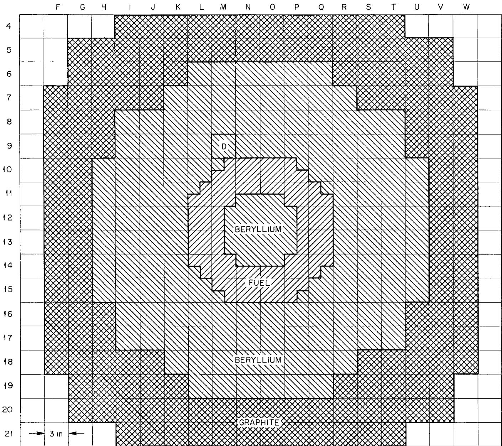  
一  
Fig IV-1 Assembly Loading at Mid Plane

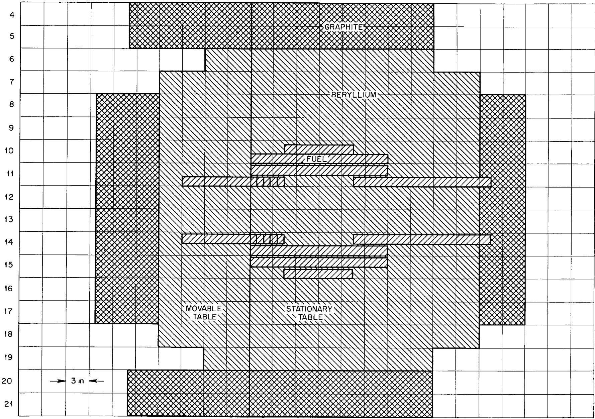  
-2ε-  
Fig IV-2 Axial Loading of Assembly in Vertical Plane Containing Reactor Axis

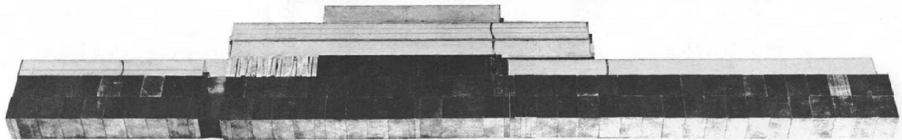

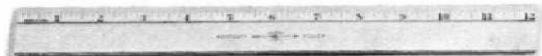  
Fig. IV-3. Fuel Tube Arrangement.

TABLE IV-1   
Rod D Calibration   

<table><tr><td>Position of Rod From Assembly Interface In Inches</td><td>Change in Reactivity in Cents</td><td>Average Sensitivity in Cents per Inch</td></tr><tr><td>0 0</td><td>0 0</td><td>0 0</td></tr><tr><td>0 530</td><td>0 88</td><td>1 66</td></tr><tr><td>2 930</td><td>8 48</td><td>3 17</td></tr><tr><td>5 660</td><td>16 13</td><td>2 80</td></tr><tr><td>9 264</td><td>23 78</td><td>2 12</td></tr><tr><td>12 980</td><td>31 38</td><td>2 05</td></tr><tr><td>15 980</td><td>38 99</td><td>2 54</td></tr><tr><td>18 740</td><td>46 62</td><td>2 76</td></tr><tr><td>21 880</td><td>54 24</td><td>2 43</td></tr><tr><td>26 120</td><td>61 90</td><td>1 81</td></tr><tr><td>33 774</td><td>69 51</td><td>0 99</td></tr></table>

TABLE IV-2   
Radial Flux Distribution in Mid-Plane   

<table><tr><td>Distance From
Axis in Inches</td><td>Relative Bare</td><td>Indium Activity
Cd Covered</td></tr><tr><td>0 00</td><td>33 569</td><td>21 200</td></tr><tr><td>1 25</td><td>31 873</td><td>20 380</td></tr><tr><td>2 75</td><td>24 864</td><td>16 646</td></tr><tr><td>4 63</td><td>13 801</td><td>10 545</td></tr><tr><td>5 87</td><td>10 989</td><td>9 072</td></tr><tr><td>7 25</td><td>10 810</td><td>9 151</td></tr><tr><td>8 50</td><td>12 814</td><td>9 433</td></tr><tr><td>10 25</td><td>19 524</td><td>10 799</td></tr><tr><td>11 75</td><td>21 080</td><td>9 435</td></tr><tr><td>13 25</td><td>20 608</td><td>7 360</td></tr><tr><td>15 0</td><td>16 704</td><td>4 757</td></tr><tr><td>18 0</td><td>9 712</td><td>1 647</td></tr><tr><td>21 0</td><td>4 585</td><td>0 469</td></tr><tr><td>24 0</td><td>2 288</td><td>0 216</td></tr><tr><td>27 0</td><td>0 505</td><td>0 046</td></tr></table>

Fig IV-4 Calibration Curve for Control Rod D   
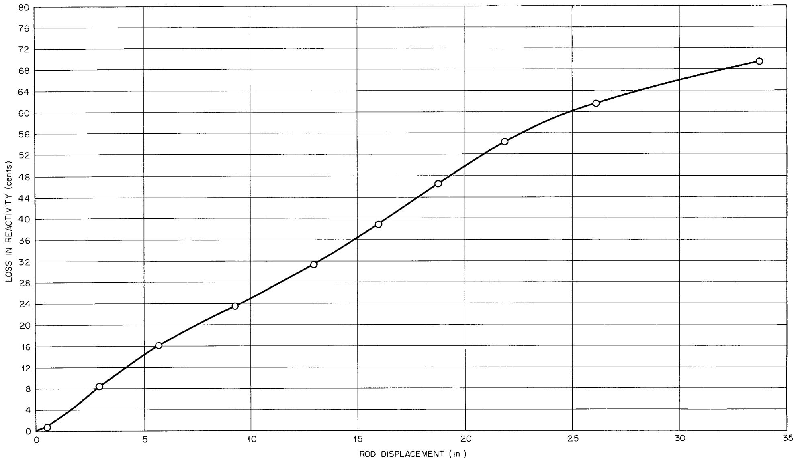  
ORNL-LR-DWG 2579

-9ε-

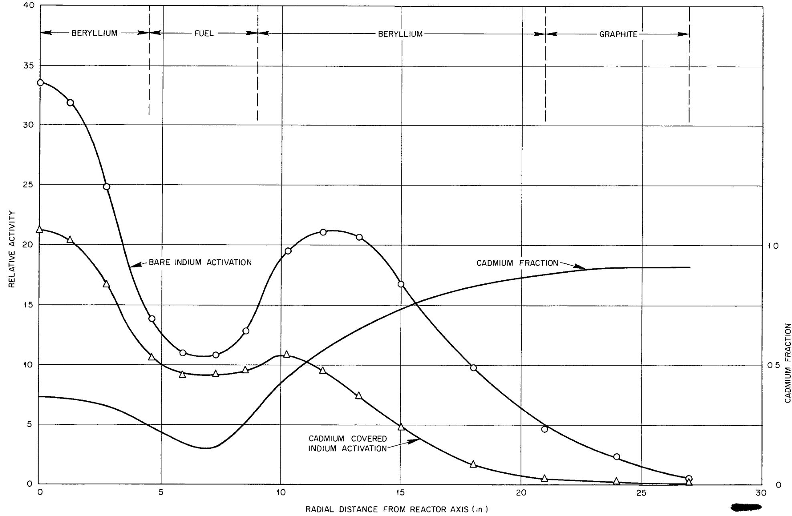  
Fig IV 5 Radial Flux Distribution at the Mid plane

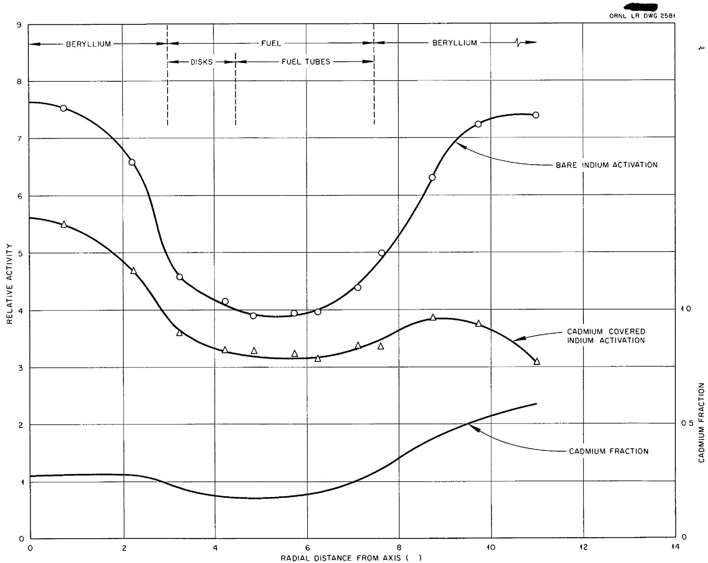  
一∠  
Fig IV 6 Radial Flux Distribution $6\frac{1}{4}$ in from Mid plane

# TABLE IV-3

Radial Flux Distribution 6-1/4" from Mid-Plane   

<table><tr><td rowspan="2">Distance from Axis
in Inches</td><td colspan="2">Relative Indium Activity</td></tr><tr><td>Bare</td><td>Cd Covered</td></tr><tr><td>0 7</td><td>7.523</td><td>5 484</td></tr><tr><td>2 3</td><td>6.579</td><td>4 679</td></tr><tr><td>3 3</td><td>4 563</td><td>3 589</td></tr><tr><td>4 3</td><td>4 144</td><td>3 292</td></tr><tr><td>4 9</td><td>3 882</td><td>3 274</td></tr><tr><td>5 7</td><td>3 949</td><td>3.202</td></tr><tr><td>6 3</td><td>3 953</td><td>3 120</td></tr><tr><td>7 1</td><td>4 366</td><td>3 364</td></tr><tr><td>7 6</td><td>4 866</td><td>3 346</td></tr><tr><td>8 7</td><td>6 294</td><td>3 634</td></tr><tr><td>9 7</td><td>7 229</td><td>3 532</td></tr><tr><td>11 3</td><td>7.389</td><td>3 076</td></tr></table>

The associated radial cadmium fractions for indium obtained in the mid-plane from CA-10 and CA-11 are shown in Figure IV-7.

# D Power Distributions

Power distributions were obtained by placing 0 002" thick quarter size uranium disks with aluminum catcher foils adjacent to fuel tubes in the desired location. The first was measured parallel to the reactor axis in cell N-14 The 0.002" thick uranium disks and associated catcher foils were placed adjacent to the fuel tube between the fuel tubes and the beryllium island. A second power distribution was taken in the same location with Boral* strips (9" x 2-7/8" x 1/4") placed around the end fuel ducts on the stationary table, replacing some beryllium and graphite as shown in Figure IV-8 The data have been arbitrarily normalized at a point 14 5" from the interface In order to maintain the reactor critical with the Boral inserted, additional 0.01" fuel disks were added to the beryllium island on the movable table The data obtained from both runs is shown in Table IV-4 and Figure IV-9

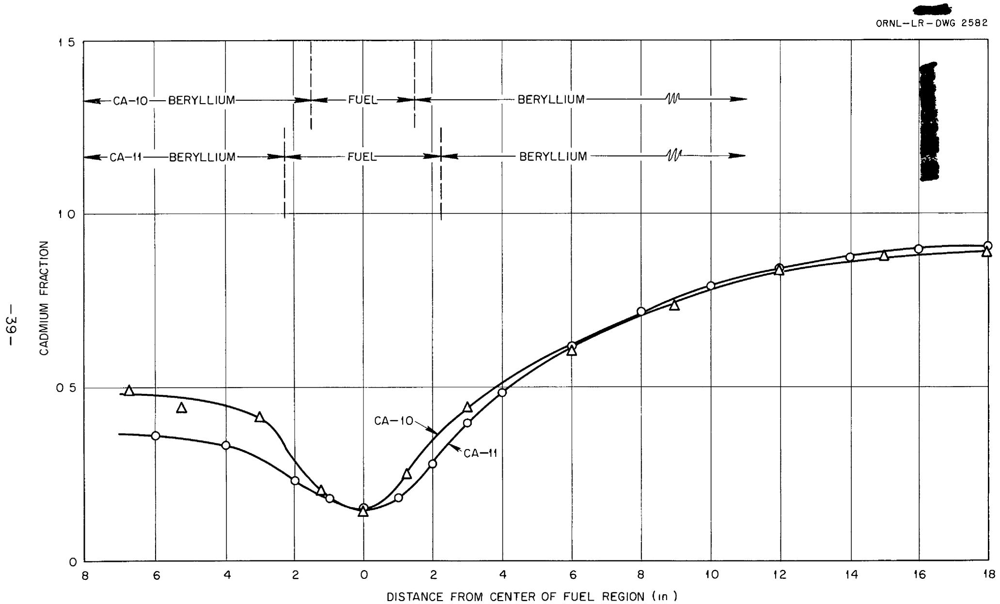  
Fig IV-7 Cadmium Fractions in CA-10 and CA-11

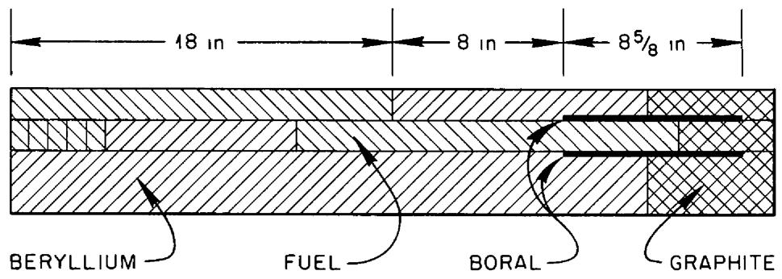

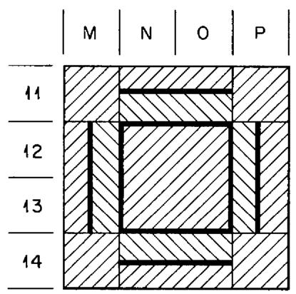  
Fig IV-8 Position of Boral Inserted Around End Ducts on Stationary Table

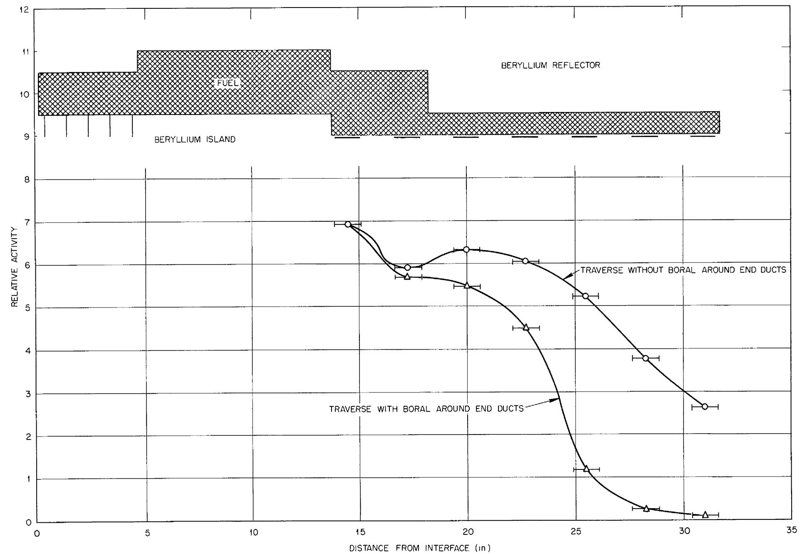  
一

  
ORNL-LR-DWG 2584   
Fig IV-9 Axial Power Distributions in Cell N-14

# TABLE IV-4

# Axial Power Distribution in N-14

<table><tr><td rowspan="2">Distance from Interface in Inches</td><td colspan="2">Relative Activity*</td></tr><tr><td>Without Boral</td><td>With Boral</td></tr><tr><td>14 5</td><td>6 902</td><td>6 902</td></tr><tr><td>17 3</td><td>5 896</td><td>5 647</td></tr><tr><td>20 0</td><td>6 312</td><td>5 469</td></tr><tr><td>22 7</td><td>6 027</td><td>4 465</td></tr><tr><td>25 5</td><td>5 205</td><td>1 160</td></tr><tr><td>28 3</td><td>3 747</td><td>0 248</td></tr><tr><td>31 0</td><td>2 602</td><td>0 098</td></tr></table>

A power distribution was also measured across the fuel annulus in the mid-plane of the reactor The 0 002" thick uranium disks were placed in the horizontal gap (approximately $1/4''$ ) between the fuel tubes of adjacent vertical cells, with eight $5/16''$ catcher foils distributed across the fuel disks. The data obtained is shown in Table IV-5 and Figure IV-10

# TABLE IV-5

# Power Distribution Across Fuel in Mid-Plane

<table><tr><td>Distance From Reactor
Axis</td><td>Relative
Activity</td></tr><tr><td>4 8</td><td>6 955</td></tr><tr><td>5 3</td><td>5 021</td></tr><tr><td>5 8</td><td>4 213</td></tr><tr><td>6 3</td><td>3 163</td></tr><tr><td>6 8</td><td>3 500</td></tr><tr><td>7 3</td><td>3 880</td></tr><tr><td>7 8</td><td>5 174</td></tr><tr><td>8 4</td><td>7 549</td></tr></table>

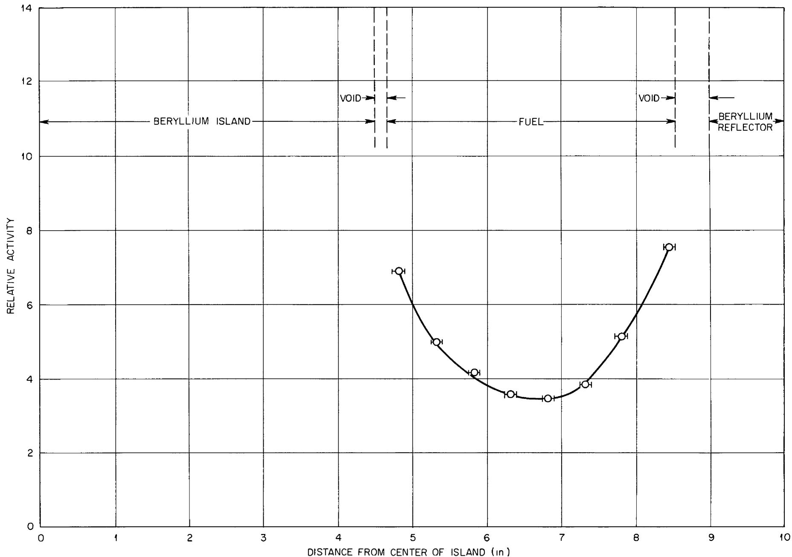  
一

  
ORNL-LR-DWG 2585   
Fig IV-10 Power Distribution Across Fuel in Mid-plane

# E Neutron Leakage Measurements

Measurements were obtained in an effort to estimate the ratio of the end to side neutron leakage from the reactor. In the first set of measurements six bare and cadmium covered indium foils were placed on the back surface of the reactor extending from the reactor axis outward 7" Three sets of foils were placed on the outer surface of the graphite side reflector at the mid-plane These foil measurements were taken without any Boral around the fuel end ducts

Side and end fast neutron leakage measurements were also obtained using a fast fission chamber. Measurements were taken both with and without Boral around the fuel end ducts, and with a $1/4''$ of Boral around the fission chamber*. Side leakage was determined by placing the chamber in cell X-12 with the center of the chamber at the mid-plane. The axis of the fission chamber was approximately $1 - 1/2''$ from the graphite side reflector. The end leakage was obtained by placing the chamber approximately $7''$ behind the stationary table with its axis parallel to the mid-plane with the center of the chamber on the projected axis of the reactor. The data obtained are summarized in Table IV-6

TABLE IV-6   
Summary of Neutron Leakage Measurements   

<table><tr><td></td><td>Ratio of End to Side Leakage With Boral Around End Ducts</td><td>Ratio of End to Side Leakage Without Boral Around End Ducts</td></tr><tr><td>Fission Chamber</td><td>6</td><td>28</td></tr><tr><td>Bare Indium</td><td>-</td><td>2 3</td></tr><tr><td>Cd Covered In</td><td>-</td><td>1 2</td></tr><tr><td>Bare-Cd Covered</td><td>-</td><td>1 1</td></tr></table>

# F Evaluation of Boral around Fuel End Ducts

The Boral sreets that were placed around the fuel end ducts as shown in Figure IV-7 were evaluated The gain in reactivity due to their removal was compensated for by removing fuel disks from the island region on the movable table The loss in reactivity due to the replacement of beryllium and graphite by Boral around the fuel end ducts amounted to 1 $6\%$ in $\mathbf{k}_{\mathrm{eff}}$

# G Stainless Steel and Boron Poison Rods

Two 3/16" diameter rods were evaluated in the center of cell 0-12 in the island The first rod was a stainless steel tube 40" long filled with natural boron to a linear density of 0.1 gm B/in The second was a stainless steel rod 38' long The loss in reactivity in cents for each rod is shown as a function of the distance of the end of the rod from the mid-plane in Table IV-7 and Figure IV-11

TABLE IV-7   
Reactivity Loss Due to Poison Rods Inserted in O-12   

<table><tr><td rowspan="2">Distance From Mid-Plane in Inches</td><td colspan="2">Loss in Reactivity in Cents</td></tr><tr><td>Boron Filled Rod*</td><td>Stainless Steel Rod</td></tr><tr><td>0 0</td><td>47 6</td><td>5 0</td></tr><tr><td>4 5</td><td>29 9</td><td>3 0</td></tr><tr><td>9 0</td><td>17 1</td><td>-</td></tr><tr><td>15 0</td><td>4 8</td><td>-</td></tr><tr><td>21 0</td><td>0 4</td><td>-</td></tr></table>

# H Cadmium Importance Function

The importance of cadmium as a neutron absorber when placed in the mid-plane of the reactor was obtained by taping a piece of cadmium $2 - 3 / 4$ square and O 02" thick weighing 19 09 gm, to either a block of beryllium or a fuel tube, and recording the loss in reactivity for each radial position The data obtained are shown in Table IV-8 and Figure IV-12

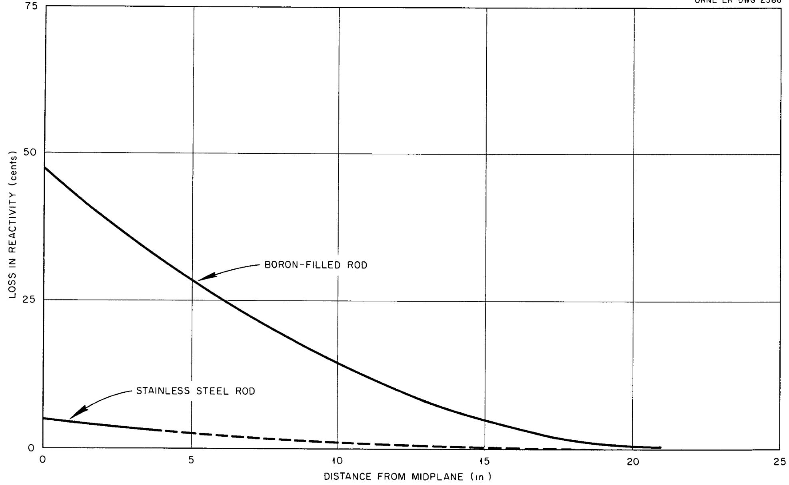  
-9+   
Fig IV-11 Reactivity Loss Due to Poison Rods Inserted in O-12

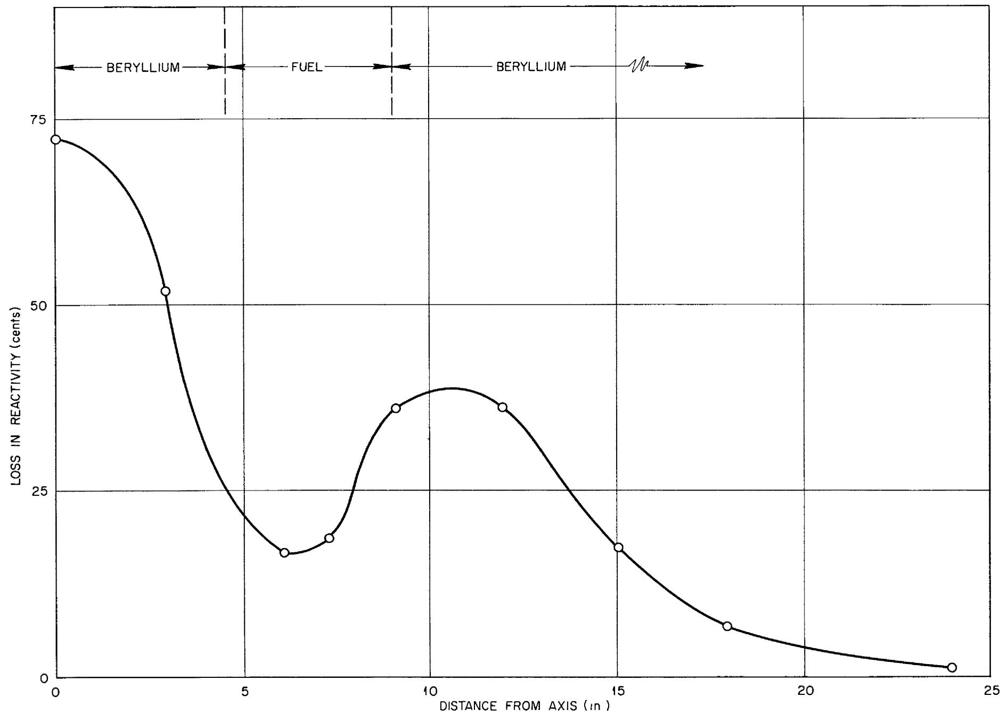  
一  
Fig IV-12 Cadmium Importance Function

# TABLE IV-8

# Cadmium Importance Function

Distance From Axis in Inches

00

2.9

6. k

73

9.1

119

15 1

179

23.9

Loss in Reactivity in Cents

72 2

518

16 8

187

361

36 3

175

69

12

# I Danger Coefficients

Danger coefficients were obtained for a number of different materials in the reflector and/or fuel regions. Samples were located in cells Q-12 and Q-13 in the fuel region or adjacent to the inner face of cells S-12 and S-13 after removal of some beryllium reflector All samples were placed symmetrically about the mid-plane The changes in reactivity, either plus or minus, obtained are shown in Table IV-9 and are referenced to the void The samples of Li, KF, NaF, Zr, Cr, and RbF were placed in aluminum containers $(5/16'' x 2-1/2'' x 9'')$ with $1/32''$ wall thickness. It has been assumed that these containers had no significant effect on the reactivity. The sample of sodium was contained in thin walled stainless steel cans, whose reactivity value was measured with the cans empty, thus enabling the reporting of the sodium value. The other samples required no containers The reactivity changes obtained for these materials are shown in Table IV-9.

The reactivity change due to the substitution of a sample of $\mathbf{D}_2\mathbf{O}$ for beryllium was measured at three locations in the assembly. The sample was $99.2\%$ $\mathbf{D}_2\mathbf{O}$ and weighed $265\mathrm{kg}$ . It was placed at the assembly mid-plane in the island adjacent to the fuel, in the reflector adjacent to the fuel and in the reflector $3''$ from the fuel layer. In each of the first two locations the gain in reactivity due to the substitution was 12 cents, in the latter position the reactivity was decreased by 24 cents

# J Effect of Stainless Steel Around the Fuel Annulus

In order to estimate the effect on reactivity of the fuel containing core shells required in the full scale reactor, two adjacent quadrants of the fuel annulus were partially covered with stainless

TABLE IV-9   

<table><tr><td>Sample</td><td>Sample Weight
gm</td><td>Sample*
Size</td><td>Reactivity Change
In Fuel Region</td><td>cents/gm
In Reflector</td></tr><tr><td>Li2CO3</td><td>152 4</td><td>A</td><td>0 0000</td><td>-0 0415</td></tr><tr><td>KF</td><td>198 0</td><td>A</td><td>-0 0162</td><td>-0 0578</td></tr><tr><td>NaF</td><td>97 2</td><td>A</td><td>-0 0058</td><td>-0 0354</td></tr><tr><td>Zr</td><td>287 7</td><td>A</td><td>+0 0150</td><td>-0 0498</td></tr><tr><td>Cr</td><td>249 4</td><td>B</td><td>-0 0237</td><td>-0 0680</td></tr><tr><td>RbF</td><td>156 3</td><td>B</td><td>+0 0118</td><td>+0 0026</td></tr><tr><td>Inconel</td><td>1956 4</td><td>A</td><td>-0 0276</td><td>-0 0448</td></tr><tr><td>Ni</td><td>2061 0</td><td>A</td><td>-0 0274</td><td>-0 0437</td></tr><tr><td>Pb</td><td>2544 8</td><td>C</td><td>-0 0008</td><td>-0 0007</td></tr><tr><td>Pb</td><td>4592 7</td><td>D</td><td>-</td><td>-0 0012</td></tr><tr><td>316 Stainless Steel</td><td>1990 4</td><td>C</td><td>-0 0243</td><td>-0 0385</td></tr><tr><td>310&quot; &quot;</td><td>3195 0</td><td>D</td><td>-</td><td>-0 0233</td></tr><tr><td>316&quot; &quot;</td><td>995 2</td><td>E</td><td>-</td><td>-0 0509</td></tr><tr><td>Be</td><td>753 6</td><td>D</td><td>-</td><td>+0 0090</td></tr><tr><td>Na</td><td>366 9</td><td>D</td><td>-</td><td>-0 0190</td></tr><tr><td>Bi</td><td>3931 8</td><td>D</td><td>-</td><td>+0 0006</td></tr><tr><td>Graphite</td><td>376 2</td><td>A</td><td>+0 0108</td><td>+0 0043</td></tr><tr><td>Density 1/72 gm/cc</td><td></td><td></td><td></td><td></td></tr><tr><td>Graphite</td><td>700 1</td><td>D</td><td>-</td><td>+0 0064</td></tr><tr><td>Density 1 72 gm/cc</td><td></td><td></td><td></td><td></td></tr><tr><td>Graphite</td><td>825 6</td><td>D</td><td>-</td><td>+0 0065</td></tr><tr><td>Density 2 0 gm/cc</td><td></td><td></td><td></td><td></td></tr><tr><td>BeO</td><td>375 0</td><td>F</td><td>-</td><td>+0 0055</td></tr></table>

*Sample Size

$$
A - 5 / 1 6" x 5" x 9"
$$

$$
B - 5 / 1 6" x 2 - 1 / 2" x 9 ^ {\prime}
$$

$$
C - 1 / 4 ^ {\prime \prime} x 5 - 3 / 4 ^ {\prime \prime} x 9 ^ {\prime \prime}
$$

$$
D - 1 ^ {\prime \prime} x 2 - 7 / 8 ^ {\prime \prime} x 8 - 3 / 8 ^ {\prime \prime}
$$

$$
E - 1 / 8" x 5 - 3 / 4" x 9"
$$

$$
F - 7 / 8" x 2 - 7 / 8" x 5"
$$

steel 0 $145''$ thick The exposed surfaces of the fuel tubes, extending $4 - 1 / 2''$ on either side of the mid-plane, both between the fuel and the island and between the fuel and the reflector, were covered with $9''$ long plates The total weight of the steel added was $90\mathrm{kg}$ The additional reactivity required was provided by adding O Ol" thick fuel disks distributed throughout the fuel region The addition of this steel to the quadrant first covered resulted in a loss in reactivity of 1 $45 \%$ in keff and requiring the addition of 828 gms of uranium to remake the system critical The steel added to the second quadrant also resulted in a loss of 1 $45 \%$ in keff and required the addition of 1818 gms of uranium

In this assembly three variations of the essential features of the RMR were carried out

1 The reactor was first built up with an all graphite island and reflector with a 3" thick 18" long cylindrical fuel annulus separating the two regions. The fuel region contained 1 5' thick 9" long end fuel ducts on both ends of the reactor. The loading is shown in Figure V-1. The fuel loaded in the 1 25" square aluminum tubes, was the same as that used in CA-11 except the 235 density was doubled resulting in the following composition

$$
\begin{array}{c c c c} 3 2 & 4 & w t & \% \text {U F} _ {4} \\ 4 4 & 2 & w t & \% \text {Z r O} _ {2} \\ 1 6 & 0 & w t & \% \text {N a F} \\ 7 & 1 & w t & \% \text {C} \\ 0 & 2 & w t & \% \text {H} _ {2} \text {O} \end{array}
$$

The U-235 density was $0.42 \, \text{gm/cm}^3$ , and the mixture was packed to an average density of $1.8 \, \text{gm/cm}^3$ . This reactor loaded with $17.3 \, \text{kg}$ of U-235 was not critical and an apparent source neutron multiplication of about six was recorded

2 In order to go critical, the assembly was modified by replacing graphite with beryllium in 31 cells of the assembly Thirteen of these cells were in the island and the remaining 18 were around the periphery of the fuel annulus

The substitution of beryllium for graphite in the inner reflector region was then completed as is shown in Figure V-2 The excess reactivity gained by this further substitution was absorbed by adding 18 kg stainless steel in the form of core shells 0 059" thick around the fuel annulus and covering the central 18" fuel region A radial flux distribution was measured in the mid-plane of the reactor with the assembly loaded as shown in Figure V-2 The data obtained are shown in Table V-1 and Figure V-3 The cadmium fraction obtained from the two flux curves is also shown in the figure

3 The final variation of CA-12 was a brief exploration of a two region reactor using 17 3 kg of U-235 with the fuel arranged in a central region. The fuel was surrounded by a 3" thick beryllium and thick graphite reflector. For this configuration an apparent source neutron multiplication of about four was recorded. By altering the reflector to provide a 9" layer of

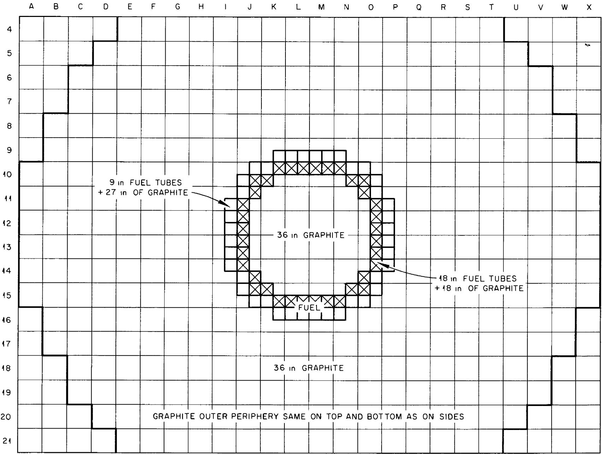  
Fig V-1 Assembly Loading at Mid-plane

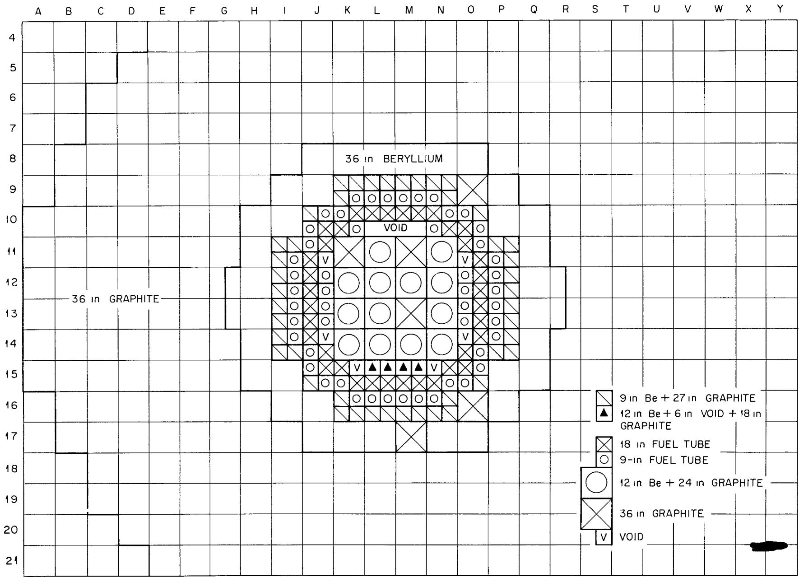  
-εG-  
Fig V-2 Assembly Loading at Mid-plane

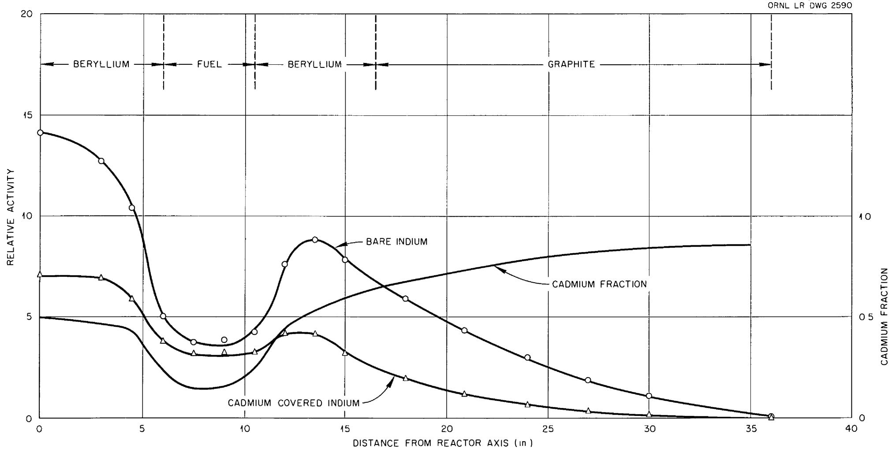  
Fig V-3 Neutron Flux Distribution in Mid plane

beryllium surrounding the fuel with the remainder of the reflector graphite, the source neutron multiplication was quadrupled The assembly was not made critical

TABLE V-1   
Radial Neutron Flux Traverse in Mid-Plane of Reactor   

<table><tr><td rowspan="2">Distance From Axis in Inches</td><td colspan="2">Relative Activity</td></tr><tr><td>Bare</td><td>Cd Covered</td></tr><tr><td>0 0</td><td>14 118</td><td>7 082</td></tr><tr><td>3 0</td><td>12 711</td><td>6 903</td></tr><tr><td>4 5</td><td>10.385</td><td>5 862</td></tr><tr><td>6 0</td><td>5 003</td><td>3 796</td></tr><tr><td>7 5</td><td>3 744</td><td>3 197</td></tr><tr><td>9 0</td><td>3 889</td><td>3 264</td></tr><tr><td>10 5</td><td>4 291</td><td>3 274</td></tr><tr><td>12 0</td><td>7 604</td><td>4 194</td></tr><tr><td>13 5</td><td>8 835</td><td>4 164</td></tr><tr><td>15 0</td><td>7 822</td><td>3 197</td></tr><tr><td>18 0</td><td>5 926</td><td>1 944</td></tr><tr><td>20 9</td><td>4 360</td><td>1 176</td></tr><tr><td>24 0</td><td>3 045</td><td>670</td></tr><tr><td>27 0</td><td>1 891</td><td>356</td></tr><tr><td>30 0</td><td>1 138</td><td>179</td></tr><tr><td>36 0</td><td>126</td><td>017</td></tr></table>

# VIa=13

# A Assembly Loading

Graphite has been suggested as a high temperature fluoride container for the fissioning volume of the RMR CA-13 was assembled to obtain a check on some of the characteristics of such a reactor A two region reactor was constructed with a 1/1 graphite to powdered fuel volume ratio in the central core and surrounded by a 12" beryllium and 6" graphite reflector as shown in Figure VI-1 The powdered fuel of CA-12 was used, and the reactor was first critical with 15 2 kg U-235 As additional fuel was added to obtain the configuration shown in Figure VI-1, stainless steel plates 0 059" thick were added around the fuel to take up the excess reactivity The reactor contained 17 2 kg of U-235 and 11 0 kg of stainless steel when loaded as shown in the figure The core shell covered 94% of the central fuel region (that is, 9" on either side of the mid-plane) which contained 68% of the fuel

# B Neutron Flux Distribution

With the stainless steel core shell in place, radial bare and cadmium covered indium traverses were taken in mid-plane of the reactor extending from M-12 to W-12 The data are shown in Table VI-1 and Figure VI-2 The associated cadmium fraction is also shown on the figure

TABLE VI-1   
Radial Flux Distribution in the Mid-Plane   

<table><tr><td colspan="2">Distance From</td><td colspan="2">Relative Activity</td></tr><tr><td>Axis in Inches</td><td>Bare Indium</td><td>Cd Covered</td><td></td></tr><tr><td>0 0</td><td>0 9628</td><td>0 8852</td><td></td></tr><tr><td>1 5</td><td>0 9628</td><td>0 9032</td><td></td></tr><tr><td>3 0</td><td>1 036</td><td>0 9184</td><td></td></tr><tr><td>6 0</td><td>1 215</td><td>1 085</td><td></td></tr><tr><td>7 5</td><td>1 336</td><td>-</td><td></td></tr><tr><td>9 0</td><td>1 514</td><td>1 330</td><td></td></tr><tr><td>10 5</td><td>2 200</td><td>1 515</td><td></td></tr><tr><td>12 0</td><td>3 502</td><td>1 842</td><td></td></tr><tr><td>13 4</td><td>3 738</td><td>1 561</td><td></td></tr><tr><td>16 5</td><td>2 718</td><td>0 7605</td><td></td></tr><tr><td>22 5</td><td>0 7759</td><td>0 0776</td><td></td></tr><tr><td>28 5</td><td>0 0815</td><td>0 0072</td><td></td></tr></table>

一∠S-  
Fig VI-1 Assembly Loading at Mid-plane   

<table><tr><td></td><td></td><td></td><td></td><td></td><td></td><td></td><td></td><td></td><td></td><td></td><td></td><td></td><td></td><td></td><td></td><td></td><td></td><td></td></tr><tr><td>5</td><td></td><td></td><td></td><td></td><td></td><td></td><td></td><td></td><td></td><td></td><td></td><td></td><td></td><td></td><td></td><td></td><td></td><td></td></tr><tr><td>6</td><td></td><td></td><td></td><td></td><td></td><td></td><td></td><td></td><td></td><td></td><td></td><td></td><td></td><td></td><td></td><td></td><td></td><td></td></tr><tr><td>7</td><td></td><td></td><td></td><td></td><td></td><td></td><td></td><td></td><td></td><td></td><td></td><td></td><td></td><td></td><td></td><td></td><td></td><td></td></tr><tr><td>8</td><td></td><td></td><td></td><td></td><td></td><td></td><td></td><td></td><td></td><td></td><td></td><td></td><td></td><td></td><td></td><td></td><td></td><td></td></tr><tr><td>9</td><td></td><td></td><td></td><td></td><td></td><td></td><td></td><td></td><td></td><td></td><td></td><td></td><td></td><td></td><td></td><td></td><td></td><td></td></tr><tr><td>10</td><td></td><td></td><td></td><td></td><td></td><td></td><td></td><td></td><td></td><td></td><td></td><td></td><td></td><td></td><td></td><td></td><td></td><td></td></tr><tr><td>11</td><td></td><td></td><td></td><td></td><td></td><td></td><td></td><td></td><td></td><td></td><td></td><td></td><td></td><td></td><td></td><td></td><td></td><td></td></tr><tr><td>12</td><td></td><td></td><td></td><td></td><td></td><td></td><td></td><td></td><td></td><td></td><td></td><td></td><td></td><td></td><td></td><td></td><td></td><td></td></tr><tr><td>13</td><td></td><td></td><td></td><td></td><td></td><td></td><td></td><td></td><td></td><td></td><td></td><td></td><td></td><td></td><td></td><td></td><td></td><td></td></tr><tr><td>14</td><td></td><td></td><td></td><td></td><td></td><td></td><td></td><td></td><td></td><td></td><td></td><td></td><td></td><td></td><td></td><td></td><td></td><td></td></tr><tr><td>15</td><td></td><td></td><td></td><td></td><td></td><td></td><td></td><td></td><td></td><td></td><td></td><td></td><td></td><td></td><td></td><td></td><td></td><td></td></tr><tr><td>16</td><td></td><td></td><td></td><td></td><td></td><td></td><td></td><td></td><td></td><td></td><td></td><td></td><td></td><td></td><td></td><td></td><td></td><td></td></tr><tr><td>17</td><td></td><td></td><td></td><td></td><td></td><td></td><td></td><td></td><td></td><td></td><td></td><td></td><td></td><td></td><td></td><td></td><td></td><td></td></tr><tr><td>18</td><td></td><td></td><td></td><td></td><td></td><td></td><td></td><td></td><td></td><td></td><td></td><td></td><td></td><td></td><td></td><td></td><td></td><td></td></tr><tr><td>19</td><td></td><td></td><td></td><td></td><td></td><td></td><td></td><td></td><td></td><td></td><td></td><td></td><td></td><td></td><td></td><td></td><td></td><td></td></tr><tr><td>20</td><td></td><td></td><td></td><td></td><td></td><td></td><td></td><td></td><td></td><td></td><td></td><td></td><td></td><td></td><td></td><td></td><td></td><td></td></tr><tr><td colspan="19">THE SAME CELL</td></tr></table>

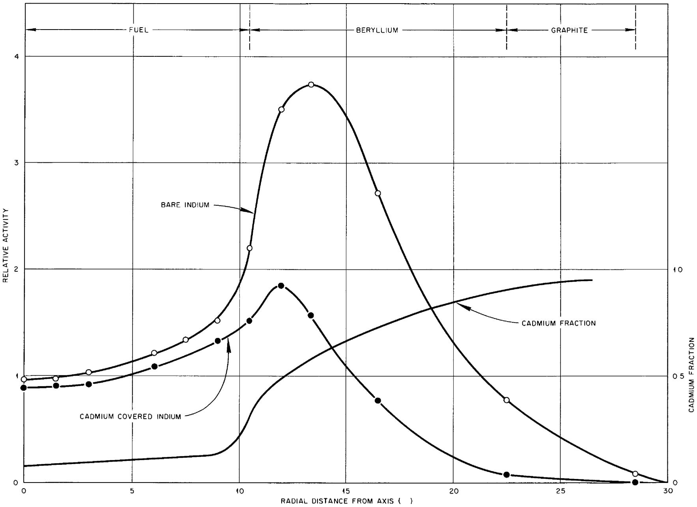  
89   
Fig VI 2 Radial Neutron Flux Distribution in Mid plane

# C Power Distribution

Power distributions were taken radially in the mid-plane from M-12 to P-12 and axially back through M-12 The traverses were obtained by placing a 0.002" uranium fuel disk and its associated aluminum catcher foil adjacent to a fuel tube The data obtained for both traverses are shown in Tables VI-2 and VI-3 and Figures VI-3 and VI-4

TABLE VI-2   
Radial Power Distribution in Mid-Plane   
TABLE VI-3   

<table><tr><td>Distance From Axis
in Inches</td><td>Relative
Activity</td></tr><tr><td>0 0</td><td>9 66</td></tr><tr><td>3 0</td><td>9 94</td></tr><tr><td>6 0</td><td>13 09</td></tr><tr><td>9.0</td><td>21 23</td></tr><tr><td>10 3</td><td>44 14</td></tr></table>

Axial Power Distribution Through M-12   

<table><tr><td>Distance From Mid-Plane
in Inches</td><td>Relative
Activity</td></tr><tr><td>1 0</td><td>9 66</td></tr><tr><td>5 1</td><td>8 95</td></tr><tr><td>9 0</td><td>9 18</td></tr><tr><td>13 0</td><td>10 34</td></tr><tr><td>17 0</td><td>25 31</td></tr></table>

Three uranium foils were covered with O 020" of cadmium and placed in radial positions in the mid-plane The fuel cadmium fraction, as determined from the activity of these foils together with the activities of similarly placed foils for the radial power distribution, are plotted as a function of the square of the radial distance from the reactor axis in Figure VI-5 Table VI-4 shows the data from which the curve was constructed This gives an average of very nearly $50\%$ thermal fissions in the mid-plane of the reactor.

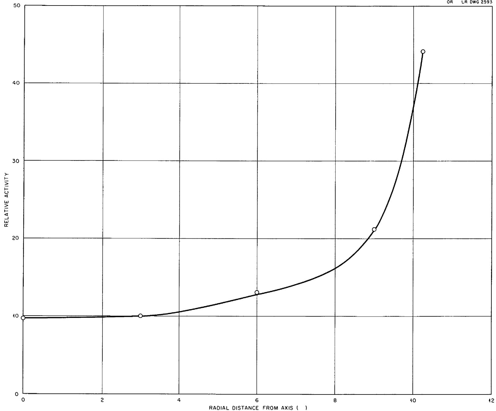  
09   
Fig VI 3 Radial Power Distribution in Mid plane

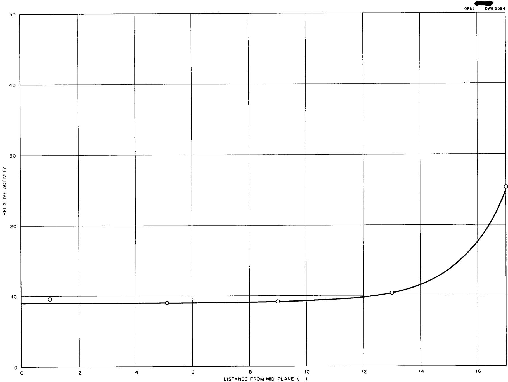  
Fig VI 4 Axial Power Distribution Through M 12

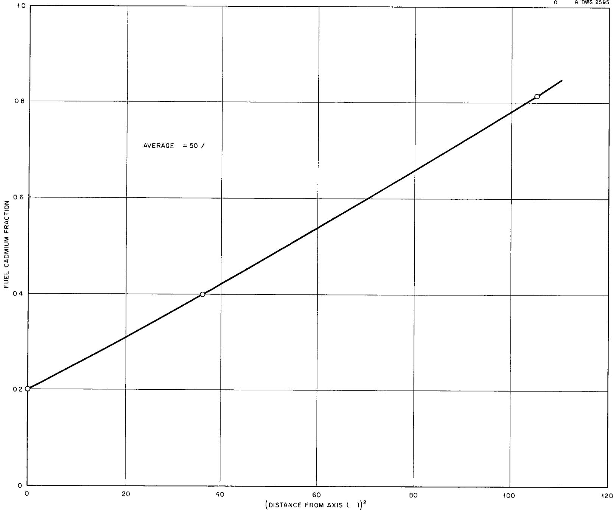  
29   
Fg VI 5 Radial Fuel Cadmium Factions

TABLE VI-4   
Fuel Cadmium Fractions in the Mid-Plane   
VII CA-14   

<table><tr><td>Distance From
Axis in Inches</td><td>Cadmium
Fraction</td></tr><tr><td>0 0</td><td>0 200</td></tr><tr><td>6 0</td><td>0 399</td></tr><tr><td>10 3</td><td>0 813</td></tr></table>

# A Critical Loadings

The final assembly was built up with a geometry similar to that used in CA-11 The aim of the experiment was to insert materials in the reactor that would simulate the structural poisons that would be present in a full scale reactor in the power range of 50 to 200 megawatts The assembly was loaded as shown in Figures VII-1 and VII-2 and contained 18 2 kg of U-235 in the 0.42 gm U-235/cc fuel mixture described in Section V In general the reactor was maintained critical with two different sets of poisons The first set of poisons included

1 Boral sheets $(9'' x 2 - 7/8'' x 1/4'')$ which surrounded the fuel end ducts on the stationary table. This Boral extended from the end of the assembly to a point $9''$ from the central fuel region, thus $4 - 1/2''$ of the end ducts were covered. Boral sheets $(1 - 1/4'' x 2 - 7/8'' x 1/4'')$ were placed around the fuel end ducts on the movable table. These sheets extended from the end of the fuel ducts to a point $7 - 3/4''$ from the central fuel region   
2 Stainless steel sheets (0 146" thick) covered $96 \%$ of the inside fuel surface The outside fuel surface was uncovered from the interface of the assembly back $4 - 1 / 2"$ on the stationary table The fuel surface exposed at the assembly interface and the corresponding surface at the opposite end of the central fuel region were left uncovered The remaining outside fuel surface was $96 \%$ covered with O 118" thick stainless steel sheets The total weight of the stainless steel was 25 5 kg

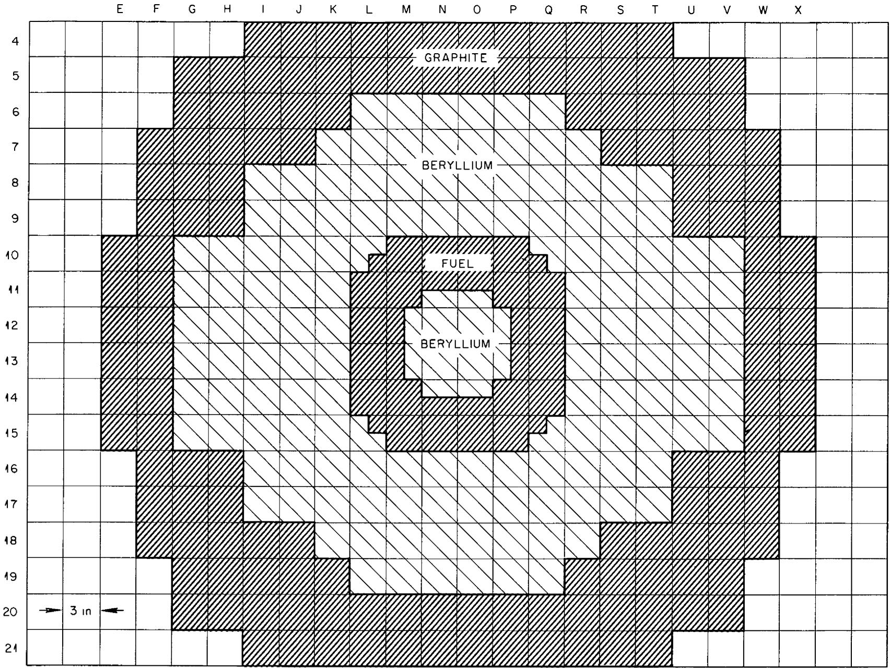  
-29-   
Fig VII-1 Assembly Loading at Mid-plane (No Structure Shown)

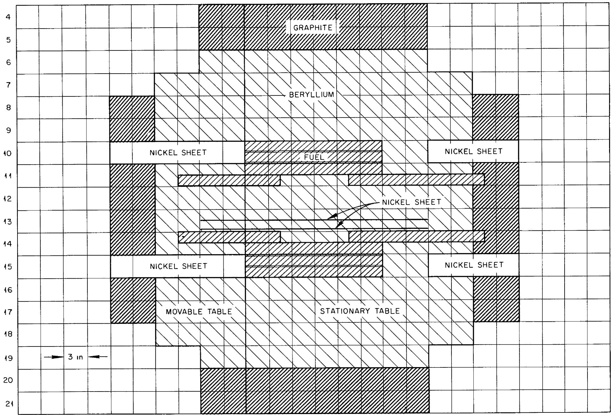  
Fig VII-2 Axial Assembly Loading in Vertical Plane Containing Reactor Axis

3 Nickel sheets 2-7/8" wide and 0 ol' thick were in the positions indicated in Figures VII-2 and VII-3

In addition to the above poisons, $177 \mathrm{in}^3$ of beryllium were added to the fuel region. Of this total, $150 \mathrm{in}^3$ were distributed symmetrically throughout the outer three fuel layers from 0 to 18 inches back on the stationary table. An additional $6 \mathrm{in}^3$ were distributed symmetrically throughout the inner $4-1/2''$ long fuel layer adjacent to the assembly interface on the stationary table. The remaining $24 \mathrm{in}^3$ of beryllium were symmetrically distributed throughout the fuel region on the movable table

During this series of experiments reactivity values were obtained for one sheet of nickel (24" x 2-7/8" x 0 010") placed in a horizontal position across the top of cell K-12, and for the extension of the reflector from 9" to 12" of beryllium on the sides of the reactor The insertion of the nickel sheet resulted in a loss in reactivity of 8 cents The replacement of graphite by beryllium in cells G-10 through 15 and cells V-10 through 15 and the addition of graphite to cells E-10 through 15 and X-10 through 15 resulted in a gain in reactivity of 96 cents

The second set of poison distributions involved the following changes

1 The entire fuel surface was $95 \%$ covered by 27 8 kg of stainless steel   
2 All the Boral around the end ducts was removed.   
3 The rest of the assembly was as described previously.

The remaining measurements described were obtained with the reactor containing this second set of poison distributions

B Importance Function of Three Stainless Steel Rods

The loss in reactivity due to three 316 stainless steel rods was determined at three radial positions in the reflector and at one position in the island The rods were $3 / 16''$ in diameter, and $36''$ long and each weighed $132\mathrm{gm}$ They were inserted as skewers in the various cells and extended through the entire shish on the stationary table The data obtained are shown in Table VII-1

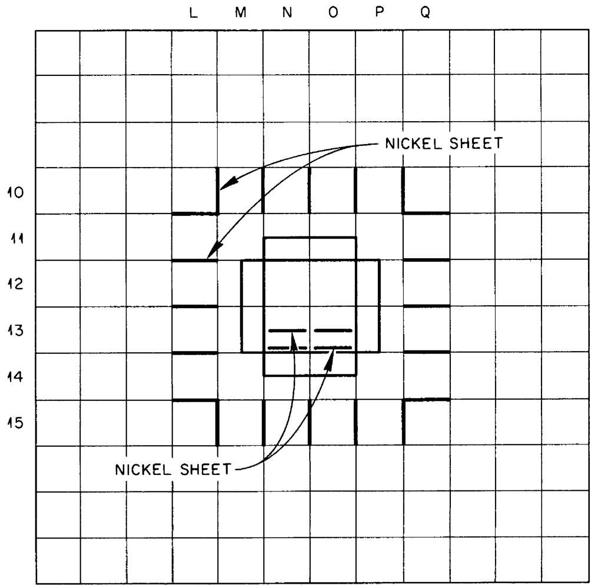  
Fig VII-3 Position of Nickel Sheets on the Stationary and Movable Tables

TABLE VII-1   
Importance Function of Three Stainless Steel Rods   

<table><tr><td>Average Distance of Rods
From Axis in Inches</td><td>Loss in Reactivity
in Cents</td></tr><tr><td>2 3</td><td>23 1</td></tr><tr><td>10 8</td><td>17 6</td></tr><tr><td>13 7</td><td>12 0</td></tr><tr><td>16 7</td><td>6 0</td></tr></table>

# C Thermal Neutron Leakage

Thermal neutron leakage was determined at the end and side of the reactor, both with and without Boral shielding around the end fuel ducts. These measurements were taken with 0, $1/8$ , $1/4$ , and $3/8$ thicknesses of Boral surrounding the U-235 fission chamber that was used

The side leakage was measured with the U-235 fission chamber located in cell D-12 The geometrical center of the chamber rested 12" back of the interface on the stationary table or 3" back of the mid-plane of the reactor The axis of the chamber was approximately $1 - 1 / 2$ from the edge of the graphite side reflector and was parallel to the reactor axis The Boral layers surrounding the chamber were in the form of concentric cylindrical sleeves that extended from the interface of the stationary table back 24" The inside diameter of the inner most layer was 2", and the outside diameter of the outer most layer, using 3 layers, was about $2 - 3 / 4$ " The ends of the Boral sleeves were not capped

The end leakage was determined with the fission chamber placed 5-1/2" back of the end graphite reflector. The axis of the chamber was parallel to the floor and perpendicular to the axis of the reactor, which passed through the geometrical center of the chamber. The data obtained are shown in Table VII-2 and Figure VII-4. All measurements are shown relative to the side leakage without any Boral shielding around the chamber or in the reactor

# D Power Distribution

A radial power distribution was taken in the mid-plane across the fuel annulus (cells P-12 and Q-12) The traverse was obtained by placing uranium and aluminum foils between the vertically adjacent fuel tubes in the cells The data obtained are shown in Table VII-3 and Figure VII-5

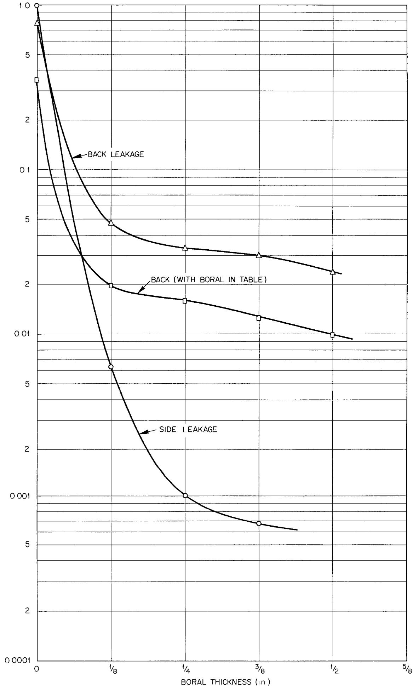  
THERMAL FLUX (arbitrary units)   
Fig VII-4 Thermal Flux Leakage vs Boral Thickness

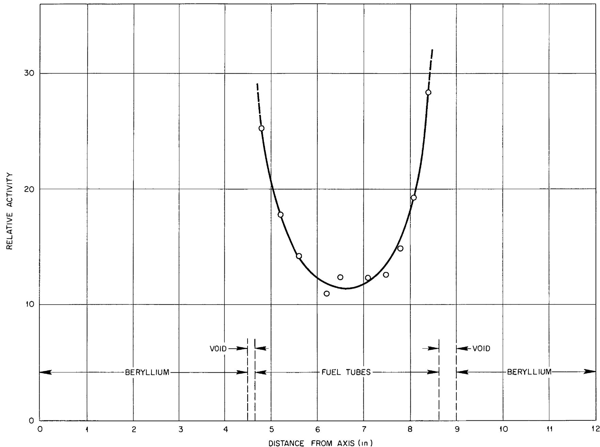  
-0∠-   
Fig VII-5 Power Distribution across Fuel Annulus at Mid-plane

TABLE VII-2   
Thermal Neutron Leakage   

<table><tr><td>Layers of 1/8&quot; Boral* Around Counter</td><td>Counter Position</td><td>Boral Around End Ducts</td><td>Relative Activity</td></tr><tr><td>0</td><td>Side</td><td>No</td><td>1 000</td></tr><tr><td>1</td><td>Side</td><td>No</td><td>0 00635</td></tr><tr><td>2</td><td>Side</td><td>No</td><td>0 00103</td></tr><tr><td>3</td><td>Side</td><td>No</td><td>0 000676</td></tr><tr><td>0</td><td>End</td><td>No</td><td>0 777</td></tr><tr><td>1</td><td>End</td><td>No</td><td>0 0466</td></tr><tr><td>2</td><td>End</td><td>No</td><td>0.0332</td></tr><tr><td>3</td><td>End</td><td>No</td><td>0 0301</td></tr><tr><td>4</td><td>End</td><td>No</td><td>0.0235</td></tr><tr><td>0</td><td>End</td><td>Yes</td><td>0 352</td></tr><tr><td>1</td><td>End</td><td>Yes</td><td>0 0197</td></tr><tr><td>2</td><td>End</td><td>Yes</td><td>0 0160</td></tr><tr><td>3</td><td>End</td><td>Yes</td><td>0 0125</td></tr><tr><td>4</td><td>End</td><td>Yes</td><td>0 00992</td></tr></table>

$*0$ 161 gm B/cm²/Layer of Boral present

TABLE VII-3   
Power Distribution Across Fuel Annulus at Mid-plane   

<table><tr><td>Distance From Axis
in Inches</td><td>Relative Activity</td></tr><tr><td>4 8</td><td>25 30</td></tr><tr><td>5 2</td><td>17 86</td></tr><tr><td>5 6</td><td>14 24</td></tr><tr><td>6.2</td><td>10 97</td></tr><tr><td>6 5</td><td>12 40</td></tr><tr><td>7 1</td><td>12 35</td></tr><tr><td>7.5</td><td>12 63</td></tr><tr><td>7.8</td><td>14 87</td></tr><tr><td>8 1</td><td>19 32</td></tr><tr><td>8 4</td><td>28 34</td></tr></table>

# APPENDIX "A"

Summary of Materials in Reactor Assemblies

CA-10   

<table><tr><td>Island</td><td>Mass kg</td><td>Volume cm3 x 10-3</td><td>Mass Fraction</td><td>Volume Fraction</td><td>Average* Density gm/cm3</td></tr><tr><td>Beryllium</td><td>48 1</td><td>26 0</td><td>911</td><td>918</td><td>1 699</td></tr><tr><td>2S Al Matrix</td><td>4 5</td><td>1 6</td><td>085</td><td>058</td><td>0 158</td></tr><tr><td>24S Al Skewers</td><td>0 2</td><td>0 1</td><td>003</td><td>002</td><td>0 008</td></tr><tr><td>Stainless Steel skewer</td><td>-</td><td>-</td><td>-</td><td>-</td><td>0 024</td></tr><tr><td>Void</td><td>-</td><td>0 6</td><td>-</td><td>021</td><td>-</td></tr></table>

The island contained eleven aluminum and one steel skewer They were placed in the outer island cells

Fuel Annulus (Includes beryllium region required to close annulus)   

<table><tr><td>Sodium</td><td>52 4</td><td>52 5</td><td>486</td><td>734</td><td>0 805</td></tr><tr><td>Uranium</td><td>16 1</td><td>0 9</td><td>149</td><td>012</td><td>0 265</td></tr><tr><td></td><td></td><td></td><td></td><td></td><td>0 161</td></tr><tr><td colspan="6">304 Stainless</td></tr><tr><td>Steel Boxes</td><td>14 3</td><td>1 8</td><td>132</td><td>025</td><td>0 220</td></tr><tr><td>2S Al Matrix</td><td>11 1</td><td>5 4</td><td>103</td><td>075</td><td>0 158</td></tr><tr><td>24S Al Skewers</td><td>0 6</td><td>0 2</td><td>005</td><td>003</td><td>0 008</td></tr><tr><td colspan="6">Stainless Steel</td></tr><tr><td>skewer</td><td>-</td><td>-</td><td>-</td><td>-</td><td>0 024</td></tr><tr><td>Al Caps</td><td>7 4</td><td>2 7</td><td>068</td><td>038</td><td>-</td></tr><tr><td>Beryllium</td><td>6 0</td><td>3 3</td><td>056</td><td>045</td><td>1 699</td></tr><tr><td>Void</td><td>-</td><td>4 8</td><td>-</td><td>067</td><td>-</td></tr></table>

The lower uranium density reported refers to the fuel region behind the island The higher figure refers to the remainder of the fuel region

Reflector (Beryllium)   

<table><tr><td>Beryllium</td><td>1521 6</td><td>822 5</td><td>914</td><td>918</td><td>1 699</td></tr><tr><td>2S Al Matrix</td><td>141 6</td><td>52 1</td><td>085</td><td>058</td><td>0 158</td></tr><tr><td>24S Al Skewers</td><td>0 9</td><td>0 3</td><td>-</td><td>-</td><td>0 008</td></tr><tr><td>Stainless Steel skewers</td><td>0 8</td><td>0 1</td><td>-</td><td>-</td><td>0 025</td></tr><tr><td>Void</td><td>-</td><td>20 5</td><td>-</td><td>023</td><td>-</td></tr></table>

CA-10 - Continued

<table><tr><td></td><td>Mass
kg</td><td>Volume
cm3 x 10-3</td><td>Mass
Fraction</td><td>Volume
Fraction</td><td>Average*
Density
gm/cm3</td></tr><tr><td colspan="6">Reflector (Graphite)</td></tr><tr><td>Graphite</td><td>16735</td><td>9747</td><td>907</td><td>898</td><td>1542</td></tr><tr><td>2S Al Matrix</td><td>1716</td><td>631</td><td>093</td><td>058</td><td>0158</td></tr><tr><td>Void</td><td>-</td><td>477</td><td>-</td><td>044</td><td>-</td></tr></table>

* The average densities reported are for a unit cell (9"² cross-sectional area) in which the material was actually present

CA-11   

<table><tr><td></td><td>Mass
kg</td><td>Volume
cm3 x 10-3</td><td>Mass
Fraction</td><td>Volume
Fraction</td><td>Average
Density
gm/cm3</td></tr><tr><td colspan="6">Island (Includes Be Region enclosed by end ducts)</td></tr><tr><td>Beryllium</td><td>57 1</td><td>30 9</td><td>912</td><td>918</td><td>1 699</td></tr><tr><td>2S Al matrix</td><td>5 3</td><td>2 0</td><td>085</td><td>058</td><td>0 158</td></tr><tr><td>24S Al skewers</td><td>0 2</td><td>0 1</td><td>003</td><td>002</td><td>0 008</td></tr><tr><td>Void</td><td>-</td><td>0 7</td><td>-</td><td>021</td><td>-</td></tr></table>

The island contained 16 skewers, which were placed in the outer beryllium shishes (9" length)

Fuel Annulus (Includes end ducts)   

<table><tr><td colspan="6">Fuel Mixture</td></tr><tr><td>Including Uarnium</td><td>64 4</td><td>35 0</td><td>620</td><td>527</td><td>-</td></tr><tr><td>Uranium</td><td>8 2</td><td>-</td><td>079</td><td>-</td><td>0 123</td></tr><tr><td>UF4</td><td>-</td><td>-</td><td>-</td><td>-</td><td>0 163</td></tr><tr><td>ZrO2</td><td>-</td><td>-</td><td>-</td><td>-</td><td>0 553</td></tr><tr><td>NaF</td><td>-</td><td>-</td><td>-</td><td>-</td><td>0 200</td></tr><tr><td>C</td><td>-</td><td>-</td><td>-</td><td>-</td><td>0 088</td></tr><tr><td>2S Al Matrix</td><td>10 5</td><td>3 9</td><td>098</td><td>058</td><td>0 158</td></tr><tr><td>Al Fuel Tubes and Spacers</td><td>28 6</td><td>10 5</td><td>275</td><td>159</td><td>0 443</td></tr><tr><td>Stainless Steel Nuts</td><td>0 8</td><td>0 1</td><td>007</td><td>001</td><td>-</td></tr><tr><td>Void</td><td>-</td><td>16 9</td><td>-</td><td>254</td><td>-</td></tr></table>

The weight of the fuel mixture includes 360 grams of uranium present as disks

Each fuel tube had a stainless steel nut on both ends

Reflector (Beryllium)   

<table><tr><td>Beryllium</td><td>1518 6</td><td>820 9</td><td>914</td><td>918</td><td>1 699</td></tr><tr><td>2S Al Matrix</td><td>141 3</td><td>52 0</td><td>085</td><td>058</td><td>0 158</td></tr><tr><td>24S Al Skewers</td><td>0 8</td><td>0 3</td><td>-</td><td>-</td><td>0 008</td></tr><tr><td>Stainless Steel skewers</td><td>0 8</td><td>0 1</td><td>-</td><td>-</td><td>0 024</td></tr><tr><td>Void</td><td>-</td><td>20 5</td><td>-</td><td>023</td><td>-</td></tr><tr><td colspan="6">Reflector (Graphite)</td></tr><tr><td>Graphite</td><td>1626 677</td><td>947 4</td><td>906</td><td>898</td><td>1 542</td></tr><tr><td>2S Al Matrix</td><td>166 831</td><td>61 3</td><td>093</td><td>058</td><td>0 158</td></tr><tr><td colspan="6">CA-12 Variation I (Graphite island and reflector)</td></tr><tr><td></td><td>Mass
kg</td><td>Volume
cm3x 10-3</td><td>Mass
Fraction</td><td>Volume
Fraction</td><td>Average
Density
gm/cm3</td></tr><tr><td colspan="6">Island (Includes region enclosed by fuel annulus)</td></tr><tr><td>Graphite</td><td>180 1</td><td>104 9</td><td>903</td><td>898</td><td>1 542</td></tr><tr><td>2S Al Matrix</td><td>18 5</td><td>6 8</td><td>093</td><td>058</td><td>0 158</td></tr><tr><td>Stainless Steel
skewers</td><td>0 8</td><td>0 1</td><td>004</td><td>001</td><td>0 024</td></tr><tr><td>Void</td><td>-</td><td>5 0</td><td>-</td><td>043</td><td>-</td></tr><tr><td colspan="6">Fuel Annulus</td></tr><tr><td>Fuel Mixture</td><td>75 3</td><td>40 5</td><td>622</td><td>545</td><td>-</td></tr><tr><td>(Including Uranium)</td><td></td><td></td><td></td><td></td><td></td></tr><tr><td>Uranium</td><td>18 5</td><td>-</td><td>153</td><td>-</td><td>0 249</td></tr><tr><td>UF4</td><td>-</td><td>-</td><td>-</td><td>-</td><td>0 329</td></tr><tr><td>ZrO2</td><td>-</td><td>-</td><td>-</td><td>-</td><td>0 449</td></tr><tr><td>NaF</td><td>-</td><td>-</td><td>-</td><td>-</td><td>0 163</td></tr><tr><td>C</td><td>-</td><td>-</td><td>-</td><td>-</td><td>0 072</td></tr><tr><td>Al Fuel Tubes</td><td>33 0</td><td>12 1</td><td>273</td><td>163</td><td>0 443</td></tr><tr><td>2S Al Matrix</td><td>11 8</td><td>4 3</td><td>097</td><td>058</td><td>0 158</td></tr><tr><td>Stainless Steel
Nuts</td><td>1 0</td><td>0 1</td><td>008</td><td>002</td><td>-</td></tr><tr><td>Void</td><td>-</td><td>-</td><td>-</td><td>232</td><td>-</td></tr><tr><td colspan="6">Reflector</td></tr><tr><td>Graphite</td><td>6738 5</td><td>3965 1</td><td>906</td><td>900</td><td>1 542</td></tr><tr><td>2S Al Matrix</td><td>696 8</td><td>256 2</td><td>094</td><td>058</td><td>0 158</td></tr><tr><td>Stainless Steel
Skewers</td><td>0 8</td><td>0 1</td><td>-</td><td>-</td><td>0 024</td></tr><tr><td>Void</td><td>-</td><td>185 4</td><td>-</td><td>042</td><td>-</td></tr><tr><td colspan="6">The outer 128 cells were filled with AGET Graphite in all CA-12
configurations All other graphite is AGOT</td></tr><tr><td colspan="6">Variation II (Combination graphite and beryllium
island and reflector)</td></tr><tr><td colspan="6">Island</td></tr><tr><td>Beryllium</td><td>82 2</td><td>44 4</td><td>515</td><td>472</td><td>1 699</td></tr><tr><td>Graphite</td><td>61 8</td><td>36 1</td><td>387</td><td>383</td><td>1 542</td></tr><tr><td>2S Al Matrix</td><td>14 9</td><td>5 5</td><td>093</td><td>058</td><td>0 158</td></tr><tr><td>Stainless Steel
skewers</td><td>0 8</td><td>0 1</td><td>005</td><td>001</td><td>0.024</td></tr><tr><td>Void</td><td>-</td><td>8 0</td><td>-</td><td>085</td><td>-</td></tr></table>

CA-12 - continued   

<table><tr><td></td><td>Mass
kg</td><td>Volume
cm3 x 10-3</td><td>Mass
Fraction</td><td>Volume
Fraction</td><td>Average
Density
gm/cm3</td></tr><tr><td colspan="6">Fuel Annulus</td></tr><tr><td>Fuel Mixture</td><td>82 0</td><td>44 1</td><td>608</td><td>415</td><td>-</td></tr><tr><td>Including Uranium</td><td></td><td></td><td></td><td></td><td></td></tr><tr><td>Uranium</td><td>19 6</td><td>-</td><td>146</td><td>-</td><td>-</td></tr><tr><td>Al Fuel Tubes</td><td>35 0</td><td>12 9</td><td>260</td><td>121</td><td>0 443</td></tr><tr><td>2S Al Matrix</td><td>16 8</td><td>6 2</td><td>124</td><td>058</td><td>0 158</td></tr><tr><td>Stainless Steel</td><td></td><td></td><td></td><td></td><td></td></tr><tr><td>Nuts</td><td>1 1</td><td>0 1</td><td>008</td><td>001</td><td>-</td></tr><tr><td>Void</td><td>-</td><td>42 9</td><td>-</td><td>404</td><td>-</td></tr><tr><td colspan="6">Reflector (Be and Graphite)</td></tr><tr><td>Beryllium</td><td>681 1</td><td>368 2</td><td>470</td><td>450</td><td>1 699</td></tr><tr><td>Graphite</td><td>639 7</td><td>372 6</td><td>441</td><td>456</td><td>1 542</td></tr><tr><td>2S Al Matrix</td><td>129 3</td><td>47 5</td><td>089</td><td>058</td><td>0 158</td></tr><tr><td>Void</td><td>-</td><td>29 3</td><td>-</td><td>036</td><td>-</td></tr><tr><td colspan="6">Reflector (Graphite - includes only the region outside the Be
reflector)</td></tr><tr><td>Graphite</td><td>5674 4</td><td>3345 6</td><td>906</td><td>900</td><td>1 542</td></tr><tr><td>2S Al Matrix</td><td>587 7</td><td>216 1</td><td>094</td><td>058</td><td>0 158</td></tr><tr><td>Void</td><td>-</td><td>154 9</td><td>-</td><td>042</td><td>-</td></tr><tr><td colspan="6">Variation III - (Two Region)</td></tr><tr><td colspan="6">Core</td></tr><tr><td>Fuel Mixture</td><td>75 3</td><td>40 5</td><td>622</td><td>545</td><td>-</td></tr><tr><td>Including Uranium</td><td></td><td></td><td></td><td></td><td></td></tr><tr><td>Uranium</td><td>18 5</td><td>-</td><td>153</td><td>-</td><td>-</td></tr><tr><td>Al Fuel Tubes</td><td>33 0</td><td>12 1</td><td>273</td><td>163</td><td>0 443</td></tr><tr><td>Al Matrix</td><td>11 8</td><td>4 3</td><td>097</td><td>058</td><td>0 158</td></tr><tr><td>Stainless Steel</td><td></td><td></td><td></td><td></td><td></td></tr><tr><td>Nuts</td><td>1 0</td><td>0 1</td><td>008</td><td>002</td><td>-</td></tr><tr><td>Void</td><td>-</td><td>19 3</td><td>-</td><td>232</td><td>-</td></tr><tr><td colspan="6">Reflector (Be + Graphite)</td></tr><tr><td>Beryllium</td><td>559 3</td><td>302 3</td><td>676</td><td>662</td><td>1 699</td></tr><tr><td>Al Matrix</td><td>72 2</td><td>26 5</td><td>087</td><td>058</td><td>0 158</td></tr><tr><td>Graphite</td><td>196 5</td><td>114 4</td><td>237</td><td>251</td><td>1 542</td></tr><tr><td>Void</td><td>-</td><td>13 3</td><td>-</td><td>029</td><td>-</td></tr></table>

CA-12 - Continued   

<table><tr><td></td><td>Masskg</td><td>Volumecm3 x 10-3</td><td>MassFraction</td><td>VolumeFraction</td><td>AverageDensitygm/cm3</td></tr><tr><td colspan="6">Reflector (Graphite)</td></tr><tr><td>Graphite</td><td>63620</td><td>37461</td><td>906</td><td>900</td><td>1542</td></tr><tr><td>Al Matrix</td><td>6582</td><td>2420</td><td>094</td><td>058</td><td>0158</td></tr><tr><td>Void</td><td>-</td><td>1745</td><td>-</td><td>042</td><td>-</td></tr><tr><td colspan="6">CA-13</td></tr><tr><td colspan="6">Core</td></tr><tr><td>Fuel Mixture</td><td>753</td><td>405</td><td>297</td><td>266</td><td>-</td></tr><tr><td colspan="6">Including Uranium</td></tr><tr><td>Uranium</td><td>185</td><td>-</td><td>073</td><td>-</td><td>-</td></tr><tr><td>UF4</td><td>-</td><td>-</td><td>-</td><td>-</td><td>0164</td></tr><tr><td>ZrO2</td><td>-</td><td>-</td><td>-</td><td>-</td><td>0224</td></tr><tr><td>NaF</td><td>-</td><td>-</td><td>-</td><td>-</td><td>0081</td></tr><tr><td>C</td><td>-</td><td>-</td><td>-</td><td>-</td><td>0036</td></tr><tr><td>Graphite</td><td>1207</td><td>703</td><td>475</td><td>463</td><td>0771</td></tr><tr><td>Al Fuel Tubes</td><td>330</td><td>121</td><td>130</td><td>080</td><td>0221</td></tr><tr><td>Al Matrix</td><td>240</td><td>88</td><td>094</td><td>058</td><td>0158</td></tr><tr><td colspan="6">Stainless Steel</td></tr><tr><td>Nuts</td><td>10</td><td>01</td><td>004</td><td>001</td><td>-</td></tr><tr><td>Void</td><td>-</td><td>200</td><td>-</td><td>131</td><td>-</td></tr><tr><td colspan="6">Reflector (Beryllium)</td></tr><tr><td>Beryllium</td><td>16547</td><td>8944</td><td>914</td><td>918</td><td>1699</td></tr><tr><td>Al Matrix</td><td>1540</td><td>566</td><td>085</td><td>058</td><td>0158</td></tr><tr><td>Al Skewers</td><td>04</td><td>02</td><td>-</td><td>-</td><td>0008</td></tr><tr><td>Stainless Steelskewers</td><td>13</td><td>02</td><td>001</td><td>-</td><td>0024</td></tr><tr><td>Void</td><td>-</td><td>224</td><td>-</td><td>023</td><td>-</td></tr><tr><td colspan="6">Reflector (Graphite)</td></tr><tr><td>Graphite</td><td>20714</td><td>12064</td><td>907</td><td>898</td><td>1542</td></tr><tr><td>Al Matrix</td><td>2124</td><td>781</td><td>034</td><td>058</td><td>0158</td></tr><tr><td>Void</td><td>-</td><td>590</td><td>-</td><td>044</td><td>-</td></tr></table>

CA-14   

<table><tr><td colspan="6">Island (Includes Be Region enclosed by End Ducts)</td></tr><tr><td></td><td>Masskg</td><td>Volumecm3x 10-3</td><td>MassFraction</td><td>VolumeFraction</td><td>AverageDensitygm/cm3</td></tr><tr><td>Beryllium</td><td>57 1</td><td>30 9</td><td>905</td><td>918</td><td>1 699</td></tr><tr><td>Al Matrix</td><td>5 3</td><td>2 0</td><td>084</td><td>058</td><td>0 158</td></tr><tr><td>Nickel</td><td>0 5</td><td>0 1</td><td>008</td><td>002</td><td>0 028</td></tr><tr><td>Al Skewers</td><td>0 2</td><td>0 1</td><td>003</td><td>002</td><td>0 008</td></tr><tr><td>Void</td><td>-</td><td>0 7</td><td>-</td><td>020</td><td>-</td></tr><tr><td colspan="6">Fuel Annulus (Including End Ducts)</td></tr><tr><td>Fuel Mixture</td><td>81 3</td><td>43 7</td><td>596</td><td>544</td><td>-</td></tr><tr><td>Including Uranium</td><td></td><td></td><td></td><td></td><td></td></tr><tr><td>Uranium</td><td>19 6</td><td>-</td><td>143</td><td>-</td><td>0 249</td></tr><tr><td>Al Fuel Tubes</td><td>36 0</td><td>13 2</td><td>264</td><td>165</td><td>0 443</td></tr><tr><td>Aluminum Matrix</td><td>12 7</td><td>4 7</td><td>093</td><td>058</td><td>0 158</td></tr><tr><td>Beryllium</td><td>5 4</td><td>2 9</td><td>039</td><td>,036</td><td>-</td></tr><tr><td>Stainless Steel</td><td></td><td></td><td></td><td></td><td></td></tr><tr><td>Nuts</td><td>1 1</td><td>0 1</td><td>008</td><td>002</td><td>-</td></tr><tr><td>Void</td><td>-</td><td>15 7</td><td>-</td><td>195</td><td>-</td></tr><tr><td colspan="6">Reflector (Beryllium)</td></tr><tr><td>Beryllium</td><td>1559 0</td><td>842 7</td><td>913</td><td>918</td><td>1 699</td></tr><tr><td>Al Matrix</td><td>145 1</td><td>53 3</td><td>085</td><td>058</td><td>0 158</td></tr><tr><td>Nickel</td><td>1 8</td><td>2</td><td>001</td><td>0002</td><td>0 028</td></tr><tr><td>Stainless Steel</td><td></td><td></td><td></td><td></td><td></td></tr><tr><td>Skewers</td><td>0 8</td><td>1</td><td>0004</td><td>0001</td><td>0 024</td></tr><tr><td>Al Skewers</td><td>0 8</td><td>3</td><td>0005</td><td>0003</td><td>0 008</td></tr><tr><td>Void</td><td>-</td><td>20 9</td><td>-</td><td>023</td><td>-</td></tr><tr><td colspan="6">Reflector (Graphite)</td></tr><tr><td>Graphite</td><td>1255 1</td><td>731 0</td><td>906</td><td>898</td><td>1 542</td></tr><tr><td>Al Matrix</td><td>128 7</td><td>47 3</td><td>093</td><td>058</td><td>0 158</td></tr><tr><td>Nickel</td><td>1 2</td><td>1</td><td>001</td><td>-</td><td>0 028</td></tr><tr><td>Void</td><td>-</td><td>35 6</td><td>-</td><td>044</td><td>-</td></tr></table>

# APPENDIX B

# Analysis of Materials in Weight Per Cent

<table><tr><td>Material</td><td>Assembly</td><td></td><td>Ag</td><td>Al</td><td>B</td><td>Ba</td><td>Be</td><td>Ca</td><td>Cd</td><td>Co</td><td>Cr</td><td>Cu</td><td>Fe</td><td>Mg</td><td>Mn</td><td>Mo</td><td>Na</td><td>Ni</td><td>Pb</td><td>Si</td><td>Sn</td><td>Sr</td><td>Ta</td><td>Ti</td><td>V</td><td>W</td><td>Zn</td><td>Zr</td></tr><tr><td>Al Matrix</td><td>All</td><td>wt %</td><td>&lt;0 04</td><td>0 2</td><td>&lt;0 01</td><td>&lt;0 04</td><td>0 001</td><td>0 08</td><td></td><td>&lt;0 08</td><td>0 15</td><td>0 15</td><td>0 5</td><td>0 2</td><td>0 3</td><td>&lt;0 08</td><td>&lt;1 0</td><td>0 3</td><td>&lt;0 08</td><td>2 5</td><td>&lt;0 08T</td><td>&lt;0 1</td><td></td><td>0 2</td><td>&lt;0 08</td><td></td><td>&lt;0 3</td><td>&lt;0 15</td></tr><tr><td>Beryllium</td><td>All</td><td>wt %</td><td></td><td>0 05</td><td></td><td>&lt;0 02</td><td></td><td>&lt;0 1</td><td></td><td>&lt;0 05</td><td>&lt;0 05</td><td>&lt;0 05</td><td>0 05</td><td>&lt;0 01T</td><td>&lt;0 01</td><td>&lt;0 02</td><td></td><td>&lt;0 05</td><td>&lt;0 1</td><td>&lt;0 05</td><td></td><td></td><td></td><td>&lt;0 02</td><td>&lt;0 02</td><td></td><td>&lt;0 2</td><td>&lt;0 1</td></tr><tr><td>Stainless Steel (Core Shells)</td><td>10 11</td><td>wt %</td><td></td><td>&lt;0 05</td><td></td><td>&lt;0 02</td><td>&lt;0 001</td><td>&lt;0 1</td><td></td><td>0 5</td><td></td><td>0 3</td><td></td><td>&lt;0 01</td><td>1</td><td>&lt; 02</td><td></td><td></td><td>&lt;0 1</td><td>2</td><td></td><td></td><td></td><td>&lt; 02</td><td>0 05</td><td></td><td>&lt;0 2</td><td>&lt;0 1</td></tr><tr><td>Nickel Sheet</td><td>14</td><td>wt %</td><td></td><td>&lt;0 05</td><td></td><td>&lt;0 02</td><td>&lt;0 001</td><td>&lt;0 1</td><td></td><td>0 2</td><td></td><td>0 3</td><td>2</td><td>0 1</td><td>0 2</td><td>&lt; 02</td><td></td><td></td><td>&lt;0 1</td><td>0 1</td><td></td><td></td><td></td><td>&lt;0 02</td><td>&lt;0 02</td><td></td><td>&lt;0 2</td><td>&lt;0 1</td></tr><tr><td>Nickel Sample</td><td>11</td><td>wt %</td><td></td><td>&lt;0 05</td><td></td><td>&lt;0 02</td><td>&lt;0 001</td><td>&lt;0 1</td><td></td><td>1</td><td>0 05</td><td>0 3</td><td>1</td><td>0 05</td><td>0 4</td><td>&lt;0 02</td><td></td><td></td><td>&lt;0 1</td><td>0 2</td><td></td><td></td><td></td><td>0 05</td><td>&lt;0 02</td><td></td><td>&lt;0 2</td><td>&lt;0 1</td></tr><tr><td>Inconel Sample</td><td>11</td><td>wt %</td><td></td><td>0 3</td><td></td><td>&lt;0 02</td><td>&lt;0 001</td><td>&lt;0 1</td><td></td><td>1</td><td></td><td>0 3</td><td></td><td>0 02</td><td>1</td><td>&lt;0 02</td><td></td><td></td><td>&lt;0 1</td><td>1</td><td></td><td></td><td></td><td>0 3</td><td>0 05</td><td></td><td>&lt;0 2</td><td>&lt;0 1</td></tr><tr><td>Bismuth Sample</td><td>10 11</td><td>wt %</td><td></td><td>&lt;0 05</td><td></td><td>&lt;0 02</td><td>&lt;0 001</td><td>&lt;0 1</td><td>&lt;0 05</td><td>&lt;0 05</td><td>&lt;0 05</td><td>&lt;0 05</td><td>0 05</td><td>&lt;0 01</td><td>&lt;0 01</td><td>&lt;0 02</td><td></td><td>&lt;0 05</td><td>0 05</td><td>&lt;0 05</td><td>&lt;0 02</td><td></td><td></td><td>&lt;0 02</td><td>&lt;0 02</td><td></td><td>&lt;0 2</td><td>&lt;0 1</td></tr><tr><td>Lead Sample (1 )</td><td>10 11</td><td>wt %</td><td>P</td><td>&lt;0 05</td><td></td><td>&lt;0 02</td><td>&lt;0 001</td><td>&lt;0 1</td><td>&lt;0 05</td><td>&lt;0 05</td><td>&lt;0 05</td><td>0 2</td><td>0 1</td><td>&lt;0 01</td><td>&lt;0 01</td><td>&lt;0 02</td><td></td><td>&lt;0 05</td><td></td><td>&lt;0 05</td><td>&lt;0 02</td><td></td><td></td><td>&lt;0 02</td><td>&lt;0 02</td><td></td><td>&lt;0 2</td><td>&lt;0 1</td></tr><tr><td>Lead Sample (1/4 )</td><td>11</td><td>wt %</td><td>P</td><td>&lt;0 05</td><td></td><td>&lt;0 02</td><td>&lt;0 001</td><td>&lt;0 1</td><td>&lt;0 05</td><td>&lt;0 05</td><td>&lt;0 05</td><td>0 3</td><td>0 1</td><td>&lt;0 01</td><td>&lt;0 01</td><td></td><td></td><td>&lt;0 05</td><td></td><td>&lt;0 05</td><td>&lt;0 02</td><td></td><td></td><td>&lt;0 02</td><td>&lt;0 02</td><td></td><td>&lt;0 2</td><td>&lt;0 1</td></tr><tr><td>310 Stainless Steel Sample</td><td>11</td><td>wt %</td><td>&lt;0 04</td><td>&lt;0 04</td><td>&lt;0 004</td><td>&lt;0 02</td><td>&lt;0 0003</td><td>&lt;0 80</td><td>&lt;0 04</td><td>&lt;0 63</td><td>&gt;10 0</td><td>0 15</td><td>&gt;10</td><td>&lt;0 02T</td><td>&lt;0 63</td><td>0 31</td><td>&lt;0 63</td><td>&gt;10</td><td>&lt;0 08</td><td>0 63</td><td>&lt;0 04T</td><td>&lt;0 06</td><td>&lt;1 3</td><td>&lt;0 005</td><td>0 08</td><td>&lt;1 3</td><td>&lt;0 31</td><td>&lt;0 15</td></tr><tr><td>Sodium</td><td>10</td><td>PPM</td><td></td><td></td><td></td><td></td><td></td><td></td><td>&lt;25</td><td>&lt;10</td><td></td><td></td><td>75</td><td></td><td>&lt;2T</td><td></td><td></td><td>&lt;10</td><td></td><td></td><td></td><td></td><td></td><td></td><td></td><td></td><td></td><td></td></tr></table>