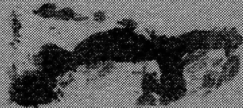

CENTRAL RESEARCH LIBRARY DOCUMENTATION

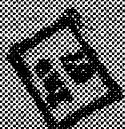

ORNL-1771

Progress

IEO RESEARCH AND DEVELOPMENT REPORT

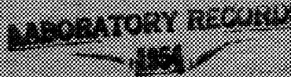

AIRCRAFT NUCLEAR PROPULSION PROJECT

QUARTERLY PROGRESS REPORT

FOR PERIOD ENDING SEPTEMBER 10, 1954

34456 02509970

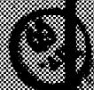

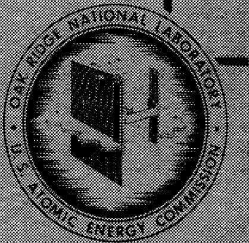

CENTRAL RESEARCH LIBRARY DOCUMENT COLLECTION

LIBRARY LOAN COPY

DO NOT TRANSFER TO ANOTHER PERSON

If you wish someone else to see this document, send in name with document and the library will arrange a loan.

OAK RIDGE NATIONAL LABORATORY

CREATED BY

CARBIDE AND CARBON CHEMICALS COMPANY

A CHIBICN C H C H N O H C H B D E A N O H C H C H N O H C H B D E A N

图

HOST OFFICE BOX #

CAXI

ORNL-1771

This document consists of 197 pages.

Copy of 254 copies. Series A.

Contract No. W-7405-eng-26

# AIRCRAFT NUCLEAR PROPULSION PROJECT

# QUARTERLY PROGRESS REPORT

For Period Ending September 10, 1954

W. H. Jordan, Director

S. J. Cromer, Co-Director

R. I. Strough, Associate Director

A.J.Miller, Assistant Director

A.W.Savolainen,Editor

DATE ISSUED

OCT 25 1954

OAK RIDGE NATIONAL LABORATORY

Operated by

CARBIDE AND CARBON CHEMICALS COMPANY

A Division of Union Carbide and Carbon Corporation

Post Office Box P

Oak Ridge, Tennessee

MARTIN MARIETTA ENERGY SYSTEMS LIBRARIES

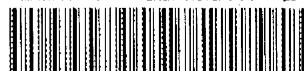

3.4456 0250997 0

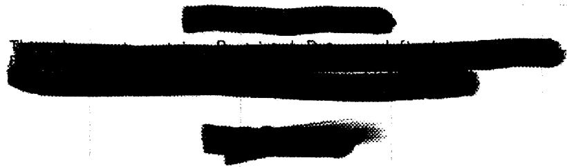

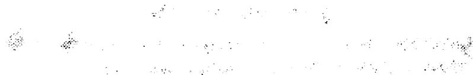

# INTERNAL DISTRIBUTION

I. G. M. Adamson   
2. R.G.Affel   
3. C. R. Baldock   
4. C. J. Barton   
5. E. S. Bettis   
6. D. S. Billington   
7. F. F. Blankenship   
8. E. P. Blizzard   
9. G.E. Boyd   
10. M.A. Bredig   
11. F.R.Bruce   
12. A. D. Callihan   
13. D.W.Cardwell   
14. C.E. Center   
15. R. A. Charpie   
16. G.H. Clewett   
17. C. E. Clifford   
18. W. B. Cottrell   
19. R. G. Cochran   
20. D. D. Cowen   
21. S. Cromer   
22. F. L. Culler   
23. L. B. Emlet (K-25)   
24. A. P. Fraas   
25. W.R.Grimes   
26. E.E.Hoffman   
27. A. Hollander   
28. A. S. Householder   
29. J. T. Howe   
30. R.W. Johnson   
31. W.H. Jordan   
32. G.W. Keilholtz   
33. C. P. Keim   
34. M. T. Kelley   
35. F. Kertesz   
36. E.M. King   
37. J.A. Lane   
38. C. E. Larson   
39. R.S. Livingston   
40. R.N.Lyon   
41. W.D. Manly

42. L. A. Mann

43. W. B. McDonald

44. J. L. Meem

45. A. J. Miller

46. K. Z. Morgan

47. E. J. Murphy

48. J. P. Murray (Y-12)

49. G. J. Nessle

50. P. Patriarca

51. H. F. Poppendiek

52. P. M. Reyling

53. H.W. Savage

54. A.W. Savolainen

55. E. D. Shipley

56. O. Sisman

57. G.P. Smith

58. L. P. Smith (consultant)

59. A. H. Snell

60. C. L. Storrs

61. C. D. Susano

62. J. A. Swartout

63. E. H. Taylor

64. J. B. Trice

65. E. R. Van Artsdalen

66. F.C. VonderLage

67. J. M. Warde

68. A. M. Weinberg

69. J.C. White

70. G.D.Whitman

71. E.P. Wigner (consultant)

72. G. C. Williams

73. J. C. Wilson

74. C. E. Winters

5-84. X-10 Document Reference Library (Y-12)

85. Biology Library

86-90. Laboratory Records Department

91. Laboratory Records, ORNL R.C.   
92. Health Physics Library   
93. Metallurgy Library   
94. Reactor Experimental Engineering Library   
95-97. Central Research Library

# EXTERNAL DISTRIBUTION

98. Air Force Engineering Office, Oak Ridge   
99. Air Force Plant Representative, Burbank   
100. Air Force Plant Representative, Seattle   
101. Air Force Plant Representative, Wood-Ridge   
102. American Machine and Foundry Company   
103. ANP Project Office, Fort Worth

104-115. Argonne National Laboratory (1 copy to Kermit Anderson)

116. Armed Forces Special Weapons Project (Sandia)   
117. Armed Forces Special Weapons Project, Washington (Gertrude Camp)

118-122. Atomic Energy Commission, Washington (Lt. Col. T. A. Redfield)

123. Babcock and Wilcox Company   
124. Battelle Memorial Institute   
125. Bendix Aviation Corporation

126-128. Brookhaven National Laboratory

129. Bureau of Aeronautics (Grant)   
130. Bureau of Ships   
131. Chicago Patent Group   
132. Chief of Naval Research   
133. Commonwealth Edison Company   
134. Convair, San Diego (C. H. Helms)   
135. Curtiss-Wright Corporation, Wright Aeronautical Division (K. Campbell)   
136. Department of the Navy - Op-362   
137. Detroit Edison Company

138-142. duPont Company, Augusta

143. duPont Company, Wilmington   
144. Duquesne Light Company   
145. Foster Wheeler Corporation

146-148. General Electric Company, ANPD

149. General Electric Company, APS

150-157. General Electric Company, Richland

158. Glen L. Martin Company (T. F. Nagey)   
159. Hanford Operations Office   
160. Iowa State College

161-162. Kirtland Air Force Base

163-166. Knolls Atomic Power Laboratory   
167-168. Lockland Area Office   
169-170. Los Alamos Scientific Laboratory

171. Materials Laboratory (WADC) (Col. P. L. Hill)   
172. Nuclear Metals, Inc.   
173. Monsanto Chemical Company   
174. Mound Laboratory

175-178. National Advisory Committee for Aeronautics, Cleveland (A. Silverstein)   
179. National Advisory Committee for Aeronautics, Washington

180-181. Naval Research Laboratory

182. Newport News Shipbuilding and Dry Dock Company   
183. New York Operations Office

184-185. North American Aviation, Inc.   
186-188. Nuclear Development Associates, Inc.   
189. Patent Branch, Washington

190-196. Phillips Petroleum Company (NRTS)

197-198. Powerplant Laboratory (WADC) (A. M. Nelson)

199-208. Pratt and Whitney Aircraft Division (Fox Project)

209-210. Rand Corporation (1 copy to V. G. Henning)

211. San Francisco Field Office   
212. Sylvania Electric Products, Inc.   
213. Tennessee Valley Authority (Dean)   
214. USAF Headquarters   
215. U. S. Naval Radiological Defense Laboratory

216-217. University of California Radiation Laboratory, Berkeley   
218-219. University of California Radiation Laboratory, Livermore   
220. Walter Kidde Nuclear Laboratories, Inc.   
221-226. Westinghouse Electric Corporation   
227-238. Wright Air Development Center (WCSNS, Col. John R. Hood, Jr.)   
239-253. Technical Information Service, Oak Ridge   
254. Division of Research and Medicine, AEC, ORO

Reports previously issued in this series are as follows:

ORNL-528 Period Ending November 30, 1949

ORNL-629 Period Ending February 28, 1950

ORNL-768 Period Ending May 31, 1950

ORNL-858 Period Ending August 31, 1950

ORNL-919 Period Ending December 10, 1950

ANP-60 Period Ending March 10, 1951

ANP-65 Period Ending June 10, 1951

ORNL-1154 Period Ending September 10, 1951

ORNL-1170 Period Ending December 10, 1951

ORNL-1227 Period Ending March 10, 1952

ORNL-1294 Period Ending June 10, 1952

ORNL-1375 Period Ending September 10, 1952

ORNL-1439 Period Ending December 10, 1952

ORNL-1515 Period Ending March 10, 1953

ORNL-1556 Period Ending June 10, 1953

ORNL-1609 Period Ending September 10, 1953

ORNL-1649 Period Ending December 10, 1953

ORNL-1692 Period Ending March 10, 1954

ORNL-1729 Period Ending June 10, 1954

# FOREWORD

This quarterly progress report of the Aircraft Nuclear Propulsion Project at ORNL records the technical progress of the research on Circulating-Fuel Reactors and all other ANP research at the Laboratory under its Contract W-7405-eng-26. The report is divided into three major parts: I. Reactor Theory, Component Design and Testing, and Construction, II. Materials Research, and III. Shielding Research.

The ANP Project is comprised of about 300 technical and scientific personnel engaged in many phases of research directed toward the achievement of nuclear propulsion of aircraft. A considerable portion of this research is performed in support of the work of other organizations participating in the national ANP effort. However, the bulk of the ANP research at ORNL is directed toward the development of a circulating-fuel type of reactor.

The effort on circulating-fuel reactors was, until recently, centered upon the Aircraft Reactor Experiment. The equipment for this reactor experiment has been assembled, and the current status of the experiment is summarized in Section 1 of Part I.

The design, construction, and operation of the Circulating-Fuel Reactor Experiment (CFRE), with the cooperation of the Pratt & Whitney Aircraft Division, are now the specific long-range objectives. The CFRE is to be a power plant system that will include a 60-Mw circulating-fuel reflector-moderated reactor and an adequate heat disposal system. Operation of the system will be for the purpose of determining the feasibility and the problems associated with the design, construction, and operation of a high-powered reflector-moderated aircraft reactor system. The design work, as well as the supporting research on materials and problems peculiar to the CFRE (previously included in the subject sections), is now reported as a subsection of Section 2, "Circulating-Fuel Reflector-Moderated Reactor."

The ANP research, in addition to that for the Circulating-Fuel Reactor Experiment, falls into three general categories: studies of aircraft-size circulating-fuel reactors, materials problems associated with advanced reactor designs, and studies of shields for nuclear aircraft. These phases of research are covered in Parts I, II, and III, respectively, of this report.

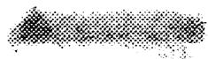

# CONTENTS

FOREWORD . vii

SUMMARY 1

PART I. REACTOR THEORY, COMPONENT DESIGN AND TESTING, AND CONSTRUCTION

1. CIRCULATING-FUEL AIRCRAFT REACTOR EXPERIMENT 9

The Experimental Reactor System 9

10

Preparations for Loading the ARE 11

Fuel-Concentrate Injection Nozzle 12

ARE Unloading Experiment. 12

ARE Fuel Recovery and Reprocessing 12

AREPumps 14

Fabrication and Testing. 14

Seal-Gas Pressure-Balancing System 14

Radiation Damage to Pump Drives 14

Radiation Damage to Shaft Seal 15

Motor Test 15

Reactor System Component Test Loop. 16

Operation of Loop. 16

Examination of Hairpin Tube. 16

Reactor Physics 16

2. REFLECTOR-MODERATED REACTOR 17

Design of the CFRE 17

CFRE Component Development Projects 18

Reactor Physics 24

Reactor Calculations 24

Beryllium Thermal Stress Test 24

Beryllium-Inconel-Sodium Systems 29

Beryllium-Inconel-Sodium Compatibility Tests 29

Mass Transfer Tests in Thermal-Convection Loops 30

Mass Transfer Tests in Forced-Circulation Loops 32

3. EXPERIMENTAL REACTOR ENGINEERING 34

In-Pile Loop Component Development 34

Horizontal-Shaft Sump Pump 34

Vertical-Shaft Centrifugal Sump Pump 37

Hydraulic Motor Pump Drives 38

Forced-Circulation Corrosion Loops 38

Inconel Loops 38

Dissimilar Metal Loops 41

Gas-Furnace Heat-Source Development 41

Study of the Cavitation Phenomenon 41

Expansion and Improvement of Thermal-Convection Loop Testing Facilities 42

4. CRITICAL EXPERIMENTS. 44

Reflector-Moderated Reactor 44

Supercritical-Water Reactor 47

# PART II. MATERIALS RESEARCH

# 5. CHEMISTRY OF MOLTEN MATERIALS 53

Solid Phase Studies in the NaF-ZrF $_{4}$ -UF $_{4}$ System 54   
Visual Observation of Melting Temperatures in the NaF-UF4 System 55   
Phase Relationships in UF-Bearing Systems 56

$\mathsf{UF}_3$ in $\mathsf{ZrF}_4$ -Bearing Systems 57   
$\mathsf{UF}_3$ in NaF-KF-LiF Mixtures 57   
$\mathsf{UF}_3$ in NaF-RbF-LiF Mixtures 58   
$\mathsf{UF}_3$ in the Individual Alkali-Metal Fluorides 58   
$\mathbf{U}\mathbf{F}_3$ in Binary Alkali-Metal Fluoride Systems 60

Purification of Rubidium Fluoride 60   
Chemical Reactions in Molten Salts 60

Chemical Equilibria in Fused Salts 60

Stability of Chromium Compounds in Molten Fluorides 63   
Reduction of NiF, by H, in NaF-ZrF Systems. 63   
Reduction of $\mathsf{FeF}_2$ by $\mathsf{H}_2$ in NaF-ZrF Systems 64   
Preparation of Various Fluorides 67

Fundamental Chemistry of Fused Salts 67

EMF Measurements 67   
Solubility of Xenon in Molten Salts. 70   
X-Ray Diffraction Studies in Salt Systems 70   
Physical Chemistry 72

Production of Purified Molten Fluorides 72

Use of Zirconium Metal as a Scavenging Agent 72   
Purification of NaF-ZrFA Mixtures by Electrolysis 73   
Preparation of UF3-Bearing Fuels 77   
Alkali-Metal Fluoride Processing Facility. 78   
ProductionFacility. 79   
In-Pite Loop Loading 79

Chemistry of Alkali-Metal Hydroxides 80

Purification. 80   
Reaction of Sodium Hydroxide with Metals 80

# 6. CORROSION RESEARCH 81

Static and Seesaw Corrosion Tests 82

Brazing Alloys in NaF-ZrF4-UF and in Sodium 82   
Special Shellite Heats in NaF-ZrF4-UF4 and in Sodium. 83   
Hastelloy R in Various Media 85   
Inconel in Molten Rubidium. 86   
Carburization of Inconel by Sodium. 89   
Special Tar-Impregnated and Fired Graphite 90   
Ceramics in Various Media 94

Fluoride Corrosion of Inconel in Thermal Convection Loops 95

Effect of UF, in ZrF-Base Fuels 95   
Effect of UF, in Alkali-Metal Base Fuels 96   
Effect of Zirconium Hydride Additions to Fuel 98   
Effect of Uranium Concentration 98   
Effect of Inconel Grain Size 98

Fluoride Corrosion of Hastelloy B in Thermal-Convection Loops 98   
Lithium in Type 316 Stainless Steel 99   
Fundamental Corrosion Research 100

Mass Transfer in Liquid Lead 100   
Flammability of Sodium Alloys 102   
Thermodynamics of Alkali-Metal Hydroxides 102

Chemical Studies of Corrosion. 108

Effect of Temperature on Corrosion of Inconel and Type 316 Stainless Steel 108   
Corrosion by Fission Products 109   
Controlled-Velocity Corrosion Testing Apparatus 109   
Reaction Between Graphite and Fluoride Melt 110   
Lithium Fluoride Castings 110

7.METALLURGY 111

Stress-Rupture Tests of Inconel. 112   
High-Conductivity-Fin Sodium-to-Air Radiator 116

Investigations of Fin Materials 117   
Development of Brazing Alloys for Use in Fabricating Radiators 118   
Radiator Fabrication 120

Ozzles for the Gas-Fired Liquid-Metal-Heater System 120

Special Materials Fabrication Research 121   
Stainless-Steel-Clad Molybdenum and Cambium. 121   
Inconel-Type Alloys 122   
Nickel-Molybdenum-Base Alloys 122   
Duplex Tubing 123   
Sigma-Phase Alloys 124   
Boron Carbide Shielding. 124   
Tubular Fuel Elements 124

Metallographic Examination of a Fluoride-to-Sodium Heat Exchanger 124

8. HEAT TRANSFER AND PHYSICAL PROPERTIES 127

Physical Properties Measurements 127   
Heat Capacity 127   
Density and Viscosity 127   
Thermal Conductivity 129   
Electrical Conductivity 129   
Vapor Pressure 129

Fused-Salt Heat Transfer 130   
TransientBoiling Research 130   
Fluid Flow Studies for Circulating-Fuel Reactors 131   
Heat Transfer Studies for Circulating-Fuel Reactors 131

9. RADIATION DAMAGE 134

MTR Static Corrosion Tests 134   
Fission Product Corrosion Study 135   
Facilities for Handling Irradiated Capsules 135   
Analysis of Irradiated Fluoride Fuels for Uranium 136   
High-Temperature Check Valve Tests 137   
Miniature In-Pile Loop - Bench Test 137   
Life Tests on an RPM Meter, Bearings, and a Small Electric Motor Under Irradiation. 137   
Removal of Xenon from Fused Fluorides 140   
$\mathsf{C}_7\mathsf{F}_{16} - \mathsf{UF}_6$ Irradiation 140   
LITR Horizontal-Beam-Hole Fluoride-Fuel Loop 141   
ORNL Graphite Reactor Sodium-Inconel Loop 142   
Creep and Stress-Corrosion Tests 142

Remote Metallography 144   
Fission-Fragment Annealing Studies 145   
High-Temperature, Short-Time, Grain-Growth Characteristics of Inconel. 145   
BNL Neutron Spectrum - Radiation Damage Study 145   
MTR Neutron-Flux Spectra - Radiation Damage Study 147

10. ANALYTICAL STUDIES OF REACTOR MATERIALS 148

Analytical Chemistry of Reactor Materials 148   
Determination of Oxygen in Fluoride Fuels 148   
Oxidation-Reduction Titrations in Fused Salts 150   
Polarographic Studies in Fused Ammonium Formate 150   
Conversion of $\mathsf{UF}_3$ and $\mathsf{UF}_4$ to the Respective Chlorides with $\mathsf{BCI}_3$ 151   
Solubility of Tri- and Tetravalent Uranium Fluorides in Fused NaAlCl 4 151   
Oxidation of UF with Oxygen 152   
Determination of Lithium, Potassium, Rubidium, and Fluoride Ion   
in NaF-KF(RbF)-LiF-Base Fuels 152   
Oil Contamination in ARE Helium. 154   
Petrographic Investigations of Fluoride Fuels. 154   
Summary of Service Analyses. 154

# PART III. SHIELDING RESEARCH

11. SHIELDING ANALYSIS 157

Slant Penetration of Composite Slab Shields by Gamma Rays 157   
Air Scattering of Neutrons 158   
Single Anisotropic Air Scattering in the Presence of the Ground (Shielded Detector) 158   
Single Isotropic Air Scattering in the Presence of the Ground (Unshielded Detector) 158   
Formulas for Multiple Scattering in a Uniform Medium 159   
Ground Scattering of Neutrons 162   
Focusing of Radiation in a Cylindrical Crew Compartment 163

12. LID TANK SHIELDING FACILITY 164

Reflector-Moderated Reactor and Shield Mockup Tests 164   
Effective Removal Cross Section of Carbon 164   
GE-ANP Helical Air Duct Experimentation 166

13. BULK SHIELDING FACILITY 168

Reactor Radiations Through Slabs of Graphite. 168   
Reactor Air Glow 170   
Fuel Activation Method for Power Determination of the ARE 173

14. TOWER SHIELDING FACILITY 175

Fast-Neutron Ground and Air Scattering Measurements 175   
Calorimetric Reactor Power Determination 175   
GE-ANP R-1 Divided-Shield Mockup Tests 178

# PART IV. APPENDIXES

15. LIST OF REPORTS ISSUED DURING THE QUARTER 183

ORGANIZATION CHART OF THE AIRCRAFT NUCLEAR PROPULSION PROJECT 185

# ANP PROJECT QUARTERLY PROGRESS REPORT

SUMMARY

PART I. REACTOR THEORY, COMPONENT DESIGN AND TESTING, AND CONSTRUCTION

# Circulating-Fuel Aircraft Reactor Experiment

The water tests of the fuel and the sodium circuits of the ARE system at room temperature were completed (Sec. 1). The sodium circuit was pressure-filled with water from the sodium fill tanks, while the fuel system was vacuum-filled to ensure the elimination of gas pockets in the fuel system. Both systems were found to function properly, and the filling, circulating, and draining operations were effected with a minimum of difficulty. After the water was drained, the system was dried by heating it to approximately $600^{\circ}\mathrm{F}$ . The electrical heating system was found to be satisfactory in the check thus afforded.

The final system completion work is now under way, that is, removal of the sodium system reactor bypass, completion of the fuel-enrichment system installation, completion of thermocouple and insulation installation, and other minor modifications. When this work is completed, sodium will be charged to the system and the high-temperature checkout phase of the experiment will be initiated.

The neutron source was put into the reactor, and the nuclear instrumentation was checked out. Also, mechanical checks were made of the performance of the safety and control rods. The building electric and helium systems were made ready to accommodate the loading facilities, and final arrangements were completed for attaching the fuel-sampling equipment.

Radiation damage experiments indicated the desirability of providing gamma shielding at several points where elastomers were used (belts, diaphragms, etc.). Where shielding was impractical, the composition diaphragms were replaced with metal diaphragms.

The results of operation of the reactor system component test loop at K-25 are encouraging in that the loop has now been operated without major difficulties for more than 1800 hr. None of the minor difficulties encountered would indicate that serious problems might arise in operation of the ARE.

# Reflector-Moderated Reactor

The program for the development and construction of the Circulating-Fuel Reactor Experiment (CFRE) has been outlined, and many of the development projects are under way. Tentative design data have been compiled and a flow sheet has been prepared (Sec. 2). The first priority development project, the test of beryllium in contact with sodium and Inconel under thermal stress, has been completed. The results of this test were needed in the determination of the amount of poison to be expected in the reflector. The test indicated that beryllium will not crack under the thermal stresses involved in the temperature range 1000 to $1300^{\circ}\mathrm{F}$ . Since corrosion and mass transfer, as well as thermal stress, will be important in the beryllium-Inconel-sodium system, many static and dynamic tests under various conditions have been made. There is considerable evidence to indicate satisfactory compatibility in the beryllium-Inconelsodium system at temperatures up to $1200^{\circ}\mathrm{F}$ .

The temperature coefficient of reactivity for the CFRE was computed on the UNIVAC and, for rapid temperature changes, was found to be $-3.5 \times 10^{-5} / {}^{\circ}\mathrm{F}$ . The critical mass computed for the rhombicuboctahedral critical assembly was redetermined because of errors found in the original data. The redetermined value agreed closely with the experimental value, but, since the critical mass is not very sensitive to errors in detail, further evaluation of the agreement must await additional experimental results.

# Experimental Reactor Engineering

The emphasis in the engineering work is now on development of components for an in-pile loop for insertion in a horizontal beam hole of the MTR and the design and construction of forced-circulation corrosion testing loops (Sec. 3). The in-pile loop for insertion in the MTR is a joint ORNL and Pratt & Whitney Aircraft Division project. It is to circulate proposed fuel mixtures in the high-flux of the MTR so that the extent of radiation damage to materials of construction and the effect of radiation on the fuel can be determined. Two types of pumps have been developed for in-pile use: a

vertical-shaft centrifugal sump pump for installation external to the reactor shield and a horizontal-shaft sump pump for insertion inside a beam hole. A turbine-type impeller is being considered for the horizontal-shaft pump because it would have the advantage that both the inlet and discharge could be at the bottom. Hydraulic motors of suitably small dimensions have been found to be satisfactory drives for these pumps.

Two series of Inconel forced-circulation corrosion loops for circulating fluoride mixtures are being developed to meet the following requirements: (1) a Reynolds number of 10,000 with temperature gradients of 100, 200, and $300^{\circ}\mathrm{F}$ and (2) a temperature gradient of $200^{\circ}\mathrm{F}$ with Reynolds numbers of 800, 3,000, and 15,000. The maximum fluid temperature is to be $1500^{\circ}\mathrm{F}$ .

A study is under way of the cavitation phenomenon associated with operating liquid metal systems at elevated temperatures, high flow rates, and high pump speeds. A correlation of fluid-flow-noise intensity with pressure data was noted.

The number of stations available for convection-loop testing was increased from 18 to 31 and the basic design of the loops was simplified. Various means of heating the loops and of making operation of them more automatic are being studied.

# Critical Experiments

The first step of the present critical experiment program was the construction of a small two-region reflector-moderated reactor to provide experimental data on a system of simple geometry and materials for use in checking the calculational methods being used (Sec. 4). The core consists of alternate sheets of enriched uranium metal and Teflon and is surrounded by a beryllium reflector. The uranium loading can be varied, within the specified dimensions, to make the system critical. The assembly was loaded as prescribed by the multi-group calculations but was not critical. However, when the calculations had been corrected to take into account errors in the original data, a new attempt to achieve criticality with the prescribed loading was made. The corrected prescribed loading was 20.9 to 22.75 lb of U $^{235}$ and the experimental loading was 24.35 lb of U $^{235}$ . A larger critical assembly of the same shape is to be constructed that will consist of three regions, with the beryllium island and the reflector separated by the fuel annulus. A further check on the calculational methods will be obtained.

# PART II. MATERIALS RESEARCH

# Chemistry of Molten Materials

Studies of the fluoride systems of interest as reactor fuels were continued, with particular emphasis being given to systems in which the uranium-bearing component is the less corrosive $\mathsf{UF}_3$ or a mixture of $\mathsf{UF}_3$ and $\mathsf{UF}_4$ rather than $\mathsf{UF}_4$ alone (Sec. 5). Recent attempts to correlate the anticipated reduction of $\mathsf{UF}_4$ in the $\mathsf{UF}_3$ -bearing melts with wet chemical analysis for $\mathsf{UF}_3$ and $\mathsf{UF}_4$ and results of petrographic examination show some surprising anomalies. When $\mathsf{UF}_4$ dissolved in LiF, in NaF-ZrF $_4$ - $\mathsf{UF}_4$ mixtures, or in NaF-LiF mixtures is treated under flowing hydrogen at $800^{\circ}\mathrm{C}$ with excess uranium metal, $90\%$ or more of the $\mathsf{UF}_4$ is reduced to $\mathsf{UF}_3$ . However, when this technique is applied to $\mathsf{UF}_4$ in NaF-KF-LiF mixtures, the reduction is only $50\%$ complete at $800^{\circ}\mathrm{C}$ and, perhaps, $75\%$ complete at $600^{\circ}\mathrm{C}$ . Petrographic examinations of the specimens reveal no complex compounds of tetravalent uranium; it is possible that the $\mathsf{UF}_4$ is "hidden" in solid solutions or in complex $\mathsf{UF}_4$ - $\mathsf{UF}_3$ compounds in which it is not at present recognizable.

Solid phase studies of the $\mathrm{NaF - ZrF_4 - UF_4}$ system were initiated following completion of studies of the $\mathrm{NaF - ZrF_4}$ system, and to date no ternary compounds have been discovered. A tentative equilibrium diagram was prepared.

A method for large-scale purification of rubidium fluoride has been developed that can be used if material sufficiently free from cesium cannot be obtained from commercial sources. Fundamental studies of the reduction of $\mathsf{NiF}_2$ and $\mathsf{FeF}_2$ by $\mathsf{H}_2$ in NaF-ZrF $_4$ systems were made as a means of determining possible improvements in purification techniques. Also, methods for preparing simple structural metal fluorides were studied.

Large quantities of purified $\mathsf{ZrF}_4$ -base fluorides were prepared for engineering tests at ORNL and elsewhere, and the demand for purified fluorides of other types is rapidly increasing. Therefore preparation and purification methods have been studied intensively in an effort to lower production time and costs. Developments indicate that the price of purified $\mathsf{NaZrF}_5$ and $\mathsf{NaF - ZrF}_4\mathsf{-UF}_4$ mixtures may be halved in the next few months.

# Corrosion Research

The static and seesaw corrosion testing fac- cilities were used for further studies of brazing

alloys, special Stellarite heats, Hastelloy R, Inconel, graphite, and various ceramics in sodium, fluoride fuel mixtures, and other mediums (Sec. 6). The brazing alloy $67\%$ Ni-13% Ge-11% Cr-6% Si-2% Fe-1% Mn was found to have good corrosion resistance in fluoride fuels and fair corrosion resistance in sodium and therefore will be useful for the fabrication of many reactor components.

In the thermal-convection loop studies, $\mathsf{UF}_3$ -bearing fuels were tested in Inconel. Hot-leg attack is not found in Inconel loops in which $\mathsf{ZrF}_4$ -base fluoride mixtures with the uranium as $\mathsf{UF}_3$ are circulated. A deposit is, however, found on the hot-leg surface. Only preliminary information is available, but it appears that neither attack nor a hot-leg layer is found with alkali-metal-base fluoride mixtures containing $\mathsf{UF}_3$ . Mixtures of $\mathsf{UF}_3$ and $\mathsf{UF}_4$ result in a reduction in attack from that found with only $\mathsf{UF}_4$ , but some attack is present, and in high-uranium-content systems the attack may be significant.

Several Hastelloy B loops have now been successfully operated in both the as-received and the over-aged conditions. In both cases a considerable increase in hardness occurs during operation. With $\mathsf{ZrF}_4$ -base mixtures containing $\mathsf{UF}_{4'}$ very little attack is found, even after 1000 hr.

Thermal-convection loop tests of molten lithium in type 316 stainless steel were operated for 1000 hr. There were no signs of plug formation, and only a small amount of mass transferred material was found in one loop. Alloys of $45\%$ Cr- $55\%$ Co, Ni-Mo alloys, and the Fe-Cr-base stainless steels have been shown to be more resistant to corrosion and mass transfer in liquid lead than are the pure metals. Their resistance to mass transfer can probably be related to the formation of intermetallic compounds.

# Metallurgy

Creep and stress-rupture testing by the tube-burst method has been studied intensively (Sec. 7). In the tube-burst tests, a tube that is closed at one end is stressed with an internal gas pressure. The stress pattern introduced into the specimen in this test approaches the stress pattern that will be found in ANP-type reactors. Apparatus for the tests has been constructed, and a theoretical analysis has been made with which a check on the experimental results can be obtained.

In the investigation of high thermal-conductivity

fins for sodium-to-air radiators, stress-rupture and creep tests were made on copper fins with various types of cladding at stress levels between 500 and 2000 psi at $1500^{\circ}\mathrm{F}$ . The tests show that for a 1000-hr exposure in air, stresses greater than 500 psi and less than 1000 psi are tolerable; that is, in this stress range there is no indication of brittleness in the core or oxidation of the core due to cladding failure of type-310 stainless-steel-clad copper fins. From the over-all considerations of melting point, oxidation resistance, dilution of fin and tube wall, formation of low-melting eutectics, and flowability, it was found that Coast Metals alloy 52 was the best brazing alloy for use in the construction of radiators with high-conductivity fins. A sodium-to-air radiator with 6 in. of type-430 stainless-steel-clad copper high-conductivity fins was fabricated by use of a combination heliarc welding and brazing procedure.

Packed-rod nozzle assemblies were fabricated for the 100-kw gas-fired liquid-metal-heater system, and work was started on the formation of duplex tubing. An attempt is being made to prepare tubing that will have good corrosion resistance on the inner surface and oxidation resistance on the outer surface.

Attempts are being made to find new alloys in the nickel-molybdenum system that will have better high-temperature strength and fluoride corrosion resistance than Inconel has. Hastelloy B satisfies these requirements, but it has poor fabrication properties and oxidation resistance; it also loses its ductility in the temperature range of interest for application in high-temperature circulating-fuel reactors. Investigations are under way to find a suitable melting practice and heating treatment that will increase the ductility of Hastelloy B in the temperature range of interest.

# Heat Transfer and Physical Properties

The enthalpies and heat capacities of NaF-ZrF $_4$ -UF $_4$ (65-15-20 mole %) and of LiF-NaF-UF $_4$ (57.6-38.4-4.0 mole %) were determined (Sec. 8). The thermal conductivity of NaF-KF-UF $_4$ (46.5-26.0-27.5 mole %) was found to be 0.7 Btu/hr·ft $^2$ (°F/ft), that for KF-LiF-NaF-UF $_4$ (43.5-44.5-10.9-1.1 mole %) was 2.0, and that for LiF-KF-UF $_4$ (48.0-48.0-4.0 mole %) was 1.4. A new electrical conductivity device has been constructed and has been successfully checked with molten salts of known conductivity.

A device for studying the rates of growth of tube-wall deposits has been successfully tested with a simple heat transfer salt. Also, a hydrodynamic flow system for studying the reflectormoderated reactor flow structure has been tested. A mathematical study of the temperature structure in converging and in diverging channel systems that duct fluids with volumetric heat sources and a study of wall cooling requirements in circulating-fuel reactors were made.

# Radiation Damage

Additional irradiations of Inconel capsules containing fluoride mixtures were carried out in the MTR (Sec. 9). Only one capsule containing a $\mathsf{UF}_3$ -bearing fuel has been examined, and it shows no corrosion, in contrast to that found previously with $\mathsf{UF}_4$ -bearing fuels.

Inspection of the LITR in-pile loop, which failed prior to startup, disclosed that the failure was caused by a break in the weld connecting the pump discharge nipple to the fuel line. Design revisions and refabrication of some of the parts are in progress. Developmental work continued on a smaller loop for operation in an LITR A-piece.

Detailed examination of an Inconel loop which circulated sodium at high temperature in the ORNL Graphite Reactor showed no evidence of radiation-induced corrosion. Metallographic examinations were carried out in the hot cells on irradiated fuel plates for Pratt & Whitney Aircraft Division, and studies were made on annealing-out of fission-fragment damage. Work continued on examination of wire and multiple-plate-type units for GE-ANP.

# Analytical Studies of Reactor Materials

The primary analytical problem continues to be the separation and determination of trivalent and tetravalent uranium in both $\mathrm{NaF - ZrF_5}$ and NaF-KF-LiF-base fuels (Sec. 10). A successful potentiometric titration of $\mathsf{U}\mathsf{F}_4$ in molten $\mathrm{NaZrF_5}$ with metallic zirconium was accomplished by means of polarized platinum electrodes. The solubility of $\mathsf{U}\mathsf{F}_4$ in $\mathrm{NaAlCl_4}$ was determined to be $18\mathrm{mg / g}$ at $200^{\circ}C_{i}$ in contrast to a solubility of $\mathsf{U}\mathsf{F}_3$ of less than $1\mathrm{mg / g}$ . Therefore molten $\mathrm{NaAlCl_4}$ is expected to dissolve tetravalent uranium selectively from the fuels.

Calibration measurements have been completed on the apparatus for the determination of oxygen as metallic oxides in reactor fuels. The reaction

involves the hydrofluorination of the oxide and measurement of the increase in conductivity of liquid HF as a function of the water formed. Investigations are being made of the oxidation of $\mathsf{UF}_3$ and of $\mathsf{UF}_4$ with oxygen at elevated temperatures.

An improved method for the determination of lithium in NaF-KF-LiF-base fuels was developed. Also, studies were made of the solubilities of potassium, rubidium, and cesium tetraphenylborates in various organic solvents to ascertain differential solubilities.

# PART III. SHIELDING RESEARCH

# Shielding Analysis

Application of the Monte Carlo method to the calculation of gamma-ray penetration of crew shield sides has been worked out, and the method appears to be quite satisfactory for this type of problem (Sec. 11). Considerable progress has been made on understanding the Tower Shielding Facility (TSF) measurements of ground and air scattering. Expressions have been derived which describe the effect of ground interference with the air-scattered flux, and thus it is now possible to estimate ground-scattered radiation both at the TSF and in an airplane at landing and takeoff. Calculations have been set up for evaluating multiply scattered radiation in air. The values obtained will be of considerable importance in studies of the highly asymmetric but light shields of several current designs.

# Lid Tank Shielding Facility

Preparations for a second series of shielding tests for the reflector-moderated reactor at the Lid Tank Shielding Facility (LTSF) have included the construction of a large tank which will hold all the components of the mockups and the irradiation of the UF $_6$ C $_7$ F $_{16}$ solution which may be used to simulate the reactor fuel in mockup experiments (Sec. 12). Measurements of the removal cross section of carbon made in a continuous carbon medium have resulted in a value of $\sigma_r = 0.750$ barn. This is to be compared with the previous value of $0.81 \pm 0.05$ barn measured behind a solid slab of graphite. Thermal-neutron flux measurements have been made beyond two configurations of GE-ANP helical air ducts, a single duct and a triangular array of three ducts. Measurements beyond a 35-duct array will begin soon.

# Bulk Shielding Facility

The use of a graphite reflector as a shield component has been investigated at the Bulk Shielding Facility (BSF) with measurements of attenuation through various thicknesses of the material (Sec. 13). The fast-neutron spectrum of the BSF reactor from 1.3 to 10 Mev through 1 ft of graphite was also measured. Removal cross section values for the carbon were determined to be 0.82 barn for a 1-ft slab, 0.84 barn for a 2-ft slab, and 0.80 barn for a 3-ft slab.

An experiment has been performed at the BSF to provide an experimental basis for future estimates of the amount of visible light around a nuclear-powered aircraft. Measurements in an air-filled tube placed against the reactor have indicated that the maximum glow will occur at a pressure corresponding to an altitude of about 30,000 ft.

In a proposed method for the determination of the power of the ARE, the relative activity of the

fuel samples exposed in the ARE and in the known flux of another reactor is measured. The method has been tested at the BSF.

# Tower Shielding Facility

Measurements of the ground and air scattering of neutrons have been made at the Tower Shielding Facility (TSF) (Sec. 14). A preliminary analysis indicates that the contribution at the maximum altitudes (around 200 ft) is between 2 and $5\%$ of the total scattered neutrons for differential experiments.

A new procedure for a calorimetric determination of the power of the TSF reactor has been devised which is based on the relationship between the rate of temperature rise in the water of the reactor tank and the reactor power. The results of three experiments were consistent to within $1\%$ . The next series of tests at the TSF will be on the GE-ANP R-1 divided-shield mockup.

Part I

REACTOR THEORY, COMPONENT DESIGN

AND TESTING, AND CONSTRUCTION

# 1. CIRCULATING-FUEL AIRCRAFT REACTOR EXPERIMENT

E.S.Bettis J.L.Meem

Aircraft Reactor Engineering Division

# THE EXPERIMENTAL REACTOR SYSTEM

A general revision was found to be necessary in the ARE in that shadow shielding had to be installed, at several points where elastomers were used (belts, diaphragms, etc.), to provide protection from gamma fields that would have produced prohibitive degrees of radiation damage. At some points, where shielding was impractical, the composition diaphragms were replaced by metal diaphragms.

The entire ARE system has now been completely checked out as far as room-temperature preoperational tests are concerned. Both the fuel and the sodium circuits have been operated simultaneously with water as the circulated liquid in each circuit. The moderator volume of the reactor was bypassed for these tests to keep water away from the beryllium oxide blocks.

The sodium circuit was pressure-filled with water from the sodium fill tanks, while the fuel system was vacuum-filled to ensure the elimination of gas pockets in the fuel system. Both systems were found to function quite satisfactorily, and the filling, circulating, and draining operations were effected with a minimum of difficulty.

During these operational shakedown tests, it was found that the gas lines to the sump tanks could not be kept pressure tight because the Swagelok fittings developed leaks. All these joints have therefore been silver-soldered to correct this situation. The pumps performed satisfactorily, and useful system curves for actual future operation were obtained.

After the water tests of the system had been completed, it was necessary to remove all water from the system. This necessitated heating the entire system to a temperature of approximately $600^{\circ}\mathrm{F}$ . This operation provided the first check out of the electrical heating system. Here again the performance was gratifying. Such troubles as arose were corrected rather easily, and, in general, the heating of the system was effected with very little difficulty.

A $\mathrm{CO}_{2}$ cold trap was incorporated in the off-gas line while the system was being heated to collect all moisture that was driven from the system. Dry

air was admitted to the fill tanks, and both the fuel and the sodium systems were flushed with this dry air, the air leaving the system through the $\mathrm{CO}_{2}$ cold trap. When the dew point of the exit air from this cold trap reached $-30^{\circ}\mathrm{F}$ , the system was considered to be dry and the electrical heat was turned off.

Before the heat was removed from the system, however, the temperature on the thermal barrier doors around the heat exchangers was raised to approximately $1000^{\circ}\mathrm{F}$ and operation of the doors was checked. Even though the doors had been reworked to eliminate sticking, it was found that the doors were still binding. When the barrier doors were removed, it could be seen that the side guides which run the height of the door were binding in the guide ways of the door frames. This binding was resulting from the bowing of the guide rails caused by the thermal gradient which exists in the door. The door does not require these side guides, since the door housing provides ample guides for the normal functioning of the doors. Therefore the side guide rails are being removed so that there will be no further binding of the barrier doors.

It was also noted while the system was hot that a considerable volume of kerosene was being driven out of the beryllium oxide moderator blocks by the high temperature. The kerosene had been absorbed by the blocks during the cutting operations. To remove the kerosene, a vacuum was pulled on the moderator volume of the reactor. A $\mathrm{CO}_{2}$ cold trap was inserted in the vacuum line to the moderator, and while the reactor was maintained at a temperature of approximately $450^{\circ}\mathrm{F}$ , the vacuum pump was run continuously. This operation was continued until no more condensate of the kerosene distillation was being collected in the cold trap. Approximately 2 gal of kerosene was removed by this procedure. It is possible - in fact, fairly certain - that some residue was left in the moderator blocks. It was the consensus of the chemists that this would not have an adverse effect on the sodium coolant, and therefore nothing further is to be done about the small amount of tarry residue remaining in the reactor moderator blocks.

After the system had been thoroughly dried, all heat was turned off and the final system completion work was begun. The major work in this category consists in removing the sodium system reactor bypass, removing the flanged filter pots in the sodium purification system, and completing the enrichment system tie-in to the fuel circuit. Thermocouple installation also has to be completed, as well as thermal insulation of the fuel pump bowls.

The decision to remove the flanged filter pots and to substitute weld-sealed filter pots was made several months ago. It was decided at that time, however, to postpone this substitution until after the water test. The original filters were useful in cleaning up the water used to test the operation of the sodium circuit. Completion of the fuel enrichment system in no way affected the water test, and hence this work was postponed in the interest of completing the water test as expeditiously as possible. The fuel injection system is to be water-tested independently of the fuel system.

Insulation of the fuel pump bowls was postponed to allow more room for access to the pumps during the water tests. Since the pumps have now been checked out, the insulation job will be completed.

The system should be ready for charging with sodium early in September, and the high-temperature check out phase of the experiment will be initiated. While the sodium checks are being run, the hot-gas leak test of the fuel system will be performed. This test involves loading the fuel system with a mixture of helium and krypton at a pressure of about 15 psi. While this gas is being circulated at $1300^{\circ}\mathrm{F}$ by the fuel pump the annulus circuits will be monitored by mass spectrographic methods for the presence of krypton in the annulus.

The neutron source was put in the reactor, and the nuclear instrumentation was checked out. All three (the two regular plus the spare) fission chambers were checked, and the count-rate vs chamber-voltage curves were plotted. The data obtained provided the necessary information for establishing the operational plateau for each chamber. Also, mechanical checks were made of the performance of the safety and control rods.

A modification of the rod-cooling circuit was required in order to minimize the heat loss from the center of the reactor. This necessitated installation of proportioning orifices to get correct helium flow around the fission chambers and the safety rods.

Final modifications of the sodium and the fuel loading systems were completed, and the building electric and helium systems were made ready to accommodate the loading facilities when they are brought into the building. Final arrangements have been completed for attaching the fuel-sampling system. This sampling system will not be left connected when the power run is initiated.

The engineering prints for the entire ARE installation are now up to date, and the electrical prints, in particular, were used successfully in checking out the many heater circuits involved in the experiment.

# CHARACTERISTICS OF THE FUEL AND THE SODIUM SYSTEMS DURING WATER TESTS

The characteristics of both the fuel and the sodium systems while circulating water have been determined. Upon removal of the fuel heat exchanger bypass loop, a glass rotameter was temporarily installed in the fuel circuit between the reactor outlet and the heat exchangers. A direct calibration of the high-temperature fuel rotameter against the glass rotameter was obtained with water as the fluid. Conversion of water flow to fuel flow is made by

$$
\frac {q _ {2}}{q _ {1}} = \left( \begin{array}{c} \frac {\rho_ {F} - \rho_ {f _ {2}}}{\rho_ {f _ {2}}} \\ \frac {\rho_ {F} - \rho_ {f _ {1}}}{\rho_ {f _ {1}}} \end{array} \right) ^ {1 / 2},
$$

where

$$
\begin{array}{l} q _ {1} = \text {w a t e r f l o w (g p m)}, \\ q _ {2} = \text {f u e l f l o w (g p m)}, \\ \rho_ {f _ {1}} = \text {w a t e r d e n s i t y} (\mathrm {g} / \mathrm {c m} ^ {3}), \\ \rho_ {f _ {2}} = \text {f u e l d e n s i t y} (\mathrm {g} / \mathrm {c m} ^ {3}), \\ \rho_ {F} = \text {f l o a t d e n s i t y (g / c m ^ {3})}. \\ \end{array}
$$

During the period of water operation, data on pump speed vs flow rate were obtained (Fig. 1.1). Also, the pressure head from the pump suction to the reactor inlet was measured (Fig. 1.2). The system characteristics, as shown in these two curves, should be the same during operation with fluorides.

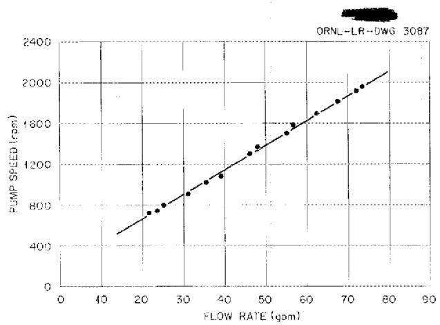  
Fig. 1.1. Data on Pump Speed vs Flow Rate Obtained During Water Test of ARE Fuel System.

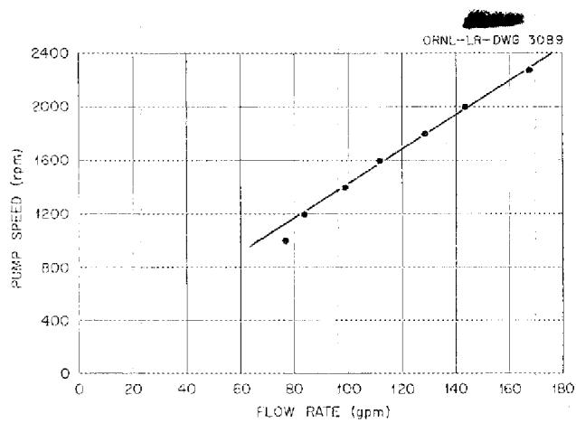  
Fig. 1.3. Data on Pump Speed vs Flow Rate Obtained During Water Test of ARE Sodium System.

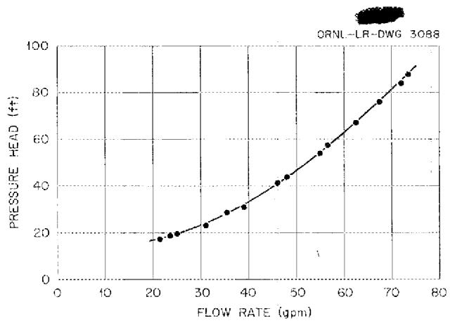  
Fig. 1.2. Data on Pressure Head from the Pump Suction to the Reactor Inlet vs the Flow Rate During Water Test of ARE Fuel System.

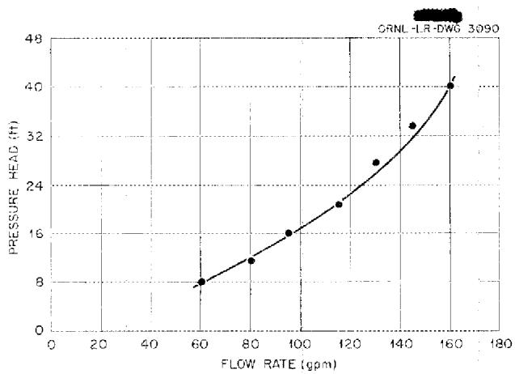  
Fig. 1.4. Data on Pressure Head from the Pump Suction to the Reactor Outlet vs the Flow Rate During Water Test of the ARE Sodium System.

By using a calibrated orifice installed temporarily in the sodium bypass line around the reactor, it was possible to measure the flow rate while operating the sodium system with water. The pump speed was recorded and also the pressure head from the pump suction to the reactor outlet. The system characteristics with water, shown in Figs. 1.3 and 1.4, should be valid while operating with sodium as the fluid. During operation with sodium, the flow rate in each of the two loops will be measured with an electromagnetic flowmeter. The sum of the two flow rates should equal the total flow as obtained from the pump speed.

# PREPARATIONS FOR LOADING THE ARE

G.J.Nessle

Materials Chemistry Division

All the preliminary preparations for loading the barren and enriched fluoride mixtures into the ARE have been completed. The necessary control panels have been assembled, and furnaces, heating units, transfer lines, and various complementary equipment are now ready for installation. The exact location of the various operations has been determined. However, because of the large amount of construction work which has been carried out in

the ARE building around these locations, none of the parts necessary for the loading and sampling operations have yet been installed. Testing of the equipment after installation and before the filling operation should require approximately one week. It is anticipated that all personnel to be involved with the loading and sampling operation will be made thoroughly familiar with the equipment and its operation during this testing period.

# FUEL-CONCENTRATE INJECTION NOZZLE

W.G.Cobb

W.R.Huntley

Aircraft Reactor Engineering Division

Tests were made on a resistance-heated fuel-concentrate injection nozzle to determine the effectiveness of the heating in the region where the nozzle will enter the relatively cold pump tank cover plate. These tests showed that a temperature of $1300^{\circ}\mathrm{F}$ could be maintained in the injection tube by using about 140 amp from a high-current transformer. This nozzle test was considered satisfactory to meet the operating requirements for the ARE enrichment system.

# ARE UNLOADING EXPERIMENT

J.Y. Estabrook

Aircraft Reactor Engineering Division

The mockup of the ARE unloading apparatus was tested twice. In the first test the storage tank was filled with 750 lb of $\mathsf{NaZrF}_5$ , which was successfully unloaded in 90-lb increments into aluminum cans. In two cases, however, the bottoms of the aluminum cans melted and the fluoride mixture leaked out.

Modifications made in the apparatus before the second test included improvements in the pouring spout, the level indicators, and the pressure measuring equipment. In addition, small amounts of the fluoride mixture were frozen in the bottoms of the aluminum cans to minimize the possibility of melting these containers.

For the second test the apparatus was filled with 500 lb of NaF-ZrF₄ (50-50 mole %), and this material was transferred at 1200 to 1250°F to the aluminum cans in 70- to 90-lb increments without difficulty. Attempts to transfer at 1100 to 1150°F, however, led to occasional freezing at the pouring spout and indicated that unless much more reliable temperature control could be effected, operation at this low temperature could hardly be considered to be feasible.

# ARE FUEL RECOVERY AND REPROCESSING

D. E. Ferguson

G. I. Cathers

M.R.Bennett

Chemical Technology Division

A fluoride-volatility method of processing ARE fuel, based on elemental fluorination of the molten NaF-ZrF4-UF4, has been investigated because of its attractiveness from the standpoint of cost, inventory of fissionable material, waste disposal, and safety of operation. In preliminary tests2,3 more than 99.95% of the uranium tetrafluoride contained in the fuel was converted to the volatile hexafluoride with a gross beta decontamination factor of 100 to 300. Resublimation of this uranium hexafluoride resulted in an overall decontamination factor of 4000 to 5000. Since in the absence of excess fluorine UF6 is soluble in molten NaF-ZrF4, the resublimed product can be dissolved, probably according to the reaction4

$$
U F _ {6} + N a F \longrightarrow N a F \cdot U F _ {6} \longrightarrow N a F \cdot U F _ {4} + F _ {2}.
$$

The fuel from an aircraft reactor would be reprocessed in three steps: recovery of the uranium from the used fuel by fluorination, separation of the uranium hexafluoride from excess fluorine by trapping the uranium salt in a cold trap and resubliming the UF from it, and fabrication of a new reactor fused salt by absorbing the partially decontaminated UF in molten NaF-ZrF. Since uranium-zirconium and other alloys can be dissolved at reasonable rates by hydrofluorination in a fused salt of the NaF-ZrF-KF type, this also provides a method of processing heterogeneous reactor fuels.

A decontamination factor of 4000 to 5000 is sufficient if the fuel is to be recycled directly to a fused salt reactor, but, if the uranium is to be returned to a diffusion plant or to a heterogeneous reactor, more decontamination is needed. In further experimental work, a decontamination factor of approximately 20,000 was obtained by scrubbing the fission-product fluorides from the

uranium hexafluoride with a molten NaF-ZrF₄ salt bath (at 650°C) in which the UF₆ is insoluble in the presence of excess fluorine. The uranium loss in the scrubbing step was less than 0.001%. Fractional distillation of the UF₆ from this step, which would be performed in order to obtain complete decontamination, could be carried out in only lightly shielded equipment.

Two experiments on scrubbing $\mathsf{UF}_6$ with molten NaF-ZrF were carried out. In one, an acetone-dry ice cold trap was used between the fluorination and scrub steps; the uranium hexafluoride was condensed (and thus separated from excess fluorine) in the cold trap and was then resublimed from it. The uranium was recovered from the scrub salt by

refluorination. In the second experiment no cold trap was used, but the decontamination obtained was the same (Table 1.1). It is thought that resublimation of the salt-scrubbed product would achieve additional decontamination.

Synthetic ARE fuel was prepared for the two runs by dissolving a 224-day-irradiated, 30-day-cooled, 6-g miniature uranium slug in NaF-ZrF $_4$ (56-44 mole %) at $650^{\circ}\mathrm{C}$ by passing HF through the molten bath. The final NaF-ZrF $_4$ -UF $_4$ mixture had a composition of 54.0-42.4-3.6 mole % and an activity of $5 \times 10^{6}$ beta counts per minute per milligram of uranium. The dissolution and subsequent fluorination were carried out in the same nickel reactor. In each run the scrub salt was

Synthetic ARE fuel; beta activity of $5 \times 10^{6}$ counts per minute per milligram of uranium; fluorinated at $650^{\circ}C$ with elemental fluorine gas at flow rate of $66\mathrm{ml / min}$

Run A: Fluorination period of 3 hr; UF $_6$ plus excess fluorine passed directly to scrub salt from the fluorination step

Run B: Fluorination period of 5 hr; UF $_6$ condensed in cold trap and resublimed from it prior to scrubbing and recovered from scrub by re-fluorination

TABLE 1.1. DECONTAMINATION OBTAINED BY MOLTEN SALT SCRUBBING OF UF ${}_{6}$ IN THE FLUORIDE VOLATILITY PROCESS   

<table><tr><td rowspan="3">Activity</td><td colspan="4">Beta Decontamination Factors</td></tr><tr><td colspan="2">Run A</td><td colspan="2">Run B</td></tr><tr><td>Scrub</td><td>Overall</td><td>Scrub</td><td>Overall</td></tr><tr><td>Gross</td><td></td><td>2 × 104*</td><td></td><td>2 × 104*</td></tr><tr><td>Ru</td><td>6</td><td>750</td><td>1.4</td><td>430</td></tr><tr><td>Zr</td><td>3</td><td>&gt;7 × 104</td><td>9</td><td>1 × 105</td></tr><tr><td>Nb</td><td>4</td><td>700</td><td>8</td><td>2 × 104</td></tr><tr><td>TRE</td><td>90</td><td>&gt;8 × 106</td><td>3</td><td>2 × 106</td></tr><tr><td>Cs</td><td>130</td><td>&gt;3 × 104</td><td></td><td></td></tr><tr><td>Sr</td><td>20</td><td>&gt;3 × 106</td><td></td><td></td></tr><tr><td>Ba</td><td></td><td>&gt;8 × 105</td><td></td><td></td></tr><tr><td colspan="5">Uranium Losses (% of Initial Charge)</td></tr><tr><td>In fluorination salt</td><td></td><td>1.6</td><td></td><td>3 × 10-3</td></tr><tr><td>In resublimation trap</td><td></td><td></td><td></td><td>0.74</td></tr><tr><td>In scrub salt</td><td></td><td>0.23</td><td></td><td>&lt;10-3</td></tr></table>

\*Calculated on the gross Ru, Zr, Nb, and TRE activity rather than on total activity, which included much due to 131. This does not materially affect comparison with previous gross beta decontamination data.

67 g of an NaF·ZrF₄ mixture of the same composition as that used in preparing the initial ARE fuel. Both fluorination and scrub operations were carried out at 650°C.

The scrub decontamination factors given in Table 1.1 were calculated on the basis of the activity remaining in the scrub salt. The gross beta decontamination factor of 20,000 obtained in both runs is about fivefold better than the 4000 to 5000 obtained previously. The decontamination factors for individual activities are somewhat uncertain because of the high amount of $|^{131}$ in the product from the short-cooled slugs.

The conversion of $\mathsf{UF}_4$ to $\mathsf{UF}_6$ in Run A was relatively poor, with $1.6\%$ remaining in the fluorination salt. This was due to a fluorination period of only 3 hr. A longer fluorination period of 5 hr lowered the loss to $0.003\%$ . The same time was used in refluorinating the scrub salt of Run B to recover 98.5 wt % of the initial uranium. Since less than $10^{-3}\%$ of the uranium passed through the scrub bath in the absence of fluorine, quantitative reconversion of $\mathsf{UF}_6$ to $\mathsf{UF}_4$ by the reaction

$$
U F _ {6} + N a F \longrightarrow N a F \cdot U F _ {6} \longrightarrow N a F \cdot U F _ {4} + F _ {2}
$$

is indicated.

# AREPUMPS

Fabrication and Testing

W.G.Cobb

A. G. Grindell

Aircraft Reactor Engineering Division

Five of the six rotary elements fabricated for ARE pumps have passed all acceptance tests. The sixth rotary element is being used in the hot shakedown test stand to test welded-fabricated Inconel impellers and for other miscellaneous testing.

Unsuccessful attempts were made by ORNL and by an outside vendor to lap the bronze bearing wear surfaces of the upper oil seals for the shaft to an acceptable flatness (three wave bands of helium light) with a water soluble scouring agent, Bon-Ami. However, acceptable flatness was attained with conventional lapping compounds.

Four ARE pumps with welded-fabricated impellers have been installed in the ARE. The impellers used were four of the six welded-fabricated impellers that have passed all acceptance tests. One of the impellers is being used in the pump in the reactor system component test loop at K-25 and one is being held as a spare.

# Seal-Gas Pressure-Balancing System

W.G.Cobb

Aircraft Reactor Engineering Division

A seal-gas pressure-balancing system was developed and has been installed in the ARE pumps. This system automatically maintains a gas pressure in the lubricant chamber around the lower mechanical seal that is slightly higher $(\frac{1}{2}$ to 2 psi) than the pressure in the pump tank volume in order to impede the outward leakage of vapors into the lubricating-oil system. The equipment involved consists of a differential supply valve, a differential vent valve, and the requisite pipe connections. In addition to providing a master-slave relationship for maintaining the pressure differential across the seal, the system has two characteristics which are advantageous to ARE pump operation. The first advantage is that it will provide automatic bleed-off of excessive oil system pressures created by the gas which will be evolved from irradiation of the lubricating oil. The second advantage is that it will maintain a greater $(\frac{1}{2}$ to 2-psi) pressure across the lower seal even when subatmospheric pressures are introduced to the pump tank, for example, when the ARE fuel system is being vacuum filled.

# Radiation Damage to Pump Drives

W.G.Cobb

A. G. Grindell

Aircraft Reactor Engineering Division

Some alternatives to the usual V-belt pump-power transmission system were investigated in an attempt to find a system that would not be affected by radiation. The alternatives studied included direct in-line drives, angle-gear-box drives, silent-chain drives, and improved V-belt drives. The use of direct drives would have required modification of the concrete shielding above the pump pits, and the use of the angle-gear-box drive would have required development of suitable lubricant seals. The silent-chain drive tested did not have the required mechanical reliability.[6]

Two improved V-belts, a Browning B-105 Super-grip belt (rayon cords in a neoprene matrix) and a Browning B-103 Grip belt (cotton cords in a rubber matrix), were irradiated, under operating tension, through a short length of the belt by a Co $^{60}$ source to total doses of $10^{6}$ and $10^{7}$ rep, respectively.

After irradiation each belt was used in the cold shakedown test stand to drive a pump rotary element at 1600 rpm with no pump load. After 90 hr of operation, the B-105 belt showed no visible damage and was returned to ARE personnel. After 75 hr of operation, the B-103 belt showed no visible damage and was transferred to the pump in the reactor component test loop pump to transmit 3 hp at 800 rpm. This belt, which has now been in service for more than 900 hr, has increased in length approximately 1 in. Failure of the belt does not appear to be imminent, and pump operation has not been affected. An idler pulley is used to maintain tension.

On the basis of these tests, it was decided to use the cotton-cored, rubber-matrix V-belts on the fuel and the sodium pumps in the ARE. As an additional safeguard, the belt on the fuel pump drive will be shielded with lead.

# Radiation Damage to Shaft Seal

W.G.Cobb J.M.Trummel

Aircraft Reactor Engineering Division

W.W. Parkinson

Solid State Division

The rotary subassembly of the ARE pump contains six Buna-N O-ring static seals which will receive radiation during reactor operation. To get information on the expected life of these seals, an O-ring sealing arrangement similar to two of the pump seals was constructed and was placed in the LITR flux. The test assembly included six radial O-ring seals and three gasket O-ring seals. One side of the seals was supplied with oil at 75-psig pressure, and the other side was vented to the reactor off-gas system through bubblers and a catch tank so that it was possible to detect any appreciable leakage by the seals. Since the seals

were vented in four groups, it was possible to get some information on variations in seal life. Differences in the following might produce such variations: (1) flux density over test assembly, (2) twisting and rolling of the rings during assembly for testing, (3) the O-rings, and (4) the machined parts.

The gamma radiation intensity at the test location in the LITR was estimated by extrapolation from data taken on the Bulk Shielding Facility. The neutron flux was negligible. The results are reported in Table 1.2, which gives time of irradiation to first observed leakage and the total estimated dose to first leakage. Examination of the O-rings after irradiation revealed substantial hardening. No appreciable elastic recovery of the rings occurred upon removal from the container.

The O-rings to be used in the ARE will not be in sohigh a flux as that used for these experiments, and they will be under much lower pressures. Since it is not essential in the ARE application that the O-rings retain their resiliency, the results of these experiments do not have immediate significance. It is evident from these tests, however, that O-rings cannot be used successfully in future high-power reactor applications.

# Motor Test

W.G.Cobb

A. G. Grindell

Aircraft Reactor Engineering Division

A test of an ARE-type d-c motor operating in dry helium at 130 to $140^{\circ}\mathrm{F}$ was terminated after 4000 hr of uneventful operation. Examination of the silver-impregnated graphite brushes used during the test indicated that total wear was limited to

TABLE 1.2. RESULTS OF RADIATION DAMAGE TESTS OF RUBBER O-RING SEALS   

<table><tr><td></td><td>Time to Leakage (hr)</td><td>Dose to Leakage (rep)</td></tr><tr><td>Two radial ring seals on bottom piston</td><td>128</td><td>5 × 108</td></tr><tr><td>Two radial ring seals on middle piston</td><td>167</td><td>6.7 × 108</td></tr><tr><td>One radial ring on top piston</td><td>259</td><td>1 × 109</td></tr><tr><td>Three gasket seal rings</td><td>259</td><td>1 × 109</td></tr></table>

approximately in. It is concluded that no problem will be encountered in the use of similarly equipped motors in the ARE.

# REACTOR SYSTEM COMPONENT TEST LOOP

Operation of Loop

W.G.Cobb

A. G. Grindell

Aircraft Reactor Engineering Division

D. B. Trauger

G.A.Kuipers

Technical Division, K-25

Operation of the reactor system component test loop at K-25 was temporarily halted after 1047 hr of operation to remove one ARE core hairpin tube for metallographic examination. Shutdown, tube removal, tube replacement, and re-startup were accomplished under a complete helium blanket to prevent air from contaminating the fluoride mixture or the inside of the Inconel system. An irradiated V-belt that was installed, as described above, after 875 hr of system operation has operated for more than 900 hr of the approximately 1800 hr of system operation. Plugging of gas line connections to the pump tank by $\mathsf{ZrF}_4$ -vapor condensate has occurred periodically. In some instances the plugs have been removed by heating the gas line involved and blowing the vaporized $\mathsf{ZrF}_4$ back into the pump tank. No completely satisfactory solution to this problem has been found to date; the use of a large-capacity vapor trap is being studied as a possible solution.

8 H. W. Savage et al., ANP Quar. Prog. Rep. June 10, 1954, ORNL-1729, p 14.

# Examination of Hairpin Tube

G.M. Adamson

R. S. Crouse

Metallurgy Division

Metallographic examination of the hairpin tube showed normal subsurface void attack. The maximum penetration was to a depth of 5 mils. Therefore it appears that corrosion from impurities will not be a serious problem in the ARE. Since this loop was not precleaned, the corrosive conditions should have been worse than those in the ARE. No information on the amount of corrosion that may be expected from mass transfer could be obtained because the loop is being operated isothermally.

# REACTOR PHYSICS

W. K. Ergen

M.E.LaVerne

R. R. Coveyou

C. B. Mills

Aircraft Reactor Engineering Division

R. Bate

C. S. Burtnette

United States Air Force

The Eyewash code, developed by the ORNL Mathematics Panel for use on the UNIVAC, yielded the following results for the ARE: critical mass, 30 lb of $U^{235}$ ; $U^{235}$ required to yield the $4\%$ excess reactivity needed for operation, 35 lb; $k_{\text{eff}}$ for 40 lb of $U^{235}$ , 1.07; critical mass without controls, safety, or instrument apparatus, 17 lb (this emphasizes the high cost of these materials); $\Delta k / (\Delta M / M) = 0.232$ ; temperature coefficient applicable to slow temperature changes and due to expansion of the whole reactor and to thermal base effects, $-4.3 \times 10^{-5} / ^{\circ}\text{F}$ ; reactivity value of $U^{235}$ in tube bends at reactor ends, 0.006 in $k_{\text{eff}}$ .

# 2. REFLECTOR-MODERATED REACTOR

A.P.Fraas

Aircraft Reactor Engineering Division

Four years of work on the ANP Project at ORNL have led to the belief that the circulating-fluoride-fuel reactor with reflector moderation and a spherical-shell heat exchanger can be developed into an aircraft power plant of exceptionally high performance. This view has been supported in recent months by the results of studies by USAF contractors. The question has now become how best to bridge the gap between the ARE and a prototype aircraft power plant.

It was proposed about a year ago that a 50-Mw reactor be built so that the feasibility of constructing and operating a circulating-fuel reflector-moderated reactor could be investigated and its performance characteristics, particularly with reference to control, shielding, heat transfer, and fluid flow, could be determined. Preliminary estimates indicated that a power of at least $25\mathrm{Mw}$ would be required to disclose the more important control characteristics. Other studies indicated that an output of $50\mathrm{Mw}$ would be required for the lowest powered aircraft likely to be tactically useful (for radar picket ships, patrol bombers, etc.), while an output of 150 to $200\mathrm{Mw}$ would be required (with chemical-fuel augmentation) to power a strategic bomber. Preliminary reactor test unit designs and cost estimates indicated that the time and cost involved would be roughly proportional to the rated output of the reactor (largely because the size and cost of the heat exchangers, pumps, and heat-dump equipment vary directly with reactor power). After much analysis and discussion it was decided that $60\mathrm{Mw}$ represented a good compromise for the power rating and that such a reactor, to be called the Circulating-Fuel Reactor Experiment (CFRE), should be built by ORNL, with the aid of the Pratt & Whitney Aircraft Division. This test unit is to embody the basic features and proportions that have made the circulating-fuel reactor attractive for aircraft use, but the details of the pumps, radiators, and auxiliary equipment will not have to meet aircraft requirements of size, weight, etc. An operating life of $500\mathrm{hr}$ , of which a substantial portion should be at or near $60\mathrm{Mw}$ , was

considered to be a desirable goal. The information gained from this project should serve to provide a sound basis for the design of the full-scale aircraft reactor.

As has been the case with the ARE, the CFRE will require a major supporting effort on the part of various groups in the ORNL organization to obtain much essential information not yet available. The program on fuel chemistry, for example, will continue along the lines it has followed. The results of research on both the basic chemistry and the in-pile and out-of-pile corrosion tests are obviously vital to the project. Metallurgical research on promising alloys, welding and brazing techniques, strength properties at various temperatures and in various ambient, and related work will help greatly to increase the reliability, and possibly the operating temperature, of the system. Tests under way at the Tower Shielding Facility coupled with further Lid Tank Shielding Facility tests will provide a more complete basis for the aircraft shield design. Multigroup calculations coupled with critical experiments should provide additional information on the static physics of the reactor. Much test work in experimental engineering will be required to validate key features of the design.

# DESIGN OF THE CFRE

A.P.Fraas

R.W.Bussard

Aircraft Reactor Engineering Division

The design of the CFRE is still preliminary, but some tentative data can be presented at this stage. As presently conceived, the CFRE will include a reactor, heat-exchanger, pressure-shell, and shield assembly, as described in previous reports.[2,3] A quasi-unit shield structurally and functionally similar to one suitable for an aircraft will probably be used,[4] although the structure will

be simplified if simplification proves to be expedient. Large blowers coupled to banks of NaK-to-air radiators will be used to provide heat dumps that will be simpler, more reliable, and easier to control than turbojet engines. While conventional heat exchangers like those of the ARE might be used, experience in fabricating and testing tube-and-plate finned radiators5 indicates that aircraft-type radiators should cost little more and that they will make a much neater, more compact installation. Further, they will effect a manyfold reduction in the NaK holdup in the system and will give a thermal inertia and a NaK transit time essentially the same as those for a full-scale aircraft power plant. The fabricating and operating experience obtained should also prove to be quite valuable. It appears that d-c motors will be the most practical means for driving the various pumps in the system, but the blowers will probably be driven by a-c motors, with control being effected by the use of air bypass valves and/or shutters. Key data for the CFRE are presented in Tables 2.1 and 2.2, and a flow sheet for the system is given in Fig. 2.1. The major components are shown approximately to scale on the flow sheet, although their arrangement relative to each other is purely schematic. The more important plumbing and wiring connections expected to be made through the reactor chamber wall and to auxiliary equipment are listed in Tables 2.3 and 2.4.

# CFRE COMPONENT DEVELOPMENT PROJECTS

The projected design effort for the CFRE has been tied closely to a comprehensive series of component development projects. A list of these projects as currently conceived is given in Table 2.5. It is fully expected that the need for additional projects will develop as the program evolves, but those listed should provide the most important information required.

The first project was completed recently, and the results are presented below; work on some of the other projects is well under way. The test of beryllium in contact with sodium and Inconel under thermal stress was given high priority because the results were needed in the determination of the amount of poison to be expected in the reflector. With the amount of poison in the re

flector known, the reactor critical mass, the core size, the fuel concentration, etc. could be determined. In the second test, which is well under way, the hydrodynamics of the pump-volute, plenum-chamber, and core system are being studied. Work on the same basic problem is also being done by the Heat Transfer and Physical Properties Group and by the Pratt & Whitney Aircraft Division. It is hoped that the different approaches of the three groups will lead to a thoroughly sound solution. The objective of the third project is to produce a plastic model of a pump and header-tank arrangement that will remove xenon from the fuel. Data on the solubility of xenon in the fuel and on the rate of production of xenon in the fuel are being obtained by the Fuel Chemistry and Radiation Damage groups; the data thus obtained will provide a measure of the efficiency of xenon removal by the pump. An in-pile test of a full-scale pump may be required eventually. Xenon removal by the pump is very important, from the control standpoint; in addition, if it can be effected as planned, the bulk of the other volatile fission products will also be removed. This will dispose of a major potential hazard in the event of a reactor failure and should simplify the reactor installation design problem.

The information given in Table 2.5 for most of the other component development projects is largely self-explanatory. To expedite the work, some of the projects can be undertaken by other organizations; for example, another organization might undertake the entire job of designing, developing, and fabricating the fill-and-drain system, the fuel addition equipment, the control rod drive mechanism, or the sample heat exchanger tube bundle.

The last project listed, the Zero Power Unit (ZPU), deserves special mention. Experience with the ARE has demonstrated that many problems will arise in the fabrication of the CFRE and that there will be a number of doubtful items, especially welds, that could hardly be trusted in a high-power reactor. This seems particularly true of the reactor core, heat exchanger, and pressure shell assembly. If it is accepted that the first attempt at fabricating the unit will leave much to be desired, planning to use it as a hot mockup seems to be more sensible than spending much time and money trying to rework and patch it. It can be endurance-tested at temperature without developing

TABLE 2.1. TENTATIVE SYSTEM DATA FOR THE CFRE FLUID CIRCUITS   

<table><tr><td rowspan="2"></td><td rowspan="2">General</td><td colspan="3">Circuit</td></tr><tr><td>Fuel</td><td>Na</td><td>NaK</td></tr><tr><td colspan="5">Fuel-to-NaK heat exchanger</td></tr><tr><td>Temperature drop (or rise), °F</td><td></td><td>400</td><td></td><td>400</td></tr><tr><td>Pressure drop, psi</td><td></td><td>35</td><td></td><td>40</td></tr><tr><td>Flow rate, cfs</td><td></td><td>2.7</td><td></td><td>12.6</td></tr><tr><td>Velocity through tube matrix, fps</td><td></td><td>8.0</td><td></td><td>36.4</td></tr><tr><td>Reynolds number</td><td></td><td>4,600</td><td></td><td></td></tr><tr><td>Over-all heat transfer coefficient, Btu/hr·ft-2.°F</td><td>3,150</td><td></td><td></td><td></td></tr><tr><td>Fuel-to-NaK temperature difference, °F</td><td>95</td><td></td><td></td><td></td></tr><tr><td colspan="5">Moderator cooling system</td></tr><tr><td>Temperature drop (or rise) in heat exchanger, °F</td><td></td><td></td><td>100</td><td>100</td></tr><tr><td>Sodium-NaK temperature difference, °F</td><td>43</td><td></td><td></td><td></td></tr><tr><td>Pressure drop in heat exchanger, psi</td><td></td><td></td><td>7</td><td>7</td></tr><tr><td>Pressure drop in reflector, psi</td><td></td><td></td><td>36</td><td></td></tr><tr><td>Pressure drop in island, psi</td><td></td><td></td><td>32</td><td></td></tr><tr><td>Pressure drop in pressure shell, psi</td><td></td><td></td><td>4</td><td></td></tr><tr><td>Temperature rise in reflector, °F</td><td></td><td></td><td>100</td><td></td></tr><tr><td>Temperature rise in island, °F</td><td></td><td></td><td>72</td><td></td></tr><tr><td>Temperature rise in pressure shell, °F</td><td></td><td></td><td>28</td><td></td></tr><tr><td>Power generated in reflector, kw</td><td>2,040</td><td></td><td></td><td></td></tr><tr><td>Power generated in island, kw</td><td>600</td><td></td><td></td><td></td></tr><tr><td>Power generated in pressure shell, kw</td><td>210</td><td></td><td></td><td></td></tr><tr><td>Flow rate through reflector, cfs</td><td></td><td></td><td>1.35</td><td></td></tr><tr><td>Flow rate through island and pressure shell, cfs</td><td></td><td></td><td>0.53</td><td></td></tr><tr><td colspan="5">NaK cooling system</td></tr><tr><td>Airflow through NaK radiators, cfm</td><td>150,000</td><td></td><td></td><td></td></tr><tr><td>Radiator air pressure drop, in. H2O</td><td>24</td><td></td><td></td><td></td></tr><tr><td>Blower power required, hp (total)</td><td>720</td><td></td><td></td><td></td></tr><tr><td>Blower power required, hp (per fan)</td><td>180</td><td></td><td></td><td></td></tr><tr><td>Total radiator inlet face area, ft2</td><td>72</td><td></td><td></td><td></td></tr><tr><td colspan="5">Shield cooling system</td></tr><tr><td>Power generated in lead layer, kw</td><td>132</td><td></td><td></td><td></td></tr><tr><td>Power generated in water layer, kw</td><td>&lt;4</td><td></td><td></td><td></td></tr><tr><td colspan="5">Pump data</td></tr><tr><td>Head, ft</td><td></td><td>50</td><td>250</td><td>280</td></tr><tr><td>Flow, gpm</td><td></td><td>600</td><td>430</td><td>2,600</td></tr><tr><td>Specific speed</td><td></td><td>3,750</td><td></td><td></td></tr><tr><td>Suction specific speed</td><td></td><td>13,200</td><td></td><td></td></tr><tr><td>Impeller speed, rpm</td><td></td><td>2,700</td><td></td><td></td></tr><tr><td>Drive, hp</td><td></td><td>25</td><td>16</td><td>200</td></tr><tr><td>Total fluid volumes, ft3</td><td></td><td>4.3</td><td>1.0</td><td>16</td></tr></table>

TABLE 2.2. REFLECTOR-MODERATED REACTOR POWER PLANT SYSTEM DATA   

<table><tr><td></td><td>200-Mw Full-Scale Aircraft</td><td>60-Mw CFRE</td></tr><tr><td colspan="3">NaK in radiator cores, lb</td></tr><tr><td>Header drums</td><td>128</td><td>40</td></tr><tr><td>Radiator tubes</td><td>128</td><td>40</td></tr><tr><td>Outlet lines</td><td>800</td><td>240</td></tr><tr><td>Inlet lines</td><td>900</td><td>270</td></tr><tr><td>Intermediate heat exchanger</td><td>450</td><td>135</td></tr><tr><td>NaK flowing in circuits, lb</td><td>2300</td><td>680</td></tr><tr><td>NaK in header tanks, lb</td><td>500</td><td>150</td></tr><tr><td>Total NaK in complete power plant, lb</td><td>2800</td><td>840</td></tr><tr><td>NaK flow rate through radiator circuits (for a 400°F ΔT), cfs</td><td>40</td><td>12.6</td></tr><tr><td>NaK transit time through system, sec</td><td>1.25</td><td>1.25</td></tr><tr><td>NaK transit time through intermediate heat exchanger, sec</td><td>0.23</td><td>0.23</td></tr><tr><td>NaK transit time through radiator tubes, sec</td><td>0.067</td><td>0.067</td></tr><tr><td>Fuel in core circuit (flowing), ft3</td><td>6</td><td>3.9</td></tr><tr><td>Fuel in header tank, ft3</td><td>1</td><td>0.4</td></tr><tr><td>Fuel in core, ft3</td><td>1.8</td><td>1.8</td></tr><tr><td>Fuel flow rate, cfs</td><td>12.0</td><td>2.7</td></tr><tr><td>Fuel circuit transit time, sec</td><td>0.5</td><td>0.7</td></tr><tr><td colspan="3">Thermal capacities of power plant, Btu/°F</td></tr><tr><td>Radiator cores</td><td>600</td><td>180</td></tr><tr><td>Lines and pumps</td><td>250</td><td>75</td></tr><tr><td>NaK (flowing)</td><td>600</td><td>180</td></tr><tr><td>Intermediate heat exchanger</td><td>250</td><td>75</td></tr><tr><td>Total for NaK systems</td><td>1700</td><td>510</td></tr><tr><td>Fuel</td><td>300</td><td>210</td></tr><tr><td>Total for power plant, Btu/°F</td><td>2000</td><td>720</td></tr></table>

nuclear power. Even if a leak should develop in one of the welds, there would be no serious contamination problem. Upon completion of the endurance test, it should not be difficult to make a thorough inspection of the parts - something that could hardly be done after sustained operation at high nuclear power.

At first thought, the ZPU might appear to delay the program, but closer inspection indicates that it may actually save a substantial amount of time, because efforts to get it into operation can proceed at full speed without the inevitable hazards, re

straints, inhibitions, and hesitations that would accompany high nuclear power operation. Work on the CFRE can proceed at a more deliberate pace, and the mistakes disclosed by work on the ZPU can be avoided. The degree to which the ZPU will be a mockup of the CFRE will depend upon the problems that develop in the course of the component test work. It is hoped that a 10-Mw gas-fired furnace can be used, in place of one of the two CFRE heat dumps, in making some heat transfer tests on the fluoride-to-NaK heat exchanger and in obtaining a temperature gradient

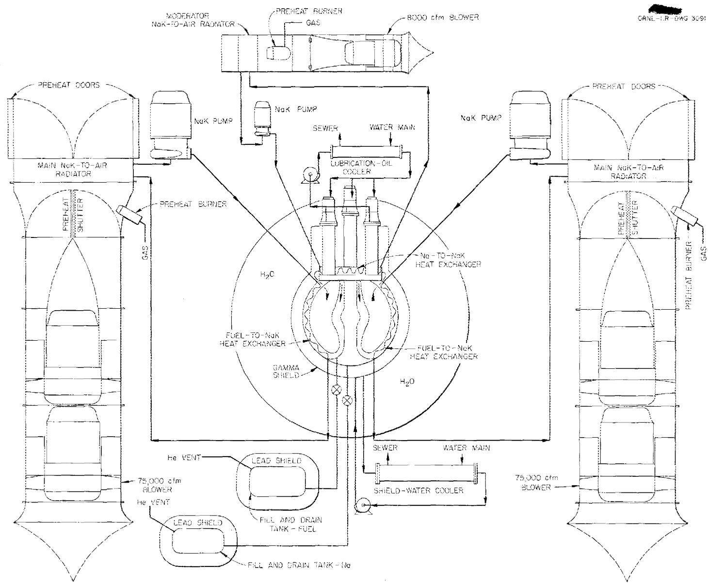  
Fig. 2.1. CFRE Flow Sheet.

TABLE 2.3. WIRING, PIPING, AND TUBING CONNECTIONS THROUGH REACTOR CHAMBER WALL   

<table><tr><td colspan="2">Thermocouples</td></tr><tr><td>Duplicate thermocouples to all pipes leaving shield</td><td>52</td></tr><tr><td>Duplicate thermocouples to main pipes entering shield</td><td>8</td></tr><tr><td>Single thermocouples to oil inlet and outlet lines to pumps</td><td>8</td></tr><tr><td>Na and fuel temperatures</td><td>12</td></tr><tr><td>Pressure shell temperatures</td><td>12</td></tr><tr><td>Gamma-shield shell temperatures</td><td>12</td></tr><tr><td>Shield-water temperatures</td><td>12</td></tr><tr><td>Fuel and Na heat-dump system temperatures</td><td>24</td></tr><tr><td>Pump drive motor temperatures</td><td>8</td></tr><tr><td>Control rod drive temperatures</td><td>4</td></tr><tr><td>Miscellaneous support structure and leak warning temperatures</td><td>12</td></tr><tr><td></td><td>Total 164</td></tr><tr><td colspan="2">Miscellaneous Instrument Wires</td></tr><tr><td>Nuclear instruments</td><td>20</td></tr><tr><td>Pump speed</td><td>8</td></tr><tr><td colspan="2">Power Wiring</td></tr><tr><td>Pump drive motors (4)</td><td>12</td></tr><tr><td>Control rod actuator (1)</td><td>3</td></tr><tr><td>Lights and receptacles</td><td>2</td></tr><tr><td>Fuel addition machine</td><td>1</td></tr><tr><td></td><td>Total 18</td></tr><tr><td colspan="2">Tubing</td></tr><tr><td>Na and fuel dump valve actuators* (1/4 in. OD)</td><td>10</td></tr><tr><td>Expansion-tank pressure* (1/4 in. OD)</td><td>2</td></tr><tr><td>Liquid-level gages* (1/4 in. OD)</td><td>2</td></tr><tr><td>Main NaK lines (5 in. OD)</td><td>4</td></tr><tr><td>Moderator-cooling NaK lines (2 in. OD)</td><td>4</td></tr><tr><td>Gamma-shield cooling water (1 in. OD)</td><td>2</td></tr><tr><td>Pump cooling and lubricating oil (1/2 in. OD)</td><td>4</td></tr><tr><td>Xenon vent</td><td>1</td></tr><tr><td>Atmosphere vent</td><td>1</td></tr><tr><td>Helium supply</td><td>2</td></tr><tr><td></td><td>Total 32</td></tr></table>

*These tubes can be replaced by wires.

TABLE 2.4. PRINCIPAL WIRING, PIPING, AND TUBING CONNECTIONS TO AUXILIARY EQUIPMENT   

<table><tr><td colspan="2">Thermocouples</td></tr><tr><td>Duplicate thermocouples to NaK manifold at outlets of all radiator cores</td><td>32</td></tr><tr><td>Duplicate thermocouples to main NaK pipes entering radiator cores</td><td>8</td></tr><tr><td>Single thermocouples to inlet and outlet lines to oil coolers</td><td>6</td></tr><tr><td>Radiator air inlet and outlet temperatures</td><td>12</td></tr><tr><td>Shield water inlet and outlet temperatures</td><td>4</td></tr><tr><td>NaK dump system temperatures</td><td>12</td></tr><tr><td>NaK pump drive motor temperatures</td><td>4</td></tr><tr><td>NaK pump temperatures</td><td>8</td></tr><tr><td>Miscellaneous support structure and leak warning temperatures</td><td>12</td></tr><tr><td></td><td>98</td></tr><tr><td colspan="2">Miscellaneous Instrument Wires</td></tr><tr><td>Nuclear instruments</td><td>20</td></tr><tr><td>NaK flow meters</td><td>6</td></tr><tr><td>NaK pump speed</td><td>4</td></tr><tr><td>Oil expansion tank level indicators</td><td>3</td></tr><tr><td>Shield water expansion tank level indicators</td><td>3</td></tr><tr><td></td><td>36</td></tr><tr><td colspan="2">Power Wiring</td></tr><tr><td>NaK pump drive motors (2)</td><td>6</td></tr><tr><td>Oil pump drive motors (3)</td><td>6</td></tr><tr><td>Shield water pump drive motor (1)</td><td>2</td></tr><tr><td>Main blower drive motors (4)</td><td>8</td></tr><tr><td>Moderator-cooling system blower drive motor (1)</td><td>2</td></tr><tr><td>Preheat burner drive motors (3)</td><td>6</td></tr><tr><td></td><td>30</td></tr><tr><td colspan="2">Tubing</td></tr><tr><td>NaK dump-valve actuators (1/4 in. OD)</td><td>10</td></tr><tr><td>Na and fuel dump-valve actuators (1/4 in. OD)</td><td>10</td></tr><tr><td>Expansion-tank pressures (1/4 in. OD)</td><td>2</td></tr><tr><td>NaK liquid-level gages (1/4 in. OD)</td><td>2</td></tr><tr><td>Main NaK lines (5 in. OD)</td><td>4</td></tr><tr><td>Moderator-cooling NaK lines (2 in. OD)</td><td>4</td></tr><tr><td>Gamma-shield cooling water (1 in. OD)</td><td>2</td></tr><tr><td>Pump cooling and lubricating oil (1/2 in. OD)</td><td>7</td></tr><tr><td>Xenon vent to buried charcoal bed</td><td>1</td></tr><tr><td>Helium supply to expansion tanks</td><td>5</td></tr><tr><td></td><td>37</td></tr></table>

in the ZPU system. While this arrangement would hardly represent normal operation, it would simulate the one-engine-out condition rather well. It is not yet clear just what will be done, but every effort will be made to get as much information as possible from the ZPU, consistent with the money and the time available.

# REACTOR PHYSICS

W. K. Ergen

M. E. LaVerne

R.R.Coveyou

C. B. Mills

Aircraft Reactor Engineering Division

R. Bate

C. S. Burtnette

United States Air Force

The three-group, three-region code for reactor statics calculations on the ORACLE has been completed. The temperature effects for the CFRE were computed on the UNIVAC for three reactors: a 50-Mw reactor with Inconel coolant tubes in the reflector, a reactor without these tubes, and a reactor in which the Inconel in the core shells was replaced by columbium clad with 0.010 in. of Inconel. The temperature coefficient for rapid temperature changes turned out to be about $-3.5 \times 10^{-5} / {}^{\circ}\mathrm{F}$ , and the temperature coefficient for slow effects is $-2.6 \times 10^{-5} / {}^{\circ}\mathrm{F}$ for the heavily poisoned reactor with the Inconel coolant tubes, but it increases to $-3.3 \times 10^{-5} / {}^{\circ}\mathrm{F}$ and $-3.8 \times 10^{-5} / {}^{\circ}\mathrm{F}$ , respectively, for the reactor without the Inconel coolant tubes and the reactor with the Inconel-clad columbium core shells.

# REACTOR CALCULATIONS

M.E.LaVerne

Aircraft Reactor Engineering Division

C. S. Burtnette

United States Air Force

Results of the parametric reactor study done on the UNIVAC at the AEC Computing Facility in New York have been published,7,8 and the CurtissWright Corp. has completed, under contract to the United States Air Force, a series of multigroup, multiregion calculations for the ORNL-ANP Proj

ect. A report on the results of the latter calculations is being prepared and will be issued by the Curtiss-Wright Corp.

A redetermination of the critical mass for the rhombicuboctahedron critical assembly (CA-19) was found to be necessary because of an error in carbon transport cross-section scaling, a difference in reflector geometry from that assumed for the original calculations, and an actual Teflon density lower than that used in the calculations. In addition, a small correction (about $1\%$ of critical mass) was made for the presence of the aluminum lattice supporting the reactor and for the aluminum control rod sheaths.

The eigenvalues of the difference-equation approximation to the age-diffusion differential equation vary with lattice spacing. Calculations were therefore made with three different spacings in order to evaluate this effect. A foil of 0.004 in thickness was used in the calculations. The results, corrected as mentioned in the preceding paragraph, are given in the following:

<table><tr><td>Space Interval, Ar (cm)</td><td>Calculated Critical Mass (lb)</td></tr><tr><td>0.457</td><td>22.75</td></tr><tr><td>0.914</td><td>21.47</td></tr><tr><td>1.828</td><td>20.91</td></tr></table>

The data are plotted in Fig. 2.2. A Lagrangian extrapolation to a zero lattice spacing gives a critical mass estimate of 24.70 lb. The assembly became critical at a loading of 24.35 lb of $U^{235}$ .

It is recognized that the agreement between calculation and experiment may well be fortuitous, since the critical mass is not very sensitive to errors in detail. Further evaluation of agreement (or lack thereof) must await additional experimental results. Calculations are now being made for the next critical assemblies, that is, the three-region assemblies consisting of a beryllium island and reflector with a Teflon and uranium-foil fuel annulus. The fuel annulus will be surrounded by core shells; aluminum core shells will be used for one assembly and Inconel for the next.

# BERYLLIUM THERMAL STRESS TEST

R.W.Bussard R.E.MacPherson

Aircraft Reactor Engineering Division

One of the key questions in the design of the CFRE, as mentioned above, has been that of the

TABLE 2.5. SUMMARY OF CFRE DEVELOPMENT PROJECTS   

<table><tr><td>Project Number</td><td>Project Title</td><td>Objective</td><td>Estimated Number of Man Hours</td><td>References</td><td>Status September 1, 1954</td></tr><tr><td>1</td><td>Beryllium Thermal Stress</td><td>Investigation of beryllium under severe thermal stress conditions</td><td>2280</td><td>ORNL-1515, -1517, and -1721</td><td>First test completed; no cracks appeared in beryllium speci-men</td></tr><tr><td>2</td><td>Core Hydrodynamics</td><td>Investigation of flow separation, velocity distribution, and perverse particle dwell time</td><td>3880</td><td>ORNL-1515, -1692, -1701; YF-15-11; Memo, Fraas to file, 8/4/54; Memo, Wislicenus to Briant, 6/19/53</td><td>Tests under way with water</td></tr><tr><td>3</td><td>Xenon Removal Pump (plastic model)</td><td>Development of attitude-insensitive pump and header tank geometry to remove xenon and degas fuel</td><td>3080</td><td>ORNL-1649, ORNL CF-54-5-1; Memo, Fraas to file, 8/4/54</td><td>Tests under way with water</td></tr><tr><td>4</td><td>Xenon Removal Pump (hot test unit)</td><td>Performance and cavitation tests with water, sodium, and fuel; endurance test</td><td>5200</td><td>ORNL-1649; Memo, Fraas to file, 8/4/54</td><td>Design completed; fabrication under way</td></tr><tr><td>5</td><td>Model-T Component Test (isothermal)</td><td>Check of fabricability and endurance test of fuel pump, plenum chamber, and core shell assembly</td><td>8920</td><td></td><td>Pump, header-tank, and core-shell design held pending results of projects 2 and 3</td></tr><tr><td>6</td><td>Model-T Component Test (100-kw heat input to core)</td><td>Check for flow separation; estimate of full-scale boundary layer thickness</td><td>4400</td><td>ORNL CF-54-2-35</td><td>Same as above</td></tr><tr><td>7</td><td>Second Fuel-to-NaK Heat Exchanger (4000 kw, 1000-kw input)</td><td>Performance and endurance test at full-scale pressures, pressure drops, and temperature differentials</td><td>9280</td><td>ORNL-1215, -1330, -1509, -1729 (p 28); CF-54-1-155; Memo, Ahern to Fraas, 6/12/54</td><td>Design of about one half of components completed; heat exchanger being fabricated</td></tr><tr><td>8</td><td>Inconel Thermal Stress</td><td>Investigation of effects of severe thermal stress cycling on cracking and distortion</td><td>2680</td><td></td><td>Design of test rig nearly completed</td></tr><tr><td>9</td><td>Leak Characteristics of Tube-to-Header Welds</td><td>Investigation of possibility of self-plugging of weld cracks between fuel and NaK</td><td>760</td><td>ORNL-1215, ORNL CF-54-1-155</td><td>Parts being fabricated</td></tr><tr><td>10</td><td>Fill-and-Drain System</td><td>Performance test with water, NaK, and fuel</td><td>2280</td><td></td><td>Detail design completed for one proposal</td></tr><tr><td>11</td><td>Control Drive Mechanism</td><td>Check of fabricability; shakedown and endurance tests</td><td>3200</td><td></td><td>Preliminary layouts completed for several proposals</td></tr><tr><td>12</td><td>Fuel Addition System</td><td>Check of fabricability; shakedown and endurance tests</td><td>3200</td><td></td><td>Preliminary layouts completed for several proposals</td></tr><tr><td>13</td><td>Wood and Plastic Reactor Mockup (1/2 scale)</td><td>Check of fabricability and test demonstration</td><td>960</td><td></td><td>Fabrication under way</td></tr><tr><td>14</td><td>Sample Heat Exchanger Tube Bundle</td><td>Check of fabricability and cost determination</td><td>2240</td><td></td><td>Detail design completed for one proposal</td></tr><tr><td>15</td><td>Zero Power Unit</td><td>Check of fabricability; shakedown and endurance tests</td><td></td><td></td><td>Preliminary design under way</td></tr></table>

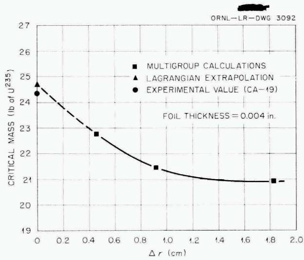  
Fig. 2.2. Effect of Space Interval Size on Computed Critical Mass.

effects of severe thermal stresses in beryllium at temperatures between 1000 and $1300^{\circ}\mathrm{F}$ . There has been serious concern as to whether cracking or distortion in the beryllium would prove to be a major problem. Therefore a test on the beryllium block shown in Fig. 2.3 was devised to investigate the effects of power (and hence thermal) cycling.

The test loop used is shown in Fig. 2.4. Heat was generated in the beryllium block by simple electrical-resistance heating with a current of about 15,000 amp through the beryllium block. Sodium flowed from an electromagnetic pump to the block inlet header, upward through the lower

9R. W. Bussard et al., The Moderator Cooling System for the Reflector-Moderated Reactor, ORNL-1517 (Jan. 22, 1954).

10F. A. Field, Temperature Gradient and Thermal Stresses in Heat Generating Bodies, ORNL CF-54-5-196 (May 21, 1954).

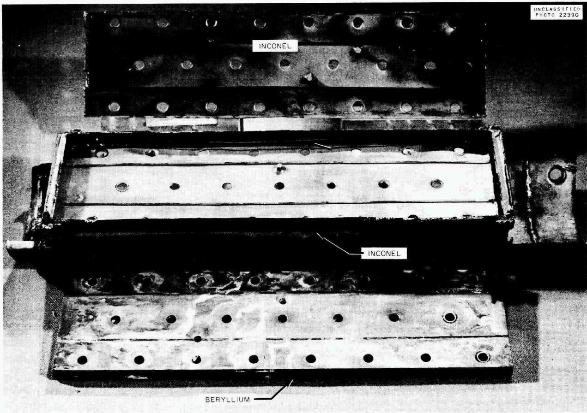  
Fig. 2.3. Beryllium Test Block.

UNCLASSIFIED

ORNL-LR-DWG 3093

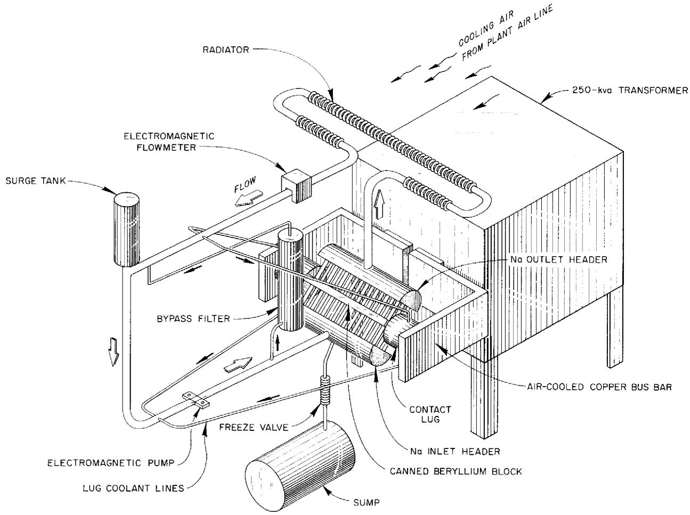  
Fig. 2.4. Beryllium Thermal Stress Test Apparatus.

tube bank to the corresponding holes in the beryllium block, through the upper tube back into the outlet header, out to the radiator section, and back to the pump. Banks of tubes were used to duct the sodium to and from the block to minimize the flow of electrical current through the sodium inlet and outlet header tanks. A bypass filter arrangement was provided, as well as bypass cooling flow to the sodium-filled lugs connected to the transformer bus bars.

The high-power-density volume heat source coupled with transverse sodium flow through the drilled holes gave a high thermal gradient around the holes. During the course of the test the power density was cycled regularly by alternating the

operating conditions as shown in Table 2.6, which also compares the operating conditions for the thermal stress test with those for the CFRE.

The test included an initial 100-hr period at a constant high power density followed by power cycling at the rate of one cycle per day. The changes from one power level to the other were, in all cases, performed at a fairly uniform rate in a 1-min interval. The test was concluded after 1000 hr of operation, including 36 cycles. The beryllium sample is now being examined by the Metallurgy Division for dimensional stability and evidence of mass transfer, corrosion, or erosion. Visual inspection of the sample after the test indicated that no distortion, cracking, or erosion of the beryllium had taken place.

TABLE 2.6. COMPARISON OF OPERATING CONDITIONS FOR BERYLLIUM THERMAL STRESS APPARATUS AND CFRE  

<table><tr><td></td><td></td><td colspan="2">Beryllium Block</td><td>CFRE</td></tr><tr><td>Power level</td><td></td><td>High</td><td>Low</td><td>60 Mw</td></tr><tr><td>Peak power density in beryllium, w/cm3</td><td></td><td>40</td><td>14</td><td>70</td></tr><tr><td>Average power density in beryllium, w/cm3</td><td></td><td>40</td><td>14</td><td>1.5</td></tr><tr><td>Cooling passage diameter, in.</td><td></td><td>0.25</td><td>0.25</td><td>0.25</td></tr><tr><td>Cooling passage spacing (minimum), in.</td><td></td><td>1.5</td><td>1.5</td><td>1.0</td></tr><tr><td>Calculated thermal stress (no plastic flow), psi</td><td></td><td>108,000</td><td>38,000</td><td>42,000</td></tr><tr><td>Sodium inlet temperature to beryllium, °F</td><td></td><td>1,040</td><td>1,060</td><td>1,050</td></tr><tr><td>Sodium outlet temperature from beryllium, °F</td><td></td><td>1,100</td><td>1,080</td><td>1,150</td></tr><tr><td>Average sodium temperature through beryllium, °F</td><td></td><td>1,070</td><td>1,070</td><td>1,100</td></tr><tr><td>Maximum thermocouple reading in beryllium, °F</td><td></td><td>1,200</td><td>1,110</td><td></td></tr><tr><td>Calculated maximum beryllium temperature, °F</td><td></td><td>1,280</td><td>1,150</td><td>1,230</td></tr><tr><td>Time at power level, hr/day</td><td></td><td>8</td><td>16</td><td></td></tr><tr><td>Heating current, amp</td><td></td><td>14,300</td><td>8,450</td><td></td></tr></table>

# BERYLLIUM-INCONEL-SODIUM SYSTEMS

The compatibility of sodium, beryllium, and Inconel has been studied by using whirlingig, seesaw, thermal-convection-loop, and forced-circulation-loop tests. The results obtained to date indicate that it will be possible to use beryllium unclad in the CFRE if the temperature of the sodium-beryllium-Inconel region (that is, the reflector and the island) is kept below $1200^{\circ}\mathrm{F}$ . The main effect observed thus far in the tests has been the type of mass transfer usually found when dissimilar metals are used in a system. In this case the mass transfer has been evidenced by the alloying of beryllium with the Inconel walls in regions where the beryllium and Inconel were close together, with only stagnant sodium separating them.

# Beryllium-Inconel-Sodium Compatibility Tests

E. E. Hoffman

W.H.Cook

C. R. Brooks

C. F. Leitten

Metallurgy Division

Nine tests of the compatibility of beryllium, sodium, and Inconel in dynamic systems have been completed (Table 2.7). In the whirling tests a circular loop of Inconel tubing with a beryllium insert was partly filled with sodium which was circulated at a velocity of 10 fps. For four of

these tests there was no temperature differential, but for one test there was a differential of $140^{\circ}\mathrm{F}$ . These tests were of 300-hr duration. Two thermal-convection loops of Inconel with beryllium inserts were tested for 1000 hr with sodium circulating at a relatively low velocity (approximately 2 to 10 fpm). In addition, seesaw tests were performed in which beryllium specimens were retained in the hot zones of oscillating Inconel tubes partly filled with sodium which circulated at a velocity of 3 fpm.

Macroscopic examination failed to show attack on the Inconel, but two specimens showed deposits. Black layers were formed in the annular space between the beryllium insert and the enclosing Inconel sleeve in the whirlingig and thermal convection-loop tests. The layer was very adherent and made removal of the insert difficult; consequently, the weight change data obtained were not considered as being reliable.

A picture of this layer from a whirligig loop operated at $1300^{\circ}\mathrm{F}$ is shown in Fig. 2.5. Microscopic examination showed that the maximum depth of attack on the inside surface of the Inconel did not exceed 0.5 mil. Chemical analysis of the sodium bath revealed less than $0.04\%$ beryllium in the sodium. In all tests, beryllium was detected

TABLE 2.7. RESULTS OF BERYLLIUM-SODIUM-INCONEL COMPATIBILITY TESTS   

<table><tr><td>Test Type</td><td>Time (hr)</td><td>Temperature (°F)</td><td>Concentration of Be on Surface of Inconel Tube (μg/cm2)</td><td>Remarks</td></tr><tr><td rowspan="5">Whirligig</td><td>300</td><td>1100 (isothermal)</td><td>5.3 to 7.9</td><td>Two dark deposits on Inconel analyzed high in beryllium; macroscopically, beryllium showed fine pitted appearance</td></tr><tr><td>300</td><td>1200 (isothermal)</td><td>0.05</td><td>No visible deposits on Inconel; beryllium smooth but discolored</td></tr><tr><td>300</td><td>1300 (isothermal)</td><td>0.07</td><td>No visible deposits on Inconel; beryllium showed dark discontinuous deposit covering surface</td></tr><tr><td>300</td><td>1400 (isothermal)</td><td>39.6 to 127.0</td><td>No visible deposits on Inconel; beryllium surface pitted and partly covered with small deposits</td></tr><tr><td>270</td><td>Hot zone, 1200 Cold zone, 1060</td><td></td><td>Loose, adherent gray deposit found in cold zone, analyzed high in sodium; beryllium smooth but discolored</td></tr><tr><td rowspan="2">Thermal-convection loop</td><td>1000</td><td>Hot zone, 1150 Cold zone, 990</td><td></td><td>Inconel appeared smooth and showed no visible deposits; beryllium smooth but discolored</td></tr><tr><td>1000</td><td>Hot zone, 1300 Cold zone, 1130</td><td></td><td>Inconel appeared smooth and showed no visible deposits; beryllium specimen smooth and light gray in color</td></tr><tr><td rowspan="2">Seesaw</td><td>300</td><td>Hot zone, 1400 Cold zone, 710</td><td>Hot zone, 14.0 Middle, 9.9 Cold zone, 20.6</td><td>Beryllium specimen covered with black flaky deposit; surface of Inconel tube discolored</td></tr><tr><td>300</td><td>Hot zone, 1100 Cold zone, 740</td><td>Hot zone, 0.07 Middle, 0.02 Cold zone, 0.01</td><td>Similar to above</td></tr></table>

on the Inconel tube wall surface. X-ray analyses of the Inconel surfaces indicated that the beryllium was present as the metal.

In the thermal-convection loops, a deposit was formed between the contacting ends of the beryllium insert and the Inconel tube. X-ray analyses of these deposits and those found in the whirlingigs loops showed beryllium, Inconel, and lines very similar to sodium bicarbonate. The beryllium specimens from the seesaw tests were covered with a black, flaky deposit, which has been identified by x-ray analysis as beryllium oxide and beryllium. Again, lines similar to sodium bicarbonate were observed.

Microscopic examination of the beryllium specimen from a whirling test showed little attack on

the inside surface, but attack up to 5 mils was observed on the outside surface which was in contact with the relatively stagnant sodium in the 0.005-in. annular space (Fig. 2.6).

# Mass Transfer Tests in Thermal-Convection Loops

G.M.Adamson

Metallurgy Division

A series of thermal-convection loops is being operated to determine the effect of dissimilar metal mass transfer in the beryllium-Inconel-sodium system. These studies are being carried out in Inconel loops with short beryllium inserts in the hot legs; sodium is the circulated fluid. The

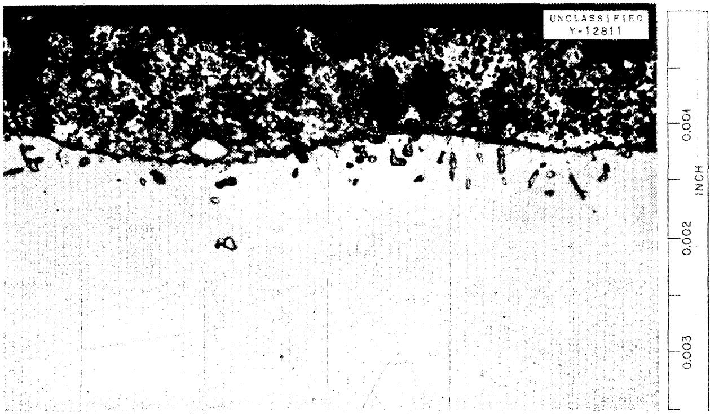  
Fig. 2.5. Inside Surface of Inconel Sleeve Enclosing Beryllium Insert Exposed in Whirligig Test to Sodium for 300 hr at $1300^{\circ}\mathsf{F}$ . Etched with glyceria regia. 1000X.

TABLE 2.8.EFFECT OF CIRCULATING SODIUM AT VARIOUS TEMPERATURES FOR $500\mathrm{hr}$ IN INCONEL THERMAL-CONVECTION LOOPS WITH BERYLLIUM SPECIMENS IN THE HOT LEGS  

<table><tr><td rowspan="2">Temperature (°F)</td><td colspan="2">Metallographic Examination</td></tr><tr><td>Beryllium Specimen</td><td>Inconel Hot Leg</td></tr><tr><td>1500</td><td>Outside surface of insert showed holes to a depth of 14 mils; inside surface slightly rough</td><td>Deposit opposite the beryllium insert</td></tr><tr><td>1300</td><td>Intergranular penetrations to a depth of 2 mils on outside surface; no attack on inside surface</td><td>No attack or deposit</td></tr><tr><td>1100</td><td>No layer or attack</td><td>No attack or deposit</td></tr><tr><td>900</td><td>No layer or attack</td><td>No attack or deposit</td></tr></table>

results reported in Table 2.8 are from tests operated for $500\mathrm{hr}$ . Other loops are now in operation that will be run for longer periods.

Photomicrographs of the outsides of the berryllium inserts are shown in Fig. 2.7. Black, flaky material was found in the cold legs of the loops operated at 1100, 1300, and $1500^{\circ}\mathrm{F}$ and

in the hot leg of the loop operated at $1500^{\circ}\mathrm{F}$ . The deposit material has not yet been identified by spectrographic or diffraction studies. The deposit found on the Inconel opposite the beryllium insert in the loop operated at $1500^{\circ}\mathrm{F}$ is shown in Fig. 2.8; it has been identified as a nickel-beryllium alloy.

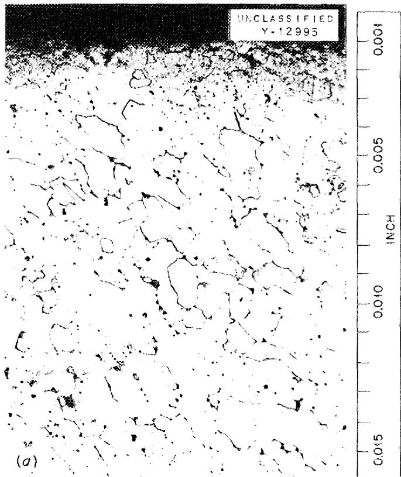

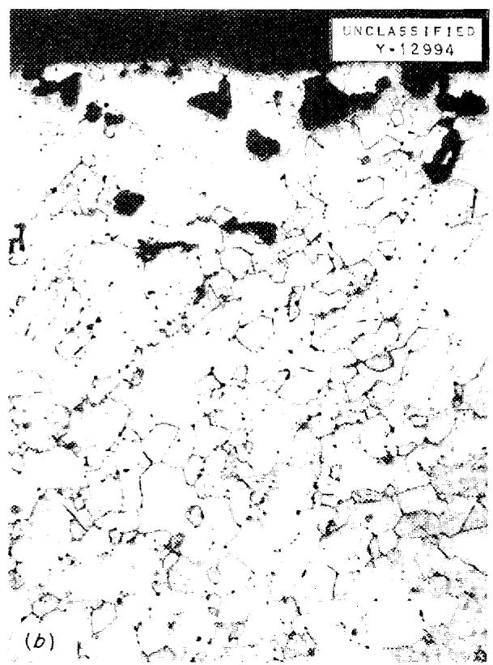  
Fig. 2.6. Beryllium Specimen After Whirling Test for $300\mathrm{hr}$ at $1300^{\circ}\mathrm{F}$ . (a) Surface exposed to flowing sodium. (b) Surface exposed to relatively stagnant sodium in the annular space between the specimen and the Inconel sleeve. Etched with oxalic acid. 250X.

# Mass Transfer in Forced-Circulation-Loop Tests

L.A.Mann

Aircraft Reactor Engineering Division

F. A. Anderson 11

University of Mississippi

A test unit for investigating mass transfer of beryllium to Inconel in flowing sodium was operated for 1006 hr under conditions nearly the same as those proposed for the reflector-moderated reactor. The approximate conditions of operation, with minor fluctuations, were as follows: sodium flow rate, 3 gpm; beryllium temperature, $1200^{\circ}\mathrm{F}$ ; maximum temperature, $1245^{\circ}\mathrm{F}$ (sodium entering economizer); minimum flowing sodium temperature, $900^{\circ}\mathrm{F}$ (re-entering economizer from cooling section); Reynolds number at minor diameter (0.25 in.)

of beryllium insert, 155,000; minimum Reynolds number (at coldest point in economizer annulus), 61,000.

Upon termination of the test, the unit was cooled rapidly to room temperature to freeze the sodium. Samples of both the sodium and the Inconel were then taken from each of 24 locations in the unit. The sodium samples were analyzed chemically for beryllium, and none was found. Metallurgical examination of the beryllium piece and the Inconel samples indicated that the beryllium-Inconel-sodium system should give no trouble from corrosion or mass transfer under the conditions presently proposed for the reflector-moderated reactor (temperature not over $1200^{\circ}\mathrm{F}$ , Reynolds number not over 150,000).

The above-described test unit was essentially duplicated, and a second test was started with maximum and minimum temperatures in the flowing sodium of $1300^{\circ}\mathrm{F}$ (at the beryllium) and $1000^{\circ}\mathrm{F}$ , respectively. A power failure terminated this test

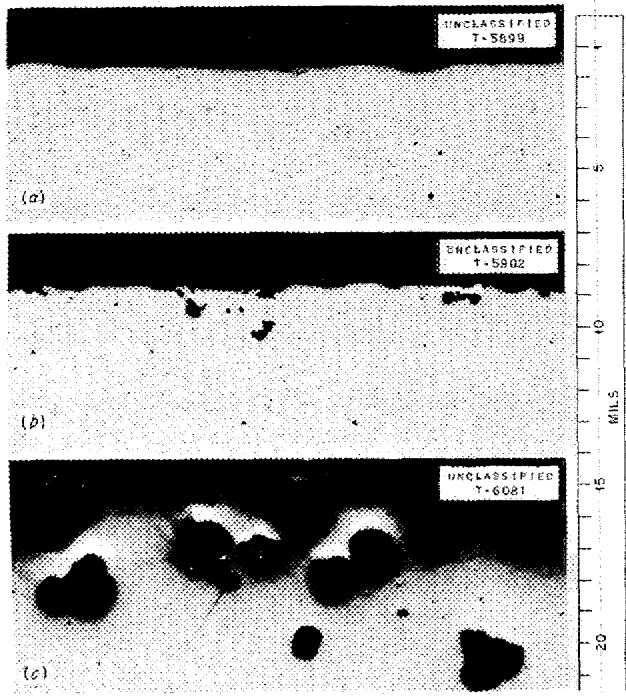  
Fig. 2.7. Surfaces of Beryllium Inserts in Inconel Thermal-Convection Loops After Exposure to Flowing Sodium for 500 hr at (a) $1100^{\circ}\mathsf{F}$ , (b) $1300^{\circ}\mathsf{F}$ , (c) $1500^{\circ}\mathsf{F}$ . Unetched. 250X. Reduced $36\%$ .

after 268 hr of operation. Sodium and Inconel samples and the beryllium insert were removed for analysis and examination, but results have not yet been received. A third unit has been built and is intended to operate for 1000 hr.

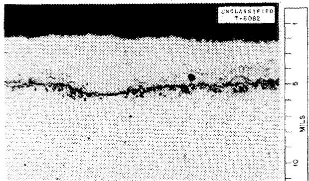  
Fig. 2.8. Layer on Inconel Opposite Beryllium Insert in Thermal-Convection Loop That Circulated Sodium at $1500^{\circ}\mathrm{F}$ for 500 hr. Unetched. 250X. Reduced $36\%$ .

# 3. EXPERIMENTAL REACTOR ENGINEERING

# H.W.Savage Aircraft Reactor Engineering Division

The emphasis in the engineering work has shifted to research and component development for the CFRE and for in-pile loops, since most of the preoperational ARE tests have been completed. Two types of pumps have been developed for in-pile loop use. The vertical-shaft centrifugal sump pump, which would be installed outside the reactor shield and thus would require auxiliary shielding, is now being fabricated in sufficient quantity to meet the demands of the in-pile loop program and the forced-circulation corrosion testing program. The small (4-in.-OD), air-driven, horizontal-shaft sump pump being developed for insertion in a reactor beam hole was tested with NaF-ZrF at $1350^{\circ}\mathrm{F}$ . Some difficulty was encountered with initial priming, but operation was otherwise satisfactory. A new, small pump that has the required small holdup volume is being designed. This pump, which will use a turbine-type impeller, has the advantage that both the inlet and discharge can be at the bottom. Hydraulic drive motors of suitably small dimensions have been found to be satisfactory drives for these pumps.

Additional work has been done on the development of forced-circulation corrosion-testing loops for obtaining information on the corrosion of Inconel in high-velocity turbulent fluoride mixtures with large temperature differentials in the system. Two series of loops are being constructed to meet the following requirements: a Reynolds number of 10,000 with temperature gradients of 100, 200, and $300^{\circ}\mathrm{F}$ and a temperature gradient of $200^{\circ}\mathrm{F}$ with Reynolds numbers of 800, 3,000, and 15,000. The maximum fluid temperature is to be $1500^{\circ}\mathrm{F}$ . A forced-circulation loop is also being developed for testing combinations of structural metals in contact with high-velocity turbulent liquid metals under high temperature differentials.

Several exploratory tests were made of gas burners for use with the proposed gas-furnace heat source for high-temperature reactor mockup tests. Also, a study is under way of the cavitation phenomenon associated with operating liquid metal systems at elevated temperatures, high flow rates,

and high pump speeds. A correlation of fluid-flow-noise intensity with pressure data was noted.

The number of stations available for convection loop testing has been increased from 18 to 31 so that many more long-term tests (2000 hr or longer) and intensive tests of special materials can be made. The basic design of the convection loops has been simplified, and various means of heating the loops and of making operation of them more automatic are being studied.

# IN-PILE LOOP COMPONENT DEVELOPMENT

# W. B. McDonald

# Aircraft Reactor Engineering Division

An in-pile loop for insertion in the MTR is to be designed, constructed, and operated as a joint ORNL and Pratt & Whitney Aircraft Division project. The loop is being developed for circulating proposed fuel mixtures so that the extent of radiation damage to materials of construction and the effect of radiation on the fuel can be determined. Preliminary ORNL work on this project is concerned with the design and development of components of a loop to operate in a horizontal beam hole. Further developmental work was also done on the vertical-shaft centrifugal pump for use with both in-pile and out-of-pile forced-circulation loops.

# Horizontal-Shaft Sump Pump

D.F.Salmon J.A.Conlin

# Aircraft Reactor Engineering Division

The air-driven horizontal-shaft sump pump described previously was operated with NaF-ZrF at $1350^{\circ}\mathrm{F}$ . It produced a 70-psi head at 6000 rpm and a flow rate of 1.5 gpm. Initial difficulty in priming the pump was solved by momentarily flooding the impeller labyrinth. This pump, which was built as a pilot model for checking design principles, hot pump performance, and reliability, has too large a volume holdup for in-pile use and will now be used as a laboratory pump.

A new pump has been designed that has the required small pump holdup volume. For priming, this design incorporates a baffle in the sump tank

that will permit remote, momentary flooding of the impeller eye and the labyrinth behind the impeller. A turbine-type impeller is used instead of the conventional centrifugal impeller.

It has been experimentally determined, with water, that the turbine type of impeller will prime itself if the inlet and outlet are placed at the bottom of the pump and the fluid is maintained at a level about half way between the bottom of the impeller and the impeller center. The horizontal sump pump principle is used, with the sump having a minimum volume that acts merely as an expansion chamber and a reservoir to replace and catch the fluid leaking past the labyrinth seal. Excessive impeller end clearances are necessary for this type of pump because of the severe temperature gradients present. However, estimated available pump heads (25 ft at 4500 rpm and 1.5 gpm) are greater than the estimated requirements. Hydraulic efficiency of the pump will be low but performance will be reliable.

Further work has been done on centrifugally sealed and frozen-fluoride-sealed pumps, and it has been established that the centrifugally sealed pump requires too great a volume of fluid for sealing for it to be considered for in-pile use and that the leakage rate of the frozen-fluoride-sealed pump is excessive. However, the centrifugally sealed pump, which will be useful for other applications, has been modified to include a system that makes the pump self-priming and deaerating. By controlling the seal level and using a proper venting

sequence, the pump can be easily stopped and restarted. A pilot model of the pump, similar to the pump previously described, has been designed that incorporates these features (Fig. 3.1) and an integral sump tank connected by a passage to the seal cavity.

In operation, the system would be filled to the full level. The seal cavity and sump tank would then be pressurized through the gas inlet tube to the predetermined pressure necessary to obtain a positive pump inlet pressure during operation, and the pump would be started. The centrifugal force would cause the liquid in the seal cavity to form a rotating annulus. The annulus of fluid would develop a small pressure and thus pump fluid into the discharge tube, through the loop, and back to the pump. The small bleed hole from the pump discharge to the sump tank would permitdeaeration by bypassing aerated fluid from the pump into the sump. The bypassed fluid would be replaced by clear fluid from the seal. When the pump was primed and deaerated, a continuous flow of fluid would pass from the bleed hole to the sump to remove any accumulation of gas. Throughout this operation, fluid entering the loop from the seal to either fill the loop or replace the bleed flow would be replaced by fluid from the sump, and sufficient fluid would thus be in the seal for sealing. Therefore there is a lower limit on the run level in the

UNCLASSIFIED

ORNL-LR-DWG 3094

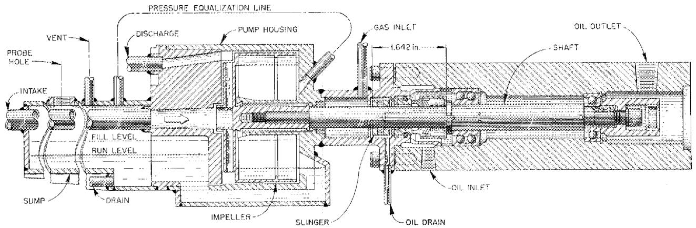  
Fig. 3.1. Centrifugally Sealed Sump Pump.

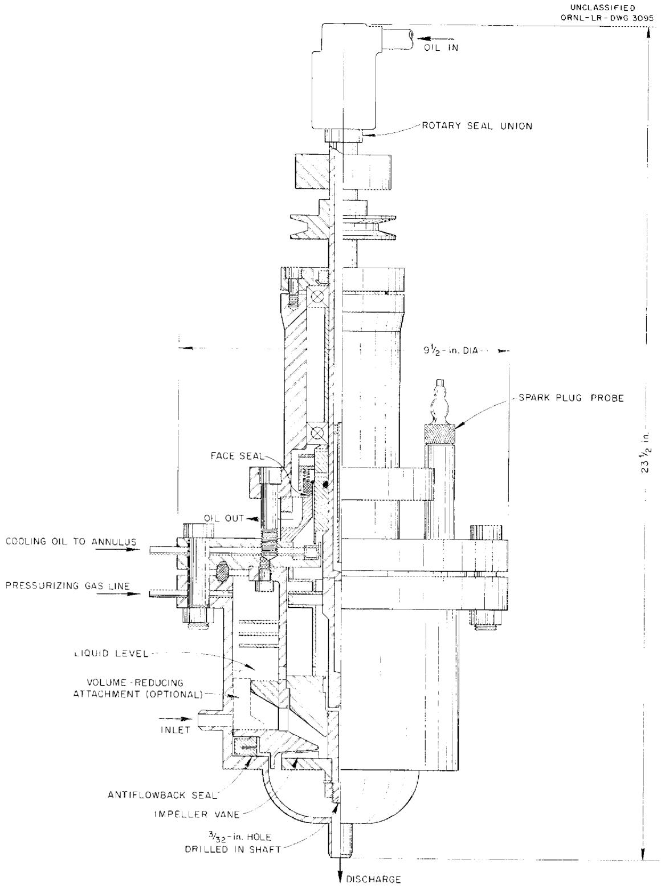  
Fig. 3.2. Vertical-Shaft Centrifugal Sump Pump (Model LFB).

sump in that it must be sufficiently high at all times to provide the necessary flow into the seal.

To stop the unit, the sump tank would be vented at the same time the pump was stopped, but the gas pressure would be maintained until draining had been completed. This would cause a flow of gas along the shaft into the seal cavity and would blow out any fluid that might enter along the shaft. It would also maintain a seal cavity pressure somewhat greater than the sump tank pressure and would force the fluid out of the seal into the sump. If this procedure were not followed, the sealing annulus of fluid would, upon collapsing when the pump was stopped, momentarily fill the seal cavity above the shaft level and cause fluid to enter along the shaft.

# Vertical-Shaft Centrifugal Sump Pump

D. R. Ward

Aircraft Reactor Engineering Division

Developmental work has been continued on the vertical-shaft centrifugal sump pump (Model LFB) for use with forced-circulation loops, both in-pile and out. This is a vertical-shaft centrifugal sump pump with a side inlet and a bottom discharge (Fig. 3.2). A Graphitar face seal prevents the pressurizing gas from escaping along the shaft. Circulating spindle oil serves to lubricate this face seal and to carry away heat from the seal region.

Typical performance curves for this pump with water are shown in Fig. 3.3. In a recent test the pump was run for 864 hr at 6000 rpm while pumping $1400^{\circ}\mathrm{F}$ sodium at about 3 gpm. Typical oil leakage past the shaft face seal was under 0.1 cm³/hr.

Developmental work during the past eight months has resulted in the following improvements in this pump: the elimination of the tendency for the pump to introduce gas into the liquid stream at flow rates up to 6 gpm; an improved anti-flowback seal to prevent recirculation of the liquid within the pump; an improved means for cooling the face-seal region of the pump; and a reduction of pump volume, which is desirable when the pump is used for in-pile loop tests.

The main difficulty, that of gas entrainment, was primarily caused by vortexing and the passage of gas downward along the rotating shaft. The ad

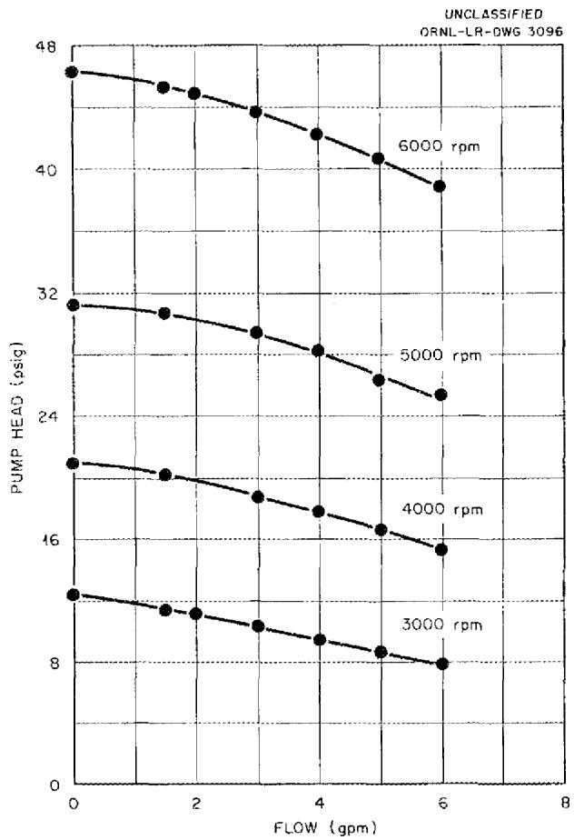  
Fig. 3.3. Performance Curves for Vertical-Shaft Centrifugal Sump Pump (Model LFB).

dition of vertical baffles adjacent to the shaft merely broke up the large vortex into several smaller ones, which were just as objectionable. The problem is solved in the present arrangement by permitting liquid from the high-pressure region of the pump to be bypassed up through a hole in the shaft to an annular space surrounding the shaft. This liquid, in turn, forms a seal and prevents the gas from following its former path.

Acceptance tests for these pumps include operating each pump with water to check the pumping characteristics and freedom from gas entrainment and pumping sodium at $1400^{\circ}\mathrm{F}$ for 72 hr at 6000 rpm with acceptable oil leakage past the face seal. This hot test also serves to clean oxide film from the wetted pump parts, as well as to reveal any mechanical faults that might be present. Five of these pumps are being built, and four similar pumps (Model LFA) are now in use.

# Hydraulic Motor Pump Drives

J.A.Conlin

Aircraft Reactor Engineering Division

Two types of hydraulic motors have been found to be suitable for use as in-pile pump drives. The first, a gear-type motor rated at 1.75 shp at 3500 rpm, was operated at 6000 rpm for 500 hr under a light load (about 0.08 shp) that was obtained by coupling the motor to a small air blower. Upon completion of the test the motor was disassembled and was found to be in good condition. The rubber lip shaft seal had worn a slight groove in the shaft, and a carbon-like deposit which had accumulated on the shaft just outside the seal caused the seal to stick slightly after it had been idle for a prolonged period. However, throughout the test, seal leakage was negligible. The only other indication of wear was a slight scoring on the gear sides adjacent to the shaft end of the motor.

The second motor, an axial-piston type rated at 3.8 shp at 6060 rpm continuous duty, was run for 100 hr at 6000 rpm. Operation was completely satisfactory, and, since this motor is rated at 6060 rpm, further testing was judged to be unnecessary.

The axial-piston motor was chosen for in-pile service, since it is considered to be the more reliable unit. Throughout these tests, hydraulic oil with a viscosity of 155 SSU (seconds Saybolt universal) at $100^{\circ}\mathrm{F}$ and a viscosity index of 100 was used. It should be noted that during initial testing of the gear-type motor, oil with a viscosity of 290 to 325 SSU at $100^{\circ}\mathrm{F}$ was used, and, as a result, excessive overheating of the motor occurred to the extent that the shaft turned blue. Despite this, the motor completed the test satisfactorily.

# FORCED-CIRCULATION CORROSION LOOPS

Inconel Loops

W.C.Tunnel

Aircraft Reactor Engineering Division

W. K. Stair, Consultant

J. F. Bailey, Consultant

University of Tennessee

The previously described, small, Inconel, forcedcirculation loop designed to have a temperature differential of $135^{\circ}F$ has been operated for a total of 141 hr with NaF $\cdot ZrF_{4}$ -UF (50-46-4 mole %) at an apparent mass flow rate of 400 to 450 Btu/hr with a temperature differential up to $300^{\circ}F.$ The

fluid velocity in the loop normally was maintained at about 1.7 fps at a temperature gradient of $165^{\circ}F$ . Termination of the test resulted from a short in the motor leads and subsequent rupture of the heated section of the loop. The test facility, shown in Fig. 3.4, is being rebuilt and is approximately $80\%$ complete. The final design conditions are presented in Fig. 3.5. Reports which give a detailed presentation of the design and an analysis of the initial operation are being prepared.[4,5]

In the design of the loop for electrical-resistance heating, a resistivity value of 98 $\mu \mathrm{ohm}\cdot \mathrm{cm}$ was used for Inconel in computing the necessary length of the resistance-heated tube. However, data obtained during the loop operation indicated that the actual resistivity of the Inconel was about 70 to $80\mu \mathrm{ohm}\cdot \mathrm{cm}$ . To resolve the discrepancy, a duplicate of the heating section of the loop was filled with $\mathrm{NaF - ZrF_4 - UF_4}$ (50-46-4 mole %) and alternately heated and cooled while accurate potential and current measurements were made. Sixty-two measurements were made in the temperature range of 800 to $1600^{\circ}\mathrm{F}$ , and the average resistivity of the Inconel was found to be 75 $\mu \mathrm{ohm}\cdot \mathrm{cm}$ .

A program is under way for the design, construction, and operation of two series of forced-circulation loops for studying the effect of temperature gradient and fluid velocity on the phenomenon of mass transfer in Inconel systems containing fluoride mixtures at elevated temperatures. The requirements of the two series of loops are a Reynolds number of 10,000 with temperature gradients of 100, 200, and $300^{\circ}\mathrm{F}$ and a temperature gradient of $200^{\circ}\mathrm{F}$ and Reynolds numbers of 800, 3,000, and 15,000. The maximum fluid temperature is specified as $1500^{\circ}\mathrm{F}$ , and the Reynolds numbers are to be evaluated at that temperature. The loops are to be constructed of Inconel tubing. The maximum tube-wall temperature is to be $1700^{\circ}\mathrm{F}$ , and the surface-to-volume ratio is to be held essentially the same for each loop.

3W.C.TunnelI.W.K.Stair,and J.F.Bailey,ANP Quar.Prog.Rep.June 10,1954,ORNL-1729,p21.   
4W. K. Stair, The Design of a Small Forced Circulation Corrosion Loop (to be published).   
5W. C. Tunnell, Operation Report of the First Small ATV Study Loop (to be published).   
International Nickel Co., Properties of Some Metals and Alloys.   
7W. D. Manly, High Flow Velocity and High Temperature Gradient Loops, ORNL. CF-54-3-193 (Mar. 18, 1954).

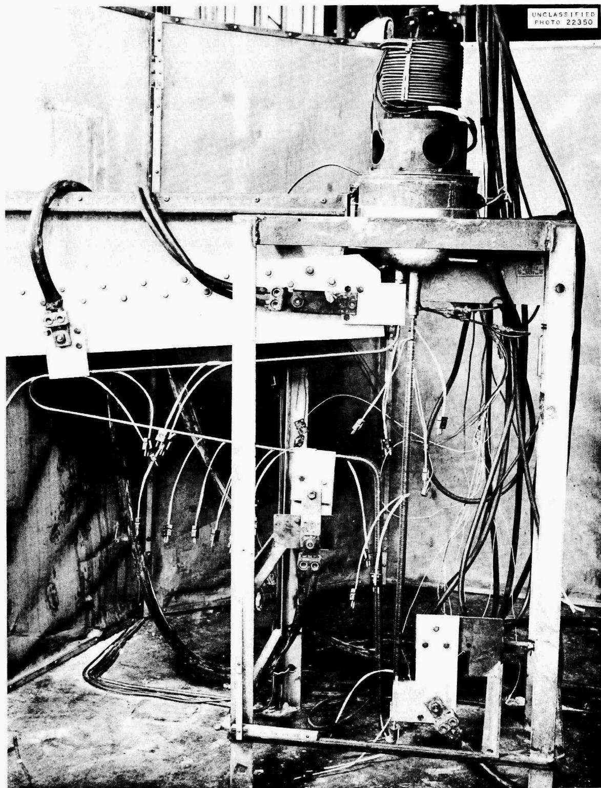  
Fig. 3.4. Inconel Forced-Circulation Corrosion Loop.

TEMPERATURE DIFFERENTIAL, $159.2^{\circ}F$ REYNOLDS NO.AT $1300^{\circ}F$ 3730   
REYNOLDS NO.AT $1459^{\circ}F$ 4540   
FLOW,0.81 gpm   
VELOCITY,5.29 fps   
MASS FLOW RATE,0.361 Ib/sec   
LENGTH OF HEATING SECTION,5.13 ft   
LENGTH OF COOLING SECTION,5.86 ft   
POWER,17.6 kw   
CURRENT,400 amp   
VOLTAGE,44

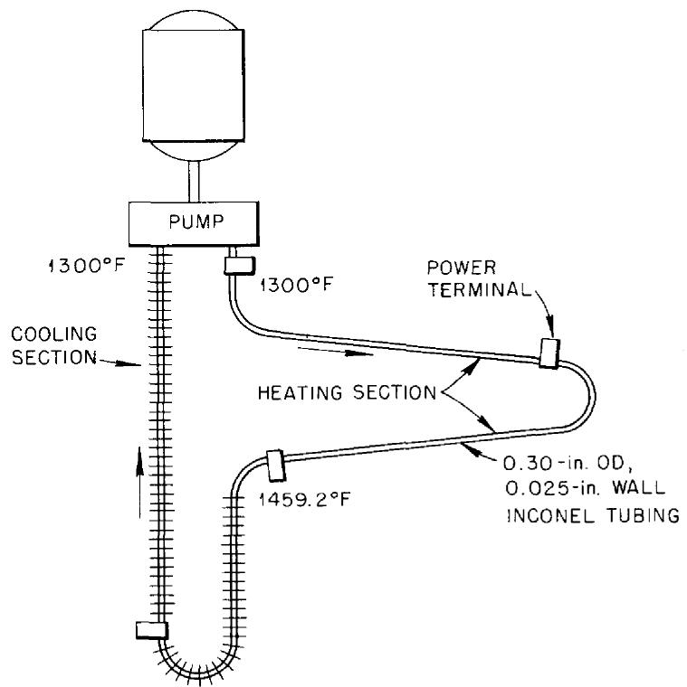  
Fig. 3.5. Configuration and Design Conditions for Inconel Forced-Circulation Loop to Operate at a Temperature Differential of Approximately $160^{\circ}\mathsf{F}$ .

A summary of the design dimensions and expected operating conditions for each of the six loops is presented in Table 3.1, which also indicates the current status of each loop. Three methods of heating were studied: electrical-resistance, gas-fired furnace, and liquid bath. The liquid bath was discounted because it would require pressurization of the liquid metal, an excessively long heat exchanger, and a large investment. A gas-fired furnace was considered, but lack of operating experience and the high heat flux necessary for the loops indicated the use of electrical heating, with which considerable experience has been obtained. A gas-fired furnace is being studied as a possible heat source for a large number of corrosion loops. Preliminary calculations of the pressure drop through the loops indicate that the

Model LFA pump8 can be used, and thus it will not be necessary to develop a pump.

For purposes of preliminary design the following assumptions were made: (1) The specific resistivity of molten $\mathsf{NaF - ZrF_4 - UF_4}$ (50-46.4 mole %) is so high that the resistance of the electrically heated Inconel tube may be taken as the parallel circuit resistance. (2) Heat transfer to the fluoride mixture may be calculated by relations established for water. (3) A thermal loss equal

TABLE 3.1. PRINCIPAL FEATURES AND STATUS OF FORCED-CIRCULATION CORROSION LOOPS   

<table><tr><td rowspan="2"></td><td colspan="6">Loop Number</td></tr><tr><td>1</td><td>2</td><td>3</td><td>4</td><td>5</td><td>6</td></tr><tr><td>Reynolds number at 1500°F</td><td>10,000</td><td>10,000</td><td>10,000</td><td>800</td><td>3000</td><td>15,000</td></tr><tr><td>Temperature differential, °F</td><td>100</td><td>200</td><td>300</td><td>200</td><td>200</td><td>200</td></tr><tr><td>Power input, kw</td><td>27.7</td><td>54.2</td><td>80.0</td><td>6.8</td><td>25.5</td><td>86.9</td></tr><tr><td>Heating section length, ft*</td><td>8.08</td><td>8.08</td><td>8.08</td><td>6</td><td>22.3</td><td>8.08</td></tr><tr><td>Cooling section length, ft*</td><td>15.64</td><td>15.64</td><td>15.64</td><td>1.6</td><td>6</td><td>15.64</td></tr><tr><td>Heat exchanger length, ft**</td><td>18.75</td><td>18.75</td><td>18.75</td><td>None</td><td>None</td><td>18.75</td></tr><tr><td>Pressure drop, psi</td><td>35.12</td><td>36.54</td><td>47.5</td><td>0.06</td><td>0.57</td><td>115.5</td></tr><tr><td>Status</td><td>Detail design complete</td><td>Detail design complete</td><td>Construction and assembly 80% complete</td><td>Detail design 90% complete</td><td>Preliminary design complete; detail design 20% complete</td><td>Construction 20% complete</td></tr></table>

*0.5-in.-OD, 0.020-in.-wall tubing.   
\*\*1.0-in.-OD, 0.049-in.-wall tubing used for outer tube of concentric-tube heat exchanger.

to $10\%$ of the total heat transfer exists at the heater section and at the heat exchanger.

# Dissimilar-Metal Loops

L.A.Mann

Aircraft Reactor Engineering Division

A loop for testing combinations of structural metals in contact with high-velocity turbulent liquid metals under high temperature differentials is being developed. If combinations of materials are found that are satisfactory for use in liquid metal systems, greater flexibility and ease of construction may be attained. An optimized design, patterned after that used for beryllium-Inconel-sodium mass transfer tests (cf. Sec. 2, "Reflector-Moderated Reactor"), has been developed and is to be used first for testing combinations of Inconel and type 316 stainless steel in sodium.

# GAS-FURNACE HEAT-SOURCE DEVELOPMENT

L.A.Mann

Aircraft Reactor Engineering Division

L.F.Roy

University of Mississippi

Several exploratory tests were made of commercial and ORNL-designed-and-fabricated burners for use with the gas-furnace heat source described previously.[12] The heat release intensity desired

is on the order of 3000 Btu/ft³·sec, which is of the same order as that attained in jet aircraft burners.

The maximum rate of heat release obtained in the tests, 170 Btu/ft³, was obtained with the burner designed by A. P. Fraas. The results of these exploratory tests are presented in Table 3.2. Although the rate of heat release contemplated in the original design (about 3000 Btu/ft³·sec) was not approached in these tests, it appears that rates higher than 170 Btu/ft³·sec can be attained by securing more rapid mixing of air and gas, preheating the combustion-air, and providing a positive pressure in the combustion chamber. Additional tests are to be made.

# STUDY OF THE CAVITATION PHENOMENON

W.G.Cobb

A. G. Grindell

J. M. Trummel!

Aircraft Reactor Engineering Division

G. F. Wislicenus, Consultant

One of the problems associated with operating liquid metal systems at elevated temperatures, high flow rates, high pump speeds, and minimum container weight is that of local boiling or cavitation. Because there is little information available

TABLE 3.2. EXPLORATORY TESTS OF GAS BURNERS   

<table><tr><td>Burner</td><td>Gas Rate (cfm)</td><td>Rate of Heat Release* (Btu/sec·ft3)</td><td>Furnace Temperature* (°F)</td><td>Remarks</td></tr><tr><td>ORNL</td><td>2.1 (max)</td><td>170</td><td>2000</td><td>Flame did not fill combustion space on which rate was based</td></tr><tr><td>Fisher, laboratory type</td><td>3.5</td><td>160</td><td></td><td>Rate based on estimated flame dimensions</td></tr><tr><td>National N-4</td><td>1.2</td><td>20</td><td></td><td>Maximum attainable</td></tr><tr><td>Two-in. pipe with jet</td><td>1.3</td><td>20</td><td>2900</td><td></td></tr></table>

*These values are the highest that were attained in the test but do not necessarily represent the maximum values attainable, except where indicated.

on the cavitation phenomenon in forced-circulation high-temperature sodium systems, a preliminary study was initiated.

Tests were run on the ARE hot pump test facility in which pressures at the venturi throat could be varied by varying the pressure of the blanketing gas. Thus it was possible to vary the pressures without changing the pump speed, the throttle valve setting, or the temperature. Data were taken during eight runs at temperatures in the range 1200 to $1500^{\circ}\mathrm{F}$ . Measurements were made of pump discharge pressure, venturi throat pressure, and pump suction pressure as the pump suction pressure was varied. Cavitation was found to begin when the venturi throat pressure ceased to decrease uniformly with decreasing pump suction pressure. Also, as cavitation began, the loop pressure drop increased and the flow rate decreased. Observation of fluid flow noise revealed a correlation of noise intensity with pressure data.

The pressure at which cavitation occurred cannot be exactly ascertained, since the pressure at the middle of the throat of the venturi is obviously not the lowest pressure in the venturi. In water cavitation, bubbles form at the start of the flow expansion, and, in the particular venturi used, the rather sharp radius at the transition from the throat to the diffusion cone probably caused flow separation. The minimum pressures observed at the throat were within 1 psi of the vapor pressure of sodium.

Instrumentation for measurement of subatmospheric pressures was required for these high-temperature (up to $1500^{\circ}\mathrm{F}$ ) sodium-cavitation studies. A Moore null-balance bellows-type pressure transmitter and a Moore Model 60-N "nullmatic" pilot valve modified to vent the pilot valve to a vacuum source proved to be satisfactory for this application. When the venting atmosphere or sink pressure is reduced, the unit is capable of measuring correspondingly lower process pressures. Pressure measurements were made over the range of 20 to 1.6 psia, with the sodium-filled transmitter maintained at about $650^{\circ}\mathrm{F}$ . The zero shift of the pressure transmitter ranged from +0.3 to -0.2 in. Hg over the range.

A second check of the zero shift was made as the transmitter temperature was varied from 800 to $470^{\circ}\mathrm{F}$ with a constant system pressure of approximately 16.2 psia. The zero shift then observed was $+0.1$ to $-0.2$ in Hg. In general, the performance of this pressure-measuring device was quite satisfactory; a more highly refined application of this device might lead to even smaller zero shift. A report covering this modification is being prepared.

# EXPANSION AND IMPROVEMENT OF THERMALCONVECTION LOOP TESTING FACILITIES

E.M.Lees

Aircraft Reactor Engineering Division

The number of power panels installed for supplying thermal-convection loops has been expanded

from 18 to 31 so that tests of long duration and extensive tests of "new" materials can be made rapidly. Materials such as the Hastelloy alloys, molybdenum, and nickel-molybdenum alloys are to be tested to determine the effects of time, temperature, temperature difference, loop precleaning methods, fluid pretreatment methods, corrosion inhibitors, etc.

Samples of newly designed heating equipment have been ordered for study, with the expectation of replacing the present method of installing

custom-tailored heating units and insulation on each loop. Split-tube furnaces that would remain in place from test to test may possibly be used. The possibilities of automatizing operation of the loops and of providing safeguards in case of shutdowns because of power failures or other emergencies are also being studied. The loops have been redesigned so that they require fewer welds, and the sharp angles of liquid flow have been eliminated. Figure 3.6 shows the old and the improved designs.

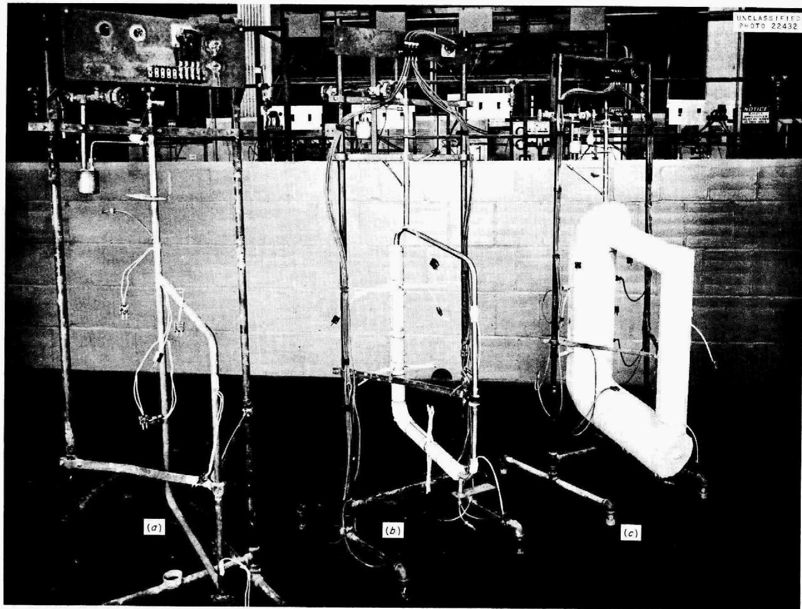  
Fig. 3.6. Thermal-Convection Loops. (a) Old design. (b) New design. (c) New design with insulation.

# 4. CRITICAL EXPERIMENTS

A.D.Callihan

Physics Division

# REFLECTOR-MODERATOR REACTOR

D. Scott

B. L. Greenstreet

ARE Division

J. J. Lynn

Physics Division

J. S. Crudele

J.W.Noaks

Pratt and Whitney Aircraft Division

The first step of the present critical experiment program was the construction of a small two-region reflector-moderated reactor to provide experimental data on a system of simple geometry and materials for use in checking the present calculational methods. The assembly is approximately spherical, 41 in. in outside diameter, and has a center, or core region, that is about 15 in. in diameter. The core consists of alternate sheets of enriched uranium metal (4 mils thick) and Teflon, $(\mathrm{CF}_2)_n'$ and is surrounded by a beryllium reflector. It is possible to vary the uranium loading, within the specified dimensions, in order to make the system critical. The Teflon and the uranium have been cut to the various shapes necessary to form the sub-assemblies required to conveniently construct the core. A summary of the materials in the first critical assembly is given in Table 4.1. The aluminum, which is a necessary structural material, is present in the core as a vertical double sheet at the mid-plane and in the reflector as fairly well-distributed sheets and rods. The coating material, which contained 31.8 wt % C, 61.9 wt % F, 5.5 wt % Cr, and 0.83 wt % H, was applied in a thin layer to the uranium metal to reduce oxidation. The Scotch cellophane tape was used to hold the core sub-assemblies together. A view of the mid-plane of the reactor as initially assembled is shown in Fig. 4.1. The small rectangular holes below and to the right of the core are the aluminum guide channels for the control and safety rods.

An earlier assembly was loaded with 17.4 lb of $U^{235}$ , as prescribed by the multigroup calculations, and was not critical. It was discovered, however, that these calculations were in error because of a numerical error in one of the cross sections and that the predicted critical mass range should have been 20.9 to 22.75 lb of $U^{235}$ . The system was made critical with 24.35 lb of $U^{235}$ and had an excess reactivity of approximately 7 cents, with about 20% of the mid-plane aluminum plates omitted. It has since been shown that the mounting of this plate resulted in a reduction in reactivity of approximately 10 cents, and therefore the system as designed and loaded with 24.35 lb was slightly subcritical. Sufficient excess reactivity for subsequent experiments has been gained by the addition of a cylindrical annulus of beryllium reflector $17\frac{1}{2}$ in. long and $2\frac{7}{8}$ in. wide with its axis perpendicular to the mid-plane. This addition gave an increase in reactivity of 65 cents. The extra beryllium at the top of the reactor was removed during flux measurements.

TABLE 4.1. COMPOSITION OF CORE AND REFLECTOR OF FIRST REFLECTOR-MODERATED REACTOR CRITICAL ASSEMBLY   

<table><tr><td colspan="3">Core</td></tr><tr><td>Volume</td><td colspan="2">1.05 ft3</td></tr><tr><td>Average radius</td><td colspan="2">7.48 in.</td></tr><tr><td>Weight of</td><td></td><td></td></tr><tr><td>Teflon*</td><td colspan="2">58.464 kg (128.62 lb)</td></tr><tr><td>Uranium</td><td colspan="2">11.878 kg</td></tr><tr><td>U235**</td><td colspan="2">11.067 kg (24.348 lb)</td></tr><tr><td>Uranium coating material</td><td colspan="2">0.112 kg</td></tr><tr><td>Scotch tape</td><td colspan="2">0.085 kg</td></tr><tr><td>Aluminum</td><td colspan="2">0.92 kg (2.02 lb)</td></tr><tr><td>Reflector</td><td></td><td></td></tr><tr><td>Volume</td><td colspan="2">21.24 ft3</td></tr><tr><td>Minimum thickness</td><td colspan="2">12.9 in.</td></tr><tr><td>Weight of</td><td></td><td></td></tr><tr><td>Beryllium</td><td colspan="2">1102.5 kg (2425.7 lb)</td></tr><tr><td>Aluminum</td><td colspan="2">16.8 kg (37.06 lb)</td></tr><tr><td colspan="3">*Density: 1.96 g/cm3of core.</td></tr><tr><td colspan="3">**Density: 0.372 g/cm3of core.</td></tr></table>

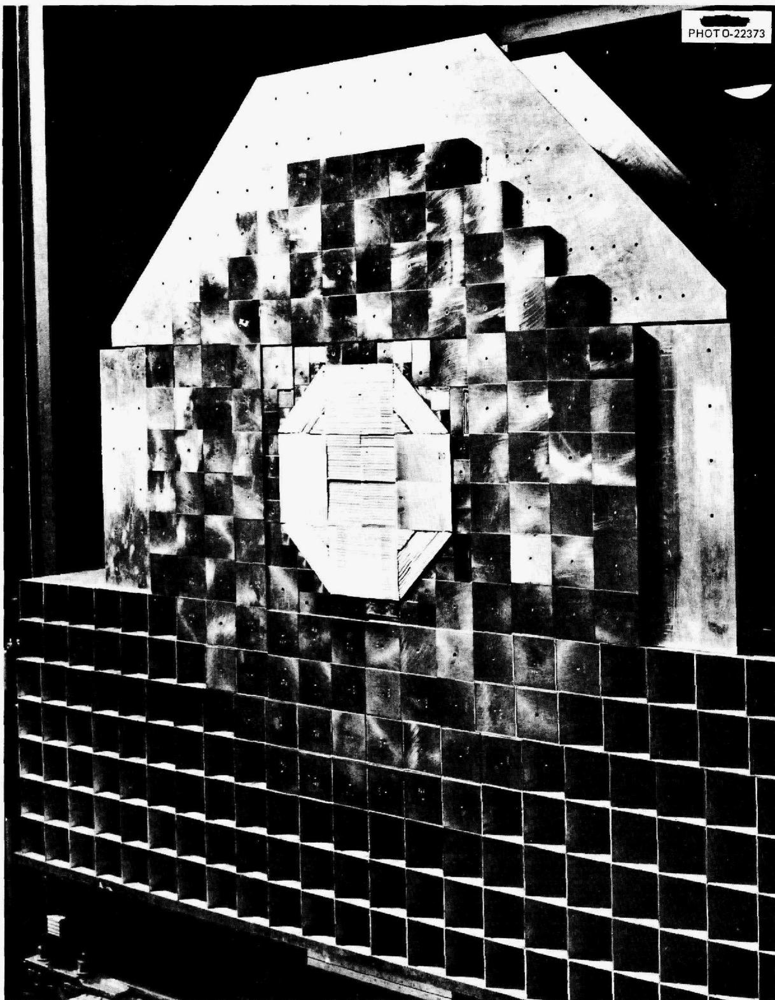  
Fig. 4.1. First Reflector-Moderated Reactor Critical Assembly.

Measurements of neutron flux have been made in a vertical direction along a radius by using indium foils with and without cadmium covers. The foils are 10-mil aluminum-indium alloy, $5_{16}$ in. in diameter, having an effective indium thickness of $3 \times 10^{-4}$ in., and the cadmium covers are 20 mils thick. The results of these measurements are given in Fig. 4.2. The values of the indium-cadmium fraction3 and the indium activation produced by neutrons having energies less than the cadmium cut-off are also plotted. A relative power, or fission-rate,

3The cadmium fraction by definition is the ratio of the difference between the bare and cadmium-covered activations to the bare activation.

distribution was made through the core along the radius that was used for the indium flux measurements by observing the activity of the fission fragments retained in aluminum foils placed in contact with uranium. Similar data, presented in Fig. 4.3, were obtained with the uranium and aluminum enclosed in cadmium covers. The average uranium-cadmium fraction for the core is 0.33. The fission rates were measured on opposite sides of three uranium foils near the reflector, and the results are plotted. In each case the rate was higher on the side toward the beryllium.

Measurements will be made of the reactivity coefficients, as functions of the radius, of a few

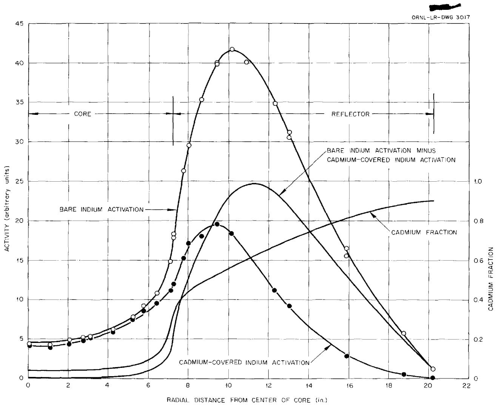  
Fig. 4.2. Radial Neutron Distribution at Mid-Plane of First Reflector-Moderated Reactor Critical Assembly.

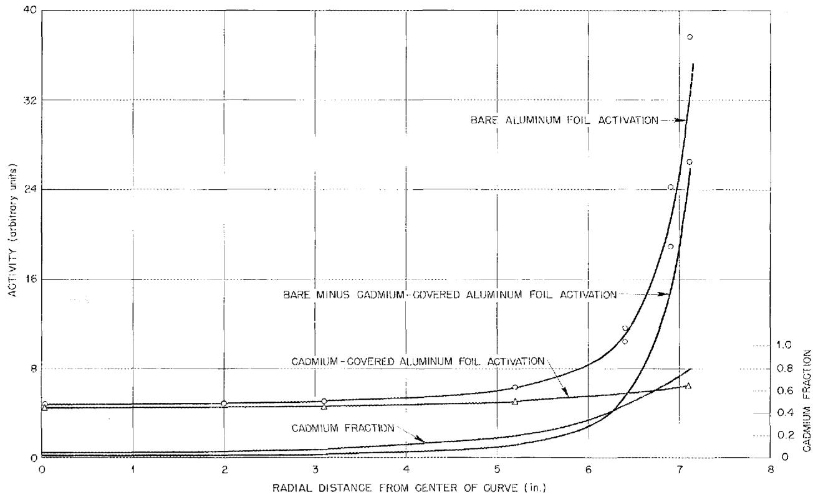  
Fig. 4.3. Power Distribution of Mid-Plane of Reactor. The paired points on the bare aluminum foil activation curve at 6.4, 6.9, and 7.1 in. were obtained from foils placed on opposite sides of the same uranium foil.

metals, such as Inconel, nickel, and cadmium. Upon completion of the experiments on this assembly, it is planned to construct a larger reactor of the same shape that will consist of three regions, with the beryllium island and reflector separated by the fuel annulus. The diameters of the beryllium island and the fuel annulus will be about 10.4 and 20 in., respectively. Initially, the assembly will have no structural materials, such as Inconel core shells, and it will provide a further check of the calculational methods.

# SUPERCRITICAL-WATER REACTOR

J.S.Crudele J.W.Noaks

Pratt and Whitney Aircraft Division

The Supercritical-Water Reactor (SCWR) critical assembly was described previously as consisting of an aqueous solution of enriched $\mathsf{UO}_2\mathsf{F}_2$ con

tained in stainless steel tubes distributed in an organic liquid in a pattern designed to give a uniform radial thermal-neutron flux. The liquid, Furfural $(\mathsf{C}_5\mathsf{H}_4\mathsf{O}_2)$ , which also serves as a neutron reflector on the lateral surface of the cylindrical tube bundle, has a hydrogen density approximately the same as that of water under the temperature and pressure conditions designed for the SCWR. It simulates the nuclear properties of supercritical water as well as can be determined without further knowledge of the effect of binding energies on diffusion and slowing down lengths. Stainless steel was inserted in the fuel tubes to represent the reactor structure.

The loading of the critical assembly was calculated by Pratt & Whitney Aircraft Division personnel, by use of a four-group diffusion theory method, to be $15.34\mathrm{kg}$ of $\mathsf{U}^{235}$ and $261\mathrm{kg}$ of stainless steel in a 76.2-cm equilateral right cylinder with a

side reflector 6.5 cm thick. The calculated radial fuel distribution is plotted in Fig. 4.4 as the smooth curve and is compared to the stepwise distribution achieved when all tubes are identically loaded,

In the experimental study, a quantity of $\mathsf{UO}_2\mathsf{F}_2$ aqueous solution, containing uranium enriched to $93.14\%$ in $\mathsf{U}^{235}$ , was distributed among the tubes at a $\mathsf{U}^{235}$ concentration of $0.505\mathrm{g/cm^3}$ . The number of tubes required for criticality was measured as a function of the Furfural height as increasing quantities of stainless steel were inserted and as the solution was diluted. In this manner a stepwise approach was made to a loading of uniform

concentration which would be critical at the designed linear dimensions of both fuel solution and Furfural and which would contain the prescribed mass of stainless steel. These conditions have not been achieved because the last dilution was overestimated and a large part of the solution is at a concentration somewhat lower than required for criticality, a deficiency compensated for by locating about 50 tubes of higher concentration fuel in one peripheral section. The configuration is described in Table 4.2.

Some neutron-flux measurements have been made by using effectively thin $(3 \times 10^{-4}$ in.) indium foils

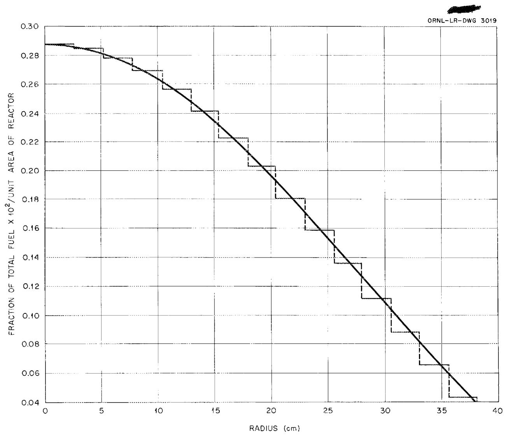  
Fig. 4.4. Radial Fuel Distribution in Supercritical-Water Reactor.

with and without 0.02-in.-thick cadmium covers. The data obtained along a radius 36.7 cm from the bottom of the core and somewhat removed from the high-solution-density perturbation are shown in Fig. 4.5. Similar data from a longitudinal traverse located 2.4 cm from the cylinder axis are given in Fig. 4.6. Although these results are preliminary, it is believed that the apparent nonuniformity of the radial thermal flux is greater than the experimental uncertainty. A few measures show the radial importance of $U^{235}$ to also decrease from the center.

In one experiment to evaluate the Furfural reflector, annular sheets of aluminum were inserted adjacent to the wall of the reactor tank, thereby reducing the reflector thickness from 10.0 cm to 3.6 cm. The effect of the aluminum, indicated by the critical height of the Furfural, was a slight increase in the reactivity.

TABLE 4.2. CONFIGURATION OF SCWR CRITICAL EXPERIMENT   

<table><tr><td></td><td>Experimental</td><td>Design</td></tr><tr><td>Number of tubes*</td><td>215.0</td><td>215.0</td></tr><tr><td>Height of UO2F2solution, cm</td><td>71.2</td><td>76.2</td></tr><tr><td>Height of Furfural, cm</td><td>69.5</td><td>76.2</td></tr><tr><td>Mass of U235, kg**</td><td>11.48</td><td>15.34</td></tr><tr><td>Thickness of reflector, cm</td><td>10.0</td><td>6.5</td></tr><tr><td>Mass of stainless steel, kg</td><td>220.4</td><td>261.0</td></tr></table>

*Expressed as equivalent number of tubes 1 in. in diameter; the array contains 193 which are 1 in. in diameter, 8 which are $\frac{3}{4}$ in., and 25 which are $\frac{1}{2}$ in.   
**Of this loading, 86.8% was in a solution having a U235 concentration of 0.196 g/cm³, and 13.2% was in one with a U235 concentration of 0.505 g/cm³.

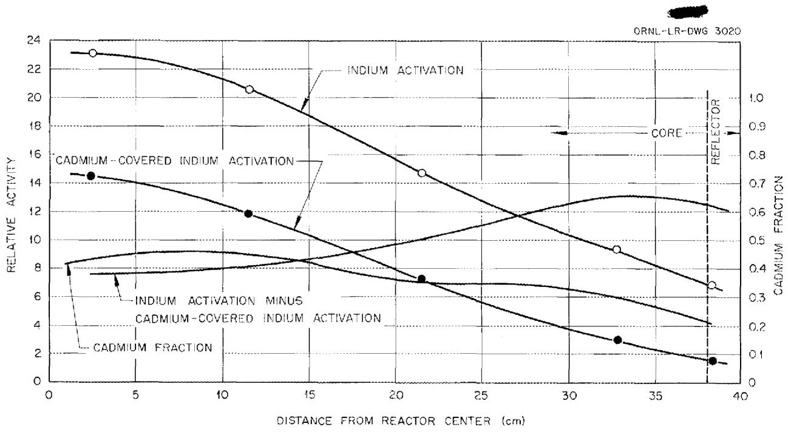  
Fig. 4.5. Radial Neutron Distribution in Supercritical-Water Reactor Critical Assembly.

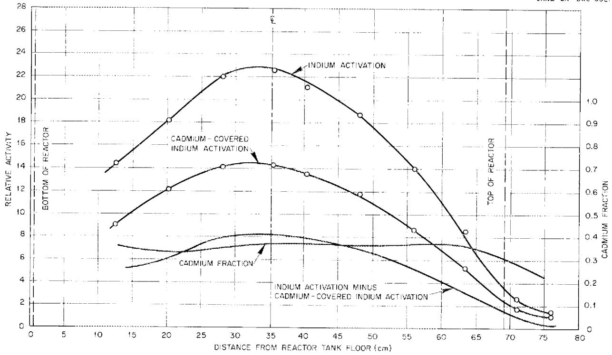  
Fig. 4.6. Longitudinal Neutron Distribution in Supercritical-Water Reactor Critical Assembly.

Part II

MATERIALS RESEARCH

# 5. CHEMISTRY OF MOLTEN MATERIALS

# W. R. Grimes   Materials Chemistry Division

Studies of the NaF-ZrF $_4$ -UF $_4$ system were initiated after the solid phase studies in the NaF-ZrF $_4$ system were completed, and to date no ternary compounds have been discovered in the NaF-ZrF $_4$ -UF $_4$ system. A tentative equilibrium diagram has been prepared. The apparatus for visual observation of melting temperatures was used to observe eleven NaF-UF $_4$ mixtures in the composition range 20 to 50 mole % UF $_4$ , and a partial phase diagram of the system was prepared. A new apparatus has been constructed that will permit some manipulations to be carried out with the fused salts in an inert atmosphere.

Recent attempts to correlate the anticipated reduction of $\mathsf{UF}_4$ in the preparation of $\mathsf{UF}_3$ -bearing melts with wet chemical analysis for $\mathsf{UF}_3$ and $\mathsf{UF}_4$ and results of petrographic examination show some surprising anomalies. When $\mathsf{UF}_4$ dissolved in LiF, in NaF-ZrF $_4$ mixtures, or in NaF-LiF mixtures is treated under flowing hydrogen at $800^{\circ}\mathrm{C}$ with excess uranium metal, $90\%$ or more of the $\mathsf{UF}_4$ is reduced to $\mathsf{UF}_3$ . However, when this technique is applied to $\mathsf{UF}_4$ in NaF-KF-LiF mixtures, the reduction is only $50\%$ complete at $800^{\circ}\mathrm{C}$ and, perhaps, $75\%$ complete at $600^{\circ}\mathrm{C}$ . Petrographic examinations of the specimens reveal no complex compounds of tetravalent uranium; it is possible that the $\mathsf{UF}_4$ is "hidden" in solid solutions or in complex $\mathsf{UF}_4$ - $\mathsf{UF}_3$ compounds in which it is not at present recognizable.

A method for the large-scale purification of rubidium fluoride has been developed. All the rubidium fluoride obtained from commercial suppliers to date has contained considerably more than the specified quantity of cesium compounds, and therefore almost all of it has been returned to the vendors for further processing. The purification method developed can be used at a reasonable cost on a large scale if material sufficiently free from cesium cannot be obtained from commercial sources.

Values for the equilibrium constant for the reaction

$$
\mathrm {C r} ^ {\circ} + 2 \mathrm {U F} _ {4} \xrightarrow {\text {一}} 2 \mathrm {U F} _ {3} + \mathrm {C r F} _ {2}
$$

in molten $\mathsf{NaZrF}_5$ have been re-examined by the use of various ratios of $\mathsf{UF}_3 / \mathsf{UF}_4$ with chromium metal in the charge. From the data obtained when this

initial ratio is less than 3, average values of $5 \times 10^{-4}$ at $600^{\circ}C$ and $6 \times 10^{-4}$ at $800^{\circ}C$ can be computed. At ratios larger than 3 the values increase regularly; this rise is probably due to the extreme difficulty in filtration and analysis of samples containing 1 to 20 ppm of $\mathrm{Cr^{++}}$ . The values at low $\mathrm{UF}_3 / \mathrm{UF}_4$ ratios agree quite well with the corresponding values of $4.2 \times 10^{-4}$ at $600^{\circ}C$ and $4.1 \times 10^{-4}$ at $800^{\circ}C$ obtained previously when $\mathrm{UF}_4$ and chromium metal were the charge material.

Fundamental studies were made of the reduction of $\mathsf{NiF}_2$ and $\mathsf{FeF}_2$ by $\mathsf{H}_2$ in NaF-ZrF $_4$ systems as a means of determining possible improvements in purification techniques. Also, methods for preparing simple structural metal fluorides were studied. Additional measurements of decomposition potentials of KCl and of various chlorides in molten KCl at $850^{\circ}\mathsf{C}$ were made.

Preliminary measurements of the solubility of xenon in $\mathsf{KNO}_3\text{-NaNO}_3$ eutectic (66 mole $\% \mathrm{NaNO}_3$ ) show values of $8.5 \times 10^{-8}$ and $10^{-7}$ mole/cm³ at 280 and $360^{\circ}\mathsf{C}$ , respectively, at 1 atm xenon pressure. The all-glass apparatus used has been replaced with a nickel and glass combination, and measurements of xenon solubility in molten fluorides are being made.

Large quantities of purified $\mathsf{ZrF}_4$ -base fluorides are being prepared for engineering tests at ORNL and elsewhere, and the demand for purified fluorides of other types for possible reactor fuel application is increasing rapidly. Consequently, an increasing fraction of the effort is devoted to production or to research in direct support of production functions.

Since the consumption of $\mathsf{NaF - ZrF_4}$ and NaF $\mathsf{ZrF}_4\text{-UF}_4$ mixtures is expected to reach 10,000 lb during the fiscal year, it is important to decrease the cost of production of this material. The HF- $\mathsf{H}_2$ processing currently used is adequate from all points of view, but processing times of nearly 100 hr per batch are now required with the relatively poor raw materials available. The substitution of hafnium-free $\mathsf{ZrF}_4$ and commercially available $\mathsf{NaF}_{\times}\cdot \mathsf{ZrF}_{4}$ for the impure $\mathsf{ZrF}_4$ now used should afford a considerable saving. The

proposed use of zirconium metal as a scavenger (to replace most of the hydrogen processing) has shown promise on a small scale, and rapid electrolytic deposition of iron and nickel from the $\mathsf{ZrF}_4$ -base mixtures appears to be feasible. It is anticipated that the price of purified $\mathsf{NaZrF}_5$ and $\mathsf{NaF - ZrF}_4$ - $\mathsf{UF}_4$ mixtures may be halved in the next few months.

# SOLID PHASE STUDIES IN THE NaF-ZrF4-UF4 SYSTEM

C.J.Barton

R.E.Moore R.E.Thoma Materials Chemistry Division

G. D. White, Metallurgy Division H. Insley, Consultant

Studies of the NaF-ZrF $_4$ -UF $_4$ system were initiated after the solid phase studies in the NaF-ZrF $_4$ binary system were completed. The solid phases present in both the slowly cooled and the quenched samples were studied by x-ray diffraction and petrographic analysis techniques. The study of the NaF-UF $_4$ system was suspended, except for some visual-observation experiments, and will be resumed when time permits.

Visual-observation experiments (cf. section below on "Visual Observation of Melting Temperatures in the NaF-UF $^4$ System"), together with petrographic studies of slowly cooled NaF-UF $^4$ compositions, demonstrated that the compound previously designated $^{1,2,3}$ as NaUF $^5$ is a congruently melting compound $\mathrm{Na}_{9}\mathrm{U}_{8}\mathrm{F}_{41}$ that is analogous to the $\mathrm{Na}_{9}\mathrm{Zr}_{8}\mathrm{F}_{41}$ compound. Quenching experiments with ternary compositions on the join $\mathrm{Na}_{9}\mathrm{U}_{8}\mathrm{F}_{41} - \mathrm{Na}_{9}\mathrm{Zr}_{8}\mathrm{F}_{41}$ show that this join comprises a completely (or nearly completely) miscible series, with liquidus temperatures descending from $722^{\circ}\mathrm{C}$ at the uranium compound to $520^{\circ}\mathrm{C}$ at the zirconium compound.

Earlier thermal analysis data and filtration experiments demonstrated that there is another series of complete solid solutions along the join

$\mathrm{Na}_{3}\mathrm{UF}_{7} - \mathrm{Na}_{3}\mathrm{ZrF}_{7}$ with the high liquidus temperature (850°C) at the zirconium compound and the low liquidus temperature (629°C) at the uranium compound. In order to study equilibrium relationships in the region between these two solid solution joins, a series of nine compositions equally spaced along the $\mathrm{Na}_{2}\mathrm{ZrF}_{6} - \mathrm{Na}_{2}\mathrm{UF}_{6}$ join was prepared. Phase analyses on completely crystallized preparations of these compositions indicate that $\mathrm{Na}_{2}\mathrm{ZrF}_{6}$ and $\mathrm{Na}_{2}\mathrm{UF}_{6}$ do not exist in equilibrium with each other and with liquid. Instead, the join between $\mathrm{Na}_{2}\mathrm{ZrF}_{6}$ and $\mathrm{Na}_{2}\mathrm{UF}_{6}$ crosses the two three-phase triangles having their common base on the $\mathrm{Na}_{3}\mathrm{ZrF}_{7} - \mathrm{Na}_{9}\mathrm{U}_{8}\mathrm{F}_{41}$ line and their apexes at $\mathrm{Na}_{2}\mathrm{ZrF}_{6}$ and $\mathrm{Na}_{2}\mathrm{UF}_{6}$ . Quenching experiments are being made for establishing liquidus relationships and boundary curves in this area.

Four ternary mixtures were prepared in order to obtain a preliminary indication of equilibrium relationships in other parts of the system. The compositions of these mixtures are given in Table 5.1. Identification, by x-ray diffraction and petrographic techniques, of the phases in completely crystallized preparations of the mixtures indicated that the compound $\mathrm{Na}_{3}\mathrm{Zr}_{4}\mathrm{F}_{19}$ occupies a small primary phase area contiguous to the primary phase fields of the $\mathrm{Na}_{9}\mathrm{Zr}_{8}\mathrm{F}_{41} - \mathrm{Na}_{9}\mathrm{U}_{8}\mathrm{F}_{41}$ and the $\mathrm{ZrF}_{4} - \mathrm{UF}_{4}$ solid solution series. It also appears that the primary phase field of the $\mathrm{ZrF}_{4} - \mathrm{UF}_{4}$ solid solution series is contiguous to the primary phase field of the $\mathrm{Na}_{9}\mathrm{Zr}_{8}\mathrm{F}_{41} - \mathrm{Na}_{9}\mathrm{U}_{8}\mathrm{F}_{41}$ solid solution series along the greater part of the boundary curve that enters the ternary system at the $\mathrm{Na}_{9}\mathrm{U}_{8}\mathrm{F}_{41} - \mathrm{UF}_{4}$ eutectic (42 mole % NaF-58 mole % UF, melting point $680^{\circ}\mathrm{C}$ ), follows approximately the 50 mole % NaF join for most of its course, and leaves the ternary system at the $\mathrm{Na}_{9}\mathrm{Zr}_{8}\mathrm{F}_{41} - \mathrm{Na}_{3}\mathrm{Zr}_{4}\mathrm{F}_{19}$ eutectic (approximately 50 mole % NaF-50 mole % $\mathrm{ZrF}_{4}$ , melting point $510^{\circ}\mathrm{C}$ ). The mixtures listed in Table 5.1 will be used for quenching experiments

TABLE 5.1. COMPOSITIONS OF FOUR MIXTURES IN THE NaF-ZrF4-UF4 SYSTEM   

<table><tr><td rowspan="2">Sample Designation</td><td colspan="3">Composition (mole %)</td></tr><tr><td>NaF</td><td>ZrF4</td><td>UF4</td></tr><tr><td>T1</td><td>45</td><td>53</td><td>2</td></tr><tr><td>T2</td><td>41</td><td>55</td><td>4</td></tr><tr><td>T3</td><td>42</td><td>48</td><td>10</td></tr><tr><td>T4</td><td>48</td><td>39</td><td>13</td></tr></table>

in the near future to establish solidus and liquidus relationships.

No ternary compounds have been discovered, to date, in the NaF-ZrF $_4$ -UF $_4$ system. A tentative equilibrium diagram, which shows the general relationships believed to exist in this complex system, is presented in Fig. 5.1.

# VISUAL OBSERVATION OF MELTING TEMPERATURES IN THE NaF-UF4 SYSTEM

M. S. Grim  
Materials Chemistry Division

The apparatus for visual observation of melting temperatures, described in the previous quarterly report,7 was used to observe eleven NaF-UF4 mixtures in the composition range 20 to 50 mole % UF4. Liquidus temperatures obtained with this

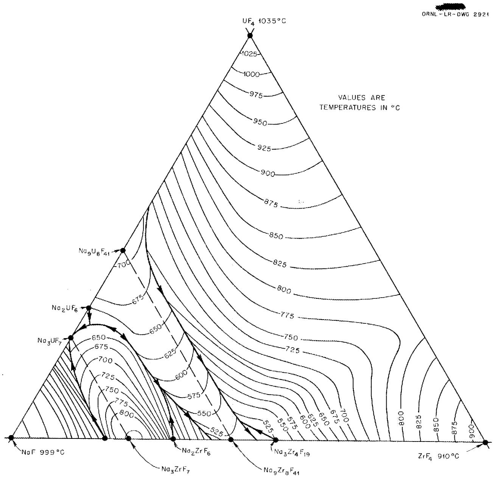  
Fig. 5.1. Tentative Equilibrium Diagram for the NaF-ZrF $_4$ -UF $_4$ System.

apparatus, both from visual observation of crystallization and from thermal effects recorded during the course of the visual observations, were generally a little higher than those indicated by the published diagram for this system. The data are shown on the partial phase diagram for the $\mathrm{NaF - UF_4}$ system in Fig. 5.2. A solid circle indicates the temperature at which the composition appeared to be completely solidified. This point could not be determined with any degree of certainty with some compositions, and the disappearance of the liquid phase was not always accompanied by a noticeable thermal effect. The liquidus temperatures shown in Fig. 5.2 seem to indicate that $\mathrm{Na}_3\mathrm{UF}_7$ melts congruently at $629^{\circ}\mathrm{C}$ , that is, at a temperature only a few degrees higher than the eutectic temperatures on both sides of the compound. The data also support the results of petrographic studies which indicate that the compound in the 50 mole $\%$ UF_4 region has the approximate composition $\mathrm{Na}_9\mathrm{U}_8\mathrm{F}_{41}$ rather than $\mathrm{NaUF}_5$ .

A new apparatus has been constructed that will permit some manipulations to be carried out with the fused salts in an inert atmosphere. It consists essentially of a small dry box, with $\frac{5}{8}$ -in.-thick

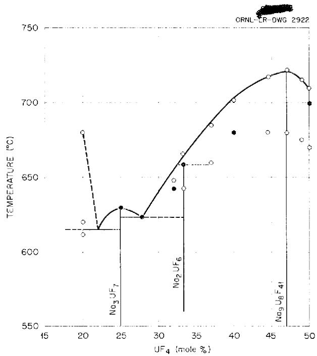  
Fig. 5.2. Partial Phase Diagram of the NaF-UF4 System.

Lucite side walls and top, attached to a stainless steel bottom plate which has a 6-in. length of 2-in.-dia stainless steel pipe welded onto it to serve as a furnace core. The pipe is surrounded by resistance coils and insulating tape. The box is equipped with face plates for covering the glove holes so that the box can be partly evacuated before it is filled with inert gas.

# PHASE RELATIONSHIPS IN UF3-BEARING SYSTEMS

C.J.Barton

R.J. Sheil

L.M.Bratcher

A. B. Wilkerson

Materials Chemistry Division

G. D. White, Metallurgy Division

T. N. McVay, Consultant

It was assumed in the previous studies of solubility relationships for $\mathsf{UF}_3$ in various fluoride mixtures that in the presence of excess metallic uranium or zirconium the uranium present in the fused salt solution was trivalent. This assumption seemed justified, since, for the reaction

$$
\frac {3}{4} U F _ {4} + \frac {1}{4} U ^ {\circ} \longrightarrow U F _ {3},
$$

Brewer's tabulation of standard free energies of formation yields

$$
\Delta F ^ {\circ} = - 1 6 \mathrm {k c a l}.
$$

In addition, petrographic examination of the melts obtained revealed the presence of red materials tentatively identified as complex compounds of $\mathsf{UF}_3$ with green compounds of $\mathsf{UF}_4$ showing only in traces, if at all. Since these observations were those anticipated and since the petrographic examinations had previously been shown to be very sensitive in detecting compounds of trivalent uranium in systems which had been slightly reduced, there seemed to be little reason to believe that the results of such examination might be unreliable.

During the past quarter, however, considerable evidence has been accumulated by the most accurate wet-chemical methods yet devised for determining $U^{3+}$ and $U^{4+}$ in fluoride mixtures which shows that the reduction of $UF_{4}$ by excess uranium metal is not complete at $800^{\circ}C$ . While the reduction in

$\mathsf{NaF - ZrF}_4$ mixtures and in LiF appears to be $90\%$ or more, complete, in such mixtures as NaF-KF-LiF only about $50\%$ of the $\mathsf{UF}_4$ is reduced. Toward the end of the quarter it became evident that several of the materials such as "3KF-2UF" previously believed to contain only $\mathsf{U}^{3+}$ regularly contained large and varying quantities of $\mathsf{U}^{4+}$ . Furthermore, the crystals containing variable quantities of $\mathsf{U}^{4+}$ are distinguishable as such only with great difficulty, if at all, by petrographic and x-ray diffraction examination. Consequently, the previously reported data on the solubility of $\mathsf{UF}_3$ in various systems must be reinterpreted.

The reasons for the incomplete reduction of the tetravalent uranium are not yet completely understood, and it is not possible at present to define the extent to which the reduction will proceed at various temperatures and in the various solvents. Accordingly, the significance of much of the material presented below is not completely known.

# $\mathsf{UF}_3$ in $\mathsf{ZrF}_4$ -Bearing Systems

The solubility of $\mathsf{UF}_3$ in NaF-ZrF4 mixtures was previously shown to increase with increasing temperature and with increasing ZrF4 concentration of the solvent over the range 47 to 57 mole % ZrF4. Since the publication of that information it has been shown that the reduction of UF4 in ZrF4-bearing melts by excess uranium metal is slightly less than 90% complete at $800^{\circ}C$ . The temperature dependence of the reduction is not yet known for this system, but it is likely that the UF4 is more completely reduced at lower temperatures.

An examination of the NaF-ZrF4-UF3 system has been attempted by thermal analysis, with petrographic examination of the resulting solid phases. In these studies, UF4 and excess uranium metal are added to the desired NaF-ZrF4 mixture before the sample is heated, and the sample is stirred constantly while in the molten state. Therefore the reaction

$$
\frac {3}{4} U F _ {4} + \frac {1}{4} U ^ {\circ} = U F _ {3}
$$

might be expected to reach its equilibrium value at any temperature above the melting point. Consequently, in contrast to experiments in which the metallic uranium is removed by filtration at high temperatures, the solid products in slowly cooled melts might be expected to be nearly completely reduced.

These studies indicate that $\mathsf{U}\mathsf{F}_3$ is the primary phase in systems in which the NaF-to-ZrF4 ratio is

less than 5 to 6 and that $\mathrm{Na}_3\mathrm{U}_2\mathrm{F}_9$ appears as the primary phase in systems in which the NaF-to-ZrF4 ratio is about 15. It also appears that $\mathrm{Na}_3\mathrm{Zr}_2\mathrm{F}_{11}$ crystals may contain small quantities of UF3 in solid solution. The solubility data obtained from these and previous studies give little reason to expect that UF3 can be dissolved in NaF-ZrF4 mixtures in sufficient amounts to provide fuel for reflector-moderated reactors.

# $\mathsf{U}\mathsf{F}_{3}$ in NaF-KF-LiF Mixtures

The solubility of $\mathsf{UF}_3$ in the NaF-KF-LiF eutectic was stated previously to be equivalent to at least 15 wt % at temperatures as low as $525^{\circ}\mathrm{C}$ . Subsequent careful examination of this system has revealed that when $\mathsf{UF}_4$ and an excess of uranium metal are added to the purified NaF-KF-LiF mixture the dissolved uranium species aggregate at least $22\%$ total uranium in the mixture. However, it is obvious that only 40 to $45\%$ of the soluble uranium is present as $\mathsf{UF}_3$ at $800^{\circ}\mathrm{C}$ , while 55 to $60\%$ may be trivalent at $600^{\circ}\mathrm{C}$ . Further study of the system will be necessary before these values can be determined more accurately.

Thermal analysis data have been obtained for several mixtures which were prepared from $\mathsf{U}\mathsf{F}_{4}$ and the NaF-KF-LiF eutectic and then treated with an excess of uranium metal. The data obtained, as shown in Table 5.2, are in agreement with the data obtained from filtration studies which showed high uranium concentrations at low temperatures. Petrographic examination of these materials revealed that at low uranium concentrations a red phase (refractive index, about 1.44), which is probably $\mathsf{K}_{3}\mathsf{U}\mathsf{F}_{6}$ and which may contain $\mathsf{U}\mathsf{F}_{4}$ , is predominant. At high

10 G. M. Watson and C. M. Blood, ANP Quar. Prog. Rep. June 10, 1954, ORNL-1729, p 53.

TABLE 5.2. THERMAL ANALYSIS DATA FOR $UF_{3}$ -BEARING NaF-KF-LiF MIXTURES   

<table><tr><td colspan="4">Theoretical Composition (mole %)*</td><td rowspan="2">U° Used (% of theory)</td><td rowspan="2">Thermal Effects (°C)</td></tr><tr><td>NaF</td><td>KF</td><td>LiF</td><td>UF3</td></tr><tr><td>10.8</td><td>39.5</td><td>43.7</td><td>6.0</td><td>200</td><td>475,455</td></tr><tr><td>10.6</td><td>38.6</td><td>42.8</td><td>8.0</td><td>110</td><td>510,460,455</td></tr><tr><td>10.1</td><td>37.0</td><td>40.9</td><td>12.0</td><td>110</td><td>520,455,445</td></tr><tr><td>9.6</td><td>35.3</td><td>39.1</td><td>16.0</td><td>110</td><td>565,475</td></tr><tr><td>8.8</td><td>32.2</td><td>35.7</td><td>23.3</td><td>200</td><td>570,490,470</td></tr></table>

* Based on complete reaction of UF₄ with Ua.

uranium concentrations an olive-drab cubic phase (refractive index, 1.46) and a blue biaxial phase (refractive index, 1.544) also appear. There is evidence that the blue material is a solid solution of $\mathsf{Na}_3\mathsf{U}_2\mathsf{F}_9\mathsf{-K}_3\mathsf{U}_2\mathsf{F}_9;$ whether it dissolves $\mathsf{UF}_4$ is not known.

# $\mathsf{UF}_3$ in NaF-RbF-LiF Mixtures

The previously reported data on the solubility of $\mathsf{UF}_3$ in the NaF-RbF-LiF eutectic composition were based on the assumption that all the uranium in the filtered specimens was $\mathsf{UF}_3$ . For more recent studies, the solubilities were determined by using 200-g samples of melt, mechanical agitation during the equilibration period, and $20\%$ excess uranium for the reduction step. Samples of the equilibrium mixture were withdrawn with a filter stick containing sintered nickel as the filter medium. The samples were then analyzed for trivalent uranium and for total uranium. The results of the analyses are presented in Table 5.3.

11R. J. Sheil and C. J. Barton, ANP Quar. Prog. Rep. June 10, 1954, ORNL-1729, p 53.

The significance of the analyses for $\mathsf{UF}_3$ is not entirely clear. Petrographic examination of the solidified filtrates indicated a reddish-brown material, presumed to be $\mathsf{Rb}_3\mathsf{UF}_6'$ as the only colored phase. While it is possible that this material could accommodate $\mathsf{UF}_4$ in solid solution, it does not appear likely that as much as $75\%$ of the total uranium present could be hidden in this fashion.

The good agreement, for some of the mixtures studied, between the theoretical uranium content and the measured total uranium content indicates that the reaction of $\mathsf{UF}_4$ with uranium metal proceeded nearly to completion. Additional data on this system will be needed before an interpretation of the results can be presented.

# $\mathsf{UF}_3$ in the Individual Alkali-Metal Fluorides

Filtered specimens from preparations in which $\mathsf{UF}_4$ dissolved in LiF was treated at 825 to $850^{\circ}\mathrm{C}$ with excess uranium metal have shown that more than $90\%$ of the dissolved uranium is trivalent and that it crystallizes as $\mathsf{UF}_3$ . Accordingly, it is believed that the behavior observed by thermal analysis of this system is that of LiF with pure,

TABLE 5.3. SOLUBILITY OF UF ${}_{3}$ IN NaF-RbF-LiF MIXTURES AT VARIOUS TEMPERATURES  

<table><tr><td colspan="4">Theoretical Composition (mole %)</td><td rowspan="2">Theoretical U3+Content (wt %)</td><td rowspan="2">Filtration Temperature (°C)</td><td colspan="2">Filtrate Composition (wt %)</td></tr><tr><td>NaF</td><td>RbF</td><td>LiF</td><td>UF3</td><td>U3+</td><td>Total U</td></tr><tr><td>14.1</td><td>37.6</td><td>42.3</td><td>6.0</td><td>19.3</td><td>793</td><td>2.92</td><td>15.2</td></tr><tr><td></td><td></td><td></td><td></td><td></td><td>700</td><td>1.41</td><td>16.9</td></tr><tr><td></td><td></td><td></td><td></td><td></td><td>646</td><td>4.54</td><td>16.7</td></tr><tr><td></td><td></td><td></td><td></td><td></td><td>600</td><td>1.17</td><td>14.7</td></tr><tr><td></td><td></td><td></td><td></td><td></td><td>550</td><td></td><td>10.7</td></tr><tr><td></td><td></td><td></td><td></td><td></td><td>495</td><td></td><td>5.26</td></tr><tr><td>9.4</td><td>47.0</td><td>37.6</td><td>6.0</td><td>17.7</td><td>750</td><td>5.51</td><td>17.0</td></tr><tr><td></td><td></td><td></td><td></td><td></td><td>675</td><td>9.18</td><td>16.9</td></tr><tr><td></td><td></td><td></td><td></td><td></td><td>650</td><td>3.22</td><td>18.0</td></tr><tr><td></td><td></td><td></td><td></td><td></td><td>625</td><td>9.95</td><td>16.4</td></tr><tr><td></td><td></td><td></td><td></td><td></td><td>600</td><td>No sample*</td><td></td></tr><tr><td>5.6</td><td>48.9</td><td>39.5</td><td>6.0</td><td>17.5</td><td>800</td><td>5.07</td><td>16.8</td></tr><tr><td></td><td></td><td></td><td></td><td></td><td>750</td><td>4.02</td><td>17.0</td></tr><tr><td></td><td></td><td></td><td></td><td></td><td>700</td><td>4.07</td><td>17.3</td></tr><tr><td></td><td></td><td></td><td></td><td></td><td>650</td><td>4.76</td><td>16.4</td></tr><tr><td></td><td></td><td></td><td></td><td></td><td>625</td><td>4.86</td><td>13.1</td></tr><tr><td></td><td></td><td></td><td></td><td></td><td>600</td><td></td><td>6.35</td></tr></table>

* Filtration was attempted, but the filter apparently clogged at this temperature and the sample could not be obtained.

or nearly pure, $UF_{3}$ . Recent studies of LiF- $UF_{3}$ mixtures have confirmed the belief that no compounds form and that these materials comprise a simple eutectic system. A partial phase diagram for this simple system is shown as Fig. 5.3.

The NaF-UF $_3$ system has been studied more thoroughly than any other binary alkali-metal fluoride-UF $_3$ system. The best thermal analysis data obtained for this system (data obtained with those mixtures which showed the least evidence of contamination of the melt by tetravalent uranium) are shown in Fig. 5.4. The earlier data, obtained by mixing NaF with previously synthesized UF $_3$ in sealed capsules, are shown by open circles. The more recent data, shown by solid circles, were

12L. M. Bratcher et al., ANP Quar, Prog. Rep. June 10, 1954, ORNL-1729, p 43.   
13V. S. Coleman and W. C. Whitley, ANP Quar. Prog. Rep. Sept. 10, 1952, ORNL-1375, p 79.   
14 W. C. Whitley, V. S. Coleman, and C. J. Barton, ANP Quar. Prog. Rep. Dec. 10, 1952, ORNL-1439, p 109.

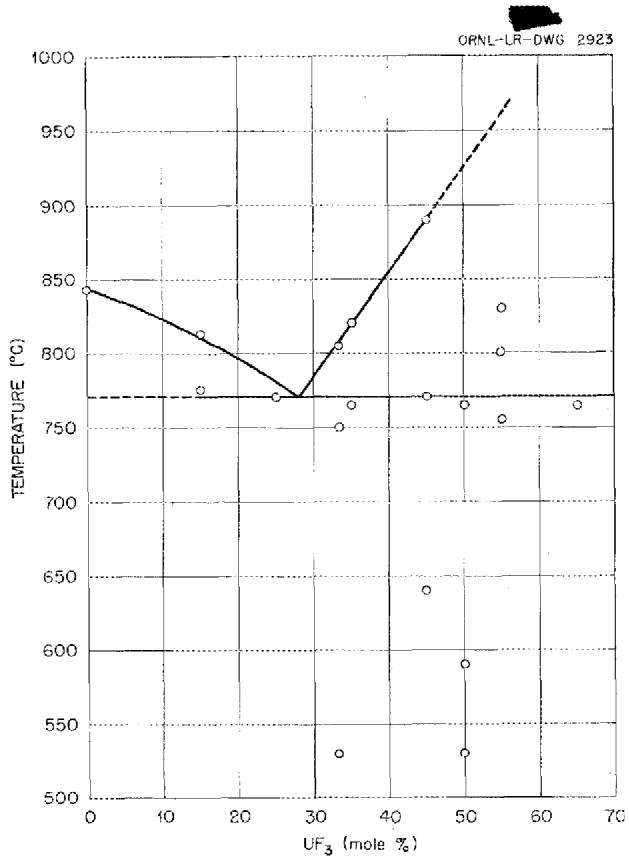  
Fig. 5.3. Tentative Partial Phase Diagram of the LiF-UF3 System.

obtained by reducing $\mathsf{NaF - UF_4}$ mixtures with excess uranium in open crucibles protected by an atmosphere of helium. Some data, also obtained during the past quarter, were obtained by a method which represents a compromise between the two previously mentioned methods. Mixtures were prepared in open stirrer-equipped crucibles by combining dry NaF with freshly prepared $^{15}UF_{3}$ . These data are indicated in Fig. 5.4 by the solid triangles. The agreement between the data obtained by the various methods is considered to be gratifying, in view of the difficulties associated with the ease of oxidation of $U^{3+}$ to $U^{4+}$ . The identification of the compound is based chiefly upon the results of petrographic examination of slowly cooled melts. The possibility that the compound might be $\mathsf{Na}_2\mathsf{UF}_5$ rather than $\mathsf{Na}_3\mathsf{U}_2\mathsf{F}_9$ and the possibility that appreciable quantities of $\mathsf{UF}_4$ may be "hidden" in these materials have not been completely ruled out by these studies. Very few compositions containing more than 50 mole $\%$ $\mathsf{UF}_3$ have been prepared, and the data in this part of the system are probably of little value.

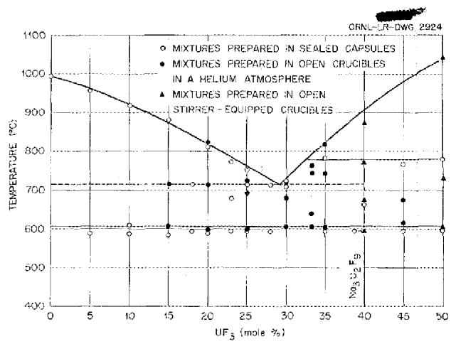  
Fig. 5.4. Tentative Partial Phase Diagram of the NaF-UF3 System.

Phase equilibrium studies of the $\mathsf{KF - UF}_3$ and $\mathsf{RbF - UF}_3$ systems are not so far advanced. It appears that the most probable compositions for the compounds observed are $\mathsf{K}_3\mathsf{UF}_6$ , $\mathsf{K}_3\mathsf{U}_2\mathsf{F}_9$ , and $\mathsf{Rb}_3\mathsf{UF}_6$ and that the $\mathsf{KF - K}_3\mathsf{UF}_6$ eutectic melts at about $720^{\circ}\mathsf{C}$ at approximately 15 mole % $\mathsf{UF}_3$ . It

seems that in both systems considerable $\mathsf{UF}_4$ is present along with the $\mathsf{UF}_3$ in a manner such that it can escape detection by petrographic examination.

# $\mathsf{UF}_3$ in Binary Alkali-Metal Fluoride Systems

A number of thermal analyses followed by petrographic examination of the solid products have been performed with $\mathsf{U}\mathsf{F}_{3}$ in each of the NaF-LiF, NaF-KF, and LiF-KF eutectic mixtures. These specimens were prepared, in each case, by reducing the desired $\mathsf{U}\mathsf{F}_{4}$ -alkali-metal fluoride mixture with $10\%$ excess metallic uranium in nickel crucibles blanketed with inert gas and fitted with stirrers of nickel.

In the NaF-LiF system the lowest liquidus temperature observed was at about $630^{\circ}\mathrm{C}$ at 10 mole $\%$ $\mathsf{UF}_3$ and 36 mole $\%$ NaF. In all cases studied (up to 30 mole $\%$ UF $_3$ ) only the free alkali-metal fluorides and the NaF-UF $_3$ complex compound $(\mathsf{Na}_3\mathsf{U}_2\mathsf{F}_9)$ were observed.

In the NaF-KF-UF $_3$ system the red compound $\mathsf{K}_3\mathsf{U}\mathsf{F}_6$ appears as the only colored species in mixtures containing up to 10 mole $\%$ UF $_3$ ; the optical properties are slightly different from those of the compound crystallized from NaF-free mixtures and may indicate slight solid solution of NaF in the crystals. Mixtures containing 20 to 40 mole $\%$ UF $_3$ show increasing quantities of a blue phase with optical properties which suggest that it is a solid solution of $\mathsf{Na}_3\mathsf{U}_2\mathsf{F}_9$ and $\mathsf{K}_3\mathsf{U}_2\mathsf{F}_9$ . Liquidus temperatures in this system seem to be higher than $700^{\circ}\mathsf{C}$ in all cases.

Solutions of $\mathsf{UF}_3$ in the LiF-KF binary system show liquidus temperatures in the range 485 to $600^{\circ}C$ . Petrographic examination of these materials shows free LiF in all specimens, $\mathsf{K}_3\mathsf{U}\mathsf{F}_6$ in those containing less than 10 mole $\%$ $\mathsf{UF}_3$ , and $\mathsf{K}_3\mathsf{U}_2\mathsf{F}_9$ in those containing much above 10 mole $\%$ $\mathsf{UF}_3$ .

Chemical analyses were not performed on any of these materials, but it is likely that considerable $\mathsf{UF}_4$ was present in these specimens, especially at the higher temperatures. Additional studies of these potentially valuable systems will be made.

# PURIFICATION OF RUBIDIUM FLUORIDE

# C. J. Barton, Materials Chemistry Division D. L. Stockton, ORSORT

All the rubidium fluoride obtained from commercial suppliers to date has contained considerably more than the specified quantity of cesium compounds, and therefore almost all of it has been returned to

the vendors for further processing. However, the immediate need for small amounts of pure material for phase equilibrium studies and for rubidium metal production has necessitated purification of some material at ORNL.

Experiments have shown the feasibility of separating rubidium from cesium with the ion exchange medium Amberlite IR-105. This resin was, accordingly, used in all the experiments conducted. The resin column consisted of a 3-in.-dia glass pipe containing a 6-ft bed of the resin. The column was loaded for each run with about $350\mathrm{g}$ of crude RbF known to contain about $20\%$ CsF. Elution of the rubidium was accomplished in about 35 liters of $0.5\mathrm{M}(\mathrm{NH}_4)_2\mathrm{CO}_3$ solution; the purity of the product was not appreciably affected by elution rates in the range 30 to $60\mathrm{ml / min}$ .

Elution of cesium from the column, which was observed by use of $\text{Cs}^{137}$ , required 65 to 70 liters of the $(\text{NH}_4)_2\text{CO}_3$ solution; elution was not greatly improved by use of a 1.5 M solution. From a total of 1775 g of crude RbF charged in five different runs, somewhat more than 1 kg of RbF containing less than 1% CsF was obtained. The KF content (0.6% KF) was not appreciably affected by this treatment. It is apparent that this purification can be conducted on a large scale at reasonable cost if material sufficiently free from cesium cannot be obtained from commercial sources.

# CHEMICAL REACTIONS IN MOLTEN SALTS

F. F. Blankenship L. G. Overholser

W.R.Grimes

Materials Chemistry Division

# Chemical Equilibrio in Fused Salts

J.D.Redman C.F.Weaver

Materials Chemistry Division

The apparatus and techniques for experimental determination of equilibrium constants for the reactions

$$
\mathrm {C r} ^ {\circ} + 2 \mathrm {U F} _ {4} \rightleftharpoons \mathrm {C r F} _ {2} + 2 \mathrm {U F} _ {3}
$$

and

$$
F e ^ {\circ} + 2 U F _ {4} \rightleftharpoons F e F _ {2} + 2 U F _ {3}
$$

in molten NaZrF $^5$ were described previously,17 and

values were given for the "equilibrium constants" obtained with $\mathsf{UF}_4$ and the metal as starting materials. During the past quarter, the values have been checked with various ratios of $\mathsf{UF}_3$ to $\mathsf{UF}_4$ as starting materials in the $\mathsf{NaZrF}_5$ solution. The apparatus and details of the experimental technique were the same as in previous experiments. The results of the recent series of experiments in which 2 g of hydrogen-fired (1200°C) $\mathsf{Cr}^{\circ}$ and various $\mathsf{UF}_3$ -to- $\mathsf{UF}_4$ ratios were used are shown in Table 5.4. In the table

$$
K _ {x} = \frac {C ^ {2} _ {U F _ {3}} \cdot C _ {C r F _ {2}}}{C ^ {2} _ {U F _ {4}}}
$$

with the concentrations expressed as mole fractions by using the formula weight $\mathrm{NaZrF}_5 = 2$ moles. It was necessary to calculate the final $\mathsf{UF}_3$ concentration, since accurate analyses for $\mathsf{U}^{3+}$ in the presence of $\mathsf{Cr}^{++}$ could not be made; any error arising from this calculation would be important only at low $\mathsf{UF}_3$ concentrations.

The data show that at both 600 and $800^{\circ}C$ the

values of $K_{x}$ remain constant at low $\mathsf{UF}_3$ -to- $\mathsf{UF}_4$ ratios but increase rapidly as this ratio rises above 3. This rapid increase in $K_{x}$ may be due to incomplete removal by filtration of small amounts of chromium metal or to uncertainties in analysis of these trace quantities. Since, as shown above, the $\mathsf{UF}_3$ -to- $\mathsf{UF}_4$ ratio in $\mathsf{NaZrF}_5$ solution in equilibrium with uranium metal is about 9 at $800^{\circ}\mathsf{C}$ , it is not likely that disproportionation of the $\mathsf{UF}_3$ is responsible for the increase in $K_{x}$ .

In any case, the agreement between the mean of four values of the constant at each temperature with previously published values is extremely good. Agreement among the various initial $UF_{3}$ -to- $UF_{4}$ ratios seems to show that a state of equilibrium is reached in these experiments.

When equilibrium data for the reaction

$$
F e ^ {o} + 2 U F _ {4} \rightleftharpoons 2 U F _ {3} + F e F _ {2}
$$

were obtained by the addition of $\mathsf{UF}_{3^{\prime}}$ , $\mathsf{UF}_{4^{\prime}}$ and $\mathsf{FeF}_{2}$ to $\mathsf{NaZrF}_{5}$ in the same way as for the chromium reaction, the results obtained were not so reproducible. The data obtained are shown in

Table 5.5. The mean of the values obtained at

TABLE 5.4. EQUILIBRIUM DATA FOR THE REACTION ${\mathrm{{Cr}}}^{ \circ  } + 2{\mathrm{{UF}}}_{4}$ CrF ${}_{2} + 2{\mathrm{{UF}}}_{3}$ IN MOLTEN NaZrF ${}_{5}$   

<table><tr><td colspan="3">Experimental Conditions</td><td rowspan="2">Equilibrium* Concentration of Cr++ (ppm)</td><td rowspan="2">Kx**</td></tr><tr><td>Temperature (°C)</td><td>UF4Added (moles/kg of melt)</td><td>UF3Added (moles/kg of melt)</td></tr><tr><td>600</td><td>0.358</td><td></td><td>2080</td><td>3.0 × 10-4</td></tr><tr><td></td><td>0.267</td><td>0.078</td><td>950</td><td>5.1 × 10-4</td></tr><tr><td></td><td>0.178</td><td>0.158</td><td>150</td><td>2.7 × 10-4</td></tr><tr><td></td><td>0.089</td><td>0.238</td><td>35</td><td>4.4 × 10-4</td></tr><tr><td></td><td>0.035</td><td>0.287</td><td>50</td><td>5.7 × 10-3</td></tr><tr><td></td><td>0.029</td><td>0.318</td><td>40</td><td>1.1 × 10-2</td></tr><tr><td>800</td><td>0.360</td><td></td><td>2660</td><td>7.4 × 10-4</td></tr><tr><td></td><td>0.280</td><td>0.081</td><td>1125</td><td>6.1 × 10-4</td></tr><tr><td></td><td>0.194</td><td>0.165</td><td>210</td><td>3.3 × 10-4</td></tr><tr><td></td><td>0.111</td><td>0.244</td><td>55</td><td>4.2 × 10-4</td></tr><tr><td></td><td>0.064</td><td>0.295</td><td>30</td><td>1.8 × 10-3</td></tr><tr><td></td><td>0.032</td><td>0.325</td><td>35</td><td>7.9 × 10-3</td></tr></table>

*Values shown are mean of closely agreeing values from duplicate experiments. Blank contained 200 ppm of Cr++   
\*\*Kvalues previously obtained: at $600^{\circ}\mathbb{C}, K_{x} = 4.2\times 10^{-4};$ at $800^{\circ}\mathbb{C}, K_{x} = 4.1\times 10^{-4}.$   
$K_{eq}$ calculated from $-\Lambda F^{\circ} = RT$ ln $K_{eq}$ by using Brewer's values for $\Delta F^{\circ}$ : at $600^{\circ}C,K_{eq} = 1;$ at $800^{\circ}C,K_{eq} = 0.1,$

TABLE 5.5. EQUILIBRIUM DATA FOR THE REACTION ${\mathrm{{Fe}}}^{ \circ  } + 2{\mathrm{{UF}}}_{4} \leftarrow  2{\mathrm{{UF}}}_{3} + {\mathrm{{FeF}}}_{2}$ IN MOLTEN NaZrF ${}_{5}$   

<table><tr><td colspan="4">Experimental Conditions</td><td rowspan="2">Concentration of Fe++ in Filtrate (ppm)</td><td rowspan="2">Kx</td></tr><tr><td>Temperature (°C)</td><td>UF4Added (moles/kg of melt)</td><td>UF3Added (moles/kg of melt)</td><td>FeF2Added (moles/kg of melt)</td></tr><tr><td>600</td><td>0.322</td><td>0.053</td><td>0.0319</td><td>620</td><td>1.2 × 10-6</td></tr><tr><td></td><td>0.322</td><td>0.053</td><td>0.0346</td><td>735</td><td>1.2 × 10-6</td></tr><tr><td></td><td>0.326</td><td>0.083</td><td>0.0347</td><td>660</td><td>9.3 × 10-6</td></tr><tr><td></td><td>0.326</td><td>0.083</td><td>0.0347</td><td>655</td><td>9.3 × 10-6</td></tr><tr><td></td><td>0.321</td><td>0.036</td><td>0.0168</td><td>995</td><td>2.1 × 10-5</td></tr><tr><td></td><td>0.321</td><td>0.036</td><td>0.0168</td><td>940</td><td>1.9 × 10-5</td></tr><tr><td>800</td><td>0.242</td><td>0.113</td><td>0.206</td><td>8600</td><td>1.2 × 10-5</td></tr><tr><td></td><td>0.242</td><td>0.113</td><td>0.103</td><td>3210</td><td>3.2 × 10-5</td></tr><tr><td></td><td>0.242</td><td>0.113</td><td>0.103</td><td>3270</td><td>3.7 × 10-5</td></tr><tr><td></td><td>0.277</td><td>0.077</td><td>0.103</td><td>4110</td><td>2.7 × 10-5</td></tr><tr><td></td><td>0.277</td><td>0.077</td><td>0.103</td><td>4050</td><td>2.2 × 10-5</td></tr><tr><td></td><td>0.0318</td><td>0.322</td><td>0.213</td><td>3110</td><td>3.4 × 10-6</td></tr><tr><td></td><td>0.0318</td><td>0.322</td><td>0.210</td><td>3300</td><td>2.5 × 10-5</td></tr><tr><td></td><td>0.103</td><td>0.271</td><td>0.210</td><td>4530</td><td>1.1 × 10-5</td></tr><tr><td></td><td>0.103</td><td>0.271</td><td>0.207</td><td>4645</td><td>3.7 × 10-5</td></tr><tr><td></td><td>0.207</td><td>0.152</td><td>0.213</td><td>7940</td><td>1.3 × 10-5</td></tr><tr><td></td><td>0.245</td><td>0.115</td><td>0.053</td><td>495</td><td>4.2 × 10-6</td></tr><tr><td></td><td>0.245</td><td>0.115</td><td>0.053</td><td>435</td><td>2.8 × 10-6</td></tr><tr><td></td><td>0.245</td><td>0.115</td><td>0.053</td><td>265</td><td>1.3 × 10-6</td></tr></table>

*Values previously reported: at $600^{\circ}C$ , $K_{x} = 1.2 \times 10^{-5}$ ; at $800^{\circ}C$ , $K_{x} = 1.5 \times 10^{-6}$ . $K_{eq}$ calculated from $-\Delta F^{\circ} = RT \ln K_{eq}$ by using Brewer's values for $\Delta F^{\circ}$ :  
at $600^{\circ}C$ , $K_{eq} = 2 \times 10^{-4}$ ; at $800^{\circ}C$ , $K_{eq} = 1.4 \times 10^{-4}$ .

$600^{\circ}C$ $(1\times 10^{-5})$ agrees with the previously reported value of $1.5\times 10^{-5}$ , although agreement among the individual determinations was not encouraging. The values obtained at $800^{\circ}C,$ however, do not agree well with the value of $1.5\times 10^{-6}$ reported when $\mathsf{U}\mathsf{F}_4$ and ferrous metal were used as starting materials.

In an attempt to explain this discrepancy, the experiments in which $\mathsf{UF}_4$ and ferrous metal were used as reactants at $800^{\circ}C$ were repeated. The values obtained, as shown in Table 5.6, yielded a mean of $0.9\times 10^{-6}$ and agreed more closely with the previously reported values. It appears possible that the reaction of ferrous metal with $\mathsf{UF}_4$ had not reached equilibrium in the reaction time allowed.

TABLE 5.6. EQUILIBRIUM DATA FOR THE REACTION OF FERROUS METAL WITH $U F_{4}$ IN MOLTEN NoZrF $_{5}$ AT $800^{\circ}C$   

<table><tr><td colspan="2">UF4added: 0.360 mole/kg of melt</td></tr><tr><td>Concentration* 
of Fe++ in Filtrate 
(ppm)</td><td>Kx</td></tr><tr><td>520</td><td>1.7 × 10-6</td></tr><tr><td>390</td><td>5.4 × 10-7</td></tr><tr><td>330</td><td>2.8 × 10-7</td></tr><tr><td>480</td><td>1.1 × 10-6</td></tr></table>

*Blank of 100 ppm to be subtracted from determined values in calculations.

# Stability of Chromium Compounds in Molten Fluorides

J.D.Redman C.F.Weaver Materials Chemistry Division

It was shown in previous experiments that $\mathsf{CrF}_2$ or some complex compound of divalent chromium was the corrosion product in the $\mathsf{ZrF}_4$ -base fluoride melts of interest. However, when NaF-KF-LiF mixtures, with and without $\mathsf{UF}_4$ , were tested in equipment prepared from alloys containing chromium, the reaction products found were complex compounds of $\mathsf{CrF}_3$ . Since films that were apparently $\mathsf{NaK}_2\mathsf{CrF}_6$ or similar materials have been observed in some experiments, attempts have been made to observe the stability and solubility of $\mathsf{CrF}_2$ and $\mathsf{CrF}_3$ in typical salt mixtures of the two types. In the temperature range 600 to $800^{\circ}\mathsf{C}$ , $\mathsf{CrF}_3$ is not stable in $\mathsf{NaZrF}_5$ solution in contact with equipment of nickel. Examination of filtered specimens shows that the reaction

$$
2 \mathrm {C r F} _ {3} + \mathrm {N i} \rightleftharpoons \mathrm {N i F} _ {2} + 2 \mathrm {C r F} _ {2}
$$

proceeds to essential completion. The solubility of $\mathsf{CrF}_2$ in the NaZrF5 solvent seems to exceed 6000 parts of Cr per million parts of salt at $600^{\circ}C$ ; solubility at $800^{\circ}C$ seems to be at least 15,000 ppm and may be considerably higher.

In the NaF-KF-LiF system it appears that $\mathsf{CrF}_2$ is not stable. Whether the disproportionation reaction

$$
3 C r F _ {2} \rightleftharpoons C r ^ {\circ} + 2 C r F _ {3}
$$

or some other mechanism is involved is not evident from the data available. It appears from preliminary evidence, however, that the solubility of $\mathbf{Cr}^{3+}$ is several thousand parts per million at $600^{\circ}\mathbf{C}$ .

Reduction of $\mathsf{NiF}_2$ by $\mathsf{H}_2$ in NaF-ZrF4 Systems

C.M.Blood H.A.Friedman G.M.Watson Materials Chemistry Division

The use of hydrogen as a reducing agent in the removal of oxidizing impurities from fluoride melts has been routine for almost two years. One of the principal impurities removed is the $\mathbf{N}\mathbf{i}^{+ + }$ introduced as a result of treating the melts with hydrogen fluoride in nickel containers at $800^{\circ}C.$ Since hydrogen was first employed in this fashion, kinetic studies have been under way in order to supply data on which improved fluoride production procedures

could be based. The $\mathbf{N}\mathbf{i}^{+ + }$ was found to reduce so rapidly that the controlling step was the rate of removal of hydrogen fluoride from the melt; hence the chemistry of the process presents no problem of consequence from an engineering standpoint. With the completion of measurements at $800^{\circ}C$ during the past quarter, these studies have been discontinued.

The experimental method used for the measurements at $800^{\circ}C$ was the same as that used in previously described experiments at 600 and $700^{\circ}C$ . Figure 5.5 shows a comparison of the effect of temperature on the rates of reduction for four concentrations. The slopes of the curves show that the apparent activation energy for the rate determining step is about 7800 cal. This energy of activation is in accord with the hypothesis that the reaction is heterogeneous and is catalyzed by nickel surfaces.

18G.M.Watson,C.M.Blood,F.F.Blankenship,ANP Quar.Prog.Rep.Mar.10,1954,ORNL-1692,p62.

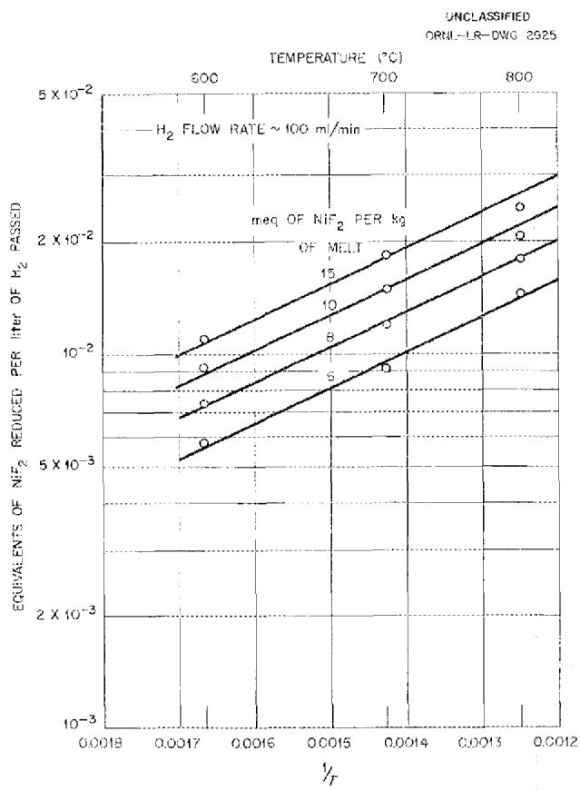  
Fig. 5.5. Effect of Temperature and Concentration on the Rate of Reduction of $\mathsf{NiF}_2$ by $\mathsf{H}_2$ in Molten NaF-ZrF $_4$ (53-47 mole%).

The data presented here were all obtained at roughly the same gas flow rate (100 ml/min). However, since the rate of reduction is dependent on the flow rate and on the geometry of the apparatus, the results must be considered merely as representative and are subject to some variation with conditions; they apply to 3-kg batches in 4-in.-dia pots with hydrogen bubbles rising from the notched end of a $\frac{1}{4}$ -in. vertical dip tube immersed to a depth of 5 in.

# Reduction of $\mathsf{FeF}_2$ by $H_{2}$ in NaF-ZrF Systems

C. M. Blood

G.M.Watson

Materials Chemistry Division

Since the reduction of $\mathsf{FeF}_2$ with hydrogen is the time-consuming step in purification of $\mathsf{NaZrF}_5$ mixtures for reactor use and testing, an extensive study of the equilibrium constant of this reaction has been attempted. The reaction

$$
F e F _ {2} + H _ {2} \rightleftharpoons F e ^ {\circ} + 2 H F
$$

is relatively easy to study, since the hydrogen fluoride concentration in hydrogen can be accurately determined, and, after filtration of the melt, accurate determinations of $\mathsf{FeF}_2$ in the melt can be obtained. Since at these elevated temperatures the activities of hydrogen and hydrogen fluoride can be assumed to be equal to their partial pressures in the gas phase, then

$$
K _ {x} = \frac {P ^ {2} {} _ {\mathrm {H F}}}{P ^ {2} {} _ {\mathrm {H} _ {2}} \cdot C _ {\mathrm {F e F} _ {2}}}
$$

where $C_{\mathsf{FeF}_2}$ is expressed in mole fraction, and from the relationships

$$
- \Delta F ^ {\circ} = R T \ln K _ {e q}
$$

and

$$
K _ {\gamma} = \frac {K _ {\mathrm {e q}}}{K _ {x}},
$$

the activity coefficient for $\mathsf{FeF}_2$ at low concentrations in $\mathsf{NaZrF}_5$ should be easily determined. The equilibrium constant for the reaction has been estimated by two different methods: a dynamic method and an equilibration method.

Dynamic Method. In preliminary experiments in which $\mathsf{H}_2$ was passed through molten NaF-ZrF $_4$ (53-47 mole %) contaminated with known quantities

of $\mathsf{FeF}_2$ or $\mathsf{CrF}_2$ , the HF concentration of the effluent $\mathsf{H}_2$ was studied as a function of the $\mathsf{H}_2$ flow rate. The data obtained are plotted in Fig. 5.6, in which the ratio of HF concentration at a given flow rate to that found at a standard flow rate (210 ml/min) is plotted against flow rate. As anticipated, the ratio drops at high flow rates; however, the ratio shows no sign of leveling off at low flow rates, as would be expected. Although the curve shows no justification for the practice, the lowest flow rate found to be practicable (9 ml/min) was considered to be equivalent to a zero flow rate (that is, the flow rate at which the HF concentration could be expected to be at equilibrium), and experimental values found in subsequent experiments were corrected to the concentration that they would have shown at such flow rate.

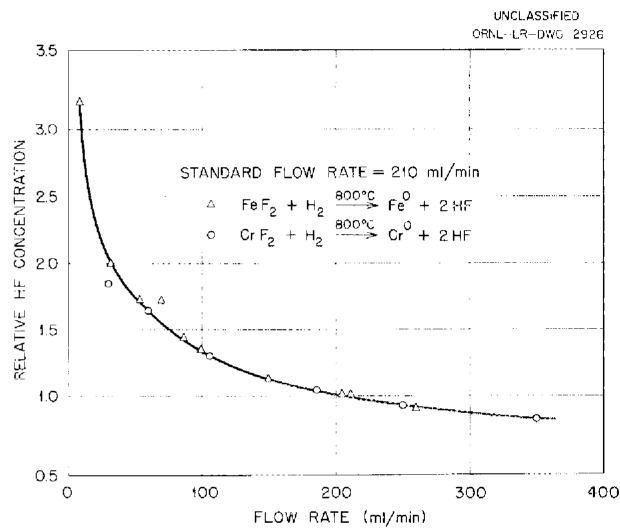  
Fig. 5.6. Effect of Gas Flow Rate on Relative Saturation of Effluent Gas with HF When Passed Through Molten NaF-ZrF $_4$ (53-47 mole %) Contaminated with Known Quantities of FeF $_2$ or CrF $_2$ .

The experiments were performed by adding known quantities of $\mathsf{FeF}_2$ to an NaF-ZrF4 (53-47 mole %) melt in a clean nickel reactor and measuring the HF concentration of the effluent hydrogen passed at carefully measured flow rates. The cumulative total of HF removed was also determined by collection of the HF in caustic solution and titration of the excess caustic. The $\mathsf{FeF}_2$ concentration at any specified time could be calculated from the $\mathsf{FeF}_2$ found by analysis on completion of the experiment and the HF yield after the specified time.

This procedure, which is simple, rapid, and capable of high internal precision, yielded the values plotted as the lower curve in Fig. 5.7. The logarithm of the HF concentration is plotted against the logarithm of the $\mathsf{FeF}_2$ concentration at various flow rates of hydrogen. When these values are corrected to the "zero flow rate" (9 ml/min) by

reference to Fig. 5.6, they yield a consistent straight line after an initial peak. This initial peak is probably due to the reaction of HF at its initial high concentrations with the clean (hydrogen-fired) nickel apparatus and its subsequent re-equilibration with the more dilute $\mathsf{HF - H}_2$ mixture. The straight-line portion of the curve shows the expected slope

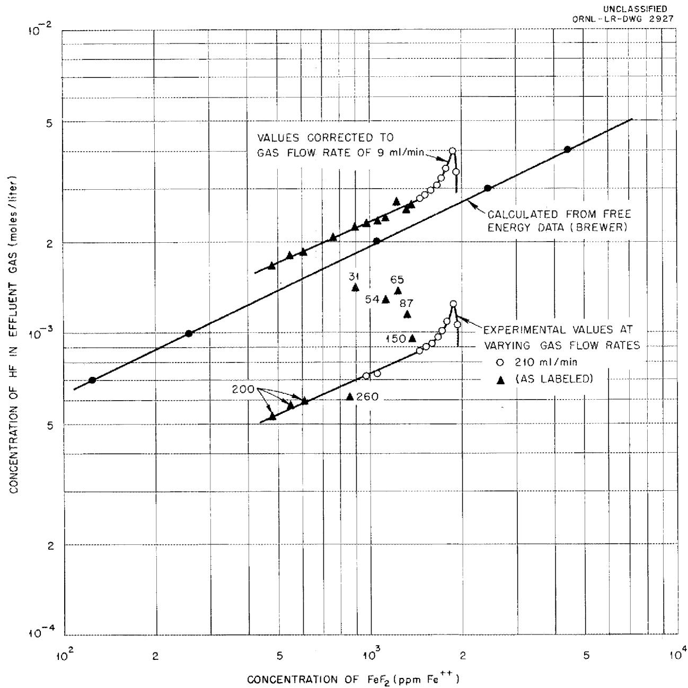  
Fig. 5.7. Equilibrium Concentration for the Reduction of $\mathsf{FeF}_2$ by $\mathsf{H}_2$ in NaF-ZrF $_4$ (53-47 mole %) at $800^{\circ}\mathsf{C}$ (Obtained by Dynamic Method).

of 0.5 and agrees closely with the straight line calculated from Brewer's value of $\Delta F^{\circ}$ for the reaction.

The values obtained for $K_{x}$ and for $\gamma_{\mathrm{FeF_2}}$ on the assumption that the activities of HF and $\mathsf{H}_2$ are proportional to their partial pressures at $800^{\circ}C$ and that

$$
\Delta F ^ {\circ} F _ {e} F _ {2} = - 6 5. 4 k c a l p e r a t o m o f F
$$

and

$$
\Delta F ^ {\circ} _ {H F} = - 6 5. 8 \mathrm {k c a l p e r a t o m o f} F
$$

are shown in Table 5.7. The agreement of the values obtained over a fourfold concentration range of $\mathsf{FeF}_2$ is extremely good. It appears that $\mathsf{FeF}_2$ in molten NaF-ZrF4 is in nearly ideal solution.

TABLE 5.7.EQUILIBRIUM CONSTANTS AND ACTIVITY COEFFICIENTS AT $800^{\circ}C$ IN MOLTEN NoF-ZrF4(53-47 mole %) FOR THE REACTION $\mathsf{H}_2 + \mathsf{FeF}_2\overset {\Delta}{=}\mathsf{Fe}^{\circ} + 2\mathsf{HF}$   

<table><tr><td rowspan="2">Concentration of FeF2(ppm Fe)</td><td>P2HF</td><td rowspan="2">YFeF2= Kx/1.46</td></tr><tr><td>P2H2·CFeF2</td></tr><tr><td>1598</td><td>2.15</td><td>1.47</td></tr><tr><td>1513</td><td>2.15</td><td>1.47</td></tr><tr><td>1458</td><td>2.17</td><td>1.48</td></tr><tr><td>1372</td><td>1.98</td><td>1.36</td></tr><tr><td>1318</td><td>1.91</td><td>1.31</td></tr><tr><td>1233</td><td>2.37</td><td>1.62</td></tr><tr><td>1122</td><td>2.07</td><td>1.38</td></tr><tr><td>1067</td><td>2.00</td><td>1.37</td></tr><tr><td>983</td><td>2.11</td><td>1.44</td></tr><tr><td>900</td><td>2.18</td><td>1.49</td></tr><tr><td>857</td><td>2.11</td><td>1.45</td></tr><tr><td>760</td><td>2.17</td><td>1.49</td></tr><tr><td>606</td><td>2.19</td><td>1.50</td></tr><tr><td>550</td><td>2.24</td><td>1.54</td></tr><tr><td>481</td><td>2.19</td><td>1.50</td></tr><tr><td></td><td>Av 2.13 ± 0.22</td><td>1.46 ± 0.16</td></tr></table>

Equilibration Method. Since it was doubtful that the lowest flow rate found to be practicable (9 ml/min) actually represented equilibrium conditions, an attempt was made to determine the equilibrium conditions directly. A mixture of HF and $\mathsf{H}_2$ was bubbled through a melt containing Fe and FeF 2 until the influent HF concentration matched

that of the effluent. At that time a sample was drawn through a sintered nickel filter and analyzed to determine the $\mathsf{FeF}_2$ concentration.

Since the decomposition pressures of molten KF-HF saturated with KF depend only on temperature,19 definite mixtures of $\mathsf{H}_2$ and HF could be obtained while hydrogen gas was passed over such mixtures held at a constant temperature. The mixtures of $\mathsf{H}_2$ thus obtained were used as influent for the reactor containing the salt mixture.

In a typical experiment in which this method was used, a batch ( $\sim 3\mathrm{kg}$ ) of previously purified NaF $\cdot$ ZrF $_4$ (53-47 mole %) mixture was loaded into a clean nickel reactor. The mixture was heated to $800^{\circ}\mathrm{C}$ and further purified with hydrogen until a very low HF concentration ( $\sim 3 \times 10^{-5}$ mole/liter) in the effluent gas denoted high purity of the melt. The mixture was allowed to cool to room temperature, and $\mathsf{FeF}_2$ and iron wire were added to the cold, frozen mixture under an atmosphere of argon. The mixture was then heated, melted, and brought up to temperature while it was sparged with helium gas. The reactor containing the KF-HF or HF generator was heated separately to a convenient initial temperature and connected to the system. Pure hydrogen was passed in parallel through both reactors - the HF generator and the equilibration reactor - in order to clean out any $\mathsf{NiF}_2$ films on walls and to precipitate nickel impurities. After 1 to 2 hr of parallel operation, the reactors were connected in series, and the inlet and effluent gas streams were continuously sampled and analyzed. The temperature of the furnace of the generator was then adjusted until the analyzer showed $\mathsf{H}_2$ -HF mixtures of the desired composition. The gas mixture was allowed to bubble through the system for extended periods of time, and samples were taken intermittently for analysis. When it was considered that the system had approached equilibrium, as indicated by a convergence of the influent and effluent compositions, the HF generator was removed from the system and helium was substituted for the influent gas mixture. A filtering tube was introduced into the melt under an additional argon atmosphere and a filtrate was obtained. The filtering tube with the frozen filtrate was removed and analyzed for iron. This procedure was repeated with appropriate variation of the temperature of the HF generator and consequent variation of the influent gas composition.

The data obtained are presented in Table 5.8, which gives the concentration of iron found in the filtrate, the ratio of the HF concentrations in the influent and effluent gases, and the equilibrium constants and corresponding activity coefficients for the $\mathsf{FeF}_2$ . As is evident, the data in Table 5.8 are less precise than those obtained by the dynamic procedure. The lowered precision is probably due to the more complex apparatus and technique. However, when the data are plotted (Fig. 5.8), the spread of the data is less than the estimated uncertainty in the $\Delta F^{\circ}$ values. The agreement between the values obtained by the two methods is remarkably good.

TABLE 5.8. EQUILIBRIUM DATA FOR THE REACTION $\mathsf{FeF}_2 + \mathsf{H}_2\rightleftharpoons \mathsf{Fe}^{\circ} + 2\mathsf{HF}$ AT $800^{\circ}\mathsf{C}$ IN MOLTEN NaF-ZrF4 (53-47 mole %)   

<table><tr><td rowspan="2">Concentration of of FeF2(ppm Fe)</td><td rowspan="2">Ratio of HF in Influent Gas to HF in Effluent Gas</td><td colspan="2">p2HF</td><td rowspan="2">γFeF2</td></tr><tr><td colspan="2">p2H2·CFeF2</td></tr><tr><td>912</td><td>0.79</td><td colspan="2">0.60</td><td>0.41</td></tr><tr><td>223</td><td>0.91</td><td colspan="2">1.08</td><td>0.74</td></tr><tr><td>915</td><td>1.02</td><td colspan="2">2.09</td><td>1.43</td></tr><tr><td>740</td><td>0.98</td><td colspan="2">2.12</td><td>1.45</td></tr><tr><td>360</td><td>1.00</td><td colspan="2">1.71</td><td>1.17</td></tr><tr><td>185</td><td>0.93</td><td colspan="2">1.89</td><td>1.30</td></tr><tr><td>160</td><td>0.91</td><td colspan="2">2.14</td><td>1.47</td></tr><tr><td>275</td><td>0.99</td><td colspan="2">3.12</td><td>2.14</td></tr><tr><td></td><td></td><td colspan="2">Av 1.84</td><td>1.25</td></tr></table>

# Preparation of Various Fluorides

B. J. Sturm E. E. Ketchen Materials Chemistry Division

The simple structural metal fluorides have continued to be used extensively for numerous purposes. A limited interest also has been maintained in several of the complex fluorides formed by the interaction of alkali fluorides with structural metal fluorides. Some effort also has been expended on the preparation of other simple fluorides, as well as on the purification of small quantities of the structural metal fluorides. The identity and purity of these fluorides have been established mainly by chemical analysis supplemented by x-ray and petrographic data in some cases.

The compound $\mathsf{AgF}$ with an Ag-to-F ratio of 0.98, was prepared by heating $\mathrm{Ag_2CO_3}$ under HF

at 150 to $200^{\circ}C$ . An attempt to prepare AgF by reacting HF with AgCN was unsuccessful; most of the AgCN did not react. Several batches of anhydrous $\mathsf{ZnF}_2$ were prepared by heating $\mathsf{ZnF}_2\cdot 4\mathsf{H}_2\mathsf{O}$ under HF at $600^{\circ}C$ . The compound $\mathsf{TeF}_4$ was prepared by reacting Te and $\mathsf{HNO}_3$ and reacting the resulting $\mathsf{TeO}_2$ with aqueous HF to give $\mathsf{TeO}_2\mathsf{F}_2\cdot \mathsf{H}_2\mathsf{O}$ , which was thermally decomposed to yield $\mathsf{TeO}_2$ , HF, $\mathsf{H}_2\mathsf{O}$ , and the product $\mathsf{TeF}_4$ . The $\mathsf{TeF}_4$ was collected in a condenser held at 130 to $140^{\circ}C$ .

Small quantities of $\mathsf{Rb}_3\mathsf{CrF}_6$ and $\mathsf{Li}_2\mathsf{RbCrF}_6$ were prepared by heating the proper quantities of $\mathsf{CrF}_3$ , $\mathsf{RbF}$ , and $\mathsf{LiF}$ in sealed capsules at $900^{\circ}\mathsf{C}$ . The $\mathsf{Rb}_3\mathsf{CrF}_6$ has properties approximating those of a corrosion product found in a rubidium-base fuel. The compound $\mathsf{RbCrF}_3$ was prepared by heating $\mathsf{CrF}_2$ and $\mathsf{RbF}$ at $800^{\circ}\mathsf{C}$ in a sealed capsule. Numerous batches of structural metal fuel- or coolant-type fluoride complexes were prepared. Among these (prepared by methods previously described) were: $\mathsf{K}_3\mathsf{CrF}_6$ , $\mathsf{K}_2\mathsf{NiF}_4$ , and $\mathsf{KNiF}_3$ .

The compounds $\mathsf{NiF}_2$ , $\mathsf{FeF}_3$ , and $\mathsf{FeF}_2$ were prepared in a high state of purity by hydrofluorination of the corresponding chlorides.

# FUNDAMENTAL CHEMISTRY OF FUSED SALTS EMF Measurements

L. E. Topol  
Materials Chemistry Division

Additional measurements of decomposition potentials of KCl and of various chlorides in molten KCl at $850^{\circ}\mathrm{C}$ were made. Morganite $(\mathrm{Al}_{2}\mathrm{O}_{3})$ crucibles were employed with all the melts studied. Platinum and nickel were used as cathodes, and the anodes were of nickel, carbon (graphite), chromium, and zirconium.

The solutions of various chlorides in KCl were prepared by melting 2 moles of KCl with 1 mole of the anhydrous chloride in a sealed, evacuated quartz tube. More dilute solutions were prepared by adding appropriate quantities of KCl to the $33.3\%$ KCl mixtures so obtained. The data obtained recently are given in Table 5.9.

The value of 1.5 v found upon electrolysis of KCl with an anode of electrolytic chromium agrees with the value previously reported for chromium-plated gold wire in an atmosphere of helium.[20] The more recent value of 1.27 v for electrolytic chromium in

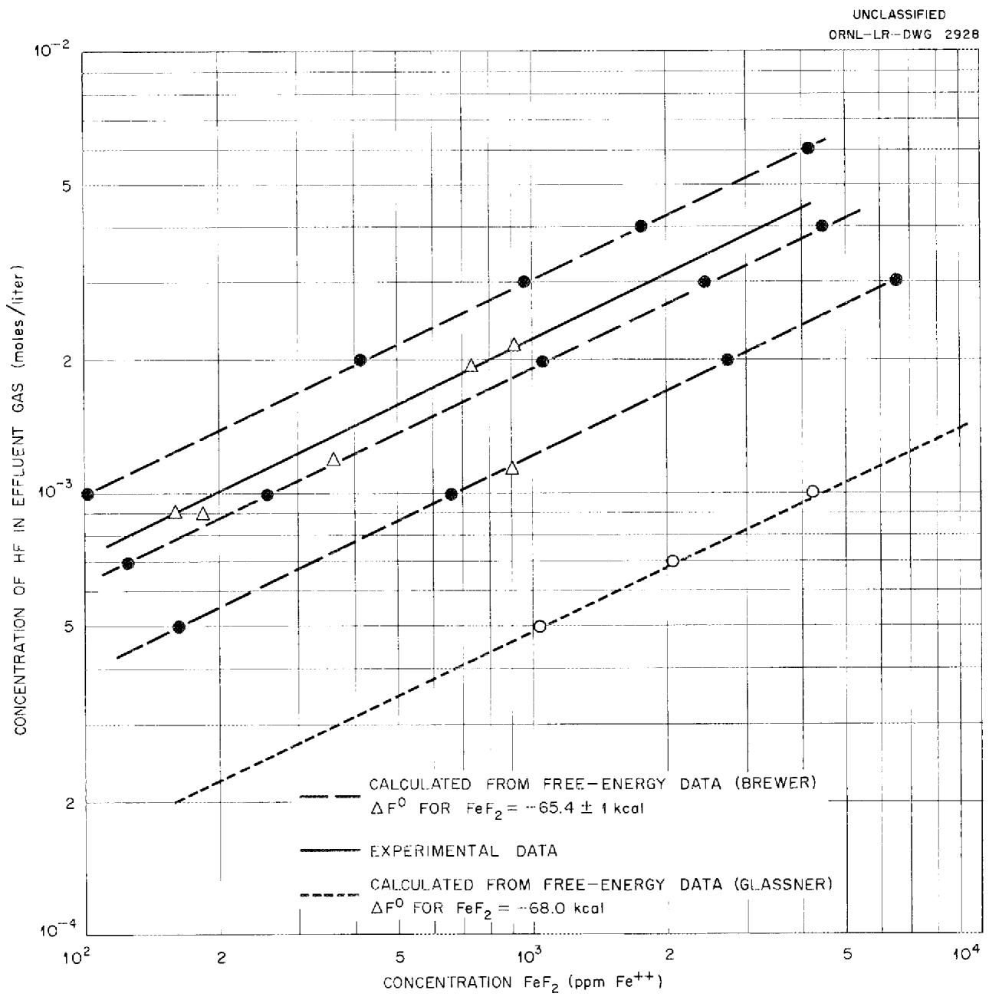  
Fig. 5.8. Equilibrium Concentration for the Reduction of $\mathsf{FeF}_2$ by $\mathsf{H}_2$ in NaF-ZrF $_4$ (53-47 mole %) at $800^{\circ}\mathrm{C}$ (Obtained by Equilibration Method).

a hydrogen atmosphere may indicate that a hydrogen electrode is formed,

The reaction of $\mathsf{UCl}_3$ with zirconium metal may be ascribed to the following equations:

[ 2\mathrm{UCl}_3 + 3\mathrm{Zr} = 3\mathrm{ZrCl}_2 + 2\mathrm{U}, \quad \Delta F^\circ = -10\mathrm{kcal}, ] and

$4\mathrm{UCl}_{3} + 3\mathrm{Zr} = 3\mathrm{ZrCl}_{4} + 4\mathrm{U}, \Delta F^{\circ} = +130\mathrm{kcal}$

Current-voltage measurements indicate the first reaction to be predominant. The $E^{\circ}$ of 0.4 v for the reaction of $\mathrm{UCl}_3$ with a chromium anode, that is,

$$
2 U C l _ {3} + 3 C r = 3 C r C l _ {2} + 2 U,
$$

$$
E ^ {\circ} (\text {t h e o r e t i c a l}) = 0. 9 0 \mathrm {v},
$$

seems to indicate strong complexing of the $\mathrm{CrCl}_2$ . There seems, from studies by other groups, to be

TABLE 5.9. DECOMPOSITION POTENTIALS OF VARIOUS CHLORIDES IN KCI AT ${850}^{ \circ  }\mathrm{C}$   

<table><tr><td rowspan="2">Salt</td><td rowspan="2">Concentration of Salt in Solute (mole %)</td><td colspan="2">Electrodes</td><td rowspan="2">Blanketing Atmosphere</td><td rowspan="2">Potential Observed (v)</td></tr><tr><td>Cathode</td><td>Anode</td></tr><tr><td>KCl</td><td>100.0</td><td>Ni</td><td>Cr</td><td>He</td><td>1.50</td></tr><tr><td rowspan="2">UCl3</td><td>33.3</td><td>Pt</td><td>Zr</td><td>He</td><td>Spontaneous</td></tr><tr><td>33.3</td><td>Pt</td><td>Cr</td><td>He</td><td>0.40</td></tr><tr><td rowspan="6">UCl4</td><td>33.3</td><td>Pt</td><td>C</td><td>H2</td><td>0.95, 0.83, (0.75)</td></tr><tr><td>33.3</td><td>Pt</td><td>C</td><td>He</td><td>0.83, 0.95</td></tr><tr><td>33.3</td><td>Pt</td><td>Ni</td><td>He</td><td>0.60 to 0.80</td></tr><tr><td>3.0</td><td>Pt</td><td>C</td><td>He</td><td>1.84 to 1.87</td></tr><tr><td>3.0</td><td>Pt</td><td>C</td><td>H2</td><td>(1.15)</td></tr><tr><td>3.0</td><td>Pt</td><td>Ni</td><td>He</td><td>0.34</td></tr><tr><td rowspan="5">FeCl2</td><td>33.3</td><td>Ni</td><td>C</td><td>He</td><td>0.80 to 0.83</td></tr><tr><td>33.3</td><td>Ni</td><td>Ni</td><td>He</td><td>0.35 to 0.45</td></tr><tr><td>2.0</td><td>Ni</td><td>C</td><td>He</td><td>1.45</td></tr><tr><td>1.0</td><td>Ni</td><td>C</td><td>He</td><td>1.50</td></tr><tr><td>10.0</td><td>Ni</td><td>C</td><td>He</td><td>1.00</td></tr><tr><td rowspan="3">NiCl2</td><td>33.3</td><td>Ni</td><td>C</td><td>He</td><td>0.93, 0.82</td></tr><tr><td>3.0</td><td>Ni</td><td>C</td><td>He</td><td>1.13 to 1.17</td></tr><tr><td>1.0</td><td>Ni</td><td>C</td><td>He</td><td>1.20</td></tr></table>

little evidence for this behavior in fluoride melts.

Dilute solutions of $\mathsf{UCl}_4$ decompose into U and $\mathsf{Cl}_2$ at inert electrodes upon passage of current. Since the measured $E$ 's are somewhat less than the theoretical estimate of 1.99 v, it is believed that either some depolarization occurs or that the estimate is too high, or that both are responsible. Concentrated $\mathsf{UCl}_4$ solutions may undergo the following electrochemical transformations at platinum-graphite electrodes:

(1) $2\cup \mathrm{Cl}_4 = 2\cup \mathrm{Cl}_3 + \mathrm{Cl}_2,$ （20 $E^{\circ} = 1.18\mathrm{v},$   
(2) $\mathrm{UCl}_4 = \mathrm{U} + 2\mathrm{Cl}_2,$ $E^{\circ} = 1.9\mathrm{v},$   
(3) $5\cup \mathrm{Cl}_4 = 4\cup \mathrm{Cl}_5 + \mathrm{U},$ （20 $E^{\circ} = 1.6\mathrm{v},$

Uranium metal is deposited on the cathode; so the first reaction does not occur alone. If this process takes place in conjunction with the transformation

(4) $4\mathrm{UCl}_{3} = 3\mathrm{UCl}_{4} + \mathrm{U}, \quad E^{\circ} = 0.85\mathrm{v},$

a continuous depletion in the UCl concentration, which is low initially, would result (more UCl $^3$ would be oxidized to UCI $^4$ than would be replaced at the cathode). With low concentrations of UCl $^3$

the reaction

(5) $2\mathsf{U}\mathsf{C}\mathsf{I}_{3} = 2\mathsf{U} + 3\mathsf{C}\mathsf{I}_{2},$ （20 $E^{\circ} = 2.2\mathrm{v},$

has been found to predominate. The high value of $E^{\circ}$ for reaction 2 eliminates its consideration at these voltages. The decomposition potential of reaction 3 is high also but may be accounted for by an activity ratio of $(\mathrm{UCl}_5) / (\mathrm{UCl}_4)^{5/4}$ that is approximately equal to $10^{-3}$ if the estimated $\Delta F^{\circ}$ 's of -191 and -183 kcal for $\mathrm{UCl}_5$ and $\mathrm{UCl}_4$ , respectively, are correct. The reaction of dilute and concentrated $\mathrm{UCl}_4$ solutions and nickel anodes may be attributed to

$2\mathrm{UCl}_{4} + \mathrm{Ni} = 2\mathrm{UCl}_{3} + \mathrm{NiCl}_{2},$ $E^{\circ} = 0.36\mathrm{v}$ Dilute $\mathsf{U}\mathsf{C}\mathsf{I}_{4}$ solutions seem to show signs of reduction in a hydrogen atmosphere.

Concentrated and dilute $\mathsf{FeCl}_2$ solutions also undergo different reactions at inert electrodes. In concentrated solutions $\mathsf{FeCl}_2$ is oxidized to $\mathsf{FeCl}_3$ at the anode $(E^{\circ} = 0.35\mathrm{v})$ , whereas in dilute solutions decomposition into the elements occurs $(E^{\circ} = 1.11\mathrm{v})$ . With nickel anodes, both the following reactions probably occur simultaneously:

$$
F e C l _ {2} + N i = N i C l _ {2} + F e, \quad E ^ {\circ} = 0. 3 0 v,
$$

and

$$
3 \mathrm {F e C l} _ {2} = 2 \mathrm {F e C l} _ {3} + \mathrm {F e}, \quad E ^ {\circ} = 0. 3 5 \mathrm {v}.
$$

The $\mathrm{NiCl}_2$ solutions, as far as is known, undergo the same electrochemical reactions regardless of concentration. Thus the changes in decomposition potential with concentration may be assigned to differences in $\mathrm{NiCl}_2$ activity alone. With the aid of the Nernst equation, the $\mathrm{NiCl}_2$ activity at 33.3 mole $\%$ $\mathrm{NiCl}_2$ may be computed to be 100 times that in the 3.3 mole $\%$ solution and 300 times that in the 1 mole $\%$ solution.

# Solubility of Xenon in Molten Salts

R. F. Newton, Research Director's Department D. G. Hill, Consultant

The use of molten salts as reactor fuels offers the possibility of removing the gaseous fissionproduct poisons, of which xenon is the most important. If, for example, the xenon concentration of the 60-Mw CFRE can be held at $10\%$ of its equilibrium value $(1.1\times 10^{-8}$ mole of xenon per milliliter of fuel), important perturbations in reactivity can be avoided. In an aircraft reactor, however, it will be necessary to effect this removal of xenon with an absolute minimum of auxiliary equipment.

The available literature appears to contain no measurements of the solubility of gases in molten salts. Accordingly, it has seemed desirable to evaluate the solubility of xenon in molten fluorides over the temperature range of interest. Preliminary tests indicate that the following experimental technique is satisfactory.

The apparatus, which is constructed of nickel where it will be in contact with the fluoride melt and of glass elsewhere, consists of two sections that can be isolated by freezing a plug of fluoride in the U-tube connecting them. In one section of the apparatus the melt is allowed to saturate with xenon under predetermined conditions of temperature and pressure. Melting of the fluoride plug permits the saturated salt to flow into the other section, while the U-tube seal prevents entrance of gaseous xenon into this section; refreezing of the plug isolates the sections again. In the second section, xenon is stripped from the salt by repeated circulation of the hydrogen contained in the apparatus through the salt and past a liquid-nitrogen-cooled trap. After the stripping process is complete, the hydrogen is removed, the xenon is allowed to come to room temperature, and the amount col

lected is ascertained by measurements in a modified McLeod gage.

Preliminary experiments at $600^{\circ}\mathrm{C}$ and essentially 1 atm of xenon indicate that the solubility in the NaF-KF-LiF eutectic is not greater than $10^{-7}$ mole of xenon per milliliter of salt. The method and technique proved to be feasible, but minor experimental difficulties necessitated modification of the nickel apparatus. More accurate data under these and other conditions will be available in the near future.

Meanwhile, in order to gain familiarity with the technique, the solubility of xenon in the $\mathsf{KNO}_3$ - $\mathsf{NaNO}_3$ eutectic (66 mole $\%$ $\mathsf{NaNO}_3$ ) has been measured in an apparatus constructed entirely of glass. The solubility of xenon in this melt is about $8.5 \times 10^{-8}$ mole/ml at $280^{\circ}\mathsf{C}$ and $10^{-7}$ mole/ml at $360^{\circ}\mathsf{C}$ . This liquid apparently shows the positive temperature coefficient of solubility expected for gases in molten salts.

# X-Ray Diffraction Studies in Salt Systems

P.A.Agron

M.A.Bredig

Chemistry Division

Cesium Halides. It has been suggested[21,22] that the increase in volume on melting of simple binary salts is indicative of structural changes in the melt, that is, of a decrease to a lower ionic coordination. Volume increases up to $30\%$ have been indicated for the alkali halides. The x-ray data[23] on the thermal expansion of solid CsBr and CsI gave volume changes of approximately $26\%$ , but an extrapolation of about $50^{\circ}\mathrm{C}$ to their melting points was required for the computation of these changes. It was therefore of interest to ascertain whether a solid-phase transition analogous to the one known to exist in CsCl occurs in the unexplored temperature interval. This would replace the assumed structural change in the melting process by one in the solid state.

High-purity CsBr and Csl were intimately mixed with fine nickel powder to provide an internal standard whose thermal expansion is known accurately.24 Lattice parameters as a function of temperature were obtained on the high-temperature

x-ray diffraction unit to within $5^{\circ}C$ of the melting points. No transformation was observed in either salt to within 2 or $3^{\circ}C$ of the fusion temperature. The volume changes for these solids from $25^{\circ}C$ to the fusion point were $12\%$ for CsBr and $11.2\%$ for Csl. Comparison of the molar volumes of the solids with volumes extrapolated for these molten salts down to their respective melting points shows that an increase of approximately $27\%$ takes place on melting. These data indicate that a structural change, similar to the lowering of the ionic coordination from 8 to 6 in solid CsCl, occurs on fusion.

$\mathsf{NaF - ZrF_4}$ It was desirable to determine the magnitude of the volume change found in complex salts on melting. Nickel powder was admixed to a sample of a homogeneous phase having the composition of $\mathsf{NaF - ZrF_4}$ (53-47 mole $\%$ ). The lattice expansion was measured up to $491^{\circ}C.$ The data are listed in Table 5.10. The volume expansion from $25^{\circ}C$ to the melting point is $3.8\%$ .The volume is an almost linear function of temperature. The thermal coefficient of volume expansion, $\alpha_{\nu}$ is $7.75\times 10^{-5}\mathrm{deg}^{-1}$ Thus the molar volume of the solid at the melting point of $520^{\circ}C$ gives a density of $4.00~\mathrm{g / cm}^3$ . The latter value is based on a molecular weight of 1287.5 g, corresponding to the presence in the unit cell of 6.77 NaF $+6\mathsf{ZrF}_4$ molecules for this composition. On extrapolation

of the liquid density $^{27}$ of $\mathrm{NaF - ZrF_4}$ (50-50 mole %) measured at above $600^{\circ}\mathrm{C}$ to $520^{\circ}\mathrm{C}$ , a value of 3.32 g/cm $^3$ for the liquid is obtained. An adjustment of this to the composition of $\mathrm{NaF - ZrF_4}$ (53-47 mole %), by assuming an almost constant molar volume, lowers the density to approximately 3.2 g/cm $^3$ . Thus a relatively large density and volume change of 26% is indicated for this complex salt on melting. The volume increase may be considered as indicative of a decrease in ionic coordination in the fused state similar to that observed in the CsBr and CsI salts.

The ionic coordination in the solid is assumed to be similar to that in $\mathsf{NaUF}_{5^{\prime}}$ for which Zachariasen proposed a fluorite type of packing with equal coordinations for both the $\mathsf{Na}^{+}$ and $\mathsf{Zr}^{4 + }$ of the order of 8 or 9. It seems possible that the volume increase on melting results from a lowering in the coordination of the fluorines around $\mathsf{Zr}^{4 + }$ , which might also be considered as radical ion formation around zirconium; this point requires further study.

Well-formed single crystals which originated from the central portion of a large melt of NaF-ZrF $_4$ (53-47 mole %) have become available. Single-crystal x-ray analysis has been initiated in an attempt to make a complete structure determination, especially of the positions of the fluoride ions.

TABLE 5.10. THERMAL EXPANSION OF NaF-ZrF ${}_{4}$ (53-47 mole %)   

<table><tr><td rowspan="2">Run No.</td><td rowspan="2">Temperature (℃)</td><td colspan="2">Hexagonal Cell Dimensions (Å)</td><td rowspan="2">Molar Volume (cm3)</td><td rowspan="2">Density* (g/cm3)</td></tr><tr><td>a</td><td>c</td></tr><tr><td>11-1</td><td>25</td><td>13.79</td><td>9.407</td><td>309.60</td><td>4.158</td></tr><tr><td>-4</td><td>190</td><td>13.84</td><td>9.453</td><td>313.38</td><td>4.108</td></tr><tr><td>-2</td><td>250</td><td>13.87</td><td>9.475</td><td>315.62</td><td>4.079</td></tr><tr><td>-7</td><td>278</td><td>13.89</td><td>9.482</td><td>316.64</td><td>4.066</td></tr><tr><td>-3</td><td>378</td><td>13.90</td><td>9.497</td><td>317.90</td><td>4.050</td></tr><tr><td>-6</td><td>395</td><td>13.90</td><td>9.504</td><td>318.14</td><td>4.047</td></tr><tr><td>-8</td><td>491</td><td>13.95</td><td>9.525</td><td>321.18</td><td>4.009</td></tr><tr><td>Extrapolation</td><td>520</td><td></td><td></td><td>321.50</td><td>4.005</td></tr></table>

* The density calculation is based on a unit cell containing 6.77 NaF and 6 ZrF₄ molecules per unit rhombohedral cell at this composition.

# Physical Chemistry28

E. R. Van Artsdalen Chemistry Division

The heat of combustion and the heat of formation have been determined for boron carbide. The combustion process in a high-pressure bomb is both incomplete and nonstoichiometric; it yields some free carbon, but the amount depends upon certain extraneous conditions. However, it is possible to obtain a fairly reliable value for the heat of the reaction

$$
\mathrm {B} _ {4} \mathrm {C} + 4 \mathrm {O} _ {2} \longrightarrow 2 \mathrm {B} _ {2} \mathrm {O} _ {3} + \mathrm {C O} _ {2}
$$

by allowing for incomplete combustion and nonstoichiometry as determined by direct analysis of products. The heat of combustion is $\Delta H_{298.16}^{\circ} = -683.5 + 2.2\mathrm{kcal / mole}$ . From this value and other established thermal data, it is found that the heat of formation is $\Delta H_{298.16}^{\circ} = -14.1 \pm 2.7\mathrm{kcal / mole}$ and that the free energy of formation is $\Delta F_{298.16}^{\circ} = -13.9\mathrm{kcal / mole}$ .

The low-temperature heat capacity of molybdic oxide, $\mathsf{MoO}_3$ , has been measured in the range from 15 to $300^{\circ}\mathsf{K}$ and the results are in fair agreement with the work of Seltz, Dunkerley, and DeWitt,[29] who measured the heat capacity above $60^{\circ}\mathsf{K}$ . However, low-temperature extrapolations by these authors according to the Debye $T^3$ law are in error. Molybdic oxide has a layer structure, and its heat capacity between 15 and $60^{\circ}\mathsf{K}$ varies as $T^2$ in the manner found for certain other crystals with layer lattice structure, such as boron nitride.[30] The following values were obtained for $\mathsf{MoO}_3$ at $25^{\circ}\mathsf{C}$ : $C_p^\circ_{298.16} = 17.93 \text{ cal/mole-deg}$ and $S_{298.16}^\circ = 18.58 \text{ e.u.}$ Similar studies are in progress with molybdenum disulfide, $\mathsf{MoS}_2$ , another layer compound.

Electrical conductivity and density measurements are nearly complete for the molten salt system, potassium chloride-potassium iodide, which, in a number of respects, has been observed to resemble systems discussed previously.31

# PRODUCTION OF PURIFIED MOLTEN FLUORIDES

F. F. Blankenship  
G. J. Nessle  
G. M. Watson  
Materials Chemistry Division

Use of Zirconium Metal as a Scavenging Agent

C.M.Blood H.A.Friedman

F.P.Boody F.W.Miles

G. M. Watson  
Materials Chemistry Division

The most important contaminants of fluoride melts (HF, $\mathsf{FeF}_2$ , and $\mathsf{NiF}_2$ ) can be removed by treatment of the melt with hydrogen, but this process requires long periods for nearly complete removal of the $\mathsf{FeF}_2$ . Attempts have therefore been made to demonstrate the effectiveness of zirconium metal in removing these impurities in a short time.

In NaF-ZrF $_4$ Mixtures. Known concentrations of contaminants were added to 3.5-kg batches of previously purified NaF-ZrF $_4$ (53-47 mole %) in nickel containers and allowed to remain overnight at $800^{\circ}\mathrm{C}$ in contact with a considerable excess of metallic zirconium (30 g); some stirring was assured by continuous sparging with helium. No experimental difficulties were observed either in equilibration or in filtration of the product.

In one experiment, the 10 g of $\mathsf{FeF}_2$ added gave an initial contaminant concentration of 1700 ppm Fe. After treatment, the contaminants present in the filtrate were 70 ppm Fe, 15 ppm Ni, and 15 ppm Cr. In a second experiment, 9 g of $\mathsf{CrF}_2$ was added to give an initial contaminant concentration of 1650 ppm Cr. The contaminants found in the filtrate in this case were 90 ppm Fe, 25 ppm Ni, and 15 ppm Cr. Thus these experiments indicate that the zirconium metal addition is an effective means of preparing pure NaF-ZrF4 mixtures.

In NaF-KF-LiF Mixtures. The purity of several 2-kg batches of NaF-KF-LiF eutectic after treatment with hydrogen and with zirconium metal at $800^{\circ}\mathrm{C}$ is given in Table 5.11. It is evident that scavenging with metallic zirconium can be substituted for most, if not all, of the time-consuming hydrogen stripping process. Since the impurities in fluoride melts are initially present in low concentrations, it is anticipated that the small amount of

TABLE 5.11. COMPARISON OF HYDROGEN AND ZIRCONIUM METAL FOR REMOVING REDUCIBLE IMPURITIES FROM NaF-KF-LiF MIXTURES   

<table><tr><td rowspan="2">Hydrogen Used (liters)</td><td rowspan="2">Zirconium Metal Added (g)</td><td colspan="4">Contaminants Found in Product</td></tr><tr><td>Zr (wt %)</td><td>Fe (ppm)</td><td>Ni (ppm)</td><td>Cr (ppm)</td></tr><tr><td>500</td><td>None</td><td>0.0</td><td>2100</td><td>7</td><td>25</td></tr><tr><td>600</td><td>None</td><td>0.0</td><td>725</td><td>6</td><td>30</td></tr><tr><td>300</td><td>57</td><td>1.3</td><td>70</td><td>8</td><td>20</td></tr><tr><td>None</td><td>30</td><td>1.4</td><td>65</td><td>9</td><td>20</td></tr></table>

zirconium introduced will have a negligible effect on the physical properties of the melt. However, in these experiments at $800^{\circ}\mathrm{C}$ some alkali metal was detected in cold regions of the equipment and some attack on the gaskets and flanges was observed. If large-scale purifications were attempted, it would probably be necessary to use a lower temperature for this treatment.

# Purification of NaF-ZrF4 Mixtures by Electrolysis

C. M. Blood

H. A. Friedman

F. P. Boody

F. W. Miles

G.M.Watson

Materials Chemistry Division

In the effort to obtain improved fuel purification procedures it was shown that electrolysis in NaF $\mathsf{ZrF}_4$ melts at $800^{\circ}\mathsf{C}$ with graphite anodes and nickel cathodes reduces dissolved iron and nickel to relatively low concentration in a much shorter time than is required for the customary reduction with hydrogen. Furthermore, the reduced impurities were collected on a removable cathode that could easily be withdrawn from pots with welded lids. This feature promises to be of marked advantage in processing large batches in equipment of a current design which allows the reduced metal from each batch to reintegrate subsequent batches and thereby multiply the amount of reduction required.

Careful attention was given to current-voltage curves at all stages during the electrolysis in the hope that "breaks" and apparent decomposition potentials would permit the progress of the reduction to be followed. Filtered samples were removed during various stages and analyzed for iron and nickel to determine the actual amount present. To facilitate analysis of the current-voltage curves, the electrolysis pot was fitted with "floating" anode and cathode probes, which were used to determine

the potential between the melt and the "working" anode or cathode. The probes were made of $\frac{1}{8}$ -in. nickel rod; their potentials with respect to each other and to both electrodes were followed through many cycles of increasing and decreasing applied voltage, but the results have not been completely interpreted.

J. A. McLaren of the Chemical Technology Division is of the opinion that measurements with the reference electrodes have shown that the deposition of iron takes place with very little overvoltage. At a current of 1 amp, iron was deposited with a difference of potential between the cathode and the nickel reference electrode of only 15 mv. After depletion of the iron, the cathode potential increased to 75 mv.

The anode potential was found to have a marked discontinuity in the graph of current density and voltage. At some critical current density the anode voltage would increase suddenly. At the beginning of the electrolysis the jump was found only at high current densities, but as electrolysis continued, it was found at lower current densities. The anode jump was on the order of 0.2 to 2 v, an order of magnitude greater than the increase found on the cathode.

All the electrolyses were carried out in NaF $\mathsf{ZrF}_4$ (47-53 mole %) mixtures in nickel containers. The electrodes were suspended from the lid of a 3-kg capacity purification reactor (4 × 17 in.) with modified spark plugs as insulating connectors; the electrodes were immersed to a depth of about 4 in. The anode was a $\frac{1}{2}$ -in.-dia C-18 graphite bar threaded to a short length of nickel rod which was welded to the spark plug. Direct current was supplied from a Dresser Electric Co. 24-v 25-amp selenium rectifier; measurements were made with the use of suitable potentiometers, voltmeters,

ammeters, and a recording ampere-hour meter.

In the first experiments the nickel container was used as the cathode, and helium gas was continuously bubbled through the melt in order to stir and to remove gaseous electrode products. The melt was first thoroughly purified by a conventional HF treatment followed by reduction with hydrogen. Then current-voltage curves were taken before and after the addition of 1980 ppm $\mathrm{Fe}^{+ + }$ as $\mathsf{FeF}_2$ . The effect of the added impurity was readily noticeable. The purified melt gave a curve like plot D of Fig. 5.9, while the $\mathsf{FeF}_2$ -contaminated melt yielded a curve similar to plot A. Extrapolation of the curve obtained from the $\mathsf{FeF}_2$ -bearing melt gave a decomposition potential of 0.9 v.

An electrolyzing current of 5 amp was employed, but numerous current-voltage curves were also obtained so that at the end of $5\mathrm{hr}$ 20.9 amp-hr had passed. This was approximately twice the theoretical ampere-hours required to reduce the $\mathsf{Fe}^{+ + }$ a sample removed at this time analyzed 50 ppm Fe and demonstrated that a fairly complete reduction had been achieved with at least $50\%$ current efficiency. No evolution of fluorine was noted, nor was there an appreciable attack on the nickel container. The wall which had been in contact with the vapor appeared to be covered with a fine dust, presumably NiF.

For the next series of experiments a new batch of freshly purified melt was used, hydrogen was substituted for helium, and a current of 10 amp was passed. Three purifications were carried out in succession with addition of $\mathsf{FeF}_2$ and $\mathsf{NiF}_2$ to simulate impurities, as shown in the first part of Table 5.12. Apparent current efficiencies based on

data from Table 5.12 are deceptive because some of the reduction is accomplished by hydrogen, which gives high values, and also because the current efficiency for purification becomes very low when the amount of impurity to be reduced is very small. When the container was used as a cathode, $6\mathrm{v}$ was the maximum applied potential required to obtain a current of 10 amp. An HF concentration in the effluent gas of about $10^{-3}$ mole of HF per liter of hydrogen was noted at 5 amp.

In another series of experiments a removable cathode, insulated from the pot, was used. The cathode was a $\frac{3}{8} \times 4$ in. cylinder of nickel gauze welded to a $\frac{1}{8}$ -in. nickel rod; the gauze was made of 15-mil wire, 25 wires to the inch. The dimensions were chosen to be in the correct proportion for a small-scale model of a 250-lb capacity production reactor. To obtain a relatively high level of initial impurity, approximately 20 g of $\mathsf{FeF}_2$ and 20 g of $\mathsf{NiF}_2$ were mixed with the starting materials. After the usual HF treatment before electrolysis, a sample was removed to determine the iron concentration. The results of the trial are summarized in the second part of Table 5.12.

At the end of 12.5 amp-hr the cathode was removed; it had gained 10.3 g of metallic iron (as computed from chemical analysis), representing a 97% yield. A new cathode was then used until a total of 37 amp-hr had passed; this cathode gained 0.2 g of iron, and thus the percentage recovery had been increased to 99%. A current of 10 amp gave current densities of 11.7 amp/cm² of anode surface. By doubling the nominal area of gauze used as the cathode to obtain the total surface area both inside and out, the current density at the

TABLE 5.12. ELECTROLYTIC PURIFICATION OF NaF-ZrF ${}_{4}$ MELTS WITH HYDROGEN STIRRING   

<table><tr><td rowspan="2">Cathode Arrangement</td><td colspan="2">Impurities Before Electrolysis (ppm)</td><td rowspan="2">Ampere-Hours Passed</td><td colspan="2">Impurities After Electrolysis (ppm)</td></tr><tr><td>Fe</td><td>Ni</td><td>Fe</td><td>Ni</td></tr><tr><td rowspan="3">Nickel container as cathode</td><td>1980</td><td>2020</td><td>15.2</td><td>95</td><td>55</td></tr><tr><td>1890</td><td>2000</td><td>23.6</td><td colspan="2">Not sampled</td></tr><tr><td>1980</td><td>None</td><td>11.8</td><td>100</td><td>40</td></tr><tr><td rowspan="2">Removable nickel gauze cathode</td><td>4660</td><td>*</td><td>12.5</td><td colspan="2">150</td></tr><tr><td>**</td><td></td><td>37.0</td><td colspan="2">80</td></tr></table>

*Unfortunately, a reliable analysis of the nickel concentration was not obtained.   
\*\*Continued without additional impurity.

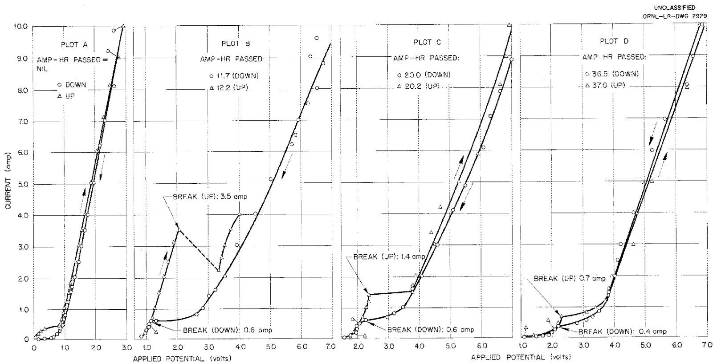  
Fig. 5.9. Plots of Current vs Voltage in Purification by Electrolysis of NaF-ZrF4 Mixtures.

cathode was found to be about 8 amp/cm² of nominal gauze area.

In all runs under hydrogen, the effluent gas was bubbled through KOH solution to remove HF. A sample of the gas after removal of HF was analyzed by mass spectrometry and found to contain $3.17\%$ $\mathsf{CH}_4$ , $1.25\%$ $\mathsf{H}_2\mathsf{O}$ (from the KOH solution), $0.73\%$ $\mathsf{N}_2$ , and only about $0.02\%$ $\mathsf{CF}_4$ . Evidently the predominant anode product is HF. The anodes disappeared at a rate corresponding to a life expectancy longer than 50 amp-hr. The cathode deposits were expected to contain zirconium metal, and this was qualitatively confirmed by the high zirconium analysis (53.9 wt % for the cathode that gained 0.2 g of iron) in the scrapings of mixed metal and salt from the cathode. However, the zirconium metal could not be distinguished by x-ray diffraction.

The conclusion was reached that electrolysis with removable cathodes was a practical and efficient means of purifying fluoride melts containing structural metal impurities. Experiments to investigate the removal of sulfates and oxides by electrolysis and an attempt to electrolytically reduce $\mathsf{UF}_4$ to $\mathsf{UF}_3$ are in progress.

A typical set of current-voltage curves is shown in Fig. 5.9. These curves apply to the experiment with removable cathodes and illustrate the characteristic "knees" or breaks in the current-voltage curves as the voltage is increased or decreased. The "knees" are apparently due to a polarization phenomenon and show considerable hysteresis. A correlation between the current at which breaks occur and the ampere-hours passed is presented in Fig. 5.10.

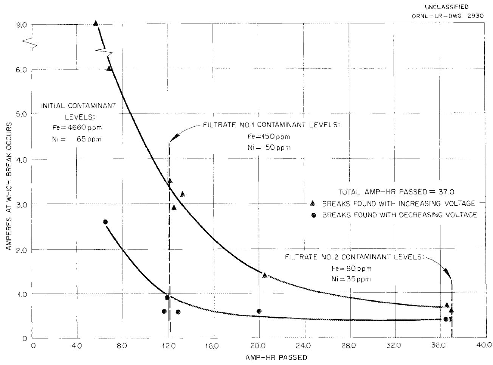  
Fig. 5.10. Current-Voltage Breaks vs Ampere-Hours Used in Purification by Electrolysis of NaF-ZrF4.

Preparation of UF $_3$ -Bearing Fuels

C. M. Blood

H. A. Friedman

F. P. Boody

F.W.Miles

G.M.Watson

Materials Chemistry Division

Since preliminary results have shown that $\mathsf{UF}_3$ -bearing fuels are less corrosive to Inconel than $\mathsf{UF}_4$ -bearing fuels, considerable effort has been devoted to studying methods for preparing these materials. The experiments performed thus far have given results that are not as yet well understood.

The tabulated values for standard free energy of formation indicate that at $800^{\circ}\mathrm{C}$ the reaction

$\frac{1}{4} U^{\circ} + \frac{3}{4} UF_{4} = UF_{3}, \quad \Delta F^{\circ} = -16 \, \text{kcal}$ , should proceed to essential completion if the compounds are in their standard states. There is ample evidence that $UF_{4}$ dissolved in $\mathsf{NaZrF}_{5}$ is more stable to reduction by chromium than would be expected, but the difference between the expected and the actual stability is hardly sufficient to suggest that reduction of $UF_{4}$ by uranium metal should be detectably incomplete.

The reduction of $\mathsf{UF}_4$ to $\mathsf{UF}_3$ with uranium or zirconium metal has been attempted in a large number of preparations by the following technique. About 500 g of material containing the predetermined quantity of $\mathsf{UF}_4$ is treated with HF and $\mathsf{H}_2$ in nickel equipment in the usual fashion to render it essentially free from contaminants. This purified mixture is cooled below the melting point, and the desired quantity of uranium or zirconium metal turnings is added. The reaction is allowed to proceed while the mixture in the reactor is stirred by a stream of hydrogen bubbling through it. Samples of the melt can be obtained by drawing a sample into a filter stick of nickel containing a sintered-nickel filter medium. The specimens removed from the filter stick are available for petrographic, x-ray, and wet chemical examination.

The data obtained from several preparations are presented in Table 5.13. It is obvious that complete reduction was not obtained in any preparation and that reduction in the NaF-KF-LiF system was much less complete than in the other solvents. While the number of experiments performed to date may be too small to establish reliable trends, the following pertinent observations can be made on the basis of examination of these experiments and results.

$\mathsf{UF}_3$ in $\mathsf{ZrF}_4$ Systems. About $90\%$ of the anticipated reduction was obtained when large quantities of reducing agent were used to obtain $\mathsf{UF}_3$ in $\mathsf{ZrF}_4$ -bearing mixtures. In view of the extreme precautions which must be observed to prevent oxidation of the material during preparation and handling, it appears safe to state that about $90\%$ of the $\mathsf{UF}_4$ can be reduced under optimum conditions. No alkali metal was observed under the operating conditions used. The extent of reduction in these systems could be qualitatively distinguished by petrographic examination.

$\mathsf{UF}_3$ in Molten LiF. More than $90\%$ of the $\mathsf{UF}_4$ in molten LiF was reduced in each case, but complete reduction was not accomplished. It is not possible to say whether the difference between 0.96 at $825^{\circ}\mathsf{C}$ and 0.91 at $850^{\circ}\mathsf{C}$ is real. No alkali metal vapor was detected. Petrographic examination detected the presence of small quantities of $\mathsf{UF}_4$ .

$UF_{3}$ in Molten NaF-KF-LiF. In five experiments at 780 to $800^{\circ}C$ the maximum reduction obtained in NaF-KF-LiF was $48\%$ of that expected. The extent of reduction was only slightly affected by an increase in the reducing agent from 92 to $121\%$ and by an increase in the reaction time from 3 to 52 hr. At lower equilibration temperatures the extent of reduction was increased. The highest value was obtained at the shortest equilibration time and with the largest excess of reducing agent.

In all the experiments at 780 to $800^{\circ}\mathrm{C}$ , alkali metal vapor was evident; however, at $600^{\circ}\mathrm{C}$ no alkali vapor was observed. It is possible that a part of the difficulty in obtaining complete reduction is due to reactions of the type

$$
\begin{array}{l} U + 3 K F = U F _ {3} + 3 K ^ {\circ}, \quad \Delta F ^ {\circ} = + 2 6. 1 k c a l, \\ \text {a n d} \end{array}
$$

$\mathsf{UF}_3 + \mathsf{KF} = \mathsf{UF}_4 + \mathsf{K}^\circ ,\quad \Delta F^\circ = +30.3\mathsf{kcal},$ where the metallic potassium being relatively volatile is removed from the reaction by the hydrogen stream. It is also possible that the disproportionation reaction

$\mathsf{UF}_3 = \frac{3}{4}\mathsf{UF}_4 + \frac{1}{4}\mathsf{U}, \quad \Delta F^{\circ} = +16\mathsf{kcal},$ is responsible. However, it is especially difficult to see why this reaction should be more important in an NaF-KF-LiF solution than in an LiF solution.

Under petrographic examination the products of the eight experiments with NaF-KF-LiF solution appeared to be identical even though by chemical analyses they showed widely different $\mathsf{UF}_{3}$ -to-UF

TABLE 5.13. COMPLETENESS OF REDUCTION OF UF ${}_{4}$ IN VARIOUS FLUORIDE MELTS  

<table><tr><td colspan="5">Initial Melt Composition (mole %)</td><td colspan="2">Equilibration</td><td colspan="2">Reducing Agent (%*)</td><td colspan="2">Ratio of U3+ to Total U</td></tr><tr><td>ZrF4</td><td>UF4</td><td>NaF</td><td>LiF</td><td>KF</td><td>Time (hr)</td><td>Temperature (°C)</td><td>U°</td><td>Zr°</td><td>Expected</td><td>Found</td></tr><tr><td>63.7</td><td>36.3</td><td></td><td></td><td></td><td>4</td><td>800</td><td>0</td><td>128</td><td>1.0</td><td>0.88</td></tr><tr><td>47.0</td><td></td><td>53.0</td><td></td><td></td><td>5</td><td>800</td><td>100</td><td>0</td><td>1.0</td><td>0.89</td></tr><tr><td>47.0</td><td></td><td>53.0</td><td></td><td></td><td>5</td><td>800</td><td>100</td><td>0</td><td>1.0</td><td>0.88</td></tr><tr><td>45.9</td><td>4.0</td><td>50.1</td><td></td><td></td><td>3</td><td>800</td><td>0</td><td>25</td><td>0.25</td><td>0.14</td></tr><tr><td>45.9</td><td>4.0</td><td>50.1</td><td></td><td></td><td>3</td><td>800</td><td>0</td><td>25</td><td>0.25</td><td>0.17</td></tr><tr><td>39.9</td><td>6.5</td><td>53.6</td><td></td><td></td><td>4</td><td>800</td><td>0</td><td>15</td><td>0.15</td><td>0.19</td></tr><tr><td>39.9</td><td>6.5</td><td>53.6</td><td></td><td></td><td>4</td><td>800</td><td>0</td><td>15</td><td>0.15</td><td>0.12</td></tr><tr><td></td><td>4.5</td><td></td><td>95.5</td><td></td><td>50</td><td>825</td><td>125</td><td>0</td><td>1.0</td><td>0.96</td></tr><tr><td></td><td>4.5</td><td></td><td>95.5</td><td></td><td>26</td><td>850</td><td>200</td><td>0</td><td>1.0</td><td>0.91</td></tr><tr><td></td><td>4.5</td><td>10.8</td><td>43.8</td><td>40.9</td><td>3</td><td>780</td><td>106</td><td>15</td><td>1.0</td><td>0.41</td></tr><tr><td></td><td>4.5</td><td>10.8</td><td>43.8</td><td>40.9</td><td>28</td><td>780</td><td>100</td><td>15</td><td>1.0</td><td>0.48</td></tr><tr><td></td><td>4.5</td><td>10.8</td><td>43.8</td><td>40.9</td><td>52</td><td>780</td><td>100</td><td>15</td><td>1.0</td><td>0.44</td></tr><tr><td></td><td>4.5</td><td>10.8</td><td>43.8</td><td>40.9</td><td>28</td><td>600</td><td>100</td><td>0</td><td>1.0</td><td>0.59</td></tr><tr><td></td><td>4.5</td><td>10.8</td><td>43.8</td><td>40.9</td><td>2</td><td>600</td><td>200</td><td>0</td><td>1.0</td><td>0.76</td></tr><tr><td></td><td>5.3</td><td>10.7</td><td>43.5</td><td>40.5</td><td>28</td><td>600</td><td>50</td><td>0</td><td>0.5</td><td>0.33</td></tr><tr><td></td><td>1.8</td><td>11.1</td><td>44.5</td><td>42.6</td><td>24</td><td>800</td><td>91.8</td><td>0</td><td>0.918</td><td>0.30</td></tr><tr><td></td><td>1.8</td><td>11.1</td><td>44.5</td><td>42.6</td><td>24</td><td>800</td><td>91.8</td><td>0</td><td>0.918</td><td>0.42</td></tr></table>

*Per cent of stoichiometric quantity - amount required to satisfy:   
$\frac{1}{4} U^{\circ} + \frac{3}{4} UF_{4} = U F_{3}$ or $\frac{1}{4} Zr^{\circ} + UF_{4} = UF_{3} + \frac{1}{4} ZrF_{4}$ .

ratios. All were rich in red crystals (no green at all) denoted as "KF-UF3 complex compound." No tetrovalent uranium (other than possible trace quantities) could be distinguished in this system, although tetrovalent uranium was found in both the LiF and the ZrF4-bearing systems where the reduction was vastly more complete. These results are quite surprising, since petrographic examination has generally been quite sensitive in ascertaining small amounts of UF3 or UF4 in other systems. Additional studies in these and similar systems will be made.

# Alkali-Metal Fluoride Processing Facility

C.R.Croft

J.E. Eorgan

J.P. Bickely

J. Truitt

Materials Chemistry Division

The alkali-metal fluoride processing facility completed May 15, 1954 is used chiefly for the development of suitable processes for the production of alkali-metal fluoride mixtures containing $\mathsf{UF}_3$ . There have been several preparations, however, of special batches of other compositions to fulfill specific needs. Single batches of approximately

2.5 kg can be prepared in this equipment. During the quarter, 27 preparations that yielded about 70 kg of material were made.

Repeated attempts to prepare NaF-KF-LiF mixtures containing 14 wt $\%$ UF $_3$ and 1 wt $\%$ UF $_4$ by reduction of UF $_4$ with uranium metal yielded mixtures containing 5 to 7 wt $\%$ UF $_3$ by chemical analysis. These results, along with those reported elsewhere in this document, seem to show that in systems containing KF, reduction of UF $_4$ by uranium metal is markedly incomplete. Pending clarification of this point, production of material containing 5 wt $\%$ UF $_3$ and 10 wt $\%$ UF $_4$ is under way.

# Production Facility

J.P.Blakely F.L.Daley

Materials Chemistry Division

During the past quarter, 1760 kg of processed fluorides was produced in the 250-lb facility for external and internal distribution. A breakdown of the production according to composition is given below:

<table><tr><td></td><td>Amount
Processed
(kg)</td></tr><tr><td>NaF-ZrF4-UF4(50-46-4 mole %)</td><td>791</td></tr><tr><td>NaF-ZrF4(50-50 mole %)</td><td>565</td></tr><tr><td>NaF-ZrF4-UF4(50-43.5-6.5 mole %)</td><td>404</td></tr></table>

Pratt & Whitney Aircraft Division received 27 kg of NaF-ZrF₄ (50-50 mole %) and 113 kg of NaF-ZrF₄-UF₄ (50-46-4 mole %). Battelle Memorial Institute received 46 kg of NaF-ZrF₄-UF₄ (50-46-4 mole %) and 68 kg of NaF-ZrF₄ (50-50 mole %). The remaining processed material was distributed to various requesters in the ANP Program.

The difficulties associated with the long stripping times and large hydrogen volumes required for production of rigorously pure fluoride melts from the raw materials available have not yet been overcome.[32] Attempts to shorten the time required by increasing the hydrogen flow rate from 4 to 15 liters/min and thus decrease labor and maintenance costs were not successful. Under these conditions

the gas inlet tubes plugged quite frequently and the HF concentration in the exit hydrogen fell much below the value obtained at lower flow rates. The over-all purification time was not appreciably shortened by the fourfold increase in hydrogen passed.

Sublimation of crude $\mathsf{ZrF}_4$ at a temperature lower than that previously used by Y-12 personnel did not appreciably improve the purity of the $\mathsf{ZrF}_4$ product. Accordingly, the NaF-ZrF4 melts produced in the near future will be prepared from the $(\mathsf{NaF})_x\cdot \mathsf{ZrF}_4$ that is available in moderately pure form from a commercial source; hafnium-free $\mathsf{ZrF}_4$ will be used to adjust the composition as required, since this material is available in a high state of purity.

Electrolytic purification of $\mathsf{NaF - ZrF}_4$ mixtures has been shown to be complete, and the process requires much less time than does the hydrogen stripping process. Accordingly, one of the units in the production facility is being modified slightly to test this method on a large scale. It is anticipated that the use of the purer raw materials and the electrolytic purification process will considerably decrease the cost of fuel preparation.

# In-Pile Loop Loading

J. E. Eorgan

Materials Chemistry Division

The first in-pile loop was loaded on June 11 with a fuel concentrate, NaF-ZrF4-UF4 (62.5-12.5-25.0 mole %), prepared from enriched uranium by Y-12 personnel. The loading apparatus and controls performed satisfactorily, and the transfer of material to the loop went smoothly. However, the electrical contact which should have indicated when the loop was filled to operating level was not activated even after 120% of the calculated charge had been added.

Subsequent examination of the loop showed that a weld had given way where the loop was connected to the pump bowl, and it seems certain that this leak was present during the filling operation. The $U^{235}$ is being salvaged from the loop. Examination of the filling apparatus revealed that all but 68 g of a total of 5837 g of the material was transferred to the loop.

# CHEMISTRY OF ALKALI-METAL HYDROXIDES

L.G.Overholser

F. Kertesz

Materials Chemistry Division

# Purification

E. E. Ketchen

Materials Chemistry Division

Eighteen batches of NaOH were purified by filtering the 50 wt % aqueous solution through a fine sintered-glass filter to remove the $\mathrm{Na_2CO_3}$ and by dehydration at $400^{\circ}\mathrm{C}$ under vacuum. Approximately one-half the runs yielded products containing less than 0.1 wt $\%$ $\mathrm{H}_2\mathrm{O}$ and 0.1 wt $\%$ $\mathrm{Na_2CO_3}$ . The remaining runs yielded less than 0.1 wt $\%$ $\mathrm{H}_2\mathrm{O}$ , but the values for $\mathrm{Na_2CO_3}$ ranged from 0.11 to 0.2 wt $\%$ . Four 0.5-lb portions of potassium were reacted with water, and the resulting solutions of KOH were dehydrated at $400^{\circ}\mathrm{C}$ under vacuum. The resulting material contained less than 0.1 wt $\%$ $\mathrm{K_2CO_3}$ , 0.1 wt $\%$ $\mathrm{H}_2\mathrm{O}$ , and approximately 0.1 wt $\%$ Na.

# Reaction of Sodium Hydroxide with Metals

H. J. Buttram

F. A. Knox

F. Kertesz

Materials Chemistry Division

Work has been continued on the reaction of copper and sodium hydroxide. Data were previously reported33 on copper concentrations found in NaOH up to $800^{\circ}\mathrm{C}$ . A recent determination at $900^{\circ}\mathrm{C}$ shows 2500 ppm Cu in the melt after exposure. This value is higher than would be expected from the previous data taken from 600 to $800^{\circ}\mathrm{C}$ . A plot of log Cu concentration vs $1 / T$ yields a straight line from 600 to $800^{\circ}\mathrm{C}$ and thus suggests that true equilibrium values were obtained. Extension of this line would give a value of about 1500 ppm rather than the 2500 ppm Cu obtained.

33F. A. Knox, H. J. Buttram, F. Kertesz, ANP Quar. Prog. Rep. June 10, 1954, ORNL-1729, p 60.

Reactions of copper and nickel with sodium hydroxide were previously investigated by determining the equilibrium hydrogen pressures developed. Monel, an alloy composed primarily of copper and nickel, has now been investigated by this method. The Monel reaction tube containing the melt was surrounded by a quartz envelope, to which was attached a manometer for determination of the hydrogen pressure. Establishment of equilibrium required long periods of time, and the values obtained were not completely reproducible. Therefore, only a range of equilibrium pressures is presented in the following for the sodium hydroxide--Monel reaction:

<table><tr><td>Temperature (°C)</td><td>Pressure (mm Hg)</td></tr><tr><td>600</td><td>35 to 42</td></tr><tr><td>700</td><td>112 to 130</td></tr><tr><td>800</td><td>160 to 193</td></tr><tr><td>900</td><td>232 to 280</td></tr><tr><td>1000</td><td>280 to 360</td></tr></table>

In another series of tests nickel oxide (reagent-grade commercial material heated to $700^{\circ}\mathrm{C}$ in vacuum) was added to sodium hydroxide in a jacketed nickel tube. At $350^{\circ}\mathrm{C}$ a pressure of $22\mathrm{mmHg}$ was found. Mass spectrographic analysis of the gas revealed $5.6\%$ hydrogen and the remainder to be essentially water vapor. The temperature of the test was increased to $500^{\circ}\mathrm{C}$ and then, in $100^{\circ}\mathrm{C}$ increments, to $1000^{\circ}\mathrm{C}$ . The pressure in no case exceeded $31\mathrm{mmHg}$ , which is approximately the saturated ambient water-vapor pressure. Analyses of the gas showed it to be 97 to $98\%$ water vapor, with a little hydrogen. Under otherwise identical test conditions, no water vapor was found when nickel oxide was omitted. The net effect of the nickel oxide is apparently that of oxidizing the hydrogen formed from the Ni-NaOH reaction to water vapor.

# 6. CORROSION RESEARCH

W.D.Manly G.M.Adamson

Metallurgy Division

W.R.Grimes F.Kertesz

Materials Chemistry Division

The static and seesaw corrosion testing facilities were used for further studies of brazing alloys, special Stellarite heats, Hastelloy R, Inconel, graphite, and various ceramics in sodium, fluoride fuel mixtures, and other mediums. For the fabrication of many reactor components it may be well to have a brazing alloy that is compatible both with sodium and with the fluoride fuels. Therefore several corrosion tests were performed on Inconel joints brazed with high-temperature brazing alloys. From this work it was found that the brazing alloy $67\%$ Ni-13% Ge-11% Cr-6% Si-2% Fe-1% Mn has good corrosion resistance in fluoride fuels and fair corrosion resistance in sodium. Two special heats of Stellarite were tested that had a lower carbon content than those tested previously, and it was found that the lower carbon content increased the corrosion resistance in the fluoride fuels.

High-density graphite was tested in sodium and in fluoride mixtures; it has very poor resistance to sodium attack but seems to have fair resistance to the fluoride fuels. Various hard-facing materials, ceramics and cermets, have been investigated from the corrosion standpoint for use as bearings, seals, and valve seats; $\mathsf{Al}_2\mathsf{O}_3$ , $\mathsf{MgAl}_2\mathsf{O}_4$ , $\mathsf{ZrO}_2$ , and SiC were tested in sodium, a fluoride fuel, lithium, and lead. In these tests, SiC showed the best corrosion resistance.

In the thermal-convection loop corrosion studies, emphasis has shifted to fuels with the uranium present as $\mathsf{UF}_3$ and to loops of Hastelloy B. Hot-leg attack is not found in Inconel loops in which $\mathsf{ZrF}_4$ -base fluoride mixtures with the uranium as $\mathsf{UF}_3$ are circulated. A deposit is, however, found on the hot-leg surface. Only preliminary information is available, but it appears that neither attack nor a hot-leg layer is found with alkali-metal-base fluoride mixtures containing $\mathsf{UF}_3$ . Mixtures of $\mathsf{UF}_3$ and $\mathsf{UF}_4$ will result in a reduction in attack from that found with only $\mathsf{UF}_4$ , but some attack is present and in high-uranium-content systems it may be significant.

The addition of zirconium hydride to the $\mathsf{ZrF}_4$ -base fuel mixtures containing $\mathsf{UF}_4$ was found to

result in the formation of $\mathsf{UF}_3$ and in a reduction in corrosion. However, to obtain a complete absence of corrosion, sufficient hydride must be added to cause a loss of uranium.

Several Hastelloy B loops have now been successfully operated in both the as-received and the over-aged conditions. In both cases, a considerable increase in hardness occurs during operation. With $\mathsf{ZrF}_4$ -base mixtures containing $\mathsf{UF}_4$ , very little attack is found, even after 1000 hr.

The mass transfer characteristics of type 316 stainless steel in molten lithium were studied by using thermal-convection loops. After 1000 hr of loop operation, there was no sign of plug formation, and only a small amount of mass transfer was found in one of the loops. The investigation of the corrosion and mass transfer characteristics of materials in contact with liquid lead has shown that certain alloys possess a much greater resistance to mass transfer than the pure components of those alloys. The probable reason for this resistance to mass transfer can be related to the formation of intermetallic compounds in these alloys. This has been proved in the case of alloys of $45\%$ Cr- $55\%$ Co, Ni-Mo alloys, and the Fe-Cr-base stainless steels.

The flammability of liquid sodium alloys has been studied, and it has been found that only bismuth and mercury have an effect on the flammability of sodium. It was found that the degree of reaction of Na-Bi and Na-Hg alloys with air was not significantly changed when the pressure was varied from 0.25 to 1 atm. An investigation has been started to determine the amount of hydrogen liberated when NaOH is heated to $900^{\circ}\mathrm{C}$ in an inert environment. The container problem has been solved by using a large single crystal of magnesium oxide. A thermodynamic study of the alkali-metal hydroxides has shown that hydrogen is important in stabilizing NaOH at temperatures above $600^{\circ}\mathrm{C}$ . This is the temperature range at which mass transfer becomes significant in Ni-NaOH systems. These computations link the formation of hydrogen with the formation of unsaturated oxygen ions, which may be necessary for mass transfer to occur.

A plausible explanation has been developed for the evidence of a maximum in the corrosion of Inconel by molten fluorides in static tests at 800 to $900^{\circ}\mathrm{C}$ and for both void formation and chromium concentration in the melt being less at $1000^{\circ}\mathrm{C}$ than at $800^{\circ}\mathrm{C}$ . Static tests of type 316 stainless steel in $\mathsf{NaZrF}_5$ and in $\mathsf{NaF - ZrF}_4\mathsf{-UF}_4$ substantiated the phenomena observed with Inconel.

Additional corrosion experiments with fuel mixtures containing simulated fission products have shown that the experimental procedure being followed is entirely unsatisfactory. A controlled-velocity corrosion testing apparatus has been constructed for the rapid transfer of molten fluoride mixtures through both heated and cooled test sections. This apparatus was designed to simulate conditions in reactor components.

# STATIC AND SEESAW CORROSION TESTS

E. E. Hoffman

W. H. Cook

C. R. Brooks

C. F. Leitten

Metallurgy Division

# Brazing Alloys in NaF-ZrF $_4$ -UF $_4$ and in Sodium

Specimens of the three brazing alloys described in Table 6.1 were tested in $\mathsf{NaF - ZrF_4 - UF_4}$ and in sodium. The specimens were cut from 5-in. T-joints of Inconel which had been brazed in a dry hydrogen atmosphere. The purpose of these tests was to find a brazing alloy with good corrosion resistance to both $\mathsf{NaF - ZrF_4 - UF_4}$ and sodium, since such a brazing alloy could be used to back up tube-to-header welds. In use, the brazing alloy would be exposed to the fluoride mixture, but resistance to attack by sodium would also be required if a fracture occurred in a tube-to-header weld.

TABLE 6.1. RESULTS OF STATIC TESTS OF BRAZING ALLOYS IN NaF-ZrF4-UF4 (53.5-40-6.5 mole %) AND IN SODIUM AT ${1500}^{ \circ  }\mathrm{F}$ FOR 100 hr   

<table><tr><td>Brazing Alloy Composition (wt %)</td><td>Bath</td><td>Weight Change (g)</td><td>Weight Change (%)</td><td>Metallographic Notes</td></tr><tr><td colspan="5">Alloy A</td></tr><tr><td rowspan="2">67 Ni, 13 Ge, 11 Cr, 6 Si, 2 Fe, 1 Mn on Inconel (brazed at 1120°C for 10 min)</td><td>NaF-ZrF4-UF4</td><td>+0.0003</td><td>+0.024</td><td>Very little attack; slight surface roughening to a depth of 0.25 mil</td></tr><tr><td>Sodium</td><td>-0.0003</td><td>-0.017</td><td>Attack in the form of subsurface voids to a maximum depth of 3 to 4 mils</td></tr><tr><td colspan="5">Alloy B</td></tr><tr><td rowspan="2">65 Ni, 25 Ge, 10 Cr on Inconel (brazed at 1140°C for 10 min)</td><td>NaF-ZrF4-UF4</td><td>-0.0010</td><td>-0.077</td><td>No attack; slight uniform solution would account for weight loss</td></tr><tr><td>Sodium</td><td>-0.0013</td><td>-0.116</td><td>Braze fillet attacked to a maximum depth of 8 mils</td></tr><tr><td colspan="5">Alloy C</td></tr><tr><td rowspan="2">72 Ni, 18 Ge, 7 Cr, 3 P on Inconel</td><td>NaF-ZrF4-UF4</td><td>-0.0005</td><td>-0.041</td><td>Braze fillet attacked to a depth of 2 to 3 mils in the form of subsurface voids</td></tr><tr><td>Sodium</td><td>-0.0008</td><td>-0.058</td><td>Braze fillet attacked to a depth of 3 to 6 mils in the form of subsurface voids</td></tr></table>

Three brazed Inconel specimens were exposed for 100 hr at $1500^{\circ}\mathrm{F}$ in $\frac{1}{2}$ -in.-OD, 0.035-in.-wall Inconel container tubes to static NaF- $\mathsf{ZrF}_4$ -UF $_4$ (53.5-40-6.5 mole %), and three were exposed to static sodium. The brazed specimens were cleaned carefully before and after testing so that valid weight-change data could be obtained. The specimens were nickel plated after exposure to prevent rounding of the edges during metallographic polishing. Presented in Table 6.1 are the data obtained by metallographic examination of the specimens.

Alloys A and B showed very good resistance to attack by the fluoride mixture, as shown in Figs. 6.1 and 6.2. Alloy A is also shown in Figs. 6.3 and 6.4 at low magnification in the as-brazed and as-tested conditions. Alloy C was attacked slightly by the fluoride mixture. All the alloys were attacked slightly by sodium, with alloy A showing the least attack. The maximum depth of attack of 3 to 4 mils

on alloy A is not serious, since sodium would be in contact with this alloy only in the event of a tube-to-header weld fracture. It may be concluded from the results of these tests that further study is warranted on alloys A and B; both showed good resistance to attack by the fluoride mixture. Special emphasis will be placed on alloy A, since it exhibited superior resistance to attack by sodium.

# SpecialstelliteHeats in NaF-ZrF4-UF4andin Sodium

Two special heats of Stellite, heats B and C, were requested from the Union Carbide and Carbon Metals Research Laboratories for corrosion testing. The specimens were sand cast and had Rockwell C hardnesses as follows: heat B, 39 to 42; heat C, 42 to 43. The as-received microstructure consisted of $\mathrm{Cr_7C_3}$ carbide particles in a cobalt-rich matrix. The approximate compositions of these heats were

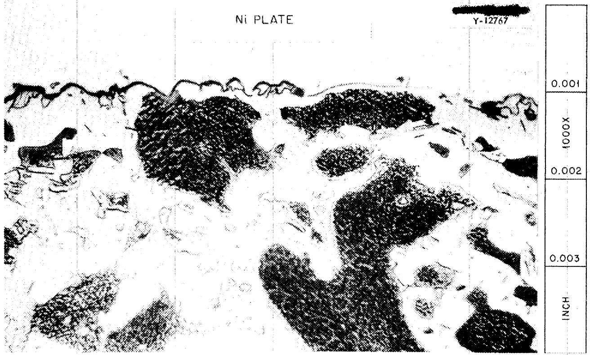  
Fig. 6.1. Brazing Alloy A (Ni-Ge-Cr-Si-Fe-Mn) Fillet Surface After Exposure for 100 hr at $1500^{\circ}\mathrm{F}$ in NaF-ZrF $_4$ -UF $_4$ (53.5-40-6.5 mole %). Etched with oxalic acid.

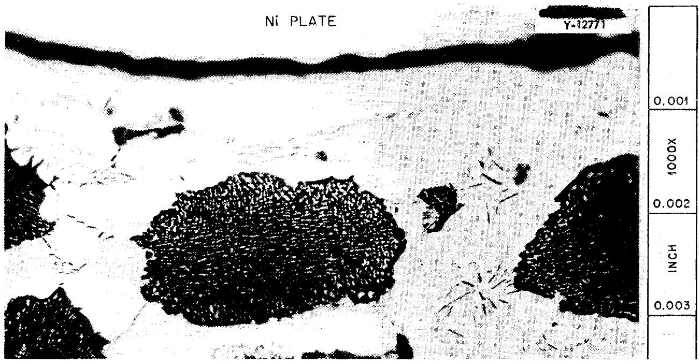

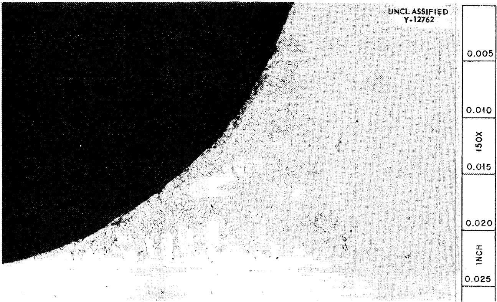  
Fig. 6.2. Brazing Alloy B (Ni-Ge-Cr) Fillet Surface After Exposure for 100 hr at $1500^{\circ}\mathrm{F}$ in NaF-ZrF4. UF4 (53.5-40-6.5 mole %). Etched with oxalic acid.   
Fig. 6.3. Brazing Alloy A on Inconel T-Joint in As-Brazed Condition. Etched with oxalic acid.

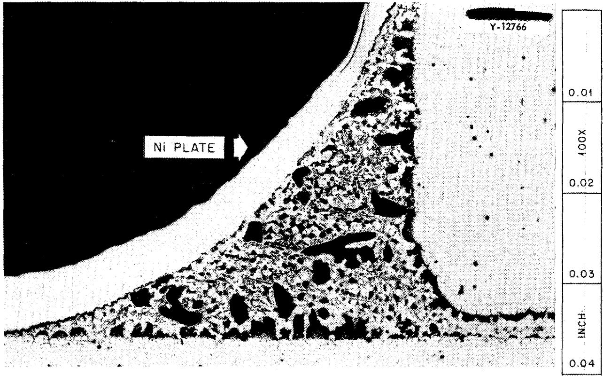  
Fig. 6.4. Brazing Alloy A on Inconel T-Joint After Testing. Dark areas are not areas of attack. Etched with oxalic acid.

as follows:

<table><tr><td></td><td colspan="2">Composition (wt %)</td></tr><tr><td></td><td>Heat B</td><td>Heat C</td></tr><tr><td>Carbon</td><td>1</td><td>0.30</td></tr><tr><td>Chromium</td><td>35</td><td>28</td></tr><tr><td>Tungsten</td><td>5</td><td></td></tr><tr><td>Molybdenum</td><td></td><td>12</td></tr><tr><td>Manganese</td><td>0.50</td><td>0.50</td></tr><tr><td>Silicon</td><td>0.50</td><td>0.50</td></tr><tr><td>Nickel</td><td></td><td>3</td></tr><tr><td>Cobalt</td><td>58</td><td>55.7</td></tr></table>

The specimens were tested in static mediums for 100 hr at $1500^{\circ}\mathrm{F}$ . Inconel container tubes were used and duplicate tests were run. The test results are presented in Table 6.2.

Both Stellar heats were heavily attacked along the carbide network in NaF-ZrF4-UF4 (50.46-4 mole %), as shown in Figs. 6.5 and 6.6. The attack varied from a minimum of 7 mils to a maximum of 20 mils. The depth of attack varied with the orientation of the carbide network with relation to the

specimen surface, being deepest when the network was perpendicular to the surface.

None of the specimens were attacked in sodium; however, in heat B there were no large equiaxed carbide particles in a 1- to 2-mil area adjacent to the surface. The carbide particles in this area appeared to have transformed to a very fine structure. There was also a large amount of fine precipitate in the cobalt-rich matrix near the surface.

Heat C had slightly better resistance than heat B to attack by sodium, and both heats had very poor resistance to attack by the fluoride mixture. Several of the specimens had shrinkage voids near the surface, one that was 7 mils in diameter, and the attack was deeper in these areas.

# Hastelloy R in Various Media

Hastelloy R centerless ground and annealed rods, $3 / 4$ in. in diameter and 8 in. in length, were obtained from the Haynes Stellar Company. Each rod was machined into a specimen $(\frac{1}{4} \times \frac{1}{4} \times \frac{3}{4}$ in.), a container, and a plug. The specimen and the medium to which it was to be exposed were loaded into the

TABLE 6.2. RESULTS OF STATIC TESTS OF SPECIAL STELLITE HEATS IN SODIUM AND IN NaF-ZrF4-UF4 (50-46-4 mole %) AT 1500°F FOR 100 hr   

<table><tr><td rowspan="2">Bath</td><td colspan="2">Weight Change (g/in.2)</td><td colspan="2">Metallographic Notes</td></tr><tr><td>Heat B</td><td>Heat C</td><td>Heat B</td><td>Heat C</td></tr><tr><td>As received</td><td></td><td></td><td>Structure consisted of large, fairly equiaxed particles of complex carbide (Cr7C3) surrounded by a eutectic structure in a cobalt-rich matrix</td><td>Carbide particles which surrounded the dendrites of the cobalt-rich solid solution had a very fine structure; only a few of the equiaxed carbide particles seen throughout Heat B could be found</td></tr><tr><td>Sodium</td><td>+0.008</td><td>+0.002</td><td>No attack; however, no globular particles of the carbide phase in a 1- to 2-mil area adjacent to the surface; carbide particles in this area completely transformed to a very fine precipitate; precipitation also occurred in matrix, especially near the exposed surface</td><td>No attack; very little difference in as-received and tested structures</td></tr><tr><td></td><td>+0.016</td><td>+0.003</td><td>Same as above</td><td>Same as above</td></tr><tr><td>NaF-ZrF4-UF4</td><td>-0.052</td><td>-0.045</td><td>Attack on carbide phase varied from 8 to 19 mils; minimum attack of 8 mils occurred on specimen where dendrites of cobalt-rich solid solution surrounded by carbide particles were oriented parallel to the specimen surface; maximum attack of 19 mils occurred where dendrites were oriented perpendicular to the specimen surface; large amount of fine precipitation in matrix during test due to aging</td><td>Carbide network attacked to a depth of 7 to 20 mils, depending on orientation of the network</td></tr><tr><td></td><td>-0.060</td><td>-0.057</td><td>Same as above</td><td>Same as above</td></tr></table>

container, and the plug was welded in place in a dry box under a purified helium atmosphere. The nominal composition of Hastelloy R is $65\%$ Ni, $14\%$ Cr, $10\%$ Fe, $6\%$ Mo, $3\%$ Ti, $2\%$ Al. The specimens were exposed to the various media for 100 hr at $1500^{\circ}\mathrm{F}$ . The test results are presented in Table 6.3.

The specimens showed good resistance to attack by NaF-ZrF4-UF4 (50-46.4 mole %), Fig. 6.7, and by lithium. Surprisingly, this alloy had better resistance to attack by lithium than by sodium; the attack by lithium on high-nickel-content alloys (for example, Inconel) at $1500^{\circ}\mathrm{F}$ is usually heavy and is greater than the attack by sodium. The sample tested in sodium was attacked slightly, while the specimen tested in lead was heavily attacked. The specimen tested in sodium hydroxide was attacked throughout its entire thickness.

# Inconel in Molten Rubidium

Tests were conducted on rubidium metal in connection with an ORSORT project. Rubidium has a low melting point, $92^{\circ}\mathrm{F}$ , and a low boiling point, $1270^{\circ}\mathrm{F}$ , and therefore is being considered as a possible reactor coolant. The rubidium metal used in the experiments was prepared by calcium reduction of the rubidium fluoride salt by the Stable Isotope Research and Production Division.

An initial attempt to determine the vapor pressure vs temperature relationship up to $1650^{\circ}\mathrm{C}$ was unsuccessful. However, the test equipment has been redesigned and another attempt will be made in the near future. Inconel has been tested in contact with static rubidium for 100 hr at $1650^{\circ}\mathrm{F}$ . The attack varied from 0.5 mil in the vapor zone to a maximum of 1.5 mils at the liquid-gas interface, as shown in Fig. 6.8. The rubidium used was not distilled and is known to have contained several per

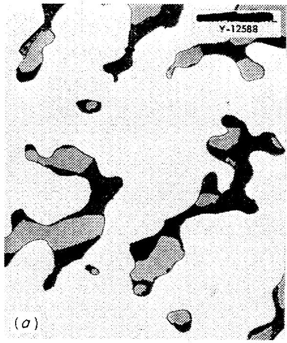

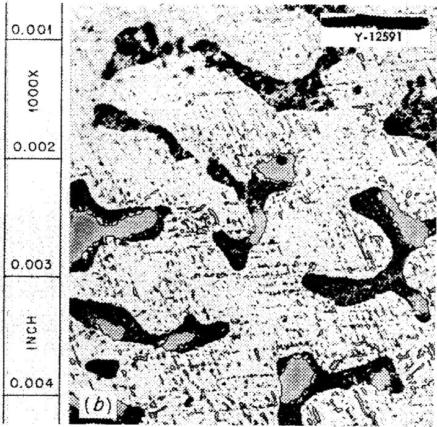

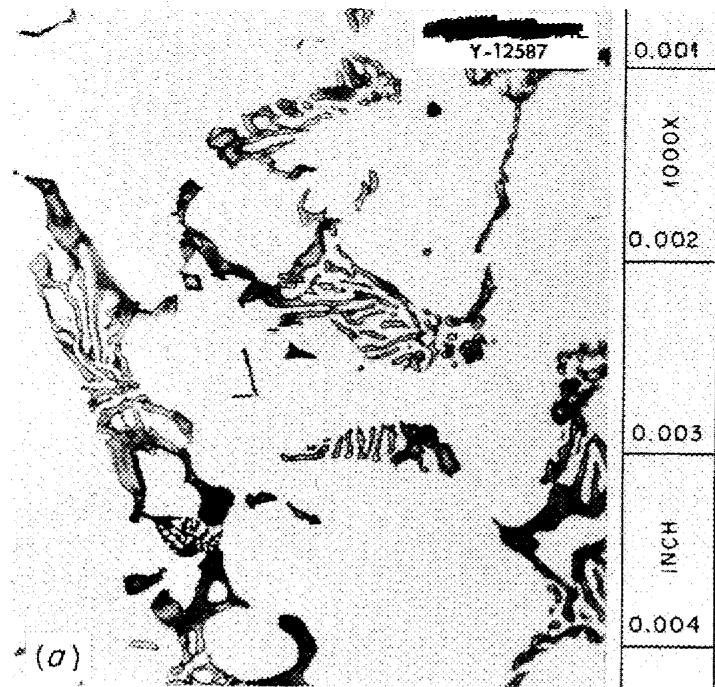  
Fig. 6.5. Special Stellar Heat B Before (a) and After (b) Exposure to Static NaF-ZrF4-UF4 (53.5-40-6.5 mole %) for 100 hr at $1500^{\circ}\mathsf{F}$ . The area where the attack terminated is shown in (b). Etched with KOH-K $_3$ Fe(CN) $_6$ .

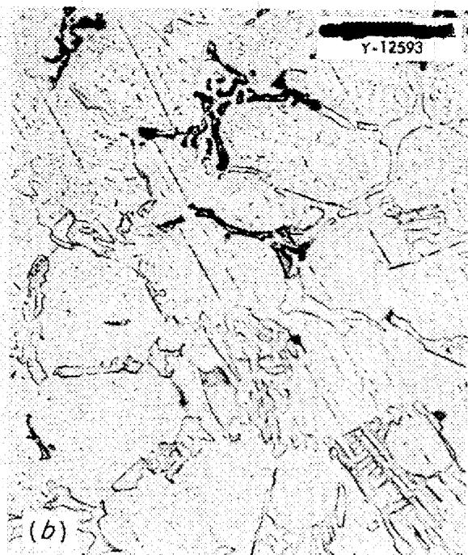  
Fig. 6.6. Special Stellar Heat C Before (a) and After (b) Exposure to Static NaF-ZrF4-UF4 (53.5-40-6.5 mole %) for 100 hr at $1500^{\circ}\mathsf{F}$ . The area where the attack terminated is shown in (b). Etched with KOH-K₃Fe(CN)₆.

TABLE 6.3. RESULTS OF STATIC TESTS OF HASTELLOY R IN VARIOUS MEDIA AT ${1500}^{ \circ  }\mathrm{F}$ FOR ${100}\mathrm{{hr}}$   

<table><tr><td>Bath</td><td>Weight Change (%)</td><td>Weight Change (g/in.2)</td><td>Metallographic Notes</td></tr><tr><td>NaF-ZrF4-UF4(50-46-4 mole %)</td><td>-0.05</td><td>-0.0037</td><td>Specimen unattacked except in one small area where voids extended to a depth of 1 mil; no attack on vapor zone of tube</td></tr><tr><td>NaOH</td><td>+7.9</td><td>+0.6088</td><td>Specimen 1/4in. square attacked throughout entire thickness</td></tr><tr><td>Sodium</td><td>-0.06</td><td>-0.0021</td><td>Specimen and bath zone attacked to a depth of 0.25 to 0.5 mil in the form of voids; exposed surface of bath zone of container partly decarburized to a depth of 1 mil</td></tr><tr><td>Lithium</td><td>-0.07</td><td>-0.0047</td><td>Small voids to a depth of 0.25 mil in specimen and bath zone of tube; surface partly decarburized by lithium</td></tr><tr><td>Lead</td><td></td><td></td><td>Specimen heavily attacked to a maximum depth of 3 mils (average 2 mils); bath zone attacked uniformly to a depth of 1.5 mils; phase change probably occurred in attacked areas; vapor zone unattacked</td></tr></table>

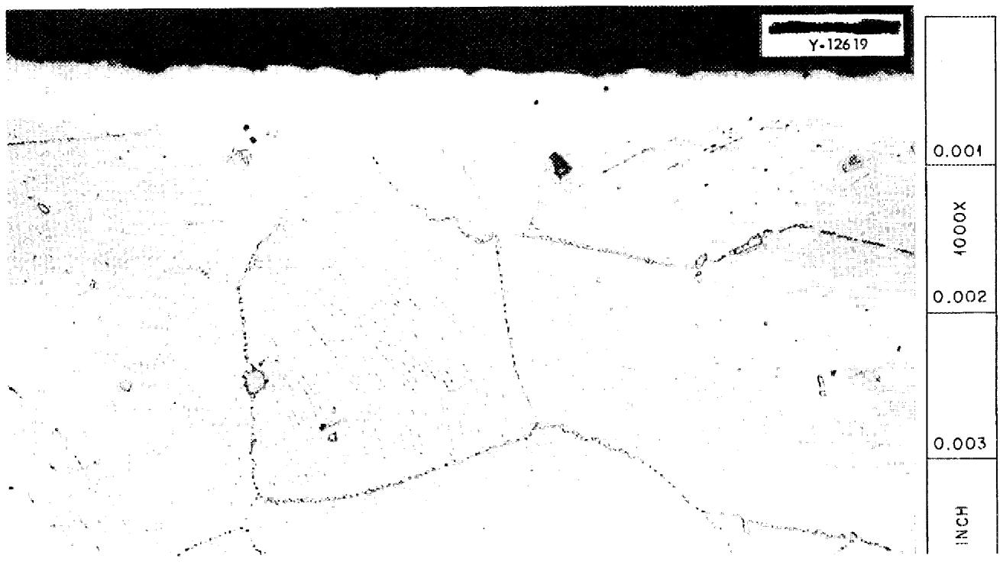  
Fig. 6.7. Hastelloy R Exposed to Static NaF-ZrF $_4$ UF $_4$ (50-46-4 mole %) for 100 hr at $1500^{\circ}\mathrm{F}$ . Etched with aqua regia.

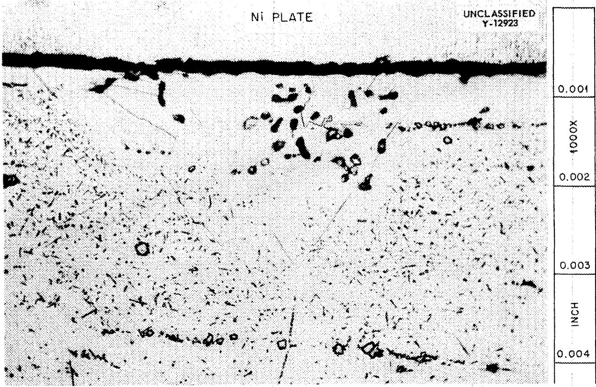  
Fig. 6.8. Inconel Exposed to Static Rubidium for 100 hr at $1650^{\circ}$ F. Note decarburization in attacked area. Specimen nickel plated after test to protect edge. Etched with glyceria regia.

cent sodium and some oxygen contamination. Additional static tests are under way with triple-distilled rubidium, and an Inconel thermal convection loop is being operated with boiling rubidium, Fig. 6.9. This loop has now operated for several hundred hours without difficulty.

# Carburization of Inconel by Sodium

It is well known that sodium, in addition to decarburizing metals, can, in some cases, carburize them if the carbon concentration in the sodium is sufficiently high. Therefore, an attempt is being made to determine whether small additions of carbon would prevent decarburization of Inconel specimens during long-time creep tests in contact with sodium at elevated temperatures. A-nickel containers are being used for static tests so that the ratio of Inconel surface area to sodium volume will be small. The maximum solubility of carbon in nickel

at $1500^{\circ}\mathrm{F}$ is approximately $0.1\%$ , and therefore the carburization of the nickel containers in these tests is very slight. The A-nickel used for the containers was found by analysis to contain only $0.05\%$ carbon.

The ratio of the Inconel surface to the sodium volume in the tests performed to date was 0.76. The Inconel specimens used were 0.049-in. sheet reduced to 0.015 in. by cold rolling, and they were annealed for 2 hr at $1650^{\circ}F$ . The carbon additions (1, 5, and 10 wt %) were made to the sodium in the form of small lumps of reactor-grade graphite.

The nickel containers were loaded with the Inconel specimens, the graphite, and the sodium in a dry box in a purified helium atmosphere and sealed under vacuum. As shown in Table 6.4 and Fig. 6.10, all the specimens were very heavily carburized and extremely brittle after exposure for 100 hr at $1500^{\circ}\mathrm{F}$ . Also, they were partly covered with a

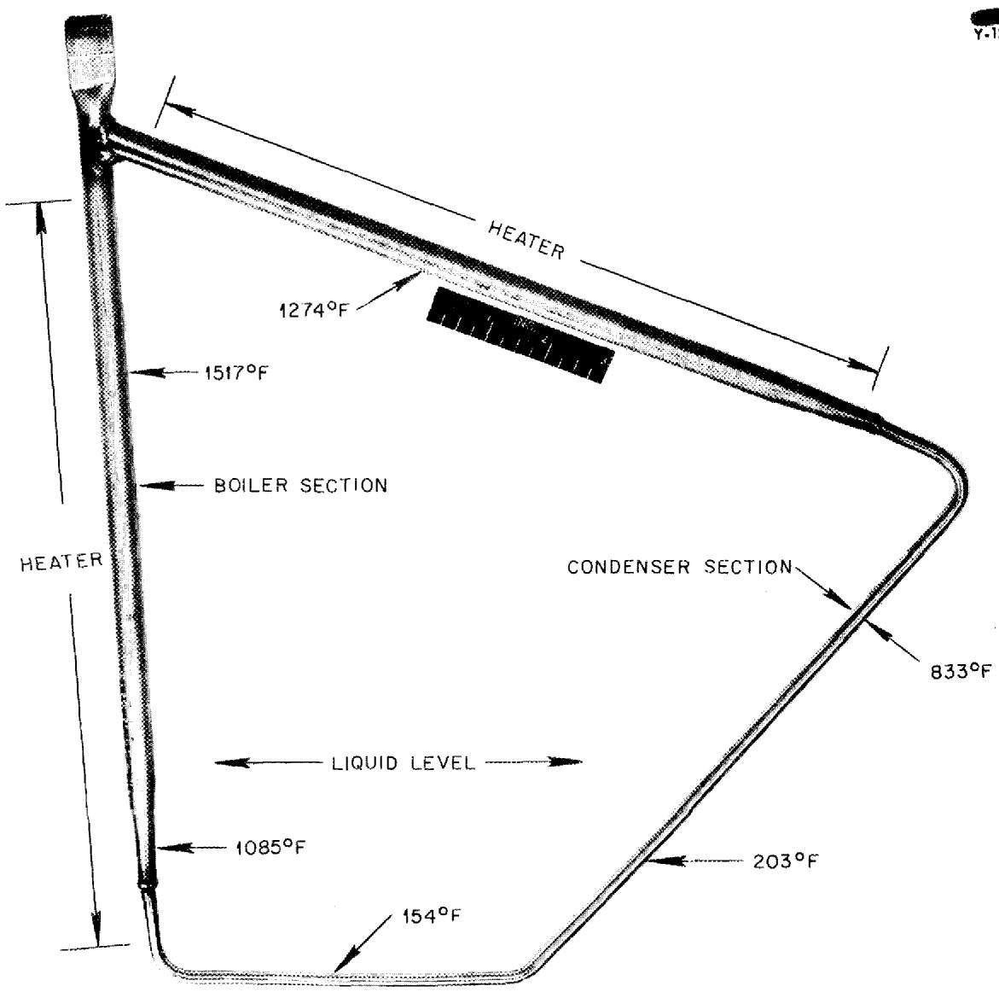  
Fig. 6.9. Inconel Thermal-Convection Loop for Circulating Boiling Rubidium.

green surface film that was identified by x-ray analysis to be $\mathrm{Cr_2O_3}$ . The oxygen source for formation of this film was, at first, thought to be the graphite which had not been degassed prior to the tests; however, a $\mathrm{Cr_2O_3}$ film was later found in other tests with degassed graphite and standard tests with no graphite addition. Therefore preparations are being made for obtaining oxygen-free sodium for use in these tests.

# Special Tar-Impregnated and Fired Graphite

A special far-impregnated and fired graphite, known commercially as Graph-i-tite, has been tested for corrosion resistance to sodium and NaF-ZrF $_4$ -UF $_4$ (53.5-40-6.5 mole %). Also, a comparison was made of the carburization of an austenitic stainless steel by contact with Graph-i-tite and with C-18 graphite (reactor grade). The Graph-i-tite was fabricated, as described previously, $^1$ by far-impregnating and firing graphite 16 times. The repeated far impregnations and firings produce a high density

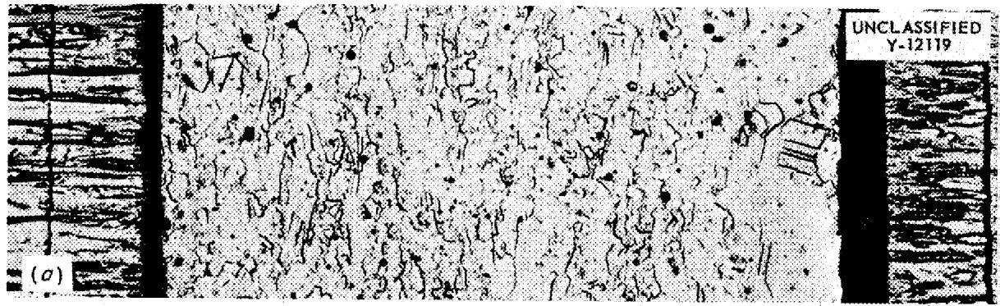

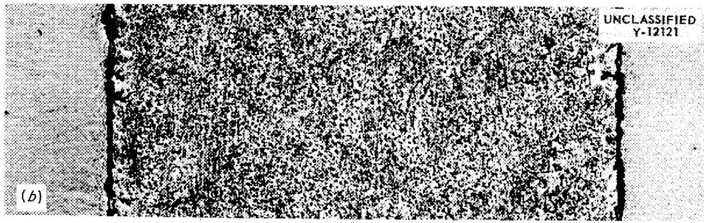

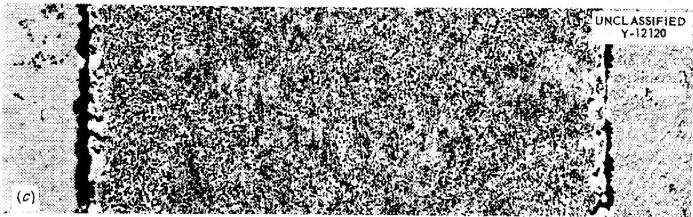  
Fig. 6.10. Carburization of Inconel Exposed to Sodium with Carbon Additions for 100 hr at $1500^{\circ}$ F. (a) Inconel specimen before test. (b) Specimen tested in sodium plus 1 wt % carbon. (c) Specimen tested in sodium plus 10 wt % carbon. Specimens nickel plated to protect edges. Etched with glyceria regia. 250X.

and a "tough skin," which, it was hoped, would reduce penetration of various liquid mediums.

An open Graph-i-tite crucible containing sodium and a sealed Graph-i-tite crucible containing NaF $\mathsf{ZrF}_4$ -UF $_4$ were tested at $1500^{\circ}\mathsf{F}$ for 100 hr in vacuum. The sodium completely penetrated the 0.38-in.-thick wall of the crucible, as in the previous test, $^1$ and caused it to crack and crumble.

The only macroscopically visible sign of attack on the crucible that contained the fluoride mixture was that the inner surface had a higher gloss (Fig. 6.11) after exposure. Metallographic examination of sections of the crucible indicated irregular penetration from 0 to 5 mils deep. No attempt has been made to determine whether reaction products accompanied the penetration. This attack may be

Carbon content of Inconel specimen before test, 0.056 wt %

TABLE 6.4. CARBURIZATION OF INCONEL BY EXPOSURE TO SODIUM CONTAINING CARBON ADDITIONS FOR 100 hr AT ${1500}^{ \circ  }\mathrm{F}$   

<table><tr><td>Carbon Added to Sodium Before Test (wt %)</td><td>Carbon Content* of Specimen After Test (wt %)</td><td>Specimen Weight Change** (%)</td></tr><tr><td>1</td><td>0.882</td><td>1.09</td></tr><tr><td>5</td><td>1.09</td><td>1.34</td></tr><tr><td>10</td><td>1.24</td><td>1.63</td></tr></table>

*Average of three analyses.   
\*\*On all specimens part of weight change was due to formation of $\mathrm{Cr_2O_3}$ film on surface.

compared with the 0 to 2 mils attack by NaF-ZrF4- UF4 (50.46.4 mole %) in the previous tests. The carbon content of the fluoride mixture did not change significantly in either test.

A comparison of the carburization of austenitic stainless steel by tar-impregnated and fired graphite and by C-18 graphite (reactor grade) was obtained through static tests of cylinders of the same size of each type of graphite in type 304 stainless steel tubes containing equal quantities of sodium in vacuum. Tests for 100- and 500-hr periods at $1500^{\circ}\mathrm{C}$ were made on each type of graphite. Type 304 stainless steel was chosen because it carburizes more readily than other austenitic stainless steels.

The results of the tests are shown in Figs. 6.12 and 6.13. In the 100-hr test, the tar-impregnated and fired graphite carburized the type 304 stainless steel to a slightly greater extent than the C-18 graphite did, and in the 500-hr test, it clearly carburized the steel to a greater extent. After the 500-hr tests of both types of graphite, steel in contact with the sodium showed small subsurface voids; the voids were pronounced in the steel tested with the tar-impregnated and fired graphite. The depth of carburization of the type 304 stainless steel above the level of the molten sodium covering the graphite cylinders was 1 mil in all the tests, except the 500-hr test with a tar-impregnated and fired graphite cylinder in which there was carburization of the steel to a depth of 2 mils.

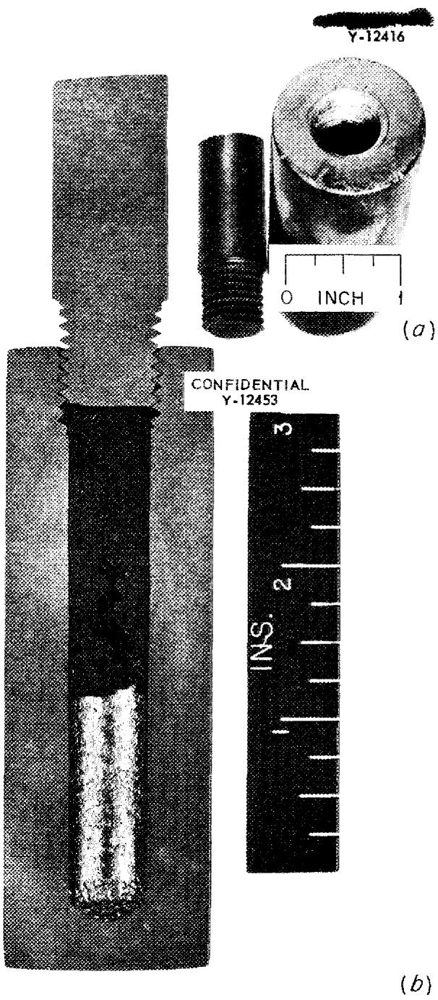  
Fig. 6.11. Graph-i-tite Crucible Before (a) and After (b) Exposure to NaF-ZrF $_4$ -UF $_4$ (53.5-40-6.5 mole %) for 100 hr at $1500^{\circ}\mathrm{F}$ . At the end of the test the crucible was inverted so that the fluoride mixture would flow to the top. The frozen fluoride mixture can be seen above the shiny inner surface of the crucible.

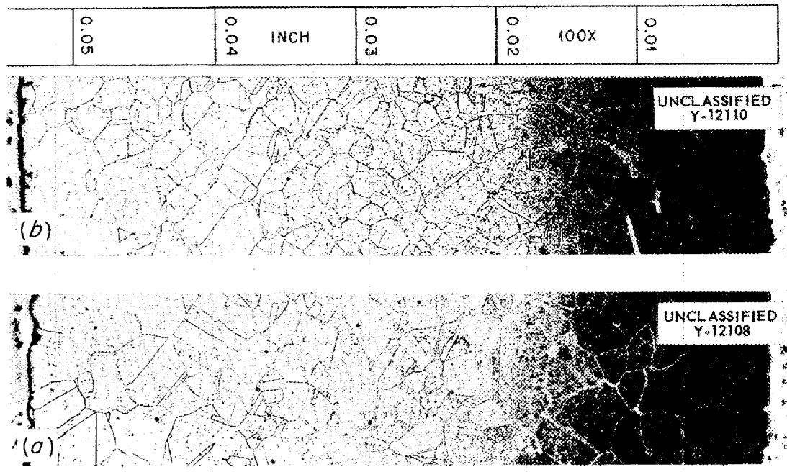

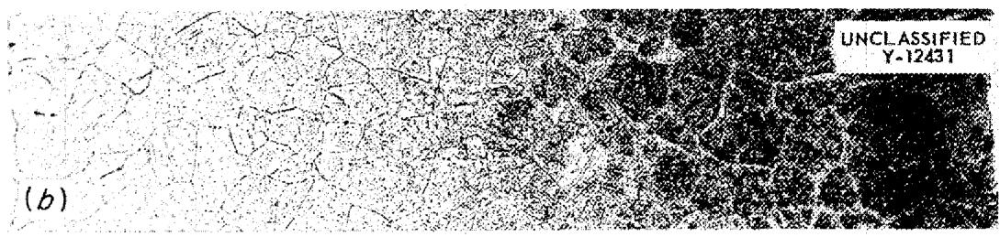  
Fig. 6.12. Carburization of Type 304 Stainless Steel Exposed to Graph-i-tite (a) and to C-18 Graphite (b) in Sodium for 100 hr at $1500^{\circ}\mathsf{F}$ in Vacuum. (a) Depth of carburization was 18 mils (concentrated) to 32 mils (traceable). (b) Depth of carburization was 16 mils (concentrated) to 32 mils (traceable). Etched with glyceria regia.

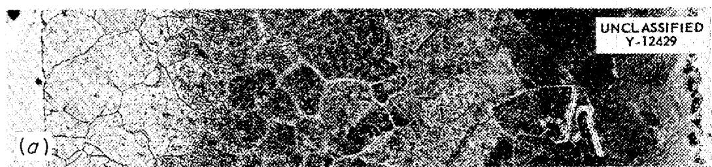  
Fig. 6.13. Carburization of Type 304 Stainless Steel Exposed to Graph-i-tite (a) and to C-18 Graphite (b) in Sodium for 500 hr at $1500^{\circ}\mathbf{F}$ in Vacuum. (a) Depth of carburization was 40 mils (concentrated) to $49+$ mils (traceable through the tube wall). (b) Depth of carburization was 33 mils (concentrated) to $49+$ mils (traceable through the tube wall). Etched with glyceria regia.

<table><tr><td>0.05</td><td>0.04</td><td>INCH</td><td>0.03</td><td>0.02</td><td>100X</td><td>0.04</td></tr></table>

# Ceramics in Various Mediums

Static corrosion screening tests of three ceramic oxides and one carbide $\mathrm{(Al_2O_3}$ $\mathrm{MgAl_2O_4}$ , calcium-stabilized $\mathrm{ZrO_2}$ , and SiC were made in a vacuum atmosphere at $1500^{\circ}\mathrm{F}$ for 100 hr in each of four mediums: sodium, NaF-ZrF $_4$ -UF $_4$ (53.5-40-6.5 mole %), lithium, and lead. A fourth ceramic oxide was tested under the same conditions in sodium and in NaF-ZrF $_4$ -UF $_4$ (53.5-40-6.5 mole %). The $\mathrm{Al_2O_3}$ and $\mathrm{MgAl_2O_4}$ test pieces were cut from single, synthesized crystals; the MgO test pieces were cleaved from a single, synthesized crystal. The nominal dimensions of the test pieces and the re

sults of the tests are given in Table 6.5. Powder x-ray examinations were made of the specimens that were the least corrosion resistant in each medium, and the results are summarized in Table 6.6.

The SiC specimens were, in general, the most resistant to corrosion, and the $\mathrm{Al}_{2}\mathrm{O}_{3}$ specimens were the next most resistant. These single-run screening tests are qualitative, and the results should be used with caution. Larger specimens are to be tested so that more accurate data can be obtained and metallographic examinations and chemical analyses can be made.

TABLE 6.5. SUMMARY OF STATIC TESTS OF CERAMICS IN VARIOUS MEDIUMS AT ${1500}^{ \circ  }\mathrm{F}$ FOR 100 hr   

<table><tr><td>Material Tested</td><td>Thickness Change (%)</td><td>Weight Change (%)</td><td>Remarks</td></tr><tr><td colspan="4">Tested in Sodium</td></tr><tr><td>Al2O3a</td><td>~0.5</td><td>~0.9</td><td>Specimen changed from a colorless transparent state to a white semitransparent state; a small crack appeared on an edge</td></tr><tr><td>SiCb</td><td>~0.9</td><td></td><td>Specimen essentially unaltered; brighter and cleaner; small part of disk edge broken off</td></tr><tr><td>MgAl2O4a</td><td>0.0</td><td></td><td>Originally colorless transparent specimen almost completely changed to a black state; chipped slightly on one edge</td></tr><tr><td>ZrO2(CaO stabilized)</td><td>+8.6</td><td></td><td>Specimen changed from light buff to blue-black; edge chipped</td></tr><tr><td>MgOc</td><td>~0.5</td><td>~0.1</td><td>Specimen unaltered except for color change from color-less to light blue-gray</td></tr><tr><td colspan="4">Tested in NaF-ZrF4-UF4(53.5-40-6.5 mole %)</td></tr><tr><td>Al2O3</td><td>~31</td><td></td><td>Specimen broken and covered with fluoride mixture; brown-red interface present between the fluoride mixture and the specimen</td></tr><tr><td>SiC</td><td>~1.8</td><td></td><td>Specimen broken; recovered pieces appeared to be un-attacked</td></tr><tr><td>MgAl2O4</td><td></td><td></td><td>Recovered portion of specimen (more than one-half) covered with fluoride mixture and apparently completely altered</td></tr><tr><td>ZrO2(CaO stabilized)</td><td></td><td></td><td>No visible trace of specimen found</td></tr><tr><td>MgO</td><td></td><td></td><td>No visible trace of specimen found</td></tr><tr><td colspan="4">Tested in Lithium</td></tr><tr><td>Al2O3</td><td></td><td></td><td>No visible trace of specimen found</td></tr></table>

TABLE 6.5. (continued)   

<table><tr><td>Material</td><td>Tested</td><td>Thickness Change (%)</td><td>Weight Change (%)</td><td></td><td>Remarks</td><td></td><td></td></tr><tr><td>SiC</td><td></td><td></td><td></td><td colspan="2">Some small particles found</td><td></td><td></td></tr><tr><td>MgAl2O4</td><td></td><td></td><td></td><td colspan="2">No visible trace of specimen found</td><td></td><td></td></tr><tr><td>ZrO2(CaO stabilized)</td><td></td><td></td><td></td><td colspan="2">Specimen in many small pieces; buff color changed to charcoal-black</td><td></td><td></td></tr><tr><td></td><td></td><td></td><td colspan="2">Tested in Lead</td><td></td><td></td><td></td></tr><tr><td>Al2O3</td><td></td><td>0.0</td><td>+0.3</td><td colspan="2">No visible attack; colorless transparent specimen changed to gray; small spot found on specimen; specimen apparently covered with thin lead film</td><td></td><td></td></tr><tr><td>SiC</td><td></td><td>+2.9</td><td></td><td colspan="2">No visible attack; specimen broken in loading</td><td></td><td></td></tr><tr><td>MgAl2O4</td><td></td><td>0.0</td><td></td><td colspan="2">No visible attack; specimen changed from colorless to gray; broken in loading</td><td></td><td></td></tr><tr><td>ZrO2(CaO stabilized)</td><td></td><td>0.0</td><td>+0.5</td><td colspan="2">No visible attack; specimen changed from a light buff to gray</td><td></td><td></td></tr></table>

${}^{a}$ Disk cut from a single crystal; specimen 0.75 in. in diameter and 0.021 in. thick.   
$b_{Disk}$ 0.75 in. in diameter and 0.021 in. thick.   
Cleaved from a single crystal; specimen $0.02 \times 0.36 \times 0.36$ in.

TABLE 6.6. POWDER X-RAY IDENTIFICATION OF THE PHASES OF SOME OF THE LEAST CORROSION-RESISTANT SPECIMENS  

<table><tr><td rowspan="2">Specimen</td><td rowspan="2">Test Medium</td><td colspan="3">Powder X-Ray Data on Specimen</td></tr><tr><td>Before Test</td><td colspan="2">After Test</td></tr><tr><td rowspan="2">MgAl2O4</td><td>Sodium</td><td>Face-centered cubic, a = 7.970</td><td colspan="2">Face-centered cubic, a = 7.981</td></tr><tr><td>NaF-ZrF4-UF4(53.5-40-6.5 mole %)</td><td>Face-centered cubic, a = 7.970</td><td colspan="2">NaF-ZrF4-UF4pattern</td></tr><tr><td rowspan="2">ZrO2(CaO stabilized)</td><td>Sodium</td><td>Primarily face-centered cubic ZrO2; secondarily monoclinic ZrO2</td><td colspan="2">Same as before test</td></tr><tr><td>Lithium</td><td>Primarily face-centered cubic ZrO2; secondarily monoclinic ZrO2</td><td>Unidentified; a = 4.674</td><td>face-centered cubic,</td></tr></table>

# FLUORIDE CORROSION OF INCONEL IN THERMAL-CONVECTION LOOPS

G.M.Adamson

Metallurgy Division

Effect of $\mathsf{UF}_3$ in ZrF4-Base Fuels

Preliminary results of Inconel thermal-convection loop tests of the corrosive properties of $\mathsf{UF}_3$ -bearing fluoride mixtures were presented previously and

compared with the corrosive properties of $\mathsf{UF}_4$ -bearing mixtures. Additional tests with $\mathsf{UF}_3$ -bearing $\mathsf{ZrF}_4$ -base mixtures have confirmed the reduction or elimination of hot-leg attack, along with the formation of a hot-leg layer. The lack of attack and the hot-leg layer are illustrated in Fig. 6.14.

The portion of a hot leg shown in Fig. 6.14 was taken from an Inconel thermal-convection loop which had circulated $UF_{3}$ (2.1 wt % $UF_{3}$ in 2.4 wt % total U) in NaF-ZrF₄ (53-47 mole %) for 500 hr at a hot-leg temperature of 1500°F. The fluoride mixture was drained from the loop at the operating temperature to ascertain whether the layers previously noted had formed during cooling of the loop. Since the layer was again present, it is now considered to have formed during operation. This conclusion was further strengthened when the metallographic examination revealed a diffusion zone between the layer and the base metal. An examination of the layer by a microspark spectrographic technique showed it to be predominantly zirconium. Since this technique is not sensitive to uranium, the layer could also contain uranium.

There is some indication that some of the UF $_3$ dissociates to produce uranium metal, which reduces some of the $\mathsf{ZrF}_4$ to produce zirconium metal. The accuracy of the analytical determination for zirconium is not sufficient to reveal the reaction products postulated, since some zirconium is also lost by sublimation.

In another Inconel loop in which $\mathsf{U}\mathsf{F}_3$ in NaF $\mathsf{ZrF}_4$ was circulated for 2000 hr at $1500^{\circ}\mathsf{F}$ , some voids were found to a depth of 4 mils upon metallo

3Examination made by C. Feldmon, Chemistry Division.

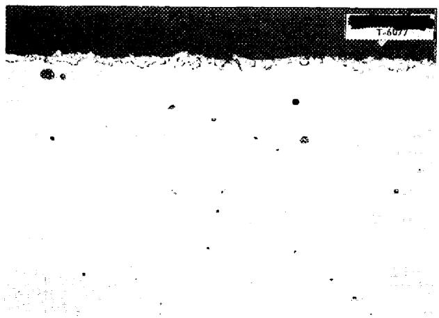  
Fig. 6.14. Hot-Leg Surface of Inconel Loop After Circulating UF3 in NaF-ZrF4 (2.1 wt % UF3 in 2.4 wt % total U) for 500 hr at 1500°F. Loop drained while hot. Unetched. 500X. Reduced 27%.

graphic examination. The voids did not appear to be the same as those normally found, and it is thought that they were formed when brittle intermetallic compounds were pulled out of the base metal during polishing. No hot-leg attack could be found, as shown in Fig. 6.15, but there was a layer 0.5 mil thick on the hot-leg surface. This layer was also reported to be predominantly zirconium.

It has been definitely established that the use of $\mathsf{UF}_3$ rather than $\mathsf{UF}_4$ in $\mathsf{ZrF}_4$ -base mixtures will lower the corrosive attack and mass transfer in Inconel systems. However, it has been found to be impossible to dissolve sufficient $\mathsf{UF}_3$ in $\mathsf{ZrF}_4$ -base mixtures to obtain fuels of interest for high-temperature reactors. To obtain a fuel with sufficient uranium, it would be necessary to use a mixture of $\mathsf{UF}_3$ and $\mathsf{UF}_4$ . Data obtained from loops operated with such mixtures and with standard $\mathsf{UF}_4$ -bearing mixtures are presented in Table 6.7. The data show clearly that a mixture of $\mathsf{UF}_3$ and $\mathsf{UF}_4$ produces less attack than $\mathsf{UF}_4$ alone, but the mixture does not eliminate the attack, as is the case with $\mathsf{UF}_3$ alone.

# Effect of $\mathbf{U}\mathbf{F}_3$ in Alkali-Metal Base Fuels

It has been found that more $\mathsf{UF}_3$ can be dissolved in the alkali-metal-base fluoride mixtures than in the $\mathsf{ZrF}_4$ -base mixtures, and therefore additional tests were made with NaF-KF-LiF (11.5-42.0-46.5 mole %) containing $\mathsf{UF}_3$ , $\mathsf{UF}_4$ , and mixtures of the two.

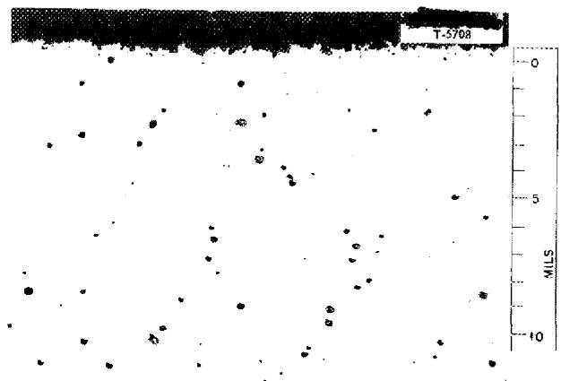  
Fig. 6.15. Hot-Leg Surface of Inconel Loop After Circulating $\mathsf{UF}_3$ in NaF-ZrF4 for 2000 hr at $1500^{\circ}\mathsf{F}$ . Unetched. 250X. Reduced $36\%$ .

TABLE 6.7.EFFECT OF MIXTURES OF $UF_{3}$ AND $UF_{4}$ IN $\mathsf{NaF - ZrF_4}$ ON CORROSION OF INCONEL THERMAL-CONVECTION LOOPS OPERATED AT A HOT-LEG TEMPERATURE OF $1500^{\circ}F$   

<table><tr><td rowspan="2">Loop No.</td><td rowspan="2">Total U (wt %)</td><td rowspan="2">U as UF3 (wt %)</td><td rowspan="2">Operating Time (hr)</td><td colspan="2">Metallographic Notes</td></tr><tr><td>Hot-Leg Appearance</td><td>Cold-Leg Appearance</td></tr><tr><td>473</td><td>8.7</td><td>1.2</td><td>500</td><td>Moderate intergranular subsurface voids to a depth of 4 mils</td><td>Occasional metal crystals</td></tr><tr><td>491*</td><td>12.8</td><td>2.5</td><td>500</td><td>Moderate to heavy intergranular subsurface voids to a depth of 7 mils</td><td>Deposit to 0.3 mil thick</td></tr><tr><td>492*</td><td>14.2</td><td>1.8</td><td>2000</td><td>Moderate to heavy intergranular subsurface voids to a depth of 15 mils</td><td>Deposit to 1 mil thick</td></tr><tr><td>469</td><td>8.5</td><td>0</td><td>500</td><td>Heavy general attack and inter-granular subsurface voids to a depth of 8 mils</td><td>No deposit</td></tr><tr><td>462</td><td>13.9</td><td>0</td><td>500</td><td>Moderate to heavy intergranular subsurface voids to a depth of 10 mils</td><td>Metallic deposit to 0.3 mil thick</td></tr></table>

*These loops were filled from the same batch of fluoride mixture, and the differences in uranium analysis cannot yet be explained.

Two Inconel loops were operated for 500 hr with NaF-KF-UF4 to which UF3 and UF4 had been added. Because of sampling and analytical difficulties, the relative amounts of UF3 and UF4 are not known, but it appears that about one-third of the uranium was present as UF3. One loop contained a total uranium content of 10.4 wt %, and after the test the hot leg showed light, widely scattered attack to a depth of 1 mil (Fig. 6.16); the hot-leg surface was quite rough. The other loop contained 7.4 wt % uranium, and the hot leg showed a void type of attack that varied from light to heavy, with a maximum penetration of 2 mils; again, the surface was rough. In both loops, a layer was found in the cold leg but not in the hot leg. These mixtures appear to be superior to the ZrF4-base mixtures with UF4 with respect to depth of the subsurface void type of attack, and the hot-leg deposit found with the UF3-bearing ZrF4-base mixtures did not form. More work is needed to determine whether the rough surfaces represent a different type of attack and whether the cold-leg deposits formed are NaK2CrF6, which would interfere with heat transfer.

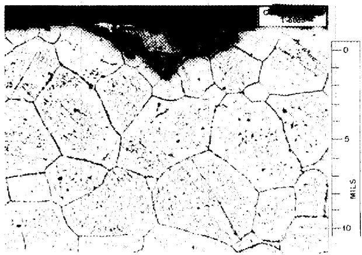  
Fig. 6.16. Hot-Leg Surface of Inconel Loop After Circulating a Mixture of $\mathsf{UF}_3$ and $\mathsf{UF}_4$ (4.3 wt $\%$ UF $_3$ and 6.1 wt $\%$ UF $_4$ ) in NaF-KF-LiF (11.5-42.0-46.5 mole $\%$ for 500 hr at $1500^{\circ}$ F. Etched with modified aqua regia. 250X. Reduced $36\%$ .

# Effect of Zirconium Hydride Additions to Fuel

Various amounts of zirconium hydride were added to $\mathrm{NaF - ZrF_4 - UF_4}$ (50-46-4 mole %) as a means of reducing the $\mathrm{UF_4}$ to $\mathrm{UF_3}$ . The hydride was added to small portions of fluorides taken from the same original batch, and filters were used when the small batches were transferred to Inconel thermal-convection loops. The data from loops operated with these batches of fluoride mixture are given in Table 6.8. Layers were found in the cold legs of all loops to which the $\mathrm{ZrH_2}$ additions had been made. The data show that to obtain sufficient reducing power by the addition of $\mathrm{ZrH_2}$ to eliminate corrosion it may be impossible to prevent the loss of some uranium both in the treatment pot and in the loop.

# Effect of Uranium Concentration

Two loops were operated with a high-purity NaF $\mathsf{ZrF}_4\cdot \mathsf{UF}_4$ (53.5-40-6.5 mole %) mixture. This mixture is comparable to the one to be used in the ARE and has a higher uranium content than the mixture normally used in thermal-convection loop tests. The heavy hot-leg attack in both loops was of the usual subsurface-void type with a maximum penetration of 10 mils. This is slightly deeper than the 6 to 8 mils found with the lower uranium content mixtures. Thin metallic-appearing layers were found in the cold legs of both loops. The results obtained with these loops confirm those found previously with similar, but impure, mixtures.

# Effect of Inconel Grain Size

Inconel pipe was annealed at two temperatures to provide specimens with different grain sizes. A

series of loops fabricated from the annealed pipe was filled from the same batch of $\mathsf{NaF - ZrF_4 - UF_4}$ (50-46-4 mole %) and operated for 500 hr at $1500^{\circ}F$ . Two loops were made from pipe annealed at $2100^{\circ}F$ that had a grain size of 1 to $1\frac{1}{2}\mathrm{gr / in.}^2$ at $100X,$ while the loop fabricated from as-received Inconel pipe and the one fabricated from pipe annealed at $1600^{\circ}F$ contained about $6\mathrm{gr / in.}^2$ . Very little difference in hot-leg attack was found in these loops. Those with the larger grains may have had slightly deeper attack, but the attack was heavier and more general and the deep penetrations were concentrated into fewer boundaries.

# FLUORIDE CORROSION OF HASTELLOY B IN THERMAL-CONVECTION LOOPS

G. M. Adamson  
Metallurgy Division

Loops fabricated from both as-received and over-aged Hastelloy B were operated satisfactorily. The operating mortality rate has been reduced from $90\%$ to $0\%$ in the last group of four loops. The increase in hardness during operation is not so great in the loops constructed with over-aged material as in the loops constructed with as-received material, but, with proper care, the loops of as-received material can be operated.

Very little attack was found in a loop which circulated $\mathsf{NaF - ZrF}_4\text{-UF}_4$ (50-46-4 mole %) for 1000 hr at $1500^{\circ}\mathsf{F}$ . The attack appeared as a few voids to a maximum depth of 1 mil, with possibly some increase in surface roughness. Most of the surface roughness was present in the as-received tubing, as shown in Fig. 6.17.

TABLE 6.8.EFFECT OF $ZrH_{2}$ ADDITIONS TO NaF-ZrF4-UF4 (50-46-4 mole %) CIRCULATED IN INCONEL THERMAL-CONVECTION LOOPS AT 1500°F FOR 500 hr   

<table><tr><td rowspan="2">Loop No.</td><td rowspan="2">ZrH2 Added (%)</td><td rowspan="2">Hot-Leg Attack</td><td colspan="2">Uranium Content (%)</td></tr><tr><td>Before Test</td><td>After Test</td></tr><tr><td>469</td><td></td><td>Heavy general attack and intergranular voids to a depth of 8 mils</td><td>8.5</td><td>8.8</td></tr><tr><td>459</td><td>0.2</td><td>Moderate to heavy attack to a depth of 6 mils</td><td>8.6</td><td>8.5</td></tr><tr><td>470</td><td>0.5</td><td>Light to moderate attack to a depth of 3 mils</td><td>7.5</td><td>7.1</td></tr><tr><td>460</td><td>0.9</td><td>Thin hot-leg deposit; no attack</td><td>5.4</td><td>5.1</td></tr><tr><td>471</td><td>2.0</td><td>Hot-leg layer to 1 mil thick; no attack</td><td>4.0</td><td>4.0</td></tr></table>

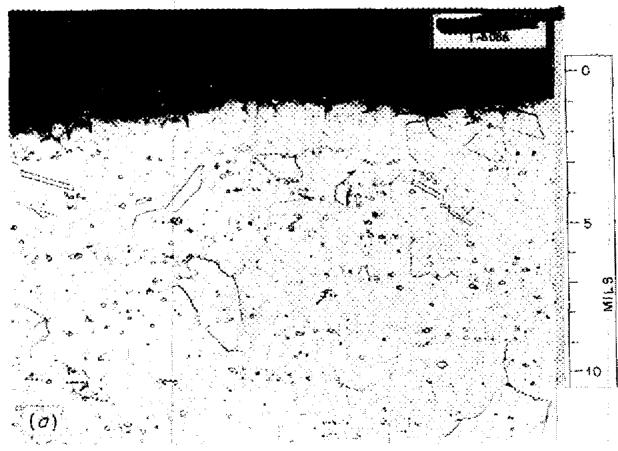

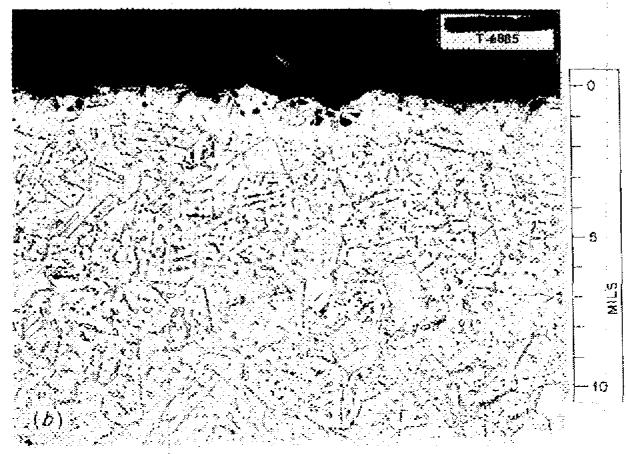  
Fig. 6.17. As-Received Hastelloy B (a) and Hot Leg Surface of Hostelloy B Loop (b) After Circulating NaF-ZrF4-UF4 (50-46-4 mole %) for 1000 hr at $1500^{\circ}\mathrm{F}$ . Etched with $\mathsf{H}_3\mathsf{CrO}_4 + \mathsf{HCl}$ . 250X, Reduced 36%.

Chemical analysis results now available for the Hastelloy B loop previously operated for 500 hr confirm the low attack rate found metallographically, since neither the nickel nor the molybdenum content in the fluoride mixture increased.

# LITHIUM IN TYPE 316 STAINLESS STEEL

E. E. Hoffman

W. H. Cook

C. R. Brooks

C. F. Leitten

Metallurgy Division

Tests have recently been completed on three type 316 stainless steel thermal-convection loops

in which lithium was circulated. These loops were constructed of 0.840-in.-OD, 0.147-in.-wall pipe. The hot and cold legs were 15 in. in length, and the 15-in. connecting legs were inclined at an angle of 20 deg. The welding and loading operations on these loops were performed in a dry box in a purified helium atmosphere. At no time during these tests was there any indication of plug formation. The operating conditions are given in Table 6.9. Macroscopic examination revealed no differences between hot- and cold-leg surfaces in loops 1 and 2. Only loop 1 has been examined completely; loops 2 and 3 have been sectioned and have been examined macroscopically. Loop 2 was very similar in appearance to loop 1, with no crystal deposition. Loop 3, however, revealed mass-transfer crystals attached to the cold-zone walls. These crystals did not plug the loop or noticeably affect the circulation. The crystal deposition was heaviest on the major radius of the exposed loop-bend wall in the cold zone. This loop has not yet been examined metallographically.

TABLE 6.9. OPERATING CONDITIONS FOR TYPE 316 STAINLESS STEEL THERMAL-CONVECTION LOOPS WHICH CIRCULATED LITHIUM FOR 1000 hr  

<table><tr><td>Loop No.</td><td>Hot-Zone Temperature (°F)</td><td>Cold-Zone Temperature (°F)</td><td>Temperature Differential (°F)</td></tr><tr><td>1</td><td>1490</td><td>1220</td><td>270</td></tr><tr><td>2</td><td>1472</td><td>1355</td><td>117</td></tr><tr><td>3</td><td>1301</td><td>1094</td><td>207</td></tr></table>

Loop 1, which was operated at the highest temperature and with the highest temperature differential, had no mass-transfer crystals in the cold zone, and the maximum attack in the hot zone was 1 to 2 mils (Fig. 6.18). Chemical analyses of the lithium and the amounts of crystals recovered are presented in Table 6.10. At present it is not understood why so little mass transfer occurred in loops 1 and 2, since in all three loops the same procedures and testing techniques were used and all were filled from the same batch of lithium. Some as yet undiscovered factor seems to have an effect on the rate of mass transfer.

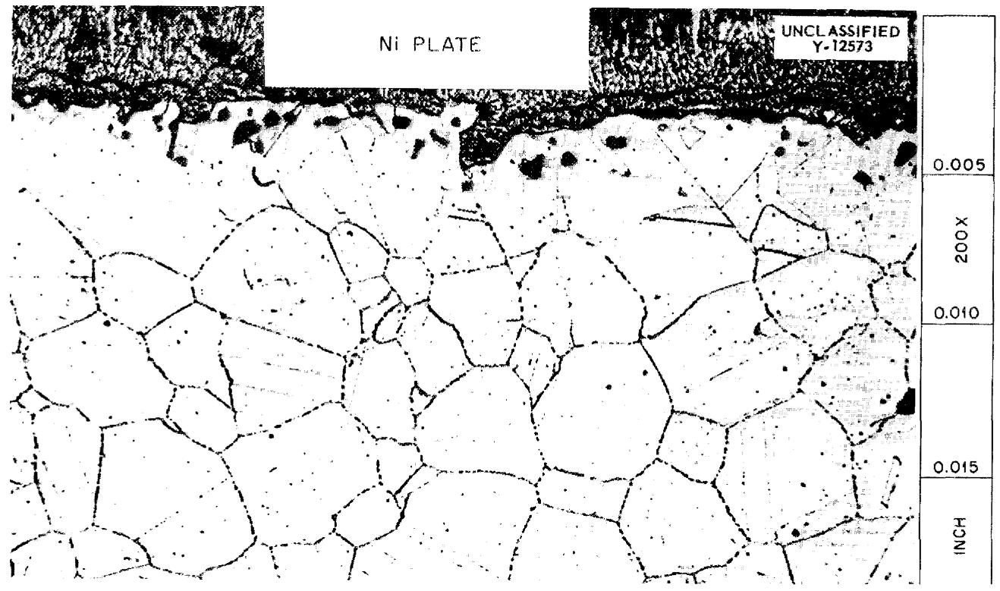  
Fig. 6.18. Hot-Leg Surface of Type 316 Thermal Convection Loop After Circulating Lithium for 1000 hr at $1490^{\circ}$ F. Specimen nickel plated after test to protect edge. Etched with glyceria regia.

# FUNDAMENTAL CORROSION RESEARCH

G.P.Smith

Metallurgy Division

# Mass Transfer in Liquid Lead

J.V.Cathcart

Metallurgy Division

As previously reported, the investigation of corrosion and mass transfer in liquid lead has indicated that certain alloys possess much greater resistance to mass transfer than their pure components. For example, the time required for small thermal-convection loops containing types 410 and 446 stainless steel to plug was from two to five times longer than that required for comparable loops containing pure iron or pure chromium.

It has been suggested that the increased resistance to mass transfer of materials such as the 400 series stainless steels might be related to a tendency toward the formation of intermetallic compounds in these alloys. To test this hypothesis

TABLE 6.10. ANALYSES OF LITHIUM CIRCULATED IN TYPE 316 STAINLESS STEEL THERMAL-CONVECTION LOOPS   

<table><tr><td rowspan="2">Material Analyzed</td><td colspan="3">Components Other Than Lithium (ppm)</td><td rowspan="2">Weight of Crystals Removed from Lithium (g)</td></tr><tr><td>Fe</td><td>Ni</td><td>Cr</td></tr><tr><td>Lithium, as-cast, before test</td><td>40</td><td>10</td><td>&lt;10</td><td></td></tr><tr><td>Lithium from loop 1, after test</td><td>160</td><td>150</td><td>&lt;10</td><td>0.010</td></tr><tr><td>Lithium from loop 2, after test</td><td>120</td><td>40</td><td>&lt;10</td><td>0.001</td></tr></table>

further, a loop was operated which contained specimens of a specially prepared $45\%$ Cr- $55\%$ Co alloy. This alloy composition corresponded to a two-phase region in the cobalt-chromium phase diagram, one phase being the intermetallic compound CoCr. The

loop plugged after 768 hr of operation with hot- and cold-leg temperatures of 820 and $510^{\circ}\mathrm{C}$ , respectively. A transverse section of the hot-leg specimen is shown in Fig. 6.19.

A survey of the alloys which have been tested revealed that the plugging time for all those in which intermetallic compound formation is a possibility [types 410 and 446 stainless steel, $2\%$ Si-14% Cr-84% Fe, Hastelloy B (5% Fe-28% Mo-67% Ni), 25% Mo-75% Ni, 45% Cr-55% Co, and 16% Ni-37% Cr-47% Fe (austenite plus sigma)] was in excess of 500 hr, the only exception being the loop containing the 16% Ni-37% Cr-47% Fe specimens which plugged in 456 hr. The plugging times for loops containing the pure constituents of these alloys were: Ni, 2 hr; Co, 80 hr; Cr, 100 hr; and Fe, 250 hr. No mass transfer was observed in a loop containing molybdenum specimens after 500

hr of operation. On the other hand, loops with specimens of alloys for which there is virtually no tendency toward compound formation (types 304 and 347 stainless steel, Inconel, and nichrome) all plugged in less than 150 hr. On the basis of these data, it was concluded that resistance to mass transfer in liquid lead is considerably greater in alloys in which intermetallic compound formation is possible.

Future work will include tests of two alloys: one with the composition of $50\%$ Cr- $50\%$ Fe and the other with approximately $50\%$ Fe- $50\%$ Mo. These compositions correspond closely to the compositions of intermetallic compounds in types 410 and 446 stainless steel, and if the ideas presented above are correct, both should show relatively high resistance to mass transfer in liquid lead.

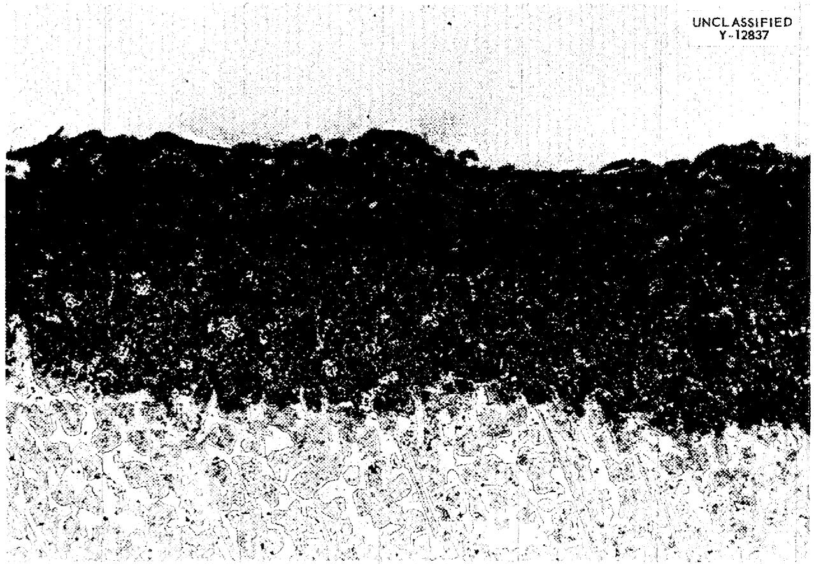  
Fig. 6.19. Transverse Section of $45\%$ Cr- $55\%$ Co Specimen Exposed to Liquid Lead at $820^{\circ}\mathrm{C}$ in the Hot-Leg Section of a Quartz Thermal Convection Loop.

# Flammability of Sodium Alloys

M.E.Steidlitz L.L.Hall

G.P.Smith

Metallurgy Division

The studies of the flammability of liquid sodium alloys, which were reported previously, were extended. It has been found that the degree of reaction of jets of sodium-bismuth and sodium-mercury alloys is not significantly changed when the pressure of air is varied from 0.25 to 1.0 atm.

Additional data on the reactivity of sodiumbismuth solutions in dry air were obtained, and the results are summarized in Figs. 6.20 and 6.21. Figure 6.20 shows the limits of the region of no reaction on a temperature-composition diagram. A careful calibration of the flammability apparatus has shown that there was a substantial error in the temperatures previously reported in these tests. In this respect the earlier data have been corrected. The circles represent the temperature-composition values at which tests were conducted. The numeral by each circle gives the number of tests. The unshaded circles represent tests which showed re

7G.P.Smith and M.E.Steidlitz, ANP Quar. Prog. Rep. Dec. 10, 1953, ORNL-1649, p 96.

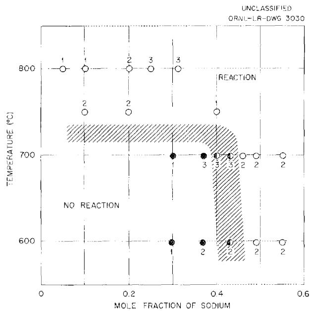  
Fig. 6.20. Temperature-Composition Diagram Showing Regions Within Which Jets of Sodium-Bismuth Solutions Did and Did Not React with Dry Air.

action, while the rest showed slight reaction. The cross-hatched band remarks the approximate limits within which the line separating the region of reaction from the region of no reaction lies. Figure 6.21 shows how the rate of reaction was found to vary with composition at constant temperature. The rate scale is arbitrary, with no reaction given the value zero and that of pure sodium given the value 4. Further work is being done to determine the flammability temperature for pure bismuth.

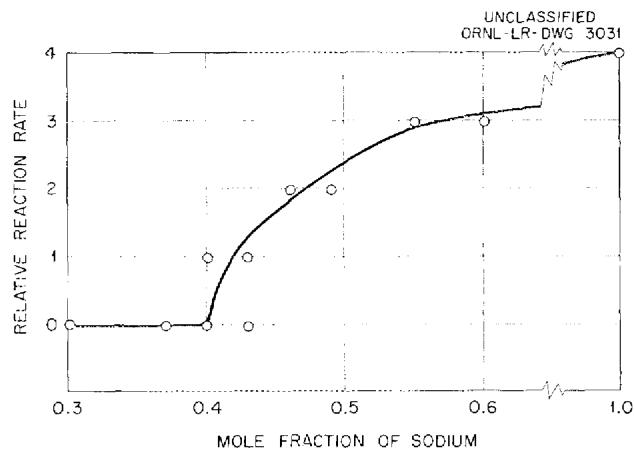  
Fig. 6.21. Relative Reaction Rate of Sodium-Bismuth Solutions at $700^{\circ}\mathrm{C}$ as a Function of Temperature.

# Thermodynamics of Alkali-Metal Hydroxides

G.P.Smith C.R.Boston

Metallurgy Division

Free Energy of Formation Data. Numerical data for the standard free energies of formation of the alkali-metal hydroxides and related compounds are an essential guide in studies of hydroxide chemistry. Therefore the free energy data have been computed as a function of temperature for the hydroxide, the peroxide, and the superoxide of sodium. The data are presented in Fig. 6.22, together with the data for the oxide and water which are used in subsequent computations in this report.

Values of the standard free energy of formation at $25^{\circ}C$ are available for sodium oxide, sodium peroxide, and sodium superoxide. The value for sodium hydroxide may be computed readily from the values for the standard heat of formation of

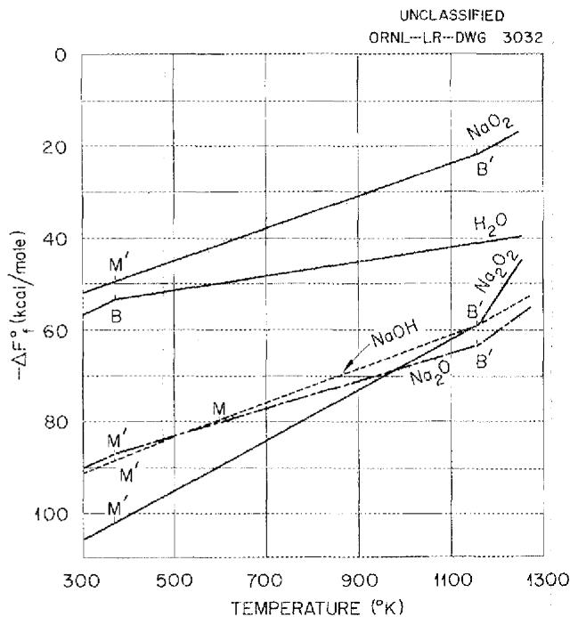  
Fig. 6.22. Free Energy of Formation Data as a Function of Temperature for the Hydroxide, the Peroxide, and the Superoxide of Sodium.

sodium hydroxide and the entropies of sodium hydroxide, hydrogen, oxygen, and sodium in their standard reference states. The computation shows that $\Delta F_{298}^{0}(\mathrm{NaOH}) = -91.0\mathrm{kcal / mole}$ . At higher temperatures, values of the standard free energy of formation have been given in the literature for only sodium oxide. However, values have been estimated for sodium peroxide, sodium superoxide, and sodium hydroxide in the following way. The curves of the standard free energy of formation vs temperature for the class of compounds dealt with here are known to a fairly good degree of approximation to consist of segmented straight lines with discontinuous changes in slope at the transition points of the compound and of its component elements. One point on each of these curves can be fixed from the values for the standard free energy of formation data at $25^{\circ}\mathrm{C}$ , mentioned above. The

slope at this point is determined from values of the standard entropy of formation by using the relation

$$
\left(\frac {\partial \Delta F _ {j} ^ {\circ}}{\partial T}\right) _ {P} = - \Delta S _ {j} ^ {\circ}.
$$

These entropy data are obtained from the standard-state entropy values. The change in slope at each transition point is determined from the transition entropy, which, of course, is readily computed from the heat of transition.

Recently obtained data on the heat capacity of liquid sodium hydroxide will permit a more precise evaluation to be made of the slope of the free energy curve from the melting point up to $1000^{\circ}C$ . The heat of fusion of sodium peroxide $(T_{M} = 980^{\circ}K)$ was not available, but it should introduce only a small change in slope, which may be considered to be negligible for the computations which follow.

Decomposition of Hydroxides. In considering any solvent as a reaction medium it is important to determine whether the solvent tends to decompose to an appreciable extent, particularly if any of the products of the decomposition take part in the reaction. The classic example is, of course, water. Here the covalent water molecules decompose slightly into ions. The resulting equilibrium frequently exerts a controlling influence on the course of aqueous reactions. The following is an outline of the results obtained to date in a theoretical search for the significant decomposition equilibria in fused alkali-metal hydroxides. It should be emphasized that the work presented here is in no sense definitive or complete.

The most important result of the treatment given here is the evidence for the possible occurrence of appreciable quantities of peroxide as the result of decomposition equilibria. The way in which this peroxide may play a decisive role in mass transfer and corrosion will be shown in a later report.

In a fused alkali-metal hydroxide in an inert environment such that the volume of any gas phase is small compared with that of the liquid phase, the fused hydroxide may be regarded thermodynamically as being in equilibrium with every chemical species composed of nothing more than oxygen, hydrogen, and the alkali metal. In practice, many of these chemical species can be ignored for either

of two reasons. First, the equilibrium concentration of the species in question may be insignificant. Second, the rate of formation of the species in question may be so slow that it does not approach equilibrium in any time period which may be considered. Since in the following discussion the thermodynamic approach is used, only the first reason will be treated.

There are three particularly useful theoretical measures of the significance of a decomposition reaction. They are the equilibrium constant, the standard free energy change, and the concentration of the products of decomposition. The third measure is the most directly related to experiment and hence, at the present stage, the most useful. The only concentration in a fused hydroxide which can be measured at temperature by present methods is the partial pressure of a gaseous product. Hence, considerable emphasis is placed on possible decomposition reactions which produce gaseous products and on an expression of their equilibrium concentrations in terms of the decomposition pressure.

The decomposition pressure of a pure substance with regard to a gaseous product is referred to here as that partial pressure of the gaseous product which, when in equilibrium with the condensed phase, is required to maintain the overall composition of the condensed phase equal to the composition of the pure substance. According to the phase rule, the pressure so defined is unique for a given temperature. If there are several gaseous products, there is a decomposition pressure for each such product.

The standard states used here are those conventionally chosen in defining the standard free energy of formation. Although this is not the usual choice of standard states in the case of solutes, it is definitely the most convenient choice for the computations which follow.

The four possible decomposition reactions which give a gaseous product at the temperatures at which the hydroxides are liquid are considered here. They are as follows:

(1) $2MOH = M_{2}O + H_{2}O,$ $\Delta F_{1}^{\circ}$   
(2) $2MOH \stackrel{K_{2}}{=} M_{2}O_{2} + H_{2}$ ，  
(3) $2MOH = 3MO_{2} + M + H_{2}$ , $\Delta F_{3}^{\circ}$ ,

(4) $2MOH = MO_{2} + MH + H_{2}H_{2}$ , $\Delta F_{4}^{\circ}$ ,

where all substances are partitioned among all phases present and where $K_{i}$ and $\Delta F_{i}^{o}$ are the equilibrium constants and standard free energies of reaction respectively.

The sparsity of reliable information on the alkali metal-oxygen compounds raises serious questions about the application of all the above equilibria to all the alkali metals. This subject is treated by Brewer and will not be repeated here. However, it is the essential point of this treatment to determine whether unsaturated oxygen ions such as the peroxide and superoxide ions may occur as decomposition products, in addition to the saturated oxide ion. The existence of some sort of unsaturated oxygen ion is certain for all the alkali metals, and it is known that the stability of the unsaturated species increases in going from lithium to cesium. Therefore, the basic competition referred to below between hydrogen and the mono-oxide for water should be a characteristic of all hydroxide decomposition equilibria and should lead to a water-hydrogen equilibrium in the gas phase of the type discussed. The data for sodium compounds are reasonably reliable. Hence, sodium hydroxide will be treated separately.

By definition of the equilibrium constant,

$$
K _ {1} = \frac {\alpha_ {M _ {2} O} \alpha_ {H _ {2} O}}{\alpha_ {M O H} ^ {2}} = \frac {\gamma_ {M _ {2} O} N _ {M _ {2} O} \gamma_ {H _ {2} O} N _ {H _ {2} O}}{\gamma_ {M O H} ^ {2} N _ {M O H} ^ {2}},
$$

where $\alpha_{X}$ is the activity of substance $X$ in the hydroxide phase and $N_{X}$ and $\gamma_{X}$ are the corresponding mole fraction and activity coefficient, respectively. Let the mole fractions be those which are in equilibrium with the decomposition pressure. Then $N_{M_2O} = N_{H_2O'}$ and it is possible to write

$$
K _ {1} = \Gamma_ {1} \frac {\alpha_ {\mathrm {H} _ {2} \mathrm {O}} ^ {2}}{\alpha_ {\mathrm {M O H}} ^ {2}}, \quad \Gamma_ {1} = \frac {\gamma_ {\mathrm {M} _ {2} \mathrm {O}}}{\gamma_ {\mathrm {H} _ {2} \mathrm {O}}}
$$

Likewise, for Eqs. 2 through 4,

$$
K _ {2} = \Gamma_ {2} \frac {\alpha_ {H _ {2}} ^ {2}}{\alpha_ {M O H} ^ {2}}, \quad \Gamma_ {2} = \frac {\gamma_ {M _ {2} O _ {2}}}{\gamma_ {H _ {2}}},
$$

$$
K _ {3} = \Gamma_ {3} \frac {\alpha_ {H _ {2}} ^ {3}}{\alpha_ {M O H} ^ {2}}, \quad \Gamma_ {3} = \frac {\gamma_ {M O _ {2}} \gamma_ {M}}{\gamma_ {H _ {2}} ^ {2}},
$$

$$
K _ {4} = \Gamma_ {4} \frac {\alpha_ {H _ {2}} ^ {5 / 2}}{\alpha_ {M O H} ^ {2}}, \quad \Gamma_ {4} = 4 \frac {\gamma_ {M O _ {2}} \gamma_ {M H}}{\gamma_ {H _ {2}} ^ {2}}.
$$

The above equations are exact. However, a more useful form can be obtained by assuming that the extent of decomposition is very small. As will be shown later, this assumption involves a negligible error for all four reactions. From this assumption two conclusions can be drawn: (1) the activity of the hydroxide as used in the above equations may be taken to be unity because of the choice of standard states; (2) the partial pressures of water and hydrogen in the gas phase may be taken to be equal to the fugacities in the gas phase and hence equal to the fugacities in the liquid phase. Finally, by definition, the fugacity of the gases in the standard reference state is unity. Substituting these conclusions into the above equations, solving for the partial pressures, and applying the reaction isotherm give

$$
\begin{array}{l} \left. \left(5 a\right) p _ {\mathrm {H} _ {2} \mathrm {O}} \quad = \left(\frac {K _ {1}}{\Gamma_ {1}}\right) ^ {1 / 2} = \frac {1}{\Gamma_ {1} ^ {1 / 2}} \exp \left\{- \frac {\Delta F _ {1} ^ {\circ}}{2 R T} \right\}, \right. \\ (5 b) \left(p _ {H _ {2}}\right) _ {2} = \left(\frac {K _ {2}}{\Gamma_ {2}}\right) ^ {1 / 2} = \frac {1}{\Gamma_ {2} ^ {1 / 2}} \exp \left\{- \frac {\Delta F _ {2} ^ {\circ}}{2 R T} \right\}, \\ (5 c) \left(p _ {H _ {2}}\right) _ {3} = \left(\frac {K _ {3}}{\Gamma_ {3}}\right) ^ {1 / 3} = \frac {1}{\Gamma_ {3} ^ {1 / 3}} \exp \left\{- \frac {\Delta F _ {3} ^ {\circ}}{3 R T} \right\}, \\ (5 d) \left(p _ {H _ {2}}\right) _ {4} = \left(\frac {K _ {4}}{\Gamma_ {4}}\right) ^ {2 / 5} = \frac {1}{\Gamma_ {4} ^ {2 / 5}} \exp \left\{- \frac {2 \Delta F _ {4} ^ {\circ}}{5 R T} \right\}, \\ \end{array}
$$

where $\left(p_{\mathrm{H}_2}\right)_i$ is to be read as the partial pressure of hydrogen provided that no other hydrogen-producing reaction is operative save the $i$ th.

From the original choice of mole fractions it may be noted that the above partial pressures are the decomposition pressures and that there are

three values of the decomposition pressure with respect to hydrogen. Except over unique temperature ranges, one of these three decomposition pressures will be much larger than the other two and hence, by the law of mass action, will stabilize the others. Thus, only one of the three pressures will be the decomposition pressure of MOH with regard to hydrogen.

Because of the lack of thermodynamic data on all the alkali-metal hydroxides except sodium, it is necessary, in most applications, to use ratios of decomposition pressures. Thus, it is assumed that reactions 1 and 2 are simultaneously at equilibrium and that they determine the gaseous water and hydrogen pressures, respectively. By dividing Eq. 5b into $5a$ , the decomposition pressure ratio becomes

$$
\begin{array}{l} \left(6 a\right) \quad \left(\frac {p _ {\mathrm {H} _ {2} \mathrm {O}}}{p _ {\mathrm {H} _ {2}}}\right) _ {1, 2} = \left(\frac {K _ {1 , 2}}{\Gamma_ {1 , 2}}\right) ^ {1 / 2} \\ = \frac {1}{\Gamma_ {1 , 2} ^ {1 / 2}} \exp \left\{- \frac {\Delta F _ {1 , 2} ^ {\circ}}{2 R T} \right\}, \\ \end{array}
$$

where

$$
\Delta F _ {1, 2} ^ {\circ} = \Delta F _ {1} ^ {\circ} - \Delta F _ {2} ^ {\circ},
$$

$$
K _ {1, 2} = \frac {K _ {1}}{K _ {2}},
$$

$$
\Gamma_ {1, 2} = \frac {\Gamma_ {1}}{\Gamma_ {2}} = \frac {\gamma_ {M _ {2} O} \gamma_ {H _ {2}}}{\gamma_ {M _ {2} O _ {2}} \gamma_ {H _ {2} O}}.
$$

It will be noted that $\Delta F_{1,2}^{\circ}$ unlike $\Delta F_{1}^{\circ}$ and $\Delta F_{2}^{\circ}$ does not contain the free energy of formation of the hydroxide.

The concentrations of the oxide in reaction 1 and of the peroxide in reaction 2 are not independent but are related through the equilibrium

$$
M _ {2} \mathrm {O} + I _ {2} \mathrm {O} _ {2} = 7 M _ {2} \mathrm {O} _ {2}, \quad \Delta F _ {7} ^ {\circ}. \tag {7}
$$

Furthermore, the concentrations of oxygen in this equilibrium and of hydrogen in reaction 2 are related through the equilibrium

$$
\mathrm {H} _ {2} + \mathrm {I} _ {2} \mathrm {O} _ {2} = \mathrm {K} _ {8} \mathrm {H} _ {2} \mathrm {O}, \quad \Delta F _ {8} ^ {\circ}. \tag {8}
$$

The existence of these equilibria is compatible with Eq. 6a, as may be seen from the fact that $\Delta F_{1,2}^{\circ} = \Delta F_{8}^{\circ} - \Delta F_{7}^{\circ}, K_{1,2} = K_{8} / K_{7}$ . Hence it would have been possible to derive Eq. 6a by using equilibria 7 and 8. This is because the two sets of equilibria 1 and 2 and equilibria 7 and 8 are both equivalent to the one equilibrium

$$
M _ {2} O _ {2} + H _ {2} = 1, 2 \quad M _ {2} O + H _ {2} O, \quad \Delta F _ {1, 2} ^ {\circ}. \tag {9}
$$

From Eq. 9 it will be noted that the pressure ratio $\left(p_{\mathrm{H}_2\mathrm{O}} / p_{\mathrm{H}_2}\right)_{1,2}$ is determined by the competition between the oxide and hydrogen for oxygen, with the one trying to form the peroxide and the other trying to form water.

In like manner, an expression analogous to Eq. 6a can be derived under the assumption that equilibria 1 and 3 determine the water and hydrogen pressures, respectively. This expression is

$$
\begin{array}{l} \left(\frac {p _ {\mathrm {H} _ {2} \mathrm {O}}}{p _ {\mathrm {H} _ {2}}}\right) _ {1, 3} = \frac {K _ {1 , 3}}{\Gamma_ {1 , 3}} \tag {6b} \\ = \frac {1}{\Gamma_ {1 , 3}} \exp \left\{- \frac {\Delta F _ {1 , 3} ^ {\circ}}{6 R T} \right\}, \\ \end{array}
$$

where

$$
\Delta F _ {1, 3} ^ {\circ} = 3 \Delta F _ {1} ^ {\circ} - 2 \Delta F _ {3} ^ {\circ},
$$

$$
K _ {1, 3} = \frac {K _ {1} ^ {1 / 2}}{K _ {3} ^ {1 / 3}},
$$

$$
\Gamma_ {1, 3} = \frac {\Gamma_ {1} ^ {1 / 2}}{\Gamma_ {3} ^ {1 / 3}}.
$$

By using the free energy data computed above for sodium hydroxide, the representative values

shown in Table 6.11 were obtained. The pressure-activity coefficient products in this table give the pressures which would be obtained if the solutions were ideal. Figure 6.23 shows the relative importance of equilibria 1 and 2 in terms of the logarithm of the pressure ratio as a function of the reciprocal of the absolute temperature. Figure 6.24 gives the free energy differences $(\Delta F_{1,2}^{\circ}$ and $\Delta F_{1,3}^{\circ})$ as functions of absolute temperature.

Examination of these data shows the following: (1) Apart from unexpectedly large deviations from ideality, equilibrium I will predominate at all temperatures. (2) Assuming ideality, hydrogen evolution from fused sodium hydroxide in an inert container will be small at all temperatures, but it should be measurable at $900^{\circ}\mathrm{C}$ . Likewise, the peroxide concentration at all temperatures may be small, but it should be appreciable at $900^{\circ}\mathrm{C}$ . (3) Deviations from ideality of a moderate amount could make hydrogen and peroxide formation either insignificant or greatly important at high temperatures.

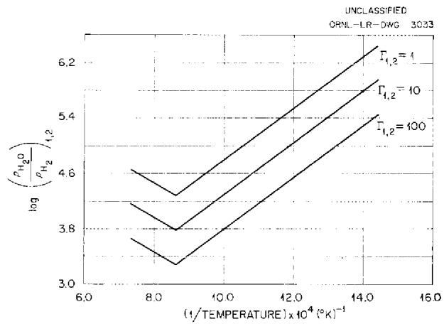  
Fig. 6.23. Decomposition Pressure Functions for NaOH.

TABLE 6.11. DATA ON THE DECOMPOSITION OF SODIUM HYDROXIDE   

<table><tr><td>Temperature (°C)</td><td>ΔF10(kcal)</td><td>ΔF20(kcal)</td><td>K1</td><td>K2</td><td>K3</td><td>pH2O√Γ1(mm Hg)</td><td>pH2√Γ2(mm Hg)</td></tr><tr><td>25</td><td>35.3</td><td>76.0</td><td>10-26</td><td>10-56</td><td>10-95</td><td></td><td></td></tr><tr><td>600</td><td>21.4</td><td>64.4</td><td>4.7 × 10-6</td><td>10-18</td><td>10-27</td><td>1.7</td><td>7.4 × 10-6</td></tr><tr><td>900</td><td>13.5</td><td>59.9</td><td>3 × 10-3</td><td>8 × 10-12</td><td>10-18</td><td>42.0</td><td>2.1 × 10-3</td></tr></table>

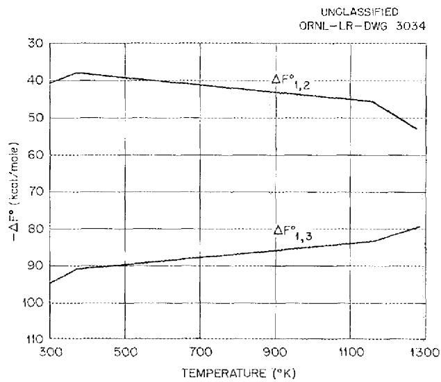  
Fig. 6.24. Free Energy Differences as Functions of Temperature.

There are no satisfactory heat of formation data for any of the alkali-metal hydroxides other than those for sodium. Therefore, only the relative importance of the decomposition equilibria can be studied. Some of the entropy values for the higher oxides have been estimated and are reported in the literature. However, the heats of formation for rubidium and cesium oxides are quite uncertain, and it is presently believed that the accuracy of the $\Delta F_{1,2}^{\circ}$ and $\Delta F_{1,3}^{\circ}$ values given in Table 6.12 would not be improved by use of these entropy estimates. Therefore, only enthalpy values will be used, but it will be shown that this restriction is not so serious as it might at first seem to be.

Comparing equilibria 1 and 2 shows

$$
\begin{array}{l} \Delta F _ {1, 2} ^ {\circ} \simeq \Delta H _ {M _ {2} O} ^ {\circ} + \Delta F _ {H _ {2} O} ^ {\circ} - \Delta H _ {M _ {2} O _ {2}} ^ {\circ}, \\ \Delta F _ {1, 3} ^ {\circ} \simeq \Delta H _ {M _ {2} O} ^ {\circ} + \Delta F _ {H _ {2} O} ^ {\circ} - \Delta H _ {M O _ {2}} ^ {\circ}. \\ \end{array}
$$

The degree of approximation can be checked by using the data for sodium compounds. In this case $\Delta F_{1,2}^{\circ}$ is $-35.5\mathrm{kcal}$ , when using the approximation, as compared with the correct value of $-40.7\mathrm{kcal}$ . Likewise, $\Delta F_{1,3}^{\circ}$ is $-94.2\mathrm{kcal}$ compared with the correct value of $-94.9\mathrm{kcal}$ . The approximate values of $\Delta F_{1,2}^{\circ}$ and $\Delta F_{1,3}^{\circ}$ at $25^{\circ}\mathrm{C}$ are tabulated in Table 6.12 for all the alkali-metal hydroxides. Table 6.12 shows that hydrogen and the peroxide should be produced most readily in potassium hydroxide and least readily in lithium hydroxide. Nevertheless, equilibrium 1 is predominant, and equilibrium 3 and hence equilibrium 4 are insignificant.

TABLE 6.12. APPROXIMATE $\Delta {F}_{1,2}^{ \circ  }$ AND $\Delta {F}_{1,3}^{ \circ  }$ AT ${25}^{ \circ  }\mathrm{C}$   

<table><tr><td>M</td><td>ΔF1,2(kcal)</td><td>ΔF1,3(kcal)</td></tr><tr><td>Li</td><td>-47</td><td></td></tr><tr><td>Na</td><td>-36</td><td>-94</td></tr><tr><td>K</td><td>-25</td><td>-76</td></tr><tr><td>Rb</td><td>-34</td><td>-73</td></tr><tr><td>Cs</td><td>-35</td><td>-70</td></tr></table>

Various investigations of corrosion and mass transfer have shown the fundamental role played by hydrogen. The above computations show that hydrogen is important in stabilizing sodium hydroxide at temperatures above $600^{\circ}\mathrm{C}$ , as shown in

$$
\begin{array}{l} \Delta F _ {1, 2} ^ {\circ} = \Delta F _ {M _ {2} O} ^ {\circ} + \Delta F _ {H _ {2} O} ^ {\circ} - \Delta F _ {M _ {2} O _ {2}} ^ {\circ} \\ = \Delta H _ {M _ {2} O} ^ {\circ} + \Delta F _ {H _ {2} O} ^ {\circ} - \Delta H _ {M _ {2} O _ {2}} ^ {\circ} + T \left(\Delta S _ {M _ {2} O} ^ {\circ} - \Delta S _ {M _ {2} O _ {2}} ^ {\circ}\right). \\ \end{array}
$$

All the data required in the above equation are available, except those for the entropy term. Since this term represents a difference in entropy for two similar substances, it may be supposed that its omission will not be serious. A similar situation obtains for $\Delta F_{1,3}^{0}$ . Hence, the following approximations will be used.

Table 6.11. This is the temperature range at which mass transfer becomes significant. These computations also link the formation of hydrogen with the formation of unsaturated oxygen ions. As will be shown in a subsequent report, the presence of these unsaturated ions may be necessary for mass

transfer to occur. As may be seen in Table 6.12, hydrogen and the unsaturated oxygen ions are most important for the hydroxides of potassium, rubidium, and cesium.

Furthermore, these computations provide the first estimate of the thermal stability of the alkali-metal hydroxides (other than LiOH). These estimates confirm the frequently made assumption that the alkali-metal hydroxides are by far the most thermally stable hydrogen-containing liquids known.

It must be emphasized that these computations are given as a progress report in a continuing investigation. Thus, many of the values obtained, such as the standard free energies of formation, do not in themselves provide direct information about hydroxide corrosion, but they are essential values for any theoretical investigations of corrosion.

Experimental Studies (with M.E. Steidlitz, Metalurgy Division). An investigation is under way to determine experimentally whether a significant amount of hydrogen is liberated when NaOH is heated to $900^{\circ}\mathrm{C}$ in an inert environment. The preliminary method being tested is to use a pair of automatic Toepler pumps to concentrate any gaseous products liberated from the hydroxide. The collected gas is analyzed with a mass spectrometer. The most difficult aspect of this research has been the endeavor to provide an inert container for the NaOH, which reacts with all metals studied at $900^{\circ}\mathrm{C}$ (including the most noble metals) to produce hydrogen. It reacts strongly with nearly all ceramics except magnesium oxide. Unfortunately, nonporous crucibles of pure MgO are not available because of the difficulty in sintering this material. Ordinary MgO crucibles, which usually contain a small amount of binder such as silica, break down due to attack on the binder. The problem was solved by machining out large single crystals of pure magnesium oxide prepared by the Ceramics Group.

In the experiments which have been performed to date, appreciable quantities of hydrogen have been found in addition to much larger quantities of water. However, there was evidence of contamination by organic material and the hydrogen may have come from this source. These studies are continuing.

# CHEMICAL STUDIES OF CORROSION

F. Kertesz

Materials Chemistry Division

# Effect of Temperature on Corrosion of Inconel and Type 316 Stainless Steel

H. J. Buttram

R.E.Meadows

N.V.Smith

Materials Chemistry Division

The effect of temperature on the corrosion of Inconel by molten fluorides in static tests, as indicated by the extent of void formation observed and by chromium concentration of the melt, was discussed in a previous report.13 In those studies there was some evidence that a maximum in the corrosion could be observed at 800 to $900^{\circ}\mathrm{C}$ and that both void formation and chromium concentration in the melt were less at $1000^{\circ}\mathrm{C}$ than at $800^{\circ}\mathrm{C}$ . While it is possible to rationalize the decreased void formation on the basis that a high rate of diffusion for chromium in the metal may minimize the formation of voids, the decreased chromium concentration in the melt is, however, more difficult to explain.

During the past quarter $\mathrm{NaZrF}_5$ and $\mathrm{NaF - ZrF_4 - UF_4}$ (53.5-40-6.5 mole $\%$ were tested in type 316 stainless steel under static and nearly isothermal conditions for 100 hr at $100^{\circ}C$ intervals over the range 600 to $1000^{\circ}C,$ as a check of the findings with Inconel. Metallographic examination of the capsules exposed at $600^{\circ}C$ revealed light intergranular penetration up to 1 mil in depth. At $1000^{\circ}C$ the attack was still light, but one isolated case of intergranular penetration to a depth of 18 mils was noted. When the chromium concentration of the melt was plotted against test temperature for the $\mathrm{NaZrF}_5,$ a slight maximum in the curve appeared between 800 and $900^{\circ}C;$ a similar plot for the $\mathrm{UF_4}$ bearing mixture shows a plateau between 700 to $1000^{\circ}C.$ However, more chromium appeared in solution in the $\mathrm{NaZrF}_5$ samples than in the $\mathrm{UF_4}$ bearing mixtures. The tendency toward less corrosion at $1000^{\circ}C$ than at $800^{\circ}C$ never appears to be pronounced, but it has been sufficiently persistent in these tests to require explanation.

A plausible explanation can be evolved in the following manner. The $\mathrm{NaZrF}_5$ melt which has been used in these experiments gave rise to abnormally high chromium concentrations (1000 ppm) compared with equilibrium values (200 ppm) obtained in measurements carried out with carefully

handled melts and pure chromium metal. It appears, therefore, that impurities were predominantly responsible for the amounts of corrosion measured. The most likely impurity is HF, which can result from hydrolysis of adsorbed water or hydrated water in salts containing $\mathrm{Na}_{3}\mathrm{Zr}_{4}\mathrm{F}_{11}$ or from inadequate purification.

If HF were responsible, the ascending portion of the curve could be due to an increasing rate of reaction with increasing temperature. (There is little reason to believe that equilibrium conditions are reached in static capsules in 100 hr.) The descending portion of the curve may be ascribed to a marked decrease in corrosiveness of HF at increasing temperatures.

Standard free energy estimates14 show that $\Delta F^{\circ}$ for the reaction of HF with Ni to form $\mathrm{NiF}_2$ becomes positive near $500^{\circ}\mathrm{C}$ , with Fe to form $\mathrm{FeF}_2$ at $800^{\circ}\mathrm{C}$ , and with Cr to form $\mathrm{CrF}_2$ at $1400^{\circ}\mathrm{C}$ . In the experiments under discussion here, the melt at the end of a 100-hr test contains mostly $\mathrm{Cr}^{++}$ , with very little $\mathrm{Fe}^{++}$ and $\mathrm{Ni}^{++}$ .

There is some evidence that at the lower temperature all three elements are attacked rather slowly and indiscriminately by HF and that the resulting $\mathrm{Fe}^{+ + }$ and $\mathrm{Ni}^{+ + }$ are replaced by $\mathrm{Cr}^{+ + }$ in a fast secondary reaction. The effect of increasing temperature is to increase the degree of approach to equilibrium in 100 hr in a static capsule; however, at higher temperatures the effect of a more unfavorable equilibrium constant becomes manifest. Iron and nickel are relatively unreactive toward HF at $1000^{\circ}\mathrm{C},$ and the amount of $\mathrm{Cr}^{+ + }$ pickup in 100 hr could well be less than that noted at $800^{\circ}\mathrm{C}$ for three reasons: the free energy change for the reaction of chromium with HF is smaller, fewer $\mathrm{Fe}^{+ + }$ and $\mathrm{Ni}^{+ + }$ ions are present for reaction with $\mathrm{Cr}^{+ + }$ , and there is mechanical interference by the unreacted nickel and iron. In other words, chromium is most readily oxidized from an alloy by HF if the accompanying alloy constituents are also attacked.

# Corrosion by Fission Products

H. J. Buttram R. E. Meadows Materials Chemistry Division

In a previously reported experiment, $^{15}$ a fuel mixture containing simulated fission products at 1000 times the concentration expected in the ARE

was corrosion tested. Very heavy attack was observed; this was expected, not because normal amounts of fission products are particularly corrosive but because oxidizing agents such as $\mathsf{RuF}_4$ , $\mathsf{MoBr}_3$ , and elemental tellurium were used in sufficient concentration to cause excessive corrosion in any case.

Additional experiments were performed with the use of the same additives, individually, in amounts as small as possible in an attempt to measure the relative activities as corrosive agents. Preliminary results, such as those previously reported which showed $\mathsf{YF}_3$ to be extremely corrosive, and additional trials during the past quarter, which showed that such compounds as CsF were also very corrosive, made it obvious that the techniques employed were unsuitable and that very misleading indications were being obtained. Free energy considerations, as well as general experience with fluoride systems in closed capsules, make it apparent that impurities such as HF and water were responsible for the effects noted. Hence it must be concluded that none of the experiments performed to date on corrosion by simulated fission products have been satisfactory for the intended purpose.

# Controlled-Velocity Corrosion Testing Apparatus

N.V. Smith F.A.Knox Materials Chemistry Division

In order to more nearly simulate corrosion conditions of molten fluorides circulating through reactor components, a controlled-velocity corrosion testing apparatus has been constructed. This apparatus, similar to one previously described,[16] allows the rapid transfer of molten fluorides through both heated and cooled test sections. The apparatus consists of two 4-in.-ID, 24-in.-high Inconel cylindrical pots connected by means of three sections of $\frac{1}{4}$ -in. Inconel tubing with a wall thickness of 0.035 in. The two outside sections are 5 ft long and the center section, which was initially 1 ft long, was later increased to $3\frac{1}{2}$ ft. The center section is cooled by either air or water. Suitable furnaces and heaters permit holding the pots and transfer lines at desired temperatures. Each Inconel pot has a gas inlet which allows application of helium

at predetermined pressures to transfer the melt. A probe indicates when the desired liquid level is reached in the second pot and activates a relay which closes the helium inlet to the first pot and opens a corresponding one in the second pot to reverse the cycle.

Velocities obtained with the apparatus have reached 5 fps, which corresponds to a Reynolds number of only about 1500. It is hoped that an improved design now being assembled will make possible turbulent flow. A $200^{\circ}\mathrm{C}$ gradient across the cooling section was desired; however, it has not yet been possible to achieve a differential of more than $60^{\circ}\mathrm{C}$ . The transfer cycle consists in having the melt contained in either pot at $700^{\circ}\mathrm{C}$ , being heated to $800^{\circ}\mathrm{C}$ in the first section of the transfer line, cooled in the middle section, brought back to $700^{\circ}\mathrm{C}$ in the third section, momentarily stored in the opposite pot at $700^{\circ}\mathrm{C}$ , and then the cycle is reversed. A complete cycle, that is, from one pot to the other and back, required approximately 5 min. It is believed that this apparatus will yield corrosion data under conditions not easily obtainable by present means.

# Reaction Between Graphite and Fluoride Melt

F. A. Knox  
Materials Chemistry Division

Graphite has been used extensively as a container material during preparations of fuel and

coolant materials; therefore, an investigation was made of possible reaction between it and a fluoride melt. In the procedure used an Inconel reaction tube was loaded with either NaF-ZrF $_4$ -UF $_4$ (53.5-40-6.5 mole %) alone or with the fluoride mixture plus graphite which had been treated under vacuum for degassing. The reaction tube was connected to a manometer and then held at $1000^{\circ}\mathrm{C}$ until the gas pressure became constant.

It was found that the rather large gas pressures obtained were due chiefly to $\mathsf{SiF}_4$ . Analysis of the graphite indicated the presence of nearly $1\%$ Si. The use of spectrographically pure graphite in this apparatus has yielded pressures very nearly the same as the pressure of the pure fluoride. No HF or $\mathsf{CF}_4$ was detected during these tests.

# Lithium Fluoride Castings

N.V. Smith F.Kertesz Materials Chemistry Division

At the request of the Instrumentation and Controls Division, high-density lithium fluoride cylinders were cast from powdered material for use in an x-ray spectrometer. These cylinders were prepared by charging the powder to graphite crucibles and heating in an inert atmosphere to $900^{\circ}\mathrm{C}$ . The graphite liner containing the melt was then removed from the furnace and a strong air jet was applied to its periphery. The resulting cylinders were uniform and acceptable.

# 7. METALLURGY

# W. D. Manly   Metallurgy Division

Creep and stress-rupture testing have, in the past, been performed primarily on uniaxially stressed specimens. Tests of this type are continuing, but the interest is now centered on tube-burst tests in which a tube that is closed at one end is stressed with an internal gas pressure. The stress pattern introduced into the specimen in this test more nearly approaches the stress pattern that will be found in ANP-type reactors. The ratio of the tangential stress to the longitudinal stress is quite important in the ductility of the metal being tested, and therefore equipment in which the longitudinal and the tangential stresses can be varied has been constructed. A theoretical analysis of a stressed cylindrical pressure vessel has been made with which a check on the experimental results can be obtained. Also, to determine the effect of tangential and compressive stresses on the corrosion rate of metal in contact with fused salts, an apparatus for loading a sheet specimen in bending was designed and constructed; tests are now being made.

In the investigation of high-thermal-conductivity materials for fins for sodium-to-air radiators, stress-rupture and creep tests were made on copper fins with various types of cladding at stress levels between 500 and 2000 psi at $1500^{\circ}\mathrm{F}$ . The tests have shown that for a 1000-hr exposure in air, stresses greater than 500 psi and less than 1000 psi are tolerable; that is, in this stress range there is no indication of brittleness in the core or oxidation of the core due to cladding failure. Thermal conductivity measurements of a $6\%$ Al-94% Cu aluminum bronze were made in the temperature range 212 to $1562^{\circ}\mathrm{F}$ .

Tests of brazing alloys have shown that in brazing high-conductivity fin materials to Inconel tubing there are four alloys that can be used: low-melting-point Microbraz (LMNB), Coast Metals alloy 52, electroless nickel, and an Ni-P-Cr alloy. From the over-all considerations of melting point, oxidation resistance, dilution of fin and tube wall, formation of low-melting eutectics, and flowability, it was found that Coast Metals alloy 52 was the best alloy for the construction of radiators with high-conductivity fins.

A sodium-to-air radiator with 6 in. of type-430 stainless-steel-clad copper high-conductivity fins was fabricated by using a combination heliarc welding and brazing procedure. The tube-to-fin sections were assembled and brazed with Coast Metals alloy 52. The tube-to-header joints were made by using the semiautomatic welding equipment and then back-brazing. The header sections were closed by manual heliarc welding.

In the construction of a 100-kw gas-fired liquid-metal-heater system, packed-rod nozzle assemblies were needed as the inlets for air and gas. These devices were made by brazing $\frac{1}{8}$ -in.-dia stainless steel rods in a tight assembly with a ductile, oxidation-resistant alloy of $82\%$ Au-- $18\%$ Ni.

Work has started on the formation of duplex tubing in an attempt to prepare alloy composites that have good corrosion resistance on the inner surface and oxidation resistance on the outer surface. Composites of copper and type 310 stainless steel, Inconel and type 310 stainless steel, Inconel and Hastelloy B, and Hastelloy B and type 310 stainless steel have been prepared. Tubing produced from stainless-steel-clad molybdenum and columbium and from several special Inconel-type alloys was fabricated into thermal convection loops for fluoride corrosion testing. Several new alloys were produced for the corrosion tests with liquid lead.

Attempts are being made to find new alloys in the nickel-molybdenum system that will have better high-temperature strength and fluoride corrosion resistance than Inconel has. Hastelloy B satisfies these requirements, but it has poor fabrication properties and oxidation resistance, and it loses its ductility in the temperature range of interest for application in high-temperature circulating-fuel reactors. Investigations are under way in an effort to find a suitable melting and heating treatment that will increase the ductility of Hastelloy B in the temperature range of interest.

Investigations of methods for producing boron carbide shield pieces of the required density and shape indicate that the pieces should be molded with nonmetallic bonding material by cold pressing followed by sintering. The bonding materials being

studied include sodium silicate, silica, silicon nitride, and boric oxide.

The fluoride-to-sodium intermediate heat exchanger, which failed in a life test after 1680 hr of cyclic service in the temperature range 1080 to $1500^{\circ}\mathrm{F}$ , was examined. It is probable that the failures in the tube-to-header welds were caused by unequal thermal expansion, which caused stress concentration at the roots of the tube-to-header welds. These stresses, combined with expansion and contraction of the tubes, would tend to propagate cracks through the walls. These failures emphasize the extreme desirability of using backbrazing as a means of minimizing the notch effect in tube-to-header welds.

# STRESS-RUPTURE TESTS OF INCONEL

R.B.Oliver

D. A. Douglas

J.H.DeVan

J.W.Woods

Metallurgy Division

The tube-burst test for obtaining information on the stress-rupture properties of Inconel has been studied intensively. The stress pattern introduced into the specimen in this test simulates to some extent the stress pattern that will be present in circulating-fuel reactors. The test consists of stressing a closed-end tube with internal gas pressure. In tests of this type reported previously, it was observed that Inconel specimens stressed in this manner showed less ductility and much shorter rupture life than the uniaxially stressed specimens, and therefore an intensive study of the multiaxial stress system was initiated. W. Jordan of the Mechanics Department of the University of Alabama is investigating this problem.

Part of the investigation consists of a study of the theory of stresses in cylindrical pressure vessels, with particular attention to the variations in stresses calculated by the thin-wall formula vs the stresses determined by the more exact Lamé theory. The stresses under discussion are those in the walls only, with no consideration given to the end closure shape, except that the ends are assumed to be completely closed. The three principal stresses at a given point are the radial stress $(\sigma_{r})$ , the tangential (hoop) stress $(\sigma_{t})$ , and the longitudinal (axial) stress $(\sigma_{a})$ . The theory of elasticity yields

the following equations:

$$
\begin{array}{l} (1) \sigma_ {r} = \frac {p _ {i} r _ {i} ^ {2} - p _ {o} r _ {o} ^ {2}}{r _ {o} ^ {2} - r _ {i} ^ {2}} + \left(\frac {1}{r ^ {2}}\right) \frac {r _ {i} ^ {2} r _ {o} ^ {2} (p _ {o} - p _ {i})}{r _ {o} ^ {2} - r _ {i} ^ {2}}, \\ \sigma_ {t} = \frac {p _ {i} r _ {i} ^ {2} - p _ {o} r _ {o} ^ {2}}{r _ {o} ^ {2} - r _ {i} ^ {2}} - \left(\frac {1}{r ^ {2}}\right) \frac {r _ {i} ^ {2} r _ {o} ^ {2} \left(p _ {o} - p _ {i}\right)}{r _ {o} ^ {2} - r _ {i} ^ {2}}, \\ \sigma_ {a} = \frac {p _ {i} r _ {i} ^ {2} - p _ {o} r _ {o} ^ {2}}{r _ {o} ^ {2} - r _ {i} ^ {2}}, \tag {3} \\ \end{array}
$$

where $r$ is the radial distance to the point at which the stress is desired, $r_i$ and $r_o$ are the internal and external radii, and $p_i$ and $p_o$ are the internal and external pressures. For the special case of the cylinder subjected to internal pressure only $(p_o = 0)$ , the equations reduce to:

$$
\begin{array}{l} \sigma_ {r i} = p _ {i}, \quad \sigma_ {r o} = 0, (4) \\ \sigma_ {t i} = p _ {i} \frac {r _ {o} ^ {2} + r _ {i} ^ {2}}{r _ {o} ^ {2} - r _ {i} ^ {2}}, \quad \sigma_ {t o} = p _ {i} \frac {2 r _ {i} ^ {2}}{r _ {o} ^ {2} - r _ {i} ^ {2}}, (5) \\ \sigma_ {a i} = \sigma_ {a o} = p _ {i} \frac {r _ {i} ^ {2}}{r _ {o} ^ {2} - r _ {i} ^ {2}}, (6) \\ \end{array}
$$

where the additional subscripts $i$ and $o$ on the stress terms indicate stresses at the inner and outer surfaces. To simplify these equations for application to cylinders with thin walls, it is frequently assumed that the tangential stress does not vary across the wall of the vessel. This simplification results in the following equations for internal pressures only:

$$
\begin{array}{l} S _ {t i} = S _ {t o} = p _ {i} \frac {r _ {i}}{t}, (7) \\ S _ {a i} = S _ {a o} = p _ {i} \frac {r _ {i}}{2 t}, (8) \\ \end{array}
$$

where the letter $S$ is used to denote stress and $t$ is the thickness of the wall $(t = r_{o} - r_{i})$ . A simplified expression for radial stress in thin-walled cylinders is not commonly used.

In order to determine the error involved in using the formulas for thin-walled vessels, ratios of the stresses computed by the exact and the approximate theories are given below.

$$
\begin{array}{l} \frac {\sigma_ {t i}}{S _ {t i}} = 1 + \frac {t}{r _ {i}} - \frac {\frac {t}{r _ {i}}}{2 + \frac {t}{r _ {i}}} (9) \\ \frac {\sigma_ {t o}}{S _ {t o}} = \frac {2}{2 + \frac {t}{r _ {i}}} (10) \\ \frac {\sigma_ {a}}{S _ {a}} = \frac {2}{2 + \frac {t}{r _ {i}}} (11) \\ \end{array}
$$

Equations 9 through 11 are plotted in Fig. 7.1.

The so-called "exact" formulas (often called the Lamé formulas) are valid only while the stresses are elastic. The approximate formulas are based on equilibrium considerations and the assumption that the stresses are distributed uniformly across the wall. Under inelastic (including creep) conditions, it is believed that the tangential (hoop) stress distribution lies somewhere between those assumed in the Lamé and in the approximate elastic theories. With increasing stress, increasing temperature, and increasing time, the actual stress distribution will depart from the Lamé assumption and approach the thin-wall theory assumption. Thus the two theories give the upper and lower bounds for the actual stress distribution.

For the longitudinal (axial) stresses, the Lamé and the thin-wall theories both use the assumption that the stresses are uniformly distributed over the cross section. Since the Lamé theory uses the correct value for the cross-sectional area, while the thin-wall theory uses an approximate area, the Lamé theory is believed to be more correct in both the elastic and the inelastic ranges of stress. The majority of the tube-burst tests made to date have been of 0.010- and 0.020-in.-wall tubing, and thus the approximate formula applies. Specimens are now being tested which have 0.060-in. walls. Since it is predicted that under the test conditions the

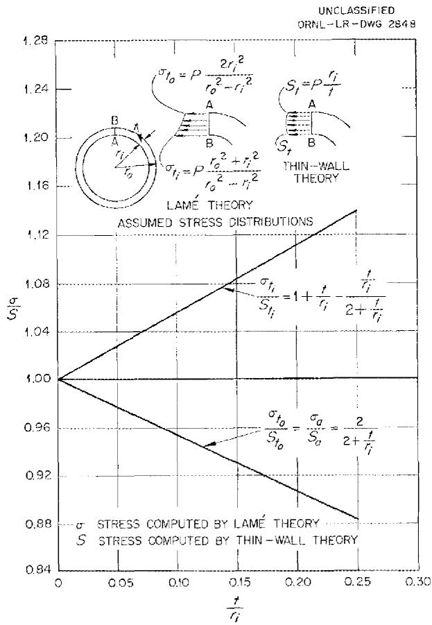  
Fig. 7.1. Comparison of Elastic Stress in Cylinders as Computed by Lamé Theory and by Thin-Walled Pressure Vessel Theory.

stress will be uniform across the wall thickness the approximate formula will be used for calculating the stresses, and the slight error thus introduced will be neglected.

It is well known that in the case of a thin-walled closed-cylinder pressure vessel the ratio of the tangential (hoop) stress to the longitudinal (axial) stress is 2:1. Some investigators have shown that this stress distribution results in the minimum ductility for a given material. Therefore, in order to better understand the criteria for predicting failure of tubular specimens and in order to study the effects of anisotropy of the tubular material, it would be desirable to be able to test a series of specimens with varying stress ratios. Jordan has devised the apparatus described below with which it is possible to stress a tubular specimen purely tangentially, purely axially, or in any desired ratio of these stresses.

The most obvious method of changing the stress ratio is by loading a tubular specimen axially with dead weights and producing an axial stress without the use of pressure, so that $\sigma_{t} / \sigma_{a} = 0$ . By using movable pistons for the ends of the cylinder, as shown in Fig. 7.2, all the axial load caused by the pressure acting on the pistons is borne by the rod connecting the pistons. This will reduce the axial stress in the cylinder wall to zero (assuming no friction between piston and cylinder) without affecting the tangential stress. In actual practice, one piston can be replaced by a fixed end. By using a piston of larger net area than the opposite cylinder end, compressive axial stresses can be introduced into the cylinder walls without altering the tangential stresses. This arrangement is shown in Fig. 7.3. By using thin-walled cylinder approximations, the stress ratio is given by the equation

$$
\frac {\sigma_ {t}}{\sigma_ {a}} = \frac {2 d (d + t)}{d ^ {2} - D ^ {2}}.
$$

(Note that the diameter $a$ of the piston rod does not enter into the calculation of the stress ratio.)

In order to obtain a positive stress ratio of $\sigma_t / \sigma_{a'}$ an arrangement similar to Fig. 7.4a can be used. The stress ratio is given by the equation

$$
\frac {\sigma_ {t}}{\sigma_ {a}} = \frac {2 d (d + t)}{D ^ {2}}.
$$

In the event that it is necessary to extend the piston rod through the top end of the cylinder (to provide a thermocouple well, for example), the arrangement shown in Fig. 7.4b may be considered. The stress ratio is given by the equation

$$
\frac {\sigma_ {t}}{\sigma_ {a}} = \frac {2 d (d + t)}{D ^ {2} - b ^ {2}}.
$$

UNCLASSIFIED

ORNL-LR-DWG 2850

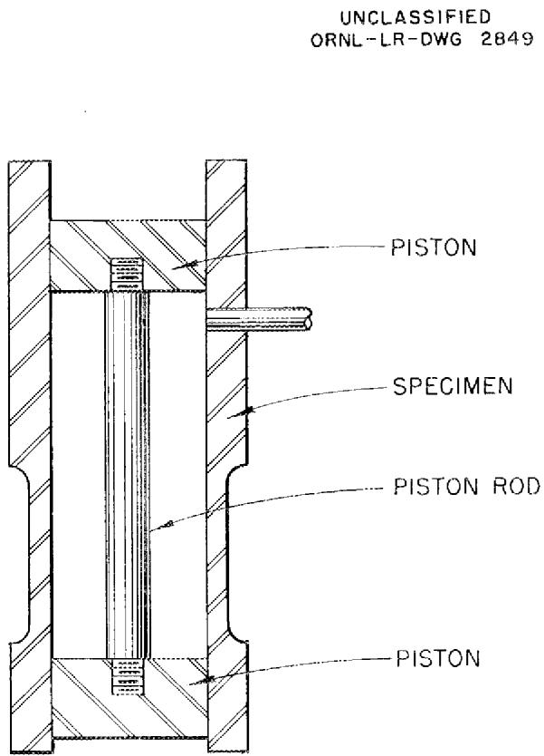  
Fig. 7.2. Apparatus for Producing Tangential Stress in a Tubular Specimen.

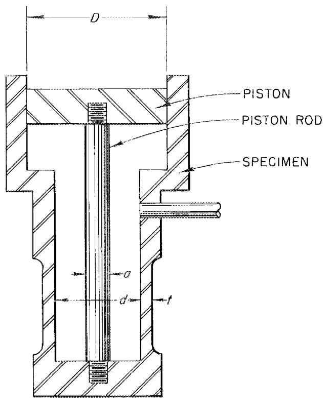  
Fig. 7.3. Apparatus for Producing Compressive Axial Stresses in a Tubular Specimen Without Altering the Tangential Stresses.

UNCLASSIFIED

ORNL-LR-DWG 2851

DIMENSION D MAY BE GREATER

OR LESS THAN $d$

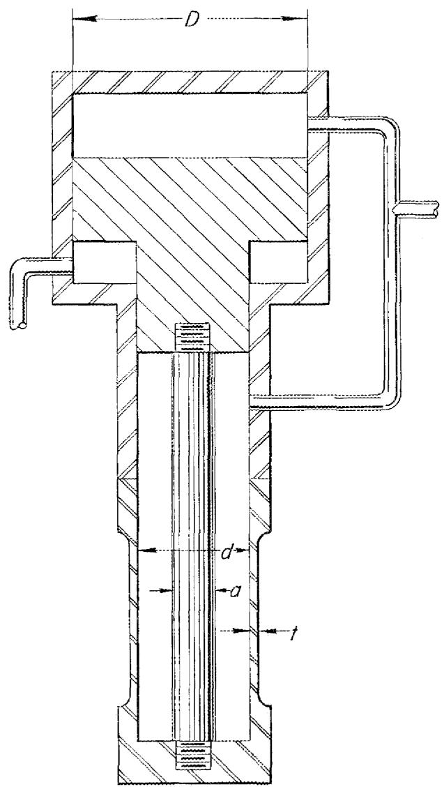  
a

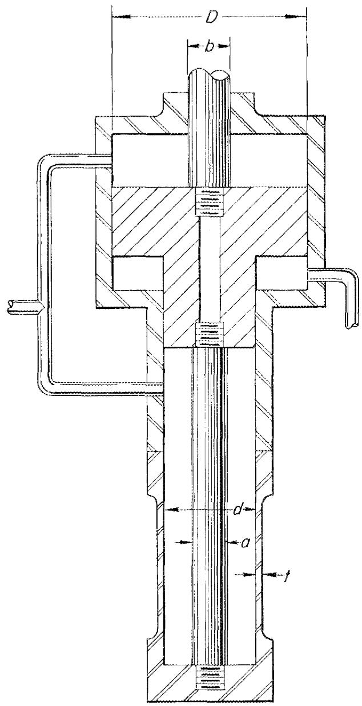  
b   
Fig. 7.4. Apparatus for Obtaining a Positive Stress Ratio of $\sigma_{\mathrm{r}} / \sigma_{\alpha}$ in a Tubular Specimen. (a) Without thermocouple well. (b) With thermocouple well.

UNCLASSIFIED

ORNL-LR-DWG2852

As before, the stress ratio is independent of the diameter $a$ of the piston rod. Since the piston rod is in compression, however, it should be made large enough to prevent buckling. The bleed lines shown in Figs. 7.4a and b should be kept open during testing to assure that no pressure leaks from the large-diameter chamber to the smaller one.

A test rig has been built that imposes the condition $\sigma_{l} / \sigma_{a} = \infty$ . Strain measurements made with a strain-gage bridge fastened to the gage area showed that the friction in the system was negligible and that the only active stress was tangential. A specimen is now being tested at $1500^{\circ}\mathrm{F}$ under this stress condition.

There has been considerable speculation as to the possibility of a difference in the rate of corrosive attack of fused salts in contact with Inconel under tensile stresses as compared with Inconel in compression. In order to observe any difference, it is desirable that the compressive and tensile stresses be imposed on the same specimen and be of the same magnitude. One approach to this problem is to test a specimen under pure bending conditions. This would ensure that the magnitude of the maximum tensile stress would always be equal to that of the maximum compressive stress during a given test. An apparatus which would produce this effect was also designed by Jordan, and a specimen is now being tested in a fused salt medium. A drawing of the specimen and the loading apparatus is presented in Fig. 7.5. If it is assumed that no friction occurs between pins C and D and the specimen, all the force P will be transmitted across section I-1 by the link L and no axial force will exist in the specimen. Likewise, since link L is loaded axially, it cannot transmit any bending moment and therefore the specimen must resist any bending moment existing across section I-1. The force in link L will be equal to P to satisfy the equilibrium of forces. The bending moment in the specimen will then be equal to the product of P and the horizontal distance between the centers of pins A and B. In order to minimize variations in the bending moment (and therefore stresses) in the specimen during a test, the horizontal distance between A and B should be held as nearly constant as possible. Since the specimen deforms under load, the ends will rotate and some change in the distance AB must occur. In order to minimize the change, the pins A and B are placed with their centers slightly above and below, respectively, a horizontal

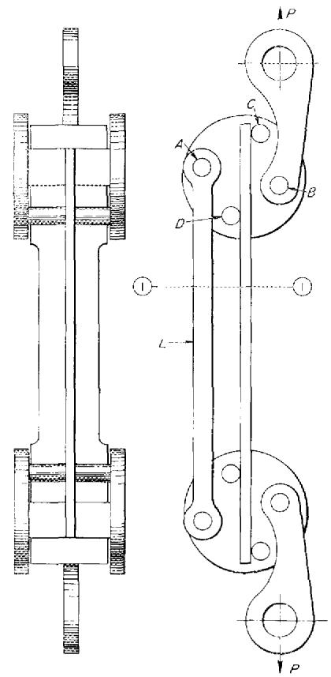

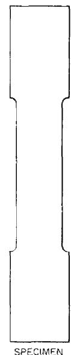  
Fig. 7.5. Apparatus for Testing a Sheet Specimen Under Pure Bending Conditions.

diameter. This will allow some rotation to occur with very little change in the horizontal distance,

The apparatus shown in Fig. 7.5 has been constructed. Strain gages were placed on the tension and compression sides of a specimen, and load was applied. In the range of loads contemplated in a creep test, the tensile and compressive strains were essentially of the same magnitude; thus very little friction existed between the pins and the specimen.

# HIGH-CONDUCTIVITY-FIN

# SODIUM-TO-AIR RADIATOR

Developmental work has continued on a sodium-to-air radiator with fins of a high-thermal-conductivity material. The developmental effort includes investigations of materials with high thermal conductivity, the development and testing of brazing

alloys for use in fabricating the radiator, and the fabrication of radiators for service testing.

# Investigations of Fin Materials

J.H.Coobs H. Inouye Metallurgy Division

Stress-rupture and creep tests of type-310 stainless-steel-clad copper fins that were 8 mils thick were made at $1500^{\circ}\mathrm{F}$ at stresses between 500 and 2000 psi. The material was obtained from the General Plate Div. of Metals & Controls Corp. and had an average cladding thickness of 1.87 mils per side. The maximum cladding thickness was 2.3 mils per side. The results of the several tests made show that some alteration of the copper occurs even though the specimen does not fracture. This was indicated by the brittleness of the normally ductile composite. For long-time exposures (1000 hours), stresses greater than 500 psi and less than 1000 psi are tolerable and there is no indication of brittleness in the core or oxidation due to cladding failure. In all the specimens which ruptured, oxidation of the copper at the point of fracture was complete, and the copper which did not appear to be oxidized was brittle. It was also noted that when the strain in 2.5 in. was $10\%$ , the copper remained ductile, while strains above $20\%$ (regardless of exposure time) produced brittleness. The data obtained are given in Table 7.1.

The aluminum bronzes are among the materials being considered as cladding for copper fins. Although extensive diffusion occurs between these alloys and copper, increases in the thermal conductivity of the fin can be realized by cladding the copper with these alloys. The composition gradient existing in a diffused composite results in an increase in the conductivity of the cladding material (because of the outward diffusion of aluminum) and a decrease in the conductivity of the copper core.

Thermal conductivity measurements of two aluminum bronzes were made by the Solid State Division and are reported in Table 7.2. The values given for measurements at temperatures up to $392^{\circ}\mathrm{F}$ compare favorably with the data of Smith and Palmer, but for temperatures above $392^{\circ}\mathrm{F}$ they exceed the values extrapolated from their data. Also, the

2-mil cladding on each side of 4-mil copper sheet

TABLE 7.1. STRESS-RUPTURE PROPERTIES OF TYPE-310 STAINLESS-STEEL-CLAD COPPER FINS AT ${1500}^{ \circ  }\mathrm{F}$   

<table><tr><td>Stress (psi)</td><td>Rupture Time (hr)</td><td>Elongation in 2.5 in. (%)</td><td>Remarks</td></tr><tr><td>2000</td><td>96</td><td>39</td><td>Copper embrittled</td></tr><tr><td>1800</td><td>336</td><td>50</td><td>Copper embrittled</td></tr><tr><td>1650</td><td>528</td><td>40</td><td>Copper embrittled</td></tr><tr><td>1500</td><td>887</td><td></td><td>Copper embrittled</td></tr><tr><td>1400</td><td>1220</td><td></td><td>In progress</td></tr><tr><td>1000</td><td></td><td>27.5</td><td>Test terminated at 1000 hr; specimen oxidized throughout</td></tr><tr><td>1000</td><td></td><td>.20</td><td>Test terminated at 500 hr; oxide stringers on surface of specimen</td></tr><tr><td>500</td><td></td><td>10</td><td>Test terminated at 1000 hr; no indication of failure</td></tr><tr><td>500</td><td></td><td>5</td><td>Test terminated at 500 hr; no indication of failure</td></tr></table>

TABLE 7.2. THERMAL CONDUCTIVITY OF ALUMINUM BRONZES AT VARIOUS TEMPERATURES   

<table><tr><td rowspan="2">Temperature (°F)</td><td colspan="2">Thermal Conductivity [cal/sec·cm2(°C/cm)]</td></tr><tr><td>For 6.2% Al-93.8% Cu</td><td>For 8.4% Al-91.6% Cu</td></tr><tr><td>212</td><td>0.178</td><td>0.176</td></tr><tr><td>302</td><td>0.240</td><td>0.210</td></tr><tr><td>392</td><td>0.280</td><td>0.250</td></tr><tr><td>1156</td><td>0.55</td><td></td></tr><tr><td>1562</td><td>0.77</td><td></td></tr></table>

estimated value of six times the thermal conductivity of stainless steel at $1500^{\circ}\mathrm{F}$ was exceeded by the experimental value for the $6.2\%$ Al-93.8% Cu alloy. The values given in Table 7.2 were not corrected for the volume expansion of the alloy with temperature and are therefore accurate only to within $\pm 5\%$ .

# Development of Brazing Alloys for Use in Fabricating Radiators

P. Patriarca

K.W.Reber G.M.Slaughter Metallurgy Division

J.M.Cisar

Aircraft Reactor Engineering Division

Several alloys were investigated for brazing copper fins clad with Inconel, type 310 stainless steel, or type 430 stainless steel in order to establish an optimum combination for fabrication of a sodium-to-air radiator. The evaluation of these alloys was based on metallographic examination of tube-to-fin specimens before and after exposure to static air for periods up to $600\mathrm{hr}$ . The alloys tested are listed in Table 7.3.

TABLE 7.3. BRAZING ALLOYS FOR HIGH-CONDUCTIVITY CLAD COPPER FINS   

<table><tr><td>Alloy Name</td><td>Composition (wt %)</td><td>Brazing Temperature (°F)</td></tr><tr><td>Low-melting-point</td><td rowspan="2">80 Ni, 6 Fe, 5 Cr, 5 Si, 3 B, 1 C</td><td rowspan="2">1920</td></tr><tr><td>Nicrobraz (LMNB)</td></tr><tr><td>Coast Metals alloy</td><td rowspan="2">89 Ni, 5 Si, 4 B, 2 Fe</td><td rowspan="2">1840</td></tr><tr><td>52</td></tr><tr><td>Electroless nickel</td><td>88 Ni, 12 P</td><td>1800</td></tr><tr><td>Ni-P-Cr</td><td>80 Ni, 10 P, 10 Cr</td><td>1800</td></tr></table>

A microsection is shown in Fig. 7.6 of an Inconel-clad copper fin (2 mils of Inconel on each side of 6-mil-thick copper) joined to $3_{16}$ -in.-OD, 0.025-in.-wall Inconel tubing with $88\%$ Ni- $12\%$ P alloy and then exposed to static air at $1500^{\circ}\mathrm{F}$ for 600 hr. Solution of the tube wall during the brazing cycle was negligible, but rather severe solution of the fin lip occurred. It is evident, however, that the oxidation resistance of the joint was not affected. Examinations of specimens brazed with the other alloys listed in Table 7.3 revealed similar results, that is, minimum solution of tube walls and excellent oxidation resistance of the braze joints.

The effects of diffusion, however, were in evidence after each test. Color changes in the copper core, along with the formation of voids, indicate that the use of Inconel-clad copper in a radiator would not be advisable, since the void formation

and the change in core chemistry from copper to a copper-nickel alloy would seriously reduce the heat transfer efficiency of the fin. Other claddings, such as types 310 and 430 stainless steel, have been found to be relatively immune to diffusion effects, however, and a number of brazed joints were evaluated to determine the optimum alloy for brazing each of these materials to Inconel tubing.

A joint of type-310 stainless-steel-clad copper brazed to Inconel tubing with the $88\%$ Ni- $12\%$ P alloy is shown in Fig. 7.7. It may be seen that fin dilution and intergranular penetration of the resulting brazing alloy into the tube wall occurred. This penetration, undetected in the case of Inconel-clad copper, appears to be due to the formation of a complex eutectic resulting from the presence of an iron-base cladding material rather than from a nickel-base material. Similar intergranular penetration was found when the $88\%$ Ni- $12\%$ P alloy

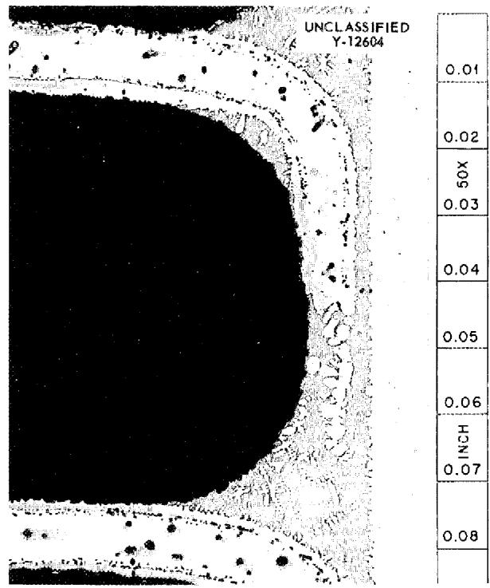  
Fig. 7.6. Inconel-Clad Copper Fins Brazed to Inconel Tubing with $88\%$ Ni-12% P Alloy and Exposed to Static Air at $1500^{\circ}\mathrm{F}$ for 600 hr. Note dilution of fin, hole formation in copper due to diffusion, and the excellent oxidation resistance of the bronze joint. As polished. 50X. Reduced $15\%$ .

was used with type-430 stainless-steel-clad copper, as shown in Fig. 7.8. In this case, the intergranular penetration was completely through the tube wall. The effect of the intergranular penetration on the physical properties of the tubing has not yet been determined, but it is believed that it would be advisable to use a brazing alloy that does not react with the iron-base cladding material.

The tube-to-fin joints shown in Figs. 7.9 and 7.10 are, respectively, type-310 stainless-steel-clad and type-430 stainless-steel-clad copper fins that were brazed with Coast Metals alloy 52 to Inconel and then exposed to static air for 400 hr at $1500^{\circ}\mathrm{F}$ . A negligible amount of dilution and a relatively minor amount of boron diffusion into the Inconel tubing occurred.

Although low-melting-point Microbraz (LMNB) has been used successfully to braze all the proposed cladding materials to Inconel, its relatively high

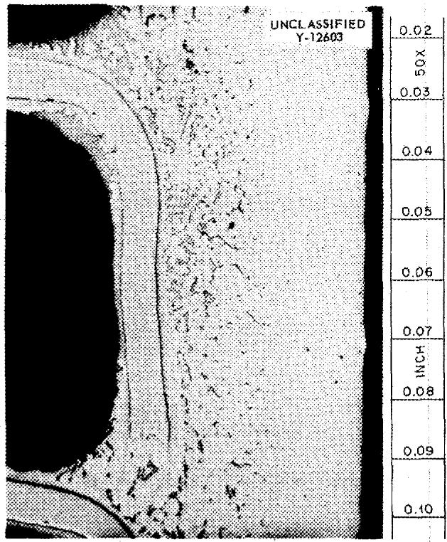  
Fig. 7.7. Type-310 Stainless-Steel-Clad Copper Fins Brazed to Inconel Tubing with $88\%$ Ni- $12\%$ P Alloy. Note dilution of fin and intergranular penetration into tube wall. As polished, 50X. Reduced $15\%$ .

flow point of $1925^{\circ}F$ is so close to the melting point of copper that it cannot be used with ease. Since the oxidation resistance of the Coast Metals alloy 52 is comparable to that of LMNB and the effect of boron diffusion is the same for both alloys, the Coast Metals alloy was selected for the fabrication of the first high-conductivity-fin sodium-to-air radiator.

The problem of edge protection of the clad copper fins has been resolved. Aluminum is applied to the edges of fins by dip coating or spraying, or it is painted on as aluminum powder in a Microbraz cement slurry. The fin is then heated at $800^{\circ}\mathrm{C}$ for approximately $\frac{1}{2}$ hr. The diffusion of the aluminum into the copper core results in an aluminum bronze which exhibits excellent resistance to oxidation when exposed to static air for 500 hr at $1500^{\circ}\mathrm{F}$ . It appears that the depth of bronzing, which continues during oxidation testing, is about $\frac{3}{32}$ to $\frac{1}{8}$ in. in 500 hr. The feasibility of simultaneously bronzing large numbers of fins is to be determined.

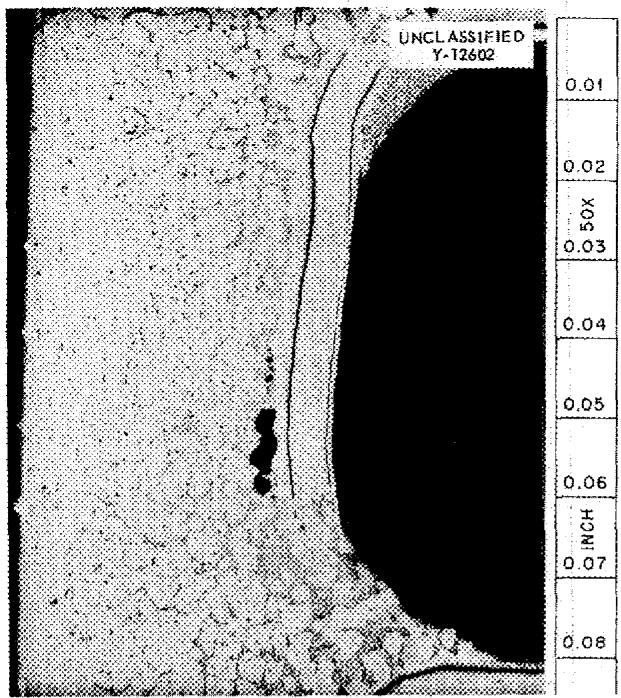  
Fig. 7.8. Type-430 Stainless-Steel-Clad Copper Fins Brazed to Inconel Tubing with $88\%$ Ni-12% P Alloy. Note dilution of the fin and severe intergranular penetration into the tube wall. As polished. 50X. Reduced 19%.

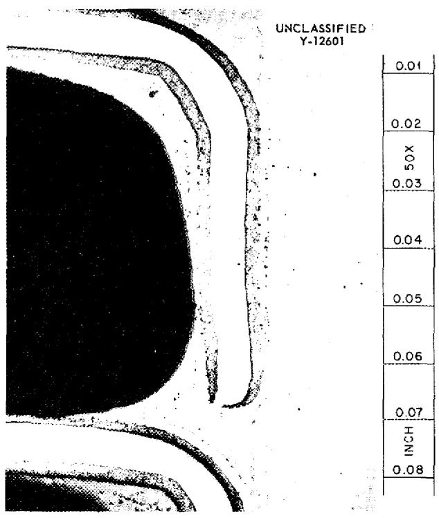  
Fig. 7.9. Type-310 Stainless-Steel-Clad Copper Brazed to Inconel Tubing with Coast Metals Alloy 52 and Exposed to Static Air at $1500^{\circ}\mathrm{F}$ for 400 hr. As polished. 50X. Reduced $16\%$ .

# Radiator Fabrication

P. Patriarca

K.W.Reber G.M.Slaughter

Metallurgy Division

J.M.Cisar

Aircraft Reactor Engineering Division

A sodium-to-air radiator with 6 in. of type-430 stainless-steel-clad copper fins was fabricated by using a combination heliarc welding and brazing procedure. The tube-to-fin section was assembled and brazed with Coast Metals alloy 52 at $1020^{\circ}\mathrm{C}$ . The split headers were then assembled and heliarc welded by using the semiautomatic equipment available in the Welding Laboratory. A photograph of the radiator and welding torch after the welding of the 108 tube-to-header joints is shown in Fig. 7.11.

The remaining header sections were then manually heliarc welded by utilizing the complete penetration technique. Although a pressure test indicated that six tube-to-header joints were not leak-tight, a

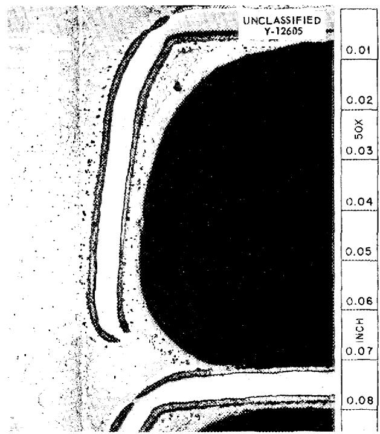  
Fig. 7.10. Type-430 Stainless-Steel-Clad Copper Brazed with Coast Metals Alloy 52 and Exposed to Static Air at $1500^{\circ}$ F for 400 hr. As polished, 50X. Reduced $17.5\%$ .

back-brazing operation satisfactorily sealed the leaks and removed the effects of notches as sources of stress concentrations. The completed unit, as shown in Fig. 7.12, was helium leak-tight after the rebrazing operation. This unit is to be used in the 100-kw gas-fired liquid-metal-heating system.

# NOZZLES FOR THE GAS-FIRED LIQUID-METAL-HEATER SYSTEM

P. Patriarca

K.W.Reber G.M.Slaughter Metallurgy Division

J.M.Cisar

Aircraft Reactor Engineering Division

One of the design features of the 100-kw gas-fired, liquid-metal-heater system now being constructed is the packed-rod nozzle assembly to be used for inlet control of the air and the gas flow. Test data and theoretical considerations indicated that $\frac{1}{8}$ -in.-dia stainless steel triangularly packed rods would be satisfactory for use in this nozzle. It was expected that these rods could be joined in a rigid bundle

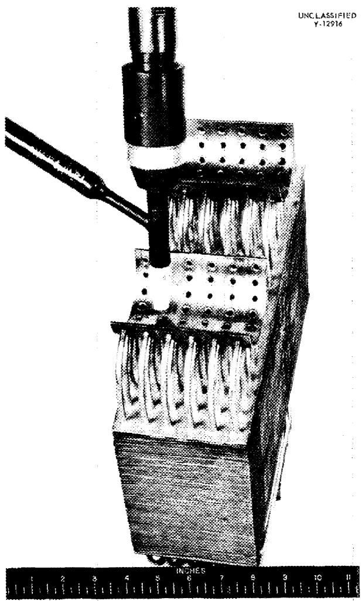  
Fig. 7.11. Sodium-to-Air Radiator Showing Semi-automatic Heliacr Tube-to-Header Welds.

with a minimum of plugged interstices by furnace brazing with a ductile oxidation-resistant high-temperature brazing alloy such as $82\%$ Au-18% Ni.

Experiments revealed that proper jigging was extremely important in obtaining the completed air-nozzle blank (Fig. 7.13). Each layer of rods was tack-welded for rigidity, and the layers were then tack-welded to form the assembly. Since the determination of the exact amount of brazing alloy required was difficult, if not impossible, sufficient material was used to ensure good bonding at all capillary joints. The excess material was then removed from the nozzle interstices by placing a flat cross section against a metal sheet on which

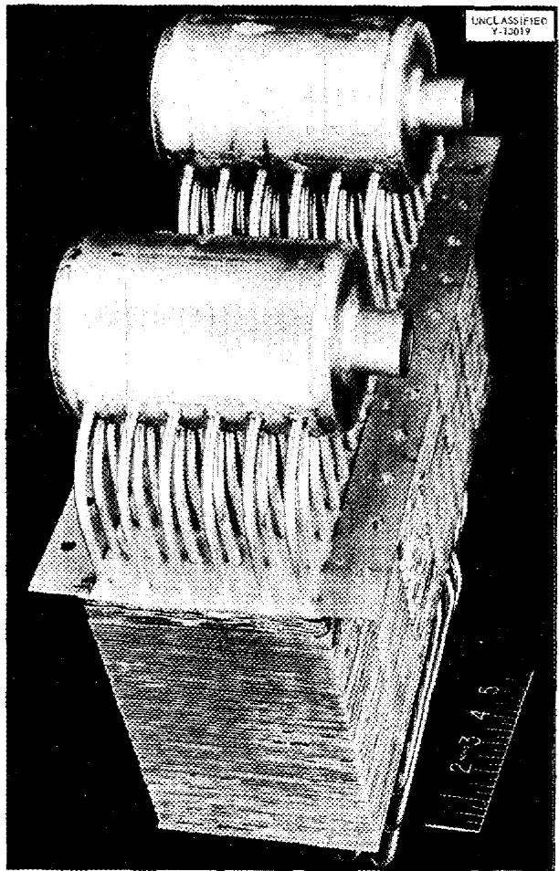  
Fig. 7.12. Completed Sodium-to-Air Radiator Showing Tube-to-Fin Manifold Construction.

many fine lines had been scribed. Upon rebrazing, these fine scratches acted as capillaries and the excess material was removed.

The design of the natural-gas nozzle specified that a regular pattern of interstices should be selectively closed. The closures were obtained by inserting wires into the designated holes and brazing them to the rods.

# SPECIAL MATERIALS FABRICATION RESEARCH

J. H. Coobs H. Inouye Metallurgy Division

Stainless-Steel-Clad Molybdenum and Columbium

Two thermal-convection loops constructed of stainless-steel-clad molybdenum were assembled by

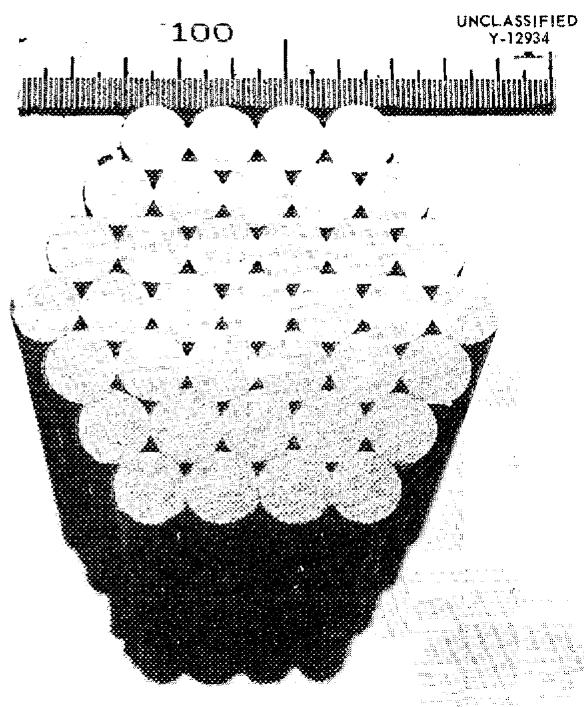  
Fig. 7.13. Brazed Air-Nozzle Blank. Note bonding at the points of tangency of the stainless steel rods.

using threaded molybdenum joints, which were then protected from oxidation by the use of welded cover plates. Both loops failed early in corrosion tests because of fracture of the cover plates and leakage from the joints.

It is believed that overheating of the cover plates occurred while the loops were being initially heated by electrical resistance. Since no metallurgical bond existed between the molybdenum and the cladding, separation became more pronounced with increased temperature, until finally all the current was being carried by the rather thin cover plates,

Future molybdenum thermal-convection loops will be made from arc-melted molybdenum, which is weldable, and the heavy nickel electrodes required for resistance heating will be welded directly to the molybdenum tube instead of to the cladding.

Columbium clad with type 310 stainless steel has been fabricated into a thermal-convection loop by heliarc welding in air. This loop will be tested as soon as the accessory parts are available.

# Inconel-Type Alloys

Eight thermal-convection loops of Inconel-type alloys were fabricated. The compositions and room temperature properties of the alloys are given in Table 7.4. The alloys are being studied as a part of the effort to obtain alloys with better high-temperature corrosion resistance than that of Inconel.

TABLE 7.4. PROPERTIES OF HIGH-PURITY INCONEL-TYPE ALLOYS*  

<table><tr><td>Heat No.</td><td>Nominal Composition (wt %)</td><td>Tensile Strength (psi)</td><td>Yield Point (psi)</td><td>Elongation (%)</td></tr><tr><td>14</td><td>18 Cr, 7 Fe, 75 Ni</td><td>85,000</td><td>41,500</td><td>49</td></tr><tr><td>15</td><td>10 Cr, 15 Fe, 75 Ni</td><td>77,700</td><td>38,800</td><td>44</td></tr><tr><td>16</td><td>5 Cr, 20 Fe, 75 Ni</td><td>72,700</td><td>34,200</td><td>47</td></tr><tr><td>17</td><td>10 Cr, 7 Fe, 83 Ni</td><td>76,000</td><td>36,000</td><td>44</td></tr><tr><td>18</td><td>5 Cr, 10 Fe, 75 Ni, 10 Mo</td><td></td><td></td><td></td></tr></table>

*Data obtained from the Superior Tube Company.

# Nickel-Molybdenum-Base Alloys

The nickel-molybdenum-base alloys are also being studied as part of the effort to obtain alloys with better high-temperature strength and corrosion resistance than are offered by Inconel. These requirements are met by Hastelloy B; however, some difficulties have been encountered in attempts to fabricate this material. In castings and in fusion welds, a whole range of composition results because of severe coring during freezing, and thus the properties of the fabricated specimen vary from one area to another. Even long-time high-temperature aging treatments of such material will not produce an equilibrium structure. The aging treatment also results in a great increase in hardness with a corresponding decrease in ductility. At temperatures between 1200 and $1800^{\circ}\mathrm{F}$ , the wrought material exhibits its poorest ductility because of hot shortness, which can arise from trace impurities or the precipitation of an age-hardening constituent, which is probably the case for Hastelloy B. Thus the temperature range of poorest ductility of Hastelloy B coincides with the temperature range of contemplated use in high-temperature circulating-fuel reactors. Hastelloy B is not recommended for use in air at temperatures above $1400^{\circ}\mathrm{F}$ because of

excessive oxidation. A potential source of trouble exists because of the molybdenum content; molybdenum oxide has been reported to cause catastrophic oxidation of surrounding structures, especially the steels.

The solutions to these problems are being approached in two major ways. First, attempts are being made to find suitable melting and heating treatments of Hastelloy B that will reduce the degree of age hardening so that both the cast and wrought materials will possess acceptable properties in the temperature range of interest. Second, Hastelloy-type alloys are being studied. Both phases of the investigation will involve attempts to extrude seamless tubing, since, at present, Hastelloy B tubing must be made by welding strips. Aging studies of the following materials are now in progress at temperatures between 1200 and $1700^{\circ}\mathrm{F}$ : commercial, wrought, Hastelloy B plate; vacuum-melted Hastelloy B, as cast; cast and wrought $20\%$ Mo-80% Ni alloy; wrought $24\%$ Mo-76% Ni alloy.

Some of the properties of the $20\%$ Mo-80% Ni alloy already obtained indicate that this alloy will be easier to fabricate than Hastelloy B from an extrusion standpoint; sound tubing could be made, whereas none was obtained from Hastelloy B.

The recrystallization temperature of a $60\%$ cold-worked sheet of the $20\%$ Mo- $80\%$ Ni alloy was approximately $1900^{\circ}\mathrm{F}$ for an annealing time of 30 min. However, this alloy oxidizes in air at $1500^{\circ}\mathrm{F}$ at a faster rate than does Hastelloy B, although under a temperature cycle between room temperature and $1500^{\circ}\mathrm{F}$ the oxidation rates are similar. The scale formed spalls near room temperature. A sheet, 0.065 in. thick, could be heliarc welded without producing porosity, but an argon arc produced porosity. In strength tests at $1500^{\circ}\mathrm{F}$ , the $20\%$ Mo- $80\%$ Ni alloy had a rupture life of 90 hr at 8000 psi; when tested at 5000 psi for 600 hr, it had a $3\%$ elongation; during a short-time test the alloy had a tensile strength of 40,000 psi and an elongation of $10\%$ in a 2-in. gage length.

Oxidation and oxidation-protection studies are in progress to find suitable methods of protecting the nickel-molybdenum-base alloys during tests in thermal-convection loops and creep-testing apparatus. This work will be the ground work for further studies of the protection of reactor components. The coatings being studied are those that can be applied by methods readily available, that is, chromium electroplate, chromium plus nickel electroplate, nickel

plus aluminum spray, and aluminum spray. In constant-temperature tests, a chromium electroplate was found to be beneficial. In oxidation tests involving cycling between room temperature and $1500^{\circ}\mathrm{F}$ , these coatings eliminate the spalling characteristics of Hastelloy B. The chromium electroplate and the chromium plus nickel electroplate afford the best protection.

# Duplex Tubing

Attempts have been made to fabricate duplex seamless tubing that will have good corrosion resistance on the inner surface and oxidation resistance on the outer surface. In the first experiments, attempts were made to deep draw duplex blanks 4 in, in diameter. The blanks were made by hot pressing and also by hot rolling. The following materials were combined by hot pressing 0.025-in., thick sheets under an argon atmosphere with $\mathrm{Al}_{2}\mathrm{O}_{3}$ -coated graphite dies at 1500 psi.

<table><tr><td></td><td>Pressing Temperature (°C)</td></tr><tr><td>Copper plus type 310 stainless steel</td><td>1000</td></tr><tr><td>Inconel plus type 310 stainless steel</td><td>1200</td></tr><tr><td>Inconel plus Hastelloy B</td><td>1200</td></tr><tr><td>Hastelloy B plus type 310 stainless steel</td><td>1200</td></tr></table>

Copper was also combined with type 310 stainless steel by hot rolling at $1000^{\circ}\mathrm{C}$ . For this, a three-ply composite with copper in the center and cover plates of the stainless steel was used. One of the cover plates was oxidized at $1100^{\circ}\mathrm{C}$ for $2\mathrm{hr}$ to prevent bonding during rolling.

Included in these experiments were some tests involving the fabrication of composites of molybdenum and Inconel. The purposes of these tests were to determine the conditions necessary to obtain a metallurgical bond by hot rolling, to determine the extent of directional properties due to the molybdenum, and to determine whether such a combination could be deep drawn. The first rolling experiments were made on an evacuated capsule at $1225^{\circ}\mathrm{C}$ with reductions of $10\%$ per pass. The total reduction was $79\%$ in thickness. No bonding was obtained by using nickel as an intermediate layer between the

Inconel and the molybdenum. In a second series of experiments the rolling temperature was reduced to $1000^{\circ}\mathrm{C}$ , with reductions of $40\%$ per pass and a total reduction of $85\%$ in thickness. The lower rolling temperature reduced the tendency for intermetallic compounds to form at the interface. Bonding was achieved by using nickel as the intermediate layer, and evidences of intermetallic compounds were found only by metallographic examination at high magnifications. The final thickness of the composite was 0.010 in. of molybdenum on 0.040 in. of Inconel. In future experiments with this combination, the maximum ratio of molybdenum to Inconel without the directional properties of wrought molybdenum will be determined.

All the composites mentioned above were successfully reduced from 4-in. blanks to $2\frac{1}{2}$ -in. cups by the "Guerin" forming process (male parts of die are hard rubber) at room temperature. Attempts to deep draw the composites are to be made.

# Sigma-Phase Alloys

For the continuing study of sigma-phase alloy corrosion by liquid lead (cf. Sec. 6, "Corrosion Research"), some additional tubing was made. Two ingots of a $48.2\%$ Cr-51.8% Fe alloy and two ingots of a $45\%$ Fe-40% Cr-15% Ni alloy were vacuum cast into $1\frac{1}{2}$ -in.-dia ingots 6 in. long. These ingots were then hot rolled in an air atmosphere at $1250^{\circ}C$ to rod $\frac{5}{8}$ in. in diameter. After annealing at $1100^{\circ}C$ for 2 hr and quenching, the rod was readily machinable into tubing.

The transformation from the ferrite to the sigma phase will be accomplished by aging at $1425^{\circ}\mathrm{F}$ . Two of the tubes (Fe-Cr) were cold swaged $12\%$ so that the effect of cold swaging on the distribution of the sigma phase could be determined.

# Boron Carbide Shielding

The experimental fabrication of $\frac{1}{8}$ -in.-thick shield pieces by warm pressing boron carbide bonded with copper or silver has been discontinued in favor of the fabrication of pieces molded with nonmetallic bonding material by cold pressing followed by sintering to develop the desired properties. Nonmetallic bonding materials that would be suitable from nuclear considerations and would be stable at the expected service temperature include sodium silicate, silica, silicon nitride, and boric oxide. Arrangements are being made to secure samples of these materials for compatibility tests with Inconel under operating conditions.

The density of the proposed shield pieces is to be about 1.8 to $1.9\mathrm{g/cm^3}$ of $\mathsf{B}_4\mathsf{C}$ , equivalent to 1.4 to $1.5\mathrm{g/cm^3}$ of boron. They would be molded in the form of equilateral triangles or diamond shapes, 2 to 3 in. on a side, so as to cover a sphere with an integral number of pieces.

Additional tests of the compatibility of Inconel with pure boron carbide are being made. Previous tests indicated the formation of a diffusion layer 5 mils thick in a 100-hr test at the operating temperature of $1500^{\circ}\mathrm{F}$ .

# Tubular Fuel Elements

Twelve tubular fuel elements are being prepared for further drawing experiments at Superior Tube Company. They are being assembled with high-fired $\mathsf{UO}_2$ in the 30- to $55 - \mu$ particle size range, as well as with very fine $\mathsf{UO}_2$ , and with prealloyed and elemental stainless steel and iron core matrixes.

Plans are also being made to try hot swaging of the tubes in an attempt to reduce stringer formation in the cores by reducing the amount of cold working. Hot swaging on a mandrel may prove to be successful if bonding to the mandrel can be prevented by an oxide scale or coating.

# METALLOGRAPHIC EXAMINATION OF A FLUORIDE-TO-SODIUM HEAT EXCHANGER

R. J. Gray P. Patriarca G. M. Slaughter Metallurgy Division

The fluoride-to-sodium intermediate heat exchanger, which in a life test failed after 1680 hr in cyclic service in the temperature range 1080 to $1500^{\circ}\mathrm{F}$ , was examined metallographically. All the tube-to-header joints were manually heliarc welded, and tests showed the heat exchanger to be helium leak-tight before assembly into the test rig.

Visual examination indicated the presence of 19 fissures in the tube-to-header welds in two of the three adjacent headers at the hot sodium inlet end. The probable progressive propagation of these fissures is shown in Figs. 7.14, 7.15, and 7.16. The fissure shown in Fig. 7.16 probably extends to the surface of the weld. If so, there was a leak in the system at this point. It seems likely that differential thermal expansion between the tubes and the casing caused stress concentrations at the roots of the tube-to-header welds. These stress concentrations would tend to propagate cracks through the welds in the course of thermal cycling,

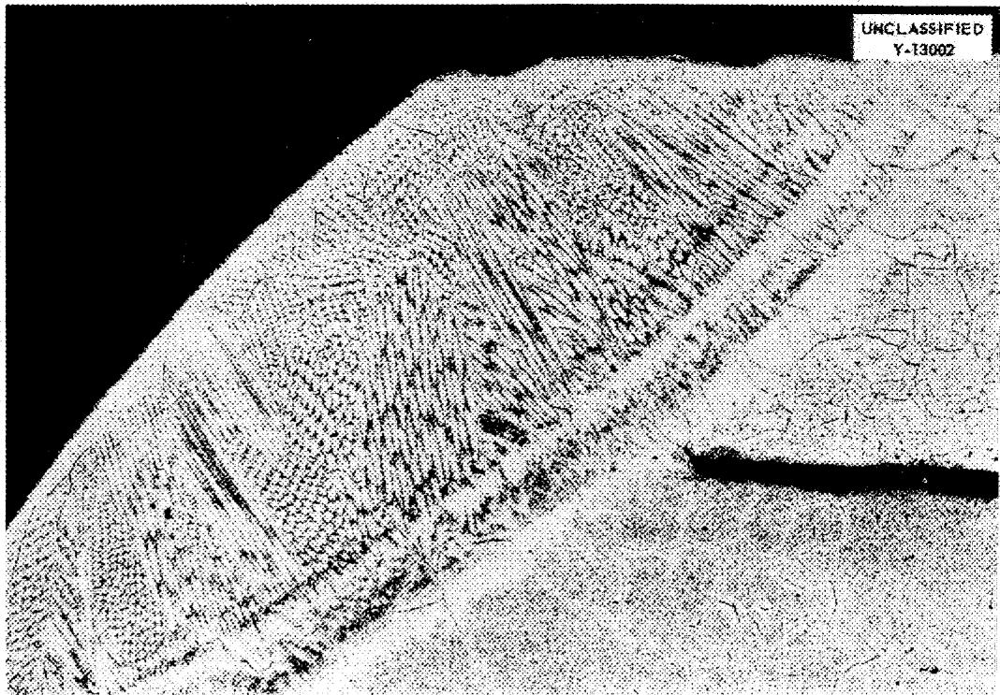

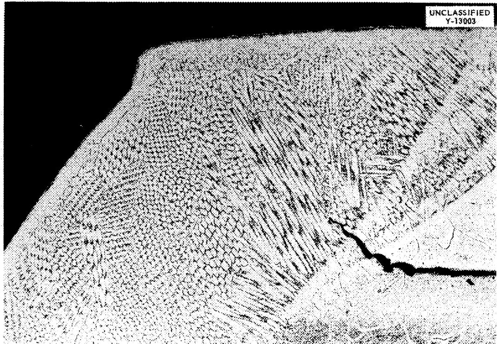  
Fig. 7.14. Tube-to-Header Joint Without Crack Extending into the Weld. Etched. 100X. Reduced $16\%$ .   
Fig. 7.15. Tube-to-Header Joint with a Slight Crack Extending into the Weld. Etched, 100X. Reduced $16\%$ .

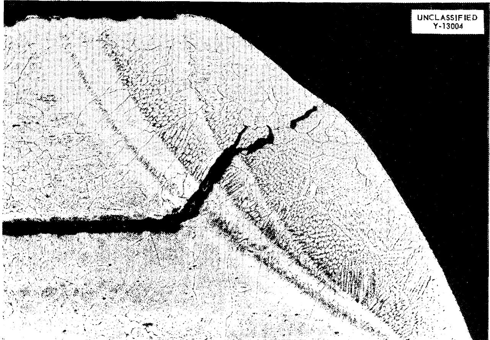  
Fig. 7.16. Tube-to-Header Joint Showing Severe Cracking. Etched. 100X.

particularly since the columnar dendrites, which are typical of a weld structure, are aligned in such a way as to aid parallel fractures.

This investigation emphasizes the extreme desirability of using back-brazing as a means for minimizing the notch effect and for reducing the possibilities of leaks developing in the system.

Corrosion tests in static sodium and in fluoride mixtures indicate that a $67\%$ Ni- $13\%$ Ge- $11\%$ Cr- $6\%$ Si- $2\%$ Fe- $1\%$ Mn alloy may be useful for this application. This alloy, which flows well at $2050^{\circ}\mathrm{F}$ , was found to be virtually unattacked in the fluoride fuel and corroded to a maximum of 4 mils in 100 hr at $1500^{\circ}\mathrm{F}$ in sodium.

# 8. HEAT TRANSFER AND PHYSICAL PROPERTIES

# H. F. Poppendiek   Reactor Experimental Engineering Division

The enthalpies and heat capacities of NaF-ZrF $_4$ -UF $_4$ (65-15-20 mole %) were determined; the heat capacity in the solid state over the temperature range 90 to $614^{\circ}\mathrm{C}$ was found to be 0.17 cal/g. $^{\circ}\mathrm{C}$ , and the heat capacity in the liquid state over the temperature range 653 to $924^{\circ}\mathrm{C}$ was found to be 0.20 cal/g. $^{\circ}\mathrm{C}$ . The enthalpies and heat capacities of LiF-NaF-UF $_4$ (57.6-38.4-4.0 mole %) were also obtained; the heat capacity in the solid state over the temperature range 97 to $594^{\circ}\mathrm{C}$ was found to be 0.23 cal/g. $^{\circ}\mathrm{C}$ , and in the liquid state over the range 655 to $916^{\circ}\mathrm{C}$ it was found to be 0.53 cal/g. $^{\circ}\mathrm{C}$ . The thermal conductivities of three fluoride mixtures in the solid state at normal temperatures were determined. The conductivity of NaF-KF-UF $_4$ (46.5-26.0-27.5 mole %) was 0.7 Btu/hr. $ft^2$ ( $^\circ F/ft$ ), that for KF-LiF-NaF-UF $_4$ (43.5-44.5-10.9-1.1 mole %) was 2.0 Btu/hr. $ft^2$ ( $^\circ F/ft$ ), and that for LiF-KF-UF $_4$ (48.0-48.0-4.0 mole %) was 1.4 Btu/hr. $ft^2$ ( $^\circ F/ft$ ). A new electrical conductivity device has been constructed and has been successfully checked with molten salts of known conductivity.

Additional forced-convection heat transfer measurements of molten NaF-KF-LiF (11.5-42.0-46.5 mole %) have been made. Measured thermal conductivities and thicknesses of insoluble deposits on the inner walls of Inconel heat transfer tubes made it possible to calculate the thermal resistance of the deposit. The calculated value was in good agreement with values previously deduced from the heat transfer measurements. A device for studying the rates of growth of tube-wall deposits has been successfully tested with a simple heat transfer salt. A hydrodynamic flow system to be used for studying the reflector-moderated reactor flow structure has been tested. A mathematical study of the temperature structure in converging and diverging channel systems that duct fluids with volume heat sources has been made. A study of wall-cooling requirements in circulating-fuel reactors was made.

# PHYSICAL PROPERTIES MEASUREMENTS

Heat Capacity

W. D. Powers

Reactor Experimental Engineering Division

The enthalpies and heat capacities of two fluoride mixtures have been determined with Bunsen ice calorimeters:

$$
\mathrm{NaF - ZrF}_{4} - \mathrm{UF}_{4}(65 - 15 - 20\text{ mole}\%)
$$

Solid (90 to $614^{\circ}C$

$$
\begin{array}{l} H _ {T} - H _ {0 ^ {\circ} C} = - 3 + 0. 1 7 T \\ C _ {p} = 0. 1 7 \pm 0. 0 1 \\ \end{array}
$$

Liquid (653 to $924^{\circ}C$

$$
\begin{array}{l} H _ {T} - H _ {0 ^ {\circ} C} = 2 2 + 0. 2 0 T \\ C _ {p} = 0. 2 0 \pm 0. 0 2 \\ \end{array}
$$

$$
\mathrm {LiF - NaF - U F _ {4} (57.6 - 38.4 - 4.0 m o l e \%)}
$$

Solid (97 to $594^{\circ}C$

$$
\begin{array}{l} H _ {T} - H _ {0 ^ {\circ} C} = 0. 2 2 (7) T + 0. 0 0 0 1 7 T ^ {2} \\ C _ {p} = 0. 2 2 (7) + 0. 0 0 0 3 3 T \\ \end{array}
$$

Liquid (655 to $916^{\circ}\mathrm{C}$ )

$$
\begin{array}{l} H _ {T} - H _ {0 ^ {\circ} C} = - 6 8 + 0. 5 3 T \\ C _ {p} = 0. 5 3 \pm 0. 0 4 \\ \end{array}
$$

In these expressions $H$ is the enthalpy in cal/g, $C_p$ is the heat capacity in cal/g. $^\circ C$ , and $T$ is the temperature in $^\circ C$ . The experimental enthalpy data for LiF-NaF-UF₄ (57.6-38.4-4.0 mole %) are plotted in Fig. 8.1.

Automatic Simplytrol units have been added to the calorimeter systems to more accurately control the furnace temperatures. This modification has increased the precision of the experimental data. Currently, enthalpies of a fluoride mixture are being measured with the copper block calorimeter.

# Density and Viscosity

S. I. Cohen

Reactor Experimental Engineering Division

Preliminary density measurements were made on rubidium metal, and the density was found to be represented by the equation

$$
\rho (g / c m ^ {3}) = 1. 5 2 - 0. 0 0 0 5 4 (T - 3 9 ^ {\circ} C),
$$

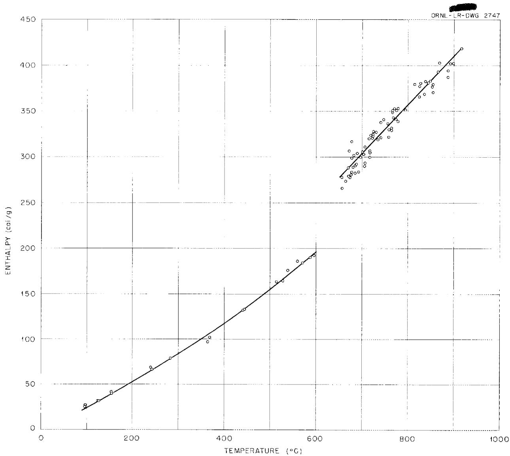  
Fig. 8.1. Enthalpy vs Temperature for LiF-NaF-UF $_4$ (57.6-38.4-4.0 mole %).

where $T$ is the liquid temperature in ${}^{\circ}\mathsf{C}$ . Measurements were made by the buoyancy principle. A calculated value for the liquid density at the melting point, given in the Liquid Metals Handbook, falls within $3\%$ of the value yielded by this study.

This experiment was carried out at the request of the ORSORT group currently studying the use of rubidium vapor in an aircraft reactor cycle. Measurements were made on a sample of metal

produced by the Stable Isotope Research and Production Division by reduction of a high quality fluoride which was prepared by the ORSORT group from RbF furnished by the Materials Chemistry Division.

In order to obtain more accurate viscosity data it was decided to initiate a program of refining viscometry techniques. In particular, the influence of fluid density on calibrations of both the rotational and the capillary devices is being studied. Easily handled fused salts are being used as calibrating fluids. The present studies indicate that some of the old calibration curves, which were

based on low-density calibrating liquids, were shifted by about $30\%$ . This means that some of the previously reported viscosity measurements are about $30\%$ high.

Because of significant improvements made in fluoride preparation and handling, the mixtures which are now being obtained from the Materials Chemistry Division are extremely pure, and they no longer cause the difficulties encountered in the early stages of the project, such as fouling of equipment and variations in physical characteristics. No doubt some of the earlier viscosity measurements were high because of the impurities in the materials.

# Thermal Conductivity

# W.D.Powers

Reactor Experimental Engineering Division

The thermal conductivities of three solid fluoride mixtures at normal temperatures were determined by the transient cooling technique:

<table><tr><td></td><td>Thermal Conductivity [Btu/hr·ft2(°F/ft)]</td></tr><tr><td>NaF-KF-UF4(mole %)</td><td>0.7</td></tr><tr><td>KF-LiF-NaF-UF4(43.5-44.5-10.9-1.1 mole %)</td><td>2.0</td></tr><tr><td>LiF-KF-UF4(48.0-48.0-4.0 mle %)</td><td>1.4</td></tr></table>

The thermal conductivity of solid LiF-KF-UF $_4$ (48.0-48.0-4.0 mole %) was measured by the steady-state flat-plate technique; a value of 1.5 Btu/hr.ft $^2$ ( $^\circ F/\text{ft}$ ) was obtained. The ratios of corresponding liquid to solid thermal conductivity measurements for the fluoride mixtures studied to date are near unity.

# Electrical Conductivity

# N. D. Greene

Reactor Experimental Engineering Division

The experimental current-potential conductivity cell has been successfully tested and standardized. The electrical conductivity of a $\mathsf{KNO}_3$ melt was determined to within a few per cent of the values reported in the literature.

As predicted, the effects of polarization within this cell were greatly reduced by the use of the alternate method. This reduction in the effect

of polarization was further substantiated by the small observable increase of conductivity with frequency in contrast to the usual large dependence of conductivity upon frequency, as observed in the low-resistance conductivity cell. The measurements on $\mathsf{KNO}_3$ were obtained during a single run without the necessity of having to replatinize the electrodes after each determination. A refinement of this current-potential cell which will permit measurements of greater accuracy is now under way.

Preliminary measurements of several fluorides, the conductivities of which were determined previously by an alternate method, were found to be in good agreement within the inherent limitations of accuracy. A summary of the preliminary measurements of the conductivities of KF-LiF-NaF-UF $_4$ (43.5-44.5-10.9-1.1 mole %), NaF-ZrF $_4$ -UF $_4$ (50.0-46.0-4.0 mole %), and NaF-ZrF $_4$ -UF $_4$ (53.5-40.0-6.5 mole %), as well as the measurements of several other salts, has been compiled in a separate report. $^4$

# Vapor Pressure

# R.E.Moore

# Materials Chemistry Division

Vapor pressure measurements on the mixture NaF-ZrF4 (25-75 mole %), which were begun last quarter, have now been completed. The method and apparatus, originally described by Rodebush and Dixon, were discussed in previous reports. The data, given in Table 8.1, can be represented by the equation

$$
\log_ {1 0} P (\mathrm {m m H g}) = - \frac {9 3 6 8}{T (^ {\circ} K)} + 1 0. 5 7,
$$

from which the calculated pressures and the heat of vaporization (43 kcal/mole) were obtained. The approximate liquidus temperature, obtained from

TABLE 8.1. VAPOR PRESSURE IN NaF-ZrF4 (25-75 mole %) SYSTEM   

<table><tr><td>Temperature (℃)</td><td>Observed Pressure (mm Hg)</td><td>Calculated Pressure (mm Hg)</td></tr><tr><td>754</td><td>29</td><td>28</td></tr><tr><td>769</td><td>37</td><td>38</td></tr><tr><td>776</td><td>44</td><td>44</td></tr><tr><td>786</td><td>54</td><td>54</td></tr><tr><td>796</td><td>66</td><td>65</td></tr><tr><td>805</td><td>74</td><td>76</td></tr><tr><td>811</td><td>83</td><td>83</td></tr><tr><td>828</td><td>115</td><td>115</td></tr><tr><td>844</td><td>152</td><td>155</td></tr></table>

the intersection of the vapor pressure curve with that of pure $\mathsf{ZrF}_4$ is about $760^{\circ}\mathsf{C}$

# FUSED-SALT HEAT TRANSFER

# H.W.Hoffman

Reactor Experimental Engineering Division

Additional data for NaF-KF-LiF (11.5-42.0-46.5 mole %) flowing for short-time periods in an electrically heated type 316 stainless steel tube have been analyzed. The results are in agreement with the general turbulent flow correlations for ordinary fluids.

The thermal conductivity of $\mathsf{K}_3\mathsf{CrF}_6$ was found to be 0.13 Btu/hr·ft² (°F/ft)⁹ in the temperature range 100 to 200°F. Measurements from a photomicrograph, Fig. 8.2, of a section of the tube used in the Inconel experiment show a film thickness of about 0.4 mil. The thermal resistance calculated from these results, 0.00025 hr·ft²·°F/Btu, is in agreement with the measured thermal resistance obtained from the heat transfer experiments in the Inconel system.

The forced-convection apparatus,10 which is to be used for studying the rate of growth of wall deposits, as well as for heat transfer measurements of fused fluoride mixtures, has been operated successfully for more than 100 hr with the heat

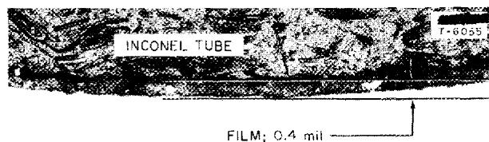  
Fig. 8.2. Inconel Tube with Film Deposit of $\mathsf{K}_3\mathsf{CrF}_6$

transfer salt $\mathrm{NaNO}_2\mathrm{-NaNO}_3\mathrm{-KNO}_3$ (40-7-53 wt %) as the circulated fluid. The system is now being modified so that resistance-heated, as well as externally heated, test sections can be inserted in the system. With resistance-heated sections, larger axial fluid temperature rises can be attained. It is planned to study next a zirconium-uranium fluoride salt mixture in Inconel.

# TRANSIENT BOILING RESEARCH

# M.W.Rosenthal

Reactor Experimental Engineering Division

A study of the heat transfer phenomena which occur when a water-cooled and -moderated solidfuel-element reactor suddenly becomes supercritical has been undertaken. The time required for generation of steam in water which is initially below the boiling point will be determined. The effects of water temperature, rate of power increase, air concentration, and surface condition will be investigated.

Construction of the equipment for generation of power surges by electrical means in aluminum filaments has been completed, and the entire experimental apparatus has been assembled and tested. Satisfactory operation has been achieved. The transient-power generator consists of 100 thyatronns connected in parallel. A different bias can be put on the grid of each thyatron, and the system can be set so that a signal of increasing voltage applied simultaneously to all tubes fires them in a sequence that approximates the desired function. A peak current of about 500 amp can be produced, with the duration of the power surge ranging from 30 to 500 msec.

The instantaneous values of voltage drop across the test filament and current through it are recorded by a fast-response Hathaway oscillograph. A Fastax high-speed motion picture camera is

used to photograph the event, and illumination is supplied by an Edgerton stroboscopic flash unit synchronized with the camera. A repetition rate of 6000 frames per second is obtainable with a flash duration of $2\mu \mathrm{sec}$ . Closing a single switch initiates the operation of all the equipment; a time delay is provided in which the camera can accelerate to full speed before current is passed through the filament.

# FLUID FLOW STUDIES FOR CIRCULATING-FUEL REACTORS

J.O.Bradfute L.D.Palmer F.E.Lynch

Reactor Experimental Engineering Division

The flow system for the hydrodynamic studies of the reflector-moderated reactor core, shown schematically in Fig. 8.3, has been fabricated, assembled, and tested. A detailed sketch of the test section is also shown in Fig. 8.3. Since it will be necessary to insert, photograph, and then remove a coordinate grid from time to time, the system was designed so that it could be readily assembled and disassembled. The cores are positioned and supported by a brass sleeve, which was attached to the test section support along its center line before it was machined. The sleeve was carefully bored and lapped so that the shafts protruding downward from the cores would fit with minimum clearance and yet loosely enough so that they could be removed by hand. The upper surface of the test section support flange was machined perpendicular to the center line of the brass sleeve. This arrangement permits accurate alignment of the core within the Plexiglas test section without supporting members in or ahead of the test region. Attempts are currently being made to obtain some preliminary fluid flow information for the reflector-moderated reactor core for the straight entrance condition shown in Fig. 8.3 by photographing particle flow through the Plexiglas test section.

The phosphorescent flow-visualization system, which was described previously,[11] has been further modified. The ZnCd sulfide phosphor has been replaced by a ZnS (Cu-activated) phosphor whose luminosity was found to be greater after excitation. The duct work in the flow circuit has been im

proved so that higher Reynolds numbers are now attainable, and a diverging Lucite channel has been constructed. Some of the flow features, such as asymmetry, flow separation, and the effect of entrance lengths, are to be observed for different entrance configurations in such channel systems. The phosphorescent flow-visualization method is also to be used in the reflector-moderated reactor core experiment.

# HEAT TRANSFER STUDIES FOR CIRCULATING-FUEL REACTORS

H.F.Poppendiek L.D.Palmer

Reactor Experimental Engineering Division

The classical hydrodynamics study, conducted by Nikuradse, $^{12}$ of converging and diverging channels was reviewed. It is felt that some of the fundamental flow features observed in converging and diverging channel systems will also exist in the reflector-moderated reactor. The results obtained by Nikuradse indicate that for the case of turbulent flow in convergent channels the flow becomes more stable or less turbulent in nature and that the eddy diffusivities are significantly lower than in a parallel-plate channel system. For the case of turbulent, symmetrical flow in diverging channels the flow is found to be more turbulent than in the parallel-plate system. When the total channel angle of a divergent system is increased beyond 8 deg, asymmetrical flow results. For a 10-deg angle, a thin, low-velocity layer of fluid flowing in a reverse direction to the main stream is noted near one of the channel walls. This separation phenomenon becomes more pronounced at larger channel angles.

Some radial temperature distributions were calculated in the established-flow region of a few converging and diverging flow channel systems containing volume heat sources within the ducted fluid. The experimental velocity and eddy diffusivity data obtained by Nikuradse were used in the analyses. The results indicated that wall-fluid temperature differences can be significantly higher in converging flow channels than in parallel-plate systems; the converse is true for symmetrical diverging flow channels. Asymmetrical divergent flow passages are difficult to analyze at this time because the diffusivity structure is not known.

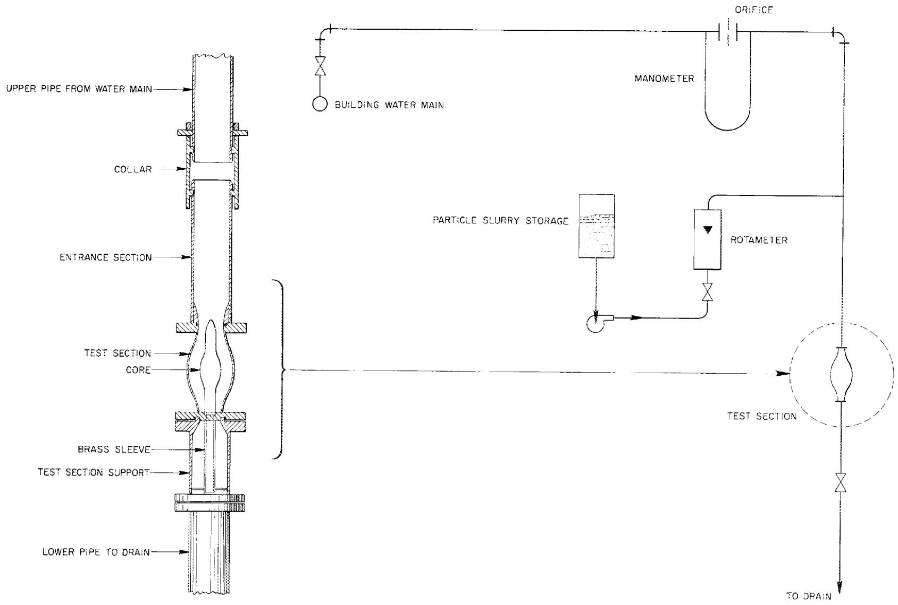  
Fig. 8.3. Flow System for Hydrodynamic Study of Reflector-Moderated Reactor Core.

However, it appears reasonable to conclude that high temperatures probably would exist in the thin, low-velocity layer of fluid in the 10-deg divergent channel because the flow there is probably laminar in nature.

A report is being prepared which will be useful to designers for predicting wall-cooling requirements in circulating-fuel reactors which have pipe, parallel-plate, or annular fuel-duct geometries. The temperature solutions, which were presented previously,[13,14] have been tabulated in detail so

that the superposition process outlined in those reports can be quickly effected. Cooling requirements and resulting fluid temperature distributions have been determined for typical circulating-fuel reactor systems.

13H. F. Poppendiek and L. D. Palmer, Forced Convection Heat Transfer in Pipes with Volume Heat Sources Within the Fluids, ORNL-1395 (Nov. 5, 1953).   
14H. F. Poppendiek and L. D. Palmer, Forced Convection Heat Transfer Between Parallel Plates and in Annuli with Volume Heat Sources Within the Fluids, ORNL-1701 (May 11, 1954).

# 9. RADIATION DAMAGE

J.B.Trice

Solid State Division

A.J.Miller

ANP Project

Additional irradiations of Inconel capsules containing fluoride fuels were carried out in the MTR. Only one capsule containing a UF $_3$ -bearing fuel has been examined, and it shows no corrosion. This is in contrast to the capsules containing UF $_4$ -bearing fuel in which minor increases in penetration have at times been observed in the irradiated specimens as compared with the out-of-pile controls. However, it should be emphasized that even in the UF $_4$ -bearing capsules, the appearance of small deviations from the controls could be due to experimental difficulties.

Inspection of the previously described LITR in-pile circulating-fuel loop, which failed prior to the startup, disclosed that the failure was caused by a break in the weld connecting the pump discharge nipple to the fuel line. Design revisions and refabrication of some components are in progress. Developmental work continued on a smaller loop for operation in an LITR A-piece. Work on a loop for insertion in the MTR is described in Sec. 3, "Experimental Reactor Engineering."

Development of equipment continued for in-pile stress-corrosion tests on Inconel in contact with fluoride mixtures, and testing of the MTR tensile creep rig neared completion. Detailed examination was completed of an Inconel loop in which sodium was circulated at high temperature in the ORNL Graphite Reactor, and no evidence of radiation-induced corrosion was found in the Inconel.

Metallographic examinations were carried out in the hot cells on irradiated fuel plates for the Pratt & Whitney Aircraft Division, and studies were made on annealing-out of fission-fragment damage. Work continued on examination of wire and multiple-plate type units for GE-ANP.

# MTR STATIC CORROSION TESTS

W.E.Browning G.W.Keilholtz Solid State Division

A new series of capsules was irradiated in the MTR to compare NaF-ZrF4 fuels containing UF3 with those containing UF4. The property to be compared is the effect of fission on static cor

rosion of Inconel by the fuels at $1500^{\circ}F$ . The series includes five capsules containing 1.79 mole $\%$ UF₃, 49.3 mole $\%$ ZrF₄, and 48.9 mole $\%$ NaF and five capsules containing 1.74 mole $\%$ UF₄, 48.2 mole $\%$ ZrF₄, and 50.1 mole $\%$ NaF. Analyses are being run to confirm the purity of the UF₃ with respect to UF₄ contamination. For every capsule, there will be an out-of-pile control capsule. Each fuel generates $1100~\mathrm{w/cm}^3$ in the A-38 position in the MTR.

Six capsules have been irradiated for the specified two-week period. Five have been received at ORNL after irradiation; three of them have been opened and two have been examined -- one containing $\mathsf{UF}_3$ and one containing $\mathsf{UF}_4$ . Both capsules had been irradiated with the metal-liquid interface at $1500 \pm 50^{\circ}\mathsf{F}$ . The $\mathsf{UF}_3$ -bearing capsule had experienced one temperature excursion to $1660 \pm 50^{\circ}\mathsf{F}$ for less than 30 sec, but the temperature of the $\mathsf{UF}_4$ -bearing capsule never exceeded $1550 \pm 50^{\circ}\mathsf{F}$ . The fuel in each capsule was frozen two or three times during its history. No evidence of corrosion or film could be seen in the $\mathsf{UF}_3$ -bearing Inconel capsule. There was subsurface void formation in the $\mathsf{UF}_4$ -bearing Inconel capsule to a depth of about 2 mils. No intergranular corrosion or concentration of voids at the grain boundaries was evident.

Analytical samples of the irradiated fuel were taken with two sizes of drills. The uranium concentrations in the central and outer samples were identical, within experimental error $(\pm 3\%)$ , and were of the value expected after burnup correction. Analyses for iron, chromium, and nickel gave the following results: Fe, 0.03 to 0.14 wt%; Ni, 0.01 to 0.05 wt%; Cr, less than $10^{-4}$ wt%. There were no significant differences in the final iron, nickel, and chromium compositions between the two capsules. Analyses of the unirradiated fuels have not been completed.

It would be unwise to draw conclusions on the basis of only one pair of samples; however, if these first results are confirmed in future capsules, $\mathsf{U}\mathsf{F}_3$ fuels may be considered quite desirable as far as radiation-induced corrosion is concerned.

Two $\mathsf{UF}_3$ -bearing capsules and two $\mathsf{UF}_4$ -bearing capsules in this series will be irradiated for six weeks each to amplify the apparent differences in the effects of $\mathsf{UF}_3$ and $\mathsf{UF}_4$ on Inconel. It is interesting to note that the $\mathsf{UF}_4$ capsule in this series is the first one run in the MTR and the first one run at $800\mathrm{~w/cm}^3$ or greater that has not shown a tendency toward intergranular corrosion. Whether the difference between earlier $\mathsf{UF}_4$ -bearing capsules and the one in this series is due to improved temperature control or to uranium concentration effects will be determined by additional irradiations.

# FISSION PRODUCT CORROSION STUDY

C.C.Webster G.W.Keilholtz

Solid State Division

Steps are being taken to perform corrosion tests out-of-pile with irradiated fuel in order to separately study the effects on Inconel of fission-product concentration and of Inconel irradiation.

A water-cooled facility for irradiation of solid fuel was constructed and has been installed in position C-46 of the LITR. The unperturbed thermal flux is on the order of $4 \times 10^{13}$ . An Inconel tube has been constructed for casting solid bars of fuel 1 in. long and 0.1 in. in diameter. The solid bars of fuel will be transferred to Inconel capsules for irradiation. The capsule has been constructed so that it can be welded shut without the bars being melted and can be reopened in the hot cell for transfer of the fuel to the corrosion test capsule.

Upon completion of an out-of-pile heating cycle, the test capsule will be opened in the hot cell. The fuel will be drilled out and divided into three samples: a portion for petrographic study to detect any oxidation or reduction, a portion for mass spectrographic study to determine burnup, and a portion for chemical analysis of the fuel. The capsule will be slit on the remote slitting machine described below for a metallographic study. At least two concentric samples can be taken from a capsule of this size by remote means.

# FACILITIES FOR HANDLING IRRADIATED

# CAPSULES

C.C.Webster G.W.Keilholtz

Solid State Division

It was observed metallographically, in some cases, that when several transverse sections were taken from a single fluoride fuel corrosion

capsule the corrosion pattern was not consistent over the length of the capsule but appeared to be a function of the longitudinal temperature gradient. One method of obtaining a longitudinal section would be to grind away half of the capsule on the milling machine. However, by such a method it would be difficult to ascertain that a section through the diameter of the capsule had been made. Also, the milling operation would create a serious contamination problem.

The method being used consists in passing the capsule longitudinally by a 10-mil-thick silicon carbide fine-grit wheel and thus slitting the capsule down the center. The capsule is clamped into a vise and then fed into the wheel by means of a mechanical linkage which is to be replaced by a variable-speed motor and a contact cutoff switch. When the capsule is put into the gripping adapter in the vise, it is automatically aligned so that the wheel will cut in the plane of a diameter through the capsule. By making different gripping adapters, various sizes of tube can be slit lengthwise. Thus far the apparatus has been used on only MTR-type fluoride fuel capsules (0.100-in.-ID and 0.200-in.-OD); it has worked very satisfactorily.

Since the abrasive wheel has a rubber base, it must be kept cool. The area around the cut must also be kept cool to prevent any high thermal stresses from affecting the corrosion results. The wheel and specimen are over a tray and are covered with a splash shield so that a liquid coolant can be used. The coolant level is always kept above the bottom edge of the abrasive wheel so that by cutting upward into the specimen the coolant is carried into the cut; therefore the specimen need not be in the coolant. Carbon tetrachloride is used as the coolant because it does not react with the fluoride fuel at high temperatures. It is forced into the tray from outside the hot cell through Tygon tubing by air pressure. The tray and splash shield are attached to the mount for the vise and they move with the specimen.

Once installed within the hot cell, the remotely operated tube-slitting machine can be used with ease in cutting longitudinal sections from various sizes of tubing. Thicker abrasive wheels can be used for heavier walled tubing. The advantages of this method of cutting are that it permits visual observation of the amount of fuel left on the tube walls, it permits observation of constrictions without the necessity of removing or disturbing the

material causing the trouble, it gives a well-exposed surface for chemically removing the last traces of fuel, it permits a cut to be made through the bottom plug of the capsule so that an examination can be made for crevice corrosion, and it leaves nearly one half of the capsule for further and more complete study, if desired. After the fuel is removed chemically without attacking the metal wall, the specimen can be electroplated so that the fuel-metal interface will not be rounded during the metallographic polishing operation.

The stability of the fluoride fuel under irradiation and the extent of the corrosion of the container by the fuel are determined, in part, by analyzing samples of the irradiated fuel for the concentration of the original components and for the major constituents of the container material. The fuel samples are put into solution within the master-slave hot cells and are then transferred to the Analytical Chemistry Division for analysis. Work on the necessary transfer shields has been coordinated with the design and construction of the lead barrier being provided in the analytical chemistry hot cells to improve transfer conditions and to reduce personnel exposure.

Two transfer carriers weighing 150 lb each and giving 2 in. of lead shielding have been constructed and are now in use. Each carrier holds four 30-ml bottles that are held in place by spring clamps. A motor-driven decapper for removing the bottle cap and a remotely controlled pipet that can be lowered into the bottle are provided. The bottles may be inserted into the carrier within the cells and can be left in the carrier during all sample removal operations. The whole unit may then be returned to the hot cells for reuse.

Two lead storage units weighing 450 lb each and giving 3 in. of lead shielding were also built and are available for use when all the transfer carriers are in use. The lead storage units have a capacity of four 50-ml volumetric flasks and can be loaded within the master-slave cells.

# ANALYSIS OF IRRADIATED FLUORIDE FUELS FOR URANIUM

M. T. Robinson G.W. Keilholtz Solid State Division

One of the regular steps in in-pile static corrosion testing of fluoride fuels has been the analysis of the irradiated fuel for uranium. However, there are several major problems connected with

sampling operations, described previously, $^{1,2}$ which have never been fully resolved. In the cutting and drilling operations it is possible for small chips of metal, either from the capsule or the drill, to get into the fuel sample. To minimize this possibility, drills used recently have been carefully honed to remove burrs. A search is also being conducted for new drill materials. In the early use of the present sampling technique, $^{1}$ it was possible for dirt from the hot cells to inadvertently enter the fuel samples during cutting and drilling. This possibility has been minimized in the newer equipment. $^{2}$ The transfer operations, in several of which the salt is exposed to contamination from hot cell dirt, pieces of rubber from manipulator grips, and the like, are all possible sources of contamination. The observation of opaque material, in some cases in large amounts, during petrographic examination of irradiated fuel samples $^{3}$ indicates that at one or the other of the stages discussed above foreign material may have been introduced into some of the samples. Such contaminants make the resulting uranium analyses "low."

The samples obtained for chemical analysis have, at times, been very small, often being as small as $10\mathrm{mg}$ . They are weighed in tared weighing bottles on a conventional chain-type analytical balance, and, since they are so small, the precision of weighing is about $\pm 4\%$ instead of the usual negligible amount. This lack of precision results in an abnormally high uncertainty in the uranium analyses. After being weighed, the samples are dissolved and the solutions are made up to volume in the hot cells. The resulting solutions often contain as little as $500~\mathrm{ppm}$ of uranium. Such high dilution is undesirable, since the titer may change appreciably on long standing. It seems reasonable to conclude that the uncertainty in uranium analyses may be as high as $\pm 5\%$ or more, even for the usually precise $(\pm 2\%)$ potentiometric titration. An increase of ten times in sample size (easily attainable) would restore this technique to its normal precision.

Similar remarks apply, in part, to the mass spectrographic analysis. The samples taken are weighed by the analysts on a microbalance to alleviate the effect of small sample size. However, the handling of the very small crucibles in the hot cells is not so delicate an operation as might be desired. The possibilities of contamination entering the sample are high.

No highly useful conclusions have emerged from much of the analytical work done in the past, probably because of the difficulties described above. Recently, however, marked improvement has been made as a result of continued efforts to improve sampling techniques, sample sizes, and handling procedures, and uranium analyses have been carried out in a satisfactory manner. Since the analytical results obtained recently show that no measurable segregation of uranium takes place, the procedure of taking more than one sample from each capsule will be abandoned. This will allow very much larger samples to be obtained, will make the analyses more sure, and will minimize the effects of foreign additions to the salt.

# HIGH-TEMPERATURE CHECK VALVE TESTS

W.R.Willis G.W.Keilholtz Solid State Division

As part of the development program for a small in-pile pump loop for operation in a beryllium A-piece in the LITR, an attempt was made to develop a high-temperature check-valve pump. Such a pump has the advantage of being a compact, completely sealed unit.

A test rig was run with Inconel, stainless steel, and Stellar 25 check balls. None of these materials gave successful tests. Time of operation before failure varied from 30 min for the Inconel to 2 hr for the stainless steel. Except with the stainless steel balls, operation of the valves was not continuous; they would occasionally stick in both open and closed positions. When failure occurred, it was abrupt, and therefore sticking of the valves was indicated rather than a gradual stoppage of the system.

# MINIATURE IN-PILE LOOP - BENCH TEST

J.G.Morgan G.W.Keilholtz Solid State Division

An exploded view of the in-pile pump described previously4 is shown in Fig. 9.1. The RPM meter coil measures the rotation of the shaft on which

is mounted the motor armature. The Graphitar bearing is mounted in the bearing casing above the impeller housing. The assembled loop is shown in Fig. 9.2. The pump contains an extra reservoir to enable metered volumes of salt to be pumped into the surge tank for calibrating the venturi. The furnace for heating the pump and reservoir is also shown. From performance tests with this setup, pump speed vs head and pump speed vs flow have been determined. At 5000 rpm the flow was 4 fps, corresponding to a Reynolds number of 3000 in a 200-mil tube. At the 540 w/cm³ generated in-pile, the temperature differential is expected to be about 100°F.

# LIFE TESTS ON AN RPM METER, BEARINGS, AND A SMALL ELECTRIC MOTOR UNDER IRRADIATION

J.G.Morgan H.E.Robertson G.W. Keilholtz Solid State Division

Tests were conducted on an RPM meter, bearings, and a small electric motor as a part of the development of a loop for insertion in an LITR A-piece. In order to drive the pump, it is desirable to use a variable-speed electric motor and to align the shaft with lubricated bearings. Also, a record of shaft speed would be desirable. The entire motor assembly will be just above the upper grid guide in the LITR and in an estimated thermal flux of $5 \times 10^{11}$ neutrons/cm²·sec. Hole 53 of the ORNL Graphite Reactor provided a comparable flux intensity and was used for these tests.

The in-pile apparatus, with a single lower bearing as in the second test, is shown in Fig. 9.3. A motor was mounted in a horizontal position with upper and lower armature shaft bearings. In the first test two lower bearings were used. The motor and RPM meter were capped and inserted into the center line of the reactor. The variables measured were resistance of the motor winding, resistance of the RPM coil, the voltage applied to the motor, the current drawn by the motor, the temperature of the lower Fafnir bearing, the temperature of the motor field, and the speed of the motor shaft.

The Delco ac-dc motor used is rated at 115 v, 0.9 amp, and $\frac{1}{15}$ hp and has insulated wires. Some substitutions of materials were made. In the first

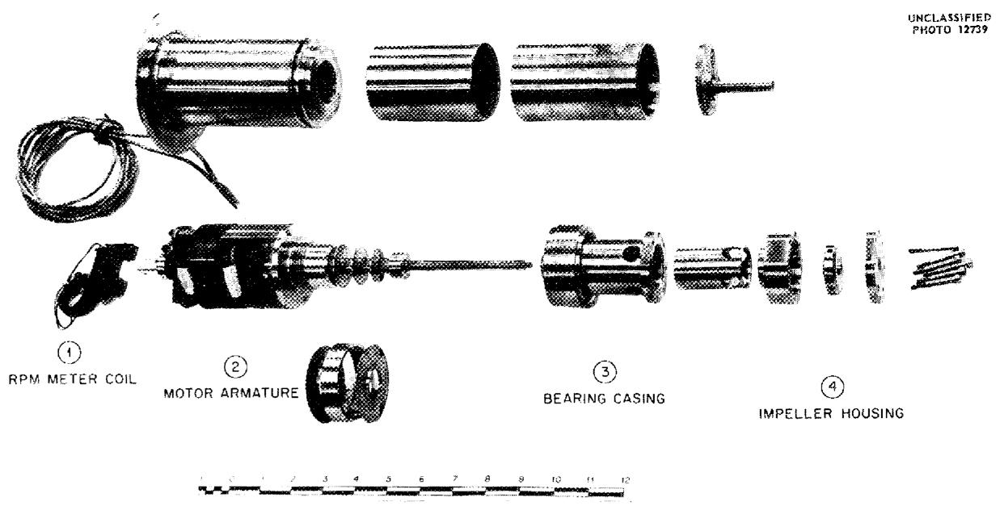  
Fig. 9.1. In-Pile Pump.

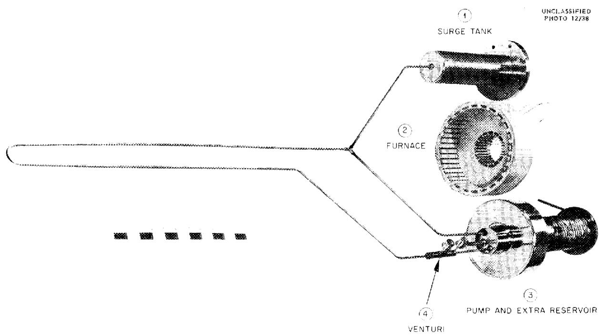  
Fig. 9.2. Bench Test Loop.

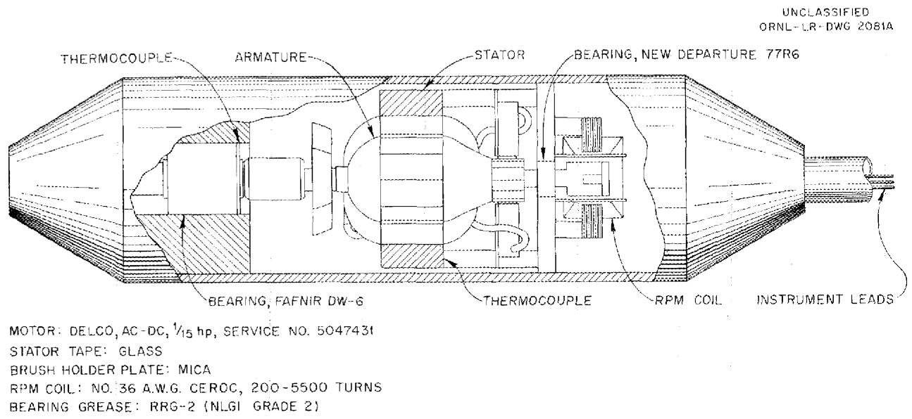  
Fig. 9.3. Motor and RPM Meter Test Assembly.

test a brush holder plate of mica backed with a stainless steel plate was used. In the second test fired Lavite asbestos covered wire was used from the brush holder to the field coil. Glass tape was used around the field coils.

The rest of the construction features were un-altered; that is, fish-paper-coil supports, plastic (paper-backed Bakelite) commutator segment spacers, and cardboard armature shaft spacers were used.

The upper bearing (New Departure 77R6) and lower bearing (Fafnir DW-6) were packed with California Research Corporation grease, identified as RRG-2 [NLG1 Grade 2].

The RPM meter consists of a magnet fastened to the shaft which will rotate inside the gas-tight motor shell. A coil wound around a C-shaped iron core is mounted outside the shell. As the shaft rotates, pulses are generated in the coil and counted remotely by a frequency meter calibrated in rpm. The coil was wound with 36-g Ceroc 200 magnet wire covered with glass tape impregnated with Glyptol. Summary data on the test conditions are given in Table 9.1.

The motors were examined, after irradiation, in the hot cell. Assistance was given in hot cell examination by J. Noaks and J. Crudele, Pratt & Whitney Aircraft Division. A withdrawal cask and its facilities were loaned by L. E. Stanford, General Electric Company.

TABLE 9.1. CONDITIONS OF TEST MOTOR AND RPM METER ASSEMBLY   

<table><tr><td></td><td>Test No. 1</td><td>Test No. 2</td></tr><tr><td>Motor load</td><td></td><td></td></tr><tr><td>d-c voltage</td><td>60</td><td>33</td></tr><tr><td>Current, amp</td><td>0.45</td><td>0.20</td></tr><tr><td>Shaft speed, rpm</td><td>4500</td><td>4500</td></tr><tr><td>Fafnir bearing temperature, °C</td><td>45</td><td>45</td></tr><tr><td>Motor field plate temperature, °C</td><td>65</td><td>40</td></tr><tr><td>Time of operation</td><td></td><td></td></tr><tr><td>At 4500 rpm, hr</td><td>100</td><td>648</td></tr><tr><td>In flux, * hr</td><td>84</td><td>613</td></tr></table>

*Thermal flux, $5 \times 10^{11}$ neutrons/cm²·sec; ratio of fast to thermal neutrons, l; gamma field, 4.4 r/hr.

In the first test, motor load was abnormally great from the beginning and the field plate temperature was high. When the motor failed after 100 hr, the stator temperature rose to $182^{\circ}\mathrm{C}$ while the power was kept on. The suspicion that there was a cocked upper bearing plate was confirmed upon postirradiation examination (Fig. 9.4). The sensing coil for the RPM meter functioned well; there was no resistance change or visual deterioration.

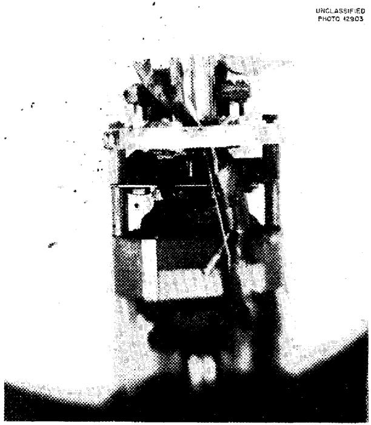  
Fig. 9.4. Motor irradiated in the First Test.

In the second test the motor operated as long as it would be expected to under normal conditions. However, postirradiation inspection showed that the commutator segments had been loosened as a result of the deterioration of the plastic commutator segment spacers under irradiation (Fig. 9.5). The bearing grease proved to be adequate and was essentially unaffected, as evidenced by the constant power demand by the motor at constant rpm. The RPM coil also showed no resistance change or visible breakdown (Fig. 9.6). The brush wear appeared to be normal. A high-temperature motor is being constructed for testing that will have glass-insulated-wire, mica, and high-altitude brushes.

# REMOVAL OF XENON FROM FUSED FLUORIDES

M. T. Robinson

G.W. Keilholtz

Solid State Division

D. E. Guss

United States Air Force

W.A.Brooksbank

Analytical Chemistry Division

A program has been initiated to study removal of $\mathbf{X}\mathbf{e}^{135}$ from fluoride fuels by means of helium

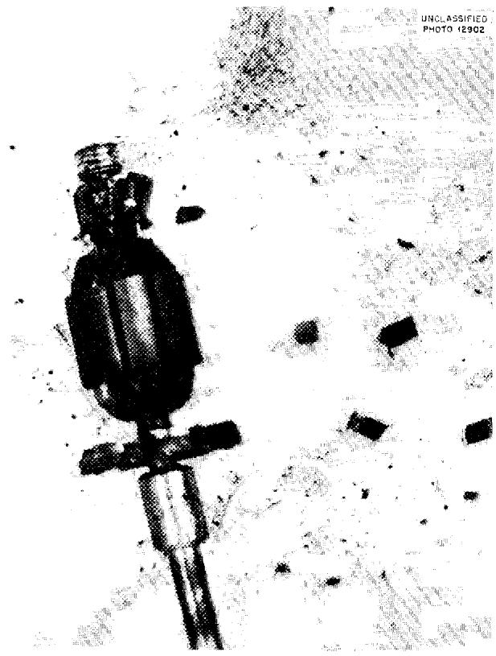  
Fig. 9.5. Commutator Segments from Motor Irradiated in the Second Test.

purging. A stainless steel capsule will be constructed in a manner that will allow bubbles of helium to pass through a filter plate and through the fissioning fuel in hole HB-3 of the LITR. Plastic mockups of the capsule are being used to study the characteristics of the helium flow. A four-channel gamma-ray spectrometer has been constructed by the Instrument Department to monitor the Xe135 concentration in the flowing stream of helium.

$$
C _ {7} F _ {1 6} - U F _ {6} I R R A D I A T I O N
$$

W. E. Browning

G.W. Keilholtz

Solid State Division

An experiment is being conducted to determine in a very rough fashion the effect of pile irradiation on a $20\%$ solution of $\mathsf{UF}_6$ in $C_7F_{16}$ . This material is of interest to the Shielding Section of the Physics Division for simulating liquid fuels in dynamic shielding experiments, and the experiment is being conducted with the aid of personnel from that

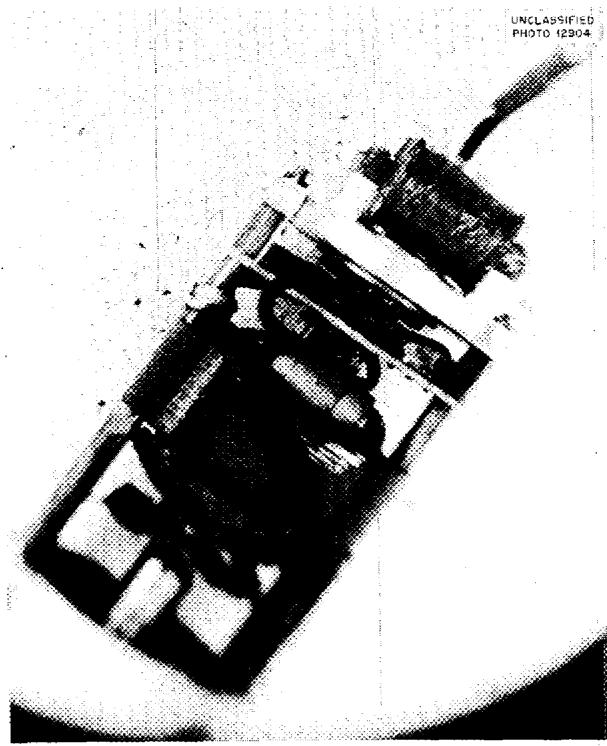  
Fig. 9.6. Motor Irradiated in Second Test.

division. Three nickel capsules were charged with the two components to make a 7-g solution in each. Normal uranium was used. Two capsules were irradiated in appropriate secondary containers in a water-cooled hole in the ORNL Graphite Reactor at a thermal flux of $6 \times 10^{11}$ neutrons/cm²·sec for 63 hr. This exposure corresponds to 25 times the fission density expected in the shielding experiment with enriched uranium. The capsules were opened in a special gas manifold, and the gas pressures were determined. The pressure inside the irradiated capsules was shown to have been greater than 50 and less than 100 psia. The pressure in the unirradiated capsule was not perceptibly different from the vapor pressures of the two components (about 4 psi). The gas in the capsules was analyzed by infrared absorption spectrometry at K-25 and was found to contain CF₄, C₂F₆, C₇F₁₆, and other fluorocarbon compounds not identified. No UF₆ could be detected in the gas sample. Pressure measurements at -80 and -190°C were consistent with these analyses. The irradiated capsules were full of a nonvolatile (at 25°C) greenish powder. The powder was insoluble in C₇F₁₆. It will be analyzed for uranium. The

unirradiated capsule contained no residue except for a faint chalkiness on its inner wall. Additional capsules are being irradiated for 1/100 of the accumulated exposure.

# LITR HORIZONTAL-BEAM-HOLE FLUORIDE-FUEL LOOP

W.E.Brundage C.Ellis   
C.D.Baumann M.T.Morgan   
F. M. Blacksher A. S. Olson   
R.M.Carroll W.W.Parkinson   
J.R.Duckworth O.Sisman

Solid State Division

A loop for circulating fluoride fuel was inserted in hole HB-2 of the LITR and filled with fluoride fuel NaF-ZrF4-UF4 (62.5-12.5-25 mole %) during a protracted reactor shutdown. The pump was started as soon as sufficient fuel had been added, but circulation of the fluoride mixture became erratic after 5 to 10 min and finally stopped completely. Fluoride fumes in the off-gas line from the jacket around the pump indicated a leak, and therefore the loop was removed before the reactor was started.

The loop was carefully disassembled to avoid loss of uranium, since over $5\mathrm{kg}$ of enriched fuel mixture had been used to charge the loop. Recovery of the fuel from the "nosepiece" at the in-pile end of the loop had to be carried out in a hot cell because of neutron activation acquired when the unfilled loop was exposed to reactor flux before the fuel was added. The leak was found in the weld joining the loop tubing to the discharge nipple at the bottom of the pump bowl. Complete breaking of the weld occurred probably during disassembly of the loop or during cutting of the pump jacket, rather than while the pump was in operation.

Before insertion in the reactor the jacket for enclosing the loop and the pump in an inert atmosphere was tested for gas tightness. The loop, with the pump superstructure replaced by a blank flange, was vacuum tested at 800 to $1000^{\circ}\mathrm{F}$ with a helium leak detector. After the loop was inserted in the reactor, it was pressure tested at 1200 to $1500^{\circ}\mathrm{F}$ at 16 psig, and there was no perceptible loss in pressure over a 1-hr period, even though the pump superstructure with its rotating shaft seal was in place.

The connections of the loop tubing at the pump have been redesigned for the second loop to provide a filling and drain line. This will permit charging the loop with a non-uranium-bearing fluoride mixture, circulating it at operating temperature, and draining it before the loop is inserted into the reactor. The danger of tube rupture because of expansion of the fuel on melting necessitates the draining and refilling feature, if operating tests are to be carried out. The necessary changes in the pump shield to accommodate the drain and fill line are being made.

The Metallurgy Division will supervise all critical welding and has provided specifications for an improved weld joint developed for Inconel tubing. The components fabricated previously for the second loop are being changed to conform to the specifications for the new weld joints. A new flange for closing the rear of the jacket has been made in order to give more space for making pipe connections to the large air lines required for the heat exchanger.

During installation of the loop in the reactor an unexpectedly long time was required to connect heater leads, thermocouple leads, and air, water, and helium piping in the confined space available between the shielding and the instrument panel.

The piping at the reactor face is being revised to facilitate connection when the second loop is ready for insertion so that installation may be performed more rapidly. Modifications are also being made to remove lag in the flow alarms for the jacket cooling water. The oil system for cooling the pumps is being rebuilt to incorporate more reliable pumps and improved flow and alarm instruments.

A hydraulically operated door to match the withdrawal shield has been installed in a wall of a hot cell in preparation for handling the loop after irradiation. A horizontal band saw has been modified for almost complete remote operation and is being installed in the hot cell. Other remote handling tools for disassembling the loop have been made and are being tested.

# ORNL GRAPHITE REACTOR SODIUM-INCONEL. LOOP

W.E.Brundage W.W.Parkinson Solid State Division

Metallographic examination was completed on an Inconel loop which had circulated sodium in hole

58-H of the ORNL Graphite Reactor for 218 hr with the irradiated section at $1500^{\circ}\mathrm{F}$ . The unperturbed thermal flux in this hole is about $7 \times 10^{11}$ , and the flux above 1 ev is a factor of 10 lower. There was no evidence of radiation induced corrosion of the Inconel. The temperature of the pump cell section was held between 1025 and $1100^{\circ}\mathrm{F}$ , and that of the line entering the reactor was somewhat higher; the temperature of the line emerging from the reactor was about $1500^{\circ}\mathrm{F}$ . Before insertion in the reactor the loop had been operated at 800 to $1000^{\circ}\mathrm{F}$ for 80 hr while sodium was circulated through the loop and through a bypass filter circuit connected to the loop.

# CREEP AND STRESS-CORROSION TESTS

W.W.Davis J.C.Wilson

N.E.Hinkle J.C.Zukas

Solid State Division

Development of a suitable apparatus for in-pile stress-corrosion experiments has been slow because of difficulty in securing constant heat-transfer rates from the fuel to a heat sink where the fission heat can be removed. In the design shown in Fig. 9.7, fission heat is conducted from the fuel through the stressed specimen wall to a sodium-filled annulus. The sodium acts as an efficient heat conductor that exerts no constraint upon the deformation of the specimen tube as it creeps under applied stress. Part of the fission heat is removed by gaseous convection at the outer surface of the sodium-containing chamber and part by conduction through a metal ring to a water jacket. Simpler designs in which the sodium was contained in a constant-diameter annulus did not permit good temperature control. The temperature gradient that resulted from simulated fission heat input at the bottom and heat abstraction at the top caused heated sodium to rise discontinuously in the annulus, and temperature excursions of $100^{\circ}\mathrm{F}$ in 1 sec were not uncommon. A substantial temperature gradient (500 to $800^{\circ}\mathrm{F}$ per in.) is required to meet headroom requirements in the experimental hole and to prevent sodium distillation out of the annulus.

Several designs of the sodium annulus were tried, such as baffles and spirals, and ratios of outside-to-inside sodium-annulus diameters were varied but did not result in a constant temperature gradient. The apparatus shown in Fig. 9.7 appears to operate satisfactorily, but more operating time

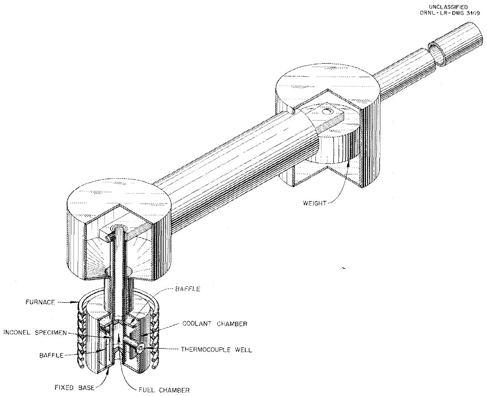  
Fig. 9.7. Stress-Corrosion Apparatus.

must be accumulated before it will be certain that sodium distillation is not taking place in sufficient quantities to cause trouble.

In the apparatus a tubular Inconel specimen containing $0.2\mathrm{g}$ of $\mathsf{NaF - ZrF}_4$ -UF (53.5-40.0-6.5 mole $\%$ ) in the fuel chamber attached to the fixed base is eccentrically loaded through a lever arm by a weight. A stress pattern is produced across the horizontal cross section which varies from a maximum compressive stress. Surrounding the specimen is a sodium coolant chamber with baffles which reduce the magnitude of the thermal-convection currents and allow closer control of the specimen temperature. A furnace helps to maintain the temperature at $1500^{\circ}\mathsf{F}$ throughout the test. Two thermocouple wells project into the sodium

chamber to a position near the walls of the specimen at the neutral axis. A double-walled, concentric, sodium fill line, with only the outer tube welded to the chamber, and a vacuum exhaust tube complete the apparatus. All surfaces in contact with the fuel and sodium are made of Inconel.

The assembly is hydrogen fired for 1 hr at $1750^{\circ}F$ , filled with fuel, and welded in a dry box under purified helium. The other parts of the container are welded into subassemblies, hydrogen fired, and then welded together, with helium backing up the welds. The lever arm and weight are adjusted and spot welded onto the specimen, and the chamber covers are welded into place. Before the rig is filled with sodium, it is filled with NaK and heated to $1000^{\circ}F$ to remove any

oxide remaining on the metal surfaces. The rig is then washed with butyl alcohol, which reacts with the NaK and leaves the surfaces clean and ready to be filled with sodium.

The sodium is metered out into a tube that has first been cleaned with NaK, sealed with Swagelok fittings, and provided with a helium valve. A micrometallic filter sealed into the line removes any oxides of sodium that may be formed when the connection to the test rig is made. Once the connection is made, the apparatus is evacuated and the sodium is melted and forced into the chamber by helium pressure through the valve; a combination of high surface tension and back pressure made filling the chamber somewhat more difficult without this procedure. For the bench tests, in which sticks of sodium were used, the filled chamber was heated while a vacuum was pulled on the system, and a rise in pressure was noted at about $525^{\circ}\mathrm{F}$ , presumably from dissociation of sodium hydride. It remains to be seen whether such a procedure is necessary to ensure the purity of the sodium now available. The dry-box work is completed by cutting the outer fill tube, removing the inner (contaminated) tube, and crimping and welding both the fill and exhaust tubes.

The entire assembly is welded into a stainless steel water jacket furnished with Kovar seals and a capillary tube through which helium flows throughout the test. A probe beneath the weight cuts off the current to the furnace at a predetermined deflection of the lever arm and indicates the time required for a given degree of deformation. A gravity "tilt" indicator aids in plumbing the specimen in the exposure can. A base plate with a conical cup furnishes a well for the sodium in case of rupture during operation. A suitable safety system is being developed.

Approval by the LITR Experiment Review Committee is being withheld until additional tests are made on the compatibility of sodium with the various component materials it might contact if a rupture occurred at the test temperature. Several tests aimed at a qualitative determination of the speed of reaction and the heat generated by such reactions should be completed within a short time.

After an irradiation period of from two to six weeks in hole HB-3 of the LITR and a suitable decay period, the specimen is to be sectioned by the remote metallography group and examined for stress-corrosion effects.

Bench tests on the specimen tube alone are under way with the outside surface in air. The inside of the tubes contains either air, helium, or NaF-ZrF $_4$ -UF $_4$ (50-46-4 mole %). An atmosphere chamber has been built for testing four specimens simultaneously in vacuum or any desired atmosphere. One 200-hr test has been completed on barren NaF-ZrF $_4$ -UF $_4$ (50-46-4 mole %) at $1500^{\circ}\mathrm{F}$ and about 1500 psi. No stress dependence of corrosion was found; another specimen was tested for 400 hr but has not yet been examined. A melting and overturning technique for removing fluoride fuel from the section that is to be examined metallographically has been successful; this will greatly simplify handling of irradiated capsules.

The MTR tensile creep rig is undergoing final testing and is scheduled for irradiation tests on Inconel in October.

# REMOTE METALLOGRAPHY

M. J. Feldman

W. Parsley

R.N.Ramsey

A. E. Richt

Solid State Division

Work was continued on the examination of the solid-type fuel sandwiches of interest to the Pratt & Whitney Aircraft Division. In addition to the two experiments mentioned previously, six other specimens have been examined. The results on three of them (capsules 1-4, 1-6, 1-7) have been published. A report covering the other three capsules (1-5, 1-8, 1-9) is being prepared. Examination of the eight capsules processed to date has indicated greater resistance to cracking and core-clad separation upon bending of the stainless-steel-matrix samples than upon bending of the iron-matrix samples, better resistance to cracking upon bending of the large $\mathrm{UO}_2$ particle size core than upon bending of the smaller particle size core, and a greater increase in hardness upon irradiation of the small particle size core than upon irradiation of the larger particle size core.

Work on solid-type fuel elements for the GE-ANP group has continued. Examinations of two ni

chrome V fuel elements have been completed.8 Examinations of two single-plate fuel elements9 and one two-stage multiple fuel plate test assembly10 were also completed. Work will continue on both wire and multiple-plate elements.

Expansion of remote metallographic facilities is proceeding.

# FISSION-FRAGMENT ANNEALING STUDIES

M.J.Feldman W.Parsley

Solid State Division

Because of interest in the possibility of the removal of the radiation damage to fuel plates by annealing, a preliminary study was undertaken. The eight samples in Pratt & Whitney capsule 1-9 (four were small particle size, $< 3 - \mu \mathrm{UO}_2$ , and four were large particle size, 15- to $44 - \mu \mathrm{UO}_2$ ) were selected for the study. One sample from each group (large and small particle size) was examined after the following treatment: (1) as irradiated, (2) $900^{\circ}\mathrm{F}$ anneal for 24 hr, (3) $1100^{\circ}\mathrm{F}$ anneal for 24 hr, and (4) $1400^{\circ}\mathrm{F}$ anneal for 24 hr. A graph showing the results of this preliminary study is shown in Fig. 9.8. The conclusion drawn from this initial study is that a portion of the neutron damage to the samples has been annealed out. Since the full annealing temperature for type 347 stainless steel is about $1800^{\circ}\mathrm{F}$ (for complete removal of the effects of cold work), a complete anneal for neutron damage at $1400^{\circ}\mathrm{F}$ was not expected. For the core, where the major portion of the damage is by fission fragments, it is felt that the curve shows a reduction in hardness because of a partial anneal of the neutron damage with no reduction in the fragment damage. An attempt will be made to determine the anneal necessary to remove all the neutron damage from this type of material and, if possible, the fission-fragment annealing temperatures.

# HIGH-TEMPERATURE, SHORT-TIME, GRAINGROWTH CHARACTERISTICS OF INCONEL

M.J.Feldman W.Parsley

A.E.Richt

Solid State Division

As an aid in the analysis of the static corrosion capsules, a study of the short-time, high-temperature, grain-growth characteristics of the Inconel

8M. J. Feldman et al., Metallographical Analysis of G.E. Wire Fuel Element No. 1, ORNL CF-54-4-8 (April 1, 1954).

stock used for the tests was made. Information is available in the literature on the usual times and temperatures for Inconel grain growth, but because of the nature of the experiment, with its possibilities of local short-time hot spots in the fuel, this study was initiated. Figure 9.9 is a graph of the data obtained. Of major interest were the definite temperature dependence of the carbide solubility and the extremely short times (relative to the corrosion test times) at which large grains could be produced. Details of the experiment have been published.[11]

# BNL NEUTRON SPECTRUM - RADIATION DAMAGE STUDY

J.B.Trice P.M.Uthe

Solid State Division

R.Bolt J.C.Carroll

N. Shiells

California Research Corporation

V. Walsh

Brookhaven National Laboratory

A series of measurements were made in hole E-25 of the Brookhaven reactor to determine neutron flux energy distributions. The project was a cooperative effort with California Research Corporation and Brookhaven National Laboratory. Information obtained from these measurements is to be used to correlate neutron flux intensity and energy distribution with radiation damage to certain lubricants and organic compounds that have been irradiated in E-25 and examined by CRC. Data for the irradiated samples have been coded for the ORACLE by the ORNL Mathematics Panel so that the large number of arithmetical computations usually required by a threshold detector experiment can be performed in a shorter period of time than is usual.

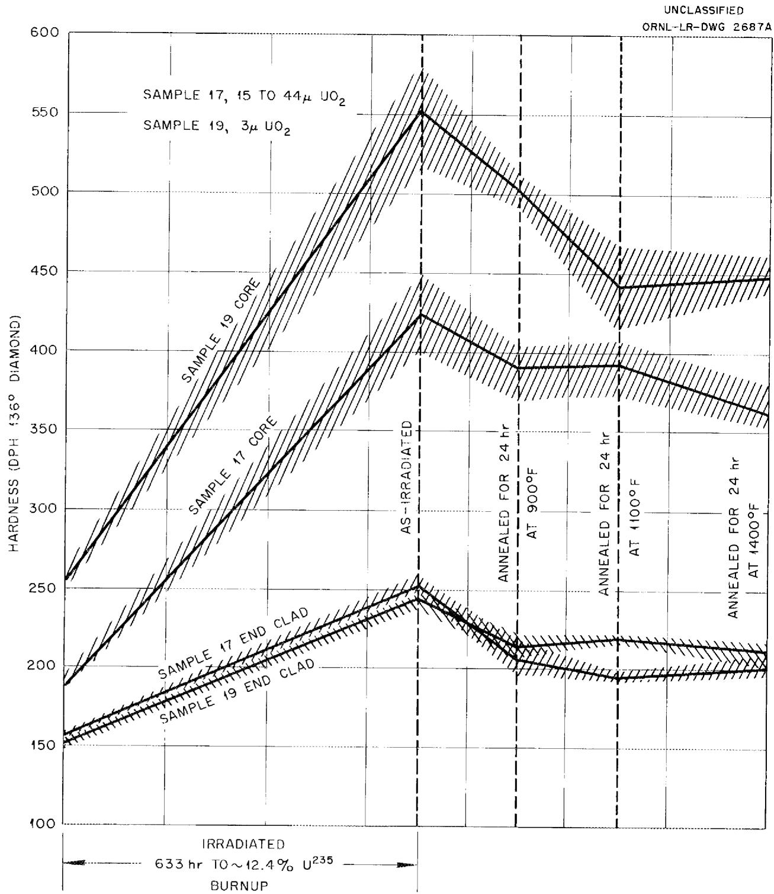  
Fig. 9.8. Preliminary Annealing Study of Stainless Steel- $\mathrm{UO}_2$ Fuel Plates in Pratt and Whitney Capsule 1-9.

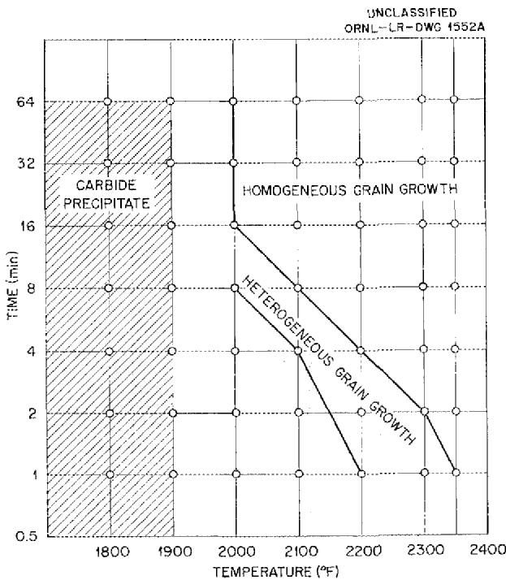  
Fig. 9.9. Grain Growth Characteristics of Inconel.

# MTR NEUTRON-FLUX SPECTRA - RADIATION DAMAGE STUDY

T. L. Trent J. B. Trice

P. M. Uthe

Solid State Division

J. Moteff

General Electric Company

Fission probes with different fissionable materials were used to make neutron flux traverses in HB-3 of the MTR. The fissionable materials used included U238, Y236, Np237, and Th232, whose fission threshold energies span the energy region between ½ and 2 MeV. The data from these traverses will be used with the results from activations in HB-3 of other, nonfissionable, threshold detectors that are in the process of being irradiated.

After measurements have been completed in HB-3 with the hole empty, several inches of beryllium will be introduced into the hole in such a way as to change the energy distribution of the transmitted neutrons. The new energy distribution will then be measured, and materials will be irradiated in both moderated and unmoderated neutron spectra. An attempt will then be made to correlate spectra and radiation damage.[12]

# 10. ANALYTICAL STUDIES OF REACTOR MATERIALS

C. D. Susano

Analytical Chemistry Division

J.M.Warde

Metallurgy Division

The primary analytical problem continues to be the separation and determination of trivalent and tetravalent uranium in both $\mathrm{NaZrF}_{5}$ and NaF-KF-LiF-base fuels. A successful potentiometric titration of $\mathrm{UF}_{4}$ in molten $\mathrm{NaZrF}_{5}$ with metallic zirconium was accomplished by means of polarized platinum electrodes. The observed end point occurred at a weight of titrant which corresponded to one-half an equivalent of zirconium metal per mole of $\mathrm{UF}_{4}$ . This stoichiometry indicates reduction of $\mathrm{UF}_{4}$ to a mixed oxidation state. Polarographic studies of uranium fluorides in reactor fuels dissolved in molten ammonium formate at $125^{\circ}C$ were initiated. Preliminary experiments revealed that tetravalent uranium was not reduced at the dropping-mercury electrode. Molten ammonium formate appears to be a useful solvent for fluoride-base fuels containing various oxidation states of uranium. The conversion of $\mathrm{UF}_{4}$ to $\mathrm{UCl}_{4}$ in fluoride fuels was shown to be quantitative when the fuel was heated with boron trichloride at $400^{\circ}C$ for 90 min. Trivalent uranium fluoride is converted to $\mathrm{UCl}_{3}$ under these conditions. The solubility of $\mathrm{UF}_{4}$ in $\mathrm{NaAlCl}_{4}$ was found to be $18\mathrm{mg / g}$ at $200^{\circ}C$ as contrasted to a solubility of $\mathrm{UF}_{3}$ of less than $1\mathrm{mg / g}$ . Molten $\mathrm{NaAlCl}_{4}$ is expected to dissolve tetravalent uranium selectively from the fuels.

Calibration measurements have been completed on the apparatus for the determination of oxygen as metallic oxides in reactor fuels. The reaction involves the hydrofluorination of the oxide and measurement of the increase in conductivity of liquid HF as a function of the water formed.

Investigations were also made on the oxidation of $\mathsf{UF}_3$ with oxygen at elevated temperatures. At $300^{\circ}\mathsf{C},\mathsf{UF}_3$ is converted quantitatively to $\mathsf{UF}_4$ and $\mathsf{UO}_2$ . The mechanism of the oxidation of $\mathsf{UF}_4$ with oxygen is being studied. An oxide residue of about $11\%$ of the original material was found when $\mathsf{UF}_4$ was heated in oxygen at $300^{\circ}\mathsf{C}$ for 2 hr.

An improved method for the determination of lithium in NaF-KF-LiF-base fuels was developed. The chloride salt is extracted with 2-ethylhexanol, and the chloride is titrated in the nonaqueous mediums.

Studies were also made on the solubilities of potassium, rubidium, and cesium tetraphenylborates in various organic solvents to ascertain differential solubilities. The feasibility of a spectrophotometric titration of fluoride in NaF-KF(RbF)-LiF-base materials by decolorization of zirconium or aluminum complexes was investigated. Determination of the concentration of oil in helium was made by absorbing the hydrocarbons in petroleum ether and weighing the residue obtained after evaporation. It was found that prior bleeding of the line effectively eliminated contamination by oil.

# ANALYTICAL CHEMISTRY OF REACTOR MATERIALS

J.C. White

Analytical Chemistry Division

Research and development were continued on the problem of determining $\mathsf{UF}_3$ and $\mathsf{UF}_4$ in NaZrF $_5$ - and NaF-KF-LiF-base reactor fuels. A number of new approaches to this problem were investigated, including redox titrations of the fluoride mixtures in the molten state, for which polarized platinum electrodes were used, and polarographic studies of fluoride mixtures in molten ammonium formate. Work was continued on the determination of oxygen in fluoride fuels and on the determination of alkali metals and fluoride ion in NaF-KF-LiF-base materials.

# Determination of Oxygen in Fluoride Fuels

A. S. Meyer, Jr. J.M. Peele Analytical Chemistry Division

The apparatus for the determination of oxygen as oxides in fluoride fuels, which was described briefly in a previous report, has been constructed. A schematic drawing of this apparatus is shown in Fig. 10.1.

The hydrogen fluoride purification still, which was fabricated from mild steel, is equipped with a $24 \times 1$ in. packed column with an estimated efficiency of 25 theoretical plates. Conductivity

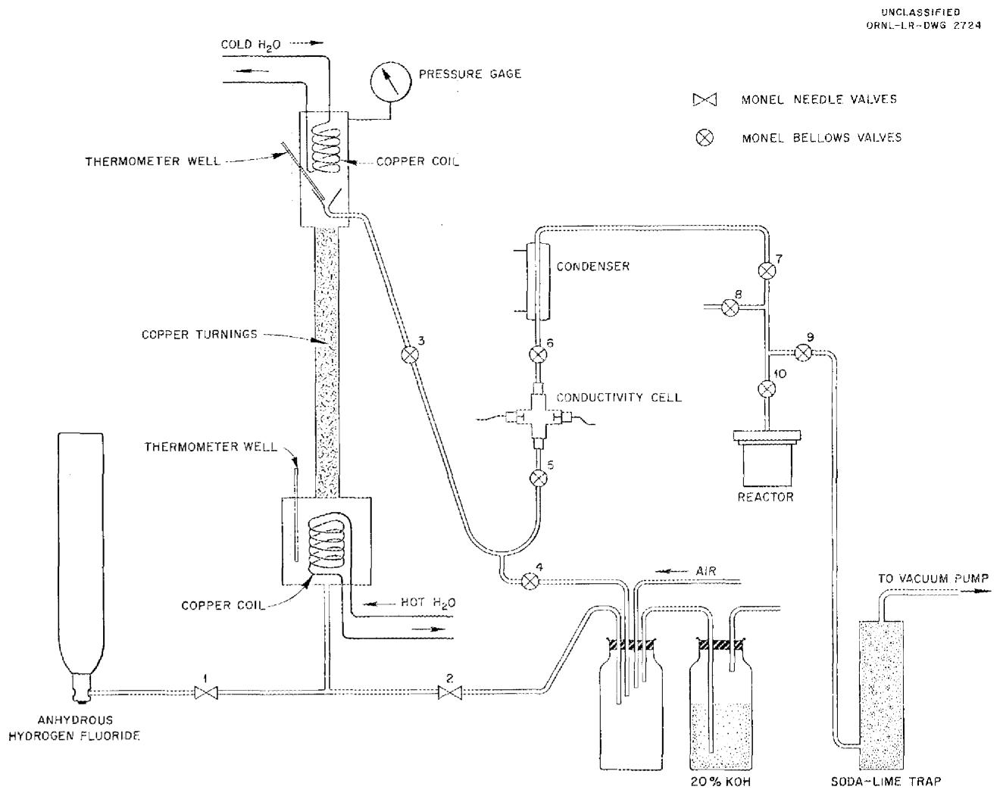  
Fig. 10.1. Apparatus for Determination of Oxygen in Fluoride Salts.

measurements are carried out in a 25-mi fluorothene cell fitted with platinized platinum electrodes. The reaction vessel, a modified Parr bomb, is silver plated on the inner surfaces, as are the lines and the fittings in the reactor-conductivity cell section.

In the procedure now being tested the sample is placed in the reaction vessel and the system is evacuated to valve 5 (see Fig. 10.1). After the cell has been filled with a measured volume of the distillate, the conductivity is measured and the acid is transferred to the reaction vessel by distillation. When the oxides have been converted to water, the solution of water in hydrofluoric

acid is distilled to the cell where the measurement of conductivity is made. Transfers of the acid are repeated until constant readings are obtained.

The distillation apparatus has been tested and has been found to deliver anhydrous acid at a rate sufficient to fill the cell in less than 1 min. When the still was charged with $99\%$ HF, the conductivity of the distillate corresponded to a maximum concentration of water of approximately 1 ppm.

Weighed samples of anhydrous LiOH are being taken through the procedure outlined above as a means of calibrating the apparatus. Calibration measurements have been completed over the range 0.03 to $0.25\% \mathrm{H}_2\mathrm{O}$ in HF.

# Oxidation-Reduction Titrations in Fused Salts

A. S. Meyer, Jr.

Analytical Chemistry Division

Experiments were carried out to determine whether the equivalence point of a titration in which $\mathsf{UF}_4$ dissolved in a molten fluoride fuel solvent is reduced by the addition of small increments of an electrodeposition metal could be observed by one of the conventional electrometric techniques. The first system studied involved the reduction of $\mathsf{UF}_4$ in $\mathsf{NaZrF}_5$ by zirconium metal according to the proposed reaction

$$
4 U F _ {4} + Z r ^ {\circ} \dots \rightarrow 4 U F _ {3} + Z r F _ {4}.
$$

Since no insulating material which is compatible with molten $\mathrm{NaZrF}_5$ was available, it was not possible to devise a reference electrode for measurement of the potentials of the solutions. Accordingly, polarized platinum electrodes were selected as indicating electrodes. In order to obtain more information about the nature of the polarization phenomena, the area of one of the electrodes was made approximately 80 times that of the other. Thus, since the current density at the smaller electrode was 80 times as great as that at the larger, the potential difference between the electrodes was approximately equal to that of the smaller electrode. By reversing the direction of the polarizing current, it was possible to determine the potential at the cathode and at the anode.

The solution of $\mathsf{UF}_4$ in $\mathsf{NaZrF}_5$ was contained in a 25-ml platinum crucible which was placed in the helium-filled quartz liner of a pot furnace. Agitation was accomplished by means of a mechanically driven platinum stirrer which was constructed of 0.05-in.-dia platinum wire. Additions to the solution were made through a quartz tube which extended from the top of the liner to a point about 1 in. above the melt.

In pure $\mathsf{NaZrF}_5$ the anode was more strongly polarized than the cathode. At polarizing currents of $80\mu a$ the potential of both electrodes exceeded 1 v. Approximately $\frac{1}{2}$ hr was required for the electrodes to reach equilibrium. Platinum electrodes could not be appreciably polarized in NaF-KF-LiF-base fuels.

When $UF_4$ was added to the molten $\mathrm{NaZrF}_5$ , the potential decreased rapidly. For a solution which

contained 1.25 mole $\%$ UF4 the potential of both electrodes was approximately $300\mathrm{mV}$ with no significant difference between the potentials of the cathode and anode.

During the early part of the titration of the molten fluoride mixture with zirconium metal, the potential of the cathode decreased to values less than $10\mathrm{mv}$ and remained constant throughout the titration. At the same time the potential of the anode increased rapidly and attained potentials in excess of $1\mathrm{v}$ before the end point of the titration was reached. When an equivalence point was reached, the potential of the anode decreased rapidly to about $50\mathrm{mv}$ and then decreased gradually on further addition of reductant. Only one break in the potential vs titrant curve was observed. The curve is shown Fig. 10.2.

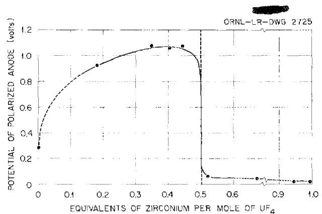  
Fig. 10.2. Titration of $\mathsf{UF}_4$ in Molten NaZrF $_5$ with Zirconium Metal,

The observed end points of two titrations occurred at a weight of titrant which corresponded to one-half an equivalent of zirconium metal per mole of $\mathsf{U}\mathsf{F}_{4}$ . This stoichiometry indicates the reduction of $\mathsf{U}\mathsf{F}_{4}$ to a mixed oxidation state that corresponds to the postulated formula $\mathsf{U}_{2}\mathsf{F}_{7}$ .

# Polarographic Studies in Fused Ammonium Formate

A. S. Meyer, Jr. D. L. Manning

Analytical Chemistry Division

Colichman² reported that when solutions of UCl in molten ammonium formate were reduced at the dropping-mercury electrode, three well-defined reduction waves with half-wave potentials of -0.1 to -0.2, -0.75 to -0.80, and -0.95 v (vs pool) were

obtained. The following reactions were postulated to explain these waves:

$$
\cup^ {+ 4} \xrightarrow {\mathrm {l} _ {e}} \cup^ {+ 3} \xrightarrow {\mathrm {l} _ {e}} \cup^ {+ 2}
$$

and

$$
U ^ {+ 4} \xrightarrow {1 e} U ^ {+ 3} \xrightarrow {1 e} U ^ {+ 2} \xrightarrow {2 e} U ^ {\circ}.
$$

He also reported that anhydrous hexavalent uranium gave no reduction wave until after an aging period during which the compounds were reduced by the ammonium formate to a lower valence state, probably quadrivalent.

Since it appeared that this technique could be applied to the determination of tetrovalent uranium in the presence of large quantities of trivalent uranium, experiments were carried out to obtain polarograms of solutions of $\mathsf{UF}_4$ . In preliminary experiments it was found that $\mathsf{UF}_4$ and $\mathsf{NaZrF}_5$ and NaF-KF-LiF-base fuels dissolved readily in molten ammonium formate at $125^{\circ}\mathsf{C}$ to form green solutions containing as much as 1 mg of uranium per milliliter. Although $\mathsf{UF}_3$ alone was found to be much less soluble, $\mathsf{UF}_3$ which had been fused with $\mathsf{NaZrF}_5$ was readily soluble. Similar relationships were found when molten ammonium acetate was used as a solvent.

No U(IV) reduction waves were obtained when polarograms of solutions of $\mathsf{UF}_4$ were recorded immediately after dissolution, and no reduction waves were observed in the polarograms of a sample of NaF-KF-LiF-base fuel that contained both $\mathsf{UF}_3$ and $\mathsf{UF}_4$ . When these solutions were aerated, a single reduction wave with a half-wave potential of approximately $-0.2\mathrm{v}$ was observed. The potential and the diffusion current of this wave corresponded closely to those recorded immediately after the dissolution of an equivalent quantity of $\mathsf{K}_3\mathsf{UO}_2\mathsf{F}_5$ in molten formate. Since the U(IV) waves may have been shifted to potentials outside the range of the solvent (0 to $-0.9\mathrm{v}$ ) by the complexing action of the fluoride ions, additional polarograms were taken of solutions containing $\mathsf{UCl}_4$ . Except for a small reduction wave at about $-0.2\mathrm{v}$ , no evidence of reduction was found. The diffusion current of this wave was increased by aeration to values corresponding to those obtained for hexavalent uranium, and therefore the increase was attributed to the oxidation of $\mathsf{UCl}_4$ . It appears that in molten ammonium formate no oxidation state of uranium other than hexavalent is reduced at the dropping-mercury electrode.

# Conversion of $\mathbf{U}\mathbf{F}_3$ and $\mathbf{U}\mathbf{F}_4$ to the Respective Chlorides with $\mathsf{BCl}_3$

A. S. Meyer, Jr. D. L. Manning  
Analytical Chemistry Division

It was reported previously that, on the basis of free-energy calculations, $\mathsf{UF}_3$ , $\mathsf{UF}_4$ , $\mathsf{ZrF}_4$ , and NaF are quantitatively converted to the chlorides when at equilibrium with boron trichloride. Since the exchange reaction in organic solvents at moderate temperatures was found to be too slow for analytical application, tests were carried out with gaseous $\mathsf{BCl}_3$ at elevated temperatures. This technique offered an additional advantage in that the resulting chlorides could be separated by sublimation.

When a sample of $\mathrm{NaZrF}_{5} - \mathrm{UF}_{4}$ fuel was heated in a stream of $\mathrm{BCl}_{3}$ and helium at $350^{\circ}\mathrm{C}$ , the bulk of the zirconium was sublimed as $\mathrm{ZrCl}_{4}$ within 90 min, and all but traces were removed after heating for an additional hour at $450^{\circ}\mathrm{C}$ . It has been reported that uranium can be sublimed as $\mathrm{UCl}_{4}$ by treating $\mathrm{UF}_{4}$ with $\mathrm{BCl}_{3}$ at 600 to $650^{\circ}\mathrm{C}$ , but in these tests only a small fraction of the $\mathrm{UCl}_{4}$ was volatilized when the $\mathrm{UCl}_{4} - \mathrm{NaCl}$ residue, which fused at about $450^{\circ}\mathrm{C}$ , was heated to temperatures as high as $750^{\circ}\mathrm{C}$ .

Analyses of the residues showed that when the conversion was carried out at $400^{\circ}\mathrm{C}$ for 90 min the uranium in the $\mathsf{NaZrF}_5\text{-UF}_4$ samples was quantitatively converted to UCl and that all the uranium remained in the residue. When the conversion was carried out at $500^{\circ}\mathrm{C},2\%$ of the uranium was volatilized, while at $750^{\circ}\mathrm{C},4\%$ was volatilized.

When $\mathsf{UF}_3$ samples were converted to $\mathsf{UCl}_3$ by this method, significant fractions of the uranium were oxidized to $\mathsf{UCl}_4$ . It is believed that this oxidation will be eliminated when all traces of oxidizing contaminants are removed from the gaseous reactants.

# Solubility of Tri- and Tetravalent Uranium Fluorides in Fused NaAlCl4

A. S. Meyer, Jr. W. J. Ross Analytical Chemistry Division

In the continuation of experiments to determine the optimum conditions for the conversion of $\mathsf{UF}_3$

and $\mathsf{UF}_4$ to the corresponding chlorides,5 it was noted that $\mathsf{UF}_4$ was dissolved much more readily than $\mathsf{UF}_3$ by fused $\mathsf{NaAlCl}_4$ . Measurements of the solubilities were carried out by equilibrating samples of the uranium fluorides with molten $\mathsf{NaAlCl}_4$ for periods up to 5 hr, under an inert atmosphere, followed by the separation of the undissolved solids by filtration and calculation of the solubility from the concentration of uranium in the filtrate.

Solubilities of 18 and $16\mathrm{mg}$ of $\mathsf{UF}_4$ per gram of $\mathsf{NaAlCl}_4$ were found at 200 and $175^{\circ}C,$ respectively. However, the solubility of $\mathsf{UF}_3$ decreased from $5\mathrm{mg / g}$ of $\mathsf{NaAlCl}_4$ at $225^{\circ}C$ to less than $1\mathrm{mg / g}$ at $200^{\circ}C.$ Since $\mathsf{UCl}_3$ was also found to be sparingly soluble at the lower temperatures, the above values are indicative of the true solubility of trivalent uranium in this medium rather than of incomplete conversion of the fluoride to chloride. At temperatures lower than $200^{\circ}C,$ molten $\mathsf{NaAlCl}_4$ is expected to dissolve tetravalent uranium selectively from $\mathsf{UF}_3$ which has been complexed by potassium fluoride in the fuel.

Since all available $\mathsf{UF}_3$ samples are contaminated with tetravalent uranium, it has not been possible to carry out accurate solubility measurements at the lower temperatures by relying on the determination of total dissolved uranium. An apparatus has been constructed for the determination of microgram quantities of trivalent uranium in the filtrates by hydrogen evolution. This apparatus, which is based on the measurement of evolved gases at reduced pressures, is now being calibrated against coulometrically generated hydrogen. In order to carry out dissolutions at lower temperatures, LiCl-AlCl fluxes which melt at approximately $120^{\circ}\mathrm{C}$ have been prepared.

Oxidation of $\mathsf{UF}_3$ with Oxygen

A. S. Meyer, Jr. W. J. Ross

Analytical Chemistry Division

Preliminary investigations have been initiated to determine the extent of the oxidation of $\mathsf{UF}_3$ by oxygen at elevated temperatures. The reaction is assumed to be

$$
4 U F _ {3} + O _ {2} \rightarrow 3 U F _ {4} + U O _ {2}.
$$

In the tests conducted to date the reaction products are refluxed with $2.5\mathrm{w / v}\%$ ammonium oxalate solution, and the soluble portion is analyzed for

its uranium content, which is assumed to be $\mathbf{U}\mathbf{F}_{4}$ . In these tests the reaction time was held constant at 2 hr and the temperature was varied from 200 to $600^{\circ}C$ , with the results shown in the following:

<table><tr><td>Temperature (℃)</td><td>Reactivity (%)</td></tr><tr><td>200</td><td>30</td></tr><tr><td>300</td><td>100</td></tr><tr><td>500</td><td>91</td></tr><tr><td>600</td><td>25</td></tr></table>

At $300^{\circ}C$ the reaction proceeds quantitatively as written. At higher temperatures, however, the concentration of soluble uranium $(\mathsf{UF}_4$ in ammonium oxalate) decreased rapidly from the theoretical content with increasing temperature, probably as a consequence of a further reaction of oxygen with $\mathsf{UF}_4$ .

The experiment was then repeated with $\mathsf{UF}_4$ and oxygen. At $200^{\circ}\mathrm{C}$ the entire sample was soluble in ammonium oxalate, as expected, which indicated no oxide formation. At higher temperatures, a black insoluble residue was formed upon dissolution of the sample in oxalate solution. The amount of residue increased at higher temperatures from $11\%$ at $300^{\circ}\mathrm{C}$ to $27\%$ at $600^{\circ}\mathrm{C}$ . The major portion of the sample dissolved rapidly, and a yellow filtrate was formed. It is to be noted that Kraus reported that the following reaction occurs at $800^{\circ}\mathrm{C}$ :

$$
\mathrm {U F} _ {4} + \mathrm {O} _ {2} \longrightarrow \mathrm {U F} _ {6} + \mathrm {U O} _ {2} \mathrm {F} _ {2}.
$$

The yellow color of the filtrate substantiates this reaction in part, but there is no way of accounting for the black residue, obviously an oxide of uranium. It is known,[7] however, that $\mathsf{UF}_4$ is converted quantitatively to $\mathsf{U}_3\mathsf{O}_8$ when ignited at $900^{\circ}\mathsf{C}$ in air. Petrographic and x-ray studies of the material will be made. Further tests are planned at various reaction times and temperatures.

Determination of Lithium, Potassium, Rubidium, and Fluoride Ion in NaF-KF(RbF)-LiF-Base Fuels

J.C. White G.Goldberg

B. L. McDowell

Analytical Chemistry Division

A critical review of the analytical methods for the determination of lithium, potassium, rubidium,

and fluoride ion is being made to ascertain those applicable to the analysis of NaF-KF(RbF)-LiF-base reactor fuels.

Lithium. An indirect volumetric method for the determination of lithium in the presence of the large concentrations of sodium and potassium and/or rubidium which are found in NaF-KF(RbF)-LiF-base fuels was developed. The method was designed specifically to provide a rapid, and yet precise, means of determining lithium. The alkali metals are first separated from uranium and then converted to chlorides. Lithium is extracted as the soluble chloride salt by heating at about $135^{\circ}\mathrm{C}$ with 2-ethylhexanol until the slightly soluble salts of sodium and potassium become "free-flowing" and no longer cling to the walls of the vessel. These salts are removed by filtration, and then the filtrate is diluted with ethanol. The chloride in the filtrate is titrated by the Volhard method, and the lithium concentration is calculated. The coefficient of variation is $0.5\%$ for 1 to $50\mathrm{mg}$ of lithium. A topical report of this work is being written.

Potassium and Rubidium. Since the concentration of either potassium or rubidium in NaF-KF(RbF)-LiF-base fuels is of the order of 30 wt $\%$ ,the determination of potassium or rubidium by means of the flame photometer has been neither sufficiently accurate nor precise. The conventional method for this determination is the perchlorate separation10 of potassium or rubidium perchlorate from the sodium and lithium salts in ethyl acetate. The method is entirely satisfactory but requires considerable operator time. Therefore the application of possible substitute procedures which are specific for potassium and/or rubidium was investigated. A procedure11 involving the precipitation of potassium bitartrate in ethanol-water and titration of the solution of the salt with standard base was tested. The method is extremely simple and rapid, and the bitartrate salt is readily filterable. Rubidium behaves similarly to potassium, but cesium does not precipitate as the bitartrate salt under these conditions. Further work is necessary to determine the effect of acid and salt concentrations on the

solubility of potassium bitartrate before a decision can be reached as to the applicability of this method to NaF-KF-LiF-base fuels.

A second method under consideration is the use of sodium tetraphenyl boron $^{12}$ as a reagent for the direct determination of potassium, rubidium, and cesium. The potassium salt is precipitated in aqueous acidic solution, filtered, dried at $110^{\circ}C,$ and weighed as potassium tetraphenylborate. The method has the advantage of being simple and rapid, and it has a favorable weight factor for potassium. The main interference in the use of tetraphenylboron is the ammonium ion. The reagent is expensive, but it is readily available at the present time. Preliminary work on the solubilities of potassium, rubidium, and cesium tetraphenylborates in nonaqueous solvents has shown some interesting differences in solubilities. The possibility of exploiting differential solubility as a means of separating the salts is being explored. Acetylacetone, diethylketone, and methyl isopropylketone are three possible solvents for this separation. The order of solubility in organic solvents has been established as: KTPB > RbTPB > CsTPB (TPB = tetraphenylboron).

Fluoride ion. The determination of fluoride ion in fluoride fuels was previously conducted by the pyrohydrolysis procedure which was particularly successful for NaZrF $_5$ -base fuels. Alkali metal fluorides, however, are resistant to pyrohydrolysis, and thus considerable time, of the order of 3 to 4 hr, is required to pyrohydrolyze completely $100\mathrm{mg}$ of NaF-KF-LiF-base material.

Two alternative methods have been studied, therefore, for application to the determination of fluoride ion in NaF-KF-LiF-base materials. A procedure, which was formulated by Chilton,[14] was tested. In this procedure the fluoride ion is titrated with a standard solution of aluminum (potassium alum), and the resulting change in acidity is recorded. Considerable difficulties have been encountered, the foremost of which is the extremely small change in pH at the equivalence point. The method in its present form does not appear to be applicable to this work.

The feasibility of a spectrophotometric titration of fluoride ion based on the decolorization of a

12W. Geilmann and W. Gebaukr, Z. anal. Chem. 139, 161 (1953).   
13J. C. Worf, W. D. Cline, and R. D. Tevebaugh, Anal. Chem. 26, 342 (1954).   
14J. A. Chilton, personal communication.

zirconium or aluminum complex, or lake, is also being investigated. In this method, the solution of fluoride is titrated with a colored zirconium complex, and the change in absorbance of the solution is plotted as a function of the concentration of zirconium in the complex. Zirconium alizarin sulfonate and zirconium eriochrome cyanine both react rapidly with fluoride ion and will receive further study. Preliminary results indicate that the reactions of these compounds with the fluoride ion are reproducible. A simple titration cell is being designed.

# Oil Contamination in ARE Helium

G. Goldberg

Analytical Chemistry Division

The contamination of the helium for the ARE with oil from valves and fittings was checked before the gas at the site was used. The method used for these tests was to pass the gas through dual scrubbing towers containing petroleum ether and then to evaporate the ether to dryness and weigh the residue. In the initial test on a tank car of helium, $360\mu \mathrm{g} / \mathrm{ft}^3$ was found. A tower containing 70 in.³ of charcoal was placed in the gas line, but it had little effect in eliminating the oil. Further tests on the same tank car showed that bleeding the line before samples were taken markedly lowered the contamination level. For example, in three successive samples of 15.5 ft³ of gas each, the contamination decreased from 100 to $10\mu \mathrm{g} / \mathrm{ft}^3$ . These tests indicate that bleeding the line with 50 to 100 ft³ of gas before the equipment is coupled into the system will effectively remove oil from fittings and valves.

# PETROGRAPHIC INVESTIGATIONS OF FLUORIDE FUEL

G. D. White, Metallurgy Division T. N. McVay, Consultant

Petrographic studies of $\mathsf{UF}_3$ in alkali-metal fluoride systems have shown that two phases exist in the KF-UF system. One is red and is near 3KF-UF, and the other is blue and is near KF-UF. Only one binary phase is present in the NaF-UF system, and it is probably 3NaF-2UF. Lithium fluoride has not been found to combine with UF in either the binary system LiF-UF, in the ternary

systems $\mathsf{LiF - KF - UF}_3$ or $\mathsf{LiF - NaF - UF}_3,$ or in the quaternary system LiF-NaF-KF-UF. Cesium fluoride was found to form a complex with $\mathsf{UF}_3,$ with a composition near 3CsF-UF. Some work was done on the systems $\mathsf{LiF - ZnF}_2$ and NaF-CsF, and no binary compounds were found.

Part of a loop in which $\mathrm{NaF - ZrF_4 - UF_4}$ (50-46-4 mole %) had been circulated was received from Battelle Memorial Institute. Samples taken from the wall contained about $50\%$ $\mathrm{ZrO}_2,$ and the balance was an $\mathrm{NaF - ZrF_4}$ (53-47 mole %) compound. In addition, several loops containing NaF and $\mathrm{ZrF_4}$ with reduced $\mathrm{UF_4}$ have been examined, and no appreciable oxidation of the $\mathrm{UF_3}$ could be found.

# SUMMARY OF SERVICE ANALYSES

J.C. White W.F.Vaughan

C. R. Williams

Analytical Chemistry Division

Most of the samples received during the past quarter were from $\mathrm{NaZrF}_{5}$ and NaF-KF-LiF-base materials. Other types of samples that were analyzed included silver fluoride, chromium fluorides, iron fluorides, beryllium, sodium, and rubidium metals, Inconel, and alkali-metal carbonates. A revised procedure was established to determine UF $_3$ and UF $_4$ in NaF-KF-LiF-base fuels. Also, the method of White, Ross, and Rowan $^{15}$ was adapted successfully to the determination of oxygen and metallic impurities in rubidium metal.

A total of 1,165 samples, involving 10,702 determinations, was analyzed. A breakdown of the work is given in Table 10.1.

15J. C. White, W. J. Ross, and R. Rowan, Jr., Anal. Chem. 26, 210 (1954).

TABLE 10.1. SUMMARY OF SERVICE ANALYSES REPORTED   

<table><tr><td></td><td>Number of Samples</td><td>Number of Determinations</td></tr><tr><td>Reactor Chemistry</td><td>679</td><td>6,694</td></tr><tr><td>Fuel Production</td><td>38</td><td>395</td></tr><tr><td>Experimental Engineering</td><td>379</td><td>3,406</td></tr><tr><td>Miscellaneous</td><td>69</td><td>207</td></tr><tr><td></td><td>1,165</td><td>10,702</td></tr></table>

Part III

SHIELDING RESEARCH

# 11. SHIELDING ANALYSIS

E. P. Blizzard

J. E. Faulkner

F. H. Murray

H. E. Hungerford

C. D. Zerby

Physics Division

H. E. Stern

Consolidated Vultee Aircraft Corporation

Theoretical analyses have been made so that an understanding of the air and ground scattering measurements at the Tower Shielding Facility could be obtained and the attenuation in the side wall of an aircraft crew shield could be determined. In connection with the air and ground scattering analyses, special attention was given to the calculation of the reduction of air scattering due to ground interruption and to the effects of multiple scattering. The gamma-ray slant penetration has been calculated for the side wall of an aircraft crew shield, and the variation of radiation intensity throughout the crew volume has been briefly explored.

# SLANT PENETRATION OF COMPOSITE SLAB SHIELDS BY GAMMA RAYS

C. D. Zerby

The total radiation dose in the crew compartment of an airplane is partially dependent on the gamma-ray flux penetrating the compartment shield. To obtain a fundamental, but practical, knowledge of the gamma-ray penetrations, the problem has been treated theoretically by using stochastic, or Monte Carlo methods.

The problem was programmed for solution on the ORACLE and was arranged for investigating the effects of the variations of all the parameters involved. The shield was taken as a composite slab of two materials comprising a thick layer of Compton scattering material followed by a thin layer of lead. In each of many cases the initial incident photons were taken as monoenergetic and incident on the slab at a particular angle with the normal to the slab. The stochastic process used the exact physical analog of the probability laws known to govern the life of a photon.

The parameters and their variations that have been investigated to date are listed below:

Thickness of Compton scatterer,2 in. 3,9,15

Thickness of lead, in. 10, 3 10, 2

Initial photon energy, $^3 mc^2$ units 2,6

Initial angle of incidence, deg 0, 30, 60

All combinations of these parameters were investigated.

The following solution of a typical problem indicates part of the information obtained:

Initial Conditions

Thickness of Compton scatterer 3 in.

Thickness of lead 10 in.

Initial photon energy 6 mc2

Initial angle of incidence 60 deg

Results

Fraction of initial energy

1. reflected 0.0234   
2. absorbed in the Compton scatterer owing 0.318 to scattering collisions   
3. absorbed in lead owing to scattering 0.0568 collisions   
4. absorbed in lead owing to absorption 0.0515 collisions   
5. penetrating shield 0.550   
6. penetrating shield without being degraded in energy 0.435

Energy build-up factor 1.265

The energy spectrum for the reflected photons was also obtained in this typical problem. The spectra for the photons penetrating the shield were obtained in the angle intervals 0 to 15, 15 to 30, 30 to 45, 45 to 60, and 60 to 90 deg. These spectra will be available in a forthcoming report.

# AIR SCATTERING OF NEUTRONS

In an effort to understand the air-scattered neutron intensities which have been measured at the Tower Shielding Facility, a number of calculations have been carried out with a variety of conditions and assumptions. The predominant difference between the current work and that which was done previously is that the interference of the ground has been taken into account. The ground scattering is calculated separately. In an attempt to obtain a better fit to the data, such aspects as anisotropy of scattering and slant penetration at the detector tank (crew shield) have been taken into account in some of the work. Furthermore, measurements have been made of the angular distribution of the radiation leaving the reactor shield, and these data have been used in some of the calculations.

Because the importance of the multiply scattered neutrons has appeared to be greater than was anticipated, considerable effort has been made to extend the calculations to beyond the singly scattered case. Some results are reported for two scatterings, and a general method has been developed for all orders of scattering.

# Single Anisotropic Air Scattering in the Presence of the Ground (Shielded Detector)

F. H. Murray

For a convenient machine calculation, the attenuation in air was neglected. The detector was placed with 10 cm of water between it and the face of the crew shield which, when extended, contained the reactor source. The beam from the source was about an axis through the detector, in theory, and contained terms $\cos \alpha$ and $\cos^2 \alpha$ ; a calculation was made separately for the terms $l$ , $\cos \alpha$ and $\cos^2 \alpha$ in the expansion of the source flux. If $D$ is the reactor-detector distance and $b$ the height of both above the ground, the flux at the detector is expressed as the sum of the terms:

where

$$
\begin{array}{l} g (\alpha + \beta) = 1 + 0. 3 \cos (\alpha + \beta), \\ f (a) = a, 1; b, \cos a; c, \cos^ {2} a. \\ \end{array}
$$

The angle $\phi$ is the angle between the vertical plane taken as the face of the crew compartment and the plane triangle formed by the source, the scattering volume, and the detector. The results of this calculation will be published later.

# Single Isotropic Air Scattering in the Presence of the Ground (Unshielded Detector)

J. E. Faulkner

A calculation was made of the reading of an isotropic detector caused by first-scattered neutrons in air as the distance above the ground was varied. The following assumptions were made:

1. The source and detector have the same altitude.   
2. The ground is an infinite plane.   
3. The source is isotropic.   
4. The scattering in air is isotropic.   
5. There is no energy degradation on air scattering.   
6. The attenuation is pure inverse square.   
With these assumptions the reading on the detector may be shown to be proportional to

$$
\frac {1}{D} / \left(\frac {b}{D}\right),
$$

where $D$ is the separation of source and detector, $b$ is the altitude, and $f$ may be expressed in closed

4 See, for example, H. Goldstein, Chap. 2.9, p 831, in Reactor Handbook, ed by J. F. Hogerton and R. C. Grass, Technical Information Service, AEC, 1953.   
5 F. H. Murray, Single Anisotropic Air Scattering of Neutrons in the Presence of the Ground (Sbielded Detector), ORNL CF-54-8-104 (to be issued).

$$
\begin{array}{l} I _ {1} = \frac {\sigma}{1 6 \pi^ {2} D} \int_ {\beta = 0} ^ {\pi} \int_ {\phi = 0} ^ {\pi / 2} e ^ {- 1. 2 5 / \sin \beta \sin \phi} d \beta d \phi \int_ {\alpha = 0} ^ {\operatorname {a r c c o t} (D / b \cos \phi - \cot \beta)} f (\alpha) g (\alpha + \beta) d \alpha , \\ f o r 0 \leq \phi \leq \pi / 2, \\ \end{array}
$$

and

$$
I _ {2} = \frac {\sigma}{1 6 \pi^ {2} D} \int_ {\beta = 0} ^ {\pi} \int_ {\phi = \pi / 2} ^ {\pi} e ^ {- 1. 2 5 / \sin \beta \sin \phi} d \beta d \phi \int_ {a = 0} ^ {\pi - \beta} f (a) g (a + \beta) d a, \quad \text {f o r} \pi / 2 \leq \phi \leq \pi ,
$$

form in terms of the Spence functions. A plot of $f(b / D)$ has been made (Fig. 11.1) by using the results of ORACLE computations. A report that gives details of the calculation is being prepared.[6]

# Formulas for Multiple Scattering in Uniform Medium F. H. Murray

Method for Anisotropic Source and Scattering. The Fourier analysis can be applied to multiple scattering in such a manner as to lead to explicit

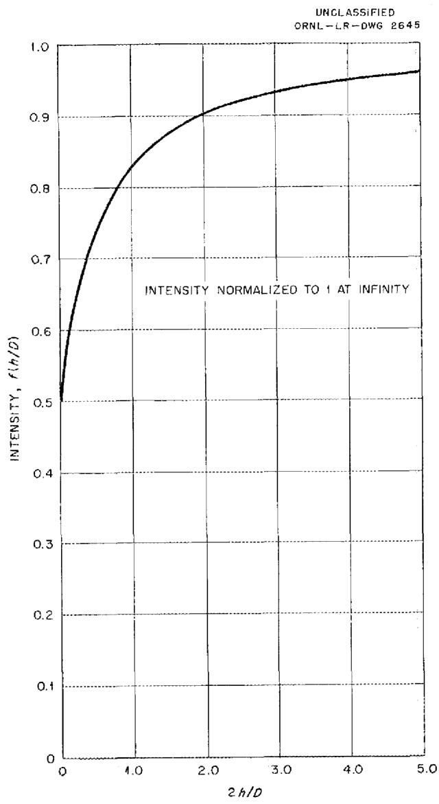  
Fig. 11.1. Variation of Radiation Intensity with Altitude for a Constant Source-Detector Separation Distance.

formulas, similar to some derived by Wigner but which do not require a knowledge of group theory for their application. Here the scattering law is represented by a general formula, $S(\vec{\omega}_0, \vec{\omega}) d\omega_0 d\omega$ , for the probability that a particle arriving within a unit volume at $P$ and moving in a direction $\vec{\omega}_0$ within the solid angle $d\omega_0$ will be scattered into the solid angle $d\omega$ in the direction $\vec{\omega}$ .

Let $Q$ and $P$ be the points $(x_0, y_0, z_0)$ and $(x, y, z)$ , Fig. 11.2, and let $f_m(Q, \vec{\omega}_0) d\omega_0 dV_Q$ be the number of particles which have suffered their $m$ th collision in the volume element $dV_Q = dx_0 dy_0 dz_0$ and emerged in the solid angle $d\omega_0$ with a direction $\vec{\omega}_0$ . If the next collision occurs in a volume element $dV_P$ and if $a$ is the total cross section, the number

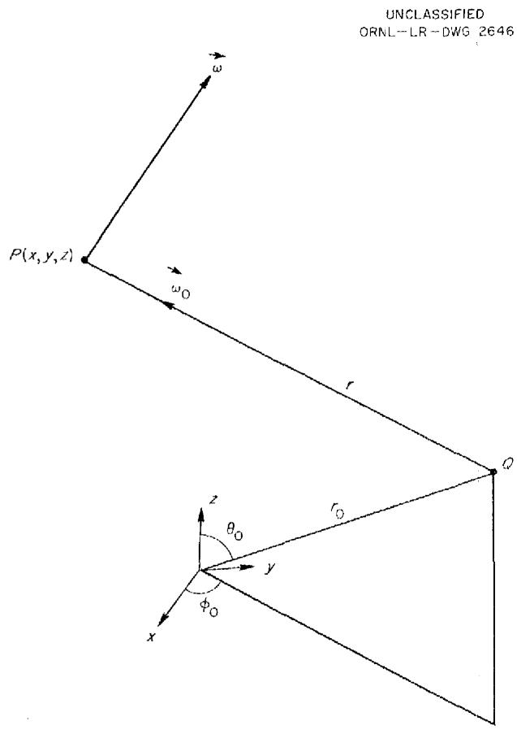  
Fig. 11.2. Geometry for Multiple Scattering Calculation.

of collisions in $dV_{P}$ for which the particle emerges in the solid angle $d\omega$ with direction $\vec{\omega}$ is equal to

$$
f _ {m + 1} (P, \vec {\omega}) d V _ {P} d \omega = d \omega \iiint S (\vec {\omega} _ {0}, \vec {\omega}) e ^ {- a r} r ^ {2} d r d \omega_ {0} f _ {m} (Q, \vec {\omega} _ {0}) \Delta \omega_ {0},
$$

where

$$
r = \left[ (x - x _ {0}) ^ {2} + (y - y _ {0}) ^ {2} + (z - z _ {0}) ^ {2} \right] ^ {\frac {1}{2}}.
$$

Here $\Delta \omega_0$ is the solid angle subtended at $Q$ by $dV_P$ or by $dV_P / r^2$ ; by putting $r^2 dr d\omega_0 = dV_Q$ , then

$$
f _ {m + 1} \left(P, \vec {\omega}\right) = \iint \int f _ {m} \left(Q, \vec {\omega} _ {0}\right) S \left(\vec {\omega} _ {0}, \vec {\omega}\right) \frac {e ^ {- a r}}{r ^ {2}} d V _ {Q}. \tag {1}
$$

Let $Y_{st}(\vec{\omega})$ be the normalized spherical surface harmonics. For convenience, these functions can be ordered in a single series $Y_c$ :

$$
Y _ {0} = Y _ {0, 0}; Y _ {1} = Y _ {1, - 1}; Y _ {2} = Y _ {1, 0}; Y _ {3} = Y _ {1, 1}; Y _ {4} = Y _ {2, - 2}; Y _ {5} = Y _ {2, - 1}; \dots .
$$

Let

$$
f _ {m} (Q, \vec {\omega}) = \sum f _ {m, c} (Q) Y _ {c} (\vec {\omega}).
$$

From Eq.1,

$$
f _ {m + 1} (P, \vec {\omega}) = \sum_ {c} \iint \int f _ {m, c} (Q) Y _ {c} (\vec {\omega} _ {0}) S (\vec {\omega} _ {0}, \vec {\omega}) \frac {e ^ {- a \tau}}{r ^ {2}} d V _ {Q}.
$$

Introducing a Fourier transformation of both sides and using

$$
k _ {1} x + k _ {2} y + k _ {3} z = k r \cos (k, r),
$$

with

$$
k = \left[ k _ {1} ^ {2} + k _ {2} ^ {2} + k _ {3} ^ {2} \right] ^ {\frac {1}{2}},
$$

gives

$$
\begin{array}{l} \iint e ^ {- i (k _ {1} x + k _ {2} y + k _ {3} z)} f _ {m + 1} (P, \vec {\omega}) d V _ {P} \\ = \sum_ {c} \iint \int e ^ {- i k r _ {0} \cos (r _ {0}, k)} f _ {m, c} (Q) d V _ {Q} \iint \int e ^ {- i k r \cos (r, k)} Y _ {c} (\vec {\omega} _ {0}) S (\vec {\omega} _ {0}, \vec {\omega}) \frac {e ^ {- a r}}{r ^ {2}} d \vec {V} _ {P}. \\ \end{array}
$$

where

$$
d \bar {V} _ {P} = d (x - x _ {0}) d (y - y _ {0}) d (z - z _ {0}).
$$

The direction $\vec{\omega}_0$ is the direction from $Q$ to $P$ , so that, as indicated, the transform of the right side of Eq. 1 breaks up into a sum of products of Fourier transforms. The last integrals on the right can evidently be evaluated independently of the position $Q$ . By expanding $S$ in the form

$$
S (\vec {\omega} _ {0}, \vec {\omega}) = \sum A _ {q p} Y _ {p} (\vec {\omega} _ {0}) Y _ {q} (\vec {\omega}),
$$

these integrals become

$$
\begin{array}{l} \iiint e ^ {- i k r} \cos (r, k) Y _ {c} (\vec {\omega} _ {0}) S (\vec {\omega} _ {0}, \vec {\omega}) \frac {e ^ {- a r}}{r ^ {2}} d V _ {p} \\ = \sum A _ {q p} Y _ {q} (\vec {\omega}) \quad \iint_ {r = 0} ^ {\infty} e ^ {- i k r \cos (k _ {e} r) - a r} Y _ {p} (\vec {\omega} _ {0}) Y _ {c} (\vec {\omega} _ {0}) d \omega_ {0} d r \\ = \sum A _ {q p} Y _ {q} (\vec {\omega}) I _ {p c}, \\ \end{array}
$$

where

$$
d \vec {V} _ {P} = r ^ {2} d r d \omega_ {0},
$$

$$
I _ {p c} = \iint \frac {Y _ {p} (\vec {\omega} _ {0}) Y _ {c} (\vec {\omega} _ {0}) d \omega_ {0}}{\alpha + i k \cos (k , r)}.
$$

Let

$$
F _ {m, c} = \int \int \int e ^ {- i k r _ {0} \cos (r _ {0}, k)} f _ {m, c} (\mathcal {Q}) d V _ {\mathcal {Q}}
$$

and then

$$
\sum_ {i} F _ {m + 1, j} Y _ {j} (\vec {\omega}) = \sum_ {i} F _ {m, c} \sum_ {p} A _ {q p} l _ {p c} Y _ {q} (\vec {\omega}).
$$

Equating coefficients of identical $Y$ 's gives

$$
F _ {m + 1, q} = \sum_ {c, p} A _ {q p} I _ {p c} F _ {m, c} = \sum_ {c} B _ {q c} F _ {m, c},
$$

where

$$
B _ {q c} = \sum_ {p} A _ {q p} I _ {p c}.
$$

and

$$
\sum_ {1} ^ {\infty} \left\{F _ {t} \right\} = \sum_ {1} ^ {\infty} \widetilde {B} ^ {m} \left\{F _ {0} \right\} = \binom {\widetilde {B}} {1 - \widetilde {B}} \left\{F _ {0} \right\}.
$$

The source function may be anisotropic; however, if an isotropic source is present or if the scattering law possesses axial symmetry, some simplifications occur.

When the scattering density has been obtained by a Fourier inversion, one further integration gives the flux into an arbitrary unit volume from any direction; if the detector sensitivity depends on direction, the total scattering to be counted at any point $P'$ is represented by a convolution and can be calculated by another Fourier transformation and inversion. The method is to be applied to air scattering measurements taken at the TSF and will make possible subsequent calculations for unusual reactor shield shapes.

Thus, if $F_{m,c}$ is represented as a vector $(F_{m,0}, F_{m,1}, F_{m,2}, \ldots)$ for all $m$ ,

$$
\left\{ \begin{array}{c} F _ {m + 1, 0} \\ F _ {m + 1, 1} \\ \cdot \\ \cdot \\ \cdot \\ F _ {m + 1, q} \end{array} \right\} \equiv \left\| B _ {q c} \right\| \left\{ \begin{array}{c} F _ {m, 0} \\ F _ {m, 1} \\ \cdot \\ \cdot \\ \cdot \\ F _ {m, c} \end{array} \right\} \quad \tilde {\widetilde {B}} = \| B _ {q c} \| = \| A \| \cdot \| I \|.
$$

Then, formally,

$$
\left\{F _ {1} \right\} = \widetilde {B} \left\{F _ {0} \right\}
$$

$$
\left\{F _ {2} \right\} = \widetilde {B} \left\{F _ {1} \right\} = \widetilde {B} ^ {2} F _ {0}
$$

$$
\{F _ {m} \} = \tilde {B} ^ {m} \{F _ {0} \}
$$

Method for Isotropic Source and Scattering. If the scattering is isotropic after each collision, the formula to be used for calculating the total flux at the point $P$ after the $n$ th collision is a convolution:

$$
F _ {n} (P) = \sigma_ {s} \iint \int F _ {n - 1} (Q) d V _ {Q} \phi (Q, P),
$$

with

$$
\phi (Q, P) = \frac {e ^ {- \alpha R} P Q}{4 \pi R _ {P Q} ^ {2}}.
$$

Since the Fourier transform of a convolution is the product of the transforms of the individual functions, for an isotropic source with no energy loss after each collision the transform $TF_{n}$ becomes

$$
\left(T \phi\right) ^ {n + 1} \sigma_ {s} ^ {n}
$$

with

For isotropic re-emission from the ground,

$$
\begin{array}{l} F = \frac {N _ {0} A}{8 \pi^ {2} b ^ {2}} \int_ {a = 0} ^ {\pi} f (a) \sin a d a \\ \times \int_ {\phi = - \pi / 2} ^ {\pi / 2} \frac {d \phi}{g (\alpha , \phi)}. \\ \end{array}
$$

$$
\phi = \frac {1}{2 p} \ln \left(\frac {a + p}{a - p}\right) = \iiint e ^ {- i (\omega_ {1} x + \omega_ {2} y + \omega_ {3} z)} \phi (x, y, z) d x d y d z
$$

where

$$
p = i \left[ \omega_ {1} ^ {2} + \omega_ {2} ^ {2} + \omega_ {3} ^ {2} \right] ^ {\frac {1}{2}}.
$$

In taking the inverse of $TF_{n'}$ the path of integration is deformed into the closed curve about the negative real axis to the left of $-a$ . Calculations of these scattering functions for the first- and second-scattered flux give

$$
\begin{array}{l} F _ {1} = 1. 6 3 5, \\ F _ {2} = 0. 1 9 1 6 7. \\ \end{array}
$$

These figures are to be multiplied by $1 / 4\pi^2\lambda D,$ for $\lambda = 130$ meters, to obtain the number of fast neutrons at a distance $D$ feet from the source.

# GROUND SCATTERING OF NEUTRONS

A. Simon

H. E. Stern

An investigation is being carried out to derive formulas for the ground-scattered neutron flux to be obtained from a general source distribution. The model used is that of a source whose axis, or direction of maximum intensity, forms an arbitrary angle $\theta$ with the source-receiver axis but lies in the same horizontal plane as the latter. The differential source strength is assumed to be a function of only the angle between the emergent ray and the source axis. The receiver is isotropic under the assumptions of no air attenuation and a constant albedo for the ground. The following expressions for the flux at the receiver are obtained:

For cosine re-emission from the ground,

$$
\begin{array}{l} F = \frac {N _ {0} A}{4 \pi^ {2} b ^ {2}} \int_ {\alpha = 0} ^ {\pi} f (\alpha) \sin \alpha d \alpha \\ \times \int_ {\phi = - \pi / 2} ^ {\pi / 2} \frac {d \phi}{[ g (\alpha , \phi) ] ^ {3 / 2}}. \\ \end{array}
$$

where

$$
N _ {0} = \text {t o t a l s o u r c e s t r e n g t h (n e u t r o n s / s e c)},
$$

$$
A = \text {r e f l e c t i o n} \quad \text {c o e f f i c i e n t} \quad \text {o f} \quad \text {t h e} \quad \text {g r o u n d} \quad (\text {a l b e d o}),
$$

$$
f (a) = \text {r e l a t i v e s o u r c e s t r e n g t h p e r s t e r a d i a n a t}
$$

$$
b = \text {h e i g h t}
$$

$$
\begin{array}{l} g (\alpha , \phi) = \frac {1}{\sin^ {2} \alpha \cos^ {2} \phi} \\ - 2 \left(\frac {D}{b}\right) \cos \theta \cot \alpha \sec \phi \\ - 2 \left(\frac {D}{b}\right) \sin \theta \tan \phi + \left(\frac {D}{b}\right) ^ {2}, \\ \end{array}
$$

$$
\begin{array}{l} \theta = \text {a n g l e} \\ D = \text {s e p a r a t i o n d i s t a n c e b e t w e e n s o u r c e a n d} \\ \end{array}
$$

Alternatively, if a single-scatter approach with attenuation by a "removal" mechanism is used, the following formula is obtained:

$$
F = \frac {N _ {0}}{1 6 \pi^ {2} b ^ {2}} \frac {\Sigma_ {s}}{\Sigma_ {r}} \int_ {\alpha = 0} ^ {\pi} f (\alpha) \sin \alpha d \alpha \int_ {\phi = - \pi / 2} ^ {\pi / 2} \frac {1}{g (\alpha , \phi)} \frac {1}{1 + \sin \alpha \cos \phi g (\alpha , \phi)} d \phi ,
$$

where

$\Sigma_{s} =$ scattering cross section,

$\Sigma_r =$ removal cross section.

A detailed report on this calculation is being prepared.

# FOCUSing of Radiation in a CYLINDRICAL CREW COMPARTMENT

# J. E. Faulkner

A study of the focusing of radiation in a cylindrical crew compartment has been made, with particular attention being given to the case with the following conditions:

1. The cylinder is infinite.   
2. The surface radiation density is constant along the inner cylinder walls.   
3. The angular distribution of the radiation depends only on the angle between the direction of emergence and the normal to the cylinder.   
4. The attenuation inside the crew space is pure inverse square.   
5. The detector is isotropic.

Under these conditions the angular distribution may be represented as an isotropic component plus a series in odd powers of the cosine. The contribution of each term at a given point in the component in the series may be expressed in an even polynomial in $x$ (see Fig. 11.3), where $x$ is the distance of the given point from the axis of the cylinder divided by the radius of the cylinder. For pure cosine distribution the reading of an isotropic detector is independent of position in the crew compartment.

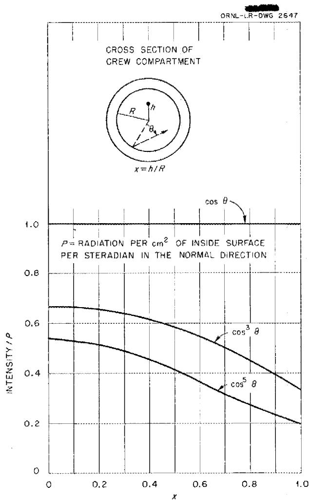  
Fig. 11.3. Variation of Radiation Intensity with Distance from Center of Crew Compartment.

# 12. LID TANK SHIELDING FACILITY

G. T. Chapman

J.M.Miller W.Steyert

D. K. Trubey

Physics Division

J.B.Dee

Pratt and Whitney Aircraft Division

Preliminary work for further circulating-fuel reflector-moderated reactor shield experiments at the Lid Tank Shielding Facility (LTSF) has continued with irradiation in the ORNL Graphite Reactor of a sample of the UF $_6$ -C $_7$ F $_{16}$ mixture that may be used to simulate the reactor fuel in the shield mockup. Also, a new effective removal cross section for carbon has been obtained for the case in which the carbon is distributed uniformly throughout the shield.

Thermal- and fast-neutron measurements have been made around an array of three of the GE-ANP helical air ducts, and a 35-duct array is being assembled for further measurements. Difficulties in fabricating the enriched uranium plate for the new LTSF source have delayed the completion of this project; however, it appears at present that these difficulties have been surmounted. It is anticipated that the installation will be completed within a month.

# REFLECTOR-MODERATED REACTOR AND SHIELD MockUP TESTS

J.B.Dee

D. K. Trubey W. Steyer

A second series of mockup tests for the circulating-fuel reflector-moderated reactor (RMR) and shield is being initiated at the LTSF. For this series a larger tank (approximately a 6-ft cube) has been constructed to hold all the dry components of the configurations, as well as an expandible plastic bag for containing borated water. The beryllium blocks to be used in the mockups will also be placed in plastic containers for additional protection.

The dry tank face adjacent to the source plate has a $\frac{1}{8}$ -in.-thick Inconel window, which corresponds to the RMR core shell. In order to determine the effect of the Inconel on the gamma-ray dose,

gamma measurements were taken in pure water in the tank. The dose was higher by a factor of 2 than that normally observed in the LTSF, and the increase agrees closely with the calculated 9-Mev capture gamma-ray dose from the Inconel.

In addition to the presently planned static fission source tests for RMR designs, a dynamic fission source test is being considered for measuring the sodium activation from delayed neutrons released in the heat exchanger and the attenuation of gamma rays from short-lived fission products. A liquid being considered is $C_7F_{16}$ containing 20 wt % UF. In cooperation with the Radiation Damage group of the Solid State Division, a sample containing natural uranium was irradiated in a fluorinated nickel capsule in the ORNL Graphite Reactor for an integrated flux of 1017 nvt, which compares with an integrated flux of 1015 nvt for the enriched fuel. After the volatile products had been removed by vacuum distillation, a precipitate containing most of the radioactivity and a large part of the uranium was found in the irradiated capsules; thus, this fuel mixture could not be used for long exposures. A similar capsule test is being prepared for a shorter exposure, and alternate solutions are being explored.

# EFFECTIVE REMOVAL CROSS SECTION OF CARBON

D. K. Trubey

Measurements of the removal cross section of carbon have been made in a continuous carbon medium obtained by dissolving sugar $(\mathsf{C}_{12}\mathsf{H}_{22}\mathsf{O}_{11})$ in water. The solution (density $= 1.312 \pm 0.001 \, \text{g/cm}^3$ ) contained 64.2 wt $\%$ sugar, which gave 0.354 g/cm³ of carbon and a hydrogen and oxygen density that was 96% of that of plain water. It was contained in a large tank that had a $1/8$ -in.-thick Inconel window on the source side.

The thermal-neutron flux, the fast-neutron dose, and the gamma-ray dose are shown as functions of distance from the source in Figs. 12.1, 12.2, and

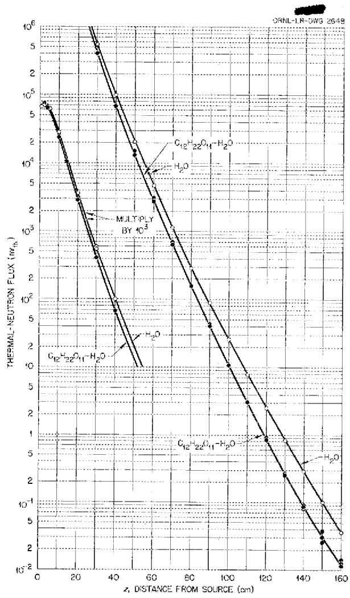  
Fig. 12.1. Thermal-Neutron Flux in Sugar Solution.

12.3, respectively. Plain water curves are also shown for comparison. The gamma-ray water curve is higher than the normal LTSF water curve because of the high-energy capture gamma ray from the Inconel window of the tank (see preceding discussion).

Since the medium contained almost as much hydrogen and oxygen as does plain water and contained them in the same ratio, no geometric correction was made in calculating the effective removal cross section, $\sigma_{r}$ . The average $\sigma_{r}$ for the range of 90 to $140\mathrm{cm}$ from the source was 0.750 barn. This compares with a value of $0.81 \pm 0.05$ barn from an LTSF measurement behind a slab of graphite that contained $51.3\mathrm{g/cm}^2$ of carbon, which corresponds to

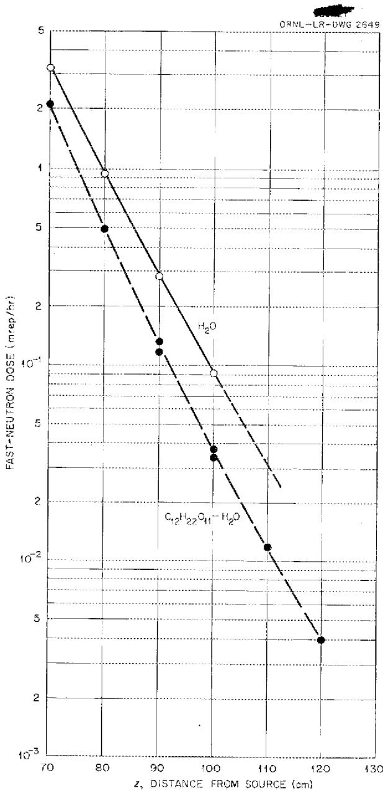  
Fig. 12.2. Fast-Neutron Dose in Sugar Solution.

the sugar-water solution at 145 cm.

In order to observe the neutron attenuation in a medium removed from the source, the sugar-water solution is being placed in a 36-in.-long aluminum tank located $48.2\mathrm{cm}$ from the source. Thermal-neutron, fast-neutron, and gamma-ray measurements will be made in the tank. The measurements at the interface will indicate the difference in neutron age between water and the sugar solution for the more penetrating of the fission neutrons.

# GE-ANP HELICAL AIR DUCT EXPERIMENTATION

J.M.Miller

Thermal-neutron measurements have been made around 3-in.-dia by 4-ft (developed length) GE-ANP

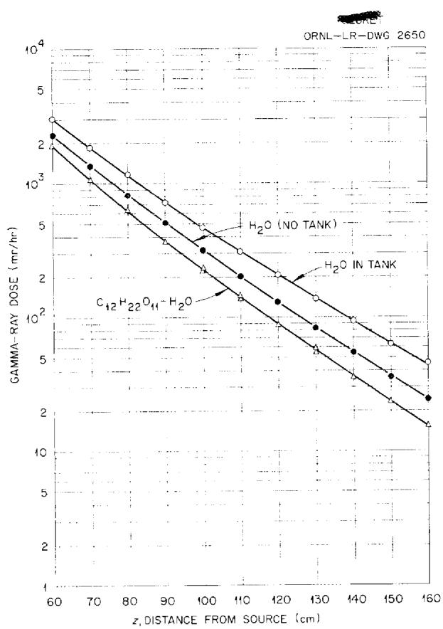  
Fig. 12.3. Gamma-Ray Dose in Sugar Solution.

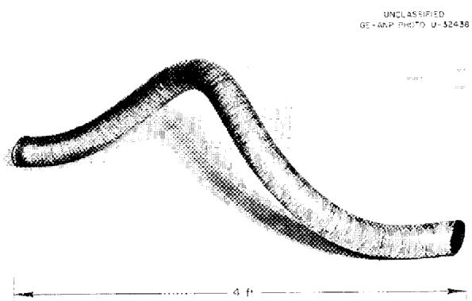  
Fig. 12.4. GE-ANP Helical Air Duct.

helical air ducts at the LTSF. The ducts (Fig. 12.4) were fabricated from flexible steel conduit shaped around a 9-in. core. After removal of the core, the ducts were stiffened by Fiberglass wrapping.

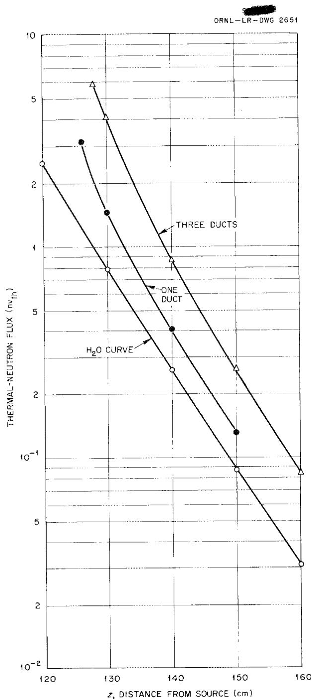  
Fig. 12.5. Thermal-Neutron Flux Measurements Beyond One and Three GE-ANP Helical Air Ducts - Horizontal Traverses.

Two configurations, a single duct and a triangular array of three ducts (5 in. from center to center), were placed in the LTSF with one end adjacent to the source plate. A comparison of the thermal-neutron flux beyond the two configurations is given in Fig. 12.5, and Figs. 12.6 and 12.7 are thermal

neutron traverses parallel to the source plate. An array of 35 ducts is to be placed in a medium of steel Raschig rings (35 vol %) and borated water for a study of the effect of the addition of ducts to gamma shielding.

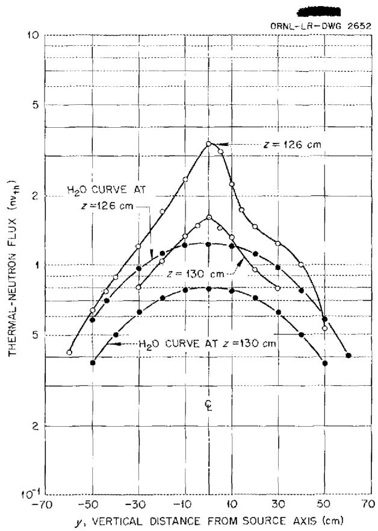  
Fig. 12.6. Thermal-Neutron Flux Measurements Beyond One GE-ANP Helical Air Duct - Vertical Traverses.

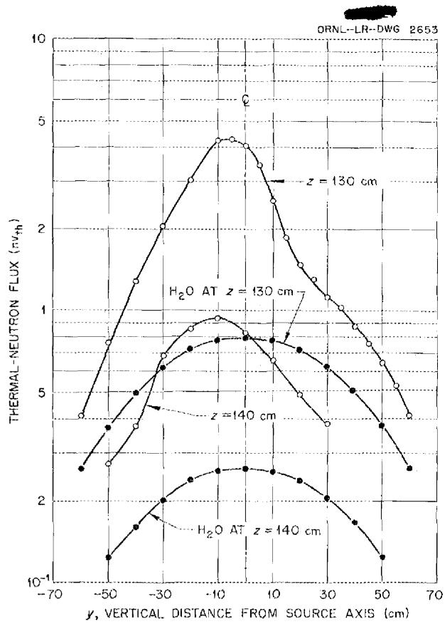  
Fig. 12.7. Thermal-Neutron Flux Measurements Beyond Three GE-ANP Helical Air Ducts - Vertical Traverses.

# 13. BULK SHIELDING FACILITY

R. G. Cochran

F. C. Maienschein

G.M. Estabrook

K. M. Henry

J.D.Flynn

E. B. Johnson

M. P. Haydon

T. A. Love

R.W.Peelle

Physics Division

At the Bulk Shielding Facility (BSF) measurements were made of reactor radiations through thick slabs of graphite. In this experiment the fast-neutron spectrum through graphite and a removal cross section of carbon were also determined. The light to be given off from a nuclear-powered airplane has been further investigated, and some quantitative measurements are reported. In addition, a method of determining the power of the ARE by means of fuel activation techniques is described.

# REACTOR RADIATIONS THROUGH SLABS OF GRAPHITE

R.G.Cochran

J.D.Flynn

G.M. Estabrook

K.M.Henry

Measurements have been completed for determining the attenuation of large thicknesses of graphite next to a reactor. These measurements are of interest for evaluating a graphite reflector as a shield component, and they also provide a direct comparison with LTSF determinations of the carbon removal cross section. Graphite thicknesses of 1, 2, and 3 ft were used, and the usual gamma-ray, thermal-neutron, and fast-neutron dose measurements were made behind each slab thickness. In addition, the fast-neutron spectrum (above 1.3 Mev) through 1 ft of graphite was measured.

A graphite slab 1 ft thick and one 2 ft thick were constructed, and the 3-ft thickness was obtained by strapping these two slabs together. When strapped together, there was no possibility of water getting between the slabs. Each slab was constructed largely of graphite blocks, 4 in. $\times$ 12 in. $\times$ 5 ft, stacked in aluminum tanks in such a way that there could be no streaming of radiation through cracks extending through an entire slab thickness.

Thin graphite shims were added to fill the tanks, which were sealed by heliarc welding and were pressure tested for leaks. The total aluminum wall thickness for each tank was 1.3 cm.

Bulk Shielding Reactor loading No. 26 (Fig. 13.1) was used. This configuration is very similar to loading 22, which has been studied in considerable detail for other experiments, but loading 26 uses less fuel to compensate for the presence of the graphite, which is a better reflector than the water it replaces. Since the presence of the graphite perturbed the neutron flux in the reactor core rather severely, the neutron flux distributions and thus the reactor power were determined in the usual way by means of cobalt foils.

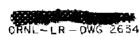

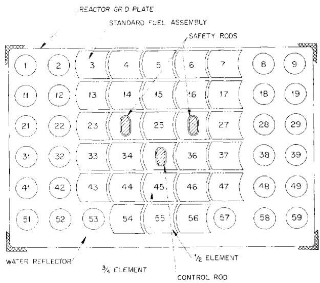  
Fig. 13.1. Loading 26 of the Bulk Shielding Reactor.

The thermal-neutron flux (Fig.13,2) was measured behind each of the three graphite slab thicknesses to a distance of 300 cm from the reactor face. Measurements were made with a 3-in. $U^{235}$ fission chamber, an 8-in. $\mathsf{BF}_3$ counter, and a $12\frac{1}{2}$ in. $\mathsf{BF}_3$ counter, and the data were normalized to indium foil data.

Fast-neutron measurements (Fig. 13.3) were made with a three-section neutron dosimeter. Gamma-ray measurements (Fig. 13.4) were taken

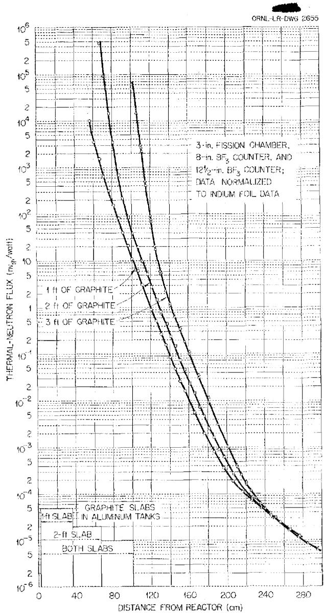  
Fig. 13.2. Thermal-Neutron Flux Measurements Behind AGHT Graphite.

behind each of the three graphite slab thicknesses, both to determine the magnitude and relaxation lengths of the gamma-ray dose through graphite and to ensure that none of the neutron detectors was being used in a too high gamma-ray field, which would have caused their readings to be high.

The fast-neutron spectrum from 1.3 to 10 MeV was measured with the BSF fast-neutron spectrometer. A spectrum with reasonable statistics could be obtained only through the 1-ft graphite slab; the neutron intensities through the 2- and 3-ft sections were too low. The spectrum measured with the

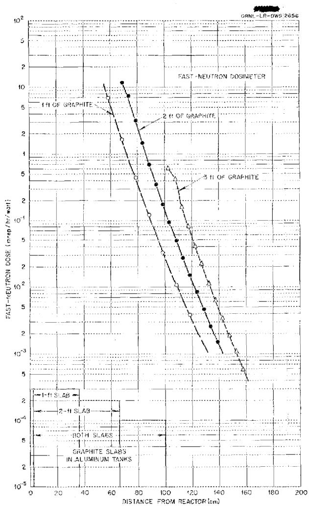  
Fig. 13.3. Fast-Neutron Dose Measurements Behind AGHT Graphite.

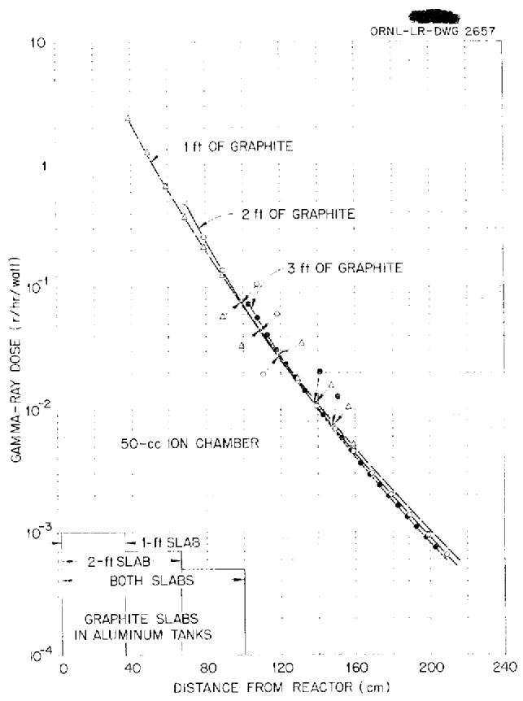  
Fig. 13.4. Gamma-Ray Dose Measurements Behind AGHT Graphite.

1-ft graphite thickness between the reactor face and the end of the spectrometer collimator is shown in Fig. 13.5. The spectrum measured with the end of the collimator against the reactor face is also shown.

Removal cross sections have been calculated for each thickness of graphite by use of a method suggested by E. P. Blizzard. The resulting cross sections are 0.82 barn/atom for the 1-ft slab, 0.84 barn/atom for the 2-ft slab, and 0.80 barn/atom for the 3-ft slab. These removal cross sections are in good agreement with measurements made on graphite at the LTSF.

# REACTOR AIR GLOW

R. G. Cochran

K. M. Henry

T. A. Love

F.C.Maienschein

R.W. Peelle

Attempts to theoretically determine the amount of visible light which may surround a nuclear-powered airplane in flight have resulted in widely differing

values.5,6 Therefore an experiment was performed at the BSF to provide an experimental basis for future estimates.

The end of an air-filled aluminum periscope tube was placed at the reactor face, and the amount of light produced in the tube was measured by a photomultiplier with spectral response similar to that of the average human eye. Other relative measurements were taken with a photomultiplier which was sensitive chiefly in the blue and near-ultraviolet range. The latter measurements are plotted in Fig. 13.6 as functions of the air pressure in the tube. Measurements with argon in the tube demonstrate that neither the approximate amount of light produced nor the exact spectrum emitted is strongly dependent on the atomic number of the gas. It is also interesting to note that the light production in a given volume of air appears to have a maximum at a pressure corresponding to an altitude of about 30,000 ft.

It is demonstrated in Figs. 13.7 and 13.8 that the air glow is largely caused by gamma radiation rather than by neutrons. Figure 13.7 shows the decay of the light plotted along with the decay of the reactor gamma ion chamber current just after reactor shutdown. The attenuation by water of the radiation which produces the air glow is shown in Fig. 13.8. This attenuation rather closely follows that of gamma rays.

The photomultiplier was used to compare the quantity of light given off in the air-glow tube with that from a small tungsten lamp mounted at the reactor end of the tube. This comparison showed that $7.2 \times 10^{-5}$ lumen was given off by the glow for a reactor power of 100 kw and atmospheric pressure. Presumably, the amount of light should be proportional to the integral of the gamma-ray dose rate over the volume of the air in the measuring tube. This integral was estimated to be $1.1 \times 10^{10} (\mathrm{r} \cdot \mathrm{cm}^3) / \mathrm{hr}$ . Therefore the effective light production per unit volume of air is

$$
L = 6. 5 \times 1 0 ^ {- 1 5} (l u m e n / c m ^ {3}) / (r / h r).
$$

If it is assumed that all the light is given off at

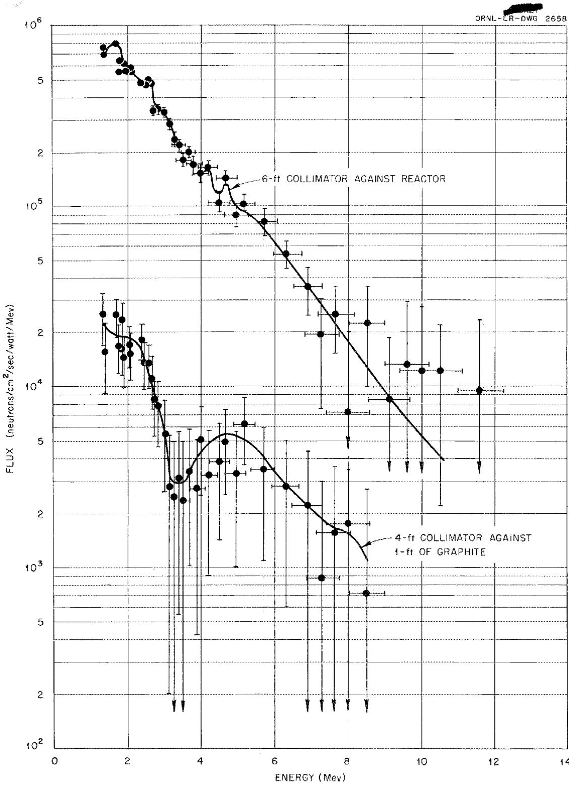  
Fig. 13.5. Fast-Neutron Spectrum of the Bulk Shielding Reactor Observed Through 1 ft of Graphite.

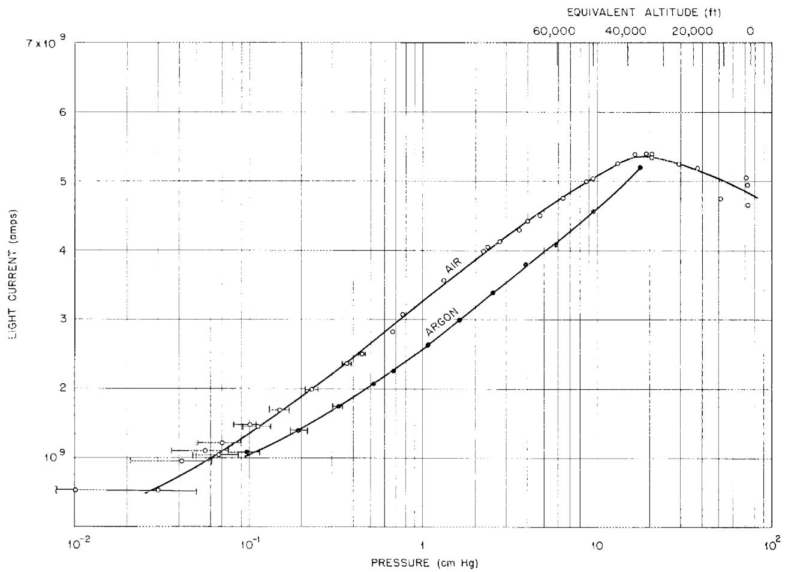  
Fig. 13.6. Variation of Glow with Pressure.

4600 Å, which is in the blue region,

$7.2 \times 10^{-5}$ lumen = $1.9 \times 10^{-7}$ watt of visible light.

The amount of air glow can then be characterized as the fraction of energy transformed into visible light:

$$
\begin{array}{l} f = \frac {\text {w a t t s o f v i s i b l e l i g h t i n t u b e}}{\text {w a t t s o f e n e r g y d i s s i p a t e d i n t u b e b y g a m m a r a d i a t i o n}} \\ = \frac {1 . 9 \times 1 0 ^ {- 6}}{3 . 2 \times 1 0 ^ {- 2}} = 6 \times 1 0 ^ {- 5} \text {f o r a t m o s p h e r i c p r e s s u r e}. \\ \end{array}
$$

This experimental value of light yield is in disagreement with the theoretical estimates of Welton $^{5}$ (0.05) and of Faulkner $^{6}$ $(2 \times 10^{-9})$ . In neither of these calculations was the effect of pressure considered.

The value of $L$ may be used to calculate the light emission from a typical nuclear-powered aircraft. For a reactor power of 200 Mw and a reactor shield of 147 cm of water (similar to the shield design of the 1950 ANP Shielding Board), the BSF measurements indicate that the gamma-ray dose just outside the edge of the shield would be $1.36 \times 10^{6} \, \text{r/hr}$ with a relaxation length of 22 cm. The dose integrated over space outside the shield is $1.2 \times 10^{15} \, (\text{r·cm}^{3}) / \text{hr}$ . Multiplying this by $L$ , the luminosity would be 75 lumens, which would have roughly the equivalent brightness to the eye of a 10-w (±7 w) incandescent light if the aircraft were far enough away to appear as a point source

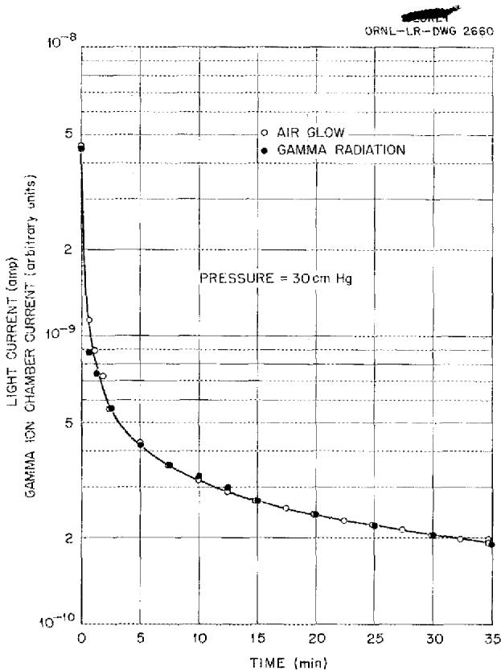  
Fig. 13.7. Decay of Air Glow and Reactor Gamma Rays.

of light. This large uncertainty is primarily attributable to the low sensitivity of the eye-equivalent photomultiplier. A more detailed discussion of these preliminary values will be given in a forthcoming report.8

# FUEL ACTIVATION METHOD FOR POWER DETERMINATION OF THE ARE

E. B. Johnson

When the ARE goes into operation, many measurements of its performance will be made. Among them will be the power level at which it operates, which will be measured in more than one way. A method suggested by J. L. Meem is based on the measurement of the relative activity of fuel samples exposed in the ARE and in a known flux in another reactor (BSR). An experiment has been initiated at the BSF to implement this suggestion.

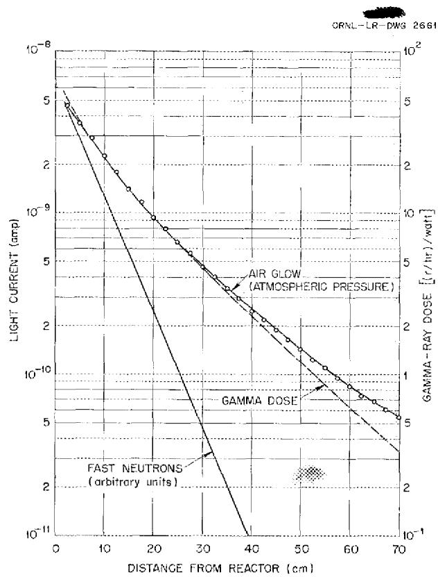  
Fig. 13.8. Attenuation in Water of Radiation Causing Air Glow.

The activity resulting from the irradiation of fissionable material is not easy to predict because of the large number of isotopes for which calculations would be required. However, for identical flux, exposure time, and waiting period after exposure, the specific activity of two samples should be the same. Furthermore, at low neutron fluxes the activity should be proportional to the flux.

It is contemplated that the ARE will be operated at a nominal power level of approximately 1 w for 1 hr, that it will then be shut down, and that a sample of the irradiated fuel will be withdrawn for counting and analyzing. The ARE experimental program will then proceed as scheduled. A decay curve will be run on this fuel sample from the ARE and compared with the decay curve obtained on a similar fuel capsule irradiated for the same length of time in the BSR in a known neutron flux of about the same magnitude. From the relative activity of the two samples, the operating power of the ARE

can be determined readily. For the power comparison it will be necessary to know the uranium content of the sample and of the ARE, as well as the energy per fission. A small correction will

be necessary for the local depression of flux by the uranium sample. This factor has been estimated by W. K. Ergen to be 0.80. Details for the application of this method are given in a separate report.10

# 14. TOWER SHIELDING FACILITY

C. E. Clifford

T. V. Blosser

J. L. Hull

L. B. Holland

F. N. Watson

Physics Division

D. L. Gilliland, General Electric Company

M. F. Valerino, National Advisory Committee for Aeronautics

J. Van Hoomissen, Boeing Airplane Company

The Tower Shielding Facility (TSF) experimental program has, thus far, included measurements of ground- and air-scattered fast neutrons and the development of a new procedure for the determination of the power of the reactor. Tests on the GE-ANP R-I divided-shield mockup have been started.

# FAST-NEUTRON GROUND AND AIR SCATTERING MEASUREMENTS

T. V. Blosser

J. Van Hoomissen

D. L. Gilliland

F. N. Watson

The performance of neutron and gamma-ray air scattering experiments that are free from an excessive background of ground-scattered radiation is a primary objective of the TSF. Therefore, measurements of the scattered fast neutrons as a function of reactor-detector altitude were necessary to determine the contribution of ground-scattered radiation to the total flux, particularly at the maximum altitude. These measurements will help to indicate the magnitude of the ground-scattered neutron background to be expected in future differential experiments, and they will aid in an understanding of the variation of ground and air scattering as the ground is approached.

Measurements of the thermal-neutron distribution were taken in the detector tank, which is essentially a 5-ft cube of water and which was, for these experiments, situated 64 ft from the reactor tank. The reactor was placed at an angle $\theta$ of 330 deg from the $d$ axis (Fig. 14.1), and a $\mathsf{BF}_3$ counter was moved along a line normal to and near the right side of the detector tank. In this region, contributions from other faces of the tank were negligible; thus the neutrons detected by the counter were the air- or ground-scattered fast neutrons which entered the side wall and were thermalized in the water near the detector. The reactor and detector tank altitudes were varied simultaneously, in discrete steps, from 0 to 195 ft.

A composite plot of the measurements (Fig. 14.2) indicated only small differences in slope but appreciable differences in magnitude between the curves for the various altitudes. A plot of the flux vs the altitude (Fig. 14.3) showed a pronounced peak in the region between the 15- and 20-ft altitudes, which indicated the importance of ground-scattered neutrons in this region. It should be noted that the reading at zero altitude was obtained with the reactor half-immersed in the ground pool, the upper half being shielded as before; so essentially half of the source was occluded, as was half of the scattering medium. Thus the air-scattered neutrons should be no more than half of the value at full altitude and no less than one quarter. Because the intensities at the 150- and 195-ft altitudes were the same, it was concluded that the ground-scattered contribution at these altitudes was small.

In a preliminary analysis of the data, it was estimated that this contribution was 2 to $5\%$ of the total scattered neutrons. While the detailed calculations of ground and air scattering being undertaken in connection with this investigation are not yet completed, a preliminary comparison of the data with calculations carried out at the Boeing Airplane Company for a not too dissimilar situation has been made. The qualitative agreement is very good, although the peak in the total flux, as measured, seems to be at a lower altitude. A report on this experiment is being prepared.

# CALORIMETRIC REACTOR POWER DETERMINATION

D. L. Gilliland L. B. Holland

J.L.Hull

A procedure has been developed and tested for a calorimetric determination of the power of the

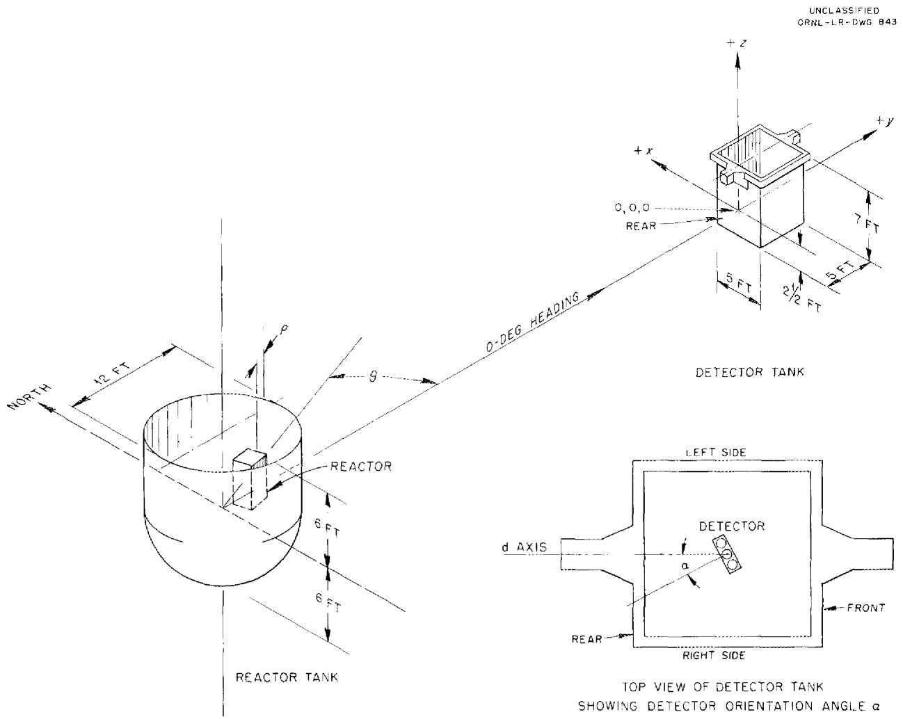  
Fig. 14.1. Geometrical Convention Adopted for Tower Shielding Facility Experiments.

$d$ - distance from the center of the reactor tank to the 0, 0, 0 point.   
$b$ - altitude of both the 0, 0, 0 point and the center of the reactor.   
$\theta$ - horizontal angle between $\rho$ and $d$ axes.   
$a$ detector orientation angle, horizontal angle between $d$ axis and a perpendicular to the broad side of the triplet $\mathbf{BF}_3$ chamber.

0, 0, 0 point location - on the outside of the detector tank 2.5 ft above the inside bottom of the tank.

$x, y, z$ coordinates of geometric center of detector. Since the center of detection of the various counters will shift with the location of the detector in the tank, the $x, y, z$ coordinates indicate the geometric center of the detector.

$\rho$ - thickness of water between outer reactor face and reactor tank wall, measured along a radius.

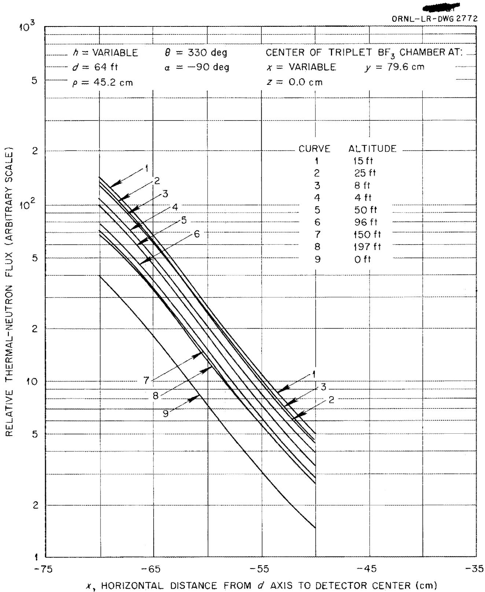  
Fig. 14.2. Attenuation of Scattered Neutron Flux in Detector Tank at Various Altitudes.

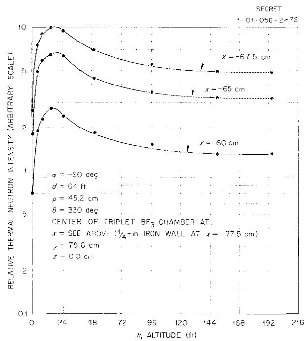  
Fig. 14.3. Variation of Scattered Neutron Flux with Altitude.

TSR. Thermocouple measurements of the bulk water temperature in the 12-ft-dia reactor tank are made while the water is being stirred sufficiently to ensure that no significant difference in temperature exists throughout the tank. The rate of temperature rise of the water when the reactor is started is then proportional to the power of the reactor. Small corrections must be made for the power input due to the mixing and for the heat loss.

This procedure was first used for a 5 by 6 fuel element loading in the TSR. The reactor tank was lowered into the drained handling pool, and four mixers were placed at various positions within the tank. The turbulence created by the mixers was sufficient for thorough mixing of the water, but the power added by the mixers was not enough to give a measurable increase of the water temperature. Before the reactor was started, the temper

ature remained constant for more than 1 hr with the mixers running.

Some heat insulation was obtained by creating, with a double layer of canvas, a dead-air space above the water and around the reactor tank. The temperature rise during a reactor run was measured by 12 thermocouples placed in the tank. The thermocouples had previously been calibrated at temperatures of 0, 25, and $50^{\circ}C$ and agreed to within $0.1^{\circ}C$ .

The first run of the experiment was started at $24^{\circ}C$ , and the total temperature rise was approximately $14^{\circ}C$ . The experiment was repeated at a higher temperature level but with the same heat input and total temperature rise. The initial temperature for this run was approximately $15^{\circ}C$ above the ambient temperature, and the rise was again $14^{\circ}C$ . The cooling rate at the conclusion of this run was $0.3^{\circ}C/hr$ . In a third run the initial temperature was brought $15^{\circ}C$ below the ambient by cooling the reactor tank with ice before the run. The results of the three runs were consistent to within $1\%$ . A detailed report of this experiment is being prepared.

# GE-ANPR-1 DIVIDED-SHIELDMOCKUP TESTS

T.V.Blosser J.Van Hoomissen   
D. L. Gilliland F. N. Watson

Tests on the GE-ANP R-1 divided-shield mockup (Figs. 14.4 and 14.5) will begin with traverses around the reactor-shield section in the handling pool for comparison with measurements made at the BSF. Measurements will then be made in the TSF detector tank, which will be situated 64 ft from the reactor shield at an altitude of 195 ft. It is anticipated that the detector tank will be replaced by the crew-compartment mockup in mid-September.

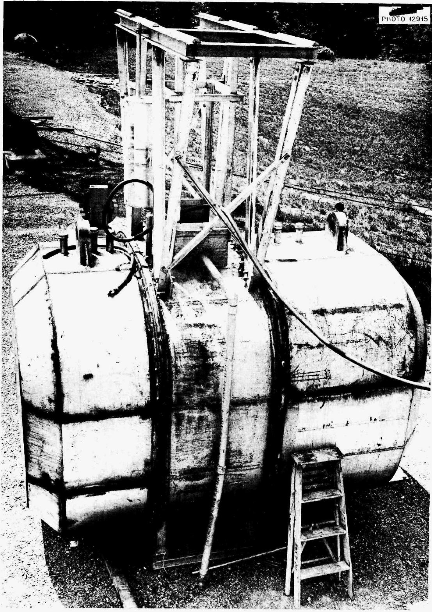  
Fig. 14.4. Reactor-Shield Section of the GE-ANP R-1 Divided-Shield Mockup.

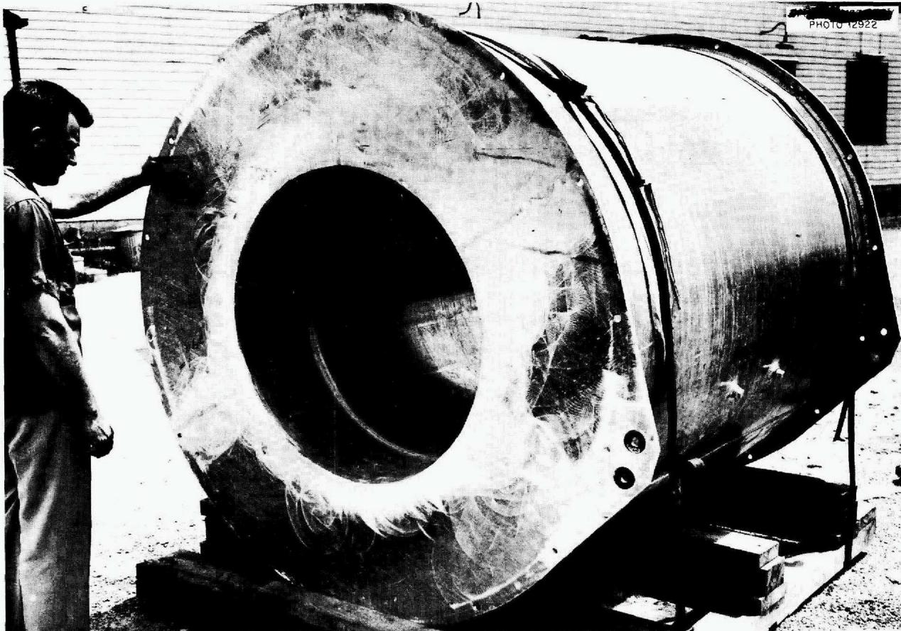  
Fig. 14.5. Crew-Compartment Section (Ends Removed) of the GE-ANP R-1 Divided-Shield Mockup.

Part IV

APPENDIX

# 15. LIST OF REPORTS ISSUED DURING THE QUARTER

<table><tr><td>REPORT NO.</td><td>TITLE OF REPORT</td><td>AUTHOR</td><td>DATE ISSUED</td></tr><tr><td colspan="4">I. Aircraft Reactor Experiment</td></tr><tr><td>CF-54-7-11</td><td>Fuel Activation Method for Power Determination of the ARE</td><td>E. B. Johnson</td><td>7-31-54</td></tr><tr><td>CF-54-7-143</td><td>ARE Operating Procedures, Part I, Pre-Nuclear Operation</td><td>W. B. Cottrell</td><td>7-20-54</td></tr><tr><td>CF-54-7-144</td><td>ARE Operating Procedures, Part II, Nuclear Operation</td><td>J. L. Meem</td><td>7-27-54</td></tr><tr><td>CF-54-8-171</td><td>Critical Mass of the ARE Reactor</td><td>C. B. Mills</td><td>8-28-54</td></tr><tr><td colspan="4">II. General Design</td></tr><tr><td>CF-54-6-201</td><td>A Reactor Design Parameter Study</td><td>A. H. Fox et al.</td><td>6-25-54</td></tr><tr><td rowspan="2">CF-54-7-1</td><td rowspan="2">The Effect of the RMR Shield Weight of Varying the Neutron and Gamma Dose Components Taken by the Crew and Comparison of the RMR Shield Weight to that for an Idealized Shield</td><td>R. M. Spencer</td><td>8-26-54</td></tr><tr><td>H. J. Stumpf</td><td></td></tr><tr><td rowspan="3">CF-54-7-187</td><td rowspan="3">Test Results and Design Comparisons for Liquid Metal-to-Air Radiators</td><td>H. J. Stumpf</td><td>7-19-54</td></tr><tr><td>R. E. MacPherson</td><td></td></tr><tr><td>J. G. Gallagher</td><td></td></tr><tr><td>CF-54-8-200</td><td>High Conductivity Fin Test Results</td><td>J. E. Ahern</td><td>8-27-54</td></tr><tr><td colspan="4">III. Experimental Engineering</td></tr><tr><td>CF-54-7-166</td><td>Morse Silent Chain Drive Test on ARE Pump Hot Shakedown Test Stand</td><td>A. G. Grindell</td><td>7-16-54</td></tr><tr><td>CF-54-8-199</td><td>Aircraft Reactor Experiment Fuel-Removal System Mockup</td><td>J. Y. Estabrook</td><td>8-26-54</td></tr><tr><td colspan="4">IV. Critical Experiments</td></tr><tr><td>CF-54-7-159</td><td>The First Assembly of the Small Two-Region Reflector Moderated Reactor</td><td>Dunlap Scott</td><td>7-26-54</td></tr><tr><td>CF-54-8-180</td><td>The Second Assembly of the Small Two-Region Reflector Moderated Reactor</td><td>Dunlap Scott</td><td>8-26-54</td></tr><tr><td colspan="4">V. Metallurgy</td></tr><tr><td rowspan="2">CF-54-8-27</td><td rowspan="2">Preliminary Metallographic Examination of K-25 Heat Exchanger Loop</td><td>R. S. Crause</td><td>8-5-54</td></tr><tr><td>G. M. Adamson</td><td></td></tr><tr><td colspan="4">VI. Heat Transfer and Physical Properties</td></tr><tr><td>CF-54-6-188</td><td>Physical Property Charts for Some Reactor Fuels, Coolants, and Miscellaneous Materials (4th Edition)</td><td>S. I. Cohen et al.</td><td>6-21-54</td></tr><tr><td rowspan="2">CF-54-7-145</td><td rowspan="2">Measurement of the Thermal Conductivity of Molten Fluoride Mixture No. 104</td><td>W. D. Powers</td><td>8-24-54</td></tr><tr><td>S. J. Claiborne</td><td></td></tr><tr><td>CF-54-8-10</td><td>Measurement of the Density of Liquid Rubidium</td><td>S. I. Cohen
T. N. Jones</td><td>8-4-54</td></tr><tr><td></td><td></td><td>VII. Radiation Damage</td><td></td></tr><tr><td>CF-54-6-4</td><td>Release of Xenon from Fluoride Fuels: Proposal for an Ex-
perimental Program</td><td>M. T. Robinson</td><td>6-2-54</td></tr><tr><td>CF-54-8-135</td><td>Heat Capacities of Compositions No. 39 and No. 101</td><td>W. D. Powers
G. C. Blalock</td><td>8-17-54</td></tr><tr><td></td><td></td><td>VIII. Shielding</td><td></td></tr><tr><td>CF-54-6-164</td><td>Procedure for Obtaining Effective Removal Cross Sections
from Lid Tank Data</td><td>E. P. Blizzard</td><td>6-22-54</td></tr><tr><td>CF-54-8-95</td><td>Preliminary Study of Fast Neutron Ground and Air Scattering
at the Lower Shielding Facility</td><td>Tower Shielding
Group</td><td>8-23-54</td></tr><tr><td>CF-54-8-97</td><td>Calculation of Fission Neutron Age in NaZrF5</td><td>J. E. Faulkner</td><td>8-31-54</td></tr><tr><td>CF-54-8-98</td><td>Age Measurements in LiF</td><td>J. E. Faulkner</td><td>8-31-54</td></tr><tr><td></td><td></td><td>IX. Miscellaneous</td><td></td></tr><tr><td>CF-54-6-216</td><td>ANP Research Conference of May 19, 1954</td><td>A. W. Savolainen</td><td>6-25-54</td></tr><tr><td>CF-54-6-217</td><td>ANP Research Conference of June 8, 1954</td><td>A. W. Savolainen</td><td>6-25-54</td></tr><tr><td>CF-54-7-35</td><td>ANP Research Conference of June 29, 1954</td><td>A. W. Savolainen</td><td>7-2-54</td></tr><tr><td>CF-54-7-162</td><td>ANP Research Conference of July 20, 1954</td><td>A. W. Savolainen</td><td>7-26-54</td></tr></table>

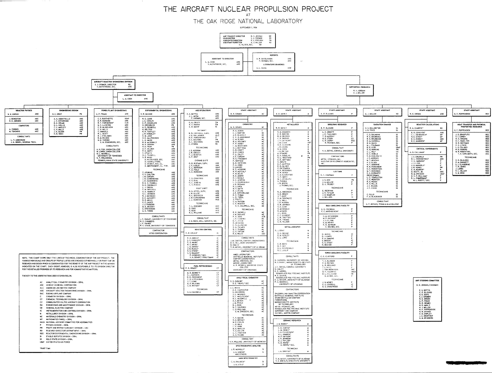