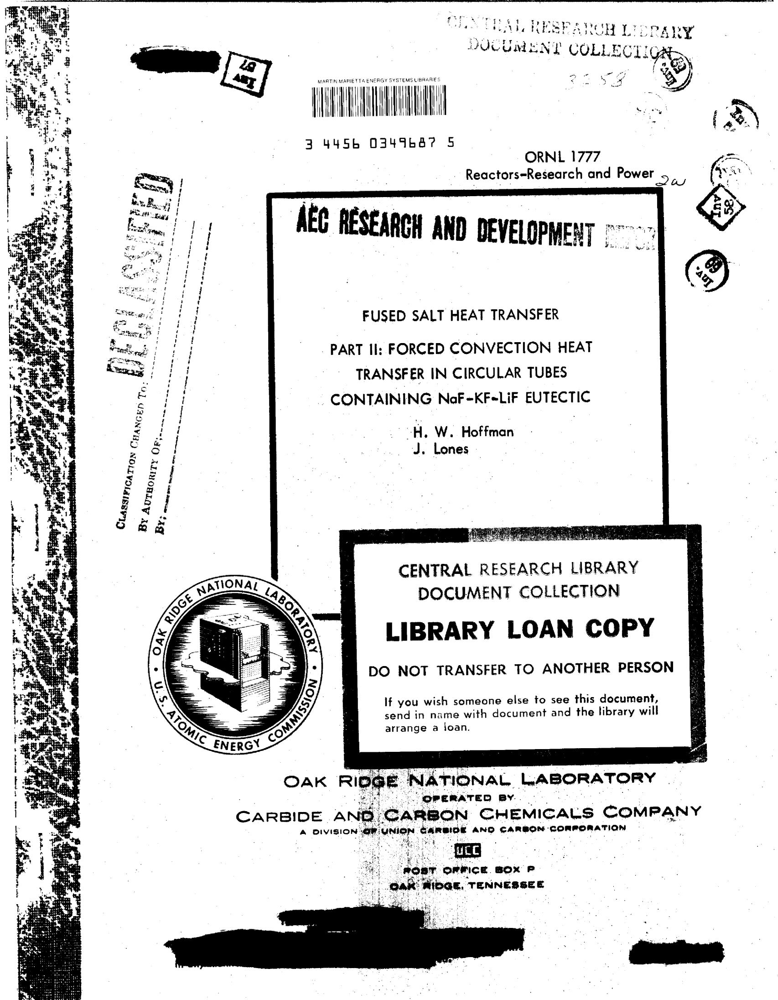

This document consists of pages. Copy 2 of copies. Series A.

Contract No. W-7405, eng. 26

Reactor Experimental Engineering Division

FUSED SALT HEAT TRANSFER

PART II: FORCED CONVECTION HEAT TRANSFER IN CIRCULAR TUBES CONTAINING NaF-KF-LiF EUTECTIC

H. W. Hoffman

J. Lones

Date Issued: FEB 1 1955

OAK RIDGE NATIONAL LABORATORY

operated by

CARBIDE AND CARBON CHEMICALS COMPANY

Union Carbide and Carbon Corporation

Post Office Box P

Oak Ridge, Tennessee

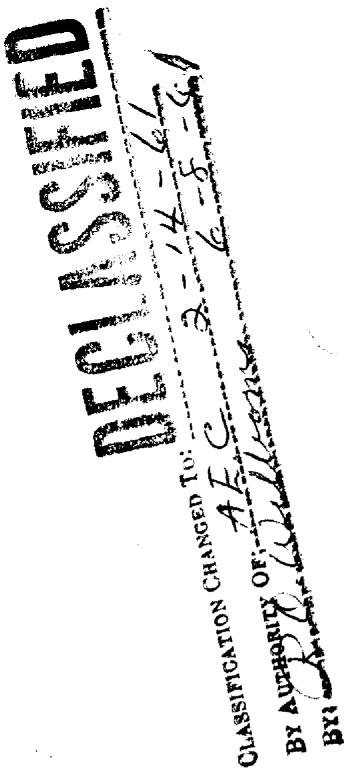

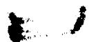

MARTIN MARIETTA ENERGY SYSTEMS LIBRARIES

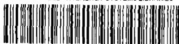

34456 03496875

# INTERNAL DISTRIBUTION

1. Biology Library   
2-3. Central Research Library   
4. Health Physics Library   
5. Reactor Experimental Engineering Library

6-13. Laboratory Records Department

14. Laboratory Records, ORNL R.C.

15. G. M. Adamson   
16. R. G. Affel   
17. L. G. Alexander   
18. C. J. Barton   
19. S. E. Beall   
20. E. S. Bettis   
21. D. S. Billington   
22. F. Blankenship   
23. E. P. Blizzard   
24. E. G. Bohlfann   
25. J. O. Bradfute   
26. R. W. Bussard   
27. A. D. Callihan   
28. D. W. Cardwell   
29. C. E. Center   
30. R. A. Charpie   
31. G. A. Christy   
32. H. C. Claiborne   
33. G. H. Clewett   
34. W. G. Cobb   
35. S. I. Cohen   
36. C. D. Coughlen   
37. S. J. Cromer   
38. F. L. Culler   
39. M. C. Edlund   
40. J. L. English   
41. J. Y. Estabrook   
42. A. P. Fraas   
43. W. J. Fretague   
44. J. H. Frye, Jr.   
45. C. B. Graham   
46. N. D. Greene   
47. J. C. Greiss   
48. W. R. Grimes

49. D. C. Hamilton   
50. W. O. Harms   
51. H. W. Hoffman   
52. J. R. Johnson   
53. W. H. Jordan   
54. P. R. Kasten   
55. G. W. Keilholtz   
56. F. Kertesz   
57. A. S. Kitzes   
58. N. F. Lansing   
59. F. E. Lynch   
60. R. N. Lyon   
61. W. D. Manly   
62. W. B. McDonald   
63. E. R. Mann   
64. L. A. Mann   
65. J. L. Meem   
66. E. C. Miller   
67. G. M. Nessle   
68. L. D. Palmer   
69. W. W. Parkinson   
70. H. F. Poppendiek   
71. W. D. Powers   
72. M. T. Robinson   
73. M. W. Rosenthal   
74. D. F. Salmon   
75. H. W. Savage   
76. E. D. Shipley   
77. D. Sisman   
78. G. P. Smith   
79. J. A. Swartout   
80. E. H. Taylor   
Bl. D. G. Thomas   
82. M. Tobias   
83. J. M. Warde   
84. A. M. Weinberg   
85. f. A. Lane1:203   
36. C. E. Winters   
87. P. C. Zmola   
88. ORNL Document Reference Library, Y-12 Branch

# EXTERNAL DISTRIBUTION

89. AF I Ant Representative, Burbank   
90. AF Plant Representative, Seattle   
91. AF Plant Representative, Wood-Ridge   
92. American Machine and Foundry Company   
93. ANP Project Office, Fort Worth

-ii

94-104. Argonne National Laboratory   
105. Armed Forces Special Weapons Project (Sandia)   
106. Armed Forces Special Weapons Project, Washington

107-111. Atomic Energy Commission, Washington

112. Babcock and Wilcox Company   
113. Battelle Memorial Institute   
114. Bendix Aviation Corporation

115-120. Bettis Plant (WAPD)

121-123. Brookhaven National Laboratory

124. Bureau of Ships   
125. Bureau of Yards and Docks   
126. Chicago Operations Office   
127. Chicago Patent Group   
128. Chief of Naval Research

129-130. Commonwealth Edison Company

131. Department of the Navy - Op-362   
132. Detroit Edison Company

133-136. duPont Company, Augusta

137. duPont Company, Wilmington   
138. Duquesne Light Company   
139. Engineer Research and Development Laboratories   
140. Foster Wheeler Corporation

141-144. General Electric Company (ANPD)

145. General Electric Company (APS)

146-153. General Electric Company, Richland

154. Hanford Operations Office   
155. Iowa State College   
156. Kaiser Engineers

157-160. Knolls Atomic Power Laboratory

161-162. Los Alamos Scientific Laboratory

163. Massachusetts Institute of Technology (Benedict)   
164. Materials Laboratory (WADC)   
165. Monsanto Chemical Company   
166. Mound Laboratory   
167. National Advisory Committee for Aeronautics, Cleveland   
168. National Advisory Committee for Aeronautics, Washington

169-170. Naval Research Laboratory

171. Newport News Shipbuilding and Dry Dock Company   
172. New York Operations Office

173-174. North American Aviation, Inc.

175. Nuclear Development Associates, Inc.   
176. Nuclear Metals, Inc.   
177. Pacific Northwest Power Group   
178. Patent Branch, Washington   
179. Pennsylvania Power and Light Company

180-186. Phillips Petroleum Company (NRTS)

187. Powerplant Laboratory (WADC)   
188. Pratt & Whitney Aircraft Division (Fox Project)   
189. San Francisco Operations Office

190. Sylvania Electric Products, Inc.   
191. Tennessee Valley Authority (Dean)   
192. USAF Headquarters   
193. USAF Project Rand   
194. U. S. Naval Postgraduate School   
195. U. S. Naval Radiological Defense Laboratory

196-197. University of California Radiation Laboratory, Berkeley

198-199. University of California Radiation Laboratory, Livermore

200. Vitro Engineering Division   
201. Vitro Laboratories   
202. Walter Kidde Nuclear Laboratories, Inc.   
203. Westinghouse Electric Corporation (IAPG)

204-218. Technical Information Service, Oak Ridge

219. Division of Research and Medicine, AEC, ORO

# TABLE OF CONTENTS

INTRODUCTION- 5   
DESCRIPTION OF APPARATUS 6   
SYSTEM CALIBRATION 12   
ANALYSIS OF DATA 14   
RESULTS 22   
DISCUSSION 30   
CONCLUSIONS 40   
APPENDIX A - Nomenclature 41   
APPENDIX B - Bibliography 43   
APPENDIX C - Physical Properties of Flinak- 44

# SUMMARY

An experimental determination has been made of the heat transfer coefficients for the eutectic mixture of sodium, potassium and lithium fluoride (Flinak) flowing in forced convection through circular tubes. Heat, electrically generated in the tube wall, was transferred uniformly to the fluid during passage through a small diameter tube. Long tubes $(\mathrm{x / d} > 100)$ of nickel, Inconel and 316 stainless steel were used. The variables involved covered the following ranges:

Reynolds modulus : 2300 - 9500

Prandtl modulus 1.6-4.0

Average fluid temperatures: 980 - 1370°F

Heat flux : 9,000 - 192,000 Btu/hr-ft²

It was found that forced convection heat transfer with Flinak can be represented by the general correlation for heat transfer with ordinary fluids (0.51NPr1100).

The existence of an interfacial resistance in the Flinak-Inconel system has been established and its composition determined. Preliminary measurements of the thermal conductivity and thickness of the film have been made. The results verify the effect of this film on Flinak heat transfer in small diameter Inconel tubes.

Thermal entry lengths, determined from the variation of the local heat transfer coefficients in the entrance of the heated section, have been correlated with the Peclet modulus.

# Introduction

Fused salts have potential application as heat transfer media wherever heat must be transferred to, or removed from, a system at temperatures above $600^{\circ}\mathrm{F}$ . Because the vapor pressures of fused salts are generally low at these elevated temperatures, operation at atmospheric or near atmospheric pressures is possible. In a reactor, fused salts possess a further advantage. By combining a number of salts, a fluid can be designed such that it can be used as a moderator as well as a coolant. If uranium is present this fluid can also be the fuel.

This report presents the second part of a continuing investigation into the heat transfer characteristics of fused salts of interest to the ANP Project. First reported (5)* were the results of an experimental determination of heat transfer coefficients for molten sodium hydroxide. It was concluded that, with respect to heat transfer, sodium hydroxide may be classified as an ordinary fluid $(0.5 < N_{\mathrm{Pr}} < 100)$ .

This report describes heat transfer with the eutectic mixture of sodium, potassium and lithium fluoride (11.5-42.0-46.5 mole %) known as Flinak. Some results on Flinak heat transfer were reported in an earlier memorandum (6). Flinak melts at approximately $850^{\circ}\mathrm{F}$ and is temperature stable to above $1500^{\circ}\mathrm{F}$ . At $1500^{\circ}\mathrm{F}$ the viscosity of Flinak is about three times the viscosity of water at $60^{\circ}\mathrm{F}$ . In a reactor Flinak can be used as a coolant or in combination with

$\mathsf{UF}_3$ or $\mathsf{UF}_4$ as a fuel-coolant. The efficiency of a fluid as a coolant can be defined as the work required per Btu of heat removal. Poppendiek, Rosenthal and Burnett, in a report now in preparation, have evaluated this efficiency for a number of coolants (sodium, lithium, bismuth, sodium hydroxide and Flinak) using four temperature difference parameters. In general, they conclude that Flinak is a good coolant, the best being of course lithium.

# Description of Apparatus

The experimental system designed to measure the heat transfer coefficient of molten Flinak flowing in tubes was similar in all major respects to that previously described (5) for molten sodium hydroxide heat transfer studies. It consisted of two tanks, one of which rested on a scale to enable fluid flow rate measurements, and a test section located between the two tanks. Flow through the test section was effected by means of gas pressure applied above the fluid in the tanks. Several modifications were made to provide an experimental system possessing increased flexibility and incorporating metals compatible with molten Flinak at high temperatures. Figures 1 and 2 present several views of the experimental system.

Nickel will contain Flinak but is subject to fatigue failure at temperatures above $1000^{\circ}\mathrm{F}$ . Therefore, Inconel, which exhibits good corrosion resistance to Flinak and retains its structural strength at elevated temperatures, was adopted as the material of construction.

One of the major inconveniences encountered with the sodium hydroxide experimental system was the inability to easily replace system components. To

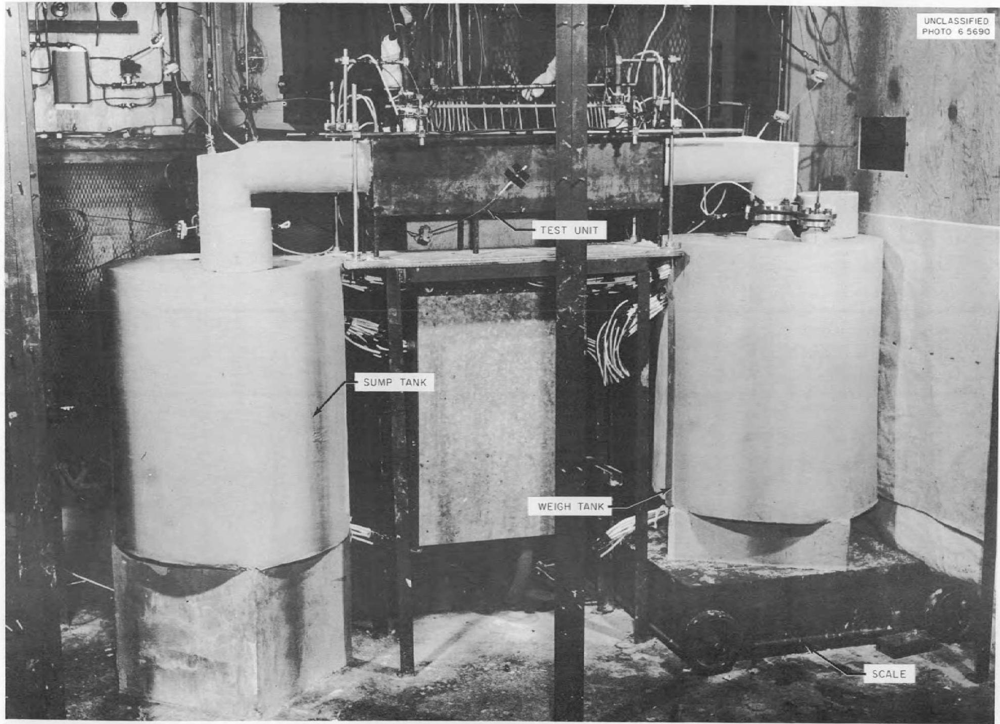  
Fig. 4. General View of Experimental System

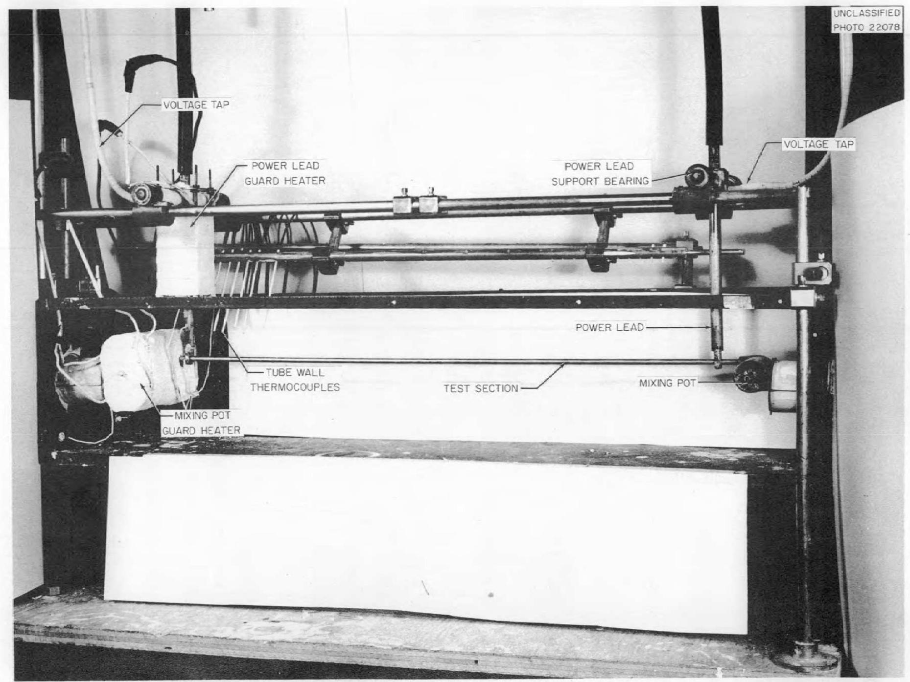  
Fig.2.Test Unit-Shown Partially Assembled.

eliminate this difficulty a number of changes were made for the Flinak system:

(1) The tanks were redesigned to incorporate flanges with metal O-ring seals for introducing thermowells, dip lines, etc., into the top of the tanks.   
(2) Each tank was contained in an open-topped stainless steel jacket. The heaters were attached to this jacket so that tank replacement could be accomplished without complete removal of heaters and thermal insulation.   
(3) The test section was connected to the system by Swage-lok unions. Use of these connectors, in which a positive seal is effected partly by compression of the ferrule and partly by forcing the nose of the ferrule into the tube wall, facilitated the interchange of test units.

At high temperatures, thermal expansion gives rise to stresses which are sufficient to cause buckling of the test section if the tube ends are held rigidly. To alleviate this condition, the scale used in the weight-rate determination was oriented such that the wheels were "in-line" with the direction of thermal expansion of the system. A turn-buckle arrangement allowed the weigh tank to be moved so as to compensate for the expansion of the test section and the connecting lines. To further eliminate strain in the test section, the power terminals were supported on roller bearings. This yielded a test section which was undistorted.

The test section consisted of a 24 inch length of small diameter tubing which was heated by the passage of an electric current through the tube wall. Power was supplied by a transformer rated at 4 Kva and was introduced to the test section through copper terminals silver-soldered to the tube at each end. In the course of the experiment tubes which were made of nickel, Inconel, and 316 stainless steel were used as the test section. The dimensions of these tubes are given in the following table:

TABLE I   

<table><tr><td>Material</td><td>Outside Diameter (inches)</td><td>Wall Thickness (inches)</td><td>Length Diameter&#x27;, (x/d)</td></tr><tr><td>Nickel</td><td>0.1875</td><td>0.035</td><td>204</td></tr><tr><td>Inconel</td><td>0.225</td><td>0.025</td><td>137</td></tr><tr><td>316 s.s.</td><td>0.250</td><td>0.035</td><td>133</td></tr></table>

With the Inconel and 316 s.s. test sections, flow at a Reynolds modulus of 10,000 could be attained. As a result of the temperature limitation on the nickel test section, a maximum Reynolds modulus of only 6000 was possible. In each case over $99\%$ of the heat generation occurred in the tube wall.

The temperature of the outer surface of the test section was measured with thermocouples which were resistance welded to the tube surface. The fluid mixed-mean temperatures were measured in mixing pots at each end of the test section. Details of the mixing pot and test section end are shown in Figure 3. The voltage impressed on the test section was obtained at 8 locations along the tube. At each position one of the wires of the tube surface thermocouple at that point was used as the voltage probe.

The system contained 350 pounds of Flinak, charged to the system as a well-mixed powder and melted while alternately evacuating the region above the melt and then purging and mixing the fluid with helium. The helium was dried and oxygen removed by bubbling it through a tank filled with sodium-potassium alloy.

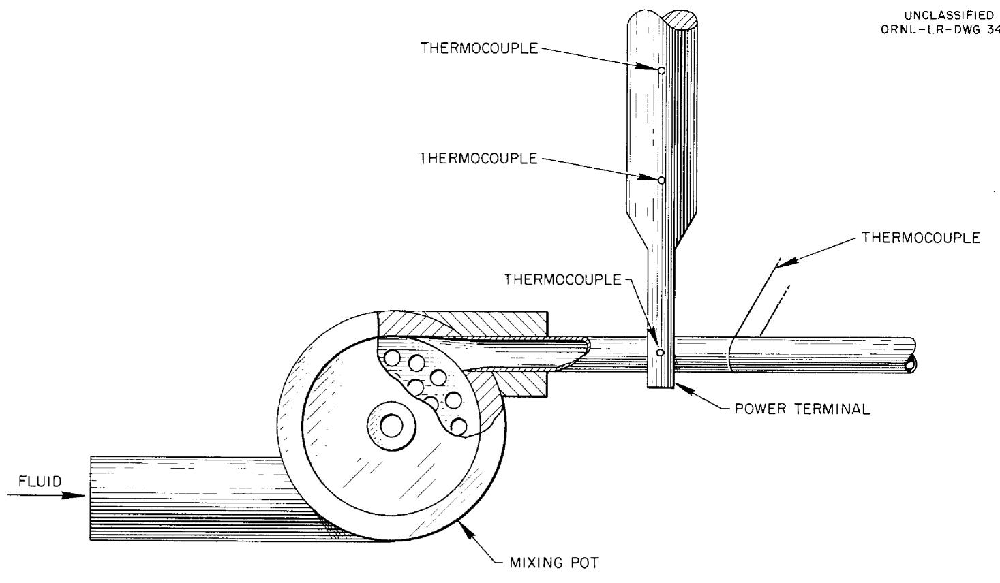

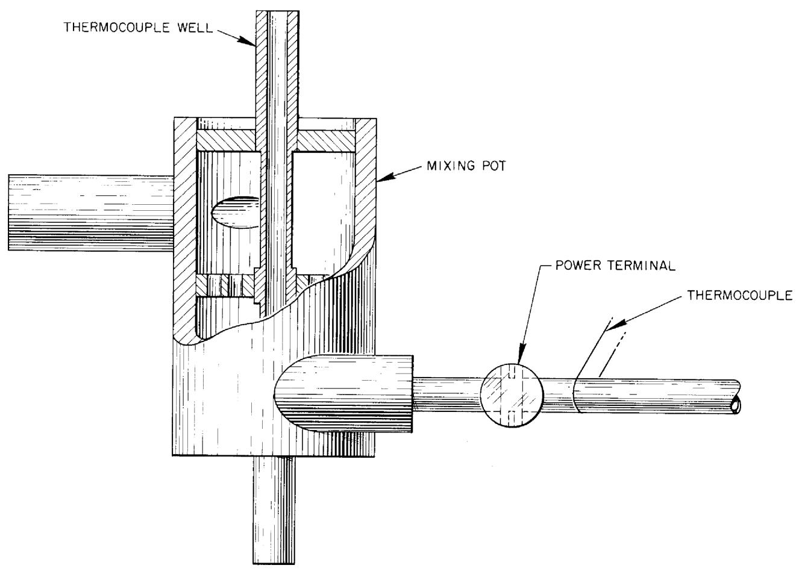  
Fig. 3. Test Section and Mixing Pot Detail.

# System Calibration

To insure the reliability of the data obtained it is necessary to calibrate the various measuring devices associated with the system. It had been determined in the sodium hydroxide experiment that the readings of the scale used in the weight-rate measurements were consistent and accurate and that the current flowing in the tube wall had no effect on the readings of the tube surface thermocouples. Since the factors affecting these were unchanged by apparatus modifications, no additional check was made for the Flinak experiment. Similarly, no preliminary tests were made to determine the approach to equilibrium of the test unit during the time available for an experimental run. However, it was found during system operation that equilibrium conditions were attained well before the end of each run.

The thermocouples used in measuring the fluid mixed-mean temperatures were calibrated at the freezing points of lead, zinc and aluminum. Table II shows the results obtained from the calibration of the fluid mixed-mean thermocouples used in a typical test series.

TABLE II Calibration of Fluid Mixed-Mean Thermocouples   

<table><tr><td rowspan="2">Temperature
°F</td><td rowspan="2">21</td><td colspan="3">Thermocouple</td></tr><tr><td>22</td><td>23</td><td>24</td></tr><tr><td>621.1</td><td>-0.06*</td><td>-0.08</td><td>-0.08</td><td>-0.06</td></tr><tr><td>787.1</td><td>-0.06</td><td>-0.07</td><td>-0.07</td><td>-0.06</td></tr><tr><td>1219.5</td><td>-0.055</td><td>-0.06</td><td>-0.07</td><td>-0.055</td></tr></table>

*Body of table gives the correction (in millivolts) to be added to the observed reading to obtain the true reading.

Since the tube surface thermocouples were formed on the tube after the test unit had been assembled, calibration of these couples was difficult. Therefore, the couples were checked in two ways. Samples of the wires used were taken, formed into thermocouples and calibrated in a tube furnace with reference to a standard couple. The results showed a discrepancy of approximately $1^{\circ}\mathrm{F}$ between the observed and true readings at $1200^{\circ}\mathrm{F}$ . On the completion of a test series, the tube was removed and sectioned. Each small section, with thermocouple attached, was then calibrated at the temperatures corresponding to the freezing points of lead, zinc and aluminum. For purposes of comparison, the tube surface thermocouples on a dummy test section were checked similarly. Table III gives the result of this calibration check for 4 couples (different in each case) at the aluminum point.

TABLE III Calibration of Tube Surface Thermocouples (Melting Point of Aluminum $= 27.44$ millivolts)   

<table><tr><td>Thermocouple</td><td>I-1* (millivolts)</td><td>I-2 (millivolts)</td></tr><tr><td>1</td><td>27.43</td><td>27.44</td></tr><tr><td>2</td><td>27.46</td><td>27.42</td></tr><tr><td>3</td><td>27.45</td><td>27.43</td></tr><tr><td>4</td><td>27.44</td><td>27.42</td></tr></table>

\* I-1 Inconel dummy test section. I-2 Inconel test section used in run series G.

It is seen that the output of the tube surface thermocouples remained essentially unchanged even after operation at temperatures up to $1450^{\circ}\mathrm{F}$ and despite a great deal of temperature cycling.

Part of the total energy put into the test section is lost to the system environment. Since the magnitude of this loss must be known to obtain a heat balance for the system, a heat loss calibration was made. The technique employed has been described in Part I (5). As the system heat loss is a function of the density and distribution of the insulation around the test section and of the end conditions, it was necessary to obtain a heat calibration for each test unit. Figure 4 shows the outside tube surface temperature for various power levels without fluid flow. The dip in the curves at the position corresponding to the tube center probably results from the temperature profile in the thermal insulation caused by the mixing pot and power terminal guard heaters at the test section ends. The system heat loss curves for the several test units are given in Figure 5, where $\triangle t$ is the average outside tube surface temperature, $t_{\mathrm{W,ave}}$ . minus the temperature of the system environment, $t_{\mathrm{e}}$ .

# Analysis of Data

The local coefficient of heat transfer (or local conductance) is defined by the equation

$$
h _ {x} = \frac {\left(q _ {f} / A\right) x}{\left(t _ {s} - t _ {m}\right) x} \tag {1}
$$

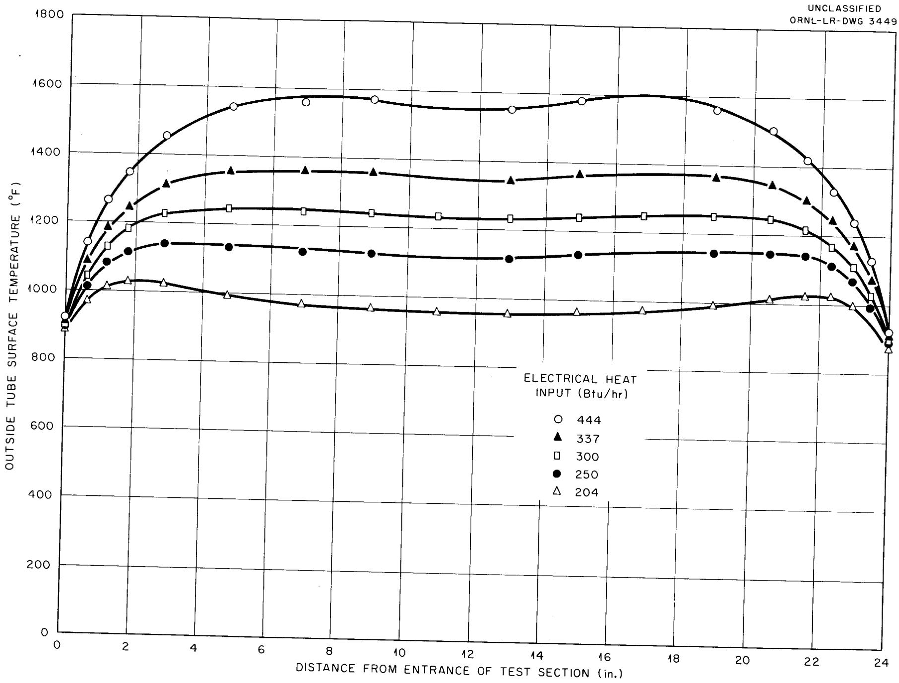  
Fig. 4. Axial Profiles of Outside Tube Surface Temperatures for Varying Heat Input with no Fluid Flow.

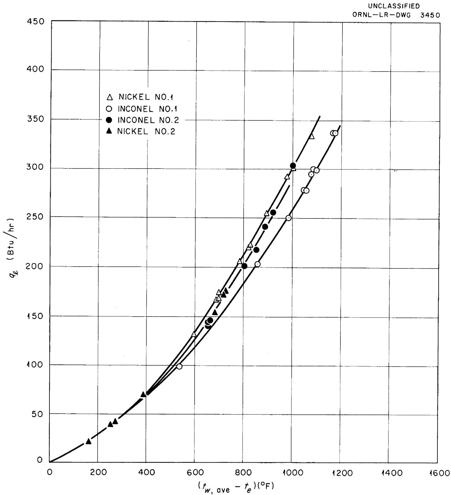  
Fig. 5. System Heat Loss.

where $q_{f} / A$ is the heat flux through the wall-fluid interface, $t_{s}$ , the temperature of the surface at this interface, $t_{m}$ , the fluid mixed-mean temperature and the subscript, $x$ , indicates the geometrical position on the surface at which the heat flux and temperature difference are evaluated. For large values of $x$ (beyond the thermal entrance region) $h_{x}$ reaches a limiting value, $h$ , which is the heat transfer coefficient for the region of both thermally and hydrodynamically established turbulent flow. In the correlations which follow the coefficient $h$ is used unless otherwise noted.

The inside surface temperature of the tube is calculated from the measured outside tube surface temperature by the equation*

$$
t _ {w} - t _ {s} = \frac {W}{2 k _ {m}} \left(r _ {w} ^ {2} \ln \frac {r _ {w}}{r _ {s}} - \frac {r _ {w} ^ {2} - r _ {s} ^ {2}}{2}\right) \tag {2}
$$

where $r$ is the tube radius, the subscripts $w$ and $s$ refer to the outside and inside tube surfaces, respectively, and $k_{m}$ is the thermal conductivity of the tube metal. The source term, $W$ , is given by

$$
W = \frac {3 . 4 1 3 E I}{V} \tag {3}
$$

where $E$ is the voltage impressed on the test section, $I$ , the current passing through the tube wall, and $V$ , the volume of metal in the tube wall of the test

section. Equation 2 is a modification of the simple conduction equation to allow for the generation of heat in the tube wall. The derivation assumes uniform heat generation in the tube wall, no longitudinal heat flow, and no heat losses through the surface, w.

Figure 6 shows, for a typical test condition, that the voltage impressed on the test section is a linear function of the distance along the tube. Thus, the assumption of uniform heat generation in the derivation of equation 2 is seen to be reasonable. With uniform heat generation and the small axial temperature rise of the fluid, the fluid mixed-mean temperature at any point, $x$ , along the test section can be obtained from the straight line drawn between $t_m, i$ and $t_m, o$ , the fluid mixed-mean inlet and outlet temperatures, respectively.

The total heat generation in the tube wall is determined from the measured values of the voltage drop across the test section and the current passing through the tube wall. Part of the total heat goes to external loss and the rest into heating the fluid. The external loss is obtained from the curves of Figure 5 for the given set of experimental data. The heat transferred to the fluid in passing through the test section is given by the equation

$$
q _ {f} = w c _ {p} \left(t _ {m, 0} - t _ {m, i}\right) \tag {4}
$$

where $w$ is the fluid flow rate in $\text{lbs/hr}$ . The heat transfer area is taken as the inside surface area of the test section between the two power terminals. The heat flux is based on the heat gained by the fluid as given by equation 4. The heat balance for each run is shown in Table IV. Figure 7 shows a typical temperature profile for the outside tube wall.

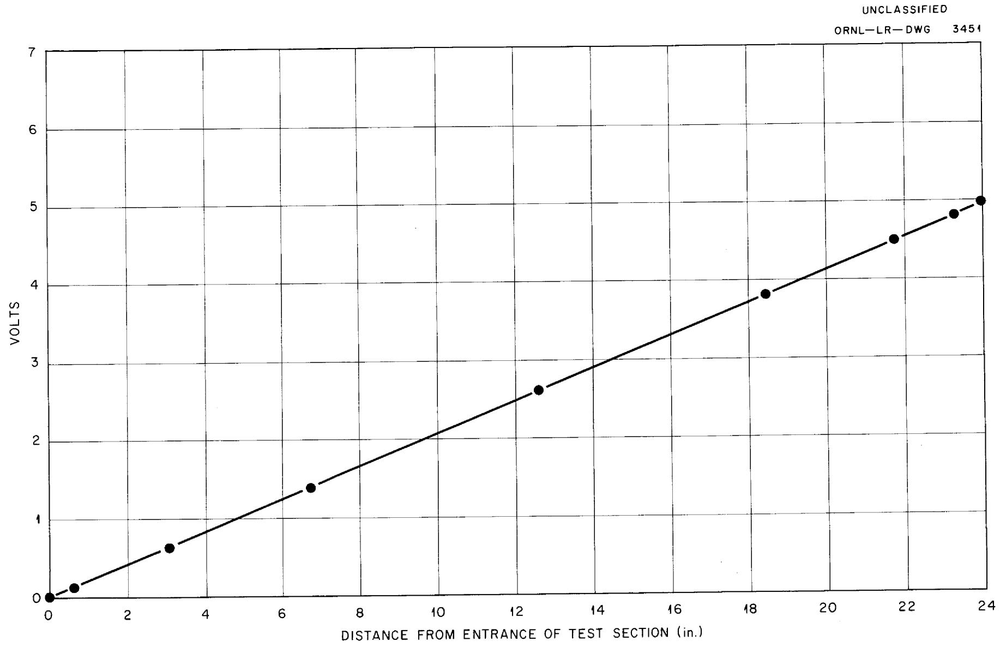  
Fig.6. Voltage Impressed On Test Section-Run I-1

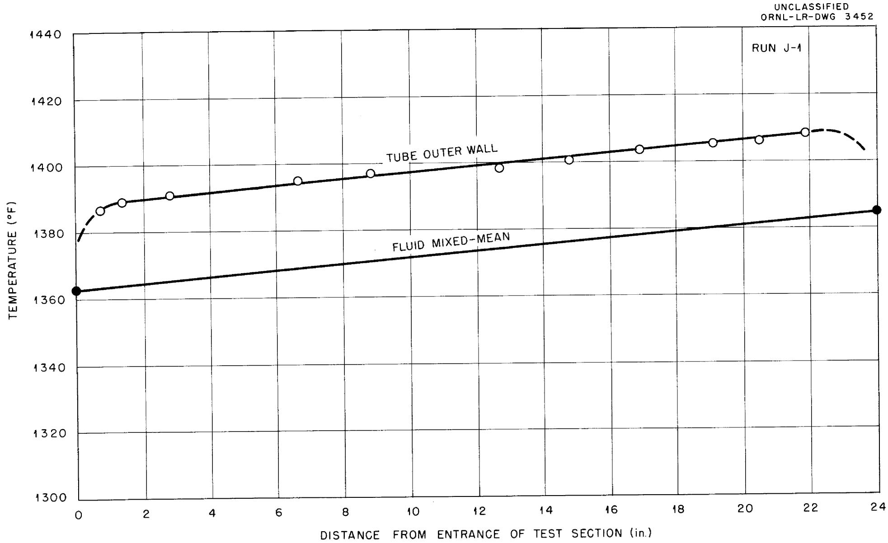  
Fig. 7. Typical Temperature Profiles Along Axis of Electrically Heated Test Section.

The physical properties of Flinak necessary to these calculations are presented graphically in Appendix C. Since both the axial and radial temperature differences were small, the physical properties were evaluated at the average fluid mixed-mean temperature.

By applying similarity considerations to the differential equations for heat transfer in a moving fluid, it can be shown that the parameters describing forced convection heat transfer are related by the equation

$$
\mathrm {N} _ {\mathrm {N u}} = \Phi_ {1} \left(\mathrm {N} _ {\mathrm {R e}}, \mathrm {N} _ {\mathrm {P r}}\right) \tag {5}
$$

$$
\mathrm {o r} \quad \mathrm {N} _ {\mathrm {S t}} = \bar {\Phi} _ {2} (\mathrm {N} _ {\mathrm {R e}}, \mathrm {N} _ {\mathrm {P r}}) \tag {6}
$$

$$
\text {w h e r e} \quad N _ {N u}, \text {t h e N u s s e l t m o d u l u s} = \mathrm {h d} / \mathrm {k},
$$

$$
\mathrm {N} _ {\mathrm {S t}}, \text {t h e S t a n t o n m o d u l u s} = \mathrm {h} / \mathrm {c} _ {\mathrm {p}} \mathrm {G}
$$

$$
\mathrm {N} _ {\mathrm {R e}}, \text {t h e R e y n o l d s m o d u l u s} = \mathrm {d G} / \mu ,
$$

$$
\text {a n d} \quad N _ {\Pr}, \text {t h e P r a n d t l m o d u l u s} = c _ {p} \mu / k.
$$

This functional relationship has also been predicted by the analogies comparing heat and momentum transfer within a fluid flowing turbulently in a long tube (1, 9, 12, 13).

Analysis of experimental turbulent forced convection heat transfer data shows that, in equation 5, the Reynolds modulus generally appears to the 0.8 power and the Prandtl modulus to the 0.4 power. The simplified empirical equation proposed by McAdams (1),

$$
N _ {N u} = 0. 0 2 3 N _ {R e} ^ {0. 8} N _ {P r} ^ {0. 4} \tag {7}
$$

has been found to correlate, to within $\pm 20\%$ , all data for the fluids termed

"ordinary", $(0.5 < N_{\mathrm{Pr}} < 100)$ . Colburn (2) has proposed a slightly different correlation; stemming from equation 6,

$$
j = N _ {S t} \cdot N _ {P r} ^ {2 / 3} = 0. 0 2 3 N _ {R e} ^ {- 0. 2} \tag {8}
$$

which enables, under certain conditions, a direct comparison between heat transfer and friction. Both equation 7 and equation 8 are applicable only to moderate $\Delta t$ conditions.

In this report, the Colburn j-function has been used as the correlating parameter.

# Results

The system was first operated using a nickel test section. The physical dimensions of the tubes used as test sections have been presented in Table I. The data obtained (test series F) are shown in Figure 8. Table IV lists the pertinent measurements and calculated results of Tests F-J. In each case, the heat transfer coefficient was calculated for a position far down-stream $(\mathrm{x / d} > 100)$ where fully developed turbulent conditions existed. The results covered the transition flow region and checked generally the correlation for ordinary fluids. An attempt to obtain data in the region of fully developed turbulent flow by raising the temperature above $1000^{\circ}\mathrm{F}$ was unsuccessful due to failure in fatigue of the nickel tube. The data demonstrated that variations in the entrance conditions, arising from slight differences in geometry between the two ends of the test section, strongly affect transition region heat transfer. Thus, the results for flow through

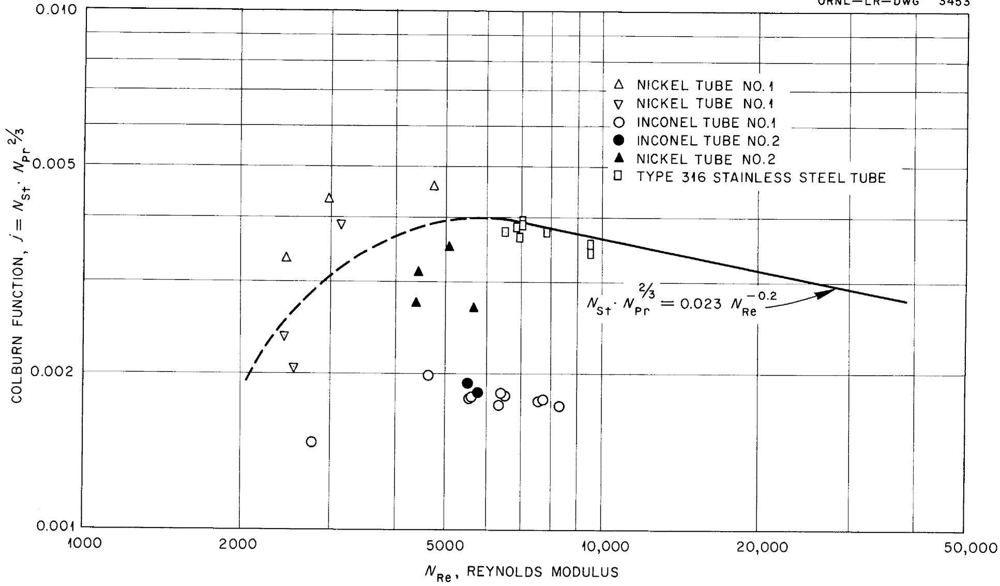  
-02-   
Fig.8. FLINAK Heat Transfer.

# TABLE IV

EXPERIMENTAL DATA AND CALCULATED RESULTS - FLINAK HEAT TRANSFER   

<table><tr><td>Run</td><td>qF/A Btu/hr-ft2</td><td>w lbs/hr</td><td>tm,o-tm,i of</td><td>tw,ave of</td><td>tm,ave of</td><td>ts-tem of</td><td>h Btu/hr-ft2-of</td><td>NRe</td><td>NPr</td><td>NSt</td><td>j</td><td>Heat Balance (qF+qL/qe)</td></tr><tr><td>F-1</td><td>23,215</td><td>406.8</td><td>7.8</td><td>1005</td><td>1001</td><td>6.9</td><td>3364</td><td>2459</td><td>3.7</td><td>.00138</td><td>.00331</td><td>0.95</td></tr><tr><td>F-2</td><td>36,920</td><td>431.4</td><td>11.7</td><td>996</td><td>981</td><td>15.5</td><td>2381</td><td>2428</td><td>4.0</td><td>.000923</td><td>.00233</td><td>0.90</td></tr><tr><td>F-3</td><td>42,284</td><td>431.4</td><td>13.4</td><td>1010</td><td>990</td><td>19.8</td><td>2136</td><td>2516</td><td>3.9</td><td>.000828</td><td>.00204</td><td>1.02</td></tr><tr><td>F-4</td><td>96,241</td><td>365.4</td><td>36.0</td><td>1116</td><td>1094</td><td>20.2</td><td>4764</td><td>2968</td><td>2.8</td><td>.00218</td><td>.00430</td><td>0.91</td></tr><tr><td>F-5</td><td>95,591</td><td>372.6</td><td>35.8</td><td>1133</td><td>1108</td><td>21.9</td><td>4456</td><td>3147</td><td>2.7</td><td>.00200</td><td>.00384</td><td>0.93</td></tr><tr><td>F-6</td><td>129,893</td><td>543.0</td><td>32.7</td><td>1144</td><td>1123</td><td>16.4</td><td>7920</td><td>4769</td><td>2.6</td><td>.00244</td><td>.00457</td><td>0.97</td></tr><tr><td>G-1</td><td>9,138</td><td>372.0</td><td>5.0</td><td>1238</td><td>1228</td><td>9.9</td><td>923</td><td>2779</td><td>2.0</td><td>.00092</td><td>.00147</td><td>1.02</td></tr><tr><td>G-2</td><td>60,317</td><td>660.0</td><td>18.6</td><td>1230</td><td>1195</td><td>28.5</td><td>2116</td><td>4626</td><td>2.2</td><td>.00119</td><td>.00198</td><td>1.02</td></tr><tr><td>G-3</td><td>119,170</td><td>780.0</td><td>31.1</td><td>1334</td><td>1279</td><td>46.5</td><td>2563</td><td>6411</td><td>1.8</td><td>.00122</td><td>.00183</td><td>0.92</td></tr><tr><td>G-4</td><td>121,397</td><td>864.0</td><td>28.6</td><td>1291</td><td>1235</td><td>45.2</td><td>2686</td><td>6566</td><td>2.0</td><td>.00115</td><td>.00181</td><td>0.94</td></tr><tr><td>G-5</td><td>124,421</td><td>732.0</td><td>34.6</td><td>1309</td><td>1245</td><td>54.3</td><td>2291</td><td>5661</td><td>2.0</td><td>.00116</td><td>.00181</td><td>0.98</td></tr><tr><td>G-6</td><td>125,993</td><td>906.0</td><td>28.3</td><td>1350</td><td>1297</td><td>43.5</td><td>2896</td><td>7762</td><td>1.8</td><td>.00119</td><td>.00179</td><td>0.98</td></tr><tr><td>G-7</td><td>126,233</td><td>798.0</td><td>32.2</td><td>1340</td><td>1280</td><td>50.6</td><td>2495</td><td>6387</td><td>1.8</td><td>.00116</td><td>.00174</td><td>0.99</td></tr><tr><td>G-8</td><td>133,606</td><td>1050.0</td><td>25.9</td><td>1311</td><td>1258</td><td>41.7</td><td>3204</td><td>8337</td><td>1.9</td><td>.00113</td><td>.00174</td><td>1.00</td></tr><tr><td>G-9</td><td>134,661</td><td>972.0</td><td>28.2</td><td>1299</td><td>1247</td><td>45.0</td><td>2992</td><td>7576</td><td>1.9</td><td>.00114</td><td>.00177</td><td>1.01</td></tr><tr><td>G-10</td><td>171,201</td><td>720.0</td><td>48.4</td><td>1331</td><td>1241</td><td>76.1</td><td>2250</td><td>5611</td><td>1.9</td><td>.00116</td><td>.00180</td><td>0.98</td></tr><tr><td>H-1</td><td>121,747</td><td>796.8</td><td>31.1</td><td>1273</td><td>1214</td><td>50.0</td><td>2435</td><td>5796</td><td>2.1</td><td>.00113</td><td>.00184</td><td>0.98</td></tr><tr><td>H-2</td><td>121,867</td><td>768.0</td><td>32.3</td><td>1269</td><td>1210</td><td>50.3</td><td>2423</td><td>5552</td><td>2.1</td><td>.00117</td><td>.00191</td><td>1.01</td></tr><tr><td>I-1</td><td>52,957</td><td>338.4</td><td>21.3</td><td>1329</td><td>1315</td><td>12.0</td><td>4413</td><td>4408</td><td>1.7</td><td>.00218</td><td>.00314</td><td>0.96</td></tr><tr><td>I-2</td><td>66,420</td><td>331.8</td><td>27.3</td><td>1341</td><td>1321</td><td>17.6</td><td>3774</td><td>4357</td><td>1.7</td><td>.00190</td><td>.00272</td><td>0.90</td></tr><tr><td>I-3</td><td>133,849</td><td>420.6</td><td>43.4</td><td>1367</td><td>1334</td><td>28.1</td><td>4754</td><td>5638</td><td>1.7</td><td>.00189</td><td>.00267</td><td>0.96</td></tr><tr><td>I-4</td><td>191,559</td><td>369.0</td><td>70.8</td><td>1394</td><td>1353</td><td>34.5</td><td>5552</td><td>5076</td><td>1.6</td><td>.00252</td><td>.00350</td><td>0.96</td></tr><tr><td>J-1</td><td>80,170</td><td>733.2</td><td>22.9</td><td>1373</td><td>1350</td><td>16.1</td><td>4980</td><td>6586</td><td>1.6</td><td>.00267</td><td>.00371</td><td>1.02</td></tr><tr><td>J-2</td><td>98,864</td><td>870.0</td><td>23.8</td><td>1374</td><td>1348</td><td>16.6</td><td>5956</td><td>7814</td><td>1.6</td><td>.00269</td><td>.00373</td><td>0.94</td></tr><tr><td>J-3</td><td>102,562</td><td>1027.8</td><td>20.9</td><td>1397</td><td>1371</td><td>15.7</td><td>6532</td><td>9484</td><td>1.6</td><td>.00250</td><td>.00341</td><td>0.96</td></tr><tr><td>J-4</td><td>103,997</td><td>1027.8</td><td>21.6</td><td>1399</td><td>1373</td><td>15.8</td><td>6709</td><td>9536</td><td>1.6</td><td>.00256</td><td>.00348</td><td>0.99</td></tr><tr><td>J-5</td><td>112,435</td><td>774.6</td><td>30.4</td><td>1384</td><td>1353</td><td>20.3</td><td>5525</td><td>6996</td><td>1.6</td><td>.00280</td><td>.00387</td><td>0.96</td></tr><tr><td>J-6</td><td>112,541</td><td>810.0</td><td>29.1</td><td>1352</td><td>1332</td><td>20.7</td><td>5437</td><td>6981</td><td>1.7</td><td>.00264</td><td>.00377</td><td>1.05</td></tr><tr><td>J-7</td><td>121,040</td><td>759.0</td><td>33.4</td><td>1391</td><td>1356</td><td>22.3</td><td>5428</td><td>6854</td><td>1.6</td><td>.00281</td><td>.00389</td><td>0.89</td></tr></table>

the test section in one direction are indicated by the normal open triangles of Figure 8, while the inverted open triangles are for flow in the opposite direction.

To sustain higher operating temperatures so as to obtain turbulent flow data, the nickel tube was replaced by an Inconel section and a second series of runs performed. The results of this test series (G) are shown in Figure 8 by the open circles. The data extended through the transition region into the regime of fully developed turbulent flow. It was apparent that the Flinak heat transfer was considerably lower (by a factor of two) than the heat transfer for sodium hydroxide or other ordinary fluids. Since the Prandtl modulus for Flinak lies in the same range as that for sodium hydroxide, one would expect the Flinak-Inconel data to fall on the curve correlating heat transfer for the ordinary fluids. In addition, these data do not agree with those of Test F obtained for Flinak flowing in a nickel tube.

There appeared to be three possible explanations for the observed differences:

(1) The experimental measurements were in error   
(2) The physical property data used in the analysis were incorrect   
(3) "Non-wetting" occurs or an interfacial resistance (film) existed at the metal surface

From equation 1, which defines the heat transfer coefficient, it was seen that to account for the discrepancy on the basis of experimental error required that either the thermal flux or the temperature difference be in error by a factor of two or that errors in the proper direction exist in both

quantities. Excellent heat balances eliminated the possibility of error in the thermal flux. While it was unlikely that a consistent error could occur in all nineteen of the tube surface thermocouples, the calibration of these couples was checked. No significant deviation from the expected calibration was observed. Similarly, the calibration of the thermocouples used in measuring the mixed-mean temperatures was verified. An analysis of the mixing-pots indicated that the mixed-mean fluid temperatures could be in error due to heat conduction losses from the thermocouple junctions. Although the probability was low that these losses were large enough to account for the variation in the data (an error of 10 to $20^{\circ}\mathbf{F}$ being required), the mixing-pots were redesigned to insure that the thermocouple lead wires remained in a longer constant temperature region.

A change in the thermal conductivity of Flinak from 2.6 to 0.9 Btu/hr-ft- $^{0}$ F or a change in viscosity from 11 to 0.02 lbs/hr-ft or a combination of these two would be necessary if the data are to fit the accepted correlation. Recent physical property data for Flinak (thermal conductivity and viscosity) indicate the values used to be substantially correct.

The existence of a "non-wetting" condition was eliminated by evidence showing that Flinak readily wets Inconel surfaces. However, the possibility of a high-melting film, caused by a reaction between Flinak and Inconel, forming on the inside tube surface presented itself. A section of the tube used in Test G was cut longitudinally, and a deposit was observed on the inside tube surface. However, some question as to the origin of this film arose, since the tube had been exposed to air subsequent to its exposure to Flinak.

Therefore, a third series of runs (Test H) were made using a new Inconel test section and the modified mixing-pots. Only two points were obtained before shut-down resulting from failure of a system component. These are shown in Figure 8 by the closed circles and are sufficient to check the data of Test G. It was concluded that the difference between the observed and expected heat transfer was definitely not due to errors in the measurement of the mixed-mean temperatures. The test section from this series was cut longitudinally; and a green deposit, extending over the entire inside surface of the tube, was observed. Petrographic and electron diffraction examination of the film showed the major constituent to be $\mathrm{K}_3\mathrm{CrF}_6$ . Some $\mathrm{Li}_3\mathrm{CrF}_6$ and small amounts of the oxides of chromium and nickel were also present. The latter were probably present at the start of the runs since no pretreatment of the tube surfaces to remove metal oxides was attempted. $\mathrm{K}_3\mathrm{CrF}_6$ has a cubic structure, is green in color, and melts at a temperature of $1055^{\circ}\mathrm{C}$ .

With the film present, an apparent coefficient of heat transfer is given by the equation,

$$
h ^ {\prime} = \frac {1}{\frac {\left(t _ {g} - t _ {m}\right)}{\left(q _ {f} / A ^ {\prime}\right)} - \frac {y}{k _ {i}}} \tag {9}
$$

where $A'$ is the inside surface area of the film, $y$ , the film thickness and $k_{\parallel}$ , the thermal conductivity of the film. Since the films are thin, the ratio of the heat transfer area of the film to that of the clean tube, $A'/A$ , is approximately one. Hence, $(q_{f}/A')$ in equation 5 may be replaced by $(q_{f}/A)$ . Thus, equation 5 can be written

$$
h ^ {\prime} = \frac {1}{\frac {1}{h} - \frac {y}{k _ {i}}} \tag {10}
$$

From the Flinak-Inconel data, a value of 0.0002 hr-ft $^{2}$ - ${}^{\circ}\mathrm{F}/\mathrm{Btu}$ was obtained for the thermal resistance $(y/k_{i})$ in equation 10. To check this, measurements were made of the thickness of the film on the Inconel surface and of the thermal conductivity of $\mathrm{K}_{3}\mathrm{CrF}_{6}$ . The film thickness, determined from a photomicrograph (Figure 9) of one tube specimen, was found to be approximately 0.4 mils. A preliminary value of 0.133 Btu/hr-ft- ${}^{\circ}\mathrm{F}$ was obtained (8) for the thermal conductivity over the temperature range $100 - 200^{\circ}\mathrm{F}$ . Using these values, a thermal resistance of 0.00025 hr-ft $^{2}$ - ${}^{\circ}\mathrm{F}/\mathrm{Btu}$ was obtained. This compared closely with the value (0.0002) deduced from the heat transfer data.

At the same time an experiment was performed to determine if the current flowing through the tube wall of the test section influenced the film formation. Pieces of Inconel and nickel tubing were allowed to remain in a still pot of molten Flinak for 24 hours. On removal a green film was observed on the Inconel tube. It was noted that the nickel tube showed no film under similar conditions.

An additional check on the validity of the initial Flinak-nickel data was made. The results (Test I) are shown by the closed triangles of Figure 8. It was seen that the data were in general agreement with those of Test F. Again the influence of small geometrical variations at the test section entrance has been accentuated in the transition flow region.

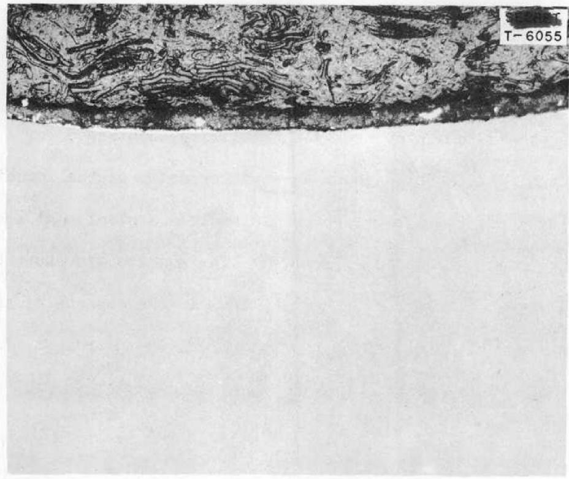  
FILM-y=0.4 mil   
77M 38N 13NOONI   
Fig.9. Photomicrograph of Inconel Tube Exposed to FLINAK. Magnification $= 250\mathrm{X}$

Preliminary tests had indicated that Flinak could be contained for short times in 316 stainless steel without serious corrosion or the formation of insoluble fluoride deposits. Therefore, a 316 stainless steel test section was installed and a series of runs made (Test J). The results are shown by the open squares in Figure 8. As can be seen, Flinak in the absence of the interfacial film behaves, with respect to heat transfer, as an ordinary fluid; and conversely, the reduction in heat transfer in small diameter Inconel tubes can be attributed directly to deposits of the type, $\mathrm{K_3CrF_6}$ .

Some information on the thermal entrance length was obtained from the experimental data. The entrance system consisted of a thermal entrance region preceded by a hydrodynamic entrance region of 8 to 13 tube diameters. In this investigation, $(\mathrm{x / d})_{\mathrm{e}}$ was taken as the position at which the local heat transfer coefficient had decreased to within $10\%$ of its fully established value. Figure 10 shows the local heat transfer coefficient as a function of $\mathrm{x / d}$ for a typical experimental run. Figure 11 presents, for both Flinak and sodium hydroxide, the observed variation of $(\mathrm{x / d})_{\mathrm{e}}$ with the Peclet modulus, $(\mathbb{N}_{\mathrm{Pe}} = \mathbb{N}_{\mathrm{Pr}}\cdot \mathbb{N}_{\mathrm{Re}})$ .

As in the sodium hydroxide experiment, it is estimated that the maximum error in the heat transfer coefficients obtained for Flinak is $7.5\%$ .

# Discussion

The first reported measurements for fused salt heat transfer were those of Kirst, Nagle and Castner (10) for the mixture, $\mathrm{NaNO}_2$ - $\mathrm{NaNO}_3$ - $\mathrm{KNO}_3$ (40-7-53 weight percent), known as "HTS." They employed a 6 foot length of

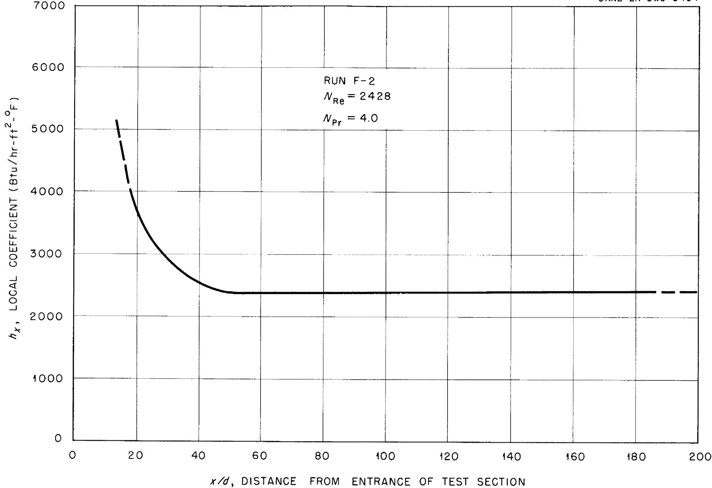  
Fig. 10. Local Heat Transfer Coefficients for FLINAK Flowing in a Pipe under Uniform Flux Conditions.

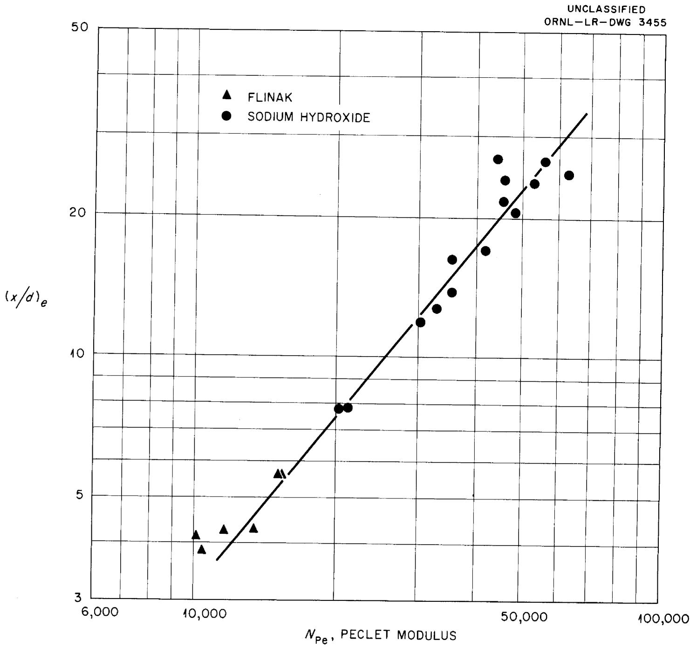  
Fig. 11. Thermal EntranceLength.

3/8 inch iron pipe which was heated by passage of an alternating electric current through the pipe wall. The fluid was circulated through the pipe, and the inlet and outlet temperatures of the molten salt were measured with chromel-alumel thermocouples in wells at the pipe ends. The outside surface temperatures of the pipe were measured at four positions along the pipe. Lacking data on the thermal conductivity of "HTS," they correlated their experimental results in terms of the function, $\frac{h d}{\mu}^{0.4}$ . The average line through their experimental values was given by the equation

$$
\frac {\mathrm {h d}}{\mu^ {0 . 4}} = 0. 0 0 0 4 4 2 \left(\frac {\mathrm {d} G}{\mu}\right) ^ {1. 1 4} \tag {11}
$$

over the Reynolds modulus range 2000 to 30,000. Figure 12 shows the data of Kirst, Nagle and Castner in terms of the Colburn j-function using the preliminary values of Hoffman and Claiborne (7) for the thermal conductivity of "HTS." It is seen that considerable scatter exists in the data.

Part I (5) of the current investigation reported measurements of the heat transfer coefficients for molten sodium hydroxide flowing turbulently in a nickel tube, $3/16''$ O.D. x 0.035" wall thickness. The results are shown in Figure 13 and can be correlated by the equation

$$
\mathrm {N} _ {\mathrm {N u}} \cdot \mathrm {N} _ {\mathrm {P r}} ^ {- 0. 4} = 0. 0 2 1 \mathrm {N} _ {\mathrm {R e}} ^ {0. 8} \tag {12}
$$

over the Reynolds modulus range 6000 to 12,000.

Grele and Gideon (3) also obtained heat transfer data for sodium hydroxide flowing in an electrically heated tube. They used an Inconel tube having an outside diameter of $\frac{3}{8}$ and a wall thickness of $\frac{1}{16}$ . A

UNCLASSIFIED

ORNL-LR-DWG 3456

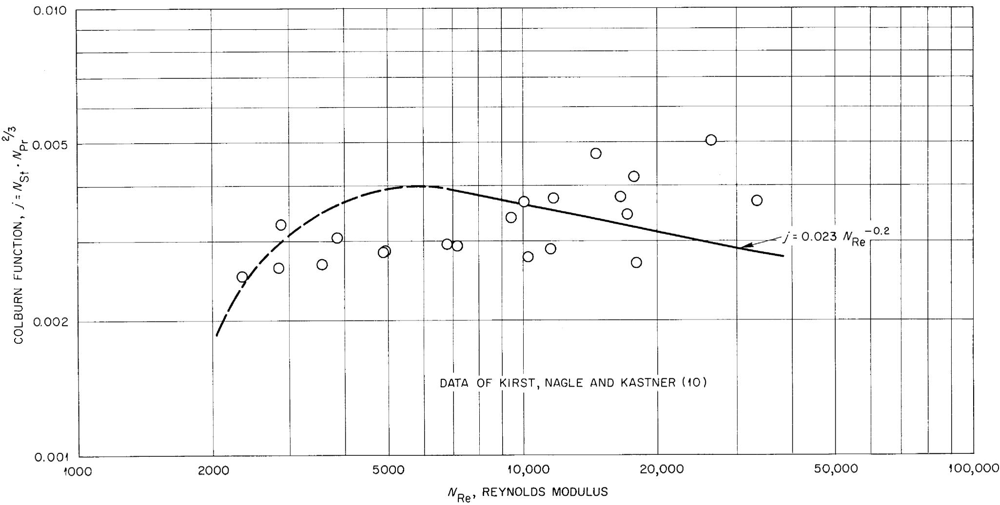  
Fig.12."HTS" Heat Transfer.

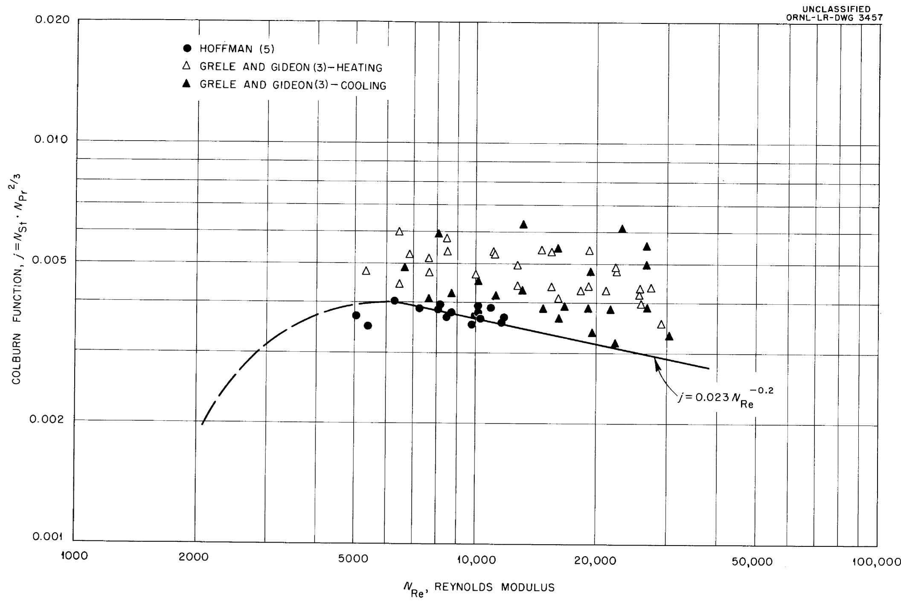  
-2ε-  
Fig. 13. Sodium Hydroxide Heat Transfer.

centrifugal sump pump was used to circulate the molten sodium hydroxide through the system. The inlet and outlet fluid temperatures were measured in baffled mixing tanks at each end of the test section. The outside tube surface temperatures were measured with $14$ chromel-alumel thermocouples located along the test section. In addition to heating data, Grele and Gideon made measurements on the cooling of sodium hydroxide in an air-cooled double-tube heat exchanger. Their results, for heating and cooling, are shown in Figure 13.

Using the same system, Grele and Gideon (4) reported measurements on Flinak heat transfer $(2000 < N_{\text{Re}} < 20,000)$ in an Inconel tube. Their results corroborated the preliminary measurements of Hoffman (6) on Flinak, tests G and H, and are shown in Figure 14.

Recently, Salmon (14) using a double-tube heat exchanger, with sodium-potassium alloy (NaK) as coolant, measured heat transfer coefficients for the fluoride salt mixture NaF-ZrF $_4$ -UF $_4$ (50-46-4 mole percent) in a 0.269" I.D. nickel tube with a length to diameter ratio of 40. Center-line temperatures were measured at both the inlet and outlet of the fluid streams. An adjustable probe was used to measure the surface temperatures on the annulus side of the center tube. The heat transfer coefficient was obtained by analysis of the data using the measured surface temperature and also by the graphical analysis technique suggested by Wilson (15). The results, recalculated from Salmon's data as the Colburn j-function, are shown in Figure 15.

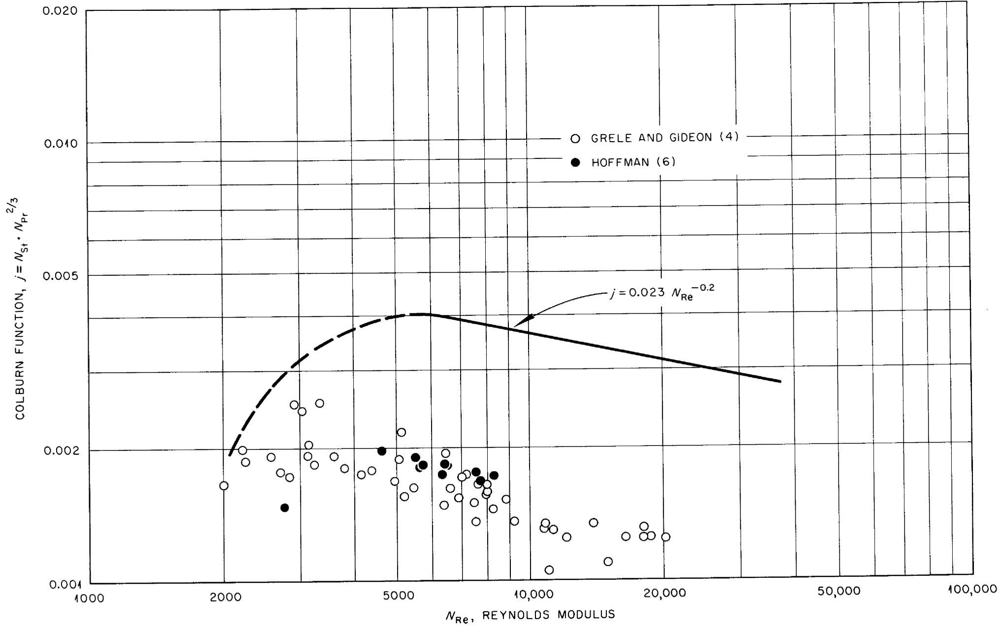  
Fig. 14. FLINAK Heat Transfer.

  
ORNL-LR-DWG3459

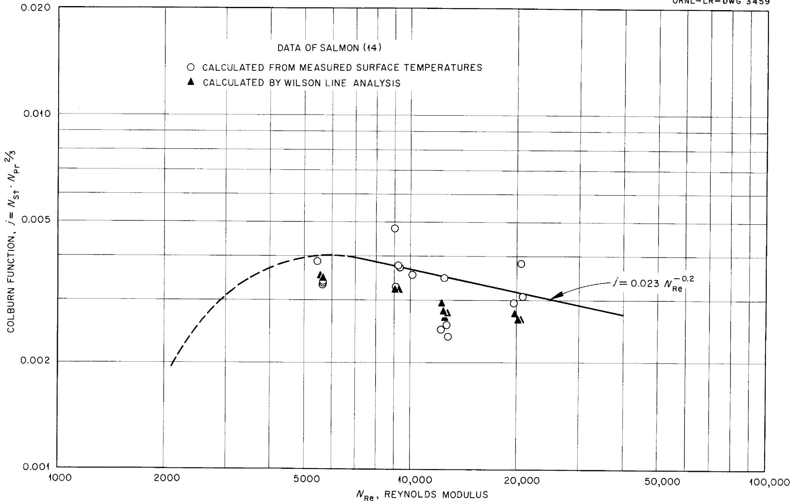  
Fig.15. NaF-ZrF4-UF4(50-46-4 mole %) Heat Transfer.

The results of this report show that Flinak, when suitably contained, behaves as an ordinary fluid as far as heat transfer is concerned. However, in Inconel a reaction at the fluid-metal interface results in an insoluble, high-melting film which considerably reduces Flinak heat transfer. The effect of this on a reactor, where a fixed amount of heat must be removed in the heat exchanger, is readily apparent. Consider, the fuel to NaK heat exchanger designed for a 50 megawatt circulating fuel reactor. In this heat exchanger the fuel is circulated on the outside of Inconel tubes (3/16" O.D. x 0.017" wall thickness) through which NaK is flowing. The Reynolds modulus of the fuel is 5000 and it enters the heat exchanger at $1500^{\circ}\mathrm{F}$ and exits at $1100^{\circ}\mathrm{F}$ . If the fuel is the mixture NaF-LiF-KF-UF $_4$ (11-45-41-3 mole %), then the fuel-side heat transfer coefficient is approximately 5000 Btu/hr-ft $^{2 - \circ}\mathrm{F}$ . For the design conditions, the NaK (coolant-side) coefficient is 18,500 Btu/hr-ft $^{2 - \circ}\mathrm{F}$ . The total thermal resistance is given by

$$
R _ {T} = \frac {1}{h _ {F}} + \frac {1}{h _ {C}} + \left(\frac {\delta}{k}\right) _ {w} \tag {13}
$$

where, $h_F$ is the fuel heat transfer coefficient, $h_C$ , the coolant heat transfer coefficient, $\delta$ , the wall thickness and $k$ , the thermal conductivity of the wall. Substituting into equation (13),

$$
R _ {T} = \frac {1}{5 0 0 0} + \frac {1}{1 8 , 5 0 0} + \frac {0 . 0 1 7}{(1 2) (1 3)} = 0. 0 0 0 3 6 3 h r - f t ^ {2} - o F / B t u
$$

If a film forms on the fuel side of the Inconel tube, the thermal resistance of the system is increased by 0.00025 hr-ft²-⁰F/Btu. This is equivalent to a 40.8% decrease in heat transfer. Thus, if a film having a high thermal resistance forms in a heat exchanger designed to remove 50 megawatts of heat from the fuel, the heat removal is reduced to 29.6 megawatts and the outlet fluid temperature becomes 1263°F instead of 1100°F.

# Conclusions

From the heat transfer results for sodium hydroxide in nickel tubes and for Flinak in nickel and 316 stainless steel tubes, it can be concluded that both fluids are "ordinary" as far as heat transfer is concerned.

In the Flinak-Inconel system an insoluble, high-melting surface deposit (film) results from a reaction at the fluid-metal interface. The thermal resistance of this film is sufficient to cause a marked reduction in heat transfer for Flinak flowing in small diameter Inconel tubes.

For systems in which surface deposits do not form, the accepted correlations for turbulent forced convection heat transfer (e.g., $j = 0.023 \, \text{N}_{\text{Re}}^{-0.2}$ ) may be used to predict sodium hydroxide and Flinak heat transfer. If systems in which deposits occur must be used, knowledge of the thermal resistance of the film is required also.

# APPENDIX A

# Nomenclature

Specific heat of fluid at constant pressure, Btu/lb. fluid-0F   
d Inside diameter of tube, ft   
h Coefficient of heat transfer in region of fully developed turbulent flow, Btu/hr-ft2-OF; hC, coefficient on coolant side; hF, coefficient on fuel side; hx, coefficient at position x on tube; h' apparent coefficient with film present   
k Thermal conductivity of fluid, Btu/hr-ft-OF; $\mathbf{k}_{\mathrm{i}}$ , thermal conductivity of film; $\mathbf{k}_{\mathrm{m}}$ , thermal conductivity of metal   
q Rate of heat transfer, Btu/hr; qf, heat gain by fluid; qk, heat loss to environment; qe, electrical heat input   
Radius, ft; $\mathbf{r}_{\mathrm{s}}$ , inside wall; $\mathbf{r}_{\mathrm{w}}$ , outside wall   
Temperature, $^{\circ} \mathsf{F}$ ; $t_{\mathrm{e}}$ , environment; $t_{\mathrm{m}}$ , fluid mixed-mean; $t_{\mathrm{m},i}$ , at test section inlet; $t_{\mathrm{m},0}$ , at test section outlet; $t_{\mathrm{m},\text{ave}}$ , arithmetic average of $t_{\mathrm{m},i}$ and $t_{\mathrm{m},0}$ ; $t_{\mathrm{s}}$ , inside tube surface; $t_{\mathrm{s},\text{ave},\text{average}}$ ; $t_{\mathrm{w}}$ , outside tube surface; $t_{\mathrm{w},\text{ave}}$ , average   
Mass rate of flow, lbs. fluid/hr   
$\mathbf{x}$ Distance down tube from entrance, ft   
(x/d) Length to diameter ratio for tube, dimensionless; $(\mathbf{x} / \mathbf{d})_{\mathbf{e}}$ , at end of thermal entrance region   
y Thickness of film, ft   
A Area of heat transfer surface, ft²; A', inside surface area of film   
E Voltage impressed on test section, volts   
G Mass velocity, lbs. fluid/hr- $(\mathrm{ft}^2$ of tube cross section)

I Current passing through test section, amperes

V Volume of metal in tube wall, ft³

W Volume heat generation, Btu/hr-ft3

Tube wall thickness, ft

$\mu$ Absolute viscosity of fluid, $\mathrm{lbs / hr - ft}$

$\mathbf{N}_{\mathbf{Nu}}$ Nusselt modulus, dimensionless, $(\mathrm{hd} / \mathrm{k})$

NPe Peclet modulus, dimensionless, $\mathbb{N}_{\mathrm{Re}}\cdot \mathbb{N}_{\mathrm{Pr}},$ (cp dG/k)

$\mathbb{N}_{\mathbb{P}^{\mathbb{R}}}$ Prandtl modulus, dimensionless, $(c_{p}\mu /k)$

Reynolds modulus, dimensionless, $(\mathrm{dG} / \mu)$

NSt Stanton modulus, dimensionless, $\mathbb{N}_{\mathrm{Nu}} / (\mathbb{N}_{\mathrm{Re}}\cdot \mathbb{N}_{\mathrm{Pr}})$ (h/cpG)

j Colburn function, dimensionless, $\mathbf{N}_{\mathrm{St}}\cdot \mathbf{N}_{\mathrm{Pr}}^{2 / 3}$

# APPENDIX B

# Bibliography

1. Boelter, L.M.K., Martinelli, R. C., Jonassen, F.; Trans. A.S.M.E., 63, 447 (1941)   
2. Colburn, A. P.; Trans. A.I.Ch.E., 29, 174 (1933)   
3. Grele, M. D., Gideon, L.; Nat. Adv. Comm. Aero, RM E52L09, Unclassified (1953)   
4. Grele, M. D., Gedeon, L.; Nat. Adv. Comm. Aero., Rm E53L18, Secret (1954)   
5. Hoffman, H. W.; Oak Ridge National Laboratory, Physics Report 1370, Unclassified (1952); Heat Transfer and Fluid Mechanics Institute, p. 83 (1953)   
6. Hoffman, H. W.; Oak Ridge National Laboratory, Memorandum CF 53-8-106, Secret (1953)   
7. Hoffman, H. W., Claiborne, J.; Unpublished data   
8. Hoffman, H. W., Lones, J.; Oak Ridge National Laboratory, Memorandum CF 54-9-2, Secret (1954)   
9. Karman, T. von; Trans. A.S.M.E., 61, 705 (1939)   
10. Kirst, W. E., Nagle, W. M., Castner, J. B.; Trans. A.I.Ch.E., 36, 371 (1940)   
11. McAdams, W. H.; "Heat Transmission," 3rd Edition, p. 219 (1954)   
12. Prandtl, L.; Physik. Zeitschr., 29, 487 (1929)   
13. Reynolds, O.; Proc. Manch. Lit. and Phil. Soc., 14, 7 (1874); Collected Papers, 1, 81 (1900), Cambridge   
14. Salmon, D. F.; Oak Ridge National Laboratory, Special Report 1716, Secret (1954)   
15. Wilson, E. E.; Trans. A.S.M.E., 37, 47 (1915)

# APPENDIX C

# Physical Properties of Flinak

The physical properties of Flinak were obtained from the following sources:

cp: Physical Property Charts for Some Reactor Fuels, Coolants, and Miscellaneous Materials - June 1954 ORNL CF 54-6-188; Powers and Blalock - ORNL CF 53-7-200. The value reported and used in the calculations in this report is, $\mathtt{cp} = 0.45 \pm 0.03$ Btu/lb- $^\circ \mathtt{F}$ , for the temperature range $900^{\circ} \mathtt{F} - 1600^{\circ} \mathtt{F}$ .   
$\mu$ : Unpublished data of Redmond and Cohen obtained on Brookfield Viscometer; see also Physical Property Charts - ORNL CF 54-6-188.   
$\rho$ : Physical Property Charts - ORNL CF 54-6-188; Cohen and Jones - ORNL-1702..   
k: Physical Property Charts - ORNL CF 54-6-188; Cooper and Claiborne - ORNL CF 52-8-163. The value reported is, $k = 2.6$ Btu/hr-ft- $^{\circ}$ F, for the temperature range 1000 $^{\circ}$ F - 1275 $^{\circ}$ F.

The viscosity and density are shown as a function of temperature in Figure 16.

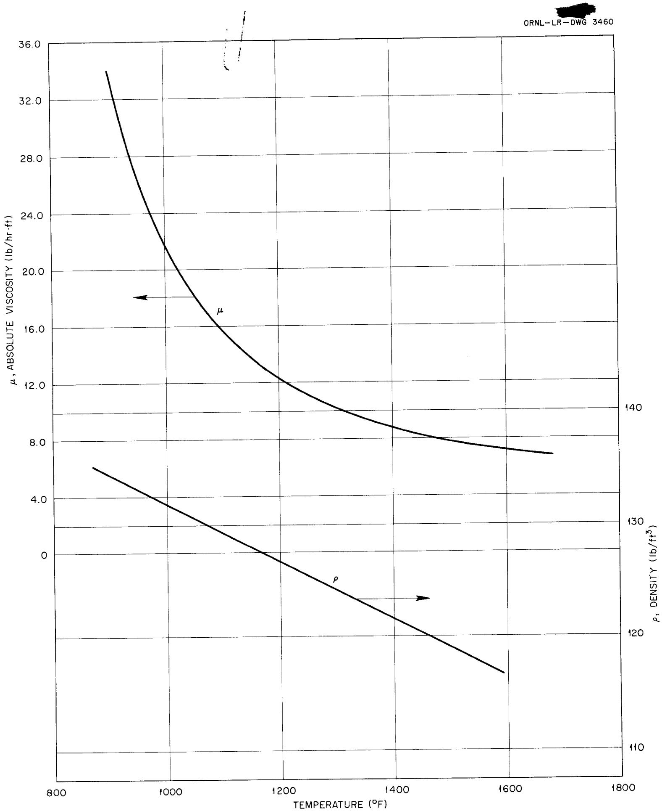  
Fig. 16. Variation of Physical Properties of FLINAK with Temperature.