# AEC RESEARCH AND DEVELOPMENT REPORT

ORNL-1808

ANP LIMITED DISTRIBUTION

MARTIN MARIETTA ENERGY SYSTEMS LIBRARIES

3445603497990

ENTRAL RESEARCH LIBRARY

DOCUMENT COLLECTION

DESIGN CALCULATIONS FOR A MINIATURE HIGH

TEMPERATURE IN-PILE CIRCULATING FUEL LOOP

M. T. Robinson and D. F. Weekes

99

AT

AEG RESEARCH AND DEVELOPMENT REP 1

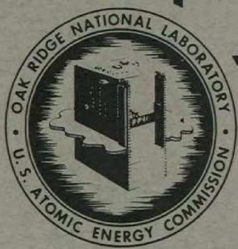

CENTRAL RESEARCH LIBRARY

DOCUMENT COLLECTION

LIBRARY LOAN COPY

DO NOT TRANSFER TO ANOTHER PERSON

If you wish someone else to see this document, send in name with document and the library will arrange a loan.

OAK RIDGE NATIONAL LABORATORY

OPERATED BY

UNION CARBIDE NUCLEAR COMPANY

A Division of Union Carbide and Carbon Corporation

UCC

POST OFFICE BOX P · OAK RIDGE, TENNESSEE

Contract No. W-7405-eng-26

SOLID STATE DIVISION

# DESIGN CALCULATIONS FOR A MINIATURE HIGH-

# TEMPERATURE IN-PILE CIRCULATING FUEL LOOP

M. T. Robinson and D. F. Weekes

With An Appendix on Analog Simulation by

E. R. Mann, F. P. Green, and R. S. Stone

Reactor Controls Department

DATE ISSUED

SEP 19 1955

OAK RIDGE NATIONAL LABORATORY

Operated by

UNION CARBIDE NUCLEAR COMPANY

A Division of Union Carbide and Carbon Corporation

Post Office Box P

Oak Ridge, Tennessee

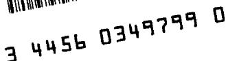

# INTERNAL DISTRIBUTION

1. G. M. Adamson   
2. R.G. Affel   
3. C. R. Baldock   
4. C. J. Barton   
5. C. D. Baumann   
6. R. G. Berggren   
7. J. O. Betterton, Jr.   
8. E. S. Bettis   
9. D. S. Billington   
10. D. Binder   
11. F. F. Blankenship   
12. T. H. Blewitt   
13. E. P. Blizzard   
14. C. D. Bopp   
15. B. S. Borie   
16. G. E. Boyd   
17. E. J. Boyle   
18. M. A. Bredig   
19. H. Brooks (consultant)   
20. W. E. Browning   
21. F. R. Bruce   
22. W. E. Brundage   
23. A. D. Callihan   
24. D. W. Cardwell   
25. J.V.Cathcart   
26. C. E. Center (K-25)   
27. G. T. Chapman   
28. R. A. Charpie   
29. J. W. Cieland   
30. G. H. Clewett   
31. C. E. Clifford   
32. A. F. Cohen   
33. W. B. Cottrell   
34. D. D. Cowen   
35. J. H. Crawford, Jr.   
36. S. Cromer   
37. R. S. Crouse   
38. F. L. Cullen   
39. J. E. Cunningham   
40. S. E. Discrete   
41. L. B. Emil (K-25)   
42. M. J. Felikson   
43. D. E. Fergusson   
44. A. P. F. G   
45. J.H.FJr.   
46. W.T.F   
47. J. L. Gab

P. R. J. Gray   
19. F. P. Green   
50. W. R. Grimes   
51. W. O. Harms   
52. C. S. Harrill   
53. E. E. Hoffman   
54. A. Hollander   
55. D. K. Holmes   
56. A. S. Householder   
57. J. T. Howe   
58. L. K. Jetter   
59. R. W. Johnson   
50. R. J. Jones   
51. W. H. Jordan   
52. G. W. Keilholtz   
53. C. P. Keim   
64. M. T. Kelley   
55. R. H. Kernohan   
66. F. Kertesz   
57. E.M.King   
58. H. V. Klaus   
69. G. E. Klein

70-71. J. A. Lane

72. C. E. Larson   
3. M. E. LaVerne   
74. T. A. Lincoln   
5. S. C. Lind   
6. R. S. Livingston   
77. R. N. Lyon   
78. H. G. MacPherson (consultant)   
79. F. C. Maienschein   
30. W. D. Manly   
31. E. R. Mann   
32. L. A. Mann   
33. W. B. McDonald   
34. F. W. McQuilken   
35. A. J. Miller   
36. E. C. Miller   
57. J. G. Morgan   
38. K. Z. Morgan   
19. E. J. Murphy   
20. J. P. Murray (Y-12)   
1. G. J. Nessley   
R.B.Oliver

V. Parkinson

96. P. M. Reyling   
97. H. F. Poppendiek   
98. M. T. Robins h   
99. H. W. Savage   
100. A. W. Savolai, n   
101. H. C. Schwein   
102. F. Seitz (constant)   
103. E. D. Shipley   
104. O. Sisman   
105. M. J. Skinner   
106. G.P. Smith   
107. A. H. Snell   
108. R. L. Sproull (constant)   
109. E. E. Stansbury   
110. D. K. Stevens   
111. R. S. Stone   
112. R. I. Strough   
113. W. J. Sturm   
114. C. D. Susano   
115. J. A. Swartout   
116. E. H. Taylor   
117. J. B. Trice   
118. E. R. Van Artsdalen

119. F. C. VonderLüte   
120. J. M. Warde   
121. C. C. Webst   
122. M. S. Wechsler   
123. D. F. Wee's   
124. R.A.Wells   
125. A. M. Wulfberg   
126. J. C. Yane   
127. G. D. Whitman   
128. E. F. Fligner (consultant)   
129. G. Williams   
130. Willis Willis   
131. J.S.Wilson   
132. A.E. Winters   
133. C. Wittels   
134. E. D. Zerby

135-136 Central Research Library   
13. Health Physics Library   
Reactor Experimental Engineering Library   
3. Laboratory Records Department   
14. Laboratory Records, ORNL R.C.   
45. ORNL Document Reference Library, Y-12 Branch

# EXTÉNAL DISTRIBUTION

146. AFDFJd   
147. AFDR   
148. AFSWD   
149. Aircraft WADC (WCLS)   
150. Argon National Laboratory   
151. AT10

152-154. Atog E ngy Commission, Washington

155. B、-DC   
156. Bélle Matorial Institute   
157. Sing - ttle   
158. Aer-Moder   
159 Chief of Nat Research

160-167 Col. Gassen (CSN)

16Convair - Diego

164 1 CVAC - Forth

1. Director of Laboratories (WCL)

B. Directorate of Hapon Systems, ARDC

69. Douglas   
70. East Hartford Lab Office   
171. Equipment Laboratory - WADC (WCLE)

2-175. GE - ANPD

176. Glenn L. Martin   
177. Iowa State College   
178. Knolls Atomic Power Laboratory

179. Lockheed - Burbank   
180. Lockland Area Office   
181. Los Alamos Scientific Laboratory   
183. Materials Lab (WCRTO)   
184. Mound Laboratory   
185. NACA - Cleveland   
186. NACA - Washington   
187. NDA   
188. North American - Aerophysics   
189. Patent Branch, Washington

190-192. Power Plant Laboratory - WADC (WCLPU)

193-196. Pratt & Whitney   
197. Rand   
198. RDGN Sutherland   
199. SAM

200-201. Technical Information Service, Oak Ridge Operations Office   
202-204. WADC - Library   
205. WAPD-Bettis Plant   
206.Wright Aero   
207. Assistant Secretary - Air Force, R&D   
208. Maintenance Engineering Services Division - AMC (MCMTA)   
209. Division of Research and Medicine, AEC, ORO

# CONTENTS

Development of Loop Model 1   
Basis of Heat Transfer Calculations 3   
Derivation of Heat Transfer Equations 4   
Solution of Heat Transfer Equations 7   
Numerical Data 8   
Selection of Best Loop Model 8   
Results of Design Calculations for the Mark VIII Loop 10   
Miscellaneous Calculations for the Mark VIII Loop 11   
Appendix A. Importance of Reynolds Number in Mass Transfer 16   
Appendix B. Analog Simulation in an In-Pile Loop-Liquid-Salt Fuel Study 16   
Appendix C. Time-Constant Modification through Positive Feedback 25

# DESIGN CALCULATIONS FOR A MINIATURE HIGH-TEMPERATURE IN-PILE CIRCULATING FUEL LOOP

M. T. Robinson and D. F. Weekes

# DEVELOPMENT OF LOOP MODEL

The calculations presented in this report have been carried out as part of the development of a small circulating fuel loop designed for a study of the effects of reactor radiation on the interaction of fused fluoride fuels with container materials, and particularly with Inconel. One of the principal purposes in making a small loop is to simplify construction and operation of the equipment to the extent that many loops can be run under a variety of conditions. Another consideration is that a small loop can be examined more easily after irradiation. Finally, a sufficiently small system can be inserted into any one of several vertical irradiation facilities in either the LITR or the MTR. This will allow high thermal- and fast-neutron fluxes to be used and will simplify experimental work by eliminating the need for elaborate beam-hole plugs.

Two important considerations governed the choice of the basic design. Safety of both the reactor and the personnel dictated that no portion of the loop be left uncooled. This is especially important in the region of high thermal-neutron flux, since, in case of fuel stagnation, the temperature of the fuel will rise at a very great rate $(650^{\circ}\mathrm{C}$ per second for fuel composition 30 in the MTR is a typical figure). Since the time necessary for taking appropriate corrective action is appreciable, a considerable amount of heat should be extracted from the high-flux regions of the loop to avoid melting of the container and release of fuel and fission products into the cooling air or into the reactor itself. It is impractical to use two cooling circuits so that there will be one for emergency use only, since such an emergency circuit cannot be operated sufficiently rapidly. The second consideration was simplicity, both of construction and of design calculation.

As a result of these considerations, the basic design chosen was a coaxial heat exchanger, bent into a close-limbed U-shape. Fuel is pumped through the inner member in a loop closed by the pump, and cooling air is forced through the surrounding annulus. Studies have been made of several different ways of arranging the cooling-air circuit relative to the fuel circuit, as illustrated schematically in Fig. 1. Detailed calculations to be presented later show the marked superiority of the type 3 arrangement, when viewed as to the amount and pressure of air required to maintain the desired operating conditions.

Studies have been made also of the effects that the diameter of the fuel tube and the length of the loop will have on the thermal behavior of the

UNCLASSIFIED

SSD-A-1052

ORNL-LR-DWG-3772

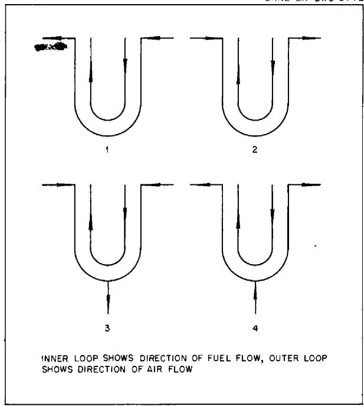  
Fig. 1. Air Flow Patterns in Miniature Loop Models.

TABLE 1. SUMMARY OF LOOP MODELS   

<table><tr><td>Mark No.</td><td>Inside Diameter of Fuel Tube (in.)</td><td>Outside Diameter of Fuel Tube (in.)</td><td>Inside Diameter of Air Tube (in.)</td><td>Lengtha (cm)</td><td>Cooling-Air Typeb</td></tr><tr><td>IA</td><td>0.100</td><td>0.200</td><td>0.500</td><td>100</td><td>1</td></tr><tr><td>IB</td><td>0.150</td><td>0.250</td><td>0.500</td><td>100</td><td>1</td></tr><tr><td>IIA</td><td>0.100</td><td>0.200</td><td>0.500</td><td>120</td><td>1</td></tr><tr><td>IIB</td><td>0.200</td><td>0.300</td><td>0.600</td><td>120</td><td>1</td></tr><tr><td>IIIc</td><td>0.100</td><td>0.200</td><td>0.500</td><td>200</td><td>1</td></tr><tr><td>IV</td><td>0.200</td><td>0.300</td><td>0.600</td><td>200</td><td>1</td></tr><tr><td>V</td><td>0.200</td><td>0.300</td><td>0.600</td><td>d</td><td>1</td></tr><tr><td>VI</td><td>0.200</td><td>0.300</td><td>0.600</td><td>200</td><td>4</td></tr><tr><td>VII</td><td>0.200</td><td>0.300</td><td>0.600</td><td>400</td><td>1</td></tr><tr><td>VIII</td><td>0.200</td><td>0.300</td><td>0.600</td><td>200</td><td>3</td></tr><tr><td>IX</td><td>0.200</td><td>0.300</td><td>0.600</td><td>200</td><td>2</td></tr></table>

aThe length given is the value of the quantity S,defined in section on "Solution of Heat Transfer Equations." The length of the U is about one-half this value.   
$b_{\mathrm{See}}$ Fig.1.   
cMark III was inserted to the bottom of the active lattice.   
Mark V was unsymmetrical; entering the reactor, the length was 60 cm; leaving, it was 140 cm.

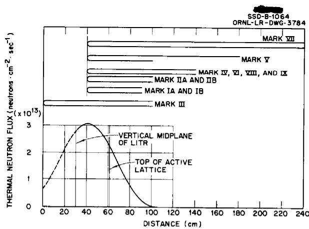  
Fig. 2. Location of Miniature Loop Models in Position C-48 of LITR Compared with Thermal-Neutron Flux Distribution.

system. The air-annulus spacing was not usually varied but was kept as small as seemed consistent with ready fabrication. Only a little attention has been paid to positioning of the loop relative to the thermal-neutron flux in a reactor, since one such study showed that little experimental advantage accrued from a change in position. Table 1 summarizes the dimensions and other pertinent data on the 11 configurations examined in this report. The locations of the various models with respect to the thermal-neutron flux distribution in position C-48 of the LITR are shown in Fig. 2.

The calculation scheme detailed in the following section is based primarily on the principle of the conservation of energy in a system which is in a steady (time-independent) thermal state. However, a number of simplifying assumptions are required, both to allow derivation of appropriate differential equations and to permit their useful solution.

In the derivation of the equations, two important assumptions are made. First, all heat is assumed to be removed into the cooling air. Transfer of heat by radiation from the outer wall of the fuel tube and by conduction to external parts of the system is specifically neglected. A correction could be made for radiative heat transfer, but this does not seem to be worthwhile in view of the approximate nature of the entire calculation. The second important assumption is that all heat flows radially out of the fuel tube; this assumption is at least reasonable, since the thermal resistance radially through the fuel-tube wall is certainly small compared with the axial thermal resistance. Furthermore, the radial temperature gradient is expected to be far greater than the axial one. These two assumptions result in a somewhat exaggerated calculation of the fuel temperature profile and an overestimation of the amount of cooling air required.

In the course of solving the heat transfer equations, it is necessary to calculate the heat transfer coefficients which govern the flow of heat between fluid and container wall. For this calculation the customary empirical correlations developed by engineers for heat exchanger design2-4 have been employed. These relations apply only to cases where so-called established flow conditions prevail in the fluid. Away from the entrance to the cooling annulus, these conditions prevail in the cooling air, but the velocity distribution is changed because of the large rate of heat transfer. This will result in somewhat greater turbulence in the air stream and, perhaps, in larger

heat transfer coefficients. The situation in the fuel is more complex, due to the presence of the large volume heat source. It seems likely that this will cause a substantial increase in turbulence in the fuel and will probably increase the heat transfer coefficients between the fuel and the tube wall.

It has also been assumed that the physical properties of air and of fuel could be regarded as being independent of temperature. A detailed justification of this assumption is presented in connection with the solution of the equations. In any case, it is felt that the importance of this assumption is minor, especially in view of the large uncertainty $(\pm 25\%)$ in the fission power generated in the fuel.

To aid in interpreting the results of the calculations which were made at ORNL, certain design criteria were adopted. Conditions which matched as closely as possible the behavior of an actual reactor would have been attractive; however, we thought it more important to design an experiment sufficiently flexible to allow a real analysis of the effects of several variables on the interaction of the fuel and the container. The important state variables are believed to be the flow velocity of the fuel, the intensity of the fission heat source, and the temperature range through which the fuel moves. These variables are not all independent. In particular, for a given fuel flow rate, the fission heat source largely determines the temperature range through which the fuel moves. The flow rate of the fuel is specified in terms of its Reynolds number, Ref (see Appendix A), the intensity of the fission heat source in terms of $P_0$ , the fission power generated per unit volume of fuel at the maximum thermal-neutron flux (in terms of the notation in the section entitled "Derivation of Heat Transfer Equations" $P_0 = \beta \rho_f \phi_{\max}$ ), and the temperature range experienced by the fuel in terms of $\Delta T_p$ , the difference between the maximum and minimum values of the fuel temperature. We have attempted to design a loop which would have the values

and which meets the requirement that all fission heat be removed in the loop proper so that no additional heating or cooling of the fuel would be necessary in the pump. It was found that the

specified conditions can indeed be met in a variety of ways, provided an ample supply of cooling air is available.

# DERIVATION OF HEAT TRANSFER EQUATIONS

An element of a concentric tube heat exchanger is shown in Fig. 3. Fission heat is generated in the liquid fuel flowing in the central tube, is transferred through the wall to the air flowing in the annular space $r_2 \leq r \leq r_3$ , and is removed to an

external sink. The purpose is to find the steady-state temperature distribution in the system.

The symbols employed in the calculations are defined below.

# Nomenclature

Coordinates and Dimensions

$$
s = \text {l o o p a x i a l c o o r d i n a t e (t h e l o o p i s d e f i n e d b y} 0 \leq s \leq S)
$$

$$
r = \text {l o o p r a d i a l c o o r d i n a t e}
$$

$$
r _ {1} = \text {i n s i d e r a d i u s o f i n n e r (f u e l)} \text {t u b e}
$$

$$
r _ {2} = \text {o u t s i d e r a d i u s o f i n n e r (f u e l)} \text {t u b e}
$$

$$
r _ {3} = \text {i n s i d e r a d i u s o f o u t e r (a i r) t u b e}
$$

Physical Properties

$$
c _ {p f} = \text {s p e c i f i c h e a t o f f u e l a t c o n s t a n t p r e s s u r e}
$$

$$
c _ {p a} = \text {s p e c i f i c h e a t o f a i r a t c o n s t a n t p r e s s u r e}
$$

$$
k _ {f} = \text {t h e r m a l c o n d u c t i v i t y o f f u e l}
$$

$$
k _ {a} = \text {t h e r m a l c o n d u c t i v i t y o f a i r}
$$

$$
k _ {I} = \text {t h e r m a l c o n d u c t i v i t y o f I n c o n e l , a v e r a g e d o v e r T _ {1} \geq T \geq T _ {2}}
$$

$$
\mu_ {f} = \text {v i s c o s i t y o f f u e l}
$$

$$
\mu_ {a} = \text {v i s c o s i t y o f a i r}
$$

$$
\rho_ {f} = \text {d e n s i t y o f f u e l}
$$

$$
\rho_ {a} = \text {d e n s i t y o f a i r}
$$

Other Variables

$$
v _ {f} = \text {l i n e a r v e l o c i t y o f f u e l , a v e r a g e d o v e r} \leq r _ {1}
$$

$$
v _ {a} = \text {l i n e a r v e l o c i t y o f a i r}, \text {a v e r a g e d o v e r} r _ {2} \leq r \leq r _ {3}
$$

$$
w _ {f} = \text {f u e l c u r r e n t}, \pi r _ {1} ^ {2} v _ {f} \rho_ {f}
$$

$$
W _ {a} = \text {o i r c u r r e n t}, \pi \left(r _ {3} ^ {2} - r _ {2} ^ {2}\right) v _ {a} \rho_ {a}
$$

$$
b _ {1} = \text {h e a t t r a n s f e r c o e f f i c i e n t} \quad \text {a t} \quad r = r _ {1}
$$

$$
b _ {2} = \text {h e a t t r a n s f e r c o e f f i c i e n t} r = r _ {2}
$$

$$
T _ {f} = \text {f u e l t e m p e r a t u r e}, \text {a v e r a g e d o v e r} r \leq r _ {1}
$$

Other Variables (continued)

$$
T _ {f} ^ {0} = \text {f u e l t e m p e r a t u r e} s = 0
$$

$$
T _ {a} = \text {a i r t e m p a r a t u r e}, \text {a v e r a g e d o v e r} r _ {2} \leq r \leq r _ {3}
$$

$$
T _ {a} ^ {0} = \text {a i r t e m p e r a t u r e} s = 0
$$

$$
T _ {1} = \text {t e m p e r a t u r e o f f u e l t u b e a t} r = r _ {1}
$$

$$
T _ {2} = \text {t e m p e r a t u r e o f f u e l t u b e a t} r = r _ {2}
$$

$y =$ heat removed radially from fuel per unit time and unit of s

$$
\phi = \text {t h e r m a l - n e u t r o n f l u x}
$$

$$
\beta = \text {f i s s i o n p o w e r g e n e r a t e d p e r u n i t t h e r m a l f l u x a n d p e r u n i t f u e l d e n s i t y}
$$

$$
P _ {0} = \text {f i s s i o n p o w e r g e n e r a t e d p e r u n i t v o l u m e o f f u e l a t t h e m a x i m u m t h e r m a l - n e u t r o n f l u x}
$$

Abbreviations

$$
\alpha_ {1} = \gamma_ {1} + \gamma_ {2} + \gamma_ {3}
$$

$$
\alpha_ {2} = 1 / w _ {f} c _ {p f} = 2 / \pi r _ {1} k _ {f} (P r f) (R e f)
$$

$$
\alpha_ {3} = 1 / W _ {a} c _ {p a} = 2 / \pi \left(r _ {3} + r _ {2}\right) k _ {a} (P r a) (R e a)
$$

$$
\beta_ {1} = \pi r _ {1} ^ {2} \rho_ {f} \beta / W _ {f} c _ {p f} = 2 r _ {1} \beta \rho_ {f} / k _ {f} (P r f) (R e f)
$$

$$
\gamma_ {1} = 1 / 2 \pi r _ {1} b _ {1} = 1 / \pi k _ {f} (N u f)
$$

$$
\gamma_ {2} = \left(\ln r _ {2} / r _ {1}\right) / 2 \pi k _ {I}
$$

$$
\gamma_ {3} = 1 / 2 \pi r _ {2} b _ {2} = (r _ {3} - r _ {2}) / \pi r _ {2} k _ {a} (N u a)
$$

$$
\alpha_ {1} = \left(\alpha_ {3} - \alpha_ {2}\right) / \alpha_ {1}
$$

$$
\alpha_ {2} = \beta_ {1} / \alpha_ {1}
$$

$$
\alpha_ {3} = (\alpha_ {3} + \alpha_ {2}) / \alpha_ {1}
$$

Dimensionless Heat Transfer Numbers

$$
(R e a) = 2 \left(r _ {3} - r _ {2}\right) \cdot \rho_ {a} v _ {a} / \mu_ {a}
$$

$$
(R e f) = 2 r _ {1} \rho_ {f} v _ {f} / \mu_ {f}
$$

$$
(P r a) = \mu_ {a} c _ {p a} / k _ {a}
$$

$$
(P r f) = \mu_ {f} c _ {p f} / k _ {f}
$$

$$
(N u a) = 2 \left(r _ {3} - r _ {2}\right) b _ {2} / k _ {a}
$$

$$
(N u /) = 2 r _ {1} b _ {1} / k _ {f}
$$

$$
(S t f) = h _ {1} / \rho_ {f} c _ {p f} v _ {f}
$$

Reynolds number of air

Reynolds number of fuel

Prandtl number of air

Prandtl number of fuel

Nusselt number of air

Nusselt number of fuel

Stanton number of fuel

In the steady state, in unit time, a mass of fuel $W_{f}$ enters the fuel tube of the element at temperature $T_{f}$ , bringing with it a quantity of heat $W_{f}c_{pf}T_{f}$ relative to $T_{f} = 0$ . The same mass of fuel leaves at a temperature $T_{f} + (dT_{f} / ds)ds$ ,

taking with it a quantity of heat

$$
w _ {f} c _ {p f} \left[ T _ {f} + \left(d T _ {f} / d s\right) d s \right].
$$

The fission heat generated in the element is $\beta \phi \rho_{f}\pi r_{1}^{2}ds$ . A quantity of heat $y$ ds flows radially

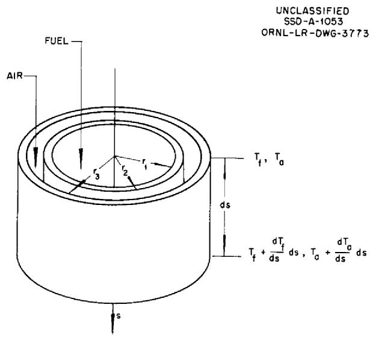  
Fig. 3. Element of a Cylindrical Heat Exchanger.

out of the fuel tube into the annulus. Conservation of energy then requires

$$
\pi r _ {1} ^ {2} \beta \phi \rho_ {f} - W _ {f} c _ {p f} \frac {d T _ {f}}{d s} - y =, 0. \tag {1}
$$

A similar argument can be made for the cooling air in the annular element, which receives a quantity of heat $y \, ds$ in the steady state in unit time. If the air flows in the same direction as the fuel, then

$$
y - W _ {a} c _ {p a} \frac {d T _ {a}}{d s} = 0. \tag {2a}
$$

If the direction of air flow is opposite to that of the fuel, then

$$
y + W _ {a} c _ {p a} \frac {d T _ {a}}{d s} = 0. \tag {2b}
$$

For the transfer of heat from the fuel to the tube wall at $r_1$ and from the tube wall to air at $r_2$ , Newton's law of cooling may be written in the form

$$
y = 2 \pi r _ {1} b _ {1} \left(T _ {f} - T _ {1}\right) = 2 \pi r _ {2} b _ {2} \left(T _ {2} - T _ {a}\right). \tag {3}
$$

The usual relation governing radial conduction of heat in a cylinder may be written for the temperature drop through the wall of the fuel tube as

$$
y = \frac {2 \pi k _ {I} \left(T _ {1} - T _ {2}\right)}{\ln \left(r _ {2} / r _ {1}\right)}. \tag {4}
$$

If the abbreviations given above are introduced into Eqs. 1 through 4, the following set of equations results:

$$
\frac {d T _ {f}}{d s} = \beta_ {1} \phi - \alpha_ {2} y, \tag {5}
$$

$$
(6 a) \frac {d T _ {a}}{d s} = \alpha_ {3} y (\text {p a r a l l e l f l o w o f f u e l a n d a i r}) ,
$$

$$
(6 b) \frac {d T _ {a}}{d s} = - a _ {3} y (\text {c o u n t e r f l o w o f f u e l a n d a i r}),
$$

$$
T _ {f} - T _ {1} = \gamma_ {1} y, \tag {7}
$$

$$
T _ {1} - T _ {2} = \gamma_ {2} y, \tag {8}
$$

$$
T _ {2} - T _ {a} = \gamma_ {3} y. \tag {9}
$$

The set of Eqs. 5 through 9, under appropriate boundary conditions, describes the dependence of the various temperatures on the physical properties of the fuel and of air, on the several state variables, and on the geometry of the system.

The solution of these equations is difficult because of the dependence of the various coefficients on temperature. On the other hand, the specific heats of ionic liquids (fused salts) are generally independent of temperature. Therefore it can be assumed that $\alpha_{2}$ is constant, since conservation of mass requires that $W_{f}$ be constant, regardless of changes of temperature or dimensions of the system. The quantity $\alpha_{3}$ varies only as does the specific heat of air. This variation, about 6% from room temperature to $800^{\circ}\mathrm{C}$ , may safely be neglected because of other approximations made in the calculations, particularly if $c_{pa}$ is evaluated at the mean air temperature.

The lack of sufficient data demands that $k_{f}$ be taken as constant. Since the variation of $\rho_{f}$ with temperature is small (about 3% per $100^{\circ}\mathrm{C}$ ), it, too, may be taken as constant. If, in addition, changes of the dimensions of the system with temperature are neglected - an assumption justified by the very small coefficient of expansion of Inconel - the quantities $\gamma_{1}$ and $\gamma_{2}$ may also be assumed to be constant. (An average value for the thermal conductivity of Inconel has already been used; see Nomenclature above.) Also, $\gamma_{3}$ may be considered to be constant, if $b_{2}$ is evaluated at the mean air temperature. The variation of $b_{2}$ with temperature at constant mass flow is not large,

# NUMERICAL DATA

Heat is transferred by forced convection in a cylindrical exchanger in accordance with empirical relations of the type

$$
(N u) = f \left[ (P r), (R e) \right]
$$

obtained by dimensional analysis of experimental data. The systems with which we are concerned here are characterized by large ratios of length to diameter, and, as was stated earlier, the physical properties of the fluids are evaluated at suitable mean temperatures and then treated as constants. For the case of laminar flow, use has been made of the formula derived by Seider and Tate:

$$
(1 5) (N u) = 1. 8 6 \left[ (P r) (R e) \frac {2 r _ {1}}{S} \right] ^ {1 / 3} (R e <   2 1 0 0).
$$

For fully turbulent flow, the expression proposed by Dittus and Boelter has been used:

$$
(1 6) (N u) = 0. 0 2 3 (P r) ^ {2 / 5} (R e) ^ {4 / 5} (R e > 1 0, 0 0 0).
$$

In the intermediate region of incompletely developed turbulence $(2100 < Re < 10,000)$ , the suggestions of Sieder and Tate have again been followed. The relation they recommend is presented in a graphical form which has been reproduced in various places. Under the special assumption used here as to invariability of physical properties with temperature, this plot permits determination of $(St)(Pr)^{2/3}$ for any $(Re)$ and any length-to-diameter ratio. From this, $(Nu)$ has been calculated through the relation

$$
\left(N u\right) = \left(S t\right) \left(P r\right) \left(R e\right). \tag {17}
$$

The physical-property data used in the analog calculations were obtained from various sources. The data for the physical properties of air are those derived from McAdams.10 The physical properties of fluoride fuel 44 were obtained from Poppendiek11 of the Laboratory. The thermal

conductivity of Inconel is from the data of Haythorne.12 The data are summarized below. The thermal-neutron flux used is that measured in position C-48 of the LITR.13 (In earlier calculations, values slightly different from those shown below were used for $c_{pf}$ , $\mu_f$ , and $\rho_f$ . The difference is only significant in the case of $c_{pf}$ .)

$$
\text {A i r} (2 0 0 ^ {\circ} \mathrm {C})
$$

$$
\mu_ {a} = 0. 0 0 0 2 5 \mathrm {g} / \mathrm {c m} \cdot \sec
$$

$$
c _ {p a} = 1. 0 5 \text {j o u l o s / g} ^ {\circ} C
$$

$$
k _ {a} = 0. 0 0 0 4 \mathrm {w} / \mathrm {c m} ^ {\cdot} ^ {\circ} \mathrm {C}
$$

$$
F u e l 4 4 (8 1 5 ^ {\circ} C)
$$

$$
\mu_ {f} = 0. 0 7 2 \mathrm {g} / \mathrm {c m} \cdot \sec
$$

$$
c _ {p f} = 1. 0 0 \text {j o u l e} / g \cdot {} ^ {\circ} C
$$

$$
k _ {f} = 0. 0 2 2 5 \mathrm {w} / \mathrm {c m} ^ {\circ} \mathrm {C}
$$

$$
\rho_ {f} = 3. 2 8 \mathrm {g} / \mathrm {c m} ^ {3}
$$

$$
\beta = 5 4. 0 \times 1 0 ^ {- 1 3} \mathrm {i o u l e - c m} ^ {2} / g
$$

$$
\mathrm {I n c o n e l}
$$

$$
k _ {I} = 0. 2 5 0 \mathrm {w / c m ^ {\circ} C}
$$

7E. N. Sieder and G. E. Tote, Ind. Eng. Chem. 28, 1429 (1936).   
8F. W. Dittus and L. M. K. Boelter, Univ. Calif. (Berkeley) Publs, Publs. Eng. 2, p 443 (1930).   
9See, for example, ref. 3, Fig. 26-1, p 549.   
10. See, for example, W. H. McAdams, Heat Transmission, 2d ed., McGraw-Hill, New York, 1942.   
11H. F. Poppendiek, private communication to D. F. Weekes.   
12P.A.Haythorne,Iron Age 162,89(1948).   
13M. T. Robinson, Solid State Semiann. Prog. Rep. Feb. 28, 1954, ORNL-1677, p 27. See also Fig. 2 of this report.

# SELECTION OF BEST LOOP MODEL

Some typical results obtained for the Mark IA configuration are shown in Figs. 4 and 5. While none of the curves shown meet the desired boundary condition (Eq. 13), several conclusions can be drawn. If (Ref) is sufficiently high for some flow turbulence to be assured, $\Delta T_{f}$ will be very small, say $10^{\circ}C$ or less. In order to get

values of $\Delta T_{f}$ near $100^{\circ}C$ , it is necessary to use very small flow velocities, well within the laminar region. It is clear that insufficient fission heat is available. If the fuel tube is increased in size, a given value of (Ref) will be attained at lower linear velocity, allowing fuel to spend a greater time in the high-neutron-flux region of the loop.

This change was made in the Mark IB and Mark IIB models. In the latter case, the problem now was removal of the fission heat. Apparently, too little heat exchange capacity was available. This was remedied by increasing the length of the loop, forming the Mark IV configuration.

A study was next made of the effects of the cooling-air pattern. Four loop models were used, one for each of the patterns shown in Fig. 1. The total quantity of air was held constant, giving lower values of (Rea) for the two cases with a divided cooling annulus. Other things being equal, the divided annulus would be preferred, since the air pressure drop for a given total air flow is much less than for the single-annulus models. Some results of the calculations are shown in Fig. 6. Due to an error in computing $\beta_{1}$ , the curves do not correspond to irradiation in position C-48 of the LITR but to a flux of identical shape and doubled magnitude. The Mark VIII model appeared to be most suitable, since, in addition to the lower air pressure drop, it had the highest value of $\Delta T_{f}$ . The final air temperature would

be lower for this model, also. On this basis, the Mark VIII configuration was adopted for the detailed study discussed in the next section.

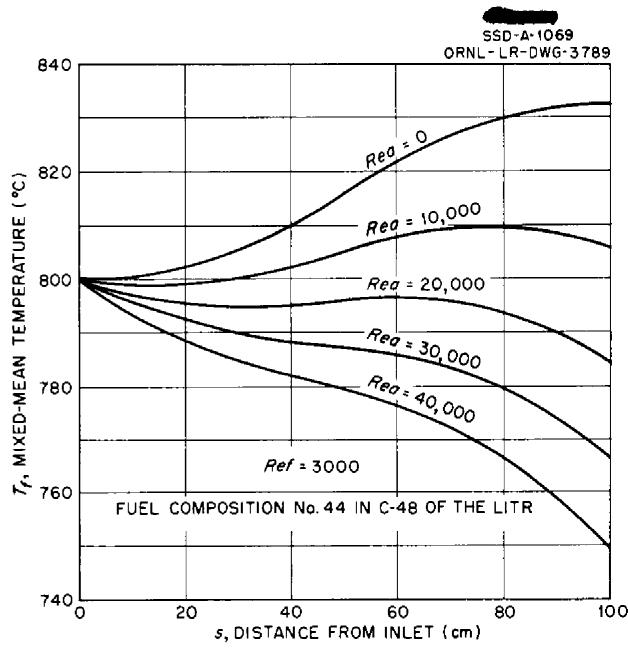  
Fig. 5. Effect of Air Flow Rate on Fuel Temperature Pattern in Mark IA Miniature Loop.

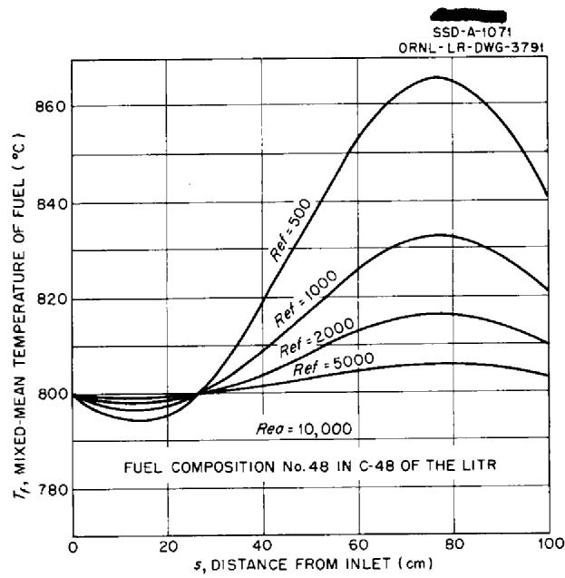  
Fig. 4. Effect of Fuel Flow Rate on Fuel Temperature Pattern in Mark IA Miniature Loop.

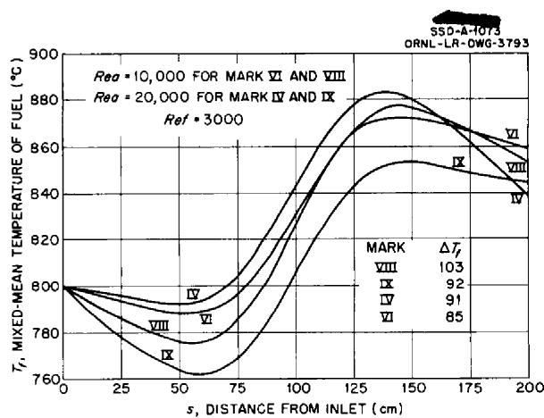  
Fig. 6. Effect of Cooling-Air Pattern on Miniature Loop.

The Mark VIII loop model is shown in Fig. 7. The calculations are discussed in detail in Appendix B. The results are summarized by the plots of $\theta_{f}$ and of $y$ vs $s$ given in Figs. 20 to 27 (see Appendix B). The quantity $\theta_{f}$ may be defined as $T_{f} - T_{f}^{0}$ . The numerical data are given above in "Number Data" and a plot of $\phi$ vs $s$ is shown in Fig. 17 (see Appendix B).

Several qualitative remarks can first be made. The positions of maximum and minimum fuel temperature are quite insensitive to the velocities of the two fluids. This allows placement of control thermocouples to be made with some precision. The value of $\Delta T_{f}$ decreases with increasing (Ref.), but not indefinitely. The principal resistance to flow of heat is at the interface between air and fuel tube. At sufficiently high fuel velocities, further increases have only a small effect on the quantity of heat transferred from the fuel.

From the results in Appendix B, those pairs of fluid Reynolds numbers must be selected which correspond to "realistic" conditions, namely, 1. initial air temperature, $T_{a}^{0}$ near room temperature,

2. maximum fuel temperature near $815^{\circ}C$

From the data of Figs. 24 to 27, the values of $y(0)$ are selected, from which $T_{f}^{0} - T_{a}^{0}$ is calculated by Eq. 10. The values of $T_{f}^{0} - T_{a}^{0}$ are plotted vs (Rea) for several values of (Ref) in Fig. 8. The conditions above allow calculations of the "realistic" values of this quantity from

$$
\left(T _ {j} ^ {0} - T _ {a} ^ {0}\right) _ {\text {r e a l}} = 7 8 5 - \left(T _ {j} - T _ {j} ^ {0}\right) _ {\max } . \tag {18}
$$

The values of $(T_f - T_f^0)_{\max}$ were obtained from the curves of Figs. 20 to 23. The resulting set of "realistic" conditions is indicated by the dashed line in Fig. 8.

It is a simple matter to extend these calculations to a fuel wattage other than the one used here, as long as the shape of the thermal-neutron flux is not changed. In fact, if the fuel wattage, $P_{0'}$ is replaced by a new value, $nP_{0'}$ , the curves

of Appendix B still apply, but with the $y$ and $\theta_{f}$ scales simply multiplied by a factor $n$ . Extension to a five-times-greater fission wattage is made in Fig. 8 (this corresponds roughly to the use of fuel composition 44 in position A-38 of the MTR). The results of calculations for three different wattages are shown in Table 2.

UNCLASSIFIED

SSD-B-988

ORNL-LR-DWG-2252

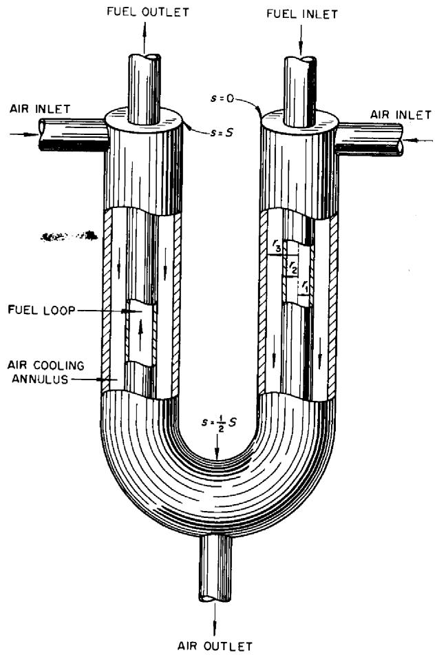  
Fig. 7. Mark VIII Model of Miniature Loop.

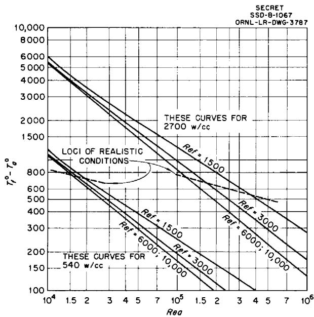  
Fig. 8. Estimation of Cooling-Air Requirements for Mark VIII Configuration of Miniature In-Pile Loop.

TABLE 2. CALCULATED THERMAL BEHAVIOR OF THE MARK VIII MINIATURE LOOP   

<table><tr><td colspan="5">Effect of Volume Heat Source</td></tr><tr><td>P0w/cc</td><td>540</td><td>1,540</td><td></td><td>2,700</td></tr><tr><td>(Ref.)</td><td>3,000</td><td>3,000</td><td></td><td>3,000</td></tr><tr><td>(Rea)</td><td>16,500</td><td>70,000</td><td></td><td>167,000</td></tr><tr><td>ΔTf, °C</td><td>49</td><td>134</td><td></td><td>245</td></tr><tr><td colspan="5">Effect of Fuel Flow Rate(P0=540 w/cc)</td></tr><tr><td>(Ref.)</td><td>1,500</td><td>3,000</td><td>6,000</td><td>10,000</td></tr><tr><td>(Rea)</td><td>19,000</td><td>16,500</td><td>15,500</td><td>15,500</td></tr><tr><td>ΔTf, °C</td><td>102</td><td>49</td><td>25</td><td>25</td></tr><tr><td colspan="5">(P0=2700 w/cc)</td></tr><tr><td>(Ref.)</td><td>1,500</td><td>3,000</td><td>6,000</td><td>10,000</td></tr><tr><td>(Rea)</td><td>368,000</td><td>167,000</td><td>118,000</td><td>118,000</td></tr><tr><td>ΔTf, °C</td><td>510</td><td>245</td><td>125</td><td>125</td></tr></table>

# MISCELLANEOUS CALCULATIONS FOR THE MARK VIII LOOP

A decision to select one or another set of operating conditions for the miniature loop depends in part on a number of things other than the heat transfer calculations discussed in this report. The necessary additional calculations are summarized in this section.

Air Pressure Drop, Velocity, Volume, and Temperature Rise. - The pressure drop in the air-cooling annulus was calculated by the conventional expression

$$
p _ {1} ^ {2} - p _ {2} ^ {2} = \frac {2 R T _ {a} \mu_ {a} ^ {2} (R e a) ^ {2}}{\left(r _ {3} - r _ {2}\right) ^ {2}} \left[ \ln \frac {p _ {1}}{p _ {2}} + \frac {f S}{4 \left(r _ {3} - r _ {2}\right)} \right],
$$

where

$p_{1} =$ pressure at air inlet,

$p_2 =$ pressure at air outlet,

$R =$ gas constant,

$S =$ length of loop,

$f =$ friction factor,

and the other symbols are defined in "Derivation of Heat Transfer Equations." The friction factor was calculated from the relation of Koo:14,15

$$
f = 0. 0 0 1 4 0 + \frac {0 . 1 2 5}{(R e) ^ {0 . 3 2}}. \tag {20}
$$

The outlet pressure, $p_2$ , was assumed to be 1 atm. The results of the calculation for the Mark VIII loop are shown in Fig. 9.

The volume of air required to attain various Reynolds numbers in the Mark VIII loop is shown in Fig. 10. The linear velocity of the air was calculated, assuming the pressure to be the average of the inlet and outlet values. The results are shown in Fig. 11. The scale of Mach

numbers was calculated by using the velocity of sound in air at 1 atm pressure at $200^{\circ}\mathrm{C}$ , 1500 ft/sec. It will be noted that the velocity of air is always subsonic in the Mark VIII loop.

The rise in temperature of the cooling air may be calculated from Eq. 10. The maximum air temperature is given by

$$
T _ {a} (\max ) = T _ {f} \frac {s}{2} - a _ {1} y \frac {s}{2}. \tag {21}
$$

There are two values of this quantity, since the two branches of the cooling-air circuit experience different conditions. The calculated results for

16 Handbook of Chemistry and Physics, Chemical Rubber Publishing Co., Cleveland, Ohio, p 2257, 27th ed.

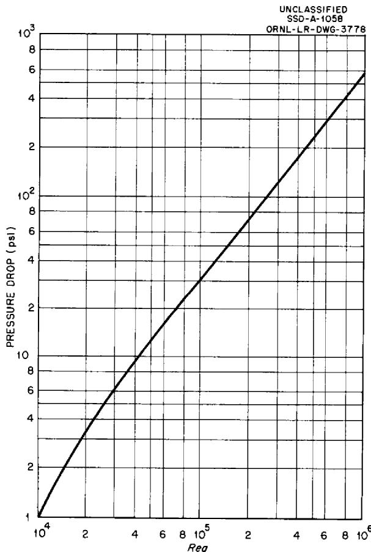  
Fig. 9. Cooling-Air Pressure Drop for Mark VIII Configuration of Miniature In-Pile Loop.

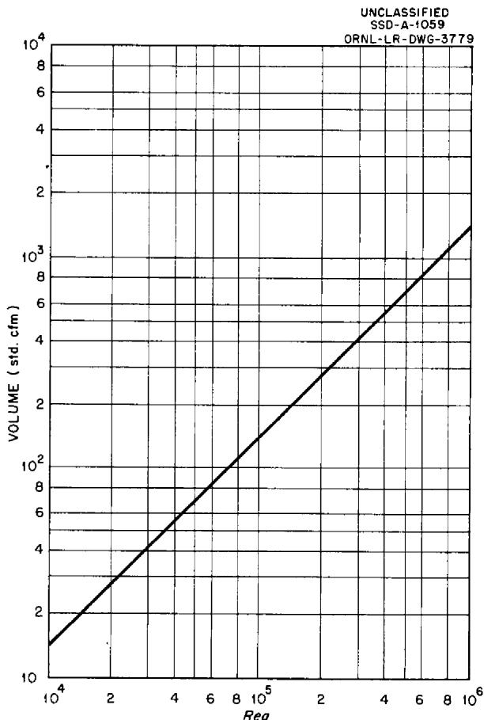

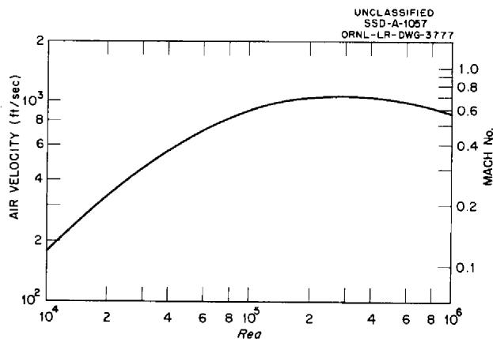  
Fig. 10. Air Volume Required for Mark VIII Miniature Loop.   
Fig. 11. Air Velocity for Mark VIII Configuration of Miniature Loop.

the highest air temperature for each of the cases of Table 2 are shown in Table 3.

Fuel Pressure Drop, Velocity, and Volume. - The pressure drop in the fuel tube was calculated from the expression

$$
\Delta p = \frac {\mu_ {f} ^ {2} (R e f) ^ {2} L _ {e f}}{4 r _ {1} ^ {3} \rho_ {f}}, \tag {22}
$$

where $L_{e}$ is the effective length of the loop; the other symbols have been defined before. The effective length was calculated by adding to the actual length (205 cm) an amount, $150r_{1}$ , to account for the bend at the tip of the loop. The friction factor was taken from McAdams.[17] The results are shown in Fig. 12. The volume flow rate of fuel is shown in Fig. 13. The linear velocity is shown in Fig. 14.

Thermal-Neutron Flux Depression. - The depression of the thermal-neutron flux has been

17W. H. McAdams, Heat Transmission, p 118, 2d ed., McGraw-Hill, New York, 1942.

18W. B. Lewis, A Semi-Empirical Method of Estimating Flux Depression, MTRL-54-27, March 11, 1954.

TABLE 3. CALCULATED MAXIMUM AIR TEMPERATURE IN MARK VIII LOOP   

<table><tr><td colspan="3">P0= 540 w/cc</td></tr><tr><td>(Ref.)</td><td>(Rea)</td><td>Maximum Air Temperature (°C)</td></tr><tr><td>1,500</td><td>19,000</td><td>450</td></tr><tr><td>3,000</td><td>16,500</td><td>500</td></tr><tr><td>6,000</td><td>15,500</td><td>540</td></tr><tr><td>10,000</td><td>15,500</td><td>550</td></tr><tr><td colspan="3">P0= 2700 w/cc</td></tr><tr><td>1,500</td><td>368,000</td><td>30</td></tr><tr><td>3,000</td><td>167,000</td><td>200</td></tr><tr><td>6,000</td><td>118,000</td><td>290</td></tr><tr><td>10,000</td><td>118,000</td><td>300</td></tr><tr><td colspan="3">(Ref.) = 3000</td></tr><tr><td>P0(w/cc)</td><td>(Rea)</td><td>Maximum Air Temperature (°C)</td></tr><tr><td>540</td><td>16,500</td><td>500</td></tr><tr><td>1,540</td><td>70,000</td><td>360</td></tr><tr><td>2,700</td><td>167,000</td><td>200</td></tr></table>

estimated by using the treatment of Lewis. $^{18}$ This is based on a correlation of some experimental data obtained by various workers at the MTR. A "grayness" factor of 0.73 was found which is due to fuel alone. The Inconel walls of the fuel tube and of the cooling annulus contribute

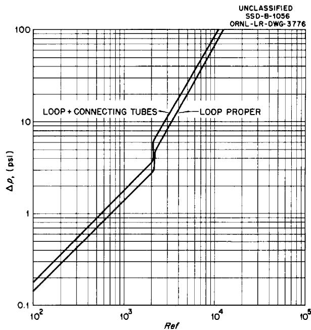  
Fig. 12. Fuel Pressure Drop in Mark VIII Loop.

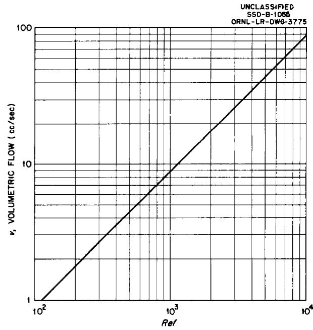  
Fig. 13. Volumetric Flow of Fuel in Mark VIII Loop.

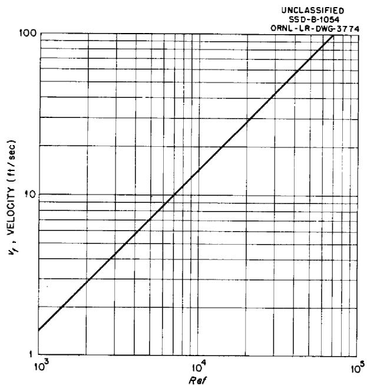  
Fig. 14. Linear Velocity of Fuel in Mark VIII Loop.

another factor of 0.95. The overall grayness factor is estimated to be about 0.67; that is, two-thirds of the thermal flux is available to the sample.

"Dilution Factor." - A quantity known as the "dilution factor" is of some interest in studying in-pile corrosion. This quantity is defined as the ratio of the maximum value of the fission power generated in unit volume of fuel to the average value. In a loop of the type being considered, this definition may be stated as

$$
\text {d i l u t i o n f a c t o r} = \frac {P _ {0} \left(\pi r _ {1} ^ {2} S + V _ {p}\right)}{\int_ {0} ^ {S} y d s}, \tag {23}
$$

where $V_{p}$ is the volume of the pump and of any connecting tubes. The present situation in regard to the dilution factor is indicated as follows:

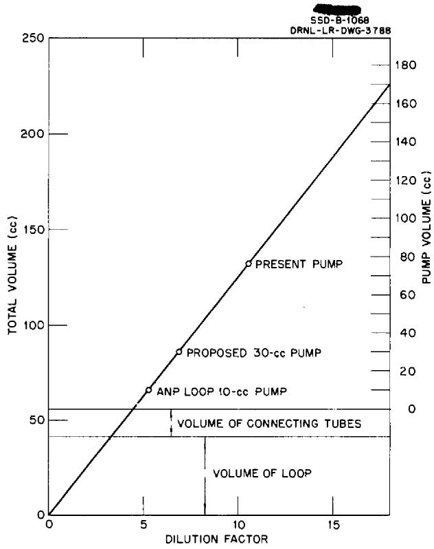

Fig. 15. Dilution Factor in Mark VIII Loop.   

<table><tr><td>Volume of loop proper, cm3</td><td>41.6</td></tr><tr><td>Volume of connecting tubes, cm3</td><td>14.4</td></tr><tr><td>Volume of pump, cm3</td><td>76.2</td></tr><tr><td>Total</td><td>132.2</td></tr><tr><td>P0, cm-3</td><td>0.08</td></tr><tr><td>∫0S y ds</td><td></td></tr><tr><td>Dilution factor</td><td>10.6</td></tr></table>

The effect of changing the pump volume is indicated in Fig. 15.

Total Power. - The total fission power generated in the loop is calculated from Eq. 12. The results are shown in Fig. 16.

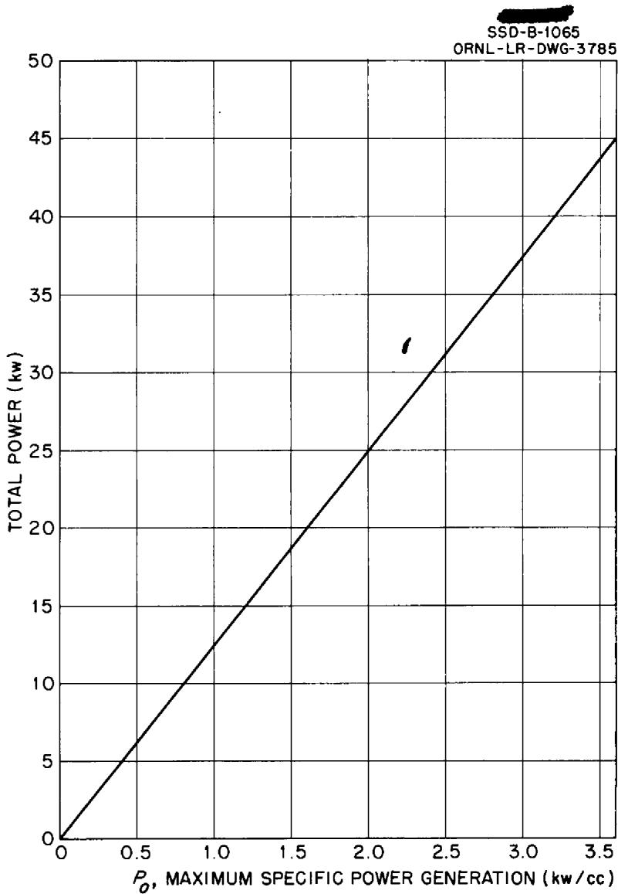  
Fig. 16. Total Power of Mark VIII Loop.

# IMPORTANCE OF REYNOLDS NUMBER IN MASS TRANSFER

The frequent argument on the relative importance of linear velocity and Reynolds number in mass transfer between the container and fuel would seem to be settled by appeal to chemical engineering experience.19 It is found that excellent results are obtained in correlating mass transfer coefficients for fluids flowing in pipes by means of relations of the type

$$
\frac {2 r _ {1} k ^ {\prime}}{D _ {f}} = f \left[ (S c f), (R e f) \right], \tag {24}
$$

where $k'$ is the mass transfer coefficient, $D_f$ is the diffusion coefficient of the transferred species in the fuel phase, and $(Scf)$ is the Schmidt number for the fuel:

$$
\left(S c f\right) = \frac {\mu_ {f}}{\rho_ {f} D _ {f}}, \tag {25}
$$

The similarity of Eq. 24 to the analogous heat transfer equation is evident, the Schmidt number replacing the Prandtl number, and the nameless group on the left side replacing the Nusselt number. Even more striking is the fact that for many cases the Dittus-Boelter equation (16) applies to mass transfer with the same coefficients and exponents as those used in heat transfer. It is quite clear, therefore, that the Reynolds number is fully as significant in mass transfer as in heat transfer, and is definitely the relevant fuel-flow variable. Furthermore, an additional statement of the surface-to-volume ratio is unnecessary, since this information is also given in the Reynolds number.

# Appendix B

# ANALOG SIMULATION IN AN IN-PILE LOOP-LIQUID.SALTS FUEL STUDY

E. R. Mann

F. P. Green

R. S. Stone

Reactor Controls Department, Instrumentation and Controls Division

An analog simulation of an in-pile loop experiment for ART fluoride fuel was performed by means of a portion of the Reactor Controls Computer to determine the optimum fuel and coolant flow rates and the temperature variation of the fuel as it traverses the loop for each of 16 flow combinations. Constant coefficients for the descriptive equations and a linear plot of the forcing function, flux, Fig. 17, were provided by D. F. Weekes. This simulation has provided a series of 16 curves of fuel temperature vs instantaneous position of the fuel within the 205-cm "active" portion of the loop and 16 corresponding curves displaying the radial heat transfer vs fuel position.

The specifications given state that the proposed fuel loop will conform to the following equations (the quantities $\theta_{f}$ and $\theta_{a}$ may be defined as $T_{f} - T_{f}^{0}$ and $T_{a} - T_{a'}^{0}$ , respectively; all other symbols are defined in the nomenclature list in

"Derivation of Heat Transfer Equations"):

$$
\begin{array}{l} \frac {d \theta_ {f}}{d s} = \beta_ {1} \phi - a _ {2} y, \quad 0 \leq s \leq 2 0 5 c m, \tag {26} \\ \left. \begin{array}{l} (2 7) \quad \frac {d y}{d s} + a _ {3} y = a _ {2} \phi \\ \text {a n d} \quad \frac {d \theta_ {a}}{d s} = a _ {3} y \end{array} \right\} \quad 0 \leq s \leq 1 0 2. 5 \mathrm {c m}, \\ \left. \begin{array}{l} (2 9) \quad \frac {d y}{d s} - a _ {1} y = a _ {2} \phi \\ \text {a n d} \\ (3 0) \quad \frac {d \theta_ {a}}{d s} = - a _ {3} y \end{array} \right\} 1 0 2. 5 \leq s \leq 2 0 5 c m. \\ \end{array}
$$

The analog was established on this basis.

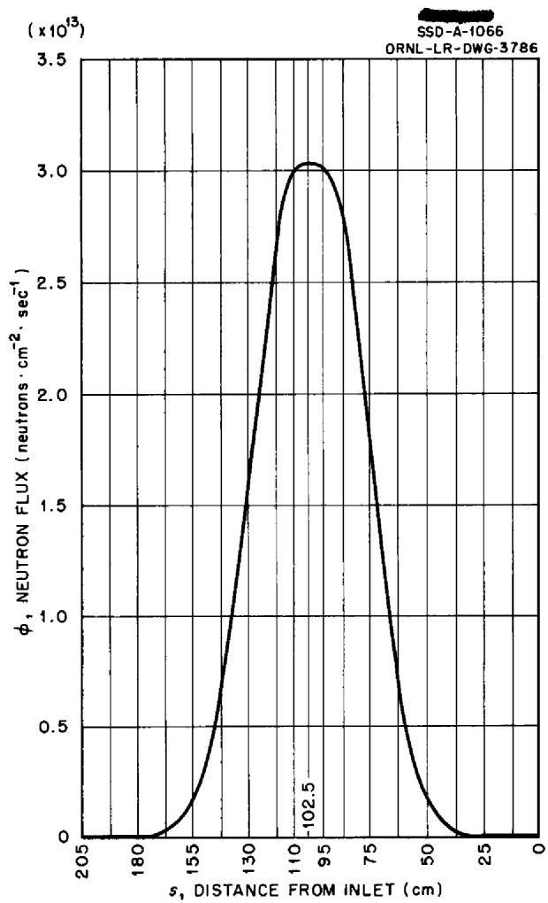  
Fig. 17. Neutron Flux Distribution.

The differential equations for electrical potentials in the circuit, Fig. 18, are analogous to Eqs. 26 through 30, because by Kirchhoff's law for currents,

$$
\frac {E}{R _ {1}} - \frac {E _ {1}}{R _ {2}} - C _ {1} \frac {d E _ {1}}{d t} + \frac {E _ {3}}{R _ {3}} = 0, \text {a t n o d e " A " ,}
$$

$$
E _ {3} = G E _ {1}, \quad \text {a t n o d e ＂ B ＂},
$$

$$
\frac {E}{R _ {4}} - \frac {E _ {1}}{R _ {5}} - C _ {2} \frac {d E _ {2}}{d t} = 0, \text {a t n o d e ＂ C ＂}.
$$

Combination of these equations gives

$$
\frac {d E _ {1}}{d t} + \left(\frac {1}{R _ {2} C _ {1}} - \frac {G _ {1}}{R _ {3} C _ {1}}\right) E _ {1} = \frac {1}{R _ {1} C _ {1}} E, \tag {31}
$$

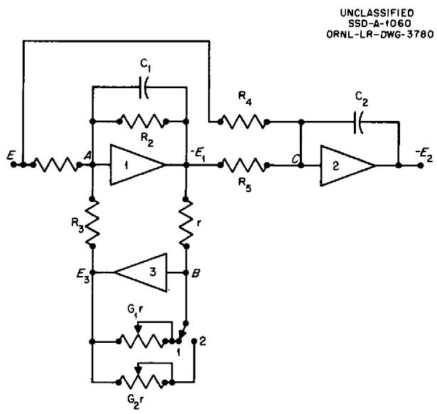  
Fig. 18. Block Diagram of Electronic Analog of the In-Pile Loop.

$$
\begin{array}{l} \left. \frac {d E _ {1}}{d t} - \left(\frac {G _ {2}}{R _ {3} C _ {1}} - \frac {1}{R _ {2} C _ {1}}\right) E _ {1} = \frac {1}{R _ {1} G _ {1}} E \right., \\ \frac {d E _ {2}}{d t} = \frac {1}{R _ {4} C _ {2}} E - \frac {1}{R _ {5} C _ {2}} E _ {1}, \tag {33} \\ \end{array}
$$

where $G_{1}$ and $G_{2}$ are the values of $G$ appropriate to the two regions of the loop.

If in the loop equations the substitution $s = t$ is made and the function $\phi(s)$ is suitably transformed to $\phi(t)$ , the loop equations and electrical network equations are analogous. This implies that, in the process of solving the problem, the quantity $\phi(s)$ is introduced in accordance with the condition $s = v \cdot t$ , where $v$ is a velocity, selected here as $1 \, \text{cm/sec}$ . The various constants were transformed accordingly, since for the electrical analog, time is the independent variable.

Figure 19 is a block diagram of the system simulator. Operational amplifiers Nos. 1 and 2 generate the electrical equivalents of the radial heat transfer, $y$ , and the fuel temperature, $\theta_f$ . The remaining five amplifiers are required to perform special functions relating to simulator operation, such as signal polarity inversion, isolation, and time-constant modification.

The reactor flux function required in this simulation could not be generated readily by means of

the standard electronic components on hand. It was expedient, therefore, to employ a hitherto unreported scheme to generate the flux function shown in Fig. 17. This system makes use of a Brown recorder with an auxiliary 10,000-ohm, ten-turn, Helipot "slide-wire," the rotor being coupled to the recording pen drive. The predrawn, calibrated flux distribution curve was placed on the strip chart, and a dry pen was inserted in place of the normal ink-filled pen. During a run the recorder pen was made to follow the curve by manually changing the recorder input to amplifier No. 5 (Fig. 19) by means of a 50,000 ohm Helipot. The slide-wire output represents the flux "seen" by the fuel as it traverses the loop. Since the chart speed is $1\mathrm{cm / sec}$ , the fuel position in centimeters measured from the input corresponds to time in seconds. This arrangement provides a reasonable time scale so that the function generator operator can closely follow the calibrated flux curve.

In the interest of convenience, the free parameters of the system were fixed as follows:

$$
C _ {1} = C _ {2} = 1 0 \mu f,
$$

$$
R _ {2} = R _ {3} = 7. 5 \text {m e g o h m s},
$$

$$
R _ {1} = 7 5 0, 0 0 0 \text {o h m s}.
$$

This requires that

$$
C _ {1} = 1 - 7 5 a _ {3} \equiv A _ {3}, \tag {34}
$$

$$
G _ {2} = 1 + 7 5 a _ {1} \equiv (1 + A _ {1}), \tag {35}
$$

$$
a = 7. 5 a _ {2}, \tag {36}
$$

$$
R _ {4} = \frac {1 0 ^ {5}}{\beta_ {1}}, \tag {37}
$$

$$
R _ {5} = \frac {1 0 ^ {5}}{\alpha_ {2}}. \tag {38}
$$

The values $G_{1}$ and $G_{2}$ are set by means of previously calibrated 25,000-ohm potentiometers. The use of two operational amplifiers, for example, Nos. 1 and 3 in Fig. 18, to provide accurately

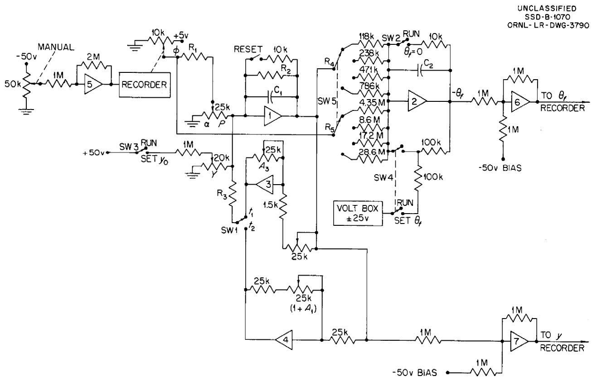  
Fig. 19. Block Diagram for In-Pile Loop Simulation.

calibrated time constants over wide ranges has not been previously reported, although it has been conventional for some time with the ORNL simulator. The method is described in Appendix C. The values of $a_3$ and $a_1$ are such that $G_1$ varies between 0 and 1, and $G_2$ varies between 1 and 2. The quantity $a$ is set to $7.5a_2$ and may vary between 0 and 1 (fraction of full-scale). The addition of potentiometer $P$ makes it possible to vary the effective value of $R_1$ from 750,000 ohms to infinity with a 25,000-ohm potentiometer.

Each of the resistances $R_{4}$ and $R_{5}$ have four different values and are put into the circuit in the form of lumped constants, chosen by a four-position switch. Pertinent values, both given and calculated, are presented in Table 4. The quantity $2\alpha_{3} / \alpha_{1}\alpha_{2}$ is a correction coefficient needed in connection with boundary conditions.

The simulation of $y$ required the breaking up of each run into two equal parts. An exponentially decaying function describes $y$ in the first half, the time constant in each case set by potentiometer $A_{3}$ in amplifier No. 3, whose gain is less than 1. An exponentially increasing function describes $y$ in the second half, the time constant in each case set by potentiometer $(1 + A_{1})$ in amplifier No. 4, whose gain is greater than 1 and less than 2. Because of a small discontinuity in $y$ at the mid-point, the simulation must be stopped and a new initial condition for $y$ set on potentiometer $Y$ . This control is necessitated by the boundary conditions imposed, which are:

1. coolant to enter at each end at the same temperature $(\theta_{a0} = \theta_{a205})$ and leave at the center,   
2. fuel to enter at one end and leave at the other, with no net change in temperature $(\theta_{f0} = \theta_{f205})$

Since there are two distinct and separate coolant streams, entering at either end and merging to exit at the mid-point of the loop, there is a discontinuity in $\theta_{a}$ (and hence in $y$ , since $\theta_{f}$ is a continuous function) at $s = 102.5$ cm. This requires a correction at mid-point, which may be calculated as follows. Let $y_{102.5}$ and $y_{102.5}^{\prime}$ be

the values of $y$ just before and just after the discontinuity, respectively. From the differential equations, it can be shown by integration that

$$
\begin{array}{l} y _ {1 0 2. 5} = y _ {0} + \frac {\alpha_ {2} + \alpha_ {3}}{\alpha_ {1} \alpha_ {2}} \theta_ {f 1 0 2. 5} \\ - \frac {\alpha_ {3} \beta_ {1}}{\alpha_ {1} \alpha_ {2}} \int_ {0} ^ {1 0 2. 5} \phi d s, \\ \end{array}
$$

$$
\begin{array}{l} y _ {1 0 2. 5} ^ {\prime} = y _ {0} + \frac {a _ {2} - a _ {3}}{a _ {1} a _ {2}} \theta_ {f 1 0 2. 5} \\ - \frac {\alpha_ {3} \beta_ {1}}{\alpha_ {1} \alpha_ {2}} \int_ {1 0 2. 5} ^ {2 0 5} \phi d s. \\ \end{array}
$$

Since the flux distribution is symmetrical about $s = 102.5 \, \text{cm}$ , it follows that

$$
y _ {1 0 2. 5} ^ {\prime} = y _ {1 0 2. 5} - \frac {2 a _ {3}}{a _ {1} a _ {2}} \theta_ {f 1 0 2. 5}. \tag {39}
$$

The volt-box input to the $\theta_{f}$ generator was used only at the initiation of the second half of the run in order to start the fuel temperature at the final value which is attained during the first half. Amplifier No. 5 was used for isolation, and amplifiers numbered 6 and 7 were used to invert the $y$ and $\theta_{f}$ signals and to transpose these outputs to the center of the recorder scales.

At the start of a run, switches 2 and 3 were closed. This set $\theta_{f0} = 0$ and allowed $y_0$ to be set at some tentative value by means of potentiometer Y. Switches 2 and 3 were then opened and the run started. At mid-point the calculation was stopped, and switches 3 and 4 were closed. Potentiometers T and Y were then used to set $\theta_{f102.5}' = \theta_{f102.5'}$ and

$$
y _ {1 0 2. 5} ^ {\prime} = y _ {1 0 2. 5} - \frac {2 \alpha_ {3}}{\alpha_ {1} \alpha_ {2}} \theta_ {f 1 0 2. 5}.
$$

TABLE 4. NUMERICAL DATA USED IN ANALOG SIMULATION OF IN-PILE LOOP   

<table><tr><td>Case</td><td>Ref</td><td>Rea</td><td>a3</td><td>a2</td><td>a1</td><td>β1</td><td>α1</td><td>α2</td><td>α3</td><td>G1/(1-75α3)</td><td>G2/(1+75α1)</td><td>a(7.5α2)</td><td>R4(105)/β1</td><td>R5(105)/α2</td><td>2α3/α1α2</td></tr><tr><td>1</td><td>1,500</td><td>10,000</td><td>0.0109</td><td>0.0379</td><td>0.0080</td><td rowspan="4">0.85</td><td>22.4</td><td rowspan="4">0.0232</td><td>0.221</td><td>0.190</td><td>1.660</td><td>0.278</td><td rowspan="4">118K</td><td rowspan="4">4.35M</td><td>0.860</td></tr><tr><td>2</td><td></td><td>20,000</td><td>0.0092</td><td>0.0589</td><td>0.0060</td><td>14.4</td><td>0.110</td><td>0.310</td><td>1.450</td><td>0.442</td><td>0.665</td></tr><tr><td>3</td><td></td><td>30,000</td><td>0.0089</td><td>0.0744</td><td>0.0049</td><td>11.4</td><td>0.079</td><td>0.332</td><td>1.368</td><td>0.558</td><td>0.603</td></tr><tr><td>4</td><td></td><td>60,000</td><td>0.0075</td><td>0.1060</td><td>0.00175</td><td>8.0</td><td>0.037</td><td>0.438</td><td>1.131</td><td>0.795</td><td>0.402</td></tr><tr><td>5</td><td>3,000</td><td>10,000</td><td>0.0114</td><td>0.0208</td><td>0.0102</td><td rowspan="4">0.42</td><td>20.4</td><td rowspan="4">0.0116</td><td>0.221</td><td>0.145</td><td>1.765</td><td>0.156</td><td rowspan="4">238K</td><td rowspan="4">8.61M</td><td>1.86</td></tr><tr><td>6</td><td></td><td>20,000</td><td>0.0098</td><td>0.0342</td><td>0.0079</td><td>12.4</td><td>0.110</td><td>0.265</td><td>1.592</td><td>0.256</td><td>1.53</td></tr><tr><td>7</td><td></td><td>30,000</td><td>0.0097</td><td>0.0451</td><td>0.0071</td><td>9.4</td><td>0.079</td><td>0.272</td><td>1.532</td><td>0.338</td><td>1.45</td></tr><tr><td>8</td><td></td><td>60,000</td><td>0.0082</td><td>0.0707</td><td>0.0042</td><td>6.0</td><td>0.037</td><td>0.385</td><td>1.315</td><td>0.530</td><td>1.06</td></tr><tr><td>9</td><td>6,000</td><td>10,000</td><td>0.0127</td><td>0.0108</td><td>0.0110</td><td rowspan="4">0.212</td><td>19.6</td><td rowspan="4">0.0058</td><td>0.221</td><td>0.048</td><td>1.825</td><td>0.081</td><td rowspan="4">471K</td><td rowspan="4">-17.2M</td><td>3.88</td></tr><tr><td>10</td><td></td><td>20,000</td><td>0.0100</td><td>0.0183</td><td>0.0090</td><td>11.6</td><td>0.110</td><td>0.250</td><td>1.675</td><td>0.137</td><td>3.28</td></tr><tr><td>11</td><td></td><td>30,000</td><td>0.0099</td><td>0.0246</td><td>0.0085</td><td>8.6</td><td>0.079</td><td>0.258</td><td>1.638</td><td>0.184</td><td>3.16</td></tr><tr><td>12</td><td></td><td>60,000</td><td>0.0083</td><td>0.0408</td><td>0.0060</td><td>5.2</td><td>0.037</td><td>0.378</td><td>1.450</td><td>0.306</td><td>2.47</td></tr><tr><td>13</td><td>10,000</td><td>10,000</td><td>0.0115</td><td>0.0065</td><td>0.0112</td><td rowspan="4">0.127</td><td>19.4</td><td rowspan="4">0.0035</td><td>0.221</td><td>0.138</td><td>1.840</td><td>0.049</td><td rowspan="4">786K</td><td rowspan="4">28.6M</td><td>6.50</td></tr><tr><td>14</td><td></td><td>20,000</td><td>0.0099</td><td>0.0111</td><td>0.0094</td><td>11.4</td><td>0.110</td><td>0.258</td><td>1.705</td><td>0.083</td><td>5.50</td></tr><tr><td>15</td><td></td><td>30,000</td><td>0.0098</td><td>0.0151</td><td>0.0091</td><td>8.4</td><td>0.079</td><td>0.265</td><td>1.682</td><td>0.113</td><td>5.45</td></tr><tr><td>16</td><td></td><td>60,000</td><td>0.0080</td><td>0.0258</td><td>0.0068</td><td>5.0</td><td>0.037</td><td>0.400</td><td>1.510</td><td>0.194</td><td>4.11</td></tr></table>

Once this adjustment was made, switches 3 and 4 were opened, switch 1 was thrown from $t_1$ to $t_2$ , and the second half of the calculation was run. This procedure was continued for successive runs until a value of $y_0$ was found such that $\theta_{/205} = \theta_{/0}$ and $y_{205} = y_0$ .

The results of this procedure are illustrated in the appended curves (Figs. 20-27) and in Table 5, which lists the initial heat transfer and the maximum temperature excursion for each case, along with an estimated statement of accuracy for these two parameters.

TABLE 5. RESULTS OF THE ANALOG CALCULATIONS   

<table><tr><td>Ref</td><td>Rea</td><td>y0(w/cm ± 3/4)</td><td>Δθf(°C ± 1)</td><td>Curve Number*</td></tr><tr><td rowspan="4">1,500</td><td>10,000</td><td>54.5</td><td>101.7</td><td>1</td></tr><tr><td>20,000</td><td>49.0</td><td>99.5</td><td>2</td></tr><tr><td>30,000</td><td>47.0</td><td>98.4</td><td>3</td></tr><tr><td>60,000</td><td>43.0</td><td>91.5</td><td>4</td></tr><tr><td rowspan="4">3,000</td><td>10,000</td><td>55.0</td><td>51.5</td><td>5</td></tr><tr><td>20,000</td><td>52.0</td><td>48.3</td><td>6</td></tr><tr><td>30,000</td><td>50.8</td><td>48.3</td><td>7</td></tr><tr><td>60,000</td><td>47.0</td><td>46.7</td><td>8</td></tr><tr><td rowspan="4">6,000</td><td>10,000</td><td>57.0</td><td>25.5</td><td>9</td></tr><tr><td>20,000</td><td>53.0</td><td>25.5</td><td>10</td></tr><tr><td>30,000</td><td>52.5</td><td>25.1</td><td>11</td></tr><tr><td>60,000</td><td>49.0</td><td>24.3</td><td>12</td></tr><tr><td rowspan="4">10,000</td><td>10,000</td><td>58.0</td><td>26.0</td><td>13</td></tr><tr><td>20,000</td><td>53.5</td><td>24.9</td><td>14</td></tr><tr><td>30,000</td><td>54.0</td><td>23.9</td><td>15</td></tr><tr><td>60,000</td><td>51.0</td><td>23.8</td><td>16</td></tr></table>

*See Figs. 20-27.

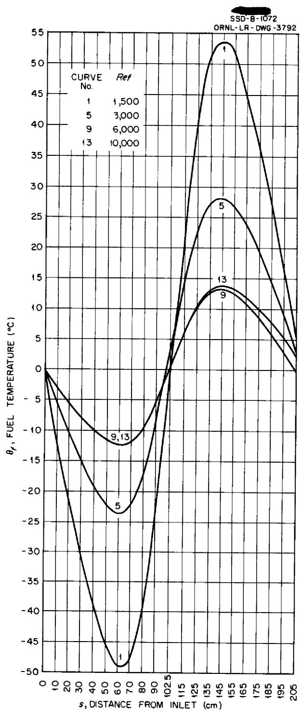  
Fig. 20. Fuel Temperature Variation for Rea = 10,000.

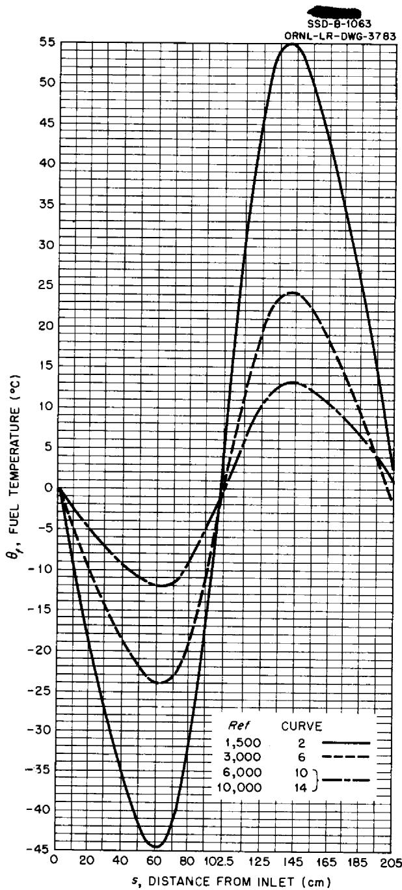  
Fig. 21. Fuel Temperature Variation for Rea = 20,000.

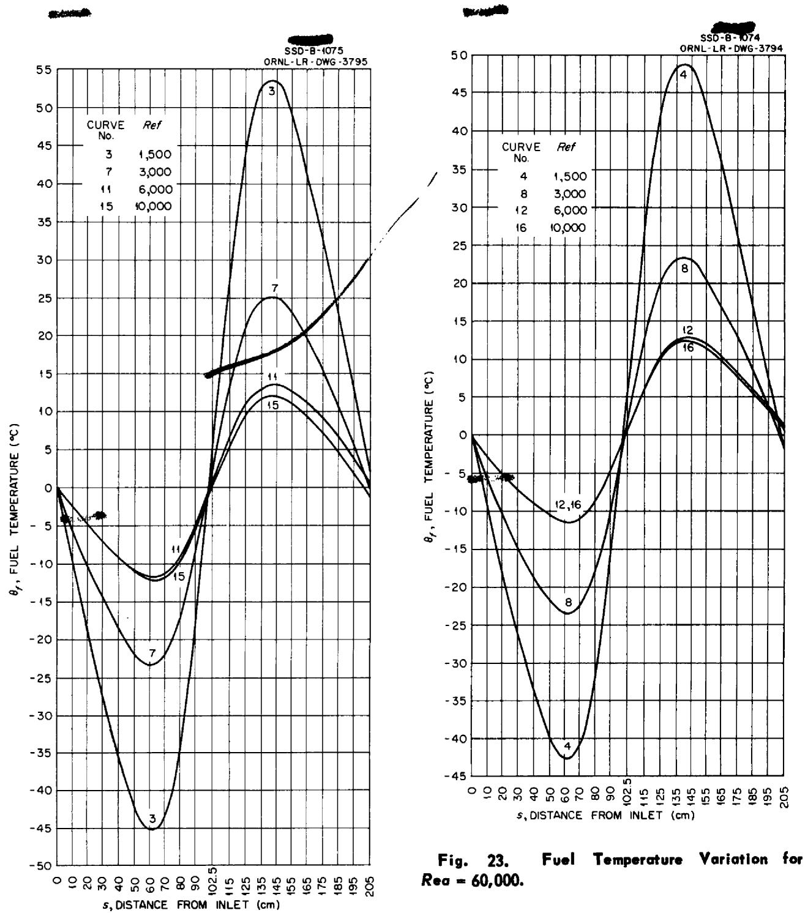  
Fig. 22. Fuel Temperature Variation for Rea = 30,000.

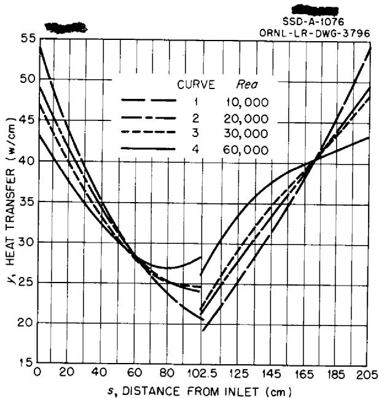  
Fig. 24. Heat Transfer Variation for $\text{Re}^f = 1500$ .

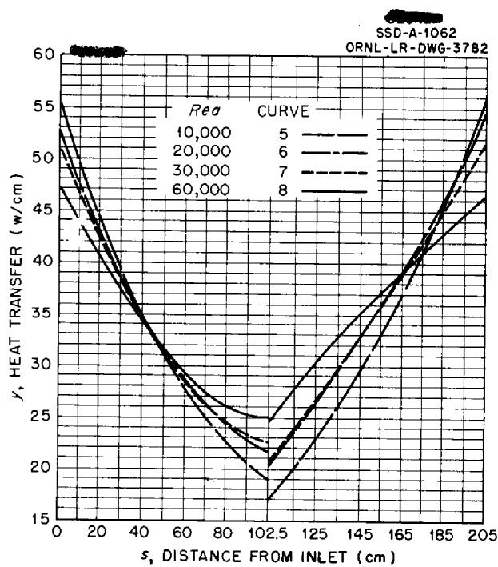  
Fig. 25. Heat Transfer Variation for Ref = 3000.

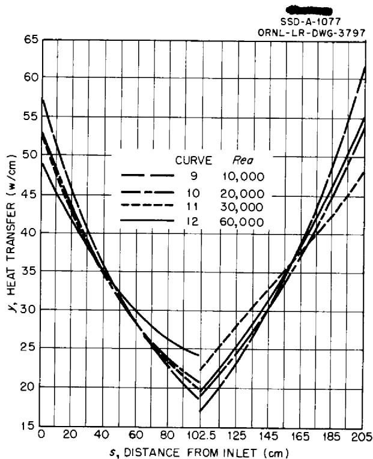  
Fig. 26. Heat Transfer Variation for Ref = 6000.

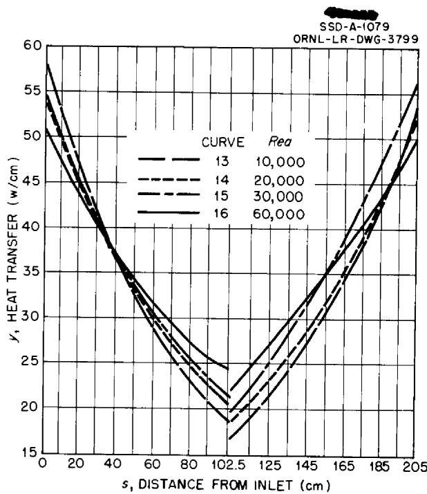  
Fig. 27. Heat Transfer Variation for Ref = 10,000.

# Appendix C

# TIME-CONSTANT MODIFICATION THROUGH POSITIVE FEEDBACK

E.R.Mann

F. P. Green

R. S. Stone

Reactor Controls Department, Instrumentation and Controls Division

If Fig. 18 is considered without the amplifier No. 3 feedback loop, the equation of state for amplifier No. 1 becomes

$$
E _ {1} = \frac {R _ {2}}{R _ {1}} E - R _ {2} C _ {1} \frac {d E _ {1}}{d t}. \tag {40}
$$

Here, the steady-state gain $= R_{2} / R_{1}$ , and the time constant $= R_{2}C_{1}$ . As we have seen in Appendix B, with the feedback loop in place,

$$
E _ {1} = \frac {1}{R _ {1} \left(\frac {1}{R _ {2}} - \frac {G}{R _ {3}}\right)} E - \frac {C _ {1}}{\left(\frac {1}{R _ {2}} - \frac {G}{R _ {3}}\right)} \frac {d E _ {1}}{d t}. \tag {41}
$$

In practice, $R_{2} = R_{3}$ , so that

$$
E _ {1} = \frac {R _ {2}}{R _ {1} (1 - G)} E - \frac {R _ {2} C _ {1}}{(1 - G)} \frac {d E _ {1}}{d t}. \tag {42}
$$

Reference to Eqs. 40 and 42 shows that where $R_{2} = R_{3}$ the effect of such positive feedback is to divide both time constant and gain by $(1 - G)$ . Where $G$ is less than unity, both the time constant and the gain are effectively increased, and enormously long time constants are made possible without the need for excessively large values of $R_{2}$ or $C_{1}$ . Where $G$ exceeds unity, negative time constants are created, corresponding to regenerative equations. The absolute value may be larger or smaller than in the case without feedback, depending upon whether $G$ is less than or greater than 2.

Another case of interest is that in which resistor $R_{3}$ is replaced by a capacitance $C_{3} = C_{1}$ . When the Kirchhoff current balance is set up for such a circuit, the equations are

$$
\frac {E}{R _ {1}} - \frac {E _ {1}}{R _ {2}} - C _ {1} \frac {d E _ {1}}{d t} + C _ {1} \frac {d E _ {3}}{d t} = 0, \tag {43}
$$

$$
E _ {3} = G E _ {1}, \tag {44}
$$

$$
E _ {1} = \frac {R _ {2}}{R _ {1}} E - R _ {2} C _ {1} (1 - G) \frac {d E _ {1}}{d t}. \tag {45}
$$

Comparison of Eq. 40 with Eq. 45 demonstrates that in the case of capacitive position feedback, the sole effect is to multiply the time constant by $(1 - G)$ . Where $G$ is less than unity, this effectively decreases $R_{2}C_{1}$ and gives access to a range of very short time constants. Where $G$ exceeds unity, the analog again enters the domain of negative time constants, whose absolute value may be larger or smaller than in the case without feedback, depending upon whether $G$ is above or below 2.

The potentiometer $Gr$ may be calibrated in such a circuit, and a linear plot of potentiometer setting vs $\lambda$ (or $\tau$ ) can be drawn for resistive or capacitive feedback. For positive time constants this is done for two or more settings of $Gr$ by applying a constant potential $E_{1}$ allowing the circuit to reach equilibrium, and then disconnecting the driving voltage and measuring the $e$ -folding time, $\tau_{1}$ of the decaying function $E_{1}$ .

For negative time constants this could be done for two or more settings of $Gr$ by applying a constant potential $E$ , differentiating the output $E_{1}$ , and measuring the rise time constant, $\tau$ , of the expanding derivative. A typical plot of $\lambda$ vs potentiometer setting is shown in Fig. 28.

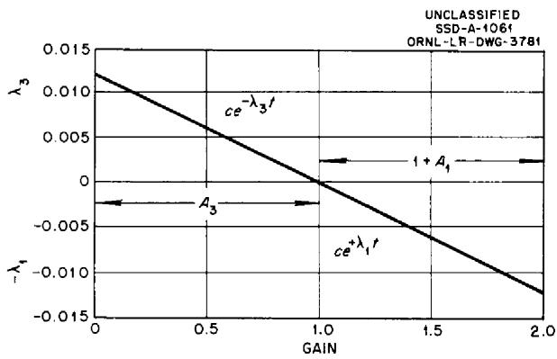

  
Fig. 28. Time-Constant Calibration Technique.