# AEC RESEARCH AND DEVELOPMENT REPORT

ORNL-1810

Reactors-Research and Power

MARTIN MARETTA ENERGY SYSTEMS LIBRARIES


3445603497909

SOME ECONOMIC ASPECTS OF

THORIUM BREEDER REACTORS

H.C.Claiborne

M. Tobias

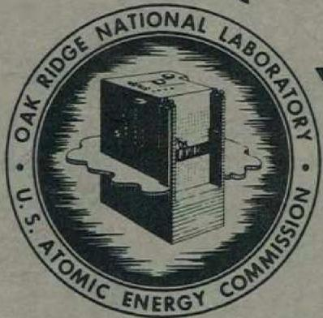

OAK RIDGE NATIONAL LABORATORY

CENTRAL RESEARCH LIBRARY

DOCUMENT COLLECTION

LIBRARY LOAN COPY

DO NOT TRANSFER TO ANOTHER PERSON

If you wish someone else to see this document, send in name with document and the library will arrange a loan.

OAK RIDGE NATIONAL LABORATORY

OPERATED BY

UNION CARBIDE NUCLEAR COMPANY

A Division of Union Carbide and Carbon Corporation

UCC

POST OFFICE BOX P · OAK RIDGE, TENNESSEE


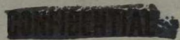

REACTOR EXPERIMENTAL ENGINEERING DIVISION

J. A. Lane

Director

SOME ECONOMIC ASPECTS

OF THORIUM BREEDER REACTORS

by

H. C. Claiborne and M. Tobias

Date Issued 0CT 12 1955

Contract No. W-7405-eng-26

DECLASSIFIED

CLASSIFICATION CHANGED TO:

BY: 2. Meunio 2/2457

OAK RIDGE NATIONAL LABORATORY

Operated by

UNION CARBIDE NUCLEAR COMPANY

A Division of Union Carbide and Carbon Corporation

Post Office Box P

Oak Ridge, Tennessee


3 4456 0349790 9

# INTERNAL DISTRIBUTION

C. E. Center   
2. Biology Library   
3. Health Physics Library

4-5. Central Research Library

6. Rector Experimental Engineering Library

7-14. Laboratory Records Department   
15. Laboratory Records, ORNL R.C.   
16. C. E. Iverson   
17. L. B. E. t (K-25)   
18. J. P. Murny (Y-12)   
19. A. M. Weinrg   
20. E. H. Taylor   
21. E. D. Shipley   
22. C. E. Winters   
23. F. C. VonderLag   
24. J. A. Swartout   
25. W. H. Jordan   
26. S. C. Lind   
27. R. W. Stoughton   
28. F. L. Culler   
29. A. H. Snell   
30. A. Hollander   
31. M. T. Kelley   
32. M. Tobias   
33. G. H. Clewett   
34. K. Z. Morgan   
35. T. A. Lincoln   
36. A. S. Householder   
37. C. S. Harrill   
38. D. S. Billington   
39. D. W. Cardwell   
40. E. M. King   
41. R. N. Lyon   
42. J. A. Lane   
43. A. J. Miller   
44. R. B. Briggs   
45. A. S. Kitzes   
46.0.Sisman   
47. C. B. Graham   
48. W. R. Gall

49. H. F. Poppendiek   
50. S. E. Beall   
51. J. P. Gill   
52. D. D. Cowen   
53. W. M. Breazeale (consultant)   
54. R. A. Charpie   
55. R. E. Aven   
56. P. N. Haubenreich   
57. J. P. Sanders   
58. C. L. Segaser   
59. F. C. Zapp   
60. J. R. McWherter   
61. R. H. Chapman   
62. P. C. Zmola   
63. P. R. Kasten   
64. H. C. Claiborne   
65. D. E. Ferguson   
66. F. R. Bruce   
67. E. C. Miller   
68. E. G. Bohlfann   
69. H. F. McDuffie   
70. C. H. Secoy   
71. E. G. Struxness   
72. R. VanWinkel   
73. G. C. Williams   
74. L. C. Dresner   
75. L. Alexander   
76. R. B. Korsmeyer   
77. D. G. Thomas   
78. D. C. Hamilton   
79. M. C. Lawrence   
80. E. Arnold   
81. T. B. Fowler   
2. M. Rosenthal   
C.W.F.Taylor   
84 M. I. Lundin   
85. G. McGrath   
86. A L. Gaines   
87. M. N. Skinner-  
88. R. L. Dickison   
89. ORNL document Reference

Libraf Y-12 Branch

# EXTERNAL DISTRIBUTION

90. AF Plant Representative, Burbank   
91. AF Plant Representative, Seattle   
92. AF Plant Representative, Wood-Ridge   
93. Alco Products, Inc.

94. ANP Project Office, Fort Worth

95. 05. Argonne National Laboratory

6. Armed Forces Special Weapons Project (Sandia)

1. Armed Forces Special Weapons Project, Washington

108-1 Atomic Energy Commission, Washington

113-ll Battelle Memorial Institute (1 copy to R. F. Redmond)

115-12 Bettis Plant (WAPD)

121-123 Brookhaven National Laboratory

124. Bureau of Ships

125. Ireau of Yards and Docks

126. Chicago Operations Office

127. Chicago Patent Group

128. Chief of Naval Research

129. De rtrment of the Navy - Op-362

130-133. dui t Company, Augusta

134. duFort Company, Wilmington

135. Duqti ne Light Company

136. Eastartford Area

137. Engineering Research and Development Laboratories

138-141. Genera Electric Company (ANPD)

142-149. General Electric Company, Richland

150. Hanford Operations Office

151-152. Headquarters, Air Force Special Weapons Center

153. Iowa Stat College

154-157. Knolls Atomic Power Laboratory

158-159. Los Alamos, scientific Laboratory

160. Massachusetts Institute of Technology (Benedict)

161. Materials Laboratory (WADC)

162. Mound Laborat y

163. National Adviation Committee for Aeronautics, Cleveland

164. National Advisor Committee for Aeronautics, Washington

165-166. Naval Research Laboratory

167. New York Operativist Office

168. New York University

169-170. North American Aviation, Inc.

171. Nuclear Development Associates, Inc.

172. Nuclear Metals, Inc.

173. Patent Branch, Washington

174-180. Phillips Petroleum Company (NRTS)

181. Powerplant Laboratory (TPC)

182. Pratt & Whitney Aircraft Division (Fox Project)

183. San Francisco Operations Office

184. Sylvania Electric Products, Inc.

185. USAF Headquarters

186. USAF Project Rand

187. U. S. Naval Postgraduate School

188. U. S. Naval Radiological Defens Laboratory

189-190. University of California Radiatlon Laboratory, Berkeley

191-192. University of California Radiation Laboratory, Livermore

193. Vitro Engineering Division

194. Vitro Laboratories

195. Walter Kidde Nuclear Laboratories, Inc.

196-410. Technical Information Service, Oak Ridge

411. Division of Research and Medicine, AED, ORO

# TABLE OF CONTENTS

List of Tables and Figures vi

Acknowledgement 1

SUMMARY 2

INTRODUCTION 4

TWO-REGION REACTORS 6

Methods and Conditions 7

Processing Cycle Times and Uranium Isotopes 8

Nuclear Calculations 13

Cost Estimation 14

Reactor and Turbogenerator Plant Investment 14

Efficiency 15

Operation and Maintenance 15

Inventories 15

Chemical Processing 16

Feed Costs 17

Results 17

Major Process Variables 18

Effect of Group-3 Poison Cross Section Variations 20

Effect of External Power Density Variations 20

Accuracy of the Two-Group Model and the Calculation of Breeding Ratio 23

Accuracy of Cost Estimate 24

ONE-REGION REACTORS 42

Methods and Conditions 43

TABLE OF CONTENTS (Contd.)   

<table><tr><td></td><td>Page</td></tr><tr><td>Fission Product Poisons</td><td>44</td></tr><tr><td>Isotope Concentrations and Critical Equation</td><td>44</td></tr><tr><td>Cost Estimation</td><td>46</td></tr><tr><td>Results</td><td>47</td></tr><tr><td>NOMENCLATURE</td><td>51</td></tr><tr><td>LIST OF REFERENCES</td><td>53</td></tr><tr><td>APPENDIX I - Constants Used in the Nuclear Calculations</td><td>54</td></tr></table>

# LIST OF TABLES

# Title

I. Nuclear Power Plant Efficiencies 15   
II. Typical Cost Breakdown and Neutron Balances for Two-Region Reactors 27-28   
III. Effect of Substantial Changes in the Nuclear Constants 29-30   
IV. Cost Breakdown and Neutron Balances for Several One-Region Reactors Near Optimum Conditions 49-50

# LIST OF FIGURES

1. Schematic Flowsheet for a Two-Region Thorium Breeder Reactor 31   
2. Effect of Power on Cost of Two-Region Reactor Plant 32   
3. Effect of Steam Conditions on Turbogenerator Plant Efficiency 33   
4. Effect of Steam Conditions on Power Plant Cost for a 300 Mw Plant   
5. Effect of Blanket Thickness on Unit Cost 35   
6. Effect of Thorium Concentration on Breeding 36   
7. Effect of Group-3 Poisons on Unit Cost Breeding Ratio 37   
8. Effect of Blanket Uranium Concentration on Unit Cost 38   
9. Effect of Group-3 Poison Cross Section on Unit Cost 39   
10. Effect of Temperature on Unit Cost 40   
11. Effect of External Power Densities on Unit Cost 41   
12. Effect of Process Cycle Time on Unit Cost 51   
13. Effect of Process Cycle Time on Unit Cost 52   
14. Effect of Process Cycle Time on Unit Cost 53   
15. Effect of Thorium Concentration on Unit Cost 54   
16. Effect of Reactor Size on Unit Cost and Breeding Ratio 55

# ACKNOWLEDGEMENT

The authors wish to express their appreciation for the valuable advice given in the 'course of this work by M. C. Edlund, under whose supervision this study was performed, R. B. Briggs, and D. E. Ferguson. Grateful acknowledgement is made to T. B. Fowler for his able and extensive efforts in coding and supervising the ORACLE calculations.

# SUMMARY

A study of the effects of geometrical and some operational variables on the economics and characteristics of thorium breeder-power reactors has been made as an aid in the selection of design criteria for the TBR program.

No original effort was made to estimate plant investment costs or to introduce new concepts of reactor technology. Plant investment was assumed constant for all systems studied under equal power and temperature conditions. The state of technology and cost factors assumed were those reported by Briggs $^{(3)}$ and Arnold et al $^{(1)}$ . The effect on power cost of core radius, blanket thickness, blanket uranium and thorium concentrations, chemical processing cycle times, poisons and external power density have been investigated using a consistent method of calculation with a standardized set of nuclear constants and cost factors. All results are for a 3-reactor power station delivering 375 Mw of electricity to a power grid.

For both one- and two-region reactors, the unit cost of power is rather insensitive to fairly large changes in nuclear parameters and process variables. This is a direct consequence of plant investment and other fixed charges representing nearly $80\%$ of the power cost.

The results, based on operating and maintenance costs for conventional power and chemical plants, indicate that a two-region reactor station could produce power for 6.2 mills/kwh with a fuel cost of 1.8 mills/kwh. Applying error limits to the items comprising the total cost, a cost range of 5.3 to 8.0 mills/kwh is obtained.

The cost of power from a one-region reactor station was about 0.9 mills/kwh (2.6 mills/kwh fuel cost) higher than for a comparable two-region system if the plant investment and other fixed charges are considered equal

for the two types. It is believed that the fixed charges will be somewhat smaller for the one-region reactor because of simpler construction and operation.

The approximate characteristics of the reactors required for producing power for the above costs are:

<table><tr><td></td><td>Two-Region</td><td>One-Region</td></tr><tr><td>Core diameter, ft</td><td>5</td><td>12</td></tr><tr><td>Blanket thickness, ft</td><td>2-1/4</td><td>--</td></tr><tr><td>Core power, Mw</td><td>390</td><td>481</td></tr><tr><td>Blanket power, Mw</td><td>91</td><td>--</td></tr><tr><td>Core power density, Mw</td><td>210</td><td>19</td></tr><tr><td>Thorium conc., gm/liter</td><td>1000</td><td>260</td></tr><tr><td>Blanket uranium conc., gm/kg Th</td><td>3</td><td>---</td></tr><tr><td>Core uranium conc., gm/kg D2O</td><td>8.3</td><td>14.5</td></tr><tr><td>Core U-235 + U-233 conc., gm/kg D2O</td><td>2.8</td><td>6.7</td></tr><tr><td>Core Thorex cycle, days</td><td>336</td><td>450</td></tr><tr><td>Blanket Thorex cycle, days</td><td>140</td><td>--</td></tr><tr><td>Hydraulic separator cycle, days</td><td>1</td><td>--</td></tr><tr><td>Average reactor temperature, °C</td><td>280</td><td>280</td></tr></table>

A comparison of the cost items in mills/kwh for near optimum one-and two-region reactors (assumes equal fixed costs) is shown below.

<table><tr><td></td><td>Two-Region</td><td>One-Region</td></tr><tr><td>Plant investment (less chem. proc.)</td><td>3.74</td><td>3.74</td></tr><tr><td>Fuel inventory</td><td>0.44</td><td>0.84</td></tr><tr><td>D2O inventory</td><td>0.52</td><td>0.66</td></tr><tr><td>Fixed chemical processing</td><td>0.76</td><td>0.76</td></tr><tr><td>Variable chemical processing</td><td>0.32</td><td>0.18</td></tr><tr><td>Operation and maintenance</td><td>0.75</td><td>0.75</td></tr><tr><td>Feed (D2O and Th)</td><td>0.20</td><td>0.25</td></tr><tr><td>Uranium (233 and 235) credit</td><td>0.49</td><td>0.05</td></tr><tr><td>Net unit cost of power</td><td>6.2</td><td>7.1</td></tr></table>

From these results, it is apparent that the net unit cost of power from the two-region reactor is nearly independent of the value of uranium since the fuel inventory charge and the breeding credit are approximately equal. This is not true for the one-region reactor, however. In that case, the breeding credit is small compared to the fuel inventory charge, so that any variation in the latter due to a change in the value of uranium will cause a corresponding change in the cost of power which is virtually uncompensated by the breeding credit.

# INTRODUCTION

The feasibility and the technology of aqueous homogeneous reactors have been discussed elsewhere, most recently by Briggs $^{(3)}$ . The present work is concerned with the results of detailed calculations of the effect of the major process variables on the power cost and characteristics of thorium breeder reactors in order to help select design criteria for the TBR. In addition, it was desirable to estimate the possible effect of errors in the nuclear parameters on the cost of power.*

The different reactor systems were compared on the basis of a fixed amount of electrical power (125 Mw per reactor) delivered to a power grid since power is the main product. If power output were not constant, the effect of the process variables would be masked by the effect of power level, the most important factor in unit cost calculations.

An electrical power output of 125 Mw was chosen as standard for one reactor or 375 Mw for a 3-reactor station. This is equivalent to $480.8\mathrm{Mw}$ of heat for a net station efficiency of $26\%$ . The parameter studies, other than temperature, were made for an average reactor temperature of $280^{\circ}\mathrm{C}$ .

At the present time, it is impossible to estimate the cost of electricity from nuclear power stations without a fairly large uncertainty. Nevertheless, a study such as this, based as it is upon stated cost factors and a consistent method of calculations, can be used to determine what is, and what is not, of relative economic importance and further provides a rational basis for the selection of most design criteria.

This report consists of two principal parts. The first part is concerned with the two-region thorium breeder reactor and the second with the one-region type. Comparison is made on a common basis insofar as possible.

TWO-REGION REACTORS

# TWO-REGION REACTORS

# Methods and Conditions

The program for the study of the two-region reactor has been previously outlined by Briggs and Edlund $^{(4)}$ . The data that were used to get cost factors and process characteristics are given in other publications $^{(3,10)}$ , and are discussed in a later section of this report.

A schematic flow diagram of the system studied is shown in Figure 1. The core material will be chemically processed by two methods. The core material is treated in a liquid-solids separation plant utilizing hydraulic separators to remove the precipitated poisons. This procedure is capable of removing $75\%$ of the so-called group-3 poisons (fission product poisons affected by chemical processing). A more complete discussion of this poison removal method is given by Arnold et al(1). Complete poison removal from the solution carrying the precipitated poisons is effected in the Thorex plant at a rate considerably less than that used for liquid-solid separation. Since the blanket material is a slurry, poisons must be removed from it by the Thorex process only.

In order to produce uranium of high enrichment (about $95\%$ U-233) the blanket stream will have to be partially processed for removal of the excess U-233 (represented by breeding gain) before any mixing of the core and blanket streams in the chemical processing plant. The core enrichment will be only $25 - 30\%$ U-233. By processing to remove protactinium, uranium composed of nearly $100\%$ U-233 could be produced. For these calculations, however, it was assumed that the uranium product would be that derived from the blanket with all protactinium decayed to U-233 and mixed with the uranium isotopes.

The calculation procedure, which is successively described in the following sections, consists of four main parts:

1) calculation of chemical processing cycle times and uranium isotope concentrations in the blanket and the core by isotope balance equations for the particular blanket power selected (for any set of parameters, calculations were made for three reactor powers);   
2) two-group nuclear calculations to determine the critical concentration and the neutron balance which yields in turn the core power and the ratio of resonance to thermal capture in the thorium;   
3) unit cost calculations;   
4) plot of unit costs versus total reactor power so that the costs at a particular total power can be used for comparison of the systems.

The parameters studied were core diameter, blanket thickness, blanket U-233 concentration, thorium concentration, core poisons, temperature and power density of the system outside the reactor (piping and heat exchangers).

# Processing Cycle Times and Uranium Isotopes

For purposes of chemical process calculations, the fission product poisons are considered to be composed of three groups $^{(3)}$ . The first group consists of the noble gases, the second of the high cross-section isotopes and the third of the low cross-section isotopes which transmute by decay or neutron capture into other nuclides of approximately the same low cross

section. The first two groups are virtually unaffected by chemical processing rates required for aqueous homogeneous reactors and their macroscopic cross section is approximated as $1.3\%$ of the fission cross section ( $0.8\%$ high cross section isotopes and $0.5\%$ residual noble gases). The noble gases are continuously stripped during operation; the high cross section isotopes are rapidly destroyed by neutron capture since their cross section is around 40,000 b. The third group is, however, a function of the chemical processing cycle.

For core processing, two modes of poison removal are employed -- poison precipitation with subsequent liquid-solid separation, followed by Thorex. The precipitation step is capable of removing only some of the atomic species comprising group-3 poisons which will be called subgroup A; the remainder, subgroup B, is not removed by precipitation. Both subgroups are removed by the Thorex process. This is represented by the following equations for equilibrium conditions.

$$
\mathrm {g y} \left[ \Sigma_ {\mathrm {f}} (2 5) + \Sigma_ {\mathrm {f}} (2 3) \right] \quad \phi_ {\mathrm {C}} - \frac {\mathrm {N} (\mathrm {A}) - \mathrm {N} (\mathrm {o})}{\mathrm {T} _ {1 \mathrm {C}}} - \frac {\mathrm {N} (\mathrm {o})}{\mathrm {T} _ {2 \mathrm {C}}} = 0 \tag {1}
$$

$$
(1 - g) y \left[ \sum_ {r} (2 5) + \sum_ {r} (2 3) \right] \phi_ {C} - \frac {N (B)}{T _ {2 C}} = 0 \tag {2}
$$

and by definition

$$
\mathrm {f} _ {3} = \frac {\left[ \mathrm {N} (\mathrm {A}) + \mathrm {N} (\mathrm {B}) \right] \sigma^ {-} (3)}{\sum_ {\mathrm {f}} (2 5) + \sum_ {\mathrm {f}} (2 3)} \tag {3}
$$

$$
f _ {0 3} = \frac {\sigma (3) N (o)}{\sum_ {f} (2 5) + \sum_ {f} (2 3)} \tag {4}
$$

Solving for $\mathbf{T}_{2\mathbf{C}}$

$$
T _ {2 C} = \frac {\left(f _ {3} - f _ {0 3}\right) - y \sigma (3) \phi_ {C} g T _ {1 C}}{2 y \sigma (3) \phi_ {C} (1 - g)}
$$

$$
\left[ 1 + \sqrt {1 + \frac {4 f _ {0 3} T _ {1 C} y \sigma (3) (1 - g) \phi_ {C}}{\left(f _ {3} - f _ {0 3}\right) ^ {\prime} - y \sigma (3) \phi_ {C} g T _ {1 C}}} ^ {2} \right] \tag {5}
$$

This equation actually defines an overall processing cycle for the core. The optimum Thorex cycle time is, of course, that determined by a balance between value of fuel recovered and inventory and chemical processing costs. Another relationship between $\mathbf{T}_{1c}$ and $\mathbf{T}_{2c}$ for minimum core processing cost could be obtained by utilizing the processing cost equations. For this study, however, the precipitation cycle ( $\mathbf{T}_{1c}$ ) was set constant at one day since the estimated cost(10) of the precipitation process is practically independent of the processing rate for reasonable flow rates. In addition the core processing cost is very small (around 0.08 mills/kwh).

Under the present state of chemical process development, only the Thorex process can be used to treat the blanket material because it is a slurry. The equation for the blanket cycle time is simply

$$
\mathrm {T} _ {\mathrm {B}} = \frac {f _ {3 \mathrm {B}}}{\mathrm {y} \sigma (3) \varnothing_ {\mathrm {B}}} \tag {6}
$$

For use in the nuclear calculations, determination of the concentrations of the various isotopes in both core and blanket was necessary. Both core and blanket contain U-233, U-234, U-235 and U-236. In addition, the blanket contains Pa-233 and Th-232. Other isotopes that could be present are neglected since even very small processing losses will prevent the buildup of higher isotopes and the half-lives of Th-233 and Pa-234 are too short to permit significant concentrations to occur.

For the blanket at equilibrium conditions, the following isotope balance equations apply:

$$
\sum (0 2) (1 + \beta) \varnothing_ {B} - \lambda (1 3) N (1 3) - \sum (1 3) \varnothing_ {B} - \frac {N (1 3)}{T _ {B}} = 0 \tag {7}
$$

$$
\lambda (1 3) \mathrm {N} (1 3) - \sum_ {\mathrm {a}} (2 3) \phi_ {\mathrm {B}} - \frac {\mathrm {N} (2 3)}{\mathrm {T} _ {\mathrm {B}}} = 0 \tag {8}
$$

$$
\sum_ {r} (2 3) \phi_ {B} + \sum (1 3) \phi_ {B} - \sum (2 4) \phi_ {B} - \frac {N (2 4)}{T _ {B}} = 0 \tag {9}
$$

$$
\sum (2 4) \phi_ {B} - \sum_ {a} (2 5) \phi_ {B} - \frac {N (2 5)}{T _ {B}} = 0 \tag {10}
$$

$$
\sum_ {r} (2 5) \phi_ {B} - \sum (2 6) \phi_ {B} - \frac {N (2 6)}{T _ {B}} = 0 \tag {11}
$$

$$
\frac {F (0 2)}{V _ {B T}} - \sum (0 2) (1 + \beta) \varnothing_ {B} = 0 \tag {12}
$$

$$
\phi_ {B} = \frac {\mathrm {K P} _ {B}}{\mathrm {V} _ {\mathrm {B T}} \left[ \sum f ^ {(2 3)} + \sum f ^ {(2 5)} \right]} \tag {13}
$$

and

$$
V _ {B T} = V _ {B} + \frac {P _ {B} x 1 0 ^ {6}}{J _ {B}} \tag {14}
$$

$$
V _ {B} = \frac {4 \pi}{3} \left[ R ^ {3} - (a + t) ^ {3} \right] \tag {15}
$$

Similarly, for the core (neglecting chemical processing losses),

$$
\begin{array}{l} q \frac {V _ {B T}}{V _ {C T}} \left[ \frac {N (2 3) + N (1 3)}{T} \right] _ {B} - \sum_ {a} (2 3) \phi_ {C} = 0 (16) \\ \mathrm {q} \frac {\mathrm {V} _ {\mathrm {B T}}}{\mathrm {V} _ {\mathrm {C T}}} \left[ \frac {\mathrm {N} (2 4)}{\mathrm {T}} \right] _ {\mathrm {B}} - \sum (2 4) \phi_ {\mathrm {C}} + \sum_ {\mathrm {r}} (2 3) \phi_ {\mathrm {C}} = 0 (17) \\ q \frac {V _ {B T}}{V _ {C T}} \left[ \frac {N (2 5)}{T} \right] _ {B} - \sum_ {a} (2 5) \phi_ {C} + \sum (2 4) \phi_ {C} = 0 (18) \\ \mathrm {q} \frac {\mathrm {V} _ {\mathrm {B T}}}{\mathrm {V} _ {\mathrm {C T}}} \left[ \frac {\mathrm {N} (2 6)}{\mathrm {T}} \right] _ {\mathrm {B}} - \sum (2 6) \phi_ {\mathrm {C}} + \sum_ {\mathrm {r}} (2 5) \phi_ {\mathrm {C}} = 0 (19) \\ V _ {C T} = \frac {4 \pi}{3} a ^ {3} + \frac {1 0 ^ {6} P _ {C}}{J _ {C}} (20) \\ \end{array}
$$

These equations hold only for a breeding ratio of one or greater.

For breeding ratios slightly less than one the isotope ratios obtained are

still approximately correct. Actually, except for one isolated case, the breeding ratios were all greater than one.

The method and ease of solution for the set of equations (Eq. 7 through 20) depend on the selection of the independent variables and the availability of automatic computing machinery.

In the present study, the dimensions (R, a and t); blanket power, $\mathbf{P}_{\mathbf{B}}$ ; blanket U-233 concentration, N(23); poison fraction in the core, f(3C); the thorium concentration, N(02); the external power density and the average reactor temperature were selected as the independent variables.

The ratio resonance to thermal capture in thorium, $\beta$ , can only be obtained from the nuclear calculation since the fast flux is required to determine it. It was necessary to estimate a value for $\beta$ , compute the isotope concentrations, compute $\beta$ from nuclear calculations and then compare the value so obtained with the initial guess. After a little experience, it was possible to estimate an initial value of $\beta$ that required only two or three iterations.

# Nuclear Calculations*

The customary two-group method was employed for obtaining the critical mass and neutron balance for the spherical two-region geometry. The major details of this procedure have been described elsewhere $^{(6, 14)}$ . The only novelty introduced was the use of a "thin shell" approximation $^{(12)}$ to account more adequately for the effect of the zirconium core tank. The nuclear constants used in the work are shown in Appendix I. These values are based on or taken from several publications $^{(2, 7, 13)}$ .

# Cost Estimation

Selection of proper cost factors is the most difficult part of the evaluation of nuclear power stations since no full-scale plant experience is available. However, reasonable values based on laboratory and pilot plant experience, coupled with normal industrial methods and practice, should produce results with at least sufficient relative accuracy to aid in the selection of design criteria and operating conditions.

No new effort was made to estimate the investment cost for a reactor, turbogenerator plant or chemical processing plant; the estimates by Briggs $^{(3)}$ were used.

# Reactor and Turbogenerator Plant Investment

The basis for computing the cost of the reactor with associated equipment and structures was $\$ 11.65^{(3)}$ per kilowatt of heat for a 450- Mw reactor considered as an integral part of a 3- reactor power station. For power levels different from 450 Mw per reactor, the unit investment cost was corrected by use of Figure 2 (reproduced from ORNL-1642).

The unit investment cost for the turbogenerator plant, which is dependent on the throttle temperature, was obtained from Figure 4 (reproduced from ORNL-1642). The cost of boilers and coal and ash handling equipment is excluded since the reactor plant replaces these items. Since the total reactor power could not be predetermined, a quadratic equation was fitted to the points shown in Figure 2, for purposes of calculation by the ORACLE. Using a plant factor of $80\%$ and a $15\%$ amortization charge, the result is

$$
\begin{array}{l} \text {I n v e s t m e n t (m i l l s / k w h)} = \frac {1}{E _ {n}} (0. 3 3 8 7 - 2. 8 2 8 x 1 0 ^ {- 4} P + 1. 8 7 3 x 1 0 ^ {- 7} P ^ {2} \\ + 0. 0 2 1 4 0 \mathrm {C E} _ {\mathrm {G}}) \tag {21} \\ \end{array}
$$

where $\mathbf{P} =$ reactor power, Mw of heat

$\mathbf{E}_{\mathbf{n}} =$ net station efficiency

$\mathbf{E}_{\mathbf{G}} =$ gross station efficiency

C = turbogenerator plant cost, $/electrical kw

# Efficiency

The efficiency of the plant is shown as a function of throttle temperature in Figure 3 (reproduced from ORNL-1642). Estimates were made for the temperature drop from the reactor to throttle. Table I below lists the estimates of the efficiencies used.

Table I   
Nuclear Power Plant Efficiencies   

<table><tr><td colspan="2">Av. Reactor Temp., °C</td><td>Throttle Temp. °F</td><td>Gross Efficiency</td><td>Net Efficiency</td></tr><tr><td>320</td><td>(608°F)</td><td>490</td><td>0.315</td><td>0.281</td></tr><tr><td>300</td><td>(572°F)</td><td>470</td><td>0.304</td><td>0.271</td></tr><tr><td>280</td><td>(536°F)</td><td>450</td><td>0.292</td><td>0.260</td></tr><tr><td>250</td><td>(482°F)</td><td>410</td><td>0.274</td><td>0.242</td></tr><tr><td>200</td><td>(392°F)</td><td>340</td><td>0.240</td><td>0.211</td></tr></table>

# Operation and Maintenance

Operating and maintenance charges for the reactor and turbogenerator plants were taken as $3\%$ of the total investment.

# Inventories

A 12% charge was assessed against all non-depreciating materials. All fissionable materials were valued at $20/gram. Protactinium was considered a fissionable material only when outside the reactor.

Heavy water was valued at \(40/lb. To cover the slight holdup in chemical processing and makeup inventory, the inventory of heavy water was taken as that required to fill the reactor system at room temperature, an amount about 25% greater than necessary at operating temperatures.

Thorium was valued at $5/lb with no appreciable charge for making the$ Th0_2-D_2O slurry.

The feed stream inventory charges were based on the following holdup times

Spent core fuel 95 days

Spent blanket fuel

Th $^+$ U $+75\%$ of Pa 55 days

25% of Pa 205 days

Thorium feed 30 days

The holdup time associated with the poison removal by the hydraulic separator plant was considered negligible.

# Chemical Processing

The estimated cost of the poison precipitation process and the hydraulic separator plant was $210 per day(10) or $70 per day per reactor. This cost was considered independent of the throughput for flow rates of the order of 25,000 liters/day per reactor.

A fixed charge of $5,500 per day(3) or $1830 per day per reactor was used for the Thorex plant. The cost includes chemical plant amortization and fixed operating costs. The estimated cost of processing thorium was $3.00/kg and $0.50/gram for fissionable material (U-233, U-235 and Pa converted to U-233). In previous studies(3) $1.00/gram was the estimate for processing fissionable uranium; the lower value represents a later estimate(10) by the Chemical Technology Division. Uranium losses were assumed to be 0.1%

of the amount processed through the Thorex plant.

Prior to processing in the Thorex plant, heavy water must be evaporated from the feed streams. A charge of $0.35/liter was used for the recovery of heavy water.(10)

# Feed Costs

For breeder reactors (all reactors were breeders, with one exception), only thorium is required and $\mathsf{D}_2\mathsf{O}$ makeup. As is usual, $5 \%$ of $\mathsf{D}_2\mathsf{O}$ inventory of the reactor system was estimated as the annual makeup requirement.

# Results

The results shown in the following tables and graphs are for two-region thorium reactors delivering 125 electrical megawatts to a power grid. The power station is composed of three reactors, three turbogenerators and one chemical processing plant along with some accessory equipment common to the three reactors.

The major results of the study are shown in Figure 5. Results for five typical cases are shown in Table II. It is immediately apparent that the net unit cost is very insensitive to the parameters investigated; only 0.3 mills/kwh separates the highest and lowest cost reactors shown. This is a direct consequence of plant investment and other fixed charges representing nearly $80\%$ of the power cost.

The details of the effects of the individual process variables are discussed below under the heading Major Process Variables. Effects of external power density changes, errors in the group-3 poison cross section and errors in the two-group constants are reported in succeeding sections, followed by discussions of the accuracy of the two-group method and the economics calculations.

# Major Process Variables

1) Core Radius -- Variation of the core diameter from 4 to 7 feet results in a power cost change of less than 0.3 mills/kwh. The lowest cost is associated with 4-foot cores, but only a negligible difference of 0.01 mill/kwh exists between 4- and 5-foot cores.   
2) Blanket Thickness -- For the blanket concentrations used (500 to 1500 g Th/liter), the unit cost of power varies only about 0.1 mill/kwh for a range of blanket thickness between 1-1/2 and 3 ft. The optimum thickness is about 2 feet for a six-foot core and 2-1/4 feet for a five-foot core.   
3) Thorium Concentration -- The lowest unit cost results from using a thorium concentration of 1500 g/liter. However, the cost is only 0.02 mills/kwh less than that for 1000 g/liter. Also, the results indicate that if engineering considerations require the use of thorium concentrations as low as 500 g/liter, the slightly increased unit cost would not preclude possible economic power generation.

Fig. 6 shows the effect of thorium concentration on the breeding ratio and net U-233 production and again indicates that use of thorium concentrations greater than 1000 g/liter leads to a rapidly diminishing improvement in the breeding ratio.

4) Ratio of U-233 Concentration to Thorium Concentration -- About 3 g U-233/kg thorium (see Fig. 8) produces the lowest unit cost for thorium concentrations of 1000 g Th/liter. Here also, only slight changes in unit cost are produced by wide variations in the ratio of U-233 to thorium.

5) Poison Concentration -- The core poisons which are related to the core processing cycle time have little effect on the unit cost in the range $4 - 10\%$ (see Fig. 7). The gross breeding ratio (processing losses neglected) increases almost linearly with reduction in poisons. Below $3\%$ poisons, however, the net U-233 production and net breeding ratio decrease since the highly increased chemical processing rate leads to significant uranium and protactinium losses. In similar fashion, if the blanket U-233 concentration were lowered to small values, the increased chemical processing rate required would likewise cause large fissionable material losses, as well as high chemical processing costs.

6) Temperature -- Under conditions assumed, no optimum temperature was found for the range of average reactor temperatures considered. Lower unit cost is obtained by increasing the temperature, but Fig. 10 indicates that little is to be gained by raising the average temperature appreciably over $280^{\circ}\mathrm{C}$ . An average reactor temperature of $280^{\circ}\mathrm{C}$ will probably correspond to an exit temperature of about $300^{\circ}\mathrm{C}$ .

If engineering considerations preclude core power densities appreciably over 100 kw/liter, it would be necessary to increase the core size or operate with a larger portion of the total power in the blanket. The former course appears economically preferable. The reactors with five- and six-foot cores shown in Table II where typical results for several conditions are shown, have power densities of 210 and 122 kw/liter, respectively. In order to reduce the power density of the five-foot core to 122 kw/liter,

it would be necessary to operate with a U-233 concentration in the blanket of about $12\mathrm{g / kg}$ of thorium. The cost of power would rise to about 7 mills/kwh, the increase being due primarily to increased inventory charges. The use of a 6-foot core, on the other hand, results in a power cost of 6.45 mills/kwh.

# Effect of Group-3 Poison Cross Section Variations

The results of reducing the group-3 poison cross section from 40 to 18 barns at $20^{\circ}\mathrm{C}$ are shown in Fig. 7. The higher value is a conservative one that has been used in previous studies $^{(3)}$ ; the lower value is the latest estimate $^{(10)}$ for thorium-uranium reactors. In general, reducing the poison cross section by over a factor of two reduces the net unit cost by 0.1 mill/kwh and shifts the optimum core poisons from 7 to $6\%$ . The core cycle time is the only result appreciably affected (see Table II). A change greater than a factor of two in the group-3 poison cross section (see Fig. 9) does not appreciably affect the optimum U-233 concentration in the blanket or the optimum blanket thickness of 2 and 2-1/4 feet for the 6-foot and 5-foot cores respectively.

# Effect of External Power Density Variations

Other than plant investment the largest single cost is the inventory charge -- nearly one mill/kwh when using values of 20 and $14\ \mathrm{kw}/\mathrm{liter}$ external power densities (previously used in ORNL-1642 by Briggs) for the core and blanket systems respectively. The effect of increasing these external power densities is shown in Fig. 11. Doubling the core external power density of $20\ \mathrm{kw}/\mathrm{liter}$ reduces the cost $0.25\ \mathrm{mill/kwh}$ , but doubling the blanket external

power density of 14 kw/liter saves only 0.07 mills/kwh. The saving realized from further increases in power density rapidly decrease. A recent design(9) of the TBR indicates that it is possible to achieve external power densities as high as 61 and 55 kw/liter for the core and blanket systems respectively. For this condition the cost is 5.8 mills/kwh, only 0.11 mill/kwh lower than for 40 and 28 kw/liter. For these calculations, it was assumed that no change in capital or operating expense was necessary to achieve higher power densities.

# Effect of Errors in the Nuclear Constants

The two group nuclear constants which were estimated for use in the nuclear calculations are probably accurate to within $10 - 20\%$ . The effect of such errors on the process characteristics and economics was uncertain. Consequently, a study of the effect of substantial changes ( $\pm 50\%$ ) in the nuclear constants was made for a typical case*.

Although the critical concentration and breeding ratio were changed considerably, the changes in power costs were relatively small being principally confined to altering the amount of credit obtained from excess fuel production. The largest change observed was a difference of about 0.6 mill/kwh between two extreme cases. Where only individual constants were altered, changes in the net cost were less than 0.1 mill/kwh.

Considerable changes in the core uranium concentration do not, however, lead to proportionally large variation in fuel inventory

charges since the latter contain contributions of similar magnitude from the blanket system. Thus, for two cases where the uranium concentration differed by a factor of over 4, the fuel inventory charge differed by a factor of 1.4. The effects upon breeding gain are, on the other hand, almost directly converted into changes in credit received for excess fuel production.

It seems reasonable therefore to conclude that errors in the two-group constants are of secondary economic importance since $85\%$ of the power cost is tied up in factors unaffected by such errors.

A summary of the results and constants used is presented in Table III. The most important cost increases were those produced by increases in the quantities $\tau_{\mathrm{B}}$ , $\sigma_{\mathrm{a}_{13}}$ , $\mathfrak{p}_{\mathrm{B}}$ , and decreases in $\eta_{23}$ . Increasing $\tau_{\mathrm{B}}$ produces a rise in fast leakage at the expense of resonance capture in thorium, while all other neutron losses remain practically unaffected. Raising $\sigma_{\mathrm{a}_{13}}$ causes protactinium absorption to rise at the expense of thorium capture, as well as a change in core isotope ratios leading to higher capture rates in U-234, 235 and 236. An increase in resonance escape probability raises blanket power, increases leakage, depresses resonance capture, and increases thermal capture. A decrease in both resonance and thermal capture in thorium is the principal result of a fall in $\eta(23)$ of 0.04 (1.7%).

The critical concentration was most strongly affected by $\tau_{\mathrm{c}}$ , $D_{2\mathrm{c}}$ , and, naturally, $\eta$ . A $50\%$ rise in the first two produced a critical concentration increase of about $30\%$ , while the $1.7\%$ rise in $\eta(23)$ caused a $4.4\%$ decrease in concentration. The breeding ratio was not significantly affected by changing either $\tau_{\mathrm{c}}$ or $D_{2\mathrm{c}}$ .

None of the quantities investigated had a significant effect upon blanket processing except $p_B$ , for which a decrease of $50\%$ led to a $12\%$ decrease in cycle time. The core thorex cycle was affected mainly by the diffusion constants and $T_c$ ; the greatest effect observed, produced by lowering $D_{2c}$ , was a decrease of cycle time by about 134 days out of 337. However, no significant changes were noted in either core or blanket chemical processing costs.

Accuracy of the Two Group Model and the Calculation of Breeding Ratio

For the large reactors studied, the two group procedure should provide an adequate estimate of the critical mass. The breeding ratio is, however, far more sensitive to inadequacies in the method. For example, difficulty arises in selecting a method of treating thorium resonance captures. In this work, fast neutrons were assumed to slow down without absorption, and captures due to resonance absorption were computed by multiplying the number slowed into the thermal group by (1-p). This treatment overestimates the fast leakage by about a factor of 3. Consequently, the breeding ratio as reported in Table II for a typical case may be low by about 0.02.

A much more serious source of inaccuracy results from uncertainties in $\eta$ . Errors in the thermal value of $\eta$ may produce an uncertainty of $\pm 0.03$ in the breeding ratio. Resonance captures in uranium may reduce the breeding ratio by 0.08 if the resonance integral of U-233 is 1500 b and resonance $\alpha$ is as high as unity.

New data concerning the resonance integral of protactinium (650 b) and the thermal cross section (63 b) reported by R. R. Smith(11) have only a slight effect on the breeding gain for the case of a 1000 g Th/liter slurry; the absorptions in protactinium decrease by

only 0.002 absorptions per absorption in U-233.

Uncertainties in the poison cross section may be expected to have little effect since it has been shown in a previous section that poison levels may be varied over a range of $4 - 10\%$ without appreciable cost variation.

To sum up, the decrease in the breeding ratio produced by the factors discussed above may be expected to be no greater than 0.13. While this number represents an important uncertainty in estimated production of new material, its overall economic significance is slight.

# Accuracy of Cost Estimate

The net unit cost of power as determined for two-region reactors near optimum cost (6.2 mills/kwh) is a result that is based on the limited experience available. Obviously, the uncertainty of this result is large enough to span the competitive cost range for a nuclear power industry. An estimate as to the overall accuracy is best made by assessing the accuracy of the individual cost items that comprise the net unit cost of power.

The largest single item is the reactor and turbogenerator plant investment which represents $60\%$ of the total unit cost. Of this cost, $75\%$ is for the turbogenerator plant and $25\%$ is for the reactor and associated equipment. Other cost items are relatively small portions of the total; the largest of these, the inventory charge, is $15\%$ of the net unit cost.

Some of the individual costs comprising the net cost of power have a fairly firm basis and error limits based on experience can be assigned with a fair degree of confidence. These items are capital investment, maintenance and operation for the turbogenerator plant; capital investment for the reactor plant and associated equipment; inventory and

feed costs. Other charges which cannot be assigned error limits with any degree of certainty are maintenance and operation of the reactor plant and chemical processing. Fortunately, the individual costs that rest on a fairly firm basis comprise approximately $80\%$ (based on the total cost without breeding credit) of the cost of power.

The accuracy of the turbogenerator plant investment cost is estimated at $\pm 15\%$ . For such a plant, based on vast industrial experience, the error limit could be narrowed with a definite site selection and the establishment of detailed design criteria (for example, nearly $6\%$ cost reduction could be achieved by installing the turbogenerators outdoors). Briggs<sup>(3)</sup> sets an error range of 0 to $+30\%$ on the estimated cost of the reactor plant since the figures used do not allow for construction contingencies. For maintenance and operation of the turbogenerator plant, a fairly well known quantity, a $\pm 15\%$ assessment of the accuracy should be adequate.

It is difficult to estimate an error limit for the maintenance and operating cost assumed for the reactor plant since a design in which these costs are under control has not yet been visualized. Ultimately, they might be expected to approach the costs for modern, conventional plants. An error of 0 to $+100\%$ is assumed because of the unknown factors involved.

The error limits for the fixed chemical processing costs (investment, operation and maintenance) also are difficult to estimate. A value of $\pm 25\%$ is assumed here. Based on various designs and limited data, arguments could be advanced for either raising or lowering the cost used. It is felt that the part of the processing cost that is a function of the throughput is as low as can be expected in the near future; consequently, a $0$ to $+100\%$ limit is assumed.

The nuclear and isotope calculations are probably accurate to within $\pm 15\%$ . Consequently, cost items (uranium inventory, thorium feed, breeding gains, and, to some extent, processing rates) based on these results have about the same degree of uncertainty if the external power density is assigned approximately the same error range.

Applying the estimated limits of accuracy to the cost items comprising the 6.2 mills/kwh for a near optimum reactor, a cost range of 5.3 to 8.0 mills/kwh is obtained.

The cost of D₂₀ and the inventory charge (12% and $40/lb used in this study) for non-depreciating items is subject to government control and at present it is difficult to predict the changes in the future. The latest proposed pricing policy by the Atomic Energy Commission lists the cost of D₂₀ as $28/lb and requires only a 4% inventory or rental charge for non-depreciating items. Applying these proposed costs, the unit cost of power will be in the range of 4.6 to 7.2 mills/kwh.

Table II   
Typical Cost Breakdown and Neutron Balances For Two-Region Reactors   
Process Characteristics and Costs   

<table><tr><td>Core diameter, ft</td><td>5</td><td>5</td><td>5</td><td>5</td><td>5</td></tr><tr><td>Thorium concentration, g thorium/liter</td><td>1000</td><td>1000</td><td>1000</td><td>500</td><td>1000</td></tr><tr><td>U233 concentration in in blanket, g/liter</td><td>3</td><td>3</td><td>3</td><td>3</td><td>3</td></tr><tr><td>Blanket thickness, ft</td><td>2-1/4</td><td>2-1/4</td><td>2-1/4</td><td>2</td><td>2</td></tr><tr><td>Core external power density, kw/liter</td><td>20</td><td>20</td><td>40</td><td>20</td><td>20</td></tr><tr><td>Blanket external power density, kw/liter</td><td>14</td><td>14</td><td>28</td><td>14</td><td>14</td></tr><tr><td>Group-3 poison cross section at 200C, b</td><td>40</td><td>18</td><td>18</td><td>40</td><td>18</td></tr><tr><td>Core poisons, %</td><td>7.0</td><td>6.0</td><td>6.0</td><td>7.0</td><td>6.0</td></tr><tr><td>Blanket poisons, %</td><td>4.33</td><td>2.67</td><td>2.74</td><td>5.50</td><td>2.72</td></tr><tr><td>Blanket power, Mw</td><td>89</td><td>91</td><td>90</td><td>89</td><td>92</td></tr><tr><td>Core power, Mw</td><td>392</td><td>390</td><td>391</td><td>392</td><td>389</td></tr><tr><td>Net unit cost of power, mills/kwh</td><td>6.32</td><td>6.22</td><td>5.91</td><td>6.53</td><td>6.32</td></tr><tr><td>Plant investment (less chemical processing) mills/kwh</td><td>3.74</td><td>3.74</td><td>3.74</td><td>3.74</td><td>3.74</td></tr><tr><td>Fuel inventory, mills/kwh</td><td>0.48</td><td>0.44</td><td>0.35</td><td>0.37</td><td>0.40</td></tr><tr><td>D2O inventory, mills/kwh</td><td>0.52</td><td>0.52</td><td>0.34</td><td>0.49</td><td>0.54</td></tr><tr><td>Fixed chemical processing mills/kwh</td><td>0.76</td><td>0.76</td><td>0.76</td><td>0.76</td><td>0.76</td></tr><tr><td>Blanket processing, mills/kwh</td><td>0.26</td><td>0.25</td><td>0.24</td><td>0.20</td><td>0.24</td></tr><tr><td>Core processing, mills/kwh</td><td>0.09</td><td>0.07</td><td>0.06</td><td>0.09</td><td>0.07</td></tr><tr><td>Operation and maintenance, mills/kwh</td><td>0.75</td><td>0.75</td><td>0.75</td><td>0.75</td><td>0.75</td></tr><tr><td>Feed cost (D2O and thorium), mills/kwh</td><td>0.20</td><td>0.20</td><td>0.13</td><td>0.19</td><td>0.20</td></tr><tr><td>Uranium (233 &amp; 235) credit, mills/kwh</td><td>0.44</td><td>0.49</td><td>0.46</td><td>0.050</td><td>0.38</td></tr><tr><td>Gross breeding ratio</td><td>1.110</td><td>1.121</td><td>1.115</td><td>1.013</td><td>1.096</td></tr><tr><td>Net breeding ratio</td><td>1.109</td><td>1.119</td><td>1.114</td><td>1.012</td><td>1.095</td></tr><tr><td>Net U233 produced, g/day</td><td>59</td><td>65</td><td>61</td><td>7</td><td>51</td></tr><tr><td>U235 in product, wt. fraction</td><td>0.0014</td><td>0.0013</td><td>0.0014</td><td>0.0026</td><td>0.0014</td></tr><tr><td>U233 in product, wt. fraction</td><td>0.959</td><td>0.961</td><td>0.958</td><td>0.937</td><td>0.960</td></tr><tr><td>Core system volume, liters</td><td>21,400</td><td>21,400</td><td>11,600</td><td>21,400</td><td>22,600</td></tr><tr><td>Blanket system volume, liters</td><td>17,100</td><td>17,200</td><td>14,000</td><td>15,200</td><td>18,100</td></tr><tr><td>Core concentration, g U233/kg D2O</td><td>2.53</td><td>2.48</td><td>2.49</td><td>2.44</td><td>1.59</td></tr><tr><td>Core concentration, g U235/kg D2O</td><td>0.34</td><td>0.30</td><td>0.31</td><td>0.38</td><td>0.19</td></tr><tr><td>Core concentration, g uranium/kg D2O</td><td>9.21</td><td>8.30</td><td>8.49</td><td>9.90</td><td>5.34</td></tr></table>

Table II (Contd)   

<table><tr><td colspan="6">Reactor (internal &amp; external) 
inventories, kg</td></tr><tr><td>Thorium</td><td>17,100</td><td>17,200</td><td>14,000</td><td>7,600</td><td>18,100</td></tr><tr><td>u233</td><td>97.1</td><td>96.2</td><td>66.3</td><td>66.8</td><td>84.3</td></tr><tr><td>u235</td><td>6.3</td><td>5.5</td><td>3.2</td><td>7.1</td><td>3.8</td></tr><tr><td>Pa233</td><td>18.6</td><td>19.0</td><td>18.2</td><td>14.6</td><td>18.8</td></tr><tr><td colspan="6">Feed stream inventories, kg</td></tr><tr><td>Thorium</td><td>6,500</td><td>6,800</td><td>6,400</td><td>4,800</td><td>6,600</td></tr><tr><td>u233(includes Pa233)</td><td>53.1</td><td>45.4</td><td>45.9</td><td>51.5</td><td>44.0</td></tr><tr><td>u235</td><td>3.0</td><td>1.5</td><td>1.6</td><td>3.4</td><td>1.5</td></tr><tr><td>Core thorex cycle, days</td><td>198</td><td>336</td><td>182</td><td>194</td><td>228</td></tr><tr><td>Blanket thorex cycle, days</td><td>146</td><td>140</td><td>120</td><td>87</td><td>150</td></tr><tr><td>Net thorium feed, g/day</td><td>557</td><td>625</td><td>621</td><td>555</td><td>610</td></tr><tr><td>Flux at core wall, n/cm2sec</td><td>1.06x1015</td><td>1.10x1015</td><td>1.08x1015</td><td>1.36x1015</td><td>0.84x1015</td></tr></table>

Neutron Balance   

<table><tr><td colspan="6">Absorptions in fuel</td></tr><tr><td>U233 (core)</td><td>0.7957</td><td>0.7941</td><td>0.7950</td><td>0.7928</td><td>0.7898</td></tr><tr><td>U233 (blanket)</td><td>0.2043</td><td>0.2059</td><td>0.2050</td><td>0.2072</td><td>0.2102</td></tr><tr><td>U235 (core)</td><td>0.1164</td><td>0.1035</td><td>0.1066</td><td>0.1350</td><td>0.1039</td></tr><tr><td>U235 (blanket)</td><td>0.0004</td><td>0.0004</td><td>0.0005</td><td>0.0010</td><td>0.0004</td></tr><tr><td colspan="6">Neutron losses (other than fuel)</td></tr><tr><td>Core</td><td></td><td></td><td></td><td></td><td></td></tr><tr><td>Poisons</td><td>0.0576</td><td>0.0486</td><td>0.0487</td><td>0.0584</td><td>0.0483</td></tr><tr><td>U234</td><td>0.1153</td><td>0.1024</td><td>0.1054</td><td>0.1328</td><td>0.1027</td></tr><tr><td>U236</td><td>0.0184</td><td>0.0163</td><td>0.0168</td><td>0.0214</td><td>0.0163</td></tr><tr><td>Sulfur</td><td>0.0024</td><td>0.0021</td><td>0.0022</td><td>0.0026</td><td>0.0022</td></tr><tr><td>Core tank</td><td>0.0305</td><td>0.0309</td><td>0.0308</td><td>0.0396</td><td>0.0412</td></tr><tr><td>D20</td><td>0.0169</td><td>0.0172</td><td>0.0172</td><td>0.0174</td><td>0.0268</td></tr><tr><td>Blanket</td><td></td><td></td><td></td><td></td><td></td></tr><tr><td>Thorium (thermal)</td><td>0.8114</td><td>0.8171</td><td>0.8143</td><td>0.8230</td><td>0.8348</td></tr><tr><td>Thorium (resonance)</td><td>0.3297</td><td>0.3351</td><td>0.3351</td><td>0.2264</td><td>0.2893</td></tr><tr><td>Protactinium</td><td>0.0188</td><td>0.0192</td><td>0.0226</td><td>0.0338</td><td>0.0186</td></tr><tr><td>Poisons</td><td>0.0080</td><td>0.0050</td><td>0.0051</td><td>0.0104</td><td>0.0052</td></tr><tr><td>U234</td><td>0.0018</td><td>0.0017</td><td>0.0019</td><td>0.0032</td><td>0.0016</td></tr><tr><td>U236</td><td>3x10-7</td><td>3x10-7</td><td>4x10-7</td><td>8x10-7</td><td>3x10-7</td></tr><tr><td>D20</td><td>0.0027</td><td>0.0028</td><td>0.0027</td><td>0.0059</td><td>0.0028</td></tr><tr><td>Fast leakage</td><td>0.0265</td><td>0.0264</td><td>0.0264</td><td>0.0508</td><td>0.0336</td></tr><tr><td>Slow leakage</td><td>0.0075</td><td>0.0075</td><td>0.0074</td><td>0.0423</td><td>0.0100</td></tr><tr><td>Total absorptions and losses</td><td>2.5643</td><td>2.5362</td><td>2.5437</td><td>2.6040</td><td>2.5377</td></tr><tr><td>Neutrons produced from U233</td><td>2.3200</td><td>2.3200</td><td>2.3200</td><td>2.3200</td><td>2.3200</td></tr><tr><td>Neutrons produced from U235</td><td>0.2441</td><td>0.2172</td><td>0.2238</td><td>0.2842</td><td>0.2180</td></tr><tr><td>Total neutrons</td><td>2.5641</td><td>2.5372</td><td>2.5438</td><td>2.6042</td><td>2.5380</td></tr></table>

Table III   
Effect of Substantial Changes in the Nuclear Constants   

<table><tr><td></td><td></td><td>CT</td><td>CX</td><td>BR</td><td>B(G)</td><td>G(U)b</td></tr><tr><td rowspan="2">Extrapolation distance, in.</td><td>7.62</td><td>6.257</td><td>0.3879</td><td>1.097</td><td>51.7</td><td>8.4</td></tr><tr><td>15.24c</td><td>6.229</td><td>0.4173</td><td>1.104</td><td>55.5</td><td>8.4</td></tr><tr><td>15.24</td><td>22.86</td><td>6.219</td><td>0.4294</td><td>1.107</td><td>59.0</td><td>8.4</td></tr><tr><td>η of U233</td><td>2.28</td><td>6.354</td><td>0.2896</td><td>1.073</td><td>38.6</td><td>8.8</td></tr><tr><td>2.32</td><td>2.36</td><td>6.109</td><td>0.5546</td><td>1.135</td><td>72.6</td><td>8.1</td></tr><tr><td>σa(13)</td><td>48.4</td><td>6.158</td><td>0.4965</td><td>1.124</td><td>66.3</td><td>7.8</td></tr><tr><td>96.8</td><td>145.2</td><td>6.299</td><td>0.3262</td><td>1.086</td><td>45.7</td><td>9.0</td></tr><tr><td>TB</td><td>106.2</td><td>6.136</td><td>0.5288</td><td>1.131</td><td>70.5</td><td>8.8</td></tr><tr><td>212.4</td><td>191.2</td><td>6.210</td><td>0.4400</td><td>1.110</td><td>58.6</td><td>8.5</td></tr><tr><td></td><td>233.6</td><td>6.248</td><td>0.3943</td><td>1.098</td><td>52.6</td><td>8.4</td></tr><tr><td></td><td>318.6</td><td>6.324</td><td>0.3062</td><td>1.077</td><td>40.8</td><td>8.2</td></tr><tr><td>Tc</td><td>109.0</td><td>6.217</td><td>0.3956</td><td>1.099</td><td>52.8</td><td>6.7</td></tr><tr><td>218.0</td><td>196.2</td><td>6.227</td><td>0.4130</td><td>1.103</td><td>55.1</td><td>8.0</td></tr><tr><td></td><td>239.8</td><td>6.234</td><td>0.4210</td><td>1.105</td><td>56.1</td><td>8.8</td></tr><tr><td></td><td>327.0</td><td>6.259</td><td>0.4354</td><td>1.109</td><td>58.0</td><td>10.8</td></tr><tr><td>D1B</td><td>0.745</td><td>6.223</td><td>0.4048</td><td>1.101</td><td>54.0</td><td>7.5</td></tr><tr><td>1.49</td><td>2.24</td><td>6.238</td><td>0.4235</td><td>1.106</td><td>56.4</td><td>9.0</td></tr><tr><td>D2B</td><td>0.5865</td><td>6.224</td><td>0.4249</td><td>1.101</td><td>57.0</td><td>7.5</td></tr><tr><td>1.173</td><td>1.76</td><td>6.256</td><td>0.3952</td><td>1.099</td><td>52.7</td><td>8.9</td></tr><tr><td>D1C</td><td>0.835</td><td>6.224</td><td>0.4332</td><td>1.107</td><td>57.1</td><td>9.5</td></tr><tr><td>1.67</td><td>2.505</td><td>6.236</td><td>0.4097</td><td>1.104</td><td>50.2</td><td>7.8</td></tr><tr><td>D2C</td><td>0.6152</td><td>6.214</td><td>0.3797</td><td>1.095</td><td>50.6</td><td>5.1</td></tr><tr><td>1.2304</td><td>1.846</td><td>6.255</td><td>0.4300</td><td>1.107</td><td>57.4</td><td>10.8</td></tr><tr><td>PB</td><td>0.28</td><td>6.181</td><td>0.4913</td><td>1.122</td><td>65.4</td><td>8.3</td></tr><tr><td>0.56</td><td>0.84</td><td>6.308</td><td>0.3262</td><td>1.082</td><td>43.5</td><td>8.6</td></tr><tr><td colspan="2">Combination case 1 (D&#x27;s, T&#x27;s, p high; extrapolation distance low)</td><td>6.692</td><td>0.0102</td><td>1.004</td><td>1.2</td><td>15.4</td></tr><tr><td colspan="2">Combination case 2 (D&#x27;s, T&#x27;s, p low; extrapolation distance high)</td><td>6.0804</td><td>0.5131</td><td>1.128</td><td>68.42</td><td>3.5</td></tr></table>

Table III (contd)

a The following properties were common to all the calculations performed:

```txt
Temperature. 280°C  
Grams of U233 per kilogram of thorium. 3  
Grams of thorium per liter. 1000  
Poison fraction in core. 0.06  
Reactor power. 480.8 Mw (125 Mw elect. output)  
Core diameter. 5 ft  
Pressure vessel diameter. 9 ft  
External power densities, kw/liter  
Core system. 20  
Blanket system. 14 
```

b The symbols in column headings are defined as follows:

$\mathbf{C}_{\mathrm{T}} =$ total power cost, mills/kilowatt-hour $C_{X} =$ credit for excess fissionable material produced, mills/kilowatt-hour

$\mathbf{B}_{\mathbb{R}} =$ breeding ratio, atoms of fissionable material produced per atom of fuel burned

$B(G) =$ net grams of fissionable material produced per day

```txt
G(U) = uranium concentration in core, grams of uranium per kilogram of heavy water 
```

c This row gives results for standard case. Underlined numbers are values chosen for parameters in standard case.

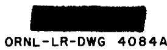


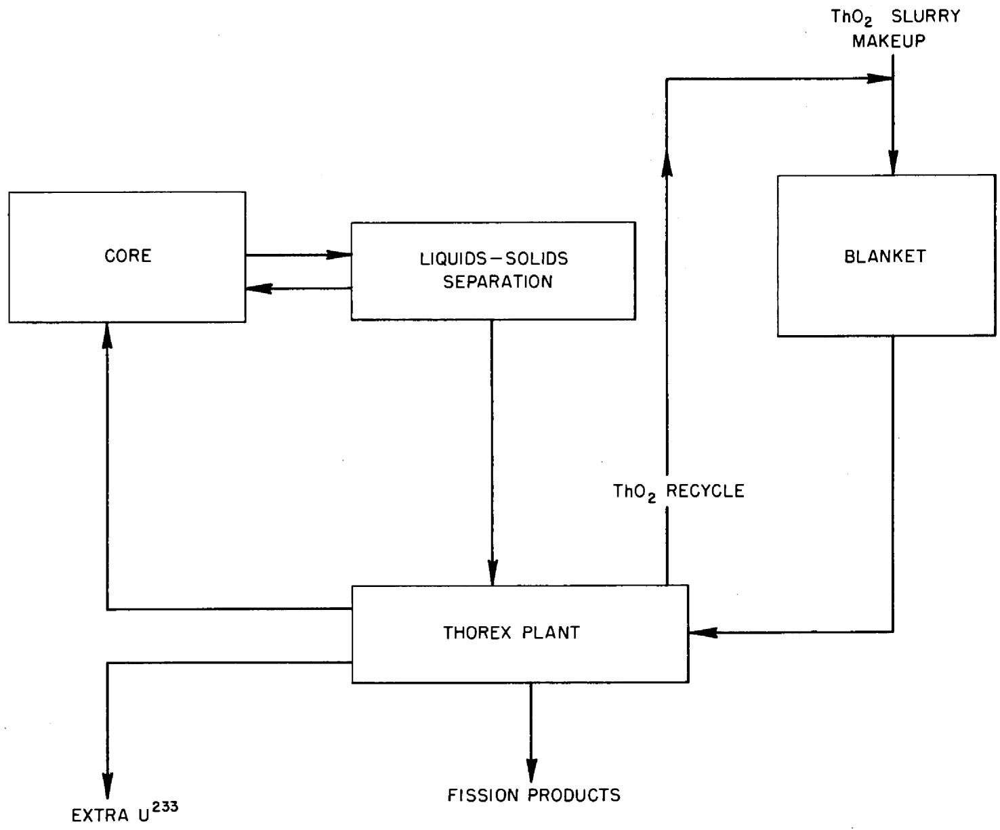  
Fig. 1. Schematic Flow Sheet for a Two Region Thorium Breeder Reactor.

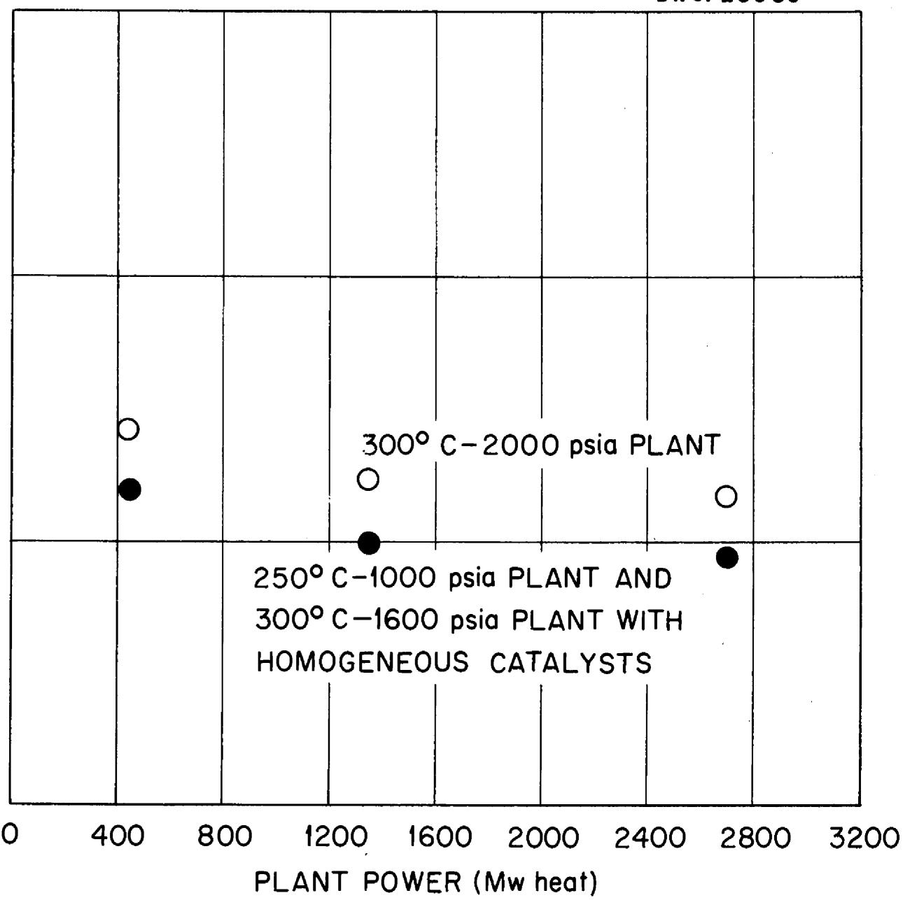  
REACTOR PLANT COST PER Mw OF HEAT RELATIVE TO THAT OF 1350 Mw-1000 psia STATION   
3.0   
2.0   
1.0   
Fig. 2. Effect of Power on Cost of Two-Region Reactor Plant.

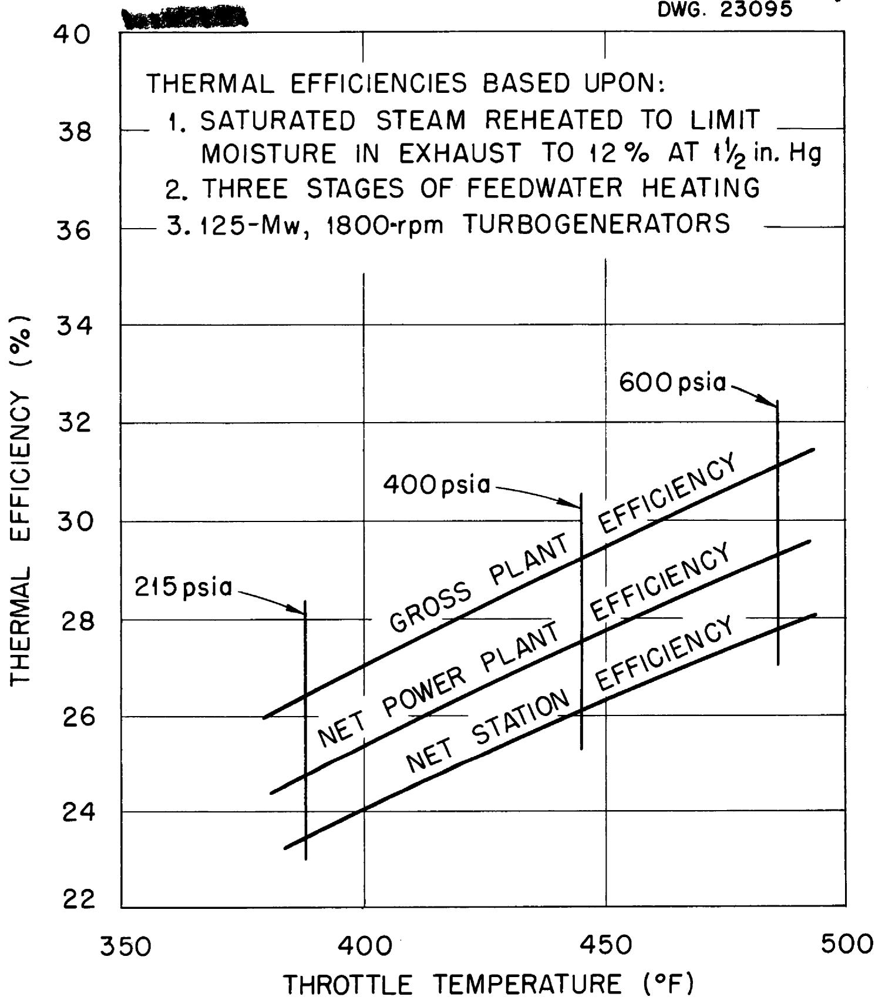  
Fig. 3. Effect of Steam Conditions on Turbogenerator Plant Efficiency.

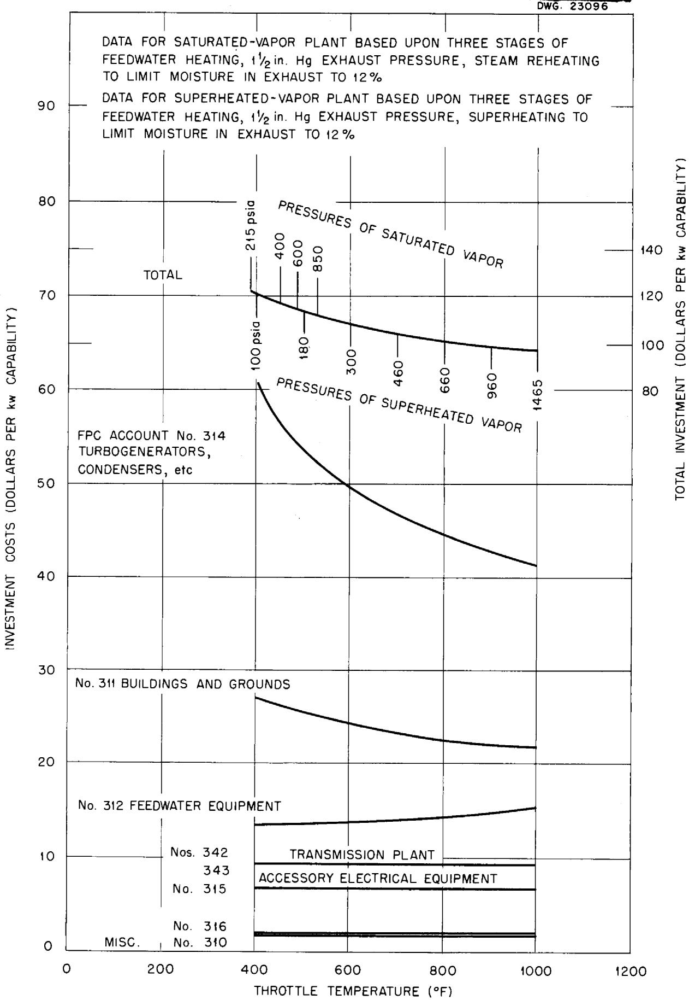  
Fig. 4. Effect of Steam Conditions on Power-Plant Cost for 300-Mw Plant.

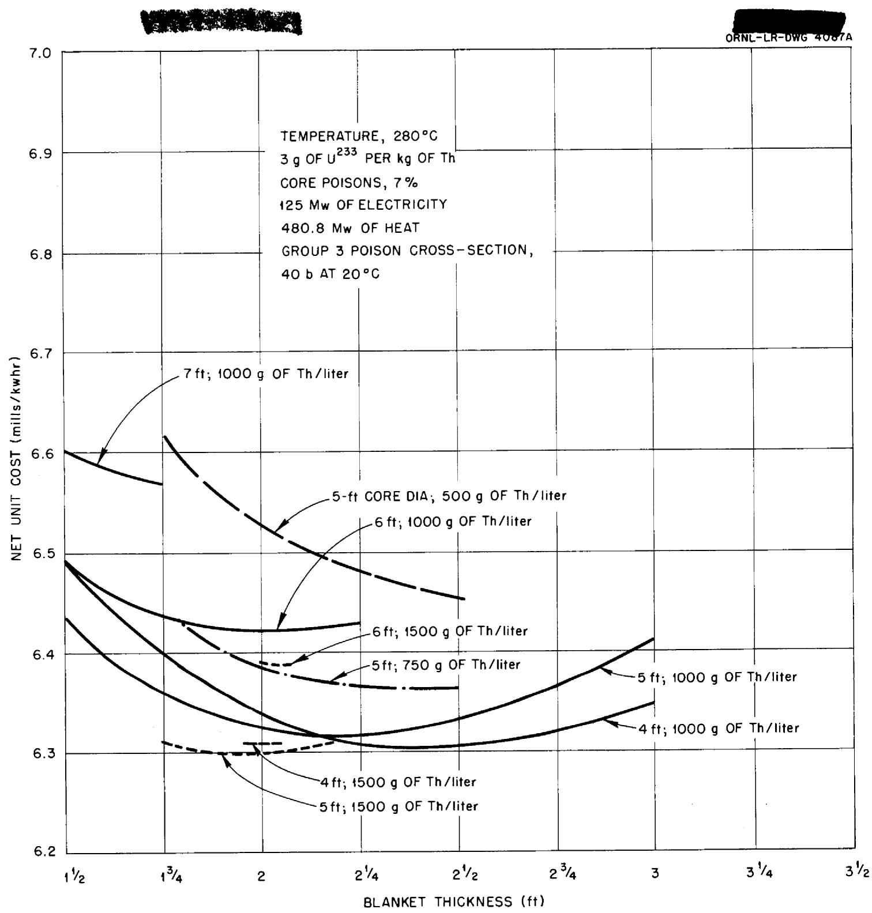  
Fig. 5. Effect of Blanket Thickness on Unit Cost.

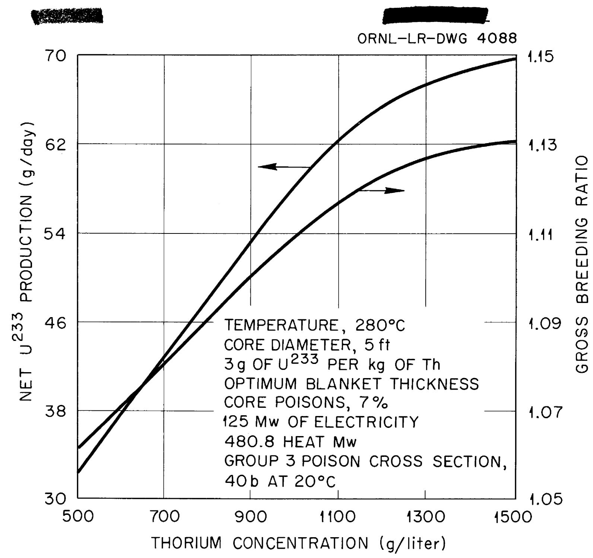  
Fig. 6. Effect of Thorium Concentration on Breeding.

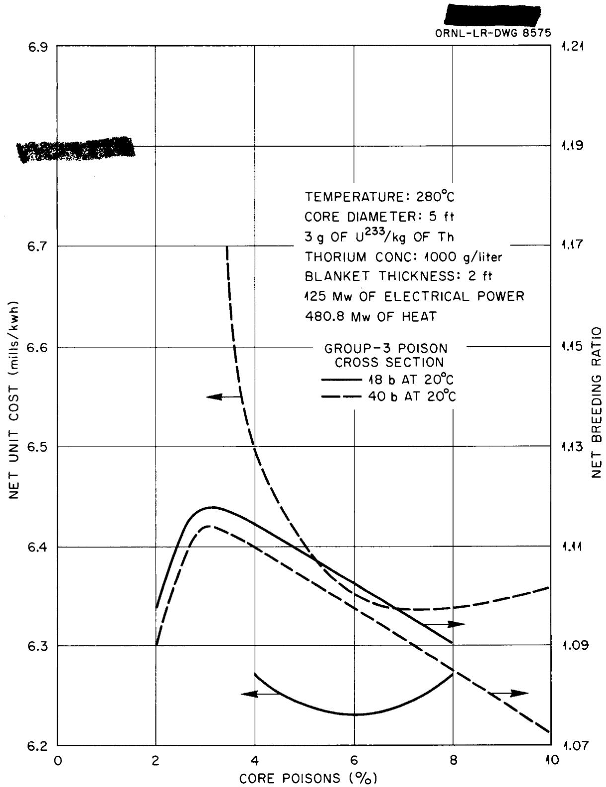  
Fig. 7. Effect of Group-3 Poisons on Unit Cost and Breeding Ratio.

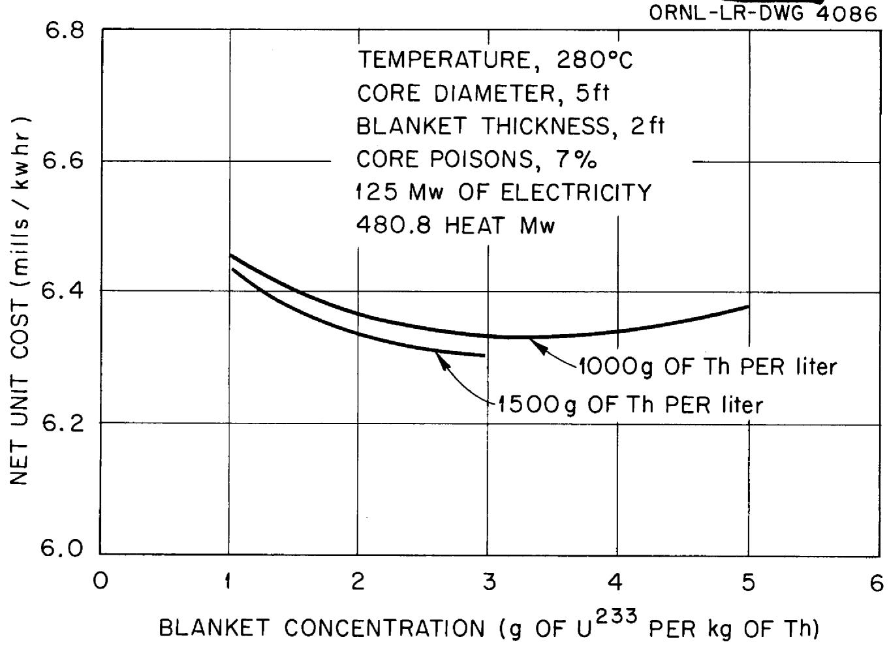  
Fig. 8. Effect of Blanket Uranium Concentration on Unit Cost.

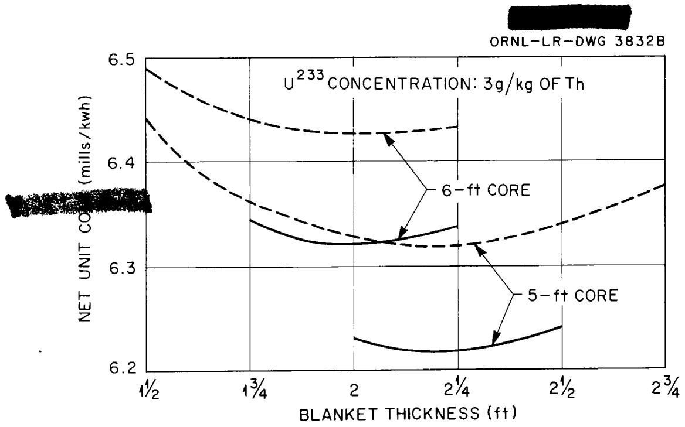

TEMPERATURE: $280^{\circ} \mathrm{C}$

THORIUM CONCENTRATION: 1000 g / liter

CORE POISONS: $6\%$

ELECTRICAL POWER: 125 Mw

HEAT: 480.8Mw

GROUP-3 POISONS: 18 barns AT $20^{\circ}C$

- - - - GROUP-3 POISONS: 40 barns AT $20^{\circ}C$

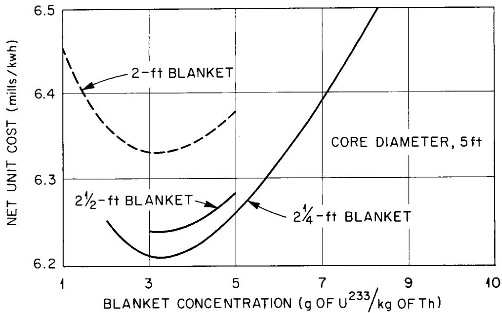  
Fig. 9. Effect of Group 3 Poison Cross Section on Unit Cost.

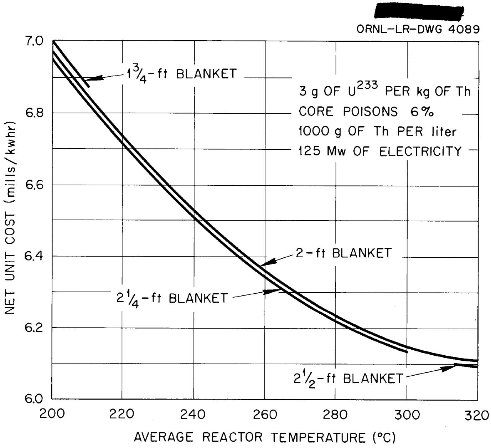  
Fig. 10. Effect of Temperature on Unit Cost.

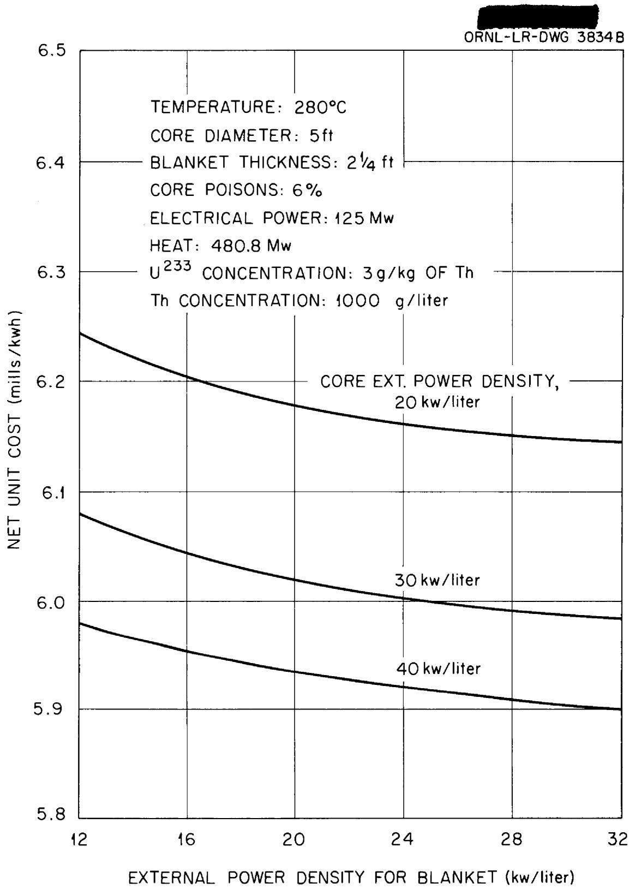  
Fig. 11. Effect of External Power Densities on Unit Cost

ONE-REGION REACTORS

# ONE-REGION REACTORS

# Methods and Conditions

Use of slurry in the one-region reactor system precludes hydraulic separation as a method of poison removal. All poison removal must be done in the more expensive Thorex plant. It was assumed that the fuel would be in the form of a $\mathrm{UO_3 - ThO_2}$ slurry in $\mathrm{D}_2\mathrm{O}$ .

The calculations for the one-region reactor were considerably easier than for the two-region reactors. No iteration is required to determine the resonance to thermal absorption in the thorium. Therefore, it is possible to write a set of equations covering the isotope concentrations and the nuclear calculations which could be solved simultaneously by a simple iterative procedure.

The independent variables were reactor size, thorium concentration, process cycle time and external power density.

It is to be noted that the basic configuration of a three-reactor power station has been preserved here in order to provide as close a comparison as possible of the two systems. It may be argued that such a scheme places the one-region system at an initial disadvantage because of the much lower power density which results. The underlying philosophy of the three-reactor station was to limit the individual power sources to the order of $100\mathrm{Mw}$ of electricity because of network considerations. Possibly $375\mathrm{Mw}$ of electrical power from a two-reactor station composed of one-region reactors would be more economical.

# Fission Product Poisons

The fission product poisons were handled in the same fashion as the two-region reactor. Since only the Thorex process is used, the equation for the processing cycle time is similar to equation (6).

$$
T = \frac {f _ {3}}{y \sigma_ {3} \phi} \tag {22}
$$

# Isotope Concentrations and Critical Equation

As in the two-region calculation, the higher isotopes of thorium and of uranium beyond U-236 need not be considered. In addition, the effect of the U-238 added with the enriched feed (93.5% U-235, 2.0% U-234, and 4.5% U-238) for the non-breeders was neglected because of the small quantity and small cross section. The critical equation is simply

$$
p \left[ \eta (2 5) \Sigma_ {a} (2 5) + \eta (2 3) \Sigma_ {a} (2 3) \right] = (1 + T B ^ {2}) \left(\Sigma_ {T} + D _ {2} B ^ {2}\right) \tag {23}
$$

and the relationship for the resonance to thermal absorption can easily be shown to be

$$
\beta_ {0 2} = \frac {(1 - p)}{p} \frac {\left(D _ {2} B ^ {2} + \sum_ {T}\right)}{\sum (0 2)} \tag {24}
$$

For a one-region reactor under equilibrium conditions,

$$
\left[ 1 + \beta (0 2) \right] \sum (0 2) \phi - \lambda (1 3) N (1 3) - \sum (1 3) \phi - \frac {N (1 3)}{T} = 0 \tag {25}
$$

$$
\lambda (1 3) \mathrm {N} (1 3) + q \left[ \frac {\mathrm {N} (1 3) + \mathrm {N} (2 3)}{\mathrm {T}} \right] - \sum_ {\mathrm {a}} (2 3) \phi - \frac {\mathrm {N} (2 3)}{\mathrm {T}} = 0 \tag {26}
$$

$$
\frac {F (2 4)}{V _ {T}} + \sum_ {x} (2 3) \phi - \sum (2 4) \phi + \sum (1 3) \phi - (1 - q) \frac {N (2 4)}{T} = 0 \tag {27}
$$

$$
\frac {F (2 5)}{V _ {T}} + \sum (2 4) \phi - \sum_ {a} (2 5) \phi - (1 - q) \frac {N (2 5)}{T} = 0 \tag {28}
$$

$$
\sum_ {r} (2 5) \phi - \sum (2 6) \phi - (1 - q) \frac {N (2 6)}{T} = 0 \tag {29}
$$

$$
\phi = \frac {3 . 3 8 x 1 0 ^ {1 6} P / V _ {\mathrm {T}}}{\sum_ {\mathrm {f}} (2 3) + \sum_ {\mathrm {f}} (2 5)} \tag {30}
$$

For breeder reactors the set of equations shown above (22 through 30) was solved simultaneously by iterative methods with the feed of U-235 (F25) set equal to zero. However, to handle the case of breeders and non-breeders with the same general method, another equation is used that relates the gross breeding ratio (no chemical losses), chemical processing losses $(0.1\%)$ used for all reactors) and the U-235 feed for the non-breeders. Obviously just enough U-235 must be added to make the net breeding ratio equal to one. Therefore by a direct material balance (or by combining equations 25, 26, and 28 and assigning a processing loss),

$$
\left(\mathrm {B} _ {\mathrm {R}} - 1\right) + \frac {\mathrm {F} (2 5) / \phi \mathrm {V} _ {\mathrm {T}}}{\sum_ {\mathrm {a}} (2 5) + \sum_ {\mathrm {a}} (2 3)} - \frac {0 . 0 0 1 \left[ \mathrm {N} (1 3) + \mathrm {N} (2 3) + \mathrm {N} (2 5) \right]}{\left[ \sum_ {\mathrm {a}} (2 5) + \sum_ {\mathrm {a}} (2 3) \right] \phi \mathrm {T}} = 0 \tag {31}
$$

In brief the calculation was performed in the following manner. For a particular value of power (P), reactor diameter (for a sphere $B = \frac{\pi}{R}$ ) process cycle time (T) and thorium concentration (N(02)), the critical equation (eq. 22) was used to calculate the concentration of U-233 with no poisons, Pa or higher isotopes of uranium. The other isotopes were then calculated with F(25) = 0 for the first iteration. Then equation (28) was used to compute F(25). If F(25) was minus, the reactor was a breeder and the iteration with F(25) = 0 was continued until the desired accuracy ( $>0.01\%$ ) was attained. If the reactor was a non-breeder, the percentage recycle, q, was set equal to 0.999 (all recycled minus the $0.1\%$ processing loss) and the value

of F(25) computed from equation (31) was used in each successive iteration until sufficient convergence occurred. Hand calculations of this nature would be quite laborious, requiring several hours of computation for each reactor. All the required instructions and equations, however, were easily coded and the ORACLE averaged only around 15 seconds per reactor calculation.

# Cost Estimation

No attempt was made to estimate the investment cost of the one-region plant. For initial comparison purposes, it can be assumed that this cost is comparable to that of the two-region plant.

All other cost factors are the same as used for the two-region study.

# #

All results are for 125 Mw of electrical power delivered to a power grid for a one-region reactor operating at an average temperature of $280^{\circ}\mathrm{C}$ (equivalent to 480.8 Mw of heat with a net station efficiency of $26\%$ ). An external power density of 20 kw/liter was used in all cases.

The unit cost of power is shown as a net partial cost in the following table and graphs. This cost is the sum of the inventory charges, feed (thorium and for non-breeders U-235), $\mathsf{D}_2\mathsf{O}$ makeup and chemical processing charges that are a function of throughput minus the credit for breeding gain, if any. Costs not included are the fixed charges on the plant investment (reactor, turbogenerator and chemical processing), fixed operating costs for the chemical processing plant

and operating and maintenance which is usually taken as a percentage of the plant investment (3% in the two-region study). The comparable fixed cost for the two-region reactors is 5.25 mills/kwh. Consequently, for initial comparison, the total unit cost can be obtained by adding the fixed cost of 5.25 mills/kwh to the net partial unit costs shown.

The results for 5 reactor sizes of interest at near optimum conditions are presented in Table IV. It is immediately apparent that for one-region reactors near the optimum cost conditions large breeding gains cannot be obtained and high isotopic purity ( $\sim 95\%$ ) U-233 cannot be produced without a protactinium recovery process. This would involve separation of protactinium from the uranium isotope mixture as soon as practical after discharge from the reactor. Such a procedure would not ordinarily be required for the two-region reactor since a product of about $95\%$ purity is expected.

The effect of the chemical processing cycle (determines the fission poison level) is shown in Figures 12, 13, and 14 for the reactor diameters from 10 to 16 ft. In general the optimum cycle time increases with increase in thorium concentration and reactor diameter; the optimum cycle time for the reactors near optimum cost appear to be about twice as large as for a two-region machine. For non-breeders it was assumed that a 30-day supply of U-235 feed was on hand, but no reserve supply of fissionable material was assumed for breeders. Thus the loss in credit from the breeding gain and the additional inventory charge caused the abrupt changes in slope that appear in the graphs at the point of change from breeder to non-breeder.

The net partial cost as a function of diameter and thorium concentration at optimum cycle time (determined from Figures 12, 13, and 14)

is shown in Figure 15. It is apparent that, for the reactor sizes of interest, the optimum thorium concentrations are between 200 and $300\mathrm{g}$ /liter.

The effect of reactor diameter (determined from Figure 15) on the partial unit cost of power for optimum process cycle times and thorium concentrations is shown in Figure 16. The minimum partial unit cost of 1.83 mills/kwh occurs for a reactor size of 12 ft with a thorium concentration of 260 g/liter. From a cost viewpoint there is little variation in the range of reactor sizes from 10 to 14 ft, the maximum difference being only 0.12 mills/kwh.

The comparable minimum partial cost for the two-region reactor is 0.97 mills/kwh. Therefore, a cost differential of 0.9 mills/kwh seems to exist in favor of the two-region reactor provided that the fixed costs for the two reactor types are equal. This difference is, of course, uncertain because of possible unforeseen engineering difficulties which may arise in the course of construction and operation of either type reactor. It is not unreasonable to suppose, for instance, that fixed costs may be somewhat smaller for the one-region reactor because of simpler construction. Clearly, questions such as these can be resolved only by comparison of the performance of actual reactors.

Table IV   
Cost Breakdowns and Neutron Balances for Several   
One-Region Reactors Near Optimum Conditions*   
Process Characteristics and Costs   

<table><tr><td>Reactor diameter, ft</td><td>10</td><td>11</td><td>12</td><td>13</td><td>14</td></tr><tr><td>Thorium concentration,g/liter</td><td>300</td><td>300</td><td>250</td><td>250</td><td>200</td></tr><tr><td>Process cycle time, days</td><td>450</td><td>400</td><td>400</td><td>500</td><td>450</td></tr><tr><td>Net partial cost of power,mills/kwh</td><td>2.00</td><td>1.92</td><td>1.88</td><td>1.93</td><td>2.01</td></tr><tr><td>Uranium (U233 and U235)credit</td><td></td><td></td><td></td><td></td><td></td></tr><tr><td>mills/kwh</td><td>0</td><td>0.04</td><td>0.057</td><td>0.15</td><td>0.11</td></tr><tr><td>Chemical processing (lessfixed costs), mills/kwh</td><td>0.17</td><td>0.20</td><td>0.18</td><td>0.16</td><td>0.16</td></tr><tr><td>Feed costs (Th, D2O, U)mills/kwh</td><td>0.40</td><td>0.22</td><td>0.25</td><td>0.28</td><td>0.32</td></tr><tr><td>D2O inventory, mills/kwh</td><td>0.52</td><td>0.58</td><td>0.66</td><td>0.75</td><td>0.86</td></tr><tr><td>Uranium inventory,mills/kwh</td><td>0.92</td><td>0.96</td><td>0.84</td><td>0.89</td><td>0.77</td></tr><tr><td>Total system volume,liters</td><td>38,900</td><td>43,800</td><td>49,700</td><td>56,600</td><td>64,700</td></tr><tr><td>Power density in reactor,kw/liter</td><td>32.4</td><td>24.1</td><td>18.8</td><td>14.8</td><td>11.8</td></tr><tr><td>Gross breeding ratio</td><td>0.957</td><td>1.011</td><td>1.012</td><td>1.035</td><td>1.025</td></tr><tr><td>Net breeding ratio</td><td>0.956</td><td>1.009</td><td>1.010</td><td>1.034</td><td>1.024</td></tr><tr><td>Net breeding gain (U233 andU235) g/day</td><td>0</td><td>5.79</td><td>6.3</td><td>20.4</td><td>14.3</td></tr><tr><td>Critical concentration,g U233/kg D2O</td><td>7.99</td><td>7.62</td><td>5.82</td><td>5.60</td><td>4.15</td></tr><tr><td>Critical concentration,g U235/kg D2O</td><td>1.18</td><td>0.71</td><td>0.56</td><td>0.46</td><td>0.37</td></tr><tr><td>Uranium concentration,g U/kg D2O-</td><td>26.08</td><td>17.60</td><td>13.42</td><td>10.68</td><td>8.50</td></tr><tr><td>Reactor (internal &amp; external)inventories, kg</td><td></td><td></td><td></td><td></td><td></td></tr><tr><td>Thorium</td><td>11,700</td><td>13,100</td><td>12,400</td><td>14,200</td><td>12,900</td></tr><tr><td>U233</td><td>251.9</td><td>270.9</td><td>236.0</td><td>258.8</td><td>220.4</td></tr><tr><td>U235</td><td>37.4</td><td>25.3</td><td>22.5</td><td>21.2</td><td>19.7</td></tr><tr><td>Pa233</td><td>18.9</td><td>19.8</td><td>19.9</td><td>20.9</td><td>20.4</td></tr><tr><td>Feed stream inventories,kg</td><td></td><td></td><td></td><td></td><td></td></tr><tr><td>Thorium</td><td>1,400</td><td>1,800</td><td>1,700</td><td>1,600</td><td>1,600</td></tr><tr><td>U233 (includes Pa)</td><td>34.7</td><td>41.8</td><td>37.0</td><td>32.4</td><td>31.1</td></tr><tr><td>U235</td><td>5.4</td><td>3.5</td><td>3.1</td><td>2.3</td><td>2.4</td></tr><tr><td>U233 in product, wt. fraction</td><td>0.306</td><td>0.433</td><td>0.434</td><td>0.524</td><td>0.487</td></tr><tr><td>U235 in product, wt. fraction</td><td>0.042</td><td>0.038</td><td>0.038</td><td>0.040</td><td>0.040</td></tr><tr><td>Thorium feed, g/day</td><td>528</td><td>560</td><td>561</td><td>580</td><td>572</td></tr><tr><td>U235 feed, g/day</td><td>26.7</td><td>0</td><td>0</td><td>0</td><td>0</td></tr><tr><td>Reactor poisons, %</td><td>5.49</td><td>4.93</td><td>5.46</td><td>6.10</td><td>6.34</td></tr></table>

Table IV (Contd)   

<table><tr><td></td><td colspan="5">Neutron Balances</td></tr><tr><td>Absorptions and losses</td><td></td><td></td><td></td><td></td><td></td></tr><tr><td>Pa233</td><td>0.0191</td><td>0.0186</td><td>0.0214</td><td>0.0206</td><td>0.0235</td></tr><tr><td>U233</td><td>1.0000</td><td>1.0000</td><td>1.0000</td><td>1.0000</td><td>1.0000</td></tr><tr><td>U234</td><td>0.1090</td><td>1.1019</td><td>0.1040</td><td>0.0910</td><td>0.0986</td></tr><tr><td>U235</td><td>0.1599</td><td>0.1009</td><td>0.1029</td><td>0.0883</td><td>0.0966</td></tr><tr><td>U236</td><td>0.0235</td><td>0.0095</td><td>0.0095</td><td>0.0044</td><td>0.0061</td></tr><tr><td>D20</td><td>0.0070</td><td>0.0073</td><td>0.0095</td><td>0.0099</td><td>0.0133</td></tr><tr><td>Poisons</td><td>0.0573</td><td>0.0491</td><td>0.0545</td><td>0.0601</td><td>0.0629</td></tr><tr><td>Th232(thermal)</td><td>0.5516</td><td>0.5775</td><td>0.6269</td><td>0.6516</td><td>0.6998</td></tr><tr><td>Th232(resonance)</td><td>0.4687</td><td>0.4520</td><td>0.4063</td><td>0.4043</td><td>0.3488</td></tr><tr><td>Fast leakage</td><td>0.1873</td><td>0.1518</td><td>0.1309</td><td>0.1123</td><td>0.0993</td></tr><tr><td>Slow leakage</td><td>0.07081</td><td>0.0623</td><td>0.0694</td><td>0.0622</td><td>0.0730</td></tr><tr><td>Total neutrons absorbed and lost</td><td>2.6541</td><td>2.5309</td><td>2.5351</td><td>2.5046</td><td>2.5218</td></tr><tr><td>Production</td><td></td><td></td><td></td><td></td><td></td></tr><tr><td>Neutrons from U233</td><td>2.3200</td><td>2.3200</td><td>2.3200</td><td>2.3200</td><td>2.3200</td></tr><tr><td>Neutrons from U235</td><td>0.3341</td><td>0.2109</td><td>0.2151</td><td>0.1846</td><td>0.2018</td></tr><tr><td>Total neutrons produced</td><td>2.6541</td><td>2.5309</td><td>2.5351</td><td>2.5046</td><td>2.5218</td></tr></table>

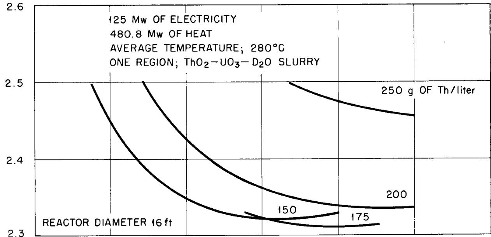  
PARTIAL NET UNIT COST OF POWER (mills/kwh)

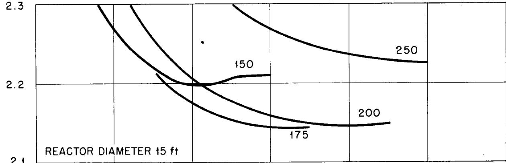

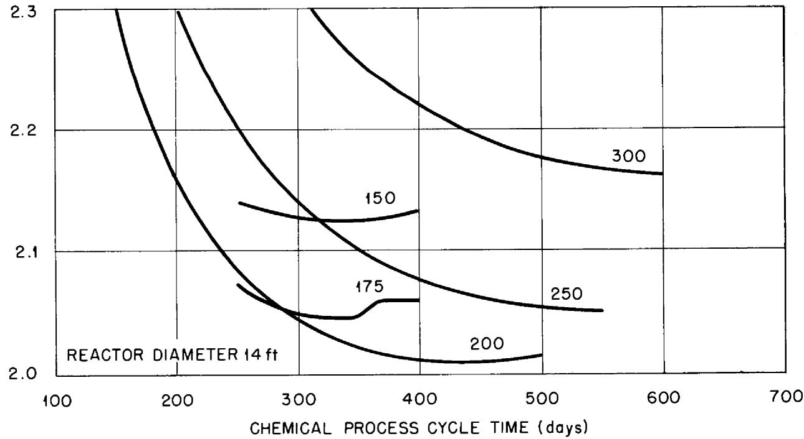  
Fig. 12. Effect of Process Cycle Time on Unit Cost.

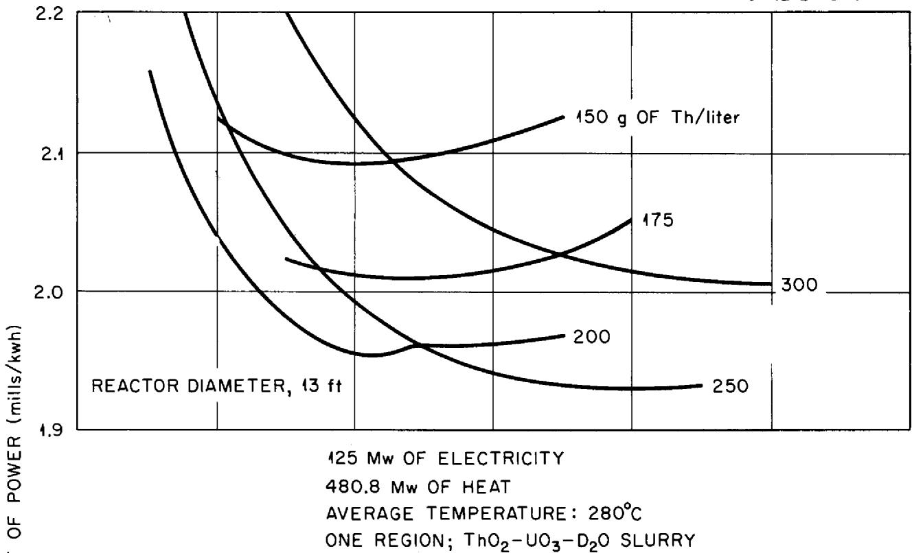

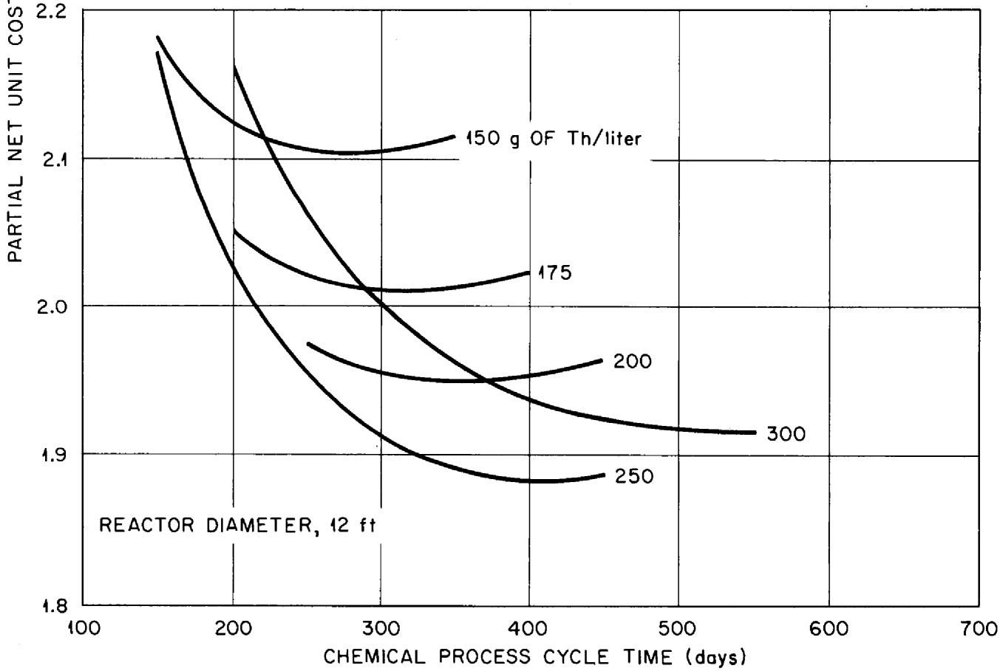  
Fig. 13. Effect of Process Cycle Time on Unit Cost.

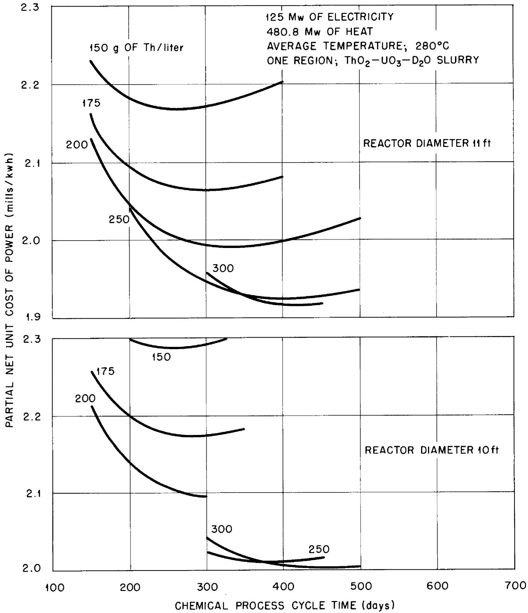  
Fig.14. Effect of Process Cycle Time on Unit Cost.

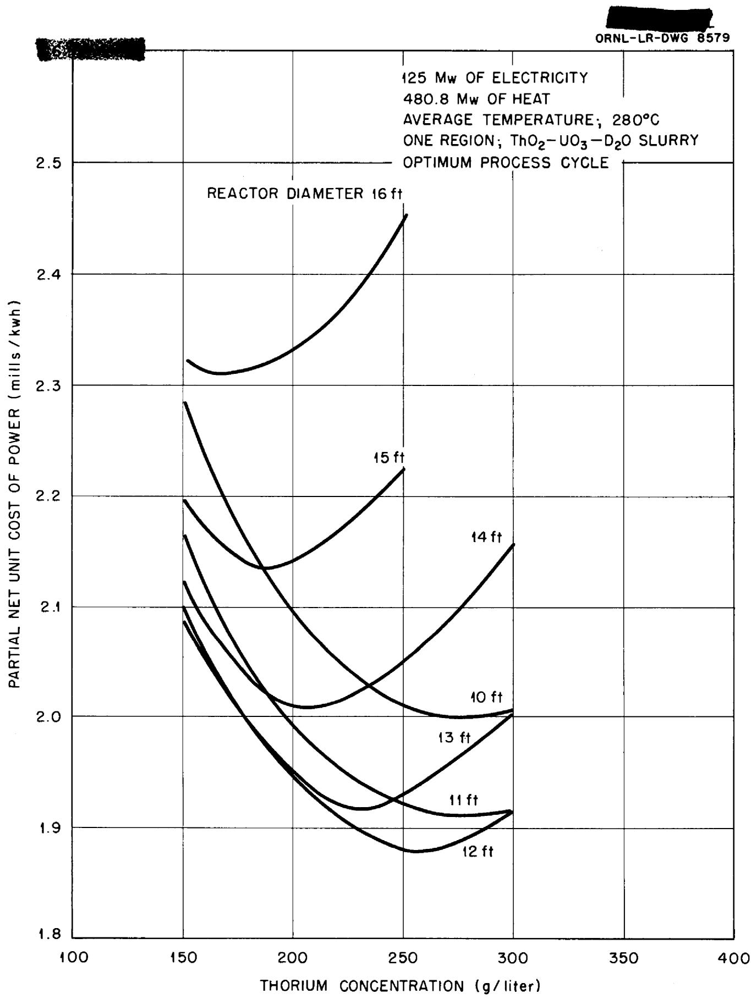  
Fig. 15. Effect of Thorium Concentration on Unit Cost.

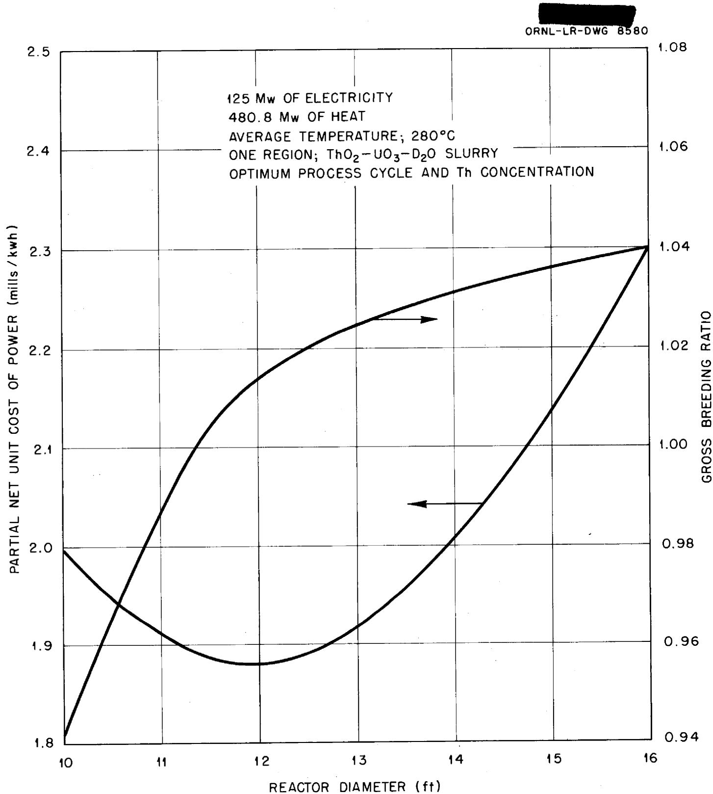  
Fig. 16. Effect of Reactor Size on Unit Cost and Breeding Ratio.


# NOMENCLATURE

a Core radius, cm   
$\mathbf{B}_{\mathbb{R}}$ Breeding gain, atoms of fissionable material produced per atom of fuel burned   
B² Reactor buckling, cm-2   
B(G) Net grams of fissionable material produced per day   
C Turbogenerator plant investment, $/kw   
$C_{\mathrm{T}}$ Total power cost, mills/kwh   
Cx Credit for excess fissionable material produced, mills/kwh   
D1 D2 diffusion constant, cm-1, for fast and slow groups, respectively   
EG Gross efficiency of power plant   
EN Net efficiency of power plant   
f Poisson fraction   
F Net feed to reactor, atoms/sec   
G(U) Core uranium concentration grams of uranium per kg of heavy water   
g Fraction of group-3 poisons that can be precipitated   
J External power density, kw/liter   
K Power constant, 3.38 x 10 $^{16}$ fissions/Mw sec   
N Concentration, atoms/cm³   
p Resonance escape probability   
P Reactor power, Mw   
q Fraction of material processed and returned to reactor   
R Inside Radius of pressure vessel, cm   
t Thickness of core vessel, cm t = 1.39 R x 10-2   
Chemical process cycle time, sec   
V Reactor or system volume, cm³   
Yield of group-3 fission products, 1.31 atoms/fission

$\beta$ Ratio of resonance to thermal absorption

Microscopic cross section, cm²

Macrosopic cross section, cm-1

Average neutron flux of system, neutrons/cm²-sec

$\lambda$ Decay constant, $\sec^{-1}$   
Fermi age, cm²

# Subscripts:

a Total capture   
B Blanket   
Core   
f Fission capture   
Radiative capture   
T Total system   
1 Hydraulic separator processing   
2 Thorex processing   
3 Group-3 poisons

Parenthetical Symbols (used to identify $\mathbb{N},\lambda ,\sigma ,$ and $\Sigma$ ):

A Group-3 poison subgroup A   
B Group-3 poison subgroup B   
O Precipitated poisons not removed in hydraulic separators   
3 Group-3 poisons   
23 U-233   
24 U-234   
25 U-235   
26 U-236   
13 Pa-233   
02 Th-232

# REFERENCES

(1) Arnold, E. D., Gresky, R. J., Klotzbach, R. J., and Irvine, A. R., "Preliminary Cost Estimation: Chemical Processing and Fuel Costs for a Thermal Breeder Reactor Power Station", ORNL-1761, Jan. 27, 1955.   
(2) AEC Neutron Cross Section Advisory Group, Neutron Cross Sections, BNL-170, -170A, -170B, -221, (1952-1953).   
(3) Briggs, R. B., "Aqueous Homogeneous Reactors for Producing Central-Station Power", ORNL-1642, May 13, 1954.   
(4) Briggs, R. B., and Edlund, M. C., "A Preliminary Program for the Conceptual Design of the TBR", ORNL-CF-54-8-89, August 13, 1954.   
(5) Fowler, T. B., and Willoughby, R. A., "ORACLE Code for the Two-Group, Two-Region Homogeneous Reactor Calculation", ORNL-CF-54-7-38, July 7, 1954.   
(6) Glasstone, S., and Edlund, M. C., Elements of Nuclear Reactor Theory, Chapter XIII, (1953).   
(7) Halperin, J., et al., "Capture Cross Section of Pa-233 for Thermal Reactor Neutrons", Reactor Science and Technology, p. 108, Vol. 3, TID-2010, (Sept., 1953).   
(8) HRP Quarterly Progress Report, ORNL-1813, October 31, 1954.   
(9) HRP Quarterly Progress Report, ORNL-1853, January 3, 1955.   
(10) Klotzbach, R. J., "Comments on Proposed Power Breeder Design Calculations", ORNL-CF-54-8-78, August 10, 1954.   
(11) Smith, R. R., Letter to J. Halperin, RRS-14-55A, March 28, 1955.   
(12) Tobias, M., "A Thin Shell Approximation for Two-Group, Two-Region Spherical Reactor Calculations", ORNL-CF-54-6-135, June 16, 1954.   
(13) Tobias, M., "Calculation of Fermi Ages for $\mathsf{ThO_2}$ -Heavy Water Slurries", ORNL-CF-54-9-97, September 14, 1954.   
(14) Visner, S., "Nuclear Calculations for Homogeneous Reactors Producing U-233", ORNL-CF-51-10-110, October 22, 1951.

# APPENDIX I

# Constants Used in the Nuclear Calculations

1. Thermal Microscopic Cross Sections at $280^{\circ}\mathrm{C}$ , barns. (Corrected for a Maxwell Boltzmann Distribution)

<table><tr><td>Substance</td><td>Absorption Cross Section, oa</td><td>Radiative Capture Cross Section, σr</td><td>Fission Cross Section, σf</td></tr><tr><td>Th-232</td><td>4.52</td><td>--</td><td>--</td></tr><tr><td>Pa-233</td><td>96.8</td><td>--</td><td>--</td></tr><tr><td>U-233</td><td>380.7</td><td>34.3</td><td>346.4</td></tr><tr><td>U-234</td><td>57.4</td><td>--</td><td>--</td></tr><tr><td>U-235</td><td>414.0</td><td>65.1</td><td>348.9</td></tr><tr><td>U-236</td><td>5.81</td><td>--</td><td>--</td></tr><tr><td>D20</td><td>1.76 x 10-3</td><td>--</td><td>--</td></tr><tr><td>S</td><td>0.316</td><td>--</td><td>--</td></tr><tr><td>Group 3 poisons</td><td>13.1</td><td>--</td><td>--</td></tr></table>

2. Macroscopic Absorption Cross Section of Zircalloy at $280^{\circ} \mathrm{C} = 5.897 \times 10^{-3} \, \mathrm{cm}^{-1}$ .   
3. Diffusion Constants, Ages, and Resonance Escape Probabilities at $280^{\circ}\mathrm{C}$ for Various Thoria-Heavy Water Slurries.

<table><tr><td>Concentration of Slurry, g Th/l</td><td>Fast Diffusion Constant, D1B, cm</td><td>Slow Diffusion Constant, D2B, cm</td><td>Fermi Age T_B, cm²</td><td>Resonance Escape Probability, p_B</td></tr><tr><td>500</td><td>1.73</td><td>1.19</td><td>214</td><td>0.728</td></tr><tr><td>750</td><td>1.53</td><td>1.18</td><td>212</td><td>0.638</td></tr><tr><td>1000</td><td>1.49</td><td>1.17</td><td>212</td><td>0.560</td></tr><tr><td>1500</td><td>1.47</td><td>1.17</td><td>207</td><td>0.435</td></tr></table>

4. Diffusion Constants, Ages, and Resonance Escape Probabilities at Various Temperatures for a Thoria-Heavy Water Slurry containing 1000 g Th/l.

<table><tr><td>Temp. °C</td><td>Fast Diffusion Constant, D1B, cm</td><td>Slow Diffusion Constant, D2B, cm</td><td>Fermi Age ζB, cm2</td><td>Resonance Escape Probability</td></tr><tr><td>200</td><td>1.34</td><td>0.998</td><td>168</td><td>0.590</td></tr><tr><td>250</td><td>1.42</td><td>1.09</td><td>190</td><td>0.575</td></tr><tr><td>280</td><td>1.49</td><td>1.17</td><td>212</td><td>0.560</td></tr><tr><td>300</td><td>1.56</td><td>1.24</td><td>234</td><td>0.547</td></tr><tr><td>320</td><td>1.62</td><td>1.34</td><td>260</td><td>0.530</td></tr></table>

5. Diffusion Constants and Ages for Uranyl Sulfate-Heavy Water Solutions at Various Temperatures. Resonance Escape Probability Taken as Unity for all Cases.

<table><tr><td>Temp. OC</td><td>Fast Diffusion Constant, D1C, cm</td><td>Slow Diffusion Constant, D2C, cm</td><td>Fermi Age T, cm2</td></tr><tr><td>200</td><td>1.46</td><td>1.05</td><td>167</td></tr><tr><td>250</td><td>1.57</td><td>1.14</td><td>193</td></tr><tr><td>280</td><td>1.67</td><td>1.23</td><td>218</td></tr><tr><td>300</td><td>1.76</td><td>1.30</td><td>244</td></tr><tr><td>320</td><td>1.87</td><td>1.40</td><td>276</td></tr></table>

6. Density of Heavy Water, Zircalloy and Thoria at Various Temperature, $g/cm^2$ .

<table><tr><td>Temp. 
°C</td><td>Thoria</td><td>Zircalloy</td><td>Heavy Water, 99.84% D2O 
at 2000 psi</td></tr><tr><td>200</td><td>9.69</td><td>6.55</td><td>0.9594</td></tr><tr><td>250</td><td>(all temperatures)</td><td>(all temperatures)</td><td>0.8935</td></tr><tr><td>280</td><td></td><td></td><td>0.8395</td></tr><tr><td>300</td><td></td><td></td><td>0.7959</td></tr><tr><td>320</td><td></td><td></td><td>0.7480</td></tr></table>