AIRCRAFT NUCLEAR PROPULSION PROJECT

QUARTERLY PROGRESS REPORT

FOR PERIOD ENDING DECEMBER 10, 1954

#

CLARITYCATTIN CHANGARD 71

BY AUTHORITY (OF) AEC=9.8-6.5

$\therefore {N}_{a} = \frac{1}{2 - {x}^{2}} = \frac{4}{-{x}^{2}}$

${2}^{2} - 9 \cdot  {66}$

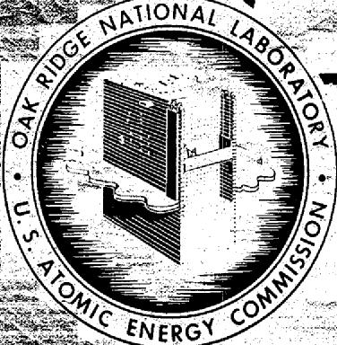

ORNL DOCUMENT REFERENCE

LIBRARY, Y-12 BRANCH

LOAN COPY ONLY

Do NOT transfer this document to any other person. If you want others to see it, attach their names, return the document, and the Library will arrange the as requested.

OAK RIDGE NATIONAL LABORATORY

OPERATED BY

CARBIDE AND CARBON CHEMICALS COMPANY

A DIVISION OF UNION CARBIDE AND CARBON CORPORATION

UCC

POST OFFICE BOX P

JOAK RIDGE, TENNESSEE

RESTRICTED DATA

(1)

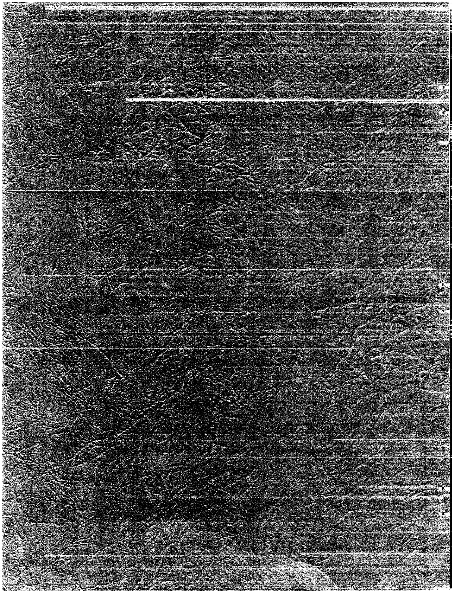

ORNL-1816

This document consists of 177 pages.

Copy 93 of 218 copies. See

Contract No. W-7405-eng-26

# AIRCRAFT NUCLEAR PROPULSION PROJECT

# QUARTERLY PROGRESS REPORT

For Period Ending December 10, 1954

W. H. Jordan, Director

S. J. Cromer, Co-Director

R. I. Strough, Associate Director

A. J. Miller, Assistant Director

A.W.Savolainen,Editor

DATE RECEIVED BY INFORMATION AND REPORTS DIVISION

(JANUARY 6, 1955)

DATE ISSUED

JAN 21 1955

OAK RIDGE NATIONAL LABORATORY

Operated by

CARBIDE AND CARBON CHEMICALS COMPANY

A Division of Union Carbide and Carbon Corporation

Post Office Box P

Oak Ridge, Tennessee

RESTRICTED.DA.P.A

aannnnnne aannnnnne nnnnne nnnnne nnnnne nnnnne nnnnne nnnnne nnnnne nnnnne nnnnne nnnnne nnnnne nnnnne nnnnne nnnnne nnnnne nnnnne nnnnne nnnnne nnnnne nnnnne nnnnne nnnnne nnnnne nnnnne nnnnne

SECRET

3445603838845

# INTERNAL DISTRIBUTION

1. G.M. Adamson   
2. R.G. Affel   
3. C. R. Baldock   
4. C. J. Barton   
5. E. S. Bettis   
6. D. S. Billington   
7. F. F. Blankenship   
8. E.P.Blizard   
9. G.E. Boyd   
10. M. A. Bredig   
11. F.R.Bruce   
12. A. D. Callihan   
13. D. W. Cardwell   
14. J.V. Cathcart   
15. C. E. Center   
16. G. T. Chapman   
17. R.A. Charpie   
18. G.H.Clewett   
19. C. E. Clifford   
20. W. B. Cottrell   
21. D. D. Cowen   
22. S. Cromer   
23. R. S. Crouse   
24. F. L. Culler   
25. L. B. Emlet (K-25)   
26. D. E. Ferguson   
27. A. P. Fraods   
28. J.H.Frye   
29. W. T. Furgerson   
30. W. R. Grimes   
31. E.E.Hoffman   
32. A. Hollgander   
33. A. S. Householder   
34. J. T. Howe   
35. R.W.Johnson   
36. W. H. Jordan   
37. G. W. Keilholtz   
38. C.P. Keim   
39. M. T. Kelley   
40. F. Kertesz   
41. E.M. King   
42. J. A. Lane   
43. C. E. Larson   
44. M. E. LaVerne

45. R. S. Livingston   
46. R.N. Lyon   
47. F. C. Maienschein   
48. W. D. Manly   
49. L. A. Mann   
50. W. B. McDonald   
51. F.W. McQuilken   
52. J. L. Meem   
53. A. J. Miller   
54. K. Z. Morgan   
55. E. J. Murphy   
56. J. P. Murray (Y-12)   
57. G. J. Nessle   
58. R. B. Oliver   
59. P. Patriarca   
60. H. F. Poppendiek   
61. P. M. Reyling   
62. H. W. Savage   
63. A. W. Savolainen   
64. E. D. Shipley   
65. O. Sisman   
66. G.P. Smith   
67. A. H. Snell   
68. R. I. Strough   
69. C. D. Susano   
70. J. A. Swartout   
71. E. H. Taylor   
72. J. B. Trice   
73. E. R. Van Artsdalen   
74. F. C. VonderLage   
75. J. M. Warde   
76. A. M. Weinberg   
77. J. C. White   
78. G. D. Whitman   
79. E. P. Wigner (consultant)   
80. G. C. Williams   
81. J. C. Wilson   
82. C. E. Winters   
83. C. D. Zerby

84-93. X-10 Document Reference Library (Y-12)

94-133. Laboratory Records Department   
134. Laboratory Records, ORNL R.C.   
135-137. Central Research Library

# SECRET

# EXTERNAL DISTRIBUTION

138. Air Force Plant Representative, Burbank   
139. Air Force Plant Representative, Seattle   
140. Air Force Plant Representative, Wood-Ridge   
141. ANP Project Office, Fort Worth

142-152. Argonne National Laboratory

153-157. Atomic Energy Commission, Washington (Lt. Col. T. A. Redfield)

158. Bureau of Aeronautics (Grant)   
159. Chief of Naval Research   
160. Convair, San Diego (C. H. Helms)

161-164. General Electric Company, ANPD

165. Glen L. Martin Company (T. F. Nagey)

166-169. Knolls Atomic Power

170-171. Lockland Area Office

172-173. Los Alamos Scientific Laboratory

174. Materials Laboratory (WADC) (Col. P. L. Hill)   
175. National Advisory Committee for Aeronautics, Cleveland

176-177. North American Aviation, Inc.

178. Nuclear Development Associates, Inc.   
179. Patent Branch, Washington   
180. Powerplant Laboratory (WADC) (A. M. Nelson)   
181. Pratt & Whitney Aircraft Division (Fox Project)   
182. USAF Project Rand   
183. USAF Headquarters

184-189. Westinghouse Electric Corporation (Bettis Laboratories)   
190-201. Wright Air Development Center (Lt. John F. Wett, Jr., WCOSI-3)   
202-216. Technical Information Service, Oak Ridge   
217. Division of Research and Medicine, AEC, ORO   
218. Atomic Energy Commission - East Hartford Area

Reports previously issued in this series are as follows:

ORNL-528 Period Ending November 30, 1949

ORNL-629 Period Ending February 28, 1950

ORNL-768 Period Ending May 31, 1950

ORNL-858 Period Ending August 31, 1950

ORNL-919 Period Ending December 10, 1950

ANP-60 Period Ending March 10, 1951

ANP-65 Period Ending June 10, 1951

ORNL-1154 Period Ending September 10, 1951

ORNL-1170 Period Ending December 10, 1951

ORNL-1227 Period Ending March 10, 1952

ORNL-1294 Period Ending June 10, 1952

ORNL-1375 Period Ending September 10, 1952

ORNL-1439 Period Ending December 10, 1952

ORNL-1515 Period Ending March 10, 1953

ORNL-1556 Period Ending June 10, 1953

ORNL-1609 Period Ending September 10, 1953

ORNL-1649 Period Ending December 10, 1953

ORNL-1692 Period Ending March 10, 1954

ORNL-1729 Period Ending June 10, 1954

ORNL-1771 Period Ending September 10, 1954

# FOREWORD

This quarterly progress report of the Aircraft Nuclear Propulsion Project at ORNL records the technical progress of the research on circulating-fuel reactors and all other ANP research at the Laboratory under its Contract W-7405-eng-26. The report is divided into three major parts: I. Reactor Theory, Component Development, and Construction, II. Materials Research, and III. Shielding Research.

The ANP Project is comprised of about 400 technical and scientific personnel engaged in many phases of research directed toward the achievement of nuclear propulsion of aircraft. A considerable portion of this research is performed in support of the work of other organizations participating in the national ANP effort. However, the bulk of the ANP research at ORNL is directed toward the development of a circulating-fuel type of reactor.

The effort on circulating-fuel reactors was, until recently, centered upon the Aircraft Reactor Experiment. This experiment has now been completed, and the operating experience is described in Section 1 of Part I.

The design, construction, and operation of the Aircraft Reactor Test (ART), formerly the Circulating-Fuel Aircraft Reactor Experiment (CFRE), with the cooperation of the Pratt & Whitney Aircraft Division, are now the specific long-range objectives. The ART is to be a power plant system that will include a 60-Mw circulating-fuel reflector-moderated reactor and adequate means for heat disposal. Operation of the system will be for the purpose of determining the feasibility, and the problems associated with the design, construction, and operation, of a high-power, circulating-fuel, reflector-moderated aircraft reactor system. The design work, as well as the supporting research on materials and problems peculiar to the ART (previously included in the subject sections), is now reported as a subsection of Part I, Section 2, "Reflector-Moderated Reactor."

# CONTENTS

FOREWORD

SUMMARY 1

PART I. REACTOR THEORY, COMPONENT DEVELOPMENT, AND CONSTRUCTION

1. CIRCULATING-FUEL AIRCRAFT REACTOR EXPERIMENT 11

Operation of the Aircraft Reactor Experiment 11   
Low-power experiments 12   
High-power experiments 13   
Mathematical analysis of approach to critical 15

Operation of ARE Pumps 15   
Loading of the ARE 18   
Analysis of Leak in Sodium System 18

Preliminary Estimates of Corrosion in ARE 19

2. REFLECTOR-MODERATED REACTOR 21

Expansion-Tank and Xenon-Removal System 21   
Control Rod Design Considerations 24   
Fill and Drain System 25   
Design Physics 26

Activation of the Inconel core shells 26   
Mathematical models for reflector-moderated reactors 28

Proposed ART Installations 29

3. EXPERIMENTAL REACTOR ENGINEERING 41

In-Pile Loop Component Development 41

Horizontal-shaft sump pump 41   
Heat exchanger 43

Pump Development Program 43

ARE-type sump pumps 43   
Large-scale pump development 43

Design and Operation of Forced-Circulation Corrosion and Mass-Transfer Tests 44

Fused salts in Inconel 44   
Beryllium-sodium-Inconel mass transfer 45   
Sodium in multimetal loops 45   
Natural-gas heat sources for forced-circulation loops 46

Heat Exchanger Development 46

Heat exchanger tests 46   
Header leak test 46   
Pump for heat exchanger tests 46

Gas-Furnace Heat Source Development 47

Sodium-cooled 100-kw furnace tests 47   
Natural-gas burner 50

Trap for Fluoride Vapors 50

# SECRET

4. CRITICAL EXPERIMENTS 52

Reflector-Moderated Reactor 52

# PART II. MATERIALS RESEARCH

5. CHEMISTRY OF MOLTEN MATERIALS 57

Phase Equilibrium Studies 57

Solid phase studies in the NaF-Zr4-UF4 system 57

Phase relationships in UF $^2$ -bearing systems 58

Solubility of UF in NaF-KF-LiF eutectic 59

$\mathsf{UF}_2$ stability 60

Differential thermal analysis 61

Chemical Reactions in Molten Salts 61

Reduction of $\mathsf{FeF}_2$ by $H_{2}$ in NaF-ZrF4 systems 61

Reduction of UF to UF in fluoride melts 61

Electrochemistry of fused salts 62

Stability of chromous and ferrous fluorides in molten fluorides 63

Reduction of $\mathsf{UF}_4$ by structural metals 64

Production of Purified Molten Fluorides 66

Electrolytic purification of zirconium-base fluorides 66

Fluoride production facility 68

Alkali fluoride processing facility 69

Purification of KF and RbF 70

Preparation of various fluorides 71

Chemistry of Alkali Hydroxides 71

Purification of hydroxides 71

Effect of additives on hydrogen pressure over NaOH-Ni system 71

Fundamental Chemistry of Fused Salts 72

Solubility of xenon in fused salts 72

X-ray diffraction studies in salt systems 72

Physical chemistry 73

Viscosity measurements 75

6. CORROSION RESEARCH 76

Thermal-Convection Loop Corrosion Studies 76

Inconel loop containing $\mathsf{UF}_3$ in alkali-metal-base mixtures 76

Type 316 stainless steel loops containing $\mathsf{UF}_3$ in alkali-metal-base mixtures 76

Effect of induced potentials 77

Hastelloy B thermal-convection loops 77

Special alloy thermal-convection loops 77

Sodium-Beryllium-Inconel Compatibility 78

Static Corrosion Studies 80

Brazing alloys on stainless steel 80

Brazing alloys on nickel 80

Screening tests of carbides 82

Magnesium-lithium alloy in water 86

Rubidium Investigations 87

# SECRET

Fundamental Corrosion Research 88

Mass transfer in liquid lead 88

Fused hydroxides as acid-base analog systems 92

Flammability of alkali metal solutions at high temperatures 96

Chemical Studies of Corrosion 98

Effect of temperature on the corrosion of Inconel melts with $\mathbf{NiF}_2$ additions 98

Effect on chromium additions on the corrosion of Inconel and fluoride melts with NiF2 additions 98

Effect of chromium valence state on corrosion of Inconel 99

7.METALLURGY AND CERAMICS 100

Development of Nickel-Molybdenum Base Alloys 100

Fabrication experiments 100

New alloys 102

Oxidation and oxidation protection 103

Radiator fabrication 103

Welding 104

Mechanical properties studies 106

Special Materials Fabrication 107

Duplex tubing 107

Boron carbide shielding 107

Tubular fuel elements 108

Control rods 108

AI- $\mathsf{UO}_2$ elements for shielding experiment 108

Brazing Alloy Development 108

Heat Exchanger Fabrication 109

Beryllium Oxide Fuel Elements 111

8. HEAT TRANSFER AND PHYSICAL PROPERTIES 112

Fused Salt Heat Transfer 112

In-Pile Loop Heat Exchanger Analysis 112

Free Convection in Fluids with Volume Heat Sources 113

Heat Transfer Effectiveness of Reactor Coolants 114

ART Core Hydrodynamics 114

ART Heat Transfer 115

Physical Properties Measurements 116

Heat capacity 116

Viscosity 117

Thermal conductivity 117

9. RADIATION DAMAGE 120

MTR Static Corrosion Tests 120

Effect of irradiation on $\mathsf{UF}_{6} - \mathsf{C}_{7}\mathsf{F}_{16}$ 121

Miniature In-Pile Loop 122

Bench test 122

Heat transfer calculations 122

# STGRT

Removal of Xe135 from Molten Fluoride Fuels 124   
LITR Horizontal-Beam-Hole Fluoride-Fuel Loop 125   
Creep and Stress-Corrosion Tests 126   
Remote Metallography 127   
Mass Spectrographic Analyses 127

10. ANALYTICAL STUDIES OF REACTOR MATERIALS 129

Analytical Chemistry of Reactor Materials 129   
Determination of uranium metal in fluoride salt mixtures 129   
Determination of trivalent uranium in fluoride fuels 129   
Determination of oxygen in fluoride fuels 131   
Determination of sulfur 131   
Determination of fluoride in NaF-KF-LiF-base fuels 132

Petrographic Investigations of Fluoride Fuels 133   
ANP Service Laboratory 133

11. RECOVERY AND REPROCESSING OF REACTOR FUEL 134

Fission-Product Removal 134   
Applications of Fused Salt-Volatility Processes 137   
Aircraft reactor fuels 138   
Heterogeneous reactor fuels 138

# PART III. SHIELDING RESEARCH

12. SHIELDING ANALYSIS 143

Slant Penetration of Composite Slab Shields by Gamma Rays 143   
Emergy Absorption Resulting from Incident Gamma Radiation as a Function of Thickness of Materials with Slab Geometry 144   
A Formulation for Radiation Injury to Include Time Effects 145   
Analysis of Some Preliminary Differential Experiments 146   
Interpretation of Air and Ground Scattering at the Tower Shielding Facility 147

13. LID TANK SHIELDING FACILITY 151

Effective Neutron Removal Cross Section of Lithium 151   
GE-ANP Helical Air Duct Experimentation 153   
Reflector-Moderated Reactor and Shield Mockup Tests 155

14. BULK SHIELDING FACILITY 156   
A Search for Short-Half-Life Nuclear Isomers in $\mathsf{K}^{39}$ ,Rb85,Rb87,and Zr90 156   
15. TOWER SHIELDING FACILITY 158   
TSF Experiment with the Mockup of the GE-ANP R-1 Shield Design 158

# PART IV. APPENDIX

ORGANIZATION CHART OF THE AIRCRAFT NUCLEAR PROPULSION PROJECT 167

# ANP PROJECT QUARTERLY PROGRESS REPORT

# SUMMARY

# PART I. REACTOR THEORY, COMPONENT DEVELOPMENT, AND CONSTRUCTION

# 1. Circulating-Fuel Aircraft Reactor Experiment

The Aircraft Reactor Experiment was operated successfully for over 100 Mw/hr. During this time the maximum equilibrium outlet fuel temperature was $1580^{\circ}\mathrm{F}$ , and the maximum power level was over 2.5 Mw. The temperature coefficient of reactivity 2 min after the introduction of a perturbation was $-5.5 \times 10^{-5}$ , although its instantaneous value was considerably higher. As a result, the reactor was extremely stable while operating at power, and there were no control problems. The critical mass was 32.5 lb of U $^{235}$ and thus was in reasonable agreement with the calculated value of 30 lb.

Operation of the process systems and their instrumentation was exceptionally trouble-free during the six days of operation from the time the equipment was sealed in the pits until the sodium and the fuel were dumped.

It is believed that most of the fission-product gases evolved from the liquid fuel. In a 25-hr run, it was determined that no more than 1 part in 30 of the xenon poison remained in the fuel.

An unexpectedly steep initial slope that was observed in the usual plot of [1 - (1/multiplication constant)] was found to be due to the formation of a thermal-flux maximum near the fission chambers as the multiplication increased. Once the shape of the spatial distribution of the thermal-neutron flux was set up, the fission chambers registered only the general increase in flux level and the count rate increased slowly.

The operation of the pumps was considered to be successful. A total of 635 hr of operation at high temperature was accumulated for the sodium pump and 462 hr for the fuel pump. The power-transmitting V-belts functioned satisfactorily during the entire experiment. These belts are to be examined for radiation damage. Indications were that the ambient temperature in the pump region was about $175^{\circ}\mathrm{F}$ during the nuclear and power runs. Since this was the highest ambient temperature to which ARE pumps have been subjected, it was interesting to note that all

rotary elements functioned satisfactorily.

Fuel samples were withdrawn from the ARE during operation below criticality and at very low power. As was anticipated, the chromium content of the fuel increased after each addition of fuel concentrate. Just before the first additions of fuel concentrate were made, the chromium concentration of the carrier material was 100 ppm and the carrier had been circulated for 155 hr. Since the system had been operating isothermally, the chromium content of 100 ppm was considered to represent 0.5 mil of attack on the Inconel. By the time the final sample was taken, after a total of 307 hr of operation, the chromium content was 445 ppm, which represents about 5 mils of attack. A plot of the data obtained showed that the chromium content of the fuel had started to level off. Since it was not possible to sample the fuel during full power operation, no information on mass transfer can be obtained until the equipment can be sectioned.

# 2. Reflector-Moderated Reactor

The reactor assembly and the installation for the Aircraft Reactor Test (ART), formerly the Circulating-Fuel Reactor Experiment (CFRE), have been the subject of analytical layout and detailed design studies. Component development tests are proceeding as scheduled, and specifications have been completed for radiators to be used as heat dumps in heat exchanger tests. Intensive work has been done on the development of a hydraulic circuit that provides a fuel pump, a fuel expansion tank, and a xenon-removal system and that performs the various functions required of the system. Initial tests of a Lucite flow model have given promising results. Design criteria were established for the control rod that will be principally a means for controlling the mean temperature level of the reactor fuel. Plans for cooling the control rod are being formulated. Design work is under way on a fill-and-drain system for the reactor assembly that will provide a quick-disconnect coupling suitable for remote operation with high-temperature liquid systems.

An analysis has been made of the activation of the Inconel core shells that would come from two

main sources: the activity of the cobalt in the Inconel and the activity of the fission fragments that strike the Inconel and remain there. The analysis showed that little would be gained by trying to obtain cobalt-free Inconel, since the activity could not be reduced below that caused by the fission fragments. Adjustments are being made in the constants used in multigroup calculations in order to decrease the disparity between the calculations and the results of critical experiments.

The various types of facilities suitable for the operation of the ART have been considered, and it is now planned to install the reactor assembly in a double-walled container with a water-filled annulus. The type of container was selected after careful consideration of the hazards involved in the operation of the reactor. This type of installation provides for containing the products resulting from a nuclear accident and/or chemical reaction of all combustibles in the installation, minimizing the likelihood of serious damage from an explosion caused by sabotage or bombing, and removing and disposing of volatile fission products evolved during the course of operation.

# 3. Experimental Reactor Engineering

Progress has been made in the design and testing of components for a horizontal, entirely enclosed loop for insertion in an MTR beam hole. The loop will be used to circulate proposed reactor fuels in the MTR flux so that radiation effects on the fuel can be studied. A layout arrangement of the loop has been made and is being improved consistent with specification and component changes. Tests of two horizontal-shaft sump-type pumps were made with the fluoride mixture NaF-ZrF4 circulating at a temperature of 1350°F for 500 and 1000 hr, respectively. The Graphitar-lapped steel face plates wore considerably in both tests, but they did not fail. A single-tube salt-to-air heat exchanger that will fit inside the beam hole has been fabricated.

Sump pumps of the type used in the ARE are being evaluated for application in large-scale heat exchanger tests, and pumps for ART use are being developed. One ARE-type sump pump is being tested at K-25 for performance and life determinations. The pump is operating at pump speeds of up to 1500 rpm at a maximum capacity of 40 gpm, and it is circulating the fluoride mixture NaF-ZrF $_4$ -UF $_4$ at a maximum pump inlet temperature of

1350°F. Operating time now exceeds 3000 hr. The pumps for the ART inherently possess many imposing design problems because of the large capacity requirements: fuel pumps, $650^{\circ}$ gpm, 50-ft head; sodium pumps, 430 gpm, 125-ft head; NaK pumps, 2800 gpm, 280-ft head. Investigations of impeller cavitation characteristics and inlet and entry conditions are being made, along with studies of sealing, cooling, lubricating, and driving problems.

Forced-circulation corrosion and mass transfer tests with fused salts in Inconel systems are under way. Considerable difficulty has been experienced with failures of the thin-walled tubing (½-in. OD, 0.020-in. wall thickness) at bends and welded joints. The loop design has been altered by elimination of the economizer and by using 0.045-in.-wall tubing. One loop of the modified design is now being operated and has accumulated about 150 hr at a Reynolds number of 10,000 and a temperature gradient of $200^{\circ}\mathrm{F}$ .

A third beryllium-sodium-Inconel mass transfer test has been completed following 1000 hr of operation. The maximum operating temperature (at the beryllium section) was $1300^{\circ}\mathrm{F}$ , and the Reynolds number was about 190,000. Another similar loop has been fabricated and is being assembled. A loop in which sodium will be circulated in type 316 stainless steel is being fabricated.

The heat exchanger test program has included a header leak test and a series of pump tests with an ARE moderator-coolant type of pump. The header leak test (fuel to NaK) showed that self-plugging of an NaF-ZrF $_4$ -UF $_4$ fuel through 0.002-in.-dia leaks can occur. The pump tests showed that speeds of up to 3700 rpm could be safely achieved with this type of pump.

Developmental work on a gas-furnace heat source that can be used in large heat exchanger tests was continued. A sodium-cooled 100-kw furnace was tested for about 120 hr before a gross leak terminated further operation. An output of 85 kw was obtained at a sodium outlet design temperature of $1500^{\circ}\mathrm{F}$ . Two natural-gas burners, based on a design development of the Esso Marketers, were built and tested. Heat releases of 400 kw at $3100^{\circ}\mathrm{F}$ were achieved with the first burner, and 1 Mw at $3300^{\circ}\mathrm{F}$ was obtained with a second burner that was improved on the basis of the data obtained from the first burner.

A trap for fluoride vapors was developed that can be used in any high-temperature molten fluoride system to prevent plugging of the gas lines leading to or from the vessel containing the fluoride, particularly if the salt contains $\mathsf{ZrF}_4$ . Successful operation of this device was achieved during the ARE pump tests at K-25.

# 4. Critical Experiments

The second critical assembly of the reflectormoderated reactor was constructed that incorporated a beryllium island. Criticality was achieved with $4.66\mathrm{kg}$ of $\mathsf{U}^{235}$ at a density of 0.092 g of $\mathsf{U}^{235}$ per cubic centimeter of fuel annulus. This loading was shown, by calibrated control rods, to contain $0.92\%$ excess reactivity, equivalent to about 0.31 kg of $\mathsf{U}^{235}$ , and therefore the critical mass of the unpoisoned assembly was $4.35\mathrm{kg}$ of $\mathsf{U}^{235}$ . The experimental results thus did not agree well with the calculated critical fuel loading of 7.16 kg of $\mathsf{U}^{235}$ or 0.142 g of $\mathsf{U}^{235}$ per cubic centimeter of fuel annulus. A series of measurements of neutron and fission-rate distributions and of reactivity coefficients will be made prior to the incorporation, in the structure, of additional materials to simulate reactor components.

# PART II. MATERIALS RESEARCH

# 5. Chemistry of Molten Materials

Additional data obtained in solid phase studies of the $\mathsf{NaF - ZrF_4 - UF_4}$ system have essentially confirmed the previous findings. There was some indication from thermal analysis of mixtures along the $\mathsf{Na}_7\mathsf{U}_6\mathsf{F}_{31} - \mathsf{Na}_7\mathsf{Zr}_6\mathsf{F}_{31}$ join that these components do not form a complete set of solid solutions. A new quenching apparatus is being used for the studies that is expected to accelerate the rate at which data can be obtained. Studies of the phase relationships in $\mathsf{UF}_3$ -bearing systems have continued, and work was started on NaF-LaF and KF-LaF systems, since LaF is known to be a stable "stand-in" for the more difficultly handled $\mathsf{UF}_3$ . Experimental evidence was obtained which indicated that UF is probably sufficiently soluble in the NaF-KF-LiF eutectic to provide a usable fuel system for the reflector-moderated circulating-fuel reactor. Experimental studies of the stability of $\mathsf{UF}_3$ as a function of temperature have shown that UF is more stable at elevated temperatures than estimates of its thermodynamic properties had indicated. It was also found in studies of

$\mathsf{UF}_3$ mixed with KF and heated in Inconel capsules that disproportionation of $\mathsf{UF}_3$ occurred at a lower temperature than would have been expected in the absence of KF. For differential thermal analysis of the uranium-bearing mixtures, improved graphite containers with provision for the thermocouples to be immersed directly in the melt are now being used.

Investigations of the chemical reactions in molten salts are continuing in an effort to understand the mechanisms involved in the purification of fluoride mixtures and in the reduction of $\mathsf{UF}_4$ to $\mathsf{UF}_3$ in fluoride melts. Similar studies of the corrosion products of Inconel in fluoride mixtures and of the reduction of $\mathsf{UF}_4$ by structural metals are under way.

Production of purified zirconium-base fluorides mixtures has been continued on a large scale in the 250-lb-capacity facility. It is anticipated that by full-time operation of this facility by a crew of one engineer and eight technicians, a sufficient stock pile of material will be available by December 31, 1954 to allow termination of this operation for some time. This stock pile (to be $\sim 7000$ lb) should be sufficient to meet the requirements of Pratt & Whitney Aircraft, other outside requesters, and those of the Laboratory for research in this field.

The pilot-scale processing facility continues to be used for small-scale development of purification processes for new fuel compositions of interest. Considerable effort has been expended on attempts to prepare $\mathsf{UF}_3$ -bearing mixtures of NaF-LiF-KF. Careful control of operating conditions has allowed production of sufficiently consistent $\mathsf{UF}_3$ -content material to permit its release for corrosion testing.

Electrolytic purification of $\mathrm{NaF - ZrF_4}$ mixtures has made possible a significant cut in processing time of these materials. Metallic impurities have been found to be removed by electrolysis in a fraction of the time required by hydrogen stripping. It has not been possible to cut the processing time of $\mathsf{UF}_4$ -bearing mixtures by using electrolysis, probably because of the simultaneous reduction of $\mathsf{UF}_4$ to $\mathsf{UF}_3$ at the cathode and oxidation of $\mathsf{UF}_3$ at the anode.

The tentative values previously obtained for the solubility of xenon in fused salts were essentially confirmed by data obtained with new, improved apparatus. The new values were $8 \times 10^{-8}$ and $9.3 \times 10^{-8}$ mole of xenon per milliliter of melt at

$260^{\circ}C$ and $8.9\times 10^{-8}$ and $9.6\times 10^{-8}$ at $450^{\circ}C$ . X-ray diffraction studies of the binary systems of alkali fluorides with uranium trifluorides are under way.

# 6. Corrosion Research

Studies of the corrosion of Inconel, type 316 stainless steel, Hastelloy B, and several special alloys when exposed to the fluoride mixtures of interest were continued through the use of thermal-convection apparatus. In the studies of Inconel loops containing $\mathsf{UF}_3$ in alkali-metal-base mixtures, considerable difficulty was encountered in making the mixtures, in controlling the total uranium content, and in determining the ratio of $\mathsf{UF}_3$ to $\mathsf{UF}_4$ . Conflicting data were obtained, and efforts are now being made to achieve better control of the variables involved. An alkali-metal-base mixture containing $\mathsf{UF}_3$ was also circulated in type 316 stainless steel loops, and, as in the Inconel loops, considerable mass transfer occurred.

Thermal-convection loops constructed of Hastelloy B were operated with $\mathrm{NaF - ZrF_4 - UF_4}$ (50-46-4 mole %), with NaF-KF-LiF (11.5-42.0-46.5 mole %) containing 12 wt % uranium as UF, and with sodium as the circulated fluids. The loops which circulated the fluoride mixtures showed only small amounts of corrosion - 1.5 to 3 mils. The period of operation of the loop has not had a noticeable effect on the corrosion; therefore it is felt that the small amount of corrosion that occurs takes place in a short time and may be a function of the condition of the original surface. The Hastelloy B loops operated with sodium exhibited considerable mass transfer. Since the loops were known to be covered with an oxide deposit and were not cleaned before they were filled, additional loops are to be operated to determine whether the mass transfer was caused by contamination. Loops constructed of several modified Inconel-type alloys were operated with $\mathrm{NaF - ZrF_4 - UF_4}$ . The data obtained from these loops indicate that reduction of the chromium content of the alloy to $5\%$ or less greatly reduces corrosion.

Tests of the compatibility of sodium, beryllium, and Inconel in a system have indicated that at $1300^{\circ}\mathrm{F}$ the flow rate of the sodium and the spacing between the beryllium and the Inconel are the controlling factors. Beryllium surfaces exposed to flowing sodium are unattacked, but surfaces exposed to relatively stagnant sodium at $1300^{\circ}\mathrm{F}$ show dissimilar metal mass transfer between the

beryllium and the Inconel. Tests are under way to determine the minimum spacing that can be tolerated between beryllium and Inconel when exposed to slow-moving sodium.

Several type 304 stainless steel T-joints brazed with experimental alloys prepared by the Wall Colmonoy Corporation were tested in sodium and in $\mathrm{NaF - ZrF_4 - UF_4}$ . Most of the alloys had good resistance to the fluoride mixture, but only the $10.2\%$ P- $13\%$ Cr- $76.8\%$ Ni alloy had good resistance in both sodium and the fluoride mixture. Several T-joints of A-nickel were also brazed with various alloys and tested in the fluoride mixture $\mathrm{NaF - ZrF_4 - UF_4}$ and in sodium hydroxide. All the alloys tested had good resistance in the fluoride mixture, except the $69\%$ Ni- $20\%$ Cr- $11\%$ Si alloy, whereas all the alloys had poor resistance to sodium hydroxide, except the $82\%$ Au- $18\%$ Ni alloy.

The carbides of titanium, zirconium, chromium, and boron were corrosion tested in fused fluorides, in sodium, and in lithium. For the most part, these carbides showed fair resistance in the various media, except $\mathsf{B}_4\mathsf{C}$ , which was rather severely attacked in sodium and in lithium. The aqueous corrosion resistance of an $80\%$ Mg-20% Li alloy which has been proposed as a crew-compartment shielding material is being studied. Dynamic tests of the resistance of Inconel to attack by rubidium are under way. Preliminary results showed maximum attack in the hot leg to a depth of 1 mil.

Previous tests on the mass transfer characteristics of container materials in liquid lead indicated that alloys in which intermetallic-compound formation was possible showed a marked increase in resistance to mass transfer as compared with the pure components of the materials. Additional tests of this hypothesis have now been conducted. The work on fused hydroxides has centered on the development of a systematic chemistry of these substances. By an application of an acid-based theory, at least 12 types of acid-base analog reactions are predicted for the fused hydroxide systems. Each of these types is briefly discussed in the text. Work on the flammability of alkali-metal solutions at high temperatures has continued, and additional data have been obtained for bismuth-rich alloys with sodium which provide a more complete picture of the reactivity of this system. The effect of water vapor on the reactivity of these alloys has also been studied.

In further chemical studies of corrosion, information was obtained on the effect of temperatures and of chromium additions on the corrosion of Inconel by fluoride melts with $\mathsf{NiF}_2$ additions.

# 7. Metallurgy and Ceramics

The nickel-molybdenum-base alloys are being studied extensively as possible reactor structural materials with qualities superior to those of Inconel. Attempts are being made to improve the ductility and the fabricability of commercial Hastelloy B through purification and to find another suitable and improved nickel-molybdenum-base alloy that has the strength and corrosion resistance of Hastelloy B. The results of attempts to improve the fabricability of the materials are being evaluated by extrusion experiments because extruded seamless tubing will be required if any of these alloys are to replace Inconel as a reactor structural material. Temperature-cycling tests in air were performed with Hastelloy B and other nickel-molybdenum alloys to determine the behavior to be expected in an NaK-to-air heat exchanger such as will be required for aircraft application. These tests have shown that oxidation protection will be required.

Three radiator test specimens have been constructed of Hastelloy B for studying the fabrication methods and for determining the thermal shock and oxidation resistance of a complicated assembly. The specimens contained 20 tube-to-header joints, which were inert-arc welded by using semiautomatic welding equipment, and 3 in. of Inconel-clad copper fins spaced 15 fins per inch and brazed to the tube with Coast Metals alloy No. 52. The individual tube-to-header joints were back-brazed. The fabrication of these test assemblies was routine, and no unusual difficulties were encountered. Prior to evaluating the properties of Hastelloy B weld metal, the strength and ductility properties of commercially available Hastelloy B plate were determined after two heat treatments: (1) solution annealing and (2) solution annealing and aging at $1950^{\circ}\mathrm{F}$ . These very preliminary experiments have shown that the room-temperature ductility can be greatly improved by an aging treatment prior to service at $1500^{\circ}\mathrm{F}$ .

Six new lever-arm creep machines and eight additional tube-burst units have been installed for studying the effect of fluoride mixtures and sodium on the creep properties of Hastelloy B, Inconel, and other alloys for use at high temperatures.

Several of the new nickel-molybdenum alloys are being tested to determine their load-carrying abilities.

A study of the flow of metals during an impact extrusion is being made as a part of the efforts to produce duplex seamless tubing that will have good oxidation resistance on the outer surface and good corrosion resistance on the inner surface. Several suitable $\mathsf{B}_4\mathsf{C}$ -containing compositions have been developed for the shield for the ART heat exchanger; various nonmetallic bonding materials can be used.

Thirty-five control rods are being prepared for the GE-ANP project that contain a mixture of $50\%$ aluminum powder and $50\%$ $\mathsf{B}_4\mathsf{C}$ . Fuel plates are being prepared for a study of the effect of delayed neutrons on the over-all shield weight of circulating-fuel reflector-moderator reactors.

A finned surface for a fused salt-to-air heat exchanger being considered for use in conjunction with an in-pile forced-circulation loop was fabricated and tested for corrosion resistance to the fused salt. The corrugated fins were formed from 0.010-in.-thick nickel sheet and were brazed to a $3/8$ -in.-OD Inconel tube with an $82\%$ Au- $18\%$ Ni brazing alloy. A 0.020-in.-dia nickel wire was used as a spacer between each fin segment, and it served to provide a capillary path for the braze alloy, which was preplaced at the fin interlock joint only. The braze alloy used was found to have excellent resistance both to air and to the fused salt.

Beryllium oxide ceramics were produced, probably for the first time, by casting from a basic slip. Hitherto an acid had been considered to be necessary to assure a well-deflocculated slip. This work is being done in an effort to prepare beryllium oxide fuel elements.

# 8. Heat Transfer and Physical Properties

Preliminary forced-convection heat transfer experiments with the ARE fuel, NaF-ZrF $_4$ -UF $_4$ (55.5-40-6.5 mole %), in an Inconel tube, yielded heat transfer coefficients which differed from expected values by only 24% after 115 hr of operation at about $1300^{\circ}\mathrm{F}$ ; no corrosion deposits were observed on the inner tube wall at the end of the experiment. The performance characteristics of an in-pile loop heat exchanger were determined. The mathematical velocity and temperature distributions for several free-convection volume-heat-source

systems were compiled, and apparatus was developed for measuring the over-all radial temperature difference (or heat transfer coefficient) for a modified version of the flat-plate system in which it will not be necessary to measure fluid temperatures.

Several approximate mathematical temperature solutions for forced-flow volume-heat-source entrance systems were developed which can be used to predict the temperature structure of struts or screens located in circulating-fuel reactor flow passages. The question as to whether electric currents, which generate heat in the circulating fluids of experimental volume-heat-source systems, affect the fluid flow characteristics was investigated. It was found that the hydrodynamic structure was not influenced by the presence of the electric currents.

The enthalpies and heat capacities of NaF-ZrF $_4$ -UF $_4$ (53-43-4 mole %) were determined; the heat capacity in the solid state over the temperature range 70 to $525^{\circ}\mathrm{C}$ was found to be 0.18 cal/g. $^{\circ}\mathrm{C}$ , and the heat capacity in the liquid state over the temperature range 570 to $885^{\circ}\mathrm{C}$ was found to be 0.26 cal/g. $^{\circ}\mathrm{C}$ . The enthalpies and heat capacities of LiF-KF-UF $_4$ (48-48-4 mole %) were also obtained; the heat capacity in the solid state over the temperature range 125 to $465^{\circ}\mathrm{C}$ was found to be 0.234 + (0.95 × 10 $^{-4}$ )t cal/g. $^{\circ}\mathrm{C}$ , and in the liquid state over the temperature range 565 to $880^{\circ}\mathrm{C}$ it was found to be 0.657 - (3.93 × 10 $^{-4}$ )t cal/g. $^{\circ}\mathrm{C}$ . The viscometry equipment used earlier was modified so that the accuracy of liquid viscosity measurements was significantly increased. The more accurate measurements obtained for NaF-ZrF $_4$ -UF $_4$ (53.5-40-6.5 mole %) were 30% lower than the preliminary values reported previously. The thermal conductivity of molten NaF-ZrF $_4$ -UF $_4$ (53.5-40-6.5 mole %) was found to be 1.2 Btu/hr.ft. $^{\circ}\mathrm{F}$ . The thermal conductivities of the alkali fluoride mixture NaF-KF-LiF with and without UF $_4$ were compared in the liquid and solid states.

# 9. Radiation Damage

The program of MTR irradiations of Inconel capsules containing fused fluoride fuels has been continued, and irradiated capsules containing both $\mathsf{UF}_3^-$ and UF4-bearing mixtures have been examined. There was practically no corrosion of the irradiated UF3-bearing capsules nor of one of the

irradiated $\mathsf{UF}_4$ -bearing capsules. There were no significant differences in the iron, chromium, or nickel contents of the irradiated fuels, as compared with the starting fuel batches, and there was no evidence of segregation of either uranium or impurities. An improved version of the capsule irradiation facility has been put into service, and, to speed up the program, arrangements have been made for irradiating two capsules simultaneously in separate, but adjacent, facilities in the MTR. Examinations of a welded nickel capsule containing a $\mathsf{UF}_{6} \cdot \mathsf{C}_{7} \mathsf{F}_{16}$ solution that was irradiated in the ORNL Graphite Reactor indicated the unsuitability of the solution for use as fuel in a mockup of a circulating-fuel reactor.

A miniature in-pile loop designed for insertion in a vertical hole in the LITR was bench tested and was found to be satisfactory. The bench test included four freezing and melting cycles in 260 hr of operation at a maximum temperature of $466^{\circ}F$ . Since it was possible to freeze and melt the fused salt without causing failure of the loop, it may be advisable to fill the in-pile loop before it is inserted in the reactor and then to melt the fuel mixture after the loop is in position. A Delco motor has been rebuilt to withstand radiation and the high temperatures to be used for the in-pile loop. Heat transfer calculations that predict the thermal behavior of the loop were completed. A second model of the loop for insertion in the LITR is being constructed.

Plans were completed for an in-pile study of the removal of xenon from molten fluoride fuels under ART conditions.

The horizontal type of fuel-circulating loop designed for irradiation in the LITR has been operated out-of-pile with a non-uranium-bearing salt and is now being inserted in the HB-2 facility of the LITR. The creep-test apparatus for testing Inconel at high temperatures in the MTR is being bench tested. The stress-corrosion apparatus for LITR operation has been successfully bench tested, and an in-pile apparatus is being constructed. Remote metallographic studies of solid fuel elements were continued, and additional information on the relationship between $\mathrm{UO}_2$ particle size and radiation damage was obtained.

# 10. Analytical Studies of Reactor Materials

Methods were developed for the determination of uranium metal and $\mathsf{UF}_3$ in NaF-KF-LiF-base

reactor fuels. Uranium metal is determined by converting it to $\mathsf{UH}_3$ with hydrogen at $250^{\circ}\mathsf{C}$ , then increasing the temperature in an atmosphere of carbon dioxide to $400^{\circ}\mathsf{C}$ to decompose the hydride, and finally measuring the volume of gas liberated as a consequence of thermal decomposition. Under these conditions, $\mathsf{CO}_2$ was reduced to CO by uranium metal and also by UF $_3$ . A trap of $\mathsf{I}_2\mathsf{O}_5$ was incorporated to oxidize CO and thus remove this source of error.

A solution of methylene blue was found to oxidize trivalent uranium quantitatively to the tetravalent state without liberation of hydrogen. A procedure in which methylene blue is used as the oxidant was developed for the determination of trivalent uranium in a variety of materials. The method appears to be applicable to routine analysis.

Two other reagents, cupric chloride and titanium tetrachloride, will, under selected conditions, oxidize trivalent uranium to the quadrivalent state only. The latter reagent can probably be adapted to an automatic coulometric titration procedure for this purpose.

Calibration of the apparatus for the determination of oxygen as oxide in fluoride reactor fuels was completed for quantities of oxygen up to 235 mg/liter. In this range the relationship log $k / c \approx A\sqrt{c} + B$ is valid; $k$ is the specific conductivity of water in HF, $c$ is the concentration, and $A$ and $B$ are constants.

A colorimetric method was adapted for the determination of sulfur as sulfate or sulfide in fluoride salts. The sulfur is used to form methylene blue, an intensely colored dye, for which the absorbancy is readily measured. The method was also applied to the determination of sulfur in sodium. A semi-quantitative method for determining hydrogen sulfide in off-gas streams was set up that is based on the turbidity of bismuth sulfide in a buffered solution.

The spectrophotometric titration of fluorine in fluoride fuels with a zirconium complex was investigated and was found to be unsatisfactory for routine application.

Petrographic examinations were made of several hundred samples of fluoride melts. Most of the samples were from alkali fluoride systems containing $\mathsf{UF}_3$ . The Analytical Service Laboratory reported 1587 samples which involved 11,541 determinations.

# 11. Recovery and Reprocessing of Reactor Fuel

A plant for recovering (in seven batches) the uranium from the ARE fuel and rinse by the fluoride-volatility process is being designed, and construction is scheduled for completion by December 31, 1955. It is estimated that the amount of material to be processed will be $12.4\mathrm{ft}^3$ of $\mathrm{NaF - ZrF_4 - UF_4}$ containing $65\mathrm{kg}$ of uranium. This plant will demonstrate, on a pilot-plant scale, the feasibility of the fluoride-volatility process as applied to the processing of a circulating-fuel aircraft reactor. The feasibility of the process has been established on a laboratory scale. The basic equipment, as now envisioned, will consist of a fluorinator, an absorption column packed with NaF, a cold-trap system, and a fluorine disposal unit.

This method of recovery and decontamination can also be used for processing heterogeneous reactor fuel elements of the type that can be dissolved in fused fluoride salt by means of hydrogen fluoride. Compactness of plant, operation at atmospheric pressure, and economical waste disposal are some of the advantages of this type of process.

# PART III. SHIELDING RESEARCH

# 12. Shielding Analysis

Calculations made by the Monte Carlo method with the use of the ORACLE were completed for the attenuation of gamma rays in the sides of a two-component crew shield and the heating by gamma rays in the beryllium slabs adjacent to the gamma-ray slab source. The results of the gamma-ray heating study are of interest for calculations of thermal stresses and consequent cooling requirements for the reflector region of the circulating-fuel, reflector-moderated reactor. Attempts were made to incorporate the Biology Planning Chart No. 1 of the ANP Medical Advisory Group and other recommendations into shield designs. It was demonstrated that the chart could be supplanted by a three-parameter mathematical formulation which lends considerable flexibility in the application of the tolerance limits. Analyses of the Tower Shielding Facility (TSF) data include a phenomenological analysis of the behavior of neutrons which leave the reactor shield and are air-scattered into the crew shield. Relatively simple models are shown to explain some of the values of scattered flux

incident on crew shield sides and rear. In addition, more detailed calculations of the TSF data were made to estimate the fraction of scattered radiation at the maximum altitude which is attributable to ground scattering. There is evidence that for many measurements it will be about $1\%$ , and for highly anisotropic shields such as the GE-ANP R-1 it will be no more than about $5\%$ . The conclusion is reached that the TSF towers are high enough for experiments applicable to high-flying airplanes.

# 13. Lid Tank Shielding Facility

At the Lid Tank Shielding Facility (LTSF) the effective neutron removal cross section for lithium was determined as $1.01 \pm 0.04$ barns. The measurements were made in a medium of oil behind a solid slab of lithium. The experimentation with GE-ANP helical air ducts was continued, and measurements have now been made beyond an array of thirty-five 3-in.-dia ducts both in a medium of water and in a gamma shield medium of steel Raschig rings and borated water. The presence of the ducts in plain water increased the thermal-neutron flux by a factor of 300; in the gamma shield medium the ducts increased the flux by a factor of 3000. Preparations for the reflector-moderated reactor and shield mockup tests are being completed. It is now planned to use solid $\mathsf{UO}_2$ as the simulated fuel in the mockups. The $\mathsf{UO}_2$ will be mounted on a movable belt.

# 14. Bulk Shielding Facility

The Bulk Shielding Facility (BSF) was shut down during much of the quarter for modifications

to the reactor pool. These modifications will permit the use of demineralized water in the pool, and thus they will eliminate corrosion of the reactor fuel elements. Several BSF staff members participated in a program to discover any short-period isomeric gamma-ray transitions which might be present in $\mathsf{K}^{39}$ , $\mathsf{Rb}^{85}$ , $\mathsf{Rb}^{87}$ , and $\mathsf{Zr}^{90}$ . Measurements were made at the ORNL Graphite Reactor, and no previously unknown short-period isomers were found in $\mathsf{K}^{39}$ , $\mathsf{Rb}^{85}$ , or $\mathsf{Rb}^{87}$ . Zirconium-90 yielded a $2.30 \pm 0.03$ -Mev gamma ray with a half-life of about $0.83 \pm 0.03$ sec. This may be of importance in design considerations for a circulating-fuel reactor.

# 15. Tower Shielding Facility

Measurements made around the GE-ANP R-1 reactor shield in the TSF pool were compared with similar measurements made earlier at the BSF. The variation of the thermal-neutron intensity as the altitudes of the mockup and TSF detector tank were varied simultaneously was also measured. The data indicated that ground-scattered neutrons are still observable at the maximum altitude for this particular reactor-shield combination. For tests at the 195-ft altitude, lead was placed in the rear of the detector tank to simulate the shielding in the crew compartment, and the thermal-neutron flux and gamma-ray dose rate distributions within the tank were determined. This experiment was interrupted for a period of $2\frac{1}{2}$ weeks so that the TSF could participate in an Air Force Project in which a group of monkeys were exposed to massive neutron radiation doses.

Part I

REACTOR THEORY, COMPONENT DEVELOPMENT,

AND CONSTRUCTION

# 1. CIRCULATING-FUEL AIRCRAFT REACTOR EXPERIMENT

E. S. Bettis

J.L.Meem

Aircraft Reactor Engineering Division

# OPERATION OF THE AIRCRAFT REACTOR EXPERIMENT

The Aircraft Reactor Experiment was successfully operated during the quarter. Uranium in the form of molten $\mathrm{Na}_2\mathrm{UF}_6$ was added to the barren carrier, $\mathrm{NaZrF}_5$ , with which the fuel system was initially filled, to make the reactor critical. The fuel composition at initial criticality was 52.8-41.5-5.7 mole % ( $\mathrm{NaF - ZrF}_4 - \mathrm{UF}_4$ ), which has a melting point of $990^{\circ}\mathrm{F}$ , whereas the final fuel mixture (which included excess uranium) had a composition of 53.2-40.5-6.3 mole % ( $\mathrm{NaF - ZrF}_4 - \mathrm{UF}_4$ ) and a melting point of $1000^{\circ}\mathrm{F}$ .

It was initially intended to remotely add the concentrate to the fuel system from a large tank which contained all the concentrate, after first passing it through an intermediate transfer tank. This system was discarded when temperature-control and continuous-weight-measuring instrumentation on the transfer tank proved to be unsatisfactory. Instead, a less elaborate, but more direct, method of concentrate addition was employed. This enrichment operation involved the successive connection of numerous small concentrate containers to an intermediate transfer pot, which was, in turn, connected to the fuel system by a line which injected the concentrate in the pump above the liquid level. Each of the concentrate containers was weighed before and after a transfer in order to determine the amount of uranium injected into the system. The concentrate was supplied in batches in cans containing from about 0.25 lb of $\mathsf{Na}_2\mathsf{UF}_6$ (for rod calibration) up to about 33 lb (as was used during the first subcritical loading). In the enrichment operation the pump bowl served as a mixing chamber and uniformly distributed the concentrate into the circulating stream. (For details of the loading operation see following subsection on "Loading of the ARE.")

The first concentrate addition was made on October 30, but the reactor did not become critical until three days later (3:45 PM, November 3). Most of the intervening time was spent in clearing the end of the transfer line at the pump, which, because of limitations inherent to only this par

ticular design, was difficult to heat and even more difficult to service.

The approach to criticality was carefully charted after each fuel addition. The resultant curve of reactivity [1 - (1/multiplication constant)] as a function of the addition of fuel (in terms of pounds of $U^{235}$ per cubic foot) is presented in Fig. 1.1. The data from three different ionization chambers are presented; meters Nos. 1 and 2 were fission chambers located in the reflector, and the $BF_{3}$ counter was located external to the reactor at the mid-plane of the cylindrical side. The unique shape of these curves (which, when first extrapolated, suggested a much lower critical mass than was actually required) is believed to be due to the particular radial flux distribution of the reactor at the location of the chambers and the change in this distribution as criticality was approached.

The calculated volume of the carrier in the fuel system (before concentrate addition) was $4.82\text{ft}^3$ . (The only significant check on this value was

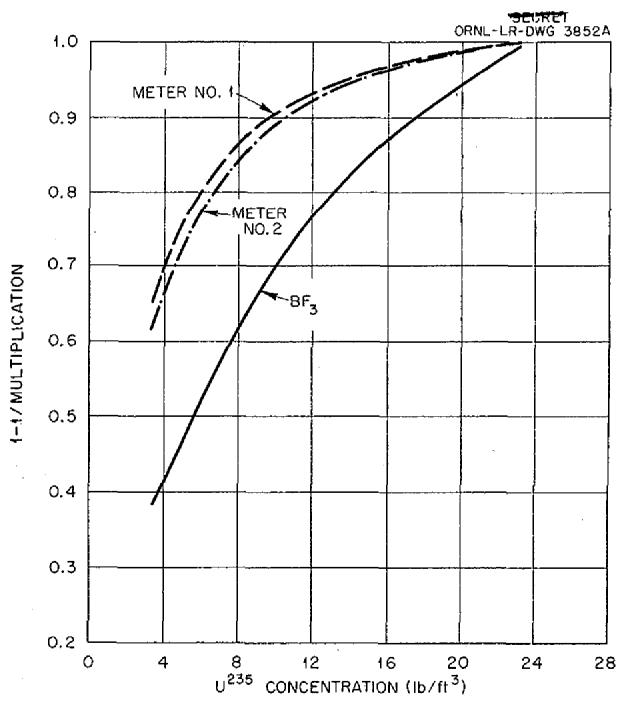  
Fig. 1.1. Approach to Criticality.

obtained from subsequent analyses of fuel samples, together with the known amounts of concentrate added.) While the total amount of uranium $(U^{235})$ added to the system in order to make the reactor critical was approximately 135 lb, because of the amounts withdrawn from the system for samples and in trimming the pump level, the uranium concentration at criticality was 23.7 lb/ft³; or, since the calculated volume of the $1300^{\circ}F$ core was 1.37 ft³, the "cold," clean critical mass of the reactor was 32.5 lb of $U^{235}$ .

# Low-Power Experiments

Several "experiments" were performed on the critical reactor at low power, including reactor power and rod calibrations. In addition, the effects of the process system parameters on reactivity were noted, and a preliminary measurement of the temperature coefficient was undertaken. The tests were started on the morning of November 4 and were completed by noon on November 8.

The regulating rod was calibrated both by the addition of fuel and by a determination of the resultant pile period upon withdrawing the rod

(as derived from the inhour equation). The value of the rod was first obtained by noting the amount of rod insertion required to maintain a constant power level as a finite amount of fuel was added to the system. This information, together with a calculated value of the mass reactivity coefficient $(\Delta k / k) / (\Delta m / m)$ of 0.232, permitted a determination of the value of the rod. The technique of rod calibration by pile period was also employed both at design fuel flow (48 gpm) and with no fuel flow. The data from each of these tests are presented in Fig. 1.2. Although there is considerable scatter, the data from the different rod calibration techniques appear to be mutually confirmatory, and a rod value of 0.032 $\Delta k$ /in. obtained from the data was used throughout the remainder of the experiment. It should be noted, however, that the period calibration with no flow is believed to give the best data, since the inhour equation is applicable without correction and the resultant value of the rod is not dependent on a reactivity coefficient.

The reactor power was first estimated from the fission chamber counting rate, but attempts were made to confirm the estimate by operating the

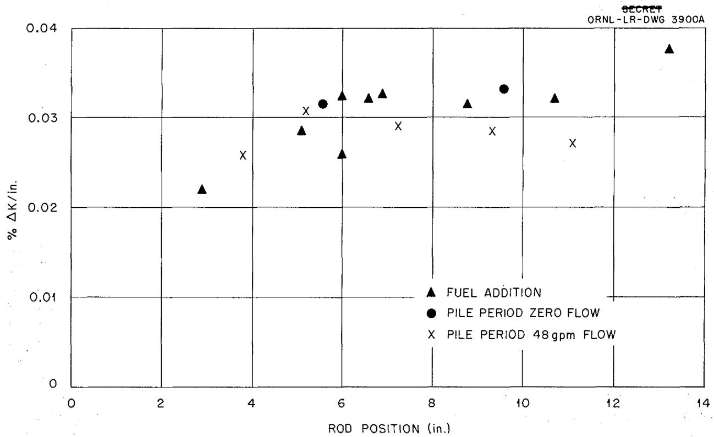  
Fig. 1.2. Calibration of Regulating Rod.

clean reactor at a low power for a 1-hr period and then withdrawing a fuel sample and taking a count of the sample. This calibration was attempted first at an estimated power of 1 w and then at 10 w. The fuel activity from the 1-whr run was too low for an accurate count to be made, but that from the 10-whr run indicated a power of 13.5 w. The nuclear instrumentation was calibrated on the basis of this power determination. It developed later that almost all the volatile, as well as the gaseous, fission products were apparently continuously removed from the fuel at the pump, and consequently the actual power was probably much greater than that indicated by the fuel sample.

Attempts were made to measure the temperature coefficient when the reactor was subcritical and again during the low-power operation. In both instances it was established that the coefficient was negative, and, in the latter case, it was determined that the magnitude was approximately $5 \times 10^{-5} \Delta k / {}^{\circ} \mathrm{F}$ . A more accurate determination of the magnitude of the temperature coefficient was deferred until the high-power runs were made.

As a part of the low-power operation, the shim rods were calibrated in terms of the regulating rod. Each of the three shim rods had approximately $0.15\% \Delta k / \text{in}$ . for most of their 36 in. of travel.

# High-Power Experiments

The reactor was finally taken to high power (estimated at 1 Mw from the nuclear instrumentation) at 6:20 PM, November 9, some six days after it first became critical. This power level was attained after a 30-hr period of operation during which there were periods of operation with power levels of 10, 100, and 500 kw, and finally 1 Mw. Power increases were obtained as anticipated merely by increasing the speed of the blower which cooled the fuel heat exchanger. The high power level could have been obtained at once except for the natural tendency to proceed slowly into such an unexplored regime - a fortunate decision since there was some leakage of gaseous activity from the vent system into the pit and subsequently into the building atmosphere. Further difficulty from this source was circumvented by operating the pit at subatmospheric pressures and remotely exhausting the pit gases to the atmosphere.

Once high power was attained, the reactor was operated at various power levels during the next several days, as required, to complete the desired tests. These tests included measurement of the temperature coefficient of reactivity, a power calibration from the process instrumentation, and a determination of the effect of large increases in reactivity, and they were concluded by a 25-hr run at full power to determine whether there was a detectable buildup of xenon.

The temperature coefficient of reactivity was determined simply by placing the regulating rod on the flux servo and then increasing the speed of the blower cooling the fuel. The change of rod position (converted into reactivity) divided by the change in the reactor mean temperature determined the reactor temperature coefficient. The absolute value of this coefficient was initially quite large, and it decreased after 2 min to a relatively constant value of $-5.5 \times 10^{-5}\% \Delta k / {}^{\circ}F$ . Further analysis of the data is under way to ascertain the precise value of the instantaneous fuel temperature coefficient, which is, of course, the most important characteristic affecting the control of a power reactor. It is certain that this coefficient was considerably larger than was expected and that the reactor was exceptionally stable.

In this, as in any potential power reactor, the reactor behavior as a result of large increases in either reactivity or power demand is of particular interest. With a circulating-fuel reactor operating to produce power, insertion of the safety rods reduces the reactor mean temperature. The power level, on the other hand, is controlled by the rate at which heat is withdrawn from the circulating fuel. The effects of several of these operations are illustrated graphically in Fig. 1.3, which records the reactor inlet and outlet fuel temperatures over a 100-min test. The 12 thermocouple readings on the inlet and outlet of each of the six parallel fuel circuits through the reactor are shown in this figure. At zero time and with a mean temperature of about $1320^{\circ}\mathrm{F}$ , the fuel helium blower speed was gradually increased over a 12-min period until a reactor $\Delta T$ of $250^{\circ}\mathrm{F}$ was obtained. (This temperature difference, as will be shown later, corresponds to a reactor power of approximately 2.5 Mw.) After about 18 min at high power the helium blower motor was turned off, and the temperature gradient was eliminated

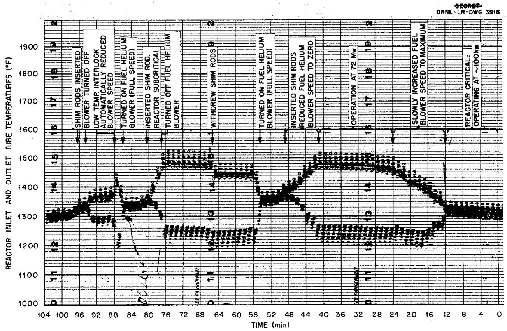  
Fig. 1.3. Power Excursions.

in about 8 min. However, by this time the reactor mean temperature was $1380^{\circ}\mathrm{F}$ , and it was therefore decreased (to $1350^{\circ}\mathrm{F}$ ) by inserting the shim rods. The reactor was again brought from low power to high power in 2 min, and after 8 min at high power the shim rods were withdrawn to increase the mean temperature. It is most significant that during the 2-min interval required to bring the reactor from a nominal power of 100 kw to 2.5 Mw the shortest recorded pile period was only 14 sec. Furthermore, when at high power, group withdrawal of the shim rods $(0.02\% \Delta k / \sec)$ resulted in a pile period of only 10 sec. These two limiting periods were consistently reproducible.

Additional insight into the behavior of the negative temperature coefficient is also afforded by Fig. 1.3. By time 84 min, the blower was off and the reactor power was reduced to about 100 kw. The shim rods were then inserted to make the reactor subcritical. At 86 min, the fuel helium blower was turned on. The higher density

cooled fuel made the reactor critical, and in 2 min a $\Delta T$ of about $200^{\circ}\mathrm{F}$ was obtained. At this time, however, the blower speed was automatically reduced by a low-temperature signal. The blowers were subsequently shut off and the shims inserted.

Although the reactor power level had been calibrated against the activity count of a fuel sample, the actual reactor power remained in doubt throughout the experiment, not only because of uncertainty regarding the retention of fission products by the fuel but also because of discrepancies in heat balances in the process systems, that is, heat removed from fuel and sodium vs heat picked up in their water heat dumps. While the causes of these discrepancies are now being analyzed in detail, the most reliable estimate of the reactor power is believed to be that obtained from the temperature differences and flows in the fuel and sodium systems. During one typical period of power operation, the fuel $\Delta T$ of $370^{\circ}\mathrm{F}$ at 45 gpm accounted for more than $1.9\mathrm{Mw}$ in the fuel, while the sodium $\Delta T$ of $115^{\circ}\mathrm{F}$ at 150 gpm accounted

for more than $0.6\mathrm{Mw}$ in the sodium, which result in a total reactor power in excess of $2.5\mathrm{Mw}$ . The temperature differences quoted were obtained from the fuel pipe temperatures to and from the reactor at the time the reactor inlet and outlet core tube temperatures (as shown in Fig. 1.3) recorded a $\Delta T$ of only $250^{\circ}\mathrm{F}$ . While there are several possible phenomena which could contribute to these low core tube temperatures (external cooling, surface layers, radiation, etc.), there were 10 to 15 thermocouples on the inlet and outlet pipes which gave consistent readings. The outlet pipe temperature was at an equilibrium of $1580^{\circ}\mathrm{F}$ and was in excess of $1600^{\circ}\mathrm{F}$ during transients.

The last scheduled experiment to be conducted on the reactor was a measurement of the xenon buildup during a 25-hr run at high power. The amount of xenon buildup was observed by the amount of regulating rod which had to be withdrawn in order to maintain a constant power level. However, during the 25-hr power run the regulating rod had been withdrawn only 0.3 in., or one-thirtieth the amount calculated on the assumption that the xenon would remain in the fuel.

The scheduled tests were completed by 8:00 AM, November 12. The reactor operation was then demonstrated for all those who attended the ANP Information Meeting on Friday, November 12. During the 12-hr period of 8:00 AM to 8:00 PM, the reactor power was cycled 21 times. The resulting temperature cycling was probably as severe as that to which an aircraft reactor would be subjected. At 8:00 PM, November 12, with the scheduled experimental program completed and over 100 Mwhr of operation logged, the reactor was made subcritical, but circulation of the fuel and sodium was continued. The following morning, the fuel and then the sodium were dumped into their respective dump tanks.

# Mathematical Analysis of Approach to Critical

W. E. Kinney

Aircraft Reactor Engineering Division

When the ARE was brought to critical by successive fuel additions, it was observed that the usual plot of [1 - (1/multiplication constant)] vs uranium concentration increased, at first, very rapidly, but, when the curve got close to 1, the rise was very slow. Qualitatively, such behavior is observed in many reactors, but the ARE exhibited the effect to an unusual degree. In order

to explain this, the ORACLE three-group, three-region code was modified so that flux shapes at successive fuel additions could be calculated. Group constants were obtained by flux weighting with fluxes from an Eyewash calculation on the ARE.

Figure 1.4 shows the space distribution of the thermal flux for no fuel and for runs 2 through 6. The effect of the reflector as fission neutrons become more numerous can be seen. Figure 1.5 compares experimental and calculated startup curves for the fission chambers which were located in the reflector as indicated in Fig. 1.4. In the calculation,

$$
C R \sim \sigma_ {f _ {1}} \phi_ {1} + \sigma_ {f _ {2}} \phi_ {2} + \sigma_ {f _ {3}} \phi_ {3},
$$

where $CR$ is the counting rate of the fission chamber, $\sigma_{f_i}$ is the fission cross section for group $i$ , and $\phi_i$ is the group $i$ flux. For the ARE startup

$$
m = \frac {C R _ {j}}{C R _ {0}},
$$

where $m$ is the multiplication constant, $CR_{j}$ is the counting rate on run $j$ , and $CR_{0}$ is the counting rate with no fuel. It seems, then, that the unexpected, rapid initial rise in the counting rate of the fission chamber and the $[1 - (1 / m)]$ curve is due not only to the general rise in flux level but also to the formation of the thermal-flux maximum near the fission chambers. Once the shape of spatial distribution of the thermal neutron flux is set up, the fission chambers register only the general increase in flux level and the count rate increases slowly.

# OPERATION OF ARE PUMPS

W. G. Cobb

A. G. Grindell

W.R.Huntley

Aircraft Reactor Engineering Division

The operation of the ARE pumps during the prenuclear and nuclear phases of the experiment can be regarded as successful. A total of 635 hr of operation at high temperature was accumulated with the sodium system pump and 462 hr with the fuel system pump. The latter total includes 169 hr with fuel carrier, 220 hr with critical fuel but no heat removal, and 73 hr with heat removal.

The preoperation check of the ARE pumps consisted in a functional check of the seal gas

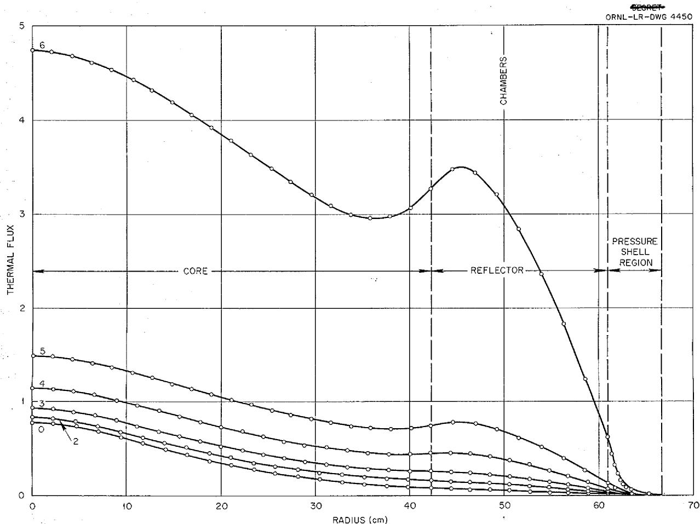  
Fig. 1.4. ARE Thermal Flux vs Radius.

balancing systems, installation of a vacuum sink on the reactor-fuel inlet-pressure-transmitter pilot valve to protect the pressure transmitter during the vacuum fill of the fuel system, installation of a gas nozzle antiplugging device on the fuel pump tank to reduce the zirconium fluoride vapor-condensate plugging problem, and a functional check and setting of low-flow alarms on water and lubricating oil systems.

After about 24 hr of hot prenuclear operation, some noises from the bearing housing of the main fuel pump were noted. This disturbance was first heard on the crystal noise pickups. After many increases and decreases in intensity, the noise finally subsided, and the bearing housing performed quietly during the sealed pit operation. No detectable increase in drive-motor power occurred during the time the noises were heard.

During the filling of the fuel system and subsequent nuclear operation, there was some leakage from the gas space of the main fuel pump tank. This pump tank served as a fluid expansion and degassing chamber, as well as the pump sump tank. The gas leakage may have been associated with any or all compression joints (spark plug probes, Swagelok fittings), with any welded gas flange seal, or with the two compression joints in the rotary element.

The water and the lubricating oil auxiliary systems on all four pumps (including two standby pumps) functioned without incident during the entire experiment. The seal gas-balancing systems on the pumps also functioned without incident.

The liquid level indicating probes on the two sodium pumps and on the main fuel pump (the standby fuel pump was isolated from the fuel

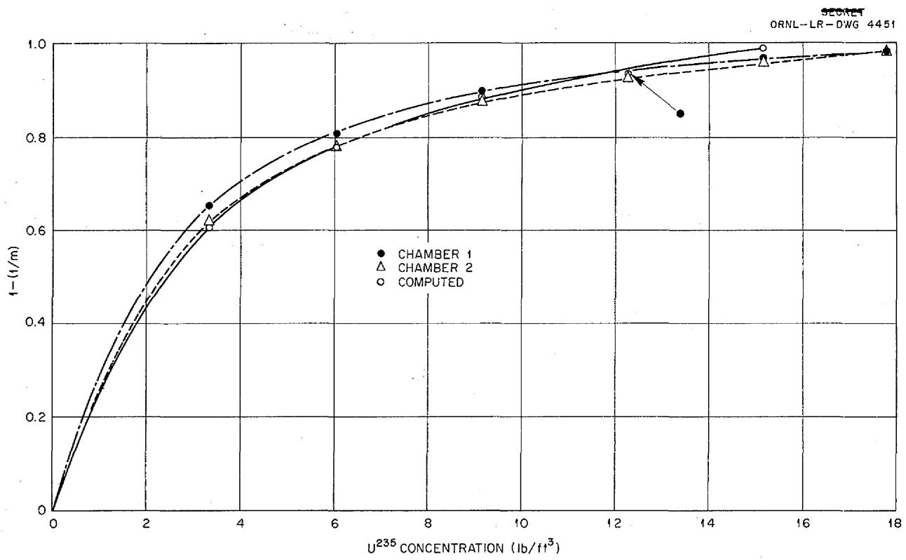  
Fig. 1.5. $[1 - (1 / m)]$ vs $U^{235}$ Concentration for ARE.

system) functioned satisfactorily. The maximum level probe in the main sodium pump tank shorted occasionally, but it subsequently cleared. Application of the "short burner" (high current source to separate accumulated condensate from the probe) had no effect. The maximum operating level probe in the main fuel pump tank shorted several times during early stages of hot operation. Each time, the short was cleared instantaneously by use of the short burner. After approximately five such occurrences, the circuit was arranged for continuous burning, and no further indication of shorting appeared.

The pump power-transmitting V-belts functioned satisfactorily during the entire experiment. The effect of radiation damage upon the belts may be determined upon inspection.

The power traces indicated good operation of the pumps under load. The voltage regulation of the pump motor supply (an a-c-d-c motor generator set) became somewhat unsteady with passage of time. This unsteadiness of voltage regulation could be seen in pump speed and motor current indications.

The pump tachometer generators performed well after some initial troubles were corrected. The tachometer generator on the main fuel and main sodium pumps failed during the prenuclear hot operation. These failures, it is believed, can be traced to improper fit-up of the generator shaft into inner races of ball bearings and, possibly, to excessive tension on the V-belt.

Indications were that the ambient temperature was approximately $175^{\circ}F$ in the pump region during the nuclear and power runs. This is the highest ambient temperature to which ARE pumps have been subjected, but the rotary elements functioned satisfactorily at this temperature. The lubricating oil and the water temperatures were maintained at about the values experienced during hot shakedown development and acceptance testing.

The vapor trap installed in the main fuel pump of the ARE system was used successfully during the enrichment procedure. Several hundred cubic feet of gas was vented through it. The heated line and trap were still open at the termination of the experiment. A report on the vapor trap design

and operation is being prepared. Modifications of this vapor trap design could be used on other fused salt systems in which reliable gas connection is important.

# LOADING OF THE ARE

G.J.Nessle

C. M. Blood

J. E. Eorgan

F. P. Boody

N.V. Smith

C.R.Croft

J. Truitt

Materials Chemistry Division

F. A. Doss

R. Wiley

Aircraft Reactor Engineering Division

Final preparations and installations for the loading of the ARE were completed during the month of October. Transfer of the barren carrier $(\mathsf{NaF - ZrF}_4,50 - 50$ mole $\%$ into the ARE fill tank No.2 was completed in approximately 43 hr without incident. Approximately 2750 lb of carrier was loaded into the fill tank, and sufficient material was on hand to fill the fuel system to its operating liquid level.

The enriched fuel storage tank had previously been loaded with 60 lb of carrier material for practice injections into the reactor. Tests indicated that the semiautomatic enrichment system was inadequately heated, and therefore equipment for addition of portions of the fuel concentrate $(\mathrm{Na}_2\mathrm{UF}_6)$ directly to the circulating fuel pump was designed and assembled.

In order to provide adequate means for approaching criticality safely, some of the original 30-lb batches of concentrate were reduced to 10-lb batches, and, similarly, to provide accurate measurements for calibration of the control rods after criticality, 12 small batches of approximately 0.5-lb size were prepared from a 30-lb batch.

The injection system consisted of a main concentrate can (containing 30, 10, or 0.5 lb as required) connected to an intermediate transfer can by a resistance-heated $\frac{1}{4}$ -in. Inconel tube. The intermediate transfer can was designed so that it could be filled to a predetermined level (approximately 5.5 lb) when the 10- or 30-lb batches were in position to be transferred. The 0.5-lb batches were transferred through a smaller intermediate can, which contained the entire small batch each time of transfer. The intermediate can was, in turn, connected to the fuel pump. The main transfer line to the pump was heated by calrod units, while the nozzle within the pump

was heated by resistance heating. The close tolerances of the injection nozzle resulted in an inherent tendency to short out and cause the nozzle tip to be cold. This, coupled with the drainage of high-melting-point material from the long transfer line, always presented the possibility of a frozen-fluoride plug.

The first 30 lb of concentrate was injected into the fuel pump without apparent difficulty. After this injection, however, difficulties in the form of line plugs and venting troubles frequently occurred. After 48 hr, most of these problems were under control, and loading of the enriched concentrate proceeded smoothly. The reactor was brought to criticality, and small injections of 0.5-lb batches were made for the control rod calibrations. At the completion of the final small addition, the transfer line broke and simultaneously plugged at the injection nozzle. Efforts to repair the damage were fruitless, and the final injection of 30 lb of the concentrate to allow ARE operation at power was made through the sample line into the pump.

# ANALYSIS OF LEAK IN SODIUM SYSTEM

E. E. Hoffman

W.H.Cook

C. F. Leitten

Metallurgy Division

The sodium system of the ARE was filled initially on September 26, 1954, but the sodium had to be dumped on September 27 because of a leak at a tube bend in the sodium purification system. The section of austenitic stainless steel pipe in which the leak occurred was located just ahead of the filter traps. The system had been filled with sodium for 37 hr and had reached a maximum temperature of approximately $1150^{\circ}\mathrm{F}$ before the leak was detected. A portion of the section removed and the location of the leak are shown in Fig. 1.6. The leak occurred where a metal thermocouple protection tube had been attached to the stainless steel pipe by Heliarc welding. The attack around the weld was due to the formation of sodium oxide as the sodium leaked through the weld. The inside of the pipe at the weld may be seen in Fig. 1.7. An excessive amount of penetration was obtained during the welding operation. The large weld nugget cracked during cooling after welding. A cross section of the weld crack is shown in Fig. 1.8. Examination of the pipe in this section revealed

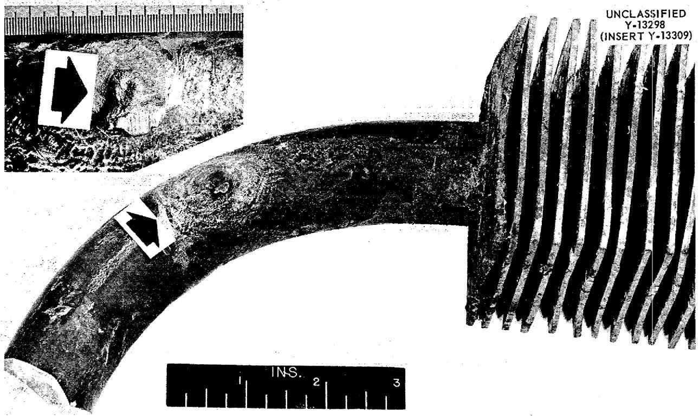

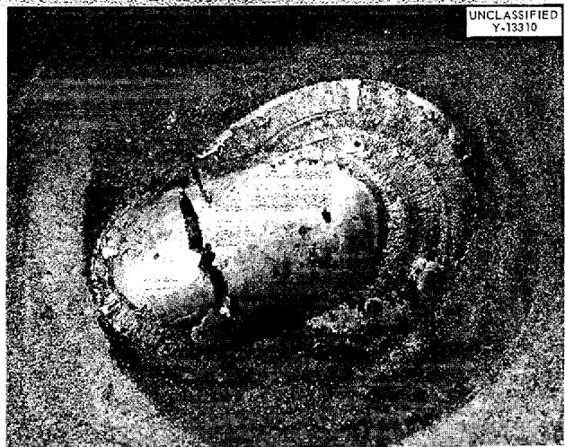  
Fig. 1.6. Section of Tube Bend Showing Location of Sodium Leak in Type 347 Stainless Steel Pipe Where Thermocouple Well Had Been Attached. Inset shows location of leak at higher magnification.   
Fig. 1.7. Inside View of Crack in Thermocouple Weld. 12X. Reduced $27\%$ .

a variation in wall thickness from 76 to 135 mils, and the spectrographic examination revealed that two pieces of pipe in this section were type 347 stainless steel, while the other two were type 316 stainless steel. Chemical analyses of three sodium samples taken from this section indicated an average sulfur content of 31 ppm. The actual cause of the excessive penetration can probably be attributed to a lack of knowledge on the welder's part of the variations in pipe wall thicknesses in this section.

# PRELIMINARY ESTIMATES OF CORROSION IN ARE

W.R.Grimes D.R.Cuneo Materials Chemistry Division

It was possible to withdraw samples of the ARE fuel for analysis during operation of the reactor

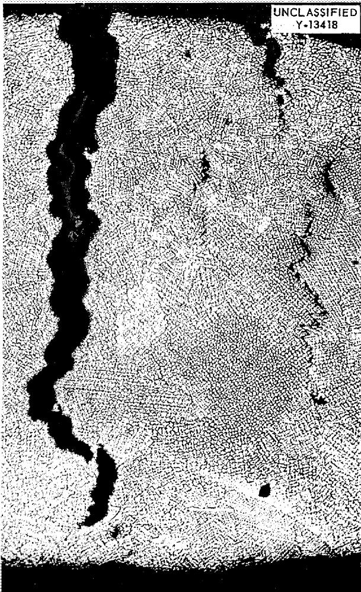  
Fig. 1.8. Cross Section Through Thermocouple Weld Crack.

below criticality or at very low power levels. Samples were withdrawn by pressurizing the pump bowl sufficiently to cause flow through a heated Inconel tube into a sampling device, which was constructed to allow line flushing before collection of the sample.

Analyses of the samples were carried out by the ANP Analytical Chemistry Group and are shown in Table 1.1. As may be seen, the chromium content of the fuel was essentially constant at 100 ppm after 155 hr of circulation of the fuel carrier through the reactor. If corrosion of the Inconel is assumed to have been uniform over the surface of the system - and since it was operating isothermally during this period, such an assumption is reasonable - the chromium concentration of 100 ppm would represent about 0.5

TABLE 1.1. ARE FUEL SAMPLE ANALYSES   

<table><tr><td>Hours After Filling with Barren Carrier</td><td>Uranium (wt %)</td><td>Chromium (ppm)</td></tr><tr><td>19</td><td></td><td>81</td></tr><tr><td>60</td><td></td><td>90</td></tr><tr><td>110</td><td></td><td>102</td></tr><tr><td>155</td><td></td><td>100</td></tr><tr><td>157</td><td>1.84</td><td>150</td></tr><tr><td>178</td><td>3.45</td><td>190</td></tr><tr><td>182</td><td>5.43</td><td>200</td></tr><tr><td>205</td><td>9.54</td><td>205</td></tr><tr><td>242</td><td>12.21</td><td>300</td></tr><tr><td>246</td><td>12.27</td><td>320</td></tr><tr><td>268</td><td>12.54</td><td>378</td></tr><tr><td>286</td><td>12.59</td><td>420</td></tr><tr><td>307</td><td>13.59</td><td>445</td></tr></table>

mil of attack on the Inconel.

As was anticipated, the chromium content of the melt was found to increase a few hours after each addition of fuel concentrate $(\mathrm{Na}_2\mathrm{UF}_6)$ . By the time the final sample was taken, after 307 hr of molten fluoride circulation, the chromium content was found to be 445 ppm. Again, if a uniform rate of attack of the Inconel is assumed and if the removal of circulated material from the system during this time (to maintain desired pump liquid level) is taken into account, this chromium content would represent about 5 mils of attack on the Inconel system. If the data in Table 1.1 are plotted as chromium content vs time, it is seen that the chromium content had begun to level off by the time the final sample was taken. A projection of the slope of the chromium curve indicates a maximum chromium concentration of about 600 ppm after several hundred hours of operation.

There is no doubt that mass transfer of chromium metal began soon after power operation started, since there were then large temperature differentials across portions of the system. Sampling was not possible at this time and could not, of course, have given information on mass transfer. Heat transfer characteristics of the ARE did not appear to have changed during its 150 Mwhr of operation, and so whatever mass transfer occurred was unimportant. Details of mass transfer will be studied when sectioning of the equipment becomes possible.

# 2. REFLECTOR-MODERATED REACTOR

A. P. Fraas

Aircraft Reactor Engineering Division

Analytical studies, layout work, and detail design have proceeded on both the reactor assembly and the installation for the Aircraft Reactor Test (ART), formerly the Circulating-Fuel Reactor Experiment (CFRE). Work has also continued on the component development tests outlined in the previous report. Reports have been completed on the high-power-density beryllium thermal stress test and the first fuel-to-NaK heat exchanger test. Specifications have been completed for radiators to be used as heat dumps in heat exchanger tests. It is expected that essentially the same specifications can be used for procurement of the radiators for the ART heat dumps and that endurance test experience gained in the course of these small heat exchanger component development tests will establish the reliability of the product of at least one vendor.

# EXPANSION-TANK AND XENON-REMOVAL SYSTEM

G. Samuels

Aircraft Reactor Engineering Division

W. Lowen, Consultant

Recent work on the expansion-tank, fuel-pump, and xenon-removal system has been directed primarily toward the development of a hydraulic circuit that performs all the various functions required of the system. The basic components and their principal functions were described in an earlier report4 and may be summarized as follows: (1) an orifice for bypassing a metered amount of fuel from the main system for processing; (2) a swirl chamber for producing a large gas-liquid interface area by violent agitation and gas entrainment in order to effect the prompt release of xenon from the fuel and for providing an expansion space

for the main fuel system with a liquid surface that is stable for all attitudes (in flight); (3) a centrifuge cup integrally mounted on the back of each fuel pump impeller for degassing the processed fuel, pumping the processed fuel back into the main system, and providing a seal for the fuel pump.

Several Lucite models that differ in component design and circuit arrangement have been built and tested, and they have led to the design illustrated in Fig. 2.1. In this model the swirl chamber is mounted between the two fuel pumps and raised above the centrifuge cups to assure their priming under starting conditions. The swirl in the chamber is produced in two ways: by nozzles located in the swirl chamber floor and by swirl pumps which are needed to maintain a high swirl velocity when the fuel level rises above the $25\%$ full condition owing to thermal expansion in the main system. The nozzles and swirl pumps are arranged to deliver high-velocity fuel jets tangentially at the periphery of the swirl chamber to give good agitation and to assure a strong centrifugal field and a stable free surface.

The nozzles serve both to meter the bleed flow through the expansion tank and to control the fuel pump suction pressure relative to the swirl chamber gas pressure. This important function is perhaps more evident in the schematic circuit analog presented in Fig. 2.2. By tracing the bleed flow, it can be seen that the pressure drop across the nozzles approximates the heat exchanger resistance. Consequently, the fuel pump suction pressure is maintained near the helium pressure existing in the swirl chamber.

The configuration of nozzles and parts is so proportioned as to oversupply the centrifuge fuel flow demand in order to minimize the possibility of the centrifuge becoming empty, especially during speed transients. The excess fuel to the centrifuge is diverted by the flow-split stator to the swirl pump, which, as previously described, ejects this fuel back into the swirl chamber. This arrangement of incorporating a secondary circuit within the bleed circuit contributes toward stabilizing the three free surfaces inherent in this layout.

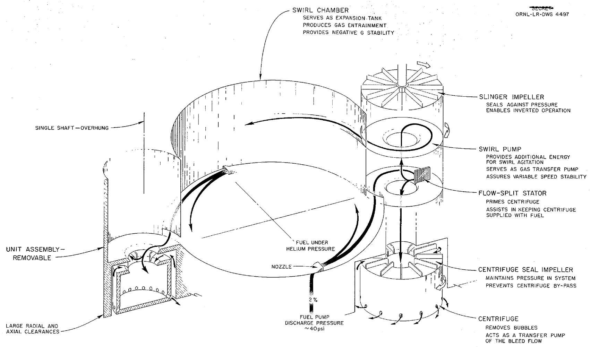  
LdOeRss   
Fig. 2.1. Expansion-Tank and Xenon-Removal System.

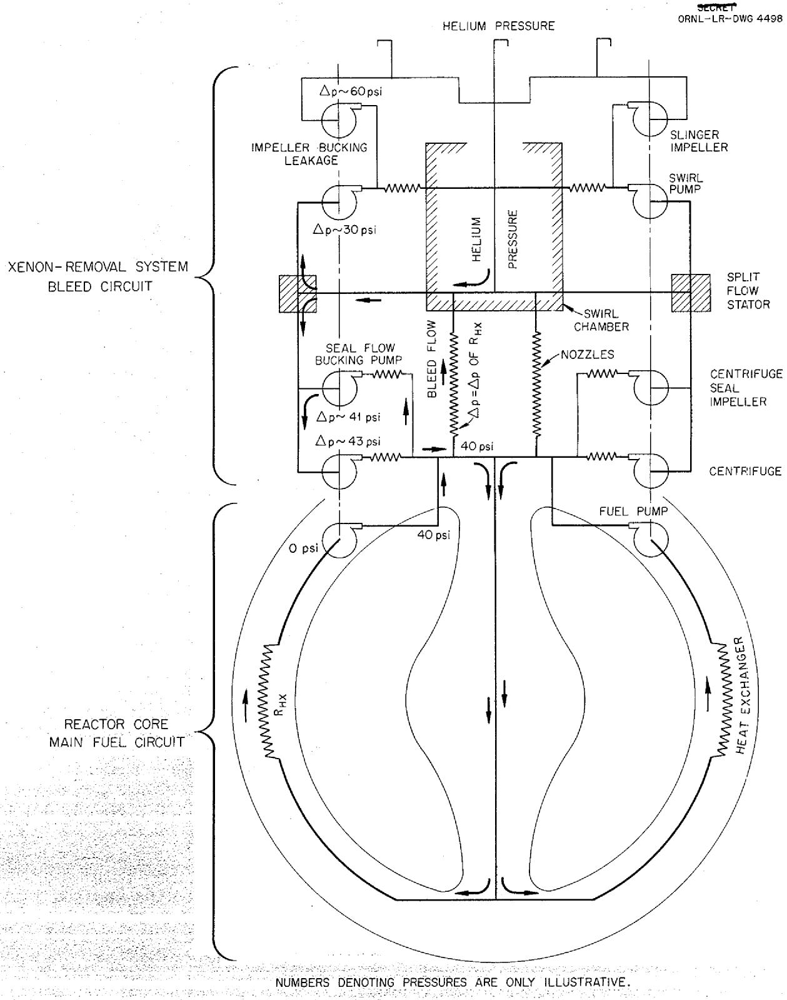  
Fig. 2.2. Xenon-Removal System Circuit Analog.

The addition of the swirl pump made it necessary, however, to replace the slinger ring, previously employed, with a slinger impeller in order to buck any leakage from the swirl pump. Although the complete assembly has not yet been tested in an inverted position, the slinger impeller seems to be very effective. A similar arrangement is now being tried as a means of controlling the leakage from the main pump discharge through the clearance between the impeller and the casing past the centrifuge. More conventional sealing arrangements were found to be ineffective because of the abnormally large radial clearances (0.060 in.) specified in the design objectives. Initial tests currently in progress with the centrifuge seal impeller have been quite promising. Although no detailed studies of the off-gas system and fuel pill addition system have been made, the changes in the xenon-removal system will make it necessary that the off-gas system connection and the fuel pill addition be made through the swirl chamber rather than through the pump housing as illustrated previously.[5]

# CONTROL ROD DESIGN CONSIDERATIONS

The design of the ART has been predicated on the belief that no fast-moving control rods will be required because of the inherent stability of the reactor that will arise from the strong negative temperature coefficient of the circulating fuel. It is further expected that only about $1\% \Delta k / k$ will be required to compensate for xenon poisoning, since it is anticipated that with the bypass expansion tank and gas-scrubbing system planned, the xenon will be removed almost as rapidly as it is formed. It is expected that compensation for burnup and the accumulation of fission-product poisons can be effected by adding pills of solid fuel having a high percentage of U235. Thus the principal function of the control rod will be to control the mean temperature level of the reactor fuel. Since the temperature coefficient will probably be approximately $5\times 10^{-5}\Delta k / k$ per $^\circ C$ and since a temperature level variation of the order of $150^{\circ}C$ will probably be required, provision of a $\Delta k / k$ of $1 \%$ in the control rod for temperature level control should be more than adequate. In reviewing the various requirements for control, it thus follows that a control rod having a total $k_{\text{eff}}$ of $2 \%$ should prove to be adequate. This reactivity

can be readily incorporated in a single slow-moving control rod. It would seem entirely adequate to move this control rod at a rate of $1\% \Delta k / k$ per minute, a slow and conservative value.

The size and stroke of the rod are important considerations. Two items of experimental data are available to indicate the size of the rod required. In the course of the second reflectormoderated reactor critical experiment (that making use of powdered fuel placed inside $1\frac{1}{8}$ -in.-square aluminum tubes), it was found that with an 18-in.-dia core and a 9-in.-dia island a control rod effectiveness of about $0.6\% \Delta k / k$ was obtained from a $3\frac{1}{6}$ -in.-OD stainless steel tube filled with powdered boron to a density of about $50\%$ and inserted in one-half of the critical experiment assembly. A second indication of the effectiveness of control rod material is available in that a piece of gadolinium oxide approximately the diameter and thickness of a 25-cent piece was inserted at the center of the island in the three-region octahedron critical assembly (without core shells). The value of this gadolinium oxide wafer was found to be approximately $0.2\% \Delta k / k$ . Some additional data are also available from multigroup calculations. All these data seem to indicate that a rod approximately $3/8$ to $1/2$ in. in diameter having a stroke of approximately 20 in., about $7\frac{1}{2}$ in. of which would be below the equator, should prove adequate to give a $\Delta k / k$ of $2\%$ .

The heat generation to be expected in the control rod will establish the amount of cooling that will be required and, to a large degree, much of the detail design of the rod. The heat generation, in turn, is dependent, in part, on the number of neutrons absorbed in the rod at full power. Multi-group calculations indicate that $1.3\%$ of the neutrons produced will be absorbed in a control rod having a $\Delta k / k$ of $1\%$ , if it is assumed that the average effectiveness of the control rod is half that of the portion at the center of the island. Thus a control rod having an effectiveness of $2\%$ $\Delta k / k$ would, when in the "full in" position, absorb $2.6\%$ of the neutrons. If a value of 3 Mev per neutron absorbed is assumed, the energy associated with neutron absorption in the control rod would amount to $0.039\%$ of the total power generated in the reactor. This would total $24\mathrm{kw}$ for a 60-Mw power level. The control rod cooling requirement would be a minimum if gadolinium rather than boron were used as the absorbing material in the rod. This

would mean that most of the energy associated with the hard capture gammas emitted from the gadolinium would appear as heat in the surrounding moderating material rather than in the gadolinium. Thus a gadolinium rod would have the advantage that relatively little of the heat associated with neutron captures in the rod would appear in the rod, and therefore little provision for cooling would be required. On the other hand, if boron were used, the very short range alpha emitted from neutron captures in boron would cause virtually all the energy associated with the neutron capture to appear in the boron.

The principal heating in a gadolinium rod would be that induced by gammas from the fuel region. For a 60-Mw reactor it appears that the power density in the gadolinium from this source would amount to about $20\mathrm{~W/cm}^3$ . Estimates indicate that about $20\mathrm{~cm}^3$ of gadolinium would be required. The total power generation in the rod from gammas from the fuel region would amount to approximately $400\mathrm{~W}$ , or about one-sixtieth the power generation in a boron rod. It should be noted that gadolinium oxide is available at a cost of about $\$4000/\mathrm{lb}$ and that it can be fabricated readily by using conventional ceramic techniques.

Cooling of the rod presents quite a number of problems. If the rod were immersed in flowing sodium, cooling would present no problem. However, the control rod actuating mechanism would have to operate, to some degree at least, in sodium, and self-welding might present some difficult problems. If the rod were placed in a thimble in the center of the core and an atmosphere of helium were maintained in the thimble, it might be possible to effect cooling through radiation or conduction from the rod material to the sodium-cooled walls of the thimble. This sort of an arrangement might prove to be satisfactory with a rod made of gadolinium oxide or of hafnium carbide, since the bulk of the energy associated with neutron captures in the rod material would appear as heat in the surrounding moderator.

If a gas-filled thimble were used to separate the rod from the sodium, it would appear to be essential to place some sort of a dome over the top of the thimble. The dome would be necessary to contain the sodium in the event of a rupture of the thin-walled thimble, which would, in effect, constitute a frangible diaphragm. It is possible that helium might be circulated over the rod to cool it, in which case the outboard end of the control rod

mechanism could include a heat exchanger so that the heat would be removed from the circulating helium and transmitted to the shield water. Unfortunately, such a system would be dependent on the satisfactory operation of quite a number of moving parts, always a likely source of trouble.

# FILL AND DRAIN SYSTEM

A good, reliable, relatively simple fill-and-drain system incorporating a quick disconnect coupling suitable for remote operation with high-temperature liquid systems is clearly needed. In the design of the ARE, fixed tanks with remotely operated valves were used in order to avoid a remotely operated coupling. This approach led to a quite complicated collection of tanks, plumbing, and valves, and to somewhat clumsy arrangements for system drainage.

The requirements of such a system are fairly straightforward. In the first place, a good coupling that can be operated remotely and that will be dependably pressure-tight is required. This coupling must be relatively insensitive to alignment both as to concentricity and to parallelism of the axes of the mating flanges or surfaces. A reliable pressure-tight valve on either side of the coupling must be provided so that, after the coupling has been made, the space between the valves can be evacuated and then purged with helium. The valves on either side of the coupling can then be opened and the filling or draining operation carried out. Upon completion of the operation, the upper valve can be closed and the space between the valves cleared of liquid by several short blasts of helium. The lower valve can then be closed and the coupling broken. Scavenging the space between the valves is very important, partly to minimize the possibility of oxidation of droplets of material between the valves and their consequent entrainment in later filling and draining operations and partly to minimize the amount of radioactivity that might be emitted to the atmosphere. All this implies that the volume and surface area between the two valves should be minimized and that the geometry should be such as to facilitate drainage and to expedite blowing the space clean with a gas stream after the filling or draining operation.

Other requirements of the fill-and-drain system include provision for accurate measurement of the quantity of fluid in the drain tank at all times during either the filling or the training operation. This is particularly important in connection with

reactor fuel systems because it is essential that the exact amount of fuel in the reactor be known at all times. One good way of measuring the quantity of liquid in the tank would be to support the tank on two Hagan Thrustorq units. This should give an instantaneous measure of the weight of the tank to an accuracy of $1\%$ of full-scale reading.

Design work is under way on a system to fill the above-specified requirements. Complete tests of mockups of proposed designs will be made before the final design is chosen.

# DESIGN PHYSICS

W. K. Ergen

Aircraft Reactor Engineering Division

The comparison between multigroup calculations and critical experiments on three-region reflectormoderated reactors has shown a certain amount of discrepancy, which must be overcome by adjusting the constants used in the calculations. Investigations were made with the ultimate aim of obtaining simpler expressions for the critical mass and power distribution for reflector-moderated reactors. This was done in the hope that these simpler expressions could be fitted to the experiments by adjusting of constants and that this fitting might be as satisfactory as the one employed for the multigroup calculations. The three-group ORACLE calculations of the approach to criticality of the ARE (see Sec. 1) gave a satisfactory explanation of the strange results observed during the experiment. An example of the calculations performed for the ART is the following calculation of the activation of the Inconel core shells.

# Activation of the Inconel Core Shells

H.W.Bertini

Aircraft Reactor Engineering Division

An attempt was made to estimate the activity of the Inconel core shells on the inside of a 60-Mw reflector-moderated reactor after the reactor had been operating for 1000 hr. The activity will come from two main sources: the activity of the cobalt in the Inconel and the activity of the fission

fragments that strike the Inconel and remain there.

The method described below for obtaining the estimate gives an order of magnitude of the total activity. Reasonable approximations are used to simplify the calculations, and, in this way, many of the details that a more complete analysis would require are circumvented, and yet the required accuracy of the calculations is maintained.

To obtain the activity due to the cobalt, the total flux at the surface of the Inconel is obtained. This flux is multiplied by the product of the microscopic cross section of cobalt times the total number of cobalt atoms in the core shells. This gives the total number of cobalt atoms being activated per second. Multiplication of this number by 1000 hr gives the total number of cobalt atoms activated during the reactor lifetime. Since the half life of cobalt is so long (5 years) compared with the reactor lifetime, the decay of the excited cobalt atoms can be assumed to be constant, and therefore the disintegration rate can be taken as $\lambda N$ , where $\lambda$ is the decay constant of cobalt, and $N$ is the total number of cobalt atoms activated during the lifetime of the reactor.

The following values were used for the calculations:

$$
\text {R e a c t o r p o w e r} = 6 \times 1 0 ^ {7} \mathrm {w}
$$

$$
\text {T o t a l m a s s o f} U ^ {2 3 5} \text {i n t h e c o r e} = 2. 5 \times 1 0 ^ {4} g
$$

$$
D e n s i t y \text {I n c o n e l} = 8 \mathrm {g} / \mathrm {c m} ^ {3}
$$

$$
\text {Weight per cent of cobalt in the Inconel} = 0.1 \%
$$

$$
\text {H a l f} = 5 \text {y e a r s}
$$

$$
\overline {{\phi}} _ {s} = 2 \times \overline {{\phi}} _ {\text {r e a c t o r}}
$$

$$
1 \text {c u r i e} = 3 \times 1 0 ^ {1 0} \text {d e c a y s / s e c}
$$

$$
\sigma_ {f} ^ {\mathrm {U}} = 5 5 0 \text {b a r n s}
$$

$$
\sigma_ {a} ^ {\mathrm {C o}} = 3 5 \text {b a r n s}
$$

The total mass of Inconel in the core shells of the reactor is approximated by the mass of two spherical Inconel shells, one with a 15-cm radius and the other with a 25-cm radius, each shell being 0.3 cm thick. Then,

$$
\begin{array}{l} \overline {{\phi}} _ {s} = 2 \times \frac {\text {(t o t a l f i s s i o n s / s e c)}}{\sigma_ {f} ^ {U} \times (\text {t o t a l U} ^ {2 3 5} \text {a t o m s})} \\ = 2 \times \frac {6 \times 1 0 ^ {7} w \times 3 \times 1 0 ^ {1 0} (\text {f i s s i o n s / w - s e c})}{\left(5 5 0 \times 1 0 ^ {- 2 4} \times \frac {6 \times 1 0 ^ {2 3} \times 2 . 5 \times 1 0 ^ {4}}{2 3 5}\right) (\text {f i s s i o n s / n e u t r o n - c m} ^ {2})} \\ = 1 \times 1 0 ^ {1 4} (\text {n e u t r o n s / c m} ^ {2} \cdot \sec). \\ \end{array}
$$

The total number of cobalt atoms in the liner is

$$
\begin{array}{l} N _ {\text {t o t a l}} ^ {\mathrm {C} _ {\circ}} = \left[ 8 (\mathrm {g} \text {o f I n c o n e l} / \mathrm {c m} ^ {3}) \times 4 \pi (2 5 ^ {2} + 1 5 ^ {2}) (\mathrm {c m} ^ {2}) \times 0. 3 \mathrm {c m} \times 1 0 ^ {- 3} (\mathrm {g} \text {o f C o} / \mathrm {g} \text {o f I n c o n e l}) \right. \\ \times 6 \times 1 0 ^ {2 3} (\text {a t o m s o f C o / g - a t . o f C o}) ] \div 5 9 (g o f C o / g - a t. o f C o) \\ = 2. 6 \times 1 0 ^ {2 3}. \\ \end{array}
$$

The activations per second are

$$
\begin{array}{l} P = \bar {\phi} _ {A} \times N _ {\text {t o t a l}} ^ {C o} \times \sigma_ {a} ^ {C o} \\ = 1 0 ^ {1 4} \times 2. 6 \times 1 0 ^ {2 3} \times 3 5 \times 1 0 ^ {- 2 4} \\ = 9. 1 \times 1 0 ^ {1 4} (\text {a c t i v a t i o n s / s e c}) \\ \end{array}
$$

The total number of cobalt atoms activated is

$$
\begin{array}{l} N _ {A} ^ {\mathsf {C} \circ} = P \times 1 0 0 0 (\mathbf {h r}) \\ = 9. 1 \times 1 0 ^ {1 9} (\text {a c t i v a t i o n s / s e c}) \times 1 0 0 0 (h r) \times 3. 6 \times 1 0 ^ {3} (\sec / h r). \\ = 3. 3 \times 1 0 ^ {2 1}. \\ \end{array}
$$

The activity of the shells due to cobalt activation is given by

$$
\begin{array}{l} A = \frac {(\lambda \times N _ {A} ^ {\mathrm {C o}}) (\text {d i s i n t e g r a t i o n s / s e c})}{3 \times 1 0 ^ {1 0} (\text {d i s i n t e g r a t i o n s / s e c - c u r i e})} \\ = \frac {0 . 6 9}{5 (\text {y e a r s}) \times 3 6 5 (\text {d a y s / y e a r}) \times 2 4 (\text {h r / d a y}) \times 3 . 6 \times 1 0 ^ {2} (\sec / \text {h r})} \times \frac {3 . 3 \times 1 0 ^ {2 1}}{3 \times 1 0 ^ {1 0}} \\ = 4 8 0 \text {c u r i e s}. \\ \end{array}
$$

In calculating the activity of the fission fragments, use is made of Fig. 2 in ORNL-53, which is a curve of the dose from a uranium slug exposed for three years plotted against time after exposure. The dose is given in $\text{mr/hr}$ at 1 meter per watt of exposure.

Calculations now show that 1 curie of 2-Mev gammas gives a dose of approximately $1\mathrm{r / hr}$ at 1 meter. If it is assumed that the average energy of the decay gammas from the fission fragments is 2 Mev (an overestimate), the curve can be used to obtain an estimate of the curies of activity for any time after exposure. However, it is first necessary to calculate the watts of exposure in the regions of the reactor close enough to the Inconel core shells so that the fragments due to fissions will strike the Inconel. This is done by finding the range, $R_{s}$ of the fission fragments in the fuel and again approximating the fuel annulus by a spherical shell of $25~\mathrm{cm}$ OD and $15~\mathrm{cm}$ ID to find the total power generated in the regions adjacent to the Inconel. This power is divided by 2 to account for the fact that approximately one-half the fission fragments generated in this region will impinge on the shells. Since the curve was plotted for a slug exposed for three years, any values obtained by using this curve will be overestimates of the fission fragment activity of a 60-Mw reflector-moderated reactor.

The range of fission fragments is estimated to be 0.001 cm, and the

$$
\begin{array}{l} w a t t s o f e x p o s u r e = 6 \times 1 0 ^ {7} w \times \frac {1}{2} \\ \times \frac {4 \pi (2 5 ^ {2} + 1 5 ^ {2}) \times 1 0 ^ {- 3}}{\frac {4}{3} \pi (2 5 ^ {3} - 1 5 ^ {3})} \times 2 \\ = 1. 3 \times 1 0 ^ {4} w. \\ \end{array}
$$

The last factor of 2 in the above equation is due to the flux at the surface of the Inconel being twice that of the average flux. Some values of the total activation of the Inconel core shells obtained by using the above methods are given in Table 2.1. One conclusion to be drawn from Table 2.1 is that little would be gained by trying to obtain special Inconel with especially low cobalt content; the activity could not be reduced below that caused by the fission fragments.

TABLE 2.1. ACTIVATION OF INCONEL CORE SHELLS  

<table><tr><td rowspan="2">Days After Exposure</td><td colspan="3">Activity (curies)</td></tr><tr><td>Cobalt</td><td>Fission Fragments</td><td>Total</td></tr><tr><td>10</td><td>480</td><td>390</td><td>870</td></tr><tr><td>20</td><td>480</td><td>260</td><td>740</td></tr><tr><td>100</td><td>480</td><td>80</td><td>560</td></tr></table>

# Mathematical Models for Reflector-Moderated Reactors

# L. T. Anderson, Consultant

The thermal absorption rate has been calculated for an idealized reactor consisting of a nonmoderating spherical-shell fuel region surrounding a moderator and surrounded by an infinite moderating reflector with a fission source of 1 neutron/sec in the fuel region. The thermal capture cross section of the fuel region was taken to be infinite. The nonthermal capture cross section of the fuel region was assumed to be zero, and the thermal and nonthermal absorption cross sections of the moderator were likewise assumed to be infinitely small. The neutrons slowed down according to age theory, and the thermal neutrons diffused according to diffusion theory.

The absorption rate is, for the source located at the inner radius of the fuel region,

$$
A _ {1} = \frac {2}{\pi} \int_ {0} ^ {\infty} d x \frac {e ^ {- (\tau / R _ {1} ^ {2}) x ^ {2}}}{x ^ {2}} \frac {1 + \left(\frac {R _ {2}}{R _ {1}} - 1\right) x \cot x}{\left[ 1 + \left(\frac {R _ {2}}{R _ {1}} - 1\right) x \cot x \right] ^ {2} + \cot^ {2} x}, \tag {1}
$$

where $R_{1}$ is the island radius, $R_{2}$ is the outer radius of the fuel region, and $\tau$ is the thermal age. Evidently the absorption rate depends only on two parameters: $R_{2} / R_{1}$ and $\tau / R_{1}^{2}$ .

For the source located at $R_{2}$ , the result is

and this curve is also shown in Fig. 2.3. The "thermal absorption rate" plotted is a direct measure of the neutron leakage - the higher this rate the lower the leakage.

$$
A _ {2} = \frac {2}{\pi} \frac {R _ {1}}{R _ {2}} \int_ {0} ^ {\infty} d x \frac {e ^ {- (\tau / R _ {1} ^ {2}) x ^ {2}}}{x ^ {2}} \frac {\left[ 1 + \left(\frac {R _ {2}}{R _ {1}} - 1\right) x \cot x \right] ^ {2}}{\left[ 1 + \left(\frac {R _ {2}}{R _ {1}} - 1\right) x \cot x \right] ^ {2} + \cot^ {2} x}. \tag {2}
$$

For a uniform source throughout the fuel region, the result is

$$
A = A _ {2} + \frac {1}{2} \frac {R _ {1} \left(R _ {2} + 2 R _ {1}\right)}{R _ {1} ^ {2} + R _ {1} R _ {2} + R _ {2} ^ {2}} \left(A _ {1} - A _ {2}\right). \tag {3}
$$

Equations 1, 2, and 3 were evaluated by numerical integration for $R_2 / R_1 = 1.67$ and $\tau / R_1^2 = 0.33$ , 0.44, and 0.55. The plots are shown in Fig. 2.3. For the case $R_1 = 0$ , Eq. 1 reduces to

$$
e ^ {- \tau / R _ {2} ^ {2}} \operatorname {e r f c} \frac {\tau^ {1 / 2}}{R _ {2}},
$$

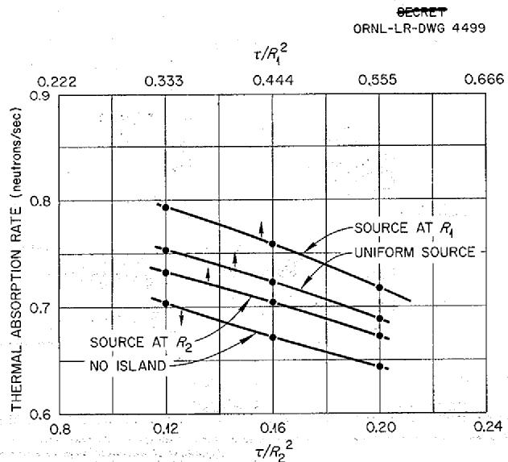  
Fig. 2.3. Thermal Absorption Rate in Mathematical Model of Reflector-Moderated Reactors.

# PROPOSED ART INSTALLATIONS

A.P.Fraas

F.R.McQuilkin

Aircraft Reactor Engineering Division

A study has been made of the various types of facilities suitable for the operation of the Aircraft Reactor Test. In addition to the obvious requirements for shielding, heat dumps, and auxiliary equipment, it is essential from the hazards standpoint that provision be made to contain the products resulting from a nuclear accident and/or chemical reaction of all combustibles in the installation, minimize the likelihood of serious damage from an explosion caused by sabotage or bombing, and remove and dispose of volatile fission products evolved during the course of operation. With these criteria in mind, a series of four basic reactor installations was considered; each differed in some fundamental characteristics from the others. The four installations are as follows: (1) an open test unit mounted over a water-cooled pan at the National Reactor Testing Station (NRTS), (2) a circular Quonset type of hemispherical building, (3) a water-walled tank, and (4) a reactor submerged in a pool of water.

Each of the installations included five major components: a shielded reactor assembly, radiators, blowers, a control system, and a fill-and-drain system. These components would operate

as an integrated system, irrespective of the type of test installation chosen. In all but the fourth installation, the assembled reactor would be surrounded by an aircraft type of shield of lead and borated water, and, in all installations, it would be coupled to heat dumps consisting of banks of aircraft-type NaK-to-air radiators through which cooling air would be circulated. Appropriate control systems, along with auxiliary shielding, equipment, and services, would comprise the balance of the test installation. A generalized flow sheet for this setup was shown in Fig. 2.1 of the previous quarterly progress report.7

All but the first of the above-listed installations would be located in Oak Ridge. The first installation is illustrated in Fig. 2.4. It was devised to permit operation of the reactor surrounded by an aircraft-type shield with a heat dump on either side to simulate the turbojet engines. Of the installations considered, it offers the most compact arrangement of the equipment with the least amount of shielding and minimum provision for containment. This scheme was developed with the thought that it could be built in Oak Ridge so that all the welding of high-temperature-liquid piping could be made, inspected, and pressure tested and some preliminary testing carried out, probably including a hot critical experiment, before the unit was shipped to NRTS. The dimensions of the unit are such that it would fit on a flat car and comply with standard railroad side and overhead clearance regulations. To do this, it would be necessary to dismount certain elements, such as the pump drive motors, the blowers, and the blower drive motors. This could be done easily, since only bolted connections would be involved. The reactor would be set up with a heavy, water-cooled pan beneath it. This pan would catch, hold, and cool the fuel in the event of an accident. A control room would be built as a unit and shipped to NRTS on a second flat car. The control room and the reactor would probably be placed a quarter of a mile to a mile apart, and the two would be coupled by telemetering equipment. The pumps in the layout are shown as being driven by d-c electric motors, but air turbine motors would serve equally well if a source of compressed air were available. If the tests were run at NRTS and Air Force, portable, gas-turbine-type air compressors were used, a compressed air

source might be more easily arranged than a d-c generator set.

In examining the NRTS installation design, a number of points became evident. First, the problems associated with operating a reactor at NRTS seem to be rather serious, particularly from the standpoint of the amount of time that would be lost in maintaining an operation 2000 miles from Oak Ridge. The distance would make it particularly difficult to cope with unforeseen problems. Any relatively small difficulty that might arise would be likely to introduce a major delay if that difficulty were not foreseen. It appears therefore that an NRTS installation would entail a loss of at least six months in getting the reactor into operation. The second major point that developed in connection with the examination of the design was that the major hazards appeared to be much less serious than had originally been presumed. The very compact installation achieved through careful design directed toward simulation of a full-scale aircraft type of power plant led to a very low investment of sodium and NaK, about one-twentieth of that required for the KAPL-SIR reactor designed for the same power level. Further, the use of circulating fuel with its high negative temperature coefficient gives a reactor in which a nuclear explosion seems almost out of the question.

In view of the relatively small amounts of energy released under conditions of a total reactor tragedy, designs were prepared for the installation of the ART in a closed building. The layout shown in Fig. 2.5 envisions a sort of circular Quonset building about 200 ft in diameter. The test unit would be built and operated on the test floor behind supplementary shielding, and a heavy, water-cooled pan would be placed beneath the reactor. This pan would catch, hold, and cool the fuel in the event of an accident. Such an arrangement would give plenty of floor area in a relatively inexpensive building that could be sealed to contain any fission products that might be released, in line with the philosophy underlying the use of the Hortonsphere at KAPL. A similar type of building, but shaped as a hemisphere rather than as the circular Quonset building, might be used in order to reduce the amount of steel required in the framing of the building.

The arrangement shown in Fig. 2.6 follows a quite different philosophy. It provides for containing the reactor assembly within a pressure

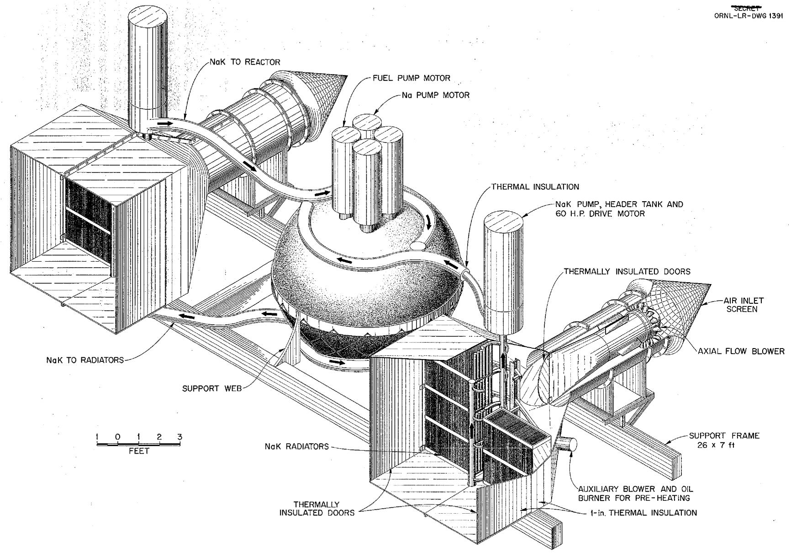  
Fig. 2.4. Open Reactor Test Unit.

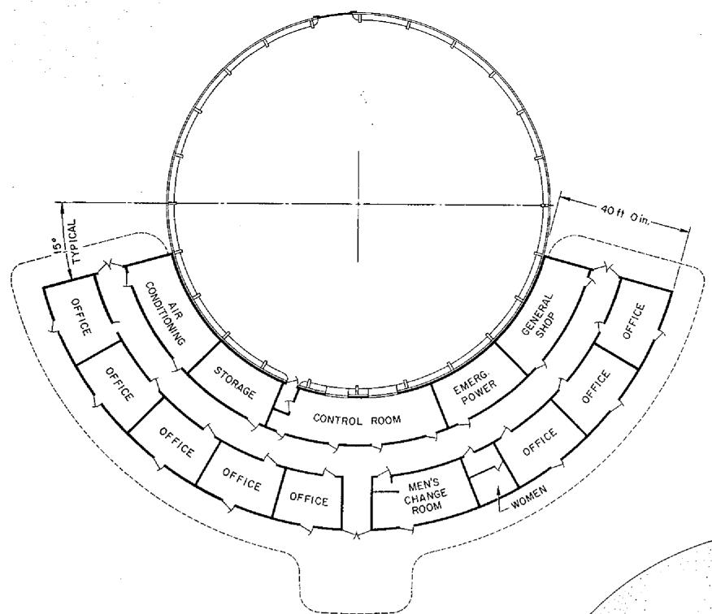  
HORIZONTAL SECTION

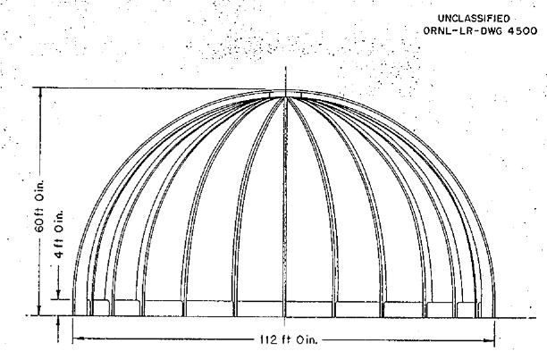  
LONGITUDINAL SECTION

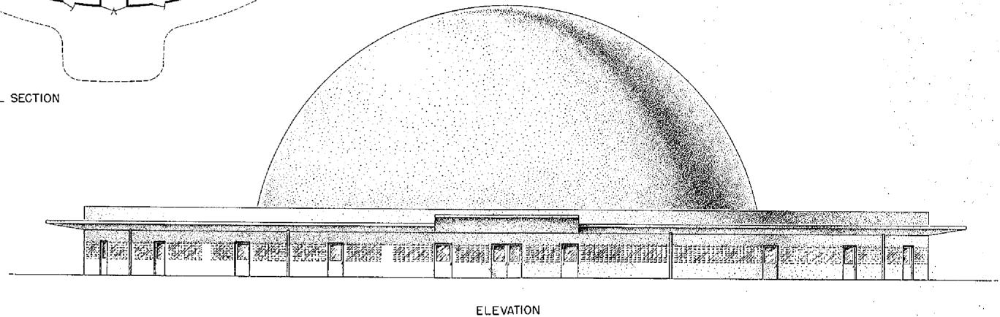  
Fig. 2.5. Circular Quonset Building.

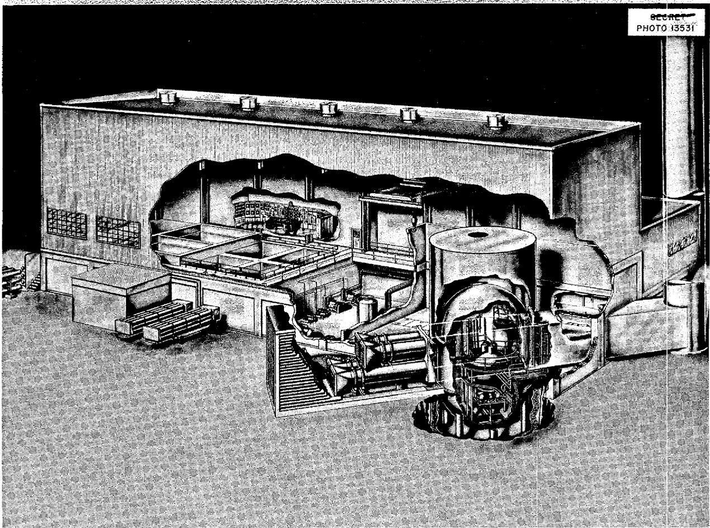  
Fig. 2.6. Perspective of Proposed ART Installation in Addition to Present ARE Building Showing Double-Walled Tank.

vessel submerged in water, while the heat dump equipment is located outside, but nearby. A double-walled tank from 20 to 30 ft in diameter and from 26 to 36 ft tall is envisioned. The space between the walls would be of the order of 18 in. and would be filled with water. The inner wall, or tank, would be sealed so that it could contain the reactor in an inert atmosphere, probably nitrogen. A small opening would be left at the top of the outer tank so that in the event of an accident so severe as to cause a meltdown of the reactor the heat given off by the decay gamma activity would be carried off by vaporization of the water between the tank walls. Since the rate of surface-to-water heat transfer under boiling conditions would be exceedingly high (on the order of 400,000 Btu/hr·ft²) and since the thermal conductivity of the fluoride fuel is relatively low, the water-side

temperature of the inner tank should not exceed the water temperature by more than $40^{\circ}\mathrm{F}$ , even if the bottom of the inner tank were covered with molten material. In the event of something so serious as a meltdown, it seems likely that a part of the water shield surrounding the reactor pressure shell would be ruptured and that water would tend to collect in the bottom of the tank with the fuel. This water would remove heat from the fuel, vaporize, and then condense on the tank walls so that the atmosphere within the tank would probably not get hotter than around $300^{\circ}\mathrm{F}$ .

The bolt flanges shown in Fig. 2.6 near the tops of the tanks could be placed about 3 ft above floor level. The reactor installation and preliminary shakedown testing could be carried out with the tops of the tanks removed. Since the reactor shield would be quite effective, the space inside the

tank would be shielded fairly well, and it would be possible for a man to enter the inner tank through a manhole at the top for inspection or repair work, even after the tank had been closed and the reactor had been run at high power. The water capacity of the space between the tanks, together with the water in the reservoir above the inner tank (approximately 10 ft deep), would be of the order of 110,000 gal. Boiling of this water would suffice to carry off all the heat generated by the fission products for about two days without any fresh water being supplied to the outer tank. All the various wires, pipes, tubes, etc. connected to the reactor and its auxiliaries would pass through carefully laid-out junction panels such as the one shown in Fig. 2.7. Such a panel might be installed in the wall of the tank shown in Fig. 2.6 with a pressure-tight gasketed flanged junction. The various thermocouples, power wiring, etc. could be installed on the reactor assembly in the shop and fitted with Cannon plugs so that they could be plugged into the panel in a short period of time after the reactor assembly had been lowered into position in the test facility. This should minimize the amount of assembly work required in the field.

The layout investigated as the fourth proposed installation would involve placing the reactor inside a sort of swimming pool with water-tight thermal insulation surrounding the pressure shell, lines, and pumps. The lines could then be brought out the top of the water tank to the instruments and the heat dumps. In the event of a severe accident that resulted in a meltdown, there would be sufficient heat capacity in the water to absorb the heat from the fission products for some days before a seriously large amount of water would have been boiled out of the pool. Such an arrangement could be enclosed, of course, in an air-tight building. This might not be necessary, but it seems likely that, in the event of an abrupt meltdown type of failure, the high heat capacity of the region inside the thermal insulation might put so much heat into the water in a very short period of time that bubbles would boil violently to the surface and disperse entrained fission products. After, perhaps, 10 or 15 min, it seems unlikely that such entrainment would prove to be a problem.

The unshielded reactor assembly will weigh approximately 10,000 lb, the lead gamma shield approximately 30,000 lb, and the water in the shield approximately 34,000 lb. The first two of

these items could be handled conveniently with a 20-ton crane, while the borated water could be pumped in after the rubber tanks had been installed for the water shield.

An arrangement such as the double-walled tank shown in Fig. 2.6 should prove to be adequate to take care of any accident not involving sabotage or bombing. The same should be true for either the hemispherical or circular Quonset type of building. Only the NRTS installation would, because of the remote location, present a not-too-serious hazards problem if effectively sabotaged.

To evaluate the merits of each of the installations considered, an attempt was made to envision as many accidents as possible that might prove to be serious during the course of operation of the ART. The worst natural accident that could be envisioned would result in a meltdown. The only source of an explosion that has been envisioned would be either sabotage or bombing. If the volatile fission products are removed during the course of operation, the major hazard to the surrounding area would be from the fission products that might be dispersed in the course of violent boiling or from an explosion.

Although in the preliminary hazards analysis consideration was given to operational hazards, operational sabotage, fire, earthquake, flood, windstorm, and bombing, the controlling considerations appeared,to be those associated with a total reactor tragedy. The total reactor tragedy is considered here as being an accident in which all the heat that could possibly be released from the chemical combination of various materials in the reactor and associated system would be released, together with the heat from the fission products accumulated after extended operation at full power and the energy released in an extreme nuclear runaway. The principal hazard associated with an ultimate reactor catastrophe is the dispersion of the fission products that would have accumulated from extended operation at high power. The key data on these parameters are presented in Table 2.2.

In examining the data on the heat that could be released from the combustion of various materials in the reactor installation, it is immediately evident that if kerosene or another hydrocarbon were used in place of water in the shield a very large amount of heat could be released, an amount almost one hundred times greater than that from any other

UNCLASSIFIED

ORNL-LR-DWG 4502

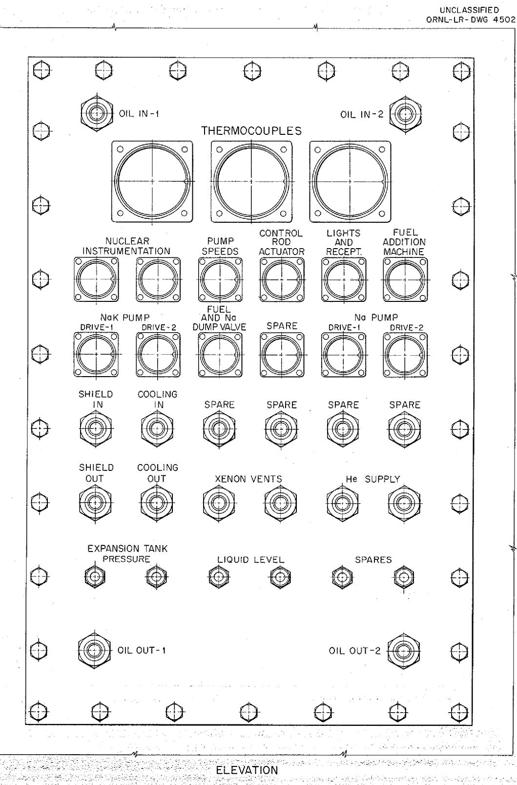  
Fig. 2.7. Junction Panel.

TABLE 2.2. SUMMARY OF KEY DATA ON ART HAZARDS   

<table><tr><td colspan="2">Sources of Energy</td></tr><tr><td>Heat from combination of 1000 lb of Na and NaK with water</td><td>2.1 × 106Btu</td></tr><tr><td>Heat from combination of 1000 lb of Na and NaK with air</td><td>2.4 × 106Btu</td></tr><tr><td>Heat from combination of 1200 lb of zirconium-base fuel with NaK</td><td>0.13 × 106Btu</td></tr><tr><td>Heat from combustion of 34,000 lb of shield kerosene with air</td><td>635 × 106Btu</td></tr><tr><td>Heat from extreme nuclear accident</td><td>0.3 × 106Btu</td></tr><tr><td>Fission-product decay gamma heat emitted during first 2 hr after shutdown (assuming no fission-product removal)</td><td>8 × 106Btu</td></tr><tr><td colspan="2">Sources of Radioactivity</td></tr><tr><td>Total fission-product activity for saturation</td><td>6 × 108curies</td></tr><tr><td>Gaseous fission-product activity for saturation</td><td>107curies</td></tr><tr><td>Sodium activity in moderator circuit for saturation</td><td>105curies</td></tr><tr><td>Sodium activity in NaK circuit for saturation</td><td>35 curies</td></tr><tr><td colspan="2">Temperatures Associated with Accidents</td></tr><tr><td>Flame temperature for stoichiometric NaK*-H2O reaction</td><td>3070°F</td></tr><tr><td>Temperature of reaction products for Na*-zirconium-base fuel reaction</td><td>3300°F</td></tr><tr><td>Temperature of atmosphere in 12,000-ft3tank (assuming uniform dispersal of combustion products from Na-H2O reaction)</td><td>310°F</td></tr><tr><td>Temperature rise of NaK-H2O reaction products and shield water if uniformly mixed</td><td>62°F</td></tr><tr><td colspan="2">Major Radiation Sources and Doses for Typical Conditions**</td></tr><tr><td>Equivalent source for all fission products</td><td>4 × 108curies</td></tr><tr><td>Equivalent source for inert gases only</td><td>108curies</td></tr><tr><td>Rate of generation of activity in the form of inert gases (assuming 20-min holdup in atmosphere of expansion tank)</td><td>1000 curies/sec</td></tr><tr><td>Same as above but for 420-hr holdup time</td><td>1 curie/sec</td></tr><tr><td>Dose at shield surface during operation</td><td>100 r/hr</td></tr><tr><td>Dose at shield surface 15 min after shutdown</td><td>4 r/hr</td></tr><tr><td>Dose at shield surface 10 days after shutdown</td><td>1 r/hr</td></tr><tr><td>Dose outside 24-in.-thick concrete wall 15 ft from center of reactor during operation</td><td>0.025 r/hr</td></tr><tr><td>Same 15 min after shutdown</td><td>0.001 r/hr</td></tr></table>

*Initial temperature assumed to be $1500^{\circ}\mathrm{F}$ .   
**These key data for typical conditions were developed for the major radiation sources and doses by assuming 1000 hr of continuous operation of the ART at 60-Mw power level with only the gaseous fission products coming off and by assuming the reactor to be encased in an aircraft-type shield which gives a dose of 1 r/hr at 50 ft.

source of energy. The heat that could be released from the combustion of the sodium and the NaK in the moderator and heat dump circuit is relatively small; thus it seems that water should be used as the shielding material rather than kerosene, because, even if the water were to combine in stoichiometric proportions with all the sodium and the NaK in the system, the resulting energy would still not present a difficult problem. The heat that would be released from a nuclear accident depends in large measure on the character of the accident. However, the value presented in Table 2.2 is that for the worst accident that can be

envisioned, that is, one in which uranium abruptly begins to precipitate out of the fuel in the core so that the fuel is carried into the core at the normal rate but no uranium leaves with the exit stream of fluoride. While hardly a credible accident, this does seem to represent the maximum rate of increase in reactivity and, hence, the extreme nuclear accident conceivable for this reactor.

The second portion of Table 2.2 presents the equivalent radiation sources for the various fluid circuits. The values given for the sodium and NaK activities have been obtained from multigroup calculations.

It should be noted that the presence of the shield water would provide a strong damping effect on any temperature rise associated with an accident. The third part of Table 2.2 shows the temperature rise associated with the release of energy from the various sources for various conditions. As shown in the table, if all the heat from the combustion reactions were to be confined in the combustion products, high temperatures would result from stoichiometric reactions. Even in such instances, much of the heat would be dissipated to the atmosphere within the containing vessel so that the temperature would be substantially lowered. If the reaction were quenched by the shield water, still lower temperatures would result.

It is clearly essential that provision be made to contain the products of a total reactor tragedy except, possibly, if the reactor is installed at NRTS. A comparison of key data for several types of container is given in Table 2.3. For this comparison the worst set of conditions applicable to each case was presumed. As may be seen, the double-walled tank compares favorably with the hemispherical and ellipsoidal buildings. While difficult to evaluate numerically, the double-walled tank also appears superior in that it would be less subject to sabotage. Even if both walls were ruptured and the reactor melted down, the residue would tend to sink to the bottom of the tank pit,

where it would be flooded by the water that had filled the region between the walls. This water would both absorb the heat of any reaction and act as a shield to reduce the radiation level at the top of the pit. After careful review of these and a host of lesser considerations, the 24-ft-dia double-walled tank was chosen as the most promising test facility.

Although the double-walled tank type of test installation is adaptable to several types of reactor test facility, the most promising possibility is to install it in an addition to the ARE Building. Such an arrangement would permit the use of services and facilities that already exist in the ARE Building, for which no plans have been formulated now that it has served its original purpose. For example, items such as the control room, offices, change rooms, toilets, storage area, water supply, power supply, portions of experimental test pits, access roads, security fencing, and security lighting are available.

Of the several schemes considered for modifying the ARE Building to accommodate the ART, the most attractive plan is to construct an addition on the south end to effect a 64-ft extension of the present 105-ft-long building by extending the existing roof and side walls. Figure 2.8 shows a preliminary design. The floor level of the addition would be at the ARE basement floor grade, with the double-walled tank to house the ART sunk in

TABLE 2.3. COMPARISON OF KEY DATA FOR SEVERAL TYPES OF REACTOR INSTALLATION CONTAINERS   

<table><tr><td></td><td>24-ft-dia
Double-Walled
Tank with 11-ft
Straight Section</td><td>17-ft-dia
Double-Walled
Tank with 9-ft
Straight Section</td><td>200-ft-dia
Ellipsoidal
Building</td><td>115-ft-dia
Hemispherical
Building</td></tr><tr><td>Heat released, Btu</td><td>2.4 × 106</td><td>2.4 × 106</td><td>107</td><td>107</td></tr><tr><td>Container volume, ft3</td><td>12,200</td><td>4600</td><td>1.2 × 106</td><td>0.4 × 106</td></tr><tr><td>Container surface area, ft2</td><td>2640</td><td>1400</td><td>4.3 × 104</td><td>2.1 × 104</td></tr><tr><td>Peak gas temperature,* °F</td><td>444</td><td>970</td><td>130</td><td>220</td></tr><tr><td>Peak gas pressure,* psig</td><td>22.2</td><td>37</td><td>1.4</td><td>3.9</td></tr><tr><td>Required shell thickness (for allow-
able stress = 15,000 psi), in.</td><td>0.217</td><td>0.251</td><td>0.15</td><td>0.09</td></tr><tr><td>Weight of steel in shell, tons</td><td>6</td><td>6</td><td>134**</td><td>40</td></tr></table>

* Fission-product afterheat was not included in calculating peak gas temperature and pressure where adequate, provision was made for cooling the container wall.   
$\star \star$ Includes steel frame.

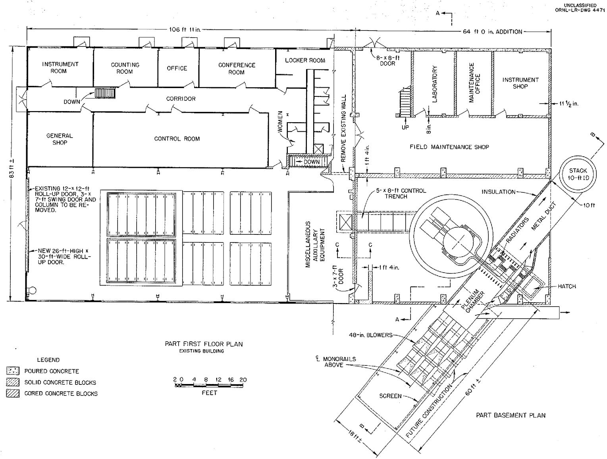  
Fig. 2.8. Layout Plan of Proposed ART Installation in Addition to Present ARE Building.

the floor up to 3 ft below the bolting flange level. The reactor tank location would be approximately centered in the 42-ft-wide, 64-ft-long high-bay extension directly in line with the ARE experimental bay. The reactor would be positioned so that the top of the shield would be at the building floor elevation.

To permit use of the experimental pits for installation of auxiliary equipment, to permit possible underwater reactor disassembly work after reactor operation, and to provide a large entry door to the ART area, the south wall of the ARE experimental bay would be removed, the overhead crane facility would be revised from 10- to 20-ton capacity, and the truck door in the north wall of the ARE Building would be enlarged.

The double-walled tank described above is essentially the container considered for this installation. The inner tank, or pressure vessel, would be approximately 24 ft in diameter with a straight section about 11 ft long and a hemispherical bottom and top. The joint between the removable top and the lower portion of the tank would probably be a bolting flange, with provision for sealing the joint with a low-melting-point alloy. Thus the top would be used only as required by the operating program. The outer tank would be a right circular cylinder approximately 27 ft in diameter and about $47\frac{1}{2}$ ft high. About 26 ft of this water-containing tank would be above floor grade, and this portion of the tank would be attached by a flange or weld joint only when the operating program required that the upper hemisphere of the inner tank be in place. The inner tank would be set coaxially with the outer tank, and the bottom of the inner tank would be 1.5 ft above the bottom of the outer tank. This would provide a 1.5-ft annulus between the two tanks and an 11-ft spacing between the tops of the tanks when they were in place. Likewise, this would locate the inner tank flange 3 ft above floor grade. During power operation of the reactor, the inner and outer tank tops would be in place and the outer tank would be filled with water to provide a 1.5-ft water wall about the inner tank and a 10-ft head of water above it.

Inside the inner tank, the reactor with its aircraft-type shield, with a gross weight of about 35 tons, would be mounted on vertical columns with the reactor center 3 ft off center from the vessel axis and about 12 ft above an open-grated floor. This positioning would provide needed space for

movement of the portable fluoride fuel and sodium moderator coolant containers to their operating stations under the reactor. The off-center location would also serve to minimize the length of NaK piping that must run from the reactor through a bulkhead in the pressure vessel to the heat dump radiators outside the tank.

Quite a variety of shields has been considered for the ART. The most convenient seems to be one functionally the same as that for an aircraft requiring a unit shield, namely, a shield designed to give 1 r/hr at 50 ft from the center of the reactor. Such a shield is both the lightest and most compact that has been devised. It makes use of noncritical materials that are in good supply, and it will provide useful performance data on the effects of the release of delayed neutrons and decay gammas in the heat exchanger, the generation of secondary gammas throughout the shield, etc. While the complication of detailed instrumentation within the shield does not appear to be warranted, it will be extremely worthwhile to obtain radiation dose level data at various points around the periphery of the shield, particularly in the vicinity of the ducts and the pump and expansion tank region.

Several arrangements have been considered as a means for disposing of the heat generated in the reactor. The most promising is one that resembles a turbojet power plant in many respects. It employs radiators essentially similar to those suitable for turbojet operation. Conventional axial-flow blowers would be employed to force cooling air through the radiators. This arrangement is flexible and as inexpensive as any arrangement devised. It will give thermal capacities and fluid transit times essentially the same as those in a full-scale aircraft power plant. It will also give some very valuable experience with the operation of high temperature liquid-to-air heat exchangers that embody features of construction and fabricating techniques suitable for aircraft use. It should be mentioned that the type of radiator currently envisioned is one that has been tested at ORNL and appears to be the most reliable of any radiator proposed to date. While its performance leaves something to be desired, it is felt that the basic configuration is sound and that modifications can be made later to give improved performance.

As shown in Fig. 2.8, 16 NaK-to-air heat dump radiators would be mounted in an air tunnel which

would be placed on a diagonal across the southwest corner of the addition. Each radiator core would have an inlet face 24 by 24 in. and a depth of 6 in. These radiators would be located at floor grade over the NaK pipe lines and the NaK fill and drain pit. Four 75,000-cfm axial-flow blowers designed to give a head of 10 in. $\mathsf{H}_2\mathsf{O}$ would force air through the radiators and out through a discharge stack.

The fuel fill-and-drain system envisioned for the ART incorporates two shielded dump tanks. One would be coupled to the reactor with a remotely operated coupling, while a second emergency dump tank would be welded directly to a discharge pipe from the reactor. The remotely operated coupling to the first fuel dump tank would give flexibility in the operation of the reactor, since it would make it possible to bring fuel to or remove it from the site expeditiously and would keep the footage of pipe and the number of valves to a minimum.

For handling the heavy, shielded fluoride and sodium containers inside the inner tank, a track would be installed on the floor and inside the wall. Wheels would be mounted on both the bottom and one end of the tank dolly so that the assembly could be lowered by the overhead crane to the floor track, with the end wheels on the dolly riding against the vertical track. Once on the floor track, each dolly would be moved to its operating station under the reactor. Each track pair in this area would probably be mounted on a lift for raising the tank connection nozzle to the contact position within the reactor shield.

In addition to the NaK piping bulkhead mentioned above, a control junction panel such as that shown in Fig. 2.7 would be installed as a part of another bulkhead through the tank below the building floor grade to pass the tubing and the electrical conductors required for operation, control, and monitoring. Two more bulkheads, in the form of manholes, would probably be installed in the upper portions of the inner and outer tanks. One manhole would be about 3 by 5 ft and located just above the inner tank flange to allow passage through both container walls and thus provide entrance to the

inner tank subsequent to placement of these sections of equipment. The second opening would be a manhole about 5 ft in diameter in the hemispherical top of the inner tank to provide overhead crane service after placement of the top. Sufficient catwalks, ladders, and hoisting equipment would be installed within the inner tank to provide easy access for servicing all equipment, as shown in Fig. 2.6.

The control bulkhead in the double-walled tank would be located so that the associated control junction panel and the control tunnel would be on the control room side of the tank. The tunnel would extend to the auxiliary equipment pit (formerly the ARE slab storage pit), where it would terminate. The tubes and conductors from the junction panel would be channeled from the tunnel either to equipment in the pit and basement or to the control room (formerly the ARE control room). The pit and basement equipment would include such items as the lubricating oil pumps and cooler, borated shield water pumps, cooler and makeup equipment, vacuum pumps, relays, switch gear, and emergency power supply.

The reactor off-gas flow would probably be piped through the NaK piping bulkhead to a disposal facility outside the building. Such a system would probably consist of an activated-charcoal absorption bed contained within a pipe which would be long enough to provide the required delay period to bring the activity of the krypton (which would not be adsorbed by the charcoal) to a tolerable level.

Field maintenance and laboratory facilities would be installed in the area east of the ART test bay and south of the low bay of the ARE. This area and the ARE experimental bay would be partitioned from the ART test bay with about a 16-in.-thick shield wall of stacked solid concrete block. This wall would not be erected until after placement of the upper sections of the double-walled tank. The only other major rework of the ARE facility to accommodate the ART would probably be that of modifying and equipping one of the ARE experimental pits for underwater disassembly work on the reactor after operation.

# 3. EXPERIMENTAL REACTOR ENGINEERING

H. W. Savage

Aircraft Reactor Engineering Division

Design work is under way on an in-pile test loop for operation in a horizontal beam hole of the MTR. This work is being done in cooperation with the Solid State Division and Pratt & Whitney Aircraft. The specifications for the loop have been established. Tests are under way on a horizontal-shaft sump pump for the loop, and a salt-to-air heat exchanger has been fabricated.

The use of ARE-type sump pumps for high-flow heat exchanger tests is being investigated. The K-25 loop test of ARE components is being continued as a life test of the ARE type pump, and over 3000 hr of operation has been logged. Developmental work is under way on pumps for the ART, with particular emphasis being given to impeller fabrication and performance.

Three Inconel forced-circulation loops have been operated with NaF-ZrF4-UF. The first two loops failed after 48 and 3 hr, respectively, but the third loop has operated for 150 hr with a Reynolds number of 10,000 and a $200^{\circ}\mathrm{F}$ temperature gradient. A third beryllium-sodium-Inconel mass transfer test has been completed and has been submitted for metallographic examination, and components have been fabricated for tests of sodium in multimetal loops.

Developmental work is under way on components, such as a pump and a gas-furnace heat source, for a loop for testing fused salt-to-NaK heat ex-changers. A leak test has indicated that small leaks of fluoride fuel into NaK are self-plugging.

# IN-PILE LOOP COMPONENT DEVELOPMENT

D. B. Trauger

Aircraft Reactor Engineering Division

An in-pile test loop is being designed for determining radiation damage to systems employing forced circulation of fused salts in Inconel tubing. The loop is to be inserted and operated in a horizontal beam hole of the MTR. Although ART specifications are to be incorporated where possible, the loop is designed to provide data for a comparison with out-of-pile forced-circulation-loop test results. By testing at flow and temperature conditions within the range of out-of-pile forced-circulation experiments, data should be

obtained on which to base extrapolations of the more readily obtainable out-of-pile test data. Of course, space limitations of the reactor beam holes somewhat limit the conditions obtainable in a safe and reliable experiment.

The proposed test unit will consist of an 8-ft loop of $\frac{1}{8}$ -in. schedule-40 seamless pipe with a little over 1 ft in the active zone of the reactor. The ratio of the total volume to the volume in the high flux zone, known as the dilution factor, is approximately 10. Flows in the turbulent region, Reynolds number approximately 4000, with a maximum temperature of $1500^{\circ}\mathrm{F}$ have been proposed. A temperature differential of $300^{\circ}\mathrm{F}$ and heat transfer of 30 to 50 kw are expected with a power density of approximately $2\mathrm{kw/cm}^3$ . These conditions probably can be achieved with a fuel composed of NaF-ZrF $_4$ -UF $_4$ (53.5-40.0-6.5 mole %).

Design work is proceeding on this loop and its components to meet the above specifications. Handling equipment is planned which will facilitate isothermal operation of the loop prior to insertion into the reactor and which will also receive the radioactive materials after in-pile operation.

# Horizontal-Shaft Sump Pump

J.A.Conlin

D. F. Salmon

Aircraft Reactor Engineering Division

Two, identical, horizontal-shaft, centrifugal-type sump pumps fabricated according to the design described previously were tested with the fluoride mixture NaF-ZrF $_4$ (50-50 mole %) at $1350^{\circ}\mathrm{F}$ and a shaft speed of 6000 rpm for 500 and 1000 hr, respectively. Both pumps showed considerable wear on the Graphitar-lapped steel face plates, but neither seal had failed completely. Some oil had leaked into the fluoride mixture in the pump that operated for 1000 hr, partly because the exit line had plugged with zirconium fluoride vapor condensate.

As a result of these tests, the shaft arrangement for the turbine pump has been altered to provide

a lower seal temperature; also, the shaft will be operated at a lower speed. The pump is a "regenerative-turbine" type, but it differs from conventional design in a number of points. There is no positive shaft seal, but, rather, there is close clearance between the shaft and the impeller housing. Some fluid leaks along the shaft labyrinth into the small combination sump and expansion chamber and is then drawn back into the impeller through a hole connecting the sump to the pump suction. To accommodate thermal expansion, total impeller side clearances have been increased to 0.060 in., as compared with the usual

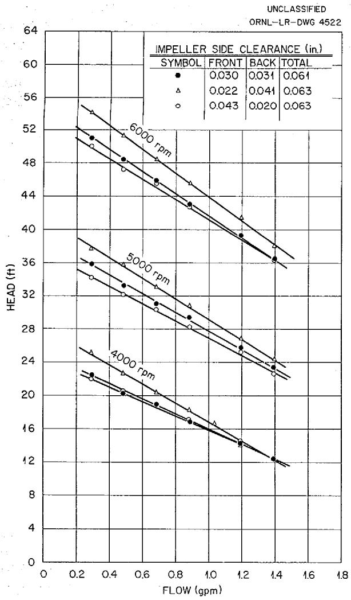  
Fig. 3.1. Performance Characteristics of a Regenerative-Turbine Type of Horizontal-Shaft Sump Pump Tested with Water.

0.005 to 0.010 in. The size of the pump envelope has been reduced by locating the inlet and discharge ports axially rather than radially at the periphery and by decreasing the annular passage around the impeller.

A Lucite model incorporating the changes made as a result of the tests described above has been tested with water. The curves of Figs. 3.1 and 3.2 give pump performance characteristics at different speeds and impeller side clearances. As may be noted, the total impeller end clearance is a primary factor in determining pump performance, while the distribution of clearance, front to back, is relatively unimportant. This is fortunate, since the end clearance can be fixed in fabrication, but the impeller position is affected by thermal expansion and bearing alignment.

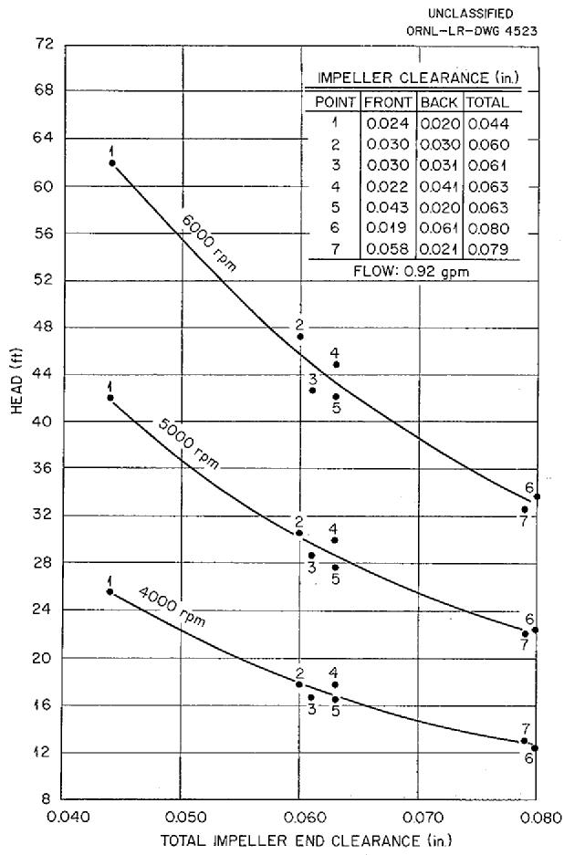  
Fig. 3.2. Effect of Total Impeller End Clearance on Performance of the Regenerative-Turbine Type of Horizontal-Shaft Sump Pump Tested with Water.

The pump has unusual ability to remove gas. In water tests, air was injected into the impeller at a rate of several cubic inches per minute and was continuously removed with only a slight increase in the amount of gassing. Under normal operation there is usually no more than 1 vol % of gas in the fluid.

The pump will satisfactorily prime and fill the test loop in which it is installed if fluid is added to the sump while the pump is running and the total impeller side clearances are maintained at 0.040 in. or less. However, priming becomes erratic with the greater clearances required for operation of the pump at high temperatures. Several methods have been demonstrated for obtaining a positive displacement of fluid into the loop with large pump clearances. Each method, however, requires either complicated freeze valves or pressure controls. Vacuum filling appears to be the most attractive solution to the problem but has not been tested.

# Heat Exchanger

D.F.Salmon L.P.Carpenter

Aircraft Reactor Engineering Division

A single-tube, longitudinally finned, salt-to-air heat exchanger has been fabricated for use in an in-pile loop. Since the staggered-fin arrangement required to ensure adequate heat transfer with air resulted in a very high pressure drop, it seems imperative to use a lead shielded recirculating system with a secondary gas-to-water heat exchanger for safety in the event of a salt break into the gas stream. The use of helium would simplify both heat exchangers, and therefore a salt-to-helium exchanger is now being designed.

# PUMP DEVELOPMENT PROGRAM

ARE.Type Sump Pumps

W.G.Cobb A.G.Grindell

W.R.Huntley

Aircraft Reactor Engineering Division

The possibilities of application of sump pumps of the type supplied to the ARE for general test use, particularly in connection with forthcoming relatively high-flow heat exchanger tests, are being studied. Experiments are under way to establish performance ranges without major design changes and to evaluate the probable trouble-free life based on actual use.

The test loop, set up at K-25 for examining ARE fuel-tube hair-pin sections and an ARE heat exchanger, was stopped after 2047 hr of nearly trouble-free operation for removal and examination of the ARE test components. At the time of removal of the ARE test components, only a cursory inspection of the pump was made because operation had been trouble-free except for the plugging of gas nozzles with zirconium fluoride vapor condensate. An inspection of the inside surfaces of the pump tank cover revealed stallactites of salt that covered nearly all riser and nozzle skirts and bolts and protruded beneath the lower heat radiation baffle into the pump tank gas space. These stallactites are not deleterious to pump operation. The loop was modified to consist only of the pump, loop piping, throttling valve, and the previously used venturi element, and the pump has now been operated for an additional 1000 hr at $1350^{\circ}\mathrm{F}$ , 40 gpm, and 1500 rpm. Slight noises were noticed at the pump bearing housing after a total of 2847 hr of operation. However, these noises had not greatly increased when the total operating time had reached 3000 hr. The gas-line-plugging problem which was encountered after 2047 hr of operation was eliminated completely by a newly designed vapor trap. Operation of the loop is being continued as a life test of the pump.

Pump performance data (Fig. 3.3) were obtained over the speed range 600 to 1400 rpm with the fluoride mixture NaF-ZrF $_4$ -UF $_4$ (53.5-40-6.5 mole %) at $1300^{\circ}\mathrm{F}$ . Other tests of ARE-scale pumps were made to determine critical speeds and performance data at speeds higher than those anticipated in the original design, that is, above 2200 rpm. The critical speed range was found to be between 2850 and 3250 rpm and is thus well above the speeds required for heat exchanger tests.

# Large-Scale Pump Development

W.G.Cobb

Aircraft Reactor Engineering Division

The ART will require two fused-salt fuel pumps with approximate capacities of 650 gpm each at a 50-ft head, two sodium moderator-coolant pumps with capacities of 430 gpm each at a 125-ft head, and two or more NaK primary-coolant pumps with capacities of 2800 gpm or less at a 280-ft head. The problems with all these pumps will not be

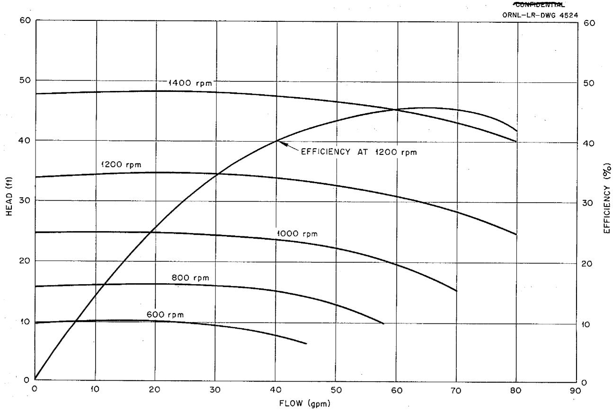  
Fig. 3.3. Performance of an ARE-Type Sump Pump with NaF-ZrF $_4$ -UF $_4$ (53.5-40-6.5 mole %) at $1300^{\circ}\mathrm{F}$ .

unlike those encountered in developing ARE pumps, but they will be magnified by the higher capacity requirements, by the resulting higher power requirements, and by a number of special restrictions imposed because of the proposed locations of the pumps.

The location of the fuel pumps imposes problems in impeller and in inlet and discharge housing design, since it will be necessary to match the fluid dynamic requirements of passages leading from heat exchangers into the pumps and from the pump discharge housings into the core. Various impeller designs are being investigated and will be used to evaluate cavitation characteristics. Previous experience with ARE impellers indicates that casting is not a promising means for fabricating Inconel impellers in the present state of the art, and therefore a brass impeller has been made for studying fabrication problems and obtaining initial performance data. Preliminary planning has been started for the fabrication of

models for study of pump discharge and entry conditions.

Seal design, bearing structure, cooling, lubricating, and driving means are other problems being studied, and the reliability of these components and operations is being ascertained through a succession of mechanical shakedown, water performance, and high-temperature tests.

# DESIGN AND OPERATION OF FORCED-CIRCULATION CORROSION AND MASS-TRANSFER TESTS

Fused Salts in Inconel

L.A.Mann

W. B. McDonald

W.C.Tunnell

Aircraft Reactor Engineering Division

The Inconel forced-circulation corrosion test loop previously described2 as loop No. 2 was put

into operation with a Reynolds number of 10,000 and a temperature gradient of $200^{\circ}\mathrm{F}$ in the fuel mixture $\mathsf{NaF - ZrF}_4\mathsf{-UF}_4$ (50-46-4 mole $\%$ ). The design of this loop is illustrated in Fig. 3.4. A failure occurred in the heater section of this loop when the pump was stopped after 48 hr, without reducing the power input into the heater section, to take a faulty instrument out of operation. This loop was constructed of 0.5-in.-OD, 0.020-in.-wall Inconel tubing. Three unsuccessful attempts have been made to get the loop back in operation, but, in each case, failures of the tubing occurred during the cleaning operation with barren fuel mixture.

Another loop (loop No. 3) constructed of 0.5-in.-OD, 0.040-in.-wall Inconel tubing was successfully started and a Reynolds number of 10,000 and a temperature gradient of $300^{\circ}\mathrm{F}$ were attained. After operation for 3 hr, the test was terminated because of failure of tubing near a welded joint. The data from the startup revealed conclusively that the loop could be operated without a heat economizer; therefore construction of the loop can be simplified.

A third loop, without the economizer, was built with 0.5-in.-OD, 0.045-in.-wall Inconel tubing. This loop included a sump pump (model LFB), a cooler, and a heater. The loop has been in operation over 150 hr with a Reynolds number of 10,000 and a $200^{\circ}\mathrm{F}$ temperature gradient. The fuel being used is $\mathrm{NaF - ZrF_4 - UF_4}$ (53.5-40-6.5 mole%). The maximum fuel temperature of $1500^{\circ}\mathrm{F}$ is produced by a power input of about $72\mathrm{kw}$ . This loop is scheduled to operate for 1000 hr.

# Beryllium-Sodium-Inconel Mass Transfer

D.R.Ward L.A.Mann

W. B. McDonald

Aircraft Reactor Engineering Division

A third test has been completed in which molten sodium was pumped through an Inconel loop containing a beryllium insert. Approximate test conditions were: sodium flow rate, 3.5 gpm; beryllium temperature, $1300^{\circ}\mathrm{F}$ ; minimum flowing sodium temperature, less than $1000^{\circ}\mathrm{F}$ ; Reynolds number at minor diameter of beryllium insert, 190,000; duration of test, 1000 hr.

Visual inspection of the beryllium insert revealed a metallic deposit in the stagnant region between the insert and the Inconel tubing. This

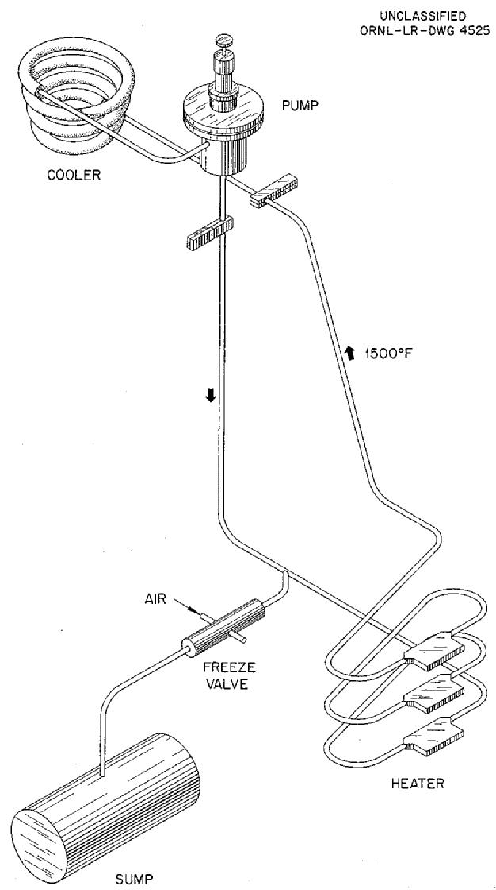  
Fig. 3.4. Forced-Circulation Corrosion Test Loop.

and other sections of the loop have been submitted for metallographic examination. A fourth test loop of similar construction has been fabricated and is being installed for testing.

# Sodium in Multimetal Loops

D.R.Ward L.A.Mann

W. B. McDonald

Aircraft Reactor Engineering Division

The design of a loop for testing combinations of structural metals in contact with high-velocity

4L. A. Mann, ANP Quar. Prog. Rep. Sept. 10, 1954, ORNL-1771, p 41.

turbulent liquid metals under high temperature differentials has been completed, and components have been fabricated. The first series of tests will include combinations of Inconel and type 316 stainless steel as loop materials, with sodium as the circulated liquid metal.

# Natural-Gas Heat Sources for Forced-Circulation Loops

L.A.Mann

Aircraft Reactor Engineering Division

R. Curry

E.R.Dytko

Pratt & Whitney Aircraft

Several tests of burners were made in order to obtain preliminary data for design of a natural-gas heat source for forced-circulation corrosion test loops. It was found that exhaust gas temperatures of between 2800 and $3300^{\circ}\mathrm{F}$ could be obtained without initial air preheating, and, by using air at a rate of 65 to 650 cfm, the equivalent of 100 to 1000 kw of heat was released. Maximum system thermal efficiencies of 20 to $60\%$ appear to be feasible.

Tests with electric-resistance heated units indicate a maximum wall temperature of $1750^{\circ}\mathrm{F}$ with the tubing lengths required by pressure-drop and flow considerations. Somewhat higher tube-wall external element temperatures or proportionately longer heater sections would be required with gas heating. An economic study indicates that there is little choice between providing electrical power supplies and providing large-capacity air supplies for gas heating. Therefore, since development of a gas-heated unit specifically for this purpose would be expensive and since there is no present proof of reliability of components and operation of gas-fired loops, further study of gas firing for these test loops appears to be unwarranted.

# HEAT EXCHANGER DEVELOPMENT

Heat Exchanger Tests

R.E. MacPherson

Aircraft Reactor Engineering Division

R. D. Peak

Pratt & Whitney Aircraft

A number of tests of fused salt-to-NaK heat exchangers are to be made for determining the fabricability, operability, operating parameters, and reliability of heat exchanger tube bundles such as those proposed for the ART. The test

loops are to include reliable pumps, reliable heat sources, and adequate heat sinks.

A preliminary heat exchanger test reported previously[5] indicated reasonable structural integrity of the exchanger (1682 hr of operation), but little data on operating parameters were obtained. For the next experiment, a regenerative system is to be used in which the heat exchanger will be an economizer that will transfer about 4 Mw of heat, while a heat input and release of only 1 Mw will be required.

# Header Leak Test

R.E. MacPherson

Aircraft Reactor Engineering Division

R. D. Peak

Pratt & Whitney Aircraft

It has been postulated that small leaks which develop in metal walls separating NaK and fluoride fuels may be self-plugging as the result of the precipitation of high-melting-point reaction products. A program of tests is currently under way to check this possibility. To date, one test has been run, which indicates that self-plugging can occur with $\mathsf{NaF - ZrF_4 - UF_4}$ fuels. The leaks are installed between three cells as shown in Fig. 3.5. The center cell is pressurized to leak into the end cells under the pressure differentials shown, 5 and 50 psi.

The test rig was filled with $\mathsf{NaF - ZrF_4 - UF_4}$ fuel in the center cell and NaK in the end cells. The leaks were about 0.002 in. in diameter. After 12 hr at $1300^{\circ}F$ , there was no apparent leakage, and x-ray pictures taken at intervals during the test showed no changes in liquid levels.

# Pump for Heat Exchanger Tests

W.G.Cobb

W. R. Huntley

A. G. Grindell

R.E. MacPherson

Aircraft Reactor Engineering Division

A series of tests is being made in order to determine whether an existing model DANA pump (ARE moderator-coolant-type sump pump) is suitable for the high-speed operation which will be required in the intermediate heat exchanger test loop. Critical shaft-speed determinations made by K-25 personnel indicated that the pump could be operated safely at the proposed speed of approximately 3700 rpm.

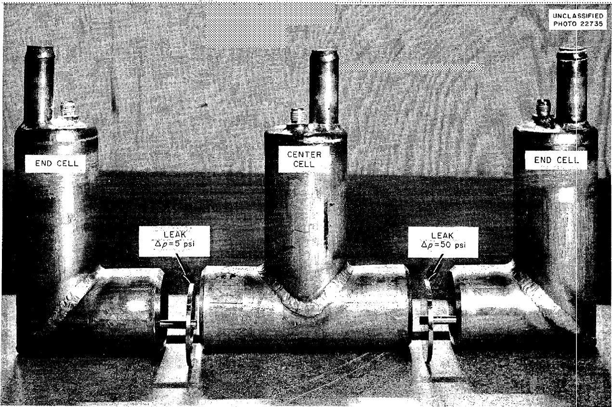  
Fig. 3.5. Heat Exchanger Header Leak Test.

The rotary element of the pump was then operated at 3700 rpm in the cold shakedown test stand, and the bearings and mechanical oil seals were found to operate satisfactorily. The pump is now being observed for performance and ingassing at high speeds in the water test stand.

# GAS-FURNACE HEAT SOURCE DEVELOPMENT

The requirements for 1000-kw heat sources for heat exchanger tests, together with subsequent experiments in the ART development program, for which heat sources to provide 10 Mw of liquid metal heat may be required, have given rise to investigations of gas-fired furnaces capable of transferring heat to liquid metal at a high rate per unit volume without extensive heat storage in the furnace walls. Such storage could cause failure, due to structural melting, should circulation of the liquid slow down or stop for any reason.

Two approaches have been investigated experimentally, and the best features of both are to be

combined in forthcoming experiments. The problem is also being explored with vendors of gas-fired equipment.

Sodium-Cooled 100-kw Furnace Tests

R.E.MacPherson R.W.Bussard

Aircraft Reactor Engineering Division

R.D. Peak

Pratt & Whitney Aircraft

During the past quarter, assembly of the 100-kw gas furnace test facility was completed, and a gas-fired sodium heat source was operated with an output of up to 85 kw at sodium outlet temperatures of $1500^{\circ}\mathrm{F}$ . The installation is shown in Fig. 3.6. A comparison of design conditions with those actually achieved is given in Table 3.1.

A total of 106 hr of operating time was accumulated under the conditions given in Table 3.1. Since the efficiency was lower than desired, the system became limited by gas flow because of high pressure drops on the gas-supply system at

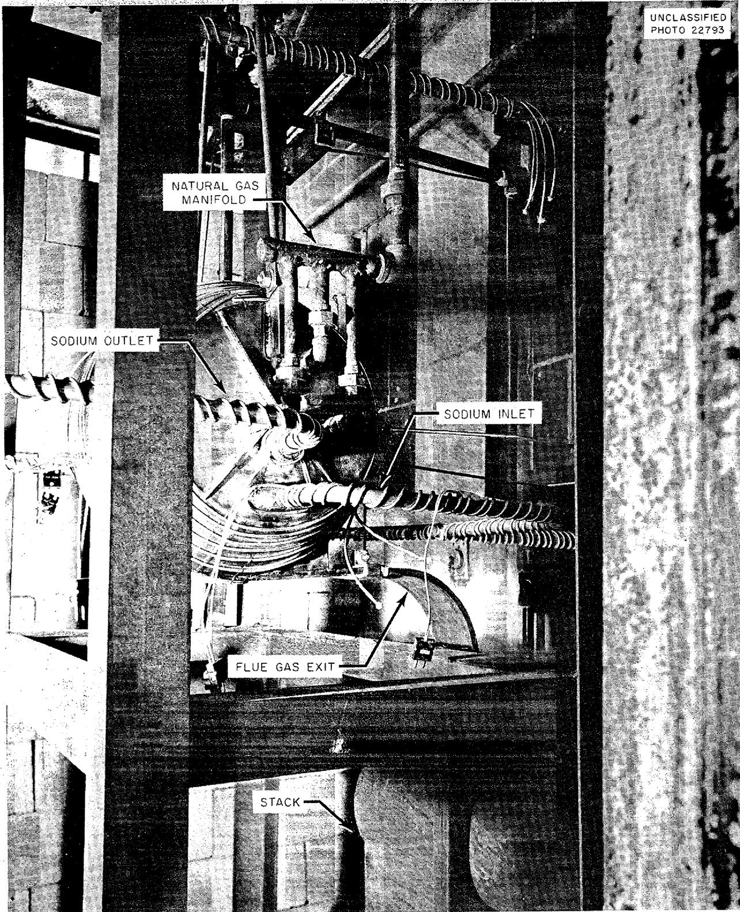  
Fig. 3.6. Gas-Fired Heat Source Test Installation.

TABLE 3.1. GAS-FIRED FURNACE OPERATING CONDITIONS   

<table><tr><td></td><td>Design</td><td>Actual</td></tr><tr><td>Sodium outlet temperature, °F</td><td>1500</td><td>1500</td></tr><tr><td>Sodium inlet temperature, °F</td><td>1100</td><td>1215</td></tr><tr><td>Sodium ΔT, °F</td><td>400</td><td>285</td></tr><tr><td>Sodium flow, gpm</td><td>7.3</td><td>8.7</td></tr><tr><td>Heat output, kw</td><td>100</td><td>85</td></tr><tr><td>Efficiency (heat removed / heat released × 100), %</td><td>66</td><td>55</td></tr></table>

the 85-kw level. When the unit was first fired and test operated at lower temperatures (1100 to $1400^{\circ}\mathrm{F}$ ), higher efficiencies were obtained, not only because of the increased temperature differential between the flue gas and the sodium but also because of the clean condition of the inside surfaces of the furnace. Over 100-kw output at essentially design efficiency was attained throughout operation in the lower temperature range, but, because of an unsatisfactory flame-failure safety system, sustained operation was impossible. After the unsatisfactory condition had been corrected, continuous operation at $1500^{\circ}\mathrm{F}$ was resumed, and it was found again that $55\%$ was the best efficiency obtainable.

The furnace performed exceptionally well as a compact, high-capacity heat source. At the maximum operating condition of 166 kw total heat released, the release rate based on the combustion chamber volume was over 1.5 Mw/ft³, or over 5,000,000 Btu/hr/ft³. It is felt that this heat-release rate is high, since all combustion was probably not accomplished in the 0.1-ff³ volume of the combustion chamber, as evidenced by the lower actual efficiency (Table 3.1). Based on the assumption of a stable flame front just inside the cylindrical boundary of the combustion chamber, flame propagation rates of 7 fps were calculated.

The furnace was shut down because of a gross leak after approximately 120 hr of operation. An investigation of the failure showed several holes in a sodium tube adjacent to the combustion chamber. The observed holes appear to be structural failures that were caused by tube-wall weakening rather than by simple melting. The weakening of the walls was probably caused by

local boiling of the sodium coolant, by accumulation of a gas pocket in the line, by external corrosion in the high-temperature exhaust gases, or by higher-than-predicted local gas-side heat transfer coefficients. The coolant tubes were arranged in ten parallel passes that were manifolded into two banks of five passes each. It was observed in operation that the sodium outlet temperature from one bank of five tubes was as high as $1550^{\circ}\mathrm{F}$ , while that from the other was only $1480^{\circ}\mathrm{F}$ . Temperature variation from tube to tube within each bank of five tubes could conceivably have been equally bad and have resulted in hypothesized sodium temperatures of 1600 to $1650^{\circ}\mathrm{F}$ . The boiling point of sodium is $1620^{\circ}\mathrm{F}$ at atmospheric pressure and about $1800^{\circ}\mathrm{F}$ at 2 atm, and thus local boiling of the sodium, together with consequent reduction in the local heat transfer coefficient, is certainly a conceivable possibility. Although it seems possible that small amounts of gas were trapped in the spirally wound tube coils during initial filling with sodium, the location of the tube failures makes it difficult to visualize the accumulation of gas in stable gas pockets as contributing to the failures.

Some external corrosion and erosion of the tubes were observed, but there was no strong evidence that they were advanced enough to have been the cause of failure. The gas-side local maximum heat transfer coefficient could have been considerably higher than the predicted value of 60 Btu/hr.ft².⁰F because of nonuniformity of gas flow and combustion, and burning could have taken place on or very near to the tubes in question. This seems possible in view of the location of the failures relative to the outlet bends of the tube coil manifolds. These outlet tubes bend directly across the chamber, perpendicular to and inside the inner row of wound tubing. In this location, they could have acted as flame stabilizers for the uncombusted gas mixture and thus caused high local coefficients on the tubes in the first row behind them. It seems probable that a combination of nonuniform sodium flow through the ten parallel flow tubes and a higher-than-predicted local heat transfer coefficient was the cause of failure. The pertinent parts of the assembly are being examined by the Metallurgy Division in order to obtain more information regarding the failures.

# Natural-Gas Burner

L.A.Mann

Aircraft Reactor Engineering Division

R. Curry

Pratt & Whitney Aircraft

The exploratory tests on gas burners, described previously, were used as a basis for new burner developments. Designs for obtaining better mixing of air and gas and higher pressures in the burning chamber have been investigated, and some tests have been made in which preheated air and gas were used. The test units were based, in general, on designs developed by the Esso Marketers in the past few years. In these units, the burning chamber serves also as a flame holder and a burning-rate controller. A schematic diagram of the basic design is shown in Fig. 3.7.

The first burner that was built was operated at approximately $3100^{\circ}\mathrm{F}$ and 400-kw heat release without a pressure-forming barrier at the exit of the burner. It was then operated at about $3200^{\circ}\mathrm{F}$ and 250-kw heat release at about $\frac{1}{3}$ atm pressure drop from burner to air to simulate a heat exchanger after the burner.

A second burner was designed on the basis of data from the first burner, plus specific provision for preheating the air and gas. Tests were conducted in which a temperature of about $3300^{\circ}\mathrm{F}$ and 1-Mw heat release were obtained by using unpreheated air and gas. Auxiliary tests indicated that premixed air and gas fuel could be preheated to $1600^{\circ}\mathrm{F}$ or more without serious preignition.

# TRAP FOR FLUORIDE VAPORS

W.G.Cobb

A. G. Grindell

W. R. Huntley

Aircraft Reactor Engineering Division

In operating a high-temperature system with a molten fluoride salt containing appreciable quantities of zirconium fluoride and blanketed with inert gas, it is difficult to prevent plugging of the gas lines leading to or from the vessel. A vapor-trap device has therefore been developed which provides a sufficiently large vapor condenser to prevent plugging in an operating period of several thousand hours with reasonable gas movement (no excessive continuous bleed) and to enable adequate heating of the gas line between

UNCLASSIFIED

ORNL-LR-DWG 4526

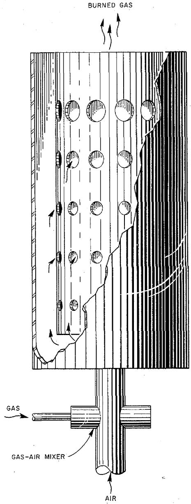  
Fig. 3.7. Natural-Gas High-Intensity Burner.

the trap and the fluoride-containing vessel.

Gas line plugging with zirconium fluoride vapor condensate occurred frequently at the pump tank of the ARE component test at K-25. Plugging was eliminated by heating the gas line to $1300^{\circ}\mathrm{F}$ and by installing the vapor trap so that no cold surfaces for vapor condensation were available until the gases reached the large cross-sectional area of the trap. This type of unit was first tested

while connected to a small tank of relatively stagnant $\mathsf{NaF - ZrF}_4\text{-UF}_4$ (53.5-40-6.5 mole %), at $1400^{\circ}\mathsf{F}$ . The unit operated for 500 hr, during which time approximately 125 ft³ of helium was bled into the tank and out through the vapor trap. No plugging of the trap or of the ½-in. gas lines had occurred at termination of the test. Examination of the vapor trap and heated tube revealed that all heated surfaces remained clear and that

condensation had occurred on only the cooled surfaces. A second unit was then installed in the test loop at K-25, and approximately 70 ft³ of vapor-laden helium was periodically vented from the pump tank without plugging. The trap has since operated over 900 hr with more than 100 periodic vent operations without plugging. Similar traps installed in the ARE fuel pump were also successful.

# 4. CRITICAL EXPERIMENTS

A. D. Callihan

Physics Division

# REFLECTOR-MODERATED REACTOR

B. L. Greenstreet

Aircraft Reactor Engineering Division

J. J. Lynn

D. V. P. Williams

Physics Division

R.M.Spencer

United States Air Force

J. S. Crudele

E.V.Sandin

J.W.Noaks

Pratt & Whitney Aircraft

The second of two critical assemblies of the reflector-moderated reactor was constructed as a part of a program presented previously. The reactor is composed of a beryllium reflector and a fuel region of enriched uranium metal and Teflon $(\mathrm{CF}_2)_n$ . The first assembly, an essentially spherical fuel core surrounded by the reflector, was described in the previous report. Since it contained no extraneous structural materials, the experimental results could be compared with the results of multigroup reactor calculations. The results of the second experiment were also to be correlated with the calculations, since the second assembly, too, was unpoisoned by structure. The assembly has a central polyhedral core, or island, of beryllium about 10 in. in diameter enclosed by a 4.5-in.-thick uranium-Teflon fuel annulus. The fuel is surrounded by an effectively infinite beryllium reflector. Aluminum shells, 0.065 in. thick, separate the fuel from the island and from the reflector and provide structural stability. The assembly is completely described elsewhere, and a summary of its composition is given in Table 4.1. Figure 4.1 is a view of the mid-section.

The calculated4 critical fuel loading was 7.16 kg of U235, or 0.142 g of U235 per cubic centimeter of fuel annulus. The first critical experimental array of 7.39 kg at a density of 0.146 g of U235

1D. Scott and B. L. Greenstreet, ANP Quar. Prog. Rep. Mar. 10, 1954, ORNL-1692, p 45.   
2D. Scott et al., ANP Quar. Prog. Rep. Sept. 10, 1954, ORNL-1771, p 44.   
3B. L. Greenstreet, Reflector-Moderated Critical Assembly Experimental Program - Part II, ORNL CF-54-10-119 (Oct. 19, 1954).   
4W.E.Kinney, private communication, Oct. 25, 1954.

per cubic centimeter of fuel annulus contained about $7.5\%$ excess reactivity. In order to completely fill the fuel region without excess control rod poison, it was necessary to decrease the loading to $4.66\mathrm{kg}$ of $\mathsf{U}^{235}$ at a density of 0.092 g of $\mathsf{U}^{235}$ per cubic centimeter of fuel annulus. This latter loading has been shown, by calibrated control rods, to contain $0.92\%$ excess reactivity, equivalent to about $0.31\mathrm{kg}$ of $\mathsf{U}^{235}$ , which gives $4.35\mathrm{kg}$ of $\mathsf{U}^{235}$ as the critical mass of the unpoisoned assembly.

A series of measurements of neutron and fissionrate distributions and of reactivity coefficients will be made prior to the incorporation, in the structure, of additional materials to simulate reactor components.

TABLE 4.1. COMPOSITION OF SECOND REFLECTOR-MODERATED REACTOR CRITICAL ASSEMBLY   

<table><tr><td colspan="2">Beryllium Island</td></tr><tr><td>Volume, ft3</td><td>0.37</td></tr><tr><td>Average radius, in.</td><td>5.18</td></tr><tr><td colspan="2">Fuel Annulus (exclusive cf aluminum core shells and interface sheets)</td></tr><tr><td>Volume, ft3</td><td>1.78 (50.4 liters)</td></tr><tr><td>Average inside radius, in.</td><td>5.18</td></tr><tr><td>Average outside radius, in.</td><td>9.57</td></tr><tr><td colspan="2">Mass of (kg)</td></tr><tr><td>Teflon*</td><td>99.38</td></tr><tr><td>Uranium</td><td>5.00</td></tr><tr><td>U235**</td><td>4.66</td></tr><tr><td>Uranium coating material</td><td>0.05</td></tr><tr><td>Scotch tape</td><td>0.12</td></tr><tr><td colspan="2">Core Shells and Interface Sheets</td></tr><tr><td>Mass of aluminum, kg</td><td>5.85</td></tr><tr><td colspan="2">Reflector</td></tr><tr><td>Volume, ft3</td><td>22.22</td></tr><tr><td>Minimum thickness, in.</td><td>11.5</td></tr><tr><td colspan="2">Mass of (kg)</td></tr><tr><td>Beryllium</td><td>1155.0</td></tr><tr><td>Aluminum</td><td>29.2</td></tr></table>

$^{*}$ Density, 1,97 g of Teflon per cubic centimeter of fuel annulus.

\*\*Density, 0.092 g of U235 per cubic centimeter of fuel annulus.

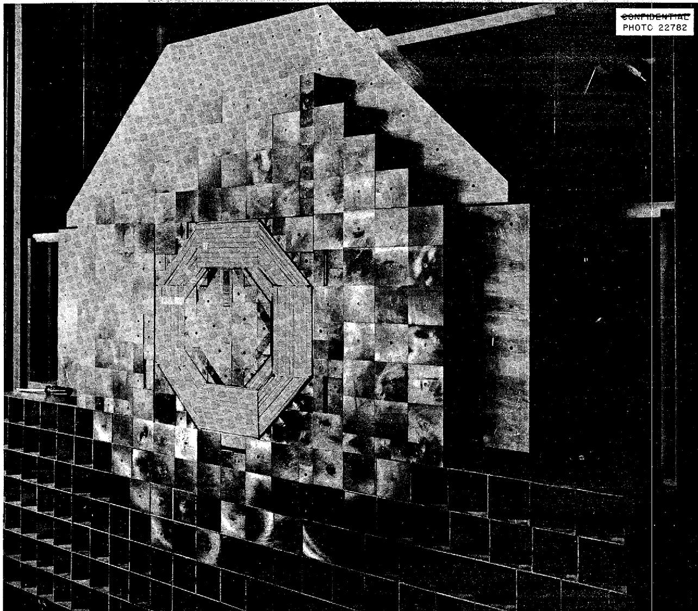  
Fig. 4.1. Second Reflector-Moderated Reactor Critical Assembly.

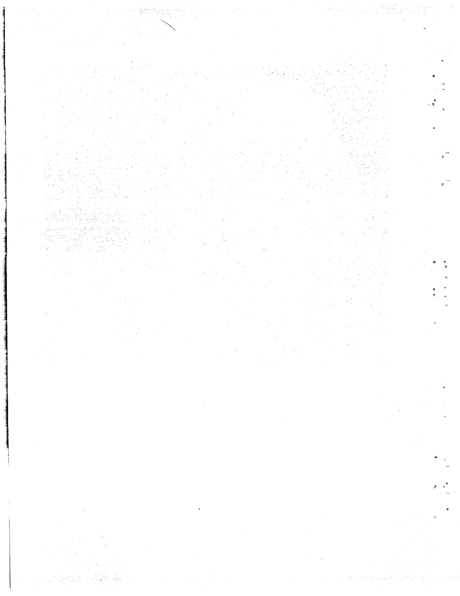

Part II

MATERIALS RESEARCH

# 5. CHEMISTRY OF MOLTEN MATERIALS

W. R. Grimes  
Materials Chemistry Division

Study of the NaF-ZrF4-UF4 system by the use of various techniques, including quenching, thermal analysis, and filtration, has continued. Improvements that have been made in quenching methods are expected to accelerate the availability of data by this method. Phase studies of the UF3-bearing fluoride systems have continued to be emphasized because of interest in their favorable corrosion characteristics. It is believed that problems attendant to handling the easily oxidized UF3 will be alleviated to some extent by extending phase studies to include LaF3, an isomorphous stable substitute for UF3.

Investigations of the chemical reactions in molten salts are continuing in an effort to understand the mechanisms involved in the purification of fluoride mixtures and in the reduction of $\mathsf{UF}_4$ to $\mathsf{UF}_3$ in fluoride melts. Similar studies of the corrosion products of Inconel in fluoride mixtures and of the reduction of $\mathsf{UF}_4$ by structural metals are under way.

A sufficient stock pile of purified zirconium fluoride-base fluoride mixtures will have been prepared by the end of this calendar year to allow termination of operation of the large-scale (250-lb capacity) production facility. Careful control of operating conditions in the pilot-scale facility has allowed production of sufficiently consistent $\mathsf{UF}_3$ content material to permit its release for corrosion testing. Electrolytic purification of NaF-ZrF4 mixtures has been adopted, and significant cuts in processing time have resulted. However, it has not been possible to cut the processing time of $\mathsf{UF}_4$ -bearing mixtures by using the electrolytic purification method.

In the fundamental studies of fused salts, values of the solubility of xenon in NaF-KF-LiF eutectic were obtained that confirmed the previous values. The new values were $8 \times 10^{-8}$ and $9.3 \times 10^{-8}$ mole of xenon per milliliter of melt at $260^{\circ}C$ and $8.9 \times 10^{-8}$ and $9.6 \times 10^{-8}$ at $450^{\circ}C$ . The change in solubility with temperature appears to be very small.

PHASE EQUILIBRIUM STUDIES

C.J.Barton

Materials Chemistry Division

H. Insley, Consultant

Solid Phase Studies in the NaF-ZrF $_4$ -UF $_4$ System

C.J.Barton

R.E.Moore

L. M. Bratcher

R.E.Thoma

Materials Chemistry Division

H. Insley, Consultant

Additional quenching data obtained with a number of compositions in the $\mathsf{NaF - ZrF_4 - UF_4}$ system have essentially confirmed previously reported findings. There was some indication from thermal analysis of mixtures along the $\mathsf{Na}_7\mathsf{U}_6\mathsf{F}_{31} - \mathsf{Na}_7\mathsf{Zr}_6\mathsf{F}_{31}$ join (formerly referred to as the $\mathsf{Na}_9\mathsf{U}_8\mathsf{F}_{41} - \mathsf{Na}_9\mathsf{Zr}_8\mathsf{F}_{41}$ join - the 7 to 6 ratio was adopted on the basis of structural considerations2) that these components may not form a complete series of solid solutions. Preliminary petrographic and x-ray diffraction studies of the slowly cooled melts lend support to this view, but quenching data will be obtained in order to assure that the crystalline phases observed represent equilibrium conditions. The perspective diagram shown in Fig. 5.1, prepared by R. M. Freestone, gives a picture of the liquidus relationships in this system.

Quenching studies in this system are expected to proceed at an accelerated pace because of the use of a new quenching apparatus similar to one recently developed at Mound Laboratory (private communication from E. Orban). The new apparatus allows a temperature gradient to be imposed upon a nickel capsule approximately 4 in. in length that contains a number of compartments, in each of which is a small quantity of the particular composition being investigated. Experiments with a $50^{\circ}\mathrm{C}$ temperature gradient along a capsule containing approximately 20 compartments have been carried out.

The apparatus consists of a round nickel block 9 in. in length and $1\frac{3}{4}$ in. in diameter, which is supported in a Marshall furnace by a nickel tube welded to the top. The capsules are supported inside the block in a $\frac{5}{16}$ -in. hole drilled from the bottom to within 2 in. of the top. The capsule

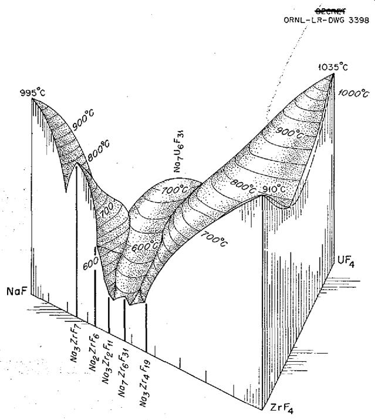  
Fig. 5.1. Phase Diagram of the NaF-ZrF $_4$ -UF $_4$ System.

rests on a nickel wire support, which, in turn, rests on a movable nickel platform at the bottom of the hole. Temperatures are determined at 11 points along the sample length by means of thermocouples and can be varied by adjustment of the various furnace windings. By moving the platform to one side with a handle above the furnace, the capsule and wire support are allowed to fall into an oil quenching bath.

# Phase Relationships in $\mathbf{U}\mathbf{F}_3$ -Bearing Systems

R.E.Moore

R.E.Thoma

Materials Chemistry Division

H. Insley, Consultant

Study of $\mathsf{UF}_3$ -bearing systems has been continued on NaF-ZrF4-UF3, NaF-UF3, KF-UF3, and ZrF4-UF4-UF3 mixtures. In addition, work was begun on NaF-LaF3 and KF-LaF3 systems, since LaF3 is known to be a stable "stand-in" for the more difficultly handled UF3. Work on the KF-UF3 mixtures has revealed that a red phase, formerly designated as $\mathsf{K}_3\mathsf{U}\mathsf{F}_{6'}$ may have as much as $75\%$ of the uranium in the tetravalent state; its apparent homogeneity over a wide range of $\mathsf{U}^{3 + } / \mathsf{U}^{4 + }$ is possibly due to a solid solution of $\mathsf{K}_3\mathsf{U}\mathsf{F}_7$ and

$\mathsf{K}_3\mathsf{U}\mathsf{F}_6$ The existence of the latter has yet to be demonstrated. It is now thought that $\mathsf{NaUF}_4$ rather than $\mathsf{Na}_3\mathsf{U}_2\mathsf{F}_9$ as previously postulated, is the empirical formula of an incongruity melting compound in the NaF-UF system.

$\mathsf{UF}_3$ in $\mathsf{ZrF}_4$ -Bearing Systems. Studies of $\mathsf{ZrF}_4$ - $\mathsf{UF}_4$ - $\mathsf{UF}_3$ mixtures were reported earlier. $^{3,4}$ The more recent of the reports indicated a probable composition of 50 mole $\%$ $\mathsf{ZrF}_4$ -25 mole $\%$ $\mathsf{UF}_4$ -25 mole $\%$ $\mathsf{UF}_3$ for a brownish, slightly birefringent phase noted in this system. Recent studies of mixtures in this system that were prepared by adding uranium metal to $\mathsf{ZrF}_4$ - $\mathsf{UF}_4$ mixtures and stirring the partially reduced melts until they solidified indicated that the mixture with the above composition consists of two phases, while a mixture containing 33.3 mole $\%$ $\mathsf{ZrF}_4$ -33.3 mole $\%$ $\mathsf{UF}_4$ -33.3 mole $\%$ $\mathsf{UF}_3$ is essentially a single-phase brownish crystalline material that is believed to be a compound. Another phase observed at higher $\mathsf{ZrF}_4$ concentrations, usually described as olive-drab, appeared to be the only phase present in a mixture containing 75 mole $\%$ $\mathsf{ZrF}_4$ -12.5 mole $\%$ $\mathsf{UF}_4$ -12.5 mole $\%$ $\mathsf{UF}_3$ . All these compositions are theoretical compositions based upon complete reaction between $\mathsf{UF}_4$ and uranium metal in the molten material. The meager analytical data available for such mixtures indicate that the reactions probably did not go to completion in all cases, and so the percentage of $\mathsf{UF}_4$ is likely to be higher and the percentage of $\mathsf{UF}_3$ lower than are shown by the formula.

In the NaF-ZrF4-UF3 system, four compositions were prepared along a join connecting the minimum melting compositions in the NaF-ZrF4 binary (42 mole % ZrF4; mp, 500°C) and the NaF-UF3 binary (29 mole % UF3; mp, 715°C). Liquidus temperatures determined by thermal analysis for the mixtures containing 5, 12, 20, and 25 mole % UF3 were 650, 775, 865, and 775°C, respectively. The 25 mole % UF3 mixture contained free UF3, in addition to the NaF-UF3 complex and Na3ZrF7.

KF-UF3 System. Earlier studies of KF-UF3 mixtures5 indicated the existence of two complexes. A red crystalline phase observed as the

principal phase in mixtures containing 75 mole % KF was believed to be $\mathsf{K}_3\mathsf{U}\mathsf{F}_6$ while a blue phase with optical properties similar to those of the blue $\mathsf{NaF - U}\mathsf{F}_3$ complex was assigned the formula $\mathsf{K}_3\mathsf{U}_2\mathsf{F}_9$ . It was also previously reported that all KF-bearing reduced-uranium mixtures that were analyzed chemically contained varying quantities of tetravalent uranium, usually in a form that could not be recognized as such either petrographically or by x-ray diffraction analysis. Some progress was made during the past quarter in gaining a better understanding of phase relationships in this KF system. Investigation of the $\mathsf{KF - U}\mathsf{F}_3$ system has been considerably aided by beginning the study of the $\mathsf{KF - LaF}_3$ system. The compound $\mathsf{LaF}_3$ is isomorphous with $\mathsf{U}\mathsf{F}_3$ , has almost identical lattice dimensions, and, furthermore, has only one stable valence state $(3+)$ , whereas $\mathsf{U}\mathsf{F}_3$ is maintained with difficulty. Dergunov published partial phase diagrams for the alkali fluoride- $\mathsf{LaF}_3$ systems, and Zachariasen has studied mixtures of KF and NaF with $\mathsf{LaF}_3$ by an x-ray diffraction technique. Both workers indicated only a single compound, $\mathsf{KL}\mathsf{a}\mathsf{F}_4$ , formed by these two components. According to Dergunov, it melts incongruity at $770^{\circ}\mathrm{C}$ . It seems probable, therefore, that the compound that was called $\mathsf{K}_3\mathsf{U}_2\mathsf{F}_9$ was actually $\mathsf{KUF}_4$ , with an incongruent melting point of $820 \pm 10^{\circ}\mathrm{C}$ . Tests performed during the past quarter demonstrated that the red crystalline phase formerly designated $\mathsf{K}_3\mathsf{U}\mathsf{F}_6$ can have as much as $75\%$ of the uranium in the tetravalent state. Since this phase is usually cubic, as is $\mathsf{K}_3\mathsf{U}\mathsf{F}_7$ , and has a refractive index near that of $\mathsf{K}_3\mathsf{U}\mathsf{F}_7$ , the most likely explanation of the homogeneity of the red phase over a wide range of $\mathsf{U}^{3+}/\mathsf{U}^{4+}$ ratios seems to be that a solid solution of $\mathsf{K}_3\mathsf{U}\mathsf{F}_7$ and $\mathsf{K}_3\mathsf{U}\mathsf{F}_6$ , a compound not yet demonstrated to exist, is formed. Dergunov reported a $\mathsf{Cs}_3\mathsf{La}\mathsf{F}_6$ compound, but the corresponding potassium compound apparently does not exist in slowly cooled melts at room temperature. There is no evidence, so far, that $\mathsf{U}\mathsf{F}_4$ can be concealed in the $\mathsf{KUF}_4$ complex; that is, partially reduced mixtures with a high concentration of uranium, 40 mole % or more, contain either a mixture of the red and blue crystalline

phases or a recognizable $\mathsf{UF}_4$ complex in addition to the KUF.

$\mathsf{NaF - UF}_3$ Systems. A partial phase diagram for the $\mathsf{NaF - UF}_3$ system was presented previously. No additional data have been obtained since that time, but available information on the NaF-LaF $^3$ system10,11 indicates that the incongruity melting compound in this UF $^3$ binary system is probably $\mathsf{NaUF}_4$ rather than $\mathsf{Na}_3\mathsf{U}_2\mathsf{F}_9$ . Since UF $^3$ is the primary phase that separates from the melt at the 50-50 composition and since UF $^3$ has a higher density than the liquid, it is likely that the earlier identification of compound composition was in error because of lack of equilibrium conditions on cooling.

# Solubility of UF4 in NaF-KF-LiF Eutectic

R.J.Sheil

Materials Chemistry Division

Thermal analysis data for $\mathsf{UF}_4$ dissolved in the NaF-KF-LiF eutectic composition (11.5-46.5-42.0 mole %) were reported earlier. $^{12}$ In view of current interest in alkali fluoride fuels, it appeared desirable to check the earlier data with newer techniques. A purified mixture containing 4 mole % $\mathsf{UF}_4$ was heated in a plastic inert atmosphere box similar to the one described previously. $^{13}$ The liquidus temperature for this mixture was determined by visual observation to be $560 \pm 10^{\circ}\mathrm{C}$ . The mixture was cooled to $500^{\circ}\mathrm{C}$ , and a sample of liquid was filtered through a nickel filter stick. Chemical analysis showed that 17.6 wt % uranium was in solution at $500^{\circ}\mathrm{C}$ as compared with 18.3 wt % in the unfiltered material. This shows that only 0.2 mole % $\mathsf{UF}_4$ precipitated in cooling from 560 to $500^{\circ}\mathrm{C}$ and helps to explain why it is difficult to detect liquidus temperatures in mixtures of this type by thermal analysis. It is probable that the solubility of $\mathsf{UF}_4$ in the NaF-KF-LiF eutectic is high enough to provide a usable fuel system for a reflector-moderated circulating-fuel reactor.

$\mathsf{UF}_3$ Stability

W.C.Whitley R.J.Sheil

Materials Chemistry Division

During the past quarter studies have been under way on the stability of $\mathsf{UF}_3$ separately and mixed with KF. Disproportionation of $\mathsf{UF}_3$ in KF in Inconel at $1000^{\circ}\mathsf{C}$ has been established. When contained alone in Inconel, $\mathsf{UF}_3$ does not detectably disproportionate below $1250^{\circ}\mathsf{C}$ .

Stability of $\mathsf{UF}_3$ at Elevated Temperatures. The disproportionation of $\mathsf{UF}_3$ as a function of temperature was studied earlier under high vacuum. Recent availability of high-purity $\mathsf{UF}_3$ made desirable a study of the high-temperature stability of $\mathsf{UF}_3$ in a helium atmosphere. For these experiments 25-g samples of $\mathsf{UF}_3$ that contained $99.4\%$ of the uranium in the trivalent form were sealed by welding in Inconel tubes containing $\frac{1}{3}$ atm of helium. After being heated at the desired temperature for 1 hr, the tubes were removed from the furnace and were air quenched to minimize recombination of $\mathsf{UF}_4$ and uranium metal. After the $\mathsf{UF}_3$ samples were cooled to room temperature and ground in an inert atmosphere, they were examined petrographically, by x-ray diffraction, and by chemical analysis. The sample heated to $1200^{\circ}\mathsf{C}$ showed no evidence of disproportionation, the sample heated to $1250^{\circ}\mathsf{C}$ showed very slight evidence, and the sample heated to $1300^{\circ}\mathsf{C}$ showed definite evidence. In addition to the increase in $\mathsf{UF}_4$ content noted in the petrographic examination, an increase in $\mathsf{U}^{4+}$ was shown by chemical analysis (from 0.6 to $1.6\%$ ), and the presence of uranium in the tube walls that had been in contact with the $\mathsf{UF}_3$ was established. These data show that $\mathsf{UF}_3$ is more stable at elevated temperatures than estimates of its thermodynamic properties[14,15] had indicated. It is interesting to note that the sample of $\mathsf{UF}_3$ heated to $1300^{\circ}\mathsf{C}$ was practically insoluble in boiling $10\textbf{N}$ HCl, whereas samples heated to lower temperatures dissolved readily in this solvent. This could indicate that either a sintering action occurred, which takes place in oxide systems well below the melting point, or

that the small amount of liquid $\mathsf{UF}_4$ formed at the high temperature exerted a cementing action of the $\mathsf{UF}_3$ crystals on solidifying.

Stability of $\mathsf{UF}_3$ in KF. An attempt was made to determine the stability of $\mathsf{UF}_3$ in molten KF as a function of temperature by starting with dry KF and high purity $\mathsf{UF}_3$ (99.4%). Mixtures of KF and $\mathsf{UF}_3$ in the molar ratios of KF to $\mathsf{UF}_3$ of 3.0, 1.5, and 1.0 were mixed, sealed in Inconel capsules containing $1/3$ atm of helium, and heated for 2 hr at various temperatures before air quenching. A period of two weeks elapsed between the time of the experiment and the time that the samples were submitted for chemical analysis for total uranium and $\mathsf{U}^{3+}$ , and thus there is some doubt of the significance of the $\mathsf{U}^{3+}$ determinations. However, both the total uranium and the trivalent uranium values exhibited a downward trend with increasing temperature in the temperature range 750 to $1050^{\circ}\mathsf{C}$ for mixtures having a 3 to 1 KF- $\mathsf{UF}_3$ molar ratio. An average of 7 moles of $\mathsf{UF}_3$ disappeared per gram-atom of uranium lost, presumably by alloying of the uranium metal with the Inconel capsule walls. Mixtures having 1.5 to 1 and 1 to 1 KF- $\mathsf{UF}_3$ molar ratios were heated to 850 and $1050^{\circ}\mathsf{C}$ . Analyses of these melts also showed the downward trend in $\mathsf{U}^{3+}$ and total uranium values with increasing temperature. In these samples, however, the ratio of moles of $\mathsf{UF}_3$ (or gram-atoms of trivalent uranium) to gram-atoms of uranium lost averaged about 5 as compared with the theoretical value of 4. The capsules used to contain these materials were not analyzed for metallic uranium; however, a similar experiment was performed in which an 85 mole % KF-15 mole % $\mathsf{UF}_3$ mixture was heated to $1000^{\circ}\mathsf{C}$ in an Inconel capsule for 90 min. The melt was sampled by drilling after the top and bottom of the capsule had been cut off. The remainder of the melt was dissolved out, and the walls were carefully cleaned mechanically; then, approximately 7 mils of the tube wall that had been in contact with the melt was removed by drilling. Flashes of light observed during drilling gave a qualitative indication of the presence of uranium in the tube walls which was confirmed by chemical analysis, which showed 17.9 wt % uranium. The total of 0.28 g of uranium that was recovered from the tube walls represented 3.6% of the total uranium contained in the KF- $\mathsf{UF}_3$ mixture. Analysis of the melt showed 70% of the total uranium to be in the trivalent state. It seems certain that dispro

portionation of $\mathsf{UF}_3$ occurred at a lower temperature than would have been expected in the absence of KF. Further experimentation is planned to determine the stability of $\mathsf{UF}_3$ in KF and other solvents as a function of temperature and of container material. Preliminary experiments indicate that $\mathsf{UF}_3$ may be more stable when dissolved in KF in a platinum container than in a nickel container.

# Differential Thermal Analysis

C.J.Barton Materials Chemistry Division D.L. Stockton Merck and Company, Inc.

As a result of the high frequency of failures experienced with nickel capsules containing NaF-UF $^4$ samples, a new system was designed for containing samples during differential thermal analysis. Graphite containers constructed so that the thermocouple junctions can be immersed directly in the melt are now being used. The new system is designed to permit evacuation before introduction of helium as the inert atmosphere.

A cylindrical graphite block (3% in. in diameter and 6 in. high) serves as a heat sink inside a nickel reaction vessel (4 in. in diameter and 7 in. deep) with a flanged head. Six graphite thimbles, ½ in. ID, ¾ in. OD, and 3 in. deep, are spaced on a hexagonal array inside the upper half of the graphite block. Each thimble is filled to a depth of about 1 in. with either sample (about 6 g) or reference material, Al₂O₃; the sample depth is reduced by about 50% upon melting.

A $3/8$ -in.-dia nickel tube which contains two Chromel-Alumel thermocouples contained in a single four-hole porcelain insulator extends into each sample thimble. The thermocouples pass through a Kovar seal to allow evacuation.

The six nickel thermocouple lead tubes are connected to the flanged top by Swagelok fittings. In addition, the head has three $\frac{1}{4}$ -in. Swagelok fittings, for vacuum-venting helium, and a pressure indicator. Three posts support a circular plastic ring, which serves as a 24-point jack-panel. The center section of the posts is $\frac{3}{8}$ -in. tubing to permit water cooling so that the plastic ring is maintained at room temperature. Preliminary tests with this apparatus indicate that it may be difficult to obtain a sufficiently vacuum-tight assembly to avoid oxidation of $UF_4$ . It has shown very high

sensitivity as compared with the nickel capsule technique and may be very useful if the oxidation difficulty can be overcome. Further experimentation with this apparatus and with simplified equipment that will permit the use of smaller samples is in progress.

# CHEMICAL REACTIONS IN MOLTEN SALTS

F.F.Blankenship L.G.Overholser W.R.Grimes Materials Chemistry Division

# Reduction of $\mathsf{FeF}_2$ by $\mathsf{H}_2$ in NaF-ZrF4 Systems

C. M. Blood Materials Chemistry Division

The reduction of $\mathsf{FeF}_2$ with hydrogen is of particular significance in considering the time necessary for purification of $\mathsf{NaZrF}_5$ mixtures, as discussed previously, $^{16}$ and has therefore been studied in considerable detail. The reaction

$$
F e F _ {2} + H _ {2} \rightleftharpoons F e ^ {o} + 2 H F
$$

was previously explored by a dynamic method and by an equilibration method that actually determined equilibrium conditions of the system. During the past quarter the dynamic method was employed further.

Measurements of the equilibrium HF pressures from the reduction of $\mathsf{FeF}_2$ in $\mathsf{NaZrF}_5$ by hydrogen gave, as a preliminary result, an equilibrium constant, $K_{1}$ of 0.2 at $600^{\circ}C$ as compared with the value of 2.0 at $800^{\circ}C$ previously reported. The equilibrium constant is calculated from the equation

$$
K _ {x} = \frac {P _ {\mathrm {H F}} ^ {2}}{P _ {\mathrm {H} _ {2}} ^ {2} \cdot C _ {\mathrm {F e F} _ {2}}}
$$

where $P$ is expressed in atmospheres and $C$ in mole fractions.

# Reduction of $\mathbf{U}\mathbf{F}_{4}$ to $\mathbf{U}\mathbf{F}_{3}$ in Fluoride Melts

H. A. Friedman  
Materials Chemistry Division

Determination of the effect of reaction conditions on the extent of reduction of $\mathsf{UF}_4$ to $\mathsf{UF}_3$ in fluoride melts have continued by the use of a previously described procedure.[17] To determine

whether a greater percentage of $\mathsf{UF}_4$ could be reduced to $\mathsf{UF}_3$ in NaF-LiF-KF (11.5-46.5-42.0 mole %) at a lower temperature than previously used, a trial was made in nickel at $500^{\circ}\mathrm{C}$ . After 2 hr of equilibration of the alkali fluoride with sufficient $\mathsf{UF}_4$ to equal 25 wt % uranium as $\mathsf{UF}_3$ and 100% excess uranium metal, the mixture could not be filtered, and no quadrivalent uranium was detectable by petrographic or x-ray analyses. Thus complete reduction of $\mathsf{UF}_4$ to $\mathsf{UF}_3$ was indicated.

A similar experiment involved equilibrating the NaF-LiF eutectic (40-60 mole %) in nickel for 2 hr at $725^{\circ}\mathrm{C}$ with added $\mathsf{UF}_4$ and an excess of uranium metal. Chemical analysis revealed that all the uranium present after the test (25 wt %) was in the trivalent form. When the same type of experiment was carried out with the LiF-KF eutectic (50-50 mole %) at $600^{\circ}\mathrm{C}$ , only $60\%$ of uranium was found to have been reduced. Thus KF appears to differ from NaF and LiF as a solvent for $\mathsf{UF}_4$ and $\mathsf{UF}_3$ .

A trace of volatilized alkali metal was the only evidence of reduction when purified KF was heated at $900^{\circ}\mathrm{C}$ for 2 hr with finely divided uranium metal. A similar result was noted when NaF-KF-LiF

(11.5-42.0-46.5 mole $\%$ ) was heated to $700^{\circ}\mathrm{C}$ with uranium metal for 4 hr with gas stirring. Disproportionation of $\mathsf{UF}_3$ is therefore seen as a reasonable explanation for the quadrivalent uranium found in $\mathsf{UF}_3$ -KF mixtures.

Heating of high-purity $\mathsf{UF}_3$ with the NaF-KF-LiF mixture at $800^{\circ}C$ yielded material which, when filtered, was found to have $73\%$ of the uranium in the filtrate, as well as all the uranium in the residue, present as $\mathsf{U}^{3+}$ . Evidence of slight volatilization of the alkali metal precludes a definite conclusion as to whether reduction of KF or disproportionation of $\mathsf{UF}_3$ was responsible for the detected $\mathsf{UF}_4$ ; however, the presence of uranium metal also in the residue indicates strongly that some disproportionation took place.

# Electrochemistry of Fused Salts

L. E. Topol

Materials Chemistry Division

Decomposition potential measurements of molten KCl and of chromous and chromic chlorides dissolved in KCl have been continued. These electrolyses, reported in Table 5.1, conclude, for the present, the decomposition study in fused KCl.

TABLE 5.1. DECOMPOSITION POTENTIALS OF VARIOUS CHLORIDES IN KCI AT ${850}^{ \circ  }\mathrm{C}$   
Anode: Carbon   

<table><tr><td>Salt</td><td>Salt in KCl* (mole %)</td><td>Container</td><td>Cathode</td><td>Atmosphere</td><td>E(observed) (v)</td></tr><tr><td rowspan="2">KCl**</td><td>100</td><td>Platinum</td><td>Crucible</td><td>He</td><td>3.25 to 3.30</td></tr><tr><td>100</td><td>Platinum</td><td>Crucible</td><td>He</td><td>2.90 to 2.75</td></tr><tr><td rowspan="4">CrCl3</td><td>3.0</td><td>Morganite Al2O3</td><td>Platinum</td><td>He</td><td>0.55 to 0.65, 0.30 to 0.36, 0.90 to 1.05, 1.65 to 1.80, 0</td></tr><tr><td>33.3</td><td>Morganite Al2O3</td><td>Nickel</td><td>He</td><td>1.60, 0.70 to 0.80, 1.25 to 1.35</td></tr><tr><td>33.3</td><td>Morganite Al2O3</td><td>Platinum</td><td>He</td><td>0.45 to 0.50, 1.04 to 1.15, 1.25, 1.45, 1.57, 0</td></tr><tr><td>33.3</td><td>Morganite Al2O3</td><td>Platinum</td><td>H2</td><td>0.98 to 1.03, 1.22</td></tr><tr><td>CrCl2(old)</td><td>3.0</td><td>Morganite Al2O3</td><td>Nickel</td><td>H2</td><td>1.06, 1.45 to 1.50, 1.75</td></tr><tr><td>(fresh)</td><td>3.0</td><td>Morganite Al2O3</td><td>Nickel</td><td>H2</td><td>1.70 to 1.80, 1.15 to 1.25</td></tr><tr><td>(old)</td><td>3.0</td><td>Morganite Al2O3</td><td>Nickel</td><td>He</td><td>1.20 to 1.45</td></tr><tr><td rowspan="2">(fresh)</td><td>3.0</td><td>Morganite Al2O3</td><td>Nickel</td><td>He</td><td>1.16, 1.67 to 1.75, 1.35 to 1.65</td></tr><tr><td>33.3</td><td>Morganite Al2O3</td><td>Nickel</td><td>He</td><td>0.90 to 0.98</td></tr></table>

*These concentrations were made by mixing together the appropriate weights of the salts.   
**This run was made with a slotted Morganite crucible inserted between the two electrodes as a diaphragm.

In the electrolyses of KCl the variable in the two experiments was the insertion of a "diaphragm" between the electrodes in one of the runs. The diaphragm could produce the following effects: first, although the surface areas of the electrodes involved were the same in both runs, the interposition of an insulating crucible with a small hole through which all the current must flow could result in a smaller effective surface area for the cathode. Thus, despite the maximum current in each cell being the same (1 amp), the current density of the unseparated cell might not have been large enough to extrapolate to a true value of $E$ , the decomposition potential. Second, and more likely, the lower voltages obtained in the cell without the diaphragm were due to interaction of the electrode products at one of the electrodes. It should be noted also that the decomposition potentials measured in this case decreased with time. In other runs with KCl for which small cathodes were used, for example, rods or wires, decomposition potentials of around 3.25 v were found, with or without the use of a diaphragm. This anomaly may be due to a greater evolution of gaseous potassium at an electrode of small surface area, whereas a thin layer of potassium formed over a large area may go into solution more readily.

The chlorides of chromium may undergo the following electrochemical reactions at inert electrodes:

(1) $\mathrm{CrCl}_2 = \mathrm{Cr} + \mathrm{Cl}_2$ ， $\mathrm{E}^{\circ} = 1.36 \mathrm{~V}$ ，  
(2) $3\mathrm{CrCl}_2 = 2\mathrm{CrCl}_3 + \mathrm{Cr},$ $\mathrm{E}^{\circ} = 0.84\mathrm{v}$   
(3) $2\mathrm{CrCl}_3 = 2\mathrm{Cr} + 3\mathrm{Cl}_2$ ， $\mathbf{E}^{\circ} = 1.08\mathrm{v}$   
(4) $2\mathrm{CrCl}_3 = 2\mathrm{CrCl}_2 + \mathrm{Cl}_2$ ， $\mathrm{E}^{\circ} = 0.52\mathrm{v}$

From the tabulated data it seems that only concentrated $\mathrm{CrCl}_2$ solutions and concentrated $\mathrm{CrCl}_3$ solutions in hydrogen undergo simple decomposition processes. However, it appears likely that $\mathrm{CrCl}_3$ may have been reduced by $\mathsf{H}_2$ to $\mathrm{CrCl}_2$ and that it is the latter which is being electrolyzed. Previous results with dilute $\mathrm{CrCl}_3$ solutions in $\mathsf{H}_2$ gave similar indications.[18] The compound $\mathrm{CrCl}_2$ is very unstable and oxidizes readily when exposed to air or moisture; therefore data have been included both for fresh samples of the salt and for samples that had been contained in tightly

sealed containers for several days. Although there are differences in the measured decomposition potentials, it is difficult to explain them and the wide ranges of values found. There is no evidence of dilute solutions of $\mathrm{CrCl}_2$ undergoing reaction 2 electrolytically, although thermal disproportionation cannot be ruled out. There are similar varied and divergent values of $E$ for both dilute and concentrated $\mathrm{CrCl}_2$ solutions in an inert atmosphere. In this case there is evidence of reaction 4 occurring in solutions of various concentrations. At the end of most of the runs, current-voltage curves intersected the origin and indicated the anode and cathode reactions to be equal and opposite:

$$
C r ^ {3 +} + e ^ {-} = C r ^ {+ +}.
$$

In every case a deposit of metallic chromium was found on the cathode.

Although decomposition potential measurements have been terminated, electrochemical studies in fused salts are to be continued and will include emf measurements, primarily in fused fluorides, with special emphasis to be placed on finding a reversible fluoride electrode.

# Stability of Chromous and Ferrous Fluorides in Molten Fluorides

J.D.Redman

C. F. Weaver

Materials Chemistry Division

The compound $\mathsf{CrF}_2$ or some complex compound of divalent chromium is quite stable in $\mathsf{NaZrF}_5$ melts. When $\mathsf{CrF}_3$ is added to such melts, it is reduced to the divalent state even by metals as noble as nickel; this reduction is, apparently, quantitative.[19] These observations are in accord with the known fact that $\mathsf{CrF}_2$ is the corrosion product when $\mathsf{NaF - ZrF}_4\text{-UF}_4$ melts are tested in alloys of chromium.

However, when NaF-KF-LiF-UF4 melts are tested in similar alloys, the reaction product is trivalent chromium, and complex fluochromates $(\mathsf{K}_2\mathsf{NaCrF}_6)$ are observed in the cooled melts.

Recent studies made with apparatus and techniques very similar to those described previously in connection with the $\mathsf{UF}_4$ - $\mathsf{Cr}^{\circ}$ reaction have indicated that this behavior must be expected.

In these experiments, pure preparations of $\mathsf{CrF}_2$ or $\mathsf{CrF}_3$ were added to the NaF-KF-LiF eutectic in apparatus of nickel, maintained at the indicated temperature for 5 hr, and filtered. Data obtained by analysis of the filtrates are shown in Table 5.2.

TABLE 5.2. STABILITY OF ${\mathrm{{CrF}}}_{2}$ AND ${\mathrm{{CrF}}}_{3}$ IN MOLTEN NaF-LiF-KF   

<table><tr><td rowspan="2">Additive</td><td rowspan="2">Temperature (°C)</td><td colspan="3">Found in Filtrate</td></tr><tr><td>Cr2+ (ppm)</td><td>Cr3+ (%)</td><td>Ni2+ (ppm)</td></tr><tr><td rowspan="9">CrF3equivalent to 4.8 wt % Cr3+</td><td rowspan="4">600</td><td>120</td><td>1.08</td><td>260</td></tr><tr><td>520</td><td>0.74</td><td>40</td></tr><tr><td>90</td><td>0.91</td><td>60</td></tr><tr><td>370</td><td>1.00</td><td>820</td></tr><tr><td rowspan="5">800</td><td>600</td><td>3.63</td><td>15</td></tr><tr><td>430</td><td>4.22</td><td>30</td></tr><tr><td>480</td><td>4.22</td><td>30</td></tr><tr><td>440</td><td>3.60</td><td></td></tr><tr><td>Cr2+ (%)</td><td></td><td></td></tr><tr><td rowspan="8">CrF2equivalent to 5.8 wt % Cr2+</td><td rowspan="4">600</td><td>0.39</td><td>1.12</td><td>40</td></tr><tr><td>0.33</td><td>0.86</td><td>50</td></tr><tr><td>0.32</td><td>0.87</td><td>30</td></tr><tr><td>0.10</td><td>1.11</td><td>50</td></tr><tr><td rowspan="4">800</td><td>1.05</td><td>2.97</td><td>40</td></tr><tr><td>0.94</td><td>3.30</td><td>30</td></tr><tr><td>0.99</td><td>3.24</td><td>90</td></tr><tr><td>0.98</td><td>3.35</td><td>20</td></tr></table>

These data indicate that $\mathsf{CrF}_3$ in NaF-KF-LiFeutectic is quite stable toward reduction by nickel. In the most favorable case, less than $10\%$ of the $\mathsf{CrF}_3$ appears as $\mathsf{Cr}^{+ + }$ . The solubility of trivalent chromium seems to be at least 10,000 ppm at $600^{\circ}\mathsf{C}$ and at least 40,000 ppm at $800^{\circ}\mathsf{C};$ the solid phases observed in the cooled melts were complex fluochromates.

When $\mathsf{CrF}_2$ is the additive, however, the situation is entirely different. Most of the dissolved chromium is trivalent; complex fluochromates are observed in the cooled filtrate. The amount of material added was such as to exceed the solubility of $\mathsf{CrF}_3$ at $600^{\circ}\mathsf{C}$ ; so at that temperature no material balance is possible. At $800^{\circ}\mathsf{C}$ , however, the solubility limit was, apparently, not

exceeded, and the concentrations found corresponded extremely well to those to be expected if chromium metal were not soluble in the melt and if the reaction

$$
3 C r F _ {2} \rightleftharpoons 2 C r F _ {3} + C r ^ {\circ}
$$

had occurred. Published figures for $\Delta F^{\circ}$ for $\mathsf{CrF}_2$ and $\mathsf{CrF}_3$ show that the standard free energy for the reaction, as written, is $+14\mathrm{kcal}$ and suggest that

$$
K _ {\mathrm {e q}} = \frac {a ^ {2} \mathrm {C r F} _ {3}}{a ^ {3} \mathrm {C r F} _ {2}} = 1 0 ^ {- 3} \mathrm {a t} 8 0 0 ^ {\circ} \mathrm {C}.
$$

This disproportionation must be considered to be surprising. If $K_{\mathrm{eq}}$ is to be reconciled with the observed value, the activity coefficient of $\mathrm{CrF}_3$ in the melt must be less than $10^{-3}$ . Additional data at various temperatures and concentration levels to be obtained in the near future should afford a more accurate estimation of the equilibrium constant for this reaction.

When ferrous fluoride is added to the NaF-KF-LiF mixture in equipment of nickel, no appreciable reaction is observed. The solubility of $\mathsf{FeF}_2$ appears to be 12 wt % at $600^{\circ}\mathrm{C}$ and 19 wt % at $800^{\circ}\mathrm{C}$ , and it appears that $\mathsf{FeF}_2$ is disproportionated very slightly, if at all.

If ferric fluoride is added to NaF-KF-LiF in equipment of nickel, considerable quantities of $\mathsf{NiF}_2$ are observed in the filtrate, and thus reduction of the $\mathsf{Fe}^{3+}$ by nickel metal is indicated. However, the experiments made to date have not afforded reasonable material balances between $\mathsf{NiF}_2$ , $\mathsf{FeF}_2$ , and $\mathsf{FeF}_3$ in the system. Additional data will be required before this reaction can be evaluated.

# Reduction of $\mathbf{U}\mathbf{F}_{4}$ by Structural Metals

J.D.Redman C.F.Weaver

Materials Chemistry Division

The apparatus and techniques for experimental determination of equilibrium constants for the reactions

$$
C r ^ {\circ} + 2 U F _ {4} = C r F _ {2} + 2 U F _ {3}
$$

and

$$
F e ^ {\circ} + 2 U F _ {4} = C r F _ {2} + 2 U F _ {3}
$$

have been described in previous quarterly reports.21 Equilibrium data have been shown for the case in which the pure metals have served as the reducing agents and the solvent was $\mathsf{NaZrF}_5$ .

By application of identical techniques, additional data have been obtained on the $\mathsf{UF}_4$ -Fe reaction, for reduction of $\mathsf{UF}_4$ by Inconel, and for reactions of $\mathsf{UF}_4$ with the pure metals in the NaF-KF-LiF eutectic.

The results of some additional studies on the system

$$
F e ^ {o} + 2 U F _ {4} = 2 U F _ {3} + F e F _ {2}
$$

in $\mathsf{NaF - ZrF}_4$ at 600 and $800^{\circ}C$ are given in Table 5.3. In these experiments, $2\mathrm{g}$ of hydrogen-fired iron wire was reacted with $\mathsf{UF}_4$ in about $40\mathrm{g}$ of $\mathsf{NaF - ZrF}_4$ . The values for $K_{x}$ reported are defined as

$$
K _ {x} = \frac {C _ {\mathrm {U F} _ {3}} ^ {2} C _ {\mathrm {F e F} _ {2}}}{C _ {\mathrm {U F} _ {4}} ^ {2}},
$$

where the concentrations are given in mole fractions with the NaF-ZrF4 content considered as equal to 2 moles. The values for the UF3 concen

TABLE 5.3. EQUILIBRIUM DATA FOR THE SYSTEM ${\mathrm{{Fe}}}^{ \circ  } + 2{\mathrm{{UF}}}_{4} = 2{\mathrm{{UF}}}_{3} + {\mathrm{{FeF}}}_{2}$ IN MOLTEN NaF-ZrF ${}_{4}$ AT 600 AND ${800}^{ \circ  }\mathrm{C}$   
UF4 Added: 0.360 mole/kg of melt   

<table><tr><td>Temperature (°C)</td><td>Concentration* of Fe++ in Filtrate (ppm)</td><td>Kx</td></tr><tr><td>600</td><td>410</td><td>8.3 × 10-7</td></tr><tr><td></td><td>460</td><td>1.3 × 10-6</td></tr><tr><td></td><td>540</td><td>2.4 × 10-6</td></tr><tr><td></td><td>390</td><td>6.6 × 10-7</td></tr><tr><td>800</td><td>275</td><td>1.8 × 10-7</td></tr><tr><td></td><td>310</td><td>3.0 × 10-7</td></tr><tr><td></td><td>300</td><td>2.6 × 10-7</td></tr><tr><td></td><td>340</td><td>4.2 × 10-7</td></tr></table>

*Blank of 100 ppm to be subtracted from determined values in calculations.

trations have been calculated from the $\mathsf{Fe}^{+ + }$ values found for the filtrates, since a reliable method for determining $\mathsf{UF}_3$ in this mixture is not available.

It will be noted that the values given for $K_{x}$ at $600^{\circ}C$ are larger than those at $800^{\circ}C$ , which is in agreement with all previous measurements. The values at the respective temperatures are also in fair agreement with those given earlier.

The reaction between $\mathsf{UF}_4$ and chromium in Inconel with NaF-ZrF as solvent has been investigated at $800^{\circ}C$ . In these experiments, 2 g of Inconel (hydrogen fired at $1200^{\circ}C$ ) was contacted with the melt for 5 hr prior to filtration. The results are given in Table 5.4.

The values given in Table 5.4 for the equilibrium constant are lower by about a fivefold factor than those obtained when chromium metal was used. It is possible that the activity of chromium metal in Inconel is appreciably less than its mole fraction. It appears more likely, however, that these experiments represent "equilibrium" with Inconel whose surface layer is depleted of chromium metal. Additional data will be obtained by using longer equilibration times and varying surface-to-volume ratios.

A study of equilibria for reactions of $\mathsf{Fe}^{\circ}$ and $\mathsf{Cr}^{\circ}$ with $\mathsf{UF}_4$ in the NaF-KF-LiF eutectic has been started. It has been observed that when $\mathsf{Fe}^{\circ}$ is equilibrated with the NaF-KF-LiF mixture alone about 100 ppm of Fe (presumably $\mathsf{Fe}^{++}$ ) is found in the filtrate. This is very close to the

TABLE 5.4. DATA FOR THE REACTION   
$\mathrm{Cr(INCONEL)} + 2\mathrm{UF}_4 = 2\mathrm{UF}_3 + \mathrm{CrF}_2$ AT $800^{\circ}\mathrm{C}$ IN MOLTEN NaF-ZrF4   

<table><tr><td colspan="2">UF4 Added: 0.360 mole/kg of melt</td></tr><tr><td>Concentration* of 
Cr++ in Filtrate 
(ppm)</td><td>Kx**</td></tr><tr><td>680</td><td>2.3 × 10-5</td></tr><tr><td>695</td><td>2.3 × 10-5</td></tr><tr><td>610</td><td>1.5 × 10-5</td></tr><tr><td>465</td><td>4.2 × 10-6</td></tr></table>

*Blank of 190 ppm to be subtracted from determined values in calculations.   
**Activity of chromium in Inconel assumed to be equal to mole fraction (0.2).

value obtained by equilibration of $\mathsf{Fe}^{\circ}$ with $\mathsf{NaZrF}_5$ in similar equipment. However, equilibration of $\mathsf{Cr}^{\circ}$ with the alkali fluoride eutectic produces about 500 ppm of Cr in solution, and, based on the findings reported in the preceding section, this is, presumably, a mixture of $\mathsf{Cr}^{3+}$ and $\mathsf{Cr}^{++}$ . This high concentration of soluble chromium in the NaF-KF-LiF system is surprising, since about 100 ppm of $\mathsf{Cr}^{++}$ is obtained in a similar equilibration with $\mathsf{NaZrF}_5$ . The reaction responsible for this high "blank" value is not yet known.

Preliminary data for the reaction of $\mathsf{UF}_4$ with $\mathsf{Cr}^{\circ}$ in this solvent indicate that at $300^{\circ}\mathsf{C}$ about 2500 ppm of Cr is present in the equilibrium filtrate; this is nearly the same concentration that results in $\mathsf{NaZrF}_5$ . At $600^{\circ}\mathsf{C}$ , however, about 1200 ppm of Cr is recovered in the filtrate. It appears, therefore, that the complex reaction in NaF-KF-LiF is much more temperature sensitive than is the simple reaction in $\mathsf{NaZrF}_5$ .

# PRODUCTION OF PURIFIED MOLTEN FLUORIDES

F. F. Blankenship G. J. Nessle

L. G. Overholser

Materials Chemistry Division

# Electrolytic Purification of Zirconium-Base Fluorides

C. M. Blood

H. A. Friedman

F. W. Miles

F. P. Boody

Materials Chemistry Division

Interest in the extremely short process time and high efficiency obtained in the electrolytic purification of molten $\mathsf{NaF - ZrF_4}$ mixtures led to an exploration of the limitations of electrolysis as a means of purification. At cathode current densities up to $0.3\mathrm{amp / cm}^2$ , the presence of $\mathsf{UF}_4$ in a salt mixture was found to greatly reduce the efficiency of electrolysis because the reduction of $\mathsf{UF}_4$ to $\mathsf{UF}_3$ at the cathode was counteracted by the oxidation of $\mathsf{UF}_3$ to $\mathsf{UF}_4$ at the anode. A steady state was approached when about $5\%$ of the $\mathsf{UF}_4$ had been converted to $\mathsf{UF}_3$ . Apparently the rapid reductions obtained with NaF-ZrF mixtures containing no $\mathsf{UF}_4$ were due, in large part, to the electrolytic precipitation of zirconium metal on the cathode and to the removal of fluorine as HF when $\mathsf{H}_2$ was used as the stripping gas or as fluorocarbons when He was used. The reduced metallic impurities were precipitated in the

cathode deposit. Any structural metal ions which were not deposited as a primary electrode process were precipitated by reaction with the zirconium metal.

Electrolysis was most effective in purification when two advantages were achieved: first, a rapid rate of over-all reduction of the melt, or a good current efficiency, as measured by a high rate of removal of HF or fluorocarbons, and second, the deposition of impurities as an adherent cathode coat which could be removed from the cell. In NaF-LiF-KF mixtures the electrolytically reduced potassium was slightly soluble in the melt, and therefore oxidation of dissolved potassium at the anode nullified reduction at the cathode and the current efficiency for over-all reduction was low. Also, an adherent cathode deposit was not regularly found. Presumably, both these advantages could be regained, not only for the NaF-LiF-KF system but for UF4-containing melts as well, by alterations in cell design, electrode construction, and current densities.

Some of the incidental points noted were that $O^{- - }$ and $\mathsf{SO}_4^{--}$ could be removed by electrolysis in NaF-ZrF4melts, and hence HF treatment is not necessarily required in the purification of salt mixtures. Platinum was unsuitable as an anode material. The NaF-LiF-KF mixtures were particularly prone to show an "anode effect," or gas polarization of the graphite anode, when there was a slight contamination by air. The UF-UF3 oxidation-reduction system showed no polarization at graphite anodes or nickel cathodes.

The electrolyses were carried out in apparatus of the type previously described.22 The graphite anodes were $1.12\mathrm{cm}$ in diameter and were immersed to a depth of about $10~\mathrm{cm}$ to give an area of about $25~\mathrm{cm}^2$ . The cathodes were constructed of a $\frac{3}{8}$ -in.-dia cylinder of nickel gauze having a calculated immersed area of about $70~\mathrm{cm}^2$ . The wet areas of the pot and of the probes which were occasionally used as electrodes were 500 and $10~\mathrm{cm}^2$ , respectively. Ordinarily, 10 amp was passed during any continuous electrolysis step.

Preliminary results with $\mathsf{SO}_4$ - removal were sufficiently encouraging that an electrolysis trial with helium as the sweep gas was carried out on a 3-kg batch of NaF-ZrF $_4$ (53-47 mole %) which had received no previous purification other than

the drying which occurred on heating to $600^{\circ}C$ . When the current was applied at $600^{\circ}C$ , 30 v was required to obtain 1 amp. The anode was removed for examination, found to be in good condition, and reinstalled. Apparently, this was an "anode effect," and it was probably due to the presence of oxygen, which is frequently encountered in the electrolysis of fluoride melts with carbon anodes. By using a helium sweep rate of $200~\mathrm{cm}^3/\mathrm{min}$ , $\mathrm{CF}_4$ was found to be the major constituent (0.33%) in the effluent gas. Also, CO was present to an extent of 0.07%. On raising the melt temperature, the anode effect diminished and then suddenly disappeared at $710^{\circ}C$ . The response to temperature was reversible; the anode effect was pronounced at $700^{\circ}C$ and absent at $725^{\circ}C$ . The electrolysis was continued at $725^{\circ}C$ .

At low current densities (1 amp), where easily reducible impurities were presumed to be carrying the current, the predominant constituent recognizable by mass spectrometry of the effluent helium was CO, which was produced at an efficiency of about 0.2 equivalent per faraday.

At slightly higher current densities (1.3 amp), where a plateau in the $E-I$ curve occurred because the current was controlled by rate of diffusion of easily reducible ions and where very little increase in current resulted from an increase in applied voltage, $\mathsf{CF}_4$ began to appear in the effluent gas.

At still higher current densities, the decomposition potential of $\mathsf{ZrF}_4$ was exceeded, and $\mathsf{CF}_4$ became more prominent, along with small amounts of higher fluorocarbons. For 6.0 v and 3.6 amp

the efficiency of production of CO was $14\%$ and that of $\mathrm{CF}_4$ was $16\%$ .

As shown in Table 5.5, impurities (940 ppm of $\mathsf{Fe}^{+ + }$ and smaller amounts of $\mathsf{Ni}^{+ + }$ and $\mathsf{Cr}^{+ + }$ ) theoretically equivalent to 0.15 faraday were initially present. Additional electrolysis beyond five times the theoretical amount apparently had little effect on the Fe analysis. The experiment demonstrated that NaF-ZrF $_4$ mixtures may be effectively purified by electrolysis under helium without any preliminary HF treatment. No noticeable corrosion of the electrolysis apparatus occurred.

When $\mathsf{H}_2$ was used as the sweep gas while electrolyzing NaF-ZrF $_4$ (53-47 mole %) at $800^{\circ}\mathrm{C}$ , HF could be removed at a rate proportional to the current used (0.32 equivalent of HF per faraday). These results were obtained with a purified melt from which zirconium metal was being deposited.

In view of a poor efficiency found for the electrolyses of 250-lb batches containing $\mathsf{UF}_4$ , an experiment on $3\mathrm{kg}$ of NaF-ZrF-UF (53.5-40-6.5 mole %) was carried out by using $\mathsf{H}_2$ and electrolysis simultaneously. A filtered sample showed, prior to electrolysis, 740 ppm Fe, 90 ppm Ni, 40 ppm Cr, and 46 ppm S. The HF level when the filtered sample was withdrawn was $1\times 10^{-3}$ mole/liter. Simultaneous electrolysis and $\mathsf{H}_2$ stripping were started. Periodically the electrolysis was stopped and the HF concentration in the effluent $\mathsf{H}_2$ was measured to obtain an index of the degree of reduction achieved. The HF concentrations prevailing during electrolysis

TABLE 5.5. ELECTROLYSIS OF NaF-ZrF ${}_{4}$ (53-47 mole %) UNDER HELIUM AT ${730}^{ \circ  }{\mathrm{C}}^{ * }$   
Batch Size: 3 kg Sweep Gas Flow Rate: 0.18 liter/min   

<table><tr><td rowspan="2">Cumulative Faradays Passed</td><td colspan="6">Impurities (ppm)</td><td colspan="3">Composition (wt %)**</td></tr><tr><td>Fe</td><td>Ni</td><td>Cr</td><td>SO4-</td><td>S-</td><td>Total S</td><td>Zr</td><td>Na</td><td>F</td></tr><tr><td>0</td><td>940</td><td>95</td><td>60</td><td>12</td><td>1</td><td>4</td><td>42.8</td><td>12.1</td><td>44.3</td></tr><tr><td>0.75</td><td>75</td><td>50</td><td>40</td><td>3</td><td>1</td><td>2</td><td>42.7</td><td>12.0</td><td>44.3</td></tr><tr><td>1.03</td><td>70</td><td>40</td><td>30</td><td>12</td><td>1</td><td>4</td><td>42.7</td><td>11.8</td><td>43.3</td></tr><tr><td>1.57</td><td>75</td><td>22</td><td>22</td><td>12</td><td>1</td><td>4</td><td>42.6</td><td>14.3</td><td>42.7</td></tr></table>

* A raw batch was electrolyzed with no preliminary HF or $\mathsf{H}_2$ treatment.   
$\star \star$ Theoretical calculated composition (wt %): $Zr = 42.5$ ; Na = 12.5; F = 45.4.

were also followed so that the rate of reduction could be determined. The results are presented in Figs. 5.2 and 5.3. After 2.65 faradays had passed, the HF level was below $10^{-4}$ mole/liter, corresponding to fairly complete purification, and the trial was terminated. Analysis of the filtered melt showed 120 ppm Fe, 40 ppm Ni, and 13 ppm Cr. The results given in Fig. 5.2 show that the rate of HF evolution with electrolysis is about three times as great as without electrolysis during the early stages of the purification. This factor decreases until there is hardly any difference at the end of the run. The decrease is considered to be due to the gradual accumulation of $\mathsf{UF}_3$ and is reflected in Fig. 5.3, which shows the apparent current efficiency in terms of equivalents of HF per faraday as a function of the number of faradays passed. The apparent efficiency varies from 3.5 to $0.5\%$ for the $\mathsf{UF}_4$ -containing melt as compared with $32\%$ in $\mathsf{NaF - ZrF_4}$ . The cause of the low

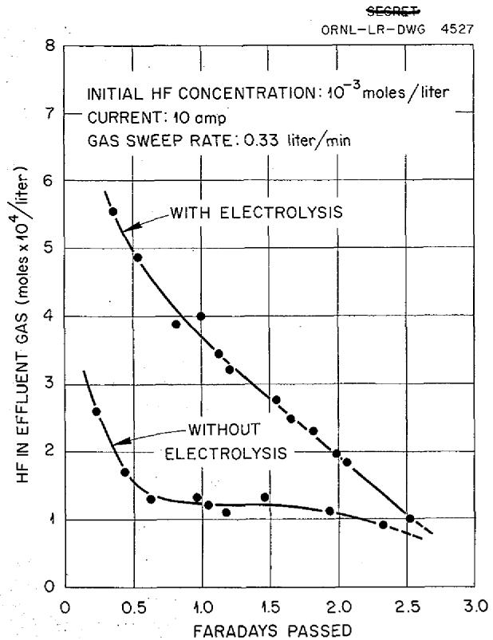  
Fig. 5.2. Rate of HF Removal During Electrolysis of NaF-ZrF $_4$ -UF $_4$ (53.5-40-6.5 mole %) Under H $_2$ at $800^{\circ}\mathrm{C}$ .

efficiency was apparent from the current-voltage curves obtained when $\mathsf{UF}_A$ was present.

After electrolysis had proceeded for a short time, decomposition potentials and "knees" were not encountered. Plots of current against voltage showed a sharp increase from the origin and thus indicated that no overvoltages or decomposition potentials need be exceeded to obtain large currents. This increase was interpreted as being due to the presence of $\mathsf{UF}_4$ and a small amount of reduced $\mathsf{UF}_3$ . The primary electrode reactions, reduction of $\mathsf{UF}_4$ at the cathode along with oxidation of $\mathsf{UF}_3$ at the anode, caused the overall changes in the melt to occur very slowly. No appreciable amounts of precipitated metals were found on the cathodes, and it was presumed that the bulk of impurities such as $\mathsf{Fe}^{++}$ must have been reduced in the melt as secondary reactions rather than being deposited on the cathode. Such behavior might result in metal "fogs," which would be most undesirable.

# Fluoride Production Facility

F. L. Daley J. P. Blakely Materials Chemistry Division

A total of 1119.6 kg of processed fluorides was produced in the 250-lb facility during the past

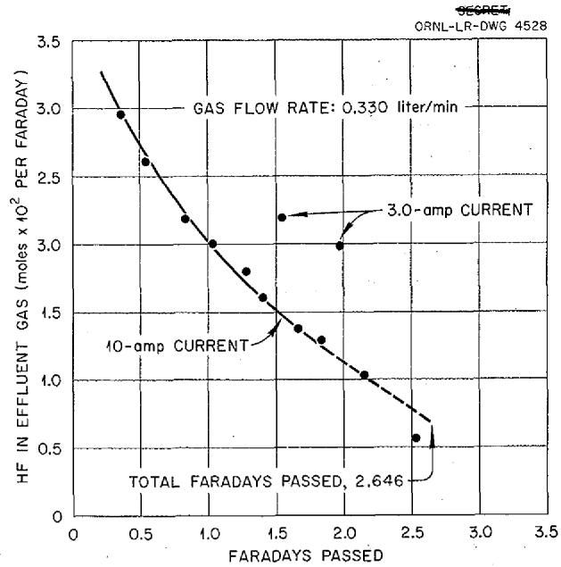  
Fig. 5.3. Apparent Current Efficiency for Removal of HF While Electrolyzing NaF-ZrF $_4$ -UF $_4$ (53.5-40-6.5 mole %) Under H $_2$ at $800^{\circ}\mathrm{C}$ .

quarter. The various compositions and the amount of each processed are listed below:

<table><tr><td>Composition</td><td>Amount
Processed (kg)</td></tr><tr><td>NaF·ZrF4·UF4(50-46-4 mole %)</td><td>456.4</td></tr><tr><td>NaF·ZrF4(50-50 mole %)</td><td>339.4</td></tr><tr><td>NaF·ZrF4·UF4(50-43.5-6.5 mole %)</td><td>323.8</td></tr><tr><td></td><td>1119.6</td></tr></table>

Of the above quantities, Pratt & Whitney Aircraft received 682.4 kg of NaF-ZrF $_4$ -UF $_4$ (50-46-4 mole %) and 163.2 kg of NaF-ZrF $_4$ (50-50 mole %). Battelle Memorial Institute received 23.2 kg of NaF-ZrF $_4$ -UF $_4$ (50-46-4 mole %), and the Naval Research Laboratory received 11.3 kg of NaF-ZrF $_4$ -UF $_4$ (50-43.5-6.5 mole %). The remaining material was distributed to various requesters in the ANP program.

While processing fluorides for general distribution, an attempt has been made to convert to an electrolytic purification process for removal of metallic impurities from fluoride melts. The first trial of electrolysis was made on a non-uranium-bearing mixture $\mathrm{NaF - ZrF_4}$ (50-50 mole %) and proved to be very successful. A 250-lb reactor vessel was modified so that it could contain a carbon cathode and a nickel anode. After a 250-lb batch had been subjected to the usual preliminary hydrofluorination, electrolysis of the melt was carried out. For the electrolysis, a current of 40 amp at $3\mathrm{v}$ , a melt temperature of $1525^{\circ}\mathrm{F}$ , and a helium atmosphere were used, and the melt was agitated. The melt reached the acceptable out-gas HF concentration ( $1\times 10^{-4}$ mole/liter of $\mathsf{H}_2$ ) in approximately $2\frac{1}{4}$ hr and remained below this limit for 45 min before electrolysis was terminated. Analysis of an unfiltered sample yielded 110 ppm Fe, 40 ppm Cr, and 21 ppm Ni. At this point, the purified material was spiked with iron to give a concentration of 2500 ppm and was again electrolyzed. It was estimated that about 10 hr of electrolysis would be required to remove this amount of iron; however, at the end of $6\frac{1}{2}$ hr the out-gas reading was approximately $1\times 10^{-5}$ mole of HF per liter of effluent hydrogen. It is believed that the desired HF concentration ( $1\times 10^{-4}$ mole/liter) had been reached in 5 hr, or less. Analysis of a filtered sample from this batch yielded 40 ppm Fe, 60 ppm Cr, and 355 ppm Ni.

Under ideal conditions, the use of hydrogen stripping to remove metallic impurities requires 12 to 16 hr. With normal production, that is, reactor vessels containing metallic impurity holdup from previous batches, hydrogen stripping may take as long as 50 hr. Therefore it is apparent that electrolytic purification of non-uranium-bearing compositions is the better process, and it is to be used as soon as permanent facilities can be installed.

The electrolysis of uranium-bearing compositions is still being investigated. Two batches of NaF $\mathsf{ZrF}_4$ -UF $_4$ (50-43.5-6.5 mole %) have been subjected to electrolytic purification. The first batch was given 12 hr of electrolysis, and it was found that the HF out-gas concentration appeared to level off at $1.6 \times 10^{-4}$ mole of HF per liter of effluent hydrogen. Consequently, electrolysis was discontinued and the batch purification was finished by hydrogen stripping. Analysis of a filtered sample from this batch yielded 225 ppm Fe, 20 ppm Cr, and 40 ppm Ni. A second batch of the same composition was electrolyzed until the desired HF out-gas concentration was reached, after 27 hr of purification, during which period 19 hr of electrolysis was employed. Analysis of a filtered sample from this batch showed 90 ppm Fe, 55 ppm Cr, and 40 ppm Ni.

The large increase in electrolysis time required for the uranium-bearing composition has led to a more detailed study of the effect of uranium on the electrolytic purification process. Also, the desirability of obtaining a large stockpile of processed fluorides by the first of the year and the present uncertainties in the electrolytic purification of uranium-bearing compositions have led to the temporary abandonment of this method of removing metallic impurities from 250-lb batches of fluoride compositions containing uranium.

# Alkali Fluoride Processing Facility

J.P.Blakely C.R.Croft J.Truitt

Materials Chemistry Division

Developmental work is under way on a process for producing alkali-metal fluoride compositions containing reasonably reproducible amounts of $\mathsf{UF}_3$ . An increasing rate of equipment failure in the processing facility was believed to be due to the highly corrosive character of alkali-metal fluorides which have been saturated with HF.

Consequently, experiments were run with mixtures prepared without the preliminary HF treatment, and the resulting batches were studied closely for such contaminants as oxides, sulfur, iron, chromium, and nickel. In all cases the oxide content was not detectable, and the sulfur content well below 100 ppm. Comparison with HF-treated batches showed no detectable differences. The iron, chromium, and nickel concentrations were, in general, lower than those resulting from HF-treated batches. In an attempt to produce the NaF-KF-LiF eutectic (11.5-42.0-46.5 mole %) plus 14 wt % UF3 without the preliminary HF treatment, it was found that the previous difficulty of inconsistent results still remained.

A study of the reaction

$$
U + 3 U F _ {4} \longrightarrow 4 U F _ {3}
$$

in the presence of alkali-metal fluorides has shown that potassium fluoride has a strong inhibiting effect on the completion of the reaction. It was found that with the KF concentration of the eutectic mixture (NaF-KF-LiF, 11.5-42.0-46.5 mole %), a little better than $50\%$ conversion of the $\mathsf{UF}_4$ to $\mathsf{UF}_3$ could be expected. With this in mind, new attempts were made to produce consistent batches, and it soon became evident that the handling technique was quite important. After several changes in processing techniques were tried, the most promising method was chosen as a standard procedure. Briefly, this method utilizes separate purification steps for the main constituents involved. The eutectic (NaF-KF-LiF, 11.5-42.0-46.5 mole %) is first heated and stripped with $\mathsf{H}_2$ . The melt is cooled and the $\mathsf{UF}_4$ is added, after which the melt is again heated and stripped. The melt is then cooled, and uranium metal is added. The final heating and stripping are then carried out, and the batch is transferred to a storage can.

In this manner, drying and purification of the alkali metal fluorides are accomplished without danger of hydrolyzing or oxidizing the $\mathsf{UF}_4$ ; also, thorough mixing of the $\mathsf{UF}_4$ is provided before the uranium metal is added. A further advantage is that the batch is well purified and miscellaneous side reactions of impurities with the uranium metal are kept to a minimum.

A series of batches was processed to demonstrate the reproducibility of this method. In previous attempts the $\mathsf{U}^{3+}$ concentration ranged from 0.5 to 6 wt%. The new series of preparations, listed in Table 5.6, shows a fair degree of consistency, and

TABLE 5.6. RESULTS OF ANALYSES OF NaF-KF-LiF EUTECTIC\*-UF3 PREPARATIONS   

<table><tr><td colspan="2">Uranium Content (wt %)</td><td colspan="3">Impurities (ppm)</td></tr><tr><td>U3+</td><td>Total U</td><td>Fe</td><td>Cr</td><td>Ni</td></tr><tr><td>5.39</td><td>8.09</td><td>155</td><td>70</td><td>45</td></tr><tr><td>4.83</td><td>10.9</td><td>95</td><td>30</td><td>85</td></tr><tr><td>6.63</td><td>12.5</td><td>220</td><td>30</td><td>75</td></tr><tr><td>4.92</td><td>12.3</td><td>60</td><td>25</td><td>35</td></tr><tr><td>5.60</td><td>10.5</td><td>145</td><td>50</td><td>1510**</td></tr><tr><td>5.02</td><td>11.5</td><td>140</td><td>30</td><td>45</td></tr><tr><td>5.86</td><td>11.2</td><td>80</td><td>25</td><td>25</td></tr><tr><td>5.08</td><td>11.4</td><td>150</td><td>30</td><td>60</td></tr><tr><td>5.70</td><td>10.6</td><td>430**</td><td>28</td><td>18</td></tr><tr><td>5.47</td><td>10.9</td><td>215</td><td>30</td><td>135</td></tr></table>

\*11.5-46.5-42.0 mole $\%$   
\*\*Note: to be rechecked.

such material will be accepted for corrosion studies. Since it was known that the reaction

$$
U + 3 U F _ {4} \longrightarrow 4 U F _ {3}
$$

did not go to completion, the presence of uranium metal in the reactor vessel after completion of a processed batch was expected and was verified by examination of the heels left in the vessel.

A rigid program of equipment preparation was also initiated. All reactor vessels and receiver vessels are flange-topped to allow access for cleaning, and the reactor vessels are equipped with nickel liners to allow easy removal and cleansing. Receiver vessels are presently equipped with Inconel liners because attack by HF gas is no longer a problem since HF was eliminated from the process. Each unit is completely disassembled after each run, and all parts are cleaned or replaced when necessary.

# Purification of KF and RbF

C. M. Blood

Materials Chemistry Division

Several batches of KF and RbF have been processed to meet requirements for these materials in purified form. The RbF, when received, contained

as its chief impurity about $0.2\mathrm{wt}\%$ sulfur. Purification of the RbF has proved to be difficult due to attack of the nickel purification equipment by the sulfur. It has been found possible by rigorous HF and $\mathsf{H}_2$ treatments to reduce the sulfur content to an acceptable value, but in the process a large amount of nickel is picked up by the melt. Considerable treatment time is required to reduce the resulting nickel fluoride so that it may be removed from the product.

# Preparation of Various Fluorides

B. J. Sturm E. E. Ketchen Materials Chemistry Division

The preparation and purification of various structural metal fluorides and several complex fluorides derived from these and alkali fluorides have been continued. These materials and hydrofluorinated $\mathsf{UF}_4$ are being utilized at increasing rates for various investigations of interest to the ANP program. Chemical analysis, supplemented by x-ray and petrographic examination, has been utilized to determine purity and identity of the materials.

Uranium tetrafluoride, as received, may contain small amounts of oxides, moisture, and highvalence uranium. Hydrofluorination at $600^{\circ}C$ is being carried out as a satisfactory method of removing these impurities. During the quarter, 11 kg of the purified material was supplied for studies requiring high-purity $\mathsf{UF}_4$ . Additional batches of $\mathsf{NiF}_2$ were prepared by the hydrofluorination at $600^{\circ}C$ of partially dehydrated $\mathsf{NiCl}_2\cdot 6\mathsf{H}_2\mathsf{O}$ . Anhydrous $\mathsf{AlF}_3$ was prepared by the thermal decomposition of $(\mathsf{NH}_4)_3\mathsf{AlF}_6$ at $500^{\circ}C$ . The latter was synthesized by heating $\mathsf{AlF}_3\cdot 3\frac{1}{2}\mathsf{H}_2\mathsf{O}$ with $\mathsf{NH}_4\mathsf{HF}_2$ at $125^{\circ}C$ . Two pounds of $\mathsf{K}_2\mathsf{NiF}_4$ was prepared by reacting the appropriate quantities of $\mathsf{KHF}_2$ and $\mathsf{NiF}_2\cdot 4\mathsf{H}_2\mathsf{O}$ at $800^{\circ}C$ , extracting the excess KF with water, and drying with acetone. Additional $\mathsf{K}_3\mathsf{CrF}_6$ was synthesized by heating the required quantities of $\mathsf{KHF}_2$ and $\mathsf{CrF}_3\cdot 3\frac{1}{3}\mathsf{H}_2\mathsf{O}$ to $800^{\circ}C$ . Several pounds of $(\mathsf{NH}_4)_3\mathsf{CrF}_6$ were prepared by heating an excess of $\mathsf{NH}_4\mathsf{HF}_2$ with $\mathsf{CrF}_3\cdot 3\frac{1}{3}\mathsf{H}_2\mathsf{O}$ at $200^{\circ}C$ . Part of the $(\mathsf{NH}_4)_3\mathsf{CrF}_6$ was thermally decomposed under helium at $700^{\circ}C$ to yield $\mathsf{CrF}_3$ , and another portion, after being decomposed to $\mathsf{CrF}_3$ at $600^{\circ}C$ , was treated with hydrogen at $800^{\circ}C$ to give $\mathsf{CrF}_2$ .

Three batches of $\mathsf{FeF}_3$ were fluorinated as a means of removing small amounts of impurities.

Fluorination of $\mathsf{NiF}_2$ , $\mathsf{CrF}_3$ , and $\mathsf{FeF}_3$ has been discontinued because the analytical methods available are not able to establish the fluorine-to-metal ratios accurately enough to determine the effectiveness of the $\mathsf{BrF}_3$ treatment in removing small amounts of oxides that may be present.

# CHEMISTRY OF ALKALI HYDROXIDES

L. G. Overholser F. Kertesz Materials Chemistry Division

# Purification of Hydroxides

E.E.Kitchen Materials Chemistry Division

Approximately 5 kg of NaOH was purified either by filtering a 50 wt % aqueous solution through a fine sintered-glass filter or by decanting a 50% solution to remove insoluble Na₂CO₃. In either case the material was then dehydrated at 400°C. Both methods produced material of desired purity (~0.1 wt % each of H₂O and Na₂CO₃). About 1.8 kg of high-purity KOH (~0.1 wt % each K₂CO₃, H₂O, and Na) was prepared by reacting pure potassium with water. It is not planned to prepare more hydroxides in the near future because the material on hand should supply the present limited requirements.

# Effect of Additives on Hydrogen Pressure Over NaOH-Ni System

F. A. Knox  
Materials Chemistry Division

The effects of small additions of NiO, $\mathsf{Na}_2\mathsf{O}$ , and mixtures of the two on the hydrogen pressure over the NaOH-Ni system have been investigated by using a modification of the previously described apparatus.[23] It had been found previously that large additions of NiO resulted in the formation of water vapor with no detectable hydrogen. A smaller addition of 3 mole % NiO to purified NaOH in a nickel capsule again gave evidence of water vapor; at $800^{\circ}C$ the pressure was only $31~\mathrm{mm}$ with water droplets found in the cool portions of the apparatus. When 0.5 mole % was added, a hydrogen pressure in excess of saturated water vapor pressure resulted, and the gas collected from the system was found to be about $95\%$ hydrogen. Therefore, the larger additions of NiO are seen as being sufficient

to cause oxidation of the hydrogen from the NaOH-Ni reaction to water.

Addition of 2 mole $\%$ Na $_2$ O also resulted in oxidation of the hydrogen to water. At $800^{\circ}\mathrm{C}$ the pressure with this addition was found to be only $33~\mathrm{mm}$ , while the hydrogen pressure of the NaOH-Ni system was $126~\mathrm{mm}$ at this temperature.

A 2 mole % addition of an equimolar mixture of Na₂O and NiO to NaOH gave a pressure of 33 mm at 800°C. Evidence indicates that a substantial fraction of this pressure is due to water vapor.

# FUNDAMENTAL CHEMISTRY OF FUSED SALTS Solubility of Xenon in Fused Salts

R. F. Newton  
Research Director's Department

Since the tentative values for the solubility of xenon in the NaF-KF-LiF eutectic and in the $\mathsf{KNO}_3\text{-NaNO}_3$ eutectic were reported,[24] experiments have shown that leakage of xenon through the frozen seal was possible. To minimize this possibility the apparatus was redesigned to have at least $10~\mathrm{cm}$ of liquid above the frozen section on the xenon side and to be about $6~\mathrm{cm}$ long. The new design also permits returning the fused salt by adjusting the pressure difference and melting the frozen seal.

While the metallic apparatus for use with the fluoride eutectic was being rebuilt, the $\mathrm{KNO}_3$ - $\mathrm{NaNO}_3$ eutectic was reinvestigated in a glass apparatus that incorporated the new design features described above. The nitrate mixture can be used without significant decomposition up to about $450^{\circ}\mathrm{C}$ ; in 6 hr, at temperature, about $0.01\%$ of the nitrate was decomposed at $410^{\circ}\mathrm{C}$ and about $0.3\%$ was decomposed at $500^{\circ}\mathrm{C}$ .

With the new apparatus, values of $8 \times 10^{-8}$ and $9.3 \times 10^{-8}$ mole of xenon per milliliter of melt at $260^{\circ}C$ and $8.9 \times 10^{-8}$ and $9.6 \times 10^{-8}$ at $450^{\circ}C$ were obtained. These values are essentially in agreement with the previous ones, namely $8.5 \times 10^{-8}$ at $280^{\circ}C$ and $10 \times 10^{-8}$ at $360^{\circ}C$ . The change in solubility with temperature appears to be very small.

# X-Ray Diffraction Studies in Salt Systems

P.A.Agron M.A.Bredig Chemistry Division

$\mathsf{MF - XF}_3$ Binary Systems. The renewed interest in the binary systems of alkali fluorides with

uranium trifluorides was emphasized this past quarter. In studying these systems, difficulties arise from partial oxidation of U(III) to U(IV) and/or through disproportionation of the uranium in solution in the molten alkali fluorides. It thus appeared to be worth while first to obtain unequivocal x-ray data on the corresponding binary fluoride complexes of some of the "4f rare earth" metals,[25] especially of lanthanum, which may be considered as a good "stand-in" for U(III).

Zachariasen reported26 several trifluorides of the "5f rare earth" group as having the same "tysonite" structure as those of the 4f group, previously determined by Oftedal.27 For the trifluorides, the average La-F and U-F distances are given as 2.50 and 2.56 Å, respectively. The lattice dimensions of these hexagonal cells differ by only 0.05%. Thus it is not surprising to discover in samples prepared here28 that the structure of the double fluorides25 of NaLaF4 and KLaf4 had their counterpart in analogous NaUF4 and KUF4 structures.

According to Dergunov, in MF-LaF₃ systems all alkali fluorides, with the possible exception of CsF, form 1:1 compounds, and only CsF forms a 3:1, Cs₃LaF₆, congruently melting compound. These data were obtained by visual observation of crystallization from melts. Compounds below the eutectic that are stable and polymorphous transitions would not have been discerned.

In the present work, fused mixtures of the binary systems $\mathsf{MF - LaF}_3$ (except $3\mathsf{NaF - LaF}_3$ and LiF mixtures) of the molar compositions 3:1 and 1:1 were made available from thermal-halt measurements.29 X-ray diffractometer patterns were obtained on these melts. The phases found in the NaF and KF systems are indicated in Table 5.7 and are the phases expected for these binary compositions. Excellent agreement is shown for the

24R. F. Newton and D. G. Hill, ANP Quar. Prog. Rep. Sept. 10, 1954, ORNL-1771, p 70.   
25 W. H. Zachariasen, Acta Cryst. 1, 265 (1948); J. Am. Chem. Soc. 70, 2147 (1948).   
26 W. H. Zachariasen, Fluorides of Uranium and Thorium with the LaF3 Type of Structure, MDDC-1153 (date of manuscript, June 1946; date of declassification, July 18, 1947).   
27. Oftedal, Z. psysik. Chem. 5B, 272-291 (1929).   
28 V. S. Coleman, W. C. Whitley, and C. J. Barton, Materials Chemistry Division.   
29 L. M. Bratcher and C. J. Barton, Materials Chemistry Division.

TABLE 5.7. PHASES FOUND IN $\mathsf{MF - L}\alpha \mathsf{F}_3$ BINARY MIXTURES   

<table><tr><td rowspan="2">Sample Number</td><td rowspan="2">Molar Composition</td><td rowspan="2">Structure Type</td><td colspan="2">Hexagonal Lattice Dimensions (Å)</td><td rowspan="2">Z*</td></tr><tr><td>Observed</td><td>Reported31</td></tr><tr><td rowspan="2">LMB-108</td><td rowspan="2">1NaF-1LαF3</td><td rowspan="2">β2-NaLαF4</td><td>a = 6.17</td><td>a = 6.167</td><td rowspan="2">3/2</td></tr><tr><td>c = 3.82</td><td>c = 3.819</td></tr><tr><td rowspan="2">-109</td><td rowspan="2">3KF-1LαF3</td><td rowspan="2">β1-KLαF4(and KF)</td><td>a = 6.52</td><td>a = 6.524</td><td rowspan="2">3/2</td></tr><tr><td>c = 3.79</td><td>c = 3.791</td></tr><tr><td rowspan="2">-110</td><td rowspan="2">3KF-1LαF3</td><td rowspan="2">β1-KLαF4(and KF)</td><td>a = 6.52</td><td>a = 6.524</td><td rowspan="2">3/2</td></tr><tr><td>c = 3.79</td><td>c = 3.791</td></tr><tr><td rowspan="2">-107</td><td rowspan="2">1KF-1LαF3</td><td rowspan="2">β1-KLαF4(and unknown phase)</td><td>a = 6.52</td><td>a = 6.524</td><td rowspan="2">3/2</td></tr><tr><td>c = 3.79</td><td>c = 3.791</td></tr><tr><td>-131</td><td>1KF-1LαF3</td><td>One phase, predominantly (same as unknown above)</td><td></td><td></td><td></td></tr></table>

\*Zachariasen;31 the quantity given is the number of molecules per unit cell.

lattice constants (Table 5.7). The expected complex phase is found in the NaF-LaF $_3$ system. The x-ray analysis of the KF-LaF $_3$ fusion (Table 5.7, sample LMB-107) indicates the presence of $\beta_{1}$ -KLaF $_4$ and an unknown second phase. A second fusion at this composition (sample LMB-131), with an imposed slower rate of cooling, gives predominantly a single phase which corresponds to the unknown structure found in the previous preparation. For the 3KF-LaF $_3$ composition, only the $\beta_{1}$ -KLaF $_4$ complex has been observed. Petrographic examinations $^{30}$ indicate that the new phase has optical properties similar to the $\beta_{1}$ -phase. The relative thermal stabilities of these two phases and of a third one, reported to be cubic, $^{31}$ remain to be determined.

MF-UF3 Systems. Early studies32 of the systems of NaF and KF with UF3 provided a number of x-ray patterns that were difficult to interpret. Recent examination of the patterns of several melts prepared under stringent conditions (reducing nickel oxide on container walls with hydrogen)

yielded the data shown in Table 5.8. The interpretation was aided greatly by comparing these diffraction patterns with the corresponding $\mathsf{LaF}_3$ salts. The Greek letter assignment is adopted to correspond with the lanthanum compounds as given by Zachariasen.

The ternary salt mixture 1 KF-1 NaF-2 UF3 gives the phase β2+(K,Na)UF4. Here the ordering requires a doubling of the c axis observed in the β2-phase of the binary salt. The extent of the β1KLaF4 present in this melt indicates that the former phase is stabilized by the greater concentration of Na; possibly, Na:K = 2:1 in the lattice.

Physical Chemistry33

E.R.VanArtsdalen

Chemistry Division

The heat capacity of a high-purity sample of $\mathsf{UF}_3$ , with the proximate analysis 99.3 mole % $\mathsf{UF}_3$ and 0.6 mole % $\mathsf{UO}_2$ , was measured from $20^{\circ}\mathsf{K}$ to room temperature. No transitions or anomalies were found. The heat capacity, standard entropy, and the derived functions $-(F^{\circ} - H_0^{\circ}) / T$ and $(H^{\circ} - H_0^{\circ}) / T$ were tabulated at 10-deg intervals up to $300^{\circ}\mathsf{K}$ . At $298.15^{\circ}\mathsf{K}$ , $C_p = 22.83$ cal/mole. $^{\circ}$ K,

TABLE 5.8. PHASES FOUND IN $\mathsf{MF - UF_3}$ BINARY MIXTURES   

<table><tr><td>Molar Compositiona</td><td>Phases</td><td>Structure Type</td><td>Lattice Dimensions (Å)</td><td>Zb</td></tr><tr><td>2NaF-1UF3</td><td rowspan="2">Hexagonal phase and also NaF</td><td rowspan="2">β2-NaUF4</td><td>a = 6.17</td><td rowspan="2">3/2</td></tr><tr><td>3NaF-2UF3</td><td>c = 3.78</td></tr><tr><td rowspan="3">1KF-1UF3</td><td rowspan="3">Hexagonal phase and cubic phasec</td><td rowspan="2">β1-KUF4</td><td>a = 6.51</td><td rowspan="3">3/2</td></tr><tr><td>c = 3.76</td></tr><tr><td>Fluorite type</td><td>a0 = 5.9</td></tr><tr><td rowspan="4">1KF-1NaF-2UF3</td><td rowspan="4">Two hexagonal phases</td><td rowspan="2">β2-(K,Na)UF4</td><td>a = 6.27</td><td rowspan="2">3</td></tr><tr><td>c = 7.71</td></tr><tr><td rowspan="2">β1-KUF4</td><td>a = 6.51</td><td rowspan="2">3/2</td></tr><tr><td>c = 3.76</td></tr></table>

${}^{a}$ Samples prepared by V. S. Coleman and W. C. Whitley and examined petrographically by T. N. McVay.   
The number of molecules per unit cell.   
cThis phase may be the cubic phase of KUF4 or the compound UOF with the fluorite structure.

and $S^0 = 29.90$ e.u., of which 0.53 e.u. was obtained by extrapolation below $20^{\circ}K$ .

The heat capacity of a sample of pure $\mathsf{MoS}_2$ was measured from about $15^{\circ}\mathsf{K}$ to room temperature. The heat capacity and the derived thermodynamic functions mentioned above were tabulated at 10-deg intervals up to $300^{\circ}\mathsf{K}$ . At $298.15^{\circ}\mathsf{K}$ , $C_p = 15.62$ cal/mole $^{\circ}\mathsf{K}$ , and $S^{\circ} = 15.34$ e.u. The heat capacity of $\mathsf{MoS}_2$ follows a $T^2$ dependence between 15 and about $70^{\circ}\mathsf{K}$ of the sort previously reported for $\mathsf{MoO}_3$ . This behavior of $\mathsf{MoS}_2$ is consistent with its layer structure, which is so pronounced that $\mathsf{MoS}_2$ actually is a good high-temperature lubricant (Liqui-Moly).

Density and electrical conductance measurements were made of molten mixtures of KCl and KI across the entire composition face. The molar volume, as calculated from the density, is nearly additive for this system, although it shows deviations close to the KI side. In contrast, the equivalent conductance shows pronounced negative deviations from additivity for all mixtures, with maximum deviation at high KCl concentration. These data again show that it is inadvisable to interpret maximums and minimums in electrical conductance as the consequence of formation of compounds in

the melts. The specific conductivity of molten KI is expressed by the equation

$$
\begin{array}{l} \kappa = - 1. 7 1 0 0 + 6. 4 0 8 \times 1 0 ^ {- 3} t \\ - 2. 9 6 5 \times 1 0 ^ {- 6} t ^ {2} \mathrm {m h o} / \mathrm {c m} \\ \end{array}
$$

between 725 and $925^{\circ}C,$ and the density is given by the equation

$$
\rho = 3. 0 9 8 5 - 0. 9 5 5 7 \times 1 0 ^ {- 3} t g / c m ^ {3}
$$

between 680 and $910^{\circ}C$ . The temperature, $t_{i}$ , is in $^\circ C$ .

The density and electrical conductance were determined for pure molten NaBr and are given below for the range 750 to $960^{\circ}\mathrm{C}$ :

$$
\begin{array}{l} \kappa = - 0. 4 3 9 2 + 5. 6 3 2 \times 1 0 ^ {- 3} t \\ - 1. 5 7 2 \times 1 0 ^ {- 6} t ^ {2} m h o / c m \\ \end{array}
$$

and

$$
\rho = 2. 9 5 1 8 - 0. 8 1 6 9 \times 1 0 ^ {- 3} t g / c m ^ {3}.
$$

The self-diffusion coefficient of sodium ion in molten $\mathrm{NaNO}_3$ has been determined by a radiochemical tracer technique. The heat of activation for self-diffusion is approximately 6 kcal/mole and, therefore, higher than the heat of activation for electrical conductance. Similar work with thallous chloride has shown that the heat of activation

for self-diffusion of the thallous ion is greater than that for electrical conduction. These results are in accord with the concept that the application of an electrical field lowers the potential barrier restricting migration of charged ions in the appropriate direction of the applied field. The self-diffusion coefficient of a given ion can be used in conjunction with the Nernst-Einstein equation to calculate the contribution of that particular ion to the total equivalent conductance of the salt. When this is done, it is observed for sodium nitrate and thallous chloride that, in each case, the cation accounts for about $95\%$ of the equivalent conductance of the respective molten salt at temperatures about $25^{\circ}\mathrm{C}$ above the melting point. This indicates that the transport numbers of these cations relative to their anions in these two salts are approximately 0.95.

# Viscosity Measurements

F.A.Knox F.Kertesz

N.V. Smith

Materials Chemistry Division

The automatic capillary viscometer, which was used previously37 for determining the viscosity of

36 $\Lambda_{i} = D_{i}z_{i}F^{2} / RT,$ where $\Lambda$ is the equivalent conductance, $D$ the self-diffusion coefficient, $z$ the charge of ions, $F$ the Faraday constant, $R$ the gas constant, and $T$ the absolute temperature.

fluoride melts, has been modified and placed in operation for viscosity determinations of alkali nitrate melts. Effort has been concentrated on determining viscosity changes immediately above the melting points as an adjunct to the work being done by Van Artsdalen to establish the significance of ion size on physical properties (see section above). In view of the low melting points of the salt mixtures being studied, a glass instrument is used, but it is planned to use an all-metal apparatus when the investigation is extended to chloride and fluoride melts.

The salt mixtures studied included pure sodium and potassium nitrates as well as mixtures of the two in 12.5 wt % steps. The values obtained for the pure salts were about 0.3 centipoise above the data reported by Dantuma,³⁸ who determined the viscosity by the logarithmic decrement method. The viscosities of the mixtures nearly overlap at higher temperatures, being located between the viscosity curves of the pure components. A plot of reciprocal temperatures vs the log of viscosity gave an apparent deviation from linearity near the melting point of most of the mixtures, while the pure salts showed a direct linear correlation.

# 6. CORROSION RESEARCH

W. D. Manly

G. M. Adamson

Metallurgy Division

W.R.Grimes

F. Kertesz

Materials Chemistry Division

Studies of the corrosion of Inconel, type 316 stainless steel, Hastelloy B, and several special alloys were continued through the use of thermal-convection apparatus. Additional information on the compatibility of the sodium-beryllium-Inconel system was obtained from static, whirligig, and thermal-convection loop tests. In an effort to find a brazing alloy that has good resistance to sodium and to $\mathsf{NaF - ZrF_4 - UF_4}$ tests of several brazes on type 304 stainless steel T-joints were made. Similar joints of A-nickel brazed with various alloys were also tested in $\mathsf{NaF - ZrF_4 - UF_4}$ at $1500^{\circ}\mathsf{F}$ and in sodium hydroxide at 1100 and $1500^{\circ}\mathsf{F}$ . Additional screening tests were made of carbides of boron, titanium, zirconium, and chromium in static sodium, lithium, and $\mathsf{NaF - ZrF_4 - UF_4}$ at $1500^{\circ}\mathsf{F}$ for 100-hr periods. An $80\%$ Mg-20% Li alloy being considered as a crew-compartment shielding material was corrosion tested in water at various temperatures; the weight losses were found to be negligible. The resistance of Inconel to attack by molten rubidium was studied in a dynamic loop apparatus. Fundamental studies are under way of the mass transfer in liquid lead and of fused hydroxides as acid-base analog systems, and further information has been obtained of the flammability of sodium-bismuth alloys. In further chemical studies of corrosion, information was obtained on the effect of temperature and of chromium additions on the corrosion of Inconel by fluoride melts with $\mathsf{NiF}_2$ additions.

# THERMAL-CONVECTION LOOP CORROSION STUDIES

G.M.Adamson

A. Taboada

Metallurgy Division

# Inconel Loop Containing $\mathsf{UF}_3$ in Alkali-Metal-Base Mixtures

Additional tests were made with alkali-metal-base fluoride mixtures containing $\mathsf{UF}_3$ and $\mathsf{UF}_4$ in Inconel thermal-convection loops, but the results obtained were not so favorable as those reported previously. Considerable difficulty was encountered in making

the mixtures, in controlling the total uranium content, and in determining the ratio of $\mathsf{UF}_3$ to $\mathsf{UF}_4$ .

Two supposedly duplicate Inconel loops were operated for 500 hr with the $\mathsf{UF}_3\text{-}\mathsf{UF}_4$ mixture in NaF-KF-LiF (11.5-42-46.5 mole %) at a hot-leg temperature of $1500^{\circ}F$ ( $\Delta T$ of $\sim 200^{\circ}F$ ); however, the rough surface of one loop showed maximum penetration to a depth of 2 mils, whereas the other loop was attacked to a depth of 13 mils. In three other supposedly duplicate loops operated for 1000 hr, attack to depths of 8, 13, and 13.5 mils developed. Metallic-appearing layers were found in the cold legs of all these loops.

Several loops filled with NaF-KF-LiF with and without $\mathsf{UF}_4$ were operated to obtain comparative data for use in evaluating the results of these tests. The data obtained are presented in Table 6.1.

# Type 316 Stainless Steel Loops Containing $\mathbf{U}\mathbf{F}_{3}$ in Alkali-Metal-Base Mixtures

Several batches of the eutectic NaF-KF-LiF (11.5-42-46.5 mole %) containing mixtures of UF₃ and UF₄ were circulated in type 316 stainless steel loops. However, the results obtained cannot be used for comparative studies because the UF₄-to-UF₃ ratios in the fluoride mixtures were unknown and the mixtures were of doubtful purity. One loop plugged after 886 hr of operation at a hot-leg temperature of 1500°F; examination showed heavy, intergranular, subsurface voids to a depth of 11.5 mils in the hot leg and some intergranular attack in the cold leg. Another similar loop operated its scheduled 1000 hr, but a large deposit of dendritic crystals was found in the cold leg.

A similar loop in which all the uranium (12 wt $\%$ was present as $\mathsf{UF}_4$ was operated to obtain comparative data. This loop plugged after 570 hr of operation, and metallic crystals were found in the cold leg. The hot-leg surface was very rough, and there was penetration to a depth of 5 mils. The

TABLE 6.1. RESULTS OF INCONEL THERMAL-CONVECTION LOOP TESTS OF NaF-KF-LiF (11.5-42-46.5 mole %) WITH AND WITHOUT UF ${}_{4}$ CIRCULATED AT A HOT-LEG TEMPERATURE OF ${1500}^{ \circ  }\mathrm{F}$   

<table><tr><td rowspan="2">Period of Test (hr)</td><td rowspan="2">Uranium Content (wt %)</td><td rowspan="2">Maximum Attack (mils)</td><td colspan="2">Metallographic Notes</td></tr><tr><td>Hot-Leg Appearance</td><td>Cold-Leg Appearance</td></tr><tr><td>500</td><td>11.9</td><td>11</td><td>Heavy, intergranular, subsurface voids</td><td>Metallic deposit</td></tr><tr><td>500</td><td>12*</td><td>13.5</td><td>Heavy, general, intergranular, subsurface voids</td><td>Metallic deposit</td></tr><tr><td>1000</td><td>12*</td><td>20</td><td>Heavy, general, intergranular, subsurface voids</td><td>Metallic deposit</td></tr><tr><td>500</td><td>0</td><td>7</td><td>Moderate, general, intergranular, subsurface voids</td><td>No deposit</td></tr><tr><td>500</td><td>0</td><td>7.5</td><td>Heavy, general, intergranular, subsurface voids</td><td>Thin deposit in one section</td></tr></table>

*Estimated; analyses not yet available.

same fluoride mixture without uranium was circulated for 1000 hr without signs of plugging. The hot leg of this loop showed heavy attack to a depth of 10 mils, and some grains were completely removed.

# Effect of Induced Potential

Welding rods for use as electrodes were attached to the upper hot legs and lower cold legs of Inconel thermal-convection loops that were operated to determine the effect of a small induced emf on corrosion. Battery chargers were used to apply direct currents of 5.4 amp at 0.45 v. The loops circulated NaF-ZrF $_4$ -UF $_4$ (50-46-4 mole %) at a hot-leg temperature of $1500^{\circ}\mathrm{F}$ .

The direction of current flow was expected to have an effect on the attack, but no such variation could be observed in the four loops that have been examined. However, the depths of attack were less than the depth of attack found in a loop filled from the same batch of fluoride mixture and operated without an induced potential.

# Hastelloy B Thermal-Convection Loops

Hastelloy B thermal-convection loops have been operated with $\mathrm{NaF - ZrF_4 - UF_4}$ (50-46-4 mole %), with NaF-KF-LiF (11.5-42-46.5 mole %) with 12 wt % uranium as $\mathrm{UF_4}$ , and with sodium as the circulated fluids. The results of operation of these loops are presented in Table 6.2. The period of operation of the loop has not had a noticeable effect on corrosion in the loops that circulated the fluoride mixtures, but there is some evidence that

the small attack that occurs takes place in a fairly short time and is a function of the condition of the original surface.

The loops operated with sodium were known to be covered with an oxide deposit and were not cleaned before filling. Additional loops that were cleaned with the use of dry hydrogen are now being operated.

# Special Alloy Thermal-Convection Loops

Several loops were fabricated from tubing of modified Inconel specially drawn at Superior Tube Co. from billets that were vacuum cast at ORNL. The loops were standard size, but the tubing was $\frac{1}{2}$ in. in diameter with a 0.065-in. wall rather than the standard $\frac{3}{8}$ -in.-IPS schedule-10 pipe; they were filled with NaF-ZrF4-UF4 (50-46-4 mole %) and operated with a hot-leg temperature of $1500^{\circ}\mathrm{F}$ . Some of these loops ruptured when attempts were made to restart them after the two power failures. The data obtained from these loops are given in Table 6.3. It may be noted that a considerable reduction in depth of attack was found in both loops in which the chromium content of the alloy had been reduced to about $5\%$ .

One loop of Hastelloy C developed a heavy, intergranular, subsurface-void type of attack to a depth of 6 mils in 1000 hr. This loop also circulated NaF-ZrF4-UF4 (50-46-4 mole %) at a hot-leg temperature of $1500^{\circ}\mathrm{F}$ . The attack was less than that usually found with Inconel.

TABLE 6.2. RESULTS OF OPERATION OF HASTELLOY B THERMAL-CONVECTION LOOPS WITH VARIOUS FLUIDS  

<table><tr><td>Circulated Fluid</td><td>Hot-Leg Temperature (°F)</td><td>Temperature Differential (°F)</td><td>Period of Test (hr)</td><td>Metallographic Notes</td></tr><tr><td rowspan="4">NaF-ZrF4-UF4</td><td>1500</td><td>325</td><td>1000</td><td>Rough surface; intergranular penetrations; subsurface voids to 3 mils</td></tr><tr><td>1500</td><td>325</td><td>2000</td><td>Slightly rough surface; voids to a depth of 2 mils</td></tr><tr><td>1650</td><td>400</td><td>1000</td><td>Rough surface; most voids to depths of 2 mils or less, but occasionally to 3 mils</td></tr><tr><td>1650</td><td>400</td><td>1000</td><td>Maximum attack to a depth of 2 mils; slight deposit in hot leg</td></tr><tr><td>NaF-KF-LiF-UF4</td><td>1500</td><td>325</td><td>1000</td><td>Subsurface voids and intergranular penetration to a depth of 2 mils; thin deposit in hot leg; intergranular attack in cold leg to a depth of 1.5 mils</td></tr><tr><td rowspan="2">Sodium</td><td>1500</td><td>400</td><td>1000</td><td>Fine metallic crystals adhered to cold leg when loop drained while at 1500°F</td></tr><tr><td>1500</td><td>400</td><td>1010</td><td>Plugged by mass of fine dendritic crystals in hot leg that probably formed in cold leg</td></tr></table>

TABLE 6.3. RESULTS OF OPERATION OF SPECIAL ALLOY THERMAL-CONVECTION LOOPS WITH $\mathrm{{NaF}} - {\mathrm{{ZrF}}}_{4} - {\mathrm{{UF}}}_{4}\left( {{50} - {46} - 4\text{ mole }\% }\right)$ WITH A HOT-LEG TEMPERATURE OF ${1500}^{ \circ  }\mathrm{F}$   

<table><tr><td colspan="4">Alloy Composition (wt %)</td><td rowspan="2">Operating Time (hr)</td><td rowspan="2">Maximum Attack (mils)</td></tr><tr><td>Ni</td><td>Fe</td><td>Cr</td><td>Mo</td></tr><tr><td>76</td><td>7</td><td>17</td><td></td><td>1000</td><td>13</td></tr><tr><td>76</td><td>14</td><td>10</td><td></td><td>823*</td><td>8</td></tr><tr><td>76</td><td>14</td><td>10</td><td></td><td>1000*</td><td>12</td></tr><tr><td>76</td><td>19</td><td>5</td><td></td><td>647</td><td>3</td></tr><tr><td>76</td><td>19</td><td>5</td><td></td><td>460*</td><td>3</td></tr><tr><td>83</td><td>7</td><td>10</td><td></td><td>1000</td><td>13</td></tr><tr><td>83</td><td>7</td><td>10</td><td></td><td>1000</td><td>15</td></tr><tr><td>74</td><td>10</td><td>6</td><td>10</td><td>1000</td><td>3</td></tr><tr><td>74</td><td>10</td><td>6</td><td>10</td><td>500</td><td>3.5</td></tr></table>

*Leak developed in loop.

# SODIUM-BERYLLIUM-INCONEL COMPATIBILITY

G. M. Adamson

E. E. Hoffman

W. H. Cook

C. F. Leitten

A. Taboada

Metallurgy Division

As one phase of the sodium-beryllium-Inconel compatibility studies, a series of Inconel thermal

convection loops with beryllium inserts in the top of the hot legs were operated. The inserts were hollow cylinders about 6 in. long with inside diameters the same as those of the Inconel tubing of the loop. The outside of the beryllium was protected by an Inconel sleeve and was separated from it by a 0.050-in. annulus filled with slow-moving sodium. The loops were operated for 500 hr with high-purity sodium at hot-leg temperatures of 900, 1100, and $1300^{\circ}\mathrm{F}$ . In none of these loops was any attack found on the inside surface of the beryllium, and the outside surfaces of the inserts in the loops operated at 900 and $1100^{\circ}\mathrm{F}$ were similarly unattacked. However, in the loop operated at $1300^{\circ}\mathrm{F}$ , the outside surface of the beryllium insert showed widely scattered voids to a depth of 3 mils. All the beryllium specimens were darkened, but no deposits were found by metallographic examination.

A summary of compatibility tests conducted by two different methods is presented in Table 6.4. In none of the tests was a layer deposited in the cooler portions of the test system that could be detected metallographically. In all the tests, however, beryllium was found to be present on various sections of the Inconel tubes. Figure 6.1 shows the distribution of beryllium around an Inconel whirligig loop following a 270-hr test at a hot-zone temperature of $1200^{\circ}\mathrm{F}$ and a cold-zone temperature of $1060^{\circ}\mathrm{F}$ . Since the velocity of the sodium bath

in this apparatus was 10 fps, the bath temperature was practically isothermal. The temperatures given are the outside tube wall temperatures. The beryllium distribution shown appears to be temperature dependent; however, in other dynamic tests, this was not so obvious. The outside and inside surfaces of a beryllium insert from the hot leg of an Inconel thermal-convection loop are shown in Fig. 6.2. As in nearly all the other compatibility tests,

the heaviest attack was on the outside surface of the insert. The attack was due to dissimilar metal mass transfer between the beryllium and the Inconel sleeve which surrounded it. The result of direct contact between Inconel and beryllium in a system containing sodium at elevated temperatures may be seen in Fig. 6.3. The Be-Ni intermetallic layer which formed was approximately 20 mils thick and was extremely hard and brittle. Tests are presently

TABLE 6.4. RESULTS OF BERYLLIUM-SODIUM-INCONEL COMPATIBILITY TESTS   

<table><tr><td rowspan="2">Test Type</td><td rowspan="2">Test Time (hr)</td><td colspan="2">Temperature (°F)</td><td rowspan="2">Concentration of Be on Surface of Inconel Tube (μg/cm2)</td><td rowspan="2">Metallographic Notes</td></tr><tr><td>Hot Zone</td><td>Cold Zone</td></tr><tr><td rowspan="6">Whirligig</td><td>300</td><td>1100</td><td>Isothermal</td><td>5.3 to 7.9</td><td>Two dark deposits on Inconel which analyzed high in beryllium; layer on Inconel sleeve; beryllium insert showed no attack on inside and 1 mil of attack on outside surface</td></tr><tr><td>300</td><td>1200</td><td>Isothermal</td><td>0.05</td><td>No deposits on Inconel tube; 0.4-mil layer on Inconel sleeve; beryllium insert had no attack on inside surface and 1 mil of attack (voids) on outside surface</td></tr><tr><td>300</td><td>1300</td><td>Isothermal</td><td>0.07</td><td>Inconel sleeve which enclosed beryllium insert had 1-mil layer on surface; beryllium insert had no attack on inside surface and subsurface voids to a depth of 5 mils on outside surface</td></tr><tr><td>300</td><td>1400</td><td>Isothermal</td><td>39.6 to 127</td><td>Deposit of 2 to 3 mils on Inconel sleeve; beryllium insert attacked to a depth of 1 mil on inner surface and to a depth of 3 mils on outer surface</td></tr><tr><td>270</td><td>1200</td><td>1060</td><td>16.5 to 39.6*</td><td>Deposit of 0.2 mil on Inconel sleeve; beryllium insert attacked to a depth of 2 mils on inside surface and to a depth of 1 mil on outside surface</td></tr><tr><td>300</td><td>1200</td><td>1030</td><td>52 to 164</td><td>Deposit of 0.2 mil on Inconel sleeve; beryllium insert unattacked on inside surface and attacked to a depth of 3 mils on outside surface</td></tr><tr><td rowspan="2">Thermal- Convection Loop</td><td>1000</td><td>1150</td><td>990</td><td>3.3 to 56.6</td><td>No surface layer on Inconel sleeve; beryllium insert attacked on inside surface to a depth of 1 mil and to a depth of 2 mils on outside surface</td></tr><tr><td>1000</td><td>1300</td><td>1130</td><td>7.0 to 107</td><td>Diffusion zone of 1 to 2 mils on surface of Inconel sleeve; beryllium insert attacked on inside surface to a depth of 1 mil and to a depth of 4 mils on out-side surface; 20-mil layer of Be21Ni5 where beryl-lium insert was in contact with Inconel pipe</td></tr></table>

*See Fig. 6.1.

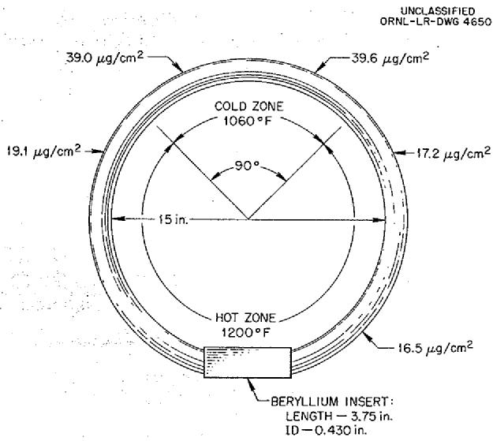  
Fig. 6.1. Distribution of Beryllium Around an Inconel Whirligig Loop Containing a Beryllium Insert and Sodium. Test period, 270 hr.

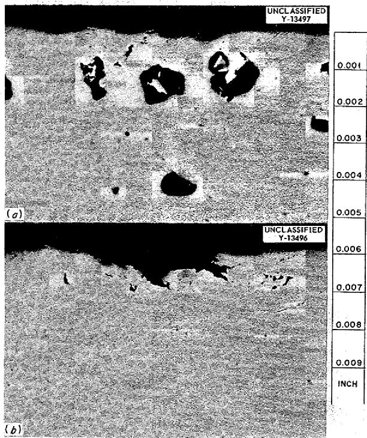  
Fig. 6.2. Surfaces of Beryllium Insert from an Inconel Thermal-Convection Loop After Exposure to Sodium for 1000 hr at $1300^{\circ}\mathsf{F}$ . (a) Surface of beryllium exposed to sodium in annular space. (b) Surface of beryllium exposed to flowing sodium. Unetched. 500X. Reduced $37.5\%$ .

under way to determine the minimum spacing that can be tolerated between beryllium and Inconel.

# STATIC CORROSION STUDIES

E. E. Hoffman

W. H. Cook C. F. Leitten Metallurgy Division

# Brazing Alloys on Stainless Steel

Additional tests have been made in an effort to find a brazing alloy that has good resistance to both sodium and the fuel mixture $\mathsf{NaF - ZrF_4 - UF_4}$ (53.5-40-6.5 mole %). The results reported in Table 6.5 were obtained from tests of type 304 stainless steel T-joints brazed with the alloys listed by the Wall Colmonoy Corporation. Tests are also being conducted on Inconel T-joints brazed with each of the alloys listed in Table 6.5. All the brazing alloys listed had good resistance to the fluoride mixture, but only alloy C-29 had good resistance to both the fluoride mixture and to sodium.

# Brazing Alloys on Nickel

A series of T-joints of A-nickel were brazed with the various alloys listed in Tables 6.6 and 6.7 in a dry hydrogen atmosphere and were then exposed for 100 hr to static $\mathrm{NaF - ZrF_4 - UF_4}$ (53.5-40-6.5 mole %) at $1500^{\circ}\mathrm{F}$ or to static sodium hydroxide at 1100 and $1500^{\circ}\mathrm{F}$ . The specimens were examined metallographically in the as-received condition in order to evaluate the inclusions and the porosity. The brazed specimens were thoroughly cleaned before and after testing so that valid weight change data could be obtained. In order to prevent the rounding of the fillet edge upon polishing, each specimen was nickel plated after testing. The data obtained from metallographic examination of the specimens exposed to the fluoride mixture are presented in Table 6.6, and the data on the specimens exposed to sodium hydroxide are in Table 6.7.

Most of the alloys tested appeared to have good corrosion resistance to the fluoride mixture, except the braze alloy with the composition $69\%$ Ni-20% Cr-11% Si. Several of the brazed T-joints, especially those which included copper, gold, or silicon as an alloying element in the braze material, showed numerous voids in the interface between the base material and the braze fillet. These voids are not considered to be caused by the attack of the fluoride mixture but rather by diffusion of a

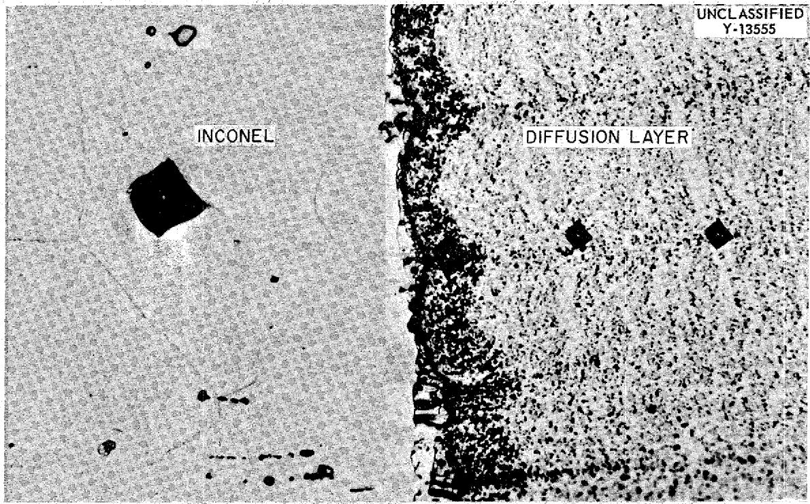  
Fig. 6.3. Diffusion Layer of $\mathsf{Be}_{21}\mathsf{Ni}_5$ Which Formed on Inconel in Direct Contact with Beryllium Insert in a Thermal-Convection Loop After Exposure for 1000 hr to Sodium at $1300^{\circ}\mathsf{F}$ . Hardness impressions indicate relative hardnesses: $\mathsf{Be}_{21}\mathsf{Ni}_5$ , 1300 DPH; Inconel, 180 DPH. Etched with oxalic acid. 500X.

<table><tr><td>0.0010 INCH</td><td>0.009</td><td>0.008</td><td>0.007</td><td>0.006</td><td>0.005</td><td>0.004</td><td>0.003</td><td>0.002</td><td>0.001</td></tr></table>

constituent from the braze alloy into the base material. A T-joint brazed with $60\%$ Pd- $37\%$ Ni- $3\%$ Si and then exposed to the fluoride mixture for 100 hr is shown in Fig. 6.4. Many voids can be seen along the interface between the base material and the braze fillet, but the surface of the specimen appears to be free of attack.

In order to verify the possibility of diffusion between the base material and the braze alloy, several T-joints were constructed in the same manner as were the tested T-joints and placed in an evacuated capsule and heated at $1500^{\circ}\mathrm{F}$ for 100 hr. Figure 6.5 shows the result of this annealing process on the same braze material as that shown in Fig. 6.4. As in Fig. 6.4, voids were produced at the interface between the base material and the braze fillet. Thus the formation of the voids appears to be independent of environment and therefore not a result of attack by the fluoride mixture.

Table 6.7 shows the results obtained from the metallographic examination of the brazed A-nickel T-joints exposed to sodium hydroxide. Of all the braze alloys tested, only the $82\%$ Au-18% Ni alloy had good resistance to attack at both 1100 and $1500^{\circ}\mathrm{F}$ . The specimen tested in sodium hydroxide for 100 hr at $1500^{\circ}\mathrm{F}$ is shown in Fig. 6.6.

In these tests, as in the fused fluoride tests, voids were found along the interface between the base material and the braze fillet when the braze alloys that contained copper, gold, or silicon as an alloying element were used. However, the same specimens tested at $1100^{\circ}\mathrm{F}$ revealed no such voids. This situation is probably caused by the difference in diffusion rates at these two temperatures. In Figs. 6.7 and 6.8, A-nickel T-joints brazed with $60\%$ Pd- $37\%$ Ni- $3\%$ Si are shown after being tested in sodium hydroxide for 100 hr at 1100 and $1500^{\circ}\mathrm{F}$ , respectively. As may be seen in Fig. 6.7, no attack occurred along the braze

TABLE 6.5. RESULTS OF STATIC TESTS OF BRAZING ALLOYS ON TYPE 304 STAINLESS STEEL T-JOINTS IN NaF-ZrF ${}_{4}$ -UF ${}_{4}$ (53.5-40-6.5 mole %) AND IN SODIUM AT ${1500}^{ \circ  }\mathrm{F}$ FOR ${100}\mathrm{{hr}}$   

<table><tr><td>Brazing Alloy Composition (wt %)</td><td>Bath</td><td>Weight Change* (g)</td><td>Weight Change (%)</td><td>Metallographic Notes</td></tr><tr><td>Alloy A-16</td><td>NaF-ZrF4-UF4</td><td>-0.0003</td><td>-0.042</td><td>Braze fillet unattacked</td></tr><tr><td>23 P, 77 Ni</td><td>Sodium</td><td>-0.0009</td><td>-0.135</td><td>Subsurface voids in braze fillet to a depth of 5 mils; attack confined to Ni3P phase</td></tr><tr><td>Alloy C-27</td><td>NaF-ZrF4-UF4</td><td>0</td><td>0</td><td>No attack</td></tr><tr><td>9.6 P, 2.75 Cr, 88.6 Ni</td><td>Sodium</td><td>-0.0006</td><td>-0.086</td><td>Subsurface voids to a depth of 5 mils; Ni3P phase attacked</td></tr><tr><td>Alloy C-29</td><td>NaF-ZrF4-UF4</td><td>+0.0011</td><td>+0.180</td><td>No attack</td></tr><tr><td>10.2 P, 13 Cr, 76.8 Ni</td><td>Sodium</td><td>+0.0004</td><td>+0.054</td><td>Less than 0.5 mil of small subsurface voids</td></tr><tr><td>Alloy B-11</td><td>NaF-ZrF4-UF4</td><td>-0.0006</td><td>-0.082</td><td>Braze fillet attacked to a depth of 1 mil in several areas</td></tr><tr><td>10.8 P, 9.2 Si, 80 Ni</td><td>Sodium</td><td>0</td><td>0</td><td>Subsurface voids in fillet to a depth of 4 mils</td></tr><tr><td>Alloy J-10</td><td>NaF-ZrF4-UF4</td><td>+0.0007</td><td>+0.153</td><td>Small subsurface voids in braze joint to a depth of 0.5 mil</td></tr><tr><td>9 P, 15 Fe, 4.5 Cr, 71.5 Ni</td><td>Sodium</td><td>-0.0004</td><td>-0.067</td><td>Subsurface voids to a depth of 7 mils; Ni3P removed from fillet zones</td></tr><tr><td>Alloy H-10</td><td>NaF-ZrF4-UF4</td><td>+0.0036</td><td>+0.730</td><td>Maximum attack was 0.5 mil in the form of small subsurface voids</td></tr><tr><td>10 P, 4.3 Mo, 86.7 Ni</td><td>Sodium</td><td>-0.0006</td><td>-0.108</td><td>Subsurface voids in braze fillet to a depth of 19 mils</td></tr><tr><td>Alloy I-10</td><td>NaF-ZrF4-UF4</td><td>+0.0008</td><td>+0.112</td><td>No attack</td></tr><tr><td>11.6 P, 6.25 Mn, 82.15 Ni</td><td>Sodium</td><td>-0.0018</td><td>-0.346</td><td>Subsurface voids in braze fillet to a depth of 11 mils</td></tr><tr><td>Alloy D-11</td><td>NaF-ZrF4-UF4</td><td>+0.0015</td><td>+0.304</td><td>No attack</td></tr><tr><td>9.9 P, 11.3 Fe, 78.8 Ni</td><td>Sodium</td><td>+0.0006</td><td>+0.108</td><td>Subsurface voids in braze fillet to a depth of 25 mils</td></tr></table>

*Weight change data include brazing alloy and base material of joint.

fillet of the specimen tested at $1100^{\circ}\mathrm{F}$ and very few diffusion voids were present. However, as may be seen in Fig. 6.8, the specimen tested at $1500^{\circ}\mathrm{F}$ showed a 6-mil surface attack and also several small interfacial voids.

Additional static corrosion tests are being conducted on many of these same brazing alloys in sodium in order to evaluate their suitability for use as a back braze for the sodium-to-fused fluoride heat exchangers.

# Screening Tests of Carbides

Specimens of carbides of boron, titanium, zirconium, and chromium were tested in static sodium, lithium, and NaF-ZrF4-UF4 (53.5-40-6.5 mole %) at $1500^{\circ}\mathrm{F}$ for 100-hr periods. The measured densities and apparent porosities of the specimens and the results of the corrosion tests are given in Table 6.8. The data indicate that TiC and $\mathsf{Cr}_3\mathsf{C}_2$ had the best resistance to corrosion in each of the mediums; Figs. 6.9 and 6.10 show the typical

TABLE 6.6. RESULTS OF STATIC TESTS OF BRAZED A-NICKEL T-JOINTS IN NaF-ZrF4-UF4 (53.5-40-6.5 mole %) AT ${1500}^{ \circ  }\mathrm{F}$ FOR ${100}\mathrm{{hr}}$   

<table><tr><td>Brazing Alloy Composition (wt %)</td><td>Weight Change (g)</td><td>Weight Change (%)</td><td>Metallographic Notes</td></tr><tr><td>69 Ni–20 Cr–11 Si</td><td>-0.0017</td><td>-0.055</td><td>Surface attack to a depth of 16 mils along entire braze fillet</td></tr><tr><td>100 Cu</td><td>-0.0006</td><td>-0.019</td><td>Surface attack to a depth of 0.5 mil along entire braze fillet</td></tr><tr><td>82 Au–18 Ni</td><td>-0.001</td><td>-0.036</td><td>Braze fillet appeared to be unattacked</td></tr><tr><td>80 Au–20 Cu</td><td>-0.0007</td><td>-0.026</td><td>No attack on braze fillet surface</td></tr><tr><td>90 Ni–10 P</td><td>-0.0004</td><td>-0.013</td><td>No attack on braze fillet surface</td></tr><tr><td>60 Pd–40 Ni</td><td>-0.0016</td><td>-0.06</td><td>No attack on braze fillet surface</td></tr><tr><td>60 Pd–37 Ni–3 Si</td><td>+0.0008</td><td>+0.027</td><td>No attack on braze fillet surface</td></tr></table>

TABLE 6.7. RESULTS OF STATIC TESTS OF BRAZED A-NICKEL T-JOINTS IN SODIUM HYDROXIDE FOR 100 hr AT 1100 AND ${1500}^{ \circ  }F$   

<table><tr><td>Brazing Alloy Composition (wt %)</td><td>Weight Change (g)</td><td>Weight Change (%)</td><td>Test Temperature (°F)</td><td>Metallographic Notes</td></tr><tr><td>69 Ni-20 Cr-11 Si</td><td></td><td></td><td>1500</td><td>Braze failed completely</td></tr><tr><td></td><td>+0.0024</td><td>+0.093</td><td>1100</td><td>Braze attacked completely</td></tr><tr><td>100 Cu</td><td>-0.0118</td><td>-0.408</td><td>1500</td><td>Braze attacked completely; large voids appear throughout</td></tr><tr><td></td><td>-0.0011</td><td>-0.038</td><td>1100</td><td>Uniform surface attack on braze to a depth of 3 mils</td></tr><tr><td>82 Au-18 Ni</td><td>-0.004</td><td>-0.144</td><td>1500</td><td>Nonuniform surface attack on braze to depth of 1 mil</td></tr><tr><td></td><td>-0.0007</td><td>-0.022</td><td>1100</td><td>No attack on surface of braze</td></tr><tr><td>80 Au-20 Cu</td><td>-0.0106</td><td>-0.38</td><td>1500</td><td>Uniform surface attack on entire braze to a depth of 3 mils</td></tr><tr><td></td><td>-0.005</td><td>-0.164</td><td>1100</td><td>Surface attack on braze to a depth of 1 mil</td></tr><tr><td>60 Pd-40 Ni</td><td>-0.0015</td><td>-0.049</td><td>1500</td><td>Surface of braze fairly clean with attack in the form of small stringers running to a depth of 4 mils</td></tr><tr><td></td><td>-0.0007</td><td>-0.028</td><td>1100</td><td>Surface attack to a depth of 0.5 mil</td></tr><tr><td>90 Ni-10 P</td><td>-0.0054</td><td>-0.15</td><td>1500</td><td>Braze completely attacked; attack centered in brittle Ni3P phase</td></tr><tr><td></td><td>-0.0012</td><td>-0.047</td><td>1100</td><td>Braze attacked completely; attack centered in Ni3P phase</td></tr><tr><td>60 Pd-37 Ni-3 Si</td><td>+0.0023</td><td>+0.083</td><td>1500</td><td>Surface attack on braze fillet to a depth of 6 mils</td></tr><tr><td></td><td>+0.0008</td><td>+0.028</td><td>1100</td><td>No attack present on braze surface</td></tr></table>

appearance of the as-received and tested TiC and $\mathsf{Cr}_3\mathsf{C}_2$ . These corrosion data are not selective enough to designate whether TiC or $\mathsf{Cr}_3\mathsf{C}_2$ is the superior material. If the lower strength and/or more brittle nature of the $\mathsf{Cr}_3\mathsf{C}_2$ are objectionable,

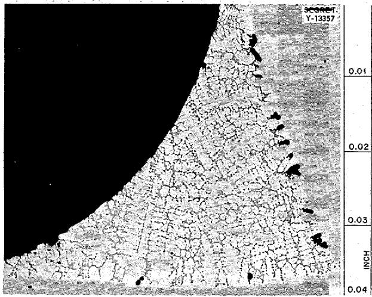  
Fig. 6.4. A-Nickel T-Joint Brazed with $60\%$ Pd-37% Ni-3% Si and Exposed to NaF-ZrF $_4$ -UF $_4$ (53.5-40-6.5 mole %) at $1500^{\circ}\mathrm{F}$ for 100 hr. Note voids at the interface between the braze material and the base metal. Unetched, 100X. Reduced $38\%$ .

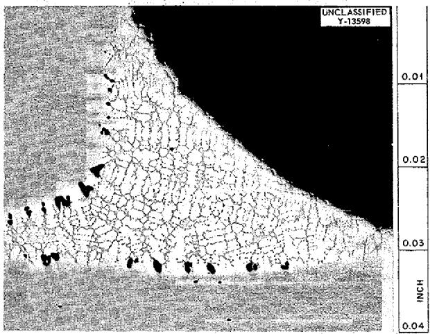  
Fig. 6.5. A-Nickel T-Joint Brazed with $60\%$ Pd-37% Ni-3% Si and Annealed for 100 hr at $1500^{\circ}\mathrm{F}$ in an Evacuated Capsule. Note voids at interface between the braze material and the base metal. Unetched. 100X. Reduced $40\%$ .

the TiC is superior. The ZrC showed signs of failing only in the fluoride mixture; the fine incipient cracks in the surfaces of the ZrC particles may be seen in Fig. 6.11. There were indications that the fluoride mixture had penetrated the pore spaces throughout the ZrC; the pore spaces were not enlarged.

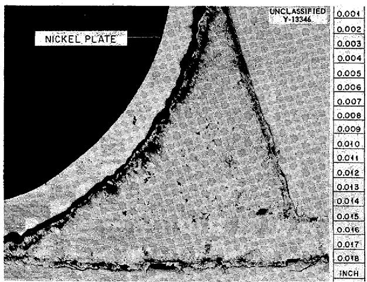  
Fig. 6.6. A-Nickel T-Joint Brazed with $82\%$ Au-18% Ni and Exposed to Sodium Hydroxide for 100 hr at $1500^{\circ}\mathrm{F}$ . Note slight attack at surface of braze. Etched with potassium cyanide. 200X. Reduced $39\%$ .

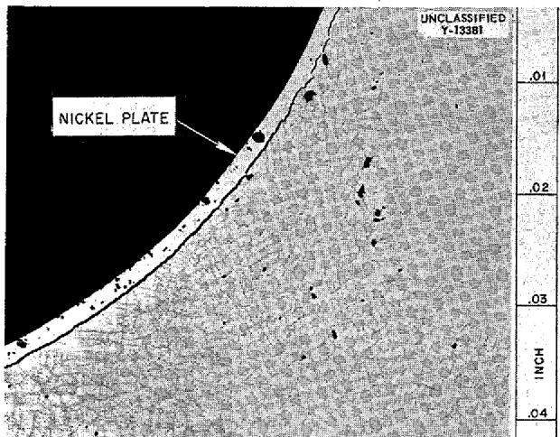  
Fig. 6.7. A-Nickel T-Joint Brazed with $60\%$ Pd-37% Ni-3% Si and Exposed to Sodium Hydroxide for 100 hr at $1100^{\circ}$ F. Note absence of voids at interface. 100X. Reduced $39\%$ .

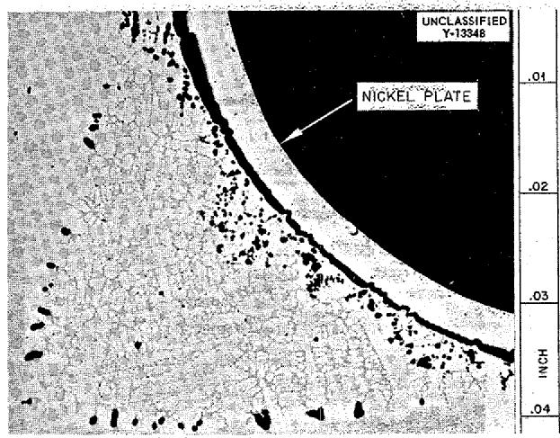  
Fig. 6.8. A-Nickel T-Joint Brazed with $60\%$ Pd-37% Ni-3% Si and Exposed to Sodium Hydroxide for 100 hr at $1500^{\circ}$ F. Note surface attack and small voids at interface between base material and braze alloy. Unetched. 100X. Reduced 39%.

The reasons for failure of the $\mathsf{B}_4\mathsf{C}$ to withstand the corrosive actions of the sodium and lithium are not known at this time; powder x-ray analyses of the tested specimens of $\mathsf{B}_4\mathsf{C}$ indicate that $\mathsf{B}_4\mathsf{C}$ is the primary phase and that a new, secondary, unidentified phase is present as a result of both the sodium and lithium corrosion tests. The attack on the $\mathsf{B}_4\mathsf{C}$ by the fluoride mixture is not definite or uniform. The 5 mils of attack found on one side of the specimen was the maximum depth of attack if the 14-mil-thick unidentified phase found on the other side can be attributed to fluoride mixture in a surface imperfection of the test specimen. Further tests will be necessary to properly evaluate $\mathsf{B}_4\mathsf{C}$ corrosion resistance to the fluoride mixture.

These screening, single-run, static corrosion tests of $\mathsf{B}_4\mathsf{C}$ , TiC, $\mathsf{ZrC}$ , and $\mathsf{Cr}_3\mathsf{C}_2$ indicate that these carbides, except $\mathsf{B}_4\mathsf{C}$ in lithium or sodium, warrant further and more severe tests in the investigation of materials to withstand the long-term,

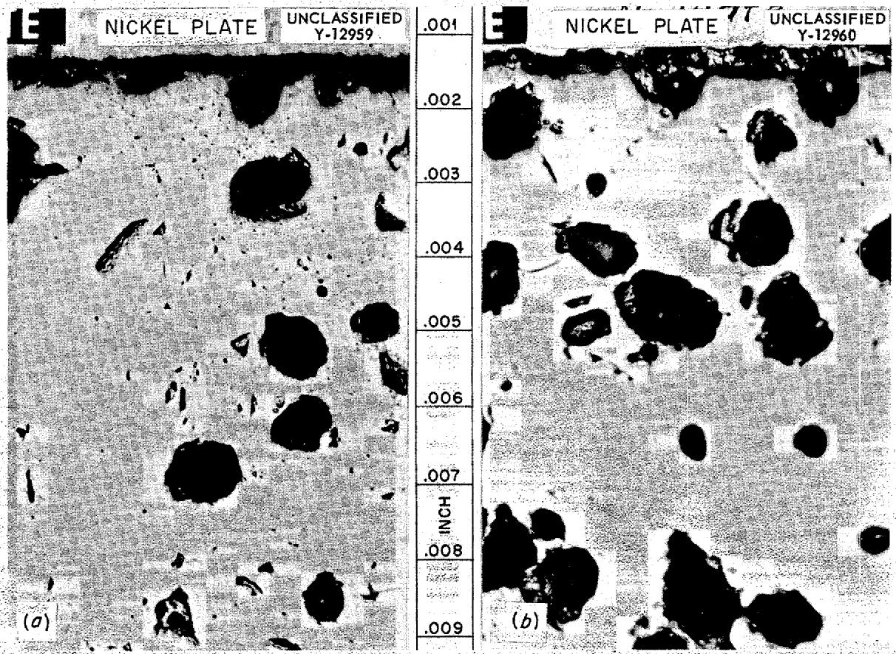  
Fig. 6.9. (a) As-Received TiC. (b) TiC After Exposure to Sodium at $1500^{\circ}\mathrm{F}$ for 100 hr. Unetched. 500X.

TABLE 6.8. SUMMARY OF STATIC TESTS OF CARBIDES AT ${1500}^{ \circ  }\mathrm{F}$ FOR ${100}\mathrm{{hr}}$   

<table><tr><td>Material Tested</td><td>Density (g/cm3)</td><td>Apparent Porosity (%)</td><td>Average Dimensional Change* (%)</td><td>Weight Change* (%)</td><td>Attack (mils)</td><td>Remarks</td></tr><tr><td colspan="7">Tested in Sodium</td></tr><tr><td>B4C</td><td>2.51</td><td>3.5</td><td></td><td>-6.5</td><td></td><td>Specimen cracked and fell apart during test</td></tr><tr><td>TiC</td><td>4.81</td><td>1.3</td><td>+0.3</td><td>0</td><td>0</td><td>No attack; particles bonded so well that it was difficult to distinguish individual particles in unetched specimen</td></tr><tr><td>ZrC</td><td>6.91</td><td>0.8</td><td>0</td><td>+0.1</td><td>0</td><td>No attack; particles well bonded</td></tr><tr><td>Cr3C2</td><td>6.59</td><td>2.2</td><td>0</td><td>-0.4</td><td>0</td><td>No attack; particles not well bonded</td></tr><tr><td colspan="7">Tested in NaF-ZrF4-UF4(53.5-40-6.5 mole %)</td></tr><tr><td>B4C</td><td></td><td></td><td>+0.1</td><td>-0.4</td><td>5</td><td>Unidentified phase on one side of specimen that had a maximum thickness of 14 mils</td></tr><tr><td>TiC</td><td></td><td></td><td>0</td><td>+0.1</td><td>0</td><td>No attack; as-received and tested specimens not bonded nor formed so well as those tested in sodium</td></tr><tr><td>ZrC</td><td></td><td></td><td>+0.3</td><td></td><td></td><td>Major portion of pore spaces filled with fluoride mixture</td></tr><tr><td>Cr3C2</td><td></td><td></td><td></td><td>+0.2</td><td></td><td>No attack</td></tr><tr><td colspan="7">Tested in Lithium</td></tr><tr><td>B4C</td><td></td><td></td><td></td><td>-12.2</td><td></td><td>Specimen expanded and cracked; original, dark, semimetallic luster dulled</td></tr><tr><td>TiC</td><td></td><td></td><td>0</td><td>0</td><td>0</td><td>No attack; macroscopic color slightly lighter</td></tr><tr><td>ZrC</td><td></td><td></td><td>+0.2</td><td>-1.1</td><td>0</td><td>No attack</td></tr><tr><td>Cr3C2</td><td></td><td></td><td>+0.2</td><td>-1.2</td><td>0</td><td>No attack; small crack in middle of specimen; metallic luster disappeared</td></tr></table>

*The average dimensional change $(\%)$ is the average of the width, height, and length changes, whereas the weight change $(\%)$ represents a single value.

high-temperature corrosion of sodium, lithium, and NaF-ZrF $_4$ -UF $_4$ (53.5-40-6.5 mole%).

# Magnesium-Lithium Alloy in Water

An $80\%$ Mg-20% Li alloy which has been proposed as a possible crew-compartment shielding

material was corrosion tested in water at various temperatures. Specimens of this material were carefully cleaned just prior to testing to remove surface films, chiefly $\mathsf{Li}_3\mathsf{N}$ , which form on exposure to air. A cleaned specimen was found to gain $0.088\mathrm{mg / cm}^2$ after standing in the atmosphere for 6 hr. The weight losses of specimens tested at

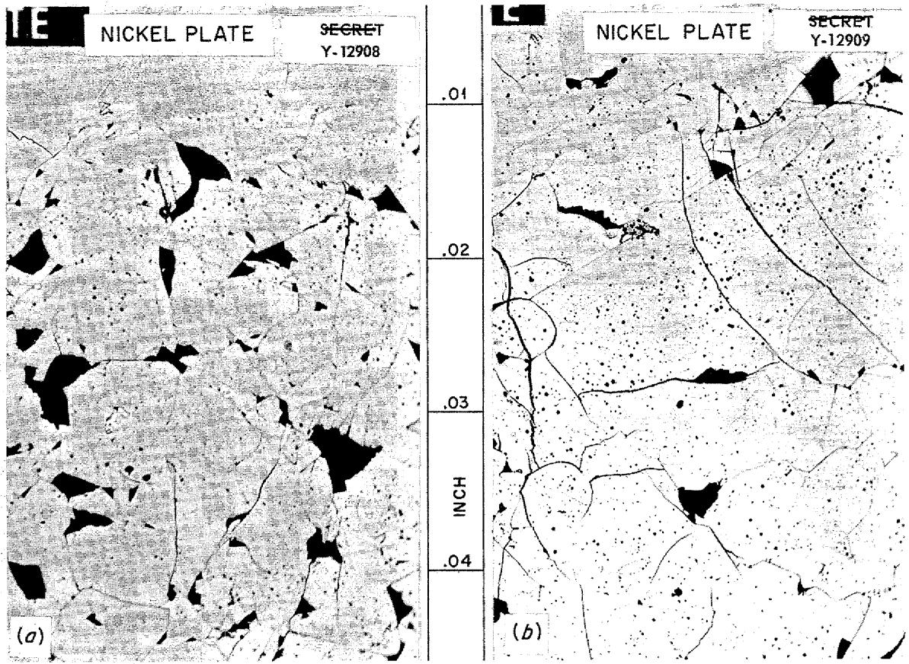  
Fig. 6.10. (a) As-Received $\mathbf{Cr}_3\mathbf{C}_2$ . (b) $\mathbf{Cr}_3\mathbf{C}_2$ After Exposure to NaF-ZrF $_4$ -UF $_4$ (53.5-40-6.5 mole %) at $1500^{\circ}\mathrm{F}$ for 100 hr. Unetched. 100X.

various temperatures in water for 15 min are tabulated below:

<table><tr><td>Temperature (℃)</td><td>Weight Loss (mg/cm2)</td></tr><tr><td>30</td><td>0.243</td></tr><tr><td>50</td><td>0.271</td></tr><tr><td>80</td><td>0.309</td></tr><tr><td>100</td><td>0.326</td></tr></table>

One specimen was tested for various lengths of time in water at $100^{\circ}\mathrm{C}$ and was found to lose $0.292\mathrm{mg/cm}^2$ in the first 2 min of the tests, which was $90\%$ of the weight lost in the 15-min test. This decrease in rate of weight loss may be attributable to the depletion of lithium atoms on the surface, since no protective film could be detected. Pure magnesium tested in water at $100^{\circ}\mathrm{C}$ for 15 min showed a weight loss of $0.09\mathrm{mg/cm}^2$ .

# RUBIDIUM INVESTIGATIONS

The results of preliminary tests of the resistance of Inconel to attack by molten rubidium were discussed in the previous report. Static tests at 1500 and $1650^{\circ}\mathrm{F}$ have shown a maximum attack of from 1 to 2 mils in 100 hr. The attack has been both intergranular and in the form of subsurface voids. Since these tests indicated that under static isothermal conditions corrosion of Inconel by rubidium was no serious problem, a dynamic test was conducted. The resistance of Inconel to corrosion by flowing liquid and vaporized rubidium in a closed system incorporating a temperature gradient was determined by means of a dynamic loop apparatus, somewhat similar in appearance to the conventional thermal-convection loops. A

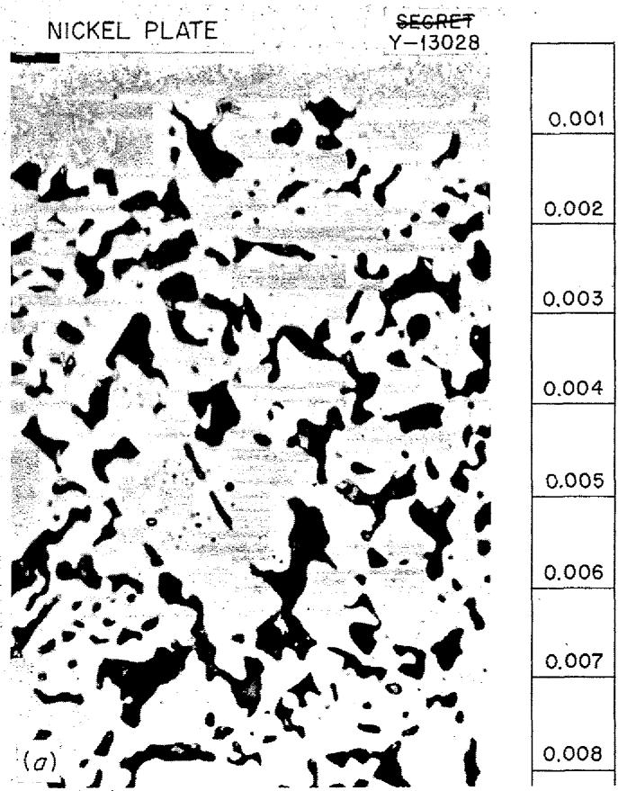  
FON

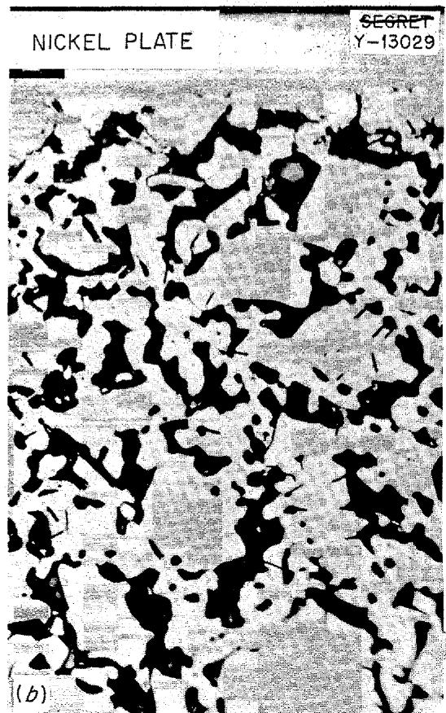  
Fig. 6.11. (a) As-Received ZrC. (b) ZrC After Exposure to NaF-ZrF $_4$ -UF $_4$ (53.5-40-6.5 mole %) at $1500^{\circ}\mathrm{F}$ for 100 hr. Unetched. 500X.

loop sectioned after a test may be seen in Fig.6.12. The hot legs of the loop were constructed of 0.5-in.-OD, 49-mil-wall tubing, and the condenser section was of 0.25-in.-OD, 35-mil-wall tubing. The loop was loaded with $8\mathrm{cm}^3$ (approximately $12\mathrm{g}$ ) of vacuum-distilled rubidium, which filled it to the level indicated in Fig. 6.12. A vapor-phase heat transfer system of this type will eliminate mass transfer in the vapor regions. However, the temperature gradients present in the liquid region might conceivably cause crystal deposition. The maximum attack occurred in the hot leg of the loop to a depth of $1\mathrm{mil}$ , as may be seen in Fig.6.13. The attack was intergranular, and one grain appeared to be ready to fall from the wall.

A schematic diagram of the apparatus presently used to distill rubidium is shown in Fig. 6.14. Thus far, 3 lb of rubidium has been purified. Since the addition of $8\%$ sodium will reduce the melting point of rubidium to approximately $20^{\circ}\mathrm{F}$ , tentative

plans call for an investigation of the corrosion properties of the sodium-rubidium eutectic.

# FUNDAMENTAL CORROSION RESEARCH

G.P. Smith

Metallurgy Division

# Mass Transfer in Liquid Lead

J.V.Cathcart

Metallurgy Division

The results of previous tests3 indicated that alloys in which intermetallic compound formation was possible showed a marked increase in resistance to mass transfer in liquid lead as compared with the mass transfer obtained with their pure components. Comparable behavior was not observed in alloys such as Nichrome V in which

Fig. 6.12. Sectioned Inconel Loop After Exposure to Boiling or Vaporized Rubidium for 100 hr.   
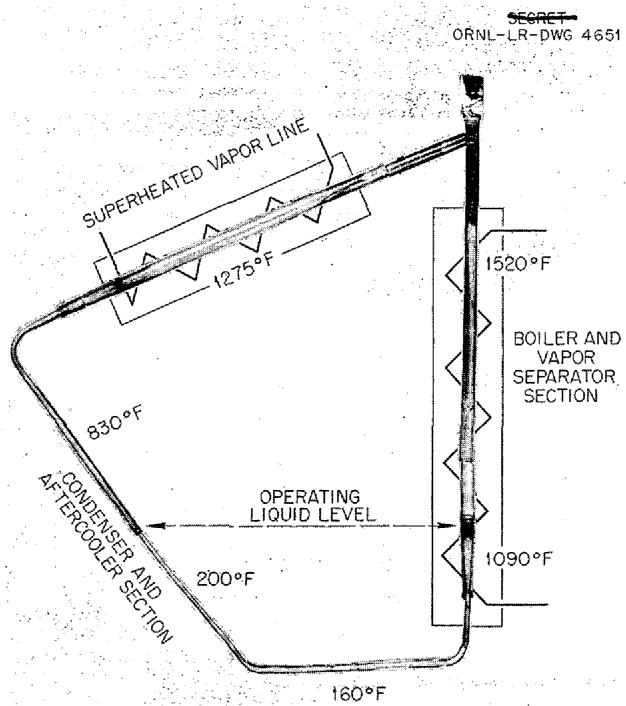  
$\Delta T = 1360^{\circ}F$   
OPERATING TIME = 312 hr   
MAXIMUM CORROSION   
PENETRATION $= 0.001$ in.

NOTE: EQUILIBRIUM LOOP SURFACE TEMPERATURES ARE GIVEN.

no compounds are present. During the past quarter this hypothesis has been tested further, and, as in earlier work, experiments were performed in small, quartz, thermal-convection loops.4

Three additional loops have been operated. In two, the test specimens were a $50\%$ Fe- $50\%$ Cr alloy, this composition corresponding closely to the ideal sigma-phase composition. The specimens were obtained initially as tubes which had been annealed at $1200^{\circ}\mathrm{C}$ and quenched from temperature. The transformation of the specimens to sigma phase was accomplished through a 288-hr vacuum anneal at $785^{\circ}\mathrm{C}$ . A transverse section of one of the tubes after the sigma-phase anneal, but before exposure to liquid lead, is shown in Fig. 6.15. The severe cracking, typical of a sigma-phase structure, may easily be seen in the photograph.

The first loops in which the $50\%$ Fe- $50\%$ Cr specimen was tested in liquid lead failed after 46 hr of operation with hot- and cold-leg temperatures of 805 and $550^{\circ}\mathrm{C}$ , respectively. The second loop failed after only 30 hr of operation with hot- and cold-leg temperatures of 805 and $500^{\circ}\mathrm{C}$ , respectively. Microscopic examination showed clearly that a phase transformation took place in the test specimens during the operation of the loops. As shown in Fig. 6.16, a narrow layer of a second phase formed at the outer surface of the hot-leg specimens. Hardness measurements yielded values of 162 and 1140 (DPH hardness scale) for the new and original phases, respectively. These values correspond closely to those expected for ferrite and sigma phases. The possibility that the new phase was ferritic was supported by the fact that it was magnetic and by a chemical analysis of the plugs formed in the loops. Since the plugs were slightly richer in chromium than in iron, a decrease in the chromium content of the outer layers of the test specimens was indicated. The test temperature was close to the sigma-to-ferrite transformation point, and therefore even a slight alteration in the original $50\%$ Fe- $50\%$ Cr composition would produce an alloy in which only ferrite is stable at the temperature in question.

A second alloy, $50\%$ Mo- $50\%$ Fe, was also tested. This alloy was chosen because an intermetallic compound predominates at the indicated composition. Circulation of lead in this loop stopped after 520 hr with hot- and cold-leg temperatures of 805 and $500^{\circ}\mathrm{C}$ , respectively. Examination of this loop has not yet been completed; therefore, the results obtained will not be discussed other than to point out that the plugging time was approximately that to be expected for an alloy in which an intermetallic compound existed.

Special comment is required for the results obtained with the $50\%$ Fe- $50\%$ Cr specimens. As indicated above, these specimens had been transformed almost completely to sigma phase prior to testing, and yet very short operating times were observed for the loops containing them. Comparable loops containing pure iron and pure chromium required 275 and 100 hr, respectively, before plugging occurred. On the other hand, the plugging times for other alloys that form intermetallic compounds, for example, $45\%$ Cr- $55\%$ Co, Hastelloy B (5% Fe- $28\%$ Mo- $67\%$ Ni), $25\%$ Mo- $75\%$ Ni, etc., were all much greater than the plugging times for loops containing their pure constituents.

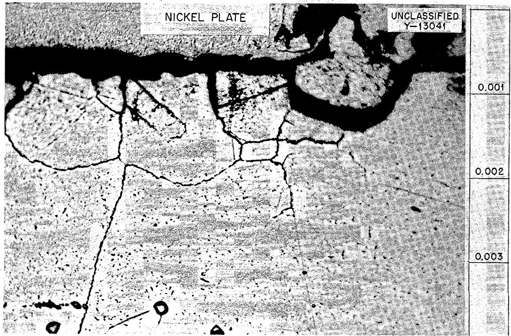

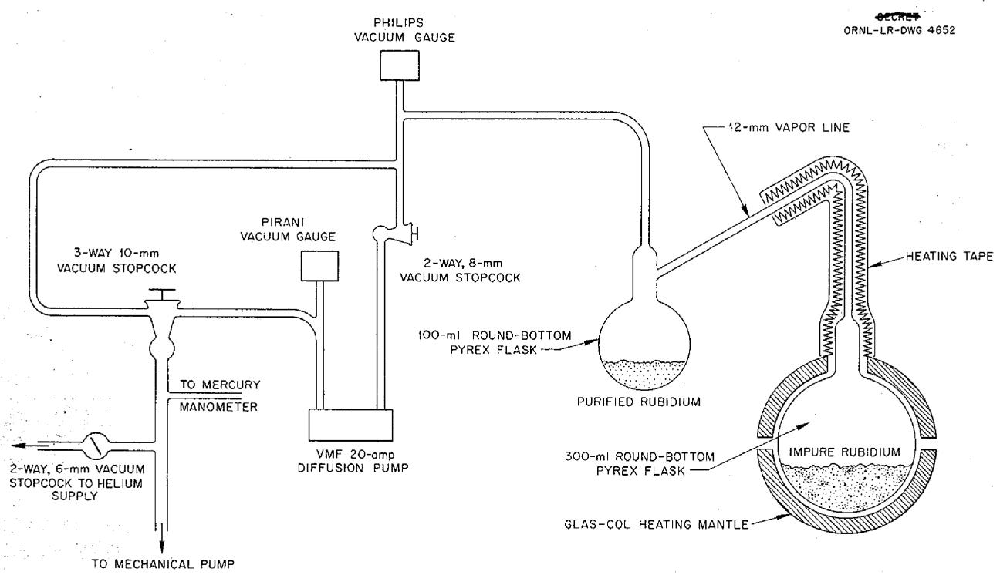  
Fig. 6.13. Surface of Inconel Tube Below Liquid Level in Hot Leg of Loop Shown in Fig. 6.12. Note intergranular attack and grain separated from wall of tube. Etched with aqua regia. 1000X.   
Fig. 6.14. Apparatus for Distilling Rubidium.

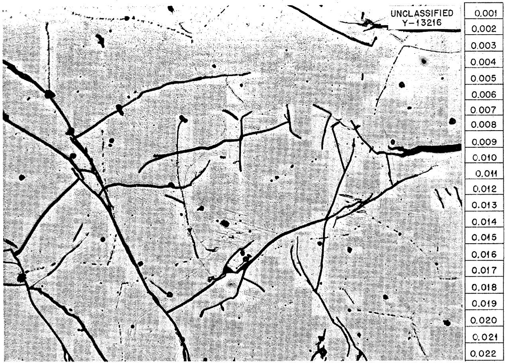  
Fig. 6.15. A Transverse Section of a $50\%$ Cr- $50\%$ Fe Alloy After a Sigma-Phase Anneal. Note extensive cracks. 200X.

INCH

One possible explanation for the anomalous behavior of the $50\%$ Fe- $50\%$ Cr alloy is suggested by the extensive system of cracks present in the original test specimens (Fig. 6.15). The cracks no doubt increased the surface area-to-volume ratio in the loops to such an extent as to appreciably accelerate mass transfer. However, the amount of mass transferred material found in these loops was only about one-fourth that normally observed in the loops which plugged. Thus, while conceivable, it is not likely that such small plugs could have produced the early failure of the loops. A more logical explanation is the following. When the test specimens were removed from the loops, it was observed that they were exceedingly friable and crumbled into small pieces almost at the touch. This increase in friability was probably associated with the penetration of lead into the crack system referred to above. If a small chunk of metal from

one of the test specimens had been completely or partially dislodged by the erosive effect of the circulating lead, the metal particle could have been caught in either the hot- or cold-leg specimen tubes and caused a sufficient slowing down of the lead flow rate to produce premature failure of the loop. Because of the excessive brittleness of the test specimens, it was not possible to remove them from the loops without cracking them slightly; therefore, it is not possible to state unequivocably that this explanation is a valid one. However, the extensive cracking of the test specimens and their extreme friability plus the unknown effect on the phase transformation which took place would appear to justify the belief that the results obtained with the $50\%$ Fe- $50\%$ Cr alloy may not be comparable to those obtained with other alloys in which intermetallic compound formation is possible.

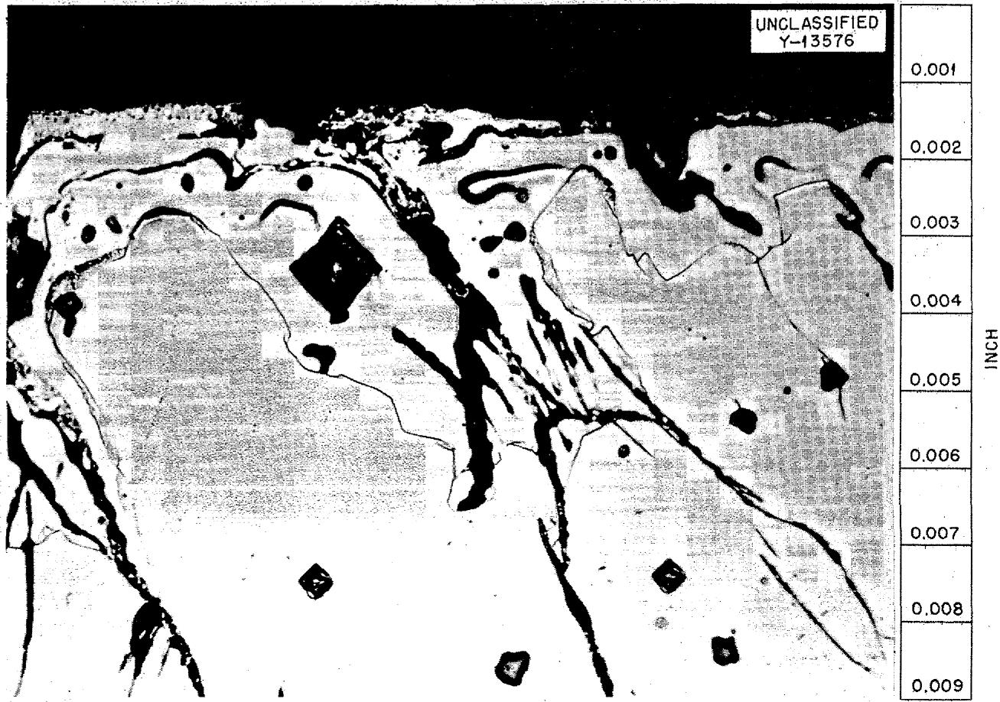  
Fig. 6.16. Transverse Section of the $50\%$ Fe- $50\%$ Cr Specimen from the Hot Leg of the Second Loop. 500X.

# Fused Hydroxides as Acid-Base Analog Systems

G.P. Smith

Metallurgy Division

If fundamental research is to make an effective contribution to the development of hydroxide technology, one of the primary goals must be the evolution of a systematic chemistry of these substances. No such systematic chemistry now exists. It is the purpose of this research to establish a theoretical basis on which such a systematic chemistry can be built.

In the first report on this investigation5 the various types of self-decomposition equilibria in fused hydroxides were considered with the aid of thermodynamics. In the case of sodium hydroxide

these equilibria may be represented as follows:

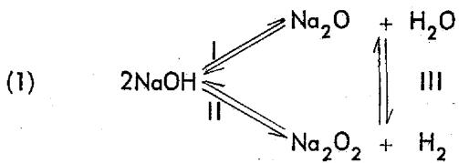

Equilibria I and II are far to the left except at very high temperatures. Equilibrium III favors the oxide over the peroxide, although somewhat less so at higher temperatures than at lower temperatures.

This report is devoted almost exclusively to the qualitative application of two acid-base analog theories to Equilibrium I. This is, of course, only a small part of fused hydroxide chemistry, and the conclusions reached will not, by themselves, tell very much about corrosion phenomena. However, they are an essential part of the overall corrosion picture.

Subsequent reports will be concerned with some quantitative aspects of subjects treated qualitatively in this report, and with Equilibria II and III, and, hence, with oxidation-reduction processes including mass transfer.

A large percentage of all chemical reactions in liquid systems can be classified as acid-base analog reactions or as oxidation-reduction reactions. In most systems the nature of the solvent controls the acid-base analog reaction, while in oxidation-reduction reactions the solvent usually plays a minor role. On the other hand, oxidation-reduction reactions in fused hydroxides are related to acid-base equilibria in at least three ways. First, acid-base reactions depend on Equilibrium I and oxidation-reduction reactions depend on Equilibrium II, but both are interrelated by Equilibrium III. Second, in some cases the solvent can stabilize higher oxidation states of metals through solvolytic reaction. Third, in some cases the kinetics of the hydrogen replacement reaction in fused sodium hydroxide appears to be dependent on acid-base equilibria in a way analogous to similar replacement reactions in liquid ammonia. Thus, a study of acid-base equilibria in fused hydroxides is a necessary prelude to a more interesting study of the oxidation-reduction reactions which are important in the corrosion and mass transfer of metals.

In order to focus attention entirely on the simpler acid-base analog reactions, only Equilibrium I will be considered. This treatment is valid at lower temperatures and in the absence of strong oxidizing or reducing agents.

Ionization Assumption. As a basic assumption, it is proposed that the fused alkali-metal hydroxides, excepting the hydroxide of lithium, are completely dissociated into hydroxyl ions and alkali-metal ions. This assumption is strongly supported by crystallographic studies of the solid hydroxides.6 Under this assumption, Equilibrium I may be written as the ion equilibrium

$$
2 O H ^ {-} \xrightarrow {\Delta} H _ {2} O + O ^ {- -} \tag {2}
$$

The alkali-metal cations influence the equilibrium constant by their relative polarization of the species in the above equation. Other than this, it is proposed that they be disregarded in considering acid-base equilibria in fused hydroxides.

This "inert" behavior of the cations in acid-base processes stems from two factors: first, the large ionic radius and small charge of the cations and, second, the exceptionally small ionization energy of the parent atoms.

Solvent-System Concept. In terms of the solvent-system concept first introduced by Franklin7 for liquid ammonia and subsequently applied by Jander8 to a variety of liquids, it is clear that Eq. 2 fulfills the formal requirements for a water-like acid-base equilibrium and, hence, that the fused alkali-metal hydroxides may be properly considered as acid-base solvent systems.

The remainder of this report is concerned with a determination of the types of reactions which acid-base theories show to be a consequence of Eq. 2. The results are given in summary only, together with enough comments to orient the reader who is familiar with acid-base theory. It can be shown that two acid-base theories, the Bronsted protonic-solvent theory and the Lux oxide theory, are applicable to fused hydroxide systems. Since the approach in this report is largely qualitative, it will be convenient to classify reactions as either neutralization reactions or solvolytic reactions. Neutralization reactions are those in which the covalently solvent species occurs as a reaction product, while solvolytic reactions are those in which the solvent species occurs as a reactant.

Protonic-System Concept. Equation 2 represents a proton donor-acceptor equilibrium. Hence, the protonic-solvent theory is applicable and leads to the following analysis. One-half the hydroxyl ions in Eq. 2 are proton donors and, hence, are defined as acids. They may be regarded, in a formal way, as dissociating into protons and oxide ions as in Eq. 3.

$$
\begin{array}{l} \mathrm {O H} ^ {-} \rightleftharpoons \mathrm {H} ^ {+} + \quad \mathrm {O} ^ {- -} (3) \\ \mathrm {H} ^ {+} + \mathrm {O H} ^ {-} \rightleftharpoons \mathrm {H} _ {2} \mathrm {O} (4) \\ \mathrm {O H} ^ {-} + \mathrm {O H} ^ {-} \rightleftharpoons \mathrm {H} _ {2} \mathrm {O} + \mathrm {O} ^ {- -} (5) \\ \text {A c i d I} \quad \text {B a s e I I} \quad \text {A c i d I I} \quad \text {B a s e I} \\ \end{array}
$$

The protons, having an exceptional polarization potential, react almost completely with the solvent, Eq. 4, represented by the other half of the hydroxyl ions in Eq. 2. Water, the product of this reaction, thus may be regarded as a solvated proton (onium species) in fused hydroxide solution. Using the protonic-solvent theory, the quantitative extent of reaction is regarded as being controlled by the relative proton affinities of the two bases involved in any acid-base equilibrium.

Protonic-Solvolysis-Type Reactions. At least three types of protonic-solvolytic reactions might be expected. First, the hydride ion provides a special case:

$$
H ^ {-} + O H ^ {-} \rightleftharpoons O ^ {- -} + H _ {2} \tag {6}
$$

Second,

$$
O H ^ {-} + H B \rightarrow B ^ {-} + H _ {2} O \tag {7}
$$

where $\mathsf{B}^{-}$ is taken as a generalized representation of an anionic species. Third,

$$
O H ^ {-} + B ^ {-} \rightarrow B H + O ^ {- -} \tag {8}
$$

The second type of solvolytic reaction requires that the hydroxyl ion be a stronger proton acceptor than the $\mathsf{B}^{-}$ ion. There are, of course, many examples of this, such as the obvious reaction

$$
\mathrm {O H} ^ {-} + \mathrm {H C l} \rightarrow \mathrm {C l} ^ {-} + \mathrm {H} _ {2} \mathrm {O} \tag {9}
$$

which, in fused hydroxides, is a solvolytic reaction and not a neutralization. Equation 9 represents an obvious reaction because of the exceedingly weak base character of the chloride ion. There should, however, be a series of such reactions involving bases with proton affinities lying between those of $\mathrm{Cl}^-$ and $\mathrm{OH}^-$ , such as $\mathrm{HPO}_4$ and $\mathrm{HCO}_3^-$ , so that the reaction

$$
\mathrm {H C O} _ {3} ^ {-} + \mathrm {O H} ^ {-} \rightarrow \mathrm {C O} _ {3} ^ {- -} + \mathrm {H} _ {2} \mathrm {O} \tag {10}
$$

might occur; if it did occur, it would be an example of Eq. 2.

The third type of solvolytic reaction, Eq. 8, requires that the $\mathsf{B}^{-}$ ion be a stronger base than the $0^{--}$ ion. At best, there will be very few instances of this.

Protonic-Neutralization-Type Reactions. Neutralization reactions in fused hydroxides which can be treated by the protonic theory are also of three types: (1) the reaction of water with the

oxide ion according to the formula

$$
\mathrm {H} _ {2} \mathrm {O} + \mathrm {O} ^ {- -} \rightarrow 2 \mathrm {O H} ^ {-} \tag {11}
$$

where the water may come from the dissociation of another compound; (2) the reaction of water with an ion which is a stronger base than the hydroxyl ion but a weaker base than the oxide ion, that is, essentially the reverse of Eq. 7,

$$
\mathrm {H} _ {2} \mathrm {O} + \mathrm {B} ^ {-} \rightarrow \mathrm {B H} + \mathrm {O H} ^ {-} \tag {12}
$$

and (3) the reverse of Eq. 8,

$$
O ^ {- -} + H B \longrightarrow B ^ {-} + O H ^ {-} \tag {13}
$$

An obvious example of the reaction given by Eq. 13 is

$$
0 ^ {- -} + \mathrm {H C l} \rightarrow \mathrm {C l} ^ {-} + \mathrm {O H} ^ {-} \tag {14}
$$

Kinetically, this reaction undoubtedly would go by two steps,

$$
\begin{array}{l} \mathrm {H C l} + \mathrm {O H} ^ {-} \longrightarrow \mathrm {C l} ^ {-} + \mathrm {H} _ {2} \mathrm {O} \\ H _ {2} O + O ^ {- -} \rightarrow 2 O H ^ {-} \\ \end{array}
$$

if the oxide ion were present in low concentrations, with the second step controlling the rate. However, the equilibrium would be represented by Eq. 14. Equation 13 represents a wider range of reactions than Eq. 8 because the permissible proton affinity range for $\mathsf{B}^{-}$ goes all the way up to that of the oxide ion; therefore the reaction

$$
\mathrm {H C O} _ {3} ^ {-} + \mathrm {O} ^ {- -} \longrightarrow \mathrm {C O} _ {3} ^ {- -} + \mathrm {O H} ^ {-} \tag {15}
$$

is undoubtedly an example in which the bicarbonate ion behaves like an acid.

Oxidic-System Concept. There are a great many reactions in fused hydroxides which cannot be usefully treated in terms of the protonic-solvent theory. Consider, for example, the familiar reaction

$$
\mathrm {C O} _ {2} + 2 \mathrm {O H} ^ {-} \longrightarrow \mathrm {C O} _ {3} ^ {- -} + \mathrm {H} _ {2} \mathrm {O} \tag {16}
$$

The application of the Bronsted theory here requires a rather complex, formal treatment. The actual proton exchange is between the bases OH- and $0^{- - }$ . The weaker base, $\mathsf{OH}^-$ , serves as the proton acceptor, and the stronger base, $0^{- - }$ , serves as the proton donor. This is the reverse of the neutralization reaction given in Eq. 11 and would not be predicted by the protonic-solvent theory. This seeming contradiction may be re

solved in a formal way, but it is much more useful to apply the following straightforward approach. In Eq. 16 the greater oxide-ion affinity of carbon dioxide compared with water determines the direction of the reaction.

Lux and Flood and Fjland have advanced a definition of acids and bases which was designed for treating the special problems encountered in nonprotonic fused oxide systems. According to these authors, a base is an oxide-ion donor and an acid is an oxide-ion acceptor; thus

$$
\text {B a s e} \rightleftharpoons \text {A c i d} + \text {O} ^ {- -} \tag {17}
$$

Under this definition the conventional classification of slags as acidic or basic is preserved. This acid-base concept has not been applied to solvent systems, but, by a small extension, this may be done.

Two competing equilibria of the above type can be considered:

$$
\begin{array}{l} \frac {\begin{array}{l}A O \rightleftharpoons A ^ {+ +} + O ^ {- - }\\O ^ {- - } + B ^ {+ +} \rightleftharpoons B O\\A O + B ^ {+ +} \rightleftharpoons B O + A ^ {+ +}\end{array}}{} \tag {18} \\ \text {B a s e} \quad I \quad \text {A c i d} \quad \text {I I} \quad \text {B a s e} \quad \text {I I} \quad \text {A c i d} \quad I \\ \end{array}
$$

The acid-base equilibrium shown by Reaction 18 may be considered to be controlled by a balance between the oxide-ion affinities of the reactant acid and the product acid in a manner that would be analogous to the balance between the proton affinities of the bases in protonic solvents.

The self-dissociation of hydroxyl ions according to Eq. 2 completely fulfills the requirements of the Lux definition, Eq. 17. It may, at first, seem improper to assign to two hydroxyl ions the role of a single base. Although this is not permissible in the Bronsted definition, it is a natural consequence of the Lux definition. The process of joining two ortho-oxyanions by eliminating an oxygen ion and forming an oxygen bridge such as occurs in pyroanions is one of the types of reaction to which the Lux definition applies. For example,

$$
2 \mathrm {P O} _ {4} ^ {3 -} \rightleftharpoons \mathrm {P} _ {2} \mathrm {O} _ {7} ^ {4 -} + \mathrm {O} ^ {2 -} \tag {19}
$$

Thus, water, H-O-H, may be regarded as a pyroanalog compound of hydrogen and the hydroxyl ion as the ortho-oxygen of hydrogen. Because of acid-base relations involving pyroions, such as shown in Eq. 19, two hydroxyl ions will always be taken together to serve as a Lux base analog.

Oxidic-Solvolysis-Type Reactions. The solvolytic reactions involving the oxides and oxysalt solutes can be classified according to the ionization energy of the atom other than oxygen in the oxide. This method of classification is possible because the ionization energy of an atom is related to its oxide-ion affinity. It is convenient to divide the elements into four groups according to ionization energy.

First, oxides and oxysalts of atoms having high ionization energy should react with the fused hydroxides to give a change in coordination. For example,

$$
\mathrm {S O} _ {3} + 2 \mathrm {C H} ^ {-} \rightleftharpoons \mathrm {S O} _ {4} ^ {- -} + \mathrm {H O H} \tag {20}
$$

(see also Eq. 16).

Second, oxides and oxysalts of atoms of medium ionization energy should react with fused hydroxides either to form or to depolymerize polyanionic acids. For example, the reaction

$$
\mathrm {P} _ {2} \mathrm {O} _ {7} ^ {4 -} + 2 \mathrm {O H} ^ {-} = 2 \mathrm {P O} _ {4} ^ {3 -} + \mathrm {H O H} \tag {21}
$$

will probably take place. The possible reactions of this type are numerous because of the substantial variety of polyanions. For example, there could be the step-wise depolymerization of silicon-oxygen compounds beginning with the three-dimensional network in silicon dioxide, passing through the two-dimensional net polyanions, through the one-dimensional chain (and ring) polyanions, the pyroanion, and finally ending with the orthosilicate anion.

This second type of solvolytic reaction should tend toward depolymerization and, for some parent atoms, go all the way to the ortho-oxyanion because of the relatively high basic character of the hydroxyl ion. However, there is no assurance that the ortho-oxyanion will be the most stable form in all cases.

Third, oxides of atoms of low ionization energy should react with fused hydroxides to form oxysalts. This represents a conversion from a cation to an anion. For example,

If a meta-oxysalt rather than an oxide is used as the starting material, in some instances, the meta-oxysalt may be converted into the ortho-oxysalt.

Fourth, oxides of atoms having very low ionization energy should not undergo solvolysis at all. For example, the inert behavior of magnesium oxide toward sodium hydroxide is no doubt due to the low ionization energy of magnesium.

There still remain a large number of potential solutes not treated above. Of these, the only ones which the writer has considered are the relatively ionic metallic salts. These substances will probably be separated into ions by the highly dipolar hydroxyl ions, and the solvolysis of the cation and the anion can be considered separately. The cation should tend to form oxides and oxysalts. This reaction should go virtually to completion except for metals of very small polarization potential. The anionic-solvolytic reaction can vary from very complex to nil, and an adequate treatment will require the development of a somewhat more generalized acid-base theory.

As an example of the reaction of a metal salt with a fused hydroxide, a small amount of nickel chloride was added to fused sodium hydroxide at $400^{\circ}\mathrm{C}$ . The reaction proceeded rapidly with the evolution of gaseous water and the formation of a fine black precipitate. The precipitate was separated from the hydroxide and found by x-ray analysis to consist largely of nickel(II) oxide, together with a small amount of an unidentified compound.

This reaction can probably be represented, in large measure, as

$$
\mathrm {N i C l} _ {2} + 2 \mathrm {O H} ^ {-} \rightleftharpoons \mathrm {N i O} + \mathrm {H O H} + 2 \mathrm {C l} ^ {-} \tag {23}
$$

Previous experiments indicate that at higher temperatures the reaction represented by Eq. 22 would have followed that represented by Eq. 23.

Oxidic-Neutralization-Type Reactions. The neutralization reactions of nonprotonic, oxidic solutes can be divided into two classes. First, the neutralization of a base by water takes place according to the reaction

$$
\mathrm {B O} + \mathrm {H O H} \rightarrow \mathrm {B} ^ {+ +} + 2 \mathrm {O H} ^ {-} \tag {24}
$$

This reaction will only occur for nonprotonic acids, $\mathsf{B}^{+ + }$ which are stronger than water. Second, reactions of the following type, which occur in pure oxide melts, would represent a special type of pseudoneutralization in which no

solvent would be produced.

$$
\text {A c i d} + \mathrm {O} ^ {- -} \longrightarrow \text {B a s e} \tag {25}
$$

The reaction shown in Eq. 25 includes the entire host of reactions treated in the original Lux theory.

When reactions of the type given in Eq. 25 occur in fused hydroxides, the oxide ion concentration can be varied over a wide range of values. This is not possible with the pure oxide melts to which the Lux theory has previously been applied. Examples of the classes of reactions which are of the type represented by Eq. 25 may be obtained by substituting $0^{- - }$ for $20\mathrm{H}^{-}$ and deleting $\mathsf{H}_2\mathsf{O}$ in Eqs. 20 through 23. The essential difference between reactions of the type of Eq. 25 and those given in Eqs. 20 through 23 is that water is present in the latter reactions but not in the former. The presence of the acid of medium strength should shift the equilibrium considerably for much weaker acids, that is, those derived from atoms of low ionization energy, but only slightly for stronger acids, those derived from atoms of high ionization energy.

Mixed-Type Reactions. Finally, reactions of substances of what may be called "mixed" types should be mentioned. These mixed reactions might involve protonic-oxidic salts of alkali metals, and protonic or oxidic salts of nonalkali metals, or combinations of both. The resulting reactions should be capable of analysis in terms of the same considerations used in arriving at the conclusions already stated.

The Bronsted protonic theory was originally developed to treat the more useful low-temperature solvents, such as water and liquid ammonia, while the Lux theory was originally developed to treat the metallurgically important, high-temperature, fused-oxide systems. It is of some theoretical interest that both theories may be rigorously applied to reactions in fused hydroxides, although the types of reactions for which these applications are useful form two sets of almost mutually exclusive reactions - one set for each theory. This is symptomatic of the need to develop a more general acid-base theory along the lines proposed by Audrieth.[11] For many solvent systems, such a theory would be a luxury; for fused hydroxides, such a theory is a necessity.

It should be noted that of the types of reactions discussed above only a few examples have been studied experimentally in a detailed or quantitative way; most have not been studied at all or else are represented experimentally by some of the more obvious and less interesting examples.

# Flammability of Alkali Metal Solutions at High Temperatures

G.P. Smith

M. E. Steidlitz

Metallurgy Division

In the preceding report $^{12}$ data were given for the flammability of alloys of the sodium-bismuth system. Additional data have now been obtained for bismuth-rich alloys that provide a much more complete picture of the reactivity of this system. The relative reactivity of sodium-bismuth solutions with dry air at $700^{\circ}\mathrm{C}$ as a function of the mole fraction of sodium is shown in Fig. 6.17. The relative reactivity scale is arbitrary. Pure sodium was assigned a reactivity of four units. Unreactive solutions were assigned a reactivity of zero. No measurements were made for mole fractions of sodium between 0.6 and 1.0 because a solid compound of composition $\mathsf{Na}_3\mathsf{Bi}$ precipitates from solution at a mole fraction of sodium somewhat greater than 0.6.

A temperature-composition diagram for liquid sodium-bismuth solutions is presented in Fig. 6.18, on which is plotted a curve that approxi

mately separates the region of reaction from the region of no reaction. The circles and triangles on this diagram represent the temperature-composition values at which tests were conducted. Most of the circles represent two to four tests each. The open circles represent tests in which reaction occurred, while the black circles represent those which showed no reaction. The black triangles represent conditions under which part of the tests showed no reaction, while the rest of the tests showed a slight reaction. The two open triangles represent tests which showed an exceedingly slight amount of reaction. The broken portion of the curve is poorly defined, inasmuch as it may actually pass beneath the open triangles rather than above them, as shown. It may be noted that jets of pure bismuth showed appreciable reactivity at $800^{\circ}\mathrm{C}$ but not at $750^{\circ}\mathrm{C}$ .

When air was saturated with water vapor, the line of zero reactivity was shifted toward lower sodium concentrations by a small but appreciable amount for sodium-bismuth solutions. This effect is shown for sodium-bismuth solutions at $700^{\circ}\mathrm{C}$ in Fig. 6.19. It may be seen that, although data for moist air scatter badly, there is unquestionably a small shift toward lower sodium concentrations.

Combustion studies have been run on four of the six alkali metal-alkali halide systems for which

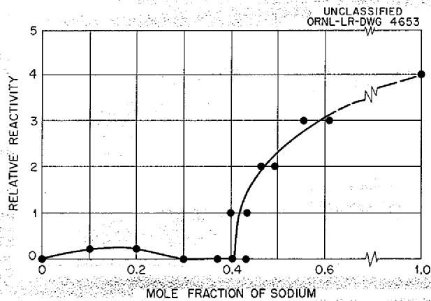  
Fig. 6.17. Relative Reactivity of Sodium-Bismuth Solutions with Dry Air at $700^{\circ}\mathrm{C}$ as a Function of the Mole Fraction of Sodium.

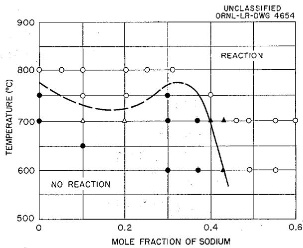  
Fig. 6.18. Temperature-Composition Diagram Showing Regions Within Which Jets of Sodium-Bismuth Solutions Did and Did Not React with Dry Air.

phase diagrams are available. The results described in Table 6.9 represent one test of each system at the temperature indicated. The temperature chosen lies in the one-liquid phase region of the phase diagram - generally about $50^{\circ}\mathrm{C}$ above the two-liquid phase region. As may be seen, all tests were conducted in the metal-poor section of the system.

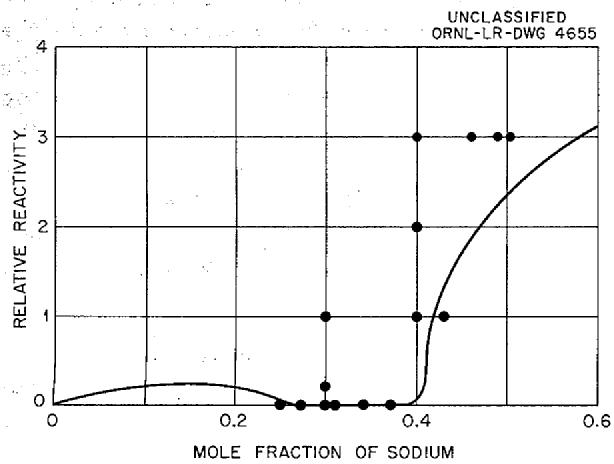  
Fig. 6.19. Relative Reactivity of Sodium-Bismuth Solutions with Moist Air at $700^{\circ}\mathrm{C}$ . The curve represents data for dry air.

TABLE 6.9. FLAMMABILITY OF ALKALI METAL-ALKALI HALIDE SYSTEMS  

<table><tr><td>System</td><td>Metal Content (mole %)</td><td>Test Temperature (℃)</td><td>Reaction</td></tr><tr><td rowspan="3">Na-NaF</td><td>2</td><td>1050</td><td>Mild</td></tr><tr><td>5</td><td>1050</td><td>Violent</td></tr><tr><td>10</td><td>1050</td><td>Violent</td></tr><tr><td rowspan="3">Na-NaCl</td><td>2</td><td>850</td><td>Little</td></tr><tr><td>6.6</td><td>900</td><td>Violent</td></tr><tr><td>30</td><td>1050</td><td>Violent</td></tr><tr><td rowspan="4">Na-NaI</td><td>2</td><td>700</td><td>Mild</td></tr><tr><td>5</td><td>800</td><td>Mild</td></tr><tr><td>10</td><td>900</td><td>Violent</td></tr><tr><td>30</td><td>1000</td><td>Violent</td></tr><tr><td rowspan="3">K-KF</td><td>2</td><td>900</td><td>Mild</td></tr><tr><td>5</td><td>900</td><td>Violent</td></tr><tr><td>10</td><td>900</td><td>Violent</td></tr></table>

# CHEMICAL STUDIES OF CORROSION

F. Kertesz

Materials Chemistry Division

# Effect of Temperature on the Corrosion of Inconel Melts with NiF $_2$ Additions

H. J. Buttram

R. E. Meadows

N.V. Smith

Materials Chemistry Division

In order to study specifically the removal of chromium from Inconel by a known corroding agent in fluoride melts, additions of $\mathsf{NiF}_2$ were made to NaF-ZrF4-UF4 (53.5-40.0-6.5 mole%) in Inconel capsules. These capsules were subjected to 100-hr static tests in the temperature range 600 to $1000^{\circ}\mathrm{C}$ .

When the chromium concentration of the melt after the tests was plotted against the amount of $\mathrm{NiF}_2$ added to the melt, a temperature effect at a relatively high concentration of $\mathrm{NiF}_2$ (690 meq/kg) was noted. Additions of $\mathrm{NiF}_2$ up to about 70 meq/kg yielded chromium concentrations which were independent of temperature to within $\pm 100$ ppm $\mathrm{Cr}^{+ + }$ . The mixture to which the large addition of $\mathrm{NiF}_2$ (690 meq/kg) was made showed, at $600^{\circ}\mathrm{C}$ , a chromium content of 280 ppm $\mathrm{Cr}^{+ + }$ that was considerably below the stoichiometric quantity; at 800 and $900^{\circ}\mathrm{C}$ , there were successive increases to 630 and 840 ppm $\mathrm{Cr}^{+ + }$ ; while at $1000^{\circ}\mathrm{C}$ , 550 ppm $\mathrm{Cr}^{+ + }$ could be found. Metallographic observations paralleled the chemical analyses. Possible explanations for the finding of decreased chromium content at $1000^{\circ}\mathrm{C}$ were set forth in a previous report.[13]

# Effect of Chromium Additions on the Corrosion of Inconel in Fluoride Melts with NiF $_2$ Additions

H. J. Buttram

R. E. Meadows

Materials Chemistry Division

The behavior of Inconel capsules exposed to $\mathrm{NaZrF}_5$ and to NaF-ZrF $_4$ -UF $_4$ (53.5-40.0-6.5 mole %) was studied by using 100-hr tilting-furnace

tests in order to establish the effect of added nickel fluoride. In the absence of added chromium metal, the plot of the chromium concentration after test vs the nickel fluoride added followed a linear relationship, although the amount found in the case of very large additions of $\mathrm{NiF}_2$ was smaller than stoichiometric. Metallographic tests showed a heavy subsurface void formation to a depth of 21 mils at the hot end $(800^{\circ}\mathrm{C})$ and 5 mils at the cold end $(650^{\circ}\mathrm{C})$ , while the corresponding blank capsules (no $\mathrm{NiF}_2$ ) showed only light attack to a depth of 1 to 2 mils.

A series of Inconel capsules containing the same two fluoride melts and $\mathbf{NiF}_2$ with chromium pellets added were subjected to the same type of testing. The after-test chromium values were above stoichiometric, and metallographic examination of the capsule walls indicated that the $\mathbf{NiF}_2$ additions had little effect on the amount of attack. The heaviest attack was to a depth of 3 mils, with the average being 1 to 2 mils. The cold ends had thin metal deposits and a slight void formation.

# Effect of Chromium Valence State on Corrosion of Inconel

H. J. Buttram R. E. Meadows Materials Chemistry Division

Additions of chromous and chromic fluorides were made to $\mathrm{NaZrF}_5$ and $\mathrm{NaF - ZrF_4 - UF_4}$ (53.5-40.0-6.5 mole %) in Inconel capsules to determine the effect of chromium valence state. Metallographic examination showed that chromous fluoride additions had essentially no effect even in the case of large additions (18,000 ppm $\mathrm{Cr}^{+ + }$ ). The depth of attack was about 1 mil. As would be expected, when chromic fluoride was added, the Inconel showed attack to a depth of 4 mils and some evidence of intergranular penetration. The chromous ion has been demonstrated as the stable state in the $\mathrm{NaF - ZrF_4 - UF_4}$ systems; therefore, it is reasonable to assume that, when chromic fluoride is the additive, chromium metal will be removed from the Inconel to enable the chromium to be reduced to the chromous state. Chemical analyses made after these tests were inconclusive and difficult to interpret.

# 7. METALLURGY AND CERAMICS

W.D.Manly

J.M.Warde

Metallurgy Division

The nickel-molybdenum base alloys are being studied extensively as possible reactor structural materials with qualities superior to those of Inconel. Efforts are under way to evaluate and improve the existing alloys and to develop better ones. Radiator test assemblies have been fabricated, and weld stability and mechanical properties are being studied. Work has continued on the preparation of duplex tubing, boron carbide shielding, tubular fuel elements, and other special materials. The results of oxidation resistance tests of brazing alloys are presented. In addition, the first production of beryllium oxide ceramics by casting from a slip which is basic is described.

# DEVELOPMENT OF NICKEL-MOLYBDENUM BASE ALLOYS

The investigations under way for the evaluation of nickel-molybdenum base alloys as structural materials for circulating-fuel reactors include attempts to improve the ductility and the fabricability of commercially available Hastelloy B through purification, and efforts to find another suitable and improved nickel-molybdenum base alloy that has the strength and corrosion resistance of Hastelloy B. Fabrication experiments are being used to determine the effects of various treatments on the materials developed.

# Fabrication Experiments

H. Inouye

J.H.Coobs

Metallurgy Division

One of the difficulties experienced in the fabrication of Hastelloy B is due to the narrow range of forgeability of the alloy - between 1950 and $2100^{\circ}\mathrm{F}$ . The upper limit of forgeability is due to impurities which cause grain-boundary melting. The low ductility at temperatures between 900 and $1800^{\circ}\mathrm{F}$ is less understood, but it is believed to be due to aging and impurity precipitation in grain boundaries. Therefore efforts are being made to eliminate trace (tramp) elements by vacuum melting and the addition of elements to neutralize their effects.

One of the most critical components of a circulating-fuel reactor will be the fluoride-to-NaK

heat exchanger, for which, because of its complexity and fragility, it will be highly desirable to have seamless tubing. Commercially available Hastelloy B tubing, which is now made by welding strip, is not satisfactory because of cracks in the weld, checks on the surface, and, in the absence of severe working of the weld, nonuniform properties. Therefore several extrusion experiments have been performed in an effort to produce seamless tubing.

The initial extrusion experiments were attempts to produce rod from air melts of Hastelloy's B and C. When extrusion temperatures above $2100^{\circ}\mathrm{F}$ and up to $2350^{\circ}\mathrm{F}$ were used, the alloys fractured severely in all instances. For the subsequent experiments, the extrusion temperature was lowered to $2100^{\circ}\mathrm{F}$ , and a reduction ratio of 6.3:1 was established. The results obtained for the various materials are summarized in the following.

Vacuum-Melted, As-Cast Hastelloy B. The ingot that was extruded had been homogeneized at $2100^{\circ}\mathrm{F}$ for 48 hr. The front of the extrusion fractured severely, but some improvement was noted in comparison with the air melts previously extruded.

Air-Melted, As-Cast Hastelloy B Plus $0.2\%$ Ti as Ti-Mn-Al-Ni Master Alloy. The ingot was homogeneized 48 hr at $2100^{\circ}\mathrm{F}$ before extrusion. The extrusion fractured severely, and no improvement in comparison with the vacuum melt was noted.

Air-Melted, Commercial, Wrought Hastelloy B. The extrusion fractured severely and thus indicated that the cast structure was not responsible for the poor hot forgeability of the alloy.

Air-Melted, Commercial, As-Cast Hastelloy C. The extrusion was made through a cascade die (cone plus shear) to determine the effect of die design. Thus far, the alloy has been extruded through cone dies varying from 45 to 25 deg and through a shear die. In all extrusions, the rod fractured severely. An extrusion was also made by containing the billet in an Inconel can 0.063 in. thick on the outside diameter and with a $\frac{3}{4}$ -in.-thick disk at the nose of the billet. The Inconel nose separated from the Hastelloy, but the Hastelloy

was fractured only on the front l in. The remainder of the extrusion appeared to be sound. A thin layer of Inconel was found on the whole length of the extrusion. This experiment has not, as yet, been fully evaluated.

Nickel-Molybdenum Binary Alloys. In contrast to the experiments with the Hastelloys, previous extrusion experiments with vacuum melts of the binary alloys in the cast condition showed marked improvement in the quality and ease of fabrication. The tendency to fracture was still apparent to a slight degree and became progressively more noticeable as the molybdenum content of the alloy was increased from 20 to $24\%$ . Two extrusions of tube blanks of the $24\%$ molybdenum alloy were unsatisfactory for further reduction to small-diameter tubing because of the large fractures and deep defects. It was found that the defects could be eliminated by homogeneizing the cast billets for 48 hr at $2100^{\circ}\mathrm{F}$ . The minimum homogeneizing time was not determined. The data obtained in the extrusions of the nickel-molybdenum binary alloys are presented in Table 7.1.

Since Hastelloy C could not be extruded with any degree of success until it was canned in Inconel, it is concluded that lubrication is an important factor in these experiments. At the temperature of extrusion, although the alloy is probably not molten, the grain boundary is weakened sufficiently by the friction of the flowing metal against the die to cause fracture. By providing a layer of Inconel between the die and the alloy, as by canning, the friction on the alloy is removed. The friction could also be reduced by increasing the extrusion temperature, but, to increase the extrusion temperature, it will be necessary to eliminate the low-melting-point impurities from the alloys. An alternative would be to reduce the extrusion temperature and the extrusion ratios.

The following tentative conclusions have been drawn: (1) Vacuum melting has little effect on the extrudability of the alloys. (2) The extrudability of the alloy does not depend on whether it is in the wrought or the as-cast condition. (3) Homogeneizing has a beneficial effect, as evidenced by alloys of the $24\%$ Mo-76% Ni composition. (4) Poor

Atmosphere: Houghton's salt bath No. 1550

Heating Time: tube blanks, 30 min; rod, 45 min

Billets: as-cast, 3 in. in diameter and 3 in. long, homogeneized 48 hr in helium plus hydrogen

Die: 30- to 45-deg cone die, alloy CHW

Mandrel: 1-in. stem, straight, alloy LPD

Lubrication: glass wool in container, Fiberglas sleaving on mandrel stem

Dummy Block: 70-30 brass coated with Necrolene

Pressure Requirements (on 3-in. ram): maximum, 700 tons; minimum, 487 tons

TABLE 7.1. EXTRUSION DATA FOR NICKEL-MOLYBDENUM BINARY ALLOYS   

<table><tr><td rowspan="2">Heat No.</td><td colspan="2">Composition (wt %)</td><td rowspan="2">Temperature (°F)</td><td rowspan="2">Extrusion Ratio</td><td rowspan="2">Remarks</td></tr><tr><td>Mo</td><td>Ni</td></tr><tr><td>DPI-26</td><td>20</td><td>80</td><td>2240</td><td>7.42:1</td><td>Two tube extrusions; good surfaces</td></tr><tr><td>26</td><td>20</td><td>80</td><td>2200</td><td>6.3 :1</td><td>One rod extrusion; good surfaces</td></tr><tr><td>30</td><td>24</td><td>76</td><td>2340</td><td>7.42:1</td><td>One tube extrusion; good surfaces</td></tr><tr><td>30</td><td>24</td><td>76</td><td>2200</td><td>7.42:1</td><td>Two tube extrusions; minor flaws</td></tr><tr><td>25</td><td>24</td><td>76</td><td>2200</td><td>6.3 :1</td><td>One rod extrusion; good surfaces</td></tr><tr><td>24</td><td>32</td><td>68</td><td>2336</td><td>7.42:1</td><td>One tube extrusion; shattered</td></tr><tr><td>24</td><td>32</td><td>68</td><td>2210</td><td>7.42:1</td><td>One tube extrusion; minor defect 2 in. from front</td></tr><tr><td>24</td><td>32</td><td>68</td><td>2150</td><td>6.3 :1</td><td>One rod extrusion; failed to extrude</td></tr></table>

fabricability of the cast alloy is associated with a second phase which persists after long-time heat treatments at $2100^{\circ}\mathrm{F}$ .

# New Alloys

H. Inouye J.H. Coobs Metallurgy Division

Several new alloys are being studied in an attempt to find an alloy that is superior to Hastelloy B, and efforts are being made to improve the existing Hastelloys. Preliminary results of experiments with alloys of various compositions are presented in the following.

Hastelloy B Plus $0.03\%$ Cerium. A 3-lb vacuum melt was rolled at $2100^{\circ}\mathrm{F}$ , and there was considerably less cracking than would have been found with Hastelloy B. Numerous small defects were present, however, that may be eliminated by increasing the cerium content of the alloy.

Molybdenum-Columbium-Nickel Alloy. A $20\%$ Mo-5%Cb-75% Ni alloy could be cold rolled from the cast structure to sheet. The structure is two-phased at $1500^{\circ}\mathrm{F}$ and single-phased at a solution annealing temperature of $1950^{\circ}\mathrm{F}$ . The tensile strength of the alloy at $1500^{\circ}\mathrm{F}$ is 36,800 psi (elongation 3.5%). A creep test at a temperature of $1500^{\circ}\mathrm{F}$ and a stress of 8000 psi is in progress.

Molybdenum-Aluminum-Nickel Alloy. A $20\%$ Mo-2% Al-78% Ni alloy could be rolled at room temperature from the cast condition. At $1500^{\circ}\mathrm{F}$ the tensile strength was 43,500 psi with an elongation of $5\%$ .

Molybdenum-Nickel Alloy. A 100-g arc melt of a $24\%$ Mo-76% Ni composition was hot rolled $60\%$ at $2200^{\circ}\mathrm{F}$ . Following a 1-hr anneal at $2100^{\circ}\mathrm{F}$ , the alloy was cold rolled $72\%$ without cracking. The work hardening data for the alloy are listed below:

A 3-lb vacuum melt of this alloy has been rolled to sheet and will be screened for strength and ductility in creep and tensile tests. In addition, an extrusion of the alloy has been rolled to sheet for obtaining more detailed data.

A 100-g arc melt of a $32\%$ Mo-68% Ni composition was successfully hot rolled 60% at $2200^{\circ}\mathrm{F}$ . The alloy was further cold rolled 72% without cracking. The work hardening data for the alloy are listed below:

<table><tr><td>Cold Work (%)</td><td>Hardness VPN (20-kg load)</td></tr><tr><td>Annealed</td><td>231</td></tr><tr><td>21</td><td>386</td></tr><tr><td>31</td><td>444</td></tr><tr><td>41</td><td>471</td></tr><tr><td>54</td><td>513</td></tr><tr><td>62</td><td>502</td></tr><tr><td>72</td><td>516</td></tr></table>

A 3-lb vacuum melt of the alloy has been rolled to 0.063-in. sheet and is being machined into creep and tensile test specimens.

A 100-g arc melt of a $38\%$ Mo-62% Ni composition was rolled $60\%$ at $2200^{\circ}\mathrm{F}$ . The alloy cracked when cold rolled. In the annealed condition the hardness of the alloy is 396 VPN. The microstructure of the cast alloy shows a considerable quantity of eutectic, which appears to be similar to that found in Hastelloy B.

The following additional arc-melted alloys were evaluated:

<table><tr><td>Cold Work (%)</td><td>Hardness VPN (20-kg load)</td></tr><tr><td>Annealed</td><td>200</td></tr><tr><td>25</td><td>347</td></tr><tr><td>29.6</td><td>401</td></tr><tr><td>40.5</td><td>423</td></tr><tr><td>51.0</td><td>432</td></tr><tr><td>60.4</td><td>483</td></tr><tr><td>72.0</td><td>470</td></tr></table>

<table><tr><td>Alloy</td><td>Results</td></tr><tr><td>75% Ni-20% Mo-5% Al</td><td>Cracked during hot rolling</td></tr><tr><td>70% Ni-20% Mo-10% Cb</td><td>Slight edge cracking during hot rolling, further cold rolled to sheet without difficulty</td></tr><tr><td>78% Ni-20% Mo-2% V</td><td>Successfully hot rolled and cold rolled to sheet with no visible flaws</td></tr><tr><td>78% Ni-20% Mo-2% Zr</td><td>Moderate amount of cracking during hot rolling that became progressively more severe during cold rolling</td></tr></table>

# Oxidation and Oxidation Protection

H. Inouye J.H. Coobs Metallurgy Division

Temporary cycling tests from $1500^{\circ}\mathrm{F}$ to room temperature in air have been performed on Hastelloy B and other nickel-molybdenum base alloys to determine the behavior to be expected in a NaK-to-air heat exchanger such as will be required for aircraft reactor application. The severest operating condition that could exist would be a thermal cycle from operating temperature $(1500^{\circ}\mathrm{F})$ to room temperature under stresses caused by high-velocity air.

The cycling tests of Hastelloy B were evaluated by daily visual examination of the test piece which had been through a heating cycle of 17 hr at $1500^{\circ}\mathrm{F}$ and then cooling to room temperature in the furnace. Weight changes were also measured daily. In conjunction with these tests, identically prepared specimens were tested at a constant temperature of $1500^{\circ}\mathrm{F}$ . The results of these initial tests are shown in Table 7.2 and in Fig. 7.1.

The results presented in Table 7.2 show that the loss of metal from the Hastelloy B specimen through oxide spalling was prevented by the use of platings. In general, aluminum and aluminum plus nickel are considered to be unsatisfactory platings, however, because of spalling of the protective coating.

Several other alloys have been tested for oxidation at $1500^{\circ}\mathrm{F}$ for comparison with Hastelloy B and to determine whether they need oxidation protection during elevated-temperature mechanical and corrosion tests. The results of the tests are shown in Fig. 7.2.

At a constant elevated temperature in air, nickel-molybdenum alloys of intermediate compositions form a protective coating of $\mathrm{NiMoO_4}$ . Upon cooling, regardless of the rate, the coating will spall vigorously at temperatures between 440 and $230^{\circ}\mathrm{F}$ . Experimental evidence shows that this spalling may be due to a change in the crystalline structure of the $\mathrm{NiMoO_4}$ coating.

# Radiator Fabrication

P. Patriarca K.W.Reber

R.E.Clausing G.M.Slaughter

Metallurgy Division

J.M.Cisar

Aircraft Reactor Engineering Division

R. L. Heestand

Pratt & Whitney Aircraft

A series of test specimens of Hastelloy B radiators has been fabricated for use in evaluating the ability of Hastelloy B to withstand thermal shock and oxidation. A specimen that includes approximately 3 in. of Inconel-clad copper fins spaced 15 fins per inch is illustrated in Fig. 7.3.

The 20 tube-to-header joints were inert-arc welded by using the semiautomatic welding equipment described previously. The manifolds were manually inert-arc welded, and the assembly was brazed to effect the tube-to-fin joints and the

J. W. Spretnak and R. Speiser, Protection of Molybdenum Against Corrosion at High Temperatures, Ohio State University Research Foundation Status Report No. 8.

2P. Patriarca et al., ANP Quar. Prog. Rep. June 10, 1954, ORNL-1729, Fig. 6.5, p 96.

TABLE 7.2. RESULTS OF CYCLING TESTS IN AIR ON HASTELLOY B AND PLATED HASTELLOY B SPECIMENS  

<table><tr><td>Plating on Hastelloy B</td><td>Weight Change in 14 Cycles (g/cm2)</td><td>Surface Condition</td></tr><tr><td>None</td><td>-0.0775</td><td>Spalled</td></tr><tr><td>0.0005 in. of chromium</td><td>+0.0013</td><td>No spalling</td></tr><tr><td>0.001 in. of nickel plus 0.0001 in. of chromium</td><td>+0.0035</td><td>No spalling</td></tr><tr><td>0.001 in. of nickel plus aluminum spray</td><td>+0.0512</td><td>Spalled</td></tr><tr><td>Aluminum spray</td><td>+0.0370</td><td>Spalled</td></tr></table>

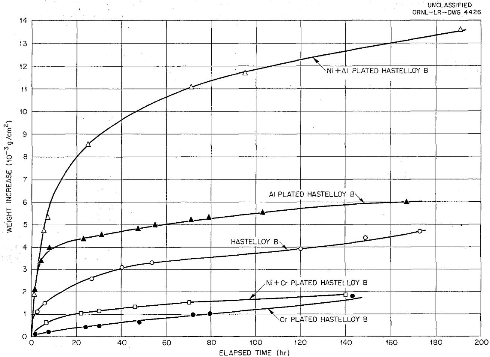  
Fig. 7.1. Oxidation of Plated Hastelloy B in Air at $1500^{\circ}$ F.

backing up of the tube-to-header joints with Coast Metals No. 52 brazing alloy.

The fabrication of the three test assemblies made to date has been routine, and no unusual behavior or difficulties have been encountered. Although it is expected that the characteristic aging of Hastelloy B and the subsequent loss in room-temperature ductility will affect the longevity of these test specimens, the first assembly has withstood, without failure, as determined by a helium leak test, 100 accrued hours of life with one air quench and one water quench directed at the fin surfaces. Other test assemblies are being fabricated with type 310 stainless-steel-clad copper in order to determine, in conjunction with the evaluation of Hastelloy B, the dimensional stability and oxidation resistance of this material under thermal shock.

# Welding

P. Patriarca

K.W.Reber

R. E. Clausing

G. M. Slaughter

Metallurgy Division

J.M.Cisar

Aircraft Reactor Engineering Division

R. L. Heestand

Pratt & Whitney Aircraft

Preparations are under way for experiments to evaluate the properties of Hastelloy B weld metal as affected by thermal history. A comparative basis for the tests has been prepared through experiments in which the effect of aging time at $1500^{\circ}\mathrm{F}$ on the room-temperature ductility of wrought Hastelloy B was determined. For these tests, guided bend specimens, $\frac{1}{8} \times \frac{1}{2} \times 1\frac{3}{8}$ in., were cut from $\frac{3}{16}$ -in.-thick wrought Hastelloy B plate

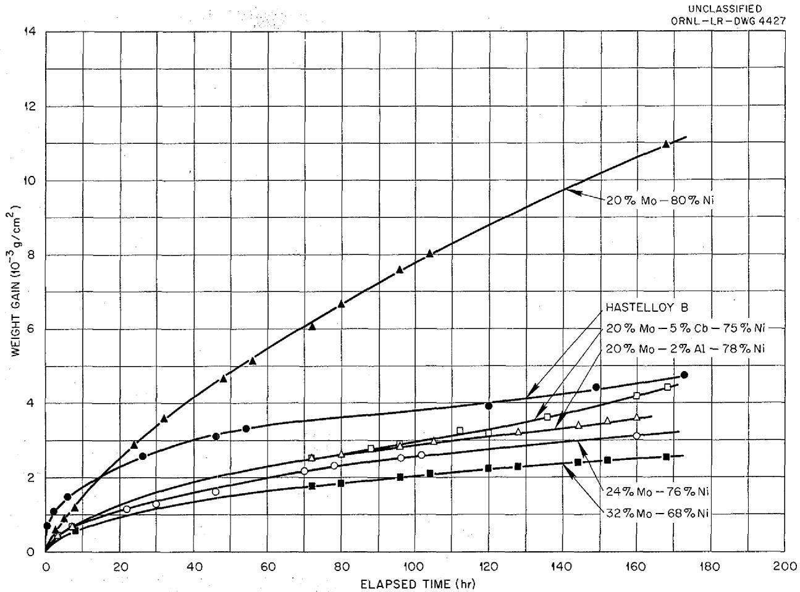  
Fig. 7.2. Oxidation of Nickel-Molybdenum Base Alloys in Air at $1500^{\circ}$ F.

which had been solution annealed at $2150^{\circ}\mathrm{F}$ and quenched. One set of specimens was then aged at $1500^{\circ}\mathrm{F}$ in vacuum for various periods of up to 300 hr before testing. A second group of the specimens was heat treated in hydrogen for $\frac{1}{2}$ hr at $2150^{\circ}\mathrm{F}$ and then for 30 hr at $1950^{\circ}\mathrm{F}$ and water quenched before they were aged at $1500^{\circ}\mathrm{F}$ in vacuum for periods of up to 300 hr.

Each specimen was loaded as a simple beam at a rate of approximately 1 in./min. The load-elongation curves indicated the maximum deflection at fracture. The deflections were translated to bend angle from the specimen and bending-jig geometry and are presented in Table 7.3. It may be seen that the room-temperature ductility of Hastelloy B when aged at a simulated service temperature of $1500^{\circ}\mathrm{F}$ is markedly reduced after

a period of exposure of less than 50 hr. If the material is given a stabilizing heat treatment, however, this reduction in ductility is prolonged for a period of between 100 and 200 hr. The results of this preliminary investigation indicate that the application of a stabilizing heat treatment is beneficial and that longer treatments at $1950^{\circ}F$ might effect more complete stabilization.

A similar group of specimens is being cut from inert-arc butt-welded $\frac{3}{16}$ -in.-thick plate in such a manner that the weld metal will constitute the center $\frac{1}{4}$ in. of the bend specimen. The effect of aging time and prior thermal history on these inert-arc welds will be determined by using both room-temperature and $1500^{\circ}\mathrm{F}$ bend tests, and the results will be compared with those for wrought Hastelloy B.

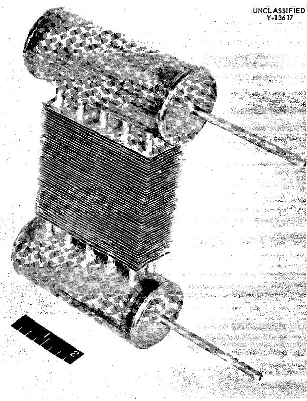  
Fig. 7.3. NaK-to-Air Radiator with Hastelloy B Tubing and Manifolding and a 3-in. Section of High-Conductivity Copper Fins Spaced 15 Fins per Inch.

# Mechanical Properties Studies

R.B.Oliver D.A.Douglas   
J.H.DeVan J.W.Woods

Metallurgy Division

M. D'Amore

Pratt & Whitney Aircraft

The stress-rupture properties of the nickel-molybdenum base alloys are being studied in fused salts, sodium, and various gases. Six new lever arm machines are being used to test Hastelloy B sheet specimens, and eight additional tube burst units have Hastelloy B pipe in test. It is anticipated that design curves for properties in the fused salts at 1500 and $1650^{\circ}\mathrm{F}$ will be available by February 1955. Data are also being obtained for a design curve for properties in argon. The results obtained in argon at $1500^{\circ}\mathrm{F}$ are presented in Table 7.4.

As Table 7.4 indicates, Hastelloy B has substantially greater strength at $1500^{\circ}\mathrm{F}$ than Inconel, which will rupture in 1200 hr when stressed to 3500 psi. A Hastelloy B specimen tested in hydrogen at 12,000 psi ruptured in 1300 hr; a similar time to rupture was found in argon. Thus there is an indication that Hastelloy B may not be sensitive to a hydrogen atmosphere when tested in the solution-annealed condition.

TABLE 7.3.EFFECT OF AGING TIME ON ROOM-TEMPERATURE BEND DUCTILITY OF WROUGHT HASTELLOY B  

<table><tr><td rowspan="2">Time at 1500°F (hr)</td><td colspan="2">Bend Angle Before Fracture (deg)</td></tr><tr><td>As-Received Specimena</td><td>Heat-Treated Specimenb</td></tr><tr><td>0</td><td>Greater than 135, c no fracture</td><td>Greater than 135, no fracture</td></tr><tr><td>25</td><td>Greater than 135, fissuring evident</td><td>Greater than 135, no fracture</td></tr><tr><td>50</td><td>92, complete fracture</td><td>Greater than 135, no fracture</td></tr><tr><td>75</td><td>90, complete fracture</td><td>Greater than 135, no fracture</td></tr><tr><td>100</td><td>84, complete fracture</td><td>Greater than 135, no fracture</td></tr><tr><td>200</td><td>80, complete fracture</td><td>90, complete fracture</td></tr><tr><td>223</td><td>76, complete fracture</td><td>82, complete fracture</td></tr><tr><td>300</td><td>80, complete fracture</td><td>75, complete fracture</td></tr></table>

${}^{a}$ Solution annealed at ${2150}^{ \circ  }\mathrm{F}$ and quenched.   
Heat treated in hydrogen for $\frac{1}{2}$ hr at 2150°F and then for 30 hr at 1950°F followed by water quench.   
Maximum bend angle available with apparatus.

TABLE 7.4. STRESS-RUPTURE PROPERTIES OF HASTELLOY B IN ARGON AT ${1500}^{ \circ  }F$   

<table><tr><td>Stress (psi)</td><td>Time to Rupture (hr)</td><td>Elongation (%)</td></tr><tr><td>15,000</td><td>157</td><td>45.0</td></tr><tr><td>13,500</td><td>180</td><td>15.0</td></tr><tr><td>12,000</td><td>1150</td><td>20.0</td></tr><tr><td>8,500</td><td>2200*</td><td>4.0</td></tr></table>

*Specimen still in test.

The new alloys being developed are also tested for stress rupture at $1500^{\circ}\mathrm{F}$ in argon in order to check the effect on strength which results from the various modifications. The results of tests made to date are presented in Table 7.5. These modified alloys show a decrease in high-temperature strength and elongation in comparison with Hastelloy B in the solution-annealed condition.

# SPECIAL MATERIALS FABRICATION

H. Inouye J.H.Coobs Metallurgy Division

# Duplex Tubing

The efforts to produce duplex seamless tubing that will have good oxidation resistance on the outer surface and good corrosion resistance on the inner surface have continued. In the previous report, tests were described in which hot-rolled and hot-pressed composites were deep drawn. An alternative and more direct method of producing

tubing is now being used in which the composite billets are extruded.

A study of the flow of metals during an impact extrusion is being made. For the study, the effect of the shape of the nose of the extrusion billet was determined on extrusions of Zircaloy canned in copper and extrusions of vanadium canned in steel. In addition, a two-ply and a three-ply billet of stainless steel-carbon steel were extruded, but the extrusions have not yet been evaluated.

The results of the tests show that large-grained billets, such as cast billets, produce a rough interface between the outer cladding and the core. A tapered nose on the can and a square edge on the core result in a short section of can material restricted to the front of the billet; thereafter, the core has a thin layer of the canning material on the surface. A square nose on the can and a tapered core result in a thin section of core beginning very soon after the front of the extrusion and increasing in thicknesses toward the end of the extrusion.

# Boron Carbide Shielding

Suitable compositions for the boron carbide shield for the ART heat exchanger are being developed by The Carborundum Company and by the Norton Company by using various nonmetallic bonding materials, including BN, SiC, and carbon, as well as those mentioned previously. All these bonding materials have been used to some extent in fabricating useful forms of $\mathsf{B}_4\mathsf{C}$ . Another possible source for fabrication of these shield pieces is Sylvania Electric Products, Inc., which only recently became interested in the problem.

In a recent conference with representatives of The Carborundum Company it was stated that they

TABLE 7.S. STRESS-RUPTURE PROPERTIES OF NICKEL-MOLYBDENUM BASE ALLOYS IN ARGON AT ${1500}^{ \circ  }\mathrm{F}$   

<table><tr><td>Alloy Composition</td><td>Stress (psi)</td><td>Time to Rupture (hr)</td><td>Elongation (%)</td></tr><tr><td rowspan="2">80% Ni-20% Mo</td><td>8,000</td><td>90</td><td>2.5</td></tr><tr><td>5,000</td><td>750</td><td>4.5</td></tr><tr><td rowspan="2">75% Ni-20% Mo-5% Cb</td><td>10,000</td><td>230</td><td>11.0</td></tr><tr><td>8,000</td><td>510</td><td>7.0</td></tr></table>

have developed a suitable composition by using SiC as the bonding material. However, specific details and samples of the material have yet to be received.

# Tubular Fuel Elements

Twelve fuel plates have been prepared for forming into tubes, and eight more are being prepared. These tubes are to be drawn at Superior Tube Co. by the plug-drawing technique with low $(10\%)$ reductions. Other techniques such as hot drawing or hot swaging may be used.

# Control Rods

Thirty-five control rods are being prepared for the GE-ANP project. They were received as specially straightened tubes, 0.504 in. ID, 0.625 in. OD, 35 in. long, with one end plugged. The tubes are being filled with a mixture of $50\%$ aluminum powder and $50\%$ $\mathsf{B}_4\mathsf{C}$ , both supplied by the General Electric Company. The $\mathsf{B}_4\mathsf{C}$ is a special grade containing $81\%$ boron. The mixture is prepared with $2\%$ paraffin as a binder and is being packed tightly into the tubes with a pneumatic hammer. Very small increments are used to obtain a high density. Twenty tubes have been filled with average boron concentrations of about 0.8 g/cm³, that is, somewhat in excess of the 0.7 g/cm³ required. After filling is completed, the tubes will be heated and evacuated to remove the paraffin and then cold swaged to final size.

# AI- $\mathsf{UO}_2$ Elements for Shielding Experiment

Fuel plates 28 in. long and $2\frac{1}{4}$ or $2\frac{1}{2}$ in. wide are being prepared for an experiment to determine the shielding necessary for delayed neutrons. These plates are to be mounted on a belt and rotated at speeds up to 22 fps. The fuel concentration of $0.25\mathrm{g/cm}^3$ required for these plates is quite high compared with that usually specified for fuel plates, and therefore new fabrication problems must be resolved.

Several plates have been fabricated by using $\mathsf{UO}_2$ and aluminum powder cores roll clad with aluminum. Three plates having 0.040-in. core thickness with 62 wt $\%$ $\mathsf{UO}_2$ had the required fuel concentration. Both high-fired and steam-oxidized $\mathsf{UO}_2$ were used with good results. The edges of the core were quite clean and straight, and the $\mathsf{UO}_2$ was distributed fairly uniformly, as shown by radiograph examination. Because of the high

percentage of $\mathsf{UO}_2$ it was necessary to hot roll the plates with the covers on at all stages to prevent oxidation. Plates with lower percentages of $\mathsf{UO}_2$ may be protected with thin aluminum foil pressed on the core compact during cold pressing.

The finished plates, as-clad with 2S aluminum, were judged to be too weak for the high stresses involved in the rapid cycling. Several more elements are being assembled by using 52S aluminum as frame and cladding in the hope that work hardening obtained in finish cold rolling will yield plates of sufficient strength.

# BRAZING ALLOY DEVELOPMENT

P. Patriarca

K.W.Reber

R. E. Clausing

G. M. Slaughter

Metallurgy Division

J.M.Cisar

Aircraft Reactor Engineering Division

R. L. Heestand

Pratt & Whitney Aircraft

The resistance to oxidation of a number of high-temperature brazing alloys when used in conjunction with Inconel as a base material was described in a previous report. This study has been extended to include tests of several additional brazing alloys. These tests have been conducted in accordance with the experimental procedures used in the previous studies. The results of metallographic examination of inverted T-joint specimens after exposure to static air at $1500^{\circ}\mathrm{F}$ for periods of 200 and 500 hr are summarized in Table 7.6. It appears that the majority of these alloys are suitable for service within the limits of this investigation. The periods of exposure currently being studied extend to 1000 hr. Tests are also being conducted at $1700^{\circ}\mathrm{F}$ in static air.

It is recognized that the test results obtained to date may not be applicable except under isothermal conditions. Therefore a duplicate set of experiments will be conducted to determine the effect of thermal cycling on the adherence of protective oxide films. Included in these tests will be a determination of the effect of the presence of water vapor on the nature of the scale formation and the resistance of this scale to spalling under conditions characterized by temperature fluctuations.

Parent metal: Inconel

Average fillet throat: 0.015 in.

Air temperature: $1500^{\circ} \mathrm{F}$

TABLE 7.6. OXIDATION RESISTANCE OF DRY-HYDROGEN-BRAZED T-JOINTS   

<table><tr><td rowspan="2">Brazing Alloy</td><td rowspan="2">Composition (wt %)</td><td rowspan="2">Brazing Temperature (°F)</td><td colspan="2">Oxidation in Static Air at 1500°F*</td></tr><tr><td>After 200 hr</td><td>After 500 hr</td></tr><tr><td colspan="5">Commercial Alloys</td></tr><tr><td>Coast Metals NP</td><td>50 Ni-12 Si-28 Fe-4 Mo-4.5 P-1 Mn-0.5 Cr</td><td>2050</td><td>Slight</td><td>Slight</td></tr><tr><td>Coast Metals 50</td><td>93 Ni-3.5 Si-2.5 B-1 Fe</td><td>2050</td><td>Slight</td><td>Slight</td></tr><tr><td>Coast Metals 51</td><td>92 Ni-4.5 Si-3 B-0.5 Fe</td><td>2050</td><td>Slight</td><td>Slight</td></tr><tr><td>Coast Metals 53</td><td>81 Ni-4 Si-4 B-8 Cr-3 Fe</td><td>1950</td><td>Slight</td><td>Slight</td></tr><tr><td colspan="5">Experimental Nickel-Base Alloys</td></tr><tr><td>G-E alloy 62</td><td>69 Ni-20 Cr-11 Si</td><td>2150</td><td>Slight</td><td>Slight</td></tr><tr><td>G-E alloy 81</td><td>66 Ni-19 Cr-10 Si-4 Fe-1 Mn</td><td>2150</td><td>Slight</td><td>Slight</td></tr><tr><td>Ni-Cr-Si</td><td>73.5 Ni-10 Si-16.5 Cr</td><td>2150</td><td>Slight</td><td>Slight</td></tr><tr><td>Ni-Si</td><td>88 Ni-12 Si</td><td>2200</td><td>Slight</td><td>Slight</td></tr><tr><td>Ni-Mo-Ge</td><td>50 Ni-25 Mo-25 Ge</td><td>2150</td><td>Slight</td><td>Slight</td></tr><tr><td>Ni-Mn-Cr</td><td>35 Ni-55 Mn-10 Cr</td><td>2050</td><td>Severe</td><td>Severe</td></tr><tr><td colspan="5">Experimental Precious-Metal-Base Alloys</td></tr><tr><td>Pd-Ni</td><td>60 Pd-40 Ni</td><td>2300</td><td>Very slight</td><td>Very slight</td></tr><tr><td>Pd-Ni-Si</td><td>60 Pd-37 Ni-3 Si</td><td>2150</td><td>Very slight</td><td>Very slight</td></tr><tr><td>Pd-Ge</td><td>90 Pd-10 Ge</td><td>2050</td><td>Very slight</td><td>Slight</td></tr><tr><td>Au-Co</td><td>90 Au-10 Co</td><td>1830</td><td>Very slight</td><td>Slight</td></tr></table>

*Very slight - less than 1 mil of attack; slight - 1 to 2 mils of attack; severe - greater than 5 mils of penetration.

# HEAT EXCHANGER FABRICATION

P. Patriarca K.W.Reber

R.E.Clausing G.M.Slaughter

Metallurgy Division

J.M.Cisar

Aircraft Reactor Engineering Division

R. L. Heestand

Pratt & Whitney Aircraft

The finned surface for a fused salt-to-air heat exchanger being considered for use in conjunction with an in-pile forced-circulation loop is shown in various stages of fabrication in Fig. 7.4. The corrugated fins were formed from 0,010-in.-thick nickel sheet and were brazed to a $3/8$ -in.-OD Inconel tube with an $82\%$ Au- $18\%$ Ni brazing alloy to form

the test specimen shown. A 0.020-in.-dia nickel wire was used as a spacer between each fin segment, and it served to provide a capillary path for the braze alloy, which was preplaced at the fin interlock joint only.

This assembly procedure was used to successfully dry-hydrogen braze a 40-segment heat exchanger at $1850^{\circ}\mathrm{F}$ . The $82\%$ Au- $18\%$ Ni alloy possesses excellent resistance to oxidation, as is evidenced by the appearance of the inverted T-joint specimen shown in Fig. 7.5. This Inconel test joint was exposed to static air at $1500^{\circ}\mathrm{F}$ for a period of 1300 hr prior to metallographic examination.

The resistance of this brazing alloy to corrosion by fluoride salts has been found to be satisfactory

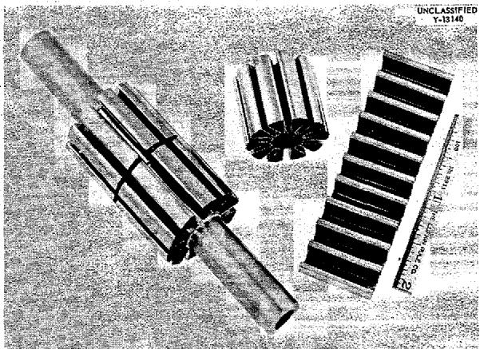  
Fig. 7.4. Corrugated Fin Segment of a Heat Exchanger Brazed with an $82\%$ Au-18% Ni Alloy.

on the basis of short-time static tests. However, an experiment was conducted to determine the influence of a high gold concentration gradient on the corrosion resistance of the internal surface of an Inconel tube when exposed to fused fluoride salt at $1500^{\circ}\mathrm{F}$ .

The test specimen consisted of a $\frac{1}{2}$ -in.-OD, 0.035-in.-wall Inconel tube formed into a seesaw test capsule to which were brazed several nickel fins of the dish type. An excessive amount of brazing alloy was used, and the brazing time was extended to 1 hr at $1900^{\circ}\mathrm{F}$ to promote dilution and diffusion. The capsule was then filled with fluorides and operated as a seesaw test for a period of 500 hr at $1500^{\circ}\mathrm{F}$ prior to examination. Since the observed 1- to 2-mil attack of the internal surface was considered to be normal, a microspark

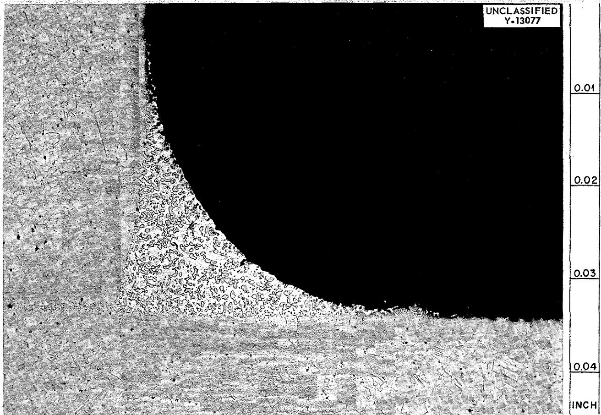  
Fig. 7.5. Inconel T-Joint Brazed with $82\%$ Au-18% Ni After Exposure to Static Air for 1300 hr at $1500^{\circ}$ F. Only minor attack can be seen. Etched with G. regia, 100X.

spectrographic examination was conducted from the braze alloy-Inconel tube interface inward to the internal surface of the tube. Solid state diffusion of gold was found to be negligible in that it was not possible to detect any trace of gold at the internal surface, and an abrupt change in the gold concentration still existed at the braze alloy-Inconel interface.

It would appear that this braze alloy is satisfactory for fused fluoride salt-to-air heat exchanger fabrication within the limits of this study. The use of this alloy in direct contact with fused salts has also been considered, since the ease of fabrication of components with moving parts, such as pumps, would be improved. Although it is expected that dissimilar metal mass transfer will prevent this application, a thermal-convection loop with several $82\%$ Au-18% Ni braze joint inserts will be operated to experimentally determine the effect.

# BERYLLIUM OXIDE FUEL ELEMENTS

C.E.Curtis L.M.Doney

J.R.Johnson

Metallurgy Division

Beryllium oxide ceramics are being produced, probably for the first time, by casting from a slip which is basic. For successful slip casting, a well-defflocculated slip is necessary, and hitherto this has been accomplished through the use of an acid, usually HCl. In comparison, a basically deflocculated slip is more easily and rapidly

prepared, does not attack the plaster of paris molds, is not unpleasant to the operator, and requires very small amounts of deflocculants. As an example, tubes 4 in. long, 0.25 in. in outside diameter, with a 0.04-in. wall, have been slip cast recently from beryllium oxide and also from beryllium oxide containing 16.2 wt % of natural uranium oxide. These tubes are to be used for tests by the Advanced Design Section of GE-ANP. To 83.8 g of BeO (previously milled to about $2\mu$ average particle size) plus 16.2 wt % of $\mathrm{UO}_2$ were added about 26 ml of distilled water and 4 ml of a $2\%$ solution of sodium pyrophosphate. After 5 min of stirring, a creamy slip with a pH of 8 to 9 was obtained which spread evenly over a glass stirring rod and flowed off the rod in a smooth stream. Casting of the tubes required a two-piece plaster mold with an opening 5 in. long to allow for shrinkage and trimming to 4 in. and a diameter of 0.29 in. to allow for shrinkage on the diameter. The deflocculated slip required about 10 to 15 sec to form a tube of the proper wall thickness in this mold. The excess slip was drained off, and, after an additional 3 to 5 min in the mold, the tubes released readily from the mold and had sufficient green and dry strength to permit handling.

A firing operation of 1 hr at $1700^{\circ}C$ in a hydrogen or argon atmosphere is necessary to produce the density of 3.0 to 3.4 required. In order to determine how warpage in firing may be avoided, some tubes are being fired suspended in a furnace, while others will be fired lying on their sides.

# 8. HEAT TRANSFER AND PHYSICAL PROPERTIES

# H. F. Poppendiek   Reactor Experimental Engineering Division

The heat transfer experimentation during the quarter included studies of ARE fuel in an Inconel tube, the determination of performance characteristics of an in-pile loop heat exchanger, studies of velocity and temperature distributions for several free-convection volume-heat-source systems, and preliminary determinations of fluid flow characteristics of a proposed ART core geometry. Several approximate mathematical temperature solutions for forced-flow volume-heat-source entrance systems were developed, and the question as to whether electric currents which generate heat in the circulating fluids of experimental volume-heat-source systems affect the fluid flow characteristics was investigated.

The enthalpies and heat capacities of NaF-ZrF $_4$ -UF $_4$ (53-43-4 mole %) and LiF-KF-UF $_4$ (48-48-4 mole %) were determined. The viscometry equipment was modified for greater accuracy, and new measurements were made for NaF-ZrF $_4$ -UF $_4$ . The thermal conductivities of NaF-ZrF $_4$ -UF $_4$ and of NaF-KF-LiF with and without UF $_4$ were measured.

# FUSED SALT HEAT TRANSFER

H.W.Hoffman J.Lones

Reactor Experimental Engineering Division

Preliminary heat transfer experiments have been performed with the ARE fuel $\mathsf{NaF - ZrF}_4\text{-UF}_4$ (53.5-40-6.5 mole %) flowing in an Inconel tube. In brief, the heat transfer system used consisted of two small tanks (approximately $1/3$ -ft³ capacity) connected by an electrically heated $1/4$ -in.-OD tube with a length-to-diameter ratio of 43. Flow through the heated section was produced by helium gas pressure and controlled by an automatic cycling mechanism actuated by the fluid level in the tanks. The helium was purified by passage through a NaK bubbler.

Operation of the system was terminated after 115 hr in order to inspect the Inconel tube. The average fluid temperatures during the period of operation were 24 hr at $1200^{\circ}\mathrm{F}$ , 85 hr at $1300^{\circ}\mathrm{F}$ , and 6 hr at $1400^{\circ}\mathrm{F}$ . Heat transfer measurements, made in the heated section over the Reynolds modulus range of 5,600 to 10,000, yielded results which were $24\%$ below the generally accepted

correlation for ordinary fluids. The precision of the measurements was approximately $10\%$ . Visual examination of the test section after removal from the system showed no apparent film. Samples of the tube have been submitted for metallographic examination. It is recalled that in the case of the previous experiments for molten NaF-KF-LiF flowing in Inconel tubes, $55\%$ reductions in heat transfer were measured and corrosion deposits were found on the tube walls.

About 15 individual heat transfer measurements were made between 24 and 115 hr of operation of the NaF-ZrF $_4$ -UF $_4$ -Inconel system. During this period no reductions of the heat transfer coefficients with time were observed. A new Inconel test section is currently being installed for obtaining measurements in the period between 0 and 24 hr.

# IN-PILE LOOP HEAT EXCHANGER ANALYSIS

M. W. Rosenthal

Reactor Experimental Engineering Division

P. I. Perry

A. D. Rossin

F. D. Miraldi

M.I.T. Practice School

The heat exchanger for the LITR fluoride fuel loop was constructed in an unusual geometry to fit in the limited space available in a beam hole. In order to determine the operating characteristics of this exchanger, an experimental investigation of its fluid flow and heat transfer performance was conducted. The heat exchanger for the loop is formed with helical fins brazed around a section of straight pipe. The fins are enclosed in a closely fitting tube and form an annulus in which air flows in a helical path. Molten salt passes through the center tube.

A duplicate of the actual exchanger to be used in the loop was connected to an air supply so that air passed through the annulus just as it would in in-pile operation. However, instead of a fused salt, dry steam was admitted to the center tube as the hot fluid. The air flow rate and inlet and outlet temperatures were measured, as were the steam pressure and the condensate rate. From this

information the air flow rate and the thermal resistance of the air side were obtained as functions of the air pressure drop across the exchanger (the steam-side resistance was negligible compared with the air-side resistance). Combination of these data with estimated coefficients for the fused salt, after allowance for difference in operating temperatures, yielded performance curves for the exchanger under anticipated in-pile operating conditions. The data and a description of the experiment are reported elsewhere. The method of conversion of the results of the experiment to in-pile conditions and the performance curves for the exchanger have been reported. A curve of the heat removal rate as a function of pressure drop of the in-pile loop heat exchanger is given in Fig. 8.1.

# FREE CONVECTION IN FLUIDS WITH VOLUME HEAT SOURCES

D.C.Hamilton F.E.Lynch

Reactor Experimental Engineering Division

The free-convection research, which had been inactive for some time, has been reactivated, with,

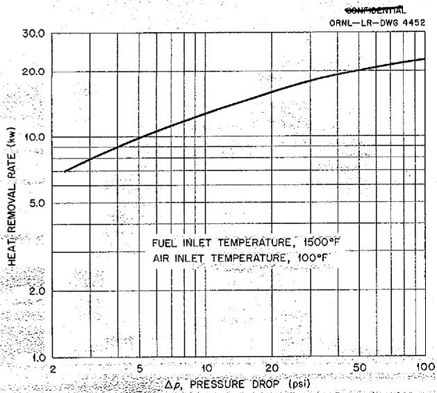  
Fig. 8.1. In-Pile Loop Heat Exchanger Performance.

however, more limited objectives than before. In the beginning of the ORNL-ANP effort, there was no information on free convection in fluids with volume heat sources. Since the temperature structure in the fuel pins of the first fused salt aircraft reactor experiment could not be readily predicted because of a lack of knowledge about the free-convection heat transfer in such a system, a free-convection research program was initiated. The principal objective was to determine both theoretically and experimentally the temperature and velocity structure in a free-convection flat-plate system and, from these data, to discover basic postulates that would permit analytical prediction of different systems which might be of interest in future fuel element designs. This project was well under way when the change to the present circulating-fuel reactor design was made. At that time the effort was greatly reduced, and later this research was temporarily abandoned in favor of more pressing problems. A series of memorandums summarizing the theoretical work which had been accomplished were prepared. Also, some preliminary experimental velocity measurements in a flat-plate apparatus were obtained.

In the intervening years there has been a continued interest in the temperature structure in fluids with volume heat sources that are losing heat by free convection in applications such as dump tanks for liquid fuel reactors, radiation damage capsules, and pins containing liquid fuel. The repeated queries on this subject prompted the decision to reactivate the research, but on a less ambitious basis than before. Hence, a report3 was prepared recently which provides a wider distribution to the theoretical analyses which were distributed locally as memorandums in 1951 and 1952.

Also, it has been proposed to measure the overall radial temperature difference (or heat transfer coefficient) for a modified version of the flat-plate system in which it will not be necessary to measure fluid temperatures. The original flat-plate apparatus has been modified and is almost ready for operation. The new apparatus consists essentially of three parallel flat copper plates 8 in. wide, 36 in. high, and separated by $\frac{1}{2}$ -in. gaps.

Plastic bottom and end sections make leak-proof containers of the two channels which are filled with a dilute electrolyte (HCl in $\mathsf{H}_2\mathsf{O}$ ). With the two outer plates grounded and the center plate maintained at a given a-c voltage, heat is generated within the fluid volume in each channel. Coolant passages are attached to the outside of the outer plates which uniformly remove the heat generated within the free-convecting fluid. Small holes drilled vertically down each of the three plates for the entire 36 in. permit insertion of wall thermocouple probes for measuring the wall temperatures at any level. The variables to be measured are coolant flow rate and temperature rise, power input to the apparatus, and the three wall temperatures at various levels.

# HEAT TRANSFER EFFECTIVENESS OF REACTOR COOLANTS

M.W.Rosenthal R.M.Burnett

H. F. Poppendiek

Reactor Experimental Engineering Division

One of the considerations in the selection of a coolant for a nuclear reactor or any heat exchange system is the amount of flow work required for removal of a unit of heat. This quantity, which is referred to as the "cooling work modulus," varies with the geometry of the system, the fluid velocity (and flow regime), and the properties of the fluid.

A memorandum is being prepared that gives the development of equations for calculation of the cooling work modulus for turbulent flow. Curves which simplify computation are provided, and the results of a study of a specific reactor are presented for illustration. This study has been performed for an idealized reactor coolant system which is considered to be somewhat representative of actual solid-fuel-element reactors. In this analysis the cooling work modulus is related to the reactor geometry, the heat removal rate, the thermal properties of the coolant, and certain coolant temperature differences which are determined by such factors as mean coolant temperature, coolant melting and boiling temperatures, tube wall corrosion and mass transfer, and thermal stresses.

All the thermal properties of a coolant are found to influence its effectiveness in transferring heat from the reactor. An ideal coolant is indicated to be one that has high thermal conductivity, heat

capacity, and density and a low viscosity, but the relative merits of actual fluids depend strongly on the temperature differences which are taken as limiting in the system.

# ART CORE HYDRODYNAMICS

J. O. Bradfute

L. D. Palmer

F. E. Lynch

G.M.Winn

Reactor Experimental Engineering Division

G. L. Muller

Pratt & Whitney Aircraft

The experimental flow system for studying the hydrodynamic characteristics of proposed ART cores was completed, and several photographs of particles and grids were made which yielded much information about the apparatus but no quantitative data. Some qualitative evidence for the existence of two, and possibly three, regions of flow separation in the ART core currently being tested was obtained by visual observation. Additional qualitative observations are continuing which are soon to be supplemented with quantitative data, but these preliminary observations indicate that the core with ideal entrance conditions must be considered to be unacceptable and that it will be necessary to use vanes at the entrance.

It was found that sufficient light is available to produce photographs of particles flowing with the water at a Reynolds number of 100,000, although at such high velocities the flash duration is a little long. It is believed that this can be remedied with a different flash tube, which is being procured. In addition, these first photographs revealed the need for an additional light source arranged to illuminate the particles continuously so that their tracks would represent a line on the photograph. This is necessary to reduce the uncertainty associated with identifying the two images of each particle. A 1000-w incandescent projection bulb proved to be inadequate, and arrangements are being made to test two different mercury-vapor light sources; they will increase the light intensity by a factor of 10 to 20, which should resolve the illumination problem.

Several details such as the quality of the grid photographs, the settling velocity of the particles, and the reliability of the Hewlett & Packard Co. electric counter have received attention. A new grid was made with much finer, shallower lines than the first. The photographs of the new grid were far superior to those of the old one, since

a much smaller area was obscured by the grid lines themselves. Inherent difficulties have beset attempts to measure the settling velocity of the particles; however, it can be said that the terminal velocity of free fall of Lycopodium spores in water under gravity is certainly less than $0.2\mathrm{cm / sec}$ and probably much less. Even this is only about $0.16\%$ of the mean velocity which will be measured. The Hewlett-Packard counter which measures the time interval between flashes was adjusted; its absolute accuracy was checked; and it was found to be satisfactory.

The design of another entrance section which will impart a rotational component of velocity to the fluid as it flows through the test section has been started. This will produce a velocity structure which is more realistic in terms of what is envisaged for the ART, but it is much more difficult to measure. It is conceivable that a rotational component will help to reduce the possible adverse thermal effect of separation regions, perhaps by eliminating these regions.

The velocity distribution in a diverging channel under turbulent flow conditions was studied with the phosphorescent-particle technique. Flow asymmetry at a half-angle of 4 deg was observed. This angle is somewhat less than the 5-deg half-angle given in the classical report on velocity profiles in channels by Nikuradse. A large flow-visualization system that utilizes the phosphorescent particle and dye techniques for studying fluid flow characteristics has nearly been completed.

# ART HEAT TRANSFER

H.F.Poppendiek L.D.Palmer

N. D. Green G. M. Winn

Reactor Experimental Engineering Division

Several approximate mathematical temperature solutions for forced-flow volume-heat-source systems were developed. One analysis pertained to laminar and turbulent boundary layers which are being developed on a flat plate or strut parallel to the fluid flow. Another analysis described the thermal structure in the stagnation point region such as may be found on a strut positioned normal to the fluid flow. Further research has been conducted on the electrical method of generating

volume heat sources within the fluids of experimental forced-flow volume-heat-source systems.

An experimental study of the factors affecting gas formation at an electrode-electrolyte interface was carried out pursuant to the problem of generating volume heat sources electrically. The generation of gas at an electrode was found to be dependent upon the material of the electrode and the current density and independent of the applied potential, as well as the type of electrolyte employed. Platinum was found to have the most desirable characteristic of conducting the maximum amount of current per unit area of electrode to an electrolyte for a given degree of gas generation. This effect is most probably the result of an increased surface area because of the known porosity of this metal. For brightly polished platinum, a current density of approximately 8 amp/in.² was achieved before gas liberation was noticeable. This value exceeded that of Carpenter 20 stainless steel by two orders of magnitude. Also, tests were carried out to study the compatibility of the more common stainless steels and dilute solutions of strong electrolytes in those portions of an experimental volume-heat-source system where no electric currents are flowing. Carpenter 20, type 347, and type 316 stainless steels were found to be accordant.

Concomitant with the problem of generating uniform volume heat sources within annuli of nonuniform cross section, a method for embedding platinum electrodes to form a hydrodynamically smooth surface has been developed. It has been established that several of the new epoxy bonding plastics adhere to suitably roughened metals in such a manner that the casting of composite sandwiches of metal and plastic is feasible. Three such experimental castings were fabricated, and subsequent machining of the plastic-metal junctions resulted in suitably smooth surfaces. Thermal testing in the desired temperature range proved the metal-plastic bond to be unaffected.

Pressure-drop measurements were made through long plastic tubes which were ducting a sulfuric acid solution with and without electric currents; these tubes were similar to the ones in the apparatus used to experimentally study the temperature structure in a simple forced-flow volume-heat-source system. The results, expressed in terms of the friction factor and Reynolds modulus in Fig. 8.2, indicated that there was no detectable

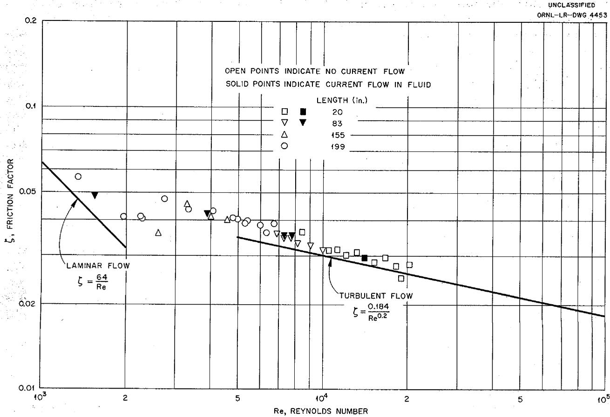  
Fig. 8.2. Friction Factors With and Without Electric Current Flow in Fluid.

difference in pressure drop through the tubes under the two different conditions and that, hence, the hydrodynamic structure was not influenced by the electric currents for the laminar and turbulent ranges investigated.

# PHYSICAL PROPERTIES MEASUREMENTS

# Heat Capacity

W.D.Powers

G.C.Blaglock

Reactor Experimental Engineering Division

The enthalpies and heat capacities of NaF-ZrF $_4$ -UF $_4$ (53-43-4 mole %) were determined with the Bunsen ice calorimeter in the liquid and solid states and with the copper-block calorimeter in the liquid state. The results are as follows:

Solid (70 to $525^{\circ}\mathrm{C}$ ): Bunsen calorimeter

$$
\begin{array}{l} H _ {t} - H _ {0 ^ {\circ} C} = 0. 1 8 (2) t \\ c _ {p} = 0. 1 8 \pm 0. 0 1 \\ \end{array}
$$

Liquid (550 to $900^{\circ}\mathrm{C}$ ): Bunsen calorimeter

$$
\begin{array}{l} H _ {t} - H _ {0 ^ {\circ} C} = 3 2 + 0. 2 5 t \\ c _ {p} = 0. 2 5 \pm 0. 0 2 \\ \end{array}
$$

Liquid (570 to $885^{\circ}C$ ): copper-block calorimeter

$$
\begin{array}{l} H _ {t} - H _ {0 ^ {\circ} C} = 1 9. 5 (0) + 0. 2 6 5 (6) t \\ c _ {p} = 0. 2 6 5 (6) \pm 0. 0 0 2 \\ \end{array}
$$

The enthalpies of this salt have also been determined by the National Bureau of Standards, and a comparison is made in Table 8.1 of the results.

The enthalpies and heat capacities of LiF-KF-UF $_4$ (48-48-4 mole %) were determined by the copper-block calorimeter in the solid and liquid states.

Solid (125 to $465^{\circ}C$

$$
\begin{array}{l} H _ {t} - H _ {0 ^ {\circ} \mathrm {C}} = 0. 2 3 4 t + 0. 4 8 \times 1 0 ^ {- 4} t ^ {2} \\ c _ {p} = 0. 2 3 4 + 0. 9 5 \times 1 0 ^ {- 4} t \\ \end{array}
$$

Liquid (565 to $880^{\circ}\mathrm{C}$ )

$$
\begin{array}{l} H _ {t} - H _ {0 ^ {\circ} \mathrm {C}} = - 8 2. 5 4 + 0. 6 5 7 t - 1. 9 7 \times 1 0 ^ {- 4} t ^ {2} \\ c _ {p} ^ {\prime} = 0. 6 5 7 - 3. 9 3 \times 1 0 ^ {- 4} t \\ \end{array}
$$

TABLE 8.1. COMPARISON OF ENTHALPY DETERMINATIONS AT ORNL AND NBS FOR ${\mathrm{{NaF}}}_{2}{\mathrm{{ZrF}}}_{4} - {\mathrm{{UF}}}_{4}\left( {{53} - {43} - 4\text{ mole }\% }\right)$   

<table><tr><td rowspan="3">Temperature (°C)</td><td colspan="3">Enthalpy (cal/g)</td></tr><tr><td colspan="2">ORNL</td><td rowspan="2">NBS</td></tr><tr><td>Bunsen</td><td>Copper Block</td></tr><tr><td>600</td><td>182</td><td>178.9</td><td>178.9</td></tr><tr><td>700</td><td>207</td><td>205.4</td><td>205.3</td></tr><tr><td>800</td><td>232</td><td>232.0</td><td>231.1</td></tr><tr><td>900</td><td>257</td><td>258.5</td><td>256.0</td></tr></table>

In these expressions $H$ is the enthalpy in cal/g, $c_{p}$ is the heat capacity in cal/g $^{\circ}$ C, and $t$ is the temperature in ${}^{\circ}$ C.

# Viscosity

S. I. Cohen T. N. Jones

Reactor Experimental Engineering Division

The program of viscometry technique refinement previously discussed is under way, and measurements have been made on one mixture. Studies will be made on others as samples become available.

A number of changes have been made in the viscosity apparatus. The length of the Brookfield spindle has been doubled, which allows the speed of rotation of the instrument to be halved without reducing the shear force. This reduction in speed assures the existence of laminar flow. Salts are contained in new tubes with a smaller diameter and consequently a smaller clearance between the tube wall and spindle. The reduced gap increases the measured shear force and further establishes the laminar flow regime. Under these circumstances, smaller salt samples can be used. New capillary viscometers with longer and more favorable length-to-diameter ratios are being fabricated. A new furnace is in use (Fig. 8.3) which has a separate element and control circuit for heating the zone above the liquid. It is essential for accuracy when using either the capillary viscometer or the Brookfield that this zone be at the temperature of the liquid. A small, compact dry box to be used solely for viscosity work is being built. This dry box should further facilitate

handling of the instruments and improve atmospheric control. New calibrating liquids which have densities comparable to the densities of the fluorides are being used for both viscometers. Among these liquids are low-melting-point, easily handled, fused salt mixtures and heavy organic-halogen compounds.

Recent measurements made on $\mathsf{NaF - ZrF_4 - UF_4}$ (53.5-40-6.5 mole %) are presented in Fig. 8.4. It may be noted that the average values obtained from the recent measurements are about $30\%$ lower than the preliminary values given previously. However, when the preliminary measurements were reported, only the more pessimistic, Brookfield values were given. It can also be seen from Fig. 8.4 that the agreement between the two instruments for the recent measurements is much better than for the earlier set of measurements. This result is due to improved fluoride preparation and handling techniques, as well as to the refined viscometry methods.

# Thermal Conductivity

W.D.Powers R.M.Burnett

S. J. Claiborne

Reactor Experimental Engineering Division

The thermal conductivity of $\mathsf{NaF - ZrF}_4\mathsf{-UF}_4$ (53.5-40-6.5 mole %) in the liquid state was found to be 1.2 Btu/hr.ft. $^\circ \mathsf{F}$ at an average sample temperature of $666^{\circ}C.$ The variable-gap device was used to make the measurements. The conductivity of this salt mixture had previously been estimated to be 1.3 Btu/hr.ft. $^\circ \mathsf{F}$ on the basis of an empirical

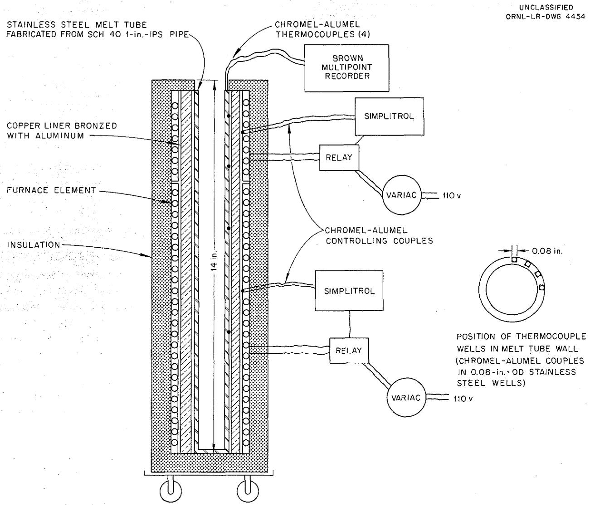  
Fig. 8.3. Furnace for Viscosity Measurements.

conductivity relation developed for the fluoride mixtures previously studied.

The solid and liquid thermal conductivity measurements of NaF-KF-LiF (11.5-42-46.5 mole %) and NaF-KF-LiF-UF $_4$ (10.9-43.5-44.5-1.1 mole %) were reported in part in previous quarters. All conductivity data obtained with several types of conductivity devices for these two fluoride mixtures are shown in Fig. 8.5. The liquid and solid conductivity values of the ternary fluoride mixture are nearly the same, and the same is true of the quaternary.

A longitudinal thermal conductivity apparatus has been designed and constructed for the measurement of the conductivity of metallic beryllium. It is essentially the same apparatus as that reported previously7 and is contained in an inert-gas-filled box to protect personnel from beryllium poisoning.

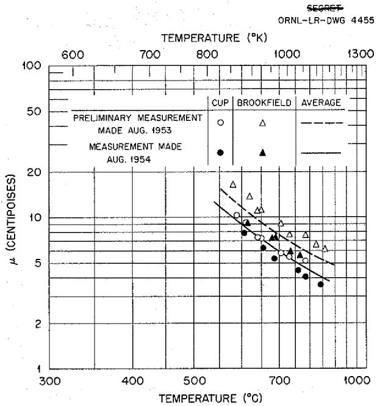  
Fig. 8.4. Viscosity of NaF-ZrF $_4$ -UF $_4$ (53.5-40-6.5 mole%).

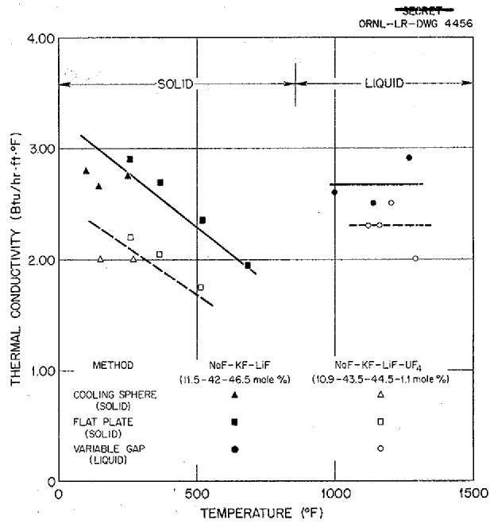  
Fig. 8.5. Thermal Conductivities of NaF-KF-LiF and NaF-KF-LiF-UF $_4$ in the Liquid and Solid States.

# 9. RADIATION DAMAGE

J. B. Trice

Solid State Division

A.J.Miller

ANP Project

The program of MTR irradiations of Inconel capsules containing fluoride fuels has continued, and the capsules examined thus far have revealed no evidence of radiation damage. The horizontal type of fuel-circulating loop designed for irradiation in the LITR has been operated out-of-pile with a non-uranium-bearing salt and is now being inserted in the HB-2 facility of the LITR. A small loop suitable for vertical operation in the LITR lattice has also been successfully bench tested, and a second model for in-pile operation is being constructed.

The creep test apparatus for testing Inconel at high temperatures in the MTR is being bench tested. The stress-corrosion apparatus for LITR operation has been successfully bench tested, and an in-pile apparatus is being constructed.

Remote metallographic studies of solid fuel elements were continued, and additional information on the relationship between $\mathrm{UO}_2$ particle size and radiation damage was obtained.

# MTR STATIC CORROSION TESTS

W.E.Browning

G.W. Keilholtz

Solid State Division

H. L. Hemphill

Analytical Chemistry Division

The program of MTR irradiations of Inconel capsules containing fused fluoride fuels has been continued. Additional irradiations were carried out on capsules containing NaF-ZrF4-UF3 (48.9-49.3-1.79 mole %) and on capsules containing NaF-ZrF4-UF4 (50.1-48.2-1.74 mole %). These fuels generate 1100 w/cm³ in the A-38 position in the MTR. To date, five capsules in this series, three with UF₃ and two with UF₄ fuels, have been successfully irradiated for a two-week period with metal-liquid interface temperatures of 1500 ± 50°F. The capsules have been examined metallographically, and the fuels have been chemically analyzed. One out-of-pile electrically heated control capsule containing UF₃ and one containing UF₄ have also been examined, and the fuel batches have been chemically analyzed.

The irradiated $\mathsf{UF}_3$ -bearing capsules and one of the irradiated $\mathsf{UF}_4$ capsules showed practically no corrosion - that is, they were similar to the control capsules - while one irradiated $\mathsf{UF}_4$ -bearing capsule, previously reported,[1] had subsurface voids to a depth of 2 mils. There were no significant differences in the iron, chromium, or nickel contents of the irradiated fuels, as compared with the starting fuel batches, and there was no evidence of segregation of either uranium or impurities. The chemical analyses of the two out-of-pile controls that have been examined to date were accidentally spoiled. The uranium in the $\mathsf{UF}_3$ -bearing fuel analyzed not less than $96\%$ $\mathsf{UF}_3$ , and the $\mathsf{UF}_4$ -bearing fuel showed no trivalent uranium. In an attempt to detect any minute radiation effects which might be occurring, the irradiation period is being extended to six weeks for the other capsules in this series.

Additional examinations were made of capsules containing $\mathrm{NaF - ZrF_4 - UF_4}$ (50-46-4 mole %) that had been irradiated at a nominal temperature of $1620^{\circ}\mathrm{F}$ and had generated $2700\mathrm{w / cm}^3$ . In this series of irradiations, the in-pile temperature history was quite complex. No evidence of chemical damage could be found in the fuel, and there were no high concentrations of Inconel components. There was some corrosion evident, and therefore out-of-pile control tests will be made in which the in-pile temperature patterns will be duplicated insofar as possible. New experiments with this fuel are to be made in which more closely controlled temperatures and planned temperature excursions will be used.

The chemical analyses of samples of fuel taken from irradiated Inconel capsules have at times shown increases in iron such that the iron-to-chromium ratio was greater than that found in the Inconel, and therefore a series of radioactivation analyses of the iron content in the irradiated fuel was made; these analyses demonstrated that the high values were due to contamination of the fuel

with unirradiated iron that had entered the fuel during or after opening of the Inconel capsule. The techniques developed by G. Smith (Analytical Chemistry Division) are particularly adaptable to the separation of minute amounts of iron (10 to 100 $\mu$ g) from very large amounts of fission products. Four samples of fuel from irradiated capsules showed that between 70 and $99\%$ of the iron came from an unirradiated source, whereas samples from an irradiated Inconel capsule showed that less than $6\%$ of its iron content was not radioactive. Since the amount of iron contamination involved is very small (of the order of $50~\mu \mathrm{g}$ ), some possible sources of contamination would include the steel drill used to remove the fuel from the capsules and also the impurities in the reagents used in preparing sample solutions. In the future, samples will be obtained by using a nonferrous drill. Unfortunately, radio-activation techniques cannot be applied to analyses for chromium and nickel because of unfavorable activation yields, insensitivity of detection, and chemical separation difficulties associated with trace amounts of these elements.

An improved and modified version of the capsule irradiation facility is being put into service (Fig. 9.1). Before being shipped from ORNL, each capsule is mounted in a sleeve which provides a sufficiently large annulus for the passage of cooling air between it and the capsule. The bottom of the

sleeve is tapered to fit an inside taper at the bottom of the air tube in the MTR. The advantage of this arrangement is that the capsule can be fitted to the sleeve prior to insertion into the reactor. Several tubes and capsules prepared with this new arrangement have been used satisfactorily in the MTR. In order to speed up the capsule program, arrangements have been made for irradiating two capsules simultaneously in separate, but adjacent, facilities in the MTR.

An improved set of temperature controls fabricated by the Instrumentation and Controls Division has been subjected to dynamic performance tests by using an electrically heated capsule. These tests have shown that the new controls will maintain a more constant temperature in the capsule during irradiation.

# EFFECT OF IRRADIATION ON UF $6\cdot C_7F_{16}$

W. E. Browning

G.W. Keilholtz

Solid State Division

Examinations were made of material from welded nickel capsules that were filled under vacuum with a UF $_6$ -C $_7$ F $_{16}$ solution containing 20 wt $\%$ UF $_6$ and then irradiated in the ORNL Graphite Reactor and in the Tower Shielding Facility. These irradiations were made to determine the suitability of UF $_6$ -C $_7$ F $_{16}$ for use as fuel in a Lid Tank Shielding Facility mockup of the circulating-fuel reactor.

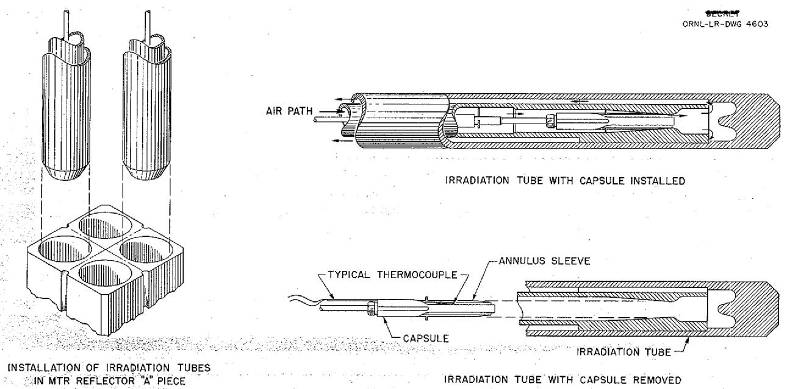  
Fig. 9.1. New Apparatus for Insertion of Capsules in the MTR.

Three of the capsules were exposed to $1.1 \times 10^{17}$ nvt. Gray-green solid residues which filled as much as $90\%$ of the volume were found in all the capsules. The residues in the capsules exposed to a flux of $1.1 \times 10^{17}$ analyzed $92\%$ uranium, and the residues in those exposed to a flux of $2.0 \times 10^{15}$ analyzed $24\%$ uranium. In the capsules given the higher exposure, gas pressures of between 55 and 100 psi developed. Analyses of these gases showed about $30\%$ $\mathrm{CF}_4$ and about $25\%$ $\mathrm{C}_2\mathrm{F}_6$ ; the remaining gas was unidentified.

# MINIATURE IN-PILE LOOP

# Bench Test

W.R.Willis

M. F. Osborne

H. E. Robertson

G.W. Keilholtz

Solid State Division

The first successful bench test of the miniature in-pile loop designed for insertion in a vertical hole in the LITR included four freezing and melting cycles in 260 hr of operation. The loop was operated at $1466^{\circ}\mathrm{F}$ . The linear velocity of the fused salt circulated in the loop was between 3.3 fps (as calculated from the flowmeter) and 3.8 fps (as calculated from the pump speed); thus a Reynolds number of about 3000 was obtained. Since it was possible to freeze and melt the fused salt without causing failure of the loop, it may be advisable to fill the in-pile loop before it is inserted in the reactor and then melt the fuel mixture after the loop is in position. Since, during the bench test, the flowmeter was found to be temperature sensitive, the dependence of the measurement on the temperature must be established.

The bench test was terminated because of a leak in a collar that was welded over a joint in the fuel tube. The two ends of the loop did not butt together at this location, and the annular space thus formed between the collar and the tube sections trapped the fused salt in such a manner that expansion of the salt caused the collar (not the weld) to rupture. The metal collar stretched from 0.4 in. in diameter to 0.5 in. before it ruptured. The salt from the leak, which existed during operation for about 4 hr, showed a tendency to oxidize and to stick to the Inconel surface rather than to flow rapidly down the outside tube wall. Thus, a leak in the colder portion of a loop that was operating in-pile would probably not flow downward into the high-flux region before a safety alarm from the released radioactivity could scram the reactor.

A Delco motor from the group being used in bench tests has been rebuilt to withstand radiation and a higher temperature. The wire on both the rotor and the stator was replaced with glass-insulated wire. All paper was removed, and mica was used in the commutator and in the rotor segments; glass cloth was used, where possible, for other insulation. These changes required that the shaft assembly be slightly modified to allow more space for windings. The rebuilt motor was tested during the bench test of the miniature loop, and it was found to be satisfactory. In a comparison of the operation of the rebuilt motor with that of the original motor under no load and under load conditions, the rebuilt motor was found to be slightly more efficient than the original motor. Furthermore, since the rebuilt motor can withstand a higher ambient temperature and since for a given voltage it produces a higher speed, higher fuel velocities can be obtained than were possible previously.

# Heat Transfer Calculations

M. T. Robinson

Solid State Division

E. R. Mann

F. P. Green

R. S. Stone

Instrumentation and Controls Division

D. F. Weekes, Consultant

An extensive series of heat transfer calculations has been carried out on the ORNL Reactor Controls Computer in order to predict the thermal behavior of a miniature in-pile circulating-fuel loop. The derivations of appropriate differential equations and the details of their solution are given in a forthcoming report.2 The model finally adopted for the calculations and for the in-pile loop is shown in Fig. 9.2. It was assumed to be mounted in position C-48 of the LITR, with the lower end at the location of maximum thermal-neutron flux.3 The maximum power density in the fuel in position C-48 was assumed to be $540\mathrm{w/cm}^3$

The computer results were obtained for a variety of different flow rates of fuel (NaF-ZrF4-UF4, 53.5-40-6.5 mole %) and of cooling air expressed as Reynolds number of the cooling air stream, Re or fuel stream, Re. The heat transfer, y, that is,

the amount of heat flowing radially through a unit length of the loop, vs the distance, $s$ , from the inlet is shown in Fig. 9.3; and the deviation, $\theta_{f'}$

UNCLASSIFIED

,SSD-B-988

ORNL-LR-DWG 2252A

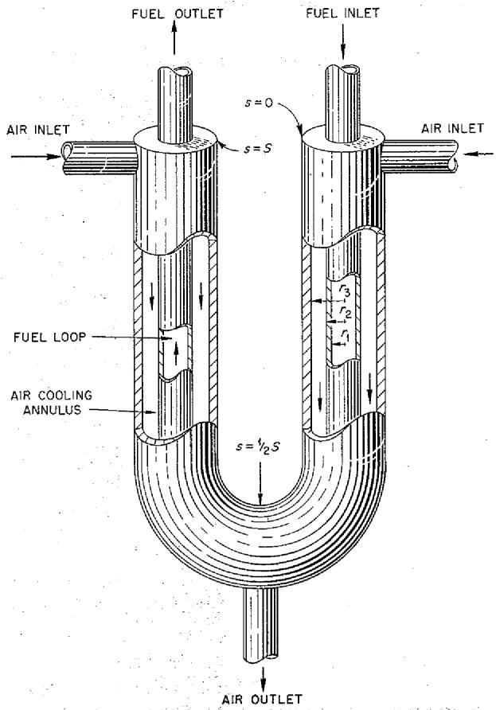  
Fig. 9.2. Miniature In-Pile Circulating-Fuel Loop Model Used for Design Calculations.

of the mixed-mean fuel temperature from its average value vs $s$ is shown in Fig. 9.4. These results meet only one of the three required boundary conditions, namely, that all fission heat be removed into the cooling air stream. The other conditions, that the maximum fuel temperature be $815^{\circ}C$ and that the initial air temperature be $30^{\circ}C,$ are met by suitable interpolation of the calculated data. Some of the results of the calculations are summarized in Table 9.1.

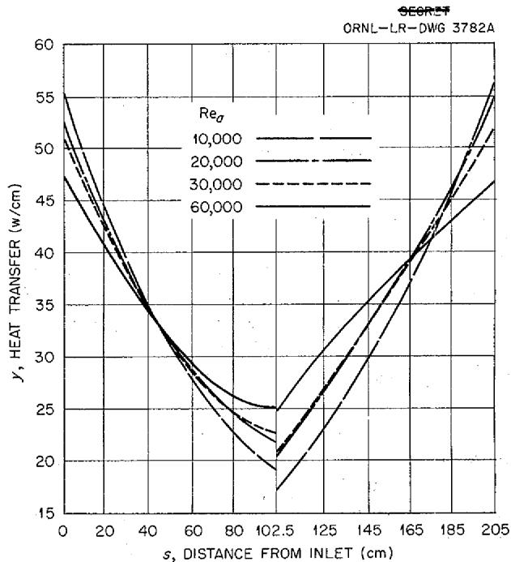  
Fig. 9.3. Heat Transfer in Miniature In-Pile Loop for a Fuel Reynolds Number of 3000 as a Function of Distance from the Inlet and the Reynolds Number of the Cooling Air.

TABLE 9.1. PREDICTED THERMAL BEHAVIOR OF MINIATURE IN-PILE LOOP IN POSITION C-48 OF THE LITR   

<table><tr><td>Fuel
Reynolds Number, 
Rej</td><td>Air
Reynolds Number, 
Rea</td><td>Fuel Temperature
Differential
(℃)</td><td>Maximum Air
Temperature
(℃)</td><td>Air Flow
(scfm)</td></tr><tr><td>1,500</td><td>19,000</td><td>102</td><td>450</td><td>27</td></tr><tr><td>3,000</td><td>16,500</td><td>49</td><td>500</td><td>22</td></tr><tr><td>6,000</td><td>15,500</td><td>25</td><td>540</td><td>20</td></tr><tr><td>10,000</td><td>15,500</td><td>25</td><td>550</td><td>20</td></tr></table>

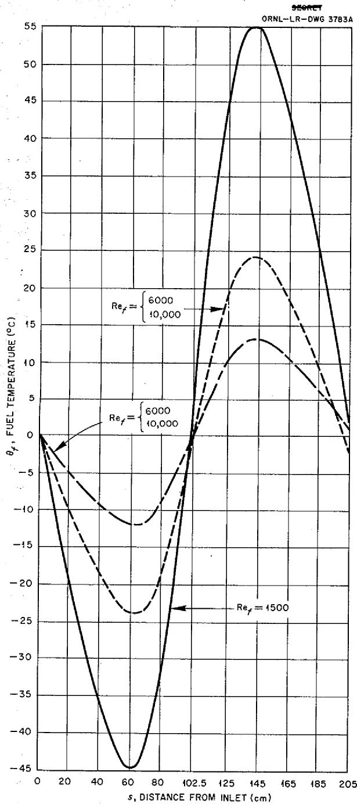  
Fig. 9.4. Fuel Temperature in Miniature In-Pile Loop for a Cooling Air Reynolds Number of 20,000 as a Function of Distance from the Inlet and the Reynolds Number for the Fuel.

# REMOVAL OF $X_{e}^{135}$ FROM MOLTEN FLUORIDE FUELS

M. T. Robinson Solid State Division

W. A. Brooksbank  
Analytical Chemistry Division

D. E. Guss USAF

The study, described previously, for determining whether $Xe^{135}$ would escape from ART-type purging equipment rapidly enough to prevent serious poisoning was continued. It was realized at the time this study was initiated that the ARE might answer the question satisfactorily, but it was decided to go ahead with experiments to measure the xenon solubility under the more pertinent ART conditions. It was considered unlikely that 97% of the equilibrium xenon would be removed from the ARE without special purging equipment, and, yet, this is what happened according to two independent sets of calculations. During the initial stages of reactor operation, data were obtained from a reactivity calibration of the ARE regulating rod by noting changes in rod position required to maintain criticality as increments of $U^{235}$ were added to the fuel. The value of the rod was calculated to be 0.030 ± 0.006% $\Delta k / \text{in}$ , which agrees well with the preliminary value reported by J. L. Meem (cf. Sec. I, "Circulating-Fuel Aircraft Reactor Experiment").

When the ARE was operated for 25 hr at an estimated 2 Mw, constant power was maintained by adjustment of the regulating rod. At the end of this period of operation, the rod had been withdrawn an amount equivalent to a reactivity decrease of $0.015 \pm 0.003\%$ . The expected decrease in reactivity was calculated to be:

From burnup of U235 0.001%

From Sm149 poisoning 0.008%

From Xe135 poisoning 0.41%

Since over one-half the observed change in reactivity may be accounted for by burnup and $\text{Sm}^{149}$ poisoning, the amount of $\text{Xe}^{135}$ retained in the fuel was less than 1 to 2% of the amount expected.

Therefore, the ARE supplied evidence that the rare gases escape readily from the fluoride fuels under dynamic conditions. Since the amount of xenon present in a circulating-fuel reactor is probably more than the amount produced in one complete fuel cycle (50 sec in the ARE), the amount remaining in the fuel will be measured by using an ARE fuel sample for radiochemical comparison of the concentration of the fission products $(\mathsf{Sr}^{89},\mathsf{Cs}^{137}$ and $\mathsf{Ce}^{141})$ which come through rare-gas precursors with those $(\mathsf{Cs}^{136}$ and $\mathsf{Zr}^{95})$ which do not.

The gamma-ray scintillation spectrometer to be used for the experiments has been calibrated with $\mathsf{C}\mathsf{s}^{137}$ $\mathsf{Na}^{22}$ and $\mathsf{Hg}^{203}$ and the equipment has been tested with radioactive noble gases taken from samples of off-gas from the iodine dissolver used by the Radioisotopes Department of the Operations Division. The gases used were primarily $\mathsf{Xe}^{133}$ and $\mathsf{Xe}^{135}$ . In order to prevent the gamma rays from other short-lived nuclides from competing unfavorably with those from $\mathsf{Xe}^{135}$ and thus making resolution of the $\mathsf{Xe}^{135}$ isotope difficult, a charcoal adsorption column (0.190 in. in diameter and 0.5 in. long) for delaying isotopes such as those of krypton was tested at room temperature by using $\mathsf{Kr}^{85}$ and the gamma-ray spectrometer. It was found that the charcoal trap would delay krypton isotopes for about $10\mathrm{min}$ (at a flow rate of about $15~\mathrm{cm}^3 /\mathrm{min}$ ) and xenon isotopes for about 200 min. Thus the spectrometer would measure only long-lived isotopes such as $\mathsf{Xe}^{135}$ .

Fission products may be lost from ARE-type fuel by volatility of the fission product or of one of its precursors; by interaction of the fission product or of one of its precursors with the container wall through chemical reaction, for example,

$$
\begin{array}{l} \mathrm {P d} ^ {2 +} (\text {s o l n}) + \mathrm {C r} ^ {\circ} (\text {I n c o n e l}) \\ = P d ^ {o} (I n c o n e l) + C r ^ {2 +} (s o l n), \\ \end{array}
$$

through exchange with impurities, for example,

$$
\begin{array}{l} \left(\mathrm {N b} ^ {\star}\right) ^ {3 +} (\text {s o l n}) + \mathrm {N b} ^ {\circ} (\text {I n c o n e l}) \\ = N b ^ {*} (I n c o n e l) + N b ^ {3 +} (s o l n), \\ \end{array}
$$

or through adsorption on the metal surface; and by precipitation of insoluble compounds on the container wall. For example, $\mathsf{K}_2\mathsf{CsCrF}_6$ may be insoluble, as is the analogous sodium compound. The isotope $\mathsf{Zr}^{95}$ should not be lost from the fuel by any of these means, since it will be "carried" by the large quantity (50 mole %) of ordinary $\mathsf{ZrF}_4$

in the fuel and since it has no known rare-gas precursor (if $\mathbf{Kr}^{95}$ exists, it probably has a very short half life, say 1 or 2 sec). This isotope will be used therefore as the basis for normalizing the yields of the other radioisotopes to be studied.

Volatility of the rare gases will be examined by studying the yields of $\mathbf{Sr}^{89}$ and of $\mathbf{Cs}^{137}$ which come through 2.6-min $\mathbf{Kr}^{89}$ and 3.0-min $\mathbf{Xe}^{137}$ , respectively. Low yields for these two isotopes would indicate high volatilities for their parents, $\mathbf{Kr}^{89}$ and $\mathbf{Xe}^{137}$ . A further check of the experiments will be made by using $\mathbf{Ce}^{141}$ , a descendant of 3-sec $\mathbf{Xe}^{141}$ , which should be retained in the fuel, and $\mathbf{Cs}^{136}$ , a shielded nuclide formed directly in fission. Comparison of $\mathbf{Zr}^{95}$ with $\mathbf{Cs}^{136}$ and $\mathbf{Ce}^{141}$ will give a measure of the loss of the important alkali and rare-earth elements through adsorption on metal surfaces, since $\mathbf{Cs}^{136}$ and rare-earth elements will be present only in trace quantities but chemical zirconium will be present in very large quantities, as mentioned above.

The data obtained from the ARE fuel sample will be compared with similar data to be obtained from an irradiated sample of NaF-ZrF $_4$ -UF $_4$ (50-46-4 mole %) that will be maintained solid to retain all the fission products. The cooling period for the irradiated sample will be the same as that for the ARE fuel sample.

# LITR HORIZONTAL-BEAM-HOLE FLUORIDE-FUEL LOOP

O. Sisman

J. G. Morgan

W.E.Brundage

M. T. Morgan

C. D. Baumann

A. S. Olson

R. M. Carroll

W. W. Parkinson

Solid State Division

The second loop fabricated for circulating fluoride fuel in the LITR has been operated with a non-uranium-bearing fused salt mixture for 6 hr in the laboratory and is being inserted in the HB-2 facility of the LITR. After the loop has been completely installed, circulation of the barren fused salt will be resumed. When satisfactory operation has been obtained, the barren mixture will be drained and the loop will be filled with fuel.

The design and calculations for the fuel-to-air heat exchanger used in this loop were substantiated by an experiment described in Sec. 8, "Heat Transfer and Physical Properties" (this report). The curve obtained for pressure of air vs heat removal gives

20 kw at a pressure drop of 50 lb, 10 kw at 5 lb, and 5 kw at approximately 1 lb. Since the maximum heat removal required is expected to be no more than 10 kw, the heat exchanger appears to be more than adequate.

# CREEP AND STRESS-CORROSION TESTS

W.W.Davis

J. C. Wilson

N. E. Hinkle

J.C.Zukas

Solid State Division

The stress-corrosion apparatus described previously has been bench tested. The design appears to be sound, and therefore a new rig is being canned for insertion in the LITR. Temperature control to within $\pm 2^{\circ}\mathsf{F}$ at $1500^{\circ}\mathsf{F}$ has been achieved by using a Speedomax air-controller to drive the Variac that supplies the furnace power. Operation over periods of 500 hr has shown that, if sodium distills out of the hot zone of the furnace, so little sodium is lost that its effectiveness as a heat

5W. W. Davis et al., ANP Quar. Prog. Rep. Sept. 10, 1954, ORNL-1771, p 142.

transfer agent is not diminished. Welding of some joints has been poor, and therefore Dy-Chek is being used in the inspection of all new welds. The LITR Experiment Review Committee has approved the apparatus for irradiation, and the necessary safety circuit for the LITR has been completed.

In the bench tests the outside of the specimen was in air, rather than in sodium as it would be in the in-pile apparatus. The tests were for periods of 432 and 866 hr at $1500^{\circ}\mathrm{F}$ and a stress of 1500 psi. The specimen exposed for the longer time showed roughly twice as many voids per unit area on the sides of the tube stressed in tension and compression as there were on the sides at zero stress. The maximum depth of voids was about 0.001 in. It was also noticed that the etching (or perhaps staining) characteristics of the salt-metal interface were not the same for the stressed and unstressed regions when etched in aqua regia. The reproducibility of the creep data obtained was not good, and therefore the specimen shape has been modified in order to concentrate more of the

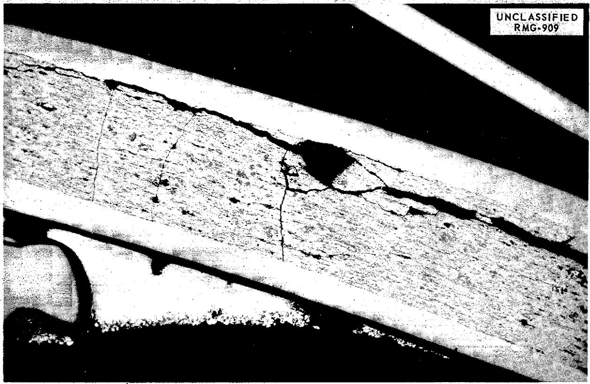  
Fig. 9.5. Sandwich-Type $\mathsf{UO}_2$ -Stainless Steel Fuel Element After $29\%$ Burnup in MTR ( $\mathsf{UO}_2$ Particle Size, $3\mu$ ). 250X.

creep deformation in the gage length. A specimen tube with thicker walls will be used, and the wall thickness will be reduced only at that part of the tube which is in contact with the fused salt. This modification should greatly increase the accuracy of creep measurements.

The MTR creep test equipment is being bench tested prior to shipment to NRTS.

# REMOTE METALLOGRAPHY

M. J. Feldman

R. N. Ramsey

W. B. Parsley

A. E. Richt

Solid State Division

Two additional Pratt & Whitney Aircraft capsules, each containing sandwich-type $\mathsf{UO}_2$ -stainless steel fuel elements, were opened, and the elements were examined metallographically. The stainless steel- $\mathsf{UO}_2$ particle size was less than $3\mu$ for one capsule, and it was between 15 and $44\mu$ for the other. The capsules were irradiated at a temperature of about $500^{\circ}\mathsf{F}$ , and the total burnup for each capsule was $29\%$ . Comparison of the results from the element

with $3 - \mu$ particle size and the element with 15- to $44 - \mu$ particle size showed that irradiation induced greater final hardness in the elements with the smaller-particle-size material (Figs. 9.5 and 9.6). Four samples from the smaller-particle-size elements showed cracking of the core without bending. Since cracking did not occur in elements with lower total burnups, it appears that the increased burnup $(29\%)$ , together with the small particle size, can cause cracking of the core, as illustrated in Fig. 9.5.

# MASS SPECTROGRAPHIC ANALYSES

R. Baldock

Stable Isotope Research and Production Division

The isotope dilution method has been used during the last one and one-half years for analyzing ARE-type $(\mathsf{NaF - ZrF}_4\mathsf{-UF}_4)$ fuels for their uranium content. As a result of this experience, a need was

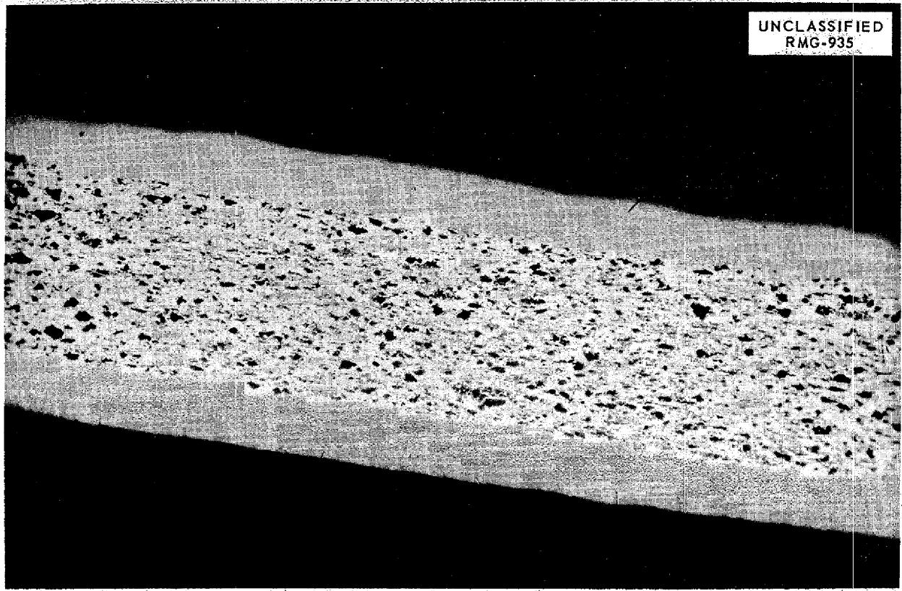  
Fig. 9.6. Sandwich-Type $\mathsf{UO}_2$ -Stainless Steel Fuel Element After $29\%$ Burnup in MTR and a Bend Test ( $\mathsf{UO}_2$ Particle Size, 15 to $44\mu$ ). 250X.

felt for further study of the accuracy of the method. A testing program was inaugurated in which an enriched sample of $\mathsf{U}_3\mathsf{O}_8$ containing 99.86 at. $\%$ U235 and 0.07 at. $\%$ U238, obtained from B. Harmatz,7 was used as the starting material. This material was chemically purified for use as a standard, and the isotope ratio was carefully determined. The material was then dissolved in HNO3 and diluted to make a standard stock solution. Small portions of this solution were put through the normal ether extraction process used for extracting uranium from ARE-type fuel samples. Any change of isotopic composition was attributed to contamination by natural uranium present in reagents and glassware. The observed uranium contamination in these blanks was less than $0.5\mu \mathrm{g}$ per sample, and thus it appears that the normal uranium contamination found during chemical separations of

7B. Harmatz, H. C. McCurdy, and F. N. Case, Catalog of Uranium, Thorium, and Plutonium Isotopes, ORNL-1724, p 2 (May 19, 1954).

fuel uranium is negligible for the usual fuel samples which exceed $500\mu \mathrm{g}$ of uranium.

The second test of the isotopic dilution method verified the concentration of the standard solutions, the accuracy of the spiking, and the reliability of the mass spectrometer. Known mixtures of normal and enriched uranium solutions were examined in the mass spectrometer, and the results were compared with the expected $U^{235}$ concentrations. The greatest difference between calculated percentages and measured percentages was only $0.65\%$ , and the average difference was $0.37\%$ .

The results of these studies show that the isotopic dilution method is reliable and that good results can be obtained under the conditions which have been used for ARE-type fuel analyses. The method of determining burnup based on measurements of the $U^{236}$ grown in is less subject to error from sample contamination than is the method based on measurements of $U^{238}$ and is therefore considered to give the more reliable data.

# 10. ANALYTICAL STUDIES OF REACTOR MATERIALS

To 133 for NBL

C. D. Susano  
Analytical Chemistry Division

J. M. Warde Metallurgy Division

The research effort in analytical chemistry was concentrated primarily on NaF-KF-LiF-base reactor fuel, and, in particular, on analysis after it had been utilized as a solvent for the reduction of $\mathsf{UF}_4$ by $U^{\circ}$ to $\mathsf{UF}_3$ . Tentative methods for the determination of $U^{\circ}$ and $\mathsf{UF}_3$ were developed. Studies were continued on the determination of oxygen as oxides in fluoride fuels. Development work was completed on the determination of sulfur in various reactor fuels and coolants and in off-gases from the production of fluoride fuels. Because of the urgency of other activities, no further work was done on the determination of alkali metals in NaF-KF-LiF-base fuels.

# ANALYTICAL CHEMISTRY OF REACTOR MATERIALS

J. C. White

Analytical Chemistry Division

# Determination of Uranium Metal in Fluoride Salt Mixtures

A. S. Meyer, Jr.

B. L. McDowell

Analytical Chemistry Division

A method based on the measurement of the hydrogen derived from the decomposition of $\mathsf{UH}_3$ was developed for the determination of $U^{\circ}$ in proposed reactor fuels. In this determination, $U^{\circ}$ is converted to $\mathsf{UH}_3$ by heating in an atmosphere of hydrogen at $250^{\circ}C$ for 1 hr. The $\mathsf{UH}_3$ is decomposed by heating in a stream of $\mathsf{CO}_{2}$ at $400^{\circ}C,$ and the volume of evolved hydrogen is measured over a solution of KOH in an azotometer.

An additional volume of gas that is unabsorbed by the solution of KOH is produced by the reduction of $\mathrm{CO}_{2}$ to CO. The $\mathrm{CO}_{2}$ is reduced at temperatures between 400 and $600^{\circ} \mathrm{C}$ by both U $^{\circ}$ and UF $_{3}$ . The reactions involved are:

(1) $\mathrm{U} + x\mathrm{CO}_2 \longrightarrow \mathrm{UO}_x + x\mathrm{CO}$

(2) $4\mathrm{UF}_{3} + 2\mathrm{CO}_{2}\longrightarrow 3\mathrm{UF}_{4} + \mathrm{UO}_{2} + 2\mathrm{CO}$

The volumes of gas derived from reactions 1 and 2 are reproducible; 1.5 moles of CO is formed for each mole of $\mathsf{UH}_3$ decomposed when the ignition is carried out at temperatures between 500 and $600^{\circ}\mathrm{C}$ and 0.5 mole of CO is formed per mole of $\mathsf{UF}_3$ under similar conditions. The CO must be removed from the effluent gases before the measurement of hydrogen is made. This is accomplished by passing the gases through a tube packed with $\mathsf{I}_2\mathsf{O}_5$ and powdered pumice, which is maintained at a temperature of $150^{\circ}\mathrm{C}$ . The CO is oxidized to $\mathsf{CO}_2$ in the following reaction:

$$
5 \mathrm {C O} + \mathrm {I} _ {2} \mathrm {O} _ {5} \longrightarrow 5 \mathrm {C O} _ {2} + \mathrm {I} _ {2}
$$

When the method was tested by analyzing samples of pure uranium metal, the hydrogen evolved corresponded to $97\%$ of the theoretical value with a coefficient of variation of $2\%$ . Satisfactory precision has also been obtained for the determination of $\mathsf{U}^{\circ}$ in NaF-KF-LiF-base fuels and in $\mathsf{UF}_3$ . The concentration limits of the methods have not been measured experimentally, but, on the basis of the quantities measured, concentrations of $\mathsf{U}^{\circ}$ as low as $0.05\%$ may be determined when 1-g samples are utilized.

Since the $\mathsf{I}_2\mathsf{O}_5$ tubes may become inactivated after only limited service, a more dependable method of eliminating the CO is needed. In a modified procedure that is being considered, $\mathsf{UH}_3$ will be decomposed in an atmosphere of ammonia and the hydrogen will be measured over a solution of $\mathsf{H}_2\mathsf{SO}_4$ .

# Determination of Trivalent Uranium in Fluoride Fuels

A. S. Meyer, Jr.

W.J.Ross

D. L. Manning

B. L. McDowell

Analytical Chemistry Division

Further investigations were carried out for developing a titrimetric method for the determination of trivalent uranium in the presence of tetravalent uranium in fluoride salt mixtures. Under appropriate conditions, trivalent uranium is selectively oxidized by cupric chloride, $\mathrm{CuCl}_2$ , titanium tetra

chloride, $\mathsf{TiCl}_4$ and methylene blue, $C_{16}H_{18}N_{3}SCl$ . Of these reagents, methylene blue appears to be the most promising reagent for a possible routine method for the determination.

Cupric Chloride $(\mathsf{CuCl}_2)$ . Previous attempts to oxidize $\mathsf{UF}_3$ by $\mathsf{Cu}(\mathsf{II})$ in $\mathsf{H}_2\mathsf{SO}_4$ solution were unsuccessful. Since the formal oxidation potential of the $[\mathsf{Cu}(\mathsf{II}),\mathsf{Cu}(\mathsf{I})]$ couple is increased in solutions of high chloride concentration, experiments were performed to ascertain whether quantitative oxidation of trivalent uranium could be achieved by adjusting the acidity and chloride concentration of the $\mathsf{CuCl}_2$ solvent solution.

Samples of $\mathsf{UF}_3$ were dissolved under an atmosphere of $\mathsf{CO}_{2}$ in acidic solutions of NaCl which contained a measured excess of a standard solution of $\mathsf{CuCl}_2$ . After dissolution of the samples, the unreduced $\mathsf{CuCl}_2$ was determined iodometrically and the trivalent uranium was calculated on the basis of the stoichiometry of the equation

$$
C u ^ {2 +} + U ^ {3 +} \longrightarrow C u ^ {+} + U ^ {4 +}
$$

When the dissolution was carried out in a solution $1M$ in HCl and $2M$ in NaCl, the results were in agreement with those obtained by the hydrogen evolution method. Lower values were obtained when either the chloride concentration or the acidity was altered.

Samples of $\mathsf{UF}_3$ which had been fused with NaF-KF-LiF evolved hydrogen and subsequently yielded low results when analyzed by the above-described procedure. The method therefore appears to be of limited applicability.

Titanium Tetrachloride $(\mathsf{TiCl}_4)$ . It was found that $\mathsf{UF}_3$ dissolved without evolution of hydrogen in solutions of $\mathsf{TiCl}_4$ in concentrated HCl to yield dark-brown solutions of $\mathsf{TiCl}_3$ . The color of these solutions, when diluted, reverts to the rose tint usually associated with Ti(III) solution. When these diluted solutions are titrated with a standard solution of $\mathsf{K}_2\mathsf{Cr}_2\mathsf{O}_7$ , the equivalents which are consumed at the first sharp change in potential correspond to about $95\%$ of the trivalent uranium as determined by the hydrogen evolution method. If the solutions are then heated to a temperature of $90^{\circ}\mathsf{C}$ , the total uranium can be determined by oxidizing U(IV) to U(VI) with further addition of the dichromate solution.

While this is the only method which has been found to give a titration for trivalent uranium without subsequent back-titration of excess oxidant, it is not readily adaptable to routine analysis because of the slow equilibrium of the electrode potentials and the rapid oxidation of titanous solution by air after the dilution of the concentrated acid solutions. Experiments are now being conducted to determine whether the $\mathrm{TiCl}_3$ can be titrated in the concentrated acid with bromine which is generated coulometrically.

End points obtained potentiometrically in the concentrated solutions were found to be poorly defined, but sharp breaks with potential changes of about $400\mathrm{mv}$ were obtained with polarized platinum electrodes. Titrations between 5 and $10\%$ in excess of the theoretical value were obtained when $\mathsf{UF}_3$ samples were titrated coulometrically. This excess titration is probably a result of diffusion of $\mathsf{TiCl}_3$ from the cathode compartment.

Methylene Blue. A proposed method based on the oxidation of trivalent uranium to the tetravalent state by methylene blue was developed for the determination of $\mathsf{UF}_3$ in a fluoride fuel. In the proposed procedure, the sample is dissolved in a measured volume of $0.02N$ methylene blue solution in 3 to $6N\mathrm{HCl}$ under an atmosphere of $\mathsf{CO}_{2}$ by stirring for $2\text{hr}$ at room temperature. The excess methylene blue is then titrated to its reduced state, methylene white, with $0.05N$ chromous sulfate solution. The equations involved in the determination are as follows:

$$
\begin{array}{l} 2 U ^ {3 +} + \text {m e t h y l e n e b l u e} + 2 H ^ {+} \longrightarrow 2 U ^ {4 +} \\ + \text {m e t h y l e w h i t e} \\ \end{array}
$$

$$
\begin{array}{l} 2 \mathrm {C r} ^ {2 +} + \text {m e t h y l e n e b l u e} + 2 \mathrm {H} ^ {+} \longrightarrow 2 \mathrm {C r} ^ {3 +} \\ + \text {m e t h y l e w h i t e} \\ \end{array}
$$

Because of the intense color of the dye, the visual end point, blue to green, is sharp and reproducible even when the titrations are carried out with $0.025N$ chromous sulfate.

For the determination of trivalent uranium in $\mathsf{UF}_{3^{\prime}}$ the coefficient of variation is approximately $1\%$ and the results are in excellent agreement with those obtained by the hydrogen evolution method.2 While somewhat poorer precision was obtained in the analyses of NaF-LiF-KF-UF-UF samples, the variations were probably a result of heterogeneous sampling, as is also indicated by the

irreproducibility of determinations by the hydrogen evolution method. In the analyses of some of the $\mathrm{NaZrF}_5\text{-UF}_3$ samples, low results were obtained because the samples were not completely dissolved in $6N\text{HCl}$ .

The methylene blue procedure requires less operational time than the hydrogen evolution method, and, for the samples which have been tested, it appears to give results of comparable precision and accuracy. Tests are being conducted to determine the extent of the reactions between methylene blue and uranium hydride, uranium metal, and other metallic contaminants of the fluoride samples.

In order to carry out subsequent determinations of the total uranium concentration on the same samples, the final solutions from the methylene blue determination were titrated with oxidizing agents. Titrations with $\mathrm{Ce(IV)}$ and $\mathrm{Fe(III)}$ solutions did not yield stoichiometric end points. Although the reaction with $\mathrm{K}_2\mathrm{Cr}_2\mathrm{O}_7$ was extremely slow, two well-defined potentiometric end points were obtained when the solutions were titrated slowly. The second of these end points corresponded to the reoxidation of methylene white to methylene blue plus the oxidation of the U(IV) to U(VI). The stoichiometry of the first break in the potential curve has not yet been accurately defined, but it appears to be consistent with the oxidation of U(IV) to U(V). Further investigation is under way to elucidate the nature of these changes in potential.

# Determination of Oxygen in Fluoride Fuels

A. S. Meyer, Jr. J. M. Peele

Analytical Chemistry Division

A tentative calibration curve for the determination of oxygen as oxides in fluoride fuels by reacting the oxides with anhydrous HF has been completed. For concentrations of water in HF up to $1\%$ , the calibration data are in agreement with the formula

$$
\log \frac {\bar {k}}{c} = A \sqrt {c} + B,
$$

in which $k$ is the specific conductivity of water in the HF of concentration $c$ , and $A$ and $B$ are empirical constants. The oxygen in the sample is calculated from the concentration of water in HF and the volume of the solution. Since 25 ml of HF

is used, a concentration of $1\%$ water corresponds to $235\mathrm{mg}$ of oxygen. From the above linear relation the calibration curve can be extended to concentration ranges too low for direct measurement by weighed primary standards.

At the temperatures at which liquid HF could be safely maintained in the reaction vessel, the rate of the reaction between metallic oxides such as $\mathrm{UO}_2$ and HF was found to be too slow for application to analytical measurements. The oxides were found to react rapidly with fused $\mathrm{KHF}_2$ according to the postulated reaction

$$
4 K H F _ {2} + U O _ {2} \rightarrow U F _ {4} + 4 K F + 2 H _ {2} O
$$

The procedure has been modified accordingly to carry out the dissolution of the sample in molten $\mathsf{KHF}_2$ .

In the revised procedure, the sample is mixed with about five times its weight of anhydrous potassium fluoride, KF, in a platinum crucible. The crucible is then placed in the reaction vessel and the KF is converted to the acid salt by transferring a portion of the HF acid from the conductivity cell to the reaction vessel. After the excess HF has been returned to the cell, the $\mathrm{KHF}_2$ is fused by heating the reaction vessel to about $300^{\circ}\mathrm{C}$ . The water is then transferred to the conductivity cell for measurement by repeated distillations with portions of HF.

Because part of the KF was carried over to the cell during the distillation, the original apparatus was modified by placing a silver-lined vessel, which is similar in design to a Kjeldahl trap, directly above the reaction vessel. The revised procedure is now being tested on pure samples of metallic oxides.

# Determination of Sulfur

J.C. White G.Goldberg

Analytical Chemistry Division

Methods were modified and adapted for the determination of traces of sulfur in three types of samples: sodium, fluoride salt mixtures, and hydrogen-hydrogen fluoride gas streams.

Sulfur in Sodium. While in the process of determining the contaminants in sodium which had been sampled from an ARE filter trap, the odor of $\mathsf{H}_2\mathsf{S}$ was detected on acidification of the NaOH which was formed upon dissolution of the sodium in a water-alcohol mixture. Qualitative tests with starch-iodide paper were performed to confirm the

presence of sulfur. A colorimetric method4 was adapted to determine the concentration of sulfur quantitatively. In this method, sulfur is released from solution as $\mathsf{H}_2\mathsf{S}$ by acidification with HCl. The gas is adsorbed in a solution of zinc acetate solution, and, upon the further addition of ferric ammonium sulfate, a reaction occurs between the organic reagent and sulfur to form methylene blue, an intensely colored dye. The absorbancy of the solution of methylene blue is measured with a photometer at $670~\mathrm{m}\mu$ . The method is extremely sensitive with a workable range of from 5 to $50~\mu\mathrm{g}$ per $100\mathrm{ml}$ of solution. This range corresponds to a practical lower limit of determination of about 1 part of sulfur per million parts of sodium.

Analyses of the sodium revealed that the sulfur was not uniformly distributed. In particular spots, the concentration was of the order of 0.1 to $1\%$ or higher. The sulfur content of the sodium sampled from the bulk of the trap was, however, much lower, 50 to $100~\mathrm{ppm}$ , and that of the sodium in the system was less than $1~\mathrm{ppm}$ . These results indicate that sulfur in sodium precipitates rapidly as sodium sulfide and can be effectively trapped and removed from the system. The solubility of sodium sulfide in sodium is evidently extremely small.

Sulfur in Fluoride Salt Mixtures. The presence of sulfur in mixtures of fluoride salts which are being considered as proposed reactor fuels is considered deleterious, principally from the standpoint of corrosion. The major problem in determining sulfur in fluorides is that sulfur exists in at least two oxidation states, sulfate and sulfide, and, in order to adapt the methylene blue colorimetric method, the sulfate must be reduced to the sulfide. The reducing mixture recommended by Johnson and Nishita for sulfate in soils is used for this purpose. About 1 g of the fluoride mix is heated at the boiling point with 4 ml of a reducing mixture composed of 15 g of red phosphorus, 100 ml of hydriodic acid, and 75 ml of formic acid. Reduction of the sulfate is complete within 30 min, and then the colorimetric method can be utilized. When sulfur is found in fluoride mixtures, the principal portion of the sulfur is in the form of sulfate rather than sulfide, as might be expected.

Sulfur in $\mathsf{H}_2$ -HF Gas Streams. The odor of $\mathsf{H}_2\mathsf{S}$ has often been noted in gas streams in the fuel production work. Two sources of this sulfur are known: sulfate contaminant in fluoride salts and fluorosulfonic acid, $\mathsf{HSO}_2\mathsf{F}$ , in hydrogen fluoride. Sulfur from the first source is known to be of the order of a few parts per million. A test of the sulfur content of hydrogen fluoride was made by dissolving the gas in a solution of NaOH, determining sulfur in the solution by boiling the basic solution in the presence of $\mathsf{H}_2\mathsf{O}_2$ , and precipitating the sulfate as $\mathsf{BaSO}_4$ with $\mathsf{BaCl}_2$ . The sulfur concentration was 2.7 mg per liter of HF.

A semiquantitative method for determining sulfur as sulfide in off-gas from fuel production was set up in which the gas was passed through a $6\%$ solution of NaOH. An equal volume of bismuth nitrate in glacial acetic acid was added to the scrub solution, and the turbidity, as a result of formation of $\mathsf{Bi}_2\mathsf{S}_3$ , was compared with previously prepared standards. The procedure was made more precise by measuring the absorbancy of the turbid solution at $350~\mathrm{m}\mu$ in a 7.5-cm cell with a total volume equal to the volume of the test solution. The concentration of sulfur found by this procedure ranged from 2 to $35~\mu \mathrm{g}$ per liter of off-gas.

# Determination of Fluoride in NaF-KF-LiF-Base Fuels

J.C. White B.L.McDowell Analytical Chemistry Division

Investigation was continued on the feasibility of a spectrophotometric titration of fluoride based on the decolorization of a zirconium complex or lake. Zirconium alizarin sulfonate and zirconium Erio Chrome cyanine were tested as possible titrants. A titration cell based on the design of Sweetser and Bricker6 was fabricated so that the Beckman Model DU spectrophotometer could be used to measure absorbancy. Although the data have not yet been thoroughly evaluated, the technique does not appear to be feasible for application to NaF-KF-LiF-base fuels because of the slowness with which equilibrium is reached. The procedure will be evaluated before further work is done.

# PETROGRAPHIC INVESTIGATIONS OF FLUORIDE FUELS

G. D. White, Metallurgy Division

T. N. McVay, Consultant

Petrographic examinations were made of several hundred samples of fluoride melts. The majority of the samples were from alkali fluoride systems containing $\mathsf{UF}_{3}$ .

When small amounts of $\mathsf{UF}_3$ (<20 mole %) are melted with NaF-KF-LiF, KF-NaF, or KF, a red compound is formed which is thought to be $\mathsf{K}_3\mathsf{UF}_6$ . In melts which contain only KF and $\mathsf{UF}_3$ , this compound is isotropic. However, in the two with NaF present, the compound exhibits slight anisotropism. This is thought to be due to a slight solubility of NaF in the $\mathsf{K}_3\mathsf{UF}_6$ .

Some work was done on the systems $\text{KF-LaF}_3, \text{NaF-LaF}_3, \text{and} \text{RbF-LaF}_3$ . The first two systems contain colorless, 1:1 compounds which are uniaxial positive with refractive indices in the vicinity of 1.50. The system $\text{RbF-LaF}_3$ contains a 1:1 compound which is biaxial positive with a moderate optic angle and refractive indices also near 1.50.

# ANP SERVICE LABORATORY

J.C. White C.R.Williams

W. F. Vaughan

Analytical Chemistry Division

The nonuniformity of the NaF-KF-LiF-base fuel samples that have been received in the past necessitated a change in the handling methods. The entire batch of fuel resulting from a particular experiment is now submitted for analysis. The sample is ground to pass a No. 50 sieve, quartered, and a portion taken for analysis. The balance of the sample is returned to the submitter. Grinding,

sampling, and weighing of these hydrosopic samples are carried out in a dry box in order to ensure that the samples are always dry and that the $\mathsf{U}^{3 + }$ has not changed valence. Since the date of inception of this procedure, more uniform results have been obtained.

In addition, a change has been made in the method of determining uranium in samples received for analysis. Heretofore, uranium was determined by the zinc reduction, ceric sulfate titration method. The present method is that based on the reduction with chromous sulfate and final titration of the U(IV) to U(VI) with standard potassium dichromate. This determination is carried out at elevated temperatures with the Beckman Model K automatic titrator.

A total of 1,698 samples was received, and 1,587 samples, involving 11,541 determinations, were analyzed and reported. A breakdown of the work load is given in Table 10.1.

7J. S. Decker, Application of Beckman Model K Automatic Titrator to the Determination of Uranium (to be published).

TABLE 10.1. SUMMARY OF SERVICE ANALYSES REPORTED   

<table><tr><td></td><td>Number of Samples</td><td>Number of Determinations</td></tr><tr><td>Reactor Chemistry</td><td>1,118</td><td>8,038</td></tr><tr><td>Experimental Engineering</td><td>448</td><td>3,421</td></tr><tr><td>Miscellaneous</td><td>21</td><td>82</td></tr><tr><td>Total</td><td>1,587</td><td>11,541</td></tr></table>

To Hert N

# 11. RECOVERY AND REPROCESSING OF REACTOR FUEL

D. E. Ferguson

G. I. Cathers

J. T. Long

M. R. Bennett

S. H. Stainer

W. K. Eister

H. E. Goeller

R.P.Milford

Chemical Technology Division

A plant for recovering (in seven batches) the uranium from the ARE fuel and rinse by the fluoridevolatility process is being designed, and construction is scheduled for completion by December 31, 1955. It is estimated that the amount of material to be processed will be $12.4\mathrm{ft}^3$ of $\mathsf{NaF - ZrF_4}$ UF containing $65~\mathrm{kg}$ of uranium. This plant will demonstrate, on a pilot-plant scale, the feasibility of the fluoride-volatility process as applied to the processing of the fuel from a circulating-fuel aircraft reactor. The feasibility of this process (Fig. 11.1) has been established on a laboratory scale. The basic equipment as now envisioned will consist of a fluorinator, an absorption column packed with NaF, a cold-trap system, and a fluorine disposal unit.

The fluoride-volatility process can be adapted for recycling uranium to a fresh fuel concentrate by adding a $\mathsf{UF}_6$ reduction step and dissolving

1D. E. Ferguson et al., ANP Quar. Prog. Rep. Sept. 10, 1954, ORNL-1771, p 12.   
2G. I. Cathers, Recovery and Decontamination of Uranium from Fused Fluoride Fuels by Fluorination, ORNL-1709 (May 26, 1954).

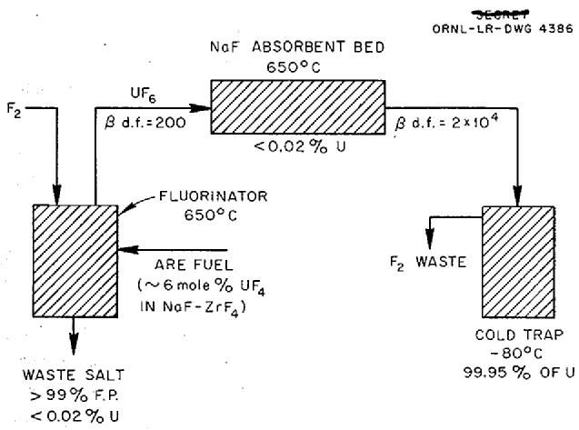  
Fig. 11.1. Fluoride-Volatility Process for ARE Fuel.

the resulting partially decontaminated $\mathsf{UF}_4$ in NaF-ZrF. However, if the uranium is to be returned to a diffusion plant or made into heterogeneous fuel elements, additional decontamination must be obtained. This may be accomplished by adding a complete UF fractional distillation step to the procedure shown in Fig. 11.1.

This method of uranium recovery and decontamination can also be used for processing heterogeneous reactor fuel elements of the type that can be dissolved in fused fluoride salt by means of hydrogen fluoride. Compactness of plant, operation at atmospheric pressure, and economical waste disposal are some of the advantages of this type of process.

# FISSION-PRODUCT REMOVAL

Three methods have been tested for removing fission products from the $\mathsf{UF}_6\cdot \mathsf{F}_2$ mixture obtained by fluorination of a uranium-containing fused fluoride salt: scrubbing the gas with a molten salt (NaF-ZrF4), scrubbing the gas with $C_8F_{16'}$ and passing the gas through a solid NaF absorbent bed at $650^{\circ}C$ . Of the three methods, NaF absorption is the best; it gives an over-all gross beta decontamination factor of more than $10^{4}$ .

Use of a molten salt scrub, NaF-ZrF $_4$ (56-44 mole %) at $650^{\circ}\mathrm{C}$ , followed by sublimation, for removing fission-product activity from the UF $_6$ product of the fluorination step gave, as reported previously, $^1$ over-all decontamination factors of $2 \times 10^4$ and 430 to 750 for gross beta and ruthenium beta activities, respectively. However, in the scrub step alone, the decontamination factor for the ruthenium, which is by far the most important volatile activity in the long-cooled material, was only 6, as shown by determination of the ruthenium in the molten salt. In a repetition of this experiment, the ruthenium decontamination factor in the scrub step was only 2 (run 1, Table 11.1), and the over-all ruthenium decontamination factor was 350.

Synthetic ARE fuel, prepared by hydrofluorination of $6\mathrm{g}$ of irradiated uranium metal in $67\mathrm{g}$ of $\mathrm{NaF - ZrF_4}$ (56-44 mole $\%$ ), fluorinated at $650^{\circ}\mathrm{C}$ with 40- to 80-fold excess fluorine.

Run 1: UF6 product plus excess fluorine passed through 67 g of molten NaF $\cdot$ ZrF $_4$ at $650^{\circ}\mathrm{C}$ into a dry-ice trap and then resublimed into second trap.

Runs 2 and 3: $UF_{6}$ product separated from excess fluorine in dry-ice trap and then volatilized through a $C_{8}F_{16}$ still into a second trap.

TABLE 11.1. DECONTAMINATION OBTAINED IN THE FLUORIDE-VOLATILITY PROCESS BY SCRUBBING UF ${}_{6}$   

<table><tr><td rowspan="3">Activity</td><td colspan="6">Beta Decontamination Factors</td></tr><tr><td colspan="2">Run 1</td><td colspan="2">Run 2</td><td colspan="2">Run 3</td></tr><tr><td>Over-all</td><td>\( Scrub^* \)</td><td>Over-all</td><td>\( Scrub^* \)</td><td>Over-all</td><td>\( Scrub^* \)</td></tr><tr><td>Gross</td><td>4800</td><td>2.7</td><td>290</td><td>1.2</td><td>250</td><td>2.2</td></tr><tr><td>Ru</td><td>350</td><td>2.3</td><td>16</td><td></td><td>14</td><td></td></tr><tr><td>Zr</td><td>\( 3.2 \times 10^4 \)</td><td></td><td>\( 6.8 \times 10^4 \)</td><td></td><td>\( 4.7 \times 10^4 \)</td><td></td></tr><tr><td>Nb</td><td>1800</td><td>47</td><td>1200</td><td></td><td>86</td><td></td></tr><tr><td>TRE</td><td>\( 2 \times 10^6 \)</td><td></td><td>\( 2 \times 10^6 \)</td><td></td><td>\( 2 \times 10^5 \)</td><td></td></tr></table>

*Decontamination factor calculated for scrub step alone on basis of activity extracted from scrub material.

Scrubbing the $\mathsf{UF}_6$ product from the fluorination and sublimation steps with fluorocarbon $(\mathsf{C}_{8}\mathsf{F}_{16})$ did not improve the decontamination (runs 2 and 3, Table 11.1). Approximately $9\mathrm{g}$ of $\mathsf{UF}_{6^{\prime}}$ ,sublimed from a fluorination run, was passed into the bottom of a $\mathsf{C}_{8}\mathsf{F}_{16}$ distillation column (0.5 in. in diameter by 14 in. high, packed with $\%$ -in. nickel Fenske helices) that was operating at full reflux at about $102^{\circ}C.$ The $\mathsf{UF}_6$ was taken out of the still as gas through an $80^{\circ}C$ head. The over-all ruthenium beta decontamination factors of 14 and 16 obtained in these runs were not significantly greater than the decontamination factor usually obtained in the fluorination step alone.

An increase of 50 to 100 in the over-all ruthenium beta decontamination factor was obtained by passing the fluorinator product through a bed of solid NaF (Table 11.2). In an exploratory trial (run 1, Table 11.2), the UF $_6$ -F $_2$ stream from the fluorinator was passed through a 25-g bed of $1/8$ -in. NaF pellets at $300^{\circ}\mathrm{C}$ . About $32\%$ of the uranium was not absorbed by the NaF, while $38\%$ had to be refluorinated from the NaF bed at $650^{\circ}\mathrm{C}$ before being trapped. However, the gross decon

tamination factors in the two fractions were of the same order, that is, $2 \times 10^{3}$ . The uranium loss on the NaF was only $0.01\%$ . Two experiments were then performed with 30-g beds of 20- to 40-mesh NaF held at $650^{\circ}C$ to eliminate the refluorination step (runs 2 and 3, Table 11.2). The results in both tests showed high absorption of ruthenium and niobium beta activities, and the overall gross beta decontamination factor was greater than $10^{4}$ . The slight increase (less than 10) in decontamination from zirconium and total rare-earth activities is probably a filtration effect rather than an absorption effect. The uranium loss on the 20- to 40-mesh NaF was $0.03\%$ .

A poor material balance for ruthenium and niobium beta activity has been observed in all fluorination runs. In general, 1 to $10\%$ of the ruthenium and about $50\%$ of the niobium remained in the fused salt waste. After run 3 (Table 11.2) the entire nickel fluorination vessel was cut into three parts and dissolved in dilute nitric acid to obtain the material balance summary shown in Table 11.3. Nearly all the niobium activity was accounted for in the reactor and fused salt, while $75\%$ of the

Synthetic ARE fuel, prepared by hydrofluorination of $6\mathrm{g}$ of irradiated uranium metal in $67\mathrm{g}$ of $\mathsf{NaF - ZrF}_4$ (56.44 mole $\%$ ), fluorinated at $650^{\circ}\mathbb{C}$ .

Run 1: UF6 product plus 28-fold excess fluorine passed through 30-g bed of NaF pellets (½ in.) held at $300^{\circ}\mathrm{C}$ ; 38% (fraction A) was absorbed and then refluorinated off at $650^{\circ}\mathrm{C}$ into a dry-ice trap, while 32% (fraction B) was not absorbed and was directly trapped.   
Run 2: UF6 product plus 11-fold excess fluorine passed through $30\mathrm{g}$ of 20- to 40-mesh NaF held at $650^{\circ}\mathrm{C}$ and then trapped.   
Run 3: UF $_6$ product plus 9-fold excess fluorine passed through 30 g of 20- to 40-mesh NaF held at $650^{\circ}\mathrm{C}$ , trapped, and then resublimed.

TABLE 11.2. DECONTAMINATION OBTAINED IN THE FLUORIDE-VOLATILITY PROCESS BY PASSING UF6 THROUGH SOLID NaF   

<table><tr><td rowspan="3">Activity</td><td colspan="7">Beta Decontamination Factors</td></tr><tr><td colspan="3">Run 1</td><td colspan="2">Run 2</td><td colspan="2">Run 3</td></tr><tr><td>Fraction A</td><td>Fraction B</td><td>\( Scrub^* \)</td><td>Overall</td><td>\( Scrub^* \)</td><td>Overall</td><td>\( Scrub^* \)</td></tr><tr><td>Gross</td><td>2200</td><td>1600</td><td>3.5</td><td>\( 2.3 \times 10^4 \)</td><td>50</td><td>\( 1.6 \times 10^4 \)</td><td>24</td></tr><tr><td>Ru</td><td>140</td><td>120</td><td>3.0</td><td>5200</td><td>90</td><td>3100</td><td>50</td></tr><tr><td>Zr</td><td>4300</td><td>870</td><td>1.6</td><td>\( 4.1 \times 10^4 \)</td><td>7.3</td><td>\( 8.3 \times 10^4 \)</td><td>9.4</td></tr><tr><td>Nb</td><td>430</td><td>47</td><td>17</td><td>3400</td><td>280</td><td>2500</td><td>100</td></tr><tr><td>TRE</td><td>\( 10^6 \)</td><td>\( 5 \times 10^4 \)</td><td>3.5</td><td>\( 3 \times 10^5 \)</td><td>7.3</td><td>\( 4 \times 10^6 \)</td><td>2</td></tr></table>

*Calculated for scrub step alone on basis of activity extracted from scrub material.

TABLE 11.3. MATERIAL BALANCE FOR RUTHENIUM AND NIOBIUM ACTIVITY IN A FLUORIDE-VOLATILITY RUN   

<table><tr><td>Location</td><td>Ru β
(% of original)</td><td>Nb β
(% of original)</td></tr><tr><td>Bottom of reactor (in contact with fused salt)</td><td>4</td><td>0.4</td></tr><tr><td>Fused salt waste</td><td>0.8</td><td>69</td></tr><tr><td>Top of reactor (not in contact with fused salt)</td><td>8</td><td>3</td></tr><tr><td>Outlet tube</td><td>10</td><td>27</td></tr><tr><td>NaF absorbent</td><td>2</td><td>1</td></tr><tr><td>Total</td><td>25</td><td>100</td></tr></table>

ruthenium was apparently volatilized out of the reactor entirely. Ruthenium and niobium plated out heavily on the metal walls of the reactor. The distribution ratio between metal wall and salt was about 5 for ruthenium activity and less than 0.01 for niobium activity.

The behavior of plutonium in the fused salt fluoride-volatility process is important in processing fuel that has a high proportion of $U^{238}$ . The results of many fluorination runs at $650^{\circ}\mathrm{C}$ show that only about $0.01\%$ of the plutonium is carried over with the $UF_{6}$ product.

Further study was carried out on the absorption of $\mathsf{UF}_6$ in NaF-ZrF4 (56-44 mole %) at $650^{\circ}\mathrm{C}$ . In one trial, 9 g of $\mathsf{UF}_6$ was absorbed in 30 g of NaF-ZrF4 in 1 hr with no noticeable loss. However, passage of helium through the fused salt, either concurrently with or after the $\mathsf{UF}_6$ addition, produced considerable fuming. A positive test for fluorine with potassium iodide paper was obtained, which indicated reduction of the adsorbed $\mathsf{UF}_6$ to the tetra- or pentavalent form of uranium. A gravimetric test, based on the reaction of fluorine with sodium chloride, showed that the breakdown of $\mathsf{UF}_6$ to $\mathsf{F}_2$ and $\mathsf{UF}_4$ amounts to 1 to $2\%$ per hour at $650^{\circ}\mathrm{C}$ .

Engineering information is needed on two steps in the fluoride-volatility process: fluorination and $\mathsf{UF}_6$ cold-trapping. Effective contacting of fluorine with molten ARE fuel is desirable to minimize fluorine consumption and gaseous waste and to assure complete recovery of the uranium. The cold trap should be operated in such a manner that all the $\mathsf{UF}_6$ will be condensed and collected on the walls of the trap rather than lost as "smoke." Considerable experience has been accumulated at K-25 in the operation of cold traps equipped with alumina adsorbers to catch any $\mathsf{UF}_6$ escaping from the trap, but this expedient must be minimized in radioactive processing. Also, the experience at K-25 has been in separating $\mathsf{UF}_6$ from nitrogen rather than from fluorine.

For application to the fluorine sparging of molten salt, studies have been made of the relation between pressure drop and gas flow rate in simulated fuel systems, that is, aqueous salt solutions of various viscosities and densities and acetylene tetra-bromide, which has physical properties very nearly the same as those of molten NaF-ZrF. No effect of equipment dimensions on vertical mixing or turbulence was found, and the effects of physical

properties of the liquid could not be demonstrated by a simple correlation of friction factor with Reynolds number, such as is found in ordinary fluid flow through pipes. The acetylene tetra-bromide studies showed that vertical mixing of the liquid phase was induced by a gas rate of 9.5 cfm in a 12-in.-dia column. Equipment is now being assembled to verify these conclusions with molten NaF-ZrF4.

Cold traps to be used for a quantitative study of the effect of temperature and gas flow rate on the completeness of $\mathsf{UF}_6$ removal are being constructed. The design of these traps is based on a K-25 cold-trap design.

# APPLICATIONS OF FUSED SALT-VOLATILITY PROCESSES

A long-range study has been made to survey the overall feasibility of fused salt-volatility techniques in the chemical processing of ARE-type reactor fuels and certain types of heterogeneous reactor fuel elements. The volumes of radioactive waste from such processes should be much lower than those from the aqueous processes, and processing costs should be low, even though a means of disposing of excess fluorine will have to be provided. Total chemical costs, which in present aqueous processes represent approximately $10\%$ of operating costs, have been estimated to be $20\phi$ per gram of $\mathsf{U}^{235}$ . The operational procedure is much simpler, and the equipment should be inexpensive, even though nickel will be required as the material of construction.

Results of recent work on fuel element dissolution and on uranium recovery and decontamination justify serious consideration of fused fluoride salt techniques in a variety of radioactive chemical processes. Probable applications in addition to those for ARE-type fuels include the processing of the U235-Zircaloy fuel elements used in the Submarine Thermal Reactor (STR) and the U235-stainless steel fuel elements proposed for the Submarine Intermediate Reactor (SIR) and the Army Package Power Reactor (APPR). These cases represent areas of radioactive chemical processing which may be the least susceptible to economic aqueous methods and are therefore the most fertile area in which the fluoride-volatility techniques may be fostered and expanded. For example, fuel element dissolution in the conventional nitric acid or sulfuric acid systems is very complex from the

standpoint of both operational and corrosion problems but is efficient and rapid in the high-temperature liquid medium of fused fluoride salts.

# Aircraft Reactor Fuels

The recovery and reprocessing schedule for fluid-fuel aircraft reactors will probably be dictated by aircraft reactor and turbine maintenance schedules rather than by the rate of formation of neutron poisons. It is anticipated that operation will follow a schedule such as: (1) one day of operation and one day of downtime for an accumulation of seven operating days, (2) seven days of downtime for minor maintenance, (3) repetition of this schedule until 1000 operating hours have been accumulated. After 1000 hr of operation, the entire reactor will be dumped and the fuel will be reprocessed.

The anticipated cooling period before reprocessing will be 10 days to allow decay of short-lived activities. The minimum decontamination factor required for the process would be approximately 100 for poison removal only. The other steps in fuel makeup can easily be handled remotely.

The following essential steps are used in the chemical processing (Fig. 11.2). First, the $\mathsf{UF}_4$ in the molten fuel mixture is fluorinated to volatile $\mathsf{UF}_6$ by introducing a 10-fold excess of elemental fluorine to achieve separation and partial decontamination from the other fuel components and fission products; second, the $\mathsf{UF}_6$ is reduced to $\mathsf{UF}_4$ with hydrogen in the gas phase in the Y reactor, as designed by K-25; and third, the resulting $\mathsf{UF}_4$ is added to 2 moles of NaF to prepare a fuel concentrate for subsequent return to the reactor. Present knowledge of this system indicates that all steps are adaptable for radioactive remote operation. Considerable engineering development and operational experience have been obtained with the second and third steps, while extended laboratory development has indicated the feasibility of the direct fluorination of the molten fuel mixture.

# Heterogeneous Reactor Fuels

The separation of $U^{235}$ from zirconium alloy fuel elements is currently the most promising application of the fluoride process to fixed fuel element reactors. The dissolution rate of zirconium with HF in the $\mathrm{NaF - ZrF_4}$ fused salt is very high, that is, 22 to 35 mils/hr (Table 11.4). The range is probably due to metallurgical differences.

Although the ratio of zirconium to uranium is very high in STR elements, the cost of HF to dissolve zirconium will be only 5¢ per gram of U235. A probable method for zirconium separation as a guide for process development is indicated by the flow diagram shown in Fig. 11.3. This flow sheet is similar to that for fluid-fuel processing, but it includes hydrofluorination of the fuel element in a

TABLE 11.4. RATES OF HF PENETRATION OF VARIOUS METALS AND ALLOYS IN A TYPICAL FUSED FLUORIDE SALT BATH   

<table><tr><td colspan="2">Bath composition: NaF·KF·ZrF4(7·48.5·44.5 mole %)</td></tr><tr><td colspan="2">HF flow rate: 250 cm3/min</td></tr><tr><td colspan="2">Temperature: 675°C</td></tr><tr><td colspan="2">Nitrogen or argon blanket in cases of open test vessels</td></tr></table>

<table><tr><td>Material</td><td>Penetration Rate (mils/hr)</td></tr><tr><td>Vanadium</td><td>Not detected</td></tr><tr><td>Silicon</td><td>Not detected</td></tr><tr><td>Nickel</td><td>0.0001</td></tr><tr><td>Monel</td><td>0.02</td></tr><tr><td>Molybdenum</td><td>0.03</td></tr><tr><td>Tungsten</td><td>0.06</td></tr><tr><td>Silicon carbide</td><td>2*</td></tr><tr><td>Type 304 stainless steel</td><td>4</td></tr><tr><td>Type 347 Nb stainless steel</td><td>7</td></tr><tr><td>Niobium</td><td>7</td></tr><tr><td>Tantalum</td><td>8</td></tr><tr><td>Manganese</td><td>10</td></tr><tr><td>Mild steel (Unistrut)</td><td>13</td></tr><tr><td>Thorium, 1/8-in. plate</td><td>14</td></tr><tr><td>Uranium</td><td>17</td></tr><tr><td>Zirconium</td><td>22 to 35**</td></tr><tr><td>Chromium</td><td>31</td></tr><tr><td>Titanium</td><td>31</td></tr><tr><td>Zircaloy-2</td><td>22 to 46**</td></tr><tr><td>95 wt % uranium-5 wt % zirconium</td><td>50</td></tr><tr><td>Tin</td><td>Sample dissolved instantly</td></tr><tr><td>Zinc</td><td>Sample dissolved instantly</td></tr></table>

\*Material disintegrated and left suspended particles. \*\*Range is due to metallurgical differences in individual specimens.

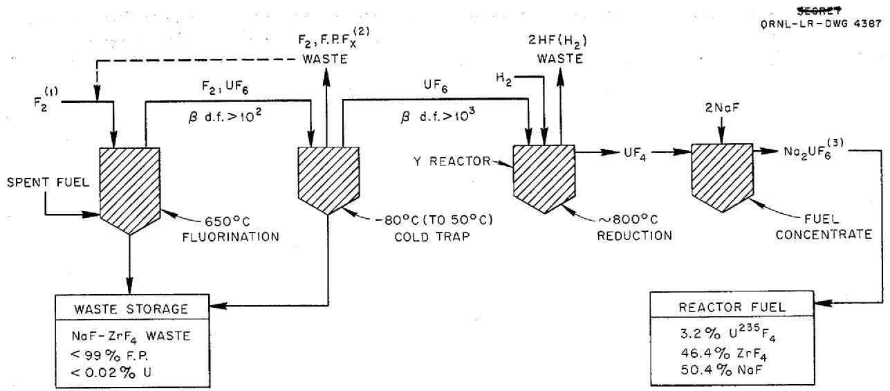  
(1) $UF_{4} + 10F_{2}\rightarrow UF_{6} + 9F_{2}$ (EXCESS $F_{2}$ REQUIRED FOR COMPLETE $UF_{6}$ DISTILLATION).   
(2) $F_{2}$ DISPOSAL REQUIRED; RECOVERY OR RECYCLE NOT ECONOMICAL.   
(3) REPRESENTS PREFERRED FORM OF CONCENTRATE FOR ADDITION TO REACTOR.

Fig. 11.2. Tentative Flow Diagram for Aircraft Reactor Fuel Reprocessing.

Fig. 11.3. Tentative Flow Diagram for Zirconium-U $^{235}$ Fuel Element Processing.   
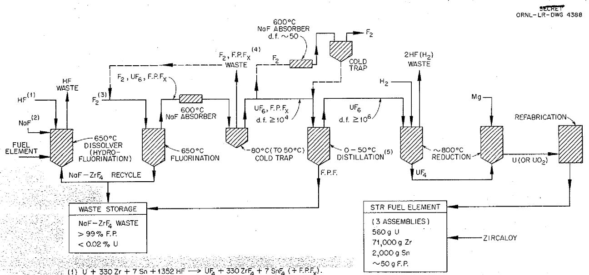  
(1)U+330Zr+7Sn+1352HF $\longrightarrow$ UF4+330ZrF+7SnF（+FPx）  
(2) $330\mathrm{ZrF}_{4} + 330\mathrm{NaF}\longrightarrow 330\mathrm{NaF} - \mathrm{ZrF}_{4}$   
(ABOVE ASSUMES NO PRIOR MECHANICAL SEPARATION OF U AND Zr).   
(3) $\mathrm{UF}_{2} + 10\mathrm{F}_{2} \longrightarrow \mathrm{UF}_{2} + 9\mathrm{F}_{2}$ (EXCESS $\mathrm{F}_{2}$ REQUIRED FOR COMPLETE $\mathrm{UF}_{6}$ DISTILLATION).   
(4) $F_{2}$ DISPOSAL REQUIRED; RECOVERY OR RECYCLE OF $F_{2}$ NOT ECONOMICAL.   
(5) PROCEDURE UNKNOWN; DEVELOPMENT REQUIRED.

fused salt bath to permit dissolution at a penetration rate of 22 to 35 mils/hr, passage of the $\mathsf{UF}_{6}\mathsf{-F}_{2}$ mixture through a bed of NaF at $650^{\circ}C$ to obtain additional decontamination, and final purification of the UF by distillation.

Recovery of the uranium by fluoride volatilization will be easy, although methods for obtaining a decontamination factor of about $10^{6}$ will have to be developed in order to allow metallurgical processing of the uranium.

Part III

SHIELDING RESEARCH

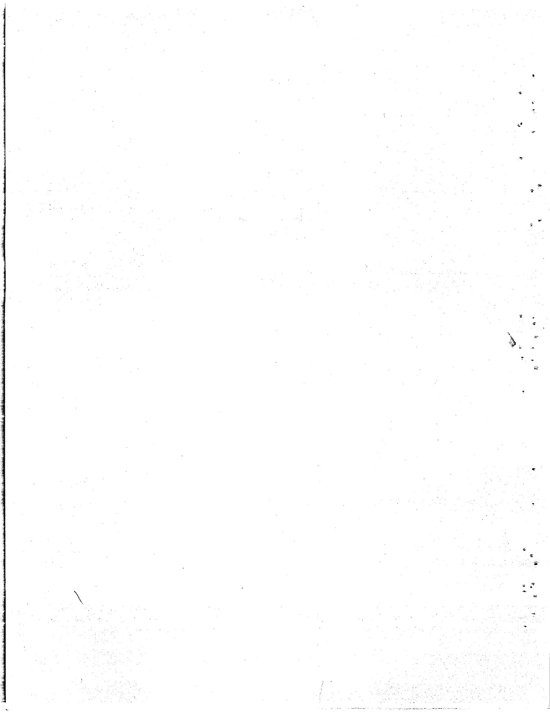

# 12. SHIELDING ANALYSIS

E.P.Blizard

F. H. Murray

C. D. Zerby

Physics Division

H. E. Stern

Consolidated Volute Aircraft Corporation

S. Auslander

Pratt & Whitney Aircraft

The Monte Carlo method was used for two calculations: the penetration of gamma rays through composite slab shields and the heating in beryllium slabs resulting from gamma rays in an adjacent source. In addition, a three-parameter mathematical formulation of the variation of radiation-induced injury to pilots of nuclear-powered aircraft with time after exposure was derived, and analyses were made of the preliminary differential experiments and of the first experiments with the GE-ANP R-1 reactor shield mockup at the Tower Shielding Facility (TSF).

# SLANT PENETRATION OF COMPOSITE SLAB SHIELDS BY GAMMA RAYS

C. D. Zerby

A Monte Carlo calculation of the penetration of gamma rays through the side of a crew-compartment shield has been completed. The study was ex

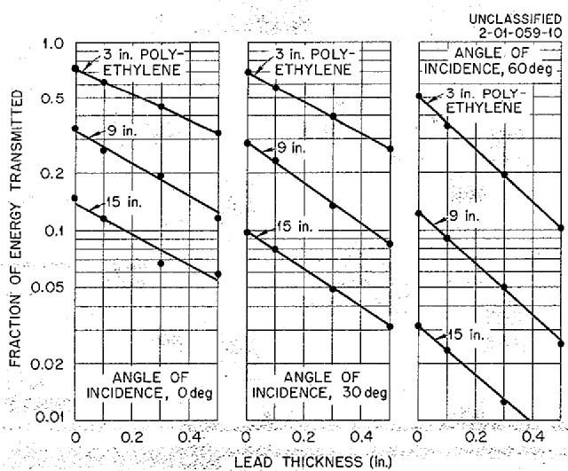  
Fig. 12.1. Energy Resulting from Slant-Incident $2 - m_{0}c^{2}$ Photons Transmitted Through Composite Slabs of Polyethylene Backed by Lead.

tended to include an investigation of the effect of the variation of the parameters involved so that the penetration of any complex spectrum of incident gamma-ray flux could be determined by integration of the resulting data. Results of a calculation with one set of boundary conditions were given previously, and summary tabulations of the results are available.

The results are presented graphically in Figs. 12.1 and 12.2 as the fraction of incident energy penetrating composite slabs. The exponential

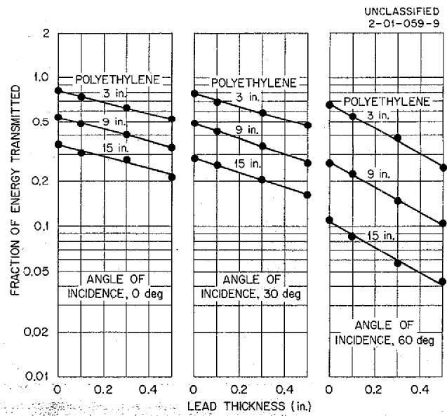  
Fig. 12.2. Energy Resulting from Slant-Incident $6\cdot m_0c^2$ Photons Transmitted Through Composite Slabs of Polyethylene Backed by Lead.

character of the data is evident from the straight-line fit to the points on semilogarithm paper.

# ENERGY ABSORPTION RESULTING FROM INCIDENT GAMMA RADIATION AS A FUNCTION OF THICKNESS OF MATERIALS WITH SLAB GEOMETRY

C. D. Zerby

The interaction of radiation with the atomic particles of matter results in an energy transfer to the particles or in the creation of secondary radiation. The secondary radiation, in turn, is usually absorbed close to the primary interaction. With high radiation intensity, the absorption of radiation energy in biological shields or in structural members can be important. Since essentially all the energy absorbed becomes heat, problems of induced thermal stresses in already stressed structural members may well determine design limitations. The heating effect may also be a limiting design factor in some cases in which material strength is seriously dependent on temperature. In all cases some knowledge of the energy absorption distribution within a material is necessary. Only a preliminary study of heating in beryllium has been completed thus far, and results are reported here.

Most radiation absorption problems can be at least approximated by known analytical methods. For the gamma radiation absorption distribution, however, solution of the Boltzmann transport equation is necessary for accuracy. At NDA, extensive calculations have been carried out to solve the transport equation for the penetration of gamma rays. The NDA calculations included the energy absorption as a function of position for a point isotropic source, but it was not possible to include the absorption distribution for plane slabs. At ORNL, the total energy absorption of incident gamma radiation in the different materials of finitely thick composite slabs was also calculated, but, again, the calculation did not include the absorption distribution.

In this study the Monte Carlo method is being used for the calculation of the energy absorption distribution in finitely thick slabs, and the calculations are programmed for solution on the ORACLE

at ORNL. For a monodirectional beam of monoenergetic photons on a slab of material of finite thickness, the energy absorption was calculated in every interval of 0.10 in, through the slab. The absorption included the energy transmitted to the material in a scattering collision as well as that transmitted in an absorption collision; in every case the photon was followed until it was reflected from the slab, was absorbed, or had penetrated the slab. The scattering cross sections were calculated with the use of the Klein-Nishina scattering-cross-section formula, while the absorption cross sections were obtained by empirical fits to published data.

A 9-in.-thick slab of beryllium was used, and the incident photons were considered to have energies of 0.5, 1.5, and $5.0m_0c^2$ and to be normally incident. For the $1.5 - m_0c^2$ case, angles of incidence of 30, 60, and 85 deg were also investigated ( $1m_0c^2 = 0.51 \text{ MeV}$ ).

The results obtained for the normally incident $0.5 - m_0c^2$ photons on the slab of beryllium are shown in Fig. 12.3. The histogram indicates the statistical nature of the Monte Carlo solution, while the smooth curve is a fit, by eye, to the data. The values given on the histogram are the averages of the values for the 0.10-in. intervals. In the future it is intended that a rigorous method of fitting the data will be employed. The area under the curve is the total energy absorption.

5W. Heitler, The Quantum Theory of Radiation, 3d ed., Eq. 39, p 219, Oxford University Press, New York, 1954.   
6G. R. White, X-Ray Attenuation Coefficients from 10 Kev to 100 Mev, Table I, NBS-1003 (May 13, 1952).

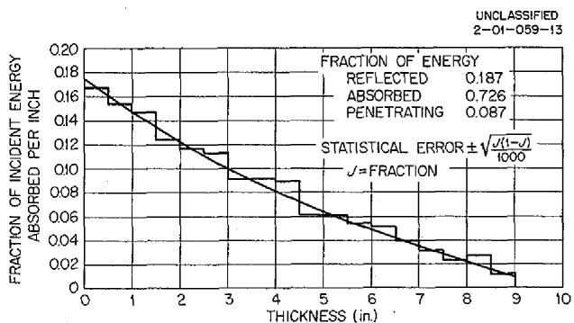  
Fig. 12.3. Radiation Heating of a 9-in.-Thick Beryllium Slab by Normally Incident $0.5 - m_{0}c^{2}$ Photons. Smooth fit to statistical data shown.

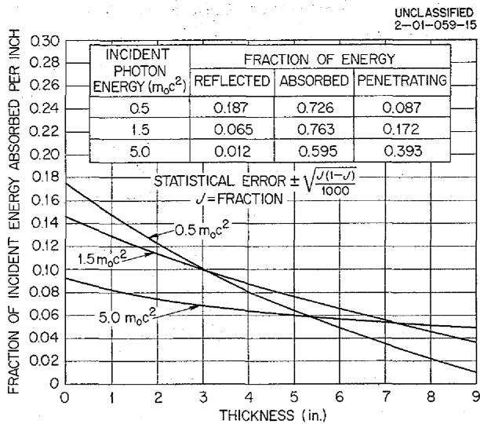  
Fig. 12.4. Radiation Heating of a 9-in.-Thick Beryllium Slab by Normally Incident Photons.

In Fig. 12.4 the smooth fits to the statistical data are presented for normally incident photons of energy 0.5, 1.5, and $5.0m_0c^2$ . The effect of the reflected photons on the energy absorption curve is readily seen at the entrance face of the slab. The value of the fraction of energy absorbed per inch at the entrance face for the incident photons can be calculated by multiplying $\mu_{s'}$ the scattering cross section, by $f$ , the average fraction of energy absorbed by the material. These values for 0.5, 1.5, and $5.0m_0c^2$ are, respectively, 0.118, 0.123, and 0.089. The large contribution of the reflected component is especially evident for the $0.5 - m_0c^2$ photons at the entrance face as the difference between 0.118 and the fraction 0.175 taken from Fig. 12.4. The effect of various angles of incidence for $1.5 - m_0c^2$ photons is shown in Fig. 12.5. Again, this is a smooth fit, by eye, to the statistical data.

# A FORMULATION FOR RADIATION INJURY TO INCLUDE TIME EFFECTS

E.P.Blizard

In the specification of the tolerance dose for crews of nuclear-powered aircraft some account should be taken of the recovery from radiation-

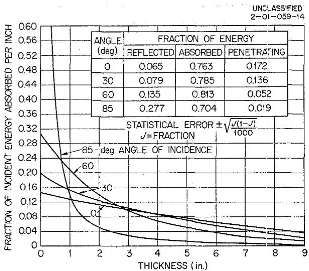  
Fig. 12.5. Radiation Heating of a 9-in.-Thick Beryllium Slab by Slant-Incident $1.5 \times m_{0} c^{2}$ Photons.

induced injury with time. Just recently the ANP Medical Advisory Group (ANP-MAG) issued recommendations which made some concessions in this direction in that increased total doses were allowed for schedules which distributed the radiation over longer times. It has been demonstrated that the ANP-MAG recommendations can be expressed to within $4\%$ by a mathematical formulation with three parameters based on a model of partly irreparable injury and partly injury which recovers exponentially with time. The model was previously suggested by Blair. The mathematical formulation is much more flexible than the Biological Planning Chart which expresses the ANP-MAG recommendations, since it gives a unique value of

injury for any radiation schedule no matter how irregular. The expression is

$$
\begin{array}{l} I (t) = \int_ {0} ^ {t ^ {\prime}} \left[ \frac {d D}{d t ^ {\prime \prime}} 1. 0 8 \times 1 0 ^ {- 3} \right. \\ + 1. 0 5 \times 1 0 ^ {- 2} e ^ {- 0. 7 1 3 (t - t ^ {\prime \prime})} \bigg ] d t ^ {\prime \prime}, \\ \end{array}
$$

where

$I(t) =$ injury at time $t$ in units of maximum safe injury (MSI) which is just that allowed for training by the ANP-MAG $(t\geq t^{\prime})$

$\frac{dD}{dt^{\prime\prime}} = \text{dose rate, rem per unit time, at time } t^{\prime \prime}$ $(0 < t^{\prime \prime} < t^{\prime})$

It may be noted that the half life of the reparable injury is about one year and that this component appears to constitute $90\%$ of the total.

Other formulations are suggested to take account of other phenomena, such as enhancement of sensitivity by previous doses. Nothing basic to the biology of the problem is intended; rather, it is suggested that if the restrictive planning chart is satisfactory for airplane design and strategic planning, then the formulation should also be satisfactory from a biological point of view. Since it is much more flexible than the chart, it would be much more useful for interpretation of actual radiation schedules in terms of injury.

This same model predicts that the AEC laboratory tolerance doses administered over a 30-year period give the same injury as does an instantaneous dose of about 60 rem. These numbers are not inconsistent with presently accepted concepts.

# ANALYSIS OF SOME PRELIMINARY DIFFERENTIAL EXPERIMENTS

M. F. Valerino13

In order to investigate the adequacy of simple analytical models proposed for describing some of the neutron transport processes involved in the aircraft divided-shield concept, some of the data obtained in the preliminary differential experiments14 at the TSF have been examined. Only thermal-neutron measurements have been made.

The thermal-neutron flux measured at the rear of the detector tank as a function of the angle $\theta$ (angle between the reactor axis of symmetry and the source-detector axis) for a 65-ft reactor-detector separation distance and a 195-ft altitude is shown in Fig. 12.6. The flux is plotted relative to that for $\theta = 0$ deg and is compared with a curve of the direct beam flux to be expected at the detector, as calculated on the basis of the total water thickness between the reactor surface and the detector. In the calculation of the direct beam flux the leakage neutrons were assumed to have a cosine distribution at the reactor surface, and the attenuation lengths were based on Lid Tank Shielding Facility (LTSF) data corrected to give the point-to-point material attenuation kernel. The calculated curve agrees well with the experimental curve for angles up to 45 deg. Beyond the 45-deg angle, the calculated flux drops off rapidly, and at 90 deg the direct beam is gone. The measured flux for $\theta = 90$ deg must hence be presumed to be due to air-scattered neutrons only. Single-scatter theory calculations have not yet been performed for the case of a beam whose axis of symmetry is at an angle with the source-detector axis, and hence it was not possible to calculate the magnitude of the air scattering to be expected.

In order to estimate the air scattering into the rear of the detector tank, the air-scattered flux

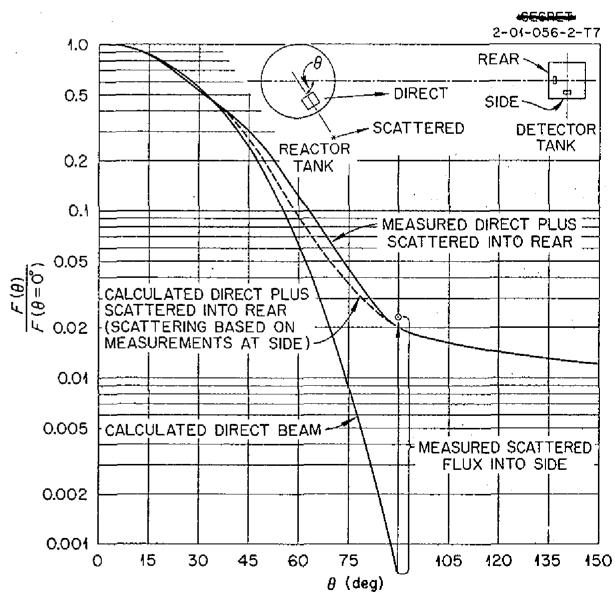  
Fig. 12.6. Comparison of Calculated and Measured Fluxes in Rear of Detector Tank.

measurements taken at the side of the detector tank were considered. For $\theta = 90$ deg, the experiments indicate that the scattering into the side and that into the rear of the detector tank are approximately equal. If it is assumed that this is nearly true for angles between 45 and 90 deg, the air scattering into the rear can be estimated from the measurements at the side. When the air-scattered neutron flux estimated in this manner is added to the calculated direct beam flux, the dashed curve in Fig. 12.6 is obtained. The fair agreement between the dashed curve and the measured curve indicates that the simple model used to calculate the angle of distribution of the leakage neutrons from the shield surface may be adequate for divided-shield design.

Figure 12.7 represents an attempt to compare the measurements of the air scattering into the side of the detector tank with the air scattering indicated by single-scatter calculations. The ordinate in Fig. 12.7 is the ratio of the flux at the side surface of the detector tank for a given beam direction $\theta$ to the flux at the rear of the detector tank obtained

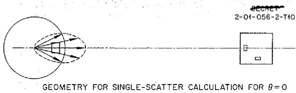

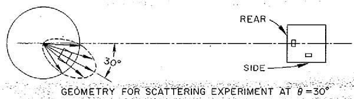

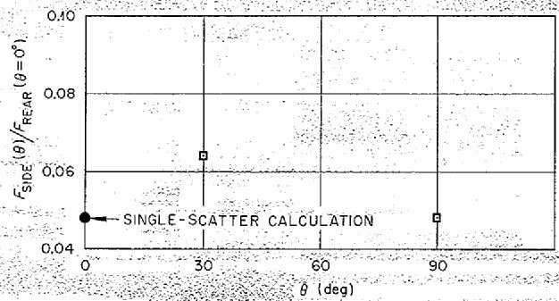  
Fig. 12.7. Ratio of Extrapolated Surface Fluxes as Indicated by Measurements and by a Single-Scatter Calculation.

when the beam is pointed directly towards the detector tank, that is, for $\theta = 0$ deg. Hence, the ordinate is a measure of the fraction of the beam scattered into the sides of the detector tank. The abscissa is the beam direction $\theta$ . The points indicated by the experiments for $\theta = 30$ and $90$ deg were obtained by extrapolation of the fluxes measured in the water to give the extrapolated surface values. The measured relaxation lengths were used in the extrapolation; no relaxation length measurements were made for $\theta = 0$ deg, and therefore this procedure could not be used for this angle. The only single-scatter calculation presently available is for $\theta = 0$ deg, and it is based on the assumption of a $2\pi$ -isotropic detector, that is, an isotropic detector with one hemisphere shielded. This calculation gives a value of 0.048 for $\theta = 0$ deg, which is to be compared with the values indicated by the experiments of 0.063 for $\theta = 30$ deg and 0.048 for $\theta = 90$ deg. As the beam is rotated from 30 to 0 deg, it is nearly cut in half insofar as scattering into the one side of the detector tank is concerned, and this should result in a decrease of the scattering into the one side of the detector tank. The scattered flux measurements taken within the water show this to be the case. The point calculated by single-scatter theory for $\theta = 0$ deg appears to agree with the points obtained from the experiment for $\theta = 30$ and $\theta = 90$ deg. However, it should be cautioned that the fair agreement indicated in the figure could be fortuitous. In the comparison, the assumption is involved that the thermal flux resulting from a given fast-neutron current into the side of the detector tank is the same for air-scattered neutrons as for direct-beam neutrons. Also, some uncertainties are introduced in the extrapolation of the thermal flux to obtain the surface value.

# INTERPRETATION OF AIR AND GROUND

# SCATTERING AT THE

# TOWER SHIELDING FACILITY

J. Van Hoomissen15

Measurements of neutrons scattered in the side of the detector tank as a function of reactor-detector altitude for two different source geometries have been performed at the TSF to establish the fact that neutron air-scattering experiments made at

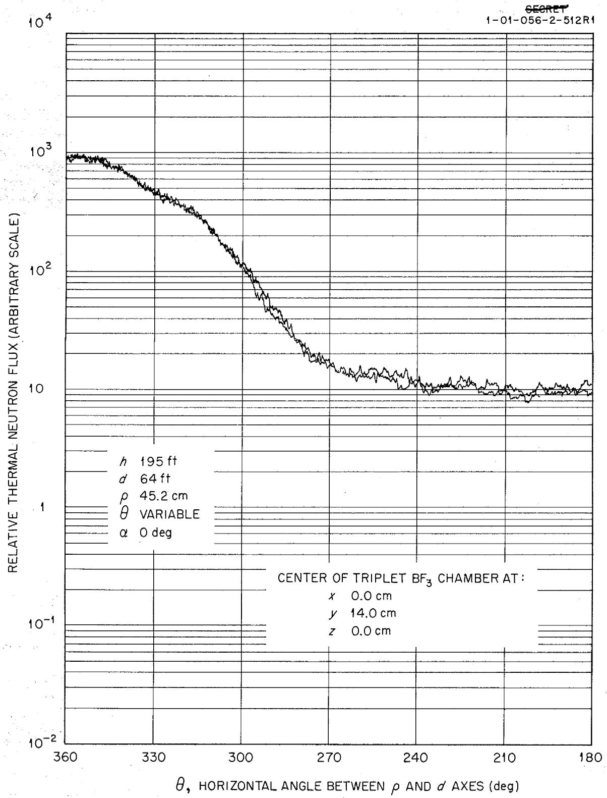  
Fig. 12.8. Direct-Beam Radiation as a Function of Angle; Preliminary Differential Experiments.

200 ft are relatively free from a background of ground-scattered neutrons.

In each experiment the neutron flux reaching a $\mathsf{BF}_3$ detector placed inside the detector tank and near a side wall was measured as the altitudes of the source and the detector were varied simultaneously from the ground to 200 ft. The only major difference between the two experiments was the shielding placed around the TSF reactor. In the first case the reactor was placed in the reactor tank at a distance $(\rho)$ of $45~\mathrm{cm}$ from the tank wall and a reactor angle $(\theta)$ of 330 deg from the source-detector axis; in the second case the reactor was placed in a mockup of the GE-ANP R-1 shield design (see "TSF Experiment with the Mockup of the GE-ANP R-1 Shield Design," in Sec. 15).

In order to estimate the actual ground-scattered contribution at the 200-ft altitude, attempts were made to analytically separate the experimental measurements into their air- and ground-scattered components. A calculation of the number of neutrons singly scattered into a point isotropic detector as a function of the solid angle in which they had left the source had been made previously for the case of infinite height. Also, a calculation of the number of air-scattered neutrons lost because of the presence of the ground and the number of ground-scattered neutrons reaching the detector as a function of source solid angle and altitude had been made. All three calculations assumed single isotropic scattering, air attenuation, and a separation distance of 64 ft.

The integration over the source solid angle to obtain curves of air and ground scattering as a function of altitude was weighted in each case by the angular distribution of neutrons emitted from the shield. In the differential type of experiment (reactor in reactor tank) the angular distribution (Fig. 12.8) was obtained by the measurement of the direct beam reaching the detector tank as a function of the reactor angle $\theta$ . The corresponding distribution (Fig. 12.9) for the mockup was obtained from Bulk Shielding Facility (BSF) measurements.[19]

As a first step in the actual analysis of the experimental data, it was assumed that the ground

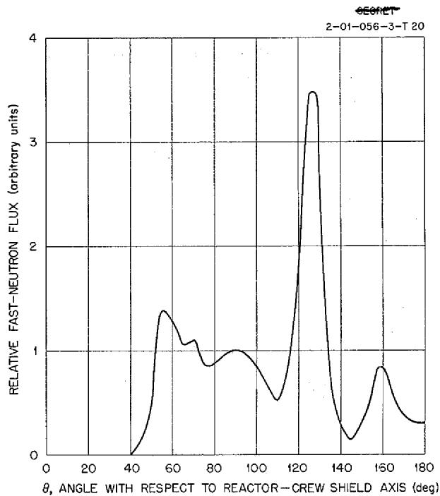  
Fig. 12.9. Angular Distribution of Fast Neutrons Emitted from GE-ANP R-1 Shield Mockup.

scattered contribution to the data at 200 ft was negligible, and the single air-scattering curve as a function of altitude was normalized at this point. This normalized curve was then used to subtract the air-scattered contribution from the experimental measurements at lower altitudes, and thus a series of experimental ground-scattering points was obtained. A fit of the calculated ground-scattering curve through these points gave an estimate of the ground-scattered contribution to the experimental data at the high altitude. The air-scattering was then renormalized, with this ground-scattered contribution taken into account. This method of iteration, of course, quickly converges.

The analysis (Fig. 12.10) for the differential type of experiment resulted in an estimate of $1\%$ for the ground-scattered contribution at 200 ft with the water-filled reactor tank. The estimate obtained for this contribution in the GE-ANP R-1 shield mockup experiment (Fig. 12.11) was $5\%$ .

In conclusion it can be said that at the 200-ft altitude the ground-scattered contributions to airscattering experiments at the TSF are dependent

on the source geometry; however, the contributions will be small, that is, not more than $5\%$ , in all cases.

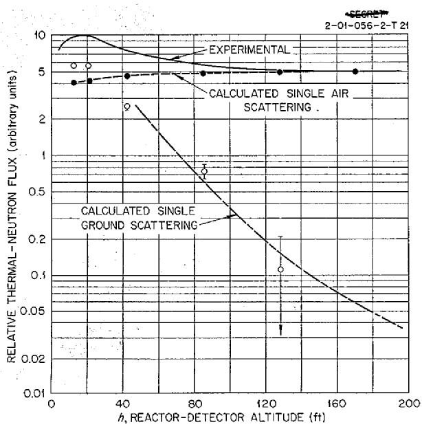  
Fig. 12.10. Comparison of Scattered-Neutron Calculations with Preliminary Differential Experim-. ment.

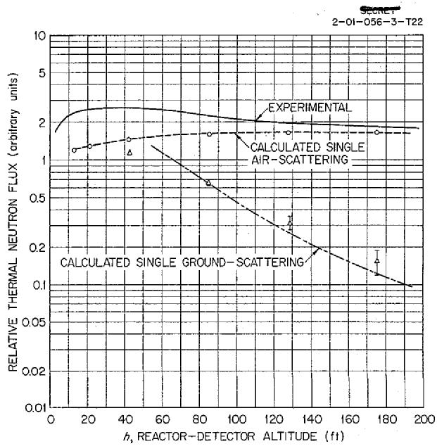  
Fig. 12.11. Comparison of Scattered-Neutron Calculations with GE-ANP R-1 Mockup Experiment.

# 13. LID TANK SHIELDING FACILITY

G. T. Chapman

J.M.Miller

Physics Division

J.B.Dee H.C.Woodsum

W. H. McCool

Pratt & Whitney Aircraft

A measurement of the removal cross section of lithium was made at the Lid Tank Shielding Facility (LTSF), and the experimentation on the GE-ANP helical air ducts was continued. Preparations for the circulating-fuel reflector-moderated reactor and shield mockup tests are nearing completion.

# EFFECTIVE NEUTRON REMOVAL CROSS SECTION OF LITHIUM

G. T. Chapman

J.M.Miller C.L.Storrs

An effective neutron removal cross section $(\sigma_{R})$ of $1.01 \pm 0.04$ barns was determined for lithium at the LTSF. This value was obtained from measurements made in a medium of oil behind a slab of metallic lithium which was placed against the source plate.

The slab of lithium $(\rho = 0.53~\mathrm{g / cm^3})$ was constructed by filling a 122-cm-dia by 29.1-cm stainless steel tank with melted lithium and allowing the material to solidify. The walls of the tank were reinforced with a framework constructed of 6-in. I-beams to assure that they would remain parallel during the pouring and solidifying processes. Figure 13.1 is a schematic diagram of the lithium-filled tank.

A chemical analysis of the lithium indicated that the material was at least $99\%$ pure, and an x-ray inspection of the frozen lithium in the tank showed no voids in the material. A spectrographic analysis is being made and is expected to show essentially no impurities.

The lithium tank was submerged in the medium of G-E 10-C insulating oil rather than in water because of safety requirements. It was necessary to contain the oil in a steel tank, designed for use with future experiments, which has a $\frac{1}{8}$ -in.

Inconel window in the wall adjacent to the source. The presence of the Inconel resulted in a 9-Mev capture gamma ray, and the photoneutron contribution from this high-energy gamma and the naturally occurring deuterium in the oil markedly affected the thermal-neutron measurements in oil (no lithium present) for distances greater than $120~\mathrm{cm}$ from the source (Fig. 13.2). A 3.81-cm-thick bismuth slab placed in the oil approximately $45~\mathrm{cm}$ from the source suppressed this gamma ray and the resulting photoneutrons without any observable effect on any other component of the thermal-neutron flux.

The lithium tank was then placed in the oil tank adjacent to the source, and thermal-neutron flux

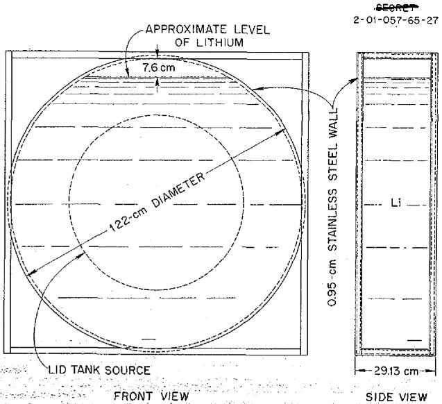  
Fig. 13.1. Experimental Arrangement for the LTSF Lithium Removal Cross-Section Measurement.

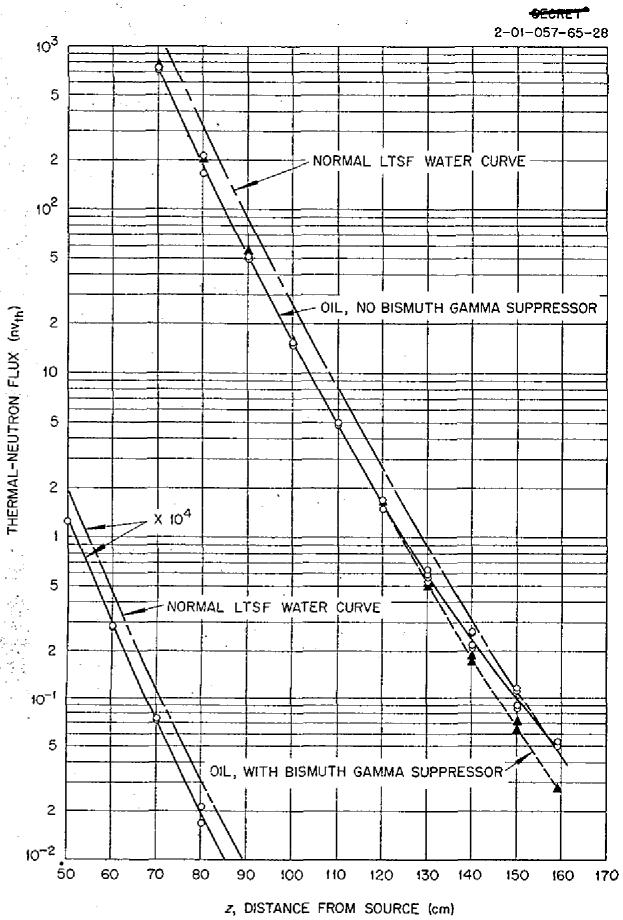  
Fig. 13.2. Thermal-Neutron Flux in Oil With and Without Bismuth Slab to Suppress Photoneutron Production.

measurements were made in the oil behind the 29.1-cm thickness of the lithium (Fig. 13.3). From these measurements the value of $1.01 \pm 0.04$ barns was calculated for the removal cross section of lithium by the procedure presented below.

All previous removal-cross-section measurements were made in water. In order to verify that a correction to a water medium would not be necessary for these measurements, thermal-neutron measurements were also made in oil behind a material which had a $\sigma_{R}$ predetermined in water.

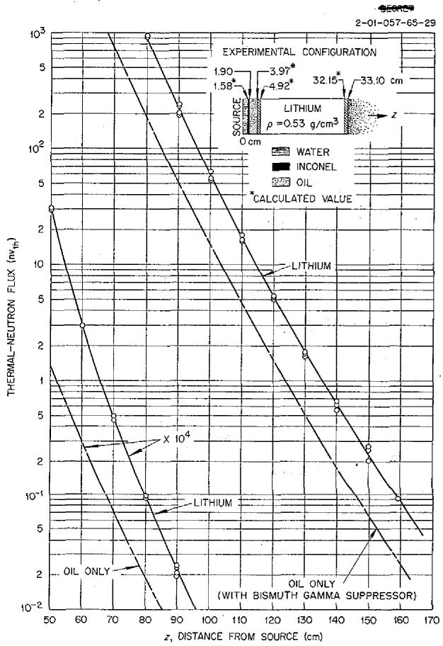  
Fig. 13.3. Thermal-Neutron Flux Beyond Lithium in Oil.

The material chosen was bismuth, and the measurements in oil behind a 22.9-cm-thick slab are plotted in Fig. 13.4. From these measurements a value of $\sigma_{R} = 3.48$ barns was calculated, which can be compared with a value of $3.49 \pm 0.35$ barns previously determined for bismuth from measurements in water. Gamma-ray dose measurements made throughout the experiment are plotted in Fig. 13.5.

The removal cross section of lithium was calculated by a method suggested by Blizzard:5

$$
\begin{array}{l} \frac {D _ {\text {o i l}} (z)}{D _ {M} (z + t)} = \frac {\lambda_ {o} (z)}{\lambda_ {M} (z + t)} \left[ \frac {z + t}{z} \right] ^ {2} \left[ 1 \right. \\ \left. - \frac {a ^ {2} t}{4 \lambda z (z + t) - a ^ {2} z} \right] e ^ {\sum t}, \\ \end{array}
$$

where

$D_{\text{oil}}(z) = \text{dose in oil at } z \text{ cm from the source},$

$D_{M}(z + t) = \text{dose in oil behind } t \, \text{cm thickness of shield and } z \, \text{cm of oil},$

$\lambda_{o}(z) =$ relaxation length of oil at $z\mathrm{cm}$

$\lambda_{M}(z + t) =$ relaxation length behind the shield and in oil at $(z + t)$ cm,

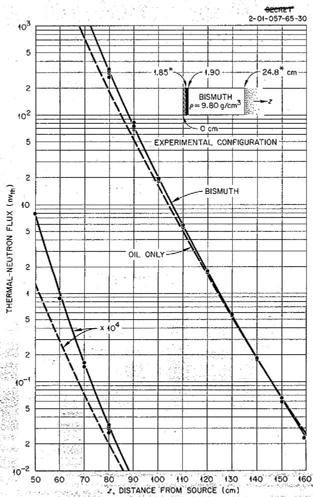  
Fig. 13.4. Thermal-Neutron Flux Beyond Bismuth in Oil.

$$
\lambda = \text {a v e r a g e} \lambda_ {o} (z) \text {a n d} \lambda_ {M} (z + t),
$$

$$
a = \text {s o u r c e} = 3 5. 5 6 \mathrm {c m},
$$

$\Sigma t = (\Sigma t)_{\text{Li}} + (\Sigma t)_{\text{ss}},$ the sum of macroscopic removal cross sections of sample and container, where the subscript "ss" refers to the stainless steel walls of the lithium tank.

Stainless steel was assumed to be the same as iron $(\sigma_{R} = 1.98$ barns/atom). The numerical values for these terms are given in Table 13.1.

# GE-ANP HELICAL AIR DUCT

# EXPERIMENTATION

J.M.Miller

The GE-ANP helical air duct experimentation at the LTSF has continued with thermal-neutron flux measurements beyond a 35-duct array. As described previously, the ducts are 3-in.-ID steel

6J. M. Miller, ANP Quar. Prog. Rep. Sept. 10, 1954, ORNL-1771, p 166.

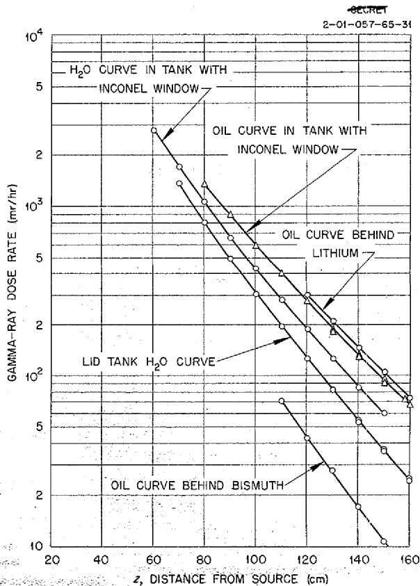  
Fig. 13.5. Gamma-Ray Dose Rate in Oil Beyond Lithium and Bismuth.

conduit shaped around a 9-in. core. After removal of the core, the ducts were stiffened by Fiberglass wrapping. The projected length of each duct along the $z$ axis was 46.5 in., and the duct arrays were arranged so that there was 5 in. between the duct center lines.

Thermal-neutron measurements beyond a single duct and a 3-duct array in a water medium were reported previously.6 Measurements made beyond the 35-duct array in both a water medium and a gamma-shield medium are shown in Fig. 13.6. The gamma shield consisted of steel Raschig rings (35 vol %) and water borated to $1\%$ by volume. For both mediums the array was contained in a 4-ft-long iron tank ( $5/8$ -in.-thick walls) which had $1/4$ -in.-thick iron windows in each end. The windows were 29 in. in diameter and were slightly

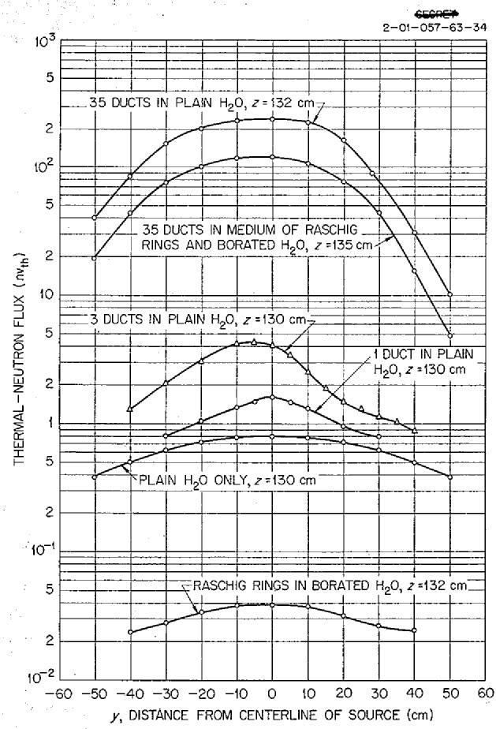  
Fig. 13.6. Thermal-Neutron Flux Beyond Various Arrays of GE-ANP Helical Air Ducts (3 in. in Diameter, 46.5 in. Long).

larger than, and concentric with, the LTSF source plate. The measurements were made behind the tank in the LTSF water.

As indicated in Fig. 13.6, the presence of the 35 ducts in the gamma shield increased the thermal-neutron flux by a factor of approximately 3000. In the medium of plain water, the flux was increased by a factor of 300. For the water medium the increase in flux seems to be consistent with a calculation which takes into account only the reduced density of the attenuating medium. For the case in which the ducts were in the gamma shield, the neutron streaming in the ducts appears to be relatively more important. The latter is not surprising, since the addition of the steel increases the attenuation of the medium to neutrons as well as to gamma rays.

The fast-neutron dose rates beyond the 35-duct array both in a medium of water and in the Raschig ring-borated water medium are shown in Fig. 13.7. The gamma-ray dose rate beyond the gamma shield without the ducts is compared in Fig. 13.8 with that beyond the shield with the 35 ducts. The presence of the ducts increased the gamma dose rate by a factor of approximately 160.

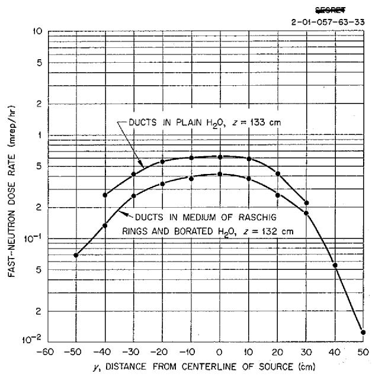  
Fig. 13.7. Fast-Neutron Dose Rate Beyond 35 GE-ANP Helical Air Ducts (3 in. in Diameter, 46.5 in. Long).

TABLE 13.1. NUMERICAL VALUES OF TERMS IN REMOVAL-CROSS-SECTION CALCULATIONS   

<table><tr><td>Term</td><td>Value in Bismuth</td><td>Value in Lithium</td><td>Value in Stainless Steel</td></tr><tr><td>t, cm</td><td>22.86</td><td>27.23</td><td>1.91 (total)</td></tr><tr><td>z, cm</td><td>127.1</td><td>120.9</td><td></td></tr><tr><td>z + t, cm</td><td>150</td><td>150</td><td></td></tr><tr><td>Doil(z), nvtb</td><td>7.20 × 10-1</td><td>1.44 × 100</td><td></td></tr><tr><td>DM(z + t), nvtb</td><td>6.20 × 10-2</td><td>2.30 × 10-1</td><td></td></tr><tr><td>λo(z), cm</td><td>9.17</td><td>9.00</td><td></td></tr><tr><td>λM(z + t), cm</td><td>9.90</td><td>10.1</td><td></td></tr><tr><td>λ, cm</td><td>9.54</td><td>9.55</td><td></td></tr><tr><td>a, cm</td><td>35.56</td><td>35.56</td><td></td></tr><tr><td>ρ, g/cm3</td><td>9.80</td><td>0.53</td><td>7.8</td></tr><tr><td>A, Avogadro&#x27;s number</td><td>0.603 × 1024</td><td>0.603 × 1024</td><td>0.603 × 1024</td></tr><tr><td>M, atomic mass</td><td>209</td><td>6.94</td><td>55.85</td></tr></table>

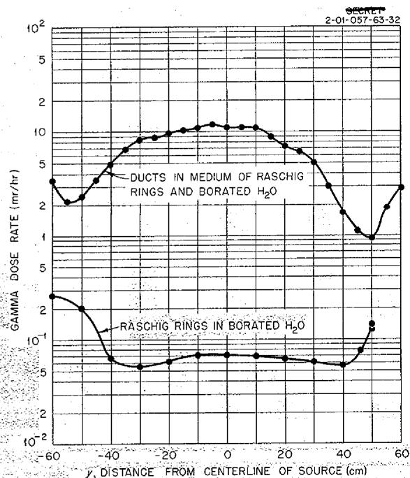  
Fig. 13.8. Gamma Dose Rate Beyond 35 GE-ANP Helical Air Ducts (3 in. in Diameter, 46.5 in. Long) in Raschig Ring-Borated Water Medium; $z = 136$ cm.

# REFLECTOR-MODERATED REACTOR AND SHIELD MockUP TESTS

J.B.Dee

It was previously reported² that the radiation decomposition in samples of a solution of $\mathsf{UF}_6$ in $C_7F_{16}$ was found to be too great for use of the liquid as the simulated fuel in the LTSF mockups of the circulating-fuel reflector-moderated reactor. It is now planned to use solid $\mathsf{UO}_2$ in the form of enriched uranium-aluminum MTR-type fuel plates. A mechanical system has been developed so that a continuous series of plates can be mounted on a sprocket-driven chain-link belt. The uranium will be moved on this belt from the neutron window, where it will be irradiated, to the heat exchanger region, and back to the window. The speed of the belt can be varied so that a complete transit will be made in a minimum of ½ sec and a maximum of 4 sec. The system will be tested under operating conditions in a special rig outside the LTSF. Other preparations for the tests are being completed.

# 14. BULK SHIELDING FACILITY

F. C. Maienschein

G.M. Estabrook

E. B. Johnson

J.D.Flynn

T. A. Love

M. P. Haydon

R.W.Peelle

K. M. Henry

W. Zobel

Physics Division

For much of the time during the last quarter the Bulk Shielding Facility (BSF) was shut down for modifications to the reactor pool. The modifications were being made to permit the use of demineralized water in the reactor pool in order to eliminate corrosion of the reactor fuel elements. The set of high-power fuel elements which had previously been operating in process water that had been treated by chromate addition had to be discarded, even though burnup of the uranium in these elements was negligible, because of the extent of pitting of the aluminum cladding. In order to utilize demineralized water, the pool was cleaned and painted, and all steel was either removed or sprayed with a stainless steel protective layer. A bypass demineralizer is being installed to maintain the water purity. The measurement reported below was made by members of the BSF staff in other facilities.

A SEARCH FOR SHORT-HALF-LIFE NUCLEAR ISOMERS IN K39, Rb85, Rb87, AND Zr90

R.W.Peelle

E. C. Campbell

F. C. Maienschein

Rubidium, potassium, and zirconium are among materials which have been considered as fuel components for reactor systems in which the fuel is circulated. Any short-period isomeric gamma-ray transitions would complicate the shielding of the external fuel loop, especially if the gamma rays were of high energy. Rubidium was previously known to possess a low-energy isomeric transition with a half life of about 1 min, but measurements had not been made which would reveal any shorter period that might be present.

Electromagnetically enriched K $^{39}$ , Rb $^{85}$ , and Rb $^{87}$ in the form of nitrates were injected into the ORNL Graphite Reactor by use of a fast

pneumatic probe assembly designed by E. C. Campbell. Since the samples were ejected from the center of the reactor within about 0.1 sec from the end of the bombardment, it was possible to make a search for very short-period activities. The ejected sample was viewed by a thallium-activated sodium iodide scintillation-crystal gamma-ray detector. The signal from the photomultiplier was transmitted by coaxial cables to a multichannel differential pulse-height analyzer located at the BSF. In addition, the counting rate of any part of the spectrum could be measured as a function of time with a linear count-rate meter and a very fast Brown recorder. Thus both spectral and time decay analyses of gamma radiation emitted by the irradiated sample were obtainable.

A study of $\mathsf{K}^{39}$ yielded no short-period activity. In the rubidium isotopes the previously known radiations were found, but no shorter period isomers were discovered. Isomers with an appreciable energy and cross section would have been detected if they had had a half life greater than about 0.03 sec. A sample of $\mathsf{Rb}^{85}$ was found to contain the known $550\pm 6$ -kev transition, with a $1.05\pm 0.05$ -min period, and bombardment of $\mathsf{Rb}^{87}$ produced the known $\mathsf{Rb}^{88}$ activity.

The apparatus described above was also used in the discovery of a number of new isomeric transitions with half periods between 0.05 and 5 sec. One of these is $\mathsf{Zr}^{90m}$ , which yields a $2.30 \pm 0.03$ -Mev gamma ray with a half life of about $0.83 \pm 0.03$ sec. This isomer is produced by inelastic neutron scattering.

In summary, it appears that no previously unknown short-period activities which might be of importance in the shielding of circulating-fuel reactors may be induced in $\mathsf{K}^{39}$ or Rb by reactor

neutron bombardment. The newly discovered 2.3-Mev isomeric transition excited by inelastic scattering in $\mathsf{Zr}^{90}$ may be of importance in design considerations for a circulating-fuel reactor.

# 15. TOWER SHIELDING FACILITY

C. E. Clifford

T. V. Blosser

J.L.Hull

L. B. Holland

F. N. Watson

Physics Division

D. L. Gilliland, General Electric Company

M. F. Valerino, NACA, Cleveland

J. Van Hoomissen, Boeing Airplane Company

Tests on the GE-ANP R-1 divided shield mockup began with measurements of the radiation around the reactor shield in the Tower Shielding Facility (TSF) reactor handling pool. The experimentation thus far has also included thermal-neutron flux and some gamma-ray dose rate measurements in the TSF detector tank located a horizontal distance of 64 ft from the reactor shield. This work was interrupted for a period of two and one-half weeks so that the TSF could participate in an Air Force project in which a group of monkeys were exposed to massive neutron radiation doses. The work on the G-E experiment has now been resumed.

Analyses of some aspects of the TSF data have been completed and are presented in Sec. 12, "Shielding Analysis."

# TSF EXPERIMENT WITH THE MockUP OF THE GE-ANP R-1 SHIELD DESIGN

T. V. Blosser

J. Van Hoomissen

D. L. Gilliland

F. N. Watson

The mockup of the GE-ANP R-1 reactor shield design (Fig. 15.1) is being used at the TSF for a series of measurements. Fast-neutron and gamma-ray dose rates were measured around the reactor shield section while it was submerged in water in the reactor handling pool. In addition, thermal neutron flux and gamma-ray dose rate measurements have been made in the detector tank located a fixed horizontal distance from the reactor shield.

The reactor loading for this experiment (Fig. 15.2) was a $5 \times 7$ fuel element array which gave a symmetrical power distribution throughout the reactor. In order to avoid excess reactivity, a fuel element was removed from the center of each of the two seven-element faces. The measurements in the pool at the points indicated in Fig. 15.1

were compared with similar measurements made earlier at the BSF.1

In general, the BSF and TSF data were in agreement, as is indicated in Figs. 15.3 and 15.4. However, they were not in complete agreement, largely because of differences in the experimental setups at the two facilities. For example, while the TSF had a symmetrical power density distribution, the fuel element loading at the BSF gave an asymmetrical distribution which had a maximum 8.1 cm from the center line of the reactor grid. Also, only compartments A and D contained borated water at the BSF, whereas at the TSF all compartments contained borated water for the first in-pool measurements. Later, plain water was used in Compartment D. The BSF boration was 1.1 wt %, while the TSF boration was 0.85 wt %. For the measurements off the rear section at the BSF, no lead or iron side shielding was present, while at the TSF the side shielding shown in Fig. 15.1 was in position. For the measurements off the front and side sections, the side shield at the BSF had a total of 1 in. less steel than the side shield at the TSF.

Measurements of the neutrons scattered into the side of the detector tank (located a horizontal distance of 70.8 ft from the G-E reactor shield) were made as a function of altitude. The flux (Fig. 15.5) is a slowly varying function of the altitude, and it exhibits a peak at about 35 ft. A decrease of about $6\%$ in the readings between 150 and 200 ft indicates that the ground-scattered neutrons are still observable at these altitudes for this particular reactor-shield combination. The shape of the curve is quite different from that obtained in the differential shielding experiments with the water tank, because the G-E shield

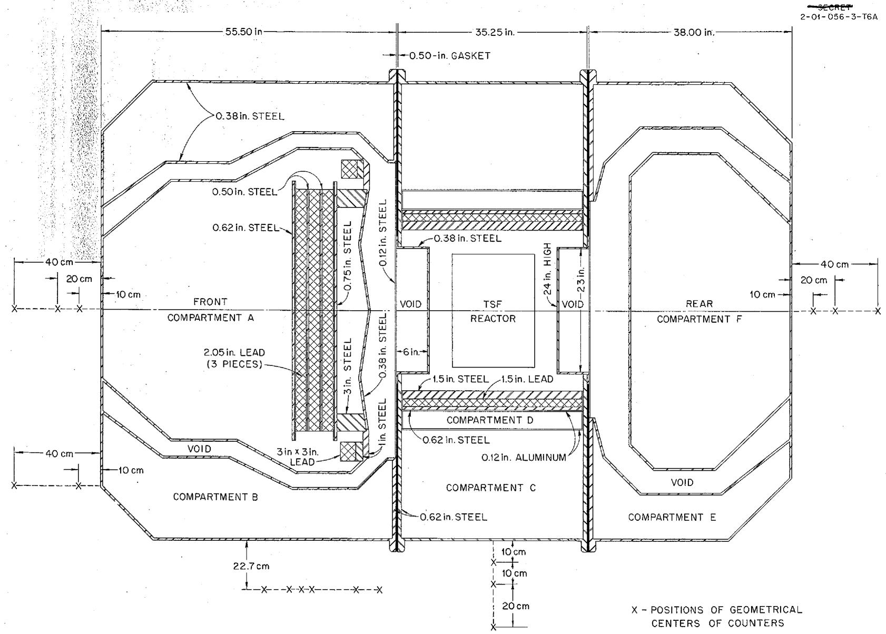  
L   
291 290   
Fig. 15.1. Mockup of the GE-ANP R-1 Reactor Shield.

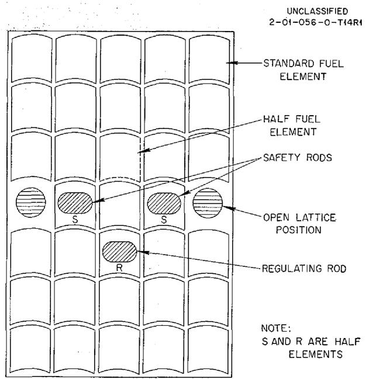

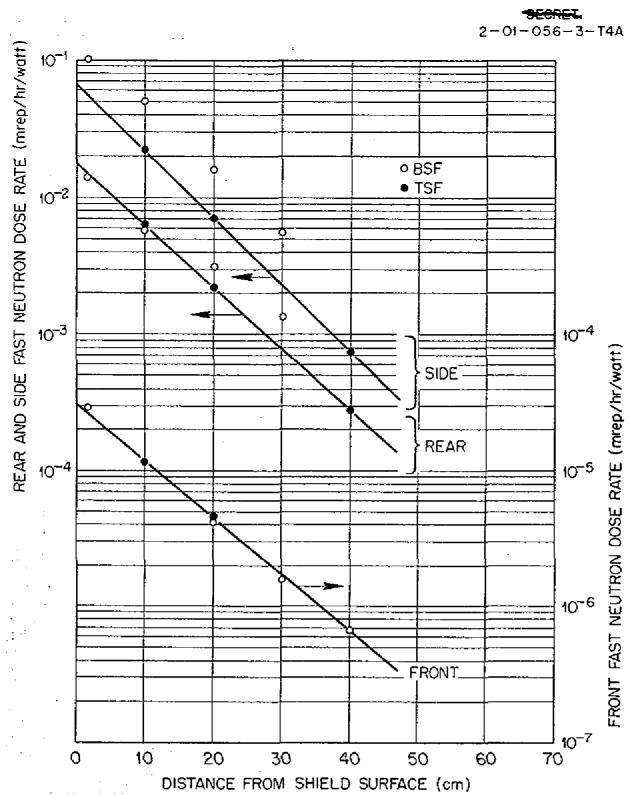  
Fig. 15.2. Tower Shielding Reactor Loading No. 2.   
Fig. 15.3. Fast-Neutron Dose Rate Measurements in Water Near GE-ANP R-1 Mockup.

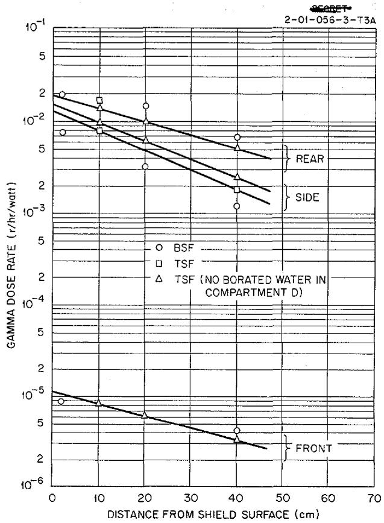  
Fig. 15.4. Gamma-Ray Dose Rate Measurements in Water Near GE-ANP R-1 Mockup.

mockup emits neutrons in a direction more favorable for ground scattering. The intensity from the G-E shield peaks at about 55 and 120 deg from the reactor-detector center line and is symmetrical about the reactor-detector axis.

Measurements were also made of the thermal-neutron flux and the gamma-ray dose rates within the detector tank at an altitude of 195 ft. The G-E reactor shield was a horizontal distance of 64 ft from the detector tank, and, for these measurements, five l-in.-thick lead slabs were installed l ft from the rear face (reactor side) of the tank. The lead slabs simulated the shielding in the crew compartment.

A knowledge of the thermal-neutron flux distribution in the detector tank is useful in extending the fast-neutron dose rate measurements into regions where the intensity is too low to be measured with the dosimeter. This distribution is also necessary for predicting the capture gamma-ray intensity to be expected in the crew shield. The

flux (Fig. 15.6) along the $y$ axis (coincident with the reactor-detector axis) exhibits an average relaxation length of 5.0 cm in the water between the rear face and the lead. This indicates that these neutrons are largely air-scattered neutrons, as would be expected, since the thick neutron shadow shield eliminates the direct beam. The apparent transparency of the lead is suspect, since the possibility exists that neutrons were streaming in through the lead from the side of the detector tank.

An $x$ traverse (Fig. 15.7) was taken in order to indicate the attenuation to be expected from the

crew compartment side shielding. The apparent relaxation length, which is not constant, is very short, $4.2\mathrm{cm}$ , in the first few centimeters of penetration and increases to $6.0\mathrm{cm}$ between 25 and $40\mathrm{cm}$ of penetration. This short relaxation length is probably indicative of the large number of low-energy neutrons escaping through the air ducts in the reactor shield.

In a $y$ traverse (Fig. 15.8) the gamma relaxation length is approximately $13\mathrm{cm}$ at the front of the detector tank and approximately $17\mathrm{cm}$ at the rear of the tank.

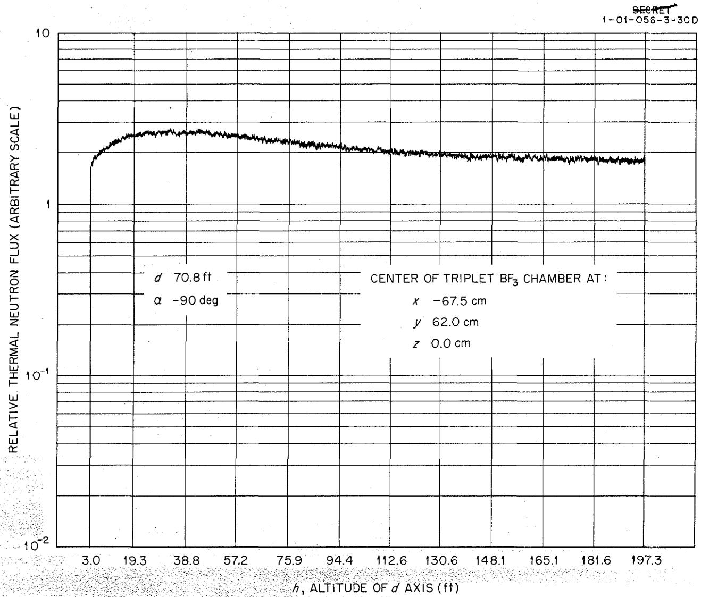  
Fig. 15.5. Thermal-Neutron Flux at Side of Detector Tank as a Function of Reactor-Detector Altitude; Reactor in GE-ANP R-1 Mockup.

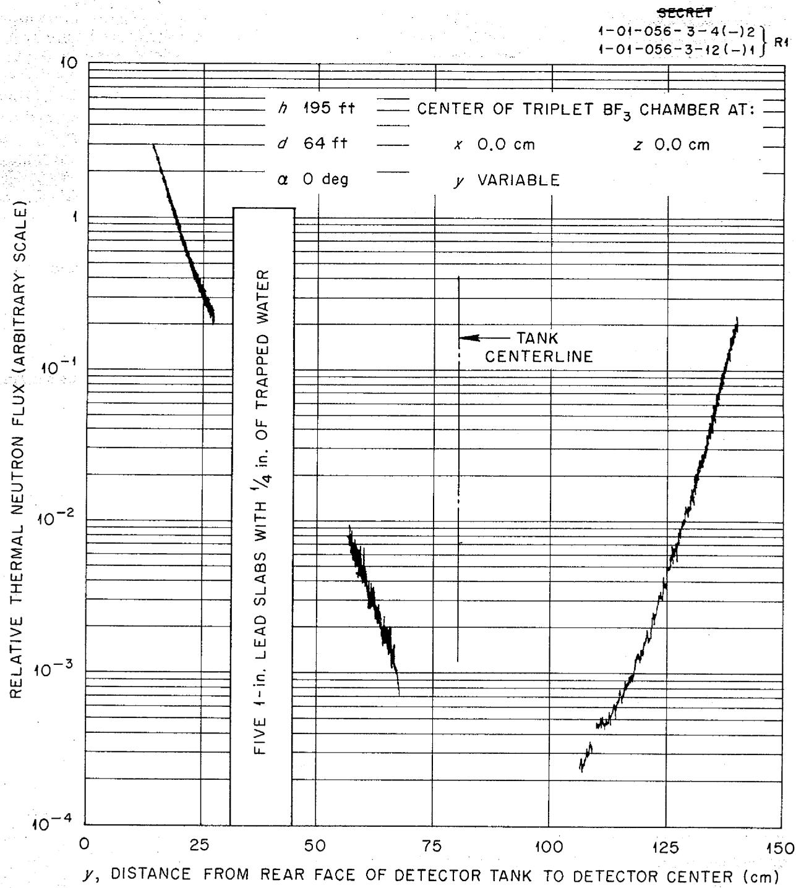  
Fig. 15.6. Thermal-Neutron Flux Along $y$ Axis of Detector Tank; Reactor in GE-ANP R-1 Mockup.

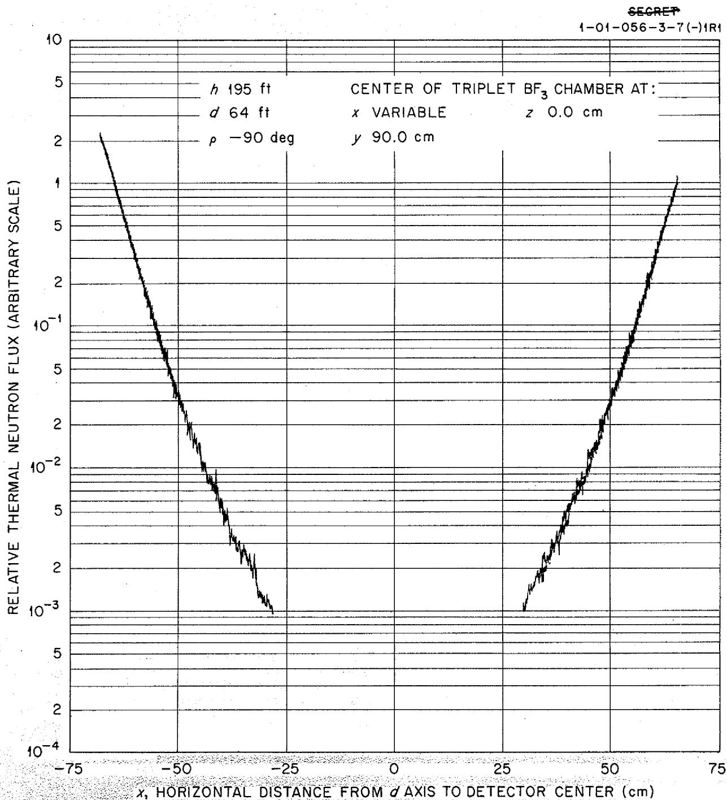  
Fig. 15.7. Thermal-Neutron Flux Along $x$ Axis of Detector Tank; Reactor in GE-ANP R-1 Mockup.

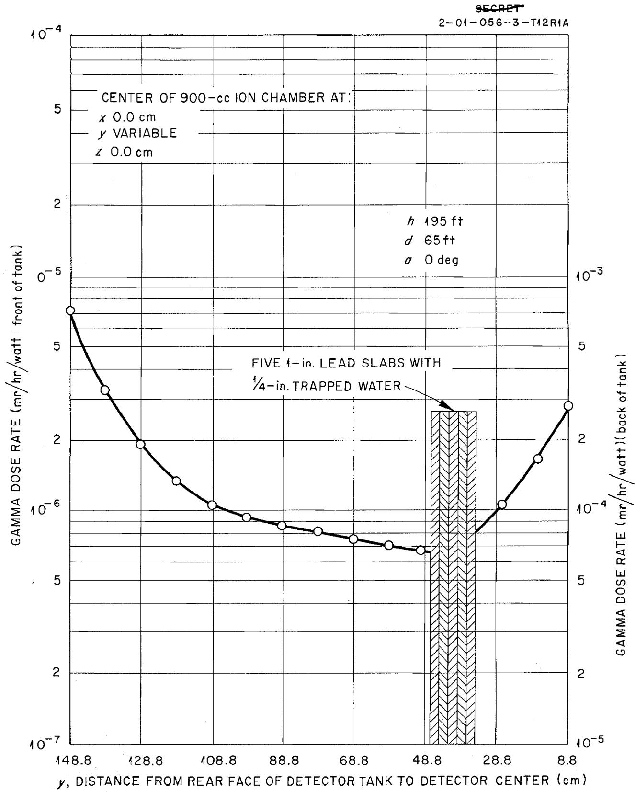  
Fig. 15.8. Gamma Dose Rate Along y Axis of Detector Tank; Reactor in GE-ANP R-1 Mockup.

Part IV

APPENDIX

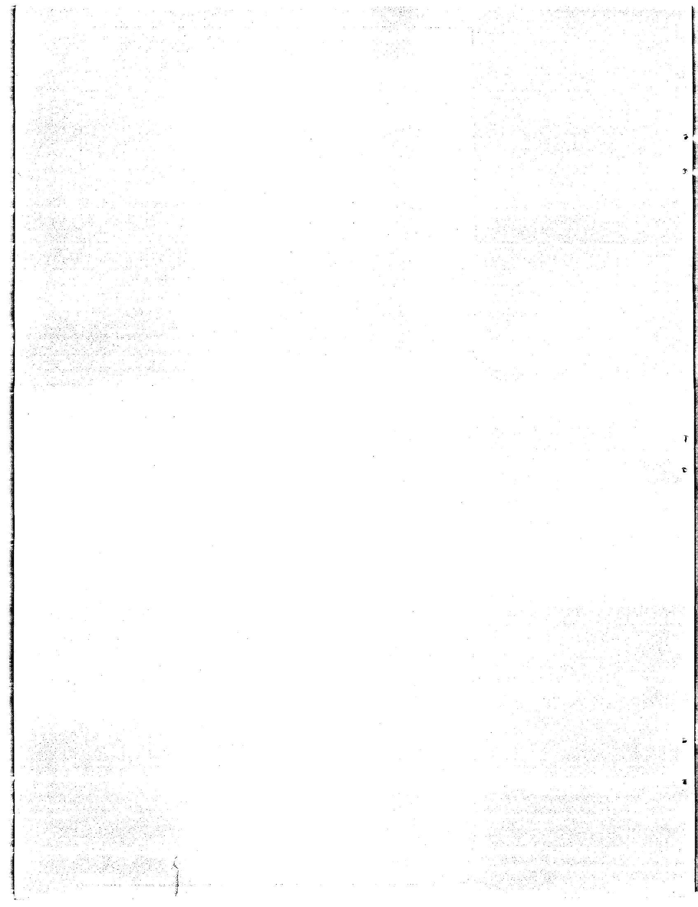

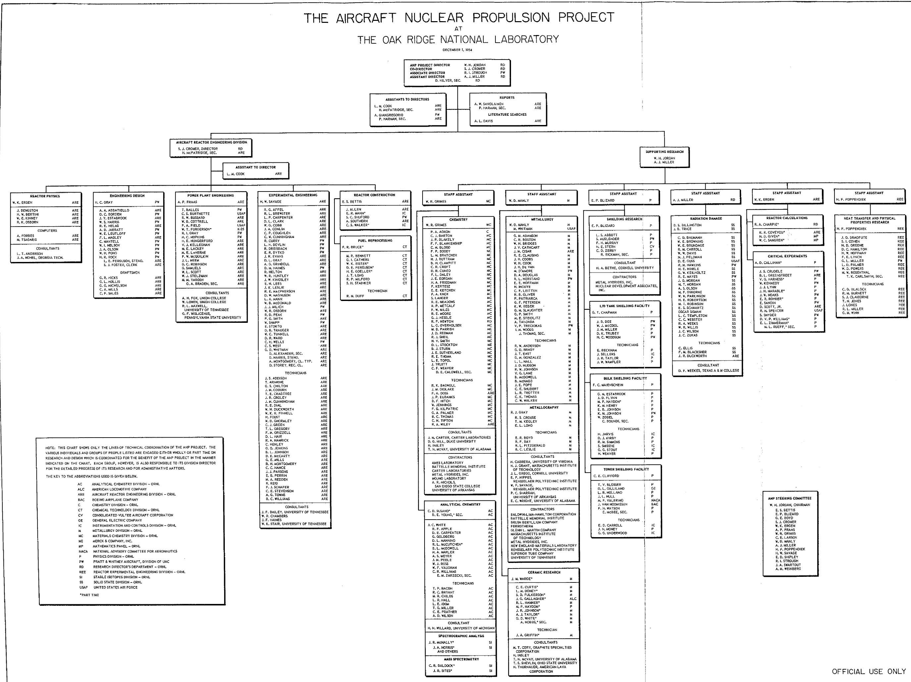