ORNL

MASTER COPY


ORNL 1835

Sppecial


AIRCRAFT REACTOR TEST

HAZARDS SUMMARY REPORT

W. B. Cottrell

W. K. Ergen

A.P.Fraos

F. R. McQuilkin

J. L. Meem

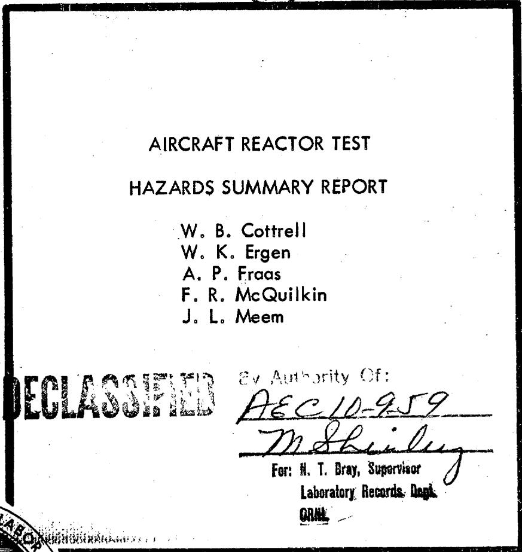

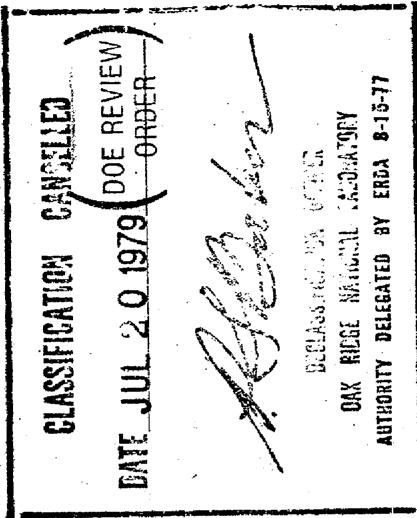

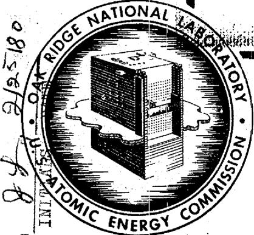

P.

T 11111111111111111111111111111111111111111111

OAK RIDGE NATIONAL LABORATORY

OPERATED BY

CARBIDE AND CARBON CHEMICALS COMPANY

A DIVISION OF UNION CARBIDE AND CARBON CORPORATION


POST OFFICE BOX P

OAK RIDGE. TENNESSEE

RESTRICTED DATA

This document contains Restricted Data as defined in the Atomic

Energy Act of 1954. Its transmittal or the disclosure of its contents

in any moment to an unauthorized person is prohibited.

SECRET


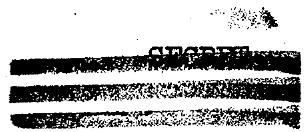

ORNL-1835

This document consists of 156 pages.

Copy 4/ of 59 copies. Series A.

Contract No. W-7405-eng-26

Aircraft Reactor Test

HAZARDS SUMMARY REPORT

W. B. Cottrell

W. K. Ergen

A. P. Fraas

F. R. McQuilkin

J. L. Meem

W. H. Jordan, Director, ANP Project

S. J. Cromer, Co-Director, ANP Project

R. I. Strough, Associate Director, ANP Project

A. J. Miller, Assistant Director, ANP Project

DATE ISSUED

JAN 19 1955

OAK RIDGE NATIONAL LABORATORY

Operated by

CARBIDE AND CARBON CHEMICALS COMPANY

A Division of Union Carbide and Carbon Corporation

Post Office Box P

Oak Ridge, Tennessee

RESERTEED.D

This document contains Restricted Data as defined in the Atomic Energy Act of 1954. Its transmissional or the disclosure of its contents in any manner to an unauthorized person is prohibited.

SECRET

# INTERNAL DISTRIBUTION

1. E. S. Bettis

2. E.P.Blizard

3. G. E. Boyd

4. R. W. Bussard

5. T. H. J. Burnett

6. A. D. Callihan

7. D. W. Cardwell

8. C. E. Center

9. W.B.Cottrell

10. G.A.Cristy

11. S. J. Cromer

12. E.P.Epler

13. W. K. Ergen

14. A.P.Fraas

15. W.R.Grimes

16. H. C. Gray

17. W. H. Jordan

18. C. E. Larson

19. E.R.Mann

20. W. D. Manly

21. J. I. Meem

22. F.R.McQuilkin

23. A. J. Miller

24. K. Z. Morgan

25. Gibson Morris

26. W. G. Piper

27. H. F. Poppendiek

28. H. W. Savage

29. A. W. Savolainen

30. E. D. Shipley

31-33. R. I. Strough

34. J.A.Swartout

35. G. D. Whitman

36. A.M. Weinberg

37. C. E. Winters

38-40. Laboratory Records Department

41. Laboratory Records, ORNL RC

# EXTERNAL DISTRIBUTION

42-59. H. M. Roth, Director, Research and Medicine Division, AEC, ORO

# FOREWORD

The Atomic Energy Commission requires that a Reactor Hazards Summary Report be submitted and approved by the Advisory Committee on Reactor Safeguards prior to the operation of a new reactor or the modification of an existing reactor in order to determine, and thus assure, the safety of the Commission's various reactor projects. In accordance with USAEC-OR-8401, Reactor Safety Determination, this report describes the hazards that may conceivably be associated with the Aircraft Reactor Test. All possible types of hazards are described as well as the extent to which these hazards have been evaluated and considered in the design and proposed operation of the reactor.


# ACKNOWLEDGMENTS

The bulk of this report was prepared by the authors, with the assistance of the staff members of the Aircraft Nuclear Propulsion Project who are associated with the Aircraft Reactor Test. In particular, W. R. Grimes and W. D. Manly provided the portions of the report pertaining to chemical and metallurgical problems, respectively, and E. R. Mann prepared the material on reactor controls. In addition, considerable assistance has been solicited from several groups outside the project, including Robert F. Myers and R. D. Purdy of the Oak Ridge Office of the U. S. Weather Bureau and T. J. Burnett of the ORNL Health Physics Division.

# TABLE OF CONTENTS

Page

1. INTRODUCTION AND SUMMARY 1   
2. THE SHIELDED REACTOR ASSEMBLY 8

Reflector-Moderated Cooling System. 8

Pressure Shell 8   
Heat Exchanger 12   
Pumps 12   
Shield 13   
Assembly and Testing 14

3. THE TEST FACILITY 15

Site 15   
Building 15   
Reactor Cell 19   
HeatDump System 22   
Fill-and-Drain System 23   
Off-Gas Disposal System 24

4. CONTROLS AND OPERATION 27

Control Philosophy 27   
Scram System 28   
Startup 29   
Operation Between Startup and Design Point 30   
Design-Point Operation 31

5. REACTOR HAZARDS 33

Radiation Dose Levels 33   
Typical Operational and Equipment Failures. 35

Fuel.Freeze 35   
Sodium Fréeze 35   
Structural Failures 35   
Pump Failures 36   
Electrical Power Failures 36   
Fuel Channel Hot Spots 57   
Excessive Fuel Feed 37   
Fuel Fill-and-Drain System Failure. 37   
NaK Circuit Heat Dump Blower. Failure. 37

Fuel, Sodium or NaK Leak 37

Fuel Leak in Core 38   
Fuel Leak into the Heat Exchanger 38   
Other Sodium or NaK Leaks 39   
Sodium or NaK Fires 39

Accidents Caused by the Natural Elements 40   
Flood and Earthquake 40   
Windstorm 40

Nuclear Accidents Causing Rupture of Pressure Shell 40

Fuel Precipitation in Core 41   
Fuel in Moderator 42   
Penetrability of Reactor Cell by Pressure Shell Fragments 43

Accidents That Might Rupture the Reactor Cell. 43

Hydrogen Explosion 44   
Damage from High Explosives 45   
Effectiveness of Reactor Cell in Containing Hazards 46   
Comparison of Various Reactor Assembly Containers 47

6. DISPERSION OF AIRBORNE ACTIVITY 49

Radiation Tolerances 50   
Discharge of Activity Up the Stack 51   
Normal Operation 51   
Operation Without Heating Stack Air 52   
Operation With No Stack Air Flow 58   
Operation With Holdup System By-Passed 59   
Smoke Tracking the Stack Plume 59   
Discharge of Activity Following a Disaster 60   
Minimum Heat Liberated in a Disaster 61   
Height of Cloud Rise 62   
Fission Products in the Hot Cloud 63   
Internal Exposure from the Hot Cloud 645   
External Exposure from the Hot Cloud 65   
Rainout From the Hot Cloud 67   
69   
Beryllium Hazard 69

# APPENDIXES

A.CHARACTERISTICSOFSITE 71

Meteorology and Climatology 71   
Distribution of Population 72   
Vital Industries and Installations 72   
Geology and Hydrology of Site 78   
Seismology of Area 78

vii

Page

# B. HEAT RELEASED IN CHEMICAL REACTIONS

AND RESULTING TEMPERATURES AND PRESSURES 80

Reaction of 70 Pounds of Sodium with Air 81

Reaction of 70 Pounds of Sodium with Water 81

Reaction of 930 Pounds of NaK with Air 82

Reaction of 930 Pounds of NaK with Water 83

Reaction of 1200 Pounds of Fuel with Sodium 83

Reaction of Sodium and NaK with Shield Water in Nitrogen . 84

Heat Absorbed in Water 84

Heat Absorbed in Nitrogen 86

Reaction of Sodium and NaK with Shield in Air 87

# C. METALLURGY AND CHEMISTRY

Corrosion of Inconel by the Fluoride Fuel 89

Mass Transfer in the Sodium-Inconel-Beryllium System 92

Chemical Interaction of Fluoride Fuel and Na or NaK 92

Reactions From a Heat Exchanger Leak 93

Reactions From a Core Leak 95

Conclusions 95

# D. EXTRIMERNE NUCLEAR ACCIDENT - ANALYTICAL SOLUTION

General Equations 97

Variation of Parameters 102

# E. EXTREME NUCLEAR ACCIDENT - NUMERICAL SOLUTION

# F. EFFECTS OF A NUCLEAR ACCIDENT ON REACTOR STRUCTURE

Stress Calculations 123

Destructiveness of Pressure Shell Fragments 126

Pressure Relief Mechanisms 127

# G. EXPOSURE HAZARD CALCULATIONS

Criteria 131

Basic Formulas 131

Method 133.

Calculational Procedure 134

# BIBLIOGRAPHY

BIBLIOGRAPHY 145

# LIST OF FIGURES

# No.

# Title

# Page

2.1 60-Mw Reflector Moderated Reactor 9   
2.2 Horizontal Section Through Pump Region of Reactor 10   
2.3 Schematic of the Aircraft Reactor Test 11   
3.1 ART Facility 16   
3.2 Plan of the ART Building 17   
3.3 Elevation of the ART Building 18   
3.4 Reactor Assembly Cell with Water-Filled Annulus 20   
6.1 Height of Plume Rise from ART Stack 53   
A.1 Map of Counties Surrounding Oak Ridge Area 77   
D.1 Reactor Power, P, Relative to the Initial Power, $\mathbf{P}_{\circ}$ , versus Time During Excursion 101   
D.2 Effect of Parameters on Maximum Reactor Power 104   
E.1 Nuclear Excursions for Fuel Deposition in Core Increasing $k_{\text{eff}}$ at Rates from 5% to 40% $\Delta k / k$ per Second 109   
E.2 Nuclear Excursions for Fuel Entering the Moderator Cooling Passages and Increasing $\mathbf{k}_{\text{eff}}$ at the Rate of $60\% \Delta \mathrm{k} / \mathrm{k}$ per Second 110   
E.3 Fuel Vapor Pressure as a Function of Temperature 111

# LIST OF TABLES

# No. Title

1.1 Aircraft Reactor Test Design Data 5   
5.1 Radiation Dose Levels 34   
5.2 Estimated Reactivities from Major Changes in Reactor 40   
5.3 Sources of Energy 44   
5.4 Comparison of Hazard Data for Several Types of Reactor Containers 48   
6.1 Meteorological Parameters for Determining Ground Concentration of Gases Released from Stack 54   
6.2 Ground Concentration of Gases Released from Stack (without decay correction; 6.7·10<sup>5</sup> cfm air). 55   
6.3 Ground Concentration of Gases Released from Stack (with decay correction, t-0.2; 6.7·105 cfm air) 56   
6.4 Ground Concentration of Gases Released from Stack (without decay correction; $3\cdot 10^{5}$ cfm air). 57   
6.5 Ground Concentration of Gases Released from Stack (with no decay correction and no air flow) 58   
6.6 Limit of Visibility of a Smoke Plume from a 50-gph Generator   
6.7 Meteorological Parameters for Total Reactor Tragedy 65   
6.8 Total Integrated Internal Doses from Hot Cloud 66   
6.9 External Dose from Hot Cloud at Night 67   
6.10 Ground Exposure Following Rainout of the Hot Cloud 68   
6.11 Total Integrated Internal Doses from Cold Cloud 70   
A.1 Personnel Within the AEC Restricted Area 73   
A.2 Population of the Surrounding Towns 74   
A.3 Rural Population in the Surrounding Counties 75

x

# LIST OF TABLES (Cont'd)

# No. Title

A.4 Vital Industrial and Defense Installations in 30-Mile Radius 76   
B.1 Basic Thermodynamic Data 80   
E.1 Fuel and Reactor Properties at 60 Mw . 108   
E.2 Nuclear Excursion Calculation for a Hypothetical Case Involving Fuel Deposition in the Core to Give an Initial Rate of Increase in $\mathbf{k}_{\text{eff}}$ of 5% per second 113   
E.3 Nuclear Excursion Calculation for a Hypothetical Case Involving Fuel Deposition in the Core to Give an Initial Rate of Increase in $\mathbf{k}_{\text{eff}}$ of 10% per second . . . . . . 114   
E.4 Nuclear Excursion Calculation for a Hypothetical Case Involving Fuel Deposition in the Core to Give an Initial Rate of Increase in k of 20% per second . . . . . . 115 eff   
E.5 Nuclear Excursion Calculation for a Hypothetical Case Involving Fuel Deposition in the Core to Give an Initial Rate of Increase in $\mathbf{k}_{\mathrm{eff}}$ of $40\%$ per second . . . . . . 116   
E.6 Nuclear Excursion Calculation for a Hypothetical Case Involving Fuel Entering the Reflector Cooling Passages to Give an Initial Rate of Increase in $k_{\text{eff}}$ of 60%/sec . . . 117   
F.1 Key Dimensional Data for the ART Pump-Heat Exchanger-Pressure Shell Assembly 120   
F.2 Dimensions of ART Detail Parts 121   
F.3 Strength Data for Inconel Tested in a Fluoride Mixture 123   
G.1 Fission Yields 137   
G.2 Selected Isotope Mixture 138   
G.3 InitialDoseRates 140   
G.4 Total Doses 142   
G.5 Dose from Six Selected Isotopes 144

# 1. INTRODUCTION AND SUMMARY

The successful completion of a program of experiments, including the Aircraft Reactor Experiment (ARE), has demonstrated the high probability of producing militarily useful aircraft nuclear power plants employing reflector-moderated circulating-fuel reactors. Consequently, an accelerated program culminating in operation of the Aircraft Reactor Test (ART) is underway. In order to adhere to the compressed schedule of the accelerated program, it is essential that the Atomic Energy Commission approve the 7500 Area in Oak Ridge as the test site by February 15, 1955. This report summarizes the hazards associated with operating the contained 60-Mw reactor of the ART at the proposed Oak Ridge test site.

Descriptions are given of the reactor, reactor cell, test site, reactor controls, and operating plan, prior to presentation of the hazards considerations. The hazards are classified into three major categories: 1) accidents with an appreciable probability of occurring, 2) accidents causing rupture of the pressure shell, and 3) accidents causing rupture of the reactor cell. Category (1) accidents would involve minor difficulties in the integrity of the reactor system and would not result in injury to operating personnel or the surrounding population. Category (2) accidents, which are extreme nuclear excursions, might be caused by and can cause major breaks in the reactor assembly, but due to the presence of the reactor cell which would remain intact there would be no injury to operating personnel or other people. The causes of category (2) accidents are described in a general manner since it has been impossible to date to describe a specific series of events that would lead to an extreme nuclear excursion. In the total facility destruction, category (3), the reactor and the reactor cell would be ruptured to release the accumulated fission products, but this could only be accomplished by means of extremely clever distribution of large quantities of explosives by a saboteur or by a large aerial bomb. In the analysis the most severe case has been presumed; namely, that complete volatilization of all of the fuel would occur. This is highly improbable since any such accident would require a large amount of heat at a high temperature, and its occurrence without dispersion of much of the fuel in particulate form seems to be unlikely. In addition, quantities of other materials that would also be present would appreciably increase the total heat input required.

The reactor of the ART is to be a 60-Mw reflector-moderated circulating-fuel type whose basic design is suitable for reactors to be used in aircraft. The size and weight of the reactor and shield will conform with aircraft requirements, and, insofar as possible in the limited time available, the design of the important components will be based on concepts satisfactory for airborne applications.

Operation of the ARE demonstrated that a high-temperature circulating-fuel reactor could be built and operated and that materials and machinery for satisfactory operation at elevated temperatures had been developed. It showed that the predicted large negative temperature coefficient of reactivity and the resultant self-regulatory characteristics of the reactor could be achieved. In addition, it was found that most of the $\mathrm{Xe}^{135}$ was removed from the fuel into the gas-blanket space in the pump so that the steady-state concentration of the $\mathrm{Xe}^{135}$ was only $3\%$ of the normal equilibrium value.

The new principle of design introduced in the ART consists of circulating the fuel through the reactor in a single, thick, annular passage and achieving the major portion of the moderation with a beryllium reflector which will also serve as an important portion of the shield. With the resulting reduction in shielding requirements it has been possible to design the ART reactor in such a way that the entire fuel system is contained within a sufficiently small, shielded volume to provide a low-weight shield and a useful aircraft reactor. The purpose of the Aircraft Reactor Test is to validate the methods of construction and the predicted operating characteristics of such a reflector-moderated circulating-fuel reactor.

A reactor power of 60 Mw was selected because it is approximately the power that must be reached to demonstrate that the engineering problems are solved and that the operating characteristics are satisfactory for the higher powered reactors to be used in high-altitude supersonic strategic bombers. In addition, a reactor with a power level in the 60-Mw range will provide sufficient power to fly radar picket ships, patrol bombers, and other desirable aircraft. For a power level above 60 Mw, the cost appears to be directly proportional to the power. Also it does appear that a thoroughly satisfactory 200-Mw reactor can be built more quickly by first building a 60-Mw reactor and then following it with a 200-Mw reactor in which the benefits of the experience gained with the 60-Mw reactor will have been incorporated.

The design of the ART envisions an essentially spherical reactor in which the beryllium moderator will be lumped in a central island and in an outer annulus (see Fig. 2.l, Sec. 2, this report). Two centrifugal pumps, arranged in parallel, will circulate the fuel downward between the inner beryllium island and the outer beryllium reflector and out of the bottom of the core. The fuel will then turn and flow upward through the heat exchanger region, which is around the spherical core. From the heat exchanger region the fuel will return to the pumps and will again be discharged downward into the core. The reactor heat will be transferred in the heat

exchanger from the fuel to the secondary coolant (NaK). The fuel will be one of a number of fluoride salt combinations which have been shown to have acceptable physical properties. In particular, the NaF-ZrF $_4$ -UF $_4$ fuel mixture is known to be satisfactory. The mixture NaF-KF-LiF-UF $_4$ has some very desirable properties and is under intensive investigation.

Quite a variety of shielding arrangements has been considered for the ART. The most promising seems to be one functionally the same as that for an aircraft requiring a unit shield, namely, a shield designed to give 1 r/hr at 50 ft from the center of the reactor. Such a shield is not far from being both the lightest and the most compact that has been devised. It will make use of noncritical materials that are in good supply, and it will provide useful performance data on the effects on the radiation dose levels of the release of delayed neutrons and decay gammas in the heat exchanger, the generation of secondary gammas throughout the shield, etc. While the complication of detailed instrumentation within the shield does not appear warranted, it will be extremely worthwhile to obtain radiation dose level data at representative points around the periphery of the shield, particularly in the vicinity of the ducts and of the pump and expansion tank region.

Several arrangements have been considered as means for disposing of the heat generated in the reactor. The most promising of these is one that resembles a turbojet power plant in many respects. It will employ radiators essentially similar to those suitable for turbojet operation. Conventional axial flow blowers will be used to force cooling air through the radiators. This arrangement will be flexible and as inexpensive as any arrangement devised. It will give thermal capacities and fluid transit times essentially the same as those in a full-scale aircraft power plant. It will also give some very valuable experience with the operation of high-temperature liquid-to-air heat exchangers that embody features of construction and fabricating techniques suitable for aircraft use.

In an effort to minimize the likelihood of important troubles developing during the course of the test, an extensive series of component development tests has been initiated. These tests have been designed to establish sound techniques for the fabrication of pumps and heat exchangers and to provide detail design information on such factors as clearances, etc. The operating experience gained in the course of these tests should prove most helpful in minimizing operating troubles with the ART and in diagnosing such troubles as may develop. These component development tests include experiments with a hot (high-temperature) critical assembly which will consist of the pump, header tank, and core system envisioned for the full-scale reactor. The expensive pressure shell and heat exchanger will not be included in this hot critical experiment.

Experience with the ARE has indicated the advisability of building, in addition to the critical assembly, a complete reactor-pump-heat exchanger-pressure shell assembly for operation as a component test in the experimental engineering laboratory. In a structure as complex as this it is

felt that there will probably be a number of mechanical problems of construction. Rather than go to extreme and awkward lengths to try to correct these by reworking the first unit, it is to be built as expeditiously as possible and operated simply as a high-temperature component test with no fissionable material. The experience gained in fabricating and shakedown testing this first assembly should not only prove invaluable in construction and operation of the second assembly for use with fissionable material, but should actually lead to an earlier operating date for the ART.

As the design of the facility progressed it became apparent that the major hazards would be much less serious than had at first been presumed. Also, the use of circulating fuel with its high negative temperature coefficient gives a reactor in which a nuclear explosion seems almost out of the question. In order to operate the ART at Oak Ridge under the safest possible conditions the entire reactor system, with the exception of the NaK-to-air radiators, will be enclosed in a cell consisting of an inner tank within which the reactor assembly will be installed and an outer water-filled tank. The cell will thus provide a water-filled annulus around the reactor assembly. The very compact installation envisioned results in a very low investment in sodium and NaK (about 1/20 of that required for the KAPL-SIR reactor designed for the same power level). A relatively small amount of energy would be released by reactions involving the liquid metals, and therefore a correspondingly small-diameter cell can be used.

The cell with a water-filled annulus will be adequate to absorb the amounts of energy that could be released in an extreme reactor catastrophe. It will be impossible for a fragment ejected from the reactor assembly by an explosion to rupture the inner tank of the cell because the pressure shell surrounding the reactor has been deliberately designed to yield at a pressure of 1000 psi and the maximum velocity of a fragment ejected at this pressure would be substantially below that required to penetrate the cell wall.

The 60-Mw reactor test unit was designed originally to be operated at the National Reactor Testing Station (NRTS) at Arco, Idaho. It was envisioned that the reactor could be pretested at Oak Ridge and then shipped to NRTS for the nuclear tests. However, a survey disclosed that construction and operation at NRTS would require at least six months longer than at Oak Ridge. Delays would be occasioned by conducting a construction operation 2,000 miles away and any small difficulty that might arise in reactor operation would be likely to introduce a major delay if that difficulty were not foreseen and plans to cope with it made in advance. No delay would be occasioned by construction of the small reactor assembly cell for use at the Oak Ridge site, and approval is being requested from the Atomic Energy Commission for operation of the Aircraft Reactor Test in such a cell at the Oak Ridge site.

Design data for the ART are presented in Table 1.1.

TABLE 1.1 AIRCRAFT REACTOR TEST DESIGN DATA   

<table><tr><td colspan="2">Power</td></tr><tr><td>Heat, maximum (kw)</td><td>60,000</td></tr><tr><td>Heat flux (Btu/hr/ft2)</td><td>Heat transported out by
circulating fuel</td></tr><tr><td>Power (max/avg)</td><td>2:1</td></tr><tr><td>Power density, maximum (kw/liter of core)</td><td>1400</td></tr><tr><td>Specific power (kw/kg of fissionable
material in core)</td><td>4500</td></tr><tr><td>Power generated in reflector, kw</td><td>2040</td></tr><tr><td>Power generated in island, kw</td><td>600</td></tr><tr><td>Power generated in pressure shell, kw</td><td>210</td></tr><tr><td>Power generated in lead layer, kw</td><td>132</td></tr><tr><td>Power generated in water layer, kw</td><td>4</td></tr><tr><td colspan="2">Materials</td></tr><tr><td>Fuel</td><td>NaF-ZrF-UF4, 50-46-4 mole % 
or NaF-KF-LiF-UF4, 11-42-
44-3 mole %</td></tr><tr><td>Fuel jacket</td><td>Inconel</td></tr><tr><td>Moderator</td><td>Beryllium</td></tr><tr><td>Reflector</td><td>Beryllium</td></tr><tr><td>Shield</td><td>Lead and borated water</td></tr><tr><td>Primary coolant</td><td>The circulating fuel</td></tr><tr><td>Reflector coolant</td><td>Sodium</td></tr><tr><td>Secondary coolant</td><td>NaK</td></tr><tr><td colspan="2">Fuel System Properties</td></tr><tr><td>Uranium enrichment (% U235)</td><td>93.4</td></tr><tr><td>Critical mass (kg of U235)</td><td>13.5</td></tr><tr><td>Total uranium inventory (kg of U235)</td><td>30</td></tr><tr><td>Consumption at maximum power (g/day)</td><td>80</td></tr><tr><td>Design lifetime (hr)</td><td>1000</td></tr><tr><td>Burnup in 1000 hr at maximum power (%)</td><td>11</td></tr><tr><td>Fuel volume in core (ft3)</td><td>2.96</td></tr><tr><td>Total fuel volume (ft3)</td><td>5.64</td></tr><tr><td colspan="2">Neutron Flux Density (avg)</td></tr><tr><td>Thermal, maximum (n/cm2·sec)</td><td>4 x 1014</td></tr><tr><td>Thermal, average (n/cm2·sec)</td><td>2 x 1014</td></tr><tr><td>Fast, maximum (n/cm2·sec)</td><td>8 x 1014</td></tr><tr><td>Fast, average (n/cm2·sec)</td><td>4 x 1014</td></tr><tr><td>Intermediate, average (n/cm2·sec)</td><td>10 x 1014</td></tr></table>

# Control

Shim control

Rate of withdrawal

Temperature coefficient

One rod of $5\% \Delta k / k$

3.3 x 10-4 k/k-sec

-5.5 x 10-5 (△k/k)/°F

# Circulating Fuel-Coolant Systems

Fuel in Core

Maximum temperature, $^\circ \mathrm{F}$

Temperature rise, ${}^{\mathrm{O}}\mathbf{F}$

Flow velocity, ft/sec

Reynolds number

Li Fuel Zr Fuel

1,600 1,600

400 400

7 7

170,000 85,000

Fuel-to-NaK Heat Exchanger

Maximum temperature, OF

Temperature drop (or rise), $^\circ \mathbf{F}$

Pressure drop, psi

Flow rate, ft/sec

Velocity through the tube matrix, ft/sec

Reynolds number

Li Fuel Zr Fuel

1,600 1,600

400 400

35 55

2.7 2.7

8 8

4,600 2,300

K Coolant

1,500

400

50

12.6

36

180,000

Cooling System for NaK-Fuel Coolant

Maximum air temperature, $\mathbb{O}\mathbb{T}$

Ambient airflow through NaK radiators, cfm

Radiator air pressure drop, in $\mathsf{H}_2\mathsf{O}$

Blower power required (total for $4$ blowers), hp

Total radiator inlet face area, ft²

750

300,000

10

600

64

Cooling System for Moderator

Maximum temperature of sodium, ${}^{\mathrm{OF}}$

Sodium temperature drop in heat exchanger, ${}^{\mathrm{OF}}$

NaK temperature rise in heat exchanger, ${}^{\mathrm{OF}}$

Pressure drop of sodium in heat exchanger, psi

Pressure drop of NaK in heat exchanger, psi

Flow rate of sodium through reflector, ft²/sec

Flow rate of sodium through island and pressure shell, ft³/sec

Flow velocity of sodium through reflector and island, ft/sec

Reynolds number of sodium in reflector and island

1200

100

100

7

7

1.35

0.53

30

170,000

<table><tr><td>System Volumes and Pump Data</td><td>Li Fuel</td><td>Zr Fuel</td><td>Na Coolant</td><td>NaK Coolant</td></tr><tr><td>Number of pumps</td><td>2</td><td>2</td><td>2</td><td>4</td></tr><tr><td>Pumping head, ft</td><td>50</td><td>50</td><td>250</td><td>280</td></tr><tr><td>Flow per pump, gpm</td><td>600</td><td>600</td><td>430</td><td>1300</td></tr><tr><td>Pump speed, rpm</td><td>2850</td><td>2850</td><td>4300</td><td>125</td></tr><tr><td>Pump power per pump, hp</td><td>40</td><td>65</td><td>16</td><td>100</td></tr></table>

# Dimensions

Core diameter (in.) 21   
Island diameter (in.) 11   
Fuel region thickness (in.) 4.5   
Reflector thickness (in.) 12   
Shield thickness, lead (in.) 7   
Shield thickness,water (in.) 31

# 2. THE SHIELDED REACTOR ASSEMBLY

The reactor is to be of the circulating-fluoride-fuel, reflectormoderated type. It will employ sodium-cooled beryllium as the reflectormoderator material and is designed to operate at 60 Mw. The reactor assembly will include the pressure shell, reflector, fuel and sodium pumps, and heat exchanger assemblies. The basic design is shown in Fig. 2.1, a vertical section through the reactor. A series of concentric shells, each of which is a surface of revolution about the vertical axis, constitute the major portion of the assembly. The two inner shells surround the fuel region at the center (that is, the core of the reactor) and separate it from the beryllium island and the outer beryllium reflector. The fuel circulates downward and outward to the entrance of the spherical-shell heat exchanger that lies between the reflector shell and the main pressure shell. The fuel flows upward between the tubes in the heat exchanger into the two fuel pumps at the top. From the pumps, which operate in parallel, it is discharged inward to the top of the annular passage leading back to the reactor core. The fuel pumps are sump-type pumps with gas seals. A horizontal section through the pump volute region is shown in Fig. 2.2. A schematic diagram of the reactor system is shown in Fig. 2.3.

# Reflector-Moderator Cooling System

The reflector will be cooled by sodium circulated by two pumps at the top of the reactor. The sodium will flow downward through passages in the beryllium and back upward through the annular space between the beryllium and the enclosing shells. The central beryllium island will be cooled in a similar manner, except that the sodium will leave the bottom of the island to be returned to the top of the reactor through cooling passages in the main pressure shell. The sodium will return to the pump inlets through small torradial sodium-to-NaK heat exchangers around the outer periphery of the pump-expansion tank region. The sodium pump and heat exchanger sub-assemblies will be positioned on either side of the fuel pump volute region. The pipe from the sodium pump discharge will make a slip fit into the reflector sodium inlet tube. The leakage through this slip fit into the sodium return passage will simply recirculate with no penalty other than a small increase in the required pump capacity.

# Pressure Shell

The Inconel pressure shell will constitute both the main structure of the reactor and a compact container for the fuel circuit. The design has been modified somewhat from that shown in Fig. 2.1 to make the shell continuous through the vicinity of the headers and thus give better continuity of stress flow and a minimum of welding. Blisters made of l-in.-thick plate welded to the outer surface of the shell between the NaK pipes will serve both to reinforce that weakened region and to provide for sodium flow up through the shell. The inner liner assembly of the pressure shell will consist of a 0.75-in.-thick Inconel shell, a 0.125-in.-thick hot-pressed $\mathtt{B}_{4}$ C

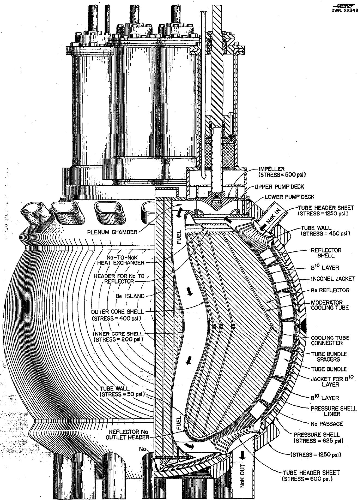  
Fig. 2.1. 60-Mw Reflector-Moderated Reactor.

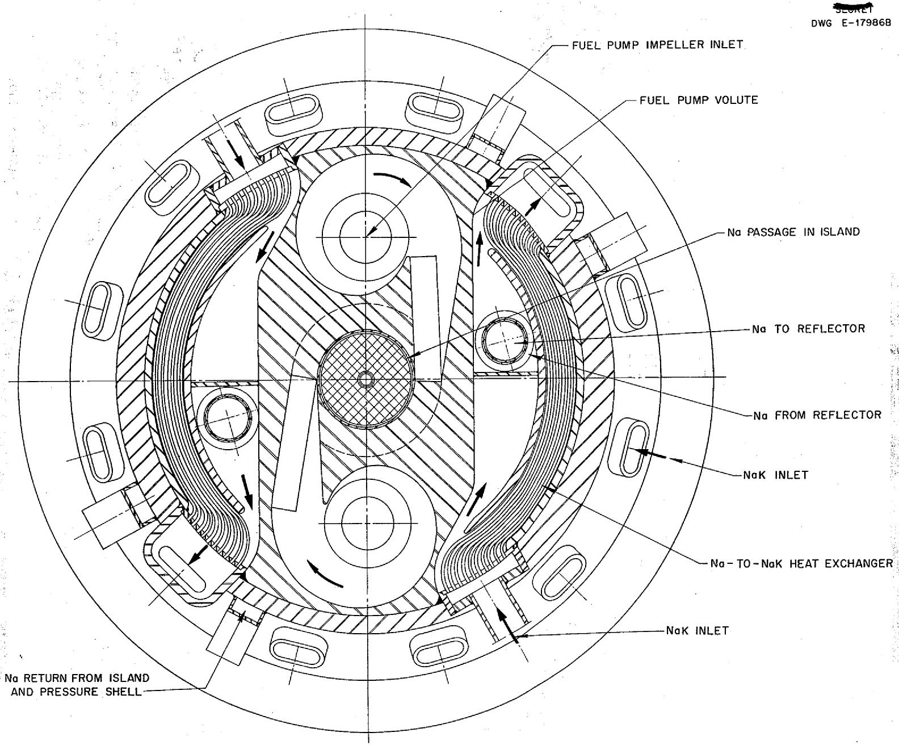  
-01   
Fig. 2.2. Horizontal Section Through Pump Region of Reactor.

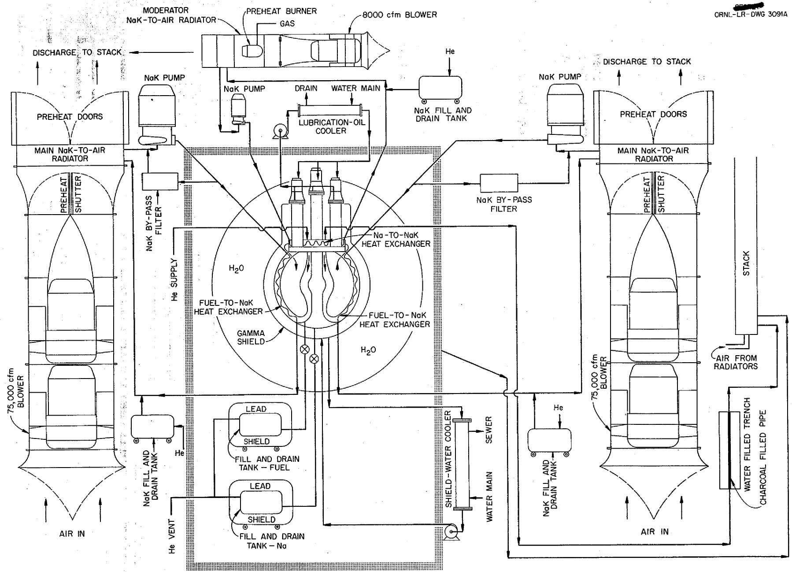  
Fig. 2.3. Schematic of Aircraft Reactor Test.

layer, and an inner 0.062-in.-thick Inconel can. Heat generated in the pressure shell by the absorption of gammas from the fuel will be removed by sodium flowing between the outer surface of the liner and the inner surface of the pressure shell so that the pressure shell temperature will be held close to $1200^{\circ}\mathrm{F}$ . A 0.062-in.-thick gap will provide ample flow passage area for sodium to flow upward from the bottom of the island to the top of the pressure shell. Transfer tubes there will direct the sodium from the outer surface of the pressure shell to the sodium-to-NaK heat exchanger inlets. The hot-pressed boron carbide blocks will be diamond-shaped, with 60-deg angles at their vertexes, and they will have rabbeted edges. This design makes it possible to cover a spherical surface with a single block size and shape. To facilitate welding in the final assembly, the pressure shell will be split circumferentially at both $1^{\circ}\mathrm{S}$ and $35^{\circ}\mathrm{N}$ latitudes. By splitting the liner at $1^{\circ}\mathrm{S}$ latitude, it will be easily accessible for welding, and the upper portion of the main shell can be lowered into place for the final welding operations.

# Heat Exchanger

The spherical-shell fuel-to-NaK heat exchanger, which makes possible the compact layout of the reactor-heat exchanger assembly, is based on the use of tube bundles curved in such a way that the tube spacing will be uniform, irrespective of latitude. The individual tube bundles will terminate in headers that resemble shower heads. This arrangement will facilitate assembly because a large number of small tube-to-header assemblies can be made leak-tight much more easily than one large unit. Furthermore, these tube bundles will give a rugged flexible construction that will resemble steel cable and will be admirably adapted to service in which large amounts of differential thermal expansion must be expected.

# Pumps

Two fuel pumps and two sodium pumps are located at the top of the reactor. These pumps are similar, but the fuel pumps have a larger flow capacity. In addition to pumping, the fuel pump will perform several other functions. Most of the xenon and krypton and probably some of the other fission-product poisons will be removed from the fluoride mixture by scrubbing it with helium as it is swirled and agitated in the expansion tank. The high swirl rate in the expansion tank is also desirable in that the centrifugal field will keep the free surface of the fuel reasonably stable in maneuvers or in "bumpy" flight. The expansion chamber will also serve as a mixing chamber for the addition of high-uranium-content fuel to the main fuel stream to enrich the mixture and to compensate for burnup. Fluid will be scooped from the vortex in the expansion tank and directed into the centrifuge cups on the backs of the impellers. Since considerably more fuel will be scooped from the vortex than can be handled by the centrifuge, the excess will be directed upward into the swirl pump where it will be accelerated

and returned to the expansion tank. There it will help maintain a high rotational velocity. A slinger located on the pump shaft above the swirl pump will prevent fuel from splashing up into the annulus around the shaft below the seal.

A number of other special features have been included in the pump design to adapt it to the full-scale reactor shield. The pump has been designed so that it can be removed or installed as a subassembly with the impeller, shaft, seal, and bearings in a single compact unit. This assembly will fit into the bore of a cylindrical casing welded to the top of the reactor pressure shell. A 3-in. layer of uranium just above a $1/2$ -in. layer of $\mathtt{B_4C}$ around the lower part of the impeller shaft will be at the same level as the reactor gamma shield just outside the pressure shell. The space between the bearings will be filled with oil to avoid a gap in the neutron shield. The pumps will be powered by d-c electric motors in order to provide good speed control.

# Shield

The shield for the reactor has some characteristics that are peculiar to this particular reactor configuration. The thick reflector was selected on the basis of shielding consideration. The two major reasons for using a thick reflector are that a reflector about 12 in. thick followed by a layer of boron-bearing material will attenuate the neutron flux to the point where the secondary gamma flux can be reduced to a value about equal to that of the core gamma radiation. This thickness will also reduce the neutron leakage flux from the reflector into the heat exchanger to the level of that from the delayed neutrons that will appear in the heat exchanger from the circulating fuel. An additional advantage of the thick reflector is that $99\%$ of the energy developed in the core will appear as heat in the high-temperature zone included by the pressure shell. This means that very little of the energy produced by the reactor must be disposed of with a parasitic cooling system at a low temperature level. The material in the spherical-shell intermediate heat exchanger is about $70\%$ as effective as water for the removal of fast neutrons; so it too is of value from the shielding standpoint. The delayed neutrons from the circulating fuel in the heat exchanger region might appear to pose a serious handicap. However, these will have an attenuation length much shorter than the corresponding attenuation length for radiation from the core. Thus, from the outer surface of the shield, the intermediate heat exchanger will appear as a much less intense source of neutrons than the more deeply buried reactor core. The fission-product decay gammas from the heat exchanger will be of about the same importance as secondary gammas from the beryllium and the pressure shell.

Thermal insulation 0.5 in. thick separates the hot reactor pressure shell from the gamma shield, which is a layer of lead about 7 in. thick. The lead, in turn, is surrounded by a 3l-in.-thick region of borated water. The slightly pressurized water shield is to be contained in shaped rubber bags similar to fitted aircraft fuel tanks. Cooling of the lead shield will be effected by

circulation of water through coils embedded in the outermost portion of the lead and through auxiliary coolers. The borated water shield will be cooled by thermal convection of the atmosphere in the reactor assembly cell.

# Assembly and Testing

As each component of the reactor is constructed it will be cleaned and leak tested in the Y-12 area. The whole assembly is designed so that leak testing can be carried out as the components are added, piece by piece. Mass spectrographic techniques will be used for leak testing. The completed assembly of circulating-fuel and moderator-cooling systems can be leak tested before it is moved to the site. All thermocouples and other instrumentation will be checked as the assembly proceeds.

Assembly of the radiators, blowers, NaK pumps, fill and drain tanks, and other auxiliary equipment will proceed concurrently with the assembly of the reactor at Building 7503. Cleaning and leak testing procedures will be the same as those for the reactor. All instrumentation in the building will be checked out, as far as possible, prior to installation of the reactor package.

The reactor shield assembly (without water in the shield) will be moved as a package from the Y-12 area to the 7503 building. After all connections have been made, final leak testing will be carried out.

The NaK system will be filled with NaK and, with the heat barrier doors closed, the NaK pumps will be started. A heat input of approximately 300 kw will be attained by circulation of the NaK, and this energy in the NaK will be used to preheat the reactor. The presence of leaks, if any, from the NaK system to the fuel system will be determined at this time by a flame photometer. In addition to the leak check, the circulation of NaK in the system will permit the checkout of all instrumentation and the determination of the system characteristics. After circulation for several hours, the NaK will be sampled and analyzed for oxygen content. If the oxygen content is within the capacity of the purification system, the NaK will be left in the system for the remainder of the test; otherwise it will have to be replaced. If the NaK is to be replaced it will be dumped hot in order to carry the oxide with it.

The sodium system for cooling the beryllium will be filled next, and, finally, the fuel system will be filled with a barren fluoride mixture. Circulation of the fluids in these circuits will permit final cleaning of the systems, operational checks of instrumentation, and a determination of the system operating characteristics. As with the NaK, samples will be taken and analyzed for purity. The barren carrier will then be drained from the fuel system and replaced with a fluoride mixture containing $80\%$ of the required uranium (as determined from the critical experiment).

# 3. THE TEST FACILITY

# Site

The ARE facility, ORNL Building 7503, as noted in the ARE Hazards Summary Report, is located at a site 0.75 mile southeast of the center of the present ORNL area and about 0.24 mile northeast of the Homogeneous Reactor Test (HRT) facility. This ARE location is near the center of Melton Valley which is approximately 4 miles long and 0.5 mile wide. With the exception of the nearby HRT, this valley is unoccupied. Between the ARE site (elevation 840 ft) and Bethel Valley, which contains ORNL (elevation 820 ft), is Haw Ridge which averages 980 ft in elevation. Within a radius of 1.9 miles, all the land is owned by the AEC and is already a security-controlled area. Within a radius of 2.3 miles there is approximately 0.3 square miles of farm land that is not AEC owned or controlled. Additional information on the surrounding area and the natural characteristics of the site is presented in Appendix A.

# Building

To modify the ARE Building to accommodate the ART, it is planned that an addition to the south end will be constructed to effect a 64-ft extension of the present 105-ft long building. The ART shielded reactor assembly and its container will be installed within this addition to the ARE Building. Such an arrangement will permit the use of ARE services and facilities that exist in this installation which has now served the purpose for which it was erected. For example, items such as the control room, offices, change rooms, toilets, storage area, water supply, power supply, portions of experimental test pits, access roads, security fencing, and security lighting are available for incorporation in ART plans. Fig. 3.l shows the preliminary design of the facility in perspective.

The plan and elevation drawings of the ART facility are shown in Figs. 3.2 and 3.3. The floor level of the addition will be at the ARE basement floor grade (ground level at this end of the building), and the cell for housing the reactor assembly will be sunk in the floor up to 3 ft below the bolting-flange level. The reactor cell will be located in approximately the center of the 42-ft wide by 64-ft long high-bay extension and directly in line with the ARE experimental bay. The reactor assembly will be positioned so that the top of the shield will be at the building floor elevation.

The south wall of the ARE experimental bay will be removed and the overhead crane facility will be revised from 10-to-20-ton capacity to per-mit use of the experimental pits for installation of auxiliary equipment

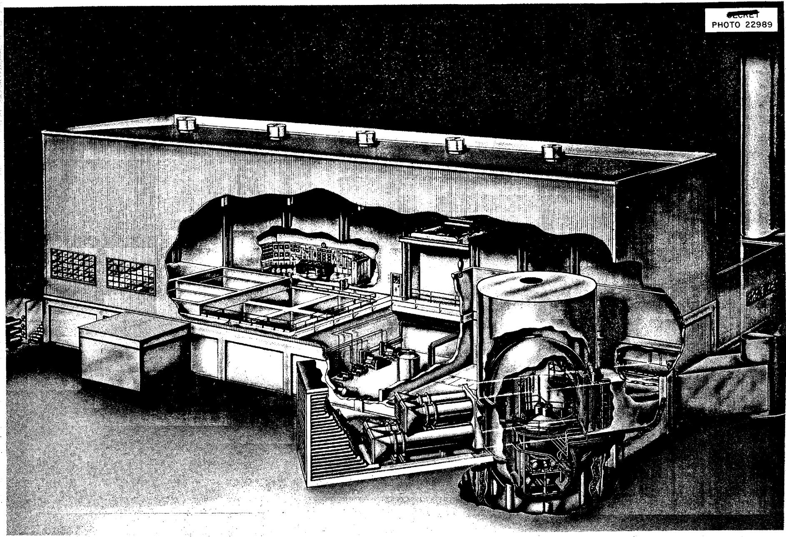  
Fig. 3.1. Aircraft Reactor Test Facility.

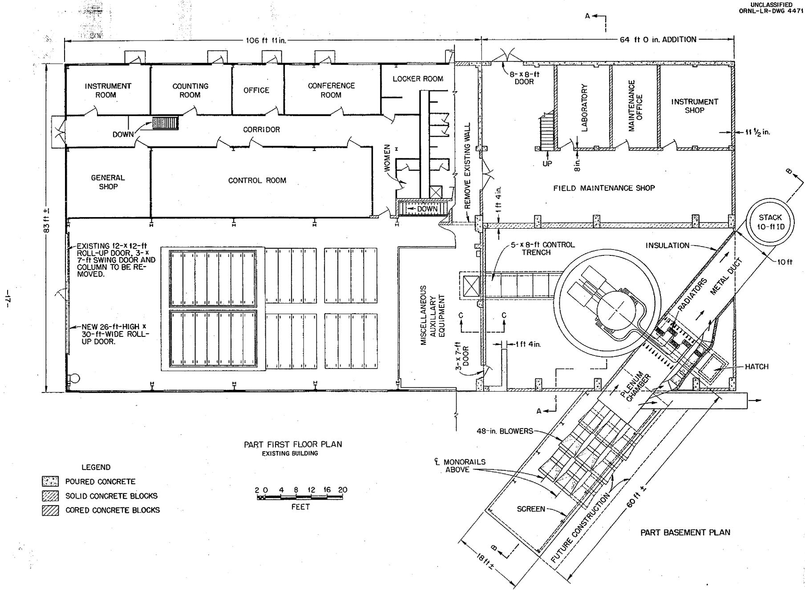  
Fig. 3.2. Plan of the ART Building.

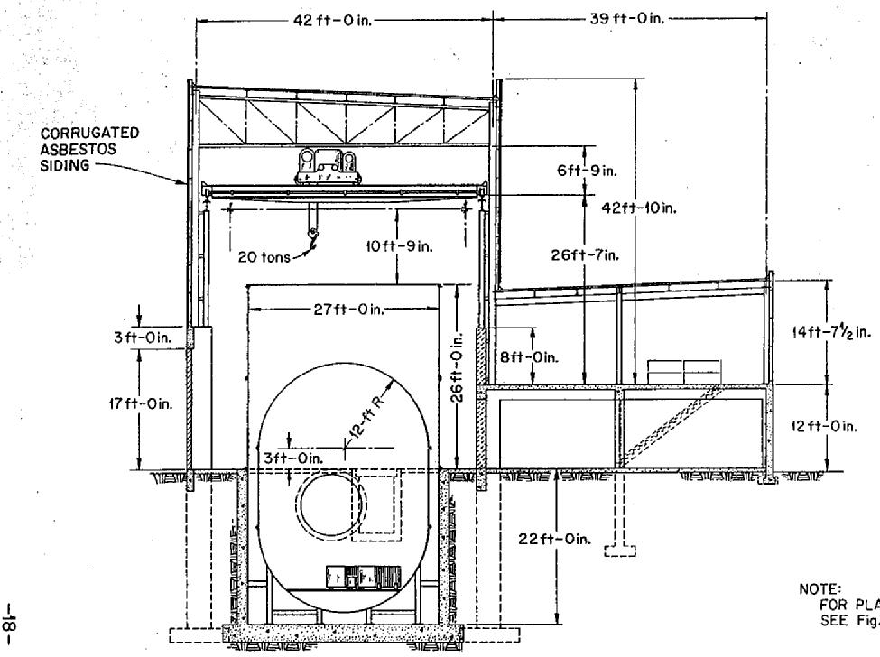  
UNCLASSIFIED   
ORNL-LR-DWG 4472

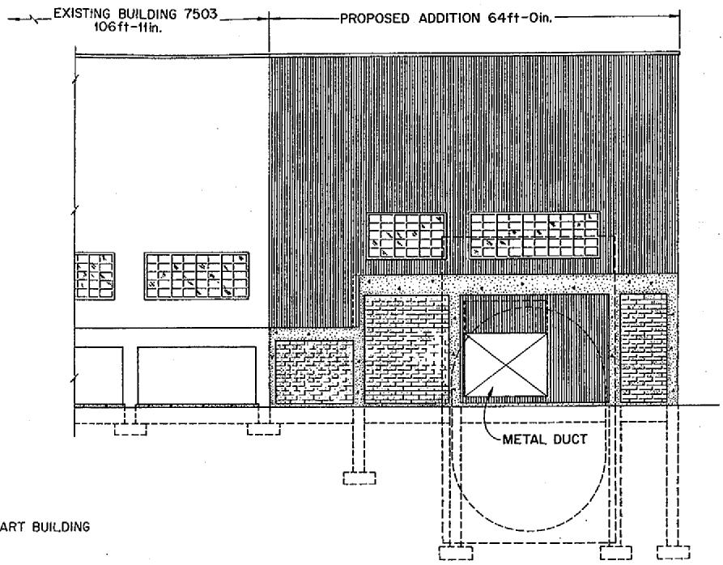  
WEST ELEVATION

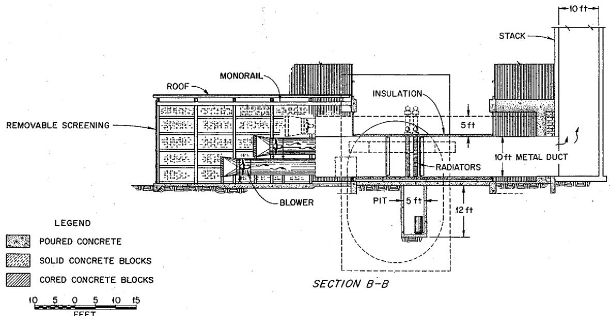  
SECTION A-A

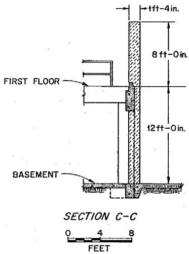  
Fig. 3.3. Elevation of ART Building.

and possibly for underwater reactor disassembly work after reactor operation. Also, the truck door in the north wall of the ARE Building will be enlarged to provide a large entry door to the ART area.

Field maintenance and laboratory facilities will be installed in the area east of the new bay and south of the low bay of the ARE. This area and the old experimental bay will be partitioned from the new bay with about a 16-in.-thick solid, concrete-block shield wall. This wall will not be erected until after placement of the upper sections of the reactor assembly container. The only other major modification to the ARE facility to accommodate the ART will be that of modifying and equipping one of the ARE experimental pits for underwater disassembly work on the reactor after operation.

# Reactor Cell

The cell designed for housing the reactor assembly is shown in Fig. 3.4. As may be seen, the cell is to consist of an inner and an outer tank. The heat dump equipment will be located outside the cell, but nearby. The space between the two tanks will be of the order of 18 in. and will be filled with water. The inner tank will be sealed so that it can contain the reactor in an inert atmosphere of nitrogen at atmospheric pressure, but it will be built to withstand pressures of 100 psi. The outer tank will be merely a water container.

The inner tank will be approximately 24 ft in diameter with a straight section about 11 ft long and a hemispherical bottom and top. The outer tank, which is to be cylindrical, will be approximately 27 ft in diameter and about 47.5 ft high. When the reactor is to be operated at high power, the space between the tanks and above the inner tank will be filled with water so that in the event of an accident so severe as to cause a meltdown of the reactor the heat given off by the decay gamma activity will be carried off by the water. Since the heat transfer rate to water under boiling conditions would be exceedingly high (of the order of 320,000 Btu/hr.ft²) and since the thermal conductivity of the fluoride fuel is relatively low, the water-side temperature of the inner tank will not exceed the water temperature by more than $40^{\circ}\mathrm{F}$ . The water capacity of the space between the tanks together with the water in the reservoir above the inner tank (approximately 10 ft deep) will be of the order of 1,000,000 gal. Boiling of the water in the annulus and above the inner tank will suffice to carry off all the heat generated by the fission products after any accident without any additional water being supplied to the tank.

About 26 ft of the outer tank will be above floor grade. This portion of the tank, as well as the top hemisphere of the inner tank, will not be attached until completion of the reactor installation and preliminary shake-down testing. Since the shielding at the reactor will be quite effective, the space inside the tank will be shielded fairly well so that it will be possible for a man to enter the inner tank through a manhole for inspection or repair work, even if the reactor has been run at moderately high power.

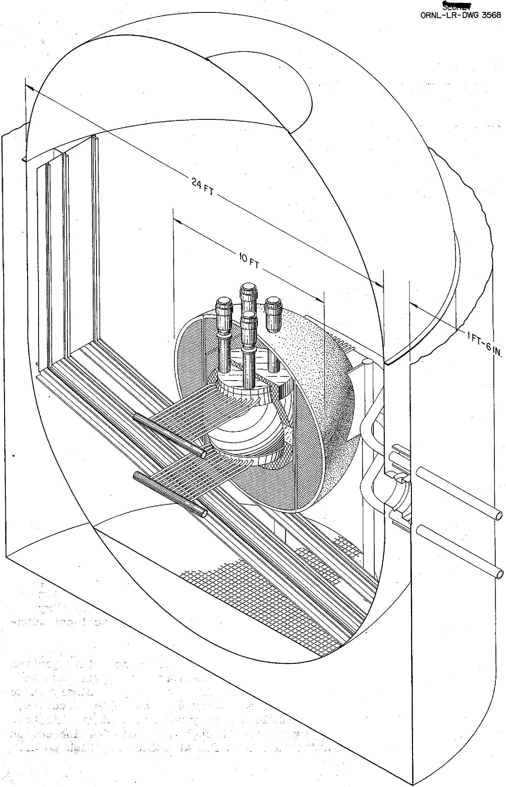  
Fig. 3.4. Reactor Assembly Cell with Water-Filled Annulus.

The unshielded reactor assembly will weigh approximately 10,000 lb; the lead gamma shield, approximately 30,000 lb; and the water in the shield, approximately 34,000 lb. The first two of these items can be handled conveniently with a 20-ton crane, while the borated water will be pumped in after the rubber tanks have been installed for the water shield.

The reactor assembly, with its aircraft-type shield, will be mounted in the inner tank on vertical columns with the reactor off-center from the vessel axis and about 6 ft above an open-grated floor. This positioning will provide the space needed for movement of the portable fluoride fuel and sodium moderator coolant containers to their operating stations under the reactor. The off-center location will also serve to minimize the length of the NaK piping.

The NaK and off-gas piping connected to the reactor will pass through a thimble-type passage or bulkhead in the double-walled cell. The openings will be covered with stiff plates which will be welded to the tank walls. The piping will be anchored to the inner plate and connected with a bellows-type seal to the outer one. The volume within all bulkheads will then be maintained at a pressure above that of the inner tank to prevent out-leakage from the inner tank.

A doubly-sealed junction panel for controls, instrumentation, and auxiliary services will be installed through the tank below the building floor grade as a part of another bulkhead to pass wires, pipes, tubes, etc., required for the circuits and systems. The various thermocouples, power wiring, etc., will be installed on the reactor assembly in the shop and fitted with disconnect plugs so that they can be plugged into the panel in a short period of time after the reactor assembly has been lowered into position in the test facility. This will minimize the amount of assembly work required in the field.

Two more bulkheads, in the form of manholes, will be installed in the upper portion of the container. One manhole will be about 3 ft by 5 ft and located just above the flange on the inner tank to allow passage through both container walls and thus provide an entrance to the inner tank for use after placement of the upper sections of the container. The second opening will be a manhole about 5 ft in diameter in the hemispherical top of the inner container to provide overhead crane service after placement of the top. Sufficient catwalks, ladders, and hoisting equipment will be installed within the inner tank to provide easy access for servicing all equipment.

The control bulkhead in the cell will be located so that the associated control junction panel and the control tunnel will extend to the auxiliary equipment pit (formerly the ARE storage pit). The pit and basement equipment will include such items as the lubricating oil pumps and coolers, borated shield water make-up and fill tank with a transfer pump, vacuum pump, relays, switch gear, and emergency power supply. The reactor off-gas flow, diluted with helium, will be piped through the NaK piping bulkhead to the disposal facility outside the building.

# Heat Dump System

The basic requirement of the ART heat dump system is to provide heat dump capacity equivalent to 60 Mw of heat with a mean temperature level of $1300^{\circ}\mathrm{F}$ in the NaK system. It has also seemed desirable that the ART heat dump system should simulate the turbojet engines of the full-scale aircraft in a number of important respects, such as thermal inertia, NaK holdup, and fabricational methods.

Since heat dumps are required for use in heat exchanger test rigs, and since work of this character has already progressed to the point where the cheapest, most compact, and most convenient heat dump is currently proving to be a round-tube and plate-fin radiator core, it is believed that this basic type of heat transfer surface should prove both sufficiently reliable and sufficiently well-tested to serve for the ART. The round-tube and plate-fin radiator planned for the ART makes use of type 310 stainless steel clad copper fins spaced 15 per inch and mounted on 3/16-in.-OD tubes placed on 2/3-in. square centers. Individual radiator cores will have an inlet face 2 ft square. Much information has been obtained in tests of similar units.[2]

NaK will be circulated through five separate systems. Four will constitute the main heat dump system, while the fifth will be the moderator heat dump system. In the main heat dump system a group of four fill-and-drain tanks will be used, but these will not require the remotely operable couplings desired for the sodium or fuel systems. The NaK will be forced into the main cooling circuit by pressurizing the tanks. The 24 tube bundles of the fuel-to-NaK heat exchanger will be manifolded in four groups of six each. The NaK will flow from these tube bundles out to the radiators which will be arranged in four vertical banks with four radiator cores in each bank. The NaK will flow upward through the radiator bank to the pumps. A small bypass flow through the expansion tank will allow it to serve as a cold trap. A filter to remove oxides will be placed in the return line from the tank.

The moderator heat dump system will be essentially similar except that its capacity will be about one-quarter that of one of the four circuits of the main heat dump system. NaK will be circulated to the Na-to-NaK heat exchanger in the top of the reactor where the NaK will pick up from the sodium the heat generated in the island and reflector. The NaK will pass to a small NaK-to-air radiator where it will be cooled and returned to the pump suction. An expansion tank and by-pass filter will be included, as in the main NaK system. It is planned to have only drain and filter by-pass throttle valves in the NaK systems, since the NaK will be drained if any repairs are required.

As shown in Fig. 3.2, the NaK-to-air radiators will be mounted in an air duct close to the reactor cell. This duct traverses the southwest corner of the building addition. The radiators will be located at floor grade

over the NaK pipe-line pit. Four axial-flow blowers will force 300,000 cfm of air through the radiators and out through a 10-ft-dia discharge stack 78 ft high. Since the axial-flow blowers will stall and surge if throttled, control can be best accomplished through by-passing a portion of the air around the radiators. This arrangement requires only constant speed a-c motors and simple duct work with a controllable louvre for by-passing. The heat dump rate will be modulated by varying the number of blowers in operation. A set of counterweighted self-opening louvre vanes in the inlet or discharge duct from each blower will prevent backflow through the blowers not in operation. Thus each blower will be driven with an a-c motor independently of the others, and the heat dump capacity can be increased an increments of $25\%$ from zero to full load. An additional 4 ft by 8 ft set of controllable louvres will be mounted in such a way as to bleed air from the plenum chamber between the blowers and the radiators to get vernier control of the heat load.

Heat barriers mounted on either side of the radiators will be required to minimize heat losses during the warmup operations. Warmup will be accomplished by energizing the pumps and driving them at part or full speed. Since approximately 400 hp must be put into the pumps in the NaK circuits, this power will appear as heat in the fluid pumped as a result of fluid frictional losses. A mechanical power input of 400 hp to the NaK pumps will produce a heat input in the NaK system of approximately 300 kw. This should be enough to heat the system quite satisfactorily with the radiator cores blanketed to prevent excessive heat losses. Relatively simple sheet stainless steel doors filled with 0.5 in. of thermal insulation when closed over both faces of a radiator (64-ft² inlet-face area) filled with 1100°F NaK will give a heat loss of 30 kw.

Heat load control for the low-power range presents some problems. The plenum chamber pressure with the 4 ft by 8 ft by-pass louvres wide open and one blower on will be about 0.5 in. $\mathsf{H}_2\mathsf{O}$ . This will give a heat dump capacity of 3 Mw if all the radiator heat barriers are opened. Lower heat loads can be obtained by varying the number of heat barriers opened. Operating the heat barrier doors against a pressure of 0.5 in. $\mathsf{H}_2\mathsf{O}$ (2.6 lb/ft²) should not be difficult.

The heat appearing in the moderator will be about $3.5\%$ of the reactor power output. The moderator cooling circuit will also remove heat from the core shells and the pressure shell so that the total amount of heat to be removed from the moderator cooling circuit will be about $6\%$ of the reactor output. This must be removed at a mean NaK circuit temperature of about $1050^{\circ}\mathrm{F}$ . A radiator having a 2-ft² inlet-face area and the same proportions as those used for the main heat dumps will be employed. This radiator will be supplied by a 2-ft-dia blower operating at about $3400$ rpm.

# Fill-and-Drain System

To permit fairly easy fuel loading and removal, an effort is being made to develop a good, reliable, relatively simple fill-and-drain system incorporating a remotely operable coupling. Such a piece of equipment will permit

removal of the fuel from the reactor and provide considerable flexibility in the conduct of operations. It is believed that by removing the fuel the radiation level can be cut for maintenance operations. Easy installation or removal of the fuel will also facilitate reprocessing the fuel or modifying the fuel composition. Should a reliable remotely operable coupling not be developed in time, welded attachments will be made between the various fill tanks and the fluid systems.

For handling the heavy, shielded fluoride and sodium containers inside the pressure vessel, a track will be installed on the floor and inside the wall. Wheels will be mounted on the tank dolly, both on the bottom and one end, so that the assembly can be lowered by the overhead crane to the floor track with the end wheels on the dolly rolling against the vertical track. Once on the floor track, each dolly will be moved to its operating station under the reactor. Each track pair in this area will be mounted on a lift for raising the tank connection nozzle to the contact position within the reactor shield.

Other requirements of the fill-and-drain system include provision for accurate measurement of the quantity of fluid in the drain tank at all times during either the filling or the draining operation. This is particularly important in connection with reactor fuel systems because it is important that the exact amount of fuel in the reactor be known at all times.

The shielding required for the fuel tank will be 10 in. of lead to reduce the dose to 1 r/hr at 5 ft from the tank one week after full-power operation. The resulting shield weight for a 7-ft³-capacity tank will be about 15 tons. The lead shield required for the 1-ft³ sodium drain tank will be 5 in. thick, and it will weigh approximately 2 tons.

Fill and drain systems for fuel or for sodium from the moderator circuit will include provision for both preheat and the removal of decay gamma heat. These functions will be carried out by diverting NaK from the radiator circuits and directing it through a jacket surrounding the drain pipe and through coils in the drain tank.

# Off-Gas Disposal System

The design of the off-gas system was based on the pessimistic assumption that all the fission products will be given up to the off-gas system as they are formed and will be swept out with 1000 liters of helium per day. They will be passed through a long charcoal-filled pipe designed so that no more than 0.001 curie/sec of radioactivity will go up the stack. About 4 Mw of the 60 Mw will appear as fission-product decay energy. Since the design was based on all of the fission products being released to the off-gas system, a decay of $t^{-0.2}$ was used in calculating the heat released.

The gases will be removed from the fuel in the expansion tank at the top of the reactor and vented through a 1/4 in. Inconel line 20 ft long to a 2-in. steel pipe 1050 ft long. The first 50 ft of this pipe will be open, but the balance will be filled with activated charcoal. The gas

will exhaust from the charcoal bed to the stack where it will mix with the 670,000 cfm of hot air from the radiators. On this basis, the holdup time and heat generation for each component of the off-gas system will be as follows:

<table><tr><td>Component</td><td>Volume
(cm3)</td><td>Holdup Time
(sec)</td><td>Heat Generation
(kW)</td></tr><tr><td>Expansion tank (gas volume)</td><td>7 x 103</td><td>600</td><td>3000</td></tr><tr><td>1/4 in. line 20 ft long</td><td>200</td><td>17</td><td>10</td></tr><tr><td>2 in. line 50 ft long</td><td>3.4 x 104</td><td>3 x 103</td><td>325</td></tr><tr><td>2 in. line 1000 ft long
(assuming 1/2 volume
is charcoal)</td><td>3.4 x 105</td><td>3 x 104</td><td>665</td></tr></table>

The entire 1050 ft of 2-in. pipe will be in a trench under 6 ft of water for heat dissipation. Additional shielding will be used as needed.

88 If the gases are held up for one or two days, calculations show that Kr presents the greatest hazard, since Kr and its daughter Rb give out about 2.4 MeV per disintegration of Kr. The activity in curies/sec is

$$
\begin{array}{l} \frac {6 \times 1 0 ^ {7} (\mathrm {w}) \times 3 \times 1 0 ^ {1 0} (\text {f i s s i o n s / s e c} \cdot \mathrm {w}) \times 0 . 0 4 (\text {a t o m s / f i s s i o n}) \times \lambda \mathrm {e} ^ {- \lambda \mathrm {t}}}{3 . 7 \times 1 0 ^ {1 0} (\text {d i s / s e c} \cdot \text {c u r i e})} \\ = 1. 9 \times 1 0 ^ {6} \lambda e ^ {- \lambda t}. \\ \end{array}
$$

For a decay constant of $6.9 \times 10^{-5}$ dis/sec atom and after a holdup time of $48\mathrm{hr}$ , there will remain less than $10^{-5}$ curies/sec.

The amount of activated charcoal required to assure holdup of krypton may be evaluated as follows:3

$$
t = \frac {K I A}{f}
$$

where $t$ is the holdup time, $LA$ is the length times area (volume) of the charcoal bed, $f$ is the volume flow rate of the off-gas, and $K$ is a constant with a magnitude of about 500 for the type of charcoal to be used. For a holdup time of 48 hr and a flow rate of 1000 liters/day, it is found that only 4 liters of charcoal will be needed, whereas 600 liters will be available.

Since about 0.5 Mw of heat will be given up by the fission products on the charcoal, the limiting factor will be the heat transfer. Upon entering the charcoal, the gas will be absorbed very rapidly, and the first few feet of charcoal will soon rise in temperature to around $400^{\circ}\mathrm{F}$ . The temperature will start to decrease in less than 10 ft, and, by the time the gas has passed through about 100 ft of charcoal, the temperature will be down to near the ambient temperature of the surrounding water.

A by-pass line around the off-gas system is to be provided for use in case there is a leak along the pipe in the trench. In such an event, the reactor will be shut down and the gas will be vented into the reactor cell. After a two-day holdup, a vent line will be opened directly to the stack. This auxiliary vent line can also be used if fission-product gases leak from any of the reactor components into the reactor cell. Monitrons will be provided at suitable locations in all gas lines. In the event that the off-gas system is to be operated at a time when no power is being abstracted from the reactor, the air from the blowers will be ducted around the radiators to avoid difficulties which would otherwise follow from cooling of the NaK.

# 4. CONTROLS AND OPERATION

# Control Philosophy

The early ORNL effort to develop the circulating-fuel type of aircraft reactor was motivated in part by a desirable control feature of such reactors. This feature is the inherent stability at design point of the over-all power plant that results from the negative fuel temperature coefficient of reactivity. In a power plant with this characteristic the nuclear power source is a slave to the turbojet load with a minimum of external control devices.

This predicted master-slave relationship between the load and power source was verified by the ARE. Controlwise the power plant consists of the nuclear source, the heat dump (in the case of ART), and the coupling between source and sink (the NaK circuit). Control at design point can be effected to some extent by nuclear means at the reactor, by changing the coupling (i.e., changing the NaK flow), or by changing the load (i.e., the heat dump from the NaK radiators).

For the ART at design point the regulating rod will be used mainly for adjusting the reactor mean fuel temperature. In particular, an upper temperature limit will cause the regulating rod to insert until the fuel outlet temperature does not exceed $1600^{\circ}\mathrm{F}$ . This limit will override any normal demand for rod withdrawal. Furthermore a low NaK outlet temperature from the heat dump radiators will automatically decrease the heat load to keep the lowest NaK temperature of the system at no less than $1050^{\circ}\mathrm{F}$ . This lower temperature limit will override all other demands for power.

Critical experiments will be performed with the system isothermal at $1200^{\circ}\mathrm{F}$ . This temperature was chosen to increase the life expectancy of the beryllium moderator. The mean fuel temperature at design point will be $1400^{\circ}\mathrm{F}$ , the moderator being held at $1200^{\circ}\mathrm{F}$ . Since the fuel temperature coefficient is $5 \times 10^{-5}$ per $^{\circ}\mathrm{F}$ , $1.0\% \Delta \mathrm{k} / \mathrm{k}$ will be required to raise the mean fuel temperature this $200^{\circ}\mathrm{F}$ .

The total worth of the regulating rod over its stroke will be about $5\% \Delta k / k$ . In addition to its use in changing the mean fuel temperature, this amount of rod will supplement the fuel addition by solid pills (discussed at the end of this chapter) in compensating for burnup and fission-product poisoning.

For operation in the design-point range (from 20 to $120\%$ of design-point power, which is the useful range for an aircraft power plant), a manual change in load demand or in operating temperature will be restricted by the maximum rate at which the load can be changed or by the maximum rate at which the regulating rod can be withdrawn, respectively. In the design point power range the maximum rate of withdrawal of the regulating rod will be obtained by adding $\Delta k / k$ at the rate of $3.33 \times 10^{-4}$ per second.

This will raise the fuel outlet temperature at the rate of $12^{\circ}\mathrm{F}$ per second until the maximum fuel outlet temperature of $1600^{\circ}\mathrm{F}$ is reached, at which point the temperature limit will hold. In this range a permissible load change rate of one-half design point power in 1 min is comparable to the requirements of engine performance for a nuclear-powered aircraft. Load changes are effected by manual demand for changing the air flow over the NaK radiators.

Control of the ART is classified in three different categories of operation: namely, (1) startup, (2) operation between startup and design point, and (3) operation in the design point range. For the second and third of these categories the nature of the reactor and power plant is so different from that of conventional high flux reactors that control must be based on inherent characteristics of the reactor to a large extent rather than on conventional reactor control art. There is no conventional art for these categories with high flux reactors. Control at startup utilizes, in principle, old reactor control art with short-period "scrams" that are conventional in principle. Experimentation will take place primarily in the startup and design-point regions. In the intermediate region between these two, little testing will take place. Consequently, operational procedure will be followed to take the reactor from the low-level adequately controlled region to the high level region in one simple manner. This procedure will be assured by permissive instrument interlocks that are described in a following section of this chapter.

Fission chambers and compensated ion chambers will be located beneath the reactor shell between the fill and dump tanks and the reactor. The region around the pipes between these tanks and the reactor will be filled with moderator material, either Be or BeO, through which cylindrical holes for these chambers will run radially out from the centerline of the system. From four to six such holes will be available. Chamber sensitivities will be adequate for the entire range of nuclear operation.

The fuel expansion chamber is a key item in providing safety for the ART. The fuel temperature coefficient of reactivity provides stability for the system by the expansion of fuel from the critical region. Adequate expansion volume will be available at all times.

# Scram System

A conventional scram system achieved by dropping poison rods into the critical lattice will not be used with the ART. The reasons for eliminating this feature are the following:

1. In the design-point range described, analysis shows that limiting the rate of rod withdrawal and the rate of load increase will limit the period of the reactor when it is operating normally. A limited rate of rod withdrawal and a limited rate of load increase near the design point in the ARE gave a minimum period of about 10.sec. The same technique will be used on the ART.

Short periods, of the order of 1 sec, can occur in the design-point range only in the event of structural failure. The total $\Delta k / k$ required in the rod to override an increase resulting from such failure cannot be obtained from one rod nor could such a rod, were it available, be inserted fast enough to prevent a serious accident. The temperature coefficient will react so rapidly that it will limit the signal which would normally actuate a scream, except for an extremely high rate of increase in reactivity. It has not been possible to devise a control system that would react rapidly enough in such cases to prevent the accident. Therefore, in the design-point region the conventional scream would be of little merit.

2. For the initial loading and critical experiments a scram system will be used, but it will not involve dropping the one control rod. The method described below was proposed because the single-rod system lacks the safety feature of a plurality of rods, as ordinarily found in conventional reactors. The actuating signal will be a short period, a high flux, a manual scram, or any of a number of failures in the system, and the signal will be supplied through an auction circuit in the conventional manner.

Essentially, the safety of the system lies in the procedure of adding fuel in a subcritical external loading tank and forcing it against gravity into the fuel system. This will be done by pressurizing the loading tank with helium through a valve which will fail closed. Two parallel helium outlet lines from the loading tank to the off-gas system will fail open. All zero power tests and measurements will be made with the valve between the loading tank and the reactor locked open, and the signal from the auction circuit will actuate the solenoid in the helium-pressurizing system in the manner described above. Actually, two parallel dump lines, one to the fill-and-drain tank and one to the emergency dump tank, will contain valves which will be actuated simultaneously on the dump signal from the auction amplifier circuit. This system has the merit that if too rapid addition of fuel to the system causes a short period, reversal of the operation will reverse the period. Control of the helium pressurizing system will limit the rate at which the fuel is added to the system. The helium system can be designed so that it will fail safe, except for the case of a plurality of simultaneous failures comparable in probability to the failure of a plurality of magnetic clutches all of which simultaneously fail to open in the conventional rod-dropping reactor scram.

# Startup

A rather close estimate of the critical concentration should be available from the hot critical experiment so that $80\%$ of the uranium will be in the fuel at the time of the ART startup. The final $20\%$ of the required uranium will be added in steps. After each uranium addition the fuel will be forced from the fill tank up into the reactor by means of helium pressure. The scram circuit will be available, as described previously. The rod will be inserted for each step, a given amount of uranium will be added, the rod will be slowly withdrawn, and a count will be taken on the fission chambers to determine the subcritical multiplication as a function of uranium concentration. A polonium-beryllium source of approximately 15 curies strength will be installed in the central island of the reactor to provide neutrons for startup.

Before beginning the critical experiment, the speed of the pumps will be set so that the flow through the core will be about 50 gpm. Thus over one-half the delayed neutrons will be available for control while going critical. The whole system is to be isothermal at $1200^{\circ}\mathrm{F}$ .

Control for zero power operation (rod calibration, fuel enrichment, determination of the temperature coefficient, etc.) will be manual with the maximum rod speed providing a rate of change in $\Delta k / k$ of $3.33 \times 10^{-4}$ per second. Overriding the manual rod withdrawal will be a 5-sec period rod reverse and a 1-sec period fuel dump by relieving the helium pressure in the loading tank, as described above.

A holding servo system will be used at zero power for experiments requiring constant neutron flux. Operation with the servo system will be essentially the same as that for the ARE. Limits will be maintained on the rod speed, and overrides will be maintained on period and temperature.

# Operation Between Startup and Design Point

Since most of the nuclear data will have been obtained from the hot critical experiment, the low power operation will be held to a minimum. After going critical, the reactor will be leveled out manually at about 10 to 100 watts. The pumps will be stopped, and the reactor will be allowed to go on a period. This will be a check on the effects of flow rate on the reactivity contribution of the delayed neutron fraction. When the power level has reached about 1 kw, the pumps will be started and the rod will be inserted to drive the reactor subcritical. Sufficient uranium will be added to give about $0.5\%$ excess reactivity. The pumps will again be stopped and the reactor will be brought to about 10 watts; the rod will be withdrawn; and the reactor will be allowed to go on a period until a level of 1 kw is reached. The pumps will again be started, and the rod will be inserted to drive the reactor subcritical. This procedure will be repeated to give 2 or 3 calibration points on the regulating rod. Since a similar rod will have been carefully calibrated in the hot critical experiment, only a few rough check points will be necessary.

The power level will then be elevated to about 10 kw and leveled out manually with the rod. At this power level, the shielding and off-gas systems will be checked out thoroughly without great hazard to personnel. The pump speed will then be increased so that the fuel flow rate will be increased from 50 gpm to the design flow rate of 1200 gpm. This will cause a decrease in reactivity of the order to $0.2\% \Delta k$ , and the rod will be withdrawn accordingly. The reactor will then be ready to deliver power.

The negative fuel temperature coefficient of the ART makes manual control mandatory in taking the reactor from zero power to some power at which the temperature coefficient provides stability while the reactor gets its power demand from the load. Accordingly, a single operation procedure for every operation in this range will be followed. The load will be interlocked so that permission to start adding the load will come only when a compensated ion chamber current reaches some prescribed value. This value will be determined in the manner described below the first time the reactor is taken to power.

With all loop flow rates at design point and the reactor at about 10 kw and isothermal at $1200^{\circ}\mathrm{F}$ , the regulating rod will be withdrawn until the reactor is on a positive period. This period will gradually increase until it becomes infinite and finally negative because of the temperature coefficient. Meanwhile, both the log N and micromicroammeter readings will go through a maximum. This maximum log N reading will provide the signal to permit opening of the heat barrier doors to the NaK radiators. Natural convection from the radiators with these doors open will be about 300 kw. Accordingly if these doors are opened when the log N reading reaches this value, the temperature coefficient will always suffice to provide regulation and stability, provided the rate of load demand above this minimum is restricted to the values cited previously.

If after shutdown the flux exceeds the log N reading required to open the heat barriers, opening of the barriers will not "shock" the system even though the reactor may be subcritical at the time thedoors are opened. If on the other hand the flux is too low to permit opening of the barriers, there is only one procedure for getting permission.

# Design-Point Operation

With the reactor at about 300 kw (estimated from the power extracted by opening the heat barrier doors) the blowers will be started and heat will be extracted from the NaK, which, in turn, will extract heat from the fuel. The reactor will be leveled out at 3, 15, 30, and 60 Mw. A heat balance will be obtained at each level of extracted power vs nuclear power. The operation of all components will be observed at each power level. Care will be taken not to exceed the maximum temperature of $1600^{\circ}\mathrm{F}$ . or fall below the minimum temperature of $1150^{\circ}\mathrm{F}$ . The reactor will then be operated for 1000 hr at 60 Mw.

Xenon will be removed continuously from the fuel by helium injected into the pump chamber and escaping in the swirl chamber. The rate of removal by this means can be determined only by operating the power plant. However, experience with the ARE has indicated that less than $1\% \Delta k / k$ of the regulating rod will be needed to cope with the xenon that is not removed. Should the purging be much less than is anticipated, the xenon could and would under some circumstances shut the reactor down. The low-temperature limit on the NaK radiator outlet temperature will automatically remove the load to effect this shutdown. In case this happens the fuel will be dumped until the Xenon decays.

Fuel enrichment to compensate for burnup will be accomplished by adding fuel in the form of high- $U^{235}$ -content "pills" of solid fluoride fuel. These will be introduced into the reactor fuel circuit through an entry provided in the fuel expansion tank located on the north head of the reactor. The pill-addition mechanism will be carefully designed and tested to make it jam-proof and incapable of ejecting all its pills in one spurt. It will permit the introduction of only one pill at a time to the reactor system.

The total burnup is equivalent to about $2.5\% \Delta k / k$ . The capacity of the pill machine will be such as to hold no more pills than that amount equivalent to $2.5\% \Delta k / k$ . Accordingly, the rod will always be capable of overriding any fuel addition. Furthermore, the rate at which successive pills can be added will be much less than that which can be effectively cancelled by movement of the control rod. Compensation for burnup and fission-product poisoning can be accomplished by both control rod withdrawal for fine control and by fuel enrichment for coarse control.

The best choice for a pill material is the compound $\mathbf{Na}_2\mathbf{U}\mathbf{F}_6$ . This was used as the enriched fuel component for the ARE test. Its melting point is approximately $1160^{\circ}\mathrm{F}$ , and its solid density at $1000^{\circ}\mathrm{F}$ is about $4.9~\mathrm{g/cm}^3$ . It is composed of approximately $60\%$ $\mathbf{U}^{235}$ , $11\%$ Na, and $29\%$ F (by weight). Several pill dispenser (and container) designs have been prepared that are based on the use of pills $1/2$ in. in diameter by $1/4$ in. thick. Pills of this size have a volume of $0.80~\mathrm{cm}^3$ , they weigh $4.0~\mathrm{g}$ , and they contain about $2.4~\mathrm{g}$ of $\mathbf{U}^{235}$ . The rate of pill addition required to maintain a constant reactor fuel inventory will thus be 0.5 pill per Mwd of operation. For operation at a power level of $60~\mathrm{Mw}$ , this will require the addition of 30 pills per day, or a total of about 1200 pills for the 1000 hr of full-power operation.

# 5. REACTOR HAZARDS

An attempt has been made to envision as many hazards as possible that might occur during the course of the operation of the Aircraft Reactor Test. Included in this chapter, therefore, is a discussion of the normal radiation hazards, the hazards resulting from operational or equipment failures, and fluid leaks, as well as the nuclear and chemical hazards peculiar to the cycle. The dispersion of airborne activity, either from the off-gas system or following a hypothetical accident in which all the fuel is volatilized, is described in the following chapter, "Dispersion of Airborne Activity."

The radioactivity of the ART will be inherently confined by the nature of the design and materials in such a manner that the uncontrolled dispersion of the activity outside the reactor cell will be virtually impossible. Consequently, the hazard from most failures will be negligible, since the only action required will be dumping of the fuel; the activity would not even be released to the cell. Furthermore it is shown that while a hypothetical nuclear accident could rupture the reactor pressure shell, the reactor cell would remain intact and the accident would be safely contained.

Some consideration has been given to cases in which the reactor cell, as well as the pressure shell, would be ruptured, and the resulting subsequent dispersion of activity has been examined in detail. It is believed that such an accident could occur only as the result of aerial bombing or sabotage.

# Radiation Dose Levels

The radiation dose levels to be expected at representative stations at the facility have been estimated for a variety of conditions and have been tabulated in Table 5.1. The shielding assumed for these estimates was the following: (1) the primary aircraft-type reactor shield designed to give $1\mathrm{rem/hr}$ at 50 ft at full power, (2) the reactor cell steel and water walls, (3) 16 in. of concrete block stacked around the reactor cell to a height of 10 ft, (4) 16. in of concrete block stacked between the reactor room and the maintenance shop and between the reactor room and the former ARE main test bay, (5) concrete block stacked around and on top of the air duct for the NaK-to-air radiators in such a way that the equivalent of 12 in. of concrete will be imposed along any radial line extending outward from the radiators.

The concrete blocks to be stacked around the periphery of the reactor test room and around the air duct and radiators are intended to provide shielding in case a fuel leak developed either into the reactor cell or into the NaK systems.

TABLE 5.1. RADIATION DOSE LEVELS   

<table><tr><td rowspan="2">Location</td><td colspan="3">NORMAL OPERATION DOSE LEVEL (rem/hr)</td><td colspan="3">DOSE LEVEL (rem/hr) WITH 1% OF FUEL IN NaK IN RADIATOR</td><td colspan="2">DOSE LEVEL (rem/hr) WITH ALL FUEL IN BOTTOM OF CELL</td></tr><tr><td>Full Power</td><td>15 min After Shutdown</td><td>10 days After Shutdown</td><td>Full Power</td><td>15 min After Shutdown</td><td>10 days After Shutdown</td><td>15 min After Shutdown</td><td>10 days After Shutdown</td></tr><tr><td>Reactor shield surface</td><td>100</td><td>4</td><td>1</td><td>3 x 10^5</td><td>10^5</td><td>2 x 10^4</td><td>10^4</td><td>2.x 10^3</td></tr><tr><td>Outside reactor cell</td><td>10^-2</td><td>4 x 10^-4</td><td>10^-4</td><td>1500</td><td>500</td><td>120</td><td>60</td><td>15</td></tr><tr><td>Outside reactor room</td><td>10^-4</td><td>4 x 10^-6</td><td>10^-6</td><td>3</td><td>1</td><td>0.25</td><td>0.3</td><td>0.08</td></tr><tr><td>Control room</td><td>10^-5</td><td>4 x 10^-7</td><td>10^-7</td><td>0.6</td><td>0.2</td><td>0.05</td><td>0.04</td><td>0.01</td></tr><tr><td>Road</td><td>5 x 10^-5</td><td>2 x 10^-6</td><td>5 x 10^-7</td><td>0.6</td><td>0.2</td><td>0.05</td><td>0.1</td><td>0.02</td></tr></table>

As may be seen from Table 5.1, the reactor will be adequately shielded so that the control room operators will receive much less than 1 rem/hr even with $1\%$ of the fuel in the radiator and much less than 0.1 rem/hr even if the pressure shell is ruptured. The dose rates would be considerably higher, however, if it were postulated that the reactor cell was also ruptured, in which case the activity would no longer be confined. This extreme situation is considered in the following chapter, "Dispersion of Airborne Activity."

# Typical Operational and Equipment Failures

There are any number of operational or equipment failures that can be envisioned in a system as complex as the Aircraft Reactor Test. In this section are listed those failures which would have the greatest effect on the operation and which therefore seem to offer the greatest hazards. For each failure some probable causes are given, as well as the result, and the action required in order to minimize the hazard is stated. In all cases, as will be shown, the failure would be inconvenient, but no serious danger would ensue, since the most drastic action required would be dumping of the fuel (and/or sodium) into the dump tanks. Therefore it is also apparent that the operability of the dump system must be assured.

Fuel Freeze. Excessive cooling of the primary NaK circuit could cause fuel to freeze in the heat exchanger and stop the flow of the fuel. The heat exchanger would not be seriously damaged, but some cracks might form in tube walls. Because of fuel flow stoppage and consequent lack of cooling, the temperature of the fuel in the fuel circuit would rise $13^{\circ}\mathrm{F} / \mathrm{sec}$ (boil in 2 min) as a result of fission-fragment decay heat, which will be 3800 Btu/sec (6% of power) immediately upon cessation of cooling in the circuit. In the reactor structure, the cooling available from conduction after dumping of the fuel would not be adequate to keep pump blades, wells, and other points where fuel might be trapped from being raised to fuel vaporization temperature. Excessive cooling in the primary NaK circuit would, therefore, require that the fuel be dumped.

Sodium Freeze. Excessive cooling of the secondary NaK circuit could cause sodium to freeze in a sodium-to-NaK heat exchanger and stop flow in the moderator cooling circuit. The temperature of the beryllium moderator would increase $0.5^{\circ}\mathrm{F} / \mathrm{sec}$ at full-power operation and $\cdot 10^{\circ}\mathrm{F}$ as a result of decay heat of activated materials in the moderator region. It would be necessary to dump the fuel immediately.

Structural Failures. Corrosion, excessive heating, and pressure surges would be the possible causes of structural failures. If a pressure surge caused a 0.020-in. expansion of the outer core shell, there would be a reactivity change of +0.002. If the outer shell were to collapse under an excessive external pressure load, there would be a large reactivity decrease and the possibility of leakage of sodium into the fuel circuit. The results of deformation would be similar, but the effects would be of a lower magnitude. A failure of the pressure shell would release fission products; hot, highly radioactive fuel and attendant decay heat; and NaK.

A failure in the fuel-to-NaK heat exchanger would cause a NaK or a fuel leak. Deformation in the fuel-to-NaK heat exchanger would possibly result in slight changes in pressure drops and heat transfer characteristics. It would probably be necessary to dump the fuel if any of these postulated events occurred, with the possible exception of slight deformation in the fuel-to-NaK heat exchanger.

Pump Failures. Loss of power to pump drives, as well as seizing of shafts, bearings, or impellers, could cause pump stoppage. If one of the two fuel pumps stopped pumping, the fuel flow pattern would be altered and roughly one-half the fuel-to-NaK heat exchanger would be starved. There would be a consequent reduction in power output. If both the fuel pumps failed, fuel flow would stop and the fuel temperature would rise $13^{\circ}\mathrm{F} / \mathrm{sec}$ because of fission fragment decay heat (see item on "Fuel Freeze" above). If only one fuel pump failed the fuel would be dumped or the reactor would be operated at reduced power; if both pumps failed it would be necessary to dump the fuel.

If one sodium pump failed at full power operation, the temperature of the sodium would rise $0.25^{\circ}\mathrm{F} / \mathrm{sec}$ to accommodate the increased heat load on the operable pump, and it would be necessary to dump the fuel or to operate the reactor at reduced power. If both sodium pumps failed, the temperatures of the beryllium in the moderator and the sodium would rise $0.5^{\circ}\mathrm{F} / \mathrm{sec}$ , and it would be necessary to dump the fuel.

The failure of one NaK pump in the primary heat exchange circuit would reduce NaK flow and consequently reduce the reactor power output. As with other pump failures, it would be necessary to dump the fuel or to operate the reactor at reduced power. If all the NaK pumps in the primary heat exchange system failed, the fuel temperature would rise $13^{\circ}\mathrm{F} / \mathrm{sec}$ (see item on "Fuel Freeze above), and the fuel would be dumped immediately. Failure of the NaK pump in the moderator cooling circuit would cause temperatures of the sodium and the beryllium to rise $0.5^{\circ}\mathrm{F} / \mathrm{sec}$ . As in the case of the sodium pump failures, it would be necessary to dump the fuel.

If the pumps for providing cooling oil to the pumps were to fail, there would be a slow increase in temperature of the oil coolant, the fuel pump shaft, the bearings, and the gas-seal mechanism. Failures of this type would be taken care of by switching to the auxiliary pump and repairing the pump that failed.

Electrical Power Failure. An emergency power supply will be available and all instrumentation and essential equipment would be transferred to it. Therefore, there would be no immediate hazard following such a failure. The emergency power system will be adequate to operate at least one fuel pump, one sodium pump, one NaK pump, one blower, and all the necessary instruments. This equipment will be sufficient to prevent excessive temperature rises from the fuel afterheat. All possible measures will immediately be taken to restore the normal power supply as rapidly as possible. However, if the failure lasts an extended period of time, it may be necessary to dump the fuel.

Fuel Channel Hot Spots. Flow separation in the core or failure of the core-shell coolant system could cause hot spots in the fuel channel. In this event there would be the possibility of fuel boiling in the core and causing irregularities in power or increased corrosion. The power level would be reduced until the fuel boiling ceased, or, if necessary, the fuel would be dumped.

Excessive Fuel Feed. A failure in the enrichment system might result in the addition of excess fuel. In this event the reactor would heat to a new and higher equilibrium temperature. An excess of 0.6 lb of U235 introduced instantaneously would make the reactor prompt critical. A $\Delta k / k$ of 0.002 would occur and result in an immediate fuel temperature rise of $40^{\circ}F$ . The reactor would quickly level out at the new temperature. If the equilibrium temperature were excessive, the fuel would be dumped.

Fuel Fill-and-Drain System Failure. The fuel fill-and-drain system might fail because of jammed valves or a coolant system failure. If such a failure occurred before the fuel was enriched, there would be no hazard. The system would be repaired, if possible, or the nonradioactive fuel would be drained on the floor of the reactor cell. In the event of an emergency drain of radioactive fuel coincident with a failure of the fill-and-drain system that prevents drainage, the reactor will fail at the weakest point and release hot fuel, fission products, sodium, and NaK in the reactor cell. If the drain system functioned satisfactorily but the dump tank cooling system failed after the fuel was drained, the tank would fail at its weakest point and release large quantities of hot fuel and fission products to the reactor cell. The reactor cell is designed to contain the hot, radioactive fuel, as described in a following section. If it were desired to drain the radioactive fuel under normal operating conditions and drainage was prevented, it would be necessary to cool the radioactive fuel with the normal heat removal system until the decay heat had dropped sufficiently to permit shutdown of the NaK system.

NaK Circuit Heat Dump Blower Failure. If the blowers failed, heat loss from the radiators would be by natural convection only and would be about .3 Mw. Fissioning would stop in the reactor, but the fuel temperature would rise $10^{\circ}\mathrm{F} / \mathrm{sec}$ because of decay heat. In this event, the fuel would be dumped.

# Fuel, Sodium or NaK Leaks

Since leaks between the various fluid systems can give rise to some of the most serious accidents that can be postulated for this reactor system, it is important to examine the conditions which could cause a leak, the reactions which would subsequently occur as a consequence of the leak, and the ultimate hazard. If the many welds are good, as will be determined by radiographic techniques, as well as by preliminary testing, any leaks that might occur would probably result either from corrosion or a fatigue crack. Corrosion is far more probable and is of particular concern, largely because of the uncertainties associated therewith.

The corrosion process is discussed in Appendix C. From the test data included there, it is estimated that the corrosion penetration in the hot zone of the ART would be of the order of 15 to 18 mils if no reductions, in comparison with present experience, can be effected in the corrosion rate. The wall thicknesses to which the fuel is to be exposed will be 125 mils in the core and 25 mils in the heat exchanger. In the core the wall thickness is believed to be ample; in the heat exchanger the metal would sustain a steep temperature gradient because of cooling by the NaK so that the penetrations given above may not apply. However, should component tests fail to justify this assumption, heavier tubing will be used.

If a leak, either from corrosion or fatigue, did occur, various chemical reactions could occur between the fuel and the Na or NaK, depending upon the fuel composition, the size of the leak, and whether the leak was into or out of the fuel system. The consequences of the chemical reactions from each of 16 distinct leak conditions are also discussed in Appendix C. It is apparent that the resulting hazards are dependent upon the assumptions made regarding the leak size, extent of completion of the reaction, and the precipitation of insoluble particles. The most severe case imaginable is discussed in a following section entitled "Accidents Causing Rupture" of the Pressure Shell." The probable consequences are, however, much less severe and are discussed below. The action taken in each case would be to dump the fuel and the subsequent hazards would be small.

Fuel Leak in Core. Since the fuel pressure is maintained below that of the sodium, a core leak would most probably result in the addition of sodium to the fuel. The sodium would dilute the fuel mixture and, in the reaction of sodium with the fuel, $\mathrm{UF}_3$ would be produced. The reaction could continue until metallic uranium was produced, which, in turn, would be deposited in the hotter part of the system (i.e., between the core and the heat exchanger). This situation would be handled by dumping the fuel--no hazard would ensue.

On the other hand, if the fuel were to leak into the sodium in the moderator region, the result would be more serious, because such a leak would certainly allow excess uranium to be present in the core region. In this event, the fuel would be dumped as soon as possible.

Fuel Leak Into the Heat Exchanger. A leak in the heat exchanger would either admit fuel into the NaK system or vice versa. A fuel leak into the NaK system would increase the activity outside the primary shield, while a NaK leak into the fuel system might result in excess uranium in the core. Either of these situations would be undesirable, but it is now felt that a fuel leak into the NaK system would be the more hazardous; therefore the pressure of the NaK in the heat exchanger will be maintained higher than that of the fuel in the fuel system.

Accordingly, a leak in the heat exchanger would probably result in NaK entering the fuel. As with sodium, UF₃ would be formed and the fuel mixture would be diluted. Eventually uranium would be formed and would be deposited in the hotter section of the system. This situation would be handled by dumping the fuel and no hazard would result.

If the fuel pressure were to be greater than that of the NaK and a leak occurred, some of the fission products would move outside the reactor cell. The radiation doses which would be experienced at various locations in the facility with as much as $1\%$ of the fuel in the NaK system are given above in Table 5.1. The dose rate in the control room 15 min after the shutdown is shown to be only 0.2 rem/hr. The fuel and then the NaK systems would be dumped.

Other Sodium or NaK Leaks. In addition to leaks involving the fuel, the NaK systems might leak externally, and a leak might develop in the Na-to-NaK heat exchanger. A leak of sodium into the NaK would increase the gamma activity of the NaK, while a NaK leak into the sodium system would decrease reactivity in the core, since potassium is more poisonous to the reactor than sodium is. Neither of the above situations presents a serious hazard and would require only that the systems in question be drained.

In the event of an external NaK leak to air, the resulting fire would release some activity (35 curies, maximum). The system would be dumped and the fire would be extinguished.

Sodium or NaK Fires. With regard to fire as a hazard, the building (Figs. 3.1 and 3.2) carries a Uniform Building Code fire rating of 2 hr. Inflammable materials are not used in any appreciable quantity in the construction of the building or the reactor. The reactor, as well as the associated plumbing, pumps, and heat transfer equipment, has been examined rather closely from this standpoint.because of the high (up to $1600^{\circ}\mathrm{F}$ ) operating temperatures involved. However, except for the use of Na and NaK as coolants in the system, even the high temperatures (in the absence of combustible material) present no hazard.

The possibilities of a sodium or a NaK leak have been previously discussed. However, during operation, the reactor cell will be filled with helium (or nitrogen) in which sodium and NaK are not flammable. In fact, experiments have shown that even the potentially dangerous reactions of NaK and water are greatly reduced in the absence of oxygen. A NaK leak external to the cell would, however, result in a fire, and therefore the Alkali Metals Area Safety Guide will be employed. Materials which will safely extinguish a NaK or Na fire are graphite powder and Ansul-Met-L-X (sodium chloride coated to prevent the absorption of moisture). Adequate quantities of these materials will be kept at convenient locations.

Since such conventional extinguishers as water, $\mathrm{CO}_{2}$ , and sand should not be applied to a NaK fire, the conventional sprinkler system has been omitted from the design of the building; however, a fire hydrant on a 6-in. main is provided 20 ft from the building.

# Accidents Caused by the Natural Elements

As a consequence of the particular location of the ART and the type and material of construction in the building, there is little probability of any damage occurring from natural elements which could create a hazard.

Floods and Earthquakes. Neither floods nor earthquakes present a serious hazard to the ART. As a consequence of the particular topography selected for the site, a flood, and therefore flood damage, is impossible. Further, the data on the frequency and severity of earthquakes in the Oak Ridge area show that the probability of earthquake damage is extremely small (see section on seismology of area in Appendix A, "Characteristics of Site").

Windstorm. With regard to windstorms, the building is designed to the Uniform Building Code criteria. These criteria provide for design against wind loads of 20 lb/ft² (about 100 mph) without exceeding the allowable normal working stress of 20,000 psi in the steel structure. A review of the meteorological data for this area shows that it is highly improbable that winds of this magnitude will even be approached at the sheltered site of the ART.

# Nuclear Accidents Causing Rupture of the Pressure Shell

It is always instructive to consider the consequences of what might be considered the worst conceivable nuclear accident. Therefore the estimated reactivities from various changes in the reactor are given in Table 5.2. From this table it may be seen that a $\Delta k / k$ of 0.09 is the highest that may be expected. It is then necessary to consider the maximum rate at which this or any other $\Delta k$ could be introduced into the reactor.

TABLE 5.2. ESTIMATED REACTIVITIES FROM MAJOR CHANGES IN REACTOR   

<table><tr><td>Total value of control rod</td><td>0.005 Δk/k</td></tr><tr><td>Control rod motion</td><td>0.00033 (Δk/k)/sec</td></tr><tr><td>Temperature coefficient of reactivity</td><td>-5.5 x 10-5(Δk/k)/°F</td></tr><tr><td>Removal of sodium from passages through reflector</td><td>+0.0015 Δk/k</td></tr><tr><td>Removal of sodium from passages through island</td><td>+0.0005 Δk/k</td></tr><tr><td>Fuel replacing sodium in core shell and reflector cooling passages</td><td>0.09 Δk/k</td></tr></table>

It has been possible to conceive of two extreme situations which appear to establish an upper limit on the rate at which the reactivity could increase. They are as follows: (1) fuel abruptly begins to precipitate out in the core and the fuel stream enters the core at the normal rate but no uranium leaves in the exit stream, and (2) fuel abruptly enters the moderator cooling passages replacing the sodium. A third situation--one in which the beryllium reflector melts and mixes uniformly with the fuel--was examined, but it developed that this accident would not give nearly as large a rate of increase in keff because the high heat capacity of the reflector would keep the beryllium from melting rapidly. The rate of temperature rise in the portion adjacent to the fuel region would be only $20^{\circ}\mathrm{F} / \mathrm{sec}$ at 60 Mw. The two most severe accidents are discussed below. In addition, the vulnerability of the reactor cell to penetration by pressure shell fragments, if the pressure shell were to rupture as a consequence of other accidents, is examined.

The investigation of these two extreme nuclear accidents may be summarized as follows:

1. The inherent stability of circulating-fluoride-fuel reactors derived from their high negative temperature coefficients make the proposed 60-Mw reactor self-regulating even for extremely rapid changes in $\mathbf{k}_{\mathrm{eff}}$ .   
2. Even if the pressure shell were to be ruptured as a result of an extremely high rate of increase of $\mathrm{k_{eff}}$ [40% ( $\Delta \mathrm{k} / \mathrm{k}$ )/sec], the pressure shell fragments ejected would not pierce the 1/2-in. wall of the reactor cell.   
3. The radiation hazard from all the fuel in the bottom of the reactor cell would be even less than for the case with $1\%$ of the fuel in the NaK system, i.e., only 0.04 rem/hr in the control room 15 min after the accident (see Table 5.1).

Fuel Precipitation in the Core. In the event of a sodium or NaK leak into the fuel system, uranium might be formed which could deposit out in the core (Appendix C). It has therefore been assumed for consideration of this hazard that (1) all the uranium fluoride in the fuel is reduced to free uranium, (2) this uranium precipitates out in the core as fast as it is formed so that no uranium leaves with the exit fuel stream, and (3) the fuel flow (and hence uranium flow) into the core is maintained at the maximum rate.

The consequences of the power surge in this case have been conceived as taking place in the following manner. The power and hence the temperature would increase and cause expansion of the fuel and an increase in the pressure level throughout the fuel circuit. This pressure rise would be propagated with the velocity of sound, i.e., at a high rate compared with the rate of the pressure increase. The fluid pressure would rise until the pressure shell ruptured. Thermal expansion of the fuel would continue until the reactivity was reduced to less than unity and the power dropped back to a low level. Boiling of the fuel might or might not take place.

If boiling does take place, the heat of vaporization of the $\mathbf{ZrF_4}$ is 40 kcal/mole.

This accident has been considered analytically in Appendix D and by a numerical approach in Appendix E. The results of the two methods are reasonably consistent and are summarized in Fig. E.l of Appendix E. For this type of accident the pressure shell is ruptured only if the reactivity is increased at a rate higher than that corresponding to half the rate at which fuel would be pumped into the core. If the pressure shell should rupture, the reactor fuel and sodium would be spewed into the shield where they would mix and react with each other and with the shield water. The resulting chemical reactions are discussed in Appendix B. As may be seen in this Appendix all the chemical reactions may be contained, with the possible exception of the case discussed in a following section in which there is an air atmosphere in the reactor cell and a hydrogen explosion becomes a possibility.

Fuel in Moderator. If the sodium pressure is not maintained higher than that of the fuel in the core, fuel would enter the moderator region in the event of a core shell leak. It has been assumed that as a consequence of unforeseeable events an abrupt rupture of the reflector shell close to the core inlet would begin to discharge fuel into all the cooling passages through the beryllium at a rate equivalent to that given by the sodium velocity. While the cooling passages would probably plug close to their inlets it is interesting to construct the probable course of the accident if it is assumed that no plugging occurs. The initial fuel velocity through the passages would be about the same as that for the sodium, i.e., 30 fps. Because of the higher density of the fuel, its velocity would fall off as it penetrated the reflector. The worst case would be that in which the fuel entered all the coolant passages simultaneously, thus giving the maximum rate of increase in reactivity. The initial fuel velocity through the reflector would give a transit time of about $1/7$ sec, or about $1/7$ of the corresponding value for the core. The volume of these passages is about 0.16 ft³, as compared with 3 ft³ in the core. The increase in keff if fuel filled the passages in the reflector and island has been computed to be 0.09. The average power density in the fuel in the reflector was calculated to be six times that in the core. This would make the average rate of temperature rise in the reflector fuel about equal to that for the fuel in the core. However, the rate of temperature rise at the nose of the fuel columns in regions of high importance would be at least twice the average so that the rate of temperature rise there should be at least twice the average value in the core.

Calculations were made for this case, except that the rate of increase in keff was taken to be twice as great to give a truly extreme case. In this instance the power was found to rise to about 6000 Mw in about 80 msec, at which point the fuel in the beryllium would begin to boil. The pressure in the reflector cooling passages would rise abruptly to about 500 psi, the fuel would be expelled from them in about 10 msec, and, at that point, the core fuel would have reached a temperature of about $300^{\circ}\mathrm{F}$ above normal; the reactor would then be on a 20-msec negative period.

The tabulated calculations for this accident are given in Appendix E, and the results are shown in Fig. E.2. Again, the resulting chemical reactions following a rupture of pressure shell could not give sufficient heat to rupture the reactor cell unless, possibly, oxygen was present in the cell.

Penetrability of Reactor Cell by Pressure Shell Fragments. The pressure shell will be constructed to burst open at a pressure of 1000 psi. The velocity, V, of fluid escaping through a crack if rupture should occur at this pressure can be computed as follows:

$$
V = \sqrt {2 g H},
$$

where $g$ is the acceleration and $H$ is the height of a fuel column giving 1000-psi pressure. With a fluid density of 200 lb/ft³, this height would be

$$
\frac {1 0 0 0 \left(\mathrm {l b} / \mathrm {i n} _ {\bullet} ^ {2}\right) \times 1 4 4 \left(\mathrm {i n} _ {\bullet} ^ {2} / \mathrm {f t} ^ {2}\right)}{2 0 0 \left(\mathrm {l b} / \mathrm {f t} ^ {3}\right)} = 7 2 0 \mathrm {f t},
$$

and

$$
V = \sqrt {2 \times 3 2 . 2 (f t / \sec^ {2} x 7 2 0 (f t)} = 2 1 5 f p s.
$$

This velocity of 215 fps is certainly a reasonable one and should not give any particular trouble. It is also important because it represents the maximum possible velocity of a fragment that might be broken out of the pressure shell in the event of a hydrostatic rupture. This velocity has to be compared with the velocity required to penetrate the 1/2-in. wall of the enclosure. As discussed in Appendix F, the penetrating power of projectiles varies with their shape, hardness, strength, mass, and velocity, with a 6-in. cast-iron sphere giving a rough standard for this case. As shown in Appendix F, the velocity for penetration of 1/2-in. steel plate by such a sphere is roughly 380 fps. Since the pressure shell is designed to rupture at the bottom, and since the shielded drain tanks for the fuel and sodium will be carried on a substantial floor immediately under the reactor; the tank bottom is well protected from any pressure shell fragments, particularly since only small fragments could have a velocity as high as 215 fps. Thus it is clear that, even in the most pessimistic case, penetration of the cell wall is out of the question, even if no account is taken of the energy loss of the fragment during its travel through the lead and water.

# Accidents That Might Rupture the Reactor Cell

It was demonstrated in the preceding section that the reactor cell will not be ruptured as a consequence of even the worst conceivable nuclear accidents. If it is postulated that one such nuclear accident may coincide with the production of all the heat that could possibly be released from the chemical combinations of various materials in the reactor and in an oxygen atmosphere, enough additional energy would be available to give still higher cell pressures and possibly rupture the reactor cell. As pointed out in the previous section, since the chemical reactions are more serious with an oxygen atmosphere, the cell atmosphere will be maintained greater than $99\%$

nitrogen. The oxygen concentration will be monitored, and the instrumentation will be interlocked (during power operation) to dump the fuel whenever the oxygen concentration is greater than $1\%$ . It then appears that the only means by which both the pressure shell and the reactor cell could be ruptured simultaneously would be as a result of bomb damage. The possibilities of such a bombing, either by sabotage or aerial bombing, are remote. The principle hazard associated with the simultaneous rupture of the reactor pressure shell and cell would be from the dispersion of the activity. This is discussed in the following chapter on "Dispersion of Airborne Activity."

Hydrogen Explosion. In considering the various chemical reactions (see Appendix B), one way that the reactor cell might conceivably be ruptured would be by a hydrogen explosion following the reaction of the sodium or NaK with water in an air atmosphere. As mentioned above, nitrogen is to be maintained within the reactor cell once any appreciable radioactivity has been generated in the fuel. Oxygen absorbers will be exposed to the atmosphere within the cell and an oxygen monitor will be interlocked to open both the fuel and the NaK drain valves if the oxygen concentration goes above 1%.

The energy produced from the various reactions, including those requiring an oxygen atmosphere, have been calculated in Appendix B and are summarized in Table 5.3. The most serious event would be that in which the shield water would combine in stoichiometric proportions with all the sodium and NaK in the system, and the resulting hydrogen would burn in the presence of the available oxygen in an air atmosphere in the reactor cell. If no heat were lost to the cell walls, the pressure in the cell would reach 181 psia. Obviously, this is an overestimate because considerable heat would be removed by the surrounding water during the course of the reaction.

TABLE 5.3. SOURCES OF ENERGY   

<table><tr><td>Heat from reaction of 1000 lb of Na
and NaK with water</td><td>2.07 x 10^6 Btu</td></tr><tr><td>Heat from reaction of hydrogen with
available oxygen in air-filled
reactor cell</td><td>1.56 x 10^6 Btu</td></tr><tr><td>Heat from reaction of 1000 lb of Na
and NaK with air</td><td>2.90 x 10^6 Btu</td></tr><tr><td>Heat from reaction of 1200 lb of
zirconium-base fuel with sodium</td><td>0.98 x 10^6 Btu</td></tr><tr><td>Heat from extreme nuclear accident</td><td>0.3 x 10^6 Btu</td></tr><tr><td>Fission-product decay heat emitted
during first 2 hr after shutdown
(assuming no fission-product removal)</td><td>8 x 10^6 Btu</td></tr></table>

If all of the hydrogen were to mix with the oxygen without igniting, detonation could take place and give a shock wave that would increase the stresses in the walls of the reactor cell. Of the 181 psia only part, or 66 psia, arises from the hydrogen-oxygen reaction. If it is assumed that the pressure increase associated with detonation is twice the normal pressure rise, or 132 psia, and that the pressure from all reactions prior to the explosion is not relieved by heat removal by the walls of the cell, then a peak pressure of 247 psia would result. This value is about double that for the case in which a nitrogen atmosphere is maintained within the tank.

In all probability the hydrogen would burn as it was formed from the NaK-water reaction. The simultaneous occurrence of several unlikely events would be necessary for an explosion; namely, the oxygen absorbing and monitoring system would fail, an air leak into the cell would occur, a leak between the sodium or NaK and the shielding water would occur, and the hydrogen would not be ignited as it was formed but would react only after the major part of the NaK-water reaction had gone to completion. Even if all of these things did happen, it seems unlikely that the resulting shock wave could rupture the tank wall, particularly in view of the inertia of the steel wall and the water surrounding it.

Damage From High Explosives. Blowing up of the ART with explosive charges set from within by saboteurs would be feasible, as for any installation. However, the effectiveness of such action would depend primarily on the proximity of the charge with respect to the most critical components, i.e., the reactor pressure shell and the fuel drain system. Accessibility to these components and therefore vulnerability will determine the effectiveness of this type of sabotage. The double-walled reactor cell serves as a barrier against entry and would be formidable as protection against external explosions. However, the successful placement of an explosive charge within the container during servicing operations could be effective. In that event, the reactions of the reactor fluids, including the shield water, would take place as described in the preceding section.

If a charge of thousands of pounds of explosives were detonated just outside the reactor cell it would be possible to rupture both the pressure shell and the reactor cell so that the fission product activity in the reactor would be released and a most serious situation would result. Both vessels might also be ruptured by aerial bombing. Either of these cases seems exceedingly improbable. The questions of the strategic importance of the reactor test, its vulnerability because of the double-walled container, and its isolated location in regard to possible hazards to other installations and thickly settled areas must be taken into account. A bombing attack would most certainly be expected under wartime conditions, and appropriate measures could be taken at that time should the eventuality occur.

No allowance for the temperature rise of the atmosphere within the double-walled reactor cell associated with the release of fission-product afterheat has been made. Calculations were made to include this factor as well, and it was found that the temperatures and pressures would fall off slowly after the accident. Thus these values represent maximums; any severe accident would almost certainly involve marked quenching by the shield water, probably to the extent that little pressure and temperature rise in the tank would be experienced.

One of the main reasons for surrounding the inner tank with a thick layer of water was to provide a simple, positive cooling system. The worst heat load likely to be thrown on this cooling system would be that resulting from discharge of fuel into the bottom of the tank after a long period at high power. The lower portion of the tank will be designed so that the fuel will be spread out in a layer 2 in. at the thickest point. For this thickness of fuel and a $1/2$ -in.-thick steel plate tank bottom, it can be shown that:

```txt
Power density in salt from fission-product activity 1 min after 1000 hr at 60 Mw = 0.33 x 300 10 w/cm³  
Heat release rate from 2-in.-thick layer 47,000 w/ft² 160,000 Btu/hr·ft²  
△t in steel plate 400°F  
△t in water film 40°F  
△t in fuel layer (assuming no convection) 400°F  
Area of layer against shell 36 ft²  
Amount of water required to absorb 8 x 10⁶ Btu (heat from fission products in first 2 hr) 
```

If its temperature rise is $130^{\circ}\mathrm{F}$ 62,000 lb (1000 ft3) If its temperature rise is $130^{\circ}\mathrm{F}$ 8,000 lb (32 ft3) and it vaporizes

Amount of water required to absorb a total of $20 \times 10^{6}$ Btu (heat from fission products in next 22 hr)

If its temperature rise is $130^{\circ}\mathrm{F}$ 154,000 lb (2500 ft3) If its temperature rise is $130^{\circ}\mathrm{F}$ 20,000 lb (32 ft3) and it vaporizes

Amount of water in 27-ft-dia outer tank 1,000,000 gal (14,000 ft³)

Amount of water in 27-ft-dia disk 1 ft thick 4,200 gal (570 ft³)

Actually, any accident severe enough to dump all the fuel charge into the bottom of the tank would probably also rupture the shield so that the shield water would float on the surface of the fluoride. It would boil violently, and water vapor would rise, condense on the tank walls, and drain back to the bottom of the tank.

The double-walled cell was devised primarily in an effort to give a thoroughly reliable means for absorbing the heat evolved in any accident, no matter how severe. No pumps or other motor-driven equipment would be required and, even if the electrical power supply were to remain inoperable for days after the accident, there would be enough heat capacity in the water so that little, if any, of it would vaporize. The high surface heat transfer coefficient associated with boiling of the water should ensure good cooling of the cell walls.

# Comparison of Various Reactor Assembly Containers

Because of the importance of containing the products of a reactor accident, several different potential reactor containers were examined. A comparison of key data for the most promising types of container is given in Table 5.4, and the worst set of conditions applicable to each case is presumed. As may be seen, the reactor assembly cell proposed in this report compares favorably with the hemispherical and ellipsoidal buildings. The double-walled cell also appears superior in that it would be less subject to sabotage. Even if both the inner and the outer tanks were ruptured by sabotage and the reactor melted down, the residue would tend to sink to the bottom of the tank pit where it would be flooded by the water that had filled the region at the top and between the tanks. This water would serve both to absorb the heat of any reaction and as a shield to reduce the radiation level at the top of the pit. After careful review of these and a host of lesser considerations, the 24-ft-dia double-walled cell was chosen as the most promising test facility.

TABLE 5.4. COMPARISON OF HAZARD DATA FOR SEVERAL TYPES OF REACTOR CONTAINERS   

<table><tr><td></td><td>24-ft-Dia
Double-Walled
Cell with 11-ft
Straight Section</td><td>200-ft-Dia
Ellipsoidal
Building</td><td>115-ft-Dia
Hemispherical
Building</td></tr><tr><td>Heat released, Btu</td><td>2.4 x 106*</td><td>107</td><td>107</td></tr><tr><td>Container volume, ft3</td><td>12,230</td><td>1.2 x 106</td><td>0.4 x 106</td></tr><tr><td>Container surface area, ft2</td><td>2,640</td><td>4.3 x 104</td><td>2.1 x 104</td></tr><tr><td>Peak gas temperature, °F</td><td>2,792</td><td>130</td><td>220</td></tr><tr><td>Peak gas pressure, psig</td><td>118</td><td>1.4</td><td>3.9</td></tr><tr><td>Required shell thickness, in.
(for allowable stress = 18,000 psi)</td><td>1.0</td><td>0.15</td><td>0.09</td></tr><tr><td>Weight of steel in inner shell, tons</td><td>36</td><td>134**</td><td>40</td></tr></table>

* The fission product afterheat was not included in calculating the peak gas temperature and pressure for the double-walled cell because adequate cooling had been provided.   
**Includes steel framing.

# -49-

# 6. Dispersion of AIRBORNE ACTIVITY

Meteorological data have been used to calculate the possible radiation hazards to the Laboratory and civilian population as a result of both normal and accidental release of radioactive materials from the ART. The normal method of discharging activity will consist of directing the off-gases through a charcoal-filled pipe which will remove most of the activity and effect a more than two-day holdup before ejecting the residual gases up the stack. The stack in carrying the large volumes of heated air produced by the process systems will give very large plume rises in winds under 10 mph. The resultant ground exposures will be always and everywhere substantially below tolerance. In fact, even when there is no process air flow up the stack, the resulting exposures will be below tolerance. The process air will, however, effect a reduction in the resulting ground concentration of around 10, which will be desirable in some emergency situations.

In the calculations for an accidental release, a value of about $6 \times 10^{8}$ cal was used as the minimum amount of heat which could cause all the fission activity to be given off in a gaseous cloud. The total activity present was then assumed to be that given by Mill's formula,[2] even though ARE operation indicated that some of the activity was continuously removed and therefore not available to the disaster. This activity will be safely dispersed from a hot daytime cloud, but it will exceed tolerance at night by a maximum factor of 5 or 17, depending upon which tolerance value is used. As would be expected, the doses from the cold cloud or from rainout of either cloud would be well above tolerance.

It is worthy of note that the assumptions made for the calculations which follow, both for the case of the discharge of activity up the stack and for the dispersion of activity from a disaster, have been conservatively taken at every step. The resulting safety factors combine to effect indicated doses which are at least an order of magnitude higher in most instances and many orders of magnitude higher in other instances than the doses which could reasonably be expected to occur. Since it would become tediously repetitious if this conservatism were to be noted for every situation in the following section, the more pertinent factors are listed and discussed below.

Tolerances. A breathing rate of 30 liters per minute is used, even though this is the breathing rate for an excited man and such a rate cannot be maintained by an individual over a prolonged period. The krypton tolerance of $6.3 \times 10^{-3}$ curie/m³ for continuous exposure used in the calculations gives only 300 urem over the duration of the test (1000 hr). No decay was taken in the krypton activity after it left the holdup system.

Holdup System. In the charcoal-filled pipe there will be over 100 times the minimum amount of charcoal required to effect a two-day holdup of krypton. In the calculations, no credit is taken for residence time in the reactor system or travel time in the off-gas system.

Meteorological Parameters. A stability factor (nighttime) of 0.4 was used in the disaster calculation rather than the more likely value of 0.35. The hot cloud and the stack plume rises were limited in some instances, even though greater heights would have effected greater dispersions. Although the nighttime stable conditions will not last much longer than 16 hr, the unrealistic assumption of continuous nighttime conditions was not used for continuous exposures or for disaster-cloud travel times of greater than about 16 hr. Low average wind velocity values were used for the hot cloud, even though equally justifiable higher values would have effected greater dispersions. Also, for each calculation that gives the maximum dose at any location, it is assumed that the wind always blows in that direction with a constant optimum value.

Fission Products in Hot Cloud. The amount of heat in the hot cloud is a lower limit for the amount of heat required to vaporize all the fuel because the heat of vaporization of the first component which comes off (as the fuel is heated) is used for determining the heat required to vaporize all the fuel. For determining the activity in the cloud, an upper limit is used, since all the fuel would never be in the right place at the right time to be vaporized. Also, operation of the ARE indicated that some activity may be removed continuously.

# Radiation Tolerances

The maximum total dose which the civilian population should be permitted to receive in any accident is 25 rem. The maximum permissible exposure to contaminated atmosphere which will give a dose of 25 rem by inhalation is therefore of considerable interest. A value for the maximum permissible exposure of 10 curie·sec/m³ has been given by Marley³ for total fission products. However, Marley used a breathing rate of the order of 6 liters/min that is considerably lower than that for the average excited man, which is around 30 liters/min. In applying Marley's tolerance to a given condition the total radiation is assumed to decay according to $t^{-0.2}$ as the radio-active cloud moves out from the source.

On the other hand, T. J. Burnett of the ORNL Health Physics Division has calculated, on the basis of a selected group of 30 long-lived fission products, that the maximum permissible exposure to these isotopes is 1.44 curie·sec/m³ after 39 days of reactor operation. The 30 isotopes

# -51-

selected define the limiting tolerance for all fission products. After 1000 hr of operation, these 30 isotopes represent about $8\%$ of the total activity present at 1 sec, if t-0.2 is assumed for all the activity. Since these are long-lived isotopes, no decay correction is applied. (It is further shown in Appendix G that this group of 30 isotopes may be reduced to a group of six isotopes which contribute over $95\%$ of the dose to the bone.)

As was noted previously the off-gas system is designed to routinely discharge less than 0.001 curie/sec of Kr88 to the stack. The tolerance for Kr88-Rb88 has been calculated to be 6.3 x 10-8curies/m3 for continuous exposure. This calculation permitted a dose rate of 0.3 mrem/hr for the 1000 hr of contemplated reactor operation.

# Discharge of Activity up the Stack

The ART stack is 78 ft high and 10 ft in diameter. Its dimensions were largely defined by the air flow from the process systems since it was desired to employ this air in order to effect greater dispersion of the off-gas. The design capacity of the air blowers is $3 \times 10^{5}$ cfm of air at ambient temperature. This volume of air when heated in the hot-air radiators to $750^{\circ}\mathrm{F}$ expands to $6.7 \times 10^{5}$ cfm, and therefore, during power operation, this latter quantity of air is discharged up the stack.

The dispersion of activity from the stack has been considered for three conditions of air flow: (1) 6.7 x 105 cfm of 750°F air, (2) 3 x 105 cfm of ambient air, and (3) no air flow. With the two-day holdup provided in the off-gas system before the off gases reach the stacks, the off gases may be discharged without anywhere exceeding the Kr88 tolerance of 6.3 x 10-8 curie/m3 for continuous exposure for the first two conditions. For no stack air flow, the Kr88 tolerance will be exceeded by a factor of 4. Further-more, if it becomes necessary following a contained disaster to dispose of large amounts of activity, as much as 8 curies/sec could be discharged up the stack with 3 x 105 cfm of ambient air and still not exceed an internal dose rate of 1 rem/hr.

Normal Operation. During normal operation the Aircraft Reactor Test will produce about 6.7 x 105 cfm of air at $750^{\circ}\mathrm{F}$ from the air radiators. This air will be ejected up the stack and hence will aid in the dispersal of the gaseous fission products which will be given off by the hot fuel. The work of Davidson (which has been compared with actual smoke observations from a large TVA steam plant stack for verification) has been used

in estimating the plume rise expected from a 10-ft-dia stack, 78 ft high. Figure 6.1 shows estimated plume rises versus wind speed for both the $6.7 \times 10^{5}$ cfm air at $750^{\circ}\mathrm{F}$ and $3 \times 10^{5}$ cfm of air at ambient temperature.

The calculated plume rise values were used, together with appropriate meteorological data derived from the observations reported by Myers and Holland,[9] to compute the maximum ground concentrations and the distance from the stack of the maximum ground concentration under a wide range of wind speeds. The full plume rise was used in the unstable or daytime case, but the plume rise was limited to about 600 meters at night, which corresponds to the upper limit of observed rises from the large TVA steam plant stacks during stable conditions. The calculated rises below the 600-meter level were used for the nighttime rise. This treatment of the stable case minimizes the safety factor of the light-wind stable case which might be the most doubtful. The important dispersion conditions which are considered are those which occur with winds under 10 mps and are representative of $99.9\%$ of the hours of wind observed at the site. The parameters used for these calculations are given in Table 6.1.

The results of these calculations for steady emission of 0.001 curie/sec are given in Tables 6.2 and 6.3, with and without the decay correction. The decay correction given here is that determined by the decay rate for equilibrium reactor fission products; $t^{-0.2}$ .

As previously noted (section on "Radiation Tolerances") the concentration of $\mathrm{Kr}^{88}$ for continuous exposure is $6.3 \times 10^{-8}$ curie/m $^3$ . Furthermore, for a reactor operating at 60 Mw the equilibrium discharge rate of $\mathrm{Kr}^{88}$ after a two-day holdup in the off-gas system is 0.0009 curie/sec (section on "Off-Gas System"). The maximum concentration (with no decay correction) occurs during the day at 0.37 mile from the source when the wind speed is 10 meters per second (1 mps = 2.24 miles per hour). This concentration (6.08 x 10 $^{-9}$ curie/m $^3$ per 0.001 curie/sec emitted) is a factor of 10 below the tolerance for continuous exposure. Furthermore, it should be noted that the wind will not blow in the same direction and with the same high (10 mps) velocity for 1000 continuous hours of daytime conditions, and, in addition, the actual off-gas holdup system will have over 100 times the amount of charcoal required to effect the two-day holdup which was used in the above calculations.

Operation Without Heating Stack Air. Except when the reactor is operating at full power the air flow up the stack will be less than $6.7 \times 10^{5}$ cfm and the air temperature will be less than $750^{\circ}\mathrm{F}$ . For the limiting case with no power being removed from the system, there will be $3 \times 10^{5}$ cfm of ambient temperature air flow up the stack. A by-pass air duct will be provided around the radiators so that the air may be sent up the stack without cooling the reactor. The lower temperature and smaller air flow will produce the lower stack rises which are given by the lower curve in Fig. 6.1. These plume rises, together with the meteorological data derived from ORO-99, were

Conditions: Accident relieved by fuel expulsion from core forced by thermal expansion

Fuel: NaF-ZrF4-UF4

Time Interval: 0.020 sec

Mean Neutron Lifetime: $4 \times 10^{-4}$ sec

TABLE E-2. NUCLEAR EXCURSION CALCULATION FOR A HYPOTHETICAL CASE INVOLVING FUEL DEPOSITION IN THE CORE TO GIVE AN INITIAL RATE OF INCREASE IN ${k}_{\text{off }}$ OF 5%/sec   

<table><tr><td>(a)</td><td>(b)</td><td>(c)</td><td>(d)</td><td>(e)</td><td>(f)</td><td>(g)</td><td>(h)</td><td>(i)</td><td>(j)</td><td>(k)</td><td>(l)</td><td>(m)</td><td>(n)</td></tr><tr><td>Time, t (msec): Δt=20</td><td>k Excess, kex: 0.00005 [(a) - (Δt/2)] - (j)n-1/15</td><td>Period, T (msec): 0.4/(b)</td><td>Power, P (Mw): (d)n-1eΔt/(c)</td><td>Net Heat per Interval from Excursion, Q&#x27; (Btu): [(d)n + (d)n-1-120] Δt/2</td><td>Temperature Rise in Time Interval, Δt&#x27;(°F): (e)/180</td><td>Fuel Temperature Rise, ΔTn(°F): Σ (f)</td><td>Mean Fuel Temperature, TF(°F): (g) + 1400</td><td>Change in Fuel Volume in Time Interval, ΔVn(ft3): (f) × 5.7 × 10-4</td><td>Total Change in Fuel Volume, ΔVn(ft3): (g) × 5.7 × 10-4</td><td>Change in Volume Absorbed in Pressure Shell Dilation, ΔVD(ft3): 7.6 × 10-5[(n)n-(n)n-1]</td><td>Change in Volume Absorbed at Blowout Disk, ΔVe(ft3)</td><td>Fuel Exit Velocity, u (fps): [(i) - (k) - (l)] × 103/(Δt × 0.025)</td><td>Velocity Pressure in 2.1-in.-dia Jet, ΔP (psi): 0.0216(k2)</td></tr><tr><td>0</td><td>0</td><td>∞</td><td>60</td><td>0</td><td>0</td><td>0</td><td>1400</td><td>0</td><td>0</td><td>0</td><td>0</td><td></td><td></td></tr><tr><td>20</td><td>0.0005</td><td>800</td><td>61.5</td><td>15</td><td>0.08</td><td>0.08</td><td>1400</td><td>0.000046</td><td>0.000046</td><td>0</td><td></td><td></td><td></td></tr><tr><td>40</td><td>0.0015</td><td>267</td><td>66.4</td><td>79</td><td>0.44</td><td>0.52</td><td>1401</td><td>0.00025</td><td>0.00030</td><td>0</td><td></td><td>0.5</td><td></td></tr><tr><td>60</td><td>0.0025</td><td>160</td><td>75.4</td><td>218</td><td>1.20</td><td>1.72</td><td>1402</td><td>0.00069</td><td>0.00098</td><td>0</td><td></td><td>1</td><td></td></tr><tr><td>80</td><td>0.0034</td><td>118</td><td>89.0</td><td>444</td><td>2.50</td><td>4.22</td><td>1404</td><td>0.00142</td><td>0.00240</td><td>0</td><td></td><td>3</td><td></td></tr><tr><td>100</td><td>0.0043</td><td>93</td><td>110.0</td><td>790</td><td>4.40</td><td>8.62</td><td>1408</td><td>0.00255</td><td>0.00492</td><td>0</td><td></td><td>5</td><td></td></tr><tr><td>120</td><td>0.0051</td><td>78</td><td>142</td><td>1,320</td><td>7.30</td><td>15.9</td><td>1416</td><td>0.00410</td><td>0.00910</td><td>0.0001</td><td></td><td>8</td><td>1.38</td></tr><tr><td>140</td><td>0.0058</td><td>69</td><td>190</td><td>2,120</td><td>10.8</td><td>26.7</td><td>1427</td><td>0.00616</td><td>0.0153</td><td>0.0001</td><td></td><td>12</td><td>3.11</td></tr><tr><td>160</td><td>0.0064</td><td>62.5</td><td>262</td><td>3,320</td><td>18.5</td><td>45.2</td><td>1445</td><td>0.0106</td><td>0.0260</td><td>0.0005</td><td></td><td>21</td><td>9.52</td></tr><tr><td>180</td><td>0.0067</td><td>59.7</td><td>366</td><td>5,080</td><td>28.2</td><td>73.4</td><td>1473</td><td>0.0161</td><td>0.0420</td><td>0.0010</td><td></td><td>32</td><td>22.0</td></tr><tr><td>200</td><td>0.0066</td><td>60.5</td><td>500</td><td>7,460</td><td>41.4</td><td>114.8</td><td>1515</td><td>0.0236</td><td>0.0652</td><td>0.0019</td><td></td><td>47</td><td>47.5</td></tr><tr><td>220</td><td>0.0060</td><td>66.7</td><td>675</td><td>10,550</td><td>58.6</td><td>173.4</td><td>1513</td><td>0.0335</td><td>0.0990</td><td>0.0024</td><td></td><td>60</td><td>78</td></tr><tr><td>240</td><td>0.0048</td><td>84</td><td>856</td><td>14,110</td><td>78.5</td><td>251.9</td><td>1652</td><td>0.0447</td><td>0.144</td><td>0.0046</td><td></td><td>80</td><td>140</td></tr><tr><td>260</td><td>0.0028</td><td>143</td><td>980</td><td>17,160</td><td>95.0</td><td>346.9</td><td>1747</td><td>0.0540</td><td>0.198</td><td>0.0058</td><td></td><td>100</td><td>216</td></tr><tr><td>280</td><td>0.0002</td><td>2000</td><td>990</td><td>18,500</td><td>103.0</td><td>449.9</td><td>1850</td><td>0.0590</td><td>0.260</td><td>0.0036</td><td></td><td>110</td><td>263</td></tr><tr><td>300</td><td>-0.0027</td><td>-148</td><td>860</td><td>17,300</td><td>96.0</td><td>545.9</td><td>1946</td><td>0.0548</td><td>0.312</td><td>0.0000</td><td></td><td>110</td><td>261</td></tr><tr><td>320</td><td>-0.00535</td><td>-75</td><td>658</td><td>13,980</td><td>88.0</td><td>633.9</td><td>2034</td><td>0.0501</td><td>0.361</td><td>-0.0022</td><td></td><td>105</td><td>235</td></tr><tr><td>340</td><td>-0.00769</td><td>-52</td><td>448</td><td>9,860</td><td>55.0</td><td>688.9</td><td>2089</td><td>0.0314</td><td>0.392</td><td>-0.0078</td><td></td><td>79</td><td>133</td></tr><tr><td>360</td><td>-0.0088</td><td>-45.5</td><td>299</td><td>6,270</td><td>35.0</td><td>723.9</td><td>2124</td><td>0.0200</td><td>0.411</td><td>-0.0056</td><td></td><td>50</td><td>56</td></tr><tr><td>380</td><td>-0.0091</td><td>-44.0</td><td>189</td><td>3,680</td><td>20.5</td><td>744.4</td><td>2144</td><td>0.0117</td><td>0.425</td><td>-0.0039</td><td></td><td>29</td><td>19</td></tr><tr><td>400</td><td>-0.0089</td><td>-44.8</td><td>121</td><td>1,900</td><td>10.5</td><td>754.9</td><td>2155</td><td>0.00600</td><td></td><td></td><td></td><td>12</td><td>3.11</td></tr><tr><td>420</td><td>-0.0083</td><td>-48</td><td>80</td><td>810</td><td>5.0</td><td>760</td><td>2160</td><td></td><td></td><td></td><td></td><td></td><td></td></tr></table>

TABLE E-3. NUCLEAR EXCURSION CALCULATION FOR A HYPOTHETICAL CASE INVOLVING FUEL DEPOSITION IN THE CORE TO GIVE AN INITIAL RATE OF INCREASE IN ${k}_{\text{eff }}$ OF 10%/sec   

<table><tr><td colspan="14">Conditions: Accident relieved by fuel expulsion from core forced by thermal expansionFuel: NaF-ZrF4-UF4Time Interval: 0,020 secMean Neutron Lifetime: 4 × 10-4sec</td></tr><tr><td>(a)</td><td>(b)</td><td>(c)</td><td>(d)</td><td>(e)</td><td>(f)</td><td>(g)</td><td>(h)</td><td>(i)</td><td>(j)</td><td>(k)</td><td>(l)</td><td>(m)</td><td>(n)</td></tr><tr><td>Time, t(msec):Δt=20</td><td>k Excess, kex:0.0001 [(a) - (Δt/2)]- (j)_{n-1}/15</td><td>Period, T(msec):0.4/(b)</td><td>Power, P(Mw):(d)_{n-1}e^Δt/(c)</td><td>Net Heat per Intervalfrom Excursion,Q&#x27; (Btu):[(d)_{n} + (d)_{n-1}- 120] Δt/2</td><td>Temperature Rise in Time Interval, ΔT&#x27; (°F): (e)/180</td><td>Fuel Temperature Rise, ΔT_{n} (°F): Σ (f)</td><td>Mean Fuel Temperature,T_{F} (°F): (g) + 1400</td><td>Change in Fuel Volume in TimeInterval, ΔV&#x27; (ft3): (f) × 5.7 × 10-4</td><td>Total Change in Fuel Volume, ΔV_{n} (ft3): (g) × 5.7 × 10-4</td><td>Change in Volume Absorbed in PressureShell Dilation, ΔV_{D} (ft3): 7.6 × 10-5[(n)_{n} - (n)_{n-1}]</td><td>Change in Volume Absorbed at Blowout Disk, ΔV_{e} (ft3)</td><td>Fuel Exit Velocity, u (fps): [(t) - (k) - (l)]× 103/(Δt × 0.025)</td><td>Velocity Pressure in 2.1-in.-dia Jet, ΔP(psi): 0.0216 (k)2</td></tr><tr><td>0</td><td>0.060</td><td>∞</td><td>60</td><td>0</td><td>0</td><td>0</td><td>1400</td><td>0</td><td>0</td><td>0</td><td>0</td><td>0</td><td>0</td></tr><tr><td>20</td><td>0.001</td><td>400</td><td>63</td><td>30</td><td>0.17</td><td>0.17</td><td>1400</td><td>0.000095</td><td>0.000093</td><td>0</td><td>0</td><td>0</td><td>0</td></tr><tr><td>40</td><td>0.00299</td><td>134</td><td>73.1</td><td>161</td><td>0.89</td><td>1.06</td><td>1401</td><td>0.00051</td><td>0.0006</td><td>0</td><td>0</td><td>1</td><td>0</td></tr><tr><td>60</td><td>0.00496</td><td>80.6</td><td>93.7</td><td>468</td><td>2.60</td><td>3.66</td><td>1404</td><td>0.00148</td><td>0.00209</td><td>0</td><td>0</td><td>3</td><td>0</td></tr><tr><td>80</td><td>0.00686</td><td>58.3</td><td>132</td><td>1,057</td><td>5.87</td><td>9.53</td><td>1410</td><td>0.00335</td><td>0.00543</td><td>0</td><td>0</td><td>7</td><td>1</td></tr><tr><td>100</td><td>0.00864</td><td>46.3</td><td>203</td><td>2,150</td><td>11.9</td><td>21.4</td><td>1421</td><td>0.00678</td><td>0.0122</td><td>0</td><td>0</td><td>14</td><td>4</td></tr><tr><td>120</td><td>0.01019</td><td>39.3,</td><td>338</td><td>4,210</td><td>23.4</td><td>44.8</td><td>1445</td><td>0.0133</td><td>0.0255</td><td>0.0012</td><td>0</td><td>25</td><td>13</td></tr><tr><td>140</td><td>0.01130</td><td>35.4</td><td>595</td><td>8,130</td><td>45.2</td><td>90.0</td><td>1490</td><td>0.0258</td><td>0.0513</td><td>0.0022</td><td>0</td><td>45</td><td>44</td></tr><tr><td>160</td><td>0.01158</td><td>34.5</td><td>1062</td><td>15,370</td><td>85.4</td><td>175</td><td>1575</td><td>0.0487</td><td>0.0998</td><td>0.0066</td><td>0</td><td>77</td><td>130</td></tr><tr><td>180</td><td>0.01033</td><td>38.7</td><td>1781</td><td>27,230</td><td>151</td><td>326</td><td>1726</td><td>0.0861</td><td>0.186</td><td>0.025</td><td>0</td><td>124</td><td>330</td></tr><tr><td>200</td><td>0.00659</td><td>60.7</td><td>2476</td><td>41,370</td><td>230</td><td>556</td><td>1956</td><td>0.131</td><td>0.317</td><td>0.030</td><td>0</td><td>196</td><td>650</td></tr><tr><td>220</td><td>-0.00014</td><td>-2857</td><td>2459</td><td>48,150</td><td>268</td><td>824</td><td>2224</td><td>0.153</td><td>0.470</td><td>0.011</td><td>0.033</td><td>215</td><td>1000</td></tr><tr><td>240</td><td>-0.00834</td><td>-48</td><td>1621</td><td>39,600</td><td>220</td><td>1044</td><td>2444</td><td>0.125</td><td>0.595</td><td>0.000</td><td>0.019</td><td>215</td><td>1000</td></tr><tr><td>260</td><td>-0.01467</td><td>-27.3</td><td>779</td><td>22,800</td><td>127</td><td>1171</td><td>2571</td><td>0.0724</td><td>0.667</td><td>-0.021</td><td>0</td><td>185</td><td>740</td></tr><tr><td>280</td><td>-0.01250</td><td>-22.9</td><td>325</td><td>9,840</td><td>54.7</td><td>1226</td><td>2626</td><td>0.0312</td><td>0.699</td><td>-0.032</td><td>0</td><td>127</td><td>325</td></tr><tr><td>300</td><td>-0.01758</td><td>-22.8</td><td>135</td><td>3,400</td><td>18.9</td><td>1245</td><td>2645</td><td>0.0108</td><td>0.710</td><td>-0.017</td><td>0</td><td>58</td><td>75</td></tr><tr><td>320</td><td>-0.01630</td><td>-24.5</td><td>59.7</td><td>747</td><td>4.15</td><td>1249</td><td>2649</td><td></td><td></td><td></td><td></td><td></td><td></td></tr></table>

Conditions: Accident relieved by fuel expulsion from core forced by thermal expansion

Fuel: NaF-ZrF4-UF4

Time Interval: 0.010 sec

Mean Neutron Lifetime: $4 \times 10^{-4}$ sec

TABLE E-4. NUCLEAR EXCURSION CALCULATION FOR A HYPOTHETICAL CASE INVOLVING FUEL DEPOSITION IN THE CORE TO GIVE AN INITIAL RATE OF INCREASE IN ${k}_{\text{eff }}$ OF 20%/sec   

<table><tr><td>(a)</td><td>(b)</td><td>(c)</td><td>(d)</td><td>(e)</td><td>(f)</td><td>(g)</td><td>(h)</td><td>(i)</td><td>(j)</td><td>(k)</td><td>(l)</td><td>(m)</td><td>(n)</td></tr><tr><td>Time, t (msec): Δt=10</td><td>kExcess, kex: 0.0002 [(a)-(Δt/2)] - (j)n-1/15</td><td>Period, T (msec): 0.4/(b)</td><td>Power, P (Mw): (d)n-1eΔt/(c)</td><td>Net Heat per Interval from Excursion, Q&#x27;(Btu): [(d)n+(d)n-1-120]Δt/2</td><td>Temperature Rise in Time Interval, ΔT&#x27;&#x27;(°F): (e)/180</td><td>Fuel Temperature Rise, ΔTn(°F): Σ (f)</td><td>Mean Fuel Temperature, TF(°F): (g) + 1400</td><td>Change in Fuel Volume in Time Interval, ΔV&#x27;&#x27;(ft3): (f) × 5.7 × 10-4</td><td>Total Change in Fuel Volume, ΔVn(ft3): (g) × 5.7 × 10-4</td><td>Change in Volume Absorbed in Pressure Shell Dilation, ΔVD(ft3): 7.6 × 10-5[(n)n-(n)n-1]</td><td>Change in Volume Absorbed at Blowout Disk, ΔVe(ft3)</td><td>Fuel Exit Velocity, u (fps): [(i)-(k)-(l)] × 10^3/(Δt×0.025)</td><td>Velocity Pressure in 2.1-in.-dia Jet, ΔP (psi): 0.0216 (k)^2</td></tr><tr><td>0</td><td>0</td><td>∞</td><td>60</td><td>0</td><td>0</td><td>0</td><td>1400</td><td>0</td><td>0</td><td>0</td><td>0</td><td>0</td><td>0</td></tr><tr><td>10</td><td>0.001</td><td>400</td><td>61.5</td><td>7.5</td><td>0.041</td><td>0.041</td><td>1400</td><td>0.00002</td><td>0.00002</td><td>0</td><td>0</td><td>0.1</td><td>0</td></tr><tr><td>20</td><td>0.003</td><td>133</td><td>65.2</td><td>33.5</td><td>0.185</td><td>0.226</td><td>1400</td><td>0.00011</td><td>0.00013</td><td>0</td><td>0</td><td>0.4</td><td>0</td></tr><tr><td>30</td><td>0.005</td><td>80</td><td>73.8</td><td>95.0</td><td>0.53</td><td>0.756</td><td>1401</td><td>0.0003</td><td>0.0004</td><td>0</td><td>0</td><td>1.2</td><td>0.03</td></tr><tr><td>40</td><td>0.007</td><td>57</td><td>87.7</td><td>208.0</td><td>1.16</td><td>1.92</td><td>1402</td><td>0.00066</td><td>0.0011</td><td>0</td><td>0</td><td>2.64</td><td>0.15</td></tr><tr><td>50</td><td>0.0089</td><td>45</td><td>109.5</td><td>386</td><td>2.15</td><td>4.07</td><td>1404</td><td>0.00123</td><td>0.0023</td><td>0</td><td>0</td><td>4.9</td><td>0.52</td></tr><tr><td>60</td><td>0.0108</td><td>37</td><td>143</td><td>665</td><td>3.70</td><td>7.77</td><td>1408</td><td>0.0021</td><td>0.0044</td><td>0</td><td>0</td><td>8.4</td><td>1.52</td></tr><tr><td>70</td><td>0.0127</td><td>31.5</td><td>197</td><td>1,100</td><td>6.1</td><td>13.9</td><td>1414</td><td>0.0035</td><td>0.0079</td><td>0</td><td>0</td><td>14.0</td><td>4.20</td></tr><tr><td>80</td><td>0.0144</td><td>27.8</td><td>283</td><td>1,800</td><td>10.0</td><td>23.9</td><td>1424</td><td>0.0057</td><td>0.0137</td><td>0.0007</td><td>0</td><td>30</td><td>9</td></tr><tr><td>90</td><td>0.0160</td><td>25.5</td><td>420</td><td>2,901</td><td>16.1</td><td>40.0</td><td>1440</td><td>0.0092</td><td>0.0230</td><td>0.0010</td><td>0</td><td>32</td><td>22</td></tr><tr><td>100</td><td>0.0173</td><td>23.1</td><td>648</td><td>4,740</td><td>26.4</td><td>66.4</td><td>1466</td><td>0.0150</td><td>0.0380</td><td>0.0025</td><td>0</td><td>50</td><td>55</td></tr><tr><td>110</td><td>0.0182</td><td>22.0</td><td>1020</td><td>7,740</td><td>43.0</td><td>109.4</td><td>1509</td><td>0.0245</td><td>0.0623</td><td>0.0057</td><td>0</td><td>75</td><td>130</td></tr><tr><td>120</td><td>0.0183</td><td>21.8</td><td>1610</td><td>12,650</td><td>70.0</td><td>180</td><td>1580</td><td>0.0400</td><td>0.1025</td><td>0.0114</td><td>0</td><td>114</td><td>280</td></tr><tr><td>130</td><td>0.0173</td><td>23.2</td><td>2480</td><td>19,850</td><td>110.0</td><td>290</td><td>1690</td><td>0.0630</td><td>0.1650</td><td>0.0222</td><td>0</td><td>163</td><td>573</td></tr><tr><td>140</td><td>0.0146</td><td>27.4</td><td>3570</td><td>29,700</td><td>165.0</td><td>455</td><td>1855</td><td>0.0940</td><td>0.2600</td><td>0.033</td><td>0.017</td><td>215</td><td>1000</td></tr><tr><td>150</td><td>0.0096</td><td>21.6</td><td>4530</td><td>39,900</td><td>222.0</td><td>677</td><td>2077</td><td>0.127</td><td>0.386</td><td>0.000</td><td>0.073</td><td>215</td><td>1000</td></tr><tr><td>160</td><td>0.0022</td><td>182</td><td>4780</td><td>45,950</td><td>256.0</td><td>933</td><td>2333</td><td>0.146</td><td>0.532</td><td>0.000</td><td>0.092</td><td>215</td><td>1000</td></tr><tr><td>170</td><td>-0.0066</td><td>-60.5</td><td>4070</td><td>43,650</td><td>242</td><td>1175</td><td>2575</td><td>0.137</td><td>0.670</td><td>0.000</td><td>0.083</td><td>215</td><td>1000</td></tr><tr><td>180</td><td>-0.0148</td><td>-27.1</td><td>2880</td><td>34,150</td><td>190</td><td>1365</td><td>2765</td><td>0.108</td><td>0.778</td><td>0.000</td><td>0.054</td><td>215</td><td>1000</td></tr><tr><td>190</td><td>-0.0208</td><td>-19.3</td><td>1720</td><td>22,400</td><td>124</td><td>1489</td><td>2889</td><td>0.071</td><td>0.849</td><td>0.000</td><td>0.017</td><td>215</td><td>1000</td></tr><tr><td>200</td><td>-0.0240</td><td>-16.7</td><td>941</td><td>12,700</td><td>71</td><td>1560</td><td>2960</td><td>0.0405</td><td>0.890</td><td>-0.010</td><td>0</td><td>190</td><td>200</td></tr><tr><td>210</td><td>-0.0250</td><td>-16.0</td><td>502</td><td>6,600</td><td>37</td><td>1597</td><td>2997</td><td>0.0211</td><td>0.910</td><td>-0.025</td><td>0</td><td>140</td><td>550</td></tr><tr><td>220</td><td>-0.0246</td><td>-16.3</td><td>272</td><td>3,270</td><td>18</td><td>1615</td><td>3015</td><td>0.0103</td><td>0.920</td><td>-0.020</td><td>0</td><td>100</td><td>300</td></tr><tr><td>230</td><td>-0.0233</td><td>-17.2</td><td>152</td><td>1,520</td><td>8</td><td>1623</td><td>3023</td><td>0.0046</td><td>0.926</td><td>-0.015</td><td>0</td><td>80</td><td>200</td></tr><tr><td>240</td><td>-0.0217</td><td>-18.5</td><td>89</td><td>655</td><td>4</td><td>1627</td><td>3027</td><td>0.0023</td><td>0.927</td><td>-0.005</td><td>0</td><td>50</td><td>100</td></tr><tr><td>250</td><td>-0.0198</td><td>-20.2</td><td>54</td><td>116</td><td>0.6</td><td>1628</td><td>3028</td><td>0.0003</td><td>0.927</td><td>0</td><td>0</td><td>0</td><td>0</td></tr><tr><td>260</td><td>-0.0178</td><td>-22.5</td><td>35</td><td>-155</td><td>-0.9</td><td>1627</td><td>3027</td><td>-0.0005</td><td>0.926</td><td></td><td></td><td>0</td><td>0</td></tr></table>

*Piece shears out of pressure shell through heat exchanger outlet bell.

Conditions: Accident relieved by fuel expulsion from core forced by thermal expansion

Fuel: NaF-ZrF $_4$ -UF $_4$

Time Interval: 0.010 sec

Mean Neutron Lifetime: $4 \times 10^{-4}$ sec

TABLE E-5. NUCLEAR EXCURSION CALCULATION FOR A HYPOTHETICAL CASE INVOLVING FUEL DEPOSITION IN THE CORE TO GIVE AN INITIAL RATE OF INCREASE IN $k_{\text{eff}}$ OF 40%/sec   

<table><tr><td>(a)</td><td>(b)</td><td>(c)</td><td>(d)</td><td>(e)</td><td>(f)</td><td>(g)</td><td>(h)</td><td>(i)</td><td>(j)</td><td>(k)</td><td>(l)</td><td>(m)</td><td>(n)</td><td>(o)</td></tr><tr><td>Time, t (msec): Δt=10</td><td>k Excess, kex: 0.0004 [(a)-(Δt/2)] - (j)n-1/15</td><td>Period, T (msec): 0.4/(b)</td><td>Power, P (Mw): (d)n-1eΔt/(c)</td><td>Net Heat per Interval from Excursion, Q&#x27; (Btu): [(d)n+(d)n-1-120] Δt/2</td><td>Temperature Rise in Time Interval, ΔT&#x27;(°F): (e)/180</td><td>Fuel Temperature Rise, ΔT(°F): Σ (f)</td><td>Mean Fuel Temperature T_F(°F): (g) + 1400</td><td>Change in Fuel Volume in Time Interval, ΔV&#x27;(ft3): (j) × 5.7 × 10-4</td><td>Total Change in Fuel Volume, ΔVn(ft3): (g) × 5.7 × 10-4</td><td>Change in Volume Absorbed in Pressure Shell Dilation, ΔVD(ft3): 7.6 × 10-5[(n)n-(n)n-1]</td><td>Change in Volume Absorbed at Blowout Disk, ΔVe(ft3)</td><td>Fuel Exit Velocity u (fps): [(i)-(k)-(l)] × 103/(Δt × 0.025)</td><td>Velocity Pressure in 2.1-in.-dia Jet, ΔP (psi): 0.0216 (k)2</td><td>Pressure to Accelerate 30-in.-dia Inconel and Lead Disks (psi)</td></tr><tr><td>0</td><td>0</td><td>∞</td><td>60</td><td>0</td><td>0</td><td>0</td><td>1400</td><td>0</td><td>0</td><td>0</td><td></td><td>0</td><td>0</td><td></td></tr><tr><td>10</td><td>0.002</td><td>200</td><td>63.3</td><td>16.5</td><td>0.09</td><td>0.09</td><td>1400</td><td>0.000057</td><td>0.000057</td><td>0</td><td></td><td>0.24</td><td>0</td><td></td></tr><tr><td>20</td><td>0.006</td><td>66.7</td><td>73.5</td><td>84.0</td><td>0.47</td><td>0.56</td><td>1401</td><td>0.00027</td><td>0.00032</td><td>0</td><td></td><td>1.08</td><td>0</td><td></td></tr><tr><td>30</td><td>0.00978</td><td>40.1</td><td>94.3</td><td>239</td><td>1.33</td><td>1.89</td><td>1402</td><td>0.00076</td><td>0.00108</td><td>0</td><td></td><td>3.04</td><td>0</td><td></td></tr><tr><td>40</td><td>0.01393</td><td>26.8</td><td>136.0</td><td>551.5</td><td>3.06</td><td>4.95</td><td>1405</td><td>0.00174</td><td>0.0028</td><td>0</td><td></td><td>7.05</td><td>1</td><td></td></tr><tr><td>50</td><td>0.01781</td><td>22.4</td><td>211</td><td>1,135</td><td>6.31</td><td>11.3</td><td>1411</td><td>0.00360</td><td>0.00644</td><td>0</td><td></td><td>14.40</td><td>4</td><td></td></tr><tr><td>60</td><td>0.02157</td><td>18.5</td><td>362</td><td>2,265</td><td>12.6</td><td>23.9</td><td>1424</td><td>0.00718</td><td>0.0136</td><td>0.00100</td><td></td><td>25</td><td>13</td><td></td></tr><tr><td>70</td><td>0.02509</td><td>15.9</td><td>679</td><td>4,605</td><td>25.6</td><td>49.5</td><td>1450</td><td>0.0146</td><td>0.0282</td><td>0.0029</td><td></td><td>49</td><td>51</td><td></td></tr><tr><td>80</td><td>0.02812</td><td>14.2</td><td>1,373</td><td>9,660</td><td>53.7</td><td>103</td><td>1503</td><td>0.0306</td><td>0.0587</td><td>0.0087</td><td></td><td>90</td><td>165</td><td></td></tr><tr><td>90</td><td>0.03008</td><td>13.3</td><td>2,912</td><td>20,825</td><td>116</td><td>216</td><td>1619</td><td>0.0661</td><td>0.125</td><td>0.028</td><td>0</td><td>160</td><td>520</td><td></td></tr><tr><td>100</td><td>0.02967</td><td>13.5</td><td>6,108</td><td>44,500</td><td>247</td><td>466</td><td>1866</td><td>0.141</td><td>0.266</td><td>0.036</td><td>0.049</td><td>215</td><td>1000</td><td></td></tr><tr><td>110</td><td>0.02427</td><td>16.5</td><td>11,198</td><td>85,930</td><td>477</td><td>943</td><td>2343</td><td>0.272</td><td>0.538</td><td>0.000</td><td>0.218</td><td>120</td><td>300</td><td></td></tr><tr><td>120</td><td>0.01014</td><td>39.4</td><td>14,433</td><td>127,555</td><td>709</td><td>1652</td><td>3052</td><td>0.404</td><td>0.940</td><td>-0.068</td><td>0.448</td><td>120</td><td>300</td><td>300</td></tr><tr><td></td><td></td><td></td><td></td><td></td><td></td><td></td><td></td><td colspan="2">Fuel in core boils</td><td></td><td></td><td></td><td></td><td></td></tr><tr><td>121</td><td>-0.0130</td><td>-30.8</td><td>10,400</td><td>12,500</td><td>70</td><td>1722</td><td>3122</td><td>0.051</td><td>0.991</td><td>-0.008</td><td>0.011</td><td></td><td></td><td>230</td></tr><tr><td>122</td><td>-0.0160</td><td>-25.0</td><td>10,000</td><td>10,000</td><td>55</td><td>1775</td><td>3175</td><td>0.062</td><td>1.053</td><td>0</td><td>0.011</td><td></td><td></td><td>230</td></tr><tr><td>123</td><td>-0.0200</td><td>-20.0</td><td>9,500</td><td>9,500</td><td>53</td><td>1828</td><td>3228</td><td>0.073</td><td>1.126</td><td>0</td><td>0.014</td><td></td><td></td><td>300</td></tr><tr><td>124</td><td>-0.0245</td><td>-16.3</td><td>8,900</td><td>9,100</td><td>50</td><td>1878</td><td>3278</td><td>0.087</td><td>1.213</td><td>0</td><td>0.014</td><td></td><td></td><td>300</td></tr><tr><td>125</td><td>-0.030</td><td>-13.3</td><td>8,300</td><td>8,500</td><td>47</td><td>1925</td><td>3325</td><td>0.101</td><td>1.314</td><td>0</td><td>0.014</td><td></td><td></td><td>300</td></tr><tr><td>126</td><td>-0.036</td><td>-11.1</td><td>7,600</td><td>7,900</td><td>44</td><td>1969</td><td>3369</td><td>0.115</td><td>1.429</td><td>0</td><td>0.015</td><td></td><td></td><td>320</td></tr><tr><td>127</td><td>-0.043</td><td>-9.3</td><td>6,800</td><td>7,100</td><td>39</td><td>2008</td><td>3408</td><td>0.130</td><td>1.559</td><td>0</td><td>0.016</td><td></td><td></td><td>330</td></tr><tr><td>128</td><td>-0.051</td><td>-7.8</td><td>6,000</td><td>6,300</td><td>35</td><td>2043</td><td>3443</td><td>0.146</td><td>1.705</td><td>0</td><td>0.016</td><td></td><td></td><td>330</td></tr><tr><td>129</td><td>-0.060</td><td>-6.7</td><td>5,200</td><td>5,500</td><td>30</td><td>2073</td><td>3473</td><td>0.162</td><td>1.87</td><td>0</td><td>0.016</td><td></td><td></td><td>330</td></tr><tr><td>130</td><td>-0.070</td><td>-5.7</td><td>4,400</td><td>4,700</td><td>26</td><td>2099</td><td>3499</td><td>0.178</td><td>2.05</td><td>0</td><td>0.016</td><td></td><td></td><td>330</td></tr><tr><td>131</td><td>-0.081</td><td>-4.9</td><td>3,600</td><td>3,900</td><td>22</td><td>2121</td><td>3521</td><td>0.194</td><td>2.24</td><td></td><td></td><td></td><td></td><td></td></tr></table>

Conditions: Accident relieved by boiling of fuel in moderator passages and fuel expulsion from core forced by thermal expansion

Fuel: NaF-ZrF4-UF4

Time Interval: 0.010 sec

Mean Neutron Lifetime: $4 \times 10^{-4}$ sec

TABLE E-6. NUCLEAR EXCURSION CALCULATION FOR A HYPOTHETICAL CASE INVOLVING FUEL ENTERING MODERATOR COOLING PASSAGES TO GIVE AN INITIAL RATE OF ${60}\% {\Delta k}/k$ PER SECOND   

<table><tr><td>(a)</td><td>(b)</td><td>(c)</td><td>(d)</td><td>(e)</td><td>(f)</td><td>(g)</td><td>(h)</td><td>(i)</td><td>(j)</td><td>(k)</td><td>(l)</td><td>(m)</td><td>(n)</td></tr><tr><td>Time, t (msec): Δt=10</td><td>k Excess, kex: 0.0006 [(a)-(Δt/2)] - (j)n-1/15</td><td>Period, T (msec): 0.4/(b)</td><td>Power, P (Mw): (d)n-1eΔt/(c)</td><td>Net Heat per Interval from Excursion, Q&#x27;(Btu): [(a)n+(d)n-1-120] Δt/2</td><td>Temperature Rise in Time Interval, ΔT&#x27;(°F): (e)/180</td><td>Fuel Temperature Rise, ΔTn(°F): Σ (f)</td><td>Mean Fuel Temperature, T_F(°F): (g)+1400</td><td>Change in Fuel Volume in Time Interval, ΔV&#x27;(ft3): (f)×5.7×10-4</td><td>Total Change in Fuel Volume, ΔVn(ft3): (g)×5.7×10-4</td><td>Change in Volume Absorbed in Pressure Shell Dilation ΔVp(ft3): 7.6×10-5[(n)n-(n)n-1]</td><td>Change in Volume Absorbed at Blowout Disk, ΔVe(ft3)</td><td>Fuel Exit Velocity, u (fps): [(i)-(k)-(l)] × 10^3/(Δt×0.025)</td><td>Velocity Pressure in 2.1-in.-dia Jet, ΔP (psi): 0.0216 (k)^2</td></tr><tr><td>0</td><td>0</td><td>∞</td><td>60</td><td>0</td><td>0</td><td>0</td><td>1400</td><td>0</td><td>0</td><td>0</td><td>0</td><td>0</td><td>0</td></tr><tr><td>10</td><td>0.003</td><td>133</td><td>64.7</td><td>23.4</td><td>0.13</td><td>0.13</td><td>1400</td><td>0.000074</td><td>0.000074</td><td>0</td><td>0</td><td>0.3</td><td>0</td></tr><tr><td>20</td><td>0.009</td><td>44.4</td><td>81.0</td><td>128</td><td>0.71</td><td>0.84</td><td>1401</td><td>0.00040</td><td>0.00048</td><td>0</td><td>0</td><td>1.6</td><td>0</td></tr><tr><td>30</td><td>0.01497</td><td>26.7</td><td>118</td><td>395</td><td>2.9</td><td>3.03</td><td>1403</td><td>0.00125</td><td>0.00173</td><td>0</td><td>0</td><td>5.0</td><td>0.540</td></tr><tr><td>40</td><td>0.02089</td><td>19.1</td><td>199</td><td>985</td><td>5.47</td><td>8.05</td><td>1408</td><td>0.00312</td><td>0.00484</td><td>0</td><td>0</td><td>12.5</td><td>3.40</td></tr><tr><td>50</td><td>0.02668</td><td>15.0</td><td>388</td><td>2,335</td><td>13.0</td><td>21.5</td><td>1422</td><td>0.00741</td><td>0.0123</td><td>0.0011</td><td>0</td><td>25</td><td>14</td></tr><tr><td>60</td><td>0.03219</td><td>12.4</td><td>869</td><td>5,685</td><td>31.6</td><td>53.1</td><td>1452</td><td>0.0180</td><td>0.0303</td><td>0.0041</td><td>0</td><td>55</td><td>69</td></tr><tr><td>70</td><td>0.03699</td><td>10.8</td><td>2193</td><td>14,710</td><td>81.7</td><td>135</td><td>1535</td><td>0.0466</td><td>0.0770</td><td>0.018</td><td>0</td><td>116</td><td>300</td></tr><tr><td>80</td><td>0.03988</td><td>10.0</td><td>5961</td><td>40,170</td><td>223.0</td><td>358</td><td>1758</td><td>0.127</td><td>0.204</td><td>0.053</td><td>0.020</td><td>215</td><td>1000</td></tr><tr><td></td><td></td><td></td><td></td><td></td><td></td><td></td><td></td><td></td><td></td><td></td><td></td><td></td><td></td></tr><tr><td></td><td></td><td></td><td></td><td></td><td></td><td></td><td></td><td></td><td></td><td></td><td></td><td></td><td></td></tr><tr><td></td><td></td><td></td><td></td><td></td><td></td><td></td><td></td><td></td><td></td><td></td><td></td><td></td><td></td></tr><tr><td></td><td></td><td></td><td></td><td></td><td></td><td></td><td></td><td></td><td></td><td></td><td></td><td></td><td></td></tr><tr><td></td><td></td><td></td><td></td><td></td><td></td><td></td><td></td><td></td><td></td><td></td><td></td><td></td><td></td></tr><tr><td></td><td></td><td></td><td></td><td></td><td></td><td></td><td></td><td></td><td></td><td></td><td></td><td></td><td></td></tr><tr><td></td><td></td><td></td><td></td><td></td><td></td><td></td><td></td><td></td><td></td><td></td><td></td><td></td><td></td></tr><tr><td></td><td colspan="13">Boiling Expels Fuel from Moderator</td></tr><tr><td>90</td><td>-0.013</td><td>-30.8</td><td>4320</td><td>50,900</td><td>283</td><td>640</td><td>2041</td><td>0.161</td><td>0.366</td><td>0.000</td><td>0.107</td><td>215</td><td>1000</td></tr><tr><td>100</td><td>-0.0238</td><td>-16.8</td><td>2380</td><td>32,900</td><td>183</td><td>824</td><td>2241</td><td>0.105</td><td>0.471</td><td>0.000</td><td>0.048</td><td>215</td><td>100</td></tr><tr><td>110</td><td>-0.0308</td><td>-13.0</td><td>905</td><td>15,800</td><td>88</td><td>912</td><td>2312</td><td>0.050</td><td>0.520</td><td>-0.004</td><td>0</td><td>215</td><td>1000</td></tr><tr><td>120</td><td>-0.0340</td><td>-11.8</td><td>388</td><td>5,880</td><td>33</td><td>945</td><td>2345</td><td>0.019</td><td>0.539</td><td>-0.026</td><td>0</td><td>180</td><td>600</td></tr><tr><td>130</td><td>-0.0353</td><td>-11.3</td><td>159</td><td>2,140</td><td>12</td><td>957</td><td>2357</td><td>0.007</td><td>0.546</td><td>-0.030</td><td>0</td><td>100</td><td>200</td></tr><tr><td>140</td><td>-0.0353</td><td>-11.2</td><td>65</td><td>520</td><td>3</td><td>960</td><td>2360</td><td>0.000</td><td>0.546</td><td>-0.016</td><td>0</td><td>54</td><td>60</td></tr><tr><td>150</td><td>-0.0358</td><td>-11.2</td><td>27</td><td>-140</td><td>-1</td><td>959</td><td>2351</td><td>0.000</td><td>0.540</td><td>0</td><td>0</td><td>0</td><td>0</td></tr></table>


# Appendix F

# EFFECTS OF A NUCLEAR ACCIDENT ON REACTOR STRUCTURE

The detailed design of the reactor and related equipment has been predicated upon the use of a stress level approximately one-fifth of the stress for rupture in 1000 hr. Thus the system is one in which no burst-type of rupture will be likely to occur. The type of failure to be expected would be the result of either a fatigue crack or a leak caused by corrosion. In either case, the failure would develop slowly so that there would be ample indication of the character of the trouble before anything serious developed. It should be noted, however, that while this philosophy has been applied to the types of accident and hazards to be expected, no advantage of this design basis has been taken in, consideration of extreme accidents. Such accidents could take place only if a burst-type of rupture occurred, and such ruptures have been presumed, even though no reasonable mechanism for causing them has been envisioned.

In addition, two major tenets of the design philosophy have been that the pressures throughout the systems should be kept low, particularly in the hot zones, and that all structure should be cooled to a temperature approximately equal to or below that of the secondary coolant leaving the heat exchanger. Great care was exercised in establishing the proportions of the designs presented in Tables F.l and F.2 to satisfy these conditions. The stress values calculated for the various stations in a typical design are indicated in Fig. 2.l. The stresses in the structural parts have been kept to a minimum and the ability of the structure to withstand these stresses has been made as great as practicable. Thermal stresses are not indicated since they will be indeterminate, and it is felt that they will, to a large degree, anneal out at operating temperatures.

If a very severe pressure surge is assumed to occur as a consequence of a nuclear accident, it is possible to envision fairly well the sequence of events that would lead to a failure in the reactor structure. The first consideration in any such analysis is the strength of the material of the structure. Table F.3 presents strength data for Inconel, the structural material presently being considered. Note that the yield point and ultimate tensile strength are much higher than the 1000-hr stress rupture limit. Note also that the percent elongation is substantial, and thus much plastic distortion would take place before rupture would occur. Since the structure incorporates substantial stress concentrations, the local yielding may be substantial, but the volumetric change in the pressure shell will be small.

TABLE F.1. KEY DIMENSIONAL DATA FOR THE ART PUMP-HEAT EXCHANGER   
PRESSURE SHELL ASSEMBLY   

<table><tr><td>Core
Core diameter (in.)</td><td>21</td></tr><tr><td>Island outer diameter (in.)</td><td>10.75</td></tr><tr><td>Core inlet outer diameter (in.)</td><td>11</td></tr><tr><td>Core inlet inner diameter (in.)</td><td>7</td></tr><tr><td>Core inlet area (in.2)</td><td>56.5</td></tr><tr><td>Fuel System
Fuel volume in core (ft3) (30 in. length)3</td><td>2.96</td></tr><tr><td>Fuel volume in inlet and outlet ducts (ft3)</td><td>0.25</td></tr><tr><td>Fuel volume in heat exchanger (ft3)</td><td>2.23</td></tr><tr><td>Fuel volume in pump volutes (ft3)</td><td>0.2</td></tr><tr><td>Total fuel volume in main circuit (ft3)</td><td>5.64</td></tr><tr><td>Fuel expansion tank volume (ft3) (8%)</td><td>0.45</td></tr><tr><td>Expansion tank diameter (in.)</td><td>14</td></tr><tr><td>Expansion tank height (in.)</td><td>6</td></tr><tr><td>Fuel Pumps
Centerline to centerline spacing</td><td>20</td></tr><tr><td>Volute chamber width (in.)</td><td>12</td></tr><tr><td>Volute chamber length (in.)</td><td>32</td></tr><tr><td>Volute chamber height (in.)</td><td>1.1</td></tr><tr><td>Impeller speed (rpm)</td><td>2850</td></tr><tr><td>Estimated impeller weight (lb)</td><td>11</td></tr><tr><td>Critical speed (rpm)</td><td>6000</td></tr><tr><td>Sodium Pumps
Speed (rpm)</td><td>4300</td></tr><tr><td>Impeller diameter (in.)</td><td>5.75</td></tr><tr><td>Impeller inlet diameter (in.)</td><td>2.75</td></tr><tr><td>Impeller discharge height (in.)</td><td>0.50</td></tr><tr><td>Sodium System
Expansion tank volume (ft3) (10%)</td><td>0.11</td></tr><tr><td>Sodium in beryllium passages (ft3)</td><td>0.18</td></tr><tr><td>Sodium in pressure shell (ft3)</td><td>0.55</td></tr><tr><td>Sodium in pump and heat exchanger (ft3)</td><td>0.10</td></tr><tr><td>Sodium in return from moderator (ft2)</td><td>0.20</td></tr><tr><td>Total sodium volume (ft3)</td><td>1.18</td></tr><tr><td>Main Heat Exchanger
Volume (ft3)</td><td>6.3</td></tr><tr><td>Number of tube bundles</td><td>24</td></tr><tr><td>Number of tubes per bundle (11 x 12)</td><td>132</td></tr><tr><td>Total number of tubes</td><td>3168</td></tr><tr><td>Latitude of header centerline (deg)</td><td>45</td></tr><tr><td>Sodium-to-NaK Heat Exchangers
Number of tube bundles</td><td>2</td></tr><tr><td>Number of tubes per bundle</td><td>300</td></tr><tr><td>Moderator Regions
Volume of beryllium plus fuel (ft3)</td><td>27.2</td></tr><tr><td>Volume of beryllium only (ft3)</td><td>24.0</td></tr><tr><td>Cooling passage diameter (in.)</td><td>0.187</td></tr><tr><td>Number of passages in island</td><td>46</td></tr><tr><td>Number of passages in reflector</td><td>232</td></tr></table>

TABLE F.2. DIMENSIONS OF ART DETAIL PARTS

# Equatorial Diameters (in.)

# Island

Control Rod Thimble, ID - - - - - - - - - - - - .50

Control Rod Thimble, OD - - - - - - - - - - - - .58

Be Island, OD - - - - - - - - - - - - - - - - 10.25

Inner Core Shell, ID 10.50

Inner Core Shell, OD 10.75

Inner Core Shell Thickness 0.125

# Reflector

Outer Core Shell, ID 21.00

Outer Core Shell, OD 21.25

Outer Core Shell Thickness 0.125

Be Reflector, ID - - - - - - - - - - - - - - - 21.37

Be Reflector, OD - - - - - - - - - - - - - - - 44.20

Reflector Inner Boron Jacket, ID - - - - - - - - - 44.26

Reflector Inner Boron Jacket, OD 44.31

Boron Layer, ID 44.31

Boron Layer, OD 44.56

Reflector Outer Boron Jacket, ID 44.56

Reflector Outer Boron Jacket, OD 44.61

Reflector Shell, ID 44.75

Reflector Shell, OD 45.00

# Pressure Shell

Boron Jacket, ID - - - - - - - - - - - - - - - 49.61

Boron Jacket, OD - - - - - - - - - - - - - - - 49.74

Boron Layer, ID 49.74

Boron Layer; OD 49.99

Liner, ID - - - - - - - - - - - - - - - - 49.99

Liner, OD - - - - - - - - - - - - - - - - - 51.49

Pressure Shell, ID - - - - - - - - - - - - - - 51.74

Pressure Shell, OD - - - - - - - - - - - - - - 53.74

Pressure Shell Thickness - 1.00

# Vertical Distance Above Equator (in.)

Floor of Fuel Pump Inlet Passage 18.5

Bottom of Lower Deck. 19.5

Top of Lower Deck 20.0

Bottom of Upper Deck - 23.0

Top of Upper Deck 23.5

Top of Fuel Pump Mounting Flange - - - - - - - - - - 49.0

Top of Na Pump Mounting Flange - - - - - - - - - - 51.0

# Fuel Pump Assembly Dimensions (in.)

# Shaft

Thrust Bearing Journal, OD - - - - - - - - - - - 1.3785

OD Between Bearings 1.968

Lower Bearing Journal, OD 1.9965

Seal Washer Journal, OD - 1.875

OD Below Seal 1.859

Thread for Impeller Retaining Mut - - - - - - - - 1.687 - 12 N.S.

Thrust Bearing Height from Equator 47.812

Lower Bearing Height from Equator - - - - - - - - 35.812

Distance Between Bearings 11.00

Distance Between Thrust Bearing and Impeller

Locating Shoulder 25.437

Over-all Shaft Length 32,437

# Impeller

OD- - - - - - - - - - - - - - - - - - - - - - - 5.75

Inlet. ID 3-5

Discharge Passage Height 1.0

No. of Vanes 5

Axial Distance from Top of Discharge Passage:

Top of Centrifuge - - - - - - - - - - - - - 2.25

Shaft Locating Shoulder - - - - - - - - - - - - - .87

Inlet Face - - - - - - - - - - - - - - - 2.00

# Pump Body

OD of Locating Journal Outside Lower Bearing - - - - - 5.935

OD of Flange at Top 9-37

No. of 1/2 - 20 Machine Screws in Flange - - - - - - - 8

Vertical Distances from Lower Face of Mounting Flange

Bottom of Thrust Bearing - - - - - - - - - - - - - - - - - - - - - - - - - - - - - - - - - - -

Face of Shaft Seal Washer - - - - - - - - - - - - 13.312

1. Bellows Seal Mounting Pad - - - - - - - - - - - - 15.344

Lower Face of Boron Jacket - - - - - - - - - - - - - 20.750

Top of Impeller Discharge Passage - - - - - - - - - 26.437

# Main Heat Exchanger (in.)

Tube Centerline to Centerline Spacing - - - - - - - - 0.208

Tube OD 0.1875

Tube ID - - - - - - - - - - - - - - - - - 0.1375

Tube Wall Thickness - 0.025

Tube Spacer Thickness 0.020

Mean Tube Length - - - - - - - - - - - - - - - - - 72

Radius of Equatorial Reverse Bend - - - - - - - - - - 1.5

Inlet and Outlet Pipe ID 1.65

Inlet and Outlet Pipe OD 1.95

Header Sheet Thickness 0.25

Header Sheet Inner Radius - - - - - - - - - - - - 2.25

# Moderator Circuit Heat Exchanger (in.)

Tube Centerline to Centerline Spacing - - - - - - - - 0.208

Tube OD 0.1875

Tube ID 0.1375

Tube Wall Thickness - - - - - - - - - - - - - - 0.025

Tube Spacer Thickness - 0.020

Mean Tube Length 283

TABLE F.3. STRENGTH DATA FOR INCONEL TESTED IN A FLUORIDE MIXTURE   

<table><tr><td>Temperature, °F</td><td>1200</td><td>1500</td></tr><tr><td>Ultimate tensile strength, psi</td><td>65,000</td><td>21,000</td></tr><tr><td>Yield point, psi</td><td>26,500</td><td>13,000</td></tr><tr><td>Stress for rupture in 1000 hr, psi</td><td>17,000</td><td>2100</td></tr><tr><td>Elongation, %</td><td>39</td><td>55</td></tr></table>

# Stress Calculations

The principal element in the reactor structure is the main pressure shell. It is a spherical vessel 1 in. thick with an internal diameter of 52.5 in. During normal operating conditions the temperature of the pressure shell will be $1200^{\circ}\mathrm{F}$ . The stress in this shell for an internal pressure $\mathbf{P}$ is given by

$$
S = \frac {P r}{2 t} = \frac {P x 2 5 . 7}{2} = 1 2. 9 P.
$$

The stress, S, and pressure, P, are in psi and the radius, r, and the shell thickness, t, are in inches. In re-examining the stress expression and Table F.3 it is evident that the main pressure shell would begin to yield at a pressure of about 1000 psi at stress concentrations such as those which will be present in the ligament between the heat exchanger inlet and outlet header pipes. It would be expected that progressive local yielding would continue to take place in these regions until failure occurred; some increase in pressure would occur in the process. Another major weak area would be the flat structural region at the top of the shell where the pumps and expansion tanks are to be located. While final detailed designs are not yet available, it does seem certain that local yielding would begin in this region at a pressure of the order of 1000 psi. It also seems likely that one result of this yielding would be that the pump casings would distort and cause the impellers to seize in the casings and the pumps to stop. Further distortion would tend to make this flat region spherical until high local stress concentrations had produced large amounts of yielding to the point where failure would occur.

It is instructive to examine one such stress concentration that is reasonably well defined, namely, that in the south heat exchanger outlet belt. This belt has a centerline diameter of 36.4 in. The total cross sectional area in the ligaments in the main pressure shell would be 60 in.², and this would be augmented by approximately 44 in.² of reinforcing patches welded to the pressure shell between the heat exchanger outlet pipes.

The shear stress in this region would then be

$$
\begin{array}{l} s = \frac {P r}{2 t} = \frac {P \frac {d}{2}}{2 \frac {A}{\pi d}} = \frac {P \pi d ^ {2}}{4 A} \\ = \frac {\text {P x 0 . 7 8 6} (3 6 . 4) ^ {2}}{6 0 + 4 4} = 1 0, 0 0 0 \mathrm {p s i}. \\ \end{array}
$$

This would give a tensile strength of 14,100 psi, which represents an average stress in the ligaments. The peak value around the edge of the holes would be approximately twice as great so that yielding would begin there. The stress would then distribute itself uniformly across the ligament, and further plastic deformation would follow until a tear would begin and rupture would finally take place.

The stresses in the outer core shell are of particular interest because expansion of that core shell would increase the fuel volume in the reactor and as a consequence give an increase in reactivity. If the core shell were not supported by the moderator, the stress in the shell would be given by

$$
s = \frac {P r}{1 . 6 t} = \frac {P x 1 0 . 5}{1 . 6 x 0 . 1 2 5} = 5 2. 5 P
$$

Note that a factor of 1.6 instead of 2 was used in the denominator because the radius of curvature of the core shell at the equator in the vertical plane is greater than it is in the horizontal plane. This core shell is actually supported by flattened Inconel wires inserted between the core shell and the beryllium reflector and spaced in rows on 1-in. centers. These strips are used primarily to maintain the spacing between the reflector and the shell and hence to ensure the proper coolant flow passage opening. It is interesting to determine the radius of curvature of the shell when deflected between the supports by a pressure that would give the same stress in the core shell as would prevail in the main pressure shell. If a simplified cylindrical geometry is assumed, the relation for that case is

$$
s = \frac {P x 2 5 . 7}{2 x 1 .} = \frac {P r}{0 . 1 2 5},
$$

from which a radius of 1.6 in. is obtained. Thus the core shell would deflect to the point where it would have a radius of curvature of 1.6 in. between supports. The effect on the core volume of this distortion coupled with that of the inner core shell would be relatively small, and would give a volume increase of about $1\%$ for a 1000-psi pressure. The stresses in the inner core shell would be similar to, but lower than, those in the outer core shell because its diameter would be roughly one-half that of the outer core shell.

The possibility of buckling and collapse of the tubes in the main heat exchanger has also been considered. The stress in the tube walls from an external pressure is

$$
S = \frac {P r}{t} = \frac {P 0 . 0 9 4}{0 . 0 2 5} \text {答} 4 P.
$$

Note that this stress is very much less than that in the main pressure shell so that it is very unlikely that the heat exchanger tubes would collapse in the event of a pressure surge.

The force required to blow the pump body out of the pump casing is of interest. If it is assumed that the main pressure shell would begin to yield locally under a pressure of 1000 psi, the force acting on the pump body may be calculated in the following way:

Pump body blow-out force $= 1000 \times 0.786 \times 5.75^{2} = 26,000$ lb.

The cross-sectional area of the pump body attaching screws is over 2 in.², and since this is the weakest point in the system restraining the pump body from blow-out and since it is in a cold region where the tensile strength of the material is of the order of 90,000 psi, it is clear that this does not represent a weak point in the system. While the thrust bearing at the top of the pump impeller shaft might fail and allow the impeller shaft assembly to move upward several inches, the pump impeller itself would keep the shaft from moving on out through the pump body. If this failure took place there would be free communication from the reactor core through the pump impeller bore into the fuel expansion tank.

The volumetric stiffness of the main pressure shell is of interest from the standpoint of determining the pressure at various stages during a nuclear accident. The change in volume, $\Delta V$ , in cubic feet, is given as follows:

$$
\Delta V = \frac {\Delta r ^ {4} \pi r ^ {2}}{1 7 2 8},
$$

where

$$
\Delta r = \frac {r S}{E} = \frac {2 5 . 7 x 1 2 . 9 P}{2 1 x 1 0 ^ {6}}
$$

Thus

$$
\Delta V = 7. 6 \times 1 0 ^ {- 5} P,
$$

where $\Delta r$ is in inches and represents the increase in diameter of the inside of the pressure shell. Note that a modulus of elasticity, $E$ , of $21 \times 10^{6}$ was used since the pressure shell temperature should be a little below $1200^{\circ}F$ . From this it follows that the increase in volume inside the pressure shell for a 1000-psi pressure surge would be 0.076 ft³. It should be noted that the pressure shell in some respects would be stiffer than it is assumed to be here because of the presence of the liner in the heat exchanger region and at the south end. On the other hand, the system would

be less stiff because of the presence of flat regions in the pump and expansion tank region. It seems likely that a rough approximation to the stiffness of the system has been given.

Destructiveness of Pressure Shell Fragments

The velocity of the fluid escaping through a crack if rupture should occur at 1000 psi is of interest. This can be computed as follows:

$$
V = \sqrt {2 g H} = \sqrt {6 4 . 4 x \frac {1 0 0 0 x 1 4 4}{2 0 0}} = \sqrt {4 6 , 3 0 0} = 2 1 5 f p s,
$$

where $H$ is the pressure (in $1\mathrm{b} / \mathrm{ft}^2$ ) divided by the density of the fluid (in $1\mathrm{b} / \mathrm{ft}^3$ ). This velocity of 215 fps is certainly a reasonable one and should not give any particular trouble. It is also important because it represents the maximum possible velocity of a fragment that might be broken out of the pressure shell in the event of a hydrostatic rupture. It is interesting to estimate the maximum kinetic energy that could exist in an escaping fragment for this case. The work or energy put into the fragment in the rupture process should equal double the area under the PV diagram for the pressure at rupture and the volumetric increase inside the pressure shell up to the rupture pressure. This triangular PV diagram area should be multiplied by a factor of two to allow for the elastic overshoot or rebound of the shell accompanying the pressure relief:

$$
\text {W o r k} = \mathrm {P} \Delta \mathrm {V} = 1 4 4, 0 0 0 \times 0. 0 7 6 = 1 0, 9 0 0 f t - 1 b
$$

It is also of interest to calculate the weight, $W$ , of the minimum fragment required to carry off all the rupture energy. This is

$$
\begin{array}{l} K. E. = 1 0, 9 0 0 = \frac {W}{2 x 3 2 . 2} (2 1 5) ^ {2} \\ W = 1 5 \mathrm {l b}. \\ \end{array}
$$

Thus it appears that the most destructive fragment from a pressure shell failure at 1000-psi pressure would be a 15-lb fragment that would leave the reactor at a velocity of 215 fps with a kinetic energy of about 11,000 ft-lb. If this fragment were of l-in.-thick Inconel, its area would be 260 in. $^{2}$ . If it were to strike the lead shield and all of its momentum were imparted to a lead fragment of the same area having a thickness of 7 in., the resulting velocity of the lead fragment could not exceed 20 fps if no allowance were made for the energy absorbed in rupturing the lead.

In re-examining the above analysis it appears that a number of modes of failure might be encountered. If no special provision were made to relieve the pressure it seems likely that the north head would deflect plastically to the point where the pump impellers would seize in their casings. Thus whether the increase in volume associated with this deflection would be sufficient to relieve the pressure associated with the nuclear reaction would depend upon the particular accident. Certainly, if carried far enough, rupture would occur. If rupture did occur it seems unlikely that

a large fragment or, for that matter a small fragment, would be blown out of the wall of the main pressure shell. Rather it seems likely that the wall would split and open up to relieve the excessive pressure. It seems most likely that this splitting would occur in the ligaments between the heat exchanger outlet tubes at the south end of the reactor. In that event about a $3/4$ -in. stretch in these ligaments would probably occur prior to failure.

# Pressure Relief Mechanisms

Provision can be made in the design to relieve a violent pressure surge from a nuclear accident in a number of ways. It would be possible, for example, to put a poppet valve in the fuel region just ahead of the fuel pump inlet so that it would open and vent to the expansion tank. The utility of such a move is doubtful because the volume available in the expansion tank is probably not quite adequate to take care of an extreme nuclear accident. While an overflow will be connected from the top of the expansion tank to the emergency fuel dump tank, and this line will be kept heated at all times, its diameter would have to be at least 4 in. if it were to be effective in relieving a pressure surge in a nuclear accident. A second provision for pressure relief could take the form of a frangible diaphragm. If this frangible diaphragm were placed at the bottom of the reactor it would be in a high-pressure region and would be subjected to a pressure of approximately 70 psi under normal operating conditions. Thus it would have to be designed to rupture at a pressure of at least 400 psi because the ratio of the ultimate tensile strength to the 1000-hr rupture strength is approximately 4 at $1200^{\circ}\mathrm{F}$ . Thus, if a factor of safety of 4 were used in the design of the disk, under normal operating conditions the pressure at that point would have to be roughly 16 times as great to produce failure, or about 1000 psi. If, on the other hand, the diaphragm were placed at, or close to, the fuel pump inlet where the pressure would normally be, perhaps 5 psi, it could be designed to rupture at a pressure of 60 psi and still have a factor of safety of 12, stress-wise, for normal operating conditions. Yet another device that might be used would be to employ a weak seam in the attachment of the whole north head or some part thereof. This again would have the disadvantage that it would operate under high stress for normal operating conditions if it were designed for rupture at a pressure below 1000 psi.

If the pressure shell or a frangible diaphragm ruptures, there must be space for expansion of the fuel or the lead shell will also be ruptured. Since there is a 1/2-in.-thick thermal insulation zone between the pressure shell and the lead region and since this zone is only partially filled with reflective insulation there is available an expansion volume of 1.3 ft³ immediately outside the reactor pressure shell. Additional volume could be provided readily with little penalty in shield weight by leaving voids in various places in the irregular region around the pumps and header tank. Shielding placed in the re-entrant corners is relatively ineffective in this region and could be omitted. In this way an explosion volume of perhaps 0.5 ft³ could be readily arranged. Yet another way in which expansion volume could be provided would be to place a blister on one side or the top or the bottom of the pressure shell. The side or bottom of the pressure shell is particularly attractive from this standpoint because a drain line

from the blister to the fuel dump tank could be easily installed. Of course, a large diameter pipe could be extended directly out through the shield. However, since a pipe of at least 4 or 5 in. in diameter would be required, this would constitute a serious gap in the shield which would be difficult to block off with a shield patch.

While it is hard to see how it could occur, an extreme power excursion relieved by boiling at the peak of the power curve is of interest. At first glance, it appears that such an accident might lead to the execution of pressure shell fragments that could pierce the wall of the inner tank. In re-examining the stress analysis results, together with the curves of Fig. E.1 and the data in Tables E.2 to E.6, two points are evident. The first is that the shell will probably rupture locally under an internal pressure of between 1000 and 2000 psi and will certainly rupture generally at a pressure not to exceed 4000 psi. The second point is that if a small opening having a diameter of say 4 in. appears, the rate of ejection will not be high enough to keep the fluid pressure from rising so much that either the hole would tear open further or a second failure would occur. In either case it would not be possible for all of the energy to be concentrated in a single small fragment travelling at a very high velocity. In fact, from Bernoulli's equation, the limiting velocity for the fluid column (or any fragment) if the peak pressure were 4000 psi would be:

$$
V = \sqrt {2 g H} = 4 3 0 f p s.
$$

The penetrating power of projectiles varies with their shape, hardness and strength, mass, and velocity. While an ogival shape is the most penetrating, a fragment of such a shape seems quite out of the question. A sphere has greater penetrating power than any irregular shape likely to be ejected from the pressure shell. The old Krupp formula for the penetration of wrought iron plate by cast iron cannon balls appears to be roughly applicable to this case, i.e.,

$$
v = 2 0 0 0 \left(\frac {t}{d}\right) ^ {2 / 3}
$$

where $V$ is in fps and $t$ and $d$ are in inches. The velocity of a 6-in. sphere required to penetrate 1/2-in. plate is then

$$
v = 2 0 0 0 \left(\frac {0 . 5}{6}\right) ^ {2 / 3} = 3 8 0 f p s.
$$

Approaching the problem from a different standpoint and examining the pressure shell structure carefully, it appears most likely that a circular section 36.4 in. in diameter would be sheared out through the heat exchanger outlet belt. By using the numerical method outlined earlier and by assuming that there was no loss in reactivity until boiling began to expel fuel from the core and that all of the pressure relief was obtained by shearing out the bottom of the pressure shell, the results for a very severe nuclear power surge caused by increasing $\mathbf{k}_{\mathrm{eff}}$ at a rate of $40\%$ per second were obtained, as shown in Fig. E.l. The fragment would be accelerated until it had passed nearly through the lead region. It was assumed in the

calculations that yielding in the Inconel shell took place until it had moved through the clearance for thermal insulation and contacted the lead gamma shield, at which point rupture of the Inconel occurred. No allowance was made for lateral escape of fluid into the space between the lead and the Inconel shells, nor was allowance made for the energy absorbed in shearing the lead. Note that the velocity of the Inconel and lead fragments at the end of the expansion is only about 40 fps. While the failure might start first on one side so that the disk might tilt during the process of failure, this would probably result in opening a flap in the pressure shell without tearing the flap loose from the shell and ejecting it as a projectile. The worst case would occur if the flap were ejected and tilted in flight so that it would strike the tank bottom edgewise. The velocity required for such a projectile to pierce the tank wall can be estimated from the relation for the energy required to punch holes in plate, i.e.,

$$
\frac {W V ^ {2}}{2 g} = t ^ {2} B s
$$

If the Inconel disk is 1 in. thick, its weight, W, will be about 350 lb, and the periphery, B, of the hole it will punch will be about 76 in. The ultimate tensile strength, s, of the steel plate should be about 60,000 psi. The velocity, V, required to pierce the tank wall having a thickness t = 0.5 in. would then be

$$
\begin{array}{l} V = \sqrt {\frac {2 t ^ {2} B s g}{W}} = \sqrt {\frac {0 . 5 x 7 6 x 6 0 , 0 0 0 x 3 2 . 2}{1 2 . x 3 5 0}} \\ = \sqrt {6 3 0 , 0 0 0} = 2 5 1 f p s. \\ \end{array}
$$

This velocity is comparable to the 380 fps found for the 6-in. sphere from the Krupp formula. While the mass of the lead piece sheared out of the gamma shield would be large, it would be soft so that most of its energy upon impact would go into deforming itself rather than into piercing the tank wall.

A critical examination of the results of the numerical analyses discloses that the reactor should not be damaged by a nuclear accident of the type shown in Fig. E.2 if the initial rate of increase in $\mathbf{k}_{\mathrm{eff}}$ did not exceed $10\% \Delta \mathbf{k} / \mathbf{k}$ per second. More severe accidents that did not result in boiling of the fuel would probably cause distortion in the pressure shell that would interfere with pump operation and possibly cause leaks. While a light frangible diaphragm could be used to relieve such accidents so that the pressure shell structure would not be damaged, any such incident would involve so severe a temperature overshoot that further operation of the reactor would not seem to be prudent. Thus there seems to be little point in making the design compromises necessary for a light frangible diaphragm. This is particularly true in view of the very remote probability of accidents in which it would be of benefit and the much greater likelihood of troubles that it might give in the course of routine operation. For this reason the analysis in this report and the curves in Figs. E.1 and E.2 have been prepared by presuming that up to pressures of 1000 psi the only

avenue of escape of fuel from the core circuit is through the clearances between the pump impellers and their casings and through the centrifuge discharge holes into the fuel expansion tank. It should also be noted that the worst case in Fig. E.2 that appears, on this basis, to leave the reactor undamaged is that for an initial rate of increase in keff of $10\%$ $\Delta k / k$ per second for which the volume of fuel expelled is about equal to the free space normally available in the expansion tank. For cases tending to give pressures above 1000 psi, it was deemed best to incorporated a circular groove in the bottom of the pressure shell so that the pressure would be relieved by failure in that region. The fuel would be ejected downward and a minimum of damage to the system would result.

# Appendix G

# EXPOSURE HAZARD CALCULATIONS

# Criteria

The calculations of the exposure hazard were based on a total internal exposure of not more than 25 rem to any internal organs (bone, thyroid, lungs, G. I. tract, kidneys) over the lifetime of the people exposed. Since the general population is being considered, the lifetime is taken to be 70 years. The group of people to be protected includes children, the pregnant, those especially radiosensitive, those with large previous exposure records, and those occupationally exposed. If D is the exposure rate to the organ, then

$$
2 5 \text {r e m} \geq \int_ {t = 0} ^ {t = 7 0 y} D d t,
$$

where time, t, begins with the intake of the isotope mixture. The intake may be either by inhalation or by ingestion.

# Basic Formulas

The exposure rate, $D$ , to an organ is the sum of the exposure rate from material $a$ , $D_a$ , the exposure rate from material $b$ , $D_b$ , etc. Therefore,

$$
D = \sum_ {i} D _ {i} (r e m / d a y),
$$

where $D_{i}$ is the exposure rate to a body organ resulting from its content of isotope $i$ . The exposure rate from isotope $i$ at time $t$ then is

$$
\begin{array}{l} D _ {i} ^ {t} = \left\{ \begin{array}{l} Q _ {i} (\mu c) x 3. 7 x 1 0 ^ {4} (\text {d i s / s e c} \cdot \mu c) x 8. 6 4 x 1 0 ^ {4} (\text {s e c / d a y}) \\ x \sum_ {i} E (\text {M e v / d i s}) [ R B E ] N (\text {r e m / r a d}) \end{array} \right. \\ \left. \right.\left. \right.\left. \right.\left. \right.\left. \right.\left. \right.\left. \right.\left. \right.\left. \right.\left. \right.\left. \right.\left. \right.\left. \right.\left.\left.\left.\left.\left.\left.\left.\left.\left.\left.\left.\left.\left.\left.\left.\left.\left.\left.\left.\left.\left. \text {x} 1. 6 x 1 0 ^ {- 6} (\mathrm {e r g / M e v}) \right\rangle\right\rangle\right\rangle\right\rangle\right\rangle\right\rangle\right\rangle\right\rangle\right\rangle\right\rangle\right\rangle\right\rangle\right\rangle\right\rangle\right\rangle\right\rangle\right\rangle\right\rangle\right\rangle\right\} e ^ {- \lambda_ {i} t} / [ m (g) x 1 0 0 (\mathrm {e r g / g} \cdot \mathrm {r a d}) ] \right] \\ = 5 1. 2 \frac {Q _ {i} \sum_ {i} E (R B E) N}{m} e ^ {- \lambda_ {i} t} (\text {r e m / d a y}), \\ \end{array}
$$

1. This section prepared by T. J. Burnett, ORNL Health Physics Division.

at time, t, where

$$
\begin{array}{l} Q _ {i} = \text {a m o u n t o f i s o t o p e i i n o r g a n} (\mu c), \\ m = m a s s o f o r g a n c o n t a i n i n g Q _ {j} (g), \\ \end{array}
$$

$$
\sum_ {i} ^ {E} (R B E) N = \text {e n e r g y , E , d i s s i p a t e d i n o r g a n o f m a s s m f r o m e a c h}
$$

$$
\begin{array}{l} (R B E = 1 \text {f o r} \gamma , \beta^ {-}, x, \text {a n d} e ^ {-} \\ = 1 0 \text {f o r} \alpha \\ = 2 0 \text {f o r} \\ \end{array}
$$

$$
\begin{array}{l} \mathbf {N} = \mathbf {l} \text {f o r} \gamma \text {a n d} \mathbf {x} \\ = 5 \text {f o r} \alpha , \beta^ {-}, \beta^ {+}, e ^ {-}, \text {a n d a t o m r e c o i l s i n b o n e} \\ = 1 \text {f o r a l l b o d y o r g a n s e x c e p t b o n e}), \\ \end{array}
$$

$$
\begin{array}{l} \lambda_ {i} = \text {e l i m i n a t i o n r a t e c o n s t a n t f o r i s o t o p e i f r o m t h e b o d y o r g a n} \\ = 0. 6 9 3 / T _ {i}, \text {w h e r e} \end{array}
$$

$$
\begin{array}{l} \mathrm {T} _ {\mathrm {i}} = \text {e f f e c t i v e h a l f l i t e o f i s o t o p e i f r o m b o d y o r g a n} \\ \begin{array}{l} = \frac {\mathrm {T} _ {\mathrm {b}} \mathrm {T} _ {\mathrm {r}}}{\mathrm {T} _ {\mathrm {b}} + \mathrm {T} _ {\mathrm {r}}} \text {, w h e r e T b i s t h e b i o l o g i c a l h a l f l i f e a n d T r i s} \\ \text {t h e r a d i o a c t i v e h a l f l i f e .} \end{array} \\ \end{array}
$$

(In the expression of the exposure rate the unit "rad" is the dose from deposition of 100 ergs per gram of tissue).

The total exposure to the body organ from isotope i over any period t following a single intake is

$$
D _ {i} ^ {t} = \int_ {t = 0} ^ {t} D _ {i} ^ {t} d t = D _ {i} ^ {o} \frac {T _ {i}}{0 . 6 9 3} \left(1 - e ^ {- \lambda t}\right),
$$

where $D_{i}^{0}$ is the initial dose rate from isotope i over a period of 70 years (= 25,568 days); thus

$$
D _ {i} ^ {7 0 y} = D _ {i} ^ {o} \frac {T _ {i}}{0 . 6 9 3} \left[ 1 - e ^ {- \lambda t (= 7 0 y i n d a y s)} \right].
$$

The total exposure to the body organ from a mixture of isotopes is then $\sum_{i} D_{i}^{t}$ , in which the amounts of the components $i$ which reach the organ following intake are considered. For a mixture, the values of $Q_{i}$ will depend on the composition of the mixture and the uptake of components to the organ.

# Method

A unit intake (inhalation) of $1\mu c$ of the mixture of interest is considered. The total dose of each component of this mixture is calculated by using its fraction of the total of the mixture considered. The component doses are then summed for the organs affected. Based on the sum of these total doses, the number of microcuries of the mixture which can be inhaled to give a total dose to any organ of 25 rem in 70 years is calculated. This number of microcuries is the total permissible inhalation intake for a single exposure to the mixture considered (MPI25 rem, 70 y single exposure).

Meteorological calculations of inhalation exposure (based on Sutton's equations) yield total integrated dose values in curie-seconds per cubic meter as the integral of concentration with time

$$
T I D = \int x (c / m ^ {3}) d t (\sec) = c u r i e s \cdot \sec / m ^ {3}
$$

The TID times the breathing rate in m³/sec gives the inhalation intake in curies.

The maximum permissible total integrated dose in curies·sec/m³ is

$$
\text {M P T I D} = \frac {\mathrm {M P I} _ {\mathrm {s e}} ^ {2 5 / 7 0}}{\mathrm {B R}},
$$

where BR is the breathing rate. Various values for breathing rates may be considered and are appropriate to the conditions of rest, exercise, excitement, etc., of the individuals exposed.

For these calculations the breathing rate has been given a value of 30 liters per minute, which corresponds to moderate exercise and possible excitement (since the application is to instances of a reactor accident):

$$
\mathrm {B R} = \frac {3 0 (\ell / \min) \times 1 0 ^ {- 3} \left(m ^ {3} / \ell\right)}{6 0 (\sec / \min)} = 5 \times 1 0 ^ {- 4} m ^ {3} / \sec
$$

$$
M P T I D = \frac {M P I _ {\text {s e}} ^ {2 5 / 7 0} (\text {c u r i e s})}{5 \times 1 0 ^ {- 4}} = 2 \times 1 0 ^ {3} \times M P I _ {\text {s e}} ^ {2 5 / 7 0} \text {c u r i e s} \cdot \sec / m ^ {3}.
$$

If a unit inhalation intake of $1\mu \mathrm{c}$ is considered,

$$
Q _ {i} = \% _ {i} x f a _ {i} \mu c i n o r g a n p e r i n h a l e d \mu c,
$$

where $\phi_{i}$ is the fraction of the mixture that is isotope i and $f_{aj}$ is the fraction of the inhaled isotope i that is retained in the critical organ. The critical organ is that organ of the body which receives the isotope that results in the greatest to the body. In most cases it is that organ which receives the greatest damage. However, some organs are less essential to the well-being of the entire body. Usually the critical organ is that which receives the greatest concentration, but there is considerable variation in sensitivity. The critical organ depends also on the mode of intake and may change with time after intake.

# Calculational Procedure

The components of a given mixture of mixed fission products are grouped by the body organs, affected. A tabulation of $\%_{\mathbf{i}}$ , $f_{a_{\mathbf{i}}}$ , and $\sum_{i} E(RBE)N$ values is then made and the corresponding values of $D_{i}^{0}$ are calculated by using the m of the organ. These can be summed to give the initial dose rates to the organ.

The values of $D_i$ are then tabulated, together with those for $T_i$ . By combining these with values of $(1 - e^{-\lambda it})$ for various times, $t$ , following intake, the total doses $D_i^t$ are found. The values of $D_i^t$ are then summed, and the totals are used to calculate $M_P I_{se}^{25/70}$ .

Values of $\%_{\mathrm{j}}$ will vary with the mixture of isotopes considered, which in turn depends on the time of reactor operation. This is also sensitive to the choice of isotopes for the mixture to be considered.

The components of the selected mixture were chosen because of their known hazard and for half lives generally in the range of 20 hr to 20 years. Shorter-lived isotopes would have $D_{1}^{t}$ values small enough to ignore, and longer-lived isotopes would have small $\%_{1}$ values for the operational times of interest with high-power-density reactors where the reactor is operated with a max. irradiation time of the order of 1000 hr... Buildup of longer lived materials is small for these times. Parent-daughter relations also influenced the choice of some isotopes and their inclusion. Since the composition of the mixture chosen will vary with time following a reactor incident because of the differing decay rates of its components, there would be corresponding different $\text{MPI}^{25/70}$ values at different points sufficiently far downwind for the airborne transit time to introduce these decay differences. As a first approximation the decay differences can be ignored, since the mixture chosen undergoes small decay for the relatively short times of interest for most reactor accidents for which the radius of hazard is small.

For this first approximation, the $\mathbf{MPI}_{\mathrm{se}}^{25/70}$ based on initial concentration can be used. It is probable that the effect of decay may be compensated by increases of the relative $\%_{1}$ values and, since the longer lived materials are more hazardous, the net effect could be smaller $\mathbf{MPI}_{\mathrm{se}}^{25/70}$ values at more distant points where decay would be significant.

The $\sum_{1}^{n}\mathbf{E}(\mathbf{RBE})\mathbb{N}$ values used are either those given by the International Committee on Radiological Protection (ICRP) or are those calculated as prescribed in the ICRP Internal Dose Subcommittee Report of December 7, 1953 (K. Z. Morgan, chairman). The prescribed formula is

$$
\begin{array}{l} \sum E (R B E) N = \sum_ {j, k, m} \left[ f _ {\gamma_ {j}} E _ {\gamma_ {j}} \left(1 - e ^ {- \sigma_ {j} x}\right) + 0. 3 3 f _ {\beta k} E _ {\beta k} \left(1 - \frac {z ^ {1 / 2}}{4 3}\right) \left(1 + \frac {E _ {\beta k} ^ {1 / 2}}{4}\right) N _ {\beta k} \right. \\ \left. + \mathrm {f} _ {\mathrm {e} - \mathrm {m}} \mathrm {E} _ {\mathrm {e} - \mathrm {m}} \mathrm {N} _ {\mathrm {e} - \mathrm {m}} \right], \\ \end{array}
$$

which considers the decay scheme of the isotope involved. In this formula RBE and N are as previously defined and

$f_{\gamma} = \frac{1}{2}$ fraction of the disintegrations of the $j^{th}$ type that result in the emission of a gamma or x photon of energy E $\gamma_{j}$   
$f_{\beta_k} = \frac{1}{2}$ fraction of the disintegrations of the $k^{th}$ type that result in the emission of a beta ray of maximum energy $E_{\beta_k}$ ,

$f_{e-} = \frac{1}{2}$ fraction of the disintegrations of the $m^{th}$ type that result in the emission of a conversion electron of energy $E_{e-m}$ ,

$\sigma_{j}$ = total coefficient of absorption minus Compton scattering coefficient in $\mathrm{cm}^{-1}$ for tissue for photons of energy E $\gamma$ (from ORNL-421, Dwg. 8117).

$\mathbf{x} =$ effective radius (in cm) of the critical body organ containing the radioisotopes; values of $\mathbf{x}$ are given in Table 2 of the ICRP report cited,

z = atomic number of the radioisotope emitting the beta ray.

When appropriate, the parent-daughter combinations are considered together; $f_{\mathbf{a}_{\mathbf{i}}}$ values are taken from the ICRP report cited, and $T_{i}$ values are either taken from the ICRP report or are calculated by using the $T_{b}$ values (from the ICRP report) and the $T_{r}$ values (from Hollander, Perlman, and Seaborg, J. Mod. Phys. Apr. 1953, which was also used as the chief source of decay schemes and energies).

For the purpose of these calculations a mixture of about thirty selected isotopes was considered. The relative compositions were based on an irradiation time of 39 days ( $\sim$ 940 hr), and decay from the time of release to the time of inhalation was ignored. The curies present at release time were calculated to be

$$
c _ {i} ^ {o} = 9 0. 8 \times 1 0 ^ {4} x y _ {i} s _ {i} \text {c u r i e s / M w o f p o w e r l e v e l},
$$

where

$$
\begin{array}{l} c _ {i} ^ {o} = \text {c u r i e s o f i s o t o p e i a t t i m e o (r e l e a s e t i m e)}, \\ y _ {i} = \text {y i e l d o f i s o t o p e i f r o m f i s s i o n} \\ s _ {i} = \text {s a t u r a t i o n f a c t o r f o r i s o t o p e i , t a k i n g i n t o a c c o u n t} \\ 9 0. 8 \times 1 0 ^ {4} = \frac {3 . 3 6 \times 1 0 ^ {1 6} (\mathrm {d i s} / \mathrm {s e c} / \mathrm {M w})}{3 . 7 \times 1 0 ^ {1 0} (\mathrm {d i s} / \mathrm {s e c} / \mathrm {c u r i e})} \\ \end{array}
$$

The value 3.36 x $10^{16}$ dis/sec/Mw was obtained by using 186 Mev/fission as given by Wigner in ORNL-1638, Project Hope (p. 16). The value given by Wigner is in agreement with the Bulk Shielding Facility value of 190 + 5 Mev/fission determined by J. L. Meem and reported in ORNL-1537. Thus,

$$
\frac {1 0 ^ {7} (\text {e r g s / s e c / w a t t}) \times 1 0 ^ {6} (\text {w a t t s / M w})}{1 . 6 \times 1 0 ^ {- 6} (\text {e r g / M e v}) \times 1 8 6 (\text {M e v / f i s s i o n})} = 3. 3 6 \times 1 0 ^ {1 6} \text {f i s s i o n / s e c / M w}.
$$

The use of the more traditional 3.1 x $10^{16}$ value would only introduce a scale factor and not alter the relative $\%_{\mathrm{i}}$ values.

The $y_{i}$ values used are taken from Glendenen et al., PR 84, 4, 860, and ANL-0CS-383 (Letter Glendenen and Steinberg to R. W. Stoughton, Dec. 11, 1953) with interpolated values chosen to give $\sum_{i} y_{i} = 2.0457$ .

The results of the calculations are presented in Tables G.1 through G.4. Table G.1 gives the fission yields used; Table G.2 presents the selected isotope mixture; Table G.3 lists the initial dose rates; and Table G.4 gives the total doses in 70 years.

From Table G.4 it is seen that:

1. The exposure to the bone is controlling.   
2. The $\mathbf{MPI}_{\mathrm{se}}^{25/70} = \frac{25000}{53.1} = 717 \mu \mathrm{c}$ (4.7 x $10^{-4}$ curies).   
3. For this mixture (39 days), the maximum permissible total integrated dose = 1.44 curie·sec/m³.

4. There are six major contributors to the dose to the bone. These are tabulated separately in Table G.5.   
5. These six isotopes contribute $95.6\%$ of the total 70-year dose to the bone.   
6. The total curies of the mixture of these six isotopes alone is less than the total of the 30 isotopes by a factor of 7. The total dose (corrected by the $95.6\%$ factor) is greater by this same factor.   
7. No significant decay occurs with these isotopes for times of interest.   
8. The effect of lesser irradiation times is significant.

TABLE G.1. FISSION YIELDS   

<table><tr><td>Chain No.</td><td>y1 (%)</td><td>Chain No.</td><td>y1 (%)</td></tr><tr><td>79</td><td>0.03</td><td>125</td><td>0.03</td></tr><tr><td>80</td><td>0.07</td><td>126</td><td>0.08</td></tr><tr><td>81</td><td>0.12</td><td>127</td><td>0.20</td></tr><tr><td>82</td><td>0.22</td><td>128</td><td>0.51</td></tr><tr><td>83</td><td>0.468</td><td>129</td><td>1.00</td></tr><tr><td>84</td><td>0.872</td><td>130</td><td>1.90</td></tr><tr><td>85</td><td>0.253</td><td>131</td><td>2.97</td></tr><tr><td>86</td><td>1.67</td><td>132</td><td>4.45</td></tr><tr><td>87</td><td>2.76</td><td>133</td><td>6.62</td></tr><tr><td>88</td><td>3.78</td><td>134</td><td>7.81</td></tr><tr><td>89</td><td>5.15</td><td>135</td><td>6.56</td></tr><tr><td>90</td><td>6.10</td><td>136</td><td>6.42</td></tr><tr><td>91</td><td>6.24</td><td>137</td><td>6.19</td></tr><tr><td>92</td><td>6.45</td><td>138</td><td>6.12</td></tr><tr><td>93</td><td>6.87</td><td>139</td><td>6.09</td></tr><tr><td>94</td><td>6.85</td><td>140</td><td>6.07</td></tr><tr><td>95</td><td>6.77</td><td>141</td><td>5.90</td></tr><tr><td>96</td><td>6.75</td><td>142</td><td>5.43</td></tr><tr><td>97</td><td>6.56</td><td>143</td><td>6.10</td></tr><tr><td>98</td><td>6.24</td><td>144</td><td>5.76</td></tr><tr><td>99</td><td>5.90</td><td>145</td><td>4.20</td></tr><tr><td>100</td><td>6.80</td><td>146</td><td>3.40</td></tr><tr><td>101</td><td>5.29</td><td>147</td><td>2.45</td></tr><tr><td>102</td><td>4.37</td><td>148</td><td>1.85</td></tr><tr><td>103</td><td>3.35</td><td>149</td><td>1.25</td></tr><tr><td>104</td><td>1.93</td><td>150</td><td>0.75</td></tr><tr><td>105</td><td>1.00</td><td>151</td><td>0.40</td></tr><tr><td>106</td><td>0.40</td><td>152</td><td>0.12</td></tr><tr><td>107</td><td>0.11</td><td>153</td><td>0.06</td></tr><tr><td>108</td><td>0.06</td><td>154</td><td>0.02</td></tr><tr><td>109</td><td>0.02</td><td></td><td></td></tr><tr><td></td><td>103.45</td><td></td><td>101.12</td></tr></table>

TABLE G.2. SELECTED ISOTOPE MIXTURE   

<table><tr><td>Isotope</td><td>s1(39 days)</td><td>yi</td><td>t=0
curies x 10^3/Mw</td><td>39
y130</td></tr><tr><td>Sr89</td><td>0.3995</td><td>0.0515</td><td>18.681</td><td>2.1168</td></tr><tr><td>Sr90-Y90</td><td>0.00371</td><td>.0610</td><td>0.2055</td><td>0.0233</td></tr><tr><td>Sr91-Y91m</td><td>1.0</td><td>.0624</td><td>56.659</td><td>6.420</td></tr><tr><td>Y91</td><td>0.358</td><td>.0624</td><td>20.284</td><td>2.2984</td></tr><tr><td>Zr95</td><td>0.340</td><td>.0677</td><td>20.900</td><td>2.368</td></tr><tr><td>Nb95m 1%</td><td>0.0034**</td><td>.0677</td><td>0.209</td><td>0.024</td></tr><tr><td>Nb95</td><td>0.1066</td><td>.0677</td><td>6.553</td><td>0.743</td></tr><tr><td>Zr97-Nb97m-Nb97</td><td>1.0</td><td>.0656</td><td>59.565</td><td>6.749</td></tr><tr><td>Mo99-Te99m</td><td>1.0</td><td>.0590</td><td>53.572</td><td>6.070</td></tr><tr><td>Ru103-Rh103m</td><td>0.493</td><td>.0335</td><td>14.996</td><td>1.699</td></tr><tr><td>Rh105</td><td>1.0</td><td>.0100</td><td>9.080</td><td>1.029</td></tr><tr><td>Sb127</td><td>1.0</td><td>.0020</td><td>1.816</td><td>0.206</td></tr><tr><td>Te127m 16%</td><td>0.0335**</td><td>.0020</td><td>0.061</td><td>0.007</td></tr><tr><td>Te127</td><td>0.874</td><td>.0020</td><td>1.587</td><td>0.180</td></tr><tr><td>Te129m 19%</td><td>0.1053**</td><td>.0100</td><td>0.956</td><td>0.108</td></tr><tr><td>Te129</td><td>0.9153</td><td>.0100</td><td>8.311</td><td>0.942</td></tr><tr><td>Te131m-Te131</td><td>1.0</td><td>.0297</td><td>26.968</td><td>3.056</td></tr><tr><td>I131</td><td>0.966</td><td>.2097</td><td>26.051</td><td>2.952</td></tr><tr><td>Te132</td><td>1.0</td><td>.0445</td><td>40.406</td><td>4.579</td></tr><tr><td>I132</td><td>1.0</td><td>.0445</td><td>40.406</td><td>4.579</td></tr><tr><td>I33</td><td>1.0</td><td>.0662</td><td>60.110</td><td>6.811</td></tr><tr><td>Xe133</td><td>0.994</td><td>.0662</td><td>59.749</td><td>6.770</td></tr><tr><td>I135</td><td>1.0</td><td>.0656</td><td>59.565</td><td>6.749</td></tr><tr><td>(cont&#x27;d)</td><td></td><td></td><td></td><td></td></tr></table>

Table G.2. (cont'd)   

<table><tr><td>Isotope</td><td>s1(39 days)</td><td>yi</td><td>t=0
curies x 10^3/Mw</td><td>%i30</td></tr><tr><td>Xe135m</td><td>0.3**</td><td>0.0656</td><td>17.870</td><td>2.025</td></tr><tr><td>Xe135</td><td>1.0</td><td>.0656</td><td>59.565</td><td>6.749</td></tr><tr><td>Cs137-Ba137m</td><td>0.00224</td><td>.0619</td><td>0.126</td><td>0.014</td></tr><tr><td>Ba140-La140</td><td>0.8785</td><td>.0607</td><td>48.419</td><td>5.4865</td></tr><tr><td>Ce141</td><td>0.558</td><td>.0590</td><td>29.893</td><td>3.3873</td></tr><tr><td>Ce143</td><td>1.0</td><td>.0610</td><td>55.388</td><td>6.276</td></tr><tr><td>Pr143</td><td>0.861</td><td>.0610</td><td>47.689</td><td>5.404</td></tr><tr><td>Ce144-Pr144</td><td>0.0915</td><td>.0576</td><td>4.786</td><td>0.5423</td></tr><tr><td>Nd147</td><td>0.914</td><td>.0245</td><td>20.333</td><td>2.304</td></tr><tr><td>Pm147</td><td>0.0178</td><td>.0245</td><td>0.396</td><td>0.045</td></tr><tr><td>Pm149</td><td>1.0</td><td>.0125</td><td>11.350</td><td>1.286</td></tr><tr><td>Sm151</td><td>0.001014</td><td>0.0040</td><td>0.004</td><td>0</td></tr><tr><td></td><td></td><td></td><td>882.510</td><td>99.998</td></tr></table>

* It is recognized that more figures are given than are significant; this was done for convenience only.   
**Branching ratio included in $s_1$ .

TABLE G.3. INITIAL DOSE RATES   

<table><tr><td>Isotope</td><td>39i30</td><td>fa1</td><td>ΣiE(RBE)N</td><td>D°i(39 d)</td><td>7.31 fa1x ΣiE(RBE)N</td></tr><tr><td>Bone</td><td></td><td></td><td></td><td></td><td></td></tr><tr><td>Sr89</td><td>2.1168</td><td>0.22</td><td>2.8</td><td>0.09532</td><td>4.503</td></tr><tr><td>Sr90-Y90</td><td>0.0233</td><td>0.22</td><td>5.1</td><td>.0019111</td><td>8.202</td></tr><tr><td>Sr91-Y91m</td><td>6.420</td><td>0.22</td><td>3.309</td><td>.3417</td><td>5.322</td></tr><tr><td>Y91</td><td>2.2984</td><td>0.14</td><td>2.8</td><td>.06587</td><td>2.866</td></tr><tr><td>Zr95</td><td>2.368</td><td>0.058</td><td>0.77</td><td>.0077</td><td>0.326</td></tr><tr><td>Nb95m</td><td>0.024</td><td>0.12</td><td></td><td></td><td></td></tr><tr><td>Nb95</td><td>0.743</td><td>0.12</td><td>0.33</td><td>.0022</td><td>0.289</td></tr><tr><td>Zr97-Nb97m-Nb97</td><td>6.749</td><td>0.058</td><td>6.10</td><td>.1745</td><td>2.586</td></tr><tr><td>Mo99-Te99m</td><td>6.070</td><td>2 x 10^4</td><td>0.69</td><td>.00006</td><td>0.001</td></tr><tr><td>Sb127</td><td>0.206</td><td>0.00265</td><td>3.20</td><td>.00013</td><td>0.062</td></tr><tr><td>Ba140-Ia140</td><td>5.4865</td><td>0.2</td><td>4.3</td><td>.344936</td><td>6.287</td></tr><tr><td>Ce141</td><td>3.3873</td><td>0.1</td><td>0.792</td><td>.0196</td><td>0.579</td></tr><tr><td>Ce143</td><td>6.276</td><td>0.1</td><td>1.888</td><td>.0866</td><td>1.380</td></tr><tr><td>Pr143</td><td>5.404</td><td>0.063</td><td>1.6</td><td>.0398</td><td>0.737</td></tr><tr><td>Ce144-Pr144</td><td>0.5423</td><td>0.1</td><td>6.3</td><td>.024973</td><td>4.605</td></tr><tr><td>Nd147</td><td>2.304</td><td>0.1</td><td>1.154</td><td>.0194</td><td>0.844</td></tr><tr><td>Pm147</td><td>0.045</td><td>0.09</td><td>0.34</td><td>.0001</td><td>0.224</td></tr><tr><td>Pm149</td><td>1.286</td><td>0.09</td><td>1.82</td><td>.0154</td><td>1.197</td></tr></table>

Table G.3 (cont'd)   

<table><tr><td>Isotope</td><td>39
%130</td><td>fai</td><td>ΣE(RBE)N
i</td><td>D°i (39 d)</td><td>170.5 fai
x Σ E(RBE)N
i</td></tr><tr><td colspan="6">Kidney</td></tr><tr><td>Ru103-Rh103m</td><td>1.694</td><td>0.01</td><td>0.184</td><td>0.00533</td><td>0.314</td></tr><tr><td>Rh105</td><td>1.029</td><td>0.02</td><td>0.33</td><td>.01158</td><td>1.125</td></tr><tr><td>Te127m</td><td>0.007</td><td>0.02</td><td>0.28</td><td>.00179</td><td>0.955</td></tr><tr><td>Te127</td><td>0.180</td><td>0.02</td><td></td><td></td><td></td></tr><tr><td>Te129m</td><td>0.108</td><td>0.02</td><td>0.89</td><td>.03187</td><td>3.035</td></tr><tr><td>Te129</td><td>0.942</td><td>0.02</td><td></td><td></td><td></td></tr><tr><td>Te13lm-Te13l</td><td>3.056</td><td>0.02</td><td>0.755</td><td>.0787</td><td>2.575</td></tr><tr><td>Te132</td><td>4.579</td><td>0.02</td><td>0.112</td><td>.0175</td><td>0.382</td></tr><tr><td colspan="6">Thyroid</td></tr><tr><td></td><td></td><td></td><td></td><td></td><td>2557.5 fai
x Σ E(RBE)N
i</td></tr><tr><td>I131</td><td>2.952</td><td>0.15</td><td>0.22</td><td>2.4914</td><td>84.398</td></tr><tr><td>I132</td><td>4.579</td><td>0.15</td><td>0.857</td><td>15.0542</td><td>328.767</td></tr><tr><td>I133</td><td>6.811</td><td>0.15</td><td>0.483</td><td>12.6202</td><td>185.291</td></tr><tr><td>I135</td><td>6.749</td><td>0.15</td><td>0.406</td><td>10.5117</td><td>155.752</td></tr><tr><td colspan="6">Muscle</td></tr><tr><td></td><td></td><td></td><td></td><td></td><td>1.71 fai
x Σ E(RBE)N
i</td></tr><tr><td>Cs137-Ba139m</td><td>0.014</td><td>0.36</td><td>0.57</td><td>0.0005</td><td>0.351</td></tr><tr><td colspan="6">External</td></tr><tr><td>Xe135m</td><td>2.025</td><td></td><td></td><td></td><td></td></tr><tr><td>Xe135</td><td>6.749</td><td></td><td></td><td></td><td></td></tr><tr><td>Xe133</td><td>6.770</td><td></td><td></td><td></td><td></td></tr></table>

TABLE G.4. TOTAL DOSES   

<table><tr><td>Isotope</td><td>Ti</td><td>Ti/0.693</td><td>D1(39 d)</td><td>(1-e-λt)</td><td>D70/39 i</td></tr><tr><td>Bone</td><td></td><td></td><td></td><td></td><td></td></tr><tr><td>Sr89</td><td>52</td><td>75.0</td><td>0.09532</td><td>1.0</td><td>7.149</td></tr><tr><td>Sr90-Y90</td><td>2700</td><td>3895</td><td>.0019111</td><td>0.9986</td><td>7.433</td></tr><tr><td>Sr91-Y91m</td><td>0.404</td><td>0.583</td><td>.3417</td><td>1.0</td><td>0.199</td></tr><tr><td>Y91</td><td>51</td><td>73.6</td><td>.06587</td><td></td><td>4.848</td></tr><tr><td>Zr95</td><td>48</td><td>69.2</td><td>.0077</td><td></td><td>0.533</td></tr><tr><td>Nb95m</td><td></td><td></td><td></td><td></td><td></td></tr><tr><td>Nb95</td><td>21</td><td>30.3</td><td>.0022</td><td></td><td>0.067</td></tr><tr><td>Zr97-Nb97m-Nb97</td><td>0.706</td><td>1.018</td><td>.1745</td><td></td><td>0.178</td></tr><tr><td>Mo99-Te99m</td><td>2.8</td><td>4.04</td><td>.00006</td><td></td><td>0.0002</td></tr><tr><td>Sb127</td><td>2.182</td><td>3.147</td><td>.00013</td><td></td><td>0.0004</td></tr><tr><td>Ba140-La140</td><td>12</td><td>17.32</td><td>.344936</td><td></td><td>5.974</td></tr><tr><td>Ce141</td><td>31.04</td><td>44.8</td><td>.0196</td><td></td><td>0.878</td></tr><tr><td>Ce143</td><td>1.372</td><td>1.98</td><td>.0866</td><td></td><td>0.171</td></tr><tr><td>Pr143</td><td>11</td><td>15.87</td><td>.0398</td><td></td><td>0.632</td></tr><tr><td>Ce144-Pr144</td><td>180</td><td>259.7</td><td>.024973</td><td></td><td>6.485</td></tr><tr><td>Nd147</td><td>8.54</td><td>12.32</td><td>.0194</td><td></td><td>0.239</td></tr><tr><td>Pm147</td><td>90.5</td><td>130.5</td><td>.0001</td><td></td><td>0.013</td></tr><tr><td>Pm149</td><td>2.20</td><td>3.173</td><td>.0154</td><td></td><td>0.049</td></tr></table>

Table G.4 (cont'd)   

<table><tr><td>Isotope</td><td>T1</td><td>T1/0.693</td><td>D1° (39 d)</td><td>(1-e-λt)</td><td>70/39 D1</td></tr><tr><td>Kidney</td><td></td><td></td><td></td><td></td><td></td></tr><tr><td>Ru103-Rh103m</td><td>13.31</td><td>19.2</td><td>0.00533</td><td></td><td>0.102</td></tr><tr><td>Rh105</td><td>1.5</td><td>2.164</td><td>.01158</td><td></td><td>0.025</td></tr><tr><td>Te127m</td><td>13</td><td>18.75</td><td>.00179</td><td></td><td>0.034</td></tr><tr><td>Te127</td><td></td><td></td><td></td><td></td><td></td></tr><tr><td>Te129m</td><td>10</td><td>14.43</td><td>.03187</td><td></td><td>0.460</td></tr><tr><td>Te129</td><td></td><td></td><td></td><td></td><td></td></tr><tr><td>Te131m</td><td>1.154</td><td>1.665</td><td>.0787</td><td></td><td>0.131</td></tr><tr><td>Te132</td><td>2.66</td><td>3.84</td><td>.0175</td><td></td><td>0.067</td></tr><tr><td>Thyroid</td><td></td><td></td><td></td><td></td><td></td></tr><tr><td>I131</td><td>7.7</td><td>11.1</td><td>2.4914</td><td></td><td>27.655</td></tr><tr><td>I132</td><td>0.1</td><td>0.144</td><td>15.0542</td><td></td><td>2,168</td></tr><tr><td>I133</td><td>0.85</td><td>1.226</td><td>12.6202</td><td></td><td>15.472</td></tr><tr><td>I135</td><td>0.278</td><td>0.401</td><td>10.5117</td><td></td><td>4.215</td></tr><tr><td>Muscle</td><td></td><td></td><td></td><td></td><td>49.510</td></tr><tr><td>Cs137-Ba137m</td><td>17</td><td>24.52</td><td>0.00005</td><td></td><td>0.0012</td></tr></table>

$$
\mathrm {M P I} _ {\mathrm {S E} _ {3 0}} ^ {2 5 / 7 0} = \frac {2 5 , 0 0 0}{3 4 . 8 4 9} = 7 1 7 \mu \mathrm {c}; \quad \mathrm {M P T I D} = \frac {7 . 1 7 \times 1 0 ^ {- 4}}{5 \times 1 0 ^ {- 4}} = 1. 4 3 5 \text {c u r i e s} \cdot \sec / \mathrm {m} ^ {3}.
$$

\*Based on 39-day operation and a source strength of 882.5 x 10³ curies/Mw.

TABLE G.5. DOSE FROM SIX:SELECTED ISOTOPES   

<table><tr><td>Isotope</td><td>Curies (39 d) x 103/Mw</td><td>%39 d i6</td><td>D16°</td><td>70/39 D16</td><td>Si (39 d)</td></tr><tr><td>Sr89</td><td>18.68</td><td>0.1490</td><td>0.6711</td><td>50.33*</td><td>0.3995</td></tr><tr><td>Sr90-Y90</td><td>0.2055</td><td>0.001639</td><td>0.01344</td><td>52.36</td><td>0.00371</td></tr><tr><td>Y91</td><td>21.38</td><td>0.1705</td><td>0.4885</td><td>35.95</td><td>0.3775</td></tr><tr><td>Ba140-La140</td><td>48.40</td><td>0.3861</td><td>2.427</td><td>42.04</td><td>0.8785</td></tr><tr><td>Ce141</td><td>31.80</td><td>0.2537</td><td>0.1469</td><td>6.58</td><td>0.5935</td></tr><tr><td>Ce144-Pr144</td><td>4.895</td><td>0.0390</td><td>0.1796</td><td>46.64</td><td>0.0936</td></tr></table>

* In mrem per $\mu c$ inhaled.

# BIBLJOGRAPHY

O. G. Sutton, The Diffusion of Matter from an Explosion, PIP-11 Aug. 14, 1946.   
R. L. Myers and J. Z. Holland, A Meteorological Survey of the Oak Ridge Area, ORO-99, Nov. 1953.   
W. G. Marley, Health Physics Considerations in a Reactor Accident, R/SAF/UK/3 (no date).   
F. T. Binford, ORNL Research Reactor Safeguard Report, ORNL-1794, Vols. I and II, Oct. 7, 1954.   
M. M. Mills, A Study of Reactor Hazards, NAA-SR-31 (no date).   
Kay Way and E. P. Wigner, Rate of Decay of Fission Products, Phys. Rev. 73, 1318 (1948).   
K. Z. Morgan (Chairman), Maximum Permissible Amounts of Radioisotopes in the Human Body and Maximum Permissible Concentration in Air and Water, NBS Handbook No. 52, Mar. 20, 1953.   
R. L. Waterfield, Cloud Dosage Calculations, XDC 54-4-12, Apr. 5, 1954.   
Wm. B. Cottrell, Reactor Program of the Aircraft Nuclear Propulsion Project, ORNL-1234, June 2, 1954.   
A. P. Fraas and A. W. Savolainen, ORNL Aircraft Nuclear Power Plant Designs, ORNL-1721, May 1954.   
J. H. Buck and W. B. Cottrell, Aircraft Reactor Experiment Hazards Summary Report, ORNL-1407, Nov. 24, 1952.   
J. H. Sterner and Merril Eisenbud, Epidemiology of Beryllium Intoxication, AMA Arch. Ind. Hyg. Occup. Med., 4, pp. 123-51, Aug. 1951.   
A. D. Ryon and L. P. Twitchell, Vapor Pressure and Related Physical Constants of UF4, H-5.385.2, July 25, 1947.   
A. P. Fraas and M. E. LaVerne, Heat Exchanger Design Charts, ORNL-1330, Dec. 7, 1952.   
W. S. Farmer et al., Preliminary Design and Performance of Sodium-to-Air Radiators, ORNL-1509, Dec. 26, 1953.   
P. L. Hill, Alkali Metals Area Safety Guide, Y-811, Dec. 13, 1951.

L. Wilson, Building Codes and Other Criteria, GM-127 (AEC), (no date).   
A. P. Fraas, Three Reactor-Heat Exchanger-Shield Arrangements for Use with Fused Fluoride Circulating Fuel, ORNL Y-F15-10, June 30, 1952.   
0. G. Sutton, Weather, Apr. 1947, p. 108   
O. G. Sutton, Proc. Roy. Soc. London 135A, 155 (1932)   
W. F. Davidson, The Dispersion and Spreading of Gases and Dusts from Chimneys, Ind. Hyg. Foundation Amer. Trans. Bull. 72013 (1949)   
F. W. Thomas, TVA, Wilson Dam, Ala. Plume Observation Watts Bar Steam Plant (1952) unpublished manuscript   
P. B. Stockdale, Geologic Conditions at the Oak Ridge National (X-10) Area Relevant to the Disposal of Radioactive Waste, ORO-58 (Aug. 1, 1951)   
ANP Project Quarterly Progress Reports, ORNL 1816, 1771, 1729, 1692, 1649, 1609, 1556, 1515, 1439   
C. E. Winters and A. M. Weinberg, A Report on the Safely Aspects of the Homogeneous Reactor Experiment, ORNL-731 (June 20, 1950)