# OPERATION OF THE AIRCRAFT REACTOR EXPERIMENT

By

W.B.Cottrell

H. E. Hungerford

J. K. Leslie

J. L. Meem

MARTIN MARIETTA ENERGY SYSTEMS LIBRARIES

34456 03498221

September 6, 1955

Oak Ridge National Laboratory  
Oak Ridge, Tennessee

31119 1

1

1

1

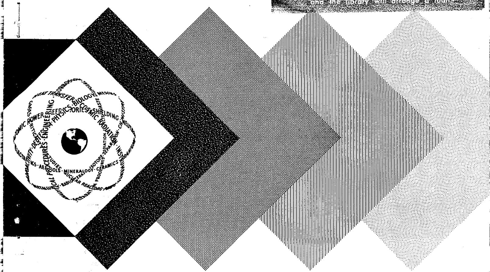

UNITED STATES ATOMIC ENERGY COMMISSION

Technical Information Service

Date Declassified: February 12, 1959.

Consolidation of this material into compact form to permit economical, direct reproduction has resulted in multiple folios for some pages, e.g., 10-12, 27-29, etc.

# LEGAL NOTICE

This report was prepared as an account of Government sponsored work. Neither the United States, nor the Commission, nor any person acting on behalf of the Commission:

A. Makes any warranty or representation, expressed or implied, with respect to the accuracy, completeness, or usefulness of the information contained in this report, or that the use of any information, apparatus, method, or process disclosed in this report may not infringe privately owned rights; or   
B. Assumes any liabilities with respect to the use of, or for damages resulting from the use of any information, apparatus, method, or process disclosed in this report.

As used in the above, "person acting on behalf of the Commission" includes any employee or contractor of the Commission, or employee of such contractor, to the extent that such employee or contractor of the Commission, or employee of such contractor prepares, disseminates, or provides access to, any information pursuant to his employment or contract with the Commission, or his employment with such contractor.

This report has been reproduced directly from the best available copy.

Printed in USA. Price $3.50. Available from the Office of Technical Services, Department of Commerce, Washington 25, D. C.

ORNL-1845(Del.)

OPERATION OF THE AIRCRAFT REACTOR EXPERIMENT

By

W. B. Cottrell

H.E.Hungerford

J. K. Leslie

J. L. Meem

September 6, 1955

Work performed under Contract No. W-7405-Eng-26

Oak Ridge National Laboratory  
Oak Ridge, Tennessee

MARTIN MARIETTA ENERGY SYSTEMS LIBRARIES

34456 03498221

# ACKNOWLEDGMENTS

The experiment described herein was performed by the ARE Operations Group under the immediate supervision of E. S. Bettis and J. L. Meem, with frequent support from other groups in the ANP Project. In particular, W. R. Grimes and his crew effected the carrier and concentrate loading operation, as well as the fluoride sampling; C. P. Coughlen and his crew effected the sodium loading and sampling; a group from the Analytical Chemistry Division, under the supervision of J. C. White, performed all analyses of fluoride and sodium samples; and E. B. Johnson obtained a reactor power calibration from analysis of a fuel sample. Craft foremen B. H. Webster and J. C. Packard are both to be commended for the excellent craftsmanship in the construction and maintenance of the system, which made the operation of the system such a success; and all who were in the building during the operation are appreciative of the concern of the Health Physics Group under R. L. Clark.

The bulk of this report was prepared by the authors, but considerable assistance was received from W. K. Ergen in the analysis of the nuclear data. The work of numerous others is referred to in the various analyses which are presented in the text and in the appendixes. In addition, the constructive criticism of W. H. Jordan, S. J. Cromer, and E. S. Bettis, each of whom reviewed this report, is gratefully acknowledged.

# FOREWORD

The operation of the Aircraft Reactor Experiment (ARE) culminated four years of endeavor at ORNL in the field of nuclear propulsion of aircraft. The final success of the experiment is a tribute to the efforts of the 300-odd technical and scientific personnel who constitute the ANP Project at ORNL, as well as those others who were less prominently engaged in the fabrication, assembly, and installation of the experiment. The project was capably directed toward this goal during its formative years by Dr. R. C. Briant (now deceased), and subsequently by W. H. Jordan and S. J. Cromer, currently Director and Co-Director, respectively.

This is the second in a series of three reports which summarize the ARE experience and is concerned primarily with the nuclear operation of the reactor. The experiment is described, and the data obtained during the time from the start of the critical experiment until the reactor was shut down for the last time are analyzed. The material is presented in essentially chronological order, and frequent reference is made to appended material which includes important detailed data and information that may not be of general interest.

# CONTENTS

# SUMMARY 1

1. INTRODUCTION 2   
2.DESCRIPTION OF THE REACTOR EXPERIMENT 4

Reactor 4   
Fuel System 5   
Sodium System 8   
Process Instrumentation 10

Nuclear Instrumentation and Controls 10

Off-Gas System 14   
Fuel Enrichment System 14

3. PRENUCLEAR OPERATION 19

Circulation of Sodium 19   
Circulation of Fuel Carrier 20

Final Preparations for Nuclear Operation 21

4. CRITICAL EXPERIMENT 23

Enrichment Procedure 23   
Early Stages of the Experiment 23   
Subcritical Measurement of the Reactor Temperature Coefficient 30   
Approach to Criticality 31   
Analyses of Fuel Samples 35   
Calibration of the Shim Rods 36   
Measurement of the Reactivity-Mass Ratio 36

5. LOW-POWER EXPERIMENTS 40

Power Determination from Fuel Activation 40   
Radiation Surveys 40   
Regulating Rod Calibration from Fuel Additions 43   
Regulating Rod Calibration from Reactor Periods 48   
Calibration of Shim Rods vs Regulating Rod 49   
Fuel System Characteristics 52   
Effect of Fuel Flow on Reactivity 54   
Low-Power Measurement of the Temperature Coefficient 55   
Adjustment of Chamber Position 57

6. HIGH-POWER EXPERIMENTS 58

Approach to Power 58   
Temperature Coefficient Measurements 61

Fuel and reactor temperature coefficients 62   
Sodium temperature coefficient 65   
Moderator temperature coefficient 66

Measurement of the Xenon Poisoning 67

Power Determination from Heat Extraction 68   
Reactor Kinetics 69

Reactor control by temperature coefficient 69   
Startup on demand for power 73   
Effect of one dollar of reactivity 78   
Power cycling of reactor 81

Reactor transients 87   
Calculated power change resulting from a regulating rod movement 90   
Reactor temperature differential as a function of helium blower speed 90   
The phenomenon of the time lag 91   
Reactivity effects of transients in the sodium system 92   
Reactivity following a scream 93   
Final Operation and Shutdown 95

7. RECOMMENDATIONS 97

# APPENDIXES

B. SUMMARY OF DESIGN AND OPERATIONAL DATA 107

Description 107   
Materials 111   
Reactor Physics 114   
Shielding 115   
Reactor Control 116   
System Operating Conditions 120   
Miscellaneous 123

C. CONTROL SYSTEM DESCRIPTION AND OPERATION 125

Control System Design 125   
Instruments Description 125   
Controls Description 126   
Console and Control Board Description 129   
Control Operations 130   
Reactor Operation 135

D. NUCLEAR OPERATING PROCEDURES 144

Addition of Fuel Concentrate 144   
Subcritical Experiments 145   
Initial Criticality 147   
Rod Calibration vs Fuel Addition 147   
Low-Power Experiments 147   
Approach to Power 150   
Experiments at Power 152

E. MATHEMATICAL ANALYSIS OF APPROACH TO CRITICALITY 156   
F. COLD, CLEAN CRITICAL MASS 158   
G. FLUX AND POWER DISTRIBUTIONS 160

Neutron Flux Distributions 160   
Fission-Neutron Flux Distributions 161   
Power Distribution 162

H. POWER DETERMINATION FROM FUEL ACTIVATION 165

Theory 165   
Experimental Procedure 166

I. INHOUR FORMULA FOR A CIRCULATING-FUEL REACTOR WITH SLUG FLOW 168

J. CALIBRATION OF THE SHIM RODS 172   
Calibration from Critical Experiment Data 172   
Calibration Against the Regulating Rod 174   
Calibration by Using the Fission Chambers 177   
K. CORRELATION OF REACTOR AND LINE TEMPERATURES 180  
L. POWER DETERMINATION FROM HEAT EXTRACTION 184   
M. THERMODYNAMIC ANALYSES 188   
Insulation Losses, Heater Power Input, and Space Cooler Performance 188   
Experimental Values of Heat Transfer Coefficients 188   
N. COMPARISON OF REACTOR POWER DETERMINATIONS 190   
O. ANALYSIS OF TEMPERATURE COEFFICIENT MEASUREMENTS 192  
Importance of the Fuel Temperature Coefficient 192   
Effect of Geometry in the ARE 192   
Time Lag Considerations 193   
Subcritical Measurement of Temperature Coefficient 193   
Low-Power Measurements of Temperature Coefficients of Reactivity 197   
High-Power Measurements of Temperature Coefficients of Reactivity 199   
P. THEORETICAL XENON POISONING 200   
Q. OPERATIONAL DIFFICULTIES 202  
Enrichment System 202   
Process Instrumentation 204   
Nuclear Instrumentation and Controls 205   
Annunciators 205   
Heaters and Heater Controls 205   
System Components 205   
Leaks 206   
R. INTEGRATED POWER 208   
Extracted Power 208   
Nuclear Power 210   
S. INTERPRETATION OF OBSERVED REACTOR PERIODS DURING TRANSIENTS 212   
T. NUCLEAR LOG 213   
U. THE ARE BUILDING 232   
BIBLIOGRAPHY 235

# OPERATION OF THE AIRCRAFT REACTOR EXPERIMENT

# SUMMARY

The Aircraft Reactor Experiment (ARE) was operated successfully and without untoward difficulty in November 1954. The following statements summarize the notable information obtained from the experiment.

1. The reactor became critical with a mass of 32.8 lb of U $^{235}$ , which gave a concentration of 23.9 lb of U $^{235}$ per cubic foot of fluoride fuel. For operation at power, the U $^{235}$ content of the fuel mixture was increased to 26.0 lb/ft $^3$ , and thus the final composition of the fuel mixture was 53.09 mole % NaF, 40.73 mole % ZrF $_4$ , and 6.18 mole % UF $_4$ .   
2. The maximum power level for sustained operation was $2.5 \, \text{Mw}$ , with a temperature gradient of $355^{\circ} \text{F}$ ; the maximum fuel temperature at this level was $1580^{\circ} \text{F}$ . Temperatures as high as $1620^{\circ} \text{F}$ were recorded during transients.   
3. From the time the reactor first went critical until the final shutdown, 221 hr had elapsed, and for the final 74 hr the power was in the megawatt range (0.1 to 2.5 Mw). The total integrated power was about 96 Mw-hr.   
4. While at power the reactor exhibited excellent stability and it was easily controlled because of its high negative temperature coefficient of reactivity, which made the reactor a slave to the

load placed upon it. The fuel temperature coefficient was $-9.8 \times 10^{-5} (\Delta k / k) / ^{\circ} F$ , and the overall coefficient for the reactor was $-6.1 \times 10^{-5}$ .

5. Practically all the gaseous fission products and probably some of the other volatile fission products were removed from the circulating fuel. In a 25-hr run at 2.12 Mw the upper limit of the reactor poisoning due to xenon was $0.01\% \Delta k / k$ . No more than $5\%$ of the xenon stayed in the molten fluoride fuel.   
6. The total time of operation at high temperature (1000 to $1600^{\circ}\mathsf{F}$ ) for the sodium circuit was 635 hr, and, for the fluoride fuel system, 462 hr. During most of the operating period the sodium was circulated at 150 gpm and the fuel at 46 gpm.   
7. The fabricability and compatibility of the materials system, i.e., fluoride fuel, sodium coolant, and Inconel structure, were demonstrated, at least for the operating times, temperatures, and flux levels present.   
8. All components and, with few exceptions, all instrumentation performed according to design specifications. The performance of the pumps was particularly gratifying, and the low incidence of instrumentation failure was remarkable in view of the quantity and complexity of the instruments used.

# 1. INTRODUCTION

The Aircraft Nuclear Propulsion (ANP) project at the Oak Ridge National Laboratory was formed in the fall of 1949, at the request of the Atomic Energy Commission, to provide technical support to existing Air Force endeavors in the field. The ORNL effort gradually expanded and, following the recommendation of the Technical Advisory Board in the summer of 1950, was directed toward the construction and operation of an aircraft reactor experiment. A complete description of the ARE falls naturally into three categories that correspond to the three phases of the project: (1) design and installation, (2) operation, and (3) postoperative examination. Each of these phases is covered by a separate report, ORNL-1844, ORNL-1845, and ORNL-1868, respectively. Much detailed information pertaining to the selection of the reactor type and to the design, construction, and pre-nuclear operation of the reactor experiment will be presented in ORNL-1844. As the title of this report (ORNL-1845) indicates it is concerned primarily with the operation of the experiment, and only insofar as they are necessary or useful to the understanding or evaluation of the nuclear operation are design and preliminary operational data included herein. The third report (ORNL-1868) will describe the aftermath of the experiment, with particular reference to corrosion, radiation effects, and the decay of activity - effects that cannot be evaluated at this time because of the high level of the radioactivity of the equipment.

The specific operating objectives were to attain a fuel temperature of $1500^{\circ}\mathrm{F}$ , with a $350^{\circ}\mathrm{F}$ temperature rise across the reactor, and to operate the system for approximately 100 Mw-hr. Other objectives of the experiment were to obtain as much experimental data as possible on the reactor operational characteristics. The extent to which each of these objectives was fulfilled is described herein, and a measure of the success of the program is thus provided.

Although it was initially planned to use a

sodium-cooled, solid-fuel-element reactor, the reactor design evolved first to that of a sodium-cooled, stationary-liquid-fuel reactor and, finally, to that of a circulating-fuel reactor employing sodium as a reflector coolant. These evolutionary processes left their mark on the experiment, particularly in that the reactor had to incorporate a moderator geometry that was originally specified and ordered for the sodium-cooled reactor. The adaptation of this moderator geometry to the circulating-fuel reactor resulted in a reactor in which the fuel stream was divided into six parallel circuits, each of which made numerous passes through the core. These fuel passages were not drainable - a condition which caused considerable concern throughout the course of the experiment.

Although it is not the purpose of this report to give a detailed history of the design, construction, or preliminary testing of the reactor system, the final design and pertinent prenuclear operation are briefly described. The bulk of the report concerns the operation of the experiment from the time uranium was added to the fuel system on October 30 until the evening of November 12, when the reactor was shut down for the last time. In addition to the description of the various experiments and analyses of the data which are presented in the body of the report, the entire nuclear operation, as recorded in the "Nuclear Log," is given in Appendix T. The report also includes a number of recommendations based on the operating experience, and much detailed supporting data and information not appropriate for inclusion in the body of the report are given in the other appendixes.

The various experiments that were performed on the ARE were designated as E, L, or H series, depending upon whether they occurred during the critical experiment, low-power operation, or high-power operation, respectively. Each of these experiments, as listed below, is discussed in this report.

# Experiment

# Series No.

# Type of Experiment

E-1 Critical experiment

E-2 Subcritical measurement of reactor temperature coefficient

L-1 Power determination at 1 w (nominal)

L-2 Regulating rod calibration vs fuel addition

L-3 Fuel system characteristics

L-4 Power determination at 10 w (nominal)

L-5 Regulating rod calibration vs reactor period

L-6 Calibration of shim rod vs regulating rod

L-7 Effect of fuel flow on reactivity

L-8 Low-power measurement of reactor temperature coefficient

L-9 Adjustment of chamber position

H-1 Approach to power: 10-kw run

H-2 Test of off-gas system

H-3 Approach to power: 100-kw to 1-Mw runs

H-4 High-power measurement of the fuel temperature coefficient

H-5 High-power measurement of the reactor temperature coefficient

H-6 Reactor startup on temperature coefficient

H-7 Sodium temperature coefficient

H-8 Effect of a dollar of reactivity

H-9 High-power measurement of reactor temperature coefficient

H-10 Moderator temperature coefficient

H-11 Xenon run at full power

H-12 Reactivity effects of sodium flow

H-13 Xenon buildup at one-tenth full power

H-14 Operation at maximum power

The ARE consisted of the circulating-fuel reactor and the associated pumps, heat transfer equipment, controls, and instrumentation required for its safe operation. A schematic arrangement of the reactor system is shown in Fig. 2.1. The major functional parts of the system are discussed briefly below. The physical plant is described in Appendix U. A detailed description of the reactor and the associated system may be found in the design and installation report. A summary of the design and operational data, including a detailed flow sheet of the experiment, is given in Appendix B.

# REACTOR

The reactor assembly consisted of a 2-in.-thick Inconel pressure shell in which beryllium oxide moderator and reflector blocks were stacked around fuel tubes, reflector cooling tubes, and control assemblies. Elevation and plan sections of the reactor are shown in Figs. 2.2 and 2.3. The innermost region of the lattice assembly was the core, which was a cylinder approximately 3 ft in diameter and 3 ft long. The beryllium oxide was machined into small hexagonal blocks which were split axially and stacked to effect the cylindrical core and reflector. Each beryllium oxide block in the core had a 1.25-in. hole drilled axially through

its center for the passage of the fuel tubes. The outer 7.5 in. of beryllium oxide served as the reflector and was located between the pressure shell and the cylindrical surface of the core. The reflector consisted of hexagonal beryllium oxide blocks, similar to the moderator blocks, but with 0.5-in. holes.

The fuel stream was divided into six parallel circuits at the inlet fuel header, which was located above the top of the core and outside the pressure shell. These circuits each made 11 series passes through the core, starting close to the core axis, and progressing in serpentine fashion to the periphery of the core, and finally leaving the core through the bottom of the reactor. The six circuits were connected to the outlet header. Each tube was of 1.235-in.-OD seamless Inconel tubing with a 60-mil wall. The combination of parallel and series fuel passes through the core was largely the result of the need for assuring turbulent flow in a system in which the fluid properties and tube dimensions were fixed.

The reflector coolant, i.e., sodium, was admitted into the pressure shell through the bottom. The sodium then passed up through the reflector tubes, bathed the inside walls of the pressure shell, filled the moderator interstices, and left from the plenum chamber at the top of the pressure shell. The sodium, in addition to cooling the reflector and pressure shell, acted as a heat transfer medium

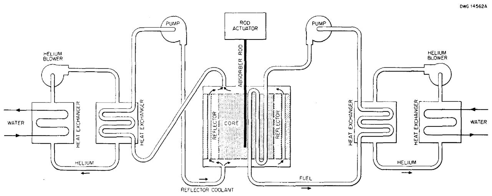  
Fig. 2.1. Schematic Diagram of the Aircraft Reactor Experiment.

in the core by which moderator heat was readily transmitted to the fuel stream.

# FUEL SYSTEM

The fuel was a mixture of the fluorides of sodium and zirconium, with sufficient uranium fluoride added to make the reactor critical. While the fuel ultimately employed for the experiment was the NaF-ZrF $_4$ UF $_4$ mixture with a composition of

53.09-40.73-6.18 mole $\%$ , respectively, most preliminary experimental work (i.e., pump tests, corrosion tests) employed a fuel containing somewhat more $\mathsf{UF}_4$ . The fuel was circulated around a closed loop from the pump to the reactor, to the heat exchanger, and back to the pump. An isometric drawing of the fuel system is given in Fig. 2.4.

The fuel pump was a centrifugal pump with a vertical shaft and a gas seal, as shown in Fig. 2.5.

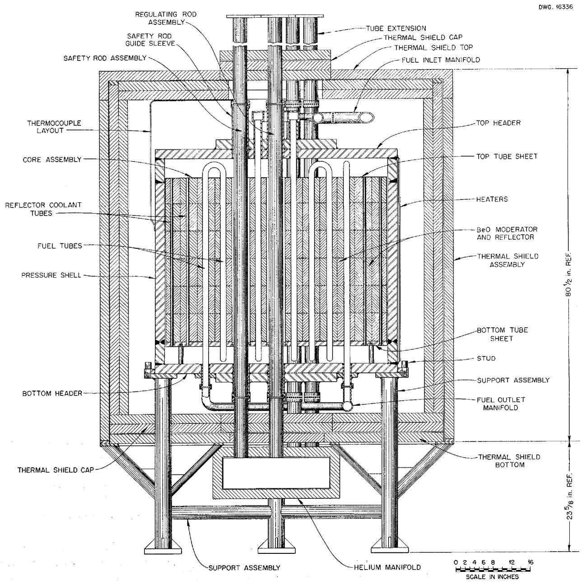  
Fig. 2.2. The Reactor (Elevation Section).

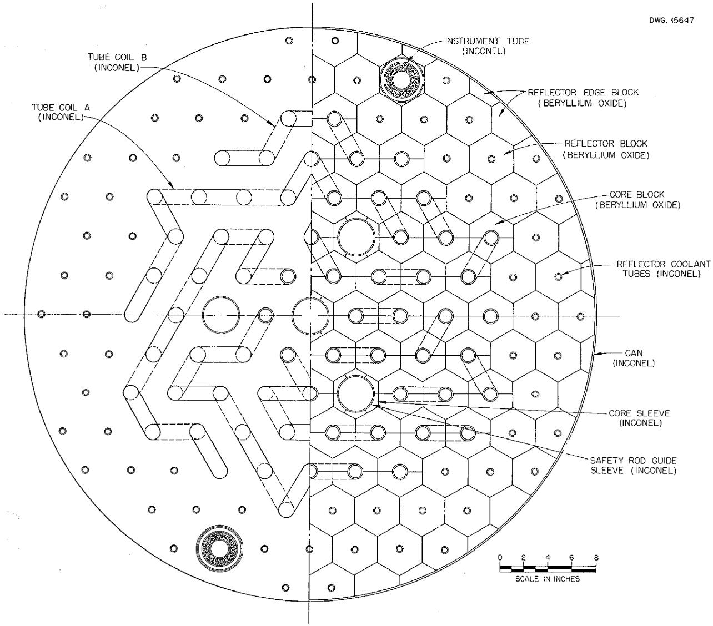  
Fig. 2.3. The Reactor (Plan Section).

The fuel expansion volume around the impeller cavity provided the only liquid-to-gas interface in the fuel system. While speeds up to 2000 rpm could be attained with the 15-hp d-c pump motor, the desired fuel flow of 46 gpm was attained at a speed of 1080 rpm. Although only one pump was used in the experiment, a spare fuel pump, isolated from the operating pump and in parallel with it, was provided.

From the pump the fuel flowed to the reactor, where it was heated, then to two parallel fuel-to-helium heat exchangers, and back to the pump. The cycle time was about 47 sec at full flow, of

which approximately 8 sec was the time required for the fuel to pass through the core. The two fuel-to-helium heat exchangers were each coupled to a helium-to-water heat exchanger. The heat extracted from the fuel was transferred via the helium to water, and the water - the ultimate heat sink - was discharged. The helium flow rate in the fuel-to-helium heat exchanger loop was controlled through a magnetic clutch that coupled the blower to a 50-hp motor. Control of the helium flow rate in this manner permitted smooth control at any reactor power at which the heat generation was great enough for the temperature coefficient to be the controlling factor.

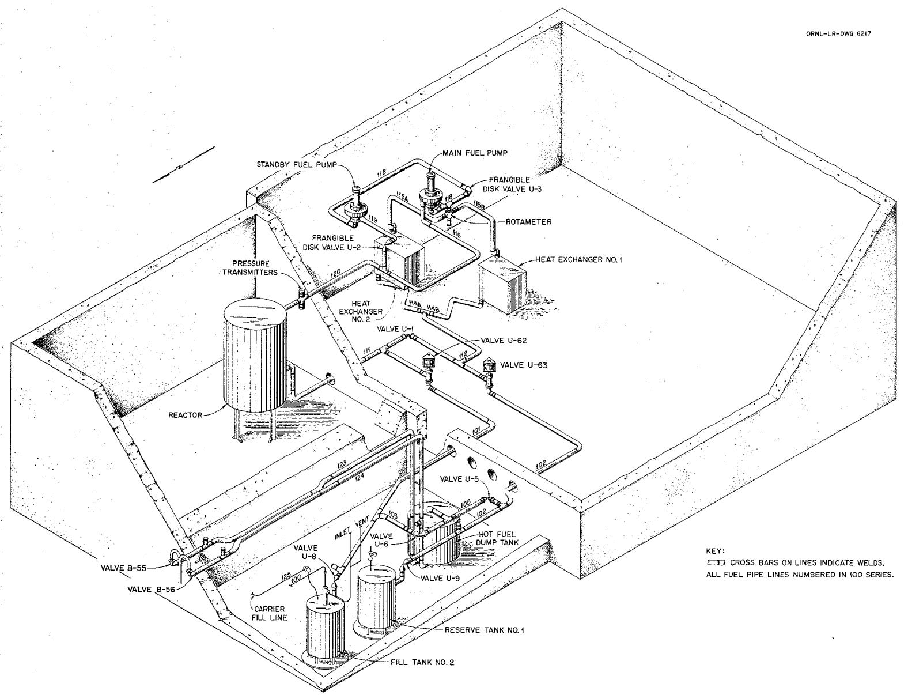  
Fig. 2.4. Isometric Drawing of Fuel System.

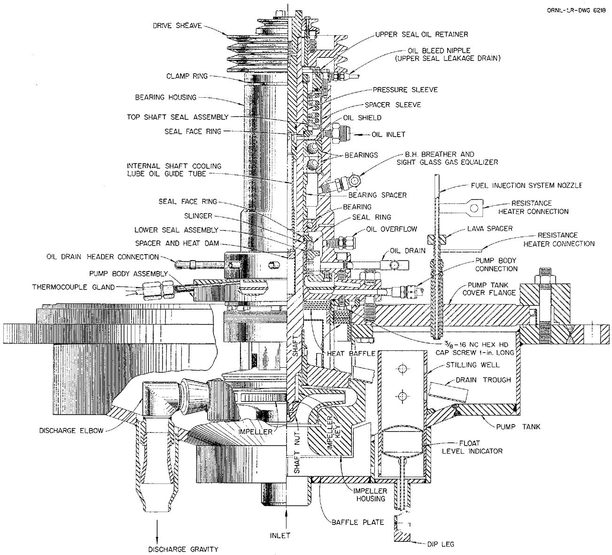  
Fig. 2.5. Fuel Pump.

As shown in Fig. 2.4, the fuel system was connected with two fill tanks (only one of which was used) and one dump tank which had provisions for removing the afterheat from the fuel.

The relatively high melting point of the circulating fuel (about $1000^{\circ}\mathrm{F}$ for the $\mathsf{NaF - ZrF_4 - UF_4}$ fuel containing $6.18\%$ $\mathsf{UF}_4$ required that all equipment within which it was circulated be heated sufficiently to permit loading, unloading, and low-power operation. This heating was accomplished by means of electrical heaters attached to all components of the fuel and sodium systems; i.e., pressure shell, heat exchanger, pumps, and tanks, as well as all fuel and sodium piping.

In addition to the heaters and insulation, all fuel and sodium piping was surrounded by a 1- to $1\frac{1}{2}$ -in. annulus (inside the heaters) through which helium was circulated. The helium circulated through the annuli was monitored at various stations around the system for evidence of leaks and was, in addition, a safety factor in that it could be expected to keep hot any spots at which heater failures occurred.

# SODIUM SYSTEM

The sodium circuit external to the reactor, shown in Fig. 2.6, was similar to that of the fuel. The sodium flowed from pump to reactor, to heat

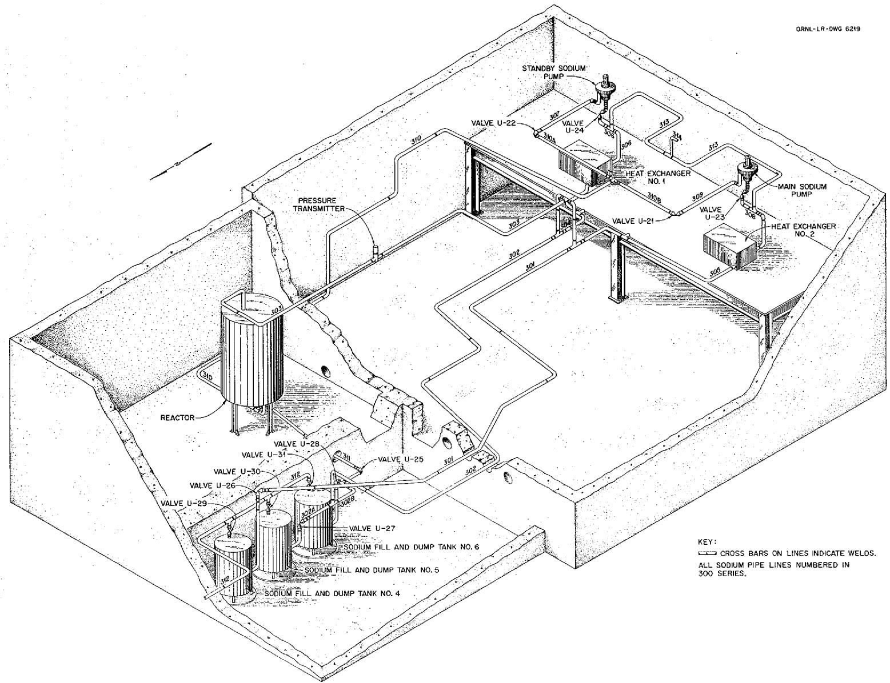  
Fig. 2.6. Isometric Drawing of Sodium System.

exchanger, to pump. The sodium pumps were gas-sealed centrifugal pumps of the same design as the fuel pump, except that a smaller expansion volume was provided. Again, there were two sodium pumps, one of which was a spare in parallel with the operating pump.

The sodium was circulated through the two parallel sodium-to-helium heat exchangers after being heated in the reactor. Again the heat was transferred via the helium to water in two helium-to-water heat exchangers. The sodium system was equipped with heaters, as was the fuel system, and all piping was surrounded with the helium annulus for leak monitoring and heat distribution.

# PROCESS INSTRUMENTATION

Since a basic purpose of the ARE was the acquisition of experimental data, the importance of complete and reliable instrumentation could not be overemphasized. Therefore there were 27 strip temperature recorders (mostly multipoint), 5 circular temperature recorders, 7 indicating flow controllers, 9 temperature indicators (with up to 96 points per instrument), about 50 spark-plug level indicators, 20 ammeters, 40 pressure gages, 16 pressure regulators, and 20 pressure transmitters. In addition there were numerous flow recorders, indicators, alarms, voltmeters, tachometers, and assorted miscellaneous instruments.

Most ARE process instrumentation was installed to permit observing and recording rotational speeds, flow rates, temperatures, pressures, or liquid levels. The operating values of temperature, pressure, and flow at various stations around the ARE fluid circuits are given in Appendix B. Since most commercially available instruments for measuring flow and pressure are subject to temperature limitations considerably lower than the minimum operating temperature of the ARE and they employ open lines in which the $\mathsf{ZrF_4}$ vapor could condense, they were not suitable for ARE applications. Therefore a bellows type of device was adapted for use as a pressure indicator, and a fluid-immersed inductance type of instrument was developed for measuring sodium and fuel liquid level and fuel flow. Sodium flow was measured by an electromagnetic flowmeter. Conventional chromel-alumel thermocouples welded to the pipe walls were used to determine temperatures. The

instrumentation flow sheet is shown in Fig. 2.7. Most of the indicating and recording instruments were located in the control room. While numerous important temperatures were recorded in the control room, about $75\%$ of the thermocouples were indicated (or recorded) only in the basement.

# NUCLEAR INSTRUMENTATION AND CONTROLS

Detailed information on the important nuclear instrumentation and controls is presented in Appendix C. Briefly, the nuclear instrumentation (such as fission chambers and ion chambers), the electronic components (such as preamplifiers and power amplifiers), and the control features of the ARE were similar, and in many cases identical, to those of the MTR, the LITR, and other reactors now in operation. However, since the fission chambers were located in a high-temperature region within the reflector, it was necessary to develop special high-temperature chambers. Helium was used to cool them to below $600^{\circ}$ F.

The locations of the two fission chambers in the reactor may be seen from examination of Fig. 2.3; the locations of the remaining ion chambers are shown on Fig. 2.8. Since the fission chambers moved through sleeves in the reactor which were parallel to those for the regulating and shim rods, it was convenient to group the drive mechanisms with those for the rods in an igloo outside the shielding above the reactor, as shown in Fig. 2.8. All other ion chambers were external to the reactor pressure shell; they viewed the reactor at midplane; and they were mounted so that they would move horizontally. These chambers included a $\mathsf{BF}_3$ counter (for the critical experiment), two parallel circular plate (PCP) chambers, and two compensated chambers.

There were two separate elements to the control system - the single regulating rod and the three shim rods. The locations of these rods in the reactor may be seen from examination of Fig. 2.3. The regulating rod had a vertical movement of 12 in. about the center of the reactor and was fabricated of stainless steel. Several such regulating rods, with varying amounts of metal, were fabricated, and the one finally used in the experiment had a total value of $0.4\% \Delta k / k$ for the 12-in. movement and could be moved at a rate of $0.011\% (\Delta k / k) / \mathrm{sec}$ .

The three safety rods were located in the core on 120-deg points at a radius of 7.5 in. from the

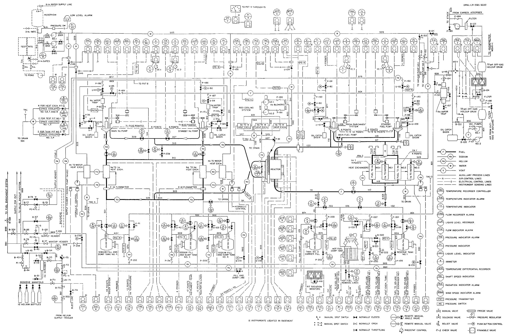  
Fig. 2.7. Process Instrumentation.

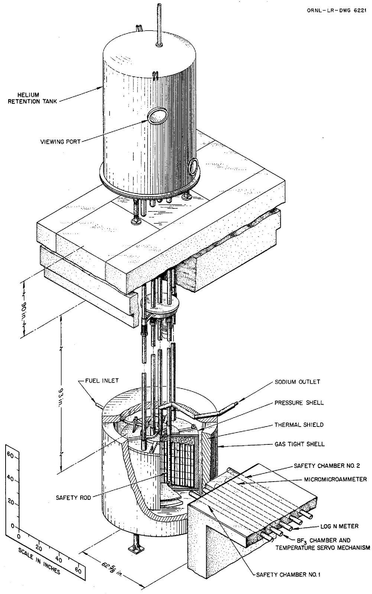  
Fig. 2.8. Isometric Drawing of Control Rods and Nuclear Instrumentation.

center of the reactor. Each rod was made up of slugs of a hot-pressed mixture of boron carbide and iron; the slugs were canned in stainless steel. The canned sections were slipped over a flexible tube. The total rod travel was 36 in., and 13 min was required for withdrawal of the rod. Thus, the $5.8\% \Delta k / k$ in each rod (total for the three was approximately $17\% \Delta k / k$ ) could be withdrawn at a rate of $0.45\% (\Delta k / k) / \min$ per rod.

A small amount of the helium used to cool the fission chambers was directed through the shim and regulating rod holes, but the helium flow was so low that not much cooling was effected. This helium was circulated in an independent circuit, known as the rod cooling system, which had two two-speed helium blowers in parallel and three helium-to-water heat exchangers. The helium circulated from the blowers through the rod sleeves and fission chamber sleeves to the heat exchangers and back to the blowers, and it removed, in the process, up to 35 kw of reactor heat. Part of the helium returning from the reactor was diverted through pipe annuli before reaching the heat exchanger.

# OFF-GAS SYSTEM

The off-gas system was designed to permit the collection, holdup, and controlled discharge of the radioactive fission products that were evolved as a consequence of reactor operation. Although only the gases above the fuel system were expected to have significant activity, the gas from the sodium system was also discharged through the off-gas system. As shown in Fig. 2.9, there was, in addition to the primary off-gas system, an auxiliary system for discharging gases from the pit through nitrogen-cooled charcoal tanks.

In the primary system the off gases from both the fuel and the sodium were directed to a common vent header. From this header, helium plus the volatile fission gases passed through a NaK scrubber, which removed bromine and iodine, and then into two holdup tanks, which were connected in series, to permit the decay of xenon and krypton. From these the gases were released up the stack. The release of gases to the stack was dependent

upon two conditions: (1) a wind velocity greater than 5 mph and (2) radioactivity of less than $0.8\mu \mathrm{c} / \mathrm{cm}^3$ . The activity was sensed by a monitor which was located between the two holdup tanks.

# FUEL ENRICHMENT SYSTEM

The fluoride fuel used in the ARE was amenable to a convenient enrichment technique in which the fuel system was first filled with a mixture of the fluorides of sodium and zirconium. When this mixture, $\mathrm{NaZrF}_{5}$ , had been circulated for a sufficient time to ascertain that the reactor was ready to be taken critical (no leaks, etc.), uranium in the form of molten $\mathrm{Na}_{2}\mathrm{UF}_{6}$ was added to the fluorides then in the system. The temperature contour diagram of the $\mathrm{NaF - ZrF}_{4} - \mathrm{UF}_{4}$ system is shown in Fig. 2.10. The melting point of $\mathrm{Na}_{2}\mathrm{UF}_{6}$ was $1200^{\circ}\mathrm{F}$ , and there were no mixtures of higher melting points on the join between $\mathrm{Na}_{2}\mathrm{UF}_{6}$ and $\mathrm{NaZrF}_{5}$ , which is shown in Fig. 2.11. The addition of $\mathrm{Na}_{2}\mathrm{UF}_{6}$ raised the melting point of the mixture only slightly above that of $\mathrm{NaZrF}_{5}(955^{\circ}\mathrm{F})$ .

It was initially intended that the enrichment operation would consist of the remote addition of $\mathsf{Na}_2\mathsf{UF}_6$ to the system from a large tank which contained all the concentrate. From the large tank, the concentrate was to pass through an intermediate transfer tank which would transfer about 1 qt or less at a time. The intermediate tank was suspended from a load beam so that the weight of the concentrate could be determined before each addition of enriched material. However, this system was discarded when preoperational tests proved the temperature control of the system to be inadequate; in addition, the accuracy of the weight-measuring instrumentation on the transfer tank was uncertain.

In lieu of the original enrichment system, a less elaborate, more direct method of concentrate addition was employed. The enrichment procedure actually used involved the successive connection of numerous small concentrate containers to an intermediate transfer pot, which, in turn, was connected to the fuel system by a line which injected the concentrate into the pump tank above the liquid level.

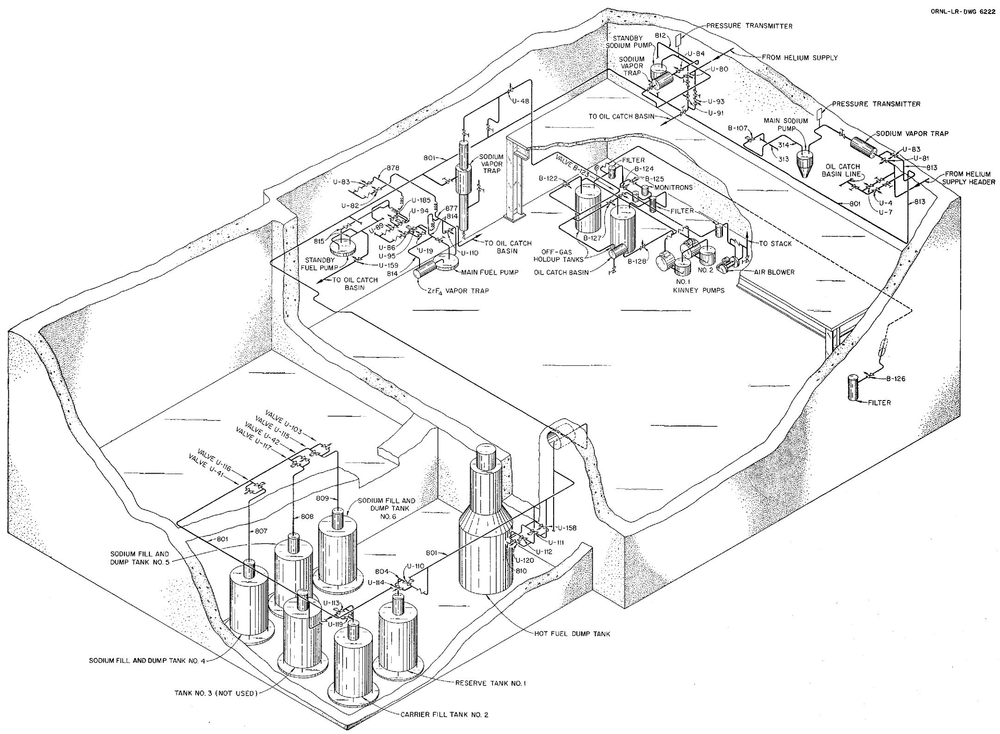  
Fig. 2.9. Isometric Drawing of Off-Gas System.

Fig. 2.10. The System $\mathsf{NaF - ZrF}_4\cdot \mathsf{UF}_4$ .   
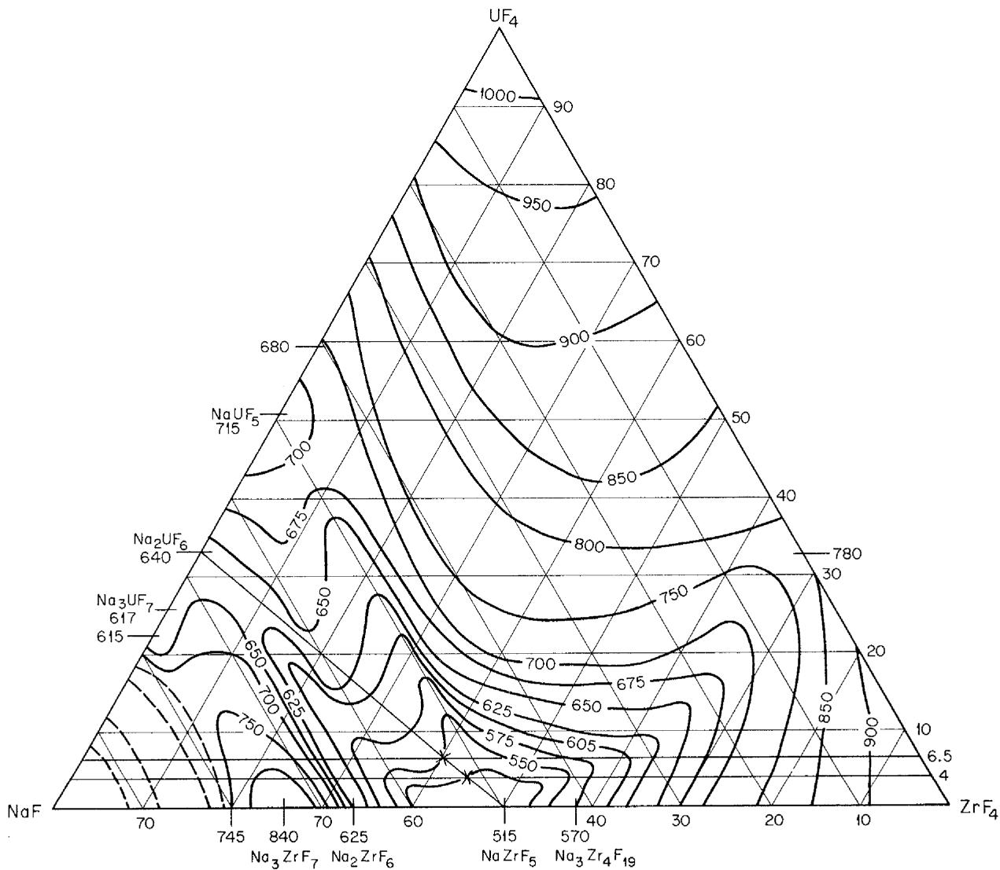  
DWG.21453A

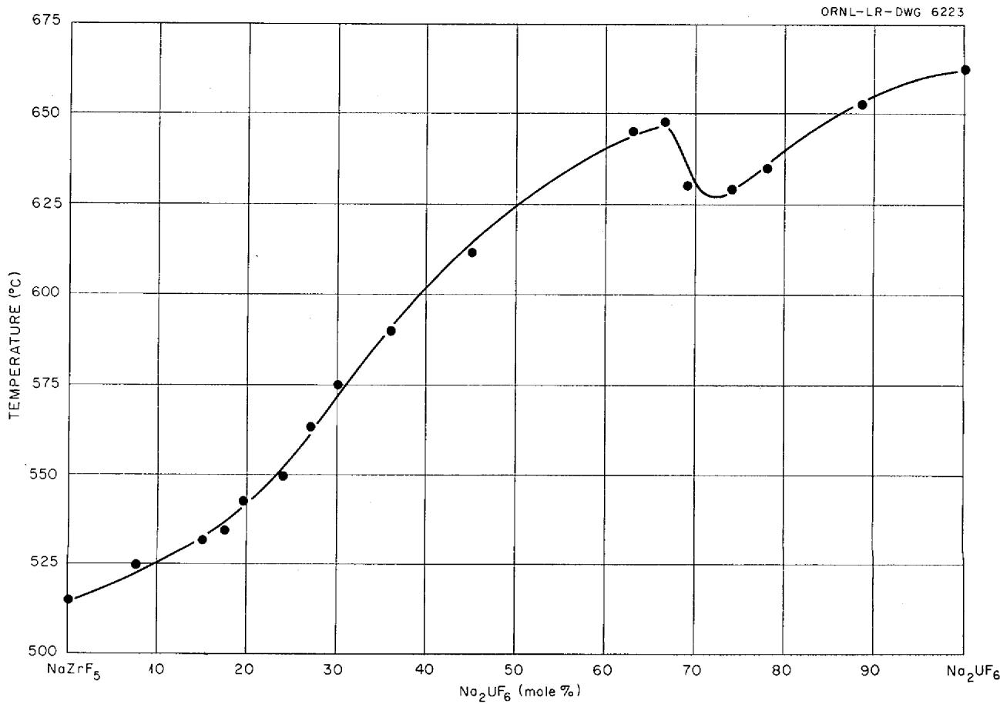  
Fig. 2.11. The Pseudo-Binary System NaZrF $5\text{-Na}_{2}\mathsf{UF}_{6}$ .

It is not the purpose here to describe in detail the preliminary checks and shakedown tests which preceded the nuclear operation of the system because this information is covered in the design and installation report. However, some understanding of the scope and significance of these "preliminary" tests is desirable, particularly since at the conclusion of this phase of the operation the fuel and sodium systems were left filled with clean carrier and sodium, respectively, and the fuel system was ready for the fuel enrichment operation which comprised the critical experiment.

The preliminary tests accomplished many purposes, the more important being the cleaning and leak-checking of the systems, performance and functional testing of components, checking and calibrating of instruments, and the practicing of operational techniques. The system, as an integral unit, was sufficiently assembled by August 1 for the operating crews to be placed on a three-shift basis so that intensive tests on the various systems, initially with water as the circulating fluid, could be started. There were, however, frequent delays while changes and modifications that the testing indicated as being desirable or necessary were made. The operation with sodium, in particular, was responsible for major changes in the sodium vent system and the elimination of the sodium purification system. Tests with sodium and carrier in the systems were concluded on October 30, at which time the system was ready for the critical experiment.

# CIRCULATION OF SODIUM

By the last week in September, all temperature tests preliminary to operation of the sodium system had been completed. It was necessary to operate the sodium system before operating the fuel system because the sodium was used to heat the reactor to above the fuel melting point. In preparation for filling the sodium system, the temperature of the entire system was brought to $600^{\circ}\mathrm{F}$ and sodium was transferred from portable drums into the system fill tanks. The sodium used had been carefully filtered to minimize the oxygen content, which at the time of the filling averaged about 0.025 wt%.

The system was filled with sodium on the morning of September 26. No particular difficulties were encountered during the filling or when the sodium pumps were operated at design speed, although there was evidence of trapped gas in the system. The electromagnetic flowmeters, which were at first inoperative, functioned properly after sufficient time had elapsed for wetting of the pipe wall to occur. On the following afternoon a leak developed in a tube bend in the sodium purification system, so the sodium was dumped.

Subsequent analyses revealed that the leak occurred where a thermocouple pad had been heliarc welded to the tube. The excessive weld penetration which caused the leak was attributed to a lack of instruction to the welder that a variation in pipe wall thickness existed in this section.

As a consequence of this leak and difficulties experienced during draining of the sodium, a number of changes were made in the sodium system. The purification systems were eliminated and provisions were made for better heat control for all vent lines and valves to prevent freezing of the sodium and plugging of the lines. It was concluded that the sodium purification system could be removed without endangering the experiment because experience in operating the system had proved that the oxygen contamination was very low; furthermore, there was no danger of the oxide plugging the heat exchanger tubes because of the low temperature differential in the system and the large diameters of the tubes in the heat exchangers. It was felt, also, that the purification system represented the weakest link in the fluid circuit because thinner walled tubing had been used there than anywhere else in the system, except for the reactor tubes, which were assembled with extreme care. Even so, the thin-walled tubing in the purification system would probably not have presented a problem had the thermocouples been properly welded.

On October 16 the sodium was recharged into the system at $600^{\circ}\mathrm{F}$ , circulated, and dumped four times to thoroughly check the operability of the sodium system. Analyses of the sodium taken both at 600 and $925^{\circ}\mathrm{F}$ showed the oxygen content to be satisfactorily low (of the order of 0.026 wt $\%$ ), and therefore the initial batch of sodium was not replaced. The sodium was circulated for several days at $1300^{\circ}\mathrm{F}$ before fuel carrier, $\mathsf{NaZrF}_{5}$ , was

added to the fuel tank. During the period of sodium circulation, the typical system characteristics were those given in Figs. 3.1 and 3.2. The data were comparable to those obtained during the water tests. Such discrepancies as existed were within experimental error and could easily have been due to changes in the system that were made during the time between the two tests, such as the removal of the purification systems and the removal of the bypass around the reactor during the water tests.

During and after the second sodium loading operation the copper gauze in the helium stream was monitored and no evidence of sodium leakage was found. With helium in the fuel system the temperatures in the fuel and sodium systems were

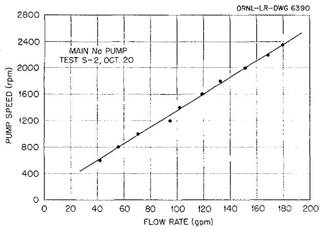  
Fig. 3.1. Pump Speed vs Sodium Flow Rate.

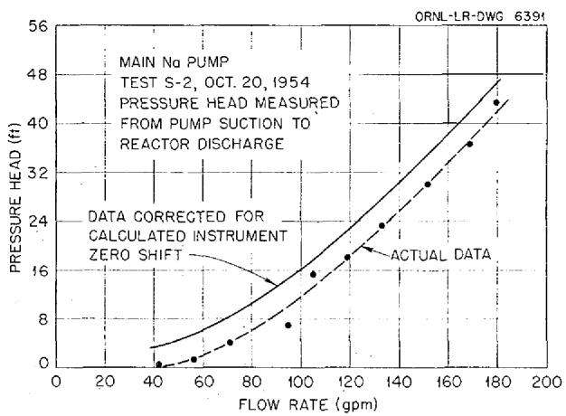  
Fig. 3.2. Pressure Head vs Sodium Flow Rate.

then gradually raised (about $10^{\circ}\mathrm{F / hr}$ ) to $1300^{\circ}\mathrm{F}$ . After the $1300^{\circ}\mathrm{F}$ temperature was reached, the helium pressure in the fuel system was reduced to 0.5 psig and sufficient krypton was added to bring the system pressure up to 5.0 psig. The helium in the annuli was then sampled and analyzed for krypton, and no evidence of a leak was found.

# CIRCULATION OF FUEL CARRIER

With the system isothermal at $1300^{\circ}\mathrm{F}$ , the fuel carrier, $\mathrm{NaZrF}_5$ , was loaded into the fill tank at $1200^{\circ}\mathrm{F}$ , and the fuel system was evacuated to facilitate raising the fluoride into the system. This filling operation, which occurred on October 25, required only a few minutes once the desired vacuum was attained. During the filling operation it was possible to follow the progress of the fluoride through the system by watching the thermocouple indications along the pipe because of the $100^{\circ}\mathrm{F}$ temperature difference between the initial fluoride temperature and the system temperature. In contrast to the sodium system, there did not appear to be any gas trapped in the fuel system after loading; evidence of this was that there was no liquid level change when the pressure in the pump was changed, and the temperature differentials across the six parallel fuel passages in the reactor changed simultaneously when a temperature perturbation was put into the system.

Five samples of the carrier were taken, and the analytical results from each showed the concentrations of impurities and corrosion products given in Table 3.1.

There was twice as much carrier available as was required to fill the system, and if chemical analyses of samples of the carrier after it had been circulated for about 50 hr had indicated too high a corrosion-product buildup (as could have resulted if the system had not been adequately cleaned), the carrier in the system would have been dumped and replaced with the extra carrier. However, from the very favorable analyses of the first two samples it was apparent that replacing the carrier would not be necessary. (The chromium content would have had to have been 500 ppm to have necessitated the replacement. The corrosion mechanism that defines the upper limit of the chromium content is described in detail in ORNL-1844.)

During the time the carrier was being circulated and before the enrichment operation commenced, the system characteristics were determined. The

TABLE 3.1. ANALYSES OF IMPURITIES AND CORROSION PRODUCTS IN CARRIER SAMPLES   

<table><tr><td rowspan="2">Date</td><td rowspan="2">Time</td><td rowspan="2">Running Time (hr)</td><td colspan="3">Impurities and Corrosion Products Found (ppm)</td></tr><tr><td>Cr</td><td>Fe</td><td>Ni</td></tr><tr><td>10/25</td><td>1650</td><td>9.7</td><td>90</td><td>&lt;5</td><td>50</td></tr><tr><td>10/26</td><td>0214</td><td>19.1</td><td>81</td><td>&lt;5</td><td>40</td></tr><tr><td></td><td>1911</td><td>36.1</td><td>81</td><td>&lt;5</td><td>6</td></tr><tr><td>10/27</td><td>1919</td><td>60.2</td><td>90</td><td>18</td><td>12</td></tr><tr><td>10/29</td><td>0935</td><td>98.5</td><td>102</td><td>30</td><td>20</td></tr></table>

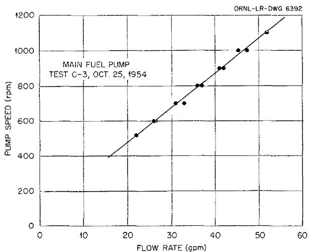  
Fig. 3.3. Pump Speed vs Fuel Carrier Flow Rate.

data obtained in terms of pump speed vs flow and system head vs flow are given in Figs. 3.3 and 3.4, respectively. These data were considerably different from those to be expected from an extrapolation of the water data. The discrepancies are analyzed in more detail in ORNL-1844, but the only completely satisfactory explanation is that the system head during the water test was too high, possibly due to the temporary water Rotameter installation or to one or more of the reactor tubes not being completely filled so that only partial flow was obtained through the reactor during the water test.

# FINAL PREPARATIONS FOR NUCLEAR OPERATION

By this time the neutron source had been placed in the reactor and the nuclear instrumentation

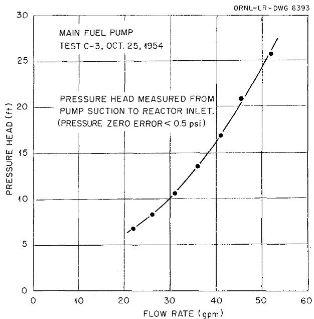  
Fig. 3.4. Pressure Head vs Fuel Carrier Flow Rate.

checked out. A $\mathsf{BF}_3$ counter was installed in one of the instrument holes external to the reactor in order to check the fission chambers during the critical experiment. Pulse height and voltage curves were measured on all three fission chambers (the two regulars plus a spare) in order to establish the operational plateau for each chamber.

The mechanical operation tests of the regulating rod and of the three safety (shim) rods were made; in all, over 25 rod drop tests were performed in order to ensure the reliability of the rod insertions at high (1200 to $1300^{\circ}\mathrm{F}$ ) temperatures. The rod drives were also continuously cycled in order to check the performance of the gear trains and

motors. During this time the rod magnet faces were cleaned, and, in order to maintain more uniform drop currents, it was decided to keep the magnet faces engaged at all times when the rods were not in use.

Before the fuel concentrate $(\mathsf{Na}_2\mathsf{UF}_6)$ was charged to the enrichment system, a number of practice operations were performed with carrier in the enrichment system. The temperature control of the system was inadequate and the operation of the weigh cell on the transfer tank was such that reproducible weights could not be obtained. Although the enrichment system probably could have been made to work, considerable time would have been required. Accordingly, the original enrichment system was abandoned, and a manually operated system was improvised. The concentrate was first batched down into a number of containers.

The concentrate in each of these containers was then added to the fuel system at the pump after first passing through an intermediate transfer pot. The amount of concentrate added was determined by weight measurements of the concentrate containers before and after use. While this system was being set up, the operating crews were engaged in leak testing the various auxiliary systems, determining operability of heater circuits, checking and reading thermocouples, establishing the performance of the pump lubrication and cooling systems, checking the operation of the annulus system helium blowers, monitoring the annulus helium for leaks, and checking the operability of the various off-gas systems, instrumentation, and the like. By the morning of October 30, these tests were sufficiently well in hand for the critical experiment to commence.

On October 30 the sodium had been circulating $275\mathrm{hr}$ , and the fuel carrier about $110\mathrm{hr}$ . Both the sodium system and the fuel system were at an isothermal temperature of $1300^{\circ}\mathrm{F}$ , and the fuel system was ready for the addition of concentrate $(\mathrm{Na}_2\mathrm{UF}_6)$ to the carrier $(\mathrm{NaZrF}_5)$ . The addition of the concentrate was necessarily time-consuming because of the cautious manner in which each addition had to be made during the approach to criticality; however, this operation would have been completed more rapidly had it not been for unforeseen difficulties. The reactor did not reach criticality until 3:45 PM, November 3, some four days after the enrichment operation was started. Unfortunately, much of the four days was spent in removing plugs and in repairing leaks which occurred in the enrichment line. Since these leaks were largely the result of the improvised nature of the enrichment mechanism, they were not of serious consequence.

The chronology of the critical experiment is shown in Fig. 4.1, and a detailed description of the experiment, including a subcritical temperature coefficient measurement, is presented below. The critical experiment, as well as all nuclear operations, followed, in general, the pattern prescribed in the "ARE Operating Procedures, Part II, Nuclear Operation," which is included in this report as Appendix D.

# ENRICHMENT PROCEDURE

By the afternoon of October 30 the chemists had installed and checked out the injection apparatus, and the systems were ready for the enrichment operation to commence. The loading station was located directly above the main fuel pump. The injection rig consisted of an oven into which the batch cans fitted, an intermediate, heated transfer pot capable of holding about $5.5\mathrm{lb}$ of concentrate, a resistance-heated transfer line connecting the batch can with the transfer pot, and the electrically heated injection line running from the transfer pot into the pump, as well as various auxiliary equipment, such as helium supply and vent lines, vacuum pump, pressure control, and electrical heating equipment. The resistance-heated transfer line was left exposed to the air so that blow

torches could be applied in case of a plug. A flow sketch of the injection system is shown in Fig. 4.2.

The fuel concentrate was batched into small cans prior to loading. The three batch sizes are given in the following tabulation:

<table><tr><td>Can Size</td><td>Approximate Concentrate Weight (1b)</td></tr><tr><td>A</td><td>30</td></tr><tr><td>B</td><td>10</td></tr><tr><td>C</td><td>0.5</td></tr></table>

The A and B size cans were used during the critical experiment. The C size cans were held for use in calibrating the regulating rod. Table 4.1 lists the batch cans by numbers in the order in which the cans were used in the critical experiment, the net amount of concentrate and uranium added, and the U235 content.

Prior to an injection a batch can was selected, set in the oven, and heated to $1400^{\circ}\mathrm{F}$ . Meanwhile the transfer lines were being heated. When proper temperatures were reached, an injection was attempted. The intermediate transfer pot was filled from the batch can by pressurizing the batch can and venting the transfer pot. At the same time the pump pressure was maintained above that of the transfer pot so that there could not be an inadvertent transfer into the pump. When the spark plug probes indicated that the transfer pot was full, the pressure in the batch can was released, and the material in the transfer pot was forced into the pump by helium pressure. This method of transfer was used so that only a measured amount of concentrate (not more than 5.5 lb) could be added at a given time and the system pressures could be kept low. With low system pressures there was less need for venting and possibly clogging the vent lines. Figure 4.3 shows a photo of the chemists preparing for an injection during the critical experiment.

# EARLY STAGES OF THE EXPERIMENT

At 1500 on October 30 the critical experiment was started. The main fuel pump was first trimmed to its minimum prime level and the shaft speed was reduced to 500 rpm (20-gpm flow). At this

ORNL-LR-DWG6394

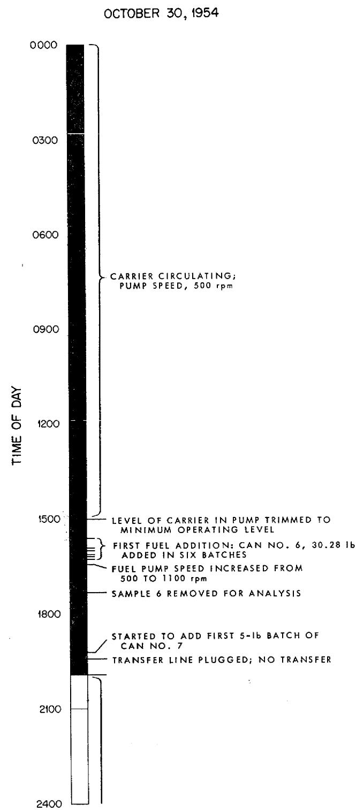  
CHRONOLOGY OF THE CRITICAL EXPERIMENT

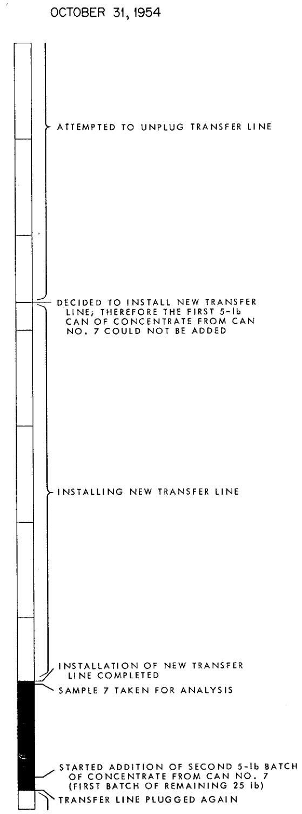

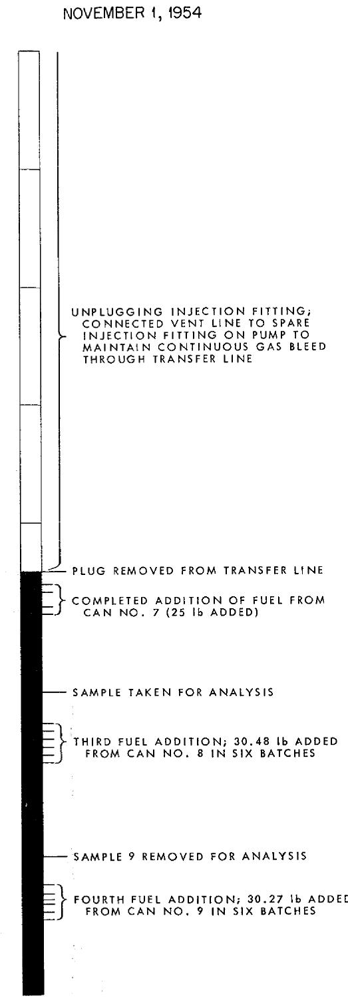

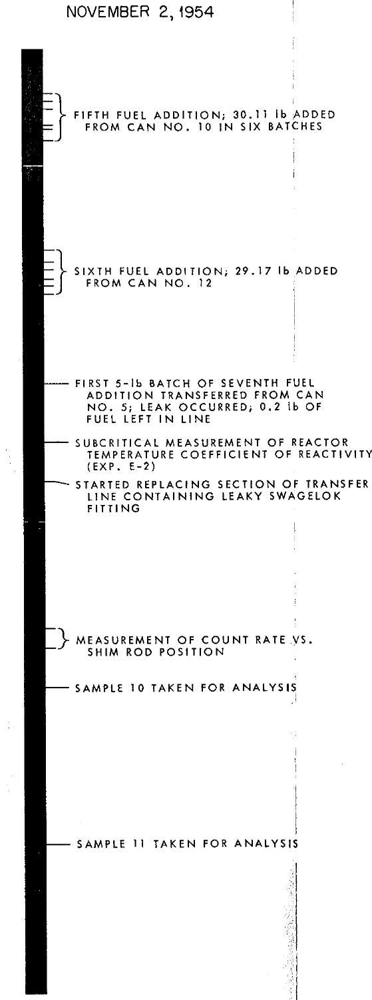

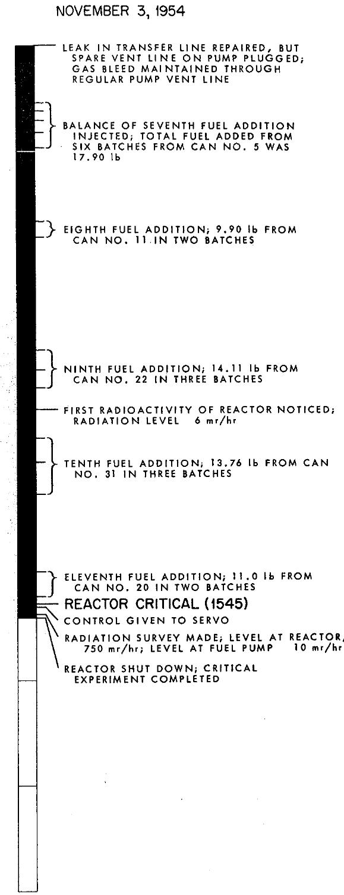  
Fig. 4.1.

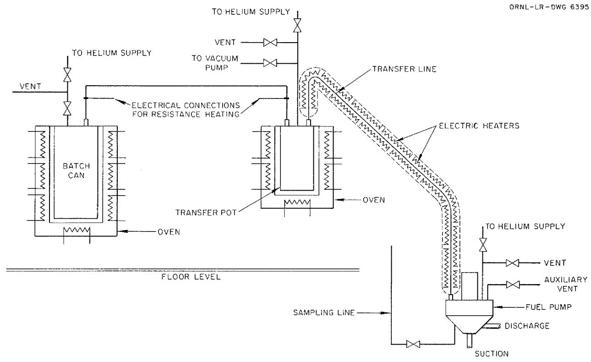  
Fig. 4.2. Equipment for Addition of Fuel Concentrate to Fuel System.

TABLE 4.1. FUEL CONCENTRATE BATCHES ADDED DURING CRITICAL EXPERIMENT   

<table><tr><td rowspan="2">Date</td><td rowspan="2">Time</td><td rowspan="2">Batch Can No.</td><td colspan="2">Concentrate Added</td><td colspan="2">Uranium Added</td><td colspan="2">Weight of U235 Added</td></tr><tr><td>g</td><td>lb</td><td>wt %</td><td>g</td><td>g</td><td>lb</td></tr><tr><td>10/30</td><td>1625</td><td>A-6</td><td>13,609</td><td>30.002</td><td>59.548</td><td>8104</td><td>7569</td><td>16.687</td></tr><tr><td>11/1</td><td>1415</td><td>A-7</td><td>11,510</td><td>25.375</td><td>59.513</td><td>6850</td><td>6398</td><td>14.105</td></tr><tr><td></td><td>1804</td><td>A-8</td><td>13,852</td><td>30.538</td><td>59.530</td><td>8246</td><td>7702</td><td>16.980</td></tr><tr><td></td><td>2203</td><td>A-9</td><td>13,806</td><td>30.437</td><td>59.587</td><td>8227</td><td>7684</td><td>16.940</td></tr><tr><td>11/2</td><td>0213</td><td>A-10</td><td>13,638</td><td>30.066</td><td>59.454</td><td>8108</td><td>7573</td><td>16.695</td></tr><tr><td></td><td>0610</td><td>A-12</td><td>13,241</td><td>29.191</td><td>59.531</td><td>7882</td><td>7362</td><td>16.230</td></tr><tr><td></td><td>0831</td><td>A-5</td><td>8,221</td><td>18.124</td><td>59.637</td><td>4903</td><td>4579</td><td>10.095</td></tr><tr><td>11/3</td><td>0523</td><td>A-11</td><td>4,505</td><td>9.932</td><td>59.671</td><td>2688</td><td>2511</td><td>5.536</td></tr><tr><td></td><td>0941</td><td>B-22</td><td>6,432</td><td>14.180</td><td>59.702</td><td>3840</td><td>3587</td><td>7.908</td></tr><tr><td></td><td>1245</td><td>B-31</td><td>6,312</td><td>13.915</td><td>59.637</td><td>3764</td><td>3516</td><td>7.751</td></tr><tr><td></td><td>1536</td><td>B-20</td><td>4,567</td><td>10.068</td><td>59.529</td><td>2719</td><td>2540</td><td>5.600</td></tr></table>

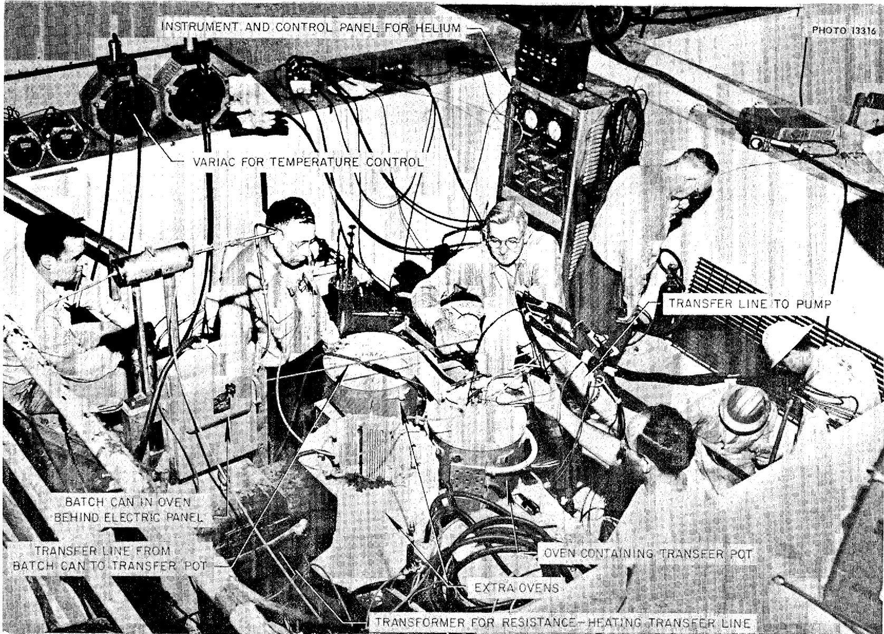  
Fig. 4.3. Chemists Preparing for Enrichment Operation During Critical Experiment.

time the volume of carrier in the fuel system was calculated to be 4.82 ft³, and the weight was 927 lb. At 1507, concentrate transfer was started from batch can A-6 to the intermediate tank, and, at 1539, transfer of the first 5.5 lb of fuel to the system was accomplished. At 1554, the second 5.5 lb of fuel had been added. These fuel injections very noticeably affected the fission chamber recorders. Mixing of the concentrate with the carrier did not occur rapidly, and therefore each time the enriched slug entered the reactor it produced a multiplication that was observable on the fission chamber count-rate recorder. Figure 4.4 is a photograph of the trace of fission chamber No. I; the pips that occurred during addition of the first and second slugs of fuel are readily observable. From the time interval between pips, which was almost

exactly 2 min, and the volume of the fuel system, a check on the rate of fuel flow was obtained:

$$
\begin{array}{l} f (\mathrm {g p m}) = \frac {4 . 8 2 \left(\mathrm {f t} ^ {3}\right) \times 7 . 4 8 (\mathrm {g a l} / \mathrm {f t} ^ {3})}{2 (\mathrm {m i n})} \\ = 1 8. 0 3. \\ \end{array}
$$

This checked fairly well with the value of about 20 gpm read from the fuel flow recorder.

The remaining four injections from can A-6 were accomplished smoothly. The pumps were speeded up to an observed fuel flow rate of 46 gpm to obtain better mixing of the fuel. At 1720, fuel sample 6 was removed for analysis.

At 1920 the first 5.5-lb injection from can A-7 was started, but the transfer line from the intermediate pot to the pump clogged due to concentrate freezing in it. After several hours of unsuccessful attempts to free the line, a gas leak occurred in the transter line at the intermediate tank pot, and

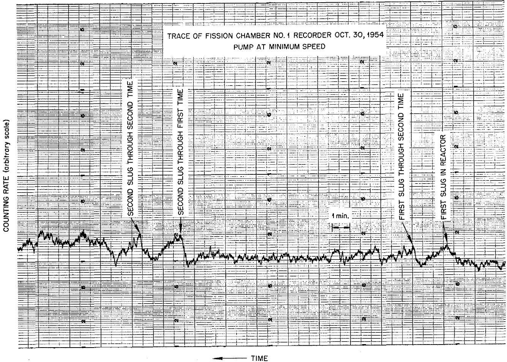  
ORNL-LR-DWG 3853   
Fig. 4.4. Passage of Enriched Slugs Through Reactor.

it was then decided to install a new transfer line and transfer pot. At this time it was reported that no transfer of concentrate had been made to the pump from can A-7. The first 5.5 lb of can A-7 was lost to the experiment through the leaks and in the plugged line.

At 2000 on November 1, the new transfer line and tank were installed and checked out ready for use. At 2006, fuel sample 7 was drawn for analysis, and, at 2300, the critical experiment was resumed. When the first 5.5-lb slug was injected, periodic pips were again observed on the fission chamber recorder. These pips had a period of 47 sec which, together with a pump speed of 1080 rpm, yielded a calculated fuel flow of 46 gpm, which corresponded to the flow observed on the fuel flowmeter.

At 2315, while attempting the next 5.5-lb transfer, the line again froze. The line was disconnected and found to be plugged at the injection fitting through the pump flange. It was therefore decided to increase the current to the resistance-heated fitting and to add a separate vent line from the pump so that the chemists could continue to "blow through" the transfer line and out the new vent line without raising the system pressure.

By 1320 on November 1 the new vent line had been installed and the transfer system was again in operating condition. The transfer of the remaining 20 lb of concentrate in four batches from can A-7 took place with no difficulty, and the transfer was completed by 1415. At 1617, fuel sample 8 was taken for analysis, and, at 1707, the first batch from can A-8 was transferred into the system. The remaining 5 batches were transferred smoothly, and the transfer from can A-8 was completed by 1804. At 2028, fuel sample 9 was removed for analysis. The next three additions of fuel from cans A-9, A-10, and A-12 were accomplished with little difficulty.

At 0830 on November 2, while transferring the first 5-lb batch from can A-5, a leak occurred in the injection line just below the floor level of the loading station (see Fig. 4.3). Examination of the injection line showed the leak to have occurred at a Swagelok fitting. Approximately 0.2 lb of concentrate was lost from the experiment as a result of the leak. Since the line had clogged, it was necessary to install a new section of line. During the time the repairs were being made to the injection system, the original schedule was changed, and a subcritical measurement of the temperature coefficient of reactivity was made. In addition, samples 10 and 11 were taken for analysis.

# SUBCRITICAL MEASUREMENT OF THE REACTOR TEMPERATURE COEFFICIENT

Approximately 100 lb of U²³⁵ (180 lb of Na₂UF₆) had been added at the time the leak occurred on November 2, at 0831, and it was estimated that this was about 80% of the total fuel needed. Although it had been planned to make a preliminary measurement of the temperature coefficient of reactivity with about 90% of the fuel added (see "Nuclear Operating Procedures," Appendix D), the plans were revised and the measurement was made at this time.

At the start of the experiment the reactor mean temperature was $1306^{\circ}\mathrm{F}$ . The fuel heat exchanger barrier doors were raised (at 1003); two minutes later the fuel helium blower was started and its speed increased to 275 rpm. The resultant cooling, with time, as traced by the reactor fuel mean temperature recorder, is shown in Fig. 4.5, with the counting rate from fission chamber No. 2 superimposed. The data for both fission chambers are given in Table 4.2. The counting rate of the fission chambers monitors the neutron flux.

The counting rate was observed to rise with decreasing temperature and thus indicated a negative temperature coefficient of reactivity. Counts were taken for 40 sec during every minute. At 1010, when the reactor temperature reached $1250^{\circ}\mathrm{F}$ , the helium blower was stopped, and soon thereafter the reactor temperature began to rise again, with a corresponding decrease in counting rate.

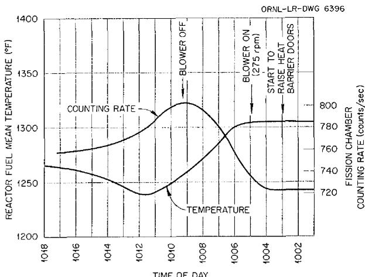  
Fig. 4.5. Subcritical Measurement of the Reactor Temperature Coefficient. (Plot of fission chamber No. 2 counting rate superimposed on fuel mean temperature chart.)

TABLE 4.2. SUBCRITICAL MEASUREMENT OF THE REACTOR TEMPERATURE COEFFICIENT  

<table><tr><td>Time</td><td>Reactor Mean Temperature (°F)</td><td>Fission Chamber No. 1 (counts/sec)</td><td>Fission Chamber No. 2 (counts/sec)</td></tr><tr><td>1004</td><td>1306</td><td>486.4</td><td>723</td></tr><tr><td>1005</td><td>1304</td><td>492.8</td><td>736</td></tr><tr><td>1006</td><td>1302</td><td>512.0</td><td>755</td></tr><tr><td>1007</td><td>1290</td><td>531.2</td><td>780.8</td></tr><tr><td>1008</td><td>1275</td><td>537.6</td><td>793.6</td></tr><tr><td>1009</td><td>1260</td><td>537.6</td><td>793.6</td></tr><tr><td>1010</td><td>1252</td><td>544.0</td><td>800.0</td></tr><tr><td>1011</td><td>1244</td><td>531.2</td><td>787.2</td></tr><tr><td>1012</td><td>1240</td><td>531.2</td><td>774.4</td></tr><tr><td>1013</td><td>1246</td><td>518.4</td><td>768.0</td></tr><tr><td>1014</td><td>1252</td><td>518.4</td><td>768.0</td></tr><tr><td>1015</td><td>1258</td><td>512</td><td>761.6</td></tr><tr><td>1154</td><td>1275</td><td>502</td><td>736.0</td></tr><tr><td>1319</td><td>1284</td><td>490.9</td><td>725.0</td></tr><tr><td>1422</td><td>1290</td><td>484</td><td>713.0</td></tr></table>

The reactor temperature coefficient, as estimated from the data presented in Fig. 4.5, was of the order of $-5 \times 10^{-5} (\Delta k / k) / ^{\circ} F$ . The data were adequate to show that the reactor would be easy to control; therefore the experiment was allowed to proceed. It will subsequently be observed that the temperature data recorded in the data room did not exhibit the full temperature drop across the reactor in any run where heat was being abstracted from the system. Consequently where the abstracted heat is one of the parameters of the experiment, as in the above temperature coefficient measurement, it would be expected that some temperature correction would be in order. The existing data for the case in question are, however, too meager to justify correction, although based on correlations (app. K) with data taken during the low- and the high-power runs, the control room temperature indications were lower than the actual temperature, and therefore the estimated temperature coefficient given above is too high.

It may also be noted from examination of Fig. 4.5 that the maximum counting rate and the temper

ature minimum did not occur simultaneously. A lag of about 2.5 min in the response of the reactor temperature was observed. The reason for this time lag is not well understood, but it may have some connection with the fact that the thermocouples were outside the reactor and hence did not "see" the changes immediately. Details of this and later measurements of the fuel and reactor temperature coefficients are given in Appendix O.

# APPROACH TO CRITICALITY

At 0130 on November 3, the injection system was again in operation, and the fuel additions during the remainder of the critical experiment occurred without mishap. The remaining portions of can A-7 and all of cans B-22, B-31, and B-20 were added during this time.

Throughout the course of the experiment, the progress toward criticality was observed on the neutron detectors. With every fuel injection the counting rates of the two fission chambers and the $\mathrm{BF}_3$ counter were simultaneously clocked and recorded. The approach to criticality could readily be seen by plotting the reactivity, $k$ , against the concentration of the fuel in the system. The reactivity was obtained from the relationship

$$
k = 1 - \frac {1}{M},
$$

where $M$ is the subcritical multiplication, which is determined from the expression

$$
M = \frac {N}{N _ {0}}
$$

where $N$ is the counting rate after a fuel injection and $N_0$ is the initial counting rate. As criticality is approached, $1 / M$ approaches zero, and therefore at criticality, $k = 1$ .

Figure 4.6 shows a plot of $k$ vs $U^{235}$ concentration, where $k$ is determined from three neutron detectors, i.e., two fission chambers and a $BF_{3}$ counter. The reactivity, as observed on the two fission chambers, showed a rapid increase during the early stages of the experiment and then leveled off as the critical condition was near. The $BF_{3}$ counter, on the other hand, showed a more uniform approach to criticality. The differences in the responses of the two types of detectors are discussed in Appendix E. Table 4.3 presents the data from which Fig. 4.6 was drawn.

A condensed, running uranium inventory during the critical experiment is given in Table 4.4. The

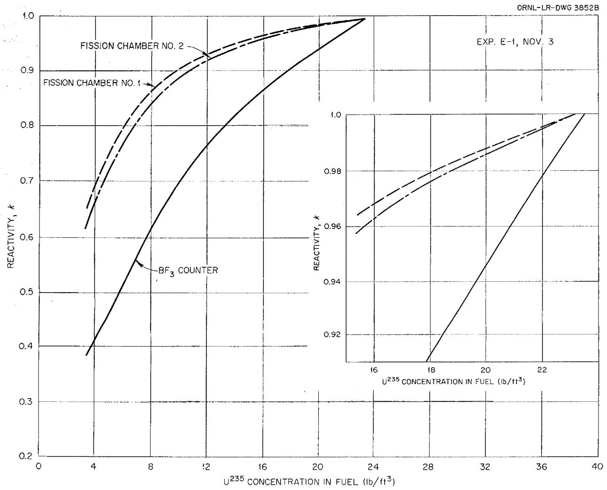  
Fig. 4.6. Approach to Criticality: Reactivity vs Fuel Concentration.

figures of columns 4, 6, and 11 were supplied by the chemists.3

At 1545 on November 3 upon the addition of the second batch of fuel from can B-20, a sustaining chain reaction was attained - the reactor was critical. Figure 4.7 shows a photo of the control room just as the critical condition was reached.

At 1547 the reactor was given over to the servo mechanism at an estimated power of 1 watt, and during the next $\frac{1}{2}$ hr a brief radiation survey of the reactor and heat exchanger pits was made (cf., chap. 5, "Low-Power Experiments"). At 1604 the reactor was shut down, and thus the initial phase of the ARE operation program was completed.

The uranium inventory (Table 4.4) showed that the critical concentration of $U^{235}$ was 23.94 lb/ft³, which corresponded to a total weight of 133.8 lb of $U^{235}$ in the fuel system. At this time the total weight of the fuel was 1156 lb, and its volume was 5.587 ft³. The per cent by weight of $U^{235}$ was calculated to be 11.57.

The critical mass of $U^{235}$ in the reactor was calculated from the ratio of volumes:

$$
M _ {r} = M _ {s} \frac {V _ {r}}{V _ {s}},
$$

where

$M_{r} =$ critical mass of $\cup^{235}$ in reactor core,

$M_{s} = \text{mass of } U^{235}$ in system,

$V_{r} =$ critical volume of reactor,

TABLE 4.3. APPROACH TO CRITICALITY: REACTIVITY FROM VARIOUS NEUTRON DETECTORS vs FUEL CONCENTRATION   

<table><tr><td rowspan="2">Log Run No.</td><td rowspan="2">U235 Concentration (lb/ft3)</td><td colspan="3">Fission Chamber No. 1</td><td colspan="3">Fission Chamber No. 2</td><td colspan="3">BF3Counter</td></tr><tr><td>Counting Rate, N (counts/sec)</td><td>Multiplication, M (N/N0)</td><td>Reactivity, k</td><td>Counting Rate, N (counts/sec)</td><td>Multiplication, M (N/N0)</td><td>Reactivity, k</td><td>Counting Rate, N (counts/sec)</td><td>Multiplication, M (N/N0)</td><td>Reactivity, k</td></tr><tr><td>1</td><td>0</td><td>9.46*</td><td>1</td><td>0</td><td>16.28*</td><td>1</td><td>0</td><td>4.49*</td><td>1</td><td>0</td></tr><tr><td>2</td><td>3.39</td><td>26.7</td><td>2.82</td><td>0.645</td><td>42.5</td><td>2.61</td><td>0.617</td><td>7.04</td><td>1.57</td><td>0.361</td></tr><tr><td>3</td><td>6.16</td><td>47.44</td><td>5.02</td><td>0.801</td><td>71.54</td><td>4.39</td><td>0.772</td><td>9.19</td><td>2.05</td><td>0.510</td></tr><tr><td>4</td><td>9.37</td><td>86.96</td><td>9.19</td><td>0.891</td><td>128.5</td><td>7.90</td><td>0.873</td><td>13.43</td><td>2.99</td><td>0.667</td></tr><tr><td>5</td><td>12.45</td><td>147.2</td><td>15.6</td><td>0.936</td><td>217.2</td><td>13.34</td><td>0.925</td><td>19.73</td><td>4.39</td><td>0.780</td></tr><tr><td>6</td><td>15.36</td><td>251.9</td><td>26.6</td><td>0.962</td><td>367.6</td><td>22.6</td><td>0.956</td><td>29.5</td><td>6.57</td><td>0.848</td></tr><tr><td>7</td><td>18.09</td><td>450.9</td><td>47.6</td><td>0.979</td><td>649.9</td><td>39.9</td><td>0.975</td><td>49.0</td><td>10.8</td><td>0.908</td></tr><tr><td>8</td><td>19.74</td><td>648.2</td><td>68.5</td><td>0.985</td><td>977.4</td><td>60.0</td><td>0.983</td><td>70.5</td><td>15.7</td><td>0.936</td></tr><tr><td>9</td><td>20.63</td><td>859.3</td><td>90.8</td><td>0.989</td><td>1317</td><td>80.9</td><td>0.988</td><td>93.7</td><td>20.9</td><td>0.952</td></tr><tr><td>10</td><td>21.88</td><td>1489</td><td>157.4</td><td>0.994</td><td>2316</td><td>142.3</td><td>0.993</td><td>161.3</td><td>35.9</td><td>0.972</td></tr><tr><td>11</td><td>23.08</td><td>4028</td><td>425.6</td><td>0.998</td><td>6730</td><td>413.5</td><td>0.998</td><td>442.0</td><td>98.5</td><td>0.990</td></tr><tr><td>12</td><td>23.94</td><td>Critical</td><td></td><td></td><td></td><td></td><td></td><td></td><td></td><td></td></tr></table>

\*Initial counting rate, $N_0$

TABLE 4.4. URANIUM INVENTORY DURING CRITICAL EXPERIMENT   

<table><tr><td rowspan="2">Date</td><td rowspan="2">Time</td><td rowspan="2">Run No.</td><td colspan="2">Fuel Concentrate Added</td><td colspan="2">Samples Removed for Analysis</td><td colspan="3">Fuel Mixture</td><td colspan="3">Uronium-235</td><td></td></tr><tr><td>Weight (lb)</td><td>Volume (ft3)</td><td>Fuel Removed (lb)</td><td>U235 Removed (lb)</td><td>Total Weight Concentrate Plus Carrier (lb)</td><td>Total Volume (ft3)</td><td>Density (lb/ft3)</td><td>Weight Added (lb)</td><td>Total Weight in System (lb)</td><td>Concentration lb/ft3wt %</td><td></td></tr><tr><td>10/30</td><td>1425</td><td>1</td><td></td><td></td><td></td><td></td><td>927.3</td><td>4.820</td><td>192.4</td><td></td><td>0</td><td></td><td></td></tr><tr><td></td><td>1625</td><td>2</td><td>30.00</td><td>0.1046</td><td></td><td></td><td>957.3</td><td>4.925</td><td>194.4</td><td>16.687</td><td>16.687</td><td>3.388</td><td>1.743</td></tr><tr><td></td><td>1740</td><td></td><td></td><td></td><td>2.447</td><td>0.0427</td><td>954.8</td><td>4.912</td><td></td><td></td><td>16.644</td><td></td><td></td></tr><tr><td>10/31</td><td>2013</td><td></td><td></td><td></td><td>2.531</td><td>0.0441</td><td>952.3</td><td>4.900</td><td></td><td></td><td>16.600</td><td></td><td></td></tr><tr><td>11/1</td><td>1415</td><td>3</td><td>25.37</td><td>0.0885</td><td></td><td></td><td>977.7</td><td>4.988</td><td>196.0</td><td>14.105</td><td>30.705</td><td>6.156</td><td>3.141</td></tr><tr><td></td><td>1635</td><td></td><td></td><td></td><td>2.286</td><td>0.0716</td><td>977.5</td><td>4.976</td><td></td><td></td><td>30.633</td><td></td><td></td></tr><tr><td></td><td>1804</td><td>4</td><td>30.54</td><td>0.1065</td><td></td><td></td><td>1008</td><td>5.082</td><td>198.3</td><td>16.980</td><td>47.613</td><td>9.368</td><td>4.723</td></tr><tr><td></td><td>2040</td><td></td><td></td><td></td><td>2.670</td><td>0.1261</td><td>1005</td><td>5.069</td><td></td><td></td><td>47.487</td><td></td><td></td></tr><tr><td></td><td>2203</td><td>5</td><td>30.44</td><td>0.1062</td><td></td><td></td><td>1036</td><td>5.175</td><td>200.2</td><td>16.940</td><td>64.427</td><td>12.45</td><td>6.220</td></tr><tr><td>11/2</td><td>0213</td><td>6</td><td>30.07</td><td>0.1049</td><td></td><td></td><td>1066</td><td>5.280</td><td>201.9</td><td>16.695</td><td>81.122</td><td>15.36</td><td>7.610</td></tr><tr><td></td><td>0610</td><td>7</td><td>29.19</td><td>0.1018</td><td></td><td></td><td>1095</td><td>5.382</td><td>203.5</td><td>16.230</td><td>97.352</td><td>18.09</td><td>8.890</td></tr><tr><td></td><td>0831</td><td>8a</td><td>5.50</td><td>0.0192</td><td></td><td></td><td>1101</td><td>5.401</td><td>203.8</td><td>3.058</td><td>100.410</td><td>18.59</td><td>9.123</td></tr><tr><td></td><td>1625</td><td></td><td></td><td></td><td>2.562</td><td>0.2337</td><td>1098</td><td>5.388</td><td></td><td></td><td>100.176</td><td></td><td></td></tr><tr><td></td><td>2025</td><td></td><td></td><td></td><td>2.716</td><td>0.2478</td><td>1095</td><td>5.375</td><td></td><td></td><td>99.928</td><td></td><td></td></tr><tr><td>11/3</td><td>0256</td><td>8b</td><td>12.62</td><td>0.0440</td><td></td><td></td><td>1108</td><td>5.419</td><td>204.5</td><td>7.037</td><td>106.965</td><td>19.74</td><td>9.654</td></tr><tr><td></td><td>0523</td><td>9</td><td>9.93</td><td>0.0346</td><td></td><td></td><td>1118</td><td>5.454</td><td>205.0</td><td>5.536</td><td>112.501</td><td>20.63</td><td>10.06</td></tr><tr><td></td><td>0941</td><td>10</td><td>14.18</td><td>0.0495</td><td></td><td></td><td>1132</td><td>5.503</td><td>205.7</td><td>7.908</td><td>120.409</td><td>21.88</td><td>10.64</td></tr><tr><td></td><td>1245</td><td>11</td><td>13.92</td><td>0.0486</td><td></td><td></td><td>1146</td><td>5.552</td><td>206.4</td><td>7.751</td><td>128.160</td><td>23.08</td><td>11.18</td></tr><tr><td></td><td>1536</td><td>12</td><td>10.07</td><td>0.0351</td><td></td><td></td><td>1156</td><td>5.587</td><td>206.9</td><td>5.600</td><td>133.760</td><td>23.94</td><td>11.57</td></tr><tr><td></td><td>1545</td><td></td><td colspan="2">Criticality reached</td><td></td><td></td><td></td><td></td><td></td><td></td><td></td><td></td><td></td></tr><tr><td>11/4</td><td>0910</td><td></td><td></td><td></td><td>2.679</td><td>0.3100</td><td>1153</td><td>5.574</td><td></td><td></td><td>133.450</td><td></td><td></td></tr><tr><td></td><td>0915</td><td></td><td></td><td></td><td>2.718</td><td>0.3145</td><td>1151</td><td>5.561</td><td></td><td></td><td>133.135</td><td></td><td></td></tr><tr><td></td><td>1310</td><td></td><td></td><td></td><td>2.482</td><td>0.2872</td><td>1148</td><td>5.549</td><td></td><td></td><td>132.848</td><td></td><td></td></tr><tr><td></td><td>1315</td><td></td><td></td><td></td><td>0.732</td><td>0.0847</td><td>1147</td><td>5.545</td><td></td><td></td><td>132.763</td><td></td><td></td></tr></table>

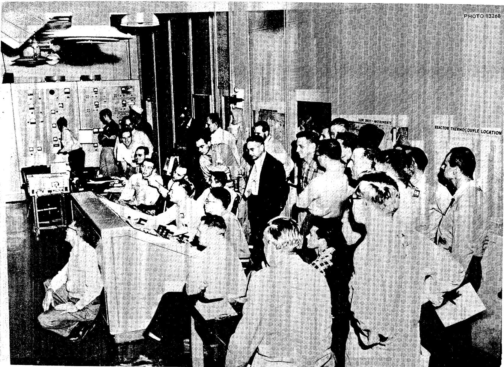  
Fig. 4.7. Control Room at Criticality.

$$
V _ {s} = \text {s y s t e m v o l u m e}.
$$

Therefore

$$
M _ {r} = 1 3 3. 8 \mathrm {l b} \left(\frac {1 . 3 7 \mathrm {f t} ^ {3}}{5 . 5 8 7 \mathrm {f t} ^ {3}}\right) = 3 2. 8 \mathrm {l b}.
$$

The calculated, cold, clean critical mass of the reactor, as obtained from the subsequent rod calibrations, was 32.75 lb (cf., app. F).

The reactor was not instrumented to permit the measurement of the flux or power distributions through the reactor, but measurements of these distributions were made on a critical mockup of the reactor at the ORNL Critical Experiment Facility about two years before the operation of the ARE. These measurements represent the best

information that is available and, because of the general interest therein, typical axial and radial flux and power distribution curves are given in Appendix G.

# ANALYSES OF FUEL SAMPLES

In addition to the fuel samples taken, as noted, during the critical experiment, four more samples were removed on November 4 after initial criticality was reached. A list of all samples taken and the results of the chemical analyses are presented in Table 4.5. Besides showing the analyses of the percentages of U and $\mathsf{U}^{235}$ by weight in the fuel system and a comparison with the $\mathsf{U}^{235}$ (wt %) content obtained from the criticality data, the table also lists the results of the analyses for the impurities and corrosion products Fe, Cr, and Ni to provide information on the purity of the fuel and the corrosion rate of the fuel system.

TABLE 4.5. CHEMICAL ANALYSES OF FUEL SAMPLES   

<table><tr><td rowspan="2">Date</td><td rowspan="2">Time</td><td rowspan="2">Sample No.</td><td colspan="3">Impurities and Corrosion Products (ppm)</td><td rowspan="2">Total Uranium (wt %)</td><td rowspan="2">U235 from Chemical Analysis (wt %)</td><td rowspan="2">U235 from Critical Experiment Data (wt %)</td></tr><tr><td>Cr</td><td>Fe</td><td>Ni</td></tr><tr><td>10/25</td><td>1650</td><td>1</td><td>90</td><td>200</td><td>50</td><td></td><td></td><td></td></tr><tr><td>10/26</td><td>1414</td><td>2</td><td>81</td><td>&lt;5</td><td>40</td><td></td><td></td><td></td></tr><tr><td></td><td>1911</td><td>3</td><td>81</td><td>&lt;5</td><td>6</td><td></td><td></td><td></td></tr><tr><td>10/27</td><td>1919</td><td>4</td><td>90</td><td>18</td><td>12</td><td></td><td></td><td></td></tr><tr><td>10/29</td><td>0935</td><td>5</td><td>102</td><td>30</td><td>20</td><td></td><td></td><td></td></tr><tr><td>10/30</td><td>1740</td><td>6</td><td>100</td><td>20</td><td>10</td><td>2.47 ± 0.01</td><td>2.31</td><td>1.74</td></tr><tr><td></td><td>2013</td><td>7</td><td>150</td><td>15</td><td>10</td><td>1.84 ± 0.04</td><td>1.72</td><td>1.74</td></tr><tr><td>11/1</td><td>1635</td><td>8</td><td>190</td><td>15</td><td>15</td><td>3.45 ± 0.01</td><td>3.22</td><td>3.14</td></tr><tr><td></td><td>2040</td><td>9</td><td>200</td><td>10</td><td>17</td><td>5.43 ± 0.01</td><td>5.07</td><td>4.72</td></tr><tr><td>11/2</td><td>1625</td><td>10</td><td>210</td><td></td><td></td><td>9.58 ± 0.08</td><td>8.95</td><td>9.12</td></tr><tr><td></td><td>2025</td><td>11</td><td>205</td><td>20</td><td>20</td><td>9.54 ± 0.08</td><td>8.91</td><td>9.12</td></tr><tr><td>11/4</td><td>0910</td><td>12</td><td>310</td><td></td><td></td><td>12.11 ± 0.10</td><td>11.32</td><td>11.57</td></tr><tr><td></td><td>0915</td><td>13</td><td>300</td><td></td><td></td><td>12.21 ± 0.12</td><td>11.41</td><td>11.57</td></tr><tr><td></td><td>1310</td><td>14</td><td>320</td><td></td><td></td><td>12.27 ± 0.08</td><td>11.46</td><td>11.57</td></tr><tr><td></td><td>1315</td><td>15</td><td>310</td><td></td><td></td><td>12.24 ± 0.12</td><td>11.43</td><td>11.57</td></tr><tr><td>11/5</td><td>1100</td><td>16</td><td>372</td><td>5</td><td>&lt;5</td><td>12.54 ± 0.07</td><td>11.72</td><td>11.72</td></tr><tr><td>11/6</td><td></td><td>17</td><td></td><td></td><td></td><td>12.57 ± 0.07</td><td>11.75</td><td>11.79</td></tr><tr><td></td><td>0535</td><td>18</td><td>420</td><td></td><td></td><td>12.59 ± 0.12</td><td>11.77</td><td>11.79</td></tr><tr><td>11/7</td><td>0423</td><td>19</td><td>445</td><td></td><td></td><td>13.59 ± 0.08</td><td>12.70</td><td>12.38</td></tr></table>

The first five samples were removed from the system prior to enrichment, and samples 16 through 19 were taken after the critical experiment and during the low power runs at the time of the calibration of the regulating rods against fuel addition.

For the most part, the U235 content as given by chemical analysis agreed to within a few per cent with that obtained from the running inventory. When the sample for analysis was withdrawn from the system too soon after a fuel addition, there was a tendency for the analysis to be low, undoubtedly, because of inadequate mixing of the additive with the bulk of the fuel. The chemical analysis of sample 1, however, was obviously in error, whereas that of sample 9 gave a uranium content that was about $7\%$ higher than the inventory showed. The other sample analysis figures were within about $2\%$ of the percentages given by the inventory. The analyses of samples 12, 13, and 14, which were taken after the critical experiment, agreed to within about $1\%$ with the inventory calculation.

The increase in the buildup of chromium in the fuel system with time is shown in Fig. 4.8 to give an indication of the corrosion rate of the system. The initial corrosion rate was quite small, but after enriched fuel had been added to the system, the analyses showed a chromium content increase of about $50~\mathrm{ppm / day}$ .

# CALIBRATION OF THE SHIM RODS

As outlined in the "Nuclear Operating Procedures," Appendix D, during the first fuel additions the shim rods were withdrawn all the way out of the reactor to obtain the multiplication. After about 100 lb of $U^{235}$ had been added to the system, the procedure was altered in order to obtain a shim rod calibration. After each fuel addition, all three rods were simultaneously withdrawn to positions of 20, 25, 30, and 35 in. out; total movement was 36 in. The counting rate of each of the neutron detectors was recorded for each rod position. Figure 4.9 shows the reciprocal multiplication and the reactivity as a function of $U^{235}$ content of the fuel system for the various rod positions. The data used for plotting Fig. 4.9 were obtained from the $BF_{3}$ counter and are presented in Table 4.6. A cross-plot of reactivity vs shim rod position determined the rod calibration details, which are given in Appendix J. The rods

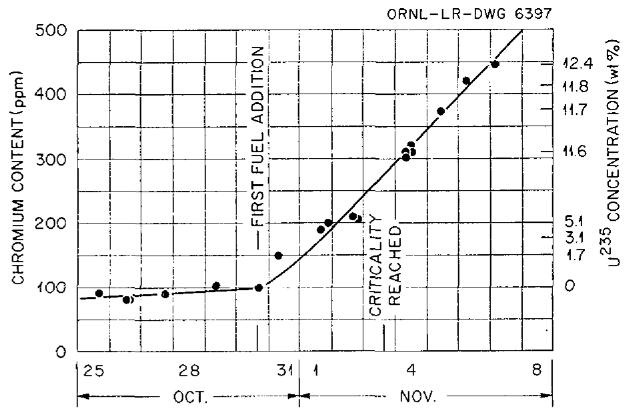  
Fig. 4.8. Increase in Chromium Concentration in Fuel as a Function of Time.

were found to be nonlinear, with $(\Delta k / k) / \mathrm{in}$ . and total $\Delta k / k$ varying in the manner shown in Appendix D. From the calibration it was found that each rod was worth a total of about $5.8\% \Delta k / k$ .

As a check on the general shape of the reactivity curves of the shim rods, a series of counts were taken on the $\mathsf{BF}_3$ counter and the fission chambers for various rod positions for two different uranium concentrations. These data are also discussed in Appendix J.

# MEASUREMENT OF THE REACTIVITY-MASS RATIO

Prior to the ARE operation it had been estimated that when the critical mass (assumed to be 30 lb) was reached, the value of the ratio $(\Delta k / k) / (\Delta M / M)$ should be 0.232. This value was obtained from a calculation of the ratio for various amounts of $U^{235}$ , as shown in Fig. D.1 of Appendix D. From the data taken during the critical experiment, it was possible to establish an experimental curve for the ratio and to verify the value given above for the ratio at the critical mass.

In order to find $(\Delta k / k) / (\Delta M / M)$ experimentally, use was made of the curve of Fig. 4.9 which gives $k$ in terms of the $U^{235}$ content of the fuel in the system for various shim rod positions; i.e., for any point,

$$
\frac {\Delta k / k}{\Delta M / M} = \left(\frac {\Delta k}{\Delta M}\right) \left(\frac {M}{k}\right) = R,
$$

which is the reactivity-mass ratio. The value

TABLE 4.6. REACTIVITY vs ${\mathrm{U}}^{235}$ CONTENT OF FUEL SYSTEM FOR VARIOUS SHIM ROD POSITIONS   

<table><tr><td>Experiment E-1 Run No.</td><td>U235 in System (lb)</td><td>Shim Rod Positions* (in. out)</td><td>Counting Rate, BF3 Counter (counts/sec)</td><td>N0/N</td><td>k=1-(N0/N)</td></tr><tr><td rowspan="4">8 A</td><td rowspan="4">100.41</td><td>20</td><td>32.0</td><td>0.140</td><td>0.860</td></tr><tr><td>25</td><td>38.4</td><td>0.117</td><td>0.883</td></tr><tr><td>30</td><td>46.9</td><td>0.0956</td><td>0.904</td></tr><tr><td>35</td><td>54.3</td><td>0.082</td><td>0.918</td></tr><tr><td rowspan="4">8 B</td><td rowspan="4">103.13</td><td>20</td><td>34.1</td><td>0.131</td><td>0.869</td></tr><tr><td>25</td><td>40.5</td><td>0.111</td><td>0.889</td></tr><tr><td>30</td><td>51.2</td><td>0.0877</td><td>0.912</td></tr><tr><td>35</td><td>57.8</td><td>0.0774</td><td>0.923</td></tr><tr><td rowspan="4">8 C</td><td rowspan="4">106.18</td><td>20</td><td>36.3</td><td>0.123</td><td>0.877</td></tr><tr><td>25</td><td>46.9</td><td>0.0954</td><td>0.905</td></tr><tr><td>30</td><td>57.8</td><td>0.0774</td><td>0.923</td></tr><tr><td>35</td><td>66.1</td><td>0.0676</td><td>0.932</td></tr><tr><td rowspan="4">8 D</td><td rowspan="4">106.97</td><td>20</td><td>36.3</td><td>0.123</td><td>0.877</td></tr><tr><td>25</td><td>46.9</td><td>0.0954</td><td>0.905</td></tr><tr><td>30</td><td>59.7</td><td>0.0749</td><td>0.925</td></tr><tr><td>35</td><td>68.3</td><td>0.0655</td><td>0.935</td></tr><tr><td rowspan="4">9 A</td><td rowspan="4">110.14</td><td>20</td><td>38.4</td><td>0.117</td><td>0.883</td></tr><tr><td>25</td><td>51.2</td><td>0.0874</td><td>0.913</td></tr><tr><td>30</td><td>68.3</td><td>0.0655</td><td>0.934</td></tr><tr><td>35</td><td>83.2</td><td>0.0538</td><td>0.946</td></tr><tr><td rowspan="4">9 B</td><td rowspan="4">112.50</td><td>20</td><td>40.5</td><td>0.111</td><td>0.889</td></tr><tr><td>25</td><td>55.5</td><td>0.0808</td><td>0.919</td></tr><tr><td>30</td><td>76.8</td><td>0.0582</td><td>0.942</td></tr><tr><td>35</td><td>93.9</td><td>0.0479</td><td>0.952</td></tr><tr><td rowspan="4">10 A</td><td rowspan="4">115.58</td><td>20</td><td>44.8</td><td>0.0998</td><td>0.900</td></tr><tr><td>25</td><td>59.7</td><td>0.0749</td><td>0.925</td></tr><tr><td>30</td><td>83.2</td><td>0.0538</td><td>0.946</td></tr><tr><td>35</td><td>110.9</td><td>0.0403</td><td>0.960</td></tr><tr><td rowspan="4">10 B</td><td rowspan="4">118.63</td><td>20</td><td>42.7</td><td>0.105</td><td>0.895</td></tr><tr><td>25</td><td>68.3</td><td>0.0655</td><td>0.934</td></tr><tr><td>30</td><td>93.3</td><td>0.0479</td><td>0.952</td></tr><tr><td>35</td><td>136.5</td><td>0.0327</td><td>0.967</td></tr><tr><td rowspan="4">10 C</td><td rowspan="4">120.41</td><td>20</td><td>51.2</td><td>0.0873</td><td>0.913</td></tr><tr><td>25</td><td>68.3</td><td>0.0655</td><td>0.934</td></tr><tr><td>30</td><td>110.9</td><td>0.0403</td><td>0.960</td></tr><tr><td>35</td><td>162.1</td><td>0.0276</td><td>0.972</td></tr><tr><td rowspan="4">11 A</td><td rowspan="4">123.43</td><td>20</td><td>51.2</td><td>0.0873</td><td>0.913</td></tr><tr><td>25</td><td>85.3</td><td>0.0524</td><td>0.948</td></tr><tr><td>30</td><td>128.0</td><td>0.0349</td><td>0.965</td></tr><tr><td>35</td><td>213.3</td><td>0.0209</td><td>0.979</td></tr><tr><td rowspan="4">11 B</td><td rowspan="4">126.48</td><td>20</td><td>59.7</td><td>0.0749</td><td>0.925</td></tr><tr><td>25</td><td>93.9</td><td>0.0476</td><td>0.952</td></tr><tr><td>30</td><td>162.1</td><td>0.0275</td><td>0.973</td></tr><tr><td>35</td><td>307.2</td><td>0.0145</td><td>0.985</td></tr><tr><td rowspan="4">11 C</td><td rowspan="4">128.16</td><td>20</td><td>59.7</td><td>0.0749</td><td>0.925</td></tr><tr><td>25</td><td>93.9</td><td>0.0476</td><td>0.952</td></tr><tr><td>30</td><td>196.3</td><td>0.0228</td><td>0.977</td></tr><tr><td>35</td><td>443.7</td><td>0.0101</td><td>0.990</td></tr><tr><td rowspan="4">12 A</td><td rowspan="4">131.08</td><td>20</td><td>59.8</td><td>0.0748</td><td>0.925</td></tr><tr><td>25</td><td>110.9</td><td>0.0403</td><td>0.960</td></tr><tr><td>30</td><td>256.0</td><td>0.0175</td><td>0.983</td></tr><tr><td>35</td><td>955.7</td><td>0.00468</td><td>0.995</td></tr><tr><td rowspan="4">12 B</td><td rowspan="4">133.76</td><td>20</td><td>68.3</td><td>0.0655</td><td>0.935</td></tr><tr><td>25</td><td>136.5</td><td>0.0327</td><td>0.967</td></tr><tr><td>30</td><td>375.5</td><td>0.0119</td><td>0.988</td></tr><tr><td>35</td><td>Critical</td><td></td><td></td></tr></table>

*Position of all three shim rods.

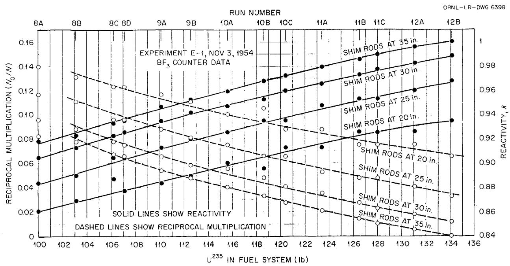  
Fig. 4.9. Reactivity and Reciprocal Multiplication vs $\mathbf{U}^{235}$ Content of Fuel System for Various Shim Rod Positions.

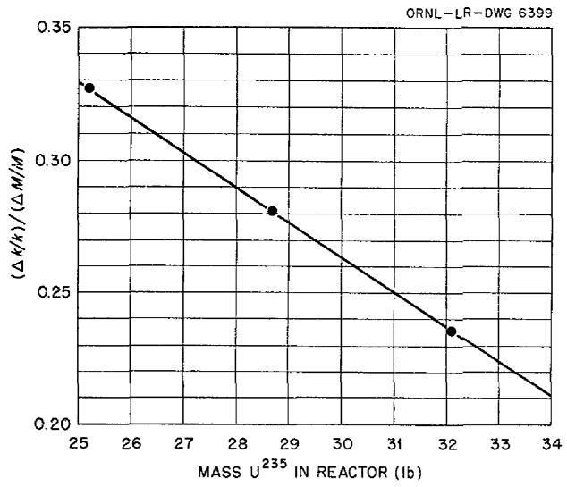  
Fig. 4.10. Reactivity-Mass Ratio as a Function of the $U^{235}$ Content of the Fuel in the Reactor.

$(\Delta k / \Delta M)$ is the slope of the $k$ vs $M$ curves shown in Fig. 4.9. For various small sections of the curves the slopes approximated straight lines. From the average values of $M$ and $k$ over these increments of the curves and the measured slopes, the ratio $R$ was determined for each increment. Figure 4.10 shows a plot of $R$ vs the $\mathsf{U}^{235}$ content of the fuel in the system.

The value of $R$ for the experimental critical mass (133.8 lb) was calculated to be

$$
\frac {\Delta k / k}{\Delta M / M} = 0. 2 3 6
$$

for shim rod positions of 25, 30, and 35 in. Since this value (0.236) was in excellent agreement with the calculated value (0.232), it was used throughout the experiment. The data are tabulated in Table 4.7.

TABLE 4.7. REACTIVITY-MASS RATIO AS A FUNCTION OF THE AMOUNT OF U235 IN THE REACTOR FOR VARIOUS SHIM ROD POSITIONS   

<table><tr><td>Mass Range* (lb)</td><td>Shim Rod Position** (in.)</td><td>M, Mass of U235 in Reactor (lb)</td><td>ΔM (lb)</td><td>Reactivity, k</td><td>Δk</td><td>Reactivity-Mass Ratio, Δk/k ΔM/M</td></tr><tr><td rowspan="4">100 to 106</td><td>25</td><td>25.24</td><td>1.47</td><td>0.891</td><td>0.0172</td><td>0.331</td></tr><tr><td>30</td><td>25.24</td><td>1.47</td><td>0.913</td><td>0.0175</td><td>0.329</td></tr><tr><td>35</td><td>25.24</td><td>1.47</td><td>0.924</td><td>0.0174</td><td>0.322</td></tr><tr><td></td><td></td><td></td><td></td><td></td><td>Average 0.327</td></tr><tr><td rowspan="4">114 to 120</td><td>25</td><td>28.66</td><td>1.47</td><td>0.929</td><td>0.0137</td><td>0.287</td></tr><tr><td>30</td><td>28.66</td><td>1.47</td><td>0.951</td><td>0.0136</td><td>0.279</td></tr><tr><td>35</td><td>28.66</td><td>1.47</td><td>0.963</td><td>0.0135</td><td>0.273</td></tr><tr><td></td><td></td><td></td><td></td><td></td><td>Average 0.280</td></tr><tr><td rowspan="4">128 to 134</td><td>25</td><td>32.10</td><td>1.44</td><td>0.961</td><td>0.0110</td><td>0.257</td></tr><tr><td>30</td><td>32.10</td><td>1.49</td><td>0.982</td><td>0.0100</td><td>0.219</td></tr><tr><td>35</td><td>32.10</td><td>1.40</td><td>0.995</td><td>0.0100</td><td>0.231</td></tr><tr><td></td><td></td><td></td><td></td><td></td><td>Average 0.236</td></tr></table>

*These mass ranges refer to the curves of Fig. 4.9 on which these calculations are based.   
\*\*Position of all three rods.

The reactor was operated, after initial criticality was attained, for about 20 min at a nominal power of 1 w and then shut down. The next morning a series of low-power experiments was started. This series of experiments lasted from the morning of November 4 until the morning of November 8. The chronology of this low-power operation is given in Fig. 5.1.

Two of the early experiments, L-1 and L-4, were devoted to a determination of the reactor power from measurements of the fuel activation. These runs were each of 1 hr duration with the reactor at a nominal power of 1 and 10 w, respectively. After each of these runs, fuel samples were taken and the activity counts were made from which the reactor power was determined. The method was inaccurate, as subsequently evidenced by power calibrations from the extracted power, but did indicate that the nominal power estimates were low.

Radiation surveys of the entire experimental system were made during both the nominal 1- and 10-w runs except that a survey of the reactor pit was not attainable during the 10-w run because the pit was sealed at that time. Most of the equipment and many of the instruments were, however, located in the heat exchanger pits to which access was maintained throughout the low-power operation.

Most of the time of the low-power operation was devoted to calibration of the regulating and shim rods. The two essentially independent methods used to calibrate the regulating rods were calibration against fuel addition and calibration against reactor periods by using the inhour equation (app.1). The shim rods were then calibrated against the regulating rod.

Also as an integral part of the low-power operation the earlier measurement of the temperature coefficient was checked, and the fuel system performance characteristics were determined. Finally, in preparation for the high-power experiments, the ion chambers, which had been positioned close to the reactor during the critical and low-power experiments for greater sensitivity, were withdrawn so that they would register sensibly at the higher powers.

# POWER DETERMINATION FROM FUEL ACTIVATION

Reactor power measurements are usually made by exposing gold or indium foils to the neutron

flux in a reactor soon after initial criticality is attained. In the ARE it was simpler to draw off a sample of the uranium-bearing fuel after operation and measure its activity with an ion chamber. Comparison with a similar sample of known activity gave a determination of the flux level and, hence, the power level. The procedure is described in Appendix H.

In run L-1, the reactor was operated for 1 hr at an estimated power level of 1 w, and a sample was drawn off for measurement of the activity. The specific activity was too low for a reliable determination and, accordingly, the experiment was repeated in run L-4 at a nominal 10-w power level.

It was subsequently found from the heat balance at high power that the actual power was 27 w during run L-4. However, the fuel sample activity was only on the order of one-half to two-thirds the activity to be expected from operation at 27 w. Apparently a considerable amount of the gaseous fission products was being given off from the fuel. A comparison of the data obtained from fuel activation with those obtained from heat balances is given in Appendix N.

# RADIATION SURVEYS

The primary purpose of experiments L-1 and L-4 was to calibrate the estimated reactor power against the power determined from the radioactivity of fuel samples, but, at the same time, radiation dose levels were measured at various locations around the reactor and the tank and heat exchanger pits. These data will subsequently be of interest in evaluating the radiation damage to various components of the system.

Most of the radiation measurements were made with a "Cutie-Pie" (a gamma-sensitive ionization chamber), but a GM survey meter, a methane proportional counter, an electroscope, and a boron-coated electroscope were used for some measurements, in particular, those made close to the reactor. While the GM survey meter only provided a check on the gamma dose as measured by the "Cutie-Pie," the other instruments provided measurements of the fast- and thermal-neutron doses. The proportional counter measured the fast-neutron dose, and the thermal-neutron flux was calculated from the difference of the two electroscope readings.

ORNL-LR-DWG 6400

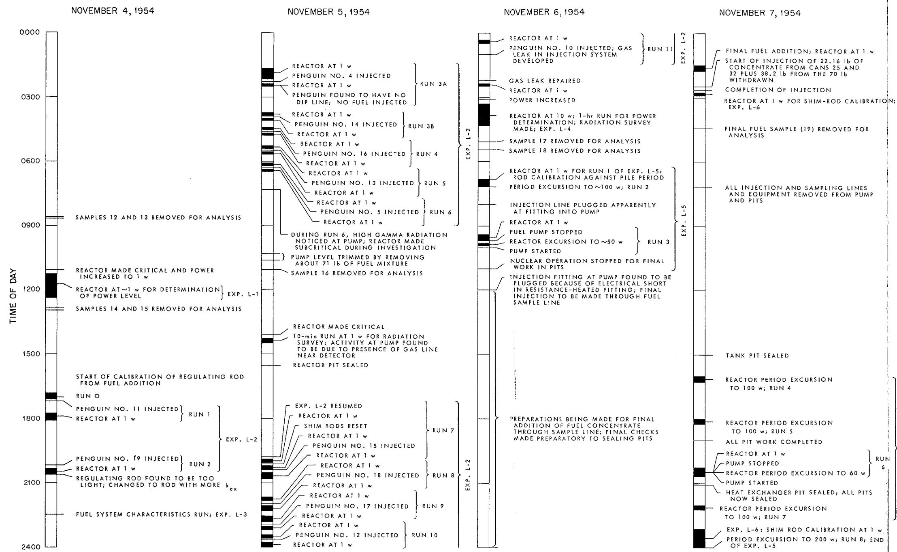  
CHRONOLOGY OF THE LOW-POWER EXPERIMENTS

NOVEMBER 8,1954

EXP.L-7: EFFECT OF FUEL FLOW RATE ON DELAYED NEUTRONS; REACTOR AT 1 w; FUEL FLOW VARIOVED 0 TO 46 gpm START EXP. L-8: MEASUREMENT OF TEMPERATURE COEFFICIENT AT LOW POWER; REACTOR AT 1 w

START HELIUM BLOWERS

RAISE THERMAL BARRIER DOORS

INCREASE HELIUM BLOWER SPEED TO 255 rpm READJUST SHIM RODS; LOW HEAT EXCHANGES REVERSE: HELIUM BLOWER OFF

READJUST SHIM RODS

OBSERVE HEAT UP AND CHANGE OF REGULATING ROD POSITION

END OF EXP. L-8; START OF EXP. L-9: READJUSTMENT OF CHAMBERS FOR HIGH POWER LEVEL

ACCIDENTAL SCRAM

POWER 40 TO 500 w DURING ADJUSTMENT OF CHAMBERS

PERIOD SCRAM TO CHECK SAFETY CHAMBERS; END OF EXP. L-9

END OF LOW-POWER EXPERIMENTS

20-kw RUN; APPROACH TO POWER; EXP. H-1

REACTOR SCRAMMED; ACTIVE GASES IN BASEMENT

The radiation dose data from the two runs during which the dose in the pits was measured are presented in Tables 5.1 and 5.2. Table 5.1 gives the gamma and the fast- and thermal-neutron doses in the reactor pit during the 2.7-w run; Table 5.2 gives the gamma doses at various stations in the heat exchanger pit during both the 2.7- and 27-w runs. Within the accuracy of the measurements, there is excellent agreement between the doses per watt from the two runs.

# REGULATING ROD CALIBRATION FROM FUEL ADDITIONS

Twelve small cans, or "penguins" (so-called because of their shape), had been prepared for adding small amounts of fuel to the system in order to calibrate the regulating rod (exp. L-2) after initial criticality had been reached. Each penguin contained from 0.2 to 0.5 lb of fuel concentrate (0.1 to 0.3 lb of $U^{235}$ ). The contents of the penguins were injected directly into the pump rather than through the intermediate transfer pot that was used in the critical experiments. Table 5.3 lists the penguins in the chronological order in which they were used, together with the amount of uranium injected from each can.

The method used to calibrate the regulating rod was to note the difference between the position of the rod at criticality before and after each injection of fuel, with the shim rods held constant. Before each injection the reactor was brought from subcritical to a nominal power of 1 w, and the shim and regulating rod positions were recorded. The reactor was then brought subcritical on the regulating rod, with the shim rods in position, and the

fuel was injected from the penguin. Upon completion of the injection the reactor was again brought critical to l-watt power with the regulating rod. The positions of the rods were again recorded. The worth of the rod was then obtained from the relation

$$
\frac {\Delta k}{k} = 0. 2 3 6 \frac {\Delta M}{M}
$$

and the known increment of fuel added to the system; the proportionality factor, 0.236, was obtained experimentally during the critical experiment (cf., chap. 4).

The first run of experiment L-2 started at 1651 on November 4. After two injections had been completed, it was apparent that the worth of the 12 in. of vertical movement of the regulating rod in terms of $\Delta k / k$ was about $0.24\%$ . It was desirable, for reasons of safety and also for convenience in conducting high-power transient experiments, to have a rod worth about one dollar of reactivity (which for the ARE was $0.4\%$ rather than $0.76\%$ as in stationary-fuel reactors, because of delayed-neutron loss in the circulating fuel). A number of spare rods of varying weights had been made up to take care of such a contingency, and one was selected and installed which had more nearly the desired weight. The original rod weighed $19.2\mathrm{g} / \mathrm{cm}$ of length, and the new rod weighed $36\mathrm{g} / \mathrm{cm}$ .

While the rod was being changed (a delay of about 5 hr), the fuel system characteristics of pressure head vs flow were obtained. These measurements are described in a following section of this chapter.

TABLE 5.1. RADIATION LEVELS IN REACTOR PIT DURING 2.7-w RUN   

<table><tr><td>Position</td><td>Gamma 
Dose Rate 
(mr/hr per w)</td><td>Fast-Neutron 
Dose Rate 
(mrep/hr per w)</td><td>Thermal-Neutron 
Dose Rate 
(mrep/hr per w)</td><td>Total 
Dose Rate* 
(mr/hr)</td></tr><tr><td>Space cooler No. 1</td><td>48</td><td>67</td><td>8</td><td>760</td></tr><tr><td>Top center of reactor 
(1 in. above thermal shield)</td><td>280</td><td>280</td><td>35 (est.)</td><td>3200</td></tr><tr><td>Side of reactor at mid-plane 
(at surface of thermal shield)</td><td>440</td><td>180</td><td>22 (est.)</td><td>2350</td></tr><tr><td>Manhole into pits</td><td>12</td><td>10</td><td>2</td><td>130</td></tr></table>

*The total dose rate was obtained from the weighted sum of the preceding columns by using an RBE of 10 for fast neutrons and 5 for thermal neutrons.

TABLE 5.2. GAMMA-RAY DOSE IN TANK AND HEAT EXCHANGER PITS   

<table><tr><td></td><td>Doses per WattDuring 2.7-w Run (mr/hr)</td><td>Doses per WattDuring 27-w Run (mr/hr)</td></tr><tr><td colspan="3">Locations Surveyed in Dump Tank Pit</td></tr><tr><td>Motor for space cooler No. 3</td><td>0.3</td><td>0.3</td></tr><tr><td>Vent valve U-113 for tank No. 6</td><td>0.1</td><td>0.15</td></tr><tr><td>Motor for stack vent on hot fuel dump tank</td><td>0.2</td><td>0.15</td></tr><tr><td>Vent Valve U-112 for hot fuel dump tank</td><td>0.1</td><td>0.07</td></tr><tr><td>Helium inlet valve U-100</td><td>0.07</td><td>0.07</td></tr><tr><td>Motor for space cooler No. 4</td><td></td><td>0.07</td></tr><tr><td>Air-operated valve for tank No. 5</td><td></td><td>0.07</td></tr><tr><td colspan="3">Locations Surveyed in Fuel-to-Helium Heat Exchanger Pit</td></tr><tr><td>Operator&#x27;s position at fuel sampler</td><td>6</td><td>4</td></tr><tr><td>Pressure transmitter PXT-6</td><td>22</td><td></td></tr><tr><td>Top plate of main fuel pump</td><td>150</td><td>120</td></tr><tr><td>Top bearing of pump motor</td><td>45</td><td>80</td></tr><tr><td>V-belt at pump</td><td>7</td><td>6</td></tr><tr><td>V-belt at pump motor</td><td>7</td><td>4</td></tr><tr><td>Line 120 under valve U-3</td><td>110</td><td>12</td></tr><tr><td>Bend No. 2 of line 303</td><td>105</td><td>45</td></tr><tr><td>Motor for space cooler No. 6</td><td>10</td><td></td></tr><tr><td>West side of heat exchanger No. 1</td><td>135</td><td>120</td></tr><tr><td>Bottom of fuel flowmeter</td><td>95</td><td>105</td></tr><tr><td>Line 112 between valves U-63 and U-1</td><td>220</td><td>200</td></tr><tr><td>Lubrication pump for pump</td><td>65</td><td>90</td></tr><tr><td>Top of fuel storage tank</td><td>4</td><td></td></tr><tr><td>Helium analyzer dryers</td><td>0.3</td><td>1</td></tr><tr><td>East side of heat exchanger No. 1</td><td></td><td>230</td></tr><tr><td>West side of heat exchanger No. 2</td><td></td><td>200</td></tr><tr><td>Sheet metal can around pump</td><td></td><td>185</td></tr><tr><td colspan="3">Locations Surveyed in Sodium-to-Helium Heat Exchanger Pits</td></tr><tr><td>Top of standby sodium pump</td><td>1.5</td><td>1.4</td></tr><tr><td>V-belt above standby pump</td><td>1.5</td><td>1.7</td></tr><tr><td>Line 310 under valve B-141</td><td>13</td><td>15</td></tr><tr><td>Motor for space cooler No. 7</td><td>4</td><td></td></tr><tr><td>Top of main sodium pump</td><td>1.5</td><td>0.7</td></tr><tr><td>V-belt above main pump</td><td>0.7</td><td>0.8</td></tr><tr><td>Line 309 at valve U-21</td><td>2.2</td><td>1.8</td></tr><tr><td>Line 313 at bend No. 5</td><td>1.5</td><td>1.5</td></tr><tr><td>Motor for space cooler No. 8</td><td>1.5</td><td></td></tr><tr><td>North side of front heat exchanger</td><td>15</td><td>16</td></tr><tr><td>Kinney pump No. 1</td><td>4</td><td>4</td></tr><tr><td>Magnetic clutch on 50-hp motor</td><td>11</td><td>13</td></tr><tr><td>North side of back heat exchanger</td><td>1</td><td>6</td></tr><tr><td>North end of rod-coolant blower No. 1</td><td>6</td><td>7</td></tr><tr><td>EM flowmeter on line 305</td><td>3.7</td><td>5</td></tr><tr><td>Standby pump lubrication system</td><td></td><td>9</td></tr><tr><td>Main pump lubrication system</td><td></td><td>3</td></tr></table>

TABLE 5.3. FUEL CONCENTRATE BATCHES ADDED DURING LOW-POWER EXPERIMENTS   

<table><tr><td rowspan="2">Date</td><td rowspan="2">Time</td><td rowspan="2">Penguin No.</td><td colspan="2">Concentrate Added</td><td colspan="2">Uranium Added</td><td colspan="2">U235 Added</td></tr><tr><td>g</td><td>lb</td><td>wt %</td><td>g</td><td>g</td><td>lb</td></tr><tr><td rowspan="2">11/4</td><td>1710</td><td>C-11</td><td>227</td><td>0.5004</td><td>59.671</td><td>135</td><td>126</td><td>0.2778</td></tr><tr><td>2009</td><td>C-19</td><td>722</td><td>1.5917</td><td>59.671</td><td>431</td><td>403</td><td>0.8885</td></tr><tr><td rowspan="8">11/5</td><td>0354</td><td>C-14</td><td>247</td><td>0.5445</td><td>59.671</td><td>147</td><td>137</td><td>0.3020</td></tr><tr><td>0439</td><td>C-16</td><td>285</td><td>0.6283</td><td>59.671</td><td>170</td><td>159</td><td>0.3505</td></tr><tr><td>0529</td><td>C-13</td><td>131</td><td>0.2888</td><td>59.671</td><td>78.2</td><td>73.0</td><td>0.1609</td></tr><tr><td>0619</td><td>C-5</td><td>123</td><td>0.2712</td><td>59.671</td><td>73.3</td><td>68.5</td><td>0.1510</td></tr><tr><td>2045</td><td>C-15</td><td>92</td><td>0.2028</td><td>59.671</td><td>55</td><td>51.4</td><td>0.1143</td></tr><tr><td>2204</td><td>C-18</td><td>87</td><td>0.1918</td><td>59.671</td><td>52</td><td>48.6</td><td>0.1071</td></tr><tr><td>2258</td><td>C-17</td><td>457</td><td>1.0075</td><td>59.671</td><td>273</td><td>255</td><td>0.5622</td></tr><tr><td>2345</td><td>C-12</td><td>84</td><td>0.1852</td><td>59.671</td><td>50</td><td>46.7</td><td>0.1030</td></tr><tr><td>11/6</td><td>0100</td><td>C-10</td><td>84</td><td>0.1852</td><td>59.671</td><td>50</td><td>46.7</td><td>0.1030</td></tr><tr><td>11/7</td><td>0231</td><td>120*</td><td>21,681</td><td>47.798</td><td>27.557</td><td>5975</td><td>5581</td><td>12.304</td></tr></table>

*Container No. 120 was not a penguin but a specially prepared batch of concentrate which provided the excess uranium required for the experiments and to compensate for burnup.

At 0142 on November 5 the installation of the second rod was completed and the experiment was resumed. Four more injections of fuel were made and the rod movement was noted. At 0630, during the sixth fuel injection, an unexpectedly high burst of gamma-ray activity (55 mr/hr) was observed on a "Cutie-Pie" monitoring the fuel addition at the injection station over the pump. Further fuel addition was stopped until the cause of the high gamma-ray reading could be ascertained. While investigation was under way the level of the pump was trimmed to avoid any possible hazard from the uranium held in the pump. About 71 lb of fuel was removed from the system. Later in the day the cause of the high gamma-ray activity was determined to be a vent line passing close to the position of the "Cutie-Pie." Apparently, the "Cutie-Pie" had been held close enough to the vent line to read the fission gases (evolved during operation) as they were discharged through the vent line.

At 1947 the experiment was resumed and five more injections were made uneventfully. A photograph of the control room taken during this time is presented in Fig. 5.2; it shows two members of the ARE operating group examining the fission chamber recorders after a fuel injection for rod calibration; other members of the evening crew are shown in

their nominal operating stations.

An inventory of the uranium added during this experiment is given in Table 5.4. The final large amount (47.8 lb) of concentrate containing 12.30 lb $U^{235}$ that was added after the experiment is also shown in the table, as well as a record of the samples and withdrawals. The final amount of $U^{235}$ in the system was 138.55 lb, with a system volume of 5.33 ft $^3$ .

The data obtained for calibration of the regulating rod as a function of fuel addition are given in Table 5.5, which lists the values of $M$ , $\Delta M$ , $\Delta M / M$ , the recorded movement of the rod during each fuel addition, the average position of the rod for each fuel addition, and the calculated value of $(\Delta k / k) / \text{in}$ .

The results of the calibration are shown in Fig. 5.3, where $(\Delta k / k) / \mathrm{in}$ is plotted as a function of rod position. The movement of the rod for each point is shown as a horizontal line through the point. The values of $(\Delta k / k) / \mathrm{in}$ for both rods were used, the values of reactivity for rod No.1 being corrected by the ratios of the weights of the two rods. From these data it is evident that there is no good reason for presuming that the value of $(\Delta k / k) / \mathrm{in}$ over the whole length of rod is not constant. Therefore, the average value taken over the first ten runs gives

$$
\left(\Delta k / k\right) / \mathrm {in}. = 0.033 \% / \mathrm {in}.
$$

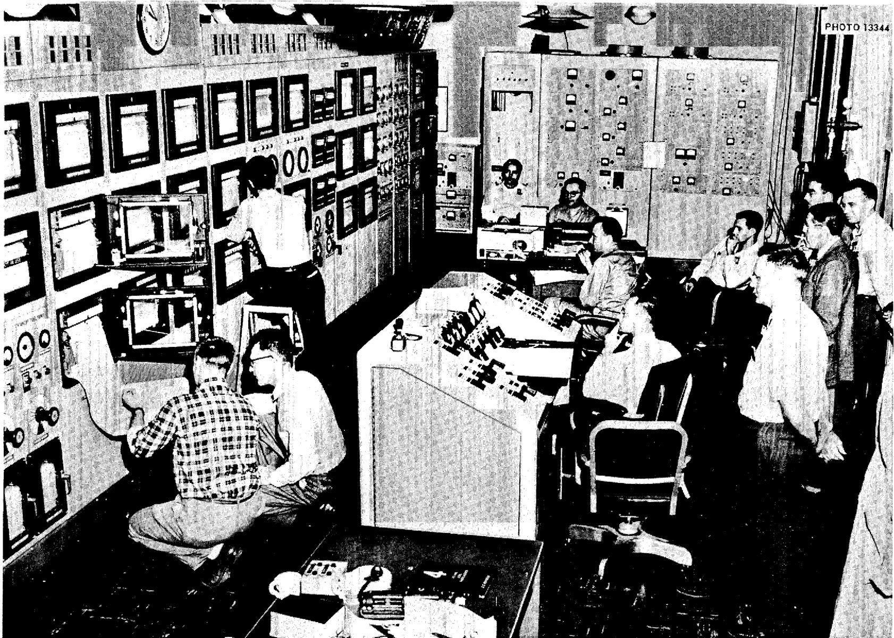  
Fig. 5.2. Typical Control Room Scene: Examining Charts During Rod Calibration Experiments.

TABLE 5.4. URANIUM INVENTORY DURING LOW-POWER EXPERIMENTS   

<table><tr><td rowspan="2">Date</td><td rowspan="2">Time</td><td rowspan="2">Run No.</td><td colspan="2">Fuel Concentrate Added</td><td colspan="2">Samples Removed for Analysis</td><td colspan="3">Fuel Mixture</td><td colspan="3">Uranium-235</td><td></td></tr><tr><td>Weight (lb)</td><td>Volume (ft3)</td><td>Fuel Removed (lb)</td><td>U235 Removed (lb)</td><td>Total Weight Concentrate Plus Carrier (lb)</td><td>Total Volume (ft3)</td><td>Density (lb/ft3)</td><td>Weight Added (lb)</td><td>Total Weight in System (lb)</td><td>Concentration lb/ft3</td><td>wt %</td></tr><tr><td>11/4</td><td>1315</td><td>0</td><td></td><td></td><td></td><td></td><td>1147.45</td><td>5.5454</td><td>206.9</td><td></td><td>132.763</td><td>23.94</td><td>11.57</td></tr><tr><td></td><td>1710</td><td>1</td><td>0.5004</td><td>0.0017</td><td></td><td></td><td>1147.95</td><td>5.5471</td><td>206.9</td><td>0.2778</td><td>133.041</td><td>23.98</td><td>11.59</td></tr><tr><td></td><td>2009</td><td>2</td><td>1.5917</td><td>0.0056</td><td></td><td></td><td>1149.54</td><td>5.5527</td><td>207.0</td><td>0.8885</td><td>133.930</td><td>24.12</td><td>11.65</td></tr><tr><td>11/5</td><td>0354</td><td>3</td><td>0.5445</td><td>0.0019</td><td></td><td></td><td>1150.08</td><td>5.5546</td><td>207.05</td><td>0.3020</td><td>134.232</td><td>24.17</td><td>11.67</td></tr><tr><td></td><td>0439</td><td>4</td><td>0.6283</td><td>0.0012</td><td></td><td></td><td>1150.71</td><td>5.5558</td><td>207.1</td><td>0.3505</td><td>134.583</td><td>24.22</td><td>11.70</td></tr><tr><td></td><td>0529</td><td>5</td><td>0.2888</td><td>0.0010</td><td></td><td></td><td>1151.00</td><td>5.5568</td><td>207.1</td><td>0.1609</td><td>134.744</td><td>24.25</td><td>11.71</td></tr><tr><td></td><td>0619</td><td>6</td><td>0.2712</td><td>0.0009</td><td></td><td></td><td>1151.27</td><td>5.5577</td><td>207.1</td><td>0.1510</td><td>134.895</td><td>24.27</td><td>11.72</td></tr><tr><td></td><td>1015</td><td></td><td></td><td></td><td>53.486*</td><td>6.269</td><td>1097.78</td><td>5.2944</td><td>207.1</td><td></td><td>128.626</td><td>24.27</td><td>11.72</td></tr><tr><td></td><td>1020</td><td></td><td></td><td></td><td>17.523*</td><td>2.064</td><td>1080.26</td><td>5.2148</td><td>207.1</td><td></td><td>126.562</td><td>24.27</td><td>11.72</td></tr><tr><td></td><td>1100</td><td></td><td></td><td></td><td>2.5807</td><td>0.291</td><td>1077.68</td><td>5.2023</td><td>207.1</td><td></td><td>126.271</td><td>24.27</td><td>11.72</td></tr><tr><td></td><td>2045</td><td>7</td><td>0.2028</td><td>0.0007</td><td></td><td></td><td>1077.88</td><td>5.2030</td><td>207.2</td><td>0.1143</td><td>126.385</td><td>24.29</td><td>11.73</td></tr><tr><td></td><td>2204</td><td>8</td><td>0.1918</td><td>0.0004</td><td></td><td></td><td>1078.07</td><td>5.2034</td><td>207.2</td><td>0.1071</td><td>126.492</td><td>24.31</td><td>11.73</td></tr><tr><td></td><td>2258</td><td>9</td><td>1.0075</td><td>0.0020</td><td></td><td></td><td>1079.08</td><td>5.2054</td><td>207.3</td><td>0.5622</td><td>127.054</td><td>24.41</td><td>11.77</td></tr><tr><td></td><td>2345</td><td>10</td><td>0.1852</td><td>0.0004</td><td></td><td></td><td>1079.27</td><td>5.2058</td><td>207.3</td><td>0.1030</td><td>127.157</td><td>24.43</td><td>11.78</td></tr><tr><td>11/6</td><td>0100</td><td>11</td><td>0.1852</td><td>0.0004</td><td></td><td></td><td>1079.45</td><td>5.2062</td><td>207.3</td><td>0.1030</td><td>127.260</td><td>24.44</td><td>11.79</td></tr><tr><td></td><td>0530</td><td></td><td></td><td></td><td>2.686</td><td>0.317</td><td>1076.76</td><td>5.1932</td><td>207.3</td><td></td><td>126.943</td><td>24.44</td><td>11.79</td></tr><tr><td></td><td>0535</td><td></td><td></td><td></td><td>2.839</td><td>0.335</td><td>1073.92</td><td>5.1795</td><td>207.3</td><td></td><td>126.608</td><td>24.44</td><td>11.79</td></tr><tr><td>11/7</td><td>0231</td><td>12</td><td>47.798**</td><td>0.1667</td><td></td><td></td><td>1121.72</td><td>5.3462</td><td>209.8</td><td>12.304</td><td>138.912</td><td>25.98</td><td>12.38</td></tr><tr><td></td><td>.0423</td><td></td><td></td><td></td><td>2.918</td><td>0.361</td><td>1118.80</td><td>5.3323</td><td>209.8</td><td></td><td>138.551</td><td>25.98</td><td>12.38</td></tr></table>

*Two large batches of fluoride mixture were removed from the system in order to trim the liquid level in the pump. **Of this amount, only 15.419 lb was Na₂UF₆, the remainder being some of the fluoride mixture that was removed from the system when the pump level was trimmed.

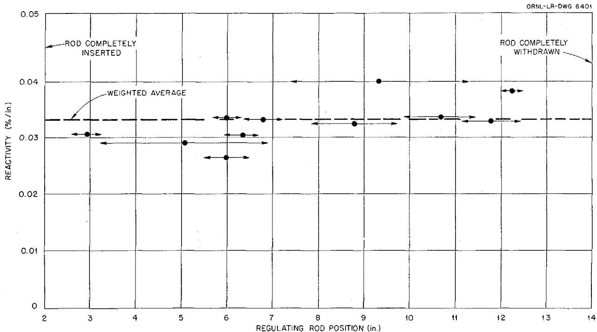  
Fig. 5.3. Calibration of Regulating Rod from Fuel Addition.

(Exp. L-2)

TABLE 5.5. REGULATING ROD REACTIVITY CALIBRATION FROM FUEL ADDITION   

<table><tr><td>Run No.</td><td>M, Weight of U235 in System (lb)</td><td>ΔM, Weight of U235 Added (lb)</td><td>ΔM/M</td><td>Δk/k (%)</td><td>Average Regulating Rod Position (in.)</td><td>Movement of Regulating Rod During Fuel Addition (in.)</td><td>Reactivity, (Δk/k)/in. (%/in.)</td></tr><tr><td>1</td><td>133.041</td><td>0.2778</td><td>0.00209</td><td>0.0493</td><td>11.80</td><td>2.4</td><td>0.0308*</td></tr><tr><td>2</td><td>133.930</td><td>0.8885</td><td>0.00663</td><td>0.156</td><td>9.35</td><td>7.3</td><td>0.0400*</td></tr><tr><td>3</td><td>134.232</td><td>0.3020</td><td>0.00225</td><td>0.0531</td><td>10.70</td><td>1.6</td><td>0.0335</td></tr><tr><td>4</td><td>134.583</td><td>0.3505</td><td>0.00260</td><td>0.0614</td><td>8.80</td><td>1.9</td><td>0.0323</td></tr><tr><td>5</td><td>134.744</td><td>0.1609</td><td>0.00119</td><td>0.0281</td><td>6.80</td><td>0.85</td><td>0.0330</td></tr><tr><td>6</td><td>134.895</td><td>0.1510</td><td>0.00112</td><td>0.0264</td><td>6.00</td><td>1.0</td><td>0.0264</td></tr><tr><td>7</td><td>126.385</td><td>0.1143</td><td>0.000904</td><td>0.0213</td><td>6.35</td><td>0.7</td><td>0.0304</td></tr><tr><td>8</td><td>126.492</td><td>0.1070</td><td>0.000847</td><td>0.0200</td><td>6.00</td><td>0.6</td><td>0.0333</td></tr><tr><td>9</td><td>127.054</td><td>0.5622</td><td>0.00442</td><td>0.104</td><td>5.10</td><td>3.6</td><td>0.0289</td></tr><tr><td>10</td><td>127.157</td><td>0.1030</td><td>0.000810</td><td>0.0191</td><td>12.25</td><td>0.5</td><td>0.0383</td></tr><tr><td>11</td><td>127.260</td><td>0.1030</td><td>0.000809</td><td>0.0191</td><td>2.95</td><td>0.67**</td><td>0.0305**</td></tr><tr><td></td><td></td><td></td><td colspan="4">Average reactivity, weighted according to rod movement</td><td>0.0331</td></tr></table>

*Corrected by the ratio of the weight of the new rod to the weight of the original rod: 36/19,2 = 1.88.   
\*\*Average of three readings.

The value from run 11 was not included in this average because three different values of rod final position were recorded in different places for this run.

# REGULATING ROD CALIBRATION FROM REACTOR PERIODS

The calibration of the regulating rod by use of reactor periods (exp. L-5) utilized the inhour equation in a form in which reactivity is given in terms of the reactor period for a given rate of fuel flow. Figure 5.4 shows a plot of the reactivity $(\Delta k / k)$ as a function of reactor periods for 0- and 48-gpm fuel flow, as calculated from the inhour relation. Details of the calculational method used are presented in Appendix I.

In the experimental procedure followed, the regulating rod was suddenly withdrawn a known distance, while the shim rods were in a set position and the reactor was operating at a nominal power of about 1 w. The reactor was then allowed to rise in power on a constant period to a peak of 50 to 100 w, at which time it was manually

scrammed. From the induced period and the known flow, the excess reactivity introduced during the run was obtained from the inhour formula. This number was then divided by the travel of the regulating rod to find the value of $(\Delta k / k) / \text{in}$ . for the run. A total of eight reactor excursions of this nature were made, six at 48-gpm flow, and two at zero flow.

Some of the reactor excursions during this experiment are shown in Fig. 5.5, as recorded by the log $N$ recorder. The straight lines that indicate the slope of the power increase reflect periods on the order of 20 to 25 sec. Figure 5.6 presents some of the period traces recorded on the period recorder during the experiment. The initial high peaks for each rod movement are due to the transient condition, the interpretation of which is given in Appendix S. In plotting the period for a particular rod motion, the average of the periods obtained from the log $N$ and the period recorders was used.

A plot of $(\Delta k / k) / \mathrm{in}$ as a function of rod position as obtained from this experiment is shown in Fig. 5.7. The horizontal lines on each side of the

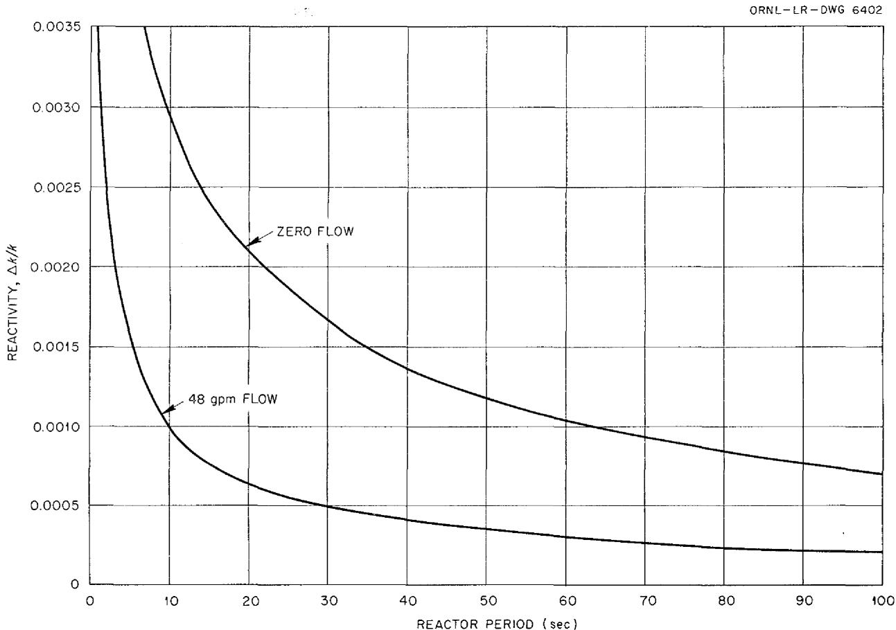  
Fig. 5.4. Regulating Rod Reactivity vs Reactor Period for Fuel Flow Rates of 0 and 48 gpm.

experimental points show the extent of the rod movement for that point. Again, there is no conclusive evidence that the reactivity of the rod per unit length was not constant. Therefore, the average of the 48-gpm flow data weighted over the rod movement for each run gives

$$
\left(\Delta k / k\right) / i n. = 0.029 \% / i n.
$$

For the two zero-flow points the rod was moved over the middle 10 in. of its 12-in. travel in two 6-in. overlapping runs covering the upper and lower halves of the rod, respectively. The weighted average of these points gave a value of

$$
\left(\Delta k / k\right) / \text {in.} = 0.033 \% / \text {in.},
$$

which is in excellent agreement with the fuel addition calibration. This value was settled upon as the best value of reactivity per inch over the whole length of the regulating rod. The values for the reactivity vs rod position are given in Table 5.6.

# CALIBRATION OF SHIM RODS VS REGULATING ROD

With the reactivity of the regulating rod known, the shim rods could be calibrated against it (exp. L-6). This calibration could then be compared with the previous calibration made during the fuel addition. It was assumed that the three shim rods were enough alike that a calibration of one rod would be representative, and rod No. 3 was chosen for the calibration.

The calibration procedure consisted of setting shim rods Nos. 1 and 2 in a fixed position, and then, with the reactor at a power level of 1 w on the servo mechanism, rod No. 3 was moved until a specified travel of the regulating rod was obtained. At the start of the experiment the rods were adjusted so that shim rod No. 3 was nearly all the way out (position indicator at 35 in.) and the regulating rod nearly all inserted (position indicator at 3 in.). After recording the position of all rods,

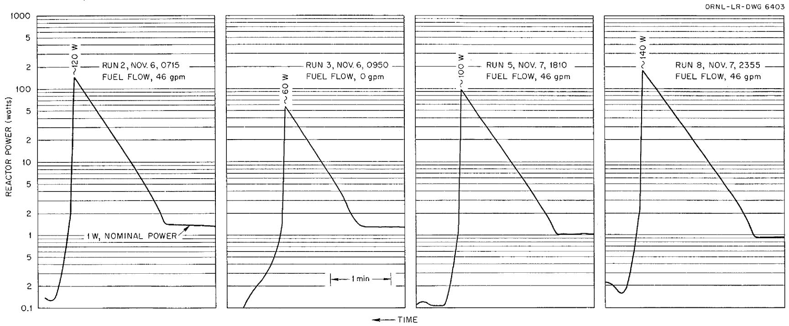  
Fig. 5.5. Typical Reactor Excursions Recorded by Log N Recorder During Period Calibration of Regulating Rod. Experiment L-5.

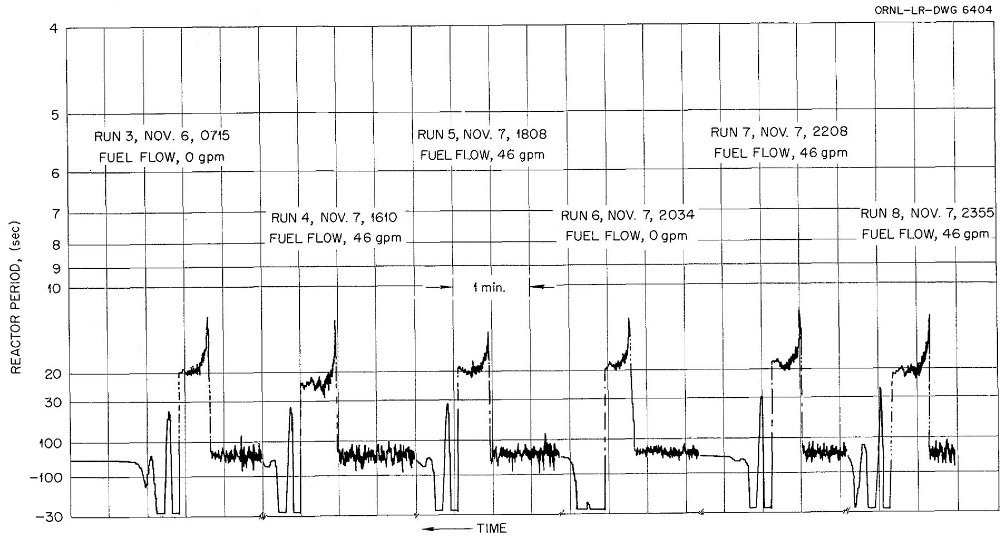  
Fig. 5.6. Reactor Periods Recorded by the Period Recorder During Calibration of Regulating Rod. Experiment L-5.

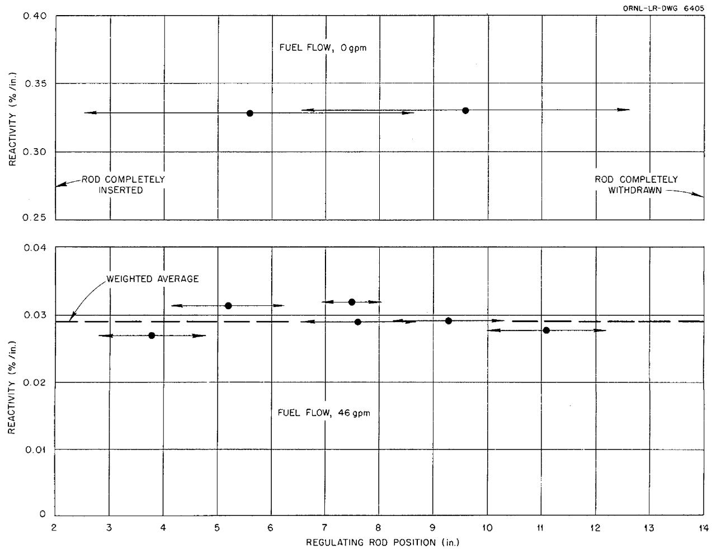  
Fig. 5.7. Calibration of Regulating Rod from Reactor Period Measurements.

shim rod No. 3 was inserted until the servo action had withdrawn the regulating rod a compensating distance of about 10 in. The action was then stopped and the new rod positions were recorded. With shim rod No. 3 set, shim rods Nos. 1 and 2 were then adjusted to bring the regulating rod back to its original position, and again the rod positions were recorded. Again rod No. 3 was inserted until a 10-in. withdrawal of the regulating rod was attained. This process was repeated until rod No. 3 had been inserted about 14 in., and each new position had been recorded. This calibration agreed well with the calibration against fuel addition. Details of the results are given in Appendix J.

# FUEL SYSTEM CHARACTERISTICS

The fuel system characteristics with the fuel concentrate in the system were determined for the

first (and only) time the day after the reactor first became critical (exp. L-3). The final amounts of concentrate (i.e., the excess to provide for burnup and poisoning during the subsequent power runs) had not yet been added to the system. Consequently, the fuel density at the time the data were taken was $3.32 \, \text{g/cm}^3$ as compared with $3.36 \, \text{g/cm}^3$ for the final fuel composition, and $3.08 \, \text{g/cm}^3$ for the carrier; all densities were determined at $1300^\circ \text{F}$ .

The measured and calculated flow data as a function of pump speed are shown in Fig. 5.8. The flow was calculated for two pump speeds by using the time between pips on the fission chamber as concentrate was first added to the system. The straight line joining the two calculated points is considered to be a good approximation because of the regime in which the pump was operated.

(Exp. L-5)

TABLE 5.6. REGULATING ROD REACTIVITY CALIBRATION FROM REACTOR PERIOD MEASUREMENTS   

<table><tr><td>Run No.</td><td>Fuel Flow (gpm)</td><td>Average Period (sec)</td><td>Δk/k from Inhour Equation</td><td>Average Regulating Rod Position (in.)</td><td>Movement of Regulating Rod (in.)</td><td>Reactivity, (Δk/k)/in. (%/in.)</td></tr><tr><td>1</td><td>48</td><td>48</td><td>0.00036</td><td>7.5</td><td>1.1</td><td>0.0318</td></tr><tr><td>2</td><td>48</td><td>22.2</td><td>0.00060</td><td>7.6</td><td>2.08</td><td>0.0289</td></tr><tr><td>3</td><td>0</td><td>21</td><td>0.00206</td><td>9.6</td><td>6.05</td><td>0.0330</td></tr><tr><td>4</td><td>48</td><td>26</td><td>0.00054</td><td>3.8</td><td>2.0</td><td>0.0270</td></tr><tr><td>5</td><td>48</td><td>22</td><td>0.00061</td><td>11.1</td><td>2.2</td><td>0.0278</td></tr><tr><td>6</td><td>0</td><td>21.6</td><td>0.0020</td><td>5.6</td><td>6.1</td><td>0.0328</td></tr><tr><td>7</td><td>48</td><td>20.1</td><td>0.00065</td><td>5.2</td><td>2.08</td><td>0.0313</td></tr><tr><td>8</td><td>48</td><td>22.2</td><td>0.00060</td><td>9.3</td><td>2.06</td><td>0.0291</td></tr><tr><td></td><td></td><td></td><td></td><td></td><td>Average for 0-gpm flow</td><td>0.0329</td></tr><tr><td></td><td></td><td></td><td></td><td></td><td>Average for 48-gpm flow</td><td>0.029</td></tr></table>

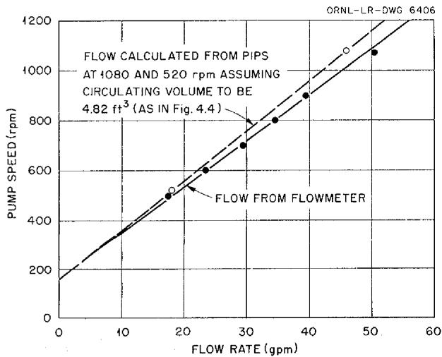  
Fig. 5.8. Fuel Flow Rate as a Function of Pump Speed.

The flow data as a function of the system head loss from the reactor inlet to the pump tank are given in Fig. 5.9. The flow data are plotted directly vs head (by using the flow rates determined from pump speed as given by the upper curve in Fig. 5.8) and then as corrected for a "live" zero

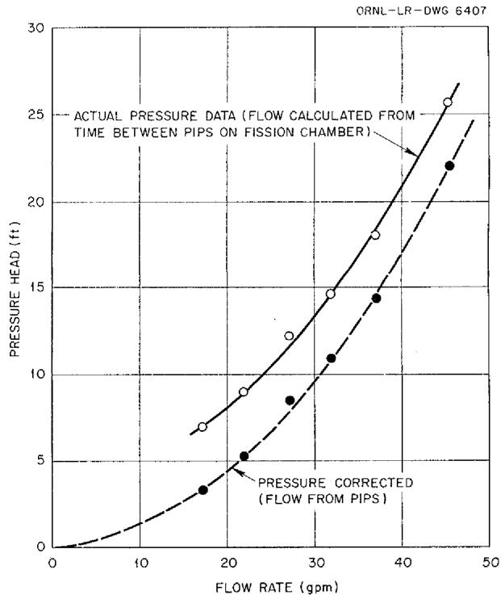  
Fig. 5.9. Fuel Flow Rate vs the Pressure Head from the Pump Suction to the Reactor Inlet.

on the pressure transmitter from which the head values were obtained. The latter data fit the theoretical curve very well. Furthermore, these system data fit the pump performance data, if it is assumed that there is a 7-psi drop from the pump discharge to the reactor inlet at design flow (i.e., $46\mathrm{gpm}$ ); there is no experimental measurement of this pressure drop. The pump performance characteristics determined in a test stand run with fuel at $1300^{\circ}\mathrm{F}$ are given in Fig. 5.10.

# EFFECT OF FUEL FLOW ON REACTIVITY

An experiment was performed in which the effect of fuel flow on reactivity was observed (exp.L-7). For this experiment the reactor was brought to a nominal power of 1 watt and given over to the flux servo mechanism after full fuel flow of 46 gpm had been established. After recording the positions of the regulating and shim rods the flow rate was reduced step-wise until zero-flow was reached. Each reduction of the flow was accompanied by a change of position of the regulating rod. Reducing

the flow had the effect of allowing more delayed neutrons to contribute to the flux level in the reactor, and therefore the servo mechanism inserted the regulating rod to compensate for the excess reactivity created by the delayed neutrons. Each rate of fuel flow and the corresponding regulating rod position were recorded. The results of the experiment are shown in Fig. 5.11, where $\Delta k / k$ is plotted as a function of flow rate. It is observed that 12 in. of rod movement, or $0.4\% \Delta k / k,$ was needed to compensate for the reactivity introduced when the flow rate was reduced from full to zero flow. This curve is comparable to that shown in Fig. D.2 of Appendix D. The data for this experiment are tabulated in Table 5.7.

Although not a part of experiment L-7, additional insight into fuel activity may be obtained from examination of Fig. 5.12, which shows activity as recorded by fission chamber No. 2. Before the data shown in the figure were recorded the reactor had been operating at a power of about 1 w with the fuel pump stopped. As shown, the reactor was

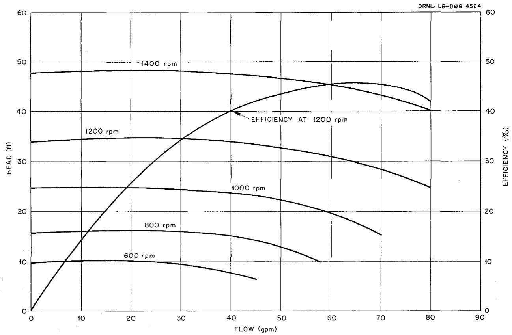  
Fig. 5.10. Fuel Pump Performance Curves.

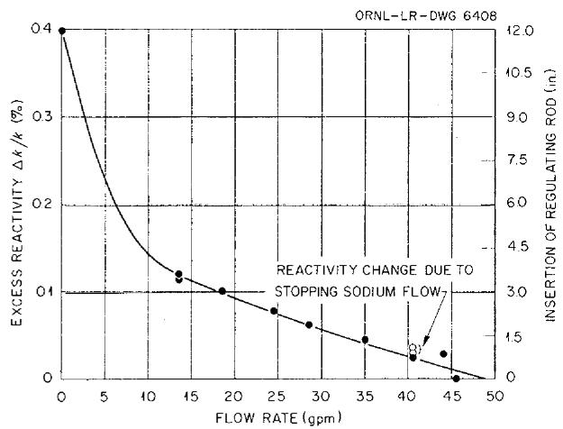  
Fig. 5.11. Effect of Fuel Flow Rate on Reactivity.

TABLE 5.7.EFFECT OF FUEL FLOW RATE ON REACTIVITY   
(Exp. L-7)   

<table><tr><td>Run No.</td><td>Fuel Flow (gpm)</td><td>Sodium Flow (gpm)</td><td>Movement of Regulating Rod (in.)</td><td>Change in Reactivity, Δk/k (%)</td></tr><tr><td>1</td><td>45.5</td><td>149</td><td>0</td><td>0</td></tr><tr><td>2</td><td>41</td><td>149</td><td>0.7</td><td>0.0231</td></tr><tr><td>3</td><td>35</td><td>149</td><td>1.4</td><td>0.0462</td></tr><tr><td>4</td><td>28.5</td><td>149</td><td>1.9</td><td>0.0627</td></tr><tr><td>5</td><td>23.8</td><td>149</td><td>2.4</td><td>0.0792</td></tr><tr><td>6</td><td>18</td><td>149</td><td>3.0</td><td>0.099</td></tr><tr><td>7</td><td>13.5</td><td>149</td><td>3.45</td><td>0.114</td></tr><tr><td>8</td><td>0</td><td>149</td><td>12.05</td><td>0.398</td></tr><tr><td>9</td><td>13.5</td><td>149</td><td>3.45</td><td>0.114</td></tr><tr><td>10</td><td>0</td><td>149</td><td>12.05</td><td>0.398</td></tr><tr><td>11</td><td>13.5</td><td>149</td><td>3.65</td><td>0.120</td></tr><tr><td>12</td><td>13.5</td><td>149</td><td>3.65</td><td>0.120</td></tr><tr><td>13</td><td>43.5</td><td>149</td><td>0.9</td><td>0.0297</td></tr><tr><td>14</td><td>41</td><td>149</td><td>0.96</td><td>0.0317</td></tr><tr><td>15</td><td>41</td><td>0</td><td>1.12</td><td>0.0370</td></tr><tr><td>16</td><td>41</td><td>149</td><td>0.96</td><td>0.0317</td></tr></table>

then scrambled1 and the fuel pump started. The fuel which had been in the reactor before the scram was more active than the remainder of the fuel and

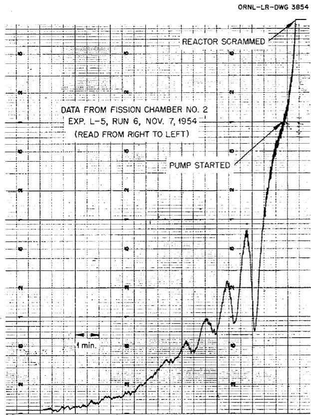  
Fig. 5.12. Circulating Fuel Slugs after Starting Pump Following a Reactor Scram.

it was this excess activity which showed up as the fuel was circulated after the reactor was scrambled.

# LOW-Power Measurement of THE TEMPERATURE COEFFICIENT

A measurement of the temperature coefficient of reactivity (exp. L-8) was made next. With the reactor isothermal at $1312^{\circ}\mathrm{F}$ and controlled by the flux servo mechanism, the heat barrier doors were raised and the helium blower turned on to 200 rpm to cool the fuel in the heat exchanger. As the temperature of the reactor decreased, the servo began to drive the regulating rod in to compensate for the increased reactivity. The recording of the regulating rod position vs time is shown in Fig. 5.13. Beginning at 0218, the rod was inserted by the servo quite rapidly, and by 0221 the rod was approaching its lower limit. With the regulating rod on servo, one of the shim rods was inserted as rapidly as possible. This shim rod insertion overcompensated for the increase in reactivity due to the temperature drop, and the

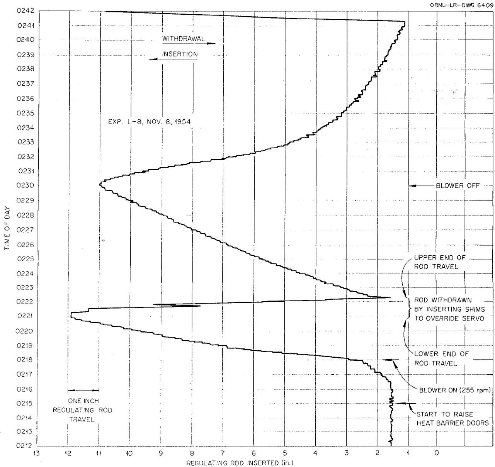  
Fig. 5.13. Regulating Rod Position During Low-Power Measurement of the Reactor Temperature Coefficient.

servo quickly withdrew the regulating rod. Insertion of the shim rod was stopped when the regulating rod had been withdrawn to near its upper limit, and the regulating rod was again inserted by the servo to compensate for the reactivity introduced by the cooling of the fuel. By 0230, the outlet temperature in the heat exchanger was approaching its lower limit, $1150^{\circ}\mathrm{F}$ , so the helium blower was stopped and the run was ended.

A trace from the chart for recording the mean fuel temperature is shown in Fig. 5.14, and superimposed on it is a plot of the displacement of the

regulating rod as obtained from the previous figure. A measure of the temperature coefficient may be obtained by comparing the slopes of the two curves. At 0228 the rod was moving at exactly 1 in./min, corresponding to an increase in reactivity of $3.3 \times 10^{-4} (\Delta k / k) / \min$ . At the same time, the mean temperature was dropping at the rate of $5.1^{\circ} \mathrm{F} / \min$ . The resulting reactor temperature coefficient, as obtained from these data, would appear to be $-6.48 \times 10^{-5} (\Delta k / k) / ^{\circ} \mathrm{F}$ . By comparing the slopes of the curves obtained earlier during the run, a considerably higher coefficient

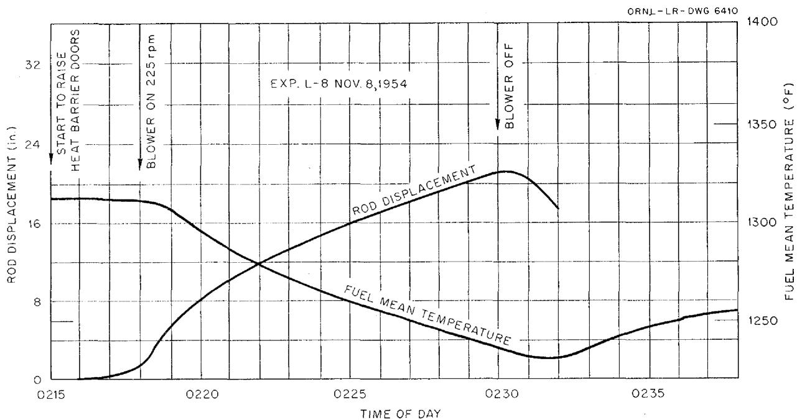  
Fig. 5.14. Regulating Rod Position Superimposed on Fuel Mean Temperature Chart.

can be obtained that might approximate that for the fuel. In any case, the recorded mean temperature is believed to be in error (as explained in Appendix K) in such a manner that the actual rate of temperature change is about $40\%$ higher than that given in Fig. 5.14. The measured value of the temperature coefficient was corrected accordingly to give a value of $-4.6(\Delta k / k)^{\circ}F$ for the low power. This value is comparable to that subsequently obtained during high-power operation and, as noted in the subsequent discussion, the data from experiment H-8 yielded the best values for both the fuel and the reactor temperature coefficients.

The apparent time lag between the reactivity and the minimum mean temperature, as first noted during the subcritical measurement of the temperature coefficient, was still in evidence here. Possible explanations of the time lag, as well as other details of the various temperature coefficient measurements, are given in Appendix O.

# ADJUSTMENT OF CHAMBER POSITION

During the critical experiment and the low-power operation, it was desirable to have the nuclear instruments positioned to read at as low a power as possible. The chambers were therefore as

close to the reactor as possible. Before increasing the power, it was necessary to adjust the positions of the nuclear chambers so that they would read at higher power levels. This was accomplished by adjusting the power level of the reactor to about 100 w and then moving the compensated log N chamber away from the reactor so that its reading was changed from 0.032 to 0.001, or its upper limit was extended by a factor of about 30. With the reactor power at about 1 kw, the micromicroammeter chamber was moved away from the reactor so that its reading was changed from 41.4 on the $5 \times 10^{-7}$ amp range to 54 on the $1 \times 10^{-8}$ amp range. This extended the upper limit of the meter by a factor of about 40. While one chamber was adjusted the reactor power was held constant by the other chambers so that the correlation between instrument readings was not lost. The nuclear power for the experiment was determined on this basis.

In the final analysis, the correlation between chamber readings and reactor power can be based on the 25-hr xenon run during which a good value for the extracted power was obtained. The micromicroammeter read 52.5 on the $2 \times 10^{-5}$ scale when the log $N$ read 22.5, and both corresponded to an extracted power of 2.12 Mw.

The low-power tests were concluded by noon on November 8. During the last few days of the low-power tests all last minute details in preparing the system for high-power operation had been under way. These preparations included lubricating all rotating equipment, refilling oil reservoirs, changing filters, replacing motor brushes, checking all instrumentation, etc. By 1445 on November 8 the pits had been sealed, i.e., covered with three layers of $2\frac{1}{2}$ -ft-thick concrete blocks and called, and the experiment was ready for the high-power phase of the operation, the chronology of which is given in Fig. 6.1.

Prior to the start of the high-power experiment the final addition of fuel concentrate, which was to provide the reactor with sufficient excess reactivity to overcome burnup and fission-product poisoning, was made. This last addition consisted of 15.419 lb of concentrate diluted with 32.379 lb of partially enriched fuel (part of that removed from the system earlier when the pump level was trimmed) and was injected into the system through the sample line on the morning of November 7. The sample line was used for this final enrichment operation because the transfer line through which the concentrate had hitherto been injected into the system had again developed a leak. It was necessary to lower the melting point of the concentrate (by dilution) because it was not certain that the sample line could otherwise safely maintain the high temperature required.

High power, which may be defined for the ARE as anything over 0.1 Mw, was approached in a series of successive steps of increasing power. The power regime was not attained at once, because leakage of fission activity from the system into the pits and subsequently from the pits into the occupied parts of the building required that provision be made to maintain the pits at a subatmospheric pressure. The experiment could then continue safely, and a power of greater than 2 Mw was first attained early during the evening of November 9.

The remaining time (70 hr) of the ARE operation was devoted to several experiments to determine the high-power behavior of the reactor; these experiments are described in detail in the following sections. Starting in the evening of November 9, the fuel temperature coefficient of reactivity (Exp. H-4) and the overall reactor temperature coefficient (Exp. H-5 and Exp. H-9) were measured.

The early hours of November 10 were used to take the reactor to power from subcritical by making use of the negative temperature coefficient (Exp. H-6). Later in the day the sodium temperature coefficient was measured (Exp. H-7), some other reactor kinetics were studied (Exp. H-8), and the moderator temperature coefficient was measured (Exp. H-10). During this time the operating crews had opportunity to familiarize themselves with the handling of the reactor at power.

At 1835 on November 10, a 25-hr full-power xenon run was started. For this run the reactor was held in steady-state operation at 2.12 Mw by the negative temperature coefficient and at a mean temperature of $1311^{\circ}F$ . Since equilibrium temperature conditions prevailed during this run, a very good measurement of extracted power could be made. The run ended at 1935 on November 11. Later that night, the effect on the power of stopping the sodium flow was observed (Exp. H-12), and at 2237 a $\frac{1}{10}$ -power run (Exp. H-13) was started to observe the effect of xenon buildup and continued for a period of 10 hr. During this run the reactor power was approximately 200 kw. At 0835 on November 12 no effect of xenon buildup had been observed, and therefore the experiment was terminated.

The morning of the last day, November 12, was devoted to some more reactor kinetics studies and a measurement of the maximum extracted power available (Exp. H-14), which turned out to be about 2.5 Mw. On the afternoon of November 12 the building was opened to visitors with proper clearance, and the behavior of the reactor was demonstrated to them. At 2004, an estimated total operating time of 100 Mw-hr having been accumulated, the reactor was scrambled and the ARE experiment was terminated.

# APPROACH TO POWER

The initial phase of high-power operation of the ARE began at 1445 on November 8. As shown in Fig. 6.1, the power was raised in a series of successive steps. At each power level, when steady-state conditions had been obtained, a complete set of control room data was taken. The first experiment, H-1, was a 20-kw run. During this run the safety chambers were withdrawn and reset to scream at about 260 kw. At 1619 the reactor was shut down because of the presence of

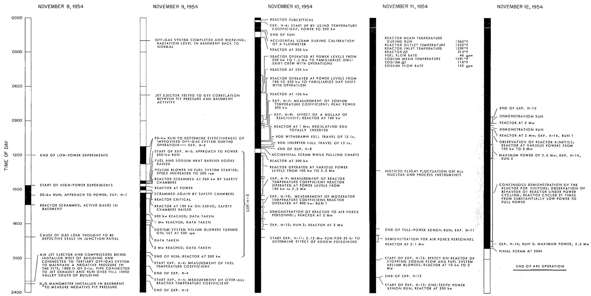  
Fig. 6.1.

<table><tr><td></td></tr><tr><td></td></tr><tr><td></td></tr><tr><td></td></tr><tr><td></td></tr><tr><td></td></tr><tr><td></td></tr><tr><td></td></tr><tr><td></td></tr><tr><td></td></tr><tr><td></td></tr><tr><td></td></tr><tr><td></td></tr><tr><td></td></tr><tr><td></td></tr><tr><td></td></tr><tr><td></td></tr><tr><td></td></tr><tr><td></td></tr><tr><td></td></tr><tr><td></td></tr><tr><td></td></tr><tr><td></td></tr><tr><td></td></tr><tr><td></td></tr><tr><td></td></tr><tr><td></td></tr><tr><td></td></tr><tr><td></td></tr><tr><td></td></tr><tr><td></td></tr><tr><td></td></tr><tr><td></td></tr><tr><td></td></tr><tr><td>-</td></tr><tr><td>-</td></tr><tr><td>-</td></tr><tr><td>-</td></tr><tr><td>-</td></tr><tr><td>-</td></tr><tr><td>-</td></tr><tr><td>-</td></tr><tr><td>-</td></tr><tr><td>-</td></tr><tr><td>-</td></tr><tr><td>-</td></tr><tr><td>-</td></tr><tr><td>-</td></tr><tr><td>-</td></tr><tr><td>-</td></tr><tr><td>-</td></tr><tr><td>-</td></tr><tr><td>-</td></tr><tr><td>-</td></tr><tr><td>-</td></tr><tr><td>-</td></tr><tr><td>-</td></tr><tr><td>-</td></tr><tr><td>-</td></tr><tr><td></td></tr><tr><td>-</td></tr><tr><td>-</td></tr><tr><td>-</td></tr><tr><td>-</td></tr><tr><td>-</td></tr><tr><td>-</td></tr><tr><td>-</td></tr><tr><td>-</td></tr><tr><td>-</td></tr><tr><td>-</td></tr><tr><td>-</td></tr><tr><td>-</td></tr><tr><td>-</td></tr><tr><td>-</td></tr><tr><td>-</td></tr><tr><td>-</td></tr><tr><td>-</td></tr><tr><td>-</td></tr><tr><td>-</td></tr><tr><td>-</td></tr><tr><td>-</td></tr><tr><td>-</td></tr><tr><td>-</td></tr><tr><td>- - - - - - - - - - - - - - - - - - - - - - - - - - - - - - - - - - - - - - - - - - - - - - - - - - - - - - - - - - - - - - - - - - - - - - - - - - - - - - - - - - - - - - - - - - - - - - - - - - - - -</td></tr></table>

airborne radioactivity in the basement. Apparently the gas fittings to the main fuel pump were leaking and fission-product gases and vapors were leaking into the pits and from the pits into the basement through defective seals in some of the piping and electrical junction panels connecting the basement with the pits.

In order to prevent the leakage of activity into the basement it was decided to operate the pits at a slightly subatmospheric pressure. Accordingly, a 2-in. pipeline was run in a direction south of the ARE building for a distance of 1000 ft and terminated in an uninhabited valley. Then, by means of portable compressors and a jet, the pit pressure was lowered by about 6 in. $\mathsf{H}_2\mathsf{O}$ , with the exhaust from the compressors being bled into the 2-in. pipeline. The pits were maintained at a negative pressure for the balance of the experiment.

At 1125 on November 9 the reactor was again brought to 20-kw power (Exp. H-2) for the purpose of testing the new off-gas system to determine whether or not the negative pressure of 6 in. $\mathsf{H}_2\mathsf{O}$ in the pits was enough to keep the hot gases from diffusing into the basement. During this run the pit activity, as recorded on the pit monitrons, was watched, and its decay after shutdown of the reactor at 1246 was observed. From this run it was ascertained that the subatmospheric pit pressure would prevent pit activity from leaking into the building.

At 1520 on November 9 the approach to power was started again (Exp. H-3). At 1523 the reactor was brought to a nominal power of $200\mathrm{kw}$ on a 17-sec period and leveled out. Six minutes later the barrier doors were raised and the first attempt to extract power was made. At 1529 the fuel helium blower was turned on and the blower speed was increased to $300\mathrm{rpm}$ . The nuclear power again began to increase, but the safety chambers had not been withdrawn far enough and they scrambled the reactor when the power level had reached about $260\mathrm{kw}$ .

After another false start, the safety chambers were withdrawn again and set to scram at about 4 Mw. The reactor was then brought to $100\mathrm{kw}$ leveled out, and placed on flux servo at 1625. At 1626 it was taken off servo and the blower speed was increased, this time to only 170 rpm. The reactor power slowly rose and at 1643 had leveled off on the reactor temperature coefficient at about $500\mathrm{kw}$ . After a set of data had been taken and the reactor mean temperature elevated, the blower

speed was increased to 400 rpm and the power level continued to rise. By 1715 the power level had leveled out at near 1 Mw.

The sodium blowers were turned on (at 1740) and brought to a speed of about $500~\mathrm{rpm}$ . Half an hour later the fuel blower speed was increased to 1590 rpm, and in 10 min a steady-state power level of about $2\mathrm{Mw}$ was reached. At this time the nuclear and process instruments read as follows:

Log N power, Mw 1.32

Micromicroammeter power, Mw 1.38

Reactor inlet fuel temperature, $2^{\circ}F$ 1203

Reactor outlet fuel temperature, $2\circ F$ 1440

Reactor mean fuel temperature, $2^{\circ}F$ 1321

Fuel temperature difference across reactor, $20$ F 237

Fuel flow, gpm 46

Reactor sodium mean temperature, $^\circ F$ 1281

Sodium temperature difference across reactor, $^\circ F$ 10

Sodium flow, gpm 152

From these data the extracted power was calculated as follows:

Power extracted from fuel, Mw 1.16

Power extracted from sodium, Mw 0.05

Power extracted from rod cooling, Mw 0.02

Total extracted power, 2 Mw 1.23

However, it was subsequently discovered that the temperatures upon which this extracted power was calculated were in error and, as discussed in Appendix K, the actual temperature gradient at this time was about $40\%$ higher. Therefore, the extracted power was correspondingly higher than that listed. A general discussion of the extracted power appears in a following section.

The above-described power operation was maintained for about 1 hr, during which time no further trouble was occasioned by the fission gases. Power was reduced at 1900 and the reactor scrambled at 1915, and thus the initial phase of the high-power operation was concluded.

# TEMPERATURE COEFFICIENT MEASUREMENTS

Several experiments were performed in an attempt to measure the effect on reactivity of temperature changes of the various components of the

reactor. In addition to the over-all reactor coefficient, experiments were run to obtain data on the instantaneous fuel temperature coefficient and the coefficients attributable to the sodium and the beryllium oxide moderator. There were several anomalies that developed in the course of these experiments, the two most significant being (1) the interpretation of the lag in the response between the rod movement and the change in reactor temperatures as power was abstracted from the reactor and (2) the discrepancy between the thermocouple indications at the reactor (fuel and sodium inlet and outlet temperatures) and those along the lines to and from the reactor. These anomalies are discussed in detail in Appendixes O and K, respectively. It was concluded that the time lag was not real (i.e., the fuel temperature should show changes as soon as the reactivity does) and that the line temperature most accurately reflects the actual stream temperatures.

In the determination of a temperature coefficient by varying the power extracted from the reactor, the recorded temperatures are subject to correction, as described in Appendix K. However, when the temperature coefficient was determined, as in Exp. H-5, by withdrawing the shim rods so that the reactor slowly heated itself while the extracted power remained constant, no correction needed to be made for the temperature. Furthermore, this technique minimized the temperature lag anomaly, and the fuel and reactor temperature coefficients derived from Exp. H-5 are therefore believed to be the best experimental values for these coefficients.

# Fuel and Reactor Temperature Coefficients

The fuel and reactor temperature coefficients were both obtained from the same experiment, the fuel being the instantaneous coefficient, the reactor the "equilibrium" coefficient. The initial attempts (Exp. H-4) to measure these coefficients were not satisfactory because of the difficulty in interpreting the results, and therefore the measurement was repeated (Exp. H-5) in a somewhat different manner.

In the first experiment, H-4, the procedure was similar to that described previously under "Low-Power Measurement of the Temperature Coefficient," and the data are presented in Figs. 6.2 and 6.3. The first of these figures is the recording of the position of the regulating rod as it was inserted by the servo as the fuel was cooled by the helium flow in the heat exchanger. Figure 6.3 is a recording of

the mean fuel temperature with the rod displacement as determined from Fig. 6.2 superimposed. Depending upon the time at which the slopes of the two curves are compared, the temperature coefficient appears to decrease from a value of $\sim -1.6 \times 10^{-4} (\Delta k / k) / \circ F$ to $-4.43 \times 10^{-5} (\Delta k / k) / \circ F$ toward the end of the run. These values represent the recorded data and are of course subject to the correction for temperature, as discussed in Appendix K, even as the data are subject to various interpretations because of the lag in the temperature data (see Appendix O). Furthermore, the changes were made quite rapidly, the entire run lasting only $5\mathrm{min}$ .

In an attempt to minimize the effect of the temperature anomalies, the temperature coefficients were then determined from an experiment (Exp. H-5) in which the extracted power was held constant and the shim rods were withdrawn. Starting with the reactor at a mean temperature of $1260^{\circ}\mathrm{F}$ , the withdrawal of the shim rods allowed the reactor to gradually heat the whole system to $1315^{\circ}\mathrm{F}$ . Since the reactor was a slave to the heat extraction system, which was not changed, the extracted power remained virtually constant during this time. This process took about 35 min during which the nuclear power was held constant at a nominal power of 200 kw by the flux servo. The regulating rod gradually withdrew to compensate for the decrease in reactivity as the reactor temperature increased. The data are tabulated in Table 6.1, and a plot of rod withdrawal vs mean reactor temperature is presented in Fig. 6.4. Inspection of Table 6.1 shows that the rate of change of the inlet and outlet fuel temperatures followed the change in mean fuel temperature very closely, and thus gave assurance that the fuel throughout the reactor was changing temperature at a uniform rate.

The most reliable values for the temperature coefficients of the ARE were obtained from this experiment. For the first 6 min the plot of rod withdrawal vs reactor mean temperature shows a slope of 0.296 in. $\circ F$ . Since 1 in. of rod movement is equivalent to $3.3 \times 10^{-4} \Delta k / k$ , the initial temperature coefficient was $-9.8 \times 10^{-5} (\Delta k / k) / \circ F$ . After the first 6 min and up until conclusion of the run, the curve in Fig. 6.4 demonstrates a constant value of the temperature coefficient of $-6.0 \times 10^{-5} (\Delta k / k) / \circ F$ . These are the best values for these coefficients that were obtained. It should be noted that the value for the over-all temperature coefficient agrees to within $25\%$ with the value previously obtained from the low-power experiments. However,

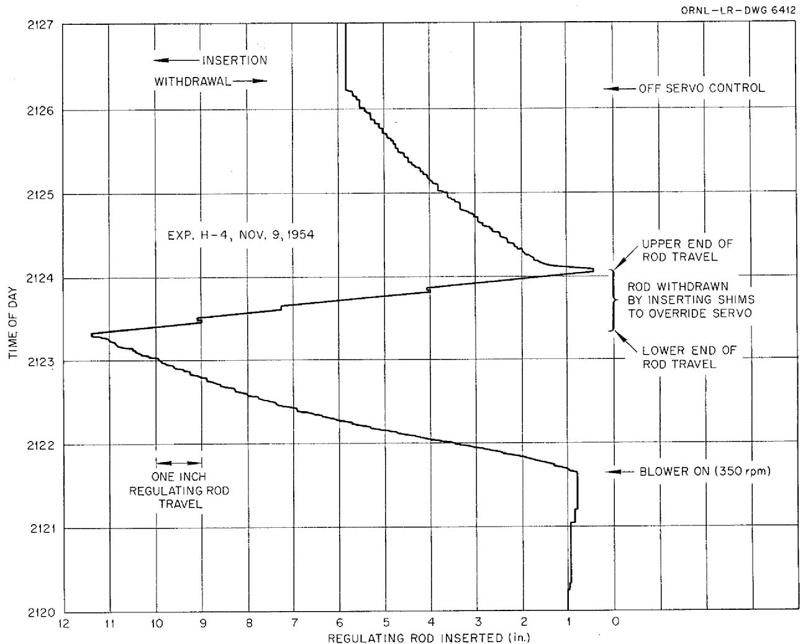  
Fig. 6.2. Regulating Rod Position During Measurement of Reactor Temperature Coefficient. Experiment H-4.

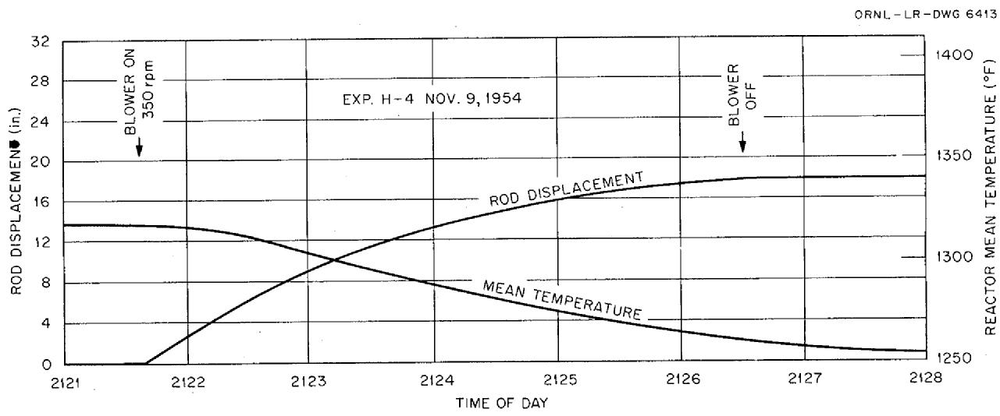  
Fig. 6.3. Regulating Rod Position Superimposed on Fuel Mean Temperature Chart. Experiment H-4.

TABLE 6.1. REACTOR TEMPERATURES AND ROD POSITIONS DURING 100-kw MEASUREMENT OF TEMPERATURE COEFFICIENTS (EXP. H-5)   

<table><tr><td>Time</td><td>Regulating Rod Position (in.)</td><td>Rod Withdrawal (in.)</td><td>Reactor Mean Temperature (°F)</td><td>Reactor Inlet Temperature (°F)</td><td>Reactor Outlet Temperature (°F)</td></tr><tr><td>2223</td><td>3.72</td><td>0</td><td>1263.5</td><td>1262.5</td><td>1283</td></tr><tr><td>24</td><td>3.84</td><td>0.12</td><td>1265</td><td>1263.5</td><td>1285</td></tr><tr><td>25</td><td>4.15</td><td>0.43</td><td>1266</td><td>1264</td><td>1286</td></tr><tr><td>26</td><td>4.43</td><td>0.71</td><td>1267</td><td>1265.5</td><td>1287</td></tr><tr><td>27</td><td>4.69</td><td>0.97</td><td>1268</td><td>1266</td><td>1288</td></tr><tr><td>28</td><td>4.96</td><td>1.24</td><td>1269</td><td>1267.5</td><td>1290</td></tr><tr><td>29</td><td>5.23</td><td>1.51</td><td>1270.3</td><td>1269</td><td>1291</td></tr><tr><td>30</td><td>5.50</td><td>1.78</td><td>1271.5</td><td>1271</td><td>1292</td></tr><tr><td>31</td><td>5.77</td><td>2.05</td><td>1273</td><td>1272</td><td>1293</td></tr><tr><td>32</td><td>6.02</td><td>2.30</td><td>1274</td><td>1273</td><td>1294</td></tr><tr><td>33</td><td>6.28</td><td>2.56</td><td>1275</td><td>1274.5</td><td>1296</td></tr><tr><td>34</td><td>6.49</td><td>2.77</td><td>1276.5</td><td>1275.5</td><td>1297</td></tr><tr><td>35</td><td>6.68</td><td>2.96</td><td>1277.5</td><td>1277</td><td>1298</td></tr><tr><td>36</td><td>6.90</td><td>3.18</td><td>1278.5</td><td>1278</td><td>1300</td></tr><tr><td>37</td><td>7.10</td><td>3.38</td><td>1279.5</td><td>1279</td><td>1301</td></tr><tr><td>38</td><td>7.35</td><td>3.65</td><td>1281</td><td>1280.5</td><td>1302</td></tr><tr><td>39</td><td>7.50</td><td>3.78</td><td>1282</td><td>1281.5</td><td>1303</td></tr><tr><td>40</td><td>7.69</td><td>3.97</td><td>1283</td><td>1282.5</td><td>1304</td></tr><tr><td>41</td><td>7.92</td><td>4.20</td><td>1283.5</td><td>1283.5</td><td>1305</td></tr><tr><td>42</td><td>8.14</td><td>4.42</td><td>1285</td><td>1284.5</td><td>1307</td></tr><tr><td>43</td><td>8.32</td><td>4.60</td><td>1286.3</td><td>1285.5</td><td>1308</td></tr><tr><td>44</td><td>8.55</td><td>4.83</td><td>1287.5</td><td>1286.5</td><td>1309</td></tr><tr><td>45</td><td>8.75</td><td>5.03</td><td>1288.5</td><td>1287.5</td><td>1310</td></tr><tr><td>46</td><td>8.94</td><td>5.22</td><td>1289.5</td><td>1289</td><td>1311</td></tr><tr><td>47</td><td>9.11</td><td>5.39</td><td>1291</td><td>1290</td><td>1312</td></tr><tr><td>48</td><td>9.31</td><td>5.59</td><td>1292.5</td><td>1291</td><td>1313</td></tr><tr><td>49</td><td>9.50</td><td>5.78</td><td>1293.5</td><td>1292</td><td>1314</td></tr><tr><td>50</td><td>9.68</td><td>5.96</td><td>1294.3</td><td>1293</td><td>1315</td></tr><tr><td>51</td><td>9.85</td><td>6.13</td><td>1295</td><td>1294</td><td>1316</td></tr><tr><td>52</td><td>10.05</td><td>6.33</td><td>1296.5</td><td>1295</td><td>1317</td></tr><tr><td>53</td><td>10.23</td><td>6.51</td><td>1297.5</td><td>1296</td><td>1318</td></tr><tr><td>54</td><td>10.45</td><td>6.73</td><td>1298.8</td><td>1297</td><td>1319</td></tr><tr><td>55</td><td>10.60</td><td>6.88</td><td>1299.5</td><td>1298</td><td>1320</td></tr><tr><td>56</td><td>10.78</td><td>7.06</td><td>1300.5</td><td>1299</td><td>1321</td></tr><tr><td>57</td><td>10.99</td><td>7.27</td><td>1301.3</td><td>1300</td><td>1322</td></tr><tr><td>58</td><td>11.17</td><td>7.45</td><td>1302.5</td><td>1301</td><td>1323</td></tr><tr><td>59</td><td>11.41</td><td>7.69</td><td>1303.5</td><td>1302.3</td><td>1324</td></tr><tr><td>2300</td><td>11.54</td><td>7.82</td><td>1305</td><td>1303</td><td>1325</td></tr><tr><td>01</td><td>11.80</td><td>8.08</td><td>1306.3</td><td>1304</td><td>1326</td></tr><tr><td>02</td><td>11.95</td><td>8.23</td><td>1307</td><td>1305</td><td>1327</td></tr><tr><td>03</td><td>12.20</td><td>8.48</td><td>1308</td><td>1306</td><td>1328</td></tr><tr><td>04</td><td>12.38</td><td>8.66</td><td>1308.8</td><td>1307</td><td>1329</td></tr><tr><td>05</td><td>12.57</td><td>8.85</td><td>1309.8</td><td>1308</td><td>1330</td></tr><tr><td>06</td><td>12.75</td><td>9.03</td><td>1310.5</td><td>1309</td><td>1331</td></tr><tr><td>07</td><td>12.90</td><td>9.18</td><td>1311.5</td><td>1310</td><td>1332.5</td></tr><tr><td>08</td><td>13.19</td><td>9.47</td><td>1312.5</td><td>1311</td><td>1333</td></tr><tr><td>09</td><td>13.25</td><td>9.53</td><td>1313.5</td><td></td><td></td></tr><tr><td>10</td><td></td><td></td><td></td><td></td><td></td></tr></table>

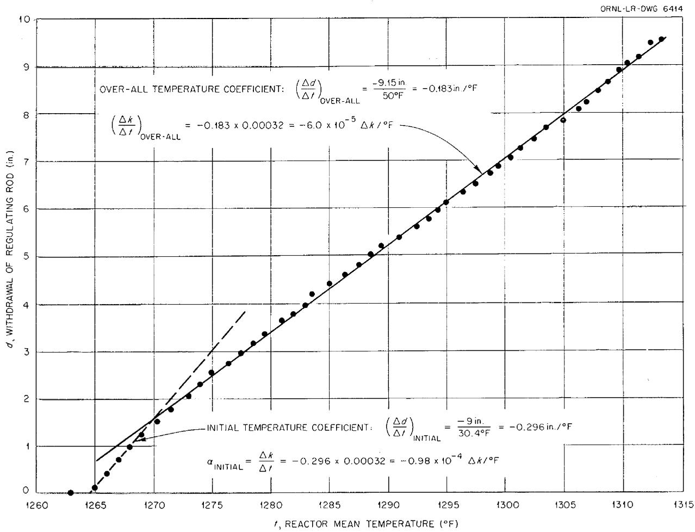  
Fig. 6.4. Regulating Rod Movement as a Function of Reactor Mean Temperature. Experiment H-5.

the instantaneous value of $-9.8 \times 10^{-5} (\Delta k / k) / ^{\circ} F$ is much more important from the reactor control standpoint, and it was this large fuel temperature coefficient which made the ARE demonstrate the excellent stability described below under the subtitle "Reactor Kinetics."

The value for the reactor temperature coefficient was subsequently confirmed in a later experiment (Exp. H-9) in which the system temperature was changed by gradually cooling the sodium, which in turn, cooled the fuel and the reactor. While the curve obtained from this experiment was very similar to that given in Fig. 6.4, the initial slope could not be that due to the fuel temperature coefficients, because the fuel is one of the last constituents in the reactor to feel the temperature change. The "equilibrium" slope, however, should be that determined by the reactor temperature coefficient, and a value of $-6.3 \times 10^{-5} (\Delta k / k)^{\circ} F$

was obtained. No temperature correction was required because the extracted power in the fuel system did not change (although that in the sodium system did). This value agrees very well with that obtained in the preceding experiment.

# Sodium Temperature Coefficient

In order to measure the sodium temperature coefficient an experiment (Exp. H-7) was performed in which the sodium was cooled and the corresponding changes in sodium temperature and reactivity were measured. In this experiment it was mandatory that the sodium be cooled rapidly and the data recorded before the moderator had time to cool. Otherwise, since the sodium bathes the moderator, the moderator temperature would follow the sodium temperature and introduce an extraneous effect due to its (i.e., moderator) temperature coefficient. Accordingly, with the reactor at about

33 kw and no power being extracted from either the fuel or the sodium, the sodium blower speeds (2 blowers) were quickly raised from 0 to 2000 rpm. The reactor period immediately started to change and went from infinity to 50 sec in 1.5 min, which, as shown in Fig. 5.4, corresponds to a reactivity change of $3.5 \times 10^{-4} \Delta k / k$ . The consequent rate of reactivity change was $2.33 \times 10^{-4} (\Delta k / k) / \min$ . In this experiment the regulating rod, as well as the shim rods, was held in a fixed position. During the 1.5-min interval, the fuel temperature was changing at a rate of about $-1^{\circ} \mathrm{F} / \min$ and the sodium temperature was changing at a rate of $-2.3^{\circ} \mathrm{F} / \min$ . (The rate of change of fuel mean temperature was corrected for the discrepancy in the recorded mean temperature, as described in App. K, but no comparable correction was necessary in the rate of change of the sodium temperature.) By applying the previously mentioned value of $-9.8 \times 10^{-5} (\Delta k / k) / ^{\circ} \mathrm{F}$ for the instantaneous fuel temperature coefficient to give a rate of reactivity change for the fuel of $0.98 \times 10^{-4} (\Delta k / k) / \min$ and subtracting from the rate of reactivity change observed upon cooling the sodium, it is found that the reactivity change caused by the decrease in the sodium temperature is

$$
\begin{array}{l} 2. 3 3 \times 1 0 ^ {- 4} (\Delta k / k) / \min  (\text {o b s e r v e d}) \\ - 0. 9 8 \times 1 0 ^ {- 4} (\Delta k / k) / \min  (\text {f u e l}) \\ = 1. 3 5 \times 1 0 ^ {- 4} (\Delta k / k) / \min . \\ \end{array}
$$

Then, by applying the observed rate of change of the sodium temperature, the sodium temperature coefficient is found to be

$$
\begin{array}{l} 1. 3 5 \times 1 0 ^ {- 4} (\Delta k / k) / \min \\ - 2. 3 ^ {\circ} F / \min \\ = - 5. 8 8 \times 1 0 ^ {- 5} (\Delta k / k) ^ {\circ} F. \\ \end{array}
$$

This value is valid if it is assumed that the transient took place rapidly enough that there was no appreciable change in the moderator temperature. The measurements were, however, subject to considerable error because the temperature changes involved were so small as to be quite difficult to detect and a correction was necessary in the fuel temperature because of thermal lags.

# Moderator Temperature Coefficient

An experiment (H-10) was conducted in order to determine the temperature coefficient of the moder

ator. During this experiment the fuel temperature was held constant and the speed of the blowers for cooling the sodium was increased to change the temperature of the moderator coolant. Since this was done very slowly, the moderator did cool down, in contrast to the earlier experiment (H-7) in which the sodium temperature was changed so rapidly that the moderator temperature was unable to follow the sodium temperature. The earlier experiment gave information as to the temperature coefficient of the sodium alone, whereas experiment H-7 gave the combined effect of sodium and moderator changes. The reactivity was indicated by the position to which the regulating rod was adjusted by the flux servo.

The changes in the sodium and the moderator temperatures slightly increased the heat loss of the fuel, and the power had to be increased slightly to keep the fuel mean temperature constant. In fact, in the middle of the run the reactor mean temperature was lower than at the beginning, but before the final reading was taken, the reactor mean temperature was brought back to its original value. Table 6.2 gives the pertinent data. The sodium inlet temperature was taken from a recording of the temperature of the reflector coolant inlet 4 in. from the bottom of the reactor and the sodium outlet temperature was taken from a recording of the temperature of the reflector coolant outlet 3 in. from the top of the reactor. The time recorded in column one is the time when a reading was taken. The change of the blower speed preceded this time by a few minutes to allow the temperature equilibrium to be established. As an indication of the establishment of the equilibrium, use was made of the leveling off of the trace on the sodium temperature differential recorder.

As can be seen from the table, the decrease of the average sodium temperature from 1273 to $1246^{\circ}F$ corresponds to a withdrawal of the regulating rod from the 8-in. position to the 8.9-in. position. At the lower temperature the reactor was less reactive and showed that the temperature coefficient was positive. The magnitude of this temperature coefficient was small, $(0.9\mathrm{in.}/27^{\circ}\mathrm{F}) \times 3.33 \times 10^{-4}(\Delta k / k) / \mathrm{in.} = +1.1 \times 10^{-5}(\Delta k / k)^{\circ}\mathrm{F}$ . This coefficient is, however, the sum of the sodium temperature coefficient and the moderator temperature coefficient. Since the sodium temperature coefficient was $-5.9 \times 10^{-5}$ , the moderator temperature coefficient must be $+6.9 \times 10^{-5}(\Delta k / k)^{\circ}\mathrm{F}$ . This value is, of course, subject to all the inherent

TABLE 6.2. MODERATOR TEMPERATURE COEFFICIENT DATA  

<table><tr><td rowspan="2">Time</td><td rowspan="2">Fuel 
Mean 
Temperature 
(°F)</td><td rowspan="2">Fuel 
Temperature 
Gradient 
(°F)</td><td colspan="2">Blower 
Speed 
(rpm)</td><td colspan="3">Sodium 
Temperature 
(°F)</td><td rowspan="2">Regulating 
Rod 
Position 
(in.)</td><td rowspan="2">Nuclear 
Power 
(Mw)</td></tr><tr><td>No. 1</td><td>No. 2</td><td>Inlet</td><td>Outlet</td><td>Average</td></tr><tr><td>1735</td><td>1313</td><td>206</td><td>960</td><td>1050</td><td>1265</td><td>1282</td><td>1273</td><td>8.0</td><td>1.98</td></tr><tr><td>1745</td><td>1314</td><td>206</td><td>1160</td><td>1050</td><td>1255</td><td>1280</td><td>1267</td><td>8.0</td><td>1.98</td></tr><tr><td>1752</td><td>1313</td><td>203</td><td>1170</td><td>1260</td><td>1248</td><td>1278</td><td>1263</td><td>7.6</td><td>1.98</td></tr><tr><td>1802</td><td>1308</td><td>200</td><td>1340</td><td>1250</td><td>1238</td><td>1272</td><td>1255</td><td>6.6</td><td>1.98</td></tr><tr><td>1809</td><td></td><td></td><td colspan="7">Increased servo demand signal so as to withdraw rod</td></tr><tr><td>1812</td><td>1311</td><td>204</td><td>1480</td><td>1240</td><td>1230</td><td>1268</td><td>1249</td><td>8.4</td><td>2.12</td></tr><tr><td>1825</td><td>1313</td><td>205</td><td>1470</td><td>1480</td><td>1225</td><td>1268</td><td>1246</td><td>8.9</td><td>2.12</td></tr></table>

errors of the measurement of the sodium temperature coefficient, as well as the additional errors in the temperatures recorded for this particular experiment.

# MEASUREMENT OF THE XENON POISONING

At 1825 on November 10 a 25-hr run at a power of 2.12 Mw was started for the purpose of measuring the amount of xenon built up in the fuel (Exp. H-11). As discussed in Appendix P, the reactor should have been poisoned by about $2 \times 10^{-3} \Delta k / k$ after 25 hr, if it is assumed that no xenon escaped from the molten fuel. Not only did the 25-hr run demonstrate that very little of the fission-product gas

remained in the fuel but, also, that the reactor possessed phenomenal stability. Except for a minute withdrawal of the regulating rod to compensate for a barely detectable drop in the mean reactor temperature, all readings on both reactor and process instrumentation held constant within experimental error for the 25 hr. It was assumed that the rod withdrawal was due to xenon buildup in the fuel. However, it could have been due to any of a number of minor perturbations, and therefore the experiment demonstrated an absolute upper limit on the xenon poisoning.

An abstract of the log book and data sheets during the experiment follows:

November 10, 1954

1825 Run started; reactor power, 2.12 Mw; rod position, 9.00 in.; reactor mean temperature, $1311^{\circ}F$

November 11, 1954

0635 Reactor mean temperature had decreased to $1309^{\circ}\mathrm{F}$ ; rod withdrawn to 9.05 in.   
0750 Reactor mean temperature up to $1310^{\circ}\mathrm{F}$ ; rod withdrawn to 9.15 in.   
1020 Reactor mean temperature 1310.5°F; rod withdrawn to 9.25 in.   
1120 Reactor mean temperature 1311°F   
1435. Reactor mean temperature down to $1310^{\circ}\mathrm{F}$ ; rod withdrawn to 9.30 in.   
1559 Reactor mean temperature up to $1311^{\circ}F$   
1932 Reactor mean temperature up to $1312^{\circ}F$ rod still at 9.30 in.; end of run

It is to be noted that the temperature recorded was actually one degree higher at the end of the experiment than at the start; this indicates that the withdrawal of the regulating rod by 0.3 in. may, indeed, have been too much. The withdrawal was unquestionably an upper limit on the compensation needed for xenon poisoning and corresponded to a $\Delta k / k$ of $1\times 10^{-4}$ . This was or $5\%$ of the value to be expected if the xenon had not left the fuel (see Appendix P). Removal of the xenon probably occurred by means of the swirling action of the fuel as it went through the pump. As mentioned previously, fission-product gases that probably came from a leak in the gas fittings were detected in the pits early in the experiment.

At the conclusion of Exp. H-11 at 1935, the reactor was operated at various power levels for 2 hr in an experiment (Exp. H-12) for determining the effect of the sodium flow rate on the extracted power. At 2237 the reactor was set at $200\mathrm{kw}$ (one-tenth full power) and held there by the flux servo for 10 hr (Exp. H-13). If any appreciable amount of xenon had been built up in the fuel from decay of iodine formed during Exp. H-11, the poisoning effect should have been observed by a compensating rod withdrawal during this 10-hr period. No appreciable rod withdrawal was observed, and therefore it was concluded that if there was xenon poisoning from Exp. H-11, it was negligible.

# POWER DETERMINATION FROM HEAT EXTRACTION

The most reliable method for determination of actual reactor power was that based on the energy removed from the reactor in the form of heat. The inlet, outlet, and mean temperatures, the temperature difference of the fuel across the reactor, and the temperature difference of the reflector coolant were continually recorded. The rates of flow of both the fuel and the sodium were recorded and could also be determined from the speeds of the pumps. Since the heat capacities of both the fuel and the sodium were known, the power level of the reactor could be determined by the sum of the values obtained from the following relations:

$$
P _ {F} = 0. 1 1 q _ {F} \Delta T _ {F}
$$

$$
P _ {N a} = 0. 0 3 4 3 q _ {N a} \Delta T _ {N a}
$$

where

$$
P _ {F} = \text {p o w e r f r o m f u e l h e a t e x t r a c t i o n (M w)},
$$

$$
P _ {N a} = \text {p o w e r f r o m s o d i u m h e a t e x t r a c t i o n (M w)},
$$

$$
q = \text {v o l u m e f l o w r a t e (g p m)},
$$

$$
\Delta T = \text {t e m p e r a t u r e} \quad \text {g r a d i e n t} \quad \text {a c r o s s} \quad \text {r e a c t o r} \quad \text {o f} \quad \text {t h e} \quad \text {f u e l} \quad \text {o r} \quad \text {t h e} \quad \text {s o d i u m} \left(^ {\circ} F\right).
$$

Since both the fuel and the sodium were cooled by helium passing across a liquid-to-helium heat exchanger and the helium was cooled by passing it over a helium-to-water heat exchanger, the reactor power could also be determined from the water flow and temperature differences across the helium-to-water heat exchangers. Since the fuel-to-helium and sodium-to-helium heat exchangers are close to their respective helium-to-water heat exchangers, little heat was lost by the helium and therefore practically all of the heat removed from the fuel and sodium was transferred to the water. The heat balance thus obtained was known as the secondary heat balance, while that obtained directly from the fuel and sodium systems was known as the primary heat balance.

Initial comparisons of the primary and secondary heat balances revealed discrepancies of the order of $50\%$ . Subsequent investigation revealed that the temperature drops of the primary heat balance were in error. The temperatures were obtained from a few thermocouples located on fuel and sodium lines within the reactor thermal shield that read considerably lower than several thermocouples located external to the thermal shield on the fuel and sodium lines to and from the reactor. This anomaly is discussed further in Appendix K. All reactor inlet and exit temperatures were subsequently based on the external thermocouple readings.

A detailed analysis of the extracted power was made (App. L) for the 25-hr xenon experiment primarily because of the certainty that equilibrium conditions had been established; also, this high-power run at more than 2 Mw contributed almost two-thirds of the megawatt-hours logged during the entire reactor operation. For this run the primary heat balance showed an extracted power of 2.12 Mw, and the secondary heat balance gave an extracted power of 2.28 Mw. The difference between the two determinations was $7\%$ . Furthermore, for this run about $75\%$ of the power was removed by the fuel, about $24\%$ by the sodium, and about $1\%$ by the rod cooling system.

Heat balances and, hence, power determinations were made for a number of other experiments during the high-power operation; these are tabulated in Appendix L. One such heat balance that was of particular interest was obtained during the maxi

mum power run (Exp. H-14). For this run the mean temperature was raised to $1340^{\circ}\mathrm{F}$ (to avoid a low-temperature reverse), and the fuel and sodium system blower speeds were increased to their respective maximums. At equilibrium the power levels indicated by the primary and secondary heat balances were 2.45 and 2.53 Mw, respectively. The line temperatures throughout the fuel and sodium systems during this experiment are shown in Figs. 6.5 and 6.6, respectively. The temperatures indicated along the lines are the actual thermocouple readings of each point at equilibrium. It may be noted that the outlet fuel line temperature averaged about $1580^{\circ}\mathrm{F}$ . The temperature measured at the reactor was considerably lower, as shown in Fig. 6.7, which shows a portion of the instrument panel during this experiment.

# REACTOR KINETICS

A distinctive control characteristic of any circulating-fuel reactor is that the reactor power is determined solely by that part of the system which is external to the reactor, i.e., the heat extraction equipment. In the power regime, control rods do not appreciably influence the steady-state power production, but the power extracted from the reactor does influence the reactivity of the reactor and hence renders the reactor controllable.

In order that such a system be acceptable as a power reactor, it is requisite that the reactor have a negative temperature coefficient of reactivity. One of the most gratifying results of the ARE operation was the successful demonstration of its large negative temperature coefficient. This temperature coefficient made it possible for the reactor to maintain a balance between the power extracted from the circulating fuel and coolant and the power generated within the reactor. The temperature cycling of the fuel was the mechanism by which equilibrium was maintained.

A thorough understanding of control processes in a circulating-fuel reactor with a negative temperature coefficient is necessary for an appreciation of the kinetic behavior of such a power reactor in the power regime. An important purpose of the ARE was the observation of the kinetic behavior of the reactor under power coupling to its load when perturbations in the reactivity were introduced. Transient conditions could be induced both by control rod motion and by variation of the external power load. Information on the kinetic behavior was obtained from a number of experiments

that were conducted during the period of power operation. These are described in the following sections. Preceding the discussion of these experiments is a detailed qualitative description of the temperature cycling of the circulating fuel which is inherent to all kinetic phenomena.

# Reactor Control by Temperature Coefficient

The control of a circulating-fuel reactor with a negative temperature coefficient can best be understood by following the course of a "slug" of fuel as it traverses the ARE system. For a description of the course of a slug, it is assumed that at time zero the system is in equilibrium, with isothermal temperatures throughout; in this condition no power is being extracted. At time $t$ the fuel system helium blower is turned on. It is also assumed that at this time the slug of fuel under observation is just entering the heat exchanger. In passing through the heat exchanger the slug is cooled by the helium blowing through the heat exchanger. About 20 sec later the cooled slug enters the reactor and is registered as a decrease on the inlet temperature indicator. Because it is cooler than the fuel it is displacing, its density is greater and therefore the number of uranium atoms per unit volume is greater. This results in a greater fission rate and, hence, a greater reactivity which, in turn, increases the power generated. The temperature of the slug rises as it passes through the reactor because of increased power generation. The rise in temperature of the slug results in its expansion and decrease in reactivity. This, in turn, lowers the rate of power generation. Eight seconds after the slug enters the reactor it passes out into the outlet line and is registered as an increase in temperature on the outlet fuel temperature indicator. In 47 sec from the start of its journey it is back at the heat exchanger to be cooled again.

The masses of fuel behind the initial slug follow the same pattern so that, since the fuel is a continuous medium, the power generated in the reactor will rise until the increased reactivity due to the incoming fuel and decreased reactivity due to the outgoing fuel attain a balance. At this point equilibrium is reached between power extracted by the helium and the power generated in

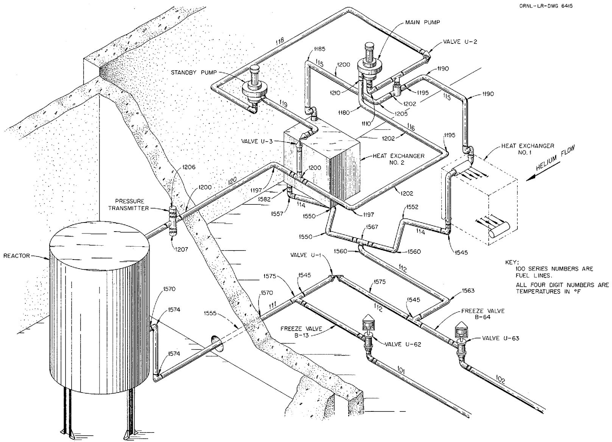  
Fig. 6.5. Fuel System Temperatures During Maximum Power Run. Experiment H-14.

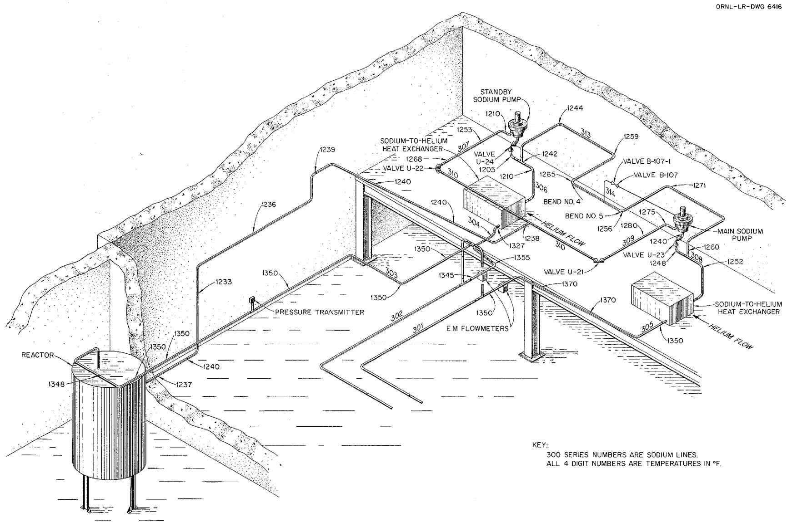  
Fig. 6.6. Sodium System Temperatures During Maximum Power Run. Experiment H-14.

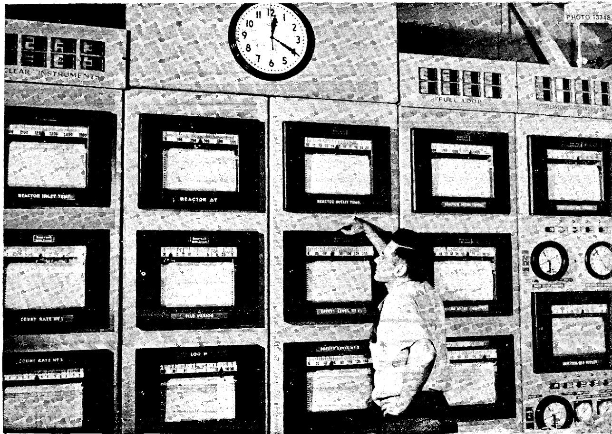  
Fig. 6.7. Portion of Instrument Panel During Maximum Power Run. Experiment H-14.

the reactor. The reactor power can thus be varied at will merely by changing the rate of cooling, that is, the demand for power. This type of reactor is said to be a slave to the demand.

The nuclear power is proportional to the neutron flux for any given critical concentration. The neutron flux is conventionally measured by a neutron detector, such as a Log $N$ chamber system, which consists essentially of a neutron detector coupled to an electronic system which has a logarithmic-type of output signal. This signal is proportional to the neutron flux (and, hence, the power) level, and is indicated and recorded on a logarithmic scale.

The extracted power, on the other hand, is proportional to the product of either the fuel flow and the temperature difference between the inlet and outlet sides of the heat exchanger (or reactor) or the secondary (or tertiary) coolant flow and its temperature difference. In the ARE the fuel was cooled by helium flowing across it in the fuel-to

helium heat exchangers. The heat picked up by the helium was then removed by water in a helium-to-water heat exchanger. It was possible to measure the extracted power in both the fuel loop and the water loop, as explained in a preceding section.

When no power is being extracted from a power reactor, the nuclear power is determined by the control rod and shim rod settings, and the reactor is controlled by some type of servo mechanism which keeps the power at some desired level. When the reactor is taken off the servo and allowed to respond to the demand of the cooling produced in the heat exchanger, it will seek a power level determined by the rate of heat removal. Once an equilibrium between nuclear and extracted power has been established, changing the shim rod or regulating rod settings merely changes the nuclear power level but does not alter the amount of power being extracted. This change in nuclear power results in a raising or lowering of the reactor mean temperature, and, once the temperature change has

been effected and equilibrium re-established, the nuclear power and the extracted power will again be equal.4

The control of the ARE by extracted power demand is illustrated in Fig. 6.8, which shows the tracings made by several of the control room instrument recorders during power operation between 1258 and 1329 on November 10, 1954. The reactor behavior is demonstrated by reading the tracings right to left, proceeding as follows: At 1258 the reactor was in an equilibrium condition at about a 50-kw power level. At 1259 the fuel system helium blower was turned on and its speed was increased to 500 rpm. The reactor power, as noted on the Log N chart, rose on a 10-sec period to slightly over 1 Mw, "overshot" its mark, fluctuated somewhat in the manner of a damped oscillator, and, finally, some 4 min later, came to an equilibrium power of around 900 kw. Soon, but not immediately, after the blower was turned on, the reactor fuel inlet temperature began to drop and the fuel outlet temperature began to rise, while the reactor mean temperature began to drop slightly. Each of these temperatures showed the oscillatory phenomenon noted with the Log N recorder. The reason for the drop in the mean temperature was that both the decrease and rate of decrease of the inlet temperature were greater than the corresponding increase and rate of increase of the outlet temperature. The inlet temperature dropped from 1335 to $1256^{\circ}\mathrm{F}^{6}$ at a rate of $1.54^{\circ}\mathrm{F} / \mathrm{sec}$ and the outlet temperature rose from 1405 to $1475^{\circ}\mathrm{F}$ at a rate of $1.36^{\circ}\mathrm{F} / \mathrm{sec}$ ; as a result the mean temperature fell from 1370 to $1365^{\circ}\mathrm{F}$ at a rate of about $0.1^{\circ}\mathrm{F} / \mathrm{sec}$ . The fact that the mean temperature dropped (and this was a characteristic phenomenon noted throughout the power operation) rather than remaining constant can be explained, at least in part, by the distortion of the flux patterns within the reactor. The highest fluxes were toward the inlet fuel passages, and the lowest fluxes were toward the outlet fuel passages (cf., App. O).

At 1310 the blower speed was increased from 500

to 1000 rpm, and the power rose from 1 to 1.8 Mw on a period of 7.5 sec, with corresponding changes of the inlet, outlet, and mean temperatures. Although the power increase in this case was comparable to the first power increase, the rates of rise of both the power and temperatures were much less, being on the order of one-half as much for the temperatures.

The effect of withdrawing the regulating rod 3 in. is demonstrated with the next rise at 1312 in Fig. 6.8. Up to this time the trace of the regulating rod position was constant, since it was not on servo. With the withdrawal of the rod the rise of the nuclear power was immediate. After some delay, all of the temperatures showed a rise. Interestingly enough, the outlet temperature rose $16^{\circ}\mathrm{F}$ , the mean $12^{\circ}\mathrm{F}$ , and the inlet $9^{\circ}\mathrm{F}$ . This pattern, with the outlet temperature showing the greatest change, was characteristic of the temperature changes incurred by shim rod and regulating rod movement during power operation. After the rod movement the temperatures leveled out at the higher values, but the nuclear power level slowly drifted back to the equilibrium position.

At 1321 the blower was shut off and the charts show the result of the shift toward isothermal (no power) conditions. Two minutes later, when the nuclear power had decreased to about $600\mathrm{kw}$ , the blower was again started and its speed was increased to $1500\mathrm{rpm}$ . The nuclear power level rose initially to $2.6\mathrm{Mw}$ , and it again went through an oscillatory cycle before settling down to $2.2\mathrm{Mw}$ . The corresponding temperature oscillations were again noted. These oscillations were of sufficient strength to determine an oscillation period of about $2.25\mathrm{min}$ . An interesting observation at this point was that the time lag of temperature response for a higher initial power ( $600\mathrm{kw}$ compared with $50\mathrm{kw}$ ) was only about one-half the lag during the first rise to power at $1259$ . This phenomenon had been noted previously in connection with the various temperature coefficient experiments (cf., App. O).

Table 6.3 shows the data obtained from the nuclear and process instruments during the typical operation period shown in Fig. 6.8.

# Startup on Demand for Power (Exp. H-6)

To illustrate how completely the reactor was a slave to the load, an experiment was performed in which the reactor was brought to subcritical and then taken to critical on temperature coefficient (i.e., by the power demand and without use of

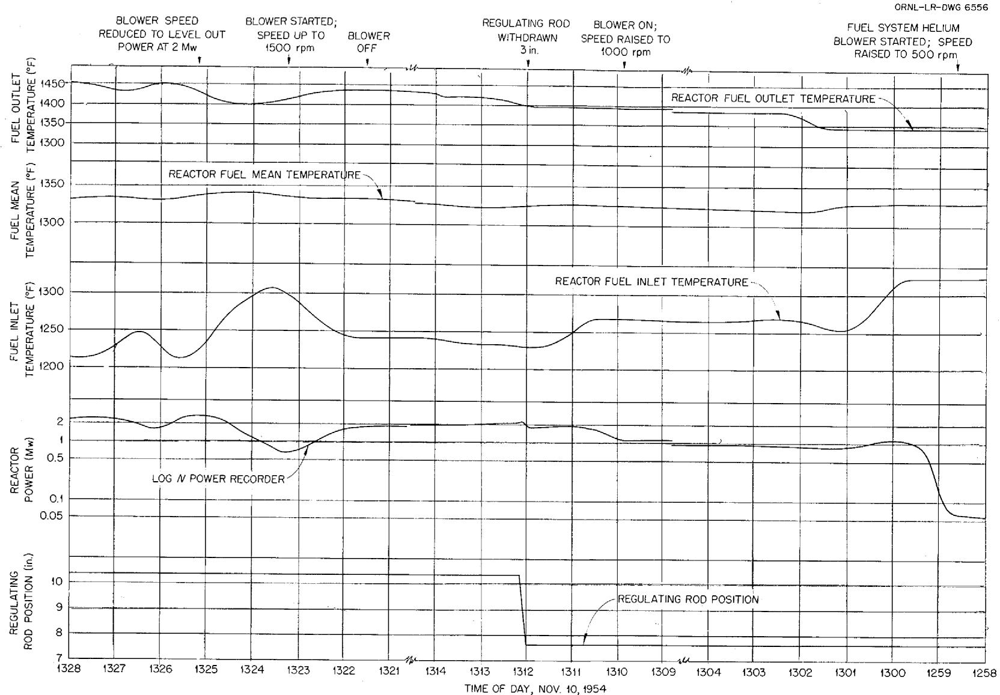  
Fig. 6.8. Typical Reactor Behavior During Power Operation.

TABLE 6.3. NUCLEAR AND PROCESS DATA OBTAINED DURING A TYPICAL OPERATION PERIOD (NOV. 10)  

<table><tr><td rowspan="2">Type of Measurement</td><td rowspan="2">Type of Data Obtained*</td><td colspan="5">Operation Performed</td></tr><tr><td>Fuel System Blower Speed Increasing</td><td>Fuel System Blower Speed Increasing</td><td>Regulating Rod Withdrawn</td><td>Fuel System Blower Speed Decreasing</td><td>Fuel System Blower Speed Increasing</td></tr><tr><td>Time</td><td></td><td>1300</td><td>1310</td><td>1312</td><td>1321</td><td>1323</td></tr><tr><td rowspan="6">Log N power</td><td>P1, Mw</td><td>0.0566</td><td>0.99</td><td>1.58</td><td>1.56</td><td>0.57</td></tr><tr><td>P2, Mw</td><td>1.07</td><td>1.70</td><td>1.94</td><td>0.57</td><td>2.17</td></tr><tr><td>δP, Mw</td><td>1.013</td><td>0.71</td><td>0.36</td><td>0.99</td><td>1.60</td></tr><tr><td>δt, sec</td><td>28</td><td>41</td><td>9</td><td>60</td><td>81</td></tr><tr><td>δP/δt, Mw/sec</td><td>0.0363</td><td>0.0173</td><td>0.04</td><td>0.016</td><td>0.198</td></tr><tr><td>τ, sec</td><td>10</td><td>75</td><td>33</td><td>63</td><td>54</td></tr><tr><td rowspan="5">Fuel outlet temperature</td><td>To,1,°F</td><td>1405</td><td>1485</td><td>1527</td><td>1546</td><td>1491</td></tr><tr><td>To,2,°F</td><td>1474</td><td>1527</td><td>1543</td><td>1491</td><td>1566</td></tr><tr><td>δTo,°F</td><td>69</td><td>42</td><td>16</td><td>-55</td><td>75</td></tr><tr><td>δt, sec</td><td>45</td><td>56</td><td>24</td><td>75</td><td>58</td></tr><tr><td>δTo/δt, °F/sec</td><td>1.54</td><td>0.75</td><td>0.67</td><td>-0.73</td><td>1.29</td></tr><tr><td rowspan="5">Fuel inlet temperature</td><td>Ti,1,°F</td><td>1335</td><td>1269</td><td>1231</td><td>1239</td><td>1314</td></tr><tr><td>Ti,2,°F</td><td>1256</td><td>1227</td><td>1240</td><td>1314</td><td>1208</td></tr><tr><td>δTi,°F</td><td>-79</td><td>-42</td><td>9</td><td>75</td><td>-106</td></tr><tr><td>δt, sec</td><td>58</td><td>53</td><td>42</td><td>75</td><td>88</td></tr><tr><td>δTt/δt, °F/sec</td><td>-1.36</td><td>-0.79</td><td>0.21</td><td>1.00</td><td>-1.20</td></tr><tr><td rowspan="5">Fuel mean temperature</td><td>Tm,1,°F</td><td>1370</td><td>1377</td><td>1379</td><td>1388</td><td>1402</td></tr><tr><td>Tm,2,°F</td><td>1365</td><td>1377</td><td>1391</td><td>1402</td><td>1387</td></tr><tr><td>δTm,°F</td><td>-5</td><td>0</td><td>12</td><td>14</td><td>-15</td></tr><tr><td>δt, sec</td><td>52</td><td></td><td>33</td><td>75</td><td>73</td></tr><tr><td>δTm/δt, °F/sec</td><td>-0.096</td><td>0</td><td>0.36</td><td>0.19</td><td>-0.20</td></tr><tr><td rowspan="5">Reactor fuel ΔT</td><td>ΔT1,°F</td><td>70</td><td>216</td><td>296</td><td>287</td><td>177</td></tr><tr><td>ΔT2,°F</td><td>218</td><td>300</td><td>303</td><td>177</td><td>358</td></tr><tr><td>δ(ΔT), °F</td><td>148</td><td>84</td><td>7</td><td>-110</td><td>181</td></tr><tr><td>δt, sec</td><td>52</td><td>54.5</td><td>33</td><td>75</td><td>73</td></tr><tr><td>δ(ΔT)/δt, °F/sec</td><td>2.87</td><td>1.54</td><td>0.21</td><td>-1.47</td><td>2.49</td></tr><tr><td rowspan="2">Regulating rod movement</td><td>d1, in.</td><td></td><td></td><td>7.60</td><td></td><td></td></tr><tr><td>d2, in.</td><td></td><td></td><td>10.37</td><td></td><td></td></tr><tr><td rowspan="5">Regulating rod movement</td><td>δd1, in.</td><td></td><td></td><td>2.77</td><td></td><td></td></tr><tr><td>δt, sec</td><td></td><td></td><td>9</td><td></td><td></td></tr><tr><td>δd/Δt, in./sec</td><td></td><td></td><td>0.32</td><td></td><td></td></tr><tr><td>Δk/k, %</td><td></td><td></td><td>0.0914</td><td></td><td></td></tr><tr><td>(Δk/k)/δt, %/sec</td><td></td><td></td><td>0.011</td><td></td><td></td></tr><tr><td rowspan="5">Fuel system helium blower speed</td><td>s1, rpm</td><td>0</td><td>500</td><td></td><td>1000</td><td>0</td></tr><tr><td>so, rpm</td><td>500</td><td>1000</td><td></td><td>0</td><td>1500</td></tr><tr><td>δs, rpm</td><td>500</td><td>500</td><td></td><td>-1000</td><td>1500</td></tr><tr><td>δt, sec</td><td>14</td><td>14</td><td></td><td>60</td><td>42</td></tr><tr><td>δs/δt, rpm/sec</td><td>36</td><td>36</td><td></td><td>-17</td><td>36</td></tr></table>

*The following symbols are used:

# Quantity

P power   
time   
$\pmb{\tau}$ period   
T temperature   
$\pmb{d}$ position   
$k$ multiplication factor   
speed   
$\delta$ change in quantity   
$\Delta$ difference between two quantities

# Subscript

1 initial condition   
2 final condition   
o outlet condition   
inlet condition   
m mean

The $\delta i$ 's are the times required to go from the initial condition to the final condition at the greatest observed rate of change. The temperatures quoted have all been corrected by the method described in Appendix K.

rods). The experiment consisted of two runs. In the first run the reactor was taken directly from 100 kw to slightly over 2 Mw. In the second run the reactor was taken to power from a subcritical condition.

The progress of these experiments, as recorded by the thermocouple recorders on the inlet and outlet sides of the six individual fuel tubes, is shown in Fig. 6.9. Reading from right to left, the reactor was at 200 kw power at 2300 on November 9 at the beginning of the experiment. The fuel system helium blower speed was increased to 1700 rpm slowly, starting at 2307. Ten minutes later the sodium system coolant blowers were turned on. As the power rose to about 2.5 Mw, a temperature difference of some $320^{\circ}\mathrm{F}$ appeared across the reactor tubes. This is shown in Fig. 6.9 by the parting of the inlet and outlet temperature indications of the reactor fuel tubes. This temperature

difference remained constant until the blower speed was reduced at 2340. At 2345 the inlet and outlet tube temperatures were nearly the same again at 200 kw power. A sharp drop in the tube temperatures at this point corresponded to the insertion of the shim rods.

The sharp increase in the temperature differential across the tubes at 2353 was the result of a steep rise in power when the blower speed was increased from 0 to 1700 rpm. At 0005 on November 10, the regulating rod was first entirely inserted (from 7 in. withdrawn) and then fully withdrawn. This motion was followed by a drop and then a sharp rise in the fuel tube temperatures. This action marked the end of Run 1.

During Run 2 the reactor was brought subcritical by turning off the fuel system helium blower and inserting the regulating rod, starting at 0016. The sodium system helium blowers had been operating

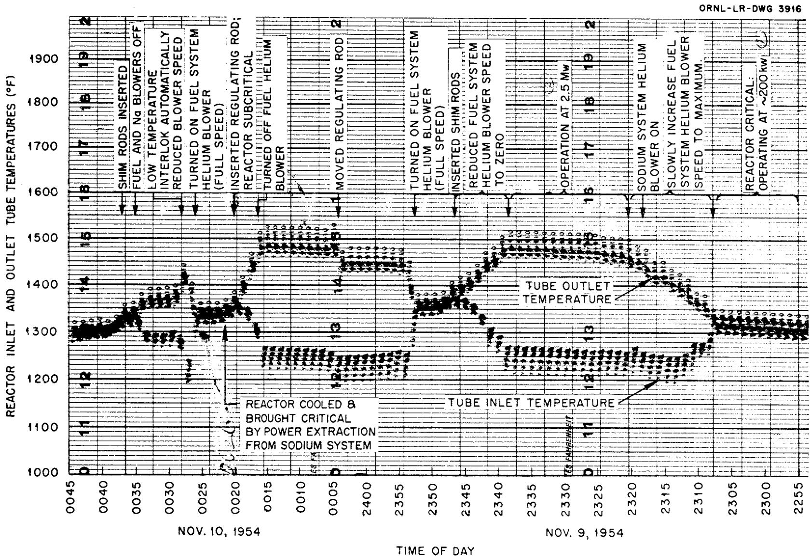  
Fig. 6.9. Behavior of Reactor Fuel Tube Inlet and Outlet Temperature During Experiment on Control by Temperature Coefficient.

some of the time during Run 1 to extract power from the sodium. As soon as the reactor became subcritical the operation of the sodium system blowers, which were then removing about $400\mathrm{kw}$ of power from the sodium, made the reactor go critical again and stabalize at the $400\mathrm{kw}$ level within 5 min. It is interesting to note that because the mean sodium temperature was some $65^{\circ}\mathrm{F}$ lower than the mean fuel temperature, the fuel temperatures dropped $65^{\circ}\mathrm{F}$ during this time from a mean temperature of 1395 to $1330^{\circ}\mathrm{F}$ , even though the nuclear power was increasing. At 0026 the fuel system blower was turned on again and the nuclear power temporarily rose to 3 Mw. Two minutes after the fuel system blower was turned on, the fuel heat exchanger outlet temperature went below $1150^{\circ}\mathrm{F}$ and the automatic heat-exchanger-temperature interlock reduced the blower speed until the heat exchanger outlet (reactor inlet) temperature had risen above $1150^{\circ}\mathrm{F}$ . At 0030 the reactor power had leveled out at 1 Mw. It had thus been successfully demonstrated that the power demand would bring the reactor critical; therefore, at 0033, the fuel and sodium system blowers were turned off and the experiment brought to an end.

# Effect of One Dollar of Reactivity (Exp. H-8)

One of the objectives of the ARE was the observation of effects of introducing excess $\Delta k$ into the reactor during high-power operation. The introduction of the excess $\Delta k$ could be most easily accomplished by movement of the regulating rod, which was worth $0.4\%$ excess $k$ (one dollar of reactivity). One experiment consisted merely of withdrawing the regulating rod from an entirely inserted position, and recording or noting the effects and, then, after equilibrium had been established, inserting the rod to its original position. Since the regulating rod had a travel rate of 0.32 in./sec, reactivity could be introduced at the rate of $0.011\% \Delta k / k\cdot \mathrm{sec}$ . Fig. 6.10 shows the history of the experiment.

At 1110 on November 10, with the reactor at an initial power of 2.2 Mw, the regulating rod was withdrawn its full 12 in. of travel. The reactor went on an observed 42-sec period until the nuclear power was 3.9 Mw 35-sec later. The re

actor fuel temperatures rose an average of $45^{\circ}\mathrm{F}$ in 49 sec. Once the rod withdrawal had been completed, the fuel inlet and outlet temperatures leveled off at new values. The extracted power rose a few per cent when the rod was withdrawn, mainly because, with the higher fuel mean temperature, the rate of cooling and, hence, the rate of heat removal in the heat exchanger was greater. Since the extracted power rose only slightly during this time, the nuclear power slowly drifted downward from its peak of $3.9\mathrm{Mw}$ to $2.9\mathrm{Mw}$ , as can be seen in Fig. 6.10. Note that the mean temperature continued its upward trend. Three minutes later the rod was completely inserted. The nuclear power decreased from 2.9 to $1.4\mathrm{Mw}$ on a $47\text{-sec}^7$ period and then slowly drifted back to $2.2\mathrm{Mw}$ , the starting power. The fuel temperatures then returned to values slightly higher than their original values. A characteristic behavior of the outlet temperature was again noted during this experiment, namely, that movement of a rod affected the outlet temperature most and the inlet temperature the least. Additional data on this experiment are given in Table 6.4.

Again, with this experiment, a time lag was noted; the inlet temperature lagged behind the outlet temperature by about the fuel transit time of 47 sec. A reasonable explanation for this lag is that the time required for the fuel in the reactor at the start of the experiment to affect the inlet line thermocouple is the transit time through the system.

Because of this difference in response of the thermocouples on the inlet and outlet fuel lines when the rod was withdrawn, the temperature differential across the reactor rose from $341^{\circ}F$ to a peak value of $395^{\circ}F$ in about 1 min and then dropped to a more or less constant value of $355^{\circ}F$ , which was $14^{\circ}F$ higher than at the start. This means that the extracted power rose slightly, about $8\%$ . Examination of the tracings of the fuel and sodium heat exchanger cooling water recorders for this time indicated that the fuel power extraction went up $6\%$ and the sodium power extraction roughly $2\%$ . The rise in power extraction was due mainly to the higher mean temperatures and thus the higher cooling rates attained. The extracted power rose to about $2.4Mw$ at the new equilibrium. The difference $(500\mathrm{kw})$ between this value and $2.9Mw,$ as shown by the Log $N$ recorder, went to heating the reactor. This was evidenced not only by the continuing increase in reactor mean fuel temperature but also by the rising travel in inlet and outlet

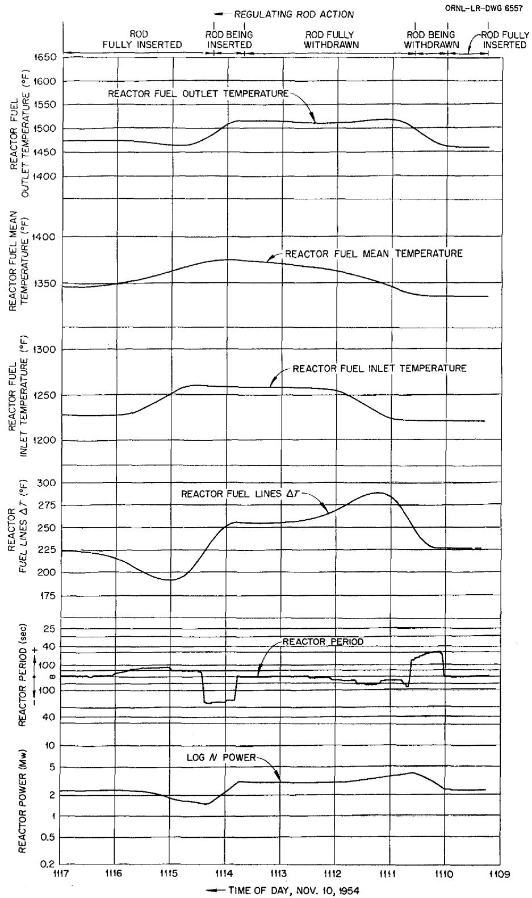  
Fig. 6.10. Kinetic Behavior of Reactor Upon Introduction of a Dollar of Reactivity.

TABLE 6.4. NUCLEAR AND PROCESS DATA OBTAINED DURING EXPERIMENT H-8 FOR DETERMINING THE EFFECT OF ONE DOLLAR OF REACTIVITY (NOV. 10)   

<table><tr><td rowspan="2">Type of Measurement</td><td rowspan="2">Type of Data Obtained*</td><td colspan="2">Operation Performed</td></tr><tr><td>Regulating Rod Withdrawn</td><td>Regulating Rod Inserted</td></tr><tr><td>Time</td><td></td><td>1110</td><td>1114</td></tr><tr><td rowspan="6">Log N power</td><td>P1,Mw</td><td>2.34</td><td>2.92</td></tr><tr><td>P2,Mw</td><td>3.94</td><td>1.41</td></tr><tr><td>δP,Mw</td><td>1.60</td><td>1.51</td></tr><tr><td>δt,sec</td><td>35</td><td>35</td></tr><tr><td>δP/δt,Mw/sec</td><td>0.046</td><td>0.043</td></tr><tr><td>T,sec</td><td>42</td><td>47</td></tr><tr><td rowspan="5">Fuel outlet temperature</td><td>To,1°F</td><td>1573</td><td>1620</td></tr><tr><td>To,2°F</td><td>1623</td><td>1572</td></tr><tr><td>δTo,°F</td><td>50</td><td>-48</td></tr><tr><td>δt,sec</td><td>41</td><td>41</td></tr><tr><td>δTo/δt,°F/sec</td><td>1.22</td><td>-1.17</td></tr><tr><td rowspan="5">Fuel inlet temperature</td><td>Ti,1°F</td><td>1217</td><td>1258</td></tr><tr><td>Ti,2°F</td><td>1257</td><td>1221</td></tr><tr><td>δTi,°F</td><td>40</td><td>-37</td></tr><tr><td>δt,sec</td><td>57</td><td>56</td></tr><tr><td>δTi/δt,°F/sec</td><td>0.70</td><td>-0.66</td></tr><tr><td rowspan="5">Fuel mean temperature</td><td>Tm,1°F</td><td>1395</td><td>1439</td></tr><tr><td>Tm,2°F</td><td>1440</td><td>1396</td></tr><tr><td>δTm,°F</td><td>45</td><td>-43</td></tr><tr><td>δt,sec</td><td>49</td><td>49</td></tr><tr><td>δTm/δt,°F/sec</td><td>0.92</td><td>-0.88</td></tr><tr><td rowspan="5">Reactor fuel ΔT</td><td>ΔT1,°F</td><td>356</td><td>362</td></tr><tr><td>ΔT2,°F</td><td>366</td><td>351</td></tr><tr><td>δ(ΔT),°F</td><td>10</td><td>-11</td></tr><tr><td>δt,sec</td><td>49</td><td>49</td></tr><tr><td>δ(ΔT)/δt,°F/sec</td><td>0.20</td><td>-0.21</td></tr><tr><td rowspan="3">Regulating rod movement</td><td>d1,in.</td><td>2.0</td><td>14.0</td></tr><tr><td>d2,in.</td><td>14.0</td><td>2.0</td></tr><tr><td>δd, in.</td><td>12.0</td><td>-12.0</td></tr><tr><td rowspan="4">Regulating rod movement</td><td>δt, sec</td><td>37</td><td>37</td></tr><tr><td>δd/δt, in./sec</td><td>0.32</td><td>-0.32</td></tr><tr><td>Δk/k, %</td><td>0.4</td><td>0.4</td></tr><tr><td>(Δk/k)/δt, %/sec</td><td>0.011</td><td>-0.11</td></tr><tr><td rowspan="5">Fuel system helium blower speed</td><td>s1, rpm</td><td>1750</td><td>1750</td></tr><tr><td>s2, rpm</td><td>1750</td><td>1750</td></tr><tr><td>δs, rpm</td><td>0</td><td>0</td></tr><tr><td>δt, sec</td><td>-</td><td>-</td></tr><tr><td>δs/δt, rpm/sec</td><td>0</td><td>0</td></tr></table>

*See footnote to Table 6.3.

fuel temperatures just before the rod was inserted at 1114.

# Power Cycling of Reactor

The last day of operation of the ARE, November 12, was devoted to maximum power runs and to demonstrations of the reactor operation to visitors. The complete history of the reactor operation during that time is shown in Fig. 6.11. Chart A shows the trace of the sodium temperature differential across the reactor and chart B shows the trace of the outlet temperature of the water from the fuel heat exchangers. Clearly seen in chart A are the three maximum power runs at 10:00 AM, 12:30 and 7:45 PM. Both charts show the cycling of the extracted power that the system underwent, but the cycles are especially well defined in chart B, which shows the heat exchanger water temperatures varying from a low of $65^{\circ}\mathrm{F}$ to a high of $140^{\circ}\mathrm{F}$ , corresponding to total extracted powers of from around 100 kw to over 2 Mw. In the 12 hr between 8:00 AM and 8:00 PM, 24 complete cycles were recorded. In the afternoon hours between 1:00 and 4:00 PM, when the most visitors were present, the reactor was cycled an average of 3 times per hour. Of interest to the visitors were the tracings of the reactor fuel tube $\Delta T$ recorders. The photograph reproduced as Fig. 6.12, which was taken during one of the cycles, shows each of the six fuel tube $\Delta T$ recorders simultaneously tracing out the same power cycle pattern. The picture was taken about

12:30 PM during one of the maximum power runs. The recorders show $\Delta T$ 's of around $250^{\circ}\mathrm{F}$ . The actual fuel tube differences at this time were more nearly $355^{\circ}\mathrm{F}$ .

Additional information on the power cycling may be obtained from Fig. 6.13 which shows the three temperature cycles recorded in the hour between 1:10 and 2:10 PM on the last day. Shown in this figure are traces from the six fuel tube $\Delta T$ recorders, a time condensation of the micromicrometer recorder (which traced the power), one of the heat exchanger outlet temperature recorders, and the individual fuel tube temperature recorder.

Referring to the micromicroammeter trace and reading from right to left starting at 1317, the events are elaborated for the first cycle. The other two cycles are similar.

At 1317 the fuel system helium blower was turned off, and the reactor power was allowed to decrease from a level of 1.8 Mw. Eight minutes later the power had fallen to about 130 kw, and the blower was turned on to 1700 rpm. The power rose quickly to 2.3 Mw, at which point a low-heat-exchanger-temperature blower reverse occurred; that is, when the helium cooling lowered the heat exchanger outlet fuel temperature to $1150^{\circ}\mathrm{F}$ (as noted above), a relay was automatically actuated that decreased the helium blower speed until such time as the

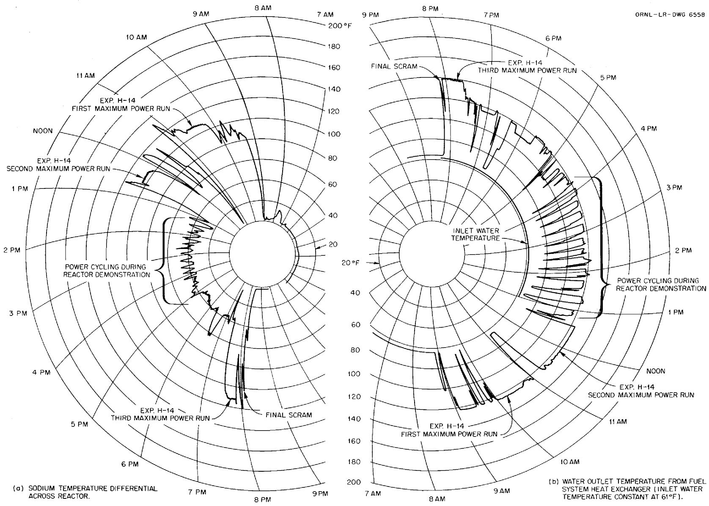  
#   
Fig. 6.11. Temperature Cycles in Fuel and Sodium Systems During Last Day of Operation.

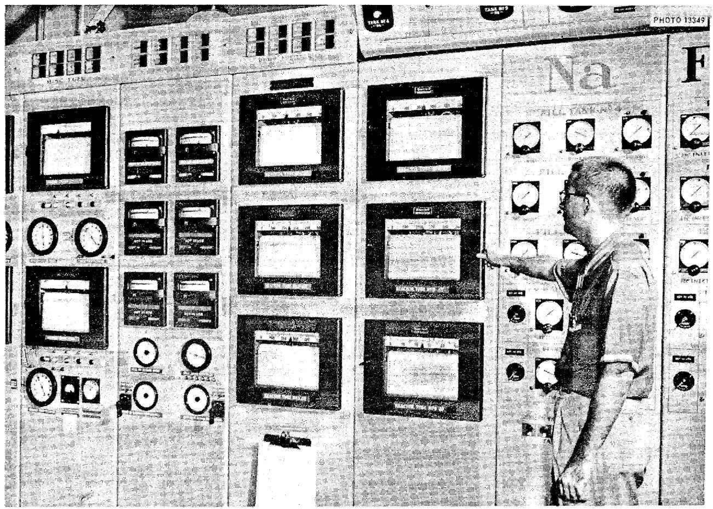  
Fig. 6.12. Reactor Fuel Tube $\Delta T$ 's During High-Power Operation.

outlet temperature rose to above $1150^{\circ}\mathrm{F}$ . During this time the power fell to 1.1 Mw. At 1328 a "permit" signal was given and the power was again increased. When 2 Mw was reached the reactor was leveled off on extracted power and for 10 min the effect of regulating rod movement was demonstrated to visitors.

The maximum nuclear power attained during the first cycle was $2.8\mathrm{Mw}^4$ at 1340. During the third cycle at 1410 a nuclear power of 3.4 Mw was reached.

The six fuel tube $\Delta T$ recorders (Fig. 6.12) followed exactly the same pattern as the micromicroammeter recorder. It should be noted, however, that the actual $\Delta T$ 's were of the order of 100 degrees higher than those shown on the charts. At the high power peaks of the third cycle the fuel outlet line temperatures, as read in the basement, were indicated to be about $1625^{\circ}\mathrm{F}$ . The inlet temperatures ranged from an actual (vs observed)

high of $1340^{\circ}\mathrm{F}$ to a low of $1150^{\circ}\mathrm{F}$ during the low-heat-exchanger-temperature blower reverse.

The change in tube $\Delta T$ 's as a result of rod movement was due partly to the phenomenon of the time lag between the inlet and outlet thermocouples. Had there been no lag the effect of rod motion on these couples would have been small.

The fuel heat exchanger outlet temperatures showed the temperature cycles in reverse. The first high peak corresponds to the condition at $1300^{\circ}\mathrm{F}$ with the blower off. As the blower was turned on the temperature decreased to $1150^{\circ}\mathrm{F}$ , at which point, as noted, the blower reverse occurred with the resultant decrease in blower speed. The heat exchanger outlet temperature then rose to $1250^{\circ}\mathrm{F}$ before the blower speed was allowed to increase again.

The data from these and other recorder charts during this time, together with calculated rates of change, are given in Table 6.5.

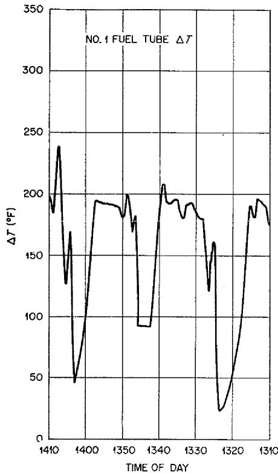

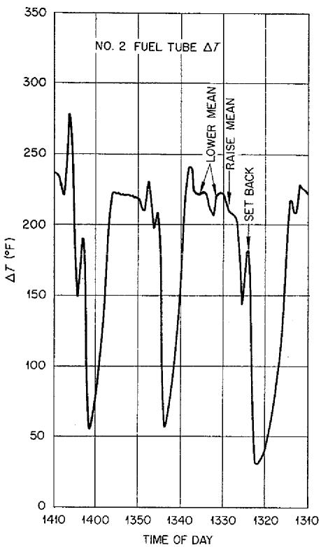

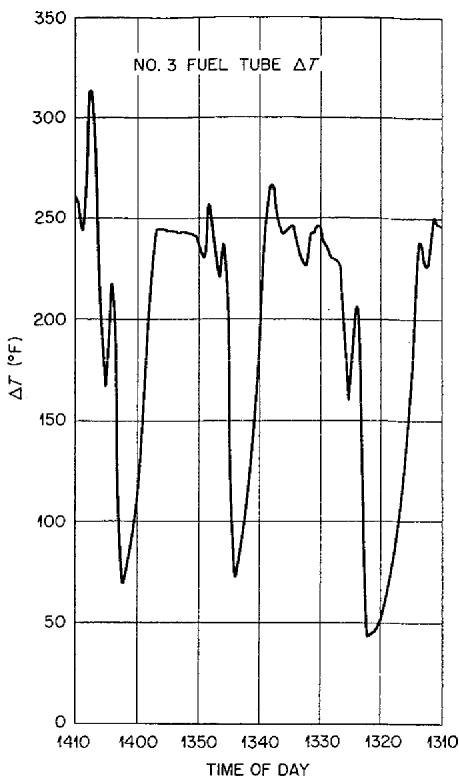

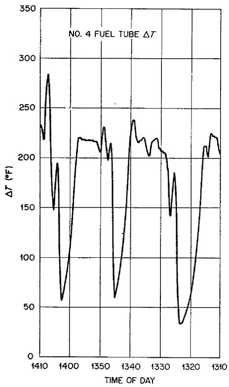

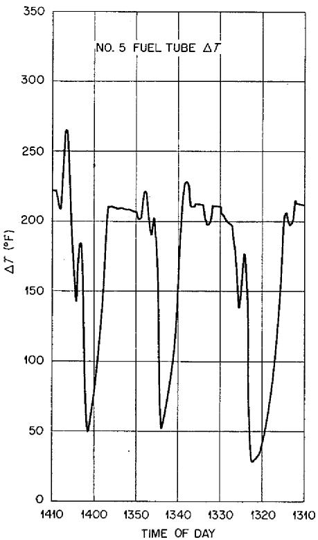

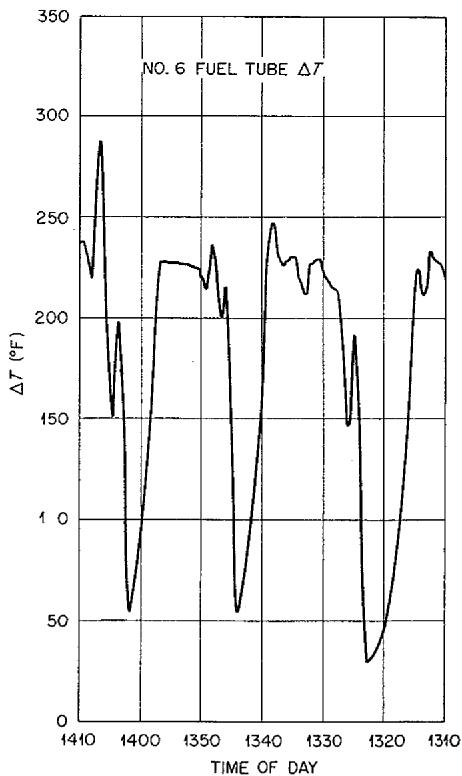  
Fig. 6.13. Reactor Characteristics During Power Cycling.

ORNL-LR-DWG6559

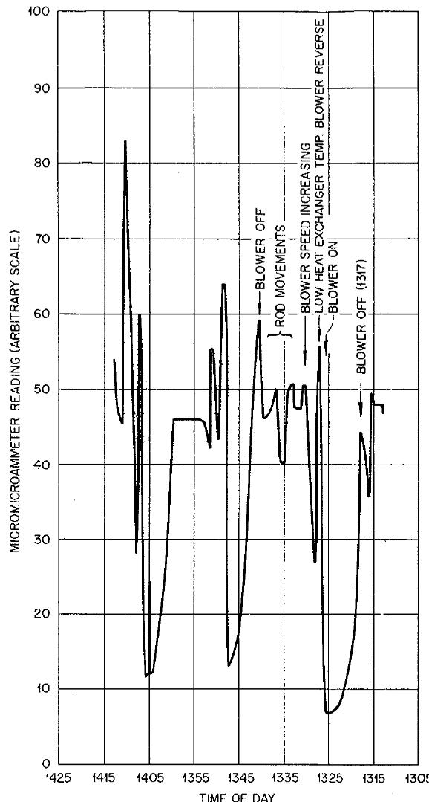  
CONDENSATION OF MICROMICROAMMETER READINGS FROM 80 in./hr TO 4 in./hr

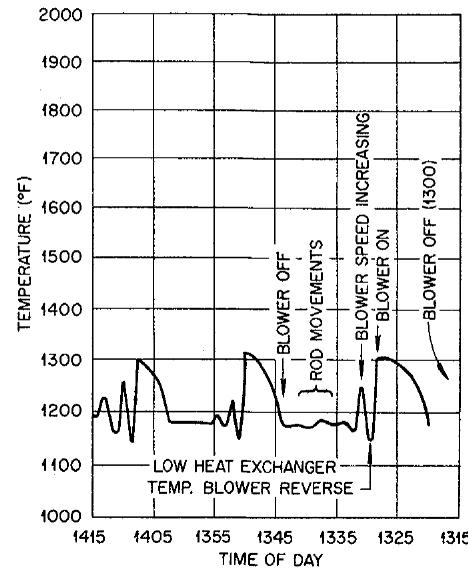  
FUEL HEAT EXCHANGER OUTLET TEMPERATURE

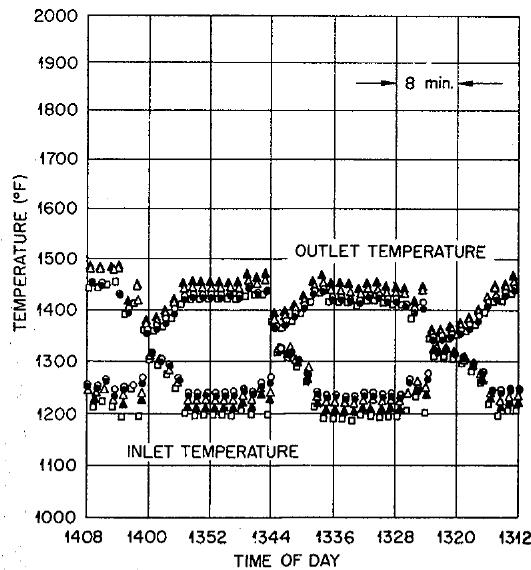  
INDIVIDUAL FUEL TUBES INLET AND OUTLET TEMPERATURE

TABLE 6.5. CHARACTERISTIC NUCLEAR AND PROCESS DATA DURING POWER CYCLING OF REACTOR (NOV. 12)   

<table><tr><td rowspan="2">Type of Measurement</td><td rowspan="2">Type of Data Obtaineda</td><td colspan="4">Power Cycle No. 1</td><td colspan="3">Power Cycle No. 2</td><td colspan="4">Power Cycle No. 3</td></tr><tr><td>Blowerb Speed Decreasing</td><td>Blowerc Speed Decreasing</td><td>Blowerb Speed Increasing</td><td>Blowerc Speed Decreasing</td><td>Blowerb Speed Increasing</td><td>Blowerc Speed Decreasing</td><td>Blowerb Speed Increasing</td><td>Blowerb Speed Decreasing</td><td>Blowerc Speed Increasing</td><td>Blowerb Speed Decreasing</td><td>Rod Withdrawnd</td></tr><tr><td>Time</td><td></td><td>1324</td><td>1326</td><td>1327</td><td>1340</td><td>1346</td><td>1348</td><td>1349</td><td>1405</td><td>1406</td><td>1407</td><td>1408</td></tr><tr><td rowspan="6">Log N power</td><td>P1, Mw</td><td>0.283</td><td>2.26</td><td>1.04</td><td>2.01</td><td>0.462</td><td>2.42</td><td>1.62</td><td>0.387</td><td>2.06</td><td>0.962</td><td>2.01</td></tr><tr><td>P2, Mw</td><td>2.26</td><td>1.04</td><td>2.03</td><td>0.48</td><td>2.42</td><td>1.62</td><td>2.09</td><td>2.06</td><td>0.962</td><td>2.01</td><td>3.21</td></tr><tr><td>δP, Mw</td><td>1.98</td><td>-1.22</td><td>0.99</td><td>-1.53</td><td>1.96</td><td>-0.80</td><td>0.47</td><td>1.67</td><td>-1.10</td><td>1.05</td><td>1.20</td></tr><tr><td>δt, sec</td><td>35</td><td>69</td><td>37</td><td>275</td><td>38</td><td>37</td><td>42</td><td>35</td><td>70</td><td>40</td><td>23</td></tr><tr><td>δP/δt, Mw/sec</td><td>0.057</td><td>-0.18</td><td>0.027</td><td>-0.0056</td><td>0.052</td><td>-0.022</td><td>0.011</td><td>0.045</td><td>-0.016</td><td>0.026</td><td>0.052</td></tr><tr><td>τ, sec</td><td>18</td><td>-89</td><td>54</td><td></td><td>24</td><td>59</td><td>110</td><td>19</td><td>60</td><td>52</td><td>46</td></tr><tr><td rowspan="5">Fuel outlet temperature</td><td>To,1°F</td><td>1402</td><td>1526</td><td>1457</td><td>1551</td><td>1446</td><td>1559</td><td>1540</td><td>1426</td><td>1538</td><td>1485</td><td>1532</td></tr><tr><td>To,2°F</td><td>1526</td><td>1452</td><td>1529</td><td>1446</td><td>1559</td><td>1540</td><td>1558</td><td>1538</td><td>1485</td><td>1532</td><td>1595</td></tr><tr><td>δTo,°F</td><td>124</td><td>-74</td><td>72</td><td>-105</td><td>113</td><td>-19</td><td>18</td><td>112</td><td>-53</td><td>47</td><td>63</td></tr><tr><td>δt, sec</td><td>48</td><td>76</td><td>50</td><td>321</td><td>49</td><td>37</td><td>46</td><td>44</td><td>55</td><td>41</td><td>39</td></tr><tr><td>δTo/δt, °F/sec</td><td>2.58</td><td>-0.97</td><td>1.44</td><td>-0.33</td><td>2.31</td><td>-0.51</td><td>0.39</td><td>2.55</td><td>-0.96</td><td>1.15</td><td>1.62</td></tr><tr><td rowspan="5">Fuel inlet temperature</td><td>Ti,1°F</td><td>1340</td><td>1208</td><td>1271</td><td>1212</td><td>1347</td><td>1209</td><td>1247</td><td>1333</td><td>1207</td><td>1262</td><td>1207</td></tr><tr><td>Ti,2°F</td><td>1208</td><td>1271</td><td>1210</td><td>1346</td><td>1209</td><td>1247</td><td>1218</td><td>1207</td><td>1267</td><td>1207</td><td>1254</td></tr><tr><td>δTi,°F</td><td>-132</td><td>63</td><td>-61</td><td>134</td><td>-138</td><td>38</td><td>-29</td><td>-126</td><td>55</td><td>-55</td><td>47</td></tr><tr><td>δt, sec</td><td>65</td><td>56</td><td>49</td><td>356</td><td>53</td><td>35</td><td>46</td><td>49</td><td>52</td><td>49</td><td>62</td></tr><tr><td>δTj/δt, °F/sec</td><td>-2.03</td><td>1.13</td><td>-1.24</td><td>0.38</td><td>-2.60</td><td>1.09</td><td>-0.63</td><td>-2.58</td><td>1.06</td><td>1.12</td><td>0.76</td></tr><tr><td rowspan="5">Fuel mean temperature</td><td>Tm,1°F</td><td>1371</td><td>1367</td><td>1364</td><td>1381</td><td>1397</td><td>1384</td><td>1394</td><td>1380</td><td>1373</td><td>1374</td><td>1370</td></tr><tr><td>Tm,2°F</td><td>1367</td><td>1362</td><td>1369</td><td>1396</td><td>1384</td><td>1393</td><td>1388</td><td>1372</td><td>1373</td><td>1370</td><td>1424</td></tr><tr><td>δTm,°F</td><td>-4</td><td>-5</td><td>5</td><td>15</td><td>-13</td><td>9</td><td>-6</td><td>-8</td><td>0</td><td>-4</td><td>54</td></tr><tr><td>δt, sec</td><td>56</td><td>66</td><td>50</td><td>338</td><td>51</td><td>36</td><td>46</td><td>47</td><td></td><td>45</td><td>50</td></tr><tr><td>δTm/δt, °F/sec</td><td>-0.04</td><td>-0.076</td><td>0.10</td><td>0.04</td><td>-0.25</td><td>0.25</td><td>-0.13</td><td>-0.17</td><td>0</td><td>-0.09</td><td>1.08</td></tr><tr><td rowspan="5">Reactor fuel ΔT</td><td>ΔT1,°F</td><td>62</td><td>318</td><td>186</td><td>339</td><td>99</td><td>350</td><td>293</td><td>93</td><td>331</td><td>223</td><td>325</td></tr><tr><td>ΔT2,°F</td><td>318</td><td>181</td><td>319</td><td>100</td><td>350</td><td>293</td><td>340</td><td>331</td><td>223</td><td>325</td><td>341</td></tr><tr><td>δ(ΔT),°F</td><td>256</td><td>-137</td><td>133</td><td>-239</td><td>251</td><td>-57</td><td>47</td><td>238</td><td>-108</td><td>102</td><td>16</td></tr><tr><td>δt, sec</td><td>57</td><td>66</td><td>50</td><td>338</td><td>51</td><td>36</td><td>46</td><td>46.5</td><td>54</td><td>51</td><td>55</td></tr><tr><td>δ(ΔT)/δt, °F/sec</td><td>4.49</td><td>-2.08</td><td>2.66</td><td>-0.71</td><td>4.92</td><td>-1.58</td><td>1.02</td><td>5.11</td><td>-2.00</td><td>2.00</td><td>0.29</td></tr></table>

${}^{a}$ See footnote to Table 6.3.   
$b$ During power cycling no data available on blower speeds.   
$c_{\text{Low-heat-exchanger-temperature blower reverse caused blower speed to decrease}}$   
$d_{\text{No data recorded on which rod was moved.}}$ Estimated $\Delta k / k$ introduced was $0.33\%$ .

No data available on blower speeds.

This would correspond to a group movement of all three shim rods for a 10-sec period.

# Reactor Transients

One of the characteristics of the reactor that was most important from the operator's point of view was the behavior under transient conditions, because it is only through transient effects that the operator acquires a "feel" for the way the reactor responds to his control under varying conditions. The various ways in which transients may be introduced into the reactor are the following:

1. operation of fuel system helium blower,   
2. operation of sodium system helium blowers,   
3. operation of rod cooling system helium blowers,   
4. changing the fuel flow rate,   
5. changing the sodium flow rate,   
6. movement of shim rods,   
7. movement of regulating rods.

A discussion of the effects on the ARE of some of these operations is given in succeeding paragraphs. Effects 3 and 5 were very small although observable. Effect 4 was not observed at high power because of the danger of freezing fuel in the pump, although it can be calculated from the inhour curves (Fig. 5.11) and the known rate of change of fuel pump speed. Table 6.6 lists calculated rates of interjection of $\Delta k / k$ into the reactor by the various means listed above.

It has already been pointed out that the ARE reactor and system were very sluggish in responding to demands at high power. Furthermore, it was observed that the response at low power (less than $100\mathrm{kw}$ ) was much different from its response at higher powers (at 1 Mw or greater). One way to examine the behavior of the reactor is to plot sys

tem characteristics against the initial power, since this represents the behavior from a given initial condition of the reactor.

One of the properties investigated in the above manner was the reactor period. Some of the observed reactor periods are plotted as a function of the initial power in Fig. 6.14. Since the reactor could be put on any period from infinite to a given minimum, the points in Fig. 6.14 are scattered. Most of the longer periods represent periods observed during such times as the initial rise to power, which was approached with caution. As the operators became more familiar with the operation at power, deliberate attempts were made to see how fast a period the reactor would attain due to blower operation or rod movement. As a result, definite lower limits were established beyond which reactor periods could not be induced by the controls available to the operator. The solid line in Fig. 6.14 represents the lower limit for periods during blower operation and the dashed line is that corresponding to shim and regulating rod movement. The smallest period observed during high-power operation was the 10-sec period represented by the rise in the Log $N$ chamber at 1259, Fig. 6.8. A few smaller periods were observed in the very low-power regime just above critical. The two lines shown in the figure indicate that the lower the power the greater the transient that can

If the reactor had been taken to power with the shim rods inserted to greater depths, smaller periods would have been observed for shim rod motion than are represented by the dashed line, since the reactivity value of the rods would have been greater for those insertions.

TABLE 6.6.CALCULATED RATES OF INCREASE OF $\Delta k / k$ IN ARE FROM VARIOUS OPERATIONS  

<table><tr><td>Operation</td><td>Range</td><td>(%Δk/k)/sec</td></tr><tr><td rowspan="2">Fuel system helium blower speed increase</td><td>0 to 1500 rpm</td><td>0.0035</td></tr><tr><td>1000 to 1500 rpm</td><td>0.0011</td></tr><tr><td>Regulating rod movement</td><td>Whole rod insertion or withdrawal</td><td>0.011</td></tr><tr><td rowspan="2">Shim rod movement, single rod</td><td>At 4 in. insertion</td><td>0.0039</td></tr><tr><td>At 8 in. insertion</td><td>0.0067</td></tr><tr><td rowspan="2">Shim rod movement, group operation</td><td>At 4 in. insertion</td><td>0.012</td></tr><tr><td>At 8 in. insertion</td><td>0.019</td></tr><tr><td>Fuel flow rate</td><td>0 to 46 gpm</td><td>0.013</td></tr><tr><td>Sodium flow rate</td><td>0 to 150 gpm</td><td>1 × 10-6</td></tr></table>

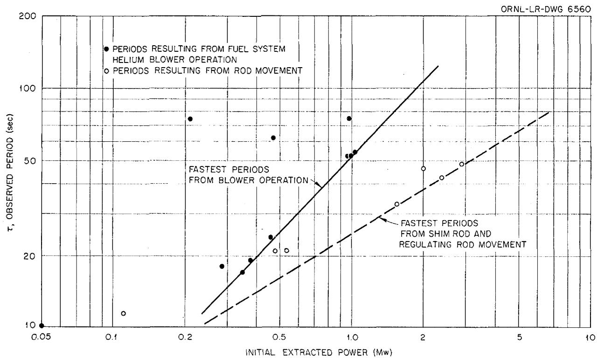  
Fig. 6.14. Induced Reactor Periods as a Function of Initial Extracted Power.

be introduced into the reactor, i.e., the higher the power the harder it becomes to introduce a transient condition. Extrapolation of the solid line to a power of 1 kw indicates that at this power reactor periods of 1 sec or less could have been introduced by blower operation.

It should be pointed out that periods could be observed which were not true periods but were a combination of the observed period and its time derivative. Whenever a sudden reactivity change occurred, such as when a rod was moved slightly, the period meter would register a transient peak period that was very small compared with the true period. The beginning peak in the period curves of Fig. 5.4 are of this nature. Whenever a continuing change of $\Delta k / k$ was taking place, the observed period was not a true period but, again, a combination of the true period and its time derivative. In Fig. 6.10 the period meter did not register a constant period when the regulating rod was moved but, rather, a continually changing period. Also, it is to be noted that the Log $N$ power recorder did not register straight slopes during the power changes but, instead, constantly changing

ones, which again indicated that the period was changing (cf., App. S).

The time behavior of the fuel temperatures as a result of blower operation was obtained by plotting inlet and outlet fuel temperature time rates of change against the initial power. These plots are shown in Fig. 6.15. Larger rates of change of fuel temperatures were observed at lower powers, and they corresponded to the smaller periods observed. The greatest rates of change of the fuel temperatures were observed at an initial power of $280\mathrm{kw}$ at which time the inlet temperature changed at a rate of $-2.75^{\circ}\mathrm{F / sec}$ and the outlet temperature at a rate of $+2.6^{\circ}\mathrm{F / sec}$ . The only reason higher rates of change were not observed at powers lower than this was that in the low-power regime the kinetic behavior was not well known and therefore a conservative approach to transient conditions was used.

The rates of decrease of temperatures when the blower was turned off and the reactor was allowed to come to a lower power are also plotted in Fig. 6.15. The trend of rates of change of the temperatures seems to be reversed.

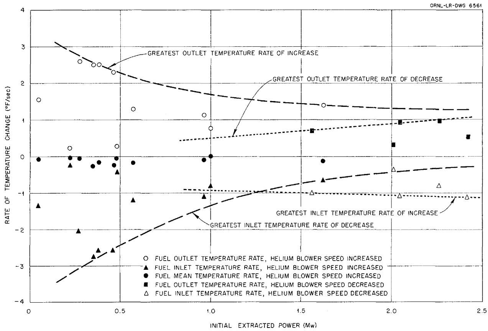  
Fig. 6.15. Time Behavior of Reactor Fuel Temperatures as a Function of Initial Extracted Power.

Some very general observations on the transient behavior of the ARE reactor are summarized below.

Reactor Periods. In general, the lower the initial power the faster was the transient introduced by any type of operation that resulted in upsetting the equilibrium between nuclear and extracted power. The smaller periods were associated with lower initial powers.

Oscillation of Reactor Power. The characteristic behavior of the nuclear power during an established transient was to "over-shoot" and then oscillate around a mean value before settling down to that power. The period of the oscillation appeared to be of the order of 2 min and lasted for about 2 cycles.

Movement of Rods. The reactor was always more prompt to respond to rod motion than it was to blower operation. Also the reactor periods observed at a given power were smaller due to rod movement than those due to blower operation.

Nuclear Power. Whenever blower speed was changed the nuclear power rose (with oscillations

as noted above) to a higher power level than the corresponding extracted power demand. When a rod movement occurred, the nuclear power changed considerably, which resulted in higher or lower reactor overall temperatures, and then leveled out to a new balance with the extracted power at about the original power level.

Extracted Power. Extracted power was essentially a function only of the demand and changed due to a change in operation of one of the various heat exchanger blowers. During rod movement at a given demand power, the extracted power remained essentially constant. The unbalance between extracted and nuclear power resulted in a change of the mean reactor temperature.

Reactor Outlet Fuel Temperature. The outlet fuel temperature always rose and fell in the same direction as the nuclear power level. For blower operation the rise in the outlet temperature was always less than the fall of the inlet temperature. The opposite was true for regulating rod movement.

Reactor Inlet Fuel Temperature. The inlet fuel

temperature rose and fell in the opposite direction to the change in nuclear power during blower operation and in the same direction as the nuclear power during rod movements. The inlet temperature change was greater than the outlet temperature change for blower operation. The opposite was true for shim rod operation.

Reactor Mean Temperature. The reactor mean temperature followed the trend of the reactor inlet temperatures in all cases, except that the changes and rates of change were much smaller.

Time Lags. The system was very sluggish because of the long tansit time (47 sec) of the fuel. In addition to the sluggishness of the system, there appeared to be time lags between the responses of various temperature indicating instruments for the same action. These lags were of the order of 2 min for low-power operation (less than 100 kw) and of the order of 1 min for full-power operation in the megawatt range. The topic of time lags is discussed in greater detail in a following section.

# Calculated Power Change Resulting from a Regulating Rod Movement

A formula was developed which would estimate a power change in the reactor from a given change in the reactor outlet temperature and a regulating rod movement. This was possible primarily because of the relationships existing between $P$ , $\Delta T$ , and $\Delta k / k$ . The development of the relationship is described below.

Also the mean reactor fuel temperature is given by

$$
T _ {m} = \frac {1}{2} \left(T _ {o} + T _ {i}\right),
$$

and

$$
\Delta T = T _ {o} - T _ {i}.
$$

From this it is seen that

$$
\Delta T = 2 T _ {o} - 2 T _ {m},
$$

and

$$
P = 2 k q \left(T _ {o} - T _ {m}\right).
$$

Now consider a change $\Delta P$ in the power:

$$
\Delta P = 2 k q \left(\Delta T _ {o} - \Delta T _ {m}\right),
$$

but the temperature coefficient reactivity $\alpha$ is

$$
\alpha = \frac {\Delta k / k}{\Delta T _ {m}}
$$

so that

$$
\Delta P = 2 k q \left[ \Delta T _ {o} - \frac {1}{\alpha} (\Delta k / k) \right].
$$

Since

$$
\Delta k / k = \left[ \left(\Delta k / k\right) / i n. \right] _ {R R} \times \Delta d _ {R R},
$$

where

$$
\Delta d _ {R R} \approx \text {r e g u l a t i n g r o d m o v e m e n t},
$$

$$
\left[ \left(\Delta k / k\right) / \text {in.} \right] _ {R R} = 0.033 \% \text {in. for the regulating}
$$

by putting in the experimental values,10 it is seen that

$$
\begin{array}{l} \Delta P = 2 (0. 1 1) (4 6) \left[ \Delta T _ {o} - \frac {1}{0 . 7 2 \times 9 . 8 \times 1 0 ^ {- 5}} (0. 0 0 0 3 3) \Delta d \right] \times 1 0 ^ {- 3} M w \\ = (1 0. 1 2 \Delta T _ {o} + 4 7. 7 5 \Delta d) \times 1 0 ^ {- 3} M w. \\ \end{array}
$$

When equilibrium exists between extracted power and nuclear power, the power level is given by

$$
P = k q \Delta T = k q \left(T _ {o} - T _ {t}\right),
$$

where

$$
\begin{array}{l} k = a \text {c o n s t a n t (s p e c i f i c h e a t o f t h e f u e l)}, \\ q = \text {f u e l f l o w (g p m)}, \\ \Delta T = \text {t h e} f u e l t e m a t e r a t u r e s, \\ T _ {o} = \text {o u t l e t f u e l t e m p e r a t u r e}, \\ T _ {i} = \text {i n l e t f u e l t e m p e r a t u r e}. \\ \end{array}
$$

The change in power, as calculated from this formula, checked closely the observed power change for several different cases which were examined. The calculated data are given in Table 6.7.

# Reactor Temperature Differential as a Function of Helium Blower Speed

A relationship between the fuel system helium blower speed and the resulting fuel $\Delta T$ was obtained from the data taken during ARE operation.

TABLE 6.7. SOME CALCULATED AND OBSERVED POWER CHANGES FROM REGULATING ROD MOTION   

<table><tr><td>Date</td><td>Time</td><td>Observed Outlet Temperature Change ΔTo(°F)</td><td>Regulating Rod Movement (in.)</td><td>Calculated Power Change (Mw)</td><td>Observed Power Change (Mw)</td></tr><tr><td rowspan="3">Nov. 10</td><td>1110*</td><td>55</td><td>12</td><td>1.59</td><td>1.60</td></tr><tr><td>1114*</td><td>53</td><td>12</td><td>1.55</td><td>1.51</td></tr><tr><td>1321</td><td>13</td><td>2.8</td><td>0.37</td><td>0.36</td></tr></table>

*Data recorded during Exp. H-8.

Some of the experimental fuel $\Delta T^{\prime}s$ are plotted in Fig. 6.16 as a function of their corresponding blower speeds. These points could be represented by a parabola of the form

$$
\Delta T ^ {2} = K s,
$$

where

$K = a$ constant of proportionality,

$s =$ theblower speed.

The curve that fit the experimental points best was found to be

$$
\Delta T = (0. 7 5 s) ^ {1 / 2},
$$

where $\Delta T$ is expressed in hundreds of degrees $F$ and $s$ is given in hundreds of rpm.

The extracted power can now be expressed in terms of blower speed:

$$
\begin{array}{l} P = k q \Delta T = k q (0. 7 5 s) ^ {1 / 2} \\ = [ 0. 1 1 \times 4 6 \times (0. 7 5 s) ^ {1 / 2} ] \times 1 0 ^ {2} \times 1 0 ^ {- 3} \\ = 0. 5 0 6 (0. 7 5 s) ^ {1 / 2} M w. \\ \end{array}
$$

The factor $10^{2}$ is used because $\Delta T$ is expressed in the empirical formula in hundreds of degrees. The $10^{-3}$ factor expresses power in megawatts. The results obtained with the formula checked with the observed values of power in numerous cases. As an example, during experiment H-3, for a blower speed of 1590 rpm, an extracted power of 1.75 Mw was observed. The formula gives

$$
P = 0. 5 0 6 [ 0. 7 5 (1 5. 9) ] ^ {1 / 2} = 1. 7 5 \mathrm {M w}.
$$

# The Phenomenon of the Time Lag

One of the most noteworthy phenomena encountered during the experiment was the time lag that seemed to be an intrinsic part of the system behavior. It was remarkably demonstrated in Fig. 6.8 when the blower was turned on. It was 0.75 min

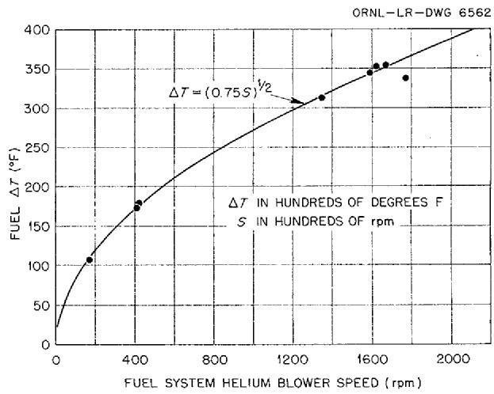  
Fig. 6.16. Reactor $\Delta T$ as a Function of Fuel Helium Blower Speed.

late; that the inlet temperature records showed a response, about 1.5 min before the mean temperature began dropping, and almost 2 min before the outlet temperature showed a corresponding rise. The reasons for the lags are obscure, but in an attempt to analyze the phenomenon several things must be considered: the extensiveness of the system, the reactor geometry, i.e., location of inlet and outlet fuel passages with respect to reactor core, heat transfer properties and possible phenomena within reactor, location, design, and attachment of the thermocouples within the reactor, and other unknown factors. There is a good possibility that the time lag phenomenon was connected with the temperature discrepancies noted in Appendix K.

Errors in marking the charts could possibly account for as much as 0.5 min, but certainly this cannot wholly account for the lag which was noted

consistently throughout the progress of the experiment. There is no doubt the system was very sluggish and slow to respond. This sluggishness was undoubtedly due, in large part, to the length of the fuel system. The transit time in the system was about 47 sec at full pump speed, as observed during the critical experiments. There does not seem to be any convenient mechanism for explaining longer time lags. A partial explanation is advanced in Appendix O, where geometrical considerations show that the instantaneous temperature change of the fuel was greater near the center of the reactor than at the points of the thermocouple locations. Thus the nuclear power was observed to change before the inlet and outlet thermocouples indicated changes.

An attempt was also made to analyze the heat transfer conditions within the reactor. Since the fuel and sodium flows were in opposite directions within the reactor, the fuel inlet line thermocouples were located near sodium outlet lines and the fuel outlet line thermocouples were located near sodium inlet lines. The temperature differences existing between the sodium (and moderator) and the fuel near the inlet and outlet thermocouples were of the order of $100^{\circ}\mathrm{F}$ or more and could possibly have influenced the readings of the thermocouples. This phenomena was investigated,[11] and no delay approaching 2 min could be ascribed to the heat transfer characteristics of the system. The greatest time lag which could be found in the heat transfer mechanism was of the order of a few seconds. The time lags of the reactor $\Delta T$ and mean temperature thermocouples were also investigated because these thermocouples had been insulated from the metal of the system. The time lags found were of the order of 15 sec or less, and thus they were about the same as those for uninsulated thermocouples. An experimental check showed that helium from the rod-cooling system had no appreciable effect on the readings of fuel temperatures when the blower speed was changed. Therefore, the phenomena of lag and low temperature readings could not be attributed to this cause.

It may well be that what may be described as "thermal inertia" played a part in the time lag. Since the reactor as a whole did not respond to a temperature change very fast, even though the fuel did, the thermocouple readings could have been affected to the extent that they received heat

not only from the fuel tubes but from other parts of the reactor. Better design and location of the thermocouples might have prevented such time lags.

# Reactivity Effects of Transients in the Sodium System

The introduction of transient conditions into the sodium system was expected to have only small effects on reactor behavior. This proved to be the case in the few instances for which data are available. The two operations of the sodium system which were observed to have effects on reactivity were changing the rate of sodium flow and changing the rate of sodium cooling.

The first effect was observed as a part of one of the low-power experiments (Exp. L-7), in which, with the reactor on servo at 1-w power, the fuel flow rate was varied and the change in the regulating rod position was noted. The concluding portion of the experiment consisted in stopping the sodium coolant flow and observing the change in regulating rod position with the fuel flow at its normal value of 46 gpm. During this time the regulating rod changed from 7.85 to 7.69 in., a movement of 0.16 in., which corresponded to a $\Delta k / k$ of only $5.3 \times 10^{-5}$ . This experiment was not repeated at high power, and therefore no data are available on reactor power and temperature changes as a function of sodium flow.

The second effect, the effect on the reactor system of changing the sodium cooling rate, was observed in Exp. H-12 during high-power operation. In this experiment the sodium system helium blowers were turned off and the following power and temperature changes were observed. At 2110 on November 11 the reactor was at 2.1-Mw extracted power; of this amount, approximately 1.6 Mw was being extracted from the fuel and 0.5 Mw from the sodium. At 2113 the sodium system helium blowers were turned off, and the power dropped, in the next 90 sec, to 1.96 Mw at a rate of 1.5 kw/sec, and, in the next $9\frac{1}{2}$ min, it dropped at a much slower rate of 280 w/sec and leveled off at 1.80 Mw. The total decrease in power was 300 kw. It is to be noted that since the extracted power from the sodium at the beginning of the experiment was 500 kw, about 200 kw of heat was still being lost by radiation and other means through the barrier door openings and other parts of the circuit, even with the helium circulation stopped. When the helium blower was turned on again at 2124 the reactor responded with an initial rise of 120 kw to

1.92 Mw at the rate of 1.33 kw/sec and then a very slow rise over a period of nearly 18 min to 2.06 Mw at a rate only 0.1 as great.

Any over-all reactor temperature effect from sodium transients would have been reflected in a change in the mean fuel temperature, and therefore the mean fuel temperature was observed. When the sodium blower was turned off at 2113 the reactor mean fuel temperature dropped from 1313 to $1310^{\circ}\mathrm{F}$ in 3 min, corresponding to the initial power decrease noted. There was no drop in temperature which matched the very slow rate of decrease in power after the initial decrease. Upon starting the sodium blowers again at 2124 the mean temperature rose $13^{\circ}\mathrm{F}$ in 5 min to a new value of $1323^{\circ}\mathrm{F}$ , $10^{\circ}\mathrm{F}$ higher than at the start of the experiment. The increase over the initial temperature was partly attributable to the thermal inertia of the reactor. The reactor did not lose heat rapidly, but, when the blowers were again turned on, the nuclear power production increased by 300 kw and raised the temperature level to above that at the initial condition.

It may be concluded from these results that neither stopping the sodium flow or the sodium cooling had much effect on the reactor behavior. It is interesting to observe that the mean reactor fuel temperature went down with the decrease in nuclear power, which resulted from stopping the sodium blowers. It might be suspected that the reactor mean temperature would have risen because of lack of cooling in the moderator.

# Reactivity Following a Scram

The behavior of a reactor after a scream is determined primarily by delayed neutrons and photo-neutrons,12 which in the ARE were produced in the beryllium oxide moderator. These processes keep the flux of the reactor from decaying immediately.

It was observed that after every scram the reactor decay took place in a series of descending oscillations, the time between oscillations being equal to the fuel transit time of 47 sec. Figure 6.17 shows a trace of one of the fission chambers after the scram at the conclusion of Run 7 of Exp. L-5, one of the low-power runs. The scram took place at the extreme right-hand edge of the trace. Six prominent pips and many lesser ones can be seen as the decay progressed.

This behavior can be explained on the basis that the slug of fuel passing through the reactor at the instant before the scram carried the last group of delayed neutron emitters produced at power. This phenomenon was particularly pronounced at the time the photograph of Fig. 6.17 was taken because it was at that time that an experiment13 was under way in which the reactor was allowed to rise from 1-w power to a predetermined power level of from 50 to 100 w on a constant period before it was scrambled. At the instant of scram the power of the reactor was 100 w, whereas one transit time previously (47 sec) the power was only about 14 w. As a result, immediately after the scram the delayed neutrons were particularly intense in the slug of fuel which was in the reactor at the time of the scram. The transit time of 47 sec is comparable to the 56-sec group of delayed neutrons.14 As this slug traversed the system and went back through the reactor, the delayed neutron emitters gave rise to neutron multiplication within the reactor and, at the same time, the associated gamma rays fell on the beryllium of the moderator and gave rise to more neutrons by the reaction

$$
\mathrm {B e} ^ {9} + \gamma \rightarrow \mathrm {B e} ^ {8} + n.
$$

The total effect of both types of reactions was to give a strong multiplication every 47 sec. During the first pip shown in Fig. 6.17, the flux rose by a factor of 2; with succeeding pips, the multiplication became less. The average mean decay time of the first four pips was 72 sec. For the two longest lived groups of delayed neutrons the mean lives are 32 and 80 sec. Therefore, the attenuation of the pips closely followed the theoretical delayed neutron decay. A remarkable feature of Fig. 6.17 is that the pips could be distinguished for about 12 min. Since after the first 3 or 4 min the delayed neutron emitters were gone, the remaining effect was due solely to photoneutrons.

The scram behavior at high power was very similar, as observed with the use of the safety chambers. The fission chambers could not be used at high power, and therefore the first few seconds after a scram could not be observed with them.

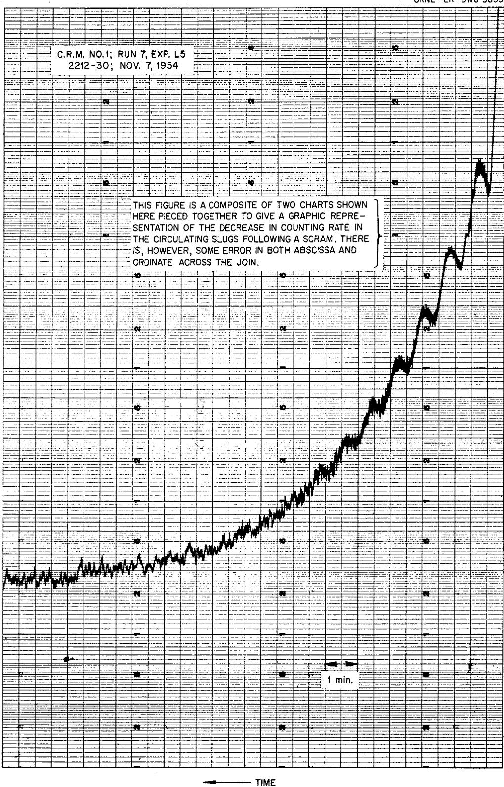  
COUNTING RATE (arbitrary scale)   
Fig. 6.17. Circulating Slugs After a Scram.

# FINAL OPERATION AND SHUTDOWN

The last scheduled experiment conducted on the reactor was the measurement of the xenon buildup following the 25-hr run at 2.12 Mw. The 10-hr period of operation at one-tenth full power was concluded at 0835 on November 12. During the following $11\frac{1}{2}$ -hr period from 0835 to 2004, when the reactor was shut down the final time, the operation of the reactor was demonstrated for Air Force and ANP personnel who were gathered for the quarterly ORNL-ANP Information Meeting. The demonstrations included repeated cycling of the load by turning the blowers on and off, and group movement of the three shim rods to change the reactor mean temperature. The information obtained during this time on the dynamic behavior of the reactor is described above under the subtitle "Reactor Kinetics."

Also during the final $11\frac{1}{2}$ -hr period of operation, two complete surveys of system temperatures were taken with the reactor at maximum power. It was during one of these runs that the equilibrium fuel outlet temperature of $1580^{\circ}\mathrm{F}$ and the total reactor power of 2.45 Mw was attained (cf., App. L).

Since all operational objectives of the experiment had been attained and it was estimated on the basis of time and the assumed reactor power that the desired integrated power of 100 Mwhr would be attained by 2000 on Friday, November 12, it was decided to terminate the experiment at that time. Colonel Clyde D. Gasser, Chief, Nuclear Powered Aircraft Branch of WADC, who was then visiting the Laboratory, was invited to officiate at the

termination of the experiment. At 8:04 PM on November 12, with Colonel Gasser at the controls, the reactor was scrambled for the last time and the operation of the Aircraft Reactor Experiment was brought to a close. A photograph taken in the control room at that time is shown as Fig. 6.18.

At the time the experiment was terminated it was believed that the total integrated power was more than the 100 Mwhr which had been prescribed as a nominal experimental objective, but subsequent graphical integration of the Log $N$ charts, Appendix R, revealed that the actual total integrated power was about 96 Mwhr. At the time the reactor was scrambled the sodium system had been in operation (circulating sodium) for 635.2 hr and the fluoride system for 462.2 hr. Of this total fluoride circulating time 220.7 hr were obtained with the reactor critical and 73.8 hr after the reactor was first brought to power.

Although the nuclear operation was concluded on Friday evening, the fuel and sodium were permitted to circulate until the following morning, at which time they were dumped into their respective dump tanks. The final phase of the experiment, including the dumping operation, subsequent analysis and recovery of the fuel, and examination of the systems and components for corrosion, wear, radiation damage, etc., are to be discussed in a subsequent report. Since much of the data cannot conveniently be obtained until the radioactivity has decayed, the last report will not be forthcoming immediately.

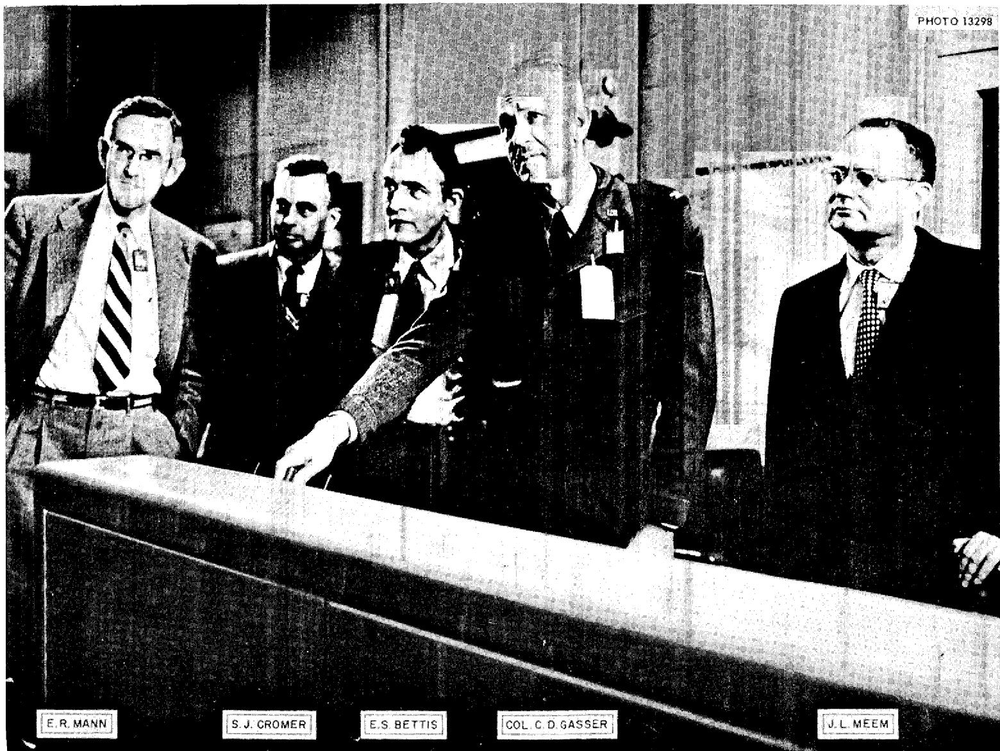  
Fig. 6.18. Termination of the Aircraft Reactor Experiment: The Final Scram.

# 7. RECOMMENDATIONS

No comprehensive report is complete without conclusions, discussion, and recommendations. In this report the conclusions are presented in the summary at the beginning, and the discussion is incorporated in the text and, especially, in the Appendixes. Furthermore, certain alterations and modifications that would have been desirable in the conduct of the experiment are implicit in the discussions throughout the report. However, the changes, if effected for any similar future experiments, could lead to substantial improvements in design, instrumentation, operation, and interpretation. Accordingly, a list of recommendations based on the ARE experience is presented; no significance is inferred by the order of listing.

1. The operating crew should maintain the same shift schedule as the craft labor - electricians, instrument mechanics, pipe fitters, etc. - assigned to the operating crew, and all members of one crew should have their off-day at the same time. In particular, there should be four operating crews that maintain the same rotating schedule as the rest of the plant.   
2. The cause of the obvious discrepancy between the temperatures read by the line thermocouples close to the reactor and those further removed from the reactor should be ascertained. No physical phenomena, with the possible exception of radiation, have been proposed, to date, which could account for the observed difference.   
3. In order to measure the extracted reactor power from the secondary or tertiary heat transfer mediums, these systems should be adequately instrumented for flow rates and temperatures. Such instrumentation might also make possible a thermodynamic analysis of the performance of the various heat exchangers.   
4. Thermocouples on the outer surface of fuel and sodium tubes in the heat exchangers should be installed so that they read wall temperatures rather than an intermediate gas temperature.   
5. Of the two thermocouples which were required to measure the reactor mean temperature and the two required to measure the temperature gradient, one was electrically insulated from the pipe wall. The insulation effected a time lag between the wall and thermocouple temperatures of about 15 sec. Thermocouple installations for obtaining time-dependent data should be made so that the wall temperature can be read without a time lag.

6. To heat small (up to $\frac{3}{8}$ in. OD) lines and associated valves, tanks, etc. to uniform high temperatures ( $\sim 1400^{\circ}\mathrm{F}$ ) requires a surprising degree of precision in the installation of both heaters and insulation. Furthermore, where calrod heaters are employed, they should be installed on opposite sides of a line, and the heaters and lines should be jointly wrapped with heat shielding before insulation is applied.   
7. To control accurately the temperature of any system, thermocouples should be installed at any discontinuity of either the heaters (i.e., between adjacent heaters) or the system (i.e., at the junction of two lines, etc.), and, with the exception of obviously identical installations, each heater should have its own control.   
8. Where gas lines are subject to plugging due to the condensation of vapor from the liquid in the system to which the lines are connected, it is necessary either to heat the lines to above the freezing point of the vapor or to employ a vapor trap. While a vapor trap proved satisfactory in preventing the fuel off-gas line from plugging, it was not possible to heat the sodium off-gas line sufficiently (because of temperature limitation of the valves) to prevent the gradual formation of a restriction. Gas valves that can be operated at higher temperatures and are compatible with sodium are needed.   
9. The double-walled piping added a degree of complexity to the system that was far out of proportion to the benefits derived from the helium annulus. Parts of the annulus were at subatmospheric pressure, and no leak tests were made on the fuel system once it was filled with the fluoride mixture. The helium flow was not needed for distributing heat in the sodium system, and it was of uncertain value in the fuel system. Consequently, future systems should not include such an annulus.   
10. The use of any type of connection other than an inert-arc-welded joint in any but the most temporary fuel or sodium line should be avoided.   
11. All joints, connections, and fittings in the off-gas system should be welded, and, in general, they should be assembled with the same meticulous care that characterized the fabrication of the fuel and sodium systems in order to minimize the possibility of the unintentional release of fission gases.

12. As a secondary defense in the event of the release of activity in the reactor cell (i.e., pit), the cell should be leaktight. The leak-tightness of the numerous bulkheads out of such a cell should be carefully checked.   
13. The air intake to the control room was located on the roof of the building, and thus adverse meteorological conditions readily introduced off-gas activity into the control room. With an airtight control room equipped with its own air supply (or a remotely located filtered intake), the control room operations could continue without concern for the inhalation of gaseous activity.   
14. The off-gas monitrons should be shielded from direct radiation. Furthermore, although these monitrons were not needed during the experiment, they are known to build up background activity which would eventually mask that of the gas they are to measure. The development of monitrons in which activity will not accumulate is recommended.   
15. The radiation level and the airborne activity throughout the building were measured by monitrons and constant air monitors, respectively. The data from both instruments should be continuously recorded. Furthermore, the output of the air monitors should be modified by the addition of a differentiating circuit so that the recorded data would give better measures of the airborne activity.   
16. The helium ducts leaked to the extent that it was possible to attain only a fraction of the desired helium concentration therein. They were of the conventional bolted-flange design and should have been modified to permit seal welding of all joints; they should be subjected to stringent leak tests.   
17. The helium consumption for the last three and one-half months of the ARE experiment was $\frac{2}{3}$ million standard cubic feet (over 3000 standard cylinders). The average consumption rate during the last two weeks of the experiment was about 8.5 cfm, and peak consumption rates of 25 cfm were recorded. This extraordinarily high helium consumption could be reduced by the use of dry air or nitrogen for much of the pneumatic instrumentation in which helium was used.   
18. Various valves in both the gas and liquid systems leaked across the valve seats. The valve development program should be emphasized until valves are obtained that can be depended upon as reliable components of high-temperature $(\sim 1200^{\circ}\mathrm{F})$ sodium, fluoride, or gas systems. Furthermore, either limit switches that would operate at higher

temperatures to indicate valve open or closed should be developed, or the existing limit switches should be located in cooler regions.

19. The use of frangible disks to isolate the standby fuel pump did not enhance the feasibility of continuing the experiment in the event of the failure of the main fuel pump during high-power operation. The frangible disks are objected to in that they require a nonreversible operation. In general, leak-tight valves should be developed that may be used rather than the frangible disks.   
20. Although the ARE, as designed, was to incorporate numerous "freeze sections," only two were included in the system as finally constructed, and the operability of these two was so questionable that their use was not contemplated during the course of the experiment. Such sections should either be eliminated from consideration in future systems, or a reliable freeze section should be developed.   
21. Much useful information would be obtained if provisions could be made for sampling each liquid system throughout the operation. This was possible on the ARE only prior to the high-power experiments.   
22. The variable inductance-type flow and level indicators should be converted to the null-balance type of instruments in order to eliminate the temperature dependence of the pickup coil signal. Furthermore, these coils should be located in a region at much less than $1000^{\circ}\mathrm{F}$ in order to increase coil life.   
23. Although numerous spark plug probes were satisfactorily employed to measure levels in the various tanks, the intermittent shorts that were experienced with several sodium probes might have been avoided if clearances between the probe wire and the stand pipe in which the probes were located had been greater.   
24. The use of mercury alarm switches on vibratory equipment where there is little leeway between the operating and alarm condition will give frequent false alarms and should therefore be avoided.   
25. Weight instruments are of questionable accuracy in a system in which the tank being weighed is connected through numerous pipes to a fixed system, especially when these pipes are covered with heaters and insulation and are subject to thermal expansion.   
26. The flame photometer is an extremely sensitive instrument for the detection of sodium and

NaK. However, in employing this instrument to detect the presence of sodium (or NaK) in gas, the sampling line should be heated to about $300^{\circ}\mathsf{F}$ .   
27. The magnet faces in the shim rods should be designed so that dirt particles cannot become trapped thereon and thus require higher holding currents.   
28. The two control points, i.e., the upstairs control room and the basement heater and instrument panels, should have been more convenient to one another in order to effect the greatest efficiency of operation.   
29. The communications system in the building was inadequate. Except for the auxiliary FM system, which was frequently inoperative, there was only one phone in the control room, which was on the main station of the PA system. However, the PA system was not capable of audibly supporting two conversations at the same time. Accordingly, the capacity of the PA system should be increased so that as many as 4 or 5 conversations may be simultaneously effected. Also, more outlets should be provided both in the control room and at other work areas in the building.   
30. A megawatt-hour meter should be installed (possibly on the log $N$ or the $\Delta T$ recorder) in order to provide a continuous measure of the integrated power as the experiment progresses.   
31. In order to analyze various related time

dependent data (as required, for example, in the determination of the various temperature coefficients), it is necessary that the recorder charts be marked at the start of the experiment. While the charts can be marked by hand, this was a source of error which became very important in the analysis of data from fast transients. Accordingly, all such charts should be periodically and simultaneously marked by an automatic stamper. Furthermore, each chart should be stamped with a distinctive mark that would positively identify it.   
32. To analyze the kinetic behavior of a reactor system it is necessary to have a recorder chart of the time behavior of all equipment which can introduce transients in the reactor, as well as charts of the process data and conventional nuclear data. Therefore the helium blower speeds and shim rod positions should have been recorded continually.   
33. The recorded data and the data sheets comprise a fairly comprehensive picture of the experiment. However, even if all the data are recorded they are of value only to the extent that meaningful interpretations can be made. While automatically marking the data charts will be helpful, it will still be necessary to rely on log book information which should be recorded in great detail, possibly to the extent of making this the only responsibility of a shift "historian."

# Appendix B

# SUMMARY OF DESIGN AND OPERATIONAL DATA

This appendix tabulates both the design and operational data pertinent to the aircraft reactor experiment. Most of the design data were extracted from two design memoranda, $^{1,2}$ although some values had to be revised because of subsequent modifications in the design. In addition to the design data, the experimental values of the various system parameters are included. All values obtained experimentally are shown in italics and, for comparative purposes, are tabulated together with the corresponding design values. There are, of course, numerous design numbers for which it was not possible to obtain experimental numbers. The flow diagram of the experiment is presented in Fig. B.1. The values of temperature, pressure, and flow given on this drawing are design values - not experimental values.

# DESCRIPTION

# 1. The Reactor Experiment

Type of reactor

Neutron energy

Power (maximum)

Purpose

Design lifetime

Fuel

Moderator

Reflector

Primary coolant

Reflector coolant

Structural material

Test stand

Shield

Heat flow

Circulating fuel, solid moderator

Thermal and epithermal

2.5 Mw

Experimental

1000 hr

NaF-ZrF4-UF4(53.09-40.73-6.18 mole %)

BeO

BeO

The circulating fuel

Sodium

Inconel

Concrete pits in Building 7503

$7\frac{1}{2}$ ft of concrete

Fuel to helium to water

2. Physical Dimensions of Reactor (in.)   
3. Volumes of Reactor Constituents (Cold)   

<table><tr><td></td><td>Cold(70°F)</td><td>Hot(1300°F)</td></tr><tr><td>Core height</td><td>35.60</td><td>35.80</td></tr><tr><td>Core diameter</td><td>32.94</td><td>33.30</td></tr><tr><td>Side reflector height</td><td>35.60</td><td>35.80</td></tr><tr><td>Side reflector inside diameter</td><td>32.94</td><td>33.30</td></tr><tr><td>Side reflector outside diameter</td><td>47.50</td><td>48.03</td></tr><tr><td>Top reflector thickness</td><td>4.00</td><td>4.25</td></tr><tr><td>Top reflector diameter</td><td>32.94</td><td>33.30</td></tr><tr><td>Bottom reflector thickness</td><td>4.93</td><td>4.98</td></tr><tr><td>Bottom reflector diameter</td><td>32.94</td><td>33.30</td></tr><tr><td>Pressure shell inside diameter</td><td>48.00</td><td>48.55</td></tr><tr><td>Pressure shell wall thickness</td><td>2.00</td><td>2.02</td></tr><tr><td>Pressure shell inside height</td><td>44.50</td><td>45.00</td></tr><tr><td>Pressure shell head thickness</td><td>4.00</td><td>4.04</td></tr><tr><td>Fuel elements</td><td colspan="2">66 parallel Inconel tubes containing the circulating fuel. The tubes were connected in six parallel circuits each having 11 tubes in series. Each tube was 1.235 in. O.D., with a 60-mil wall.</td></tr></table>

a. Inside Pressure Shell   

<table><tr><td rowspan="2"></td><td colspan="6">Volume (ft3)</td></tr><tr><td>BeO</td><td>Fuel</td><td>Na</td><td>Inconel</td><td>Rodsa</td><td>Total</td></tr><tr><td>Core</td><td>14.55</td><td>1.33</td><td>0.80</td><td>0.37b</td><td>0.50</td><td>17.55</td></tr><tr><td>Side reflector</td><td>17.68</td><td>0</td><td>0.91</td><td>0.10c</td><td>0.26d</td><td>18.95</td></tr><tr><td>Annulus outside reflector</td><td>0</td><td>0</td><td>0.58</td><td>0.19</td><td>0</td><td>0.77</td></tr><tr><td>Top reflector</td><td>0</td><td>0.21</td><td>1.62</td><td>0.08b</td><td>0.06</td><td>1.97</td></tr><tr><td>Bottom reflector</td><td>0</td><td>0.24</td><td>1.67</td><td>0.44b</td><td>0.07</td><td>2.42</td></tr><tr><td>Space above reflector and annulus</td><td>0</td><td>0</td><td>2.14</td><td>0.04c</td><td>0.03d</td><td>2.21</td></tr><tr><td>Space below reflector and annulus</td><td>0</td><td>0</td><td>2.17</td><td>0.52c</td><td>0.04d</td><td>2.73</td></tr><tr><td>Total</td><td>32.23</td><td>1.78</td><td>9.89</td><td>1.74</td><td>0.96</td><td>46.60</td></tr></table>

$a$ Total volume inside inner rod sleeve.   
$b_{\text{Includes the Inconel-clad stainless steel rod sleeves.}}$   
cIncludes all three sleeves around fission chambers   
$d_{\mathrm{in}}$ includes volume of insulating material around inner fission chamber sleeve.

b. Operating Fuel System   

<table><tr><td></td><td colspan="2">Volume (ft3)</td></tr><tr><td></td><td>Cold</td><td>Hot</td></tr><tr><td>Core</td><td>1.33</td><td>1.37</td></tr><tr><td>External system (to minimum pump level)</td><td>3.48</td><td>3.60</td></tr><tr><td>Pump (available above minimum level)</td><td>~1.65</td><td>~1.70</td></tr><tr><td>Total</td><td>6.46</td><td>6.67</td></tr></table>

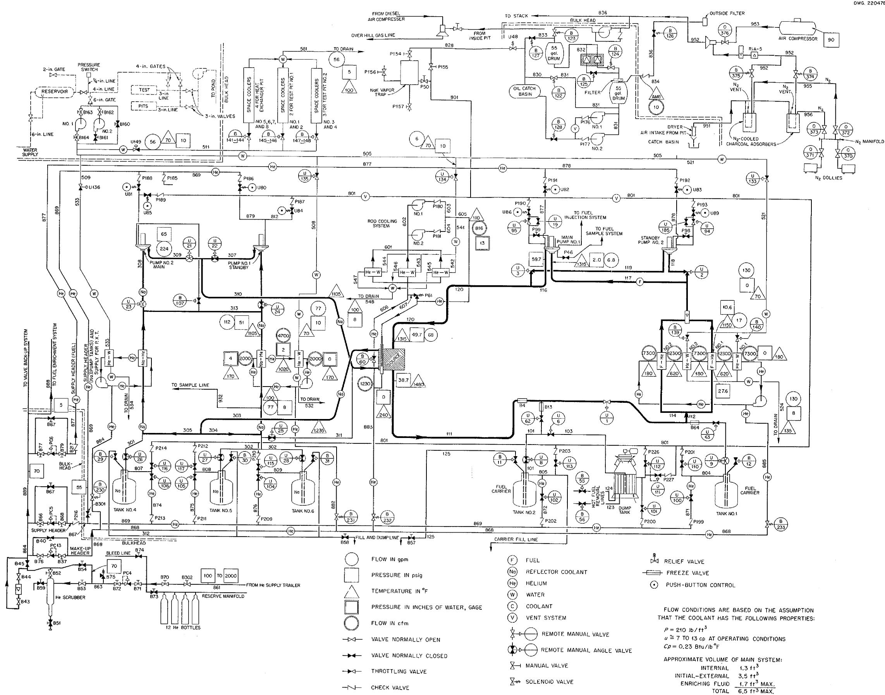  
Fig. B.1. ARE Flow Diagram.

# c. Miscellaneous Fuel System

<table><tr><td></td><td>Volume (ft3)</td></tr><tr><td>Maximum capacity fill and flush tanks</td><td>14.5</td></tr><tr><td>Bottom (waste) in fill and flush tanks</td><td>0.3</td></tr><tr><td>Dump line to fill and flush tank No. 2</td><td>0.8</td></tr><tr><td>Dump line to fill and flush tank No. 1</td><td>0.75</td></tr><tr><td>By-pass leg</td><td>0.4</td></tr><tr><td>Heat exchanger leg from pump to fill line to Tank No. 2</td><td>1.6</td></tr><tr><td>Reactor leg from fill line to pump (minimum operating level)</td><td>3.0</td></tr><tr><td>Pump capacity, minimum to maximum level</td><td>1.7</td></tr><tr><td>Carrier available</td><td>15.5</td></tr><tr><td>Concentrate available</td><td>1.3</td></tr></table>

# d. Sodium System

Volume

$(f + 3)$

Inside pressure shell 10

Outside pressure shell $\sim 10$

Total

20

# MATERIALS

# 1. Amounts of Critical Materials

BeO blocks (assuming $\rho = 2.75\mathrm{g / cm^3}$ 5490 lb

BeO slabs (assuming $\rho = 2.75\mathrm{g / cm}^3$ 48 Ib

Amount of uranium requested 253 lb of U

Uranium enrichment 93.4% U235

Uranium in core 30 to 40 lb

Uranium inventory in experiment 126 to 177 lb

# 2. Composition of Reactor Constituents

a. Fluoride Fuel Mixture   

<table><tr><td></td><td>Fuela</td><td>Fuel Carrier</td><td>Fuel Concentrate</td></tr><tr><td colspan="4">NaF</td></tr><tr><td>mole</td><td>53.09</td><td>50</td><td>66.7</td></tr><tr><td>wt %</td><td>22.34</td><td>20.1</td><td>21.3</td></tr><tr><td colspan="4">ZrF4</td></tr><tr><td>mole %</td><td>40.73</td><td>50</td><td>0</td></tr><tr><td>wt %</td><td>62.12</td><td>79.9</td><td>0</td></tr><tr><td colspan="4">UF4</td></tr><tr><td>mole %</td><td>6.18</td><td>0</td><td>33.3</td></tr><tr><td>wt %</td><td>17.54</td><td>0</td><td>78.7</td></tr><tr><td colspan="4">Impurities (ppm)</td></tr><tr><td>Ni</td><td>&lt;5b</td><td>25c</td><td>47d</td></tr><tr><td>Fe</td><td>5b</td><td>35c</td><td>84d</td></tr><tr><td>Cr</td><td>445b</td><td>10c</td><td>~20d</td></tr></table>

${}^{a}$ Fuel composition for high-power operation.   
$^b$ Final analysis before high-power operation.   
Average of all 14 batches of carrier.   
Estimate based on a few preliminary analyses.

b. Inconel   

<table><tr><td>Constituent</td><td>Amount (wt %)</td><td>Constituent</td><td>Amount (wt %)</td><td>Constituent</td><td>Amount (wt %)</td></tr><tr><td>Ni</td><td>78.5</td><td>Cob</td><td>0.2</td><td>Zrb</td><td>0.1</td></tr><tr><td>Cr</td><td>14.0</td><td>Alb</td><td>0.2</td><td>C</td><td>0.08</td></tr><tr><td>Fe</td><td>6.5</td><td>Tib</td><td>0.2</td><td>Mo</td><td>Trace</td></tr><tr><td>Mn</td><td>0.25</td><td>Ta</td><td>0.5</td><td>Ag, B, Ba</td><td>Trace</td></tr><tr><td>Si</td><td>0.25</td><td>Wb</td><td>0.5</td><td>Be, Ca, Cd</td><td>Trace</td></tr><tr><td>Cu</td><td>0.2</td><td>Znb</td><td>0.2</td><td>V, Sn, Mg</td><td>Trace</td></tr></table>

$^{a}$ B. B. Betty and W. A. Mudge, Mechanical Engineering, February 1945.   
${}^{b}$ Accuracy, $\pm  {100}\%$ . Y-12 Isotope Analysis Methods Laboratory (spectrographic analysis). Y-12 Area Report Y-F20-14.

c. Beryllium Oxide*   

<table><tr><td>Impurities</td><td>Amount (ppm)</td><td>Impurities</td><td>Amount (ppm)</td><td>Impurities</td><td>Amount (ppm)</td></tr><tr><td>Si</td><td>1050</td><td>Ca</td><td>780</td><td>Na</td><td>330</td></tr><tr><td>Al</td><td>213</td><td>Fe</td><td>114</td><td>Mg</td><td>50</td></tr><tr><td>Pb</td><td>45</td><td>Zn</td><td>&lt;30</td><td>K</td><td>&lt;25</td></tr><tr><td>Ni</td><td>&lt;20</td><td>Cr</td><td>10</td><td>Li</td><td>&lt;5</td></tr><tr><td>Mn</td><td>&lt;5</td><td>B</td><td>2.8</td><td>Ag</td><td>&lt;1</td></tr><tr><td>Co</td><td>&lt;1</td><td></td><td></td><td></td><td></td></tr></table>

$^{*}$ W. K. Ergen, Activation of Impurities in BeO, Y-12 Area Report Y-F20-14 (May 1, 1951).

d. Helium

Oxygen contamination

<10 ppm

e. Sodium

Oxygen contamination

<0.025 wt %

# 3. Physical Properties of Reactor Materials

<table><tr><td></td><td>Melting Point (°C)</td><td>Thermal Conductivity (Btu/hr.ft.°F)</td><td>Viscosity (cp)</td><td>Heat Capacity (Btu/lb.°F)</td><td>Density (g/cm3)</td></tr><tr><td colspan="6">Fuel Carrier:a</td></tr><tr><td rowspan="3">NaF-ZrF4(NaZrF5) 50-50 mole %</td><td rowspan="3">510</td><td rowspan="3">2.5 ± 5b</td><td>8.0 at 600°C</td><td rowspan="3">0.30b</td><td>ρ = 3.79 - 0.00093T</td></tr><tr><td>5.3 at 700°C</td><td rowspan="2">600 &lt; T &lt; 800°C</td></tr><tr><td>3.7 at 800°C</td></tr><tr><td colspan="6">Fuel Concentrate:a</td></tr><tr><td rowspan="3">NaF-UF4(Na2UF6) 66.7-33.3 mole %</td><td rowspan="3">635</td><td rowspan="3">0.5 (estimated)</td><td>10.25 at 700°C</td><td rowspan="3">0.21b</td><td>ρ = 5.598 - 0.00119T</td></tr><tr><td>7.0 at 800°C</td><td rowspan="2">600 &lt; T &lt; 800°C</td></tr><tr><td>5.1 at 900°C</td></tr><tr><td colspan="6">Fuel:a</td></tr><tr><td rowspan="3">NaF-ZrF4-UF4 53.09-40.73-6.18 mole %</td><td rowspan="3">530</td><td rowspan="3">1.3 (estimated)</td><td>8.5 at 600°C</td><td rowspan="3">0.24b</td><td>ρ = 3.98 - 0.00093T</td></tr><tr><td>5.7 at 700°C</td><td rowspan="2">600 &lt; T &lt; 800°C</td></tr><tr><td>4.2 at 800°C</td></tr><tr><td rowspan="3">BeOc</td><td rowspan="3">2570</td><td>16.7 at 1500°F</td><td></td><td>0.46 at 1100°F</td><td>from 2.27d to 2.83</td></tr><tr><td>19.1 at 1300°F</td><td></td><td>0.48 at 1300°F</td><td>at 20°C</td></tr><tr><td>22.5 at 1100°F</td><td></td><td>0.50 at 1500°F</td><td></td></tr><tr><td rowspan="3">Inconel e</td><td rowspan="3">1395</td><td>8.7 from 20 to 100°C</td><td></td><td>0.101</td><td>8.51 at 20°C</td></tr><tr><td>10.8 at 400°C</td><td></td><td>77 &lt; T &lt; 212°F</td><td></td></tr><tr><td>13.1 at 800°C</td><td></td><td></td><td></td></tr><tr><td rowspan="3">Sodiumf</td><td rowspan="3">98</td><td>43.8 at 300°C</td><td>0.38 at 250°C</td><td rowspan="3">0.30</td><td>0.85 at 400°C</td></tr><tr><td>38.6 at 500°C</td><td>0.27 at 400°C</td><td>0.82 at 500°C</td></tr><tr><td></td><td>0.18 at 700°C</td><td>0.78 at 700°C</td></tr><tr><td rowspan="3">Heliumg</td><td rowspan="3">&lt;-272.2</td><td>0.100 at 200°F</td><td>0.0267 at 200°C</td><td>1.248</td><td>1.79 × 10-4at 0°C</td></tr><tr><td>0.119 at 400°F</td><td>0.0323 at 400°C</td><td>0 &lt; T &lt; 300°C</td><td>1.30 × 10-4at 100°C</td></tr><tr><td>0.136 at 600°F</td><td>0.0382 at 600°C</td><td></td><td>1.03 × 10-4at 200°C</td></tr><tr><td colspan="6">Insulation</td></tr><tr><td>Superox (SiO2)</td><td></td><td>0.18</td><td></td><td></td><td>0.38</td></tr><tr><td>Sponge felt (MgSiO3)</td><td></td><td>0.13</td><td></td><td></td><td>0.48</td></tr></table>

${}^{a}$ Data from ANP Physical Properties Group.   
$b$ Preliminary values for the liquid 600 to $800^{\circ}C$   
${}^{c}$ Data from The Properties of Beryllium Oxide, BMIT-18 (Dec. 15, 1949).   
$^d$ Porosity of BeO, from ANP Ceramics Group, $23\%$ at $\rho = 2.27$ , $0\%$ at $\rho = 2.83$ .   
$e$ Data from Metals Handbook, 1948 Ed., The American Society for Metals.   
Data from Liquid Metals Handbook, NAVEXOS P-733 (June 1952).   
$^{g}$ B. O. Newman, Physical Properties of Heat Transfer Fluids, GI-401 (Nov. 10, 1947).

# REACTOR PHYSICS

# 1. General

Neutron energy Thermal and epithermal

Thermal fissions, % 60

Neutron flux, n/cm²·sec $\sim 10^{14}$

Gamma flux, $\gamma/\mathrm{cm}^2$ -sec $\sim 10^{11}$

# 2. Power

Maximum power, Mw 1.5 (2.5)

Design power, Mw 1.0

Power density (core av at max power) w/cm3 3 (5)

Maximum specific power (av kw/kg. of U235 at 1.5 Mw) 94 (153)

Power ratio (max/av)

Axially 1.5:1

Radially in core 1.2:1

Radially in fuel tube 1.7:1

Maximum power density in fuel, w/cm³ 110 (180)

Maximum power density in moderator, w/cm³ 1.3 (2.2)

# 3. Neutron Flux in Core $(\mathfrak{n} / \mathfrak{cm}^2.\mathrm{sec})$

Thermal (max) $1.5 \times 10^{13}$

Thermal (av) $0.7 \times 10^{13}$

Fast (max) $3.5 \times 10^{13}$

Fast (av) $1.5 \times 10^{13}$

Intermediate $2.0 \times 10^{13}$

# 4. Leakage Flux (per fission)

Reflector

Fast 0.0011

Intermediate 0.066

Thermal 0.191

Ends

Fast 0.013

Intermediate 0.102

Thermal 0.0002

# 5. Fuel

Enrichment, $\% \mathsf{U}^{235}$ 93.4

Critical mass, lb of U235 in clean core (32.75)

U235 in core (i.e., critical mass plus excess reactivity) lb 30 to 40 (36)

$\mathsf{U}^{235}$ in system, Ib 126 to 177 (138)

U235 consumption at maximum power, g/day 1.5 (2.5)

# 6. Neutron Flux in Reflector

Maximum flux at fission chamber holes, nv/w 1.5 x 106

Counting rate of fission chambers, counts/sec·w $2 \times 10^{5}$

# 7. Reactivity Coefficients

<table><tr><td>Effect</td><td>Symbol</td><td>Value</td></tr><tr><td>Thermal base</td><td>Δk/k</td><td>-0.011 from 68 to 1283°F
-0.009 from 1283 to 1672°F</td></tr><tr><td>Uranium mass (at k = 1)</td><td>Δk/k/ (ΔM/M)</td><td>0.25 (0.236)</td></tr><tr><td>Sodium density</td><td>Δk/k/ (Δρ/ρ)</td><td>-0.05 from 90 to 100% ρ</td></tr><tr><td>Moderator density</td><td>Δk/k/ (Δρ/ρ)</td><td>0.5 from 95 to 100% ρ</td></tr><tr><td>Inconel density</td><td>Δk/k/ (Δρ/ρ)</td><td>-0.17 from 100 to 140% ρ</td></tr><tr><td>Fuel temperature</td><td>(Δk/k)/°F</td><td>(-9.8 × 10-5)</td></tr><tr><td>Reactor temperature</td><td>(Δk/k)/°F</td><td>-5 × 10-5(-6.1 × 10-5)</td></tr><tr><td>Sodium temperature</td><td>(Δk/k)/°F</td><td>(-5.88 × 10-5)</td></tr><tr><td>Moderator temperature</td><td>(Δk/k)/°F</td><td>(1.1 × 10-5)</td></tr></table>

# SHIELDING

# 1. Material

<table><tr><td></td><td>Thickness (in.) 
(from source outward)</td><td>Density 
(g/cm3)</td></tr><tr><td>Barytes concrete block in 
the reactor pit only</td><td>12</td><td>3.3</td></tr><tr><td>Poured Portland concrete</td><td>18</td><td>2.3</td></tr><tr><td>Barytes concrete block</td><td>60</td><td>3.3</td></tr></table>

# 2. Composition

<table><tr><td>Cement</td><td>CaCO3+ SiO2+ Al2O3</td></tr><tr><td>Concrete</td><td>Cement and aggregate of gravel</td></tr><tr><td>Barytes</td><td>Cement and aggregate of BaSO4</td></tr></table>

# 3. Relaxation Lengths (cm)

<table><tr><td></td><td>Barytes Concrete</td><td>Portland Cement</td></tr><tr><td>1-Mev gamma rays</td><td>4.14</td><td>4.62</td></tr><tr><td>2.5-Mev gamma rays</td><td>6.72</td><td>6.86</td></tr><tr><td>7.0-Mev gamma rays</td><td>9.46</td><td>14.0</td></tr><tr><td>Fast neutrons (1 to 5 Mev)</td><td>8.2</td><td>11.0</td></tr></table>

# 4. Source Intensities

<table><tr><td></td><td>No. per Fission</td><td>Energy (Mev)</td></tr><tr><td colspan="3">Core gammas</td></tr><tr><td>Prompt</td><td>2.0</td><td>2.5</td></tr><tr><td>Fission-product decay</td><td>2.0</td><td>2.5</td></tr><tr><td>Capture gammas</td><td>0.94</td><td>7.0</td></tr><tr><td colspan="3">Gamma flux outside of reactor thermal insulation per watt</td></tr><tr><td>2.0-Mev gammas</td><td></td><td>3 × 104γ/cm2·sec</td></tr><tr><td>7.0-Mev gammas</td><td></td><td>0.8 × 104γ/cm2·sec</td></tr><tr><td colspan="3">Neutron flux outside of reactor thermal insulation per watt</td></tr><tr><td>Thermal to 250 kev</td><td></td><td>3 × 105n/cm2·sec</td></tr><tr><td>Fast to 250 kev</td><td></td><td>1.5 × 104n/cm2·sec</td></tr></table>

# 5. Activity in External Fuel Circuit per Watt

<table><tr><td>Time Out of Reactor (sec)</td><td>0.52-Mev Gamma Activity (photons/cm3·sec)</td><td>1-Mev Delayed-Neutron Activity (n/cm3·sec)</td></tr><tr><td>0</td><td>8.1 × 106</td><td>8.5 × 103</td></tr><tr><td>5</td><td>6.6 × 106</td><td>2.3 × 103</td></tr><tr><td>10</td><td>5.9 × 106</td><td>1.4 × 103</td></tr><tr><td>20</td><td>5.1 × 106</td><td>0.74 × 103</td></tr><tr><td>30</td><td>4.7 × 106</td><td>0.50 × 103</td></tr><tr><td>40</td><td>4.5 × 106</td><td>0.35 × 103</td></tr></table>

# REACTOR CONTROL

# 1. Control Elements

<table><tr><td>Source</td><td>1</td></tr><tr><td>Regulating rod</td><td>1</td></tr><tr><td>Shim rods</td><td>3</td></tr><tr><td>Temperature coefficient, (Δk/k)/°F</td><td>~ -5 × 10-5(-6.1 × 10-5)</td></tr></table>

# 2. Source

<table><tr><td>Location</td><td colspan="2">Core axis</td></tr><tr><td>Type</td><td colspan="2">Po-Be</td></tr><tr><td>Strength, curies</td><td>15</td><td>(7)</td></tr><tr><td>Neutron intensity, n/sec</td><td>3.5 × 107</td><td>(1.6 × 107)</td></tr></table>

# 3. Regulating Rod

<table><tr><td>Location</td><td colspan="2">Core axis</td></tr><tr><td>Diameter, in.</td><td colspan="2">2</td></tr><tr><td>Travel, in.</td><td colspan="2">12</td></tr><tr><td>Cooling</td><td colspan="2">Helium</td></tr><tr><td>Total Δk/k, %</td><td>0.40</td><td>(0.40)</td></tr><tr><td>Maximum (Δk/k)/sec (slowspeed), %</td><td>0.010</td><td>(0.011)</td></tr><tr><td>Speed, in./sec</td><td>0.3 or 3</td><td>(0.32) (fast speed not used)</td></tr></table>

Backlash, in. 0.007

Servo motor

Diehl 1A, 115 v, 60 cycle, 3400 rpm, reversible

Actuation

Manual

Temperature error-signal (not used)

Regulation

Flux signal, $\lesssim \pm 2\%$ $N_{F^{\prime}}\lesssim 1.3^{\circ}F$ mean $T$

There were seven regulating rods made up which gave a calculated $\Delta k / k$ from 0.13 to $1.35\%$ . The rod used in the experiment was the one which most nearly gave a measured $\Delta k / k$ of $0.4\%$ .

<table><tr><td>Rod number</td><td>1</td><td>2</td><td>3</td><td>4</td><td>5</td><td>6</td><td>7</td></tr><tr><td>Calculated Δk/k</td><td>0.13</td><td>0.18</td><td>0.27</td><td>0.39</td><td>0.56</td><td>0.90</td><td>1.35</td></tr><tr><td>Measured Δk/k</td><td></td><td></td><td></td><td>(~0.25)</td><td>(0.40)</td><td></td><td></td></tr><tr><td>Weight per inch of rod, lb</td><td>0.042</td><td>0.061</td><td>0.091</td><td>0.132</td><td>0.21</td><td>0.32</td><td>0.50</td></tr></table>

# 4. Shim Rods (3)

Location One at each 120 deg on 7.5-in.-radius circle

Diameter, in. 2

Travel, in. 36

Cooling Helium

Material B C Magnet release time, sec $< 10^{-2}$

Maximum withdrawal speed, in./sec 0.036 (0.046)

Total $\Delta k / k$ per rod, % 5.0 (5.8)

Maximum $(\% \Delta k / k) / \mathrm{sec}$ per rod 0.005, av over rod (0.0039 at 4-in. insertion)

Motor Janette 1.2 amp, 115 v, 60 cycle, 1725 rpm, reversible

# 5. Nuclear Instrumentation

a. Fission Chambers (2)

Function Counting-rate signal

Sensitivity 0.14 (counts/sec) per $(\mathfrak{n} / \mathfrak{cm}^2\cdot \mathfrak{sec})$

Range 1011, i.e., 104 in instrument, 107 in position and shielding

b. Parallel-Circular-Plate Ionization Chambers (3)

<table><tr><td>Function (2 chambers)</td><td>Safety level (scram signal)</td></tr><tr><td>(2 chambers)</td><td>Regulating rod temperature servo</td></tr><tr><td>Sensitivity</td><td>50 μa at 1010n/cm2·sec</td></tr><tr><td>Range</td><td>~103, i.e., from 5 × 10-2to 1.5 NF</td></tr></table>

c. Compensated Ionization Chambers (2)

Function (1 chamber) (1 chamber)

Micromicro ammeter

Sensitivity

Regulating rod flux servo

Range

50 $\mu$ a at $10^{10}~\mathrm{n/cm}^2$ .sec

$\sim 10^{6}$ ,i.e.,from $10^{-6}$ to $3N_{F}$

a. Automatic Rod Insertion and Annunciation   

<table><tr><td>Cause</td><td>Set Point</td><td>Nuclear Scram</td><td>Process Scram</td><td>Reversea</td><td>Annunciator No.</td></tr><tr><td>Neutron level</td><td>1.2 and 1.5 NFb</td><td>x</td><td></td><td></td><td>30</td></tr><tr><td>Period</td><td>1 sec</td><td>x</td><td></td><td></td><td>30</td></tr><tr><td>Period</td><td>5 sec</td><td></td><td></td><td>x</td><td>32</td></tr><tr><td>Reactor exit fuel temperature</td><td>&gt;1550°F</td><td></td><td>x</td><td></td><td>25</td></tr><tr><td>Heat exchanger exit fuel temperature</td><td>&lt;1100°F</td><td></td><td>x</td><td></td><td>25</td></tr><tr><td>Fuel flow</td><td>&lt;10 gpm</td><td></td><td>x</td><td></td><td>25</td></tr><tr><td>Power</td><td>Off</td><td></td><td>x</td><td></td><td>30</td></tr><tr><td>Scram switch</td><td>Scram position</td><td></td><td>x</td><td></td><td>30</td></tr></table>

$a$ Shim rods automatically driven in.   
bNeutron level set so that the fast scram annihilator, No. 30, would annihilate at 1.2 $N_F$ (normal flux) although the safety rods would not be dropped until the neutron level reached 1.5 $N_F$ . There was not another neutron level annihilator at 1.5 $N_F$ .

b. Nuclear Annunciators   

<table><tr><td></td><td>Set Point</td><td>Annunciator No.</td></tr><tr><td>Safety circuit</td><td>Electronic trouble</td><td>28</td></tr><tr><td>Count rate meter</td><td>Off-scale</td><td>26</td></tr><tr><td>Servo</td><td>Off-scale</td><td>31</td></tr><tr><td>Rod-cooling helium</td><td>Off</td><td>29</td></tr><tr><td>Neutron level</td><td>1.2 NF</td><td>27</td></tr></table>

<table><tr><td></td><td>Set Point</td><td>Annunciator No.</td></tr><tr><td>Pump power (main pump)</td><td>&gt;50 amp</td><td>33</td></tr><tr><td>Low heat exchanger fuel flow</td><td>&lt;20 gpm</td><td>34</td></tr><tr><td>High heat exchanger water temperature</td><td>&gt;160°F</td><td>35</td></tr><tr><td>Low heat exchanger fuel temperature</td><td>&lt;1150°F</td><td>36</td></tr><tr><td>High fuel level (main pump)</td><td>Maximum pumping level</td><td>37</td></tr><tr><td>Low fuel level (main pump)</td><td>Minimum pumping level</td><td>38</td></tr><tr><td>High pump pressure (main pump)</td><td>&gt;5 psi</td><td>39</td></tr><tr><td>High fuel reactor pressure</td><td>&gt;50 psi (&gt;41 psi)</td><td>41</td></tr><tr><td>High fuel level (standby pump)</td><td>Maximum pumping level</td><td>45</td></tr><tr><td>Low fuel level (standby pump)</td><td>Minimum pumping level</td><td>46</td></tr><tr><td>High pump pressure (standby pump)</td><td>&gt;5 psi</td><td>47</td></tr><tr><td>Pump power (standby pump)</td><td>&gt;50 amps</td><td>48</td></tr><tr><td>High temperature differential across reactor tubes</td><td>&gt;235°F (&gt;400°F)</td><td>49</td></tr><tr><td>High fuel temperature</td><td>&gt;1500°F</td><td>51</td></tr><tr><td>Low heat exchanger fuel temperature</td><td>&lt;1100°F</td><td>52</td></tr><tr><td>High heat exchanger tube temperature</td><td>&gt;1500°F</td><td>53</td></tr><tr><td>Low heat exchanger tube temperaturea</td><td>&lt;1150°F</td><td>54</td></tr><tr><td>Pump lubricant (main pump)</td><td>&lt;4 gpm (&lt;2 gpm)</td><td>65</td></tr><tr><td>Pump coolant (main pump)</td><td>&lt;2 gpm (&lt;2 gpm)</td><td>66</td></tr><tr><td>Pump lubricant (standby pump)</td><td>&lt;4 gpm (&lt;2 gpm)</td><td>69</td></tr><tr><td>Pump coolant (standby pump)</td><td>&lt;2 gpm (&lt;2 gpm)</td><td>70</td></tr></table>

${}^{a}$ The helium blower was interlocked so that when the fuel temperature decreased below this temperature the blower speed was reduced to zero until the fuel temperature exceeded ${1150}^{ \circ  }\mathrm{F}$ .

d. Sodium System Annunciators   

<table><tr><td></td><td>Set Point</td><td>Annunciator No.</td></tr><tr><td>Pump power (main pump)</td><td>&gt;50 amp</td><td>9</td></tr><tr><td>Low sodium flow (back loop)</td><td>&lt;100 gpm</td><td>10</td></tr><tr><td>High heat exchanger water temperature</td><td>&gt;160°F</td><td>11</td></tr><tr><td>Low heat exchanger sodium temperature</td><td>&lt;1100°F</td><td>12</td></tr><tr><td>High sodium level (main pump)</td><td>Maximum pumping level</td><td>13</td></tr><tr><td>Low sodium level (main pump)</td><td>Minimum pumping level</td><td>14</td></tr><tr><td>High pump pressure (main pump)</td><td>&gt;65 psi</td><td>15</td></tr><tr><td>Pump power (standby pump)</td><td>&gt;50 amp</td><td>17</td></tr><tr><td>Low sodium flow (front loop)</td><td>&lt;100 gpm</td><td>18</td></tr><tr><td>High heat exchanger water temperature</td><td>&gt;160°F</td><td>19</td></tr><tr><td>Low heat exchanger sodium temperature</td><td>&lt;1100°F</td><td>20</td></tr><tr><td>High sodium level (standby pump)</td><td>Maximum pumping level</td><td>21</td></tr><tr><td>Low sodium level (standby pump)</td><td>Minimum pumping level</td><td>22</td></tr><tr><td>High pump pressure (standby pump)</td><td>&gt;65 psi</td><td>23</td></tr><tr><td>High sodium temperature differential across reactor</td><td>&gt;60°F</td><td>24</td></tr><tr><td>Low sodium reactor pressure</td><td>&lt;60 psig</td><td>(&gt;48 psig)</td></tr><tr><td>Pump lubricant (main pump)</td><td>&lt;4 gpm</td><td>(&lt;2 gpm)</td></tr><tr><td>Pump coolant (main pump)</td><td>&lt;2 gpm</td><td>(&lt;2 gpm)</td></tr><tr><td>Pump lubricant (standby pump)</td><td>&lt;4 gpm</td><td>(&lt;2 gpm)</td></tr><tr><td>Pump coolant (standby pump)</td><td>&lt;2 gpm</td><td>(&lt;2 gpm)</td></tr><tr><td>Sodium system helium blower</td><td>Sodium system blower on before fuel system blower</td><td>1</td></tr><tr><td>Pit oxygen</td><td>&lt;90% He (Disconnected)</td><td>2</td></tr><tr><td>Pit humidity</td><td>&gt;10% relative humidity</td><td>3</td></tr><tr><td>Helium supply low</td><td>&lt;500 psi</td><td>4</td></tr><tr><td>Space cooler water temperature</td><td>&gt;160°F</td><td>5</td></tr><tr><td>Low water flow (any of 5 systems)</td><td>&gt;10% below design</td><td>6</td></tr><tr><td>Rod cooling water temperature</td><td>&gt;160°F</td><td>7</td></tr><tr><td>Low reservoir level</td><td>&lt;16 psi</td><td>8</td></tr><tr><td>Stack closed</td><td>&lt;5 mph wind velocity or high ion chamber reading</td><td>55</td></tr><tr><td>Pit activity</td><td>0.8 μc/cm3</td><td>56</td></tr><tr><td>Monitrons</td><td>&gt;12 mr/hr (&gt;7.5 mr/br)</td><td>57</td></tr><tr><td>Vent gas monitor</td><td>0.8 μc/cm3</td><td>58</td></tr><tr><td>Vent header vacuum</td><td>&gt;29 in. Hg vacuum</td><td>59</td></tr><tr><td>Low nitrogen supply</td><td>&lt;300 psi</td><td>60</td></tr><tr><td>Low air supply</td><td>&lt;40 psi</td><td>61</td></tr><tr><td>DC-to-AC motor-generator set</td><td>Off</td><td>63</td></tr><tr><td>AC-to-DC motor-generator set</td><td>Off</td><td>64</td></tr></table>

# SYSTEM OPERATING CONDITIONS

# 1. Reactor

<table><tr><td>Fuel inlet temperature, °F</td><td>1315</td><td>(1209)</td></tr><tr><td>Fuel outlet temperature, °F</td><td>1480</td><td>(1522)</td></tr><tr><td>Mean fuel temperature, °F</td><td>1400</td><td>(1365)</td></tr><tr><td>Sodium inlet temperature, °F</td><td>1105</td><td>(1226)</td></tr><tr><td>Sodium outlet temperature, °F</td><td>1235</td><td>(1335)</td></tr><tr><td>Fuel flow through reactor (total), gpm</td><td>68</td><td>(46)</td></tr><tr><td>Fuel flow rate in fuel tubes (11.3 gpm), fps</td><td>4</td><td>(3)</td></tr><tr><td>Sodium flow through reactor, gpm</td><td>224</td><td>(150)</td></tr><tr><td>Heat removed from fuel, kw</td><td>1270</td><td>(1520)</td></tr><tr><td>Heat removed from sodium, kw</td><td>650</td><td>(577)</td></tr><tr><td>Fuel dwell time in reactor, sec</td><td>8.3</td><td></td></tr><tr><td>Fuel cycle time</td><td></td><td></td></tr><tr><td>For 50% of fuel, sec</td><td>33.6</td><td>(47)</td></tr><tr><td>For rest of fuel, sec</td><td>46.4</td><td>(47)</td></tr><tr><td>Maximum fuel tube temperature, °F</td><td>1493</td><td></td></tr><tr><td>Maximum moderator temperature, °F</td><td>1530</td><td></td></tr><tr><td>Sodium circulating time, hr</td><td>1000</td><td>(635)</td></tr><tr><td>Fuel circulating time,* hr</td><td>1000</td><td>(462)</td></tr></table>

*After 462 hr of circulating time, the last 221 hr were attained after the reactor first became critical, and 74 of these after the reactor first operated above 1 Mw.

# 2. Fuel System

a. Fuel Loop   

<table><tr><td></td><td colspan="2">Temperature (°F)</td><td>Pressure (psig)</td><td>Flow (gpm)</td></tr><tr><td>Reactor outlet</td><td>1450</td><td>(1522)</td><td>46</td><td>40</td></tr><tr><td>Heat exchanger inlet</td><td>1450</td><td>(1522)</td><td>34</td><td>20a</td></tr><tr><td>Heat exchanger outlet</td><td>1150</td><td>(1209)</td><td>12</td><td>20</td></tr><tr><td>Pump inlet</td><td>1150</td><td>(1209)</td><td>2 (0.3)</td><td>40 (46)</td></tr><tr><td>Pump outlet</td><td>1150</td><td>(1209)</td><td>54</td><td>40</td></tr><tr><td>Reactor inlet</td><td>1150</td><td>(1209)</td><td>50 (39)</td><td>40</td></tr></table>

${}^{a}$ There were two fuel-to-helium heat exchangers in parallel.

b. Helium Loop   

<table><tr><td></td><td>Temperaturea(°F)</td><td>Pressure(in. H2O)</td><td>Flow(cfm)</td></tr><tr><td>Fuel-to-helium heat exchanger No. 1 inlet</td><td>180</td><td>2.2</td><td>7,300</td></tr><tr><td>Fuel-to-helium heat exchanger No. 1 outlet</td><td>620</td><td>1.5</td><td>12,300</td></tr><tr><td>Helium-to-water heat exchanger No. 1 inlet</td><td>620</td><td>1.5</td><td>12,300</td></tr><tr><td>Helium-to-water heat exchanger No. 1 outlet</td><td>180</td><td>1.2</td><td>7,300</td></tr><tr><td>Fuel-to-helium heat exchanger No. 2 inlet</td><td>180</td><td>1.1</td><td>7,300</td></tr><tr><td>Fuel-to-helium heat exchanger No. 2 outlet</td><td>620</td><td>0.4</td><td>12,300</td></tr><tr><td>Helium-to-water heat exchanger No. 2 inlet</td><td>620</td><td>0.4</td><td>12,300</td></tr><tr><td>Helium-to-water heat exchanger No. 2 outlet</td><td>180</td><td>0.1</td><td>7,300</td></tr><tr><td>Blower outlet</td><td>180</td><td>2.3</td><td>7,300</td></tr></table>

The helium passed through two temperature cycles in each loop.

c. Water Loop   

<table><tr><td></td><td>Temperaturea(°F)</td><td>Pressure(psig)</td><td>Flowb(gpm)</td></tr><tr><td>Helium-to-water heat exchanger inlet</td><td>70 (61)</td><td>10</td><td>65 (103)</td></tr><tr><td>Helium-to-water heat exchanger outlet</td><td>135 (124)</td><td>8</td><td>65</td></tr></table>

${}^{a}$ The water entered each heat exchanger at ambient temperature and was then dumped.   
There were two helium-to-water heat exchangers in parallel; total flow, 130 gpm.

# 3. Sodium System

a. Sodium Loop   

<table><tr><td></td><td colspan="2">Temperature (°F)</td><td>Pressure (psig)</td><td>Flow (gpm)</td></tr><tr><td>Reactor outlet</td><td>1235</td><td>(1335)</td><td>58</td><td>224 (152)</td></tr><tr><td>Sodium-to-helium heat exchanger inlet</td><td>1235</td><td>(1335)</td><td>52</td><td>112</td></tr><tr><td>Sodium-to-helium heat exchanger outlet</td><td>1105</td><td>(1226)</td><td>51</td><td>112</td></tr><tr><td>Pump inlet</td><td>1105</td><td>(1226)</td><td>48 (36)</td><td>224</td></tr><tr><td>Pump outlet</td><td>1105</td><td>(1226)</td><td>65</td><td>224</td></tr><tr><td>Reactor inlet</td><td>1105</td><td>(1226)</td><td>60 (49)</td><td>224</td></tr></table>

b. Helium Loop   

<table><tr><td></td><td>Temperature (°F)</td><td>Pressure (in. H2O)</td><td>Flow (cfm)</td></tr><tr><td>Sodium-to-helium heat exchanger inlet</td><td>170</td><td>4</td><td>2000</td></tr><tr><td>Sodium-to-helium heat exchanger outlet</td><td>1020</td><td>2</td><td>4700</td></tr><tr><td>Helium-to-water heat exchanger inlet</td><td>1020</td><td>2</td><td>4700</td></tr><tr><td>Helium-to-water heat exchanger outlet</td><td>170</td><td>0</td><td>2000</td></tr><tr><td>Blower outlet</td><td>170</td><td>4</td><td>2000</td></tr></table>

c. Water Loop   

<table><tr><td></td><td colspan="2">Temperature (°F)</td><td>Pressure (psig)</td><td>Flow (gpm)</td></tr><tr><td>Helium-to-water heat exchanger inlet</td><td>70</td><td>(61)</td><td>10</td><td>77 (38.3)</td></tr><tr><td>Helium-to-water heat exchanger outlet</td><td>100</td><td>(114)</td><td>8</td><td>77</td></tr></table>

# 4. Rod Cooling System

a. Helium Loop   

<table><tr><td></td><td>Temperature (°F)</td><td>Pressure (in. H2O)</td><td>Flow (cfm)</td></tr><tr><td>Rod assembly outlet</td><td>240</td><td></td><td>1270</td></tr><tr><td>Helium-to-water heat exchanger inlet</td><td>240</td><td></td><td>423a</td></tr><tr><td>Helium-to-water heat exchanger outlet</td><td>110</td><td>0</td><td>333</td></tr><tr><td>Blower</td><td>110</td><td>13</td><td>1000b</td></tr><tr><td>Rod assembly inlet</td><td>110</td><td></td><td>1000</td></tr></table>

$a$ There were three heat exchangers in parallel.   
$b$ Capacity of each of the two parallel blowers; however, the second blower was in standby condition.

b. Water Loop   

<table><tr><td></td><td>Temperaturea(°F)</td><td>Pressure(psig)</td><td>Flowb(gpm)</td></tr><tr><td>Water-to-helium heat exchanger inlet</td><td>70 (61)</td><td>10</td><td>18 (17.6)</td></tr><tr><td>Water-to-helium heat exchanger outlet</td><td>100 (63)</td><td>8</td><td>18</td></tr></table>

aThe water entered each heat exchanger at ambient temperature and was then dumped.   
$b$ Total flow for three parallel heat exchangers.

# 5. Water System

<table><tr><td>Equipment</td><td>Flow per Unit (gpm)</td><td>No. of Units</td><td>Flow (gpm)</td></tr><tr><td>Space coolers</td><td>7</td><td>8</td><td>56 (56)</td></tr><tr><td>Reflector coolant system</td><td>77</td><td>2</td><td>154 (77.6)</td></tr><tr><td>Rod cooling system</td><td>6</td><td>3</td><td>18 (17.6)</td></tr><tr><td>Fuel coolant system</td><td>65</td><td>2</td><td>130 (206)</td></tr><tr><td>Pump cooling systems</td><td>3</td><td>4</td><td>12 (13)</td></tr><tr><td>Total</td><td></td><td></td><td>370 (370.2)</td></tr></table>

# 1. Welding Specifications

<table><tr><td>Process</td><td>Inert-gas, shielded-arc, d-c weld</td></tr><tr><td>Base metal</td><td>Inconel</td></tr><tr><td>Position</td><td>Horizontal rolled, fixed vertical, or horizontal</td></tr><tr><td>Filler metal</td><td>1/16 to 3/2 in. Inconel rod (Inco No. 62 satisfactory)</td></tr><tr><td>Preparation of base metal</td><td>Machined, cleaned, and unstressed</td></tr><tr><td>Cleaning fluid</td><td>Trichloroethylene</td></tr><tr><td>Clearance in butt joints</td><td>3/32 to 1/8 in. with 100 deg bevel</td></tr><tr><td>Clearance in lap joints</td><td>Flush at weld</td></tr><tr><td>Welding current</td><td>d-c, electrode negative, 38 to 80 amp</td></tr><tr><td>Electrode</td><td>1/16 to 3/2 in. tungsten, 90 deg point</td></tr><tr><td>Shielding gas blanket</td><td>Argon, 99.8% pure; 35 cfh</td></tr><tr><td>Gas blanket beneath weld</td><td>Helium, 99.5% pure; 4 to 12 cfh</td></tr><tr><td>Welding passes</td><td>1 to 5</td></tr><tr><td>Welders qualifications</td><td>Welded or passed QB No. 1b within 45 days</td></tr></table>

${}^{a}$ For details,see Procedure Specifications,PS-1,ORNL Metallurgy Division,September 1952.

$b$ Operation Qualification Test Specifications, QTS-1, ORNL Metallurgy Division, September 1952.

# 2. Stress Analysis

a. Moments and Stress in the Pressure Shell Ends   

<table><tr><td>Maximum radial stress (per psi pressure)</td><td>85 psi</td></tr><tr><td>Minimum radial stress (per psi pressure)</td><td>-80 psi</td></tr><tr><td>Maximum radial moment (per psi pressure)</td><td>80 in.-lb</td></tr><tr><td>Minimum radial moment (per psi pressure)</td><td>-55 in.-lb</td></tr><tr><td>Maximum tangential stress (per psi pressure)</td><td>70 psi</td></tr><tr><td>Minimum tangential stress (per psi pressure)</td><td>-18 psi</td></tr><tr><td>Maximum tangential moment (per psi pressure)</td><td>180 in.-lb</td></tr><tr><td>Minimum tangential moment (per psi pressure)</td><td>-10 in.-lb</td></tr></table>

b. Stress in the Pressure Shell Vessel   

<table><tr><td>Maximum circumferential stress (per psi pressure)</td><td>14 psi</td></tr><tr><td>Minimum circumferential stress (per psi pressure)</td><td>-23 psi</td></tr><tr><td>Maximum longitudinal stress (per psi pressure)</td><td>13 psi</td></tr><tr><td>Minimum longitudinal stress (per psi pressure)</td><td>-75 psi</td></tr></table>

c. Summary of Pipe Stresses   

<table><tr><td>Line No.</td><td>Pipe Size (in.)</td><td>Maximum Cold Prestress (lb)</td><td>Maximum Hot Prestress (lb)</td><td>Temperatureb(°F)</td><td>Pressure (psig)</td></tr><tr><td colspan="6">Fuel Piping</td></tr><tr><td>111</td><td>2</td><td>3,850</td><td>2,170</td><td>1500</td><td>39</td></tr><tr><td>112</td><td>1½</td><td>11,230</td><td>6,450</td><td>1500</td><td>34</td></tr><tr><td>113</td><td>1½</td><td>24,300</td><td>13,900</td><td>1400</td><td>34</td></tr><tr><td>114</td><td>1</td><td>15,400</td><td>8,850</td><td>1500</td><td>34</td></tr><tr><td>115</td><td>1</td><td>38,000</td><td>19,600</td><td>1375</td><td>11</td></tr><tr><td>116</td><td>1½</td><td>28,200</td><td>14,500</td><td>1325</td><td>60</td></tr><tr><td>117c</td><td>2</td><td></td><td></td><td></td><td>11</td></tr><tr><td>118</td><td>2</td><td>28,000</td><td>12,800</td><td>1500</td><td>11</td></tr><tr><td>119</td><td>1½</td><td>22,000</td><td>11,300</td><td>1325</td><td>60</td></tr><tr><td>120</td><td>2</td><td>15,350</td><td>7,900</td><td>1325</td><td>60</td></tr><tr><td colspan="6">Sodium Piping</td></tr><tr><td>303</td><td>2½</td><td>5,260</td><td>3,690</td><td>1050</td><td>58</td></tr><tr><td>304</td><td>1½and 2</td><td>4,280</td><td>3,000</td><td>1050</td><td>58</td></tr><tr><td>305</td><td>1½and 2</td><td>4,300</td><td>3,020</td><td>1050</td><td>58</td></tr><tr><td>306</td><td>1½, 2, 3</td><td>13,250</td><td>9,310</td><td>1050</td><td>51</td></tr><tr><td>307</td><td>2</td><td>4,170</td><td>2,935</td><td>1050</td><td>65</td></tr><tr><td>308</td><td>1½, 2, 3</td><td>13,250</td><td>9,310</td><td>1050</td><td>51</td></tr><tr><td>309</td><td>2</td><td>2,210</td><td>1,550</td><td>1050</td><td>65</td></tr><tr><td>310</td><td>2½</td><td>4,430</td><td>3,110</td><td>1050</td><td>65</td></tr><tr><td>313</td><td>2</td><td>28,600</td><td>16,400</td><td>1325</td><td>51</td></tr></table>

$a_{\mathrm{All}}$ piping ASI Schedule 40.   
$b_{\text{Not all temperatures and pressures given were reactor design point values.}}$   
cThis line consisted primarily of pipe connections and was not stress analyzed.

3. Fluoride Pretreatment   

<table><tr><td>Treatment</td><td>Purpose</td><td>Time (hr)</td><td>Temperature (°C)</td></tr><tr><td>Hydrofluorination</td><td>Remove water</td><td>2</td><td>RT to 700</td></tr><tr><td>Hydrogenation</td><td>Reduce oxides and sulfates</td><td>2</td><td>700 to 800</td></tr><tr><td>Hydrofluorination</td><td>Fluorinate oxides and sulfates</td><td>4</td><td>800</td></tr><tr><td>Hydrogenation</td><td>Remove HF, NiF2and FeF2</td><td>24 to 30</td><td></td></tr></table>

# Appendix C

# CONTROL SYSTEM DESCRIPTION AND OPERATION

F. P. Green, Instrumentation and Controls Division

# CONTROL SYSTEM DESIGN

The control system designed for the ARE had to be able to maintain the reactor at any given power and, when necessary, had to also be able to overcome quickly the excess reactivity provided for handling fuel depletion, fission-product poisons, and power level increases. The motor speeds and gear ratios were set so that safety-rod withdrawal could not add $\Delta k / k$ at a rate greater than $0.015\%/\mathrm{sec}$ . The rods were designed to contain $15\% \Delta k / k$ , and the control system was designed to limit the fast rate of regulating rod withdrawal to be used for high-power operation to an equivalent $\Delta k / k$ of $0.1\%/\mathrm{sec}$ , with a maximum $\Delta k / k$ of $0.40\%$ , which is one dollar, for steady-state fuel circulation. For the critical experiment and low-power operation, the regulating rod withdrawal rate was limited to an equivalent $\Delta k / k$ of $0.01\%/\mathrm{sec}$ .

A fundamental distinction was made between insertion and withdrawal of the shim rods. Either the operator or an automatic signal could insert any number of rods at any time, whereas withdrawal was always subject to both operator and interlock permission. Withdrawal was limited, moreover, to what was needed or safe under given circumstances.

Quantitative, rather than qualitative, indication of control parameters was used where possible. Where feasible, only one procedure of manual control was mechanically permitted to minimize time-consuming arbitrary decisions on the operator's part.

The control philosophy of paramount importance in the general operating dynamics was the use of only absorber rods to control the nuclear process and the use of only helium coolant to control the power generation.

Most of the control and safety features of the ARE were similar to those of other reactors. Considerable care was exercised in the design of instrument components, control rods, and control circuits to make them as nearly fail-safe as was practical. An instrumentation block diagram of the reactor control system is shown in Fig. C.1,

in which the reactor is shown to be subject to effects of the control rods and to certain auxiliary facilities. The reactor, in turn, affected certain instruments which produced information that was transmitted to the operator and to the control system. The operator and the control system also received information from indicators of rod position and motion. By means of the operator's actions and instrument signals, the control system transmitted appropriate signals to the motors and clutches. The actuators located over the reactor pit in the actuator housing, in turn, affected the reactor by corresponding rod motions which closed the control loop. In addition to the above indications that were at the operator's disposal on the console, there were many annihilators physically located along the top of the vertical board in the control room. The group of eight annihilators labeled "Nuclear Instruments" were provided to indicate that conditions were improper for raising the operating power level or that improper operating procedures had caused safe limits to be exceeded.

# INSTRUMENTS DESCRIPTION

The reactor instruments discussed in the following have been arbitrarily limited to those directly concerned with the measurement of neutron level and with fluid temperatures and flows associated with the reactor. The parallel-circular-plate and compensated ion chambers, the fission chambers, and $\mathsf{BF}_3$ counter were of ORNL design, and, except for the latter two, were identical to those used in the MTR and LITR. Since the fission chambers were located in a high-temperature region within the reactor reflector, a special chamber had to be developed that could be helium cooled. The compensated ion chambers and the log $N$ and period meters had a useful range of approximately $10^{6}$ , and thus they indicated fluxes of $10^{10}~\mathrm{n/cm^2}$ sec (maximum) and $10^{4}~\mathrm{n/cm^2}$ sec (minimum). The $\mathsf{BF}_3$ counter had a maximum counting rate of about $10^{5}~\mathrm{n/sec}$ and the fission chambers and count rate meters were capable of covering

a range of $10^{11}$ if they were withdrawn from the reflector as the flux increased. Since the count rate meter has a long integrating time and the resultant time delays would make it an unsatisfactory instrument for automatic control, it was used as an adjunct to manual control.

The instantaneous positions of the four control rods were reported to the operator by selsyns. In addition, the positions of the rods with respect to certain fixed mechanical limits were detected by means of lever-operated microswitches. The limit-switch signals tied in with the control system and with signal lights on the control console. The upper limit switches on the three shim rods operated when the rods were withdrawn to about 36 in. from the fully inserted position. Their exact location was adjusted to provide optimum sensitivity of shim rod action. The lower limit switches served to cut the rod drive circuits when the magnet heads reached the magnet keepers.

The seat switches operated indicating lights on the console, which served only to indicate the proximity of the pneumatic shock absorber piston to the lower spring shock absorber. The lights told the operator the immediate effectiveness of a "scrammed" or dropped rod and, hence, that the rod had not jammed on its fall into the reactor core.

The regulating rod was equipped with two travel limit switches whose actions tied in intimately with the manual and automatic regimes of the servo-control system, which is described in a following section.

Thermocouples were located at many points on the reactor and the heat exchangers to monitor the fuel temperatures, since temperature extremes or low flow rates could have resulted in serious damage to the reactor. The temperatures were recorded, and electrical contacts in the recorders interlocked with the scram circuit to provide shutdown if the reactor inlet temperature dropped below $1100^{\circ}\mathrm{F}$ or the outlet temperature exceeded $1550^{\circ}\mathrm{F}$ . The operator was also warned by an annunciator alarm of low helium pressure in the rod-cooling system because loss of cooling would have increased the danger of a rod jamming due to mechanical deformation.

# CONTROLS DESCRIPTION

Motion of the shim rods or the regulating rod was obtained from two energy sources, gravitational and electromechanical. Rod motion by safety

action was obtained by gravitational force upon release of the shim rods from their holders as a result of de-energizing the electromagnetic clutches.

The three shim rods, each with its magnet, were subject to a number of different possible sources of safety signal. The necessary interconnecting circuitry was centered about an "auction" or "sigma" bus. Instrument signals were fed to this bus by sigma amplifiers. The sigma bus may be said to go along with the "highest bidder" among the grid potentials of the sigma amplifiers. This important auction effect allowed all rods to be dropped by any one safety signal. If all three amplifiers and the three magnets had been identical in adjustment and operation, all three rods would have dropped simultaneously as the sigma bus potential rose or fell past some critical value. Usually, only one of the rods dropped initially, and the others were released by interlocked relay action.

Two kinds of scams were possible: "fast" scams caused by amplifier action and "slow" scams caused by interruption of magnet power as the result of the action of relays. In a fast scam the shim rods were dropped when the reactor level reached or exceeded a specified flux level, as determined by the safety chambers. The signal from the safety chambers was amplified by the sigma amplifiers and subsequently caused the magnet current to become low enough to drop the rods. The slow scam was the actual interruption of power to the magnet amplifiers by relay action. This relay action could be caused by temperatures in excess of safe limits or stoppage of fuel flow.

The shim rod drives were 3-wire, 115-v, instantaneously reversible, capacitor-run motors rated at 1800 rpm. The shim-rod head, or actuator assembly, was a worm gear driven through a gear reducer at slightly less than $2\frac{3}{4}$ in./min. The sequence of shim rod scram, rod pick-up, and withdrawal required a minimum of 25 min.

Both individual and group activation of shim rods were selected in preference to group control alone to permit increased (vernier) flexibility in approaching criticality. Group shim rod action would have made difficult the control of flux shading throughout the reactor, particularly on rod insertion, since, upon cutting the motor power, the friction characteristics of the three drives would have caused the rods to coast to different levels.

The regulating rod drive consisted of two Diehl Manufacturing Company, 200-w, instantly reversible,

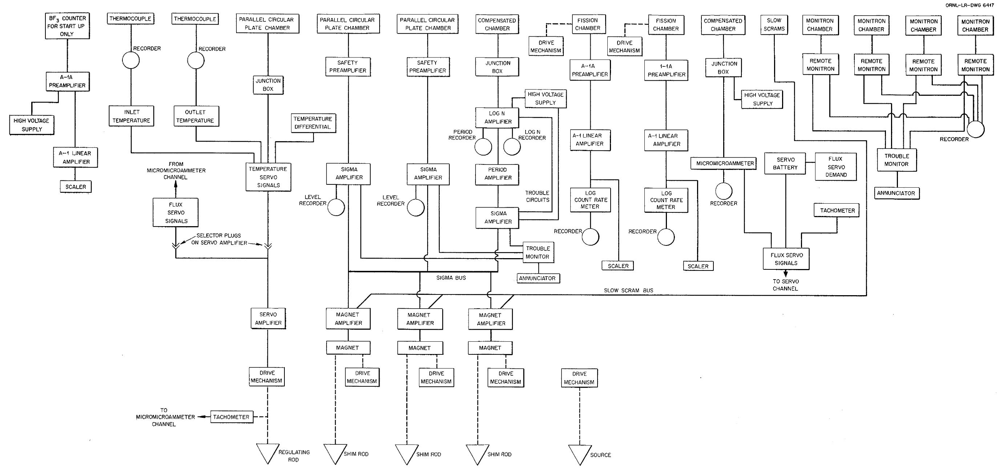  
Fig. C.1. Control System Block Diagram.

two-phase servomotors that operated from reversing contactors which received their actuation from a mixer-pilot relay located in the servo amplifier. Only one of the motors operated at a time, depending on whether the temperature or flux servo was coupled into the control loop. For the flux servo operation, an additional speed reducer was used so that the speed of the rod was one tenth that available for temperature servo operation.

Initiation of the flux servo "auto" regime was contingent on reactor power great enough to give a micromicroammeter reading of more than 20 and a servo-amplifier error signal small enough so that no control rod correction was called for. With the servo on auto the regulating rod upper or lower limit switches actuated an annunciator. Although not used in the experiment, initiation of the temperature servo auto regime was contingent on reactor power greater than a minimum controllable power $(>2\% N_{F})$ and a servo-amplifier error signal small enough that the servo would not call for rod motion.

The rod-cooling system consisted of a closed loop for circulating helium through the annuli around the shim rods, the regulating rod, and the fission chambers and then through three parallel helium-to-water heat exchangers. The helium was circulated by two 15-hp a-c motor-driven positive-displacement blowers. The motors were controlled from the reactor operating console.

The fuel and reflector coolant temperatures were also controlled from the console. The helium coolant removed heat from fuel and sodium system heat exchangers and passed it to an open-cycle helium-to-water heat exchanger, from which the water was dumped. The helium in the fuel system was circulated by an electric-motor-driven fan that was controlled from the console. The helium in the sodium system was circulated by two hydraulic-motor-driven blowers for which only the on and off controls were located on the console.

In order that the reactor operation would be as free as possible from the effects of transient disturbances or outages on the purchased-power lines, a separate electrical power supply was available for the control system. The supply consisted of a 250-v, 225-amp, storage-battery bank of 2-hr capacity. The bank was charged during normal power source operation by a 125-kw motor-generator set. This emergency d-c supply fed emergency lights and a 25-kw motor-generator set to supply instrumentation power (120/208 v, single

phase alternating current) during purchased-power outages. An auto-transfer switch provided an automatic switchover transient of several cycles upon loss of the purchased-power source. The auto-transfer switch automatically returned the system to normal power 5 min after resumption of purchased-power supply. The system could be returned to normal power manually at any time after resumption of the purchased-power supply.

# CONSOLE AND CONTROL BOARD DESCRIPTION

The control console was made up of two large panels, one to the right and one to the left of the operator's chair, and eight subpanels directly in front of the operator, Fig. C.2. Over the top of the console, the operator also had a full view of the vertical board of instruments which indicated and recorded nuclear parameters and pertinent process temperatures. The rotary General Electric Company type SB-1 switches used were of the center-idle, two- and three-position variety. They were wired so that clockwise rotation produced an "increase" in the controlled parameter; such operation has been described as potentially dangerous. However, the scram switch, an exception, produced a scram in either direction of rotation.

The top row of the left-hand panel of the console contained the source-drive control (Fig. C.2). In the second row the first two switches were the controls for the two-speed rod-cooling helium blowers, and the third switch was the on-off control for the electric motors which were the prime movers for the hydraulic-motor-driven blowers. In the bottom row were the group control for the three shim rods and the annunciator acknowledge and reset pushbuttons.

The center eight subpanels were identical in size and shape and contained the six selsyns which indicated the rod and fission chamber positions and the two servo control assemblies. The temperature calibrated potentiometer located near the panel center was used to set the fuel mean temperature for automatic, servo-controlled operation. The subpanel on the extreme left contained the flux vernier (not shown) used to set flux demand into the flux servo system for controlled operation. The dial was calibrated to correspond to a setting of from 20 to 100 on the micromicroammeter Brown recorder. Associated with all controls were the necessary limits-of-travel indicating lights, along with the on-off and speed-range indicators.

The right-hand panel contained the switches most

closely associated with the fuel system and the energy removal controls. In the upper row were the switch for the fuel-loop helium-blower prime mover, which was a 50-hp electric motor, the scram switch, and the by-pass switch (not shown on Fig. C.2). The by-pass switch was provided to permit the fuel-loop prime mover to be run, even though the reactor power was low, to remove the afterheat that was expected to be present after a shutdown. The bottom row on the right-hand panel contained the fuel-system-helium blower speed control, the selector switch for barrier-door control, and the barrier-door drive control.

The four panels in the center of the vertical board contained the 12 recorders which pertained to the reactor. They were, left to right, top row: reactor inlet temperature, reactor $\Delta T$ , reactor outlet temperature, reactor mean temperature; center row: count rate No. 1, pile period, safety level No. 1, and micromicroammeter. In the bottom row there were: count rate No. 2, log $N$ , safety level No. 2, and control rod position.

The range of flux through which the reactor passed from the insertion of the source to full-power operation was so great, more than $10^{13}$ , that

several classes of instruments were used. The normal flux $(N_F)$ was arbitrarily designated as 1, and then the first, and lowest, range encountered was the source range, from somewhat less than $10^{-13}$ to $10^{-11}$ ; the second was the counter range, from $10^{-11}$ to $10^{-6}$ ; the third was the period range, from $10^{-6}$ to 3.3 times $10^{-3}$ , and the last was the power range, from $3.3 \times 10^{-3}$ to 1. At greater than $10^{-5}$ , in the period range, the servo system could be put into auto operation if desired.

# CONTROL OPERATIONS

In the operation of the ARE, operator initiative was overridden by two categories of rod-inserting action: scram, the dropping of safety rods; and reverse, the simultaneous continuous insertion of all three shim rods, which was operative only during startup. The fast scram was in a class by itself, being the ultimate safety protection of the reactor, and could never be vetoed by the operator. The various occasions for automatic rod insertion and annunciation for nuclear trouble are listed in Table C.1.

There were five interlocks between nuclear reactor control, fuel and moderator coolant pumping,

TABLE C.1. CAUSES OF AUTOMATIC ROD INSERTION AND ANNUNCIATION   

<table><tr><td></td><td>Fast Scram</td><td>Slow Scram</td><td>Reverse</td><td>Annunciation</td></tr><tr><td>Neutron level (1.5 NF)</td><td>x</td><td></td><td></td><td>x</td></tr><tr><td>Neutron level (1.2 NF)</td><td></td><td></td><td></td><td>x</td></tr><tr><td>1-sec period</td><td>x</td><td></td><td></td><td>x</td></tr><tr><td>5-sec period</td><td></td><td></td><td>x</td><td>x</td></tr><tr><td>Fuel temperature (&gt;1550°F)</td><td></td><td>x</td><td></td><td>x</td></tr><tr><td>Loss of fuel flow (power &gt;10 kw)</td><td></td><td>x</td><td></td><td>x</td></tr><tr><td>Loss of control bus voltage</td><td></td><td>x</td><td></td><td>x</td></tr><tr><td>Loss of purchased power</td><td></td><td>x</td><td></td><td>x</td></tr><tr><td>Manual scram</td><td></td><td>x</td><td></td><td>x</td></tr><tr><td>Reactor power (ΔT &gt; 400°F)</td><td></td><td></td><td></td><td>x</td></tr><tr><td>Fuel temperature (&lt;1100°F)</td><td></td><td>x</td><td></td><td>x</td></tr><tr><td>Fuel helium blowers on without reflector helium blowers on</td><td></td><td></td><td></td><td>x</td></tr><tr><td>Servo off range</td><td></td><td></td><td></td><td>x</td></tr><tr><td>Rod coolant helium off</td><td></td><td></td><td></td><td>x</td></tr><tr><td>Count rate meter off scale</td><td></td><td></td><td></td><td>x</td></tr><tr><td>Safety circuit trouble</td><td></td><td></td><td></td><td>x</td></tr></table>

PHOTO 15056

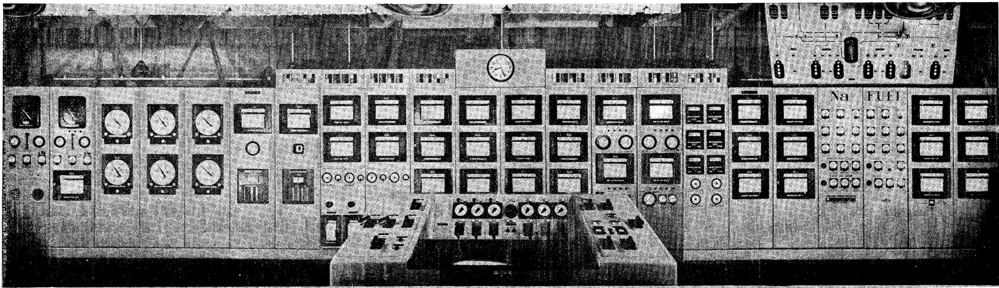  
Fig. C.2. Control Console and Vertical Board.

and helium-cooling operation. (1) When operating at power (above 10 kw), loss of fuel flow would have initiated a slow scram. (2) Loss of fuel flow would have, likewise, removed a permissive on operation of the fuel-loop helium-blower prime mover. (3) Excessive deviation of fuel temperature from set point would have produced a scram for either too high or too low a temperature. Low fuel temperature would also cause the helium pilot motor to run the magnetic clutch control for the helium blowers to the zero position and thereby stop the blowers and thus stop fuel cooling. (4) Moderator coolant flow was interlocked with the moderator coolant helium blowers to prevent helium circulation when the sodium flow was low or stopped. A slug of cold sodium would have entered the reactor when circulation was restarted if this precaution had not been taken. (5) Permissives on increasing helium flow were fuel temperature in

range, prime movers operating, reactor in power range, and power greater than 10 kw. The operator was notified by the "permit" light when these conditions were satisfied. A pilot decrease was not interruptible by the operator until the cause of the automatic action was alleviated.

The elementary control diagram is shown in Fig. C.3. The various relay and limit switches referred to in Fig. C.3 are described in Tables C.2 and C.3, respectively. These tables and Fig. C.3 show the procedural features of the control system as it applied to operator initiative. This system was divided into channels, each consisting of one or more relays actuated by the operator subsequent to properly setting up interlock permissives. The interlocks often depended upon the aspects of relays in other channels. Primarily, the channels corresponded to a mechanical unit involving a rod control, a process loop control, or an instrument system control. The channels were:

1. Two fission chamber drives

a. Manually actuated.   
b. Travel limit switches, panel-light indicated.

2. Servo control system

a. Auto initiated manually by permission of power greater than $2\%$ $N_{F^{\prime}}$ for temperature servo, and power great enough to give a reading of more than 20 on the micromicroammeter recorder for any scale range, for flux servo, and a demand error close to zero (neither light burning) for either servo system.   
b. Auto regime sealed-in light indicated if initiated with proper conditions and power remained greater than that specified in 2a above.   
c. Manual regime regained by manually dropping out seal or by manipulation of control rod switch.   
$d$ . Reverse interrupted rod withdrawal by any means and caused rod insertion.   
e. Manual control rod overrode automatic regime and dropped out seal.   
f. Permits on manual rod control required that either the reactor to be at a power level greater than $10^{-5}N_{F}$ or one count rate meter be "on scale."

3. Slow scram

a. A series-parallel relay system was used to initiate a scram. This system was used because a large number of series contacts would have been inductive to false drop-outs and hence false scams. The three most urgent criteria calling for scram had to be fail-safe and were therefore placed in the series-connected section.   
b. R-16 was inactive in the operating regime; R-17 and R-18 were normally actuated and were responsive to manual scram, scram reset, fuel temperature extremes, and R-16.

4. Reverse, R-23 and R-24, plus an indicator light

a. Operated all three rods if the by-pass switch was in "normal" and

(1) the group insert switch was closed, or   
(2) a slow scram occurred (equivalent to a scram follower), or   
(3) the servo system was in the manual regime; the reactor power was less than 10 kw; and a period of less than 5 seconds occurred.

On initial startup, No. $a(3)$ initiated the reverse at any power level (due to jumper-shorted

contact) until a negative temperature coefficient of reactivity was proved.

b. The by-pass switch prevented reverse (but not slow scram) when in "by-pass" position.

5. Shim rod withdrawal

a. Permissives were:

(1) no reverse in progress,   
(2) reading on-scale on at least one count rate meter or neutron level greater than $10^{-5}$ $N_{F^{\prime}}$   
(3) no manual insertion in progress,   
(4) rod heads not resting on upper travel limits.

6. Shimrod insert

a. Permitted if heads not on lower travel limits.   
b. Actuated individually and manually.   
c.Actuated together by any action operating reverse.

7. Fuel-system helium-blower prime movers

a. The prime movers could be started by S-13 if

(1) clutch relays were actuated (rods "hung"), or if by-pass switch S-5 was on by-pass,   
(2) helium blower speed lower limits were closed, and   
(3) fuel flow was not below 20 gpm.

b. The prime movers were automatically turned off if a shim rod was dropped or fuel flow dropped below 20 gpm.   
c. Relay R-38 started the prime movers by activating the starter relay RF-1 located in the basement.

8. Helium pilot controls (power-loading system)

a. Permit indicators on power increase were lit if

(1) the reactor level was greater than 10 kw or the by-pass switch was set on by-pass,   
(2) the prime movers were running, and   
(3) the fuel temperature was above $1100^{\circ}\mathrm{F}$ .

b. Power increase from the coolant system could be demanded if

(1) the permit lights were on and   
(2) pilot switch, S-14, was thrown to "increase."

c. If the power decreased and the controls were not already on shut-off limits, the helium circulation would be shut off.

(1) manually by using switch S-14, or   
(2) automatically by whichever system suffered from low fuel temperature, from prime mover cut-out, or from low power $(< 10\mathrm{kw})$ , since by-pass switch contact S5-3 was closed during normal critical and power operation. Low fuel temperature interlocks automatically decreased the corresponding helium pilot controls if the fuel dropped below the critical temperature at either of the two heat exchangers.

9. The by-pass switch function was somewhat obscure since it occurred in the prime movers, pilot controls, and reverse circuits. Its inclusion resulted from the possibility of requiring additional fuel cooling following a shutdown and after an extensive running period at power level. A large gamma heat source, primarily in the moderator (because of its very large heat capacity), called the afterheat, remained in the reactor immediately following power operation.

By using both hands, the operator could throw and hold S5 on by-pass while he restarted the prime movers and subsequently increased the helium pilot controls to such a point that the temperature leveled off.

The by-pass circuits permitted testing of cooling system control circuits and presetting of cooling system control limits while the reactor was shut down and also permitted the vital subcritical test for fuel temperature coefficient of reactivity.3

The use of the manual reverse cut-out, S5-6, operated by throwing the by-pass switch, was divorced from the above considerations and devoted only to test operation of the shim rod motors at shutdown, at low power, or with the magnet amplifiers turned off.

10. Source drive

a. Manually actuated.   
b. Travel limit switches, panel-light indicated.

# REACTOR OPERATION

The preliminary operating plan for the ARE was described in ORNL-1844. In the check operations, considerable time was spent in loading the inert fuel carrier and in the subsequent shakedown run. Critical loading, subcritical measurement of fuel temperature coefficient, regulating rod calibration, zero-power operation at 1200 to $1300^{\circ}\mathrm{F}$ , and power operation are described in Appendix D.

In the starting of a freshly loaded reactor the operator is most concerned about a reliable neutron signal. Attention must therefore be given to assuring that the fission chambers are in their most sensitive positions, and that they are giving a readable signal on the scalers or count rate meters. It is imperative that the source be inserted for the earliest indication of subcritical multiplication to be seen during the first startup. Use of the source in subsequent experiments becomes less important as the history of the reactor operation builds up.

For a normal, intentional shutdown the operator had the choice of a variety of procedures. For every scream, however, the interlocks of the system were such that the helium flow in the fuel-to-helium heat exchangers was cut off by opening the electrical circuits of the motors. This action was necessary to prevent the fuel from freezing in the heat exchangers. The various slow scams included the following: (1) maximum reactor outlet temperature, (2) minimum reactor inlet temperature, (3) a 1-sec period, (4) $N_{F}$ greater than 3.0 Mw, (5) fuel flow below 20 gpm. A 5-sec period inserted the shim rods, which decreased $\Delta k / k$ at a rate of 0.015%/sec, and operated only during low-level startup.

In addition to the process signals which initiated slow scams, there were several other potential process malfunctions for which it might have been desirable to scam the reactor. However, the action to be taken in these situations was left up to the decision of the operator. There were two reasons for not putting these process malfunctions

on automatic scram. First, sensory signals usually lag the event to such an extent that a fast scram cannot provide better protection than a delayed scram. Second, reaction to the signals requires limited judgment. An annunciator alarm signal was provided to draw the operator's attention to the possible difficulty for each case that would have required limited judgment. The cases were the following: (1) pronounced changes in differential temperatures between reactor outlet tubes, (2) lowering level in any surge tank, (3) rising level in any surge tank, (4) alarm from a pit radiation monitor or monitron, (5) high oxygen concentration or humidity in the pits.

The operation of placing the "position"-type regulating rod servo system on automatic control in any part of the power range above $2\% N_{F'}$ for temperature servo, and a micromicroammeter recorder reading of greater than 20 on any scale, for flux servo, was arranged to require that the reactor to be on a stable, infinite period. In the normal course of events, the rod should have been manually set at mid-range. Six d-c voltage signals were fed into the servo amplifier, three from the servo ion chamber, inlet temperature recorder, and outlet temperature recorder, one from the voltage supply adjusted by the "temperature demand" potentiometer, and two from the flux demand and micromicroammeter recorders. The operator therefore had a unique temperature setting for each level of power operation that produced "zero error" in the amplifier output, and hence no "error"-light indications and no demand for rod movement. It was at this setting that the servo "auto" regime could be initiated. A small change in reactor mean temperature or flux level could be effected in the auto regime by resetting the temperature demand or flux demand potentiometers, but the power level could not be changed.

No clear line could be drawn between normal operation and operation under difficulty. A few of the situations in which the operator would have expected to feel more than average need for attention to instrument signals and control actions were loss or interruption of power, automatic shutdown

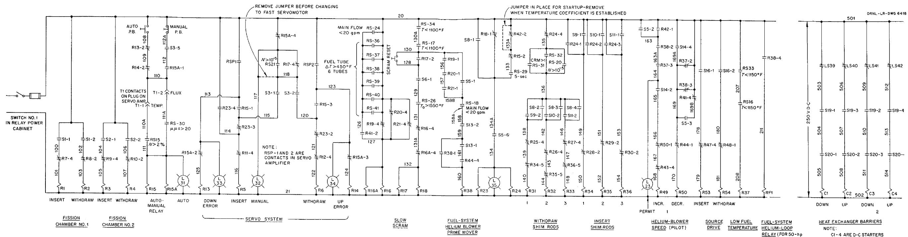

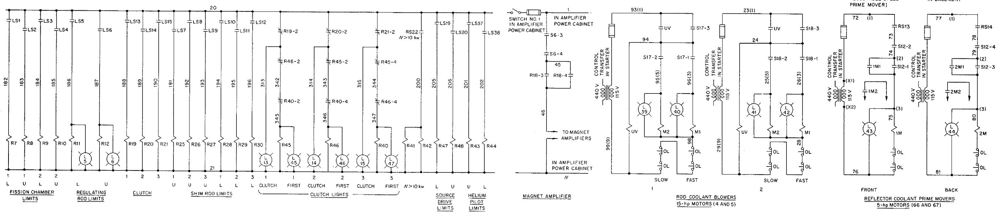

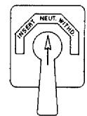  
Fig. C.3. Elementary Control Diagram.

TYPICAL ENGRAVING ARRANGEMENT OF SB SWITCHES

<table><tr><td></td><td>INSERT</td><td>NEUTRAL</td><td>WITHDRAW</td></tr><tr><td>1</td><td>●</td><td></td><td></td></tr><tr><td>2</td><td></td><td></td><td>●</td></tr><tr><td>5</td><td></td><td>●</td><td></td></tr><tr><td></td><td></td><td></td><td></td></tr></table>

FOR BY PASS SWITCH S5   

<table><tr><td></td><td>BY PASS</td><td>NORMAL</td></tr><tr><td>1</td><td>●</td><td></td></tr><tr><td>2</td><td>●</td><td></td></tr><tr><td>3</td><td></td><td>●</td></tr><tr><td>6</td><td></td><td>●</td></tr></table>

<table><tr><td></td><td>SCRAM</td><td>NORMAL</td><td>SCRAM</td></tr><tr><td>1</td><td></td><td>●</td><td></td></tr><tr><td>2</td><td>●</td><td></td><td>●</td></tr><tr><td>3</td><td></td><td>●</td><td></td></tr><tr><td>4</td><td></td><td>●</td><td></td></tr></table>

FOR SWITCH S8 - GROUP SHIM ROD OPERATION  

<table><tr><td></td><td>INSERT</td><td>NEUTRAL</td><td>WITHDRAW</td></tr><tr><td>1</td><td>●</td><td></td><td></td></tr><tr><td>2</td><td></td><td></td><td>●</td></tr><tr><td>3</td><td></td><td></td><td>●</td></tr><tr><td>4</td><td></td><td></td><td>●</td></tr></table>

<table><tr><td>STOP</td><td>NORMAL</td><td>START</td></tr><tr><td>1</td><td></td><td>●</td></tr><tr><td>2</td><td>●</td><td>●</td></tr><tr><td>3</td><td></td><td>●</td></tr><tr><td>4</td><td>●</td><td>●</td></tr></table>

FOR SWITCH S13-FUEL COOLANT PRIME MOVER   

<table><tr><td>STOP</td><td>NORMAL</td><td>START</td></tr><tr><td>1</td><td></td><td>●</td></tr><tr><td>2</td><td></td><td>●</td></tr><tr><td></td><td></td><td></td></tr><tr><td></td><td></td><td></td></tr></table>

<table><tr><td></td><td>DECREASE</td><td>NEUTRAL</td><td>INCREASE</td></tr><tr><td>1</td><td></td><td></td><td>●</td></tr><tr><td>2</td><td></td><td></td><td>●</td></tr><tr><td>3</td><td>●</td><td></td><td></td></tr><tr><td>4</td><td>●</td><td></td><td></td></tr></table>

FOR SWITCH S16 - SOURCE DRIVE   

<table><tr><td></td><td>INSERT</td><td>NEUTRAL</td><td>WITHDRAW</td></tr><tr><td>1</td><td>●</td><td></td><td></td></tr><tr><td>2</td><td></td><td></td><td>●</td></tr><tr><td></td><td></td><td></td><td></td></tr><tr><td></td><td></td><td></td><td></td></tr></table>

FOR SWITCHES S17 AND S18-ROD COOLANT PUMPS   

<table><tr><td></td><td>FAST</td><td>SLOW</td><td>OFF</td></tr><tr><td>1</td><td>●</td><td></td><td></td></tr><tr><td>2</td><td></td><td>●</td><td></td></tr><tr><td>3</td><td></td><td></td><td>●</td></tr><tr><td></td><td></td><td></td><td></td></tr></table>

FOR SWITCH S20-HEAT EXCHANGER BARRIER CONTROL   

<table><tr><td></td><td>DOWN</td><td>NEUTRAL</td><td>UP</td></tr><tr><td>1</td><td>●</td><td></td><td></td></tr><tr><td>2</td><td></td><td></td><td>●</td></tr><tr><td>3</td><td>●</td><td></td><td></td></tr><tr><td>4</td><td></td><td></td><td>●</td></tr></table>

NOTES:

ALL CONTACTS ON SB SWITCHES NUMBERED FROM HANDLE END.

ALL RELAYS SHOWN WITH COILS DE-ENERGIZEO.

TABLE C.2. LIST OF RELAY SWITCHES   

<table><tr><td>Contact</td><td>Instrument</td><td>Set Point</td></tr><tr><td>RS-9</td><td>Count rate recorder No. 1</td><td>Closed above 1 count/sec</td></tr><tr><td>RS-10</td><td>Count rate recorder No. 1</td><td>Opened off scale</td></tr><tr><td>RS-11</td><td>Count rate recorder No. 2</td><td>Closed above 1 count/sec</td></tr><tr><td>RS-12</td><td>Count rate recorder No. 2</td><td>Opened off scale</td></tr><tr><td>RS-13</td><td>Front sodium flow</td><td>Closed above 60 gpm</td></tr><tr><td>RS-14</td><td>Back sodium flow</td><td>Closed above 60 gpm</td></tr><tr><td>RS-15</td><td>Log N</td><td>Closed when N &gt; 2% NF</td></tr><tr><td>RS-16</td><td>Fuel heat exchanger No. 2 outlet</td><td>Closed above 1150°F</td></tr><tr><td>RS-17</td><td>Fuel heat exchanger No. 2 outlet</td><td>Closed above 1100°F</td></tr><tr><td>RS-18</td><td>Fuel flow</td><td>Closed above 20 gpm</td></tr><tr><td>RS-19</td><td>Not used</td><td></td></tr><tr><td>RS-20</td><td>Log N</td><td>Closed when N &gt; 10-5NF</td></tr><tr><td>RS-21</td><td>Log N</td><td>Closed when N &gt; 10-5NF</td></tr><tr><td>RS-22</td><td>Log N</td><td>Closed when N &gt; 6.67 × 10-3NF</td></tr><tr><td>RS-23a</td><td>Safety level No. 1</td><td>Opened above 120</td></tr><tr><td>RS-23b</td><td>Safety level No. 2</td><td>Opened above 120</td></tr><tr><td>RS-24</td><td>Fuel flow</td><td>Opened above 20 gpm</td></tr><tr><td>RS-25</td><td>Not used</td><td></td></tr><tr><td>RS-26</td><td>Reactor outlet temperature (mixed manifold)</td><td>Opened above 1550°F</td></tr><tr><td>RS-27</td><td>Not used</td><td></td></tr><tr><td>RS-28</td><td>Not used</td><td></td></tr><tr><td>RS-29</td><td>Pile period</td><td>Closed at less than 5 sec</td></tr><tr><td>RS-30</td><td>Micromicroammeter</td><td>Closed above 20 μμa</td></tr><tr><td>RS-31</td><td>Count rate recorder No. 1</td><td>Closed above 1 count/sec</td></tr><tr><td>RS-32</td><td>Count rate recorder No. 2</td><td>Closed above 1 count/sec</td></tr><tr><td>RS-33</td><td>Fuel heat exchanger No. 1 outlet</td><td>Closed above 1150°F</td></tr><tr><td>RS-34</td><td>Fuel heat exchanger No. 1 outlet</td><td>Closed above 1100°F</td></tr><tr><td>RS-35</td><td>Pile period</td><td>Opened at less than 5 sec</td></tr><tr><td>RS-36</td><td>ΔT across reactor tube No. 1</td><td>Closed above 450°F</td></tr><tr><td>RS-37</td><td>ΔT across reactor tube No. 2</td><td>Closed above 450°F</td></tr><tr><td>RS-38</td><td>ΔT across reactor tube No. 3</td><td>Closed above 450°F</td></tr><tr><td>RS-39</td><td>ΔT across reactor tube No. 4</td><td>Closed above 450°F</td></tr><tr><td>RS-40</td><td>ΔT across reactor tube No. 5</td><td>Closed above 450°F</td></tr><tr><td>RS-41</td><td>ΔT across reactor tube No. 6</td><td>Closed above 450°F</td></tr><tr><td>RS-42</td><td>Not used</td><td></td></tr><tr><td>RS-43</td><td>Not used</td><td></td></tr><tr><td>RS-44</td><td>Not used</td><td></td></tr><tr><td>RS-45</td><td>AC-to-DC M-G set</td><td>Closed when set was charging batteries</td></tr><tr><td>RS-46</td><td>Not used</td><td></td></tr><tr><td>RS-47</td><td>Not used</td><td></td></tr><tr><td>RS-48</td><td>Not used</td><td></td></tr><tr><td>RS-49</td><td>Not used</td><td></td></tr><tr><td>RS-50</td><td>Fuel flow</td><td>Closed above 20 gpm</td></tr><tr><td>RS-51</td><td>Fuel flow</td><td>Closed above 20 gpm</td></tr><tr><td>RS-52</td><td>Reactor outlet temperature (mixed manifold)</td><td>Opened above 1500°F</td></tr><tr><td>RS-53</td><td>Wind velocity recorder</td><td>Wind above 5 miles/hr or vent gas monitors</td></tr><tr><td>RS-54</td><td>Fuel heat exchanger No. 1 outlet</td><td>Closed above 1150°F</td></tr><tr><td>RS-55</td><td>Fuel heat exchanger No. 1 outlet</td><td>Closed above 1100°F</td></tr><tr><td>RS-56</td><td>Fuel heat exchanger No. 2 outlet</td><td>Closed above 1150°F</td></tr><tr><td>RS-57</td><td>Fuel heat exchanger No. 2 outlet</td><td>Closed above 1100°F</td></tr><tr><td>RS-58</td><td>Main fuel pump low-water-flow alarm</td><td>Closed above 4 gpm</td></tr><tr><td>RS-59</td><td>Fuel heat exchanger No. 2 outlet</td><td>Closed above 1100°F</td></tr><tr><td>RS-60</td><td>Secondary fuel pump low-water-flow alarm</td><td>Closed above 4 gpm</td></tr><tr><td>RS-61</td><td>Back sodium heat exchanger outlet</td><td>Closed above 1100°F</td></tr><tr><td>RS-62</td><td>Front sodium flow</td><td>Closed above 100 gpm</td></tr><tr><td>RS-63</td><td>Back sodium flow</td><td>Closed above 100 gpm</td></tr><tr><td>RS-64</td><td>Helium concentration recorder</td><td>Closed at less than 90% He</td></tr><tr><td>RS-65</td><td>Pit humidity indicator</td><td>Opened at &gt;10% relative humidity</td></tr><tr><td>RS-66</td><td>Helium supply header pressure</td><td>Opened at &lt;500 psig</td></tr><tr><td>RS-67</td><td>Water reservoir level</td><td>Opened at &lt;16 psig (&lt;18,000 gal)</td></tr><tr><td>RS-68</td><td>Main sodium pump tank level</td><td>Opened at low level</td></tr><tr><td>RS-69</td><td>Main sodium pump tank level</td><td>Opened at high level</td></tr><tr><td>RS-70</td><td>Standby sodium pump tank level</td><td>Opened at low level</td></tr><tr><td>RS-71</td><td>Standby sodium pump tank level</td><td>Opened at high level</td></tr><tr><td>RS-72</td><td>Main fuel pump tank level</td><td>Opened at low level</td></tr><tr><td>RS-73</td><td>Main fuel pump tank level</td><td>Opened at high level</td></tr><tr><td>RS-74</td><td>Standby fuel pump tank level</td><td>Opened at low level</td></tr><tr><td>RS-75</td><td>Standby fuel pump tank level</td><td>Opened at high level</td></tr><tr><td>RS-76</td><td>Water controller for front sodium heat exchanger</td><td>Opened above 160°F</td></tr><tr><td>RS-77</td><td>Water controller for back sodium heat exchanger</td><td>Opened above 160°F</td></tr><tr><td>RS-78</td><td>Water controller for fuel heat exchanger</td><td>Opened above 160°F</td></tr><tr><td>RS-79</td><td>Standby sodium pump motor ammeter</td><td>Opened above 50 amp</td></tr><tr><td>Contract</td><td>Instrument</td><td>Set Point</td></tr><tr><td>RS-80</td><td>Water controller for space coolers</td><td>Opened above 160°F</td></tr><tr><td>RS-81</td><td>Water controller for rod-cooling heat exchanger</td><td>Opened above 160°F</td></tr><tr><td>RS-82</td><td>Individual heat exchanger tube temperature</td><td>Opened above 1500°F</td></tr><tr><td>RS-83</td><td>Individual heat exchanger tube temperature</td><td>Closed above 1150°F</td></tr><tr><td>RS-84</td><td>Main sodium pump motor ammeter</td><td>Opened above 50 amp</td></tr><tr><td>RS-85</td><td>ΔT across reactor tube No. 1</td><td>Opened above 400°F</td></tr><tr><td>RS-86</td><td>Main fuel pump motor ammeter</td><td>Opened above 50 amp</td></tr><tr><td>RS-87</td><td>ΔT across reactor tube No. 2</td><td>Opened above 400°F</td></tr><tr><td>RS-88</td><td>Standby fuel pump motor ammeter</td><td>Opened above 50 amp</td></tr><tr><td>RS-89</td><td>ΔT across reactor tube No. 3</td><td>Opened above 400°F</td></tr><tr><td>RS-90</td><td>Standby sodium pump low-water-flow alarm</td><td>Closed above 4 gpm</td></tr><tr><td>RS-91</td><td>ΔT across reactor tube No. 4</td><td>Opened above 400°F</td></tr><tr><td>RS-92</td><td>Main sodium pump low-water-flow alarm</td><td>Closed above 4 gpm</td></tr><tr><td>RS-93</td><td>ΔT across reactor tube No. 5</td><td>Opened above 400°F</td></tr><tr><td>RS-94</td><td>Main fuel pump low-oil-flow alarm</td><td>Closed above 2 gpm</td></tr><tr><td>RS-95</td><td>ΔT across reactor tube No. 6</td><td>Opened above 400°F</td></tr><tr><td>RS-96</td><td>Standby fuel pump low-oil-flow alarm</td><td>Closed above 2 gpm</td></tr><tr><td>RS-97</td><td>Standby sodium pump low-oil-flow alarm</td><td>Closed above 2 gpm</td></tr><tr><td>RS-98</td><td>Main sodium pump low-oil-flow alarm</td><td>Closed above 2 gpm</td></tr><tr><td>RS-99</td><td>Sodium outlet pressure at reactor</td><td>Closed above 48 psig</td></tr><tr><td>RS-100</td><td>Fuel inlet pressure at reactor</td><td>Opened above 48 psig</td></tr><tr><td>RS-101</td><td>Main sodium pump tank pressure</td><td>Opened above 47 psig</td></tr><tr><td>RS-102</td><td>Standby sodium pump tank pressure</td><td>Opened above 47 psig</td></tr><tr><td>RS-103</td><td>Standby fuel pump tank pressure</td><td>Opened above 5 psig</td></tr><tr><td>RS-104</td><td>Main fuel pump tank pressure</td><td>Opened above 5 psig</td></tr><tr><td>RS-105</td><td>Rod cooling helium pressure</td><td>Closed above 13 psig</td></tr><tr><td>RS-106</td><td>Fuel loop water flow</td><td>Closed above 110 gpm</td></tr><tr><td>RS-107</td><td>Water flow to fuel and sodium pumps</td><td>Closed above 10 gpm</td></tr><tr><td>RS-108</td><td>Rod cooling water flow</td><td>Closed above 15 gpm</td></tr><tr><td>RS-109</td><td>Front sodium loop water flow</td><td>Closed above 65 gpm</td></tr><tr><td>RS-110</td><td>Back sodium loop water flow</td><td>Closed above 65 gpm</td></tr><tr><td>RS-111</td><td>Space cooler water flow</td><td>Closed above 45 gpm</td></tr><tr><td>RS-112</td><td>Vent header vacuum</td><td>Opened below 29 in. Hg</td></tr><tr><td>RS-113</td><td>Reserve nitrogen header supply pressure</td><td>Opened at &lt;300 psig</td></tr><tr><td>RS-114</td><td>Rod cooling helium</td><td>Opened at &lt;40 psig</td></tr><tr><td>RS-115</td><td>DC-to-AC M-G set</td><td>Closed when set was running</td></tr><tr><td>Contact</td><td>Instrument</td><td>Set Point</td></tr><tr><td>RS-116</td><td>AC-to-DC M-G set</td><td>Closed when set was running</td></tr><tr><td>RS-117</td><td>Heat exchanger pit radiation monitor</td><td>Opened at high level</td></tr><tr><td>RS-118</td><td>Heat exchanger pit radiation monitor</td><td>Opened at high level</td></tr><tr><td>RS-119</td><td>Vent gas monitor</td><td>Opened at high level</td></tr><tr><td>RS-120</td><td>Vent gas monitor</td><td>Opened at high level</td></tr><tr><td>RS-121</td><td>Sodium ΔT at reactor</td><td>Opened at &lt;60°F</td></tr></table>

TABLE C.3. LIST OF LIMIT SWITCHES   

<table><tr><td>Contact</td><td>Device</td><td>Set Point</td></tr><tr><td>LS-1</td><td>Fission chamber No. 1 lower limit</td><td>Closed on limit</td></tr><tr><td>LS-2</td><td>Fission chamber No. 1 upper limit</td><td>Closed on limit</td></tr><tr><td>LS-3</td><td>Fission chamber No. 2 lower limit</td><td>Closed on limit</td></tr><tr><td>LS-4</td><td>Fission chamber No. 2 upper limit</td><td>Closed on limit</td></tr><tr><td>LS-5</td><td>Regulating rod lower limit</td><td>Closed on limit</td></tr><tr><td>LS-6</td><td>Regulating rod upper limit</td><td>Closed on limit</td></tr><tr><td>LS-7</td><td>Shim rod No. 1 upper limit</td><td>Closed on limit</td></tr><tr><td>LS-8</td><td>Shim rod No. 2 upper limit</td><td>Closed on limit</td></tr><tr><td>LS-9</td><td>Shim rod No. 3 upper limit</td><td>Closed on limit</td></tr><tr><td>LS-10</td><td>Shim rod No. 1 lower limit</td><td>Closed on limit</td></tr><tr><td>LS-11</td><td>Shim rod No. 2 lower limit</td><td>Closed on limit</td></tr><tr><td>LS-12</td><td>Shim rod No. 3 lower limit</td><td>Closed on limit</td></tr><tr><td>LS-13</td><td>Shim rod No. 1 clutch</td><td>Closed when rod was attached</td></tr><tr><td>LS-14</td><td>Shim rod No. 2 clutch</td><td>Closed when rod was attached</td></tr><tr><td>LS-15</td><td>Shim rod No. 3 clutch</td><td>Closed when rod was attached</td></tr><tr><td>LS-16</td><td>Shim rod No. 1 seat</td><td>Closed on seat</td></tr><tr><td>LS-17</td><td>Shim rod No. 2 seat</td><td>Closed on seat</td></tr><tr><td>LS-18</td><td>Shim rod No. 3 seat</td><td>Closed on seat</td></tr></table>

action, and buildup of xenon poison after a shutdown.

As far as loss of power is concerned, the operator would have been left figuratively, and nearly literally, in the dark were the instrument bus and control bus to go dead simultaneously. In this very unlikely occurrence, all the instrument lights and all relay-indicating lights would have been out, leaving the operator without visual knowledge of whether the scram (automatic on loss of power)

was effective. If he had reasonable faith in the law of gravity, he would probably have remained at his post until power was restored. There would have been no normal scram indication if the relay cabinet main fuse were to have opened. However, since the amplifier power cabinet would have operated from emergency power, there was a check on release of the shim rods in the fact that the magnet currents would have been interrupted.

Whenever the reactor was subject to automatic

shutdown action, the operator's concern was divided between the causative effects and the chances of returning the reactor to normal operation. The circuits prevented the operator from interfering with shutdown actions as long as the causative conditions remained. Hence the operator's reaction to anything less drastic than a scream was to clear the responsible condition.

When the reactor was scrambled, the chances of getting back into normal operation were of course dependent upon the time history of previous operation as well as upon the need for remedying the trouble. However, any length of complete shutdown could have been tolerated after prolonged operation at normal flux, since xenon poison buildup was low.

# Appendix D

# NUCLEAR OPERATING PROCEDURES

The importance and critical nature of the program, as well as the short time scheduled for the operation of the reactor and system, necessitated a tight experimental program and precise operating procedures. The nuclear operating procedures were, of course, prescribed in advance of the experiment. It is of considerable interest to note that the actual experimental program followed the anticipated program very closely throughout. The only significant deviations were the inclusion of some additional experiments as time permitted. The following appendix is a verbatim copy of the procedures by which the reactor was operated. Some minor discrepancies in operating conditions (i.e., 34-gpm fuel flow vs 46-gpm actual flow) and procedures (i.e., use of the original enrichment system, which was replaced) will be noted.

It is anticipated that the reactor and its associated circuits will be operated for about 250 hr with fused salts in the system prior to the introduction of fuel. All process instrumentation and components (non-nuclear) will be checked out during this period. The mechanical operation of the nuclear equipment will be checked out at temperature. The safety rods will be raised and dropped approximately 50 times during this period.

Several tests preliminary to the fuel loading will have been run. The rated flow of the fuel carrier will be 34 gpm at a mean temperature of $1300^{\circ}\mathrm{F}$ .

1. The fuel loading system will be operated with carrier. The fuel storage tank will be installed and carrier forced into the transfer tank and then into the reactor system. The strain gage weighing devices will be checked.   
2. The helium blowers will be operated and the resultant drop in mean temperature observed. The operating crew will practice in handling the helium flow so as to drop the mean temperature at a rate of $10^{\circ}\mathrm{F / min}$ and at a rate of $25^{\circ}\mathrm{F / min}$ . Care will be exercised not to drop the temperature of the fuel carrier to below $1150^{\circ}\mathrm{F}$ as it leaves the heat exchangers. As the latter temperature approaches that value, the helium flow will be reduced and the system brought back to its mean operating temperature of $1300^{\circ}\mathrm{F}$ .   
3. With the helium blowers off and starting with fuel carrier at rated flow of 34 gpm and mean temperature of $1300^{\circ}\mathrm{F}$ , the flow rate will be decreased in steps to about one-third rated value. All temperatures will be observed to note any spurious changes caused by the decreased flow.

# ADDITION OF FUEL CONCENTRATE

The fuel concentrate will be added in batches to an "eversafe" container which will contain $115\mathrm{kg}$ of $\mathsf{U}^{235}$ . The density of the fuel concentrate may be represented by the equation:

$$
\rho (g / c m ^ {3}) = 5. 5 1 - 0. 0 0 1 3 T (^ {\circ} C)
$$

At a temperature of $1300^{\circ}\mathrm{F}$ , the density is 4.59 g/cm³, or 287 lb/ft³. In each pound of the fuel concentrate there is 0.556 lb of U²³⁵.

One quart of the concentrate weighing 9.59 lb and containing 5.33 lb of $U^{235}$ will be forced into the transfer tank and weighed. With the safety rods completely withdrawn and the neutron source and fission chambers inserted, the fuel concentrate will be forced into the fuel circuit. At this time the carrier flow will be 34 gpm and the concentrate and carrier temperatures will be $1300^{\circ}F$ . The scram level on the safety chambers will have been set at about 10 kw and the period scram at 1 sec. A $\mathsf{BF}_3$ counter will have been installed temporarily in place of the neutron ion chamber for the temperature servo control, and the regulating rod will be on slow-speed drive.

The system volume up to the minimum operating level in the fuel pump is calculated to be $4.64\text{ft}^3$ . Assuming a critical mass of 30 lb in the $1.3\text{ft}^3$ of reactor core, there will be approximately 124 lb of $U^{235}$ in the fuel circuit when the reactor first goes critical with the shim rods completely withdrawn. Accordingly, it is anticipated that approximately 0.78 ft or 23.4 quarts of fuel concentrate must be added for initial criticality. Twelve quarts will be added in succession with the shim rods completely withdrawn and the fission chambers fully

inserted. After each quart of concentrate is added, counts will be taken on both fission chambers and the $\mathsf{BF}_3$ counter. The reciprocal counting rate will be plotted vs. the fuel concentration to observe the approach to criticality.

After $50\%$ of the fuel concentrate (12 quarts) has been added to the system, a sample of the mixed fuel and carrier will be withdrawn for chemical analysis.

# SUBCRITICAL EXPERIMENTS

During the addition of the first 12 quarts of fuel concentrate, the safety rods have been completely withdrawn from the reactor. From here on, the shim rods will be inserted approximately $25\%$ while a quart of fuel concentrate is being added. The shim rods will then be withdrawn and a count taken on the fission chambers as before. The shim rods

will be inserted and withdrawn in this fashion for each succeeding fuel addition. The reciprocal of the counting rate vs. fuel concentration will still be plotted to indicate the increase in criticality.

When approximately $90\%$ of the critical mass has been added, the fuel addition will be stopped and several subcritical experiments performed. For these experiments it is desired that the $k$ of the reactor be about 0.97 to 0.98. In Fig. D.1 is shown the relationship between $\Delta k / k$ and $\Delta M / M$ as a function of the critical mass $M$ . Using this curve, an estimate of the point at which fuel addition must be stopped can be made.

For the first experiment, the fuel temperature will be decreased at a rate of $10^{\circ}\mathrm{F / min}$ by starting the helium flow. Assuming a temperature coefficient of $-5\times 10^{-5}(\Delta k / k)^{\circ}\mathrm{F},$ the resultant $\Delta k / k$ should be about $0.25\%$ after 5 min. If $\Delta M / M$ is

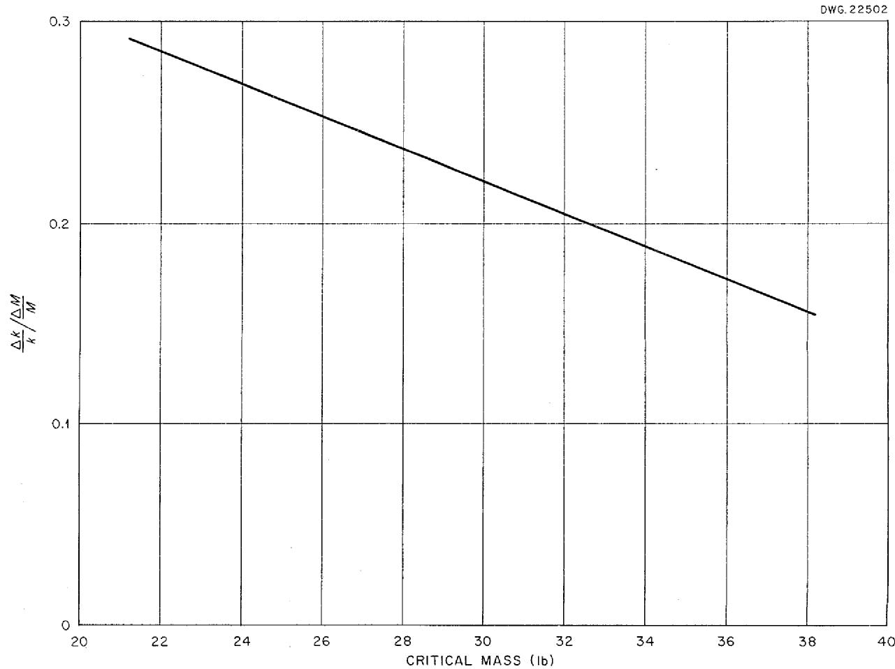  
Fig. D.l. Reactivity-Mass Ratio as a Function of Critical Mass.

approximately $4\Delta k / k$ (Fig. D.1), the count rate should increase by an amount corresponding to the addition of $1.0\%$ more fuel. If the change in count rate is too small to be definite, the experiment will be repeated at a rate of decrease of $25^{\circ}\mathrm{F} / \mathrm{min}$ until a definite increase in count rate is observed, or until the temperature has been decreased $100^{\circ}\mathrm{F}$ . If, after this decrease in temperature, no increase in count rate is observed, it will be assumed that the temperature coefficient is negligibly small and the experiment will proceed. As has always been

the philosophy on the ARE, if the temperature coefficient is observed to be positive, the experiment will be concluded and the fuel circuit drained.

For the second experiment, the reactor temperature will be returned to its original value of $1300^{\circ}\mathrm{F}$ , and with the reactor containing $90\%$ of the critical mass, the fuel flow rate will be gradually decreased. If the available delayed neutron fraction is $0.47\% \Delta k$ at full flow and $0.75\% \Delta k$ when the flow is stopped (Fig. D.2), a $\Delta k$ of $0.28\%$ should appear. The count rate should in

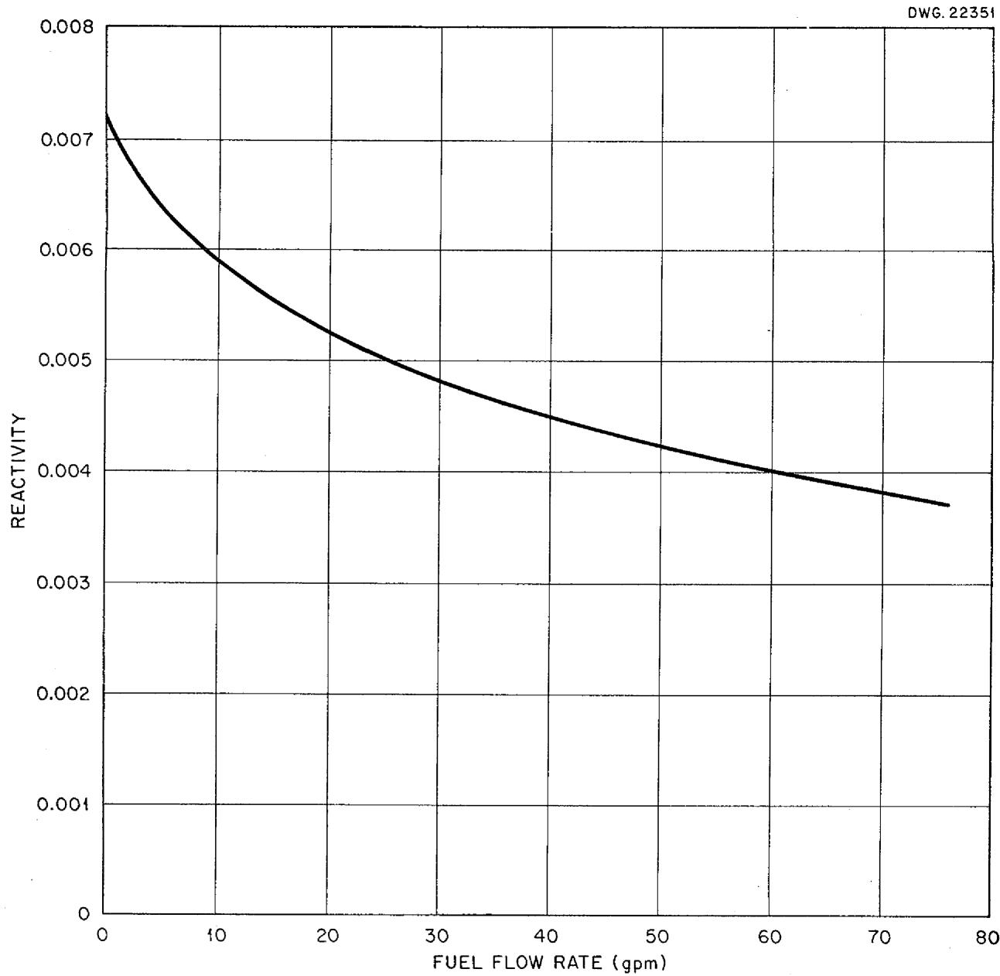  
Fig. D.2. Reactivity from Delayed Neutrons as a Function of Fuel Flow.

crease by an amount equivalent to the $\Delta M$ corresponding to additional $\Delta k$ in the delayed neutrons. A rough experimental check on the calculated value of the delayed neutron fraction will thus be available.

During the period of subcritical operation, the count rate will be carefully observed for sudden changes that could be caused by fuel segregation. No such difficulty is anticipated, but if such an effect is observed, the reactor will be shut down until the reason for such behavior is ascertained.

# INITIAL CRITICALITY

Upon completion of the subcritical experiments, the fuel flow and reactor temperature will be returned to the initial conditions of $34\mathrm{gpm}^3$ and $1300^{\circ}\mathrm{F}$ . Counts will be taken on the fission chambers with the shim rods $25\%$ inserted and completely withdrawn. The shim rods will then be $50\%$ inserted and a quart of fuel concentrate added. The rods will be withdrawn to $25\%$ and a count taken and then completely withdrawn and a count taken. From here on, two curves of reciprocal counting rate vs. fuel concentration will be plotted, one at $25\%$ rod insertion and the original curve with the rods completely withdrawn. If the reactor contained $90\%$ of the critical mass during the subcritical experiments, about two 1-quart additions of fuel concentrate will bring the reactor critical with the rods completely withdrawn. The last fuel additions will be made very slowly. When criticality has been definitely reached, the reactor will be shut down and a fuel sample taken for chemical analysis.

After the sample has been taken, the reactor will again be brought barely critical (a few hundredths of a watt) and held at constant power by watching the count rate meters. The gamma-ray dosage will be measured with a "Cutie-pie" at all pertinent points throughout the pits and recorded for future reference on radiation damage and shielding.

# ROD CALIBRATION vs FUEL ADDITION

The reactor will be brought critical at a very low power and the shim rods adjusted so that the regulating rod is 5 in. above center. The regulating rod is estimated to be worth about $0.04\%$ $\Delta k / \text{in}$ . One quart of fuel is approximately $4\%$ $\Delta M$ or $1\% \Delta k$ (Fig. D.1). Therefore, $\frac{1}{25}$ of a quart should be worth about 1 in, of regulating rod.

Figures D.3 and D.4 show a calibration of a regulating rod taken on a mockup of the ARE at the Critical Experiment Facility. While it would be fortuitous if the regulating rod in the actual ARE gave the same calibration, it is expected that the general shape of the curves will be the same.

With the shim rods in a fixed position, the regulating rod will be fully inserted and approximately $\frac{1}{25}$ of a quart of fuel concentrate will be added slowly to the system. The reactor will be brought critical on the regulating rod and its new position noted. This procedure will be repeated until the regulating rod has been calibrated from 5 in. above to 5 in. below its mid-position.

The above experiment will have been run with the shim rods almost completely withdrawn. The shims will now be inserted about $25\%$ and $\frac{1}{2}$ quart of fuel added (approximately $0.5\% \Delta k$ ). The shim rods will be withdrawn until the reactor goes critical. This procedure will be continued to give a rough calibration of shim rod position vs fuel addition over one-fourth of the rod. When the reactor is critical with the shims approximately $15\%$ inserted, the shims will be adjusted so that the regulating rod is 5 in. above center, and a second calibration of the regulating rod vs fuel addition will be run as above.

Calibration of the shim rods vs fuel addition will then be continued until the reactor is critical with the rods about $25\%$ inserted. At this time, a third and final calibration of the regulating rod vs fuel addition will be run. The reactor will then be shut down and a fuel sample taken.

# LOW-POWER EXPERIMENTS

The nominal power of the reactor is obtained as follows: It is estimated that in the reflector at the mid-plane of the reactor the fission producing flux is $2 \times 10^{6} \mathrm{nv} / \mathrm{w}$ , and the average flux over the length of the fission chamber when fully inserted is $1.5 \times 10^{6} \mathrm{nv} / \mathrm{w}$ . Preliminary tests on the fission chambers show a counting efficiency of approximately 0.14 counts/sec.nv. The relationship between counting rate and power is therefore approximately $2 \times 10^{5}$ counts/sec = 1 w. The nominal power of the reactor will be based on this relationship during the preceding experiments.

Until this time the reactor has been operated on the fission chambers alone at a nominal power

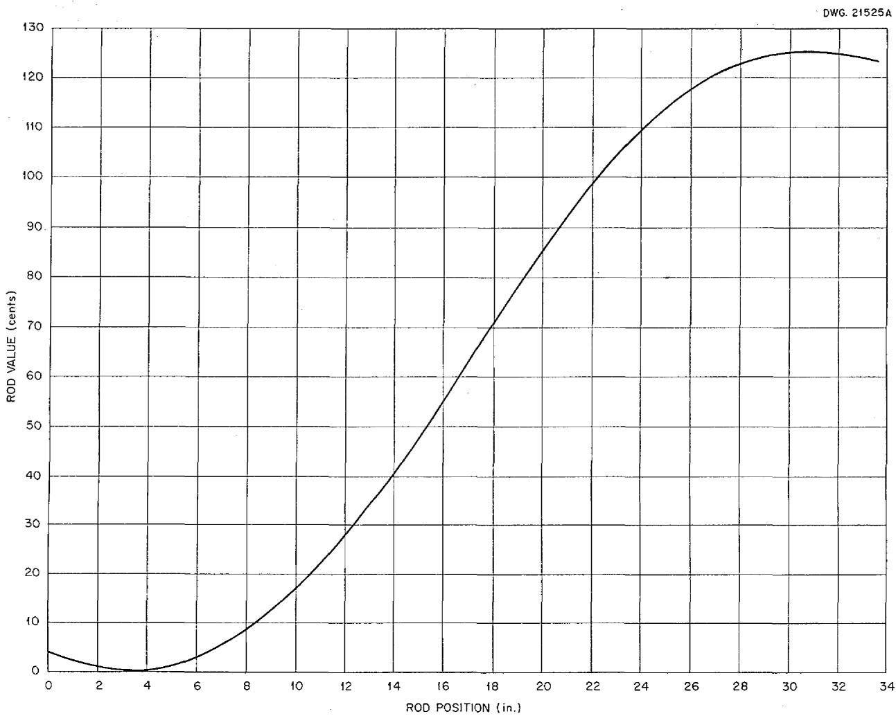  
Fig. D.3. Regulating Rod Calibration (Rod B).

of about 0.01 w (about 2000 counts/sec). The reactor power will now be increased to about 1 to 10 w, at which time the neutron ionization chambers should begin to give readings on the log N recorder, the micromicroammeter, and the period recorder. The reactor will be leveled out and the flux servo turned on. One of the fission chambers will be completely withdrawn, which should reduce its counting rate by several orders of magnitude. A careful comparison of the new count rate vs the old count rate will be made.

The reactor will be held at constant power for exactly 1 hr and then scrambled. A fuel sample will be drawn off and sent to the Bulk Shielding Facility for determining its activity. This activity will be compared with that of a previous sample (Fig. D.5), which was exposed in a known neutron

flux in the Bulk Shielding Reactor. From the comparison, the fission rate or absolute power of the ARE will be determined for this run (cf., app. H). All neutron level instruments will be calibrated accordingly.

Rod Calibration vs Period. A family of curves of reactivity vs reactor period (inhour curves) with the rate of flow of the fuel as a parameter is shown in Fig. D.6.

With the fuel flow rate at 34 gpm, the servo will be turned off and the reactor placed on infinite period manually with the regulating rod at mid-position. From the rod calibration vs fuel plot and the theoretical inhour curve, the regulating rod withdrawal for a 30-sec period will be estimated (present estimate is about 1 in.). The rod will be withdrawn accordingly and the neutron

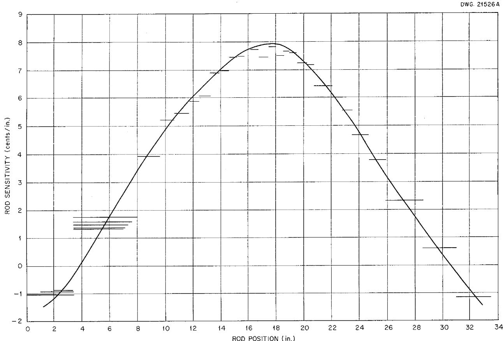  
Fig. D.4. Regulating Rod Sensitivity (Rod B).

level allowed to rise about two orders of magnitude, whereupon the regulating rod will be fully inserted and the induced gamma rays allowed to decay for about 20 min. The reactor will then be brought back to its original power, as determined by the fission chambers. If the position of the regulating rod does not return to its original value because of photoneutrons, the reactor power will again be reduced by insertion of the regulating rod until the photoneutron effect becomes negligible. The above procedures will be repeated for 20-sec and 10-sec periods. The 10-sec period should correspond roughly to a 2-in. withdrawal of the regulating rod. Runs will then be made at correspondingly longer periods until the period for a $\frac{1}{2}$ -in. withdrawal of the rod is obtained (approximately 100 sec). At this time a repeat run on the 30-sec period will be made to ascertain whether photoneutron buildup is causing appreciable error in the measurements.

The shims will then be adjusted so that the

regulating rod is 1 in. below center at infinite period. The rod will be withdrawn 1 in. and the period recorded. This procedure will be repeated at successive starting positions of the regulating rod 1 in. apart from 5 in. below center to 5 in. above. A check on the initial 30-sec run with the rod withdrawn from the mid-position will be made periodically to ensure that photoneutron buildup is not interfering with the measurements. From the standpoints of safety and experimental convenience, the regulating rod should be worth between $0.3\%$ and $0.5\% \Delta k$ for its full 12-in. travel. If these experiments show that the value of the rod is not in this range, a new rod will be installed at this time and the period calibration repeated. If convenient, a fuel sample will be taken at this time.

Measurement of the Delayed Neutron Fraction. The delayed neutron fraction for a stationary fuel reactor is about $0.73\%$ . For the ARE at a design flow of 34 gpm, the fraction is calculated to be

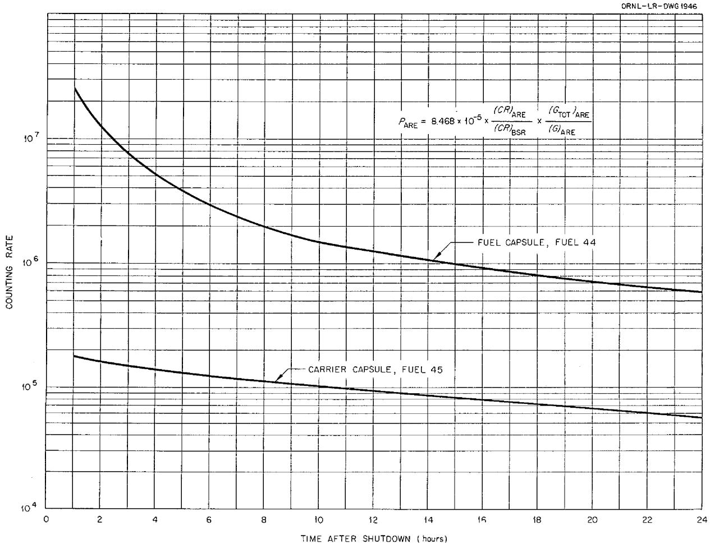  
Fig. D.5. Decay Curves for Fluoride Activated in the Bulk Shielding Reactor.

$0.47\%$ and for smaller flow rates, the corresponding reactivity may be found from Fig. D.2.

Starting with the reactor stabilized at 34 gpm and the flux servo on, the flow rate will gradually be reduced. The calibrated regulating rod should be inserted so as to indicate the same reactivity as shown in Fig. D.2. This will give experimental verification of the previously calculated inhour curves, Fig. D.6.

Preliminary Measurements of Temperature Coefficient. With the reactor held at 10 w by the flux servo, the helium flow will be turned on so as to drop the fuel temperature at a rate of $10^{\circ}\mathrm{F / min}$ . As the mean reactor temperature drops, the servo will insert the regulating rod so as to maintain constant flux, and from the rod calibration, the corresponding $\Delta k$ can be obtained. Before the rod has reached the limit of its travel, the helium

flow will be shut and the fuel allowed to return to its original temperature. From the recordings of rod position and mean temperature, a plot of $\Delta k$ vs mean temperature can be obtained. The initial slope of this curve will correspond to the fuel temperature coefficient. Because of the weak signal received by the flux servo, this measurement will be only approximate and is to be repeated at higher power.

Depending upon how the reactor responds, the procedure can be repeated by dropping the fuel temperature at rates of up to $25^{\circ}\mathrm{F / min}$ . Care will be taken not to drop the fuel temperature so low as to set off the low-temperature scram.

# APPROACH TO POWER

At the conclusion of the above experiments and before the fuel storage tank is removed from the

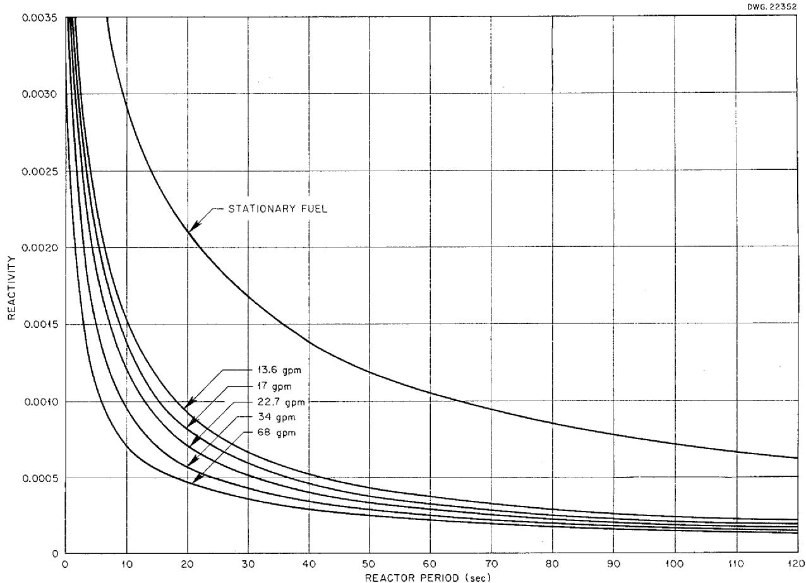  
Fig. D.6. Reactivity as a Function of Reactor Period for Several Fuel Flow Rates.

pits, sufficient fuel concentrate will be added to the system so that $4\%$ excess reactivity is available. This excess reactivity will be absorbed with the shim rods. The shim rods will have a rough calibration by this time, and it is expected that they will be worth about $12\%$ in excess reactivity. Therefore, they will need to be inserted about one-third of their length. After addition of the final amount of fuel concentrate the liquid level in the pump will be checked to ensure that at least $0.3 \mathrm{ft}^3$ of volume remains for expansion of the fuel. This expansion volume will allow the fuel to expand isothermally from 1300 to $1600^{\circ}\mathrm{F}$ , which is well above the high-temperature scram level. The final sample of fuel will be taken for chemical analysis.

The reactor will now be shut down so that the concrete block shields can be put over the pits and the pits flooded with helium. The fuel storage tank will first be removed and a final check on

all process equipment made. The $\mathsf{BF}_3$ counter will be removed and the temperature servo chamber installed. The regulating rod will be put on fast drive. A check list is being prepared of all items to be reviewed before the pits are sealed.

If the temperature coefficient is of sufficient magnitude to control the reactor, the flux servo will be left in. However, if the magnitude of the temperature coefficient is marginal, the flux servo will be removed at this time and the temperature servo connected.

After the pits have been sealed, the reactor will be brought to a power of 1 kw and allowed to stabilize. Up until this time all neutron ion chambers have been fully inserted. The ion chambers will be withdrawn slowly, one by one, while the power level is being constantly monitored with the fission chambers. The ion chambers will be set for a maximum reading of around 5 Mw.

The safety chambers will be set to scram at the same level.

The reactor is now ready for full power operation. The rod will be withdrawn and the reactor put on about a 50-sec period. Somewhere in the region from 10 to $100\mathrm{kw}$ a noticeable increase in reactor period and an increase in reactor temperatures should be observed. The helium flow will be started slowly and gradually increased until a nominal power of 100 to $200\mathrm{kw}$ is reached $(\Delta T$ from 25 to $50^{\circ}\mathrm{F})$

At this time, the reactor will be allowed to stabilize for about $\frac{1}{2}$ hr and all readings recorded. If the temperature coefficient is of insufficient magnitude to stabilize the reactor, as determined by previous measurements, the control of the reactor will be turned over to the temperature servo.

The power as determined from the heat extraction by the helium will now be measured. The heat capacity of the fuel is 0.23 Btu/lb.°F and the density of the fuel is represented by

$$
\rho (g / c m ^ {3}) = 4. 0 4 - 0. 0 0 1 1 T (^ {\circ} C).
$$

At a mean temperature of $1300^{\circ}\mathrm{F}$ , the average density is $3.27\mathrm{g/cm}^3$ . The power can be expressed as

$$
\rho (k w) = 0. 1 1 \times \Delta T (^ {\circ} F) \times f l o w (g p m).
$$

Therefore at 34 gpm the power extracted by the fuel is $3.74\mathrm{kw} / {}^{\circ}\mathrm{F}$

Having obtained a heat balance, the extraction of heat from the fuel in the heat exchanger will be increased until a power of about $500\mathrm{kw}$ $(\Delta T = 134^{\circ}\mathsf{F})$ is reached. Again the reactor will be allowed to stabilize and the extracted power measured. A third and final heat balance will be made at a power of about 1 Mw $(\Delta T = 268^{\circ}\mathsf{F})$ . This is close to the maximum power obtainable without changing the initial conditions of $1300^{\circ}\mathsf{F}$ mean reactor temperature and 34-gpm fuel flow.

During the preceding discussion, no mention has been made of heat extraction other than in the fuel circuit. An appreciable quantity of heat will be removed by the sodium in the reflector coolant circuit. Before the reactor goes to high power, the sodium inlet and outlet temperatures will be near the isothermal temperature of $1300^{\circ}\mathrm{F}$ . Since there is some gamma heating in the reflector region, it will be necessary to lower the inlet temperature of the sodium by extracting heat with the reflector coolant heat exchangers. The sodium flow rate will be held at 224 gpm and the sodium

mean temperature at $1300^{\circ}\mathrm{F}$ . Since the heat capacity of the sodium is 0.30 Btu/lb. ${}^{\circ}\mathrm{F}$ and its specific gravity is 0.78, the power extracted by the sodium will be $7.7\mathrm{kw / }^{\circ}\mathrm{F}$ . No more than $10\%$ of the power generated is expected to go into the sodium.

# EXPERIMENTS AT POWER

Measurement of the Temperature Coefficients. After the reactor power has been calibrated, the power will be reduced to about 500 kw and allowed to stabilize. The flux servo will be turned on, and by means of the helium demand the mean temperature will be dropped at an initial rate of $10^{\circ}\mathrm{F / min}$ . (If the temperature servo is connected, it will have to be replaced for this experiment.) As discussed previously the initial slope of the plot of $\Delta k$ vs mean temperature will represent the fuel temperature coefficient. Contrary to the procedure at low power, however, the helium flow will not be decreased after the temperature has dropped. The reactor will be allowed to stabilize, and, after about 30 min, the regulating rod will have leveled out at a new position, and the reactor will have assumed a new mean temperature. These readings will represent the over-all reactor temperature coefficient (fuel plus moderator). If, during the above experiment, the servo inserts the rod to its limit, it will be left at that position since the temperature should stabilize the reactor.

If the fuel temperature coefficient is quite small, the experiment can be repeated with an initial rate of temperature decrease of $25^{\circ}\mathrm{F / min}$ . Care will be taken that the reactor does not go on too fast a period and that the low-temperature scram limit is not exceeded.

Maximum Power Extraction. Except for specifically stated instances, the reactor has been operated continuously up to this time at a mean temperature of $1300^{\circ}\mathrm{F}$ and a fuel flow rate of 34 gpm. Under these conditions, the maximum obtainable power is 1.1 Mw. At this power, the reactor outlet temperature and the heat exchanger inlet temperature are both $1450^{\circ}\mathrm{F}$ . The heat exchanger outlet and the reactor inlet are both at $1150^{\circ}\mathrm{F}$ . It is to be noted that when the heat exchanger outlet temperature drops below $1150^{\circ}\mathrm{F}$ , an alarm is sounded.

The mean reactor temperature will be elevated from 1300 to $1325^{\circ}\mathrm{F}$ by a slight withdrawal of the shim rods. The mean temperature of both fuel and sodium will be held at this temperature. The helium blower speed will now be increased until

a $\Delta T$ of nearly $350^{\circ}\mathrm{F}$ appears across the reactor. With this $\Delta T$ , the reactor outlet and heat exchanger inlet are at the upper limit of $1500^{\circ}\mathrm{F}$ , and the heat exchanger outlet and reactor inlet are at the lower limit of $1150^{\circ}\mathrm{F}$ . The power from the fuel will be 1.3 Mw. At this time the pump speed can be increased from 34 gpm to about 40 gpm, caution being taken that the reactor inlet pressure does not exceed 50 psig. The maximum $\Delta T$ across the reactor will still be $350^{\circ}\mathrm{F}$ , and the power extracted in the fuel circuit will be 1.5 Mw. This is the maximum power at which the reactor can be operated.

Power Transients. With the reactor on manual control and the regulating rod at mid-position, the helium blower speed will be regulated until the power in the fuel system is 1 Mw, and the reactor will be allowed to stabilize. The helium flow will be suddenly increased to its maximum and the transient response of all temperature and nuclear recordings noted. The experiment can be repeated from successively decreasing initial powers of 500, 200, 100, 50, 20, and 10 kw. At some level below 100 kw, the power cannot be reduced further because the helium blowers will be completely shut off. When this lower limit of initial power has been reached, the series of experiments will be concluded. If at any time the reactor period gets too fast or the upper or lower temperature limits are approached, the experiments will be concluded.

Sudden Changes in Reactivity. The reactor will be brought to a power of 1 Mw and allowed to stabilize. From the previous calibration of the regulating rod, the rod will be placed at a position such that a complete withdrawal will give 10 cents of excess reactivity. The rod will suddenly be withdrawn and the transient response of the inlet pressure and all nuclear and temperature recorders noted. The experiment can be repeated with sudden changes of 25, 50, 75, and 100 cents of reactivity. If the fuel temperature coefficient has a value of approximately $-5 \times 10^{-5}$ , as expected, a sudden change in reactivity of 100 cents should be safe. However, if the experiments with smaller reactivity changes indicate that such a large step will be unsafe, this series of experiments will be concluded. Otherwise, the experiment will be repeated from initial powers of 100 kw, 10 kw, and successively lower power levels.

Reactor Startup Using the Temperature Coefficient. The reactor will be brought to 1 Mw of

power and the shims adjusted so that the regulating rod is completely withdrawn. The helium flow will be cut off and the reactor power allowed to drop to its normal power with no heat extraction (estimated to be between 10 and $100\mathrm{kw}$ ). The regulating rod will now be inserted by $0.1\%$ of reactivity and the reactor allowed to go subcritical for about 10 min. After this time, helium flow will gradually be increased. If the temperature coefficient is $-5\times 10^{-5}$ , a drop in the mean temperature of the reactor of $20^{\circ}F$ will bring the reactor critical again. As soon as a positive period is noted, the helium cooling flow will be held fixed and the reactor allowed to come up to power and level out of its own accord.

The experiment can be repeated by driving the reactor subcritical by 0.2, 0.3, and $0.4\%$ with the regulating rod. Care will be exercised not to approach the upper or lower temperature limits.

Effect of Xenon Buildup. The change in reactivity calculated from xenon buildup in the ARE is shown in Fig. D.7. The reactivity as plotted is nominal because of uncertainties in the xenon cross sections and is probably a maximum. The shape of the curves represents the change in reactivity if no xenon is lost by off-gassing. The reactor will be operated for 5 hr at full power, and then reduced to $10\%$ of full power. If no xenon is lost, the reactivity should change as shown in the lower curve of Fig. D.7. The reactor will then be operated for 25 hr at full power, and subsequently reduced to $10\%$ power. Again if no xenon is lost, the reactivity change should be as shown in the upper curve of Fig. D.7. If some xenon does off-gas, the shape of the curves will be changed, and by proper analysis, an estimate of the amount of off-gassing can be obtained.

At full power, the reactivity change will be calculated from the change in reactor mean temperature and the temperature coefficient. At $10\%$ power, the reactor will be put on flux servo and the movement of the regulating rod will measure the reactivity change. Since the moderator will contain considerable heat when the power is reduced, the mean reactor temperature will slowly decrease during about the first $\frac{1}{2}$ hr after the power is reduced to $10\%$ . This will cause an insertion of the regulating rod by the flux servo. Since the xenon buildup will cause a withdrawal of the regulating rod, a correction must be applied for the effect of the drop in moderator temperature.

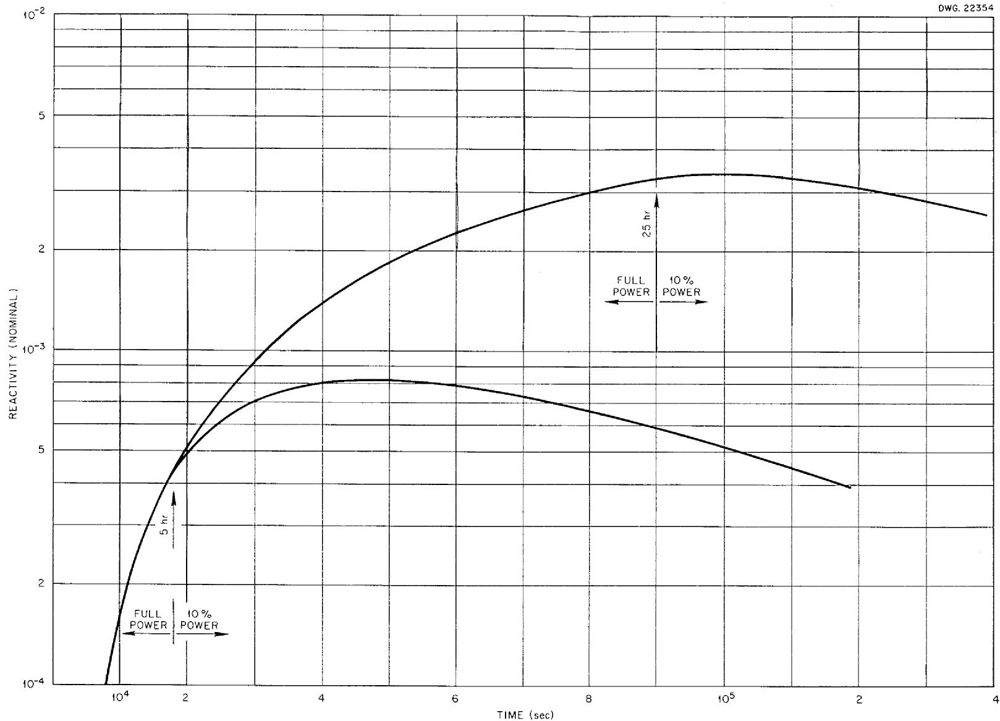  
Fig. D.7. Effect of Xenon Buildup.

To obtain this correction experimentally, a control experiment will be performed. The reactor will be operated at full power for $\frac{1}{2}$ to 1 hr and the moderator allowed to come up to temperature. During this short time, no appreciable xenon will

be formed. The reactor will then be reduced to $10\%$ power and the flux servo turned on. The reactivity change from the drop in moderator temperature will be observed and used as a correction for the xenon buildup experiments.

# Appendix E

# MATHEMATICAL ANALYSIS OF APPROACH TO CRITICALITY

W.E.Kinney

When the ARE was brought to critical by successive fuel additions, it was observed that the usual plot of [1 - (1/multiplication constant)] vs uranium concentration increased, at first, very rapidly, but, when the curve got close to 1, the rise was very slow. Qualitatively, such behavior is observed in many reactors, but the ARE exhibited the effect to an unusual degree. In order to explain this, the ORACLE three-group, three-region code was modified so that flux shapes at successive fuel additions could be calculated. Group constants were obtained by flux weighting with fluxes from an Eyewash calculation on the ARE.

Figure E.1 shows the space distribution of the thermal flux for no fuel and for runs 2 through 6.

The effect of the reflector as fission neutrons become more numerous can be seen. Figure E.2 compares experimental and calculated startup curves for the fission chambers which were located in the reflector as indicated in Fig. E.1. In the calculation,

$$
C R \sim \sigma_ {f _ {1}} \phi_ {1} + \sigma_ {f _ {2}} \phi_ {2} + \sigma_ {f _ {3}} \phi_ {3},
$$

where $CR$ is the counting rate of the fission chamber, $\sigma_{f_i}$ is the fission cross section for group $i$ , and $\phi_i$ is the group $i$ flux. For the ARE startup

$$
m = \frac {C R _ {j}}{C R _ {0}},
$$

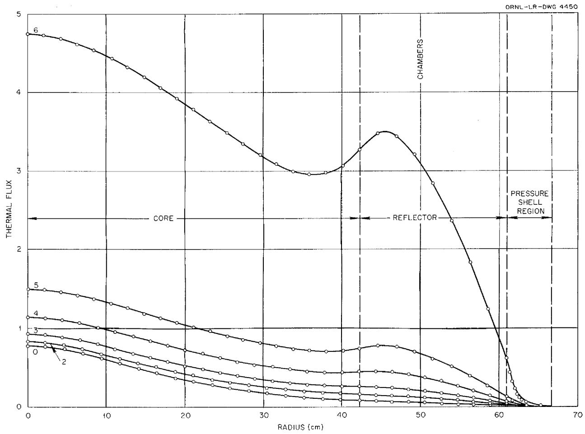  
Fig. E.1. Thermal Flux vs Radius.

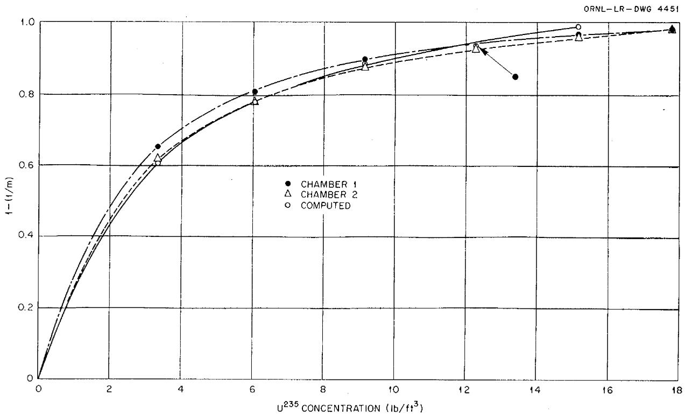  
Fig. E.2. $1 - (1 / m)$ vs $\mathsf{U}^{235}$ Concentration.

where $m$ is the multiplication constant, $CR_{j}$ is the counting rate on run $j$ , and $CR_{0}$ is the counting rate with no fuel. It seems, then, that the unexpected, rapid initial rise in the counting rate of the fission chamber and the $[1 - (1 / m)]$ curve is due not only to the general rise in flux level but

also to the formation of the thermal-flux maximum near the fission chambers. Once the shape of spatial distribution of the thermal-neutron flux is set up, the fission chambers register only the general increase in flux level and the count rate increases slowly.

# Appendix F

# COLD, CLEAN CRITICAL MASS

The value of the cold, clean critical mass is of interest in connection with any reactor, since it is the calculation of this elusive number that takes so much time during the design of the reactor and system. The cold, clean critical mass may be found by extrapolating the curve of uranium (lb of $U^{235}$ ) in the core vs $\Delta k / k$ (\%) in the rods to the point where there is no rod poisoning. On the other hand, if the mass equivalent of the rod poisoning is determined and deducted from that then in the core, another curve may be obtained. This curve gives corrected mass vs $\Delta k / k$ (\%) in the rod and may also be extrapolated to $0\% \Delta k / k$ in the rods. Both these curves, as shown in Fig. F.l, extrapolate to the same mass value at $0\% \Delta k / k$ in the rods, which indicates that the rod calibration was quite accurate and the data were reliable. The value of the cold, clean critical mass extrapolated from Fig. F.l was 32.75 lb of $U^{235}$ .

The data from which the curves in Fig. F.1 were plotted are tabulated in Table F.1. The data used to determine the cold, clean critical mass were those obtained during the rod calibration from fuel addition (Exp. L-2). This experiment and Exp. L-5, rod calibration from reactor period, then provided the information on the value of the regulating rod. The values of the shim rods were taken from Appendix J, "Calibration of the Shim Rods." The $\Delta k / k$ values in both regulating and shim rods were then converted to their mass equivalents by using the $(\Delta k / k) / (\Delta M / M)$ ratio of 0.236, as determined experimentally. Three points listed in the table and shown in the figure were derived by using the first regulating rod, which was subsequently replaced because it was too "light." The calibra

tion for that rod was not accurate, and, hence, the three points were disregarded in extrapolating the curves.

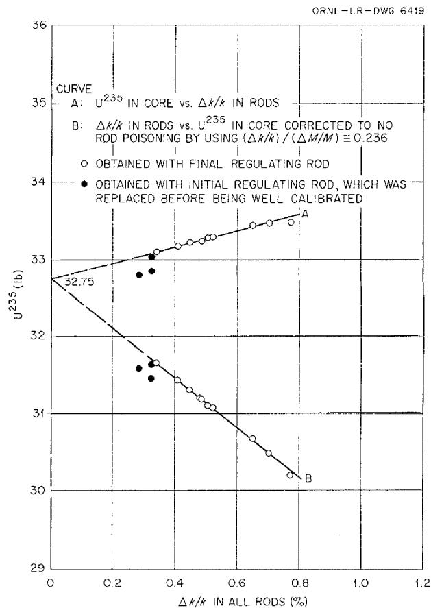  
Fig. F.1. Extrapolation to Cold, Clean Critical Mass.

(Exp. L-2)

TABLE F.1. CRITICAL URANIUM CONCENTRATIONS FOR VARIOUS ROD INSERTIONS   

<table><tr><td rowspan="2">Run No.</td><td rowspan="2">Regulating Rod Insertion (in.)</td><td colspan="3">Shim Rod Insertion (in.)</td><td rowspan="2">Δk/k of Regulating Rod (%)</td><td colspan="3">Δk/k of Shim Rods (%)</td><td rowspan="2">U235 Concentration (lb/ft3)</td><td rowspan="2">U235 in Core (lb)</td><td rowspan="2">Total Δk/k in Rods (%)</td><td rowspan="2">Total ΔM/M in Rods</td><td rowspan="2">U235 in Clean Core (lb)</td></tr><tr><td>No. 1</td><td>No. 2</td><td>No. 3</td><td>No. 1</td><td>No. 2</td><td>No. 3</td></tr><tr><td>0</td><td>0.92</td><td>3.3</td><td>1.7</td><td>0</td><td>0.016</td><td>0.19</td><td>0.08</td><td>0</td><td>23.94</td><td>32.80</td><td>0.286</td><td>1.212</td><td>31.59</td></tr><tr><td>1</td><td>3.35</td><td>3.3</td><td>1.7</td><td>0</td><td>0.058</td><td>0.19</td><td>0.08</td><td>0</td><td>23.98</td><td>32.85</td><td>0.328</td><td>1.390</td><td>31.46</td></tr><tr><td>2</td><td>0.93</td><td>3.3</td><td>2.5</td><td>0</td><td>0.016</td><td>0.19</td><td>0.13</td><td>0</td><td>24.12</td><td>33.04</td><td>0.326</td><td>1.381</td><td>31.66</td></tr><tr><td>3</td><td>4.25</td><td>0</td><td>0</td><td>3.5</td><td>0.140</td><td>0</td><td>0</td><td>0.20</td><td>24.17</td><td>33.11</td><td>0.340</td><td>1.441</td><td>31.67</td></tr><tr><td>4</td><td>6.35</td><td>0</td><td>0</td><td>3.5</td><td>0.210</td><td>0</td><td>0</td><td>0.20</td><td>24.22</td><td>33.18</td><td>0.410</td><td>1.737</td><td>31.44</td></tr><tr><td>5</td><td>7.5</td><td>0</td><td>0</td><td>3.5</td><td>0.248</td><td>0</td><td>0</td><td>0.20</td><td>24.25</td><td>33.22</td><td>0.448</td><td>1.898</td><td>31.32</td></tr><tr><td>6</td><td>8.5</td><td>0</td><td>0</td><td>3.5</td><td>0.281</td><td>0</td><td>0</td><td>0.20</td><td>24.27</td><td>33.25</td><td>0.481</td><td>2.038</td><td>31.21</td></tr><tr><td>Level Trimmed</td><td>7.4</td><td>2.2</td><td>2.5</td><td>0</td><td>0.244</td><td>0.11</td><td>0.13</td><td>0</td><td>24.27</td><td>33.25</td><td>0.484</td><td>2.051</td><td>31.20</td></tr><tr><td>7</td><td>8.0</td><td>2.2</td><td>2.5</td><td>0</td><td>0.264</td><td>0.11</td><td>0.13</td><td>0</td><td>24.29</td><td>33.28</td><td>0.504</td><td>2.135</td><td>31.14</td></tr><tr><td>8</td><td>8.52</td><td>2.2</td><td>2.5</td><td>0</td><td>0.281</td><td>0.11</td><td>0.13</td><td>0</td><td>24.31</td><td>33.30</td><td>0.521</td><td>2.207</td><td>31.09</td></tr><tr><td>9</td><td>10.92</td><td>2.7</td><td>2.8</td><td>0</td><td>0.360</td><td>0.14</td><td>0.15</td><td>0</td><td>24.41</td><td>33.44</td><td>0.650</td><td>2.754</td><td>30.69</td></tr><tr><td>10</td><td>1.25</td><td>5</td><td>5</td><td>0</td><td>0.041</td><td>0.33</td><td>0.33</td><td>0</td><td>24.43</td><td>33.47</td><td>0.701</td><td>2.970</td><td>30.50</td></tr><tr><td>11</td><td>11.56</td><td>4</td><td>3</td><td>0</td><td>0.382</td><td>0.23</td><td>0.16</td><td>0</td><td>24.44</td><td>33.48</td><td>0.772</td><td>3.271</td><td>30.21</td></tr></table>

# Appendix G FLUX AND POWER DISTRIBUTIONS

A. D. Callihan

D. Scott

There were, of course, no measurements of the flux or power distribution in the reactor during the actual experiment. These distributions were measured, however, on a zero power, critical mock-up of the experimental reactor over a year earlier. A detailed description of the critical mockup, including the reactor parameters obtained therefrom, may be found in ORNL-1634. The neutron flux distributions obtained from indium and cadmium-covered indium foil measurements, the fission neutron flux distributions obtained by the catcher

foil method, and the power distributions obtained from aluminum catcher foils, which are of particular interest, are presented here.

# NEUTRON FLUX DISTRIBUTIONS

The neutron flux distributions were measured with indium and cadmium-covered indium foils in a number of runs in which a remotely placed uranium disk and an aluminum catcher foil were used to normalize the power from run to run. The results of the bare indium and cadmium-covered indium traverses made at a point 12.06 in. from the center of the reactor are shown in Fig. G.1. The zero of the abscissa is the bottom of the beryllium oxide

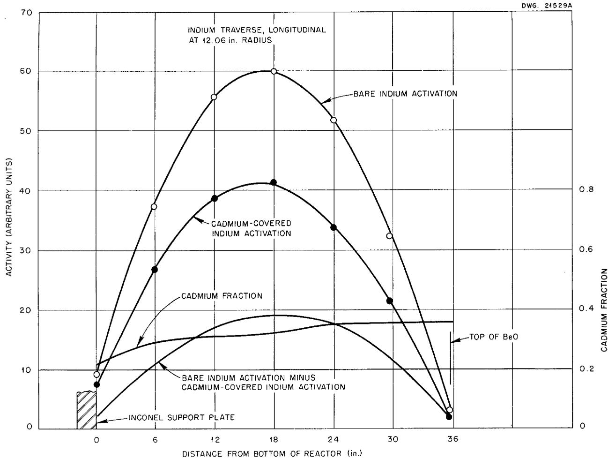  
Fig. G.1. Longitudinal Neutron Flux Distribution.

column where it rests on the l-in.-thick Inconel support plate. The scattering by the Inconel probably accounted for the reduction of the cadmium fraction at this point.

The radial flux traverse at the mid-plane of the reactor with the regulating rod inserted is given in Fig. G.2. The dashed lines on the figure are activities extrapolated from the data obtained in the fine-structure measurements made near the 11-in. position. The wide gap in this traverse was unexplored because of the importance which was attached to the study of a unit core cell in the time available. This emphasis has been at least partially contradicted by the fission flux traverse described in the following section. The strong effect of the center regulating rod assembly is indicated in these curves. The comparatively small flux and cadmium fraction depressions at

the center of the regulating rod accentuated the relative inefficiency of this type of rod and guide tube arrangement for reactor control. In another measurement of the radial flux, this time with the regulating rod withdrawn, the traverses were very similar to that shown in Fig. G.2, but the neutron flux was slightly greater ( $\sim 8\%$ ).

# FISSION-NEUTRON FLUX DISTRIBUTION

A measure of the distribution of neutrons that caused fissions was obtained by using the catcherfoil method in which the aluminum foil, together with some uranium, was both bare and cadmium covered. A radial traverse taken at the mid-plane of the reactor is shown in Fig. G.3. The flux of low-energy neutrons produced fission peaks near the reflector and was depressed by the Inconel tube (regulating rod sleeve) at the center. The

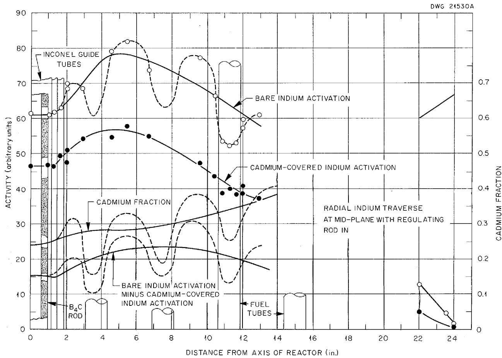  
Fig. G.2. Radial Neutron Flux Distribution.

cadmium fraction followed roughly the same pattern. Similar half-length longitudinal traverses are shown in Fig. G.4 for a position 10.09 in. from the center.

# POWER DISTRIBUTION

Three longitudinal power distributions in this reactor assembly were measured by using aluminum catcher foils placed against the end surfaces of the short, cast, fuel slugs contained in an Inconel tube. The size of these foils was such that the counting rate from each was higher than necessary for the desired statistics. In the arbitrary units reported, an activity of 50 represents approximately $10^{5}$ counts. Had time permitted, it would have

been desirable to repeat the experiment with smaller foils to improve the resolution, particularly since the results were very sensitive to foil location because of fuel self-shielding. Each catcher foil was nominally located centrally on the axis of a fuel slug. One traverse extended from below the Inconel support plate to above the top of the beryllium oxide; the other two covered the upper half of the core. The data obtained in the fuel tubes at the indicated radii are shown in Fig. G.5. The data of Fig. G.5 are replotted in Fig. G.6 to show the radial power distribution at several elevations in the reactor, all normalized at the center. It is to be noted that the 37.86-in.elevation traverse is 2 in. above the top of the beryllium oxide column.

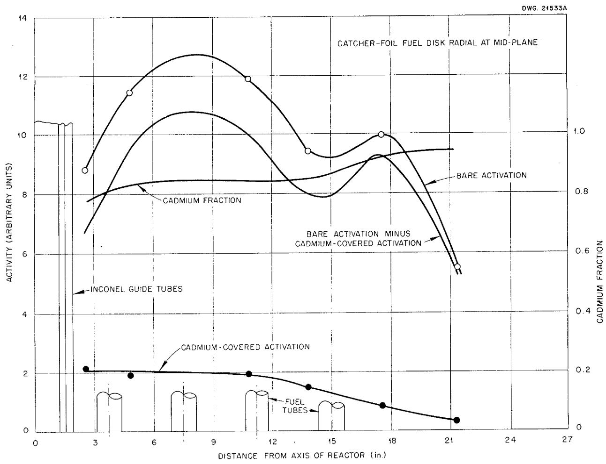  
Fig. G.3. Radial Fission Neutron Flux Distribution.

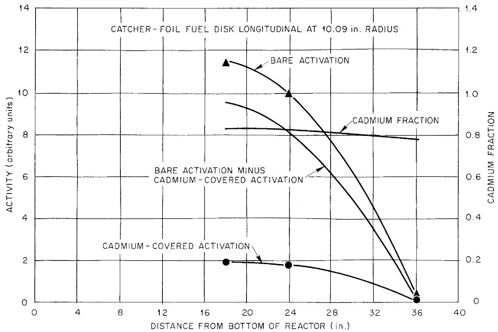  
Fig. G.4. Longitudinal Fission Neutron Flux Distribution.

DWG 21534A

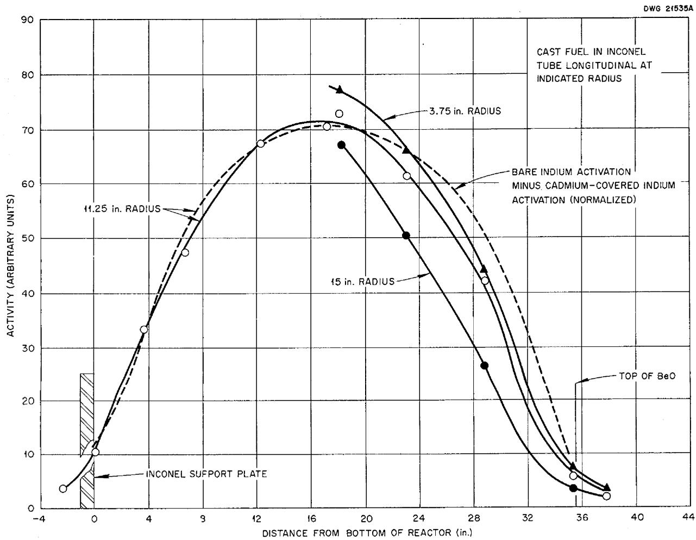  
Fig. G.5. Longitudinal Power Traverses.

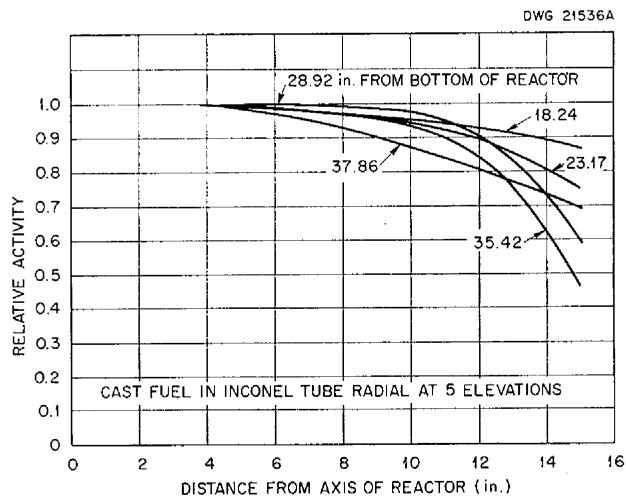  
Fig. G.6. Radial Power Traverses.

# Appendix H

# POWER DETERMINATION FROM FUEL ACTIVATION

E. B. Johnson

Perhaps the most basic value obtained from the operation of the ARE was the power level at which it operated. This quantity was determined both from activation of the fuel and from a heat balance. The determination of reactor power from activation of the fuel was based on the measurement of the relative activity of samples of the fuel exposed in the ARE and that exposed in a known flux in the Bulk Shielding Reactor (BSR).

The activity of the aggregate of fission products is not easy to predict because of the large number of isotopes for which calculations would be required. For identical conditions of exposure and decay, that is, for identical flux, exposure time, and waiting period after exposure, the specific activity should be the same, however. Furthermore, at low fluxes the activity should be proportional to the flux.

The ARE was operated at a nominal power level of approximately 1 w for 1 hr, was then shut down, and a sample of the irradiated fuel was withdrawn for counting and analysis. Since the activity in this fuel sample was too low to measure accurately, the test was repeated at an estimated power of 10 w. The ARE experimental program then proceeded as scheduled. Decay curves were obtained from the fuel samples from the ARE and were then compared with the decay curve of a similar fuel sample irradiated in the BSR in a known neutron flux of about the same magnitude. From the relative activity of the samples, a determination of the power of the ARE was made.

# THEORY

It has been shown² that the power (in watts) produced in an enriched-fuel thermal reactor is

$$
P = 4. 2 6 4 \times 1 0 ^ {- 1 1} \times n v _ {t b} \times G
$$

where $G$ is the number of grams of $\mathsf{U}^{235}$ in the volume over which the average thermal-neutron flux is $n\nu_{tb'}$ and the constant, $4.264\times 10^{-11}$ , contains

the fission cross section, energy release per fission, and the necessary conversion factors. Obviously, if the thermal-neutron flux and the amount of fuel present are known, it is quite simple to obtain the power. The problem was to obtain the power without measuring the flux in the ARE.

The quantity $P / G$ obtained from the measurement in the BSR will be called $(P / G)_{\text{BSR}}$ . The decay curve for the two fuel samples irradiated in the BSR is shown in Fig. D.5 of Appendix D. The power production in a given sample is proportional to both the counting rate and the amount of fissionable material in the sample. Thus,

$$
\frac {(P / G) _ {\text {A R E}}}{(P / G) _ {\text {B S R}}} = \frac {(C R / G) _ {\text {A R E}}}{(C R / G) _ {\text {B S R}}}
$$

where

$$
C R = \text {c o u n t i n g r a t e} t \text {a f t i m e}
$$

$$
G = \text {w e i g h t}
$$

This equation can be rewritten as

$$
(P / G) _ {\text {A R E}} = (P / G) _ {\text {B S R}} \times \frac {C R _ {\text {A R E}}}{C R _ {\text {B S R}}} \times \frac {G _ {\text {B S R}}}{G _ {\text {A R E}}}
$$

The total power of the ARE is then the product of the power per gram (in the sample) and the total amount of uranium in the fuel circuit $(G_{\mathrm{tot}})$ or

$$
\begin{array}{l} P _ {\text {A R E}} = (P / G) _ {\text {A R E}} \times (G _ {\text {t o t}}) _ {\text {A R E}} \\ = (P / G) _ {B S R} \times \frac {C R _ {A R E}}{C R _ {B S R}} \\ \times \frac {G _ {\text {B S R}}}{G _ {\text {A R E}}} \times \left(G _ {\text {t o t}}\right) _ {\text {A R E}}. \\ \end{array}
$$

The unperturbed thermal-neutron flux in which the samples were exposed in the BSR was $1.895 \times 10^{7}$ neutrons/cm $^2$ ·sec. However, the self-depression of the flux by the uranium sample was 0.80. Therefore $(P / G)_{\text{BSR}}$ becomes

$$
\begin{array}{l} (P / G) _ {B S R} = 4. 2 6 4 \times 1 0 ^ {- 1 1} \times 1. 8 9 5 \times 1 0 ^ {7} \times 0. 8 0 \\ = 6. 4 6 4 \times 1 0 ^ {- 4} \mathrm {w / g}. \\ \end{array}
$$

Each of the fuel samples irradiated in the BSR contained 0.131 g of $U^{235}$ . Thus

$$
\begin{array}{l} P _ {\text {A R E}} = 6. 4 6 4 \times 1 0 ^ {- 4} \mathrm {w / g} \times \frac {C R _ {\text {A R E}}}{C R _ {\text {B S R}}} \\ \times \frac {0 . 1 3 1}{G _ {\text {A R E}}} \times \left(G _ {\text {t o t}}\right) _ {\text {A R E}} \\ = 8. 4 6 8 \times 1 0 ^ {- 5} \times \frac {C R _ {\mathrm {A R E}}}{C R _ {\mathrm {B S R}}} \\ \times \frac {\left(G _ {\text {t o t}}\right) _ {\text {A R E}}}{G _ {\text {A R E}}} \\ \end{array}
$$

This equation was then used to determine the power of the ARE as indicated by fuel activation during the previously mentioned operation of 1 hr

at 1- and 10-w nominal power. The instruments which recorded the neutron level (log $N$ , etc.) were then calibrated in terms of reactor power.

# EXPERIMENTAL PROCEDURE

The BSR is immersed in a pool of water which serves as moderator, coolant, reflector, and shield. Therefore, any material which is to be activated in the BSR must be placed in a watertight container before immersion in the pool. Capsules to contain the ARE fuel were made of 2S aluminum with screw-type caps and were sealed with a rubber gasket. Each capsule contained approximately 1 g of material; one of the capsules is shown in Fig. H.1.

Since it was desirable to irradiate the capsules in the reactor core, the reactor was loaded with a partial element, containing only half the usual number of plates, in the interior of the lattice, as

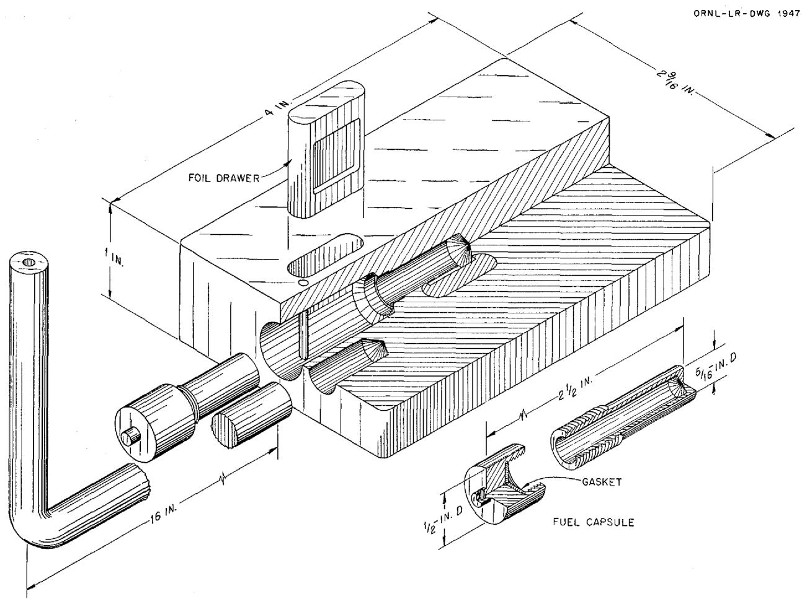  
Fig. H.1. Apparatus for Fuel Exposure in the Bulk Shielding Reactor.

shown in Fig. H.2. A lucite holder was designed which would fit inside this partial element and support the capsule to be irradiated at approximately the vertical centerline of the element. Small gold foils for measuring the thermal-neutron flux were mounted in "drawers" adjacent to the capsule, as shown in Fig. H.1. A monitoring foil was placed on the bottom of the lucite block.

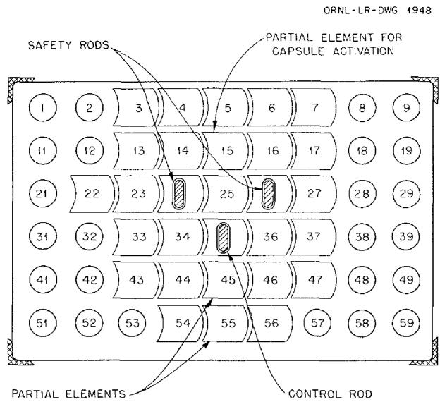  
Fig. H.2. Bulk Shielding Reactor Loading (No. 27).

Two samples of each of two ARE-type fuels of different composition were irradiated. One (No. 44) contained 53.5-40.0-6.5 mole % of NaF-ZrF $_4$ -UF $_4$ and was the anticipated fuel of the ARE. The other was No. 45, which was the carrier to which the uranium-containing fuel concentrate was added during the critical and low-power experiments; it contained 50-50 mole % of NaF-ZrF $_4$ .

It was necessary in the BSR to expose the samples in the aluminum capsules; at the ARE the fuel was, of course, first activated and then poured into the capsules. Therefore it was necessary to determine the contribution of the aluminum capsule

to the activity observed. Two empty capsules were exposed (in separate runs) for 1 hr at a nominal power level of 1 w. At the same time, gold foils were exposed in the positions adjacent to the capsule to determine the thermal flux. Similarly, two carrier-filled capsules and two fuel-filled capsules were irradiated, each separately but each for 1 hr at 1 w. The capsules each contained 1 g of material.

The decay curves taken on each capsule were made with two counters because of the difference in disintegration rates between the empty and the fluoride-filled capsules. A scintillation counter was used to obtain the curves for the empty capsules and for the carrier-filled capsules, and the high-pressure ion chamber was used to measure the activity in the fuel-filled capsules. The data for the carrier-filled capsules were converted, on the assumption that all the activity was attributable to sodium, to equivalent counting rates in the high-pressure ion chamber. The assumption that the activity was due to sodium was apparently valid, since the decay curve indicated a half-life of about 15 hr at approximately 6 hr after shutdown.

It was found from the decay curves that the aluminum activity was a factor of approximately 10 less than that of the carrier-filled capsules 3 hr after shutdown and a factor of 450 less than that of the fuel-filled capsules at the corresponding time, and was therefore negligible. The activity in the carrier-filled capsule was about $4\%$ of that in the fuel-filled capsule 6 hr after shutdown. There was essentially no difference between the two different fuel-filled capsules and the two different carrier-filled capsules. For this reason, only one curve is shown for each in Fig. D.5.

The nuclear power of the Aircraft Reactor Experiment was then set on the basis of the activation in fuel samples irradiated for 1 hr at 10 w. This power calibration was the basis of all power levels indicated in the nuclear log up to the last day of the experiment, by which time it had become obvious from the various heat balances that the actual reactor power was considerably higher (app. L). A comparison of the two methods of power calibration is given in Appendix N.

# Appendix I

# INHOUR FORMULA FOR A CIRCULATING-FUEL REACTOR WITH SLUG FLOW

W. K. Ergen

As pointed out in a previous paper, the circulating-fuel reactor differs in its dynamic behavior from a reactor with stationary fuel, because fuel circulation sweeps some of the delayed-neutron precursors out of the reacting zone, and some delayed neutrons are given off in locations where they do not contribute to the chain reactions. One of the consequences of these circumstances is the fact that the inhour formula usually derived for stationary-fuel reactors, requires some modification before it becomes applicable to the circulating-fuel reactor. The inhour formula gives the relation between an excess multiplication factor, introduced into the reactor, and the time constant $T$ of the resulting rise in reactor power. If the inhour formula is known, then the easily measured time constant can be used to determine the excess multiplication factor, a procedure frequently used in the quantitative evaluation of the various arrangements causing excess reactivity. Furthermore, the proper design of control rods and their drive mechanisms depends on the inhour formula.

Frequently, the experiments evaluating small excess multiplication factors are carried out at low reactor power, and the reactor power will then not cause an increase in the reactor temperature. This case will be considered here. In this case, the time dependence of the reactor power $P$ can be described by the following equation:4

(1) $dP / dt$

$$
= (1 / \tau) \left[ \left(k _ {\text {e x}} - \beta\right) P + \beta \int_ {0} ^ {\infty} D (s) P (t - s) d s \right].
$$

$\tau$ is the average lifetime of the prompt neutrons and $k_{\mathrm{ex}}$ the excess multiplication factor (or excess reactivity). The meaning of $\beta$ and $D(s)$ for a

circulating-fuel reactor has been discussed in some detail in ref. 2. We approximate in the following the actual arrangement by a reactor for which the power distribution and the importance of a neutron are constant and for which all fuel elements have the same transit time $\theta_{1} - \theta$ through the outside loop. In this approximation, $\beta D(s)$ is simply the probability that a fission neutron, caused by a power burst at time zero, is a delayed neutron, given off inside the reactor at a time between $s$ and $s + ds$ . $D(s)$ is normalized so that

(2) $\int_0^\infty D(s)ds = 1.$

If the fuel is stationary, $\beta D(s)$ is the familiar curve obtained by the superposition of 5 exponentials:

(3) $\beta D(s) = \sum_{i=1}^{5} \beta_i \lambda_i e^{-\lambda_i s}$ .

The $\lambda_{i}$ are the decay constants of the 5 groups of delayed neutrons, and the $\beta_{i}$ are the probabilities that a given fission neutron is a delayed neutron of the $i$ th group.

For the circulating-fuel reactor we first consider the fuel which was present in the reactor at time zero. At any time $s$ , only a fraction of this fuel will be found in the reactor. This fraction is denoted by $F(s)$ , and by multiplying the right side of (3) by $F(s)$ , we obtain the function $\beta D(s)$ for the circulating-fuel reactor.

Since $\theta_{1}$ is the total time required by the fuel to pass through a complete cycle, consisting of the reactor and the outside loop, it is clear that

at $s = n\theta_{1}$

$$
(n = 0, 1, 2 \dots), F (s) i s e q u a l t o 1;
$$

$$
\begin{array}{l} a t s = n \theta_ {1} + \theta \\ (n = 0, 1, 2 \dots), F (s) i s e q u a l t o z e r o. \\ \end{array}
$$

(We assume $\theta_{1} \geq 20$ so that the fuel under consideration has not started to re-enter the reactor when the last of its elements leaves the reacting zone.) Between $s = n\theta_{1}$ and $s = n\theta_{1} + \theta, F(s)$ decreases linearly, and hence has the value $(n\theta_{1} + \theta - s) / \theta$ . At $s = n\theta_{1} - \theta (n = 1, 2, 3 \ldots)$ ,

$F(s)$ is zero, but since the fuel under consideration re-enters the reactor between this moment and $s = n\theta_{1}$ , $F(s)$ increases linearly: $F(s) = (s - n\theta_{1} + \theta) / \theta$ . For $\beta D(s)$ we thus obtain:

$$
\beta D (s) = \frac {n \theta_ {1} + \theta - s}{\theta} \sum_ {i = 1} ^ {5} \beta_ {i} \lambda_ {i} e ^ {- \lambda_ {i} s} \quad \text {f o r} n \theta_ {1} \leq s \leq n \theta_ {1} + \theta , n = 0, 1, 2, \dots ,
$$

$$
\beta D (s) = \frac {s - n \theta_ {1} + \theta}{\theta} \sum_ {i = 1} ^ {5} \beta_ {i} \lambda_ {i} e ^ {- \lambda_ {i} s} \quad \text {f o r} n \theta_ {1} - \theta \leq s \leq n \theta_ {1}, n = 1, 2, 3, \dots , \tag {4}
$$

$$
\beta D (s) = 0 \quad \text {f o r} n \theta_ {1} + \theta \leq s \leq (n + 1) \theta_ {1} - \theta , n = 0, 1, 2, \dots .
$$

Equation (4) is now substituted into Eq. (1), and for $P$ we set $P = P_0 e^{t / T}$ . Then

$$
\begin{array}{l} \frac {\tau}{T} P _ {0} e ^ {t / T} = \left(k _ {\bullet x} - \beta\right) P _ {0} e ^ {t / T} + \sum_ {i = 1} ^ {5} \beta_ {i} \lambda_ {i} \left[ \sum_ {n = 0} ^ {\infty} \int_ {n \theta_ {1}} ^ {n \theta_ {1} + \theta} \frac {n \theta_ {1} + \theta - s}{\theta} e ^ {- \lambda_ {i} s} P _ {0} e ^ {(t - s) / T} d s \right. \\ + \sum_ {n = 1} ^ {\infty} \int_ {n \theta_ {1} - \theta} ^ {n \theta_ {1}} \frac {s - n \theta_ {1} + \theta}{\theta} e ^ {- \lambda_ {i} s} P _ {0} e ^ {(t - s) / T} d s \Bigg ] . \\ \end{array}
$$

The common factor $P_0 e^{t / T}$ cancels out. The substitution $\sigma = n\theta_1 + \theta - s$ transforms

$$
\int_ {n \theta_ {1}} ^ {n \theta_ {1} + \theta} (n \theta_ {1} + \theta - s) \exp \{- [ \lambda_ {i} + (1 / T) ] s \} d s
$$

into

$$
\exp \{- n \theta_ {1} [ \lambda_ {i} + (1 / T) ] \} \exp \{- \theta [ \lambda_ {i} + (1 / T) ] \} \int_ {0} ^ {\theta} \sigma \exp \{[ \lambda_ {i} + (1 / T) ] \sigma \} d \sigma ,
$$

and the substitution $\sigma = s - n\theta_{1} + \theta$ transforms

$$
\int_ {n \theta_ {1} - \theta} ^ {n \theta_ {1}} (s - n \theta_ {1} + \theta) \exp \{- [ \lambda_ {i} + (1 / T) ] s \} d s
$$

into

$$
\exp \{- n \theta_ {1} [ \lambda_ {i} + (1 / T) ] \} \exp \{\theta [ \lambda_ {i} + (1 / T) ] \} \int_ {0} ^ {\theta} \sigma \exp \{- [ \lambda_ {i} + (1 / T) ] o \} d \sigma .
$$

The geometric series $\exp \left\{-n[\lambda_i + (1 / T)]\theta_1\right\}$ can now be summed, and the integrals over $\sigma$ evaluated by elementary methods. After performing all these operations, one obtains the following inhour formula:

$$
\begin{array}{l} k _ {\bullet x} = \frac {\tau}{T} + \beta - \frac {1}{\theta} \sum_ {i = 1} ^ {5} \beta_ {i} \lambda_ {i} \frac {\mu_ {i} \theta - 1 + e ^ {- \mu_ {i} \theta} - e ^ {- \mu_ {i} \theta_ {1}} (\mu_ {i} \theta + 1) + e ^ {- \mu_ {i} (\theta_ {1} - \theta)}}{\mu_ {i} ^ {2} [ 1 - e ^ {- \mu_ {i} \theta_ {1}} ]}, (5) \\ \mu_ {i} = \lambda_ {i} + (1 / T). (6) \\ \end{array}
$$

$\beta$ is obtained by integrating Eq. (3) from 0 to $\infty$ . Expressions are obtained which are of the same type as the ones just discussed, and which can be evaluated by the same methods. The result is

$$
\beta = \sum_ {i = 1} ^ {5} \beta_ {i} \frac {\lambda_ {i} \theta - 1 + e ^ {- \lambda_ {i} \theta} - e ^ {- \lambda_ {i} \theta_ {1}} \left(\lambda_ {i} \theta + 1\right) + e ^ {- \lambda_ {i} (\theta_ {1} - \theta)}}{\theta \lambda_ {i} (1 - e ^ {- \lambda_ {i} \theta_ {1}})} \cdot \tag {7}
$$

In spite of the formidable appearance of Eqs. (5), (6), and (7), it is easy to find, for any given $\theta$ and $\theta_{1}$ , the value of $k_{\text{ex}}$ which produces a given time constant $T$ .

Furthermore, the following reasoning describes the general features of the equations. Consider first the dependence of $k_{\text{ex}}$ on $T$ . If $T = \infty$ , $\mu_i = \lambda_{i'}$ and the sum on the right of (5) is equal to $\beta$ , $k_{\text{ex}}$ is equal to zero. This corresponds to the state in which the reactor is just critical. If $T$ becomes very small, the $\mu_i$ become very large and in the fraction on the right of (5) the numerator is dominated by $\mu_i \theta$ and the bracket in the denominator by 1. Hence the fraction tends to zero like $\theta / \mu_i$ , as $T$ goes to zero. If $\tau$ is very small, as it is in practice, $T$ will be small as soon as $k_{\text{ex}}$ exceeds $\beta$ by a small amount. Then the complicated sum on the right of (5) is of little importance, and $T$ is determined by $\tau / T = k_{\text{ex}} - \beta$ , that is, the reactor period is inversely proportional to the excess of the reactivity over the reactivity corresponding to the "prompt critical" condition.

In the stationary-fuel reactor, the $k_{\mathbf{ex}}$ which makes the reactor prompt critical is given by $\pmb{\Sigma}\beta_{i}$ . With circulating fuel, the reactor is prompt critical if $k_{\mathbf{ex}} = \beta_{i}$ which is less than $\pmb{\Sigma}\beta_{i}$ , that is, it takes less excess reactivity to make the circulating-fuel reactor prompt critical than to do the same thing to a stationary-fuel reactor. This is physically evident because the fuel circulation renders some of the delayed neutrons ineffective. That $\beta$ is less than $\pmb{\Sigma}\beta_{i}$ can also be verified mathematically.

For $T$ intermediate between very small positive values and $+\infty$ , we consider again the analogy to the stationary-fuel reactor. Here the inhour formula reads:5

$$
k _ {e x} = \frac {\tau}{T} + \sum_ {i = 1} ^ {5} \frac {\beta_ {i}}{1 + \lambda_ {i} T}. \tag {8}
$$

For every positive $k_{\text{ex}}$ there is one, and only one, positive time constant $T$ , and vice versa. This is a consequence of the fact that $k_{\text{ex}}$ is a monotonic decreasing function of $T$ , for if this monotony did not exist, there could be several positive $T$ values corresponding to a given value of $k_{\text{ex}}$ , or vice versa. In the circulating-fuel reactor the situation is qualitatively the same; the fractions under the

sum in Eq. (5) are essentially of the form

$$
\begin{array}{l} x - 1 + e ^ {- x} - e ^ {- a x} (x + 1) + e ^ {- (a - 1) x} \\ x ^ {2} [ 1 - e ^ {- a x} ] \\ (x = \mu_ {i} \theta_ {1}, a = \theta_ {1} / \theta), \\ \end{array}
$$

and an expression of this form can be shown to be a monotonic decreasing function of positive $x$ ; the expression is thus a monotonic increasing function of $T$ [see Eq. (6)], and as $T$ increases $k_{\text{ex}}$ decreases monotonically, according to Eq. (5); for every positive $k_{\text{ex}}$ there is one, and only one, positive $T$ , and vice versa. This, of course, does not preclude that there exists for a given $k_{\text{ex}}$ several negative $T$ values, in addition to the one positive value. Negative $T$ correspond, however, to decaying exponentials, which are of no importance if the rise in power is observed for a sufficiently long time.

Consider now the behavior of Eq. (5) with variation of $\theta$ , the transit time of the fuel through the reactor, and of $\theta_{1}$ , the transit time of the fuel through the whole loop. If $\theta$ (and hence also $\theta_{1}$ ) is very large compared to all $1 / \lambda_{i}$ and $1 / \mu_{i}$ , Eq. (5) reduces to Eq. (8), the inhour formula for the stationary-fuel reactor. The circulation is so slow that the reactor behaves as if the fuel were stationary, inasmuch as all delayed neutrons, even the ones with the long-lived precursors, are given off inside the reacting zone, before much fuel reaches the outside. On the other hand, if $\theta_{1}$ and, hence, also $\theta$ , is small compared to all $1 / \lambda_{i}$ , that is, if the transit time of the fuel through the complete loop is small compared to the mean life of even the short-lived delayed-neutron precursors, then for $T >> \theta$

$$
k _ {\bullet \times} = \frac {\tau}{T} + \frac {\theta}{\theta_ {1}} \sum_ {i = 1} ^ {5} \frac {\beta_ {i}}{1 + \lambda_ {i} T}. \tag {9}
$$

This is the same as the inhour formula for the stationary-fuel reactor, except that all the fission yields $\beta_{i}$ are decreased by the factor $\theta / \theta_{1}$ . This is physically easy to understand, since $\theta / \theta_{1}$ is just the probability that a given delayed neutron is born inside the reactor.

Of interest is the intermediate case, in which $\theta$

is smaller than the mean life of the long-lived delayed-neutron precursors and larger than the mean life of the short-lived precursors. In that case, the long-delayed neutrons act approximately according to Eq. (9) and are reduced by the factor $\theta / \theta_{1}$ . On the other hand, the neutrons with the short-lived precursors behave approximately like Eq. (8) and are not appreciably reduced. Hence, a small excess reactivity enables the reactor to

increase its power without "waiting" for the not very abundant long-delayed neutrons. The reactor goes to fairly short time constants with surprisingly small excess reactivities. However, to make the reactor prompt critical, that is, to enable it to exponentiate without even the little-delayed neutrons, takes a substantial excess reactivity because of the almost undiminished amount of the latter neutrons.

# Appendix J

# CALIBRATION OF THE SHIM RODS

Three essentially independent methods were used to find the value of the shim rods in terms of reactivity. The first method involved an analysis of the counting rate data taken during the critical experiment, and the second was a calibration of shim rod No. 3 in terms of the regulating rod. The agreement between these two methods was very good. As a check on the general shape of the reactivity curves as a function of rod position, the rods were also calibrated by using the fission chambers. The various methods are discussed in detail below.

# CALIBRATION FROM CRITICAL EXPERIMENT DATA

After about one-half the critical mass of uranium had been added to the system, the counting rates of the two fission chambers and the $\mathsf{BF}_3$ counter were taken as a function of shim rod position for each subsequent fuel addition until criticality was reached (as described in the main body of this report, chap. 4). Because the fission chamber counting rates were subject to the phenomenon noted in Appendix H, only the $\mathsf{BF}_3$ counter data were used in the rod calibration.

From the $\mathsf{BF}_3$ counting rates for each rod position taken after a given fuel injection, the multiplication $M$ was determined from the relationship

$$
M = \frac {N}{N _ {0}},
$$

where

$N =$ counting rate for a given fuel concentration and shim rod setting,

$N_{0} =$ counting rate before start of enrichment.

For each value of $M$ the value of the multiplication factor $k$ was determined:

$$
k = 1 - \frac {1}{M}.
$$

Figure 4.9 of Chapter 4 shows $k$ plotted as a function of the uranium in the system for rod positions of 20, 25, 30, and 35 in.

The shim rod calibration was obtained from Fig. 4.9 by first making a cross plot of $k$ against rod position at the critical mass, as shown in

Fig. J.1. Then, with this plot, a value of $(\Delta k / k) / \text{in}$ . was obtained for every 1-in. movement of the shim rods from no insertion to 16 in. of insertion of the rods. A plot of $(\Delta k / k) / \text{in}$ . as a function of rod position is given in Fig. J.2, and the data are tabulated in Table J.1.

In order to find the integrated reactivity, or total worth of the rods, in terms of $(\Delta k / k)$ as a function of the number of inches of insertion, the curve of Fig. J.2 was divided into three sections. Over each section the curves were fitted to a formula of the form

$$
a = A d ^ {2} + B d + C,
$$

where $\alpha = (\Delta k / k) / \mathrm{in}$ . The formula and its integral, which were applied to the three sections of the curve, are given in Table J.2. For each section, then, the integrated reactivity was found by integrating over the $\alpha$ curves. The integrated curves were of the form

$$
\rho = \frac {\Delta k}{k} = A ^ {\prime} d ^ {3} + B ^ {\prime} d ^ {2} + C ^ {\prime} d.
$$

The three sections into which the curve of Fig. J.2

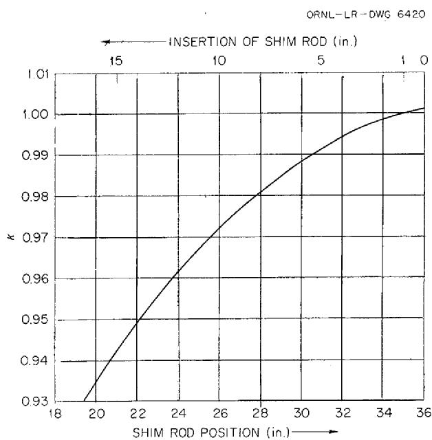  
Fig. J.1. Shim Rod Position as a Function of $k$ at Criticality.

TABLE J.1. CALIBRATION OF SHIM RODS FROM FUEL ADDITION DURING CRITICAL EXPERIMENT   

<table><tr><td colspan="2">Rod Position</td><td rowspan="2">Average Insertion of Shim Rods (in.)</td><td rowspan="2">Average k</td><td rowspan="2">Δk</td><td rowspan="2">Movement of Shim Rods, Δd (in.)</td><td rowspan="2">3 Rods [(Δk/k)/in.]</td><td rowspan="2">Average per Rod [(Δk/k)/in.]</td></tr><tr><td>Interval Taken (in.)</td><td>Average Rod Position (in.)</td></tr><tr><td>36 to 35</td><td>35.5</td><td>0.5</td><td>1.0</td><td>0.001</td><td>1</td><td>0.001</td><td>0.00033</td></tr><tr><td>35 to 34</td><td>34.5</td><td>1.5</td><td>0.9992</td><td>0.0015</td><td>1</td><td>0.00150</td><td>0.00050</td></tr><tr><td>34 to 33</td><td>33.5</td><td>2.5</td><td>0.9975</td><td>0.0020</td><td>1</td><td>0.00200</td><td>0.00067</td></tr><tr><td>32 to 33</td><td>32.5</td><td>3.5</td><td>0.9953</td><td>0.0025</td><td>1</td><td>0.00251</td><td>0.00083</td></tr><tr><td>31 to 32</td><td>31.5</td><td>4.5</td><td>0.9926</td><td>0.0028</td><td>1</td><td>0.00282</td><td>0.00094</td></tr><tr><td>30 to 31</td><td>30.5</td><td>5.5</td><td>0.9895</td><td>0.0032</td><td>1</td><td>0.00323</td><td>0.00108</td></tr><tr><td>29 to 30</td><td>29.5</td><td>6.5</td><td>0.9862</td><td>0.0035</td><td>1</td><td>0.00355</td><td>0.00118</td></tr><tr><td>28 to 29</td><td>28.5</td><td>7.5</td><td>0.9825</td><td>0.0038</td><td>1</td><td>0.00387</td><td>0.00129</td></tr><tr><td>27 to 28</td><td>27.5</td><td>8.5</td><td>0.9785</td><td>0.0041</td><td>1</td><td>0.00419</td><td>0.00140</td></tr><tr><td>26 to 27</td><td>26.5</td><td>9.5</td><td>0.9743</td><td>0.0045</td><td>1</td><td>0.00462</td><td>0.00154</td></tr><tr><td>25 to 26</td><td>25.5</td><td>10.5</td><td>0.9695</td><td>0.0050</td><td>1</td><td>0.00516</td><td>0.00172</td></tr><tr><td>24 to 25</td><td>24.5</td><td>11.5</td><td>0.9643</td><td>0.0055</td><td>1</td><td>0.00570</td><td>0.00190</td></tr><tr><td>23 to 24</td><td>23.5</td><td>12.5</td><td>0.9585</td><td>0.0060</td><td>1</td><td>0.00626</td><td>0.00209</td></tr><tr><td>22 to 23</td><td>22.5</td><td>13.5</td><td>0.9523</td><td>0.0064</td><td>1</td><td>0.00672</td><td>0.00224</td></tr><tr><td>21 to 22</td><td>21.5</td><td>14.5</td><td>0.9458</td><td>0.0069</td><td>1</td><td>0.00730</td><td>0.00243</td></tr><tr><td>20 to 21</td><td>20.5</td><td>15.5</td><td>0.9386</td><td>0.0075</td><td>1</td><td>0.00799</td><td>0.00266</td></tr></table>

TABLE J.2. FORMULA (AND INTEGRAND) FITTED TO SHIM ROD SENSITIVITY CURVE   

<table><tr><td>Formula No.</td><td>Range of Use (in.)</td><td>Type</td><td>Formula*</td></tr><tr><td>1</td><td>0 to 8</td><td>Differential</td><td>α = -0.0006d2 + 0.0187d + 0.0239</td></tr><tr><td>2</td><td>8 to 16</td><td>Differential</td><td>α = 0.0005d2 + 0.0055d + 0.059</td></tr><tr><td>3</td><td>16 to 18</td><td>Differential</td><td>α = -0.0045d2 + 0.1655d - 1.221</td></tr><tr><td>4</td><td>0 to 8</td><td>Integral</td><td>ρ = -0.0002d3 + 0.00935d2 + 0.0239d</td></tr><tr><td>5</td><td>8 to 16</td><td>Integral</td><td>ρ = 0.000167d3 + 0.00275d2 + 0.059d</td></tr><tr><td>6</td><td>16 to 18</td><td>Integral</td><td>ρ = -0.0015d3 + 0.0875d2 - 1.221d</td></tr></table>

$$
\star \alpha = (\Delta k / k) / i n.
$$

$$
\rho = \Delta k / k
$$

was divided and the corresponding formulas which were fitted to the curve are given in Table J.2.

In the case of the integrated curves, the $\Delta k / k$ found by integration in the range of the curve was added to the total $\Delta k / k$ of the previous curve to give the total $\Delta k / k$ to the point of integration. The resulting worth, $(\Delta k / k)$ , of the shim rods over the first 18 in. of their movement is shown in Fig. J.3 and the data are tabulated in Table J.3.

It should be noted that the last 2 in. of the curve

of Fig. J.2 (16 to 18 in.) was extrapolated. The basis for the extrapolation is the curve shown in Fig. D.4 of Appendix D, which is a calibration of an ARE regulating rod made during some preliminary experiments done in the Critical Experiments Facility. The shim rods were assumed to give the same type of curve.

If it were assumed that the last 18 in. of the shim rods gave a shape of $\Lambda k / k$ vs rod insertion which was essentially the image of the first

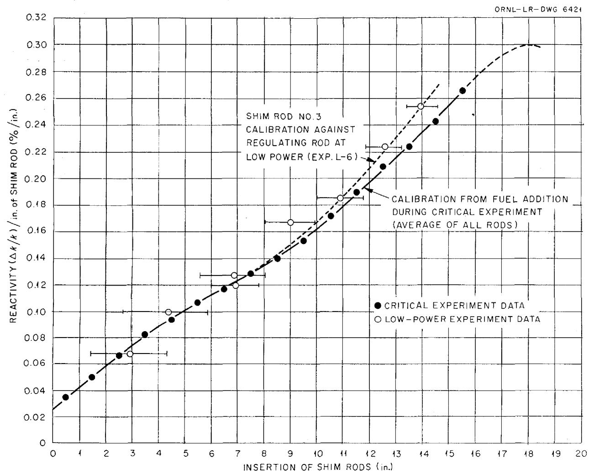  
Fig. J.2. Differential Shim Rod Sensitivity.

18 in. (see Appendix D, Fig. D.3), then the total worth of a shim rod was $5.8\% (\Delta k / k)$ and the total worth of all three rods was about $17\% (\Delta k / k)$ .

# CALIBRATION AGAINST THE REGULATING ROD

In Exp. L-6, with the reactor at a power of 1 watt (nominal), shim rods Nos. 1 and 2 were set at predetermined positions. Then shim rod No. 3 was moved over various small increments of its travel and thus calibrated against the regulating rod. With the reactor on servo the regulating rod then moved automatically a compensating distance, this distance being roughly 10 in. of its travel. From the previous measurement of the worth of the regulating rod of $(\Delta k / k) / \text{in}$ . of

0.033%/in. and the ratio of the movement of shim rod No. 3 and the regulating rod, a calibration of No. 3 shim rod was obtained over the first 14 inches of its travel (starting from the out position).

Figure J.2 shows the results of this method of calibration (dashed curve), and the data are listed in Table J.4. The agreement between the two methods of calibration was surprisingly good. Since the increments of shim rod movement were larger in this method than in the preceding method and since there were other sources of error, such as the error in the movement of the shim rod position indicators on the reactor console, no attempt was made to use this curve (dashed curve, Fig. J.2) to find the integrated value of $\Delta k / k$ over the rod.

TABLE J.3. CALCULATION OF SHIM ROD REACTIVITY FROM FUEL ADDITION   

<table><tr><td rowspan="2">Insertion of Shim Rod, d (in.)</td><td rowspan="2">d2</td><td rowspan="2">d3</td><td colspan="4">Differential Calibration</td><td colspan="6">Integral Calibration</td></tr><tr><td>Formulaa</td><td>Ad2</td><td>Bd</td><td>(Δk/k)/in. (%/in.)</td><td>Formulab</td><td>A&#x27;d3</td><td>B&#x27;d2</td><td>C&#x27;d</td><td>Over Rangec of Formula Δk/k d1 (%)</td><td>Totald k/0 (%)</td></tr><tr><td>1</td><td>1</td><td>1</td><td>1</td><td>-0.0006</td><td>0.0187</td><td>0.0420</td><td>4</td><td>-0.0002</td><td>0.00935</td><td>0.0239</td><td>0.0331</td><td>0.0331</td></tr><tr><td>2</td><td>4</td><td>8</td><td>1</td><td>-0.0024</td><td>0.0374</td><td>0.0589</td><td>4</td><td>-0.0016</td><td>0.0374</td><td>0.0478</td><td>0.0836</td><td>0.0836</td></tr><tr><td>3</td><td>9</td><td>27</td><td>1</td><td>-0.0054</td><td>0.0561</td><td>0.0746</td><td>4</td><td>-0.0054</td><td>0.0842</td><td>0.0717</td><td>0.151</td><td>0.151</td></tr><tr><td>4</td><td>16</td><td>64</td><td>1</td><td>-0.0096</td><td>0.0748</td><td>0.0891</td><td>4</td><td>-0.0128</td><td>0.1496</td><td>0.0956</td><td>0.232</td><td>0.232</td></tr><tr><td>5</td><td>25</td><td>125</td><td>1</td><td>-0.0150</td><td>0.0935</td><td>0.102</td><td>4</td><td>-0.0250</td><td>0.2238</td><td>0.1195</td><td>0.328</td><td>0.328</td></tr><tr><td>6</td><td>36</td><td>216</td><td>1</td><td>-0.0216</td><td>0.112</td><td>0.114</td><td>4</td><td>-0.0432</td><td>0.3366</td><td>0.1434</td><td>0.437</td><td>0.437</td></tr><tr><td>7</td><td>49</td><td>343</td><td>1</td><td>-0.0294</td><td>0.131</td><td>0.125</td><td>4</td><td>-0.0686</td><td>0.4581</td><td>0.1673</td><td>0.557</td><td>0.557</td></tr><tr><td>8</td><td>64</td><td>512</td><td>1</td><td>-0.0384</td><td>0.150</td><td>0.135</td><td>4</td><td>-0.1024</td><td>0.5984</td><td>0.1912</td><td>0.687</td><td>0.687</td></tr><tr><td></td><td></td><td></td><td>2</td><td>+0.032</td><td>0.0055</td><td>0.135</td><td>5</td><td>+0.0855</td><td>0.1760</td><td>0.4720</td><td>0</td><td>0.687</td></tr><tr><td>9</td><td>81</td><td>729</td><td>2</td><td>0.0405</td><td>0.0495</td><td>0.149</td><td>5</td><td>+0.1217</td><td>0.2228</td><td>0.5310</td><td>0.142</td><td>0.829</td></tr><tr><td>10</td><td>100</td><td>1000</td><td>2</td><td>0.0500</td><td>0.0550</td><td>0.164</td><td>5</td><td>0.1670</td><td>0.2750</td><td>0.5900</td><td>0.299</td><td>0.986</td></tr><tr><td>11</td><td>121</td><td>1331</td><td>2</td><td>0.0605</td><td>0.0605</td><td>0.180</td><td>5</td><td>0.2223</td><td>0.3328</td><td>0.6490</td><td>0.470</td><td>1.158</td></tr><tr><td>12</td><td>144</td><td>1728</td><td>2</td><td>0.0720</td><td>0.0660</td><td>0.197</td><td>5</td><td>0.2886</td><td>0.3960</td><td>0.7080</td><td>0.659</td><td>1.346</td></tr><tr><td>13</td><td>169</td><td>2197</td><td>2</td><td>0.0845</td><td>0.0715</td><td>0.215</td><td>5</td><td>0.3669</td><td>0.4648</td><td>0.7670</td><td>0.865</td><td>1.552</td></tr><tr><td>14</td><td>196</td><td>2744</td><td>2</td><td>0.0980</td><td>0.0720</td><td>0.234</td><td>5</td><td>0.4583</td><td>0.5390</td><td>0.8260</td><td>1.117</td><td>1.804</td></tr><tr><td>15</td><td>225</td><td>3375</td><td>2</td><td>0.1125</td><td>0.0825</td><td>0.254</td><td>5</td><td>0.5636</td><td>0.6187</td><td>0.8850</td><td>1.334</td><td>2.021</td></tr><tr><td>16</td><td>256</td><td>4096</td><td>2</td><td>0.1280</td><td>0.0880</td><td>0.275</td><td>5</td><td>0.6840</td><td>0.7040</td><td>0.9440</td><td>1.599</td><td>2.286</td></tr><tr><td></td><td></td><td></td><td>3</td><td>-1.152</td><td>2.648</td><td>0.275</td><td>6</td><td>-6.144</td><td>21.184</td><td>-19.536</td><td>0</td><td>2.286</td></tr><tr><td>17</td><td>289</td><td>4913</td><td>3</td><td>-1.300</td><td>2.8135</td><td>0.292</td><td>6</td><td>-7.3695</td><td>23.9147</td><td>-20.757</td><td>0.3112</td><td>2.597</td></tr><tr><td>18</td><td>324</td><td>5832</td><td>3</td><td>-1.458</td><td>2.979</td><td>0.300</td><td>6</td><td>-8.7480</td><td>26.811</td><td>-21.978</td><td>0.612</td><td>2.898</td></tr></table>

aDifferential formulas were of the form $(\Delta k / k)$ in. $= Ad^{2} + Bd + c$   
Formula 1: $(\Delta k / k) / \text{in.} = -0.0006d^2 + 0.0187d + 0.0239$   
Formula 2: $(\Delta k / k) / \text{in.} = 0.0005d^2 + 0.0055d + 0.059$   
Formula 3: $(\Delta k / k) / \mathrm{in.} = -0.0045d^2 + 0.1655d - 1.221$   
b integral formulas were of the form $\Delta k / k = A^{\prime}d^{3} + B^{\prime}d^{2} + C^{\prime}d$   
Formula 4: $\Delta k / k = -0.0002d^3 + 0.00935d^2 + 0.0239d$   
Formula 5: $\Delta k / k = 0.000167d^3 + 0.00275d^2 + 0.059d$

Formula 6: $\Delta k / k = -0.0015d^3 + 0.08275d^2 - 1.221d$

$d_{1} =$ lower limit of formula

$d_{2} =$ position integrated to

Ranges: Formulas 1 and $4$ , $d = 0$ to 8 in.

Formulas 2 and 5, $d = 8$ to 16 in.

Formulas 3 and 6, $d = 16$ to 18 in.

$d_{\text{Total}} \Delta k / k,$ adding area from each section

TABLE J.4. CALIBRATION OF SHIM ROD NO. 3 AGAINST REGULATING ROD   
Experiment L-6   

<table><tr><td rowspan="2">Run No.</td><td rowspan="2">Shim Rod No. 1 Position (in.)</td><td rowspan="2">Shim Rod No. 2 Position (in.)</td><td colspan="4">Shim Rod No. 3</td><td colspan="3">Regulating Rod</td><td rowspan="2">Shim Rod No. 3 \( \left( {\Delta k/k}\right) / \) in. =0.033 \( \Delta {d}_{R}/\Delta {d}_{S} \) (%/in.)</td><td rowspan="2">Shim Rod No. 3 Average Insertion (in.)</td></tr><tr><td>Start Position (in.)</td><td>Stop Position (in.)</td><td>Average Position (in.)</td><td>Movement \( \Delta {d}_{S} \) (in.)</td><td>Start Position (in.)</td><td>Stop Position (in.)</td><td>Movement \( \Delta {d}_{R} \) (in.)</td></tr><tr><td>1A-1B</td><td>35.0</td><td>36.0</td><td>30.0</td><td>33.3</td><td>31.65</td><td>3.3</td><td>13.0</td><td>3.0</td><td>10.0</td><td>0.100</td><td>4.35</td></tr><tr><td>1C-1D</td><td>35.0</td><td>36.0</td><td>30.0</td><td>18.1</td><td>29.05</td><td>1.9</td><td>6.5</td><td>13.4</td><td>6.9</td><td>0.120</td><td>6.95</td></tr><tr><td>3-4</td><td>27.0</td><td>26.6</td><td>35.5</td><td>30.6</td><td>33.05</td><td>4.9</td><td>3.1</td><td>13.2</td><td>10.1</td><td>0.068</td><td>2.95</td></tr><tr><td>5-6</td><td>28.0</td><td>27.4</td><td>30.6</td><td>28.0</td><td>29.3</td><td>2.6</td><td>3.0</td><td>13.1</td><td>10.1</td><td>0.128</td><td>6.7</td></tr><tr><td>7-8</td><td>29.1</td><td>28.9</td><td>28.0</td><td>26.0</td><td>27.0</td><td>2.0</td><td>3.0</td><td>13.2</td><td>10.2</td><td>0.168</td><td>9.0</td></tr><tr><td>9-10</td><td>30.0</td><td>30.0</td><td>26.0</td><td>24.2</td><td>25.1</td><td>1.8</td><td>2.95</td><td>13.0</td><td>10.05</td><td>0.183</td><td>10.9</td></tr><tr><td>11-12</td><td>32.8</td><td>31.9</td><td>24.2</td><td>22.7</td><td>23.45</td><td>1.5</td><td>2.9</td><td>13.1</td><td>10.2</td><td>0.224</td><td>12.55</td></tr><tr><td>13-14</td><td>35.0</td><td>36.0</td><td>22.7</td><td>21.4</td><td>22.05</td><td>1.3</td><td>3.2</td><td>13.2</td><td>10.0</td><td>0.254</td><td>13.95</td></tr></table>

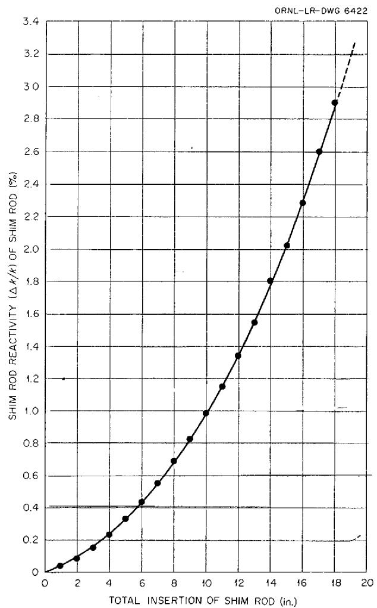  
Fig. J.3. Integral Calibration of Shim Rods as a Function of Position.

# CALIBRATION BY USING THE FISSION CHAMBERS

A third calibration of the shim rods was attempted during the critical experiments in which the counting rate of the neutron detectors was taken as a function of shim rod position for two different uranium concentrations.

The reactivity was then obtained from the counting rates by using the relationship

$$
k = 1 - \frac {1}{M},
$$

and a plot of $k$ as a function of rod position then gave a check on the general shape of the curve. Figure J.4 shows the $k$ vs rod position for fission chambers 1 and 2. Because the uranium concentration in the system was low for both the runs the fission chambers were showing a subcritical

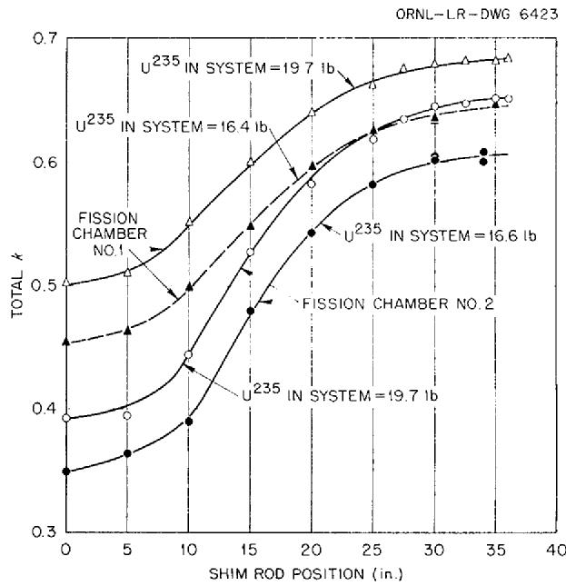  
Fig. J.4. Calibration of Shim Rods from Fission Chamber Data.

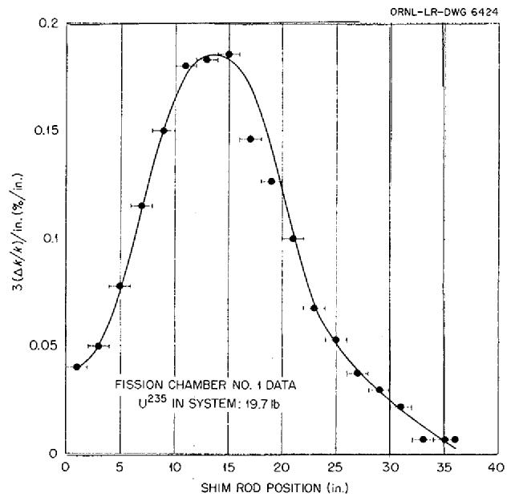  
Fig. J.5. Reactivity as a Function of Shim Rod Position.

multiplication $M$ greater than the actual value, as discussed in Appendix E. Therefore, the absolute values of $k$ , as calculated from the counting rates, are in error. Nevertheless, the general shape of the curve is experimental verification of the curve shown in Fig. D.3 of Appendix D. Figure J.5 shows the value of $(\Delta k / k) / \mathrm{in}$ . vs rod position,

as obtained from one of the curves of Fig. 4.10. Again, the general shape of this curve is about the same as shown in Fig. D.3 of Appendix D,

but its absolute magnitude is not meaningful. The data from which Figs. 4.10 and 4.11 were plotted are given in Tables J.5 and J.6.

TABLE J.5. REACTIVITY OF THE SHIM RODS vs ROD POSITION   

<table><tr><td rowspan="2">U235in System (lb)</td><td rowspan="2">Rod Position (in.)</td><td colspan="3">Fission Chamber No. 1</td><td colspan="3">Fission Chamber No. 2</td><td colspan="3">BF3Counter</td></tr><tr><td>Counting Rate N (counts/sec)</td><td>N0/N</td><td>k</td><td>Counting Rate N (counts/sec)</td><td>N0/N</td><td>k</td><td>Counting Rate N (counts/sec)</td><td>N0/N</td><td>k</td></tr><tr><td rowspan="10">16.6</td><td>0</td><td>17.52</td><td>0.5457</td><td>0.4543</td><td>25.00</td><td>0.6512</td><td>0.3488</td><td>6.00</td><td>0.7483</td><td>0.2517</td></tr><tr><td>5</td><td>17.60</td><td>0.5375</td><td>0.4625</td><td>25.52</td><td>0.6379</td><td>0.3621</td><td>6.05</td><td>0.742</td><td>0.258</td></tr><tr><td>10</td><td>18.85</td><td>0.5019</td><td>0.4981</td><td>26.69</td><td>0.6100</td><td>0.3900</td><td>6.51</td><td>0.690</td><td>0.310</td></tr><tr><td>15</td><td>20.93</td><td>0.4520</td><td>0.5480</td><td>31.33</td><td>0.5196</td><td>0.4804</td><td>6.40</td><td>0.702</td><td>0.298</td></tr><tr><td>20</td><td>23.44</td><td>0.4036</td><td>0.5964</td><td>35.63</td><td>0.4569</td><td>0.5431</td><td>6.67</td><td>0.673</td><td>0.327</td></tr><tr><td>25</td><td>25.23</td><td>0.3750</td><td>0.6250</td><td>38.91</td><td>0.4184</td><td>0.5816</td><td>7.01</td><td>0.640</td><td>0.360</td></tr><tr><td>30</td><td>26.00</td><td>0.3638</td><td>0.6362</td><td>40.93</td><td>0.3978</td><td>0.6022</td><td></td><td></td><td></td></tr><tr><td>30</td><td>25.87</td><td>0.3657</td><td>0.6343</td><td>41.12</td><td>0.3952</td><td>0.6048</td><td>6.72</td><td>0.668</td><td>0.332</td></tr><tr><td>35</td><td>26.83</td><td>0.3526</td><td>0.6474</td><td>41.76</td><td>0.3898</td><td>0.6011</td><td>6.80</td><td>0.660</td><td>0.340</td></tr><tr><td>35</td><td>26.85</td><td>0.3523</td><td>0.6477</td><td>41.65</td><td>0.3909</td><td>0.6091</td><td>6.77</td><td>0.663</td><td>0.337</td></tr><tr><td rowspan="11">19.7</td><td>0</td><td>18.99</td><td>0.4982</td><td>0.5018</td><td>26.83</td><td>0.6068</td><td>0.3932</td><td>6.27</td><td>0.716</td><td>0.284</td></tr><tr><td>5</td><td>19.31</td><td>0.4899</td><td>0.5101</td><td>26.88</td><td>0.6057</td><td>0.3943</td><td>6.43</td><td>0.698</td><td>0.302</td></tr><tr><td>10</td><td>21.07</td><td>0.4490</td><td>0.5510</td><td>29.28</td><td>0.5560</td><td>0.444</td><td>6.56</td><td>0.684</td><td>0.316</td></tr><tr><td>15</td><td>23.63</td><td>0.4003</td><td>0.5997</td><td>34.43</td><td>0.4728</td><td>0.5272</td><td>6.91</td><td>0.650</td><td>0.350</td></tr><tr><td>20</td><td>26.21</td><td>0.3609</td><td>0.6391</td><td>38.99</td><td>0.4175</td><td>0.5825</td><td>7.04</td><td>0.638</td><td>0.362</td></tr><tr><td>25</td><td>28.08</td><td>0.3369</td><td>0.6631</td><td>42.67</td><td>0.3815</td><td>0.6185</td><td>7.28</td><td>0.617</td><td>0.383</td></tr><tr><td>27.5</td><td>29.23</td><td>0.3236</td><td>0.6764</td><td>44.59</td><td>0.3651</td><td>0.6349</td><td>7.15</td><td>0.628</td><td>0.372</td></tr><tr><td>30</td><td>29.55</td><td>0.3201</td><td>0.6793</td><td>45.97</td><td>0.3541</td><td>0.6459</td><td>7.01</td><td>0.640</td><td>0.360</td></tr><tr><td>32.5</td><td>29.76</td><td>0.3179</td><td>0.6821</td><td>46.19</td><td>0.3525</td><td>0.6475</td><td>7.04</td><td>0.638</td><td>0.362</td></tr><tr><td>35</td><td>29.76</td><td>0.3179</td><td>0.6821</td><td>46.83</td><td>0.3476</td><td>0.6524</td><td>7.09</td><td>0.633</td><td>0.367</td></tr><tr><td>36</td><td>29.90</td><td>0.3164</td><td>0.6836</td><td>46.81</td><td>0.3478</td><td>0.6522</td><td>7.16</td><td>0.627</td><td>0.373</td></tr></table>

TABLE J.6. REACTIVITY AS A FUNCTION OF SHIM ROD POSITION (FROM FISSION CHAMBER DATA)   

<table><tr><td>U235 in System (lb)</td><td>Limits of d</td><td>dav</td><td>kav</td><td>Δk</td><td>Δd (in.)</td><td>3(Δk/k)/in.</td></tr><tr><td rowspan="18">19.7</td><td>0 to 2</td><td>1</td><td>0.502</td><td>0.04</td><td>2</td><td>0.0398</td></tr><tr><td>2 to 4</td><td>3</td><td>0.5065</td><td>0.05</td><td>2</td><td>0.0494</td></tr><tr><td>4 to 6</td><td>5</td><td>0.5125</td><td>0.08</td><td>2</td><td>0.0780</td></tr><tr><td>6 to 8</td><td>7</td><td>0.523</td><td>0.12</td><td>2</td><td>0.1147</td></tr><tr><td>8 to 10</td><td>9</td><td>0.532</td><td>0.16</td><td>2</td><td>0.1503</td></tr><tr><td>10 to 12</td><td>11</td><td>0.555</td><td>0.20</td><td>2</td><td>0.1801</td></tr><tr><td>12 to 14</td><td>13</td><td>0.574</td><td>0.21</td><td>2</td><td>0.1829</td></tr><tr><td>14 to 16</td><td>15</td><td>0.596</td><td>0.22</td><td>2</td><td>0.1853</td></tr><tr><td>16 to 18</td><td>17</td><td>0.6155</td><td>0.18</td><td>2</td><td>0.1462</td></tr><tr><td>18 to 20</td><td>19</td><td>0.632</td><td>0.16</td><td>2</td><td>0.1266</td></tr><tr><td>20 to 22</td><td>21</td><td>0.6465</td><td>0.13</td><td>2</td><td>0.1005</td></tr><tr><td>22 to 24</td><td>23</td><td>0.6575</td><td>0.09</td><td>2</td><td>0.0684</td></tr><tr><td>24 to 26</td><td>25</td><td>0.6655</td><td>0.07</td><td>2</td><td>0.0526</td></tr><tr><td>26 to 28</td><td>27</td><td>0.6715</td><td>0.05</td><td>2</td><td>0.0372</td></tr><tr><td>28 to 30</td><td>29</td><td>0.676</td><td>0.04</td><td>2</td><td>0.0296</td></tr><tr><td>30 to 32</td><td>31</td><td>0.6795</td><td>0.03</td><td>2</td><td>0.0221</td></tr><tr><td>32 to 34</td><td>33</td><td>0.6815</td><td>0.01</td><td>2</td><td>0.0073</td></tr><tr><td>34 to 36</td><td>35</td><td>0.6825</td><td>0.01</td><td>2</td><td>0.0073</td></tr></table>

# CORRELATION OF REACTOR AND LINE TEMPERATURES

An effect which was noted late in the operation of the ARE was that fuel and sodium line temperatures indicated in the basement disagreed quite radically with those recorded in the control room. It so happened that all the basement indicators gave line temperatures measured by thermocouples outside the reactor thermal shield, while the temperatures recorded in the control room were measured by thermocouples all located within the thermal shield. When this was first discovered it was thought that helium from the rod-cooling system blowing on the thermocouples inside the thermal shield was making them read low. Turning the rod cooling blowers on and off, however, was demonstrated to have no effect on the thermocouples, and therefore at the end of the experiment no positive explanation for these temperature discrepancies had been found.

This situation has created serious difficulties in trying to analyze the data for this report. There was evidence that the discrepancies were intensified during operation at high power. Nevertheless, when nearly isothermal conditions existed, it was found that the absolute magnitude of the measurements made by the thermocouple within the thermal shield were incorrect, but the rates of change obtained from the data were correct. The temperatures read on the basement instruments were considered to be correct for several reasons. First, the temperature indications available in the basement were much more numerous than those in the control room, and the thermocouple sensing elements for these indicators were all located along lines outside the thermal shield; the temperatures agreed with each other to $\pm 10$ deg from the average. Equilibrium conditions prevailed across the pipes because of the insulation. Also, there were many reasons for the thermocouples to indicate higher than actual temperatures, but none for lower than actual indications.

In order to use the temperature data from the experiment it was necessary to correlate the temperature data obtained in the control room with those obtained in the basement. The correlations were then used to correct temperature data obtained in the control room.

The results of the temperature correlations for the fuel system are shown in Figs. K.1, K.2, and K.3. The agreement between the low-power line

temperatures (Fig. K.1) reflects the attention which was given to calibrating these thermocouples in the isothermal condition. The curves in Figs. K.2

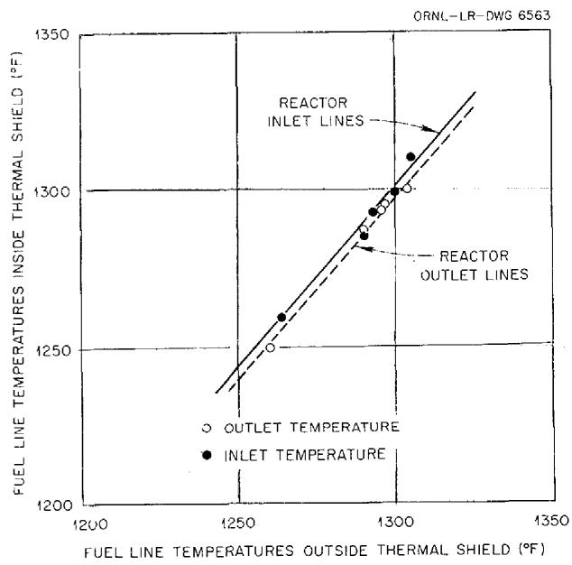  
Fig. K.1. Correlation Between Fuel Line Temperatures Measured Inside and Outside the Reactor Thermal Shield During Subcritical and Low-Power Experiments.

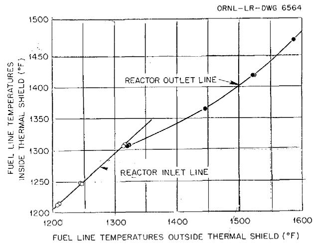  
Fig. K.2. Correlation Between Fuel Line Temperatures Measured Inside and Outside the Reactor Thermal Shield During High-Power Experiments.

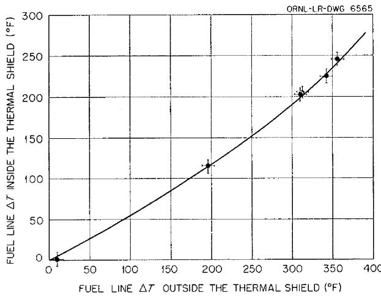  
Fig. K.3. Correlation Between Fuel Temperature Differentials Measured Inside and Outside the Thermal Shield.

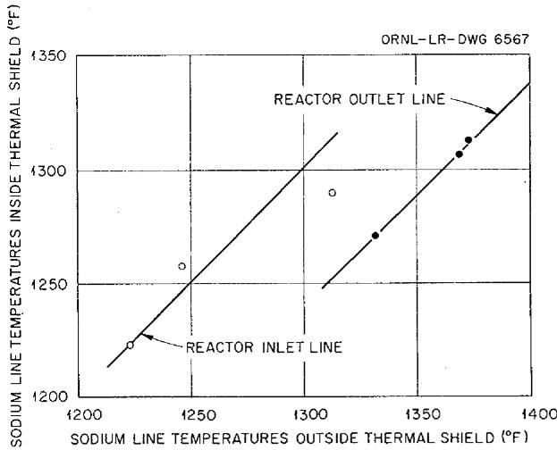  
Fig. K.5. Correlation Between Sodium Line Temperatures Measured Inside and Outside the Thermal Shield During High-Power Experiments.

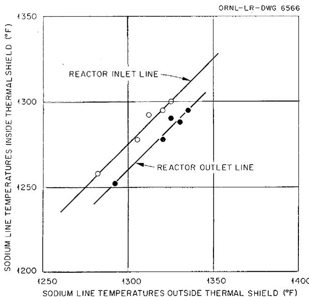  
Fig. K.4. Correlation Between Sodium Line Temperatures Measured Inside and Outside the Thermal Shield During Low-Power Experiments.

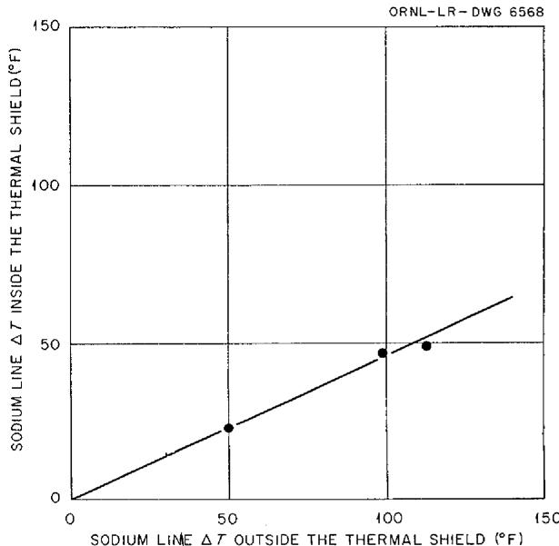  
Fig. K.6. Correlation Between Sodium Temperature Differentials Measured Inside and Outside the Thermal Shield.

and K.3, both of which were obtained from data taken during operation at high $(>200\mathrm{kw})$ power, show the anomaly in question.

The analogous data for the sodium system are shown in Figs. K.4, K.5, and K.6. It is evident from Fig. K.4 that an isothermal condition was never attained in the sodium system, since both

the inlet and the outlet line temperature correlations have slopes of 1 but intercepts of -25 and $-40^{\circ}\mathsf{F}$ , respectively. This was probably the result of the long sodium inlet and outlet lines being used as a convenient means of adding heat to the system to maintain a thermal equilibrium in the reactor of $\sim 1300^{\circ}\mathsf{F}$ . Good data for the high-power

correlations, Figs. K.5 and K.6, were rather scarce, but the curves shown are believed to be reasonable approximations to the actual correlation. The data in Fig. K.6 have been corrected for known error in the temperature differential at zero (or low) power. The correction, as applied, was to reduce the value of the temperature differential determined from the thermocouples outside the thermal shield by $10^{\circ}\mathsf{F}$ .

All the correlations were based upon data which were obtained during runs long enough for the establishment of equilibrium conditions in the system or at times when isothermal conditions prevailed. The most important conclusion that can be made from these data is that the temperature differentials across the reactor in both the fuel and sodium systems were about a factor of 2 low. In the fuel system the outlet line temperature changes read in the control room (inside pressure shell temperatures) were only one-half as great as the corresponding temperature changes read in the

basement (outside pressure shell temperatures). In the sodium system both outlet and inlet line temperature curves had different intercepts but the same slopes (as during the low-power runs).

All temperature data used in this report that pertained to operation at high power were corrected to agree with line temperatures obtained outside the thermal shield (basement readings) by using curves K.1 through K.6. Data from runs made under isothermal or equilibrium conditions where equal temperature differences were obtained on instruments either in the control room or in the basement needed no temperature corrections. The temperature correlation data from which the curves were obtained are presented in Tables K.1 and K.2. Because of the lack of coordination between the control room and basement operations during the experiment, much potentially useful data had to be discarded because the exact times of the readings were not known or the data were taken before equilibrium conditions were established.

TABLE K.1. FUEL LINE TEMPERATURES MEASURED BY THERMOCOUPLES INSIDE AND OUTSIDE THE REACTOR THERMAL SHIELD  

<table><tr><td rowspan="2">Date</td><td rowspan="2">Time</td><td rowspan="2">Experiment No.</td><td colspan="2">Fuel Inlet Line Temperatures (°F) (Line 120)</td><td colspan="2">Fuel Outlet Line Temperatures (°F) (Line 111)</td><td colspan="2">Temperature Differential (°F)c</td></tr><tr><td>Basementa</td><td>Control Roomb</td><td>Basementa</td><td>Control Roomb</td><td>Basement</td><td>Control Room</td></tr><tr><td>10/26</td><td>2115</td><td>Before operation</td><td>1290</td><td>1285</td><td>1290</td><td>1287</td><td>0</td><td>2</td></tr><tr><td>10/27</td><td>0630</td><td>Before operation</td><td>1293</td><td>1293</td><td>1296</td><td>1293</td><td>3</td><td>0</td></tr><tr><td>11/4</td><td>1100</td><td>L-1</td><td>1300</td><td>1299</td><td>1297</td><td>1295</td><td>-3</td><td>-4</td></tr><tr><td>11/6</td><td>0340</td><td>L-4</td><td>1305</td><td>1310</td><td>1304</td><td>1300</td><td>-1</td><td>-10</td></tr><tr><td>11/11</td><td>0300</td><td>H-11</td><td>1207</td><td>1212</td><td>1522</td><td>1418</td><td>315</td><td>206</td></tr><tr><td></td><td>1215</td><td>H-11</td><td>1210</td><td>1214</td><td>1524</td><td>1418</td><td>314</td><td>204</td></tr><tr><td>11/12</td><td>0001</td><td>H-13</td><td>1316</td><td>1308</td><td>1323</td><td>1308</td><td>7</td><td>0</td></tr><tr><td></td><td>0630</td><td>H-13</td><td>1315</td><td>1307</td><td>1320</td><td>1306</td><td>5</td><td>-1</td></tr><tr><td></td><td>1003</td><td>H-14</td><td>1246d</td><td>1243</td><td>1587</td><td>1475</td><td>341</td><td>232</td></tr><tr><td>11/13</td><td>0915</td><td>After operation</td><td>1264</td><td>1260</td><td>1260</td><td>1250</td><td>-4</td><td>-10</td></tr></table>

${}^{a}$ Fuel line temperatures outside thermal shield.   
${}^{b}$ Fuel line temperatures inside thermal shield.   
$c$ Thermocouple differences for no-power runs indicate extent of thermocouple errors (highest is $\pm 10$ deg) and therefore the accuracy of the readings.   
$\alpha$ Estimated.

TABLE K.2. SODIUM LINE TEMPERATURES MEASURED BY THERMOCOUPLES INSIDE AND OUTSIDE THE REACTOR THERMAL SHIELD  

<table><tr><td rowspan="2">Date</td><td rowspan="2">Time</td><td rowspan="2">Experiment No.</td><td colspan="2">Sodium Inlet Line Temperatures (°F)</td><td colspan="2">Sodium Outlet Line Temperatures (°F)</td><td colspan="2">Temperature Differential (°F)</td></tr><tr><td>Basement</td><td>Control Room</td><td>Basement</td><td>Control Room</td><td>Basement</td><td>Control Room</td></tr><tr><td>10/26</td><td>2115</td><td>Before operation</td><td>1305</td><td>1278</td><td>1320</td><td>1278</td><td>15</td><td>0</td></tr><tr><td>10/27</td><td>0630</td><td>Before operation</td><td>1312</td><td>1292</td><td>1325</td><td>1290</td><td>13</td><td>2</td></tr><tr><td>11/4</td><td>1100</td><td>L-1</td><td>1320</td><td>1295</td><td>1330</td><td>1288</td><td>10</td><td>7</td></tr><tr><td>11/6</td><td>0400</td><td>L-4</td><td>1325</td><td>1300</td><td>1335</td><td>1295</td><td>10</td><td>5</td></tr><tr><td>11/11</td><td>0900</td><td>H-11</td><td>1223</td><td>1224</td><td>1332</td><td>1271</td><td>109</td><td>47</td></tr><tr><td>11/12</td><td>1003</td><td>H-14(1)</td><td>1246</td><td>1258</td><td>1369</td><td>1307</td><td>123</td><td>49</td></tr><tr><td>11/9</td><td>1907</td><td>H-3(7)</td><td>1313</td><td>1290</td><td>1373</td><td>1313</td><td>60</td><td>23</td></tr><tr><td>11/13</td><td>0915</td><td>After operation</td><td>1282</td><td>1258</td><td>1292</td><td>1252</td><td>10</td><td>-6</td></tr></table>

This points out the need in future operations of the scale of the ARE for some sort of timing device that would automatically stamp the date and time every few minutes on the charts of all recording instruments, and a more systematic method of

manually recording data for each experiment performed in which conditions are held constant long enough for all pertinent data to be recorded. These and other similar recommendations will be found in Chapter 7 of this report.

# Appendix L

# POWER DETERMINATION FROM HEAT EXTRACTION

The power level of the reactor was determined from the total heat extracted by the fuel and the sodium. Data for the heat extraction determination were obtained from continuous records of the reactor fuel inlet, outlet, and mean temperatures, the temperature differential across the reactor, and the flow rates of the fuel and the sodium. The flow rates could also be calculated from the pump speed, and there was independent experimental evidence from which a plot of speed vs flow rate was obtained. The power level of the reactor was calculated by use of heat capacities, flow rates, and temperature differentials for both sodium and fuel. It was found that the fuel and the sodium accounted for $99\%$ of the extraction of power generated in the reactor. The data referred to above were all obtainable in the control room.

The controls for preheating and maintaining heat on the system were located in the basement, and along with these controls were temperature recorders and indicators for the whole system, exclusive of the reactor. The temperatures of both fuel and sodium lines to and from the reactor were also recorded in the basement. These basement data were used for a separate power extraction determination.

An independent source of power level information was also available, since the fuel and sodium were cooled by a helium stream flowing over a heat exchanger and the helium in turn was cooled by a helium-to-water heat exchanger. No flow or temperature measurements were made of the helium, but since the water exchangers were very close to the fuel or the sodium exchangers, all the heat that was taken out of the fuel and sodium should have appeared in the water. The water flow through these exchangers was metered by orifice-type flowmeters, and the outlet temperatures were measured by thermocouples in wells. The fuel loop exchangers and the two sodium loop exchangers were metered separately.

Up to the time of the 25-hr xenon run the reactor was operated at high power for very short periods of time, and the extracted power was determined from the control room data. During the 25-hr xenon run a comparison was made of the extracted power determined from the control room data, that determined from the basement data, and that from the water data (Table L.1). Large discrepancies

were found, and the indications were that the control room data were low.

The disagreement of the various data led to the examination of the inlet and outlet line temperatures, as described in Appendix K. During the xenon run the fuel outlet line temperatures were about $100^{\circ}\mathrm{F}$ higher than the fuel outlet manifold temperatures (control room data), and the fuel inlet line temperatures (basement data) were essentially the same as the fuel inlet manifold temperatures (control room data). The sodium outlet line temperature (basement data) was $60^{\circ}\mathrm{F}$ higher than the sodium outlet temperature at the reactor (control room data). (The only check on power extraction by the rod cooling system, which was only $1\%$ of total power, was the water data for the rod cooling helium-to-water heat exchanger. In most discussions this $1\%$ is neglected.)

The power extracted in both the fuel and the sodium systems has been calculated by using temperature data from several experiments, and the results are presented in Table L.2. There were three separate measurements of the fuel temperature differential available in the control room which were usually in fair agreement. The largest discrepancy was, as mentioned, between the control room data and the basement data. The temperature differential obtained from the basement data was an average result from a number of line thermocouples, while the control room data came from thermocouples located on the fuel headers inside the reactor thermal shield.

The so-called secondary heat balance was obtained by determining the heat dumped by the water from the various heat exchangers. These data are tabulated in Table L.3 for the high-power experiments.

The various estimates of reactor power from both primary and secondary heat extraction are then listed in Table L.4, together with the power estimated from the calibration of the nuclear instruments, that is, the log $N$ recorder and the micromicroammeter. These latter instruments were normalized to agree with the primary extracted power as determined by the line temperature (basement data) during the xenon experiment (H-11). Equilibrium conditions were certainly attained during this 25-hr experiment and such error as there may be in using these data as the criteria for

TABLE L.1. COMPARISON OF POWER EXTRACTION DETERMINATIONS MADE FROM DATA OBTAINED DURING 25-hr XENON RUN   

<table><tr><td rowspan="2"></td><td colspan="3">Temperatures (°F)</td><td rowspan="2">Flow(gpm)</td><td rowspan="2">Power Extracted(Mw)</td><td rowspan="2">Total PoweraExtracted(Mw)</td></tr><tr><td>Inlet</td><td>Outlet</td><td>ΔT</td></tr><tr><td colspan="7">Fuel System</td></tr><tr><td>Control room data</td><td>1212</td><td>1418</td><td>206</td><td>44</td><td>1.02</td><td></td></tr><tr><td>Basement data</td><td>1209</td><td>1522</td><td>313</td><td>44</td><td>1.52</td><td></td></tr><tr><td colspan="7">Sodium System</td></tr><tr><td>Control room data</td><td>1225</td><td>1271</td><td>46</td><td>153</td><td>0.244</td><td></td></tr><tr><td>Basement data</td><td>1226</td><td>1335</td><td>109</td><td>153</td><td>0.577</td><td></td></tr><tr><td colspan="7">Total Power</td></tr><tr><td>Control room data</td><td></td><td></td><td></td><td></td><td></td><td>1.28</td></tr><tr><td>Basement data</td><td></td><td></td><td></td><td></td><td></td><td>2.12</td></tr><tr><td colspan="7">Water Data</td></tr><tr><td>In fuel loop</td><td>61</td><td>117</td><td>56</td><td>205</td><td>1.68</td><td></td></tr><tr><td>In sodium loop</td><td>61</td><td>114b</td><td>53</td><td>38.3b</td><td>0.588c</td><td></td></tr><tr><td>Total Power from Water Data</td><td></td><td></td><td></td><td></td><td></td><td>2.28</td></tr></table>

$a_{\text{Includes}} \sim 1\%$ for rod cooling.   
$b_{\text{Average for both loops}}$   
Sum of both loops.

TABLE L.2. PRIMARY POWER EXTRACTION   

<table><tr><td rowspan="3">Experiment No.</td><td rowspan="3">Run No.</td><td colspan="11">Control Room Data</td><td colspan="5">Basement Data</td></tr><tr><td colspan="6">Fuel System</td><td colspan="3">Sodium System</td><td rowspan="2">Average Total Power Including Rod-Cooling Power (Mw)</td><td colspan="2">Fuel System</td><td colspan="2">Sodium System</td><td rowspan="2">Total Power Including Rod-Cooling Power (Mw)</td><td></td></tr><tr><td>ΔT, Outlet Minus Inlet (°F)</td><td>ΔT, Recorder (°F)</td><td>ΔT, Tube Average (°F)</td><td>PΔT(Mw)</td><td>PR(Mw)</td><td>Pav ΔT(Mw)</td><td>Flow (gpm)</td><td>ΔT (°F)</td><td>PNa(Mw)</td><td>ΔT (°F)</td><td>Pfuel (Mw)</td><td>ΔT (°F)</td><td>PNa(Mw)</td><td></td></tr><tr><td rowspan="7">H-3</td><td>1</td><td>4412</td><td>40</td><td>33.5</td><td>0.196</td><td>0.163</td><td></td><td>153</td><td>0</td><td></td><td>0.199</td><td></td><td></td><td></td><td></td><td></td><td></td></tr><tr><td>2</td><td>4412</td><td>66</td><td>52</td><td>0.323</td><td>0.254</td><td></td><td>0</td><td></td><td></td><td>0.308</td><td></td><td></td><td></td><td></td><td></td><td></td></tr><tr><td>3</td><td>4412</td><td>115</td><td>116</td><td>0.562</td><td>0.567</td><td></td><td>0</td><td></td><td></td><td>0.584</td><td></td><td></td><td></td><td></td><td></td><td></td></tr><tr><td>4</td><td>4412</td><td>120</td><td>114</td><td>0.588</td><td>0.560</td><td>0.606</td><td>153</td><td>14</td><td>0.0734</td><td>0.678</td><td>198</td><td>0.970</td><td>45</td><td>0.236</td><td>1.23</td><td></td></tr><tr><td>5</td><td>4412</td><td>230</td><td>231</td><td>1.128</td><td>1.129</td><td>1.17</td><td>153</td><td>10.5</td><td>0.0548</td><td>1.21</td><td></td><td></td><td></td><td></td><td></td><td></td></tr><tr><td>6</td><td>4412</td><td>237</td><td>234</td><td>1.16</td><td>1.145</td><td>1.19</td><td>152</td><td>10</td><td>0.0523</td><td>1.24</td><td>138</td><td>0.677</td><td>60</td><td>0.315</td><td>1.012</td><td></td></tr><tr><td>7</td><td>4412</td><td>13</td><td>19</td><td>0.0653</td><td>0.0946</td><td>0.0975</td><td>152</td><td>22</td><td>0.115</td><td>0.221</td><td></td><td></td><td></td><td></td><td></td><td></td></tr><tr><td>H-6</td><td></td><td>4412</td><td>236</td><td>240</td><td>1.158</td><td>1.175</td><td>1.198</td><td>152</td><td>3.5</td><td>0.0182</td><td>1.22</td><td>320</td><td>1.572</td><td></td><td></td><td></td><td></td></tr><tr><td>H-8</td><td></td><td>45</td><td>266</td><td>225</td><td>1.31</td><td>1.111</td><td></td><td>153</td><td>21</td><td>0.110</td><td>1.34</td><td>293</td><td>1.452</td><td>75</td><td>0.394</td><td>1.87</td><td></td></tr><tr><td>H-11</td><td></td><td>44</td><td>206</td><td>213</td><td>0.984</td><td>1.017</td><td>1.018</td><td>153</td><td>46.4</td><td>0.244</td><td>1.27</td><td>313</td><td>1.520</td><td>110</td><td>0.577</td><td>2.12</td><td></td></tr><tr><td>H-13</td><td></td><td>44</td><td></td><td>10</td><td></td><td>0.0484</td><td></td><td>153</td><td>1.4</td><td>0.0073</td><td>0.0757</td><td>312</td><td>1.530</td><td>19</td><td>0.099</td><td>1.65</td><td></td></tr><tr><td>H-14</td><td></td><td>45</td><td>182</td><td>245</td><td>0.900</td><td>1.212</td><td></td><td>153</td><td>50</td><td>0.262</td><td>1.45</td><td>355</td><td>1.760</td><td>127</td><td>0.667</td><td>2.45</td><td></td></tr></table>

TABLE L.3. SECONDARY POWER EXTRACTION   

<table><tr><td rowspan="2">Experiment No.</td><td rowspan="2">Run No.</td><td colspan="3">Fuel Heat Exchanger</td><td colspan="3">No. 1 Sodium Heat Exchanger</td><td colspan="3">No. 2 Sodium Heat Exchanger</td><td colspan="3">Rod-Cooling Heat Exchanger</td><td rowspan="2">Total Extracted Power Secondary System (Mw)</td></tr><tr><td>Water Flow (gpm)</td><td>\( \Delta T^{\prime } \)(°F)</td><td>\( P_{fuel&#x27;} \)Power (Mw)</td><td>Water Flow (gpm)</td><td>\( \Delta T^{\prime } \)(°F)</td><td>\( P_{Na&#x27;} \)Power (Mw)</td><td>Water Flow (gpm)</td><td>\( \Delta T^{\prime } \)(°F)</td><td>\( P_{Na&#x27;} \)Power (Mw)</td><td>Water Flow (gpm)</td><td>\( \Delta T^{\prime } \)(°F)</td><td>\( P_{R.C.&#x27;} \)Power (Mw)</td></tr><tr><td rowspan="7">H-3</td><td>1</td><td>204</td><td>13</td><td>0.389</td><td>38.4</td><td>0</td><td>0</td><td>38.4</td><td>0</td><td>0</td><td>17.3</td><td>3</td><td>0.0076</td><td>0.397</td></tr><tr><td>2</td><td>204</td><td>13</td><td>0.389</td><td>38.4</td><td>0</td><td>0</td><td>38.4</td><td>0</td><td>0</td><td>17.3</td><td>3</td><td>0.0076</td><td>0.397</td></tr><tr><td>3</td><td>204</td><td>30</td><td>0.897</td><td>38.4</td><td>0</td><td>0</td><td>38.4</td><td>0</td><td>0</td><td>17.3</td><td>3</td><td>0.0076</td><td>0.905</td></tr><tr><td>4</td><td>204</td><td>29</td><td>0.866</td><td>38.4</td><td>26</td><td>0.146</td><td>38.4</td><td>21</td><td>0.1188</td><td>17.3</td><td>3</td><td>0.0076</td><td>1.14</td></tr><tr><td>5</td><td>204</td><td>59</td><td>1.765</td><td>38.4</td><td>26</td><td>0.146</td><td>38.4</td><td>25</td><td>0.141</td><td>17.3</td><td>3</td><td>0.0076</td><td>2.06</td></tr><tr><td>6</td><td>204</td><td>59</td><td>1.765</td><td>38.4</td><td>27</td><td>0.152</td><td>38.4</td><td>24</td><td>0.135</td><td>17.3</td><td>3</td><td>0.0076</td><td>2.06</td></tr><tr><td>7</td><td>204</td><td>3</td><td>0.0903</td><td>38.4</td><td>26</td><td>0.146</td><td>38.4</td><td>25</td><td>0.141</td><td>17.3</td><td>2</td><td>0.0051</td><td>0.382</td></tr><tr><td>H-6</td><td></td><td>204</td><td></td><td></td><td></td><td></td><td></td><td></td><td></td><td></td><td></td><td></td><td></td><td></td></tr><tr><td>H-8</td><td></td><td>206</td><td>63</td><td>1.901</td><td>38.0</td><td>37</td><td>0.207</td><td>38.4</td><td>40</td><td>0.226</td><td>17.3</td><td>3</td><td>0.0076</td><td>2.34</td></tr><tr><td>H-11</td><td></td><td>205</td><td>56</td><td>1.685</td><td>38.2</td><td>55</td><td>0.300</td><td>38.4</td><td>51</td><td>0.228</td><td>17.6</td><td>2</td><td>0.0052</td><td>2.28</td></tr><tr><td>H-13</td><td></td><td>205</td><td>3</td><td>0.0902</td><td>38</td><td>10</td><td>0.0561</td><td>38.4</td><td>1</td><td>0.0056</td><td>17.1</td><td></td><td></td><td></td></tr><tr><td>H-14</td><td></td><td>204</td><td>63</td><td>1.883</td><td>38</td><td>57</td><td>0.318</td><td>38.4</td><td>56</td><td>0.316</td><td>16.9</td><td>6</td><td>0.0150</td><td>2.53</td></tr></table>

TABLE L.4. REACTOR POWER SUMMARY   

<table><tr><td rowspan="3">Experiment No.</td><td rowspan="3">Run No.</td><td rowspan="2" colspan="2">Nuclear Power (Mw)</td><td colspan="5">Primary Power (Mw)</td><td rowspan="3">Secondary Power (Mw); Water Heat Exchanger, \( P_W \)</td></tr><tr><td colspan="4">Control Room Data</td><td rowspan="2">Basement Data, \( P_B \)</td></tr><tr><td>Log N</td><td>Micromicroammeter</td><td>\( P_{\Delta T} \)</td><td>\( P_R \)</td><td>\( P_{av}\Delta T \)</td><td>\( P_{av} \)</td></tr><tr><td rowspan="7">H-3</td><td>1</td><td>0.449</td><td>0.425</td><td>0.216</td><td>0.183</td><td></td><td>0.199</td><td></td><td>0.3966</td></tr><tr><td>2</td><td>0.449</td><td>0.463</td><td>0.343</td><td>0.274</td><td></td><td>0.308</td><td></td><td>0.3966</td></tr><tr><td>3</td><td>0.848</td><td>0.910</td><td>0.582</td><td>0.587</td><td></td><td>0.584</td><td></td><td>0.9046</td></tr><tr><td>4</td><td>0.923</td><td>0.988</td><td>0.681</td><td>0.653</td><td>0.699</td><td>0.678</td><td>1.23</td><td>1.1384</td></tr><tr><td>5</td><td>2.47</td><td>2.05</td><td>1.20</td><td>1.20</td><td>1.24</td><td>1.21</td><td></td><td>2.0596</td></tr><tr><td>6</td><td>2.12</td><td>2.34</td><td>1.23</td><td>1.22</td><td>1.26</td><td>1.24</td><td>1.012</td><td>2.0596</td></tr><tr><td>7</td><td>0.281</td><td>0.288</td><td>0.200</td><td>0.230</td><td>0.232</td><td>0.221</td><td></td><td>0.3824</td></tr><tr><td>H-6</td><td></td><td>2.21</td><td>2.16</td><td>1.20</td><td>1.21</td><td>1.25</td><td>1.22</td><td>1.93</td><td></td></tr><tr><td>H-8</td><td></td><td>2.12</td><td>2.38</td><td>1.44</td><td>1.24</td><td></td><td>1.34</td><td>1.87</td><td>2.342</td></tr><tr><td>H-11</td><td></td><td>2.12</td><td>2.12</td><td>1.25</td><td>1.28</td><td>1.28</td><td>1.27</td><td>2.12</td><td>2.278</td></tr><tr><td>H-13</td><td></td><td>0.125</td><td>0.151</td><td></td><td>0.0757</td><td></td><td>0.0757</td><td></td><td>0.1562</td></tr><tr><td>H-14</td><td></td><td>2.41</td><td>2.53</td><td>1.42</td><td>1.45</td><td>1.43</td><td></td><td>2.45</td><td>2.53</td></tr></table>

amount of extracted power is conservative, since the water heat balance at the same time showed the power to be $7\%$ higher.

The sources of error in the various measurements of extracted power were associated with the tem

perature measurements on the fuel and sodium lines at the reactor, which gave the reactor $\Delta T$ . These thermocouples were unique in several respects; that is, they were located within the reactor thermal shield; they were exposed to the reactor pressure

shell; they were exposed to high nuclear radiation fluxes, etc. These unique aspects immediately suggest several possible explanations for the erroneous temperature measurements. However, upon further examination, each of these aspects, with the dubious exception of nuclear radiation, has been shown to be incapable of producing the observed anomaly.

The control and shim rods and the fission chambers were cooled by forced helium circulation in the rod-cooling system. Part of the helium that was blown down through the rod tubes was deflected back up across the outlet manifold and between the pressure shell and the thermal shield. While it was thought that perhaps this was cooling the fuel outlet manifold thermocouples and making them read low, this was disproved when changing the speed of the blower or stopping it had no effect on the fuel outlet temperature.

It was thought that possibly the heat radiation from the fuel outlet manifold to the colder bottom of the pressure shell was great enough to actually lower the manifold wall temperatures $100^{\circ}\mathrm{F}$ below the fluid temperature. This has been disproved by heat transfer calculations. It was also thought that since the outlet fuel lines passed through the 2-in. plenum chamber that the resulting surface cooling of the fuel might account for the lower wall temperatures, although the mixed mean fuel temperature was considerably higher. This was also disproved when no increase in wall temperature was observed for thermocouples within the thermal shield but located progressively farther away from the pressure shell bottom.

It is of interest that after the final shutdown of the reactor, the fuel outlet line and fuel outlet manifold temperatures agreed; in other words, with no power generation the basement data and control room data agreed.

# Appendix M

# THERMODYNAMIC ANALYSES

Some two years before the Aircraft Reactor Experiment was placed in operation a comprehensive report was written on the "Thermodynamic and Heat Transfer Analysis of the Aircraft Reactor Experiment." Not only was the design of the reactor system based, in part, on the studies culminating in that report, but the material therein served as a guide during the acceptance test of the experiment. Therefore a comparison of the calculated and the actual thermodynamic performance of the reactor system was attempted. It soon became apparent that the experimental data of the type needed for thermodynamic analyses were inadequate to permit a meaningful comparison with any of the calculated situations. Perhaps the most valid comparison may be made between the calculated insulation losses, the heater power input at equilibrium, and the heat removed by the space coolers. Even here the agreement is less than $50\%$ . An illustration of the inefficacy of attempting to calculate such thermodynamic constants as the heat transfer coefficients of the fuel and the sodium is presented below.

# INSULATION LOSSES, HEATER POWER INPUT, AND SPACE COOLER PERFORMANCE

At equilibrium the electrical heat required to maintain the system at a mean temperature of $1325^{\circ}\mathrm{F}$ should have been equivalent to the heat removed in the eight pit space coolers. The maximum amount of heat ever removed by the space coolers was the 250 kw attained with 66.5-gpm-total water flow with a temperature rise of $30^{\circ}\mathrm{F}$ . Although this value agrees very well with calculated1 heat loss of 220 kw for the entire system (the reported value of 240 kw was calculated for an earlier design system and was reduced by about 20 kw for the actual system), the actual electrical power input to the heaters averaged around 375 kw after the system reached equilibrium.

There are several possible explanations for the discrepancies between the calculated heat loss, the electrical power input, and the heat removed by the space coolers. First, the calculated loss was low because it assumed idealized conditions

and not the actual insulation which had cracks, clips, etc. Second, the electrical heat load was high, since it did not allow for transformer, variac, and line losses. Also, the space cooler heat load may not have represented an equilibrium condition if the pit walls were still heating up and/or radiating heat.

# EXPERIMENTAL VALUES OF HEAT TRANSFER COEFFICIENTS

An attempt was made to calculate both the sodium and the fuel heat transfer coefficients from the measured values of temperatures and flows in the various heat transfer media, that is, fuel, sodium, helium, water. These data are given in Table M.1 for a typical operating condition.

The desired heat transfer coefficient should be determinable from the calculated values of the various thermal resistances in the heat exchangers. To obtain the thermal resistance on the fuel side or the sodium side of the respective heat ex-changers, the helium side and metal resistances had to be subtracted from the over-all resistance. The expression for the over-all resistance is

$$
R _ {T} = \frac {1}{\left(U _ {0} A\right)} = \frac {q}{A ^ {2} \Delta T},
$$

where

$$
\begin{array}{l} U = \text {o v e r - a l l h e a t t r a n s f e r c o e f f i e n t}, \\ A = \text {a r e a} \\ q = \text {r a t e} \\ \Delta T = \text {o v e r - a l l} \\ \end{array}
$$

A knowledge of the inlet and outlet temperatures on the helium side of the heat exchanger is required by the above expression, and lack of this information immediately introduces a large uncertainty in the results. Of greater importance, however, is the relative magnitude of the resistances involved. The calculated ratio for the fuel-to-helium exchanger is

$$
\frac {R _ {\mathrm {H e}}}{R _ {f}} = 1 0. 3,
$$

where $R_{\mathbf{He}}$ is the resistance on the helium side

TABLE M.1. EXPERIMENTAL HEAT TRANSFER DATA IN FUEL AND SODIUM LOOPS   

<table><tr><td rowspan="3"></td><td colspan="3">Primary Coolant</td><td colspan="2">Helium</td><td colspan="3">Water</td></tr><tr><td rowspan="2">Flow (gpm)</td><td colspan="2">Temperature (°F)</td><td rowspan="2">Flow* (cfm)</td><td>Temperature (°F)</td><td>Flow (gpm)</td><td colspan="2">Temperature (°F)</td></tr><tr><td>Inlet</td><td>Outlet</td><td>Inlet</td><td>Outlet</td><td>Inlet</td><td>Outlet</td></tr><tr><td>Fuel loop</td><td>44 (±5%)</td><td>1209 ± 10</td><td>1522 ± 10</td><td>8000 (±30%)</td><td>No data</td><td>194 (±5%)</td><td>61 ± 2</td><td>117 ± 2</td></tr><tr><td>Sodium loop</td><td>152 (±1%)</td><td>1225 ± 10</td><td>1335 ± 10</td><td>1700 (±20%)</td><td>No data</td><td>76.6 (±1%)</td><td>61 ± 2</td><td>114 ± 2</td></tr></table>

\*Estimated.

and $R_{f}$ is the resistance on the fuel side, and for the sodium-to-helium exchanger is

$$
\frac {R _ {\mathrm {H e}}}{R _ {\mathrm {N a}}} = 6 5.
$$

The liquid-side resistance is

$$
R _ {l} = R _ {T} - \left(R _ {H e} + R _ {m}\right),
$$

where $R_{m}$ is the wall resistance. Hence, the liquid-side thermal resistance is the small difference between two much larger numbers. A small error in $R_{T}$ or $R_{He}$ is greatly magnified in $R_{l}$ . Unfortunately, the error in $R_{He}$ is not small, being perhaps as great as 60%. Thus, except for overall heat balances, little useful heat transfer information can be extracted from the available data on the ARE heat exchangers.

# Appendix N

# COMPARISON OF REACTOR POWER DETERMINATIONS

W. K. Ergen

In order to get an estimate of the reactor power and to be able to calibrate the instruments, the ARE was run for 1 hr at a power which was estimated, at the time, to be 10 watts (exp. L-4). A sample of the fuel was then withdrawn and the gamma activity was compared with that of a sample which had been irradiated at a known power level in the Bulk Shielding Reactor (BSR). This method of power determination is discussed in Appendix H.

A curve showing the gamma counting rate of a BSR-irradiated sample as a function of time after shutdown had been obtained. The irradiation time was 1 hr at a constant power of 1 w. From this curve a decay curve corresponding to the actual power history of the ARE was synthesized by taking into account not only the "10-watt" run, but also the previous lower power operation.

When this synthetic curve was compared with the one obtained from measurements on the ARE sample, the shapes of the curves did not agree, the ARE curve having a smaller slope than the synthetic curve. Also, the power determined by this method was lower than the power ultimately determined by the heat balance. Both these effects can be explained in a qualitative manner by the loss of some of the radioactive fission fragments from the ARE sample. This would reduce the total radioactivity of the sample and hence the apparent power level. Furthermore, the loss of radioactive fission fragments would reduce the counting rate at short times after irradiation more than at long times, because among the most volatile fission fragments are the strong gamma emitters that have relatively short half lives (notably, 2.77-hr $\mathrm{Kr}^{88}$ ). This would flatten the slope of the decay curve of the ARE sample.

It has not been possible so far to treat this matter in a quantitative way, but in order to eliminate some computational complications a sample was irradiated in the BSR under conditions exactly duplicating the power history of the ARE, except for a proportionality factor. A comparison of the decay curve of this sample and that of the ARE sample is shown in Fig. N.l. The BSR sample contained 0.1166 g of U235; the fission cross section at the temperature of the BSR is 509 barns. The BSR power at the final 1-hr irradiation was

10 w, corresponding to a flux² of $1.7 \times 10^8 \, \text{n/cm}^2 \cdot \text{sec}$ , and a self-shielding factor, estimated to be 0.8, had to be applied to this sample. Hence, during the 1-hr irradiation there were

$$
\begin{array}{l} 0. 1 1 6 6 g \times 0. 6 \times 1 0 ^ {2 4} a t o m s / g - a t o m \times 5 0 9 \\ \times 1 0 ^ {- 2 4} \text {f i s s i o n s} / (\text {a t o m s} \cdot \mathrm {n} / \mathrm {c m} ^ {2}) \times 1. 7 \\ \times 1 0 ^ {8} \mathrm {n} / \mathrm {c m} ^ {2} \cdot \sec \times 0. 8 / 2 3 5 \mathrm {g} / \mathrm {g} - \text {a t o m} \\ = 2 0. 6 \times 1 0 ^ {6} \text {f i s s i o n s / s e c}. \\ \end{array}
$$

The ARE sample contained 0.1177 g of U²³⁵ and the total U²³⁵ in the ARE at the time of the run was 59.1 kg. The reactor power, as determined later by the heat balance, was actually 27 w, instead of the expected 10 w. Hence there were

$$
\begin{array}{l} 2 7 w \times 3. 1 \times 1 0 ^ {1 0} f i s s i o n s / w \cdot \sec \times 0. 1 1 7 7 g \\ 5 9, 1 0 0 \mathrm {g} \\ = 1. 6 6 \times 1 0 ^ {6} \text {f i s s i o n s / s e c} \\ \end{array}
$$

in the ARE sample.

The ratio of the radioactivities of the BSR sample and the ARE sample should thus have been $20.6 / 1.66 = 12.4$ . As may be seen from Fig. N.1, the measured ratio is 27 at 1 hr 40 min, and 17.5 at $38\frac{1}{2}$ hr. As pointed out above, the discrepancy can be explained by the loss of radioactive fission fragments from the ARE sample.

A small amount of the radioactivity of either sample was contributed by the capsule and the fuel carrier, especially the sodium content of the carrier. This was measured by irradiating a non-uranium-bearing capsule with carrier, and counting its radioactivity. However, since this correction proved to be small and since both samples contained about the same amount of uranium in the same amount of carrier, the results would not be appreciably affected.

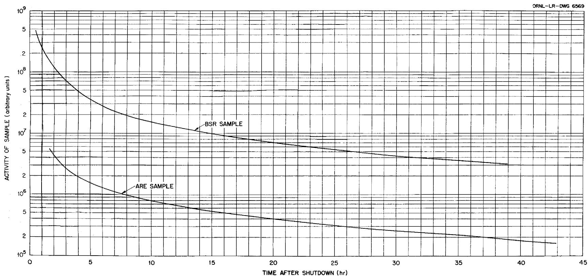  
Fig. N.1. Decay of Irradiated Fuel Samples.

# Appendix O

# ANALYSIS OF TEMPERATURE COEFFICIENT MEASUREMENTS

# IMPORTANCE OF THE FUEL TEMPERATURE COEFFICIENT

One of the most desirable features of a circulating-fuel reactor is its inherent stability because of the strong negative temperature coefficient of reactivity. This was conclusively demonstrated by the ARE. It had been predicted, on the basis of the temperature dependence of the density, which was

$$
\rho (g / c m ^ {3}) = 3. 9 8 - 0. 0 0 0 9 3 T (^ {\circ} F)
$$

for the final fuel concentration in the reactor, that the ARE fuel would have a negative temperature coefficient of sizable magnitude. At the operating temperature of $1300^{\circ}\mathrm{F}$ the fuel density was 3.33 $\mathrm{g/cm}^3$ . The resulting mass reactivity coefficient was

$$
\left(\Delta M / M\right) / ^ {\circ} F = - \frac {0 . 0 0 0 5 2}{3 . 3 3} = - 1. 5 6 \times 1 0 ^ {- 4} / ^ {\circ} F,
$$

and, for $\Delta k / k = 0.236\Delta M / M$ the predicted temperature coefficient that would result from the changing density of the fuel alone was

$$
\left(\Delta k / k\right) / ^ {\circ} F = - 3. 6 8 \times 1 0 ^ {- 5} / ^ {\circ} F
$$

Actually, as was stated in the body of this report (cf., Fig. 6.4), the fuel temperature coefficient was $-9.8 \times 10^{-5} / {}^{\circ}\mathrm{F}$ .

As long as the over-all temperature coefficient of a reactor is negative, the reactor will be a slave to the load demand. However, the fuel temperature coefficient was the important factor for reactor control in the ARE because it took a significant time for the bulk of the material of the reactor to change temperature and, therefore, for the over-all coefficient to be felt. In experiment H-5 (cf., Fig. 6.4), it was found that the fuel temperature coefficient predominated for 6 min.

# EFFECT OF GEOMETRY IN THE ARE

When the reactor was allowed to heat up by nuclear power, as in experiment H-5, the measurements of the temperature coefficient were quite definitive. The experiments in which the heat extraction by the helium blower was suddenly increased, i.e., experiments E-2, L-8, and H-4, did not give clear-cut results. In fact, it was noticed throughout the operation that whenever the fuel

loop helium blower speed was increased there was always a sudden marked increase in reactivity. In attempting to determine this instantaneous temperature coefficient by observing the rod movement by the servo as a function of the fuel temperature, values of the fuel temperature coefficient of a magnitude much larger than $-9.8 \times 10^{-5}$ could be obtained.

The change in the apparent temperature coefficient as a function of time during experiment H-4 is shown in Fig. O.1. The time intervals chosen were of 15-sec duration. The apparent peak temperature coefficient of reactivity was in excess of $-3.5 \times 10^{-4} (\Delta k / k) / ^{\circ} F$ , and after 5 min the coefficient leveled out to a value of about $-6 \times 10^{-5}$ . A more complete discussion of this experiment is given below in the section on "High-Power Measurements of Temperature Coefficients of Reactivity," in which the time lag of the thermocouples is taken into account. Two coefficients were obtained: an initial fuel temperature coefficient and an overall coefficient, which was the asymptotic value $(-6 \times 10^{-5})$ given by Fig. O.1.

The effect shown in Fig. 0.1 was due partly to geometrical considerations. By reference to Figs. 2.2 and 2.3, it can be seen that as the fuel entered the reactor it passed through the tubes closest to

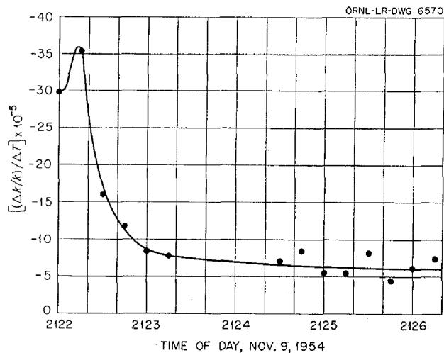  
Fig. 0.1. Variation in Apparent Temperature Coefficient of Reactivity with Time. Experiment H-4.

the center where the reactivity effect was greatest. With a sudden increase in heat extraction, a slug of cooled fuel initially entered the center of the core and caused a large reactivity change. Since the mean reactor temperature was the average temperature of all the fuel tubes, a comparison of the initial rate of rod insertion by the servo with the initial rate of change of the mean reactor temperature could give an apparent temperature coefficient much larger than its actual value. For example, in experiment L-8 (cf., Figs. 5.13 and 5.14) a comparison of the slopes of the rod position curve and the mean temperature curve near the beginning of the run was made. If it is assumed that the temperature response of the thermocouples lagged behind the response of the regulating rod movement, it is interesting to compare the points of steepest slope for the two curves. By using the slope from Fig. 5.13 at time 0218:30, and the slope from the mean temperature curve (Fig. 5.14) at 0220, a temperature coefficient of $-1.6 \times 10^{-4} (\Delta k / k) / ^{\circ}F$ is obtained, as opposed to the actual fuel temperature coefficient of $-9.8 \times 10^{-5}$ . A detailed discussion of this experiment is given in the section on "Low-Power Measurements of Temperature Coefficients of Reactivity." This effect was characteristic of the geometry of the ARE but not necessarily of circulating-fuel reactors in general.

# TIME LAG CONSIDERATIONS

As mentioned above and in the "Reactor Kinetics" section of Chapter 6, one of the most consistently noted phenomena of the ARE operation was the time lag in reactor temperature response during every phase of the experiment. These time lag effects can be partly explained by the geometry effect just described; and, in this sense, the time lag is not a true time lag but only an apparent lag due to the differences in location and response of the thermocouples and the neutron detectors (and, hence, regulating rod movements). Other possible causes for the time lags were the fuel transit time around the system, the heat transfer phenomenon within the reactor, the design and location of thermocouples, and a mass-temperature inertia effect. These effects were all discussed briefly in the section on "Reactor Kinetics," Chapter 6.

Whether or not the time lag was all or partly real is academic. The fact that it did give an observed effect during many phases of the ARE operation made it mandatory to take the lag into account in interpreting much of the data. The manner in which this was actually done was to assume that the response of the thermocouples lagged behind the nuclear response of the reactor (by as much as $2\frac{1}{2}$ min for low-power operation and by about 1 min during the high-power regime) in those experiments in which the equilibrium between the reactor and its load was upset (i.e., rapid fuel cooling rates). The thermocouple readings were then "moved up" by that amount, and the new readings were compared with the appropriate nuclear instrument observation. For those experiments in which equilibrium prevailed, but in which cooling was taking place, it was only necessary to correct for temperature readings (cf., app. K).

The temperature coefficient measurements were probably more affected by the temperature-time lags than any other single type of measurement made on the ARE, mainly because of the short duration of the experiments and their great dependence on time correlations (for example, correlations between regulating rod motion and mean temperature changes). The results of temperature coefficient measurements which contained time lag corrections were not included in the main body of the report because such corrections needed to be discussed in detail inappropriate to the context of the report. These experiments are described in the following sections of this appendix.

# SUBCRITICAL MEASUREMENT OF TEMPERATURE COEFFICIENT

The subcritical measurement of the temperature coefficient (exp. E-2) was described in Chapter 4. Briefly, the procedure followed was to cool the fuel by raising the heat barriers on the fuel heat exchangers, turning on the fuel helium blowers, and then observing the increase in multiplication with the two fission chambers and the $\mathsf{BF}_3$ counter. The $\mathsf{BF}_3$ counting rate was so low that the statistics were poor; therefore, the fission chamber data had to be used. The subcritical multiplication of the fission chambers was then subject to the phenomenon discussed in Appendix E. In this experiment the cooling was rapid and equilibrium conditions were not attained. Consequently, in order to find a value of the temperature coefficient from these measurements, it was necessary to

apply three corrections: a correction for the fission chamber multiplication error, a time lag correction, and a temperature correction of control room observed temperatures (app. K).

Throughout the subcritical experiments ample data were taken simultaneously on the $\mathsf{BF}_3$ counter and the two fission chambers for a correlation plot between the counting rates of the $\mathsf{BF}_3$ counter and the fission chamber to be easily obtained, as shown in Fig. 0.2. A plot of the raw data obtained from the fission chambers before corrections were applied is shown in Fig. 0.3, which shows the counting rates of the chambers plotted as a function of the reactor mean temperature. The hysteresis effect is the result of the time lag. The progress of the experiment can be read from the curves by starting on the right side at 1004 and proceeding counterclockwise around the loops. The fuel blower was turned on at 1004 and allowed to cool the fuel for 5 min, after which the blower was turned off and the system then slowly returned to its initial condition. The fission chamber counting rates increased while the blower was on and decreased after the blower was turned off again in immediate response to the cooling. The reactor mean temperature change, on the other hand, lagged behind both when the blower was turned on and when it was turned off. The blower was turned off shortly after 1009, but even though the counting rate started to decrease immediately, the reactor mean temperature continued to fall for approximately $2\frac{1}{2}$ min before it began to show a warming trend. Undoubtedly the fuel temperature did actually follow closely the changes introduced by the blower (otherwise the counting rate changes would not have been observed as promptly as they were), but because of the various effects noted in this appendix and in the "Reactor Kinetics" section of Chapter 4 the thermocouples were slow in responding. If the thermocouples had shown instant response there would have been no hysteresis effect observed, and the plot of $k$ vs mean temperature would have been a straight line with a negative slope proportional to the temperature coefficient.

The plot of $k$ vs mean temperature was obtained by applying the three corrections noted above in

the following way. The first correction was applied by changing the fission chamber data to $\mathsf{BF}_3$ counter data by using the curves of Fig. 0.2. The resulting points obtained from each fission chamber were averaged and then plotted on a time scale along with the reactor mean temperature to produce a plot similar to the curves of Fig. 4.5. The maximum of the counting rate curve and the minimum of the temperature curve were then matched up (the temperature curve was effectively moved up $2\frac{1}{2}$ min in time), and new temperatures were read from the temperature curve corresponding to the time that the counts were taken. From the counting rates the multiplication factor $k = 1 - (1 / M)$ was determined for each point, and then a plot of $k$ as a function of mean temperature was drawn up, as shown in Fig. 0.4. A straight line could reasonably be drawn through the points.

The third and final correction to be applied to the mean temperature was obtained from Appendix K. Since this experiment was one in which the fuel was cooled rapidly and equilibrium conditions were not met, the curves of Fig. K.2 are applicable. From Fig. K.2 it can be shown that a change of $1^{\circ}F$ in the true mean temperature corresponds to a change of $1.40^{\circ}F$ in the mean temperature read from the control room instruments. Thus the mean temperature change observed had to be increased by a factor of 1.4. A measurement of the slope of the curve of Fig. O.4 gives a $(\Delta k / k) / \Delta T$ of $1.65\times 10^{-4}$ . The average $k$ over the plot is 0.922. By applying the factor 1.4 to the observed mean temperature change, the fuel temperature coefficient was calculated to be

$$
a = (\Delta k / k) / \Delta T = \frac {- 1 . 6 5 \times 1 0 ^ {- 4}}{0 . 9 2 2 \times 1 . 4} = - 1. 2 8 \times 1 0 ^ {- 4}.
$$

This value is about $30\%$ higher than that given by the results of experiment H-5, but it is in fair agreement in consideration of all the necessary corrections. A consideration of the errors involved showed that the maximum error was of the order of magnitude of $2.4 \times 10^{-5}$ . Therefore,

$$
a = - (1. 2 8 \pm 0. 2 4) \times 1 0 ^ {- 4}.
$$

If the lower limit of this value is taken, the agreement between this value and the accepted value is fairly good. This experiment did not yield an overall temperature coefficient.

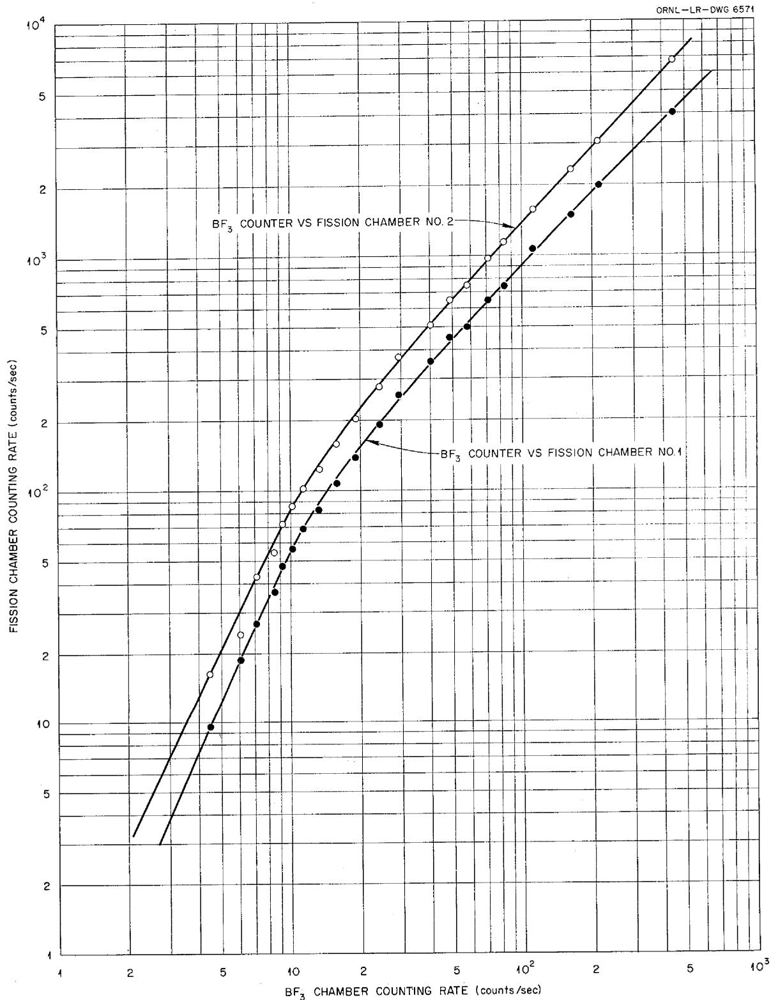  
Fig. 0.2. Correlation Between the Counting Rates of the $\mathbf{BF}_3$ Counter and the Two Fission Chambers.

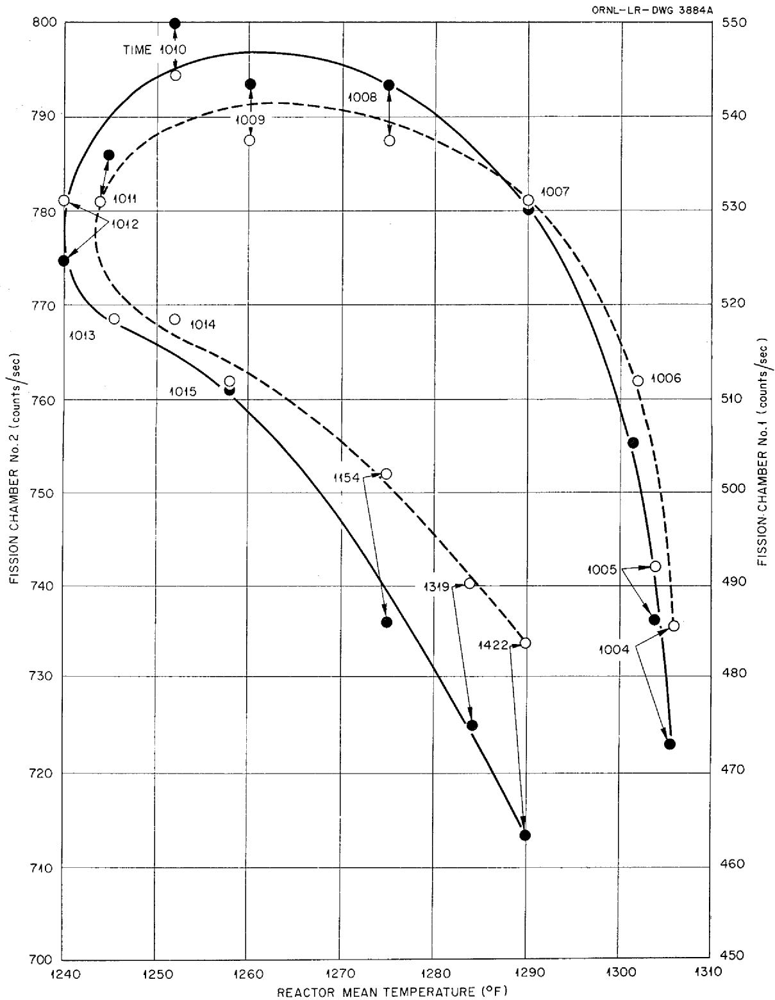  
Fig. 0.3. Subcritical Measurement of Temperature Coefficient of Reactivity (Uncorrected Fission Chamber Data).

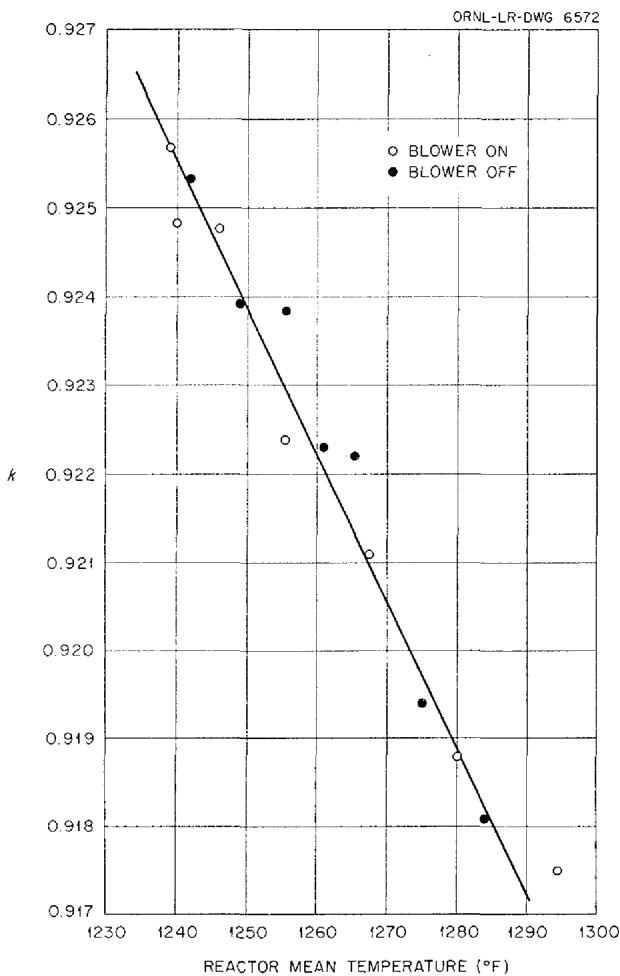  
Fig. 0.4. Reactivity as a Function of Reactor Mean Temperature as Determined from the Subcritical Temperature Coefficient Measurement. Experiment E-2.

# LOW-Power Measurements of TEMPERATURE COEFFICIENTS OF REACTIVITY

The low-power measurements of the temperature coefficients of reactivity were similar to the subcritical measurements, except that with the reactor critical and on servo at 1-w power, reactivity introduced by cooling the fuel was observed by a change in the regulating rod position. The experiment is described in Chapter 5.

As shown in Fig. 0.5, which is a plot of the regulating rod position vs the observed mean temperature during the experiment, a hysteresis phenomenon was obtained. It is significant that no time lags needed to be taken into account in the interpretation of this data, because the experiment proceeded slowly enough for equilibrium conditions to prevail. However, since this was a cooling experiment, a temperature correction had to be applied. Cooling took place along the lower half of the figure and heating occurred along the upper portion. Each of the curves had an initial steep slope corresponding to an initial fuel temperature coefficient and a less steep slope from which an overall reactivity coefficient was found.

After correction for the mean temperature readings, the average of the two initial slopes gave a fuel temperature coefficient of reactivity of $-9.9 \times 10^{-5}$ , and the other slopes gave an average over-all reactivity coefficient of about $-5.8 \times 10^{-5}$ . These values agree well with the accepted values of $-9.8 \times 10^{-5}$ and $-6.1 \times 10^{-5}$ for the fuel and over-all temperature coefficients of reactivity, respectively.

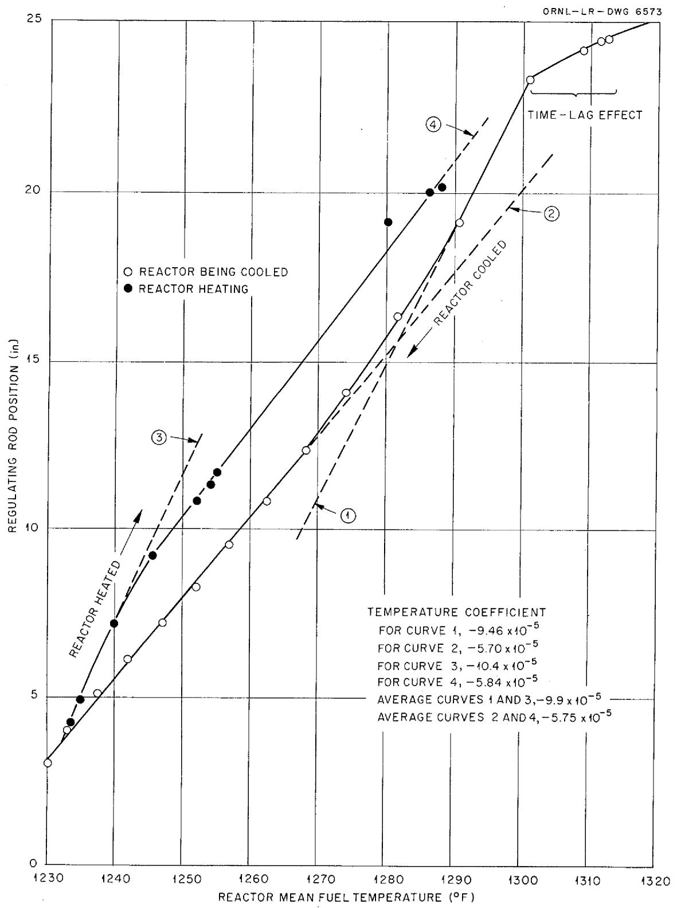  
Fig. 0.5. Regulating Rod Position as a Function of Observed Reactor Mean Temperature During Experiment L-5.

# HIGH-POWER MEASUREMENTS OF TEMPERATURE COEFFICIENTS OF REACTIVITY

During the high-power operations an experiment was conducted at a power of 100 kw which was similar to the low-power experiment just described. The fuel helium blower was turned on with the reactor on servo, and the fuel was cooled. However, the action took place so rapidly that a 1-min time lag3 of the fuel mean temperature had to be accounted for in plotting the data in addition to the temperature correction. Figure 0.6, in which the regulating rod movement is plotted as a function of the mean fuel temperature, shows the experimental measurements. Two distinct slopes were observed that corresponded to an initial fuel temperature coefficient and to an over-all temperature coefficient of reactivity.

From the steep slope (curve No. 1) a fuel temperature coefficient of $-1.17 \times 10^{-4} (\Delta k / k) / {}^{\circ} \mathrm{F}$ was obtained, and from the other slope an over-all coefficient of $-5.9 \times 10^{-5} (\Delta k / k) / {}^{\circ} \mathrm{F}$ was found. These two values are in fair agreement with the accepted values of $-9.8 \times 10^{-5}$ and $-6.1 \times 10^{-5}$ for these coefficients.

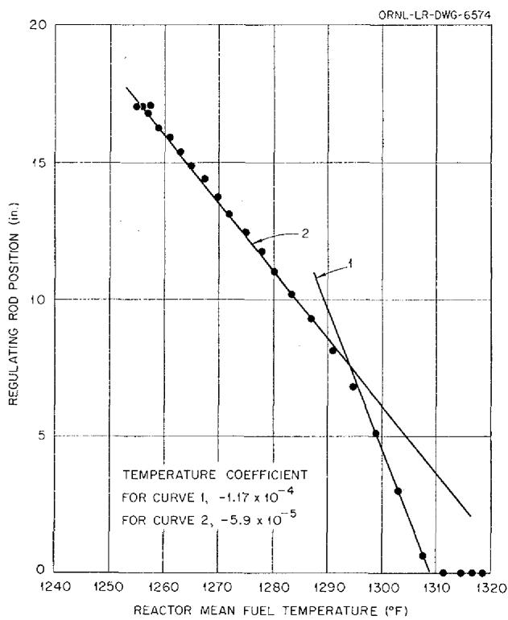  
Fig. 0.6. Regulating Rod Position as a Function of Reactor Mean Fuel Temperature for Experiment H-4.

# Appendix P

# THEORETICAL XENON POISONING

The xenon poisoning which existed in the ARE was determined experimentally to be an almost negligible amount. It was therefore of interest to compute the amount of such poisoning that would have been present if no xenon had been lost due to off-gassing of the fuel so that a measure of the effectiveness of the off-gassing process could be obtained.

The poisoning by $Xe^{135}$ , when the xenon content has reached equilibrium, is given by

$$
P _ {0} = \frac {\sigma_ {2} \left(\gamma_ {1} + \gamma_ {2}\right) \phi_ {0}}{\left(\lambda_ {2} + \sigma_ {2} \phi_ {0}\right)} \left(\frac {\Sigma_ {f}}{\Sigma_ {u}}\right), \tag {1}
$$

where

$P_{0} =$ the ratio of the number of thermal neutrons adsorbed in the xenon to those adsorbed in the fuel,

$\sigma_{2} =$ microscopic xenon cross section for thermal-neutron absorption,

$(y_{1} + y_{2}) =$ the total fractional yield of $Xe^{135}$ from fission, both from iodine decay and direct Xe formation $= 0.059,$

$$
\lambda_ {2} = \text {t h e d e c a y c o n s t a n t f o r} X e ^ {1 3 5} = 2. 1 \times 1 0 ^ {- 5} / \sec ,
$$

$\Sigma_{f} / \Sigma_{u} =$ the ratio of the macroscopic thermal neutron cross section for fission to that for absorption, for U235 $\Sigma_{f} / \Sigma_{u} =$ 0.84,

$\phi_0 =$ the average thermal-neutron flux in the fuel (since the entire fuel volume, $5.33\mathrm{ft}^3$ is equally exposed to this flux, although there is only $1.37\mathrm{ft}^3$ of fuel in the core at one time, the average flux in the fuel is $1.37 / 5.33$ or 0.26 times the average flux in the reactor, which is $0.7\times$ $10^{13}$

The $Xe^{135}$ absorption cross section, $\sigma_{2}$ , is smaller in the ARE than at room temperature, because the average neutron energy in the ARE exceeds the average neutron energy corresponding to room temperature and because the $Xe^{135}$ absorption cross section drops off rapidly with

increasing neutron energy. R. R. Bate, R. R. Coveyou, and R. W. Osborn investigated the neutron energy distribution in an absorbing infinite moderator by using the Monte Carlo method and the Oracle. By assuming a constant scattering cross section and a constant $1 / \nu$ absorption cross section, they found that the neutron energy distribution is well represented by a Maxwellian distribution corresponding to an effective temperature, $T_{e'}$ provided

$$
\kappa = \sqrt {\frac {2}{3}} \frac {\Sigma_ {a}}{\Sigma_ {s}} <   0. 0 6,
$$

where the macroscopic absorption cross section $\Sigma_{a}$ is measured at the moderator temperature and $\Sigma_{s}$ is the macroscopic scattering cross section. The effective temperature

$$
T _ {e} = T _ {m} (1 + a A \kappa),
$$

where $T_{m}$ is the moderator temperature, $a$ is a constant approximately equal to 0.9, and $A$ is the atomic weight of the moderator.

The present state of the theory does not permit consideration of the inhomogeneous distribution of the various constituents of the ARE core, and therefore the main constituents were considered to be evenly distributed over the core. The nuclei per cubic centimeter were thus

$$
\text {O x y g e n} \quad 5. 5 \times 1 0 ^ {2 2}
$$

$$
B e r y l i u m \quad 5. 5 \times 1 0 ^ {2 2}
$$

$$
U ^ {2 3 5} \quad 7. 8 \times 1 0 ^ {1 9}
$$

Other elements made only a negligible contribution to the cross section of the core. The following cross sections were used:

Oxygen, scattering 4 barns

Beryllium, scattering 7 barns

Uranium, absorption 360 bars

Thus

$$
K = \sqrt {\frac {2}{3}} \frac {3 6 0 \times 7 . 8 \times 1 0 ^ {1 9}}{(4 + 7) \times 5 . 5 5 \times 1 0 ^ {2 2}} = 0. 0 3 8.
$$

For the atomic weight, $A$ , the average of the values for beryllium and oxygen, 12.5, was assumed. Thus

$$
\begin{array}{l} T _ {e} = 1 0 3 3 [ 1 + (0. 9 \times 1 2. 5 \times 0. 0 3 8) ] \\ = 1 4 7 4 ^ {\circ} K \\ = 2 2 0 0 ^ {\circ} F. \\ \end{array}
$$

The $Xe^{135}$ absorption cross section in the reactor was then determined, as shown in Table P.1, which gives the energy intervals of the neutrons, $E_{i}$ , the fraction of neutrons in these energy intervals according to the Maxwell-Boltzman distribution, $n(E_{i}) / n$ , and the total $Xe^{135}$ cross section, $\sigma_{t}$ , for each energy interval, from which the average $Xe^{135}$ cross section is obtained. In the energy range in question the xenon adsorption cross section is approximately equal to the total xenon cross section, $\sigma_{t}$ . As shown in Table P.1, the value of this cross section is $1.335 \times 10^{6}$ barns or $1.335 \times 10^{-18}$ cm².

The anticipated xenon poisoning during the 25-hr xenon run (exp. H-11) may then be computed from Eq. 1 by using the value determined above for the $Xe^{135}$ absorption cross section:

TABLE P.1. Xe $^{135}$ ABSORPTION CROSS SECTION IN THE REACTOR   

<table><tr><td>Ei(ev)</td><td>f = n(Ei)/n</td><td>ΔE</td><td>σxtXe(Ei)(bars)</td><td>f × σxtXe(Ei)(bars)</td></tr><tr><td>0.02</td><td>0.060</td><td>2.50 × 106</td><td>0.150 × 106</td><td></td></tr><tr><td>0.04</td><td>0.073</td><td>2.75 × 106</td><td>0.200 × 106</td><td></td></tr><tr><td>0.06</td><td>0.076</td><td>3.25 × 106</td><td>0.248 × 106</td><td></td></tr><tr><td>0.08</td><td>0.075</td><td>3.30 × 106</td><td>0.248 × 106</td><td></td></tr><tr><td>0.10</td><td>0.072</td><td>2.82 × 106</td><td>0.201 × 106</td><td></td></tr><tr><td>0.12</td><td>0.067</td><td>1.92 × 106</td><td>0.129 × 106</td><td></td></tr><tr><td>0.14</td><td>0.062</td><td>1.27 × 106</td><td>0.079 × 106</td><td></td></tr><tr><td>0.16</td><td>0.057</td><td>0.75 × 106</td><td>0.042 × 106</td><td></td></tr><tr><td>0.18</td><td>0.051</td><td>0.45 × 106</td><td>0.023 × 106</td><td></td></tr><tr><td>0.20</td><td>0.046</td><td>0.32 × 106</td><td>0.015 × 106</td><td></td></tr><tr><td></td><td></td><td>Average σxtXe</td><td>1.335 × 106</td><td></td></tr></table>

(such as Inconel, etc.), and during the 25 hr of operation, if the xenon had all stayed in the fuel it would have reached $69\%$ of its equilibrium concentration. By applying these various corrections, it is found that the xenon poisoning in the ARE at the end of the 25-hr run should have

$$
\begin{array}{l} P _ {0} = \frac {1 . 3 \times 1 0 ^ {- 1 8} \times 0 . 0 5 9 \times 0 . 7 \times 1 0 ^ {1 3} \times 0 . 2 6}{(2 . 1 \times 1 0 ^ {- 5}) + (1 . 3 \times 1 0 ^ {- 1 8} \times 0 . 7 \times 1 0 ^ {1 3} \times 0 . 2 6)} \times 0. 8 4 \\ = \frac {0 . 0 1 1 7 \times 1 0 ^ {- 5}}{(2 . 1 + 0 . 2 4) \times 1 0 ^ {- 5}} = \frac {0 . 0 1 1 7}{2 . 3 4} = 0. 0 0 5. \\ \end{array}
$$

This value has to be corrected because about one-third of the fissions occur at energies above thermal and therefore have only little competition from xenon absorption. Furthermore, the reactivity loss due to poison was about $89\%$ of that computed above because of the absorption in other poisons

been $0.2\%$ in $\Delta k / k$ if no xenon had been off-gassed.

# Appendix Q

# OPERATIONAL DIFFICULTIES

The operational difficulties described here are only those which occurred during the nuclear phase of the operation, that is, from October 30 to November 12, the period of time covered by this report. With a system as large, as complex, and as unique as that which constituted the ARE, it is amazing that so few difficulties developed during the crucial stages of the operation. Furthermore, such troubles were, without exception, not of a serious nature. This is in large measure attributable to the long period of installation and testing1 which preceded the nuclear operation, the safety features inherent in the system, and the quality of workmanship which went into its construction. All major difficulties and impediments which arose are discussed below and are grouped by systems, with special regard for chronology of occurrence.

# ENRICHMENT SYSTEM

As mentioned previously, the fuel enrichment system was changed (shortly before the critical experiment was to begin) from a remotely operated two-stage system, in which the transfer was to start with all the fuel concentrate in a single container, to a manually operated two-stage system, in which small batches of the available concentrate were transferred, one at a time. A portion of the equipment used is shown in Fig. Q.1. Although this change resulted in an improvement both in safety and control, the temperature control of the manually operated system was persistently difficult. Furthermore, in order to avoid plugged lines because of the concentrate freezing at cold spots, the lines had to be continuously purged with gas and the exit gas lines then plugged as a result of concentrate-vapor condensation. Both these difficulties could have been avoided with proper design.

The temperature control was a greater problem here than anywhere else in the system because of the small $(5\%)$ and $\frac{3}{8}$ in.) tubing used in the transfer lines and an inferior technique of heater installation. This problem was aggravated by the virtual inaccessibility of the connection between the transfer line and the pump at the time the system was revised. The final heater arrangement used, which proved to be satisfactory, consisted of

double tracing of the line with calrod heaters staggered so that successive pairs of calrods did not meet at the same point. Even with this arrangement, thermocouples were necessary at every heater junction and each calrod or each pair of calrods should have had a separate control.

After it became an established part of the enrichment procedure to continuously bleed gas through the transfer line into the pump (in order to keep the line clear), the gas was vented through an extra line at the pump. The extra line was not properly heated and soon plugged with vapor condensate. It then became necessary to use the primary pump vent system which had a vapor trap. By reducing the bleed gas flow to a minimum, this vent system could be used without becoming plugged with vapor condensate.

The transfer line to the pump served adequately throughout the critical experiment, although it had to be reworked four times either because of the formation of plugs or the development of leaks (in Swagelok connections where the line was cut and replaced). During the last injection for rod calibration the transfer line again became plugged at the fitting through the pump flange. This fitting was a resistance-heated concentric-tubing arrangement which provided an entrance for the $1300^{\circ}\mathrm{F}$ transfer line through the $700^{\circ}\mathrm{F}$ pump flange. The oxidized fuel from previous leaks had shorted the heating circuit, and the fitting had therefore cooled and plugged. Attempts to clear the fitting caused it to leak; the leak was sealed but the fitting was then inoperable.

The final injection of concentrate, which was required for burnup at power, xenon poison, etc., was therefore made through the fuel sampling line. A special batch of concentrate was prepared and pressurized into the pump through the sample line. This technique worked satisfactorily but had previously been avoided because the line had not been designed to attain the high temperatures $>1200^{\circ}\mathrm{F}$ required by the melting point of the concentrate. Furthermore, the sample line was attached to the pump below the liquid level in the pump, and if a leak had developed in the line a sizeable spill would have resulted.

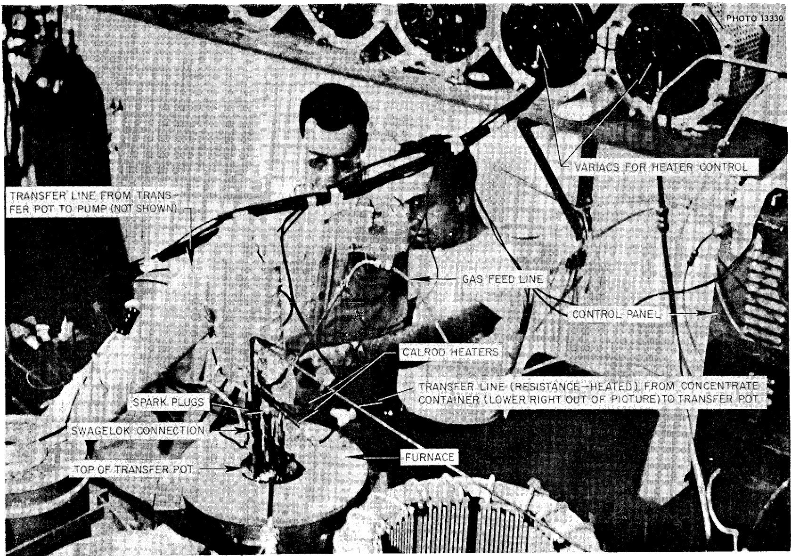  
Fig. Q.1. Enrichment System Transfer Pot and Transfer Lines.

# PROCESS INSTRUMENTATION

For an appreciation of the generally excellent performance of the instrumentation, knowledge of the number and complexity of the instruments is required. There were at least 27 strip recorders (mostly multipoint), 5 circular recorders, 7 indicating controllers, 9 temperature indicators (with from 48 to 96 points apiece), about 50 spark plugs, 20 ammeters, 40 pressure gages, 16 pressure regulators, 20 pressure transmitters, and numerous flow recorder indicators and alarms, voltmeters, tachometers, and assorted miscellaneous instruments. Furthermore, many of these were employed in systems circulating fuel and sodium at temperatures up to $1600^{\circ}\mathrm{F}$ . Since all instruments were subject to routine inspection and service, petty difficulties were kept to a minimum.

In the course of nuclear operation, only the following instruments gave cause for particular concern: fuel flowmeter, main fuel pump level indicator, several sodium system spark plugs, fuel pressure transmitter, and several pump tachometer generators. Of these only the tachometer generator "failures" were not caused by the materials and temperatures being instrumented. The tachometers, as installed, were belt driven rather than direct-coupled and were not designed to withstand the side bearing loads to which they were subjected. The tachometers were replaced, however, before the pits were sealed, and they performed satisfactorily during the high-power operation.

The fuel flowmeter and the fuel pump level indicator were similar instruments in which a float or bob was attached to a long tapered iron core suspended in a "dead leg." Coils were mounted outside the dead leg which located the position of the core. The position of the core could be interpreted as a measure either of fuel level or of fuel flow up past the bob. The coil current, however, was very sensitive to the fuel temperature, which had to be maintained above the fuel melting point. In addition to the temperature sensitivity, several coils (spare coils were provided on each instrument) opened up during the experiment, presumably due to oxidation of the coil-to-lead wire connection. The fuel flowmeter oscillated rapidly over a 10-gpm range throughout the later stages of the experiment, although the electronics of the instrument appeared to be in order. On the other hand, operation of the main fuel pump level indicator was satisfactory up to the last day of operation, at which time the spare coil opened up (the main coil

had previously opened). It is felt that these instruments would have performed satisfactorily if the iron core were designed to move in a trapped gas leg above the float rather than in a dead leg below the float so that the operating temperature could be reduced. Furthermore, the coil reading should be "balanced out" to eliminate the temperature sensitivity.

Of the numerous spark plugs which were employed in the various fuel and sodium tanks as the measure or check on the liquid level, only three of those in the sodium system showed a persistent tendency to short. These shorts could not always be cleared by "short-burning," but they frequently cleared themselves as the liquid level dropped. Although the probes were located in a riser above the tank top to minimize shorts, the shorts could probably have been eliminated by using larger clearances than were afforded by the use of $\frac{1}{8}$ -in.-OD probes in a $\frac{1}{2}$ -in.-IPS pipe riser.

The high-temperature fuel system pressure transmitters suffered a zero shift during the course of the experiment. These transmitters employed bellows through which the liquid pressure was transmitted to gas. It is probable that the bellows were distorted at times when the gas and liquid pressure were not balanced as a result of operational errors or plugged gas supply lines. In any case, the gas ports in the transmitter occasionally plugged, and a zero shift in the instrument was observed.

In view of the large number of thermocouples in use throughout the experiment (in the neighborhood of 1000), it is not surprising that a small number were in error. However, those which gave incorrect indications included some of the most important ones associated with the entire experiment. As discussed in Appendix K there was serious disagreement between line thermocouples inside and outside the reactor thermal shield, although it would appear that they both should have given the same indication. Other misleading temperature readings were obtained from the thermocouples on the tubes in the fuel-to-helium heat exchangers. These thermocouples were not properly shielded from the helium flow and read low.

Although most of the thermocouple installations were designed to measure equilibrium temperatures and did so satisfactorily for a number of experiments involving fast transients, it was important that the response of the thermocouples be $>10^{\circ}\mathrm{F}$ per sec in order to correlate the changes in fluid

temperatures with nuclear changes. Unfortunately it is not certain that this was the case, and, in addition, in certain instances, as with one of the thermocouples on each of the reactor $\Delta T$ and reactor mean temperature instruments, the thermocouples were mounted on electrical insulators which increased the thermal lags.

The above discussion covers most of the instrumentation difficulties that arose. This is not meant to imply, for example, that all the 800-odd thermocouples lasted throughout the experiment; there were open thermocouples scattered throughout the system. Furthermore, the instrument mechanics were kept busy; when not doing installation work, they were usually involved in routine service and maintenance work.

# NUCLEAR INSTRUMENTATION AND CONTROLS

It is difficult in the case of the nuclear instruments to separate operation problems from those inherent in routine installation and debugging, since these latter operations were continued right up to the time the instruments were needed. However, during actual operation, all nuclear instrumentation performed satisfactorily. The control mechanism operated as designed, except that one shim rod had a higher hold current (it was supported by an electromagnet) than the other two. This situation was improved by cleaning the magnet face and filtering the gas surrounding the magnet.

# ANNUNCIATORS

The control system included an annunciator panel which anticipated potential troubles and indicated off-design conditions by a light and an alarm. During the course of the experiment, certain annunciators consistently gave false indications, and therefore the bells (but not the lights) of these annunciators were finally disconnected. Included were the standby sodium pump lubrication system flow, the standby fuel pump cooling water flow, the fuel heat exchanger water flow, and the fuel heat exchanger low-temperature alarm. The first three annunciators had mercury switches which were either improperly mounted or set too close to the design condition, but the fuel heat exchanger low temperature alarm error was due to faulty thermocouple indication; that is, instead of indicating fuel temperature, the thermocouple, which was located in the cooling gas stream, read low.

# HEATERS AND HEATER CONTROLS

During the time the system was being heated, the heater system power was over 500 kw. This heat was transferred to the piping and other components by the assorted ceramic heaters, calrods, and strip heaters that covered every square inch of fuel and sodium piping, as well as all system components which contained these liquids. Although there were numerous heater failures resulting from mechanical abuse up until the time the pits were sealed, all known failures were repaired before the pit was sealed. Only four heater circuits were known to be inoperable at the time the reactor was scrambled - two heaters showed open, two shorted.

Except for the fuel enrichment system in which the heating situation was aggravated by the higher temperatures as well as the small lines, the available heat was adequate everywhere. The control of the various heater circuits was, however, initially very poor; it consisted of four voltage buses to which the various loads could be connected plus variacs for valve and instrument heaters. However, in order to obtain satisfactory heater control for all elements of the system, 13 additional regulators were installed in addition to numerous additional variacs. With the additional regulators it was possible to split up the heater load to get the proper temperatures throughout the system without overloading any distribution panel. Even with the helium annulus, one function of which was to distribute the external heat uniformly, it must be concluded as extremely desirable, if not an absolute necessity, that all components of any such complex high-temperature system be provided with independently controlled heater units in order to achieve the desired system equilibrium temperature.

# SYSTEM COMPONENTS

The only major components of either the sodium or fuel system which caused any concern during the nuclear operation were the sodium valves (several of which leaked) and the fuel pump (from which emanated a noise originally believed to originate in the pump bearings). In addition, there were problems associated with plugged gas valves and overloaded motor relays.

The sodium valves that leaked were the two pairs that isolated the main and standby pumps and at least one of the fill valves in the lines to the three sodium fill tanks. The leakage across

the pump isolation valves was eliminated from concern by maintaining the pressure in the inoperative pump at the value required to balance with the system pressures. The leak (or leaks) in the fill valves was of the order of $\frac{1}{2}$ to $1 \, \text{ft}^3$ of sodium per day, and was periodically made up by refilling the system from one of the fill tanks. In the course of these operations, two tanks eventually became empty, and it was then apparent that most of the leakage had been through the valve to the third tank. This leakage was initially abetted by the high (~50 psi) pressure drop across the valve, but even though the pressure difference was reduced to 5 to 10 psi the leakage rate appeared to increase during the run.

It was of interest, as well as fortunate for the ultimate success of the project, that the fuel carrier fill valves were tight. However, in the fuel system, only two valves were opened during the filling operation and only one of these had to seal in order to prevent leakage. This valve did seal, and it was opened only one other time, i.e., when the system was dumped.

Each sodium pump (main and standby) and each fuel pump (main and standby) was provided with four microphone pickups to detect bearing noises. Shortly after the fuel system had been filled with the fuel carrier, the noise level detected on one of the main fuel pump pickups jumped an order of magnitude, while that on the other increased substantially. At the time the noise was believed to be due to a flat spot on a bearing, and operation was therefore watched very closely. When the noise level did not increase further (in fact, it tended to decrease), it was decided to continue the experiment without replacing the pump (a very difficult job which could conceivably have resulted in contamination of the fuel system). The pump operated satisfactorily throughout the experiment. Subsequent review of the pump design and behavior of the noise level indicated that the noise probably originated at the pump discharge where a sleeve was welded inside the system to effect a slip connection between the pump discharge duct from the impeller housing and the exit pipe, which was welded to the pump casing. Vibration of the sleeve in the slip joint could account for all the noise.

Although the vent header was heated from the fuel and sodium systems to the vapor trap filled with NaK (which was provided to remove certain fission products but also removed sodium vapor),

the temperature control of the header and the individual vent lines connected to it was not adequate to maintain the line above the sodium melting point and yet not exceed the maximum temperature limit $(400^{\circ}\mathrm{F})$ of the solenoid and diaphragm gas valves. Consequently, these vent lines became restricted by the condensation of sodium vapor. It was apparent that a higher temperature valve would have been desirable, that the gas line connecting the tank to the header should have been installed so that it could drain back into the tank, and, also, that good temperature control of the line and valve should have been provided. As it was, exceptionally long times were required to vent the sodium tanks through the normal vent valves. It would have been necessary to use the emergency vent system, which was still operable at the end of the experiment, if a fast dump had been required.

In addition to the above failures or shortcomings, there were numerous problems of less serious nature in connection with auxiliary equipment, motor overloads, water pipes which froze and split, and air dryers which burned out. However, nothing occurred in such a manner or at such a time as to have any significant bearing on the conduct of the experiment.

# LEAKS

The only sodium or fluoride leaks that occurred have already been discussed. These included one minor sodium leak in the sodium purification system (discussed in chap. 3, "Prenuclear Operation") and two fuel concentrate leaks from the enrichment system. That neither the reactor fuel system nor sodium system leaked is a tribute to the quality of the workmanship in both welding and inspection that went into the fabrication of these systems. In all, there were over 266 welded joints exposed to the fluoride mixture, and over 225 welded joints were exposed to the sodium.

In contrast to the liquid systems, there were several leaks in gas systems. It is felt that these leaks would not have occurred if the gas systems had been fabricated according to the standards used for the liquid systems. The notable gas leaks were from the fuel pumps into the pits, from the helium ducts in the heat exchangers into the pits, and from the pits into the building through the various pit bulkheads, as well as the chamber which housed the reactor controls.

The combination of the leak out of the fuel pump and that out of the pits required that the pits be maintained at subatmospheric pressures in order to prevent gaseous activity from contaminating the building. Accordingly, the pit pressure was lowered by about 6 in. $\mathsf{H}_2\mathsf{O}$ by using portable compressors which discharged the gaseous activity some 1000 ft south of the ARE building. The activity was of such a low magnitude that, coupled with favorable meteorological conditions, it was possible to

operate in this manner for the last four days of the experiment.

The leaks out of the helium ducts in the fuel and sodium heat exchangers resulted in a maximum helium concentration in the ducts of the order of $50\%$ , and to maintain even this low concentration, it was necessary to use excessive helium supply rates, i.e., 15 cfm to the ducts alone and another 10 cfm to the instruments.

# Appendix R

# INTEGRATED POWER

The total integrated power obtained from the operation of the Aircraft Reactor Experiment does not have any particular significance in terms of the operational life of the system. However, a total integrated power of 100 Mw was more or less arbitrarily specified as one of the nominal objectives of the experiment. While at the time the experiment was concluded it was estimated that this, as well as all other objectives of the experiment, had been met, the estimate was based on a crude evaluation of reactor power. Since subsequent analyses of the data have permitted a reasonably accurate determination of the reactor power, it is of interest to reappraise the estimated value of the total integrated power.

The total integrated power could be determined from either the nuclear power or the extracted power (cf., section on "Reactor Kinetics" in chap. 6). The power curves, which should have equivalent integrals, could be obtained from any of a number of continuously recording instruments, i.e., the nuclear power from either the micromicrometer or log $N$ meter, and the extracted power from any of the several temperature differential recorders in the fuel and sodium circuits. The total integrated power has been determined both from integration of a nuclear power curve $(\log N)$ and from the sum of the extracted power in both the sodium and fuel circuits, as determined by the temperature differentials in each system together with their respective flows (which were held constant). For both power determinations a calculation of the associated error was made.

# EXTRACTED POWER

The integrated extracted power was determined from the charts which continuously recorded the temperature differential $(\Delta T)$ in each system. As a matter of convenience the sodium system $\Delta T$ was taken from a 24-hr circular chart, while the fuel $\Delta T$ was taken from one of the six Brown strip charts which recorded, in the control room, the $\Delta T$ across each of the six parallel fuel circuits through the reactor. The individual circuit recorders had a much slower chart speed than that of the over-all $\Delta T$ recorder and were therefore much easier to read. To keep the results well within the accuracy of the whole experiment, tube No. 4 was selected for the determination because

the chart trace very closely corresponded to that of the over-all fuel $\Delta T$ across the reactor. From Fig. K.3, Appendix K, the control-room-recorded $\Delta T$ was converted to what was accepted as the correct $\Delta T$ . The power extraction was then calculated and plotted against time in Fig. R.1.

The sodium $\Delta T$ across the reactor was obtained from the circular charts of the recorders located in the control room. These $\Delta T$ 's were also corrected by using Fig. K.6, Appendix K, and the plot of the power extracted by the sodium as a function of time is also shown in Fig. R.1 on the same abscissa as that of the fuel plot. The total integrated (extracted) power, i.e., the sum of the area under both the fuel and sodium system power curves, was then determined by using a planimeter; it was found to be 97 Mw-hr.

A calculation was also made of the magnitude of the "maximum" possible error in the determination of the reactor power. The power equation, which was calculated for both the fuel and sodium systems, was

$$
P = k f \Delta T,
$$

where

$$
\begin{array}{l} P = \text {r e a c t o r p o w e r}, \\ k = a \text {c o n s t a n t} \quad \text {c o n s t a n t} \quad \text {c o n s t a n t} \quad \text {c o n s t a n t} \quad \text {c o n s t a n t} \quad \text {c o n s t a n t} \quad \text {c o n s t a n t} \quad \text {c o n s t a n t} \quad \tag {2} \\ \end{array}
$$

$$
\begin{array}{l} f = \text {f l o w r a t e o f f u e l o r s o d i u m}, \\ \Delta T = \text {t e m p e r a t u r e} \quad \text {d i f f e r e n c e} \quad \text {a c r o s s} \quad \text {r e c a r t o r}. \\ \end{array}
$$

$$
\Delta P = k f \Delta (\Delta T) + k \Delta T \Delta f + f \Delta T \Delta k,
$$

where

$$
\begin{array}{l} \Delta k = \text {m a x i m u m e r r o r i n t h e h e a t c a p a c i t y}, \\ \Delta f = \text {m a x i m u m e r r o r i n t h e f l o w r a t e}, \\ \Delta (\Delta T) = \text {m a x i m u m} \quad \text {e r r o r} \quad \text {i n} \quad \text {t h e} \quad \text {t e m p e r a t u r e} \\ \end{array}
$$

Nominal average values of these factors for the fuel system were

$$
\begin{array}{l} f = 4 6 \mathrm {g p m} \\ \Delta T = 3 5 0 ^ {\circ} \mathrm {F} \\ k = 0. 1 1 \mathrm {k w} / \text {d a y g p m} \\ \Delta f = 2 \mathrm {gpm} \cong 5 \% \\ \Delta (\Delta T) = 10^{\circ} F \stackrel {\sim}{=} 3 \% \\ \Delta k = 0.011 \approx 10 \% \\ \end{array}
$$

Therefore

$$
\Delta P \text {(f o r f u e l s y s t e m)} = 20 \%
$$

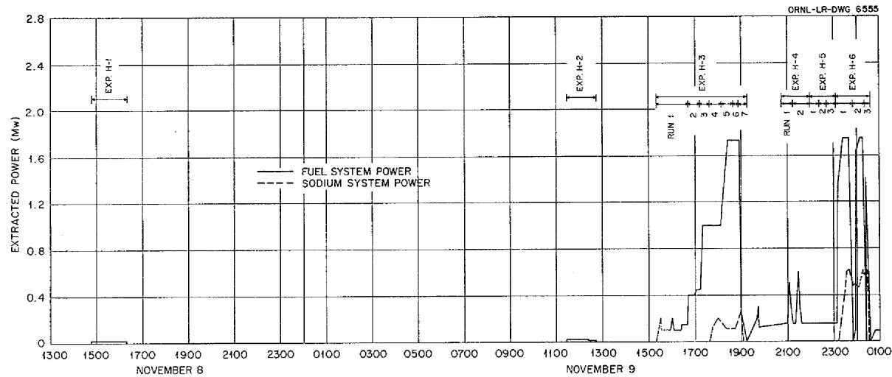

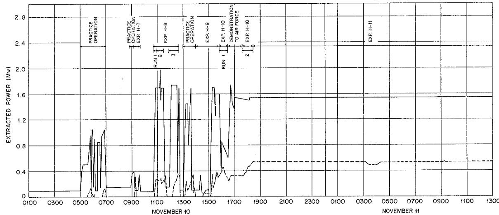

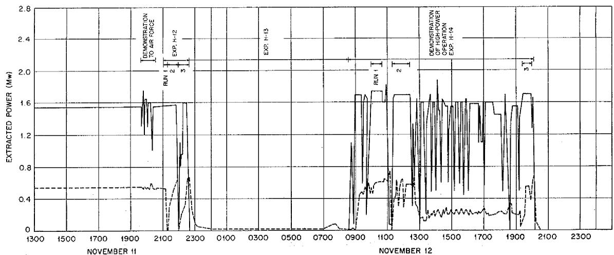  
Fig. R.1. Power-Time Curve.

The values for the sodium system were

$$
\begin{array}{l} f = 1 5 2 \mathrm {g p m} \\ \Delta T = 5 0 ^ {\circ} \mathrm {F} \\ k = 0. 0 3 4 3 \mathrm {k w} / \text {d a y} \cdot \mathrm {g p m} \\ \Delta f = 4 \mathrm {gpm} \cong 3 \% \\ \Delta (\Delta T) = 10^{\circ} F \cong 20 \% \\ \Delta k = 0 \\ \end{array}
$$

Therefore

$$
\Delta P \text {(f o r s o d i u m s y s t e m)} = 11 \%
$$

The weighted, over-all percentage error was therefore

$$
\frac {\Delta P}{P} = \frac {P _ {f} \times 0 . 2 0}{P} + \frac {P _ {s} \times 0 . 1 1}{P} = 1 7,
$$

where $P_{f}$ and $P_{s}$ are the power extracted in the fuel and sodium systems. The errors made in the power integration by using the $\Delta T$ chart are only those associated with the determination of power extraction. Since Fig. R.1 is a reproduction of the $\Delta T$ trace and it was integrated by using the planimeter, any integrating errors were assumed to have been averaged out. Therefore, the error that applies to the integrated extracted power is the 17% that is applicable to the power level determination; therefore the integrated extracted power was

$$
9 7 \pm 1 6. 5 M w - h r.
$$

# NUCLEAR POWER

During most of the time the reactor was operating at any appreciable power level, the nuclear power level was kept fairly constant and was recorded in the log book. During the times the power level was either not constant or not recorded in the log book, the nuclear power was determined from the log $N$ recorder chart by integrating the area under the power trace. (The log $N$ trace was used rather than the micromicroammeter because no record was kept of the micromicroammeter shunt value as a multiplying factor.) Since the log $N$ chart gave a log of power vs time plot, exact integration under the curve would have been an extremely difficult task; accordingly, the area under the curve was integrated graphically. The curved portions of the trace were approximated by straight lines, and an average log $N$ value was determined for each line segment. It was assumed that there were as many positive as negative errors in this method and that the errors cancelled out. The total integrated power was then obtained

by adding up all the incremental areas which were in terms of average log $N$ units times time.

From the 25-hr constant-power xenon run a relation between the log $N$ reading and the extracted power was obtained. It was found that 22.5 log $N$ units = 2.12 Mw, or 10.6 log $N$ units = 1 Mw; therefore

$$
\frac {\log N}{1 0 . 6} \times \text {t i m e (h r)} = M w - h r
$$

for any segment under the curve. By using this correlation between actual power and log $N$ reading, the total integrated nuclear power was calculated to be 96.6 Mw-hr. This value of the integrated nuclear power, $Q_{s}$ as determined from the log $N$ chart, was, in effect, found from the following relation

$$
Q = M C \Delta t,
$$

where

$M \equiv$ average log $N$ recorded value over an increment of time $\Delta t$ ,

$\Delta t =$ increment of time in hours,

$C = a$ constant which converts the log $N$ value to Mw-hr.

The constant, $C$ , in the expression is equal to the percentage error in the extracted power level determination, which was calculated in the preceding section to be $17\%$ . Therefore the error in $C$ is (0.17) $(1 / 10.6) = 0.016$ . The 74-hr period of high-power operation was divided into two parts, one part being the 25-hr period of constant power during the xenon run and the remainder being the 49-hr period of variable power. The errors were of different magnitude for each part, since during the xenon run there was no error in time or in the determination of the average value of $M$ .

For the 25-hr xenon run the integrated power was 53 Mw-hr. Thus

$$
\begin{array}{l} M = 2 2. 5 \log N \text {u n i t s} \\ \Delta t = 2 5 \mathrm {h r} \\ C = 0. 0 9 4 \mathrm {M w} / \log N \\ \Delta M = 0 \\ \Delta (\Delta t) = 0 \\ \Delta C = 0.016 \approx 17 \% \\ \end{array}
$$

Therefore

$$
\Delta Q _ {1} = M C \Delta (\Delta t) + M \Delta C \Delta t + \Delta M C \Delta t = 9 M w - h r.
$$

For the balance of the operating time (49 hr) and integrated power (43.6 Mw-hr), the average $M$ must

be determined as

$$
\overline {{M}} = \frac {Q}{C t} = \frac {4 3 . 6}{(0 . 0 9 4) (4 9)} = 9. 4 6
$$

and for $\Delta Q_{2}$

$$
\begin{array}{l} \bar {M} = 9. 4 6 \log N \text {u n i t s} \\ \Delta t = 4 9 \mathrm {h r} \\ C = 0. 0 9 4 \mathrm {M w} / \log N \\ \Delta M = 1 \\ \end{array}
$$

$$
\Delta (\Delta t) = 1 \mathrm {h r}
$$

$$
\Delta C = 0.016 \stackrel {\sim} {=} 17 \%
$$

$$
\Delta Q _ {2} = M C \Delta (\Delta t) + M \Delta C \Delta t + \Delta M C \Delta t = 1 2. 8 M w - h r.
$$

The total error was therefore

$$
\Delta Q = 12.8 + 9.0 = 21.8 \text{Mw - hr or} 22.5 \%
$$

The total extracted nuclear power then was

$$
9 6. 6 \pm 2 1. 8 M w - h r.
$$

# Appendix S

# INTERPRETATION OF OBSERVED REACTOR PERIODS DURING TRANSIENTS

When excess reactivity is being introduced into a reactor at a given rate, the period meter will show a period which is not a true period but a combination of the true period and its time rate of change. If the time rate of change of the period is known, then the true period may be found by the following means.

First, it is assumed that whenever any excess reactivity is introduced into the reactor the power will rise according to the following equation:

$$
P = P _ {0} ^ {\lambda t},
$$

where

$P_{0} =$ initial power,

$$
\lambda = 1 / 7,
$$

$\tau =$ reactor period,

$t =$ time power is increasing.

Then, to introduce a time rate of change of the period, the power is expressed in the form of an infinite series

$$
P = P _ {0} \left(1 + \lambda t + \frac {\lambda^ {2} t ^ {2}}{2 !} + \dots\right);
$$

If the higher order terms are neglected, the rate of change of power is

$$
\frac {d P}{d t} = P _ {0} \left(\lambda + t \frac {d \lambda}{d t}\right),
$$

and therefore

$$
\lambda = \frac {1}{P _ {0}} \left(\frac {d P}{d t} - t \frac {d \lambda}{d t}\right)
$$

and

$$
\tau = \frac {P _ {0}}{\left(\frac {d P}{d t} - t \frac {d \lambda}{d t}\right)}.
$$

In experiment H-8 (cf., chap. 6) it was noted that when the regulating rod was withdrawn the period observed was not a true period and that it kept changing over the 35 sec it took the regulating rod to travel its full distance. For a calculation of the true period, the following values were taken from Fig. 6.10 and Table 6.4:

$$
\begin{array}{l} P _ {0} = 2. 3 4 \mathrm {M w}, \\ P ^ {\prime} = 3. 9 4 \mathrm {M w}, \\ \tau_ {1} = 2 5 \text {s e c (i n i t i a l p e r i o d o b s e r v e d)}, \\ \tau_ {2} = 5 0 \text {s e c (f i n a l p e r i o d o b s e r v e d)}, \\ t = 3 5 \sec . \\ \end{array}
$$

From these values, it was found that

$$
\frac {d P}{d t} = 0. 0 4 5 7 \mathrm {M w / s e c}
$$

and

$$
t \frac {d \lambda}{d t} = 3 5 \left(\frac {\frac {1}{5 0} - \frac {1}{2 5}}{3 5}\right) = - 0. 0 2.
$$

Therefore

$$
\tau \stackrel {\sim} {=} \frac {2 . 3 4}{0 . 0 4 5 7 + 0 . 0 2} = 3 6 \sec .
$$

This calculated value for the true period corresponds fairly closely to the period of 42 sec measured from the slope of the log $N$ recorder trace.

# Appendix T

# NUCLEAR LOG

The following information was copied verbatim from the nuclear log book. The only material omitted was the running uranium inventory, which was kept during the critical experiment, and several calculations and graphs, which were inserted in the log book in an attempt to interpret the data. All the omitted information is presented in much better form elsewhere in this report.

The reactor power data referred to in the log are not consistent, because the power was estimated first from a calculation of flux at the chambers, subsequently from the activation of a fuel sample, and finally from the extracted power. If it is assumed that the extracted power value is correct, the original estimate was a factor of 2.7 low and that calculated from the fuel activation was a factor of 2 low. In the log book, all power levels mentioned through experiment L-8 were based on the original estimate; from experiment L-9 to H-14, all power levels were based on the fuel activation; and it was not until after high-power runs 1 and 2 of experiment H-14 that correct power levels were listed.

Run Time

1 1425 Zero fuel flow.

1500 Main fuel pump started to bleed down to minimum prime level.

1507 Main fuel pump at minimum prime level. System volume is now $4.64 + 0.18 = 4.82 \, \text{ft}^3$ (calculated).

2 Started adding lot from can 6.

1539 First 5-lb lot going into pump.

1545 It was noticed that pips on the fission chamber occurred in about 2-min intervals (pump rpm, 520).

1554 Second 5-lb batch going in.

1558 Third 5-lb batch going in. Interval is exactly 2 min. This gives a flow of 18.8 gpm for a pump speed of 520 rpm.

1603 Fourth 5-lb batch going in.

1610 Fifth 5-lb batch going in.

1614 Last of first 30-lb lot going in.

1623 Speeded up pump. Roughly 26 counts/sec on fission chamber 1 and 40 counts/sec on fission chamber 2. 500 rpm on pump.

1625 Pump speed 1100 rpm.

1720 Sample 6 taken from pump for analysis.

$\sim 1730$ Shim rods up,

controlrod down, fissionchambersdown. BF3

fission chamber 1 26.74 counts/sec fission chamber 2 41.86 counts/sec $\mathsf{BF}_3$ 6.93 counts/sec

These count rates checked very well with count rate meters.

$\sim 1750$ Shim rods down,

controlrod down, fissifissionchambersdown. BF3

fission chamber 1 18.74 counts/sec fission chamber 2 24.18 counts/sec $\mathsf{BF}_3$ 6.03 counts/sec

1812 Rods started up. Control rod back to 8-in. out.

$\sim 1827$ Rods out and count started prior to taking source out of core.

Source in core $\left\{ \begin{array}{ll}\text{fission chamber 1} & 27.1\text{ counts / sec}\\ \text{fission chamber 2} & 42.0\text{ counts / sec}\\ \text{BF}_3 & 6.97\text{ counts / sec} \end{array} \right.$

1845

Source out of core fission chamber 2 2.24 counts/sec $BF_{3}$ 13.44 counts/sec

1855

Source in core fission chamber 2 42.59 counts/sec $BF_{3}$ 6.82 counts/sec

3 1912 Started adding lot from can 7.

1920 Started transferring first 5-lb.

1930 Plugged line from transfer tank to pump.

2015 Chemists report that uranium concentration of sample 6 taken at 1720 is $2.47 \pm 0.01 \mathrm{wt} \%$

# Run Time

(3) 0035

0035 Attempt to clear line from transfer tank to pump.

0230 Still unsuccessful.

2000 New transfer line into main fuel pump installed.

2006 Sample 7 drawn off for analysis.

2230 Analysis of sample 7 taken at 2006 shows $1.84 \pm 0.04$ wt % total uranium.

Grimes estimates that no appreciable concentrate was transferred last night (i.e., Saturday night) at the time the line plugged. Therefore, this sample should be representative of run 2 and supersedes the previous sample which showed $2.47\%$ (see above).

2300 Starting transfer of first 5 lb of 25 lb in can 7.

2307 0.78 min between pips = 43 gpm, indicator on rotameter shows 46 gpm.

2315 Transfer line plugged again.

November 1, 1954

0008 Rods inserted.

1315 From data on rod position vs count rate, rods appear to be ineffective above 30 in.

1320 Plug removed from transfer line. Can 7 is still attached to the system. It is estimated that 5 of the 25 lb in can 7 were injected last night. The other 20 lb are now to be injected in 5-lb batches.

1335 Started transfer of second 5 lb of 25 lb in can 7. Interval between pips on fission chamber 2 was 30 sec. Pips are becoming hard to see.

1349 Started transfer of third 5 lb. Interval between pips $\sim 0.86$ min.

1403 Started transfer of fourth 5 lb.

1413 Started transfer of last batch from can 7.

1415 Transfer of 25 lb from can 7 completed. Interval between pips $\sim 0.79$ min.

1421 Withdrew rods from 30 to 35 in. Three 10-min counts taken.

1505 Rods inserted.

1615 Set $\log N$ to come on scale at an estimated $2 \times 10^{-3}$ w.

1617 Sample 8 taken for analysis.

4 1707

1707 First 5 lb of 30 lb from can 8 transferred.

1720 Second 5 lb transferred.

1731 Third 5 lb transferred.

1742 Fourth 5 lb transferred.

1753 Fifth 5 lb transferred.

1804 Sixth (final) 5 lb from can 8 transferred.

1838 Analysis of sample 8 taken at 1617 shows $3.45 \pm 0.01$ wt % total uranium.

1900 Rods inserted. Check on noise on pile period recorder started.

1940 Pile period meter shows microphonics. Epler put log $N$ back on normal setting. Log $N$ should come on scale $\sim 1/2$ w.

2028 Taking sample of fuel system, sample 9.

Run Time

5 2112 First 5 lb from can 9 transferred.

2123 Second 5 lb transferred.

2133 Third 5 lb transferred.

2142 Fourth 5 lb transferred.

2153 Fifth 5 lb transferred.

2203 Sixth (final) 5 lb transferred.

2255 Chemists report 5.43 wt % total uranium for sample 9 taken at 2028.

November 2, 1954

6 0104 First 5 lb from can 10 transferred.

0117 Second 5 lb transferred.

0128 Third 5 lb transferred. Two 5-min counts taken.

0153 Fourth 5 lb transferred.

0202 Fifth 5 lb transferred.

0213 Sixth (final) 5 lb transferred.

7 0506 First 5 lb from can 12 transferred.

0521 Second 5 lb transferred.

0533 Third 5 lb transferred. Two 5-min counts taken.

0551 Fourth 5 Ib transferred.

0600 Fifth 5 lb transferred.

0610 Sixth (final) 5 lb transferred.

8 0831 First 5 lb from can 5 injected. Leak in line occurred.

# EXPERIMENT E-2

Objectives: Preliminary Measurement of Temperature Coefficient

1003 Heat barriers started up.

1005 Heat barriers up.

1005 Blower started.

1005:10 Blower up to 275 rpm.

1010 Blower off.

Water heat exchanger rose $25^{\circ}F$ .  
Manometer reading 5.65 in.; corresponds to $\sim 170$ gpm.

1615 Sample from fuel system taken. This is sample 10.

1820 Results from sample 10 show $9.58 \pm 0.08\%$ uranium.

2015 Sample 11 taken for analysis.

2020 Referring back to run 8, experiment E-1:

It is estimated that 5.5 lb from can 5 went into transfer tank. Approximately 0.2 lb was lost in the leak and 5.3 lb went into the system.

Counts vs shim rod position were taken at 5-in. intervals on shim rods. The time of day was 1442 to 1512.

2215 Sample 11 showed 9.54 $\pm$ $0.08\%$ total uranium.

November 3, 1954

0136 Second 5 lb batch from can 5 injected. Rods at 20 in. Counts taken at intervals for each 5 in. of rod withdrawal.

0152 Rods inserted to 20 in.

0205 Injection nozzle shorted.

Run Time

(8) 0226 Third 5 lb batch from can 5 injected. Rods at 20 in. Counts taken as rods withdrawn.

0256 Final batch from can 5 injected. Chemists estimate about $2\frac{1}{2}$ lb. Counts taken as rods withdrawn.

9 0459 First batch consisting of 5.5 lb from can 11 injected. Rods at 20 in. Counts taken as rods withdrawn.

0523 Remainder of can 11 injected. Rods at 20 in. Counts taken as rods withdrawn.

10 0836 5.5 lb from can 22 injected. Rods at 20 in. Counts taken as rods withdrawn.

0911 Second 5.5 lb from can 22 injected. Counts taken as rods withdrawn.

0941 Completing injection from can 22. Can 22 empty. Counts taken as rods withdrawn.

1018 Reactormonitored. Reads $\sim 6\mathrm{mr / hr}$

11 1110 5.5 lb from can 31 injected. Rods at 20 in. Counts taken as rods withdrawn.

1147 Second 5.5 lb from can 31 injected. Rods at 20 in.

1230 Fission chamber 2 withdrawn 2 orders of magnitude.

1245 Balance of can 31 injected. Rods at 20 in. Counts taken as rods withdrawn.

12 1453 5.5 lb from can 20 injected. Rods at 20 in. Counts taken as rods withdrawn.

Source withdrawn - reactor subcritical.

1536 Second 5.5 lb from can 20 injected. Rods at 20 in. Counts taken as rods withdrawn.

1545 Reactor critical.

1547 Control given to servo.

1603 Radiation survey made. Reactor reads 750 mr/hr at side; $\sim 10$ mr/hr on grill above main fuel pump.

1604 Reactor shut down.

1626 Shim rods brought out to about 18 in. with source in core.

November 4, 1954

0830 Sample 12 taken.

0840 Sample 13 taken.

# EXPERIMENT L-1

Objective: One-Hour Run at 1 w1 (Estimated) to Determine Power Level; Radiation Level Check

1107 Shim rods coming out.

1118:40 Reactor up and leveled out. Estimated 1 watt. On servo. Micromicroammeter $1 \times 10^{-9}$ ; 48.6 on Brown recorder.

1218:40 Reactor scrambled.

1250 Sample 14 taken.

1300 Sample 15 taken.

1400 Estimated power from sample 15, 1.6 w. $^2$ Count was low. Must be repeated at 10 w.

Run Time

1525 Four samples taken from the fuel system since going critical. Analyzed as follows:

<table><tr><td>Time</td><td>Sample No.</td><td>Uranium (total) (wt %)</td></tr><tr><td>0830</td><td>12</td><td>12.11 ± 0.10</td></tr><tr><td>0840</td><td>13</td><td>12.21 ± 0.12</td></tr><tr><td>1250</td><td>14</td><td>12.27 ± 0.08</td></tr><tr><td>1300</td><td>15</td><td>12.24 ± 0.12</td></tr></table>

# EXPERIMENT L-2

Objective: Rod Calibration vs Fuel Addition

0 Reactor brought critical before injecting first penguin.

1651 Rods coming out.

1657 Reactor up to $\sim 1$ w. Regulating rod at 13.1 in.

1707 Reactor subcritical.

1 1710 Penguin 11 injected.

1746 Reactor up to $\sim 1$ w. Regulating rod at 10.6 in. Rod moved 2.5 in., from 13.1 to 10.6 in.

1758 Readjusted rods. Regulating rod at 13.0 in.

1804 Reactor subcritical.

1814 Penguin 19 put in furnace.

2 2009 Penguin 19 injected. Time between pips, 0.75 min.

2018 Reactor up to $\sim 1$ w. Rod at 5.7 in.

2024 Reactor scrambled.

2030 Started changing from rod 4 (19.2 g/cm) to rod 5 (36 g/cm). Counts on fission chambers and $\mathsf{BF}_3$ taken before changing rod.

# EXPERIMENT L-3

2230 Fuel system characteristics were obtained.

EXPERIMENT L-2 (continued)

November 5, 1954

3 0142 Started withdrawing rods.

0158 Up to $\sim 1$ w.

0210 Reactor subcritical.

0235 Up to $\sim 1$ w again. Temperature had drifted. Regulating rod position, 12.1 in.

0240 Reactor subcritical.

0245 Penguin 4 injected.

0250 Reactor at $\sim 1$ w again. Regulating rod position, 12.1 in.

0252 Reactor subcritical. Apparently penguin didn't come over (no dip line).

0346 Reactor at $\sim 1$ w. Regulating rod position, 11.5 in.

0350 Reactor subcritical.

0354 Penguin 14 injected.

0357 Reactor at $\sim 1$ w. Regulating rod position, 9.9 in.

0401 Reactor subcritical. Regulating rod movement, 1.6 in.

Run Time

4 0429 Reactor at $\sim 1$ w. Regulating rod position, 9.7 in.

0431 Reactor subcritical.   
0439 Penguin 16 injected.   
0442 Reactor at $\sim 1$ w. Regulating rod position, 7.8 in. Rod moved 1.9 in.   
0445 Reactor subcritical.

5 0519 Reactor at $\sim 1$ w. Regulating rod position, 7.65 in.

0524 Reactor subcritical.   
0529 Penguin 13 injected.   
0536 Reactor critical at $\sim 1$ w. Regulating rod position, 6.80 in.   
0542 Reactor subcritical.

6 0607 Reactor critical at $\sim 1$ w. Regulating rod position, 6.5 in.

0612 Reactor subcritical.

0619 Penguin 5 injected.

0626 Reactor critical. Regulating rod position, 5.50 in.

0631 Reactor subcritical.

0715 Shim rods 1 and 2 inserted. Reactor shut down due to increase in radiation level above fuel pump tank upon adding concentrate to pump.

During fuel addition for run 9 the background picked up to $\sim 50\mathrm{mr/hr}$ and, on run 5 addition, increased to $55\mathrm{mr/hr}$ . The normal background at the point of measurement being $\sim 1\mathrm{mr/hr}$ .

1015 Trimming pump level to normal operating probe level.   
1040 Trimming pump level to estimated $\frac{1}{4}$ in. below normal operating probe.   
1105 Took fuel sample 16.

# EXPERIMENT L-2-A

Objective: Test on Activity of Vent Lines by Operating Reactor at $\sim 1$ w for $\sim 10$ min and then Venting as Though Adding Fuel

1416 Rod 2 at upper limit.

1350 Preliminary data recorded.   
1403 Rods 1 and 2 being withdrawn.   
1413 Rods at 30 in.,rod 2 being withdrawn.Fission chamber 1 at full scale.   
1414 Period meter shows slight period, $\sim 400$ sec.

Rod 1 being withdrawn.

1417 Period meter reaches 100 to 50 sec.

Log N reading, $2 \times 10^{-4}$ .

Fission chamber 2 at 500 counts/sec.

Rod 1 at upper limit

Regulating rod being withdrawn.

1418 Micromicroammeter reading, 10.

Fission chamber 2 at 1000 counts/sec.

Log $N,3\times 10^{-4}$

Period, $\sim 400$ sec.

Run Time

(6) 1420 $\operatorname{Log} N, 5 \times 10^{-4}$

Fission chamber 2, $2 \times 10^{3}$ .

Micromicroammeter, 20.

Period, $\sim 400$ to 100 sec.

1421 On servo. Micromicroamimeter, 38.

Log $N$ , 10³. Fission chamber 2, 3.5 × 10³ counts/sec.

1432 Regulating rod inserted. Shim rods 2 and 1 inserted.

1515 Log $N$ and period channel normal and operating correctly except 5-sec period reverse is disconnected for duration of calibration run.

1940 The activity observed at 0715 was explained during the run 1420 to 1432 as activity in the vent line from the pump.

1945 Analysis of sample 16 taken at 1105 after the 70-lb removal gave:

Total Uranium 12.54 wt % uranium or $11.7\% U^{235}$

Chromium 372 ppm

Iron 5 ppm

Nickel <5 ppm

# EXPERIMENT L-2 (continued)

7 1947 Started pulling shims.

2002 Up to $\sim 1$ w.

2009 Reactor subcritical.

2014 Move shim rods - must reset. Started pulling shims.

2016 Up to $\sim 1$ w. Regulating rod position, 6.9 in.

2020 Shim rods going in.

2025 Penguin 15 injected.

2032 Up to $\sim 1$ w. Regulating rod position, 6.2 in.

2050 Shim rods going in. Regulating rod movement, 0.7 in.

8 2148 Up to power of $\sim 1$ w. Regulating rod position, 6.8 in.

2156 Reactor subcritical. Shim rods going in.

2204 Penguin 18 injected.

2211 Up to $\sim 1$ w. Regulating rod position, 5.7 in.

2220 Shim rods going in. Reactor subcritical. Regulating rod movement, 0.6 in.

9 2238 Started up to $\sim 1$ w.

2242 Reactor at $\sim 1$ w. Regulating rod position, 6.9 in.

2250 Shim rods going in. Reactor subcritical.

2258 Penguin 17 injected.

2305 Reactor at $\sim 1$ w. Regulating rod position, 3.3 in.

2312 Shim rods going in. Reactor subcritical.

10 2332 Reactor at power of $\sim 1$ w. Regulating rod position, 13.5 in.

2340 Shim rods going in.

2345 Penguin 12 injected.

2352 Reactor critical at $\sim 1$ w. Regulating rod position, 12.95 to 13.0.

2400 Shim rods going in. Reactor subcritical.

Run Time

11 0020 Reactor critical. Adjusted regulating rod to $\sim 3.5$ in. with shims 1 and 2.

0026 Shim rods inserted. Reactor subcritical.

0100 Developed gas leak in injection system during injection of penguin 10.

0212 Leak repaired; apparently penguin 10 was injected at 0100. Rods coming out.

0223 Reactor critical. Regulating rod position, $\sim 2.44$ in.

0228 Reactor scrambled.

# EXPERIMENT L-4

Objective: One-Hour Run at 10 w to Make Radiation Survey and Observe Pile Period

0305 Shim rods coming out.

0315 Leveled off manually at $\sim 0.1$ w. Regulating rod position, 7 in.

0318 Pulled regulating rod to 8 in.

0320:11 10 w estimated power. Rod moved from 6.8 to 7.9 on chart paper. 40-sec period according to the chart. Flux servo demand, 500. Micromicroammeter 51 on range $1 \times 10^{-8}$ .

0420:11 Reactor scrambled after $\sim 1$ hr at 10 w estimated power. Pile period from slope of log $N$ , 51 sec.

0505 Sample 16 taken.

0516 Sample 17 taken.

0524 Sample 18 taken.

# EXPERIMENT L-5

Objectives: Calibration of Regulating Rod from Reactor Periods

1 0651 Leveled out at $\sim 1$ w.

Shim 3 at 30 in. Regulating rod at 13 in.

Shim 3 at 33.3 in. Regulating rod at 3 in.

Shim 3 at 30 in. Regulating rod at 6.5 in.

Shim 3 at 28.1 in. Regulating rod at 134 in.

2 0705 Pulled regulating rod from 6.53 to 8.61 in. Period, 22.1 sec.

3 0925 Shim rods coming out.

0934 Reactor at 1 w.

0939 Reactor subcritical.

0940 Pump stopped.

0942 Reactor at 1 w.

0945 Pulled regulating rod.

0947 Reactor scrambled at $\sim 50$ w.

0948 Pump started. From log $N$ , 21.3-sec period. From recorder: regulating rod moved from 6.61 to 12.66.

Run Time

Rod Position (in.)   

<table><tr><td></td><td></td><td rowspan="2">Regulating Rod</td><td colspan="3">Shim Rods</td></tr><tr><td></td><td></td><td>1</td><td>2</td><td>3</td></tr><tr><td>12</td><td>0136 Reactor up to ~1 w.</td><td>8</td><td>32.8</td><td>32.4</td><td>32.1</td></tr><tr><td></td><td>0138 Reactor subcritical.</td><td></td><td></td><td></td><td></td></tr><tr><td></td><td>0231 Start injection from cans 120 and 125.</td><td></td><td></td><td></td><td></td></tr><tr><td></td><td>0237 Injection completed.</td><td></td><td></td><td></td><td></td></tr><tr><td></td><td>0245 Reactor up to ~1 w.</td><td>8</td><td>28.2</td><td>28.2</td><td>27.8</td></tr><tr><td></td><td>0249 Reactor shutdown.</td><td></td><td></td><td></td><td></td></tr><tr><td></td><td colspan="5">0423 Sample 19 taken for chemical analysis. All fuel injection and sampling lines removed from pump. It is estimated that the liquid level is about 0.1 ft3 below the normal operating level probe; therefore final system volume4 is 5.35 ft3. Results on sample 19:</td></tr><tr><td></td><td>Uranium (total)</td><td>13.59 ± 0.08 wt %</td><td></td><td></td><td></td></tr><tr><td></td><td>Chromium</td><td>445 ppm</td><td></td><td></td><td></td></tr></table>

EXPERIMENT L-5 (continued)   

<table><tr><td>4</td><td>1605</td><td>Up to 1 w.</td></tr><tr><td></td><td>1611</td><td>Pulled regulating rod.</td></tr><tr><td></td><td>1613</td><td>Scrammed at 100 w. Wrong paper on log N. By super-imposing proper paper got 27.2 sec.</td></tr><tr><td></td><td></td><td>Regulating rod withdrawal from 2.80 to 4.80 in., from Brown.</td></tr></table>

<table><tr><td>5</td><td>1804</td><td>Up to 1 w.</td></tr><tr><td></td><td>1808</td><td>Pulled regulating rod.</td></tr><tr><td></td><td>1810</td><td>Scrammed at 100 w. From log N, period is 22.4 sec; Λk/k, 0.06%.</td></tr></table>

<table><tr><td>6</td><td>2020</td><td>Up to 1 w. Pump at 48 gpm.</td></tr><tr><td></td><td>2022</td><td>Reactor subcritical.</td></tr><tr><td></td><td>2024</td><td>Pump stopped, zero flow.</td></tr><tr><td></td><td>2026</td><td>Up to 1 w.</td></tr><tr><td></td><td>2034</td><td>Pulled regulating rod.</td></tr><tr><td></td><td>2036</td><td>Reactor scrambled at 60 w.</td></tr><tr><td></td><td>2037</td><td>Started pump. Period, 23.0 sec from slope on log N. Rod moved from .2.60 to 8.70 in., or 6.1 in.</td></tr></table>

<table><tr><td>7</td><td>2201</td><td>Reactor up to 1 w.</td></tr><tr><td></td><td>2208</td><td>Pulled regulating rod.</td></tr><tr><td></td><td>2210</td><td>Scrammed at 100 w. Period, 20.6 sec from slope on log N. Rod moved from 4.19 to 6.27 in., or 2.08 in. (Brown)</td></tr></table>

EXPERIMENT L-6   

<table><tr><td colspan="2">Objective: Calibration of Shim Rods vs Regulating Rod</td></tr></table>

One set of data taken before final fuel addition.

2 2307 Up to 1 w. Data recorded.

2353 End of run.

# EXPERIMENT L-5 (continued)

November 7, 1954

Run Time

8 2353

2358

2400

Start of run, reactor already at 1 w.

Pulled regulating rod.

Scrammed at 200 w. Period, 23.0 sec from slope on log N.

Regulating rod moved from 8.32 to 10.38 in, or 2.06 in.

# EXPERIMENT L-7

November 8, 1954

Objective: Effect of Fuel Flow Rate on Delayed Neutrons

0147

1 0050

2 0057

3 0107

4 0110

5 0113

6 0115

7 0117

8 0119

9 0122

10 0125

11 0127

12 0131

13 0136

14 0139

15 0141

0142

Up to 1-w power.

Fuel Flow rate, 48 gpm. Regulating rod position, 12.2 in.

Fuel Flow rate, 41 gpm. Regulating rod position, 11.5 in.

Fuel Flow rate, 34 gpm. Regulating rod position, 11.0 in.

Fuel Flow rate, 30.5 gpm. Regulating rod position, 10.5 in.

Fuel Flow rate, 25 gpm. Regulating rod position, 10.0 in.

Fuel Flow rate, 20 gpm. Regulating rod position, 9.35 in.

Fuel Flow rate, 16 gpm. Regulating rod position, 9.0 in.

Fuel Flow rate, 0 gpm. Regulating rod position, $<2$ (off-scale). Reset shims.

Fuel Flow rate, 11.7 gpm. Regulating rod position, 12.3 in.

Fuel Flow rate, 0 gpm. Regulating rod position, 3.6 in.

Fuel Flow rate, 12 gpm. Regulating rod position, 12.2 in. Reset shims.

Fuel Flow rate, 12 gpm. Regulating rod position, 3.7 in.

Fuel Flow rate, 43.5 gpm. Regulating rod position, 6.45 in.

Fuel Flow rate, 37.5 gpm. Regulating rod position, 8.0 in. Stopped sodium flow.

Fuel Flow rate, 37.5 gpm. Regulating rod position, 7.9 in. End of experiment.

# EXPERIMENT L-8

Objective: Measure Reactor Temperature Coefficient

1 0142

0157

2 0214

0215

0218

0221

0222

0230

0231

3 0233

Reactor already up to 1 w.

Took data.

Start prime mover.

Started raising barrier doors.

Helium blower, 255 rpm.

Readjust shims to put regulating rod to top of scale.

Heat exchanger water flow, 195 gpm. Temperature rise, 62 to $76^{\circ}\mathrm{F}$ . Steady state.

Low heat exchanger reverse. Prime mover off.

Barrier doors down.

Took data.

Run Time

(3) 0242 Readjusted shims. Regulating rod position, 3.15 in. Reactor mean, $1257^{\circ}F$ .

0700 Regulating rod position now 9.55 in., moved 6.40 in, since 0242 when final rod adjustment was made. Reactor mean temperature, $1286^{\circ}\mathrm{F}$ ; $29^{\circ}\mathrm{F}$ rise since 0242.

0950 End of experiment.

# EXPERIMENT L-9

Objective: Set Reactor at 1 kw and Adjust Chambers

1 0950 Reactor already at 1 w.

0954 Took data.

1004 Pulled safety chamber 1.

1010 Raised power to $\sim 20$ w.

1018 Raised power to $\sim 40$ w.

2 1028 Started pulling log $N$ chamber.

1033 Reactor scrambled.

1101 40-w nominal power.

3 1106 Pulled log $N$ chamber all the way within shield.

4 1113 Pulled log $N$ out of shield about 20 in.

5 1116 Data recorded.

1128 Raised power to $\sim 400\mathrm{w}$

6 1132 On manual. Pulling micromicroammeter chamber.

7 1150 Set micromicroammeter to exactly 500 w.

8 1155 Micromicroammeter 50 on $1 \times 10^{-8}$ ; corresponds to 500 w.

1159 Put reactor on 30-sec period and let safety chambers scram reactor.

# EXPERIMENT H-1

Objective: Approach to Power (10-kw run)

1445 Instruments on scale

1448 Reactor up to 10 kw.

1 1452 Took data.

1505 Pulled safety chambers.

2 1525 Took data.

3 1611 Took data.

1619 Scrammed. Fission gases in basement.

# EXPERIMENT H-2

Objective: 10-kw Run to Monitor Gas Activity

November 9, 1954

1125 Instruments on scale.

1127 Up to 10 kw.

1 1138 Data taken.

2 1208 Data taken.

1224 Decreased power to $5\mathrm{kw}$

Run Time

3 1227 Data taken.   
4 1245 Data taken.

1246 Reactor scrambled. During run, the estimated pit activity from RIA-4 was $0.032\mu c / cm^3$

# EXPERIMENT H-3

Objective: 100-kw Run

1 1520 Instruments on scale. Period, $\sim 17$ sec.

1523 Reactor at $\sim 100$ kw.   
1526 Fuel and sodium system barrier doors raised. Fuel system prime mover started.   
1529 Blower at $\sim 300$ rpm.   
1530 Safety chambers scrambled reactor at $\sim 130$ kw.   
1551 Instruments on scale. Period, $\sim 30$ sec.   
1600 Reactor scrambled by safety level (set too low).   
1621 Instruments on scale. Period, $\sim 27$ sec.   
1625 Reactor on servo at 50 kw. Safety chambers reset.   
1626 Reactor off servo. Power raised.   
1643 Power leveled out at $\sim 250$ kw. Data taken.

2 1656 Elevated mean temperature (withdrew shim rods). Changed scales on reactor $\Delta T$ .

1704 Data taken.   
3 1715 Power raised to $\sim 500$ kw.   
1727 Data taken.   
4 1740 Front sodium system blower brought to $\sim 500$ rpm.   
1749 Back sodium system blower brought to $\sim 500$ rpm.   
1801 Data taken.   
5 1810 Increased power.   
1820 1-Mw nominal power.   
1825 Data taken.   
6 1845 Data taken.   
7 1854 Reduced power.   
1900 Fuel system blower off.   
1907 Data taken, $\sim 115$ kw.   
1915 Rods going in.   
1919 Sodium system blowers off.   
1938 Started increasing power.   
1945 Reactor power, 50 kw.   
2027 Reactor power, $\sim 100$ kw.

# EXPERIMENT H-4

Objective: Fuel and Reactor Temperature Coefficient Determinations

1 2045 Reactor power level at about $100\mathrm{kw}$

2100 Turned on fuel system helium blower, 350 rpm.   
2102 Readjusted shims.   
2103 Blower off.

Run Time

2 2121 Fuel system blower on, 340 rpm.

2124 Readjusted shim.

2126:30 Prime mover off. Servo off.

2129 End of run.

2156 Reactor at 10 kw.

# EXPERIMENT H-5

Objectives: Overall Reactor Temperature Coefficient Determination

Reactor at 100 kw on flux servo. Allowed to heat up from 1260 to $1313^{\circ}F$ .

1 2225 Data taken.

2 2243 Data taken.

3 2300 Data taken.

# EXPERIMENT H-6

Objective: Startup on Temperature Coefficient

1 2307 Increased power.

2315 Power, $\sim 1.3$ Mw (fuel system blower speed at maximum).

2327 Took data.

2339 Reduced power to $\sim 200$ kw. Pressure shell temperature getting high.

2348 Inserted shims to drop reactor mean temperature.

2353 Ran blower up from 0 to 1700 rpm (maximum speed).

2400 Mark charts.

2405 Ran regulating rod in from 7 in.; then pulled out all the way.

November 10, 1954

2 0016 Reduced fuel system helium blower speed to zero.

0019 Inserted regulating rod from 14 to 2 in. Reactor subcritical.

0026 Ran fuel system helium blower speed from 0 to 1700 rpm.

0028 Low heat exchanger temperature reverse.

0033 Stopped fuel system helium blower.

0037 Inserted shim rods and reduced power. Stopped sodium system helium blowers.

0106 Reactor left at 10 to $100\mathrm{kw}$ to maintain temperature on fuel lines.

0115 Reactor scrambled due to calibration of fuel flowmeter.

0137 Reactor power at $\sim 100$ kw.

0204 Reactor mean temperature at $\sim 1300^{\circ}\mathrm{F}$ ; power at $\sim 75$ kw and falling slowly due to heating of fuel. 5.25 in. of regulating rod movement $\equiv \sim 30^{\circ}\mathrm{F}$ temperature rise $\equiv 5.5 \times 10^{-5} (\Delta k / k)^{\circ}\mathrm{F}$ .

# PRACTICE OPERATION

Objective: To Familiarize Crews with Reactor Operation

0503 Reactor power, $\sim 250$ kw.

0538 Reactor power, $\sim 500$ kw.

0545 Stopped fuel and sodium system blowers. Power leveled at $\sim 50$ kw.

0548 All blowers back on at about 500 rpm.

Run Time

(2) 0552 Reactor power, $\sim 750$ kw.

0554 All blowers off.

0600 Blowers on. Power, $\sim 750$ kw.

0602 Blowers off.

0615 Reactor power, $\sim 500$ w.

0625 Reactor power, $\sim 100\mathrm{kw}$

0630 Reactor power, $\sim 50$ kw.

0844 Reactor power, $\sim 50$ kw. Took data.

0852 Started fuel system blower prime mover.

0855 Started fuel system blower.

0858 Leveled off power at $\sim 200$ kw.

0905 K. Z. Morgan reports short-lived air activity in crane bay.

0909 Blower off. Prime mover off. End of experiment. Reactor leveled out at $\sim 50$ kw.

# EXPERIMENT H-7

Objective: Sodium Temperature Coefficient Determination

0914 Ran sodium system helium blowers from 0 to $\sim 2000$ rpm.

0917 Stopped sodium system blowers. Peak power, $\sim 150$ kw.

0924 Levelled out. Charts pulled. Sodium temperature coefficient is negative.

# EXPERIMENT H-8

Objective: Measure Effect of a Dollar of Reactivity

1 1040 Reactor power, $\sim 50$ kw. Started sodium system blowers.

1045 Reactor power, $\sim 1$ Mw.

1057 Took data.

2 1110 Pulled regulating rod one dollar in 0.61 min.

1114 Inserted regulating rod one dollar. Charts pulled.

1128 Scrammed while pulling charts.

1150 Reactor power, $\sim 150$ kw.

1200 Reactor power, $\sim 1$ Mw.

1206 Sodium system blowers up to 1000 rpm each.

1229 Reducedblower speed to zero.

1241 Reactor power, $\sim 100$ kw.

# PRACTICE OPERATION (continued)

1300 Blowers started. Blowers at 500 rpm.

1305 Reactor power, $\sim 500$ kw. Extracted power, $\sim 570$ kw.

1310 Blowers to 1000 rpm.

1313 Reactor power, $\sim 900$ kw.

1315 Regulating rod withdrawn 2 in. Extracted power, 920 kw (fuel)

+ 96 kw (sodium) = 1.016 Mw.

Run Time

(2) 1400 Reactor power, $300\mathrm{kw}$ . Fuel mean temperature raised to $1350^{\circ}\mathrm{F}$ .

1422 Reactor on servo at 36 kw. Front sodium system blower on, 600 rpm. Reactor cooling.

1452 Regulating rod reached lower limit.

1458 Reactor at 100 kw on servo.

1505 Going up to 1 Mw.

1515 Mean temperature was raised to $1350^{\circ}$ F; now lowered to $1325^{\circ}$ F to avoid hot places on lines.

1523 Mean temperature lowered to $1315^{\circ}F$ at which point low heat exchanger temperature interlock reversed helium blowers.

# EXPERIMENT H-10

Objective: Moderator Temperature Coefficient Determination

1 1550 Lowered reactor to $\sim 400$ kw.

1600 Fuel temperature, $1317^{\circ}\mathrm{F}$ ; regulating rod position, 7.2 in.; reactor outlet sodium temperature, $1280^{\circ}\mathrm{F}$ ; reactor power, 500 kw.

1605 Front sodium system blower, 870 rpm. Back sodium system blower, 1260 rpm.

1606 Reduced back sodium system blower speed to 870 rpm. Regulating rod position, 7.5 in.; fuel temperature, $1317^{\circ}\mathrm{F}$ ; sodium temperature, $1280^{\circ}\mathrm{F}$ .

1611 Temperatures same as at 1606. Regulating rod position, 8.3 in.

1613 Front sodium system blower speed reduced to 670 rpm; back sodium system blower speed to 850 rpm. Regulating rod position, 8.7 in.; fuel temperature, $1319^{\circ}\mathrm{F}$ ; sodium temperature, $1278^{\circ}\mathrm{F}$ .

1625 Front blower at 650'rpm; back blower at 640 rpm. Regulating rod position, 7.6 in.; sodium temperature, $1278^{\circ}F$ .

1630 Reactor power at 1 Mw for demonstration to Air Force personnel.

2 1735 Regulating rcd position, 8.0 in.; reactor mean temperature $1313^{\circ}\mathrm{F}$ ; front blower at 960 rpm; back blower at 1050 rpm; sodium inlet temperature, $1265^{\circ}\mathrm{F}$ (thermocouple 3-CR-1) sodium outlet temperature, $1282^{\circ}\mathrm{F}$ (thermocouple 3-CR-5).

1737:30 Front blower at 1180 rpm.

1745 Reactor mean temperature, $1314^{\circ}\mathrm{F}$ ; regulating rod position, 8.0 in. Front blower at 1160 rpm; back blower at 1050 rpm. Sodium inlet temperature, $1255^{\circ}\mathrm{F}$ ; sodium outlet temperature, $1280^{\circ}\mathrm{F}$ .

1747 Backblowerat1280rpm.

1752 Reactor mean temperature, $1313^{\circ}F$ . Regulating rod position, 7.6 in. Front blower at 1170 rpm; back blower at 1260 rpm. Sodium inlet temperature, $1248^{\circ}F$ ; sodium outlet temperature, $1278^{\circ}F$ .

1755 Front blower raised to 1350 rpm.

1802 Regulating rod position, 6.6 in. Reactor mean temperature, $1308^{\circ}F$ . Front blower at 1340 rpm; back blower at 1250 rpm. Sodium inlet temperature, $1238^{\circ}F$ ; sodium outlet temperature, $1272^{\circ}F$ .

1805 Front blower raised to 1490 rpm.

1808 Regulating rod withdrawn 1.3 in. to regain $5^{\circ} \mathrm{F}$ lost in reactor mean temperature. Rod position = 7.3.

Run Time

(2) 1812 Regulating rod position, 8.4 in. Reactor mean temperature, $1311^{\circ}F$ . Front blower at 1480 rpm; back blower at 1240 rpm. Sodium inlet temperature, $1230^{\circ}F$ ; sodium outlet temperature, $1268^{\circ}F$ .

1816 Back blower speed changed to 1500 rpm.

1825 Regulating rod position, 8.9 in. Reactor mean temperature, $1313^{\circ}F$ . Front blower at 1470 rpm; back sodium blower at 1480 rpm. Sodium inlet temperature, $1225^{\circ}F$ ; sodium outlet temperature, $1268^{\circ}F$ .

# EXPERIMENT H-11

Objective: 25-Hour Run at Full Power to Observe Xenon Poisoning

1935 Since 1825, the reactor has been steady at $90\%$ full power on servo; it is now off servo. The 25-hr xenon run is considered to have started at 1825.

November 11, 1954

0304 Cooling water flow to back sodium heat exchanger decreased. Sodium $\Delta T$ fell $\sim 3^{\circ}F$ . No explanation as yet.

0400 Drop in sodium $\Delta T$ due to heaters for annulus helium being shut off.

0635 Withdrew regulating rod from 10.3 to 10.4 in. Reactor mean temperature dropped to $1309^{\circ}\mathrm{F}$ from an initial temperature of $1311^{\circ}\mathrm{F}$ .

0750 Regulating rod withdrawn from 10.4 to 10.5 in.

0825 Micromicroammeter took a small dip (53 to 52) for no apparent reason.

0915 Adding helium to sodium and fuel system ducts.

0925 Fuel flowmeter coils calibrate OK. There is a possibility of something binding in the Rotameter to give the erratic readings. Switched to operation on No. 3 coil.

1020 Regulating rod withdrawn $\sim 0.05$ in. Indicator now reading 9.25 in.

1100 Pile period shows unexplained excursion to 400 sec.

1130 Noticed fluctuations in the fuel pump ammeter recorder corresponding to fluctuations in the Rotameter chart. These fluctuations appear to be between 9.0 and $9\frac{3}{4}$ amp.

1145 Noticed same pump current and flow level fluctuations as at 1130.

1206 Switched back to No. 5 coil on fuel flow Rotameter.

1435 Regulating rod withdrawn 0.1 in.

1445 For the past $\frac{3}{4}$ hr have noticed corresponding fluctuations in the following instruments: fuel flow Rotameter, fuel motor current recorder, period meter, log N recorder, safety levels 1 and 2, reactor $\Delta T$ , the six individual tube $\Delta T$ 's, and the micromicroammeter. All these fluctuations at present are small, especially on the micro-microammeter. The largest fluctuations appear to be on the pump motor current, between 9 and 10 amp; the pile period meter, $\infty$ to $\pm 400$ sec; and the six $\Delta T$ recorders, $\pm 2$ to $3^{\circ}$ F. No extraneous audio noise has been detected. Noticed increase in fuel pump pressure since 0800 of 0.2 psi. At 0800 pressure was 0.2 psi, at present it is 0.4 psi.

Run Time

(2) 1935 End of xenon run. Regulating rod has been withdrawn $\sim 0.3$ in., which corresponds to $0.01\% \Delta k / k$ as compared to $\sim 0.30\% \Delta k / k$ if all xenon had stayed in system.

Had demonstration for Air Force personnel, mostly 1-Mw nominal power.

2032 Set reactor back to original condition left at 1935.

# EXPERIMENT H-12

# Objective: Stop Sodium System Blower and Observe Effect on Power

1 2105 Took data.

2 2113 Sodium system blower motors off.

2119 Took data. Blowers back on. Maximum deviation of micromicroammeter was from 53 to 45, $15\%$ .

2150 Reduced power by cutting off fuel system blower.

2155 Reduced speed on sodium system blower.

2158 Regulating rod inserted; reactor power, $\sim 10$ kw.

2200 Started fuel system blower motor.

2201 Started fuel system helium blower.

2204 Approached low heat exchanger temperature reverse $(1150^{\circ}\mathrm{F})$ which shut off fuel system blower motor. Withdrew regulating rod.

2210 Reactor power back up to 1 Mw.

2230 Cut off fuel system blower. Cooling reactor with sodium system blowers only.

2237 Reactor power, $\sim 100$ kw.

# EXPERIMENT H-13

Objective: Measure Xenon Buildup at $\frac{1}{10}$ Full Power

2237 Consider experiment to have started at 2237 at $\frac{1}{10}$ full power, i.e., $\sim 100$ kw.

November 12, 1954

0605 Regulating rod withdrawn from 5.05 to 5.15 in. Reactor mean temperature dropped from 1304 to $\sim 1303^{\circ}\mathrm{F}$ .

0735 Sodium $\Delta T$ up due to addition of helium in rod cooling system. Reactor mean temperature down to $1302^{\circ}\mathrm{F}$ .

0835 No appreciable xenon buildup. End of experiment.

# EXPERIMENT H-14

# Objective: Determine Maximum Reactor Power and Characteristics of Power Operation

0837 Demonstration of reactor operation.

0855 Reactor power up to 1 Mw. Maximum fuel system helium flow. Reactor mean temperature, $\sim 1340^{\circ}\mathrm{F}$ .

0907 No. 2 rod cooling helium blower on slow speed. Helium pressure, 25 in. H₂O.

0910 No. 2 rod cooling blower off. Helium pressure, 9 in. $\mathsf{H}_2\mathsf{O}$

0917 No. 2 rod cooling blower on.

Run Time

(2) 0919 No. 2 rod cooling blower off. Small wobble in $\Delta T$ probably due to helium blowing on thermocouple. No systematic effect on micro-microammeter can be observed.

0922 Started demonstration. Average reactor power, $\sim 1$ Mw.

0935 Demonstration ended. Reactor power back to 1 Mw.

1 1015 Reactor mean temperature raised to $1350^{\circ}F$

1055 Fuel system blower off.

1102 Power leveled off at $\sim 350$ kw. Sodium system blowers off.

1109 Power leveled off at $\sim 210$ kw. Rod cooling blowers off.

1110 Power leveled off at 200 kw.

1111:30 Started bringing reactor up to full power.

1112 14-sec period observed.

1113 Heat exchanger outlet temperature reduced from 1380 to $1175^{\circ}F$ . Log $N$ from 4 to 30.

1115 Back to power of $>1$ Mw.

1117 Moved shim and regulating rods to obtain new heat balance.

2 1125 Sodium system blower speed up to 2000 rpm. Extracted power: from fuel, 1920 kw; from rod cooling, 20 kw; from sodium, 653 kw; total, 2.6 Mw.

1140 No. 2 rod cooling blower started.

1150 Front sodium system blower off; reactor power reduced to $\sim 100$ kw.

1230 Reactor mean temperature and power leveled off; power, $\sim 1.5$ Mw.

1244 Reduced fuel system helium blower speed to minimum.

1306 Fuel $\Delta T$ nearly constant.

1306 Raised fuel system helium blower speed to maximum.

1308 Fuel $\Delta T$ essentially restored.

1325 Fuel system blower turned on; speed reached 1500 rpm.

1326 Blower speed reduced to 1000 rpm.

1330 Reactor $\triangle T$ about $200^{\circ}F$

1331 Regulating rod withdrawn to raise mean temperature from 1320 to $1325^{\circ}F$ .

1334 Regulating rod inserted to lower mean temperature from 1325 to $1320^{\circ}\mathrm{F}$ .

1336 Regulating rod withdrawn to raise mean temperature.

1350 After demonstration, power leveled off to 1.5 Mw.

1400 Demonstration of reactor operation.

1615 End of demonstration of reactor operation. Reactor run more or less steadily at 2 Mw until time for scream.

3 1930 Reactor power up to $\sim 2.5$ Mw.

2004 Reactor scrambled.

# Appendix U

# THE ARE BUILDING

The ARE building, shown in Fig. U.1, is a mill type of structure that was designed to house the ARE and the necessary facilities for its operation. The building has a full basement 80 by 105 ft, a crane bay 42 by 105 ft, and a one-story service wing 38 by 105 ft. The reactor and the necessary heat disposal systems were located in shielded pits in the part of the basement serviced by the crane. One half the main floor area was open to the reactor and heat exchanger pits in the basement below; the other one half housed the control room, office space, shops, and change rooms.

In one half the basement were the shielded reactor and heat exchanger pits; the other one half of the basement was service area and miscellaneous heater and control panels. The control room, office space, and some shops were located

on the first floor over the service area. The first floor does not extend over the one half of the basement that contains the pits. The crane is a floor-operated, 10-ton, bridge crane having a maximum lift of 25 ft above the main floor level. Plan and elevation drawings of the building are shown in Figs. U.2 and U.3.

The entire reactor system was contained in three interconnected pits: one for the reactor, another for the heat exchangers and pumps, and a third for the fuel dump tanks. These pits, which were sealed at the top by shielding blocks, were located in the large crane bay of the building. The crane bay was separated from the control room and offices, and the heating and air conditioning systems maintained the control room at a slightly higher pressure than that of the crane bay.

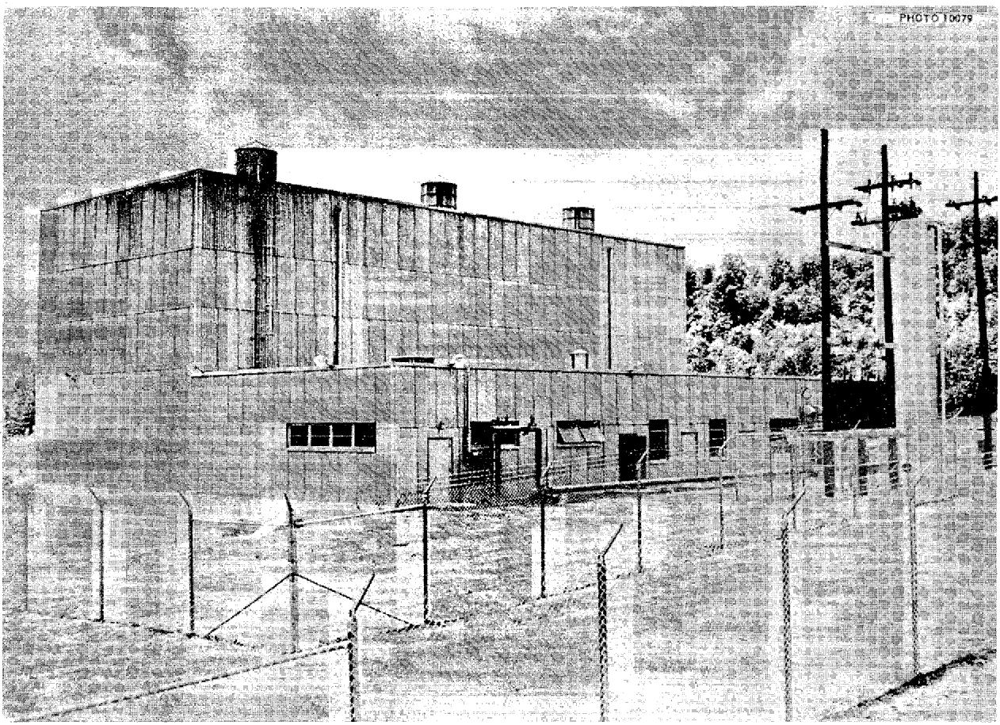  
Fig. U.1. The ARE Building.

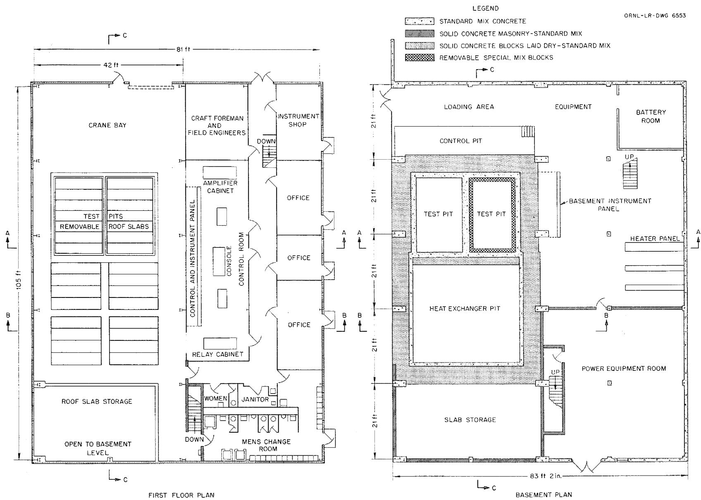  
Fig. U.2. Plan of the ARE Building.

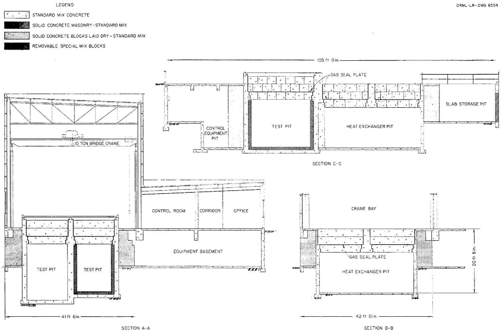

# BIBLIOGRAPHY

Aircraft Nuclear Propulsion Project Quarterly Progress Reports for the Periods Ending:

March 10, 1951 ANP-60

June 10, 1951 ANP-65

September 10, 1951 ORNL-1154

December 10, 1951 ORNL-1170

March 10, 1952 ORNL-1227

June 10, 1952 ORNL-1294

September 10, 1952 ORNL-1375

December 10, 1952 ORNL-1439

March 10, 1953 ORNL-1515

June 10, 1953 ORNL-1556

September 10, 1953 ORNL-1609

December 10, 1953 ORNL-1649

March 10, 1954 ORNL-1692

June 10, 1954 ORNL-1729

September 10, 1954 ORNL-1771

December 10, 1954 ORNL-1816

<table><tr><td>DATE</td><td>TITLE</td><td>AUTHOR(s)</td><td>REPORT NO</td></tr><tr><td>1948</td><td>Metals Handbook (Nickel and Nickel Alloys, p 1025-1062)</td><td>American Society for Metals</td><td></td></tr><tr><td>12-15-49</td><td>The Properties of Beryllium Oxide</td><td>M. C. Udy, F. W. Boulger</td><td>BMI-T-18</td></tr><tr><td>5-21-51</td><td>Activation of Impurities in BeO</td><td>W. K. Ergen</td><td>Y-F20-14</td></tr><tr><td>4-17-51</td><td>Perturbation Equation for the Kinetic Re-sponse of a Liquid-Fuel Reactor</td><td>N. Smith et al.</td><td>ANP-62</td></tr><tr><td rowspan="2">6-5-51</td><td rowspan="2">The Contribution of the (n,2n) Reaction to the Beryllium Moderated Reactor</td><td>C. B. Mills</td><td rowspan="2">Y-F10-55</td></tr><tr><td>N. M. Smith, Jr.</td></tr><tr><td>7-25-51</td><td>Radiation Damage and the ANP Reactor</td><td>L. P. Smith</td><td>ANP-67</td></tr><tr><td>8-13-51</td><td>Alkali Metals Area Safety Guide</td><td>Y-12 Alkali and Liquid Metals Safety Committee</td><td>Y-811</td></tr><tr><td rowspan="2">8-29-51</td><td rowspan="2">Physics Calculations on the ARE Control Rods</td><td>J. W. Webster</td><td rowspan="2">Y-F10-71</td></tr><tr><td>R. J. Beeley</td></tr><tr><td rowspan="2">10-15-51</td><td rowspan="2">Some Results of Criticality Calculations on BeO and Be Moderated Reactors</td><td>J. W. Webster</td><td rowspan="2">ANP-66</td></tr><tr><td>O. A. Schulze</td></tr><tr><td>1-5-52</td><td>Physics of the Aircraft Reactor Experiment</td><td>C. B. Mills</td><td>Y-F10-77</td></tr><tr><td>1-8-52</td><td>Statics of the ANP Reactor - A Preliminary Report</td><td>C. B. Mills</td><td>Y-F10-81</td></tr><tr><td>1-11-52</td><td>The ARE with Circulating Fuel-Coolant</td><td>C. B. Mills</td><td>Y-F10-82</td></tr><tr><td>1-14-52</td><td>A Flux Transient Due to a Positive Reac-tivity Coefficient</td><td>C. B. Mills</td><td>Y-F10-63</td></tr><tr><td>1-22-52</td><td>Heat Transfer in Nuclear Reactors</td><td>R. N. Lyon</td><td>CF-52-1-76</td></tr><tr><td rowspan="2">1-29-52</td><td rowspan="2">Safety Rods for the ARE</td><td>W. B. Manly</td><td rowspan="2">CF-52-1-192</td></tr><tr><td>E. S. Bomar</td></tr><tr><td>1-29-52</td><td>Effect of Structure on Criticality of the ARE of January 22, 1952</td><td>C. B. Mills</td><td>Y-F10-89</td></tr><tr><td>3-10-52</td><td>A Simple Criticality Relation for Be Moder-ated Intermediate Reactors</td><td>C. B. Mills</td><td>Y-F10-93</td></tr><tr><td>3-20-52</td><td>Health Physics Instruments Recommended for ARE Building</td><td>T. H. J. Burnett</td><td>CF-52-3-147</td></tr><tr><td>3-24-52</td><td>Induced Activity in Cooling Water - ARE</td><td>T. H. J. Burnett</td><td>CF-52-3-172</td></tr><tr><td>3-28-52</td><td>Optimization of Core Size for the Circu-lating-Fuel ARE Reactor</td><td>C. B. Mills</td><td>Y-F10-96</td></tr><tr><td>4-16-52</td><td>Physics Considerations of Circulating Fuel Reactors</td><td>W. K. Ergen</td><td>Y-F10-98</td></tr><tr><td>4-22-52</td><td>Note on the Linear Kinetics of the ANP Circulating-Fuel Reactor</td><td>F. G. Prohammer</td><td>Y-F10-99</td></tr><tr><td>5-8-52</td><td>Statics of the ARE Reactor</td><td>C. B. Mills</td><td>Y-F10-103</td></tr><tr><td>6-2-52</td><td>Reactor Program of the Aircraft Nuclear Propulsion Project</td><td>Wm. B. Cottrell (ed.)</td><td>ORNL-1234</td></tr><tr><td rowspan="2">8-8-52</td><td rowspan="2">The ARE Critical Experiment</td><td>C. B. Mills</td><td rowspan="2">Y-F10-108</td></tr><tr><td>D. Scott</td></tr><tr><td>DATE</td><td>TITLE</td><td>AUTHOR(s)</td><td>REPORT NO.</td></tr><tr><td>7-30-52</td><td>Loading of ARE Critical Experiment Fuel Tubes</td><td>D. Scott</td><td>Y-B23-9</td></tr><tr><td>9-52</td><td>Welding Procedure Specifications</td><td>P. Patriarca</td><td>PS-1</td></tr><tr><td>9-52</td><td>Welders Qualification Test Specifications</td><td>P. Patriarca</td><td>QTS-1</td></tr><tr><td>9-25-52</td><td>Radiation Through the Control Rod Penetrations of the ARE Shield</td><td>H. L. F. Enlund</td><td>Y-F30-8</td></tr><tr><td>10-22-52</td><td>Xenon Problem - ANP</td><td>W. A. Brooksbank</td><td>CF-52-10-187</td></tr><tr><td>11-1-52</td><td>Structure of Norton's Hot-Pressed Beryllium Oxide Blocks</td><td>L. M. Doney</td><td>CF-52-11-12</td></tr><tr><td>11-24-52</td><td>Aircraft Reactor Experiment Hazards Summary Report</td><td>J. H. Buck W. B. Cottrell</td><td>ORNL-1407</td></tr><tr><td>11-13-52</td><td>Effects of Irradiation on BeO</td><td>G. W. Keilholtz</td><td>CF-52-11-85</td></tr><tr><td>11-17-52</td><td>Structure of BeO Block with the 1/8 in. Central Hole</td><td>L. M. Doney</td><td>CF-52-11-146</td></tr><tr><td>11-25-52</td><td>An On-Off Servo for the ARE</td><td>S. H. Hanauer E. R. Mann J. J. Stone</td><td>CF-52-11-228</td></tr><tr><td>1-7-53</td><td>Delayed Neutron Damping of Non-Linear Reactor Oscillations</td><td>W. K. Ergen</td><td>CF-53-1-64</td></tr><tr><td>1-9-53</td><td>ARE Regulating Rod</td><td>E. R. Mann S. H. Hanauer</td><td>CF-53-1-84</td></tr><tr><td>1-12-53</td><td>A Guide for the Safe Handling of Molten Fluorides and Hydroxides</td><td>Reactor Components Safety Committee</td><td>Y-B31-403</td></tr><tr><td>1-27-53</td><td>Delayed Neutron Activity in a Circulating Fuel Reactor</td><td>H. L. F. Enlund</td><td>CF-53-1-267</td></tr><tr><td>1-27-53</td><td>Components of Fluoride Systems</td><td>Wm. B. Cottrell</td><td>CF-53-1-276</td></tr><tr><td>1-27-53</td><td>Delayed Neutron Activity in the ARE Fuel Circuit</td><td>H. L. F. Enlund</td><td>CF-53-1-317</td></tr><tr><td>2-45</td><td>Some Engineering Properties of Nickel and High-Nickel Alloys</td><td>B. B. Betty W. A. Mudge</td><td>Mech. Eng. 73, 123 (1945)</td></tr><tr><td>2-11-53</td><td>Heating by Fast Neutrons in a Barytes Concrete Shield</td><td>F. H. Abernathy H. L. F. Enlund</td><td>CF-53-2-99</td></tr><tr><td>2-26-53</td><td>Methods of Fabrication of Control and Safety Element Components for the Aircraft and Homogeneous Reactor Experiments</td><td>J. H. Coobs E. S. Bomar</td><td>ORNL-1463</td></tr><tr><td>3-17-53</td><td>Corrosion by Molten Fluorides</td><td>L. S. Richardson D. C. Vreeland W. D. Manly</td><td>ORNL-1491</td></tr><tr><td>3-30-53</td><td>The Kinetics of the Circulating-Fuel Nuclear Reactor</td><td>W. K. Ergen</td><td>CF-53-3-231</td></tr><tr><td>4-7-53</td><td>Minutes of the Final Meeting of the ARE Design Review Committee</td><td>W. R. Gall</td><td>CF-53-4-43</td></tr><tr><td>DATE</td><td>TITLE</td><td>AUTHOR(s)</td><td>REPORT NO</td></tr><tr><td>5-18-53</td><td>ARE Control System Design Criteria</td><td>F. P. Green</td><td>CF-53-5-238</td></tr><tr><td>6-19-53</td><td>The Stability of Several Inconel-UF4 Fused Salt Fuel Systems Under Proton Bombardment</td><td>W. J. SturmR. J. JonesM. J. Feldman</td><td>ORNL-1530</td></tr><tr><td>7-20-53</td><td>Current Status of the Theory of Reactor Dynamics</td><td>W. K. Ergen</td><td>CF-53-7-137</td></tr><tr><td>7-20-53</td><td>Interpretation of Fission Distribution in ARE Critical Experiments</td><td>Joel Bengston</td><td>CF-53-7-190</td></tr><tr><td>7-20-53</td><td>Composition of ARE for Criticality Calculations</td><td>J. L. Meem</td><td>Secret rough details</td></tr><tr><td>8-3-53</td><td>ARE Fuel Requirements</td><td>J. L. Meem</td><td>CF-53-8-2</td></tr><tr><td>8-10-53</td><td>Thermodynamic and Heat Transfer Analysis of the Aircraft Reactor Experiment</td><td>B. LubarskyB. L. Greenstreet</td><td>ORNL-1535</td></tr><tr><td>9-1-53</td><td>ARE Fuel System</td><td>G. A. Cristy</td><td>CF-53-9-2</td></tr><tr><td>9-1-53</td><td>Static Analysis of the ARE Criticality Experimenter (A Preliminary Report Pending Reception of the ARE Criticality Report)</td><td>C. B. Mills</td><td>CF-53-9-19</td></tr><tr><td>9-3-53</td><td>Experimental Procedures on the ARE (Preliminiry)</td><td>J. L. Meem</td><td>CF-53-9-15</td></tr><tr><td>9-22-53</td><td>The General Methods of Reactor Analysis Used by the ANP Physics Group</td><td>C. B. Mills</td><td>ORNL-1493</td></tr><tr><td>9-25-53</td><td>Supplement to Aircraft Reactor Experiment Hazards. Summary Report (ORNL-1407)</td><td>E. S. BettisW. B. Cottrell</td><td>CF-53-9-53</td></tr><tr><td>10-18-53</td><td>Preliminary Critical Assembly for the Aircraft Reactor Experiment</td><td>D. CallihanD. Scott</td><td>ORNL-1634</td></tr><tr><td>12-1-53</td><td>ARE Design Data</td><td>W. B. Cottrell</td><td>CF-53-12-9</td></tr><tr><td>12-22-53</td><td>The Inhour Formula for a Circulating-Fuel Nuclear Reactor with Slug Flow</td><td>W. K. Ergen</td><td>CF-53-12-108</td></tr><tr><td>12-18-53</td><td>Analytical and Accountability Report on ARE Concentrate</td><td>G. J. Nessle</td><td>CF-53-12-112</td></tr><tr><td>3-2-54</td><td>ARE Design Data Supplement</td><td>W. B. Cottrell</td><td>CF-54-3-65</td></tr><tr><td>4-7-54</td><td>ARE Instrumentation List</td><td>R. G. Affel</td><td>CF-54-4-218</td></tr><tr><td>5-7-54</td><td>Analysis of Critical Experiments</td><td>C. B. Mills</td><td>CF-54-5-51</td></tr><tr><td>7-20-54</td><td>ARE Operating Procedures, Part I, Pre-Nuclear Operation</td><td>W. B. Cottrell</td><td>CF-54-7-143</td></tr><tr><td>7-27-54</td><td>ARE Operating Procedures, Part II, Nuclear Operations</td><td>J. L. Meem</td><td>CF-54-7-144</td></tr><tr><td>7-31-54</td><td>Fuel Activation Method for Power Determination of the ARE</td><td>E. B. Johnson</td><td>CF-54-7-11</td></tr><tr><td>8-28-54</td><td>Critical Mass of the ARE Reactor</td><td>C. B. Mills</td><td>CF-54-8-171</td></tr><tr><td>To be issued</td><td>Stress Analysis of the ARE</td><td>R. L. MaxwellJ. W. Walker</td><td>ORNL-1650</td></tr></table>