CENTRAL RESEARCH LIBRARY DOCUMENT COLLECTION

LIBRARY LOAN COPY

DO NOT TRANSFER TO ANOTHER PERSON

If you wish someone else to see this document,

and in name with document and the library will

arrange a loan.

FERENCE COPY

REMOVE FROM LIBRA

AIRCRAFT NUCLEAR PROPULSION PROJECT

QUARTERLY PROGRESS REPORT

FOR PERIOD ENDING MARCH 10, 1955

DECLASSES

CLASSIFICATION CHANGED TO:

BY AUTHORITY OF: AEC $l = {1.3} - {6c}$

BY:

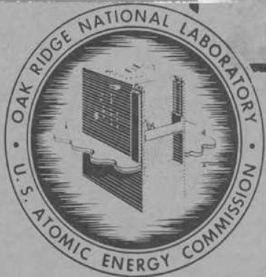

MARTIN MARIETTA ENERGY SYSTEMS LIBRARIES

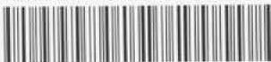

3445602509989

OAK RIDGE NATIONAL LABORATORY

OPERATED BY

CARBIDE AND CARBON CHEMICALS COMPANY

A DIVISION OF UNION CARBIDE AND CARBON CORPORATION

UCC

POST OFFICE BOX P

OAK RIDGE. TENNESSEE

RESTRICTED DATA

ORNL-1864

This document consists of 205 pages.

Copy/ of 207 copies. Series A.

Contract No. W-7405-eng-26

# AIRCRAFT NUCLEAR PROPULSION PROJECT

# QUARTERLY PROGRESS REPORT

For Period Ending March 10, 1955

W. H. Jordan, Director

S. J. Cromer, Co-Director

R. I. Strough, Associate Director

A. J. Miller, Assistant Director

A.W.Savolainen,Editor

DATE RECEIVED BY INFORMATION AND REPORTS DIVISION (MARCH 25, 1955)

DATE ISSUED

APR 21 1955

OAK RIDGE NATIONAL LABORATORY

Operated by

CARBIDE AND CARBON CHEMICALS COMPANY

A Division of Union Carbide and Carbon Corporation

Post Office Box P

Oak Ridge, Tennessee

34456 02509989

# INTERNAL DISTRIBUTION

1. G. M. Adamson   
2. R.G. Affel   
3. C. R. Baldock   
4. C. J. Barton   
5. E. S. Bettis   
6. D. S. Billington   
7. F. F. Blankenship   
8. E. P. Blizzard   
9. G.E. Boyd   
10. M.A.Bredig   
11. F. R. Bruce   
12. A. D. Collihan   
13. D. W. Cardwell   
14. J.V. Cathcart   
15. C. E. Center (K-25)   
16. G. T. Chapman   
17. R. A. Charpie   
18. G.H. Clewett   
19. C. E. Clifford   
20. W. B. Cottrell   
21. D. D. Cowen   
22. S. Cromer   
23. R. S. Crouse   
24. F. L. Culler   
25. L.B. Emlet (K-25)   
26. D. E. Ferguson   
27. A, P. Fraas   
28. J.H.Frye   
29. W. T. Furgerson   
30. W. R. Grimes   
31. E. E. Hoffman   
32. A. Hollaender   
33. A. S. Householder   
34. J. T. Howe   
35. R. W. Johnson   
36. W. H. Jordan   
37. G. W. Keilholtz   
38. C.P. Keim   
39. M. T. Kelley   
40. F. Kertesz   
41. E. M. King   
42. J.A. Lane   
43. C. E. Larson

44. M. E. LaVerne

45. R. S. Livingston

46. R. N. Lyon

47. F. C. Maienschein

48. W. D. Manly

49. L. A. Mann

50. W. B. McDonald

51. F.W. McQuilken

52. A.J. Miller

53. K. Z. Morgan

54. E. J. Murphy

55. J. P. Murray (Y-12)

56. G. J. Nessle

57. R. B. Oliver

58. P. Patriarca

59. H. F. Poppendiek

60. P. M. Reyling

61. H. W. Savage

62. A.W. Savolainen

63. E. D. Shipley

64. O. Sisman

65. G.P. Smith

66. A. H. Snell

67. R. I. Strough

68. C. D. Susano

69. J. A. Swartout

70. E.H. Taylor

71. J. B. Trice

72. E. R. Van Artsdalen

73. F. C. VonderLage

74. J.M. Warde

75. A. M. Weinberg

76. J. C. White

77. G. D. Whitman

78. E. P. Wigner (consultant)

79. G. C. Williams

80. J. C. Wilson

81. C. E. Winters

82. C. D. Zerby

92. X-10 Document Reference Library (Y-12)

12. Laboratory Records Department

13. Laboratory Records, ORNL R.C.

114-116. Central Research Library

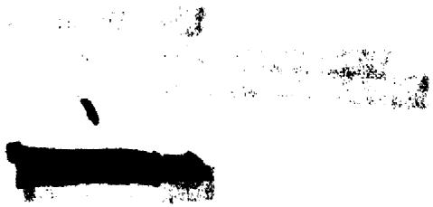

# EXTERNAL DISTRIBUTION

117. Air Force Plant Representative, Burbank

118-119. Air Force Plant Representative, Seattle

120. Air Force Plant Representative, Wood-Ridge   
121. ANP Project Office, Fort Worth

122-132. Argonne National Laboratory

133-137. Atomic Energy Commission, Washington (Lt. Col. T. A. Redfield)

138. Bureau of Aeronautics (Grant)   
139. Chief of Naval Research   
140. Convair, San Diego (C. H. Helms)

141-144. General Electric Company, ANPD

145. Glen L. Martin Company (T. F. Nagey)

146-149. Knolls Atomic Power Laboratory

150-151. Lockland Area Office

152-153. Los Alamos Scientific Laboratory

154. Materials Laboratory (WADC) (Col. P. L. Hill)   
155. National Advisory Committee for Aeronautics, Cleveland

156-157. North American Aviation, Inc.

158. Nuclear Development Associates, Inc.   
159. Patent Branch, Washington   
160. Powerplant Laboratory (WADC) (A. M. Nelson)

161-170. Pratt & Whitney Aircraft Division (Fox Project)

171. USAF Project Rand   
172. USAF Headquarters

173-178. Westinghouse Electric Corporation (Bettis Laboratories)

179-190. Wright Air Development Center (Lt. John F. Wett, Jr., WCOSI-3)   
191-205. Technical Information Service, Oak Ridge   
206. Division of Research and Medicine, AEC, ORO   
207. Atomic Energy Commission - East Hartford Area

Reports previously issued in this series are as follows:

ORNL-528 Period Ending November 30, 1949

ORNL-629 Period Ending February 28, 1950

ORNL-768 Period Ending May 31, 1950

ORNL-858 Period Ending August 31, 1950

ORNL-919 Period Ending December 10, 1950

ANP-60 Period Ending March 10, 1951

ANP-65 Period Ending June 10, 1951

ORNL-1154 Period Ending September 10, 1951

ORNL-1170 Period Ending December 10, 1951

ORNL-1227 Period Ending March 10, 1952

ORNL-1294 Period Ending June 10, 1952

ORNL-1375 Period Ending September 10, 1952

ORNL-1439 Period Ending December 10, 1952

ORNL-1515 Period Ending March 10, 1953

ORNL-1556 Period Ending June 10, 1953

ORNL-1609 Period Ending September 10, 1953

ORNL-1649 Period Ending December 10, 1953

ORNL-1692 Period Ending March 10, 1954

ORNL-1729 Period Ending June 10, 1954

ORNL-1771 Period Ending September 10, 1954

ORNL-1816 Period Ending December 10, 1954

# FOREWORD

This quarterly progress report of the Aircraft Nuclear Propulsion Project at ORNL records the technical progress of the research on circulating-fuel reactors and all other ANP research at the Laboratory under its Contract W-7405-eng-26. The report is divided into three major parts: I. Reactor Theory, Component Development, and Construction, II. Materials Research, and III. Shielding Research.

The ANP Project is comprised of about 400 technical and scientific personnel engaged in many phases of research directed toward the achievement of nuclear propulsion of aircraft. A considerable portion of this research is performed in support of the work of other organizations participating in the national ANP effort. However, the bulk of the ANP research at ORNL is directed toward the development of a circulating-fuel type of reactor.

The effort on circulating-fuel reactors was, until recently, centered upon the Aircraft Reactor Experiment. This experiment has now been completed, and the analyses of the results of the operating experience are presented in Section 1 of Part I.

The design, construction, and operation of the Aircraft Reactor Test (ART), with the cooperation of the Pratt & Whitney Aircraft Division, are now the specific long-range objectives. The ART is to be a power plant system that will include a 60-Mw circulating-fuel reflector-moderated reactor and adequate means for heat disposal. Operation of the system will be for the purpose of determining the feasibility, and the problems associated with the design, construction, and operation, of a high-power, circulating-fuel, reflector-moderated aircraft reactor system. The design work, as well as the supporting research on materials and problems peculiar to the ART (previously included in the subject sections), is now reported as a subsection of Part I, Section 2, "Reflector-Moderated Reactor."

# CONTENTS

FOREWORD

SUMMARY 1

PART I. REACTOR THEORY, COMPONENT DEVELOPMENT, AND CONSTRUCTION

1. CIRCULATING-FUEL AIRCRAFT REACTOR EXPERIMENT 13

Analyses of the Aircraft Reactor Experiment 13

Dismantling of the ARE 13

Fission Product Investigations 13

Xenon Poisoning of the ARE 15

Neutron energy distribution 15

Xe135 cross section in the ARE 16

2. REFLECTOR-MODERATED REACTOR 17

Reactor Design 17

Reactor Physics 24

Activity of ART components after shutdown 24

Gamma-ray heating 25

Control rod considerations 26

3. EXPERIMENTAL REACTOR ENGINEERING 28

In-Pile Loop Component Development 28

Instrumentation 28

Melt-down hazard 28

Fission-gas holdup 32

Flux-measuring loop 32

Horizontal-shaft sump pump 32

Heat exchanger 33

Pump Development 33

ARE-type sump pumps 33

Mechanical shakedown tests of ART pump (model 1) rotary elements 34

Design and Operation of Forced-Circulation Corrosion and Mass Transfer Tests 35

Operation of fused-salt-Inconel loops 35

Sodium in multimetal loops 35

Heat Exchanger Tests 36

Intermediate heat exchanger test No. 2 36

Small heat exchanger test 36

Gas-fired heat source 37

37

4. CRITICAL EXPERIMENTS 41

41

# PART II. MATERIALS RESEARCH

5. CHEMISTRY OF MOLTEN MATERIALS 49

Phase Equilibrium Studies 49

Solid phase studies in the NaF-UF and NaF-ZrF-UF systems 49   
Phase relationships and $\mathsf{UF}_3$ solubility in $\mathsf{BeF}_2$ -bearing systems 50   
Phase relationships in $\mathsf{LaF}_3$ and $\mathsf{UF}_3$ -bearing systems 52

Preparation and Stability of UF3-Bearing Melts 53

Reduction of $\mathsf{UF}_4$ with uranium in alkali fluorides 53   
Stability of $\mathsf{UF}_3$ in alkali fluorides 54   
Solubility of UF4 in NaF-RbF-LiF mixtures 56   
Solubility of $\mathsf{UF}_3$ in NaF-KF-ZrF4 56   
Reduction of $\mathsf{UF}_4$ in molten $\mathrm{Li}_3\mathrm{ZrF}_7$ and $\mathrm{Li}_2\mathrm{ZrF}_6$ 57   
Preparation of UF3 in NaF-ZrF 57

Chemical Reactions in Molten Salts 57

The equilibrium $\mathsf{FeF}_2 + \mathsf{H}_2\rightleftharpoons \mathsf{Fe}^0 + 2\mathsf{HF}$ in $\mathsf{NaZrF}_5$ at $800^{\circ}\mathsf{C}$ 57   
Reduction of $\mathsf{UF}_4$ by structural metals 58   
Stability of chromous and iron fluorides in molten fluorides 61

Production of Purified Molten Fluorides 63

Production-scale operations 63   
Pilot-scale preparation of $\mathsf{BeF}_2$ mixtures 63   
Pilot-scale preparation of $\mathsf{UF}_3$ -bearing mixtures 64   
Special services 66   
Preparation of various fluorides 66

Fundamental Chemistry of Fused Salts 67

Electrochemistry of fused salts 67   
X-ray diffraction studies in the NaF-ZrF4 system 68   
Physical chemistry 68

6. CORROSION RESEARCH 70

Thermal-Convection Loop Corrosion Studies 70

Alkali-metal-base mixtures with $\mathsf{UF}_3$ and $\mathsf{UF}_4$ 70   
Ceramic contamination in NaF-ZrF4-UF4 on Inconel 71   
High uranium content in fluoride mixture 73   
Hastelloy B loops 73   
Molybdenum loops 73   
Sodium in Hastelloy B loops 73   
Sodium in Inconel loops with beryllium inserts 74

Forced-Circulation Corrosion and Mass Transfer 75

General Corrosion Studies 77

High-temperature tests of molybdenum in contact with NaF-ZrF4-UF 77   
Brazing alloys on Inconel and stainless steel in sodium and in fuel mixtures 78   
Dissimilar metal mass transfer in the system zirconium-type 304 stainless steel-sodium 79   
Diffusion of sodium into beryllium 81   
Beryllium-Inconel spacer tests 82   
Cermets in NaF-ZrF4-UF 84   
Single-crystal specimens of magnesium oxide in lithium and in lead 86

Fundamental Corrosion Research 86

Mass transfer in liquid lead 86   
Mass transfer and corrosion in fused hydroxides 91   
Spectrophotometry of fused hydroxides 91   
Fused hydroxides as acid-base analog systems 91

Chemical Studies of Corrosion 95

Effect of chromium additions on corrosion of Inconel by $\mathsf{CrF}_3$ in molten fluorides 95   
Protective action of small chromium metal additions 95   
Effect of fission products 95   
Time dependence of corrosion in tilting-furnace tests 96   
Effect of valence state of iron on corrosion of Inconel by fluoride mixtures 96

# 7.METALLURGY AND CERAMICS 97

Development of Nickel-Molybdenum Base Alloys 97

Fabrication studies 97   
Oxidation studies 104

Stress-Rupture Studies of Nickel-Molybdenum Base Alloys 104

Welding and Brazing Studies of Hastelloy B 109

Radiators 109   
Welding of thick sections 114   
High-temperature aging 116

Stress-Rupture Design Curves for Inconel 120   
Development of Brazing Alloys 120

Fabrication of Test Components 128

High-conductivity-fin radiator 128   
Intermediate heat exchanger No. 2 131   
1 Radiator for Cornell Aeronautical Laboratory 132   
Sodium-beryllium-Inconel compatibility testing apparatus 134   
Heat exchanger brazes 134   
1 Cermet-to-metal brazing 134

Special Materials Fabrication 136

Duplex tubing 136   
G-E control rods 136   
Tubular fuel elements 136   
1 Boron shield for ART 136   
1 Al- $\mathsf{U}\mathsf{O}_2$ fuel plates for shielding experiment 137

1 Ceramic Research 137

1. Oxidation reactions of $\mathsf{UO}_2$ and of $\mathsf{UO}_2$ in BeO 137   
1. Fabrication of rare earth oxide wafers for critical experiments 138

# 8. HEAT TRANSFER AND PHYSICAL PROPERTIES 139

Fused Salt Heat Transfer 139   
1 Reactor Core Hydrodynamics 140   
1. Electrical Heating and Flow in Tube Bends 141   
ART Fuel-to-NoK Heat Exchanger 142   
1. Reactor Core Heat Transfer 142   
TransientBoilingStudies 143   
Heat Capacity 143   
Viscosity 143   
Thermal Conductivity 144   
1. Electrical Conductivity 142   
145

9. RADIATION DAMAGE 146

MTR Static Corrosion Tests 146

Miniature In-Pile Loop 147

LITR Horizontal-Beam-Hole Fluoride Fuel Loop 150

Flux-Depression Experiments in MTR 155

Creep and Stress-Corrosion Tests 155

10. ANALYTICAL STUDIES OF REACTOR MATERIALS 157

Analytical Chemistry of Reactor Materials 157

Determination of trivalent uranium in fluoride fuels 157

Determination of uranium metal in fluoride salt mixtures 158

Determination of oxygen in fluoride fuels 159

Determination of oxygen in metallic oxides by bromination 161

Differential spectrophotometric determination of beryllium 162

Determination of lithium in NaF-BeF2-LiF and NaF-ZrF4-LiF base fuels 162

Determination of potassium in fluoride fuels 162

X-Ray Spectrometer Investigations of Fluoride Fuel 163

ANP Service Laboratory 163

11. RECOVERY AND REPROCESSING OF REACTOR FUEL 164

Pilot Plant Design 164

Process Development 164

# PART III. SHIELDING RESEARCH

12. SHIELDING ANALYSIS 173

Anisotropic Scattering of Neutrons in a Uniform Medium with Beam Sources 173

Energy Absorption Resulting from Incident Gamma Radiation as a Function of Thickness of Materials with Slab Geometry 173

Energy and Angular Distribution of Air-Scattered Neutrons from a Monoenergetic, Monodirectional Point Source 173

13. LID TANK SHIELDING FACILITY 175

GE-ANP Helical Air Duct Experimentation 175

Removal Cross Sections 175

Reflector-Moderated Reactor and Shield Mockup Tests 176

14. TOWER SHIELDING FACILITY 178

TSF Experiment with the Mockup of the GE-ANP R-1 Shield Design 178

The Differential Experiments at the TSF: Phase I 178

Calibration of the Revelet, a Remotely Variable Lead-Transmission Gamma-Ray Dosimeter 182

The Project ORANGE Primate Exposure at the TSF 182

# PART IV. APPENDIX

15. LIST OF REPORTS ISSUED FROM SEPTEMBER 1954 TO MARCH 1955 191

# ANP PROJECT QUARTERLY PROGRESS REPORT

SUMMARY

# PART I. REACTOR THEORY, COMPONENT DEVELOPMENT, AND CONSTRUCTION

# 1. Circulating-Fuel Aircraft Reactor Experiment

Analyses have been made of the experience obtained through the operation of the Aircraft Reactor Experiment and summary topical reports are being prepared. The detailed analyses have revealed no significant errors in the preliminary numbers reported previously. The salvageable equipment in the ARE Building is being removed and samples are being obtained for metallurgical, physical, radiological, and chemical analyses.

Attempts have been made to determine the fate of several fission-product nuclides in the ARE. However, the results leave much to be desired because no adequate plans were made before operation of the reactor for the study of this problem. It is clear that some "plating" of ruthenium onto the walls of the fuel inlet line occurred and that some ruthenium was volatilized. It also appeared that the activity of the fuel in the ARE dump tank was, in general, about what was to be expected from the power history.

The energy distribution of neutrons slowing down in an absorbing moderator of nonvanishing absolute temperature was finally found to be obtainable by Monte Carlo calculations on the ORACLE. As applied to the xenon-poisoning problem of the ARE, the neutron energy distribution is more closely represented by a temperature of $2200^{\circ}\mathrm{F}$ than by the moderator temperature of $1400^{\circ}\mathrm{F}$ . This reduces the xenon absorption cross section, but, even with this reduction, the observed xenon poisoning was far below the poisoning which would have existed if the xenon had not been removed in the off-gas.

# 2. Reflector-Moderated Reactor

A careful examination of the hazards associated with the proposed operation of the Aircraft Reactor Test was made, a summary report of the hazards was prepared, and a presentation was made to the Reactor Safeguards Committee. The hazards analysis disclosed that no nuclear explosion could occur that would damage the proposed sealed reactor cell and that the reactor cell was more than adequate to contain the worst conceivable

accident that might be experienced with the installation.

Work on the reactor layout is proceeding, and a detailed stress analysis is under way. Much has been accomplished on the detailed design and fabrication of component test units, such as the fuel pump, the core shells, the pump-expansion tank configuration, and the heat exchangers.

Comparison of earlier reactor calculations with the results of the critical experiments on the reflector-moderated reactor has shown that the calculations consistently gave critical masses which exceeded the experimental values by about $2\mathrm{kg}$ of $\mathsf{U}^{235}$ . For the calculations, a quantity of Teflon per cubic centimeter of fuel annulus was used that was $50\%$ of the quantity used in the experiments, and it was found that this difference accounted for the discrepancies in the critical masses. The radioactivity of various parts of the reactor and shield assembly at various times after shutdown was computed. In the course of an investigation of the gamma ray heating of the components of the reactor assembly, curves were drawn of the gamma-ray flux at various surface points of a cylinder made up of gamma-emitting cylinders of fuel material; the gamma absorption inside the fuel was taken into account.

A brief study of the control rod problem showed that the burnup of the rod will be rather serious and thus indicated that it would be difficult to use elements such as gadolinium and samarium because they contain only a fraction of isotopes of large absorption cross section. Europium is being considered as a possible control rod material because both isotopes of it have large absorption cross sections; it appears to be obtainable, if necessary; and it has, furthermore, the advantage that the isotopes formed by absorption of a neutron have large neutron absorption cross sections.

# 3. Experimental Reactor Engineering

All phases of work on the in-pile test loop for irradiation in the MTR proceeded on schedule during this quarter. The power density and temperature differential specifications for the loop were revised to make the first test more conservative, but the test conditions are still representative

of those expected in the ART. Loop layout drawings have been completed, and detailed drawings were started. A flux-measuring loop is being fabricated for irradiation at the MTR in March. This loop will provide much needed data on the neutron flux to be expected in the actual in-pile loop, since it closely mocks up the forward end of the in-pile loop configuration. The horizontal-shaft in-pile loop sump pump was operated at temperature for 1000 hr, and performance was satisfactory. Three heat exchangers for in-pile use were tested, two with single walls and one with a double wall. The double-walled exchanger gave good heat transfer performance and should be acceptable for in-pile use.

Performance tests on the ARE-type sump pump were terminated following 3748 hr of nearly trouble-free operation. The fuel mixture NaF-ZrF $_4$ -UF $_4$ (53.5-40-6.5 mole %) was used in these tests, and the average fuel temperature at the pump was about $1350^{\circ}\mathrm{F}$ . The major portion of the operation was at the design conditions for the pump, namely, 1500 rpm and 40 gpm. One of the desired uses of this pump is for circulating NaK in intermediate heat exchanger test loops where a pump output of 184 gpm and at a head of 300 ft is required. The pump was tested with both water and hot NaK $(1400^{\circ}\mathrm{F})$ , and it was demonstrated that the required performance could be obtained with a shaft speed of about 3800 rpm.

Two ART pump (model 1) rotary assemblies were given mechanical shakedown tests to determine seal, bearing, and vibratory performance characteristics. Difficulty with excessive leakage of the lower seal was experienced in both tests, and it was found that the leakage was caused by distortions in the seals. The specifications for the seal have been revised, and new seals have been ordered.

Three electrical-resistance heated, forced-circulation loops for testing corrosion and mass transfer in fused-salt-Inconel systems were terminated this quarter. These loops had accumulated 774, 625, and 521 hr, respectively, of operation before leaks in the heater sections of two loops and a pump seizure in the third loop necessitated the shutdowns. The loop that operated 774 hr had a Reynolds number of 10,000, a maximum fluid temperature of $1500^{\circ}\mathrm{F}$ , and a temperature differential of $200^{\circ}\mathrm{F}$ . The loop that operated 625 hr had similar operating conditions except that the temperature differential was $300^{\circ}\mathrm{F}$ . The loop that

operated 521 hr had a Reynolds number of 15,000, a maximum fluid temperature of $1500^{\circ}\mathrm{F}$ , and temperature differential of $200^{\circ}\mathrm{F}$ . All three tests were run with the fluoride mixture $\mathsf{NaF - ZrF_4 - UF_4}$ (53.5-40-6.5 mole %) in Inconel tubing.

The fourth of a series of tests of sodium in a beryllium-Inconel loop was also terminated this quarter after 1000 hr of trouble-free operation. It had operated at a maximum temperature of $1300^{\circ}\mathrm{F}$ (at the beryllium insert), a temperature differential of $300^{\circ}\mathrm{F}$ , and a maximum Reynolds number of 440,000 through the orifice of the beryllium insert.

Design of the test loop and fabrication and assembly of the various components for the intermediate heat exchanger test No. 2 are proceeding satisfactorily. A small heat exchanger loop for testing a bundle of 20 tubes was designed and is being fabricated and assembled. This test has been programmed to obtain heat transfer data for use in the ART design by April 1.

Two tests were completed to ascertain the effect of a rupture of the reactor pressure shell that would spill fuel into the cell designed to contain the ART. The problems of heat dissipation and release of radioactive material to the atmosphere were investigated in these tests. The design of the cell was modified as indicated by the tests so that the overall heat transfer rate will be adequate to dissipate 3.5 Mw of continuous afterheat. It was determined that the cell would prevent the release of radioactive material to the atmosphere.

Other tests still in operation at the end of the quarter included three resistance-heated forced-circulation loops with fused salts in Inconel; one gas-fired forced-circulation loop with fused salts in Inconel; three thermal stress tests of Inconel in fused salts and in sodium; three forced-circulation, high-thermal-gradient loop tests of sodium in Inconel; and one thermal-cycling test of sodium in a beryllium-Inconel system.

Work is proceeding on facilities for dynamic fluid tests of ART components, including the four kinds of ART pumps, the heat exchangers, and other components.

# 4. Critical Experiments

Three additional critical assemblies of the reflector-moderated reactor were studied during this quarter. An essentially spherical shell of fuel surrounding a beryllium island and enclosed in a beryllium reflector was used for two of these assemblies. The fuel was separated from the

beryllium by Inconel shells. In the assembly with $\frac{1}{16}$ -in.-thick shells the critical mass was 10.8 kg of $U^{235}$ . Increasing the shell thickness to $\frac{1}{8}$ in. increased the mass to 19.8 kg, with a density of 0.421 g of $U^{235}$ per cubic centimeter of fuel region. Various neutron-flux and fission-rate distributions have been obtained. In the third experiment the arrangement of materials was altered to include, on opposite sides of the preceding assembly, a cylindrical structure of beryllium surrounded by a fuel annulus and a reflector to represent the entrance and exit flow channels of the circulating-fuel reactor. The first loading in this test was 24 kg of $U^{235}$ at a density of 0.416 g of $U^{235}$ per cubic centimeter of fuel region, which gave considerable excess reactivity and an estimated critical mass (without inserted control rods) of about 19 kg. This assembly is to be reloaded at a lower density to evaluate the mass more closely. A comparison of the neutron-absorbing properties of gadolinium and samarium, proposed as reactor control rod materials, shows them to be equally effective.

# PART II. MATERIALS RESEARCH

# 5. Chemistry of Molten Materials

Solid phase studies in the NaF-ZrF $_4$ -UF $_4$ system and its associated binary systems were continued, and a revised phase diagram for the NaF-UF $_4$ system has been prepared. Quenching studies of the ternary system have served to define fairly accurately the primary phase fields of most of the phases that exist at liquidus temperatures and have also given additional data on liquidus temperatures and secondary phases for a number of compositions.

Interest in obtaining fuels with improved physical properties has refocused attention upon $\mathsf{BeF}_2$ -bearing systems, particularly alkali fluoride- $\mathsf{BeF}_2$ compositions with sufficiently low $\mathsf{BeF}_2$ content to have low viscosity. The potential importance of such mixtures as fuel solvents is shown by the low viscosity of a mixture containing 69 mole % LiF and 31 mole % $\mathsf{BeF}_2$ and by the high estimated heat capacities of such mixtures. While very little information on the solubility of $\mathsf{UF}_3$ in such mixtures has been obtained, it appears that the solubility at $600^{\circ}\mathsf{C}$ is at least as high as that observed in NaF-ZrF $_4$ and in NaF-LiF-ZrF $_4$ mixtures containing less than 50 mole % $\mathsf{ZrF}_4$ .

The usefulness of $\mathsf{LaF}_3$ as a "stand-in" for $\mathsf{UF}_3$ has been demonstrated. It was found that there is a close correspondence in thermal effects between $\mathsf{LaF}_3$ and $\mathsf{UF}_3$ systems with components that form simple eutectics, for example, LiF and $\mathsf{UF}_4$ . This probably means that $\mathsf{LaF}_3$ and $\mathsf{UF}_3$ have about the same melting point.

All measurements made to date on the stability of $\mathsf{UF}_3$ in molten salt systems and on the feasibility of preparation of $\mathsf{UF}_3$ by reduction of $\mathsf{UF}_4$ have shown poor reproducibility. The considerable mass of experimental data suggests that this very poor precision has a variety of causes.

The extreme susceptibility of the $\mathsf{UF}_3$ mixtures to oxidation by air or water and the difficulty in sampling and analyzing the complex mixtures for trivalent uranium are certainly contributing factors. In some of the experiments, equilibrium is difficult to establish because of coating of the reducing agent by the sparingly soluble $\mathsf{UF}_3$ product, and, with the rather feeble stirring available, the heavy metal reducing agents may not contact the charge sufficiently. However, it appears that the most significant reason for the lack of precision is the as-yet-uncontrolled variation in activity of the uranium metal in the various experiments. The ability of the metal to alloy, over the temperature range of interest, with zirconium, the container metal, the filter, etc., appears to be primarily responsible for the lack of precision of the experiments.

Accordingly, it appears that true equilibrium data are available for few if any of the $\mathsf{UF}_3$ -bearing systems studied. Studies that are typical of a larger number performed during the quarter are reported, but it is obvious that techniques must be altered and procedures adopted which will keep the activity variable under control before data which can be uniquely interpreted can be obtained.

# 6. Corrosion Research

Several additional Inconel and type 316 stainless steel thermal-convection loops have been examined which had circulated the alkali-metal base fluoride mixture NaF-KF-LiF (11.5-42-46.5 mole %) with various proportions of $\mathsf{UF}_3$ and $\mathsf{UF}_4$ added. The fluoride mixtures were prepared and handled with more precise procedures than those used previously, and therefore results that could be more accurately analyzed were obtained. Four Inconel and two type 316 stainless steel loops showed visible and

microscopic evidence of a uranium-rich layer on the entire surface. Chemical analysis showed that practically no $\mathsf{UF}_3$ was left in the Inconel loops after operation; less disproportionation was evident in the stainless steel loops.

The depths of attack have recently increased on Inconel thermal-convection loops operated as controls for 500 hr at a hot-leg temperature of $1500^{\circ}\mathrm{F}$ with $\mathrm{NaF - ZrF_4 - UF_4}$ (50-46-4 mole %), and, in addition, more erratic results have been obtained. Tests have shown that ceramic beads used recently to prevent shorting of probes during the filling operation may have contributed to the increased attack, but it is evident that there are other still-unknown variables that affect the corrosion rate. Thermal-convection loop tests of a $\mathrm{NaF - ZrF_4 - UF_4}$ mixture containing 25 mole % UF₄ showed that the high uranium concentration resulted in a small increase in the depth of attack on Inconel. In tests of Hastelloy B thermal-convection loops in both the as-fabricated and the dry-hydrogen-cleaned condition with $\mathrm{NaF - ZrF_4 - UF_4}$ (50-46-4 mole %) as the circulated fluid, the cleaning procedure appeared to have little or no effect. No evidence of mass-transferred particles, sub-surface void formation, or intergranular attack has been found on type 310 stainless-steel-jacketed molybdenum thermal-convection loops which have circulated NaF-ZrF₄-UF₄ (50-46-4 mole %). In two Hastelloy B loops operated with sodium, magnetic crystals were found in the lower cold leg and in the hot horizontal section.

Preliminary corrosion results have been received on the first three Inconel forced-circulation corrosion and mass transfer testing loops operated with NaF-ZrF4-UF4 (53.5-40-6.5 mole %) at high temperature differentials and high velocities. Despite the turbulent flow and the increase in the number of cycles, the depths of attack found in these loops are only two to three times the depths found in thermal-convection loops operated for comparable periods.

Static corrosion tests have indicated that brazing alloys $10.8\%$ P-9.2% Si-80% Ni and 11.6% P-6.25% Mn-82.2% Ni have fair corrosion resistance to both sodium and fluoride fuel mixtures. Brazing alloys of this type may be used as back-brazze material in heat exchanger fabrication.

Mass transfer tests of zirconium to type 304 stainless steel in sodium have been conducted in seesaw apparatus in the temperature range 1000 to

$1500^{\circ}F$ . It appeared that no thermal-gradient mass transfer occurred in any of the tests; there were no zirconium deposits in the cold zone. However, all zirconium samples gained weight during the tests, and x-ray analysis revealed a layer of zirconium oxide on each sample.

Tests of beryllium samples exposed to sodium for 1000 hr in Inconel capsules have shown that there is very little penetration of the beryllium by the sodium at $1200^{\circ}\mathrm{F}$ . However, at $1500^{\circ}\mathrm{F}$ the beryllium was very heavily attacked to a maximum depth of 20 mils, and a 3- to 4-mil porous metallic layer formed on the surface. The layer was anisotropic and therefore was identified as either beryllium metal or a beryllium-rich beryllium-nickel solid solution. Tests are under way to determine the optimum spacing between beryllium and Inconel when exposed to sodium at various temperatures and flow rates. Also, several cermets are being tested as possible materials for use as valve stems and valve seats.

A summary of the extensive studies of mass transfer in liquid lead has been prepared, and the study has been discontinued. The data obtained in the study indicate that alloys containing an intermetallic compound will, in general, possess better resistance to mass transfer than those in which compound formation is not possible.

A high-temperature spectrophotometer has been constructed, and approximate absorption spectra have been measured for fused sodium hydroxide at various temperatures up to $700^{\circ}\mathrm{C}$ in air. Also, some quantitative results have been obtained in the application of acid-base analog concepts in fused hydroxide systems.

In chemical studies of corrosion, the addition of chromium metal to $\mathsf{NaF - ZrF_4}$ and $\mathsf{NaF - ZrF_4 - UF_4}$ melts exposed to Inconel in tilting-furnace tests was found to reduce attack on Inconel. The metallic chromium reduces the corrosive chromic ion to the noncorrosive chromous state.

# 7. Metallurgy and Ceramics

Investigations were continued in the study of the properties of nickel-base alloys containing 15 to $32\%$ molybdenum, ternary alloys with a nickel-molybdenum base, and vacuum-melted Hastelloy B. The experiments have shown that temperature is the variable that affects the extrudability of Hastelloy B. Sufficient tubing was obtained for the fabrication of standard-size thermal-convection

loops of a $20\%$ Mo-80% Ni alloy, a $24\%$ Mo-76% Ni alloy, and a $32\%$ Mo-68% Ni alloy. Tensile and bend test data were also obtained. The Cb-Mo-Ni ternary alloy has been partially investigated in melts containing 2, 5, or $10\%$ columbium and $20\%$ molybdenum; the balance of each alloy was nickel. The 2 and $5\%$ columbium alloys were readily fabricated into sheet, but the $10\%$ columbium alloy fractured severely upon rolling at $2100^{\circ}\mathrm{F}$ . Creep, oxidation, tensile, and fabrication tests of several ternary alloys based on molybdenum and nickel are planned. Extrusion data have been obtained for several chromium-molybdenum-nickel alloys, and the effect of the chromium additions on corrosion resistance in sodium is to be investigated. It has been found that alloys containing over $5\%$ chromium are more resistant to oxidation at $1500^{\circ}\mathrm{F}$ than Hastelloy B. Extensive stress-rupture studies of the nickel-molybdenum base alloys are under way, and limited data indicate that the corrosive action of the fused fluorides does not adversely affect the creep-rupture properties of Hastelloy B at $1500^{\circ}\mathrm{F}$ and at $1650^{\circ}\mathrm{F}$ .

Additional Hastelloy B radiator test components have been fabricated for determining the feasibility of using this material in applications involving thermal shock and high-temperature oxidation. Tests thus far have been encouraging. An investigation is under way of the problems that would be involved in welding the thick sections of Hastelloy B that would be required in the fabrication of a pressure shell. Also, an extensive study of the effects of high-temperature aging on the microstructure and physical properties of Hastelloy B has been initiated.

The program to obtain design data for Inconel at $1300^{\circ}\mathrm{F}$ and at $1500^{\circ}\mathrm{F}$ under reactor conditions is nearly complete, and some data at $1650^{\circ}\mathrm{F}$ are available. The results obtained, to date, in fused salts, and, for comparison, in argon are presented as a series of design curves. A summary of the results of tests of the oxidation resistance of dry-hydrogen-brazed Inconel T-joints is also presented. The tests made thus far indicate that most of the nickel and nickel-chromium base alloys are suitable for service in an oxidizing atmosphere at $1500^{\circ}\mathrm{F}$ , and several are suitable at $1700^{\circ}\mathrm{F}$ .

A dry powder method of brazing alloy preplacement has been developed which provides a promising means for obtaining controlled amounts of

alloy on each tube-to-fin joint of high-conductivity-fin sodium-to-air radiators. A procedure has also been devised for aluminizing large numbers of type 310 stainless-steel-clad copper fins to provide oxidation protection of the exposed copper on the sheared edges of the fins. The fabrication of the fluoride-to-sodium intermediate heat exchanger No. 2, which requires the heliarc welding of 400 tube-to-header joints and the back-brazing of these welds with a suitable corrosion-resistant alloy, is under way, and about 200 joints have been completed.

The fabrication of a full-scale liquid-metal-to-air radiator designed by the Cornell Aeronautical Laboratory has been undertaken. The design incorporates integral-helical-finned tubing completely machined from type 316 stainless steel bar stock.

The joining of cermets to Inconel is being studied as part of the investigation of cermets for use as valve seats. Special fabrication problems consisted of further work on duplex tubing, tubular fuel elements, boron shielding material, and $\mathrm{Al - UO_2}$ fuel plates for shielding experiments.

# 8. Heat Transfer and Physical Properties

Further heat transfer experiments have been performed with NaF-ZrF $_4$ -UF $_4$ (53.5-40-6.5 mole %) flowing in Inconel tubes. The heat transfer coefficients continue to fall about 24% below the general correlation for ordinary fluids, although no corrosion deposits are observed on the tube walls. Some quantitative velocity measurements in a model of an 18-in. core for a reflector-moderated reactor were obtained. The nature of fluid flow in a simple separation region was studied by means of the phosphorescent-particle technique. A study of the nonuniform electrical heating and nonuniform velocity distributions of fluids flowing in 180-deg bends in high-temperature-differential, high-velocity loops was conducted; an analysis indicated that the wall temperature of the short-radius side of the bend could be significantly higher than the temperature of the long-radius side and thus, perhaps, account for the large differences in corrosion in the two regions.

In the current design of the ART, the flow on the fuel side of the heat exchanger is in the middle of the transition flow region where the Nusselt number, in particular, can vary over a wide range. Thus a study has been initiated to determine the heat transfer and friction characteristics of the

heat exchanger in this narrow Reynolds number region.

A preliminary value of the heat capacity of $\mathrm{NaF - ZrF_4 - UF_4}$ (56-39-5 mole %) in the liquid state was found to be $0.256\pm 0.004~\mathrm{cal / g}^{\circ}C$ over the temperature range 570 to $890^{\circ}C$ The viscosities of three fluoride mixtures were determined. The viscosity of NaF-KF-ZrF4 (5-52-43 mole %) varied from 7.9 cp at $550^{\circ}C$ to about 3.5 cp at $750^{\circ}C$ .The viscosity of NaF-BeF2 (57-43 mole %) varied from about 18.5 cp at $550^{\circ}C$ to about 5.2 cp at $750^{\circ}C$ .The viscosity of LiF-BeF2 (69-31 mole %) varied from about 10 cp at $550^{\circ}C$ to about 3.5 cp at $800^{\circ}C$ A new radial thermal conductivity device has been fabricated and found to be satisfactory in checks with water.A study was made of the influence on ART heat transfer of the physical properties of three types of fluoride fuels, namely, lithium-base, zirconium-base, and beryllium-base fuels. Both the reactor core and the fuel-to-NaK heat exchanger were examined. From a heat and momentum transfer standpoint the lithium-base fuel appears to be the more desirable one.

# 9. Radiation Damage

Improvements have been made in both mechanical design and temperature control of the facility for irradiating Inconel capsules containing fluoride fuels in the MTR, and the capsule tests are continuing. A new method for welding thermocouples to the surface of the capsules has been developed which makes possible temperature measurements that agree much more closely with optical pyrometer readings than the measurements obtained with the previously used spark-welded thermocouples. In the new method, the chromel and the alumel wires are crossed and then resistance welded.

A miniature in-pile loop for circulating fluoride fuel in a vertical position in the LITR is being assembled. This loop is to operate at a fuel Reynolds number of 3000 with a temperature gradient of $100^{\circ}\mathrm{F}$ along the length of the fuel tube. The sump pump designed for this loop was tested and found to be satisfactory. In an experiment to measure the increase in excess reactivity that would occur in the LITR if the loop ruptured, it was found that the increase could not be more than $0.2\% \Delta k / k$ which is within the limits of safe operation.

The in-pile loop inserted in a horizontal-beam

hole of the LITR was operated 475 hr at full power and is now being sectioned for examination. Flow of the fuel mixture $\mathrm{NaF - ZrF_4 - UF_4}$ (62.5-12.5-25 mole %) was maintained at 8 to 10 fps (Reynolds number, 5000 to 6000) during the entire run, and the maximum fuel temperature was $1500^{\circ}\mathrm{F}$ . The total power generation of the fuel under reactor flux was determined by a series of heat balances with the reactor off and at full power. Several such measurements gave an average of 2800 w, or about one-third the anticipated power. Experiments are now under way to determine why the total power was lower than expected.

Preliminary measurements of the thermal-neutron flux to be expected in the fuel region of the first in-pile loop scheduled for insertion in hole HB-3 of the MTR are being made by using the pneumatic flux-measuring device presently in hole HB-3. The preliminary results indicate that the power of the presently conceived loop will be one-half to one-third the desired power. Modifications are to be made in the loop to increase the power.

Approval was obtained for irradiation of the stress-corrosion apparatus in the LITR, and examinations of the first irradiated Inconel specimens are under way. Periodic checks of the resistance between the stressing weight and the weight probe throughout the 1120-hr test ( $\sim$ 700 hr at full power) indicated that no gross increase in creep rate was caused by irradiation at a stress of 1000 psi. Operation of the apparatus in the LITR is satisfactory, but its performance in the MTR is not assured because of gamma heating in the relatively massive apparatus required to achieve smooth temperature control. Therefore, since stress-corrosion data at the power densities available in the MTR are urgently needed, a possible short-cut stress-corrosion apparatus is being mocked up.

# 10. Analytical Studies of Reactor Materials

The coefficient of variation for the determination of trivalent uranium in NaF-KF-LiF-UF4-UF3 by the methylene-blue, one-step oxidation method was calculated to be $2\%$ , which is to be compared with a precision of $4\%$ by the hydrogen-evolution method. The addition of $\mathrm{AlCl}_3$ to samples of NaF-ZrF4-UF4-UF3 sufficiently accelerated dissolution of these materials in solutions of methylene-blue in 1.5 M HCl for the methylene-blue procedure to be applied.

A method was studied for the simultaneous determination of trivalent and total uranium in fluoride fuels in which trivalent uranium is determined by the methylene-blue procedure; the total uranium is determined by direct titration of the solution from the trivalent uranium titration with such standard oxidants as $\mathsf{K}_2\mathsf{Cr}_2\mathsf{O}_7$ $\mathrm{Ce(SO_4)_2}$ $\mathsf{KMnO}_4$ and $\mathsf{Fe}_2(\mathsf{SO}_4)_3$ . The titration with each of the reagents in the HCl medium was too slow for quantitative application. There is some evidence that a stable interaction species of pentavalent uranium and methylene-white is formed in this titration.

The hydrogen-evolution method for the determination of trivalent uranium has been modified so that the hydrogen is converted to water which is then titrated coulometrically with Karl Fischer reagent. The primary advantage of this modification is that low concentrations of trivalent uranium, of the order of $4\mathrm{mg}$ , can be determined with a precision of about $5\%$ .

Further study of the determination of uranium metal in fluoride salts by the method in which the metal is converted to $\mathsf{UH}_3$ and the volume of hydrogen liberated upon thermal decomposition is measured over KOH, showed that HCl and ammonia are inferior to $\mathsf{CO}_2$ as carrier gases. An apparatus for a modification of this method in which the $\mathsf{UH}_3$ is ignited in oxygen to form water, which is then measured volumetrically, was calibrated. It is believed that the modification will extend the range of the method to less than $1\mu \mathrm{g}$ of hydrogen, which is equivalent to $80~\mu \mathrm{g}$ of uranium.

The conductivity method for the determination of the water produced by the reaction of metallic oxides with $\mathsf{KHF}_2$ was shown to be impractical for the determination of microgram quantities of oxygen because of the "carry-over" of the KF in the distillation of HF. An alternative procedure was proposed in which the fused $\mathsf{KHF}_2\mathsf{-M}_x\mathsf{O}_y\mathsf{melt}$ is electrolyzed to yield oxygen, which can be separated and measured. Silver fluoride is added to prevent formation of hydrogen at the cathode. Preliminary results on $\mathsf{Na}_2\mathsf{CO}_3$ showed quantitative recovery of oxygen.

The bromination method for the determination of oxygen in titanium was applied to the determination of oxygen in uranium and beryllium. In this method the metal oxides are mixed with graphite and brominated at high temperatures to form CO, which is converted to $\mathrm{CO}_{2}$ and measured. The reaction for $\mathrm{UO}_{2}$ is quantitative in 2.5 hr at $950^{\circ} \mathrm{C}$ .

In the case of beryllium, a flux of NaF and $\mathsf{FeF}_3$ is added to accelerate the rate of reaction. The reaction was incomplete at $700^{\circ}\mathsf{C}$ after 2 hr.

A differential spectrophotometric method for the determination of beryllium in NaF-BeF $_2$ -UF $_4$ -UF $_3$ was developed that is based on measurement of the absorbance of the Be- $p$ -nitrobenzeneazoorcinol complex. The coefficient of variation is less than $1\%$ . Direct application can be made in sulfate solutions which contain a uranium-beryllium ratio of 10 to 1.

By using an anion-exchange resin to retain zirconium and sulfate ions, the method of White and Goldberg was adapted to the determination of lithium in sulfate solutions of reactor fuels. In the presence of beryllium, the total of lithium and beryllium is determined, and therefore the lithium must be determined by difference.

A rapid, direct-precipitation method for the determination of potassium in sulfate solutions of reactor fuels was developed. Potassium is precipitated as the tetraphenyl boron salt, which is filtered and weighed. The interference of zirconium and beryllium is eliminated by complexing these ions with fluoride. Uranium is held in solution with a citrate buffer.

High-temperature x-ray spectrometer studies were started to provide an additional aid in the determination of phase diagrams. In the initial work the composition $2\mathrm{NaF}\cdot \mathrm{ZrF}_4$ was x-rayed at temperatures from 400 to $600^{\circ}\mathrm{C}$ .

# 11. Recovery and Reprocessing of Reactor Fuels

Preliminary design is under way on a pilot plant to recover, in seven batches, the $65\mathrm{kg}$ of $\mathsf{U}^{235}$ in the 2500 lb of ARE fuel by a fused salt-fluoride volatility process. The design is based on a flow sheet that calls for a ninefold excess of fluorine to be passed through the molten fuel at $650^{\circ}\mathrm{C}$ . The $\mathsf{UF}_6$ and volatile fission-product fluorides formed will pass from the fluorinator into a bed of 20- to 40-mesh sodium fluoride at $650^{\circ}\mathrm{C}$ , where the volatile fission-product fluorides will be absorbed. The $\mathsf{UF}_6$ will collect in a series of three cold traps at $+4$ , $-40$ , and $-60^{\circ}\mathrm{C}$ , which will then be heated electrically under pressure so that liquid $\mathsf{UF}_6$ can be drawn off. An aqueous caustic scrubbing system will be required for disposing of excess fluorine. The preliminary cost estimate for the plant, including a $20\%$ contingency factor, is $285,000.

Kinetic data obtained in further laboratory studies on the process indicate that the fluorination step will take place in three stages: (1) an induction state in which the fluorine is completely consumed by corrosion and formation of the relatively stable NaF-UF $_6$ complex; (2) a period of constant UF $_6$ evolution while the fluorine is $100\%$ utilized by UF $_6$ production and corrosion; and (3) a period in which fluorine breaks through and serves as a carrier gas to complete the volatilization of the uranium from the molten salt.

The overall corrosion rate of nickel for the entire fluorination step was about 0.1 mph. The data indicate that most of the corrosion took place during the period that $\mathsf{UF}_6$ was present.

# PART III. SHIELDING RESEARCH

# 12. Shielding Analysis

Multiple scattering in air is being calculated by two different methods. In an analytical approach, the Fourier transform is used. The method permits any differential scattering law to be assumed, although it is not permitted to change with energy degradation. Also, the method is capable of handling any arbitrary distribution in space and angle of sources. Development of the method has just been completed, and it has not yet been applied to any calculations.

A stochastic (Monte Carlo) calculation for the same problem permits energy degradation and the special geometry of an aircraft shield to be taken into account. The calculations are to be carried out on the Oracle.

The calculation of gamma heating in beryllium slabs is being amplified to include higher energy photons and to permit calculations for several different-layered regions. This calculation will be applied to gamma heating problems in the ART.

# 13. Lid Tank Shielding Facility

The GE-ANP helical air duct experimentation has been completed, and an analysis of the data has been made. An array of 35 ducts in a medium of Raschig rings and borated water increased the thermal-neutron flux a factor of 4000 and the gamma-ray dose rate a factor of approximately 160. The array introduced a $43.5\%$ air void in the shield in the region of the ducts; the reduced density effect alone (without streaming) would increase the thermal-neutron flux a factor of 770 and the

gamma-ray dose rate a factor of 175.

In an attempt to correlate the effective neutron-removal cross section with other properties of the atom, the ratio of the macroscopic removal cross section to the density of the material has been plotted as a function of atomic weight. These data are compared with the total cross section at 8 MeV.

The static tests in the second series of experiments with mockups of the circulating-fuel reflector-moderated reactor (RMR) and shield have been started. In the dynamic tests that will follow, the LTSF source plate will be replaced with a continuous series of $\mathrm{Al - UO_2}$ plates mounted on a movable belt. The belt, which has been successfully operated in a test rig at 1050 fpm, will travel between the neutron window and the heat exchanger region of the mockup.

# 14. Tower Shielding Facility

The first experiment with the mockup of the GE-ANP R-1 reactor shield has been completed with measurements having been made of the gamma-ray dose rates along the $x, y,$ and $z$ axes of the detector tank. The tank had 5 in. of lead installed 1 ft from the rear face (reactor side). In a y traverse (along reactor-detector tank axis) the gamma-ray relaxation length $(\lambda)$ was $19.7~\mathrm{cm}$ near the rear of the lead. At the front of the tank, $\lambda$ was $9.6~\mathrm{cm}$ . At the sides of the tank, $\lambda$ was $10.3~\mathrm{cm}$ .

The first series of differential experiments with the reactor tank and the detector tank has been started. Emphasis will be placed on obtaining the fast-neutron dose rate distribution within the detector tank as a function of the angle of beam emission from the reactor tank.

In order to aid in the optimization of gamma-ray shielding around the crew compartment of a nuclear-powered aircraft, a method has been developed in which small lead thicknesses that can be varied with ease will simulate the gamma-ray crew shield. For this purpose an anthracene scintillation counter is enclosed in a thick lead shield with an aperture in one side that can be covered, by remote control, with any of several lead disks that vary in thickness from 0 to 0.7 in. The instrument has been calibrated in an experiment with a known geometry and source energy. The angle of incidence of photons on the lead absorber disk was varied, and the measured lead attenuation was in good agreement with Monte Carlo calculations of slant penetration.

An experiment in which 25 rhesus monkeys were exposed to high fast-neutron dose rates was performed as part of a program initiated by the U.S.

Air Force. The maximum dose administered was 30,000 rep during an interval of approximately $1\frac{1}{2}$ min.

Part I

REACTOR THEORY, COMPONENT DEVELOPMENT,

AND CONSTRUCTION

# 1. CIRCULATING-FUEL AIRCRAFT REACTOR EXPERIMENT

E. S. Bettis

J. L. Meem

Aircraft Reactor Engineering Division

# ANALYSES OF THE AIRCRAFT REACTOR EXPERIMENT

W. B. Cottrell H. E. Hungerford

J. K. Leslie

Aircraft Reactor Engineering Division

The summary report of the ARE experience will be issued as three separate ORNL reports: ORNL-1844, "Design and Installation of the ARE"; ORNL-1845, "Operation of the ARE"; and ORNL-1868, "Post-Operative Examination of the ARE." The first of these reports is an orderly compilation of the information which had previously been reported piecemeal during the more than three years which preceded the operation of the reactor. The second is a comprehensive analysis of the information that was obtained from the experiment during the two-week operating period, starting with the first uranium addition and ending with the final scrap. The final report will follow as soon as the radioactive decay of the reactor and system will permit examination of the various components.

The detailed analysis of the operational data is virtually complete and the operating report, ORNL-1845, will be issued soon. The detailed analysis revealed no significant errors in the preliminary numbers which were reported in the previous quarterly report.2

# DISMANTLING OF THE ARE

The equipment installed in Building 7503 for operation of the ARE is being dismantled for salvaging and for obtaining samples for metallurgical, physical, radiological, and chemical testing. Samples are being obtained from the main sodium pump impeller; from the sodium piping, valves, and bellows; and from the cold trap. In the fuel circuit samples are to be obtained from various locations in the piping, the main fuel pump impeller and bowl, the fuel heat exchanger, and the fuel system valves, bellows, and Rotameter. Samples will also be taken of the V-belts and O-rings of the main fuel pump; oil from the fuel pump, the sodium pump,

and the helium blower; electric and thermocouple wires from the main fuel pump or heat exchangers; and concrete from the cell wall near the off-gas leak. Many of the instruments will be removed and rechecked for calibration. In addition samples are to be cut from the serpentine fuel bends in the reactor core, from the pressure shell wall, and from the beryllium oxide.

The samples are being submitted to the appropriate groups for examination as they are obtained. The results of the examinations will be reported under the appropriate subject matter headings.

# FISSION PRODUCT INVESTIGATIONS

M. T. Robinson

Solid State Division

S. A. Reynolds

H. W. Wright

Analytical Chemistry Division

Attempts have been made to determine the fate of several fission product nuclides in the ARE. The results leave much to be desired since no adequate plans were made before reactor operation for the study of this problem. Nevertheless, several interesting lines of research are suggested as a consequence of the investigations.

During operation, copious amounts of radioactive gas evolved from the reactor and escaped into the pit from a gas leak in the fuel pump. In an investigation of this gas by P. R. Bell et al.,3 the presence of $\mathsf{Xe}^{135}$ , $\mathsf{Xe}^{138}$ , and $\mathsf{Kr}^{88}$ was revealed by their own or their descendants' gamma radiation. It was also observed that poisoning of the reactor was very much below the level expected if $\mathsf{Xe}^{135}$ were efficiently retained.4 After shutdown of the ARE and dumping of the fuel, preliminary measurements indicated that the radioactivity of the dump tank was far below the expected level.5 Therefore several samples taken from the ARE after shutdown were examined to determine what radioactive nuclides they contained.

A sample of pipe taken from the intake end of the emergency off-gas line for draining the pit was examined in a gamma spectrometer. The only activity clearly identified was due to Ru103, which is characterized by a 0.50-Mev gamma ray and a 40-day half life. Chemical tests showed that this material was probably on the outside of the pipe.

A similar study was made of three small samples cut from the reactor fuel inlet line (line 120). Gamma spectrometry showed $\mathsf{Ru}^{103}$ , $\mathsf{Ru}^{106}$ , and $\mathsf{Zr}^{95}$ - $\mathsf{Nb}^{95}$ as the only identifiable activities. The following disintegration rates were observed at 62 days after shutdown of the ARE:

$$
R u ^ {1 0 3} \quad (1. 3 \pm 0. 3) \times 1 0 ^ {9} d i s / m i n / c m ^ {2},
$$

$$
Z r ^ {9 5} - N b ^ {9 5} \quad (1. 3 \pm 0. 2) \times 1 0 ^ {8} d i s / \min / c m ^ {2}.
$$

The expected ratio of disintegration rates for unsegregated fission products at this age is

$$
R u ^ {1 0 3} / Z r ^ {9 5} - N b ^ {9 5} = 0. 8,
$$

whereas a value 10 was found. It is clear that some "plating" of ruthenium onto the walls of the fuel line had occurred. Experiments are in progress to determine the distribution of these activities within the metal. A sample of the reactor fuel outlet line (line 111) will also be examined as soon as it becomes available in order to determine whether or not the ruthenium activity is uniformly distributed over the entire fuel circuit.

The decay of radioactivity of a sample of solid ARE fuel taken as liquid from the dump tank has been followed through the period from 31 to 81 days after ARE shutdown. The total activity of the sample was observed with the large ion chamber of the Radioisotopes Department. These results were combined with gamma spectra to yield both total photon emission rates and differential decay data. By observing gamma energy and half life, the following nuclides have been identified:

<table><tr><td>Nuclide</td><td>Half Life</td><td>Gamma Energy (Mev)</td></tr><tr><td>Ba140-La140</td><td>13 days6</td><td>2.5, 1.60, 0.8, 0.5, 0.33</td></tr><tr><td>Ce141</td><td>28 days</td><td>0.14</td></tr><tr><td>Zr95-Nb95</td><td>Very long7</td><td>0.8</td></tr></table>

No Ru103 or I131 was detected. It seems likely that the amount of the ruthenium present is rela

tively small. Continued study of the decay of the sample will be necessary to determine just how small the amount is. Because of the long delay before decay measurements were started, the detection of $|^{131}$ was made difficult; however, the differential decay data have been analyzed to estimate the specific activity of the sample:

<table><tr><td>Time After ARE Shutdown (days)</td><td>Specific Activity (curies/kg)</td><td>Average Gamma Energy (Mev)</td></tr><tr><td>31</td><td>16</td><td>0.96</td></tr><tr><td>79</td><td>3.5</td><td>0.73</td></tr></table>

At 79 days, the dose rate from the sample (0.0074 g) was measured with a calibrated "cutie pie." If the dose rate is assumed to be given by $r/hr$ at $1\text{ft} = nCE$ , where $C$ is the number of curies in the sample and $E$ is its energy, the results give $n = 8$ . Since a value of 6 or 7 is usually assumed for $n$ , it is apparent that the measurements of the specific activity of the fuel are essentially in agreement with the values obtained on small samples with a "cutie pie."

Another sample of fuel was used for various chemical and radiochemical analyses. The chemical results are given in Table 1.1. The uranium analysis was lower after ARE operation because of the use of barren fluorides to flush out the fuel system. The iron presumably results primarily from the drilling operation used to sample the salt. Aliquots of the sample from the dump tank have been analyzed for $\mathsf{Sr}^{89}$ , $\mathsf{Zr}^{95}$ , $\mathsf{Ru}^{103}$ , $\mathsf{Cs}^{136}$ , $\mathsf{Cs}^{137}$ , $\mathsf{Ce}^{141}$ , and $\mathsf{La}^{140}$ ; all except lanthanum and the two cesium isotopes were determined by conventional radiochemical methods.

In order to estimate the efficiency of retention of typical fission products, the radiochemical analyses reported on ARE fuel were compared with similar results obtained on a sample of solid fluoride fuel (NaF-ZrF4-UF4, 8.5 wt % U) irradiated in hole 12 of the ORNL Graphite Reactor. The irradiation time approximately matched the high-power operating time of the ARE. The following ratios were then obtained between analyses reported for the ARE fuel and those reported for the standard

TABLE 1.1. RESULTS OF CHEMICAL ANALYSES OF ARE FUEL   

<table><tr><td>Fuel Component</td><td>Before ARE High Power Operation*</td><td>In Dump Tank</td></tr><tr><td>U, wt %</td><td>13.59</td><td>5.97</td></tr><tr><td>Fe, ppm</td><td>25</td><td>140</td></tr><tr><td>Cr, ppm</td><td>420</td><td>250**</td></tr><tr><td>Ni, ppm</td><td>25</td><td>70**</td></tr></table>

*The U analysis was taken from the ARE Nuclear Log Book; the other results were obtained from W. R. Grimes, Jan. 4, 1955.   
\*\*Corrected to basis of undiluted fuel by multiplying by 13.59/5.97.

sample (designated as MR-1):

<table><tr><td>Nuclide</td><td>Ratio (ARE)/(MR-1)</td></tr><tr><td>Sr89</td><td>6.1</td></tr><tr><td>Zr95</td><td>3.3</td></tr><tr><td>Ru103</td><td>1.5 × 10-4</td></tr><tr><td>La140</td><td>14</td></tr><tr><td>Ce141</td><td>15</td></tr></table>

The ratios were corrected to the ends of the respective irradiations. Apparently $\mathbf{Sr}^{89}$ , descendant of 2.6-min $\mathbf{Kr}^{89}$ , is reduced about a factor 2 below the expected level in the ARE, presumably due to partial escape of its noble gas ancestor. The low value of $\mathbf{Zr}^{95}$ cannot presently be explained. It is of interest to point out that the amount of $\mathbf{Zr}^{95}$ reported radiochemically is in good agreement with the amount deduced from the decay data on solid fuel. It must also be mentioned that the amount of $\mathbf{Zr}^{95}-\mathbf{Nb}^{95}$ found on the walls of the fuel circuit is apparently negligible compared with the amount found in the fuel (about 1 part in 2000 if the wall activity is taken to be uniform over the entire surface). The very low $\mathbf{Ru}^{103}$ value in the ARE sample may possible be due to a faulty analysis, but it is presently felt to be real. The agreement is fair between radiochemical results from the ARE dump-tank material for $\mathbf{Ce}^{141}$ and $\mathbf{La}^{140}$ and the results deduced from decay of the solid sample of ARE dump-tank material. The cerium and lanthanum results in this experiment and the decay study appear to be in reasonable agreement with what would be expected from the ARE power history.

9. L. Meem, The Xenon Problem in the ART, ORNL CF-54-5-1 (May 3, 1954).

Gamma spectrometry was used to determine the ratio of amounts of Cs136 and Cs137 in the two samples. The former isotope is "shielded"; that is, it must be formed directly in fission since Xe136 is stable and has a very low thermal-neutron absorption cross section (0.15 barns). On the other hand, Cs137 is the daughter of 3.9-min Xe137. Thus, a difference between the ratios of the amounts of these isotopes in the two samples is a measure of the escape from the ARE fuel of Xe137. The results indicate that not over 20% of the Xe137 escaped from the fuel, and that, possibly, none did.

It has become customary to describe the release of xenon from the fluoride fuels in terms of a quantity $\lambda_{p}$ , defined by

Rate of Xe escape $= \lambda_{p} \times$ amount of Xe in fuel. From the ARE poisoning data it is roughly estimated that for Xe135

$$
\lambda_ {p} = 5 \times 1 0 ^ {- 4} \sec^ {- 1}.
$$

This value is consistent with the observed behavior of $C_s^{137}$ also. From the $Sr^{89}$ data reported above it appears that krypton isotopes have larger values of $\lambda_n$ than do xenon isotopes.

Several lines of investigation are suggested by the results reported here. In particular, the effects of ruthenium on the physical properties of Inconel and on corrosion by the fluoride fuels should be studied. If all $\mathsf{Ru}^{103}$ is removed from the fuel by the walls, and if the ruthenium "plate" is uniform over the entire reactor, the approximate rate of deposition of $\mathsf{Ru}^{103}$ is $0.7(P / A)\mu /\mathrm{hr}$ , where $P$ is the total reactor power in Mw and $A$ is the surface area in cm $^2$ .

# XENON POISONING OF THE ARE

W. K. Ergen

Aircraft Reactor Engineering Division

# Neutron Energy Distribution

R. R. Coveyou

R. K. Osborn

Aircraft Reactor Engineering Division

R.R.Bate

United States Air Force

If neutrons slow down in an infinite moderator of small absorption cross sections, their equilibrium velocity distribution will be nearly Maxwellian and will correspond to the moderator temperature. If

the moderator has an appreciable absorption, the velocity distribution will be such as to favor higher energies because some of the neutrons will be absorbed before they reach thermal equilibrium with the moderator. This phenomenon has been investigated quantitatively by using the Monte Carlo method (first used for a similar purpose by G. F. von Dardel11) on the Oracle. The scattering cross section was assumed to be constant and the absorption cross section $\sim 1 / v$ . The higher absorption at low velocities further emphasizes the shift of the neutron spectrum to higher energies.

It appears that the neutron velocity distribution is well represented by a Maxwellian distribution, corresponding to an "effective temperature," $T_{e'}$ if

$$
\kappa = \sqrt {\frac {2 \Sigma_ {a}}{3 \Sigma_ {s}}} <   0. 0 6, \tag {1}
$$

where the macroscopic absorption cross section $\Sigma_{a}$ is measured at the moderator temperature, $T_{m'}$ and $\Sigma_{s}$ is the macroscopic scattering cross section. The effective temperature is

$$
T _ {e} = T _ {m} (1 + a A \kappa), \tag {2}
$$

where $a$ is a constant, approximately equal to 0.9, and $A$ is the atomic weight of the moderator. Correlation of this work with the results obtained by

Pratt & Whitney Aircraft12 and by Brown and St. John13 is in progress.

# Xe135 Cross Section in the ARE

W. K. Ergen H. W. Bertini

Aircraft Reactor Engineering Division

By using the results given above and computing $\Sigma_{a}$ and $\Sigma_{s}$ by homogeneously distributing the constituents of the ARE core, the ARE effective neutron temperature was found to be 1.43 times the moderator temperature, both temperatures being measured on the absolute scale. Since the moderator temperature was $1400^{\circ}F$ or $1033^{\circ}K$ , the effective neutron temperature was $1477^{\circ}K$ or $2200^{\circ}F$ . If the Maxwellian distribution corresponding to this temperature is convoluted with the xenon cross section, an effective xenon absorption cross section of $1.37 \times 10^{6}$ barns is obtained, as compared with $1.76 \times 10^{6}$ barns at $1400^{\circ}F$ and about twice that much at room temperature. Even by using the reduced cross section, it is seen that the xenon poisoning of the ARE would have been much larger than the upper limit of the observed value if the xenon had not been removed by the off-gas system.

# 2. REFLECTOR-MODERATED REACTOR

A.P.Fraas

W. K. Ergen

Aircraft Reactor Engineering Division

# REACTOR DESIGN

A. P. Fraas

Aircraft Reactor Engineering Division

The preliminary design of the Aircraft Reactor Test (ART) installation has been completed and a careful examination of the hazards associated with reactor operation has been made. The installation proposed makes use of a sealed reactor cell installed in an extension of the present ARE building. The hazards analysis disclosed that no nuclear explosion could occur that would damage the reactor cell and that the cell was more than adequate to contain the worst conceivable accident that might be experienced with the installation. The cell was described in the previous quarterly report, together with the other major components of the proposed installation. The reactor hazards report has been completed and a presentation made to the Reactor Safeguards Committee. Work is now beginning on the detailed design of the facility.

Work on the reactor layout is proceeding. A half-scale model of the reactor has been completed to disclose the major problems associated with the assembly operation. The pump bearing and seal layout has been modified to incorporate a number of modifications to facilitate fabrication and assembly. A number of possible heat exchanger header detail designs are being investigated from both the fabricability and the stress analysis standpoints. Preliminary load deflection curves have been obtained on a model of the first of these systems. A model of the most promising of the others is under construction.

A detailed stress analysis for the pressure shell is being carried out, with particular attention being given to the complex pump and header tank region at the top. The problem is greatly complicated by the need for evaluating the gamma heating of the Inconel and the attendant unusual temperature distribution.

Much has been accomplished in the past quarter on the detailed design and fabrication of component test units. A full-scale model of the fuel pump

has been completed and is nearly ready for testing. This unit will be used for determination of the performance characteristics of the impeller, including the cavitation limit. Four sets of core shells are being fabricated by Pratt & Whitney Aircraft for dimensional stability tests at temperature and for fabrication investigations. Two test rigs for investigating the flow characteristics of full-scale cores have been fabricated and set-up work is nearly complete. An intensive test program is planned for these units. A pump-expansion tank configuration designed to remove xenon has been evolved which performs well hydrodynamically; however, power required for its operation is higher than is considered desirable. A careful re-examination of each of the elements in this system is being made so that a revised arrangement can be designed and tested during the coming quarter. The performance of this unit will be evaluated analytically by using the data obtained on xenon removal in the ARE and information from the chemistry and physics programs.

Several heat exchanger test rigs are being completed and should be ready for testing by April. One of these will give information on the heat transfer performance of this unusual configuration with water. A second is designed to yield performance data with NaK and the fluoride mixture. The former rig is sufficiently flexible so that various tube-spacing arrangements can be employed (cf., sec. 8, "Heat Transfer and Physical Properties"). This will, of course, not be possible with the welded-up test unit for operation with fluoride mixture and NaK.

Design-study models have been built to show the preliminary layouts for both the reactor assembly and the facility. The model of the reactor, pump, heat exchanger, and pressure shell assembly is shown in Fig. 2.1. A 12-in. scale was placed at the bottom of the half-scale model to give an indication of the key dimensions. (The full-scale pressure shell will be approximately 54 in. in diameter.) The NaK outlet pipes project axially from the lower part of the pressure shell, and the NaK inlet pipes enter the upper part of the pressure shell radially. The casings for the

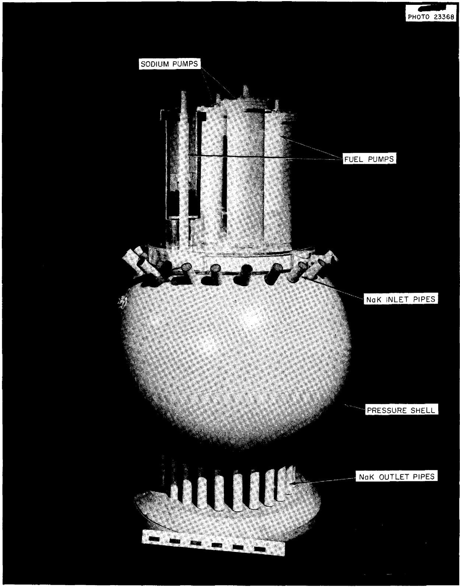  
Fig. 2.1. Preliminary Model of ART Reactor, Pump, Heat Exchanger, and Pressure Shell Assembly.

two fuel and two sodium pumps project vertically upward from the "north head" of the reactor. The fuel pump at the left is sectioned to show the bearings and seal in the removable pump body in the upper portion of the pump well. The pump and expansion tank region is shown in more detail in

Fig.2.2, for which one of the sodium pump casings was removed. The cylindrical fuel expansion tank is at the center between the two fuel pumps, while the sodium pump volute can be seen in the foreground. A section cut through this region just below the top plate, or "upper pump deck,"

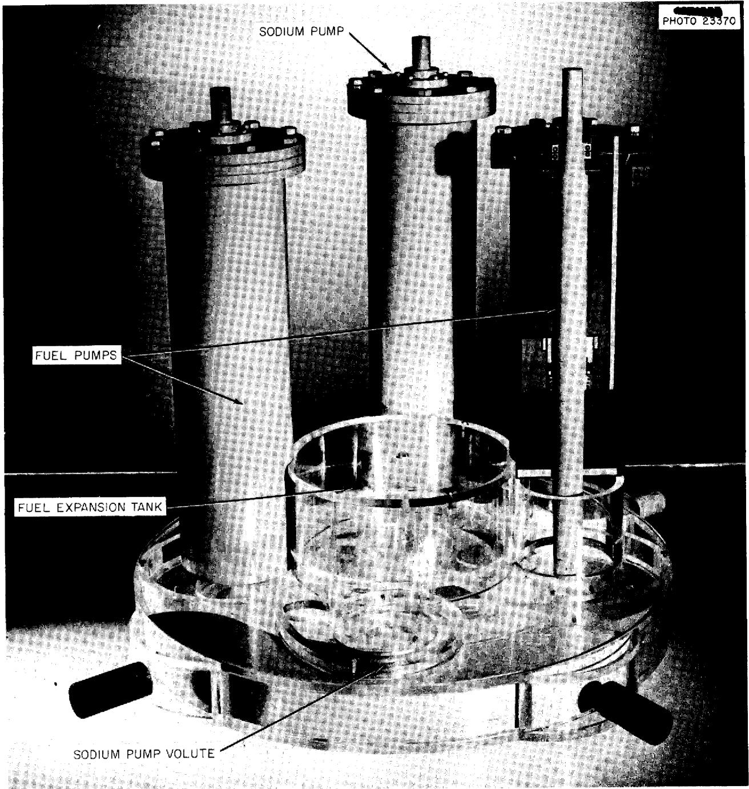  
Fig. 2.2. Detailed View of ART Pump and Expansion Tank Region.

is shown in Fig. 2.3. The fuel pump volutes are arranged to discharge tangentially into the core inlet at the center. The sodium-to-NaK heat exchanger tube bundles are along the upper and lower quadrants at the periphery. Sodium returns upward from the reflector through the circular openings in the "lower pump deck" between the core inlet and the sodium-to-NaK heat exchangers. The sodium rising through the return opening in the foreground flows to the left, enters the sodium heat exchanger near the fuel pump volute, passes to the right through the heat exchanger, flows back to the left around the right end of the baffle enclosing the heat exchanger, and rises into the sodium pump inlet (see Fig. 2.2). The NaK inlet pipes to the sodium-to-NaK heat exchangers project radially from the assembly in the lower right and upper left in Fig. 2.3. The NaK outlet

pipes are at the lower left and upper right. A section through the island, core, reflector, and heat exchanger is shown in Fig. 2.4. The control rod can be seen at the center of the island. The rifle-drilled holes for the cooling passages through the reflector and island can be seen in the beryllium regions.

The preliminary $\frac{1}{12}$ -scale model of the reactor test facility is shown in Figs. 2.5 and 2.6. The full-scale cell will be 24 ft in diameter. The 10-ft-dia reactor and shield assembly can be seen to the right of the center of the cell in Fig. 2.5. The NaK outlet pipes pass from the lower portion of the shield, through a bulkhead in the cell wall, and then upward to the radiator cores. The NaK leaving the radiators rises to the four NaK pumps at the top, from which it is returned to the upper portion of the reactor. Four axial-flow blowers

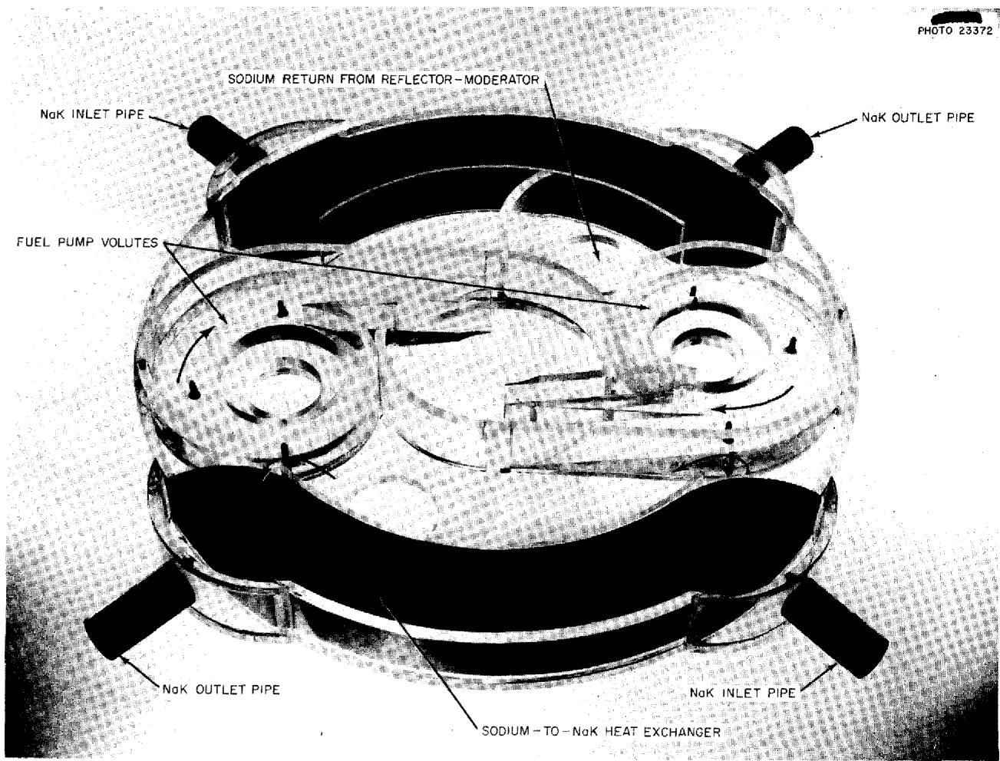  
Fig. 2.3. Section Through Fuel Pump Volutes and Sodium-to-NaK Heat Exchanger Region.

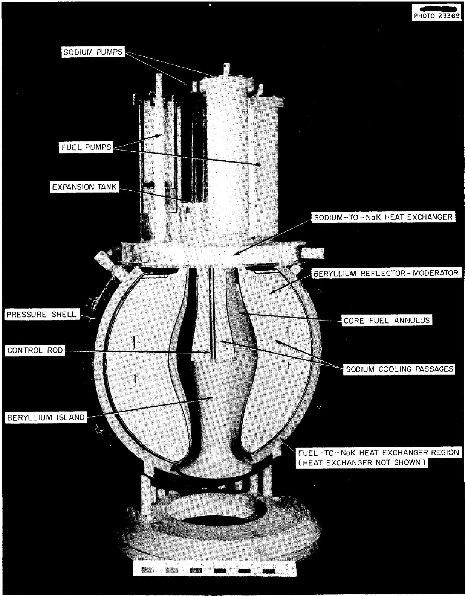  
Fig. 2.4. Section Through the Core, Reflector, and Island of the ART.

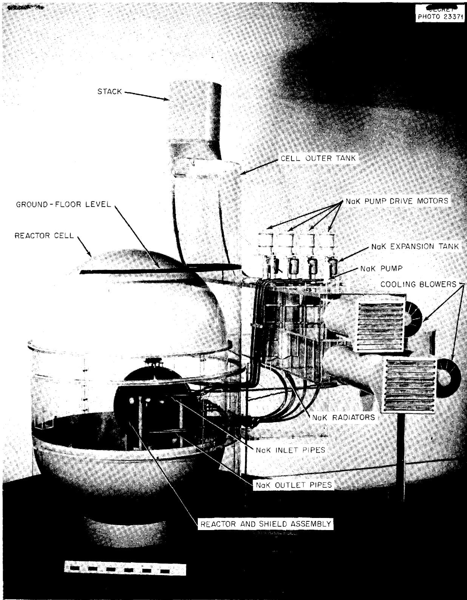  
Fig. 2.5. Preliminary Scale Model of ART Facility Showing Radiator Cores in Foreground.

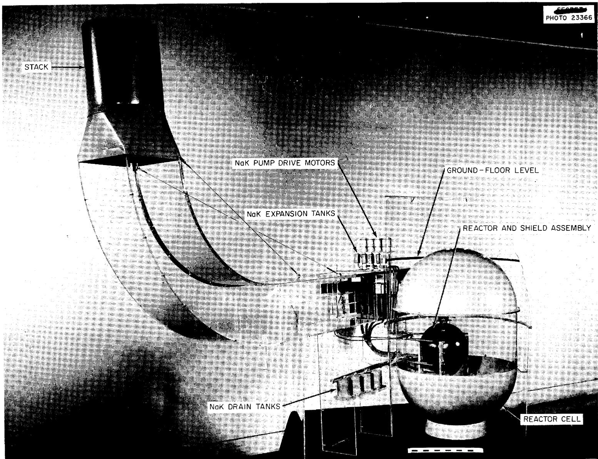  
Fig. 2.6. Preliminary Scale Model of ART Facility Showing Stack in Foreground.

at the right force air through the radiators and out the stack at the rear. The black line around the upper part of the outer tank represents the ground-floor level.

The NaK drain tanks can be seen in Fig. 2.6 to the left of the lower part of the reactor cell. Note that four separate NaK systems are used, each with its own pump, expansion tank, dump tank, etc. The NaK expansion tanks are just below and to the left of their respective pump drive motors in Fig. 2.6.

# REACTOR PHYSICS

W. K. Ergen

Aircraft Reactor Engineering Division

# Activity of ART Components After Shutdown

H.W.Bertini

Aircraft Reactor Engineering Division

The activities of the main components of the ART as a function of time after shutdown are

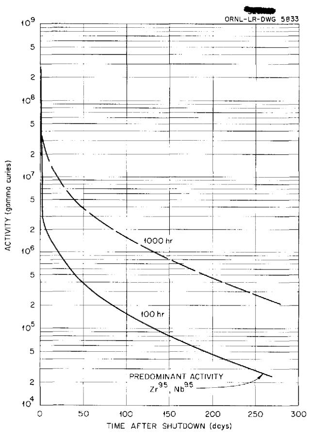  
Fig. 2.7. Activity of the ART Fuel After Operation at 60 Mw for 100 and 1000 hr.

given in Figs. 2.7 through 2.11. The activities are given in gamma curies for 100 and 1000 hr of operation at 60 Mw. Curtiss-Wright multigroup calculations $^{2,3}$ were used as a basis for the calculations. The detailed work $^{4}$ was done for 100 hr of operation, and the curves for 1000 hr were obtained by multiplying the approximately flat portions of the 100-hr curves by 10. This method is valid for all curves except the fuel curve, Fig. 2.7. Comparison with GE-ANP data $^{5}$ indicates that the 1000-hr fuel-activity curve may be high by a factor of 2 or 3.

2H. Reese, Jr., et al., Geometry Study for an ANP Circulating-Fuel Reactor, WAD-1901 (Sept. 1, 1954).   
3Personal communication with S. Strauch, Curtiss-Wright Corporation.   
4H.W.Bertini, unpublished memorandum.   
5J. Moteff, Miscellaneous Data for Shielding Calculations, p 66, APEX-176 (Dec. 1, 1954).

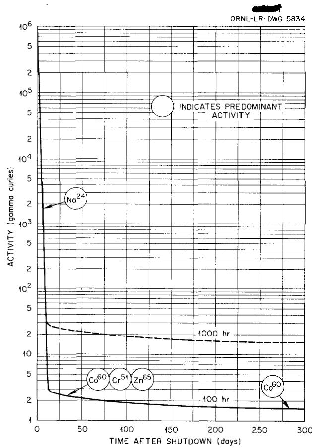  
Fig. 2.8. Activity of the ART Sodium Coolant After Operation at $60\mathrm{Mw}$ for 100 and $1000\mathrm{hr}$ .

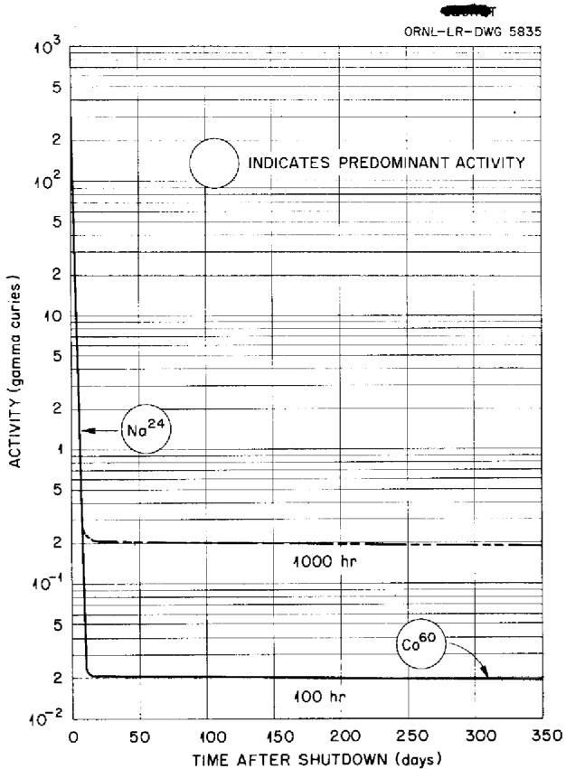  
Fig. 2.9. Activity of the ART NaK Coolant After Operation at $60\mathrm{Mw}$ for 100 and $1000\mathrm{hr}$ .

For extrapolation purposes, the following rules may be considered to give approximate activities. For times after shutdown greater than four days, the height of the fuel curve can be considered to be linear with operating time up to 1000 hr. The 1000-hr curve is approximately the curve for infinite operating time. The heights of the approximately flat portions of the other curves can be considered to be linear with time for operating times up to 1 year. All portions of all the curves are directly proportional to the reactor power.

The activities of the $\mathsf{B}^{10}$ layer around the reflector and of the lead shield were not examined in detail, but estimates of their activities follow. The activity of the $\mathsf{B}^{10}$ layer would be due mainly to the sodium impurity. This activity would be about $5 \times 10^{-3}$ of the activity due to the sodium impurity in beryllium. The value for beryllium is

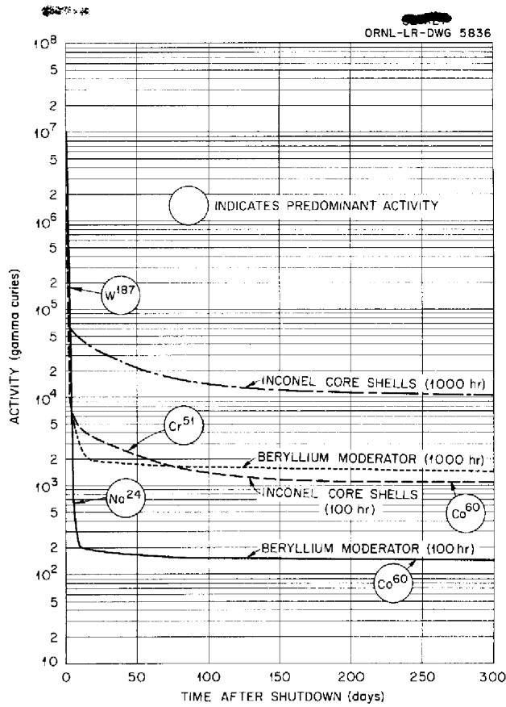  
Fig. 2.10. Activity of the Beryllium and the Inconel Core Shells After Operation at 60 Mw for 100 and 1000 hr.

given in Fig. 2.10. The maximum activity of the lead shield would be about 30 curies at shutdown. At about two days, and beyond, the activity would be a fraction of a curie.

The activities at time zero, that is, at shutdown, are intended to be maximum possible activities. The inclusion of this point in the curves has introduced slight distortions in the interval from one to five days after shutdown. If more accurate activities are required in this interval, the values are available in tabular form.4

# Gamma-Ray Heating

# L. T. Anderson, Consultant

Calculations have been made to get better estimates of the gamma heating in the fuel pump and expansion chamber regions of the ART. The gamma energy flow at the axial-surface points of a series of circular cylinders of delayed-gamma

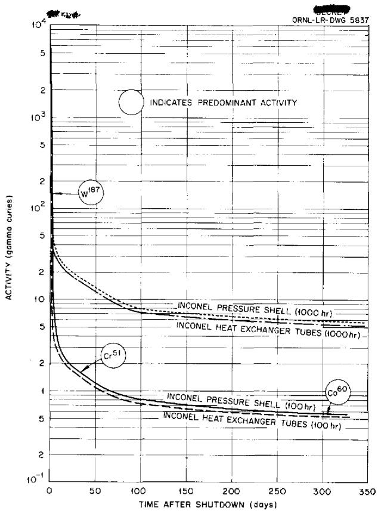  
Fig. 2.11. Activity of the Inconel Heat Exchanger Tubes and Pressure Shell After Operation at 60 Mw for 100 and 1000 hr.

emitting fuel was computed. A gamma interaction coefficient of $0.13\mathrm{cm}^{-1}$ and a gamma activity of 10 watts/cm were assigned to the fuel. Buildup was not taken into account. Figure 2.12 presents the results of these computations. The radial dependence of gamma energy flow was also computed for a cylinder of 15 cm height and diameter and is shown in Fig. 2.13.

# Control Rod Considerations

W.K.Ergen H.W.Bertini

Aircraft Reactor Engineering Division

The burnup in a control rod can be computed if it is assumed that a rod, worth $\Delta k$ , absorbs $\Delta k$ neutrons per fission. The number of grams burned up during $t$ hours of operation at $P$ megawatts is $[\Delta k$ (atoms destroyed/fission)

$$
\begin{array}{l} \times 3. 1 \times 1 0 ^ {1 0} (\text {f i s s i o n s / w - s e c}) \\ \times P \times 1 0 ^ {6} (\mathrm {w}) \times 3 6 0 0 t (\sec) \\ \times M (g / g \cdot a t o m) ] / [ 0. 6 0 2 \times 1 0 ^ {2 4} (a t o m s / g \cdot a t o m) ] \\ = 1. 8 5 \times 1 0 ^ {- 4} \Delta k P t M (g). \\ \end{array}
$$

For $\Delta k = 5\%$ $P = 60, t = 1000,$ and the atomic weight $M = 150$ (corresponding to the rare earth region), this amounts to $83\mathrm{g}$ . For a density of 7, representative of a rare earth metal, this would correspond to $12\mathrm{cm}^3$ . A rod in. in diameter

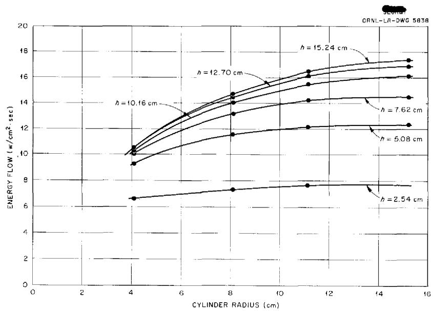  
Fig. 2.12. Gamma Energy Flow at Axial-Surface Points of Circular Cylinders of Delayed-Gamma-Emitting Fuel vs Cylinder Radius and Height.

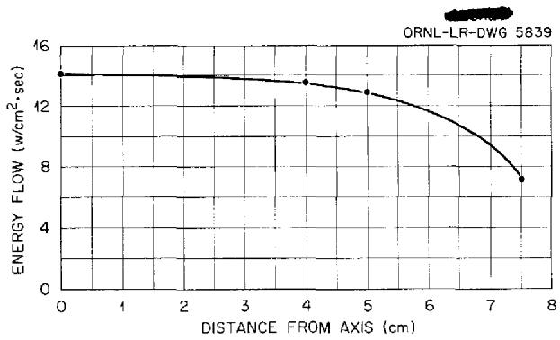  
Fig. 2.13. Gamma Energy Flow at Plane-Surface Points of 15-cm Square Cylinder of Delayed-Gamma-Emitting Fuel vs Distance from Cylinder Axis.

and 12 in. long would have $30~\mathrm{cm}^3$ and a rod 1 in. in diameter and 20 in. long would have $258~\mathrm{cm}^3$ . Thus, if all the rod consisted of "burnable" material, the smaller rod would suffer considerable burnup, but the larger one would survive with little change. In considering the use of

samarium for the rod it was found that only $14\%$ of the element is made up of the large cross section isotope; therefore 12/0.14, or $86~\mathrm{cm}^3$ , would burn out, which is more than the total volume of the small rod and a considerable fraction of even the large rod. Furthermore, if the easily obtainable oxide were used instead of the metal and if a binder were used to give the rod mechanical rigidity, even the large rod would become of marginal usefulness.

From the heating viewpoint, a power density of $20\mathrm{w/cm}^3$ and a thermal conductivity of the rare earth oxide of 0.003 cal/sec·cm. $^{\circ}$ C would yield a temperature difference of $1200^{\circ}$ F between the center of a 1-in. rod and the surface. Although both the thermal conductivity and the power density are considerably in doubt, the heating problem appears to make impossible the use of a solid oxide rod 1 in. in diameter. The use of a hollow rod might present problems because of burnup unless an element such as europium, which is $100\%$ large absorption cross section isotopes, were used.

# 3. EXPERIMENTAL REACTOR ENGINEERING

H. W. Savage

E. S. Bettis

Aircraft Reactor Engineering Division

Design work on the in-pile loop proceeded as scheduled. A flux-measuring loop for obtaining information on the flux to be expected is being fabricated, and 1000 hr of trouble-free operation of the horizontal-shaft sump pump was concluded. A double-walled heat exchanger was found to be acceptable for in-pile use.

Performance tests on the ARE-type sump pump with fluoride fuel were completed, and tests with water and with hot NaK $(1400^{\circ}\mathrm{F})$ indicated the suitability of this type of pump for the heat exchanger test loop. Mechanical shakedown tests of ART pump rotary elements are under way.

Three high-velocity, high-temperature-differential loop tests of corrosion and mass transfer in fused-salt-Inconel systems were completed, as well as a fourth test of sodium in a beryllium-Inconel system.

The test loop for the intermediate heat exchanger test No. 2 is being fabricated, and work is under way on a small heat exchanger loop for testing a bundle of 20 tubes. Tests were made of the integrity of the cell for containing the ART.

# IN-PILE LOOP COMPONENT DEVELOPMENT

D. B. Trauger

Aircraft Reactor Engineering Division

The in-pile loop design specifications were revised to make the first test a more conservative one. The power density was reduced from $2.5\mathrm{kw/cm^3}$ to approximately $1\mathrm{kw/cm^3}$ and the temperature differential from 300 to $200^{\circ}\mathrm{F}$ ; the maximum temperature remains $1500^{\circ}\mathrm{F}$ . An extra turn of tubing in the "nose" section, approximately 2 ft of developed length, is necessary to meet the temperature differential specification at this power density. The total power is expected to be about $22\mathrm{kw}$ . The fuel mixture $\mathrm{NaF-ZrF_4 - UF_4}$ (53.5-40-6.5 mole %) will be circulated at a Reynolds number of 5000. These conditions, with the exception of the temperature differential, are at least as severe as those expected in the ART.

The design of the loop has progressed through the layout stage and is now ready for detailing. Figure 3.1 shows the present basic design. A full-scale wooden model, shown in Fig. 3.2, was

prepared to aid in solving the difficult assembly problems and for instructional purposes. The numbers on the base indicate distance, in inches, from the reactor lattice face. The calrod preheaters and the fill tank had not been installed when the photograph was made. The water jacket, which will completely encase the loop forward of the rear header, is represented, in part, by the plastic tube.

# Instrumentation

R.A.Affel

P.A.Gnadt

Aircraft Reactor Engineering Division

Instrumentation design for the in-pile loop is nearly complete, and fabrication and testing of most components are now under way. A simplified diagram for the instrumentation and control system is shown in Fig. 3.3. Since the power generated in the loop is dependent on the reactor flux, it is subject to sudden and unexpected changes. These sudden and unexpected changes would come about as a result of power failures, experimental troubles, etc. The main control therefore is by regulation of the cooling air in response to a thermocouple signal at the exit end of the heat exchanger. This signal will also energize the preheat calrod circuits if danger of freezing exists. The pump is driven by a Vickers hydraulic oil motor, which, in turn, is activated by a pump unit. Manual speed control will be provided by varying the output of the drive unit. An electromagnetic tachometer will operate from a toothed gear on the pump shaft to indicate and record the pump speed. Activity monitors on all fluid lines leaving the loop will be connected to alarms or reactor scams, depending upon the potential hazard involved.

# Melt-down Hazard

C.W.Cunningham

Aircraft Reactor Engineering Division

The principle hazard to the experiment would be a pump failure or other sudden stoppage of flow. In the event of a sudden flow stoppage, the fuel temperature would rise rapidly, and the fuel tube would be melted in a few seconds. The

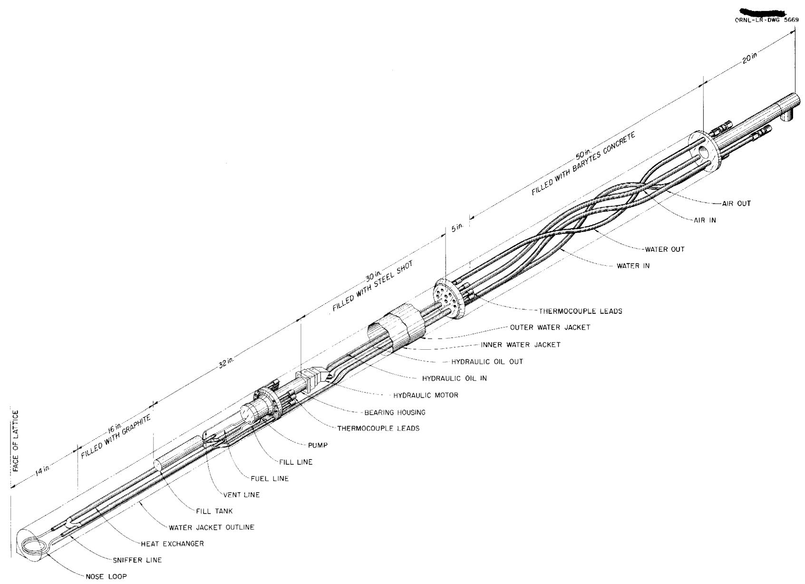  
Fig. 3.1. Loop for Circulating Fluoride Fuel in MTR Horizontal Beam Hole.

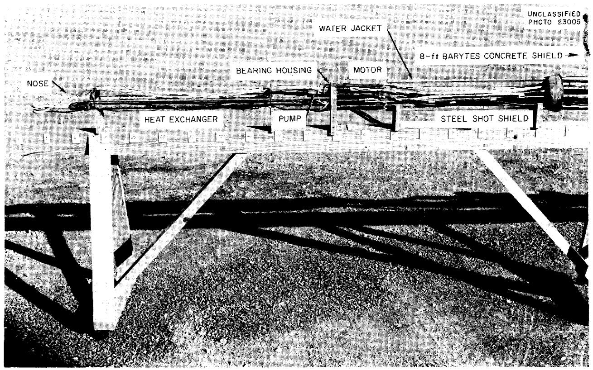  
Fig. 3.2. Model of In-Pile Loop.

ORNL Mathematics Panel has investigated this problem with the use of the Oracle. A predicted chronology of events follows: At 0.00 sec the flow is assumed to stop and the salt temperature is rising at $70^{\circ}\mathrm{F}$ per 0.10 sec. After 1.20 sec a thermocouple on the outside of the tube will have indicated a $100^{\circ}\mathrm{F}$ rise in temperature, which is considered to be adequate to provide a reactor scram signal. At 1.45 sec the salt at the tube center is at its boiling point, $2430^{\circ}\mathrm{F}$ . The center of the Inconel wall, however, will have reached only $1650^{\circ}\mathrm{F}$ and will have sufficient strength to resist considerable pressure if the salt should superheat and suddenly boil.

If the assumption is made that the salt temperature will continue to rise with no boiling, the chronology continues, as follows: At 4.2 sec the salt next to the inner wall will have reached $2500^{\circ}\mathrm{F}$ and the Inconel tube will begin to melt. The entire tube would melt in 7.5 sec.

Calculations and circuit tests indicate that the reactor can be shut down, on the basis of thermo

couple or tachometer signals, in time to prevent melting of the nose tube. Although it is unlikely that a scream can be effected from a thermocouple signal in time to keep the tube below temperatures where crystal grain growth will become very rapid, a signal from the tachometer should be fast enough to avoid this type of damage to the loop. If the scream fails, it seems likely that boiling will occur, along with subsequent displacement of the salt into the pump sump and fill tank. This displacement should result in additional time for secondary protective circuits to function and shut down the reactor.

If a melt-down or a sudden leak should occur, it would be somewhat hazardous for molten salt to reach the stainless steel water jacket wall. A molybdenum shield which will allow no line of sight to the jacket has been provided as protection in this event. Molybdenum has been demonstrated to resist corrosion by the salt at boiling temperatures for 30 min or longer.

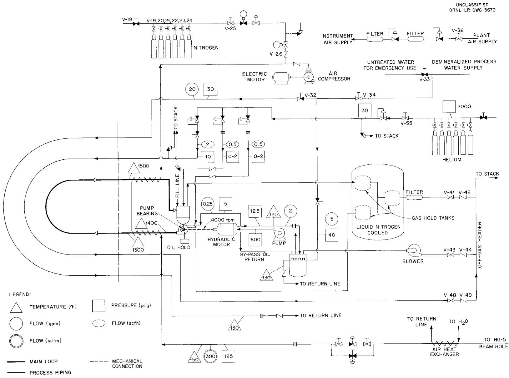  
Fig. 3.3. Flow Diagram of In-Pile Loop.

# Fission-Gas Holdup

D. W. Magnuson

Aircraft Reactor Engineering Division

Fission gases will be purged from the pump sump and from the pump bearing regions, with purging from the bearing region serving to remove leakage past the rotating face seal. These purge gases will pass through liquid-nitrogen-cooled charcoal traps and then through filters. The design of the fission-gas holdup system is based on adsorption data of the Linde Air Products Company.

The equations of $\text{Jury}^2$ were used to predict the performance of adsorption traps in this gas holdup system, and it was found that a 250-g activated-carbon trap at $-170^{\circ}\text{C}$ was five times more effective than required to give a reduction in molecular density of more than $1 \times 10^6$ . This should constitute adequate decontamination. However, radioactive decay will further increase the decontamination factor, and a second trap is provided, in series, as an additional safety factor. The use of an extremely small-pore metal filter will prevent particles from reaching the MTR stack.

# Flux-Measuring Loop

D.M.Haines

Pratt & Whitney Aircraft

One of the greatest uncertainties that might affect the successful operation of this in-pile loop is in the estimation of the neutron flux. The thermal flux will be "depressed" by the materials of construction of the loop and by the fuel. Several estimates have been made and an analog computation was performed by Pratt & Whitney Aircraft. These estimates indicate that the effective flux will be about one half that of the undisturbed beam hole. However, such estimates are difficult to make, since the loop geometry is quite complicated and the unperturbed flux pattern is not well known. Accordingly, a flux-measuring loop is being fabricated for early irradiation at the MTR. This loop consists of the identical water jacket and other components of the forward end of the loop. The heat exchanger section will be

mocked up with approximately the correct materials. Cobalt foils placed inside and outside the fuel tube and in a graphite bar along the heat exchanger tubes will be counted after irradiation to determine the flux. An exposure time of less than 1 hr is planned.

Since this loop will not measure the flux depression caused by the salt, a second and independent experiment (cf., sec. 9, "Radiation Damage") is also being performed by the Solid State Division. Small tubes, 0.269 in. ID by 7 in. long, containing foil will be irradiated in the MTR "rabbit" facility. The tubes will be filled with various mixtures of material to match the effective cross section of the fuel mixture NaF-ZrF4-UF4 (53.5-40-6.5 mole%).

# Horizontal-Shaft Sump Pump

J.A. Conlin

Aircraft Reactor Engineering Division

The first fused-salt test model of the in-pile pump, which was described previously, has completed a trouble-free 1000-hr endurance test. The pump circulated $1400^{\circ}\mathrm{F}$ NaF-ZrF $_4$ -UF $_4$ (53.5-40-6.5 mole %) at 1 gpm in an isothermal loop similar to the proposed in-pile loop.

Immediately after filling and priming, the pump was operated at flows from 0.54 to 1.64 gpm and found to be quite satisfactory. The pump, seal, and drive motor are basically the same as those proposed for in-pile use. However, in the final in-pile pump design, the shaft is cooled with helium rather than oil, and the seals and bearings are drop-lubricated. These changes were incorporated to minimize the problem of oil disposal in the loop assembly. A prototype pump is now fully designed.

The priming difficulty previously reported has been solved by drilling a $3/2$ -in. vent hole between the impeller cavity and sump in the vicinity of the shaft. This priming difficulty was attributed to a seal caused by the surface tension of the water and the close radial clearance, 0.007 in., between the shaft and the pump casing. The seal was strong enough to prevent venting of gas from the pump and loop along the shaft and into the sump.

A system has been proposed and tested with water which will permit automatic filling and pump

sump_level_control. It consists of a fill tank connected to the pump sump by two tubes. One tube, for filling, connects the bottom of the tank to the bottom of the sump. A second tube, for venting, extends from the top of the fill tank to the pump. This latter tube enters the side of the pump sump and is directed downward into the sump, ending at the normal sump fluid operating level. In operation, the pump and fill tank are heated, with the fill line remaining frozen. The fill line is then heated and fuel flows from the tank into the sump and displaces gas to the fill tank through the vent tube. When the sump level reaches the vent tube, fuel is forced up the vent until it balances the head in the fill tank, at which time all flow stops. As the sump level lowers, the bottom of the vent tube is uncovered, the pressure balance is upset, and the sump again fills.

In the test model it has been possible to control sump level to within $\frac{1}{16}$ in. The operation of this fill system is particularly sensitive to vent-tube design. The tube must have a gradual downward slope from the fill tank to the sump, and, for best results, have a sharp-edged flared end in the sump. A unit is now being set up to test the system with fused salts. In operation the fill line will be frozen after transfer to eliminate the possibility of additional fuel entering the sump.

# Heat Exchanger

L. P. Carpenter

Aircraft Reactor Engineering Division

The problems of sealing and shielding are reliable, helium-IRCulating cooling system for removal of the heat generated in the in-pile loop are so great that an air-cooling system appears to be the least expensive in time and money. Air will flow from a compressor, through the loop heat exchanger, and discharge into the MTR pebble zone through a second, little-used beam hole. A double-walled heat exchanger is planned in which a tube will be shrunk thermally around the salt-carrying tube of the loop, and the tubes will be brazed together at the ends. A third tube will form the annular air passage, as in the original exchanger. The double-walled tube is a safety feature in that in the event of a break of the salt tube within the

heat exchanger, the radioactivity will be contained within the second tube and will not enter the high-velocity air stream. A helical groove cut in the inside wall of the second tube will direct any gas leakage from the salt tube to an activity monitor.

Three tests of in-pile heat exchangers have been run in which lengths equivalent to one half the actual heat exchanger were used. Two exchangers were of the single-tube-and-shell type that was designed for helium cooling, and the third was a double-walled tube type. The results of the tests indicate that the required heat removal can be accomplished with the double-walled tube, although there is about a $20\%$ loss in efficiency in comparison with the single tube. The double-walled heat exchanger removed 15 to $20\mathrm{kw}$ with 0.4 to 0.7 lb/sec of air and a temperature rise of 120 to $150^{\circ}F$ . In the in-pile loop, the mass rate of air flow will be about the same as that used in the test, but the temperature rise at the exit will be about twice that in the test, and therefore heat-removal capacity will be about 30 to $40\mathrm{kw}$ .

# PUMP DEVELOPMENT

# ARE-Type Sump Pumps

A.G.Grindell

Aircraft Reactor Engineering Division

Performance tests of the ARE-type sump pump were concluded. In these tests the pump characteristics were obtained over the speed range 600 to 1400 rpm with the fluoride mixture $\mathsf{NaF - ZrF}_4\cdot$ $\mathsf{UF}_4$ (53.5-40-6.5 mole %) at $1300^{\circ}\mathsf{F};^{5}$ the critical speed range was determined to be between 2850 and 3250 rpm; and the zirconium fluoride vapor trap was demonstrated to be effective. The reliability test was terminated, despite continued trouble-free operation, at a total operating time of 3748 hr. The only interruptions in operation were the shutdown for inspection at 2000 hr, and a motor bearing failure at about 3000 hr (downtime, $2\frac{1}{2}$ hr). It may be concluded from the tests that the ARE-type sump pump, when used in conjunction with a suitable vapor trap, may be expected to operate with $\mathsf{NaF - ZrF}_4\cdot \mathsf{UF}_4$ (53.5-40-6.5 mole %) for about 4000 hr without trouble at its design conditions: $1350^{\circ}\mathsf{F}$ , 1500 rpm, and 40 gpm.

Tests of the ARE-type sump pump were also made to determine its suitability for delivering NaK at $1400^{\circ}\mathrm{F}$ , 184 gpm, 300-ft head in the ART intermediate heat exchanger tests. A preliminary water test at $100^{\circ}\mathrm{F}$ indicated that the desired conditions could be reached with the ARE-type pump at a speed of about 3800 rpm (Fig. 3.4). A hot test with NaK verified the preliminary test data (Fig. 3.5). No life test of the pump at the intermediate heat exchanger test conditions was performed, but previous experiences indicate that no serious trouble would be encountered during the 1000-hr duration of the test. However, the V-belt drive would be operating beyond its rated speed limit, and it would probably have to be replaced periodically during the test.

# Mechanical Shakedown Tests of ART Pump (Model 1) Rotary Elements

A.G.Grindell Aircraft Reactor Engineering Division W.C.Snapp Pratt & Whitney Aircraft

Included in the program for development and testing of pumps for the ART circuits is a mechanical shakedown test of each rotary element to be used. The objectives of the test are to determine adequate assembly techniques, the appropriate clearances, and the reliability of bearings and seals and their lubricating and cooling equipment. Particular emphasis is placed on assuring that seal parts have no manufacturing defects and that they have been properly assembled with respect to the pump shaft and impeller. No load is to be imposed on the impeller.

A mechanical shakedown test stand has been erected, and two rotary elements have been tested. Both elements were run at a constant 3800 rpm with lubricating oil supplied at 2.0 to 2.5 gpm at $150^{\circ}$ F.

One rotary assembly (No. 1) was run for 96 hr without vibration, bearing heating, or seal leakage, and the test was shut down for disassembly and inspection of the rotary element. No damage was detected. The element was then reassembled and the test restarted. A slight amount of oil leakage past the lower seal was detected 22 hr after the operation was resumed, and the test was terminated at the end of 67 hr when the leakage rate became excessive.

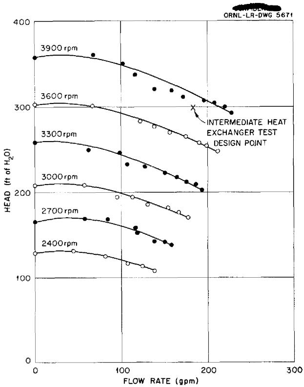  
Fig. 3.4. Performance Characteristics of ARE-Type Sump Pump in Tests with Water at $100^{\circ}\mathsf{F}$ .

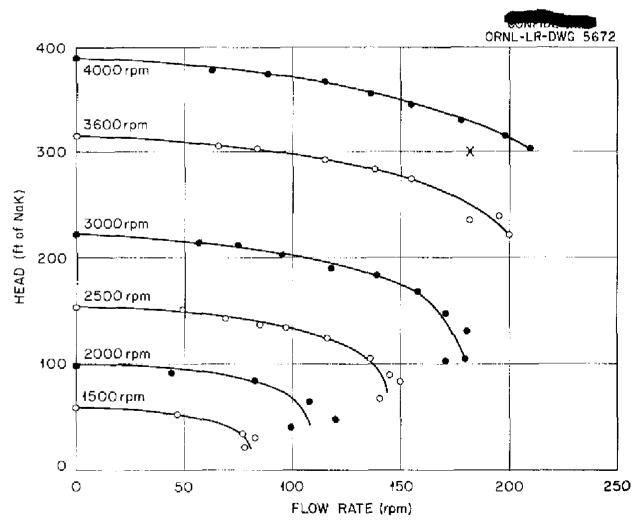  
Fig. 3.5. Performance Characteristics of ARE-Type Sump Pump in Tests with NaK at $1400^{\circ}$ F.

Inspection of the seal parts revealed that distortion of the bellows nosepiece had destroyed the surface flatness of the seal face. A study revealed that the material and hardness specifications for the bellows nosepiece precluded the possibility of heat treatment for stress relief, and the distortion was therefore attributed to stress relief induced by test conditions. The bellows nosepiece specification was rewritten, and new seals were ordered.

The results of a test of a second rotary assembly (No. 2) with seals manufactured to the original specification verified those obtained in the test of assembly No. 1. The total operating time was 200 hr. Both these rotary elements will be retested when seals manufactured to the revised specifications are received.

# DESIGN AND OPERATION OF FORCED-CIRCULATION CORROSION AND MASS TRANSFER TESTS

Operation of Fused-Salt-Inconel Loops

W. B. McDonald

P. G. Smith

Aircraft Reactor Engineering Division

J.J.Milich

R.A.Dreisbach

Pratt & Whitney Aircraft

Three fused-salt-Inconel forced-circulation loops with large temperature differentials were terminated after 774, 625, and 521 hr of operation, respectively. In each case operation was terminated short of the scheduled 1000 hr because a leak developed; however, the operating periods were long enough to provide valuable corrosion and mass transfer data. The fuel used was NaF-ZrF $_4$ -UF $_4$ (53.5-40-6.5 mole%). The design of the loop was illustrated in the previous report. $^6$

The loop that operated 774 hr had a peak fuel temperature of $1500^{\circ}\mathrm{F}$ , a maximum tube wall temperature of $1740^{\circ}\mathrm{F}$ , a temperature differential of $200^{\circ}\mathrm{F}$ , and a Reynolds number of 10,000. The loop had to be terminated when a small leak developed near one of the heater terminals. The cause of this failure is not known. Because of a plant power failure and a pump motor circuit failure, the fuel had to be dumped twice during this test.

The loop that operated 625 hr had a peak fuel temperature of $1500^{\circ}\mathrm{F}$ , a temperature differential

of $300^{\circ}\mathrm{F}$ , and a Reynolds number of 10,000. The maximum tube wall temperature in this test was $1610^{\circ}\mathrm{F}$ . The loop had to be terminated when the pump (LFB model) seized because of a bearing failure.

The third loop was terminated after 521 hr because of a failure in the heater section. The peak fuel temperature was $1500^{\circ}\mathrm{F}$ ; the maximum tube wall temperature was $1610^{\circ}\mathrm{F}$ ; the Reynolds number was about 15,000; and the temperature differential was $200^{\circ}\mathrm{F}$ . During one period of the test, the loop had to be operated isothermally for 69 hr because of a failure in the power supply control. The results of examination of these loops are reported in Sec. 6, "Corrosion Research."

The results obtained from these tests indicate an undesirable temperature distribution in the heater section. At the tube bends between the heating elements, higher temperatures (as much as $100^{\circ}\mathrm{F}$ ) occurred on the inside of the bend than on the outside. To determine the effect of the uneven temperature distribution on corrosion, a new loop in which the heating is accomplished entirely in a straight section of tubing was put into operation. A second loop incorporating the old, coiled heater section was also started. A zirconium-base fuel containing both $\mathsf{UF}_4$ and $\mathsf{UF}_3$ is being circulated in these loops. The unit with no bends in the heater is operating at a Reynolds number of 15,000, a temperature differential of $200^{\circ}\mathrm{F}$ , and a maximum fuel temperature of $1500^{\circ}\mathrm{F}$ . The other loop has a Reynolds number of 10,000, a temperature differential of $300^{\circ}\mathrm{F}$ , and a maximum fuel temperature of $1500^{\circ}\mathrm{F}$ .

In order to determine the effect of the method of heating the loop on corrosion and mass transfer, a gas-heated loop and an electrical-resistance heated loop are being operated on a comparative basis. They are both operating at a Reynolds number of 1000, a temperature differential of $300^{\circ}\mathrm{F}$ , and maximum fuel temperature of $1500^{\circ}\mathrm{F}$ ; they are circulating the fluoride mixture NaF $\mathsf{ZrF}_4$ -UF $_4$ (53.5-40-6.5 mole%).

# Sodium in Multimetal Loops

D. R. Ward

W. B. McDonald

Aircraft Reactor Engineering Division

The fourth of a series of tests7 of sodium in beryllium-Inconel systems was completed. The

loop, which was made of Inconel and contained a beryllium insert, was operated continuously for 1000 hr. The sodium was circulated at a maximum temperature of $1300^{\circ}\mathrm{F}$ (at the beryllium insert) and a temperature differential of $300^{\circ}\mathrm{F}$ . The Reynolds number at the minor diameter of the beryllium insert was approximately 440,000.

A similar loop that is all Inconel is being operated with sodium to provide a comparison with loops containing other materials. Also, a loop made of Inconel and type 316 stainless steel is being operated. The steel is inserted in the cold leg of the loop. The operating conditions for both loops are a maximum temperature of $1500^{\circ}\mathrm{F}$ , a minimum temperature on the cold leg of $1200^{\circ}\mathrm{F}$ , and the Reynolds number in excess of 15,000. The loops are scheduled to operate 1000 hr.

# HEAT EXCHANGER TESTS

# Intermediate Heat Exchanger Test No. 2

R.E. MacPherson

Aircraft Reactor Engineering Division

Design work is progressing on a heat exchanger test loop to provide data on corrosion, mass transfer, and reliability of a fuel-to-NaK-to-air system operating under conditions comparable to those postulated for the ART. The design will incorporate two heat exchanger tube bundles containing 100 tubes each in a regenerative type of circuit. Component procurement and fabrication are well under way, and it is intended that the testing will begin in May.

The heat exchanger is basically similar to that used in the first intermediate heat exchanger test. The NaK will flow from a 1-Mw gas-fired heater through one tube bundle to a radiator. The stream will then go to the liquid-metal pump and back through the second tube bundle to the heater. The fuel mixture NaF-ZrF $_4$ -UF $_4$ (50-46-4 mole %) will be circulated outside the tubes countercurrent to the NaK flow and will be alternately heated and cooled by the NaK stream.

A single tube bundle is composed of 100 Inconel tubes in. in outside diameter, 0.017 in. in wall thickness, and approximately 6 ft in length. These tubes are arranged in a 10 by 10 matrix and contained in a square channel on 0.210-in. centers with a 0.011-in. tube-to-wall clearance.

The operating conditions are indicated on the flow diagram, Fig. 3.6. The fuel mixture specified for this test will restrict the attainable fluoride-side Reynolds number to approximately 2600.

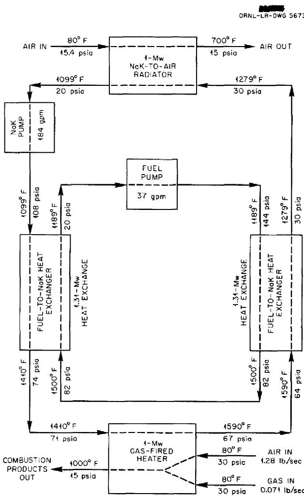  
Fig. 3.6. Flow Diagram of Loop for Testing Intermediate Heat Exchanger No. 2 with NaF-ZrF $_4$ -UF $_4$ (50-46-4 mole %) on the Fuel Side at a Reynolds Number of 2610.

# Small Heat Exchanger Test

R.E. MacPherson

Aircraft Reactor Engineering Division

A small-scale heat exchanger test is now being set up to provide a facility for investigating heat transfer characteristics through the Reynolds number range 0 to 5500 on the fluoride mixture

side of the fuel-to-NaK heat exchanger. The heat exchanger to be used consists of 20 Inconel tubes, $3\frac{1}{6}$ in. in outside diameter, 0.017 in. in wall thickness, and approximately 6 ft in length. These tubes are arranged in a 4 by 5 matrix and contained in a square channel on 0.22-in. centers with a 0.032-in. tube-to-wall clearance.

The operating conditions are indicated on the flow diagram, Fig. 3.7. The fluoride mixture NaF-ZrF4-UF4 (50-46-4 mole %) will be used. In order to attain the Reynolds numbers desired in this test, it has been necessary to increase the tube center-to-center spacing and the wall clearance in comparison with the spacing and clearance

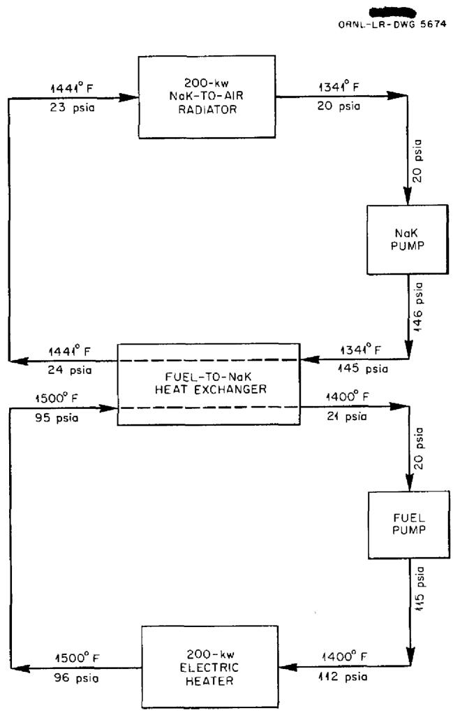  
Fig. 3.7. Flow Diagram of High-Velocity Loop for Testing a Small Fuel-to-Nak Heat Exchanger with NaF-ZrF $_4$ -UF $_4$ (50-46-4 mole %) on the Fuel Side at Reynolds Numbers of 0 to 5500.

specified for the intermediate heat exchanger No. 2. In addition, the regenerative feature is not being employed so that the fluoride and NaK circuit resistances can be kept within the head range of available pumps (ARE type). The circuit will consist of a 200-kw resistance heater (to heat the fluoride stream), the heat exchanger, and a NaK-to-air radiator for heat removal.

# Gas-Fired Heat Source

R.E. MacPherson

Aircraft Reactor Engineering Division

R. Curry

Pratt & Whitney Aircraft

As a step toward development of a 1-Mw gas-fired NaK heater for use in the intermediate heat exchanger test No. 2, a small-scale prototype (100 kw) has been designed and is being assembled. This unit was initially planned to test the principles to be utilized in a larger heater, but it has since been decided to fill the need for high-capacity heat sources from outside vendors. However, assembly and testing of the 100-kw gas-fired heater are being continued to fill the need for small utility heaters in many phases of the development program.

The heater utilizes the Esso-type burner and a countercurrent NaK-to-flue-gas heat exchanger with combustion air preheating provisions as shown in Fig. 3.8. The unit, as designed, will operate at an efficiency of 30 to $40\%$ . No attempt has been made to utilize the combustion gases leaving the heat exchanger to preheat the combustion air, since all the preheating that is desired is accomplished in cooling the container wall of the heat exchanger section. It is visualized that a full-scale unit could have considerably higher efficiency, since the percentage of available heat escaping through the container wall could be appreciably less and a flue-gas economizer could be used.

# REACTOR HAZARDS TESTS

J.Y. Estabrook L.A.Mann

Aircraft Reactor Engineering Division

Tests were made to evaluate the integrity of the cell designed to contain the Aircraft Reactor Test and the effects of a reactor accident. An

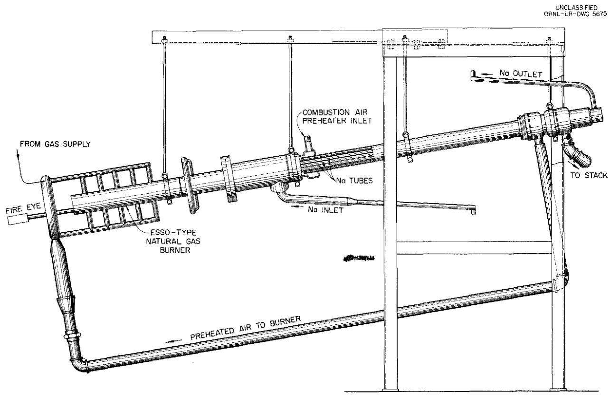  
Fig. 3.8. Apparatus for Testing 100-kw Gas-Fired Heat Source.

accident was simulated in which the reactor pressure shell was ruptured during power operation and the fuel was spilled into the cell. The apparatus used in the test is shown in Fig. 3.9.

The test was performed in two parts. In the first part, the spill was contained by the inner wall of the double-walled cell (water-filled annulus), and the afterheat was dissipated in boiling of the water in the annulus.

To simulate the accident, 414 lb of the fluoride mixture NaF-KF-LiF (11.5-42-46.5 mole %) was heated to $1500^{\circ}\mathrm{F}$ and dumped into the bottom of the tank representing the inner wall of the cell; the tank was surrounded by water at $185^{\circ}\mathrm{F}$ . The salt mixture used has about twice the heat capacity of the proposed ART fuel, but the quantity involved represented only about one-fourth the volume of the ART fuel. Six thermocouples attached to the outside bottom of the tank recorded the temperature rise at the center and five other points spaced at intervals of 6 in. from the center outward. The water adjacent to the tank bottom

boiled briskly but not violently enough to shake the tank visibly. Within 75 sec, the center thermocouple reading peaked at $940^{\circ}\mathrm{F}$ and fell off rapidly as the salt mixture cooled (Fig. 3.10). No other thermocouple read more than $300^{\circ}\mathrm{F}$ throughout the test. The cooling rate shown by the recording potentiometer indicated that the over-all heat transfer rate would be adequate to dissipate 3.5 Mw of continuous afterheat if the center of the bottom of the cell were modified to prevent fuel from contacting that portion of the surface.

In the second part of the test, the reactor and the inner wall of the cell were assumed to have ruptured and permitted the fuel and the water in the annulus to mix. To simulate the radioactive reactor fuel, $2\mathrm{kg}$ of $\mathsf{UF}_4$ was added to 505 lb of the fluoride mixture, and the mixture was heated to $1150^{\circ}F$ . An aluminum capsule containing $99\mathrm{g}$ of $\mathsf{Na}_2\mathsf{UF}_6$ (59 g of normal uranium) that had been irradiated in the ORNL Graphite Reactor was then put into the melt, and the temperature was raised to $1500^{\circ}F$ . This simulated fuel was then injected

UNCLASSIFIED ORNL-LR-DWG5331

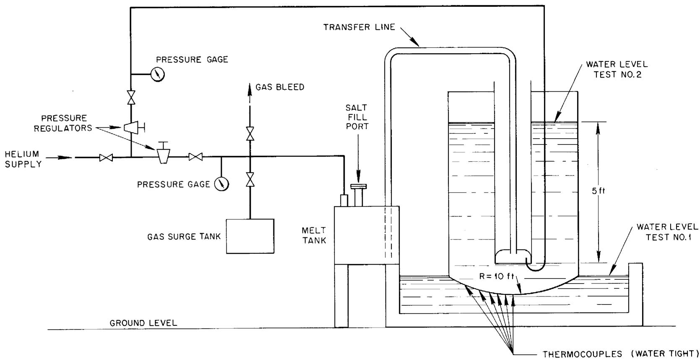  
Fig. 3.9. Facility for Testing Integrity of Reactor Cell in the Event of Rupture of the Reactor Pressure Shell.

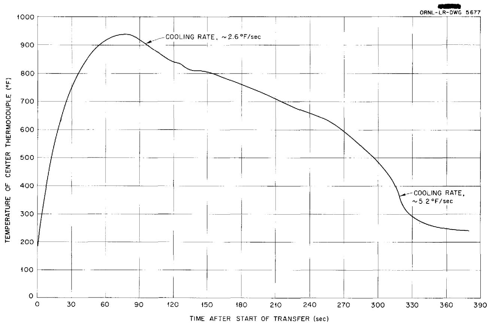  
Fig. 3.10. Rate of Temperature Rise of Outer Surface at Bottom Center of Reactor Cell When Inner Surface Was Flooded with a Fluoride Mixture at $1500^{\circ}$ F.

into the test tank (Fig. 3.9), which had been filled with water to simulate the effect of a rupture of the inner wall of the cell.

The time required for injection of the fuel was about 50 sec. The physical agitation of the water, tank, and transfer line (recorded by motion picture

camera) was violent during the injection, but no explosion occurred. A negligible amount of steam reached the surface of the water, and no entrainment of water into the air was observed. No measurable radioactivity was found outside the steel tank. A water sample from the tank indicated a total of 1 to 2 millicuries of activity.

# 4. CRITICAL EXPERIMENTS

A. D. Callihan Physics Division

# REFLECTOR-MODERATED REACTOR

D. Scott

B. L. Greenstreet

Aircraft Reactor Engineering Division

R. M. Spencer  
ed States Air Force

J.J.Lynn

D. V. P. Williams Division

J. S. Crudele

E.V.Sandin

J.W.Noaks

Pratt & Whitney Aircraft

The current study of the nuclear characteristics of the reflector-moderated aircraft-propulsion reactor was to include, as described in preceding reports, three critical assemblies of increasing complexity approaching a structure similar to that of the designed reactor. As the complexity has increased, the assemblies have been successively less amenable to calculation by using the presently known multigroup methods and nuclear data. The experiments have, therefore, provided results that have validated or extended reactor analysis methods, and they are, more recently, providing data for evaluating empirically the effects of certain structural features of the reactor. In all these assemblies the reflector is beryllium and the fuel region contains alternate laminae of $93.2\%$ enriched uranium metal, 0.004 in thick, and Teflon $(\mathsf{CF}_2)_n$ . This critical experiment fuel satisfactorily represents the mixture of fluorides comprising the reactor fuel, and the thickness of the uranium and of the Teflon sheets allows considerable flexibility in the $\mathsf{U}^{235}$ concentration in the various loadings. The first assembly consisted of an essentially spherical fuel region surrounded by the reflector. In the second, of which there have been three variations, the fuel surrounded a core, or island, of beryllium, also spherical, and was enclosed by the reflector. The fuel was separated from the island and from the reflector by metal core shells to provide stability and, in the more recent experiments, to represent the reactor structure. This three-region assembly has been modified in the

third experiment by the addition of a column of beryllium to each side of the island and of cylindrical shells of fuel to the former spherical fuel shell to simulate the so-called "end ducts." A cutaway view of the assembly with the end ducts is shown in Fig. 4.1. These end-duct additions represent the inlet and outlet flow channels of the reactor.

The data from the first experiment and some of the critical parameters of the second experiment have been presented. The results from the second experiment and preliminary data from the assembly with the end ducts are presented here. The dimensions and contents of all the assemblies are summarized in Table 4.1, and a comparison is made with the results of critical mass calculations by a multigroup method. The present fuel loading of the assembly with the end ducts is excessive by an amount too great to extrapolate with certainty to a critical system with all poison rods removed. The immediate program includes a reduction of the loading so that an evaluation of the critical mass can be made.

The distributions of neutrons detected by indium activation, with and without cadmium covers, along a vertical traverse in the midplane of the three-region assembly with aluminum core shells (CA-20a) is shown in Fig. 4.2. The cadmium fraction, that is, the fraction of the neutrons having energies below those absorbed by 0.02-in.-thick cadmium, is also shown as a function of the radius. These data have not been corrected for the absorption of indium-resonance neutrons by cadmium. The calculated2 bare and cadmium-covered indium activation traverses are also shown. Figure 4.3 gives the neutron distributions obtained from activated gold foils also located on a vertical traverse in the midplane of the assembly with the aluminum core shells (CA-20a) and of the assembly with the 18-in.-thick Inconel shells (CA-20c). From these data the fraction of neutrons with energies below the cadmium cut-off in the center of the fuel region of CA-20a is about 0.2. The corresponding value for CA-20c, with considerable uncertainty, is 0.1.

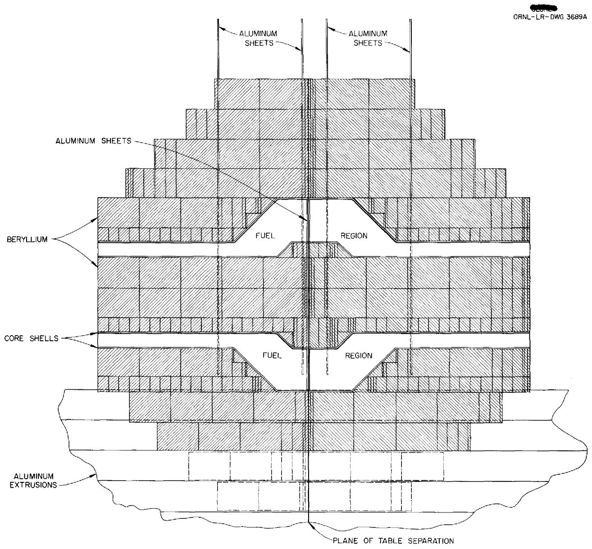  
Fig. 4.1. Longitudinal Cross Section of Three-Region Critical Assembly with End Ducts.

The fission-rate distributions across the fuel in the three modifications of the three-region assembly are given in Fig. 4.4. The data were obtained from the activity of fission products collected on aluminum foils in contact with fuel sheets. Pairs of points at the same abscissa value give the results from opposite sides of a single 0.004-in.-thick foil. From these and similar data from cadmium-covered uranium-aluminum foil combinations, it has been possible to plot the cadmium fraction (that is, the fraction of all fissions pro

duced by neutrons of energy below about 0.5 eV) across the fuel for the assemblies with the aluminum core shells and the $\frac{1}{8}$ -in.-thick Inconel shells. The lower values for the latter assembly (CA-20c) are a consequence of the nuclear properties of the Inconel and of the higher uranium density. This variation in fission rate in the fuel sheets is also shown in Fig. 4.5, where the results of self-shielding measurements within the 0.004-in.-thick uranium foils are plotted. A fuel sheet near the beryllium island was replaced by four sheets, each

TABLE 4.1. COMPOSITION OF REFLECTOR-MODERATED CRITICAL ASSEMBLIES   

<table><tr><td rowspan="2"></td><td rowspan="2">Two Region</td><td colspan="3">Three Region with Core Shells</td><td rowspan="2">Three Region with \( \frac{1}{8} \)-in.-ThickCore Shells andEnd Ducts</td></tr><tr><td>\( \frac{1}{16} \)-in.-ThickAluminum</td><td>\( \frac{1}{16} \)-in.-ThickInconel</td><td>\( \frac{1}{8} \)-in.-ThickInconel</td></tr><tr><td>Assembly number</td><td>CA-19</td><td>CA-20a</td><td>CA-20b</td><td>CA-20c</td><td>CA-21</td></tr><tr><td>Beryllium island Volume, ft3</td><td>None</td><td>0.37</td><td>0.37</td><td>0.37</td><td>1.27</td></tr><tr><td>Average radius, in.</td><td></td><td>5.18</td><td>5.18</td><td>5.18</td><td>4.20 (duct coreradius)</td></tr><tr><td>Mass, kg</td><td></td><td>19.4</td><td>19.4</td><td>19.4</td><td>67.0</td></tr><tr><td colspan="6">Fuel region (excluding shellsand interface plates)</td></tr><tr><td>Volume, ft3</td><td>1.05</td><td>1.78</td><td>1.78</td><td>1.72</td><td>2.06</td></tr><tr><td>liters</td><td>29.7</td><td>50.4</td><td>50.4</td><td>48.8</td><td>58.3</td></tr><tr><td>Average radius, in. Inside</td><td></td><td>5.24</td><td>5.24</td><td>5.31</td><td>\( 4.33\ } \)(duct radii)</td></tr><tr><td>Outside</td><td>7.48</td><td>9.51</td><td>9.51</td><td>9.44</td><td>\( 5.28\ } \)</td></tr><tr><td>Distance between fuel sheets, in.</td><td>0.173</td><td>0.639</td><td>0.284</td><td>0.142</td><td>0.142</td></tr><tr><td colspan="6">Mass of components, kg</td></tr><tr><td>Teflon</td><td>54.46</td><td>99.38</td><td>99.27</td><td>94.37</td><td>108.88</td></tr><tr><td>Uranium loading</td><td>11.88</td><td>5.00</td><td>11.74</td><td>22.07</td><td>26.02</td></tr><tr><td>\( U^{235} \) loading</td><td>11.07</td><td>4.66</td><td>10.94</td><td>20.56</td><td>24.24</td></tr><tr><td>\( U^{235} \) density,\( * g/cm^3 \)</td><td>0.372</td><td>0.092</td><td>0.217</td><td>0.421</td><td>0.416</td></tr><tr><td>Uranium coating material</td><td>0.11</td><td>0.05</td><td>0.11</td><td>0.20</td><td>0.25</td></tr><tr><td>Scotch tape</td><td>0.09</td><td>0.11</td><td>0.11</td><td>0.11</td><td>0.15</td></tr><tr><td colspan="6">Core shells and interface plates</td></tr><tr><td colspan="6">Mass of components, kg</td></tr><tr><td>Aluminum</td><td>0.92</td><td>5.85</td><td>1.10</td><td>1.10</td><td>1.10</td></tr><tr><td>Inconel</td><td>0</td><td>0</td><td>13.68</td><td>27.73</td><td>53.02</td></tr><tr><td colspan="6">Reflector</td></tr><tr><td>Volume, ft3</td><td>21.24</td><td>22.22</td><td>22.22</td><td>22.22</td><td>20.88</td></tr><tr><td>Minimum thickness, in.</td><td>12.9</td><td>11.5</td><td>11.5</td><td>11.5</td><td>11.5</td></tr><tr><td colspan="6">Mass of components, kg</td></tr><tr><td>Beryllium</td><td>1102.5</td><td>1155.0</td><td>1155.0</td><td>1155.0</td><td>1094.1</td></tr><tr><td>Aluminum</td><td>16.8</td><td>29.2</td><td>29.2</td><td>29.2</td><td>29.2</td></tr><tr><td>Excess reactivity as loaded,%</td><td>0</td><td>0.9</td><td>0.3</td><td>0.4</td><td>~3</td></tr><tr><td colspan="6">Critical mass,\( ^{**} U^{235} \),kg</td></tr><tr><td>Experimental</td><td>11.07***</td><td>4.35</td><td>10.8</td><td>19.8</td><td>19 ± 2</td></tr><tr><td>Calculated</td><td>9.5 to 10.3</td><td>4.5</td><td>11.3</td><td></td><td></td></tr></table>

$\mathbf{\nabla}^{*}\mathbf{U}^{235}$ mass per unit volume of fuel region.   
\*\*Mass required for a critical system with poison rods removed.   
\*\*\*It was necessary to increase the reflector thickness slightly to make this mass critical.

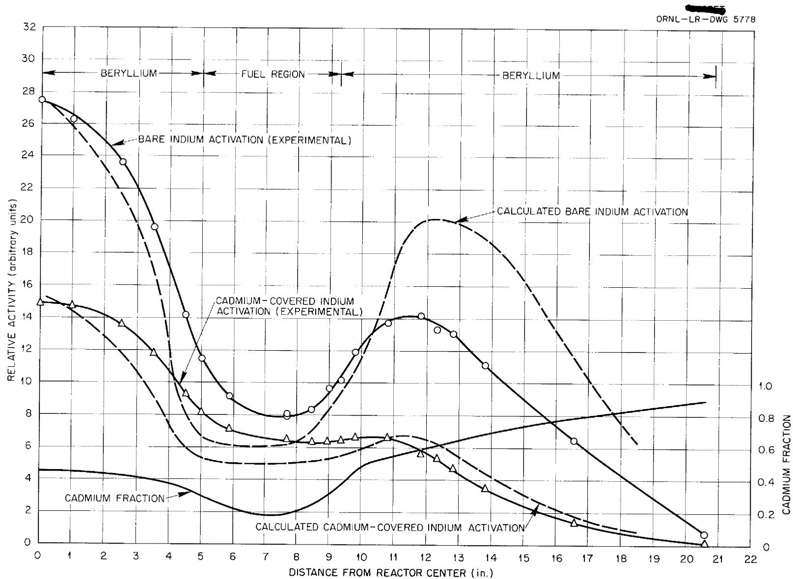  
Fig. 4.2. Radial Neutron Distribution in Midplane of Three-Region Assembly with Aluminum Shells (CA-20a).

  
ORNL-LR-DWG 5779

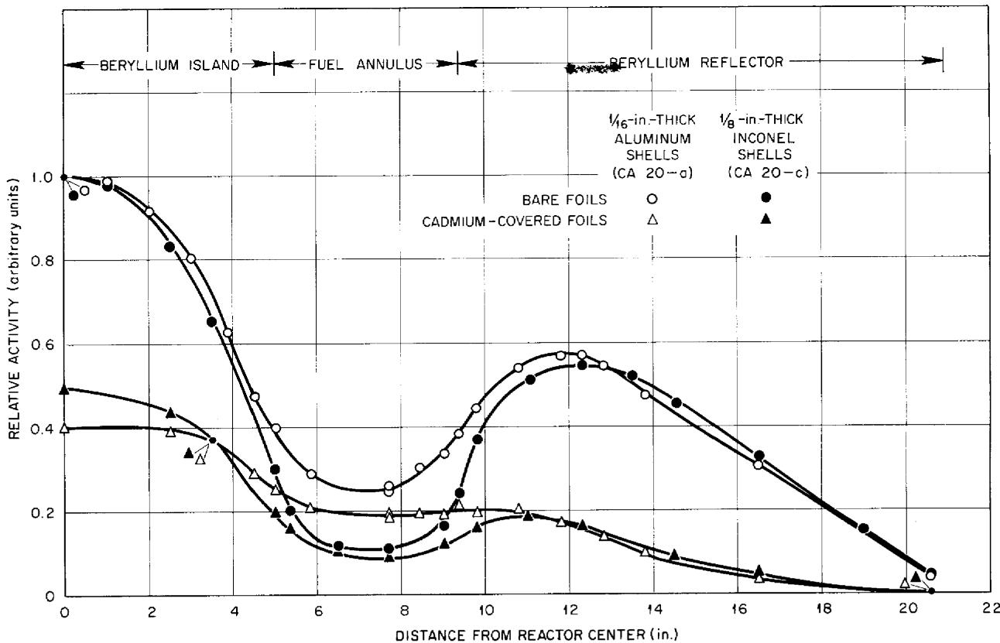  
Fig. 4.3. Radial Neutron Distribution in Midplane of Assembly from Gold Foil Activation.

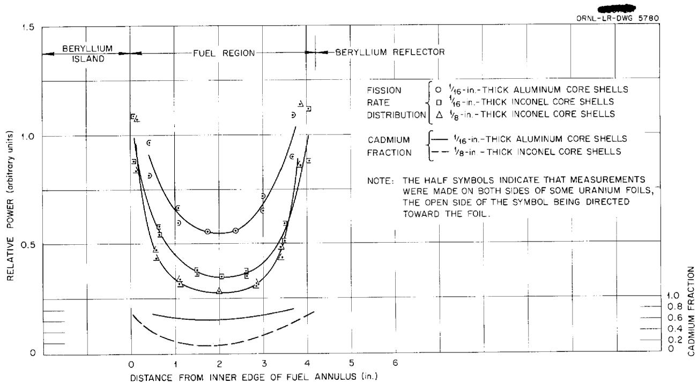  
Fig. 4.4. Fission-Rate Distribution Across Fuel of Three-Region Assemblies.

0.001-in-thick, and the catcher-foil activity was measured at each sheet. The experiment was

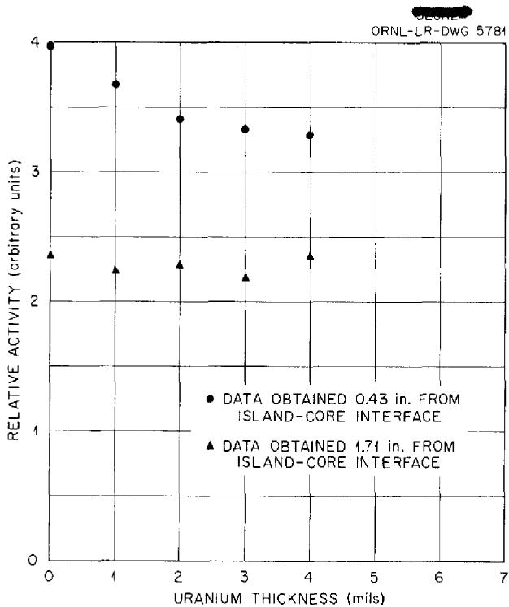  
Fig. 4.5. Self-Shielding in 0.004-in.-Thick Uranium Foil of the Aluminum Shell Assembly (CA-20a).

repeated in a plane near the center of the fuel region, and a more uniformly distributed fission rate through the centrally located fuel was obtained. These results, which agree at least qualitatively with the neutron-flux distribution measurements in Fig. 4.3, are indicative of the spectral differences in the neutrons in the fuel.

Some preliminary investigations have been made of the suggested use of the rare-earth elements as neutron poisons in reactor control rods. The reactivity coefficients of several wafers3 of $\mathrm{Gd}_{2}\mathrm{O}_{3}$ and $\mathrm{Sm}_{2}\mathrm{O}_{3}$ , each about 0.01 in. thick and 4 cm2 in area, have been measured at two places in the $1/8$ -in.-thick Inconel shell assembly (CA-20c), and little difference between the two materials has been observed. At the center of the island, where the cadmium fraction measured with gold foils is 0.5, the reactivity coefficients range from 0.10 $\phi/\mathrm{mg/cm}^2$ for a 0.01-in.-thick sample to 0.04 $\phi/\mathrm{mg/cm}^2$ for a 0.04-in.-thick sample. At the edge of the island, where the cadmium fraction is 0.35, the corresponding values are about 0.015 and 0.009 $\phi/\mathrm{mg/cm}^2$ . The measurements show that a sample of these materials a few thousandths of an inch thick is $85\%$ "black" to neutrons having the spectrum they have in this experiment.

Part II

MATERIALS RESEARCH

# W.R.Grimes Materials Chemistry Division

Solid phase studies in the $\mathsf{NaF - UF_4}$ and NaF $\mathsf{ZrF}_4$ - $\mathsf{UF}_4$ systems were continued, and phase relationships and $\mathsf{UF}_3$ solubility in the $\mathsf{BeF}_2$ -bearing systems were studied. The usefulness of $\mathsf{LaF}_3$ as a "stand-in" for $\mathsf{UF}_4$ was demonstrated. Extensive experimental studies of the preparation and stability of $\mathsf{UF}_3$ in alkali-metal- and zirconium-base fluorides are reported. All measurements made to date on the stability of $\mathsf{UF}_3$ in molten systems and on the feasibility of preparation of $\mathsf{UF}_3$ by reduction of $\mathsf{UF}_4$ have shown poor reproducibility.

The 250-lb production facility, which was taken out of service on January 1, was reactivated to supply increased demands for zirconium-bearing fluoride mixtures. The pilot-scale facility has been used for developing a process for preparing $\mathsf{BeF}_2$ -bearing mixtures and for the preparation of various $\mathsf{UF}_3$ -bearing mixtures. The charge material for an in-pile loop was also prepared.

# PHASE EQUILIBRIUM STUDIES

C.J.Barton Materials Chemistry Division H.Insley Consultant

# Solid Phase Studies in the NaF-UF $^4$ and NaF-ZrF $^4$ UF $^4$ Systems

R.E.Moore L.M.Bratcher R.E.Thoma Materials Chemistry Division

$\mathsf{NaF - UF}_4$ The gradient quenching technique previously described was used to study phase relationships in the $\mathsf{NaF - UF}_4$ system. Although this system had been studied earlier in this laboratory and by others by using thermal analysis, visual observation, and quenching techniques, it was never felt that a satisfactory under

standing of phase relationships in this system had been achieved, particularly in the 25 to 50 mole $\%$ UF $_4$ region. As a result of x-ray and petrographic studies of quenched samples it was concluded that the cubic phase that Zachariasen $^4$ postulated to be a high-temperature form of Na $_2$ UF $_6$ , with a homogeneity range extending to 40 mole $\%$ , is actually a new compound Na $_5$ U $_3$ F $_{17}$ having a rather narrow temperature range of stability. Below $630^{\circ}\mathrm{C}$ it decomposes to form $\beta_3 - Na_2UF_6$ and Na $_7$ U $_6$ F $_{31}$ . At $672^{\circ}\mathrm{C}$ it melts incongruity to give Na $_7$ U $_6$ F $_{31}$ and liquid. A revised diagram that includes the results of recent studies, as well as some of the earlier thermal analyses and visual observation results, is shown in Fig. 5.1. Liquidus temperatures determined by the quenching technique for mixtures having 27 to 40 mole $\%$ UF $_4$ were in excellent agreement with the recently presented partial phase diagram for this region. $^5$ Two crystalline forms of Na $_2$ UF $_6$ reported by Zachariasen $^4$ and observed in earlier quenching work with this composition have not been observed in recent studies; since their temperature range of stability is not known, they were omitted from the diagram.

$\mathsf{NaF - ZrF_4 - UF_4}$ The recent studies of the $\mathsf{NaF - UF_4}$ system have contributed materially to a better understanding of phase relationships in the ternary system. A number of gradient quenches were carried out in an effort to define primary phase fields more accurately. The results of these experiments, presented in Table 5.1, seem to indicate an invariant point near the composition 66 mole $\%$ NaF-9 mole $\%$ ZrF-25 mole $\%$ UF where the primary phase fields of $\mathsf{Na}_5\mathsf{U}_3\mathsf{F}_{17},$ $\mathsf{Na}_3\mathsf{U}(\mathsf{Zr})\mathsf{F}_7$ solid solution, and $\mathsf{Na}_7\mathsf{U}(\mathsf{Zr})_6\mathsf{F}_{31}$ solid solution meet. Invariant points are also indicated near the composition 69 mole $\%$ NaF-4 mole $\%$ ZrF-27 mole $\%$ UF where the $\mathsf{Na}_2\mathsf{UF}_6,$ $\mathsf{Na}_3\mathsf{U}(\mathsf{Zr})\mathsf{F}_7$ solid solution, and $\mathsf{Na}_5\mathsf{U}_3\mathsf{F}_{17}$ primary phase fields meet and near 65 mole $\%$ NaF-28 mole $\%$ ZrF-7 mole $\%$ UF where the $\mathsf{Na}_2\mathsf{ZrF}_6,$ $\mathsf{Na}_3\mathsf{Zr}(\mathsf{U})\mathsf{F}_{7},$ and $\mathsf{Na}_7\mathsf{Zr}(\mathsf{U})_6\mathsf{F}_{31}$ primary phase

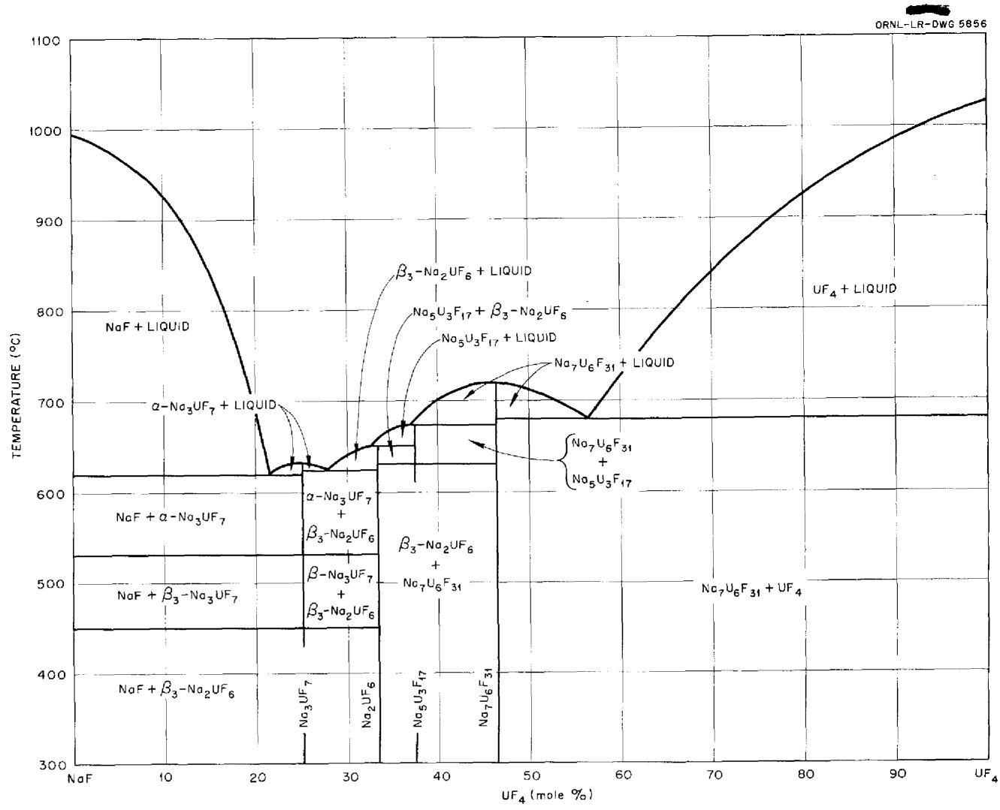  
Fig. 5.1. Phase Diagram of the NaF-UF4 System.

fields meet. The $\mathrm{Na}_3\mathrm{Zr}_4\mathrm{F}_{19}$ primary phase field boundaries have not been accurately located, as yet. It is expected that a revised phase diagram for this system will be completed in the near future.

# Phase Relationships and UF3 Solubility in BeF2-Bearing Systems

L. M. Bratcher

B. H. Clampitt

R.J. Sheil

R. E. Thoma

Materials Chemistry Division

NaF-BeF2-LiF. Data on the solubility of UF3 in NaF-BeF2 mixtures obtained at another installation showed that it is necessary to go to low concentrations of BeF2 in this system before usefully high concentrations of UF3 dissolved in

the melt at $600^{\circ}C$ can be obtained. It has also been demonstrated that lower viscosities are obtained as the $\mathsf{BeF}_2$ concentration is reduced. These developments encouraged a re-examination of the ternary system, with emphasis upon the LiF-Li $_2$ BeF $_4$ -Na $_2$ BeF $_4$ -NaF section of the system. Phase diagrams for the LiF-BeF $_2$ and NaF-BeF $_2$ binary systems have been published. $^{7,8,9}$ Unpublished thermal analysis data for the ternary

TABLE 5.1. RESULTS OF QUENCHING EXPERIMENTS IN THE NaF-ZrF ${}_{4}$ -UF ${}_{4}$ SYSTEM   

<table><tr><td colspan="3">Composition (mole %)</td><td rowspan="2">Liquidus Temperature (℃)</td><td rowspan="2">Primary Phase</td><td rowspan="2">Secondary Temperature (℃)</td><td rowspan="2">Secondary Phase</td></tr><tr><td>NaF</td><td>ZrF4</td><td>UF4</td></tr><tr><td>66.7</td><td>10.3</td><td>23.0</td><td>640</td><td>Na3U(Zr)F7*</td><td></td><td></td></tr><tr><td>66.7</td><td>6.3</td><td>27.0</td><td>646</td><td>Na5U3F17</td><td>640</td><td>Na3U(Zr)F7*</td></tr><tr><td>66.7</td><td>2.3</td><td>31.0</td><td>657</td><td>Na5U3F17</td><td>648</td><td>Na2UF6</td></tr><tr><td>61.5</td><td>6.5</td><td>32.0</td><td>667</td><td>Na7U(Zr)6F31*</td><td>624</td><td>Na5U3F17</td></tr><tr><td>64.0</td><td>6.5</td><td>29.5</td><td>654</td><td>Na5U3F17</td><td>613</td><td>Na7U(Zr)F31*</td></tr><tr><td>64.0</td><td>11.0</td><td>25.0</td><td>640</td><td>Na7U(Zr)6F31*</td><td>627</td><td>Na5U3F17</td></tr><tr><td>62.5</td><td>11.0</td><td>26.5</td><td>669</td><td>Na7U(Zr)6F31*</td><td>635</td><td>Na5U3F17</td></tr><tr><td>63.5</td><td>31.5</td><td>5.0</td><td>577</td><td>Na2ZrF6</td><td>567</td><td>Na7Zr(U)6F31*</td></tr><tr><td>61.5</td><td>32.5</td><td>6.0</td><td>575</td><td>Na7Zr(U)6F31*</td><td>547</td><td>Na2ZrF6</td></tr><tr><td>59.5</td><td>33.5</td><td>7.0</td><td>580</td><td>Na7Zr(U)6F31*</td><td></td><td></td></tr><tr><td>66.7</td><td>30.3</td><td>3.0</td><td>644</td><td>Na3Zr(U)F7*</td><td></td><td></td></tr><tr><td>66.7</td><td>26.3</td><td>7.0</td><td>660</td><td>Na3Zr(U)F7*</td><td></td><td></td></tr><tr><td>45.0</td><td>53.0</td><td>2.0</td><td>528</td><td>Na3Zr4F19</td><td>513</td><td>Na7Zr(U)6F31*</td></tr><tr><td>41.0</td><td>55.0</td><td>4.0</td><td>530</td><td>Na3Zr4F19</td><td></td><td></td></tr><tr><td>42.0</td><td>48.0</td><td>10.0</td><td>600</td><td>Zr(U)F4*</td><td>553</td><td>Na7Zr(U)6F31*</td></tr><tr><td>42.0</td><td>50.0</td><td>8.0</td><td>621</td><td>Zr(U)F4*</td><td></td><td></td></tr><tr><td>42.0</td><td>51.0</td><td>7.0</td><td>623</td><td>Zr(U)F4*</td><td></td><td></td></tr></table>

*Solid solution.

system were obtained earlier in this laboratory. These data showed low thermal effects, below $300^{\circ}C,$ for a number of compositions, but eutectic compositions could not be determined. Published data on the binary systems show that compositions in the ternary system near the LiF-Li2BeF4eutectic (31 mole $\%$ BeF; melting point, $460\pm 5^{\circ}C)$ offer the most promise of low melting points with low $\mathsf{BeF}_2$ concentrations. The compound $\mathsf{Na}_{2}\mathsf{BeF}_{4}$ melts at about $595^{\circ}C,$ while the NaF- $\mathsf{Na}_{2}\mathsf{BeF}_{4}$ eutectic (30 mole $\%$ BeF) has a reported2 melting point of $570^{\circ}C.$ Recently published data11 on the ternary system show the existence of three ternary compounds, $\mathsf{NaLiBeF}_4,$ $\mathsf{Na}_{3}(\mathsf{BeF}_{4})_{2},$ and $\mathsf{Na}_{2}\mathsf{LiBe}_{2}\mathsf{F}_{7}$ . The first compound apparently does

not exist at liquidus temperatures, while the last was reported to separate from the melt, together with LiF, at a eutectic temperature of $320^{\circ}\mathrm{C}$ . Preliminary thermal analysis results for ternary compositions with 31 mole $\%$ $\mathsf{BeF}_2$ , or less, seem to confirm earlier indications that conventional thermal analysis techniques do not give reliable liquidus temperatures in this system. Other techniques, such as visual observation, filtration and quenching, will be applied to the study of these mixtures as soon as possible.

LiF-BeF $_2$ -UF $_3$ . Attempts to prepare the LiF-BeF $_2$ -UF $_3$ mixture, either by adding UF $_3$ to purified LiF-BeF $_2$ compositions or by reduction of UF $_4$ with excess uranium metal in similar solvents, have yielded material with considerable, and rather variable, concentrations of UF $_4$ . The experimental evidence suggests that alloying of uranium with the nickel equipment and the consequent lack of control of the uranium activity may

be responsible for the lack of reproducibility of the data.

The considerable scatter in the data precludes firm statements as to $\mathsf{UF}_3$ solubility in this medium. It appears, however, that the LiF-BeF2 mixture containing 31 mole % BeF2 will dissolve at least 2 wt % of U3+ at $600^{\circ}\mathrm{C}$ . Petrographic examination of these materials shows the UF3 to be present as large well-formed crystals, which appear to have been deposited from solution. No complex compounds of UF3 appear. Thermal data on such mixtures suggest very low solubility of UF3 at the solidus temperatures.

$\mathsf{BeF}_2\mathsf{-UF}_3$ A 50-50 mole $\%$ mixture of $\mathsf{BeF}_2$ and $\mathsf{UF}_3$ is the only mixture of these materials that has been examined to date. No distinct thermal effects were found on the cooling curve, the maximum temperature being about $900^{\circ}C$ . Petrographic examination of the preparation showed $\mathsf{UF}_3$ , crystalline colorless $\mathsf{BeF}_2$ , and $\mathsf{BeF}_2$ with a yellowish color. Chemical analysis of the material showed $95\%$ of the uranium to be in the trivalent form. The remaining tetravalent uranium is presumed to be due to oxidation of a part of the $\mathsf{U}^{3+}$ by oxidizing impurities in the $\mathsf{BeF}_2$ , such as $\mathsf{H}_2\mathsf{O}$ and $\mathsf{BeSO}_4$ . It appears from this preliminary experiment that $\mathsf{UF}_3$ and $\mathsf{BeF}_2$ do not form a compound and that solid solution, if it occurs, is very limited.

$\mathsf{PbF}_2\text{-BeF}_2$ A phase diagram for the $\mathsf{PbF}_2\text{-}$ $\mathsf{BeF}_2$ system, published recently, showed that these components form two compounds, $3\mathsf{PbF}_2\text{-}$ $\mathsf{BeF}_2$ and $\mathsf{PbF}_2\text{-}\mathsf{BeF}_2$ It was shown also that the latter compound forms extensive solid solutions with $\mathsf{BeF}_2$ . The statement was made that mixtures in this system are quite fluid, even with as much as 95 mole $\%$ $\mathsf{BeF}_2$ . This suggested that the fluidity of alkali fluoride- $\mathsf{BeF}_2$ mixtures might be usefully increased by the addition of $\mathsf{PbF}_2$ if the resulting mixtures were compatible with structural materials at high temperatures. As a preliminary test of compatibility, mixtures of $\mathsf{PbF}_2$ and $\mathsf{BeF}_2$ containing 50 and 75 mole $\%$ $\mathsf{BeF}_2$ were prepared by heating the compounds to about $800^{\circ}C$ in nickel crucibles equipped with nickel stirrers. The breaks on the cooling curves agreed fairly well with the values reported for these compositions. The absence of metallic lead in the resulting melts suggests that the activity of the $\mathsf{Pb^{+ + }}$ ions in the melts was sufficiently low that very little reduction of $\mathsf{PbF}_2$ by the nickel

walls occurred. The compatibility of these materials with Inconel containers will be tested in the near future.

$\mathsf{NaF - BeF}_2\mathsf{-UF}_3$ Three filtrations were carried out to determine the solubility of $\mathsf{U}^{3 + }$ in the $\mathsf{Na}_2\mathsf{BeF}_4\mathsf{-NaBeF}_3$ eutectic composition (43 mole $\%$ $\mathsf{BeF}_2$ ). The $\mathsf{U}^{3 + }$ values obtained with samples filtered at $600\pm 10^{\circ}\mathrm{C}$ were 1.16, 1.22, and 0.82 wt %. These results are in agreement with the findings at Mound Laboratory that $\mathsf{UF}_3$ solubility in this system is very low except at low $\mathsf{BeF}_2$ concentrations. This behavior might be expected, since $\mathsf{BeF}_2$ and $\mathsf{UF}_3$ do not form a compound, while NaF and $\mathsf{UF}_3$ form a compound believed to be $\mathsf{NaUF}_4$ .

# Phase Relationships in $\mathsf{LaF}_3$ - and $\mathsf{UF}_3$ -Bearing Systems

# L. M. Bratcher R. E. Thoma   Materials Chemistry Division

The usefulness of $\mathsf{LaF}_3$ as a "stand-in" for $\mathsf{UF}_3$ was discussed in the previous quarterly report. These studies have been continued, and it was found that there is a close correspondence in thermal effects between $\mathsf{LaF}_3$ and $\mathsf{UF}_3$ systems with components that form simple eutectics (for example, LiF and $\mathsf{UF}_4$ ). This probably means that $\mathsf{LaF}_3$ and $\mathsf{UF}_3$ have about the same melting point.

LiF-LaF₃. The LiF-LaF₃ system appears to be a eutectic system with a eutectic temperature of 770°C, the same as that reported for the LiF-UF₃ system.13 The eutectic composition is probably about the same also, that is, approximately 28 mole % LaF₃.

$\mathsf{UF}_4\text{-}\mathsf{LaF}_3$ The components $\mathsf{UF}_4\text{-}\mathsf{LaF}_3$ also form a eutectic that melts at about $865^{\circ}C$ Insufficient data were obtained to locate the eutectic composition, but, since $\mathsf{UF}_4$ melts at a much lower temperature than $\mathsf{LaF}_3$ (estimated melting point, $1425^{\circ}C)$ , the eutectic composition probably contains much more than 50 mole $\%$ UF. Cooling curves with $\mathsf{UF}_4\text{-}\mathsf{UF}_3$ mixtures have shown a spread from about 835 to $875^{\circ}C$ in thermal effects, but the higher value is probably nearer to the correct eutectic temperature.

NaF-KF-LaF₃. A mixture containing 25 mole % NaF-25 mole % KF-50 mole % LaF₃ was found to contain a single phase. This indicates solid solution formation between NaLaF₄ and KLaF₄ and confirms the belief that NaUF₄ and KUF₄ form solid solutions.

RbF-LaF₃. Dergunov's thermal data¹⁴ for the RbF-LaF₃ system were essentially confirmed. The melting point of 585°C for the eutectic at 20 mole % LaF₃ is the lowest melting point observed in alkali fluoride-LaF₃ systems, and the corresponding RbF-UF₃ eutectic would be of interest if oxidation and disproportionation of UF₃ in RbF mixtures could be avoided.

$\mathsf{LaF}_3$ and $\mathsf{UF}_3$ in $\mathsf{ZrF}_4$ -Bearing Melts. A mixture having 2 moles of $\mathsf{ZrF}_4$ per mole of $\mathsf{LaF}_3$ contained some free $\mathsf{LaF}_3$ , while a mixture with a 3:1 molar ratio was essentially a single phase that was believed to be a compound composition. Therefore the compound previously designated $2\mathsf{ZrF}_4\cdot \mathsf{UF}_3$ may actually have the composition $3\mathsf{ZrF}_4\cdot \mathsf{UF}_3$ . Free $\mathsf{UF}_3$ was reported to be present in the best preparation of the $2\mathsf{ZrF}_4\cdot \mathsf{UF}_3$ composition; failure to find free $\mathsf{UF}_3$ in other preparations of this composition may have been due to the existence of part of the uranium in the tetravalent state. Petrographic and x-ray studies of a number of $\mathsf{ZrF}_4\cdot \mathsf{UF}_4\cdot \mathsf{LaF}_3$ compositions were made in an effort to identify more conclusively the two compounds believed to exist in the $\mathsf{ZrF}_4\cdot \mathsf{UF}_4\cdot \mathsf{UF}_3$ system, but phase relationships in this system are not well understood and will receive further study when time permits. A brief and incomplete thermal analysis survey of the RbF- $\mathsf{LaF}_3\cdot \mathsf{ZrF}_4$ system failed to show usefully low melting points except at very low $\mathsf{LaF}_3$ concentrations.

# PREPARATION AND STABILITY OF UF $^3$ -BEARING MELTS

F. F. Blankenship C. J. Barton  
Materials Chemistry Division

# Reduction of $\mathsf{UF}_4$ with Uranium in Alkali Fluorides

R.J.Sheil B.H.Clampitt Materials Chemistry Division

Data on the reaction of metallic uranium with $\mathsf{UF}_4$ dissolved in alkali fluorides have been

obtained in the past mainly with preparations ranging from 0.5 to $2.0\mathrm{kg}$ in weight.[15,16] It appeared desirable, however, to study the reaction with smaller scale equipment in order to facilitate investigation of the different variables involved in the reaction. Therefore most of the recent experiments have been performed with small nickel reactors fitted with nickel filter sticks, and $20\mathrm{g}$ of material has been used. The main advantages of the small equipment are the larger number of experiments that can be performed per man-hour, smaller amount of materials required, and the faster rates of heating and cooling that can be achieved. The principal disadvantage of the small-scale filtration apparatus is that it does not lend itself readily to the use of the purification procedures routinely practiced with larger preparations. In general, previously purified alkali fluorides are ground and loaded into a reactor in a dry box with the necessary amount of $\mathsf{UF}_4$ and freshly cleaned uranium metal. After equilibration and filtration at the desired temperature, the reactor is opened in a dry box and all the filtrate and unfiltered residue are ground for analysis. The data obtained to date are not sufficiently complete or reproducible to accurately evaluate the effect of all the variables.

Effect of Nickel Surface Area. Early efforts to reduce $\mathsf{UF}_4$ dissolved in NaF-LiF eutectic with metallic uranium in small-scale filtration equipment were uniformly unsuccessful, although the reaction could be readily carried out in sealed capsules in phase study apparatus and in large-scale preparations. The filtration equipment used in these experiments had the filter medium in contact with the melt during the reaction period (usually 2 hr or more). This apparatus was modified to permit the filter medium to be in contact with the melt only during the actual filtration time and for a short time thereafter while the reactor was being cooled as rapidly as possible. This change resulted in a large increase in the degree of reduction of uranium in the filtrate. Measurements of the surface area of the nickel filter medium (0.0004-in. pore size) by the Carman permeability method showed a surface area of

$2.9 \times 10^{3} \mathrm{~cm}^{2}$ per cubic centimeter of filter material. For the standard $1/8$ -in. sheet thickness, this is equivalent to about $900 \mathrm{~cm}^{2}$ per square centimeter of apparent area. The reason for the marked effect of this large surface area upon the degree of reduction of uranium is not clearly understood, but it can be explained by assuming that disproportionation of $\mathrm{UF}_{3}$ in alkali fluorides is a heterogeneous reaction that occurs at metal surfaces. Further studies of this variable are under way.

Effect of Uranium Surface Area. Increasing the surface area of the metallic uranium by converting it to the hydride brought about a significant increase in the reduction of $\mathsf{UF}_4$ dissolved in NaF-KF-LiF eutectic (11.5-42-46.5 mole%). The effect of uranium surface area was larger at lower temperatures, probably because the $\mathsf{UF}_3$ produced at the metal-salt interface is more soluble at the higher temperatures. Conversion of the uranium metal to the hydride was adopted as a standard procedure.

Effect of Temperature. Varying the temperature for the reaction between NaF-KF-LiF-UF mixtures and metallic uranium from 550 to $750^{\circ}\mathrm{C}$ produced no significant change in degree of reduction. The ratio of $\mathsf{U}^{3+}$ to total uranium for five experiments in this temperature range varied from 0.57 to 0.70.

Effect of Time. Increasing the time of reaction of the NaF-KF-LiF-UF $_4$ mixture with the metallic uranium at $550^{\circ}\mathrm{C}$ from 15 min to 2 hr produced an increase from 0.47 to 0.58 in the ratio of $\mathsf{U}^{3+}$ to total uranium in the filtrate. This difference may not be significant in view of the poor reproducibility of these experiments. The reaction time for NaF-LiF-UF $_4$ mixtures with metallic uranium at $750^{\circ}\mathrm{C}$ varied from 15 min to 6.7 hr. Again, the variation of the ratio of $\mathsf{U}^{3+}$ to total uranium was of doubtful significance, but the highest ratio (0.75) was obtained with the shortest reaction time and the lowest ratio (0.57) with the longest reaction time. The data obtained to date show that the reaction of UF $_4$ dissolved in alkali fluorides with finely divided uranium metal is very rapid and that it may possibly be followed by disproportionation at a rather slow rate.

Effect of Excess Uranium. Parallel studies of the reaction of NaF-KF-LiF-UF $_4$ mixtures with

the theoretical amount of uranium required to satisfy the equation

$$
\frac {1}{4} U ^ {\circ} + \frac {3}{4} U F _ {4} = U F _ {3}
$$

and 1.2 times the theoretical amount showed very little difference in the ratio of $\mathsf{U}^{3+}$ to total uranium in most cases. Where there was a difference, the preparation with the theoretical amount of uranium gave the lower degree of reduction. It seems likely that uranium can react with oxidizing impurities in the fused salts which would otherwise oxidize a part of the $\mathsf{UF}_3$ .

# Stability of $\mathbf{U}\mathbf{F}_3$ in Alkali Fluorides

R.J.Sheil B.H.Clampitt

C.J.Barton

Materials Chemistry Division

The study of the stability of $\mathsf{UF}_3$ in KF, which was discussed in the previous report, was continued and extended to other alkali fluorides. The variables investigated were temperature, solvent, container material, and concentration of $\mathsf{UF}_3$ . Some experiments were performed to investigate the effect of several variables simultaneously and the results are reported according to experiment type.

Sealed-Capsule Tests. A number of sealed nickel, Inconel, and type 316 stainless steel capsules containing $\text{KF-UF}_3$ and $\text{RbF-UF}_3$ mixtures were prepared. After the capsules had been welded shut with a helium atmosphere over the fluoride mixture, they were heated for 90 min at the temperatures shown in Table 5.2. After cooling, the capsules were opened in a dry box. A part of the fused salt was removed by drilling, and as much as possible of the remainder of the material was removed by chipping and was added to the drillings for analysis. The capsule walls were carefully cleaned and then drilled in air to provide a sample of the wall material that had been in contact with the fused salt for chemical analysis. The drillings were weighed so that the total amount of uranium in the walls could be calculated. It was recognized that recovery of metallic uranium alloyed with the walls was probably not complete, and therefore the values given in the last column of Table 5.2 are more likely to be low than high. The percentages were calculated on the basis of the amount of uranium in the original mixture.

TABLE 5.2. SEATED-CAPSULE ${\mathrm{{UF}}}_{3}$ STABILITY TESTS WITH $\mathrm{{KF}} - {\mathrm{{UF}}}_{3}$ AND $\mathrm{{RbF}} - {\mathrm{{UF}}}_{3}$ MIXTURES   

<table><tr><td rowspan="2">Composition (mole %)</td><td rowspan="2">Test Temperature (℃)</td><td rowspan="2">Container Material</td><td colspan="2">Fused Salt Analysis</td><td rowspan="2">Ratio of U3+ to Total Uranium</td><td rowspan="2">Total Uranium in Walls (%)</td></tr><tr><td>Total Uranium* (wt %)</td><td>U3+ (wt %)</td></tr><tr><td rowspan="10">85 KF-15 UF3</td><td rowspan="3">780</td><td>Nickel</td><td>35.6</td><td>8.2</td><td>0.23</td><td>5.2</td></tr><tr><td>Inconel</td><td>34.8</td><td>8.8</td><td>0.25</td><td>4.6</td></tr><tr><td>Type 316 stainless steel</td><td>36.4</td><td>8.5</td><td>0.23</td><td>3.4</td></tr><tr><td rowspan="3">800</td><td>Nickel</td><td>37.8</td><td>11.5</td><td>0.30</td><td>4.0</td></tr><tr><td>Inconel</td><td>35.6</td><td>11.5</td><td>0.32</td><td>4.0</td></tr><tr><td>Type 316 stainless steel</td><td>35.2</td><td>13.8</td><td>0.39</td><td></td></tr><tr><td rowspan="3">850</td><td>Nickel</td><td>35.2</td><td>7.2</td><td>0.20</td><td>3.5</td></tr><tr><td>Inconel</td><td>36.0</td><td>12.6</td><td>0.35</td><td>3.8</td></tr><tr><td>Type 316 stainless steel</td><td>34.3</td><td></td><td></td><td>5.3</td></tr><tr><td>900</td><td>Nickel</td><td>36.2</td><td>19.2</td><td>0.53</td><td>2.6</td></tr><tr><td rowspan="6">85 RbF-15 UF3</td><td rowspan="3">800</td><td>Nickel</td><td>27.9</td><td>13.1</td><td>0.47</td><td>3.5</td></tr><tr><td>Inconel</td><td>28.9</td><td>14.9</td><td>0.52</td><td>4.4</td></tr><tr><td>Type 316 stainless steel</td><td>28.6</td><td>12.6</td><td>0.44</td><td>9.2</td></tr><tr><td rowspan="3">900</td><td>Nickel</td><td>23.7</td><td>8.5</td><td>0.36</td><td>5.0</td></tr><tr><td>Inconel</td><td>22.8</td><td>7.4</td><td>0.32</td><td>6.2</td></tr><tr><td>Type 316 stainless steel</td><td></td><td></td><td></td><td>5.1</td></tr></table>

* The theoretical total uranium for $\mathrm{{KF}} - {\mathrm{{UF}}}_{3}$ mixtures was 38.1 wt %; for $\mathrm{{RbF}} - {\mathrm{{UF}}}_{3}$ mixtures it was 27.6 wt %.

The results given in Table 5.2 show no significant effect of temperature or container material on the ratio of $\mathsf{U}^{3 + }$ to total uranium in the fused salt. There was also no reproducible difference between $\mathsf{KF - UF}_3$ and $\mathsf{RbF - UF}_3$ mixtures. Inspection of the data indicates that the reproducibility of results is not good enough to show anything except large effects. There appears to be a discrepancy between the ratio of the $\mathsf{U}^{3 + }$ to total uranium for the $\mathsf{KF - UF}_3$ mixtures in Table 5.2 and that previously reported[18] for an Inconel capsule heated to $1000^{\circ}\mathsf{C}$ , which showed $70\%$ of the uranium in trivalent form. In that case, the material analyzed consisted only of the drillings from the fused salt mixture. A fused salt layer approximately 90 mils thick adjacent to the tube walls was not sampled by this method, whereas an attempt was made to get all the fused salt out of the capsules in the later experiments. The

capsules were not agitated during the heating period, and, therefore, if disproportionation of $\mathsf{UF}_3$ occurred at the tube walls, it is possible that the concentration of tetravalent uranium next to the walls was higher than in the center of the capsules. This possibility will be further investigated.

Open-Capsule Tests. The effect of varying the concentration of $\mathsf{UF}_3$ in NaF-KF-LiF eutectic was tested in open Inconel and molybdenum capsules heated in a helium atmosphere for 90 min at $750^{\circ}\mathrm{C}$ . Molybdenum was used because it does not alloy appreciably with uranium at this temperature. The capsule walls were not analyzed for uranium in these experiments, because it is difficult to effect more or less complete removal of the fused salt from the capsules without leaving the walls in a poor shape for sampling, particularly with the

TABLE 5.3. OPEN-CAPSULE UF ${}_{3}$ STABILITY TESTS WITH $\mathrm{{KF}} - {\mathrm{{UF}}}_{3}$ AND NaF-KF-LiF-UF ${}_{3}$ MIXTURES   

<table><tr><td>Initial Composition (mole %)</td><td>Container Material</td><td>Total Uranium (wt %)</td><td>U3+ (wt %)</td><td>Ratio of U3+ to Total Uranium</td><td>Theoretical Total Uranium (mole %)</td></tr><tr><td rowspan="2">85 KF-15 UF3</td><td>Inconel</td><td>34.8</td><td>17.5</td><td>0.50</td><td>38.1</td></tr><tr><td>Molybdenum</td><td>38.8</td><td>12.1</td><td>0.31</td><td>38.1</td></tr><tr><td rowspan="2">95 (NaF-KF-LiF*)-5 UF3</td><td>Inconel</td><td>19.7</td><td>12.2</td><td>0.62</td><td>22.1</td></tr><tr><td>Molybdenum</td><td>19.9</td><td>10.6</td><td>0.53</td><td>22.1</td></tr><tr><td rowspan="2">80 (NaF-KF-LiF*)-20 UF3</td><td>Inconel</td><td>48.5</td><td>41.3</td><td>0.85</td><td>51.7</td></tr><tr><td>Molybdenum</td><td>49.5</td><td>44.0</td><td>0.89</td><td>51.7</td></tr><tr><td rowspan="2">60 (NaF-KF-LiF*)-40 UF3</td><td>Inconel</td><td>64.2</td><td>56.4</td><td>0.88</td><td>66.65</td></tr><tr><td>Molybdenum</td><td>66.0</td><td>60.8</td><td>0.92</td><td>66.65</td></tr></table>

*11.5-42-46.5 mole%.

brittle molybdenum capsules. The $\mathsf{KF - UF}_3$ mixtures were included in these experiments for comparison with similar mixtures tested in sealed capsules. The results of chemical analyses of the fused salt mixtures are given in Table 5.3.

It appears from the results in Table 5.3 that alloying of the metallic uranium formed by disproportionation of $\mathsf{U}\mathsf{F}_3$ has little effect on the extent of disproportionation. A part of the $\mathsf{U}^{3+}$ results are not in agreement with the values calculated from total uranium values on the basis that one gram-atom of uranium metal is produced when 4 gram-atoms of $\mathsf{U}^{3+}$ disproportionate. The possibility of inhomogeneity in the samples cannot be ruled out, even though they were ground to -60 mesh in dry air.

# Solubility of UF ${}_{4}$ in NaF-RbF-LiF Mixtures

R.J.Sheil

Materials Chemistry Division

Thermal analysis data for $\mathsf{UF}_4$ dissolved in NaF-RbF-LiF mixtures were reported earlier. Since it had been demonstrated that thermal analysis was not a reliable method for determining solubility of $\mathsf{UF}_4$ in such mixtures, it seemed advisable to check the thermal analysis data for this system by other techniques. Visual observation of liquidus temperatures and chemical analysis of filtered samples gave the values shown in Table 5.4 for the solubility of $\mathsf{UF}_4$ in a mixture near the ternary eutectic composition.

It appears from the data in Table 5.4 that $\mathsf{UF}_4$ is significantly less soluble in the RbF-containing

TABLE 5.4.SOLUBILITY OF $UF_{4}$ IN NaF-RbF-LiF (10-50-40 mole %)   

<table><tr><td>Temperature (℃)</td><td>Uranium Content (wt %)</td><td>UF4Content (mole %)</td></tr><tr><td>500</td><td>7.4</td><td>~2.5</td></tr><tr><td>600</td><td>13.1</td><td>~4.1</td></tr><tr><td>650</td><td>18.8</td><td>~6.3</td></tr></table>

mixture than in the NaF-KF-LiF eutectic (11.5-42-46.5 mole %) and that the thermal effect at $425^{\circ}C$ observed earlier with the NaF-RbF-LiF mixture containing 2.5 mole $\%$ UF $_4$ represented the solidus temperature for this composition rather than the liquidus temperature.

# Solubility of $\mathsf{UF}_3$ in NaF-KF-ZrF4

B. H. Clampitt

Materials Chemistry Division

An attempt was made to determine the solubility of $\mathsf{UF}_3$ in a low melting NaF-KF-ZrF4 mixture (5-52-43 mole %; melting point, $410^{\circ}C$ ). This mixture was recently reported to have low viscosity. After adding sufficient $\mathsf{UF}_3$ to give

4.0 mole % concentration to a hydrofluorinated preparation of the ternary composition, the mixture was heated to $600^{\circ}\mathrm{C}$ for 2 hr and then filtered at that temperature. The filtrate analyzed 0.48 wt $\%$ $\mathsf{U}^{3+}$ and 1.55 wt $\%$ total uranium, while the corresponding values for the unfiltered residue were 13.1 and $14.0\%$ respectively. These results show a very low $\mathsf{U}^{3+}$ solubility at $600^{\circ}\mathrm{C}$ in this solvent.

# Reduction of $\mathbf{U}\mathbf{F}_4$ in Molten

# Li3ZrF7 and Li2ZrF6

H. A. Friedman

Materials Chemistry Division

A mixture of $\mathsf{Li}_3\mathsf{ZrF}_7$ (mp, $645^{\circ}\mathrm{C}$ ) with sufficient $\mathsf{UF}_4$ to make the mixture 15 wt $\%$ uranium was treated at $800^{\circ}\mathrm{C}$ with a $50\%$ excess of zirconium metal and stirred by bubbling hydrogen. The apparent melting point of the mixture so obtained was $630^{\circ}\mathrm{C}$ . A filtrate obtained at $645^{\circ}\mathrm{C}$ showed 3.9 and $4.0\%$ $\mathsf{U}^{3+}$ by two different analytical methods and $4.66\%$ total uranium. Since $\mathsf{UF}_4$ is quite soluble in this melt the insoluble uranium compound is certainly trivalent; about $95\%$ of the $\mathsf{UF}_4$ charged was reduced to $\mathsf{UF}_3$ ; about $85\%$ of the uranium in the filtrate was trivalent.

When a similar experiment with $\mathsf{Li}_2\mathsf{ZrF}_6$ was performed the filtrate obtained at $600^{\circ}\mathrm{C}$ showed only $1.1\% \cup^{3+}$ and $2.89\%$ total uranium.

# Preparation of $\mathsf{UF}_3$ in NaF-ZrF4

F. P. Boody

Materials Chemistry Division

Experiments on a 500-g scale demonstrated that attempts to completely reduce $\mathsf{UF}_4$ to $\mathsf{UF}_3$ in NaF-ZrF $_4$ produced mixtures containing both $\mathsf{UF}_4$ and $\mathsf{UF}_3$ . Therefore a request for 3-kg quantities reduced as completely as possible by $\mathsf{ZrH}_2$ provided an opportunity to study the effect of batch size on the $\mathsf{UF}_3$ -to- $\mathsf{UF}_4$ ratio. A preparation was carried out in which 5 wt % uranium as $\mathsf{UF}_4$ was used in 3 kg of NaF-ZrF $_4$ (53-47 mole %) and 275% of the stoichiometric zirconium metal. The metallic zirconium was added as small chips after a preliminary purification of the melt with HF and hydrogen. After 24 hr of equilibration while bubbling with hydrogen at $800^{\circ}\mathsf{C}$ , the melt was filtered at $710^{\circ}\mathsf{C}$ . The product contained 5.17 wt % uranium, including 3.13 wt % $\mathsf{U}^{3+}$ . In view of the possibility that an incomplete reaction had occurred because of precipitation of $\mathsf{UF}_3$ on

the zirconium metal, another trial was made in which two 6- by $\frac{1}{2}$ -in. zirconium bars were used in addition to the chips. The bars were propped up in the body of the melt to afford good surface contact. After 5 hr of equilibration at $800^{\circ}\mathrm{C}$ , the filtered product contained 5.06 wt % total uranium, including 2.86 wt % U $^{3+}$ . Since it appeared that the equilibrium amount of UF $_3$ had not been increased, another method was tried in which 7 wt % uranium metal was added to 3 kg of NaF-ZrF $_4$ (53-47 mole %). Complete reaction between the uranium metal and the ZrF $_4$ would change the NaF-to-ZrF $_4$ ratio from 53:47 to 55:45. After 6 hr of equilibration at $800^{\circ}\mathrm{C}$ and filtration at $780^{\circ}\mathrm{C}$ , a product containing 4.68 wt % total uranium and 3.30 wt % U $^{3+}$ was obtained. The ratio of U $^{3+}$ to total uranium in these trials was 0.605, 0.565, and 0.705, respectively. It was concluded that the last and highest figure was representative of equilibrium at $800^{\circ}\mathrm{C}$ , but that reproducibility could not be expected because of uncontrolled variation in the activity of solid uranium metal and zirconium metal.

# CHEMICAL REACTIONS IN MOLTEN SALTS

F. F. Blankenship L. G. Overholser

W. R. Grimes

Materials Chemistry Division

The Equilibrium

$$
F e F _ {2} + H _ {2} \rightleftharpoons F e ^ {\circ} + 2 H F
$$

in $\mathbf{NaZrF}_5$ at $800^{\circ}\mathbf{C}$

C. M. Blood

Materials Chemistry Division

During the past year numerous attempts have been made to determine the equilibrium HF concentrations resulting from the reduction of $\mathsf{FeF}_2$ solutions in $\mathsf{NaZrF}_5$ by hydrogen. In addition to the importance of this reaction in purification procedures, there was interest in the possibility of measuring the activity coefficient of $\mathsf{FeF}_2$ . Most of the attempts have been efforts to determine the equilibrium HF concentration by extrapolation to zero flow rate in a system with hydrogen bubbling through a melt containing $\mathsf{FeF}_2$ .

During the past quarter several methods of improving the contact between hydrogen bubbles and the melt have been tried, and as the contact has been improved the measured HF concentrations associated with a given $\mathsf{FeF}_2$ concentration have

consistently increased. In each case, however, the HF concentration at very low flow rates has been about three times the value at flow rates of 200 ml/min in the same system. The shapes of the concentration vs flow-rate curves have been identical, and it has not been possible to obtain a satisfactory extrapolation to zero flow rate because of the steep slope at low flow rates. By using the best extrapolation that could be made with each system and assuming the activity of the reduced metallic iron to be unity, successive improvements in contact of hydrogen with the melt have increased the values of

$$
K _ {x} = \frac {P ^ {2} H F}{X _ {F e F _ {2}} P H _ {2}}
$$

from 2 to 8, where $X$ is mole fraction and $P$ is pressure in atmospheres.

Since $K_{x} = 8$ is about four times the $K_{a}$ expected from the thermodynamic estimates, it is possible that the assumption of unit activity for the metallic iron is not valid. The reduced iron may alloy with the nickel container. The largest HF values are found in systems having the largest surface area of nickel. It had been recognized that the nickel surface was probably acting as a catalyst for the heterogeneous reaction, and it was hoped that a

definite equilibrium could be reached in a system containing nickel mesh baffles arranged so that a bubble required 6 sec to rise through 10 in. of melt. When a slow flow rate was resumed after the system containing the baffles had been allowed to "rest" over night, an increase instead of the expected decrease in HF concentration was noted during the next few hours. This same apparatus was also used in matching the HF concentration in the inlet and outlet streams by adjusting the inlet HF concentration. The results again agreed with the values of $K_{x}$ found by extrapolation to zero flow rate, that is, $K_{x} = 8$ at $800^{\circ}\mathrm{C}$ . Typical results for various systems are shown in Table 5.5.

# Reduction of $\mathbf{U}\mathbf{F}_4$ by Structural Metals

J. D. Redman C. F. Weaver  
Materials Chemistry Division

Apparatus and techniques for experimental determination of equilibrium constants for the reactions

$$
C r ^ {o} + 2 U F _ {4} \rightleftharpoons C r F _ {2} + 2 U F _ {3}
$$

and

$$
F e ^ {\circ} + 2 U F _ {4} \rightleftharpoons F e F _ {2} + 2 U F _ {3}
$$

were described in previous reports.22 Equilibrium

22J. D. Redman and C. F. Weaver, ANP Quar. Prog. Reps., ORNL-1692, p 56; ORNL-1729, p 50; ORNL-1771, p 60; ORNL-1816, p 64.

TABLE 5.5.EFFECT OF BUBBLE PATH ON EQUILIBRIUM HF CONCENTRATION IN THE REACTION $\mathsf{H}_2 + \mathsf{FeF}_2\geqslant \mathsf{Fe}^{\circ} + 2\mathsf{HF}$ IN $\mathsf{NaZrF}_5$ AT $800^{\circ}C$   

<table><tr><td>Conditions of Contact Between Gas and Melt</td><td>Kx*</td><td>Calculated Activity Coefficient** for FeF2</td></tr><tr><td>Bubbles from 3/8-in. tube rising through 5 in. of melt</td><td>2.1</td><td>1.3</td></tr><tr><td>Bubbles from 3/8-in. tube rising through 10 in. of melt</td><td>4.4</td><td>2.7</td></tr><tr><td>Bubbles from 3/8-in. tube rising through zigzag baffles in 10 in. of melt</td><td>8</td><td>5</td></tr></table>

$\star K_{x} = \frac{P^{2} H F}{X_{F e F_{2}} P_{H_{2}}}$ , where $P$ is pressure in atmospheres and $X$ is mole fraction.

$\star \star K_{\gamma} = \frac{1}{\gamma}\frac{K_{a}}{K_{x}}; \Delta F^{\circ} = RT \ln K_{a}; a 800^{\circ}C, K_{a} = 1.6,$ if solid FeF2 in the standard state and an activity of metallic iron of unity are assumed.

data were presented for these reactions in $\mathrm{NaZrF}_5$ with pure metallic chromium and metallic iron used as the reducing agents. In addition, some experiments with Inconel as the reducing agent and some preliminary observations with chromium metal and the NaF-KF-LiF eutectic as the reaction medium have been presented.

The results of some recent studies on the reaction of $\mathsf{UF}_4$ with metallic iron in NaF-KF-LiF (11.5-42-46.5 mole %) at 600 and $800^{\circ}\mathrm{C}$ are given in Table 5.6. In these experiments, 2 g of hydrogen-fired iron wire was reacted with $\mathsf{UF}_4$ (15 wt %) in about 21 g of the NaF-KF-LiF eutectic contained in nickel. The iron concentrations reported in Table 5.6 are very nearly the same as those found when NaF-ZrF₄ was used as the solvent. The iron concentrations in the latter case were obtained after reaction with 11.8 wt % $\mathsf{UF}_4$ as compared with 15 wt %, but this difference in $\mathsf{UF}_4$ content would result in only slightly higher values for iron at the higher $\mathsf{UF}_4$ concentration. It may be seen from Table 5.6 that higher iron concentrations result at $600^{\circ}\mathrm{C}$ than at $800^{\circ}\mathrm{C}$ , and this is also in agreement with what was found in NaF-ZrF₄. No attempt has been made to calculate equilibrium constants from these data, since the valence state of the iron is not known with certainty.

Similar studies have been made of the reaction of $\mathsf{UF}_4$ with chromium in NaF-KF-LiF (11.5-42-

TABLE 5.6. EQUILIBRIUM DATA FOR THE REACTION OF $U F_{4}$ (15 wt %) WITH IRON IN MOLTEN NaF-KF-LiF (11.5-42-46.5 mole %) AT 600 AND $800^{\circ}C$   

<table><tr><td colspan="2">Conditions of Equilibration</td><td colspan="3">Found in Filtrate</td></tr><tr><td>Temperature (℃)</td><td>Time (hr)</td><td>Total Uranium (wt %)</td><td>Total Iron* (ppm)</td><td>Total Nickel (ppm)</td></tr><tr><td rowspan="4">600</td><td>3</td><td>12.7</td><td>655</td><td>100</td></tr><tr><td>3</td><td>12.6</td><td>750</td><td>125</td></tr><tr><td>5</td><td>11.7</td><td>685</td><td>85</td></tr><tr><td>5</td><td>10.8</td><td>680</td><td>95</td></tr><tr><td rowspan="4">800</td><td>3</td><td>11.9</td><td>470</td><td>80</td></tr><tr><td>3</td><td>12.2</td><td>425</td><td>90</td></tr><tr><td>5</td><td>11.2</td><td>525</td><td>130</td></tr><tr><td>5</td><td>11.9</td><td>485</td><td>110</td></tr></table>

\*Blank of 80 ppm of iron at $800^{\circ}C$

46.5 mole $\%$ ) at 600 and $800^{\circ}C$ . In these experiments $2g$ of hydrogen-fired metallic chromium, $21g$ of the solvent, and the desired amount of $\mathsf{UF}_4$ were equilibrated in nickel apparatus. The total uranium concentration was kept constant at 11.4 wt $\%$ but the ratio of $\mathsf{UF}_4$ to $\mathsf{UF}_3$ was varied. The results are presented in Table 5.7.

The chromium concentrations given in Table 5.7 for $600^{\circ}\mathrm{C}$ are very much lower than the 2200 ppm of chromium found when $\mathrm{NaF - ZrF_4}$ was the solvent. On the other hand, the values at $800^{\circ}\mathrm{C}$ when no $\mathsf{UF}_3$ was added are approximately equal to those found in $\mathrm{NaF - ZrF_4}$ . The larger differences in chromium concentrations at 600 and $800^{\circ}\mathrm{C}$ in molten NaF-KF-LiF than in NaF-ZrF4 suggest that mass transfer of chromium will take place much more readily in NaF-KF-LiF. The addition of $\mathsf{UF}_3$ to the system decreased the equilibrium chromium concentration markedly and indicated that corrosion might be greatly reduced by using a mixture of $\mathsf{UF}_3$ and $\mathsf{UF}_4$ . However, the total uranium concentrations found for those runs in which $\mathsf{UF}_3$ was added were decreased significantly during the test, probably because of disproportionation of the $\mathsf{UF}_3$ . Uncertainty in the valence state of the chromium precludes any evaluation of equilibrium constants at present.

Previous studies of the reaction between $\mathsf{UF}_4$ and Inconel in molten $\mathsf{NaZrF}_5$ , as expected, gave equilibrium chromium concentrations that were much lower than those resulting from the reaction of $\mathsf{UF}_4$ with chromium. Similar studies with the NaF-KF-LiF mixture as solvent for reacting hydrogen-fired Inconel turnings with 14.7 wt $\%$ $\mathsf{UF}_4$ have been made in apparatus of nickel. The data are shown in Table 5.8. The values given in Table 5.8 are somewhat more than threefold lower than those found when $\mathsf{UF}_4$ reacts with metallic chromium. However, there is some doubt as to whether equilibrium was attained in the runs reported in Table 5.8, since the increase in chromium concentration from 5 to 12 hr at both temperatures is small enough that it may or may not be significant.

Some studies have also been made on the reaction of metallic molybdenum with $\mathsf{UF}_4$ in molten NaF-ZrF $_4$ contained in nickel at 600 and $800^{\circ}\mathsf{C}$ . The results given in Table 5.9 were obtained at a $\mathsf{UF}_4$ concentration of 11.4 wt%. The results show that $\mathsf{UF}_4$ is stable in contact with metallic molybdenum under the conditions used and confirm the low molybdenum concentrations reported for similar

TABLE 5.7. EQUILIBRIUM DATA FOR THE REACTION OF UF ${}_{4}$ WITH METALLIC CHROMIUM IN MOLTEN NaF-KF-LiF (11.5-42-46.5 mole %) AT 600 AND ${800}^{ \circ  }\mathrm{C}$   

<table><tr><td colspan="2">Conditions of Equilibration</td><td colspan="2">Original Concentration</td><td colspan="3">Found in Filtrate</td></tr><tr><td>Temperature (°C)</td><td>Time (hr)</td><td>UF4(wt %)</td><td>UF3(wt %)</td><td>Total Uranium (wt %)</td><td>Total Chromium* (ppm)</td><td>Total Nickel (ppm)</td></tr><tr><td rowspan="4">600</td><td>3</td><td>15.0</td><td></td><td>12.2</td><td>1190</td><td>30</td></tr><tr><td>3</td><td>15.0</td><td></td><td>11.8</td><td>1075</td><td>75</td></tr><tr><td>5</td><td>15.0</td><td></td><td>11.3</td><td>960</td><td>75</td></tr><tr><td>5</td><td>15.0</td><td></td><td>12.0</td><td>1130</td><td>40</td></tr><tr><td rowspan="11">800</td><td>3</td><td>15.0</td><td></td><td>11.2</td><td>2690</td><td>20</td></tr><tr><td>3</td><td>15.0</td><td></td><td>11.2</td><td>2600</td><td>50</td></tr><tr><td>5</td><td>15.0</td><td></td><td>11.9</td><td>2700</td><td>35</td></tr><tr><td>5</td><td>15.0</td><td></td><td>11.4</td><td>2810</td><td>15</td></tr><tr><td>5</td><td>10.0</td><td>4.7</td><td>11.1</td><td>55</td><td>95</td></tr><tr><td>5</td><td>10.0</td><td>4.7</td><td>10.6</td><td>30</td><td>70</td></tr><tr><td>5</td><td>10.0</td><td>4.7</td><td>10.7</td><td>25</td><td>45</td></tr><tr><td>5</td><td>7.5</td><td>7.1</td><td>10.1</td><td>120</td><td>70</td></tr><tr><td>5</td><td>7.5</td><td>7.1</td><td>10.4</td><td>130</td><td>80</td></tr><tr><td>5</td><td>7.5</td><td>7.1</td><td>10.2</td><td>175</td><td>75</td></tr><tr><td>5</td><td>7.5</td><td>7.1</td><td>10.4</td><td>135</td><td>135</td></tr></table>

*Blank of 500 ppm chromium at $800^{\circ} \mathrm{C}$ .

TABLE 5.8. REACTION OF UF ${}_{4}$ WITH INCONEL IN MOLTEN NaF-KF-LiF (11.5-42-46.5 mole %) AT 600 AND ${800}^{ \circ  }\mathrm{C}$   

<table><tr><td colspan="2">Conditions of Equilibration</td><td colspan="4">Found in Filtrate</td></tr><tr><td>Temperature (°C)</td><td>Time (hr)</td><td>Total Uranium (wt %)</td><td>Total Chromium* (ppm)</td><td>Total Iron (ppm)</td><td>Total Nickel (ppm)</td></tr><tr><td rowspan="3">600</td><td>5</td><td>11.3</td><td>350</td><td>195</td><td>90</td></tr><tr><td>5</td><td>10.9</td><td>355</td><td>165</td><td>75</td></tr><tr><td>12</td><td>11.0</td><td>385</td><td>195</td><td>550</td></tr><tr><td rowspan="4">800</td><td>5</td><td>10.9</td><td>640</td><td>90</td><td>145</td></tr><tr><td>5</td><td>10.9</td><td>735</td><td>125</td><td>100</td></tr><tr><td>12</td><td>11.0</td><td>995</td><td>110</td><td>230</td></tr><tr><td>12</td><td>10.9</td><td>810</td><td>95</td><td>125</td></tr></table>

*Blank of 200 ppm of chromium at $800^{\circ}\mathrm{C}$ .

melts that had been circulated in thermal-convection loops fabricated of molybdenum or of Hastelloy B.

The data obtained for similar runs in NaF-KF-LiF (11.5-42-46.5 mole %) at 600 and $800^{\circ}\mathrm{C}$ with 15 wt $\%$ UF $_4$ are given in Table 5.10. The results indicate that the reaction of UF $_4$ with metallic

molybdenum proceeds in this solvent to a greater extent than in NaF-ZrF₄. They show that the molybdenum concentration is lower at 800 than at 600°C and suggest that it decreases with time at 800°C. There is no apparent explanation for either the high uranium values or for the poor precision of the experimental results.

TABLE 5.9. REACTION OF ${\mathrm{{UF}}}_{4}$ WITH METALLIC MOLYBDENUM IN MOLTEN NaF-ZrF ${}_{4}$ AT 600 AND ${800}^{ \circ  }\mathrm{C}$   

<table><tr><td colspan="2">Conditions of Equilibration</td><td colspan="3">Found in Filtrate</td></tr><tr><td>Temperature (℃)</td><td>Time (hr)</td><td>Total Uranium (wt %)</td><td>Total Molybdenum* (ppm)</td><td>Total Nickel (ppm)</td></tr><tr><td rowspan="4">600</td><td>3</td><td>8.4</td><td>7</td><td>155</td></tr><tr><td>3</td><td>8.6</td><td>7</td><td>135</td></tr><tr><td>5</td><td>8.5</td><td>7</td><td>230</td></tr><tr><td>5</td><td>8.6</td><td>9</td><td>215</td></tr><tr><td rowspan="6">800</td><td>3</td><td>8.5</td><td>8</td><td>90</td></tr><tr><td>3</td><td>8.4</td><td>8</td><td>85</td></tr><tr><td>5</td><td>8.5</td><td>9</td><td>30</td></tr><tr><td>5</td><td>8.6</td><td>11</td><td>85</td></tr><tr><td>5</td><td>8.6</td><td>9</td><td>80</td></tr><tr><td>5</td><td>8.6</td><td>9</td><td>10</td></tr></table>

*Blank of 20 ppm of molybdenum at $800^{\circ}\mathrm{C}$ .

TABLE 5.10. REACTION OF ${\mathrm{{UF}}}_{4}$ WITH METALLIC MOLYBDENUM IN MOLTEN NaF-KF-LiF (11.5-42-46.5 mole %) AT 600 AND ${800}^{ \circ  }\mathrm{C}$   

<table><tr><td colspan="2">Conditions of Equilibration</td><td colspan="3">Found in Filtrate</td></tr><tr><td>Temperature (℃)</td><td>Time (hr)</td><td>Total Uranium (wt %)</td><td>Total Molybdenum* (ppm)</td><td>Total Nickel (ppm)</td></tr><tr><td rowspan="3">600</td><td>3</td><td>13.3</td><td>210</td><td>85</td></tr><tr><td>5</td><td>14.0</td><td>200</td><td>110</td></tr><tr><td>5</td><td>11.8</td><td>325</td><td>170</td></tr><tr><td rowspan="4">800</td><td>3</td><td>13.5</td><td>130</td><td>170</td></tr><tr><td>3</td><td>13.9</td><td>105</td><td>85</td></tr><tr><td>5</td><td>14.4</td><td>55</td><td>205</td></tr><tr><td>5</td><td>13.9</td><td>65</td><td>145</td></tr></table>

*Blank of 5 ppm of molybdenum at $800^{\circ}\mathrm{C}$ and 30 ppm at $600^{\circ}\mathrm{C}$ .

# Stability of Chromous and Iron Fluorides in Molten Fluorides

J.D.Redman C.F.Weaver Materials Chemistry Division

Previous studies $^{23}$ had indicated that $\mathsf{Fe}^{+ + }$ was relatively stable in NaF-KF-LiF and that the solubility of $\mathsf{FeF}_2$ was 12 and 19 wt % at 600 and $800^{\circ}\mathsf{C}$ , respectively; however, it was found that $\mathsf{Cr}^{+ + }$ was not stable in this solvent and that it apparently underwent disproportionation to metallic

chromium and $\mathbf{Cr}^{3+}$ . Experiments have now been performed in which ferrous, ferric, and chromous fluorides were added to NaF-KF-LiF (11.5-42-46.5 mole %) to determine their stability. The results of a number of runs in which $\mathsf{FeF}_3$ was added to the NaF-KF-LiF mixture and equilibrated at 600 and $800^{\circ}\mathsf{C}$ in nickel equipment are given in Table 5.11.

The nickel and ferrous concentrations found in the filtrate suggest that the reaction

$$
\mathrm {N i} + 2 \mathrm {F e F} _ {3} \rightleftharpoons \mathrm {N i F} _ {2} + 2 \mathrm {F e F} _ {2}
$$

occurs under these conditions. However, the ratio of $\mathsf{Fe}^{+ + }$ present to that theoretically resulting from

TABLE 5.11. STABILITY OF ${\mathrm{{FeF}}}_{3}$ IN MOLTEN NaF-KF-LiF (11.5-42-46.5 mole %)   

<table><tr><td colspan="2">Conditions of Equilibration</td><td rowspan="2">FeF3Added(‰ Fe)</td><td colspan="3">Found in Filtrate</td></tr><tr><td>Temperature (°C)</td><td>Time (hr)</td><td>Fe++(wt %)</td><td>Total Fe(wt %)</td><td>Total Ni(wt %)</td></tr><tr><td rowspan="2">600</td><td rowspan="2">5</td><td>4.9</td><td>0.72</td><td>1.57</td><td>0.53</td></tr><tr><td>10.0</td><td>0.73</td><td>1.72</td><td>0.53</td></tr><tr><td rowspan="5">800</td><td rowspan="5">15</td><td>10.0</td><td>5.1</td><td>9.3</td><td>3.5</td></tr><tr><td>5.4</td><td>0.24</td><td>4.6</td><td>1.10</td></tr><tr><td>5.4</td><td>0.17</td><td>4.7</td><td>1.60</td></tr><tr><td>10.8</td><td>0.58</td><td>9.2</td><td>2.7</td></tr><tr><td>10.8</td><td>0.50</td><td>9.0</td><td>2.9</td></tr></table>

the $\mathbf{N}\mathbf{i}^{+ + }$ content is only 0.75 at $600^{\circ}C$ and about 0.1 at $800^{\circ}C.$ This behavior indicates that although $\mathbf{F e}^{+ + }$ is formed by the reaction of Ni with $\mathbf{F e}^{3 + }$ the resulting $\mathbf{F e}^{+ + }$ is not stable and probably disproportionates as

$$
3 F e ^ {+ +} \rightleftharpoons F e ^ {o} + 2 F e ^ {3 +}
$$

The relatively large amounts of finely divided iron observed in all the runs heated for 15 hr substantiate the belief that disproportionation occurs.

In an attempt to reconcile the results presented in Table 5.11 with the earlier observation that $\mathsf{FeF}_2$ is stable in the NaF-KF-LiF mixture, some runs were made in which $\mathsf{FeF}_2$ was equilibrated in the presence of $\mathsf{NiF}_2$ . These experiments were carried out in nickel, and the results given in Table 5.12 show that $\mathsf{Fe}^{++}$ is not stable in the presence of $\mathsf{Ni}^{++}$ , and it must be assumed that $\mathsf{Ni}^{++}$ enters into some reaction which at $600^{\circ}\mathsf{C}$ removes nearly all the $\mathsf{Ni}^{++}$ from the melt. The high nickel concentrations of the residues suggested that metallic nickel was present. The reactions involved may be the following:

$$
3 F e ^ {+ +} \rightleftharpoons 2 F e ^ {3 +} + F e ^ {\circ}
$$

$$
F e ^ {0} + N i ^ {+ +} \rightleftharpoons F e ^ {+ +} + N i ^ {0}
$$

Some studies with metallic iron and $\mathsf{NiF}_2$ as reactants are to be made in an attempt to evaluate the equilibrium concentrations for the reactions.

Previous studies23 have shown that $\mathsf{CrF}_3$ is stable in the molten NaF-KF-LiF mixture contained in nickel at 600 and $800^{\circ}C$ and data also were presented which indicated that $\mathsf{CrF}_2$ is not stable

FeF2 added: 6.0 wt % Fe

NiF2 added: 2.1 wt % Ni

Equilibrated 5 hr

TABLE 5.12. STABILITY OF ${\mathrm{{FeF}}}_{2}$ IN MOLTEN NaF-KF-LiF (11.5-42-46.5 mole %) IN PRESENCE OF ${\mathrm{{NiF}}}_{2}$   

<table><tr><td rowspan="2">Equilibration Temperature (°C)</td><td colspan="3">Found in Filtrate</td></tr><tr><td>Fe++ (wt %)</td><td>Total Fe (wt %)</td><td>Total Ni (wt %)</td></tr><tr><td rowspan="2">600</td><td>2.4</td><td>2.9</td><td>0.01</td></tr><tr><td>2.5</td><td>2.9</td><td>0.02</td></tr><tr><td rowspan="2">800</td><td>2.9</td><td>5.9</td><td>0.7</td></tr><tr><td>2.7</td><td>5.8</td><td>1.1</td></tr></table>

under these conditions but, rather, undergoes disproportionation $(3\mathsf{CrF}_2\longrightarrow \mathsf{Cr}^{\circ} + 2\mathsf{CrF}_3)$ . Additional data that support this belief are given in Table 5.13.

Analytical data obtained for the residues indicate that the solubility of $\mathsf{CrF}_2$ was not exceeded in any of the runs and that the solubility of $\mathsf{CrF}_3$ was exceeded in all runs at $600^{\circ}\mathsf{C}$ but not at $800^{\circ}\mathsf{C}$ . Although the precision of these measurements is not of a high order, the data have been used to obtain an approximate value for the equilibrium constant of the reaction

$$
3 \mathrm {C r F} _ {2} \rightleftharpoons 2 \mathrm {C r F} _ {3} + \mathrm {C r} ^ {\circ}
$$

For concentrations expressed in mole fractions, the value for $K_{x}$ is of the order of $10^{3}$ at $600^{\circ}\mathrm{C}$ .

Equilibrated 5 hr at $600^{\circ}\mathrm{C}$

TABLE 5.13. STABILITY OF ${\mathrm{{CrF}}}_{2}$ IN MOLTEN NaF-KF-LiF (11.5-42.46.5 mole %) AT ${600}^{ \circ  }\mathrm{C}$   

<table><tr><td rowspan="2">CrF2 Added
(%) Cr</td><td colspan="2">Found in Filtrate</td></tr><tr><td>Cr++ (wt %)</td><td>Cr3+ (wt %)</td></tr><tr><td>2.9</td><td>0.30</td><td>1.08</td></tr><tr><td>2.9</td><td>0.32</td><td>0.74</td></tr><tr><td>5.8</td><td>0.30</td><td>0.91</td></tr><tr><td>5.8</td><td>0.48</td><td>1.08</td></tr></table>

The value for $K_{a}$ for this reaction at $600^{\circ}\mathrm{C}$ (calculated from the standard free energy of formation of $\mathsf{CrF}_2$ and $\mathsf{CrF}_3$ ) is about $10^{-3}$ .

# PRODUCTION OF PURIFIED MOLTEN FLUORIDES

F. F. Blankenship G. J. Nessle L. G. Overholser Materials Chemistry Division

# Production-Scale Operations

F. L. Daley J. P. Blakely  
Materials Chemistry Division

A total of 2077.6 kg of processed fluorides was produced in the 250-lb facility during the quarter. The various compositions and amount of each processed are listed below.

<table><tr><td>Composition</td><td>Amount Processed (kg)</td></tr><tr><td>NaF-ZrF4-UF4(50-46-4 mole %)</td><td>496.8</td></tr><tr><td>NaF-ZrF4-UF4(53.5-40-6.5 mole %)</td><td>451.7</td></tr><tr><td>NaF-ZrF4-UF4(56-39-5 mole %)</td><td>790.4</td></tr><tr><td>NaF-ZrF4(54.1-45.9 mole %)</td><td>338.7</td></tr><tr><td>Total</td><td>2077.6</td></tr></table>

The 250-lb facility was taken out of service on January 1, at which time a total of $2545\mathrm{kg}$ of processed fluoride was available for the various testing programs. It was anticipated that this stockpile would be adequate for 4 to 6 months. It now appears that increased demands resulting from the general speed-up in the ANP program and the increased interest in $\mathsf{UF}_3$ -bearing materials

will require operation of the production facility briefly in March and at frequent intervals thereafter. This facility is in standby condition and can be returned to service on approximately a two-day notice.

# Pilot-Scale Preparation of $\mathsf{BeF}_2$ Mixtures

J.P.Blakely C.R.Croft

J. Truitt

Materials Chemistry Division

A general process development program has been instituted to determine the best method for processing fluoride melts containing $\mathsf{BeF}_2$ in the pilot-scale facility. A preliminary batch of NaF-BeF $_2$ (57:43 mole %) was processed with no treatment except melting and mixing under a helium atmosphere. This material could not be filtered. Visual observation of a melted sample revealed considerable amounts of an insoluble white powder, which was assumed to be BeO. Later analyses of a sample of this batch which had been used for physical property studies showed approximately 5% BeO. This value may, perhaps, be high due to imperfect handling of the batch, but it is obvious that more rigorous purification is required.

Accordingly, the standard procedure for the preparation of zirconium-base fuels was applied to mixtures containing $\mathsf{BeF}_2$ . Briefly, the procedure consists of melting the batch under a HF atmosphere, treating the melt with hydrogen for 1 hr at $800^{\circ}\mathrm{C}$ , hydrofluorinating it at $800^{\circ}\mathrm{C}$ for 90 min, and finally stripping it with hydrogen to a value of $1.5 \times 10^{-4}$ moles of HF per liter of exit gas. It was immediately apparent that the sulfur content of the $\mathsf{BeF}_2$ was high; the odor of $\mathsf{H}_2\mathsf{S}$ was readily detectable in the out-gas. Table 5.14 shows pertinent analyses for several samples of the available $\mathsf{BeF}_2$ .

The analyses indicate that both sulfur and chromium are present in considerably higher concentration than previously found in $\mathsf{ZrF}_4$ . Since chromium is removed very slowly from the $\mathsf{ZrF}_4$ bearing mixtures with hydrogen, some trouble from high $\mathsf{CrF}_2$ concentrations in the product was expected. Chemical analyses are at present available for only three of the nine batches processed by this method, and these results are presented in Table 5.15.

The data are, as yet, insufficient for generalization, but some differences in behavior between $\mathsf{BeF}_2$ and $\mathsf{ZrF}_4$ -bearing mixtures are apparent.

TABLE 5.14. PURITY OF ${\mathrm{{BeF}}}_{2}$ RAW MATERIAL   

<table><tr><td rowspan="2">Container No.</td><td colspan="3">Major Constituents (wt %)</td><td colspan="4">Minor Constituents (ppm)</td></tr><tr><td>Be</td><td>F</td><td>C</td><td>Fe</td><td>Cr</td><td>Ni</td><td>S</td></tr><tr><td>1</td><td>19.3</td><td>76.7</td><td>0.032</td><td>230</td><td>150</td><td>30</td><td>2350</td></tr><tr><td>3</td><td>19.1</td><td>78.1</td><td>0.049</td><td>250</td><td>165</td><td>35</td><td>2205</td></tr><tr><td>5</td><td>19.1</td><td>76.7</td><td>0.029</td><td>250</td><td>135</td><td>35</td><td>2270</td></tr><tr><td>7</td><td>19.2</td><td>80.1</td><td>0.035</td><td>215</td><td>145</td><td>30</td><td>1810</td></tr><tr><td>8</td><td>19.3</td><td>80.4</td><td>0.038</td><td>245</td><td>135</td><td>35</td><td>1930</td></tr></table>

TABLE 5.15. FINAL PURITY OF NaF-BeF ${}_{2}$ MIXTURES   

<table><tr><td rowspan="2">Batch No.</td><td colspan="2">Major Constituents (wt %)</td><td colspan="4">Minor Constituents (ppm)</td></tr><tr><td>Be</td><td>F</td><td>Fe</td><td>Cr</td><td>Ni</td><td>S</td></tr><tr><td>EE330</td><td>8.70</td><td>59.9</td><td>235</td><td>12</td><td>1</td><td>19</td></tr><tr><td>EE331</td><td>8.87</td><td>59.4</td><td>225</td><td>50</td><td>120</td><td>55</td></tr><tr><td>EE332*</td><td>8.79</td><td>58.3</td><td>215</td><td>35</td><td>165</td><td>320</td></tr></table>

*This was batch EE330 broken up and reprocessed.

The $\mathrm{CrF}_2$ content of the melt is appreciably lowered by using the zirconium-base fuel process, but the iron concentration is not. There is considerable inconsistency in the sulfur analyses, but there is no reason to doubt that the sulfur is readily removable.

It was observed that the reactor dip-line tended to plug as HF concentrations approached $1 \times 10^{-4}$ moles of HF per liter of exit gas. Consequently about $50\%$ of the batches processed were terminated at readings of approximately $1.5 \times 10^{-4}$ moles of HF per liter. It was also noted that occasionally the HF level of a sample rapidly decreased to a value near $1 \times 10^{-5}$ moles HF per liter, remained there for 2 to 4 hr, and then gradually rose to nearly $2 \times 10^{-4}$ moles HF per liter before decreasing again.

Successful filtrations of these preparations have been accomplished with sintered nickel filters of 0.0024-, 0.0015-, and 0.004-in. pore diameter. The finest of these filters is presently being used on a routine basis.

# Pilot-Scale Preparation of $\mathsf{UF}_3$ -Bearing Mixtures

G. J. Nessle

J.P. Blakely

Materials Chemistry Division

A series of eight preparations was completed that contained NaF-KF-LiF and a constant total uranium concentration with various $\mathrm{U}^{3+} / \mathrm{UF}_4$ ratios. The process used in the preparation of these batches was identical with that used previously in which separate purification steps for the main constituents were utilized. The NaF-KF-LiF eutectic (11.5-42-46.5 mole %) is first heated and stripped with hydrogen at approximately $800^{\circ}\mathrm{C}$ . The melt is then cooled and the $\mathrm{UF}_4$ is added. The heating and stripping are again repeated; the melt is cooled, and the uranium metal is added. The final heating and stripping are carried out, and the batch is transferred to a storage can.

In a previous study of the reaction

$$
U + 3 U F _ {4} \rightarrow 4 U F _ {3}
$$

in this environment, it was demonstrated that the reaction does not proceed to completion. In the previous series of preparations, sufficient uranium

metal was added to yield approximately 11 wt $\%$ $U^{3+}$ , and fairly consistent values of around 5 wt $\%$ $U^{3+}$ were obtained. In the present series of preparations, approximately 2.5 wt $\%$ $U^{3+}$ was desired, so the uranium-to- $UF_4$ ratio was set to yield theoretical $U^{3+}$ values of 6 wt $\%$ . The results obtained are presented in Table 5.16. Although the level of $U^{3+}$ desired was not generally attained, these batches have been released for corrosion studies in thermal-convection loops.

For another series of eight preparations containing 50 mole % NaF, 46 mole % ZrF₄, about 3 mole % UF₄, and 1 mole % UF₃, the proper quantities of NaF and ZrF₄ containing the desired

amount of $\mathsf{UF}_4$ were treated with HF and hydrogen in the normal manner until less than $1\times 10^{-4}$ moles of HF per liter of exit gas was indicated. The melt was then cooled to room temperature and the $\mathsf{UF}_3$ was added carefully under a helium atmosphere. The melt was again heated and agitated with hydrogen until the temperature of the melt reached $600^{\circ}C,$ held at temperature and agitated for 2 hr, and transferred through the filter to the storage receiver in the normal fashion. The general reproducibility of this type of preparation is indicated in Table 5.17. It is believed that experience with this procedure will make it generally useful for preparation of several types of $\mathsf{UF}_3$ -bearing mixtures.

TABLE 5.16. CHEMICAL ANALYSES OF ${\mathrm{{UF}}}_{3}$ -BEARING ALKALI FLUORIDE MIXTURES   

<table><tr><td rowspan="2">Batch No.</td><td rowspan="2">Final U3+ (wt %)</td><td rowspan="2">Total Uranium (wt %)</td><td colspan="3">Minor Constituents (ppm)</td></tr><tr><td>Fe</td><td>Cr</td><td>Ni</td></tr><tr><td>EE323</td><td>2.0</td><td>11.5</td><td>50</td><td>40</td><td>70</td></tr><tr><td>EE325</td><td>1.2</td><td>11.1</td><td>80</td><td>30</td><td>35</td></tr><tr><td>EE326</td><td>3.4</td><td>13.3</td><td>100</td><td>30</td><td>105</td></tr><tr><td>EE327</td><td>1.6</td><td>11.3</td><td>115</td><td>45</td><td>30</td></tr><tr><td>EE328</td><td>1.6</td><td>11.0</td><td>105</td><td>45</td><td>30</td></tr><tr><td>EE410</td><td>1.4</td><td>11.9</td><td>70</td><td>35</td><td>30</td></tr><tr><td>EE411</td><td>1.6</td><td>12.3</td><td>50</td><td>50</td><td>35</td></tr><tr><td>EE412</td><td>3.0</td><td>12.2</td><td>95</td><td>40</td><td>55</td></tr><tr><td>EE413</td><td>1.7</td><td>10.6</td><td>65</td><td>50</td><td>75</td></tr></table>

TABLE 5.17. CHEMICAL ANALYSIS OF ${\mathrm{{UF}}}_{3}$ -BEARING NaF-ZrF ${}_{4}$ -UF ${}_{4}$ MIXTURES   

<table><tr><td rowspan="2">Batch No.</td><td rowspan="2">Total Uranium (wt %)</td><td rowspan="2">Final U3+ (wt %)</td><td colspan="3">Minor Constituents (ppm)</td></tr><tr><td>Fe</td><td>Cr</td><td>Ni</td></tr><tr><td>EE420</td><td>11.8</td><td>0.98</td><td>260</td><td>125</td><td>40</td></tr><tr><td>EE421</td><td>9.4</td><td>1.87</td><td>50</td><td>70</td><td>295</td></tr><tr><td>EE422</td><td>8.5</td><td>1.60</td><td>65</td><td>55</td><td>105</td></tr><tr><td>EE423</td><td>8.7</td><td>2.19</td><td>95</td><td>175</td><td>120</td></tr><tr><td>EE424</td><td>9.4</td><td>1.66</td><td>40</td><td>45</td><td>30</td></tr><tr><td>EE426</td><td></td><td>2.00</td><td></td><td></td><td></td></tr><tr><td>EE427</td><td></td><td>1.08</td><td></td><td></td><td></td></tr></table>

# Special Services

J. E. Eorgan J. P. Blakely

Materials Chemistry Division

Hazards Experiments. Two 500-lb batches of molten NaF-KF-LiF eutectic were prepared for hazards experimentation. The first test consisted in dumping 500 lb of the molten mixture at $1500^{\circ}\mathrm{F}$ into a large steel tank whose hemispherical bottom was externally cooled by immersion in water. The second test involved injection of the $1500^{\circ}\mathrm{F}$ batch of salt into a tank of water well below the water line. The transfers of 500 lb of molten salt through 1-in. lines required approximately 1 min in each case; the transfers were effected by using 25 psig of helium to force the salt from the storage reservoir into the test tank. The results of these tests are described in sec. 3, "Experimental Reactor Engineering."

Charge Material for In-Pile Loop. A request for 1500 g of a mixture containing 63 mole % NaF, 25 mole % ZrF₄, and 12 mole % UF₄ was received from the radiation damage group. Since this material was to be used for an in-pile loop, enriched uranium was required, and the processing had to be done in the facility in Bldg. 9212 at Y-12.

Assembly and repair of the processing unit in Building 9212 were completed on January 9, 1955, and the batch was finished on January 11, 1955. Samples were submitted for analysis to both the X-10 and Y-12 analytical laboratories. The accountability transfer of the material was done on the reported values of the Y-12 laboratories, with the X-10 results used as checks.

A considerable amount of repair and parts replacement had to be done on this processing unit before the material could be prepared. Complete remodeling of the unit will be required before new batches can be processed safely again.

$\mathbf{ZrF_4}$ Processing. Five thousand pounds of low-hafnium $\mathsf{ZrCl}_4$ was received for conversion into $\mathsf{ZrF_4}$ at Building 9211 in Y-12. It is estimated that this stockpile of $\mathsf{ZrF_4}$ will be sufficient to meet all production demands of zirconium-base fuels unless the present rate of consumption increases or a new composition is needed.

# Preparation of Various Fluorides

B.J.Sturm E.E.Ketchen

Materials Chemistry Division

The preparation and purification of various fluorides have continued. Increasing demands for

hydrofluorinated $\mathsf{UF}_4$ and pure $\mathsf{UF}_3$ made it necessary to devote most of the effort to these materials, although substantial amounts of the structural metal fluorides and $\mathsf{LaF}_3$ were also prepared. Chemical analysis supported by x-ray and petrographic examination has been used to establish the identity and purity of the materials.

Approximately $12\mathrm{kg}$ of $\mathsf{UF}_4$ was purified by hydrofluorination at $600^{\circ}C$ to meet the requirements for the preparation of $\mathsf{UF}_3$ and various experimental uses. Three batches of $\mathsf{FeF}_3$ were prepared by hydrofluorination of anhydrous $\mathsf{FeCl}_3$ at $450^{\circ}C$ followed by a helium flush at this temperature. Approximately 8 lb of $(\mathsf{NH}_4)_3\mathsf{CrF}_6$ was synthesized by heating an excess of $\mathsf{NH}_4\mathsf{HF}_2$ with $\mathsf{CrF}_3\cdot 3\frac{1}{3}\mathsf{H}_2\mathsf{O}$ at $200^{\circ}C$ . A portion of the $(\mathsf{NH}_4)_3\mathsf{CrF}_6$ was thermally decomposed under helium at $700^{\circ}C$ to yield $\mathsf{CrF}_3$ , and another portion, after being decomposed to $\mathsf{CrF}_3$ at $600^{\circ}C$ , was reduced to $\mathsf{CrF}_2$ by heating under hydrogen at $800^{\circ}C$ . Approximately 4 lb of $\mathsf{LaF}_3$ was prepared from $\mathsf{La}_2\mathsf{O}_3$ by converting the oxide to an aqueous solution of $\mathsf{LaCl}_3$ , precipitating the fluoride by decantation and centrifugation, and finally drying at $150^{\circ}C$ in a silver vessel.

The need for large quantities of pure $\mathsf{UF}_3$ for various studies has been met through a concerted effort on the part of this group. The method being used is essentially the same as that described previously[24] in which finely divided uranium metal and $\mathsf{UF}_4$ are reacted at $900^{\circ}\mathsf{C}$ while being rotated in a steel capsule containing steel balls. Some modifications were made in the apparatus which permit the capsules to be loaded and unloaded in the vacuum dry-box, and, also, the heating period has been extended from 24 to 32 hr. There is some evidence that these changes have been instrumental in producing a product of higher purity than previously obtained. The composition of nine batches (740 g per batch), as determined by chemical, x-ray, and petrographic examination, is given in Table 5.18. All runs were made with $1.3\%$ excess of uranium metal. Runs 2 through 8 were heated for 24 hr and 9 and 10 for 32 hr.

An evaluation of the purity of the $\mathsf{UF}_3$ is very difficult. The x-ray method will not detect the small amounts of $\mathsf{UF}_4$ that are present in most cases, and the petrographic examination, while being more sensitive to the presence of $\mathsf{UF}_4$ , cannot give any quantitative values. The chemical

TABLE 5.18. COMPOSITION OF ${\mathrm{{UF}}}_{3}$   

<table><tr><td rowspan="2">Run No.</td><td colspan="3">Chemical Analysis (wt %)</td><td rowspan="2">Petrographic Examination</td><td rowspan="2">X-ray Data</td></tr><tr><td>Total U</td><td>UF3</td><td>F</td></tr><tr><td>2</td><td>81.1</td><td>95</td><td>18.8</td><td>Some UF4</td><td>Found UF4, UO2</td></tr><tr><td>3</td><td>79.6</td><td>99</td><td>19.9</td><td>Trace of UF4</td><td>Only UF3</td></tr><tr><td>4</td><td>80.5</td><td>99</td><td>19.5</td><td>Some UF4</td><td>Found UF4</td></tr><tr><td>5</td><td>80.2</td><td>93*</td><td>19.8</td><td>Only UF3</td><td>Only UF3</td></tr><tr><td>6</td><td>79.8</td><td>97</td><td>20.7</td><td>Trace of UF4</td><td>Only UF3</td></tr><tr><td>7</td><td>79.9</td><td>97</td><td>19.7</td><td>Trace of UF4</td><td>Only UF3</td></tr><tr><td>8</td><td>80.1</td><td>95**</td><td>20.0</td><td>Some UF4</td><td>Only UF3</td></tr><tr><td>9</td><td>80.6</td><td>100</td><td>19.6</td><td>Trace of UF4</td><td></td></tr><tr><td>10</td><td>79.1</td><td>98</td><td>19.1</td><td>Some UF4</td><td></td></tr></table>

*Found $97\%$ for sample submitted six weeks later.   
**Found 98% for sample submitted four weeks later.

method used is probably not capable of giving values that are more accurate than $\pm 2\%$ . It should be noted that there is rather poor agreement between the chemical results and the petrographic results in the case of run No. 5. It is not known why the reaction is practically complete in some cases and not so in others. No $\mathrm{UO}_2$ has been detected in any of the batches except No. 2, and this suggests that the cause of low $\mathrm{UF}_3$ contents is incomplete reaction rather than oxidation.

# FUNDAMENTAL CHEMISTRY OF FUSED SALTS

# Electrochemistry of Fused Salts

L. E. Topol

Materials Chemistry Division

Measurements are being made in an attempt to find a reversible fluoride electrode for melts. It is known that $\mathrm{Ag / AgCl}$ serves as a reproducible reference electrode for molten chlorides, and therefore the half-cell $\mathrm{Ag / AgF}$ is one possibility for fluorides. However, preliminary experiments with $\mathrm{AgF}$ indicate the salt to be very unstable in the presence of traces of moisture. Even with careful handling in a dry box the $\mathrm{AgF}$ heated at $650^{\circ}C$ for 5 hr in helium appeared to have hydrolyzed almost completely to yield metallic silver (silver oxide decomposes above $300^{\circ}C$ ). Further

work with AgF has therefore been abandoned for the time being.

Another possibility for a fluoride electrode is the half-cell $\mathrm{Ni} / \mathrm{NiF}_2$ (saturated in other fluorides). Wagner and Balz25 have studied the system KF-NiF, and have found that two compounds exist - $\mathsf{K}_2\mathsf{NiF}_4$ and $\mathsf{KNiF}_3$ . According to their data, solutions between 9.1 and 33.3 mole $\%$ NiF in KF in the temperature range of 797 to $930^{\circ}\mathsf{C}$ would result in a solid phase containing $\mathsf{K}_2\mathsf{NiF}_4$ that would precipitate upon saturation. Thus two half cells containing different concentrations of $\mathsf{NiF}_2$ in the above limits should produce an emf of zero.

The emf apparatus consists of a fairly gas-tight can of suitable size to fit in a dry box. Electrodes of grade A nickel rod of $\frac{1}{2}$ -in. diameter are welded to 40-mil nickel wire leads. These are insulated from the can by Morganite recrystallized-alumina thermocouple beads through which the wire fits tightly. A gas inlet, an outlet, and a thermocouple well complete the cell. The two half-cells contained in nickel or Morganite crucibles sit on a Morganite plate and are joined electrically by a slightly porous $\mathrm{ZrO}_2$ bridge previously impregnated with an alkali fluoride (the same as that to be used in the experiment as the solvent). All nickel electrodes and vessels are annealed before each run by heating in hydrogen at $770^{\circ}\mathrm{C}$ for 1 hr. A helium atmosphere purified by a liquid-nitrogen, activated-charcoal trap is used throughout.

Measurements have been made, to date, in KF, LiF-KF (50-50 mole % eutectic), and the eutectic mixture NaF-KF-LiF (11.5-42-46.5 mole%). Half-cells containing equal concentrations of $\mathsf{NiF}_2$ in the NaF-KF-LiF or LiF-KF eutectics give emf's of the order of 2 to 10 mv at 600 to $750^{\circ}\mathsf{C}$ . However, with differing concentrations of $\mathsf{NiF}_2$ in the two half-cells, emf's much higher than the above were obtained (20 to 60 mv). Even though most cells were run for two days, equilibrium conditions may not have been obtained, especially in the formation and solubility of the complex.

# X-Ray Diffraction Studies in the NaF-ZrF4 System

P.A.Agron

M.A.Bredig

Chemistry Division

The use of high-temperature x-ray diffraction techniques was continued in the study of the polymorphous transitions of the compounds $\mathrm{Na}_2\mathrm{ZrF}_6$ and $\mathrm{Na}_3\mathrm{ZrF}_7$ in the $\mathrm{NaF - ZrF_4}$ system. Several runs were made up to $550^{\circ}C$ with the 30 mole $\%$ $\mathrm{ZrF_4}$ composition to assist in locating the various $\mathrm{Na}_2\mathrm{ZrF}_6$ transitions and to determine the extent of solid solution occurring in the $\mathrm{Na}_3\mathrm{ZrF}_7$ phase. A marked phase transition took place at 520 to $525^{\circ}C$ which did not reverse on cooling and holding for 1 hr at $495^{\circ}C$ . The extensive solid solution in the $\mathrm{Na}_3\mathrm{ZrF}_7$ phase (Table 5.19) even at temperatures below $550^{\circ}C$ reduced the amount of $\mathrm{Na}_2\mathrm{ZrF}_6$ phase and made the identification of the latter rather difficult.

Table 5.19 lists the lattice parameters of the body-centered tetragonal phase (isomorphous with the body-centered tetragonal form of $\mathsf{Na}_3\mathsf{UF}_7$ ) at two temperatures and compositions. Petrographic examination[26] of sample b-2 showed the presence of two major phases, along with a minor amount of a finely divided constituent that is possibly an oxidation product. One phase is uniaxial negative with an index of refraction slightly lower than 1.404, and the second is biaxial positive with an index slightly higher than 1.404. The petrographic characteristics of the second phase are close to those[27] belonging to phase 4 of $\mathsf{Na}_2\mathsf{ZrF}_6$ , but these phases differ in x-ray diffraction pattern. On the basis of the resemblance of the x-ray pattern of this phase to that of the lower temperature form[28] of $\mathsf{Na}_3\mathsf{UF}_7$ , tentative orthorhombic cell dimensions are proposed as belonging to a lower temperature $\mathsf{Na}_3\mathsf{ZrF}_7$ phase.

# Physical Chemistry

E. R. Van Artsdalen

Chemistry Division

The density and electrical conductivity of the pure fused salts (1) potassium bromide, (2) sodium iodide, (3) cesium chloride, and (4) rubidium

26H, Insley, Consultant.   
27 ANP Quar. Prog. Rep. June 10, 1954, ORNL-1729, p 40.   
28Unreported data.

TABLE 5.19. LATTICE PARAMETERS IN THE COMPOUND ${\mathrm{{Na}}}_{3}{\mathrm{{ZrF}}}_{7}$ OF THE NaF-ZrF ${}_{4}$ SYSTEM   

<table><tr><td rowspan="2">Sample Designation</td><td rowspan="2">Composition (mole % ZrF4)</td><td rowspan="2">Temperature (°C)</td><td colspan="2">Na3ZrF7</td></tr><tr><td>Crystal Symmetry</td><td>Cell Dimensions (A)</td></tr><tr><td rowspan="2">a</td><td rowspan="2">25</td><td rowspan="2">25</td><td rowspan="2">Body-centered tetragonal</td><td>a = 5.33</td></tr><tr><td>c = 10.53</td></tr><tr><td rowspan="2">b-1</td><td rowspan="2">30</td><td rowspan="2">524</td><td rowspan="2">Body-centered tetragonal</td><td>a = 5.45</td></tr><tr><td>c = 10.90</td></tr><tr><td rowspan="2">b-2*</td><td rowspan="2">30</td><td rowspan="2">25</td><td rowspan="2">Body-centered tetragonal</td><td>a = 5.37</td></tr><tr><td>c = 10.75</td></tr><tr><td></td><td></td><td></td><td rowspan="3">Orthorhombic</td><td>a = 8.36</td></tr><tr><td></td><td></td><td></td><td>b = 5.73</td></tr><tr><td></td><td></td><td></td><td>c = 10.90</td></tr></table>

*Sample cooled in high-temperature furnace from sample b-1.

bromide were measured as functions of temperature. Specific conductances of these salts, respectively, may be expressed by the equations:

(1) $\kappa = -3.226_{1} + 1.012_{4} \times 10^{-2} t - 4.827_{6} \times 10^{6} t^{2}$ $(\sigma = 0.004_{0})$

$$
\left(\text {r a n g e} 7 4 0 \text {t o} 9 6 0 ^ {\circ} \mathrm {C}\right)
$$

(2) $\kappa = -0.820_{2} + 5.940_{3} \times 10^{-3}t - 1.976_{4} \times 10^{-6}t^{2}$ $(\sigma = 0.002_{2})$

$$
\left(\text {r a n g e} 6 7 5 \text {t o} 9 1 5 ^ {\circ} \mathrm {C}\right)
$$

(3) $\kappa = -1.346_{3} + 4.537_{4} \times 10^{-3}t - 1.106_{6} \times 10^{-6}t^{2}$ $(\sigma = 0.002_{3})$

$$
\left(\text {r a n g e} 6 5 0 \text {t o} 9 0 5 ^ {\circ} \mathrm {C}\right)
$$

(4) $\kappa = -3.0305 + 9.1039 \times 10^{-3}t - 4.5096 \times 10^{-6}t^{2}$ $(\sigma = 0.002_{2})$

$$
\left(\text {r a n g e} 6 9 5 \text {t o} 9 0 5 ^ {\circ} \mathrm {C}\right)
$$

where $t$ is in $^\circ C$ and $\sigma$ represents standard deviation. The densities of these salts, respectively, are given by:

(1) $\rho = 2.733_{3} - 0.8252_{5} \times 10^{-3} t$ $(\sigma = 0.0004_{6})$   
(2) $\rho = 3.3683 - 0.9490_{9} \times 10^{-3} t$ $(\sigma = 0.0004_{0})$   
(3) $\rho = 3.482_{2} - 1.061_{5} \times 10^{-3} t$ $(\sigma = 0.0004_{5})$   
(4) $\rho = 3.4464 - 1.0718 \times 10^{-3}t$ $(\sigma = 0.0005)$

The applicable temperature ranges are the same as those for $\kappa$ .

# 6. CORROSION RESEARCH

W. D. Manly

G.M. Adamson

Metallurgy Division

W. R. Grimes

F. Kertesz

Materials Chemistry Division

Additional thermal-convection loop studies have been made of Inconel and type 316 stainless steel exposed to alkali-metal-base fluorides with various proportions of $\mathsf{UF}_3$ and $\mathsf{UF}_4$ added, Inconel exposed to NaF-ZrF $_4$ - $\mathsf{UF}_4$ with ceramic contamination, Inconel exposed to the zirconium fluoride base mixture with 25 mole % $\mathsf{UF}_4$ , Hastelloy B and molybdenum exposed to NaF-ZrF $_4$ - $\mathsf{UF}_4$ , Hastelloy B exposed to sodium, and beryllium exposed to sodium in Inconel. Preliminary examinations have been made of three Inconel forced-circulation corrosion and mass transfer tests, and the indications are that the depths of attack are only two to three times those found in thermal-convection loops operated for comparable periods.

General corrosion studies were continued that included high-temperature tests of molybdenum, tests of brazing alloys on Inconel and stainless steel, a study of dissimilar metal mass transfer in the zirconium-type 304 stainless steel-sodium system, tests of the diffusion of sodium into beryllium in a beryllium-sodium-Inconel system, beryllium-Inconel spacer tests, tests of the corrosion resistance of cermets in NaF-ZrF $_4$ -UF $_4$ , and a study of the solid-phase bonding of cermets. The investigation of mass transfer in liquid lead has been completed and summarized, and additional information on the fundamental properties of fused hydroxides is presented.

In chemical studies of corrosion, the addition of chromium metal to $\mathsf{NaF - ZrF_4}$ and $\mathsf{NaF - ZrF_4 - UF_4}$ melts exposed to Inconel in tilting-furnace tests was found to reduce attack on the Inconel. The metallic chromium reduces the corrosive chromic ion to the noncorrosive chromous state.

# THERMAL-CONVECTION LOOP CORROSION STUDIES

G. M. Adamson, Metallurgy Division  
V. P. Treciokas, Pratt & Whitney Aircraft

# Alkali-Metal-Base Mixtures with $\mathbf{U}\mathbf{F}_3$ and $\mathbf{U}\mathbf{F}_4$

Several additional Inconel and type 316 stainless steel thermal-convection loops have circulated the

alkali-metal-base fluoride mixture NaF-KF-LiF (11.5-42-46.5 mole %) with various proportions of $\mathsf{UF}_3$ and $\mathsf{UF}_4$ added. The fluoride mixtures were prepared and handled with more precise procedures than those used previously, and therefore results that can be more accurately analyzed were obtained. The results obtained from these loops, which were operated for 500 hr with a hot-leg temperature of $1500^{\circ}\mathsf{F}$ , substantiate the previous observation that uranium fluoride can disportionate in these systems. Four Inconel and two type 316 stainless steel loops operated with fluoride mixtures containing more than 4.83 wt $\%$ $\mathsf{UF}_3$ showed visible and microscopic evidence of a uranium-rich layer on the entire surface of the loop. The layers were about 1 mil in thickness and were thicker in the hot legs than in the cold legs. No corrosive attack was noted in any of the loops and no difficulty was encountered with plugging of the stainless steel loops. The absence of attack in these loops compared with the attack previously reported is thought to be, primarily, the result of the closer control of the $\mathsf{UF}_3$ concentration; however, the materials probably also contained fewer impurities. The metallographic examinations of the loops have not yet been completed, but the data obtained thus far are presented in Table 6.1. The results of chemical analyses of the fluoride mixtures used are presented in Table 6.2. A typical hot leg of an Inconel loop (loop 590) is shown in Fig. 6.1, and Fig. 6.2 shows a typical hot leg of a type 316 stainless steel loop (loop 193).

The results of the chemical analyses (Table 6.2) of the batch and the fill samples should have been identical since they were both taken from the original material, but discrepancies existed and therefore both results were reported. That practically no $\mathsf{UF}_3$ was left in the Inconel loops after operation is additional evidence that disproportionation took place. Less disproportionation was evident in the stainless steel loops than in

TABLE 6.1. RESULTS OF METALLOGRAPHIC EXAMINATION OF THERMAL-CONVECTION LOOPS AFTER CIRCULATING NaF-KF-LiF (11.5-42-46.5 mole %) CONTAINING UF ${}_{3}$ AND UF ${}_{4}$   

<table><tr><td rowspan="2">Loop No.</td><td rowspan="2">Loop Material</td><td colspan="2">Initial Uranium Content (wt %)</td><td rowspan="2">Maximum Attack (mils)</td><td rowspan="2">Metallographic Notes</td></tr><tr><td>U</td><td>U3+</td></tr><tr><td>589</td><td>Inconel</td><td>8.09</td><td>5.4</td><td>None</td><td>Uranium metal layer to a thickness of 0.5 mil throughout loop</td></tr><tr><td>590</td><td>Inconel</td><td>10.9</td><td>4.8</td><td>None</td><td>Uranium metal layer to a thickness of 0.5 mil throughout loop</td></tr><tr><td>595</td><td>Inconel</td><td>10.5</td><td>5.6</td><td>None</td><td>Uranium metal layer to a thickness of 0.5 mil in cold leg and 1.0 mil in hot leg</td></tr><tr><td>596</td><td>Inconel</td><td>11.5</td><td>5.0</td><td>None</td><td>Uranium metal layer to a thickness of 0.5 mil in cold leg and 1.0 mil in hot leg</td></tr><tr><td>193</td><td>Type 316 stainless steel</td><td>12.5</td><td>6.6</td><td>2</td><td>Thin uranium metal layer throughout loop; attack in form of pits</td></tr><tr><td>194</td><td>Type 316 stainless steel</td><td>12.3</td><td>4.9</td><td>None</td><td>Thin uranium metal layer throughout loop</td></tr></table>

TABLE 6.2. RESULTS OF CHEMICAL ANALYSES OF THE FLUORIDE MIXTURES CIRCULATED   

<table><tr><td rowspan="2">Loop No.</td><td colspan="3">Uranium (wt %)</td><td colspan="3">\( U^{3+} \)(wt %)</td><td colspan="2">Nickel (ppm)</td><td colspan="2">Chromium (ppm)</td><td colspan="2">Iron (ppm)</td></tr><tr><td>Batch</td><td>Fill</td><td>Final</td><td>Batch</td><td>Fill</td><td>Final</td><td>Fill</td><td>Final</td><td>Fill</td><td>Final</td><td>Fill</td><td>Final</td></tr><tr><td>589</td><td>8.1</td><td>7.9</td><td>7.7</td><td>5.4</td><td>4.7</td><td>0.7</td><td>30</td><td>45</td><td>40</td><td>55</td><td>95</td><td>125</td></tr><tr><td>590</td><td>10.9</td><td>10.8</td><td>10.1</td><td>4.8</td><td>7.7</td><td>1.1</td><td>75</td><td>39</td><td>55</td><td>55</td><td>125</td><td>210</td></tr><tr><td>595</td><td>10.5</td><td>11.0</td><td>10.1</td><td>5.6</td><td>5.3</td><td>1.3</td><td>30</td><td>75</td><td>35</td><td>20</td><td>75</td><td>140</td></tr><tr><td>596</td><td>11.5</td><td>10.7</td><td>10.7</td><td>5.0</td><td>5.8</td><td>1.5</td><td>110</td><td>140</td><td>40</td><td>17</td><td>130</td><td>140</td></tr><tr><td>193</td><td>12.5</td><td>11.7</td><td>11.6</td><td>6.6</td><td>6.4</td><td>4.4</td><td>65</td><td>70</td><td>85</td><td>55</td><td>130</td><td>335</td></tr><tr><td>194</td><td>12.3</td><td>10.8</td><td>11.4</td><td>4.9</td><td>6.0</td><td>3.3</td><td>35</td><td>55</td><td>45</td><td>18</td><td>75</td><td>160</td></tr></table>

the Inconel loops. The nickel and iron impurities increased more in these loops than in loops which circulated mixtures containing $\mathsf{UF}_4$ and no $\mathsf{UF}_3$ . The chromium contents were comparable.

In addition to the loops described above, six other Inconel loops have been operated, but the results of examination have not yet been received. Visually, all six loops showed evidence of metallic deposits similar to those reported metallographically in Table 6.1. These loops included one which circulated a fluoride mixture containing as little as $1.24 \text{wt} \% \text{UF}_3$ .

# Ceramic Contamination in NaF-ZrF $_4$ -UF $_4$ on Inconel

The depths of attack have recently increased on Inconel thermal-convection loops operated as controls for 500 hr at a hot-leg temperature of $1500^{\circ}\mathrm{F}$ with $\mathrm{NaF - ZrF_4 - UF_4}$ (50-46-4 mole %), and, in addition, more erratic results have been obtained. Previously operated loops showed attack to a depth of 8 mils, whereas the last three control loops have shown attack to a depth of 11 mils. One possible cause of the increased attack has been thought to be the ceramic spacers

that are occasionally used on the filling level probes. These probes are about 18 in. long, and the operators occasionally place a few ceramic beads near the lower end to prevent shorting on the side walls of the loops. The ceramic beads are the type used on thermocouples, and they are not completely resistant to attack by fluoride mixtures. The fluoride mixture is always removed from the probe as soon as possible, but even in a short time some contamination could occur. The loop design has now been changed so that a shorter probe may be used.

Five Inconel loops have been operated for 500 hr at $1500^{\circ}\mathrm{F}$ to determine what effect the

ceramic beads may have had on the rate of corrosion. Loops 609 and 610 were operated without ceramic beads as controls; loops 611 and 612 were operated with a string of ceramic beads on the probes; and loop 613 was operated with a fluoride mixture that had been contaminated with ceramic beads placed in the fill pot. The results of examination of these loops are presented in Table 6.3.

Although essentially no differences in depth of attack were noted for control loop 609 compared with loop 613 and for control loop 610 compared with loops 611 and 612, larger and more numerous voids were observed on the loops operated with ceramic-contaminated fluoride mixtures. The

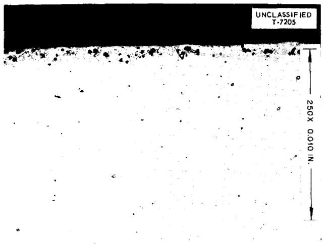  
Fig. 6.1. Hot Leg of Inconel Thermal-Convection Loop After Circulating NaF-KF-LiF-UF $_3$ -UF $_4$ for 500 hr at $1500^{\circ}$ F. Loop 590, 250X. Reduced $30\%$ .

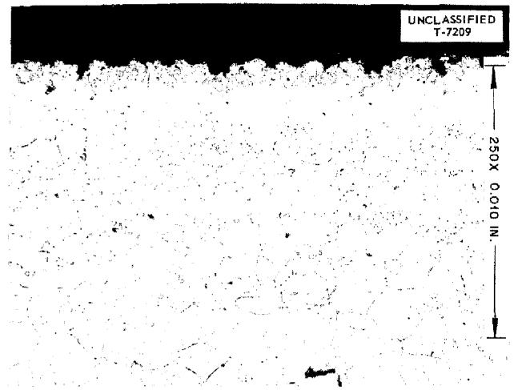  
Fig. 6.2. Hot Leg of Type 316 Stainless Steel Thermal-Convection Loop After Circulating NaF-KF-LiF-UF $_3$ -UF $_4$ for 500 hr at $1500^{\circ}$ F. Loop 193. 250X. Reduced $30\%$ .

TABLE 6.3. RESULTS FROM INCONEL THERMAL-CONVECTION LOOPS OPERATED WITH NaF-ZrF4-UF4 (50-46-4 mole %) CONTAMINATED WITH CERAMIC BEADS  

<table><tr><td rowspan="2">Loop No.</td><td rowspan="2">Variable</td><td colspan="2">Metallographic Notes</td></tr><tr><td>Hot-Leg Appearance</td><td>Cold-Leg Appearance</td></tr><tr><td>609</td><td>Control</td><td>Subsurface voids to 7.5 mils</td><td>No deposit</td></tr><tr><td>610</td><td>Control</td><td>Subsurface voids to 8 to 11 mils</td><td>No deposit</td></tr><tr><td>611</td><td>Ceramic beads on probe</td><td>Subsurface voids to 11 to 13 mils; surface rough</td><td>No deposit</td></tr><tr><td>612</td><td>Ceramic beads on probe</td><td>Subsurface voids to 11 to 12 mils</td><td>No deposit</td></tr><tr><td>613</td><td>Ceramic beads in fill pot</td><td>Subsurface voids to 7.5 to 8 mils</td><td>Intermittent small metallic particles</td></tr></table>

surface of loop 613 was also much rougher than the surfaces of the other loops. A variation in the results for the two control loops indicates that, while the ceramic may have some effect, there are other unknown variables that affect the corrosion rate.

# High Uranium Content in Fluoride Mixture

Determination of any unusual corrosive effects of fluoride mixtures with higher uranium concentrations than those normally used was requested by the Solid State Division for evaluation of in-pile tests for which a high uranium concentration is required. Subsurface void formations to depths of 10 and 15 mils were found in the hot legs of Inconel thermal-convection loops after circulating NaF-ZrF4-UF4 (62.5-12.5-25.0 mole %) for 500 hr at $1500^{\circ}\mathrm{F}$ . The maximum depth of attack found in any loops in which the standard fluoride mixture NaF-ZrF4-UF4 (50-46-4 mole %) has been circulated has been 11 mils. The higher uranium concentration does therefore appear to result in a small increase in depth of attack.

# Hastelloy B Loops

Hastelloy B thermal-convection loops in both the as-fabricated and the dry-hydrogen-cleaned condition have been operated for 1000 hr at a hot-leg temperature of $1500^{\circ}\mathrm{F}$ with $\mathsf{NaF - ZrF_4 - UF_4}$ (50-46-4 mole %) as the circulated fluid. The dry-hydrogen cleaning was for the removal of surface oxide layers. No appreciable reduction in corrosive attack was noted in the dry-hydrogen-cleaned loops as compared with the as-fabricated loops. The metallographic data for these loops, presented in Table 6.4, are in agreement with those previously reported for similar Hastelloy B

loops. The chemical analyses of the mixtures circulated in these loops have not yet been received.

Hastelloy B loop 186 was operated with NaF-ZrF $_4$ -UF $_4$ (50-46-4 mole %) for 1000 hr with a hot-leg temperature of $1650^{\circ}\mathrm{F}$ . This loop was constructed with the drain, which acts as a cold trap during operation, in direct line with the cold leg. The lower loop joint was a sharp angle of 75 deg rather than the smooth bend used previously. Visual examination showed a considerable deposit of needle-like, magnetic crystals around the top of the trap and on both sides of the lower joint. This loop is to be compared with Hastelloy B loops 161 and 162, operated previously at $1650^{\circ}\mathrm{F}$ with off-set traps, which showed only small scattered deposits.

# Molybdenum Loops

Three loops constructed of molybdenum jacketed with type 310 stainless steel for oxidation resistance have been operated at a hot-leg temperature of $1500^{\circ}\mathrm{F}$ for periods up to 1000 hr with $\mathrm{NaF - ZrF_4 - UF_4}$ (50-46-4 mole %) as the circulated fluid. No evidence of mass-transferred particles, subsurface void formation, or intergranular attack has been found. A rough surface, with depressions to a maximum depth of 2 mils, was noted but is believed to be associated with fabrication procedures. A thin, altered surface or metallic-appearing layer was also observed on the inner surface in both the as-received condition and following loop operation. The hot leg of loop 185, which operated for 1000 hr, is shown in Fig. 6.3.

# Sodium in Hastelloy B Loops

Two Hastelloy B loops were cleaned with dry

TABLE 6.4. CORROSION FOUND IN HASTELLOY B THERMAL-CONVECTION LOOPS AFTER CIRCULATING NaF-ZrF4-UF4 (50-46-4 mole %) FOR 1000 hr AT 1500°F   

<table><tr><td rowspan="2">Loop No.</td><td rowspan="2">Condition</td><td colspan="2">Metallographic Notes</td></tr><tr><td>Hot-Leg Appearance</td><td>Cold-Leg Appearance</td></tr><tr><td>163</td><td>Dry hydrogen cleaned</td><td>Pitting to a depth of 2 mils and subsurface voids</td><td>No deposit</td></tr><tr><td>164</td><td>Dry hydrogen cleaned</td><td>Pitting to a depth of 2 mils and subsurface voids</td><td>No deposit</td></tr><tr><td>179</td><td>As-fabricated</td><td>Subsurface voids to a depth of 4 mils</td><td>Small metallic deposit</td></tr><tr><td>181</td><td>As-fabricated</td><td>Subsurface voids to a depth of 1 mil</td><td>No deposit</td></tr><tr><td>182</td><td>As-fabricated</td><td>Subsurface voids to a depth of 2 mils</td><td>No deposit</td></tr></table>

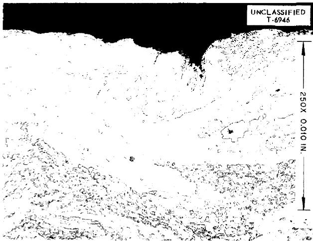  
Fig. 6.3. Hot Leg of Molybdenum Loop After Circulating NaF-ZrF $_4$ -UF $_4$ for 1000 hr at $1500^{\circ}$ F. Loop 185. 250X. Reduced $30\%$ .

hydrogen and operated at a hot-leg temperature of $1500^{\circ}\mathrm{F}$ with sodium as the circulated fluid. Loop 188 was operated for 500 hr and loop 189 for 1000 hr. In both loops, deposits of magnetic crystals were found in the lower cold leg and in the hot horizontal section. The metallographic examination of loop 188 showed a rough surface, with pits and subsurface voids to a depth of 2 mils. These results confirm those presented in the previous report.

The susceptibility of Hastelloy B to the mass transfer of nickel in the circulated sodium prompted the operation with sodium of three loops constructed from A-nickel. Two of the loops were dry hydrogen cleaned prior to operation, while the third was operated in the as-fabricated condition. Dendritic, magnetic crystals were found in the cold legs of all three loops after operation for periods of 500 and 1000 hr at a hot-leg temperature of $1500^{\circ}$ F.

# Sodium in Inconel Loops with Beryllium Inserts

G. M. Adamson

A. Taboada

Metallurgy Division

Six Inconel thermal-convection loops with beryllium inserts were operated with sodium as the circulated fluid in a second series of sodium-beryllium-Inconel compatibility tests similar to

those previously discussed. Loops were operated for 500 hr at 1300 and $1500^{\circ}\mathrm{F}$ and for 1000 hr at 1000, 1200, and $1350^{\circ}\mathrm{F}$ . High-purity sodium from the same batch was used in all the loops.

Metallographically, no attack and no deposits could be found in any of the cold legs or in any of the Inconel parts of hot legs that operated below $1350^{\circ}$ F. The Inconel hot legs, including the sleeves, of loops operated at 1350 and $1500^{\circ}$ F showed maximum intergranular attack to 2 mils. The beryllium inserts showed subsurface-void attack on the outer surface, as tabulated in Table 6.5.

TABLE 6.5. DEPTH OF ATTACK ON OUTSIDE OF BERYLLIUM INSERTS FROM INCONEL LOOPS AFTER CIRCULATING SODIUM   

<table><tr><td>Loop No.</td><td>Temperature of Hot Leg (°F)</td><td>Operating Time (hr)</td><td>Maximum Attack (mils)</td></tr><tr><td>560</td><td>1000</td><td>1000</td><td>0</td></tr><tr><td>559</td><td>1200</td><td>1000</td><td>3</td></tr><tr><td>557*</td><td>1200</td><td>1000</td><td>4</td></tr><tr><td>555</td><td>1300</td><td>500</td><td>1.5</td></tr><tr><td>558*</td><td>1350</td><td>1000</td><td>9</td></tr><tr><td>556</td><td>1500</td><td>500</td><td>21</td></tr></table>

*These two loops may have been reversed in cutting.

Visual examination of the inserts revealed no general attack; however, large streaks or rough areas were observed near the top or down one side of all inserts. Both the inside and the outside of the insert from loop 559 are shown in Fig. 6.4. The spiral down the center of this insert was found in all inserts except the one from the loop operated at $1000^{\circ}$ F. Microscopic examination showed no change in the surface and no attack under the spirals. The spirals were accompanied by a dark nonmetallic deposit that could not be identified by diffraction or seen under the microscope. Neither of these areas of visible attack seems to correspond to any expected flow pattern. Loops are now being started to determine whether the areas of attack correspond to machining variables.

UNCLASSIFIED

T-6547

DIRECTION OF FLOW

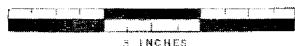  
Fig. 6.4. Surface of Beryllium Insert from Inconel Loop 559 After Circulating Sodium for 1000 hr at $1200^{\circ}\mathrm{F}$ .

# FORCED-CIRCULATION CORROSION AND MASS TRANSFER

G. M. Adamson

R. S. Crouse

Metallurgy Division

Preliminary corrosion results have been received on the first three Inconel forced-circulation corrosion and mass transfer testing loops operated by Experimental Engineering (cf., sec. 3, "Experimental Reactor Engineering"). All these loops were terminated before their scheduled time, but they operated long enough to provide some corrosion data. Similar mixtures of NaF-ZrF $_4$ -UF $_4$ (53.5-40-6.5 mole %) were circulated in all these loops. The operating data provided by Experimental Engineering and the corrosion data now available are presented in Table 6.6.

Despite the turbulent flow and the increase in the number of cycles, the depths of attack found in these loops are only two to three times the depths found in thermal-convection loops operated for comparable periods. A typical hot-leg section from loop 4690 is shown in Fig. 6.5. The data are still too meager to permit any conclusions to be drawn, but several results are worth noting. A large difference was found between the depth of attack on the inside of the bends and that on the outside. Where a depth of attack on the inside of a bend was 16 mils, directly opposite the attack would be much lighter in intensity and to a depth of only 5 mils. The inside and outside surfaces of a bend from loop 4690 are shown in Fig. 6.6. In loops 4696-C and 4694 differences in wall

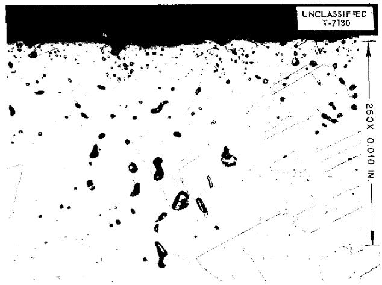  
Fig. 6.5. Hot Leg of Forced-Circulation Inconel Loop 4690 After Circulating NaF-ZrF $_4$ -UF $_4$ . 250X. Reduced $31\%$ .

thickness in the bends of from 42 to 47 mils were found; but, as yet, no large differences have been found in loop 4690. These loops were electrical-resistance heated, and therefore more current and higher temperatures existed where the walls were thicker on the inside of the bends. In loop 4694 differences were found in wall thickness in straight sections, and corresponding differences in attack were noted. It has been shown (cf., sec., 8, "Heat Transfer and Physical Properties") that variations in flow also occur in the bends that would cause higher temperatures on the inside.

A complete bend from loop 4694 was sectioned longitudinally and examined. The depth of attack was the same on both sides of the straight section before the bend, but the difference increased very rapidly as soon as any curvature was noted. The difference remained approximately the same all around the bend. At the exit end the difference did not stop suddenly but continued into the straight area beyond. The depth gradually decreased from the end of the curvature but some difference was still present several inches beyond the bend. This pattern of attack was predicted by the flow studies. These differences seem to show that mass-transfer is even more temperature sensitive than it was thought to be. One other discrepancy noted in the data was that in loops 4696-C and 4694 the deepest attack occurred in the first leg of the heater rather than in the second leg where the maximum temperature was supposed

TABLE 6.6. DATA ON OPERATION AND CORROSION OF INCONEL FORCED-CIRCULATION CORROSION AND MASS TRANSFER TESTING LOOPS  

<table><tr><td></td><td colspan="3">Loop Designation</td></tr><tr><td></td><td>4690</td><td>4696-C</td><td>4694</td></tr><tr><td colspan="4">Operating Data</td></tr><tr><td>Time, hr</td><td>774</td><td>625</td><td>519</td></tr><tr><td>Maximum fluoride temperature, °F</td><td>1500</td><td>1500</td><td>1500</td></tr><tr><td>Maximum wall temperature, °F</td><td>1740</td><td>1610</td><td>1580</td></tr><tr><td>Temperature drop, °F</td><td>200</td><td>300</td><td>200</td></tr><tr><td>Approximate Reynolds number</td><td>10,000</td><td>10,000</td><td>15,000</td></tr><tr><td>Heater length</td><td></td><td></td><td></td></tr><tr><td>First section, ft</td><td>4</td><td>6</td><td>5</td></tr><tr><td>Second section, ft</td><td>4</td><td>8</td><td>7</td></tr><tr><td>Loop length, ft</td><td>48</td><td>54</td><td>52</td></tr><tr><td>Velocity, fps</td><td>6.67</td><td>5.94</td><td>9.19</td></tr><tr><td>Cause of termination</td><td>Leak</td><td>Pump bearing failure</td><td>Leak</td></tr><tr><td colspan="4">Corrosion Data</td></tr><tr><td>Maximum depth of attack, mils</td><td></td><td></td><td></td></tr><tr><td>First heater section</td><td></td><td></td><td></td></tr><tr><td>Straight</td><td>12</td><td>6</td><td>16*</td></tr><tr><td>Bend</td><td>12</td><td>15</td><td>20</td></tr><tr><td>Second heater section</td><td></td><td></td><td></td></tr><tr><td>Straight</td><td>15</td><td>7</td><td>8</td></tr><tr><td>Bend</td><td>17</td><td>11</td><td>11</td></tr></table>

*This straight section showed variations in wall thickness.

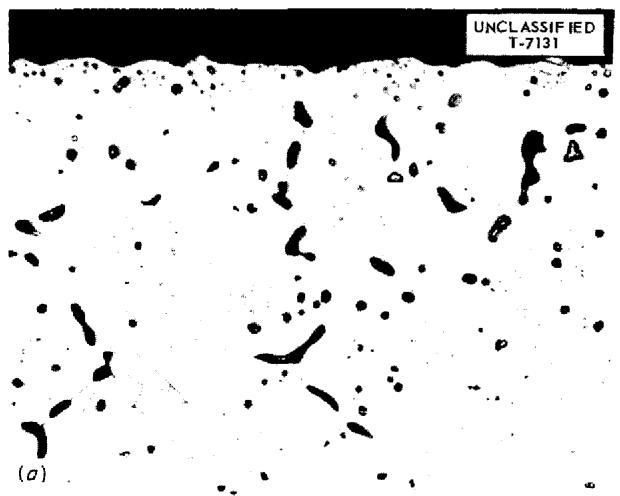

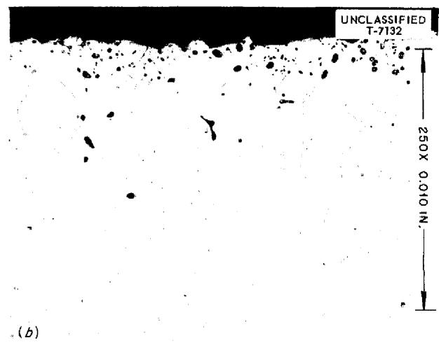  
Fig. 6.6. Inner (a) and Outer (b) Surfaces of a Bend from Forced-Circulation Inconel Loop 4690 After Circulating NaF-ZrF $_4$ -UF $_4$ . Reduced $23\%$ .

to have occurred. However, the two heater legs were found not to be of equal length, and therefore the power input was higher in the first leg than in the second.

Chemical analysis data have been received for loop 4690. The batch analysis was reported to contain 14.8 wt % U, 7 ppm Ni, 45 ppm Cr, and 60 ppm Fe. Two samples taken from the sump tank after the loop was drained show the following: 15.1 and 12.2 wt % U, 100 and 40 ppm Ni, 690 ppm Cr in both samples, and 115 ppm Fe in both samples.

The only cold-leg deposits found so far were in loop 4696-C. Metallographically, a deposit, as yet unidentified, was found in a single section near the end of the cooling coil of this loop. In loop 4690 two deposits were found in the pump that were not present in either of the other two loops. There was a deposit of loose magnetic crystals on the back of the impeller. These crystals analyzed $4.52 \text{wt} \% \text{Ni}$ , $9.54 \text{wt} \% \text{Cr}$ , and $1.18 \text{wt} \% \text{Fe}$ or (corrected to $100 \%$ metal) $29.6 \text{wt} \% \text{Ni}$ , $62.7 \text{wt} \% \text{Cr}$ , and $7.7 \text{wt} \% \text{Fe}$ . The second deposit was at the liquid level on the sleeve around the pump shaft. This deposit was not discrete crystals, and, under the microscope, it was shown to be a thin film of metal surrounding fluoride crystals. A diffraction examination reported the deposit to be a mixture of nickel and slightly altered fluorides. Two different spectrographic samples were submitted, and the results, which follow, gave the first indication of nickel mass transfer.

Sample 1: Metal plus Fluoride Mixture   

<table><tr><td>Cr</td><td>3 ppm</td></tr><tr><td>Fe</td><td>1 ppm</td></tr><tr><td>Ni</td><td>5 ppm</td></tr><tr><td>Co</td><td>0.1 ppm</td></tr><tr><td>Na</td><td>Trace</td></tr><tr><td>U</td><td>Trace</td></tr><tr><td>Zr</td><td>Trace</td></tr></table>

Sample 1: Fluoride Mixture   

<table><tr><td>Cr</td><td>2 ppm</td></tr><tr><td>Fe</td><td>&lt;0.02 ppm</td></tr><tr><td>Ni</td><td>&lt;0.05 ppm</td></tr><tr><td>Co</td><td>&lt;0.05 ppm</td></tr><tr><td>Na</td><td>Trace</td></tr><tr><td>U</td><td>Trace</td></tr><tr><td>Zr</td><td>Trace</td></tr></table>

Sample 2: Magnetic Phase   

<table><tr><td>Ni</td><td>&gt;5 ppm</td></tr><tr><td>Cr</td><td>&lt;0.4 ppm</td></tr><tr><td>Fe</td><td>&gt;10 ppm</td></tr></table>

Sample 2: Nonmagnetic Phase   

<table><tr><td>Ni</td><td>&lt;0.05 ppm</td></tr><tr><td>Cr</td><td>&gt;5 ppm</td></tr><tr><td>Fe</td><td>&lt;0.02 ppm</td></tr></table>

# GENERAL CORROSION STUDIES

E. E. Hoffman

W. H. Cook C. F. Leitten, Jr. Metallurgy Division

# High-Temperature Tests of Molybdenum in Contact with NaF-ZrF4-UF4

An attempt is being made to devise protection for the cooling jacket of the fused salt-Inconel in-pile forced-circulation loop experiment which is scheduled for insertion in the MTR. A loop failure would undoubtedly occur in the vicinity of the nose of the loop if pumping of the fused salt were interrupted for a short period. It is possible that in the event of a pump failure, the fused salt might reach a temperature as high as $2430^{\circ}\mathrm{F}$ , which has been given as the approximate boiling point of the fluoride fuel mixture to be used. It has been proposed that a sheath of molybdenum around the nose of the loop would afford sufficient protection for the cooling jacket, and it was arbitrarily concluded that 30 min at $2430^{\circ}\mathrm{F}$ would be more than adequate to determine the suitability of molybdenum for this service. A molybdenum specimen was therefore placed in a molybdenum container, and the container was then filled with $\mathrm{NaF - ZrF_4 - UF_4}$ (53.5-40-6.5 mole%). In one test a molybdenum plug was welded into the top of the capsule, while in a second test, the top was left open. These test containers were sealed first in Hastelloy B and then in quartz to prevent oxidation of the molybdenum. There was no weight change of either specimen during the test, and metallographic examination showed no attack (Fig. 6.7). However, the effects of alloying between the molybdenum and Hastelloy B capsules may be seen in Fig. 6.8.

# Brazing Alloys on Inconel and Stainless Steel in Sodium and in Fuel Mixtures

Static corrosion tests have been completed on a series of T-joints which were submitted by the Wall Colmonoy Corporation. The purpose of these tests was to find a brazing alloy which had good corrosion resistance to both sodium and the fuel

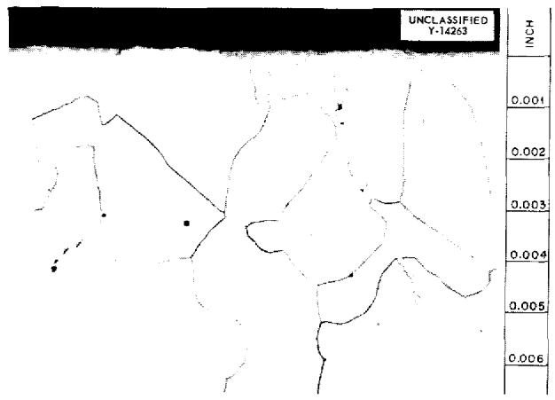  
Fig. 6.7. Surface of Molybdenum Specimen After Exposure for 30 min at $2430^{\circ}\mathrm{F}$ to NaF-ZrF $_4$ . UF $_4$ . Etched with $\mathrm{NH}_4\mathrm{OH} + \mathrm{H}_2\mathrm{O}_2$ . 500X. Reduced 42.5%.

mixture $\mathsf{NaF - ZrF_4 - UF_4}$ (53.5-40-6.5 mole %). Several of the brazing alloys listed in Table 6.7 as having been tested on Inconel have also been tested on type 304 stainless steel. The results of these tests were reported previously. Metallographic results indicate that only the brazing alloys I-10 and B-11 of this series have fair corrosion resistance to both sodium and to the fused salt fuel mixture.

An Inconel T-joint brazed with alloy B-11 $(10.8\%)$ $\mathsf{P} - 9.2\%$ Si- $80\%$ Ni) is shown in Fig. 6.9 in the as-received condition. Several small voids may be seen along the fillet surface of this brazing alloy. Figure 6.10 shows brazing alloy B-11 after exposure to NaF-ZrF4-UF4 (53.5-40-6.5 mole %) for 100 hr at $1500^{\circ}\mathsf{F}$ ; only nonuniform attack to a depth of 1 mil is noticeable along the fillet surface. Figure 6.11 shows the same brazing alloy after exposure to sodium for 100 hr at $1500^{\circ}\mathsf{F}$ . The very erratic surface attack to a depth of 4 mils can be seen, along with several subsurface voids to a depth of 9 mils. A brazing alloy such as B-11 might be used in a heat exchange system as a back-braze material where the surface of the braze alloy would normally be exposed to the

2E. E. Hoffman, W. H. Cook, and C. F. Leitten, ANP Quar. Prog. Rep. Dec. 10, 1954, ORNL-1816, p 80.

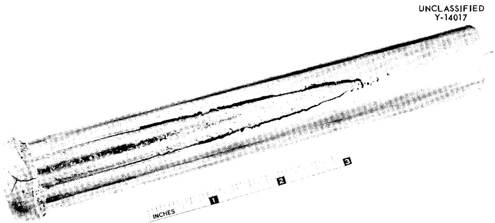  
Fig. 6.8. Molybdenum-Hastelloy B Capsule After Exposure for 30 min at $2430^{\circ}$ F to $\mathsf{NaF - ZrF_4 - UF_4}$ . Bottom of capsule at left. Note alloying of inner molybdenum capsule with outer Hastelloy B container.

TABLE 6.7. RESULTS OF STATIC TESTS OF BRAZING ALLOYS IN SODIUM AND IN NaF-ZrF4-UF4 (53.5-40-6.5 mole %) AT 1500°F FOR 100 hr   

<table><tr><td rowspan="2">Alloy Designation</td><td rowspan="2">Alloy Composition (wt %)</td><td rowspan="2">Joint Material</td><td rowspan="2">Bath</td><td colspan="2">Weight Change</td><td rowspan="2">Metallographic Notes</td></tr><tr><td>(g)</td><td>(%)</td></tr><tr><td rowspan="2">A-10</td><td rowspan="2">12 P-88 Ni</td><td rowspan="2">Type 304 stain-less steel</td><td>Sodium</td><td>-0.0015</td><td>-0.141</td><td>Attack along entire fillet surface to a depth of 6 mils</td></tr><tr><td>Fluoride mixture</td><td>-0.0031</td><td>-0.30</td><td>No attack on surface of fillet</td></tr><tr><td rowspan="2">A-10</td><td rowspan="2">12 P-88 Ni</td><td rowspan="2">Inconel</td><td>Sodium</td><td>-0.0003</td><td>-0.028</td><td>Attack on entire fillet surface to a depth of 13 mils</td></tr><tr><td>Fluoride mixture</td><td>-0.0008</td><td>-0.108</td><td>Surface attack along fillet to a depth of 0.5 mil</td></tr><tr><td rowspan="2">B-11</td><td rowspan="2">10.8 P-9.2 Si-80 Ni</td><td rowspan="2">Inconel</td><td>Sodium</td><td>-0.0010</td><td>-0.098</td><td>Erratic surface attack to a depth of 4 mils, subsurface voids to a depth of 9 mils</td></tr><tr><td>Fluoride mixture</td><td>-0.0018</td><td>-0.166</td><td>Fillet surface attacked to a depth of 1 mil</td></tr><tr><td rowspan="2">E-11</td><td rowspan="2">13 Si-87 Ni</td><td rowspan="2">Type 304 stain-less steel</td><td>Sodium</td><td>-0.0007</td><td>-0.068</td><td>No attack present along fillet</td></tr><tr><td>Fluoride mixture</td><td>-0.0036</td><td>-0.358</td><td>Fillet completely attacked</td></tr><tr><td rowspan="2">F-11</td><td rowspan="2">9 Si-17.8 Cr-73.2 Ni</td><td rowspan="2">Type 304 stain-less steel</td><td>Sodium</td><td>0.0</td><td>0.0</td><td>No attack on fillet</td></tr><tr><td>Fluoride mixture</td><td>-0.0052</td><td>-0.52</td><td>Attack on braze joint to a depth of 6 mils</td></tr><tr><td rowspan="2">H-10</td><td rowspan="2">10 P-4.3 Mo-85.7 Ni</td><td rowspan="2">Inconel</td><td>Sodium</td><td>-0.0011</td><td>-0.107</td><td>Uniform surface attack along fillet to a depth of 9 mils</td></tr><tr><td>Fluoride mixture</td><td>-0.0016</td><td>-0.154</td><td>Attack along fillet surface to a depth of 0.5 mil</td></tr><tr><td rowspan="2">I-10</td><td rowspan="2">11.6 P-6.25 Mn-82.2 Ni</td><td rowspan="2">Inconel</td><td>Sodium</td><td>-0.0014</td><td>-0.135</td><td>Erratic attack along fillet to a depth of 4 mils</td></tr><tr><td>Fluoride mixture</td><td>-0.0016</td><td>-0.157</td><td>Attack along fillet surface to a depth of 0.5 mil</td></tr></table>

fluoride mixture and would be in contact with sodium only in the event of a tube-to-header weld failure.

# Dissimilar Metal Mass Transfer in the System Zirconium-Type 304 Stainless Steel-Sodium

The problem of dissimilar metal mass transfer of zirconium to type 304 stainless steel in sodium has been studied in seesaw tests in the temperature range 1000 to $1500^{\circ}\mathrm{F}$ . The test containers were capsules made of type 304 stainless steel, and the zirconium specimens were retained in the

hot zone by partially crimping the capsule wall. Each specimen of zirconium was carefully cleaned and weighed both before and after testing in order to obtain weight-change data. Upon completion of the test, each capsule was sectioned and samples of each section were submitted for metallographic and spectrographic analysis. Six samples were cut from each container that taken together were representative of all portions of the container. Table 6.8 gives the conditions of the tests. In all three tests a seesaw furnace with a speed of $1\text{cpm}$ was used, and the duration of each test was $100\text{hr}$ .

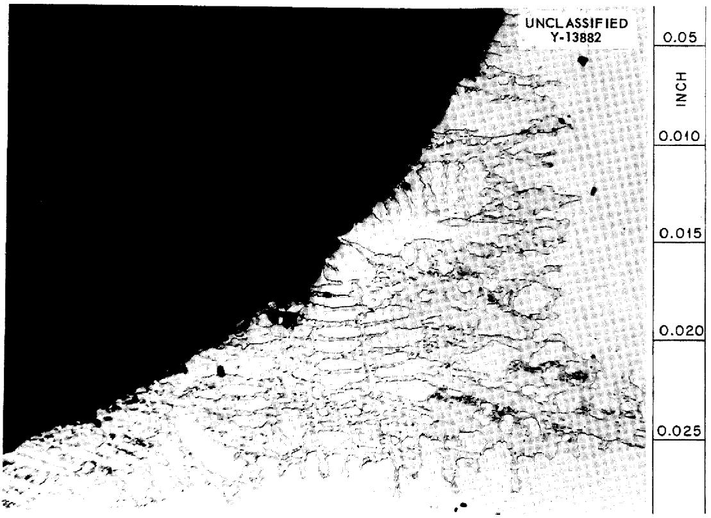  
Fig. 6.9. Inconel T-Joint Brazed with $10.8\%$ P-9.2% Si-80% Ni in the As-Brazed Condition. Note small voids at fillet surface. Etched with glyceria regia. 150X.

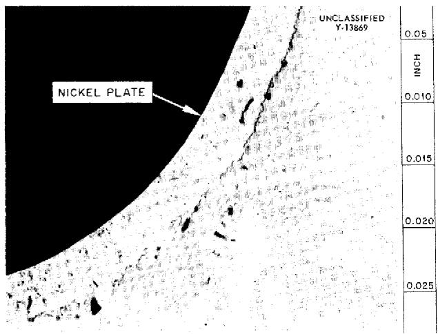  
Fig. 6.10. Inconel T-Joint Brazed with $10.8\%$ P-9.2% Si-80% Ni After Exposure to Static NaF-ZrF4-UF4 at $1500^{\circ}$ F for 100 hr. Note slight attack along fillet surface. Etched with aqua regia. 150X. Reduced $39\%$ .

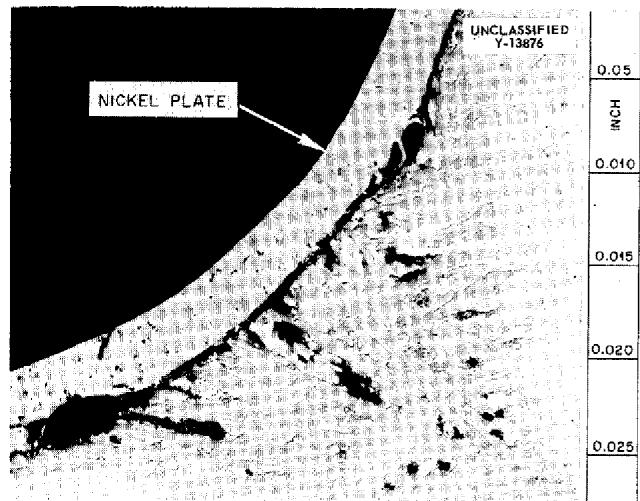  
Fig. 6.11. Inconel T-Joint Brazed with $10.8\%$ P-9.2% Si-80% Ni After Exposure to Static Sodium for 100 hr at $1500^{\circ}\mathsf{F}$ . Note attack at fillet surface and subsurface voids. Etched with glyceria regia. 150X. Reduced $37\%$ .

TABLE 6.8. TEST CONDITIONS FOR STUDYING DISSIMILAR METAL MASS TRANSFER IN THE SYSTEM ZIRCONIUM-TYPE 304 STAINLESS STEEL-SODIUM   

<table><tr><td>Test No.</td><td>Hot-Zone 
Temperature 
(°F)</td><td>Cold-Zone 
Temperature 
(°F)</td><td>Temperature 
Gradient 
(°F)</td></tr><tr><td>1</td><td>1000</td><td>531</td><td>469</td></tr><tr><td>2</td><td>1200</td><td>700</td><td>500</td></tr><tr><td>3</td><td>1500</td><td>1030</td><td>470</td></tr></table>

It appeared that no thermal-gradient mass transfer occurred in any of the tests, because there was no deposit of zirconium found in the cold zones. The cold-zone section of the type 304 stainless steel capsule used in test No. 3 is shown in Fig. 6.12. Metallographic examination showed a layer of fine particles in the hot-zone section of each capsule. However, x-ray examination of the surface of a specimen sectioned from the hot zone (Fig. 6.13) of the capsule used in test No. 3 showed no trace of zirconium or zirconium compounds. The precipitated layer found in the hot zone reached a maximum thickness of 2 mils, and it was very similar to the layers observed on type 304 stainless steel samples carburized in the presence of sodium.

Spectrographic analysis revealed only a slight trace of zirconium in the hot-zone section of the capsule used in test No. 2. An increase in zirconium content was found in the capsule used in test No. 3, but the amount could be considered to be negligible, since it was of the order of $10^{-3}\%$ . It was also noted in test No. 3 that a slightly larger concentration of zirconium appeared in the cold zone of the capsule than in the hot zone.

In all cases the zirconium samples gained weight during the tests. X-ray analysis revealed a layer of zirconium oxide on each sample. The following tabulation gives the weight changes found:

<table><tr><td>Test No.</td><td>Zirconium Sample Weight Change (g)</td></tr><tr><td>1</td><td>+0.0041</td></tr><tr><td>2</td><td>+0.0089</td></tr><tr><td>3</td><td>+0.0150</td></tr></table>

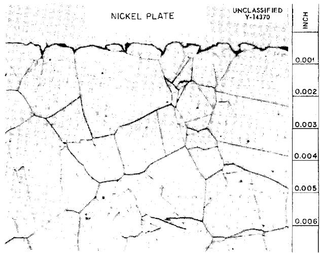

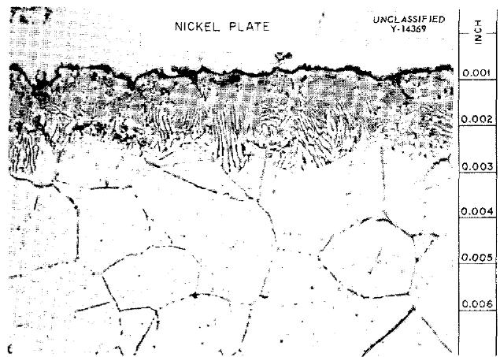  
Fig. 6.12. Cold Zone of Type 304 Stainless Steel Capsule After Exposure to Sodium in Seesaw Apparatus for 100 hr at $1500^{\circ}$ F. Etched with $10\%$ oxalic acid. 500X. Reduced $37\%$ .   
Fig. 6.13. Hot Zone of Type 304 Stainless Steel Capsule After Exposure to Sodium in Seesaw Apparatus for 100 hr at $1500^{\circ}\mathrm{F}$ . Etched with $10\%$ oxalic acid. 500X. Reduced $42\%$ .

The original weight of each sample was $17\mathrm{g}$ . It was apparent that under the conditions of these tests, zirconium exhibits negligible amounts of dissimilar metal mass transfer to type 304 stainless steel.

# Diffusion of Sodium into Beryllium

Tests were run to determine the extent to which sodium penetrates beryllium metal in a beryllium-

sodium-Inconel static system. The beryllium specimens and the sodium were sealed in Inconel capsules and maintained at 1200 or $1500^{\circ}$ F for 1000 hr. Five cuts 10 mils thick were then machined from one surface of each specimen. The sides of the specimen were machined off to a depth of 50 mils to avoid sodium contamination from the edges. The turnings were carefully collected and submitted for spectrographic sodium analysis. The results of these analyses are presented in Table 6.9.

TABLE 6.9. SODIUM CONCENTRATION IN BERYLLIUM TURNINGS AFTER EXPOSURE OF BERYLLIUM SPECIMEN TO MOLTEN SODIUM FOR 1000 hr IN AN INCONEL CAPSULE   

<table><tr><td rowspan="2">Depth of Be Layer (mils)</td><td colspan="2">Sodium Concentration of Beryllium Layers (mg of Na/g of Be)</td></tr><tr><td>After Test at 1200°F</td><td>After Test at 1500°F</td></tr><tr><td>0 to 10</td><td>0.2</td><td>135</td></tr><tr><td>10 to 20</td><td>0.2</td><td>29.4</td></tr><tr><td>20 to 30</td><td></td><td>0.6</td></tr><tr><td>30 to 40</td><td>0.3</td><td>0.1</td></tr><tr><td>40 to 50</td><td>0.02</td><td>0.6*</td></tr></table>

*This apparent increase in sodium content is not considered to be significant.

It appears from the data in Table 6.9 that very little penetration of beryllium by sodium will occur at a temperature of $1200^{\circ}\mathrm{F}$ . As may be seen in Fig. 6.14, the beryllium specimen in the test at a temperature of $1200^{\circ}\mathrm{F}$ was attacked irregularly to a maximum depth of 5 mils. In the test at $1500^{\circ}\mathrm{F}$ the specimen was very heavily attacked to a maximum depth of 20 mils (Fig. 6.15), and a 3- to 4-mil porous metallic layer covered the surface of the beryllium specimen. This layer is anisotropic and therefore has been identified as either beryllium metal or a beryllium-rich beryllium-nickel solid solution. No surface layers could be found on the walls of the Inconel capsules used in these tests; however, there was quite a bit of fine precipitate along the surface to a depth of 2 to 3 mils. This precipitate may be either BeNi or $\mathrm{Be}_{21}\mathrm{Ni}_5$ particles.

# Beryllium-Inconel Spacer Tests

Tests revealed previously3 that dissimilar metal mass transfer of beryllium metal to Inconel across

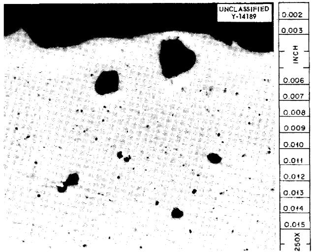  
Fig. 6.14. Surface of a Beryllium Specimen After Exposure to Static Sodium for 1000 hr at $1200^{\circ}\mathsf{F}$ . Large voids are due to attack by sodium. Unetched, 250X. Reduced $35\%$ .

small sodium gaps is a serious problem at temperatures in excess of $1200^{\circ}\mathrm{F}$ . Therefore a study is under way to determine the effect of temperature and spacer distance on the alloying of beryllium with Inconel. Layers of the compounds $\mathrm{BeNi}$ and $\mathrm{Be}_{21}\mathrm{Ni}_{5}$ , both of which are very hard and brittle, have been found on Inconel plumbing in past tests. Thermal-convection loop tests at a hot-zone temperature of $1300^{\circ}\mathrm{F}$ for 1000 hr revealed a $\mathrm{Be}_{21}\mathrm{Ni}_{5}$ layer approximately 20 mils thick where an Inconel pipe and a beryllium insert were in direct contact. In the same test in areas where a 6-mil clearance was present between the Inconel and the beryllium, a 0.5-mil layer of the $\mathrm{BeNi}$ compound was found on the surface of the Inconel.

The tests for determining the optimum spacing between beryllium and Inconel in a sodium environment have been conducted with the sodium static, because the maximum attack on beryllium specimens and the only beryllium-nickel compound layers on Inconel in thermal-convection loop tests have been found in areas where the sodium was fairly stagnant. In the tests completed to date, spaces of 0, 5, and 20 mils were used between the Inconel and the beryllium, and the specimens were exposed to sodium for 1000 hr at $1200^{\circ}\mathrm{F}$ . The appearance of the specimens after testing may be seen in

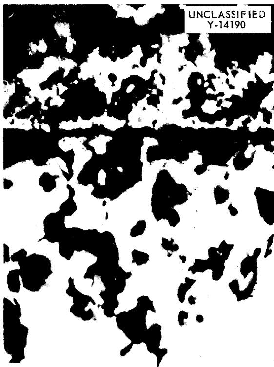  
(σ)

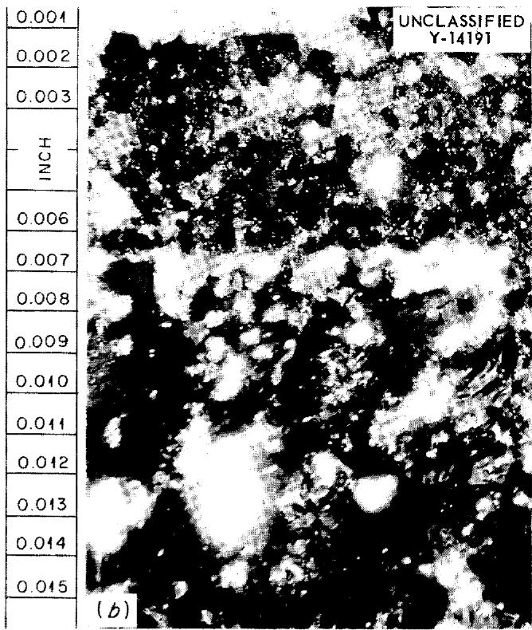  
Fig. 6.15. Surface of a Beryllium Specimen After Exposure to Static Sodium for 1000 hr at $1500^{\circ}\mathsf{F}$ . (a) Bright-field illumination. (b) Polarized light - layer which formed on the surface is either pure beryllium or a beryllium-rich beryllium-nickel solid solution. Unetched. 250X.

Figs. 6.16, 6.17, and 6.18. As may be seen, alloying occurred where the specimens were in direct contact. Metallographic examination of the surface of the Inconel specimen separated from the beryllium by the 5-mil space revealed a maximum of 0.2 mil of beryllium-nickel compound formation. The surface of the Inconel specimen separated from beryllium by the 20-mil space had no beryllium-nickel compound layers; however, there was an excessive amount of precipitate in the Inconel grains to a depth of 1 mil. Beryllium and Inconel specimens which were held in direct contact during testing are shown in Figs. 6.19 and 6.20, with the 6-mil layer of $\mathrm{Be}_{21}\mathrm{Ni}_5$ and $\mathrm{BeNi}$ which formed on the surface of the Inconel during this 1000-hr test being shown in Fig. 6.20. Spectrographic analyses of drillings from the surface of the Inconel revealed a beryllium concentration of $3.49\mathrm{mg/cm}^2$ , which is equivalent to a layer of pure beryllium approximately 1 mil in thickness.

The beryllium insert and the Inconel sleeve which surrounded it in a recent thermal-convection

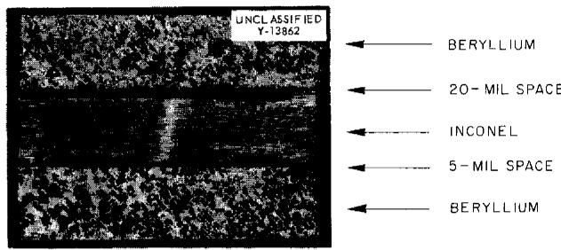  
Fig. 6.16. Inconel and Beryllium Specimens in Positions Occupied During Exposure to Sodium for 1000 hr at $1200^{\circ}\mathsf{F}$ .

loop test with sodium as the circulated fluid are shown in Fig. 6.21. This test operated for 1500 hr with a hot-zone temperature of $1300^{\circ}\mathrm{F}$ , and excessive alloying occurred between the sleeve and the beryllium specimen. These surfaces were separated by a space of approximately 6 mils at the beginning of the test.

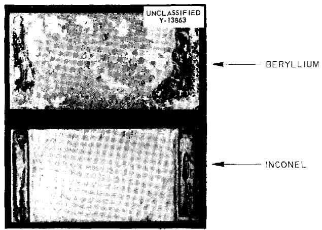  
Fig. 6.17. Surfaces of Beryllium and Inconel Specimens Separated by the 20-mil Space During Exposure to Sodium for 1000 hr at $1200^{\circ}\mathsf{F}$ .

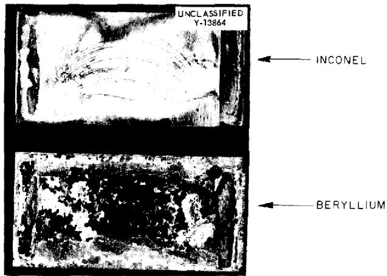  
Fig. 6.18. Surfaces of Beryllium and Inconel Specimens Separated by 5-mil Space During Exposure to Sodium for 1000 hr at $1200^{\circ}\mathrm{F}$ . Gray and black areas on beryllium indicate formation of beryllium oxide, while the dark areas on the Inconel indicate beryllium-nickel compound formation. Disregard areas of direct contact.

# Cermets in NaF-ZrF $_4$ -UF $_4$

The normally inert and refractory nature of cermets makes them attractive for applications in which solid-phase bonding ("self-bonding") is a problem. Valve stems and valve seats are especially sensitive areas where such bonding cannot be tolerated. Very clean surfaces promote solid-phase bonding, and in fused fluoride salt systems at elevated

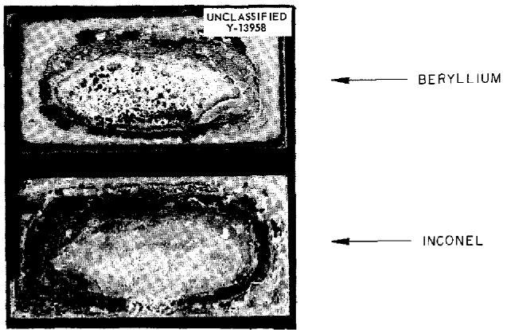  
Fig. 6.19. Surfaces of Beryllium and Inconel Specimens Held in Contact During Exposure to Static Sodium for 1000 hr at $1200^{\circ}\mathsf{F}$ .

temperatures any surface contaminants are rapidly reduced. Therefore, further evaluations have been made of the corrosion resistance in seesaw apparatus of Kennametal, Inc., cermet specimens K150A, K151A, K152B, K162B, and D4675 in contact with NaF-ZrF $_4$ -UF $_4$ (53.5-40-6.5 mole %) for 100 hr at a hot-zone temperature of $1500^{\circ}\mathrm{F}$ . These specimens had previously shown promising corrosion resistance in NaF-ZrF $_4$ -UF $_4$ (50-46-4 mole %), a somewhat less severe corroding medium, but there were some variations in duplicate tests. The results of the recent tests are given in Table 6.10, together with the complete compositions of the specimens.

Comparisons of the as-received with the tested specimens under a metallographic microscope did not reveal attack on any of the specimens shown in Table 6.10. In consideration of the medium used and the temperature difference between the hot and cold zones, the set of specimens from the tests with the cold-zone temperature of $1230^{\circ}\mathrm{F}$ should have had the most severe corrosion. The discrepancies between past and present fused salt corrosion attack on these Kennametal specimens are believed to be due to the improved purity of the fused fluoride salts used and to improved metallographic polishing techniques. The metallographic polishing of cermets to enable high magnification examination of edges within accuracies of 1 to 2 mils is very difficult. Special techniques are being developed for polishing these very hard materials.

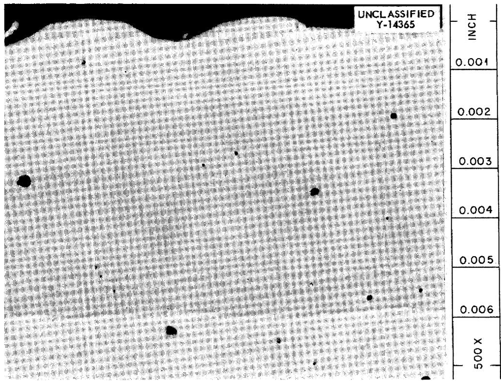  
Fig. 6.20. The BeNi and $\mathsf{Be}_{21}\mathsf{Ni}_5$ Layers Formed on Inconel Specimen Shown in Fig. 6.19 During Exposure to Static Sodium for 1000 hr at $1200^{\circ}\mathsf{F}$ . Unetched, 500X.

TABLE 6.10. RESULTS OF SEESAW TESTS OF TWO SAMPLES OF EACH OF SEVERAL CERMETS IN CONTACT WITH NaF-ZrF4-UF4 (53.5-40.0-6.5 mole %) FOR 100 hr AT A HOT-ZONE TEMPERATURE OF ${1500}^{ \circ  }\mathrm{F}$   

<table><tr><td rowspan="2">Sample Designation</td><td rowspan="2">Composition (wt %)</td><td rowspan="2">Approximate Cold-Zone Temperature (°F)</td><td colspan="2">Sample Changea (%)</td></tr><tr><td>Dimensionalb</td><td>Weight</td></tr><tr><td rowspan="2">K150A</td><td rowspan="2">80 TiC-10 Ni-10 NbTaTiC3</td><td>1385</td><td>+1.0</td><td>+2.5</td></tr><tr><td>1230</td><td>+0.6</td><td>+0.05</td></tr><tr><td rowspan="2">K151A</td><td rowspan="2">70 TiC-20 Ni-10 NbTaTiC3</td><td>1385</td><td>+0.2</td><td>+0.1</td></tr><tr><td>1230</td><td>+0.2</td><td>+0.09</td></tr><tr><td rowspan="2">K152B</td><td rowspan="2">64 TiC-30 Ni-6 NbTaTiC3</td><td>1385</td><td>+0.1</td><td>0.0</td></tr><tr><td>1230</td><td>+1.0</td><td>+0.09</td></tr><tr><td rowspan="2">K162B</td><td rowspan="2">64 TiC-25 Ni-5 Mo-6 NbTaTiC3</td><td>1385</td><td>+0.1</td><td>0.0</td></tr><tr><td>1230</td><td>+0.1</td><td>-0.02</td></tr><tr><td rowspan="2">D4675</td><td rowspan="2">97.5 WC-2.5 Co</td><td>1385</td><td>+0.2</td><td>+0.1</td></tr><tr><td>1230</td><td>+0.1</td><td>+0.04</td></tr></table>

${}^{a}$ Values based on figures to four decimal places; the dimensional measurements were made with a bench micrometer and the weights were obtained with a Gram-atic balance. These percentage values should not be used to determine relative corrosion resistance of different specimens; they are given here only to show their relative magnitudes.   
$b$ Average percentage changes in thickness, width, and length.

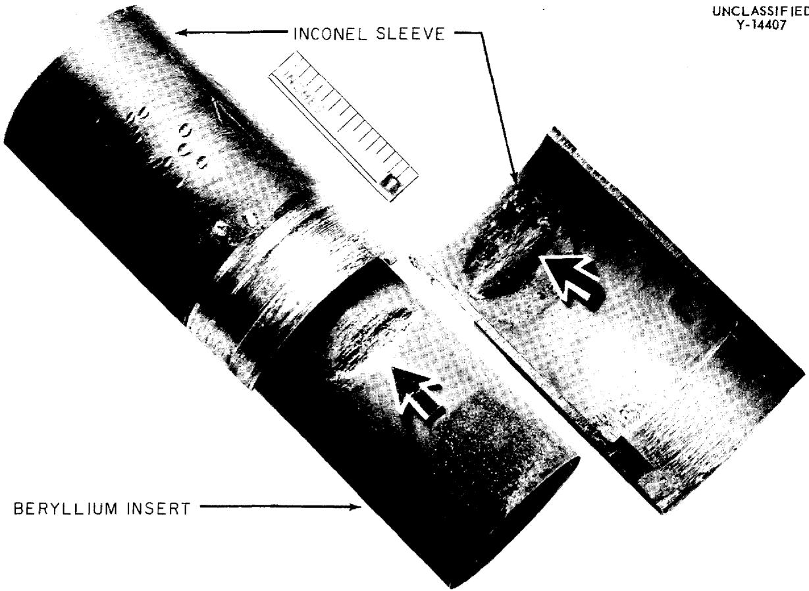  
Fig. 6.21. Beryllium Insert and Inconel Sleeve from Thermal-Convection Loop in Which Sodium Was Circulated for 1500 hr at a Hot-Zone Temperature of $1300^{\circ}\mathsf{F}$ . Clearance between Inconel and sleeve was 6 mils. Note alloying of beryllium and Inconel.

The as-received and tested specimens of K151A, K162B, and D4675 shown in Figs. 6.22, 6.23, and 6.24 illustrate typical specimen structures and the absence of corrosion. In Figs. 6.22 and 6.23 the TiC particles are the larger and darker colored material and the lighter material is the binding metal.

# Single-Crystal Specimens of Magnesium Oxide in Lithium and in Lead

Single-crystal specimens of magnesium oxide were tested in static lithium and in static lead in Goble-iron containers at $1500^{\circ}\mathrm{F}$ for 100 hr. These corrosion tests supplement those previously reported for single-crystal magnesium oxide tested in sodium and in NaF-ZrF $_4$ -UF $_4$ (53.5-40-6.5 mole %).

Two magnesium oxide specimens, nominally, 0.10 by 0.23 by 0.24 in., were cleaved from a piece of synthetic magnesium oxide crystal. The specimen tested in lithium had a weight loss of $66.4\%$ , and it took on the shape of the Globeiron container in regions of contact. There was no attack on the magnesium oxide specimen tested in lead.

# FUNDAMENTAL CORROSION RESEARCH

G.P. Smith Metallurgy Division

# Mass Transfer in Liquid Lead

J. V. Cathcart  
Metallurgy Division

It was the purpose of this investigation to survey the mass transfer properties in liquid lead of a

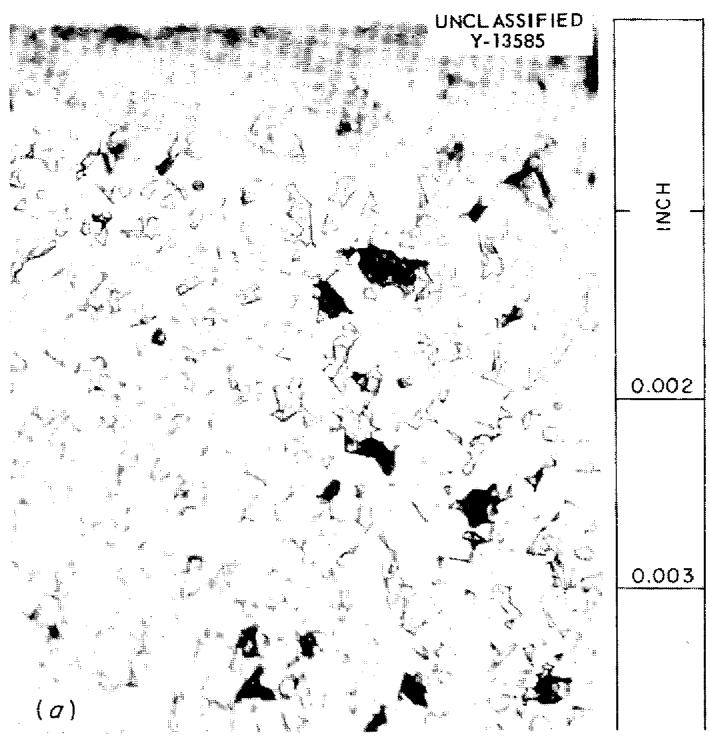

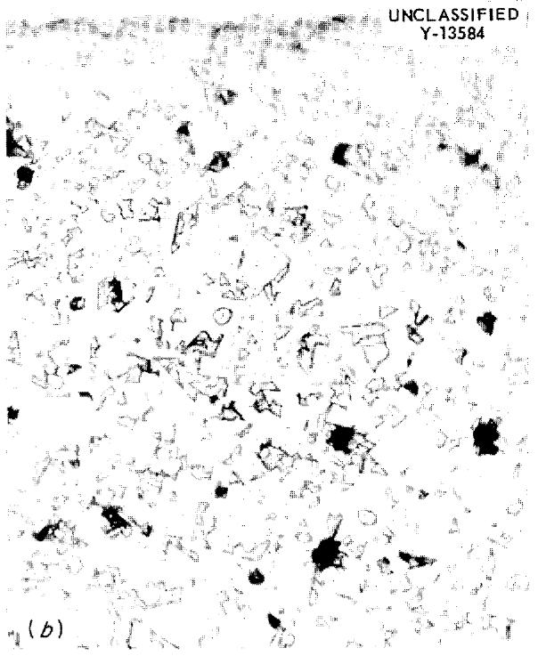

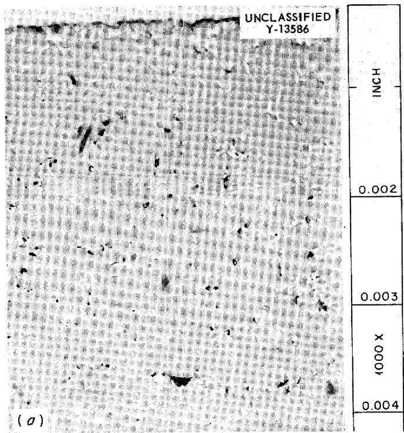  
Fig. 6.22. Cemet K151A (70% LiC-20% Ni-10% NbTaTiC₃) As-Received (a) and (b) After Exposure to NaF-ZrF₄-UF₄ for 100 hr at a Hot-Zone Temperature of 1500°F and a Cold-Zone Temperature of 1230°F in Seesaw Apparatus. Unetched. 1000X. Reduced 5.5%.

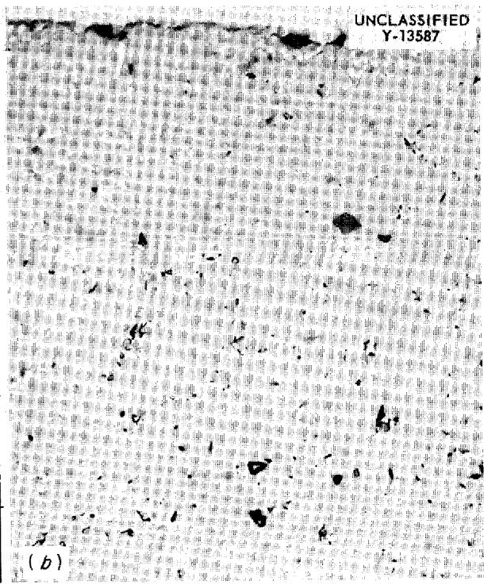  
Fig. 6.23. Cemet K162B (64% TiC-25% Ni-5% Mo-6% NbTaTiC₃) As-Received (a) and (b) After Exposure to NaF-ZrF₄⁻UF₄ for 100 hr at a Hot-Zone Temperature of 1500°F and a Cold-Zone Temperature of 1230°F in Seesaw Apparatus. Unetched. 1000X. Reduced 6.5%.

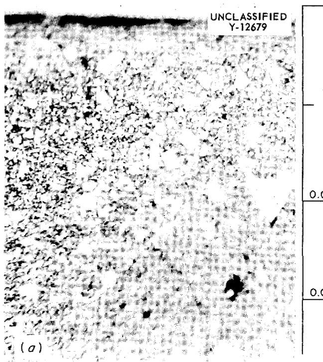

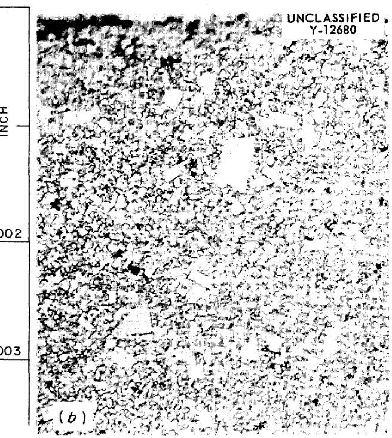  
Fig. 6.24. Cemet D4675 (97.5% WC-2.5% Co) As-Received (a) and (b) After Exposure to NaF-ZrF $_4$ -UF $_4$ for 100 hr at a Hot-Zone Temperature of $1500^{\circ}\mathrm{F}$ and a Cold-Zone Temperature of $1385^{\circ}\mathrm{F}$ in Seesaw Apparatus. Etched with KOH- $K_3Fe(CN)_6$ . Reduced 2%.

variety of metals and alloys with the aim of obtaining an insight into the roles of various important alloying materials in fixing the resistance to mass transfer of given alloys. Thus pure metals such as chromium, columbium, and nickel were tested in addition to alloys having practical structural importance. Work on this project has now been terminated.

All tests were performed in small quartz thermal-convection loops, the test specimens being fastened in the hot and cold legs of the loops. In all cases a temperature gradient of about $300^{\circ}\mathrm{C}$ was maintained across the loop, and the hot-leg temperature was 800 to $810^{\circ}\mathrm{C}$ . Details of the construction and operation of the loops, as well as of the experimental results, may be found in earlier reports.

The only new material tested during the past quarter was type 310 stainless steel. A loop containing this alloy plugged after $65\mathrm{hr}$ of operation with hot- and cold-leg temperatures of 805 and $500^{\circ}\mathrm{C}$ , respectively. A transverse section of the

hot-leg specimen is shown in Fig. 6.25.

The results of this research project are summarized in Fig. 6.26. The numbers at the ends of the bars in the chart represent the time period of the test. Except as noted on the chart, every loop was operated until it plugged.

The pure metals tested, as a rule, showed rather poor resistance to mass transfer, with the exceptions being molybdenum and columbium. These latter two metals were the only materials studied which suffered virtually no mass transfer or corrosion under the test conditions. At the other extreme, nickel was found to be highly subject to mass transfer; the nickel loops plugged in about 2 hr. Loops containing chromium and iron plugged in about 100 and 250 hr, respectively, and therefore can be regarded as being intermediate between molybdenum and columbium on the one hand and nickel on the other with respect to resistance to mass transfer.

The alloys studied could be conveniently grouped on the basis of whether their resistance to mass transfer was about the same as or greater than the

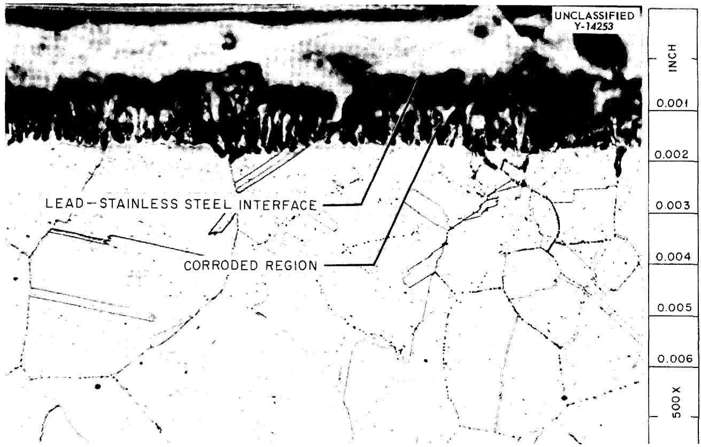  
Fig. 6.25. Transverse Section of Type 310 Stainless Steel Specimen Exposed to Liquid Lead in Hot Leg $(805^{\circ}C)$ of Quartz Thermal-Convection Loop. Temperature gradient in the loop was about $300^{\circ}C$ , 500X. Reduced $5\%$ .

average of their pure metal components. Examples of the former category are furnished by the 300 series stainless steels, Inconel, and Nichrome V. On the other hand, loops containing the 400 series stainless steels and alloys such as $45\%$ Cr- $55\%$ Co and Hastelloy B required much longer times for plugging than would have been predicted on the basis of the data for their pure metal components. The results obtained with the $45\%$ Cr- $55\%$ Co alloy were particularly striking, more than 750 hr being required for the plugging of a loop containing this material. Plugging times of 100 and 80 hr were recorded for comparable chromium and cobalt loops, respectively.

A survey of the phase diagrams of the alloys tested showed that those alloys having a greater than expected resistance to mass transfer all contain either a phase which is an intermetallic compound or else the composition is relatively close to that which would produce an intermetallic com

pound. Conversely, for the other alloys, either no intermetallic compounds exist or the compositions are far removed from those of possible compounds. On the basis of the data available, it seems reasonable to conclude that alloys containing an intermetallic compound will, in general, possess a higher resistance to mass transfer than those in which compound formation is not possible. The only exception to this rule among the alloys tested was the $50\%$ Cr- $50\%$ Fe alloy. This composition corresponds closely to the theoretical composition for the sigma-phase region in the iron-chromium diagram, and it was thought that this alloy would possess a relatively great resistance to mass transfer. However, the average plugging time for two such loops was 39 hr. No completely satisfactory explanation for the apparent anomaly has been found, but it was thought that on account of the extreme friability of the specimens, the very short plugging times might have been due to a mechanical failure

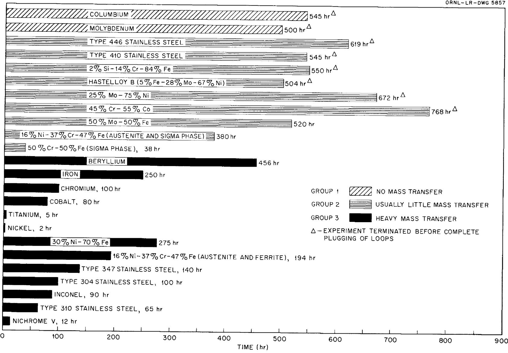  
Fig. 6.26. Summary of Tests of Mass Transfer of Various Materials in Liquid Lead.

of the specimens.7 A topical report covering this research project is being prepared.

# Mass Transfer and Corrosion in Fused Hydroxides

M.E.Steidlitz W.H.Bridges

Metallurgy Division

Work that has been done during the past year on the mass transfer of nickel in sodium hydroxide has indicated a possibility of finding limiting top temperatures and temperature gradients at which mass transfer will not occur. In order to investigate this more thoroughly and to extend the work to other potential container materials, a new corrosion test apparatus has been constructed.

The new system is essentially a multicontainer duplicate of the single model used in the earlier work. Five steel pots are connected through appropriate valving to vacuum, purified helium, and purified hydrogen lines and through a bubbler to the exhaust line which extends up into a hood.

The sodium hydroxide is contained in a bucket fabricated of the material being studied. The bucket is hung from the cold finger, which is also made of the test material. The pot, heated by an external furnace, heats the bucket and the hydroxide, and an air jet, blown down the inside of the tubular cold finger, provides the thermal gradient. The hydroxide is circulated by thermal convection currents established between the bucket and cold finger. Temperatures are measured on the bucket and inside of the cold finger. A thermocouple outside the pot controls the furnace. A few pilot runs have been made and scheduled testing should begin shortly.

# Spectrophotometry of Fused Hydroxides

C. R. Boston

Metallurgy Division

Construction of a high-temperature spectrophotometer for studying the fundamental nature of fused salts has been completed. Approximate absorption spectra have been measured for fused sodium hydroxide at various temperatures up to $700^{\circ}\mathrm{C}$ in air with sodium hydroxide at $350^{\circ}\mathrm{C}$ as a reference. Limitations of the instrument restricted measurements to the wave length range 400 to $650\mu$ .

The experimental procedure consisted briefly of placing a periclase (magnesium oxide crystal) cell containing sodium hydroxide in the light path and at a given temperature measuring the photocell response at various wave lengths relative to the response at $600\mathrm{m}\mu$ which is the wave length of maximum response at $350^{\circ}\mathrm{C}$ . Repetition of this procedure at various temperatures gave a series of curves that intersected at $600\mathrm{m}\mu$ and, by their general form, gave some indication of how the absorption was changing with temperature.

With increasing temperature a rapid increase in absorption appears at the shorter wave lengths, until, at $700^{\circ}\mathrm{C}$ , the absorption at $400\mathrm{m}\mu$ reverses the trend and drops markedly; however, at $440\mathrm{m}\mu$ , the absorption again increases and results in a sharp absorption peak at $440\mathrm{m}\mu$ . The long wave length end of the spectrum does not appear to be significantly influenced by temperature change. These preliminary measurements are approximate and will serve mainly as a guide in designing future apparatus and experiments.

Improvements in experimental design are now in progress. These include the fabrication of a deeper cell to prevent the hydroxide from creeping out as it frequently does with the present cell. In addition, auxiliary apparatus will be constructed to permit maintenance of a controlled atmosphere over the melt.

# Fused Hydroxides as Acid-Base Analog Systems

G.P.Smith

Metallurgy Division

In the preceding quarterly an outline was given of the application of acid-base analog concepts in a qualitative way to reactions in fused hydroxide systems. Some aspects of this application have now been considered quantitatively. It was previously shown that acid-base analog reactions in fused hydroxide mediums were controlled by the following anionic self-decomposition reaction,

$$
2 O H ^ {-} = H _ {2} O + O ^ {- -}.
$$

As previously shown, the equilibrium constant for this reaction is determined in part by the cations which do not enter into the stoichiometry of the reaction, that is, the alkali and alkaline earth metal cations, because of the ability of these cations to polarize the various species in the

reaction without significantly increasing the cation-anion bond energy through resonance energy due to covalent structures. Expressions have now been derived which show quantitatively the way in which these nonreactive cations control this self-decomposition equilibrium. First, it should be pointed out that fused alkali-metal carbonates and sulfates when acting as reaction media form acid-base systems which are closely analogous to fused alkali-metal hydroxides. The corresponding anionic self-decomposition equilibria are the following:

$$
\mathrm {C O} _ {3} ^ {- -} = \mathrm {C O} _ {2} + 0 ^ {- -},
$$

$$
\mathrm {S O} _ {4} ^ {- -} = \mathrm {S O} _ {3} + 0 ^ {- -}.
$$

This correspondence will be useful inasmuch as the literature contains very much more information concerning reactions in fused carbonates and sulfates than in fused hydroxides.

For a reaction medium, whether hydroxide, carbonate, or sulfate, containing a single nonreactive cationic species, it has been shown that there exists a linear empirical relationship between the ionic potential of the cation and the self-decomposition constant $K_{d}$ for the medium. Second, for a reaction medium which contains two or more nonreactive cationic species, a thermodynamic formula has been derived which relates the self-decomposition constant $K_{d}$ of the medium to its cationic composition. These two expressions can be combined, in principle, to give a complete phenomenological description of the role of nonreactive cations in acid-base analog reactions in the mediums under consideration.

Empirical Relationships for $K_{d}$ . In 1951, Cartledge10 gave simple empirical formulas relating the heats of oxysalt formation to the ionic potentials of the cations based on their corrected univalent radii. However, his relationships are not quite those required. In 1952, Ramberg11 found that there exist arbitrary parameters for each of the alkali and alkaline earth metals which, when plotted against the heats of oxysalt formation per two equivalents, give a straight line for each kind of oxysalt. Ramberg's work was therefore used as a starting point to obtain the empirical relationships shown in Fig. 6.27.

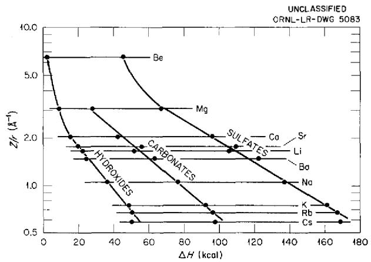  
Fig. 6.27. Heats of Self-Decomposition of Hydroxides, Carbonates, and Sulfates as Functions of the Cationic Potentials.

In Fig. 6.27 the $\Delta H$ values which are plotted are for the following self-decomposition reactions

$$
2 M O H = H _ {2} O + M _ {2} O,
$$

$$
M _ {2} \mathrm {C O} _ {3} = \mathrm {C O} _ {2} + M _ {2} \mathrm {O},
$$

$$
M _ {2} S O _ {4} = S O _ {3} + M _ {2} O,
$$

where $M$ is an alkali metal, and

$$
M ^ {\prime} (\mathrm {O H}) _ {2} = \mathrm {H} _ {2} \mathrm {O} + M ^ {\prime} \mathrm {O},
$$

$$
M ^ {\prime} C O _ {3} = C O _ {2} + M ^ {\prime} O,
$$

$$
M ^ {\prime} S O _ {4} = S O _ {3} + M ^ {\prime} O,
$$

where $M'$ is an alkaline earth metal. The reactants and the products are in their standard states. Thus, for example, in the case of the hydroxide curve, the comparison is for the enthalpy change for reactions involving the same number of anions, and therefore the only variable along the hydroxide curve is the kind of cation. The numerical values are taken from Rossini and are for $25^{\circ}C$ . Along the vertical axis are plotted values of the ionic potential $(Z / r)$ on a logarithmic scale, where $Z$ is the charge on the cation and $r$ is its ionic radius, as given by Pauling. The values for all the metals, except cesium and beryllium, and magnesium for the hydroxide curve, may be represented remarkably well by straight lines.

Figure 6.28 is a similar plot for $\Delta F$ , rather than $\Delta H$ . The values are from the same sources, except

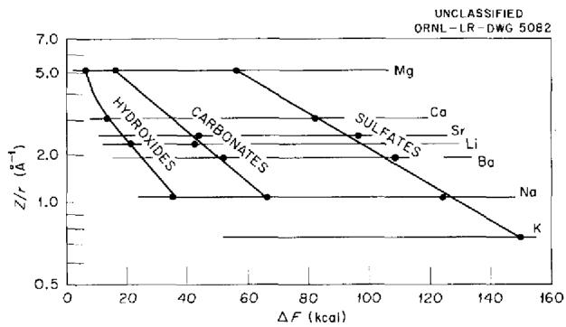  
Fig. 6.28. Free Energies of Self-Decomposition of Hydroxides, Carbonates, and Sulfates as Functions of the Cationic Potentials.

for the sodium hydroxide value, which was computed by Smith and Boston. There are, of course, fewer $\Delta F$ data than there are $\Delta H$ data. However, it is evident that the straight-line relationships are still preserved and the slopes of the $\Delta F$ vs $Z / r$ functions are the same as those of the $\Delta H$ vs $Z / r$ functions. Reliable data at elevated temperatures are too scarce for presentation on plots such as those given in Figs. 6.27 and 6.28. However, data for the sulfates of calcium, barium, and potassium were plotted for a series of high temperatures and were found to follow straight lines as closely as they do at $25^{\circ}C$ .

Because of the relationship between the curves in Figs. 6.27 and 6.28, it is reasonable to assume that, over the straight-line portions of the curves, the entropy terms are constants that are independent of the cations. If this result is combined with the reaction isotherm, it can be stated that the straight-line portions of the curves in Fig. 6.27 may be represented by equations of the form

$$
\log K _ {d} = a \log \left(\frac {Z}{r}\right) + b,
$$

where $K_{d}$ is the self-decomposition equilibrium constant, and $a$ and $b$ are constants which are characteristic of the anions only:

The values for the beryllium compounds deviate from the straight-line relationships in such a way as to lead to greater stability than would be expected. This effect is, perhaps, associated with the extra resonance energy which is to be expected

from the very high polarizing ability of an ion of such large ionic potential.

Dependence of $K_{d}$ on Cationic Composition. A thermodynamic relationship has also been derived which gives $K_{d}$ as a function of composition for mediums containing two or more kinds of cations. The notation to be used to express concentrations is presented first and then the derivation is outlined in terms of an isothermal-isobaric cycle of four component processes.

The electrical equivalent fraction $\overline{N}_i$ of $X_{i}^{+}$ ions is by definition equal to the number of charges in the melt due to $X_{i}^{+}$ divided by the total number of positive charges on all ions in the melt. Therefore, by applying the requirement of electrical neutrality it is found that

$$
n _ {i} = n _ {\mathrm {O H}} \overline {{N}} _ {i}
$$

and, for the $Y_{i}^{++}$ ions,

$$
n _ {i} ^ {\prime} = \frac {^ {n} _ {O H}}{2} \overline {{N}} _ {i} ^ {\prime}.
$$

In the first process,

$$
2 A O H \longrightarrow \Lambda_ {2} O + H _ {2} O.
$$

A quantity of melt containing two gram-atoms of OH is converted into one mole of water in its standard state and solution of oxides. The free energy change accompanying this process defines, in terms of the reaction isotherm, an equilibrium constant which is the self-decomposition constant $K_{d}$ of the melt $\mathsf{AOH}$ :

$$
\Delta F _ {1} = - R T \ln K _ {d}.
$$

In the second process,

$$
\begin{array}{l} A _ {2} O + H _ {2} O \longrightarrow \Sigma \bar {N} _ {i} \left(X _ {i}\right) _ {2} O \\ + \Sigma \bar {N} _ {i} ^ {\prime} \left(Y _ {i}\right) O + H _ {2} O, \\ \end{array}
$$

and thus the product of the preceding process is separated into component oxides, each in its standard state:

$$
\begin{array}{l} \Delta F _ {2} = \Sigma \bar {N} _ {i} \Delta F ^ {\circ} (X _ {i}) _ {2} 0 + \Sigma \bar {N} _ {i} ^ {\prime} \Delta F ^ {\circ} (Y _ {i}) 0 \\ - \Sigma \bar {N} _ {i} \bar {F} (X _ {i}) _ {2} 0 - \Sigma \bar {N} _ {i} ^ {\prime} \bar {F} (Y _ {i}) 0, \\ \end{array}
$$

where $\Delta F^{\circ}(X_{i})_{2}0$ represents the standard free energy of formation of $(X_{i})_{2}0$ , and $\overline{F}_{(X_i)_20}$ represents the partial molal free energy of $(X_{i})_{2}0$ in the solution of oxides $A_{2}0$ . By combining terms

in the above equation and applying the definition of activity, there is obtained

$$
\Delta F _ {2} = R T \left[ \Sigma \overline {{{N}}} _ {i} \ln a _ {(X _ {i})} 2 0 + \Sigma \overline {{{N}}} _ {i} ^ {\prime} \ln a _ {(Y _ {i})} 0 \right],
$$

where $a_{(X_i)_20}$ is the activity of $(X_i)_20$ in the solution of oxides $A_20$ .

In the third process,

$$
\begin{array}{l} \Sigma \bar {N} _ {i} \left(X _ {i}\right) _ {2} O + \Sigma \bar {N} _ {i} ^ {\prime} \left(Y _ {i}\right) O + H _ {2} O \longrightarrow \Sigma 2 \bar {N} _ {i} \left(X _ {i}\right) O H \\ + \Sigma \overline {{{N}}} _ {i} ^ {\prime} (Y _ {i}) (\mathrm {O H}) _ {2} , \\ \end{array}
$$

and thus the products of the preceding process are reacted individually with the water to yield the corresponding hydroxides in their standard reference states. For the free energy change for this process, the following expression is obtained upon collecting like terms:

$$
\begin{array}{l} \Delta F _ {3} = \Sigma \bar {N} _ {i} \left[ 2 \Delta F ^ {\circ} (X _ {i}) \circ H - \Delta F ^ {\circ} (X _ {i}) _ {2} \circ \right. \\ - \Delta F _ {H _ {2} O} ^ {\circ} \Big ] + \Sigma \bar {N} _ {i} ^ {\prime} \left[ \Delta F ^ {\circ} (Y _ {i}) (O H) \right. \\ \left. \left. - \Delta F _ {\left(Y _ {i}\right)} ^ {\circ} 0 - \Delta F _ {H _ {2} O} ^ {\circ} \right] \right.. \\ \end{array}
$$

The quantities in brackets define, by means of the reaction isotherm, two sets of equilibrium constants, $K_{i}$ and $K_{i'}$ , which are the same as the self-decomposition constants of the constituent hydroxides, $(X_{i})\mathrm{OH}$ and $(Y_{i})(\mathrm{OH})_{2}$ , respectively, as defined in an earlier progress report. Thus,

$$
\Delta F _ {3} = R T \left(\Sigma \bar {N} _ {i} \ln K _ {i} + \Sigma \bar {N} _ {i} ^ {\prime} \ln K _ {i} ^ {\prime}\right).
$$

In the fourth process,

$$
\Sigma 2 \bar {N} _ {i} \left(X _ {i}\right) O H + \Sigma \bar {N} _ {i} ^ {\prime} \left(Y _ {i}\right) (O H) _ {2} \longrightarrow 2 A O H,
$$

and thus the products of the preceding process are mixed to form the starting solution. The free energy change is

$$
\begin{array}{l} \Delta F _ {4} = \Sigma 2 \bar {N} _ {i} \bar {F} (X _ {i}) O H + \Sigma \bar {N} _ {i} ^ {\prime} \bar {F} (Y _ {i}) (O H) _ {2} \\ - \Sigma 2 \bar {N} _ {i} \Delta F ^ {\circ} (X _ {i}) \mathrm {O H} - \Sigma \bar {N} _ {i} ^ {\prime} \Delta F ^ {\circ} (Y _ {i}) (\mathrm {O H}) _ {2}. \\ \end{array}
$$

Then, proceeding as for the second process,

$$
\begin{array}{l} \Delta F _ {4} = - R T \left[ \Sigma \bar {N} _ {i} \ln a _ {\left(X _ {i}\right)} ^ {2} \circ H \right. \\ + \Sigma \bar {N} _ {i} ^ {\prime} \ln a _ {(Y _ {i}) (O H) _ {2}} \Bigg ] \quad , \\ \end{array}
$$

where $a_{(X_i)OH}$ is the activity of $(X_i)OH$ in the solution of hydroxides $AOH$ .

The sum of the free energy changes for the steps of the isothermal cycle must vanish. Therefore, $-\Delta F = \Delta F_{2} + \Delta F_{3} + \Delta F_{4}$ . Writing these terms out, changing the logarithm base to 10, dividing through by $RT$ , and collecting some of the like terms, give

(1) $\log K_{d} = \sum \overline{N}_{i}\log K_{i} + \sum \overline{N}_{i}^{\prime}\log K_{i}^{\prime}$

$$
+ \Sigma \bar {N} _ {i} \log \frac {^ {a _ {(X _ {i})}} 2 ^ {\mathsf {O}}}{^ {a _ {(X _ {i})}} 0 \mathsf {H}} + \Sigma \bar {N} _ {i} ^ {\prime} \log \frac {^ {a _ {(Y _ {i})}} 0}{^ {a _ {(Y _ {i})}} (0 \mathsf {H}) _ {2}},
$$

where the activity terms are not the activities of the various constituents in a hydroxide melt at equilibrium with its self-decomposition products; they are activities of oxides in a solution containing nothing but oxides, and activities of hydroxides in a solution containing nothing but hydroxides. Equation 1 is a thermodynamically exact formula.

Next, it is assumed that the solutions consist of ions and Temkin's rules15 are applied to the activity terms. Equation 1 reduces to

(2) $\log K_{d} = \sum \overline{N}_{i}\log K_{i} + \sum \overline{N}_{i}^{\prime}\log K_{i}^{\prime}$

$$
+ \Sigma \bar {N} _ {i} \log \frac {\gamma_ {X _ {i}} ^ {2} \gamma_ {0}}{\gamma_ {X _ {i}} ^ {2} \gamma_ {O H} ^ {2}} + \Sigma \bar {N} _ {i} ^ {\prime} \log \frac {\gamma_ {Y _ {i}} \gamma_ {0}}{\gamma_ {Y _ {i}} \gamma_ {O H} ^ {2}},
$$

where the $\gamma$ are ionic activity coefficients. In particular, $\gamma_{X_i},\gamma_{Y_i},$ and $\gamma_0$ are the activity coefficients of $X_{i}^{+},Y_{i}^{++}$ and $O^{- - }$ , respectively, in a solution of oxides only, and $\gamma_{X_i},\gamma_{Y_i},$ and $\gamma_{OH}$ are the activity coefficients of $X_{i}^{+},Y_{i}^{++}$ and OH- in a solution of hydroxides only.

The notation may be simplified by changing the subscripts for the alkaline earth metals from $Y_{1}, Y_{2}, Y_{3}, \ldots$ to $Y_{m+1}, Y_{m+2}, \ldots, Y_{m+n}$ , where $m$ is the number of kinds of alkali metals and $n$ is the number of kinds of alkaline earth metals. Thus,

(3) $\log K_{d} = \sum \overline{N}_{i}\log K_{i} + \sum \overline{N}_{i}\log \frac{\gamma_{i}^{2 / \nu}\gamma_{0}}{\gamma_{i}^{2 / \nu}\gamma_{OH^{-}}}$

where the summation is from unity to $m + n$ and $\nu$ is the charge on the cation.

Two models of an ideal mixture of electrolytes have been proposed as approximations to reality, one model by Temkin and one by Herasymenko. If Temkin's model is a good approximation, then the activity coefficients in Eq. 3 will approximate unity to the same degree. If Herasymenko's model is a good approximation, then the above activity coefficients will by no means approximate unity or even constants. A considerable volume of computations published since 1945 not only overwhelmingly supports Temkin's model as the better of the two, but indicates that Temkin's model is a satisfactory first approximation for a surprising variety of fused electrolytes. Therefore, the equation

$$
\log K _ {d} = \sum \bar {N} _ {i} \log K _ {i} \tag {4}
$$

is taken as a first approximation. Furthermore, Eq. 4 should be a better approximation than the model of an ideal solution on which it is based, inasmuch as the activity coefficients in Eq. 2 occur as ratios of similar terms which probably tend to cancel.

# CHEMICAL STUDIES OF CORROSION

F. Kertesz

Materials Chemistry Division

# Effect of Chromium Metal Additions on Corrosion of Inconel by $\mathbf{CrF}_3$ in Molten Fluorides

H.J.Buttram R.E.Meadows

Materials Chemistry Division

The addition of chromic fluoride causes strong attack of Inconel exposed to $\mathsf{NaF - ZrF_4}$ and $\mathsf{NaF - ZrF_4 - UF_4}$ melts, while chromous fluoride apparently has little effect. Therefore experiments have been carried out to determine whether by addition of metallic chromium the chromic ion can be reduced in the melt to the noncorrosive chromous state and thus provide a protective environment for the Inconel.

Inconel capsules containing the fluoride mixture and $\mathsf{CrF}_3$ additions with and without chromium pellets were studied in customary tilting-furnace type of test. The chromium concentration in the melt after the test, when plotted as a function of $\mathsf{CrF}_3$ added before the test, was found to increase at a faster rate when added metallic chromium was

present than when the only chromium available as the metal was that contained in the Inconel capsule walls. Metallographic examination showed strong attack (4 mils) when 3.3 wt $\%$ $\mathrm{CrF}_3$ was added to NaF-ZrF $_4$ (50-50 mole $\%$ ). When the same experiment was run with the addition of chromium pellets, the examination revealed only light to moderate subsurface void formation to a depth of 0.5 mil. Therefore the reaction

$$
\mathrm {C r} + \mathrm {C r F} _ {3} \longrightarrow 3 \mathrm {C r F} _ {2}
$$

probably takes place with the chromium pellets and protects the Inconel surface.

# Protective Action of Small Chromium Metal Additions

H. J. Buttram R. E. Meadows Materials Chemistry Division

Chromium-plated copper wire was placed in Inconel capsules containing 30-g quantities of NaF-ZrF $_4$ (50-50 mole %) or NaF-ZrF $_4$ -UF $_4$ (53.5-40-6.5 mole %) to determine the protective effect of small chromium additions. The thicknesses of plating utilized were 1, 2, and 3 mils, which, on 6-in.-long, 40-mil, copper wire, introduced 32, 107, and 213 mg of chromium.

After tilting-furnace tests, analyses of the capsule contents revealed very low concentrations of copper (20 to 30 ppm) in all the mixtures. Therefore, it is reasonable to assume that even in the experiment in which the 1-mil-coated wire was used, all the chromium was not used. These small additions were sufficient to limit the attack on the Inconel to a depth of 0.5 mil.

# Effect of Fission Products

H. J. Buttram R. E. Meadows Materials Chemistry Division

The effect of simulated fission products on the corrosion of Inconel in fluoride melts was reported previously.17 A repeat experiment in which commercial-grade $\mathsf{YF}_3$ was used as an addition to NaF-ZrF4-UF3 (53.5-40-6.5 mole %) tested in a tilting furnace revealed that less than stoichiometric amounts of chromium were released from the Inconel by the $\mathsf{YF}_3$ . This is not surprising, since consideration of the free energies of the compounds involved indicates that no appreciable

reaction of $\mathsf{YF}_3$ (or other rare earth fluorides) should occur.

# Time Dependence of Corrosion in Tilting-Furnace Tests

H.J.Buttram N.V.Smith

Materials Chemistry Division

Attempts to correlate corrosion data obtained from tilting-furnace tests with those obtained from thermal-convection loops have included some experiments in which Inconel capsules filled with NaF-ZrF $_4$ -UF $_4$ (53.5-40-6.5 mole %) were cycled (4 cpm) at $800^{\circ}\mathrm{C}$ on the hot end and approximately $600^{\circ}\mathrm{C}$ on the cold end for 25, 100, 1000, and 2000 hr. Chemical analyses did not reveal any substantial changes in amounts of chromium removed from the capsule walls as a function of time. Metallographic examination showed nearly identical attack of 1 to 2 mils, with some evidence that attack was more intergranular in the longer exposures.

It seems apparent from these data that only the reactions of chromium with the "impurities" and equilibration according to the reaction

$$
\mathrm {C r} + 2 \mathrm {U F} _ {4} \rightleftharpoons 2 \mathrm {U F} _ {3} + \mathrm {C r F} _ {2}
$$

are important in this type of test. Mass transfer in tilting-furnace tests with these materials is, apparently, so slight as to be imperceptible.

# Effect of Valence State of Iron on Corrosion of Inconel by Fluoride Mixtures

H.J.Buttram R.E.Meadows

Materials Chemistry Division

The effect of the valence state of iron on the corrosion of Inconel by fluoride mixtures was studied by adding $\mathsf{FeF}_2$ and $\mathsf{FeF}_3$ to Inconel capsules containing $\mathsf{NaF - ZrF_4 - UF_4}$ (53.5-40-6.5 mole %) and running the customary tilting-furnace tests. The tests showed that the amount of chromium removed from the Inconel was nearly constant regardless of the quantity of $\mathsf{FeF}_2$ added, while it increased as a direct function of size of the $\mathsf{FeF}_3$ additions. Metallographic observations agreed with the chemical analyses; the depth of attack did not exceed 2.5 mils with any quantity of $\mathsf{FeF}_2$ tested (up to 6 wt %), while the $\mathsf{FeF}_3$ was found to cause heavy subsurface void formation to a depth of 8 mils.

# 7. METALLURGY AND CERAMICS

W.D.Manly J.M.Warde

Metallurgy Division

Investigations were continued in the study of the properties of nickel-base alloys containing 15 to $32\%$ molybdenum, ternary alloys with a nickel-molybdenum base, and vacuum-melted Hastelloy B. The studies include fabrication experiments, tests of oxidation and oxidation protection, stress-rupture examinations, and the development of techniques for welding and brazing the materials. An extensive study of the effects of high-temperature aging on the microstructure and physical properties of these materials is also under way.

Stress-rupture design curves are presented for Inconel tested in fused salts and in argon, for comparison, at $1300^{\circ}\mathrm{F}$ and at $1500^{\circ}\mathrm{F}$ . Preliminary data obtained at $1650^{\circ}\mathrm{F}$ are also given. A summary of the results of tests of the oxidation resistance of dry-hydrogen-brazed Inconel T-joints is presented. The tests made to date indicate that most of the nickel and nickel-chromium-base brazing alloys are suitable for service in an oxidizing atmosphere at $1500^{\circ}\mathrm{F}$ , and several are suitable at $1700^{\circ}\mathrm{F}$ .

Work also continues on the development of fabricational techniques and their application to the production of radiators, heat exchangers, and other special items.

# DEVELOPMENT OF NICKEL-MOLYBDENUM BASE ALLOYS

H. Inouye J.H. Coobs

Metallurgy Division

M. R. D'Amore

Pratt & Whitney Aircraft

# Fabrication Studies

Hastelloy B. The variables affecting the quality of extrusions of billets of Hastelloy B were studied. Hastelloy B melting-stock pellets were used to prepare the forged billets supplied by the Haynes Stellar Company. The Hastelloy B pellets were vacuum melted and cast at pressures of 6 to $20\mu \mathrm{Hg}$ . The vacuum-melting technique was used to eliminate volatile constituents in the

commercial pellets in an effort to improve the hot working characteristics of the alloy. Neutron-activation, spectroscopic, and vacuum-fusion methods of analysis of the alloy revealed that the trace elements had not been effectively removed.

The alloys tested were vacuum-melted Hastelloy B, vacuum-melted Hastelloy B plus $0.1\%$ cerium, air-melted and forged Hastelloy B, air-melted Hastelloy B deoxidized with a titanium-nickel-aluminum-manganese master alloy, and vacuum-melted Hastelloy B decarburized with FeO and deoxidized with calcium. In the tests of these alloys the effects of homogeneizing the cast billet, of various extrusion temperatures, of several die designs, and of canning were studied.

The experiments have shown that temperature is the variable that affects the extrudability of the alloys. Consistently high recovery of sound metal is obtained at an extrusion temperature of $2000^{\circ}F$ . Both tubing and rod have been made with fair success. Canning experiments showed some promise and will be continued, since, as shown in the previous report, higher extrusion ratios are attainable with the canned material because higher temperatures are permissible. The importance of increasing the deformation is indicated, since during tube reducing at room temperature the tube blank made from a forged billet was reduced successfully, while the tube blank extruded from a cast billet fractured with no recovery of sound metal.

Attempts to hot roll the extruded rods to sheet were unsuccessful because of edge cracking and center splitting during rolling. Center splitting is characterized by the formation of two pieces of approximately the same thickness while the hot billet is being rolled. Rolling temperatures between 1950 and $2200^{\circ}\mathrm{F}$ were investigated at reductions of 5 to $10\%$ per pass. The alloy was reheated in air between each pass.

Hastelloy B + 0.03% Ce. Concurrent with the experiments described above, smaller vacuum melts of Hastelloy B were being made. One ingot was made with a 0.03% cerium addition in the form of an 11% Ce-89% Al master alloy. Spectrographic analysis revealed the residual cerium

TABLE 7.1. ELEVATED TEMPERATURE TENSILE TESTS OF HASTELLOY B PLUS $0.03\%$ CERIUM (NOMINAL) IN AIR

Specimens annealed 1 hr at $2100^{\circ}\mathrm{F}$ in hydrogen Strain rate - 0.05 in./min

TABLE 7.2. ROOM TEMPERATURE BEND TESTS OF 0.065-in.-SHEET HASTELLOY B PLUS $0.03\%$ CERIUM  

<table><tr><td>Specimen Number</td><td>Test Temperature (°F)</td><td>Yield Point, 0.2% Offset (psi)</td><td>Tensile Strength (psi)</td><td>Elongation (% in 2 in.)</td></tr><tr><td>VT-9-9</td><td>1100</td><td>58,700</td><td>108,500</td><td>20</td></tr><tr><td>VT-9-8</td><td>1300</td><td>49,700</td><td>79,400</td><td>14</td></tr><tr><td>VT-9-7</td><td>1500</td><td>50,200</td><td>58,400</td><td>15</td></tr><tr><td>VT-9-6</td><td>1600</td><td>41,100</td><td>44,200</td><td>30</td></tr><tr><td>VT-9-5</td><td>1650</td><td>41,800</td><td>43,000</td><td>38</td></tr></table>

Specimen annealed 1 hr at $2100^{\circ}\mathrm{F}$ in hydrogen Strain rate - 1 in./min

<table><tr><td>Time Aged at 1500°F (hr)</td><td>Bend Angle (deg)</td><td>Results</td></tr><tr><td>0</td><td>180</td><td>Broke, bent on itself</td></tr><tr><td>5</td><td>89</td><td>Did not break</td></tr><tr><td>50</td><td>103</td><td>Did not break</td></tr><tr><td>100</td><td>103</td><td>Did not break</td></tr><tr><td>200</td><td>85</td><td>Broke</td></tr><tr><td>500</td><td>106</td><td>Did not break</td></tr></table>

content to be $5.7 \times 10^{-3\%}$ . The ingot was successfully hot rolled at $2100^{\circ}\mathrm{F}$ , with a moderate amount of edge cracking, and sufficient material was obtained for some tensile and bend tests. The results of these tests are given in Tables 7.1 and 7.2. The bend angles listed in Table 7.2 indicate that the alloy tested does not show brittleness after aging at $1500^{\circ}\mathrm{F}$ .

The ductilities of vacuum-melted Hastelloy B containing cerium are compared in Table 7.3 with the average values for commercial Hastelloy B, as reported by Haynes Stellar Company. Impact tests of commercial Hastelloy B were also made at room temperature to determine the sensitivity

TABLE 7.3. COMPARISON OF THE DUCTILITIES OF COMMERCIAL HASTELLOY B AND VACUUM-MELTED HASTELLOY B CONTAINING $0.03\%$ CERIUM   

<table><tr><td rowspan="2">Test Temperature (°F)</td><td colspan="2">Elongation (%)</td></tr><tr><td>Commercial Hastelloy B</td><td>Vacuum-Melted Hastelloy B Containing Cerium</td></tr><tr><td>1100</td><td>22</td><td>20</td></tr><tr><td>1300</td><td>9</td><td>14</td></tr><tr><td>1500</td><td>13</td><td>15</td></tr><tr><td>1600</td><td>17</td><td>30</td></tr><tr><td>1650</td><td>18</td><td>38</td></tr></table>

of the test in showing the effects of aging. The results are presented in Table 7.4. Impact values generally decrease with aging time, and the embrittling effect of aging appears more pronounced at $1300^{\circ}\mathrm{F}$ .

$20\%$ Mo- $80\%$ Ni. During this period, two 30-lb vacuum melts and six extrusions of tube blanks and rod were made of the $20\%$ Mo- $80\%$ Ni alloy. The tube blanks were drawn to 0.500-in.-dia, 0.055-in.-wall tubing and used for the fabrication of three standard size thermal-convection loops. The extrusion data were reported previously.

The extruded rods were rolled to sheet at $2100^{\circ}\mathrm{F}$ , and the reductions per pass were as high as $30\%$ . The alloy showed no tendency toward edge cracking, and no deleterious effects of aging were

evident from room-temperature tensile tests. The tensile test data are tabulated in Table 7.5.

Elevated-temperature tensile tests were performed with the alloy in the solution-annealed condition and after aging for 500 hr at the testing temperature. The ductilities of the specimens at elevated temperature were disappointingly small compared with the elongations obtained in room-temperature tests. The elevated-temperature data for this alloy are presented in Table 7.6. The oxidation rate, weldability characteristics, creeprupture data, work hardening, and recrystallization temperatures for this alloy were reported previously.

24% Mo-76% Ni. Three 30-lb vacuum melts of a 24% Mo-76% Ni alloy were prepared, and tubing for three thermal-convection loops and a quantity

TABLE 7.4. STANDARD CHARPY IMPACT   
TEST OF COMMERCIAL HASTELLOY B   
(R-340, HEAT NO. 1235) AT ROOM TEMPERATURE   

<table><tr><td rowspan="2">Aging Time (hr)</td><td colspan="2">Impact Values (ft-lb)</td></tr><tr><td>Aged at 1300°F</td><td>Aged at 1500°F</td></tr><tr><td>5½</td><td>112</td><td></td></tr><tr><td>25</td><td>38</td><td>49</td></tr><tr><td>50</td><td></td><td>43</td></tr><tr><td>100</td><td></td><td>43</td></tr><tr><td>150</td><td>32.5</td><td></td></tr><tr><td>200</td><td>42.5</td><td></td></tr><tr><td>500</td><td>17</td><td>35</td></tr><tr><td>1000</td><td></td><td>29</td></tr></table>

of sheet were obtained from these melts. The fabricability and oxidation rate of this alloy were reported previously. Room-temperature bend and tensile tests and elevated-temperature tensile and stress-rupture tests have now been completed. Bend tests of specimens aged at $1500^{\circ}\mathrm{F}$ for periods up to 500 hr showed no deleterious effects from aging at this temperature. Since the alloy is a single-phase at these temperatures, impairment of the ductility would indicate impurity effects.

Room-temperature tensile tests showed the embrittling effect of the precipitation of beta phase from the alpha-phase solid solution at $1300^{\circ}\mathrm{F}$ (Table 7.7). The elevated-temperature tensile properties of this alloy have been determined for both the annealed and aged conditions. Low ductilities were obtained between 1300 and $1600^{\circ}\mathrm{F}$ . The data are summarized in Table 7.8.

$32\%$ Mo- $68\%$ Ni. The extrusion properties and the oxidation rate of the $32\%$ Mo- $68\%$ Ni alloy were described previously. It is more difficult to extrude this alloy than alloys containing less molybdenum, since it is tougher and lower extrusion temperatures must be used because it is hot short. The alloy is readily hot rolled at $2100^{\circ}$ F and at room temperature. Sufficient tubing for one thermal-convection loop for corrosion testing and a quantity of sheet for mechanical property testing were prepared.

Room-temperature bend tests show that aging is rapid at $1500^{\circ}\mathrm{F}$ and that the alloy is characteristically brittle after aging times greater than about 50 hr, as shown in Table 7.9. Plates of beta plus gamma phase are found in this alloy after aging from the solution-annealed condition. Aging of a $72\%$ cold-rolled alloy at $1500^{\circ}\mathrm{F}$ shows

TABLE 7.5. ROOM TEMPERATURE TENSILE TESTS OF A ${20}\% \mathrm{{Mo}} - {80}\% \mathrm{{Ni}}$ ALLOY  
Specimen annealed 1 hr at $2100^{\circ}$ F in hydrogen and aged 96 hr at temperature   

<table><tr><td>Specimen Number</td><td>Aging Temperature (°F)</td><td>Yield Point, 0.2% Offset (psi)</td><td>Tensile Strength (psi)</td><td>Elongation (% in 2 in.)</td></tr><tr><td>DPI-26-1</td><td>Unaged</td><td>36,900</td><td>104,600</td><td>62</td></tr><tr><td>-2</td><td>1100</td><td>36,200</td><td>106,500</td><td>61</td></tr><tr><td>-3</td><td>1300</td><td>39,700</td><td>109,800</td><td>58</td></tr><tr><td>-4</td><td>1500</td><td>36,500</td><td>106,400</td><td>63</td></tr></table>

TABLE 7.6. ELEVATED-TEMPERATURE TENSILE TESTS OF A ${20}\% {\mathrm{{Mo}}}_{\mathrm{v}} - {80}\% \mathrm{{Ni}}$ ALLOY

Strain rate - 0.05 in./min

TABLE 7.7. ROOM-TEMPERATURE TENSILE TESTS OF A $24\%$ Mo-76% Ni ALLOY (HEAT NO. VT-11)   

<table><tr><td>Specimen Number</td><td>Test Temperature (°F)</td><td>Yield Point, 0.2% Offset (psi)</td><td>Tensile Strength (psi)</td><td>Elongation (% in 2 in.)</td></tr><tr><td colspan="5">Annealed 1 hr at 2100°F in hydrogen</td></tr><tr><td>DPI-26-29</td><td>1100</td><td>24,100</td><td>53,600</td><td>20</td></tr><tr><td>-30</td><td>1300</td><td>21,200</td><td>41,700</td><td>14</td></tr><tr><td>-31</td><td>1500</td><td>21,800</td><td>36,100</td><td>8.8</td></tr><tr><td>-32</td><td>1600</td><td>19,400</td><td>28,800</td><td>7.5</td></tr><tr><td>-33</td><td>1650</td><td>21,000</td><td>25,400</td><td>9</td></tr><tr><td colspan="5">Aged 500 hr at testing temperature</td></tr><tr><td>-34</td><td>1100</td><td>22,500</td><td>45,100</td><td>11.5</td></tr><tr><td>-37</td><td>1500</td><td>21,500</td><td>34,800</td><td>6.5</td></tr><tr><td>-36</td><td>1600</td><td>20,900</td><td>29,000</td><td>7.5</td></tr></table>

Specimens annealed 1 hr at $2100^{\circ}\mathrm{F}$ in hydrogen and aged 284 hr at temperature

<table><tr><td>Aging Temperature (°F)</td><td>Yield Point, 0.2% Offset (psi)</td><td>Tensile Strength (psi)</td><td>Elongation (% in 2 in.)</td></tr><tr><td>Unaged</td><td>42,400</td><td>109,000</td><td>62</td></tr><tr><td>1300</td><td>88,500</td><td>123,000</td><td>4</td></tr><tr><td>1500</td><td>47,800</td><td>114,600</td><td>47</td></tr><tr><td>1650</td><td>42,000</td><td>110,000</td><td>67</td></tr></table>

equiaxed grains of beta plus gamma phase. The properties of the alloy in this condition are not known, except that the hardness remains high ( $\sim 500$ VPN) up to aging times of 200 hr. Room-temperature tensile tests of the alloy confirm the brittle nature, as indicated in Table 7.10.

The elevated-temperature tensile tests of the alloy show strengths comparable to those of Hastelloy B; but the ductilities are low. Notch sensitivity of the alloy was indicated by the rupture of several specimens in the pin hole during

tensile tests. Plates spot welded onto the shoulder to strengthen the area of the pin hole did not help; the specimens failed in the heat-affected zone. Adequate ductilities were obtained at $1100^{\circ}\mathrm{F}$ and at $1650^{\circ}\mathrm{F}$ (the alloy transforms from beta plus gamma phase to alpha plus delta phase at $1600^{\circ}\mathrm{F}$ ). Data for this alloy in both the solution-annealed condition and after 500 hr of aging at the test temperature are shown in Table 7.1].

Cb-Mo-Ni. The columbium-molybdenum-nickel ternary alloy system was partially investigated. The alloys studied thus far contained 2, 5, or $10\%$ columbium and $20\%$ molybdenum; the balance of each alloy was nickel. The 3-lb vacuum melts of the 2 and $5\%$ columbium alloys were readily fabricated into sheet, but the $10\%$ columbium alloy fractured severely upon rolling at $2100^{\circ}\mathrm{F}$ .

The oxidation rate at $1500^{\circ}F$ of alloys containing 5 and $10\%$ columbium was less than that for the $20\%$ Mo-80% Ni alloy but slightly more than that for Hastelloy B. The scale that formed in oxidation tests was nonadherent. The $2\%$ columbium alloy has not yet been tested.

The $2\%$ columbium alloy is a single-phase between 1300 and $2100^{\circ}\mathrm{F}$ ; however, Widmanstätten structure appears in both the 5 and $10\%$ columbium alloys at 1300 and $1500^{\circ}\mathrm{F}$ . The $5\%$ columbium alloy shows no increase in hardness after 20 hr

Specimen annealed 1 hr at $2100^{\circ}\mathrm{F}$ in hydrogen Strain rate - 0.05 in./min

TABLE 7.8. ELEVATED-TEMPERATURE TENSILE TESTS OF A ${24}\%$ Mo-76% Ni ALLOY   

<table><tr><td>Specimen Number</td><td>Test Temperature (°F)</td><td>Yield Point, 0.2% Offset (psi)</td><td>Tensile Strength (psi)</td><td>Elongation (% in 2 in.)</td></tr><tr><td>DPI-25-19</td><td>1100</td><td>28,300</td><td>49,300</td><td>17.5</td></tr><tr><td>-20</td><td>1300</td><td></td><td>43,800</td><td>5</td></tr><tr><td>-21</td><td>1500</td><td>25,100</td><td>38,100</td><td>6.5</td></tr><tr><td>-22</td><td>1600</td><td>24,000</td><td>32,400</td><td>7.5</td></tr><tr><td>-23</td><td>1650</td><td>24,800</td><td>31,200</td><td>11.3</td></tr><tr><td>-24*</td><td>1100</td><td>37,800</td><td>55,000</td><td>11</td></tr><tr><td>-27*</td><td>1500</td><td>24,200</td><td>38,100</td><td>8</td></tr><tr><td>-26*</td><td>1600</td><td>25,200</td><td>35,000</td><td>10</td></tr></table>

\*Aged 500 hr at test temperature.

Specimens annealed for 1 hr at $2100^{\circ}\mathrm{F}$ in hydrogen

TABLE 7.9. ROOM-TEMPERATURE BEND TESTS OF A $32\%$ Mo-68% Ni ALLOY (HEAT NO. VT-10) AFTER AGING AT $1500^{\circ}$ F   

<table><tr><td>Aging Time (hr)</td><td>Bend Angle (deg)</td><td>Hardness (VPN)</td><td>Results</td></tr><tr><td>Unaged</td><td>75</td><td>233</td><td>Did not break</td></tr><tr><td>5</td><td>27</td><td>265</td><td>Cracked</td></tr><tr><td>50</td><td>0</td><td>516</td><td>Broke</td></tr><tr><td>100</td><td>0</td><td>498</td><td>Broke</td></tr><tr><td>200</td><td>0</td><td>594</td><td>Broke</td></tr><tr><td>500</td><td>1.5</td><td>509</td><td>Broke</td></tr></table>

of aging at either 1300 or $1500^{\circ}\mathsf{F}$ . The $10\%$ $\mathrm{Cb - }20\%$ Mo- $70\%$ Ni alloy ages at both 1300 and $1500^{\circ}\mathsf{F}$ , as indicated in Table 7.12.

The room-temperature tensile data for the 2 and $5\%$ columbium alloys were determined after aging at temperatures of 1300, 1500, and $1650^{\circ}\mathrm{F}$ . The results are shown in Tables 7.13 and 7.14. The low ductility of the $5\%$ columbium specimen tested after aging at $1650^{\circ}\mathrm{F}$ may be due to hydrogen embrittlement.

Several other ternary alloys based on molybdenum and nickel will be screened by creep, oxi

Specimen annealed for $\frac{1}{2}$ hr at $2100^{\circ}\mathrm{F}$ in hydrogen and aged for 288 hr at temperature

TABLE 7.10. ROOM-TEMPERATURE TENSILE TESTS OF A $32\%$ Mo-68% Ni ALLOY (HEAT NO. VT-10)   

<table><tr><td>Aging Temperature (°F)</td><td>Yield Point, 0.2% Offset (psi)</td><td>Tensile Strength (psi)</td><td>Elongation (% in 2 in.)</td></tr><tr><td>Unaged</td><td>66,400</td><td>135,600</td><td>33</td></tr><tr><td>1300</td><td></td><td>122,500</td><td>1.0</td></tr><tr><td>1500</td><td></td><td>85,200</td><td>1.0</td></tr><tr><td>1650</td><td></td><td>121,800</td><td>2.5</td></tr></table>

duction, tensile, and fabrication tests. The stress-rupture properties of the nickel-molybdenum and the nickel-molybdenum-columbium alloys are reported below.

Cr-Mo-Ni. The effect of chromium additions to nickel-molybdenum base alloys is also being investigated as a means of improving the corrosion resistance of these alloys in sodium. If small chromium additions (up to $5\%$ ) are effective, these alloys may also be useful in the fluoride salts, since the small percentages of chromium involved would not cause appreciable chromium mass transfer. Also, the oxidation resistance, strength, and

Specimens annealed 1 hr at $2100^{\circ}\mathrm{F}$ in hydrogen

TABLE 7.11. ELEVATED-TEMPERATURE TENSILE TESTS OF A $32\%$ Mo-68% Ni ALLOY (HEAT NO. DPI-24)   

<table><tr><td>Test Temperature (°F)</td><td>Yield Point, 0.2% Offset (psi)</td><td>Tensile Strength (psi)</td><td>Elongation (% in 2 in.)</td></tr><tr><td>1100</td><td>44,800</td><td>113,400</td><td>32.5</td></tr><tr><td>1300</td><td>51,200</td><td>77,700*</td><td></td></tr><tr><td>1500</td><td></td><td>59,700*</td><td></td></tr><tr><td>1600</td><td>35,200</td><td>37,300*</td><td>1.0</td></tr><tr><td>1650</td><td>30,700</td><td>39,400*</td><td>11.3</td></tr><tr><td>1650**</td><td>30,400</td><td>41,800</td><td>17.0</td></tr><tr><td>1100***</td><td>53,700</td><td>85,500</td><td>18.8</td></tr><tr><td>1500***</td><td></td><td>82,700</td><td>1.3</td></tr><tr><td>1600***</td><td></td><td>61,500</td><td>2.0</td></tr></table>

*Specimens which failed in pin hole.   
\*\*Rerun of $1650^{\circ}F$ specimen.   
\*\*\*Specimens aged 500 hr at testing temperature.

Specimens annealed 1 hr at $2100^{\circ}$ F in hydrogen

TABLE 7.12.AGING EFFECTS IN A $10\%$ $\mathrm{Cb - }20\%$ Mo-70% Ni ALLOY (HEAT NO, AC-4)   

<table><tr><td rowspan="2">Aging Time (hr)</td><td colspan="2">Hardness Number (VPN)</td></tr><tr><td>Aged at 1300°F</td><td>Aged at 1500°F</td></tr><tr><td>Unaged</td><td>193</td><td></td></tr><tr><td>5</td><td>332</td><td>216</td></tr><tr><td>25</td><td>353</td><td>265</td></tr><tr><td>50</td><td>353</td><td>286</td></tr><tr><td>130</td><td>371</td><td>329</td></tr><tr><td>500</td><td>391</td><td>341</td></tr></table>

ductility of the nickel-molybdenum base alloys at temperatures above $1500^{\circ}\mathrm{F}$ may be improved by alloying with chromium.

Fourteen 30-lb vacuum-melted ingots of chromium-molybdenum-nickel alloys have been obtained. These alloys all have a nickel base, and they contain $20\%$ molybdenum; the chromium content varies from 3 to $10\%$ . All the ingots have been machined into 3- by 3-in. extrusion billets.

TABLE 7.13. ROOM-TEMPERATURE TENSILE TESTS OF $2\%$ $\mathsf{Cb - }20\%$ Mo- $78\%$ Ni ALLOY (HEAT NO.VT-12)

Specimens annealed 1 hr at $2100^{\circ}$ F in hydrogen and aged 284 hr at temperature

TABLE 7.14. ROOM-TEMPERATURE TENSILE TESTS OF $5\%$ $\mathrm{Cb - }20\%$ Mo- $75\%$ Ni ALLOY (HEAT NO.VT-5)   

<table><tr><td>Aging Temperature (°F)</td><td>Yield Point, 0.2% Offset (psi)</td><td>Tensile Strength (psi)</td><td>Elongation (% in 2 in.)</td></tr><tr><td>Unaged</td><td>38,600</td><td>102,500</td><td>60.5</td></tr><tr><td>1300</td><td>39,400</td><td>104,600</td><td>65.5</td></tr><tr><td>1500</td><td>37,900</td><td>103,800</td><td>70.0</td></tr></table>

Specimens annealed $\frac{1}{2}$ hr at 2000°F in hydrogen and aged 284 hr at temperature

<table><tr><td>Aging Temperature (°F)</td><td>Yield Point, 0.2% Offset (psi)</td><td>Tensile Strength (psi)</td><td>Elongation (% in 2 in.)</td></tr><tr><td>Unaged</td><td>37,800</td><td>126,000</td><td>61.3</td></tr><tr><td>1300*</td><td></td><td>128,500</td><td>2.5</td></tr><tr><td>1500</td><td>89,500</td><td>152,000</td><td>18.8</td></tr><tr><td>1650</td><td>65,200</td><td>102,500</td><td>6.5</td></tr></table>

\*In vacuum.

Thirteen of the 14 alloy compositions have been extruded into tube and/or rod. The extruded tubes are being reduced to 0.50 in. in outside diameter with 0.055-in. walls for use in thermal-convection loops. The extruded rods are being rolled to 0.065-in.-thick sheet. The sheet is to be machined into test specimens for determining strength properties of the alloy. The alloy compositions and extrusion data are tabulated in Table 7.15.

The extruded rods showed severe edge cracking during hot rolling at temperatures between 2000 and $2250^{\circ}\mathrm{F}$ . A chemical analysis of the electrolytic chromium used in the melting of these alloys revealed an oxygen content of $0.45\%$ . Therefore to investigate the role of oxygen contamination of the chromium on the fabricability of the alloys, 100-g arc-melt buttons containing high purity

Atmosphere: Houghton's salt bath No. 1550

Heating Time: tube blanks, 30 min; rod, 45 min

Billets: 3 in. in diameter and 3 in. long

Die: 30- to 45-deg cone, alloy CHW

Mandrel: 1-in. straight stem, alloy LPD

Lubrication: glass wool in container, Fiberglas sleaving on mandrel stem

Dummy Block: Al + graphite for tube extrusions; 70-30 brass + graphite for tube extrusions

Pressure Requirements (on 3-in. ram): 70 to 90 tons/in.²

TABLE 7.15. ALLOY COMPOSITIONS AND EXTRUSION DATA FOR CHROMIUM-MOLYBDENUM-NICKEL ALLOYS   

<table><tr><td colspan="4">Alloy Composition (wt %)</td><td colspan="5">Extrusion Data</td></tr><tr><td>Cr</td><td>Mo</td><td>Ni</td><td>Other</td><td>Form</td><td>No.</td><td>Reduction Ratio</td><td>Soaking Temperature (°F)</td><td>Extrudability</td></tr><tr><td>3</td><td>20</td><td>77</td><td></td><td>Tube</td><td>1</td><td>7.5:1</td><td>2200</td><td>Good</td></tr><tr><td></td><td></td><td></td><td></td><td>Rod</td><td>1</td><td>6:1</td><td>2200</td><td>Good</td></tr><tr><td>5</td><td>20</td><td>75</td><td></td><td>Tube</td><td>2</td><td></td><td>2300</td><td>Good</td></tr><tr><td></td><td></td><td></td><td></td><td>Rod</td><td>1</td><td>6:1</td><td>2200</td><td>Good</td></tr><tr><td>7</td><td>20</td><td>73</td><td></td><td>Tube</td><td>2</td><td>7.5:1</td><td>2250</td><td>Poor</td></tr><tr><td></td><td></td><td></td><td></td><td>Rod</td><td>1</td><td>6:1</td><td>2125</td><td>Good</td></tr><tr><td>10</td><td>20</td><td>70</td><td></td><td>Tube</td><td>2</td><td>7.5:1</td><td>2300</td><td>Poor</td></tr><tr><td></td><td></td><td></td><td></td><td>Rod</td><td>1</td><td>6:1</td><td>2200</td><td>Good</td></tr><tr><td>3</td><td>20</td><td>76.5</td><td>0.5 Cb</td><td>Tube</td><td>2</td><td>5:1</td><td>2200</td><td>Good</td></tr><tr><td></td><td></td><td></td><td></td><td>Rod</td><td>1</td><td>6:1</td><td>2125</td><td>Good</td></tr><tr><td>5</td><td>20</td><td>74.5</td><td>0.5 Cb</td><td>Tube</td><td>1</td><td>7.5:1</td><td>2200</td><td>Shattered</td></tr><tr><td></td><td></td><td></td><td></td><td>Rod</td><td>1</td><td>6:1</td><td>2200</td><td>Good</td></tr><tr><td>7</td><td>20</td><td>72.5</td><td>0.5 Cb</td><td>Tube</td><td>2</td><td>7.5:1</td><td>2175</td><td>Good</td></tr><tr><td></td><td></td><td></td><td></td><td>Rod</td><td>1</td><td>6:1</td><td>2200</td><td>Good</td></tr><tr><td>10</td><td>20</td><td>69.5</td><td>0.5 Cb</td><td>Tube</td><td>2</td><td>5:1</td><td>2175</td><td>One good; one shattered</td></tr><tr><td></td><td></td><td></td><td></td><td>Rod</td><td>1</td><td>6:1</td><td>2200</td><td>Good</td></tr><tr><td>3</td><td>20</td><td>76.9</td><td>0.1 Ce</td><td>Tube</td><td>2</td><td>5:1</td><td>2200</td><td>Shattered</td></tr><tr><td>5</td><td>20</td><td>74.9</td><td>0.1 Ce</td><td>Tube</td><td>2</td><td>5:1</td><td>2200</td><td>Shattered</td></tr><tr><td>7</td><td>20</td><td>72.9</td><td>0.1 Ce</td><td>Tube</td><td>2</td><td>5:1</td><td>2250</td><td>Shattered</td></tr><tr><td></td><td></td><td></td><td></td><td>Rod</td><td>1</td><td>6:1</td><td>2125</td><td>Good</td></tr><tr><td>10</td><td>20</td><td>69.9</td><td>0.1 Ce</td><td>Tube</td><td>1</td><td>5:1</td><td>2125</td><td>Shattered</td></tr><tr><td>5</td><td>20</td><td>74.75</td><td>0.25 Ce</td><td>Tube</td><td>2</td><td>7.5:1</td><td>2125</td><td>Good</td></tr><tr><td></td><td></td><td></td><td></td><td>Rod</td><td>1</td><td>6:1</td><td>2125</td><td>Good</td></tr><tr><td>7</td><td>20</td><td>72.75</td><td>0.25 Ce</td><td>Not extruded</td><td></td><td></td><td></td><td></td></tr></table>

chromium were prepared. The oxygen content of the chromium was $0.011\%$ . The buttons were hot rolled at $2150^{\circ}\mathrm{F}$ from a thickness of 0.45 in. to a thickness of 0.15 in. The alloy compositions and the results of hot rolling are given in the following:

Alloy Composition (wt %)

Hot Rolling Characteristics

3 Cr-20 Mo-77 Ni

Slight edge cracking

5 Cr-20 Mo-75 Ni

Severe edge cracking

7 Cr-20 Mo-73 Ni

No edge cracking

10 Cr-20 Mo-70 Ni

No edge cracking

The edge cracking during rolling of the alloys containing 3 and $5\%$ Cr was attributed to melting practice. From the results obtained with the two alloys of higher chromium content, it is apparent that the difficulties encountered in hot rolling are due to oxygen contamination of the chromium. Therefore small amounts of cerium and columbium were added to the melts for deoxidation purposes. The columbium additions had no apparent effect, but cerium added in a ratio of approximately $0.1\%$ cerium for each $3\%$ chromium improves the hot rolling properties of these alloys. It has not been definitely determined whether the beneficial effect of cerium on the hot rolling properties is due to a deoxidizing action or to alloying. Arc-melts of chromium-molybdenum-nickel alloys with various percentages of aluminum or titanium added are being prepared for studying the effect of known deoxidizers on these alloys. Many of the alloys tested thus far have shattered during extrusion in the $2200^{\circ}\mathrm{F}$ temperature range. The shattering is probably caused by too high an extrusion temperature or by flaws within the extrusion billet.

# Oxidation Studies

H. Inouye

Metallurgy Division

M. R. D'Amore

Pratt & Whitney Aircraft

Oxidation tests at $1500^{\circ}F$ of 168 hr duration have been completed for the following alloys: $3\%$ Cr-20% Mo-77% Ni, $5\%$ Cr-20% Mo-75% Ni, $7\%$ Cr-20% Mo-73% Ni, $10\%$ Cr-20% Mo-70% Ni. The data obtained are plotted in Fig. 7.1, and oxidation curves for commercial and vacuum-melted Hastelloy B are included for comparison. The curve for vacuum-melted Hastelloy B is the

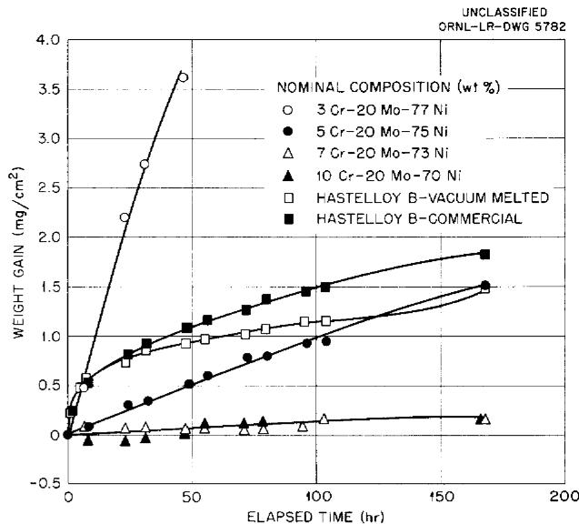  
Fig. 7.1. The Oxidation of Nickel-Molybdenum Base Alloys at $1500^{\circ}\mathrm{F}$ in Static Air.

average of two oxidation tests. The data reported for the remaining alloys are the results of single tests. Additional testing is planned to supplement the present data. The oxide scale formed on Hastelloy B and the $3\%$ Cr-20% Mo-77% Ni alloy spalled completely during cooling to room temperature at completion of the test. Moderate spalling of the oxide scale was observed on the alloys containing 5, 7, and 10% chromium. From the limited data it appears that nickel-molybdenum base alloys containing over 5% chromium are more resistant to oxidation than Hastelloy B at $1500^{\circ}\mathrm{F}$ .

# STRESS-RUPTURE STUDIES OF NICKEL-MOLYBDENUM BASE ALLOYS

R. B. Oliver

D. A. Douglas

J. H. Devan

J.W.Woods

Metallurgy Division

An expansion of mechanical testing facilities has recently been accomplished to provide additional equipment for investigating the strengths of Hastelloy B and related nickel-molybdenum alloys under conditions encountered in a circulating-fuel reactor. Six new lever-arm type of stress-rupture machines (Fig. 7.2) have been added for testing materials in fused salts, as well as four direct-loading or dead-load type of units (Fig. 7.3) for testing materials in argon, hydrogen, or air. Twelve new tube-burst units (Fig. 7.4)

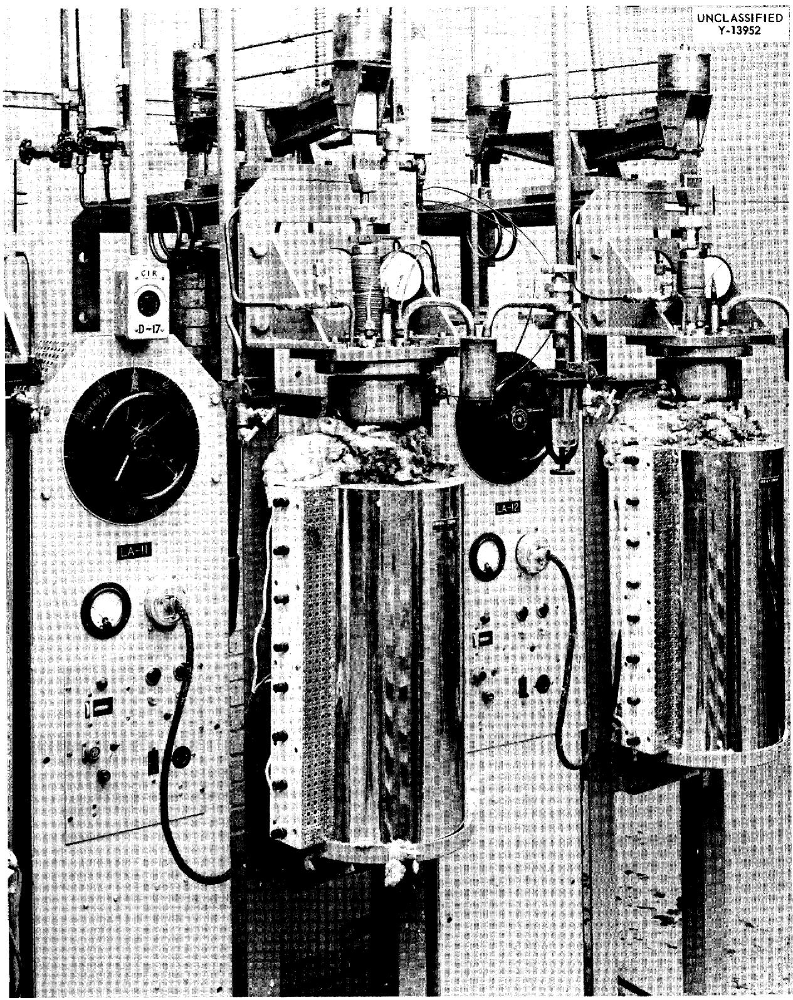  
Fig. 7.2. Lever-Arm Stress-Rupture Machines.

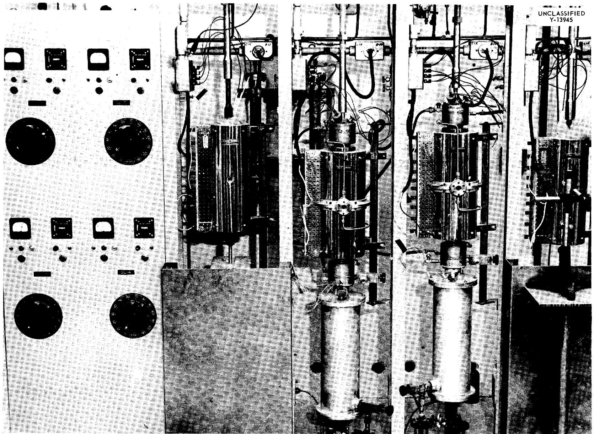  
Fig. 7.3. Dead-Load Stress-Rupture Machines.

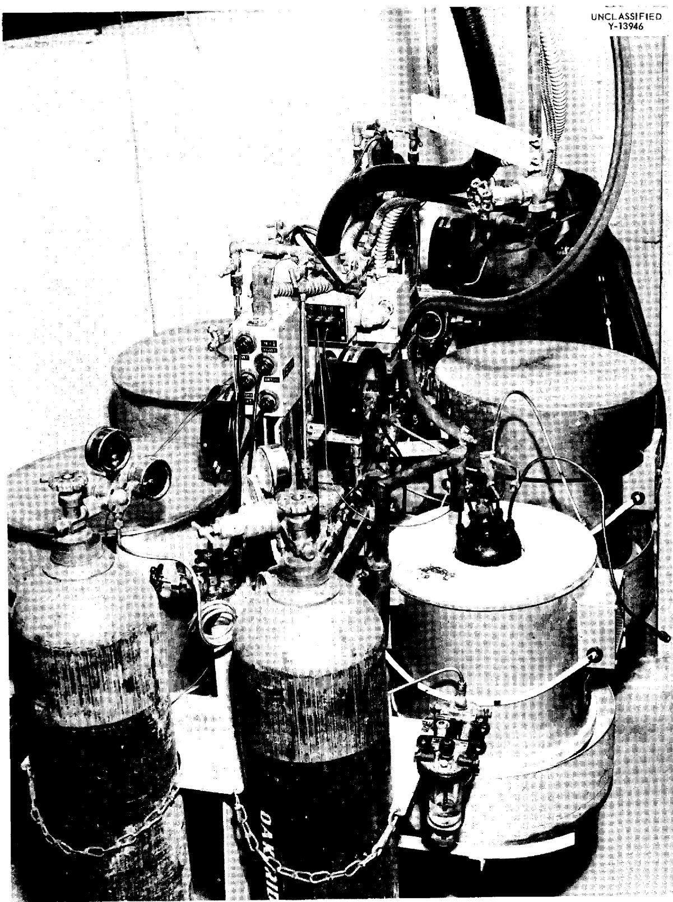  
Fig. 7.4. Tube Burst Test Unit.

were also installed for the study of multiaxial stress systems.

In order to provide space for this additional equipment, it was necessary to outfit a new laboratory, and thus there was some interruption of the testing program during the past two quarters. In addition to the machines mentioned above, the new laboratory also includes six lever-arm units and four tube-burst units used previously for testing materials in fused salts and liquid metals. Each testing machine and associated furnace has its own temperature-recorder-controller, which is mounted in the central control panel board shown in Fig. 7.5.

The results obtained in the Hastelloy B testing program are quite preliminary; however, a series of creep-rupture tests on solution-annealed material have been completed in an argon atmosphere at 1500 and $1650^{\circ}\mathrm{F}$ , and a similar series of tests is being run in fused salts. Based on the limited data available, the corrosive action of the fused fluorides has not adversely affected the creep-rupture properties at 1500 and $1650^{\circ}\mathrm{F}$ . Rupture times in the fluorides are comparable to or greater than those found in argon under similar stress conditions. In all cases the results found for Hastelloy B show marked improvement in strength

compared with Inconel for the same temperature conditions. A comparison of the stress-rupture properties found for Hastelloy B, type 316 stainless steel, and Inconel in argon at $1500^{\circ}\mathrm{F}$ is presented in Fig. 7.6.

In conjunction with the testing of Hastelloy B, tests are being conducted on the modified nickel-molybdenum alloys described above. Stress-rupture results at $1500^{\circ}\mathrm{F}$ in argon have been obtained for the alloys listed in Table 7.16. By comparison with the data presented in Fig. 7.6, it can be seen that these alloys are inferior in

TABLE 7.16. STRESS-RUPTURE PROPERTIES OF NICKEL-MOLYBDENUM BASE ALLOYS AT ${1500}^{ \circ  }F$ IN ARGON  

<table><tr><td>Composition (wt %)</td><td>Stress (psi)</td><td>Time to Rupture (hr)</td><td>Elongation (%)</td></tr><tr><td>78 Ni-20 Mo-2Cb</td><td>8000</td><td>133</td><td>8</td></tr><tr><td>76 Ni-24Mo</td><td>8000</td><td>69</td><td>3</td></tr><tr><td></td><td>5000</td><td>358</td><td>2</td></tr><tr><td>68 Ni-32Mo</td><td>8000</td><td>332</td><td>8</td></tr></table>

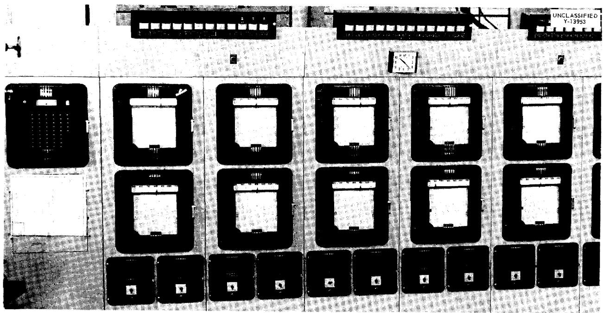  
Fig. 7.5. Central Control Panel.

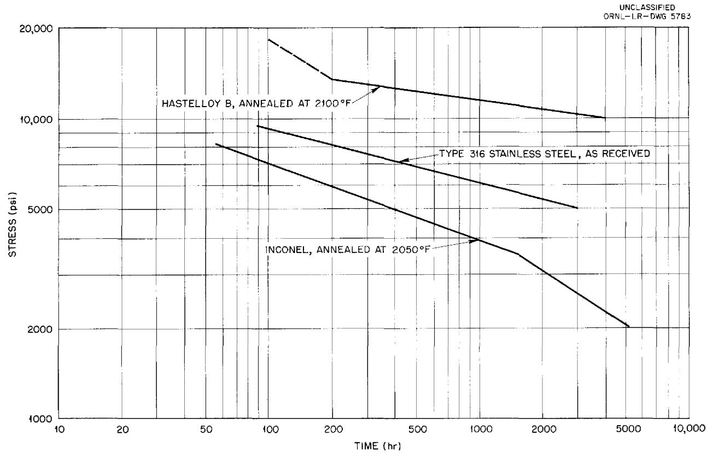  
Fig. 7.6. Stress-Rupture Curves for Sheet Specimens of Hastelloy B, Type 316 Stainless Steel, and Inconel Tested in Argon at $1500^{\circ}\mathbf{F}$ .

strength to Hastelloy B when tested under similar conditions. The final elongations are also less than those obtained for the commercial Hastelloy B.

Tube burst tests, which provide a study of multiaxial stress systems, are presently under way on $3/4$ -in.-OD Inconel and Hastelloy B tubing with 0.020- to 0.040-in. walls. A ratio of axial-to-tangential stress of 1:2 and a test temperature of $1500^{\circ}\mathrm{F}$ are being used. The tube is internally pressurized with argon and is surrounded with fluorides. Variable stress ratio tests, described previously, have been initiated to determine how changes in tangential-to-axial stress ratios affect tube failure. In conjunction with these tests, an analysis will be made of the stress systems which are present in pressurized tubes and of the rate of creep deformation and failure which can be expected to take place as a result of such stress patterns.

# WELDING AND BRAZING STUDIES OF HASTELLOY B

P. Patriarca

K.W.Reber

R. E. Clausing

G. M. Slaughter

Metallurgy Division

J.M.Cisar

Aircraft Reactor Engineering Division

R. L. Heestand

Pratt & Whitney Aircraft

# Radiators

Additional Hastelloy B radiator test components have been fabricated, as described previously,3 to determine the feasibility of using this material in applications involving thermal shock and high-temperature oxidation. It was thought that the

characteristic aging of Hastelloy B with its accompanying loss in ductility might result in fissures in the tubes or tube-to-header joints when they were subjected to simulated cyclic service. Table 7.17 presents a history of test radiators built to date for evaluating these assemblies under several service conditions. Typical components of a radiator are shown in Fig. 7.7 before welding of the split headers and after completion. Radiator No. 1 (Table 7.17) differed from the other radiators in that only a single row of five tubes was used. The stress distribution on the tubes in this radiator was not comparable to that on a full-scale radiator, and therefore this test was not run for the full 500-hr life test.

The tests of radiators No. 2 and No. 3 differed in that radiator No. 2 was subjected to several water quenches from $1500^{\circ}\mathrm{F}$ to simulate a more severely stressed condition. Radiator No. 3 was

carefully examined visually after 12 air cools from $1500^{\circ}\mathrm{F}$ , since this was thought to be a realistic number of thermal cycles to which an actual radiator might be subjected. As can be seen from Fig. 7.8 the fin distortion was not severe enough to cause a material increase in air-pressure drop through the core. A testing temperature of $1200^{\circ}\mathrm{F}$ was chosen for radiator No. 5 to obtain an experimental check of the evidence obtained from microstructural studies that aging proceeded very rapidly at this temperature.

The test of radiator No. 4 was terminated after $69\mathrm{hr}$ at $1650^{\circ}\mathrm{F}$ because the severe, accelerated oxidation caused leaks. (All specimens were leak tested periodically by means of a helium leak detector to determine soundness.) Radiator No. 4 is shown in Fig. 7.9 after termination of the test. Since the severe localized attack suggested the

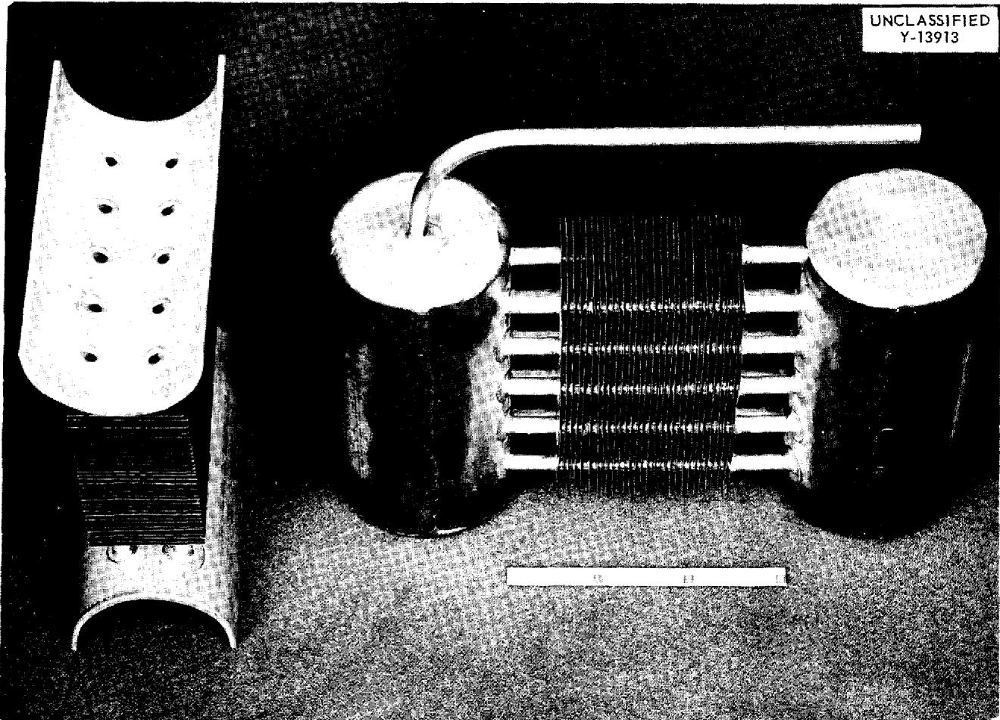  
Fig. 7.7. Hastelloy B Radiator Before Welding of Split Headers and Completed Test Radiator.

Braze Alloy: Coast Metals Alloy No. 52

Test Atmosphere: Air

TABLE 7.17. HISTORY OF HASTELLOY B TEST RADIATORS WITH STAINLESS-STEELOR INCONEL-CLAD COPPER HIGH-CONDUCTIVITY FINS   

<table><tr><td rowspan="2"></td><td colspan="5">Radiator Test Number</td></tr><tr><td>1</td><td>2</td><td>3</td><td>4</td><td>5</td></tr><tr><td>Number of tubes</td><td>5</td><td>10</td><td>10</td><td>10</td><td>10</td></tr><tr><td>Fin cladding material*</td><td>Type 310 stainless steel</td><td>Type 310 stainless steel</td><td>Inconel</td><td>Inconel</td><td>Type 310 stainless steel</td></tr><tr><td>Service temperature, °F</td><td>1500</td><td>1500</td><td>1500</td><td>1650</td><td>1200</td></tr><tr><td>Service time, hr</td><td>350</td><td>500</td><td>511</td><td>69</td><td>500</td></tr><tr><td>Number of cycles</td><td>8</td><td>27</td><td>265</td><td>8</td><td>191</td></tr><tr><td>Type of quench</td><td>Water</td><td>Water</td><td>Air</td><td>Air</td><td>Air</td></tr><tr><td>Type of failure</td><td>None</td><td>None</td><td>None</td><td>Oxidized</td><td>None</td></tr></table>

*Fifteen fins per inch.

UNCLASSIFIED Y-13930

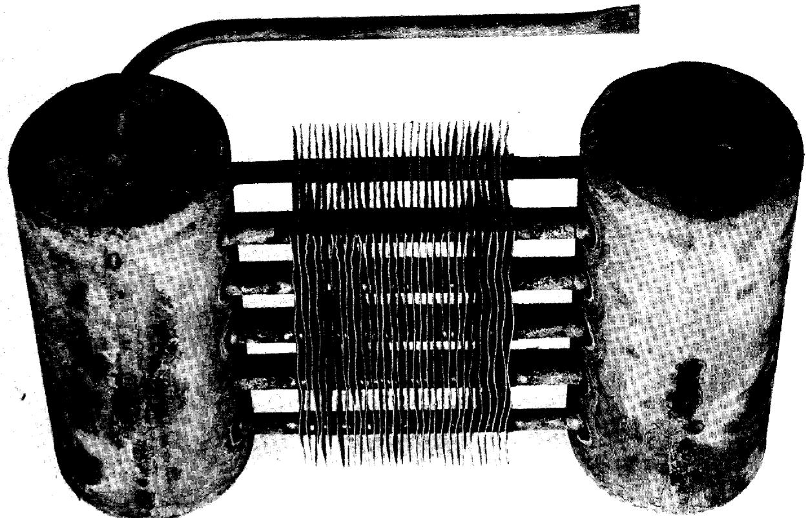  
INCHES

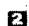  
3   
Fig. 7.8. Hastelloy B Radiator No. 3 After 12 Air Cools from $1500^{\circ}$ F. Note mild fin distortion.

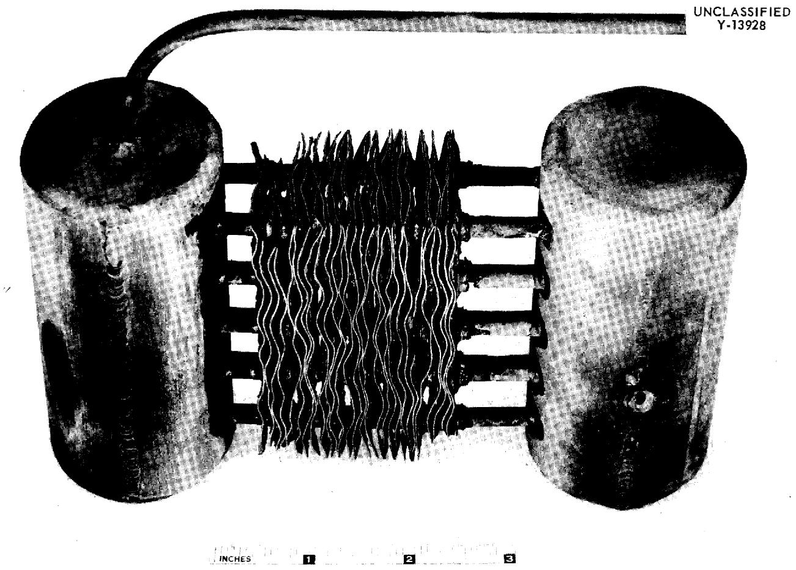  
Fig. 7.9. Hestelloy B Radiator No. 4 After 69 hr at $1650^{\circ}$ F in Air.

influence of a self-fluxing oxide, a series of experiments was conducted to investigate the effect of several oxides on the susceptibility of Hastelloy B to this phenomenon. Each specimen was tested for 24 hr at $1650^{\circ}\mathrm{F}$ and for 100 hr at $1500^{\circ}\mathrm{F}$ . The results of these experiments are given in Table 7.18.

Very serious accelerated oxidation occurred both with Hastelloy B and Hastelloy C in contact with copper oxide. A comparison of Hastelloy B in contact with copper oxide for 24 hr at $1650^{\circ}\mathrm{F}$ in air with an uncontaminated control specimen of Hastelloy B tested under the same conditions is shown in Fig. 7.10. Even though the copper oxide was placed only in the area of pitting, which has been brushed clean of scale, the entire surface of the specimen shows a different type of scaling than that on the control specimen. Since the scaling was not observed on specimens exposed

to copper oxide at $1500^{\circ}\mathrm{F}$ , tests were carried out at intermediate temperatures to determine the flow point of the composite oxide, and it was found to have a flow point of around $1525^{\circ}\mathrm{F}$ .

Since the Inconel-clad copper fins were also adversely affected in radiator No. 4, it is suspected that a volatile oxide, $\mathsf{MoO}_3$ , condensed on the fins near the headers with a consequent acceleration in the rate of oxidation. As shown in Figs. 7.9 and 7.11, the fins close to the headers were completely oxidized, and the others were only distorted. It is thought that the high velocity air may have carried the volatile oxide away with a consequent reduction in the deleterious effects on the fins farthest from the headers.

These experiments illustrate that complete protection of the copper exposed when the clad-copper high-conductivity fins are punched out is of extreme importance and that brazing techniques

TABLE 7.18.EFFECTS OF VARIOUS OXIDES ON THE FLUXING OF HASTELLOY B AND HASTELLOY C OXIDE   

<table><tr><td>Type of Specimen</td><td>Time (hr)</td><td>Temperature (°F)</td><td>Result</td></tr><tr><td rowspan="2">Hastelloy B + Al2O3</td><td>24</td><td>1650</td><td>Slight oxidation</td></tr><tr><td>100</td><td>1500</td><td>Slight oxidation</td></tr><tr><td rowspan="2">Hastelloy B + CuO</td><td>24</td><td>1650</td><td>Pitting to 40 mils</td></tr><tr><td>100</td><td>1500</td><td>Pitting to 15 mils</td></tr><tr><td rowspan="2">Hastelloy C + CuO</td><td>24</td><td>1650</td><td>Pitting to 40 mils</td></tr><tr><td>100</td><td>1500</td><td>Slight oxidation</td></tr><tr><td rowspan="2">Hastelloy B + SiO</td><td>24</td><td>1650</td><td>Slight oxidation</td></tr><tr><td>100</td><td>1500</td><td>Slight oxidation</td></tr><tr><td rowspan="2">Hastelloy B + FeO</td><td>24</td><td>1650</td><td>Slight oxidation</td></tr><tr><td>100</td><td>1500</td><td>Slight oxidation</td></tr><tr><td rowspan="2">Hastelloy B + type 316 stainless steel</td><td>24</td><td>1650</td><td>Slight oxidation</td></tr><tr><td>100</td><td>1500</td><td>Slight oxidation</td></tr></table>

UNCLASSIFIED Y-14038

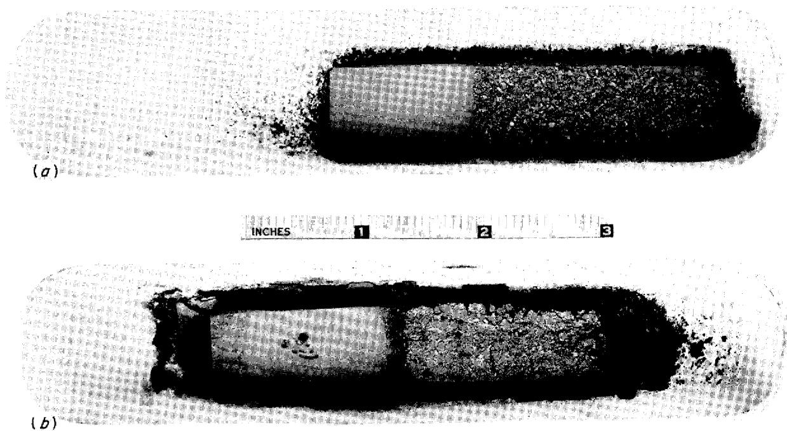  
Fig. 7.10. (a) Hastelloy B Oxidized at $1650^{\circ}\mathsf{F}$ . Note characteristic scale. (b) Hastelloy B + CuO Oxidized at $1650^{\circ}\mathsf{F}$ . Note pitting and change in scale characteristics.

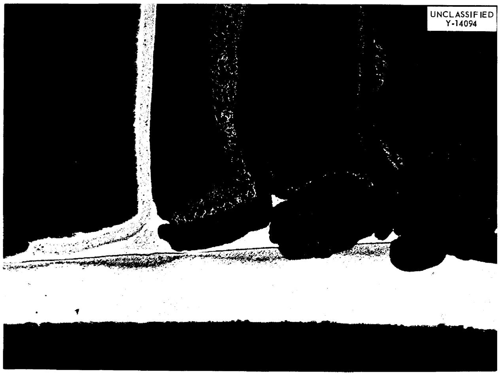  
Fig. 7.11. Finned-Tube Section of Hastelloy B Radiator No. 4.

should be developed to ensure complete coverage by the brazing alloy. This problem is further discussed below under the heading "High-Conductivity Fin Radiator."

# Welding of Thick Sections

The fabrication of a pressure shell from Hastelloy B will present welding problems of an entirely different nature from those encountered in the tube-to-header welding of this material. As a means of evaluating the weldability of the material and to determine suitable procedures for its fabrication, a heavy-welding investigation is under way in which the metallic arc and the semi-automatic heliarc welding processes are being used.

The metallic-arc welds were made on as-received $\frac{3}{8}$ by 3- by 6-in. plates by using a 90-deg included-angle bevel, with a $\frac{1}{16}$ -in. land, and a $\frac{1}{16}$ -in. spacing between plates in all cases, except

plate No. 4 (Table 7.19). The welds were made with both $\frac{1}{8}$ and $\frac{5}{32}$ -in. Hastelloy B coated electrodes. All plates were tack-welded to a strong back to simulate a severely restrained condition.

Tests on the plates listed in Table 7.19 consisted of 180-deg guided-root and face bends in the as-welded and aged conditions. Tensile specimens were also cut from plate No. 3 for testing in the as-welded and aged condition. All aged specimens were treated at $1500^{\circ}\mathrm{F}$ for 200 hr.

It may be noted that the bend-test results presented in Table 7.19 are somewhat inconsistent. The plate No. 1 failures may be attributed to incomplete fusion in the root pass. Plate No. 2 was welded in much the same manner as plate No. 1, but particular care was used in the deposition of the root pass. All bend tests on this plate were made in the as-welded condition, and no failures were observed. Plate No. 3 was tested

TABLE 7.19. RESULTS OF BEND TESTS OF WELDED HASTELOY B PLATES (3, BY 3 BY 6 in.)   

<table><tr><td rowspan="2">Plate No.</td><td rowspan="2">Current (amp)</td><td rowspan="2">Diameter of Electrode (in.)</td><td rowspan="2">Number of Passes</td><td rowspan="2">Bevel</td><td colspan="2">Bend Tests</td></tr><tr><td>Number of Tests</td><td>Results</td></tr><tr><td rowspan="2">1</td><td rowspan="2">80</td><td rowspan="2">1/8</td><td rowspan="2">8</td><td rowspan="2">Single</td><td>3 root</td><td>Two welds failed</td></tr><tr><td>3 face</td><td>None failed</td></tr><tr><td rowspan="2">2</td><td rowspan="2">90</td><td rowspan="2">1/8</td><td rowspan="2">7</td><td rowspan="2">Single</td><td>2 root</td><td>None failed</td></tr><tr><td>1 face</td><td>None failed</td></tr><tr><td rowspan="4">3</td><td rowspan="4">100</td><td rowspan="4">5/32</td><td rowspan="4">5</td><td rowspan="4">Single</td><td>1 root</td><td>None failed</td></tr><tr><td>1 face</td><td>None failed</td></tr><tr><td>1 root, aged</td><td>Failed</td></tr><tr><td>1 face, aged</td><td>Failed</td></tr><tr><td>4 A</td><td>95</td><td>1/8</td><td>7</td><td>Double</td><td>2</td><td>None failed</td></tr><tr><td>B</td><td>100</td><td>5/32</td><td>7</td><td></td><td>2</td><td>One failed</td></tr></table>

to determine the effect of aging on the bend-test results.

Several tensile and guided-bend test specimens are shown in Fig. 7.12. It can be seen that specimens 4 and 5 are typical as-welded face and root bends, while 6 and 7 are the aged face and root bends, respectively, from plate No. 3. An as-welded tensile specimen and a welded-and-aged tensile specimen were also prepared from plate No. 3. The as-welded specimen (specimen 1 in Fig. 7.12) exhibited good ductility in the parent material but fracturing occurred in the weld. The aged specimen (specimen 2 in Fig. 7.12) also showed good ductility in the parent material, but, in this case, the fracture occurred in the parent metal.

One-half of plate No. 4 was prepared with a $\frac{1}{8}$ -in.-dia coated electrode, while the remaining half was welded with a $\frac{5}{32}$ -in.-dia coated electrode. Radiographic inspection showed that all welds were sound. Two bends from the fillet for which the $\frac{1}{8}$ -in.-dia rod was used exhibited good ductility, while one bend from the fillet made by using $\frac{5}{32}$ -in.-dia rod fractured during testing. Inspection of the fracture showed no apparent flaws.

The inconsistencies in the bend-test data could possibly be attributed to the inhomogeneous yielding observed in the weld zone. The root-bend

specimen (specimen 5 in Fig. 7.12) shows the extent to which such yielding was present. Specimen 3 in Fig. 7.12 was machined from a double-beveled specimen to determine the effect of bending axially with the weld. Some parting was noticed along the fusion line, but there was no fracture. It is evident that yielding in this longitudinal test is more homogeneous than in the transverse bend test.

Several experimental weld beads have been prepared with the semiautomatic Aircomatic machine available in the Welding Laboratory. These welds were deposited on $\frac{1}{2}$ -in.-thick Hastelloy B plate with 0.060-in.-dia Hastelloy B wire as the filler metal. In this process, the filler wire is continuously fed from a coiled spool. Conditions have been established which produce good bead-on-plate welds as determined from visual observation. These conditions are listed in the following to present an indication of the rapid travel speed and deposition rate which can be obtained by this process: arc current, 325 amp; welding travel speed, 325 in./min; rate of wire feed, 200 in./min; argon consumption, 40 cfh. Metallographic examination of these welds indicated that porosity would not be a major problem when welding with the semiautomatic equipment. However, further experiments will be conducted to evaluate the physical properties of these welds in

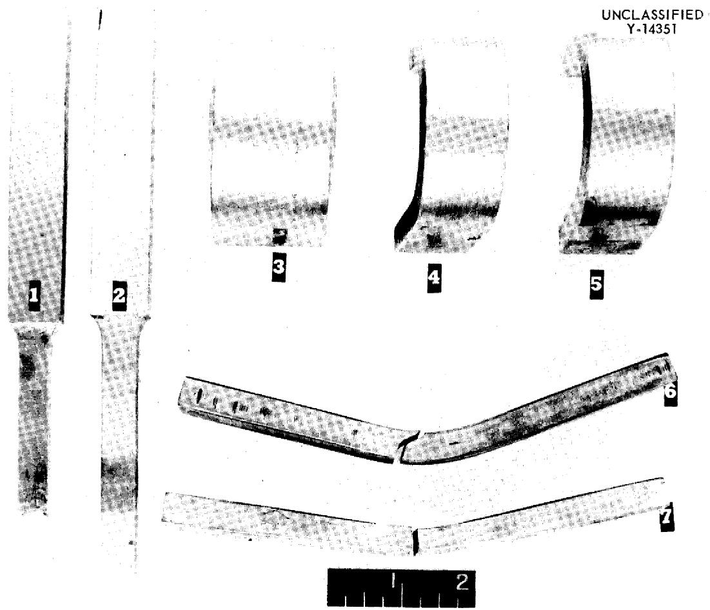  
Fig. 7.12. Metallic-Arc Welded Hastelloy B Bend and Tensile Specimens. (1) As-welded - broken in weld zone, (2) welded and aged - broken in parent material, (3) as-welded - bent along axis of welding, (4) as-welded face bend, (5) as-welded root bend, (6) welded-and-aged face bend - broken along fusion zone, (7) welded-and-aged root bend - broken through center of root.

order to compare them with the properties of welds made by the conventional, manual, heliarc process.

# High-Temperature Aging

It has been realized that at service temperatures ranging upward from $1000^{\circ}\mathrm{F}$ copious quantities of precipitated phases would be formed throughout the microstructure of Hastelloy B. Preliminary observations also indicated that the degree of precipitation in weld deposits and in weld heat affected zones might be noticeably different from that found in wrought structures. An investigation has therefore been initiated to determine the effect of several variables on the type and quantity of precipitate, as determined by metallographic examination. An attempt is also being made to

correlate the physical properties of the material with the observed microstructures.

The variables being investigated in this study include aging temperature, time at this temperature, prior thermal history, degree of residual cold deformation, base metal composition, original microstructure, and aging environment. The relatively homogeneous microstructure of a section of $3_{16}^{\circ}$ in. Hastelloy B plate after a solution heat treatment of 2 hr at $2150^{\circ}F$ is shown in Fig. 7.13. A similar sample after aging for 1500 hr at $1500^{\circ}F$ is shown in Fig. 7.14, which illustrates the typical appearance of the precipitate formed at this temperature after extended aging times. A photomicrograph of the same sample at a higher magnification (Fig. 7.15) shows the diverse nature of

the precipitated phases. The grain boundaries are clearly outlined by the more massive particles. Aging at $1300^{\circ}\mathrm{F}$ for prolonged periods produces the characteristic microstructure shown in Fig. 7.16. The marked difference in structures ob

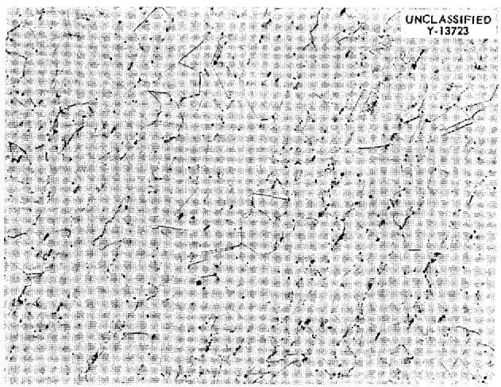  
Fig. 7.13. Microstructure of $\frac{3}{16}$ -in. Hastelloy B Plate After a Solution Heat Treatment of 2 hr at $2150^{\circ}\mathrm{F}$ . Etched with chrome regia. 150X. Reduced 30.5%.

tained at $1300^{\circ}F$ and at $1500^{\circ}F$ would be expected to produce appreciable variations in physical properties. Hot tensile specimens have been subjected to long-time aging treatments and are now being tested to confirm this and other predictions based upon this metallographic evaluation.

The quantity of precipitate formed was found to increase proportionately with increasing time at temperature within the limits of this investigation. A $1950^{\circ}F$ "overaging" heat treatment, recommended by the Haynes Stellar Company, noticeably reduced the rate of precipitation after short-time aging, with the effect still somewhat evident up to 1500 hr.

Residual cold work in Hastelloy B produces a striking effect upon the rate of precipitation during aging, as evidenced by the excessive quantities of precipitate shown in Fig. 7.17, a specimen cold worked (20% deformation) and held for 100 hr at $1200^{\circ}\mathrm{F}$ . Evidence indicates that the induced stresses produced during water quenching from above $1950^{\circ}\mathrm{F}$ may increase this precipitation rate. The influence of base metal composition is now being studied, and aging treatments will be performed on specimens of selected chemical analysis. Extreme variations in microstructure

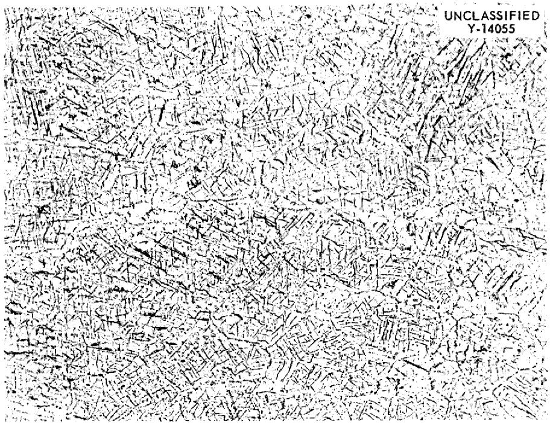  
Fig. 7.14. Sample Similar to That Shown in Fig. 7.13 After Aging for $1500\mathrm{hr}$ at $1500^{\circ}\mathbf{F}$ . Etched with chrome regia, 150X.

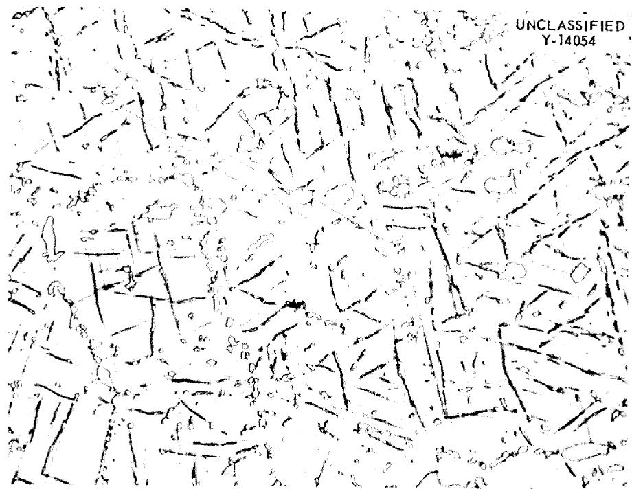  
Fig. 7.15. Higher Magnification (750X) of Fig. 7.14. Note the several types of precipitate present and, especially, the more massive particles outlining the grain boundaries. Etched with chrome regia.

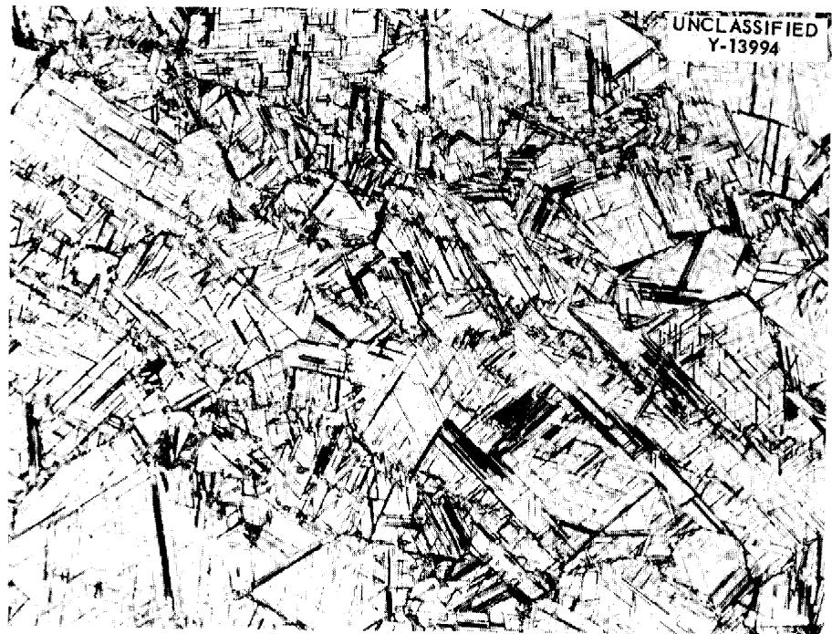  
Fig. 7.16. Hastelloy B Aged at $1300^{\circ}\mathsf{F}$ for Prolonged Periods. Note characteristic precipitate. Etched with chrome regia. 150X.

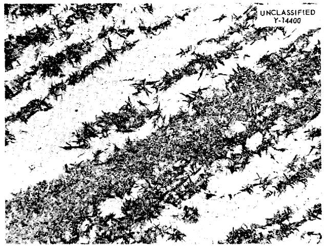  
Fig. 7.17. Hastelloy B Cold Reduced $20\%$ and Subsequently Aged 100 hr at $1200^{\circ}\mathrm{F}$ . Note excessive precipitation. Etched electrolytically, 150X. Reduced $30.5\%$ .

are prevalent in welded joints, as would be expected since they are susceptible to both segregation in the fusion zone and to stresses from the welding process. The original microstructure, as developed by fabrication techniques or thermal treatments, has a decided effect upon the aging process, but each individual case should be evaluated separately. Except under corrosive or oxidizing conditions, the environment does not appear to be important.

Early experiments indicated that it would be desirable to develop a heat treatment which would result in improved ductility at room temperature and at high temperatures. Since a spheroidized structure should be beneficial, a heat treatment has been developed to produce it. This structure, which is shown in Fig. 7.18 at a magnification of 150 diameters and in Fig. 7.19 at a magnification of 2000 diameters, can be obtained by a heat treatment which is not deemed practical for structural components. However, physical test specimens containing the spheroidized microstructure are being prepared to evaluate the effect of spheroidization on ductility and other properties. If the results are promising, further work will be aimed at developing a more practical heat treatment.

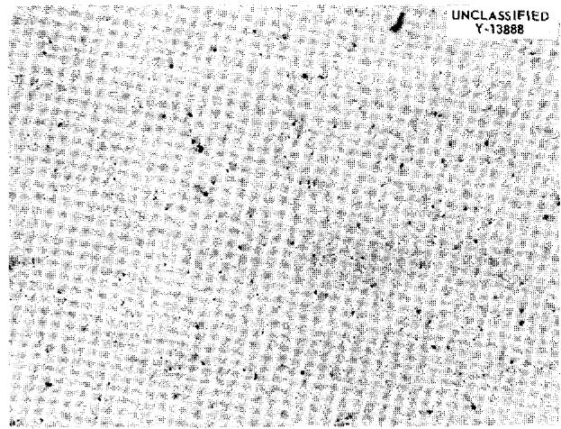

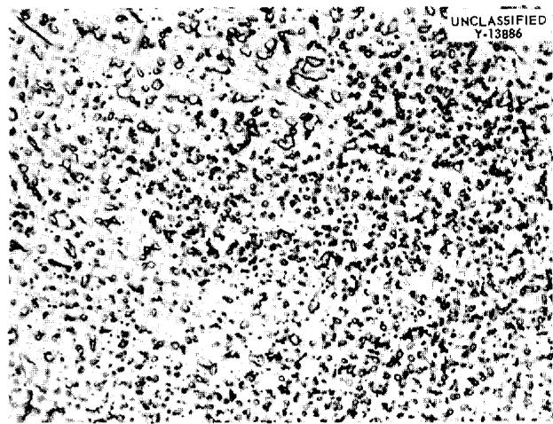  
Fig. 7.18. Microstructure of Hastelloy B Obtained by the Experimental Spheroidizing Heat Treatment. Etched with chrome regia. 150X. Reduced $30.5\%$ .   
Fig. 7.19. Higher Magnification (2000X) of Fig. 7.18. Etched with chrome regia. 2000X. Reduced $31\%$ .

As a part of the correlation of physical properties with microstructure, hot tensile tests have been completed on wrought specimens aged for 100 hr at five different temperatures. The yield strengths and elongations were determined for specimens in the solution annealed and "over-aged" conditions and are shown in Fig. 7.20. It can be seen that a minimum elongation exists at $1300^{\circ}\mathrm{F}$ , while the yield strength does not appear to be as seriously affected.

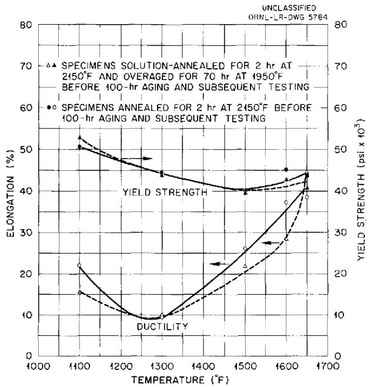  
Fig. 7.20. Strength and Elongation of Hastelloy B as a Function of Testing Temperature After Aging for 100 hr at the Test Temperature. All physical testing performed at the aging temperature.

Long-time aging of hot tensile test specimens is now in progress to permit a more complete analysis of the precipitation effects which would occur in Hastelloy B during service at these elevated temperatures. An apparatus for the hot bend testing of wrought and weld metal specimens is also under construction. The determination of aging rates by hardness measurements has also been proposed as a means of supplementing the data accumulated by other methods.

# STRESS- RUMENTURE DESIGN CURVES FOR INCONEL

R.B.Oliver

D. A. Douglas

J.H.DeVan

J.W.Woods

Metallurgy Division

The program to obtain design data for Inconel at 1300 and at $1500^{\circ}\mathrm{F}$ under reactor conditions is nearly complete, and some data at $1650^{\circ}\mathrm{F}$ are available. A series of tests at an extremely low range of stresses has begun that will provide data on rupture times in the 5,000 to 10,000-hr range, which is longer than the present period assumed for aircraft reactor operation. The low stresses

involved in these tests are, however, representative of the principal stresses with which the reactor design engineers are concerned. The results obtained for Inconel, to date, in fused salts and, for comparison, in argon are presented as a series of design curves shown in Figs. 7.21 through 7.30. The times to 0.5, 1, 2, 5, and $10\%$ elongations and to rupture are plotted against stress for both annealed and as-received sheet specimens.

In the case of Inconel specimens annealed at $2050^{\circ}\mathrm{F}$ and tested in argon at $1500^{\circ}\mathrm{F}$ , it should be pointed out that considerable scatter exists in the data as a result of a precipitation hardening phenomenon which sometimes occurs. The nature of the precipitate and the causes of its occurrence are presently uncertain; since it may or may not appear in entirely similar material under identical stress and temperature conditions. The precipitation takes place at from 300 to 4000 hr and significantly improves the creep and rupture strength of the alloy. The higher the stress, the earlier in the test the precipitation effect is observed. Because of the unpredictable behavior of this precipitate, the design curves which are presented represent those tests in which no precipitation hardening was observed.

# DEVELOPMENT OF BRAZING ALLOYS

P. Patriarca

K.W.Reber

R. E. Clausing

G. M. Slaughter

Metallurgy Division

J.M.Cisar

Aircraft Reactor Engineering Division

R.L. Heestand

Pratt & Whitney Aircraft

The resistance of brazing alloys to high-temperature oxidation is a primary factor to consider in the choice of these materials for use in the fabrication of liquid-metal-to-air radiators. An evaluation program is therefore being conducted to determine the suitability of 28 potential high-temperature alloys for this application. Inconel T-joints were prepared with these materials and small smaples of these joints were subjected to static air at 1500 and at $1700^{\circ}\mathrm{F}$ for various times. The results of these tests, as determined by metallographic examination in the as-polished condition, are presented in Table 7.20. Some of the information found in this table has appeared in a

TABLE 7.20. OXIDATION RESISTANCE OF DRY-HYDROGEN-BRAZED INCONEL T-JOINTS  

<table><tr><td rowspan="3">Brazing Alloy</td><td rowspan="3">Composition (wt %)</td><td rowspan="3">Brazing Temperature (°F)</td><td colspan="5">Oxidation in Static Air*</td></tr><tr><td colspan="3">At 1500°F</td><td colspan="2">At 1700°F</td></tr><tr><td>For 200 hr</td><td>For 500 hr</td><td>For 1300 hr</td><td>For 200 hr</td><td>For 500 hr</td></tr><tr><td colspan="8">Commercial Alloys</td></tr><tr><td>Nicrobraz</td><td>70 Ni-14 Cr-6 Fe-5 B-4 Si-1 C</td><td>2150</td><td>Slight</td><td>Slight</td><td>Slight</td><td>Slight</td><td>Slight</td></tr><tr><td>Low-melting Microbraz</td><td>80 Ni-5 Cr-6 Fe-3 B-5 Si-1 C</td><td>1950</td><td>Slight</td><td>Slight</td><td>Slight</td><td>Slight</td><td>Slight</td></tr><tr><td>Coast Metals No. 50</td><td>93 Ni-3.5 Si-2.5 B-1 Fe</td><td>2050</td><td>Slight</td><td>Slight</td><td>Slight</td><td>Slight</td><td>Slight</td></tr><tr><td>51</td><td>92 Ni-4.5 Si-3 B-0.5 Fe</td><td>2050</td><td>Slight</td><td>Slight</td><td>Slight</td><td>Slight</td><td>Slight</td></tr><tr><td>52</td><td>89 Ni-5 Si-4 B-2 Fe</td><td>1840</td><td>Slight</td><td>Slight</td><td>Slight</td><td>Slight</td><td>Slight</td></tr><tr><td>53</td><td>81 Ni-4 Si-4 B-8 Cr-3 Fe</td><td>1950</td><td>Slight</td><td>Slight</td><td>Slight</td><td>Slight</td><td>Slight</td></tr><tr><td>NP</td><td>50 Ni-12 Si-28 Fe-4 Mo-4.5 P-1 Mn-0.5 Cr</td><td>2050</td><td>Slight</td><td>Slight</td><td>Slight</td><td>Slight</td><td>Moderate</td></tr><tr><td>Mond Ni Co. Alloy</td><td>64 Ag-33 Pd-3 Mn</td><td>2150</td><td>Severe</td><td>Severe</td><td>Severe</td><td>Complete</td><td></td></tr><tr><td>Copper</td><td>100 Cu</td><td>2050</td><td>Complete</td><td></td><td></td><td>Complete</td><td></td></tr><tr><td colspan="8">Experimental Nickel-Base Alloys</td></tr><tr><td>G-E No. 62</td><td>69 Ni-20 Cr-11 Si</td><td>2150</td><td>Slight</td><td>Slight</td><td>Slight</td><td>Slight</td><td>Moderate</td></tr><tr><td>81</td><td>66 Ni-19 Cr-10 Si-4 Fe-1 Mn</td><td>2150</td><td>Slight</td><td>Slight</td><td>Slight</td><td>Slight</td><td>Moderate</td></tr><tr><td>Ni-Cr-Si</td><td>73.5 Ni-16.5 Cr-10 Si</td><td>2150</td><td>Slight</td><td>Slight</td><td>Slight</td><td>Slight</td><td>Moderate</td></tr><tr><td>Ni-Si</td><td>88 Ni-12 Si</td><td>2200</td><td>Slight</td><td>Slight</td><td>Slight</td><td>Slight</td><td>Slight</td></tr><tr><td>Ni-Ge</td><td>75 Ni-25 Ge</td><td>2150</td><td>Slight</td><td>Slight</td><td>Slight</td><td>Moderate</td><td>Severe</td></tr><tr><td>Ni-Ge-Cr</td><td>65 Ni-25 Ge-10 Cr</td><td>2130</td><td>Slight</td><td>Slight</td><td>Slight</td><td>Slight</td><td>Moderate</td></tr><tr><td>Electroless Ni-P</td><td>88 Ni-12 P</td><td>1740</td><td>Slight</td><td>Slight</td><td>Slight</td><td colspan="2">Above melting point of alloy</td></tr><tr><td>Ni-P-Cr</td><td>80 Ni-10 P-10 Cr</td><td>1830</td><td>Slight</td><td>Slight</td><td>Slight</td><td colspan="2">Above solidus of alloy</td></tr><tr><td>Ni-Mo-Ge</td><td>50 Ni-25 Mo-25 Ge</td><td>2150</td><td>Slight</td><td>Slight</td><td>Slight</td><td>Moderate</td><td>Severe</td></tr><tr><td>Ni-Sn</td><td>68 Ni-32 Sn</td><td>2150</td><td>Slight</td><td>Moderate</td><td>Severe</td><td>Severe</td><td>Complete</td></tr><tr><td>Ni-Mn</td><td>40 Ni-60 Mn</td><td>1950</td><td>Complete</td><td></td><td></td><td>Complete</td><td></td></tr><tr><td>Ni-Mn-Cr</td><td>35 Ni-55 Mn-10 Cr</td><td>2050</td><td>Severe</td><td>Severe</td><td>Complete</td><td>Severe</td><td>Complete</td></tr><tr><td colspan="8">Experimental Precious-Metal Base Alloys</td></tr><tr><td>Pd-Ni</td><td>60 Pd-40 Ni</td><td>2300</td><td>Very slight</td><td>Slight</td><td>Moderate</td><td>Very slight</td><td>Slight</td></tr><tr><td>Pd-Ni-Si</td><td>60 Pd-37 Ni-3 Si</td><td>2150</td><td>Very slight</td><td>Slight</td><td>Moderate</td><td>Slight</td><td>Moderate</td></tr><tr><td>Pd-Al</td><td>92 Pd-8 Al</td><td>2020</td><td>Very slight</td><td>Very slight</td><td>Very slight</td><td>Very slight</td><td>Slight</td></tr><tr><td>Pd-Ge</td><td>90 Pd-10 Ge</td><td>2050</td><td>Very slight</td><td>Slight</td><td>Severe</td><td>Complete</td><td></td></tr><tr><td>Au-Ni</td><td>82 Au-18 Ni</td><td>1830</td><td>Very slight</td><td>Very slight</td><td>Slight</td><td>Moderate</td><td>Moderate</td></tr><tr><td>Au-Co</td><td>90 Au-10 Co</td><td>1830</td><td>Very slight</td><td>Very slight</td><td>Moderate</td><td>Slight</td><td>Severe</td></tr><tr><td>Au-Cu</td><td>80 Au-20 Cu</td><td>1740</td><td>Moderate</td><td>Complete</td><td></td><td>Complete</td><td></td></tr></table>

*Very slight, less than 1 mil of penetration; slight, 1 to 2 mils of penetration; moderate, 2 to 5 mils of penetration; severe, greater than 5 mils of penetration; complete, fillet completely destroyed.

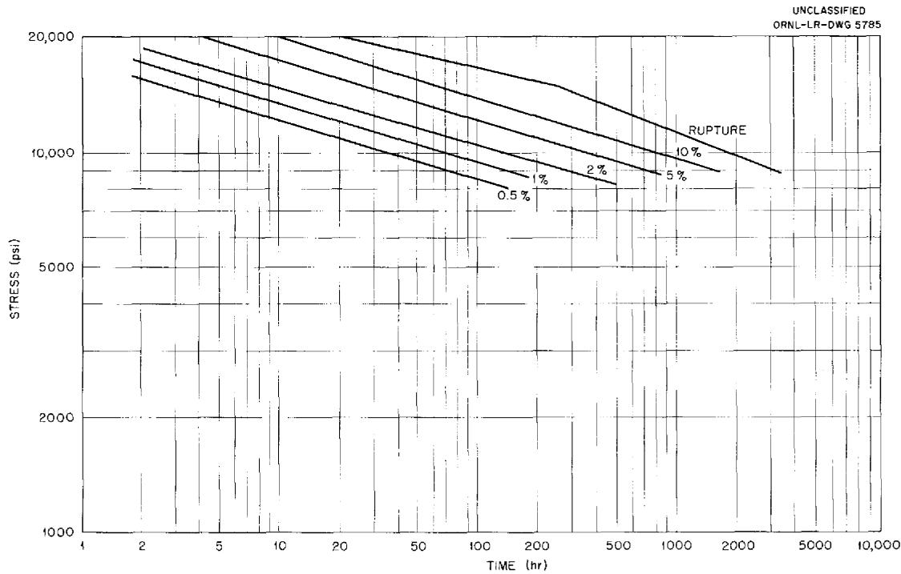  
Fig. 7.21. Stress-Rupture Characteristics of As-Received Inconel Tested in Argon at $1300^{\circ}$ F.

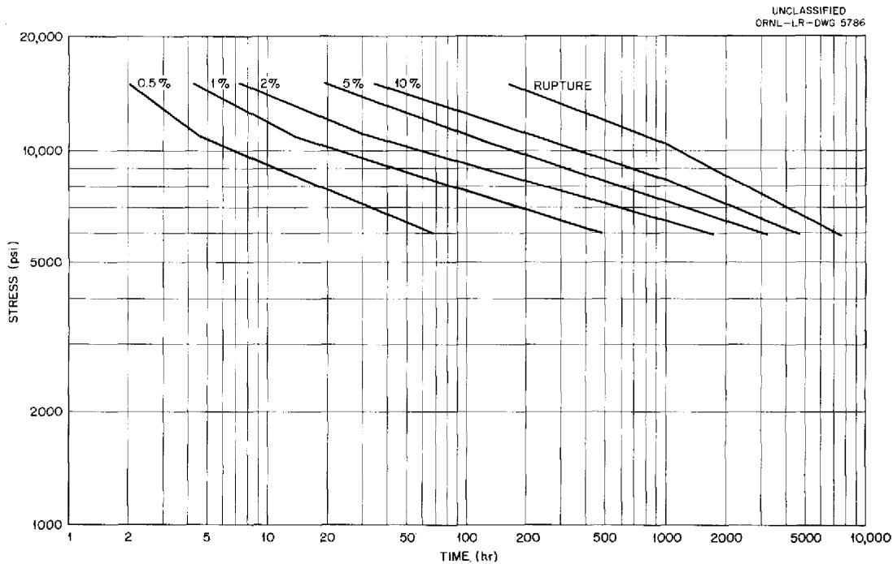  
Fig. 7.22. Stress-Rupture Characteristics of As-Received Inconel Tested in Fused Salt at $1300^{\circ}$ F.

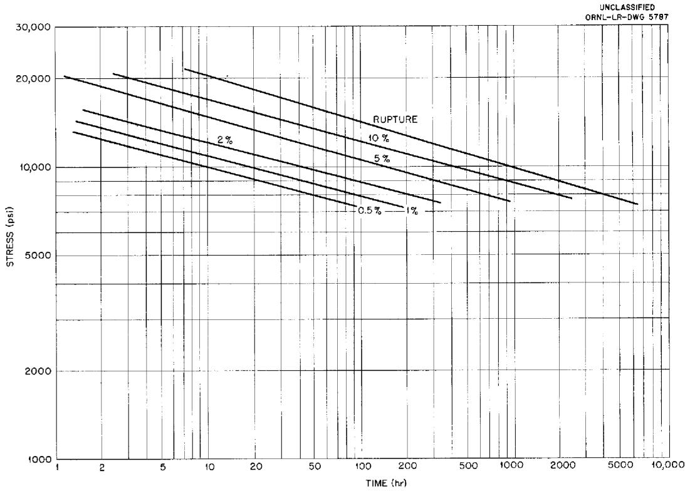  
Fig. 7.23. Stress-Rupture Characteristics of Annealed Inconel Tested in Argon at $1300^{\circ}\mathrm{F}$ .

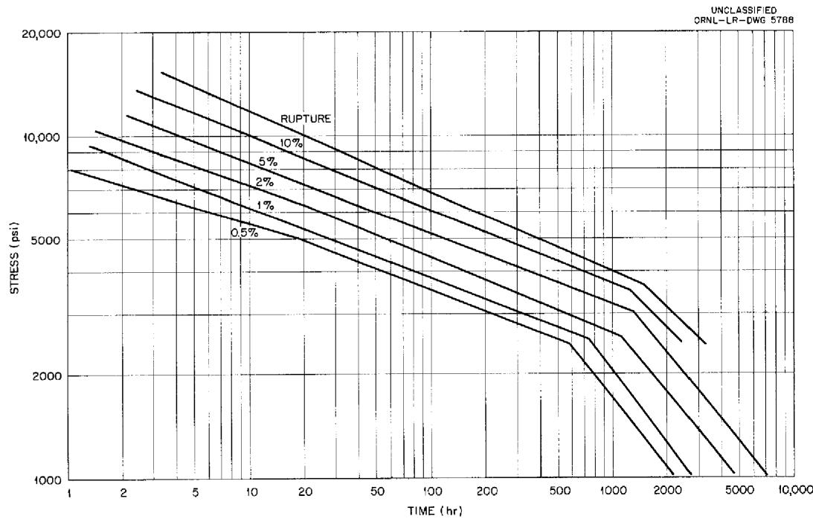  
Fig. 7.24. Stress-Rupture Characteristics of As-Received Inconel Tested in Argon at $1500^{\circ}\mathrm{F}$ .

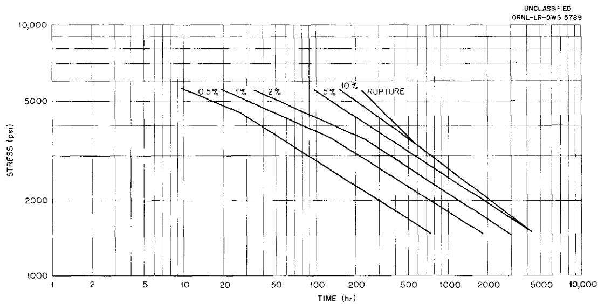

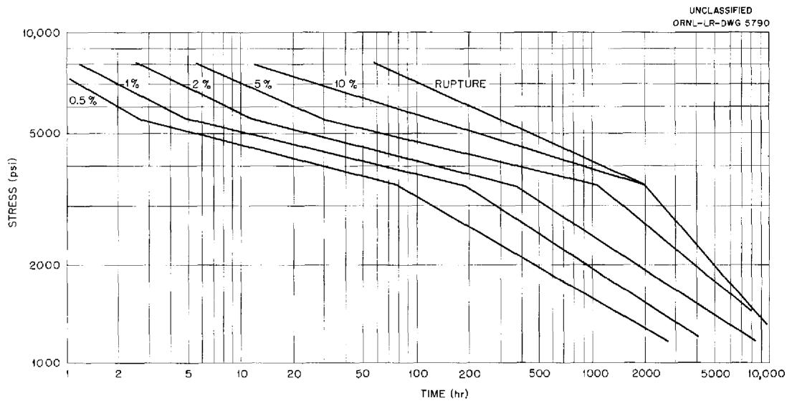  
Fig. 7.25. Stress-Rupture Characteristics of As-Received Inconel Tested in Fused Salt at $1500^{\circ}$ F.   
Fig. 7.26. Stress-Rupture Characteristics of Annealed Inconel Tested in Argon at $1500^{\circ}$ F.

previous quarterly report, but it is presented again in a more complete form to permit a comprehensive and detailed evaluation.

The void formation along the braze metal-Inconel interface, which was noted on the samples brazed with G-E No. 62, G-E No. 81, and the $73.5\%$ Ni- $16.5\%$ Cr- $10.0\%$ Si alloys, and which was previously thought to result from internal oxi

dation, is now believed to be associated with a diffusion phenomenon. Check samples, which were tested in vacuum under identical conditions of time and temperature, contained voids at similar locations along the interface. Although the nature of the void formation is not yet completely understood, it has been noted that the quantity of one constituent appears to increase with increasing time at temperature and with increasing temperature of test. The identification of this constituent, which is probably a complex intermetallic

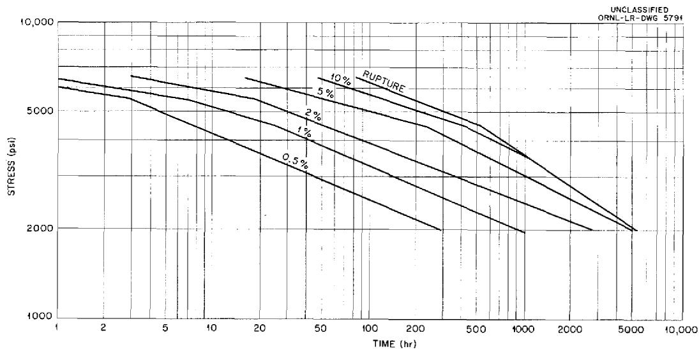  
Fig. 7.27. Stress-Rupture Characteristics of Annealed Inconel Tested in Fused Salt at $1500^{\circ}$ F.

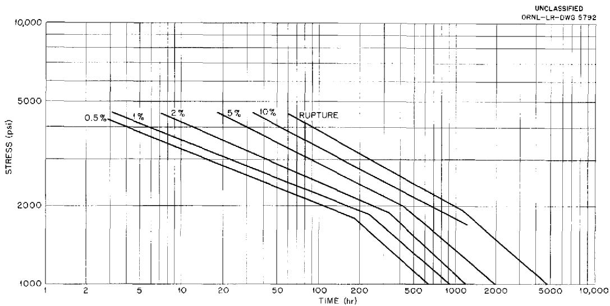  
Fig. 7.28. Stress-Rupture Characteristics of As-Received Inconel Tested in Argon at $1650^{\circ}$ F.

compound, is to be attempted by x-ray techniques, since knowledge of its composition is required for the determination of the diffusion mechanism.

This investigation of brazing alloys has shown that a majority of the nickel and nickel-chromium base alloys are suitable for service in an oxidizing atmosphere at $1500^{\circ}\mathrm{F}$ , and several are suitable at $1700^{\circ}\mathrm{F}$ . Oxidized Inconel joints brazed with two of the alloys of prime interest for liquid-metal-to-air radiators are shown in Figs. 7.31

and 7.32. The excellent resistance to attack of alloy No. 81 after 500 hr at $1500^{\circ}\mathrm{F}$ in static air is illustrated in Fig. 7.31. This alloy has been used for the fabrication of units containing austenitic stainless steel or Inconel fin materials, while Coast Metals alloy No. 52, shown in Fig. 7.32, is of interest in the fabrication of high-conductivity-fin assemblies. Only minor oxidation is evident on the joint brazed with Coast Metals alloy No. 52 after being subjected to the oxidizing

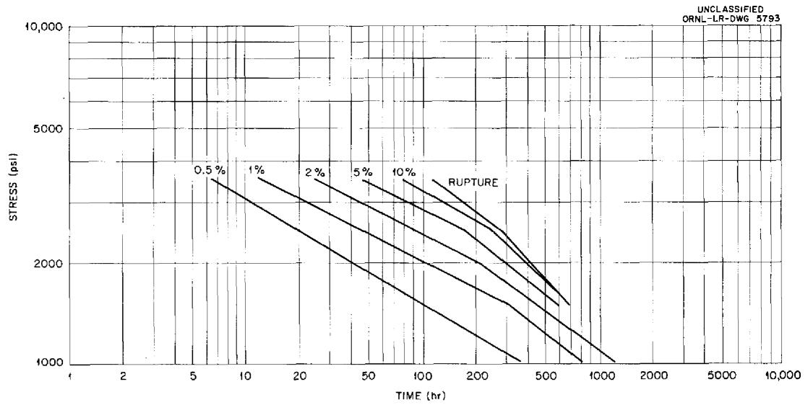

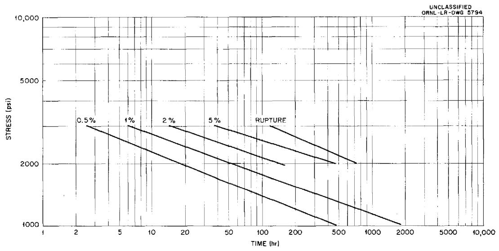  
Fig. 7.29. Stress-Rupture Characteristics of As-Received Inconel Tested in Fused Salts at $1650^{\circ}\mathrm{F}$ .   
Fig. 7.30. Stress-Rupture Characteristics of Annealed Inconel Tested in Fused Salts at $1650^{\circ}$ F.

atmosphere for the same time and temperature as the joint brazed with G-E alloy No. 81. The resistance of the precious-metal-base alloys to attack is also very good, but their application to liquid-metal-to-air radiator fabrication is not considered to be promising. Their poor compatibility with liquid metal environments makes their use extremely risky, since severe tube-wall dilution during brazing or solid-state diffusion in service may produce a high concentration of the precious metal near the circulating liquid.

Cyclic oxidation tests are now being conducted to determine the effect of thermal fluctuations on the adherence of protective oxide films. Preliminary results indicate that the extent of attack on most of the alloys does not increase appreciably in the cyclic tests in comparison with the static tests, but a more complete analysis is required before definite conclusions can be reached.

Corrosion tests have indicated that brazing alloys of the nickel-chromium-germanium and

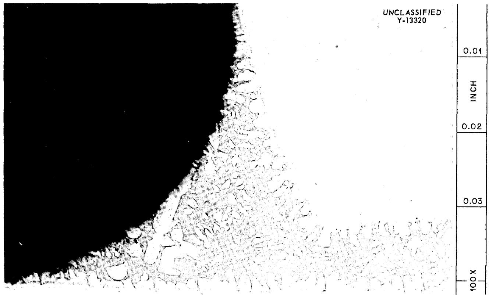  
Fig. 7.31. Inconel T-Joint Brazed with G-E Brazing Alloy No. 81 and Tested in Static Air for 500 hr at $1500^{\circ}$ F. Note negligible attack. Etched with electrolytic oxalic acid, 100X.

nickel-chromium-germanium-silicon types may be of interest in fluoride-to-sodium heat exchangers. In order to conduct further research on these alloys and to provide enough material for tests on heat exchanger components, 1-lb quantities of each alloy and of the $75\%$ Ni- $25\%$ Ge binary alloy were arc-melted. Several techniques have been investigated for reducing these arc-melted ingots to the more desirable powder form, but no suitable laboratory method has been obtained. Grinding with a mortar and pestle or with a ball mill has not been satisfactory because the alloy possesses sufficient inherent ductility to prevent easy powdering. Experiments in which the alloy was induction melted in a quartz tube and the molten metal then permitted to drop from a small hole into water have not been promising. However, 50-g samples have been submitted to a commercial manufacturer of brazing alloy powders for experimentation in powder-making equipment. Other possibilities for obtaining powder lie in the fabrication and instal

lation of a small atomizing machine or the use of larger atomizers available in industry.

Methods for the production of brazing alloy powders from sintered mixtures of elemental powders are now being developed, and preliminary experiments have indicated that this technique may be very promising. The elemental powders are carefully mixed and sintered in dry hydrogen for several hours at a temperature very near that required to fuse the lowest melting point eutectic in the system. This sintered material may then be crushed easily to provide a fine powder suitable for preplacement on heat exchanger or radiator components. Experiments for determining the optimum time and temperature required to obtain sufficient diffusion without seriously impairing the friability of the compact are being conducted, and the possibilities of applying this presintering method to other alloy systems of interest are being studied.

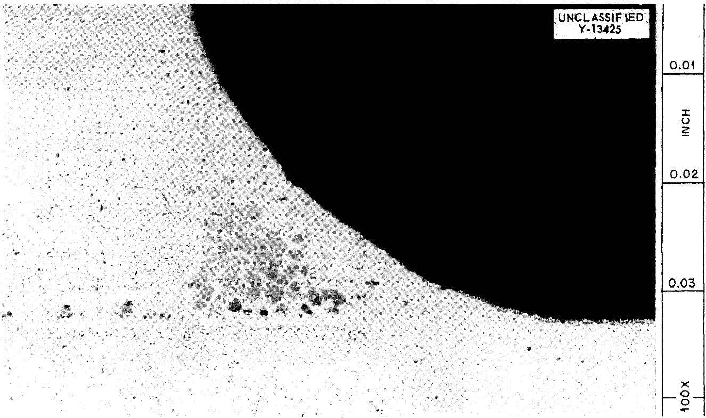  
Fig. 7.32. Inconel T-Joint Brazed with Coast Metals Brazing Alloy No. 52 and Tested in Static Air for 500 hr at $1500^{\circ}$ F. Only very slight oxidation can be seen. Etched with electrolytic oxalic acid. 100X.

# FABRICATION OF TEST COMPONENTS

P. Patriarca

K.W.Reber

R. E. Clausing

G. M. Slaughter

Metallurgy Division

J.M.Cisar

Aircraft Reactor Engineering Division

R. L. Heestand

Pratt & Whitney Aircraft

# High-Conductivity-Fin Radiator

The fabrication of a sodium-to-air radiator with 6 in. of type 430 stainless-steel-clad copper high-conductivity fins was described in a previous report. The tube-to-fin joints were brazed with Coast Metals alloy No. 52 and the tube-to-header welds were made by the semiautomatic heliarc welding technique. The welded tube-to-header joints were back brazed as a precaution against the formation of leaks during service.

During the fabrication of this radiator it was

found that it was necessary to maintain critical control over the quantity of brazing alloy placed on each tube-to-fin joint. A sufficient amount of alloy was required for the oxidation protection of the exposed copper at the punched holes of the high-conductivity fins. The presence of braze metal in excess of that required for the protection of the copper might result in "puddling," that is, concentration of the excess on the bottom fins, which would be undesirable because the air passages between the fins might be sealed and localized solution of the base metal might occur.

The use of extruded brazing alloy wires as a means of obtaining controlled quantities has been investigated extensively, but the lack of a suitable binder makes their use somewhat unattractive at the present time. An acrylic binder material produces wires which are relatively easy to handle when freshly extruded, but they become embrittled upon aging for a few hours at room temperature. Thus the assembly of large complicated radiators is seriously hampered by crumbling and subsequent movement of the brazing alloy from the

desired tube-to-fin location. Another binder material, Castolite, produces wires that are extremely ductile and weak at room temperature and therefore require meticulous care during handling.

A dry-powder method of brazing alloy preplacement has been developed which provides a promising means for obtaining controlled amounts of alloy on each tube-to-fin joint. A stainless steel template containing holes that have been precision drilled is placed over a sheared fin so that each hole in the template is centered over a punched hole in the fins. Since the drilled hole is larger than the punched hole, the template fits securely against the flat portions of the fin. The dry powder is then applied, and the excess powder is removed. After careful removal of the template, the powder is secured to the fin with a methylacrylate cement and allowed to dry. A 36-hole fin with brazing alloy preplaced by this technique is shown in Fig. 7.33.

The oxidation protection of the exposed copper on the sheared edges of the fin is also required in order to minimize oxidation and thus overcome the severe fin distortion that would result from the volume changes that would occur during formation of the oxide. An aluminizing process has been developed in which edge protection is obtained by the formation of a highly oxidation-resistant copper-aluminum alloy. A procedure has also been

devised to permit the aluminizing of large numbers of type 310 stainless-steel-clad copper sheet fins. This procedure, which requires that all fins be precision sheared to an exact size, is described in the following: After degreasing in polychloroethylene or another suitable organic solvent, the fins are stacked in groups of approximately 200 and securely clamped together with $\frac{1}{4}$ -in.-thick stainless steel end plates. The exposed copper edges are then sprayed with three coats of Kestron acrylic spray to seal the cracks between fins and prevent the flow of the aluminum-bearing slurry onto the stainless steel cladding. A coat of slurry, consisting of $100\mathrm{cm}^3$ of acrylic resin to $40\mathrm{g}$ of atomized aluminum powder (-325 mesh), is then applied evenly to the fin edges. After sufficient drying the clamped fins are heated in helium at $750^{\circ}\mathrm{F}$ for $2\frac{1}{2}\mathrm{hr}$ to accelerate the formation of the oxidation-resistant aluminum bronze. A high helium flow rate (80 cfh) should be maintained for the first hour, but it can then be reduced to 40 cfh for the remainder of the heat treatment. After cooling, the excess aluminum can be easily removed from the fin edges with the aid of a brass wire brush. These fins can then be punched by using the conventional techniques.

Test specimens of fins with this type of edge protection have been metallographically examined after 100, 200, 500, and 1000 hr in air at $1500^{\circ}F$ .

UNCLASSIFIED Y-14294

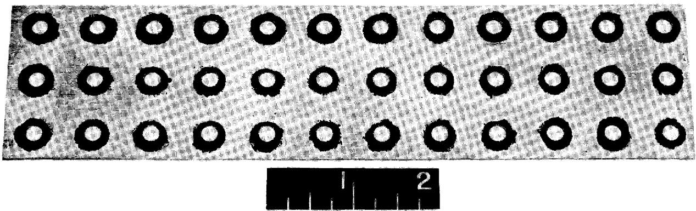  
Fig. 7.33. High-Conductivity Fin for Radiator with Brazing Alloy Preplaced by Dry-Powder Technique.

A protected specimen tested in air for 1000 hr at $1500^{\circ}\mathrm{F}$ is compared in Fig. 7.34 with an unprotected fin tested under the same conditions. The small voids near the aluminized edge of the protected fin are attributed to the migration of copper into the aluminum-rich surface metal. Cyclic tests are also being conducted on alumi-nized fins to evaluate their stability under simulated aircraft service conditions. After 200 hr at $1500^{\circ}\mathrm{F}$ and 70 air-cools to room temperature, no adverse effects were evident.

In preparation for the subsequent assembly, welding, and brazing of two 500-kw NaK-to-air radiators for heat exchange experiments, 2200 stainless-steel-clad copper high-conductivity fins have been sheared to the desired 2-in. by 8-in. final dimensions. They were degreased, inspected for surface imperfections, and aluminum-bronze

edge-protected by the procedure described above. They will be punched and assembled with the tubes by utilizing the dry-powder preplacement technique. The use of a $\frac{1}{16}$ -in.-thick template containing holes 0.246 in. in diameter will provide the minimum quantity of brazing alloy required per joint to permit good coverage of the exposed copper on the punched lips. To further reduce the tendency toward the undesirable accumulation of excess alloy as a result of normal variations in the quantity deposited, two thin sheets of Inconel are to be placed tightly together at 4-in. intervals along the 12 in. of stacked fins. The capillary joint between these two Inconel sheets will act as a sump to remove any excess brazing alloy that may be present. This technique is applicable to the fabrication of the 500-kw radiators because $\frac{1}{16}$ -in.-thick Inconel sheets are required at 4-in. intervals for structural support.

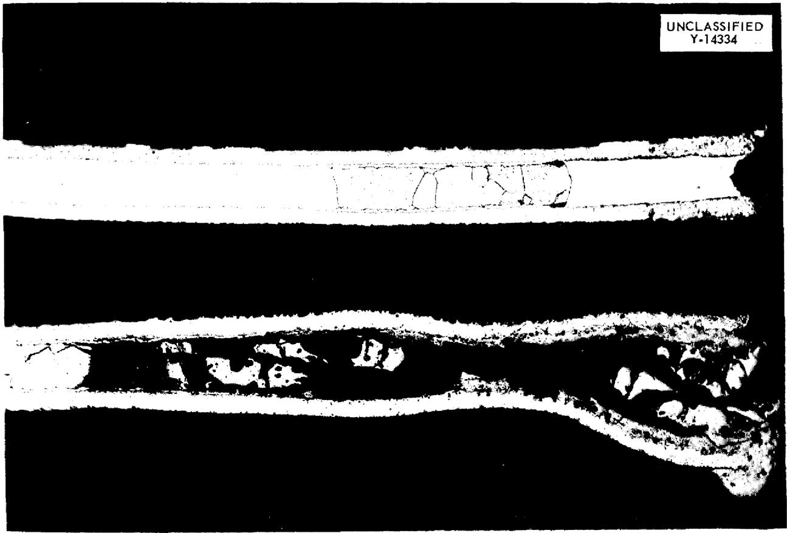  
Fig. 7.34. Type 310 Stainless-Steel-Clad Copper High-Conductivity Fin After Oxidation for 1000 hr at $1500^{\circ}$ F. The top fin illustrates the excellent edge protection afforded by the aluminizing treatment. The bottom fin illustrates the severe attack of the unprotected fin.

Difficulties have been encountered in the use of the $6\%$ aluminum-bronze high-conductivity fin material when brazing the fins to Inconel tubes. The aluminum oxide film present on the fins prevents wetting by the conventional brazing alloys. An electroplate of nickel on the fin did not act as an adequate diffusion barrier to permit wetting by the alloys. A chromium electroplate served as a diffusion barrier, but chromium is extremely difficult to wet in the hydrogen dewpoints readily available in large-scale brazing operations. However, with an electroplate of iron on the aluminum bronze, tube-to-fin joints brazed with Coast Metals alloy No. 52 have been obtained that exhibit excellent wettability, Fig. 7.35. Joints brazed in this manner have also shown excellent resistance to oxidation after 100 hr at $1500^{\circ}\mathrm{F}$ . The iron pickup during brazing does not appreciably reduce the oxidation resistance of the nickel-silicon-boron brazing alloy. The excess iron can be removed from the fins after brazing by

a suitable pickling operation, or it can be removed early in service upon the formation of a nontenacious iron oxide. In view of these promising developments, a quantity of commercially available $5\%$ aluminum bronze has been punched and is being iron-plated for the subsequent fabrication of a large-scale radiator.

# Intermediate Heat Exchanger No. 2

The fabrication of the fluoride-to-sodium intermediate heat exchanger No. 2 requires the heliacr welding of 400 tube-to-header joints and the backbrazing of these welds with a suitable corrosion-resistant alloy, such as Microbraz or nickel-chromium-germanium. The welding of approximately 200 of these joints has been satisfactorily completed by the semiautomatic rotating-arc method, but prior to initiation of the actual fabrication, a set of experiments was conducted to determine the optimum combination of welding conditions. Several of the sample joints were examined under

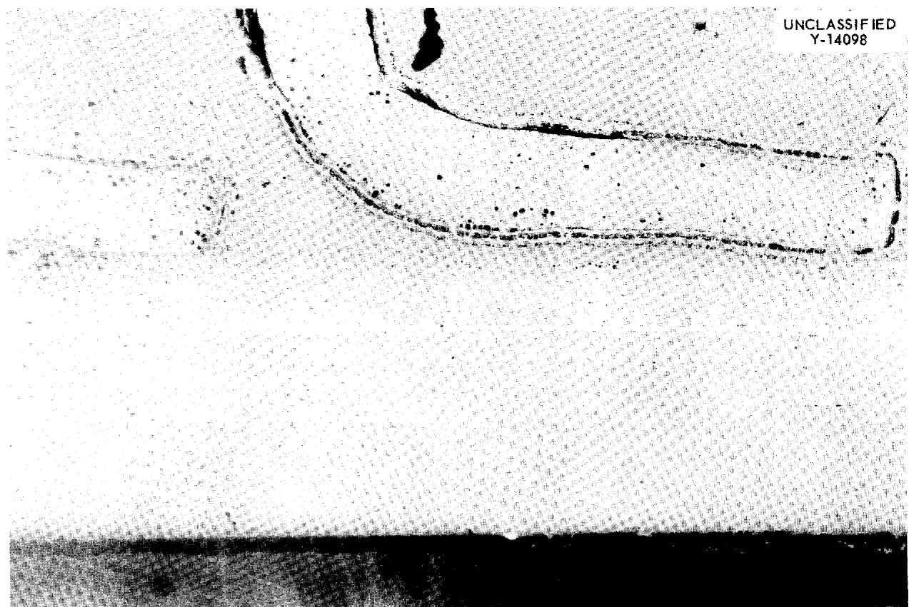  
Fig. 7.35. Iron-Plated Aluminum Bronze High-Conductivity Fins After Brazing with Coast Metals Brazing Alloy No. 52. Good wettability of the fins was obtained. 60X.

high magnification to determine the presence of weld microfissuring, but this type of cracking was not found to constitute a problem.

In these experiments, two Inconel test headers, of the same size and physical shape as those on the actual unit, were machined, and sample tube-to-header welds were made under various controlled conditions. It was immediately evident that the preparation of the header surface after insertion of the tubes, but prior to welding, should definitely not be done by abrasive grinding. Entrapped abrasive in the joint caused severe arc instability and inconsistent welds. A more reliable method consists of preshaping the tubes to conform to the curvature of the header before assembly. The tube can then be heliarc tack-welded to the header and expanded with a special tool before final welding. With the method of header preparation prescribed, welding variables were evaluated to ascertain those which gave the most consistent weld penetration and which were least likely to result in excessive hole constriction or in undersirable preferential melting of the tube wall.

Prior experience had shown that an arc distance of 0.050 in. and a weld time of approximately 6 sec produced consistently good welds when joining $3_{16}$ -in.-OD, 0.017-in. wall tubing to relatively thick headers. These values were therefore used for the determination of the optimum diameter of electrode rotation and the proper welding current. A rotation diameter of between 0.21 and 0.22 in. was found to be desirable, since diameters of less than this often resulted in preferential melting of the tube wall and greater diameters produced the maximum weld penetration in the header plate rather than at the joint where it is of most importance. An arc current of 60 amp at an arc voltage of 10 produced consistently satisfactory welds with penetrations of approximately twice the tube wall thickness. A typical weld produced under these optimum conditions is shown in Fig. 7.36. No weld porosity or cracks are evident and excellent penetration was achieved. The two-pass effect evident in the nugget occurs because a weld overlap of one-fourth revolution is used after the complete peripheral weld has been made. As the weld overlap is being made the weld current is gradually decreased to prevent the formation of undersirable arc craters. The uniformity of welds made under these conditions can be seen in Fig. 7.37, which

shows a 100-weld header section of the partially completed intermediate heat exchanger No. 2.

The fabrication of approximately 50 "comb" spacers for this unit has also been completed. The necessary jigs were prepared and cone-arc plug welding conditions were determined for the heliarc welding of the 0.020-in. by 0.040-in. wire spacers into the 0.010-in. Inconel strip headers. After these spacers are attached to the assembly and the tube-to-header joints are back-brazed, the unit will be ready for insertion in the heavy Inconel pressure shell.

# Radiator for Cornell Aeronautical Laboratory

The fabrication of a full-scale liquid-metal-to-air radiator designed by the Cornell Aeronautical Laboratory has been undertaken. The design incorporates integral-helical-finned tubing completely machined from type 316 stainless steel bar stock. The tubing is machined to 0.200 in. in outside diameter with a 0.037-in. wall, and the header plates and other structural components of the radiator are machined from $\frac{1}{16}$ and $\frac{5}{8}$ -in. type 316 stainless steel plate. The partially completed unit is shown in Fig. 7.38.

After assembly of the tube-to-header section of the radiator, the 312 tube welds were manually heliarc welded by qualified operators using prescribed procedures. Longitudinal grooves were machined in the header plate before welding to simulate treampaning. The grooves in the header aid in minimizing microfissures because they substantially reduce the strain restraint near the weld. A "skip sequence" was also employed during welding to equalize the heat distribution in the header plate.

The filler plates that can be seen in Fig. 7.38 were welded to the side plates to occupy most of the space between these plates and the outer rows of tubes. To prevent severe distortion when welding the side plates to the headers, the side plates were reinforced with 1-in.-thick stainless steel strong-backs, as shown in Fig. 7.38, and then welded to the unit. Figure 7.38 shows the unit after completion of the root passes. The remaining heavy welding and back-brazing with an alloy such as Coast Metals alloy No. 50 should be completed in the next few weeks.

The choice of an alloy for use in back-brazing the welded tube-to-header joints in this radiator depends to a large extent upon the ability of the

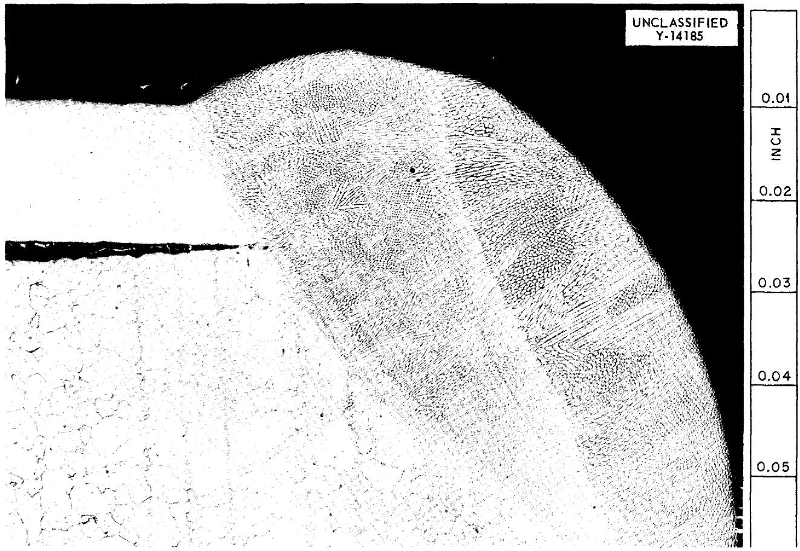

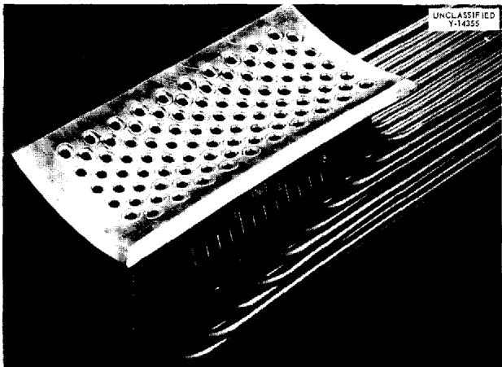  
Fig. 7.36. Inconel Tube-to-Header Weld Prepared Under Optimum Welding Conditions. Excellent penetration and weld quality obtained. Etched with electrolytic oxalic acid, 75X.   
Fig. 7.37. A 100-Weld Header Section of the Intermediate Heat Exchanger No. 2 Welded with the Semiautomatic Heliarc Welding Equipment. Note weld uniformity.

alloy to withstand the severe strain imposed upon cooling as a result of the heavy sections involved. Although several high-temperature brazing alloys possess adequate resistance to high-temperature oxidation, many of them, such as Microbraz, G-E alloy No. 81, and Coast Metals alloy No. 52, crack upon furnace cooling from the brazing temperature. However, Coast Metals alloy No. 50 and the nickel-chromium-germanium alloy show no evidence of cracking under these circumstances. Since Coast Metals alloy No. 50 can be purchased in a powder form and it possesses good resistance to both oxidation and to liquid sodium, it will be seriously considered for this application. However, the extent and effects of boron diffusion from the braze into the stainless steel base material will be determined before it is used. The large mass of the unit suggests that a 12-hr-heating and 12-hr-cooling cycle should be used during brazing,

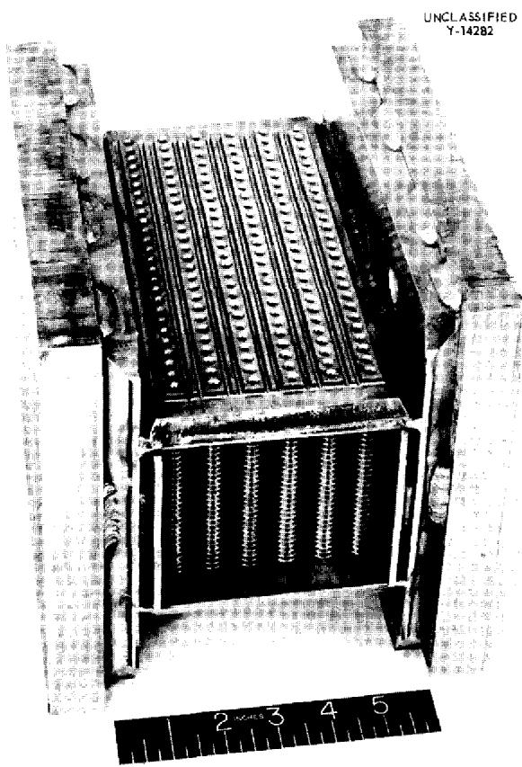  
Fig. 7.38. Cornell Aeronautical Laboratory Radiator After Welding of the Tube-to-Header Joints and Deposition of the Heliacr Root Passes in the Side Plate-to-Header Joints. The heavy stainless steel strongbacks were used to prevent severe distortion of the side plates during welding.

and metallographic test specimens have been prepared to test this cycle under simulated conditions. The extent of diffusion will be determined in the as-brazed condition and after heating for 25, 50, 100, and 500 hr at $1650^{\circ}\mathrm{F}$ . Also, nine tensile-test specimens have been coated with a slurry and brazed under conditions approximating those to be used on the actual radiator. These specimens were submitted to Cornell Aeronautical Laboratory for longitudinal drilling and testing to simulate tests on tubing. Two uncoated tubes were subjected to the same thermal cycle as the brazed samples to serve as controls. If the results of these metallographic and physical tests are promising, Coast Metals alloy No. 50 will be used for the brazing operation. Otherwise, an

alloy of the nickel-chromium-germanium type will probably be used.

# Sodium-Beryllium-Inconel Compatibility Testing Apparatus

A second sodium-beryllium-Inconel compatibility testing apparatus was fabricated; the components are shown in Fig. 7.39 in an exploded view and in Fig. 7.40 after completion. The unit comprises a cylindrical beryllium insert inside an Inconel housing. The Inconel housing, the sodium pots, and the thermocouple housings were manually heliarc welded into position, and nine thermocouple assemblies were brazed with G-E alloy No. 62. All welded and brazed joints were leak-tight, as determined by testing with a helium leak-detecting apparatus.

# Heat Exchanger Brazes

It was reported previously that the $82\%$ Au-18% Ni brazing alloy should be considered for use in the fabrication of fluoride-to-air heat exchangers, and it has now been established that the solid-state migration of gold from this alloy into Inconel tubing is minor after an extended period at an elevated temperature. Thus corrosion tests of the tube interior after service would not be obscured by the presence of localized gold-rich areas. Recent tests with copper as a brazing alloy for fluoride-to-helium heat exchangers have shown similar promising results. A typical joint was held at $1500^{\circ}\mathrm{F}$ for 900 hr and then examined for copper diffusion. Microspark spectrographic techniques coupled with a metallographic examination revealed that a maximum of 0.003 in. of copper diffusion had occurred.

Dynamic corrosion loops are also to be fabricated for studying the corrosion of joints brazed with several alloys and tested in intimate contact with circulating fluoride fuel. These loops will incorporate several sleeve-type sections in the hot leg to assist in the evaluation of brazing alloys for in-pile loop applications.

# Cermet-to-Metal Brazing

The joining of cermets to Inconel will be required if cermets are to be used for applications such as valve seats, and, in evaluation studies of cermets,

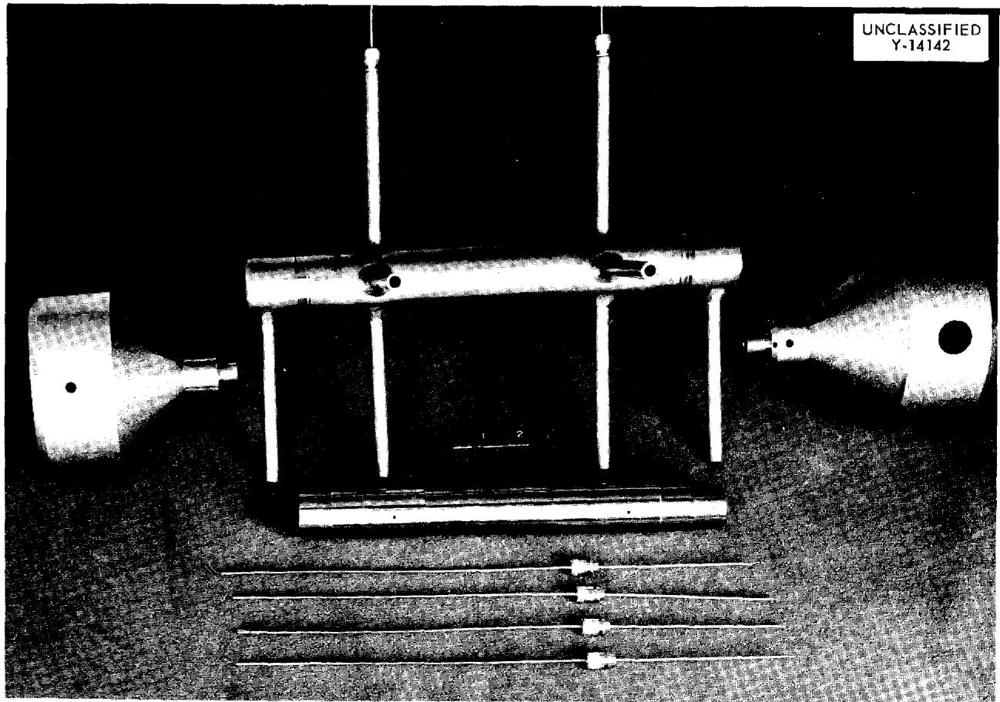  
Fig. 7.39. Unassembled Sodium-Beryllium-Inconel Compatibility Testing Apparatus No. 2 Showing Beryllium Insert, Inconel Housing, Sodium Pots, and Thermocouple Assemblies.

joins between these two materials are now required for the preparation of samples for cernet self-welding tests. A study of cernet-to-Inconel brazing is therefore being conducted in an attempt to develop suitable techniques for the production of these joins.

Preliminary tests have consisted of determining the wettability of certain cermets with fluoride-resistant alloys such as copper, gold-nickel, and nickel-phosphorus. Although the nickel binder is easily bonded, it appears that wetting of the nonmetallic portion of the cermet may be much more difficult. Also of prime importance in the successful production of these joins will be the solution of the problem posed by the unequal thermal expansions of the two materials. The cermets of immediate interest have thermal expansion coefficients ranging from $4.0 \times 10^{-6}$ to $5.7 \times 10^{-6}$ in./in. $^{\circ}F$ as compared with $10.2 \times 10^{-6}$ in./in. $^{\circ}F$

for Inconel in the range 1000 to $1400^{\circ}F$ . The best solution to this problem seems to lie in the use of a combination of a ductile brazing alloy and a ductile pad of metal between the cermet and the Inconel.

A technique now being investigated consists of the deposition on the cermet of a 0.0001-in. layer of "electroless" nickel-phosphorus, which wets both the metallic and nonmetallic portions of the cermet. When this layer is covered with a 0.005-in.-thick acid copper plate and then joined to Inconel by heating to above the melting point of both the nickel-phosphorus layer and the copper, a join that possesses fair mechanical properties is produced. The phosphorus apparently aids in wetting the cermet and then diffuses into the surrounding metal sufficiently to permit some ductility. Physical tests on this type of join will be conducted and screening tests on other alloys will be

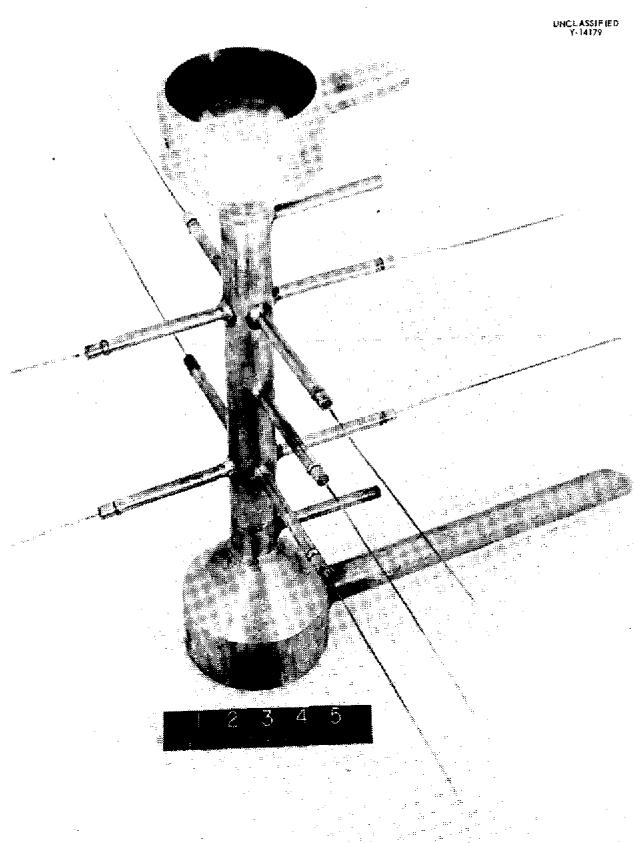  
Fig. 7.40. Assembled Sodium-Beryllium-Inconel Compatibility Testing Apparatus No.2.

performed in an attempt to obtain more satisfactory brazing material for this application. Methods for bonding ceramics, such as the manganese-molybdenum and titanium hydride techniques, will also be investigated.

# SPECIAL MATERIALS FABRICATION

H. Inouye

J. H. Coobs

Metallurgy Division

M. R. D'Amore

Pratt & Whitney Aircraft

# Duplex Tubing

The study of flow patterns in impact-extruded duplex and three-ply tubing was continued. Four extrusions of composite stainless steel-carbon steel tubing have been completed. An examination of the layers of the extruded tubes revealed that fairly close control of the final layer thickness was obtained by adjusting the layer thickness of the extrusion billet. The extruded tubes were

subject to poor material recovery because of metal loss at both ends of the tube. An attempt to improve the material recovery by varying the extrusion billet design is planned.

# G-E Control Rods

The 34 control rods ordered for the GE-ANP Project have been completed and delivered for reactivity testing. They were prepared by filling tubes with a mixture of $50\%$ aluminum and $50\%$ boron carbide by tamping with a pneumatic hammer. The tubes were then evacuated while being heated at $300^{\circ}\mathrm{C}$ to remove the paraffin binder and cold swaged to the final diameter.

The tubes, as loaded, had a boron density of about $0.82\mathrm{g/cm^3}$ that was increased during the final swaging operating to more than $0.85\mathrm{g/cm^3}$ , which was considerably more than the $0.70\mathrm{g/cm^3}$ minimum specified.

# Tubular Fuel Elements

Twelve more plate-type fuel elements were prepared by using either elemental or prealloyed type 304 stainless steel in combination with either high-fired or steam oxidized $\mathsf{UO}_2$ in the cores. These elements have cores 2 in. wide and 5 in. long, and they will be formed into single, seamed tubes for hot and cold drawing experiments. Several more tubular assemblies are being prepared by using seamless materials for reduction by hot swaging or hot rod rolling techniques.

# Boron Shield for ART

Samples of an $85\%$ $\mathsf{B}_{6}\mathsf{C}-15\%$ SiC composition with a boron density of $1.26~\mathrm{g/cm^3}$ were received from the Carborundum Company. This composition is reputed to be easy to fabricate, with very close dimensional control, by cold pressing and firing. Nicholson of the Carborundum Company stated that the boron content could be increased somewhat by the addition of boron or boron nitride to the composition.

Metallographic examination of samples from a recent test designed for comparing the reactions of boron and of boron carbide with Inconel has been completed. In the test, three samples of boron-containing materials were in contact with Inconel in a helium atmosphere for 100 hr at $1500^{\circ}F$ . The boron-containing materials were commercial, hot-pressed B4C (Norton Company's "Norbide"), hot-pressed boron, and cold-pressed

amorphous boron powder. Total depth of penetration in Inconel of the reaction with these materials was 0.004, 0.006, and 0.010 in., respectively.

The diffusion of boron from these materials into Inconel seems to proceed along grain boundaries, and a second phase which is boron-rich is gradually formed. In the case of severe reaction, as from the amorphous boron powder, the second phase forms a continuous layer at the interface; the layer separates slightly from the Inconel during cooling. Thermal cycling of a system in which considerable reaction had occurred could thus result in spalling of the layer and an increase in the rate of attack.

Another compatibility test has been completed that was designed to compare the reactions of hot-pressed $\mathsf{B}_4\mathsf{C}$ and the $\mathsf{B}_6\mathsf{C}-\mathsf{Si}\mathsf{C}$ composition with Inconel. In this test the samples were exposed in helium at $1600^{\circ}\mathsf{F}$ for 100 hr. In an attempt to inhibit the reaction, one surface of each of two pieces of the $\mathsf{B}_6\mathsf{C}-\mathsf{Si}\mathsf{C}$ was sprayed with a suspension of Norton alumina (Grade 38-900) in acetone before assembly for testing. Visual examination showed some reaction, even on those surfaces protected with alumina. Samples are now being prepared for metallographic examination.

# Al- $\mathsf{UO}_2$ Fuel Plates for Shielding Experiment

A series of fuel elements was prepared with both 52S and 24S aluminum alloys for cladding in an attempt to make aluminum-clad sandwiches containing $\mathsf{UO}_2$ mixed with aluminum that will be strong enough to withstand the high stresses expected in the proposed shielding experiments that mock up the reflector-moderated reactor (cf., sec. 13, "Lid Tank Shielding Facility"). In the test the plates will be cycled at speeds ranging up to 20 fps on a link chain running on 3.5-in.-dia sprocket wheels. No difficulties were encountered in fabricating the cores for these plates or in maintaining uniform fuel distribution. The cores were prepared by mixing 57 wt % steam-oxidized $\mathsf{UO}_2$ in -140 mesh atomized aluminum and then cold pressing at 33 psi. The sandwiches were reduced about $92\%$ in 10 roll passes with no evidence of edge cracking or separation in the cores.

In preparing the 52S aluminum-clad plates, much difficulty was encountered in obtaining bonding

between the cladding and the frame during hot rolling. Therefore a second set was prepared with 2S aluminum frames and 52S aluminum cladding. These plates bonded satisfactorily. They were strain-hardened by cold rolling to the required thickness and finally bent slightly on a $5\frac{1}{6}$ -in. radius to straighten them and add ridigity. However, attempts to bend them to a smaller radius, to achieve greater ridigity, resulted in cracking of the cladding and exposure of the $\mathrm{UO}_2$ -bearing core, and therefore these plates also were unsatisfactory.

Next, a series of plates was prepared with 24S aluminum as the cladding material. These plates were rolled successfully, with good bonding and fuel distribution, and they could be solution annealed and bent cold to a cross sectional radius as small as $1\frac{1}{2}$ in. without cracking the cladding. After age hardening, these plates were tested and found to be very close to the required strength.

A set of 17 such plates has been prepared for an endurance test. Each plate contains the required $91\mathrm{g}$ of $\mathsf{UO}_2$ with 24S aluminum cladding. They were bent to a $1\frac{3}{4}$ -in. radius and age-hardened to the T-81 condition. Fabrication of enriched plates will probably begin as soon as results of the test are available.

# CERAMIC RESEARCH

C.E.Curtis J.A.Griffin

J. R. Johnson

Metallurgy Division

# Oxidation Reactions of $\mathsf{U}\mathsf{O}_2$ and of $\mathsf{U}\mathsf{O}_2$ in BeO

Uranium oxide in the form of a powder or bars previously sintered at $2900^{\circ}\mathrm{F}$ in hydrogen gained up to $2\%$ in weight when fired for $66\frac{1}{2}$ hr at $2500^{\circ}\mathrm{F}$ in still air. Under the same conditions, up to $14\%$ was lost from beryllium oxide tubes containing 16.2 wt $\%$ of $\mathsf{UO}_2$ previously sintered at $2900^{\circ}\mathrm{F}$ . The accelerated volatilization may have been due to the formation of a compound between uranium oxide, beryllium oxide, and possibly water vapor. The losses in $\mathsf{UO}_2$ were much lower than those obtained recently by H. C. Brassfield with similar tubes heated in moving air. However, all results point to the necessity of stabilizing $\mathsf{UO}_2$ against oxidation under these conditions. For this purpose either the formation of a stable compound of $\mathsf{UO}_2$ or use of a protective glaze may be found to be feasible. Both approaches are being investigated.

# Fabrication of Rare Earth Oxide Wafers for Critical Experiments

Five wafers each of gadolinium and samarium oxides $(3/4$ in. in diameter and about 10 mils thick) were supplied for testing at the Critical Experiment Facility (cf., sec. 4, "Critical Experi

ments''). About 32 slugs of a mixture of $\mathsf{Sm}_2\mathsf{O}_3$ and $\mathsf{Gd}_2\mathsf{O}_3$ are being fabricated for subsequent canning in an Inconel rod. The slugs will be 0.45 in. in diameter and 0.75 in. in length. These slugs will also be used at the Critical Experiment Facility. Some physical property measurements will be made before delivery.

# 8. HEAT TRANSFER AND PHYSICAL PROPERTIES

# H. F. Poppendiek   Reactor Experimental Engineering Division

Additional heat transfer experiments have been performed with NaF-ZrF4-UF4flowing in Inconel tubes. Some quantitative velocity measurements were obtained for the 18-in. ART core, and the nature of fluid flow in a simple separation region was studied. Analytical studies of heat and velocity distribution in the high-temperature-differential, high-velocity loops were made.

A preliminary value was obtained for the heat capacity of NaF-ZrF4-UF4 in the liquid state, and the viscosities of NaF-KF-ZrF4, NaF-BeF2, and LiF-BeF2 were determined. A study was made of the influence on ART heat transfer of the physical properties of three types of fluoride fuels.

# FUSED SALT HEAT TRANSFER

# H. W. Hoffman   Reactor Experimental Engineering Division

Further heat transfer experiments have been performed with the fuel mixture $\mathrm{NaF - ZrF_4 - UF_4}$ (53.5-40-6.5 mole %) flowing in an Inconel tube. The data obtained were for the period of operation from 0 to 2 hr and were in agreement with the previously reported results for 24 to 115 hr of operation. Failure of the apparatus caused termination of this sequence of experiments before data for longer operational times could be obtained. The results of the heat transfer measurements in the system $\mathrm{NaF - ZrF_4 - UF_4}$ -Inconel are summarized in Fig. 8.1, and a comparison is made with the general correlation for ordinary fluids, as well as with the results for the NaF-KF-LiF (11.5-42-46.5 mole %)-Inconel system in which corrosion deposits were found on the tube walls.

Surface deposits did not occur with NaF-ZrF $_4$ -UF $_4$ in Inconel, but vapor blanketing on the inside tube surface could, perhaps, cause the $24\%$ difference between the general correlation and the current data. Therefore, a system is being readied for studying the pressure-drop characteristics of NaF-ZrF $_4$ -UF $_4$ in circular tubes with electrically heated walls.

Photomicrographs (Figs. 8.2 and 8.3) of the two Inconel tubes used in the NaF-ZrF $_4$ -UF $_4$ heat transfer experiments were made by R. Crouse of the Metallurgy Division. The conditions prevailing

during exposure are presented in Table 8.1. In tube 1, extensive subsurface void formation occurred to a depth of 5 mils. However, the total void volume was not large enough to affect the thermal conductivity of this 5-mil thick region. This is further indicated by the agreement between the heat transfer results of tube 1 and tube 2; no

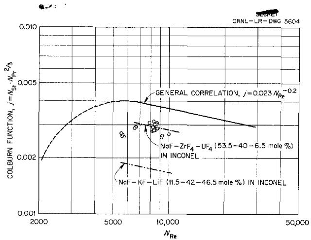  
Fig. 8.1. Comparison of Current Heat Transfer Measurements on NaF-ZrF $_4$ -UF $_4$ (53.5-40-6.5 mole %) in Inconel with the General Correlation for Ordinary Fluids and the Data for NaF-KF-LiF (11.5-42-46.5 mole %) in Inconel.

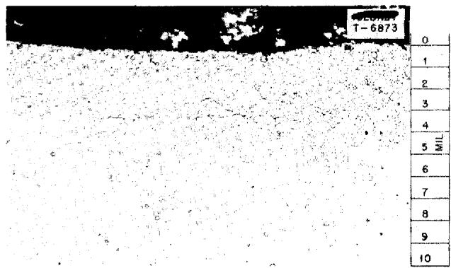  
Fig. 8.2. Inconel Tube Exposed to Flowing NaF-ZrF $_4$ -UF $_4$ for 115 hr. Average temperature: $1300^{\circ}$ F. Average velocity: 10.5 fps.

TABLE 8.1. CONDITIONS PREVAILING DURING HEAT TRANSFER EXPERIMENTS ON ${\mathrm{{NaF}}}_{2}{\mathrm{{ZrF}}}_{4} - {\mathrm{{UF}}}_{4}$   

<table><tr><td>Tube</td><td>Exposure (hr)</td><td>Temperature (°F)</td><td>Reynolds Number</td><td>Velocity (fps)</td></tr><tr><td rowspan="3">1</td><td>24</td><td>1200</td><td>5,500 to 6,500</td><td>8.5 to 10.0</td></tr><tr><td>85</td><td>1300</td><td>~8,500</td><td>10.5</td></tr><tr><td>6</td><td>1400</td><td>9,000 to 10,000</td><td>10.8</td></tr><tr><td>2</td><td>3</td><td>1420</td><td>~8,500</td><td>10.5</td></tr></table>

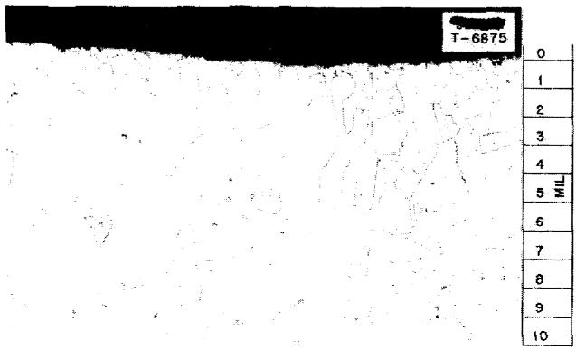  
Fig. 8.3. Inconel Tube Exposed to Flowing NaF-ZrF $_4$ -UF $_4$ for 3 hr. Average temperature: $1420^{\circ}$ F. Average velocity: 10.5 fps.

apparent void formation occurred in tube 2. Additional heat transfer studies with NaF-ZrF4-UF4 are planned in a system modified so that the cause of previous apparatus failures is avoided.

Since the ART fuel-to-NaK heat exchanger has been designed to operate in the transition flow region-experiments to define more precisely fused salt heat transfer in both the transition and the laminar zones are now under way. Experiments with NaF-KF-LiF eutectic in stainless steel and a zirconium-base fuel in Inconel will be conducted.

# REACTOR CORE HYDRODYNAMICS

J. O. Bradfute

L.D.Palmer

F.E.Lynch

Reactor Experimental Engineering Division

G. L. Muller

Pratt & Whitney Aircraft

Preliminary, quantitative velocity data for a model of an 18-in. core for a reflector-moderated reactor were obtained by the photographic tech

nique. This core has straight-through flow and no entrance vanes. Qualitative velocity information was obtained by using the visualization technique in which a phosphorescent material is employed. This technique revealed a very large region of flow separation along the outer core wall starting at a point close to the entrance and continuing past the midplane. Figure 8.4 shows an estimate of several velocity profiles in the flow channel. Additional smaller separation regions were observed next to the island wall, but they were much less distinct. The results of these experiments are described in detail in a separate report.

The design of a one-quarter scale model of a proposed 21-in. core has been undertaken. It is planned to utilize the flow facilities and the lighting and photographic equipment assembled for the smaller core model to describe the velocity profiles. The phosphorescent-particle and the photographic techniques will again be used.

A vaned section to impart a rotational component to the flow immediately upstream from the core model has been fabricated (Fig. 8.5). The effect of rotation on the large separation region will be studied qualitatively by using the visualization technique.

A variable-angle divergent channel system was designed, fabricated, and installed in the flow-visualization system so that the nature of flow in separation regions could be studied. Thick, laminar-like flow layers were noted next to the wall where flow separation occurred under turbulent

SECRET ORNL-LR-DWG 5611

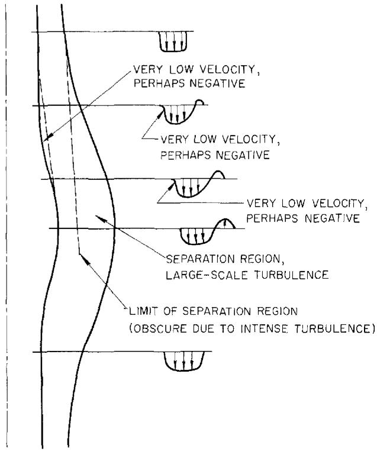  
Fig. 8.4. Qualitative Velocity Profiles in a Model of an 18-in. Core of a Reflector-Moderated Reactor for a Reynolds Number of 3000.

(high Reynolds number) conditions. Also, regions of partial flow stagnation were observed next to this laminar-like layer. Experiments are now in progress in which these separation regions are being wiped out by the insertion of very fine screens located upstream.

# ELECTRICAL HEATING AND FLOW IN TUBE BENDS

H.W.Hoffman L.D.Palmer N.D.Greene

Reactor Experimental Engineering Division

It has been observed that peripheral corrosion on the inside surface of the 180-deg bends of a high-temperature-differential, high-velocity loop is not uniform. The preliminary results of the experiments (cf., sec. 6, "Corrosion Research") indicated the attack on the short-radius side of the bend to be 2 to 3 times that on the long-radius side. If it is presumed that the corrosive attack is related to the temperature of the surface and that, probably, it is greater at a high surface temperature, two possible mechanisms by which the short-radius side temperatures could be greater than the long-radius side temperatures can be hypothesized: (1) nonuniform heat generation in the wall and (2) nonuniform fluid velocity distributions.

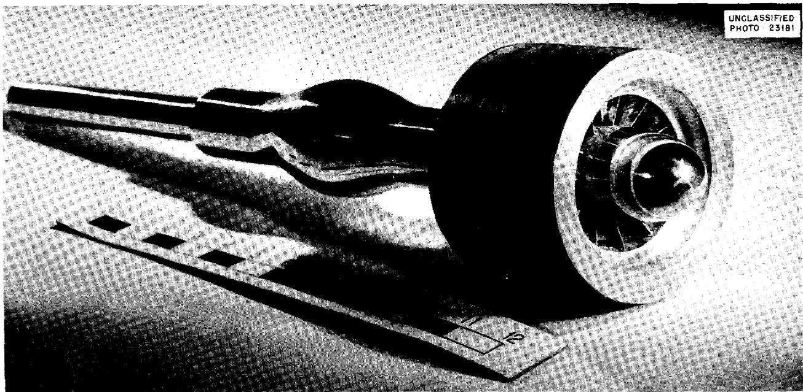  
Fig. 8.5. Vaned Entrance Section for Obtaining Flow with a Rotational Component.

It was shown that for a tube bend with an electrical current passing through the tube walls, the heat generation in the wall on the short-radius side of the bend is greater than that on the long-radius side. For the specific dimensions of the bends in the loops used in these experiments (tube OD, 0.5 in.; wall thickness, 0.045 in.; radius of curvature, 3.5 in.), the short-radius side heat generation was $30\%$ greater than that of the long-radius side. Therefore the surface temperature on the short-radius side was higher than that on the long-radius side. Experimental verification of this conclusion was obtained by instrumenting a typical bend with thermocouples and observing the temperatures as the power generation was varied while the outer surface was being cooled by uniform natural convection and there was no flow on the inside of the tube.

Velocity profile observations were made of the flow through a 180-deg glass bend having the same ratio of radius of curvature to tube radius as that in the experimental loop. The phosphorescent flow visualization method was used for these observations. It was found that the maximum fluid velocity occurred close to the long radius of the bend and that there was a large difference in the amount of wall cooling between the short- and long-radius sides because of the large differences in fluid velocity. Thus the difference between the wall temperature on the short-radius side of the tube and that on the long-radius side was further increased by the difference in wall cooling. Indeed, it is probable that the effect of nonuniform fluid flow distribution is more important in yielding high wall temperatures than is the effect of the nonuniform heat flux in the tube wall.

Estimates of the combination of the heating by the two mechanisms have yielded differences in temperature between the short- and long-radius sides of the order of $100^{\circ}\mathrm{F}$ . Some measurements have been made that tend to confirm this rough estimate (cf., sec. 3, "Experimental Reactor Engineering").

# ART FUEL-TO-NoK HEAT EXCHANGER

J. L. Wontland

H.W.Hoffman

Reactor Experimental Engineering Division

In the current design of the ART, the flow on the fuel side of the heat exchanger is in the middle of the transition flow region (Reynolds number ranges from 2000 to about 5000). The fuel will

flow parallel to a bundle of tubes through which NaK will be flowing, and, for a zirconium-base fuel in this system, the Nusselt number may vary from about 4.4 to 35 through this narrow Reynolds number range. Thus, a study has been initiated to determine the heat transfer and friction characteristics of the heat exchanger in the transition flow region.

An experiment has been designed which utilizes a full-scale heat exchanger tube bundle containing 100 tubes. Water is to be used as the heat transfer fluid at a temperature level that will give Prandtl numbers and kinematic viscosities similar to those of the fuel. The heat transfer characteristics will be determined by two different methods. First, measurements will be made with the system operating as a water-to-water heat exchanger with high fluid flow rates through the tubes to yield low and calculable thermal resistances in the flowing water inside the tubes. In the second experiment, the tube bundle will be resistance heated by passing an electric current through it, and it will be cooled by water flow between the tubes. Pressure-drop measurements will also be made for the system. These experimental studies will yield the variations of Nusselt number and the friction characteristics throughout the transition flow region.

# REACTOR CORE HEAT TRANSFER

N. D. Greene

J.A.Russell

Reactor Experimental Engineering Division

A study of the feasibility and desired objectives of a volume heat source experiment for investigating uniform volumetric heat generation within divergent and convergent channels has been completed. The design of several components for this experiment, for example, the heat exchanger and the test channel, has been established, and construction of the divergent-flow test channel is nearing completion. Construction of the associated heat exchanger is awaiting receipt of the necessary metal.

The 300-kw, 460-v power supply, which is required both for the volume heat source experiment and the ART heat exchanger experiment, has been ordered, and all necessary power instrumentation has been designed to adapt this power source to both experiments. Means for recording rapid temperature changes in the fluid, which will be at an electrical potential of 440-v (alternating

current), are being studied. A saturable reactor is being tested to determine its ability to control large amounts of alternating current. The characteristics of the reactor will be evaluated as soon as a source of direct current (for control purposes) is available.

# TRANSIENT BOILING STUDIES

M.W.Rosenthal

Reactor Experimental Engineering Division

The phase of the transient boiling program which involved a series of delay-time and superheat measurements was completed. A number of runs with exponential increases in power were undertaken, and several experiments were performed with step increases and with linear increases in power. Reduction of the data and analysis of the results are continuing.

# HEAT CAPACITY

W.D. Powers

Reactor Experimental Engineering Division

Two copper calorimeters have been installed and are now in operation. Because of the much greater precision that can be obtained, these two calorimeters are expected to furnish enthalpies and heat capacities at least as fast as did the five ice calorimeters previously in use.

Preliminary results for the heat capacity of liquid NaF-ZrF4-UF4 (56-39-5 mole %) were obtained. The heat capacity was found to be 0.256 ± 0.004 cal/g°C over the temperature range of 570 to 890°C.

# VISCOSITY

S. I. Cohen

Reactor Experimental Engineering Division

The program of refining viscometry techniques has been substantially completed. The specific changes made during the course of this program were described previously. Results of the program suggest that subsequent measurements will yield viscosities somewhat lower than those given by early measurements on the same compositions.

Measurements have been made with the refined techniques on three fluoride mixtures. Data were taken on NaF-KF-ZrF $_4$ (5-52-43 mole %) with both the Brookfield and capillary viscometers, and the results yielded by the two devices were in good agreement (Fig. 8.6); the viscosity varied from about 7.9 cp at $550^{\circ}\mathrm{C}$ to about 3.5 cp at $750^{\circ}\mathrm{C}$ and may be represented throughout this range by

$$
\mu = 0. 1 2 3 3 e ^ {3 4 2 7 / T},
$$

where $T$ is in ${}^{\circ}\mathsf{K}$ .

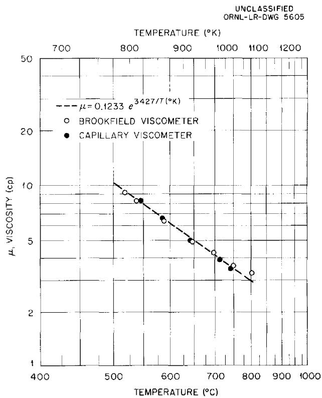  
Fig. 8.6. Viscosity of NaF-KF-ZrF $_4$ (5-52-43 mole %) Obtained by Both the Brookfield and the Capillary Viscometers.

Measurements were made on two beryllium-bearing mixtures in a small, disposable drybox fabricated especially for beryllium work from a 20-gal drum. The data were taken with capillary viscometers. The viscosity of NaF-BeF $_2$ (57-43 mole %) varied from about 18.5 cp at $550^{\circ}\mathrm{C}$ to about 5.2 cp at $750^{\circ}\mathrm{C}$ (Fig. 8.7) and may be represented throughout this range by

$$
\mu = 0. 0 3 0 8 e ^ {5 2 4 0 / T},
$$

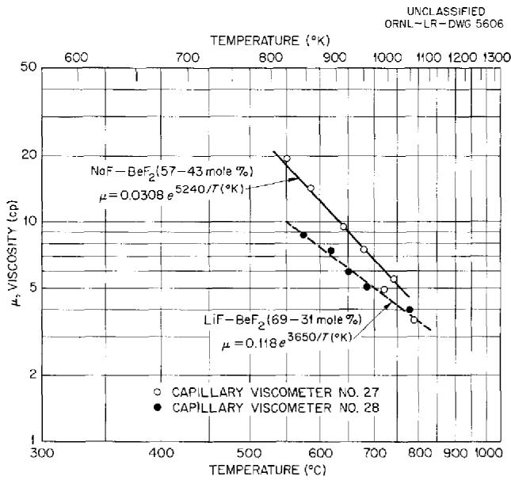  
Fig. 8.7. Viscosities of NaF-BeF $_2$ (57-43 mole %) and LiF-BeF $_2$ (69-31 mole %).

where $T$ is in ${}^{\circ}\mathsf{K}$ . The viscosity of $\mathsf{LiF - BeF}_2$ (69-31 mole %) varied from about 10 cp at $550^{\circ}\mathsf{C}$ to about 3.5 cp at $800^{\circ}\mathsf{C}$ (Fig. 8.7) and may be represented throughout this range by

$$
\mu = 0. 1 1 8 e ^ {3 6 5 0 / T}
$$

where $T$ is in ${}^{\circ}\mathsf{K}$ . It was expected that the viscosity of the $\mathrm{LiF - BeF}_2$ mixture would be lower than that of the $\mathrm{NaF - BeF}_2$ mixture because the former has a lower density. However, the viscosities of both are higher than would be predicted from the general trend for other fluorides, which indicates a proportionality between the viscosities and densities. The beryllium-bearing mixtures are apparently glass-like in character.

# THERMAL CONDUCTIVITY

W.D. Powers

Reactor Experimental Engineering Division

A radial thermal conductivity apparatus has been fabricated, and a drybox has been designed and fabricated to be used with this apparatus. The sample to be studied in this apparatus will be contained between concentric cylinders. A known amount of heat will be generated in the inner cylinder, and the temperature difference across the sample will be measured. The thermal conductivity may then be calculated from these measure

ments and the physical dimensions of the system.

Measurements were made on water for a number of different heat flows. For low heat flows the calculated thermal conductivity is constant, but when the heat flow reaches a critical value the conductivity increases with increasing heat flows. Above the critical value, heat is transferred not only by conduction, but also by free convection. A plot of the observed conductivity of water vs the heat flow measured in watts per inch of sample is presented in Fig. 8.8; the results are in good agreement with the known values. A radial thermal conductivity apparatus is being designed for determining the thermal conductivity of lithium hydride.

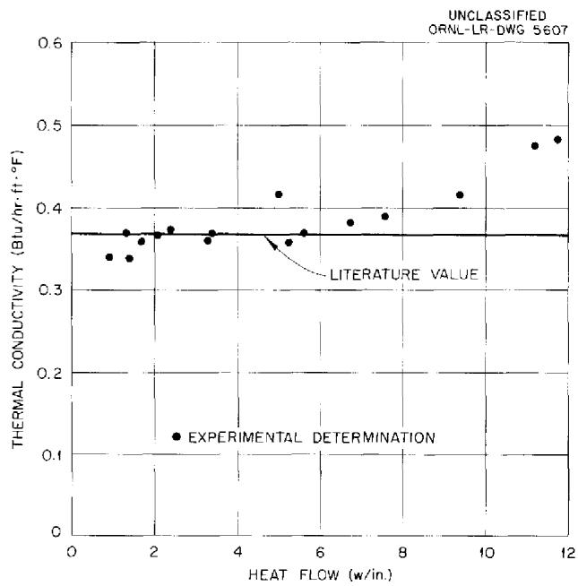  
Fig. 8.8. Thermal Conductivities of Water Measured by the Radial Device and Compared with the Literature Value.

# ELECTRICAL CONDUCTIVITY

N. D. Greene

Reactor Experimental Engineering Division

The platinum electrical conductivity cell has been completed and standardized at room temperature. An attempt to standardize the cell at high temperatures was forestalled by electrode expansion and binding of adjacent components. The machine work necessary to alleviate this problem is now being undertaken.

# INFLUENCES OF THE PHYSICAL PROPERTIES ON REACTOR HEAT TRANSFER

H. F. Poppendiek

Reactor Experimental Engineering Division

It is of interest to compare the heat and momentum transfer characteristics of the ART for the three different types of fluoride fuels now being considered, namely, lithium-base, zirconium-base, and beryllium-base fuels. The core, as well as the fuel-to-NaK heat exchanger, must be considered.

In the case of the core, the wall-to-fluid temperature difference which must be reduced by cooling to prevent excessive wall temperatures is of prime importance. For a given core geometry, power density, and system pressure drop the wall-to-fluid temperature difference can be related analytically to the physical properties. Calculations for the three different types of fuels indicate that the wall-to-fluid temperature difference for the zirconium-base fuel will be about two times as great as that for the lithium-base fuel and that the wall-to-fluid temperature difference for the beryllium-base fuel (based on somewhat limited physical property data, at present) will be about 1.3 times as great as that for the lithium-base fuel.

In the case of the heat exchanger, a comparison has been made on the basis that the sum of the radial temperature difference plus one half the axial fluid temperature difference is equal to a constant; if all other parameters remained the same, this condition would always yield the same air outlet temperature in the radiator. An analysis was made for a typical ART heat exchanger by the method described previously. The results indicate that the zirconium-base fuel has a Reynolds number of about 3000 and a corresponding pressure drop about 1.6 times as great as that for the lithium-base fuel and that the beryllium-base fuel has a Reynolds number of about 2300 and a corresponding pressure drop at least 1.4 times as great as that for the lithium-base fuel. The Reynolds number for the lithium-base fuel is about 4000. The Reynolds number of the beryllium-base fuel is low because its viscosity is relatively high and its density relatively low (high kinematic viscosity).

# 9. RADIATION DAMAGE

D. S. Billington

J. B. Trice

Solid State Division

The program of irradiating Inconel capsules containing fluoride fuels in the MTR is continuing. A new method for resistance welding thermocouples to the capsule surface coupled with a new control system has resulted in much improved temperature control during the irradiations.

Design work has been completed on the miniature in-pile loop, and many of the parts have been fabricated. The miniature sump pump for the loop has been tested and found to be satisfactory. The horizontal-beam hole in-pile loop was operated in the LITR and is now being disassembled for metallographic examination. A pneumatic flux-measuring device is being used for preliminary measurements of the thermal-neutron flux to be expected in the fuel region of the MTR in-pile loop. Approval was obtained for irradiation of the stress-corrosion apparatus in the LITR, and examinations of the first irradiated specimen are under way. The MTR creep apparatus has been shipped to NRTS.

# MTR STATIC CORROSION TESTS

W.E.Browning G.W.Keilholtz Solid State Division

H. L. Hemphill

Analytical Chemistry Division

Irradiations in the MTR of Inconel capsules containing fluoride fuels are continuing but have been somewhat retarded because of interruptions in the MTR operating schedule. Three recent improvements in the MTR capsule irradiation facility, which is being used to study static corrosion and chemical stability in ANP fuel-container systems, have consisted of a method for assembly of the air annulus onto the capsule prior to insertion, a controller with faster temperature and air flow response, and an improved method for fabricating thermocouples and for attaching them to the fuel container walls.

The revised capsule-air annulus assembly, which is already being used in the MTR, was shown schematically in the previous report. The arrangement has the advantages that the annulus alignment can be performed and visually inspected outside the reactor and that all the thermocouples

can be attached to the capsule assembly before insertion into the reactor. Also, the problem of maintaining thermocouples in the permanently installed part of the facility to indicate capsule alignment has been eliminated. The annulus sleeve is easily removable in the hot cells in the post-irradiation examination of the capsules.

The new system of control for maintaining a steady capsule temperature through the proper metering of cooling air to the capsule has derivative action plus proportional control and fast reset. This combination of controls has been shown in bench tests to quench thermal oscillations caused by inherent instabilities in the system and to request an increase in cooling air from the controller with sufficient speed to handle any foreseeable sudden increases or decreases in reactor power. It is now operating successfully in the MTR capsule facility.

Two improved methods for welding thermocouples to the Inconel capsules for the present series of tests were made by R. J. Fox of the Central Machine Shops. One method (illustrated in Fig. 9.1) involves crossing the chromel and alumel wires, pressing them against the capsule with a copper electrode, and passing current through them to weld them to the capsule by resistance heating. The other method uses the same welding technique, but the wires are laid parallel along the surface before the current is applied. In each case spot-welding parameters were optimized for producing a thermocouple bead which appeared, under the microscope, to have the best shape for good heat transfer and mechanical strength. These methods are better than the previous method, in which the thermocouple was fused to the Inconel surface with an arc discharge, in that a thermocouple junction is obtained which lies closer to the Inconel capsule surface and therefore yields a better measure of the capsule wall temperature. A comparison of the crossed-wire type of resistance-welded thermocouple and the previous spark-welded type of thermocouple is presented

UNCLASSIFIED PHOTO 13864

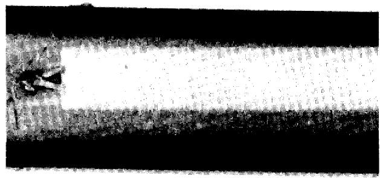  
TRIMMED THERMOCOUPLE DIRECTION OF AIR FLOW

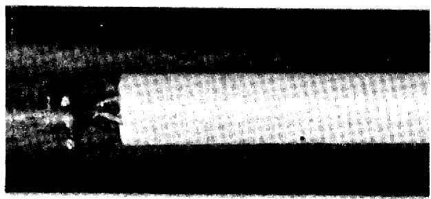  
AS-WELDED THERMOCOUPLE

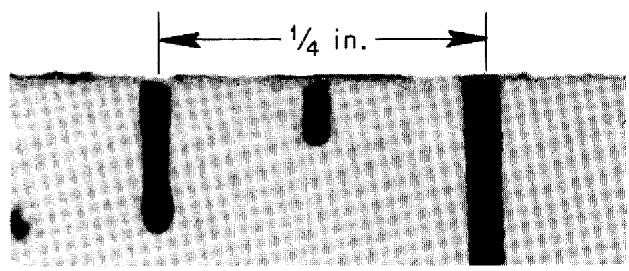  
Fig. 9.1. Resistance-Welded Thermocouples.   
in Fig. 9.2, in which the differences between the temperatures measured with them and with an optical pyrometer at points adjacent to the respective thermocouple beads are plotted against air flow rate. It is apparent that the resistance-welded thermocouples are subject not only to

smaller errors in temperature measurement but they are also less sensitive to changes in cooling-air flow rates. The new thermocouple assemblies have been given thermal and mechanical service tests far more severe than they will experience in any of the MTR tests presently planned, and they have survived these tests well.

# MINIATURE IN-PILE LOOP

W.R.Willis

M. F. Osborne

H. E. Robertson

G.W. Keilholtz

Solid State Division

The components of an in-pile dynamic-corrosion-testing loop for insertion in position C-48 in the

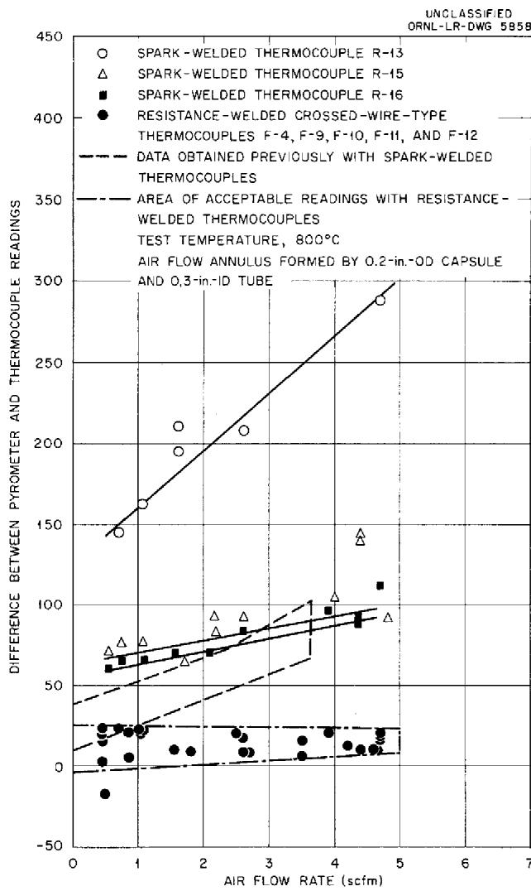  
Fig. 9.2. Comparison of Spark-Welded and Resistance-Welded Crossed-Wire-Type Thermocouples.

LITR have been designed and partially constructed. When assembled, the unit will consist of a miniature sump pump with a fuel loop and an air heat exchanger, and it will be encased in a stainless steel jacket. The jacket will then be connected to the exit facility on the northwest face of the LITR by means of a flexible steel tube which will communicate thermocouple wires and other leads to the loop controls. It is expected that the loop will operate at a fuel Reynolds number of 3000 with a difference in temperature of $100^{\circ}\mathrm{F}$ along the length of the fuel tube. The loop, as installed, is shown schematically in Fig. 9.3. After irradiation, the loop will be transferred, under water, into the removal cask, which will, in turn, be moved to a position outside the reactor building. The stainless-steel-jacketed loop will then be separated from the rest of the unit and taken to the Solid State Division hot cells where the fuel-container system will be prepared for both metallographic and chemical examination.

Performance tests have been made on the miniature sump pump. A characteristic curve of flow vs head, obtained with water at a pump speed of 5000 rpm, is shown in Fig. 9.4. Similar measurements of flow rate vs head for the fused salts at elevated temperatures are not planned because such tests would require the use of a valve. However, flow rate vs pump speed has been measured by using a metered volume of fused salt and by using a venturi type of flowmeter calibrated with water. A comparison of the measurements by the three methods is shown in Fig. 9.5. It is apparent from the curves in Fig. 9.5 that the relationship between pump speed and head can be obtained within the experimental error from water tests.

The thermocouple corrections for the loop geometry of the first in-pile model were obtained with a special 30-in. test section inserted in a mockup of the in-pile loop. The relationships between the temperatures observed with an optical pyrometer and those measured by the thermocouples were found and recorded as a function of air flow rate along the annulus and power generation in the fuel.

During a presentation of the safety features of the miniature in-pile loop before the ORNL Experimental Review Committee, a question arose regarding the adequacy of the LITR control rod system to override the sudden increase in $\Delta k / k$

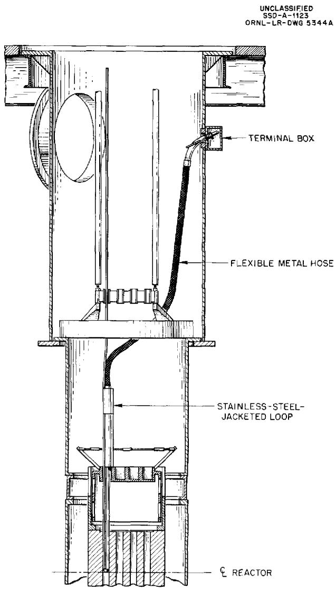  
Fig. 9.3. Installation of Vertical In-Pile Loop in Position C-48 of the LITR.

in the event the in-pile loop wall ruptured and allowed all the fuel to spill into the bottom of the stainless steel jacket of the loop. The bottom of the loop will be in a very high thermal-neutron flux region and, hence, in a very sensitive region with respect to influence on reactivity of the LITR. Since flux calculations indicated that an excess reactivity increase of 2 to $4\%$ might occur, it was decided to mock up the situation experimentally to obtain a more accurate prediction of the increase. For the experiment the fuel mixture

was contained in an annulus around a long rod, as shown in Fig. 9.6. This assembly was placed in an outer aluminum jacket, which formed an air annulus, and then lowered into the C-48 fuel element position in the LITR. The fuel mixture used contained $120\mathrm{g}$ of $\mathsf{U}^{235}$ , which is within $\pm 2\mathrm{g}$ of the amount which will be used in the first test. The annular geometry was chosen to represent the conditions which would produce the highest increase in $\Delta k / k$ .

The excess reactivity resulting from this simulated accident was determined by measuring the

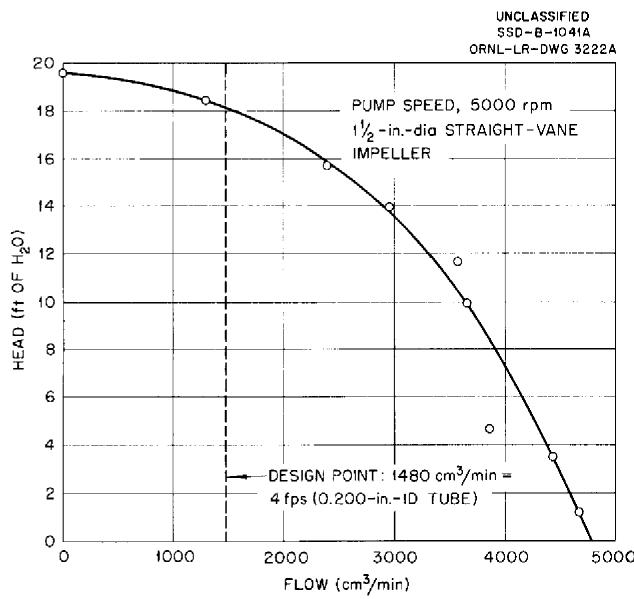

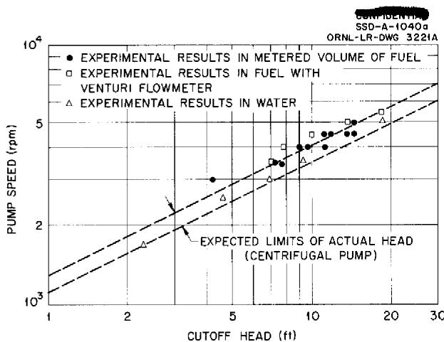  
Fig. 9.4. Head vs Flow Characteristics of Miniature Sump Pump for In-Pile Loop.   
Fig. 9.5. Head vs Pump Speed of Miniature Sump Pump for In-Pile Loop.

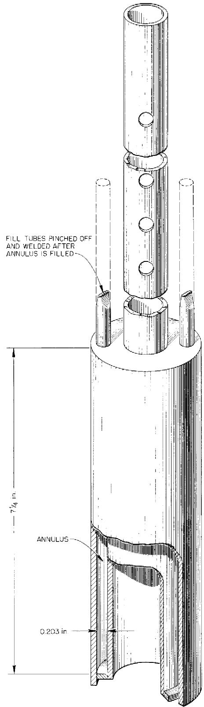  
Fig. 9.6. Excess Reactivity Apparatus.

LITR control rod position with the mockup in and with the mockup out of the lattice. The LITR rod calibrations were checked by following the known xenon buildup in the reactor. After a correction was made for buildup of xenon during the experiment, it was found that the simulated accident would add less than $0.2\%$ excess reactivity, which can be handled easily by the LITR control rods.

# LITR HORIZONTAL-BEAM-HOLE FLUORIDE FUEL LOOP

O. Sisman

J. G. Morgan

W.E.Brundage

M. T. Morgan

C. D. Baumann

A. S. Olson

R.M.Carroll

W.W. Parkinson

Solid State Division

The circulating-fluoride-fuel experiment has been successfully conducted in hole HB-2 of the LITR, and the loop is being disassembled for metallographic examination in the hot cell of Building 3025. The general description of the apparatus and facility, as presented previously, applies to this test, with a few modifications.

All loop welding was supervised by the Metallurgy Division, and the recommended specifications were met. The schematic drawing shown in Fig. 9.7 gives the details of the construction of the loop. By x-raying the calrod heaters to determine their effective heating lengths, it was possible to position them in such a way as to avoid hot spots on the fuel tubes. After the loop was assembled, it was leak tested at $1500^{\circ}\mathrm{F}$ with a helium leak detector, and then the loop and the pump were brought to $1500^{\circ}\mathrm{F}$ under a helium atmosphere. The molten salt $\mathrm{NaF - ZrF_4}$ (50-50 mole %) was then charged into the loop to the level of the lower probe in the pump bowl. After further leak checks the loop was operated for $7\frac{1}{2}$ hr at $1500^{\circ}\mathrm{F}$ with flow rates of 5 to 15 fps based on the 0.225-in.-ID nose piece section.

The loop was then drained and cooled under a helium atmosphere. The filling and draining methods used are shown schematically in Fig. 9.8. In filling the loop all salt lines were heated to $1500^{\circ}\mathrm{F}$ under a purified helium atmosphere. With the pump idling, the salt tank was pressurized and the salt forced into the loop until it made contact with the probe in the pump bowl. With

the pump turned off, all pressures were equalized and the fill line was frozen at point B. In draining the loop, flow was stopped, and a portion of the loop on the inlet side of the pump was frozen off. By using the draining-pressure system, the salt was then forced back into the salt tank until the fill line was flushed empty.

The loop was inserted into LITR hole HB-2 on December 7, 1954, with the reactor shut down, and electrical and piping connections were made before the shielding was completed. After bringing the loop to temperature it was again filled with the barren salt mixture, operated for $8\frac{1}{2}$ hr, and drained. The enriched fuel $\mathrm{NaF - ZrF_4 - UF_4}$ (62.5-12.5-25 mole %) was then charged into the loop and the fill line was sealed off. When 4.86 kg of the enriched mixture had been added, the loop was filled to the bottom probe of the pump bowl. With the fuel circulating at temperature and the reactor at zero power, the remainder of the external shielding was added. A cutaway sketch of the external shielding required is shown in Fig. 9.9. Because of the difficulty in placing the paraffin close to the hot pump enclosure, more gamma shielding was required around the periphery than was originally planned. Additional concrete block walls were placed in front of the instrument panel for protection of the operating personnel.

Full reactor power was reached at 4:30 PM on December 11, and the electric heaters were adjusted to maintain the desired operating temperature. Flow during the entire run was maintained at 8 to 10 fps (Reynolds number of 5000 to 6500). A composite plot of reactor power, loop temperature, and salt Reynolds number vs time is shown in Fig. 9.10.

The total power generation of the fuel under reactor flux was determined by a series of heat balances with the reactor off and at full power. Equilibrium conditions were established with the reactor at full power, and then upon reactor shutdown the electric heaters were increased to match the same temperature conditions along the loop. This increase in electric power to duplicate thermal conditions under flux was taken as the power added to the system by the fissioning fuel. Several such measurements gave an average of 2800 w, or about one-third the anticipated power. An experiment to duplicate the perturbed flux pattern is being conducted to determine the highest wattage densities obtained in the loop

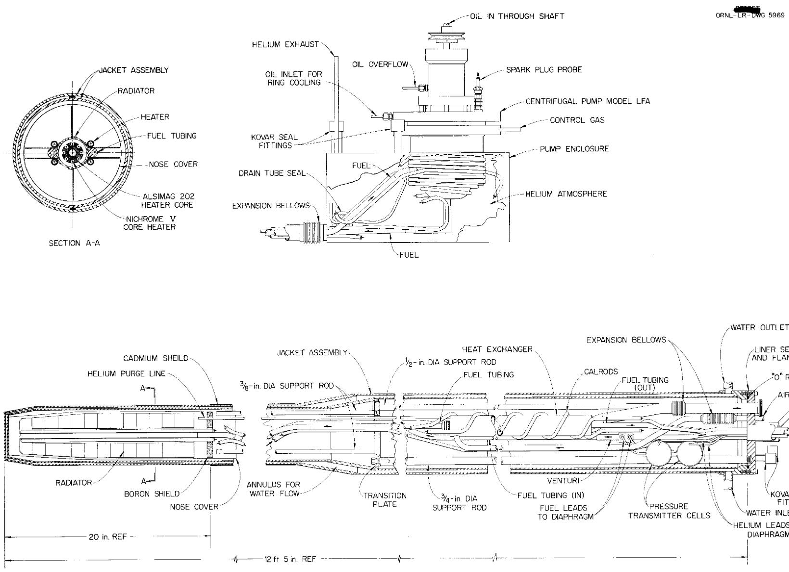  
Fig. 9.7. Schematic Diagram of LITR Horizontal-Beam-Hole Fluoride-Fuel Loop.

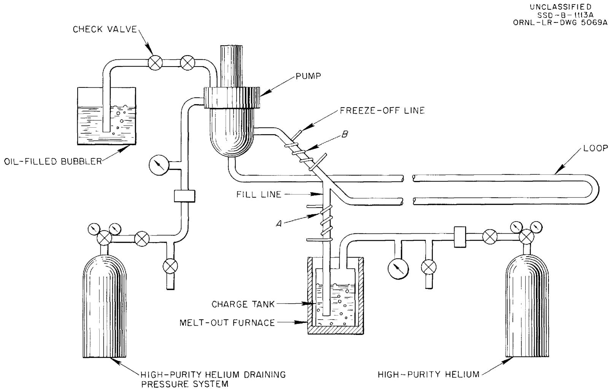  
Fig. 9.8. Fill-and-Drain System for LITR Horizontal-Beam-Hole Fluoride-Fuel Loop.

test and to see why the total power was lower than expected.

On January 7 the drive belt to the pump motor became inoperable, and, with the reactor shut down, a portion of the external shielding was removed and the belt replaced. It was found to be impossible to get circulation started again because of a cold region in the loop, and therefore the test was terminated. The loop was withdrawn from the reactor and taken to the hot cells, Building 3025, for disassembly. The tubing will be sectioned for metallographic examination. The loop had operated for a total of 645 hr, with 475 hr at full reactor power.

The flow-measuring device described previously proved to be very successful and enabled continuous monitoring of the salt velocity to be recorded. Design changes were made (Fig. 9.11) that permitted the transmitter to withstand a pressure as high as 10 psi across the diaphragm without causing a pressure shift. The transmitters were subjected to pressures as high as 40 psig during operation with the first filling of nonuranium-bearing salt. Each cell has a sensitivity of about 0.1 psi.

SSD-B-1121A

ORNL-LR-DWG 5342A

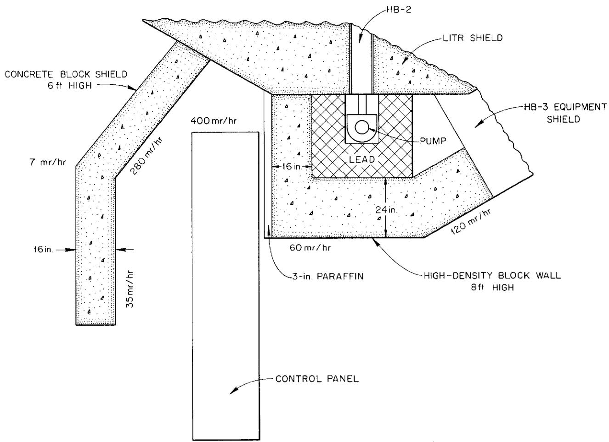  
Fig. 9.9. Horizontal Section Through Shielding Required During Operation of LITR Horizontal-Beam-Hole Fluoride-Fuel Loop. Gamma fluxes indicated.

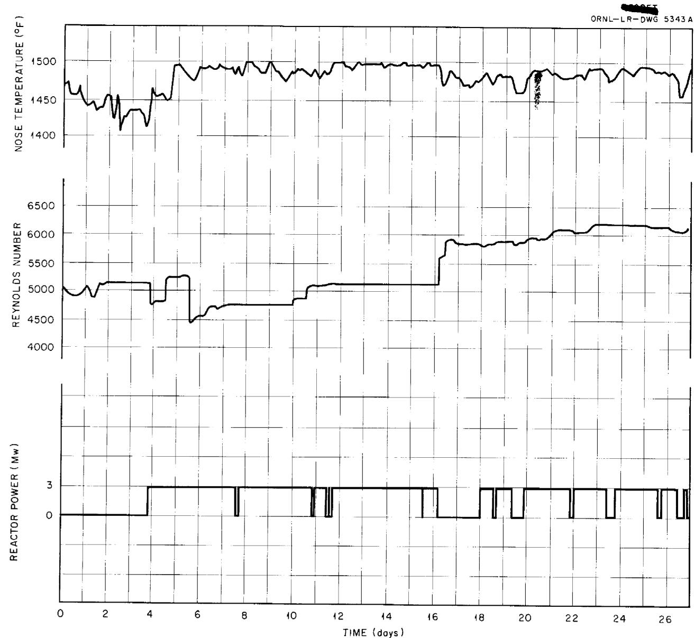  
Fig. 9.10. Reactor Power, Fluoride Fuel Reynolds Number, and Temperature of Nose of Loop vs Operating Time.

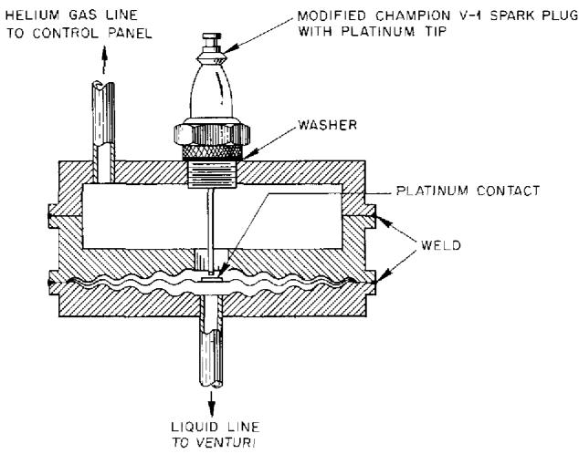  
UNCLASSIFIED SSD-A-1109A ORNL-LR-DWG 5G65A   
Fig. 9.11. Pressure-Transmitter Cell.

# FLUX-DEPRESSION EXPERIMENTS IN MTR

J.B.Trice H.V.Klaus

Solid State Division

R.H.Lewis

Phillips Petroleum Company

Preliminary measurements of the thermal-neutron flux to be expected in the fuel region of the first in-pile loop scheduled to go into hole HB-3 of the MTR are being made by using the pneumatic flux-measuring device which is presently in hole HB-3. The decrease in the flux of the MTR that will be caused by the fuel and the fuel container, as well as by the auxiliary equipment of the in-pile loop, is being determined. The loop, which will be made of Inconel, was mockd up by using a straight Inconel tube filled with a simulated fuel, which consisted of a mixture of cadmium and magnesium for one series of tests and a mixture of aluminum and boron carbide for another series.

The preliminary results of the flux-depression experiment indicate that for the fuel which is to be used in the first in-pile loop tests, the depression will be on the order of $70\%$ , which means, in terms of loop power, that the power of the presently conceived loop design may be expected to be 5 to 10 kw rather than the desired power of 15 to 30 kw. The nose of the loop is therefore being modified to increase the expected power. Before the loop is inserted in the MTR, it is

planned that a full-scale mockup of the loop will be placed in the MTR to determine the expected power (cf., sec. 3, "Experimental Reactor Engineering").

# CREEP AND STRESS-CORROSION TESTS

W.W.Davis

J.C.Wilson

N. E. Hinkle

J.C.Zukas

Solid State Division

Approval by the ORNL Experiment Review Committee for irradiation of the stress-corrosion apparatus previously described4 was received shortly after the completion of bench tests involving compatibility of component parts in case of sodium leakage. Alarm circuits to signal sodium leakage, water in-leakage, and excessive temperatures were installed in the apparatus and it was inserted in HB-3 of the LITR. The Inconel fuel chamber, which contained 0.52 g of NaF-ZrF4-UF4 (63-25-12 mole %), was surrounded by approximately 25 g of sodium. Because of the rapid power changes in the furnace required to maintain the specimen control temperature at 1500°F during reactor startup or shutdown periods, a Leeds & Northrup Speedomax and air-controller combination was used. Thermocouples in wells in the sodium chamber recorded fluctuations that did not exceed 10°F at the outset of the test; the fluctuations gradually decreased to one-half this value after 135 hr of test, and the temperature remained steady thereafter. The chamber was at control temperature for 1120 hr, during which time the reactor was up to power for approximately 700 hr.

Periodic checks of the resistance between the stressing weight and the weight probe throughout the test indicated that no gross increase in creep rate was caused by irradiation at a stress of 1000 psi. The rig was removed to a shield to decay sufficiently to permit handling and dissecting. The transverse cross section of the specimen below the fuel level will be polished and etched for metallographic examination. A companion bench test is now in operation. Several attempts to change or eliminate the baffle arrangement now in use to simplify both assembly and sectioning of the apparatus reintroduced the temperature excursions which were so troublesome at the outset of design of the rig.

Operation of the present apparatus in the LITR is satisfactory, but its performance in the MTR is not assured because of gamma heating in the relatively massive apparatus required to achieve smooth temperature control. Stress-corrosion data are urgently needed at fuel power densities of $1000\mathrm{w/cm}^3$ in the MTR, and therefore a possible short-cut stress-corrosion apparatus is being mocked up. The specimen tube consists of a cylinder stressed by gas pressure on the inside and in contact with fused salts on the outside. The salt is in an annular space around the specimen tube; the outside of the salt annulus is the inside of a container tube that is finned on the outside to transfer heat to helium in a water-jacketed can. To preserve a low surface-to-volume ratio it was suggested (by R. G. Berggren) that the salt be allowed to remain solid at the container tube wall. This cuts the surface-to-volume ratio approximately in half if any interaction between the solid salt and the container wall is ignored. Whether good heat transfer can be obtained between the solid salt and the wall remains to be determined. The experiment is unique in that the hottest part of the molten salt is in contact with the specimen tube (at $1500^{\circ}\mathrm{F}$ ). In capsule tests the inside of the salt volume has frequently been several hundred degrees hotter than the salt-metal interface.

Since rupture of one of the metal members is a possibility, cooling in a gas stream is probably unsafe from a reactor operations standpoint. Convection cooling by fins to helium in a water jacket or conduction by fins to a water-cooled heat sink appears to be attractive. Experiments on convective heat transfer from fins have shown that there is a good chance of success. If this is not successful, conductive heat transfer will achieve the results. Empirical heat transfer data are being obtained for longitudinally finned, vertical cylinders, and this work will be extended to cover conducting fins. Generation of sufficient heat in small cylinders to simulate the fission heat has

proved to be difficult. Passage of an electric current through the finned tube works well for low-conductivity fins, and carbon-arc and platinum-radiation heaters are being tried. As soon as data can be reliably extrapolated a test will be put in the LITR.

The MTR creep apparatus and accompanying instrumentation have been shipped to the MTR. Details to be supplied for approval of the stress-corrosion rig have been assembled but cannot be completed until the first LITR test has been analyzed.

Tests have begun on an electromagnetic transducer that is advertised to be operable at $1300^{\circ}\mathrm{F}$ . Similar to a microformer in principle, it is "canned" in stainless steel and has ceramic insulation on all windings. The device will be tested under irradiation upon completion of bench tests. If operable in-pile, the transducer will be suitable for strain measurements in the bending-type stress-corrosion apparatus. An extensometer for the internally pressurized "tube burst" specimen is possible, but no development work is being carried out. For strain data, the internal diameters of the specimen tube will be measured with a pneumatic gage after irradiation, and multiple specimens will be irradiated, if necessary, to obtain a strain-time curve.

Two bench tests of Inconel tubes in bending in a helium atmosphere with $\mathsf{NaF - ZrF_4 - UF_4}$ (53.5-40-6.5 mole %) were completed. After 432 hr at $1500^{\circ}F$ a few subsurface voids were visible that were distributed about equally around the periphery of the tube. Another test was operated for 866 hr, and the number of subsurface voids per unit length of periphery was greater by a factor of 2 at the tension and compression sides of the tube than at the neutral axis. This tentatively confirms the hypothesis that stress-corrosion in the usual sense does not take place in these tests and that the phenomenon should be called "strain-rate" or "strain" corrosion.

# 10. ANALYTICAL STUDIES OF REACTOR MATERIALS

C.D.Susano Analytical Chemistry Division J.M.Warde Metallurgy Division

Research on the determination of trivalent uranium and uranium metal in fluoride-base reactor fuels was continued. Further studies were made of the methods for determining oxygen as oxides in fluoride salts. A bromination procedure was applied to the determination of oxygen in uranium and beryllium compounds. Modifications were developed of methods for determining beryllium, potassium, and lithium in fluoride fuels. High-temperature x-ray spectrometer studies of fluoride mixtures were initiated as an aid in the determination of phase diagrams.

# ANALYTICAL CHEMISTRY OF REACTOR MATERIALS

J. C. White Analytical Chemistry Division

# Determination of Trivalent Uranium in Fluoride Fuels

A.S.Meyer, Jr. D.L.Manning W.L.Ross

Analytical Chemistry Division

Oxidation of Trivalent Uranium by Methylene Blue. Evaluation of the data obtained for the determination of trivalent uranium in fluoride fuels by the methylene-blue, one-step oxidation method has shown that the coefficient of variation for NaF-KF-LiF-base materials is $2\%$ . The coefficient of variation of the hydrogen-evolution method for similar materials, including NaF-ZrF4-base eutectics, is $4\%$ . In LiF, NaF, and a mixture which contains NaF-KF-LiF, the agreement between the results for trivalent uranium obtained by both methods is, in general, satisfactory. The results of the determination of trivalent uranium by the use of methylene blue in compositions of NaF-ZrF4-UF4-UF3 and KF-UF4-UF3 are difficult to reproduce and are significantly lower than those

obtained by the hydrogen-evolution method. Since the major portion of the samples received for analysis are from the NaF-ZrF4 system, an effort has been made to adapt the methylene-blue method to these samples. The low values obtained by this method may result from incomplete dissolution of the samples or from partial oxidation of the trivalent uranium by ionic hydrogen. It has been found that these samples can be dissolved if stirred for 2 hr in a methylene-blue solution that is almost completely saturated with $\mathrm{AlCl}_3$ . Although more reproducible results are obtained when complete dissolution is attained, the instability and heterogeneity of the samples make impractical a direct comparison of the results of the modified methylene-blue procedure with those of the hydrogen-evolution method. Accordingly, dissolution is now being carried out in an apparatus in which any hydrogen that is formed by the reaction

$$
U F _ {3} + H ^ {+} \rightarrow U ^ {4 +} + 3 F ^ {-} + \frac {1}{2} H _ {2}
$$

can be measured.

Preliminary experiments on the dissolution of samples of $\mathrm{UCl}_3$ have indicated that when the samples are dissolved in solutions of methylene blue that are $3\textbf{M}$ in HCl and saturated with $\mathrm{AlCl}_3$ a small quantity of hydrogen is liberated but that the volume of hydrogen is negligible when the concentration of HCl in the reagent is 1.5 M. In solutions of lower acidity the oxidation of trivalent uranium is carried beyond the tetravalent state. Dissolution tests in solutions of intermediate acid concentration are now being performed.

Simultaneous Determination of Trivalent and Total Uranium. Further efforts were made to develop a procedure for the determination of the total uranium content of these samples by direct titration of the tetravalent uranium in the solution after the determination of the trivalent uranium by the methylene-blue method. Potentiometric titrations of the reduced solutions have been carried out with $\mathsf{K}_2\mathsf{Cr}_2\mathsf{O}_7,$ $\mathrm{Ce(SO_4)_2}$ $\mathsf{KMnO}_4$ and $\mathsf{Fe}_2(\mathsf{SO}_4)_3$ as oxidants. The titration with each of the above reagents is too slow for application to analytical

procedures. Titration was not improved by reducing the chloride ion concentration or by adding $\mathsf{H}_2\mathsf{SO}_4$ or $\mathsf{H}_3\mathsf{PO}_4$ . The solutions could not be titrated at elevated temperatures because the methylene blue decomposed rapidly when heated. When the solutions were treated with an excess of oxidant and back-titrated with a standard solution of ferrous sulfate, a portion of the excess reagent was reduced, either by chloride ion or by methylene blue.

During the course of the above investigations, solutions of $\mathsf{UO}_2\mathsf{SO}_4$ in an excess of methylene blue were titrated with a solution of $\mathsf{CrSO}_4$ . Definite potentiometric end points were obtained that were similar to those reported for the titration of solutions of tetravalent uranium in methylene white with $\mathsf{K}_2\mathsf{Cr}_2\mathsf{O}_7$ . The volume of titrant consumed at the first end point, which coincided with the decoloration of the methylene blue, corresponded to the reduction of the methylene blue to methylene white plus a one-electron reduction of the hexavalent uranium. An additional equivalent of $\mathsf{CrSO}_4$ per mole of uranium was required to titrate to the second end point. When solutions which contained a molar excess of $\mathsf{UO}_2\mathsf{SO}_4$ over methylene blue were titrated, a similar titration curve was obtained in which two equivalents of titrant per equivalent of methylene blue were required to titrate to the first end point. In order to eliminate the green color of trivalent chromium the titrations were repeated with solutions of trivalent titanium. At the first end point a colorless solution was obtained, and on the addition of an excess of titrant the green color of tetravalent uranium was developed. The absorption spectra of the solutions that had been titrated to the first end point did not correspond to those of solutions of any combination of tetra- and hexavalent uranium. These results are consistent with the postulation that an interaction species of pentavalent uranium and methylene white is stable in aqueous solutions. A more detailed study will be necessary before the existence of such a complex can be established. The only procedure which appears to be practical for the determination of total uranium in these solutions consists of destroying the methylene blue and removing the chloride by a wet-oxidation procedure; the uranium content of the resulting solution can then be determined by a conventional titration method. Methylene blue was found to be rapidly oxidized by fuming

with $\mathsf{HNO}_3$ and $\mathsf{HCIO}_4$ .

Determination of Trivalent Uranium by the Karl Fischer Modification of the Hydrogen-Evolution Method. A procedure is being tested in which the hydrogen that is evolved by the reaction between $\mathsf{UF}_3$ and an acid solution is converted to water, and the water is determined by a modified Karl Fischer titration. The hydrogen-evolution method2 is limited to samples which contain enough trivalent uranium to liberate a volume of hydrogen that is sufficient for precise volumetric measurement (1 mg of U liberates $\sim 0.04\mathrm{ml}$ of $\mathsf{H}_{2},$ STP). An additional limitation of this method is that all gases which are insoluble in solutions of KOH are measured as hydrogen. In the analysis of samples which yield only a few tenths of a milliliter of hydrogen, adsorbed gases and gaseous contaminants of the reagents and the sweep gas may introduce serious error.

In the procedure being investigated the sample is dissolved in an $80\%$ solution of $\mathsf{HCl}$ . The hydrogen liberated is passed through concentrated $\mathsf{H}_2\mathsf{SO}_4$ and two drying towers of $\mathsf{MgClO}_4$ by a stream of purified helium. The dried gases are then passed over CuO at a temperature of $500^{\circ}\mathsf{C}$ to convert the hydrogen to water, which is then absorbed in a solution of Karl Fischer reagent in ethylene glycol and finally titrated coulometrically with iodine. When samples of $\mathsf{UF}_3$ that contained from 4 to $20\mathrm{mg}$ of trivalent uranium were analyzed by this procedure, the titrations corresponded to $96\%$ of the theoretical trivalent uranium content, with a coefficient of variation of $5\%$ . The precision of the method appears to be limited by the large and variable blank titrations which are probably a result of a mixing between the solutions in the cathode and anode compartments of the coulometric titration cell. The cell is being modified in an attempt to reduce this source of error.

# Determination of Uranium Metal in Fluoride Salt Mixtures

A. S. Meyer, Jr. B. L. McDowell Analytical Chemistry Division

Further studies were carried out to improve the method for the determination of uranium metal in fluoride fuels by converting the metal to the hydride and measuring the quantity of hydrogen evolved by the thermal decomposition of $\mathsf{UH}_3$ . Although results of satisfactory precision and

accuracy can be obtained by the procedure in which the decomposition of the hydride is carried out under an atmosphere of $\mathrm{CO}_{2}$ , it was found that for some samples of $\mathrm{UF}_{3}$ , periods in excess of 8 hr were required for the complete evolution of hydrogen. In addition, no completely dependable method has been found for removing the CO formed when the $\mathrm{CO}_{2}$ is reduced by uranium metal and by trivalent uranium. Although the CO can be quantitatively oxidized to $\mathrm{CO}_{2}$ by passing the gaseous reaction products over a mixture of $\mathrm{I}_{2} \mathrm{O}_{5}$ reagent and powdered pumice stone at a temperature of $150^{\circ} \mathrm{C}$ , the $\mathrm{I}_{2} \mathrm{O}_{5}$ reagent has been found to become inactivated after limited, but varied, periods of service. The reagent is, therefore, of doubtful value when extended ignition periods are required to complete the decomposition of the hydride. In order to eliminate the possibility of interference by CO and to reduce the ignition time, modifications were investigated in which the decomposition of the hydride was carried out under atmospheres of $\mathrm{HCl}$ and $\mathrm{NH}_{3}$ . When $\mathrm{NH}_{3}$ was used, the hydrogen was measured over a solution of $\mathrm{H}_{2} \mathrm{SO}_{4}$ instead of KOH. In the presence of each of the gases the volumes of hydrogen obtained from the decomposition of $\mathrm{UH}_{3}$ were not reproducible and were less than those predicted by the postulated reactions:

$$
U H _ {3} + 3 H C l \rightarrow U C l _ {3} + 3 H _ {2}
$$

$$
2 \mathrm {U H} _ {3} + 4 \mathrm {N H} _ {3} \longrightarrow 2 \mathrm {U N} _ {2} + 9 \mathrm {H} _ {2}
$$

As an additional complication the decomposition of $\mathsf{NH}_3$ is catalyzed by the residue of uranium nitrides to produce a slow evolution of insoluble gases which continues for several hours after the initial, rapid evolution of hydrogen from the reaction between $\mathsf{NH}_3$ and $\mathsf{UH}_3$ .

A modification is now being investigated in which $\mathsf{UH}_3$ is ignited in a stream of oxygen, and the effluent gases are passed over heated CuO to ensure the conversion of hydrogen to water, which is then measured volumetrically at reduced pressure. The reaction between $\mathsf{UH}_3$ and oxygen has been reported4 to be rapid and quantitative when applied to the determination of hydrogen in large samples of $\mathsf{UH}_3$ . A modification of the method of

Naughton and Frodyma for the microdetermination of carbon and hydrogen will be used for the determination of microgram quantities of hydrogen as $\mathsf{UH}_3$ . In this method the water produced by the reaction between $\mathsf{UH}_3$ and $\mathsf{O}_2$ is first isolated in an evacuated freezeout trap. It is then allowed to volatilize into an evacuated vessel of known volume, and the equivalent quantity of $\mathsf{UH}_3$ is calculated from the pressure which is measured on a mercury-sealed, oil manometer. The apparatus has been constructed and is now being calibrated by using samples of $\mathsf{BaCl}_2\cdot 2\mathsf{H}_2\mathsf{O}$ as a standard for hydrogen in the form of water. On the basis of design calculations, it would appear that less than $1\mu \mathrm{g}$ of hydrogen can be determined by this technique.

# Determination of Oxygen in Fluoride Fuels

A. S. Meyer, Jr.

J.M.Peele

Analytical Chemistry Division

Further tests of the procedure for the determination of oxygen as oxides were carried out with new components which were incorporated in the apparatus to prevent the carryover of nonvolatile electrolytes during the transfer of HF to the conductivity cell. The new components include a larger reactor and a splash trap in the transfer line. The experiments indicate that, although the conductivity method for the determination of the water produced by the reaction of metallic oxides with $\mathsf{KHF}_2$ is theoretically applicable, the method is not practical for the determination of microgram quantities of oxygen. It has been found that repeated distillations with HF are required to transfer the $\mathsf{H}_2\mathsf{O}$ from the $\mathsf{KHF}_2$ solution of the sample to the conductivity cell. In the course of these distillations, a sufficient quantity of KF is, apparently, carried into the cell to mask the increase in conductivity that would be produced by small quantities of water.

An alternate procedure has been proposed for the determination of the $\mathsf{H}_2\mathsf{O}$ that is formed on dissolution of the oxides in KHF. Tests of this procedure are now being carried out in parallel with some further studies of the original method.

The new method is based on the electrolysis of the water in the fused bifluoride melt to yield oxygen which can then be separated from the other reaction products and measured.

Melts of $\mathsf{KHF}_2$ have been reported to be readily dehydrated by carrying out the electrolysis until rapid evolution of fluorine occurs. During this drying period, hydrogen is liberated at the cathode, while $O_2$ , $OF_{2'}$ and $F_2$ are liberated at the anode. Analysis of the product obtained during the initial electrolysis of a commercial fluorine generator indicates that the $H_2O$ is removed during the early stages of the electrolysis and that less than $10\%$ of the oxygen is evolved as $OF_2$ . The $OF_2$ is generated only from relatively wet melts, and negligible quantities are formed after the concentration of $H_2O$ in the electrolyte is reduced to a few tenths of a per cent.

Tests of the method are now being carried out by using samples which contain milligram quantities of oxygen. For these samples the oxygen can be measured volumetrically by sweeping it into an azotometer with $\mathrm{CO}_{2}$ . Hydrogen is eliminated from the electrolysis products by adding AgF to the melts so that metallic silver rather than hydrogen is deposited at the cathode. Two additional advantages from the $\mathrm{Ag^{+}}$ ions in the electrolyte may be anticipated. The standard oxidation-reduction potentials in acid solution of pertinent couples are tabulated below:

$$
\text {R e a c t i o n} \quad E ^ {\circ} (\mathbf {v})
$$

$$
\cup^ {4 +} + 2 H _ {2} O \rightarrow U O _ {2} ^ {+ +} + 4 H ^ {+} + 2 e ^ {-} - 0. 4 1
$$

$$
A g \longrightarrow A g ^ {+} + e ^ {-} - 0. 8 0
$$

$$
2 \mathrm {H} _ {2} \mathrm {O} \rightarrow \mathrm {O} _ {2} + 4 \mathrm {H} ^ {+} + 4 \mathrm {e} ^ {-} \tag {1.298}
$$

$$
\mathrm {A g} ^ {+} \longrightarrow \mathrm {A g} ^ {+ +} + \mathrm {e} ^ {-} \tag {1.98}
$$

$$
2 F ^ {-} \rightarrow F _ {2} + 2 e ^ {-} \tag {2.85}
$$

The potential of the first reaction was obtained from the Handbook of Chemistry and Physics. 10

7. J. H. Simons (ed.), Fluorine Chemistry, I, 227, Academic Press, New York, 1950.   
8R.C.Downing etal,Ind.Eng.Chem.39,259(1947).   
9W. M. Latimer, The Oxidation States of the Elements and Their Potentials in Aqueous Solutions, p 296, Prentice-Hall, New York, 1938.   
10 C. D. Hodgman (Editor-in-Chief), Handbook of Chemistry and Physics, 34th ed., p 1552, Chemical Rubber Publishing Co., Cleveland, 1952.

If the potentials of the above couples in the KF-HF system are of similar relative order, tetravalent uranium would be oxidized to the hexavalent state by $\mathrm{Ag^{+}}$ ions. In the absence of the silver salt it would be necessary to oxidize the uranium electrolytically before the oxygen could be quantitatively evolved. Since the method is to be applied to samples which contain tri- or tetravalent uranium as major constituents and only traces of oxygen, the time required for the electrolytic oxidation of the uranium would be prohibitive. Furthermore, if $\mathrm{Ag^{+ + }}$ forms a stable solution in the fused electrolyte, it would be expected to act as a fluorine carrier and thereby increase the efficiency of the generation of $\mathsf{O}_2$ . Under ideal conditions $\mathrm{Ag^{+ + }}$ could serve as a coulometrically generated reagent for hydrogen in the fused salts.

A silver-lined, nickel cell has been assembled for the purpose of studying this reaction. The cell is charged with sufficient KF, AgF, and HF, purified by distillation, to produce approximately 40 g of a composition of KF-2HF containing 5 g of AgF.

The electrolyte is fused by heating the cell to $100^{\circ}\mathrm{C}$ . Air is removed from the cell by bubbling $\mathrm{CO}_{2}$ through the melt. The effluent gas from the cell is freed of HF and fluorine by passing it through NaF and mercury, and the insoluble gaseous components are then collected and measured over KOH in an azotometer. The charge is electrolyzed until no more insoluble gas is obtained. The sample is then added to the cell and the gas that is obtained on electrolysis is measured as oxygen. A recovery of $96\%$ of the oxygen present in the $\mathsf{H}_2\mathsf{O}$ produced when a sample of $\mathsf{Na}_2\mathsf{CO}_3$ was dissolved in the electrolyte was attained.

Difficulties in electrolysis have been experienced because of corrosion of the electrodes. When a platinum anode is used, only a small quantity of fluorine is liberated before the evolution of oxygen is completed. The anode is, however, corroded rapidly, particularly in the final stages of the electrolysis. When nickel anodes are used, corrosion is less severe, but the evolution of fluorine is so rapid that it cannot be conveniently removed by a mercury scrubber. An additional problem is presented in that after extensive periods of electrolysis, dendritic deposits of silver accumulate and grow to such lengths that they provide a metallic electrical circuit between the electrodes.

It is believed that this problem will not be of major importance when samples which contain only microgram quantities of oxygen are analyzed.

# Determination of Oxygen in Metallic Oxides by Bromination

J.C. White G.Goldberg J.P.Young

Analytical Chemistry Division

A simple, precise method for the determination of oxygen present as oxides in metals has long been desired. Recently, Codell and Norwitz11 reported on the successful application of a bromination procedure for the determination of oxygen in titanium and titanium alloys. These investigators passed bromine at $815^{\circ}\mathrm{C}$ over a sample of titanium (which had been intimately mixed with graphite) to form $\mathrm{CO}_{2}$ , which was, in turn, converted to $\mathrm{CO}_{2}$ , absorbed, and weighed. The reaction time was of the order of 2 hr. Experiments are now being made in an attempt to apply this technique to the determination of oxygen in metals of interest to the ANP program. The progress of experiments on uranium and beryllium is presented here.

Uranium. The apparatus for the determination of oxygen in uranium is shown in Fig. 10.1. Bromine vapor is carried by helium over a boat (maintained

at about $950^{\circ}\mathrm{C}$ that contains a mixture of a uranium compound and spectrographically pure graphite in a weight ratio of about 1 to 10. The volatile reaction products are condensed in two dry-ice-alcohol baths and the CO is passed through CuO, where it is converted to $\mathrm{CO}_{2}$ and then absorbed in a standard solution of $\mathrm{Ba(OH)}_{2}$ . The reactions involved when $\mathrm{UO}_{2}$ is the standard material are

$$
\begin{array}{l} U O _ {2} + 2 B r _ {2} + 2 C \longrightarrow U B r _ {4} + 2 C O \\ \mathrm {C O} + \mathrm {C u O} \rightarrow \mathrm {C O} _ {2} + \mathrm {C u} \\ \mathrm {C O} _ {2} + \mathrm {B a} (\mathrm {O H}) _ {2} \longrightarrow \mathrm {B a C O} _ {3} + \mathrm {H} _ {2} \mathrm {O} \\ \end{array}
$$

The data indicate that for quantities of $\mathsf{UO}_2$ of the order of $100\mathrm{mg}$ , the first reaction is quantitative in 2.5 hr at $950^{\circ}C$ . A blank of $0.4\mathrm{mg}$ of oxygen per hour must, however, be subtracted from the total recovered. At lower temperatures, the rate of reaction is considerably decreased. A precision of approximately $1\%$ is indicated. Future work will involve a study of essentially micro quantities of oxygen with direct measurement of CO by $\mathsf{I}_2\mathsf{O}_5$ or by other methods.

Beryllium. The bromination procedure has also been applied to the determination of oxygen in beryllium. Preliminary experiments showed that the rate of reaction between BeO, graphite, and bromine at $950^{\circ}C$ is far too slow for analytical application. For example the reaction was only $5\%$ complete after 1.5 hr. If a flux of $\mathrm{Na}_{3}\mathrm{FeF}_{6}$ is added to the mixture, however, the rate of reaction

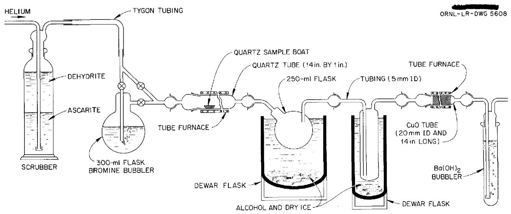  
Fig. 10.1. Apparatus for the Determination of Oxygen in Uranium Compounds.

is increased substantially. The probable reactions are

$$
\begin{array}{l} 3 \mathrm {B e O} + 6 \mathrm {N a F} + 2 \mathrm {F e F} _ {3} \rightarrow \mathrm {F e} _ {2} \mathrm {O} _ {3} + 3 \mathrm {N a} _ {2} \mathrm {B e F} _ {4} \\ F e _ {2} O _ {3} + 3 B r _ {2} + 3 C \rightarrow 2 F e B r _ {3} + 3 C O \\ \end{array}
$$

The reagents are mixed in a platinum boat which is placed in a quartz tube encased with a platinum shield to prevent attack by fluoride on the quartz. The experiments made to date indicate that at temperatures of the order of $700^{\circ}\mathrm{C}$ the reaction is $80\%$ complete within 2 hr. It is anticipated that higher temperatures will accelerate the reaction rate. The determination of CO is completed as previously described. Future work will involve the application of this procedure to the determination of oxygen in NaF-BeF $_2$ mixtures.

# Differential Spectrophotometric Determination of Beryllium

A. S. Meyer, Jr.

D. L. Manning

Analytical Chemistry Division

The determination of beryllium in NaF-LiF-BeF $_2$ -UF $_4$ -UF $_3$ samples is required. The method of Vinci $^{12}$ in which the absorption of the colored lake that is developed when alkaline solutions of beryllium are treated with $p$ -nitrobenzeneazoorcinol is essentially specific for beryllium, but it is not sufficiently precise to permit application to the determination of beryllium in reactor fuels. When the technique of differential spectrophotometry was applied to this determination a precision comparable to that of the titrimetric method $^{13}$ was found.

In the differential procedure the absorbance of the solution at $510\mathrm{m}\mu$ is measured against a blank which contains $10~\mu \mathrm{g / ml}$ of beryllium. On the basis of replicate determinations of standards and of a limited number of fuel samples, the coefficient of variation of the method is less than $1\%$ for solutions which contain between 10 and $16~\mu \mathrm{g / ml}$ of beryllium.

Citrate ion is added to the solutions to prevent the precipitation of interfering ions, principally $\mathsf{UO}_2^{++}$ . The presence of $\mathsf{UO}_2^{++}$ introduces a small positive error which is approximately a linear function of the uranium concentration. When the

weight ratio of uranium to beryllium is 10 to 1, the error is only $3\%$ . When the ratio is increased to 25 to 1, uranium is precipitated.

# Determination of Lithium in NaF-BeF $_2$ -LiF and NaF-ZrF $_4$ -LiF Base Fuels

J. C. White

G. Goldberg

Analytical Chemistry Division

The method of White and Goldberg14 was applied to the determination of lithium in NaF-BeF2-LiF and NaF-ZrF4-LiF base fuels. In this procedure the sulfate solution of the alkali metals is converted to a chloride solution by passage through an anion-exchange resin in the chloride form. The LiCl is then extracted with 2-ethyl-1-hexanol, and the chloride ion is titrated in the nonaqueous medium. If the acidity of the sulfate solution is adjusted to approximately $1\mathrm{N}$ , the zirconium, like the uranium, is retained on an anion-exchange resin as the anionic sulfate complex and is thereby separated from lithium.

Beryllium does not form an anionic complex with sulfate ion and will pass through the column with lithium and the other alkali metals. Moreover, $\mathrm{BeCl}_2$ is soluble in 2-ethyl-1-hexanol and accompanies the LiCl through the procedure. The extraction of $\mathrm{BeCl}_2$ was shown to be quantitative. The described method for lithium is thus used to determine the sum of lithium and beryllium. The beryllium concentration is then determined by the fluoride titration method,[13] while the lithium content is obtained by difference.

# Determination of Potassium in Fluoride Fuels

C. R. Williams

Analytical Chemistry Division

A rapid, direct method for the determination of potassium in fluoride fuels has been developed. This procedure is based on the work of Wittig15 and his co-workers, who found that the potassium salt of tetraphenyl boron is very slightly soluble in acidic solution, in contrast to the sodium and lithium salts. Investigations have shown that of the cations of concern in the ANP fuel program,

only nickel forms a slightly soluble precipitate with the reagent. Those elements that hydrolyze in the acid solution, such as zirconium, beryllium, and uranium, are held in solution by complexing with fluoride or citrate ions (for hexavalent uranium). The method can also be applied in sulfate solutions and thus offers a distinct advantage over the perchlorate method for determining potassium. The standard deviation of the method is approximately $0.5\%$ .

# X-RAY SPECTROMETER INVESTIGATIONS OF FLUORIDE FUEL

G. D. White, Metallurgy Division

T. N. McVay, Consultant

In addition to routine petrographic examination of fuel samples, several samples were x-rayed on the high-temperature x-ray spectrometer. This work was inaugurated as an additional aid in the determination of phase diagrams. To date, the composition $2\mathrm{NaF}\cdot \mathrm{ZrF}_4$ has been x-rayed at temperatures from 400 to $600^{\circ}\mathrm{C}$ . The samples were held by a nickel holder and were heated in a vacuum of from 1 to 2 microns or in a purified helium atmosphere. The atmospheres achieved so far cause slight oxidation which becomes excessive only after heating for over 4 hr. High-temperature x-ray patterns have been obtained on two of the five polymorphs of $\mathrm{Na}_{2}\mathrm{ZrF}_{6}$ .

16T. R. Phillips, ORNL Master Analytical Manual, Method No. 900716450, ORNL CF-53-1-235, Vol. I.

# ANP SERVICE LABORATORY

J.C. White W.F.Vaughan

C. R. Williams

Analytical Chemistry Division

The determination of beryllium in fluoride fuel mixtures was resumed during this quarter. The mixture of fluoride salts is dissolved in $\mathsf{H}_2\mathsf{SO}_4$ and the solution is heated until copious fumes of $\mathsf{SO}_3$ are evident. This process of fuming is repeated in order to remove the fluoride completely from the solution. Uranium as $\mathsf{UO}_2\mathsf{SO}_4$ is removed from the solution by sorption on an anion-exchange resin. Beryllium is then determined by the modified volumetric method13 of McClure and Banks. The major portion of the work continues to be analyses of fluoride salts, mixtures of fluoride salts, and alkali metal hydroxides.

The total of 1110 samples analyzed involved 7905 determinations. The backlog at the end of the quarter consisted of 335 samples. A breakdown of the work load is given in Table 10.1.

TABLE 10.1. SUMMARY OF SERVICE ANALYSES REPORTED   

<table><tr><td></td><td>Number of Samples</td><td>Number of Determinations</td></tr><tr><td>Reactor Chemistry</td><td>793</td><td>5642</td></tr><tr><td>Experimental Engineering</td><td>304</td><td>2172</td></tr><tr><td>Miscellaneous</td><td>13</td><td>91</td></tr><tr><td>Total</td><td>1110</td><td>7905</td></tr></table>

# 11. RECOVERY AND REPROCESSING OF REACTOR FUEL

D. E. Ferguson

M. R. Bennett

J. T. Long

G. I. Cathers

R.P.Milford

S. H. Stainer

Chemical Technology Division

# PILOT PLANT DESIGN

Design of the pilot plant to recover, in seven batches, the $65\mathrm{kg}$ of $\mathsf{U}^{235}$ in the 2500 lb of ARE fuel by a fused salt-fluoride volatility process is in progress. Completion of construction by December 31, 1955, is planned. The January 1955 flow sheet calls for a ninefold excess of fluorine to be passed through the molten fuel at $650^{\circ}\mathrm{C}$ . The $\mathsf{UF}_6$ and volatile fission-product fluorides formed will pass from the fluorinator into a bed of 20- to 40-mesh NaF at $650^{\circ}\mathrm{C}$ , where the volatile fission-product fluorides will be absorbed. The $\mathsf{UF}_6$ will collect in a series of three cold traps at +4, -40, and $-60^{\circ}\mathrm{C}$ , respectively. If sufficient decontamination has occurred, the traps will be isolated and heated electrically in order to liquefy the $\mathsf{UF}_6$ , which can then be drawn off into receivers. If further decontamination is required, the $\mathsf{UF}_6$ will be volatilized out of the cold traps into another system consisting of an NaF absorber and three cold traps identical with those mentioned. An aqueous KOH scrubbing system will be required for disposing of excess fluorine. A schematic flow sheet for the plant is shown in Fig. 11.1. The preliminary cost estimate for the plant, including a $20\%$ contingency factor, is $285,000.

# PROCESS DEVELOPMENT

Laboratory-scale studies were made on the efficiency of fluorine usage and the corrosion of the reaction vessel in the fluorination step. During the first few minutes of the reaction, fluorine was absorbed completely but no $\mathsf{UF}_6$ was evolved. Fluorine continued to be absorbed completely until $80\%$ of the $\mathsf{UF}_6$ had been volatilized off; after this, fluorine was detectable in the exit gas. The data indicated that the $\mathsf{UF}_6$ was essentially all evolved by the time a fivefold excess of fluorine had been used. Therefore the ninefold excess shown in the flow sheet is believed to provide a sufficiently large safety factor. The

average corrosion rate of nickel during the whole fluorination step was about 0.1 mph, but the rate appeared to be considerably higher than the average during the time that $\mathsf{UF}_6$ was present.

Two methods were used in studying the reaction kinetics of the direct fluorination of ARE-type fuel. The first consisted in passing the exit gas from the fluorination vessel through two absorbent traps filled, respectively, with NaF and NaCl. These were weighed before and after each experiment. The NaF trap, held at about $100^{\circ}\mathrm{C}$ , was capable of trapping an equal weight of $\mathsf{UF}_6$ by absorption. The NaCl trap lost weight as the NaCl was converted to NaF by the fluorine. Weighing these traps at 5-min intervals provided a means of following the progress of the fluorination. The second method, Fig. 11.2, consisted in using three flowmeters to measure the fluorine input flow rate, the combined $\mathsf{UF}_6$ and fluorine output flow rate, and the fluorine output flow rate after all $\mathsf{UF}_6$ in the gas stream had been absorbed. Kinetic data obtained by this method were more precise than those obtained by the first method, since a Brown 5-mv recorder was used to obtain flow readings at 20-sec intervals.

By means of the NaF-NaCl absorption-trap method, calibration curves for $\mathsf{UF}_{6},\mathsf{N}_{2},$ and $\mathsf{F}_2$ were prepared which show the flow in cubic centimeters per minute corresponding to the voltage readings obtained in the flowmeter method. The procedure usually used with both techniques was to fluorinate, in a 1-in.-dia nickel reactor, $70~\mathrm{g}$ of ARE-type fuel (NaF-ZrF4-UF4, 52-44-4 mole %) at $650^{\circ}\mathrm{C}$ with a fluorine input rate of about $60~\mathrm{ml / min}$ .

The variation in flow rate with time in one run in which thermal flowmeters were used is shown in

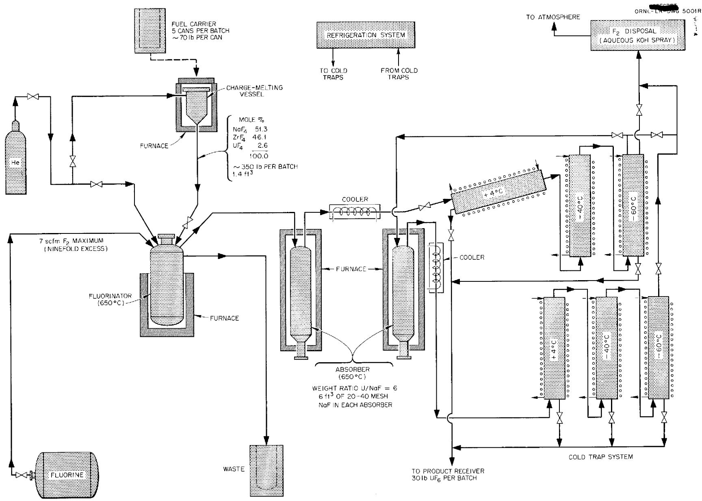  
Fig. 11.1. Schematic Flow Sheet for ARE Fuel Recovery Pilot Plant.

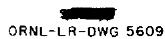

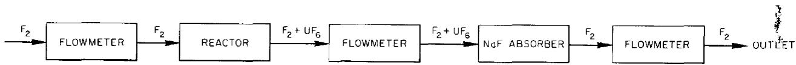  
Fig. 11.2. Schematic Diagram of Flowmeter Method of Measuring Gas Flow Rates in Fused Salt-Fluoride Volatility Process.

Fig. 11.3a. In this run three curves were obtained from the three flowmeters. The first curve shows the fluorine input rate, which remained practically constant during the entire run. The second curve gives the flow of gas from the reactor to the NaF trap; the UF6 calibration curve was used to interpret this flow. However, the first part of this curve is somewhat in error, since the system originally contained nitrogen, and nitrogen or a mixture of nitrogen and UF6 initially passed through the second flowmeter. The third curve gives the output flow from the NaF trap. The gas passing through this meter was initially nitrogen; it was fluorine after 31 min, at which time nitrogen displacement was complete and a chemical test for fluorine was first obtained. The hump in the nitrogen part of the third flowmeter curve results from displacement of nitrogen gas by UF6 from the apparatus between the reactor and flowmeter. The initial flow of about 5 ml/min was probably the result of some inert impurity in the fluorine supply.

The flowmeter readings are interpreted in Fig. 11.3b to show the $\mathsf{UF}_6$ and fluorine evolution as a function of time. During the first $14\mathrm{min}$ , fluorine was completely absorbed. Material balance calculations indicated that only about one half this amount of fluorine could be attributed to the reaction

$$
\mathrm {U F} _ {4} + \mathrm {F} _ {2} \longrightarrow \mathrm {U F} _ {6}.
$$

The remainder is assumed to have been utilized in corrosion. At the end of 14 min, $\mathsf{UF}_6$ evolution began and rapidly increased to 35 to $40\mathrm{ml / min}$ after about 20min had elapsed. The $\mathsf{UF}_6$ evolution remained essentially constant over the next 10 min and began to drop off simultaneously with the breakthrough of fluorine, which occurred after 31 min.

The fluorine absorption was essentially complete until $85\%$ of the $\mathsf{UF}_6$ had been evolved. Based on the amount of fluorine absorbed during

this period, an average corrosion rate of 4 mph was calculated.

Qualitative work reported previously $^2$ on the solubility of $\mathsf{UF}_6$ in a NaF-ZrF $_4$ mixture had suggested the existence of a stable NaF-UF $_6$ complex that is soluble in molten NaF-ZrF $_4$ . The induction period and the subsequent plateau in $\mathsf{UF}_6$ production shown in Fig. 11.3a and b are also indicative of this. The reaction mechanism is believed to be:

$$
\begin{array}{l} U F _ {4} (\text {s o l n i n N a F - Z r F} _ {4}) + F _ {2} (g) \rightarrow \\ x N a F \cdot U F _ {6} (s o l n i n N a F \cdot Z r F _ {4}) \rightarrow U F _ {6} (g). \\ \end{array}
$$

The induction period is the result of both fluorine consumption in corrosion and of a buildup in the concentration of the NaF-UF complex until the saturation solubility is reached. Then UF begins to evolve as fast as fluorine is supplied in excess of the rate of utilization in corrosion. The possibility that oxides dissolved in the fused salt could account for the delay in UF generation was discounted by the results of a run in which the ARE fuel was sparged with HF for 45 min and then with nitrogen for 10 min. Any oxides present would have been eliminated by this treatment, but the induction period was the same as that in the run plotted in Fig. 11.3a and b.

The sodium-to-zirconium atom ratio in ARE-type fuel (4 mole $\% \mathrm{UF}_4$ ) is about 5:4. Addition of more $\mathrm{ZrF}_4$ to change this ratio to 4:5 had practically no effect on the curves shown in Fig. 11.3a and b. This suggests that the NaF-ZrF complex is relatively weak in comparison to the product of interaction between NaF and $\mathrm{UF}_6$ . The main effect of a change in the sodium-to-zirconium ratio is on the melting point of the salt mixture.

The corrosion work to date has consisted mainly of gravimetric tests on metal coupons and determinations of nickel in the fused salt residues

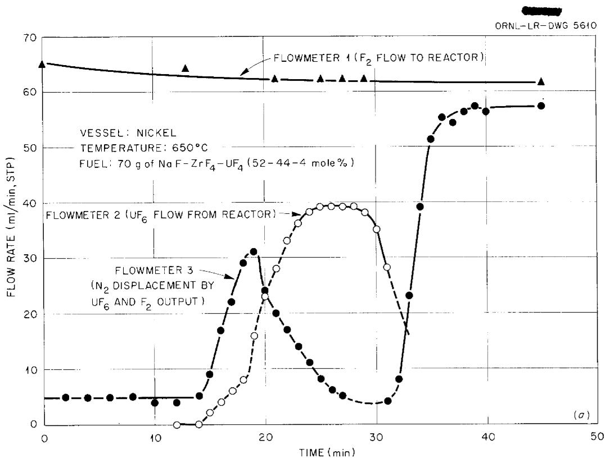

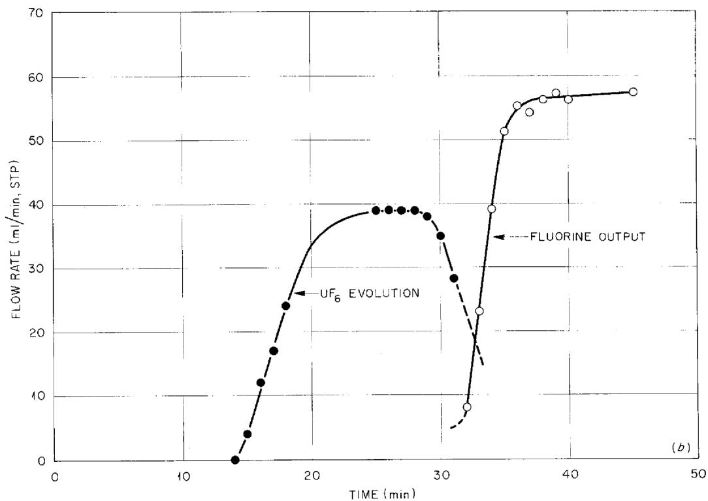  
Fig. 11.3. (a) Gas Flow Characteristics in ARE-Type Fuel Fluorination Process. (b) Kinetics of Fuel Fluorination. Dotted lines indicate uncertainty resulting from mixing of gas with nitrogen.

from fluorination studies (Table 11.1). In the gravimetric tests the corrosion rate was generally less than 0.1 mph for nickel and somewhat higher for Inconel and Monel.

The corrosion rate was higher in the runs in which $\mathsf{UF}_4$ was present than in the others. In these five runs there was a $\mathsf{UF}_4$ -to- $\mathsf{UF}_6$ conversion period of less than 1 hr, followed by a period of several hours during which fluorine was passed through the salt. That the average corrosion rate was, in general, greater in the short runs is believed to be the result of the very high corrosion during the time that $\mathsf{UF}_6$ was present.

The lower average rate obtained in long runs is due to less corrosion occurring after the uranium has all been evolved.

The corrosion rates determined from salt analyses were obtained in five fluorination runs made with simulated ARE fuel. The test periods were probably greater than specified, since the time spent in starting or stopping each experiment is not accurately known. The internal surface area of the nickel reactor used in each run was about $66~\mathrm{cm}^2$ . The greatest corrosion rate, 0.66 mph, was again obtained in the run of shortest duration.

TABLE 11.1. CORROSION IN ARE-TYPE FUEL FUSED SALT-FLUORIDE VOLATILITY PROCESS AT ${650}^{ \circ  }\mathrm{C}$   
Gravimetric studies: corrosion coupons were cut from round rod, weighed, immersed for time shown in fused salt through which fluorine was being passed, and reweighed   
Salt analyses studies: fused salt residues from fluorination studies carried out in nickel reactors were analyzed for nickel   

<table><tr><td rowspan="2">Salt*</td><td rowspan="2">Test Period (hr)</td><td colspan="3">Corrosion Rate (mph)</td></tr><tr><td>Ni</td><td>Inconel</td><td>Monel</td></tr><tr><td colspan="5">Gravimetric Method</td></tr><tr><td rowspan="2">NaF-ZrF4(56-44 mole %)</td><td>14**</td><td>0.031</td><td>0.021</td><td>0.016</td></tr><tr><td>14**</td><td>0.36</td><td>0.40</td><td>0.76</td></tr><tr><td rowspan="5">NaF-ZrF4-UF4(52-44-4 mole %)</td><td>8***</td><td>0.056</td><td>0.063</td><td>0.12</td></tr><tr><td>5.5***</td><td>0.081</td><td>0.017</td><td>0.11</td></tr><tr><td>6.5***</td><td>0.066</td><td>0.11</td><td>0.15</td></tr><tr><td>8***</td><td>0.077</td><td>0.064</td><td>0.48</td></tr><tr><td>1***</td><td>0.37</td><td>0.56</td><td>0.44</td></tr><tr><td>NaF-ZrF4(56-44 mole %)</td><td>1***</td><td>0.058</td><td>0.10</td><td>0.10</td></tr><tr><td colspan="5">Salt Analyses</td></tr><tr><td rowspan="5">NaF-ZrF4-UF4(52-44-4 mole %)</td><td>1.5</td><td>0.66</td><td></td><td></td></tr><tr><td>3</td><td>0.33</td><td></td><td></td></tr><tr><td>44</td><td>0.06</td><td></td><td></td></tr><tr><td>5</td><td>0.25</td><td></td><td></td></tr><tr><td>5</td><td>0.21</td><td></td><td></td></tr></table>

* Two runs were made with the first batch of salt. In all other experiments a fresh batch of salt was used in each run.   
**Same corrosion samples used in the two successive runs.   
\*\*\*Same corrosion samples used in the six successive runs.

Some information on corrosion can also be obtained from the kinetic data in Fig. 11.3a and b. The discrepancy between the maximum $\mathsf{UF}_6$ flow rate of $40\mathrm{ml / min}$ and the fluorine flow rate of $62~\mathrm{ml / min}$ represents a nickel corrosion rate of about 1.8 mph. This is perhaps effective only during the period of existence of the NaF- $\mathsf{UF}_6$ complex. However, an even more rapid average corrosion rate of 4 mph during the period $\mathsf{UF}_6$ was present was indicated by the fluorine material balance. The low corrosion rates obtained in the gravimetric test and fused salt analyses are possibly obtained only over the process as a

whole, that is, when the $\mathsf{UF}_4$ -to- $\mathsf{UF}_6$ conversion period is accompanied by several hours of fluorine sparging to remove the last traces of uranium.

In all laboratory fluorination runs, $50\%$ or more of the fluorine was consumed in corrosion of the nickel reactor. This need not be true in scaling-up the process to a pilot plant level. It is estimated that the consumption of fluorine in corrosion for a 10-kg uranium batch will be less than one-tenth that in a batch of 6 g. This is a consequence of the greater volume-to-surface ratio in the 10-kg case.

Part III

SHIELDING RESEARCH

# 12. SHIELDING ANALYSIS

E.P.Blizard

F. H. Murray C. D. Zerby

Physics Division

S. Auslander

Pratt & Whitney Aircraft

H. E. Stern

Consolidated Vultee Aircraft Corporation

Air-scattering measurements made at the Tower Shielding Facility indicate that for optimized divided shields the multiple scattering of radiation in air is quite important - more so than in many shield designs considered heretofore. Consequently a large fraction of the analysis effort has been pointed toward more complete calculations of air scattering. Two approaches are used. In one, certain concessions are made in the physical hypotheses, such as assuming constant neutron velocity, to enable analytical treatment of the problem. In the other, a stochastic (Monte Carlo) method is adopted, with as nearly exact data being used as are available. Neither method has yet been completely developed or applied.

An offshoot of a Monte Carlo calculation of slant penetration of gamma rays in crew-shield side walls has been the development of a similar calculation of gamma heating in a multilayered region. This method will be applied to the presently conceived reactor designs to find the gamma heating to be expected in regions near the core.

# ANISOTROPIC SCATTERING OF NEUTRONS IN A UNIFORM MEDIUM WITH BEAM SOURCES

F. H. Murray

Formulas useful in the analysis of problems of multiple scattering of neutrons in an unbounded medium have been derived. These formulas are being applied in some problems of scattering in stratified mediums. The particle velocity is assumed to be constant in the analysis, and the scattering law is assumed to depend only on the angle between the initial and final directions of the scattered particle.

This analysis is based directly on the Fourier transform, and the spatial distribution of sources and the intensity as a function of angle from any point may be arbitrary. The formulas and their derivations are presented in a separate report.

# ENERGY ABSORPTION RESULTING FROM INCIDENT GAMMA RADIATION AS A FUNCTION OF THICKNESS OF MATERIALS WITH SLAB GEOMETRY

C. D. Zerby S. Auslander

Initial calculations of the heat generation in beryllium slabs as a result of the transport of slant incident gamma radiation were described in a previous report. The method used for these initial calculations is being extended to include photons with energy up to approximately 10 MeV.

The coded calculation for the Oracle, from which the initial results were obtained, is also being revised to make it more versatile. It will be possible in the future to study the heat generation resulting from the transport of gamma radiation through homogeneous slabs of materials containing any number of elements. The code for the calculation is being designed for simplicity of operation so that cases of interest can be calculated with a minimum of effort and time. In particular it is anticipated that the method will be applicable to calculations of heat deposition in the laminations around the reflector-moderated reactor.

# ENERGY AND ANGULAR DISTRIBUTION OF AIR-SCATTERED NEUTRONS FROM A MONOENERgetic, MONODIRECTIONAL POINT SOURCE

C. D. Zerby

A calculation of the energy and angular distribution of air-scattered neutrons from a monoenergetic, monodirectional point source is being made to provide data from which the energy and direction of the neutron flux at an aircraft crew compartment

shield resulting from air-scattered neutrons from an arbitrary source can be determined at any altitude. The Monte Carlo method is being used for this calculation, and it is presently being coded for the Oracle.

The cross sections being used were taken from a previous report3 and include the complete resonance

structure, as reported. The scattering will initially be taken as isotropic in the center-of-mass system; however, later, it is intended that the anisotropy, as determined from experiments or calculations, will be included. For comparison with approximate solutions to this problem, the energy and angular distribution of single, double, triple, and all other multiply scattered neutrons will be recorded separately.

# 13. LID TANK SHIELDING FACILITY

G.T.Chapman J.M.Miller D.K.Trubey Physics Division

J.B.Dee H.C.Woodsum W.J.McCool J.Smolen Pratt & Whitney Aircraft

The GE-ANP helical air duct experimentation has been completed, and an analysis of the data is presented. A new attempt to correlate the removal cross section data with other properties of the atom has resulted in a plot of the ratio of the macroscopic removal cross section to the density of the material against the atomic weight. These data are compared with the total cross section at 8 Mev. Final preparations for the second series of tests on the reflector-moderated reactor and shield mockup have been completed.

# GE-ANP HELICAL AIR DUCT EXPERIMENTATION

J.M.Miller

All experimental work has been completed at the Lid Tank Shielding Facility (LTSF) on the GE-ANP helical air ducts and a final report on the work is being written. As described previously,2 the ducts were fabricated by shaping 3-in.-ID flexible tubing around a 9-in. core. After removal of the core, the ducts were stiffened with Fiberglass wrapping. The projected length of each duct along the $z$ axis was 46.5 in., and the duct arrays were arranged so that there was 5 in. between the duct center lines.

Radiation measurements were made beyond a single duct, a three-duct array, and a 35-duct array in plain water. Measurements were also made beyond the 35-duct array in a medium of Raschig rings (hollow steel cylinders, $\frac{1}{4}$ in. in diameter and $\frac{1}{2}$ in. long) and borated water. The Raschig rings were packed so that the medium around the ducts was $33\%$ steel and $67\%$ borated water. Various thicknesses of lead were also placed alongside the 35-duct array in the Raschig ring-borated water medium to mock up a side shield for the ducts. Some of the results of the experimental work are given in Table 13.1.

# REMOVAL CROSS SECTIONS

# G. T. Chapman

Previous attempts to correlate the effective neutron-removal cross section data obtained at the LTSF with more rigorously defined properties of the atoms, such as atomic weight and total cross section, have been limited because of the scarcity of data. However, a plot of the data has been made that may prove useful in shield calculations. The plot is presented in Fig. 13.1. The ratio of the macroscopic removal cross section to the density of the material $(\Sigma / \rho, \mathrm{cm}^2 / \mathrm{g})$ , a number proportional to the removal cross section per nucleon, is plotted against the atomic weight. These data are compared with the total cross section at 8 MeV, as

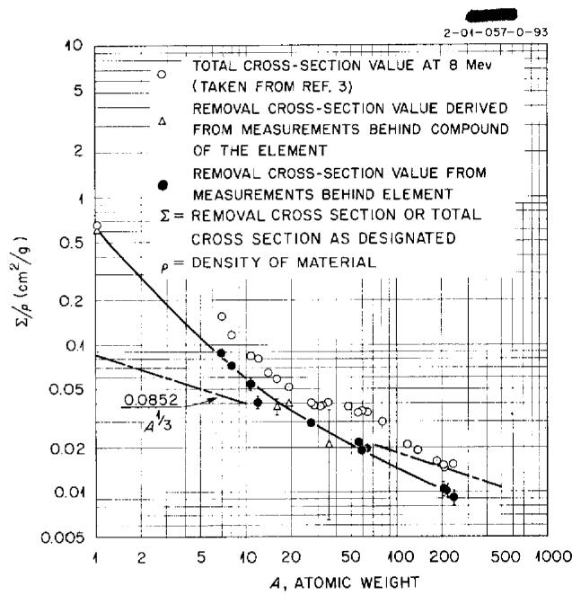  
Fig. 13.1. Neutron Shielding Ability per Unit Weight of a Material as a Function of Atomic Weight.

TABLE 13.1. INTENSITY INCREASES RESULTING FROM THE REDUCED DENSITY EFFECT AND THE PRESENCE OF G-E HELICAL AIR DUCTS   

<table><tr><td>Duct Configuration</td><td>Shield*</td><td>Quantity Measured</td><td>Non-Shield Component*</td><td>Calculated Factor Increase in Intensity Resulting from Reduced Density Effect</td><td>Total Factor Increase in Intensity Resulting from Presence of Ducts</td></tr><tr><td rowspan="3">Single duct</td><td rowspan="3">Plain water</td><td>Thermal-neutron flux</td><td></td><td></td><td>~2</td></tr><tr><td>Gamma-ray dose rate</td><td></td><td></td><td>~1</td></tr><tr><td>Fast-neutron dose rate</td><td></td><td></td><td>~2**</td></tr><tr><td rowspan="3">Three ducts</td><td rowspan="3">Plain water</td><td>Thermal-neutron flux</td><td></td><td></td><td>~6</td></tr><tr><td>Gamma-ray dose rate</td><td></td><td></td><td>~1.4</td></tr><tr><td>Fast-neutron dose rate</td><td></td><td></td><td>~4</td></tr><tr><td rowspan="5">35 ducts</td><td rowspan="3">Plain water</td><td>Thermal-neutron flux</td><td>43.5% air</td><td>210</td><td>~480</td></tr><tr><td>Gamma-ray dose rate</td><td>49% ducts</td><td>2.1***</td><td>~2.4</td></tr><tr><td>Fast-neutron dose rate</td><td></td><td>~200</td><td>~400</td></tr><tr><td rowspan="2">Raschig rings in borated water</td><td>Thermal-neutron flux</td><td>43.5% air</td><td>770</td><td>4000</td></tr><tr><td>Gamma-ray dose rate</td><td>49% ducts</td><td>175</td><td>~160</td></tr></table>

*Does not include water thickness between end of duct array and center of detection.   
\*\*Poor statistics.   
\*\*\* Corrected for iron in ducts.

obtained by N. G. Nereson et al. $^{3}$ at the Los Alamos Scientific Laboratory.

All removal cross section measurements at the LTSF have been compiled and will be published in a separate report.4

# REFLECTOR-MODERATED REACTOR AND SHIELD Mockup TESTS

J.B.Dee

The second series of experiments with mockups of the circulating-fuel reflector-moderated reactor (RMR) and shield has been started at the LTSF. The final preparations involved some changes from the plans previously published. The in-thick Inconel window originally built into the source side

of the large tank for holding all the dry components of the configurations has been replaced with a $3_{8}$ -in.-thick aluminum window. With the removal of the Inconel and, consequently, the high-energy nickel capture gamma ray, a more accurate study can be made of the smaller effects resulting from inelastic scattering and capture gammas in the other components of the shield mockup. As originally planned, Inconel will be used to simulate the RMR core shell, but it will be in the form of a removable slab placed immediately behind the aluminum window of the dry tank. An advantage of this arrangement is that it will be possible to place the Inconel inside the fuel belt during the dynamic tests and thus provide a more realistic mockup for this series of tests.

The solid $\mathrm{Al - UO_2}$ plates, which will simulate the fuel in the dynamic fission-source tests, were mounted in a continuous series on a sprocket-driven chain-link belt and tested under operating conditions in a special rig outside the LTSF (Fig. 13.2). The belt, which will move continuously from the neutron window to the heat exchanger region and back to the neutron window, was successfully oper

UNCLASSIFIED PHOTO 13553

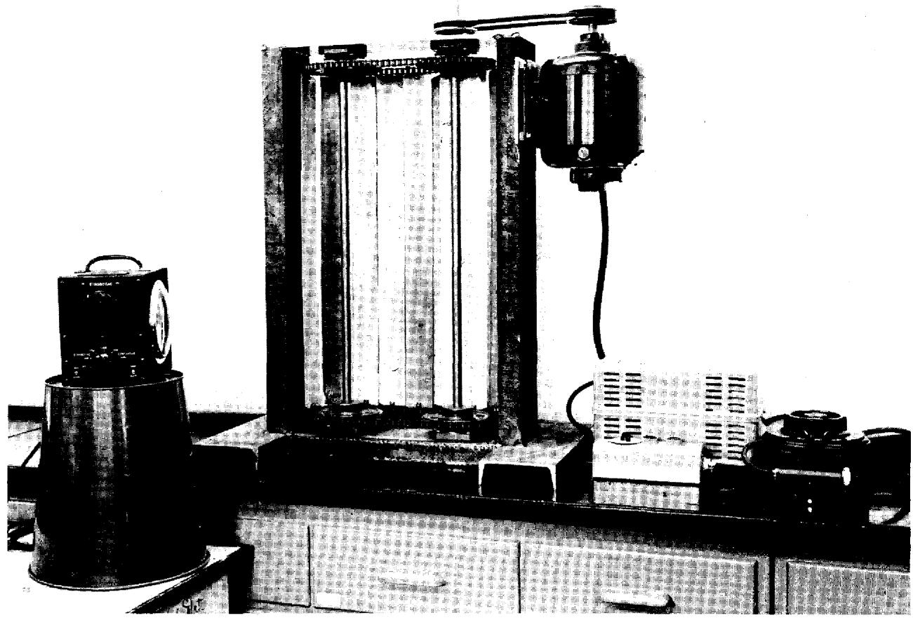  
Fig. 13.2. Apparatus for Testing the Chain-Driven Fuel Elements for the RMR-Shield Mockup.

ated at speeds up to 1050 fpm, which corresponds to a transit time of 0.73 sec in an actual mockup; the maximum design speed for the mockup is 900 fpm or a transit time of 0.85 sec.

As mentioned previously, this second series of RMR experiments will consist of two sets of tests: the static-source tests and the dynamic-source tests. In the static tests, the first measurements of which are now being made, the primary and secondary sources of radiation that reach the outside of the shield will be determined. This will be accomplished by analysis of differences in dose curves obtained by varying the thicknesses of the mockup regions, as follows: (1) an Inconel core shell in. thick, (2) a beryllium reflector 8 to 16 in. thick, (3) a boron curtain consisting of $2\frac{1}{4}$ in. of boral, (4) a heat exchanger consisting of one to four $1\frac{1}{2}$ -in. slabs of NaF contained in nickel, (5) a second boron curtain, (6) a pressure shell consisting of O to 2 in. of nickel, and (7) a shield

made up of lead, 0 to $10\frac{1}{2}$ in. thick, and water, usually borated. In some tests, bismuth and copper will be substituted for part of the beryllium reflector for determining the effect of placing a gamma shield closer to the reactor. These tests will not include radiations resulting from fuel circulation, but the sodium activation within the heat exchanger region will be studied.

For the dynamic tests a typical mockup will be used, primarily, and the LTSF source place will be replaced with the continuous series of $\mathrm{Al - UO_2}$ plates mounted on a movable belt. Several transit times will be used - the minimum will be 0.66 sec - and the sodium activation in the heat exchanger caused by delayed neutrons will be determined. The fuel belt will also give a source of fresh fission products. The attenuation of the gamma rays resulting from these fission products by various thicknesses of lead will be studied.

# 14. TOWER SHIELDING FACILITY

C. E. Clifford

T.V.Blosser

J. L. Hull

L. B. Holland

F. N. Watson

Physics Division

D. L. Gilliland, General Electric Company

M. F. Valerino, NACA, Cleveland

J. Van Hoomissen, Boeing Airplane Company

The first experiment with the mockup of the GE-ANP R-1 reactor shield has been completed, and the first series of differential experiments has been started. A specially designed gamma-ray dosimeter with which it is possible to simulate the addition of small thicknesses of lead to an aircraft crew compartment has been calibrated. Some results of the exposure of primates to high fast-neutron dose rates in a program initiated by the U.S. Air Force are reported.

# TSF EXPERIMENT WITH THE MockUP OF THE GE-ANP R-1 SHIELD DESIGN

T. V. Blosser

M.F.Valerino

D. L. Gilliland

J. Van Hoomissen

F. N. Watson

The first experiment with the mockup of the GE-ANP R-1 reactor shield has been completed at the TSF with measurements of the gamma-ray dose rates along the $x, y,$ and $z$ axes of the detector tank. The experimental arrangement for these measurements was the same as that for the earlier thermal-neutron flux measurements. The reactor-detector altitude $(b)$ was 195 ft and the G-E shield was a horizontal distance $(d)$ of 64 ft from the detector tank. Five 1-in.-thick lead slabs were installed 1 ft from the rear face (reactor side) of the detector tank to simulate the shielding in the crew compartment.

In order to gain a knowledge of the dose rates from gamma rays which will be incident on the various faces of the crew shield mockup and of the gamma-ray attenuation characteristics of the hydrogenous shielding of the mockup, the gamma-ray dose rates were measured with both plain and borated water in the detector tank. From the borated water traverses the reduction of the

gamma-ray dose rate caused by the suppression of the gamma rays resulting from the capture of thermal neutrons in the water could be determined.

The y traverse (Fig. 14.1) measured in plain water indicates an average relaxation length of $19.7\mathrm{cm}$ to the rear of the lead. The shape of the curve in front of the lead indicates that the gamma dose is due to the gamma rays which enter the tank from the sides rather than those which penetrate the lead. Therefore, an effective relaxation length for the lead attenuation cannot be obtained from these data. The reduction of the gamma dose in the center of the tank which resulted from the boration $(0.4\mathrm{wt}\%)$ of the water indicates the presence of substantial quantities of secondary gammas from captures in hydrogen. The effective relaxation length at the front of the tank along the y axis (reactor-detector tank axis) was found to be $9.6\mathrm{cm}$ and was obtained by subtracting from the curve the gamma dose penetrating the sides of the tank. The relaxation length obtained at the sides of the tank (Figs. 14.2 and 14.3) in a similar manner was $10.3\mathrm{cm}$ and was apparently a single exponential for penetration of at least $25\mathrm{cm}$ of water. An error in the calibration of the gamma-ray detector caused by the neglect of the decay of the cobalt source introduces a correction factor of 0.94 for all gamma-ray dose rates measured in the detector tank during this experiment.

# THE DIFFERENTIAL EXPERIMENTS AT THE TSF:PHASE I

T. V. Blosser

M. F. Valerino

L. B. Holland

J. Van Hoomissen

J. L. Hull

F. N. Watson

The experimental program at the TSF is now being arranged so that the mockup experiments are interspersed with differential experiments (those in which the 12-ft-dia reactor tank and the

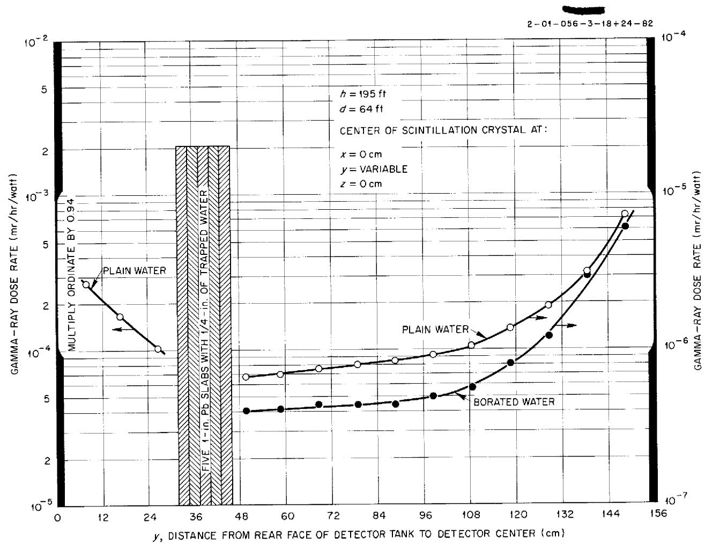  
Fig. 14.1. Gamma-Ray Dose Rate Along the y Axis of the Detector Tank.

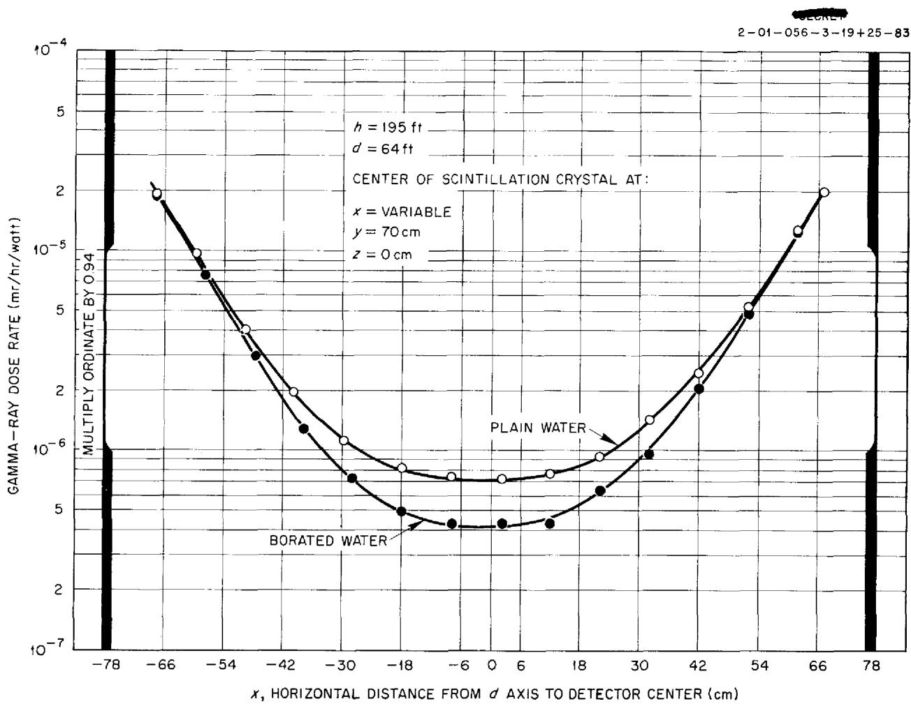  
Fig. 14.2. Gamma-Ray Dose Rate Along the $x$ Axis of the Detector Tdnk.

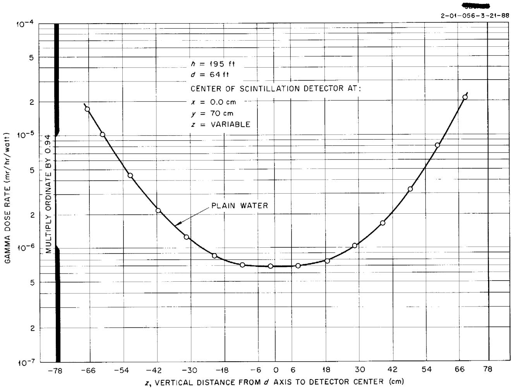  
Fig. 14.3. Gamma-Ray Dose Rate Along the $z$ Axis of the Detector Tank.

detector tank are used). A series $^2$ of differential experiments has now been started with emphasis on obtaining the fast-neutron dose rate distribution within the detector tank as a function of $\theta$ , the angle between the axis of symmetry of the beam from the reactor tank and the source-detector axis. The thickness $(\rho)$ of the water layer shielding the reactor, as measured from the edge of the reactor tank, is being held constant at $45~\mathrm{cm}$ . This thickness was chosen because it is in the region of interest of the side shielding on an aircraft reactor, and it also allows sufficient intensity in the detector tank for accurate measurements. Further, the prediction of the dose within the detector tank for a variation of $\rho$ is felt to be less uncertain than for the variation of $\theta$ .

The quantities to be determined are the magnitude of the doses impinging on the front, side and rear of the detector tank and the rate at which these doses are attenuated. It is hoped that the rate can be expressed in terms of the relaxation length of a simple exponential function. The results of these measurements will be compared with single-scatter calculations which are now being coded for solution on the Oracle. The calculations are being devised so that the doses arriving at the various faces of the tank can be calculated separately, and, for the 0- and 90-deg case, the angular distribution of the dose arriving at the faces will also be calculated. The calculations will be sufficiently general that any angular distribution at the source may be used.

The measurements which have been made to date have been planned as a quick survey to indicate the most interesting regions for the more detailed measurements to follow.

# CALIBRATION OF THE REVALET, A REMOTELY VARIABLE LEAD-TRANSMISSION GAMMA-RAY DOSIMETER

D. L. Gilliland

The optimization of gamma-ray shielding around the crew compartment is one of the major problems in the design of nuclear aircraft shields. To permit optimization the attenuation of lead for the gamma-ray dose penetrating the crew compartment must be determined as a function of the lead disposition within the crew compartment. A

full-scale experiment to obtain this information by varying the lead thickness inside an actual crew shield mockup would be both difficult and time consuming; therefore, a method has been developed in which it is hoped the crew compartment gamma shield can be simulated with lead thicknesses that can be varied with ease. This has been accomplished by enclosing an anthracene scintillation counter in a thick lead shield which has an aperture in one side that can be covered with lead disks of varying thicknesses from 0 to 0.7 in. Some of the details of the instrument, known as the Revelet, are shown in Fig. 14.4.

In order to ensure the validity of the measurements to be made at the TSF with the Revalet, an experiment with a known geometry and a source of known energy $(\mathrm{Co}^{60})$ was devised in which the angle of incidence of photons on the lead absorber disk could be varied. The measured lead attenuation for the various angles of incidence (0 to 60 deg) was in good agreement with Monte Carlo calculations of slant penetration. A comparison of the experimental measurements with the Monte Carlo calculation is shown in Fig. 14.5. The sensitivity of the counter as a function of angle of incidence is shown in Fig. 14.6 for the open-aperture case. The details of the instrument are given in a separate report.

# THE PROJECT ORANGE PRIMATE EXPOSURE AT THE TSF

T.V.Blosser

L. B. Holland

D. L. Gilliland

J. L. Hull

F. N. Watson

A preliminary experiment in which primates were exposed to massive doses of radiation has been completed at the TSF as part of a program initiated by the U.S. Air Force. Prior to these measurements the only experimental data available had been obtained with massive gamma-ray doses from barium-lanthanum sources. A more realistic approximation of the doses that would be received from an atomic warhead would, of course, include neutron as well as gamma-ray doses. It would

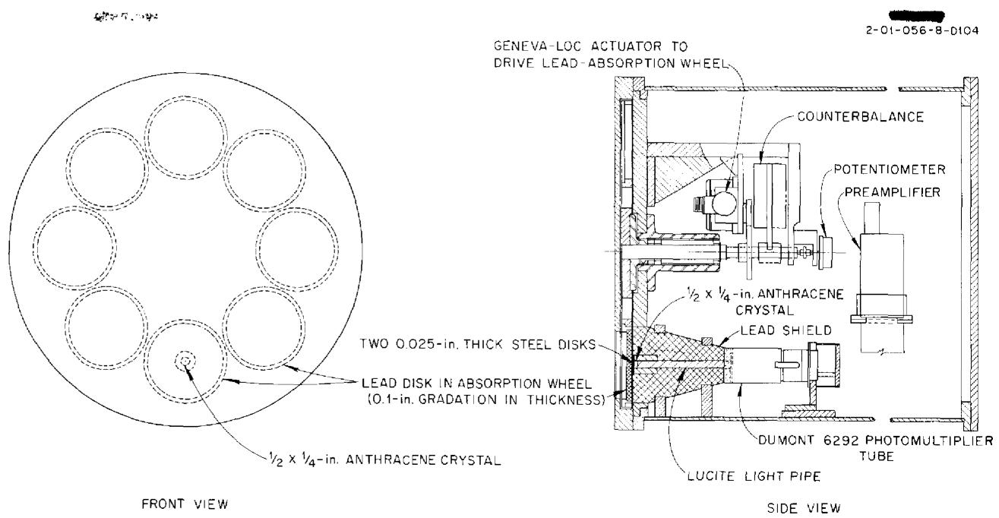

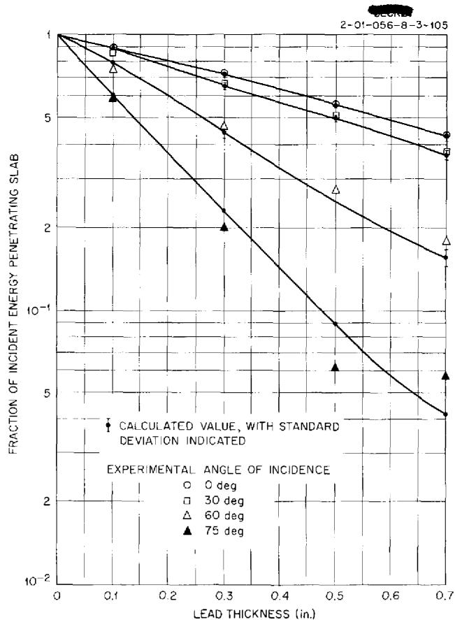  
Fig. 14.4. The Revalet, a Remotely Variable Lead-Transmission Gamma-Ray Dosimeter.   
Fig. 14.5. Lead-Absorption Measurements with the Revalet.

also include a more diverse spectrum of the gamma-ray energies. Since high radiation levels exist outside the shielding of the TSF reactor, it was chosen as a convenient source for further experiments. This preliminary experiment, designated Project ORANGE by the USAF, involved the exposure of 25 rhesus monkeys.

Since little was known of the effect of fast-neutron doses, emphasis was placed on maximizing the fast-neutron dose rate and minimizing the gamma-ray dose contamination. The maximum neutron dose achieved was 30,000 rep for an interval of approximately $1\frac{1}{2}$ min, the gamma-ray contamination being approximately 1 r/7.5 rep.

The experimental arrangement for the exposures is shown in Figs. 14.7 and 14.8. Two monkeys were exposed simultaneously in the two cylindrical Lucite cages shown in Fig. 14.7. The cages were placed on a motorized turntable which was rotated at $1\mathrm{rpm}$ , and they were separated from the reactor tank by a 3-in.-thick lead shield and a $\frac{1}{4}$ -in.-thick boron-impregnated plastic sheet. The horizontal midplane of the reactor coincided with the bottom edge of the white stripe around the reactor tank, shown in Fig. 14.7. The front face of the reactor was $5.5\mathrm{cm}$ from the tank wall. (Before the exposures were actually made the pine two-by-four running across the top half of the

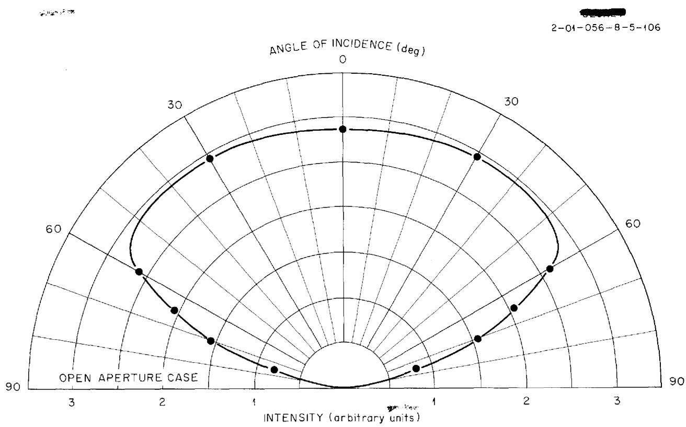  
Fig. 14.6. Solid Angle of Detection of the Revalet.

cages, Fig. 14.7, was removed. The three boron carbide slabs in front of, behind, and under the turntable were also removed.)

Measurements of the fast-neutron doses were made both with chemical dosimeters and with a Hurst-type fast-neutron dosimeter. The chemical dosimeters were attached to the outside of the cages and on the monkeys. In some instances cylindrical polyethylene containers filled with a solution of sugar, water, and urea to simulate the body composition of a monkey were used as phantoms in the cages and chemical dosimeters

were attached to the phantoms. The Hurst dosimeter measurements were made inside the cages with and without the phantoms.

The gamma-ray dose measurements were also made with chemical dosimeters placed on the cages, monkeys, and phantoms. Measurements with the $900\mathrm{-cm}^3$ ion chamber were made inside the cages without the phantoms.

The total radiation doses to which the animals were exposed are given in Table 14.1. The results of these preliminary exposure studies will be reported by the USAF.

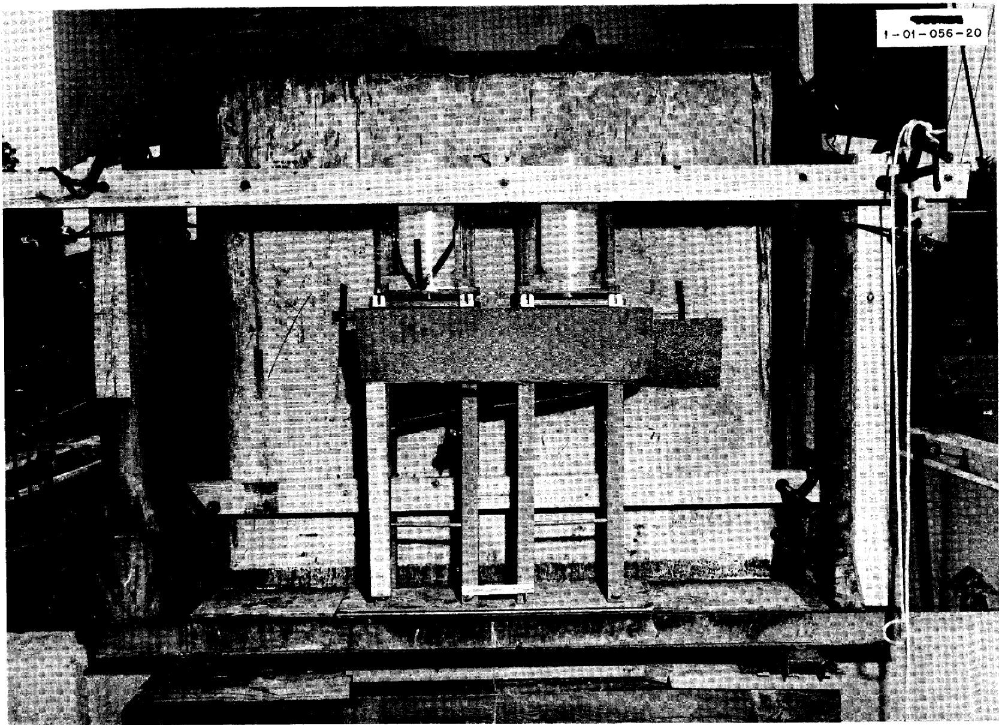  
Fig. 14.7. TSF Experimental Arrangement for Monkey Irradiation Showing Lucite Cages in Position Near Reactor Tank.

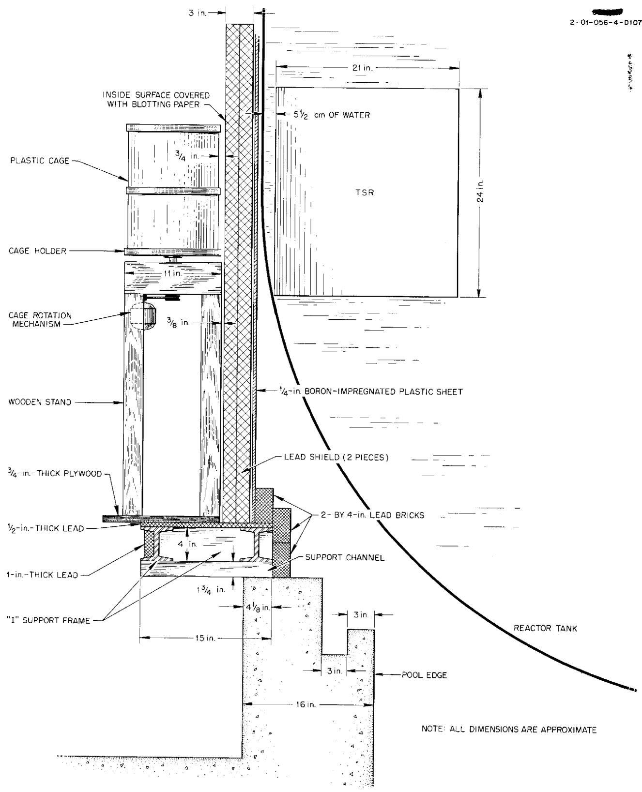  
Fig. 14.8. TSF Experimental Arrangement for Monkey Irradiation (Side View).

TABLE 14.1. TOTAL RADIATION DOSES TO WHICH MONKEYS WERE EXPOSED   

<table><tr><td rowspan="3">Exposure Number</td><td rowspan="3">Number of Monkeys Exposed</td><td rowspan="3">Time at Full Power (min)</td><td colspan="3">Total Neutron Dose (rep)</td><td colspan="3">Total Gamma Dose (r)</td></tr><tr><td rowspan="2">Hurst Dosimeter</td><td colspan="2">Chemical Dosimeters</td><td rowspan="2">Ion Chamber</td><td colspan="2">Chemical Dosimeters</td></tr><tr><td>Cage A</td><td>Cage B</td><td>Cage A</td><td>Cage B</td></tr><tr><td>1</td><td>2</td><td>1.5</td><td>31,900</td><td>28,846</td><td>28,461</td><td>4280</td><td>7763</td><td>7894</td></tr><tr><td>2</td><td>2</td><td>1.5</td><td>31,100</td><td>26,154</td><td>27,692</td><td>4190</td><td>6578</td><td>6842</td></tr><tr><td>3</td><td>2</td><td>1.5</td><td>31,300</td><td>23,077</td><td>24,615</td><td>4210</td><td>7105</td><td>7026</td></tr><tr><td>5</td><td>2</td><td>1.5</td><td>2,180</td><td>2,300</td><td>2,153</td><td>292</td><td>150</td><td>263</td></tr><tr><td>6</td><td>2</td><td>1.5</td><td>2,240</td><td>2,305</td><td>2,164</td><td>299</td><td>180</td><td>296</td></tr><tr><td>7</td><td>2</td><td>1.5</td><td>12,300</td><td>10,000</td><td>10,770</td><td>1650</td><td>2368</td><td>2237</td></tr><tr><td>8</td><td>2</td><td>1.5</td><td>4,500</td><td>5,153</td><td>4,615</td><td>602</td><td>921</td><td>789</td></tr><tr><td>9</td><td>2</td><td>1.5</td><td>11,600</td><td>10,000</td><td>11,540</td><td>1600</td><td>1973</td><td>2000</td></tr><tr><td>10</td><td>2</td><td>1.5</td><td>4,400</td><td>4,386</td><td>4,769</td><td>589</td><td>723</td><td>723</td></tr><tr><td>11</td><td>2</td><td>1.5</td><td>11,500</td><td>10,000</td><td>13,077</td><td>1550</td><td>1842</td><td>1973</td></tr><tr><td>12</td><td>2</td><td>1.5</td><td>4,420</td><td>3,946</td><td>3,846</td><td>591</td><td>592</td><td>592</td></tr><tr><td>13</td><td>1*</td><td>1.5</td><td>2,200</td><td>2,154</td><td>2,154</td><td>295</td><td>263</td><td>263</td></tr><tr><td>14</td><td>2</td><td>2.0</td><td>14,700</td><td>15,381</td><td>16,153</td><td>1960</td><td>2194</td><td>2389</td></tr></table>

*Plus 1 phantom.

Part IV

APPENDIX

15. LIST OF REPORTS ISSUED FROM SEPTEMBER 1954 TO MARCH 1955   

<table><tr><td>REPORT NO.</td><td>TITLE OF REPORT</td><td>AUTHOR</td><td>DATE ISSUED</td></tr><tr><td colspan="4">I. Aircraft Reactor Experiment</td></tr><tr><td>CF-54-9-160</td><td>ARE Instrumentation List</td><td>R. G. Affel</td><td>9-20-54</td></tr><tr><td>CF-54-11-188</td><td>Preliminary Report - Operation of the Aircraft Reactor Experiment</td><td>J. L. Meem W. B. Cottrell</td><td>11-30-54</td></tr><tr><td>CF-54-12-120</td><td>The Amount of Na22 in the Na Coolant of the ARE After Operation at 2 Mw for Two Days</td><td>H. W. Bertini</td><td>12-23-54</td></tr><tr><td>CF-54-12-209</td><td>Examination of the ARE</td><td>W. D. Manly</td><td>12-30-54</td></tr><tr><td colspan="4">II. Reflector-Moderated Reactor</td></tr><tr><td>CF-54-9-111</td><td>On Gamma Ray Heating in the Reflector-Moderated Reactor</td><td>P. H. Pitkanen</td><td>9-14-54</td></tr><tr><td>CF-54-10-106</td><td>Thermal Stresses in Beryllium - Test No. 1</td><td>R. W. Bussard R. E. MacPherson</td><td>10-25-54</td></tr><tr><td>CF-54-11-69</td><td>Temperature-Time History and Tube Stress Study of the Intermediate Heat Exchanger Test</td><td>R. I. Gray</td><td>11-30-54</td></tr><tr><td>CF-54-12-154</td><td>Shield Weights for the CFRE</td><td>J. B. Dee, Jr. H. C. Woodsum</td><td>12-20-54</td></tr><tr><td>CF-55-2-16</td><td>Preliminary Evaluation of Possible Poisons for Use in the ART Control Rod</td><td>J. W. Noaks</td><td>2-2-55</td></tr><tr><td>ORNL-1721</td><td>ORNL Aircraft Nuclear Power Plant Designs</td><td>A. P. Fraas A. W. Savolainen</td><td>12-3-54</td></tr><tr><td>ORNL-1835</td><td>Aircraft Reactor Test Hazards Summary Report</td><td>W. B. Cottrell et al.</td><td>1-19-55</td></tr><tr><td colspan="4">III. Experimental Engineering</td></tr><tr><td>CF-54-9-24</td><td>Program for Continuing Study of Cavitation Phenomena in Sodium</td><td>J. M. Trummel</td><td>9-3-54</td></tr><tr><td>CF-54-10-97</td><td>The Design of a Small Forced Circulation Corrosion Loop</td><td>W. K. Stair</td><td>10-11-54</td></tr><tr><td colspan="4">IV. Critical Experiments</td></tr><tr><td>CF-54-10-119</td><td>Reflector Moderated Critical Assembly Experimental Program - Part II</td><td>B. L. Greenstreet</td><td>10-19-54</td></tr><tr><td>CF-54-10-168</td><td>Experimental Program for Reflector Moderated Critical Assemblies</td><td>B. L. Greenstreet</td><td>10-29-54</td></tr><tr><td>CF-54-11-33</td><td>The First Assembly of the Three-Region Reflector Moderated Reactor</td><td>R. M. Spencer</td><td>11-5-54</td></tr><tr><td>CF-54-11-150</td><td>The Second Assembly of the Three-Region Reflector Moderated Reactor</td><td>R. M. Spencer B. L. Greenstreet</td><td>11-24-54</td></tr><tr><td>CF-54-12-21</td><td>Preliminary Critical Assembly for Supercritical Water Reactor, Part II</td><td>J. W. Noaks J. S. Crudele</td><td>12-1-54</td></tr><tr><td>CF-55-1-123</td><td>Three-Region Reflector Moderated Critical Assembly with 16 in. Inconel Core Shells</td><td>R. M. Spencer</td><td>1-21-55</td></tr><tr><td>ORNL-1770</td><td>Preliminary Critical Assemblies of the Reflector Moderated Reactor</td><td>R. M. Spencer</td><td>11-22-54</td></tr><tr><td></td><td></td><td>V. Metallurgy</td><td></td></tr><tr><td>CF-54-9-98</td><td>Examination of Sodium, Beryllium, Inconel Pump Loops Numbers 1 and 2</td><td>G. M. Adamson E. Long</td><td>9-13-54</td></tr><tr><td>CF-55-1-54</td><td>Materials Handbook</td><td>W. D. Manly</td><td>1-5-55</td></tr><tr><td></td><td></td><td>VI. Heat Transfer and Physical Properties</td><td></td></tr><tr><td>CF-54-10-139</td><td>Measurement of the Thermal Conductivity of Molten Fluoride Mixture No. 44</td><td>W. D. Powers S. J. Claiborne</td><td>10-26-54</td></tr><tr><td>CF-54-10-140</td><td>Heat Capacity of Composition No. 40</td><td>W. D. Powers G. C. Blalock</td><td>10-26-54</td></tr><tr><td>CF-54-11-37</td><td>A Laminar Forced-Convection Solution for Pipes Ducting Liquids Having Volume Heat Sources and Large Radial Differences in Viscosity</td><td>H. F. Poppendiek</td><td>11-5-54</td></tr><tr><td>CF-54-11-63</td><td>A Method for Evaluating the Heat Transfer Effectiveness of Reactor Coolants</td><td>M. W. Rosenthal H. F. Poppendiek M. R. Burnett</td><td>11-4-54</td></tr><tr><td>CF-54-12-110</td><td>Qualitative Velocity Information Regarding the ART Core: Status Report No. 4</td><td>J. O. Bradfute</td><td>12-14-54</td></tr><tr><td>CF-55-2-20</td><td>Preliminary Measurements of the Viscosity of Compositi-tion 20</td><td>S. I. Cohen T. N. Jones</td><td>2-2-55</td></tr><tr><td>ORNL-1769</td><td>Free-Convection in Fluids Having a Volume Heat Source</td><td>D. C. Hamilton et al.</td><td>11-15-54</td></tr><tr><td>ORNL-1777</td><td>Fused Salt Heat Transfer - Part II: Forced Convection Heat Transfer in Circular Tubes Containing NaF-KF-LiF Eutectic</td><td>H. W. Hoffman J. Lones</td><td>2-1-55</td></tr><tr><td></td><td></td><td>VII. Radiation Damage</td><td></td></tr><tr><td>CF-54-9-36</td><td>Removal of Xenon from Fluoride Fuels: Preliminary Design of In-Pile Equipment</td><td>M. T. Robinson</td><td>9-3-54</td></tr><tr><td>CF-54-12-65</td><td>Volatilization of Fission Products from Fluoride Fuels</td><td>M. T. Robinson</td><td>12-10-54</td></tr><tr><td></td><td></td><td>VIII. Shielding</td><td></td></tr><tr><td>CF-54-9-119</td><td>The Time Variation for Injury from Radiation</td><td>E. P. Blizzard</td><td>9-21-54</td></tr><tr><td>CF-54-9-120</td><td>Preliminary Report on the Penetration of Composite Slabs by Slant Incident Gamma Radiation</td><td>C. D. Zerby</td><td>9-21-54</td></tr><tr><td>CF-54-11-3</td><td>Measurement of an Effective Neutron Removal Cross Section of Lithium at the Lid Tank Shielding Facility</td><td>G. T. Chapman et al.</td><td>11-2-54</td></tr><tr><td>CF-54-11-113</td><td>Fraction of Biological Dose Due to Thermal Neutrons in Aircraft Reactor Shields</td><td>E. P. Blizzard</td><td>11-19-54</td></tr><tr><td>ORNL-1682</td><td>Reactivity Measurements with the Bulk Shielding Reactor</td><td>R. G. Cochran et al.</td><td>11-19-54</td></tr><tr><td></td><td>IX. Miscellaneous</td><td></td><td></td></tr><tr><td>CF-54-10-20</td><td>ANP Information Meeting of August 18, 1954</td><td>A. W. Savolainen</td><td>10-6-54</td></tr><tr><td>CF-54-10-48</td><td>ANP Research Conference of September 28, 1954</td><td>A. W. Savolainen</td><td>10-11-54</td></tr><tr><td>CF-54-10-49</td><td>ANP Research Conference of September 7, 1954</td><td>A. W. Savolainen</td><td>10-11-54</td></tr><tr><td>CF-54-10-138</td><td>ANP Research Conference of October 26, 1954</td><td>A. W. Savolainen</td><td>10-26-54</td></tr><tr><td>ORNL-1771</td><td>Aircraft Nuclear Propulsion Project Quarterly Progress Report for Period Ending September 10, 1954</td><td>A. W. Savolainen (ed.)</td><td>10-21-54</td></tr><tr><td>ORNL-1816</td><td>Aircraft Nuclear Propulsion Project Quarterly Progress Report for Period Ending December 10, 1954</td><td>A. W. Savolainen (ed.)</td><td>1-20-55</td></tr></table>

4

#

# THE AIRCRAFT NUCLEAR PROPULSION PROJECT

AT

# THE OAK RIDGE NATIONAL LABORATORY

MARCH 1, 1955

<table><tr><td>AMP PROJECT DIRECTOR</td><td>W. H. JORDAN</td><td>RD</td></tr><tr><td>COLISIONER</td><td>S. J. CROMER</td><td>RD</td></tr><tr><td>ASSOCIATE DIRECTOR</td><td>R. I. STROUGH</td><td>PWA</td></tr><tr><td>ASSISTANT DIRECTOR</td><td>A. J. MILLER</td><td>RD</td></tr><tr><td>D. MILYER, SEC.</td><td>RD</td><td></td></tr></table>

PRATT & WHITNEY AIRCRAFT

R. I. STROUGH, PROJECT ENGINEER PWA

A. GIANGREGORIO, ADM. ASS'T. PWA

O.A.BRADEN,SEC ARE

H.C.GRAY,DESIGN ENGINEER

REI

EN

SEC.

ATUI

POF   
  
  
RE

#

1. 甲组的检验结果为：

3.5.CROVER,DIRECT 40 H.MCETABIDGE,565 ARE

ASSISTANT TO DIRECTOR   
S.CARLSWTH   
J.P.LANE

__________

ARE A.P.FBAA   
ARE A.S.THE   
$\Rightarrow  \;{b}^{2} - {4ac} + 3 = 0$

CONSTRUCTION   
$\therefore m - 1 \neq  0$ ;   
ARE   
#   
HYDROOY   
ARE W.T.FU   
ARE M.E.   
G.SA   
1   
ARE M   
A   
PAAAPPLIE   
ABE   
${1.5}\left( {0 < x}\right)  + x - 1 = {1.5} + 1$   
LIARIES C.S.   
ARE F.A.   
C.B.   
${a}_{1}^{ * } = \frac{-b - \sqrt{{b}^{2} - {4ac}}}{2a},{b}^{2} = \frac{{a}_{1}^{2} + {a}_{2}^{2} - {4ac}}{4{a}^{2}}$   
  
E   
H   
ARE   
$\left| {x - 2}\right|  = \frac{3}{2}$   
IN AND W.S.CO   
A. E, C   
A   
#   
BLEMS   
ARE 3.1.2   
H.C.   
#   
$\left( {x - {2x}}\right) t - x{y}^{2} = \left( {x - {2x}}\right) {f}^{\prime }t$   
A.H.FOX   
W. LOWEN   
R.L.MOW   
ONVEX   
RE:AXX   
#

PLANT ENGINEERING EXPERIMENTAL ENGINEERING   
ARE H.W.SAYAGE   
SON PMC D.ALEXANDER,SEC.   
MAN,SEC, ARE

#

(1)细胞是一个有机体。一切动植物都在细胞发育同来,并自细胞和细胞产物所构成。

CNS AND THERMODYNAMICS ART COMPONENT TEST FACILITY

ORSON ARE E:STORTO 1

KEY ARE 3. CROWLEY 4. G. GRINDELL

C3 ARE A. F. G. H. I. J. K. L. M. N. O. P. Q. R. S. T. U. V. W. W. W. W. W. W. W. W. W. W. W. W. W. W. W. W. W. W. W. W. W. W. W. W. W. W. W. W. W. W. W. W. W. W. W. W. W. W. W. W. W. W. W. W. W. W. W. W. W. W.

ARNECOMPUTER 1A MANN

DORDAEISMAN ARE C.H.WELLS

IN 10.5.1.00D TECTS

ECHANICs AND PHYSICS

NE ARE D.B. TRAUGER

LES PWA 3. EGBANKS, STENO.

INETTE USAF R.G.AFFEL

L

AUXON, DRAFTSHAN, AR5

P.A.SNAI

21:TRANSPER D.M.HAINES

THEISS ARE D.W.MAGNUSON

OSH ARE TECHNICAL

CIAL PROBLEMS I

EELL ARE F.M.GRIZZEL

TIGERFORD ARE C.C.NANCE

AIE ARE B.L.JOHNSON

F.J.SCHAFER O.F.OTENVEK

BD AEE C.2.STEVENSON

PXA PROCUREMENT

PWKINS PWA W.F.BoudREAU

R.CLARKE

CONSULTANTS J.R.EVANS   
ON COLLEGE W.R.OSBORN   
ON COLLEGE CIERKS   
COTENWISSES G.C.JENKINS   
FLEWIS   
E. B. PERRIN   
D. STOREY

TEST SERVICES

1   
D.HARRIS STENO ARES   
A. MONTGOWERY, CL., TYP., ARE   
C. P. COUGHLE   
B.A.DREISBACK PWA   
R.HELTON ABE   
E.M.LEES ARE  
J.J.MILICH PWA   
W.J.MUENZER ARE   
C.E.WORPHY ARE 12   
P.G.SMITH 2RE   
__________

TECHNICIANS

J.ADKINS ARE

J.S.ADOISON ARE   
P.O.PRESS 127

1.ANNWIRE ARE 2. AONWIRE ARE

K.K.BAGHEEL AREC

L.H.COURNAB ARE

L.R.CROLEY AREI

J.M.CUNNINGHAM ARE

R.E.DIAL ARE

W.H.DUCKWORTH ARE

J.P.EUBANKS ARE

A. R, R, FINNELL 1

11.P031 425

W.D.GHORMCETY ARLT

1.2.GRECKF 486
2.AHAURICK  ABE

C.C.HENLY ABF

C.5.McGARTS ARE

6.5.1.15 ABF

B. H. MONTGOMERY ARE:

L.PARSONS ARE

M.A.REODEN ARE

R. REID ARE

A.G.TOWNS ARE

B.C.WILLIAMS ARE

CRAET COORDINATION

HATHEX

P.LCLARK

D. L. GRAY ARE

__________

__________

CONSULTANTS

J.F.BALEY,UNIVERSITY OF TENNESSEE

W. R. CHAMBERS

J.F.HAHNES

W.K.STAIR,UNIVERSITYOF TENNESSEE

(1)基因通过控制 通过控制_____,_____的合成来控制代谢过程,进而控制生物体的性状。

$\frac{1 + u}{1} - \frac{u}{1} = \frac{\left( {1 + u}\right) u}{1} < \frac{u}{1} = u$

SPECTROGRAPHIC ANALYSIS

J.R.MCNALLY

LA MORRIS* AND OTHERS

__________

MASS SPECTROMETRY

C.R.BALDOCK*

J.R.SITES\* 51

(1)基因通过控制 通过控制_____,_____的合成来控制代谢过程,进而控制生物体的性状。

__________

1

$\therefore m = \frac{3}{11}$

1

#

1

W.R.

D.

1

#

1

1

1

1

1

1

1

1

1

1

1

11.

1

$\left| {x - {2x}}\right|  = \frac{5}{1} - \frac{1}{{x}^{2}} = \frac{7}{1} < \frac{7}{1}$

$\left| \begin{array}{l} 1 \\  1 \end{array}\right|$

$\left| {x - {2x}}\right|  = \frac{1}{2}\left| {x - 3}\right|$

1

1

1

1

11

1

1

1

1

1

1

1

1

1

1

G.

1

1

1

1

1

1

F.

B.

1

6.

B.

1

1

1

1

1

1

1

1

$\left\{  {1,2,3}\right\}$

$\left| {x - 1}\right|  = \left| {x + 2}\right|  - \left| {x + 3}\right| .$

1

P.

1

1

1

11.1

1

1

1

1

1

1

11.4

BATTELLE MEMORIAL INSTITUTE

CARTER LABORATORIES

1

11

1

1

#

#

#

1

1

H

1

1

1

1

A.

1

1

1

1

1

1

1

11

1

#

1

1

$\left| \overrightarrow{a}\right|  = \left| \overrightarrow{b}\right|$

[ ]

引

#

1

1

1

1

1

15

$\therefore m = \frac{3}{11}$ ;

$\therefore m = \frac{3}{11}$

P PROJECT DIRECTOR SOCIATE DIR Sistant DIR W.R.   
W.R.   
R.   
C.   
F.   
F.   
J.   
P.   
G.   
F.   
B.W.G.B.L.R.   
L.   
P.   
J.   
D.D.H.T.J.   
A.   
J.W.C.

$\frac{1}{2} =$ 小时  
PROJECT   
SUBJECT   
SOCIATE DIL   
SISTANTD   
  
$\therefore m - 1 \neq  0$ ;   
PROJECT   
DIRECTOR   
SOCIATE DIL   
FISTANT DUE

$\therefore m = \frac{3}{11}$ ;

$\frac{1}{2}x - 1 > 0$   
AIRCRAFT   
EVEER   
#   
#   
  
FEER   
  
  
$\frac{1}{2}x - 1 > 0$   
AIRCRAFT   
#   
ENGINEER   
ASS-1.   
  
#   
$\therefore m = \frac{3}{11}$   
$\therefore m = \frac{3}{11}$   
…   
AECRAFT   
  
#   
#

$\therefore m = \frac{3}{11}$ ;

$\therefore m = \frac{3}{11}$

#

1

1

#

#

$\left\lbrack  {\frac{1 + \sqrt{2}\left( {1 + u}\right) }{1} - \frac{\sqrt{2}}{1}}\right\rbrack  t = \left\lbrack  {\frac{1 + \sqrt{u} \cdot  \left( {1 + u}\right) }{1} - \frac{\sqrt{u} \cdot  \left( {1 + u}\right) }{1}}\right\rbrack  t = 1$

#

1

1

D.

1

1

1

1

1

$\left| \right|  = \frac{1}{2}$

11.

1

1

11

1

$\left\{  {1,2,3}\right\}$

$\left\{  {1,2,3}\right\}   \Rightarrow  \;\left\{  {1,3,4}\right\}   \Rightarrow  \left\{  {2,3,4}\right\}   \Rightarrow  \left\{  {3,4,5}\right\}   \Rightarrow  \left\{  {4,5,6}\right\}   \Rightarrow  \left\{  {5,6}\right\}   \Rightarrow  \left\{  {6,7}\right\}   \Rightarrow  \left\{  {7,8}\right\}   \Rightarrow  \left\{  {8,9}\right\}   \Rightarrow  \left\{  {9,10}\right\}   \Rightarrow  \left\{  {10,11}\right\}   \Rightarrow  \left\{  {11,12}\right\}   \Rightarrow  \left\{  {12,13}\right\}   \Rightarrow  \left\{  {13,14}\right\}   \Rightarrow  \left\{  {14,15}\right\}   \Rightarrow  \left\{  {15,16}\right\}   \Rightarrow  \left\{  {16,17}\right\}   \Rightarrow  \left\{  {17,18}\right\}   \Rightarrow  \left\{  {18,19}\right\}   \Rightarrow  \left\{  {19,20}\right\}   \Rightarrow  \left\{  {20,21}\right\}   \Rightarrow  \left\{  {21,22}\right\}   \Rightarrow  \left\{  {22,23}\right\}   \Rightarrow  \left\{  {23,24}\right\}   \Rightarrow  \left\{  {24,25}\right\}   \Rightarrow  \left\{  {25,26}\right\}   \Rightarrow  \left\{  {26,27}\right\}   \Rightarrow  \left\{  {27,28}\right\}   \Rightarrow  \left\{  {28,29}\right\}   \Rightarrow  \left\{  {29,30}\right\}   \Rightarrow  \left\{  {30,31}\right\}   \Rightarrow  \left\{  {31,32}\right\}   \Rightarrow  \left\{  {32,33}\right\}   \Rightarrow  \left\{  {33,34}\right\}   \Rightarrow  \left\{  {34,35}\right\}   \Rightarrow  \left\{  {35,36}\right\}   \Rightarrow  \left\{  {36,37}\right\}   \Rightarrow  \left\{  {37,38}\right\}   \Rightarrow  \left\{  {38,39}\right\}   \Rightarrow  \left\{  {39,40}\right\}   \Rightarrow  \left\{  {40,41}\right\}   \Rightarrow  \left\{  {41,42}\right\}   \Rightarrow  \left\{  {42,43}\right\}   \Rightarrow  } \right.$

11

11

11

1

1

1

11

1

11.

$\left| \frac{q}{p}\right|  = \frac{q}{p} \cdot  \left| {\frac{q}{p} - 1}\right|  < \frac{q}{p} + 1.$

1

1

1

11

1

E

1

1

11

11

11

11

11

1

11

1

1

11

$\left\{  {1,2}\right\}  \;\left\{  {1,3}\right\}  \;\left\{  {2,3}\right\}$

11

11

1

1

1

11.

11

B.

1

1 6.

B.

R.

1

1

11

1

1

1

$\left\{  {1,2}\right\}  )$

1

1

1

#

$\left\{  {1,1}\right\}$

1

1

1

1

11

1

1

H.

1.8

1

1

1

1

SATTELEMEMORIALINSTITUT

CARTIERLABORA:ORIES

1

1

1

1

#

#

#

1

1

$\left| \right|  = \frac{1}{2}$

□

1

1

#

1

A.

1

11

1

1

$\left\{  {1,2}\right\}  )$

$\left\{  {1,2,3}\right\}$

1

$\left\{  {1,2}\right\}  )$

$\left\{  {1,2}\right\}$

1

1

1

11

$\left| \overrightarrow{a}\right|  = \left| \overrightarrow{b}\right|$

1

31

$\left\{  {1,2}\right\}  \;\left\{  {3,4}\right\}  \;\left\{  {5,6}\right\}$

1

1

E

A

C

#

C

$\therefore m = \frac{3}{11}$ ;

$\therefore m = \frac{3}{11}$

$\therefore m = \frac{3}{11}$

$\therefore m = \frac{3}{11}$

#

$\left\lbrack  {\frac{1 + \sqrt{2}\left( {1 + u}\right) }{1} - \frac{1}{1}}\right\rbrack  t =$

#

#

#

#

1

1

11.

1

1

1

1

1

$\left| \right|  = \frac{1}{2}$

$\left| \right|  = \frac{1}{2}$

E.

1

$\left| \right|  = \frac{1}{2}$

1

$\left\{  {1,2}\right\}  )$

$\left| \overrightarrow{a}\right|  = \left| \overrightarrow{b}\right|$

$\left\{  {1,2,3}\right\}   \Rightarrow  \;\left\{  {1,3,4}\right\}   \Rightarrow  \left\{  {2,3,4}\right\}   \Rightarrow  \left\{  {3,4}\right\}   \Rightarrow  \left\{  {4,5}\right\}   \Rightarrow  \left\{  {5,6}\right\}   \Rightarrow  \left\{  {6,7}\right\}   \Rightarrow  \left\{  {7,8}\right\}   \Rightarrow  \left\{  {8,9}\right\}   \Rightarrow  \left\{  {9,10}\right\}   \Rightarrow  \left\{  {10,11}\right\}   \Rightarrow  \left\{  {11,12}\right\}   \Rightarrow  \left\{  {12,13}\right\}   \Rightarrow  \left\{  {13,14}\right\}   \Rightarrow  \left\{  {14,15}\right\}   \Rightarrow  \left\{  {15,16}\right\}   \Rightarrow  \left\{  {16,17}\right\}   \Rightarrow  \left\{  {17,18}\right\}   \Rightarrow  \left\{  {18,19}\right\}   \Rightarrow  \left\{  {19,20}\right\}   \Rightarrow  \left\{  {20,21}\right\}   \Rightarrow  \left\{  {21,22}\right\}   \Rightarrow  \left\{  {22,23}\right\}   \Rightarrow  \left\{  {23,24}\right\}   \Rightarrow  \left\{  {24,25}\right\}   \Rightarrow  \left\{  {25,26}\right\}   \Rightarrow  \left\{  {26,27}\right\}   \Rightarrow  \left\{  {27,28}\right\}   \Rightarrow  \left\{  {28,29}\right\}   \Rightarrow  \left\{  {29,30}\right\}   \Rightarrow  \left\{  {30,31}\right\}   \Rightarrow  \left\{  {31,32}\right\}   \Rightarrow  \left\{  {32,33}\right\}   \Rightarrow  \left\{  {33,34}\right\}   \Rightarrow  \left\{  {34,35}\right\}   \Rightarrow  \left\{  {35,36}\right\}   \Rightarrow  \left\{  {36,37}\right\}   \Rightarrow  \left\{  {37,38}\right\}   \Rightarrow  \left\{  {38,39}\right\}   \Rightarrow  \left\{  {39,40}\right\}   \Rightarrow  \left\{  {40,41}\right\}   \Rightarrow  \left\{  {41,42}\right\}   \Rightarrow  \left\{  {42,43}\right\}   \Rightarrow  }$

1

1

11

F.

1

1

1

1

1

1

11

1

11

11.

1

1

1

1

1

1

1

1

1

1

11

11.

1

1

1

1

1

1

1

1

1

B.

1

1

B.

1 8

1

1

1

1

11

$\uparrow   \uparrow$

$\left| \right|  = \frac{1}{2}$

$\left| {x - {2x}}\right|  = \left| {x - 3}\right|$

1

$\left\{  {1,2,3}\right\}$

$\left\{  {1,2,3}\right\}$

$\left| {x - {2x}}\right|  = \frac{1}{2}\left| {x - 3}\right|$ .

11

1

11

11

1

1

D. (1)

H

1

#

1

1

1

1

1

1

11.

11.

1

1

1

1

1

1

1

#

1

1

#

1

11.

1

1

1

1

1

1

11

11

1

1

#

1

1

1

$\left\{  {1,2}\right\}$

$\left\{  {1,2}\right\}$

即

R

1

1

1

1

1

1

#

$\therefore m : x = 1$ 或 ${3x} + {4y} + 1 = 0$

#

P PROJECT DIRECTOR SOCIATE DIR MEER W.R. D. R. C. F. F. J. P. G. F. B. W. G. B. R. L. P. J. J. M. D. H. T. A. A. A. W. W. A. A.

$\therefore m : x = 1$ 或 ${3x} + {4y} + 1 = 0$

$\therefore m = \frac{3}{11}$ ;

$\therefore m = \frac{3}{11}$

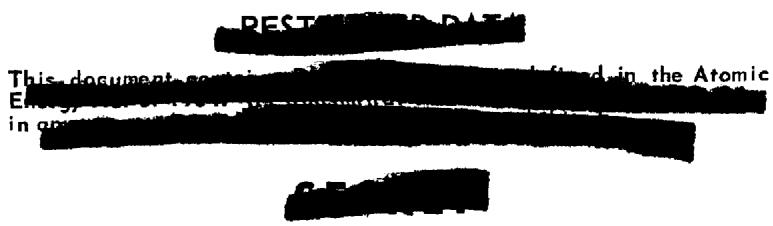