ANP Authorization Required

ORNL-1896

Progress

118-A

C

y

e eae

AIRCRAFT NUCLEAR PROPULSION PROJECT - AGT

QUARTERLY PROGRESS REPORT

FOR PERIOD ENDING JUNE 10, 1955

DECLASSES

CLASSIFICATION CHANGED T

By Axiomatic ${OF} : {AEC} - {C0} - {12} = {602}$

MARTIN MARIETTA ENERGY SYSTEMS LIBRARIES

34456 02509998

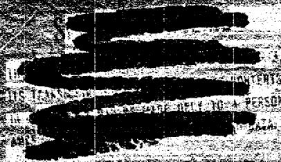

OAK RIDGE NATIONAL LABORATORY

OPERATED BY

RBIDE AND CARBON CHEMICALS COMPANY

UCC

POST OFFICE BOX F

OAK RIDGE, TENNESSEE

REPRICHTED BY

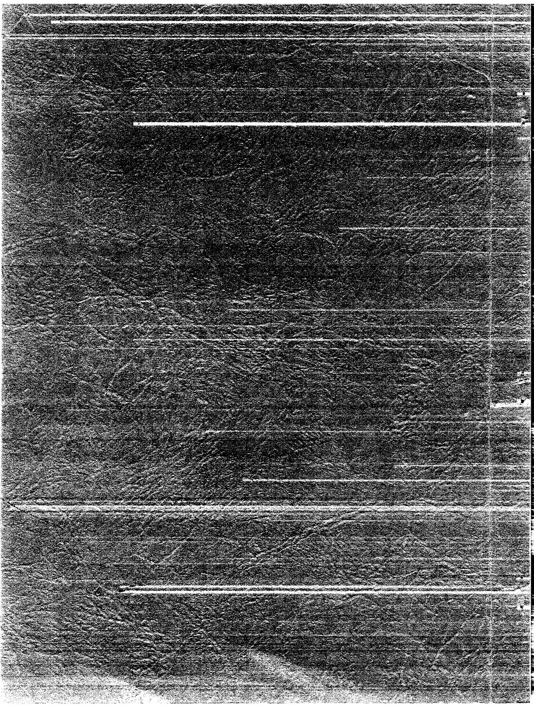

ANP Authorization Required ORNL-1896

This document consists of 246 pages.

Copy of 179 copies. Series A.

Contract No. W-7405-eng-26

# AIRCRAFT NUCLEAR PROPULSION PROJECT

# QUARTERLY PROGRESS REPORT

For Period Ending June 10, 1955

W. H. Jordan, Director

S. J. Cromer, Co-Director

R. I. Strough, Associate Director

A. J. Miller, Assistant Director

A.W.Savolainen,Editor

DATA RECEIVED BY INFORMATION AND REPORTS DIVISION

(JUNE 28,1955)

DATE ISSUED

JUL 26 1955

OAK RIDGE NATIONAL LABORATORY

Operated by

CARBIDE AND CARRON CHEMICALS COMPANY

A Division of Unlon Carbide and Carbon Corporation Post Office Box P

Oak Ridge, Tennessee

SPRICTED DATA

MARTIN MARIETTA ENERGY SYSTEMS LIBRARIES

34456 02509998

ORNL-1896

Progress

# INTERNAL DISTRIBUTION

1. G.M. Adamson

2. R.G.Affel

3. C.R. Baldock

4. C. Barton

5. E. S. Bettis

6. D. S. Billington

7. F. F. Blockenship

8. E.P. Blizzard

9. G.E. Boyd

10. M.A. Bredig

11. F.R.Bruce

12. A. D. Callihan

13. D. W. Cardwell

14. J.V. Cathcart

15. C. E. Center (K-25)

16. G. T. Chapman

17. R.A. Charpie

18. G.H.Clewett

19. C. E. Clifford

20. W. B. Cottrell

21. D. D. Cowen

22. S. Cromer

23. R. S. Crouse

24. F. L. Culler

25. L. B. Emlet (K-25)

26. D. E. Ferguson

27. A. P. Fraas

28. J.H.Frye

29. W. T. Furgerson

30. W.R.Grimes

31. E. E. Hoffman

32. A. Hollgender

33. A. S. Householder

34. J. T. Howe

35. R.W.Johnson

36. W. H. Jordan

37. G.W. Keilholtz

38. C.P. Keim

39. M. T. Kelley

40. F. Kertesz

41. E.M. King

42-43. J.A. Lape

44. C. E. Larson

45. M. E. La Verne

46. R. S. Livingston

47. R.N.Lyon

48. F. C. Maienschein

49. W. D. Manly

50. L. A. Mann

51. W. B. McDonald

52. F. W. McQuilken

53. A. J. Miller

54. K. Z. Morgan

55. E. J. Murphy

56. J. P. Murray (Y-12)

57. G.J.NessTe

58. R. B. Oliver

59. P. Papiarca

60. A. M. Perry

61. H.F. Poppendiek

62. P.M. Reyling

63. H.W.Savage

64.7A.W.Savolainen

65. E. D. Shipley

65. O. Sisman

87. G.P. Smith

88. A.H. Snell

69. R. I. Strough

70. C. D. Susano

71. J.A. Swartout

72. E.H. Taylor

73. J. B. Trice

74. E.R. Van Artsdalen

75. F.C.VnderLage

76. J.M. Warde

77. A.M. Weinberg

78. J.C. White

79. G.D.Whitman

80. E.P.Wigner (consultant)

81. G.C. Williams

82. J. C. Wilson

83. C. E. Winters

84. C. D. Zerby

85-94. X-10 Document Reference Library (Y-12)

95-114. Laboratory Records Department

115. Laboratory Records, ORNL R.C.

116-118. Central Research Library

# SECRET

# EXTERNAL DISTRIBUTION

119. AFDRD Jones   
120. AFDRQ   
121. AFSWC   
122. Aircraft Lab WADC (WCLS)   
23. Argonne National Laboratory   
124. ATIC

125-127. Atomic Energy Commission, Washington

128. BAGR-WADC   
129. Battelle Memorial Institute   
130. Boeing - Seattle   
131. BuAer - Mueller   
132. Chief of Naval Research

133-135. Coll Gasser (WCSM)

136. Convar - San Diego

137-139. CVAG - Fort Worth

140. Director of Laboratories (WCL)   
141. Director of Weapons Systems, ARDC   
142. Douglas   
143. East Hartford Area Office   
144. Equipment Laboratory - WADC (WCLE)

145-148. GE - ANPD

149. Glenn L. Martin   
150. Iowa State College   
151. Knolls Atomic Power Laboratory   
152. Lockheed - Burbank   
153. Lockland Area Office   
154. Los Alamos Scientific Laboratory

155-156. Materials Lab (WORTO)

157. Mound Laboratory   
158. NACA - Cleveland   
159. DNA - Washington   
160 NDA   
161. North American - Aerophysics   
162. Patent Branch, Washington

163-165. Power Plant Laboratory WADC (WCLPU)

166-169. Pratt & Whitney

170. Rand   
171. RDGN Sutherland   
172. SAM

173-174. Technical Information Service, Oak Ridge

Operations Office

175-177. WADC - Library

178. WAPD - Bettis Plant   
179. Wright Aero

Reports previously issued in this series are as follows:

ORNL-528 Period Ending November 30, 1949

ORNL-629 Period Ending February 28, 1950

ORNL-768 Period Ending May 31, 1950

ORNL-858 Period Ending August 31, 1950

ORNL-919 Period Ending December 10, 1950

ANP-60 Period Ending March 10, 1951

ANP-65 Period Ending June 10, 1951

ORNL-1154 Period Ending September 10, 1951

ORNL-1170 Period Ending December 10, 1951

ORNL-1227 Period Ending March 10, 1952

ORNL-1294 Period Ending June 10, 1952

ORNL-1375 Period Ending September 10, 1952

ORNL-1439 Period Ending December 10, 1952

ORNL-1515 Period Ending March 10, 1953

ORNL-1556 Period Ending June 10, 1953

ORNL-1609 Period Ending September 10, 1953

ORNL-1649 Period Ending December 10, 1953

ORNL-1692 Period Ending March 10, 1954

ORNL-1729 Period Ending June 10, 1954

ORNL-1771 Period Ending September 10, 1954

ORNL-1816 Period Ending December 10, 1954

ORNL-1864 Period Ending March 10, 1955

# FOREWORD

This quarterly progress report of the Aircraft Nuclear Propulsion Project at ORNL records the technical progress of the research on circulating-fuel reactors and all other ANP research at the Laboratory under its Contract W-7405-eng-26. The report is divided into three major parts: I. Reactor Theory, Component Development, and Construction, II. Materials Research, and III. Shielding Research.

The ANP Project is comprised of about 475 technical and scientific personnel engaged in many phases of research directed toward the achievement of nuclear propulsion of aircraft. A considerable portion of this research is performed in support of the work of other organizations participating in the national ANP effort. However, the bulk of the ANP research at ORNL is directed toward the development of a circulating-fuel type of reactor.

The design, construction, and operation of the Aircraft Reactor Test (ART), with the cooperation of the Pratt & Whitney Aircraft Division, are the specific objectives of the project. The ART is to be a power plant system that will include a 60-Mw circulating-fuel reflector-moderated reactor and adequate means for heat disposal. Operation of the system will be for the purpose of determining the feasibility, and the problems associated with the design, construction, and operation, of a high-power, circulating-fuel, reflector-moderated aircraft reactor system.

# CONTENTS

FOREWORD

SUMMARY 1

PART I. REACTOR THEORY, COMPONENT DEVELOPMENT, AND CONSTRUCTION

1. REFLECTOR-MODERATED REACTOR 15

Aircraft Reactor Test Design 15

ART Control 17

Control Principles 18

Operating Procedure 19

Reactor Physics 20

Probable Effect of Replacing Inconel by Cumbium in the ART Core Shells 20

ART Temperature Coefficient 20

Reactivity Effect of a Heat Exchanger Leak 21

Burnup and Gamma-Ray Heating of Control Rod 22

2. EXPERIMENTAL REACTOR ENGINEERING 26

In-Pile Loop Component Development 26

Flux Measurements 26

Fission-Gas Holdup 26

Bench Test 27

Horizontal-Shaft Sump Pump 27

Instrumentation 29

Assembly of MTR In-Pile Loop No. 1 29

Development and Operation of Forced-Circulation Corrosion and Mass Transfer Tests 30

Operation of Fused Salt-Inconel Loops 30

Sodium in Multimetal Loops 31

Pump Development 32

Water Performance Tests 32

Bearing and Seal Tests 33

Mechanical Shakedown Tests 34

Short-Circuit Pump-Test Stand 35

Heat Exchanger Tests 35

Heat Exchanger Tube-Spacer Pressure-Drop Tests 35

Intermediate Heat Exchanger Tests 37

Small Heat Exchanger Tests 37

Core Flow Test 37

Thermal-Cycling Tests of Sodium-Inconel-Beryllium System 39

Gas-Fired Heat Source 42

3.CRITICAL EXPERIMENTS 43

Room-Temperature Reflector-Moderated-Reactor Critical Experiments 43

Reactivity Measurements 43

Power Distributions 46

Assembly for High-Temperature Critical Experiment 48

# PART II. MATERIALS RESEARCH

# 4. CHEMISTRY OF REACTOR MATERIALS 51

Phase Equilibrium Studies 51   
The Binary System LiF-ZrF 51   
The Ternary System NaF-LiF-ZrF 52   
The Quaternary System NaF-LiF-ZrF4-UF 55   
BeF2-Bearing Systems 56   
Visual Observation of Fluoride Melts 59   
Phase Separation by Zone Melting 59

Chemical Reactions in Molten Salts 60

Equilibrium Reduction of $\mathsf{FeF}_2$ by $H_{2}$ in $\mathsf{NaZrF}_5$ 60   
Reduction of $\mathsf{UF}_4$ by Structural Metals 60   
Stability of Chromium and Iron Fluorides in Molten Fluorides 63   
The Disproportionation Pressure of UF 64   
Reduction of $\mathbf{U}\mathbf{F}_{4}$ with Uranium in Alkali Fluorides 67   
Effect of Filter Medium on Stability of $\mathsf{UF}_3$ 69   
Stability of $\mathsf{PbF}_2$ -BeF $_2$ Melts in Inconel 71   
Solubility of Metals in Molten Salts 71

Production of Purified Fluorides 72

Fuel Purification and Preparation Research 72   
Pilot-Scale Purification Operations 73   
Production-Scale Operations 73   
Batching and Dispensing Operation 75   
Loading and Draining Operations 75   
Special Services 76   
Experimental Preparation of Simple Fluorides 76

Fundamental Chemistry of Fused Salts 77

EMF Measurements 77   
Vapor Pressures of LiF-ZrF4 Mixtures 80   
Solubility of Xenon in Fused Salts 81   
X-Ray Diffraction Study of Liquids 81   
High-Temperature X-Ray Spectrometer Studies 81

# 5. CORROSION RESEARCH 83

Forced-Circulation Studies 83

Fluorides in Inconel 83   
Sodium in Inconel 86

Thermal-Convection Studies 88

Alkali-Metal Base Mixtures with $\mathsf{UF}_3$ and $\mathsf{UF}_4$ in Inconel 88   
Zirconium Fluoride Base Mixtures with $\mathsf{UF}_3$ and $\mathsf{UF}_4$ in Inconel 90   
Effect of Temperature on Mass Transfer 91   
Effect of Loop Size and Shape on Corrosion 91   
Evaluation of Control Loop Results 93

General Corrosion Studies 94

Brazing Alloys on Type 310 Stainless Steel and "A" Nickel in Sodium and in Fuel Mixtures 94   
Screening Tests of Solid-Phase Bonding 96   
Sodium in Inconel 101

# SECRET

Lithium in Type 347 Stainless Steel 101

Versene Cleaning of Beryllium-Inconel Systems 102

Fundamental Corrosion Research 105

Film Formation on Metals 105

Mass Transfer and Corrosion in Fused Hydroxide 110

Chemical Studies of Corrosion 114

Corrosion of Inconel by LiF-BeF and by LiF-BeF-UF 114

Effect of UF3-UF4 Mixtures on Corrosion of Inconel by Various Solvents 114

Studies of the Sodium Hydroxide-Nickel Reaction 115

6.METALLURGY AND CERAMICS 119

Development of Nickel-Molybdenum Alloys 119

Fabrication Studies 119

Oxidation Studies 123

Stress-Rupture Studies of Nickel-Molybdenum Alloys 124

Hastelloy B. 124

Modified Nickel-Molybdenum Alloys 125

Tensile Properties of Hastelloy B 125

Development of Brazing Alloys 128

High-Temperature Oxidation Tests 128

Physical Property Tests 129

Fabrication of Test Components 129

Twenty-Tube Heat Exchanger 129

Intermediate Heat Exchanger No. 2 131

NaK-to-Air Radiators 134

Cornell Radiator No. 1 139

Special Materials Studies 140

Special Alloy Extrusions 140

Clad-Columbium Fabrication 140

BC-Cu Shielding Material 142

Magnesium-Lithium Alloy 143

Welding of Cumbium Thermal-Convection Loops 144

Dimensional Stability Test on an Inconel Spun Core 144

Brazing of Cermets to Inconel 145

Ceramic Research 145

Rare-Earth Ceramics 145

$\mathsf{UO}_2$ Particles Coated with $\mathsf{ZrO}_2$ 147

Graphite-Hydrogen Reactions and Erosion Investigation 147

7. HEAT TRANSFER AND PHYSICAL PROPERTIES 149

Fused Salt Heat Transfer 149

ART Fuel-to-NaK Heat Exchanger 149

ART Core Hydrodynamics 151

Reactor Core Heat Transfer 154

Free Convection in Fluids Having a Volume Heat Source 154

Heat Capacity 156

Viscosity 157   
Thermal Conductivity 159   
Electrical Conductivity 160

# 8. RADIATION DAMAGE 161

MTR Static Corrosion Tests 161   
LITR Horizontal-Beam-Hole Fluoride-Fuel Loop 163   
Deposition of Ru103 in LITER Fluoride-Fuel Loop 167   
Miniature In-Pile Loop 168   
Delay of Fission Gases by Charcoal Traps 169   
Creep and Stress-Corrosion Tests 170

A Theoretical Treatment of Xe135 Poisoning in the ARE and the ART 171

# 9. ANALYTICAL CHEMISTRY OF REACTOR MATERIALS 174

Determination of Uranium Metal in Fluoride Salt Mixtures 174   
Determination of Trivalent Uranium in Fluoride Fuels 175   
Oxidation of Trivalent Uranium by Methylene Blue 175   
Simultaneous Determination of Trivalent Uranium and Total Uranium 176

Determination of Lithium in LiF-BeF $_2$ and LiF-ZrF $_4$ -UF $_4$ 176

Volumetric Determination of Zirconium in Fluoride Fuels with Disodium Dihydrogen Ethylenediaminetetraacetate 177   
Determination of Oxygen in Fluoride Fuels 178   
Determination of Oxygen in Metallic Oxides by Bromination 178   
Determination of Oxygen in Beryllium Oxide by Acidimetry 179   
Determination of Trace Amounts of Nickel in Fluoride Fuels with Sodium Diethyldithiocarbamate 179   
ANP Service Laboratory 180

# 10. RECOVERY AND REPROCESSING OF REACTOR FUEL 181

Pilot Plant Design 181   
Process Development 181   
Corrosion Studies 182

# PART III. SHIELDING RESEARCH

# 11. SHIELDING ANALYSIS 191

Gamma-Ray Distribution in a Circulating-Fuel Reactor and Shield 191   
Energy Absorption Resulting from Gamma Radiation Incident on a Multiregion Shield with Slab Geometry 192   
Energy and Angular Distribution of Air-Scattered Neutrons from a Monoenergetic Source 192   
Analysis of the Constant-Velocity Transport Equation 193

# 12. LID TANK SHIELDING FACILITY 194

Reflector-Moderated Reactor and Shield Mockup Tests 194

# SECRET

Gamma-Ray Dose Rate Measurements 194   
Neutron Measurements 197   
Sodium Activation in Heat Exchanger Region 198

13. BULK SHIELDING FACILITY 200

GE-ANP Air-Duct Mockup Experiment 200   
The Spectrum of Fission-Product Gamma Rays 203

14. TOWER SHIELDING FACILITY 205

The Differential Shielding Experiments at the TSF: Phase I 205   
Measurements in the Detector Tank 205   
Measurements in the GE-ANP Crew Compartment 205   
Analysis of the Differential Shielding Experiments 206   
Definition of Dose Scattering Probability 208   
Evaluation of Probability from TSF Experiments 213   
Evaluation of Direct-Beam Integral 214   
Calculation of Scattered Dose 215   
Effects of Direct-Beam Collimation 216   
Effect of Neutron Energy Spectrum 216   
Application of the Differential Shielding Experiments 217

# PART IV. APPENDIX

15. LIST OF REPORTS ISSUED FROM FEBRUARY 1955 THROUGH MAY 11, 1955 227   
ORGANIZATION CHARTS 231

# ANP PROJECT QUARTERLY PROGRESS REPORT

SUMMARY

# PART I. REACTOR THEORY, COMPONENT DEVELOPMENT, AND CONSTRUCTION

# 1. Reflector-Moderated Reactor

The development of the reactor layout is continuing. New features that have been incorporated because of stress, fluid flow, or fabricability considerations include an elliptical fuel expansion tank, a rounded dome to enclose the top of the reactor, a newly designed sodium pump impeller, and other related items. Recently completed heat exchanger tests yielded consistent data from which a series of heat exchangers is being designed. The most promising of these will be chosen for the ART.

The preliminary layout of the interior of the ART test cell which shows the major items of equipment and the recommended provisions for support was completed. A similar layout for the NaK piping and radiators was also completed so that drawings for the building and concrete work could proceed. More detailed drawings of the cell that will show the disposition of the small items and the instrumentation are being prepared.

Information block diagrams showing the basic-control actions desired for the ART have been prepared and will be used as a basis for selection of the hardware types and the control techniques to be used and for determination of areas of control that will require new component development.

The room-temperature critical experiments for the ART have shown that the critical mass decreases very rapidly as the neutron absorption in the core shell decreases. Hence, replacement of the highly absorbing Inconel by a low-cross-section material, such as columbium, would bring about a substantial saving in uranium investment and, incidentally, make the temperature coefficient more negative. For fabrication reasons, only about $50\%$ of the Inconel could be replaced by columbium. It is estimated that the effect of a $50\%$ replacement would be to reduce the critical mass by about $16.5\%$ , or $4\mathrm{kg}$ , which corresponds to a 0.7 mole $\%$ saving in uranium concentration of the fuel and a 7-kg saving in total $U^{235}$ investment.

Calculations were made of the temperature coefficients of the ART that check well with previous

multigroup calculations. The results support the postulated negative overall temperature coefficient. It has also been found that, if as much as 5 wt $\%$ lithium were added to the NaK in the secondary coolant circuit, the reactivity of the ART would be a fairly sensitive indication of a NaK leak into the fuel circuit. Burnup and gamma-ray heating of rare-earth oxides being considered as control rod materials are being studied.

# 2. Experimental Reactor Engineering

A series of design changes have been made in the nose, or heater, section of the in-pile loop as more information concerning the neutron flux in the MTR beam hole and the flux depression of the materials of loop construction has become available. The present nose section consists of a $2\frac{1}{2}$ -turn coil (an increase of 1 turn) with its axis parallel to the beam hole center line. The flux seen by the fuel in the in-pile loop is now expected to be $30\%$ of the unperturbed value, and the average power density in the nose section will be 0.7 $\mathrm{kW/cm}^3$ .

A working mockup of the in-pile loop has been completed and is being operated with the fuel mixture $\mathsf{NaF - ZrF_4 - UF_4}$ (53.5-40-6.5 mole %) at a Reynolds number of about 5000, a temperature differential of $175^{\circ}\mathsf{F}$ , and a maximum fuel temperature of $1500^{\circ}\mathsf{F}$ . Resistance heating is employed. The experience gained will aid in operation of the in-pile loop at the MTR.

The fission gas holdup system for the loop is being tested with flow rates of 0.15 and 0.03 scfh of helium with about $0.13\%$ krypton. After 15 days of operation, no significant amounts of krypton were getting through the liquid-nitrogen-cooled charcoal-adsorption traps. Assembly of the first loop for the MTR in-pile experiment is under way, with operation scheduled for the next quarter.

Three additional test stands were installed for the operation of resistance-heated high-velocity forced-circulation loops with large temperature differentials for investigating corrosion and mass transfer of Inconel by fluoride fuel mixtures. Also, three more gas furnaces were placed in service as heat sources for these loops, bringing the total

number of test stands to ten. Operation of 16 loops was terminated during the quarter. The majority of these loops operated for 1000 hr in the Reynolds number range of 1,000 to 15,000 and with temperature differentials of 100 to $300^{\circ}\mathrm{F}$ . The excessive high wall temperature in the bends of electric-resistance-heated loops was corrected by relocation of the heating elements so that heat is applied in only straight sections of tubing.

Four test stands are now in operation for studying corrosion and mass transfer of sodium-Inconel and sodium-Inconel-stainless steel systems. Operation of six such loops was terminated this quarter at the conclusion of periods of either 500 or 1000 hr with maximum sodium temperatures of up to $1500^{\circ}\mathrm{F}$ . Appreciable deposits of mass-transferred material were found in the cold legs of these loops, and therefore a controlled series of experiments was started. The loops will provide information on the effects of the oxygen content of the sodium, the use of a cold trap, the use of a lower temperature, and the use of an all-stainless-steel system.

The ART fuel pump (model MF-2) was operated in water performance tests. Some cavitation noises were present in all tests, but no serious effect of the apparent cavitation on performance could be found. It is estimated that the efficiency of the pump at design point, exclusive of seal and bearing losses, is $70\%$ . New inlet volute configurations are currently being designed and tested. The bearing and seal, cold mechanical shakedown, and high-temperature test stands are being fabricated and assembled.

An extensive program of heat exchanger testing is under way for obtaining reliable heat transfer data on fuel-to-NaK heat exchangers of the general type and configuration for ART application. Considerable information will be obtained on the effect of corrosion and mass transfer on materials of fabrication in high-temperature, high-heat-flux, NaK and fluoride systems. An opportunity will also be provided for ascertaining the structural integrity and reliability of fabrication of heat exchangers and radiators supplied by outside vendors.

The program involves the operation of three intermediate heat exchanger (IHE) test stands and two small heat exchanger (SHE) test stands, such as the SHE stand now in operation. The IHE stands will be used to test large tube bundles

(about 100 tubes) of the general size and configuration of ART heat exchangers (arranged for regenerative operation), while the SHE stands will be used to test smaller, more easily fabricated, tube bundles (20 to 50 tubes). The SHE stand now in operation will be modified for use as a general test loop following termination of the current test.

Design of all IHE test stands is complete, and procurement and assembly are well under way. Design of the SHE test stands and procurement of equipment are under way.

Water tests with a full-scale aluminum model of the 21-in. ART core and the entrance header region were initiated. Without inlet guide vanes, the fluid was observed to enter the core at an angle of about 70 deg from the vertical. Flow reversal at the island was observed. Data from these tests are being used in the design of turning vanes and vortex generators to correct this unacceptable flow condition.

A second thermal-cycling test of a sodium-Inconel-beryllium system was completed. Over 100 thermal cycles were applied to the beryllium piece between the range of the high power level, $61\mathrm{~w/cm}^3$ to the beryllium, and the low power level, $2.5\mathrm{~w/cm}^3$ . The sodium temperature from inlet to outlet at the high power level ranged from 1050 to $1200^{\circ}\mathrm{F}$ . Inspection of the beryllium piece after the test (total operating time, 1030 hr) revealed three axial cracks on the outer surface of the hot end of the beryllium.

The 100-kw gas-fired heater was tested and was found to perform very satisfactorily. Minor modifications can be made to this heater that will increase the capacity.

# 3. Critical Experiments

The critical assembly of the reflector-moderated reactor consisting of the beryllium island and reflector enclosing the fuel region and having axial extrusions simulating the exit and entrance flow channels was loaded with sufficient uranium to give several per cent excess reactivity. This overloading was used to evaluate some of the materials of interest in the design of the ART prior to dilution of the fuel to the critical uranium density.

Measurements were made with samples of a mixture of the oxides of the rare-earth elements being considered for the absorber material of the control rod of the ART. A cylinder of the mixture

0.79 in. in diameter and 21 in. long decreased the reactivity nearly $2\%$ ; measurements with shorter lengths of the material indicated that the total value of the rod could be increased by $60\%$ if the diameter were increased to $1\frac{3}{8}$ in. Tests made on tubes of several different dimensions gave data for the design of the control rod guide thimble.

In other experiments, columbium was shown to be somewhat less poisonous than Inconel in a neutron spectrum similar to that expected in the ART, and it was found that a layer of beryllium in the center of the fuel channel of the critical assembly reduced the critical uranium concentration by a few per cent. Fission rate distributions were measured across the flow channel at several locations in the central reactor region and in the end duct.

A high-temperature critical experiment embodying the nuclear characteristic of the ART has been designed which will operate at zero nuclear power at about $1200^{\circ}\mathrm{F}$ . The purposes of the experiment are to measure the critical uranium concentration, the temperature coefficient of reactivity, and the effectiveness of control rods.

# PART II. MATERIALS RESEARCH

# 4. Chemistry of Reactor Materials

Interest in obtaining fuel mixtures more suitable for use in a circulating-fuel reactor than those available in the NaF-ZrF $_4$ -UF $_4$ system has led to evaluation of the NaF-LiF-ZrF $_4$ ternary and the NaF-LiF-ZrF $_4$ -UF $_4$ quaternary systems. The NaF-LiF-ZrF $_4$ system has been reasonably well defined, but much work remains to be done on the quaternary system. Phase-equilibrium data show that quite low melting points are available in the ternary system and that adequately low melting points are available at ZrF $_4$ concentrations as low as 21 mole %; however, no composition with physical properties better than those available in the NaF-ZrF $_4$ -UF $_4$ system has been found.

Study of the analogous NaF-LiF-BeF $_2$ system has shown that adequately low melting points are available over wide areas. Physical property data have not yet been obtained in sufficient detail for comparison with available fuel material. Preliminary data on the solubility of UF $_3$ in BeF $_2$ -bearing compositions were obtained. The scattered data show a trend of increasing UF $_3$ solubility with increasing temperature and decreasing BeF $_2$ content, but in no case does it appear that the

solubility of $\mathsf{UF}_3$ at $600^{\circ}\mathsf{C}$ is sufficiently high to provide more than a fraction of the concentration needed for an ART fuel.

Previous measurements of the partial pressure of HF at equilibrium during the reduction of $\mathsf{FeF}_2$ by hydrogen in $\mathsf{NaZrF}_5$ showed higher values than would be predicted from thermochemical data and ideal solution behavior, and it was postulated that the higher values were due to a lowered activity of the metallic iron because of alloying with the nickel apparatus. The postulated alloying has been confirmed by low values for final $\mathsf{FeF}_2$ content of the melt and by chemical analyses of portions of the nickel apparatus.

Additional data were obtained on the reduction of $\mathsf{UF}_4$ by structural metals. Data on the reduction of $\mathsf{UF}_4$ by metallic chromium with NaF-ZrF $_4$ - $\mathsf{UF}_4$ (51-45-4 mole %) showed that, in comparison with the data obtained with NaF-ZrF $_4$ - $\mathsf{UF}_4$ (48-48-4 mole %) as the solvent, an increase in the final mole fraction of NaF from 0.48 to 0.51 in the melt containing uranium causes a significant decrease in the equilibrium $\mathsf{CrF}_2$ concentration. Data for the reaction of $\mathsf{UF}_4$ with metallic iron in these mixtures and in NaF-KF-LiF (11.5-42-46.5 mole %) agreed very closely and were somewhat higher at $600^{\circ}\mathrm{C}$ than at $800^{\circ}\mathrm{C}$ . Some, as yet inconclusive, data were obtained on the reaction of $\mathsf{UF}_4$ plus $\mathsf{UF}_3$ with chromium metal and Inconel in NaF-KF-LiF (11.5-42-46.5 mole %) at 600 and $800^{\circ}\mathrm{C}$ . Additional data were obtained that confirmed previous findings that $\mathsf{FeF}_2$ is relatively stable in the NaF-KF-LiF eutectic at 600 and $800^{\circ}\mathrm{C}$ and that $\mathsf{CrF}_2$ is not stable.

Previous evidence that $\mathsf{UF}_3$ was more stable at elevated temperatures than free energy estimates had indicated was substantiated by vapor pressure measurements on $\mathsf{UF}_3$ in the temperature range 1270 to $1390^{\circ}\mathsf{C}$ . The disproportionation pressure curve that was obtained shows that the disproportionation of $\mathsf{UF}_3$ is far from complete under the conditions prevailing in the vapor pressure cell and that $\mathsf{UF}_3$ is thermodynamically stable with respect to pure $\mathsf{UF}_4$ and uranium metal at temperatures below $1400^{\circ}\mathsf{C}$ .

In the investigation of variables affecting the reduction of $\mathsf{UF}_4$ with uranium in alkali fluorides, the effects of the surface area of nickel or copper exposed to the melt and of adding excess uranium metal were studied. It has become apparent that alloying of nickel and uranium can occur at temper

atures far below the minimum nickel-uranium liquidus temperature $(732^{\circ}\mathrm{C})$ and, consequently, that disproportionation of $\mathsf{UF}_3$ can be expected to occur at the temperatures of interest at nickel surfaces or at any metallic surface with which uranium can alloy. Preliminary evidence was obtained which indicated that $\mathsf{UF}_3$ dissolved in an alkali fluoride mixture is more stable in copper than in nickel.

Investigations of methods for rapid purification of fuel mixtures included attempts to use electrolysis under a hydrogen atmosphere to remove oxides in order to avoid the container corrosion that results when HF is used and to use metallic zirconium to replace most of the hydrogen in the stripping operation. The use of zirconium metal was demonstrated on a 5- and a 50-lb test scale and was found to be a quite rapid and effective method for purification if small quantities of $\mathsf{UF}_3$ in the product are tolerable or desirable. In electrolysis experiments, the $\mathsf{ZrF}_4$ -bearing mixtures could be electrolyzed smoothly, but the alkali fluoride mixtures gave variable results. Attempts to prepare mixtures containing $\mathsf{UF}_3$ and no $\mathsf{UF}_4$ were unsuccessful, the largest $\mathsf{UF}_3$ content attained being $85\%$ in an NaF-ZrF $_4$ base.

Fifty-six pilot-scale preparations totaling 630 lb of material were produced in various compositions for small-scale corrosion studies, for physical property determinations, or, in many cases, for use as purified intermediates in phase-equilibrium studies. Uranium trifluoride was a component of nearly $25\%$ of the materials requested. Production operations were resumed on March 1, 1955, on a three-shift, five-day-week basis to provide test material for the greatly accelerated ANP engineering program. A total of 4800 lb of purified material was prepared during the quarter. Attempts to find a commercial source of $\mathsf{ZrF}_4$ are under way. If a commercial source is not found, it will be necessary to expand the Y-12 production facilities immediately. Two batches of enriched fuel were prepared for use in an in-pile loop, and preparations are being made for the production of the materials for the proposed high-temperature critical experiment.

Potential measurements were made with combinations of several half cells consisting of metal electrodes bathed in solutions of the corresponding metal ion in the molten salts. The temperature range studied was, in general, 550 to $700^{\circ}C$ .

Cells consisting of zirconium rods immersed in various $\mathsf{NaF - ZrF}_4$ melts and cells consisting of metallic nickel electrodes immersed in solutions of $\mathsf{NiF}_2$ in molten $\mathsf{NaF - ZrF}_4$ melts were studied.

Vapor pressure measurements of mixtures in the LiF-ZrF $_4$ system were started. The data showed the vapor pressures of the LiF-ZrF $_4$ mixtures to be considerably higher than those of the corresponding NaF-ZrF $_4$ mixtures.

An x-ray diffractometer for studying the structure of liquids has been constructed and is undergoing final testing. A high-temperature attachment for an x-ray spectrometer has been used for studies of compositions in the systems NaF-ZrF, LiF-ZrF, and NaF-BeF.

# 5. Corrosion Research

Several Inconel forced-circulation loops that were operated with fluoride mixtures and with sodium as the circulated fluids were examined. The fluoride mixtures included $\mathsf{ZrF}_4$ -base mixtures with $\mathsf{UF}_4$ and with combinations of $\mathsf{UF}_3$ and $\mathsf{UF}_4$ and an alkali-metal base mixture containing $\mathsf{UF}_4$ . Favorable results were obtained with the $\mathsf{ZrF}_4$ -base materials in that the depths of attack were no deeper than have been found previously in thermal-convection loops. Attacks as low as 5 mils in 1000 hr appear to be obtainable. The conversion of some of the $\mathsf{UF}_4$ to $\mathsf{UF}_3$ decreases the attack. The most important variables appear to be maximum wall temperature and the hot-zone surface-to-loop volume ratio, whereas large variations in velocity and Reynolds number have very little effect on the depth of attack. The alkali-metal base mixture containing $\mathsf{UF}_4$ caused excessive mass transfer and a very heavy intergranular concentration of subsurface voids to a depth of 35 mils. The mass-transferred deposit in the cold zone was up to 65 mils thick.

Mass transfer of large amounts of nickel metal was found in the Inconel forced-circulation loop that circulated molten sodium at $1500^{\circ}\mathrm{F}$ . Layers of dendritic metal crystals up to 26 mils thick were found to have formed in 1000 hr. The use of type 316 stainless steel in the cold portions was found to reduce the mass transfer slightly, but further study of the variables in the process is needed to confirm this finding.

Alkali-metal base mixtures containing combinations of $\mathsf{UF}_3$ and $\mathsf{UF}_4$ were circulated in Inconel thermal-convection loops, and, when about 2 wt %

uranium was present as $\mathsf{U}^{3+}$ , low depths of attacks and no deposits were found. Higher $\mathsf{U}^{3+}$ concentrations resulted in decreased attack, but hot-leg layers were found.

Inconel thermal-convection loops in which $\mathsf{ZrF}_4$ -base fuels containing about 2 wt % uranium as $U^{3+}$ were circulated did not show so large a reduction in attack as was found in the loops that circulated alkali fluoride fuels also containing 2 wt % uranium as $U^{3+}$ . However, some reduction in depth of attack and a fair reduction in amount were found. The effect of the hot-leg temperature (1200 to $1600^{\circ}F$ ) on mass transfer was investigated in several Inconel thermal-convection loops operated for 1500 hr. A definite increase in depth of attack with an increase in hot-leg temperature was noted that may be attributed to mass transfer, inasmuch as loops operated previously for 500 hr did not show the effect of temperature on depth of attack. The mass transfer effect is masked by the effect of impurities and nonequilibrium conditions during the first 500 hr.

Considerable work is being done in an effort to find the cause of the increases in depth of attack and the nonuniformity of results now being obtained in Inconel thermal-convection loops operated as control loops under standard conditions. Contamination during filling or operation does not appear to be the cause of the difficulty.

Corrosion tests of brazed type 310 stainless steel T-joints in static sodium and in static NaF-ZrF $_4$ -UF $_4$ (53.5-40-6.5 mole %) showed the brazing alloy 9% Si-2.5% P-88.5% Ni to be satisfactory in both mediums. Similar tests of brazed "A" nickel T-joints showed the following brazing alloys to be satisfactory in both mediums: 90% Ni-10% P, 80% Ni-10% Cr-10% P, and Microbraz. Seesaw corrosion tests in both mediums on brazed Inconel T-joints showed the Coast Metals alloy No. 52 to have the best resistance in sodium and in the fluoride mixture.

Since the structural metal alloys that have been proposed for use in the fabrication of reactor fuel and coolant lines have a tendency to form solid-phase bonds at elevated temperatures in liquid metals and in fused salts, they are unsuitable for use in valves, bearings, and seals. Therefore cermets and ceramics that do not bond to each other but that can be bonded to the structural metal alloys are being investigated. The cermets (metal-bonded ceramics) appear to be the more promising

because of their high corrosion resistance and other satisfactory chemical and physical properties. Several Kentanium cermets tested in $\mathsf{NaF - ZrF_4}$ UF4 (53.5-40-6.5 mole %) at $1500^{\circ}F$ for 100 hr were found to have good resistance to solid-phase bonding if the contact pressure between the specimens did not exceed 50,000 psi. The compositions of the cermets tested were:

$$
80 \mathrm {wt} \% \mathrm {TiC} - 10 \mathrm {wt} \% \mathrm {NbTaTiC} _ {3} - 10 \mathrm {wt} \% \mathrm {Ni}
$$

$$
70 \mathrm {wt} \% \mathrm {TiC} - 10 \mathrm {wt} \% \mathrm {NbTaTiC} _ {3} - 20 \mathrm {wt} \% \mathrm {Ni}
$$

$$
64 \mathrm {wt} \% \mathrm {TiC} - 6 \mathrm {wt} \% \mathrm {NbTaTiC} _ {3} - 30 \mathrm {wt} \% \mathrm {Ni}
$$

$$
64 \mathrm {wt} \% \mathrm {TiC}-6 \mathrm {wt} \% \mathrm {NbTaTiC}_{3}-
$$

25 wt % Ni-5 wt % Mo

Lithium was circulated in two stainless steel thermal-convection loops for periods of 1000 and 3000 hr, respectively. The hot- and cold-leg temperatures were 1000 and $550^{\circ}\mathrm{F}$ , respectively. Operation was satisfactory throughout the test periods, and macroscopic examination revealed no mass-transferred crystals in the loops or in the lithium drained from the loops. Metallographic examination revealed subsurface voids and a ferritic surface layer 0.3 to 1.0 mil thick in the loop operated for 1000 hr and 1.0 to 1.5 mils thick in the loop operated for 3000 hr. Lithium metal had penetrated to the depth of the subsurface voids. The weld zone of the pipe was attacked to a depth of 3 mils in the 1000-hr test and 4 to 5 mils in the 3000-hr test. A few small (0.2-mil) carbide particles were found attached to the wall in the cold-leg sections of both loops.

Determinations of the oxidation rate of sodium have been made at $-79, -20, 25, 35,$ and $48^{\circ}C$ . The experimental results indicate that, contrary to current oxidation theory, the oxide films formed on sodium are highly protective in the absence of water vapor. The rate curves do not conform to any of the "standard" rate equations reported in the literature, but they are qualitatively comparable to low-temperature curves for copper. It is hoped to clarify the oxidation mechanism associated with a linear rate law through a careful study of the structure and composition of the oxide films formed on columbium in the neighborhood of $400^{\circ}C$ .

Studies of corrosion and mass transfer by fused hydroxides indicate that both nickel and Inconel may possibly be compatible with hydroxides at temperatures of about $600^{\circ}\mathrm{C}$ . Hastelloy B is unsatisfactory because of its poor corrosion re

sistance. In the temperature range 600 to $700^{\circ}\mathrm{C}$ , there is evidence of an accelerated rate of mass transfer with both nickel and Inconel, as well as corrosion of Inconel.

The $\mathsf{BeF}_2$ -bearing mixtures $\mathsf{LiF - BeF}_2$ (69-31 mole %) and $\mathsf{LiF - BeF}_2\mathsf{-UF}_4$ (67.3-30.2-2.5 mole %) were tested in Inconel capsules in 100-hr tilting furnace tests. No evidence of attack by either mixture was found. A study of the effect on corrosion of the ratio of $\mathsf{UF}_3$ to $\mathsf{UF}_4$ in various solvents revealed that increasing the $\mathsf{UF}_3$ content up to $50\%$ was beneficial and that any further increase had little effect.

# 6. Metallurgy and Ceramics

Investigations were continued in the study of the properties of nickel-base alloys containing 15 to $32\%$ molybdenum, ternary alloys with a nickel-molybdenum base, and Hastelloy B. Attempts are being made to improve Hastelloy B with regard to fabricability, oxidation resistance, and mechanical properties. Additional evidence has been obtained which indicates that the poor high-temperature fabricability of the commercial material is related to the impurity content; however, it is felt that the superior strength of commercial Hastelloy B may be derived from the impurities. Therefore mechanical property tests are under way on an alloy with the nominal Hastelloy B composition, $4\%$ Fe- $28\%$ Mo- $68\%$ Ni, but without the tramp elements vanadium, silicon, manganese, cobalt, chromium, tungsten, and aluminum.

A tube blank extruded from a vacuum-melted cast billet of commercial Hastelloy B fractured during the first step of a reduction operation; however, a blank made from a wrought billet was successfully reduced from 1.5-in.-OD, 0.250-in.-wall to 0.187-in.-OD, 0.017-in.-wall seamless tubing. Two impact extrusions of as-cast vacuum-melted commercial Hastelloy B were made at $2000^{\circ}\mathrm{F}$ with good recovery of sound rod. Attempts to roll the rod at $2000^{\circ}\mathrm{F}$ were, however, unsuccessful; the material cracked severely.

Design curves were prepared from the results of creep-rupture tests of Hastelloy B sheet in the solution-annealed condition in an argon atmosphere at 1500 and $1650^{\circ}\mathrm{F}$ . A comparison of these data with preliminary data from tests in fused salts shows that properties of the alloy in the fused salts are actually superior to the properties in an argon atmosphere. Creep tests in air, in argon,

and in hydrogen at 12,000 psi showed the effects of argon and hydrogen to be similar, but the effects of air followed closely the pattern observed for Inconel and "A" nickel in air, insofar as reduced creep rate and longer rupture life are concerned. However, the final elongations of Hastelloy B in air are equivalent to or lower than those in argon, whereas the elongations of other nickel-molybdenum alloys are markedly greater in air than in argon.

A program has been initiated to determine whether aging treatment results in serious embrittlement at service temperatures. Typical microstructures have been obtained from specimens heat-treated at temperatures from 1100 to $1600^{\circ}\mathrm{F}$ for times from 100 to 1000 hr, and a correlation is to be made between physical properties and the microstructures. The relative merits of various preaging heat treatments of Hastelloy B are also being studied, and it is hoped that, as a result of this work, a procedure can be developed that will stabilize the microstructure sufficiently to reduce the sensitivity to high-temperature aging.

The binary nickel-molybdenum alloys that have been studied have included 15 to $32\%$ molybdenum, and the ternary alloys contained $20\%$ molybdenum plus nickel and one of the following: 3 to $10\%$ chromium, 2 to $10\%$ columbium, $2\%$ aluminum, $1\%$ titanium, $2\%$ vanadium, or $1\%$ zirconium. The results of stress-rupture tests have shown low strengths and ductilities for most of these alloys and indicate that vacuum melting alone is not sufficient to obtain optimum properties. The possibility of increasing the strength and ductility through cerium additions appears to be promising, since the addition of cerium has been shown to improve the physical properties of the alloy. It has become apparent that improved deoxidation practices are necessary in melting these alloys, and efforts are being directed toward the production of sounder ingots.

Oxidation tests of nickel-molybdenum alloys containing 3 to $10\%$ chromium have shown that about $10\%$ chromium is necessary to form a nonspalling protective oxide on the alloy. However, the oxidation rate under static conditions can be reduced $50\%$ by the addition of $3\%$ chromium.

Cyclic tests consisting of 190 air cools from $1500^{\circ}\mathrm{F}$ in 500 hr have now been completed for brazing alloys previously evaluated in static oxidation resistance tests at 1500 and $1700^{\circ}\mathrm{F}$ . Most of the alloys tested showed good resistance

to oxidation under both static and cyclic conditions. Cyclic tests at $1700^{\circ}\mathrm{F}$ are now under way on these brazing alloys, which include commercial alloys, experimental nickel-base alloys, and experimental precious-metal base alloys. Physical property tests showed that the physical properties of Inconel are not impaired by the brazing process.

The fabrication of several major experimental heat transfer test components was completed. The items fabricated included a 20-tube fuel-to-NaK Inconel heat exchanger, a full-scale 200-tube fuel-to-NaK heat exchanger (intermediate heat exchanger No. 2), two 500-kw NaK-to-air radiators, and a full-scale integral-fin liquid metal-to-air radiator designed by the Cornell Aeronautical Laboratory. The combination welding and brazing procedures used in the fabrication of these units are described.

Three billets of vanadium were extruded at $2000^{\circ}F$ . Tubing prepared from these blanks is to be clad on the outside with stainless steel, and the clad tubing will be used in corrosion studies. Four high-purity molybdenum billets containing $0.7\%$ titanium were extruded into rod to be used in welding studies. Flow pattern studies of the extrusion of duplex and three-ply composites were continued. The three-ply materials are to be used in the production of stainless-steel-clad seamless tubular fuel elements. Attempts were made to clad columbium with the following heat-resistant alloys: types 446 and 310 stainless steel, Inconel, and Hastelloy B. Columbium was found to be adequately protected by each of these alloys, and the effects on ductility were slight; however, interface reactions occurred in all combinations, and there was, as a result, separation at the interfaces. Diffusion barriers for assuring bonding at the interface were therefore studied. Preliminary evidence indicates that copper will be a suitable barrier for the columbium.

Investigations of the fabricability and mechanical properties of boron-containing shield materials were continued, and an evaluation is being made of a magnesium-lithium alloy for use as a structural shield material. The addition of $20\%$ lithium to magnesium reduced the tensile strength and increased the ductility of the magnesium. Data obtained at room temperature and at $200^{\circ}\mathrm{F}$ show the strength of the alloy to be very temperature sensitive; at $200^{\circ}\mathrm{F}$ the strength was a factor of 4 below that at room temperature.

Several type 310 stainless-steel-clad columbium thermal-convection loops were fabricated. A two-stage process was used in which the columbium and stainless steel were welded in separate operations. A typical specimen of a spun Inconel configuration fabricated to simulate the ART core shell design was tested for dimensional stability after thermal cycling. No recordable diametrical, axial, or thickness instability was observed. A method was developed for producing cermet-to-Inconel joints with adequate ductility.

Ceramics composed of rare-earth oxides, which combine the property of high absorption cross section for thermal neutrons and the usual ceramic properties of high density, strength, corrosion resistance, and high melting temperature, were prepared in the shapes required for testing in critical assemblies to determine their possibilities as control rod materials. The possibility of coating $\mathrm{UO}_2$ particles with $\mathrm{ZrO}_2$ to protect the $\mathrm{UO}_2$ from reaction with molten silicon in an SiC-Si fuel element is being investigated. Also, graphite-hydrogen reactions are being studied.

# 7. Heat Transfer and Physical Properties

The friction factor as a function of Reynolds modulus was determined experimentally for the case of turbulently flowing NaF-ZrF $_4$ -UF $_4$ (53.5-40-6.5 mole %) in Inconel tubes; the results are in agreement with conventional friction data. A full-scale ART fuel-to-NaK heat exchanger was studied as a water-to-water heat exchanger. Preliminary measurements indicate that the heat transfer coefficients on the fuel side of the exchanger, which has the controlling thermal resistances in the system, are about 1.6 times lower than would be obtained by the conventional relation for turbulent flow in circular-pipe systems; also, the corresponding pressure drops were two times as high as those for flow in smooth pipes. Some velocity profile data were obtained for the 18-in. ART core for the case where the fluid enters the core with a rotational velocity component; the influence of turbulence-promoting screens at the core inlet on the flow was also studied. A study was made of the temperature and corresponding tensile stress fluctuations in the Inconel walls of the ART core for momentary periods of flow stagnation near the wall. The results of a theoretical and an experimental study of a free-convection system containing a volume heat source are given.

The enthalpies and heat capacities of five materials were determined: namely, NaF-ZrF4-UF4 (50-46-4 mole %), NaF-ZrF4 (50-50 mole %), NaF-ZrF4-UF4 (56-39-5 mole %), NaF-LiF-ZrF4-UF4 (20-55-21-4 mole %), and lithium hydride. The heat capacities in the liquid state of the 17 fluoride mixtures that have been studied to date are represented by the simple equation

$$
c _ {p} = 9. 0 \frac {\bar {N}}{\bar {M}},
$$

where $\overline{N}$ is the average number of ions and $\overline{M}$ the average molecular weight. The viscosities of seven fluoride mixtures were determined: namely, NaF-LiF-ZrF $_4$ -UF $_4$ -UF $_3$ (20.9-38.4-35.7-4-1 mole %), NaF-ZrF $_4$ -UF $_4$ (50-46-4 mole %), NaF-UF $_4$ (66.7-33.3 mole %), NaF-KF-UF $_4$ (46.5-26.0-27.5 mole %), NaF-LiF-ZrF $_4$ -UF $_4$ -UF $_3$ (20-55-21-3.6-0.4 mole %), NaF-LiF-ZrF $_4$ (22-55-23 mole %), and NaF-LiF-BeF $_2$ (56-16-28 mole %). From the viscosity measurements that are now available for BeF $_2$ -bearing fluoride mixtures, a relationship between BeF $_2$ concentration and viscosity was investigated. In general, the viscosity decreased as the BeF $_2$ concentration decreased. Some preliminary thermal-conductivity data of a ZrF $_4$ -bearing fluoride mixture in the liquid state were obtained with a new conductivity cell and are in agreement with previous data obtained with a different type of cell.

# 8. Radiation Damage

The program of MTR irradiations of Inconel capsules designed for comparing $\mathsf{UF}_3$ and UF4-base fluoride fuels has continued. The results of examinations made thus far have shown no evidence of radiation damage in that there is no corrosion, no significant segregation of uranium, and no changes in the impurity content of the fluoride mixtures.

The fluoride-fuel loop that was operated in the LITR horizontal beam-hole has been disassembled, and parts of it have been examined metallographically. Subsurface void attack of the Inconel tubing used for the fuel loop was limited to less than 1 mil in depth. The fission products $\mathsf{Ru}^{103}$ and $\mathsf{Nb}^{95}$ were found to have plated out in two sections of the loop, and thus partial substantiation of a similar occurrence in the ARE was obtained.

The small loop intended for operation in a vertical hole in the LITR has been charged with fuel

and is now in the final stages of assembly for the in-pile test. Data which were obtained for three different sizes of charcoal traps to delay fission gases from the small loop in the event of rupture were positively correlated. Two charcoal traps have been incorporated in the cooling-air off-gas line.

A tube-burst stress-corrosion apparatus has been assembled and awaits filling prior to irradiation in the LITR, and an LITR-irradiated stress-corrosion rig is ready to be examined in the hot cells. The creep apparatus installed in the MTR has just completed six weeks of irradiation and is ready to be returned to ORNL for postirradiation measurements.

An equation describing the behavior of the xenon poisoning in a fluid-fueled reactor was derived and was applied to the ART design. The calculations indicate that the removal of xenon by sparging with helium will be a satisfactory means of controlling xenon poisoning in the ART. Also, no difficulties appear to exist in connection with shutdown poisoning at the sparging rates selected for ART operation.

# 9. Analytical Chemistry of Reactor Materials

Apparatus was calibrated for the determination of uranium metal in fluoride salts by the method in which the metal is converted to $\mathsf{UH}_3$ and subsequently ignited in oxygen at $400^{\circ}C$ to form water and $\mathsf{UO}_2$ . Samples of $\mathsf{UF}_3$ and $\mathsf{KF - UF}_3$ were then analyzed. The coefficient of variation was $7 \%$ for the range 6 to $60~\mathrm{mg}$ of uranium. No interference from the presence of either fluoride salts or trivalent uranium was encountered, and therefore the procedure should be applicable to all types of fluoride fuels.

A comparison of the methylene-blue and hydrogen-evolution methods for the determination of trivalent uranium in LiF-BeF $_2$ , NaF-LiF, and NaF-BeF $_2$ base fuels was made. Satisfactory agreement of the methods was observed for these materials; however, the results for trivalent uranium in a KF base obtained by the methylene-blue method showed negative bias when compared with those from the hydrogen-evolution method. Methylene-blue solutions which were 1.5 to $6 \mathrm{M}$ with respect to HCl were shown to be reduced to methylene white at room temperature by finely divided metallic chromium, iron, nickel, and uranium-nickel alloy.

Studies were continued on the simultaneous

determination of trivalent uranium and total uranium in fluoride salts. The postulation of an interaction species of pentavalent uranium and methylene white was investigated.

By using an anion-exchange resin in the hydroxide form to retain zirconium, beryllium, uranium, and sulfate ions, the quantitative separation of alkali metal ions was rapidly effected. Determination of the alkali metal concentration was made by titration of the free base which results from the anion resin exchange. When more than one alkali metal was present, the 2-ethyl-1-hexanol procedure was applied to the determination of lithium, and the tetraphenyl boron method was applied to the determination of potassium. Sodium was determined by difference methods.

A rapid volumetric method for the determination of zirconium in fluoride salts was proposed. In this method, which is a modification of the method of Fritz and Johnson, a standard solution of disodium dihydrogen ethylenediaminetetraacetate is used to complex zirconium, and the excess reagent is back-titrated with iron(III), with disodium-1,2-dihydroxybenzene-3,5-disulfonate as the indicator.

The bromination method for the determination of oxygen as oxide was applied to samples of $\mathsf{CrF}_3$ and $\mathsf{Na}_2\mathsf{ZrF}_6$ . Further tests were made on the electrolysis method for this determination. A modification of the Winkler method for the determination of oxygen in water was applied to determine the oxygen in the off-gases from the electrolysis. The oxygen is absorbed in a solution of $\mathsf{Mn(OH)}_2$ and KI, which, upon acidification, liberates a quantity of iodine equivalent to that of oxygen. The iodine is determined spectrophotometrically by extracting it with orthoethylene.

An investigation was made of the determination of trace quantities of nickel in fluoride by the use of the reagent sodium diethyldithiocarbamate. The present experiments were not successful because of the interference of uranium and iron. Absorbance spectra of the carbon tetrachloride extracts were determined for aqueous solutions containing sodium diethyldithiocarbamate and such cations as nickel, iron, chromium, zirconium, and uranium.

# 10. Recovery and Reprocessing of Reactor Fuel

The feasibility of repeated use of a nickel reaction vessel in the fluoride volatility-fused salt process for recovery of ARE-type fuel was demon

strated in 20 laboratory-scale runs. Nickel test coupons held in the nickel reaction vessel during the 20 fluorination runs showed corrosion of the solution type that was even over all surfaces, including welds, in contact with the molten salt. Severe local pitting was noted that varied in depth up to 19 mils on the fluorine gas inlet tube in the vapor zone above the molten salt. The attack on this tube in the liquid zone was more uniform, and varied from 4 to 7.5 mils in depth. The reaction vessel showed nonuniform attack of the solution type that varied from 5 to 9 mils in both the liquid and gas zones.

At either 200 or $650^{\circ}\mathrm{C}$ , $\mathsf{CaF}_2$ was much less efficient than NaF at $650^{\circ}\mathrm{C}$ in removing volatilized ruthenium from the $\mathsf{UF}_6\mathsf{-F}_2$ gas. However, results of runs made under various conditions indicated that the temperature, size, and conditioning of the NaF bed are very important.

The engineering flowsheet for the ARE fuel recovery pilot plant is $85\%$ complete. Design of 10 of the anticipated 29 process equipment pieces is complete, and the pieces have been ordered.

# PART III. SHIELDING RESEARCH

# 11. Shielding Analysis

A semianalytical Monte Carlo calculation has been initiated to determine the history of all gamma radiation born within a circulating-fuel reactor. All shells of the core, reflector, and shield will be taken into account, but the calculation will be simplified by the assumptions that the reactor has spherically symmetric geometry and that all regions are homogeneous. The results will include determinations of the energy absorbed and of the energy spectrum and angular distribution of the gamma rays penetrating the shield.

The coding of a Monte Carlo calculation of the energy absorption resulting from gamma radiation incident on a multiregion shield with slab geometry is nearing completion. The original code has been revised, and the calculation should now provide good statistics for gamma rays incident on a shield with a thickness of approximately seven mean free paths.

The coding of a Monte Carlo calculation of the energy and angular distribution of air-scattered neutrons from a monoenergetic source is also nearing completion. Modifications in the original problem make it possible to perform calculations for surface sources having angular variation in

strength proportional to various powers of the cosine of the angle to the normal and then by a suitable combination to duplicate the distribution from the surface of a sphere such as a circulating-fuel reactor.

The analysis of the constant-velocity transport equation has been extended with the aid of eigenfunctions of the various media.

# 12. Lid Tank Shielding Facility

The static source tests in the second series of experiments with mockups of a circulating-fuel reflector-moderated reactor and shield are in progress. The mockups consisted of the following regions: Inconel core shell, beryllium reflector, first boron curtain, heat exchanger, second boron curtain, pressure shell, and a lead-water shield. Gamma-ray dose rate measurements beyond mockups with variations of these regions have shown that (1) a $\frac{1}{2}$ -in. thickness of boral for the first curtain decreases the dose as much as a $1\frac{3}{4}$ -in.-thick boral first curtain would; (2) the dose is decreased with an increase in heat exchanger thickness; (3) there is appreciable gamma-ray production in and beyond large uniform thicknesses of lead in the mockup; (4) only an attenuation effect is observed when pressure shell material (that is, nickel) is added; and (5) the dose is increased $10\%$ by the addition of 0.125-in.-thick Inconel cladding on the first boron curtain. A measurement of the distribution of the thermal-neutron flux within the 12-in.-thick beryllium reflector showed that the flux peaked at about $4\frac{1}{4}$ in. of beryllium. Neutron measurements as a function of the lead region thickness revealed that an increase in lead thickness effectively only moved the thermal and epithermal flux outward from the source. A study of the activation within the heat exchanger was also carried out, and, on the basis of this study, a calculation for a 300-Mw airplane reactor indicated that a 2000-curie activation is to be expected in the NaK. For an unshielded NaK-to-air radiator this would give 16 rem/hr at 60 ft.

# 13. Bulk Shielding Facility

A mockup of the swept-back air-duct system for the GE-ANP reactor was tested at the Bulk Shielding Facility (BSF). The mockup consisted of a pair of annular ducts that represented a segment of the duct system around the airplane reactor. A

long inlet duct and a shorter outlet duct were placed against, and on opposite sides of, the BSF reactor, which was modified with GE-type transition sections. Both ducts curved to the right, and the shorter one nested within the longer one so that they ran roughly parallel. Measurements of the radiation leaking out the end of the large duct as the distance between the ends of the ducts was varied (that is, as the large duct was moved out) showed no evidence of streaming down the entire length of the large duct. Fast-neutron dose rate measurements beyond the shield and parallel to the last leg of the large duct were not affected by the position of the duct. Angular distribution measurements around a fixed point beyond the ducts showed no evidence of fast neutrons escaping from any portion of the large duct.

# 14. Tower Shielding Facility

Differential-type shielding experiments have continued at the Tower Shielding Facility (TSF) with emphasis on measurements of the fast-neutron dose rate distribution within the detector tank and the GE-ANP crew compartment held at a separation distance of 64 ft from the reactor tank. This distribution was determined as a function of variations in the reactor shield thickness, crew compartment thickness, and angle of radiation emission from the reactor tank. The measurements, which were made at a height of 195 ft, are presented in this report.

A method is presented for interpretation of the TSF differential shielding experiments in terms of the probability of fast neutrons scattering into the sides of a crew compartment of an aircraft divided shield. The effect of beam collimation on the experimental results, as indicated by single airscattering calculations, is discussed. An indication is obtained from the experiments of the effect of the neutron energy spectrum on the dose-scattering probability.

The results and interpretation of the TSF differential shielding experiments were used to calculate the fast-neutron dose rate for a divided-shield mockup which had been measured previously at the TSF. The agreement between mockup experimental results and the calculations based on the differential experiments was good, in view of the various uncertainties existing at this time. In making the comparison, procedures were developed for using the experimental results in dose

predictions for aircraft divided shields. Some experimental information is presented on the relation between dose within a cavity and the source

strength at the surface of the cavity, where the source strength is taken as the dose rate at the position on the surface with no cavity present.

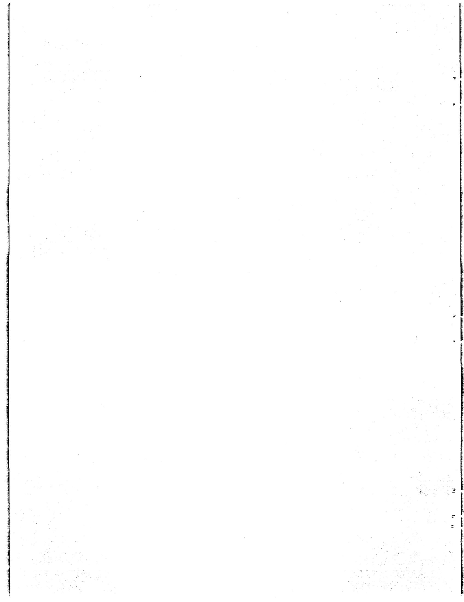

Part I

REACTOR THEORY, COMPONENT DEVELOPMENT,

AND CONSTRUCTION

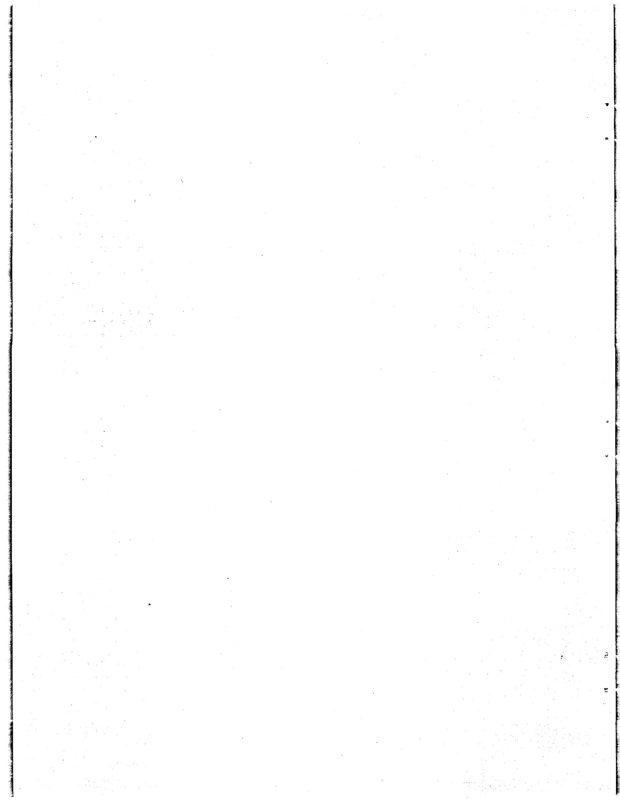

# 1. REFLECTOR-MODERATED REACTOR

E. S. Bettis

A.P.Fraas

W. K. Ergen

A.M.Perry

Aircraft Reactor Engineering Division

# AIRCRAFT REACTOR TEST DESIGN

A.P.Fraas

Aircraft Reactor Engineering Division

The preliminary layout of the interior of the reactor cell for the Aircraft Reactor Test (ART) which shows the major items of equipment and the recommended provisions for support was completed. A similar layout for the NaK piping and radiators was also completed. It has been established that five bulkheads will be required in the tank and cell walls for instrument and control wiring, piping, and miscellaneous service lines. Consideration has been given to the design of the addition to Building 7503 required for the ART, the layout of the blower house, and the electrical power system, distribution, and auxiliary equipment. Mounting arrangements have been described for the radiators, for the fill and drain tanks, for the inner and outer reactor cells, and for structurally attaching the reactor assembly to the cell, dump lines, NaK piping, and other service and instrumentation lines. The type of equipment by which oxygen will be removed from the inner cell has been specified.

The basic requirements of the heat dump system and the instrumentation and control thereof have been specified. The ART heat dump system is to provide heat dissipation capacity of $60\mathrm{Mw}$ of heat with a mean temperature level of $1300^{\circ}\mathrm{F}$ in the NaK system. The most convenient, inexpensive, and compact heat dump has been found to be a round-tube, plate-fin radiator core. This basic type of heat transfer surface has been found to be sufficiently reliable in heat exchanger test rigs. Five separate systems will be used; four will constitute the main heat dump system, while the fifth will be the moderator heat dump system. Layouts have been prepared of the air duct and stack associated with the heat dump radiators, and air flow rates and pressure drop have been calculated.

Design considerations have been tentatively established for the prevention of failure of the Inconel core and reflector shells during operation of the ART. The core shells are to be $\frac{1}{8}$ -in.-thick Inconel. They are to be cooled on one side with

flowing sodium in order to maintain the shells everywhere below $1500^{\circ}\mathrm{F}$ . The reflector shell is to be maintained below $1300^{\circ}\mathrm{F}$ by surrounding it with a layer of boron-bearing material, a gas space to serve as a heat dam, and an Inconel cladding layer to separate it from the hot fuel in the heat exchanger. To prevent buckling of the outer core shell because of external radial pressure differences and to prevent excessive deformation of the reflector shell because of excessive pressure differences, the pressures in the sodium coolant system and in the fuel are to be adjusted to be approximately equal at a point halfway through the primary heat exchanger. In order to limit cyclic thermal stresses, the temperature difference across the shells is not to exceed $300^{\circ}\mathrm{F}$ . Stress and heat transfer analyses are far from complete, but tentative pressures have been established for the fluid circuits.

In case of a failure of a part of the reactor system, for instance a fuel pump, during operation, it may be necessary to maintain emergency conditions for short periods in which the pressure differences across the shells will be much greater than those existing during normal operation. Calculations indicate that these conditions can be maintained without sudden failure of the shells by buckling or rupture. However, the total life of the reactor for normal operation will be disproportionately shortened.

Details of the basic design of the reflectormoderator cooling system have been set forth. Final design awaits confirmation of the values used in the design by critical experiments, heat exchanger optimization, core hydrodynamic tests, and beryllium thermal stress and corrosion tests now in progress (cf. Secs. 2, 3, and 7).

The xenon-removal system has been designed, as described previously, and the fuel and sodium pumps are being tested (cf. Sec. 2, "Experimental Reactor Engineering"). New features that have been incorporated because of stress, fluid flow, or fabricability considerations include an elliptical

fuel expansion tank, a rounded dome to enclose the top of the reactor, a newly designed sodium pump impeller, and other related items.

A number of fuel-to-NaK heat exchanger designs have been calculated by utilizing the heat transfer data obtained experimentally (cf. Sec. 2, "Experimental Reactor Engineering," and Sec. 7, "Heat Transfer and Physical Properties"). The most promising of these designs are described in Table 1.1. The values given in the table are intended to facilitate comparison of typical heat exchangers. The values listed for heat exchanger thickness and shield weight are only relative and were based on a minimum-thickness tube array suited to the present design layouts. Final selection of the heat exchanger must be contingent on a composite evaluation of stress limitations, geometry, mass transfer and corrosion effects, and heat transfer requirements.

Conservative calculations were made of the neutron and gamma-ray dose rates at various locations in the ART facility. It was determined that radiation levels in the building during power operation would everywhere be below laboratory tolerance. Further, with the exception of a few locations, the initial dose rate from a reactor catastrophe would not be more than a few roentgens per hour. These low dose rates are the result of the reactor being located 16 ft underground and shielded (in addition to the lead-water reactor

shield) by 3 ft of water in the cell annulus and substantial thicknesses of concrete and dirt. The radiators are to be shielded so that, in the event that $10\%$ of the fuel entered the radiators, the radiation dose would not exceed $1 \mathrm{r} / \mathrm{hr}$ at any point outside the main air duct or reactor cell.

Research is under way that will provide much of the information needed as a basis for final design. In the experiments that are now being made with room-temperature critical assemblies of the reflector-moderated reactor, materials of interest in the design of the ART, such as beryllium, Inconel, and rare-earth oxides, are being evaluated. The information being obtained will be of benefit in making final decisions on reflectormoderator and island dimensions, configuration, and cooling requirements. Data on power distributions in the core will be used in determining the final configuration and size of the core and the end ducts, as well as the thickness of the Inconel shells and the cooling required. Measurements being made on rare-earth oxides are expected to provide data needed for design of the control rod for the ART.

Intensive experimentation is in progress in attempts to find fuels superior to the $\mathsf{ZrF}_4$ -bearing fuel used in the ARE. As yet, no positively superior fuel mixtures have been obtained, but the physical properties of the $\mathsf{ZrF}_4$ -bearing mixture have been improved to some extent by varying the

TABLE 1.1. ART HEAT EXCHANGER DESIGNS   

<table><tr><td>Tube diameter, in.</td><td>3/16</td><td>3/16</td><td>1/4</td><td>1/4</td></tr><tr><td>Number of tubes per bundle</td><td>143</td><td>143</td><td>130</td><td>130</td></tr><tr><td>Tube spacing, in.</td><td>0.030</td><td>0.030</td><td>0.020</td><td>0.020</td></tr><tr><td>Tube wall thickness, in.</td><td>0.025</td><td>0.035</td><td>0.025</td><td>0.035</td></tr><tr><td>Fuel temperature range, °F</td><td>1250 to 1600</td><td>1250 to 1600</td><td>1250 to 1600</td><td>1250 to 1600</td></tr><tr><td>NaK temperature range, °F</td><td>1070 to 1500</td><td>1070 to 1500</td><td>1070 to 1500</td><td>1070 to 1500</td></tr><tr><td>Tube length, ft</td><td>6.0</td><td>6.5</td><td>5.45</td><td>5.81</td></tr><tr><td>Fuel ΔP, psi</td><td>41</td><td>45</td><td>28.4</td><td>30.1</td></tr><tr><td>NaK ΔP, psi</td><td>39.6</td><td>95</td><td>5.5</td><td>9.6</td></tr><tr><td>Heat exchanger thickness, in.</td><td>2.62</td><td>2.62</td><td>3.78</td><td>3.78</td></tr><tr><td>Reactor shield weight, water plus lead, lb</td><td>72,800</td><td>72,800</td><td>74,100</td><td>74,100</td></tr><tr><td>Total number of welds</td><td>6864</td><td>6864</td><td>6240</td><td>6240</td></tr><tr><td>Power, Mw</td><td>55</td><td>55</td><td>55</td><td>55</td></tr><tr><td>Relative NaK activation</td><td>1</td><td>1</td><td>2</td><td>2</td></tr></table>

composition, and the corrosiveness has been lowered by the addition of even small amounts of trivalent uranium.

The operation of forced-circulation, high-temperature-differential, Inconel loops with fuel mixtures of interest has demonstrated that the velocity of the circulated fluid has little effect on corrosion and mass transfer and that the results of the numerous thermal-convection loop tests are applicable to the dynamic ART system.

One in-pile forced-circulation Inconel loop that circulated a fuel mixture in the LITR has been examined, and radiation was found not to have a detrimental effect on corrosion and mass transfer; a second loop will be operated in the LITR during the next quarter. An in-pile loop that will more closely simulate the ART conditions is to be operated soon in the MTR.

Experiments with sodium in Inconel loops have thus far indicated unsatisfactorily high mass transfer, but it is thought that better purification and handling of the sodium will greatly decrease the mass transfer; also, the use of stainless steel in the cold portions of the system is being investigated.

Cermets for use as valves, bearings, and seals are undergoing intensive self-bonding and corrosion resistance tests, and procedures for brazing cermets to Inconel have been developed.

Studies of experimental nickel-molybdenum base alloys and commercial Hastelloy B, in particular, have indicated possibilities of finding a structural material with properties superior to those of Inconel for circulating-fuel reactor application, but some of the problems involved are of such a magnitude that it is not thought that such materials can be made available in time for use in the ART. The welding and brazing materials and techniques needed for fabrication of the ART have been developed and thoroughly tested in the construction of test components, such as heat ex-changers and radiators.

A study of the behavior of xenon poisoning in a fluid-fueled reactor has indicated that the removal of xenon by sparging with helium will be a satisfactory means for controlling xenon poisoning in the ART. The study also indicated that no difficulty would exist in connection with shutdown poisoning at the sparging rates selected for ART operation.

Experiments now under way at the Lid Tank

Shielding Facility will provide much of the data needed for final design of the reactor and, in particular, the shielding. A mockup of the reactor and shield is being used to determine activations within the heat exchanger and the effect on dose rates at various locations of varying materials and thicknesses of materials. The activation of the NaK within the heat exchanger is of particular importance because of the effect it will have on dose rates at the NaK-to-air radiators, which are outside the reactor shield.

Design of the engineering flow sheet of a fuel recovery pilot plant is $85\%$ complete. It is hoped that the rapid reprocessing and recovery of fuel that would be required under service conditions can be demonstrated with this pilot plant.

The many calibration and performance tests scheduled for the ART are summarized in Table 1.2. Some of the tests can be run in the course of the endurance tests, which should consist first of 25 simulated flight cycles (16 hr at full power and 8 hr at from 1 to $10\%$ power) and then of 100 hr of continuous operation at full power. This will give a total of 500 hr at full power and 200 hr at low power during the endurance test period. It is expected that the preliminary calibration and performance tests can be carried out during the first 400 hr of operation, with allowances for servicing and maintenance. In reviewing the design requirements and the tests planned for the ART, it is evident that many modifications could be made in the test conditions to vary the severity of the test. The key variables, together with the desired values for the test, are given in Table 1.3.

# ART CONTROL

J. M. Eastman

Bendix Products Division

E. R. Mann

Instrumentation and Controls Division

Information block diagrams showing the basic control actions desired (without reference to hardware or techniques) have been prepared for the ART. They will be used as a basis for selection of the hardware types and the control techniques to be used and for determination of areas of control that will require new component development. Information for reactor simulation has been supplied to Pratt & Whitney, and they have built a simulator. It will be used to check the adequacy of the basic

TABLE 1.2. NUCLEAR EXPERIMENTS ON THE ART

Zero-Power Experiments

Criticality

Demonstrate procedure for going critical

Determine critical mass

Reactivity Experiments

Determine fuel temperature coefficient

Determine reflector and island temperature coefficient

Determine mass reactivity coefficient

Measure reactivity as a function of flow rate

Determine delayed neutron loss to xenon purge system

Shielding

Survey surface of shield for radiation

Determine NaK activation in heat exchanger

High-Power: Experiments

Demonstrate That the Reactor Is a Slave to the Load Demand

Simulate sudden demand for increased power by turbojets

Simulate failure of one turbojet

Determine Reactivity Effects of Other Transients

Results of sudden flow stoppage

Results of NaK flow stoppage

Determine Effectiveness of Xenon Removal System

Determine Compensation Required for Fission-Product Poisoning and Burnup

Demonstrate Afterheat Removal upon Shutdown

Obtain Heat Balances at Various Powers to Determine Extracted Powervs Nuclear Power for the Core, Heat Exchanger, Island, Reflector, Pressure Shell, Gamma Shield, and Neutron Shield

control actions and to determine control component design data. Additional simulator work will also be done at ORNL.

# Control Principles

The control system is to provide automatic corrective action for emergencies requiring action too rapid to permit operator deliberation. Automatic interlocks will prevent inadvertent dangerous operation, with minimum operator limitation. Operation in the design power range will be independent of nuclear instrumentation and will have only limited dependence (for safety) on other instrumentation during power transients. Three classes of emergencies will be provided for:

1. those requiring automatic rod insertion, load removal, and fuel dump,   
2. those requiring only automatic rod insertion and

load removal (followed by manual dump at operator's discretion),

3. those requiring only operator warning and manual action.

One-half the wind tunnel blowers and one-half the pumps (of each type) will be powered by commercial supply. The remaining blowers and pumps will be powered by a deisel system. Duplicate fuel and sodium pumps have been provided for safety, but if any one of these four pumps failed, the output of each of the remaining three pumps would have to be decreased to prevent pump cavitation or pressure overstressing of the Inconel core shells in the current design. The basic control actions provide for this depression of output, but it is questionable whether pump speeds can be decreased fast enough to prevent adverse transient conditions. For example, the Inconel may be over

TABLE 1.3. KEY ART PERFORMANCE VARIABLES   

<table><tr><td>Variable</td><td>Desired Performance</td></tr><tr><td>Time at full power</td><td>500 hr</td></tr><tr><td>Total time critical</td><td>1100 hr</td></tr><tr><td>Total time thermally hot</td><td>1500 hr</td></tr><tr><td>Power level</td><td>60 Mw</td></tr><tr><td>Peak fuel temperature</td><td>1600°F</td></tr><tr><td>Peak metal temperature</td><td>1540°F</td></tr><tr><td>Peak NaK temperature</td><td>1500°F</td></tr><tr><td>Temperature difference between fuel and NaK</td><td>100°F</td></tr><tr><td>Number of power cycles</td><td>30</td></tr><tr><td>Rate of change of mean fuel temperature</td><td>7°F/sec</td></tr><tr><td>Number of dump cycles</td><td>5</td></tr></table>

stressed momentarily, with a consequent increase in creep rate. To prove at least that the reactor can be safely scrambled after such a pump failure, it is planned to include cutting off the commercial power (or diesel) at design point $(60\mathrm{Mw})$ as a part of the test procedure. This will constitute a class 1 emergency, as defined above.

The control rod cannot be abruptly inserted in the case of an emergency, because to do so and yet prevent the fuel from freezing or getting too hot would require accurate transient matching of absorbed power and flux power, which would be impractical to accomplish. Therefore a scram (class 1 or class 2 emergency) will abruptly insert the rod only enough to reduce $\Delta k / k$ by $1\%$ . This will be followed by automatic insertion at the rate of $1\% \Delta k / k$ in 30 sec. This speed will be the "fast" normal rate of rod movement. The operator may also choose "slow" rod movement of $1\% \Delta k / k$ in 5 min. Below 10-Mw power operation, the operator will be automatically limited to the slower rate.

The $1\%$ scram will automatically cut off one-half the blowers to reduce the load. The load will then be further reduced by automatic closing of the radiator shutter in response to a $1050^{\circ}\mathrm{F}$ low limit signal for the NaK-to-air radiator outlet temperature.

Since the design point occurs at the high temperature limit $(1600^{\circ}\mathrm{F})$ for the fuel, accurate limiting will be required. In addition to thermocouples in the fuel, the maximum fuel temperature will be

indicated by continuous computing from NaK thermocouple signals by using heat exchanger calibration data. The dependability of fuel-temperature-sensing thermocouples is questionable because of the poor conductivity of the fuel and the high gamma-ray heating.

# Operating Procedure

The reactor is to be initially filled with barren (without uranium) fuel carrier to check out the system. This will be done with the system isothermal at $1200^{\circ}\mathrm{F}$ and all NaK and sodium pumps operating. Electric heaters will supply the heat needed beyond that produced by pump work dissipating. After the checkout of the system, part of the barren carrier will be removed and replaced with fuel-enriched material to provide $80\%$ of the calculated critical amount of $\mathsf{U}^{235}$ . Criticality will be checked, and the fuel will be further enriched in steps until criticality is obtained. The control rod will be calibrated in the process. A flux servo will then be available for holding the reactor at very low power levels (under 10 kw) during low-power experimentation. At these levels the temperature coefficient will be inadequate for good control because of the high thermal capacity of the system.

The minimum power level for control by the temperature coefficient is expected to be about 300 kw - the estimated heat removal by the radiators with the heat barrier doors open and no air flow. To take the reactor to the 300-kw level, it will manually be put on not less than a 20-sec positive period, and the barrier doors will be opened when the flux level reaches a set value equivalent to something less than 300 kw. If the doors were opened too soon or too late, excessive power surges might occur before the flux stabilized and there might possibly be damaging thermal shocks. After stabilization at 300 kw, the control rod will be slowly adjusted to bring the mean fuel temperature to $1200^{\circ}\mathrm{F}$ (it will have gone somewhat above this).

To increase the power above $300\mathrm{kw}$ , the blowers will be turned on and the shutters opened as desired. The control rod will be used to adjust the mean fuel temperature. Automatic limiters will close the shutters if the minimum NaK temperature drops below about $1050^{\circ}F$ (to prevent fuel freezing) and will open them if the minimum NaK temperature goes above $1300^{\circ}F$ (to dissipate afterheat and pre

vent loss of $\mathsf{ZrF}_4$ ). To take out more than $20\mathrm{Mw}$ will require that the mean fuel temperature be set above $1200^{\circ}\mathrm{F}$ (it must be set at $1425^{\circ}\mathrm{F}$ to take out $60\mathrm{Mw}$ ). Below about 6 to $10\mathrm{Mw}$ , the heat dump will have to be adjusted slowly to avoid high flux and temperature surges. Above this power the temperature coefficient is expected to permit reasonably fast (for jet engines) load changes without excessive transient surges.

# REACTOR PHYSICS

# Probable Effect of Replacing Inconel by Columbium in the ART Core Shells

W. K. Ergen

Aircraft Reactor Engineering Division

The cold critical experiments for the ART have shown² that the critical mass decreases very rapidly as the neutron absorption in the core shell decreases. Hence, replacement of the highly absorbing Inconel by a low-cross-section material, such as columbium,³ would bring about a substantial saving in uranium investment and, incidentally, make the temperature coefficient more negative. For corrosion and fabrication reasons, only about 50% of the Inconel can be replaced by columbium. The effect of this 50% replacement has been calculated on the basis of recent data from the cold critical experiments and measurements of resonance capture integrals.⁴

From the critical experiments it is concluded that the epicadmium flux is about the same for the core shell and for the fuel. From the capture resonance integrals of Inconel and columbium, respectively, and the fission resonance integral of $U^{235}$ , it is computed, for the epicadmium range, that the columbium absorptions amount to $1.6\%$ of the fissions, whereas the absorptions in the replaced Inconel amounted to $2.4\%$ .

For the "below-cadmium" neutrons the cold critical experiments are consistent with the model that the shells absorb neutrons according to the thermal cross sections and that all neutrons pass through the shells perpendicularly. By using the $1 / \nu$ extrapolation to get the $1400^{\circ}\mathrm{F}$ absorption

cross sections, the columbium absorbs $0.5\%$ of the neutrons, whereas the replaced Inconel absorbs $3\%$ .

The experimental result that the epicadmium neutron group and the subcadmium neutron group each contribute about $50\%$ of the fissions then indicates that effectively $1.65\%$ of the neutrons would be saved by the replacement. If

$$
\left(\Delta k / k\right) / \left(\Delta M / M\right) = 1 / 1 0
$$

is assumed, the saving in critical mass would be about $16.5\%$ , or $4\mathrm{kg}$ , corresponding to 0.7 mole $\%$ in uranium concentration of the fuel and $7\mathrm{kg}$ in total $U^{235}$ investment.

As a check, the above method can be used to compute the effect of completely eliminating, in the cold critical assembly, $\frac{1}{16}$ in. of the core shell. The result would be a 41% saving in critical mass, compared with the experimental value of 45%. In another room-temperature critical experiment (cf. Sec. 3, "Critical Experiments"), 127.4 g of the Inconel core shell was replaced by 98.5 g of columbium. The effect calculated by the above method would have been 2.5 cents, and the experimental result was 3.6 cents.

# ART Temperature Coefficient

L. T. Anderson

Aircraft Reactor Engineering Division

A calculation of the ART temperature coefficient showed a positive contribution resulting from the decrease of the absorption cross section of the Inconel core shells with increasing neutron energy. The smaller Inconel cross section allows more neutrons to enter the fuel annulus and thus increase the reactivity. It seems justified to assume a $1 / \nu$ cross section for the Inconel on the basis of the experimentally measured value of the resonance integral, and therefore, if an increase, $\Delta T$ , of the beryllium temperature causes a neutron energy increase proportional to $\Delta T$ , the fractional cross-section decrease of the shells is $\frac{1}{2}\Delta T / T$ , and the number of fissions is increased by the factor

$$
\frac {1}{2} (\Delta T / T) \Sigma_ {\mathrm {t h}} \times \text {s h e l l t h i c k n e s s} \times \text {c a d m i u m f r a c t i o n}
$$

if only the subcadmium neutrons are affected and the neutrons are incident normal to the shell. Actually, the thickness of the Inconel that the the neutrons go through is somewhat greater than that of the shell, on the average, but this is at least partially offset by the cross section of

Inconel having a less-than-thermal value for some of the subcadmium neutrons. The value of $\Delta k / k$ calculated in this way is $+1.7\times 10^{-5}\Delta T$ (°F) for $\frac{1}{8}$ -in. Inconel shells. As pointed out by Mills and Reece3 and Ergen (above), core shells of materials of lower absorption cross section would reduce this positive coefficient contribution. If $\frac{1}{16}$ in. of the $\frac{1}{8}$ -in. Inconel shell were replaced by columbiun, the $\Delta k / k$ value would be reduced to

$$
\begin{array}{l} 1. 7 \times 1 0 ^ {- 5} \frac {f (\ln c . + C b)}{f (\ln c .)} \\ = 1. 7 \times 1 0 ^ {- 5} \frac {0 . 0 3 5}{0 . 0 6 0} = 1. 0 \times 1 0 ^ {- 5} / ^ {\circ} F, \\ \end{array}
$$

where $f$ is the fraction of thermal neutrons incident on the shells that are absorbed (cf. preceding paper by W. K. Ergen, this report).

The effect of beryllium expansion is considered by using, as a model for the reactor, a sphere (radius, $R_{2}$ ) of noncapturing beryllium with a high energy neutron shell source at $R_{1}$ . The source neutrons slow down according to age theory, and the slowing down density at thermal age is used as a source for the thermal diffusion equation. It is assumed that at thermal energy every neutron striking the shell at $R_{1}$ is absorbed and causes a fission. By using this model, $\Delta k / k$ turns out to be5

$$
\frac {- 2 K R _ {2} \sqrt {\tau} \Delta T}{\sqrt {\pi} R _ {1} \left(R _ {2} - R _ {1}\right) - R _ {2} \sqrt {\pi}},
$$

where $K$ is the coefficient of linear thermal expansion for the beryllium and $\tau$ is the thermal age. By using $K = 9.3 \times 10^{-6} / ^{\circ}\mathrm{F}, \tau = 90\mathrm{cm}^{2}, R_{1} = 25\mathrm{cm},$ and $R^2 = 56\mathrm{cm}$ , it is found that $\Delta k / k = -1.2 \times 10^{-5}\Delta T.$

The net of these two contributions is then $0.5 \times 10^{-5} / {}^{\circ}\mathrm{F}$ for $\frac{1}{8}$ -in. Inconel core shells and $-0.2 \times 10^{-5}$ for core shells of $\frac{1}{16}$ -in. Inconel and $\frac{1}{16}$ -in. columbium. A fuel coefficient of $-1.7 \times 10^{-5} / {}^{\circ}\mathrm{F}$ , which is based on a conservative value of 0.1 for $(\Delta k / k) / (\Delta M / M)$ , gives over-all coefficients of $-1.2 \times 10^{-5} / {}^{\circ}\mathrm{F}$ and $-1.9 \times 10^{-5} / {}^{\circ}\mathrm{F}$ for the two cases. It should be noted, however, that the calculation is of a marginal type, and hence there might be a sizable error in the results. Nevertheless,

less, the results support the postulated negative over-all temperature coefficient of the ART.

# Reactivity Effect of a Heat Exchanger Leak

A. M. Perry

Electronuclear Research Division

If the pressure in the NaK coolant circuit exceeds that in the fuel circuit, a leak in the intermediate heat exchanger may first become apparent through its effect on the reactivity of the ART. The effect will be due to dilution of the fuel and to increased parasitic absorption. It has been suggested by the Advisory Committee on Reactor Safeguards that the reactivity effect can be greatly enhanced by adding lithium or $\mathsf{Li}^6$ to the NaK. Preliminary experiments indicate that perhaps 5 wt % lithium can be added to the NaK eutectic without raising the melting point above $25^{\circ}\mathsf{C}$ . The loss of reactivity due to parasitic absorption is calculated on the assumption that

$$
\frac {\Delta k}{k} = \frac {\Delta f}{f} = \frac {\Delta \Sigma_ {P}}{\Sigma_ {F}},
$$

where $f$ equals (neutrons absorbed in fuel)/(neutrons absorbed in core), $\Delta \Sigma_{P}$ is the change in poison cross section, and $\Sigma_{F}$ is the fuel cross section.

The loss of reactivity due to fuel dilution is calculated on the assumption that

$$
\frac {\Delta k}{k} = \frac {1}{1 0} \frac {\Delta \Sigma_ {F}}{\Sigma_ {F}} = \frac {1}{1 0} \frac {\Delta V}{V},
$$

where $V$ is the initial fuel volume, and $\Delta V$ the volume of NaK leaked into the fuel circuit. The factor $\frac{1}{10}$ is a conservative estimate based on critical experiment results.

The over-all reactivity loss, if $\Delta V$ is in cubic feet of coolant leak into the fuel circuit, is given by

$$
\frac {\Delta k}{k} = - 2.4 \Delta V (\%)
$$

if the coolant is NaK; by

$$
\frac {\Delta k}{k} = - (2.4 + 2.2 W) \Delta V (\%)
$$

if the coolant is NaK plus W wt % lithium; and by

$$
\frac {\Delta k}{k} = - (2.4 + 29.6 W) \Delta V (\%)
$$

if the coolant is NaK plus W wt % Li $^6$ . (Of course, the approximations made are valid only for small changes in reactivity and for small percentage additions of lithium to the NaK.)

The maximum volume available before an overflow would occur will be $0.37\text{ft}^3$ . This volume of NaK in the fuel circuit would produce a reactivity change of $0.9\%$ . The same volume of NaK plus 5 wt $\%$ lithium would produce a reactivity change of $5\%$ . A leak of $0.007\text{ft}^3$ of NaK plus 5 wt $\%$ Li $^6$ would produce a reactivity loss of $1\%$ .

Burnup and Gamma-Ray Heating of Control Rod

W. Fader Pratt & Whitney Aircraft

Burnup of Poison. The equations of burnup in a slab of neutron absorber with thermal neutrons incident on one face are, for the case of an absorber with $n$ isotopes with high thermal capture cross sections $\sigma_{i}$ ,

$$
\frac {\partial J}{\partial x} + \Sigma \phi = 0,
$$

$$
\frac {\partial \Sigma_ {i}}{\partial t} + \sigma_ {i} \Sigma_ {i} \phi = 0,
$$

where

$$
\begin{array}{l} J = \text {n e t n e u t r o n c u r r e n t n o r m a l t o s l a b f a c e}, \\ x = \text {l i n e a r c o o r d i n a t e n o r m a l t o t h e s l a b}, \\ \begin{array}{l} \Sigma = \Sigma_ {1} + \Sigma_ {2} + \dots + \Sigma_ {n} = \text {m a c r o s c o p i c t h e r m a l} \\ \text {n e u t r o n a b s o r p t i o n c r o s s s e c t i o n ,} \end{array} \\ \phi = f \left| u x _ {t} \right. \\ t = \text {e x p o s u r e} \\ \end{array}
$$

By making use of the relationship $J = \overline{\mu}\phi$ , where $\overline{\mu}$ is the average value of the cosine for the angular distribution of the neutron flux, the equations become

$$
\begin{array}{l} \bar {\mu} \frac {\partial J}{\partial x} + \Sigma J = 0, (1) \\ \bar {\mu} \frac {\partial \Sigma_ {i}}{\partial t} + \sigma_ {i} \Sigma_ {i} J = 0. (2) \\ \end{array}
$$

In the region where most of the burnup takes place, $\overline{\mu}$ is constant if the macroscopic absorption cross section is much greater than the macroscopic scattering cross section. Its value may be expected to range between unity at points deep in the slab to 0.5 at the surface, the latter value being the diffusion theory approximation to the boundary

condition at the plane interface of a scattering medium and a strong absorber.

Solutions for $J(x,t)$ and $\Sigma (x,t)$ were found for the case of a single absorber and the results have been plotted in Fig. 1.1 for a slab of $\mathsf{Sm}_2\mathsf{O}_3$ . For large values of $\sigma J_0t / \overline{\mu}$ , where $J_{0} = J(0,t)$ , the curves of $J(x,t)$ and $\Sigma (x,t)$ assume rigid shapes that are propagated in the direction of increasing $x$ with apparent velocity

$$
v = \frac {\sigma J _ {0}}{\Sigma_ {0}},
$$

which, for the case of the curves in Fig. 1.1, was $\nu = 2.9 \times 10^{-8} \mathrm{~cm/sec}$ . This suggests the use of the linear formula

$$
X (t) \cong 0. 0 1 2 + (2. 9 \times 1 0 ^ {- 2 2} J _ {0} t) \mathrm {c m} \tag {3}
$$

for the thickness of a slab of $\mathsf{Sm}_2\mathsf{O}_3$ that will transmit $10\%$ of $J_{0}$ neutrons/cm²·sec incident on its front surface after an exposure time of t sec.

Equations 1 and 2 were integrated numerically for the case of gadolinium with two isotopes with high thermal absorption cross sections, and the results are shown in Fig. 1.2 for $\mathrm{Gd}_2\mathrm{O}_3$ . The linear relation between $X$ and $t$ for large $\sigma J_0 t / \overline{\mu}$ for $\mathrm{Gd}_2\mathrm{O}_3$ is

$$
X (t) = 0. 0 0 2 5 + \left(1. 4 \times 1 0 ^ {- 2 2} J _ {0} t\right) \mathrm {c m}. \tag {4}
$$

Formulas 3 and 4 may also be used as an approximation of the burnup of a cylindrical shell of absorber, provided that the inner radius of the shell is much larger than the thermal neutron mean free path of the absorber; for, in this case, Eq. 2 remains unchanged, while Eq. 1 becomes

$$
\bar {\mu} \frac {\partial J}{\partial r} = \Sigma J - \bar {\mu} \frac {J}{r} \tag {5}
$$

for neutrons incident on the outer surface. For a shell of this kind, the term $\overline{\mu} J / r$ in Eq. 5 is always negligible compared with $\Sigma J$ in the region of burnup. In the ART, a 20-in. control rod with a $1_{8}^{3}$ -in. outside diameter must absorb an average of at least $2 \times 10^{14}$ neutrons/cm $^{2}$ -sec in order to be $5\%$ effective in reactivity. Thus, if a cylindrical shell of $\mathrm{Sm}_{2}\mathrm{O}_{3}$ absorbs $2 \times 10^{14}$ neutrons/cm $^{2}$ -sec for 1000 hr, the neutrons will penetrate a distance

$$
X (t) = 0. 0 1 2 + (2. 9 \times 1 0 ^ {- 8}) (7. 2 \times 1 0 ^ {6}) = 0. 2 2 \mathrm {c m}.
$$

A shell of $\mathsf{Sm}_2\mathsf{O}_3$ must have at least this thickness

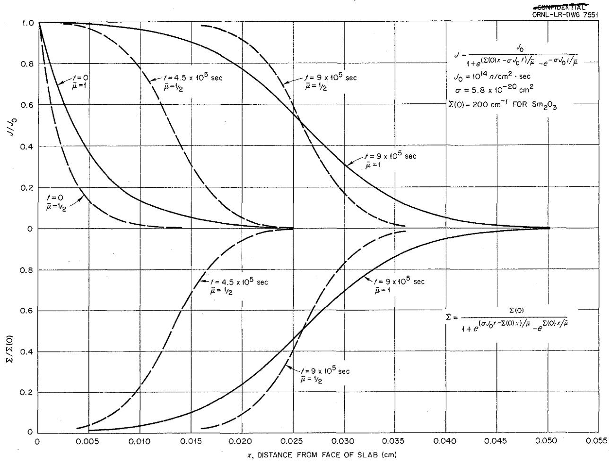  
Fig. 1.1. Burnup of a Samarium Oxide Slab.

to remain black to neutrons after 1000 hr with $J_0 = 2 \times 10^{14}$ . For $Gd_2O_3$ ,

$$
X (t) = 0. 0 0 2 5 + 1. 4 \times 1 0 ^ {- 8} (7. 2 \times 1 0 ^ {6}) = 0. 1 0 \mathrm {c m}.
$$

To obtain an estimate of the error of the approximation, note that for a shell with an outside diameter of $1\frac{3}{8}$ in. $= 1.76$ cm and a length of 20 in. $= 50.8$ cm, an absorption rate of $2 \times 10^{14}$ neutrons/cm²·sec at the outer surface will burn up $4.05 \times 10^{23}$ atoms or $100\mathrm{g}$ of $\mathsf{Sm}^{149}$ . This corresponds to $868\mathrm{g}$ of $\mathsf{Sm}_2\mathsf{O}_3$ ; the volume of burned up material would be $116~\mathrm{cm}^3$ . A shell with an outside diameter of $1.76~\mathrm{cm}$ , a length of $50.8~\mathrm{cm}$ , and a volume of $116~\mathrm{cm}^3$ has a wall thickness of $0.22~\mathrm{cm}$ . The burnup of $\mathsf{Eu}_2\mathsf{O}_3$ slabs has also been calculated, and the results are presented in Fig. 1.3.

Gamma-Ray Heating. Two effects are expected to contribute to the internal heating of control

rods of rare-earth oxides: absorption of gamma radiation emitted immediately after capture of neutrons in the rod and absorption of gamma rays from the reactor fuel.

Preliminary calculations of the gamma-ray heating in the control rod indicate that the average energy absorption will be at least $100\mathrm{W / cm}^3$ .More detailed calculations made by Pratt & Whitney Aircraft indicate that the gamma energy absorption may be as high as $170~\mathrm{W / cm}^3$ .For the higher value the maximum interior temperature rise above the surface temperature is $460^{\circ}\mathrm{C}$ for a $\frac{1}{8}\cdot$ -in.-OD hollow rod of rare-earth oxide with a $\frac{1}{4}$ -in. wall, if the thermal conductivity is assumed to be 0.0048 cal/sec- $^\circ C\cdot \mathrm{cm}$ .If a cermet of rare-earth oxide and iron is used in place of the oxide, the maximum temperature rise is about $45^{\circ}\mathrm{C},$ if a thermal conductivity of one-third that of iron, or 0.050 cal/ sec- $^\circ C\cdot \mathrm{cm},$ is assumed.

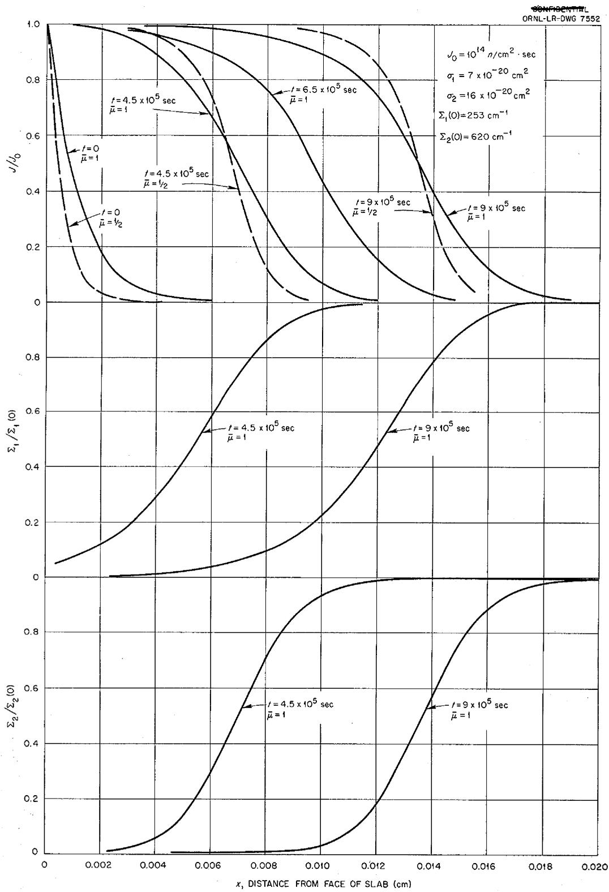  
Fig. 1.2. Burnup of a Gadolinium Oxide Slab.

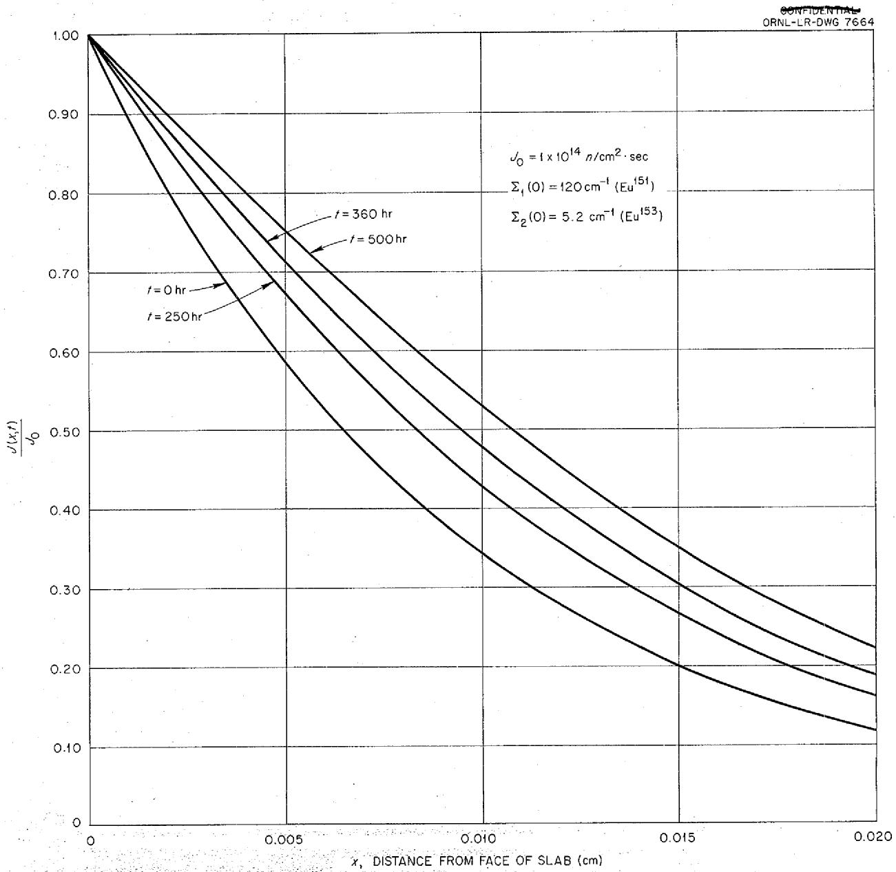  
Fig. 1.3. Burnup of a Europium Oxide Slab.

# 2. EXPERIMENTAL REACTOR ENGINEERING

H. W. Savage

E. S. Bettis

Aircraft Reactor Engineering Division

Design work on the in-pile loop for operation in the MTR has been completed, and the final loop is being fabricated and assembled. A bench test of a working mockup is under way. Twenty-two high-velocity forced-circulation large-temperature-differential loops were operated for investigating the corrosion and mass transfer of Inconel by fluoride fuel mixtures under dynamic conditions. Six similar loops were operated to test mass transfer in Inconel and stainless steel loops in which sodium is circulated.

A full-scale model of the ART fuel pump was tested with water, and performance characteristics were obtained. A test stand for high-temperature tests has been designed. A test stand for intermediate heat exchangers (100-tube bundle) is being assembled, and tests are under way with a stand designed for testing small-scale (20-tube bundle) heat exchangers.

Flow patterns are being studied in a full-scale model of the proposed 21-in. reactor core and entrance header. Several modifications are to be tried in an attempt to prevent flow separation in the core.

A thermal-cycling test was made on a sodium-Inconel-beryllium system, and apparatus for a third test is being assembled. A small-scale gas-fired heat source was operated successfully at a power output of 100 kw, and minor modifications were planned that will increase the capacity.

# IN-PILE LOOP COMPONENT DEVELOPMENT

D. B. Trauger

Aircraft Reactor Engineering Division

# Flux Measurements

D.M. Haines

Pratt & Whitney Aircraft

Flux measurements, as previously described, were carried out in the HB-3 beam hole of the MTR. Cobalt foils installed in various assemblies that simulated the loop were irradiated for 3 hr at about 5 Mw. Plans to make measurements at full power were abandoned because an excessively long ir

radiation was required to override the effects of the minimum period in which the reactor could be brought to full power. Gold foils irradiated at the low power and again at full power in a vertical hole adjacent to HB-3 provided a means for extrapolating the data to full power.

This measurement made it possible to evaluate the effect of materials and geometry of the in-pile loop on the flux. Values obtained from foils inside the fuel tube were consistent with other data taken from foils irradiated in Inconel tubes by using a rabbit facility for irradiation in hole HB-3. Other data on the depression of flux in Inconel tubes with a fuel mockup present were also used to estimate the flux for the MTR in-pile loop.

The flux seen by the fuel in the in-pile loop is now expected to be $30\%$ of the unperturbed value. The heater loop, or nose section, originally designed for a depression of $50\%$ , has been modified to obtain more power. The present nose section consists of a $2\frac{1}{2}$ -turn helical coil shaped, in outline, somewhat as a truncated cone. It is mounted with its axis parallel to the beam hole center line and with the small end forward. This will permit the nose to be placed in the most forward position possible by utilizing the concial end of the water jacket. The developed length of the coil is slightly over 3 ft. A total power generation of $24\mathrm{kw}$ is required for the design conditions: Reynolds number, 5,000; temperature differential, $200^{\circ}\mathrm{F}$ . The average power density in the nose section, on this basis, will be $0.7\mathrm{kw/cm}^3$ ; however, this value may be conservative. Provision is being made to change the loop position in the beam hole during operation and thus utilize the flux gradient to adjust the power. A higher power density may be feasible for later loops.

# Fission-Gas Holdup

D. W. Magnuson

Aircraft Reactor Engineering Division

The adsorption of krypton from helium by activated carbon at liquid-nitrogen temperature is being tested in adsorption traps designed for use with the MTR in-pile loop. The traps contain 280 g of Columbia ACA activated carbon. A helium cylinder

containing $0.13\%$ krypton is being used to supply five times the design flow rate through one trap. The same supply furnishes the design flow of 0.03 scfh to a second system containing two carbon traps in series. The second trap will be isolated at the conclusion of the experiment, and the adsorbed gas will be analyzed for total krypton. After 15 days of operation, the krypton concentration in the effluent stream was approximately 1 ppm in both systems, or the fractional breakthrough was less than 0.001. A temperature-sensing element filled with oxygen, with an automatic fill device, is being used to keep a constant liquid level in the metal Dewar which contains the traps.

# Bench Test

# L.P.Carpenter

# Aircraft Reactor Engineering Division

A bench test for the in-pile loop has been operated for more than 666 hr. The purpose of this bench test is to determine the feasibility of construction techniques, to test the suitability of the various materials of construction, to aid in establishing control and operational procedures and in training operators for the in-pile test, and to determine the endurance of supporting equipment.

The design conditions as set forth for the in-pile loop were adhered to as closely as possible in the bench apparatus. Modifications were limited to incorporating a resistance-heater coil for power generation. The loop is enclosed in a plug that differs from the actual in-pile loop plug only in that the forward end is open to accommodate connections with the resistance heater. All service lines to the loop run through the plug in the same manner as they will in the in-pile test.

The instrumentation and the control panel for the bench test are identical to those to be used at the MTR, except for the absence of radiation-detection instruments. Thus operator training can be accomplished under closely simulated conditions.

Fabrication and assembly of the bench apparatus served to point up certain difficulties in building this type of system. One basic requirement for an in-pile loop is concentricity of less than $\frac{1}{16}$ in. in 14 ft of length. Some difficulty was experienced because of warping at thermocouple wells and poor fits. Fixtures are being fabricated for use in aligning parts during construction, and the drawings have been revised in some instances.

The commercial Kovar-glass seals used to bring power and thermocouple wires through bulkheads and to form leaktight closures have proved troublesome by not being adequately leaktight. A seal has been developed at the Gaseous Diffusion Plant, K-25, which is quite satisfactory, except that it is vulnerable to breakage during loop assembly. Fourteen thermocouple leads or eight power leads can be brought through a $1\frac{1}{8}$ -in.-dia glass cup seal.

Bench test experience showed that the use of a poured barytes concrete shield in the rear section of the shield plug required that the lead wires be protected from moisture condensation and the concrete. Glass-braid insulation was applied to individual wires, which were then bunched and encased in plastic tubing. After the concrete was poured, the wires were found to be shorted. Heating and pumping on the concrete made the connections usable, but other steps are being taken to prevent recurrence of this trouble for the in-pile loop.

The operating conditions for the bench test are: temperature differential, $175^{\circ}\mathrm{F}$ ; Reynolds number, 5100; power input, 21 kw; temperature differential for air, $250^{\circ}\mathrm{F}$ at 250 scfm. Control is achieved by regulation of the air flow through the heat exchanger by an automatic controller that maintains a nearly constant temperature, $\pm 10^{\circ}\mathrm{F}$ , on the fuel tube at the pump. The electrical power input is manually controlled.

Operation of the loop is proceeding satisfactorily. Cavitation of the hydraulic power unit has caused momentary fluctuations in the pump speed that trip the alarm system. A leak in the drive pump suction line has been found to be the cause of cavitation and has been corrected. TI in-pile power unit is also being operated and checked prior to shipment to NRTS.

# Horizontal-Shaft Sump Pump

# J. A. Conlin

# Aircraft Reactor Engineering Division

The regenerative turbine-type in-pile pump, previously described, was disassembled and inspected after completing 1000 hr of operation. As can be seen in Fig. 2.1, there was no erosion and only a slight indication of rubbing between the pump

UNCLASSIFIED PHOTO-25330

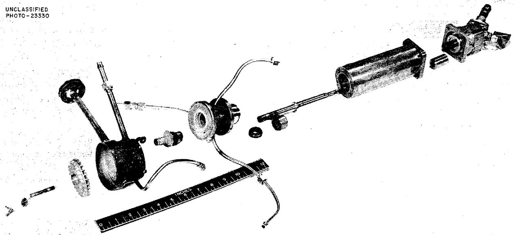  
Fig. 2.1. Horizontal-Shaft Sump Pump for In-Pile Loop After 1000 hr of Operation Circulating NaF-ZrF $_4$ -UF $_4$ (53.5-40-6.5 mole %) at $1400^{\circ}\text{F}$ and 1 gpm in an Isothermal Loop.

shaft extension and the pump housing. This rubbing is known to have occurred during preheating of the pump and to have been caused by thermal stresses induced by an unduly rigid pump mounting. There was no evidence of zirconium fluoride vapor in the rear pump housing beyond a point $\frac{3}{4}$ in. from the pump sump proper, and no salts were found in the vent line after the test. A continuous helium purge of this area of about 0.3 cfh was used. There was no evidence of oil in the fuel portion of the pump, the measured oil seal leakage being $0.15 \, \text{cm}^3$ for the 1000 hr. However, the pump sump gas pressure was higher than the bearing housing pressure, which would tend to cause seal leakage to be toward the bearing housing. The shaft seal faces were in good condition and apparently could have operated for an additional 1000 hr, or more.

The pump impeller that will be used in the in-pile experiment is identical with the one used in the test described above. The bearing housing and seal designs are different, however, in order to overcome the problems of radiation damage to the oil and to prevent leakage of fission gases. Instead of the oil cooling, the shaft is cooled by a copper spool on the shaft that operates in a he

lium atmosphere with a close clearance to the water-cooled housing. The pump bearings and seals are drop-lubricated. To seal fission gases from the oil in the hydraulic drive motor, two shaft seals are employed, one between the pump sump and the bearing housing and one between the bearing housing and the hydraulic motor. These are face-type seals with metallic bellows for the flexible member. The gas volumes in both the sump and the bearing housing are purged with helium to further reduce the possibility of oil contamination. The pump housing also serves as a leaktight bulkhead in the water jacket to seal the loop end from the bearing housing and motor section of the water jacket. This section between the pump bulkhead and the intermediate bulkhead will be used to accumulate the waste bearing- and seal-lubricating oil. An exploded view of this pump is shown in Fig. 2.2.

Difficulty is still being experienced with failure of the rotating seals. This trouble is principally associated with the bellows and with breakage of the carbon rings. Replacement of the brass bellows with stainless steel bellows and the exercise of greater care in assembly seem to have improved the situation. The sliding surfaces have given little, or no, trouble.

NCCLASSIFIED PHOTO-23679

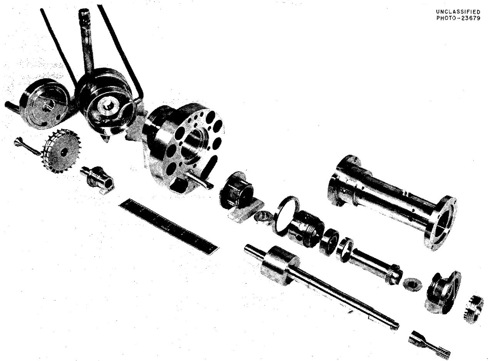  
Fig. 2.2. Exploded View of Pump to Be Used for MTR In-Pile Loop No. 1.

Instrumentation

R. G. Affel

P.A.Gnadt

Aircraft Reactor Engineering Division

Instrumentation design has been completed, and the panel for MTR operation is nearly assembled. Operating experience with the bench test panel has demonstrated smooth and dependable operation of most of the instruments. Some difficulty has been encountered with the pump rpm meter, where false signals have been generated. Shielding of lines and further isolation of components are expected to correct this condition. Since the bench test panel is identical with that for MTR operation, except for the omission of radiation-detecting equip

ment, it has provided a good test of the recording and control systems.

Assembly of MTR In-Pile Loop No. 1

C. W. Cunningham  
Aircraft Reactor Engineering Division

Most parts for the first in-pile loop have been fabricated, and assembly is under way. A wooden model of the cubicle space has been fabricated as an aid in the installation of lines to the loop and its auxiliaries. The parts, including a cut-off device for the various lines, will be installed on the model first, and then removed for shipment to NRTS. This, it is hoped, will ensure a proper fit and minimize on-the-site installation time.

# DEVELOPMENT AND OPERATION OF FORCED-CIRCULATION CORROSION AND MASS TRANSFER TESTS

Operation of Fused-Salt-Inconel Loops

W. B. McDonald

C. P. Coughlen

P. G. Smith

Aircraft Reactor Engineering Division

J. J. Milich

R.A.Dreisbach

Pratt & Whitney Aircraft

The operation of high-velocity forced-circulation large-temperature-differential loops for investigat

ing the corrosion of Inconel by fluoride fuel mixtures under dynamic conditions has become so routine that operation can be scheduled, and the schedules can be maintained for long periods without serious interruption. Twelve loops have been terminated following scheduled operation; five loops were terminated short of scheduled operating time because of various failures; and five loops were started and are continuing in operation. A summary of the typical operating conditions is given in Table 2.1.

During the early part of the quarter, loop failures were encountered because heater lugs were welded

TABLE 2.1. SUMMARY OF OPERATING CONDITIONS FOR 22 FUSED-SALT-INCONEL FORCED-CIRCULATION CORROSION AND MASS TRANSFER TESTS  
Maximum Fused Salt Temperature: $1500^{\circ}\mathrm{F}$   

<table><tr><td>Loop No.</td><td>Method of Heating</td><td>Type of Heated Section</td><td>Reynolds Number</td><td>Temperature Differential (°F)</td><td>Maximum Recorded Tube Wall Temperature (°F)</td><td>Fused Salt Circulated</td><td>Operating Time (hr)</td><td>Reason for Termination</td></tr><tr><td>4950-1</td><td>Direct resistance</td><td>Straight</td><td>5,000</td><td>200</td><td>1650</td><td>NaF-ZrF4-UF4a</td><td>1000</td><td>Scheduled</td></tr><tr><td>4950-2</td><td>Direct resistance</td><td>Straight</td><td>5,000</td><td>200</td><td>1565</td><td>NaF-ZrF4-UF4a</td><td>1000</td><td>Scheduled</td></tr><tr><td>4950-3</td><td>Direct resistance</td><td>Straight</td><td>10,000</td><td>200</td><td>1690</td><td>NaF-ZrF4-UF4b</td><td>1000</td><td>Scheduled</td></tr><tr><td>4950-4</td><td>Direct resistance</td><td>Straight</td><td>10,000</td><td>100</td><td>1600</td><td>NaF-ZrF4-UF4a</td><td>1000</td><td>Scheduled</td></tr><tr><td>4950-5</td><td>Direct resistance</td><td>Straight</td><td>10,000</td><td>200</td><td>1575</td><td>NaF-ZrF4-UF4a</td><td>1000</td><td>Scheduled</td></tr><tr><td>4950-6</td><td>Direct resistance</td><td>Straight</td><td>8,000</td><td>300</td><td>1620</td><td>NaF-ZrF4-UF4a</td><td>1000</td><td>Scheduled</td></tr><tr><td>4930-A</td><td>Direct resistance</td><td>Coiled</td><td>1,000</td><td>300</td><td>1695</td><td>NaF-ZrF4-UF4c</td><td>1000</td><td>Scheduled</td></tr><tr><td>4695-1</td><td>Direct resistance</td><td>Coiled</td><td>10,000</td><td>300</td><td>1720</td><td>NaF-ZrF4-UF4b</td><td>385</td><td>Leak</td></tr><tr><td>4695-2</td><td>Direct resistance</td><td>Straight</td><td>15,000</td><td>200</td><td>1670</td><td>NaF-ZrF4-UF4b</td><td>887</td><td>Pump-bearing failure</td></tr><tr><td>4695-3</td><td>Direct resistance</td><td>Straight</td><td>10,000</td><td>300</td><td>1640</td><td>NaF-KF-LiFd</td><td>630</td><td>Leak</td></tr><tr><td>4695-4A</td><td>Direct resistance</td><td>Straight</td><td>10,000</td><td>200</td><td></td><td>NaF-ZrF4-UF4a</td><td>0</td><td>Terminated after cleaning operation as first of a series for determination of effect of time</td></tr><tr><td>4695-5A</td><td>Direct resistance</td><td>Straight</td><td>10,000</td><td>200</td><td></td><td>NaF-ZrF4-UF4a</td><td>10</td><td>Scheduled</td></tr><tr><td>4695-4B</td><td>Direct resistance</td><td>Straight</td><td>10,000</td><td>200</td><td></td><td>NaF-ZrF4-UF4a</td><td>50</td><td>Scheduled</td></tr><tr><td>4695-4C</td><td>Direct resistance</td><td>Straight</td><td>10,000</td><td>200</td><td></td><td>NaF-ZrF4-UF4a</td><td>100</td><td>Scheduled</td></tr><tr><td>4695-5B</td><td>Direct resistance</td><td>Straight</td><td>10,000</td><td>200</td><td></td><td>NaF-ZrF4-UF4a</td><td>241</td><td>Leak</td></tr><tr><td>4695-5C</td><td>Direct resistance</td><td>Straight</td><td>10,000</td><td>200</td><td></td><td>NaF-ZrF4-UF4a</td><td>500</td><td>Scheduled</td></tr><tr><td>4935-1</td><td>Gas-fired heater</td><td>Coiled</td><td>1,000</td><td>300</td><td>1670</td><td>NaF-ZrF4-UF4c</td><td>1000</td><td>Scheduled</td></tr><tr><td>4935-2</td><td>Gas-fired heater</td><td>Coiled</td><td>5,000</td><td>200</td><td>1675</td><td>NaF-ZrF4-UF4a</td><td>1000</td><td>Scheduled</td></tr><tr><td>4935-3</td><td>Gas-fired heater</td><td>Coiled</td><td>10,000</td><td>100</td><td>1540</td><td>NaF-ZrF4-UF4a</td><td>1000</td><td>Scheduled</td></tr><tr><td>4935-4</td><td>Gas-fired heater</td><td>Coiled</td><td>10,000</td><td>100</td><td>1690</td><td>NaF-ZrF4-UF4a</td><td>486</td><td>Leak</td></tr><tr><td>4935-5</td><td>Gas-fired heater</td><td>Coiled</td><td>10,000</td><td>200</td><td>1645</td><td>NaF-ZrF4-UF4a</td><td>1000</td><td>Scheduled</td></tr><tr><td>4935-6</td><td>Gas-fired heater</td><td>Coiled</td><td>8,000</td><td>200</td><td>1550</td><td>NaF-ZrF4-UF4a</td><td>1000</td><td>Scheduled</td></tr></table>

Composition: 50-46-4 mole %.   
bComposition: 50-46-4 mole % with 2 wt % of total uranium converted to U3+.   
Composition: 53.5-40-6.5 mole %.   
Composition: 11.7-59.1-29.2 mole %

to the tube wall in such a manner as to cause high thermal stress concentrations and high electrical current density in the lugs. Three identical failures resulted before butt welds were substituted for axial bead welds to alleviate the condition that caused the failures.

Two bearing failures resulted in an investigation of the thrust bearings used in the pumps (model LFB). This study indicated that the fits were too tight, and new bearings with looser fits between balls and races were obtained. No further bearing failures have occurred.

Metallurgical examination of early direct-resistance-heated loops in which the heated sections were coiled revealed excessive attack on the compression side of the bends. Temperature measurements showed the compression side of the wall to be approximately $100^{\circ}\mathrm{F}$ hotter than the tension side. Since the wall of the tubing on the tension side of the bend would have become thinner during bending and the wall on the compression side thicker, it was thought that the greater current density of the thicker wall on the compression side could have caused the overheating and the resultant excessive corrosion. An investigation3 of flow revealed that poor fused-salt flow distribution at and past the bends resulted in poor heat transfer and thus also caused overheating. A new heated section was therefore designed that eliminated bends from the sections that carried high current and provided approximately 40 diameters

3H. W. Hoffman, L. D. Palmer, and N. D. Greene, Electrical Heating and Flow in Tube Bends, ORNL CF-55-2-148 (Feb. 22, 1955).

of straight section following each bend. In addition, the length of the heated section in the resistance-heated loops was increased from 12 ft to approximately 17 ft in order to reduce the maximum tube wall temperature to a more tolerable level. These modifications appear to have corrected the overheating and resultant excessive corrosion.

The gas-heated loops are being run to evaluate the effect of the heating method and the effect of tube wall temperature on corrosion and mass transfer. Loops 4935-5 and 4935-6 are the first two of a series of three loops to be run with wall temperatures of $1550^{\circ}\mathrm{F}$ , $1650^{\circ}\mathrm{F}$ , and $1800^{\circ}\mathrm{F}$ .

# Sodium in Multimetal Loops

C.P.Coughlen D.R.Ward

Aircraft Reactor Engineering Division

R.A.Dreisbach

Pratt & Whitney Aircraft

Four loops with sodium in Inconel and two loops with sodium in Inconel and type 316 stainless steel were operated and terminated. The important operating conditions for these loops are given in Table 2.2. Since appreciable deposits of mass-transferred material were found in the cold legs of these loops, a controlled series of experiments was initiated. The operating conditions for these loops, which are now operating, are given in Table 2.3. These loops will provide information on the effects of the oxygen content of the sodium, the use of a cold trap, the use of a lower maximum sodium temperature, and the use of an all-stainless-steel system.

TABLE 2.2. SUMMARY OF OPERATING CONDITIONS FOR LOOPS THAT CIRCULATED SODIUM  
Maximum sodium temperature: $1500^{\circ}\mathrm{F}$   

<table><tr><td>Loop No.</td><td>Loop Materials</td><td>Reynolds Number</td><td>Temperature Differential (°F)</td><td>Operating Time (hr)</td></tr><tr><td>4689-4</td><td>Inconel</td><td>~62,000</td><td>300</td><td>1000</td></tr><tr><td>4689-5</td><td>Inconel with type 316 stainless steel cold leg</td><td>~62,000</td><td>300</td><td>1000</td></tr><tr><td>4689-6</td><td>Inconel with type 316 stainless steel cold leg</td><td>~62,000</td><td>300</td><td>1000</td></tr><tr><td>4951-1</td><td>Inconel</td><td>&gt;15,000</td><td>300</td><td>480</td></tr><tr><td>4951-2</td><td>Inconel</td><td>&gt;15,000</td><td>300</td><td>500</td></tr><tr><td>4951-3</td><td>Inconel</td><td>&gt;15,000</td><td>150</td><td>500</td></tr></table>

Reynolds number: 15,000

Temperature differential: $300^{\circ}F$

Scheduled operating time: 1000 hr

TABLE 2.3. SUMMARY OF OPERATING CONDITIONS FOR LOOPS NOW CIRCULATING SODIUM  

<table><tr><td>Loop No.</td><td>Loop Material</td><td>Maximum Sodium Temperature (°F)</td><td>Controlled Variation</td></tr><tr><td>4951-4</td><td>Inconel</td><td>1300</td><td>Maximum fluid temperature</td></tr><tr><td>4951-5</td><td>Inconel</td><td>1500</td><td>0.15% O2 added</td></tr><tr><td>4951-6</td><td>Inconel</td><td>1500</td><td>Special high-purity sodium cold trap used</td></tr><tr><td>4951-7</td><td>Type 316 stainless steel</td><td>1500</td><td>Loop metal</td></tr></table>

# PUMP DEVELOPMENT

E.R.Dytko

Pratt & Whitney Aircraft

A. G. Grindell

G. D. Whitman

Aircraft Reactor Engineering Division

# Water Performance Tests

G. D. Whitman

R. L. Brewster

M. E. Lackey

Aircraft Reactor Engineering Division

A full-scale model of the ART fuel pump design designated MF-2 was built, and water performance data were obtained for several impeller designs and pump suction conditions for a given discharge-volute design. The discharge volute and the test impellers were fabricated from brass, and a bearing housing used for the model MF-1 tests4 was adapted for use in the rotary assembly. The unit was driven by a direct-coupled, 15-hp, variable-speed, d-c motor. The pump was installed in a test loop built of 6-in. pipe with head and flow measuring instrumentation and a throttling valve.

The first experiment was performed by using a pump-suction configuration that simulated the reactor design. A box containing a flat plate 1 in. below and parallel to the pump-suction flange was used. For the second test, the flat plate was removed and an 8-in. pipe was connected directly to the pump suction. Since pump performance was about the same in both tests, the remainder of the experiments were conducted with the 8-in. suction line.

A series of ten experiments has been performed, to date, and the test conditions and results are given in Table 2.4. The performance data from experiment No. 3 are plotted in Fig. 2.3. These data are representative of the best operation obtained during the tests. The pump efficiencies are not considered to be accurate on an absolute basis, because the motor was not calibrated and the motor efficiencies were obtained from the manufacturer's computed data. It is estimated that the efficiency of the pump, exclusive of seal and bearing losses, is approximately $70\%$ at the design point.

Data obtained by varying the running clearance between the lower impeller shroud and the volute indicated that the clearance could be in excess of 0.040 in, without loss in performance at design point. At low-flow high-head conditions, there was approximately a $10\%$ loss in head because of recirculation in the pump.

A cavitation problem persisted throughout the experiments. At flows of over 400 gpm and speeds in excess of 2000 rpm, a slight noise was detected in the pump, and the intensity of this disturbance increased with increased flow or speed above the threshold values. However, no cavitation damage has been detected in the pump, and the data do not indicate a decrease in performance in the cavitation region. The performance of the pump was not altered by varying the suction pressure over a range of -5 to +15 psig; however, the intensity of the noise could be suppressed by increasing the system pressure. The suction conditions were altered by changing the radius of the inlet eye from $\frac{1}{2}$ to 1 in., and the impeller nut was redesigned to give better fluid guidance. Neither of

Design point: 620 gpm, 35-ft head

TABLE 2.4. CONDITIONS AND RESULTS OF WATER PERFORMANCE TESTS OF ART FUEL PUMP MODEL MF-2   

<table><tr><td>Experiment Number</td><td>Impeller Design</td><td>Suction Conditions</td><td>Remarks and Results</td></tr><tr><td>1</td><td>Five vanes; blade tip angle, 22 deg</td><td>Suction box simulating reactor; ½-in. radius on suction eye</td><td>Design point met at approximately 2800 rpm</td></tr><tr><td>2</td><td>Same as above</td><td>8-in. pipe with four antiswirl vanes; ½-in. radius on suction eye</td><td>No appreciable change in performance</td></tr><tr><td>3</td><td>Five vanes; blade tip angle, 26.5 deg</td><td>Same as above</td><td>Design point met at approximately 2600 rpm; approximately a 10% increase in efficiency with respect to experiment 1, with the peak efficiency shifted toward higher flows</td></tr><tr><td>4</td><td>Five vanes; blade tip angle, 22 deg; leading edges cut back on an 80-deg cone angle</td><td>Same as above</td><td>Decrease in pump performance with respect to experiment</td></tr><tr><td>5</td><td>Five vanes; blade tip angle, 26.5 deg; increased lower shroud clearance from 0.010 to 0.025 in.</td><td>Same as above</td><td>No appreciable change in pump performance at design point</td></tr><tr><td>6</td><td>Same as above with radial clearance increased to 0.040 in.</td><td>Same as above</td><td>No appreciable change in pump performance at design point; 10% loss in head with respect to experiment at flows below 300 gpm and speeds above 2000 rpm</td></tr><tr><td>7</td><td>Six vanes; blade tip angle, 22 deg</td><td>Same as above</td><td>Similar to experiment 1</td></tr><tr><td>7A</td><td>Same as above</td><td>8-in. pipe with four antiswirl vanes; 1-in. radius on suction eye</td><td>Similar to experiments 1 and 7</td></tr><tr><td>8</td><td>Five vanes; blade tip angle, 26.5 deg</td><td>Same as above</td><td>Tongue cut back on volute; performance similar to that in experiment 3</td></tr><tr><td>9</td><td>Same as above</td><td>Same as above</td><td>Tongue cut back on volute; modified impeller nut; performance similar to that in experiment 8</td></tr></table>

these changes had any detectable effect on the cavitation problem. It is believed, at present, that the cavitation may be a result of poor fluid guidance at the leading edges of the impeller vanes. A new vane design has been completed and will be tested soon.

Bearing and Seal Tests

D. R. Ward

W.C.Tunnell J.W.Kingsley Aircraft Reactor Engineering Division

A test has been designed for studying the function of the interference fit between the journal

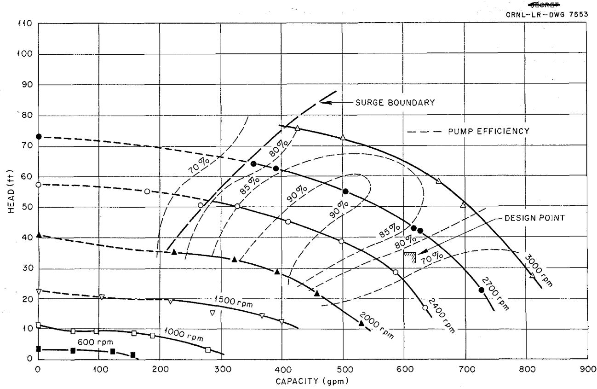  
Fig. 2.3. Performance Characteristics of ART Fuel Pump Model MF-2 in Water Tests. For test conditions see Table 2.4.

bearing and the face seal in the model MF-2 pump at elevated shaft temperatures and under simulated bearing loadings. The test apparatus consists of an MF-2 rotary element to which a loading device is attached at the impeller location. The pump shaft rotates freely within the side-loading device. Heat is applied at the lower region of the pump to simulate gamma heating under actual operating conditions. One phase of the test will consist in an endurance run under simulated pump design conditions, and the other phase, for which a duplicate test assembly is to be used, will consist in short tests for studying the following variables: bearing loading, pump speed, lower shaft temperature, rate of coolant flow, and time.

# Mechanical Shakedown Test

W. L. Snapp J. J. W. Simon Pratt & Whitney Aircraft

A few additional mechanical shakedown tests were performed on the model MF-1 ART fuel pump.

The rotary element was operated continuously for a period of 300 hr at 3800 rpm without achieving a successful seal at the lower journal-bearing region. It was found that the oil leakage rate was nearly constant at 1.8 in.³ per day. Although this rate is not excessive, the goal of zero leakage was not achieved, probably because the face of the journal was not flat. No further testing of this model is planned.

As part of the renovation of ARE-type sump pumps for use in heat exchanger and other tests, 100-hr cold mechanical shakedown tests of the rotary elements were conducted on five units. To assist in the development of the metal-to-metal seal for the model MF-2 pump, the floating Graphitar ring at the lower seal assembly was removed and replaced, on two units, by a modified upper seal bellows assembly. This modification made a metal-to-metal lower seal assembly. One element failed in the cold shakedown test because of a faulty bellows convolution, but the other element

was found to be very satisfactory in that no leakage was detected. The latter element was then placed in operation at high temperature on a heat exchanger test stand. After about 200 hr of hot operation, a bearing hum developed and the unit was replaced; however, up to that time, there had been no oil leakage detected at this lower metal-to-metal seal. Upon disassembly of the unit, the seal surfaces were found to be in excellent condition. As a result of this test, all additional ARE-type pumps will have metal-to-metal seals at the lower journal.

Design work has been completed, and fabrication and assembly have been started on two mechanical shakedown test stands for testing model MF-2 rotary assemblies.

# Short-Circuit Pump-Test Stand

S. M. DeCamp

Aircraft Reactor Engineering Division

The study and design of a short-circuit loop for testing model MF-2 pumps were completed, and fabrication was started. Tests are to be made with this loop at operating temperatures in the range 1100 to $1500^{\circ}\mathrm{F}$ . The tests have been designed for determining the following:

1. proper operation of the lubricating and coolant system at operating temperatures,   
2. leakage rates of the upper and lower seals during actual pump operation at elevated temperatures,   
3. temperature gradients along the pump support cylinder and in the rotary element,   
4. proper clearances between the test impeller and pump casing at operating temperatures,   
5. proper fitting of parts at operating temperatures and loads,   
6. life of the pump assembly. It was decided to build a short-circuit loop totally contained in a tank to eliminate the problem of differential thermal expansion. The loop contains two fixed area orifices to simulate ART fuel circuit head loss, and it has been designed so that the pump may be operated at flow rates of up to 600 gpm and a head of approximately 50 ft.

Since the design of the xenon-removal feature of the pump has not yet been settled, it was decided to use a conventional by-pass flow and pressure-breakdown labyrinth for leakage around the pump impeller. This labyrinth was designed to simulate pump-suction and discharge-volute con

ditions as presently envisioned for the ART fuel pumps.

The removal of pumping power, approximately 40 hp at the isothermal steady-state condition, is to be obtained by constructing a water wall around the pump tank. A movable furnace will be installed between the pump tank and the water wall. It should be possible to dissipate the pumping power at an isothermal operating condition by lowering the movable furnace and exposing a portion of the hot tank wall to the water wall. The fluid flow in this very short loop will be observed through ports during operation with water.

# HEAT EXCHANGER TESTS

E.R.Dytko

Pratt & Whitney Aircraft

R. E. MacPherson

Aircraft Reactor Engineering Division

# Heat Exchanger Tube-Spacer Pressure-Drop Tests

R. D. Peak

Pratt & Whitney Aircraft

J. W. Kingsley

Aircraft Reactor Engineering Division

In order to select the best spacer configuration for the ART heat exchanger tube bundle, a series of tests on various spacer arrangements has been conducted. The test apparatus consisted of a representative ART type of tube bundle composed of 25 aluminum rods 0.191 in. in diameter and 6 ft long contained in a square aluminum duct 1.12 in. inside. The tube spacers were formed from flattened copper wire 0.028 by 0.046 in. Tube-to-tube spacing was 0.028 in., and tube-to-wall spacing was 0.025 to 0.028 in. The spacer rods were soldered on opposite sides of the bundle into 0.020-in.-thick copper plate $\frac{1}{4}$ in. wide. Water was metered through the apparatus by a Rotameter, and total pressure drops were taken across the tube bundle by means of a manometer.

Six configurations were tested, and the results of each test are shown in Fig. 2.4. The results indicate that the pressure drop is least when the spacers are inclined at 45 deg to the direction of flow. Vertical, in-line spacers, of course, gave the highest pressure drop. Staggering the spacers at 45 and 60 deg lowered the pressure drop, but inclining these staggered spacers provided no improvement, as would be expected.

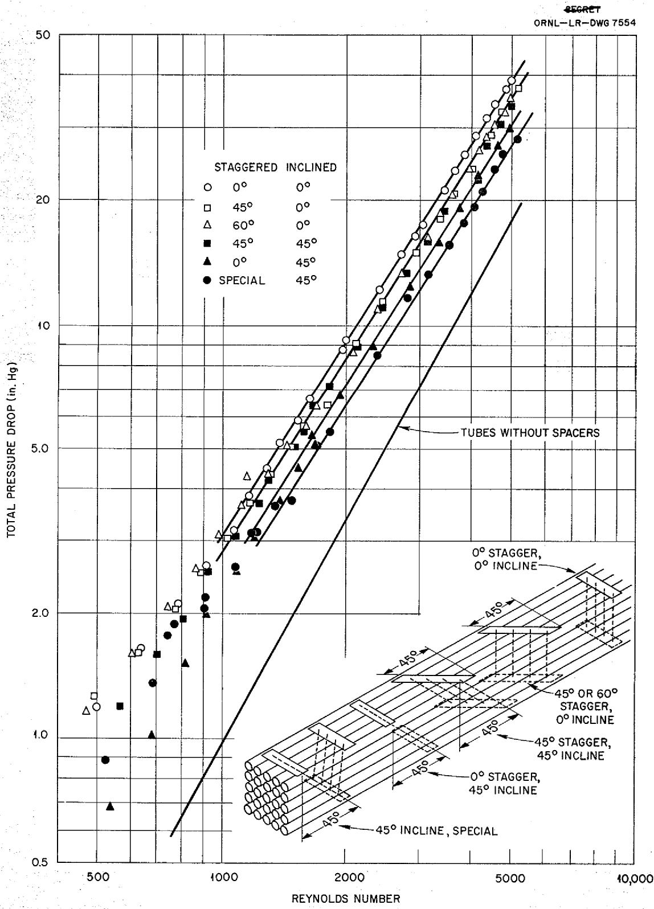  
Fig. 2.4. Results of Pressure Drop Tests of Various Tube-Spacer Arrangements for an ART Heat Exchanger Tube Bundle.

# Intermediate Heat Exchanger Tests

R. D. Peak

Pratt & Whitney Aircraft

Construction is about $70\%$ completed on the test stand described previously and shown here in Fig. 2.5. The two 1.3-Mw 100-tube heat exchanger bundles have been completed, as well as the two 500-kw high-conductivity-fin radiators. The NaK pump (DANA), fuel pump (DAC), and the radiator blower are salvaged equipment from the ARE. The 1-Mw gas-fired heater for this test loop is now being fabricated by the Struthers Wells Corp.

# Small Heat Exchanger Tests

J.C.Amos

M. M. Yarosh

Aircraft Reactor Engineering Division

R. I. Gray

Pratt & Whitney Aircraft

A test of a small fuel-to-NaK heat exchanger was started April 10, 1955. Pressure drop and heat transfer data have been taken through the fluoride mixture Reynolds number range 500 to 6300. Preliminary analyses of the data indicate that the heat exchanger pressure drops are in good agreement with pressure-drop and friction-factor information obtained from recent water-pressure-drop tests carried out on tube bundles with similar geometry.

Basic heat transfer data are presented in Fig. 2.6, which compares the recent results with the theoretical relationship $\mathrm{Nu} / \mathrm{Pr}^{0.4} = 0.23\mathrm{Re}^{0.8}$ . The equivalent diameter used in calculating the Reynolds numbers was based on the total wetted perimeter of the tubes plus the side-wall area, while the equivalent diameter used in computing the Nusselt number utilized only the tube perimeter. The heat transfer area was based on the tube length between header-region center lines.

The heat exchanger being tested consists of 20 Inconel tubes $3_{16}$ in. in outside diameter, with 0.017-in.-thick walls. The tubes, which are approximately 6 ft long, are arranged in a 4 by 5 matrix and contained in a rectangular channel on 0.22-in. centers, with a 0.032-in. tube-to-wall

clearance. The fluoride mixture NaF-ZrF4-UF 4 (50-46-4 mole %) is circulated outside the tubes, and NaK (56% Na-44% K) is circulated in the tubes.

The assembly is now operating on an endurance run at a fluoride mixture Reynolds number of approximately 3000. It is planned to take data over the Reynolds number range 500 to 6000 after 500 hr of operation and again after 1000 hr.

# CORE FLOW TEST

G.D.Whitman

R. L. Brewster

Aircraft Reactor Engineering Division

A full-scale model of the proposed 21-in. reactor core and an entrance header have been fabricated and checked for fluid flow reversal and/or stagnation. The model was installed in a loop containing a 1000-gpm water pump, and two entrance lines were provided at the header to simulate the reactor design. Data were taken at flows that provided a Reynolds number correlation of 1:1 between water flow rates and design fuel flow.

The core model was machined from aluminum castings and was instrumented at 72 static pressure and 18 probe points at nine elevations along the vertical axis of the core. Direction-finding impact tubes were used to traverse the core-shell region at the probe points. There were two probe locations at each of the nine elevations and in the entrance header. A traverse was made from the inner to the outer wall of the fluid passage to obtain the direction of flow and a total pressure profile. Static pressure measurements were taken at the walls at each elevation, and the fluid velocity was computed from the total and static pressure data.

The data were taken in the upper half of the core, and a region of flow reversal was encountered around the inner core shell. This reversal extended approximately one quarter of the distance between the inner and outer shell surfaces and was not sensitive to flows down to one-half the design Reynolds number. Data were not taken at flows below this value.

The entrance geometry produced a large rotational component of velocity in the fluid entering the core, and turning vanes are to be inserted to direct the flow axially through the core volume. If intolerable flow separation is encountered at the outer core shell surface above the equator, turbulators will be attached to the surface in an attempt to reduce this trouble.

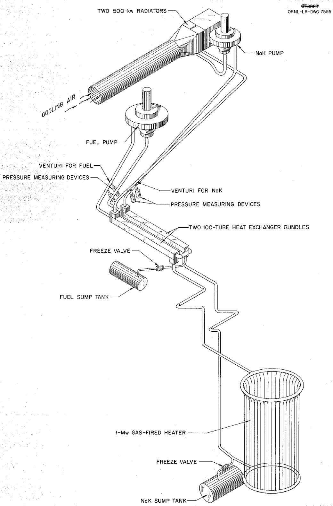  
Fig. 2.5. Isometric Drawing of Intermediate Heat Exchanger Test Stand.

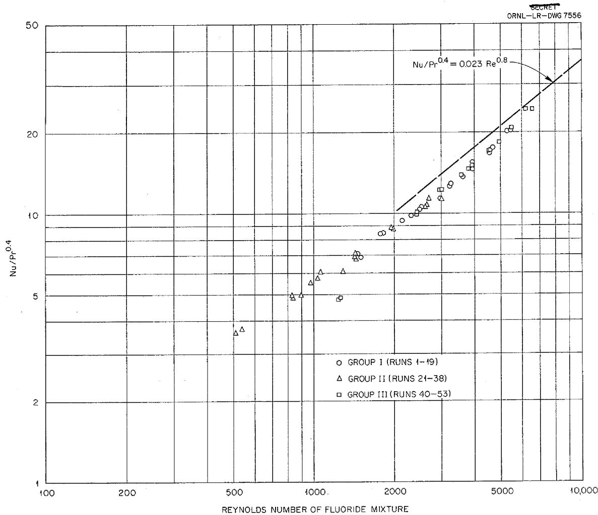  
Fig. 2.6. Heat Transfer Data for 20-Tube Fuel-to-NaK Heat Exchanger.

# THERMAL-CYCLING TEST OF SODIUM-INCONEL-BERYLLIUM SYSTEM

R.D. Peak M.H.Cooper Pratt & Whitney Aircraft

Operation of the second sodium-beryllium-Inconel compatibility testing apparatus, previously described, has been completed. The test stand is shown in the isometric drawing Fig. 2.7. The cylindrical beryllium test piece was mounted between the secondary connections of a 250-kw transformer and directly heated by passing electrical current through it. Hot sodium was pumped through the beryllium test piece and then to a radiator. The pertinent operating conditions of the tests are tabulated in Table 2.5.

The beryllium piece was cycled 104 times between full power and low power, with 20 cycles having a cycle period of 20 min and 80 cycles having a cycle period of 4 hr; four cycles were required for instrument checks, power failures, and startup. The time required for a change from full power to low power or back was 2 min. Upon completion of the required cycles, the apparatus was run at full power to achieve a total operating time of 1030 hr. The beryllium test piece is shown in Fig. 2.8 after the unit was disassembled. The beryllium was found to have grown from 0.0003 to 0.0041 in. on an average outside diameter of 1.125 in. There were three axial cracks approximately $\frac{1}{16}$ in. long on the outer surface at the hot end of the beryllium. Inspection by the Dychek method revealed no other cracks on the outer surface.

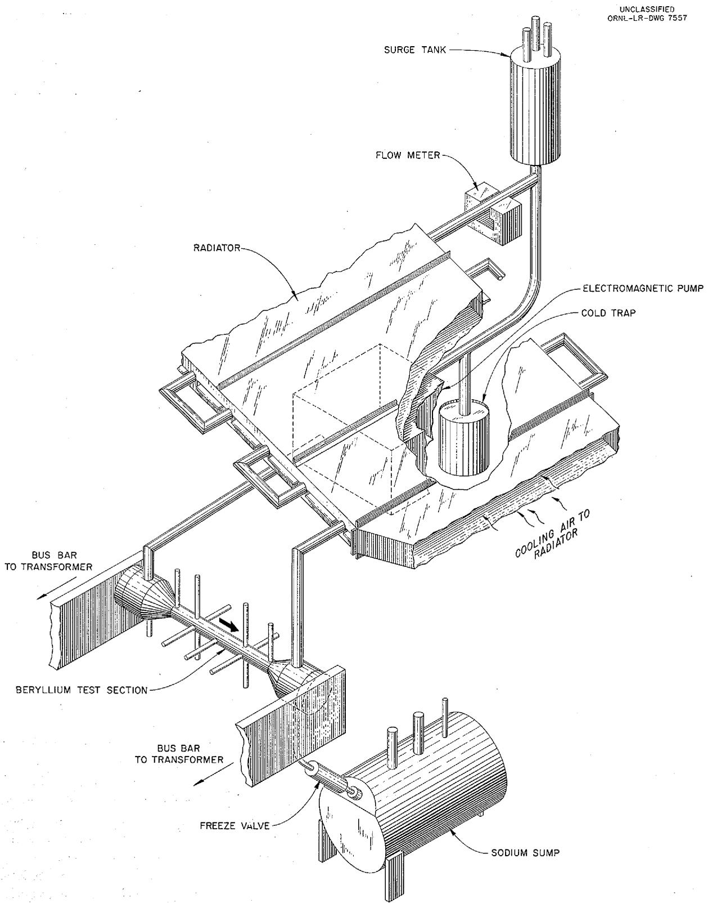  
Fig. 2.7. Isometric Drawing of Loop for Thermal-Cycling Tests of a Sodium-Inconel-Beryllium System.

TABLE 2.5. SUMMARY OF OPERATING CONDITIONS FOR THERMAL-CYCLING TEST OF SODIUM-INCONEL-BERYLLIUM SYSTEM  

<table><tr><td></td><td>High Power Level</td><td>Low Power Level</td></tr><tr><td>Beryllium power, w/cm3</td><td>61</td><td>2.5</td></tr><tr><td>Current through test piece, amp</td><td>11,100</td><td>1,900</td></tr><tr><td>Sodium flow, gpm</td><td>4.0</td><td>4.0</td></tr><tr><td>Sodium inlet temperature, °F</td><td>1050</td><td>1050</td></tr><tr><td>Beryllium-sodium interface temperature at sodium inlet, °F</td><td>1095</td><td></td></tr><tr><td>Beryllium outside-diameter temperature at sodium inlet, °F</td><td>1225</td><td></td></tr><tr><td>Sodium outlet temperature, °F</td><td>1200</td><td>1050</td></tr><tr><td>Beryllium-sodium interface temperature at sodium outlet, °F</td><td>1245</td><td></td></tr><tr><td>Beryllium outside-diameter temperature at sodium outlet, °F</td><td>1375</td><td></td></tr></table>

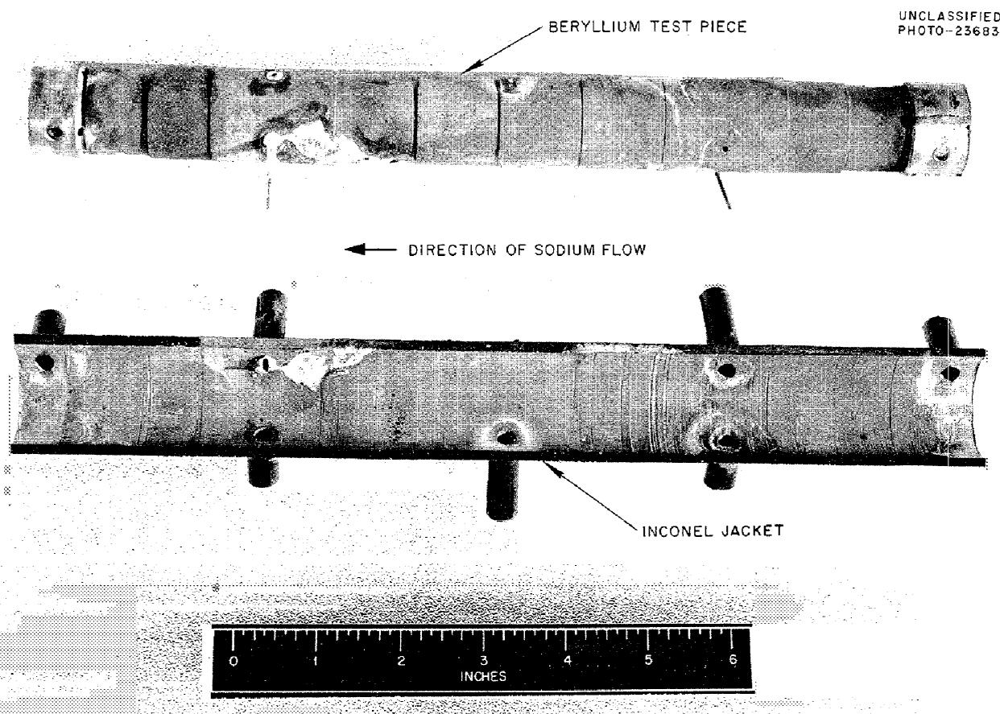  
Fig. 2.8. Beryllium Test Piece from Thermal-Cycling Test of Sodium-Inconel-Beryllium System.

The beryllium pieces and sections of the loop are undergoing extensive metallographic examination.

Apparatus is being assembled for a third test. The test stand and test program will be similar to those used for the test described above. The same full-power density, $61\mathrm{W/cm^3}$ , will be employed, but the average sodium temperature will be increased from 1125 to $1225^{\circ}\mathrm{F}$ . The test is to be completed during the next quarter.

# GAS-FIRED HEAT SOURCE

R.E. MacPherson

Aircraft Reactor Engineering Division

R. Curry

Pratt & Whitney Aircraft

The small-scale gas-fired source, described previously, has been tested at a power output level of 100 kw. The operating conditions for a power output of 100 kw are given below.

Sodium flow rate, gpm 7.9

Sodium temperature differential through heater, ${}^{\circ}\mathsf{F}$ 380

Furnace output, kw 103

Gas flow rate, scfm at 14.7 psia and $70^{\circ}F$ 20.5

Chemical heat input rate (based on 354 980 Btu/scfm), kw

Furnace efficiency (furnace output vs chemical heat input), % 29

Testing was not attempted at higher outputs because a modification of the gas injection ports to reduce the pressure drop would have been necessary. Preheating of the heat exchanger section prior to sodium filling was accomplished by operating the burner at low power output and adding cooling air downstream of the combustion chamber. It was possible to maintain heat exchanger tube temperatures in the 800 to $1200^{\circ}\mathrm{F}$ range by this means.

No difficulties were encountered except for the failure of the spark-plug igniter and several plastic thermocouple connectors because of the high radiant heat emission from the combustion chamber barrel. The gas flow to the burner was momentarily interrupted several times in the course of the test of reliability of relighting. No problems arose prior to failure of the igniter mechanism, mentioned above.

With a few minor repairs, the furnace can be put into operation as a utility heat source. By enlarging the gas injection ports (a minor modification), the capacity of the furnace may be increased considerably for any future application.

# 3. CRITICAL EXPERIMENTS

A. D. Callihan, Physics Division

D. Scott W.C.Tunnel

Aircraft Reactor Engineering Division

R. M. Spencer, United States Air Force

J. J. Lynn, Physics Division

J. S. Crudele

E. V. Sandin

J.W.Noaks

S. Snyder

Pratt & Whitney Aircraft

# ROOM-TEMPERATURE REFLECTOR-MODERATED-REACTOR CRITICAL EXPERIMENTS

A series of experiments have been done on several critical assemblies of the circulating-fuel reflector-moderated reactor. These experiments embodied a number of different configurations of fuel and reflector, which were described in detail previously. The latest of these modifications consisted of a beryllium region surrounded by a fuel layer, which, in turn, was enclosed by the beryllium reflector. This configuration was extended, with reduced dimensions, on opposite sides of the central reactor region to form "end ducts" which simulate the entrance and exit fuel channels. Some results of a variety of experiments which were done with this assembly are presented here.

# Reactivity Measurements

The fuel loading of the critical assembly was such that it contained about $3\%$ excess reactivity, which was utilized for the evaluation of reactivity changes incurred by altering the structure and by adding samples of materials of interest in the design of the ART. It was feasible to make these measurements prior to the reduction of the fuel concentration to that required to determine the critical fuel loading. The evaluations were based on the critical positions of control rods.

Reflector. In one experiment the thickness of the beryllium reflector around the central region of the assembly was reduced from $11\frac{1}{2}$ to $8\frac{5}{8}$ in. by removing the outer (essentially cylindrical) annulus, which was $2\frac{7}{8}$ in. wide and $18\frac{3}{4}$ in. long. This annulus was coaxial with the fuel region. The decrease in reactivity was 165 cents.

ART Control Rod Materials. To provide bases for the design of the control rod for the ART, measurements were made on samples of several possible components. A test volume was formed by removing beryllium from a region $1\frac{7}{16}$ by $1\frac{7}{16}$ in. in cross section that extended 21.5 in. along the axis of the assembly from one end to a point 0.72 in. beyond the equatorial plane. A loss in reactivity of 19.1 cents resulted.

Consideration was also given to the thimble in which the control rod would operate. Tubes of different dimensions and materials were placed within the test volume, and the concomitant depressions in reactivity were determined. The results are given in Table 3.1. It is indicated that, in the range of the measurements, the change in reactivity depends more upon the quantity of material present than upon its shape. A plot of the loss in reactivity incurred by a sample as a function of its linear density, that is, its mass per unit length, is given in Fig. 3.1.

An evaluation was then made of the neutron absorption properties of a mixture of some of the oxides of the rare-earth elements being considered for use as the poison in the control rod. Tests on solid cylinders and on a cylindrical annulus were made along the axis of the critical assembly in the test volume described above.

The composition of the mixture of rare-earth oxides tested was the following:

<table><tr><td>Oxides in Mixture</td><td>Amount in Mixture(wt %)</td></tr><tr><td>Sm2O3</td><td>63.8</td></tr><tr><td>Gd2O3</td><td>26.3</td></tr><tr><td>Dy2O3</td><td>4.8</td></tr><tr><td>Nd2O3</td><td>0.9</td></tr><tr><td>Yt2O3(and others)</td><td>4.2</td></tr></table>

TABLE 3.1. REACTIVITY EFFECT OF CONTROL ROD THIMBLE MATERIALS   

<table><tr><td rowspan="2">Material</td><td colspan="2">Dimensions (in.)</td><td rowspan="2">Linear Density (in.)</td><td rowspan="2">Reactivity Loss (cents)</td></tr><tr><td>Outside Diameter</td><td>Wall Thickness</td></tr><tr><td rowspan="8">Inconel</td><td>0.871</td><td>0.035</td><td>12.27</td><td>25.5</td></tr><tr><td>1.255</td><td>0.045</td><td>20.72</td><td>41.7</td></tr><tr><td>1.243</td><td>0.062</td><td>32.68</td><td>64.7</td></tr><tr><td>1.255</td><td>0.045</td><td rowspan="2">32.99</td><td rowspan="2">63.3</td></tr><tr><td>0.871</td><td>0.035</td></tr><tr><td>1.250</td><td>0.085</td><td>41.75</td><td>80.7</td></tr><tr><td>1.250</td><td>0.085</td><td rowspan="2">54.02</td><td rowspan="2">97.5</td></tr><tr><td>0.871</td><td>0.035</td></tr><tr><td>Type 304 stainless steel</td><td>1.253</td><td>0.028</td><td>14.10</td><td>22.9</td></tr><tr><td>Type 302 stainless steel</td><td>1.240</td><td>0.060</td><td>27.91</td><td>41.7</td></tr></table>

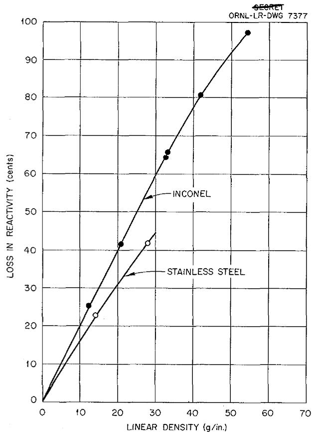  
Fig. 3.1. Reactivity Effects of Thimble Materials.

The mixture was pressed into solid cylinders 0.450 and 1.375 in. in diameter and into annuli 0.790 in. in outside diameter and 0.140 in. in width. Each piece was about $\frac{3}{4}$ in. in height, and the pieces were combined to give various-length samples.

In the first set of experiments with the small-sized cylinders and the annuli, the Inconel thimble, which was 1.250 in. in outside diameter and 0.085 in. in wall thickness and which decreased the reactivity 80.7 cents, was in place in the axial void. The absorber samples were contained in an Inconel carrier tube which could be inserted into the thimble. The outside diameter of the carrier tube was 0.871 in., the wall thickness was 0.035 in., and the end was closed by a $\frac{3}{32}$ -in.-thick plug. The small cylinders were centered in this carrier tube by a third Inconel sleeve, with an outside diameter of 0.500 in. and a wall thickness of 0.020 in., which, in turn, was centered by aluminum spacers. The effects of the carrier tube and of assemblies of cylinders and annuli, both separately and together, are summarized in Table 3.2. The reference zero for the reactivity changes is taken with the thimble alone. In all cases the test rod was inserted 21.5 in. into the thimble; that is, the end extended 0.72 in. beyond the equatorial plane of the assembly.

In a second series of experiments a comparison

TABLE 3.2.EFFECT OF SAMPLE CONTROL RODS ON REACTIVITY   

<table><tr><td>Sample</td><td>Length (in.)</td><td>Diameter (in.)</td><td>Reactivity Loss (cents)</td></tr><tr><td>Carrier tube only</td><td></td><td></td><td>16.8 ± 0.5</td></tr><tr><td>Cylinders*</td><td>23.0</td><td>0.450</td><td>155.0 ± 15.0**</td></tr><tr><td rowspan="2">Annuli</td><td rowspan="2">21.0</td><td>0.790 (outside)</td><td rowspan="2">230.0 ± 20.0**</td></tr><tr><td>0.510 (inside)</td></tr><tr><td>Cylinders and annuli together</td><td>21.0</td><td>0.790</td><td>250.0 ± 20.0**</td></tr></table>

*The innermost centering tube alone decreased the reactivity about 5 cents.   
**Obtained by extrapolation of a series of measurements with shorter samples; effect of carrier tube included.

was made of the effect on reactivity of the diameter of the samples of oxide mixture. The diameters of the samples were 0.450, 0.790, and 1.375 in., the one of intermediate size being formed by placing the small cylinders in the annuli described above. The samples were about 5.5 in. long, and each was tested at the same position in the assembly. The distance from the end of the sample to the midplane of the assembly was 2.0 in. It was necessary to remove the 1.25-in.-dia thimble for these measurements, and the absorbers had to be wrapped in aluminum foil. The changes in reactivity measured, referred to the array with the test section void (without the thimble), are given in Table 3.3.

TABLE 3.3.EFFECT OF ABSORBER DIAMETER ON REACTIVITY   

<table><tr><td>Sample Diameter (in.)</td><td>Length (in.)</td><td>Reactivity Loss (cents)</td></tr><tr><td>0.450</td><td>5.6</td><td>95.0 ± 5.0</td></tr><tr><td>0.790</td><td>5.6</td><td>158.0 ± 5.0</td></tr><tr><td>1.375</td><td>5.4</td><td>256.0 ± 5.0</td></tr></table>

An estimate of the spectral distribution of the neutron absorption by the rare-earth elements was also made. The change in reactivity produced by

a 3-in.-long cylindrical sample, 0.450 in. in diameter, was measured at a point where the cadmium fraction measured by gold-foil activation was about 0.5. The measurement was then repeated with the sample covered by cadmium 0.02 in. thick. The values were 55.9 and 61.7 cents, respectively. The cadmium alone reduced the reduced the reactivity 37.7 cents. From these data it appears that about $43\%$ of the reactivity decrease is due to neutrons which penetrate the cadmium.

Inconel. A measurement, similar to that just described, was made with an Inconel sample in order to estimate the dependence of the reduction in reactivity upon neutron energy. The sample was $1\frac{1}{2} \times 4\frac{3}{8} \times \frac{3}{32}$ in.; it weighed 84.14 g; and it could be provided with a 0.02-in.-thick cadmium cover. The effects, as poisons, of the Inconel and the cadmium were measured singly and together at the center of the beryllium island and in the fuel region adjacent to the fuel reflector interface. (The $\frac{1}{8}$ -in. Inconel core shell was reduced to $\frac{1}{16}$ in. in thickness in the region of this measurement.) The gold-activation cadmium fractions at the two positions were 0.57 and 0.33, respectively. The reactivity changes are given in Table 3.4. The fractions of the total change that are caused by neutrons penetrating the cadmium are also tabulated.

TABLE 3.4. REACTIVITY CHANGES FROM BARE AND CADMIUM-COVERED INCONEL   

<table><tr><td></td><td>In Island</td><td>At Fuel-Reflector Interface</td></tr><tr><td colspan="3">Reactivity loss (cents)</td></tr><tr><td>Inconel</td><td>18.0</td><td>4.0</td></tr><tr><td>Inconel, cadmium covered</td><td>117.4</td><td>26.8</td></tr><tr><td>Cadmium cover</td><td>115.2</td><td>26.5</td></tr><tr><td>Fractional change in re-activity caused by epi-cadmium neutrons (%)</td><td>12.2 ± 0.6</td><td>7.5 ± 2.6</td></tr><tr><td>Gold-activation cadmium fraction</td><td>0.57</td><td>0.33</td></tr></table>

Columbium. Since the neutron-absorption cross section of columbium is somewhat lower than that of Inconel, it is also being considered as a reactor structural material. A comparison of the two materials was therefore made in the critical assembly. A sample of columbium $4_{4}^{3} \times 3 \times 0.05$ in.

that weighed 98.5 g and was located in the fuel region adjacent to the $\frac{1}{16}$ -in. Inconel separator at the fuel-reflector interface reduced the reactivity 3.0 cents. A sample of Inconel $4\% \times 3\% \times \frac{1}{16}$ in. that weighed 127.4 g and was located at the same position reduced the reactivity 6.6 cents. For comparison with the columbium value, the Inconel value must be reduced to 5.3 cents, if it is assumed that the effective absorption varies linearly with the sample thickness. The layer of Inconel adjacent to the columbium simulated the cladding which would probably be required for corrosion protection. Some reduction in the critical uranium concentration would be effected by the use of columbium.

Beryllium in the Fuel Region. Since the presence of beryllium in the circulating fuel stream would be another possible way of reducing the critical uranium concentration, an experiment was devised for evaluating the effect of beryllium in the fuel region of the critical assembly. One of the central fuel subassemblies that consisted of 27 uranium metal sheets (each 0.004 in. thick) and 55 Teflon sheets (each $\frac{1}{14}$ in. thick) was modified in the following manner. Seven uranium sheets and 16 Teflon sheets were removed from the center to effect a decrease in reactivity of 22.7 cents. The substitution of a sample of beryllium, $7\%^{3}_{16} \times 2\%^{7}_{8} \times 1$ in., for this uranium and Teflon resulted in a net reactivity gain of 8.5 cents over the unperturbed value. The addition of a $\frac{1}{16}$ -in.-thick layer of Inconel completely around the beryllium reduced this net gain to 4.0 cents. An estimate of the effect of the Inconel-clad beryllium on the concentration is given by the observation that the removal of two of the remaining 20 uranium sheets further reduced the reactivity by 4.5 cents, that is, to a value slightly below that of the original array. The two sheets removed last were adjacent to the beryllium sample and were of greater than average importance.

Fuel in the End Ducts. One of the safety features of the high-temperature critical experiment presently being designed, which is described below, is that the liquid fuel can be removed by draining under gravity. The degree of safety depends upon the rate of removal and the sensitivity of the reactor to the fuel level, particularly the level in the upper end duct. A measure of this sensitivity was obtained in the room-temperature experiment to establish the basis for the design of the hot-fuel drain system.

Three annular rings of fuel were successively removed in $2\frac{7}{8}$ -in. increments from one end duct, and the resulting decreases in reactivity were noted. Each ring contained $825\mathrm{g}$ of $\mathsf{U}^{235}$ , and thus a total of $2.475\mathrm{kg}$ of $\mathsf{U}^{235}$ was removed. The losses in reactivity accompanying the removal of the three rings are shown in Fig. 3.2, which also gives the loss in reactivity per unit displacement, or fuel sensitivity, averaged over each of the fuel annuli removed.

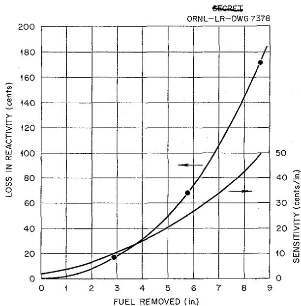  
Fig. 3.2. Effect of Fuel in End Duct on Reactivity.

# Power Distributions

The relative fission rate distribution across the fuel annulus was determined from the fission-product activities collected on aluminum foils in contact with the uranium. Exposures were also made with the foils and the uranium enclosed in 0.02-in.-thick cadmium in order to obtain a measure of the energy distribution of the neutrons causing fission. The locations of foil traverses within the fuel section of the assembly are shown at the top of Fig. 3.3. As may be recalled, the fuel consists of laminae of uranium (0.004 in. thick) and Teflon (0.142 in. thick); the measurements were made at selected positions on lines perpendicular to these laminae. The fission rate distribution across each traverse is plotted in the lower part of Fig. 3.3 as a function of the number of uranium sheets between

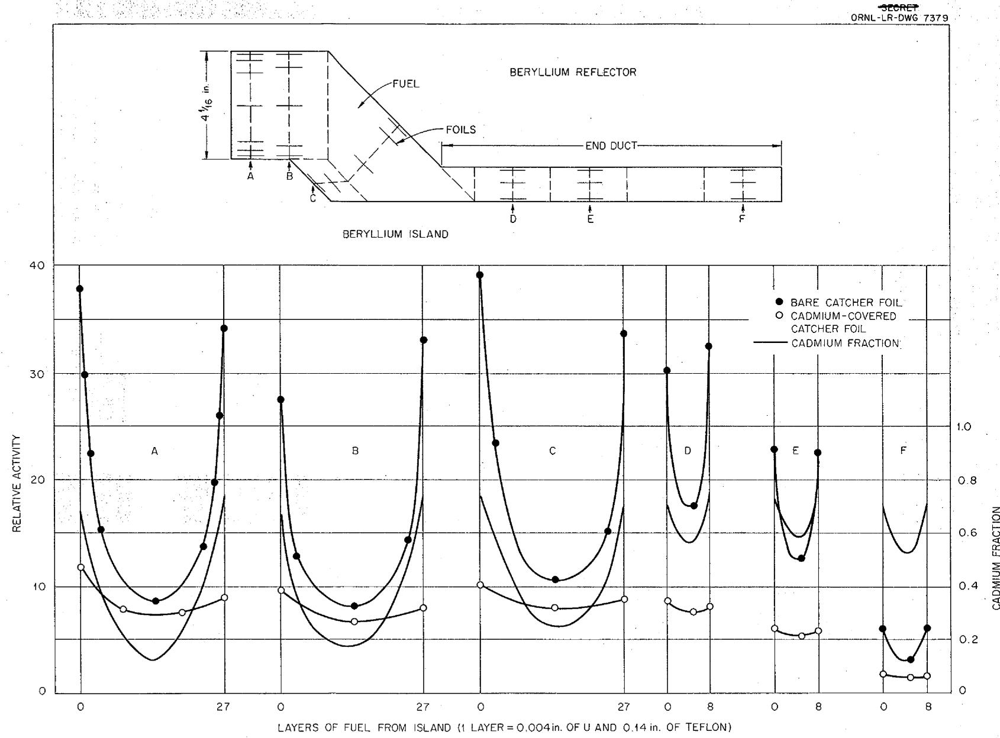  
Fig. 3.3. Power Distribution Across Fuel Annulus.

the datum point and the island of the assembly. Values of the cadmium fraction (the fraction of all fissions produced by neutrons having energies less than $\sim 0.5$ ev) are also plotted. At the time these measurements were made, the reflector around the center section of the assembly was only $8\%$ in thick.

# ASSEMBLY FOR HIGH-TEMPERATURE CRITICAL EXPERIMENT

Operation at high temperature of a critical assembly mockup of the ART is scheduled for late summer, 1955. In addition to a determination of the critical uranium concentration at the elevated temperature, the purposes of the experiment are to evaluate the temperature coefficient of reactivity, to investigate the effectiveness of control rod materials, and to measure the contribution of the fuel in the upper end duct to the overall reactivity.

The experiment will be performed at zero nuclear power and at about $1200^{\circ}\mathrm{F}$ . Heat will be supplied by electrical heaters external to the reflector. The assembly is to include a beryllium island and a beryllium reflector, essentially 12 in. thick, which will be in a helium or argon atmosphere and will contain no sodium.

The ART core configuration, as presently envisioned, will be exactly mocked up in the experiment between points 18 in. above and below the equatorial plane of the core. Some minor deviations from the

ART design are being made beyond these points to simplify filling and draining. The fuel will not be circulated. The core will be filled with molten fuel from a sump tank by using helium to force the molten salt into the assembly. The system will be filled initially for cleaning and testing with a 50-50 mole $\%$ mixture of NaF and $\mathsf{ZrF}_4$ . Increments of $\mathsf{Na}_2\mathsf{UF}_6$ (with the uranium enriched with $93\% \mathsf{U}^{235}$ ) will subsequently be added to the NaF-ZrF_4 mixture in the sump tank. After each addition of $\mathsf{Na}_2\mathsf{UF}_6$ , the mixture will be pressurized into the core and then drained until the critical uranium concentration is determined.

A single rod will be located within a 1.50-in.-1D Inconel thimble along the vertical axis of the beryllium island. It will extend from the top of the reactor tank to 10 in. below the equatorial plane of the core. The control rod will be a cylindrical annulus of the mixture of rare-earth elements described above, enclosed in an Inconel shell. Annuli of two widths, $\frac{1}{8}$ and $\frac{1}{4}$ in., will be provided for comparison.

The system is being designed to operate isothermally at $1200^{\circ}\mathrm{F}$ normally, with provision made for short periods of operation at temperatures up to $1300^{\circ}\mathrm{F}$ to enable reactivity temperature coefficient measurements to be made. An attempt will also be made to measure the fuel temperature coefficient by inserting the fuel into the reactor assembly at a temperature different from that of the beryllium.

Part II

MATERIALS RESEARCH

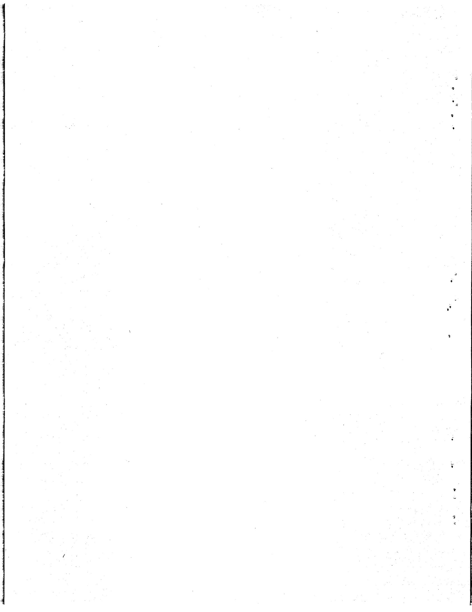

# 4. CHEMISTRY OF REACTOR MATERIALS

W. R. Grimes  
Materials Chemistry Division

Phase equilibrium studies were made of the systems $\mathsf{LiF - ZrF}_4$ NaF-LiF-ZrF, and NaF-LiF $\mathsf{ZrF}_4$ -UF. Two $\mathsf{BeF}_2$ -bearing systems - NaF-LiF-BeF and NaF-LiF-BeF-UF - were studied, and the solubility of UF in BeF-bearing systems was investigated. A method for zone melting of fused salts was devised as an aid in phase equilibrium studies. Additional work was done in investigating the equilibrium reduction of $\mathsf{FeF}_2$ by hydrogen in $\mathsf{NaZrF}_5$ , the reduction of UF by structural metals, and the stability of chromium and iron fluorides in molten fluorides. Vapor pressure measurements were made on UF in the temperature range 1270 to $1390^{\circ}\mathsf{C}$ .

The investigation of the variables affecting the reduction with metallic uranium of $\mathsf{UF}_4$ dissolved in alkali fluorides was continued. A study of the effect of the nickel filters used in experiments for determining the stability of $\mathsf{UF}_3$ in the NaF-KF-LiF system showed that disproportionation of the $\mathsf{UF}_3$ occurred because of the filter.

Fuel purification and preparation research included experimental use of electrolysis under a hydrogen atmosphere to remove oxides and the use of metallic zirconium to replace most of the hydrogen in the stripping operation. In addition, attempts were made to prepare mixtures containing very high $\mathsf{UF}_3 / \mathsf{UF}_4$ ratios. A study of the conditions for the preparation of $\mathsf{BeF}_2$ -bearing melts was continued, and production operations were resumed to provide test material for the greatly accelerated engineering test program.

Potential measurements were made with combinations of several half cells consisting of metal electrodes bathed in solutions of the corresponding metal ion in the molten salt mixture $\mathrm{NaF - ZrF_4}$ . Also, vapor pressure measurements were made of mixtures in the LiF-ZrF4 system. An x-ray diffractometer designed specifically for studies of the structure of liquids is described. Final testing of the diffractometer is under way. A high-temperature attachment for an x-ray spectrometer is also being used to help clarify phase relationships in fuel systems of interest.

# PHASE EQUILIBRIUM STUDIES

C. J. Barton F. F. Blankenship Materials Chemistry Division

H. Insley, Consultant

The very considerable interest in obtaining fuel mixtures with physical properties more favorable than those available in the NaF-ZrF $_4$ -UF $_4$ system has led to evaluation of the NaF-LiF-ZrF $_4$ ternary and the NaF-LiF-ZrF $_4$ -UF $_4$ quaternary systems. Largely as a consequence of studies pursued during the past quarter, the former system has been reasonably well defined; the latter requires considerably more effort. While phase equilibrium data show that quite low melting points are available in this system and that adequate melting points are available at $\mathsf{ZrF}_4$ concentrations as low as 21 mole %, no composition with physical properties better than those available in the NaF-ZrF $_4$ -UF $_4$ system has been demonstrated.

Study of the analogous NaF-LiF-BeF $_2$ system has been continued. Adequate melting points are available over wide areas in this system. Whether the physical properties of proper compositions in this system can show significant advantages over those in the NaF-ZrF $_4$ -UF $_4$ system cannot yet be answered with certainty.

The Binary System LiF-ZrF4

R.E.Moore R.E.Thoma

Materials Chemistry Division

D. L. Stockton, Merck & Company

A tentative diagram of the $\mathsf{LiF - ZrF}_4$ binary system, based primarily on thermal analysis data, was published previously. A re-examination of this system by petrographic and x-ray diffraction studies of quenched and slowly cooled samples and by differential thermal analysis was started during the past quarter because of current interest in the NaF-LiF-ZrF $^4$ system.

Although quenching of $\mathsf{LiF - ZrF}_4$ mixtures is not completely satisfactory because of rapid crystallization of many mixtures in the system, some conclusions may be drawn from the results. A eutectic between LiF and $\mathsf{Li}_3\mathsf{ZrF}_7$ at about

21 mole $\%$ $\mathsf{ZrF}_4$ was confirmed by quenching experiments on both sides of this composition. The eutectic temperature found by quenching is about $600^{\circ}C$ instead of the $590^{\circ}C$ indicated by thermal analysis. The melting point of $\mathsf{Li}_3\mathsf{ZrF}_7$ $(645^{\circ}C$ according to thermal analysis) could not be checked by quenching because of too rapid crystallization. Decomposition of $\mathsf{Li}_3\mathsf{ZrF}_7$ into $\mathsf{Li}_2\mathsf{ZrF}_6$ and LiF occurs somewhere below $480^{\circ}C$ . This decomposition explains a series of cooling breaks at about $465^{\circ}C$ and the apparent discrepancy between thermal analysis data and the results of solid-phase studies (reported earlier). The melting point of $\mathsf{Li}_2\mathsf{ZrF}_6$ $(585^{\circ}C$ according to recent thermal analysis data) was found to be approximately $590^{\circ}C$ by quenching. The primary phase was found to be $\mathsf{Li}_2\mathsf{ZrF}_6'$ and thus the belief that this compound melts congruently was confirmed.

The only other binary compound in the system, as yet unidentified, was found by examination of both quenched and slowly cooled samples containing more than 50 mole $\%$ $\mathsf{ZrF}_4$ . No evidence was found for the existence of $\mathsf{LiZrF}_5$ . A careful study of samples of compositions with 57.1, 60, 62.5, and 66.7 mole $\%$ $\mathsf{ZrF}_4$ which were held both above and below the solidus temperature for about 12 hr before quenching indicates that the unidentified compound is probably $\mathsf{Li}_2\mathsf{Zr}_3\mathsf{F}_{14}$ (60%) or $\mathsf{Li}_3\mathsf{Zr}_4\mathsf{F}_{19}$ (57.1%) and that it melts incongruity to $\mathsf{ZrF}_4$ and liquid at about $515^{\circ}\mathsf{C}$ . The optical properties of this compound are almost identical to those of $\mathsf{Li}_2\mathsf{ZrF}_6$ ; so it was necessary to rely almost entirely on x-ray diffraction to differentiate between them. Work on questionable aspects of the compositions with more than 50 mole $\%$ $\mathsf{ZrF}_4$ is continuing.

The differential thermal analysis technique and the equipment previously used in the study of the $\mathrm{NaF - ZrF_4}$ system were also employed to obtain more precise thermal data for LiF-ZrF mixtures. Ten-gram samples were prepared by mixing purified $\mathrm{Li}_2\mathrm{ZrF}_6$ with the required amount of $\mathsf{ZrF}_4$ or $\mathrm{Li}_3\mathrm{ZrF}_7$ in welded nickel capsules fitted with thin-walled center thermocouple wells. Manual control of a Variac transformer was found to give a reasonably uniform rate of heating, about $90^{\circ}C / hr$

and of cooling, about $75^{\circ}\mathrm{C/hr}$ . The base line obtained on the automatic plot of sample temperature vs differential temperature (difference between sample and $\mathrm{Al}_{2}\mathrm{O}_{3}$ reference amplified by a d-c amplifier) seemed to be less erratic when the transformer was controlled manually than when the automatic temperature controller was used. The compositions studied to date cover the range from 31.9 to 66.7 mole $\%$ $\mathsf{ZrF}_4$ . These studies are incomplete, but the data obtained indicate a melting point of $493 \pm 5^{\circ}\mathrm{C}$ for the eutectic at about 50 mole $\%$ $\mathsf{ZrF}_4$ and a value of $520 \pm 5^{\circ}\mathrm{C}$ for the incongruent melting point of the unidentified compound containing more than 50 mole $\%$ $\mathsf{ZrF}_4$ . The thermal effect at $462^{\circ}\mathrm{C}$ was apparent on the heating curves of all compositions, presumably because a small amount of LiF present in the $\mathsf{Li}_{2}\mathsf{ZrF}_{6}$ combined with $\mathsf{Li}_{2}\mathsf{ZrF}_{6}$ to give $\mathsf{Li}_{3}\mathsf{ZrF}_{7}$ . This effect was noted only upon cooling of the mixture with 31.9 mole $\%$ $\mathsf{ZrF}_{4'}$ in which it would be expected that $\mathsf{Li}_{3}\mathsf{ZrF}_{7}$ would be present. The existence of only one thermal effect, at $565^{\circ}\mathrm{C}$ , for this composition, in addition to the $462^{\circ}\mathrm{C}$ solidus transition, appears to verify the existence of the $\mathsf{Li}_{3}\mathsf{ZrF}_{7} - \mathsf{Li}_{2}\mathsf{ZrF}_{6}$ eutectic near this composition. These studies are continuing, and it is expected that a revised diagram will be completed for this system in the near future.

# The Ternary System NaF-LiF-ZrF4

C. M. Blood

H. A. Friedman

F. P. Boody

F.W.Miles

R.E.Thoma

Materials Chemistry Division

Fuel mixtures based on the NaF-ZrF $_4$ system have suitable melting points only if the composition lies close to the compound Na $_7$ Zr $_6$ F $_{31}$ , which is characterized on the phase diagram by a flat maximum at $520^{\circ}\mathrm{C}$ with $500^{\circ}\mathrm{C}$ eutectics on either side. The typical NaF-ZrF $_4$ -UF $_4$ fuel mixture therefore contains about 45 mole $\%$ ZrF $_4$ . It is unfortunate that several of the physical properties values of this class of fuels are somewhat unsatisfactory because of the high ZrF $_4$ content. The physical properties that are troublesome are vapor pressure, kinematic viscosity, and heat capacity per unit volume. In the LiF-ZrF $_4$ system, the low-melting region occurs at $50\%$ ZrF $_4$ and $500^{\circ}\mathrm{C}$ , and therefore there is little promise of improved physical properties here.

However, there was a possibility that low-melting regions with much lower $\mathsf{ZrF}_4$ content would be found in the NaF-LiF-ZrF ternary system. The substitution of LiF for NaF was expected to result in lower melting points, because $\mathsf{Li}_3\mathsf{ZrF}_7$ (mp, $645^{\circ}\mathsf{C}$ ) melts at a much lower temperature than does $\mathsf{Na}_3\mathsf{ZrF}_7$ (mp, $850^{\circ}\mathsf{C}$ ), and $\mathsf{Li}_2\mathsf{ZrF}_6$ (mp, $585^{\circ}\mathsf{C}$ ) melts at a much lower temperature than does $\mathsf{Na}_2\mathsf{ZrF}_6$ (inconcurrent, liquidus at $700^{\circ}\mathsf{C}$ ). The use of LiF would be expected to result in higher heat capacities. In order to find low-melting regions that would have as little $\mathsf{ZrF}_4$ and as much LiF as possible, the ternary system NaF-LiF-ZrF was

explored. The results are summarized in Fig. 4.1. No ternary compounds were encountered.

The liquidus contours were obtained from cooling curves on melts of at least $500\mathrm{g}$ contained in 4-in. graphite liners which were enclosed in nickel pots in a 5-in. pot furnace. The melts were stirred by belt-driven nickel stirrers; temperatures were measured by thermocouples in the hollow shafts of the stirrers. A flowing atmosphere of helium was maintained over the melts. The important features of the ternary system were determined on mixtures blended from eutectic or compound compositions which had been purified

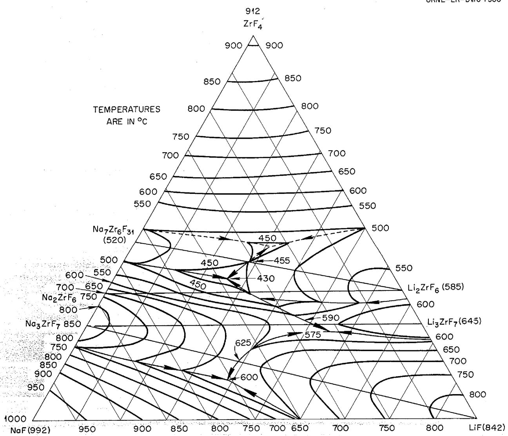  
Fig. 4.1. Phase Diagram of NaF-LiF-ZrF $_4$ System.

by a high-temperature HF treatment. All the solidified samples were examined petrographically to determine the phases present, and representative samples were examined by x-ray diffraction whenever questions arose which could be studied by this technique.

The first objective of the investigation was to find quasi binaries which would serve to define the compatibility triangles in the ternary system. Beginning at the low $\mathsf{ZrF}_4$ concentrations, the join between LiF and $\mathsf{Na}_{3}\mathsf{ZrF}_{7}$ was found to be a quasi binary with a simple eutectic at $625^{\circ}\mathrm{C}$ and 38 mole $\%$ LiF. The compatibility triangle formed with this join and NaF as an apex contains a ternary eutectic at NaF-LiF-ZrF $_4$ (51-38-11 mole%) which melts at $600^{\circ}\mathrm{C}$ and contains NaF, LiF, and $\mathsf{Na}_{3}\mathsf{ZrF}_{7}$ .

The next quasi binary is the $\mathrm{Na}_{3}\mathrm{ZrF}_{7} \cdot \mathrm{Li}_{3}\mathrm{ZrF}_{7}$ join. Here extensive solid solutions occur, as shown in Fig. 4.2. Cooling curves gave uncertain indications of the solidus, and therefore the limits of miscibility at the eutectic are not known. However, the limit of miscibility of $\mathrm{Na}_{3}\mathrm{ZrF}_{7}$ in $\mathrm{Li}_{3}\mathrm{ZrF}_{7}$ mixtures at $350^{\circ}\mathrm{C}$ is clearly defined. This is due to the existence of a lower limit of stability of $\mathrm{Li}_{3}\mathrm{ZrF}_{7}$ at $490^{\circ}\mathrm{C}$ , coupled with the lowering of the limit of stability by increasing amounts of solid solution with $\mathrm{Na}_{3}\mathrm{ZrF}_{7}$ and the large thermal effect associated with the decomposition. At the composition NaF-LiF-ZrF $_4$ (26-49-25 mole %) the lower limit of stability of the $\mathrm{Li}_{3}\mathrm{ZrF}_{7}$ -rich solid solution has decreased to $350^{\circ}\mathrm{C}$ , and the saturation limit has been reached. The x-ray diffraction lines for the $\mathrm{Na}_{3}\mathrm{ZrF}_{7}$ -rich solid solutions are puzzling in that they show the expected shifts up to about $30\%$ LiF and unexpected, decreased shifts at higher LiF concentrations. The eutectic occurs at $50\%$ and $590^{\circ}\mathrm{C}$ .

The compatibility triangle lying between the $\mathrm{Na}_3\mathrm{ZrF}_7$ -LiF join and the $\mathrm{Na}_3\mathrm{ZrF}_7$ -Li3ZrF7join is characterized by three two-phase crystallization paths with a relatively small temperature gradient; the paths join to form a eutectic at NaF-LiF-ZrF4 (22-55-23 mole %) that melts at $575^{\circ}C$

Superficially, the join between $\mathsf{Na}_2\mathsf{ZrF}_6$ and $\mathsf{Li}_2\mathsf{ZrF}_6$ appears to be a quasi binary, since only the end members are readily identifiable in solidified melts lying on this join, and a eutectic-type break in the cooling curves is found at $445^{\circ}\mathsf{C}$ and $31\%$ LiF. However, $\mathsf{Na}_2\mathsf{ZrF}_6$ melts incongruity at $630^{\circ}\mathsf{C}$ , and on the $\mathsf{Na}_2\mathsf{ZrF}_6$ limb

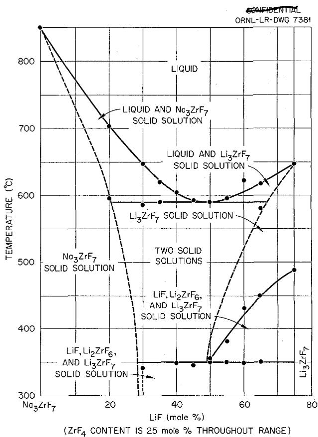  
Fig. 4.2. Phase Diagram of the Quasi-Binary System $\mathsf{Na}_3\mathsf{ZrF}_7\text{-Li}_3\mathsf{ZrF}_7$ .

of the eutectic, $\mathrm{Na}_{3}\mathrm{ZrF}_{7}$ -rich solid solutions are the primary phase. The eutectic type of halt at $445^{\circ}C$ is observable only on the $\mathrm{Li}_{2}\mathrm{ZrF}_{6}$ limb, and it corresponds to the appearance of an $\mathrm{Na}_{3}\mathrm{ZrF}_{7}$ -rich phase, which must subsequently react with liquid to give the $\mathrm{Na}_{2}\mathrm{ZrF}_{6}$ found as a final product. The true eutectic between $\mathrm{Na}_{2}\mathrm{ZrF}_{6}$ and $\mathrm{Li}_{2}\mathrm{ZrF}_{6}$ appears to occur at about $435^{\circ}C$ . The thermal effects accompanying this behavior are shown in Fig. 4.3.

These complications have prevented the establishment of meaningful compatibility triangles between 25 and 33.3 mole $\%$ ZrF4. In this region at $455^{\circ}C$ and the composition NaF-LiF-ZrF4 (34-35-31 mole $\%$ ), there is an intersection of the two-phase crystallization paths involving LiZrF6

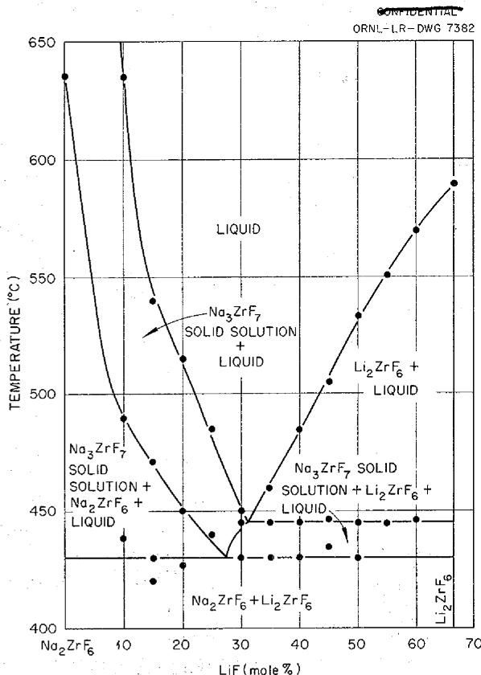  
(ZrF4 CONTENT IS 33.3 mole % THROUGHOUT RANGE)   
Fig. 4.3. Thermal Effects in the $\mathsf{Na}_2\mathsf{ZrF}_6$ -Li, ZrF System.

and $\mathsf{Li}_3\mathsf{ZrF}_7$ rich solid solutions on the one hand, and $\mathsf{Na}_3\mathsf{ZrF}_7$ and $\mathsf{Li}_3\mathsf{ZrF}_7$ rich solid solutions on the other. From this junction a crystallization path crosses the $\mathsf{Na}_2\mathsf{ZrF}_6\mathsf{-Li}_2\mathsf{ZrF}_6$ join before reaching a eutectic.

The join between $\mathrm{Na}_{7}\mathrm{Zr}_{6}\mathrm{F}_{31}$ and $\mathrm{Li}_{2}\mathrm{ZrF}_{6}$ is a quasi binary with a simple eutectic at $28\%$ LiF that melts at $455^{\circ}C$ . Between this join and the $\mathrm{Li}_{2}\mathrm{ZrF}_{6}\cdot \mathrm{Na}_{2}\mathrm{ZrF}_{6}$ join there is a eutectic region of peculiar behavior which has not been explained. The system behaves as though a metastable ternary eutectic between $\mathrm{Na}_{7}\mathrm{Zr}_{6}\mathrm{F}_{31}$ , $\mathrm{Li}_{2}\mathrm{ZrF}_{6}$ , and $\mathrm{Na}_{2}\mathrm{ZrF}_{6}$ forms at $425^{\circ}C$ , but, before complete solidification can occur, a binary eutectic between $\mathrm{Na}_{3}\mathrm{Zr}_{2}\mathrm{F}_{11}$ and $\mathrm{Li}_{2}\mathrm{ZrF}_{6}$ makes its appearance. The melting point of the stable eutectic is $435^{\circ}C$ ; the composition is $\mathrm{NaF - LiF - ZrF_{4}}$ (38-25-37 mole%). The metastable eutectic at $425^{\circ}C$ is more strongly evidenced at a slightly higher LiF concentration.

Attempts to define the crystallization path between $\mathrm{Na}_{3}\mathrm{ZrF}_{7}$ and $\mathrm{Na}_{2}\mathrm{ZrF}_{6}$ have been rather sketchy and unfruitful; cooling curves contributed relatively little toward the definition. Similarly, essentially nothing is known about the primary phase field of $\mathrm{Na}_{3}\mathrm{Zr}_{2}\mathrm{F}_{11}$ . The region above $45\%$ $\mathrm{ZrF}_{4}$ is of little interest from the standpoint of fuel composition, and has been investigated only sparingly. There was no evidence of melting points below $450^{\circ}\mathrm{C}$ when the join between $\mathrm{Na}_{7}\mathrm{Zr}_{6}\mathrm{F}_{31}$ and $\mathrm{LiF - ZrF}_{4}$ (50-50 mole %) was investigated. The composition of the $\mathrm{LiF - ZrF}_{4}$ incongruent compound containing about $60\%$ $\mathrm{ZrF}_{4}$ has not been established, and attempts to find a quasi-binary join between this compound and $\mathrm{Na}_{7}\mathrm{Zr}_{6}\mathrm{F}_{31}$ or between $\mathrm{Na}_{3}\mathrm{Zr}_{4}\mathrm{F}_{19}$ and $\mathrm{Li}_{2}\mathrm{ZrF}_{6}$ were unsuccessful.

# The Quaternary System NaF-LiF-ZrF $_4$ -UF $_4$

C. M. Blood

H. A. Friedman

F. P. Boody

F.W.Miles

R.E.Thoma

Materials Chemistry Division

The quaternary system NaF-LiF-ZrF4-UF4 has been studied as a quasi-ternary system by considering only compositions containing 4 mole % UF4 and by considering the UF4 as a substitution for 4 mole % ZrF4. When UF4 is added to the NaF-LiF-ZrF4 ternary system, the uranium is found in only four phases: Na3Zr(U)F7, Li3Zr(U)F7, Na7[Zr(U)]6F31, and Zr(U)F4. In each case the uranium forms a solid solution. No Zr(U)F4 has appeared in compositions of interest as fuel.

The quasi binary between LiF and $\mathsf{Na}_3\mathsf{Zr}(\mathsf{U})\mathsf{F}_7$ dropped $10^{\circ}\mathsf{C}$ , to $615^{\circ}\mathsf{C}$ , as a result of the lowering of the melting point of $\mathsf{Na}_3\mathsf{ZrF}_7$ by including enough uranium to give an overall composition of 4 mole $\%$ U. On the NaF side of this join, the quasi-ternary eutectic was found at $590^{\circ}\mathsf{C}$ , and the composition was shifted to NaF-LiF-ZrF $_4$ -UF $_4$ (53-35-8-4 mole $\%$ ).

The saddle between $\mathsf{Na}_3\mathsf{Zr}(\mathsf{U})\mathsf{F}_7$ and $\mathsf{Li}_3\mathsf{Zr}(\mathsf{U})\mathsf{F}_7$ was depressed so strongly that the minimum in the join was overlaid by the LiF-phase field. The lowest melting composition along this join started freezing at $545^{\circ}\mathrm{C}$ and had the composition NaF-LiF-ZrF-UF (20-55-21-4 mole %). The viscosity of a similar mixture has been measured (cf., Sec. 7, "Heat Transfer and Physical Properties"). Contrary to expectations, the reduction of the

$\mathsf{ZrF}_4$ content resulted in an increase in the viscosity.

When this unexpected turn of events became apparent, attention was shifted to compositions containing more $\mathsf{ZrF}_4$ . The composition NaF-LiF-ZrF $_4$ -UF $_4$ (32-35-29-4 mole %) melts at $445^{\circ}\mathrm{C}$ and resembles a eutectic containing $\mathsf{Na}_3\mathsf{Zr}(\mathsf{U})\mathsf{F}_7$ and $\mathsf{Li}_3\mathsf{Zr}(\mathsf{U})\mathsf{F}_7$ solid solutions and $\mathsf{Na}_7[\mathsf{Zr}(\mathsf{U})]_6\mathsf{F}_{31}$ . Most of the uranium is in the $\mathsf{Na}_7[\mathsf{Zr}(\mathsf{U})]_6\mathsf{F}_{31}$ phase. It is interesting to note that the melt corresponds stoichiometrically to an approximately 50:50 mixture of $\mathsf{Na}_2\mathsf{Zr}(\mathsf{U})\mathsf{F}_6$ and $\mathsf{Li}_2\mathsf{Zr}(\mathsf{U})\mathsf{F}_6$ .

The quasi binary between $\mathrm{Na}_{7}\mathrm{Zr}_{6}\mathrm{F}_{31}$ and $\mathrm{Li}_{2}\mathrm{ZrF}_{6}$ was not changed much by the inclusion of 4 mole $\%$ UF $_{4}$ . The eutectic rose only about $2^{\circ}\mathrm{C}$ (to $457^{\circ}\mathrm{C}$ ), with an almost imperceptible shift in the direction of more $\mathrm{Li}_{2}\mathrm{ZrF}_{6}$ . The composition of this quasi-binary eutectic is $\mathrm{NaF}-\mathrm{LiF}-\mathrm{ZrF}_{4}-\mathrm{UF}_{4}$ (31-28-37-4 mole $\%$ ). Since this eutectic appears to be a saddle point, a quasi-ternary eutectic might be expected at somewhat lower $\mathrm{ZrF}_{4}$ concentrations. A rather extensive search has not revealed any lower temperatures in this region. The important compositions established in the phase studies described above are summarized in Table 4.1.

# BeF2-Bearing Systems

L. M. Bratcher

R.J.Sheil

B. H. Clampitt

R.E.Thoma

Materials Chemistry Division

T. N. McVay, Consultant

The Ternary System NaF-LiF-BeF $_2$ . A considerable amount of thermal data has been obtained by means of cooling curves with mixtures in the NaF-LiF-BeF $_2$ system containing 10 to 50 mole % BeF $_2$ . The LiF-Li $_2$ BeF $_4$ -Na $_2$ BeF $_4$ -NaF section of the system has been investigated most thoroughly because it is expected that melts containing less than 33 mole % BeF $_2$ will have low viscosity, high heat capacity, and other favorable physical properties. The thermal analysis investigation of the system has been hampered by undercooling, most troublesome with melts containing more than 33 mole % BeF $_2$ , and by difficulty in obtaining reproducible data. The filtration technique was used to determine liquidus temperatures with two compositions. Mixtures prepared for thermal analysis were studied by x-ray diffraction and petrographic techniques. Although some progress was made in understanding the phase relationships in this system, which are complicated by the existence of ternary components, they are far from being completely elucidated. It appears that

TABLE 4.1. LOW-MELTING MIXTURES IN THE NaF-LiF-ZrF ${}_{4}$ AND THE NaF-LiF-ZrF ${}_{4}$ -UF ${}_{4}$ SYSTEMS   

<table><tr><td colspan="4">Composition (mole %)</td><td rowspan="2">Melting Point (°C)</td><td rowspan="2">Nature of Mixture</td></tr><tr><td>NaF</td><td>LiF</td><td>ZrF4</td><td>UF4</td></tr><tr><td>51</td><td>38</td><td>11</td><td></td><td>600</td><td>Ternary eutectic: NaF-LiF-Na3ZrF7</td></tr><tr><td>53</td><td>35</td><td>8</td><td>4</td><td>590</td><td>Quasi-ternary eutectic: NaF-LiF-Na3Zr(U)F7</td></tr><tr><td>47</td><td>38</td><td>15</td><td></td><td>625</td><td>Saddle eutectic: LiF-Na3ZrF7</td></tr><tr><td>47</td><td>38</td><td>11</td><td>4</td><td>615</td><td>Saddle eutectic: LiF-Na3Zr(U)F7</td></tr><tr><td>22</td><td>55</td><td>23</td><td></td><td>575</td><td>Ternary eutectic: LiF-[Na(Li)]3ZrF7-[Li(Na)]3ZrF7</td></tr><tr><td>25</td><td>50</td><td>25</td><td></td><td>590</td><td>Saddle eutectic: [Na(Li)]3ZrF7-[Li(Na)]3ZrF7</td></tr><tr><td>20</td><td>55</td><td>21</td><td>4</td><td>545</td><td>Segregates: LiF (primary)-solid solutions-Na7[Zr(U)]6F31</td></tr><tr><td>32</td><td>35</td><td>29</td><td>4</td><td>445</td><td>Quasi-ternary eutectic(?): solid solutions-Na7[Zr(U)]6F31</td></tr><tr><td>38</td><td>25</td><td>37</td><td></td><td>430</td><td>Quasi-binary eutectic(?) , Na3Zr2F11-Li2ZrF6</td></tr><tr><td>31</td><td>28</td><td>41</td><td></td><td>455</td><td>Saddle eutectic: Na7Zr6F31-Li2ZrF6</td></tr><tr><td>31</td><td>28</td><td>37</td><td>4</td><td>457</td><td>Saddle eutectic(?) : Na7[Zr(U)]6F31-Li2ZrF6</td></tr><tr><td>25</td><td>27</td><td>48</td><td></td><td>450(?)</td><td>High ZrF4; not well established</td></tr></table>

equilibrium data are difficult to obtain in this system. It is expected that the quenching and differential thermal analysis techniques will be applied to the study of this system in the near future.

Thermal data for the $\mathsf{LiF - Na_2BeF_4}$ join are shown in Fig. 4.4. Solid-phase studies of the slowly cooled melts showed that only the two components were present. The minimum-melting mixture on the join has the composition NaF-LiF- $\mathsf{BeF}_2$ (56-16-28 mole %), and the melting point of $480\pm 5^{\circ}C$ is the lowest thus far observed with $\mathsf{BeF}_2$ mixtures containing significantly less than 33 mole % $\mathsf{BeF}_2$ . Consequently, this mixture is potentially important as a fuel carrier. The solid-phase studies have also shown that mixtures within the LiF-Na $_2$ BeF $_4$ -NaF triangle contain only these three components. Other compatibility triangles that have been tentatively postulated on the basis of incomplete, and sometimes conflicting, data are LiF-Na $_2$ LiBe $_2$ F $_7$ -Li $_2$ BeF $_4$ and LiF-Na $_2$ BeF $_4$ -Na $_2$ LiBe $_2$ F $_7$ . The latter compound is

the only ternary compound that has been definitely identified in the present studies, but other phases, as yet unidentified, have been observed.

The cooling-curve data suggest the existence of a ternary eutectic that melts at $325 \pm 10^{\circ} \mathrm{C}$ . The composition of this low-melting eutectic is not definitely known, but it may be near the composition NaF-LiF-BeF $_2$ (27-35-38 mole %). If confirmed, this would be one of the lowest melting fluoride mixtures known that has favorable nuclear properties and, possibly, other good physical properties.

The Quaternary System NaF-LiF-BeF $_2$ -UF $_4$ . Only one composition in the NaF-LiF-BeF $_2$ -UF $_4$ system was investigated. The addition of 2.5 mole % UF $_4$ to the LiF-Na $_2$ BeF $_4$ eutectic lowered the apparent liquidus temperature, determined by visual observation, to $465 \pm 5^{\circ}\mathrm{C}$ . The liquidus temperature will be checked by filtration because of the observation of poorly reproducible thermal effects on cooling curves at $570 \pm 15^{\circ}\mathrm{C}$ . The uranium in this mixture was combined as Na $_2$ UF $_6$ .

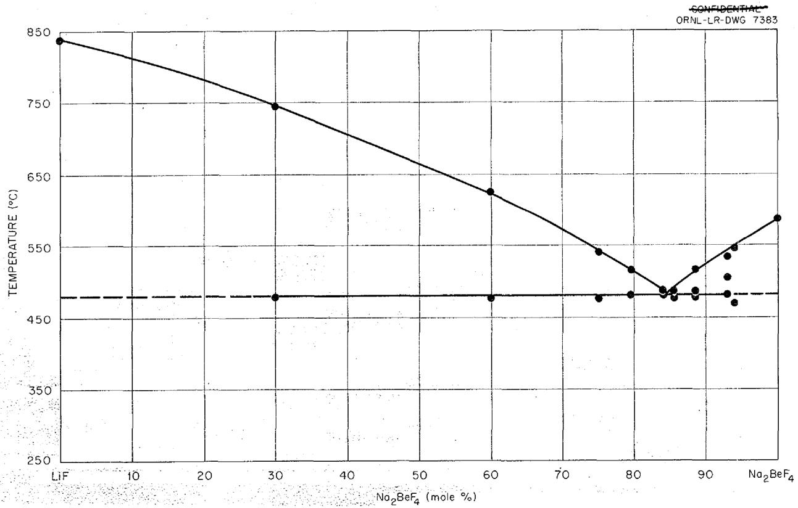  
Fig. 4.4. Thermal Data for the System LiF-Na₂BeF₄.

and the remaining compounds were so poorly crystallized that they were almost unidentifiable in the preparations examined to date.

Solubility of $\mathsf{UF}_3$ in $\mathsf{BeF}_2$ -Bearing Compositions. The solubility of $\mathsf{UF}_3$ in $\mathsf{BeF}_2$ -bearing compositions was determined with six different alkali fluoride- $\mathsf{BeF}_2$ mixtures, some of them at different temperatures. All the determinations were carried out in nickel filtration apparatus; the melt was filtered through nickel filters after an equilibration period of 2 hr. Some solubility data obtained with $\mathsf{BeF}_2$ -containing melts and reported earlier were obtained in the same type of equipment.4 The

4L. M. Bratcher et al., ANP Quar. Prog. Rep. Mar. 10, 1955, ORNL-1864, p 51.

poor reproducibility of the data, shown in Table 4.2, indicates that equilibrium was not attained in these experiments, probably because of alloying of the uranium with the nickel container and filter with consequent lack of control of the activity of the uranium.

The scattered data in Table 4.2 show a trend of increasing $\mathsf{UF}_3$ solubility with increasing temperature and decreasing $\mathsf{BeF}_2$ content, but in no case does it appear that the solubility of $\mathsf{UF}_3$ at $600^{\circ}\mathsf{C}$ is sufficiently high to provide more than a fraction of the concentration needed for an ART fuel. The data reported by Mound Laboratory

5Private communication, J. F. Eichelberger to W. R. Grimes, Feb. 1955.

TABLE 4.2. SOLUBILITY OF ${\mathrm{{UF}}}_{3}$ IN ${\mathrm{{BeF}}}_{2}$ -BEARING COMPOSITIONS   

<table><tr><td colspan="3">Composition (mole %)</td><td rowspan="2">Temperature (℃)</td><td rowspan="2">Uranium Added</td><td colspan="2">Analysis of Filtrate (wt %)</td></tr><tr><td>NaF</td><td>LiF</td><td>BeF2</td><td>U3+</td><td>Total U</td></tr><tr><td>57</td><td></td><td>43</td><td>600</td><td>UF3</td><td>0.10</td><td>0.59</td></tr><tr><td>70</td><td></td><td>30</td><td>600</td><td>UF3+U</td><td>0.54</td><td>2.48</td></tr><tr><td></td><td></td><td></td><td>600</td><td>UF4+U</td><td>0.52</td><td>4.38</td></tr><tr><td></td><td></td><td></td><td>700</td><td>UF3+U</td><td>1.09</td><td>5.47</td></tr><tr><td></td><td></td><td></td><td>700</td><td>UF4+U</td><td>1.54</td><td>8.79</td></tr><tr><td></td><td></td><td></td><td>800</td><td>UF3+U</td><td>3.95</td><td>11.7</td></tr><tr><td></td><td></td><td></td><td>800</td><td>UF4+U</td><td>4.74</td><td>16.0</td></tr><tr><td></td><td></td><td></td><td>800</td><td>UF3+U</td><td>4.46</td><td>16.2</td></tr><tr><td>75</td><td></td><td>25</td><td>615</td><td>UF4+U</td><td>5.04*</td><td>16.8</td></tr><tr><td></td><td></td><td></td><td>700</td><td>UF4+U</td><td>6.32*</td><td>17.5</td></tr><tr><td></td><td></td><td></td><td>800</td><td>UF4+U</td><td>5.49</td><td>19.7</td></tr><tr><td>77</td><td></td><td>23</td><td>600</td><td>UF3+U</td><td>4.62</td><td>10.1</td></tr><tr><td></td><td></td><td></td><td>600</td><td>UF4+U</td><td>3.52</td><td>7.6</td></tr><tr><td></td><td></td><td></td><td>800</td><td>UF4+U</td><td>8.15</td><td>21.1</td></tr><tr><td>69</td><td></td><td>31</td><td>600</td><td>UF3+U</td><td>3.37</td><td>7.30</td></tr><tr><td></td><td></td><td></td><td>600</td><td>UF3+U</td><td>1.83</td><td>3.68</td></tr><tr><td></td><td></td><td></td><td>600</td><td>UF4+U</td><td>2.83</td><td>4.39</td></tr><tr><td></td><td></td><td></td><td>600</td><td>UF4+U</td><td>2.61</td><td>5.82</td></tr><tr><td>56</td><td>16</td><td>28</td><td>600</td><td>UF3+U</td><td>1.77</td><td>3.49</td></tr><tr><td></td><td></td><td></td><td>600</td><td>UF4+U</td><td>3.97</td><td>5.46</td></tr><tr><td></td><td></td><td></td><td>600</td><td>UF3+U</td><td>1.54</td><td>4.09</td></tr><tr><td></td><td></td><td></td><td>700</td><td>UF3+U</td><td>3.92</td><td>8.13</td></tr><tr><td></td><td></td><td></td><td>700</td><td>UF3+U</td><td>4.76</td><td>15.4</td></tr><tr><td></td><td></td><td></td><td>700</td><td>UF4+U</td><td>5.63</td><td>9.81</td></tr><tr><td></td><td></td><td></td><td>800</td><td>UF3+U</td><td>8.95</td><td>18.6</td></tr><tr><td></td><td></td><td></td><td>800</td><td>UF3+U</td><td>10.2</td><td>17.3</td></tr></table>

*Sample contained metal, result probably high.

for the solubility of $\mathsf{UF}_3$ in NaF-BeF2 mixtures were based upon the assumption that all uranium dissolved in the melt was in the trivalent form. This assumption was erroneous, as the data in Table 4.2 clearly demonstrate. The data in Table 4.2 are now supported by recent Mound data.6

The low concentration of uranium dissolved in the $\mathrm{NaF - BeF_2}$ (57-43 mole %) mixture at $600^{\circ}C,$ which is in line with results reported by Mound Laboratory, suggests that a large part of the tetravalent uranium present in $\mathrm{BeF}_2$ melts to which $\mathsf{UF}_3$ and uranium metal were added was due to disproportionation rather than to oxidation by impurities in the melt. The $\mathrm{NaF - BeF_2}$ (77-23 mole % and 75-25 mole %) mixtures and also the ternary mixture NaF-LiF-BeF $_2$ (56-16-28 mole %) shown in Table 4.2 were not purified, and it is quite possible that a part of the tetravalent uranium present was due to oxidizing impurities.

Reaction of Uranium Metal with $\mathsf{BeF}_2$ -Bearing Compositions. Uranium metal was added to all except one of the mixtures used for $\mathsf{UF}_3$ solubility determinations, but only a few experiments were performed in which uranium metal was the only form of uranium added. The analyses of material filtered through nickel filters after equilibrating $20\mathrm{g}$ of a purified alkali fluoride- $\mathsf{BeF}_2$ mixture with $4\mathrm{g}$ of uranium metal for $2\mathrm{hr}$ are shown in Table 4.3. The data in Table 4.3 are insufficient to determine whether the dissolved uranium was due to oxidation of uranium metal by $\mathsf{BeF}_2$ or by oxidizing impurities in the melts, and further experimentation is planned to clarify this point.

6Private communication, J. F. Eichelberger to W. R. Grimes, April 19, 1955. 7M. S. Grim, ANP Quar. Prog. Rep. Sept. 10, 1954, ORNL-1771, p 56.

# Visual Observation of Fluoride Melts

# R. J. Sheil   Materials Chemistry Division

A plastic, inert-atmosphere box similar to one previously described7 was used for observation of a number of fluoride melts. Some of the results of these observations are given below.

All the alkali fluoride- $\mathsf{BeF}_2$ mixtures prepared to date showed a scum when first melted. The unpurified mixtures were worse than the purified mixtures in this respect, as might be expected. The small amount of scum that appeared on melts of purified mixtures was dissolved when the melt was heated to about 750 or $800^{\circ}\mathrm{C}$ , and, in some instances, a water-clear melt was obtained. When the mixtures contained $\mathsf{UF}_4$ , the scum had a reddish-brown color suggestive of $\mathsf{UO}_2$ , but this scum likewise dissolved when the melt was heated to higher temperatures.

It was found that a melted mixture having the nominal composition NaF-LiF-ZrF4-UF4 (20-55-21-4 mole %) was reddish-brown when only 15% of the uranium was in the trivalent form. When all the uranium was in the tetravalent form, melts of this composition had the normal green coloration.

Alkali fluoride-BeF $_2$ melts appear to have a rather high surface tension, and they do not wet a clean nickel surface. These effects could possibly be ascribed to small amounts of impurities in the melts being concentrated in the liquid surface, but this is not considered to be likely.

# Phase Separation by Zone Melting

F. Kertesz H. J. Buttram N.V. Smith Materials Chemistry Division

Apparatus has been assembled recently to determine whether zone melting of fused salts can

TABLE 4.3. ANALYSES OF FILTERED ALKALI FLUORIDE- ${\mathrm{{BeF}}}_{2}$ -URANIUM METAL MIXTURES   

<table><tr><td rowspan="2">Alkali Fluoride-BeF2Mixture</td><td rowspan="2">Temperature (°C)</td><td colspan="2">Analysis of Filtrate (wt %)</td></tr><tr><td>U3+</td><td>Total U</td></tr><tr><td>LiF-BeF2(69-31 mole %)</td><td>600</td><td>0.82*</td><td>0.89</td></tr><tr><td>NaF-BeF2(57-43 mole %)</td><td>600</td><td>0.58</td><td>0.63</td></tr><tr><td></td><td>800</td><td>0.10</td><td>0.85</td></tr></table>

*Sample contained metal, result probably high.

be utilized as an aid in phase equilibrium studies. The zone-melting method consists in alternately melting and freezing the salt mixture at very slow rates to allow use of the principle of fractional recrystallization on a multistage basis. Some preliminary trials with mixtures of LiF and $\mathsf{UF}_4$ indicated that, while some equipment modifications may be required, the method holds promise of being a useful supplement to present phase-study procedures.

# CHEMICAL REACTIONS IN MOLTEN SALTS

F. F. Blankenship L. G. Overholser

Materials Chemistry Division

Equilibrium Reduction of $\mathsf{FeF}_2$ by $\mathsf{H}_2$ in $\mathsf{NaZrF}_5$

C. M. Blood Materials Chemistry Division

Previous measurements of the partial pressure of HF at equilibrium during reduction of $\mathsf{FeF}_2$ by hydrogen showed higher values than would be predicted from thermochemical data and ideal solution behavior. These high values were tentatively ascribed to a lowered activity of the metallic iron because of alloying of this element with the nickel apparatus. The postulated alloying has been confirmed by low values for final $\mathsf{FeF}_2$ content of the melt and by chemical analyses of portions of the nickel apparatus.

Attempts have been made to repeat these experiments with a mild-steel liner in the nickel apparatus, a steel gas entrance tube, and steel screen baffles. Preliminary data have shown that the presence of a stainless steel thermocouple well extending into the melt has been causing a steady increase in chromium content of the melt with consequent loss of $\mathsf{FeF}_2$ from the solution. This unintended side reaction was taken into account in the calculations and will be avoided in the future.

The results again showed somewhat higher HF values than those predicted. The apparent equilibrium constant (mole fraction of dissolved species used as activity) was 5.7 for this experiment; this is significantly lower than the value of 8 obtained in the nickel equipment and is much higher than the calculated value of 1.6 for ideal behavior.

# Reduction of $\mathbf{U}\mathbf{F}_4$ by Structural Metals

J.D.Redman C.F.Weaver Materials Chemistry Division

The reduction of $\mathsf{UF}_4$ by metallic chromium and iron has been studied by methods previously described in ANP quarterly progress reports, and equilibrium data, obtained by using either NaF-ZrF $_4$ (50-50 mole %) or the NaF-KF-LiF eutectic (11.5-42-46.5 mole %) as the reaction medium, have been reported. More recently, the reduction of $\mathsf{UF}_4$ has been investigated with NaF-ZrF $_4$ (53-47 mole %) used as the solvent. Also, the reaction of $\mathsf{UF}_4$ with chromium metal and Inconel has been studied by using mixtures of $\mathsf{UF}_4$ and $\mathsf{UF}_3$ dissolved in NaF-KF-LiF.

The results of some studies on the reduction of $\mathsf{UF}_4$ by chromium metal in NaF-ZrF $_4$ (53-47 mole %) at 600 and $800^{\circ}\mathsf{C}$ are given in Table 4.4. In these experiments, 2 g of hydrogen-fired chromium was reacted with $\mathsf{UF}_4$ (11.4 wt %) in 40 g of the NaF-ZrF $_4$ mixture contained in nickel. The values given for $K_{x}$ were calculated for the reaction

$$
2 U F _ {4} + C r ^ {\circ} \rightleftharpoons 2 U F _ {3} + C r F _ {2}
$$

by using concentrations expressed in mole fractions.

Previous studies with NaF-ZrF₄ (50-50 mole %) as the solvent and 4.1 mole % UF₄ gave a chromium concentration of 2250 ppm and Kx = 4 × 10⁻⁴ at 600°C, and 2550 ppm of chromium and Kx = 5 × 10⁻⁴ at 800°C. Thus, an increase from 0.48 to 0.51 in the final mole fraction of NaF in the melt containing uranium causes a significant decrease in the equilibrium CrF₂ concentration.

Data for the reaction of $\mathsf{UF}_4$ with metallic iron in NaF-ZrF $_4$ (53-47 mole %) are given in Table 4.5. In these runs, 2 g of hydrogen-fired iron wire and 11.4 wt % UF $_4$ were used.

The iron concentrations given in Table 4.5 are very nearly equal to those found for this reaction when NaF-ZrF $_4$ (50-50 mole %) was used as the solvent. They also agree very closely with those obtained when NaF-KF-LiF (11.5-42-46.5 mole %) was used as the solvent. The iron values were somewhat higher at 600 than at $800^{\circ}\mathrm{C}$ in all three systems studied.

Data are presented in Table 4.6 for the reaction of chromium metal with $13.3\mathrm{wt}\% \mathrm{UF}_4$ plus 1.5 wt $\% \mathrm{UF}_3$ at 600 and at $800^{\circ}C$ when NaF-KF-LiF

TABLE 4.4. EQUILIBRIUM DATA FOR THE REACTION OF ${\mathrm{{UF}}}_{4}$ WITH CHROMIUM METAL IN MOLTEN NaF-ZrF ${}_{4}$ (53-47 mole %) AT 600 AND ${800}^{ \circ  }\mathrm{C}$   

<table><tr><td colspan="2">Conditions of Equilibration</td><td colspan="3">Found in Filtrate</td><td rowspan="2">Kx</td></tr><tr><td>Temperature (°C)</td><td>Time (hr)</td><td>Total Uranium (wt %)</td><td>Total Chromium* (ppm)</td><td>Total Nickel (ppm)</td></tr><tr><td rowspan="4">600</td><td>3</td><td>8.4</td><td>1710</td><td>30</td><td rowspan="4">1 × 10-4</td></tr><tr><td>3</td><td>8.6</td><td>1740</td><td>20</td></tr><tr><td>5</td><td>8.3</td><td>1710</td><td>35</td></tr><tr><td>5</td><td>8.5</td><td>1770</td><td>30</td></tr><tr><td rowspan="4">800</td><td>3</td><td>8.5</td><td>2160</td><td>50</td><td rowspan="4">3 × 10-4</td></tr><tr><td>3</td><td>8.6</td><td>2130</td><td>40</td></tr><tr><td>5</td><td>8.3</td><td>2180</td><td>80</td></tr><tr><td>5</td><td>8.6</td><td>2170</td><td>25</td></tr></table>

*Blank of 250 ppm of chromium at $800^{\circ}\mathrm{C}$ .

TABLE 4.5. EQUILIBRIUM DATA FOR THE REACTION OF ${\mathrm{{UF}}}_{4}$ WITH METALLIC IRON IN MOLTEN NaF-ZrF ${}_{4}$ (53-47 mole %) AT 600 AND ${800}^{ \circ  }\mathrm{C}$   

<table><tr><td colspan="2">Conditions of Equilibration</td><td colspan="3">Found in Filtrate</td><td rowspan="2">Kx</td></tr><tr><td>Temperature (°C)</td><td>Time (hr)</td><td>Total Uranium (wt %)</td><td>Total Iron* (ppm)</td><td>Total Nickel (ppm)</td></tr><tr><td rowspan="6">600</td><td>3</td><td>8.4</td><td>435</td><td>50</td><td rowspan="6">2 × 10-6</td></tr><tr><td>3</td><td>8.5</td><td>535</td><td>80</td></tr><tr><td>5</td><td>8.6</td><td>630</td><td>50</td></tr><tr><td>5</td><td>8.6</td><td>445</td><td>35</td></tr><tr><td>5</td><td>8.4</td><td>440</td><td>130</td></tr><tr><td>5</td><td>8.7</td><td>460</td><td>55</td></tr><tr><td rowspan="5">800</td><td>3</td><td>8.6</td><td>455</td><td>45</td><td rowspan="5">7 × 10-7</td></tr><tr><td>3</td><td>8.4</td><td>385</td><td>30</td></tr><tr><td>5</td><td>8.6</td><td>350</td><td>40</td></tr><tr><td>5</td><td>8.4</td><td>445</td><td>50</td></tr><tr><td>5</td><td>8.5</td><td>295</td><td>55</td></tr></table>

* Blank of 100 ppm of iron at $800^{\circ}\mathrm{C}$ .

(11.5-42-46.5 mole %) is used as solvent. The runs were carried out in nickel containers, and 2 g of hydrogen-fired chromium metal and 21 g of the NaF-KF-LiF mixture were used.

Results given previously for a mixture containing 15 wt $\%$ UF $_4$ showed equilibrium chromium concentrations of 1100 and 2700 ppm at 600 and $800^{\circ}\mathrm{C}$ , respectively. A comparison of these

values with those given in Table 4.6 shows the effect of a relatively small amount of $\mathsf{UF}_3$ on the equilibrium chromium concentration. It must be recognized that the $\mathsf{UF}_3$ may disproportionate under the conditions studied and that the final $\mathsf{UF}_3$ concentration may be different from that calculated.

Similar studies were made with Inconel in place of the chromium metal. The results given in Table 4.7 were obtained with hydrogen-fired Inconel and $13.3\mathrm{wt}\% \mathrm{UF}_4$ plus $1.5\mathrm{wt}\% \mathrm{UF}_3$ in the NaF-KF-LiF eutectic.

TABLE 4.6. EQUILIBRIUM DATA FOR THE REACTION OF UF ${}_{4}$ PLUS UF ${}_{3}$ WITH CHROMIUM METAL IN MOLTEN NaF-KF-LiF (11.5-42-46.5 mole %) AT 600 AND ${800}^{ \circ  }\mathrm{C}$   

<table><tr><td colspan="2">Conditions of Equilibration</td><td colspan="3">Found in Filtrate</td></tr><tr><td>Temperature (°C)</td><td>Time (hr)</td><td>Total Uranium (wt %)</td><td>Total Chromium (ppm)</td><td>Total Nickel (ppm)</td></tr><tr><td rowspan="6">600</td><td>5</td><td>10.8</td><td>255</td><td>110</td></tr><tr><td>5</td><td>10.6</td><td>195</td><td>40</td></tr><tr><td>5</td><td>11.7</td><td>165</td><td>75</td></tr><tr><td>12</td><td>11.0</td><td>195</td><td>25</td></tr><tr><td>12</td><td>11.0</td><td>250</td><td>105</td></tr><tr><td>12</td><td>12.4</td><td>330</td><td>&lt;1</td></tr><tr><td rowspan="10">800</td><td>5</td><td>10.7</td><td>1780</td><td>60</td></tr><tr><td>5</td><td>10.7</td><td>1740</td><td>270</td></tr><tr><td>5</td><td>10.9</td><td>2070</td><td>10</td></tr><tr><td>5</td><td>11.9</td><td>1870</td><td>35</td></tr><tr><td>5</td><td>11.1</td><td>1730</td><td>20</td></tr><tr><td>5</td><td>11.2</td><td>2030</td><td>55</td></tr><tr><td>5</td><td>11.0</td><td>1850</td><td>65</td></tr><tr><td>12</td><td>10.8</td><td>1920</td><td>10</td></tr><tr><td>12</td><td>10.8</td><td>1580</td><td>3</td></tr><tr><td>12</td><td>10.6</td><td>1740</td><td>&lt;1</td></tr></table>

TABLE 4.7. DATA FOR THE REACTION OF INCONEL WITH ${\mathrm{{UF}}}_{4}$ PLUS ${\mathrm{{UF}}}_{3}$ IN MOLTEN NaF-KF-LiF (11.5-42-46.5 mole %) AT 600 AND ${800}^{ \circ  }\mathrm{C}$   

<table><tr><td colspan="2">Conditions of Equilibration</td><td colspan="4">Found in Filtrate</td></tr><tr><td>Temperature (°C)</td><td>Time (hr)</td><td>Total Uranium (wt %)</td><td>Total Chromium (ppm)</td><td>Total Nickel (ppm)</td><td>Total Iron (ppm)</td></tr><tr><td rowspan="4">600</td><td>5</td><td>10.6</td><td>25</td><td>130</td><td>105</td></tr><tr><td>5</td><td>10.6</td><td>30</td><td>260</td><td>115</td></tr><tr><td>12</td><td>10.8</td><td>35</td><td>110</td><td>80</td></tr><tr><td>12</td><td>10.7</td><td>25</td><td>200</td><td>50</td></tr><tr><td rowspan="6">800</td><td>5</td><td>10.7</td><td>430</td><td>95</td><td>90</td></tr><tr><td>5</td><td>10.5</td><td>525</td><td>295</td><td>110</td></tr><tr><td>5</td><td>10.8</td><td>485</td><td>85</td><td>75</td></tr><tr><td>5</td><td>10.7</td><td>470</td><td>60</td><td>55</td></tr><tr><td>12</td><td>11.1</td><td>675</td><td>30</td><td>60</td></tr><tr><td>12</td><td>11.4</td><td>725</td><td>15</td><td>80</td></tr></table>

The values given in Table 4.7 for $600^{\circ}\mathrm{C}$ are much lower than the 360 ppm of chromium reported earlier for a mixture containing 15 wt $\%$ UF $_4$ with no UF $_3$ originally present. At $800^{\circ}\mathrm{C}$ , a value of 800 ppm for chromium with no UF $_3$ originally present is to be compared with the

somewhat lower values given in Table 4.7. Since the chromium concentration increased when the heating period at $800^{\circ}\mathrm{C}$ was extended from 5 to 12 hr, it may be that equilibrium had not been attained.

# Stability of Chromium and Iron Fluorides in Molten Fluorides

J. D. Redman

C. F. Weaver

Materials Chemistry Division

A number of experiments were run to determine, if possible, the extent to which some of the structural metal fluorides are reduced by metallic iron or chromium. In one experiment, 10.9 wt $\%$ Fe $^{3+}$ was added as FeF $_3$ to the NaF-KF-LiF mixture contained in an iron charge bottle and reacted at $800^{\circ}\mathrm{C}$ . The filtrate was found to contain 14.7 wt $\%$ total Fe and 13.8 wt $\%$ Fe $^{++}$ . Another run, at $600^{\circ}\mathrm{C}$ , gave 3.9 wt $\%$ Fe $^{++}$ and 4.4 wt $\%$ total Fe, which indicated that the Fe $^{3+}$ was almost completely reduced by the metallic iron. Some results obtained for several other combinations are given in Table 4.8. The results given in Table 4.8 show that NiF $_2$ is quantitatively reduced by metallic chromium and iron at 600 and $800^{\circ}\mathrm{C}$ in the NaF-KF-LiF mixture and that FeF $_2$ is reduced by chromium under similar conditions.

Since previous studies $^{10}$ had indicated that $\mathsf{FeF}_2$ was relatively stable in the NaF-KF-LiF eutectic at 600 and $800^{\circ}C,$ some additional runs were made for which a longer heating period was used. The results of these runs are given in Table 4.9. The data showed that some $90\%$ or more of the iron was divalent after 12 hr of heating. This finding is in agreement with findings of the earlier studies for which the heating period was 3 to 5 hr.

The previous reports9,10 also presented data which indicated that $\mathsf{CrF}_2$ is not stable in the NaF-KF-LiF eutectic but probably disproportionates according to the reaction

$$
3 \mathrm {C r F} _ {2} \rightleftharpoons 2 \mathrm {C r F} _ {3} + \mathrm {C r} ^ {\circ}
$$

The data obtained at $600^{\circ}C$ gave a chromium balance approximating that expected for the reaction, but the values obtained at $800^{\circ}C$ did

TABLE 4.8. DATA FOR THE REDUCTION OF STRUCTURAL METAL FLUORIDES BY METALLIC IRON OR CHROMIUM IN MOLTEN NaF-KF-LiF (11.5-42-46.5 mole %) AT 600 AND ${800}^{ \circ  }\mathrm{C}$   
Equilibration Time: 5 hr   

<table><tr><td rowspan="2">Equilibration Temperature (°C)</td><td rowspan="2">Fluoride Added* (wt %)</td><td rowspan="2">Metallic Reducing Agent</td><td colspan="5">Found in Filtrate</td></tr><tr><td>Cr++ (wt %)</td><td>Total Cr (wt %)</td><td>Fe++ (wt %)</td><td>Total Fe (wt %)</td><td>Total Ni (ppm)</td></tr><tr><td rowspan="2">600</td><td>1.5 Ni++</td><td>Fe</td><td></td><td></td><td>1.29</td><td>1.40</td><td>130</td></tr><tr><td>1.5 Ni++</td><td>Fe</td><td></td><td></td><td>1.21</td><td>1.10</td><td>110</td></tr><tr><td rowspan="2">800</td><td>1.5 Ni++</td><td>Fe</td><td></td><td></td><td>1.14</td><td>1.24</td><td>45</td></tr><tr><td>1.5 Ni++</td><td>Fe</td><td></td><td></td><td>1.23</td><td>1.03</td><td>25</td></tr><tr><td rowspan="2">600</td><td>1.5 Ni++</td><td>Cr</td><td>0.55</td><td>0.41</td><td></td><td></td><td>105</td></tr><tr><td>1.5 Ni++</td><td>Cr</td><td>0.59</td><td>0.77</td><td></td><td></td><td>45</td></tr><tr><td rowspan="2">800</td><td>1.5 Ni++</td><td>Cr</td><td>0.84</td><td>1.23</td><td></td><td></td><td>245</td></tr><tr><td>1.5 Ni++</td><td>Cr</td><td>0.52</td><td>1.24</td><td></td><td></td><td>85</td></tr><tr><td rowspan="3">600</td><td>2.5 Fe++</td><td>Cr</td><td>0.13</td><td>0.32</td><td></td><td>0.009</td><td>25</td></tr><tr><td>2.5 Fe++</td><td>Cr</td><td>0.10</td><td>0.43</td><td></td><td>0.012</td><td>105</td></tr><tr><td>2.5 Fe++</td><td>Cr</td><td>0.13</td><td>0.54</td><td></td><td>0.009</td><td>80</td></tr><tr><td rowspan="2">800</td><td>2.5 Fe++</td><td>Cr</td><td>0.28</td><td>1.22</td><td></td><td>0.007</td><td>115</td></tr><tr><td>2.5 Fe++</td><td>Cr</td><td>0.34</td><td>1.31</td><td></td><td>0.007</td><td>45</td></tr></table>

*Nickel added as NiF $_2$ ; iron added as FeF $_2$ .

not. Additional runs were therefore made at $800^{\circ}\mathrm{C}$ , and the results are given in Table 4.10.

The values given in Table 4.10 are, in general, in agreement with the previous data. Most of the $\mathbf{Cr}^{+ + }$ changes valence state, but the total chromium content found is too high to account for removal of $\mathbf{Cr}^{+ + }$ by disproportionation. The similarity of total chromium in the filtrates and in the residues suggests that finely divided chromium passes the filter, but, if the case were this simple, the values reported for $\mathbf{Cr}^{+ + }$ should include this metal and therefore be higher than those found. No satisfactory explanation for the behavior of $\mathbf{CrF}_2$ under these conditions can be given at present.

# The Disproportionation Pressure of $\mathbf{U}\mathbf{F}_{3}$

S. Langer

Materials Chemistry Division

Previous studies11 of the disproportionation of $\mathsf{UF}_3$ gave evidence that $\mathsf{UF}_3$ was more stable at elevated temperatures than free energy estimates12 had indicated. This evidence has been substantiated by vapor pressure measurements on

11W. C. Whitley and R. J. Sheil, ANP Quar. Prog. Rep. Dec. 10, 1954, ORNL-1816, p 60.   
12L. Brewer et al., Thermodynamic Properties and Equilibria at High Temperatures of Uranium Halides, Oxides, Nitrides, and Carbides, MDDC-1543 (Sept. 10, 1954, rev. Apr. 1, 1947).

TABLE 4.9. STABILITY OF ${\mathrm{{FeF}}}_{2}$ IN MOLTEN NaF-KF-LiF (11.5-42-46.5 mole %) AT 600 AND ${800}^{ \circ  }\mathrm{C}$   
Equilibration Time: 12 hr   

<table><tr><td rowspan="2">Equilibration Temperature (°C)</td><td rowspan="2">FeF2Added (wt % Fe)</td><td colspan="3">Found in Filtrate</td></tr><tr><td>Fe++ (wt %)</td><td>Total Fe (wt %)</td><td>Total Ni (ppm)</td></tr><tr><td rowspan="4">600</td><td>13.7</td><td>4.8</td><td>5.3</td><td>185</td></tr><tr><td>13.7</td><td>5.6</td><td>5.6</td><td>255</td></tr><tr><td>5.9</td><td>4.5</td><td>4.6</td><td>210</td></tr><tr><td>5.9</td><td>5.3</td><td>5.4</td><td>235</td></tr><tr><td rowspan="7">800</td><td>13.7</td><td>12.1</td><td>13.2</td><td>90</td></tr><tr><td>13.7</td><td>12.0</td><td>13.1</td><td>60</td></tr><tr><td>13.7</td><td>12.0</td><td>12.6</td><td>465</td></tr><tr><td>13.7</td><td>12.5</td><td>12.7</td><td>1240</td></tr><tr><td>5.9</td><td>5.2</td><td>5.7</td><td>25</td></tr><tr><td>5.9</td><td>5.4</td><td>5.7</td><td>135</td></tr><tr><td>5.9</td><td>5.2</td><td>5.4</td><td>120</td></tr></table>

TABLE 4.10. INSTABILITY OF ${\mathrm{{CrF}}}_{2}$ IN MOLTEN NaF-KF-LiF (11.5-42-46.5 mole %) AT ${800}^{ \circ  }\mathrm{C}$   

<table><tr><td rowspan="3">Time of Heating (hr)</td><td rowspan="3">CrF2Added (wt % Cr)</td><td colspan="4">Chromium Found (wt %)</td></tr><tr><td colspan="2">In Filtrate</td><td colspan="2">In Residue</td></tr><tr><td>Cr++</td><td>Total Cr</td><td>Cr++</td><td>Total Cr</td></tr><tr><td rowspan="4">5</td><td>5.8</td><td>0.65</td><td>6.1</td><td>0.20</td><td>7.5</td></tr><tr><td>5.8</td><td>0.48</td><td>5.3</td><td>0.44</td><td>5.2</td></tr><tr><td>5.8</td><td>0.71</td><td>5.2</td><td>0.43</td><td>5.8</td></tr><tr><td>5.8</td><td>0.57</td><td>5.2</td><td></td><td></td></tr><tr><td rowspan="3">12</td><td>5.0</td><td>0.36</td><td>4.3</td><td>0.42</td><td>4.4</td></tr><tr><td>5.0</td><td>0.66</td><td>4.1</td><td>0.44</td><td>4.3</td></tr><tr><td>5.0</td><td>0.89</td><td>4.6</td><td>0.50</td><td>5.4</td></tr></table>

$\mathsf{UF}_3$ in the temperature range from 1270 to $1390^{\circ}C.$ At these temperatures, the vapor pressure of $\mathsf{UF}_3$ is negligible, while the vapor pressure of $\mathsf{UF}_4$ ranges from 61 to $152\mathrm{mmHg}$ as shown in Fig.4.5. Hence, the vapor pressure developed above a system initially containing only $\mathsf{UF}_3$ is due to the $\mathsf{UF}_4$ resulting from the disproportionation of $\mathsf{UF}_3$ according to the equation

$$
4 U F _ {3} \rightleftharpoons 3 U F _ {4} + U ^ {\circ}
$$

The condensed phases in the system were presumed to be solid $\mathsf{UF}_3$ (mp, $1400^{\circ}\mathsf{C}$ ), liquid $\mathsf{UF}_4$ (mp, $1035^{\circ}\mathsf{C}$ ) saturated with $\mathsf{UF}_3$ , and uranium metal or an alloy of uranium metal with the type 316 stainless steel container material.

The vapor pressures were measured by the method of Rodebush and Dixon. The apparatus was essentially that described by Moore, except that the charge was contained in a tantalum liner

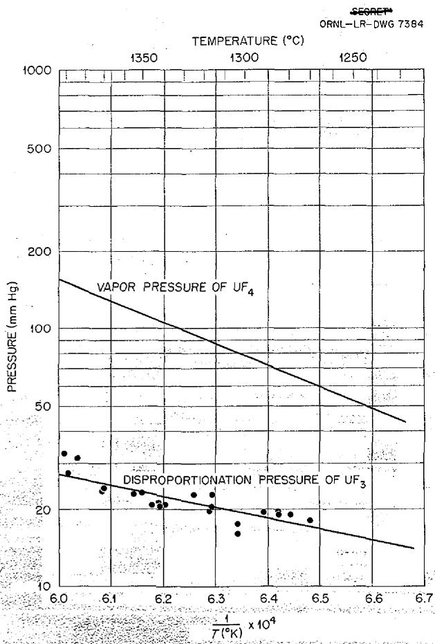  
Fig. 4.5. The Vapor Pressure of $\mathbf{U}\mathbf{F}_4$ and the Disproportionation Pressure of $\mathbf{U}\mathbf{F}_3$ .

in order to minimize alloying of the uranium metal resulting from the disproportionation of $\mathsf{UF}_3$ . The low vapor pressure of the system limited the measurements to temperatures above $1270^{\circ}\mathsf{C}$ , and the failure of the container material (type 316 stainless steel) was the limiting factor at temperatures near $1400^{\circ}\mathsf{C}$ .

In all cases, $\mathsf{UF}_3$ of at least 95% purity was used as the starting material. Analysis of the condensate of the vapor phase, collected from the tubes of the vapor pressure cell, showed that the vapor phase was pure $\mathsf{UF}_4$ . The disproportionation pressures obtained are given in Table 4.11 and are plotted on Fig. 4.5. The reproducibility of the measurements was not noticeably influenced by ascending or descending temperatures. By using the method of least squares; it was found that a straight line through the points was represented by the equation

$$
\log P (\mathrm {m m} \mathrm {H g}) = (- 4 1 8 7 / T) + 3. 9 4 5
$$

or

$$
- R T \ln P (\mathrm {m m} H g) = 1 9, 1 6 0 - 1 8. 0 5 T.
$$

The $\Delta H$ obtained from the slope of this line is 19,160 cal/mole. This $\Delta H$ , however, is a combination of the heat of vaporization of $\mathsf{UF}_{4^{\prime}}$ the heat of the disproportionation reaction, and the heats involved in the formation of any solutions existing in the condensed phases. Several attempts were made to sample the equilibrium liquid in order to determine its composition, but this proved to be unfeasible because of the limitations of materials at the temperatures involved.

The vapor pressure curve for $\mathsf{UF}_4$ (Fig. 4.5) was obtained from the data of Ryon and Twichell[15] (five points at low pressure were excluded as obviously in error), data of R. E. Moore,[16] and points obtained during the course of this experiment, which extended the temperature range from 1200 to $1300^{\circ}\mathrm{C}$ . The equation of the line is

$$
\log P = (- 8 4 2 8 / T) + 7. 2 5 0
$$

TABLE 4.11. DISPROPORTIONATION PRESSURES OF ${\mathrm{{UF}}}_{3}$   

<table><tr><td>Temperature (°C)</td><td>Temperature (°K)</td><td>1 / T(°K) × 10^4</td><td>Pressure (mm Hg)</td></tr><tr><td>1269.8</td><td>1543.0</td><td>6.481</td><td>18.00</td></tr><tr><td>1278.6</td><td>1551.8</td><td>6.444</td><td>18.95</td></tr><tr><td>1286.9</td><td>1560.1</td><td>6.410</td><td>19.10</td></tr><tr><td>1287.1</td><td>1560.3</td><td>6.409</td><td>19.50</td></tr><tr><td>1290.3</td><td>1563.5</td><td>6.396</td><td>19.30</td></tr><tr><td>1304.0</td><td>1577.0</td><td>6.341</td><td>17.50</td></tr><tr><td>1304.0</td><td>1577.0</td><td>6.341</td><td>16.00</td></tr><tr><td>1316.0</td><td>1589.0</td><td>6.293</td><td>22.70</td></tr><tr><td>1316.3</td><td>1589.5</td><td>6.291</td><td>20.35</td></tr><tr><td>1317.5</td><td>1590.7</td><td>6.287</td><td>19.60</td></tr><tr><td>1325.0</td><td>1598.0</td><td>6.258</td><td>22.70</td></tr><tr><td>1339.1</td><td>1612.3</td><td>6.202</td><td>20.95</td></tr><tr><td>1342.0</td><td>1615.0</td><td>6.192</td><td>20.45</td></tr><tr><td>1342.3</td><td>1615.5</td><td>6.190</td><td>21.15</td></tr><tr><td>1345.8</td><td>1619.0</td><td>6.177</td><td>20.70</td></tr><tr><td>1351.0</td><td>1624.0</td><td>6.158</td><td>23.05</td></tr><tr><td>1354.7</td><td>1627.9</td><td>6.143</td><td>22.85</td></tr><tr><td>1370.0</td><td>1643.0</td><td>6.086</td><td>23.95</td></tr><tr><td>1370.7</td><td>1643.9</td><td>6.083</td><td>23.40</td></tr><tr><td>1383.6</td><td>1656.8</td><td>6.036</td><td>31.60</td></tr><tr><td>1389.0</td><td>1662.0</td><td>6.017</td><td>27.65</td></tr><tr><td>1391.0</td><td>1664.0</td><td>6.010</td><td>32.80</td></tr></table>

or

$$
- R T \ln P = 3 8, 6 0 0 - 3 3. 1 8 T.
$$

The heat of vaporization of pure $\mathsf{UF}_4$ as obtained from the slope of the line, is 38,600 cal/mole. This value is in fair agreement with the value of 42,000 cal/mole obtained by R.E.Moore.

It was not surprising to find that the vapor pressure from $\mathsf{UF}_3$ was only a small fraction of that from pure $\mathsf{UF}_4$ , but it had not been anticipated that the fraction would rapidly become increasingly smaller with increasing temperatures. Indeed, at sufficiently elevated temperatures, this would not be the case. The effect of dissolved $\mathsf{UF}_3$ is undoubtedly important; it appears that the solubility of $\mathsf{UF}_3$ increases markedly with temperature and also that the $\mathsf{UF}_4$ is complexed to the extent that pronounced negative deviations from Raoult's law are observed. There was no definite evidence of alloying of uranium metal with the tantalum liner; no x-ray diffraction data on uranium-tantalum alloys are available.

An extrapolation of the vapor pressure curves in Fig. 4.5 to the point of intersection might be expected to provide a rough estimate of the eutectic temperature of the $\mathsf{UF}_3\cdot \mathsf{UF}_4$ system. The intersection occurs at about $1010^{\circ}\mathrm{C}$ , whereas cooling curves have shown thermal arrests, which were presumed to correspond to the $\mathsf{UF}_3\cdot \mathsf{UF}_4$ eutectic, at $870^{\circ}\mathrm{C}$ . This discrepancy is probably due not only to the difficulty of obtaining the vapor pressure measurements but also to the long range through which the extrapolation must be made and the change in $\Delta H$ with temperature through this range.

The small slope found for the disproportionation pressure curve means that the disproportionation of $\mathsf{UF}_3$ is far from complete under the conditions prevailing in the vapor pressure cell and that $\mathsf{UF}_3$ is thermodynamically stable with respect to pure $\mathsf{UF}_4$ and uranium metal at temperatures below $1400^{\circ}\mathsf{C}$ .

# Reduction of $\mathbf{U}\mathbf{F}_{4}$ with Uranium in Alkali Fluorides

C. J. Barton B. H. Clampitt Materials Chemistry Division

The investigation of the variables affecting the reduction with metallic uranium of $\mathsf{UF}_4$ dissolved in alkali fluorides was continued during the past quarter. The technique used in these experiments, which are carried out in a small, nickel, filtration apparatus, was described previously.[17] It has become apparent that alloying of nickel and uranium can occur at temperatures far below the minimum nickel-uranium liquidus temperature $(732^{\circ}\mathrm{C})$ and, consequently, that disproportionation of $\mathsf{UF}_3$ can be expected to occur at the temperatures of interest at nickel surfaces or at any metallic surface with which uranium can alloy. Some effort was therefore devoted to finding container materials that will alloy less readily with uranium. Copper, which has a minimum liquidus temperature of $950^{\circ}\mathrm{C}$ with uranium, showed some promise in this regard. Although the results obtained in nickel apparatus, and possibly also those obtained in copper containers, are not to be regarded as equilibrium data, these experiments did give some indication of the effect of some of the variables that are involved in the reaction and thus are of value. In some experiments, pure $\mathsf{UF}_3$ was introduced directly for comparison with results obtained in reduction experiments. The results are reported below under the headings of the variables investigated.

17R. J. Sheil and B. H. Clampitt, ANP Quar. Prog. Rep. Mar. 10, 1955, ORNL-1864, p 53.

Effect of Nickel Surface Area. It was previously reported that the amount of nickel surface area exposed to alkali fluoride- $\mathsf{UF}_3$ melts had a marked effect on the degree of reduction obtained.[17] This observation is substantiated by the data shown in Table 4.12.

In these experiments, the normal surface-to-volume ratio of 2.55 (square centimeters of surface exposed to melt divided by volume of melt in cubic centimeters) was decreased by using a larger charge $(40\mathrm{g})$ and increased by adding $\frac{1}{4}$ -in. nickel balls or nickel powder. The nickel filter medium surface area, to which the melts were exposed for a short time, was neglected in making these calculations, but it was the same in all experiments. The nickel surfaces were exposed to hydrogen at $750^{\circ}\mathrm{C}$ before the charge materials were added, and partial sintering of the nickel powder undoubtedly reduced the surface area to a smaller value than that calculated. The marked effect of nickel surface area upon the degree of reduction of uranium, as shown by the data in Table 4.12, was probably due to the previously mentioned effect of alloying of uranium with the nickel.

Effect of Copper Surface Area. In view of the results obtained with nickel, it seemed desirable to determine the effect of another metal on the reduction of $\mathsf{UF}_4$ with uranium. Finely divided copper powder that was hydrogen-fired at $750^{\circ}\mathsf{C}$ was added to an LiF-NaF- $\mathsf{UF}_4\mathsf{-U}^\circ$ mixture (57.6-38.4-4.0 mole $\% + 20$ wt $\%$ excess $\mathsf{U}^{\circ}$ ) in sufficient amount to give a surface-to-volume ratio of about 1000 if the surface area of the nickel container

TABLE 4.12.EFFECT OF SURFACE-TO-VOLUME RATIO ON REACTION OF $UF_4$ WITH URANIUM METAL IN ALKALI FLUORIDES IN NICKEL CONTAINERS  

<table><tr><td>Solvent</td><td>Number of 
Experiments</td><td>Temperature 
(℃)</td><td>Ratio of Surface 
to Volume 
(cm-1)</td><td>Ratio of U3+ 
to Total Uranium</td></tr><tr><td rowspan="4">NaF-LiF (40-60 mole %)</td><td>2</td><td>750</td><td>1.89</td><td>0.79 to 0.82</td></tr><tr><td>4</td><td>750</td><td>2.55</td><td>0.65 to 0.70</td></tr><tr><td>2</td><td>750</td><td>4.74</td><td>0.43 to 0.51</td></tr><tr><td>3</td><td>750</td><td>~1000</td><td>0.05 to 0.06</td></tr><tr><td rowspan="4">NaF-KF-LiF eutectic 
(11.5-42-46.5 mole %)</td><td>5</td><td>550</td><td>2.55</td><td>0.55 to 0.65</td></tr><tr><td>2</td><td>550</td><td>~1000</td><td>0.04 to 0.05</td></tr><tr><td>4</td><td>650</td><td>2.55</td><td>0.55 to 0.65</td></tr><tr><td>2</td><td>650</td><td>~1000</td><td>0.04 to 0.05</td></tr></table>

was neglected. The filtrate obtained after the mixture was heated for 2 hr at $750^{\circ}\mathrm{C}$ contained $19.2\mathrm{wt}\% \mathrm{U}^{3+}$ and $26.0\mathrm{wt}\%$ total uranium. These results compared favorably with those obtained in the absence of the copper and encouraged an investigation of copper as a container material for $\mathrm{UF}_3$ -containing melts.

Effect of Excess Uranium. It was reported earlier[17] that there was little difference in the degree of reduction of NaF-KF-LiF-UF $_4$ with uranium metal whether the theoretical amount of uranium required by the equation

$$
\frac {1}{4} U ^ {\circ} + \frac {3}{4} U F _ {4} \rightleftharpoons U F _ {3}
$$

was used or whether 1.2 times the theoretical amount was employed. It therefore seemed desirable to investigate this variable with NaF-LiF (40-60 mole %) as the solvent instead of NaF-KF-LiF. This investigation was carried out in nickel apparatus, including nickel filters, and in copper apparatus equipped with a bronze filter medium.

The results are given in Tables 4.13 and 4.14. The theoretical total uranium in the filtrate in all these experiments, assuming complete reaction of the $\mathsf{UF}_4$ with the uranium metal according to the above equation, was 27.1 wt %.

The data in Tables 4.13 and 4.14 are somewhat erratic, but it appears that little is to be gained by using more than $100\%$ excess uranium (two times the theoretical amount) under the conditions of these experiments. Comparison of the results in the two tables indicates that $\mathsf{UF}_3$ dissolved in NaF-LiF is more stable in copper than in nickel.

Stability of Binary Alkali Fluoride- $\mathsf{UF}_3$ Mixtures. The preparation of filtered LiF- $\mathsf{UF}_3$ samples containing 91 to $96\%$ of the uranium in the trivalent form was reported earlier, but no data on filtered NaF- $\mathsf{UF}_3$ samples have been reported. Therefore a few experiments were performed to determine the

18C. M. Blood et al., ANP Quar. Prog. Rep. Sept. 10, 1954, ORNL-1771, P 77.

TABLE 4.13. EFFECT OF EXCESS URANIUM ON REDUCTION OF NaF-LiF-UF ${}_{4}$ MIXTURES IN NICKEL APPARATUS   

<table><tr><td rowspan="2">Amount of Excess Uranium (%)</td><td colspan="2">Found in Filtrate (wt %)</td><td rowspan="2">Rate of U3+to Total U</td></tr><tr><td>U3+</td><td>Total U</td></tr><tr><td>Theoretical</td><td>18.6</td><td>28.4</td><td>0.65</td></tr><tr><td>17</td><td>18.5</td><td>27.2</td><td>0.69</td></tr><tr><td>80</td><td>20.3</td><td>25.2</td><td>0.79</td></tr><tr><td>140</td><td>19.7</td><td>26.4</td><td>0.75</td></tr><tr><td>200</td><td>21.0</td><td>26.3</td><td>0.80</td></tr><tr><td>500</td><td>20.3</td><td>26.3</td><td>0.77</td></tr></table>

TABLE 4.14. EFFECT OF EXCESS URANIUM ON REDUCTION OF NaF-LiF-UF $_4$ MIXTURES IN COPPER APPARATUS  

<table><tr><td rowspan="2">Amount of Excess Uranium (%)</td><td colspan="2">Found in Filtrate (wt %)</td><td rowspan="2">Ratio of U3+ to Total U</td></tr><tr><td>U3+</td><td>Total U</td></tr><tr><td>20</td><td>19.1</td><td>27.2</td><td>0.71</td></tr><tr><td>100</td><td>24.1</td><td>27.1</td><td>0.89</td></tr><tr><td>100</td><td>23.8</td><td>27.8</td><td>0.86</td></tr><tr><td>200</td><td>25.2</td><td>27.3</td><td>0.92</td></tr></table>

stability of $\mathsf{UF}_3$ in these systems under the same conditions as those used for more complex systems except that higher temperatures were necessitated by the higher liquidus temperatures. The data are given in Table 4.15. Since the data do not show any significant differences between the two systems in degree of reduction and since $\mathsf{UF}_3$ is known to form a stable complex with NaF in the solid state but not with LiF, it appears that complex formation has little influence on the stability of fused alRali- $\mathsf{UF}_3$ mixtures.

# Effect of Filter Medium on Stability of $\mathbf{U}\mathbf{F}_3$

M. B. Panish  
Materials Chemistry Division

Previous studies on the stability of $\mathsf{UF}_3$ in the NaF-KF-LiF eutectic suggested that the sintered nickel filters used for the filtrations probably had an effect on the degree of reduction found in the filtrates. Since it appeared likely that the $\mathsf{UF}_3$ concentration found in the filtrate did not correspond to that present during the equilibration because the $\mathsf{UF}_3$ was reduced by rapid removal of uranium from the melt through alloying with the nickel filter during filtration, some experiments were performed to confirm or disprove this possibility. These experiments included runs in which a sintered nickel filter was used and others in which a perforated nickel stick was used in place of the filter. The use of container materials other than nickel has been investigated, as well as filtration through graphite.

The runs were made by using NaF-KF-LiF (11.5-42-46.5 mole %) as the solvent and 7 to $14\%$ uranium present as fluoride. The uranium metal added was 500 to $1000\%$ in excess of that required

to reduce all the uranium fluoride to $\mathsf{UF}_3$ if it were assumed that all the uranium was present as $\mathsf{UF}_4$ . This large excess was used to ensure that some uranium metal was present at unit activity even though a large amount of the uranium present probably alloyed with the walls of the nickel container. Data were obtained only from the runs in which unchanged uranium metal was visible in the heel.

The reaction-filtration apparatus was modified to permit rapid interchange of containers of different types and materials. Sintered nickel of 0.0015-in. pore size was used as the filter in all cases except where otherwise indicated. A nickel stick with four $\frac{1}{32}$ -in. holes hear the bottom was used to draw up portions of the melts that were not filtered. The results given in Table 4.16 were obtained by using an equilibration period of 2 to 4 hr, except as otherwise indicated.

If it is assumed that there is very little or no uranium metal present in the samples obtained in the perforated nickel stick, it may be deduced from the results in Table 4.16 that the disproportionation of the $\mathsf{UF}_3$ occurs, at least in a major part, because of depletion of the uranium from the melt by the sintered nickel filter. It should be noted that the total uranium found was lower by 1 to $1.5\mathrm{wt}\%$ (absolute) in those cases in which the sintered nickel filters were used, whereas the total uranium was, in general, the same (within experimental error) as that expected in the cases in which the perforated nickel sticks were used. This loss of 1 to $1.5\%$ of the uranium accounts for the difference in the degree of reduction observed in the melts. Analyses of several sintered nickel filters gave results which showed that there was more uranium in the filters than would be expected if they were simply

TABLE 4.15. STABILITY OF ${\mathrm{{UF}}}_{3}$ IN LiF-UF ${}_{3}$ AND NaF-UF ${}_{3}$ MIXTURES   

<table><tr><td>Nominal Composition</td><td>Number of Experiments</td><td>Temperature (℃)</td><td>Ratio of U3+ to Total Uranium</td><td>Uranium Added as</td></tr><tr><td rowspan="2">LiF-UF3(73-27 mole %)</td><td>1</td><td>850</td><td>0.75</td><td>UF3</td></tr><tr><td>5</td><td>850</td><td>0.79 to 0.82</td><td>UF4+ U° (20% excess)</td></tr><tr><td rowspan="2">NaF-UF3(71-29 mole %)</td><td>2</td><td>820</td><td>0.61 to 0.67</td><td>UF3</td></tr><tr><td>4</td><td>820</td><td>0.72 to 0.82</td><td>UF4+ U° (20% excess)</td></tr></table>

Equilibration Time: 2 to 4 hr, except as indicated

Filter Pore Size: 0.0015 in., except as indicated

TABLE 4.16. EFFECT OF SINTERED NICKEL FILTERS ON THE DISPROPORTIONATION OF ${\mathrm{{UF}}}_{3}$ IN NaF-KF-LiF EUTECTIC   

<table><tr><td>Temperature (°C)</td><td>Uranium Added as</td><td>Calculated Total Uranium in Charge Material (wt %)a</td><td>Total Analyzed Uranium After Equilibration (wt %)</td><td>Ratio of U3+ to Total Analyzed Uranium</td></tr><tr><td></td><td></td><td>Filtered Samples</td><td></td><td></td></tr><tr><td>600</td><td>UF3</td><td></td><td>9.2</td><td>0.68</td></tr><tr><td></td><td>UF4</td><td>13.4</td><td>11.4</td><td>0.66</td></tr><tr><td></td><td>UF4</td><td>13.4</td><td>11.8</td><td>0.70</td></tr><tr><td>700</td><td>UF3</td><td></td><td>7.6</td><td>0.49b</td></tr><tr><td></td><td>UF3</td><td></td><td>9.9</td><td>0.73</td></tr><tr><td></td><td>UF3</td><td></td><td>10.1</td><td>0.67</td></tr><tr><td></td><td>UF4</td><td>13.4</td><td>12.1</td><td>0.70</td></tr><tr><td></td><td>UF4</td><td>13.4</td><td>12.0</td><td>0.74</td></tr><tr><td></td><td>UF4</td><td>13.4</td><td>11.9</td><td>0.75c</td></tr><tr><td>800</td><td>UF3</td><td></td><td>8.8</td><td>0.61</td></tr><tr><td></td><td>UF3</td><td></td><td>10.2</td><td>0.60</td></tr><tr><td></td><td>UF4</td><td>13.4</td><td>12.2</td><td>0.74</td></tr><tr><td></td><td>UF4</td><td>13.4</td><td>12.4</td><td>0.62</td></tr><tr><td></td><td></td><td>Unfiltered Samples</td><td></td><td></td></tr><tr><td>550</td><td>UF3</td><td></td><td>8.3</td><td>0.96</td></tr><tr><td>600</td><td>UF3</td><td></td><td>7.6</td><td>0.99</td></tr><tr><td></td><td>UF3</td><td></td><td>9.1</td><td>0.98</td></tr><tr><td></td><td>UF4</td><td>13.4</td><td>13.0</td><td>1.08c</td></tr><tr><td>700</td><td>UF3</td><td></td><td>9.0</td><td>0.98</td></tr><tr><td></td><td>UF4</td><td>13.4</td><td>13.2</td><td>1.01</td></tr><tr><td></td><td>UF4</td><td>13.4</td><td>12.8</td><td>0.99d</td></tr><tr><td></td><td>UF4</td><td>13.4</td><td>13.2</td><td>1.03e</td></tr><tr><td></td><td>UF4</td><td>13.4</td><td>12.1</td><td>1.08f</td></tr><tr><td>800</td><td>UF3</td><td></td><td>7.1</td><td>0.97</td></tr><tr><td></td><td>UF3</td><td></td><td>8.8</td><td>1.10c</td></tr></table>

${}^{a}$ The value given for the calculated total uranium is that expected for total reduction of all ${\mathrm{{UF}}}_{4}$ added. No calculated values are given for runs starting with ${\mathrm{{UF}}}_{3}$ ,because erratic results were obtained in analyses of the charge materials.   
Filter used had a pore size of 0.0004 in.   
Small amounts of metallic nickel were observed.   
Equilibration time 15 min.   
Equilibration time 30 min.   
Equilibration time 60 min.

saturated with the melt and that this could account for 25 to $50\%$ of the uranium lost.

Several runs were made with the NaF-KF-LiFeutectic plus $\mathsf{UF}_3$ in gold, platinum, and molybdenum containers. No uranium metal was added, and perforated nickel sticks were used for obtaining samples. The ratio of $\mathsf{U}^{3+}$ to total uranium found at $650^{\circ}\mathsf{C}$ varied from 0.42 to 0.67, and evidence of alloying of uranium with gold and platinum was observed.

Three runs in which the NaF-KF-LiF mixture, $\mathsf{UF}_{4^{\prime}}$ excess uranium metal, and a graphite filter were used were made in the temperature range 600 to $800^{\circ}\mathrm{C}$ . The degree of reduction varied from 0.41 to 0.63, and indicated that graphite is not a suitable medium for filtering melts containing $\mathsf{U}^{3+}$ . Analyses of the graphite filters gave uranium values that accounted for $3\%$ of the missing uranium at $600^{\circ}\mathrm{C}$ and $75\%$ at $800^{\circ}\mathrm{C}$ . Approximately four times as much potassium was found in the filters as existed in the NaF-KF-LiF mixture, and thus it is thought that the potassium may have reacted with the graphite under these conditions to give a carbide.

# Stability of $\mathsf{PbF}_2$ - $\mathsf{BeF}_2$ Melts in Inconel

C.J.Barton R.J.Sheil

Materials Chemistry Division

The desirability of determining the stability of $\mathsf{PbF}_2\text{-BeF}_2$ melts in Inconel was pointed out in the previous progress report.20 To determine the stability, mixtures containing 50 and 75 mole $\%$ $\mathsf{BeF}_2$ were sealed in Inconel capsules and heated for about 10 hr at $800^{\circ}\mathsf{C}$ in a helium atmosphere. When the capsules were opened and the contents melted out in a helium atmosphere, bright globules, presumed to be metallic lead, were observed on the capsule walls. It was concluded that $\mathsf{Pb}^{+ + }$ ions are not complexed in these mixtures strongly enough to prevent reaction with Inconel at $800^{\circ}\mathsf{C},$ and no further testing was performed with mixtures in this system.

# Solubility of Metals in Molten Salts

R. E. Cleary

Pratt & Whitney Aircraft

Experiments are under way for determining the solubility of chromium, nickel, and iron in molten

salts. The systems being investigated consist of two phases that are thoroughly mixed to ensure intimate contact. The metals to be studied (Cr, Ni, Fe) can be alloyed with uranium to form eutectics with melting points below $900^{\circ}\mathrm{C}$ , and therefore at experimental temperatures over $900^{\circ}\mathrm{C}$ the alloy may be used as one phase of a two-phase system. The salt phase of the system must consist of material not reduced by uranium metal, and, consequently, for the initial experiments, the salt phase is limited to alkali-metal halides or combinations of alkali-metal halides.

It was expected from engineering data obtained from thermal-convection loops that the uranium alloys could be formed by heating the metals and the salts in a graphite container under an inert atmosphere or under vacuum. Consequently, an apparatus was constructed with readily available material to carry out the primary part of the experiment. Contrary to expectations, when the experiment was carried out under vacuum with chromium as the added metal, there was catastrophic decomposition of the graphite container and distillation of alkali metals through the vacuum system to the glass-wool trap. A more thorough search for information concerning the reactions of graphite and alkali metals then indicated that potassium reacts with graphite and causes decomposition of the crystal structure. The salt used, NaF-KF-LiF, became green and seeped through the graphite crucible. There was no evidence of alloy formation between the uranium and the chromium. The metal fragments present had retained their initial shape and size, even though the reaction vessel was heated to $1000^{\circ}\mathrm{C}$ .

In subsequent experiments, a helium atmosphere was also found to be unsatisfactory for this reaction. Additional attempts to make a uranium-chromium alloy in graphite liners in a nickel pot, under helium or vacuum (50 to $75\mu$ ) at a temperature of $1150^{\circ}\mathrm{C}$ , have proved unsuccessful. Consequently, it is now planned to use molybdenum and/or tantalum crucible liners in a much smaller stainless steel reactor. It is hoped, based on previous work with molybdenum, that these liners will be inert to the reactants. The smaller volumes and mass will make it possible to heat the apparatus to temperatures of over $1200^{\circ}\mathrm{C}$ in available equipment.

# PRODUCTION OF PURIFIED FLUORIDES

G. J. Nessle

F. F. Blankenship

L.G. Overholser

Materials Chemistry Division

# Fuel Purification and Preparation Research

C. M. Blood

F. L. Daley

F. P. Boody

F.W.Miles

Materials Chemistry Division

Investigations of methods for rapid purification of fuel mixtures have included attempts to use electrolysis under a hydrogen atmosphere to remove oxides in order to avoid the container corrosion that results when HF is used and to use metallic zirconium to replace most of the hydrogen in the stripping operation. In addition, attempts have been made to prepare mixtures containing very high $\mathsf{UF}_3 / \mathsf{UF}_4$ ratios.

Use of Zirconium Metal in Fuel Purification. The time-consuming step in fuel purification processes is the reduction of such materials as $\mathsf{FeF}_2$ and $\mathsf{NiF}_2$ with hydrogen. Reduction of these materials by the addition of an active metal should afford a more rapid process, but it is not possible to add an excess of active metal to a $\mathsf{UF}_4$ -bearing mixture without the formation of large and variable quantities of $\mathsf{UF}_3$ . A process has been demonstrated on a 5- and 50-lb test scale, however, that is quite rapid and effective if small $\mathsf{UF}_3$ concentrations are tolerable or desirable.

To prepare $\mathsf{NaF - ZrF_4\cdot UF_4}$ , the NaF and $\mathsf{ZrF_4}$ in proper quantity, are charged to the standard apparatus and are hydrofluorinated in the usual manner. At this stage, a considerable excess of metallic zirconium chips in a nickel basket is introduced into the reaction vessel. After 3 hr of stirring with hydrogen, the basket and excess zirconium metal are removed. The proper quantity of $\mathsf{UF_4}$ is then added to the melt, and another nickel basket containing a small, known quantity of zirconium metal is introduced. Stirring for 2 hr suffices for the melt to react with all the zirconium introduced.

In a 50-lb test preparation of NaF-ZrF $_4$ -UF $_4$ (50-46-4 mole %), the final mixture contained $15\%$ of the uranium as UF $_3$ , with the Fe, Cr, and Ni contents being 50, 35, and 25 ppm, respectively. It appears that utilization of some variant of this procedure might cut the processing time on the 250-lb production unit to below the 24 hr required, at present, for each batch.

Electrolytic Purification of Fluoride Mixtures. Experiments for determining the rate of oxide removal by hydrofluorination were made during the preparation of some $\mathsf{LiF - ZrF_4}$ mixtures. It was found that hydrofluorination of a mixture for 1 hr at $700^{\circ}C$ would not lower the oxide concentration below the limit of petrographic detection; similar treatment at $800^{\circ}C$ for 2 hr, however, was sufficient. Since the dissolution of $\mathsf{NiF}_2$ by the melt and the length of the subsequent stripping time are directly dependent on the hydrofluorination time and the temperature, attempts were made to remove oxides completely by electrolysis between graphite anodes and nickel cathodes under a hydrogen atmosphere. Previous experiments $^{21}$ had shown that oxides could be removed by electrolysis and that the anode products were CO and $\mathsf{CO}_{2}$ when a graphite anode was used. When hydrogen was used in conjunction with electrolysis in recent experiments, the predominant anode product was HF. The purpose of the experiment was to test the combined effect of oxide removal as a primary anode product and hydrofluorination by the electrolytically produced HF.

After 0.4 equivalent of HF had been produced by electrolysis at a current efficiency of $37\%$ , the HF was stripped from the melt with hydrogen. No oxide was detected by petrographic examination of the transferred product. Chemical analyses showed 1.1 wt $\%$ oxide in the sample before electrolysis as compared with 0.4 wt $\%$ in the finished product. The structural metal contamination was simultaneously reduced to the following values: Fe, 55 ppm; Cr, 15 ppm; Ni, 30 ppm.

The earlier experiments with electrolysis $^{21}$ had been carried out either in the NaF-KF-LiF eutectic or in mixtures containing NaF and 40 to $50\% \mathrm{ZrF}_4$ . The alkali fluoride eutectic was very prone to an anode effect, while the $\mathrm{ZrF}_4$ -bearing mixtures could be electrolyzed smoothly. Batches of NaF-LiF eutectic proved to be variable in this respect, and, in one case that gave a bad anode effect, the addition of 0.1 mole $\% \mathrm{ZrF}_4$ gave no significant improvement. On the other hand, an NaF-ZrF $_4$ (81-19 mole $\%$ ) batch could be electrolyzed smoothly; the transition range must lie below 19 mole $\% \mathrm{ZrF}_4$ .

Mixtures with High $\mathsf{UF}_3 / \mathsf{UF}_4$ Ratios. Attempts have been made to prepare fuel mixtures con

taining $\mathsf{UF}_3$ and no $\mathsf{UF}_4$ for experimental work. Earlier attempts[22] indicated that such mixtures could be prepared with NaF-ZrF $_4$ mixtures as the base, but not with the NaF-LiF-KF eutectic. In order to obtain solubilities of the order of 3 mole% uranium at $600^{\circ}\mathrm{C}$ , it was found that compositions containing more than 50 mole% $\mathsf{ZrF}_4$ would be necessary. There was a possibility that $\mathsf{UF}_3$ was capable of furnishing fluoride ions to complex the $\mathsf{ZrF}_4$ so that the physical properties, particularly vapor pressure, might be far different from those of fuels in current use. Accordingly, a trial was made with a composition that could be considered, from a stoichiometric point of view, to be composed of NaZrF $_5$ and U(ZrF $_5$ ) $_3$ . The composition was NaF-ZrF $_4$ -UF $_3$ (44-53-3 mole%). After a thorough purification of the NaF-ZrF $_4$ base, the $\mathsf{UF}_3$ was added, along with uranium metal (1 wt % of the amount of $\mathsf{UF}_3$ ) and zirconium metal (0.2 wt % of the amount of $\mathsf{ZrF}_4$ ), and equilibrated under hydrogen for 2 hr at $700^{\circ}\mathrm{C}$ . The uranium and zirconium were included in an effort to suppress the formation of $\mathsf{UF}_4$ . After cooling to $600^{\circ}\mathrm{C}$ , the 4-kg melt was filtered; 75% of the uranium had remained as $\mathsf{U}^{3+}$ . There was no insoluble heel.

The preparation was then repeated on a 50-lb batch; only $65\%$ of the uranium was $\mathsf{U}^{3 + }$ . This was thought to be a consequence of the previous history of the preparation vessels for the two batches. The walls of the 4-kg reaction vessel had been subjected to melts which deposited uranium in the form of a nickel alloy, while no preparations involving $\mathsf{UF}_3$ had ever been made in the 50-lb apparatus.

Another trial was made in the small apparatus by using essentially the same procedure, except that a large excess of zirconium in the form of $\frac{1}{2}$ in. bars was allowed to remain in the melt during the equilibration under hydrogen following the addition of $\mathsf{UF}_3$ . This time, 85% of the uranium was $\mathsf{U}^{3+}$ . These preparations illustrated the effect of variations in the activity of uranium metal and zirconium metal on the stability of $\mathsf{UF}_3$ during processing of a $\mathsf{UF}_3$ fuel, and raised the question of what fraction of $\mathsf{UF}_3$ would normally "survive" in a reaction vessel which had no previous history of exposure to $\mathsf{UF}_3$ or uranium metal and to which no uranium or zirconium had been added.

An experiment to answer this question showed that $70\%$ of the uranium remained as $\mathsf{U}^{3+}$ in 3 kg of $\mathsf{NaF - ZrF}_4\mathsf{-UF}_3$ (52-46-2 mole %) after 3 hr of equilibration with hydrogen bubbling at $700^{\circ}\mathsf{C}$ . In the 50-lb apparatus, an attempt to prepare a composition containing 1.2 mole $\%$ $\mathsf{UF}_3$ and 0.8 mole $\%$ $\mathsf{UF}_4$ in $\mathsf{NaZrF}_5$ by starting with 1.7 mole $\%$ $\mathsf{UF}_3$ and 0.3 mole $\%$ $\mathsf{UF}_4$ was unsuccessful, since the resulting product analyzed only 0.5 mole $\%$ $\mathsf{UF}_3$ . Resampling and reanalysis confirmed the validity of the initial analysis.

# Pilot-Scale Purification Operations

J.P.Blakely

F. A. Doss

C. R. Croft

J. Truitt

Materials Chemistry Division

Fifty-six preparations totaling 630 lb of material were produced during the quarter. These preparations were of various compositions and were consigned to various requesters for small-scale corrosion studies, for physical property determinations, or, in many cases, for use as purified intermediates for phase-equilibrium investigations.

Uranium trifluoride was a component of nearly $25\%$ of the materials prepared. These batches were prepared, in every case, by complete purification of the solvent fluorides with the desired quantity of $\mathsf{UF}_4$ followed by addition and dissolution of the desired quantity of pure $\mathsf{UF}_3$ .

The study of optimum conditions for the preparation of $\mathsf{BeF}_2$ -bearing melts was continued without complete success being attained. Hydrogen reduction of the nickel and iron compounds to acceptable concentration levels appears to be more difficult in the $\mathsf{BeF}_2$ -bearing melts than in the $\mathsf{ZrF}_4$ -bearing mixtures. When the HF concentration in the hydrogen from a $\mathsf{ZrF}_4$ -bearing fuel reaches $1 \times 10^{-4}$ mole per liter, the $\mathsf{Fe}^{++} + \mathsf{Ni}^{++}$ concentration is less than 150 ppm (by analysis of the filtrate). As the data shown in Table 4.17 indicate, this is not the case for the $\mathsf{BeF}_2$ -bearing fuels even at HF levels of $10^{-5}$ mole per liter. Further study of this system will be attempted as time permits.

# Production-Scale Operations

J. P. Blakely

J. E. Eorgan

Materials Chemistry Division

Production operations were resumed on March 1, 1955, on a three-shift, five-day-week basis to

TABLE 4.17. IMPURITIES IN NaF-BeF ${}_{2}$ -UF ${}_{4}$ MIXTURES AS A FUNCTION OF HF CONCENTRATION OF EXIT HYDROGEN   

<table><tr><td rowspan="2">Concentration of HF in H2(mole/liter)</td><td colspan="4">Concentration of Impurities (ppm)</td></tr><tr><td>Fe</td><td>Cr</td><td>Ni</td><td>S</td></tr><tr><td>1 × 10-4</td><td>235</td><td>12</td><td>1</td><td>19</td></tr><tr><td></td><td>235</td><td>50</td><td>120</td><td>55</td></tr><tr><td></td><td>155</td><td>55</td><td>150</td><td>45</td></tr><tr><td></td><td>140</td><td>15</td><td>65</td><td>59</td></tr><tr><td></td><td>180</td><td>40</td><td>90</td><td>300</td></tr><tr><td></td><td>140</td><td>25</td><td>200</td><td>115</td></tr><tr><td></td><td>125</td><td>10</td><td>85</td><td>77</td></tr><tr><td>1 × 10-5</td><td>55</td><td>17</td><td>100</td><td>57</td></tr><tr><td></td><td>65</td><td>14</td><td>85</td><td>77</td></tr><tr><td></td><td>125</td><td>30</td><td>10</td><td>7</td></tr><tr><td></td><td>195</td><td>37</td><td>95</td><td>6</td></tr><tr><td></td><td>130</td><td>25</td><td>70</td><td>44</td></tr><tr><td></td><td>140</td><td>15</td><td>50</td><td>315</td></tr><tr><td></td><td>90</td><td>17</td><td>80</td><td></td></tr><tr><td></td><td>75</td><td>25</td><td>125</td><td></td></tr><tr><td></td><td>60</td><td>20</td><td>15</td><td>&lt;5</td></tr></table>

provide test material for the greatly accelerated ANP engineering program. A total of 4800 lb of purified material was prepared during the quarter.

Several small, but significant, changes in operating techniques have contributed to better operation, shorter processing times, and, consequently, higher yields of material per man hour. The three most important changes were the institution of rigid specifications on the purity of the raw materials, the use of a $30\%$ larger flow rate of hydrogen during the final stripping cycle, and the use of parallel rather than series flow of the hydrogen through the receiver and reaction vessel. It appears that these changes have reduced the processing time by nearly $50\%$ . With new or recently cleaned equipment, 250-lb batches can be processed to meet specifications in 24 hr.

It has definitely been established that, by using two men per shift, 1000 lb can be produced per five-day week; it is believed that this production figure can be improved slightly in the near future. Present estimates of ORNL and Pratt & Whitney requirements during the next several months call for production of 1500 lb per week. It is believed that two men per shift on a six-day work week could meet this production level. Such an expansion of effort will necessitate an increase in

processing and storage containers, and, since little excess capacity will be available for emergencies, an increase in spare furnaces and other maintenance items will be required to minimize downtime for repair.

The life of the processing equipment has already considerably exceeded expectations. A number of the reactors have prepared more than 25 charges, and only one reactor has ever failed. Tests are now under way to determine how many runs can be made with the "specification" raw materials before excessive stripping times require cleaning of the reactor.

In spite of the shorter processing times described above, product purity is being rigorously maintained. Analyses of ten typical 250-lb batches of NaF-ZrF $_4$ -UF $_4$ mixtures are shown in Table 4.18.

The present supply of $\mathsf{ZrF}_4$ is not adequate to meet the accelerated demand for the molten salts. Commercially available $(\mathsf{NaF})_x\mathsf{ZrF}_{4'}$ containing about 30 mole $\%$ $\mathsf{ZrF}_{4'}$ is being used at present, but, since this must be blended with $40\%$ $\mathsf{ZrF}_4$ to produce ART fuel compositions, nearly 600 lb of $\mathsf{ZrF}_4$ is still required per week for the 1500-lb-per-week demand. Also, in making the hafnium-free fuel for the high-temperature critical experi

TABLE 4.18. ANALYSES OF TYPICAL NaF-ZrF ${}_{4}$ -UF ${}_{4}$ MIXTURES FROM PRODUCTION PLANT   

<table><tr><td rowspan="2">Batch No.</td><td rowspan="2">Uranium Content (wt %)</td><td colspan="3">Impurities (ppm)</td></tr><tr><td>Ni</td><td>Cr</td><td>Fe</td></tr><tr><td>514</td><td>8.66</td><td>25</td><td>85</td><td>15</td></tr><tr><td>515</td><td>8.42</td><td>10</td><td>50</td><td>35</td></tr><tr><td>516</td><td>8.69</td><td>13</td><td>28</td><td>35</td></tr><tr><td>517</td><td>8.75</td><td>10</td><td>43</td><td>10</td></tr><tr><td>518</td><td>8.69</td><td>10</td><td>48</td><td>20</td></tr><tr><td>519</td><td>8.64</td><td>15</td><td>34</td><td>&lt;1</td></tr><tr><td>520</td><td>8.51</td><td>7</td><td>40</td><td>35</td></tr><tr><td>521</td><td>8.83</td><td>5</td><td>40</td><td>105</td></tr><tr><td>522</td><td>8.28</td><td>10</td><td>55</td><td>45</td></tr><tr><td>523</td><td>8.70</td><td>10</td><td>75</td><td>50</td></tr></table>

ment, the use of the commercial $(\mathsf{NaF})_x\mathsf{ZrF}_4$ will not be permissible.

Since 250 lb per week appears to be the limit of the present capacity of the Y-12 Plant for the production of $\mathsf{ZrF}_4$ , alternative sources are being urgently sought. A commercial source which claims to be able to supply the required quantity has been located, and specification tests of their material are in progress. It appears, at present, that this material may solve the problem; if so, the Y-12 $\mathsf{ZrF}_4$ -production facility will be used only part time as needed to provide hafnium-free material.

If the commercial source does not materialize, it will be necessary to expand the Y-12 $\mathsf{ZrF}_4$ -production facilities immediately. Accordingly, S. H. Smiley at K-25 is using some available pilot-scale equipment to study conversion of $\mathsf{ZrCl}_4$ to $\mathsf{ZrF}_4$ . It is anticipated that, should additional construction prove necessary, a more efficient conversion plant than the present one could be built.

In order to economize on the use of $\mathsf{ZrF}_4$ , about 1750 lb of previously prepared NaF-ZrF and NaF-ZrF-UF mixtures has been converted to ART fuel compositions by returning the material to the processing equipment and adding ZrF and UF, as required, to adjust the composition. These materials have also been repurified. From the experience gained to date, it appears that, if the material must be melted for delivery to the processing reactor, about 750 lb per week would be the plant's maximum output of reclaimed material.

# Batching and Dispensing Operation

J.P.Blakely F.A.Doss

Materials Chemistry Division

Since production of the purified fluorides is done in 250-lb batches and since a large fraction of the tests call for smaller quantities, it is necessary to batch a considerable fraction of the material produced into 5-, 10-, or 50-lb containers. In the recently accelerated program it has been necessary to operate this equipment virtually full time on a one-shift, five-day-week basis. During the quarter a total of 6680 lb of material was batched and dispensed by this unit.

During recent weeks, equipment has been installed to permit hydrogen firing of all 50-lb transfer cans before re-use. Another unit capable of handling the smaller containers is to be installed in the near future. This equipment should minimize contamination of clean fuel by poorly handled and corroded containers.

For the first time since production began in March 1954, usage during a quarter has kept pace with production. Present estimates of anticipated needs indicate that the demand for processed materials will necessitate a six-day production week after July of this year. The balance sheet for the quarter is shown below:

$$
\text {M a t e r i a l} 1, 1 9 5 5 \tag {4,987lb}
$$

$$
\text {P r o d u c t i o n} \quad 5, 4 3 0
$$

$$
\text {T o t a l} \quad 1 0, 4 1 7
$$

$$
\text {M a t e r i a l} \quad 6, 6 8 2
$$

$$
\text {M a t e r i a l} \quad 3, 8 1 8 \mathrm {I b}
$$

Pratt & Whitney Aircraft received 2000 lb of this material, and the rest was dispensed to various requesters in the ORNL-ANP program.

# Loading and Draining Operations

N.V. Smith

Materials Chemistry Division

Responsibility has been assumed by Materials Chemistry Division personnel for loading and draining all test equipment other than the thermal-convection loops in Building 9201-3. This responsibility includes the loading of liquid metals, as well as molten fluorides, and includes the obtaining of reliable samples of the molten material while the equipment is being filled or

drained. Investigations are presently under way to ascertain the best procedure for the delivery of oxygen-free sodium or NaK to test equipment and to determine the most reliable method of sampling this material for analysis.

# Special Services

J.P.Blakely F.A.Doss

J.E. Eorgan

Materials Chemistry Division

Enriched Fuels for In-Pile Loops. Two batches of fuel containing enriched uranium were processed for use in an in-pile loop. Since the size and nature of the in-pile loop equipment require that the finished fuel batch contain $600 \pm 50\mathrm{g}$ , it has been agreed that in the future the material will be prepared in larger portions and batched into containers of proper size. An adequate mechanism for analytical quality and accountability control has been established to ensure proper handling and dispensing of the finished material.

As a consequence of increased demands for fuels containing enriched uranium, the processing facility has been established in a permanent and properly equipped location. A new, smaller unit that is better adapted to meet the demands of the in-pile loops is being installed, and the larger unit is being remodeled to accommodate requirements for the ART high-temperature critical experiment. Present known demands for material will require operation of the facility for one week per month during the balance of the calendar year.

ART High-Temperature Critical Experiment. Preparations are being made for the production of the necessary materials for the high-temperature critical experiment, for loading the experimental equipment with the NaF-ZrF $_4$ (fuel carrier) and most of the $\mathrm{Na}_2\mathrm{UF}_6$ (fuel concentrate), and for obtaining reliable samples of the mixture as the experiment proceeds.

Production of the fuel carrier is presently under way, and production of the fuel concentrate will proceed when the $\mathsf{UF}_4$ allocation is received. The processing time for this material should not exceed two weeks, but a somewhat longer time will be required to obtain analyses and to comply with accountability procedures.

Fabrication and overhauling of equipment to be used are in progress. It is anticipated that all preparations can be completed by July 1 of this

year. Since all operations will be similar to those performed in the ARE startup, there would seem to be no doubt of the validity of the procedures to be used.

Reprocessing Pilot Plant. Plans are under way to provide charge material and to fill the equipment required to test operation of the uranium recovery process developed by personnel of the Chemical Technology Division (cf. Sec. 10). Operations that each require about 800 lb of material are scheduled for July and December of this year. The material, equipment, and procedure seem to present no unfamiliar problems.

# Experimental Preparation of Simple Fluorides

E. E. Ketchen

B.J.Sturm

Materials Chemistry Division

Variables Affecting $\mathsf{UF}_3$ Preparation. The preparation of $\mathsf{UF}_3$ by heating a stoichiometric mixture of $\mathsf{UF}_4$ and finely divided uranium metal in a sealed ball mill of stainless steel was described in previous reports.[23,24] The requirements for $\mathsf{UF}_3$ -bearing fuels appear to be most easily met by the addition of this compound to carefully purified solvent compositions. A study of variables in $\mathsf{UF}_3$ preparation has been made, accordingly, to determine the optimum conditions for production of kilogram quantities of the material.

The variables studied have included number and size of the steel balls used as milling mediums, amount of material charged, and the reaction time and temperature. In order to facilitate loading and unloading of the 4-kg 15-in. reaction vessel, the loading tube diameter was increased to 1 in., and one end plate was welded at 45 deg rather than at 90 deg to the cylinder axis.

In twenty preparations for which various reaction conditions were used, essentially pure $\mathsf{UF}_3$ was obtained when the normal reaction time-temperature program was used. This consisted of heating the rotating mill and contents at $900^{\circ}\mathsf{C}$ for three 16-hr periods. The mill was cooled to room temperature between heats and pounded with a hammer to remove caked material from the walls.

Over the range studied (0.75 to 2.25 kg), charge size does not appear to affect completeness of conversion. Quantity and size of the milling

medium appeared to have no measurable effect on the purity of the resulting $\mathsf{UF}_3$ . All tests in which 1-in. balls and the standard heating program were used were successful. However, when $1/4$ -in. balls were used, the product, in every case, appeared to be sintered. This effect is serious because the fine powder is, in general, desired and because the sintered material adheres tenaciously to the mill and the balls. Additional runs with other ball sizes have been made, and the results will be reported when available.

Some $30\mathrm{kg}$ of satisfactory $\mathsf{UF}_3$ was prepared during the quarter. Should the need arise, the present equipment could produce 15 to 20 lb of this material per week.

Other Preparations. Approximately 5 lb of $(\mathsf{NH}_4)_3\mathsf{CrF}_6$ was prepared by heating an excess of $\mathsf{NH}_4\mathsf{HF}_2$ with $\mathsf{CrF}_3\cdot 3.33\mathsf{H}_2\mathsf{O}$ at $200^{\circ}\mathsf{C}$ . This intermediate product was converted to $\mathsf{CrF}_3$ by

# FUNDAMENTAL CHEMISTRY OF FUSED SALTS EMF Measurements

L. E. Topol

Materials Chemistry Division

Potential measurements were made during the past quarter with combinations of several half cells consisting of metal electrodes bathed in solutions of the corresponding metal ion in the molten salts. The temperature range studied was, in general, 550 to $700^{\circ}\mathrm{C}$ , with the system maintained under an inert atmosphere. The half cells were contained in crucibles of Morganite, nickel, or platinum; electrical contact between them was achieved by a "salt bridge" consisting of a porous $\mathsf{ZrO}_2$ rod impregnated with the molten salt solvent.

$\mathsf{ZrF}_4$ Concentration Cells. Cells consisting of zirconium rods immersed in various NaF-ZrF4 melts yielded constant and reproducible potentials. The values obtained at various temperatures for a series of cells of the type

$$
Z r \left/ {Z r F} _ {4 (a _ {1})}, N a F _ {(a _ {2})} \middle / \frac {Z r O _ {2}}{N a F - Z r F _ {4}} \middle / N a F _ {(a _ {2} ^ {1})}, Z r F _ {4 (a _ {1} ^ {1})} \middle / Z r \left. \right.,
$$

heating under helium at 500 to $600^{\circ}\mathrm{C}$ . The lower temperature yields a material containing small amounts of nitrogen, whereas heating at $600^{\circ}\mathrm{C}$ gives a product that is contaminated by divalent chromium, apparently because of interaction with the nickel container. Chromic fluoride was also prepared by hydrofluorination of anhydrous $\mathrm{CrCl}_3$ . At $400^{\circ}\mathrm{C}$ the conversion is incomplete but material prepared at $550^{\circ}\mathrm{C}$ is quite pure $\mathrm{CrF}_3$ .

One batch of AgF was prepared by hydrofluorination of $\mathrm{Ag_2CO_3}$ at 150 to $200^{\circ}\mathrm{C}$ . Some $\mathrm{CeF}_3$ was synthesized by the addition of HF to an aqueous solution of $\mathrm{Ce(NO_3)_3}$ followed by filtration, washing, and drying at $200^{\circ}\mathrm{C}$ .

An attempt to prepare $(\mathsf{NH}_4)_2\mathsf{SnF}_4$ by crystallization from an aqueous solution containing $\mathsf{SnCl}_2$ and $\mathsf{NH}_4\mathsf{HF}_2$ gave a product containing considerable chloride. Stannous hydroxide that is free of chloride has been prepared and is to be reacted with aqueous $\mathsf{NH}_4\mathsf{HF}_2$ in another attempt to prepare $(\mathsf{NH}_4)_2\mathsf{SnF}_4$ . The hydrofluorination of $\mathsf{SnCl}_2\cdot 2\mathsf{H}_2\mathsf{O}$ at $200^{\circ}\mathsf{C}$ gave a mixture of chloride and fluoride.

About $8\mathrm{kg}$ of $\mathsf{UF}_4$ was purified by hydrofluorination at $600^{\circ}C$ for use as charge material in the preparation of $\mathsf{UF}_3$ .

where $(a)$ denotes the activity of the species, are shown in Table 4.19. In these experiments, three NaF-ZrF4 mixtures were used as the half-cell electrolytes; the concentrations $(c)$ in mole % ZrF4 were 50.0, 41.8, and 36.0.

In a cell of the type used the anode reaction is:

$$
Z r ^ {\circ} + 4 F _ {(a _ {2})} ^ {-} \longrightarrow Z r F _ {4 (a _ {1})} + 4 e ^ {-},
$$

while at the cathode the reaction is

$$
Z r F _ {4 (a _ {1} ^ {1})} + 4 e ^ {-} \longrightarrow Z r ^ {\circ} + 4 F _ {(a _ {2} ^ {1})} ^ {-}.
$$

The net electrode reaction is, accordingly,

$$
Z r F _ {4 \left(a _ {1} ^ {1}\right)} + 4 F _ {\left(a _ {2}\right)} ^ {-} \longrightarrow Z r F _ {4 \left(a _ {1}\right)} + 4 F _ {\left(a _ {2} ^ {1}\right)} ^ {-}.
$$

However, migration through the bridge proceeds according to

$$
4 t \mathrm {N a} _ {(a _ {2})} ^ {+} \longrightarrow 4 t \mathrm {N a} _ {(a _ {2} ^ {1})} ^ {+}
$$

and

$$
4 (1 - t) \underset {(a _ {2} ^ {1})} {\mathsf {F}} \longrightarrow 4 (1 - t) \underset {(a _ {2})} {\mathsf {F}}
$$

where $t$ is the transference number of the sodium

TABLE 4.19. MEASURED POTENTIALS FOR ${\mathrm{{ZrF}}}_{4}$ CONCENTRATION CELLS   

<table><tr><td rowspan="2">Temperature (°C)</td><td colspan="4">EMF (v)</td></tr><tr><td>Cell No. 1*</td><td>Cell No. 2*</td><td>Cell No. 3*</td><td>E1 + E2</td></tr><tr><td>700</td><td>0.141</td><td>0.120</td><td>0.264</td><td>0.261</td></tr><tr><td>650</td><td>0.129</td><td>0.113</td><td>0.252</td><td>0.247</td></tr><tr><td>600</td><td>0.114</td><td>0.113</td><td>0.229</td><td>0.227</td></tr><tr><td>550</td><td>0.092</td><td>0.108</td><td>0.201</td><td>0.200</td></tr></table>

\*Cell No.1: $c_{1} = 41.8$ mole $\%$ ZrF4; c=50.0 mole $\%$ ZrF4

Cell No. 2: $c_{1} = 36.0$ mole % ZrF₄; $c_{1}^{1} = 41.8$ mole % ZrF₄

Cell No. 3: $c_{1} = 36.0$ mole % ZrF4; $c_{1}^{1} = 50.0$ mole % ZrF4

# ion. The total cell reaction is

$$
Z r F _ {4 (a _ {1} ^ {1})} + 4 t N a F _ {(a _ {2})} \longrightarrow Z r F _ {4 (a _ {1})} + 4 t N a F _ {(a _ {2} ^ {1})}.
$$

The electromotive force of the cell may, therefore, be expressed as

$$
E = - \frac {R T}{4 F} \ln \frac {\mathrm {Z r F} _ {4 (a _ {1})}}{\mathrm {Z r F} _ {4 (a _ {1})}} \left(\frac {\mathrm {N a F} _ {(a _ {2} ^ {1})}}{\mathrm {N a F} _ {(a _ {2})}}\right) ^ {4 t}.
$$

It is reasonable to assume that the fluoride ion in such a system is rather completely complexed by the $\mathsf{ZrF}_4$ to form complex ions of the type $\mathsf{ZrF}_5^{-}, \mathsf{ZrF}_6^{- - }, \mathsf{etc}$ . Since current transported by such large ions should be very small compared with that carried by small simple ions, it seems likely that the transport number of $\mathsf{Na}^+$ is near unity.

The vapor pressure of $\mathsf{ZrF}_4$ over NaF-ZrF4 melts has been measured with considerable precision. If the ratios of vapor pressures for $\mathsf{ZrF}_4$ at the concentrations shown above are assumed to represent the activity ratios of $\mathsf{ZrF}_4$ and if $t$ is assumed to be unity, the activity ratios for NaF in the various combinations can be obtained directly from the emf equation. The results of such calculations are shown in Table 4.20.

From the calculations, it appears that the rapid and uniform addition of $\mathsf{ZrF}_4$ to molten $\mathsf{Na}_2\mathsf{ZrF}_6$ reduces the activity of the NaF until the 50-50 mole % composition is reached; further additions

TABLE 4.20. ACTIVITY RATIOS FOR NaF IN NaF-ZrF4 MIXTURES AT 650°C   

<table><tr><td></td><td>NaF(c2) / NaF(c12)</td><td>NaF(a2) / NaF(a12)</td><td>γNaF(a2)/γNaF(a12)</td></tr><tr><td>Cell No. 2</td><td>64.0/58.2</td><td>2.4</td><td>2.1</td></tr><tr><td>Cell No. 1</td><td>58.2/50</td><td>3.4</td><td>3.0</td></tr><tr><td>Cell No. 4*</td><td>50/44.8</td><td>1.1</td><td>1.0</td></tr></table>

$^{*}$ Cell No. 4: $c_{1} = 50.0 \text{ mole}\% \text{ZrF}_{4}; c_{1}^{1} = 55.2 \text{ mole}\% \text{ZrF}_{4}; E_{650^{\circ} \text{C}} = 0.010 \text{ v.}$

of $\mathsf{ZrF}_4$ do not alter the $\mathsf{NaZrF}_5$ complex.

Cells with Structural Metal Fluorides. Cells consisting of metallic nickel electrodes immersed in solutions of $\mathrm{NiF}_2$ in molten $\mathrm{NaF - ZrF}_4$ mixtures showed potentials of 1 to $3\mathrm{mv}$ when the $\mathrm{NiF}_2$ concentrations in the half cells were varied; the $\mathrm{NiF}_2$ concentrations were, in all cases, sufficiently high to afford a saturated solution. Similar $\mathrm{Fe / FeF_2}$ cells in which the half cells contained equal concentrations of $\mathrm{FeF}_2$ showed potentials of 1 to $10\mathrm{mv}$ . When the half cells contained differing $\mathrm{FeF}_2$ concentrations but more $\mathrm{FeF}_2$ than that required for saturation, potentials were obtained which varied from about $40\mathrm{mv}$ at $550^{\circ}\mathrm{C}$ to $10\mathrm{mv}$ at $700^{\circ}\mathrm{C}$ . Exact voltages varied from cell to cell, but the decrease in emf with temperature seemed quite reproducible.

A cell of the type

$$
\mathrm {F e} \left/\begin{array}{c}\mathrm {F e F} _ {3} (c _ {1})\\\mathrm {F e F} _ {2} (c _ {2})\end{array}, \mathrm {N a F} \cdot \mathrm {Z r F} _ {4} \left. \right/ \left/\begin{array}{c}\mathrm {Z r O} _ {2}\\\mathrm {N a F} \cdot \mathrm {Z r F} _ {4}\end{array}, \left. \right.\left.\begin{array}{c}\mathrm {F e F} _ {3} (c _ {1} ^ {1})\\\mathrm {F e F} _ {2} (c _ {2} ^ {1})\end{array}\right/ \mathrm {F e},
$$

where

$$
c _ {1} = c _ {1} ^ {1} \text {a n d} c _ {2} = c _ {2} ^ {1},
$$

resulted in emf's of 1 mv. It was believed that all the $\mathsf{FeF}_3$ would be reduced to $\mathsf{FeF}_2$ by the iron electrodes and that as a result a pure Fe/FeF $_2$ cell with etched Fe electrodes would be obtained. However, analysis of the final melt proved that most of the $\mathsf{FeF}_3$ was still present; it is not likely that equilibrium was established.

Cells of the type

where

$$
c _ {1} = 7.0 \text {to} 7.3 \mathrm {wt} \%
$$

$$
c _ {2} = 5.1 \text {to} 5.4 \mathrm {wt} \%
$$

have yielded the data shown in Table 4.21.

The thermochemical estimates of Brewer suggest that $E^{\circ}$ for this cell should have a nearly constant value of 0.25 v over the 550 to $700^{\circ}\mathrm{C}$ temperature interval. Again, examination of the solidified melts showed that isomorphous complex compounds

$$
Z r \left/ {Z r F} _ {4 \left(c _ {1}\right)}, N a F \middle /\begin{array}{l}Z r O _ {2}\\N a F - Z r F _ {4}\end{array}\middle / N a F - Z r F _ {4}, N i F _ {2} \binom {c _ {2}} {\text {s a t} ^ {\prime} d} \left. \right/ N i
$$

have yielded moderately reproducible potentials at various temperatures. In these cells, $c_{1} = 47$ mole % and $c_{2} = 5.0$ to 5.6 wt %. From the data obtained, $E^{\circ}$ is estimated to be 1.41 to 1.42 v by assuming that the saturating phase is the pure fluoride and that the activity of the $\mathrm{ZrF}_{4}$ can be established, as before, from vapor pressure data. From this $E^{\circ}$ value, it appears that $\Delta F^{\circ} = -131$ kcal for the reaction

$$
Z r ^ {\circ} + 2 N i F _ {2} \longrightarrow Z r F _ {4} + 2 N i ^ {\circ}
$$

This is in excellent agreement with $\Delta F^{\circ} = -127$ kcal based on the thermochemical estimates of Brewer.[25]

There is some evidence, however, from petrographic and x-ray examination of the cooled melts which indicates that the saturating phase is not $\mathrm{NiF}_2$ but is some, as yet unidentified, complex fluoride. The data presented would seem to indicate that this complex fluoride is quite unstable.

Experimental measurements of cells of the type

of $\mathsf{NiF}_2$ and $\mathsf{FeF}_2$ with the solvent occurred. If the junction potential of this cell can be assumed to be negligible, then at $650^{\circ}\mathsf{C}$

$$
0. 4 2 \mathrm {v} = 0. 2 5 \mathrm {v} - \frac {R T}{2 \mathrm {F}} \ln \frac {a _ {\mathrm {F e F} _ {2}}}{a _ {\mathrm {N i F} _ {2}}}
$$

and

$$
\frac {a _ {\mathrm {F e F} _ {2}}}{a _ {\mathrm {N i F} _ {2}}} = \sim 1 0 ^ {- 2}.
$$

Since the saturation solubility of $\mathsf{FeF}_2$ is nearly twice that of $\mathsf{NiF}_2$ at this temperature and since the fluoride ion activity should be similar in the two solutions, it appears that the activity coefficient for $\mathsf{Ni}^{++}$ is higher by 200-fold than that for

$$
F e / F e F _ {2 \left( \begin{array}{c} c _ {1} \\ s a t ^ {*} d \end{array} \right)}, N a F - Z r F _ {4} \Bigg / \frac {Z r O _ {2}}{N a F - Z r F _ {4}} / \frac {N a F - Z r F _ {4}}{N i F _ {2} \left( \begin{array}{c} c _ {2} \\ s a t ^ {*} d \end{array} \right)} / N i,
$$

TABLE 4.21. POTENTIALS OF CELLS Fe/FeF ${}_{2}/\mathrm{{NiF}}{}_{2}/\mathrm{{Ni}}$ IN $\mathrm{{NaF}} - {\mathrm{{ZrF}}}_{4}$ SOLVENT   

<table><tr><td rowspan="2">Temperature (°C)</td><td colspan="2">EMF (v)</td></tr><tr><td>Trial No. 1</td><td>Trial No. 2</td></tr><tr><td>700</td><td>0.425</td><td>0.423</td></tr><tr><td>650</td><td>0.421</td><td>0.424</td></tr><tr><td>600</td><td>0.414</td><td>0.416</td></tr><tr><td>550</td><td>0.407</td><td>0.409</td></tr></table>

$\mathbf{F e}^{+ + }$ It appears also that the solvent- $\mathbf{F e}^{+ + }$ complex is much more stable (about 8 kcal/mole) than is the complex involving $\mathbf{N}\mathbf{i}^{+ + }$

# Vapor Pressures of LiF-ZrF4 Mixtures   R. E. Moore   Materials Chemistry Division

The determination of the vapor pressures of a series of $\mathsf{LiF - ZrF}_4$ mixtures by the method of Rodebush and Dixon26 and Fiock and Rodebush27

26 W. H. Rodebush and A. L. Dixon, Phys. Rev. 26, 851 (1925).

27 E. F. Fiock and W. H. Rodebush, J. Am. Chem. Soc. 48, 2522 (1926).

was started during the past quarter because the NaF-LiF-ZrF $_4$ system is being considered as a possible fuel carrier. The vapor pressure work on mixtures containing 33.3 mole% ZrF $_4$ ( $Li_2ZrF_6$ ) and 50 mole% ZrF $_4$ was completed. The data for these two mixtures are given in Table 4.22. The vapor pressure equations, which were obtained from the best straight lines on a log pressure vs reciprocal temperature plot, are, for the 33.3 mole% ZrF $_4$ mixture,

$$
\log P (\mathrm {m m} \mathrm {H g}) = - (8 3 3 3 / T) + 7. 9 6 7,
$$

and, for the 50 mole $\%$ ZrF $^4$ mixture,

$$
\log P (\mathrm {m m} \mathrm {H g}) = - (8 8 4 8 / T) + 9. 3 9 7,
$$

where $T$ is in ${}^{\circ}\mathsf{K}$ . The heats of vaporization are 38 kcal/mole for the 33.3 mole $\%$ $\mathsf{ZrF}_4$ mixture and 41 kcal/mole for the 50 mole $\%$ $\mathsf{ZrF}_4$ mixture.

The vapor pressures of the $\mathsf{LiF - ZrF_4}$ mixtures are considerably higher than those of the corresponding $\mathsf{NaF - ZrF_4}$ mixtures. For example, the vapor pressures of the $50\%$ LiF mixture are 50 to $100\%$ higher than those of the $50\%$ NaF mixture. It might have been expected that the small lithium ion would produce compounds in the fused state which were more stable than the sodium compounds. One possible explanation for the higher vapor pressures is that $\mathsf{LiF}_2^-$ ions may exist in the melt. If the lithium ion has a marked tendency

TABLE 4.22. THE VAPOR PRESSURE OF TWO LiF-ZrF ${}_{4}$ MIXTURES   

<table><tr><td>Temperature (℃)</td><td>Observed Pressure (mm Hg)</td><td>Calculated Pressure (mm Hg)</td></tr><tr><td colspan="3">LiF-ZrF4(66.7-33.3 mole %)</td></tr><tr><td>944</td><td>13</td><td>13</td></tr><tr><td>992</td><td>22</td><td>24</td></tr><tr><td>1014</td><td>30</td><td>31</td></tr><tr><td>1059</td><td>54</td><td>52</td></tr><tr><td>1112</td><td>89</td><td>89</td></tr><tr><td>1178</td><td>166</td><td>168</td></tr><tr><td colspan="3">LiF-ZrF4(50-50 mole %)</td></tr><tr><td>809</td><td>16</td><td>16</td></tr><tr><td>812</td><td>17</td><td>17</td></tr><tr><td>830</td><td>23</td><td>24</td></tr><tr><td>849</td><td>33</td><td>32</td></tr><tr><td>897</td><td>67</td><td>68</td></tr><tr><td>941</td><td>125</td><td>130</td></tr><tr><td>977</td><td>209</td><td>208</td></tr></table>

to attract fluoride ions to produce such complexes, fewer fluoride ions would be available for the formation of complex ions with $\mathsf{ZrF}_4$ .

# Solubility of Xenon in Fused Salts

R.F.Newton

Research Director's Department

The previously described procedures[28] for determining the solubility of xenon in fused salts were modified so that the source of the spread of values obtained could be ascertained. Long exposure without stirring gave essentially the same results and thus indicated that the supposition of the production of fine gas bubbles by stirring, which bubbles were then transferred to the stripper along with the liquid, was unfounded. However, long continued cycling of helium through the melt, without recent exposure to xenon, gave material which was caught in the liquid nitrogen trap and was read on the McLeod gage as xenon. This material may have been $\mathrm{SiF}_4$ from the reaction of the glass with the HF liberated from the NaF-KF-LiF (11.5-42-46.5 mole%). Means for eliminating this material or correcting for it are now under study.

# X-Ray Diffraction Study of Liquids

P.C.Sharrah

M. D. Danford

H. A. Levy

P. Agron

R.D.Ellison

M.A.Bredig

Chemistry Division

The construction of an x-ray diffractometer designed specifically for studies on the structure of liquids was completed recently. The diffraction pattern from the horizontal surface of the liquid sample is obtained with a divergent beam technique similar to the Bragg-Brentano flat-sample system frequently used on powder samples. The instrument provides for simultaneous angular motion of the x-ray tube and the detector on arms moving about a horizontal axis lying in the liquid surface. This makes it possible to work with liquids with a free surface where sample holder absorption and scattering are eliminated. A small furnace for work with molten materials is included in the design. Monochromatic x radiation, essential to good work with liquids, is obtained through the use of a bent-crystal monochromator

mounted on the arm with the detector. A scintillation detector and a molybdenum target x-ray tube are in use in the system now undergoing final testing.

# High-Temperature X-Ray Spectrometer Studies

G. D. White

Metallurgy Division

T. N. McVay, Consultant

A high-temperature attachment for an x-ray spectrometer is being used to help clarify some of the phase relationships in fuel systems of interest. The apparatus consists of a water-cooled aluminum cylinder with a vacuum-tight lid which fits the open end of the cylinder and a projecting rod on the closed end by which the attachment is fitted into the goniometer. The sample holder, tantalum heating element, reflector, and thermocouple leads are all mounted on the lid, which also contains an aperture for pumping a vacuum. Inserted around the center of the cylinder is a beryllium window through which the x rays pass. When assembled, the attachment can be pumped down to a vacuum of less than $1\mu$ by using a Welch pump and a small diffusion pump.

Initially, the attachment was aligned by using a $\mathrm{ThO}_2$ sample. The bracket which holds the sample can be rotated and can be shifted vertically or horizontally. It is held in position by three radial set screws. By manipulating these set screws, the $\mathrm{ThO}_2$ sample was put in a position where one of its stronger x-ray peaks was at the proper angle and had maximum intensity. Thus far the alignment has remained true, although samples have been x-rayed almost daily for the past three months.

In order for the attachment to be used most effectively, the sample to be studied must give an x-ray diffraction pattern with fairly intense peaks, the diffraction patterns of the polymorphs must be considerably different, and the inversions or phase changes must be fairly rapid, especially if the sample being studied oxidizes readily.

The sample to be x-rayed is ground to a powder and loaded into a nickel sample holder with space left for expansion. After the sample holder has been mounted in the bracket and the thermocouple bead has been placed on the surface of the powder, the lid is fastened to the cylinder. The system is pumped down overnight, and the x-ray diffraction patterns are obtained the next day.

Room-temperature patterns are always obtained before and after heating to check on the alignment and flatness of the surface of the sample.

To date, work has been done on compositions in the systems: NaF-ZrF4, LiF-ZrF4, and NaF-BeF2. Only the study of the composition 2NaF-BeF2 is discussed here. Two samples of Na2BeF4 were found to be different optically. One of the samples contained twinned monoclinic crystals, whereas the parallel extinction of crystals in the other indicated an orthorhombic structure. Room-temperature x-ray diffraction patterns of the samples were very similar, the only difference being in the intensities of the peaks.

High-temperature x-ray diffraction patterns were also obtained on the samples. When heated, both samples showed inversions at 236 and $336^{\circ}C,$ and when cooled,showed inversions at 310 and below $185^{\circ}C.$ The temperature could not be maintained below $185^{\circ}C,$ and therefore the lower inversion temperature could not be obtained.

The intensity and $d$ values at room temperature, 300, and $340^{\circ}C$ are

<table><tr><td colspan="2">At Room 
Temperature</td><td colspan="2">At 300°C</td><td colspan="2">At 340°C</td></tr><tr><td>d</td><td>I</td><td>d</td><td>I</td><td>d</td><td>I</td></tr><tr><td></td><td></td><td></td><td></td><td colspan="2">Sample 1</td></tr><tr><td>4.18</td><td>14</td><td>2.71</td><td>35</td><td>2.78</td><td>7</td></tr><tr><td>3.90</td><td>6</td><td>2.65</td><td>33</td><td>2.65</td><td>27</td></tr><tr><td>3.67</td><td>10</td><td>2.34</td><td>30</td><td>2.18</td><td>27</td></tr><tr><td>2.92</td><td>35</td><td>2.25</td><td>7</td><td>2.11</td><td>8</td></tr><tr><td>2.68</td><td>10</td><td>2.21</td><td>22</td><td colspan="2">Sample 2</td></tr><tr><td>2.62</td><td>20</td><td>2.17</td><td>22</td><td>2.96</td><td>12</td></tr><tr><td>2.43</td><td>26</td><td>2.11</td><td>13</td><td>2.78</td><td>7</td></tr><tr><td>2.37</td><td>32</td><td>2.02</td><td>15</td><td>2.73</td><td>9</td></tr><tr><td>2.23</td><td>9</td><td></td><td></td><td>2.65</td><td>27</td></tr><tr><td>2.11</td><td>17</td><td></td><td></td><td>2.18</td><td>27</td></tr><tr><td>1.84</td><td>18</td><td></td><td></td><td>2.11</td><td>8</td></tr></table>

These data suggest that the samples are actually a mixture of two phases: a room-temperature phase and the $300^{\circ}\mathrm{C}$ form. There are several $d$ values at room temperature which are present at $300^{\circ}\mathrm{C}$ if allowance is made for expansion of $d$ values as the temperature is increased. Therefore, the difference in intensity values of the two samples at room temperature could be due to a difference in ratios of the two phases in the samples.

# 5. CORROSION RESEARCH

W. D. Manly G. M. Adamson Metallurgy Division

W. R. Grimes F. Kertesz Materials Chemistry Division

Several Inconel forced-circulation loops that were operated with fluoride mixtures and with sodium as the circulated fluids were examined. Results of corrosion and mass transfer under dynamic conditions were obtained. Data were obtained on an alkali-metal base fluoride mixture containing $\mathsf{UF}_4$ and on $\mathsf{ZrF}_4$ -base mixtures with $\mathsf{UF}_4$ and with combinations of $\mathsf{UF}_4$ and $\mathsf{UF}_3$ circulated at low (1,000) and high (15,000) Reynolds numbers at a maximum fluoride mixture temperature of $1500^{\circ}\mathsf{F}$ .

Further thermal-convection loop studies were made of alkali-metal base fluoride mixtures with $\mathsf{UF}_3$ and $\mathsf{UF}_4$ and $\mathsf{ZrF}_4$ -base mixtures with $\mathsf{UF}_3$ and $\mathsf{UF}_4$ in Inconel. The effects of temperature on mass transfer and of the size and shape of the loop on corrosion were investigated, and an evaluation of the erratic results recently obtained with control loops was made. Several brazing alloys on type 310 stainless steel and "A" nickel were tested in sodium and in a $\mathsf{ZrF}_4$ -base fuel mixture in an attempt to find a brazing alloy that has good corrosion resistance to both mediums. Cermets that do not form solid-phase bonds were screened for suitability for use in valves, bearings, and seals exposed to liquid metals and fused fluorides.

Mass transfer of sodium in an Inconel thermal convection loop and of lithium in a type 347 stainless steel loop was studied, as well as the cleaning of beryllium-Inconel systems with Versene.

In the fundamental corrosion research, further work was done on the investigation of film formation on metals, including tests of oxidation theories, and additional experiments were conducted in the investigation of corrosion and mass transfer of metals by fused sodium hydroxide.

The chemical studies of corrosion include investigations of the corrosion of Inconel by LiF-BeF $_2$ and by LiF-BeF $_2$ -UF $_4$ , the effect of UF $_3$ -UF $_4$ mixtures on corrosion of Inconel by various solvents, and studies of the sodium hydroxide-nickel reaction.

# FORCED-CIRCULATION STUDIES

G.M.Adamson R.S.Crouse

Metallurgy Division

# Fluoride Mixtures in Inconel

Several forced-circulation loops that were operated by the Experimental Engineering Department at the request of the Metallurgy Division were disassembled and examined. The conditions of operation of these Inconel loops in which fluoride mixtures were circulated are summarized in Table 5.1.

Two of the loops examined (4695-1 and -2) had circulated $\mathsf{NaF - ZrF_4 - (UF_4 + UF_3)}$ (50-46-4 mole %) in which about 2 wt % of the uranium had been converted to $\mathsf{U}^{3+}$ . The design of loop 4695-1 was similar to that used previously. Operation of this loop was terminated after 385 hr because of a leak at a heating terminal. Examination showed the maximum attack, which was found in a bend in the first heating leg, to be 12 mils (Fig. 5.1). In a straight portion of the heated section, the maximum attack was to a depth of 9 mils. The depths of attack were thus only slightly less than those found in loops which circulated a similar mixture containing no trivalent uranium; however, the number of voids was reduced by about one-half.

The second loop examined (4695-2) had been fabricated with two straight heating sections connected with a U bend (Fig. 5.2), and it had operated for 887 hr before being terminated because of a pump bearing failure. The maximum attack was to a depth of 8 mils (Fig. 5.3), and it was found in the first heated section. A temperature study of this loop showed that the maximum wall temperature occurred in the first heated section but that the maximum fluoride mixture temperature occurred in the second heated section. The loop was assembled so that no heating occurred in the bend, and, upon examination, no attack was found in this area. A thin, as yet unidentified, deposit was found in the final portion of the cold leg. For comparative purposes, a portion of this same batch

TABLE 5.1. CONDITIONS OF OPERATION OF FORCED-CIRCULATION INCONEL LOOPS  

<table><tr><td rowspan="2">Operating Conditions</td><td colspan="5">Loop Number</td></tr><tr><td>4930-A</td><td>4935-1</td><td>4695-1</td><td>4695-2</td><td>4695-3</td></tr><tr><td>Fluoride mixture circu-lated</td><td>NaF-ZrF4·UF4(53.5-40-6.5 mole %)</td><td>NaF-ZrF4·UF4(53.5-40-6.5 mole %)</td><td>NaF-ZrF4-(UF4+UF3)(50-46-4 mole %,2.2 wt % of U as U3+)</td><td>NaF-ZrF4-(UF4+UF3)(50-46-4 mole %,1.7 wt % of U as U3+)</td><td>NaF-KF-LiF+UF4(11.5-42-46.5 mole % plus12.3 wt % UF4)</td></tr><tr><td>Operating time (hr)</td><td>1000</td><td>1000</td><td>385</td><td>887</td><td>630</td></tr><tr><td>Preliminary operating period at isothermal temperature (hr)</td><td>24</td><td></td><td>50</td><td>71</td><td>43</td></tr><tr><td>Maximum fluoride mix-ture temperature (°F)</td><td>1500</td><td>1500</td><td>1500</td><td>1500</td><td>1500</td></tr><tr><td>Approximate maximum tube wall temperature (°F)</td><td>&gt;1710</td><td>1680</td><td>&gt;1735</td><td>&gt;1670</td><td>&gt;1640</td></tr><tr><td>Temperature gradient of fluoride mixture (°F)</td><td>300</td><td>300</td><td>300</td><td>200</td><td>300</td></tr><tr><td>Reynolds number</td><td>1000</td><td>1000</td><td>10,000</td><td>15,000</td><td>10,000</td></tr><tr><td>Velocity (fps)</td><td>0.6</td><td>0.7</td><td>6.7</td><td>10.2</td><td>3.3</td></tr><tr><td>Length of heated tube (ft)</td><td></td><td>23.5</td><td></td><td></td><td></td></tr><tr><td>First section</td><td>3.5</td><td></td><td>5</td><td>5</td><td>5</td></tr><tr><td>Second section</td><td>3.5</td><td></td><td>7</td><td>7</td><td>7</td></tr><tr><td>Total length of loop (ft)</td><td>14</td><td>48</td><td>50</td><td>50.5</td><td>50.5</td></tr><tr><td>Method of heating</td><td>Electrical resistance</td><td>Gas</td><td>Electrical resistance</td><td>Electrical resistance</td><td>Electrical resistance</td></tr><tr><td>Shape of heated section</td><td>Coiled</td><td>Coiled</td><td>Coiled</td><td>Straight</td><td>Straight</td></tr><tr><td>Ratio of hot-leg surface to loop volume (in.2/in.3)</td><td>1.6</td><td>3.1</td><td>1.5</td><td>1.5</td><td>1.5</td></tr><tr><td>Cause of termination</td><td>Scheduled</td><td>Scheduled</td><td>Leak</td><td>Pump bearing failure</td><td>Leak</td></tr><tr><td>Maximum depth of attack (mils)</td><td>25</td><td>11</td><td>12</td><td>8</td><td>35</td></tr></table>

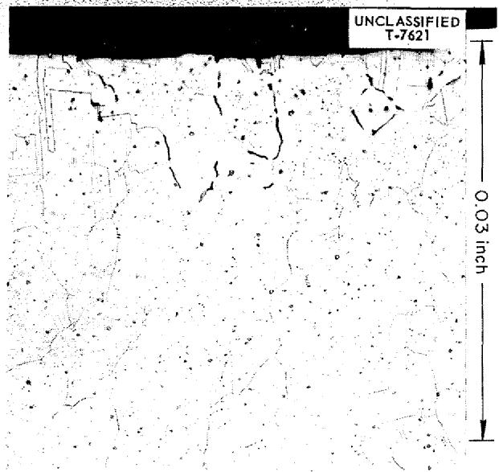  
Fig. 5.1. Maximum Attack Found in Inconel Loop 4695-1 After Circulating NaF-ZrF $_4$ -(UF $_4$ + UF $_3$ ) (50-46-4 mole %, 2.2 wt % U as U $^{3+}$ ) for 385 hr at a Maximum Fluoride Mixture Temperature of 1500°F and a Reynolds Number of 10,000. 100X. Reduced 16%.

of fluoride mixture was circulated for 1000 hr in an Inconel thermal-convection loop. The hot leg of the thermal-convection loop was attacked to a depth of 10 mils, whereas a depth of 13 to 15 mils was normally found in control thermal-convection loops in which the fluoride mixture contained $\mathsf{UF}_4$ but no trivalent uranium. However, thermal-convection loops operated previously in which trivalent uranium was obtained by adding zirconium hydride were attacked to a depth of only 3 mils.

The deepest attack found in any forced-circulation loop was that found in loop 4695-3. This loop circulated the alkali-metal base mixture NaF-KF-LiF (11.5-42-46.5 mole %) with 12.3 wt % uranium added as UF4. The maximum attack in this loop (designed as shown in Fig. 5.2) occurred in the second heated section as a very heavy intergranular concentration of subsurface voids to a depth of 35 mils (Fig. 5.4). The temperature pattern of this loop showed that, because of the better heat transfer properties of the alkali-metal base mixtures, both the maximum wall and fluoride mixture temperatures occurred in the second heated section. A deposit that was up to 65 mils thick was found on the lower inside surface of one area

in the cold portion of the loop. In other areas, similar deposits that were up to 5 mils thick were found. A spectrographic analysis of the deposit showed the following: $>5$ wt $\%$ Cr, 0.5 wt $\%$ Fe, $>10$ wt $\%$ K, 3 wt $\%$ Li, 2 wt $\%$ Na, 0.5 wt $\%$ Ni, $>10$ wt $\%$ U (balance unidentified). Another portion of this batch of fluoride mixture was circulated for 500 hr in an Inconel thermal-convection loop. The maximum attack was to a depth of 42 mils, and was unusual in that it was found only around one third of the circumference of a sample of the hot leg. In the remainder of the hot leg the attack was to a depth of 5 mils. A cold-leg deposit that was 0.3 mil thick was found.

Two other forced-circulation loops that had completed the scheduled 1000 hr of operation were also examined. These loops had circulated NaF $\mathsf{ZrF}_4\mathsf{-UF}_4$ (53.5-40-6.5 mole $\%$ ). One of these loops (4930-A) was heated by the electrical resistance of a coil, and the other (4935-1) was heated in a gas furnace. These loops were similar except that the gas-fired loop had a heated length of 23.5 ft, and the heated length of the other loop was only 7 ft. To transfer the same amount of power, it was obviously necessary to use a much higher wall temperature for the short loop. The maximum attack in the short loop (4930-A) appeared as a heavy intergranular concentration of subsurface voids to a depth of 25 mils and was found in a bend in the second leg of the heated coil. The maximum attack in a straight section was 21 mils. The attack was both deeper and heavier than that found in loops operated previously with this fluoride mixture, even when much higher velocities and Reynolds numbers were used. Examination of loop 4935-1 showed the maximum attack to be to a depth of 11 mils; however, this attack was moderate in intensity and was found for only a short length at the hottest end of the coil. In this loop no differences were found on opposite sides of the bends. The original purpose of these loops was to compare gas and electric heating; however, because of the differences in heater length, it will be necessary to repeat the tests with identical loops operated under similar conditions.

From the results obtained with these loops and from those reported previously, it is apparent that corrosion and mass transfer in these systems are not so serious as had been feared. It also appears

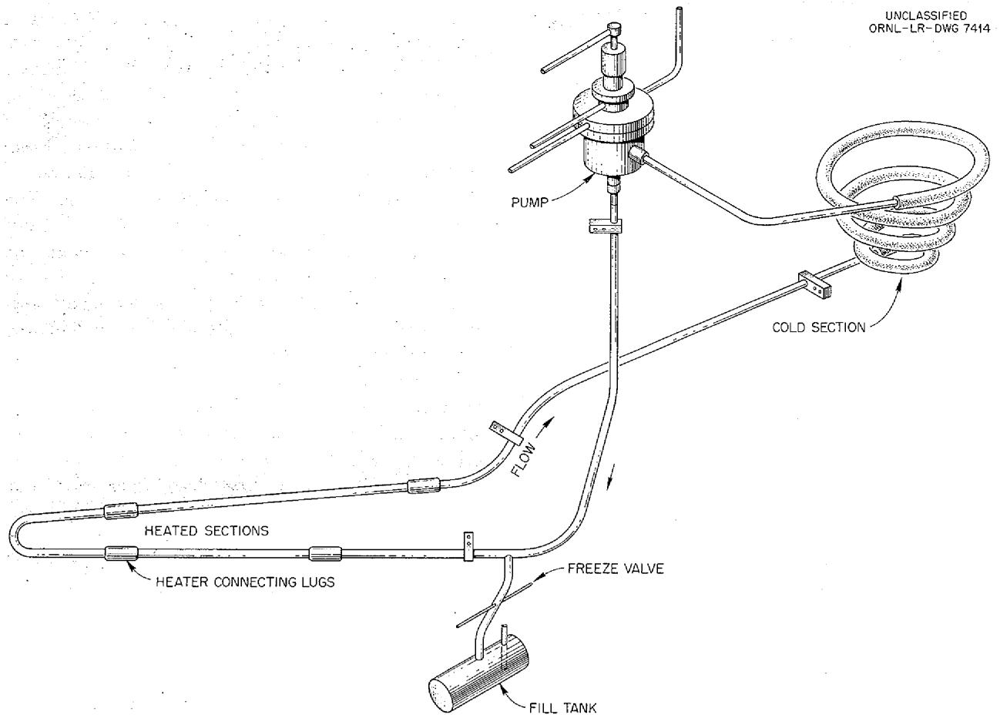  
Fig. 5.2. Schematic Diagram of Forced-Circulation Loop with Straight Heated Sections.

that reducing the tube wall temperature in these experiments would result in a reduction in depth of attack. The cold-leg layer found in loop 4695-2 must be investigated further.

The depths of attack found in the forced-circulation loops are not much, if any, greater than those found in the low-velocity thermal-convection loops. Thus velocity and Reynolds number appear to be only minor variables. This conclusion is confirmed by the deep attack found in the low-velocity forced-circulation loop 4930-A. The data obtained from the thermal-convection loops should therefore be applicable to forced-circulation systems.

The most important variable is the maximum tube wall temperature, or, more exactly, the temperature of the reaction interface. This is shown by the deepest attack occurring in areas of maximum wall temperature rather than where the maximum bulk fluoride mixture temperature occurred. Additional

evidence is afforded by the deepest attack in a loop having occurred in the hot spots on the inside of bends.2

The addition of $\mathsf{UF}_3$ to the $\mathsf{ZrF}_4$ -base mixtures reduces the attack, and even though the low $\mathsf{UF}_3$ concentrations used in these forced-circulation loops did not reduce the attack as much as had been hoped, it appears that higher concentrations would result in a greater decrease in attack. Unless the addition of $\mathsf{UF}_3$ can also reduce the attack and mass transfer found with alkali-metal base mixtures without disproportionation of the $\mathsf{UF}_3$ and the formation of deposits, it appears that such mixtures will not be useful in large, Inconel dynamic systems.

# Sodium in Inconel

An Inconel forced-circulation loop (4689-4) was examined in which sodium was circulated at a maximum temperature of $1500^{\circ}\mathrm{F}$ for 1000 hr, with

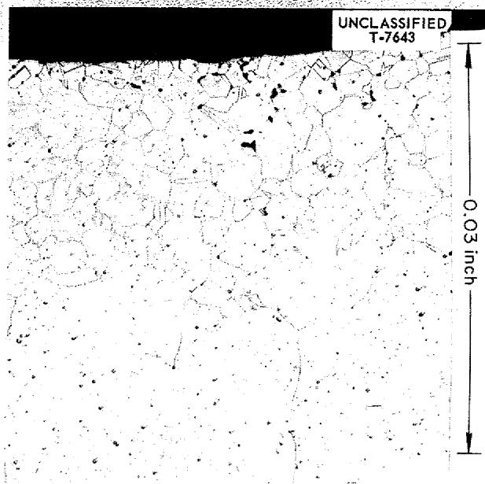  
Fig. 5.3. Maximum Attack Found in Inconel Loop 4695-2 After Circulating NaF-ZrF $_4$ -(UF $_4$ + UF $_3$ ) (50-46-4 mole %, 1.7 wt % U as U $^{3+}$ ) for 887 hr at a Maximum Fluoride Mixture Temperature of 1500°F and a Reynolds Number of 15,000. 100X. Reduced 11%.

a $300^{\circ}\mathrm{F}$ temperature drop and a Reynolds number of greater than 50,000. The loop had the configuration shown in Fig. 5.5. A heavy layer of dendritic metal crystals was found in all sections of the economizer and to a lesser extent in the cold loop, as shown in Fig. 5.6. The crystals were shown by chemical analysis to be $89.6\%$ Ni and $8.6\%$ Cr and to contain 50 ppm Fe. The layer found in the cold end of the economizer was shown by metallographic examination to be 26 mils thick. The hot leg showed intergranular attack to a depth of 2.5 mils. Efforts were made to obtain oxygen analyses on both the original and the drained sodium, but both values are questionable. From other work, it appears that the original sodium contained about 50 ppm oxygen.

A second, similar loop (4951-1) was operated for 480 hr with a $200^{\circ}\mathrm{F}$ temperature drop, and the results confirmed those reported above. The mass transfer found in this loop is shown in Fig. 5.7. The maximum thickness of the deposit found metal

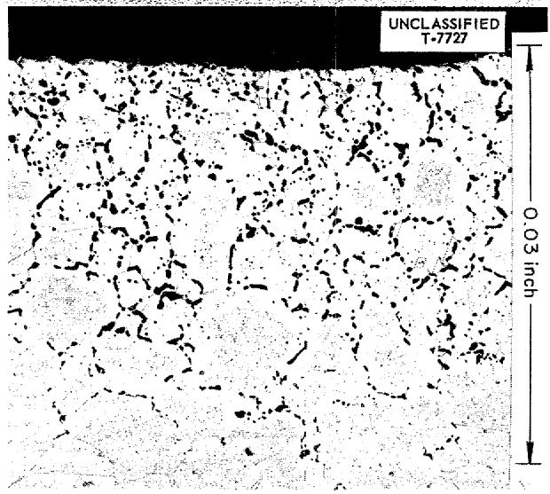  
Fig. 5.4. Maximum Attack Found in Inconel Loop 4695-3 After Circulating NaF-KF-LiF + UF $_4$ (11.5-42-46.5 mole % plus 12.3 wt % UF $_4$ ) for 630 hr at a Maximum Fluoride Mixture Temperature of $1500^{\circ}$ F and a Reynolds Number of 10,000. 100X. Reduced 20%.

lographically was 11 mils. The hot leg in this loop also showed intergranular attack to a depth of 2.5 mils.

Two additional loops were operated with portions of the cold legs constructed from type 316 stainless steel. Loop 4689-6 had a type 316 stainless steel economizer and cold leg, while loop 4689-5 had only a type 316 stainless steel cold leg. Both these loops also showed mass transfer, but not so much as was found in loop 4689-4. The maximum deposit thickness in loop 4689-5 was 15 mils and in loop 4689-6 it was 12 mils. The hot legs showed similar intergranular attack to a depth of 2.5 mils in loop 4689-5 and 1.5 mils in loop 4689-6. These data indicate that a type 316 stainless steel cold leg reduces the mass transfer slightly, but further study of the variables in the process is necessary. Additional loops are being operated under controlled conditions in which the effects of oxygen concentration of the sodium, the use of a cold trap, the use of a lower maximum sodium temperature, and the use of an all-stainless-steel system are being investigated.

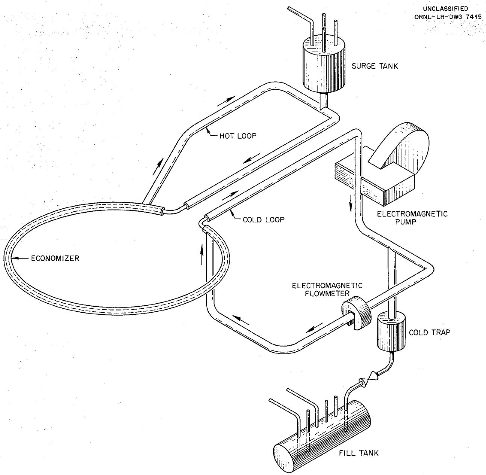  
Fig. 5.5. Schematic Diagram of Loop Designed for Forced-Circulation of Sodium in Inconel Tubing.

THERMAL-CONVECTION STUDIES

G.M. Adamson

Metallurgy Division

T.C.Price V.P.Treciokas

Pratt & Whitney Aircraft

Alkali-Metal Base Mixtures with $\mathsf{UF}_3$ and $\mathsf{UF}_4$ in Inconel

The results of metallographic examinations have been received for the remaining Inconel thermal-

convection loops in which alkali-metal base fluorides with varying proportions of $\mathsf{UF}_3 / \mathsf{UF}_4$ had been circulated. The results for the first half of this series of tests were reported previously. The metallographic data are presented in Table 5.2. The results for the loops with high $\mathsf{UF}_3$ content confirm those reported previously. No attack was found in any section, but deposits

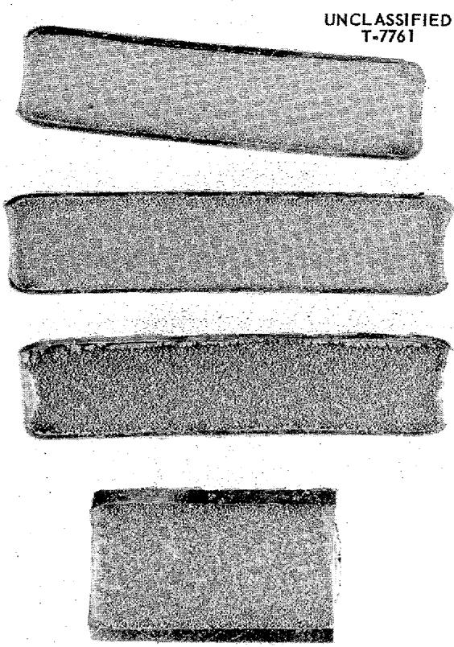  
Fig. 5.6. Sections from Cold Leg and Economizer of Forced-Circulation Inconel Loop 4689-4 After Circulating Sodium for 1000 hr at a Maximum Sodium Temperature of $1500^{\circ}\mathsf{F}$ and a Temperature Drop of $300^{\circ}\mathsf{F}$ .

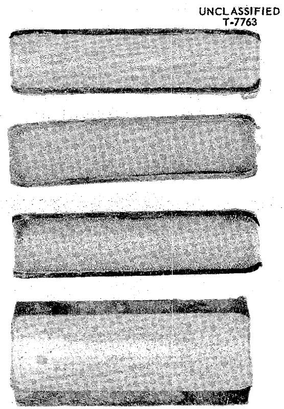  
Fig. 5.7. Sections from Cold Portions of Forced-Circulation Inconel Loop 4951-1 After Circulating Sodium for 480 hr at a Maximum Sodium Temperature of $1500^{\circ}\mathrm{F}$ and a Temperature Drop of $200^{\circ}\mathrm{F}$ .

TABLE 5.2. RESULTS OF METALLOGRAPHIC EXAMINATION OF INCONEL THERMAL-CONVECTION LOOPS AFTER CIRCULATING NaF-KF-LiF (11.5-42-46.5 mole %) CONTAINING UF₃ AND UF₄  

<table><tr><td rowspan="2">Loop No.</td><td rowspan="2">Time of Operation (hr)</td><td rowspan="2">Initial Uranium Content (wt %)</td><td colspan="2">U3+Content (wt %)</td><td rowspan="2">Maximum Attack (mils)</td><td rowspan="2">Metallographic Notes</td></tr><tr><td>Fill</td><td>Final</td></tr><tr><td>591</td><td>500</td><td>11.5</td><td>1.7</td><td>0.65</td><td>2</td><td>Thin cold-leg deposit</td></tr><tr><td>626</td><td>500</td><td>11.2</td><td>1.5</td><td>0.8</td><td>1.5</td><td>Cold-leg deposit 0.3 mil thick</td></tr><tr><td>594</td><td>1000</td><td>12.6</td><td>2.0</td><td>0.6 to 0.7</td><td>2</td><td>Cold-leg deposit 0.5 mil thick</td></tr><tr><td>625</td><td>546</td><td>13.2</td><td>3.0</td><td>0.9</td><td>0</td><td>Layer to 1 mil thick in all sections</td></tr><tr><td>593</td><td>1000</td><td>13.8</td><td>5.6</td><td>0.9</td><td>0</td><td>Layer to 1 mil thick in all sections</td></tr><tr><td>592</td><td>1000</td><td>10.9</td><td>5.2</td><td>0.9</td><td>0</td><td>Layer to 1 mil thick in all sections</td></tr></table>

were visible in both the hot and cold legs. The trivalent uranium content had been almost completely lost by disproportionation in all loops.

The results for the three loops with low $\mathsf{UF}_3$ contents are encouraging. In loop 594, after 1000 hr, the hot-leg attack was only to a depth of 2 mils, and there was no evidence of a hot-leg layer (Fig. 5.8). The cold legs of these loops showed thin, as yet unidentified, layers. Even in these loops it seems likely that some dispro

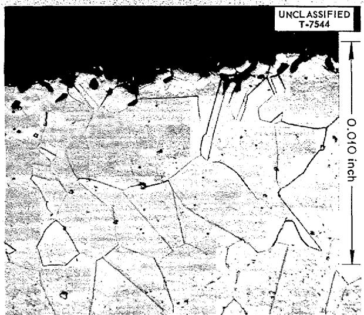  
Fig. 5.8. Hot-Leg Attack of Inconel Thermal-Convection Loop After Circulating NaF-KF-LiF (11.5-42-46.5 mole %) Containing $\mathsf{UF}_3$ and $\mathsf{UF}_4$ for 1000 hr at a Hot-Leg Temperature of $1500^{\circ}\mathsf{F}$ . 250X. Reduced 21%.

portionation occurred, because one-half the original $U^{3+}$ content was lost.

Chemical analyses of the fluoride mixtures before and after operation of the loops are presented in Table 5.3. The data show that the impurities react differently in the alkali-metal base mixtures than they do in the $\mathsf{ZrF}_4$ -base mixtures. The chromium content appears to decrease slightly, whereas the nickel content shows a small increase.

# Zirconium Fluoride Base Mixtures with $\mathbf{U}\mathbf{F}_3$ and $\mathbf{U}\mathbf{F}_4$ in Inconel

A group of Inconel thermal-convection loops was operated at a hot-leg temperature of $1500^{\circ}\mathrm{F}$ with the $\mathsf{ZrF}_4$ -base mixture NaF- $\mathsf{ZrF}_4$ -UF $_4$ (50-46-4 mole %) containing varying amounts of the UF $_4$ converted to UF $_3$ . Metallographic results have been received on only the first half of this series of tests and are reported in Table 5.4. The chemical results for these tests are given in Table 5.5. While the depths of attack found were slightly lower than the 11 mils now being found after 500 hr in control loops, the results are disappointing in that, in previous thermal-convection loops operated with a mixture containing UF $_3$ obtained by the reduction of UF $_4$ with $\mathsf{ZrH}_2$ , attacks as low as 3 mils were found. As in the forced-circulation loops, the presence of UF $_3$ reduces the amount and intensity of the attack more than it does the depth. In the loops operated previously, the UF $_3$ content was not known and may have been slightly higher. It should be noted that the chromium content was

TABLE 5.3. RESULTS OF CHEMICAL ANALYSES OF ALKALI-METAL BASE MIXTURES BEFORE AND AFTER CIRCULATION IN INCONEL LOOPS   

<table><tr><td rowspan="2">Loop No.</td><td colspan="2">Uranium (wt %)</td><td colspan="2">Nickel (ppm)</td><td colspan="2">Chromium (ppm)</td><td colspan="2">Iron (ppm)</td></tr><tr><td>Before</td><td>After</td><td>Before</td><td>After</td><td>Before</td><td>After</td><td>Before</td><td>After</td></tr><tr><td>591</td><td>11.5</td><td>11.5</td><td>65</td><td>100</td><td>60</td><td>30</td><td>140</td><td>75</td></tr><tr><td>626</td><td>11.2</td><td>11.2</td><td>10</td><td>110</td><td>40</td><td>15 to 50</td><td>120</td><td>85</td></tr><tr><td>594</td><td>12.6</td><td>10.7</td><td>60</td><td>110</td><td>115</td><td>15 to ?</td><td>70</td><td>75</td></tr><tr><td>625</td><td>13.2</td><td>12.5</td><td>60</td><td></td><td>40</td><td>40</td><td>140</td><td></td></tr><tr><td>593</td><td>13.8</td><td>10.0</td><td>45</td><td>85</td><td>75</td><td>15</td><td>80</td><td>80</td></tr><tr><td>592</td><td>10.9</td><td>10.5</td><td>110</td><td>95</td><td>55</td><td>20 to 80</td><td>165</td><td>70</td></tr></table>

TABLE 5.4. RESULTS OF METALLOGRAPHIC EXAMINATION OF INCONEL THERMAL-CONVECTION LOOPS AFTER CIRCULATING $\mathsf{ZrF}_{4}$ -BASE MIXTURES CONTAINING $\mathsf{UF}_{3}$ AND $\mathsf{UF}_{4}$   

<table><tr><td rowspan="2">Loop No.</td><td rowspan="2">Operating Time (hr)</td><td rowspan="2">Maximum Attack (mils)</td><td colspan="2">Metallographic Notes</td></tr><tr><td>Hot-Leg Appearance</td><td>Cold-Leg Appearance</td></tr><tr><td>633</td><td>500</td><td>10</td><td>Moderate to heavy general attack and intergranular voids</td><td>No attack or deposit</td></tr><tr><td>634</td><td>500</td><td>8</td><td>Moderate to heavy intergranular voids</td><td>Few voids to a depth of 1 mil with deposit covering voids</td></tr><tr><td>683</td><td>500</td><td>7</td><td>Moderate intergranular voids</td><td>Few voids to a depth of 1 mil</td></tr><tr><td>635</td><td>1000</td><td>7</td><td>Moderate general attack and inter-granular voids</td><td>Few voids to a depth of 0.5 mil and some thin deposit</td></tr></table>

TABLE 5.5. RESULTS OF CHEMICAL ANALYSES OF ${\mathrm{{ZrF}}}_{4}$ -BASE MIXTURES CONTAINING ${\mathrm{{UF}}}_{3}$ AND ${\mathrm{{UF}}}_{4}$ BEFORE AND AFTER CIRCULATING IN INCONEL THERMAL-CONVECTION L.OOPS   

<table><tr><td rowspan="2">Loop No.</td><td colspan="2">U3+(wt %)</td><td colspan="2">Total U (wt %)</td><td colspan="2">Nickel (ppm)</td><td colspan="2">Chromium (ppm)</td><td colspan="2">Iron (ppm)</td></tr><tr><td>Before</td><td>After*</td><td>Before</td><td>After</td><td>Before</td><td>After</td><td>Before</td><td>After</td><td>Before</td><td>After</td></tr><tr><td>633</td><td>1.37</td><td>0.7</td><td>11.8</td><td>11.4</td><td>25</td><td>15</td><td>100</td><td>570</td><td>65</td><td>50</td></tr><tr><td>634</td><td>1.28</td><td>0.9</td><td>8.8</td><td>8.9</td><td>35</td><td>20</td><td>65</td><td>300</td><td>40</td><td>70</td></tr><tr><td>683</td><td>1.43</td><td>0.8</td><td>9.0</td><td>8.5</td><td>25</td><td>25</td><td>140</td><td>230</td><td>25</td><td>30</td></tr><tr><td>635</td><td>1.98</td><td>0.7</td><td>8.9</td><td>9.7</td><td>60</td><td>10</td><td>100</td><td>225</td><td>80</td><td>40</td></tr></table>

*These values showed considerable variation and it was difficult to estimate an average; the hot-leg value was consistently lower than the cold-leg value.

lower than normal in three of these loops after circulation. Additional loops in this series are still in operation.

# Effect of Temperature on Mass Transfer

A group of Inconel loops was operated with NaF-ZrF4-UF4 (53.5-40-6.5 mole %) for 1500 hr at various hot-leg temperatures in order to determine the effect of temperature on mass transfer. The data obtained in these experiments are tabulated in Table 5.6. It is not completely understood why attack is deeper at $1200^{\circ}\mathrm{F}$ than at $1350^{\circ}\mathrm{F}$ , but this effect has been noted in previous tests and appears to be real. The remaining loops show a definite increase in depth of attack with increasing hot-leg temperature. In loops operated previously under similar conditions for 500 hr, no effect of temperature on the depth of attack was found. Since the mass transfer effect is masked by the

effect of impurities and nonequilibrium conditions during the first 500 hr of operation, it may be considered that the increased depths of attack with increased temperatures, in the loops operated for 1500 hr, were caused by mass transfer.

# Effect of Loop Size and Shape on Corrosion

A series of Inconel loops was operated with NaF-ZrF $_4$ -UF $_4$ (50-46-4 mole %) to determine the effect on depth of attack of varying the loop size and shape. These loops all operated for 1000 hr with hot-leg temperatures of $1500^{\circ}\mathrm{F}$ . The data obtained from these experiments are presented in Table 5.7.

Within the accuracy of the data, it does not appear that varying the length of the horizontal leg is any more effective than varying the vertical leg. For special materials in limited supply, it appears from the data that the loop size may be

TABLE 5.6. EFFECT OF HOT-LEG TEMPERATURE ON MASS TRANSFER IN INCONEL THERMAL-CONVECTION LOOPS CIRCULATING NaF-ZrF4-UF4 (53.5-40-6.5 mole %)

Operating time: 1500 hr

TABLE 5.7.EFFECT ON CORROSION DEPTH OF VARYING THE SIZE AND SHAPE OF INCONEL THERMAL-CONVECTION LOOPS   

<table><tr><td rowspan="2">Loop No.</td><td rowspan="2">Hot-Leg Temperature (°F)</td><td rowspan="2">ΔT (°F)</td><td rowspan="2">Final Chromium Concentration (ppm)</td><td rowspan="2">Maximum Attack (mils)</td><td colspan="2">Metallographic Notes</td></tr><tr><td>Hot-Leg Attack</td><td>Cold-Leg Appearance</td></tr><tr><td>578</td><td>1200</td><td>165</td><td>610 to 640</td><td>8</td><td>Heavy with small voids</td><td>No visible deposit</td></tr><tr><td>579</td><td>1350</td><td>190</td><td>690 to 815</td><td>5</td><td>Moderate to heavy intergranular voids</td><td>No visible deposit</td></tr><tr><td>583</td><td>1350</td><td>195</td><td>675 to 775</td><td>5</td><td>Moderate to heavy intergranular voids</td><td>No visible deposit</td></tr><tr><td>580</td><td>1500</td><td>~210</td><td>615 to 830</td><td>12</td><td>Heavy intergranular voids</td><td>No visible deposit</td></tr><tr><td>584</td><td>1500</td><td>210</td><td>955 to 980</td><td>15</td><td>Heavy intergranular voids</td><td>Very light deposit</td></tr><tr><td>585</td><td>1600</td><td>240</td><td>540 to 810</td><td>18</td><td>Heavy intergranular voids</td><td>Metal in cold trap</td></tr></table>

Circulated fluid: NaF-ZrF4-UF4 (50-46-4 mole %)  
Operating time: 1000 hr  
Hot-leg temperature: $1500^{\circ}\mathrm{F}$

<table><tr><td>Loop No.</td><td>Length of Vertical Leg (in.)</td><td>Length of Horizontal Leg (in.)</td><td>ΔT (°F)</td><td>Maximum Depth of Attack (mils)</td><td>Final Chromium Content (ppm)</td><td>Hot-Leg Attack</td></tr><tr><td>601</td><td>8</td><td>8</td><td>143</td><td>10</td><td>620 to 680</td><td>Heavy</td></tr><tr><td>606</td><td>8</td><td>8</td><td>145</td><td>10</td><td>530 to 675</td><td>Heavy</td></tr><tr><td>598</td><td>15</td><td>8</td><td>172</td><td>11</td><td>1030 to 1075</td><td>Moderate to heavy</td></tr><tr><td>603</td><td>15</td><td>8</td><td>188</td><td>10*</td><td>740 to 965</td><td>Heavy</td></tr><tr><td>600</td><td>26</td><td>8</td><td>220</td><td>16.5</td><td>980 to 1040</td><td>Heavy</td></tr><tr><td>605</td><td>26</td><td>8</td><td>218</td><td>16</td><td>890 to 915</td><td>Heavy</td></tr><tr><td>597</td><td>15</td><td>15</td><td>208</td><td>10</td><td>895 to 1040</td><td>Moderate to heavy</td></tr><tr><td>602</td><td>15</td><td>15</td><td>195</td><td>13</td><td>890 to 960</td><td>Heavy</td></tr><tr><td>599</td><td>15</td><td>26</td><td>195</td><td>15</td><td>710 to 1030</td><td>Moderate to heavy</td></tr><tr><td>614**</td><td>26</td><td>17</td><td>245</td><td>15</td><td>835 to 890</td><td>Heavy</td></tr></table>

\*In this loop, a very few boundaries were attacked to a depth of 14 mils.   
**Control: standard size, shape, and temperature differential.

reduced to 15 by 15 in., at least for screening experiments. A series of loops of this size will be operated to get a better statistical picture for determining whether all the loops should be reduced to this size.

# Evaluation of Control Loop Results

A gradual increase in depth of attack of the standard Inconel thermal-convection loops operated with $\mathsf{ZrF_4}$ -base mixtures has been noted recently, and difficulty has been experienced in reproducing results. As part of a study of this difficulty, three Inconel loops were filled the same day from the same batch of fluoride mixture and operated for 500 hr in as nearly an identical manner as possible. The data obtained from these experiments are given in Table 5.8. The attack was again deeper than in previously operated standard loops, and the data show no reproducibility. It should also be noted that in each loop some cold-leg attack

was found, whereas previously the cold legs appeared to be attack-free.

To determine whether the increase in attack could be caused by a leak during operation or by air blown into the fluoride mixture during filling, an additional series of three loops was operated. In one experiment, 1 liter of air was slowly bubbled through the fluoride mixture in the fill pot before transfer to the loop. In the second experiment, the loop was airtight, but it was operated with the helium atmosphere at atmospheric pressure. In the third, the helium atmosphere was again at atmospheric pressure, and, in addition, a Swagelok connection above the loop was loosened slightly so that there was a slight air leak. The data from these loops are presented in Table 5.9. A fourth, standard loop was operated as a control with the normal helium atmosphere at a pressure of 7 psi.

The data indicate that to get increased attack from contamination during operation would require

TABLE 5.8. RESULTS OF OPERATION OF IDENTICAL INCONEL CONTROL LOOPS  
TABLE 5.9. ATTACK IN INCONEL LOOPS AFTER CIRCULATING CONTAMINATED   

<table><tr><td rowspan="2">Loop No.</td><td rowspan="2">Filling Order</td><td rowspan="2">Maximum Attack (mils)</td><td colspan="2">Metallographic Notes</td><td rowspan="2">Average Final Chromium Content (ppm)</td></tr><tr><td>Hot-Leg Attack</td><td>Cold-Leg Attack</td></tr><tr><td>684</td><td>3</td><td>11</td><td>Moderate to heavy intergranular voids</td><td>Light, general, to a depth of 1 mil</td><td>850</td></tr><tr><td>685</td><td>2</td><td>14</td><td>Moderate to heavy intergranular voids</td><td>Very light, general, to a depth of 1 mil</td><td>750</td></tr><tr><td>686</td><td>1</td><td>9</td><td>Moderate to heavy intergranular voids</td><td>Very light, general, to a depth of 1 mil</td><td>770</td></tr></table>

$\mathrm{NaF - ZrF}_{4}$ -UF $^4$ (50-46-4 mole $\%$ 产

Operating time: 500 hr

Hot-leg temperature: $1500^{\circ}\mathrm{F}$

<table><tr><td>Loop No.</td><td>Variable</td><td>Maximum Attack (mils)</td><td>Average Final Chromium Content (ppm)</td></tr><tr><td>687</td><td>Static helium atmosphere (atmospheric pressure)</td><td>10</td><td>800</td></tr><tr><td>688</td><td>Small air leak in riser pipe</td><td>21</td><td>2000</td></tr><tr><td>689</td><td>Air bubbled through original fluoride mixture before transfer to loop</td><td>9</td><td>950</td></tr><tr><td>698</td><td>Control (7 psi helium pressure)</td><td>10</td><td>775</td></tr></table>

both an air leak and a loss of helium pressure, a combination which does not seem likely to occur. It also appears that the small amount of air that could be trapped in a transfer line would be enough to cause difficulty. One other possible source of the increased attack may be the cleaning cycle. Therefore, a group of loops cleaned by various procedures have been operated, but the results are not yet available.

# GENERAL CORROSION STUDIES

E. E. Hoffman

W. H. Cook

C. F. Leitten, Jr.

Metallurgy Division

# Brazing Alloys on Type 310 Stainless Steel and "A" Nickel in Sodium and in Fuel Mixtures

Brazing alloys submitted by the Wall Colmonoy Corporation have been tested in both static sodium and in static NaF-ZrF4-UF4 (53.5-40-6.5 mole %). These tests were conducted in an effort to find a brazing alloy that has good corrosion resistance to both mediums.

The tests were conducted on type 310 stainless steel T-joints brazed with the brazing alloys listed in Table 5.10, which also presents the results of exposure to static sodium at $1500^{\circ}\mathrm{F}$ for 100 hr. The brazing alloys are listed in order of decreasing

corrosion resistance. The results for tests of these alloys in static $\mathrm{NaF - ZrF_4 - UF_4}$ (53.5-40-6.5 mole %) are given in Table 5.11, where, as in Table 5.10, the brazing alloys are listed in order of decreasing corrosion resistance.

A comparison of the results in Tables 5.10 and 5.11 indicates that brazing alloy B-13 (9% Si-2.5% P-88.5% Ni) has the best corrosion resistance to both test mediums. Metallographic examination showed no attack along the surface of the braze fillet when tested in sodium (Fig. 5.9a). The cracks shown in Fig. 5.9a are not the results of corrosion, but rather were caused by the brittleness of the alloy. Similar cracking was observed in many of the brazed T-joints listed in Tables 5.10 and 5.11. Brazing alloy B-13 is shown in Fig. 5.9b after being tested in NaF-ZrF $_4$ -UF $_4$ (53.5-40-6.5 mole %) for 100 hr at $1500^{\circ}\mathrm{F}$ . Surface attack to a depth of 1 mil can be seen along the entire brazed fillet. No cracks can be observed in this joint.

Several conclusions can be drawn from a study of the metallographic notes in Tables 5.10 and 5.11. Brazing alloys containing relatively high percentages of phosphorus appear to be inferior in sodium. However, additions of silicon tend to improve the corrosion resistance. On the other hand, brazing alloys having high percentages of

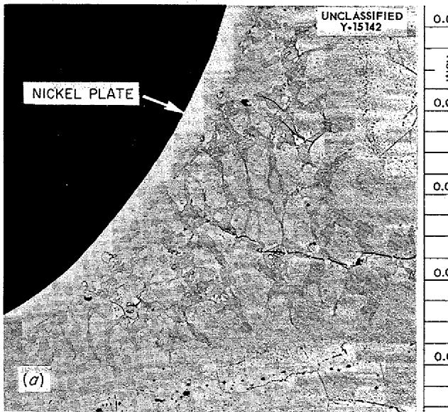

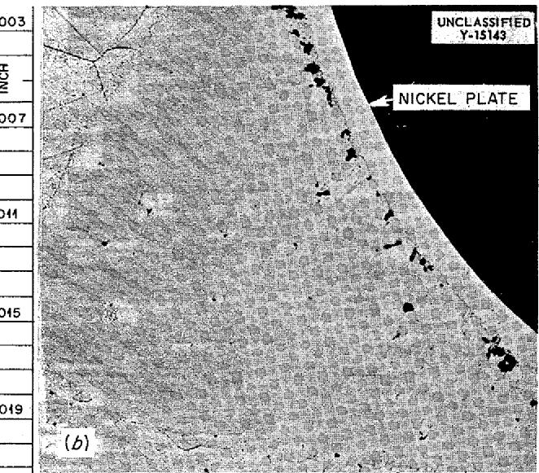  
Fig. 5.9. Type 310 Stainless Steel T-Joints Brazed with Brazing Alloy B-13 (9 wt % Si, 2.5 wt % P, 88.5 wt % Ni) After Exposure for 100 hr at $1500^{\circ}\mathsf{F}$ to (a) Static Sodium and (b) Static NaF-ZrF $_4$ -UF $_4$ (53.5-40-6.5 mole %). Etched with aqua regia. 200X. Reduced 26%.

TABLE 5.10. BRAZING ALLOYS ON TYPE 310 STAINLESS STEEL TESTED IN STATIC SODIUM AT ${1500}^{ \circ  }\mathrm{F}$ FOR ${100}\mathrm{{hr}}$   

<table><tr><td rowspan="2">Alloy Designation*</td><td rowspan="2">Alloy Composition (wt %)</td><td colspan="2">Weight Change</td><td rowspan="2">Metallographic Notes</td></tr><tr><td>(g)</td><td>(%)</td></tr><tr><td>B-13</td><td>9 Si-2.5 P-88.5 Ni</td><td>0</td><td>0</td><td>No attack along surface of fillet; several cracks in fillet</td></tr><tr><td>P-11</td><td>10.5 Si-7.5 Mn-82 Ni</td><td>-0.0002</td><td>-0.018</td><td>No attack along surface of fillet; several cracks in fillet</td></tr><tr><td>P-12</td><td>9 Si-15 Mn-76 Ni</td><td>-0.0003</td><td>-0.033</td><td>No attack along surface of fillet; several cracks in fillet</td></tr><tr><td>P-10</td><td>16.27 Si-5.9 Mn-77.83 Ni</td><td>+0.0004</td><td>+0.043</td><td>No evidence of attack; several large cracks throughout fillet</td></tr><tr><td>P-13</td><td>7.5 Si-22.5 Mn-70 Ni</td><td>-0.0008</td><td>-0.085</td><td>Erratic surface attack to a depth of 0.5 mil; several cracks in fillet</td></tr><tr><td>B-12</td><td>10.5 Si-1.25 P-88.25 Ni</td><td>0</td><td>0</td><td>Erratic surface attack along fillet to a depth of 1 mil</td></tr><tr><td>B-14</td><td>7.5 Si-3.75 P-88.75 Ni</td><td>-0.0001</td><td>-0.01</td><td>Uniform surface attack along fillet to a depth of 1 mil</td></tr><tr><td>P-14</td><td>6 Si-30 Mn-64 Ni</td><td>-0.0002</td><td>-0.022</td><td>Erratic surface attack to a depth of 1 mil; large cracks throughout fillet</td></tr><tr><td>G-20</td><td>9 P-11.49 W-79.51 Ni</td><td>-0.0012</td><td>-0.14</td><td>Maximum attack of 4 mils along surface of fillet</td></tr><tr><td>S-10</td><td>14.31 Cr-9.34 Si-2.66 Mo-19.32 Fe-54.37 Ni</td><td>0</td><td>0</td><td>Subsurface voids to a depth of 3 mils along fillet surface</td></tr><tr><td>B-15</td><td>6 Si-5 P-89 Ni</td><td>0</td><td>0</td><td>Maximum attack of 4 mils along surface of fillet</td></tr><tr><td>B-16</td><td>4.5 Si-6.25 P-89.25 Ni</td><td>-0.0001</td><td>-0.01</td><td>Small subsurface voids to a depth of 4 mils</td></tr><tr><td>G-21</td><td>10.98 P-6.16 W-82.86 Ni</td><td>-0.0001</td><td>-0.011</td><td>Uniform surface attack along entire fillet to a depth of 4 mils</td></tr><tr><td>B-17</td><td>3 Si-7.5 P-89.5 Ni</td><td>-0.0012</td><td>-0.14</td><td>Maximum attack of 4 mils along surface of fillet</td></tr><tr><td>L-20</td><td>38 Ni-5 Cr-57 Mn</td><td>-0.0004</td><td>-0.043</td><td>Attack in the form of stringers to a maximum depth of 5 mils; not uniform</td></tr></table>

*Brazing alloys listed in order of decreasing corrosion resistance to sodium.

silicon in the absence of phosphorus tend to be attacked in the fluoride mixture.

Static tests have also been completed on a series of commercial and experimental brazing alloys used to braze "A" nickel T-joints in a dry hydrogen atmosphere. These tests were also conducted in sodium and in NaF-ZrF $_4$ -UF $_4$ (53.5-40-6.5 mole %) for 100 hr at $1500^{\circ}\mathrm{F}$ . The results of the tests in the fluoride mixture are presented in Table 5.12; the results of the tests in sodium are shown in Table 5.13. The brazing alloys which appear to have fair corrosion resistance to both media are the 90 wt % Ni-10 wt % P alloy, the 80 wt % Ni-10 wt % Cr-10 wt % P alloy, and Microbraz. A 1.5-mil layer of small subsurface voids can be seen in

Fig. 5.10a along the surface of the "A" nickel T-joint brazed with Microbraz and tested in sodium; the same brazing alloy after being tested in NaF-ZrF $_4$ -UF $_4$ (53.5-40-6.5 mole %) is shown in Fig. 5.10b. No attack can be seen along the surface of the braze fillet.

Several of the brazing alloys which showed good static corrosion resistance have also been tested in seesaw apparatus, and the results are given in Table 5.14. These tests were conducted on brazed Inconel T-joints exposed for $100\mathrm{hr}$ at a hot-zone temperature of $1500^{\circ}\mathrm{F}$ . A temperature differential of about $400^{\circ}\mathrm{F}$ was maintained in all the seesaw tests.

All the brazing alloys listed in Table 5.14 had

TABLE 5.11. BRAZING ALLOYS ON TYPE 310 STAINLESS STEEL TESTED IN STATIC NaF-ZrF4-UF4 (53.5-40-6.5 mole %) AT ${1500}^{ \circ  }\mathrm{F}$ FOR 100 hr   

<table><tr><td rowspan="2">Alloy Designation*</td><td rowspan="2">Alloy Composition (wt %)</td><td colspan="2">Weight Change</td><td rowspan="2">Metallographic Notes</td></tr><tr><td>(g)</td><td>(%)</td></tr><tr><td>G-20</td><td>9 P-11.49 W-79.51 Ni</td><td>-0.0017</td><td>-0.152</td><td>No attack on surface of fillet; several cracks in fillet</td></tr><tr><td>B-15</td><td>6 Si-5 P-89 Ni</td><td>-0.0046</td><td>-0.510</td><td>Uniform surface attack along fillet to a depth of 0.5 mil</td></tr><tr><td>B-16</td><td>4.5 Si-6.25 P-89.25 Ni</td><td>-0.0057</td><td>-0.562</td><td>Surface attack along fillet to a depth of 0.5 mil</td></tr><tr><td>G-21</td><td>10.98 P-6.16 W-82.86 Ni</td><td>-0.0061</td><td>-0.674</td><td>Erratic surface attack to a depth of 0.5 mil along fillet</td></tr><tr><td>B-17</td><td>3 Si-7.5 P-89.5 Ni</td><td>-0.0053</td><td>-0.516</td><td>Surface attack along fillet to a depth of 0.5 mil; several cracks in fillet</td></tr><tr><td>B-13</td><td>9 Si-2.5 P-88.5 Ni</td><td>-0.0027</td><td>-0.279</td><td>Surface attack along entire fillet to a depth of 1 mil</td></tr><tr><td>P-12</td><td>9 Si-15 Mn-76 Ni</td><td>-0.0034</td><td>-0.331</td><td>Surface attack in form of small voids to a depth of 1 mil; several cracks in fillet</td></tr><tr><td>B-14</td><td>7.5 Si-3.75 P-88.75 Ni</td><td>-0.0052</td><td>-0.479</td><td>Surface attack along entire fillet to a depth of 1 mil</td></tr><tr><td>P-11</td><td>10.5 Si-7.5 Mn-82 Ni</td><td>-0.0042</td><td>-0.401</td><td>Surface attack to a depth of 1.5 mils; several cracks in fillet</td></tr><tr><td>B-12</td><td>10.5 Si-1.25 P-88.25 Ni</td><td>-0.0018</td><td>-0.171</td><td>Surface attack to a depth of 2 mils; large cracks throughout fillet</td></tr><tr><td>P-10</td><td>16.27 Si-5.9 Mn-77.83 Ni</td><td>-0.0026</td><td>-0.290</td><td>Uniform surface attack along fillet to a depth of 3 mils</td></tr><tr><td>S-10</td><td>14.31 Cr-9.34 Si-2.66 Mo-19.32 Fe-54.37 Ni</td><td>-0.0030</td><td>-0.344</td><td>Surface attack to a maximum depth of 7.5 mils along entire fillet</td></tr><tr><td>P-13</td><td>7.5 Si-22.5 Mn-70 Ni</td><td>-0.0043</td><td>-0.455</td><td>Complete attack of entire fillet</td></tr><tr><td>L-20</td><td>38 Ni-5 Cr-57 Mn</td><td>-0.0078</td><td>-0.74</td><td>Complete attack of entire fillet</td></tr><tr><td>P-14</td><td>6 Si-30 Mn-64 Ni</td><td>-0.0099</td><td>-1.06</td><td>Complete attack of entire fillet</td></tr></table>

*Brazing alloys listed in order of decreasing corrosion resistance to the fluoride mixture.

fair corrosion resistance to both sodium and the fluoride mixture, with the possible exception of the 65 wt % Ni-25 wt % Ge-10 wt % Cr alloy. The Coast Metals No. 52 alloy had good corrosion resistance to the fluoride mixture in the seesaw test in contrast to its poor resistance in the static test. A large degree of porosity was present in Coast Metals No. 50 alloy that hampered the evaluation of the corrosion data. These two brazing alloys will be retested in order to check the results of these seesaw tests.

# Screening Tests of Solid-Phase Bonding

The alloys which have been proposed for use in the fabrication of the ANP reactor fuel and coolant lines have a tendency to form a solid-phase bond at elevated temperatures in liquid metals and in

fused fluoride salts. Bonding of this type makes them unsuitable for use in valves, bearings, and seals; thus cermets and ceramics that do not form a solid-phase bond are being investigated. The cermets (metal-bonded ceramics) appear to be the more promising because of their high corrosion resistance and other chemical and physical characteristics.

The test apparatus being used is shown in Fig. 5.11. This apparatus was adapted from that designed for lever-arm stress-rupture tests. The container for the central components, for the test specimens, and for the liquid metal or fused fluoride salt serves as a housing for the compression tube and upper platen. By using this arrangement

TABLE 5.12. BRAZING ALLOYS ON "A" NICKEL T-JOINTS TESTED IN STATIC NaF-ZrF ${}_{4}$ -UF ${}_{4}$ (53.5-40-6.5 mole %) AT ${1500}^{ \circ  }\mathrm{F}$ FOR ${100}\mathrm{{hr}}$   

<table><tr><td rowspan="2">Alloy* Composition (wt %)</td><td colspan="2">Weight Change</td><td rowspan="2">Metallographic Notes</td></tr><tr><td>(g)</td><td>(%)</td></tr><tr><td>80 Ni-10 Cr-10 P</td><td>0</td><td>0</td><td>No attack on braze fillet</td></tr><tr><td>50 Ni-25 Mo-25 Ge</td><td>0</td><td>0</td><td>No attack on braze fillet</td></tr><tr><td>Nicrobraz 69 Ni-5 B-15 Cr-5 Si-5 Fe-1 C</td><td>-0.0004</td><td>-0.016</td><td>No attack on braze fillet</td></tr><tr><td>Electroless nickel 90 Ni-10 P</td><td>-0.0004</td><td>-0.013</td><td>No attack on braze fillet</td></tr><tr><td>65 Ni-25 Ge-10 Cr</td><td>0</td><td>0</td><td>Small subsurface voids to a depth of 0.5 mil along braze fillet</td></tr><tr><td>Coast Metals No. 52 90 Ni-4 B-4 Si-2 Fe</td><td>-0.0014</td><td>-0.05</td><td>Nonuniform attack to a depth of 6 mils along braze fillet</td></tr><tr><td>General Electric No. 81 66 Ni-10 Si-19 Cr-4 Fe-1 Mn</td><td>-0.0003</td><td>-0.012</td><td>Nonuniform attack to a depth of 12 mils along fillet</td></tr><tr><td>35 Ni-55 Mn-10 Cr</td><td>-0.0111</td><td>-0.48</td><td>Complete attack of braze fillet</td></tr><tr><td>60 Mn-40 Ni</td><td>-0.0159</td><td>-0.59</td><td>Complete attack of braze fillet</td></tr><tr><td>68 Ni-32 Sn</td><td>-0.0998</td><td>-3.49</td><td>Joint partially dissolved at fillet surface</td></tr></table>

\*Brazing alloys listed in order of decreasing corrosion resistance to the fluoride mixture.

TABLE 5.13. BRAZING ALLOYS ON "A" NICKEL T-JOINTS TESTED IN STATIC SODIUM AT ${1500}^{ \circ  }\mathrm{F}$ FOR ${100}\mathrm{{hr}}$   

<table><tr><td rowspan="2">BrazingAlloy* Composition(wt %)</td><td colspan="2">Weight Change</td><td rowspan="2">Metallographic Notes</td></tr><tr><td>(g)</td><td>(%)</td></tr><tr><td>Electroless nickel90 Ni-10 P</td><td>-0.0004</td><td>-0.018</td><td>No attack along fillet surface</td></tr><tr><td>Coast Metals No. 5290 Ni-4 B-4 Si-2 Fe</td><td>-0.0019</td><td>-0.068</td><td>Surface attack along fillet to a depth of 0.5 mil</td></tr><tr><td>80 Ni-10 Cr-10 P</td><td>-0.0017</td><td>-0.061</td><td>Nonuniform attack along fillet to a depth of 1 mil</td></tr><tr><td>General Electric No. 8166 Ni-10 Si-19 Cr-4 Fe-1 Mn</td><td>-0.0018</td><td>-0.078</td><td>Attack on surface of fillet to a depth of 1 mil</td></tr><tr><td>Nicrobraz69 Ni-5 B-15 Cr-5 Si-5 Fe-1 C</td><td>-0.0022</td><td>-0.082</td><td>1.5 mil layer of small subsurface voids along fillet edge</td></tr><tr><td>50 Ni-25 Mo-25 Ge</td><td>-0.0009</td><td>-0.036</td><td>Surface attack along fillet to a depth of 2.5 mils</td></tr><tr><td>65 Ni-25 Ge-10 Cr</td><td>-0.0024</td><td>-0.085</td><td>Uniform surface attack along fillet to a depth of 3 mils</td></tr><tr><td>60 Mn-40 Ni</td><td>-0.0020</td><td>-0.079</td><td>Uniform attack along entire fillet to a depth of 9 mils</td></tr><tr><td>35 Ni-55 Mn-10 Cr</td><td>-0.0005</td><td>-0.020</td><td>Small voids in from surface of fillet to a depth of 13 mils</td></tr><tr><td>68 Ni-32 Sn</td><td>-0.0171</td><td>-0.540</td><td>Complete attack of whole fillet</td></tr></table>

*Brazing alloys listed in order of decreasing corrosion resistance to sodium.

TABLE 5.14. BRAZING ALLOYS ON INCONEL T-JOINTS EXPOSED IN SEESAW APPARATUS TO SODIUM AND TO NaF-ZrF ${}_{4}$ -UF ${}_{4}$ (53.5-40-6.5 mole %) FOR 100 hr AT ${1500}^{ \circ  }\mathrm{F}$   

<table><tr><td rowspan="2">Brazing Alloy*Composition(wt %)</td><td rowspan="2">Bath Material</td><td colspan="2">Weight Change</td><td rowspan="2">Metallographic Notes</td></tr><tr><td>(g)</td><td>(%)</td></tr><tr><td rowspan="2">Coast Metals No. 5289 Ni-5 Si-4 B-2 Fe</td><td>Fluoride mixture</td><td>-0.0008</td><td>-0.052</td><td>Nonuniform surface attack along fillet to a depth of 0.5 mil</td></tr><tr><td>Sodium</td><td>-0.0011</td><td>-0.073</td><td>No attack along surface of fillet</td></tr><tr><td rowspan="2">Low-melting Microbraz80 Ni-5 Cr-6 Fe-3 B-5 Si-1 C</td><td>Fluoride mixture</td><td>-0.0008</td><td>-0.063</td><td>Nonuniform surface attack to a depth of 0.5 mil along fillet</td></tr><tr><td>Sodium</td><td>-0.0007</td><td>-0.051</td><td>Subsurface voids to a maximum depth of 1.5 mils along surface of fillet</td></tr><tr><td rowspan="2">Coast Metals No. 5093 Ni-3.5 Si-2.5 B-1 Fe</td><td>Fluoride mixture</td><td>-0.0014</td><td>-0.085</td><td>Uniform surface attack along fillet to a depth of 0.5 mil</td></tr><tr><td>Sodium</td><td>-0.0012</td><td>-0.077</td><td>Very erratic surface attack along fillet to a depth of 1.5 mils</td></tr><tr><td rowspan="2">70 Ni-11 Cr-6 Si-13 Ge</td><td>Fluoride mixture</td><td>-0.0011</td><td>-0.067</td><td>Nonuniform attack to a depth of 1.5 mils along surface of fillet</td></tr><tr><td>Sodium</td><td>-0.0023</td><td>-0.139</td><td>Nonuniform attack along surface of fillet to a depth of 2.5 mils</td></tr><tr><td rowspan="2">Microbraz70 Ni-14 Cr-6 Fe-5 B-4 Si-1 C</td><td>Fluoride mixture</td><td>-0.0005</td><td>-0.030</td><td>Erratic surface attack along fillet to a depth of 1.5 mils</td></tr><tr><td>Sodium</td><td>0</td><td>0</td><td>Very erratic stringer attack to a maximum depth of 4 mils along surface of fillet</td></tr><tr><td rowspan="2">65 Ni-25 Ge-10 Cr</td><td>Fluoride mixture</td><td>-0.0010</td><td>-0.056</td><td>Stringer-type attack to a maximum depth of 4 mils in a few localized areas</td></tr><tr><td>Sodium</td><td>-0.0019</td><td>-0.113</td><td>Intermittent surface attack to a maximum depth of 4 mils along fillet</td></tr></table>

*Brazing alloys listed in order of decreasing corrosion resistance to both test mediums.

the test specimens can be brought into mutual compression between the platens.

Corrosion-resistant cermets and hard-facing alloys have been tested in an apparatus fabricated from Inconel for solid-phase bonding in $\mathsf{NaF - ZrF_4 - UF_4}$ (53.5-40-6.5 mole %) for 100 hr at $1500^{\circ}F$ . The test specimens were dimensionally the same ( $\pm 0.0002$ in.) and the contacting surfaces had roughnesses of less than 10 $\mu \mathrm{in}$ . The test was begun by holding the contacting surfaces of the test specimens apart while the apparatus was flushed with $\mathsf{NaF - ZrF_4 - UF_4}$ (53.5-40-6.5 mole %) at $1500^{\circ}F$ . This was done to ensure that any surface films on the specimens would be removed prior to the application of the compression load. A fresh charge of $\mathsf{NaF - ZrF_4 - UF_4}$ (53.5-40-6.5 mole %) at $1500^{\circ}F$ was then put into the test

chamber, and the test specimens were pressed together at the desired contact pressure. At the conclusion of the 100-hr test period, the NaF-ZrF $_4$ . UF $_4$ was removed, and the system was cooled to room temperature and disassembled.

The contact surfaces of the test specimens were examined with a low-power microscope for signs of solid-phase bonding. The seating was not perfectly uniform in any of the tests, and therefore the contact pressures between the test specimens were probably in excess of the calculated values in certain areas. Table 5.15 is a summary of the solid-phase-bonding screening tests made at calculated contact pressures of 6,600, 10,000, and 50,000 psi. In the most severe tests, that is, those in which the calculated contact pressure was 50,000 psi, no bonding was observed, except

for a slight amount in the tests of K150A vs K152B and K162B vs K162B. Since uniform contact was extremely difficult to obtain, the slight bonding that occurred in these tests may have been caused

by contact pressures in excess of 50,000 psi. This explanation seems even more reasonable when it is considered that the quantity and composition of the binder metal of the test specimens,

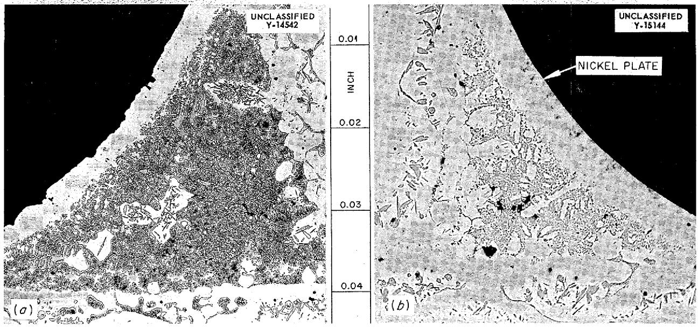  
Fig. 5.10. "A" Nickel T-Joints Brazed with Microbraz After Exposure for 100 hr at $1500^{\circ}\mathsf{F}$ to (a) Static Sodium and (b) Static NaF-ZrF $_4$ -UF $_4$ (53.5-40-6.5 mole %). Etched with (a) $10\%$ oxalic acid and (b) aqua regia. 100X. Reduced $24\%$ .

Compositions: K150A (80 wt % TiC-10 wt % NbTaTiC₃-10 wt % Ni)

K151A (70 wt % TiC-10 wt % NbTaTiC₃-20 wt % Ni)

K152B (64 wt % TiC-6 wt % NbTaTiC₃-30 wt % Ni)

K162B (64 wt % TiC-6 wt % NbTaTiC3-25 wt % Ni-5 wt % Mo)

TABLE 5.15. RESULTS OF SOLID-PHASE-BONDING SCREENING TESTS OF VARIOUS CERMETS AND ALLOYS EXPOSED TO NaF-ZrF4-UF4 (53.5-40-6.5 mole %) AT ${1500}^{ \circ  }\mathrm{F}$ FOR 100 hr AT VARIOUS CONTACT PRESSURES   

<table><tr><td>Contact Pressure (psi)</td><td>Contacting Specimens</td><td>Results*</td><td>Contact Pressure (psi)</td><td>Contacting Specimens</td><td>Results*</td></tr><tr><td rowspan="2">6,600</td><td>K150A vs Stellarite 25</td><td>Some bonding</td><td rowspan="9">50,000</td><td>K150A vs K151A</td><td>No bonding</td></tr><tr><td>K162B vs Stellarite 25</td><td>Some bonding</td><td>K150A vs K152B</td><td>Some bonding</td></tr><tr><td rowspan="5">10,000</td><td>K150A vs Stellarite 6</td><td>Some bonding</td><td>K150A vs K162B</td><td>No bonding</td></tr><tr><td>K162B vs Stellarite 6</td><td>Some bonding</td><td>K151A vs K151A</td><td>No bonding</td></tr><tr><td>K152B vs K152B</td><td>No bonding</td><td>K151A vs K152B</td><td>No bonding</td></tr><tr><td>K152B vs K162B</td><td>No bonding</td><td>K151A vs K162B</td><td>No bonding</td></tr><tr><td>K162B vs K162B</td><td>No bonding</td><td>K152B vs K152B</td><td>No bonding</td></tr><tr><td rowspan="2">50,000</td><td rowspan="2">K150A vs K150A</td><td rowspan="2">No bonding</td><td>K152B vs K162B</td><td>No bonding</td></tr><tr><td>K162B vs K162B</td><td>Some bonding</td></tr></table>

*There was inconsistent bonding of test specimens to the supporting Inconel platens in all tests.

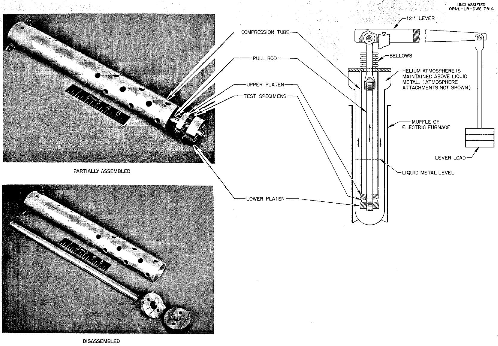  
Fig. 5.11. Apparatus for Solid-Phase-Bonding Screening Tests.

particularly that for K150A vs K152B, show no apparent relationship to the occurrence of the bonding. On the basis of these data, it is believed that none of these Kentaniums would form solid-phase bonds to each other in $\mathrm{NaF - ZrF_4 - UF_4}$ (53.5-40-6.5 mole %) at $1500^{\circ}\mathrm{F}$ in 100 hr if the true contact pressure between the cermets did not exceed 50,000 psi. A recheck of the pairs that did bond is planned that will conclude the screen testing of the Kentaniums, K150A, K151A, K152B, and K162B, for solid-phase bonding in all contact combinations with each other in $\mathrm{NaF - ZrF_4 - UF_4}$ (53.5-40-6.5 mole %) at $1500^{\circ}\mathrm{F}$ for 100 hr.

# Sodium in Inconel

A 1000-hr test was recently completed in which sodium was circulated in an Inconel thermal convection loop. Samples of the sodium used in this test were analyzed and found to contain approximately $0.03\%$ oxygen. The oxygen content was admittedly high and could have been reduced

by a factor of 10 by adequate cold trapping; however, this test did show how serious that mass transfer can be even in a thermal-convection loop when the oxygen content is high. The hot leg of the loop was held at a temperature of $1500^{\circ}\mathrm{F}$ , and the coldest section of the cold leg was held at $1200^{\circ}\mathrm{F}$ . The mass transfer that occurred was concentrated in an area in the cold leg where an air blast had impinged on the tube wall during the test, as shown in Fig. 5.12. Very little mass transfer was detected in other sections of the cold leg. A similar test will be conducted in which the oxygen content of the sodium will be held below $0.005\%$ to determine the effect the oxygen content has on mass transfer in a sodium-Inconel system.

# Lithium in Type 347 Stainless Steel

Lithium was circulated in two stainless steel thermal-convection loops for periods of 1000 and 3000 hr, respectively. The hot- and cold-leg temperatures were 1000 and $550^{\circ}\mathrm{F}$ , respectively.

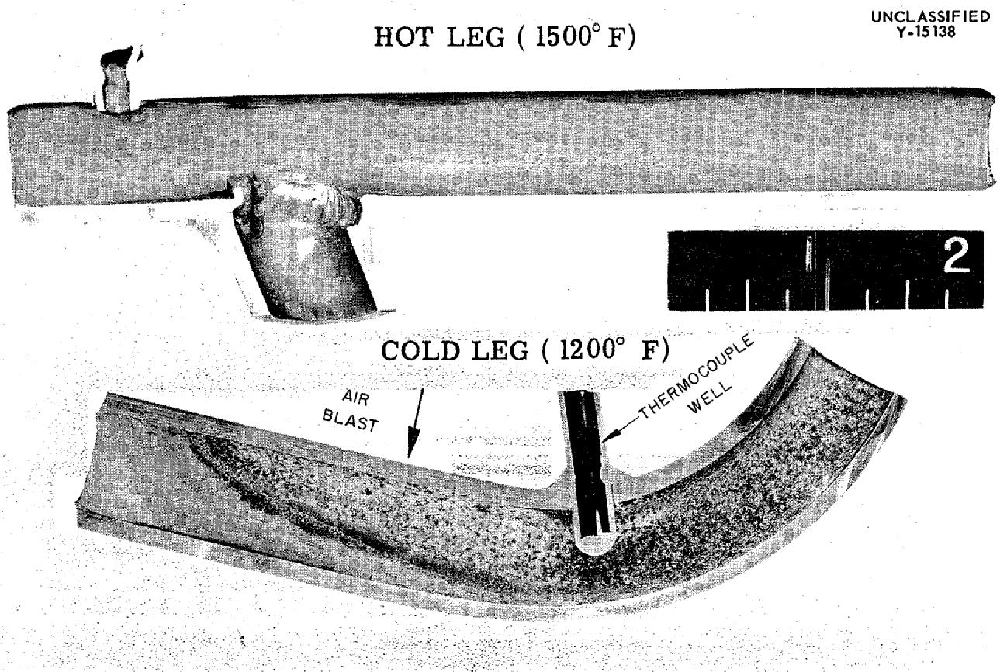  
Fig. 5.12. Specimens of Hot and Cold Legs of an Inconel Thermal-Convection Loop After Circulating Sodium for 1000 hr. Crystal deposition resulting from mass transfer may be seen in the cold leg.

The loops operated satisfactorily during the test periods, and macroscopic examination revealed no mass-transferred crystals in the loops or in the lithium drained from the loops.

The hot zone of the loop that operated for 1000 hr had subsurface voids and a ferritic surface layer to a depth of 0.3 to 1.0 mil. Lithium metal had penetrated to this depth. The weld zone of the pipe in this area was attacked to a depth of 3 mils. The cold leg of the loop was unattacked; however, there were a few small (0.2 mil) crystals attached to the surface. Similar crystals were previously identified as carbides.

The attack in the hot leg of the loop that operated for 3000 hr was similar to that found in the 1000-hr test specimen; however, the spongy ferritic surface layer was 1.0 to 1.5 mils thick, as shown in Fig. 5.13. The attack in the weld zone was intergranular and extended to a depth of 4 to 5 mils, as shown in Fig. 5.14. The preferential attack in

the weld zone is due to attack of the grain boundary carbides by the molten lithium. A deep groove in the pipe wall may be seen at the weld zone-parent metal interface.

The cold-leg section (Fig. 5.13) of this loop was very similar in appearance to that of the loop operated for 1000 hr. A few small (0.2 mil) carbide particles were attached to the wall of the tube.

It is believed that the corrosion resistance of type 347 stainless steel to lithium in this temperature range would be improved by lowering the carbon content of the steel and by using seamless instead of welded pipe. The austenite-to-ferrite transformation detected in the hot legs of these loops is attributed to leaching of nickel from the type 347 stainless steel by the lithium.

# Versene Cleaning of Beryllium-Inconel Systems

Versene has been proposed as the cleaning agent for the ART, and therefore the corrosion resistance

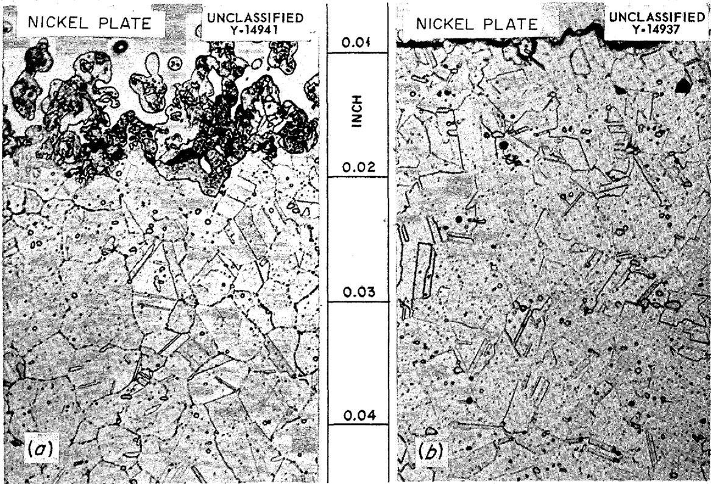  
Fig. 5.13. Hot- and Cold-Leg Surfaces of Type 347 Stainless Steel Thermal-Convection Loop After Circulating Lithium for 3000 hr at a Hot-Leg Temperature of $1000^{\circ}\mathrm{F}$ and a Cold-Leg Temperature of $550^{\circ}\mathrm{F}$ . Note austenite-to-ferrite phase transformations which occurred on hot-leg surface (a) and small crystals deposited on cold-leg surface (b). Specimens nickel plated after testing. Etched with aqua regia. 1000X.

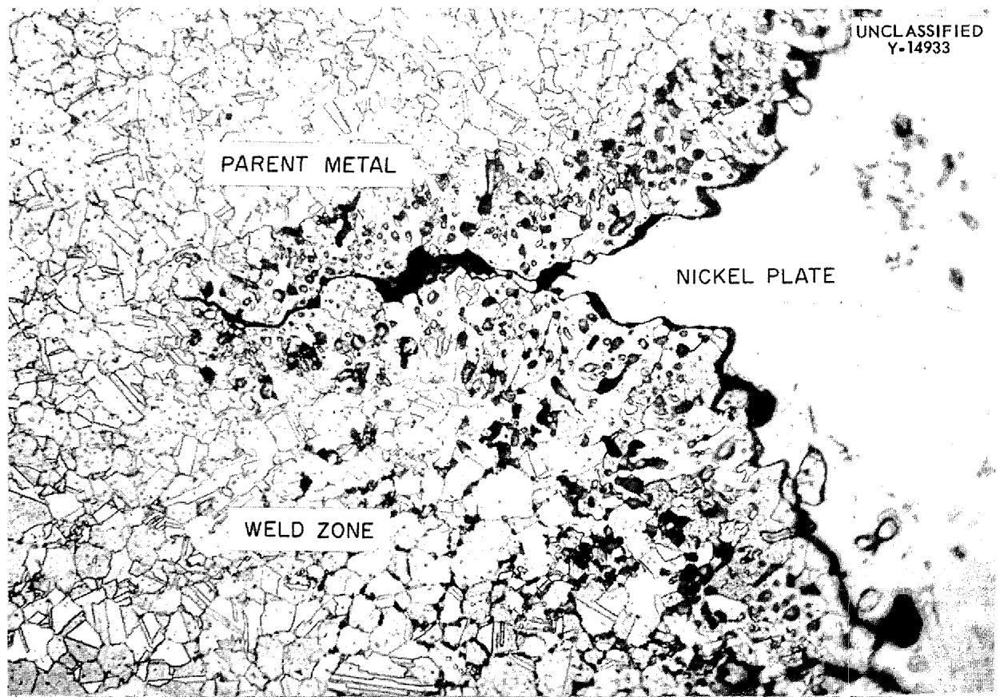  
Fig. 5.14. Inside Wall of Hot-Leg Weld from Type 347 Stainless Steel Thermal-Convection Loop After Circulating Lithium for 3000 hr at a Hot-Leg Temperature of $1000^{\circ}\mathbf{F}$ . Note deep (4 mils) attack in weld zone as compared with 1-mil attack on parent metal. Etched with aqua regia. 1000X.

<table><tr><td>0.05</td><td>0.04</td><td>0.03</td><td>INCH</td><td>0.02</td><td>0.01</td></tr></table>

of beryllium to dynamic Versene was studied. The testing procedure was designed to simulate the cleaning procedure used in the ARE, which was cleaned with a Versene solution.

Tests have been completed with two loops constructed of Inconel with a beryllium insert. The beryllium sample was placed within the loop between two similar Inconel inserts which were held in place by crimping. The tubular beryllium insert was $\frac{3}{4}$ in. OD, $\frac{9}{16}$ in. ID, and 3 in. in length. A $1\%$ Versene solution was pumped through each loop at a rate of 2 gpm (2.6 fps) by a centrifugal pump. Disodium versonate was used, and the concentration was determined on a weight-volume basis. The testing temperature for both loops was $180^{\circ}\mathrm{F}$ , and the Versene was circulated in each for a period of 24 hr.

Upon completion of the first test the Versene was drained while the loop was still at test temperature. When the loop was sectioned, a small amount of Versene was found in a static region of the loop located in the annular gap between the beryllium insert and the Inconel sleeve. No trace of retained Versene was found in this section of the second loop, which was flushed with distilled water after the Versene was drained.

Macroscopic examination showed the beryllium inserts in both loops to be quite similar. Each insert had retained its original polished appearance. No effect of the Versene solution was found by macroscopic or metallographic examination of the inner surface of the beryllium insert or the Inconel in either test. The outer surfaces of the beryllium inserts, however, were attacked

by the Versene solution. The attack was in the form of erratic pits that varied in depth from 0.5 to 2.5 mils.

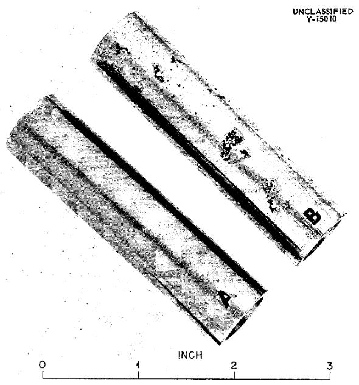  
Fig. 5.15. As-received (a) and As-tested (b) Beryllium Insert from Second Inconel Loop in Which Versene Cleaning Solution Was Circulated at $180^{\circ}\mathsf{F}$ at a Rate of 2 gpm.

The erratic attack of the Versene on the outer surface of the beryllium insert used in the second test is shown macroscopically in Fig. 5.15. The unattacked inner surface and the erratically attacked outer surface of the beryllium insert used in the first test are shown in Fig. 5.16. The 2.5-mil outer surface attack shown in Fig. 5.16 is representative of that found by metallographic examination of the beryllium inserts used in both tests. In each test the beryllium insert lost weight, as shown in the following tabulation.

<table><tr><td></td><td>Test No. 1</td><td>Test No. 2</td></tr><tr><td>Original weight, g</td><td>16.8715</td><td>16.7970</td></tr><tr><td>Final weight, g</td><td>16.8680</td><td>16.7941</td></tr><tr><td colspan="3">Weight loss</td></tr><tr><td>g</td><td>0.0035</td><td>0.0029</td></tr><tr><td>%</td><td>0.021</td><td>0.017</td></tr></table>

A chemical analysis of a portion of the Versene solution used in the second test revealed a beryllium concentration of $0.0024\mathrm{mg / ml}$ . Since 1.5 liters of $1\%$ Versene solution was used in this test, the total amount of beryllium in the solution was $3.8\mathrm{mg}$ , which agrees fairly well with the $2.9\mathrm{-mg}$ weight loss of the beryllium insert used in this test.

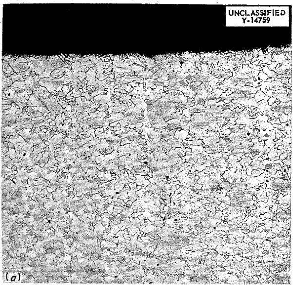

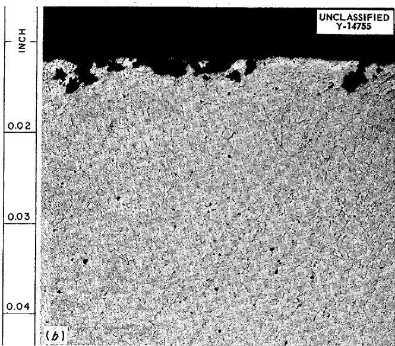  
Fig. 5.16. Inner (a) and Outer (b) Surfaces of Beryllium Insert From First Inconel Loop in Which Versene Cleaning Solution Was Circulated at $180^{\circ}\mathsf{F}$ at a Rate of 2 gpm. Etched with oxalic acid. 100X. Reduced 24%.

# FUNDAMENTAL CORROSION RESEARCH

G.P. Smith

Metallurgy Division

# Film Formation on Metals

J.V.Cathcart

Metallurgy Division

Most of the work done in the past on the oxidation of metals has been devoted to a study of the oxidation characteristics of the "heavy" metals and alloys such as copper, nickel, iron, aluminum, the stainless steels, etc. These materials either were structurally important or their physical properties were such as to make them particularly amenable to oxidation studies. Comparable investigations of the alkali and alkaline-earth metals are almost entirely lacking.

Rather elaborate oxidation theories have been devised for the heavier metals, but it has been assumed, in general, that the alkali and alkaline-earth metals exhibit a linear oxidation rate, in accordance with the old crack theory of Pilling and Bedworth. Their theory was that a metal, for which the ratio of the density of the oxide to that of the parent metal is greater than unity, should obey a linear oxidation law. It was reasoned that the oxide film formed would be highly subject to cracking and that, consequently, there would be a constant re-exposure of fresh metal surface to oxygen. Thus the rate of oxidation should be independent of the thickness of the oxide film, the quantity of oxide formed being directly proportional to the time of exposure to oxygen.

In order to test the crack theory of oxidation directly, as well as to obtain experimental data on the oxidation of the alkali metals, an investigation of the oxidation characteristics of sodium was undertaken. Sodium fulfills completely the Pilling and Bedworth criterion for a metal that exhibits a linear oxidation rate. This study was initiated because preliminary experiments indicated that sodium, contrary to the theory, actually forms a highly protective oxide film in dry oxygen. Subsequent work verified these early findings. The research has been continued in an effort to clarify the oxidation mechanism operative for sodium and to relate it to the more thoroughly investigated

oxidation mechanisms of copper, aluminum, and other structural metals.

On the basis of the results obtained with sodium, it was concluded that a fundamental error existed in the currently accepted oxidation concepts for metals that obey a linear oxidation rate law and that it was therefore desirable to investigate carefully the oxidation of some metal that does exhibit a linear oxidation rate. Columbium was especially suitable for this study. Below approximately $400^{\circ}\mathrm{C}$ , it obeys a parabolic oxidation rate law, while above this temperature its oxidation rate is linear. At $400^{\circ}\mathrm{C}$ the initial stages of oxidation also appear to follow a parabolic rate, but after several hours of oxidation the rate increases and becomes almost linear. Thus a careful investigation of the structure and composition of the oxide films formed at or near $400^{\circ}\mathrm{C}$ should provide valuable information as to the conditions which lead to a linear oxidation rate.

An added incentive for the study of the oxidation properties of columbium was that this metal possesses very desirable high-temperature structural properties. Its use has been limited largely by its excessive oxidation at high temperatures. It was believed that further information concerning its oxidation mechanism would be helpful in overcoming this defect.

The experimental procedures used and the results of the studies of sodium and columbium oxidation are presented below.

Sodium Oxidation. The oxidation rate of sodium was followed by measuring the change in pressure in a closed reaction chamber as the reaction proceeded. A sensitive, differential manometer in which Octoil-S diffusion pump oil was used as the manometric fluid served as the pressure-sensing device.

The apparatus used is shown in Fig. 5.17. The sodium reservoir consisted of a glass bulb closed at one end with a thin-walled break-off tip. The reservoir was filled, under vacuum, through a side arm, with sodium that had been purified by repeated vacuum distillations at a pressure of $10^{-6}$ to $10^{-7}$ mm Hg. After the side arm was removed, the reservoir was attached to a tube below the oxidation bulb, as shown in Fig. 5.17. A small furnace was built which could be placed around the entire apparatus, with the sodium reservoir and the

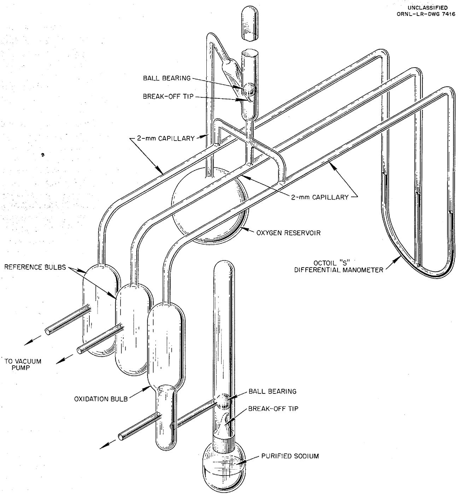  
Fig. 5.17. Sodium Oxidation Testing Apparatus.

manometer protruding from suitable holes. The entire apparatus could thus be baked-out under vacuum before any sodium was admitted to the system. Care was taken to load the manometer by the vacuum distillation of Octoil-S from a separate bulb into the manometer arms. This procedure

assured that the manometric fluid would not act as a source of appreciable gas.

After a bake-out period of 16 to 20 hr the system was allowed to cool to room temperature, and the break-off tip above the sodium reservoir was crushed. The sodium was then distilled into the

tube below the oxidation bulb, and the sodium reservoir was removed. Finally, the sodium was distilled into the oxidation bulb and allowed to condense on the walls. Both these final distillations were made under a pressure of approximately $2 \times 10^{-7} \mathrm{~mmHg}$ . As the last step before the admission of oxygen, the tube below the oxidation bulb was sealed off, as were the vacuum leads to the two reference bulbs.

A 50-cc flask served as an oxygen reservoir. Prior to being attached to the oxidation apparatus, it was filled with carefully purified oxygen to a pressure such that when the gas was allowed to expand into the reference and oxidation bulbs the resultant pressure was $200\mathrm{mmHg}$ . The purification of the oxygen was accomplished by passing it over hot copper oxide (to remove hydrogen) and Ascarite (to remove carbon dioxide) and finally drying it over magnesium perchlorate and in a liquid-nitrogen trap.

The tube leading from the oxygen reservoir to the break-off tip was made of 2-mm capillary tubing. By thus minimizing the volume above the reservoir, it was possible in the low-temperature runs to immerse the reservoir in a cold bath to precool the oxygen to the desired reaction temperature.

When the break-off tip above the oxygen reservoir was smashed, the oxygen passed through the T connection above the manometer and simultaneously filled the reference and oxidation bulbs to identical pressures. The intersection of the tubes of the T was then collapsed as quickly as possible with a hand torch. The three arms of the manometer were thus separated and any change in pressure in the oxidation bulb resulting from the reaction of sodium and oxygen was reflected in a change in the relative heights of the oil columns of the manometer.

The use of the above-described T connection instead of a stopcock had two advantages. First, it avoided all possibility of a leak occurring in the system, but, more importantly, by dispensing altogether with stopcocks, this arrangement eliminated the danger of contamination of the sodium surface by stopcock-grease vapors and permitted the bake-out of the entire system during the initial stages of evacuation. It was felt that these considerations were sufficiently important to forego the greater conveniences of a stopcock.

Oxidation rate measurements have been made at five temperatures: -79, -20, 25, 35, and $48^{\circ}\mathrm{C}$ . At 25, 35, and $48^{\circ}\mathrm{C}$ , an apparatus identical to that

shown in Fig. 5.17 was used, except that only one reference bulb was found to be necessary. For reasons described below, the second reference bulb proved very helpful, however, for experiments at the two lower temperatures.

For all experiments the oxidation and reference bulbs were immersed in a constant-temperature bath contained in a 4-liter Dewar flask. Mineral oil served as the bath liquid for the three higher temperatures. At $-20^{\circ}\mathrm{C}$ a saturated sodium chloride-ice bath proved to be satisfactory, and at $-79^{\circ}\mathrm{C}$ a slurry consisting of powdered dry ice and a 50-50 vol % solution of carbon tetrachloride and chloroform was used to attain the desired temperature. The densities of the liquid phase and the dry ice in the latter bath were approximately equal, and thus a slurry was produced in which there was little tendency for the segregation of the dry-ice particles.

At $-79^{\circ}C$ the sodium oxidized at a very slow rate. The maximum pressure change which occurred in the system as a result of the oxidation was 0.2 to $0.3\mathrm{mmHg}$ . Therefore it was necessary to pay particularly careful attention to factors which could cause spurious pressure readings. One obvious source of error was a temperature difference between the reference and oxidation bulbs. This difficulty was overcome by utilizing a relatively thin slurry in the cold bath and stirring it very vigorously. A less easily corrected source of trouble was that, of necessity, the reference and oxidation bulbs were maintained at dry-ice temperature, whereas the manometer and connecting tubes were at room temperature. A simple gas law calculation shows that, in such a system, any change in the temperature of either the cold bath or the manometer will produce, in general, a difference in pressure between the oxidation bulb and the reference bulb. A special case that is an exception to this rule occurs when the volumes of gas at the two temperatures are identical on both sides of the manometer. The magnitude of the pressure difference is dependent both on the ratio of the volume of gas held at the two temperature extremes and on the difference in temperature. Thus, this effect was of no great importance for experiments close to room temperature, but it became significant at $-79^{\circ}C$ .

It was impossible to maintain exactly equal volumes on both sides of the manometer, and the attainment of precise temperature control in the

cold bath at $-79^{\circ}C$ was almost as difficult. The equilibrium temperature of any dry-ice bath is determined by the sublimation point of carbon dioxide; however, the constancy of the sublimation temperature is dependent upon the constancy of the partial pressure of carbon dioxide above the bath. Thus, unless the bath is contained in a closed vessel, variations in temperature will occur in the bath because of changes in the partial pressure of carbon dioxide above it. In addition, the negative heat of solution of carbon dioxide in carbon tetrachloride and chloroform caused the temperature of the bath to fall below the equilibrium sublimation temperature when the cold mixture was first prepared. Since the bath was contained in a Dewar flask, the lowered temperature tended to persist for long periods of time unless a heater was immersed in the bath.

It was decided therefore that precise temperature control of the apparatus at $-79^{\circ}C$ was impractical. However, it was essential that some reference point be established for the bath so that the apparatus could be brought back to the initial conditions of the experiment after, for example, each renewal of the dry-ice charge in the bath. The addition of a second reference bulb proved satisfactory for this purpose. The two reference bulbs represented a "differential gas thermometer." It was observed that within about 10 min after the start of an experiment a small difference in the heights of the oil in the reference arms of the manometer was usually established. This difference remained constant as long as the temperature of the bath and the room temperature were unchanged. When deviations in this difference were observed, it was possible to make slight alterations in the bath temperature (for example, by removing part of the cover of the Dewar flask and thus decreasing the partial pressure of carbon dioxide above the bath) and thus re-establish the desired pressure difference in the reference bulbs.

It was recognized that the constancy of the pressure difference between the two reference bulbs did not necessarily indicate a corresponding constancy in the cold-bath temperature. Frequently, the adjustments in the bath temperature that were necessary to maintain the pressure difference represented a counterbalance to changes in room temperature. The resultant small changes in the bath temperature meant, of course, a change in the temperature at which oxidation occurred; but, since

the oxidation rate of sodium is not a sensitive function of temperature at $-79^{\circ}C$ , this alteration of the experimental conditions was not considered to be significant. In any event, as may be seen in Fig. 5.18, the use of the technique described above produced excellent agreement of the data for three separate experiments at $-79^{\circ}C$ .

The experimental data obtained at the five temperatures investigated are shown in Fig. 5.18. The change in pressure in the system, which is obviously a function of the thickness of the oxide film formed, is plotted against the time of oxidation on a log-log scale. Each curve represents the composite of data taken from three or more experiments.

Perhaps the most striking feature of the experiments was the slowness with which oxidation occurred. Very roughly, one unit on the ordinate scale in Fig. 5.18 is equal to a film thickness of $10\text{\AA}$ . Thus at $-79^{\circ}\text{C}$ after $1000\text{min}$ of oxidation, the thickness of the oxide film was only about $30\text{\AA}$ , while at $48^{\circ}\text{C}$ , it was $500\text{\AA}$ .

Since the curves, as plotted, were not linear, there was an indication that the data did not fit any of the conventional oxidation rate equations of the form

$$
x ^ {n} = k t, \quad n = 1, 2, 3,
$$

where $x$ is the thickness of the oxide film after time $t$ , and $k$ is the rate constant. The data were also tested against the logarithmic rate equation

$$
x = k \log t,
$$

but no fit was obtained.

As may be seen from the curves in Fig. 5.18, the oxidation rates of sodium at $-79$ and $-20^{\circ}\mathrm{C}$ decrease very sharply after the first 150 to 200 min of oxidation. This behavior is qualitatively similar to that predicted by Cabrera and Mott for oxidation processes leading to the formation of very thin films. The oxide thickness (30 to $40\mathring{\mathrm{A}}$ ) observed at $-79^{\circ}\mathrm{C}$ is very close to the thickness range required by this theory. The data were checked against the appropriate rate equation

$$
\frac {1}{x} = A - B \ln t,
$$

where $x$ and $t$ are oxide thickness and time, respectively, and $A$ and $B$ are constants, but no

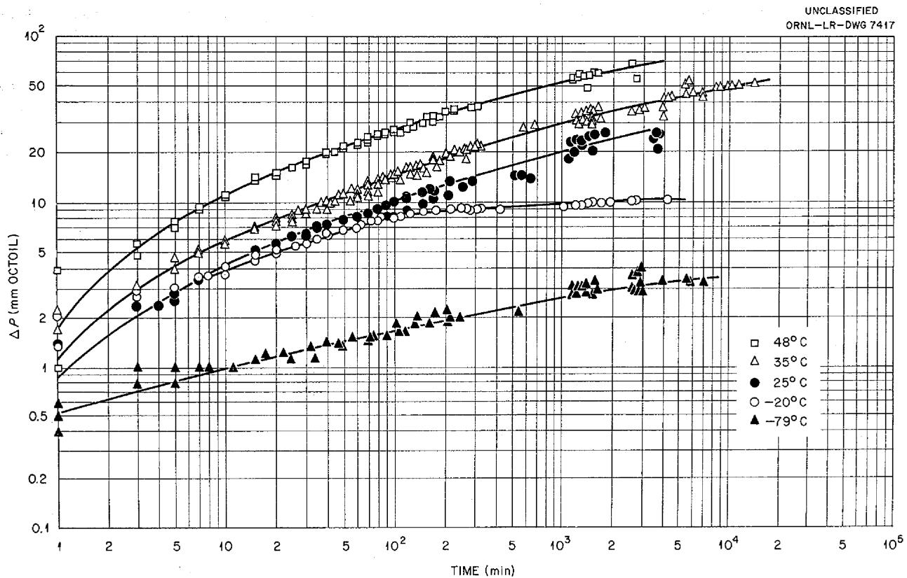  
Fig. 5.18. Data on Oxidation of Sodium as a Function of Time and Temperature. In apparatus used, a change in system pressure is a function of the thickness of the oxide film formed.

agreement was found. However, the qualitative similarity between the observed rate curves and those predicted by the theory suggests that the results obtained at $-79$ and $-20^{\circ}C$ represent an oxidation process in which the mechanism proposed by Cabrera and Mott is competing with some second mechanism. It is hoped to test this idea by making oxidation measurements at temperatures below $-79^{\circ}C$ .

The very small amount of oxide which was formed at all temperatures investigated emphasized the highly protective character of sodium oxide films in carefully dried oxygen. The frequently accepted idea that sodium obeys a linear oxidation rate must be discarded. The results also suggest that the oxidation mechanism for sodium (and possibly also that for the other alkali and alkaline-earth metals) need not be regarded as being of a specialized nature but may be very similar to the oxidation mechanism for the heavier metals, such as copper and aluminum. As further details of the oxidation characteristics of sodium and other "ultra-light"

metals become available, it may prove possible to devise a theory of oxidation which is applicable to at least the low-temperature oxidation of all metals.

At the present time the oxidation data obtained at $25^{\circ}C$ are being rechecked, and the time of oxidation is being extended. It is felt that these additional data are required in order to obtain a meaningful analytical expression for the rate curves. The measurements at $48^{\circ}C$ will also be extended in a similar manner.

The completion of these rate studies will mark the end of what might be termed the "classical" phase of the investigation of the oxidation of sodium. It is planned that the future work with sodium will include a study of the surface topography and structure of the sodium oxide films. Electron microscopy and diffraction techniques will be required for this work. The investigations of Harris, Gulbransen, and others have demonstrated that, contrary to all existing oxidation theory, oxide films formed on copper, nickel, and iron are

not of uniform thickness and that the major portion of the oxide is contained in nuclei scattered over the metal surfaces. These findings emphasize the necessity of combining rate measurements with a detailed examination of the oxide films formed in any complete oxidation study.

Columbium Oxidation. The work on columbium is in the preliminary stage. It is planned to measure the rate of oxidation of columbium at several temperatures in the neighborhood of $400^{\circ} \mathrm{C}$ and then to correlate the oxidation rate and oxide layer thickness with the structure and porosity of the oxide. In this manner it should be possible to establish the conditions which exist in the film, both when a parabolic law is obeyed and when the rate becomes linear.

A check has been made on the oxidation rate of columbium at $400^{\circ}\mathrm{C}$ in highly purified oxygen. Qualitative verification was obtained of the phe

nomenon, reported by Inouye, $^{8}$ of the transition of the oxidation rate from a parabolic to a linear relationship. The initial stages of oxidation produced oxide films which exhibited interferences (colors). As the reaction proceeded, however, the specimens became coated with a white, opaque oxide film whose surface was rough. The appearance of the white oxide seemed to coincide approximately with the transition from the initial parabolic oxidation rate to a linear rate.

# Mass Transfer and Corrosion in Fused Hydroxides

M. E. Steidlitz

Metallurgy Division

The study of corrosion and mass transfer of metal by fused sodium hydroxide is under way. Over 60

TABLE 5.16. MASS TRANSFER OF NICKEL IN SODIUM HYDROXIDE UNDER A HYDROGEN ATMOSPHERE FOR 100 hr   

<table><tr><td>Bucket Temperature (°C)</td><td>Temperature Differential of System* (°C)</td><td>Number of Tests</td><td>Amount of Mass Transfer (Visual Observation)</td></tr><tr><td>450**</td><td>100</td><td>1</td><td>Little</td></tr><tr><td>450</td><td>100</td><td>1</td><td>None</td></tr><tr><td>575</td><td>100</td><td>1</td><td>Very little</td></tr><tr><td>600</td><td>100</td><td>4</td><td>Very little to little</td></tr><tr><td>600</td><td>200</td><td>1</td><td>Very little</td></tr><tr><td>625</td><td>50</td><td>1</td><td>None</td></tr><tr><td>625</td><td>100</td><td>2</td><td>Very little</td></tr><tr><td>650</td><td>50</td><td>1</td><td>Barely observable</td></tr><tr><td>650</td><td>100</td><td>2</td><td>Moderate</td></tr><tr><td>650</td><td>200</td><td>1</td><td>Moderate</td></tr><tr><td>675</td><td>50</td><td>1</td><td>Little</td></tr><tr><td>675</td><td>100</td><td>1</td><td>Moderate</td></tr><tr><td>700</td><td>50</td><td>1</td><td>Moderate</td></tr><tr><td>700</td><td>100</td><td>7</td><td>Moderate to heavy</td></tr><tr><td>800</td><td>50</td><td>1</td><td>Heavy</td></tr><tr><td>800</td><td>100</td><td>1</td><td>Very heavy</td></tr></table>

*Bucket temperature less the cold-finger temperature.   
\*\*This test was made under a helium atmosphere.

individual tests have been conducted in the "cold-finger" apparatus. Although some analyses of these tests are not complete, certain patterns of hydroxide are being observed.

The cold-finger apparatus, which was described previously,[9,10] consists of any externally heated bucket of hydroxide into which dips an air-cooled cold finger. Both the cold finger and the bucket are constructed of the metal being tested. Thermal gradients are observed between the outside of the bucket and the inside of the cold finger so that there is never thermocouple metal in the hydroxide bath. All tests have been run for 100 hr, except as otherwise noted, at the indicated maximum temperatures and temperature gradients under a flowing hydrogen atmosphere.

The sodium hydroxide used in this study is reagent grade. It is dehydrated in place under

9M. E. Steidlitz and W. H. Bridges, ANP Quar. Prog. Rep. Mar. 10, 1955, ORNL-1864, p 91.

10W. H. Bridges, Met. Semiann. Prog. Rep. Apr. 10, 1954, ORNL-1727, p 52.

vacuum at $300^{\circ}C$ for at least 8 hr followed by a minimum of 16 hr at $400^{\circ}C$ . In some instances, previously dehydrated hydroxide is used, in which case, a rapid pumping at $400^{\circ}C$ is deemed sufficient.

The metals studied to data have been nickel, Inconel, and Hastelloy B. Of these, nickel and Inconel show some promise of being suitable for use with the hydroxide at temperatures of the order of $600^{\circ}\mathrm{C}$ . Hastelloy B is by far the least resistant of the three to attack by the hydroxide, being badly corroded at $600^{\circ}\mathrm{C}$ .

The conditions and visual observations of the tests on nickel are presented in Table 5.16. In no case was oxidation corrosion observed. Mass transfer does occur at $600^{\circ}\mathrm{C}$ , as shown in Fig. 5.19. The cold fingers seen in Fig. 5.19 are nickel, with the exception of No. 19, which is Inconel. Bucket temperatures were 600, 630, 670, and $700^{\circ}\mathrm{C}$ for Nos. 17, 18, 20, and 21, respectively. The cold fingers were kept $100^{\circ}\mathrm{C}$ cooler than the corresponding buckets. The sequence shows clearly the very small amount of mass transfer at

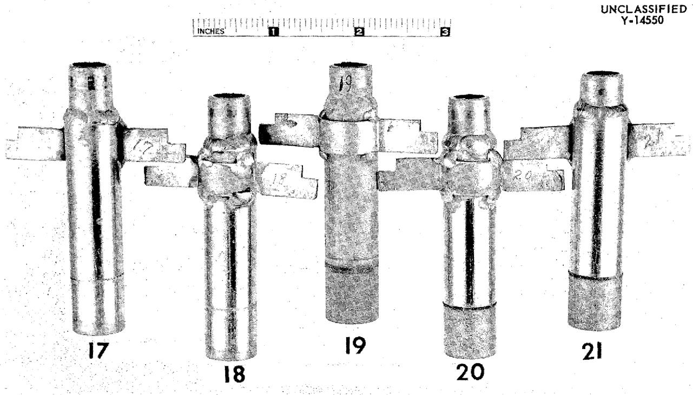  
Fig. 5.19. Mass-Transferred Deposits on Nickel and Inconel Cold Fingers Exposed for 100 hr to Sodium Hydroxide. Numbers 17, 18, 20, and 21 are nickel and were exposed at bucket temperatures of 600, 630, 670, and $700^{\circ}\mathrm{C}$ , respectively, with a temperature differential of $100^{\circ}\mathrm{C}$ . Number 19 is Inconel and was exposed at a bucket temperature of $700^{\circ}\mathrm{C}$ with a temperature differential of $100^{\circ}\mathrm{C}$ .

$600^{\circ}C$ as well as an acceleration in the rate of transfer with increasing temperature in the range 600 to $700^{\circ}C$ . The mass-transferred deposit at the liquid line, as shown in Fig. 5.20, indicates the type of metal crystal growth which occurs. This specimen is a duplicate of No. 21, for which the bucket temperature was $700^{\circ}C$ and the cold-finger temperature was $600^{\circ}C$ .

Several compounds that were chosen for their strong reducing properties have been added to the hydroxide melt. It was hoped that these materials, together with the hydrogen atmosphere, will lower the mass transfer rate in nickel. Results of tests with sodium or sodium hydride added to the sodium hydroxide are shown in Fig. 5.21. All the nickel cold fingers shown were held at $600^{\circ}C$ , and the bucket temperatures were $700^{\circ}C$ . No addition was made to the sodium hydroxide to which No. 37 was

exposed, and Nos. 38 through 41, respectively, were exposed to sodium hydroxide containing $5\%$ Na, $10\%$ Na, $5\%$ NaH, and $10\%$ NaH, respectively. In no case did the addition decrease the mass transfer. The same was true for the third and last additive tried, sodium hydrogen phosphite.

In all the tests with additives, there was evidence that some, if not most, of the added material distilled out of the bucket. These same compounds might be found to be effective in a more confined system such as a closed loop. No tests have yet been run at the temperature at which mass transfer is first noticed, and it is possible that these additives might increase the maximum temperature that can be attained without mass transfer occurring.

The results of tests on Inconel in sodium hydroxide are shown in Table 5.17. The mass transfer of Inconel was significantly less than that of

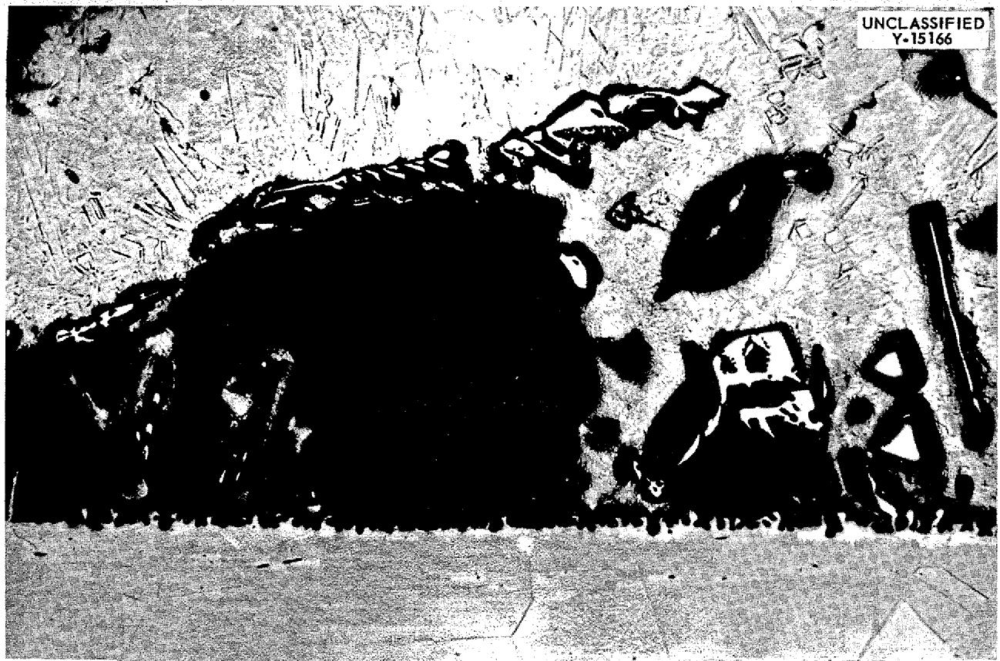  
Fig. 5.20. Mass-Transferred Deposit on Cold Finger Exposed to Sodium Hydroxide at a Bucket Temperature of $700^{\circ}\mathrm{C}$ with a Temperature Differential of $100^{\circ}\mathrm{C}$ for 100 hr. 250X.

<table><tr><td>0
006</td><td>750 X</td><td>004</td><td>003</td><td>002</td><td>INCH</td></tr></table>

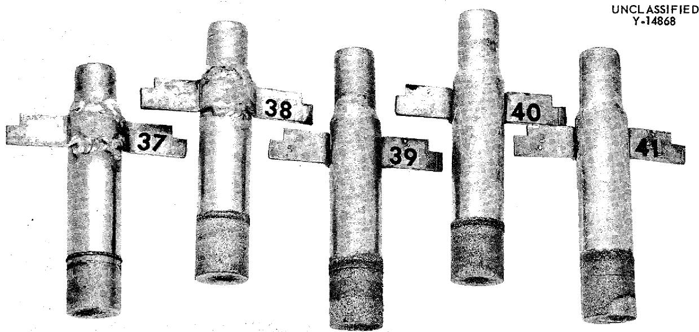

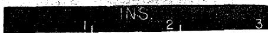  
Fig. 5.21. Mass-Transferred Deposits on Nickel Cold Fingers Exposed for 100 hr to Sodium Hydroxide With and Without Various Additives. Cold finger maintained at $600^{\circ}\mathrm{C}$ ; bucket maintained at $700^{\circ}\mathrm{C}$ ; No. 37 exposed to sodium hydroxide with no additives; Nos. 38 through 41 exposed to sodium hydroxide containing $5\%$ Na, $10\%$ Na, $5\%$ NaH, and $10\%$ NaH, respectively.

TABLE 5.17. CORROSION AND MASS TRANSFER OF INCONEL IN SODIUM HYDROXIDE UNDER A HYDROGEN ATMOSPHERE FOR 100 hr   

<table><tr><td>Bucket Temperature (°C)</td><td>Temperature Differential of System* (°C)</td><td>Number of Tests</td><td>Comments</td></tr><tr><td>450**</td><td>100</td><td>1</td><td>Brown deposit; no mass transfer</td></tr><tr><td>450</td><td>100</td><td>1</td><td>Clean; no mass transfer</td></tr><tr><td>550</td><td>200</td><td>3</td><td>Brown stain; no mass transfer</td></tr><tr><td>600</td><td>100</td><td>1</td><td>Brown stain; no mass transfer</td></tr><tr><td>600</td><td>200</td><td>1</td><td>Brown stain; no mass transfer</td></tr><tr><td>650</td><td>100</td><td>1</td><td>Brown stain; barely observable mass transfer</td></tr><tr><td>700</td><td>100</td><td>1</td><td>Brown stain; very little mass transfer</td></tr><tr><td>800</td><td>100</td><td>1</td><td>Rust color on bucket; medium mass transfer</td></tr></table>

*Bucket temperature less the cold-finger temperature.   
**This test was made under a helium atmosphere.

nickel, but the Inconel corroded to some extent. Specimen No. 19 of Fig. 5.19 is an Inconel cold finger tested under the same conditions as was the nickel specimen No. 21. The metal deposit on No. 19 is less than that on No. 21, but the tarnish on No. 19 indicates that there was some corrosion. Therefore, in the remaining Inconel tests, the Inconel bucket (that is, the hot zone) was examined for corrosion. Inconel buckets that were exposed to sodium hydroxide at bucket temperatures from 450 to $800^{\circ}\mathrm{C}$ are shown in Figs. 5.22 through 5.26. It is most interesting to note the change in type and extent of attack that occurs between 600 and $650^{\circ}\mathrm{C}$ . At $600^{\circ}\mathrm{C}$ and below, 1 to 2 mils of grain-boundary attack may be seen both on the inside and outside wall of the bucket. The attack on the outside wall was caused by hydroxide that crept out over the bucket lip. Above $600^{\circ}\mathrm{C}$ , an oxidized layer formed that was 3 to 15 mils in depth. This temperature sensitivity is, as yet, unexplained.

Other metals are to be studied in an attempt to raise the temperature limit at which no mass transfer occurs. It is hoped that questions such as what causes the change in rate and type of attack in the 600 to $700^{\circ}C$ range will also be resolved.

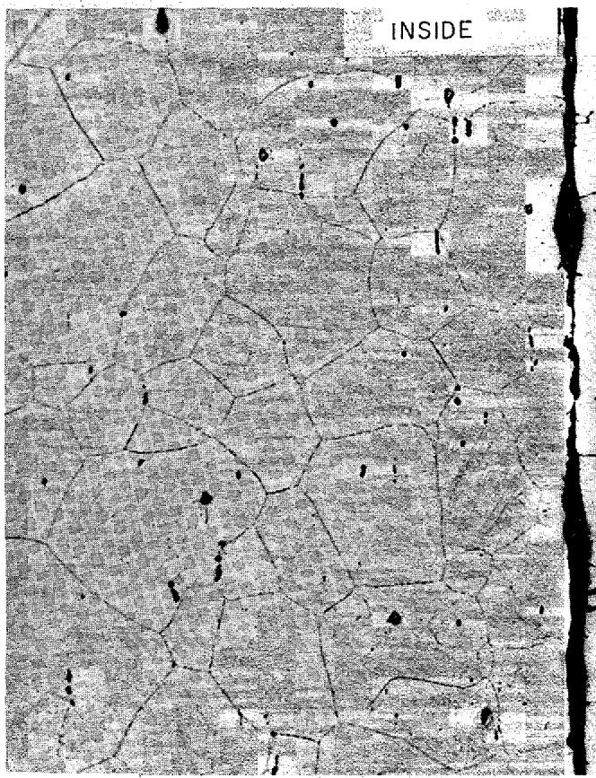

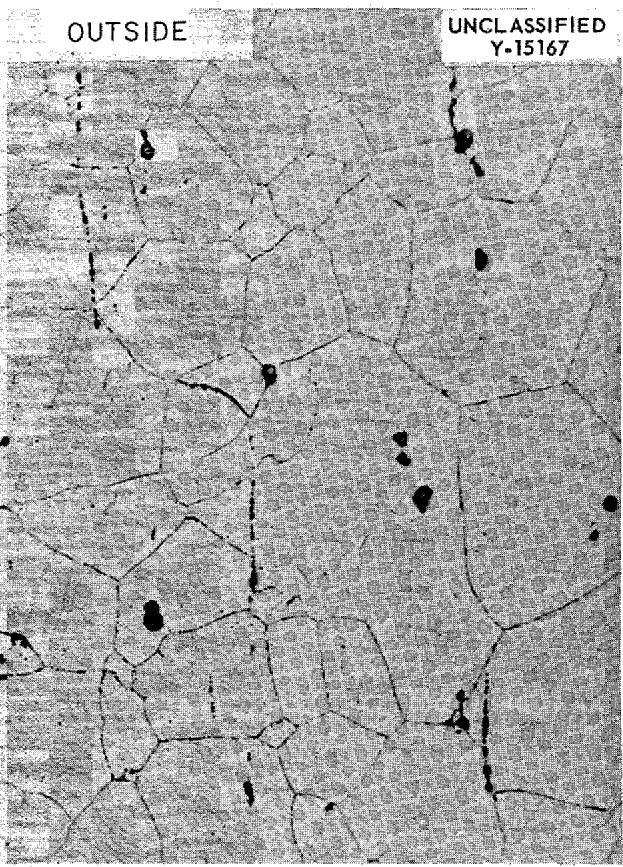  
Fig. 5.22. Inconel Bucket Exposed to Sodium Hydroxide for 100 hr. Bucket temperature, $450^{\circ}\mathrm{C}$ ; cold-finger temperature, $350^{\circ}\mathrm{C}$ . 250X.

<table><tr><td>0.001</td><td>0.001</td></tr><tr><td>0.002</td><td>0.002</td></tr><tr><td>0.003</td><td>0.003</td></tr><tr><td>0.004</td><td>0.004</td></tr><tr><td>0.005</td><td>0.005</td></tr><tr><td>0.006</td><td>0.006</td></tr><tr><td>0.007</td><td>0.007</td></tr><tr><td>0.008</td><td>0.008</td></tr><tr><td>0.009</td><td>0.009</td></tr><tr><td>0.010</td><td>0.010</td></tr><tr><td>0.011</td><td>0.011</td></tr><tr><td>0.012</td><td>0.012</td></tr><tr><td>0.013</td><td>0.013</td></tr><tr><td>0.014</td><td>0.014</td></tr><tr><td>0.015</td><td>0.015</td></tr><tr><td>0.016</td><td>0.016</td></tr><tr><td>0.017</td><td>0.017</td></tr><tr><td>0.018</td><td>0.018</td></tr></table>

# CHEMICAL STUDIES OF CORROSION

F. Kertesz

Materials Chemistry Division

# Corrosion of Inconel by LiF-BeF2 and by LiF-BeF2-UF4

H. J. Buttram

R. E. Meadows

Materials Chemistry Division

Inconel capsules containing the $\mathsf{BeF}_2$ -bearing mixtures $\mathsf{LiF - BeF}_2$ (69-31 mole %) and $\mathsf{LiF - BeF}_2\cdot \mathsf{UF}_4$ (67.3-30.2-2.5 mole %) were tested for corrosion in tilting-furnace tests. After 100-hr exposures, metallographic observations of the capsule walls revealed no attack; chemical analyses confirmed these findings. The chromium concentration was found to be about 250 ppm in the $\mathsf{LiF - BeF}_2$ mixture and $400+$ ppm in the $\mathsf{UF}_4$ -containing

analog. These results are of the same order of magnitude as those obtained for the ZrF-base mixtures.

# Effect of $\mathbf{U}\mathbf{F}_3\text{-}\mathbf{U}\mathbf{F}_4$ Mixtures on Corrosion of Inconel by Various Solvents

H. J. Buttram

R. E. Meadows

Materials Chemistry Division

Incidental to attempts to study the disproportionation of $\mathsf{UF}_3$ confirmation of the beneficial effect of $\mathsf{UF}_3$ on corrosion of Inconel by NaF-ZrF $_4$ (53-47 mole%) and NaF-KF-LiF (11.5-42-46.5 mole%) was obtained. A series of $\mathsf{UF}_3\text{-}\mathsf{UF}_4$ mixtures in these solvents was heated in Inconel capsules. The contents were analyzed for total uranium and trivalent uranium after testing in the tilting furnace or under static conditions. Considerable dispro

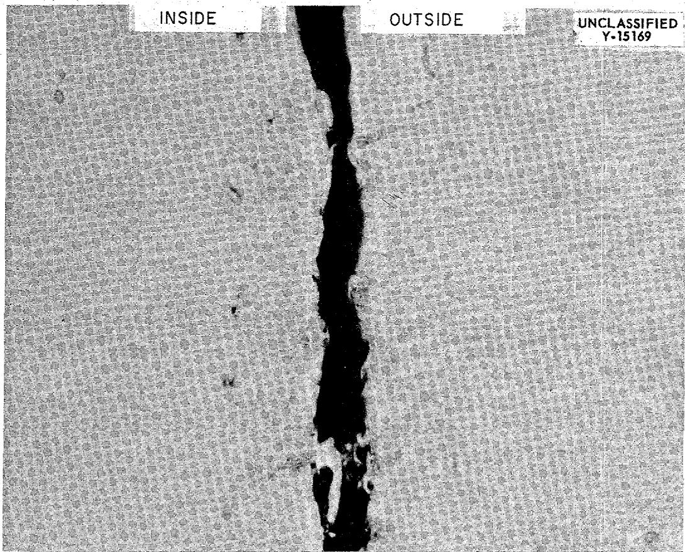  
Fig. 5.23. Inconel Bucket Exposed to Sodium Hydroxide for 100 hr. Bucket temperature, $600^{\circ}\mathrm{C}$ ; cold-finger temperature, $500^{\circ}\mathrm{C}$ . 750X.

<table><tr><td>0.004</td><td>0.001</td><td>0.002</td><td>0.003</td><td>0.004</td></tr><tr><td>0.004</td><td>0.001</td><td>0.002</td><td>0.003</td><td>0.004</td></tr><tr><td>0.004</td><td>0.001</td><td>0.002</td><td>0.003</td><td>0.004</td></tr><tr><td>0.004</td><td>0.001</td><td>0.002</td><td>0.003</td><td>0.004</td></tr><tr><td>0.50×</td><td>25</td><td>0.015</td><td>0.014</td><td>0.013</td></tr><tr><td>0.015</td><td>0.014</td><td>0.013</td><td>0.014</td><td>0.013</td></tr><tr><td>0.015</td><td>0.014</td><td>0.013</td><td>0.014</td><td>0.013</td></tr><tr><td>0.015</td><td>0.014</td><td>0.013</td><td>0.014</td><td>0.013</td></tr><tr><td>0.015</td><td>0.014</td><td>0.013</td><td>0.10</td><td>0.10</td></tr></table>

portionation of the added $\mathsf{UF}_3$ was observed in both solvents, especially when the $\mathsf{UF}_4 / \mathsf{UF}_3$ ratio was low; the NaF-KF-LiF mixtures showed, in each case, more disproportionation than did the NaF-ZrF $_4$ solutions.

Analyses of the melts for chromium revealed that the beneficial effect of $\mathsf{UF}_3$ on corrosion of Inconel was again demonstrated. If a plot is made of chromium concentration after testing as a function of the starting $\mathsf{UF}_3 / \mathsf{UF}_4$ ratio, it is seen that a small percentage of $\mathsf{UF}_3$ ( $\mathsf{UF}_3 / \mathsf{UF}_4 = 0.2$ ) causes a sharp decrease in the amount of chromium removed from the Inconel walls. Increasing the $\mathsf{UF}_3$ content up to a 50-50 mixture with $\mathsf{UF}_4$ was found to be beneficial, but any further increase in the $\mathsf{UF}_3 / \mathsf{UF}_4$ ratio apparently had little effect.

Studies of the Sodium Hydroxide-Nickel Reaction

F. Kertesz F.A.Knox

Materials Chemistry Division

During previous work on the equilibrium hydrogen pressure of the sodium hydroxide-nickel reaction, it was found that the reproducibility was somewhat poor. Similar difficulties were observed during determinations of the equilibrium solubility of the metal in molten hydroxide. In studying the possible reaction

$$
2 \mathrm {N a O H} + \mathrm {N i} \rightarrow \mathrm {N a} _ {2} \mathrm {O} \cdot \mathrm {N i O} + \mathrm {H} _ {2}
$$

the hydrogen pressure or the nickel concentration was determined as a function of time and temperature. The hydrogen pressure was measured with

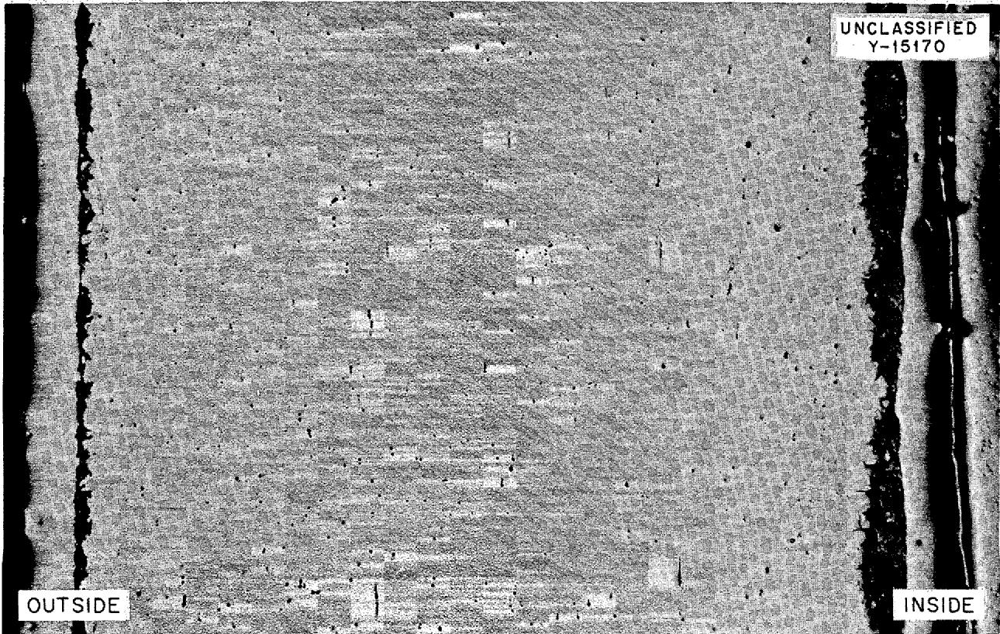  
Fig. 5.24. Inconel Bucket Exposed to Sodium Hydroxide for 100 hr. Bucket temperature, $650^{\circ}\mathrm{C}$ ; cold-finger temperature, $550^{\circ}\mathrm{C}$ . 75X.

<table><tr><td>0.08</td><td>0.07</td><td>0.06</td><td>0.05</td><td>0.04</td><td>INCH</td><td>0.03</td><td>0.02</td><td>0.01</td></tr></table>

the reaction chamber connected to a manometer, and the nickel concentration was determined by analyzing the contents of a quartz-jacketed metal capsule after the desired exposure time. Since the two sets of data were necessarily determined on separate systems, there was the possibility of unknown variables being present, even though every effort was made to keep the variables identical.

This experimental difficulty has recently been counteracted by constructing an apparatus that makes possible simultaneous determinations of the hydrogen equilibrium pressures and the equilibrium nickel solubility. A charge of purified sodium hydroxide is loaded into a hydrogen-fired nickel capsule which is sealed under helium and then placed in a quartz tube that is evacuated and sealed. The jacketed capsule is heated to the test temperature for the desired time period. If the

exposure is sufficiently long, the hydrogen pressure developed should be in equilibrium with the melt, since it should not diffuse through the quartz. The pressure should be nearly equal inside and outside the nickel capsule, because hydrogen diffuses easily through this metal at the temperatures used. Upon completion of the high-temperature exposure, the capsule is placed in a flanged metallic cylinder which, after evacuation, is connected to a mercury manometer. A small metal pin held near the quartz capsule by a metallic bellows extending through a lateral hole in the cylinder can then be tapped to break the quartz jacket. The pressure established in the system can be read on the manometer, and a simple calculation will give the pressure inside the quartz capsule before it was broken.

Calibration tests with capsules containing hydrogen at a known pressure showed that the

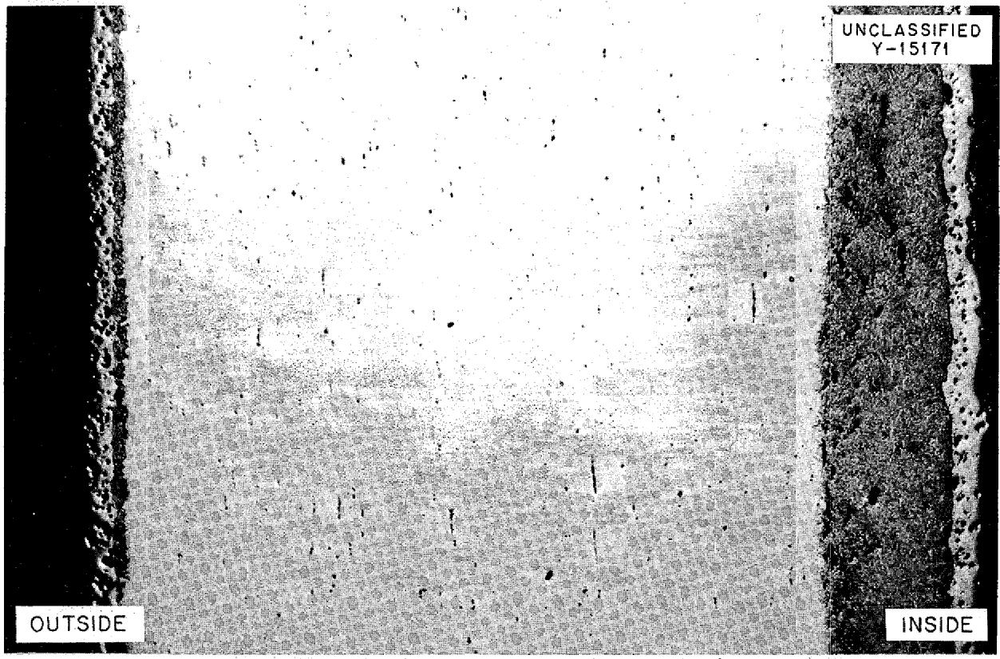  
Fig. 5.25. Inconel Bucket Exposed to Sodium Hydroxide for 100 hr. Bucket temperature, $700^{\circ}\mathrm{C}$ ; cold-finger temperature, $600^{\circ}\mathrm{C}$ . 75X.

<table><tr><td>0.08</td><td>0.07</td><td>0.06</td><td>0.05</td><td>0.04 INCH</td><td>0.03</td><td>0.02</td><td>0.01</td></tr></table>

method allowed pressures to be determined to within $1\%$ . After the pressure measurement the nickel capsule was opened and the hydroxide was leached out, with the total alkalinity and the dissolved nickel being determined on the same sample.

Some of the quartz-jacketed nickel capsules containing sodium hydroxide were kept at $800^{\circ}\mathrm{C}$ for various lengths of time in order to ascertain the time necessary to reach equilibrium. Runs for long periods of time were unsuccessful because

of failure of the nickel capsules. It was found that the nickel content of the hydroxide remained nearly constant when the time of exposure was varied considerably, which would indicate that equilibrium was reached after a short exposure time. The hydrogen pressures determined by this method did not level off as expected, and the resulting pressure was found to be greatly in excess of that to be expected from consideration of the reaction postulated.

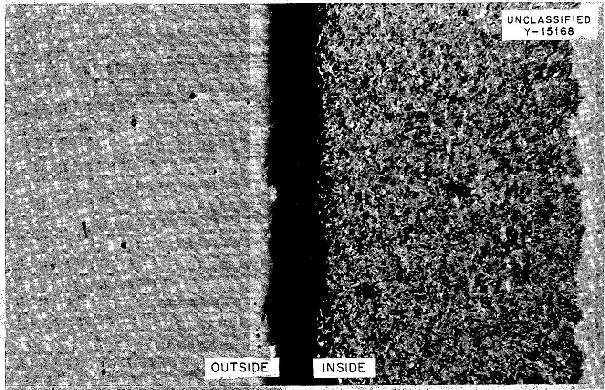  
Fig. 5.26. Inconel Bucket Exposed to Sodium Hydroxide for 100 hr. Bucket temperature, $800^{\circ}\mathrm{C}$ ; cold-finger temperature, $700^{\circ}\mathrm{C}$ . 250X.

<table><tr><td></td><td>0.024</td><td>0.022</td><td>0.020</td><td>0.018</td><td>0.016</td><td>0.014</td><td>0.012</td><td>0.010</td><td>0.008</td><td>0.006</td><td>0.004</td><td>0.002</td></tr></table>

# 6. METALLURGY AND CERAMICS

W. D. Manly

J.M.Warde

Metallurgy Division

Additional fabrication studies of Hastelloy B have increased the evidence that the poor high-temperature fabricability is related to the impurity content from which the strength may be derived. Several nickel-molybdenum binary and ternary alloys were studied in oxidation tests and in room-and elevated-temperature tensile tests. The ternary alloys all included $20\%$ molybdenum plus nickel and a third heavy element. The results of additional stress-rupture and tensile property studies of the nickel-molybdenum alloys are presented. For comparison with previously obtained data on the static oxidation of several brazing alloys, cyclic tests were run; the static and cyclic data were similar for tests at $1500^{\circ}\mathrm{F}$ . Cyclic tests at $1700^{\circ}\mathrm{F}$ are under way.

Fabrication was completed of a 20-tube Inconel fuel-to-NaK heat exchanger, the fuel-to-NaK intermediate heat exchanger No. 2, two 500-kw NaK-to-air radiators, and a liquid metal-to-air radiator designed by the Cornell Aeronautical Laboratory.

Special extrusions were made of three billets of vanadium and four high-purity molybdenum billets containing $0.7\%$ titanium, and studies of flow patterns of duplex and three-ply materials during impact extrusion were continued. The fabrication of clad columbium was investigated, and diffusion barrier studies were made. Additional information was obtained on the properties of $\mathsf{B}_6\mathsf{C - Cu}$ mixtures and a magnesium-lithium alloy that are being considered as possible shielding materials.

Several type 310 stainless-steel-clad columbium thermal-convection loops were fabricated for corrosion testing, and the brazing of cermets to Inconel was investigated. An Inconel spun core of the configuration proposed for the ART core was found to be dimensionally stable after thermal cycling.

Rare-earth ceramics for use in control rods were formed into the proper shapes for testing in critical assemblies.

# DEVELOPMENT OF NICKEL-MOLYBDENUM ALLOYS

J. H. Coobs

H. Inouye

Metallurgy Division

M. R. D'Amore

Pratt & Whitney Aircraft

# Fabrication Studies

Hastelloy B. Two impact extrusions of Hastelloy B rod were made at $2000^{\circ}$ F with good recovery of sound material. The billets were prepared from a vacuum-melted ingot of commercial Hastelloy B and were extruded in the as-cast condition. During subsequent hot reduction of the extruded rod to sheet, the material cracked severely, and no usable material was obtained.

Two extruded tube blanks that had been shipped to the Superior Tube Co. for reduction to small-diameter tubing were processed; one blank was made from wrought material and the other from cast material. The tube blank made from a vacuum-melted cast billet fractured during the first reduction operation, but the blank made from a wrought billet was successfully processed from 1.5-in.-OD, 0.250-in.-wall to 0.187-in.-OD, 0.017-in.-wall seamless tubing. It was found that severe reduction schedules were permissible and that intermediate stress-relieving heat treatments were unnecessary.

Previously reported experiments showed that higher extrusion ratios were attainable if the Hastelloy B billet was canned in Inconel. Therefore wrought Hastelloy B billets with and without Inconel cans have been prepared for further tube extrusion experiments.

Attempts to roll extruded Hastelloy B rod at $2000^{\circ} \mathrm{F}$ were unsuccessful; the material cracked severely after several $5 \%$ reduction passes. Since $0.03 \%$ cerium additions had previously $^{2}$ been found to improve the high-temperature fabricability of Hastelloy B, additional melts were prepared with various quantities of cerium added in the form of an $11 \%$ Ce- $89 \%$ Al master alloy. A small vacuum melt containing $0.3 \%$ cerium cracked during hot reduction, and in subsequent experiments it was shown that a maximum of $0.1 \%$ cerium was useful in improving the high-temperature fabricability.

An alloy with the nominal Hastelloy B composition, $4\%$ Fe-28% Mo-68% Ni, but without the tramp elements vanadium, silicon, manganese, cobalt, chromium, tungsten, and aluminum, was prepared for evaluating the effects of impurities on the fabrication properties of Hastelloy B. Three-pound vacuum melted slab ingots 0.500 in. thick were prepared and rolled at $2100^{\circ}\mathrm{F}$ to 0.150-in.-thick sheet. This material showed no tendency to crack during hot rolling under moderate reduction schedules. The microstructure of the alloy in the as-cast condition showed random distribution of a second phase, which appeared to be an oxide. The source of this phase might be traced to the starting material or the melting practice. It is becoming increasingly evident that the poor high-temperature fabricability of Hastelloy B is related to the impurity content. However, since the superior strength of commercial Hastelloy B in comparison with that of Inconel might be derived from these impurities, mechanical property tests of the pure $4\%$ Fe-28% Mo-68% Ni alloy are under way. The preliminary room-temperature tensile data, presented in Table 6.1, are encouraging in that they show the tensile strength and ductility to be comparable to those of the commercial alloy under these test conditions. Additional mechanical property tests are under way.

TABLE 6.1. ROOM-TEMPERATURE TENSILE STRENGTH OF THE $4 \%$ Fe-28% Mo-68% Ni ALLOY   

<table><tr><td>Condition</td><td>Tensile Strength (psi)</td><td>Elongation (%)</td></tr><tr><td>Annealed</td><td>130,000</td><td>60</td></tr><tr><td>Annealed, aged 500 hr at 1300°F</td><td>137,000</td><td>2.5</td></tr></table>

Nickel-Molybdenum Binary Alloys. The previously reported $^3$ work on nickel-molybdenum binary alloys was extended by a study of an $85\%$ Ni-15% Mo alloy. The alloys studied previously were $80\%$ Ni-20% Mo, 76% Ni-24% Mo, and 68% Ni-32% Mo. An oxidation test of the $85\%$ Ni-15% Mo alloy at $1500^{\circ}\mathrm{F}$ in static air indicated a lower rate of oxidation than that observed for the $80\%$ Ni-20% Mo alloy, but a higher rate than the rates for the $76\%$ Ni-24% Mo and $68\%$ Ni-32% Mo alloys.

Therefore additional oxidation tests are planned to supplement the present data. The presently available data appear to indicate that the rate of oxidation of these binary nickel-molybdenum alloys is not a function of the molybdenum content. Two thermal-convection loops for circulating fluoride mixture in the $85\%$ Ni- $15\%$ Mo tubing are being fabricated.

Both room- and elevated-temperature (1100 to $1650^{\circ}\mathrm{F}$ ) tensile tests of this alloy have been completed. Erratic results were obtained in the room-temperature tests of specimens aged 284 hr at elevated temperatures (1300 to $1650^{\circ}\mathrm{F}$ ). The tensile strength was low at all test temperatures, and low elongations were observed at test temperatures above $1300^{\circ}\mathrm{F}$ . The results of these tests are given in Table 6.2.

Nickel-Molybdenum Ternary Alloys. A screening program was initiated in order to observe the effects of additions of alloying elements to nickel-molybdenum alloys. The alloy compositions investigated have all included $20\%$ molybdenum plus nickel and a third element. The ternary systems that have been evaluated are:

$$
2 \text {to} 10 \% \mathrm {Cb} - 20 \% \mathrm {Mo} - \mathrm {bal} \mathrm {Ni} \quad 2 \% \mathrm {V} - 20 \% \mathrm {Mo} - 78 \% \mathrm {Ni}
$$

$$
3 \text {to} 10 \% \mathrm{Cr}-20 \% \mathrm{Mo - bal} \mathrm{Ni} \quad 1 \% \mathrm{Zr}-20 \% \mathrm{Mo}-79 \% \mathrm{Ni}
$$

$$
2 \% \text{Al} - 20 \% \text{Mo} - 78 \% \text{Ni} \quad 1 \% \text{Ti} - 20 \% \text{Mo} - 79 \% \text{Ni}
$$

The physical property data obtained for alloys containing 2 to $10\%$ columbium were reported previously.4 The aluminum-molybdenum-nickel alloys were investigated because of the exceptional creep properties reported in the literature for this alloy system. Hot-forgeability studies were conducted on 100-g arc melts containing from 2 to $10\%$ aluminium, but only the alloys containing less than $5\%$ aluminum were found to be forgeable at $2100^{\circ}\mathrm{F}$ . Further studies will be conducted on this alloy system.

Vanadium, zirconium, and titanium additions were investigated in an effort to improve the elevated-temperature ductility of the $20\%$ Mo-80% Ni alloy. No difficulties were experienced in the hot rolling of these alloys.

Preliminary room-temperature tensile strength data for the alloys containing aluminum, vanadium, zirconium, and titanium in both the annealed and aged conditions are presented in Table 6.3. All specimens aged at $1650^{\circ}\mathrm{F}$ for long periods of time

TABLE 6.2. RESULTS OF TENSILE TESTS OF AN ${85}\% \mathrm{{Ni}} - {15}\% \mathrm{{Mo}}$ ALLOY   

<table><tr><td>Condition of Test Specimen*</td><td>Test Temperature (°F)</td><td>Yield Point, 0.2% Offset (psi)</td><td>Tensile Strength (psi)</td><td>Elongation in 2-in. Gage Lengths (%)</td></tr><tr><td>Annealed 1 hr at 2100°F</td><td>Room</td><td>32,100</td><td>60,400</td><td>15</td></tr><tr><td>Annealed, aged 284 hr at 1300°F</td><td>Room</td><td>32,700</td><td>70,200</td><td>17.5</td></tr><tr><td>Annealed, aged 284 hr at 1500°F</td><td>Room</td><td>32,000</td><td>99,700</td><td>50</td></tr><tr><td>Annealed, aged 284 hr at 1650°F</td><td>Room</td><td>31,500</td><td>68,400</td><td>21</td></tr><tr><td>Annealed 1 hr at 2100°F</td><td>1100</td><td>18,700</td><td>39,900</td><td>16.5</td></tr><tr><td></td><td>1300</td><td>17,850</td><td>30,300</td><td>7.5</td></tr><tr><td></td><td>1500</td><td>17,000</td><td>26,000</td><td>5.0</td></tr><tr><td></td><td>1600</td><td>16,600</td><td>23,200</td><td>6.3</td></tr><tr><td></td><td>1650</td><td>16,000</td><td>20,700</td><td>9.0</td></tr></table>

*Sheet, 0.065 in. thick.

TABLE 6.3. ROOM-TEMPERATURE TENSILE STRENGTHS OF SEVERAL NICKEL-MOLYBDENUM BASE TERNARY ALLOYS  

<table><tr><td>Alloy Composition (wt %)</td><td>Condition of Test Specimen</td><td>Tensile Strength (psi)</td><td>Elongation (%)</td></tr><tr><td rowspan="3">2 Al-20 Mo-78 Ni</td><td>Annealed</td><td>150,500</td><td>32</td></tr><tr><td>Annealed, aged 500 hr at 1500°F</td><td>118,500</td><td>59</td></tr><tr><td>Annealed, aged 284 hr at 1650°F</td><td>70,500</td><td>12</td></tr><tr><td rowspan="2">2 V-20 Mo-78 Ni</td><td>Annealed</td><td>117,000</td><td>32</td></tr><tr><td>Annealed, aged 284 hr at 1300°F</td><td>127,000</td><td>30</td></tr><tr><td rowspan="2">1 Zr-20 Mo-79 Ni</td><td>Annealed</td><td>101,000</td><td>33</td></tr><tr><td>Annealed, aged 284 hr at 1300°F</td><td>115,000</td><td>58</td></tr><tr><td rowspan="2">1 Ti-20 Mo-79 Ni</td><td>Annealed</td><td>115,000</td><td>60</td></tr><tr><td>Aged 284 hr at 1650°F</td><td>73,700</td><td>15.5</td></tr></table>

show lower strengths and ductilities than those unaged or aged at lower temperatures. The specimens aged at $1650^{\circ}\mathrm{F}$ were exposed to a hydrogen atmosphere, while the other specimens were treated under a helium atmosphere or in evacuated quartz capsules. The possibility of hydrogen embrittlement of the specimens aged at $1650^{\circ}\mathrm{F}$ is being investigated.

The alloys containing 3 to $10\%$ chromium have been evaluated in oxidation, stress-rupture, and tensile tests. The quantity of seamless tubing made for corrosion testing has been limited, however, because of shattering during extrusion. Although sound rod and tube blanks have been made at an extrusion temperature of $2200^{\circ}\mathrm{F}$ , consistent

results could not be obtained. A study of these alloys has led to the supposition that the shrink cavities within the ingot are the cause of the fracturing. The billets are currently being inspected, by x-ray and gamma-radiation techniques, prior to extrusion, in an effort to correlate the soundness of the starting material with the extrusion result. The hot rolling of extruded rods of chromiummolybdenum-nickel alloys in the 1950 to $2200^{\circ}\mathrm{F}$ temperature range was unsuccessful because of severe cracking. Subsequent studies showed that the hot shortness was probably caused by oxygen contamination of the electrolytic chromium used. It was found that additions of $0.1\%$ cerium for each $3\%$ chromium in the melt would render these alloys

hot forgeable. Further experiments have been conducted with 100-g arc melts containing up to $2\%$ titanium and $2\%$ aluminum as deoxidants. The aluminum additions were found to be ineffective, but the titanium additions served to reduce the hot shortness. It was determined that approximately $2\%$ titanium would render a $5\%$ Cr- $20\%$ Mo- $75\%$ Ni alloy completely hot forgeable. The extruded rods of the hot-short alloys could readily be rolled to sheet at room temperature. Work-hardening data for a $3\%$ Cr- $20\%$ Mo- $77\%$ Ni alloy are presented in Table 6.4. The alloys containing between 3 and $10\%$ chromium work-hardened at the same rate.

TABLE 6.4. WORK-HARDENING OF A $3\%$ Cr-20% Mo-77% Ni ALLOY   

<table><tr><td>Reduction (%)</td><td>Hardness (VPN)</td></tr><tr><td>0</td><td>168</td></tr><tr><td>10.4</td><td>260</td></tr><tr><td>21.1</td><td>312</td></tr><tr><td>30.9</td><td>337</td></tr><tr><td>45.5</td><td>409</td></tr><tr><td>52.4</td><td>441</td></tr><tr><td>63.1</td><td>480</td></tr></table>

Room-temperature tensile strength data for chromium-molybdenum-nickel specimens subjected to various heat treatments are listed in Table 6.5. The data reported are the average of the results of two to three tests of each alloy. Included in the tests were alloys that contained additions of $0.5\%$ columbium or up to $0.25\%$ cerium. The minor additions of columbium appeared to increase slightly the tensile strength and ductility of these alloys, and an average decrease of $5\%$ in elongation and a slight increase in tensile strength were noted for the alloys with small amounts of cerium added.

The elevated-temperature tensile strengths of chromium-molybdenum-nickel alloy specimens after various aging treatments are given in Table 6.6. All the specimens were tested at the aging temperatures listed. The results are given for single tests. The elevated-temperature ductilities of these alloys are low compared with the ductilities at room temperature. The minor additions of cerium apparently aided in obtaining higher elevated-temperature strengths in these alloys, but more tests are needed to verify this observation. No relationship between the physical properties and the chromium content is readily apparent in either room- or elevated-temperature tests.

In the temperature range above $1300^{\circ}\mathrm{F}$ the alloys containing up to $10\%$ chromium appear to be single-

TABLE 6.5. ROOM-TEMPERATURE TENSILE STRENGTH DATA FOR CHROMIUM-MOLYBDENUM-NICKEL ALLOY SHEET SPECIMENS  
Aging Time: minimum, 284 hr; maximum, 500 hr   

<table><tr><td>Alloy Composition (wt %)</td><td>Condition of Test Specimen</td><td>Tensile Strength (psi)</td><td>Elongation (%)</td></tr><tr><td rowspan="4">3 Cr-20 Mo-77 Ni</td><td>Annealed</td><td>107,000</td><td>61</td></tr><tr><td>Aged at 1300°F</td><td>109,500</td><td>60</td></tr><tr><td>Aged at 1500°F</td><td>111,100</td><td>64</td></tr><tr><td>Aged at 1650°F</td><td>67,500</td><td>19</td></tr><tr><td rowspan="4">5 Cr-20 Mo-75 Ni</td><td>Annealed</td><td>120,000</td><td>58</td></tr><tr><td>Aged at 1300°F</td><td>119,000</td><td>59</td></tr><tr><td>Aged at 1500°F</td><td>115,000</td><td>62</td></tr><tr><td>Aged at 1650°F</td><td>72,500</td><td>14</td></tr><tr><td rowspan="4">7 Cr-20 Mo-73 Ni</td><td>Annealed</td><td>116,000</td><td>63</td></tr><tr><td>Aged at 1300°F</td><td>116,000</td><td>63</td></tr><tr><td>Aged at 1500°F</td><td>114,000</td><td>59</td></tr><tr><td>Aged at 1650°F</td><td>69,000</td><td>14</td></tr><tr><td rowspan="2">10 Cr-20 Mo-70 Ni</td><td>Annealed</td><td>110,500</td><td>71</td></tr><tr><td>Aged at 1300°F</td><td>111,600</td><td>63</td></tr></table>

TABLE 6.6. ELEVATED-TEMPERATURE TENSILE STRENGTH DATA FOR CHROMIUM-MOLYBDENUM-NICKEL ALLOY SHEET SPECIMENS  

<table><tr><td rowspan="2">Alloy Composition (wt %)</td><td colspan="2">Aging Treatment</td><td rowspan="2">Tensile Strength (psi)</td><td rowspan="2">Elongation (%)</td></tr><tr><td>(hr)</td><td>(°F)</td></tr><tr><td rowspan="3">3 Cr-20 Mo-77 Ni</td><td>500</td><td>1300</td><td>33,200</td><td>6.3</td></tr><tr><td>500</td><td>1500</td><td>27,300</td><td>5.0</td></tr><tr><td>284</td><td>1650</td><td>26,100</td><td>19.0</td></tr><tr><td rowspan="2">3 Cr-0.5Cb-20 Mo-76.5 Ni</td><td>362</td><td>1300</td><td>38,100</td><td>6.3</td></tr><tr><td>362</td><td>1500</td><td>30,000</td><td>5.0</td></tr><tr><td rowspan="2">5 Cr-0.5Cb-20 Mo-74.5 Ni</td><td>500</td><td>1300</td><td>39,500</td><td>7.5</td></tr><tr><td>500</td><td>1500</td><td>29,400</td><td>5.0</td></tr><tr><td rowspan="2">5 Cr-0.25 Ce-20 Mo-74.75 Ni</td><td>362</td><td>1300</td><td>59,700</td><td>16.5</td></tr><tr><td>362</td><td>1500</td><td>43,100</td><td>11.0*</td></tr><tr><td rowspan="2">7 Cr-20 Mo-73 Ni</td><td>362</td><td>1300</td><td>40,800</td><td>9.0</td></tr><tr><td>362</td><td>1500</td><td>29,800</td><td>3.5*</td></tr><tr><td rowspan="3">7 Cr-0.5Cb-20 Mo-72.5 Ni</td><td>500</td><td>1300</td><td>48,800</td><td>12.5</td></tr><tr><td>500</td><td>1500</td><td>38,500</td><td>7.5</td></tr><tr><td>284</td><td>1650</td><td>29,800</td><td>3.8</td></tr><tr><td rowspan="2">7 Cr-0.1 Ce-20 Mo-72.9 Ni</td><td>362</td><td>1300</td><td>54,500</td><td>17.5</td></tr><tr><td>362</td><td>1500</td><td>40,500</td><td>8.8*</td></tr><tr><td rowspan="3">10 Cr-0.5Cb-20 Mo-69.5 Ni</td><td>500</td><td>1300</td><td>38,300</td><td>8.8</td></tr><tr><td>500</td><td>1500</td><td>43,600</td><td>9.0</td></tr><tr><td>284</td><td>1650</td><td>29,900</td><td>6.3</td></tr></table>

*Specimen fractured outside 2-in. gage length.

phase. Additional studies of the microstructures will be conducted on alloys made with high-purity chromium as the starting material. Further evidence of the equilibrium structure is shown in aged specimens. No significant changes in tensile strength or ductility are observed in specimens aged at 1300 and $1500^{\circ}\mathrm{F}$ . The low strength and ductilities of specimens aged at $1650^{\circ}\mathrm{F}$ may have been caused by the hydrogen atmosphere used during the aging treatment. Aging treatments at temperatures other than $1650^{\circ}\mathrm{F}$ were accomplished either in evacuated quartz tubes or under a helium atmosphere.

The results of stress-rupture tests (presented later in this section) have shown low strengths and ductilities for most of these alloys and indicate that vacuum melting alone is not sufficient to obtain optimum properties. The possibility of increasing the strength and the ductility through cerium additions appears to be promising, since the alloys with cerium additions have shown better

physical properties during stress-rupture testing. It has become apparent that improved deoxidation practices are necessary in melting these alloys, and efforts are being directed toward the production of sounder ingots.

# Oxidation Studies

Oxidation studies were continued on nickel-molybdenum alloys containing from 3 to $10\%$ chromium. The results reported previously for these alloys were based on oxidation tests of small arc-melted specimens that had not been chemically analyzed. The alloys have therefore been retested by using specimens from chemically analyzed heats of material, and the results are presented in Table 6.7. In comparison with the previous results, the oxidation rate for the $3\%$ chromium composition was slightly lower, and increases were noted for the alloys containing 5, 7, and $10\%$

TABLE 6.7. OXIDATION OF CHROMIUM-MOLYBDENUM-NICKEL ALLOY DURING 168 hr AT ${1500}^{ \circ  }\mathrm{F}$ IN STATIC AIR   

<table><tr><td>Alloy Composition (wt %)</td><td>Weight Gain (mg/cm2)</td><td>Remarks</td></tr><tr><td>3 Cr-20 Mo-77 Ni</td><td>5.17</td><td>Oxide spalled completely during cooling to room temperature</td></tr><tr><td>5 Cr-20 Mo-75 Ni</td><td>5.30</td><td>Oxide spalled completely during cooling to room temperature</td></tr><tr><td>7 Cr-20 Mo-73 Ni</td><td>3.14</td><td>Oxide spalled badly during cooling to room temperature</td></tr><tr><td>10 Cr-20 Mo-70 Ni</td><td>0.45</td><td>No spalling occurred</td></tr></table>

chromium. It appears that about $10\%$ chromium is necessary to form a nonspalling protective oxide on the ternary alloy. However, it has been observed that the oxidation rate under static conditions can be reduced $50\%$ by the addition of $3\%$ chromium.

# STRESS-RUPTURE STUDIES OF NICKEL-MOLYBDENUM ALLOYS

D. A. Douglas J. H. DeVan

J.W.Woods

Metallurgy Division

# Hastelloy B

A series of creep-rupture tests on Hastelloy B in the solution-annealed condition has been completed in an argon atmosphere at 1500 and $1650^{\circ}\mathrm{F}$ . The results are summarized in the design curves presented in Figs. 6.1 and 6.2. A similar series of tests in fused salts is nearing completion that provides an interesting comparison with the argon results.

Stress-rupture plots are presented in Fig. 6.3 for Hastelloy B in the two environments at 1300, 1500, and $1650^{\circ}\mathrm{F}$ , and it may be noted that at each temperature the values obtained in fused salts are actually superior to those obtained in argon. Although no adverse effect on physical properties was expected, in view of the absence of corrosive attack of the fused salts on Hastelloy B under static conditions, the reason for the increase in rupture strength is not entirely clear at present.

The test chamber must be flushed with a cleaning charge before the fluoride mixture to be used for the test is admitted, and therefore the specimens tested in fused salts were at temperature approxi

mately 5 hr longer before stress was applied than were the specimens tested in argon. Consequently, the slightly longer aging of the specimens tested in the fused salt may account for the improvement in strength. There are objections to this theory, however. A specimen aged 70 hr prior to stressing and testing in argon showed inferior properties relative to those of a comparable unaged specimen tested in argon. Also, there is some doubt as to whether aging can account for the improvement at $1650^{\circ}\mathrm{F}$ , since the phase diagram, if minor elements are neglected, indicates a one-phase region at this temperature. (Photomicrographs, however, have shown evidence that aging at this temperature under stress does occur.) Other tests are being carried out to establish the exact causes for the apparent anomaly in strengths in the two environments.

Tests in hydrogen and air also have been made in order to determine the effects of these environments on the creep-rupture properties of Hastelloy B at $1500^{\circ}\mathrm{F}$ . The creep curves obtained at 12,000 psi in hydrogen, argon, air, and fused salt are shown in Fig. 6.4. In comparison with the effect of argon, the effect of hydrogen is apparently negligible, and the effect of air follows closely the pattern observed for Inconel and "A" nickel in air, insofar as reduced creep rate and longer rupture life are concerned. However, the final elongations of Hastelloy B in air are equivalent to or lower than those in argon, whereas the elongation of other nickel-base alloys are markedly greater in air than in argon. A test program similar to that carried out on solution-annealed Hastelloy B has been initiated on solution-annealed specimens aged 100 hr at $1300^{\circ}\mathrm{F}$ to determine

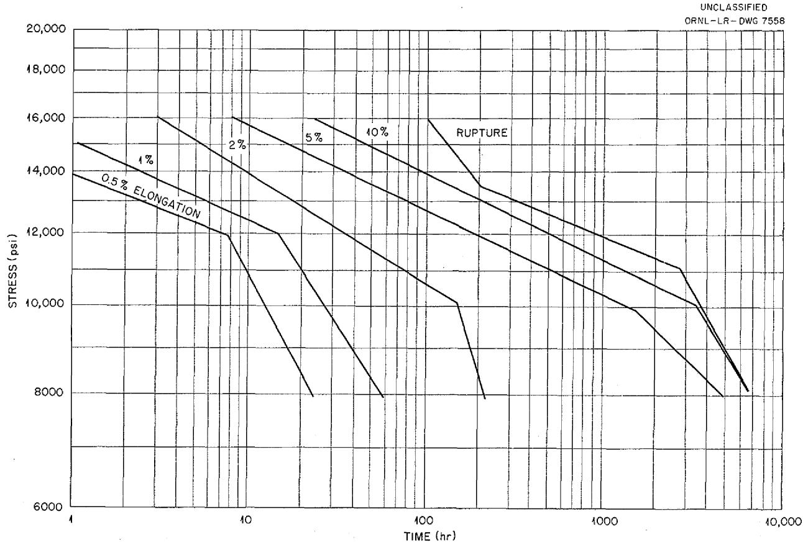  
Fig. 6.1. Stress-Rupture Curves for 0.060-in.-Thick Sheet Specimens of Hastelloy B Solution-Annealed at $2100^{\circ}\mathrm{F}$ and Tested in Argon at $1500^{\circ}\mathrm{F}$ .

whether aging treatment results in serious embrittlement at service temperatures.

# Modified Nickel-Molybdenum Alloys

Creep-rupture tests of modified nickel-molybdenum alloys at $1500^{\circ}\mathrm{F}$ in argon are under way. The results of tests on these alloys, prepared by vacuum melting, have been somewhat disappointing with respect to ductility attained before rupture. It is currently believed that the low ductility may be attributed to melting practice rather than to the nature of the alloy systems. A heat to which a small amount of deoxidant was added showed a significant improvement in properties compared with those of other single-phase alloys tested to date. The alloy had the composition $74.75\%$ Ni-20% Mo-5% Cr-0.25% Ce and was inferior to Hastelloy B from the standpoint of rupture strength, but, at 8000 psi, it had a final elongation of 28% compared with 16% for Hastelloy B and 7% for a similar alloy to which no deoxidant (cerium) was

added. The results of recent creep-rupture tests of several modified nickel-molybdenum alloys are presented in Table 6.8.

# TENSILE PROPERTIES OF HASTELLOY B

P. Patriarca R.E.Clausing Metallurgy Division

It has been shown that the physical properties of wrought Hastelloy B alloy are directly influenced by the precipitation which occurs at temperatures within the intended operational range of ANP reactors and heat exchangers. An extensive program is now under way to obtain short-time tensile strength data for this material after heating at temperatures from 1100 to $1600^{\circ}\mathrm{F}$ for times from 100 to 1000 hr. Typical microstructures obtained from these heat treatments have been studied and photographed, and a correlation is being made

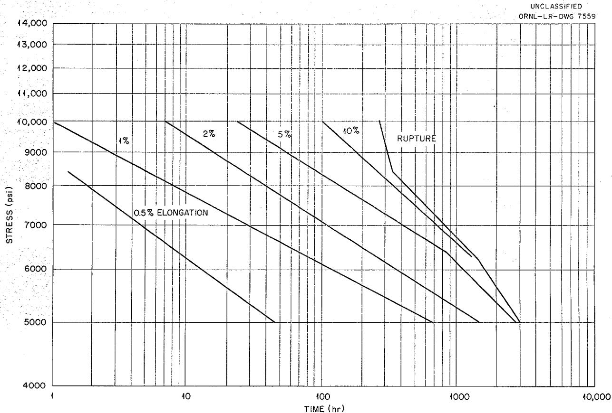  
Fig. 6.2. Stress-Rupture Curves for 0.060-in.-Thick Sheet Specimens of Hastelloy B Solution-Annealed at $2100^{\circ}\mathrm{F}$ and Tested in Argon at $1650^{\circ}\mathrm{F}$ .

TABLE 6.8. CREEP-RUPTURE TESTS OF MODIFIED NICKEL-MOLYBDENUM ALLOYS   

<table><tr><td>Alloy Composition (wt %)</td><td>Stress (psi)</td><td>Time to Rupture (hr)</td><td>Elongation (%)</td></tr><tr><td rowspan="2">77 Ni-20 Mo-3 Cr</td><td>8000</td><td>90</td><td>7</td></tr><tr><td>5000</td><td>675</td><td>9</td></tr><tr><td>75 Ni-20 Mo-5 Cr*</td><td>8000</td><td>80</td><td>7</td></tr><tr><td>74.75 Ni-20 Mo-5 Cr-0.25 Ce</td><td>8000</td><td>444</td><td>28</td></tr><tr><td>73 Ni-20 Mo-7 Cr</td><td>8000</td><td>380</td><td>9</td></tr></table>

between physical properties and the corresponding microstructures. As a result of this investigation, more comprehensive information on the high-temperature properties of this material is being obtained. The relative merits of various preaging heat treatments of Hastelloy B are also being studied, and it is hoped that, as a result of this work, a procedure can be developed which will

stabilize the microstructure sufficiently to reduce the sensitivity to high-temperature aging.

A summary of the short-time tensile data that have been obtained to date is presented in Figs. 6.5, 6.6, and 6.7, and in Table 6.9. It may be noted in Fig. 6.5, which shows the results of the test in which the variable of aging time was investigated, that the tensile-strength and yield-point

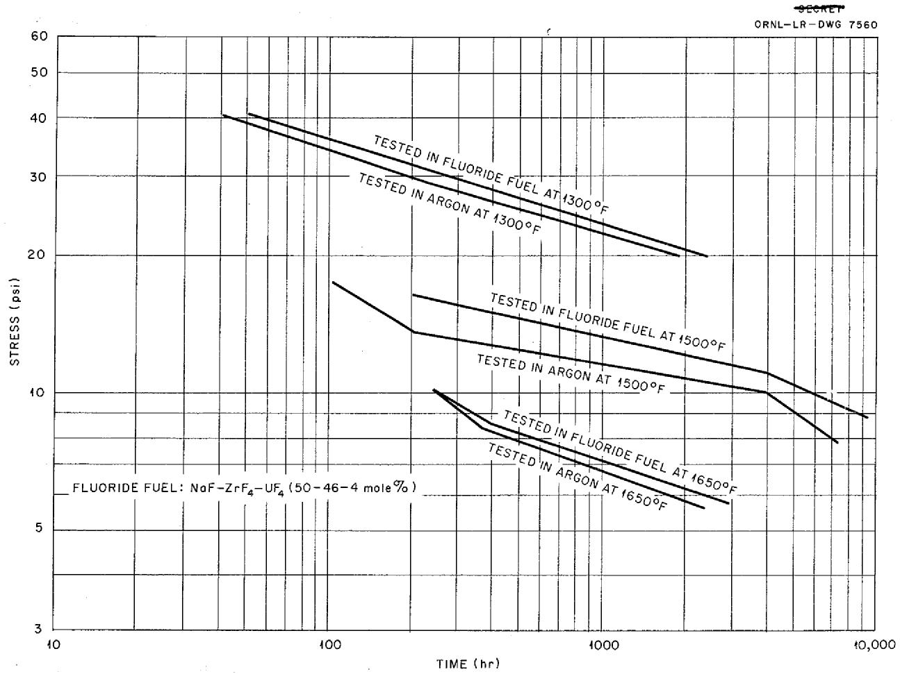  
Fig. 6.3. Comparison of Hastelloy B Stress-Rupture Data in Argon and in the Fuel Mixture NaF-ZrF $_4$ - UF $_4$ (50-46-4 mole %) at 1300, 1500, and $1650^{\circ}\mathrm{F}$ .

TABLE 6.9. ROOM-TEMPERATURE TENSILE PROPERTIES OF HASTELLOY B IN THE SOLUTION-ANNEALED AND SPHEROIDIZED CONDITIONS  

<table><tr><td>Condition of Specimen</td><td>Tensile Strength (psi)</td><td>Yield Strength (psi)</td><td>Elongation (%)</td></tr><tr><td>Spheroidized</td><td>175,000 to 185,000</td><td>100,000 to 115,000</td><td>15 to 20</td></tr><tr><td>Solution-annealed 2 hr at 2100°F</td><td>125,000 to 130,000</td><td>50,000 to 60,000</td><td>55 to 65</td></tr></table>

curves for 500- and 1000-hr aging times reach a maximum at approximately $1300^{\circ}\mathrm{F}$ , while the ductility curve reaches a minimum at this same temperature. The results of metallographic studies, discussed previously, indicated that this was caused by the extensive precipitation of a second phase - beta or a combination of two phases, beta and gamma - throughout the matrix. The high

temperature tensile properties obtained by a special spheroidization heat treatment are compared in Figs. 6.6 and 6.7 with those of solution-annealed material in the unaged and in the aged conditions. Although the spheroidization treatment was intended to produce a stable microstructure between 1300 and $1600^{\circ}\mathrm{F}$ , it may be noted that the ductility is lowered considerably in the 1100 to $1300^{\circ}\mathrm{F}$

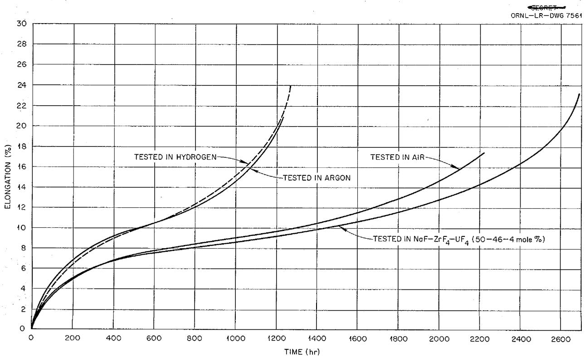  
Fig. 6.4. Creep Curves for Hastelloy B Sheet That Was Solution Annealed at $2100^{\circ}\mathrm{F}$ and Tested at $1500^{\circ}\mathrm{F}$ and 12,000 psi in Various Environments.

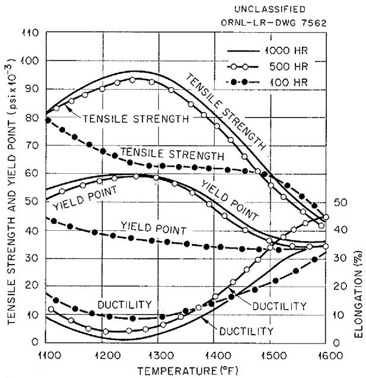  
Fig. 6.5. High-Temperature Tensile Properties of Hastelloy B That Was Solution Annealed at $2100^{\circ}\mathrm{F}$ Prior to Aging at the Testing Temperature for Various Times.

temperature region. Even though very high tensile and yield strengths were obtained with this treatment, the low high-temperature ductility would probably prevent useful application of this material above $1000^{\circ}\mathrm{F}$ . Investigations of other promising pretreatments are now in progress, as well as investigations of the composition variables which have been shown to be of significance.

# DEVELOPMENT OF BRAZING ALLOYS

P. Patriarca G.M.Slaughter Metallurgy Division R.L.Heestand Pratt & Whitney Aircraft

# High-Temperature Oxidation Tests

Tests for evaluating the static oxidation resistance of several brazing alloys were conducted previously at 1500 and $1700^{\circ}\mathrm{F}$ , and cyclic tests have now been initiated. In the 500-hr cyclic tests the samples are subjected to 190 air cools from $1500^{\circ}\mathrm{F}$ . The results obtained thus far are compared with the results of the static tests in

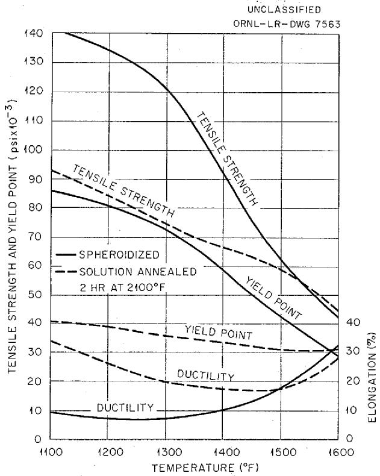  
Fig. 6.6. High-Temperature Tensile Properties of Hastelloy B in the Solution Annealed and Spheroidized Conditions.

Table 6.10. It may be seen that many of the alloys tested have good resistance to oxidation under both static and cyclic conditions.

Tests are now under way for evaluating the attack resulting from cycling from $1700^{\circ}\mathrm{F}$ . An apparatus is also being prepared for testing the oxidation resistance of brazed joints in moving moist air.

# Physical Property Tests

An investigation has been conducted of accumulative effects on the physical properties of Inconel tubing as a result of fabrication of tube-to-fin joints by high-temperature brazing with Coast Metals alloy No. 52. Brazed tube-to-fin specimens with at least 1 in. of stacked fins were machine ground to the original tubing dimensions. Threaded end sections were then brazed to these tubes to form short-time tensile test specimens.

Room- and high-temperature tensile tests were then conducted on the as-brazed specimens and on specimens that were subsequently heated in a vacuum for periods up to 500 hr at $1500^{\circ}\mathrm{F}$ prior to testing. The results indicated that no signifi

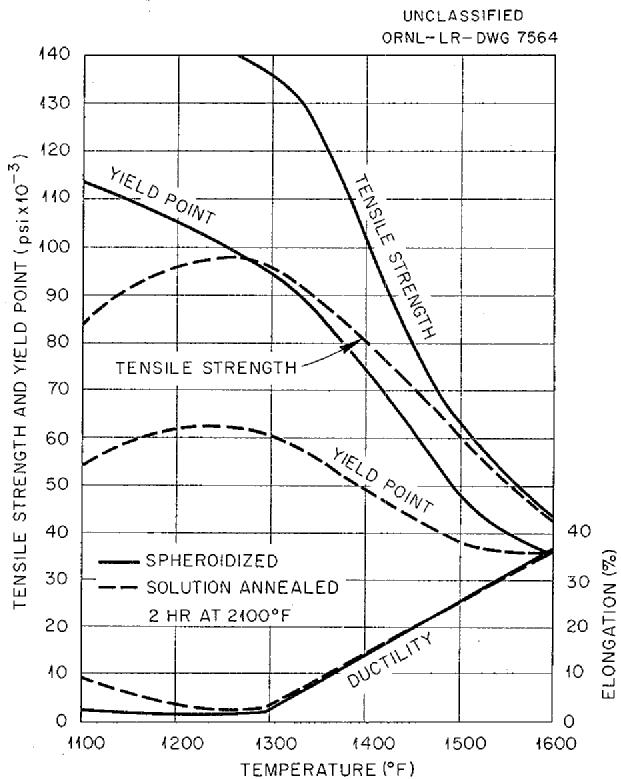  
Fig. 6.7. High-Temperature Tensile Properties of Hastelloy B in the Solution Annealed and Spheroidized Conditions After Aging for 100 hr at the Test Temperature.

cant decrease in strength or elongation of the tubing resulted from the brazing and subsequent heat treatments. Tensile strengths of approximately 100,000 psi and elongations in 1 in. of approximately $30\%$ were recorded in the room-temperature tests. At $1500^{\circ}\mathrm{F}$ , the samples possessed tensile strengths of approximately 27,000 psi, and they retained good ductility.

Test samples are now being prepared to evaluate the effects of other brazing alloys, such as Nicrobraz and the $90\%$ Ni-10% P alloy.

# FABRICATION OF TEST COMPONENTS

P. Patriarca

R. E. Clausing G. M. Slaughter Metallurgy Division

R. L. Heestand

Pratt & Whitney Aircraft

# Twenty-Tube Heat Exchanger

A fuel-to-NaK heat exchanger containing 20 Inconel tubes was fabricated for studying the heat transfer characteristics of fluoride fuel mixtures

TABLE 6.10. COMPARISON OF RESULTS OF STATIC AND CYCLIC 500-hr OXIDATION TESTS OF DRY-HYDROGEN-BRAZED INCONEL T-JOINTS AT ${1500}^{ \circ  }F$   

<table><tr><td rowspan="2">Brazing Alloy</td><td rowspan="2">Composition (wt %)</td><td colspan="2">Oxidation Results*</td></tr><tr><td>Tested in Static Air for 500 hr</td><td>Tested for 500 hr with 190 Air Cools to Room Temperature</td></tr><tr><td colspan="4">Commercial Alloys</td></tr><tr><td>Nicrobraz</td><td>70 Ni-14 Cr-6 Fe-5 B-4 Si-1 C</td><td>Slight</td><td>Slight</td></tr><tr><td>Low-melting Microbraz</td><td>80 Ni-5 Cr-6 Fe-3 B-5 Si-1 C</td><td>Slight</td><td>Slight</td></tr><tr><td>Coast Metals No. 50</td><td>93 Ni-3.5 Si-2.5 B-1 Fe</td><td>Slight</td><td>Slight</td></tr><tr><td>51</td><td>92 Ni-4.5 Si-3 B-0.5 Fe</td><td>Slight</td><td>Moderate</td></tr><tr><td>52</td><td>89 Ni-5 Si-4 B-2 Fe</td><td>Slight</td><td>Moderate</td></tr><tr><td>53</td><td>81 Ni-4 Si-4 B-8 Cr-3 Fe</td><td>Slight</td><td>Slight</td></tr><tr><td>NP</td><td>50 Ni-12 Si-28 Fe-4 Mo-4.5 P-1 Mn-0.5 Cr</td><td>Slight</td><td>Slight</td></tr><tr><td>Mond Ni Co. Alloy</td><td>64 Ag-33 Pd-3 Mn</td><td>Severe</td><td>Severe</td></tr><tr><td>Copper</td><td>100 Cu</td><td>Complete</td><td>Complete</td></tr><tr><td colspan="4">Experimental Nickel-Base Alloys</td></tr><tr><td>G-E No. 62</td><td>69 Ni-20 Cr-11 Si</td><td>Slight</td><td>Slight</td></tr><tr><td>81</td><td>66 Ni-19 Cr-10 Si-4 Fe-1 Mn</td><td>Slight</td><td>Slight</td></tr><tr><td>Ni-Cr-Si</td><td>73.5 Ni-16.5 Cr-10 Si</td><td>Slight</td><td>Slight</td></tr><tr><td>Ni-Si</td><td>88 Ni-12 Si</td><td>Slight</td><td>Slight</td></tr><tr><td>Ni-Ge</td><td>75 Ni-25 Ge</td><td>Slight</td><td>Slight</td></tr><tr><td>Ni-Ge-Cr</td><td>65 Ni-25 Ge-10 Cr</td><td>Slight</td><td>Slight</td></tr><tr><td>Electroless Ni-P</td><td>88 Ni-12 P</td><td>Slight</td><td>Moderate</td></tr><tr><td>Ni-P-Cr</td><td>80 Ni-10 P-10 Cr</td><td>Slight</td><td>Slight</td></tr><tr><td>Ni-Mo-Ge</td><td>50 Ni-25 Mo-25 Ge</td><td>Slight</td><td>Slight</td></tr><tr><td>Ni-Sn</td><td>68 Ni-32 Sn</td><td>Moderate</td><td>Severe</td></tr><tr><td>Ni-Mn</td><td>40 Ni-60 Mn</td><td>Complete</td><td>Complete</td></tr><tr><td>Ni-Mn-Cr</td><td>35 Ni-55 Mn-10 Cr</td><td>Severe</td><td>Severe</td></tr><tr><td colspan="4">Experimental Precious-Metal Base Alloys</td></tr><tr><td>Pd-Ni</td><td>60 Pd-40 Ni</td><td>Slight</td><td>Slight</td></tr><tr><td>Pd-Ni-Si</td><td>60 Pd-37 Ni-3 Si</td><td>Slight</td><td>Slight</td></tr><tr><td>Pd-AI</td><td>92 Pd-8 AI</td><td>Very slight</td><td>Moderate</td></tr><tr><td>Pd-Ge</td><td>90 Pd-10 Ge</td><td>Slight</td><td>Severe</td></tr><tr><td>Au-Ni</td><td>82 Au-18 Ni</td><td>Very slight</td><td>Slight</td></tr><tr><td>Au-Co</td><td>90 Au-10 Co</td><td>Very slight</td><td>Slight</td></tr><tr><td>Au-Cu</td><td>80 Au-20 Cu</td><td>Complete</td><td>Complete</td></tr></table>

*Very slight, less than 1 mil of penetration; slight, 1 to 2 mils of penetration; moderate, 2 to 5 mils of penetration; severe, greater than 5 mils of penetration; complete, fillet completely destroyed.

over a wide range of Reynold numbers (cf. Sec. 2, "Experimental Reactor Engineering"). The design of this heat exchanger specified that the $3_{16}$ -in.-OD, 0.017-in.-wall Inconel tubes were to be joined to a dashed header at the NaK inlet end and to a radial header at the NaK outlet end. A thick-walled Inconel pressure shell was to be used to confine the molten fuel located outside the tubes.

The fabrication techniques used on this heat exchanger consisted essentially in manual heliarc welding and subsequent back brazing of the tube-to-header joints. All welding was performed by qualified operators using specified procedures,8 and complete penetration was utilized, except on the tube-to-header joints. Complete protection of the roots of the welds by an inert gas was employed at all times to minimize scaling and oxidation. The tube-to-header joints were back brazed to eliminate the "notch effect" resulting from incomplete weld penetration and to ensure against the development of leaks in the event of corrosion through an area of shallow weld penetration.

An evaluation of the corrosion resistance of brazing alloys had shown that low-melting Nicrobraz was compatible with both sodium and the fused fluoride salts, and therefore this alloy was used in the back-brazing process, which was performed in a dry-hydrogen atmosphere by using the conventional "canning" procedures. Two brazing operations were required because the Globar pit furnace available did not possess a heating zone of sufficient length to heat both ends of the unit to the brazing temperature. A "window" was removed from the pressure shell to permit preplacement of the brazing alloy on the NaK inlet end of the tube bundle, as shown in Fig. 6.8. The window was welded shut after placement of the alloy, and helium leak-testing indicated that all welded and brazed joints were leaktight. The completed heat exchanger is shown in Fig. 6.9.

# Intermediate Heat Exchanger No. 2

The semiautomatic heliarc welding of the tubeheader joints of the two fuel-to-NaK heat ex-changers for the intermediate heat exchanger No.2 test program was discussed previously.10 The

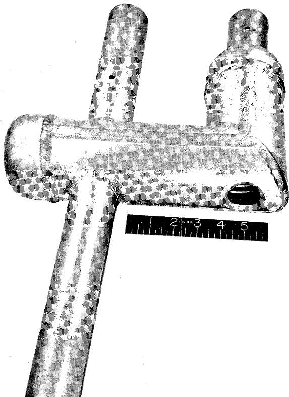  
Fig. 6.8. Twenty-Tube Fuel-to-NaF Heat Exchanger Showing "Window" Cut in Pressure Shell to Permit Preplacement of Brazing Alloy on NaK Inlet End of the Tube Bundle.

400 welds were helium leaktight before initiation of the stages of fabrication described here.

Header Welding. In order to minimize cracking of the brittle alloy used in back brazing and to avoid contamination of areas to be welded with the boron and silicon of the brazing alloy, the header components were heliarc welded to each tube bundle before back brazing of the tube-to-header joints. However, to permit access to the joints, the components were not attached until after preplacement of the brazing alloy (low-melting Nicrobraz) had been completed.

The welding is shown at an early stage in Fig. 6.10. Strongbacks were used to minimize distortion of the header and consequent tube-to-header

UNCLASSIFIED Y-14796

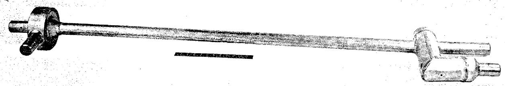

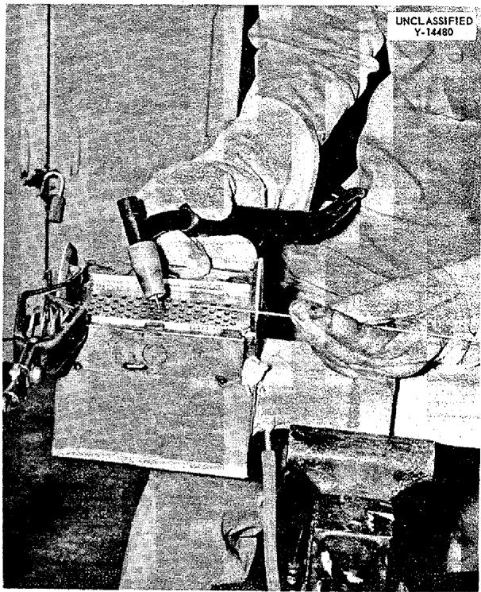  
Fig. 6.9. Completed 20-Tube Fuel-to-NaK Heat Exchanger.   
Fig. 6.10. Welding of a Header of the Intermediate Heat Exchanger No. 2. The strongbacks used to minimize distortion may be seen.

weld fracture. Joint designs were used that permitted complete penetration,11 and qualified operators and specified procedures were used at all times. A photograph of a completed, leaktight, header section prior to back brazing is shown in Fig. 6.11.

Back Brazing of Tube-to-Header Joints. The low-melting Microbraz alloy was preplaced on the headers as a dry powder and then secured firmly in position with a methylacrylate cement. Since the heating zone of the Globar-heated brazing furnace was not long enough for a complete tube bundle, only one end of the tube bundle could be brazed at a time. As a result, it was necessary that the complete welding and brazing of one header on one end of a tube bundle be done prior to the brazing alloy preplacement and header welding of the other end so as to avoid spalling of the preplaced brazing alloy from the underside of the cold header during the brazing of the first header. It was thought that hot hydrogen gas might volatilize the binder on the cold header and leave the brazing alloy insecurely positioned in

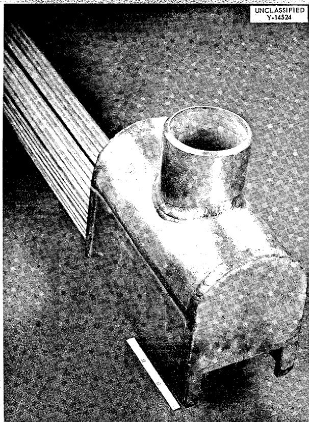  
Fig. 6.11. Completed Header of an Intermediate Heat Exchanger No. 2 Tube Bundle.

its overhead locations. This important consideration increased the fabrication time to some degree, since the welding of both heads and the brazing of both heads could not be performed in sequence.

The dry-hydrogen furnace brazing was performed with the tube bundle in a horizontal position in the Globar furnace. The bundle was securely jigged in a long, rectangular, stainless steel retort, and a dry-hydrogen atmosphere was maintained in the retort during brazing. A time-temperature record of every brazing thermal cycle was measured by means of a Chromel-Alumel thermocouple firmly attached to the assembly, and a plot of a typical cycle is shown in Fig. 6.12. A preheated brazing furnace was used to shorten the time required for each operation, since no visible warpage or distortion of the heat exchanger resulted.

Fabrication and Assembly of Comblike Spacers. The use of wire comblike spacers was considered to be the most practical means for holding the tube bundle rigid over its free-span length and for

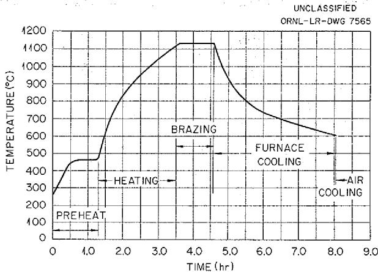  
Fig. 6.12. Brazing Cycle Used in the Fabrication of Intermediate Heat Exchanger No. 2.

keeping the tubes separated in such a way as to permit the required mode of fluid flow between them. The "combs" were placed at 5-in. intervals along the bundle, with alternate spacers positioned 90 deg to each other. It was required, for the heat transfer evaluation, to place the spacers on one bundle perpendicular to the axis of the tubing, whereas on the second bundle they were placed in a plane at a 30-deg angle to the tubing axis. Both types of spacer arrangement are shown in Fig.6.13. It may be seen that the fabrication and assembly of these spacers required the use of precision jigs and careful determination and control of the cone-arc plug-welding conditions. Meticulous care also had to be maintained when the holes were punched in the strip headers, because extremely close tolerances were specified.

Installation of Tube Bundle into Pressure Shell. The installation of the tube bundles into their pressure shells required light machining of the shell to permit proper fit-up; that is, each pressure shell had to be precision machined for its corresponding tube bundle to accommodate the very small variations in dimensions. The heavy-walled pressure shell was beveled according to the recommended joint design, and, as prescribed for high-corrosion applications, the root pass was heliarc welded. The remainder of the welding was performed by using the metallic-arc process to minimize the heat input and consequent distortion of the unit. Figure 6.14 shows the heat exchanger after completion of the root pass. The large

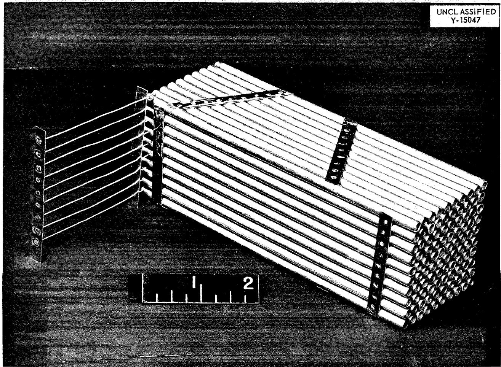  
Fig. 6.13. Sample Tube Bundle Showing Two Types of Comblike Spacer Arrangements.

I-beam was used as a strongback for the system to prevent severe distortion.

Joining of Two Tube Bundles. The two tube bundles were joined together after being welded into their respective pressure shells; the completed unit is shown in Fig. 6.15. It may be seen that the joining operation required several manual heliarc welds to connect the NaK circuits and to attach the inlet and exit nozzles. Leak-testing with a helium leak detector indicated no flaws, and the heat exchanger was subsequently delivered for installation into the test rig. A detailed report covering the fabrication of heat exchangers is being prepared.

# NaK-to-Air Radiators

It was reported previously12 that the fabrication of two 500-kw NaK-to-air radiators had been initiated for use in the intermediate heat exchanger

No. 2 test program and that the type 310 stainless-steel-clad copper high-conductivity fins had been sheared, degreased, and edge-protected with aluminum bronze. The construction of these units has now been completed, and a brief discussion of the intermediate steps is presented here.

Preplacement of Brazing Alloy. Coast Metals brazing alloy No. 52 was designated for use on this radiator because it possesses good flowability at $1020^{\circ}\mathrm{C}$ and has good resistance to high-temperature oxidation. Its good compatibility with sodium was also of distinct advantage, since the brazing alloy might come in contact with the NaK during service if used to seal small pin-hole leaks or if sufficient weld metal corrosion occurred to expose a braze metal surface. Also, severe tube-wall

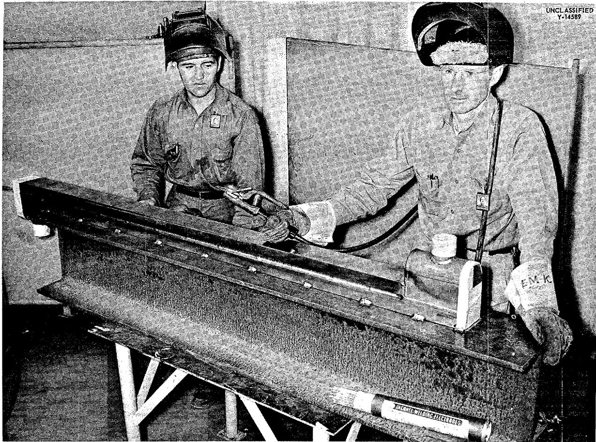  
Fig. 6.14. Intermediate Heat Exchanger No. 2 After Completion of the Root Pass of the Pressure Shell Weld. Strongback used to minimize distortion.

dilution during brazing or solid-state diffusion in service might produce a high concentration of brazing alloy constituents near the circulating NaK.

The dry-powder method of brazing alloy preplacement was used in the fabrication of these radiators. A stainless steel template containing holes that were precision drilled was utilized to place controlled amounts of brazing alloy on each tube-to-fin joint. The brazing powder was secured to the fin with Microbraz cement. A $\frac{1}{16}$ -in.-thick template containing holes 0.246 in. in diameter provided the optimum quantity of brazing alloy per joint and was used to preplace alloy on the 2200 fins.

Assembly of Fins. The assembly of the fins on the radiator was conducted with the tube bends down, as is shown in Fig. 6.16. The assembly of the first 4 in. of fins was extremely time-consuming

because the tubes were not rigidly in place. A heavy metal template was required to force each individual fin into place. Since some of this difficulty was also derived from the slight curvature of the straight lengths of tubing, it is thought that improvements in the bending techniques might substantially assist assembly of future units.

A set of Lucite "finger" jigs was designed and built that simplified the fin assembly problem. These jigs, which can be seen in Fig. 6.16, aligned the tubes in the positions to fit the punched geometry of the fin. Supporting sheet-metal channels were placed at 4-in. intervals to impart over-all structural stability to the radiator. These channels were heliarc welded together to form sheet-metal side plates. Two thin sheets of Inconel were also placed tightly together against the channels at these 4-in. intervals. The capillary joint be

UNCLASSIFIED Y-14810

Fig. 6.15. Completed Intermediate Heat Exchanger No. 2.

tween the two Inconel sheets acted as a sump to accommodate any excess brazing alloy.

Assembly of Headers. The original design for the radiators required that all tubes enter the cylindrical headers normal to the curvature at the point of entrance. Sample specimens were prepared to determine the tube-bending and fitting techniques, but the complex tube design caused extreme difficulties in placing the headers on the tubes. Therefore a new design was proposed and accepted that utilized a split header of 3-in. schedule-40 pipe so that all tubes except the two outside rows on each radiator half-section entered the headers without being bent.

Careful hand polishing of each of the tubes was required to permit assembly of the split headers without the use of additional force from a hand press. Precision drilling and deburring of the headers were also employed to prevent bending and distortion of the thin-walled Inconel tubes.

After assembly of the headers, the tubes were meticulously hand filed to conform to the exact curvature of the interior surfaces. Abrasive grinding or wet milling was avoided because entrapped abrasive or lubricant would lead to inconsistencies during tube-to-header welding.

Welding. The tube-to-header joints were manually heliarc welded, and a helium backup atmosphere was maintained on the underside of the joint throughout welding. The split headers, nozzles, and end plates were also welded by using manual heliarc welding techniques. Extreme care was taken to ensure complete penetration and good coverage by the backup gas.

After the manifold welds were completed, the integrity of the system was determined by helium leak-testing. Although it was assumed that pin-hole leaks could be sealed during the subsequent brazing operation, large leaks were to be avoided. When questionable welds were found, the headers

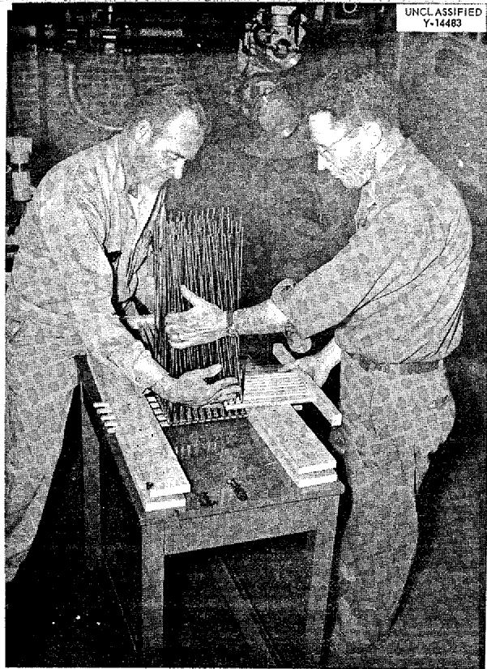  
Fig. 6.16. Early Stages of Assembly of NaK-to-Air Radiator.

were removed by simply cutting off the tubes at the underside of the header plates. New headers were then attached by rebending the tubes and repolishing them. This procedure was employed on the radiators in order to obtain leaktight units before brazing.

Brazing. The back brazing of the tube-to-header welds and the brazing of the tube-to-fin joints were accomplished by using conventional canning techniques. The brazing alloy was preplaced on the fins, as described above, and a medicine dropper was used to place the braze slurry on the tube-to-header joints.

A special baffle design was used for the brazing of these radiators, since it was very important to flush out the copious amounts of methylacrylate binder present in the tube-to-fin matrix. A sheet-metal cover was attached to the front of the radiator, and clean, dry inlet gas was forced between the fins before being exhausted to the outside of the can. The inside of the sheet-metal

cover and inlet tube was designed to permit relatively even flow throughout the entire frontal area, and good circulation of hydrogen was obtained around the tube-to-header joints.

The radiator was securely supported on a strongback to prevent sagging or distortion during the high-temperature brazing cycle. The support bars were made from stainless steel which had been previously aluminized at $1500^{\circ}\mathrm{F}$ . This alumi-zinizing prevented the support bars from being brazed to the radiator, since an aluminum oxide film prevents wetting by Coast Metals alloy No. 52.

The radiator was placed in the brazing can with four thermocouples attached in various positions around the periphery. This temperature measurement around the radiator was desirable from a control standpoint, even though previous experiments had indicated that all parts of a unit of this size could be held to within $25^{\circ}C$ at the brazing temperature. In the preliminary experiment, 12 thermocouples were attached at various points over the test specimen. This close control was necessary because the flow temperature of the brazing alloy is $1020^{\circ}C$ , and the copper in the fins melts at $1083^{\circ}C$ .

The thermal cycle used in brazing these radiators is shown in Fig. 6.17. The unit was placed in the furnace at room temperature to minimize distortion and was gradually raised to the brazing temperature. The two completed radiators are shown in Fig. 6.18; as may be seen, negligible distortion

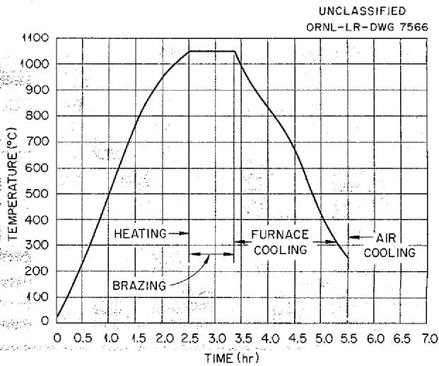  
Fig. 6.17. Brazing Cycle Used in the Fabrication of a 500-kw NaK-to-Air Radiator.

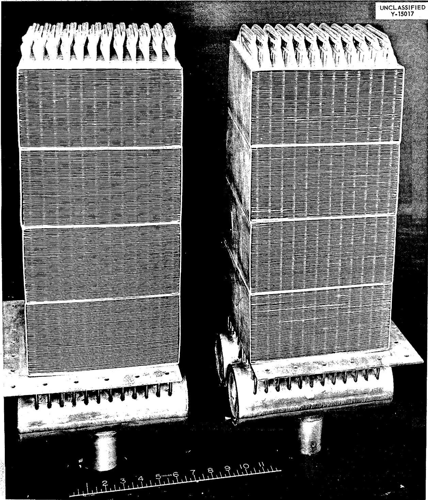  
Fig. 6.18. Two Completed 500-kw NaK-to-Air Radiators.

occurred. Since no excess of brazing alloy was found, it appears that the sump technique for the removal of the excess is practical for large assemblies. Good flowability of the brazing alloy was obtained. A cross section of a typical tube-to-fin joint brazed under conditions simulating those used in the fabrication of the radiators is shown in Fig. 6.19. It may be seen that good edge protection of the exposed copper was obtained in these tube-to-fin joints and that good fillets were present in the tube-to-header joints.

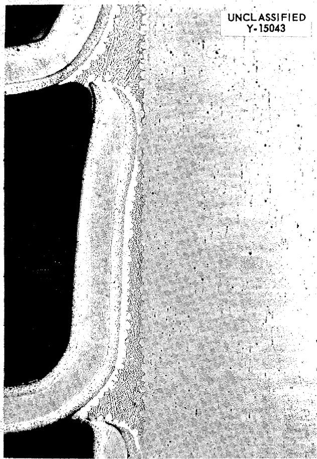  
Fig. 6.19. Tube-to-Fin Joint Brazed Under Conditions Simulating Those Used in the Fabrication of the NaK-to-Air Radiators.

Leak-testing with a mass-spectrometer helium leak detector indicated no flaws in the integrity of the closed NaK circuits. The two radiators were therefore delivered for installation into the test rig.

# Cornell Radiator No. 1

The assembly and partial fabrication of a full-scale liquid metal-to-air radiator designed by the Cornell Aeronautical Laboratory were described previously. Since the header plates on this heat exchanger were in, thick, the brazed tube-toheader joints cracked easily. Severe stresses resulted from the differences in thermal expansion coefficients between the stainless steel base metal and the brazing alloy. However, an investigation of several high-temperature brazing alloys revealed that Coast Metals alloy No. 50 possessed sufficient ductility to overcome this cracking upon furnace cooling from its brazing temperature of $2050^{\circ}\mathrm{F}$ . Other brazing alloys such as Coast Metals alloy No. 52 and G-E alloy No. 62 cracked to such an extent that they were not considered satisfactory for this application.

Since brazing with Coast Metals alloy No. 50, which is a nickel-silicon-boron-iron alloy, would necessarily result in the diffusion of boron into the type 316 stainless steel base metal, an investigation was conducted to determine the extent of penetration and the effects on the mechanical properties of the base metal. Metallographic examination of typical brazed tube-to-header joints indicated that the diffusion was minor (2 to 3 mils), even though long-time heating and cooling cycles were used. Samples examined after subsequent heating for 24 hr at $1650^{\circ}\mathrm{F}$ also exhibited diffusion to the same extent. After 100 hr at $1650^{\circ}\mathrm{F}$ , the diffusion had progressed to 4 to 5 mils. Several brazed tensile-test samples were prepared so that a study could be made of the effects of brazing on the mechanical properties. Tests at room temperature and at $1600^{\circ}\mathrm{F}$ at the Cornell Aeronautical Laboratory indicated no appreciable reduction in the tensile strength of the base metal.

The back brazing was carried out by placing the radiator in the furnace at room temperature and heating at a rate of $150^{\circ}\mathrm{C / hr}$ until the brazing temperature was reached. The radiator was held at $2050^{\circ}\mathrm{F}$ for $\frac{1}{2}$ hr and then furnace cooled at a maximum rate of $150^{\circ}\mathrm{C / hr}$ . The completed heat exchanger is shown in Fig. 6.20. Testing with a mass-spectrometer helium leak detector indicated that all welded and brazed joints were leaktight.

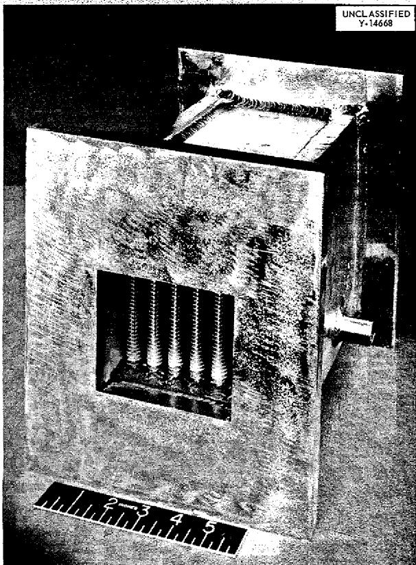  
Fig. 6.20. Completed Cornell Aeronautical Laboratory Sodium-to-Air Radiator No.1.

The radiator has therefore been delivered to the Cornell Aeronautical Laboratory.

# SPECIAL MATERIALS STUDIES Special Alloy Extrusions

J. H. Coobs H. Inouye Metallurgy Division

M. R. D'Amore, Pratt & Whitney Aircraft

Three billets of vanadium were extruded at $2000^{\circ}F$ . The pressure required for an extrusion ratio of 9:1 was approximately 45 psi. The billets were canned in mild steel to protect the vanadium from oxidation during extrusion. The canning material was removed from the extruded tube blanks by pickling in hot HCl. The tube blanks have been shipped to the Superior Tube Co. for further reduction and cladding on the outside with stainless steel. The clad tubing will be used in corrosion studies.

Four high-purity molybdenum billets containing $0.7\%$ titanium were extruded into rod to be used for welding studies at Battelle Memorial Institute. The extrusions were made at $2600^{\circ}\mathrm{F}$ , and it was demonstrated that the pressure required could be reduced by using a salt-type lubricant. These billets failed to extrude in the first two attempts when Fiberglas and Necrolene were used as the lubricating materials. Since the salt lubricant thermally decomposes at $2600^{\circ}\mathrm{F}$ , it was swabbed onto the container walls. The use of salt in the container reduced the pressure required from 700 to 427 tons on a 3-in. ram for an extrusion ratio of 4.5:1. Similarly, at an extrusion ratio of 6.25:1, the pressure required was reduced from 700 to 508 tons.

The studies of flow patterns of duplex and three-ply materials during impact extrusion were continued. The flow pattern studies of three-ply composites have been directed toward the production of stainless steel seamless tubular fuel elements. The experiments on duplex materials are designed for studying the fabrication problems involved in the cladding of tube materials. Six additional extrusions of composite stainless steel-mild steel billets have been completed. The results of the extrusions have not been completely evaluated, but it appears that material recovery may be improved by tapering the billet nose to conform with the cone of the die.

# Clad-Columbium Fabrication

J. H. Coobs H. Inouye Metallurgy Division

M. R. D'Amore, Pratt & Whitney Aircraft

Roll-Cladding Experiments. A series of tests have been made of various combinations of heat-resistant alloys roll clad onto columbium. The experiments were designed for determining the lowest temperature at which bonding could be achieved to minimize intermetallic formation and contamination (the reactivity of columbium with gases increases with temperature). In addition, attempts were made to bond columbium to columbium in order to develop a method for obtaining large sheets of the metal. Rolling temperatures of 900, 1050, and $1250^{\circ}\mathrm{C}$ were investigated. Metallographic examinations of the columbium to columbium combinations prepared showed that the interfaces between the layers were not discernible at high

magnifications after hot rolling at all temperatures investigated. Separation did not occur upon severe bending. It, therefore, appears feasible to obtain large sheets of columbium by this method.

In the investigation of heat-resistant alloys as roll claddings for columbium, maintaining the metallurgical bonds necessary for heat transfer was expected to be difficult because of the differences in thermal expansion, as shown in the following:

<table><tr><td></td><td>Mean Coefficient of Thermal Expansion at 0 to 815°C (μin./°C)</td></tr><tr><td>Columbium</td><td>7.1</td></tr><tr><td>Type 446 stainless steel</td><td>11.2</td></tr><tr><td>Type 310 stainless steel</td><td>18.0</td></tr><tr><td>Inconel</td><td>16.0</td></tr><tr><td>Hastelloy B</td><td>15.3</td></tr><tr><td>Nickel</td><td>13.1</td></tr></table>

It was further expected that brittle intermetallic compounds would form between nickel and cobium and between iron and cobium.

Service tests of columbium clad with these heat-resistant alloys were made at 815 and $1000^{\circ}\mathrm{C}$ for 500 hr. The columbium was found to be adequately protected, and the effects on ductility were slight. Interface reactions were, however, evident in all combinations, and there was, as a result, separation at the interfaces.

The interface of the Inconel-columbium composite after rolling at $1050^{\circ}\mathrm{C}$ is shown in Fig. 6.21. A discontinuous layer about 0.0001 in. thick is evident. The reaction layers increased in thickness with the rolling temperature. The same composite is shown in Fig. 6.22 after heating at $815^{\circ}\mathrm{C}$ for 500 hr. The reaction layer is only about 0.0005 in. thick, but it is sufficiently thick to cause separation upon cooling of the composite from the test temperature to room temperature. Voids caused by unequal diffusion rates of the elements are evident in the Inconel layer.

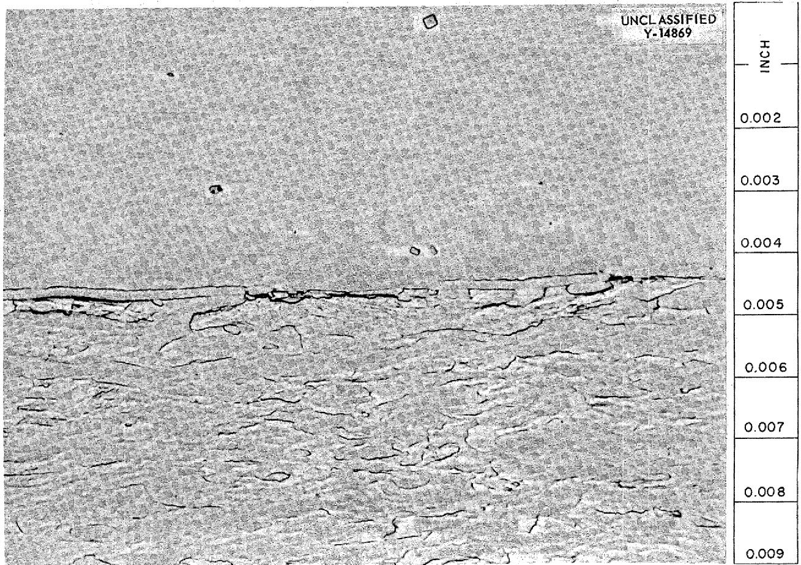  
Fig. 6.21. Interface of Inconel-Columbium Composite After Rolling at $1050^{\circ}\mathrm{C}$ . 500X.

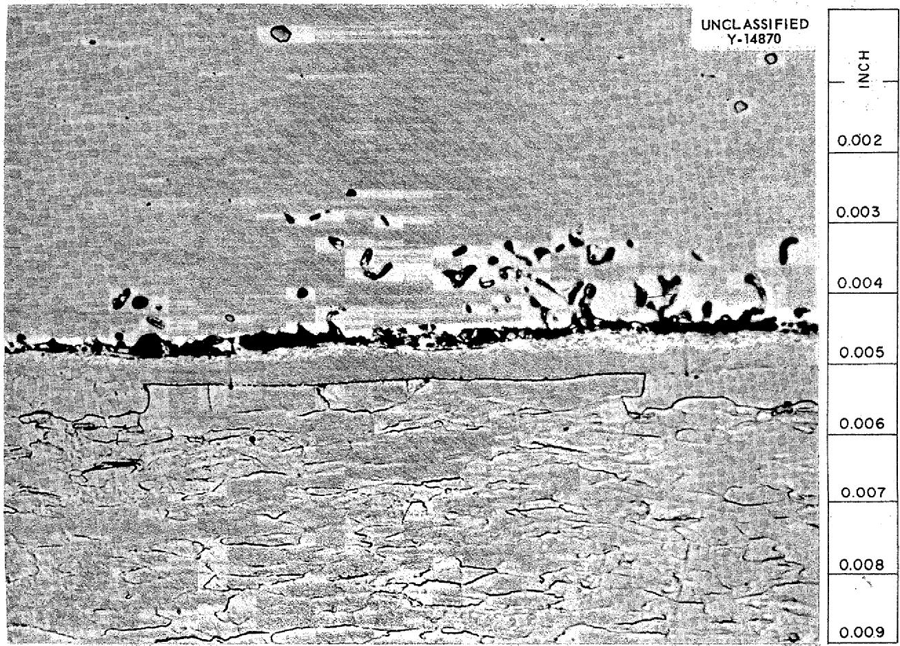  
Fig. 6.22. The Inconel-Columbium Interface Shown in Fig. 6.21 After Exposure at $815^{\circ}\mathrm{C}$ for 500 hr.

Inconel-clad and type 310 stainless-steel-clad columbium composites tested at $1000^{\circ}\mathrm{C}$ for 500 hr are shown in Figs. 6.23 and 6.24. The reaction layer in these composites is about 0.0015 in. thick, and the brittle nature of the reaction layer is exhibited by the transverse cracks. Similar results were obtained for other composites of heat-resistant alloys and columbium.

Diffusion Barrier Studies. The use of a diffusion barrier for preventing separation at the interface of the cladding and the columbium was investigated. Copper was selected for this study on the basis of the results of some brazing work reported by the Fansteel Metallurgical Corp. A 0.001-in. layer of copper was roll clad onto columbium at $1000^{\circ}\mathrm{C}$ from an evacuated capsule. Examination of specimens tested for 150 hr at $815^{\circ}\mathrm{C}$ showed two reaction layers totaling about 0.0001 in. in thickness, and separation at the bonded interface was slight or nonexistent.

If, after additional experimentation, copper is found to be a suitable barrier for columbium, an additional barrier for the copper will be necessary if the external cladding is to be Inconel. Previous work has shown, however, that iron or the 300 series stainless steels are satisfactory barriers between copper and Inconel.

# $\mathbf{B}_{6}\mathbf{C}-\mathbf{Cu}$ Shielding Material

J.H.Coobs H.Inouye

Metallurgy Division

# M. R. D'Amore, Pratt & Whitney Aircraft

The studies of boron-containing shielding materials, reported previously,[14] were continued. A program has been initiated for evaluating the compatibility of Inconel and a boron carbide-copper mixture at $1650^{\circ}\mathrm{F}$ , since, for reactor use, it will

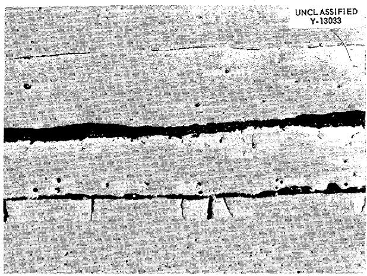  
Fig. 6.23. Interface of Inconel-Columbium Composite After Testing at $1000^{\circ}\mathrm{C}$ for 500 hr. Unetched. 200X. Reduced $30.5\%$ .

be necessary for the boron-containing material to be clad with Inconel. For the initial studies, the $\mathsf{B}_6\mathsf{C - Cu}$ mixture was prepared by pressing powder mixtures into compacts $1\times 3\times 0.337$ in. containing 40, 50, and 60 vol $\%$ $\mathsf{B}_6\mathsf{C},$ respectively. The boron content and the density achieved after pressing, sintering, and coining of these compacts are listed below:

<table><tr><td>B6C (vol %)</td><td>% Theoretical</td><td>Grams of Boron per cm3of Mixture</td></tr><tr><td>40</td><td>89.3</td><td>0.737</td></tr><tr><td>50</td><td>86.3</td><td>0.890</td></tr><tr><td>60</td><td>83.8</td><td>1.038</td></tr></table>

On the basis of previous work, a duplex diffusion barrier consisting of foils of iron and copper was inserted between the Inconel and $\mathsf{B}_6\mathsf{C - Cu}$ mixture. The components were assembled in a picture frame and rolled at $1800^{\circ}F$ to bond the Inconel cladding, diffusion barriers, and $\mathsf{B}_6\mathsf{C - Cu}$ core. The quality of the bond attained has not been evaluated, but x-ray analysis after a hot reduction of $50\%$ revealed that no cracking of the $\mathsf{B}_6\mathsf{C - Cu}$ had occurred in any of the three composites studied. These materials will be subjected to room-temperature bend tests and to helium permeability and material compatibility tests at $1650^{\circ}F$ .

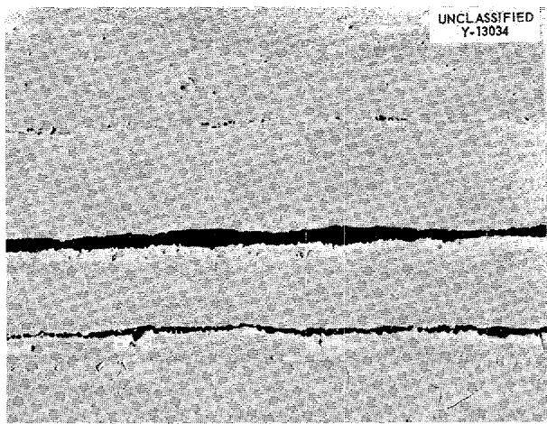  
Fig. 6.24. Interface of Type 310 Stainless Steel-Columbium Composite After Testing at $1000^{\circ}\mathrm{C}$ for 500 hr. Unetched. 200X. Reduced $30.5\%$ .

# Magnesium-Lithium Alloy

D.A.Douglas J.H.DeVan

J.W.Woods

Metallurgy Division

A magnesium-lithium alloy is being considered as a possible shield material for use in the construction of an aircraft crew compartment. Additions of lithium to magnesium reportedly bring about a reduction in tensile strength while greatly increasing tensile ductility, particularly in the case of alloys containing more than $10.3\%$ lithium.[15] Such alloys have a body-centered cubic lattice structure.

Tensile Properties. In order to evaluate the properties of alloys containing relatively large percentages of lithium, a slab ingot having the composition $80\%$ Mg-20% Li was obtained from Dow Chemical Company and was rolled at $200^{\circ}$ F to a sheet 0.060 in. in thickness. Specimens having a $\frac{1}{2}$ -in. reduced gage section were machined from the sheet, and tensile and creep tests were conducted on the alloy in air. Results of tensile tests completed at room temperature and at $200^{\circ}$ F are listed in Table 6.11. A comparison of these values with the room-temperature properties of pure magnesium, given in Table 6.12, points out the decrease in strength and the increase in ductility brought about by the alloy addition.

There is very little capacity for work-hardening in the alloy, as indicated by the small difference

TABLE 6.11. TENSILE PROPERTIES OF ${80}\% \mathrm{{Mg}} - {20}\%$ Li ALLOY   

<table><tr><td>Temperature (°F)</td><td>Yield Strength, 0.2% Offset (psi)</td><td>Tensile Strength (psi)</td><td>Elongation in 3 in. (%)</td><td>Modulus of Elasticity</td></tr><tr><td>Room</td><td>11,230</td><td>12,470</td><td>35</td><td>4.5 × 106</td></tr><tr><td>200</td><td>2,970</td><td>3,010</td><td>45</td><td>3.2 × 106</td></tr></table>

TABLE 6.12. TENSILE PROPERTIES OF PURE (99.80%) MAGNESIUM  

<table><tr><td>Condition</td><td>Yield Strength, 0.2% Offset (psi)</td><td>Tensile Strength (psi)</td><td>Elongation (%)</td><td>Modulus of Elasticity</td></tr><tr><td>Annealed</td><td>14,000</td><td>27,000</td><td>16</td><td>6.5 × 10^6</td></tr><tr><td>Hard-rolled</td><td>27,000</td><td>37,000</td><td>9</td><td>6.5 × 10^6</td></tr></table>

between yield and tensile strengths. Also, these strengths are quite temperature sensitive, since at $200^{\circ}\mathrm{F}$ they have been reduced by a factor of 4 below the strengths at room temperature.

Creep-Rupture Properties. Creep-rupture tests on the alloy were initiated at room temperature at 7350 and 1500 psi. At the higher stress the test was discontinued after 7 hr when the presence of numerous cracks indicated impending failure to be only a matter of minutes away. Final elongation for the specimen, measured over a 3-in. gage length, was $20\%$ . The test of the specimen stressed at 1500 psi is still in progress after 3200 hr.

# Welding of Cumbium Thermal-Convection Loops

P. Patriarca

G. M. Slaughter

Metallurgy Division

Several type 310 stainless-steel-clad columbium thermal-convection loops were fabricated for testing to obtain information on resistance to dynamic corrosion. In preparation for the fabrication of these loops, test specimens of 0.020-in. columbium sheet were machine-heliarc-welded with both argon and helium as the shielding gases. It was found that when excellent shielding was utilized, welds made with both gases were ductile. However, manual welds on the same material were found to be quite brittle, and thus it appeared that the high welding speed possible with machine welding was beneficial. The high rate of travel minimized the time interval over which the weld metal was molten,

with a consequent decrease in the quantity of atmosphere contamination.

Since most of the welds could not be made by machine welding, dry-box manual welding of the clad-columbium loops was initiated with a helium atmosphere in the chamber. A loop was fabricated which was pressure-tight to 35 psi helium; however, several extremely small pin holes were found upon leak testing of the loop with a mass-spectrometer helium leak detector. Since these pin holes were attributed to the difficulty of torch manipulation inherent in the use of helium, argon was used in the dry-box during the fabrication of four subsequent loops. These were all found to be leaktight. The welding of the stainless steel cladding was completed according to normal practice.

# Dimensional Stability Test on an Inconel Spun Core

P. Patriarca

Metallurgy Division

A proposed design for the core shell of the ART calls for the use of a spun Inconel configuration, and therefore an investigation was conducted to determine the dimensional stability of a small-scale specimen (Fig. 6.25) obtained from Pratt & Whitney Aircraft. The stability of this configuration was tested by measuring the distances between several reference points both before and after thermally cycling from $1500^{\circ}\mathrm{F}$ to ambient

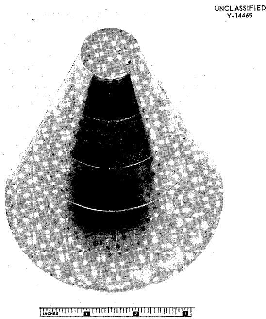  
Fig. 6.25. Inconel Spun Core Shell.

TABLE 6.13. CONDITIONS OF THERMAL CYCLING OF INCONEL SPUN CORE   

<table><tr><td>Cycle No.</td><td>Heating Time (hr)</td><td>Time at 1500°F (hr)</td><td>Cooling Time (hr)</td></tr><tr><td>1</td><td>4</td><td>½</td><td>4</td></tr><tr><td>2</td><td>4</td><td>½</td><td>4</td></tr><tr><td>3</td><td>1</td><td>½</td><td>4</td></tr><tr><td>4</td><td>1</td><td>½</td><td>¾</td></tr></table>

under the conditions listed in Table 6.13. The cycling process was performed in a protective helium atmosphere. At the completion of the experiment, no recordable diametrical, axial, or thickness instability was observed.

# Brazing of Cermets to Inconel

# P. Patriarca R.E.Clausing Metallurgy Division

The use of cermet valve seats has been proposed for certain high-temperature fused fluoride fuel applications. Cermets composed of titanium carbide with a nickel binder (Kentanium type) are among

those most likely to be used (cf. Sec. 5, "Corrosion Research"). If these valve seats are to be brazed to an Inconel valve body, the brazed joint must be sufficiently ductile to withstand the stresses created by unequal thermal expansion coefficients $(10.2 \times 10^{-6}$ in./in./°F for Inconel and $4.0 \times 10^{-6}$ to $5.7 \times 10^{-6}$ in./in./°F for the cermets). In addition the brazed joint must possess adequate strength and corrosion resistance at temperatures to $1500^{\circ}$ F.

Good wetting of the cermet has been obtained by using Electroless-plated nickel-phosphorus brazing alloy.16 Satisfactory joints have been obtained with a 0.0001-in. layer of nickel-phosphorus followed with a 0.003- to 0.004-in. layer of electroplated copper. The addition of a nickel shim between the plated cermet and the Inconel is desirable, since it serves as a cushion to dissipate the thermally induced stresses in the joint. During the brazing operation, the nickel-phosphorus melts at approximately $1740^{\circ}\mathrm{F}$ and wets the Kentanium surface; continually increasing the temperature then melts the copper, which alloys with the nickel-phosphorus to form a ductile joint.

A test sample was prepared that satisfactorily withstood two air cools from $1700^{\circ}F$ . It was composed of a $\frac{1}{4} \times \frac{1}{4} \times 2$ in. Kentanium 150A cermet (90% TiC-10% Ni) brazed to a $\frac{1}{2}$ -in. Inconel plate along a $\frac{1}{4} \times 2$ in. face. A $\frac{3}{16}$ -in. nickel shim was incorporated in the joint. The specimen was severely cracked, but, as can be seen in Fig. 6.26, the joint remained sound. Sample joints are now being prepared for tensile tests.

# CERAMIC RESEARCH

J.A.Griffin

J. R. Johnson

C. E. Curtis

A.J.Taylor

Metallurgy Division

# Rare-Earth Ceramics

Ceramics composed of rare-earth oxides should combine the property of high absorption cross section (for thermal neutrons) and the usual ceramic properties of high density, strength, corrosion resistance, and high melting temperature. Since these properties are those required for a control rod for the ART, enough $\mathsf{Sm}_2\mathsf{O}_3$ and $\mathsf{Gd}_2\mathsf{O}_3$ was obtained for testing. These oxides, in the form of bars $3\times \frac{1}{2}\times \frac{1}{16}$ in thick (pressed from the powdered

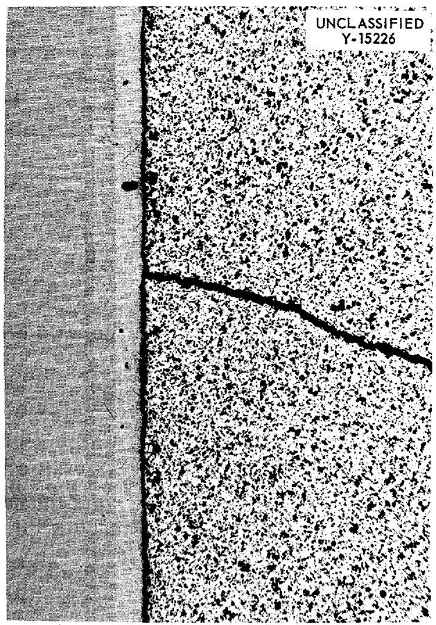  
Fig. 6.26. Brazed Joint of Kentanium 150A Cermet to Nickel. Note sound appearance of joint despite severe crack in the cermet.

oxides), were fired at 1300 and $1500^{\circ}C$ in air. The results of physical property measurements on these specimens are presented in Table 6.14.

Both $\mathsf{Sm}_2\mathsf{O}_3$ and $\mathsf{Gd}_2\mathsf{O}_3$ sintered at $1500^{\circ}\mathsf{C}$ to form ceramics of good strength. High resistance to thermal shock would not be expected because the coefficients of thermal expansion are rather high. The oxide $\mathsf{Gd}_2\mathsf{O}_3$ sintered at both 1300 and $1500^{\circ}\mathsf{C}$ was stable in boiling water; however, $\mathsf{Sm}_2\mathsf{O}_3$ sintered at $1500^{\circ}\mathsf{C}$ was not stable.

A mixture of the oxides (available commercially) containing $63.8\% \mathrm{Sm}_2\mathrm{O}_3$ and $26.3\% \mathrm{Gd}_2\mathrm{O}_3$ (balance, other rare-earth oxides) was fabricated into cylinders, and these specimens have been tested in the critical experiment (cf. Sec. 3 "Critical Experiment"). After heat treatment at $1500^{\circ}\mathrm{C}$ , the cylinders had a density of 10.94 and a porosity of $8\%$ , and they were stable in boiling water. They were machined to the following dimensions: $\frac{3}{4}$ -in.-OD, $\frac{1}{2}$ -in.-ID, 0.8-in.-long hollow cylinders, and 0.45-in.-OD, $\frac{3}{4}$ -in.-long solid cylinders to fit into hollow cylinders. Similar ceramics of the mixed oxides are being tested for radiation damage and thermal conductivity.

Exploratory tests for possible new compounds of these oxides were made by combining each in equimolecular proportions with each of the following: $\mathsf{MgO}$ CaO, SrO, CdO, BaO, $\mathsf{Al}_2\mathsf{O}_3$ FeO, SiO, SnO, ZrO, HfO, and ThO. After a heat treatment at $1500^{\circ}C$ for 2 hr, x-ray examination

TABLE 6.14. RESULTS OF PHYSICAL PROPERTY MEASUREMENTS OF RARE-EARTH OXIDES FIRED AT 1300 AND ${1500}^{ \circ  }\mathrm{C}$ IN AIR  

<table><tr><td>Property Measured</td><td colspan="2">Sm2O3</td><td colspan="2">Gd2O3</td></tr><tr><td>Sintering temperature (°C)</td><td>1300</td><td>1500</td><td>1300</td><td>1500</td></tr><tr><td>Density (bulk)</td><td>6.0</td><td>7.4</td><td>6.97</td><td>7.6</td></tr><tr><td>Per cent of theoretical*</td><td>81</td><td>100</td><td>93</td><td>102**</td></tr><tr><td>Apparent porosity (%)</td><td>23</td><td>4</td><td>10.4</td><td>1.2</td></tr><tr><td>Modulus of rupture (psi)</td><td>1800</td><td>2000</td><td>2740</td><td>2840</td></tr><tr><td>Modulus of elasticity (psi)</td><td>4.4 × 106</td><td>26.5 × 106</td><td>14.5 × 106</td><td>18.0 × 106</td></tr><tr><td>Coefficient of linear thermal expansion (in./in./°C)</td><td></td><td>9.9 × 10-6</td><td></td><td>10.5 × 10-6</td></tr><tr><td>Melting temperature (°C)</td><td>2350 ± 20</td><td></td><td></td><td>2350 ± 20</td></tr></table>

*Theoretical densities: Sm₂O₃, 7.43; Gd₂O₃, 7.407.   
\*\*Higher than theoretical density, probably due to $2 \%$ terbium present.

showed that both rare-earth oxides formed compounds with $\mathrm{Al}_{2}\mathrm{O}_{3},\mathrm{Fe}_{2}\mathrm{O}_{3},\mathrm{SiO}_{2},$ and SrO. The compounds with $\mathrm{Al}_{2}\mathrm{O}_{3}$ and $\mathrm{Fe}_{2}\mathrm{O}_{3}$ have the perovskite structure, and their possible use as dielectrics is being investigated. In each case the $\mathrm{Fe}_{2}\mathrm{O}_{3}$ compound was magnetic. Both $\mathrm{Sm}_{2}\mathrm{O}_{3}$ and $\mathrm{Gd}_{2}\mathrm{O}_{3}$ form solid solutions with CaO, MgO, HfO, ZrO, and ThO. In each case the CdO volatilized out of the mixture at $1500^{\circ}C.$

Several rare earths were available only in very small quantities, and hence they were studied only with respect to their x-ray diffraction patterns. Their structures, as received and after calcination at $1400^{\circ}\mathrm{C}$ , are given in Table 6.15.

TABLE 6.15. STRUCTURES OF RARE-EARTH OXIDES   

<table><tr><td></td><td>As Received</td><td>After Calcination at 1400°C</td></tr><tr><td>CeO2</td><td>fcc</td><td>fcc</td></tr><tr><td>Pr2U3</td><td>U*</td><td>U</td></tr><tr><td>Nd2O3</td><td>U</td><td>U**</td></tr><tr><td>Sm2O3</td><td>U + c</td><td>U</td></tr><tr><td>Eu2O3</td><td>c</td><td>U</td></tr><tr><td>Gd2O3</td><td>c</td><td>U</td></tr><tr><td>Dy2O3</td><td>c</td><td>c</td></tr><tr><td>Ho2O3</td><td>c</td><td>c***</td></tr><tr><td>Er2O2</td><td>c</td><td>c</td></tr><tr><td>Tm2O3</td><td>c</td><td>c</td></tr><tr><td>Yb2O3</td><td>c</td><td>c</td></tr></table>

$\star U =$ undetermined; $c =$ cubic.   
\*\*2 phases present; both anisotropic.   
\*\*\*2 phases present; one cubic, one anisotropic.

The rare-earth oxides $\mathrm{Eu}_{2}\mathrm{O}_{3},\mathrm{Nd}_{2}\mathrm{O}_{3},\mathrm{Pr}_{2}\mathrm{O}_{3},$ and $\mathrm{Dy}_2\mathrm{O}_3$ are now on hand in sufficient quantities for determining some of their sintered properties and whether their reaction products with $\mathrm{Al}_{2}\mathrm{O}_{3}$ and $\mathrm{Fe}_2\mathrm{O}_3$ have valuable properties. Specimens of $\mathrm{Eu}_{2}\mathrm{O}_{3}$ in the form of disks $3 / 4$ in. in diameter and 0.003 in. thick and bars $3\times 1 / 4\times 1 / 8$ in. are being prepared for physical property measurements and radiation damage studies.

An $(\mathsf{Sm},\mathsf{Gd})_2\mathsf{O}_3$ -Fe cermet was prepared by Shevlin at the Ohio State Experiment Station. This cermet consists of 30 wt % rare-earth oxides and

70 wt % iron. Powders of these two materials were milled for 24 hr in 1-qt-capacity steel mills with tungsten carbide slugs and methyl alcohol. The mill charge was dried and granulated, and the batch of material was pressed isostatically at 35,000 psi. The blank thus formed was sintered in hydrogen at $2725^{\circ}\mathrm{F}$ for $1\frac{1}{2}$ hr. The specimen was machined to a cylinder about 0.8 in. in diameter and 3 in. long by using a conventional lathe and steel tip tools. A porosity of $14\%$ was measured by determining kerosene absorption, and a porosity of $25.9\%$ was calculated on the basis of theoretical density; these values indicate the close pore volume to be $11.9\%$ .

# $\mathsf{UO}_2$ Particles Coated with $\mathsf{ZrO}_2$

In anticipation of a possible need for protecting particles of $\mathsf{UO}_2$ from reaction with molten silicon in the development of an SiC-Si fuel element, a technique was developed by Shevlin, at the Ohio State Experiment Station, for coating particles of $\mathsf{UO}_2$ (20 to 50 mesh) with a thin layer of $\mathsf{ZrO}_2$ . This was done by heating the particles to about $500^{\circ}\mathsf{F}$ in an open-topped container on a hot plate. While this container was vibrated mechanically to agitate the particles, they were sprayed with a solution of ammonium zirconyl carbonate. Under these experimental conditions, droplets of the solution were dried, the salt was decomposed, and the oxide $(\mathsf{ZrO}_2)$ product was deposited on the $\mathsf{UO}_2$ surface to form a continuous film, which was difficult to remove by rubbing. It appears possible to use this process to form diffusion barriers which would prevent $\mathsf{UO}_2$ from reacting with aluminum and other metals. Attempts will be made to deposit $\mathsf{Al}_2\mathsf{O}_3$ and NiO coatings on $\mathsf{UO}_2$ by this process, and it is planned to heat-treat $\mathsf{ZrO}_2$ and $\mathsf{Al}_2\mathsf{O}_3$ to explore the possibility of consolidating the coatings. Heat treatment of NiO under reducing conditions will also be investigated to determine the practicability of producing nickel coatings in this manner.

# Graphite-Hydrogen Reactions and Erosion Investigation

For some ANP rocket concepts it is proposed to use hydrogen as a propellant that would pass through a graphite- $\mathrm{UO}_2$ core at high velocity. Because it was reported that hydrogen reacted seriously with graphite, attempts were made to

coat graphite with ZrC. All methods so far tried have resulted in unsatisfactory coatings. An investigation is under way to determine the reaction of graphite with hydrogen at $2300^{\circ} \mathrm{C}$ .

A static gas test in which a plate of graphite is heated in hydrogen to $2300^{\circ}C$ has been developed. Little, if any, reaction was noted when the graphite was exposed at $1800^{\circ}C$ for 2 min and $2300^{\circ}C$ for 30 sec. Gas analyses are being made of the hydrogen which surrounded the specimen.

A dynamic test has been set up at Graphite

Specialties Corporation, Niagara Falls. An electrically heated high-density graphite tube surrounded by carbon insulation is the heat source and specimen. Hydrogen that had been processed to remove most of the water impurities was blown through the tube at several hundred feet per second while the tube was heated to $2300^{\circ}\mathrm{C}$ . There was no conclusive evidence that any significant reaction took place between hydrogen and graphite in this test; however, there was evidence of reaction between water impurity in the gas and graphite.

# 7. HEAT TRANSFER AND PHYSICAL PROPERTIES

H. F. Poppendiek  
Reactor Experimental Engineering Division

Fused salt heat transfer studies have included an experimental determination of the friction factor as a function of Reynolds modulus for the case of turbulently flowing NaF-ZrF4-UF4 in Inconel tubes. A full-scale ART fuel-to-NaK heat exchanger was studied as a water-to-water heat exchanger. Some velocity profile data were obtained for the 18-in. ART core, and a study was made of the temperatures and corresponding tensile stress fluctuations in the Inconel walls of the ART core for momentary periods of flow stagnation near the wall. The results of a theoretical and experimental study of a free-convection system containing a volume heat source are presented.

The enthalpies, heat capacities, and viscosities of several fluoride mixtures were obtained. Also, some preliminary thermal conductivity data were obtained with a new conductivity cell.

# FUSED SALT HEAT TRANSFER

H. W. Hoffman  
Reactor Experimental Engineering Division

S.J.Pias Pratt & Whitney Aircraft

Previously reported heat transfer experiments with the fuel mixture $\mathsf{NaF - ZrF_4 - UF_4}$ (53.5-40-6.5 mole %) flowing in an Inconel tube gave results which were $24\%$ below the general heat transfer correlation. Two possible explanations for this discrepancy are that there may have been errors in temperature measurement or that an additional thermal resistance may have been present at the fluid-metal interface. Calibration of the mixing-chamber and tube-wall thermocouples revealed no temperature errors. A study of the effectiveness of the mixing chambers is now in progress to be sure that good mixed mean fluid temperatures were obtained. A visual examination of the tube showed no surface deposits for this system. However, the lack of residual salt adhering to the tube surface suggests a "nonwetting" condition. To check on the general possibility of some type of two-phase flow, a study of the pressure-drop characteristics of $\mathsf{NaF - ZrF_4 - UF_4}$ in forced convection through nearly isothermal circular tubes

was undertaken. The preliminary data are shown in Fig. 7.1. The results suggest that two-phase flow does not occur in this system, because the friction factor measurements fall near the general single-phase curve. The influence of a nonwetting fluoride on forced-convection heat transfer is not yet known.

The heat transfer characteristics of the mixture NaF-KF-LiF-UF $_4$ (11.2-41-45.3-2.5 mole %) are currently being investigated. Preliminary results for an Inconel system, shown in Fig. 7.2, lie $40\%$ below the general heat transfer correlation. A fragile green film was found on the inside surface of the tube. X-ray and petrographic examination revealed only the constituents of the salt. Further heat transfer studies are planned, for which a stainless steel test section will be used. Pressure-drop measurements are also to be made.

A small-scale loop that is to include a centrifugal sump pump has been designed and is being fabricated. The proposed system is shown schematically in Fig. 7.3. The fluid flow rate will be obtained by weighing the salt as it empties into a weigh tank suspended within a weigh chamber. The weigh tank will be arranged so that it can be rapidly emptied. The sump well will be used to maintain the liquid level in the pump during the weighing operation.

# ART FUEL-TO-NaK HEAT EXCHANGER

J. L. Wantland Reactor Experimental Engineering Division

A full-scale ART fuel-to-NaK heat exchanger tube bundle (100 Inconel tubes, 6 ft long, $3/16$ in. OD, 0.017-in. wall thickness) was assembled, instrumented, and studied as a water-to-water heat exchange system (Fig. 7.4). Cold water was circulated through the tubes (NaK side) at Reynolds numbers of sufficient magnitude to produce low and calculable thermal resistances; hot water was circulated around the tube bundle in a parallel direction (fuel side). The inlet and outlet temperatures of both streams were measured by two thermocouples located in each of the four mixing chambers. The "fuel" side was instrumented with static pressure taps. Both flow rates were measured

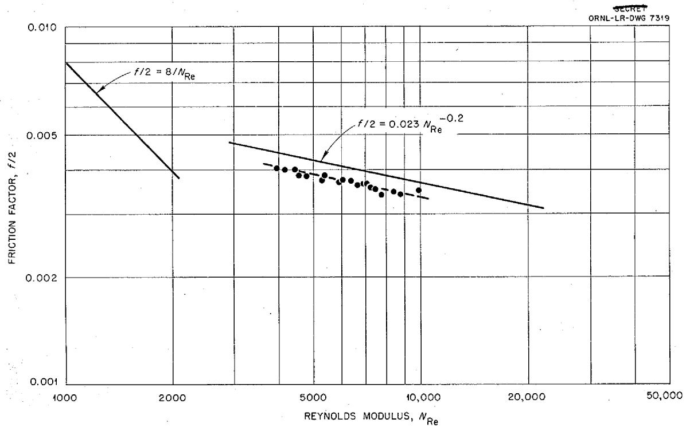  
Fig. 7.1. Friction Factor for Isothermal Flow of NaF-ZrF $_4$ -UF $_4$ (53.5-40-6.5 mole %) in a Smooth Circular Tube.

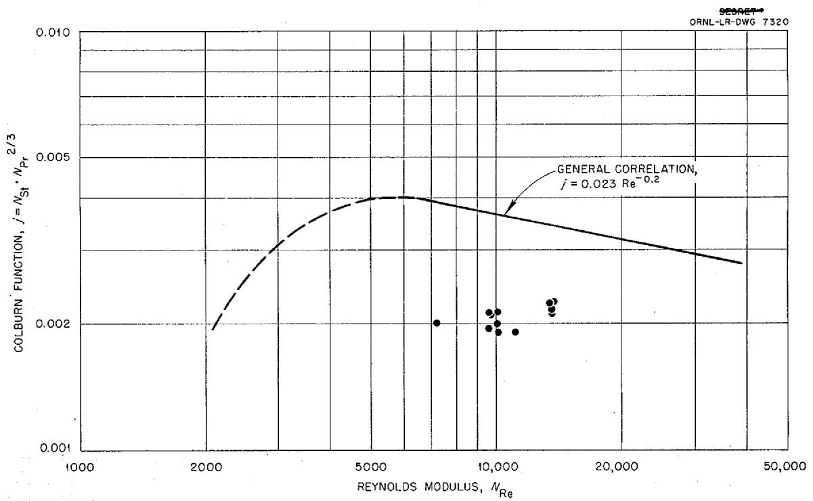  
Fig. 7.2. Comparison of Heat Transfer Measurements on NaF-KF-LiF-UF $_4$ (11.2-41-45.3-2.5 mole %) in Inconel with the General Correlation for Ordinary Fluids.

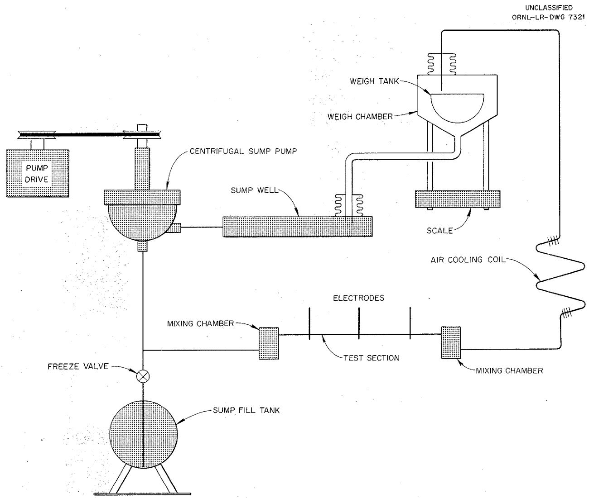  
Fig. 7.3. Schematic Diagram of Small-Scale Pumping System for Heat Transfer Studies with Fused Salts.

by utilizing weigh tanks and electric timers.

Preliminary heat transfer and friction characteristic curves for the fuel side of the ART heat exchanger are shown in Figs. 7.5 and 7.6. Figure 7.5 is based on 18 data points that fall within $\pm 10\%$ of the mean curve. Heat balances were within a maximum of $2\%$ of being perfect, and the temperatures measured in a given mixing chamber agreed to within $0.2^{\circ}C$ of each other.

This heat exchanger system is being modified so that the fuel-side characteristics can be determined by utilizing the tube bundle as an electrical-resistance heater. Results of the study should further substantiate the curve shown in Fig. 7.5.

# ART CORE HYDRODYNAMICS

J. O. Bradfute

F. E. Lynch

L. D. Palmer

Reactor Experimental Engineering Division

G. L. Muller

Pratt & Whitney Aircraft

Further flow studies were conducted with the quarter-scale model of the 18-in. ART core. Many photographs of particles inserted in water flowing through the core without rotation have been taken, and quantitative velocity profiles have been obtained.

A vaned section was added at the inlet to the

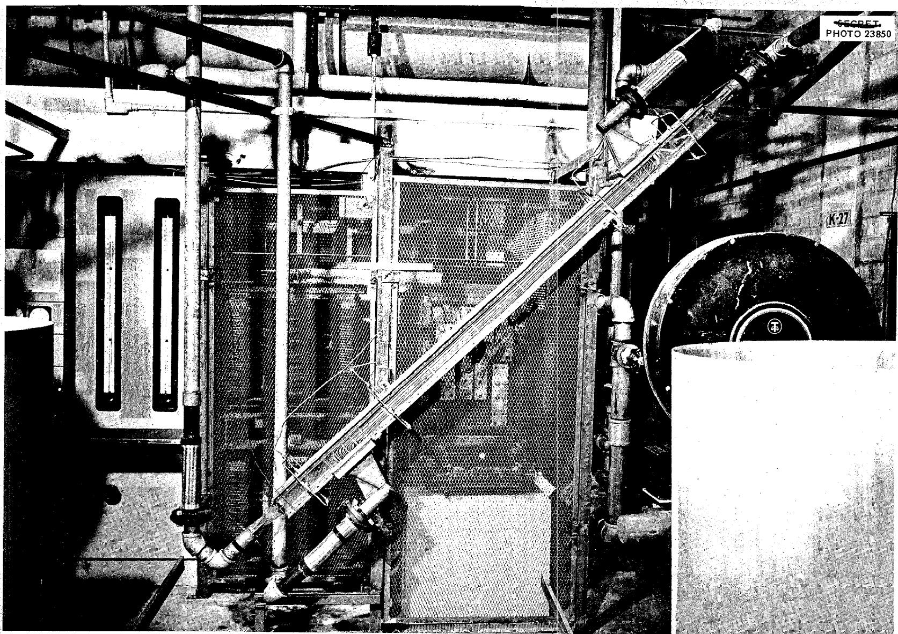  
ANP PROJECT PROGRESS REPORT   
Do not delete   
Fig. 7.4. ART Fuel-to-NaK Heat Exchanger Experiment.

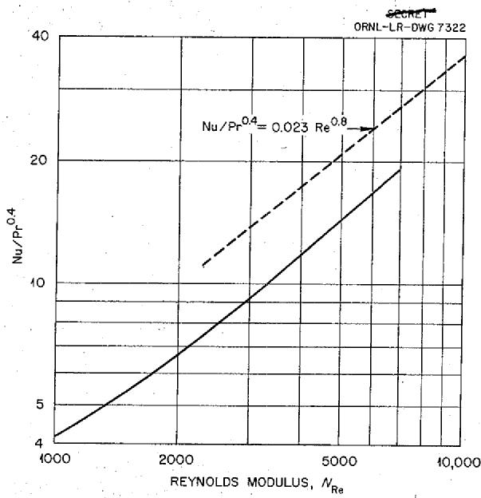  
Fig. 7.5. Preliminary Heat Transfer Characteristics of the Fuel Side of the ART Fuel-to-NaK Heat Exchanger as Determined by Water-to-Water Tests.

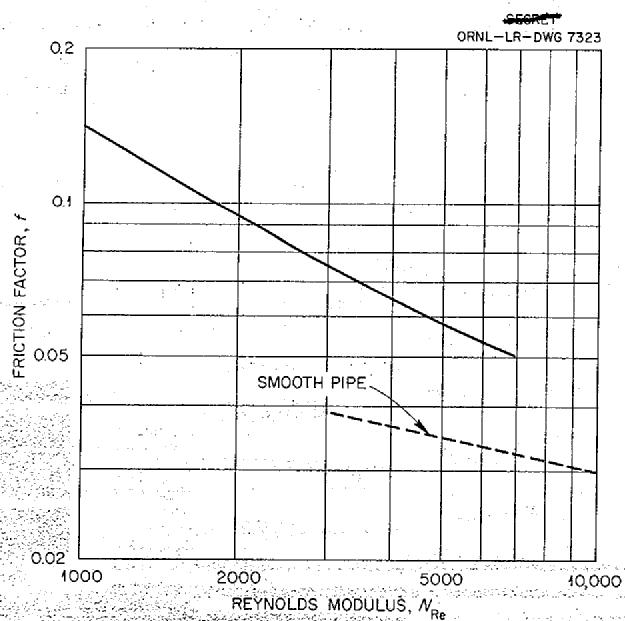  
Fig. 7.6. Preliminary Friction Characteristics of the Fuel Side of the ART Fuel-to-NaK Heat Exchanger.

core model to give the fluid a rotational component (approximately a 45-deg helical angle at the entrance). The velocity profiles were then observed qualitatively with the flow-visualization technique. Separation was observed next to the island wall rather than the shell wall, which was the case with straight-through flow. The axial component profiles are shown in Fig. 7.7.

In addition, a series of 16-mesh screens was added at the inlet, both with and without the rotation-producing vanes. Little effect attributable to the screens was noted in the straight-through case, except that the separation region appeared to be much less turbulent; indeed, the negative profiles were easy to see. They appeared to be approximately parabolic, and thus they suggested

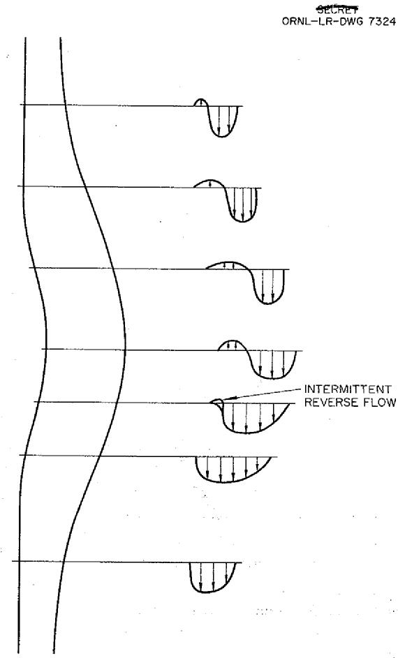  
Fig. 7.7. Qualitative Axial Velocity Profiles of Flow Through a Model of the ART Core at a Reynolds Number of 3000 with a Rotational Velocity Component at the Inlet.

a laminar type of flow. No effect of the screens could be observed with rotational flow.

A two-dimensional diffuser has been designed which permits a variation of diffuser geometries and cross-sectional area ratios. The entire diffuser section is to be made of Plexiglas so that the flow can be studied by the flow-visualization system. The assembly is now being fabricated.

A preliminary feasibility study is at present being made on the control of the boundary layer in the core for the purpose of preventing separation of the boundary layer. A boundary layer suction technique is being considered.

A plastic 10/44-scale model of the 21-in. core has been designed and is now being fabricated. The odd scale was chosen to make the model fit the available testing facility.

# REACTOR CORE HEAT TRANSFER

H. F. Poppendiek

N. D. Greene

L. D. Palmer

Reactor Experimental Engineering Division

The hydrodynamic studies being made for the ART core indicate that when separation regions exist they are often characterized by repetitive, short periods of flow stagnation. A study was made of the temperature and tensile stress fluctuations in the Inconel core wall that result from these periods of flow stagnation. The following idealized system depicting the ART core wall during a short period of flow stagnation was considered. It was postulated that a layer of fuel contiguous to the Inconel wall suddenly stagnated for a period of 0.1 sec under the volume heat flux condition of $5\mathrm{kw/cm}^3$ . This flux is representative of the conditions in the ART because of the high flux peak at the wall. After a 0.1-sec time interval the fuel and wall temperature would rise about $260^{\circ}\mathrm{F}$ if no heat transfer were present; transient heat conduction into the Inconel wall, however, would reduce this temperature rise. A numerical composite-slab heat transfer analysis was made for this problem, and the results indicate that the Inconel-fuel interface temperature would rise about $60^{\circ}\mathrm{F}$ in 0.1 sec. This temperature rise would, of course, be much smaller if the thermal conductivity of Inconel were not so poor. The corresponding elastic thermal stress for this temperature fluctuation was found to be about $-15,000$ psi. These results suggest that the fluid flow in the core should not be allowed to fluctuate.

All mechanical components, including the power supply, of the volume heat source experiment for reactor cores with nonuniform flow cross section have been constructed and installed. System leak testing and flow calibration are now being carried out. An "infinitely" adjustable power input (that is, 15 to $100\mathrm{kw}$ ) to the test section will be possible by means of several saturable reactors that have been shown to possess excellent voltage regulation characteristics under the desired load. The electrical and power instrumentation is nearing completion. The temperature structure within an insulated, divergent test channel will soon be studied for low power densities.

Several heat transfer analyses that are useful in predicting the thermal structure within a circulating-fuel reactor core have been completed. A report is being prepared which tabulates some of the detailed temperature profiles derived for the forced-convection volume-heat-source systems described previously. These temperature data will make it possible to determine rapidly the complicated, radial, fuel-temperature profiles in circulating-fuel reactors whose pipe or channel ducts are being cooled at the walls. Also, a transient temperature solution was derived for the case in which fuel stagnates momentarily next to the Inconel core shell. Another analysis was concerned with a boundary layer temperature solution where a volumetric heat source exists in the fluid; thermal and hydrodynamic boundary layers are not presumed to be equal.

# FREE CONVECTION IN FLUIDS HAVING A VOLUME HEAT SOURCE

D. C. Hamilton

F. E. Lynch

Reactor Experimental Engineering Division

The objectives of the free-convection research and the progress were previously reported.3 Both the theoretical and experimental analyses of the three-parallel-plates system have been completed, and a report is to be issued.4 The three-parallel

plates system is shown schematically in the upper inset of Fig. 7.8; it consists of three parallel and equally spaced vertical copper plates, 8 in. wide and 36 in. high, with a channel width, $x_0$ , of 0.5 in. Plastic bottoms and ends make leakproof containers of the two free-convection channels, which are filled with a dilute electrolyte (HCI in $H_2O$ ). With the two outer plates grounded and the center plate maintained at a given a-c voltage, heat is generated uniformly within the electrolyte. The heat thus generated is transferred by free convection to the outer walls and then through the outer walls to the coolant channels in which cooling water flows vertically upward. Thermocouple probe wells were provided so that the temperature within each wall could be measured at various vertical levels in the system. The variables measured were coolant flow rate and temperature rise, power input to the apparatus, and the three wall temperatures at various levels.

A theoretical analysis for laminar flow was made that was based on the postulates that, in the region away from the top or bottom, the velocity profile becomes fully established and unidimensional and that the temperature becomes linear with the vertical coordinate, $z$ , and has the same vertical gradient, $A$ , as the coolant mixed mean temperature. Both velocity and temperature solutions were obtained. The maximum temperature at a given level occurs at the center wall. The equation for the dimensionless center wall temperature, $\Phi(0)$ , follows, and $\Phi(0)$ , $N_{1}$ , and $N_{111}$ , are defined on Fig. 7.8:

Semiquantitative visual observations of the paths of suspended droplets indicated that the free-convection circuit existed as one long cell and that the velocity profile became established in the middle region and was similar to that predicted by the theoretical analysis. The onset of turbulence occurred at a Grashof modulus of $5 \times 10^{9}$ , the same as that for ordinary free convection.

A curve is given in the lower inset of Fig. 7.8 that shows the typical vertical variation of the experimental $\Phi(0)$ . In comparing the laminar regime minimum $\Phi(0)$ data with the theory, it is seen that, for $N_{\mathrm{III}}$ less than 1300, the data are about $20\%$ lower than the theory; this is good agreement. For these data, $A$ was uniform and approximately equal to $A_{c'}$ the coolant mixed mean temperature gradient. For the data (not shown here) for which $N_{\mathrm{III}}$ was greater than 1300, $A$ was definitely not uniform; it was as much as ten times greater than $A_{c'}$ and the $\Phi(0)$ data were $50\%$ lower than the theory.

From the turbulent regime data, it is seen that free convection can reduce the maximum temperature difference in such systems to at least one tenth that which would be present if the heat were transferred by conduction alone.

Variables not defined on Fig. 7.8 are: $k$ , thermal conductivity; $g$ , acceleration due to gravity; $\beta$ , temperature coefficient of expansion; $\alpha$ , thermal diffusivity; $\nu$ , kinematic viscosity; and $S$ , volume heat source term.

$$
\Phi (0) = \lambda^ {- 2} [ \sin \lambda \sinh \lambda - a (1 - \cos \lambda \cosh \lambda) + c (\cos \lambda \sinh \lambda - \sin \lambda \cosh \lambda) ]
$$

where

$$
\begin{array}{l} \lambda = \left(\frac {N _ {I}}{6 4}\right) ^ {1 / 4}, \\ a = - 1 - 2 \left(\frac {\sin^ {2} \lambda + \sin \lambda \sinh \lambda - \lambda \sin \lambda \cosh \lambda - \lambda \cos \lambda \sinh \lambda}{\sinh^ {2} \lambda - \sin^ {2} \lambda}\right) \\ c = \frac {(\cosh \lambda - \cos \lambda) (\sinh \lambda + \sin \lambda) - 2 \lambda \sin \lambda \sinh}{\sinh^ {2} \lambda - \sin^ {2} \lambda} \\ \end{array}
$$

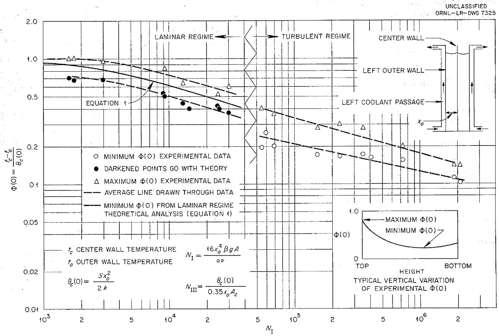  
Fig. 7.8. Dimensionless Temperature Function for $N_{\mathrm{III}} < 1300$ .

# HEAT CAPACITY

W. D. Powers

Reactor Experimental Engineering Division

The enthalpies and heat capacities of four fluoride compositions and of lithium hydride have been determined by using the copper-block calorimeter. The results are listed below:

$$
\mathrm{NaF - ZrF}_{4} - \mathrm{UF}_{4} (50 - 46 - 4\mathrm{~mole}\%)
$$

Liquid (540 to $894^{\circ}C$

$$
H _ {T} - H _ {2 5 ^ {\circ} C} = - 3. 3 + 0. 3 1 7 8 T - (4. 2 8 \times 1 0 ^ {- 5}) T ^ {2}
$$

$$
c _ {p} = 0. 3 1 7 8 - (8. 5 6 \times 1 0 ^ {- 5}) T
$$

$$
\mathrm{NaF - ZrF}_{4} (50 - 50 \text { mole } \% )
$$

Solid (54 to $488^{\circ}C$

$$
H _ {T} - H _ {2 5 ^ {\circ} C} = - 4. 4 + 0. 1 7 9 8 T + (2. 6 9 \times 1 0 ^ {- 5}) T ^ {2}
$$

$$
c _ {p} = 0. 1 7 9 8 + (5. 3 8 \times 1 0 ^ {- 5}) T
$$

Liquid (546 to $899^{\circ}C$

$$
\begin{array}{l} H _ {T} - H _ {2 5 ^ {\circ} C} = - 9. 8 + 0. 3 5 0 8 T - (5. 3 9 \times 1 0 ^ {- 5}) T ^ {2} \\ c _ {p} = 0. 3 5 0 8 - (1 0. 7 9 \times 1 0 ^ {- 5}) T \\ \Delta H _ {\text {f u s i o n}} = 6 3 \text {a t} 5 1 0 ^ {\circ} \mathrm {C} \\ \end{array}
$$

$$
\mathrm{NaF - ZrF}_{4} - \mathrm{UF}_{4} (56 - 39 - 5\text{mole}\%)
$$

Solid (137 to $503^{\circ}\mathrm{C}$ )

$$
\begin{array}{l} H _ {T} - H _ {3 5 ^ {\circ} C} = - 4. 3 + 0. 1 5 9 6 T + (5. 1 5 \times 1 0 ^ {- 5}) T ^ {2} \\ c _ {p} = 0. 1 5 9 6 + (1 0. 2 9 \times 1 0 ^ {- 5}) T \\ \end{array}
$$

Liquid (567 to $892^{\circ}\mathrm{C}$ )

$$
\begin{array}{l} H _ {T} - H _ {3 5 ^ {\circ} C} = 0. 6 + 0. 3 0 3 3 T - (3. 2 4 \times 1 0 ^ {- 5}) T ^ {2} \\ c _ {p} = 0. 3 0 3 3 - (6. 4 7 \times 1 0 ^ {- 5}) T \\ \end{array}
$$

$$
\Delta H _ {\text {f u s i o n}} = 5 7 \text {a t} 5 3 0 ^ {\circ} \mathrm {C}
$$

$$
\mathrm{NaF - LiF - ZrF_{4} - UF_{4}}(20 - 55 - 21 - 4\text{ mole}\%)
$$

Liquid (582 to $900^{\circ}\mathrm{C}$ )

$$
\begin{array}{l} H _ {T} - H _ {2 5 ^ {\circ} C} = - 2 5. 9 + 0. 4 3 1 4 T - (7. 4 2 \times 1 0 ^ {- 5}) T ^ {2} \\ c _ {p} = 0. 4 3 1 4 - (1 4. 8 5 \times 1 0 ^ {- 5}) T \\ \end{array}
$$

Lithium Hydride

Solid (100 to $490^{\circ}\mathrm{C}$ )

$$
\begin{array}{l} H _ {T} - H _ {3 5 ^ {\circ} C} = - 3 8. 5 + 0. 9 3 9 T + (6. 6 \times 1 0 ^ {- 4}) T ^ {2} \\ c _ {p} = 0. 9 3 9 + (0. 1 3 2 \times 1 0 ^ {- 2}) T \\ \end{array}
$$

In the above expressions,

$$
\begin{array}{l} H _ {T} = \text {e n t h a l p y i n c a l / g}, \\ c _ {p} = \text {h e a t c a p a c i t y i n} \mathrm {c a l} / \mathrm {g} ^ {\circ} \mathrm {C}, \\ T = \text {t e m p e r a t u r e} ^ {\circ} \mathrm {C}, \\ \Delta H _ {\text {f u s i o n}} = \text {h e a t} \text {o f} \text {f u s i o n} \text {i n} \text {c a l} / \mathfrak {g}. \\ \end{array}
$$

The enthalpies and heat capacities of the first two mixtures had been previously determined by using the Bunsen ice calorimeters. In view of the present importance of the zirconium fluoride-base fuels, however, it was felt desirable to determine these properties with the more precise copper-block calorimeters.

The heat capacities of liquid fluoride mixtures may be predicted within about $15\%$ on the basis of their chemical composition. It has been found that the product of the heat capacity $(\mathrm{cal} / \mathrm{g},^{\circ}\mathrm{C})$ and a function $\overline{M} /\overline{N}$ is remarkably constant. This function is defined as:

$\overrightarrow{M} =$ average molecular weight,

$$
\begin{array}{l} \overrightarrow {M} = \sum_ {i} x _ {i} M _ {i}, \\ \overrightarrow {N} = \sum_ {i} x _ {i} N _ {i}, \\ M _ {i} = \text {m o l e c u l a r w e i g h t o f c o m p o n e n t}, \\ x _ {i} = \text {m o l e f r a c t i o n o f c o m p o n e n t}, \\ \overrightarrow {N} = \text {a v e r a g e n u m b e r o f i o n s}, \\ \end{array}
$$

$$
N _ {i} = \text {n u m b e r o f i o n s i n c o m p o n e n t}.
$$

Figure 7.9 shows a plot of heat capacity vs the function $\overline{M} / \overline{N}$ . For the 17 fluoride mixtures being studied at present, the average of the product of $c_p$ and $\overline{M} / \overline{N}$ is 9.0. The corresponding average product for the six fluoride mixtures containing approximately equal molar amounts of NaF and $\mathsf{ZrF}_4$ and from 0 to 7 mole $\%$ UF $_4$ was found to be 8.1.

# VISCOSITY

# S. I. Cohen

Reactor Experimental Engineering Division

Viscosity measurements were made on seven fluoride mixtures, and the results are tabulated in Table 7.1. The data are expressed in the form

$$
\mu = A e ^ {B / T},
$$

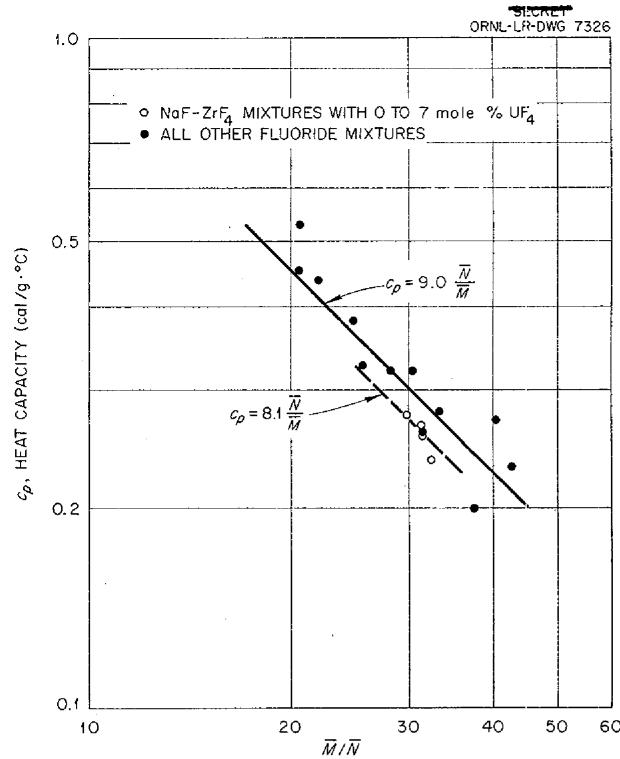  
Fig. 7.9. $c_p$ vs $\overline{M / N}$ for Molten Fluoride Mixtures.

where $T$ is in ${}^{\circ}\mathsf{K}$ . These viscosity data have been plotted in Fig. 7.10. No equation is listed in Table 7.1 for salt $a$ because of the slight curvature in the data, which may be noted in the figure. Salts $b$ , $c$ , and $d$ are mixtures which had been studied prior to the recently completed viscometry refinement program. Salts $a$ , $e$ , $f$ , and $g$ are mixtures which have been formulated recently. Measurements were made on all the mixtures (except salt $g$ ) by using both the Brookfield and capillary viscometers; the results obtained by these two completely different instruments were in satisfactory agreement (deviations from the average line through the data were within $\pm 12\%$ ). Measurements on salt $g$ , which contained $\mathrm{BeF}_2$ , were made in a separate beryllium facility. Data were taken with two capillary viscometers to furnish a check.

Figure 7.11 presents a plot of the viscosities of seven mixtures containing $\mathsf{BeF}_2$ . Mixtures $g, i,$ and $k$ were studied at ORNL. Mound Laboratory investigated mixtures $b$ and $j$ , and mixtures $l$ and $m$ were studied at KAPL. The formulas of these mixtures in mole percentages, as well as the

TABLE 7.1. SUMMARY OF CURRENT VISCOSITY MEASUREMENTS  

<table><tr><td>Mixturea</td><td>Composition</td><td>Viscosity (cp)</td><td>μ</td><td>Reference</td></tr><tr><td rowspan="2">a</td><td rowspan="2">NaF-LiF-ZrF4-UF4-UF3(20.9-38.4-35.7-4-1 mole %)</td><td>At 550°C, 13.5</td><td></td><td rowspan="2">(b)</td></tr><tr><td>At 800°C, 4.3</td><td></td></tr><tr><td rowspan="2">b</td><td rowspan="2">NaF-ZrF4-UF4(50-46-4 mole %)</td><td>At 570°C, 11</td><td>0.1307 e3730/T</td><td rowspan="2">(c)</td></tr><tr><td>At 870°C, 3.4</td><td></td></tr><tr><td rowspan="2">c</td><td rowspan="2">NaF-UF4(66.7-33.3 mole %)</td><td>At 700°C, 10.25</td><td>0.1715 e3984/T</td><td rowspan="2">(d)</td></tr><tr><td>At 900°C, 5.1</td><td></td></tr><tr><td rowspan="2">d</td><td rowspan="2">NaF-KF-UF4(46.5-26.0-27.5 mole %)</td><td>At 600°C, 17</td><td>0.0866 e4611/T</td><td rowspan="2">(e)</td></tr><tr><td>At 900°C, 4.4</td><td></td></tr><tr><td rowspan="2">e</td><td rowspan="2">NaF-LiF-ZrF4-UF4-UF3(20-55-21-3.6-0.4 mole %)</td><td>At 600°C, 12</td><td>0.061 e4611/T</td><td rowspan="2">(f)</td></tr><tr><td>At 850°C, 3.7</td><td></td></tr><tr><td rowspan="2">f</td><td rowspan="2">NaF-LiF-ZrF4(22-55-23 mole %)</td><td>At 600°C, 12</td><td>0.061 e4611/T</td><td rowspan="2">(f)</td></tr><tr><td>At 900°C, 3.1</td><td></td></tr><tr><td rowspan="2">g</td><td rowspan="2">NaF-LiF-BeF2(56-16-28 mole %)</td><td>At 575°C, 7</td><td>0.105 e3560/T</td><td rowspan="2">(g)</td></tr><tr><td>At 800°C, 2.9</td><td></td></tr></table>

${}^{a}$ See Fig. 7.10.   
$^{b}$ S. I. Cohen and T. N. Jones, Measurement of the Viscosity of Composition 72, ORNL CF-55-3-61 (Mar. 8, 1955).   
$^{c}$ S. I. Cohen and T. N. Jones, Measurement of the Viscosity of Composition 30, ORNL CF-55-3-62 (Mar. 9, 1955).   
dS. I. Cohen and T. N. Jones, Measurement of the Viscosity of Composition 43, ORNL CF-55-3-137 (Mar. 16, 1955).   
$^{e}$ S. I. Cohen and T. N. Jones, Measurement of the Viscosity of Composition 2, ORNL CF-55-4-32 (Apr. 1, 1955).   
S. I. Cohen and T. N. Jones, Measurement of the Viscosities of Composition 81 and Composition 82, ORNL CF-55-5-58 (May 16, 1955).   
8S. I. Cohen and T. N. Jones, Measurement of the Viscosity of Composition 78, ORNL CF-55-5-59 (May 16, 1955).

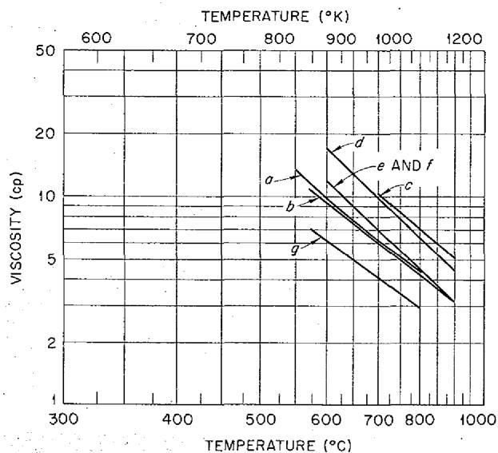  
UNCLASSIFIED   
ORNL-LR-DWG 7327   
UNCLASSIFIED   
ORNL-LR-DWG 7328   
Fig. 7.10. Viscosities of Fluoride Mixtures Currently Being Studied.

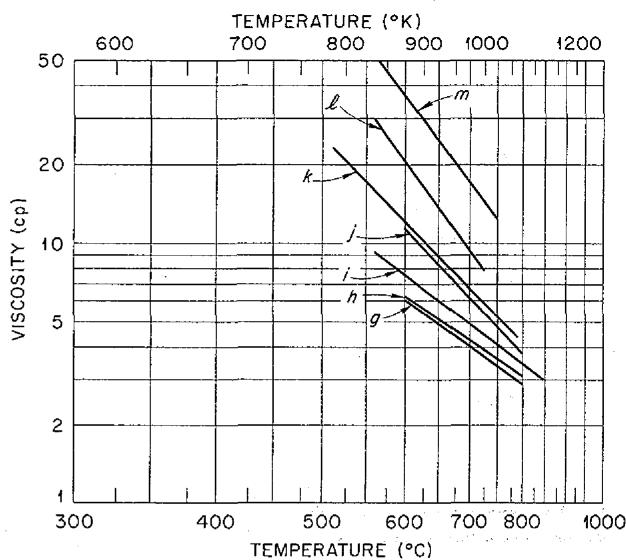  
Fig. 7.11. Viscosities of Some Fluoride Mixtures Containing $\mathsf{BeF}_2$ .

TABLE 7.2. THE VISCOSITIES AT ${700}^{ \circ  }\mathrm{C}$ OF SEVERAL MIXTURES CONTAINING ${\mathrm{{BeF}}}_{2}$   

<table><tr><td>Mixturea</td><td>Composition</td><td>Viscosity (cp)</td><td>BeF2Content (wt %)</td><td>Reference</td></tr><tr><td>g</td><td>BeF2-LiF-NaF (28-16-56 mole %)</td><td>4.1</td><td>32.2</td><td>(b)</td></tr><tr><td>b</td><td>BeF2-NaF (38.3-61.7 mole %)</td><td>4.25</td><td>40.0</td><td>(c)</td></tr><tr><td>i</td><td>BeF2-LiF (31-69 mole %)</td><td>5.0</td><td>44.9</td><td>(d)</td></tr><tr><td>j</td><td>BeF2-NaF (44.4-55.6 mole %)</td><td>6.25</td><td>47.0</td><td>(c)</td></tr><tr><td>k</td><td>BeF2-NaF (43-57 mole %)</td><td>6.75</td><td>45.8</td><td>(d)</td></tr><tr><td>l</td><td>BeF2-NaF-UF4 (51.9-47.9-0.25 mole %)</td><td>9.6</td><td>53.9</td><td>(e)</td></tr><tr><td>m</td><td>BeF2-LiF-ThF4-UF4 (49.43-49.43-1.03-0.12 mole %)</td><td>17</td><td>58.6</td><td>(f)</td></tr></table>

$a_{\mathrm{See}}$ Figs. 7.11 and 7.12.   
bS. I. Cohen and T. N. Jones, Measurement of the Viscosity of Composition 78, ORNL CF-55-5-59 (May 16, 1955).   
cCommunication from J. F. Eichelberger, Mound Laboratory   
$^{d}$ S. I. Cohen, ANP Quar. Prog. Rep. Mar. 10, 1955, ORNL-1864, p 143.   
eJ. K. Davidson, R. J. Herbert, and B. T. Morecroft, Fused Fluoride Homogeneous Reactor System for Submarine Propulsion, (SAR Phase III Study), KAPL-992.   
/Personal communication from J. K. Davidson, Knolls Atomic Power Laboratory.

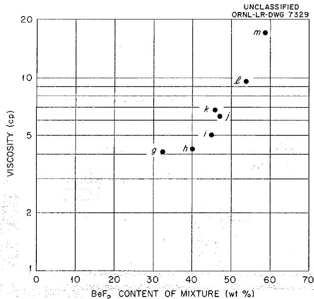  
Fig. 7.12. Viscosities at $700^{\circ}\mathrm{C}$ vs $\mathsf{BeF}_2$ Content of Seven Fluoride Mixtures. Compositions of the mixtures are given in Table 7.2.

$\mathsf{BeF}_2$ contents in weight percentages and the viscosities at $700^{\circ}\mathsf{C}$ are listed in Table 7.2.

Figure 7.12 shows a plot of the viscosity of each of these mixtures at $700^{\circ}\mathrm{C}$ vs the weight percentage of $\mathsf{BeF}_2$ in each of the mixtures; note that the viscosity decreases as the $\mathsf{BeF}_2$ content decreases. Mixture $g$ was formulated because it appeared from this trend that the kinematic viscosity might compete with the viscosities of salts in the NaF-ZrF $_4$ -UF $_4$ system. The kinematic viscosity of mixture $g$ , $\mathsf{BeF}_2$ -LiF-NaF (28-16-56 mole %), was found to be about $15\%$ higher than that of NaF-ZrF $_4$ -UF $_4$ (50-46-4 mole %), the salt presently being considered as the fuel for the ART.

# THERMAL CONDUCTIVITY

W. D. Powers

Reactor Experimental Engineering Division

Two methods for the determination of thermal conductivities of liquid fluoride mixtures are being investigated. A radial thermal conductivity cell has been redesigned and is being fabricated. The

major difficulty in using the apparatus as originally designed was the lack of sufficient guard heating to assure pure radial heat flow.

A flat-plate system is now being investigated. The liquid is contained in cells consisting of two parallel flat plates of metal joined at the edges with 10-mil-thick sheet metal. The conductivity of the liquid in the cell can be calculated by knowing the area of the plates and the distance between them and by measuring the amount of heat passing from one plate to the other and the temperature differences between them. Some preliminary data on a $\mathsf{ZrF}_4$ -base fluoride mixture are currently being obtained that are in agreement with previous conductivity data obtained with the variable-gap device.

# ELECTRICAL CONDUCTIVITY

N. D. Greene

Reactor Experimental Engineering Division

Conductivity studies of several aqueous electrolytes have indicated the presence of a considerable amount of polarization within the experimental, platinum conductivity cell. Accordingly, a second potential electrode will be installed, which, when used in conjunction with an electrometer having a 10-megohm input, should reduce the effects of polarization. Similar conductivity measurements of some nonaqueous electrolytes (molten salts) will be made to compare the differences in the degree of polarization between the two types of electrolytes.

# 8. RADIATION DAMAGE

D. S. Billington J. B. Trice

Solid State Division

Preliminary results from a series of MTR irradiations of Inconel capsules designed to compare $\mathsf{UF}_3$ - and $\mathsf{UF}_4$ -base fuels show no corrosion, no significant uranium segregation, and no changes in concentrations of impurities in the fluoride mixture. The loop in which a fuel mixture was circulated in the LITR has been sectioned, and preliminary examinations have been made. The miniature loop designed for operation in a vertical hole in the LITR is in the final stages of assembly, and charcoal traps to delay fission gases in the event of a rupture have been tested and incorporated in the cooling-air off-gas line.

A tube-burst stress-corrosion apparatus has been assembled for insertion in the LITR, and an LITR-irradiated stress-corrosion rig is ready for examination. The creep apparatus inserted in the MTR has completed six weeks of irradiation and is to be returned to ORNL for measurements. A theoretical study has been completed which indicates that xenon will be sparged from the ART, as presently designed, in sufficient quantity to alleviate the control problem.

# MTR STATIC CORROSION TESTS

W.E.Browning G.W.Keilholtz

Solid State Division

H. L. Hemphill

Analytical Chemistry Division

Two more of a series of paired capsules are being irradiated for two weeks each in the MTR. These Inconel capsules are being irradiated in order to compare the effects of $\mathsf{UF}_3$ and $\mathsf{UF}_4$ in NaF-ZrF $_4$ -base fuel mixtures, as described previously. Three additional Inconel capsules that had been irradiated for two weeks were opened and analyzed chemically and metallographically. In two of these capsules the fluoride mixture

contained 2 mole $\%$ UF $_3$ , and in the other capsule the fluoride mixture contained 2 mole $\%$ UF $_4$ . A control capsule for each mixture was also opened and analyzed. No corrosion could be found in any of these five capsules. One irradiated capsule containing UF $_4$ that was examined earlier had shown slight corrosion. The next series of capsules that will become available for analysis consists of four capsules that will have been irradiated three times as long (six weeks) as those analyzed thus far. The capsules in this series will be more likely to reveal any difference that might exist between the two fuel materials.

The starting fuel mixtures were analyzed for trivalent uranium, total uranium, iron, chromium, nickel, sodium, and zirconium. The $\mathsf{UF}_3$ -bearing batch had more than $96\%$ of its uranium in the trivalent condition, whereas no trivalent uranium was found in the $\mathsf{UF}_4$ -bearing batch when analyzed by a method which is sensitive to $0.005\% \mathsf{U}^{3+}$ . The results of the chemical analyses for uranium, iron, chromium, and nickel in the starting mixture, the control mixtures, and the irradiated mixtures were averaged, and ratios were computed to determine whether there were changes in distribution or composition. The results of these statistical analyses, which are presented in Table 8.1, indicate that there was no significant uranium segregation and that there were no changes in concentration of uranium, iron, chromium, and nickel.

Chemical analyses were also obtained of four additional irradiated Inconel capsules in which the fluoride fuel mixture initially contained 4 mole $\%$ $\mathsf{UF}_4$ . The uranium analyses of inner cores and outer cores of the samples agreed to within $6\%$ . The iron, chromium, and nickel concentrations were between 0.01 and $0.1\%$ . Additional capsules of this type are being prepared for irradiation in the MTR at $1500^{\circ}\mathsf{F}$ , for control runs, and for thermal cycling tests.

TABLE 8.1. SUMMARY OF ANALYTICAL RESULTS FOR SERIES OF CAPSULES TESTED TO COMPARE EFFECTS OF   
$\mathsf{UF}_3$ AND $\mathsf{UF}_4$ IN NaF-ZrF-BASE FUEL MIXTURES   

<table><tr><td rowspan="2">Capsule Category</td><td rowspan="2">Number of Capsules</td><td rowspan="2">Uranium Distribution,(a) Ua(av)/Ub(av)</td><td rowspan="2">Ratio of Final to Initial Uranium Content(b)</td><td colspan="3">Ratio of Final to Initial Impurity Concentration(c)</td></tr><tr><td>Fe</td><td>Cr</td><td>Ni</td></tr><tr><td>All capsules in series</td><td>7</td><td>1.003 ± 0.028</td><td>1.021 ± 0.022</td><td>1.47 ± &gt;1.47</td><td>1.08 ± &gt;1.08</td><td>(d)</td></tr><tr><td>All irradiated capsules</td><td>5</td><td>1.021 ± 0.033</td><td>1.038 ± 0.024</td><td>1.45 ± &gt;1.45</td><td>0.48 ± 1.5</td><td>1.48 ± 0.56</td></tr><tr><td>All control capsules</td><td>2</td><td>0.96 ± 0.0240</td><td>0.989 ± 0.02(e)</td><td>1.53 ± &gt;1.53</td><td>3.0 ± 1.2</td><td>(d)</td></tr><tr><td>Irradiated capsules containing 2 mole % UF4</td><td>2</td><td>1.026 ± 0.044</td><td>1.031 ± 0.04(e)</td><td>1.67 ± 1.47</td><td>0.0 ± 1(e)</td><td>3.9 ± 1.1</td></tr><tr><td>Control capsule containing 2 mole % UF4</td><td>1</td><td>0.947 ± 0.028</td><td>0.975 ± 0.024</td><td>(d)</td><td>(d)</td><td>(d)</td></tr><tr><td>Irradiated capsules containing 2 mole % UF3</td><td>3</td><td>1.001 ± 0.048</td><td>1.051 ± 0.05(e)</td><td>1.31 ± &gt;1.31</td><td>0.54 ± 0.6</td><td>0.95 ± 0.05</td></tr><tr><td>Control capsule containing 2 mole % UF3</td><td>1</td><td>0.972 ± 0.020</td><td>0.994 ± 0.02(e)</td><td>1.53 ± &gt;1.53</td><td>3.0 ± 1.2</td><td>(d)</td></tr></table>

$(a)\cup_{a}$ is the uranium content of the inner core of a sample, and $\mathsf{U}_h$ is the uranium content of the outer core of a sample.   
(b) Corrected for burnup.   
(c) Confidence limits are at $95\%$ level.   
$(d)$ Values obtained were influenced by a sample which was probably contaminated with Inconel and therefore are not significant.   
(e)Estimated.

# LITR HORIZONTAL-BEAM-HOLE FLUORIDE-FUEL LOOP

O. Sisman

J.G.Morgan

C. D. Baumann

M. T. Morgan

W. E. Brundage

A. S. Olson

R.M.Carroll

W.W. Parkinson

Solid State Division

The operation of the loop for circulating fluoride-base fuel in the LITR horizontal beam hole to study the effect of reactor irradiation on corrosion and fuel stability was described in the previous report. The fuel mixture was composed of 62.5 mole $\%$ NaF, 12.5 mole $\%$ ZrF $_4$ , and 25 mole $\%$ UF $_4$ . The loop was cleaned by running it at $1500^{\circ}$ F for 16 hr with a non-uranium-bearing salt. The actual fuel mixture was circulated in the loop for 645 hr, including 475 hr during which the LITR was at full power (3000 kw). The power generated in the loop was about 2.8 kw, and the linear flow rate of the fuel mixture was 8 to 10 fps, which corresponds to a Reynolds number of 5000 to 6500. The disassembly of the loop to provide specimens for metallurgical examination and chemical analysis and to reduce the loop to pieces of convenient size for fuel recovery has been completed.

After operation of the loop in the LITR, the section between the linear seal flange and the pump was sheared with remotely controlled equipment to permit removal of the pump in its shield. The loop in its water jacket was then transported to the hot cells of the Solid State Division for the remote disassembly operation. The out-of-pile end of the jacket was drawn from the withdrawal shield through a hole in the rear wall of a hot cell equipped with the special disassembly apparatus shown from above in Fig. 8.1.

An electrical impact wrench attached to the manipulator was used to loosen the screws holding the flange to the water jacket to permit partial withdrawal of the loop from the jacket. Electric and thermocouple leads joining the flange and the loop were cut remotely with ordinary sheet metal shears modified to operate hydraulically. Cutting the heat exchanger air tubes and the loop support rods with the band saw then permitted the flange to be pulled off over the sheared ends of the loop tubing (Fig. 8.2). Removal of the flange provided access to the loop for stripping of thermal

insulation, heaters, wires, and graphite shield blocks. The loop is shown partially stripped in Fig. 8.3, as photographed through a window of the hot cell.

Tube sections about 2 in. long were cut from the fuel tubes for metallographic specimens. These specimens were taken at about 6-in. intervals from the part outside the jacket seal flange and at 2-ft intervals inside the flange, between the heat exchanger and the irradiated section. Additional specimens were taken from the heat exchanger and the venturi for examination of a longitudinal section. The U bend of the irradiated section was cut into five specimens from $\frac{1}{2}$ to 1 in. long, and additional specimens were cut from the remaining 18 in. of the irradiated section at about 6-in. intervals. The fuel was removed from these specimens by melting in an argon atmosphere. Four 2-in. sections of tube were also taken from the portion of the loop between the jacket flange and the pump, and two more were taken 6 in. back from the irradiated section to furnish samples for chemical analysis of the fuel.

Disassembly of the pump was complicated by its size and by the large stainless steel enclosure around the bowl (Fig. 8.4). A 300-amp, d-c welder equipped with a high-frequency-arc starter was used to cut the enclosure successfully. It was possible to guide the cutting electrode with a manipulator while cutting the sheet metal in a manner that prevented contamination of the fuel system with nonradioactive material. After the pump enclosure was removed, the insulation and the various wires and heaters were taken off to provide access to the pump bowl and the fuel tubes. After the fuel tubes were severed and the ends were clamped, the pump bowl was cut just above the fuel level by using the band saw (Fig. 8.5). There was a small accumulation of fuel ( $\sim$ 1 g) visible on the upper parts of the pump baffles, but the activity was high enough to indicate the presence of a considerable quantity of fission products. The remainder of the pump bowl, including the baffles, was cut off immediately below the bowl flange for recovery of any fuel which might have splattered into the baffles. There was no fuel visible on the flanges, shaft, or seal of the upper portion of the pump, but the activity was too high to permit unshielded dismantling and examination. It was assumed that fission products which had vaporized from the fuel were the sources

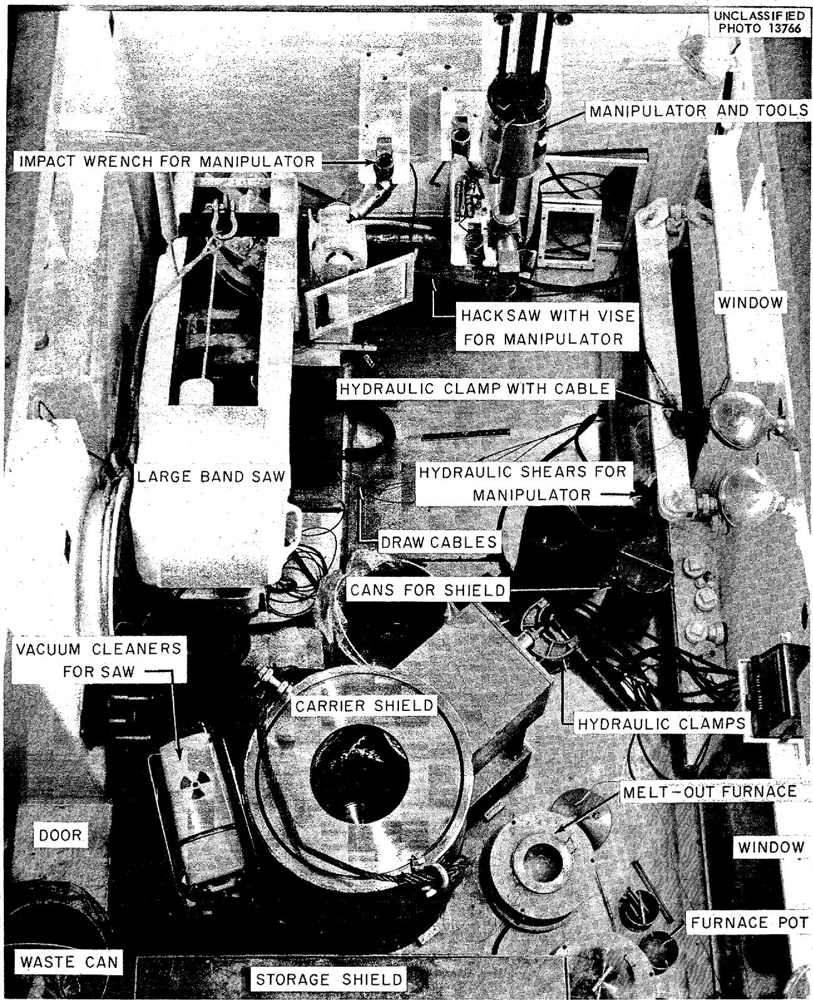  
Fig. 8.1. Top View of Hot Cell and Equipment for Disassembly of LITR Fluoride-Fuel Loop.

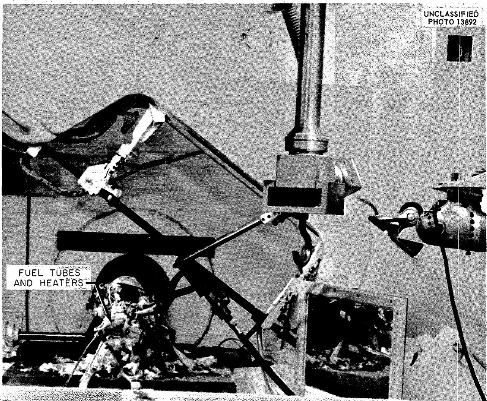

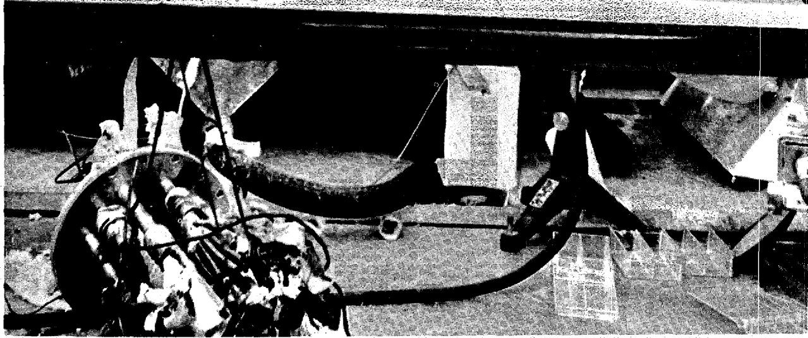  
Fig. 8.2. Removal of Flange from Jacket of LITR Fluoride-Fuel Loop.

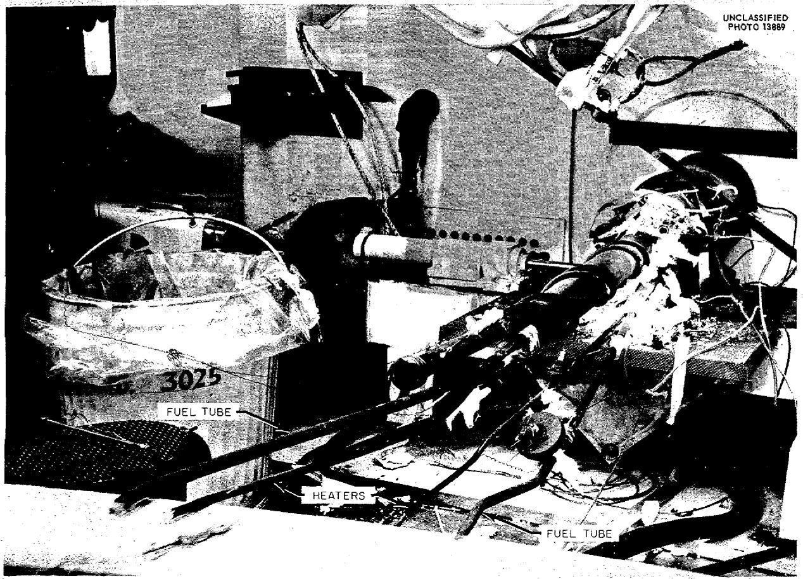  
Fig. 8.3. Partly Disassembled LITR Fluoride-Fuel Loop.

of the activity, and, since an analysis of the condition of bearing and seals was precluded, this portion of the pump was discarded. The fuel-containing parts were stored for uranium recovery.

The metallurgical specimens have been prepared and photomicrographed. A preliminary analysis indicates that subsurface void formation was generally uniform throughout the loop to a depth of 0.8 mil. The uniformity of attack possibly resulted from the lack of a temperature differential in the loop. The temperature record shows that the fuel temperature could not have been more than $20^{\circ}\mathrm{F}$ lower in the out-of-pile parts of the loop than in the in-pile parts. Some sections showed grain growth, which is an indication that some temperatures were higher than those recorded, but even the areas of grain growth showed no significant change in depth of corrosion.

The fuel in the nose of the loop was in a maxi

mum perturbed flux of approximately $0.8 \times 10^{13}$ neutrons/cm²·sec, which corresponds to a fission power density of 0.5 to $0.6\mathrm{kw/cm^3}$ . The power density gives a measure of the severity of conditions imposed upon at least one section of the loop tubing by radiation effects. No difference in the corrosion could be observed between this region and other, less severely irradiated, regions. Also, about the same depth of attack was found in the venturi section of the loop as was present in the rest of the loop, even though there was a large velocity gradient present. No intergranular attack was noted.

The six sections of tubing taken for chemical analysis were sampled by a drilling method described previously. After the end of a tube section

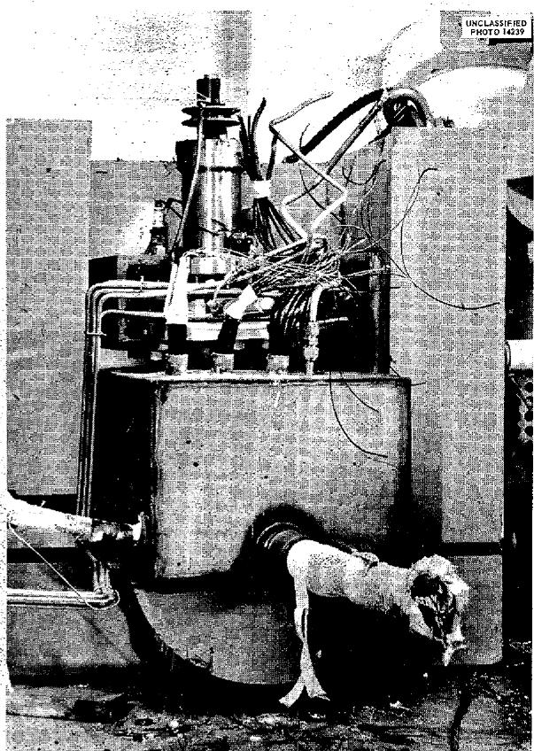  
Fig. 8.4. LITR Fluoride-Fuel Loop Pump Prior to Removal of Enclosure for Providing a Helium Atmosphere.

had been cleaned by drilling a $\frac{1}{4}$ -in. hole about $\frac{1}{8}$ in. deep in the fuel, each sample was bored out with a $\frac{3}{16}$ -in. bit. Tungsten carbide-tipped bits were used to avoid contaminating the fuel with nonradioactive iron, chromium, or nickel. Unirradiated control samples were obtained from the fill line between the charge tank and the loop at the place where this line passed through the pump shield. The chemical analyses of the samples are almost complete, and radiochemical analyses for $\mathsf{Cs^{137}}$ and $\mathsf{Zr^{95}}$ have been made of two of the samples. The fission power of 2.7 and 2.5 kw indicated for the two samples by the $\mathsf{Zr^{95}}$ content compares favorably with the 2.8 kw estimated from electrical measurements made during operation of the loop. The results from the $\mathsf{Cs^{137}}$ analysis, 2.1 and 1.5 kw, are considerably lower, and they indicate escape of the $\mathsf{Xe^{137}}$ parent from the fuel.

In order to measure the fission power distribution along the irradiated section of the loop, an experi

ment was conducted in the LITR with a mockup of the loop. The mockup was designed to duplicate both the arrangement of structural materials and the macroscopic cross section of the fuel so that effective thermal-neutron flux values could be measured inside the fuel and then could be used to calculate the power generated by fissioning. The results are being compared with the activation of cobalt monitor foils attached to the loop and with additional data from the activation of borings taken from the metallurgical specimens. The results will be reported when all the data have been assembled and analyzed.

# DEPOSITION OF $\mathsf{Ru}^{103}$ IN LITR FLUORIDE-FUEL LOOP

M. T. Robinson Solid State Division,

T. H. Handley  
Analytical Chemistry Division

The deposition of the fission-product 40-day Ru $^{103}$ on the surfaces of the fuel circuit of the ARE was reported previously.7 Supporting evidence for this phenomenon has now been obtained from a study of samples taken from the loop described above. Two samples of tubing from the loop were examined by gamma-ray scintillation spectrometry. One sample was taken upstream from the high-flux region of the loop, and the other was taken at an equal distance downstream.

The ratio of $\mathsf{Ru}^{103}$ to $Zr^{95}\text{-Nb}^{95}$ should have been 0.6 if the $\mathsf{Ru}^{103}$ had remained uniformly distributed throughout the loop. However, the ratio for the sample taken upstream was 5.33, and that for the sample taken downstream was 8.07. Within the experimental error, the $Zr^{95}\text{-Nb}^{95}$ activity analyzed the same for both samples. The sample taken downstream from the high-flux region contained markedly more $\mathsf{Ru}^{103}$ than did the sample taken upstream. This difference is exactly that to be expected from rapid reaction of the ruthenium in the fuel with the container metals. These numbers, combined with operational and dimensional data, yielded a half life of 0.5 min for the rate constant for removal of $\mathsf{Ru}^{103}$ from the fuel in the loop. It was assumed for the calculation that the removal rate of $\mathsf{Ru}^{103}$ was a first-order function of the concentration.

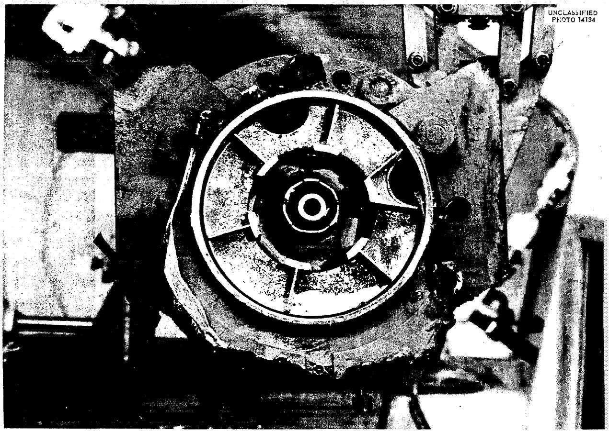  
Fig. 8.5. Bottom View of Pump Showing Accumulation of Fuel on Upper Parts of the Baffles.

After a delay of 53 days, the two pipe samples were re-examined to determine the apparent half lives of the two components of the gamma-ray spectrum. For the Ru103 peak (0.50 Mev), the half lives of two samples were 42 and 43 days, respectively, and amply confirmed the assignment of that activity. For the Zr95-Nb95 peak, however, the results were 40 and 43 days, respectively, instead of the nearly 65 days expected. The contribution to this gamma-ray energy (0.78 Mev) must be largely from 37-day Nb95, the 65-day Zr95 being very low in relative amount (a few per cent). It appears very likely that niobium deposits on the Inconel pipes along with ruthenium. The deposition rate for Nb95 cannot be estimated, at present, since it is produced very slowly from its Zr95 parent, rather than rapidly from fission as is the case with Ru103.

Radiochemical analysis of a fuel sample for Ru103 indicated that the amount was below the

limit of detection by that technique. $^{8}$ This demonstrates that the efficiency of ruthenium removal was comparable to that attained in the ARE. $^{7}$ No direct neutron activation of the elements of Inconel was observed.

# MINIATURE IN-PILE LOOP

W.R.Willis

M. F. Osborne

H. E. Robertson

G.W. Keilholtz

Solid State Division

The miniature fluoride-fuel loop for insertion in a vertical hole in the LITR (described previously) was charged with fuel and operated on the bench. It is now in the final stages of assembly for in-pile testing. An exact mockup of the experiment has been inserted in the reactor and has been withdrawn

by using the special withdrawal cask. The operation proceeded smoothly.

# DELAY OF FISSION GASES BY CHARCOAL TRAPS

D. E. Guss, United States Air Force

W. R. Willis, Solid State Division

In the event of a leak in the miniature in-pile loop mentioned above, the fission gases released into the cooling-air stream must be contained, and at the same time, the cooling air must continue to flow until the temperature of the system has fallen below the control set point. To accomplish this, two traps, 24 in. long and 10 in. in diameter, filled with 6-14 mesh activated coconut charcoal, have been incorporated in the cooling-air off-gas line. These traps, which are connected in series and operate at room temperature, can be expected to hold krypton activity in the system at the design air flow rate of 20 cfm for 30 sec before the release of appreciable activity. If the cooling air then continued to flow at the design rate, the krypton activity, which would be released over a period of about 5 min, would reach a peak in about 2 min. However, since the air flow would stop in less than 1 min after a leak occurred, virtually all the krypton activity would be contained in the traps and would trickle out over a long period of time. Xenon, the other active gas present in quantity, will be held back for a much longer period of time; hence, the trap design was based on the krypton holdup time.

Since the action of the charcoal is to increase the effective volume of the trap space by a factor which depends directly upon the amount of charcoal used, it was possible to estimate the trap size needed for the in-pile experiment simply by scaling up results obtained with each of two small traps. One of the small traps was 2.25 in. long and 1.05 in. in diameter, and the other was 23.5 in. long and 1.05 in. in diameter. A subsequent experiment in which a full-size trap was used to duplicate conditions for the in-pile experiment substantiated the estimates based on performance of the small traps.

The experimental apparatus is shown schematically in Fig. 8.6. Krypton was introduced into a reservoir beneath the trap and, at time zero, was driven through the trap with air. It then passed through a flowmeter and over a counter, where the activity as a function of time was observed. All the runs were made at $23^{\circ}C$ .

The two small traps were tested at flow rates in the region of interest, and all the elution curves obtained were similar, the activity rising quite rapidly and almost linearly to a peak and falling off more gradually. A typical elution curve is shown in Fig. 8.7, in which the time coordinate is

UNCLASSIFIED

ORNL-LR-DWG7330

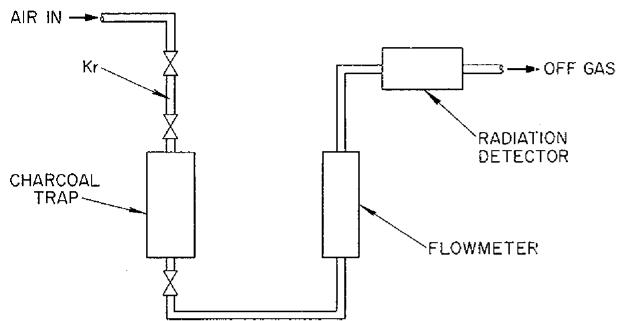  
Fig. 8.6. Schematic Diagram of Charcoal-Trap Experiment.

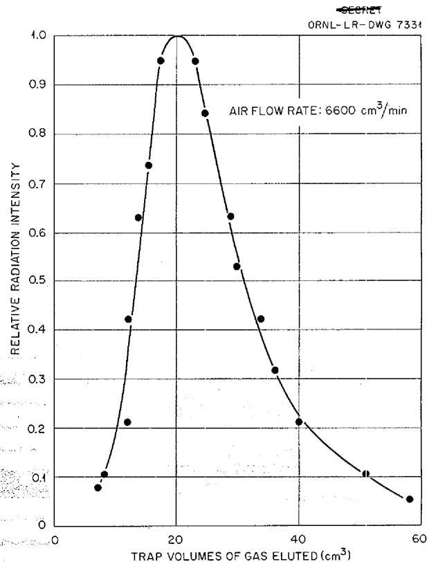  
Fig. 8.7. Elution Curve for $334\text{-cm}^3$ Charcoal Trap Containing Krypton.

expressed in trap volumes of gas eluted. A plot of the inverse of the flow rate vs time to peak activity for the 23.5-in.-long, 1.05-in.-dia trap (shown in Fig. 8.8) indicates a linear relationship. The point on this curve corresponding to the design flow rate is shown.

The elution curve obtained at the in-pile design flow rate is shown in Fig. 8.9. Since the effect of two traps in series is to double the time to peak activity and to broaden the elution curve, it is planned to rely upon two charcoal traps 24 in. long and 10 in. in diameter to delay any burst of fission gases from the in-pile loop for 30 sec before an appreciable amount of activity is released to the stack.

# CREEP AND STRESS-CORROSION TESTS

W.E.Davis

J.C.Wilson

N.E.Hinkle

J.C.Zukas

Solid State Division

Heat transfer experiments have shown that heat dissipation in the longitudinally finned, vertical

cylinders in the water-jacketed, helium-filled enclosure of the tube-burst, stress-corrosion apparatus, as presently designed, $^{10}$ will limit the fluoride salt power densities to about $500\mathrm{~w/cm}^3$ . Therefore fins have been added between the salt container and a surrounding water jacket, and the heat transfer has been increased sufficiently to permit operation at power densities greater than $1000\mathrm{~w/cm}^3$ . The first complete apparatus has been assembled and awaits filling before irradiation in the LITR. Five more rigs are being fabricated.

Tests are under way to determine the suitability of pressure-regulating valves for supplying gas to stress the tube-burst specimen. Two pressure-volume transformers with 1:1 and 6:1 ratios were designed and are being fabricated. These units are intended to isolate from the remainder of the system the gas used to stress the specimen so that rupture of a specimen will result in a known pres

10J. C. Wilson et al., Solid State Semiann. Prog. Rep. Feb. 28, 1955, ORNL-1851, p 3.

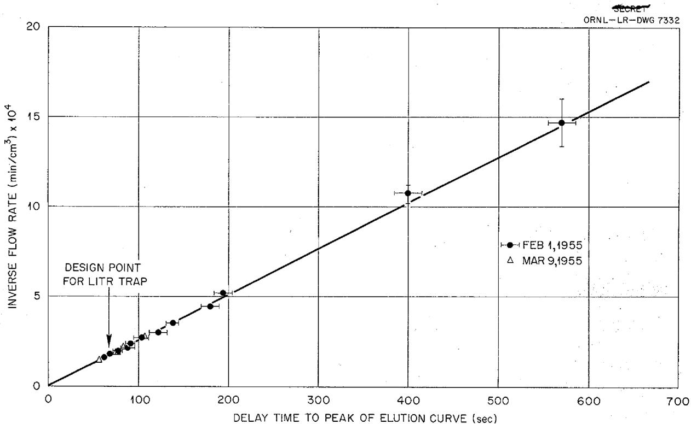  
Fig. 8.8. Inverse of the Air Flow Rate vs Time to Peak Activity for a 23.5-in.-Long, 1.05-in.-dia Charcoal Trap Containing Krypton.

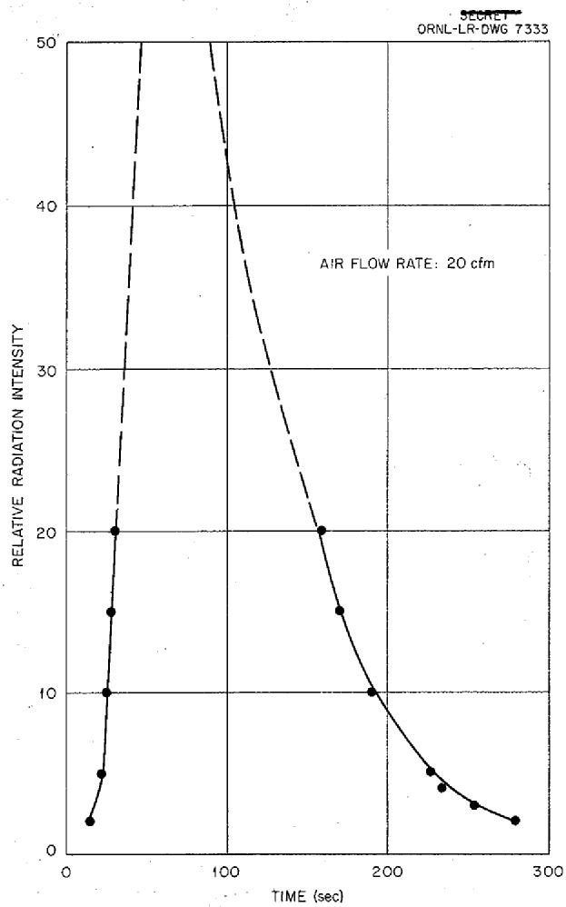  
Fig. 8.9. Elution Curve for $30,900\text{-cm}^3$ Charcoal Trap Containing Krypton.

sure increase in the apparatus. This arrangement will reduce gas consumption and provide a safety feature that will be required for operation in the LITR and the MTR.

Tube-burst test rigs for use in helium and in vacuum were designed and are being fabricated. These rigs will be used for bench tests and to assess the reliability of instrumentation.

A pneumatic gage will be received in June that will measure inside diameters of specimen tubes, before and after irradiation, to 0.00005 in. or strains of 0.00025 in./in. Since measurements of specimen tube-wall thicknesses must be accurate to 0.0001 in. or better, so that the stress may be accurate to $1\%$ , several methods of checking wall thicknesses are being studied.

The stress-corrosion rig irradiated in the LITR previously will be opened when hot-cell arrangements have been completed. A transfer carrier for bringing subsequent rigs from the LITR to the hot cells in Building 3025 was designed and is being fabricated.

The MTR creep apparatus has just completed six weeks of irradiation in the MTR and will be returned to ORNL for measurements.

# A THEORETICAL TREATMENT OF $X_{e}^{135}$ POISONING IN THE ARE AND THE ART

M. T. Robinson

Solid State Division

A theoretical study of xenon poisoning in a circulating-fuel reflector-moderated reactor was made in an attempt to understand the behavior of the ARE and to extrapolate this experience realistically to the ART. The system was assumed to consist of two phases: the liquid fuel and the sparging gas (helium). The theory deals only with volume-averaged concentrations and neutron fluxes. Turbulent motion of the two fluids was assumed to assure thorough mixing within each phase. With these assumptions, the differential equations describing the behavior of the poisoning were derived and solved. The various processes are illustrated schematically in Fig. 8.10. The rates of all processes, except the two $\mathrm{Xe}^{135}$ production rates, were assumed to be first order; that is, the rates are proportional to the $\mathrm{Xe}^{135}$ concentration in the starting phase. The rate constants for the two phase-transfer operations are related by application of the law of mass action, and thus the equilibrium solubility of xenon in the fuel is introduced.

The Xe135 poisoning of a fluid-fueled reactor under steady-state conditions is given by

$$
X _ {\infty} = \frac {\left(a _ {0} + a _ {1}\right) k _ {2} \lambda_ {L}}{k _ {1} k _ {2} - a _ {2} \beta \lambda_ {f} ^ {2}}
$$

where

$$
\begin{array}{l} X _ {\infty} = \text {steady - state X e} ^ {135} \text {poisoning} (\%), \\ \alpha_ {0} = 1 0 0 \gamma_ {\texttt {X e}} \sigma_ {f} / \sigma_ {u}, \\ \alpha_ {1} = 1 0 0 \gamma_ {1} \sigma_ {f} / \sigma_ {u}, \\ \end{array}
$$

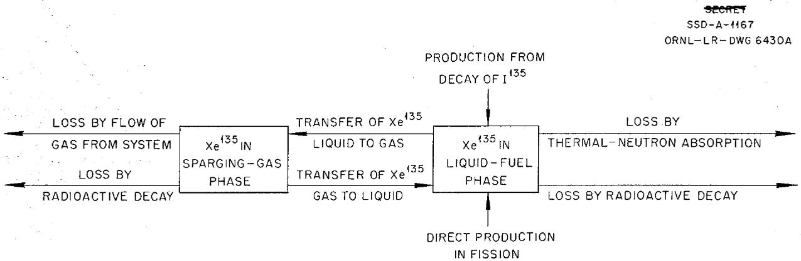  
Fig. 8.10. Processes Governing Xe135 Poisoning in Liquid-Fueled Reactors.

$$
k _ {1} = \alpha_ {4} + \lambda_ {f} + \lambda_ {L},
$$

$$
k _ {2} = \alpha_ {4} + \alpha_ {2} \beta \lambda_ {f} + \lambda_ {g},
$$

$$
\alpha_ {2} = R T S,
$$

$$
\beta = V _ {L} / V _ {G},
$$

$$
\lambda_ {L} = \sigma_ {X _ {\bullet}} \phi ,
$$

$$
\lambda_ {g} = v _ {G} / V _ {G},
$$

$\lambda_{f} =$ rate constant for transfer of $\mathbf{X}\mathbf{e}^{135}$ from liquid to gas,

$$
y _ {X e}, y _ {1} = \text {f i s s i o n y i e l d s o f X e} ^ {1 3 5}, 1 ^ {1 3 5},
$$

$$
\begin{array}{c} \sigma_ {j ^ {\prime}} \sigma_ {u ^ {\prime}} \sigma_ {X _ {e}} = \text {t h e r m a l - n e u t r o n c r o s s s e c t i o n s f o r} \\ U ^ {2 3 5} \text {f i s s i o n ,} U ^ {2 3 5} \text {a b s o r p t i o n ,} \\ \text {a n d X e} ^ {1 3 5} \text {a b s o r p t i o n ,} \end{array}
$$

$$
\alpha_ {4} = \text {r a d i o a c t i v e} X e ^ {1 3 5},
$$

$$
\begin{array}{l} \phi = \text {v o l u m e - a v e r a g e d t h e r m a l - n e u t r o n} \\ \text {f l u x}, \end{array}
$$

$$
V _ {L}, V _ {G} = \text {v o l u m e s o f l i q u i d , g a s p h a s e s ,}
$$

$$
\begin{array}{l} v _ {G} = \text {s p a r g i n g g a s v o l u m e t r i c f l o w r a t e}, \\ S = \text {s o l u b i l i t y o f x e n o n i n f u e l a t 1 - a t m} \\ X e \text {p r e s s u r e}, \end{array}
$$

$$
T = \text {a b s o l u t e}
$$

$$
R = \text {u n i v e r s a l g a s c o n s t a n t}.
$$

The results of the calculations made by the equation and the ART data given in Table 8.2 are presented in Fig. 8.11, which is a design chart for the estimation of the sparging-gas flow rate for conceivable levels of $Xe^{135}$ poisoning. The parameter $\tau_f$ (Fig.8.11) is the phase-transfer mean life from the liquid to the gas:

$$
\tau_ {f} = \frac {1}{\lambda_ {f}}.
$$

The value of $\tau_{f}$ to be chosen is unknown, but ARE

experience indicates a value of about 20 min for that reactor. It is to be expected that the value for the ART will be considerably smaller.

A study of the poisoning behavior of the ART was made for two different types of shutdown. In each case, it was assumed that $\tau_f = 5$ min and that $\nu_G = 1000$ STP liters/day. At steady state during full nuclear power operation, the Xe135 poisoning would be about $0.40\%$ . If the nuclear power was reduced to zero but sparging was continued, the poisoning would not rise by more than 1 or $2\%$ of the steady-state value before starting to decrease. If sparging was discontinued, the poisoning would rise in about 11 hr to a maximum value of about $12\%$ . If at this point sparging was resumed, about 36 min would be required to reduce the poisoning to below the steady-state value. Intermediate values of 10, 5, 2, and $1\%$ poisoning would be reached in times of about 1, 7, 17, and 25 min, respectively. It appears highly probable that no difficulties will be encountered from Xe135 during short shutdowns, since removal of the xenon to acceptable levels by sparging can be made within the time necessary to force the fuel from the dump tanks into the reactor.

A series of calculations has been performed on the Oracle to study the approach of the Xe135 poisoning to its steady-state value. In all cases of practical interest, this approach is controlled by the rate of l135 production. In fact, except for a change in ordinate, the poisoning is found to follow the iodine growth curve.

It is concluded that the removal of $Xe^{135}$ by sparging with helium (or other inert gas) appears to be a satisfactory means of controlling poisoning in the ART. No difficulties seem to exist in connection with shutdown behavior of the poisoning at the sparging rates selected for ART operation.

TABLE 8.2. DATA USED TO CALCULATE POISONING IN ART   
Numerical Data   

<table><tr><td>α0= 0.254%</td><td>R = 82.0567 cm3·atm/mole·°K</td></tr><tr><td>α1= 4.74%</td><td>T = 1033°K (1400°F)</td></tr><tr><td>α2= 0.0509</td><td>S = 6 × 10-7moles/cm3·atm</td></tr><tr><td>α4= 2.09 × 10-5sec-1</td><td>σXe = 1.7 × 106barns*</td></tr></table>

Reactor Data\*\*   

<table><tr><td colspan="2">ARE</td><td>ART</td></tr><tr><td>VL</td><td>5.35 ft3</td><td>5.64 ft3</td></tr><tr><td>VG</td><td>1 ft3</td><td>0.31 ft3</td></tr><tr><td>vG</td><td>0.25 cm3/sec</td><td>1000 STP liters/day</td></tr><tr><td>φ</td><td>8 × 1011neutrons/cm2·sec</td><td>1 × 1014neutrons/cm2·sec</td></tr><tr><td>β</td><td>5.35</td><td>18.2</td></tr><tr><td>λL</td><td>1.4 × 10-6sec-1</td><td>1.7 × 10-4sec-1</td></tr></table>

$^{\ast}$ W. K. Ergen and H. W. Bertini, ANP Quar. Prog. Rep. Mar. 10, 1955, ORNL-1864, p 16.   
\*\*ARE data from ARE Nuclear Log Book and from J. L. Meem; ART data from J. L. Meem and W. T. Furgerson.

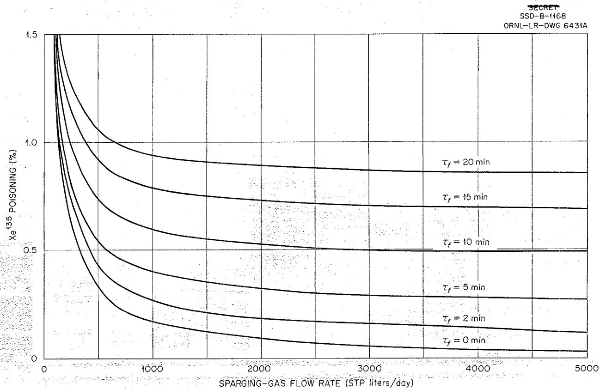  
Fig. 8.11. Steady-State $Xe^{135}$ Poisoning in ART as a Function of Sparging-Gas Flow Rate for Various Assumed Values of the Phase-Transfer Mean Life, $\tau_{f}$ .

# 9. ANALYTICAL CHEMISTRY OF REACTOR MATERIALS

C. D. Susano

J. C. White

Analytical Chemistry Division

Modifications of the method for the determination of uranium metal in fluoride-base reactor fuels were completed. Further studies were made on the evaluation of the methylene-blue method for the determination of trivalent uranium in fluoride-base reactor fuels. Investigations were continued on methods for the determination of oxygen as metallic oxides in fluoride salts. An improved separation method involving anion-exchange resins was developed for the determination of alkali metals in fluoride salts. A volumetric method for the determination of zirconium in fluoride-base fuels was proposed.

# DETERMINATION OF URANIUM METAL IN FLUORIDE SALT MIXTURES

A. S. Meyer, Jr.

B. L. McDowell

Analytical Chemistry Division

The apparatus for the determination of uranium metal in fluoride-base fuels according to a method based on the decomposition of the hydride in an

atmosphere of oxygen at reduced pressure is shown in Fig. 9.1. This apparatus has been calibrated and has been applied to the determination of uranium metal in $\mathsf{UF}_3$ and $\mathsf{KF - UF}_3$ .

Samples of the uranium metal are placed in a platinum boat in the combustion tube and heated to $250^{\circ}C$ for 1 hr in an atmosphere of hydrogen in order to convert any uranium metal present in the sample to the hydride. The excess hydrogen is evacuated from the system after the sample has been cooled to room temperature in an atmosphere of hydrogen. The $\mathsf{UH}_3$ produced from the uranium metal is oxidized by heating at $400^{\circ}C$ for 20 min in an atmosphere of oxygen:

$$
4 U H _ {3} + 7 0 _ {2} \rightarrow 4 U O _ {2} + 6 H _ {2} O
$$

The combustion gases are passed through a copper oxide tube at $500^{\circ}\mathrm{C}$ to ensure complete conversion of the hydrogen to water. The water vapor produced

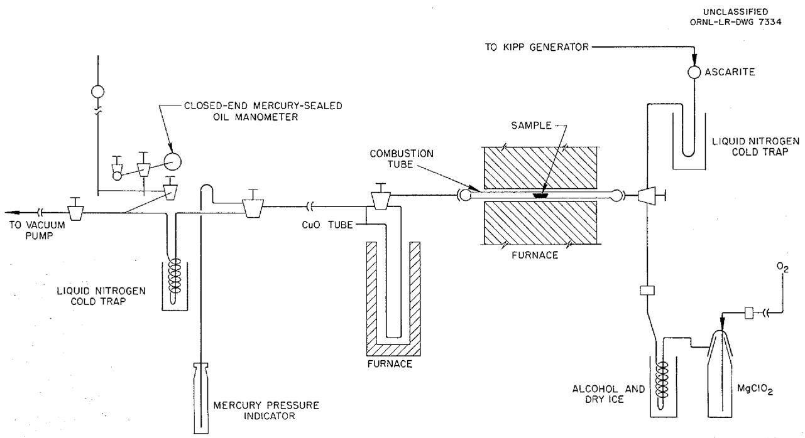  
Fig. 9.1. Diagram of Apparatus for the Determination of Uranium Metal.

by the oxidation of the combined hydrogen is collected in the cold trap, and, after the oxygen has been removed by evacuation, the water is allowed to expand into a system of known volume. The pressure of the water vapor is measured on a closed-end mercury-sealed oil manometer similar to that described by Naughton and Frodyma.2 The pressure registered on the manometer is related to the weight of the uranium present in the sample by empirical calibration of the apparatus.

A preliminary calibration of the apparatus with $\mathrm{BaCl}_2\cdot 2\mathrm{H}_2\mathrm{O}$ as a standard for hydrogen in the form of water indicated a linear relationship between scale reading and weight of hydrogen for the range 0.18 to $0.8\mathrm{mg}$ of hydrogen. This linear relationship does not apply to larger amounts of hydrogen because the pressure in the system is approximately equal to the vapor pressure of water. Results which have been obtained for the calibration of the apparatus with samples of pure uranium metal are in agreement with the $\mathrm{BaCl}_2\cdot 2\mathrm{H}_2\mathrm{O}$ calibration, and they indicate that a scale reading of $1\mathrm{mm}$ represents $0.36\mathrm{mg}$ of uranium (Fig. 9.2). The results of the calibration with uranium metal have a coefficient of variation of $7\%$ for the range 6 to $60\mathrm{mg}$ of uranium.

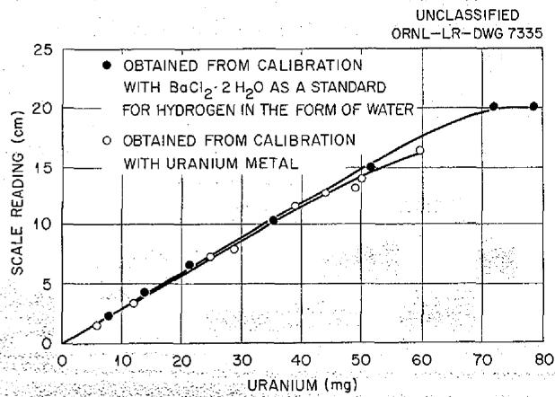  
Fig. 9.2. Calibration of Apparatus for Determination of Uranium Metal.

Samples of $\mathsf{KF - UF}_3$ (frozen in a reaction tube) which were analyzed for uranium metal were taken by drilling with increasingly larger bits so that the samples represented portions of the material

successively nearer the wall of the reaction tube. Samples of $\mathsf{UF}_3$ and fluoride salt mixtures which were to be analyzed for uranium metal were ground in an atmosphere of hydrogen to prevent oxidation of the uranium metal. The samples, along with the necessary equipment for grinding, were placed in a plastic bag, which could be alternately evacuated and filled with hydrogen. The samples were ground to a particle size that would pass a standard 325-mesh sieve.

Several samples of $\mathsf{UF}_3$ which had been produced by the reduction of $\mathsf{UF}_4$ with uranium metal have been analyzed for uranium metal in the new apparatus. The results for the uranium metal content paralleled those obtained by petrographic analysis of the material. The standard deviation for duplicate determinations on the samples of $\mathsf{UF}_3$ was approximately the same as that obtained for the calibration of the apparatus with uranium metal.

The difficulties encountered earlier in the decomposition of the $\mathsf{UH}_3$ in certain gaseous atmospheres have been completely eliminated in the present method. The period of several hours which was required for the decomposition of the hydride in an atmosphere of carbon dioxide was reduced to approximately 20 min when the ignition was carried out in an atmosphere of oxygen. Tests indicate that no interference is introduced by the presence of fluoride salts or trivalent uranium in the samples, and therefore the procedure should be applicable to analyses of all types of fluoride fuels. A topical report on this investigation is being written.

# DETERMINATION OF TRIVALENT URANIUM IN FLUORIDE FUELS

A. S. Meyer, Jr. W. J. Ross Analytical Chemistry Division

Oxidation of Trivalent Uranium by Methylene Blue

A comparison of the methylene-blue and the hydrogen-evolution methods for the determination of trivalent uranium in fluoride-base fuels has been

completed. Portions of eutectic mixtures, which had been pulverized and sampled under inert atmospheres, were analyzed simultaneously by both methods in an effort to minimize the effects of the heterogeneity and the instability of such samples. An evaluation of the results showed that satisfactory agreement, comparable to that reported previously for other eutectic mixtures, was achieved in the analytical results for samples of LiF-BeF $_2$ , NaF-LiF, and NaF-BeF $_2$ . The results obtained by the methylene-blue method in the determination of trivalent uranium in KF-UF $_4$ -UF $_3$ eutectics continue to exhibit negative bias when compared with the results from the hydrogen-evolution method. No further studies were made of NaF-ZrF $_4$ -UF $_3$ eutectics. All the mixtures studied could be dissolved in methylene-blue solutions that were 1.5 to 6 M in HCl and saturated with AlCl $_3$ . No hydrogen is evolved during the dissolution of the most reactive trivalent uranium compounds, such as UCl $_3$ , in 1.5 to 3 M HCl solutions of methylene blue if efficient agitation is maintained while the solvent is being added to the flask.

Methylene-blue solutions that are 1.5 to $6\text{M}$ in HCl are reduced, during dissolution at room temperature, to methylene white by finely divided metallic chromium, nickel, iron, and uranium-nickel alloy. Zirconium is only very slightly soluble in such solutions over a 2-hr period. The presence of metallic impurities in fluoride-base fuels causes highly erratic results when trivalent uranium is determined by the methylene-blue method, but such impurities have an even greater adverse effect on the hydrogen-evolution method. Dissolution of the metallic impurities in the hot acid solvent results in quantitative evolution of hydrogen. A more comprehensive description of the theoretical and practical aspects of the methylene-blue method for determining trivalent uranium will be issued in the form of a topical report.

# Simultaneous Determination of Trivalent Uranium and Total Uranium

The inherent advantage of the methylene-blue method over the hydrogen-evolution method, that is, the possibility of determining trivalent uranium and total uranium in the same sample, is still being investigated. The studies have led to the postulation of an interaction species of pentavalent uranium and methylene white.4 A detailed study

of this postulation has been initiated. The method of Vosburgh and Cooper6 will be applied to establish the stoichiometry of the complex. Attempts to prepare standard solutions of methylene white through the reduction of methylene blue by zinc amalgam have been unsuccessful because of the ease with which zinc ions react with both the oxidized and reduced forms of methylene blue. An attempt is being made to prepare pure methylene white through electrolytic reduction of methylene blue.

# DETERMINATION OF LITHIUM IN LiF-BeF $_2$ AND LiF-ZrF $_4$ -UF $_4$

A. S. Meyer, Jr.

D. L. Manning

Analytical Chemistry Division

A method for the determination of lithium in $\mathsf{LiF - BeF}_2$ and $\mathsf{LiF - ZrF}_4\mathsf{-UF}_4$ has been developed that is based on a separation of lithium by an anion-exchange resin, Dowex-1. In this procedure a sulfate solution of the fluorides that is approximately $1N$ with respect to $\mathsf{H}_2\mathsf{SO}_4$ is passed through a column of Dowex-1 in the hydroxide form. In order to avoid the depletion of the resin in the column by the $\mathsf{H}_2\mathsf{SO}_4$ , the solution is equilibrated with about $20ml$ of a water slurry of the resin in the hydroxide form in a beaker before being placed onto the column. Beryllium, uranium, and zirconium are retained on the column as the beryllate, zirconate, and diuranate anion, respectively, while the lithium passes into the effluent as LiOH. The following equations represent the probable reactions, where ROH is the hydroxide form of the anion-exchange resin:

$$
\begin{array}{l} \mathrm {H} _ {2} \mathrm {S O} _ {4} + 2 \mathrm {R O H} \longrightarrow \mathrm {R} _ {2} \mathrm {S O} _ {4} + 2 \mathrm {H} _ {2} \mathrm {O} \\ Z r \left(S O _ {4}\right) _ {2} + 8 R O H \rightarrow R _ {4} Z r O _ {4} + 2 R _ {2} S O _ {4} + 4 H _ {2} O \\ B e S O _ {4} + 4 R O H \longrightarrow R _ {2} B e O _ {2} + R _ {2} S O _ {4} + 2 H _ {2} O \\ 2 \mathrm {U O} _ {2} \mathrm {S O} _ {4} + 6 \mathrm {R O H} \longrightarrow \mathrm {R} _ {2} \mathrm {U} _ {2} \mathrm {O} _ {7} + 2 \mathrm {R} _ {2} \mathrm {S O} _ {4} + 3 \mathrm {H} _ {2} \mathrm {O} \\ \mathrm {L i} _ {2} \mathrm {S O} _ {4} + 2 \mathrm {R O H} \longrightarrow \mathrm {R} _ {2} \mathrm {S O} _ {4} + 2 \mathrm {L i O H} \\ \end{array}
$$

It may be seen from the equations that LiOH and water are the only species which are found in the effluent. The lithium is determined by titrating the hydroxide with a solution of standard HCI.

If the fluoride mixtures contain sodium fluoride in addition to lithium fluoride, the sodium will react in the same manner as the lithium and will

be found in the effluent as NaOH. A subsequent titration of the effluent with standard HCI will give the sum of sodium and lithium as the hydroxides. Lithium is then determined by extracting the LiCl, after titration with HCI, with 2-ethyl-1-hexanol and titrating the chloride ion in the nonaqueous medium according to the procedure developed by White and Goldberg.7

If a single alkali metal is present in the fluoride mixture, it can be determined directly by titration of the effluent with standard HCl. When more than one alkali metal is present, the sum of the alkali-metal hydroxide concentration in the effluent is obtained by the method just described. Lithium is then determined by the 2-ethyl-1-hexanol procedure; potassium, by the tetraphenyl boron gravimetric method, and sodium, by the difference.

Williams and Vaughan (cf. "ANP Service Laboratory") have utilized a two-stage anion-exchange resin column for the determination of the alkali metal fluorides in the presence of beryllium, zirconium, and uranium fluorides. The first column contains the anion-exchange resin, Dowex-1, in the citrate form, whereas the second column contains the resin in the hydroxide form. Beryllium, zirconium, and uranium remain in the citrate column as the anionic citrate complexes, and the alkali metals pass into the effluent as the alkali metal hydroxides. The alkali metal concentration is then determined by titrating the effluent with standard HCI.

In the method described above, a single column of anion-exchange resin in the hydroxide form is used, and thus the need for the citrate form of the anion-exchange resin is completely eliminated. The method has been tested in the laboratory and found to be satisfactory in every respect. The coefficient of variation of the method is of the order of $1\%$ in the range 10 to $30\mathrm{mg}$ of lithium. A topical report on the method is being written.

# VOLUMETRIC DETERMINATION OF ZIRCONIUM IN FLUORIDE FUELS WITH DISODIUM DIHYDROGEN ETHYLENEDIAMINETETRAACETATE

A. S. Meyer, Jr. D. L. Manning Analytical Chemistry Division

The volumetric determination of zirconium in the presence of sulfate has been reported by Fritz and Johnson.9 Excess disodium dihydrogen ethylenediaminetetraacetate (EDTA) forms a very stable

complex with zirconium in acidic solutions. The excess EDTA is then back-titrated with bismuth nitrate; thiourea is used as the indicator. The end point is noted by the formation of the yellow bismuth-thiourea complex. An advantage of this method in comparison with previous methods for using EDTA in the determination of zirconium is that anions which form complexes with zirconium, such as fluoride, sulfate, phosphate, thiocyanate, and tartrate, do not interfere.

This volumetric method for the zirconium determination appeared to have several advantages over the gravimetric mandelic acid method now being used, but it was found that the yellow thiourea end point was obscure, especially in the presence of hexavalent uranium, which is also yellow. The precision was consequently poor.

The possibility of modifying the method by back-titrating the excess EDTA with a solution of iron(III), with disodium-1,2-dihydroxybenzene-3,5-disulfonate (Tiron) as the indicator, is now being investigated. This reagent forms an intensely purple complex with iron(III) in an acetate-buffered solution having a pH of about 5.0. Two moles of Tiron combine with 1 mole of iron under these conditions. This complex, which has a pK of about 10, is relatively stable.[10]

The pK of the iron-EDTA complex is about 25, which is approximately the same as that of the zirconium-EDTA complex. It is possible, therefore, to add a solution of iron(III) to a solution of EDTA and Tiron at a pH of 5.0 so that when the EDTA is completely complexed the color of the solution will change from yellow to purple. Qualitative, preliminary tests revealed this change in color at the end point to be well defined. The end point was very sharp when a solution of 0.05 M EDTA containing about 50 mg of Tiron was titrated with a solution of 0.05 M iron(III). The end point corresponded to the correct stoichiometry of the iron-EDTA reaction in which 1 mole of iron complexes with 1 mole of EDTA. Future work will include

the determination of zirconium by the modified method of back-titrating the excess EDTA and a study of the possible interferences, particularly fluoride and tetravalent uranium. It is expected that tetravalent uranium would interfere because it would complex with the EDTA in the same manner as the zirconium would.

# DETERMINATION OF OXYGEN IN FLUORIDE FUELS

A. S. Meyer, Jr. J. M. Peele Analytical Chemistry Division

Further tests were carried out on the determination of oxygen as oxide in fluoride fuels by electrolysis of solutions of the samples in fused $\mathsf{KHF}_2$ . Quantities of oxygen in excess of $90\%$ of the theoretical value were recovered when known amounts of oxygen were introduced as water by the addition of samples of $\mathsf{Na}_2\mathsf{CO}_3$ , which react with the fused bifluoride in accordance with the following equation:

$$
N a _ {2} C O _ {3} + 2 K H F _ {2} \rightarrow 2 N a F + 2 K F + H _ {2} O + C O _ {2}
$$

The yields were not quantitative, because the rate of oxygen evolution decreased as the concentration of water in the electrolyte was reduced. Since traces of hydrogen were detected in the insoluble gases, even though a high concentration of AgF was added to the electrolyte, methods were adapted for the direct determination of oxygen in the effluent gases.

For samples containing large quantities of oxygen the Orsat method for the determination of oxygen in gases was applied by passing the insoluble gas, which was collected over KOH, into a solution of alkaline pyrogallate and measuring the decrease in volume of the gas.

A modification of the Winkler method13 for the determination of oxygen in water was adapted for samples which contained smaller concentrations of oxygen. The apparatus was modified by converting the sweep gas to purified helium and bubbling the effluent cell gases directly into an alkaline solution which contained KI and a suspension of $\mathsf{Mn(OH)}_2$ in which the oxygen was

absorbed according to the reaction

$$
4 \mathrm {M n} (\mathrm {O H}) _ {2} + \mathrm {O} _ {2} + 2 \mathrm {H} _ {2} \mathrm {O} \longrightarrow 4 \mathrm {M n} (\mathrm {O H}) _ {3}
$$

The absorbed oxygen was determined by acidifying the absorber solution and thus liberating an equivalent quantity of iodine, which was then titrated with standard $\mathrm{Na}_2\mathrm{S}_2\mathrm{O}_3$ solution. If only microgram quantities of oxygen are present, the iodine is measured by extracting it into orthoethylene and determining the concentration of iodine in the organic phase spectrophotometrically according to the procedure of Silverman, Bradshaw, and Taylor.[14] Experiments are now being carried out in an attempt to reduce the time required for the quantitative evolution of oxygen. No significant increase in the rate of oxygen generation was obtained by carrying out the electrolysis at a temperature of $250^{\circ}\mathrm{C}$ rather than at $100^{\circ}\mathrm{C}$ . The effect of the design and current density of the anode on the efficiency of the generation of oxygen is now being studied. It has been found that the use of a mercury cathode, which is introduced by placing a Teflon cup in the electrolytic cell, simplifies the electrolysis. Fluctuations of the current are decreased, and the evolution of fluorine is greatly reduced. By introducing the sweep gas below the surface of the mercury, the problem of slugging of the entrance line is eliminated. Since AgF is incompatible with mercury under these conditions, it cannot be used to reduce the rate of generation of hydrogen.

# DETERMINATION OF OXYGEN IN METALLIC OXIDES BY BROMINATION

J. P. Young G. Goldberg Analytical Chemistry Division

Extension of the method of Codell and Norwitz for the determination of oxygen in titanium to the determination in fluoride-base fuels was continued during this period. Several modifications of the apparatus described previously were made. New traps of smaller dimensions were designed, and, in addition, an ice-salt trap was placed between the ignition tube and the first dry-ice-alcohol trap to

remove more completely the excess bromine vapor. It was found that if the flow rate of the mixture of helium and bromine vapor were too rapid, the second dry-ice-alcohol trap became plugged with solid bromine during the course of a determination.

In the previous application of the bromination method to the determination of oxygen in $\mathsf{BeO}_3$ considerable oxide contamination was found in the NaF-FeF flux that was used. A small quantity of the impure flux was therefore treated with bromine vapor at $750^{\circ}\mathrm{C}$ and then the pretreated flux was used in the determination. Essentially complete recovery of the oxygen in the BeO sample was obtained when this mixture was treated with bromine vapor at $950^{\circ}\mathrm{C}$ .

Several samples of $\mathsf{CrF}_3$ were analyzed for oxide contamination, and reasonable values were found when the samples were treated with bromine vapor at $950^{\circ}C$ . The accuracy and optimum conditions for this determination will be investigated with known mixtures of $\mathsf{CrF}_3$ and $\mathsf{Cr}_2\mathsf{O}_3$ .

Also, several samples of $\mathrm{Na_2ZrF_6}$ were analyzed for oxide contamination. The bromination was performed at $950^{\circ}C,$ and reasonable values of oxygen contamination were found. During the analysis of two samples of $\mathrm{Li_2ZrF_6}$ , a precipitate formed on the surface of the $\mathrm{Ba(OH)_2}$ bubbler and caused inefficient flow of gas through the apparatus. It is believed that the occurrence of this precipitate was due to a reaction involving the hydrogen fluoride or fluorine which was present or was formed in the samples being analyzed. A trap of NaF and KBr is being prepared for removal of these gases. The accuracy and optimum conditions for the determination of oxygen contamination in $\mathrm{ZrF_4}$ will then be investigated.

# DETERMINATION OF OXYGEN IN BERYLLIUM OXIDE BY ACIDIMETRY

J.P.Young

Analytical Chemistry Division

Two alternate possibilities for the determination of oxygen in BeO were investigated:

$$
\mathrm {B e O} + 2 \mathrm {H F} \longrightarrow \mathrm {B e F} _ {2} + \mathrm {H} _ {2} \mathrm {O}
$$

$$
B e O + 2 K F + 2 F ^ {-} + H _ {2} O \longrightarrow K _ {2} B e F _ {4} + 2 O H ^ {-}
$$

In several attempts to apply the first reaction as a method for determining oxide present as $\mathsf{BeO}_2$ it was found that the occurrence of various side reactions made the method impractical.

It was impossible to secure reasonable blanks in the absence of BeO, and furthermore, when BeO was present, no evidence of stoichiometry was found. In these attempts, samples of BeO and $\mathrm{BeF}_2$ -BeO were placed in contact with solutions of KF, as concentrated as $20\%$ (W/V), at temperatures of $80^{\circ}\mathrm{C}$ . The concentration of hydroxyl ions presumed to have been formed during the dissolution of the sample was then determined by titration with standard acid. Values from 7.5 to $9.0~\mathrm{pH}$ units were chosen as arbitrary end points for these titrations. Dissolution of either BeO or $\mathrm{BeF}_2$ (with oxide contamination) was more rapid in higher concentrations of KF and at pH values of 7.5. A fine crystalline precipitate was formed during the dissolution of all samples containing $\mathrm{BeF}_2$ . From the results of x-ray diffraction analysis, it was found that this precipitate contained $\mathrm{K}_2\mathrm{BeF}_4$ .

# DETERMINATION OF TRACE AMOUNTS OF NICKEL IN FLUORIDE FUELS WITH SODIUM DIETHYL DITHIOCARBAMATE

J.P.Young

M.A.Marler

Analytical Chemistry Division

The use of sodium diethyldithiocarbamate in the colorimetric determination of nickel in trace amounts was investigated. The work of Chilton17 served as a basis for these studies.

Sodium diethyldithiocarbamate is a very sensitive colorimetric reagent for nickel; however, this reagent forms colored complexes with a wide variety of cations. Many of the metal complexes of sodium diethyldithiocarbamate are extractible into organic solvents.

The molar absorbancy index for nickel-diethyl-dithiocarbamate extracted into carbon tetrachloride or 1,2-dichlorobenzene from an aqueous solution whose pH was 9 was found to be about 34,000 at a wavelength of $328\mathrm{m}\mu$ . The molar absorbancy index of nickel dimethylglyoxime is about 11,000 at the wavelength of its maximum absorbancy. Chilton' subsequently reported that a more efficient extraction of the nickel complex occurred if the $\mathsf{pH}$ of the aqueous phase were first basic to bromcresol green $(\mathsf{pH}\sim 5)$ . Without the addition of the complexing agents described by Chilton, it was found that uranium interfered in this method,

as did iron and molybdenum to a very slight degree. With the addition of the complexing agents described by Chilton, it was found that the interference of uranium was still present, although somewhat decreased. Of the other ions present in fluoride-base fuels, chromium and the alkali ions presented no interference, and evidence indicates that zirconium does not interfere. Absorbancy spectra of carbon tetrachloride extracts were determined for aqueous solutions containing sodium diethyldithiocarbamate and all the cations mentioned in this discussion.

# ANP SERVICE LABORATORY

W.F.Vaughan C.R.Williams

Analytical Chemistry Division

The number of determinations of the oxygen content of metallic sodium increased sharply during the quarter. Efforts are being made to increase the accuracy of this determination, and two steps have been taken to achieve this goal. More efficient removal of the thin film of adsorbed moisture on the outer surface of the glass bulbs used for the determination is being achieved by immersing the bulbs in acetone and then quickly rinsing them in dry ether before placing them in the hexane-butyl bromide mixture. Also, the reagents, both hexane and butyl bromide, are being desiccated over phosphorus pentoxide so that the water content is less than 5 ppm.

The major portion of the work in the service laboratory continued to be the analysis of fluoride salts, with the emphasis being on the determination

of the following components: Na, Zr, Li, K, F, U $^3$ , total U, Ni, Cr, Fe, and Mo. A new procedure for the determination of lithium was proposed and tested in which lithium and other alkali metals are first separated from zirconium, beryllium, uranium, and sulfate ions by means of two anion-exchange resin columns in series. The first column is prepared in the citrate form and the second in the hydroxide form. The effluent from the second column is a solution of lithium or alkali metal hydroxides, the concentration of which is determined by titration with standard acid. Work by Manning (cf. "Determination of Lithium in LiF-BeF $_2$ and LiF-ZrF $_4$ -UF $_4$ ) has subsequently shown that only the hydroxide form of the anion resin is required for the separation.

A total of 1673 samples was analyzed, on which 8678 determinations were made. The backlog consists of 151 samples. A breakdown of the work is given in Table 9.1.

TABLE 9.1. SUMMARY OF SERVICE ANALYSES REPORTED   

<table><tr><td></td><td>Number of Samples</td><td>Number of Determinations</td></tr><tr><td>Reactor Chemistry</td><td>1139</td><td>6143</td></tr><tr><td>Experimental Engineering</td><td>525</td><td>2515</td></tr><tr><td>Miscellaneous</td><td>9</td><td>20</td></tr><tr><td>Total</td><td>1673</td><td>8678</td></tr></table>

# 10. RECOVERY AND REPROCESSING OF REACTOR FUEL

F.R.Bruce

D. E. Ferguson

W. K. Eister

H. E. Goeller

M. R. Bennett

J. T. Long

G. I. Cathers

R.P.Milford

S. H. Stainer Chemical Technology Division

E. E. Hoffman

C. F. Leitten, Jr.

Metallurgy Division

# PILOT PLANT DESIGN

The design of the pilot plant for recovering ANP fuel by a fused salt-fluoride volatility process is expected to be completed by August 15. The engineering flowsheet is $85\%$ complete. Of the 29 pieces of process equipment now contemplated, 10 are completely designed or specified and on order; 2 of the 10 have been received. The scheduled construction completion date is still December 31, 1955.

The plant will be located in cells 1 and 2 of Building 3019. Equipment for highly radioactive materials - the fluorinator, the ARE fuel dump tank, and the vessel for melting other salts to be processed (for example, salts from the in-pile loops) - will be in cell 1. Equipment for less radioactive materials will be in cell 2. The remainder of the equipment will be in the operating gallery and on the roof above cells 1 and 2.

The present plan of operation is to lower the ARE dump tank into the cell, melt the contents, and pass the molten salt into the fluorinator by means of nitrogen pressure. The process differs from that previously described in the following details: only two cold traps are provided, one at $-40^{\circ}\mathrm{C}$ and one at $-62^{\circ}\mathrm{C}$ ; the $\mathrm{UF}_6$ will be recycled, together with fluorine gas, through the absorber and cold traps to effect additional decontamination if necessary to meet product specifications.

The barren molten salt will be removed from the fluorinator with pressure and put into metal cans which will be buried. The sodium fluoride absorber containing the volatile fission-product fluorides will be transported to the burial ground, where it will be dumped and the contents buried. Excess fluorine in the off-gas will be reacted with

5 to $10\%$ aqueous potassium hydroxide in a spray tower.

Two refrigeration units, each consisting of a Freon F-22 and F-13 cascade system, will be used to chill Freon F-11 to $-40$ and $-62^{\circ}C$ for recirculation through the cold traps.

# PROCESS DEVELOPMENT

In further studies on an absorption bed for removing volatile radioactive material from the $\mathsf{UF}_6\mathsf{-F}_2$ gas stream of the fused salt-volatility process, sodium fluoride was found to be much more effective than calcium fluoride. Decontamination was poor in second runs with the same absorbent bed. It is believed that the temperature of the bed is important, but control of the bed temperature was difficult.

The absorbent beds were 1-in.-dia tubes that contained $90\mathrm{g}$ of either calcium fluoride or sodium fluoride in a 9-in. length or $180\mathrm{g}$ in an 18-in. length. The $\mathsf{CaF}_2$ used was made by fluorinating $\mathsf{CaSO}_4$ . Both the $\mathsf{CaF}_2$ and the NaF were 12 to 40 mesh. The gas from a fluorinator was passed directly into the absorbent bed. The fluorination reaction was carried out with 365-g charges of the ARE-type fuel $\mathsf{NaF-ZrF}_4\mathsf{-UF}_4$ (53.5-43.0-3.5 mole %) containing 30 g of uranium. Previous work² had been done with similar material on a scale of a 67-g charge of fuel.

The NaF was ten times as effective as reported previously. The amount of fluorine used for the fluorination was much less than the ninefold excess used previously. In some of the new runs the fluorine was passed into the molten fuel very rapidly during the induction period and then slowly during the volatilization of the UF to make the residence time of the off-gas in the absorber long.

Calcium fluoride at either 200 or $650^{\circ}C$ was about one-third as effective as NaF in removing volatile ruthenium and niobium fluoride from the $\mathsf{UF}_6\text{-}\mathsf{F}_2$ gas stream. Tests were made with both 9- and 18-in.-long beds (Tables 10.1, 10.2, and 10.3).

Good decontamination was obtained with NaF in either a 9- or an 18-in.-long bed at $650^{\circ}C$ when the NaF/U weight ratio was 3/1 (Table 10.1, runs 1, 2, 3) or 6/1 (Table 10.2, runs 5 and 7). When the 9-in.-long bed was re-used (run 4, Table 10.1), so that the over-all NaF/U weight ratio was 1.5/1 for the two runs, decontamination factors for gross beta, gross gamma, and ruthenium beta decreased sharply. With the 18-in.-long bed the same effect was observed, although here the over-all NaF/U weight ratio for the two runs was 3/1 (Table 10.2, runs 6 and 8).

The temperature of the NaF absorbent bed was

difficult to maintain at $650^{\circ}C$ . The temperature profile over the 18-in.-long bed varied $90^{\circ}C$ . The data in Table 10.2 were obtained with the hottest point at $670^{\circ}C$ ; this temperature may be a little high for efficient operation, but operation at a lower temperature would probably result in too much uranium retention in the cooler section.

# CORROSION STUDIES

In 20 laboratory-scale fluorination runs at $650^{\circ}C$ , corrosion of nickel test coupons and of the nickel reaction vessel was fairly low. Since conditions changed continually during the runs and since the various components of the vessel were attacked to different degrees, a calculated over-all corrosion rate would have no significance. However, it appears that a large number of ARE fuel fluorination runs can be made in one reaction vessel before corrosion interferes with the process.

TABLE 10.1. DECONTAMINATION IN A 9-in.-LONG NoF ABSORBENT BED   
UF $6 - F_{2}$ gas stream from fluorination of ARE-type fuel at 600 to $650^{\circ}C$ passed through 1-in.-dia bed with temperature of $650^{\circ}C$ in hottest portion; same bed used in runs 3 and 4; $F_{2}$ flow rate about $300\mathrm{ml / min}$ initially, then about $150\mathrm{ml / min}$ during remainder of run   

<table><tr><td>F2/U mole ratio:</td><td>run 1</td><td>3.7</td><td>run 3</td><td>8.2</td></tr><tr><td></td><td>run 2</td><td>3.6</td><td>run 4</td><td>4.8</td></tr></table>

NaF/U weight ratio in absorber: 3/1 for runs 1, 2, and 3; over-all ratio for runs 3 and 4 = 1.5/1   

<table><tr><td rowspan="2">Activity</td><td colspan="4">Decontamination Factors</td></tr><tr><td>Run 1</td><td>Run 2</td><td>Run 3</td><td>Run 4</td></tr><tr><td colspan="5">Overall</td></tr><tr><td>Gross β</td><td>\( 1.3 \times 10^4 \)</td><td>5800</td><td>\( 1.0 \times 10^4 \)</td><td>2900</td></tr><tr><td>Gross γ</td><td>\( 3.2 \times 10^4 \)</td><td>\( 2.1 \times 10^4 \)</td><td>\( 2.4 \times 10^4 \)</td><td>4500</td></tr><tr><td>Ru γ</td><td>1700</td><td>1600</td><td>\( 1.0 \times 10^4 \)</td><td>200</td></tr><tr><td>Zr-Nb γ</td><td>\( 3.2 \times 10^5 \)</td><td>\( 7.4 \times 10^4 \)</td><td>\( 7.0 \times 10^4 \)</td><td>\( 1.0 \times 10^5 \)</td></tr><tr><td>TRE*</td><td>\( 5.2 \times 10^5 \)</td><td>\( 5.0 \times 10^4 \)</td><td>\( 4.9 \times 10^4 \)</td><td>\( 1.1 \times 10^7 \)</td></tr><tr><td colspan="5">Across Absorbent**</td></tr><tr><td>Gross β</td><td>340</td><td>200</td><td></td><td>35</td></tr><tr><td>Gross γ</td><td>930</td><td>4100</td><td></td><td>220</td></tr><tr><td>Ru γ</td><td>940</td><td>1400</td><td></td><td>62</td></tr><tr><td>Zr-Nb γ</td><td>900</td><td>\( 1.2 \times 10^4 \)</td><td></td><td>2000</td></tr><tr><td>TRE β</td><td>8</td><td>17</td><td></td><td>8</td></tr></table>

*Total rare earths.   
\*\*Calculated on basis of activity found in absorbent and final product.

$UF_{6} - F_{2}$ gas stream from fluorination of ARE-type fuel at $600^{\circ}C$ passed through 1-in.-dia bed with hottest point at $670^{\circ}C$ ; same bed used in runs 5 and 6 and in runs 7 and 8; $F_{2}$ flow rate about $200 \, \text{ml/min}$

$\mathsf{F}_2 / \mathsf{U}$ mole ratio: run 5 8.1 run 7 8.4 run 6 9.9 run 8 10.2

NaF/U weight ratio in absorber: 6/1 for runs 5 and 7; over-all ratio for runs 5 and 6 and 6 and 7 = 3/1

TABLE 10.2. DECONTAMINATION IN AN 18-in.-LONG NaF ABSORBENT BED   

<table><tr><td rowspan="2">Activity</td><td colspan="4">Decontamination Factors</td></tr><tr><td>Run 5</td><td>Run 6</td><td>Run 7</td><td>Run 8</td></tr><tr><td></td><td colspan="4">Overall</td></tr><tr><td>Gross β</td><td>3900</td><td>1600</td><td>4300</td><td>2400</td></tr><tr><td>Gross γ</td><td>9700</td><td>2700</td><td>2.0 × 104</td><td>4000</td></tr><tr><td>Ru γ</td><td>1500</td><td>140</td><td>6700</td><td>250</td></tr><tr><td>Zr-Nb γ</td><td>3.5 × 104</td><td>2.9 × 104</td><td>9.8 × 104</td><td>5.2 × 104</td></tr><tr><td>TRE β</td><td>3.7 × 104</td><td>1.0 × 105</td><td></td><td></td></tr><tr><td></td><td colspan="4">Across Absorbent*</td></tr><tr><td>Gross β</td><td></td><td>2</td><td></td><td>14</td></tr><tr><td>Gross γ</td><td></td><td>40</td><td></td><td>82</td></tr><tr><td>Ru γ</td><td></td><td>5</td><td></td><td>31</td></tr><tr><td>Zr-Nb γ</td><td></td><td>250</td><td></td><td>700</td></tr></table>

*Calculated on basis of activity found in absorbent and final product.

The "A" nickel reaction vessel was 2 in. in diameter. The three test coupons were mounted in an upright position at the bottom of the reaction vessel, as shown in Fig. 10.1, in such a way that one-third the surface area of each coupon extended from the liquid into the gas phase. The coupons were 3 in. long, $\frac{3}{4}$ in. wide, and $\frac{1}{4}$ in. thick. Two of the coupons were "A" nickel (nominal composition: 99.4% Ni, 0.05% C), and one of them was cut longitudinally and welded. The third coupon, which was "L" nickel (nominal composition: 99.4% Ni, 0.01% C), was also cut longitudinally and welded.

Each run was made with 200 g of ARE-type fuel NaF-ZrF4-UF4 (53.5-43.0-3.5 mole %). The time for an individual run varied from 4.58 to 0.83 hr, the reaction vessel and the coupons being exposed to process conditions for a total of 30 hr. The fluorine flow rate varied from 50 to 300 ml/min and was regulated so that 9.4 moles of fluorine was used per mole of uranium in each run.

Corrosion of the welded coupons (both "A" and "L" nickel) was greater than that of unwelded ones, but in both cases the corrosion was of the solution type (Fig. 10.2), and there was fairly uniform surface removal. Dimensional and weight-change analyses also showed that corrosion was greater in welded than in unwelded coupons (Table 10.4). The most severe attack was on the outer surface of the fluorine gas inlet tube in the vapor zone (Fig. 10.3). The attack on this tube in the liquid zone was more uniform and varied from 4.0 to 7.5 mils in depth. Dimensional analysis of the reaction vessel indicated nonuniform attack of 5 to 9 mils in both the liquid and gas zones. A metallographic examination of the vessel in the region in contact with molten salt showed that the attack there was of a solution nature (Fig. 10.4).

Recovery of uranium was high in all runs (Table 10.5). The uranium loss in the waste salt was consistently lowest in the 50-min runs at the

$UF_{6} - F_{2}$ gas stream from fluorination of ARE-type fuel at $600^{\circ}C$ passed through 1-in.-dia bed;

$F_{2}$ flow rate about $200\mathrm{ml / min}$

Run 9: 9-in.-long bed at $650^{\circ}\mathrm{C}$ , $\mathsf{F}_{2} / \mathsf{U}$ mole ratio 6.5

Run 10: 18-in.-long bed at $200^{\circ}C$ , $F_{2}/U$ mole ratio 7.5

Run 11: 18-in.-long bed at $200^{\circ}C$ , $F_{2}/U$ mole ratio 8.7

TABLE 10.3. DECONTAMINATION IN A ${\mathrm{{CaF}}}_{2}$ ABSORBENT BED   

<table><tr><td rowspan="2">Activity</td><td colspan="3">Decontamination Factors</td></tr><tr><td>Run 9</td><td>Run 10</td><td>Run 11</td></tr><tr><td colspan="4">Overall</td></tr><tr><td>Gross β</td><td>1900</td><td>960</td><td>1700</td></tr><tr><td>Gross γ</td><td>1800</td><td>1200</td><td>3600</td></tr><tr><td>Ru γ</td><td>130</td><td>80</td><td>200</td></tr><tr><td>Zr-Nb γ</td><td>5300</td><td>6400</td><td>4.7 × 10^4</td></tr><tr><td>TRE β</td><td></td><td>2.3 × 10^5</td><td></td></tr><tr><td colspan="4">Across Absorbent*</td></tr><tr><td>Gross β</td><td>4</td><td>3</td><td>5</td></tr><tr><td>Gross γ</td><td>18</td><td>20</td><td>65</td></tr><tr><td>Ru γ</td><td>5</td><td>3</td><td>8</td></tr><tr><td>Zr-Nb γ</td><td>40</td><td>110</td><td>1000</td></tr><tr><td>TRE β</td><td></td><td>13</td><td></td></tr></table>

*Calculated on basis of activity found in absorbent and final product.

TABLE 10.4. WEIGHT LOSS OF NICKEL CORROSION COUPONS TESTED IN LABORATORY-SCALE FLUORINATION RUNS  

<table><tr><td rowspan="2">Type of Coupon</td><td rowspan="2">Original Weight (g)</td><td rowspan="2">Final Weight (g)</td><td colspan="2">Weight Change</td></tr><tr><td>(g)</td><td>(%)</td></tr><tr><td>Welded “L” nickel</td><td>83.9878</td><td>80.3760</td><td>3.6118</td><td>4.3</td></tr><tr><td>Welded “A” nickel</td><td>86.3445</td><td>82.7515</td><td>3.5930</td><td>4.2</td></tr><tr><td>Unwelded “A” nickel</td><td>82.6071</td><td>80.2160</td><td>2.3911</td><td>2.9</td></tr></table>

highest fluorine flow rate. This result was possibly due to a smaller loss of fluorine in corrosion in the short runs than in the long runs. Out of 3935 g of salt, 341 g of uranium was actually recovered as UF6, which corresponds to an initial

uranium content of $8.66\%$ . Analyses of this particular batch of fuel indicated a uranium concentration ranging from 8.30 to $8.76\%$ . Even if the higher value is assumed to be correct, the total recovery was $99.0\%$ .

TABLE 10.5. URANIUM LOSSES IN LABORATORY-SCALE FLUORINATION RUNS   

<table><tr><td>Number of Runs</td><td>Duration (hr)</td><td>Fluorine Flow Rate (ml/min)</td><td>Uranium Loss in Waste (% of total)</td></tr><tr><td>1</td><td>4.58</td><td>55</td><td>0.11</td></tr><tr><td>4</td><td>2.50</td><td>100</td><td>0.02 to 0.16</td></tr><tr><td>5</td><td>1.25</td><td>200</td><td>0.06 to 0.23</td></tr><tr><td>9</td><td>0.83</td><td>300</td><td>0.01 to 0.04</td></tr></table>

UNCLASSIFIED

Y-14847

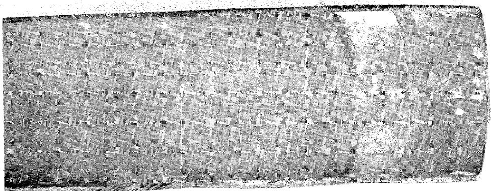

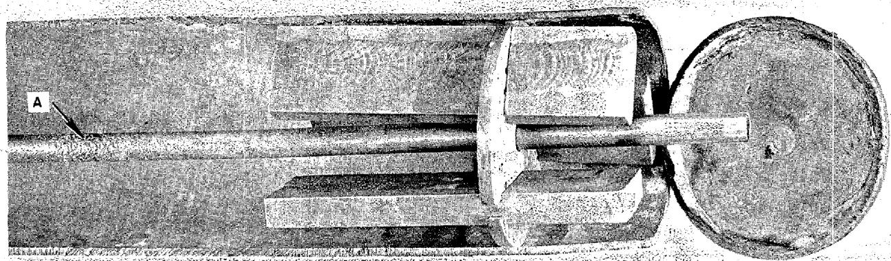

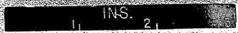  
Fig. 10.1. Cross Section of Assembled "A" Nickel Reaction Vessel. The pitting type of attack on the fluorine gas inlet tube may be seen at point A.

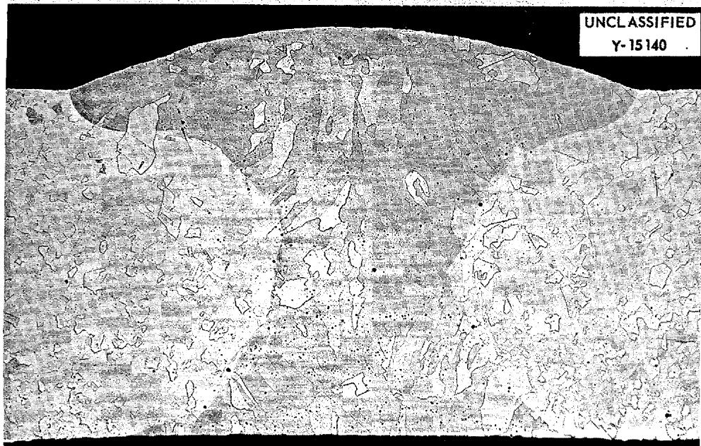  
Fig. 10.2. Cross Section of Welded "L" Nickel Test Coupon Exposed to Molten Salt in a Nickel Reaction Vessel. Note uniformity of attack. Etched with KCN plus $(\mathsf{NH}_4)_2\mathsf{S}_2\mathsf{O}_8$ . 12X.

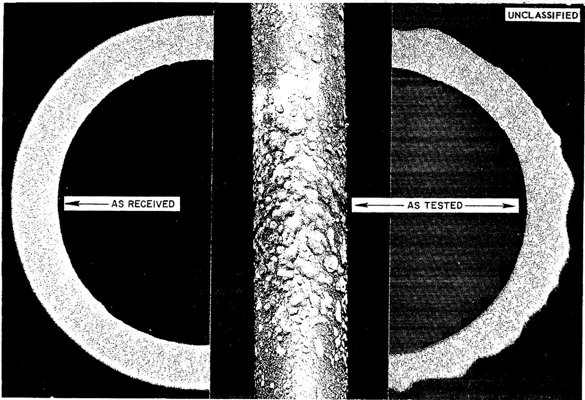  
Fig. 10.3. Outer Surface Attack of Fluorine Gas Inlet Tube in Vapor Zone of Reaction Vessel. Section taken at point A of Fig. 10.1. Etched with KCN plus $(\mathsf{NH}_4)_2\mathsf{S}_2\mathsf{O}_8$ . 20X.

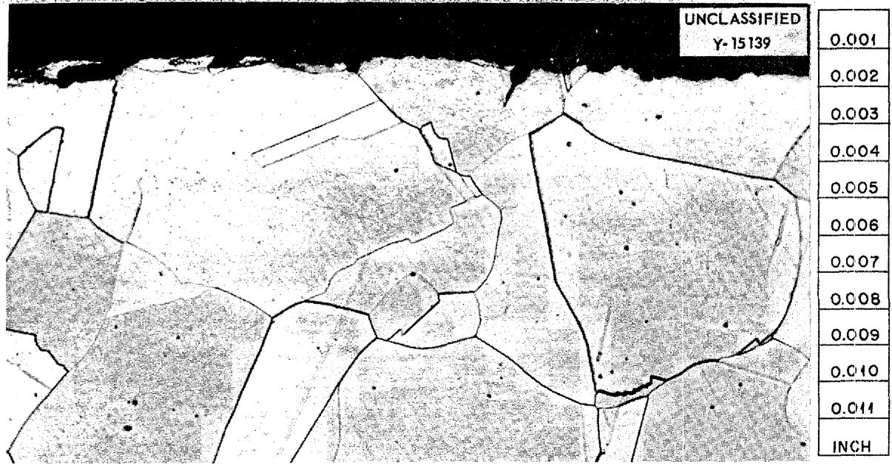  
Fig. 10.4. Inner Surface of Specimen of "A" Nickel Reaction Vessel Taken from Region Exposed to ARE-Type Fuel. Note nonuniform surface attack. Etched with KCN plus $(\mathsf{NH}_4)_2\mathsf{S}_2\mathsf{O}_8$ . 250X.

Part III

SHIELDING RESEARCH

# 11. SHIELDING ANALYSIS

E. P. Blizzard

F. H. Murray

C. D. Zerby

R. B. Murray

Applied Nuclear Physics Division

S. Auslander

C.A.Goetz

J.B.Dee

J. Smolen

Pratt & Whitney Aircraft

A calculational method has been developed for tracing all the gamma radiation born within a circulating-fuel reactor; for this calculation it is assumed that the reactor is spherically symmetric and that all regions are homogeneous. In addition, the codings of two Monte Carlo problems - the calculation of the heat generation resulting from the absorption of gamma radiation in laminated shields and the calculation of the energy and angular distribution of air-scattered neutrons from a monoenergetic source - are nearing completion. The analysis of the constant-velocity transport equation has also been extended.

# GAMMA-RAY DISTRIBUTION IN A CIRCULATING-FUEL REACTOR AND SHIELD

C. D. Zerby

M. D. Pearson

A semianalytical Monte Carlo calculation has been initiated to determine the history of all gamma radiation born within a circulating-fuel reactor of the ART type. The calculation is a joint effort of the Boeing Airplane Company and ORNL and will be coded for the IBM 701 automatic digital computer. The problems of interest will be computed at Boeing. The calculation will be simplified by the assumptions that the reactor has spherically symmetric geometry and that the regions without homogeneity (for example, the heat exchanger) are homogeneous. However, these will be the only simplifications, and all shells of the core, reflector, and shield, including the Inconel container shells, will be taken into account.

The problem is designed to determine the history of all gamma radiation born within any one spherical shell of the configuration and to account for the radial distribution of the source. The results will include a determination of the energy

absorption resulting from the transport of the gamma radiation. These data will be presented as a function of radius. The results will also include determinations of the energy spectrum and angular distribution of the gamma radiation penetrating the shield. The data obtained will be normalized per watt of power generated in the core.

The sources of gamma radiation within the core will be determined from neutron flux distribution data obtained from one of the existing multigroup neutron diffusion calculations. The power of the reactor will be determined from these same data.

The energy and density normalization of the total prompt-fission and fission-product decay gamma rays born in the active fuel region of the core will be obtained from the relationship

(1)

$$
N (E) = 1 3. 7 e ^ {- 1. 0 8 E},
$$

where

$$
N (E) = \text {t o t a l p h o t o n s / f i s s i o n / M e v},
$$

$$
E = \text {e n e r g y} (\text {M e v}).
$$

The components of this total are given by the following equations:

(2)

$$
N _ {1} (E) = 7. 7 e ^ {- 1. 0 2 E},
$$

(3)

$$
N _ {2} (E) = 6 e ^ {- 1. 2 E},
$$

where

$$
N _ {1} (E) = \text {p r o m p t p h o t o n s / f i s s i o n / M e v},
$$

$$
N _ {2} (E) = \text {d e c a y p h o t o n s / f i s s i o n / M e v .}
$$

Equation 2 is an empirical fit to published data, while Eq. 3 is a best guess inferred from some experimental data. Equation 1 is the sum of Eqs. 2 and 3. Better data will be used as they become available.

In the heat exchanger region, only the fissionproduct decay gamma rays will be considered,

since the thermal-neutron flux, and thus the fissioning, is depressed by the boron curtains. It will be assumed that these decay gamma rays will be uniformly distributed in the heat exchanger. The energy and density normalization of this radiation will be obtained from Eq. 3. In all other regions of the core the energy and density of the capture gamma rays will be determined from published data.

The capture gamma-ray sources in the shield will be included when data on the neutron flux in this region become available. It is hoped that the numerical integration of the transport equation for spherical shields will be completed so that the results will be available to complete this problem.

A neglected source of radiation is that resulting from inelastic neutron scattering. However, this radiation can be included without modification of the code when the information becomes available.

It is intended that each region of the assembly be treated separately, and the results will be added to complete the treatment of the reactor as a whole. By treating each region separately, it will be possible to make parameter studies to determine optimum configurations to shield against radiation from any particular region.

For this calculation it was necessary to deviate from the straightforward Monte Carlo methods because of the many mean free paths of material to be penetrated by the core-region gamma rays; for example, there are approximately 16 mean free paths from the center of the core to the outside of the shield for 3-Mev gamma rays in a typical 300-Mw design. Many mean free paths of attenuation for radiation usually result in poor statistics in the solution when the problem is treated by Monte Carlo methods. It was therefore necessary to use a semianalytical method, which is a considerable improvement over the straightforward procedure. The procedure is to generate the spatial energy and angular collision density of gamma rays born in any one region by standard Monte Carlo techniques and from this to calculate analytically the energy spectrum and angular distribution5 of the penetrating radiation. The data on heating are obtained in a similar manner.6 In practice the analytical and Monte Carlo parts of the problem are carried on simultaneously, each modifying the other.

4P. Mittelman, Gamma Rays Resulting from Thermal Neutron Capture, NDA 10-99 (Oct. 6, 1953).

# ENERGY ABSORPTION RESULTING FROM GAMMA RADIATION INCIDENT ON A MULTIREGION SHIELD WITH SLAB GEOMETRY

C.D.Zerby S.Auslender

The coding of a Monte Carlo calculation of heat generation resulting from the transport gamma radiation through shields with laminated-slab geometry is nearing completion.7 The data resulting from the calculation will include the energy absorption as a function of depth, as well as the energy reflected and penetrating the slab.

A revised code makes it possible to consider the gamma-ray heating in a circulating-fuel reactor when it is idealized to slab geometry (see preceding paper). As coded, 1000 histories can be calculated by the Oracle with standard Monte Carlo methods in approximately 5 min. This number of histories should be sufficient to provide good statistics for gamma rays incident on a shield with a thickness of approximately seven mean free paths. The code should be applicable to other programs as cases of interest arise.

# ENERGY AND ANGULAR DISTRIBUTION OF AIR-SCATTERED NEUTRONS FROM A MONOENERgetic Source

C.D.Zerby

A general description of a Monte Carlo calculation of the energy and angular distribution of air-scattered neutrons from a monoenergetic source was given in a previous report. Coding of the problem for the Oracle is continuing, and slight modifications in the original problem have been made for greater utility. The program now makes possible a determination of the energy and angular distribution of air-scattered neutrons from a unit surface source on the surface of a sphere.

The surface source can have an angular distribution about the normal given by

$$
P (\theta) = A \cos^ {n} \theta ,
$$

where

$P(\theta) =$ probability of emission per unit solid angle in a direction inclined at an angle $\theta$ with the normal,

$\theta =$ angle with respect to the normal,   
$A =$ normalizing constant,   
$n = 0,1,2,\dots$

The sphere on which the source is located will be treated as a black body to radiation returning to the sphere.

With these modifications it is possible to calculate the answers for several sources having different powers of the cosine distribution and then to combine them to duplicate the distribution from the surface of a circulating-fuel reactor. Detailed information about the neutron radiation reaching the crew compartment shield can thus be obtained.

A study of the effect of neutrons originally emitted in the half space to the rear of the aircraft on the total flux at the crew compartment shield can also be made with these modifications. Economical shaping of the reactor shield is dependent on a thorough knowledge of behavior of this radiation.

# ANALYSIS OF THE CONSTANT-VELOCITY TRANSPORT EQUATION

F. H. Murray

The analysis of the constant-velocity transport equation previously developed has been extended. The inversion of the Fourier transforms computed in the first paper may be avoided by the use of eigenfunctions for all the separate strata or shells of a stratified medium. The course of the calculations is the same as for a system of nonhomogeneous differential equations. To any solution of the nonhomogeneous equation is added the sum of all eigenfunctions, each multiplied by a constant factor, and these factors are determined by the conditions at the boundaries between different media. In this case the conditions are that the product $(n,\nu)f(S,\nu)$ be continuous at each surface and that the flux vanish at infinity for finite sources. The eigenfunctions for cylindrical and spherical source distributions may be calculated from those for plane source distributions with the aid of matrix representations of rotations in three-dimensional space. The solution of the transport equation with finite sources but for unbounded space represents the solution of the nonhomogeneous equation.

# 12. LID TANK SHIELDING FACILITY

G. T. Chapman

J.M.Miller

Applied Nuclear Physics Division

W.J.McCool

H.C.Woodsum

Pratt & Whitney Aircraft

The second series of experiments with mockups of the circulating-fuel reflector-moderated reactor (RMR) and shield have been continued at the Lid Tank Shielding Facility (LTSF). This series consists of two sets of tests: the static source tests and the dynamic source tests. The measurements taken to date have been concerned with the static source tests.

# REFLECTOR-MODERATED REACTOR AND SHIELD MockUP TESTS

G. T. Chapman

J.B.Dee

H. C. Woodsum

Many of the measurements in the static source tests of the reflector-moderated reactor and shield mockup experiment at the LTSF have been completed. As reported previously, these tests were designed to determine the primary and secondary sources of radiation that reach the outside of the shield. The tests completed to date have included (1) gamma-ray dose rate measurements behind various configurations of the mockup (the standard configuration is shown in Fig. 12.1), (2) thermal-neutron flux distribution measurements within the beryllium reflector, (3) neutron measurements behind the mockups as a function of the thickness of the lead gamma-ray shield region, and (4) sodium activation measurements within the heat exchanger.

Before any mockup tests were performed, a series of gamma-ray dose rate, fast-neutron dose rate, and thermal-neutron flux measurements were made both in plain water and in borated water contained in the iron tank that holds all the components of the mockup in the experiment. These measurements were made in order to determine the effect of the borated water in which all the mockup measurements are made. The mockup tank, which is placed against the source plate, has a $\frac{3}{8}$ -in.-thick aluminum window on the source side. Radiation measurements were also made in the plain water of the LTSF (that is, no mockup tank used).

# Gamma-Ray Dose Rate Measurements

The gamma-ray dose rate measurements in plain water and in borated water (Fig. 12.2) were used to determine the source strength and approximate energy of the gamma rays from the LTSF source plate. In order to separate the sources, three simultaneous equations with three unknowns were solved:

$$
D _ {\gamma \left(\mathrm {H} _ {2} 0, L T\right)} = \Gamma_ {s} + \Gamma_ {\text {H C a p t u r e}}
$$

$$
\begin{array}{l} D _ {\gamma (\sf {H} _ {2} ^ {0}, R M R T)} = \Gamma_ {s} \\ + \Gamma_ {H C a p t u r e} + \Gamma_ {A l C a p t u r e}, \\ \end{array}
$$

$$
\begin{array}{l} D _ {\gamma (\mathsf {B} \cdot \mathsf {H} _ {2} \mathsf {O}, R M R T)} = \Gamma_ {s} \\ + \frac {\Gamma_ {H C a p t u r e}}{6 6} + \frac {\Gamma_ {A l C a p t u r e}}{1 0}, \\ \end{array}
$$

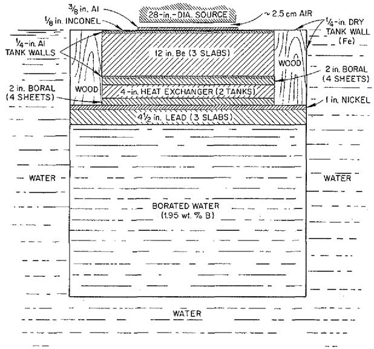  
2-01-057-66-117   
Fig. 12.1. Standard Configuration (Top View) for LTSF RMR-Shield Tests.

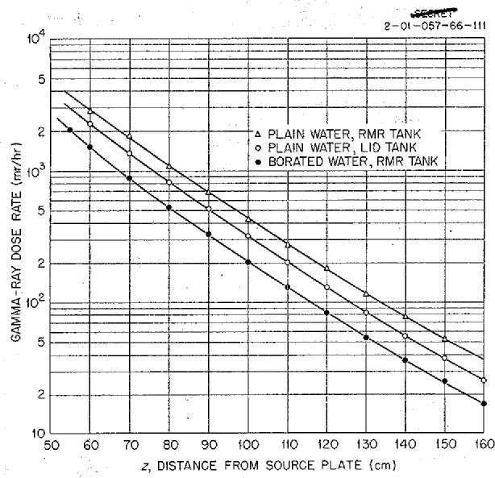  
Fig. 12.2. Gamma-Ray Dose Rate Measurements in Plain and Borated Water at the LTSF.

where

$$
D _ {\gamma} = \text {t o t a l} \quad \text {g a m m a - r a y} \quad \text {d o s e r a t e} \quad \text {m e a s u r e d},
$$

$$
\Gamma_ {s} = \begin{array}{l} \text {g a m m a - r a y d o s e r a t e f r o m L T S F} \\ \text {s o u r c e p l a t e ,} \end{array}
$$

$$
\Gamma_ {H C a p t u r e} = \begin{array}{l} \text {g a m m a - r a y d o s e r a t e f r o m h y d g e n} \\ \text {c a p t u r e o f t h e r m a l n e u t r o n s ,} \end{array}
$$

$$
\Gamma_ {\text {A l C a p t u r e}} = \text {g a m m a - r a y d o s e r a t e f r o m a l u m i n u m c a p t u r e o f t h e r m a l n e u t r o n s},
$$

$$
6 6 = \text {r a t i o}
$$

$$
1 0 = \text {r a t i o} \quad \text {t h e} \quad \text {t h e r t h e m a l u n i m} \quad \text {w i n} \quad \text {p u r e} \quad \text {a n d} \quad \text {b o r a t e d} \quad \text {w a t e},
$$

and $RMRT$ and $LT$ indicate that the water is contained in the mockup tank or in the plain water of the Lid Tank, respectively. The results of this analysis (Fig. 12.3) show that the equivalent source strength of the source plate is about $70~\mathrm{r/hr}$ and that the gamma rays are attenuated about like 3-Mev gamma rays are attenuated in water.

After these contributions of various sources to the gamma-ray dose rate in water were established, the mockup of the RMR and shield was installed in the LTSF, and the effects of varying different regions were studied. Measurements behind various thicknesses of the boron curtain between the

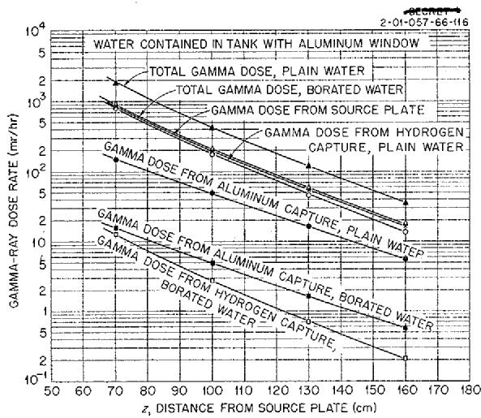  
Fig. 12.3. Contribution of Various Sources to Gamma-Ray Dose Rate in Plain or Borated Water Against LTSF Source Plate.

beryllium and the heat exchanger showed that, for thicknesses of boral greater than $\frac{1}{2}$ in., there was no change in the resulting gamma-ray dose rate (Fig. 12.4). This simply means that gamma rays resulting from epithermal neutron capture in the heat exchanger are not an important contribution to the total gamma-ray dose rate (see further discussion on the sodium activation below). Figure 12.5 shows a decrease in total gamma-ray dose rate with an increase in heat exchanger thickness. This decrease was investigated and was found to be just an attenuation of the primary gamma-ray dose.

A lead thickness variation study was carried out not only to determine the resulting effect on the gamma-ray dose rate but also to learn something about secondary gamma-ray production in and beyond the lead. Results of this study (Fig. 12.6) indicate that there is an appreciable secondary dose originating in and beyond the lead for large uniform lead thicknesses. The steep portion of the curves is due to the 0.5-Mev gamma ray resulting from thermal-neutron capture by the boron of the borated water immediately behind the lead. The shallow slope toward the end of the curves indicates the presence of a harder secondary gamma ray near the back of the tank. Analyses of these curves indicate, to date, that most of this secondary dose is caused by boron capture gamma rays, hydrogen capture gamma rays, and thermal

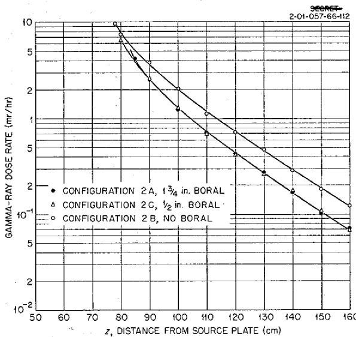  
Fig. 12.4. Gamma-Ray Dose Rate Beyond RMR-Shield Mockups: Effect of Boral Thickness.

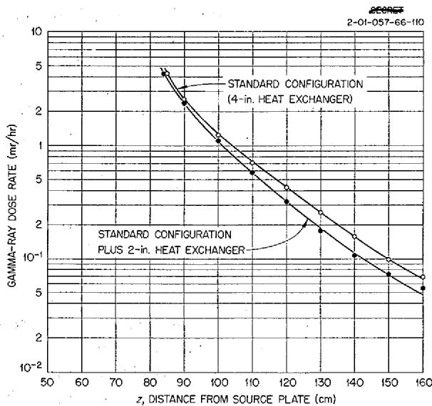  
Fig. 12.5. Gamma-Ray Dose Rate Beyond RMR-Shield Mockups: Effect of Heat Exchanger Thickness.

and epithermal neutron captures in the lead. For large lead and water thicknesses (for example, 9 in. of lead and $80~\mathrm{cm}$ of water), the dose rate from epithermal neutron capture in lead seems to predominate. More experiments are planned for investigating these results. The placement of the lead will also be investigated in a later test to

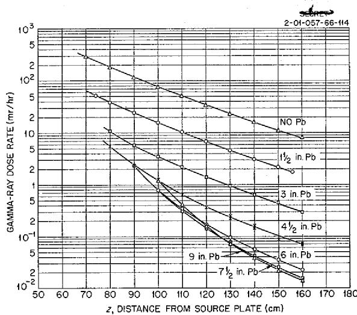  
Fig. 12.6. Gamma-Ray Dose Rate Beyond RMR-Shield Mockups: Effect of Lead Thickness.

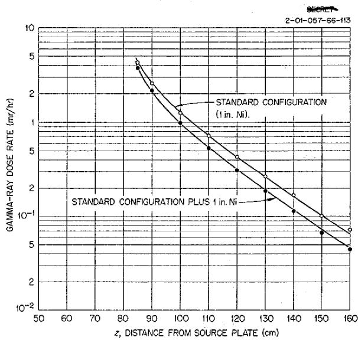  
Fig. 12.7. Gamma-Ray Dose Rate Beyond RMR-Shield Mockups: Effect of Pressure Shell Thickness.

enable shield optimization and to further study the secondary gamma-ray dose in and beyond the lead.

A study of the effect on the total gamma-ray dose rate of adding 1 in. of nickel to the pressure shell of the standard configuration indicated that the extra thickness of nickel merely attenuated the primary gamma-ray dose (Fig. 12.7). A study

of the effect of adding an Inconel cladding on the boron curtain at the rear of the beryllium (Fig. 12.8) showed a negligible increase in the gamma-ray dose rate with 0.020 in. of Inconel and an increase of approximately $10\%$ with 0.125 in. of Inconel.

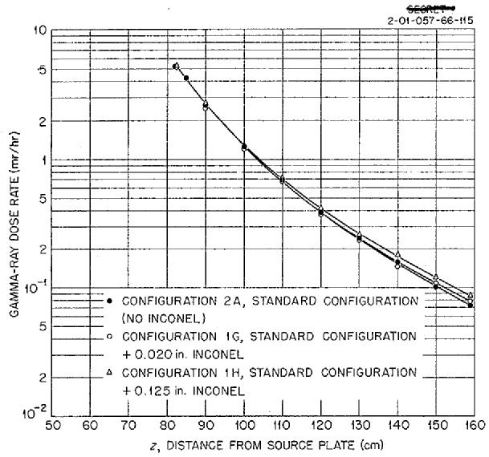  
Fig. 12.8. Gamma-Ray Dose Rate Beyond RMR-Shield Mockups: Effect of Inconel Cladding on Boral.

Additional gamma-ray dose rate studies in this static source series will include variations of the thickness of the beryllium reflector region and the addition of heavy metals in the reflector region. An investigation of the gamma-ray captures in the beryllium reflector and Inconel core shell is reported below.

# Neutron Measurements

As was mentioned above, neutron measurements were made both in borated water and in plain water contained in the mockup tank. A comparison of the measurements (Fig. 12.9) shows that the boron decreased the thermal-neutron flux by a factor of about 28 and that the fast-neutron dose rate was not affected to any noticeable degree. The displacement of the Lid Tank plain water curves is due to a $4.5\mathrm{-cm}$ air space between the source and the mockup tank.

In order to determine the distribution of the thermal-neutron flux in the beryllium of the mock

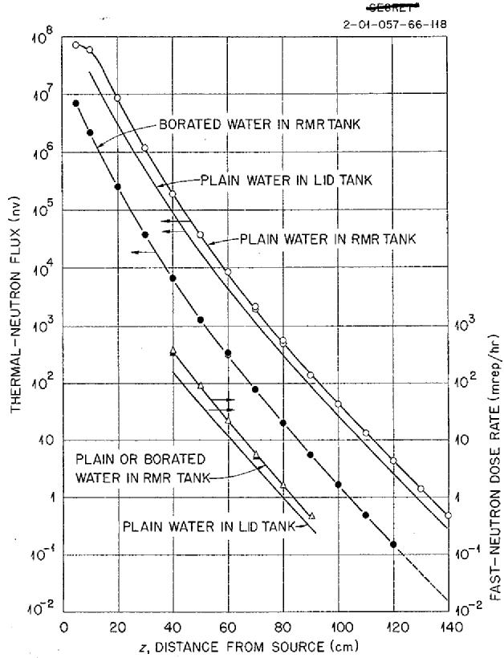  
Fig. 12.9. Neutron Measurements in Plain and Borated Water (1.95 wt % B) at LTSF.

ups, gold foils were exposed throughout the reflector region. The foils were placed on the faces of each beryllium slab from 5 in. above the source center line in intervals of 4 in. to the top of the beryllium. Plots of the results as a function of the beryllium thickness (Fig. 12.10) are uniform and peak just after the first face of the second beryllium slab (that is, at about $4\frac{1}{4}$ in. of beryllium). These data have not yet been corrected for self-absorption and flux depression by the foils.

Plots of the gold foil measurements as a function of the vertical distance above the source center line (Fig. 12.11) again are uniform, with a relatively flat region across the source center line. As would be expected, the flux falls off rapidly as the upper edge of the beryllium is approached.

Neutron measurements (Fig. 12.12) were also made behind the mockups as the lead region of the shield was increased from 0 to $9 \frac{1}{2}$ in. to study the contribution to the gamma-ray dose rate by secondary gamma rays from the lead. There were a great many low-energy neutrons in the region

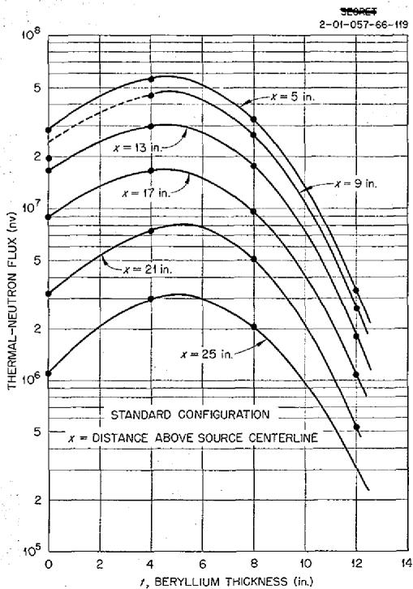  
Fig. 12.10. Thermal-Neutron Flux Distribution in the Beryllium of the RMR-Shield Mockups: Horizontal Traverses.

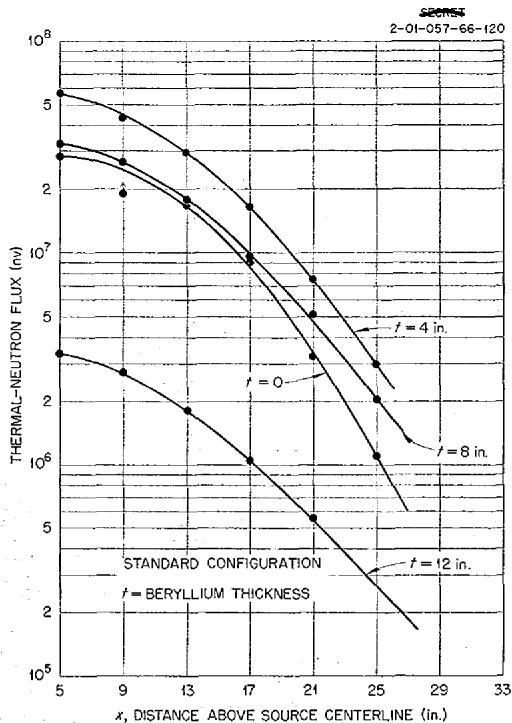  
Fig. 12.11. Thermal-Neutron Flux Distribution in the Beryllium of the RMR-Shield Mockups: Vertical Traverses.

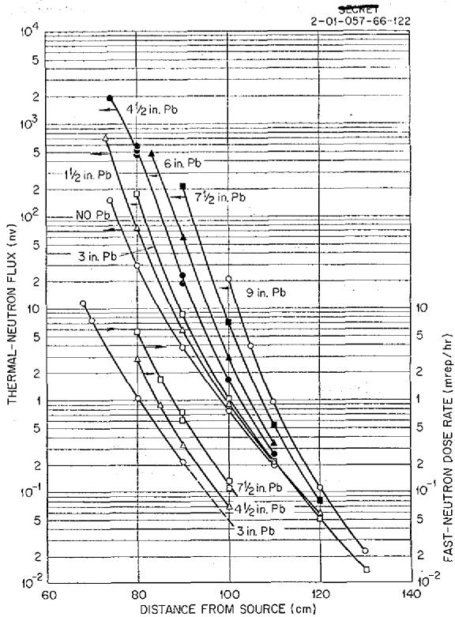  
Fig. 12.12. Neutron Measurements Beyond RMR-Shield Mockups: Effect of Lead Thickness.

immediately behind the lead, and the increase in lead thickness, in effect, only moved the thermal and intermediate flux out. The slopes of the fast-neutron dose rate curves $(\lambda = 4.7~\mathrm{cm})$ indicate that these neutrons were predominantly of intermediate energies.

# Sodium Activation in Heat Exchanger Region

A study of the activation by core neutrons of the sodium in the heat exchanger region was made as a function of the boral curtain thickness and the heat exchanger thickness. In each of the six configurations tested (Fig. 12.13), 12 in. of beryllium preceded the first boral slab. The last boral slab behind the heat exchanger region was followed by 1 in. of nickel, $4\frac{1}{2}$ in. of lead, and borated water. The measurements were made by placing small pellets of sodium fluoride $(\rho = 2.1\mathrm{g/cm}^3)$ in the center of each heat exchanger tank at the source center line. The plots in Fig. 12.13 show the measured specific activity of the pellets corrected to saturation for each case. For the first three cases the effect of decreasing the thickness of

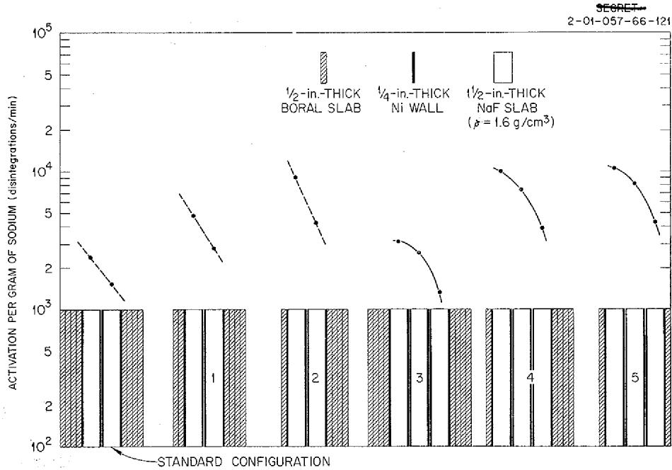  
Fig. 12.13. Effect of Heat Exchanger and Boron Curtain Thicknesses on Sodium Activation in RMR-Shield Mockups.

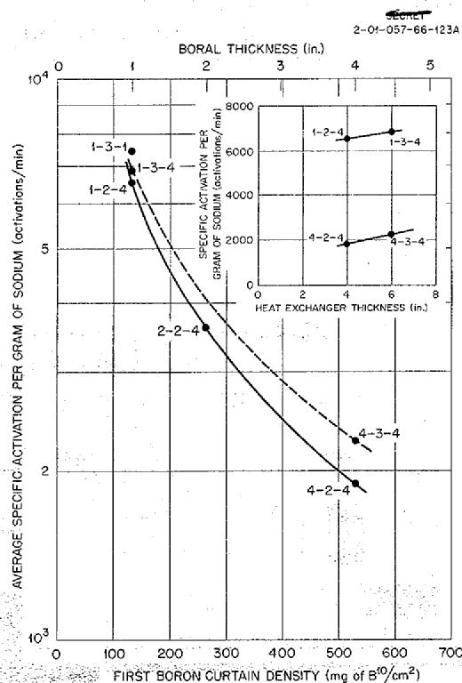  
Fig. 12.14. RMR-Shield Mockup Experiment: Sodium Activation Caused by Neutrons from LTSF Source.

the first boral curtain is apparent. The results of the last three cases show the effect of a 6-in.-thick heat exchanger with various thicknesses of the first and second boral curtain.

For each configuration an average specific activation was determined by integrating numerically; the results are shown in Fig. 12.14. Each point on the curves is labeled with a code in which the first and last numbers designate the number of boral sheets preceding and following the heat exchanger, respectively, and the center number designates the number of heat exchanger tanks in the configuration. The insert of the figure is a cross plot showing an increase in the average specific activation with increasing heat exchanger thickness for two different thicknesses of the first boral curtain.

A sample calculation of the sodium activation in the NaK in the heat exchanger of a 300-Mw airplane reactor gave 2000 curies. If the NaK-to-air radiator were unshielded, this would give a dose rate of 16 rem/hr at a distance of 60 ft.

# 13. BULK SHIELDING FACILITY

F.C.Maienschein

T. V. Blosser

K. M. Henry

G. M. Estabrook

E. B. Johnson

J.D.Flynn

T. A. Love

M. P. Haydon

R.W.Peelle

W. Zobel

Applied Nuclear Physics Division

K.M. Johnson

Pratt & Whitney Aircraft

The duct portion of the GE-ANP reactor shield was tested in the ORNL Bulk Shielding Facility (BSF) during the past quarter, and arrangements are being made for three experiments to measure the spectrum of fission-product gamma rays for a circulating-fuel reflector-moderated reactor.

# GE-ANP AIR-DUCT MockUP EXPERIMENT

F.C. Maienschein

J.D.Flynn

J. S. Arterburn

E. B. Johnson

A mockup of the air-duct system for the GE-ANP reactor was tested at the BSF. The mockup consisted of a pair of annular ducts placed against the BSR, which was modified with GE-type transition sections.

One objective of the experiment was to determine the optimum spacing, if such existed, between the reactor face and the inlet air duct. Another objective was to obtain information about the angular distribution of radiation, particularly fast neutrons, leaving the reactor shield. The latter data were needed in order to calculate the scattered radiation dose arriving at the crew compartment.

The extensive data obtained from the measurements, which included more than 80 traverses, have not been completely analyzed by ORNL, and it is contemplated that the remaining work will be done by the GE group at Lockland. A description of the experiment and some tentative conclusions are presented here.

The fuel loading of the BSR was arranged to correspond as closely as possible to that of the GE-ANP aircraft reactor. This necessitated the use of a long, narrow reactor (Fig. 13.1). Transition sections were mounted on either side of the reactor (Fig. 13.2) to simulate the two transition sections of the GE-ANP aircraft engine. The two

duct mockups, labeled "inlet" and "outlet," are shown outside the transition sections. The ducts were mounted on a large plate (Fig. 13.3), and the entire assembly was arranged as a "package shield mockup," the package being lowered as a unit into the reactor pool. This method was employed because the BSF reactor pool is now filled with demineralized water, and refilling the pool after draining to assemble equipment in it would be very time-consuming. All materials of construction were corrosion resistant, being either aluminum or stainless steel. The duct mockups were essentially two-dimensional analogs of the actual three-dimensional annular ducts. In order to determine the optimum position of the inlet air duct, the

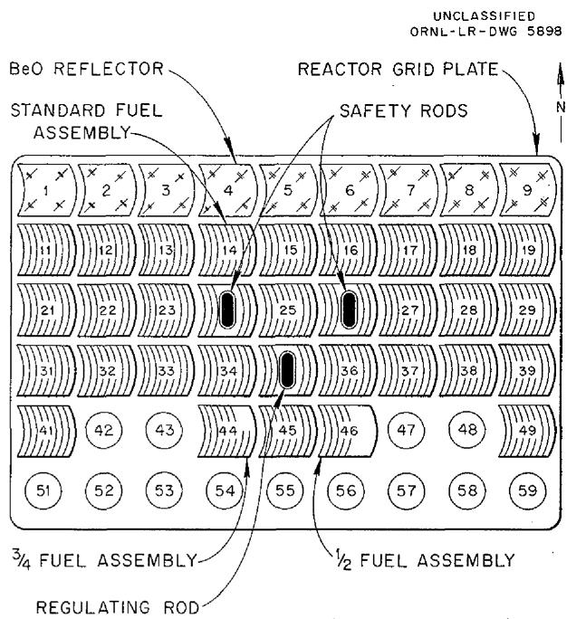  
Fig. 13.1. Bulk Shielding Reactor Loading 38.

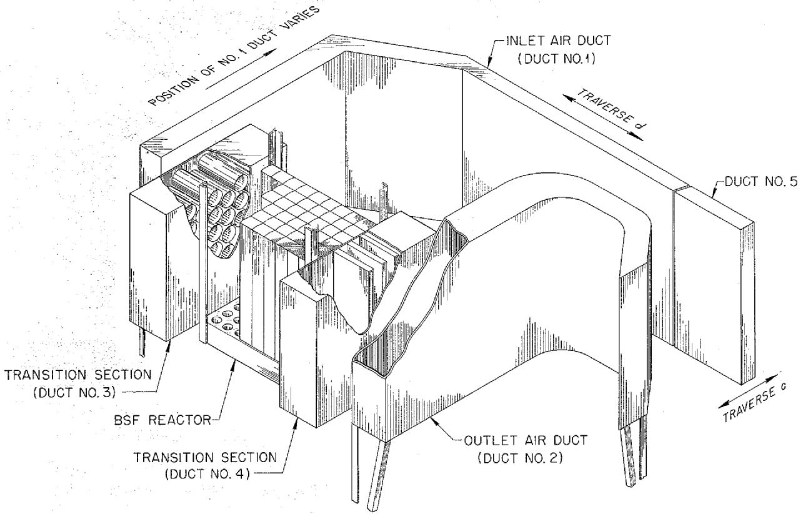  
SECRET   
ORNL-LR-DWG 6175   
Fig. 13.2. GE-ANP Duct Mockup in the BSF.

spacing between reactor and duct was varied by means of an electric motor mounted in a box on the stainless steel base plate (shown in lower right corner of Fig. 13.3).

The instrumentation that was used in this experiment consisted of the conventional gamma-ray and thermal-neutron detectors. For fast-neutron measurements, however, the conventional Hurst dosimeter would not operate in the large gamma-ray fields that were present behind the ducts. Consequently, the fast-neutron data were taken with an essentially unproved instrument, the Hornyak button, which was modified for use as a fast-neutron dosimeter. It has not been demonstrated conclusively that this device acts as a dosimeter, in general, but all tests for this experiment indicate that it does measure something that corresponds very closely to the fast-neutron dose for a reactor shield neutron source.

Another innovation in instrumentation for this experiment was the use of a variable-speed motor

to drive the instrument carriage laterally across the BSF pool. Measurements by the detectors were automatically plotted as a function of position on a two-dimensional recorder. This mechanization permitted the accumulation of much more data than could have been obtained by hand in the two months available for the experiment.

The power of the BSR was determined only approximately by the comparison of thermal-neutron flux measurements along the reactor center line with corresponding flux data for reactors of known power. Since the data of most importance from this experiment were only relative, it was not considered worth while to make the time-consuming measurements necessary for mapping the flux over the entire reactor, as would be required for an accurate power determination. The neutron leakage fluxes out of the two sides and the front of the reactor were investigated by means of the usual foil exposures.

Of the many traverses obtained, two are included

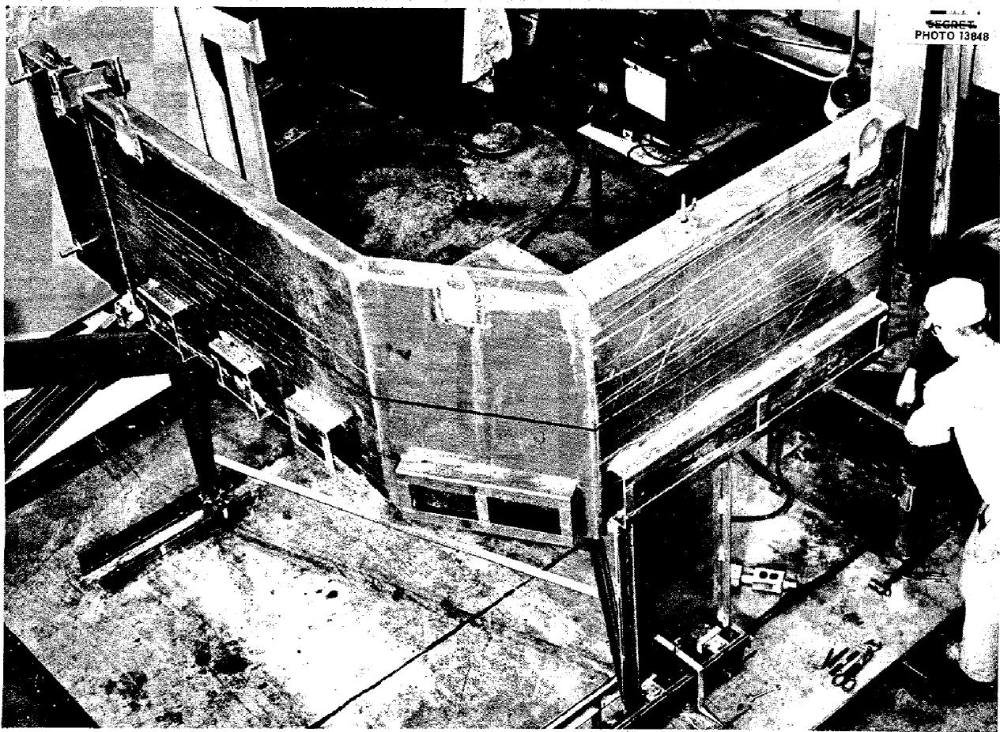  
Fig. 13.3. GE-ANP Duct Mockup Assembly.

in this summary in order to provide an illustration of the data. The first traverse (Fig. 13.4) shows what happens to the leakage out the end of the large inlet duct as its position is varied. The detectors were actually placed on the end of the duct. This plot shows the counting rates for each of the three detectors as a function of separation distance between the inlet and outlet ducts. Since there is simply a smooth decrease in counting rate as the separation is increased, there is no evidence of streaming down the entire length of the duct.

Figure 13.5 shows traverses lengthwise behind the large air duct as a function of the reactor-duct spacing. The fast-neutron traverse was made, in each case, at the same location; only the intervening inlet air duct was moved. For the spacings shown, there is little difference in the fast-neutron dose rate along the traverse behind the duct. It appears that as far as fast neutrons are concerned the duct simply reduces the density of the shield,

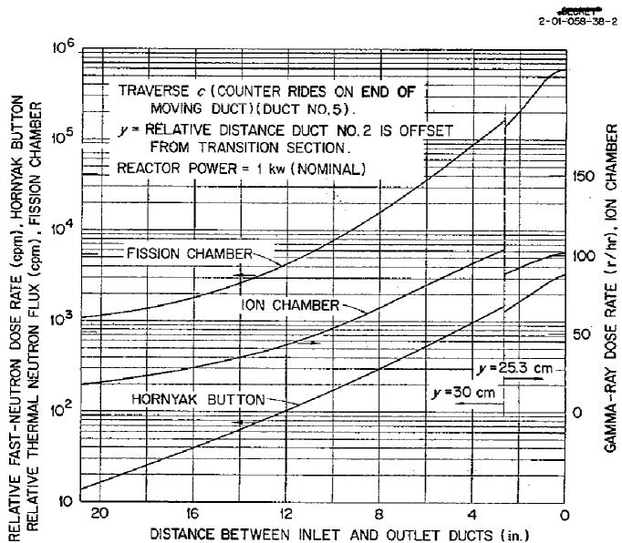  
Fig. 13.4. GE-ANP Air-Duct Mockup Experiment: Radiation Measurements Along Traverse $c$ .

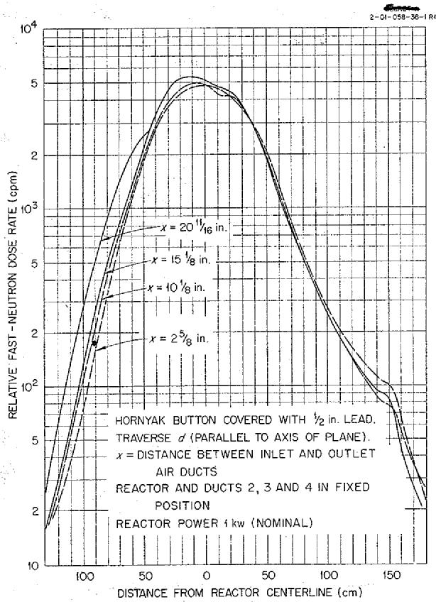  
Fig. 13.5. GE-ANP Air-Duct Mockup Experiment: Fast-Neutron Dose Rate Along Traverse $d$ .

and its position has no great effect on that portion of the radiation which penetrates the shield.

In order to determine some of the characteristics of the angular distribution of radiation escaping from the reactor shield, a measurement of the fast-neutron angular distribution was attempted. The Hornyak button, which was encased in lead, was attached to the end of a 5-ft-long aluminum tube filled with air, which acted as a collimator when placed in the water of the reactor pool. This arrangement could not be used to determine the exact angular distribution, because the collimation was not perfect, but the data may be considered as the best available. Figure 13.6 shows the angular plot of the fast-neutron dose rate obtained as a function of the angle measured around a particular point in space, which was chosen arbitrarily to be on the intersection of the reactor center line and the second leg of the large inlet duct. The curve shows that the escaping radiation peaks quite heavily in the forward direction. There is no evi

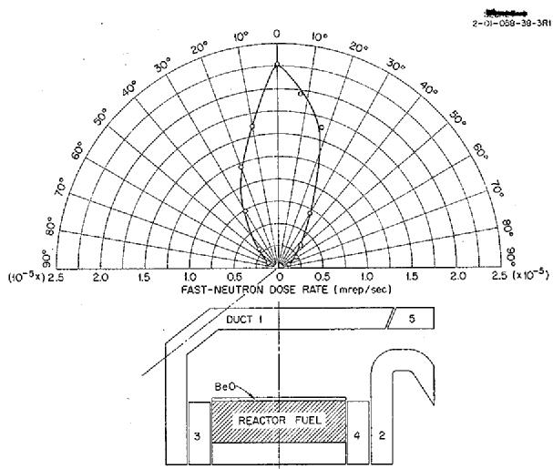  
Fig. 13.6. GE-ANP Air-Duct Mockup Experiment: Angular Distribution of Fast Neutrons.

dence of fast neutrons escaping through the large duct, since the curve is symmetrical in the region around 50 deg. As soon as time is available, further investigations will be made of the efficiency of this type of fast-neutron collimation and of angular distributions for other shields.

The results of this experiment seem to indicate that the problem of shielding the air ducts of an air-cooled aircraft engine may not be so serious as was once thought. This conclusion applies specifically to the annular air duct.

# THE SPECTRUM OF FISSION-PRODUCT GAMMA RAYS

R.W.Peelle

T. A. Love

F. C. Maienschein

One of the most difficult problems in the design of a divided aircraft shield arises from the lack of information on the energy spectrum and angular distribution of gamma rays at the outside of the primary reactor shield. These data are needed for an air-scattering calculation because of the rapid variation with gamma-ray energy of the Compton scattering process. This variation makes the results of the air-scattering calculation extremely sensitive to the details of the gamma-ray flux at the surface of the reactor shield.

In the case of a circulating-fuel reflector-moderated reactor a large fraction of the gamma-ray flux outside the reactor shield originates from fission-product gamma rays in the region of the primary

heat exchanger. The fission-product gamma-ray emitters are entrained in the fuel mixture and reach the heat exchanger very shortly after the corresponding fissions have occurred. The energy spectrum of these short-lived fission-product gamma rays has not been measured, and, since most of the gamma-ray energy is given off with short periods, a complete lack of knowledge of this important spectrum now exists. All estimates3 which have been made of the spectral shape must be considered to be quite unreliable, and even the average gamma-ray energy release is in some doubt. It is felt4 that this lack of spectral information for decay gamma rays could cause an error of a few thousand pounds in the supposedly optimized shield weight.

Three experiments relative to the fission-product gamma-ray spectrum are presently under way. All three experiments will make use of the multiple-crystal gamma-ray spectrometer, which allows measurements of continuous gamma-ray spectra to be analyzed with reasonable certainty.

One of the experiments will be performed at the LTSF and will make use of the RMR mockup (see Sec. 12). In this test the circulating-fuel belt will

3Report of the 1953 Summer Shielding Session, ORNL-1575, p 233.   
4 J. B. Dee, private communication.

be placed near the LTSF source plate, and the spectrometer will be exposed to gamma radiation from the belt. Thus the spectrometer will measure the gamma-ray spectrum that would be encountered from a heat exchanger operating with the same type of circulating-fuel parameters. These results should shed some light upon the accuracy of the more general experiments described below.

The other two experiments will be based upon the brief bombardment of small samples of enriched $\mathbf{U}^{238}$ in the interior of the ORNL Graphite Reactor. These samples will be handled with the aid of the fast pneumatic probe assembly available there. One experiment will involve the measurement of the disintegration rate of the sample for only a few energy groups. In this case many points in time will be studied for each energy group. The other experiment will be similar except that many energy groups will be studied for only a few different times after bombardment. It should be possible to analyze the results of these latter experiments in such a way that the observed spectrum from the heat exchanger of an aircraft reactor could be derived for any set of circulation parameters. Times after fission as short as a few tenths of a second will be studied in the above experiments. Preliminary results should be available during the next quarter.

# 14. TOWER SHIELDING FACILITY

C. E. Clifford

J. L. Hull

F. J. Muckenthaler

F. N. Watson

Applied Nuclear Physics Division

M. F. Valerino, NACA, Cleveland

J. E. Van Hoomissen, Boeing Airplane Co.

A major portion of the experimental results necessary for the optimization of the neutron shielding in a divided shield has been obtained at the Tower Shielding Facility (TSF). These results concern the fast-neutron dose rate distribution in the detector tank and in a crew shield mockup as a function of a variation in the reactor shield geometry and are identified as Phase I of the differential experiment. A technique has been devised for predicting the dose in an arbitrary shield design from the differential experiment information as the first step in obtaining a procedure for optimizing a shield design. The technique has been applied to previous mockup experiments, and the results agree to within experimental error.

# THE DIFFERENTIAL SHIELDING EXPERIMENTS AT THE TSF: PHASE I

F. N. Watson

The optimization of the neutron shielding necessary in a nuclear-powered aircraft depends primarily upon the variation of the fast-neutron dose rate in the crew compartment with changes in such variables as reactor shield thickness, angle of radiation emission, and thickness of crew compartment shielding. Measurements of the fast-neutron dose rates inside the detector tank and inside the GE-ANP crew compartment have therefore been made as functions of these variables, the restriction being made, however, that only one is allowed to vary at a time.

# Measurements in the Detector Tank

The experimental arrangement for measurements within the detector tank and the coordinate system used are shown in Fig. 14.1. The dose rate variation inside the detector tank was measured with respect to $\pm x$ and $-z$ for various values of $\theta$

to study the penetration to be expected in the side of a crew shield as related to the angle of neutron emission from the reactor tank (Figs. 14.2, 14.3, and 14.4). As a cross check, the fast-neutron dose rates were measured with the detector held stationary successively at the right side, left side, and bottom of the tank and with the angle of radiation emission, $\theta$ , being changed in steps from 360 to 180 deg (Fig. 14.5).

Studies were also made of the penetration into the front and rear of the detector tank for various values of $\theta$ (Figs. 14.6 and 14.7). Figure 14.8 shows a cross check measured directly as a function of $\theta$ .

Measurements were made of the direct beam reaching the rear of the detector tank for three values of reactor shield thickness, $\rho$ . When these measurements were plotted as functions of the total water thickness, that is, $y$ plus $\rho$ , it was found that the flux was a unique function of this sum. This indicates that the boration of the water made no difference in the dose for this configuration (Fig. 14.9).

# Measurements in the GE-ANP Crew Compartment

The fast-neutron dose rate distribution within the crew compartment (Fig. 14.10) of the GE-ANP divided shield was also determined. The crew compartment shielding consisted primarily of water containing approximately 0.65 wt % boron and lead. The dose rate measurements along the y axis (fore and aft) of the crew compartment (Fig. 14.11) show that, for $\theta = 0$ deg, neutrons entering the rear face of the crew shield made a sizable contribution to the total dose inside the shield. For $\theta = 270$ and 180 deg, the contribution through the rear face was quite small.

Measurements from the left to the right of the crew compartment (Fig. 14.12) indicate that the dose rate is symmetrical for $\theta = 0 = 360$ deg. The curve for $\theta = 270$ deg shows the effect of most of the neutrons entering the right side. Because of

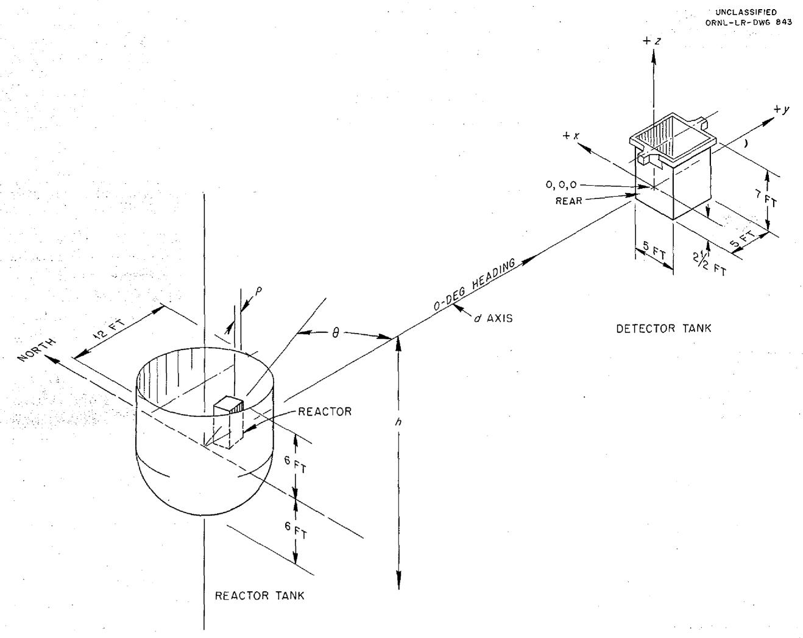  
Fig. 14.1. Experimental Arrangement for TSF Differential Shielding Experiments.

a low counting rate, only one point was obtained for $\theta = 180$ deg.

The dose rates at the center of the crew compartment were measured as a function of $\theta$ for two thicknesses $(\rho)$ of water shielding the reactor. The shapes of the two curves, $\rho = 17$ and $45~\mathrm{cm}$ , are roughly the same (Fig. 14.13).

The dose rate at the center of the crew compartment as a function of $\rho$ was also investigated for various values of $\theta$ (Fig. 14.14). By observing that the relaxation lengths of the curves are slowly varying, it can be seen that either the angular distribution of the flux from the reactor tank or its spectrum is changing.

# ANALYSIS OF THE DIFFERENTIAL SHIELDING EXPERIMENTS

M. F. Valerino

An idealized configuration of an aircraft divided shield is illustrated in Fig. 14.15. The fast-neutron dose rate in the crew compartment can be considered to be a weighted integration of the dose rate radiated into the air from the primary reactor shield surface. The weighting factors for this integration must account for the probability of the air scattering of the neutrons into the various sides of the crew shield and for the probability of neutron penetration through the crew shield into the crew compartment.

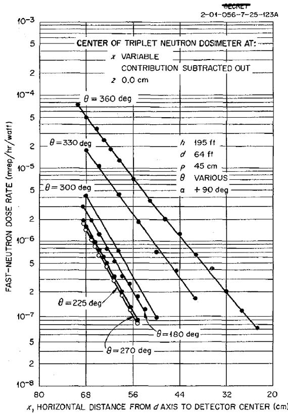

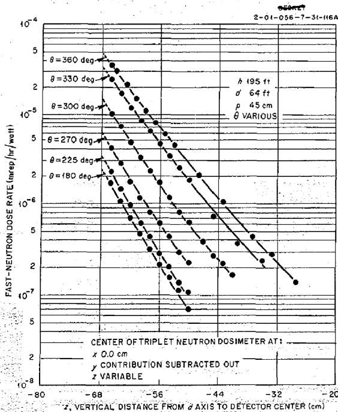  
Fig. 14.2. Fast-Neutron Dose Rates Near the Left Side of the Detector Tank for Various Angles of $\theta$ ; $x$ Variable.   
Fig. 14.4. Fast-Neutron Dose Rates Near the Bottom of the Detector Tank for Various Angles of $\theta$ ; $z$ Variable.

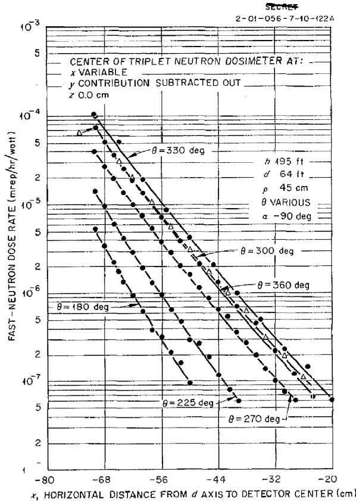  
Fig. 14.3. Fast-Neutron Dose Rates Near the Right Side of the Detector Tank for Various Angles of $\theta$ ; $x$ Variable.

The primary purpose of the fast-neutron differential shielding experiments (reported above) was to obtain these weighting factors as a function of the angle $\theta$ which a fast-neutron beam from the reactor shield surface makes with respect to the axis joining the reactor and crew compartment. In the experiment the fast-neutrons from the reactor were filtered through $45~\mathrm{cm}$ of water prior to beaming into the air. Some data were also obtained for neutrons filtered through only $15~\mathrm{cm}$ of water; for this case, the energy spectrum and the angular distribution are somewhat different than those for the $45\mathrm{-cm}$ case, and therefore comparison of the results for these two cases provides an indication of the effect of a change in neutron energy spectrum on the integration weighting factors. All the data were obtained at a constant separation distance, $\ell_{s}$ of 64 ft.

It is necessary to define the integration weighting factors in more precise terms to show how they can

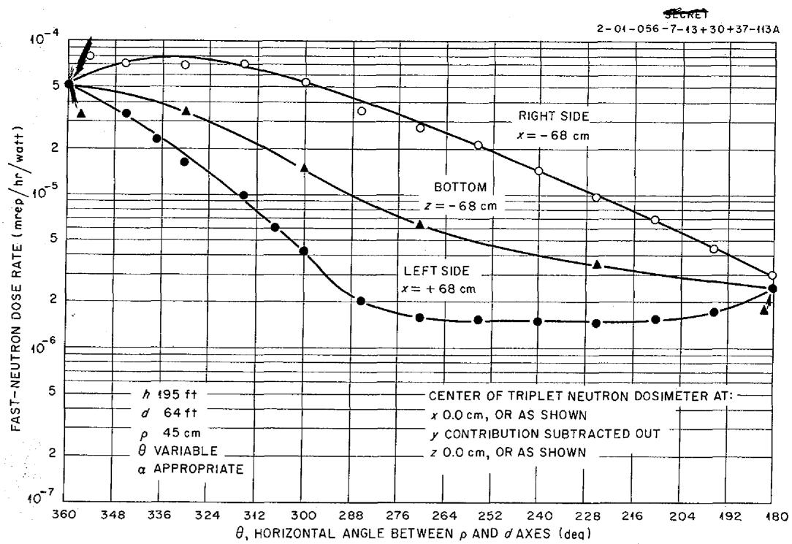  
Fig. 14.5. Fast-Neutron Dose Rates Near the Right Side, Left Side, and Bottom of the Detector Tank; $\theta$ Variable.

be obtained from the differential experiments. For this purpose, the reactor shield surface source can be replaced by a point source because the reactor shield dimensions are small compared with the separation distance. The strength of the equivalent point source per unit solid angle in a given direction must then equal the integral over the reactor shield surface of the surface source strength per unit area per unit solid angle in the same direction.

# Definition of Dose Scattering Probability

The probability of the dose from a line beam of fast neutrons scattering into the sides of a cylinder is defined in Fig. 14.16. The radiation intensity in direction $(\alpha, \phi_1)$ is conveniently given by the dose rate on the surface of a unit sphere at coordinates $(\alpha, \phi_1)$ . This dose is denoted by $D_e(\alpha, \phi_1)$ . Consider the radiation passing through the elemental area $d\Omega$ about the point $(\alpha, \phi_1)$ on the unit sphere. If all this radiation uniformly intercepted the unit area at coordinate $\phi_2$ on the side of the cylinder, the dose rate at coordinate $\phi_2$ would

equal $D_{e}(\alpha, \phi_{1}) d\Omega$ . The dose scattering probability for a line beam is defined as the ratio of the actual dose at $\phi_{2}$ due to the emission from $d\Omega$ to the dose rate which would have been obtained if all the radiation from $d\Omega$ had arrived at the unit area about coordinate $\phi_{2}$ . The dose scattering probability for a line beam is denoted as $P^{s}(\alpha, \phi_{1} - \phi_{2})$ .

By symmetry, the line-beam dose scattering probability is a function of the difference in the azimuthal angles $(\phi_{1} - \phi_{2})$ . Assume that $P^{s}(\alpha, \phi_{1} - \phi_{2})$ is known. Let the angular distribution of the dose rate on the surface of the unit sphere about the point source $S$ be given by $D_{e}^{\prime}(\alpha, \phi_{1})$ . Then the dose rate at coordinate $\phi_{2}$ on the side of the cylinder is given by the integral shown in Fig. 14.16. This integral weights the differential dose contribution over the unit sphere by its proper scattering probability.

In general, primary reactor shield configurations are symmetric about the axis joining the reactor and crew compartment, and so the radiation from the primary shield is also symmetric about this

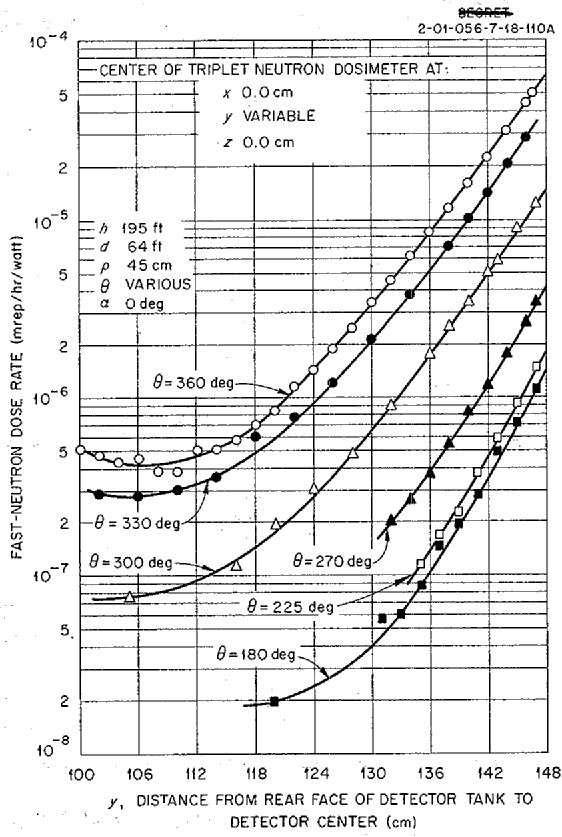  
Fig. 14.6. Fast-Neutron Dose Rates Near the Front of the Detector Tank for Various Angles of $\theta$ ; y Variable.

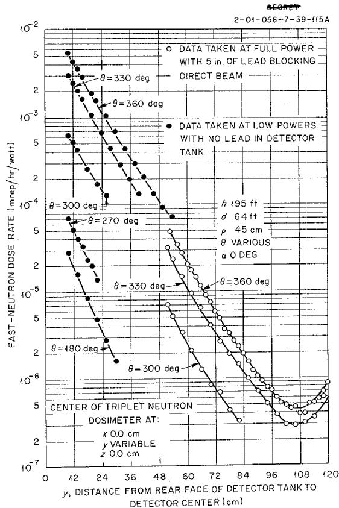  
Fig. 14.7. Fast-Neutron Dose Rates Near the Rear of the Detector Tank for Various Angles of $\theta$ ; y Variable.

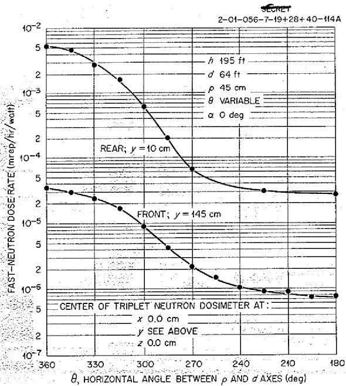  
Fig. 14.8. Fast-Neutron Dose Rates Near the Front and Rear of the Detector Tank; $\theta$ Variable.

Fig. 14.9. Fast-Neutron Dose Rates Near the Rear of the Detector Tank for Three Values of ; y Variable.   
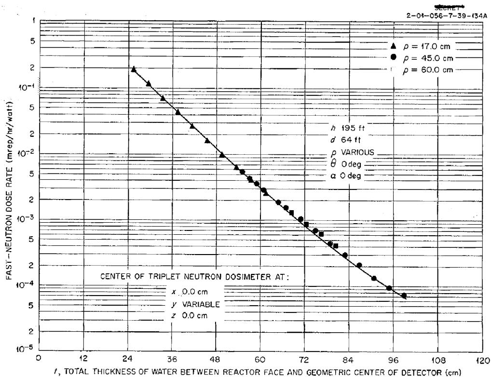  
SECRET 2-01-056-3-T24

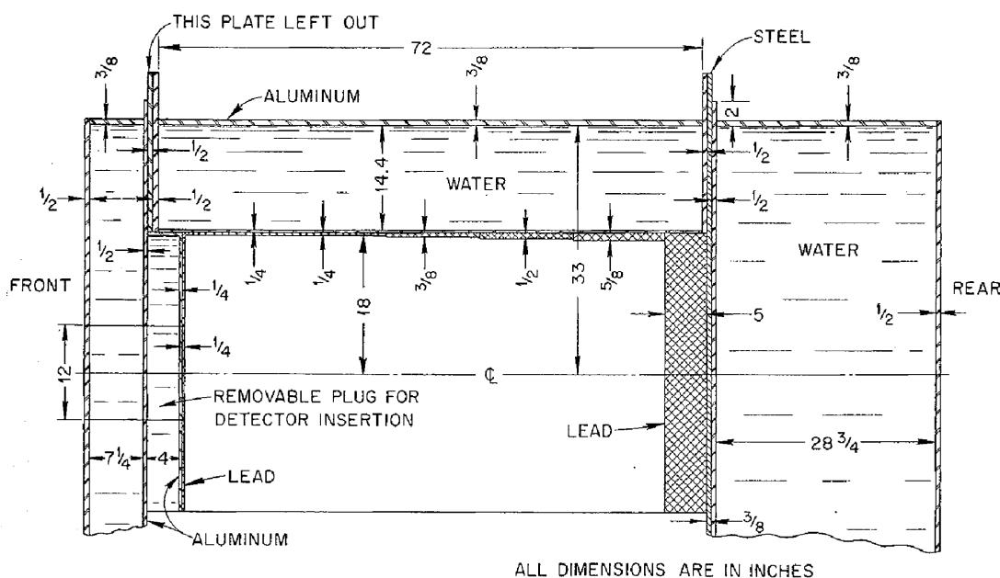  
Fig. 14.10. Schematic Diagram of the GE-ANP Crew Compartment.

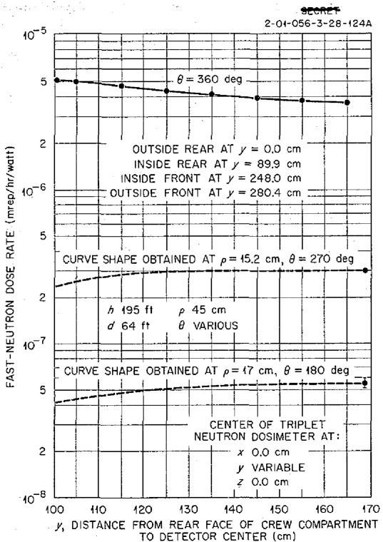  
Fig. 14.11. Fast-Neutron Dose Rates Inside the GE-ANP Crew Compartment for Various Angles of $\theta$ ; y Variable.

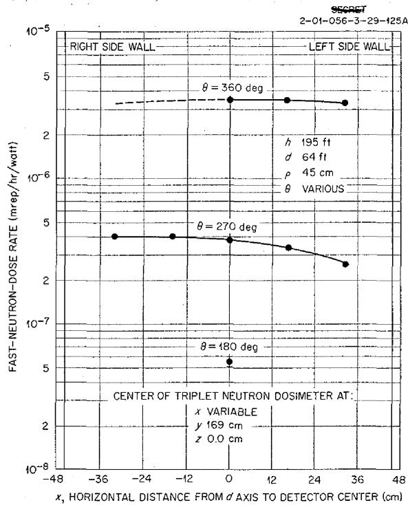  
Fig. 14.12. Fast-Neutron Dose Rates Inside the GE-ANP Crew Compartment for Various Angles of $\theta$ ; $x$ Variable.

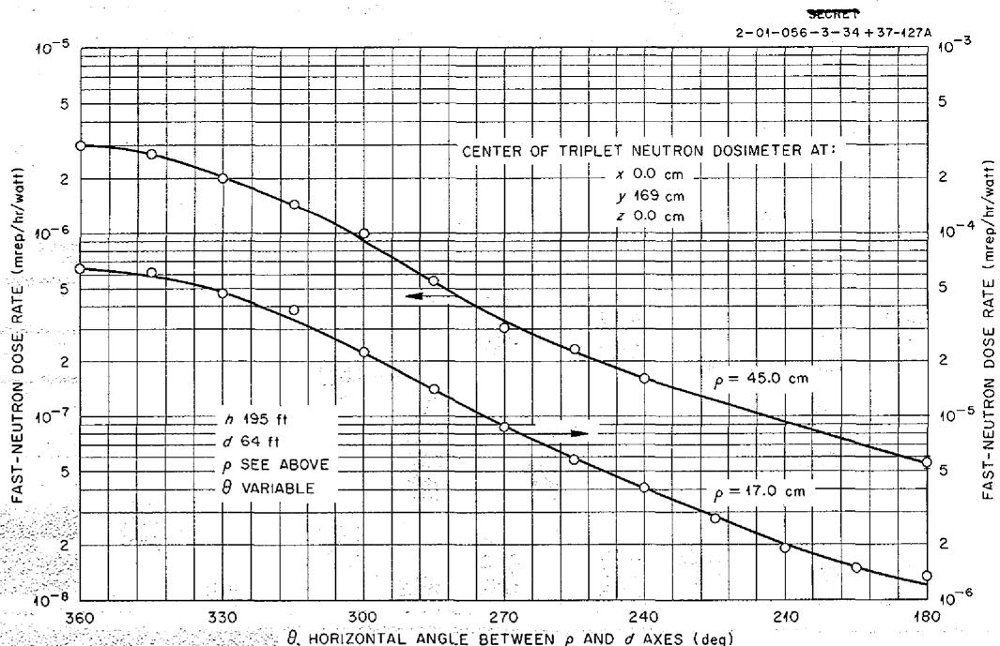  
Fig. 14.13. Fast-Neutron Dose Rates Inside the GE-ANP Crew Compartment for Two Values of $\rho$ ; $\theta$ Variable.

axis. Figure 14.17 defines the dose scattering probability for a conical shell beam. Again, a unit sphere is drawn about the point source. The radia

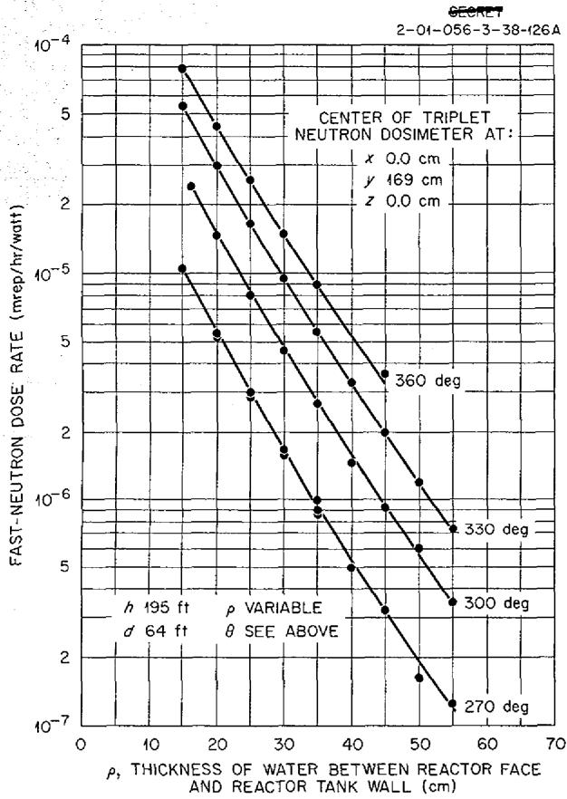  
Fig. 14.14. Fast-Neutron Dose Rates Inside the GE-ANP Crew Compartment for Various Angles of $\theta$ ; $\rho$ Variable.

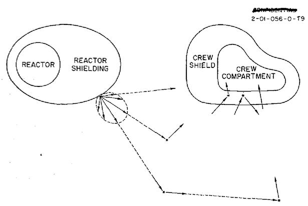  
Fig. 14.15. Radiation Attenuation in the Idealized Aircraft Divided Shield.

tion is emitted from the annular shell contained between two cones which have their common vertex at $S_{1}$ the point source. The conical angle of the shell is $\alpha$ . For this symmetrical case, the dose rate on the unit sphere is independent of the azimuthal angle $\phi_1$ . Correspondingly, the dose rate received at the side of the cylinder is independent of the azimuthal angle $\phi_2$ . The dose scattering probability $P^{s}(\alpha)$ for a conical shell beam is defined by the integral over the azimuthal angle $\phi_1$ of the dose scattering probability for a line beam. Assume $P^{s}(\alpha)$ is known. Let the angular distribution of dose rate on the unit sphere be $D_{e}^{\prime}(\alpha)$ . Then, on the basis of the definition of $P^{s}(\alpha)$ , the dose rate at the side of the cylinder is given by the integration shown in Fig. 14.17.

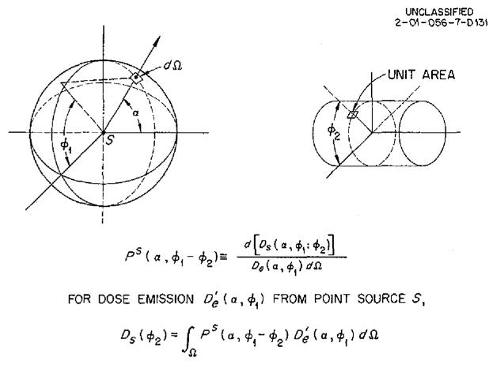  
Fig. 14.16. Probability of the Neutron Dose Scattering.

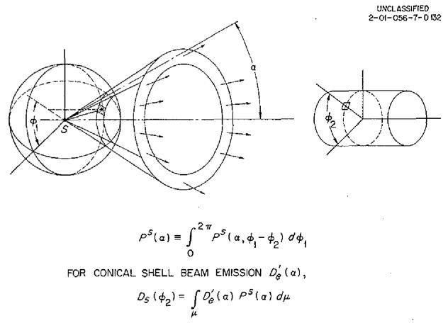  
Fig. 14.17. Probability of the Neutron Dose Scattering for a Conical Shell Beam.

This integral weights the differential dose rate contribution over the unit sphere by the dose scattering probability for a conical beam. The integration is taken with respect to the cosine of the angle $\alpha$ that each conical shell in the beam makes with the reactor crew compartment axis (denoted by symbol $\mu$ on Fig. 14.17).

# Evaluation of Probability from TSF Experiments

Figure 14.18 shows how the dose scattering probability is obtainable from the TSF differential shielding experiments. The experimental fast-neutron beam has an angular spread about its axis of symmetry, as indicated in the figure. Hence, there is obtained from the experiments the line-beam dose scattering probability averaged in some way over the given experimental beam. For the present purpose the TSF beam geometry can best be characterized by the polar angle $\theta$ measured between the reactor crew compartment axis and the

line of symmetry of the beam and by the azimuthal angle $\psi$ which the axis of symmetry of the beam makes with the horizontal plane. By definition, the line-beam dose scattering probability averaged over the experimental beam, denoted by $Ps(\theta, \psi - \phi_2)$ , is simply the dose scattering probability weighted over the dose rate contribution of each differential element of the beam divided by the integrated dose over the experimental beam. The numerator is simply the measured scattered dose rate at the side of the cylinder; this rate is a function of the beam angle $\theta$ and also of the difference between the azimuthal angles of the beam and of the unit area under consideration at the side of the cylinder, that is, of $(\psi - \phi_2)$ . This is converted to the average dose scattering probability for a conical shell beam by integrating over the azimuthal angle $\psi$ of the beam. Because the dose scattering probability is a function of the difference in angles $(\psi - \phi_2)$ , this is equivalent to integrating over angle $\phi_2$ for a fixed angle $\psi$ . Substitution for

UNCLASSIFIED

2-01-056-7-D133

$$
\overline {{P ^ {S} (\theta , \psi - \phi_ {2})}} = \frac {\int_ {\text {B E A M}} P ^ {S} (\alpha , \phi_ {1} - \phi_ {2}) D _ {e} (\alpha , \phi_ {1}) d \Omega}{\int_ {\text {B E A M}} D _ {e} (\alpha , \phi_ {1}) d \Omega} = \frac {D _ {s (\text {M E A S U R E D})} (\theta , \psi - \phi_ {2})}{\int_ {\text {B E A M}} D _ {e} (\alpha , \phi_ {1}) d \Omega}
$$

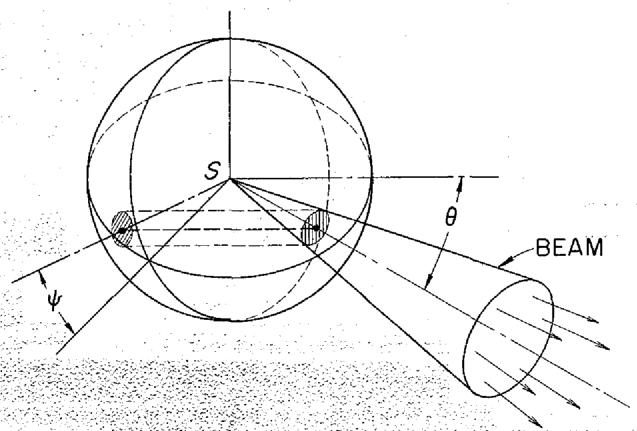

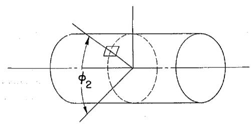  
Fig. 14.18. Relationships for Determining Dose Scattering Probability from TSF Experiments.

$$
\overline {{P ^ {S} (\theta)}} = \int_ {0} ^ {2 \pi} \overline {{P ^ {S} (\theta , \psi - \phi_ {2})}} d \psi = \int_ {0} ^ {2 \pi} \overline {{P ^ {S} (\theta , \psi - \phi_ {2})}} d \phi_ {2} = \frac {\int_ {0} ^ {2 \pi} D _ {S _ {(M E A S U R E D)}} (\theta , \psi - \phi_ {2}) d \phi_ {2}}{\int_ {\mathrm {B E A M}} D _ {e} (\alpha , \phi_ {1}) d \Omega}
$$

$\overline{P^s(\theta,\psi - \phi_2)}$ of the equation at the top of Fig. 14.18 results in the final relation for obtaining, from the experiments, the average dose scattering probability $P^s (\theta)$ for a conical shell beam. The numerator in this relation is the integral of the scattered dose, around the side of the cylinder, with respect to angle $\phi_{2}$ . The denominator is the integral of the direct-beam dose rate emitted from the equivalent point source.

This relationship for conversion of the experimental dose rate measurements to a fundamentally basic probability function is general. It applies not only to the scattered dose rate at the outside surface of the cylinder but also to the dose rate at various depths into the cylinder. In this case the probability function is also a function of the shielding thickness. This relationship is also applicable for the scattered dose rate at the front or rear face of the cylinder or for the scattered dose rate within the crew compartment cavity. The method of evaluation of the scattered dose integral [numerator in the $P^s(\theta)$ relationship] from the detector tank measurements is presented in the following paper. The method of evaluation from the experimental results of the direct-beam dose rate integral [denominator in the $P^s(\theta)$ relationship] is given below.

# Evaluation of Direct-Beam Integral

A plot of the relaxation length of the direct-beam fast-neutron dose rate vs total water thickness between reactor face and detector is given in Fig. 14.19. Because of the large separation distance between the dosimeter and the reactor face in the TSF experiment, the relaxation lengths measured correspond to the point attenuation kernel for the fast-neutron dose rate. For comparison, relaxation lengths obtained from BSF data and corrected for geometry to correspond to a point attenuation kernel are also plotted in Fig. 14.19. The TSF and corrected BSF data agree well in the overlapping region, both as to magnitude and to trend.

The variation of the dose rate measured at the rear of the detector tank as a function of beam angle $\theta$ is shown in Fig. 14.20. The ordinate is the ratio of the dose rate for beam angle $\theta$ to the dose rate for $\theta = 0$ deg, that is, when the reactor is pointed directly at the detector tank. For a given angle $\theta$ , the dosimeter in the detector tank reads the direct-beam dose rate coming off at angle $\theta$ with respect to the line of symmetry of the beam

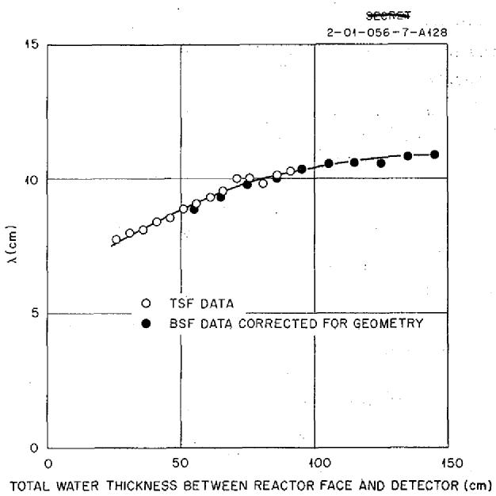  
Fig. 14.19. Relaxation Length $(\lambda)$ for Fast-Neutron Dose.

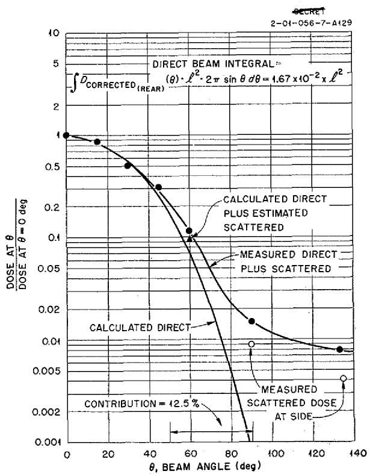  
Fig. 14.20. Angular Distribution of Dose at Rear of Detector Tank $(\rho = 45~\mathrm{cm})$

plus an air-scattered dose rate from the other portions of the beam. At $\theta = 0$ deg the direct-beam dose rate is large, and therefore the scattered dose rate is negligible. As $\theta$ increases, the direct-beam dose rate decreases rapidly, owing to the beam collimation, and the scattered dose rate becomes proportionately larger. In order to evaluate the direct-beam dose rate integral, it is necessary to subtract out the scattered dose rate. The method used was, briefly, the following: The neutron angular emission from the faces of the reactor was assumed to have a cosine distribution. The direct beam from the reactor faces was attenuated along a straight-line path by using the relaxation lengths shown in Fig. 14.19. The results of this procedure for the various angles $\theta$ are shown in Fig. 14.20. The calculated direct-beam curve and the measured direct- plus scattered-beam curve agree well for $\theta$ below about 45 deg, where it is to be expected that the scattering contribution will be relatively small. For $\theta$ greater than about 45 deg the calculated direct-beam dose rate drops rapidly, and, at 90 deg, the direct-beam dose rate is down by a factor of $10^{3}$ . As expected from the geometry, the dose rate measured at $\theta = 90$ deg is an almost totally scattered dose rate. The scattered dose rates measured at the side of the detector tank for $\theta = 90$ and 135 deg are also given in Fig. 14.20. The ratio of rear- to side-scattered dose rates for these two angles is about 1.6. If this ratio is assumed to be valid to $\theta = 60$ deg, an estimate of the rear-scattered dose rate based on the measured scattered dose rate at the side can be made for $\theta = 60$ deg. If this is done and the estimated rear-scattered dose rate at $\theta = 60$ deg is added to the calculated direct-beam dose rate, the result is that given by the point indicated by the triangle symbol in Fig. 14.20. This point falls close to the measured point. Since a consistent picture is obtained, the calculated direct-beam dose rate is used in the evaluation of the direct-beam dose rate integral. Note that the contribution to the integral from 50 to 90 deg is only about $12.5\%$ , and therefore exact shaping of the curve in this region is not important. The direct-beam dose rate integral is given by the expression in Fig. 14.20. It can be noted that $D_{\text{corrected}_{(rear)}}(\theta)$ is the direct-beam dose rate for separation distance $\ell$ of 64 ft. Hence, by the inverse $R^2$ relationship, $D_{\text{corrected}_{(rear)}}(\theta) \times \ell^2$ is the dose rate which would have been obtained on

the surface of a unit sphere drawn about the equivalent point source. The element of solid angle $d\Omega$ is $2\pi \sin \theta d\theta$ . The direct-beam dose rate integral for the TSF experimental beam (at $\rho = 45~\mathrm{cm}$ ) is equal to $1.67 \times 10^{-2} \times \ell^2$ .

# Calculation of Scattered Dose

Figure 14.21 presents a typical plot of $\ell^2 P^s (\theta)$ vs the angle $\theta$ of the conical shell beam. Note that the ordinate is the product of the square of the separation distance by the dose scattering probability for a conical shell beam for this separation distance. The dose scattering probability presented in Fig. 14.21 is for a water thickness $\rho = 45\mathrm{cm}$ at the reactor, a water thickness $t$ into the side of the cylinder of $5.2\mathrm{cm}$ , and a separation

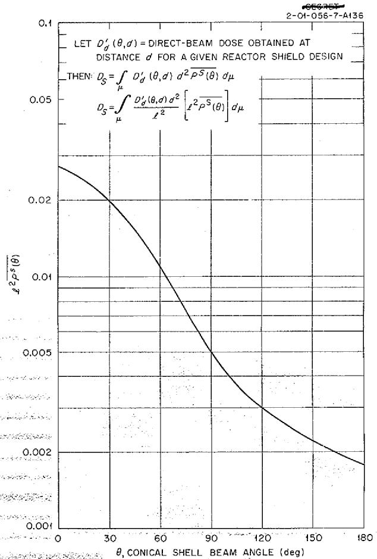  
Fig. 14.21. Dose Scattering Probability for Conical Shell Beam as Obtained from TSF Experiments $(\rho = 45\mathrm{cm}, t = 5.2\mathrm{cm}, l = 64\mathrm{ft})$

distance $\ell$ of 64 ft. The functional dependence of $P^s (\theta)$ on $\rho ,t,$ and $\ell$ should be accounted for in scattered dose rate calculations. In the present experiments a range of values of $t$ is covered for a single separation distance $\ell$ and for a single value of $\rho$ however, some data were obtained with $\rho$ changed from 45 to $15~\mathrm{cm}$ and the effect of this change on the dose scattering probability is discussed later. To illustrate the use of the dose scattering probability for a conical shell beam in the prediction of scattered dose rate, assume that the angular distribution of the dose rate emission from a primary reactor shield is obtained by dose rate measurements at a distance $d$ from the reactor. This dose rate distribution obtained at distance $d$ is denoted as $D_{d}^{\prime}(\theta ,d)$ . Then $D_{d}^{\prime}(\theta ,d)d^{2}$ is the dose rate which would be obtained on the surface of a unit sphere drawn about the equivalent point source. The scattered dose rate is obtained by weighting $D_{d}^{\prime}(\theta ,d)d^{2}$ by the scattering probability $P^s (\theta)$ determined from the differential experiments and integrating with respect to $\mu = \cos \theta$ (first integral in Fig. 14.21). The second integral in Fig. 14.21, which is equivalent to the first, is in terms of the $\ell^2 P^s (\theta)$ used in the plots.

# Effects of Direct-Beam Collimation

Figure 14.22 shows the effect of beam collimation on the dose scattering probability averaged over the beam. These results were obtained from single air-scattering calculations. The beam in the TSF experiments had approximately a $\cos^4$ distribution. The $\cos^8$ and $\cos^{16}$ distributions represent an increasing degree of collimation of the beam. It must be remembered that in the interpretation of the TSF experiments the assumption was made that the dose scattering probability averaged over the TSF experimental beam was equal to the dose scattering probability for a differential beam having an angle $\theta$ equal to the angle of the axis of symmetry of the experimental beam. These results indicate that this assumption is valid within 10 to $15\%$ for beam angles greater than 30 deg. For beam angles between 0 to 30 deg the averaging of the dose scattering probability is quite sensitive to beam collimation, and therefore the experimental results obtained are not valid if any sharp well-defined beams are emitted from the reactor shield in this range of beam angles. Consideration of multiply scattered neutrons in the calculations would have tended to reduce the effect of beam

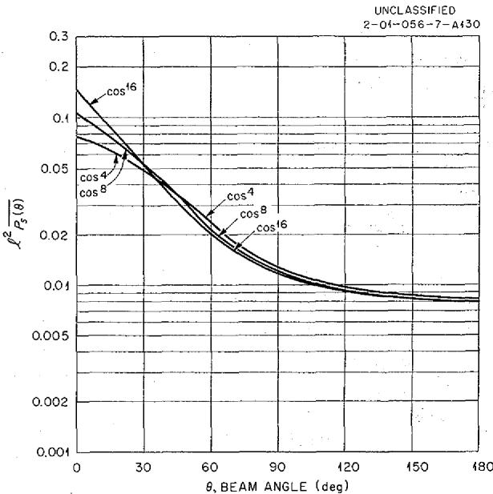  
Fig. 14.22. Effect of Beam Collimation on Scattering Function Based on Single-Scatter Calculation.

collimation shown on this figure because the sources of multiply scattered neutrons are of necessity more diffuse than the sources of singly scattered neutrons.

# Effect of Neutron Energy Spectrum

A small amount of data was also obtained for a water thickness of $15\mathrm{cm}$ at the reactor to obtain an indication of the effect of change in neutron spectrum on the dose scattering probability. Figure 14.23 presents the angular distribution of the dose rate at the rear of the detector tank for $\rho = 15$ cm of water. Again, to obtain the direct-beam dose rate, it is necessary to subtract out the scattered dose rate. The procedure described for the $\rho = 45$ cm case was used, but the results are not nearly so satisfying. The calculated direct-beam dose rate has a flatter distribution than the measured direct plus scattered dose rate in the region of $\theta = 0$ to 45 deg, where the scattered dose rate should be a relatively small contribution. For all the data obtained at $\rho = 45$ cm, both for the direct-beam and scattered dose rates, a plot of the dose rate vs the beam angle always showed a slight dip in the curve in the region of $\theta = 30$ deg. This dip has been attributed to an out-of-roundness

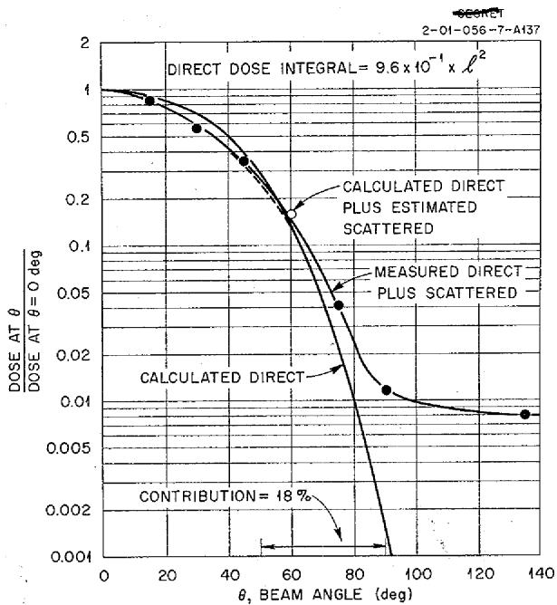  
Fig. 14.23. Angular Distribution of Dose at Rear of Detector Tank $(\rho = 15~\mathrm{cm})$

of the reactor tank. For the 15-cm case, the effect of an out-of-roundness of the reactor tank would be much more pronounced owing to much shorter relaxation lengths. The discrepancy obtained here is believed to be due, in part, to this effect. The direct-beam dose rate integral was obtained from the curve drawn through the data points from 0 to 45 deg and fared into the calculated curve from 60 to 90 deg. The contribution to the direct-beam dose integral of the dose rate from 50 to 90 deg is only about $18\%$ .

Figure 14.24 compares the line-beam dose scattering probability obtained from the TSF measurements for $\rho = 15$ and $45~\mathrm{cm}$ . The dose scattering probability is plotted against water thickness into the side of the detector tank. Extrapolation of both sets of data to zero water thickness gives a comparison of the relative air scattering for the two cases. The energy spectrum for fast neutrons filtered through $15~\mathrm{cm}$ of water is somewhat different from the energy spectrum for neutrons filtered through $45~\mathrm{cm}$ of water. The results shown in Fig. 14.24 indicate that the effect of this difference in energy spectrum on the air-scattering process is not large, the difference in the relative air scattering between the two cases being de

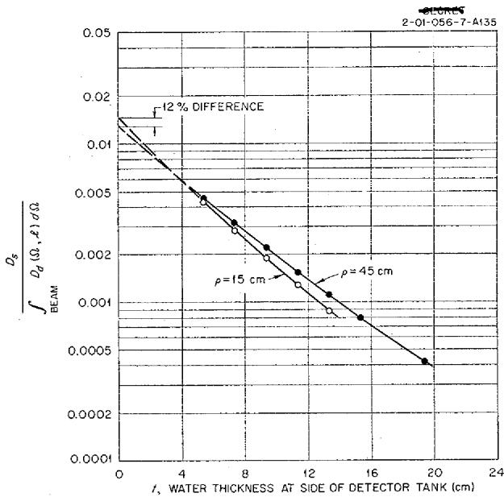  
Fig. 14.24. Effect of $\rho$ (Water Thickness at Reactor) on

$$
\ell^ {2} P ^ {s} \left(\overline {{\theta = 0 , \psi - \phi_ {2} = 0}}\right) = \frac {D _ {s}}{\int_ {\text {B e a m}} D _ {d} (\Omega , \ell) d \Omega}.
$$

terminated as only $12\%$ . However, a rough estimate of the uncertainties in arriving at this percentage difference adds up to the order of $20\%$ . Hence, at least a $\pm 20\%$ figure should be placed alongside the $12\%$ difference indicated. More data for larger water thicknesses at the reactor are needed to definitely tie down this point.

The plot shows that the relaxation length of the scattered neutrons into the side of the detector tank is quite different for the $\rho = 15$ cm case compared with the $\rho = 45$ cm case. Examination of the relaxation lengths for the two cases shows that they are approximately proportional to the relaxation lengths for the direct-beam dose. More data are needed to definitely tie down this apparently simple relationship.

# APPLICATION OF THE DIFFERENTIAL SHIELDING EXPERIMENTS

J. E. Van Hoomissen

The knowledge gained from the first data of the differential experiments (see preceding discussion, "The Differential Shielding Experiments at the TSF: Phase I") has made possible a more detailed

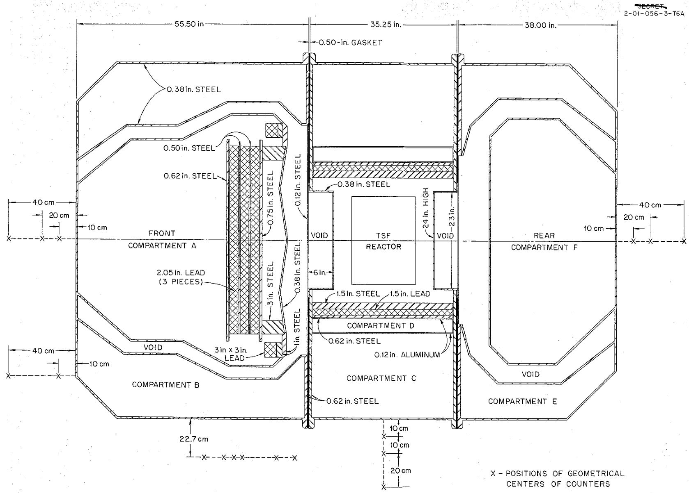  
ANP PROJECT PROGRESS REPORT   
Fig. 14.25. Mockup of G-E R-1 Shield.

analysis of the measurements taken in the divided-shield mockup experiment reported earlier.3 It also serves as a basis for a prediction of the results of future mockup experiments. It is the purpose of this paper to correlate the results, to date, of the mockup experiment and the differential experiments and to outline the procedures for future predictions.

In the mockup experiment the reactor was encased in the R-1 shield (Fig. 14.25), and measurements were made with a fast-neutron dosimeter along the $x$ axis in the detector tank. The experimental values obtained in that experiment are compared with values predicted by applying the data differential and the procedures given in the two preceding papers.

Since the differential experiment includes $x$ traverses across the detector tank and $z$ traverses up and down in the tank, the extrapolation of the dose rate measurements to the surface of the four faces of the tank would give dose rates (Fig. 14.18) from a line beam4 emitted at a given $\theta$ as a function of the angle $\phi_{2}$ (Fig. 14.26). The integration of the area under the curve in Fig. 14.26 would then be equivalent to the dose rate at a point on the surface of the cylindrical crew compartment from a conical shell beam at the same value of $\theta$ . A plot of a series of these integrated dose rates as a function of water thickness of a cylindrical crew compartment side shield can then be made for $\theta = 0, 30, 60, 90, 135$ , and 180 deg, for which experimental data are available. A composite plot (Fig. 14.27) shows the actual attenuation curves that should be used in designing a cylindrical crew compartment.

The average relaxation length of the curves in Fig. 14.27 varies from $6.4\mathrm{cm}$ for $\theta = 0$ deg to 5.9 cm for 180 deg. Since the direct beam was the same for all the differential experiments used in the construction of the plots in Fig. 14.27, all points on the plot should be divided by 1.67 $\times 10^{-2}$ mrep/hr/w, the results of the direct-beam integration (Fig. 14.20), to give the scattered dose normalized to one unit of dose rate measured at 64 ft and emitted at any angle $\theta$ . These curves thus adjusted are plots of $\ell^2 P^s (\theta)$ , as defined in the preceding paper. The fast-neutron dose rate penetrating a given thickness in the side of a

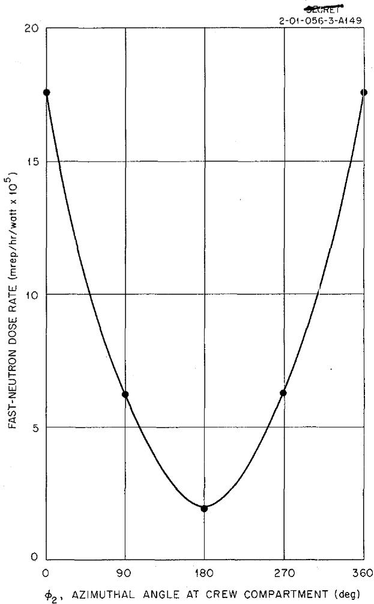  
Fig. 14.26. Fast-Neutron Dose Rate from a Line Beam as a Function of $\phi_{2}$ for $\theta = 60$ deg, $\rho = 45$ cm, $t = 0$ .

cylindrical crew compartment, or the equivalent thickness in the side of the detector tank, for a unit dose rate emitted in a conical shell beam at any angle $\theta$ can be deduced from Fig. 14.27.

Since the dose rate emitted at each angle $\theta$ from the R-1 mockup is also known, it is possible to reconstruct the $x$ traverses made in the detector tank with the reactor in the R-1 mockup. As can be seen in Fig. 14.25, the neutron shielding around the reactor varies markedly from the front to the rear. Hence the number of neutrons leaving the reactor shield depends strongly on the angle $\theta$ . A comprehensive experiment is now under way at the TSF to determine this angular distribution, that is, the fast-neutron dose rate leaving the

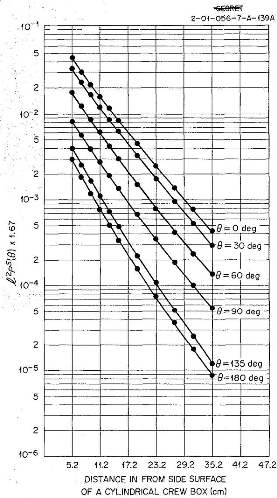  
Fig. 14.27. $\ell^2 P^s (\theta)$ for a Conical Shell Beam as a Function of Water Thickness at the Side of Cylindrical Crew Compartment for Various Angles of $\theta$ and for $\rho = 45$ deg and $\ell = 64$ ft.

shield as a function of angle $\theta$ ; in the meantime, a preliminary measurement of this distribution (Fig. 14.28) is used in this analysis as the best available data.

At a given water thickness the values of dose rate as a function of $\theta$ can be read from Fig. 14.27. These points - an example for a given water thickness is shown in Fig. 14.29 - are plotted, and a smooth curve is drawn between the points. This shows the dose rate to be expected at a given water

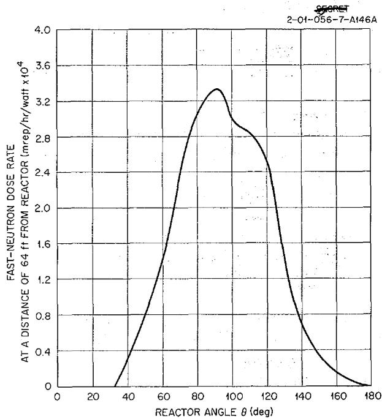  
Fig. 14.28. Estimation of Fast-Neutron Dose Rate at 64 ft from Reactor Encased in R-1 Mockup as a Function of Reactor Angle $\theta$ .

thickness from a conical shell beam at any angle $\theta$ . This distribution is weighted by the angular distribution of the mockup and integrated to determine the total dose rate to be expected at a given water thickness in from the side of a detector tank. A plot of the total dose rate at a given water thickness as a function of $\theta$ for the R-1 mockup is given in Fig. 14.30. This process was repeated for several different water thicknesses at the detector tank, and the results, along with the experimentally measured values, are shown in Fig. 14.31. In general, the agreement is good. The apparent disagreement can be attributed to three factors, the first of which is the uncertainty of the angular distribution of the fast-neutron dose rate emitted from the R-1 mockup. This uncertainty, possibly the largest contributor to the disagreement, will be cleared up by future experimentation. The second factor contributing to the disagreement is the low count rate encountered in the actual R-1 experiment. The third factor is the lack of complete collimation of the direct or unscattered beam in the differential experiment, as pointed out in the preceding paper.

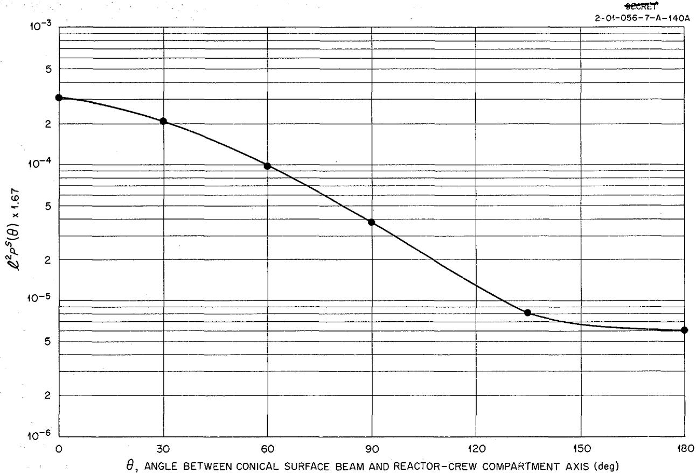  
Fig. 14.29. $\ell^2 P^s (\theta)$ at a Point $37.5\mathrm{cm}$ in from Surface of Cylindrical Crew Compartment as a Function of Reactor Angle $\theta$ for $\rho = 45$ deg and $\ell = 64$ ft.

The method to be used in reaching a prediction of the dose rate to be expected in the crew compartment with the reactor in the R-1 mockup can now be illustrated. Up to this point the discussion has been limited to measurements made in the detector tank. In order to make the above results useful, a method must be devised to convert from detector tank measurements to measurements in the cavity of a cylindrical crew compartment. Calculations by Faulkner have shown that the ratio of the dose rate measured at the center of the cavity to the source strength at the surface of the cavity (that is, with no void present) is 4 if the angular distribution at the surface is assumed to be a cosine of the angle measured from the normal. This ratio is 5.3 for a $\cos^3$ distribution and 6.5 for a $\cos^5$ distribution. The differential experiments in which the TSF reactor was placed in the reactor

tank and measurements were made in the cavity of the GE-ANP crew compartment mockup allow an estimate of this ratio to be made experimentally. The dose rate at a given water thickness at the side of the cylindrical crew compartment (Fig. 14.28) from a conical shell beam at the angle $\theta$ can be obtained and is assumed to be the source strength. From the experiment (Fig. 14.12) the dose rate at the center of the cavity from a line beam at the angle $\theta$ is known. This experimental value is adjusted to the corresponding value (that is, it is multiplied by $2\pi$ ) at the center of the cavity for a conical shell beam based on the procedure outlined in the preceding paper. Now, both the dose rate at the center and the source strength at the surface of the cavity for a conical shell beam at the angle $\theta$ have been determined. The ratio of these values for different angles of $\theta$ (Table 14.1) is shown to be effectively a constant with an average value of 5.1. This indicates that the

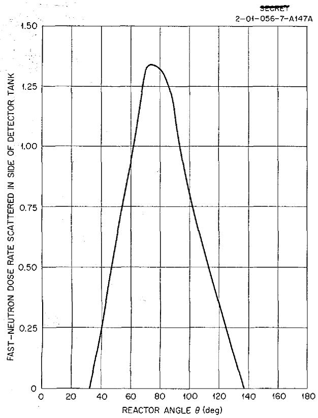  
Fig. 14.30. Fast-Neutron Dose Rate Scattered in Side of Detector Tank as a Function of Reactor Angle $\theta$ (Reactor in R-I Shield, $t = 10.2\mathrm{cm}$ ).

angular distribution of the neutrons leaving the inside surface of the crew compartment can be assumed to be the $\cos^3$ of the angle measured from the normal to the surface. This picture, along with Faulkner's work, neglects any neutrons that might go across the cavity and be reflected back into it. This should be a small contribution to the source strength, on the order of $10\%$ , if an albedo of $\frac{1}{10}$ is assumed.

The dose rate at the center of the cavity of the cylindrical crew compartment with the reactor encased in the R-1 shield mockup can now be predicted. The source strength at the surface of the cavity is found by making a calculation as outlined above except that a water thickness equal to the side shielding of the crew compartment mockup is chosen. This source strength is integrated (multiplied by a factor of 5.1) to give the contribution to the dose rate at the center of the crew

TABLE 14.1. RATIO OF DOSE RATE AT CENTER OF CREW COMPARTMENT CAVITY TO DOSE RATE AT INSIDE SURFACE AS A FUNCTION OF $\theta$   

<table><tr><td>θ(deg)</td><td>Corrected Dose Rate at Center of Cavity (mrep/hr/w)</td><td>Dose Rate at Surface of Cavity (mrep/hr/w)</td><td>Ratio*</td></tr><tr><td>0</td><td>1.55 × 10-5</td><td>3.14 × 10-6</td><td>4.85</td></tr><tr><td>30</td><td>1.08 × 10-5</td><td>2.10 × 10-6</td><td>5.14</td></tr><tr><td>60</td><td>5.30 × 10-6</td><td>9.70 × 10-7</td><td>5.46</td></tr><tr><td>90</td><td>1.86 × 10-6</td><td>3.80 × 10-7</td><td>4.89</td></tr><tr><td>180</td><td>3.15 × 10-7</td><td>6.00 × 10-8</td><td>5.25</td></tr></table>

*Average value of ratio = 5.12.

compartment mockup from neutrons scattered through the side of the compartment.

The dose rate contribution at the center of the cavity resulting from neutrons entering the rear and the front of the crew compartment can also be found from the differential data by using the $y$ traverses for a line beam at a given $\theta$ (Figs. 14.3 and 14.4). This is converted to data for a conical shell beam by multiplying by $2\pi$ . This gives the dose rate at a given water thickness in the front or the rear of the crew compartment as a function of the angle $\theta$ . Again, by weighting these distributions by the angular distribution of the R-1 mockup, the source strength at the inner surface at the front and rear of the crew compartment can be found. An angular distribution of emission from the inner surface must be assumed and an integration performed to find the dose rate at the center of the cavity. A good approximation is to again use a $\cos^3$ distribution for the front of the crew compartment, but for the rear the distribution will be closer to a cosine distribution because of the existence of thick lead. The three component parts of the dose rate at the center of the cavity (the neutrons scattered in the side, the rear, and the front) are then added. This prediction will be completed when a more exact measurement of the angular distribution of neutrons leaving the R-1 mockup has been made.

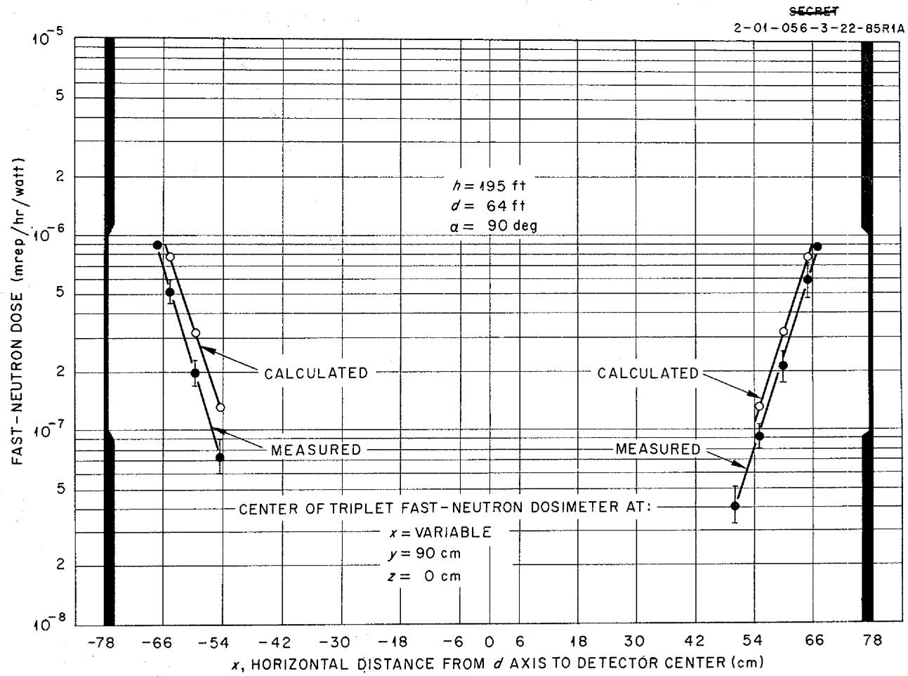  
Fig. 14.31. Fast-Neutron Dose Rate Along $x$ Axis of Detector Tank.

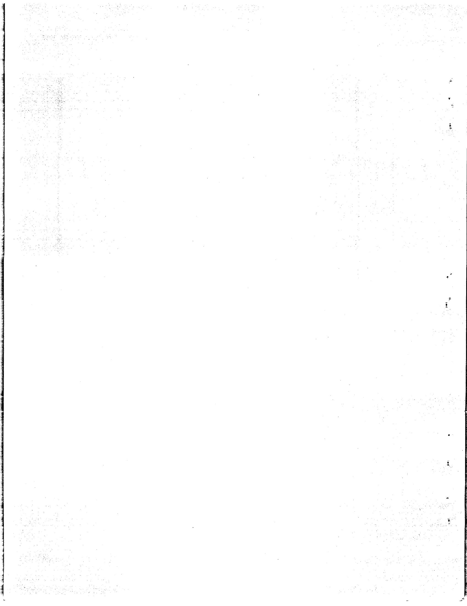

Part IV

APPENDIX

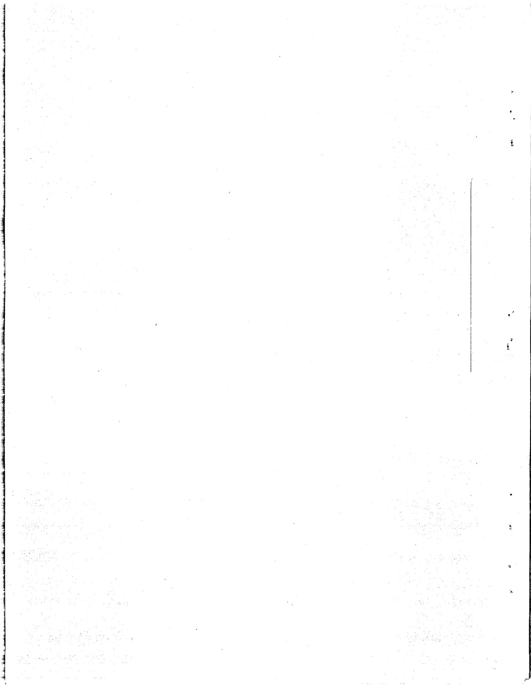

15. LIST OF REPORTS ISSUED FROM FEBRUARY 1955 THROUGH MAY 11, 1955   

<table><tr><td>REPORT NO.</td><td>TITLE OF REPORT</td><td>AUTHOR(s)</td><td>DATE OF DOCUMENT</td></tr><tr><td colspan="4">I. Reflector-Moderated Reactor</td></tr><tr><td>CF-55-2-142</td><td>Vertical Component of Fuel Forces on 
Reflector and Island</td><td>H. C. Hopkins</td><td>3-2-55</td></tr><tr><td>CF-55-3-161</td><td>Gamma and Neutron Heating of the ART 
Fuel Pump Assembly</td><td>L. T. Anderson</td><td>3-28-55</td></tr><tr><td>CF-55-3-167</td><td>Circulating-Fuel-Reactor-Powered 
Ramjet</td><td>W. T. Furgerson, 
H. C. Hopkins</td><td>3-24-55</td></tr><tr><td>CF-55-3-191</td><td>Fission Product Heating in the Off-Gas 
System of the ART</td><td>C. S. Burtnette</td><td>3-28-55</td></tr><tr><td>CF-55-4-34</td><td>Empirical Correlation for Fatigue 
Stresses</td><td>A. S. Thompson</td><td>4-5-55</td></tr><tr><td>CF-55-4-44</td><td>Allowable Operating Conditions</td><td>A. S. Thompson</td><td>4-11-55</td></tr><tr><td>CF-55-4-83</td><td>High Temperature Valve Information 
Summary</td><td>V. J. Kelleghan</td><td>4-5-55</td></tr><tr><td>CF-55-4-87</td><td>ART Design Data</td><td>E. S. Bettis</td><td>4-18-55</td></tr><tr><td>CF-55-4-116</td><td>The ART Off-Gas System</td><td>W. B. Cottrell</td><td>4-21-55</td></tr><tr><td>CF-55-4-124</td><td>Flexible Mounting Systems</td><td>A. S. Thompson</td><td>4-11-55</td></tr><tr><td>CF-55-4-159</td><td>Thermal Stresses in Tube-Header 
Joints</td><td>A. S. Thompson</td><td>4-25-55</td></tr><tr><td>CF-55-5-76</td><td>Calculation of the Beryllium Contri-
bution to the ART Temperature 
Coefficient of Reactivity</td><td>L. T. Anderson</td><td>5-11-55</td></tr><tr><td>CF-55-5-93</td><td>Surface-Volume Ratios for Five 
Different Fluoride Fuel Systems</td><td>T. J. Balles</td><td>5-12-55</td></tr><tr><td colspan="4">II. Experimental Engineering</td></tr><tr><td>CF-55-2-100</td><td>ART Reactor Accidents Hazards Tests</td><td>L. A. Mann</td><td>2-11-55</td></tr><tr><td colspan="4">III. Critical Experiments</td></tr><tr><td>CF-55-2-93</td><td>Three Region Reflector Moderated 
Critical Assembly with 1/8 in. Inconel 
Core Shells</td><td>R. M. Spencer</td><td>2-14-55</td></tr><tr><td>CF-55-4-84</td><td>Evaluation of Reactivity Character-
istics of Control Rods and Materials 
Potentially Suitable for Use in the 
ART. Part II</td><td>J. W. Noaks</td><td>4-13-55</td></tr><tr><td>CF-55-4-137</td><td>Evaluation of ART Control Rod Ma-
terials. Part III: The Effect of 
Neutron Irradiation on Some Rare 
Earth Samples</td><td>J. W. Noaks</td><td>4-25-55</td></tr></table>

REPORT NO. TITLE OF REPORT AUTHOR(s) DATE OF DOCUMENT

CF-55-4-178 Evaluation of ART Control Rod Materials. Part IV: The Variation of Reactivity with Control Rod Diameter J.W.Noaks 4-29-55

# IV. Chemistry

CF-55-4-18 Solubility of Composition 30 in Water J.C. White 4-4-55

# V. Corrosion

CF-55-2-79 Data and Results of ARE Corrosion Capsules R. Baldock 2-15-55

CF-55-3-157 Examination of First Three Large G. M. Adamson, Fluoride Pump Loops R. S. Crouse 3-24-55

CF-55-3-179 Examination of Inconel-Fluoride 30-D G. M. Adamson, Pump Loop Number 4695-1 R. S. Crouse, P. G. Smith 3-28-55

CF-55-4-167 Examination of Sodium-Inconel Pump G.M. Adamson, Loop 4689-4 R.S.Crouse 4-21-55

CF-55-4-181 Examination of Fluoride Pump Loops G.M. Adamson, 4930-A and 4935-1 R.S.Crouse 4-26-55

# VI. Heat Transfer and Physical Properties

CF-55-2-89 Measurement of the Viscosities of S.I.Cohen, Composition 35 and Composition 74 T.N.Jones 2-15-55

CF-55-2-148 Electrical Heating and Flow in Tube Bends H.W.Hoffman, L.D.Palmer, N.D.Greene 2-22-55

CF-55-3-15 Qualitative Velocity Profiles with G. L. Muller, Rotation in 18 Inch ART Core J. O. Bradfute 3-1-55

CF-55-3-47 Heat Capacity of Lithium Hydride W. D. Powers, G.C.Balock 3-7-55

CF-55-3-61 Measurement of the Viscosity of S. I. Cohen, Composition 72 T. N. Jones 3-8-55

CF-55-3-62 Measurement of the Viscosity of S. I. Cohen, Composition 30 T. N. Jones 3-9-55

CF-55-3-137 Measurement of the Viscosity of S. I. Cohen, Composition 43 T. N. Jones 3-16-55

CF-55-3-174 Status Report on Forced Convection H. F. Poppendiek, Experimental Work in Converging and N. D. Greene 3-24-55 Sources in the Fluids

CF-55-4-32 Measurement of the Viscosity of S.I.Cohen, Composition 2 T.N.Jones 4-1-55

<table><tr><td>REPORT NO.</td><td>TITLE OF REPORT</td><td>AUTHOR(s)</td><td>DATE OF DOCUMENT</td></tr><tr><td colspan="4">VII. Radiation Damage</td></tr><tr><td>CF-55-2-36</td><td>The Fate of Certain Fission Products in the ARE</td><td>M. T. Robinson, S. A. Reynolds, H. W. Wright</td><td>2-7-55</td></tr><tr><td>CF-55-4-16</td><td>Ru Deposition in In-Pile Loop</td><td>M. T. Robinson</td><td>4-5-55</td></tr><tr><td>CF-55-5-22</td><td>A Theoretical Treatment of Xe135 Poisoning in the ARE and the ART</td><td>M. T. Robinson</td><td>5-2-55</td></tr><tr><td colspan="4">VIII. Shielding</td></tr><tr><td>CF-55-2-111</td><td>Calibration of the Revelet, a Remotely Variable Lead-Transmission Gamma-Ray Dosimeter</td><td>D. L. Gilliland</td><td></td></tr><tr><td>CF-55-4-122</td><td>Spectrometer Measurements of Fission Product Gamma Rays for the CFR</td><td>E. P. Blizzard</td><td>4-21-55</td></tr><tr><td colspan="4">IX. Miscellaneous</td></tr><tr><td>ORNL-1864</td><td>Aircraft Nuclear Propulsion Project Quarterly Progress Report for Period Ending March 10, 1955</td><td>A. W. Savolainen (ed.)</td><td>4-13-55</td></tr></table>

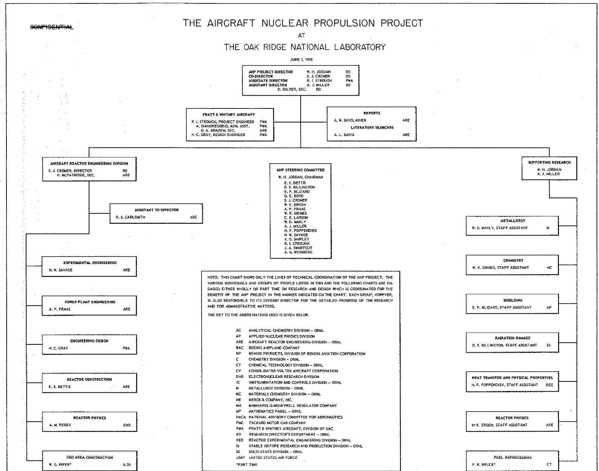

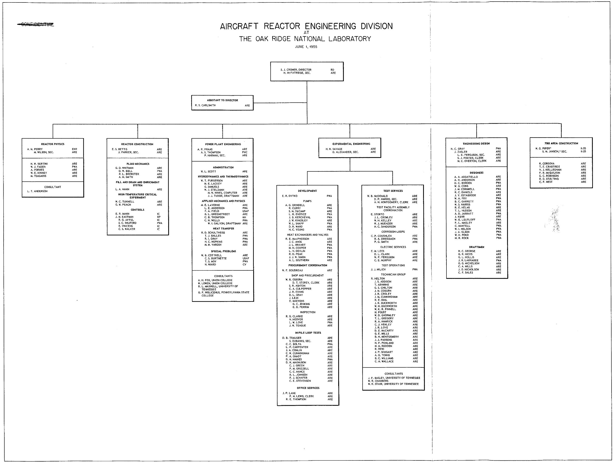

# THE AIRCRAFT NUCLEAR PROPULSION PROJECT

# THE OAK RIDGE NATIONAL LABORATORY

JUNE 1,1955

SUPPORTING RESEARCH

W.H.JORDAN

A.J.MILLER

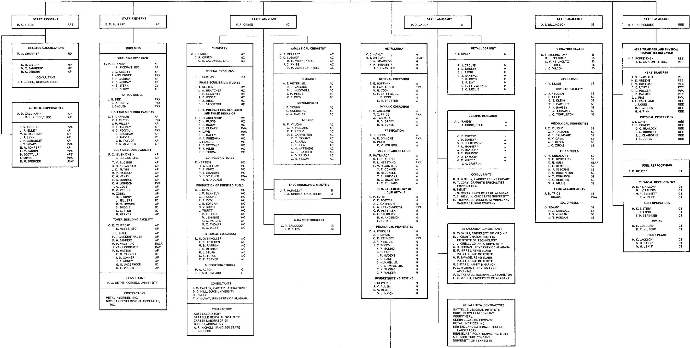