# AEC RESEARCH AND DEVELOPMENT REPORT

CENTRAL RESEARCH LIBRARY DOCUMENT COLLECTION

LIBRARY LOAN COPY

DO NOT TRANSFER TO ANOTHER PERSON

If you wish someone else to see this document, send in name with document and the library will arrange a loan.

A THEORETICAL STUDY OF $Xe^{135}$ POISONING KINETICS IN

FLUID-FUELED, GAS-SPARGED NUCLEAR REACTORS

M. T. Robinson

CLASSIFICATION CHANGES TO

BY A U T E S

$\therefore {a}_{1} = 2,{a}_{n + 1} = \frac{1}{\left( {{2n} + 1}\right) \left( {{a}_{n} - 1}\right) }$

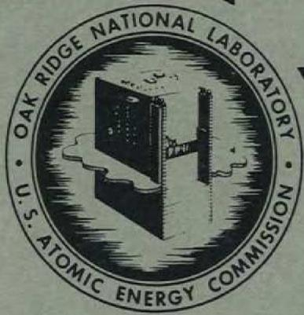

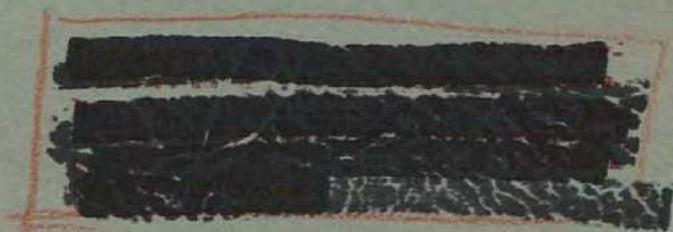

OAK RIDGE NATIONAL LABORATORY

OPERATED BY

UNION CARBIDE NUCLEAR COMPANY

A Division of Union Carbide and Carbon Corporation

UCC

POST OFFICE BOX P · OAK RIDGE, TENNESSEE

Contract No. W-7405-eng-26

SOLID STATE DIVISION

A THEORETICAL STUDY OF $Xe^{135}$ POISONING KINETICS IN

FLUID-FUELED, GAS-SPARGED NUCLEAR REACTORS

M. T. Robinson

DATE ISSUED

FEB 6 1956

OAK RIDGE NATIONAL LABORATORY

Operated by

UNION CARBIDE NUCLEAR COMPANY

A Division of Union Carbide and Carbon Corporation

Post Office Box P

Oak Ridge, Tennessee

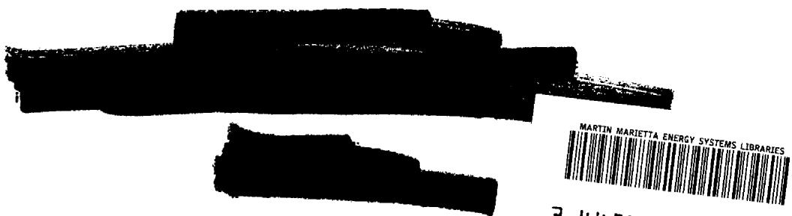

# ANP AUTHORIZATION REQUIRED ORNL-1924

Reactors-Aircraft Nuclear Propulsion Systems 5679 (17th ed.)

# INTERNAL DISTRIBUTION

1. R.G.Affel   
2. C. R. Baldock   
3. C. J. Barton   
4. C. D. Baumann   
5. R. G. Berggren   
6. J. O. Betterton, Jr.   
7. D. S. Billington   
8. D. Binder   
9. F. F. Blankenship   
10. T. H. Blewitt   
11. E. P. Blizzard   
12. C. D. Bopp   
13. C. J. Borkowski   
14. G.E. Boyd   
15. M. A. Bredig   
16. H. Brooks (consultant)   
17. W.E. Browning   
18. F. R. Bruce   
19. W. E. Brundage   
20. A. D. Callihan   
21. D. W. Cardwell   
22. J.V.Cathcart   
23. C. E. Center   
24. R. A. Charpie   
25. J. W. Cleland   
26. G. H. Clewett   
27. C. E. Clifford   
28. A. F. Cohen   
29. J. H. Coobs   
30. W. B. Cottrell   
31. D. D. Cowen   
32. J. H. Crawford,   
33. S. Cromer   
34. R. S. Crouse   
35. F. L. Culler   
36. J. E. Cunningham   
37. J. B. Dee   
38. J. H. DeVan   
39. R. R. Dicki   
40. S. E. Discrete   
41. D. A. Douglas   
42. E. R. Dy   
43. L. E. Erwin (K-25)  
44. M. J. Feinman

45. D' E. Ferguson   
46. P. Fraas   
47. J. H. Frye, Jr.   
48 W. T. Furgerson   
J. L. Gabbard   
50. H. C. Gray   
51. R. J. C   
52. W. R. Grimes   
53. W. O. Harms (consultant)   
54. C. S. Harrill   
55. E. E. Hoffman   
56. A. Hollgender   
57. D. K. Holmes   
58. A. S. Householder   
59. J. T. Howe   
60. L. K. Jetter   
61. R. J. Jones   
62. W. H. Jordan   
63. G. W. Keilholtz   
64. C. P. Keim   
65. M. T. Kelley   
66. R. H. Kernohan   
67. F. Kertesz   
68. E. M. King   
69. H. V. Klaus   
70. G.E.Klein   
71. J. A. Lane   
72. T. A. Lincoln   
73. S. C. Lind   
74. R. S. Livingston   
75. R. N. Lyon   
76. H. G. MacPherson (consultant)   
77. F. C. Maienschein   
78. W. D. Manly   
79. E. R. Mann   
80. L. A. Mann   
81. W. B. McDonald   
82. F. W. McQuilkin   
83. R. V. Meghreblian   
84. A. J. Miller   
85. E.C.Miller   
6. J. G. Morgan   
187. K. Z. Morgan,   
88.E.J.Murphy

89. J. P. Murray (12)   
90. G. J. Nessle   
91. R. B. Oliver   
92. P. Patriarca   
93. W. W. Parkinson   
94. R.W.Peelle   
95. A. M. Perry   
96. W.G.Piper   
97. H. F. Poppendiek   
98. P. M. Reyling   
99. M. T. Robinson   
100. H. W. Savage   
101. A. W. Savolainen   
102. R. D. Schultheiss   
103. H. C. Schweinler   
104. F. Seitz (consultant)   
105. E. D. Shipley   
106. A. Simon   
107. O. Sisman   
108. M. J. Skinner   
109. G.P. Smith   
110. A. H. Snell   
111. R. L. Sproull (consultant)   
112. E. E. Stansbury   
113. D. K. Stevens   
114. W. J. Sturm   
115. C. D. Susano   
116. J. A. Swartout

117. E. H. Taylor   
118. D. B. Fauger   
119. J. B. Price   
120. E. F.Van Artsdalen   
121. F. Z. VonderLage   
122. J.M. Warde   
123. M. Watson   
124. E.C. Webster   
125. M. S. Wechsler   
126 R. A. Weeks   
127 A. M. Weinberg   
13. J.C. White   
19. G. D. Whitman   
30. E. P. Wigner (consultant)   
31. G.C.Williams   
132. W. R. Willis   
133. J. C. Wilson   
134. C. E. Winters   
135. M. C. Wittels   
136. Biology Library   
138. Central Research Library   
139. Health Physics Library   
142. Laboratory Records Department   
143. Laboratory Records, ORNL R.C.   
144. ORNL - Y-12 Technical Library, Document Reference Section   
145. Reactor Experimental Engineering Library

# EXTERNAL DISTRIBUTION

146. AF Pla R Reprentative, Baltimore   
147. AF PIit Representatie, Burbank   
148. AF Point Representations, Marietta   
149. AF Plant Representativ, Santa Monica   
150. AF Plant Representative, Seattle   
151. AFPlant Representative Wood-Ridge   
152. Air Research and Development Command (RDGN)   
153. A Research and Development Command (RDZPA)   
154. Art Technical Intelligence Center   
155. Airl University Library   
156. Aircraft Laboratory Design Branch (WADC)

157-159. INP Project Office, Fort Worth

160. Argonne National Laboratory   
161. Armed Forces Special Weapon Project, Sandia   
162 Assistant Secretary of the Air Force, R&D

163-168 Atomic Energy Commission, Washington

169 Bureau of Aeronautics   
170. Bureau of Aeronautics General Representative   
171. Chicago Operations Office

172. Chicago Patent Group

173-174. Chief of Naval Research

175. Convair-General Dynamics Corporation   
176. Director of Laboratories (WCL)   
177. Director of Requirements (AFDRQ)   
178. Director of Research and Development (AFDRD-ANP)

179-181. Directorate of Systems Management (RDZ-ISN)

182-184. Directorate of Systems Management (RDZ-ISS)

185. Equipment Labora (W, DC)

186-189. General Electric Company (ANPD)

190. Hartford Area Office   
191. Headquarters, Air Force Special Weapons Center   
192. Lockland Area Office   
193. Los Alamos Scientific Laboratory   
194. Materials Laboratory, 12th Office (WADC)   
195. National Advisory, 1st Ave for Aeronautics, Cleveland   
196. National Advisors Committee for Aeronautics, Washington   
197. North American Association, Inc. (Aerophysics Division)   
198. Nuclear Development Corporation   
199. Patent Branch, Washington

200-202. Power Plant Laboratory (WPC)

203-206. Pratt and Why Aircraft Division (Fox Project)

207. Sandia Corporation   
208. School of Addiction Medicine   
209. USAF Project/Rand   
210. University of California Radiology Laboratory, Livermore

211-213. Wright Air Development Center (COSI-3)   
214-219. Technical Information Service, Elk Ridge   
220. Division of Research and Development, AEC, ORO

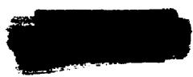

# CONTENTS

1. Introduction 1   
2. Derivation of the Differential Equations 1   
3. Relations Between the Various Phase-Transfer Rate Constants 4   
4. Solution of the Differential Equations 6   
5. Steady-State Operation of a Reactor 9   
6. Kinetics of Xe135 Poisoning in the ARE 12   
7. Kinetics of Xe135 Poisoning in the ART 15   
8. Kinetics of Xe135 Poisoning During Shutdowns 18   
9. Nomograms for Xenon-Poisoning Calculations 18

# A THEORETICAL STUDY OF $X_{e}^{135}$ POISONING KINETICS IN FLUID-FUELED,

# GAS-SPARGED NUCLEAR REACTORS

M. T. Robinson

# 1. INTRODUCTION

One of the substantial advantages claimed for liquid fuels in very-high-power nuclear reactors is the easy removal of $Xe^{135}$ from the fuel, with the consequent gains in neutron economy. This claim is at least partly supported by operating experience with the ARE. This report is concerned with a theoretical study of the kinetics of $Xe^{135}$ poisoning in a reactor in which this volatile poison is continuously removed by a stream of sparging gas. The theory is applied to the experience with the ARE and is used to make predictions for the ART. Some comments on full-scale aircraft power plants are also included.

The system is assumed to consist of two phases: the liquid fuel and the sparging gas. The theory is concerned only with volume-averaged concentrations and neutron fluxes. Turbulent motion of the two fluids is held to assure thorough mixing within each phase. The appropriate differential equations which describe the behavior of the poisoning in such a system are derived and solved. Steady-state behavior during high-power operation of the reactor is discussed. Detailed kinetics of the poisoning during the approach to steady state are studied through a series of calculations performed on the Oracle. A brief discussion of shutdown behavior follows. A final section presents a rapid approximate method for calculating $Xe^{135}$ poisoning in gas-sparged fluid-fueled reactors.

# 2. DERIVATION OF THE DIFFERENTIAL EQUATIONS

The volume-averaged concentration of $Xe^{135}$ in the fuel of a fluid-fueled nuclear reactor changes because of a number of different processes, as shown schematically in Fig. 1. These

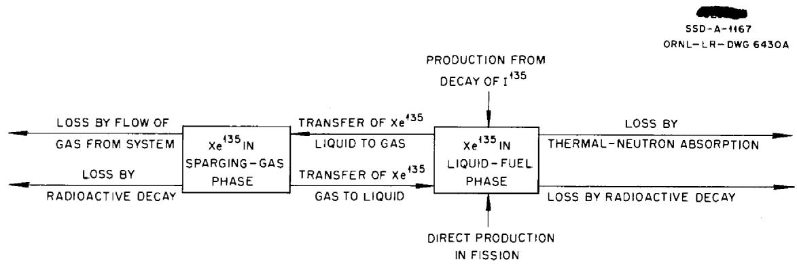

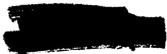  
Fig. 1. Processes Governing $Xe^{135}$ Poisoning in Fluid-Fueled Reactors.

processes are as follows (see Table 1 for definitions of all symbols used):

1. direct production from fission,

$$
\text {R a t e} 1 = \gamma_ {\chi_ {e}} \Sigma_ {f} \phi ; \tag {2.1}
$$

2. production from decay of 135,

$$
\text {R a t e} 2 = \gamma_ {1} \Sigma_ {f} \phi \left(1 - e ^ {- a _ {3} t}\right); \tag {2.2}
$$

3. transfer from the gas phase to the liquid phase,

$$
\text {R a t e} 3 = \frac {\lambda_ {r} c _ {G} V _ {G}}{V _ {L}}; \tag {2.3}
$$

TABLE 1. DEFINITION OF SYMBOLS   

<table><tr><td>English Letters</td><td>Definition</td><td>Greek Letters</td><td>Definition</td></tr><tr><td>A</td><td>Area of liquid-gas boundary surface</td><td>α0</td><td>100γxeσf/σu</td></tr><tr><td>aG</td><td>Activity of Xe135 in the gas phase</td><td>α1</td><td>100γ1σf/σu</td></tr><tr><td>aL</td><td>Activity of Xe135 in the liquid phase</td><td>α2</td><td>λr/βλf=RTS; see Eq. 3.4</td></tr><tr><td>cG</td><td>Concentration of Xe135 in gas phase</td><td>α3</td><td>Radioactive decay constant of l135</td></tr><tr><td>cL</td><td>Concentration of Xe135 in liquid phase</td><td>α4</td><td>Radioactive decay constant of Xe135</td></tr><tr><td rowspan="2">δ0</td><td rowspan="2">Concentration of l135 at t = 0; see Eq. 4.18</td><td>β</td><td>VL/VG</td></tr><tr><td>γ1</td><td>Fission yield of l135</td></tr><tr><td>k&#x27;</td><td>Mass-transfer film coefficient</td><td>γXe</td><td>Fission yield of Xe135</td></tr><tr><td>k1</td><td>α4 + λf + λL</td><td>λf</td><td>Rate constant for transfer of xenon from liquid to gas</td></tr><tr><td>k2</td><td>α4 + α2βλf + λg</td><td>λg</td><td>νG/VG</td></tr><tr><td>pG</td><td>Partial pressure of Xe135 in gas phase</td><td>λL</td><td>σXeφ</td></tr><tr><td>Q&#x27;</td><td>Rate of mass transfer</td><td>λr</td><td>Rate constant for transfer of xenon from gas to liquid</td></tr><tr><td>R</td><td>Universal gas constant</td><td>σf</td><td>Microscopic fission cross section of U235</td></tr><tr><td>S</td><td>Solubility coefficient of xenon in fuel</td><td></td><td></td></tr><tr><td>T</td><td>Absolute temperature</td><td>Σf</td><td>Macroscopic fission cross section of fuel</td></tr><tr><td>t</td><td>Time</td><td>σu</td><td>Microscopic neutron absorption cross section of U235</td></tr><tr><td>νG</td><td>Volumetric flow rate of sparging gas</td><td></td><td></td></tr><tr><td>VG</td><td>Volume of gas phase</td><td>Σu</td><td>Macroscopic neutron absorption cross section of fuel</td></tr><tr><td>VL</td><td>Volume of liquid phase</td><td></td><td></td></tr><tr><td>x</td><td>Xe135 poisoning in fuel</td><td>σXe</td><td>Microscopic neutron absorption cross section of Xe135</td></tr><tr><td>y</td><td>“Equivalent poisoning” in gas phase; see Eq. 2.14</td><td>φ</td><td>Volume-averaged thermal-neutron flux</td></tr></table>

4. loss by radioactive decay,

$$
\text {R a t e} 4 = - a _ {4} c _ {L}; \tag {2.4}
$$

5. loss by absorption of thermal neutrons,

$$
\text {R a t e} 5 = - \sigma_ {X _ {e}} \phi c _ {L}; \tag {2.5}
$$

6. loss by transfer to the gas phase,

$$
\text {R a t e} 6 = - \lambda_ {f} c _ {L}. \tag {2.6}
$$

The overall time dependence of the $Xe^{135}$ concentration in the liquid phase is given by the sum of these six rates:

$$
\dot {c} _ {L} = \gamma_ {\mathrm {X e}} \Sigma_ {f} \phi + \gamma_ {1} \Sigma_ {f} \phi \left(1 - e ^ {- a _ {3} t}\right) + \frac {V _ {G}}{V _ {L}} \lambda_ {r} c _ {G} - \left(a _ {4} + \sigma_ {\mathrm {X e}} \phi + \lambda_ {f}\right) c _ {L}. \tag {2.7}
$$

The processes which change the volume-averaged $Xe^{135}$ concentration in the gas phase are as follows:

7. transfer from the liquid phase,

$$
\text {R a t e} 7 = \frac {\lambda_ {f} c _ {L} V _ {L}}{V _ {G}}; \tag {2.8}
$$

8. loss by radioactive decay,

$$
\text {R a t e} 8 = - \alpha_ {4} c _ {G}; \tag {2.9}
$$

9. loss by transfer to the liquid phase,

$$
\text {R a t e} 9 = - \lambda_ {r} c _ {G}; \tag {2.10}
$$

10. loss by flow of gas out of the reactor,

$$
\text {R a t e} 1 0 = - \frac {\nu_ {G} c _ {G}}{V _ {G}}. \tag {2.11}
$$

Several ways in which changes might occur in the concentration of $Xe^{135}$ in the gas phase have been specifically neglected; these are:

11. loss by absorption of thermal neutrons;   
12. production from decay of $l^{135}$ or from fission. This implies the neglect of transfer processes (like 3, 7, 9, and 10) involving $l^{135}$ or $U^{235}$ .

The overall time dependence of the $Xe^{135}$ concentration in the gas phase is given by the sum of processes 7 through 10 to be

$$
\dot {c} _ {G} = \frac {V _ {L}}{V _ {G}} \lambda_ {f} c _ {L} - \left(a _ {4} + \lambda_ {r} + \frac {v _ {G}}{V _ {G}}\right) c _ {G}. \tag {2.12}
$$

In this discussion of the behavior of a nuclear reactor, the behavior of the Xe135 poisoning

is of primary interest and is defined as

$$
x = \frac {1 0 0 \sigma_ {\chi_ {e} ^ {c} L}}{\Sigma_ {u}}. \tag {2.13}
$$

The related quantity $y$ is defined as

$$
y = \frac {1 0 0 \sigma_ {\chi_ {e} ^ {c} G}}{\Sigma_ {u}}. \tag {2.14}
$$

The virtue of this latter quantity stems from the identity

$$
\frac {x}{y} = \frac {c _ {L}}{c _ {G}}, \tag {2.15}
$$

which will be required in deriving a relationship between $\lambda_{f}$ and $\lambda_{r}$ . By the use of Eqs. 2.7, 2.12, 2.13, and 2.14 and some abbreviations from Table 1, the differential equations for the poisoning are written as

$$
\dot {x} = a _ {0} \lambda_ {L} + a _ {1} \lambda_ {L} \left(1 - e ^ {- a _ {3} t}\right) + a _ {2} \lambda_ {f} y - \left(a _ {4} + \lambda_ {f} + \lambda_ {L}\right) x; \tag {2.16}
$$

$$
\dot {y} = \beta \lambda_ {f} x - \left(\alpha_ {4} + \alpha_ {2} \beta \lambda_ {f} + \lambda_ {g}\right) y. \tag {2.17}
$$

The above equations apply during the nuclear power operation of a reactor. However, the behavior of the poisoning during a shutdown must also be discussed. In this case it is necessary to set $\lambda_{L} = 0$ and to replace the first two terms of Eq. 2.16 by the source term

$$
a _ {3} \lambda_ {0} e ^ {- a _ {3} t}. \tag {2.18}
$$

The boundary conditions needed in solving Eqs. 2.16 and 2.17 are discussed in Sec. 4.

# 3. RELATIONS BETWEEN THE VARIOUS PHASE-TRANSFER RATE CONSTANTS

The problem of studying the kinetics of $Xe^{135}$ poisoning can be simplified by eliminating one of the phase-transfer rate constants, defined in Eqs. 2.6 and 2.10. The total rate of transfer of xenon from the liquid phase to the gas phase is $\lambda_{f} V_{L} c_{L}$ . The total rate of transfer in the reverse direction is $\lambda_{r} V_{G} c_{G}$ . Now, while it probably cannot be realized in practice, there exists some pair of values $(c_{G}^{\star}, c_{L}^{\star})$ corresponding to true thermodynamic equilibrium between the two phases. The "law of mass action" requires that under these conditions the amount of material entering a phase be the same as the amount leaving, that is, that

$$
\lambda_ {f} V _ {L} c _ {L} ^ {\star} = \lambda_ {r} V _ {G} c _ {G} ^ {\star}
$$

or

$$
\lambda_ {r} = \lambda_ {f} \frac {V _ {L}}{V _ {G}} \frac {c _ {L} ^ {\star}}{c _ {G} ^ {\star}}. \tag {3.1}
$$

The solubility coefficient of a gas in a liquid is the equilibrium concentration of solute in the liquid phase when the partial pressure of the substance in the gas phase is 1 atm. That is,

$$
c _ {L} ^ {\star} = p _ {G} ^ {\star} S \approx c _ {G} ^ {\star} R T S, \tag {3.2}
$$

where the ideal gas law has been used in the form

$$
p _ {G} = c _ {G} R T
$$

to relate the $Xe^{135}$ pressure to its concentration in the gas phase. A combination of Eqs. 2.1 and 3.2 gives the desired result:

$$
\lambda_ {r} = \lambda_ {f} R T S \frac {V _ {L}}{V _ {G}}, \tag {3.3}
$$

whence

$$
\alpha_ {2} = R T S. \tag {3.4}
$$

Thus equilibrium solubility data may be used to eliminate the rate constant $\lambda_{r}$ .

Also, a relation may be derived between the “true” rate constants, $\lambda_{f}$ and $\lambda_{r'}$ and the “apparent” rate constant, $^{4}$ $\lambda_{p}$ . The latter is defined by

$$
\text {N e t} X e ^ {1 3 5} \text {t r a n s f e r r a t e} = - \lambda_ {p} c _ {L}. \tag {3.5}
$$

Equating this to the sum of rates defined in Eqs. 2.3 and 2.6, it is found that

$$
\lambda_ {p} = \lambda_ {f} - \lambda_ {r} \frac {V _ {G}}{V _ {L}} \frac {c _ {G}}{c _ {L}}, \tag {3.6}
$$

or, introducing Eq. 3.3,

$$
\lambda_ {p} = \lambda_ {f} \left(1 - R T S \frac {c _ {G}}{c _ {L}}\right). \tag {3.7}
$$

If Eqs. 3.4 and 2.15 are introduced, then

$$
\lambda_ {p} = \lambda_ {f} \left(1 - \frac {\alpha_ {2} y}{x}\right). \tag {3.8}
$$

Thus experimentally derived values of $\lambda_{p}$ may be compared with values calculated from the solutions to Eqs. 2.16 and 2.17.

The connection of the rate constant $\lambda_{f}$ to the usual mass-transfer film coefficient may be shown by noting that the total net current of matter across the boundary between the liquid and gas phases is

$$
Q ^ {\prime} = - \lambda_ {f} V _ {L} c _ {L} + \lambda_ {r} V _ {G} c _ {G} = - \lambda_ {f} V _ {L} \left(c _ {L} - R T S c _ {G}\right). \tag {3.9}
$$

According to the usual mass-transfer analysis, the total current may be written as

$$
Q ^ {\prime} = - k ^ {\prime} A \left(a _ {L} - a _ {G}\right). \tag {3.10}
$$

Both phases are assumed to be ideal. The xenon activity in the liquid may be replaced by the concentration. Therefore the standard state in the gas phase must be considered as that pressure of xenon in equilibrium with unit concentration in the liquid. Thus

$$
a _ {G} = p _ {G} S = R T S c _ {G}.
$$

Then Eq. 3.10 becomes

$$
Q ^ {\prime} = - k ^ {\prime} A \left(c _ {L} - R T S c _ {G}\right). \tag {3.11}
$$

Comparison of Eqs. 3.9 and 3.11 yields

$$
\lambda_ {f} = \frac {k ^ {\prime} A}{V _ {L}}. \tag {3.12}
$$

In principle, the film coefficient $k'$ can be computed from the geometry of the system and the physical properties and flow rate of the liquid fuel through a relation of the type

$$
\frac {k ^ {\prime} s}{D _ {L}} = f (S c, R e), \tag {3.13}
$$

where $s$ is a characteristic dimension; $D_L$ is the diffusion coefficient of $\mathbf{Xe}^{135}$ in the liquid; $Re$ is the Reynolds number of the liquid; and $Sc$ , the Schmidt number, is given by

$$
S c = \frac {\nu_ {L}}{D _ {L}},
$$

in which $\nu_{L}$ is the kinematic viscosity of the liquid. It does not appear practical to calculate $\lambda_{f}$ in this way, because of the complicated geometry and flow regime obtaining in the ARE and ART.

# 4. SOLUTION OF THE DIFFERENTIAL EQUATIONS

The time dependence of the poisoning of a nuclear reactor due to $Xe^{135}$ may be expressed by the differential equations

$$
\dot {x} = f _ {n} (t) + \alpha_ {2} \lambda_ {f} y - k _ {1} x \tag {4.1}
$$

and

$$
\dot {y} = \beta \lambda_ {f} x - k _ {2} y. \tag {4.2}
$$

The source term is

$$
f _ {1} (t) = \alpha_ {0} \lambda_ {L} + \alpha_ {1} \lambda_ {L} \left(1 - e ^ {- \alpha_ {3} t}\right) \tag {4.3}
$$

when the reactor is in operation and

$$
f _ {2} (t) = \alpha_ {3} \delta_ {0} e ^ {- a _ {3} t} \tag {4.4}
$$

otherwise. The quantity $\mathfrak{L}_0$ is related to the amount of $|^{135}$ present at $t = 0$ .

By solving Eq. 4.2 for $x$ , differentiating with respect to $t$ , and combining the results with

Eq. 4.1, the differential equation

$$
\ddot {y} + \left(k _ {2} + k _ {1}\right) \dot {y} + \left(k _ {1} k _ {2} - a _ {2} \beta \lambda_ {f} ^ {2}\right) y = \beta \lambda_ {f} f _ {n} (t) \tag {4.5}
$$

is obtained. The solution to this equation may be written as

$$
y = \Phi_ {n} (t) + A _ {n} e ^ {- \kappa_ {1} t} + B _ {n} e ^ {- \kappa_ {2} t}, \tag {4.6}
$$

where

$$
\kappa_ {1} = \frac {1}{2} \left[ k _ {2} + k _ {1} + \sqrt {\left(k _ {2} - k _ {1}\right) ^ {2} + 4 \alpha_ {2} \beta \lambda_ {f} ^ {2}} \right], \tag {4.7a}
$$

$$
\kappa_ {2} = \frac {1}{2} \left[ k _ {2} + k _ {1} - \sqrt {\left(k _ {2} - k _ {1}\right) ^ {2} + 4 \alpha_ {2} \beta \lambda_ {f} ^ {2}} \right] \quad , \tag {4.7b}
$$

$$
\Phi_ {1} (t) = \frac {\left(a _ {0} + a _ {1}\right) \beta \lambda_ {f} \lambda_ {L}}{k _ {1} k _ {2} - a _ {2} \beta \lambda_ {f} ^ {2}} - \frac {a _ {1} \beta \lambda_ {f} \lambda_ {L} e ^ {- a _ {3} t}}{\left(k _ {1} - a _ {3}\right) \left(k _ {2} - a _ {3}\right) - a _ {2} \beta \lambda_ {f} ^ {2}}, \tag {4.8a}
$$

$$
\Phi_ {2} (t) = \frac {\beta \lambda_ {f} a _ {3} \mathrm {d} _ {0} e ^ {- \alpha_ {3} t}}{\left(k _ {1} - a _ {3}\right) \left(k _ {2} - a _ {3}\right) - a _ {2} \beta \lambda_ {f} ^ {2}}. \tag {4.8b}
$$

Combining these results with Eq. 4.2 yields

$$
x = \Theta_ {n} (t) + \frac {k _ {2} - k _ {1}}{\beta \lambda_ {f}} A _ {n} e ^ {- \kappa_ {1} t} + \frac {k _ {2} - k _ {2}}{\beta \lambda_ {f}} B _ {n} e ^ {- \kappa_ {2} t}, \tag {4.9}
$$

where

$$
\Theta_ {1} (t) = \frac {\left(a _ {0} + a _ {1}\right) k _ {2} \lambda_ {L}}{k _ {1} k _ {2} - a _ {2} \beta \lambda_ {f} ^ {2}} - \frac {a _ {1} \lambda_ {L} \left(k _ {2} - a _ {3}\right) e ^ {- a _ {3} t}}{\left(k _ {1} - a _ {3}\right) \left(k _ {2} - a _ {3}\right) - a _ {2} \beta \lambda_ {f} ^ {2}}, \tag {4.10a}
$$

$$
\Theta_ {2} (t) = \frac {\alpha_ {3} \lambda_ {0} \left(k _ {2} - \alpha_ {3}\right) e ^ {- \alpha_ {3} t}}{\left(k _ {1} - \alpha_ {3}\right) \left(k _ {2} - \alpha_ {3}\right) - \alpha_ {2} \beta \lambda_ {f} ^ {2}}. \tag {4.10b}
$$

The most general boundary conditions are

$$
\mathrm {A s} \quad t \rightarrow 0, \quad x \rightarrow x _ {0} \quad \text {a n d} \quad y \rightarrow y _ {0}. \tag {4.11}
$$

Inserting these conditions into Eqs. 4.6 and 4.9, the integration constants become

$$
A _ {n} = \frac {k _ {2} - \kappa_ {2}}{\kappa_ {1} - \kappa_ {2}} \left[ y _ {0} - \Phi_ {n} (0) \right] - \frac {\beta \lambda_ {f}}{\kappa_ {1} - \kappa_ {2}} \left[ x _ {0} - \Theta_ {n} (0) \right] \tag {4.12a}
$$

and

$$
B _ {n} = - \frac {k _ {2} - k _ {1}}{\kappa_ {1} - \kappa_ {2}} \left[ y _ {0} - \Phi_ {n} (0) \right] + \frac {\beta \lambda_ {f}}{\kappa_ {1} - \kappa_ {2}} \left[ x _ {0} - \Theta_ {n} (0) \right]. \tag {4.12b}
$$

In this report three special cases will be considered:

Case I. Reactor operation starting with "clean" condition. - The poisoning is given by Eq. 4.9, using the function $4.10a$ . The integration constants are found from Eqs. 4.12a and b, using $x_0 = y_0 = 0$ and the quantities $\Phi_1(0)$ and $\Theta_1(0)$ .

Case II. Reactor operation at zero nuclear power, after a period of high-power operation. - The poisoning is given by Eq. 4.9, using the function $4.10b$ . The initial conditions are found from solutions to the problem of case I. In this instance $\lambda_{L} = 0$ , and the quantity $\mathfrak{z}_0$ is found from the equation

$$
\alpha_ {3} \lambda_ {0} = \alpha_ {1} \lambda_ {L} ^ {\prime} \left(1 - e ^ {- \alpha_ {3} t ^ {\prime}}\right), \tag {4.13}
$$

where $\lambda_L^{\prime}$ is the value of $\lambda_L$ for the preceding period of high-power operation and $t^{\prime}$ is the time of operation.

Case III. Sparging of reactor after a period of complete shutdown, during which no xenon is removed. - The poisoning is given by Eq. 4.9, using the function $\Theta_2(t)$ . In this case $\lambda_L = 0$ , $y_0 = 0$ , and $\mathcal{Q}_0$ is found from

$$
\alpha_ {3} \lambda_ {0} = \alpha_ {1} \lambda_ {L} ^ {\prime} \left(1 - e ^ {- a _ {3} t ^ {\prime}}\right) e ^ {- a _ {3} t ^ {\prime \prime}}, \tag {4.14}
$$

where $t''$ is the time between the shutdown and the time $t = 0$ . The quantity $x_0$ is calculated from

$$
x _ {0} = x _ {0} ^ {0} e ^ {- \alpha_ {4} t ^ {\prime \prime}} + \frac {\alpha_ {1} \lambda_ {L} ^ {\prime}}{\alpha_ {4} - \alpha_ {3}} \left(1 - e ^ {- \alpha_ {3} t ^ {\prime}}\right) \left(e ^ {- \alpha_ {3} t ^ {\prime \prime}} - e ^ {- \alpha_ {4} t ^ {\prime \prime}}\right), \tag {4.15}
$$

where $x_0^0$ is the poisoning at reactor shutdown, found from the solution to the problem of case I.

In dealing with cases II and III above, it is of interest to know whether or not the quantities $x$ and $y$ reach their extreme values (maxima) at the same time. When $x$ reaches its maximum value, from Eqs. 4.1 and 4.2, then

$$
k _ {1} \dot {y} ^ {\star} = \beta \lambda_ {f} / _ {2} ^ {\star} - \left(k _ {1} k _ {2} - a _ {2} \beta \lambda_ {f} ^ {2}\right) y ^ {\star}, \tag {4.16}
$$

where the asterisks indicate the special time value. It can readily be shown that the coefficients of $f_2^\star$ and of $y^\star$ are both always positive quantities. Thus $\dot{y}^\star$ can vanish only if

$$
y ^ {\star} = \frac {\beta \lambda_ {f}}{k _ {1} k _ {2} - a _ {2} \beta \lambda_ {f} ^ {2}} f _ {2} ^ {\star}. \tag {4.17}
$$

Comparison of this equation with Eq. 4.6 shows that Eq. 4.17 cannot be satisfied in general, so that the extreme behavior of $x$ and $y$ cannot be examined by studying the differential equations alone.

# 5. STEADY-STATE OPERATION OF A REACTOR

For very long times of high-power operation, the poisoning reaches a steady-state value. From Eqs. 4.12 and 4.7, the steady-state values of $x$ and $y$ are

$$
x _ {\infty} = \frac {\left(a _ {0} + a _ {1}\right) k _ {2} \lambda_ {L}}{k _ {1} k _ {2} - a _ {2} \beta \lambda_ {f} ^ {2}} \tag {5.1}
$$

and

$$
y _ {\infty} = \frac {\left(a _ {0} + a _ {1}\right) \lambda_ {L} \beta \lambda_ {f}}{k _ {1} k _ {2} - a _ {2} \beta \lambda_ {f} ^ {2}} = \frac {\beta \lambda_ {f}}{k _ {2}} x _ {\infty}. \tag {5.2}
$$

These relations can be used in estimating the steady-state poisoning of a reactor under various conditions. The most convenient way to make these estimates is first to calculate

$$
\lambda_ {p} ^ {\infty} = \frac {\lambda_ {f} \left(a _ {4} + \lambda_ {g}\right)}{a _ {4} + \lambda_ {g} + a _ {2} \beta \lambda_ {f}}. \tag {5.3}
$$

This result is obtained by substituting Eqs. 5.1 and 5.2 into Eq. 3.8. If the mean lives

$$
\tau_ {p} ^ {\infty} = \frac {1}{\lambda_ {p} ^ {\infty}} \tag {5.4a}
$$

and

$$
\tau_ {f} = \frac {1}{\lambda_ {f}} \tag {5.4b}
$$

are now introduced, then

$$
\tau_ {p} ^ {\infty} = \tau_ {f} + \frac {a _ {2} \beta}{a _ {4} + \lambda_ {g}}. \tag {5.5a}
$$

Since $\alpha_{4} \ll \lambda_{g'}$ this expression may be rewritten as

$$
\tau_ {p} ^ {\infty} = \tau_ {f} + \frac {R T S V _ {L}}{v _ {G}}. \tag {5.5b}
$$

Then $x_{\infty}$ is computed through the relationship

$$
x _ {\infty} = \frac {\left(a _ {0} + a _ {1}\right) \lambda_ {L}}{a _ {4} + \lambda_ {L} + \lambda_ {p} ^ {\infty}}. \tag {5.6}
$$

The data in Table 2 have been used to estimate the steady-state poisoning, $x_{\infty}$ , in the ART for various assumed values of the phase-transfer mean life. The results are presented in Fig. 2.

It is of interest to examine briefly the expected behavior of ART-type reactors of higher power. Although the poisoning of an unsparged reactor of this type is essentially independent

TABLE 2. DATA FOR NUMERICAL CALCULATION   

<table><tr><td colspan="3">Numerical Data</td></tr><tr><td>α0= 0.254%</td><td colspan="2">R = 82.0567 cc-atm/mole/°K</td></tr><tr><td>α1= 4.74%</td><td colspan="2">T = 1033°K (1400°F)</td></tr><tr><td>α2= 0.0509</td><td colspan="2">S = 6 × 10-7moles/cc-atm(a)</td></tr><tr><td>α3= 2.87 × 10-5sec-1</td><td colspan="2">σXe= 1.7 × 106barns(b)</td></tr><tr><td>α4= 2.09 × 10-5sec-1</td><td colspan="2"></td></tr><tr><td colspan="3">Reactor Data</td></tr><tr><td colspan="2">ARE(c)</td><td>ART(d)</td></tr><tr><td>VL</td><td>5.35 ft3</td><td>5.64 ft3</td></tr><tr><td>VG</td><td>1 ft3</td><td>0.31 ft3</td></tr><tr><td>νG</td><td>0.25 cc/sec</td><td>1000 STP liters/day</td></tr><tr><td>φ</td><td>8 × 1011neutrons/cm2/sec</td><td>1 × 1014neutrons/cm2/sec</td></tr><tr><td>β</td><td>5.35</td><td>18.2</td></tr><tr><td>λL</td><td>1.36 × 10-6sec-1</td><td>1.7 × 10-4sec-1</td></tr></table>

(a)R.F.Newton, personal communication.   
(b)W. K. Ergen and H. W. Bertini, ANP Quar. Prog. Rep. March 10, 1955, ORNL-1864, p 16.   
(c) J. L. Meem, personal communication and ARE Nuclear Log Book, ORNL Classified Notebook 4210.   
$(d)_{\mathsf{H.T.}}$ Furgerson and J.L.Meem, personal communication.

of power, very large increases in poisoning are possible with increased power when efficient sparging is employed. Only the most optimistic case will be considered, with $\tau_f = 0$ . Equation 5.6 may then be written as

$$
x _ {\infty} = \frac {\left(a _ {0} + a _ {1}\right) \lambda_ {L}}{\lambda_ {L} + \left(v _ {G} / R T S V _ {L}\right)}. \tag {5.7}
$$

If there are no major differences in design of such a reactor and in particular if the fuel volume and dilution factor are about the same as in the ART, the poisoning may be estimated on the basis of ART data, by simply adjusting $\lambda_{L}$ in proportion to the power change. The results are presented in Fig. 3.7

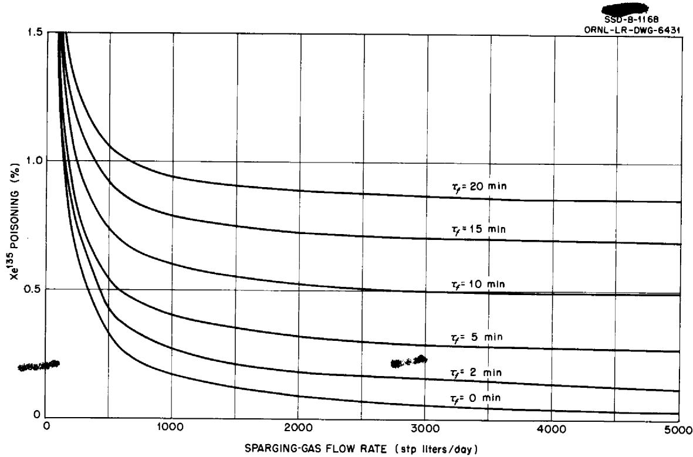  
Fig. 2. Steady-State $Xe^{135}$ Poisoning in the ART as a Function of Sparging-Gas Flow Rate for Various Assumed Values of the Phase-Transfer Mean Life $\tau_{f}$ .

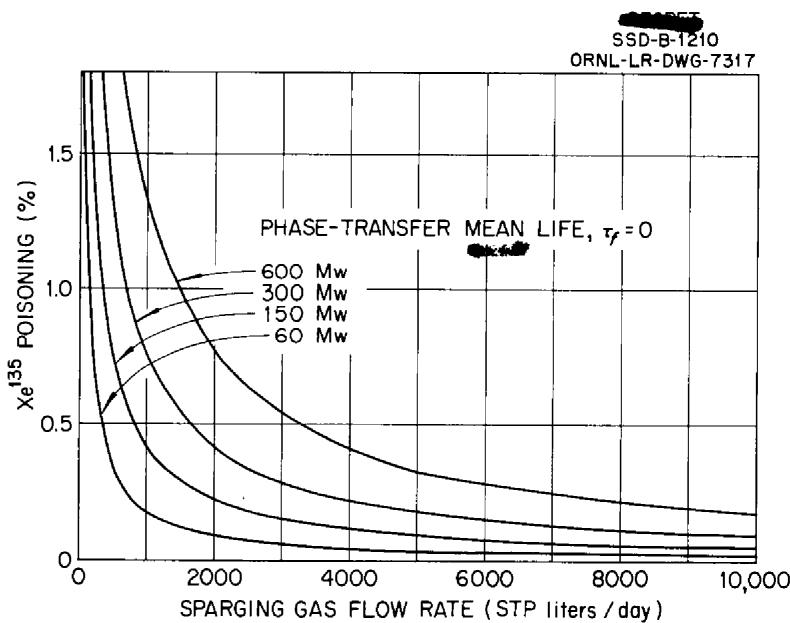  
Fig. 3. Steady-State $X_{e}^{135}$ Poisoning in ART-Type Reactors as a Function of Sparging-Gas Flow Rate for Various Assumed Reactor Powers.

Apparently, other things being equal, the sparging-gas flow rate must increase linearly with power, to maintain constant poisoning. It should be noted that while a decreased fuel volume increases the term $\left[\nu_{G} / (RTS V_{L})\right]$ in Eq. 5.7, this is roughly compensated by a corresponding increase in $\lambda_{L}$ , which is proportional to the volume-averaged flux.

# 6. KINETICS OF Xe135 POISONING IN THE ARE

An extensive series of calculations has been performed on the Oracle, to aid in studying the approach to steady state of the $Xe^{135}$ poisoning in the ARE. Typical results are presented in Figs. 4 through 7.

Figure 4 illustrates the dependence of the $Xe^{135}$ poisoning kinetics on the value of $\lambda_f$ . Note that curves for all values of $\lambda_f \geq 6 \times 10^{-3} \, \text{sec}^{-1}$ fall together on the scale chosen in the

Coding and supervision of the calculations were done by C. L. Gerberich, ORNL Mathematics Panel. Results were obtained by using Eqs. 4.1, 4.2, and 3.8, together with numerical data from Table 2, except as noted in the text.

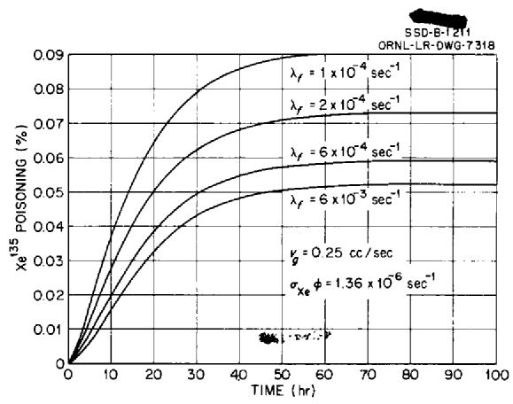  
Fig. 4. Effect of $\lambda_{f}$ on Xe135 Purging in the ARE.

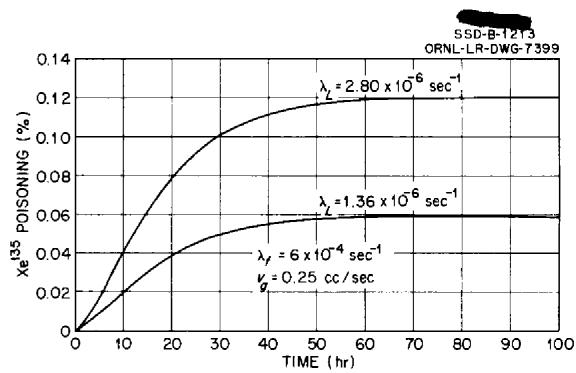  
Fig. 6. Effect of $\lambda_L$ on Xe135 Poisoning in the ARE.

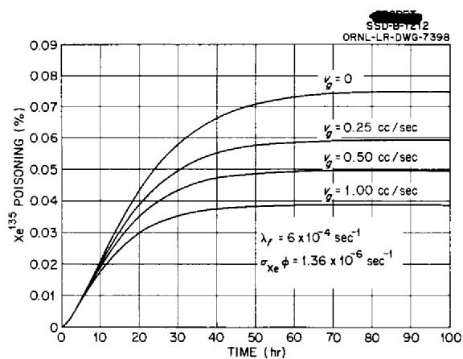  
Fig. 5. Effect of Sparging-Gas Flow Rate on Xe135 Poisoning in the ARE.

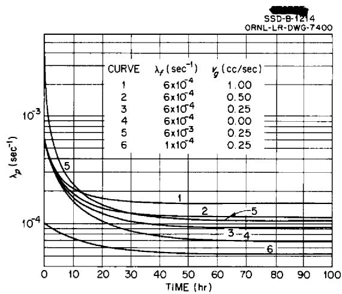  
Fig. 7. Variation of the Apparent Purge Constant with Time in the ARE.

figure. This results from the small volumetric flow rate of off gas in the ARE. This flow rate is rate-determining, making an accurate estimate of $\lambda_{f}$ from experimental data difficult.

Figure 5 illustrates the poisoning effects that occur as a result of variations in the sparging-gas flow rate, $\nu_{G'}$ at a value $\lambda_f = 6 \times 10^{-4} \sec^{-1}$ . A comparison of Figs. 3 and 4 shows that at early times (up to 10 hr or so) the rate of $\mathbf{Xe}^{135}$ removal is primarily governed by the rate of phase transfer, while for longer times the gas flow rate becomes controlling. Thus, under ARE conditions, fission-gas removal may be termed "off-gas controlled."

Figure 6 illustrates the effects of $\lambda_L$ on poisoning kinetics. As might be anticipated, the results are roughly proportional to $\lambda_L$ .

Figure 7 presents results on the time dependence of $\lambda_{p'}$ which is called here the "apparent rate constant" for transfer of $Xe^{135}$ from fuel to off gas. The large decrease in $\lambda_{p}$ with time is clearly evident. Note also that $d\lambda_{p} / dt$ is everywhere negative.

Theory and experiment may be compared as follows. By employing the abbreviations

$$
f (t) = a _ {0} \lambda_ {L} + a _ {1} \lambda_ {L} \left(1 - e ^ {- a _ {3} t}\right) \tag {6.1a}
$$

and

$$
g (t) = \alpha_ {4} + \lambda_ {L} + \lambda_ {p} (t), \tag {6.1b}
$$

the differential equation 2.16 may be written as

$$
\dot {x} (t) = f (t) - g (t) x (t). \tag {6.2}
$$

Expanding each of the functions in Eq. 6.2 about the origin,

$$
x (t) = \dot {x} _ {0} t + \frac {\ddot {x} _ {0} t ^ {2}}{2} + \frac {\ddot {x} _ {0} t ^ {3}}{6} + \dots , \tag {6.3a}
$$

$$
f (t) = f _ {0} + f _ {0} ^ {\prime} t + \frac {\ddot {f} _ {0} t ^ {2}}{2} + \dots , \tag {6.3b}
$$

$$
g (t) = g _ {0} + \dot {g} _ {0} t + \frac {\ddot {g} _ {0} t ^ {2}}{2} + \dots , \tag {6.3c}
$$

where the subscript zero represents values at the origin ( $t = 0$ ). If Eqs. 6.3a, b, and c are introduced into Eq. 6.2 and if the coefficient of each power of $t$ is equated to zero, then

$$
\dot {x} _ {0} = f _ {0} = \alpha_ {0} \lambda_ {L}, \tag {6.4a}
$$

$$
x _ {0} = f _ {0} ^ {\prime} - f _ {0} g _ {0} = \left(\alpha_ {1} \alpha_ {3} - \alpha_ {0} g _ {0}\right) \lambda_ {L}, \tag {6.4b}
$$

$$
\ddot {x} _ {0} = \dot {f} _ {0} - \dot {f} _ {0} g _ {0} - f _ {0} \left(g _ {0} ^ {2} + 2 \dot {g} _ {0}\right) = - \left[ a _ {1} a _ {3} ^ {2} + a _ {1} a _ {3} g _ {0} + a _ {0} \left(g _ {0} ^ {2} + 2 \dot {g} _ {0}\right) \right] \lambda_ {L} \tag {6.4c}
$$

：

Now, in principle, a set of experimental data may be fitted to a power series (Eq. 6.3a), and the various coefficients of the series (Eq. 6.3c) can be determined from Eqs. 6.4a, b, and c. Note that from Eq. 3.8

$$
\lambda_ {p} (0) = \lambda_ {f},
$$

so that the value of the coefficient $g_0$ (i.e., the behavior of the poisoning near the origin) is of primary concern.

The experimental data on poisoning in the ARE10 are given in Table 3, along with calculated contributions due to Sm149 and to burnup of U235. The neutron capture cross section of Sm149 was taken as 53,000 barns,11 and the burnup effect was calculated from11

$$
\left(\frac {\Delta k}{k}\right) _ {\text {b u r n u p}} = \frac {0 . 2 3 2 \Delta M}{M},
$$

where $k$ is the infinite multiplication constant and $M$ is the mass of $U^{235}$ in the reactor. Other data were taken from Table 2. Since the $S_m^{149}$ and burnup contributions are well within the experimental error in the total poisoning, the experimental results are taken to apply to $X_e^{135}$ poisoning alone.

The results from the ARE cannot be treated by the method described above for two major reasons:

1. The ARE data are based on the assumption that the origin of the $(x,t)$ coordinates was at the start of the experiment. Since about 7 hr of high-power operation preceded the "xenon experiment," both $|^{135}$ and $Xe^{135}$ were present in the core at the time "zero" in Table 3.

10ARE Nuclear Log Book, ORNL Classified Notebook 4210.

11S. Glasstone and M. C. Edlund, Elements of Nuclear Reactor Theory, p 338, Van Nostrand, New York, 1952.

TABLE 3. EXPERIMENTAL DATA ON ARE POISONING   

<table><tr><td rowspan="2">Time (hr)</td><td rowspan="2">Total Poisoning (%)</td><td colspan="3">Calculated Poisoning (%)</td></tr><tr><td>Burnup</td><td>Sm149</td><td>Xe135</td></tr><tr><td>0</td><td>0</td><td>0</td><td>0</td><td>0</td></tr><tr><td>1.3</td><td>0.003 ± 0.001</td><td>0.0001</td><td>0.0000</td><td>0.004</td></tr><tr><td>12.7</td><td>0.006 ± 0.002</td><td>0.0006</td><td>0.0003</td><td>0.110</td></tr><tr><td>13.7</td><td>0.009 ± 0.002</td><td>0.0006</td><td>0.0003</td><td>0.119</td></tr><tr><td>16.0</td><td>0.012 ± 0.002</td><td>0.0007</td><td>0.0004</td><td>0.144</td></tr><tr><td>20.2</td><td>0.015 ± 0.003</td><td>0.0009</td><td>0.0006</td><td>0.182</td></tr></table>

2. Application of the method outlined above requires knowledge of $\lambda_L$ . This quantity governs the scale of the $x$ -coordinate. For the present calculations, a value of $1.36 \times 10^{-6}$ sec $^{-1}$ was assumed, based on $1.7 \times 10^6$ barns for the Xe $^{135}$ cross section and $8 \times 10^{11}$ neutrons/cm $^2$ /sec for the ARE thermal flux.

It has recently been shown that the $Xe^{135}$ cross section in the ARE is nearer $1.4 \times 10^6$ barns.[12] The flux value employed was based on the values 575 barns for the $U^{235}$ fission cross section; 173 Mw per fission absorbed in the reactor; fuel density 3.24 g/cc; composition 13.59 wt % uranium, 93.4% enriched; and 2 Mw reactor power. The resulting value for the flux is not more precise than ±20%. It does not appear possible to expect agreement better than about a factor of 2 between theory and experiment.

On this basis, results from the ARE have merely been compared with calculated curves similar to those of Fig. 4. It is concluded that $\lambda_{f}$ must be larger than about $5 \times 10^{-4} \sec^{-1}$ and is probably around $1 \times 10^{-3} \sec^{-1}$ .

# 7. KINETICS OF $Xe^{135}$ POISONING IN THE ART

In this section the results of Oracle computations of the time dependence of the $X_{e}^{135}$ poisoning in the ART are presented and discussed. The data employed are those of Table 2, except as noted. Typical results are shown in Figs. 8 through 12.

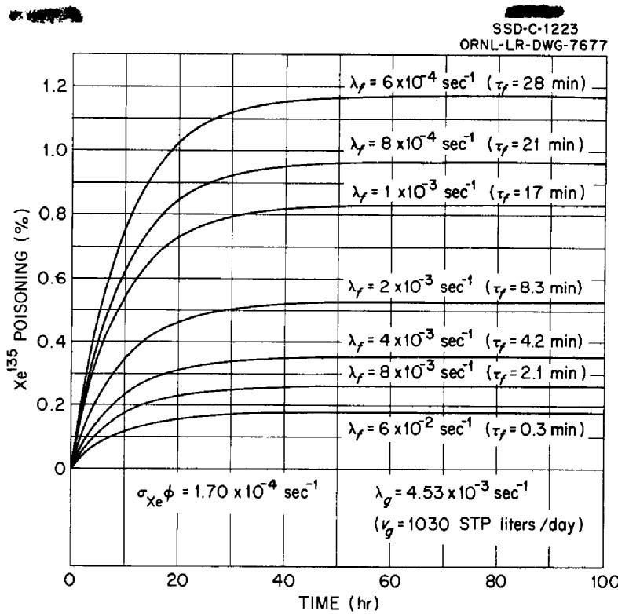  
Fig. 8. Effect of $\lambda_{f}$ on $X_{e}^{135}$ Poisoning Kinetics in the ART.

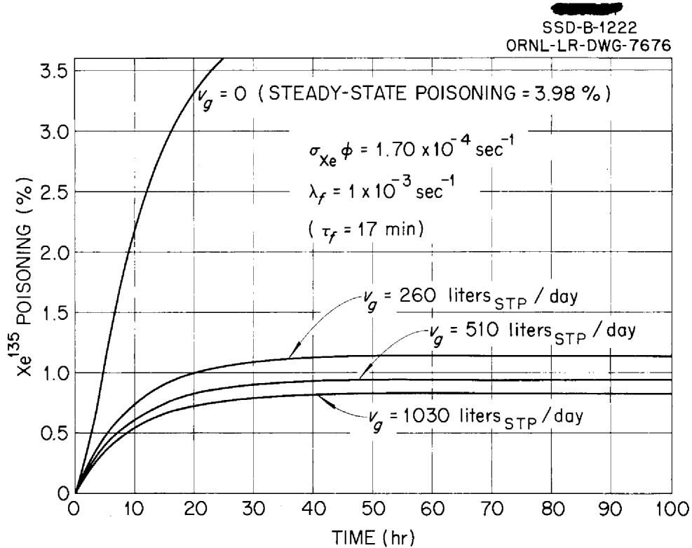  
Fig. 9. Effect of Sparging-Gas Flow Rate on ART Poisoning Kinetics.

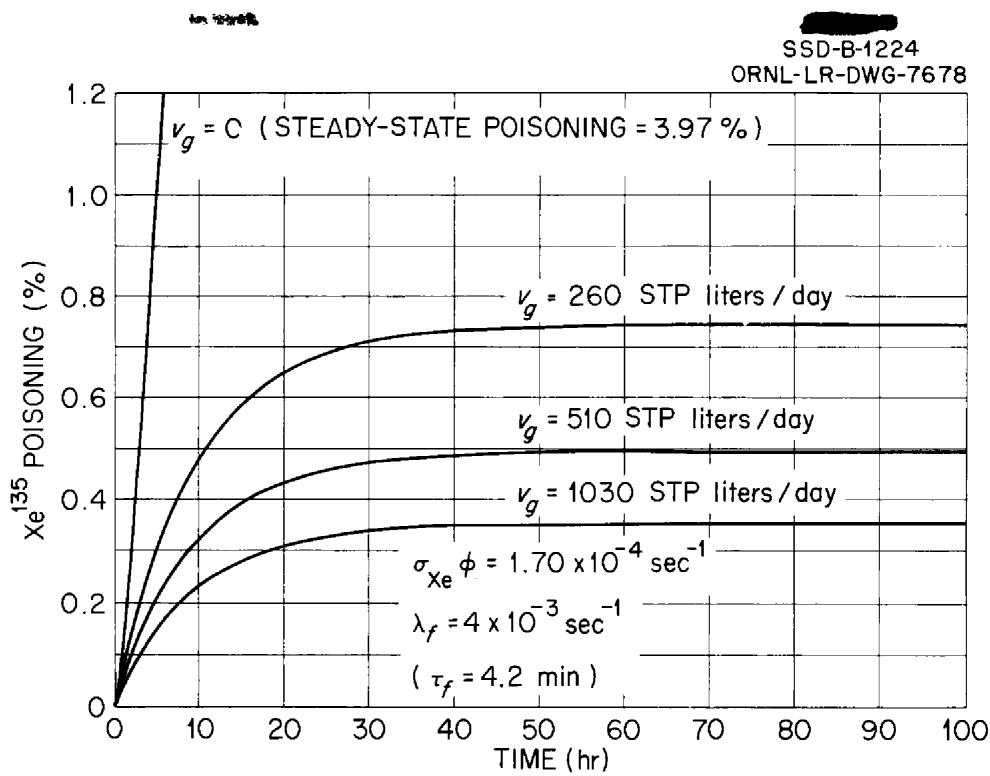  
Fig. 10. Effect of Sparging-Gas Flow Rate on ART Poisoning Kinetics.

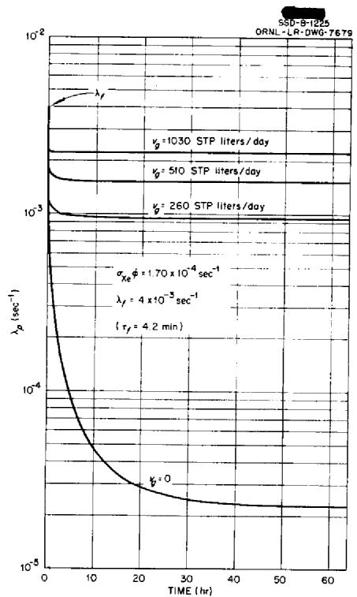  
Fig. 11. Time Dependence of the Apparent Rate Constant $\lambda_{p}$ in the ART.

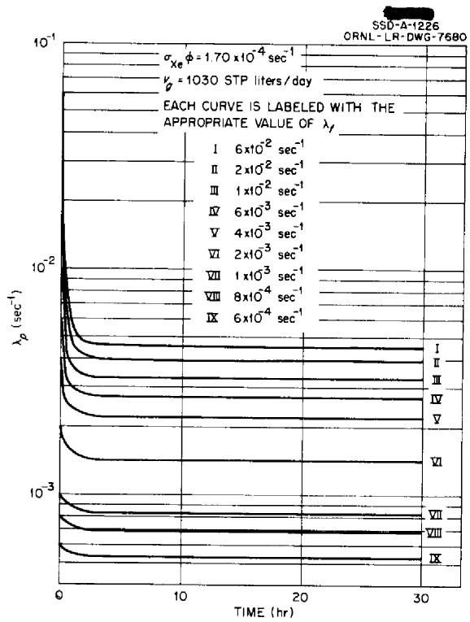  
Fig. 12. Time Dependence of the Apparent Rate Constant $\lambda_{p}$ in the ART.

Figure 8 illustrates the dependence of poisoning kinetics on the value of $\lambda_{f}$ for a value of $\lambda_{g} = 4.53 \times 10^{-3} \sec^{-1} (\nu_{g} = 1030 \text{ STP liters/day})$ . The effects of sparging-gas flow rate are presented in Figs. 9 and 10 for two different values of $\lambda_{f}$ . Because of the much higher sparging-gas flow rates, the ART will not be as insensitive to the rate of phase transfer as was the ARE. Examination of Figs. 9 and 10 shows that the reactor will be more sensitive to off-gas flow rate if $\lambda_{f}$ is comparatively small than it will if $\lambda_{f}$ is comparatively large. Poisoning kinetics in the ART can be termed neither "off-gas controlled" nor "phase-transfer controlled," both processes being appreciably rate determining.

The time behavior of the apparent rate constant, $\lambda_{p'}$ is somewhat different from that in the ARE, because of the much greater sparging-gas flow rate in the ART. Examination of Figs. 11 and 12 shows that at high gas flow rates $\lambda_{p}$ reaches its steady-state value very rapidly - only about 3 hr being required, compared with about 40 hr in the ARE. Physically, this means that the gas phase in the ART reaches a steady state with the fuel phase very rapidly.

Because of the rapid approach to steady state of $\lambda_{p'}$ it is possible to use the approximate method of Sec. 9 for rapid calculations of ART poisoning kinetics.

# 8. KINETICS OF $Xe^{135}$ POISONING DURING SHUTDOWNS

In this section a brief analysis will be made of the expected behavior of the $\text{Xe}^{135}$ poisoning of the ART during shutdowns. For this purpose the equations derived in Sec. 4 for cases II and III will be employed.

First to be considered is a shutdown of nuclear power during which fuel flow and sparging are continued. The reactor is assumed to have been at steady state prior to shutdown. The data given in Table 2 for the ART are chosen, with $\tau_f$ taken as 5 min. The result is not shown since values for all the terms other than the one for $l^{135}$ decay are always negligible. Under the assumed conditions, the poisoning will not rise by as much as 1 or 2% of the steady-state value. It is thus concluded that decreases in reactor power will cause no troublesome transient increase in the $Xe^{135}$ poisoning in reactors of the ART type.

A more serious problem is concerned with the growth of xenon during a total shutdown. The behavior of the ART is examined in this regard by assuming that after the reactor reaches steady-state operation it is shut down totally and the xenon is allowed to grow in until it reaches its maximum concentration. At this point, sparging is started and continued, at zero nuclear power. It is necessary to determine how rapidly the poisoning can be reduced to the high-power steady-state level. The behavior in this respect governs in large part the amount of "xenon override" which must be built into the reactor. The data used are from Table 2, with $\tau_f = 5$ min. The maximum poisoning was calculated from Eq. 4.15.

After the reactor is shut down, the $Xe^{135}$ poisoning rises to a maximum of about $12\%$ . If no sparging were used, it would then decrease slowly, reaching the full-power steady-state value in about 70 hr. During almost all this time, operation of the reactor would be impossible with the control rod presently proposed for the ART. However, if sparging is started at the time of maximum $Xe^{135}$ concentration (11.2 hr after shutdown), rapid reduction in poisoning occurs. Figure 13 shows that $Xe^{135}$ is reduced to the full-power steady-state value in about 36 min. Since this time is less than that necessary to start up the ART after a total shutdown, there seems to be no reason to provide large amounts of "xenon override" in the control rod. This statement remains true even if $\tau_f$ is significantly larger than the value used here.

# 9. NOMOGRAMS FOR XENON-POISONING CALCULATIONS

Two simple nomograms have been constructed to speed rough calculations of $Xe^{135}$ poisoning. Nomogram 1 (Fig. 14) describes the steady-state poisoning

$$
x _ {\infty} = \frac {\left(a _ {0} + a _ {1}\right) \lambda_ {L}}{\lambda_ {L} + a _ {4} + \lambda_ {p}}, \tag {9.1}
$$

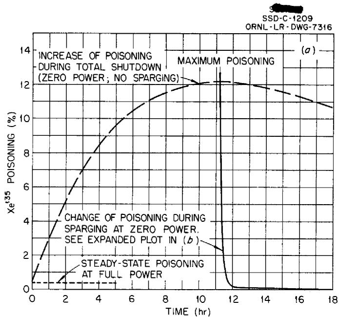

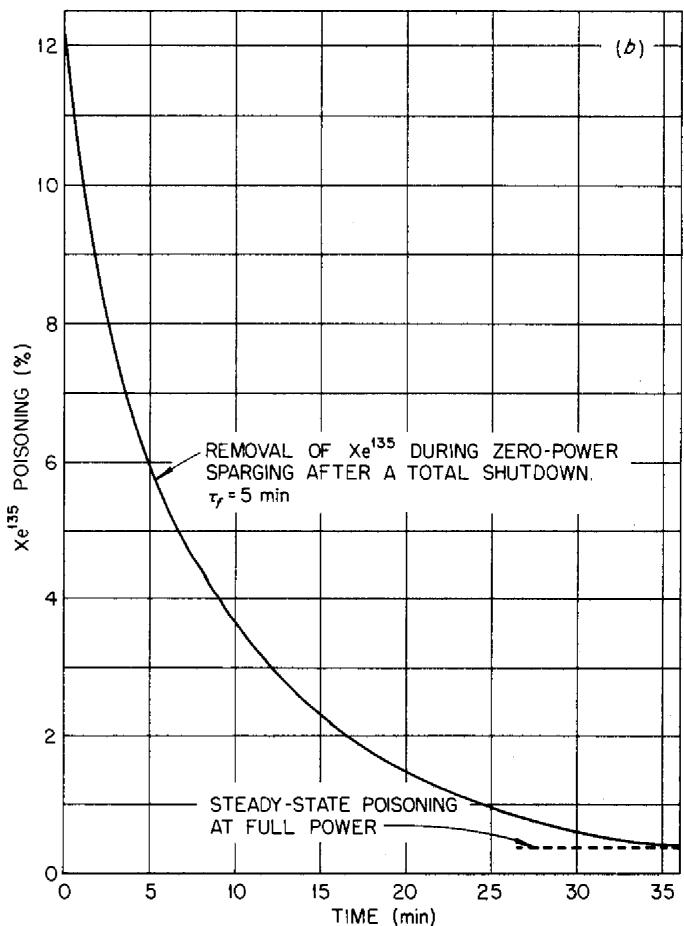  
Fig. 13. Behavior of Xe135 Poisoning in the ART During Shutdowns.

UNCLASSIFIED

SSD-A-1157

ORNL-LR-DWG-6011

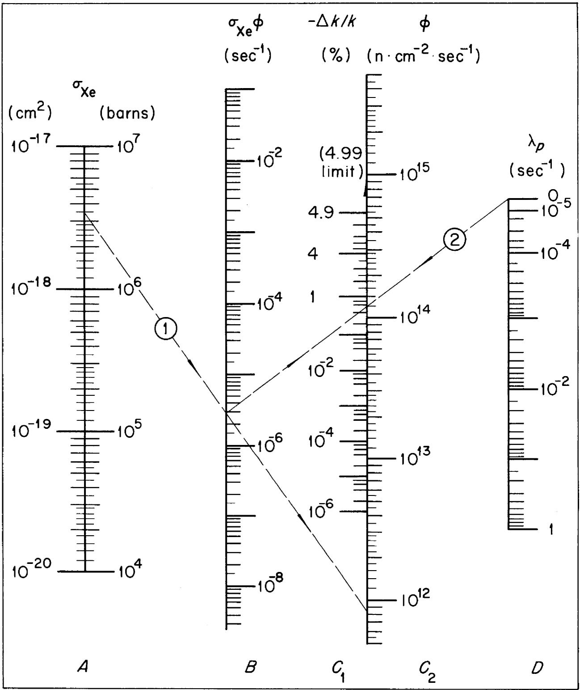  
Fig. 14. Nomogram 1: Steady-State Xe135 Poisoning.

where all symbols are defined in Table 1 and values are given in Table 2. To derive the nomogram, let

$$
U = \log \left[ \frac {a _ {0} + a _ {1}}{x _ {\infty}} - 1 \right], \tag {9.2a}
$$

$$
V = \log (\lambda_ {p} + a _ {4}), \tag {9.2b}
$$

$$
W = \log \lambda_ {L}. \tag {9.2c}
$$

Then, introducing Eqs. 9.2 into Eq. 9.1, the equation for bars $B$ , $C_1$ , $D$ of the nomogram is

$$
U = V - W. \tag {9.3}
$$

Furthermore, by letting

$$
Z = \log \sigma_ {X _ {e}}, \tag {9.4a}
$$

$$
S = \log \phi , \tag {9.4b}
$$

the equation of bars $A, B, C_2$ may be written

$$
W = Z + S. \tag {9.5}
$$

The five bars are laid off with linear scales in the variables $S, Z, U, V,$ and $W$ . The distances between bars is

$$
\overline {{A B}} = \overline {{B C}} = \overline {{C D}}. \tag {9.6}
$$

To use nomogram 1, lay a straightedge from the value of $\sigma_{\chi_{\mathbf{e}}}$ on bar $A$ to the value of $\phi$ on bar $C_2$ , locating their product $(\lambda_L)$ on bar $B$ . Lay the straightedge from this point on bar $B$ to the value of $\lambda_p$ on bar $D$ , locating $x_{\infty}$ on bar $C_1$ . The procedure is illustrated by an example shown on the nomogram by faint dashed lines.

Nomogram 2 (Fig. 15) describes the approach of the poisoning to its steady-state value. The equation employed is

$$
\xi = \frac {x}{x _ {\infty}} = 1 - e ^ {- a t} - \frac {a b}{a - a _ {3}} \left(e ^ {- a _ {3} t} - e ^ {- a t}\right), \tag {9.7}
$$

where

$$
a = \alpha_ {4} + \lambda_ {L} + \lambda_ {p},
$$

$$
b = \frac {a _ {1}}{a _ {0} + a _ {1}} = 0. 9 4 9.
$$

To derive the nomogram, let

$$
U = e ^ {- a t}, \tag {9.8a}
$$

$$
V = e ^ {- a _ {3} t}, \tag {9.8b}
$$

$$
W = \frac {a b}{a - a _ {3}}. \tag {9.8c}
$$

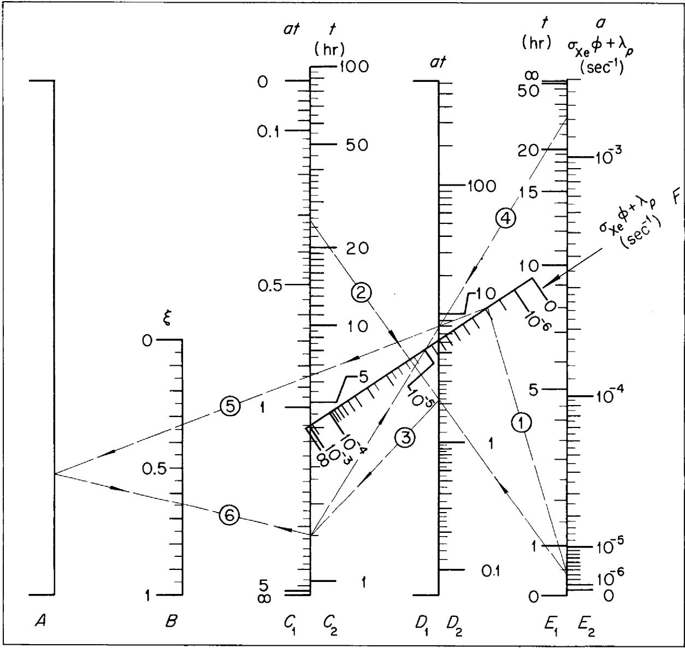  
Fig. 15. Nomogram 2: Time Dependence of $Xe^{135}$ Poisoning.

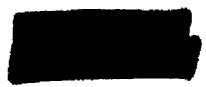

Then Eq. 9.7 becomes

$$
\xi = 1 - U - w (U - V). \tag {9.9}
$$

Further, let

$$
Z = W (U - V) = 1 - U - \xi . \tag {9.10}
$$

Bars $C_1, E_1, D_1$ are linear scales in the variables $U, V$ , and $(U - V)$ , respectively, the subtraction being performed on this subnomogram. Since the numerical value of $(U - V)$ is not required, no scale is inscribed on bar $D_1$ . Bars $A, F, D_1$ constitute a nomogram for the operation

$$
Z \cdot \frac {1}{W} = (U - V). \tag {9.11}
$$

Bar $A$ is a linear scale in $Z$ . Bar $F$ is a scale in $(1 / W)$ , constructed to obey Eq. 9.11, with the $Z$ and $(U - V)$ scales both linear. Bars $A$ , $C_1$ , and $B$ constitute a nomogram for the operation

$$
\xi = 1 - U - Z. \tag {9.12}
$$

Bar $B$ is linear in the variable $\xi$ . The bars $C_2, D_2, E_2$ are used as a subsidiary nomogram to perform the operation

$$
\log (a t) = \log a + \log t. \tag {9.13}
$$

These bars are linear in the variables $\log t$ , $\log at$ , and $\log a$ , respectively. The distances between the five vertical bars are

$$
\overline {{A B}} = \overline {{B C}} = \overline {{C D}} = \overline {{D E}}. \tag {9.14}
$$

Bar $F$ is laid off between the origins of bar $A$ $(Z = 0)$ and bar $D_{1}[(U - V) = 0]$ .

To use nomogram 2, proceed as follows: From bar $B$ of nomogram 1, read the value of $\lambda_{L} = \sigma_{\chi_{\bullet}}\phi$ and add to it the value $\lambda_{p}$ . Enter this result on both bars $E_{2}$ and $F$ . Lay a straightedge from the desired time on bar $C_{2}$ to the value on bar $E_{2}$ , locating the value (at) on bar $D_{2}$ . Transfer this value to bar $C_{1}$ . Now lay the straightedge from bar $C_{1}$ to the desired time on bar $E_{1}$ , locating a point on bar $D_{1}$ . Lay the straightedge from this point on bar $D_{1}$ to the value marked on bar $F$ , locating a point on bar $A$ . Finally, lay the straightedge from bar $A$ to the point marked on bar $C_{1}$ , locating the desired value $\xi$ on bar $B$ . The procedure is illustrated by an example shown on the nomogram by faint dashed lines.

The accuracy of these nomograms is limited by the precision of the input data, the process of drawing, and the means of reproduction. It is believed that the versions given in this report are accurate to around $\pm 5\%$ .