# CENTRAL RESEARCH LIBRARY DOCUMENT COLLECTION

APPLICATION OF TEMPERATURE SOLUTIONS

FOR FORCED CONVECTION SYSTEMS

WITH VOLUME HEAT SOURCES TO

GENERAL CONVECTION PROBLEMS

H. F. Poppendiek

L. D. Palmer

# CENTRAL RESEARCH LIBRARY DOCUMENT COLLECTION

# LIBRARY LOAN COPY

DO NOT TRANSFER TO ANOTHER PERSON

If you wish someone else to see this document, send in name with document and the library will arrange a loan.

OAK RIDGE NATIONAL LABORATORY

OPERATED BY

UNION CARBIDE NUCLEAR COMPANY

A Division of Union Carbide and Carbon Corporation

UCC

POST OFFICE BOX P · OAK RIDGE, TENNESSEE

Contract No W-7405, eng 26

Reactor Experimental Engineering Division

APPLICATION OF TEMPERATURE SOLUTIONS FOR FORCED CONVECTION SYSTEMS WITH VOLUME HEAT SOURCES TO GENERAL CONVECTION PROBLEMS

by

H F Poppendiek

L D Palmer

DATE ISSUED

SEP 29 1955

OAK RIDGE NATIONAL LABORATORY

Operated by

UNION CARBIDE NUCLEAR COMPANY

A Division of Union Carbide and Carbon Corporation

Post Office Box P

Oak Ridge, Tennessee

# INTERNAL DISTRIBUTION

<table><tr><td>1</td><td>C E Center</td><td>48-82</td><td>H</td><td>F</td><td>Poppendiek</td></tr><tr><td>2</td><td>Biology Library</td><td>83</td><td>D</td><td>D</td><td>Cowen</td></tr><tr><td>3</td><td>Health Physics Library</td><td>84</td><td>W</td><td>M</td><td>Breazeale (consultant)</td></tr><tr><td>45</td><td>Central Research Library</td><td>85</td><td>M</td><td>J</td><td>Skinner</td></tr><tr><td>6</td><td>Reactor Experimental</td><td>86</td><td>G</td><td>E</td><td>Boyd</td></tr><tr><td></td><td>Engineering Library</td><td>87</td><td>L</td><td>G</td><td>Alexander</td></tr><tr><td>7-13</td><td>Laboratory Records Department</td><td>88</td><td>E</td><td>S</td><td>Bettis</td></tr><tr><td>14</td><td>Laboratory Records, ORNL R C</td><td>89</td><td>E</td><td>P</td><td>Blizard</td></tr><tr><td>15</td><td>C E Larson</td><td>90</td><td>E</td><td>G</td><td>Bohlmann</td></tr><tr><td>16</td><td>L B Emlet (K-25)</td><td>91</td><td>H</td><td>C</td><td>Claiborne</td></tr><tr><td>17</td><td>J P Murray (Y-12)</td><td>92</td><td>S</td><td>I</td><td>Cohen</td></tr><tr><td>18</td><td>A M Weinberg</td><td>93</td><td>C</td><td>M</td><td>Copenhagen</td></tr><tr><td>19</td><td>E H Taylor</td><td>94</td><td>G</td><td>A</td><td>Crysty</td></tr><tr><td>20</td><td>E D Shipley</td><td>95</td><td>S</td><td>J</td><td>Cromer</td></tr><tr><td>21</td><td>C E Winters</td><td>96</td><td>E</td><td>R</td><td>Dytko</td></tr><tr><td>22</td><td>F C VonderLage</td><td>97</td><td>W</td><td>K</td><td>Ergen</td></tr><tr><td>23</td><td>W H Jordan</td><td>98</td><td>A</td><td>P</td><td>Fraas</td></tr><tr><td>24</td><td>J A Swartout</td><td>99</td><td>W</td><td>T</td><td>Furgerson</td></tr><tr><td>25</td><td>S C Lind</td><td>100</td><td>H</td><td>C</td><td>Gray</td></tr><tr><td>26</td><td>F L Culler</td><td>101</td><td>R</td><td>I</td><td>Gray</td></tr><tr><td>27</td><td>A H Snell</td><td>102</td><td>N</td><td>D</td><td>Greene</td></tr><tr><td>28</td><td>A Hollaender</td><td>103</td><td>H</td><td>W</td><td>Hoffman</td></tr><tr><td>29</td><td>M T Kelley</td><td>104</td><td>G</td><td>W</td><td>Keilholtz</td></tr><tr><td>30</td><td>G H Clewett</td><td>105</td><td>N</td><td>F</td><td>Lansing</td></tr><tr><td>31</td><td>K Z Morgan</td><td>106</td><td>C</td><td>G</td><td>Lawson</td></tr><tr><td>32</td><td>T A Lincoln</td><td>107</td><td>F</td><td>E</td><td>Lynch</td></tr><tr><td>33</td><td>A S Householder</td><td>108</td><td>W</td><td>D</td><td>Manly</td></tr><tr><td>34</td><td>C C Harrill</td><td>109</td><td>G</td><td>L</td><td>Muller</td></tr><tr><td>35</td><td>D S Billington</td><td>110</td><td>L</td><td>D</td><td>Palmer</td></tr><tr><td>36</td><td>D W Cardwell</td><td>111</td><td>A</td><td>M</td><td>Perry</td></tr><tr><td>37</td><td>E M King</td><td>112</td><td>W</td><td>D</td><td>Powers</td></tr><tr><td>38</td><td>R N Lyon</td><td>113</td><td>H</td><td>W</td><td>Savage</td></tr><tr><td>39</td><td>J A Lane</td><td>114</td><td>R</td><td>D</td><td>Schultheiss</td></tr><tr><td>40</td><td>A J Miller</td><td>115</td><td>D</td><td>G</td><td>Thomas</td></tr><tr><td>41</td><td>R B Briggs</td><td>116</td><td>D</td><td>B</td><td>Trauger</td></tr><tr><td>42</td><td>A S Kitzes</td><td>117</td><td>J</td><td>M</td><td>Warde</td></tr><tr><td>43</td><td>O Sisman</td><td>118</td><td>J</td><td>L</td><td>Wantland</td></tr><tr><td>44</td><td>R W Stoughton</td><td>119</td><td>G</td><td>D</td><td>Whitman</td></tr><tr><td>45</td><td>W R Gall</td><td>120</td><td>P</td><td>C</td><td>Zmola</td></tr><tr><td>46</td><td>S E Beall</td><td>121</td><td>M</td><td>M</td><td>Yarosh</td></tr><tr><td>47</td><td>J P Gill</td><td>122</td><td colspan="3">ORNL Document Reference</td></tr></table>

# EXTERNAL DISTRIBUTION

123 R F Bacher, California Institute of Technology  
124-438 Given distribution as shown in TID-4500 under Engineering category  
439 Division of Research and Medicine, AEC, ORO

DISTRIBUTION PAGE TO BE REMOVED IF REPORT IS GIVEN PUBLIC DISTRIBUTION

TABLE OF CONTENTS   

<table><tr><td>SUMMARY</td><td>4</td></tr><tr><td>NOMENCIATURE</td><td>5</td></tr><tr><td>INTRODUCTION</td><td>8</td></tr><tr><td>GENERALIZED RADIAL TEMPERATURE PROFILES</td><td>9</td></tr><tr><td>RADIAL TEMPERATURE PROFILES FOR A PIPE SYSTEM WHOSE WALL IS UNIFORMLY COOLED (AN EXAMPLE)</td><td>23</td></tr><tr><td>ANALYSIS OF THE THERMAL STRUCTURE IN A PIPE SYSTEM WHOSE WALL IS NONUNIFORMLY COOLED</td><td>28</td></tr><tr><td>TEMPERATURE STRUCTURE IN A PIPE SYSTEM WHOSE WALL IS NONUNIFORMLY COOLED (AN EXAMPLE)</td><td>32</td></tr><tr><td>CLOSING REMARKS</td><td>35</td></tr><tr><td>REFERENCES</td><td>37</td></tr></table>

# SUMMARY

This report concerns itself with the application of previously developed mathematical temperature solutions for forced convection systems having volume heat sources within the fluids to more general convection problems Convection solutions are tabulated so that it is possible to determine the detailed radial temperature structure within fluids having uniform volume heat sources and being uniformly cooled at the duct walls, the detailed temperature profile of a specific system is presented The derivation of equations describing the temperature structure and heat transfer rates in a duct system in which the wall is nonuniformly cooled is given, the temperature structure of a specific heat exchange system is also presented

# NOMENCLATURE

# Letters

A cross sectional heat transfer area, ft²

$\mathbf{c_p}$ fluid heat capacity, Btu/lb ${}^{\mathrm{o}}\mathbf{F}$

$c_{pc}$ heat capacity of coolant, Btu/lb $\mathbf{O}\mathbf{F}$

$\mathbf{c}_{\mathsf{pf}}$ heat capacity of volume-heat source fluid, Btu/lb ${}^{\mathrm{o}}\mathbb{F}$

h heat transfer conductance or coefficient, Btu/hr ft² oF

$h_c$ heat transfer conductance or coefficient of coolant, Btu/hr ft² of

$h_{f}$ heat transfer conductance or coefficient of volume-heat-source fluid, Btu/hr ft² of

k fluid thermal conductivity, Btu/hr ft² (°F/ft)

$\mathbf{k}_{\mathrm{W}}$ pipe wall thermal conductivity, Btu/hr ft2 (oF/ft)

L axial heat exchanger length, ft

m c mass flow rate of coolant, lb/hr

$m_{f}$ mass flow rate of volume-heat-source fluid, lb/hr

q heat transfer rate, Btu/hr

$q_{L}$ total heat transfer rate for heat exchanger of length L, Btu/hr

$\mathbf{r}_0$ pipe radius or half the distance between parallel plates, ft

$\mathbf{t}_{\mathbf{c}}$ mixed mean coolant temperature of heat exchanger in figure 8, ${}^{\circ}\mathbf{F}$

$t_{c1}$ mixed mean coolant temperature at entrance of heat exchanger, $^\circ F$

$t_{cI}$ mixed mean coolant temperature at exit of heat exchanger, $^{\mathrm{O}}\mathbf{F}$

$\mathfrak{t}_{\phi}$ fluid temperature at duct center, ${}^{\mathrm{o}}\mathbf{F}$

$t_f$ mixed mean temperature of the fluid with the volume heat source of the heat exchanger in figure 8, $^{\mathrm{OF}}$

$t_{f1}$ mixed mean temperature of the fluid with the volume heat source at the entrance of the heat exchanger, $^{\mathrm{OF}}$

$t_{fL}$ mixed mean temperature of the fluid with the volume heat source at the exit of the heat exchanger, $^{\mathrm{OF}}$   
tm mixed mean fluid temperature, ${}^{\mathrm{o}}\mathbf{F}$   
$\mathbf{t}_{\mathbf{o}}$ fluid temperature at duct wall, ${}^{\mathrm{o}}\mathbf{F}$   
$t_1$ wall temperature in figure 8, ${}^{\mathrm{OF}}$   
$t_2$ wall temperature in figure 8, oF   
$\Delta t_{VHS}$ the wall temperature rise above the mixed mean fluid temperature that exists for the fluid with the volume heat source with no wall heat flux, $^{\mathrm{O_F}}$   
U overall heat transfer conductance or coefficient, Btu/hr ft² oF   
$u_{m}$ mean fluid velocity, ft/hr   
W uniform volume heat source, Btu/hr ft   
x axial distance, ft   
y radial distance from duct wall, ft   
$\gamma$ fluid weight density, $\mathrm{lbs} / \mathrm{ft}^3$   
$\S$ pipe wall thickness, ft   
$\pmb{\mathcal{D}}$ kinematic viscosity, ft2/hr

# Terms

$$
\begin{array}{l} M = \frac {W \pi r _ {o} ^ {2}}{m _ {f} c _ {p f}} \\ N = \frac {1}{m _ {f} c _ {p f}} + \frac {1}{m _ {c} c _ {p c}} \\ \mathbf {T} = \mathbf {t} _ {\mathbf {f}} - \mathbf {t} _ {\mathbf {c}} \\ \end{array}
$$

# Dimensionless Moduli

$\mathbf{Nu} = \frac{\mathrm{h}2\mathbf{r}_{0}}{\mathrm{k}}$ Nusselt Modulus for a pipe

$$
n = \frac {y}{r _ {\circ}}
$$

$\mathrm{Pr} = \frac{\gamma c_{p} \vartheta}{k}$ , Prandtl Modulus

Re = u 2r, Reynolds Modulus for a pipe

$$
\frac {\Delta t _ {o m}}{\Delta t _ {o f}}
$$

ratio of the difference between wall and mixed mean fluid temperatures to the difference between wall and centerline temperature for a duct system being cooled at the wall (from reference 3)

# INTRODUCTION

Laminar and turbulent forced-convection solutions were derived in references 1 and 2 for the case where fluids with uniform volume heat sources were flowing through circular pipes and between parallel plates respectively, heat was being added to or subtracted from the fluids in a uniform manner at the duct walls. These duct systems were postulated to be long so that the thermal and hydrodynamic patterns were established and the physical properties were stipulated to be invariant with temperature. The turbulent flow solution for each system was accomplished by separating the general boundary value problem into two simpler ones whose solutions were superposed yielding the solution to the original boundary value problem. One boundary value problem defined a flow system with a volume heat source but with no wall heat flux and the second one defined a flow system without a volume heat source but with a uniform wall heat flux. In the superposition process, temperatures above datum temperatures are added, for example, the radial temperature distribution above the centerline temperature for the general boundary value problem is obtained by adding the radial temperature distributions above the centerline temperatures for the two specific boundary value problems

The present report gives 1) detailed tabulations of the turbulent temperature profiles1 for volume-heat-source and wall-heat-flux pipe and parallel plates systems for a series of Reynolds and Prandtl moduli and 2) applications of these temperature solutions to two types of convection systems, namely, uniformly and nonuniformly cooled ducts containing flowing fluids with volume heat sources

1 Although the detailed radial temperature profiles for turbulent flow had been evaluated at the writing of the earlier reports they were not included at that time, only the dimensionless differences between the wall and mixed mean fluid temperatures were presented because they are generally of more interest

# GENERALIZED RADIAL TEMPERATURE PROFILES

The dimensionless radial temperature profiles within fluids having uniform volume heat sources and that are flowing in circular pipes and between parallel plates under turbulent conditions with no wall heat transfer have been evaluated from the solutions given in references 1 and 2 and are tabulated in Tables I and II. The corresponding temperature profiles for the case where there are uniform wall heat fluxes but no volume heat sources have been evaluated from Martinelli's solutions (reference 3) and are tabulated in Tables III and IV

Some typical normalized radial temperature profiles for turbulent flow in a pipe for both the volume heat source and wall heat flux cases for $\mathbf{Pr} = 1$ and $\mathrm{Pr} = 01$ are shown plotted in Figures 1, 2, 3, and 4 Note how the shapes of these profiles vary with Reynolds and Prandtl moduli as well as the manner in which heat is added to the fluids The radial temperature distributions are dependent upon the radial heat flow and eddy diffusivity distributions in addition to the boundary layer thicknesses and Prandtl moduli The dimensionless radial heat flow distribution for the wall heat flux case varies linearly from a maximum value at the wall to zero at the duct center, its shape is essentially not a function of Reynolds modulus However, the dimensionless radial heat flow distributions for the volume-heat-source case vary from zero at the wall to a maximum value between the wall and duct center to zero at the duct center, their shapes vary significantly with Reynolds modulus The dimensionless eddy diffusivity profiles vary with radial distance from the wall and Reynolds modulus, and the dimensionless boundary layer thicknesses are dependent on Reynolds modulus The Prandtl modulus significantly influences the thermal resistances in the various flow layers

For example, in Figure 1 (where several temperature profiles are plotted for $\mathrm{Pr} = 1$ for the volume-heat-source case) it can be seen that the fraction of the total temperature drop across the laminar sublayer and buffer layer increases as Reynolds modulus decreases, this occurs because the radial heat flow is proportionately larger in the boundary layers at the lower Reynolds moduli as well as because these layers are thicker under such circumstances. Figure 2 reveals several temperature profiles for $\mathrm{Pr} = 01$ for the volume-heat-source case, the thermal resistances are much lower in the boundary layers for low Prandtl moduli fluids and hence the temperature differences across these layers are relatively smaller. The temperature profiles in Figure 2 asymptotically approach the laminar flow temperature profile as the Reynolds moduli decrease

UNCLASSIFIED

ORNL-LR-DWG 8221

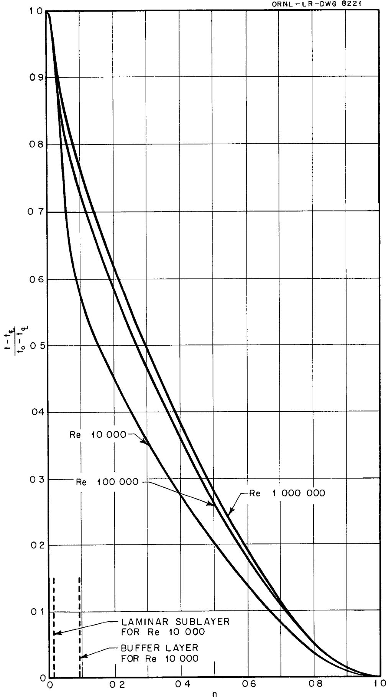  
Fig 1 Radial Temperature Distributions Within a Fluid Flowing in a Pipe with a Volume Heat Source in the Fluid and No Wall Heat Flux (Pr 1, Re 10,000, 100,000, 1,000,000)

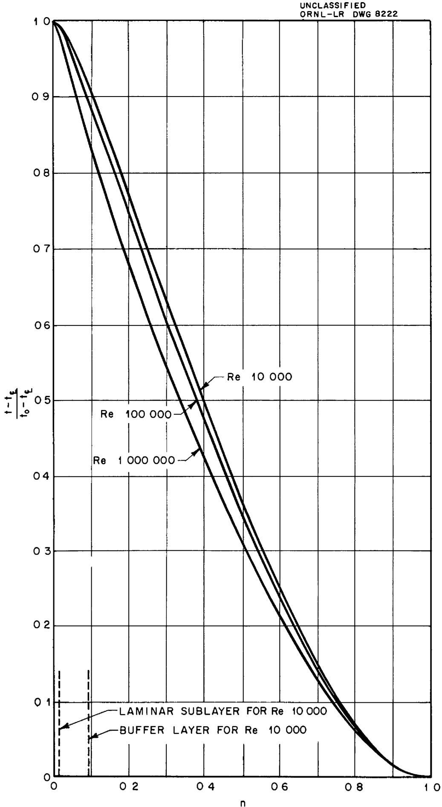  
Fig 2 Radial Temperature Distributions Within a Fluid Flowing in a Pipe with a Volume Heat Source and No Wall Heat Flux (Pr 001 Re 10,000, 100,000 1,000,000)

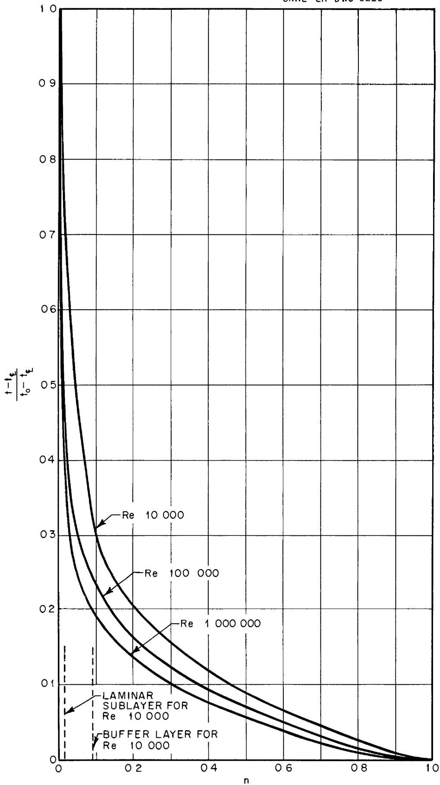  
Fig 3 Radial Temperature Distributions Within a Fluid Flowing in a Pipe with Wall Heat Flux but No Volume Heat Source in the Fluid (Pr 1, Re 10,000, 100,000, 1,000,000)

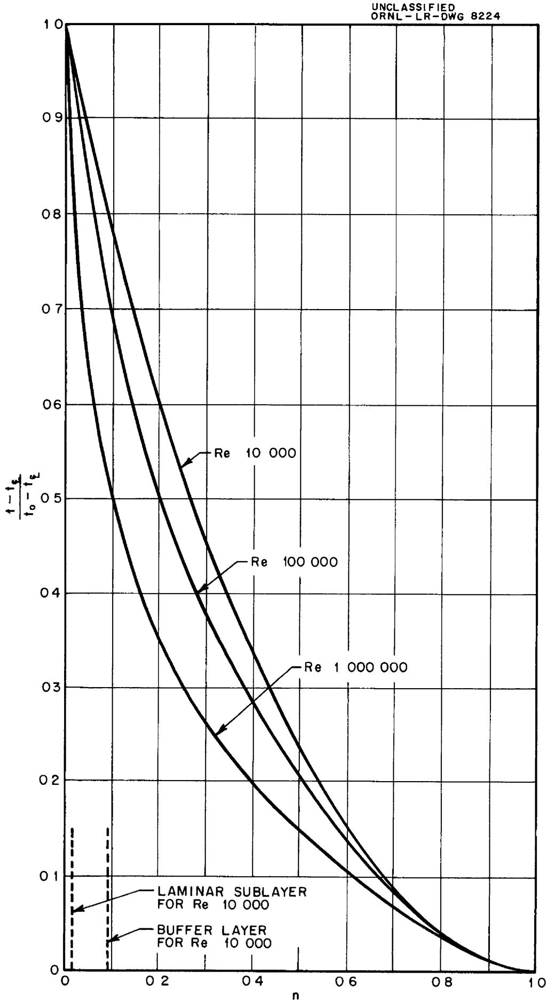  
Fig 4 Radial Temperature Distributions Within a Fluid Flowing in a Pipe with Wall Heat Flux but No Volume Heat Source in the Fluid (Pr 001 Re-10,000, 100,000, 1,000,000)

$$
\frac {t - t _ {\text {总}}}{\frac {W r _ {0} ^ {2}}{k}}
$$

TABLEI   
DIMENSIONLESS RADIAL TEMPERATURE DISTRIBUTION FOR A PIPE SYSTEM CONTAINING A UNIFORM VOLUMETRIC HEAT SOURCE BUT HAVING NO HEAT TRANSFERRED AT THE PIPE WALL  

<table><tr><td colspan="7">Re = 5000</td></tr><tr><td>n</td><td>Pr = 001</td><td>Pr = 01</td><td>Pr = 1</td><td>Pr = 4</td><td>Pr = 7</td><td>Pr = 10</td></tr><tr><td>0</td><td>4 1703x10-2</td><td>3 7591x10-2</td><td>5 1021x10-3</td><td>1 9956x10-3</td><td>1 4197x10-3</td><td>1 1438x10-3</td></tr><tr><td>025</td><td>4 1424</td><td>3 7302</td><td>4 8143</td><td>1 7076</td><td>1 1318</td><td>8559</td></tr><tr><td>05</td><td>4 0665</td><td>3 6542</td><td>4 1949</td><td>1 2528</td><td>7371</td><td>5271</td></tr><tr><td>075</td><td>3 9601</td><td>3 5399</td><td>3 7000</td><td>1 0407</td><td>5978</td><td>4179</td></tr><tr><td>1</td><td>3 8404</td><td>3 4200</td><td>3 2000</td><td>8998</td><td>5209</td><td>3560</td></tr><tr><td>15</td><td>3 5652</td><td>3 1640</td><td>2 5429</td><td>6975</td><td>3898</td><td>2745</td></tr><tr><td>2</td><td>3 2603</td><td>2 8701</td><td>2 2000</td><td>5759</td><td>3240</td><td>2290</td></tr><tr><td>3</td><td>2 6761</td><td>2 3479</td><td>1 6189</td><td>4239</td><td>2438</td><td>1712</td></tr><tr><td>4</td><td>2 0772</td><td>1 8179</td><td>1 2311</td><td>3219</td><td>1851</td><td>1299</td></tr><tr><td>5</td><td>1 5130</td><td>1 3240</td><td>8934</td><td>2335</td><td>1343</td><td>0942</td></tr><tr><td>6</td><td>1 0100</td><td>8838</td><td>5964</td><td>1559</td><td>0897</td><td>0630</td></tr><tr><td>8</td><td>2715</td><td>2368</td><td>1602</td><td>0417</td><td>0241</td><td>0170</td></tr><tr><td>10</td><td>0</td><td>0</td><td>0</td><td>0</td><td>0</td><td>0</td></tr><tr><td colspan="7">Re = 10,000</td></tr><tr><td>0</td><td>3 3566x10-2</td><td>2 7680x10-2</td><td>2 1094x10-3</td><td>7 4364x10-4</td><td>5 0511x10-4</td><td>4 0573x10-4</td></tr><tr><td>025</td><td>3 3287</td><td>2 7409</td><td>1 8643</td><td>5 3594</td><td>3 1499</td><td>2 2433</td></tr><tr><td>05</td><td>3 2677</td><td>2 6800</td><td>1 5863</td><td>4 2700</td><td>2 4659</td><td>1 8501</td></tr><tr><td>075</td><td>3 1797</td><td>2 6099</td><td>1 3975</td><td>3 5204</td><td>2 0502</td><td>1 4801</td></tr><tr><td>1</td><td>3 1055</td><td>2 5230</td><td>1 2192</td><td>3 1441</td><td>1 8043</td><td>1 2679</td></tr><tr><td>15</td><td>2 9095</td><td>2 3401</td><td>1 0503</td><td>2 7403</td><td>1 5401</td><td>1 0999</td></tr><tr><td>2</td><td>2 6927</td><td>2 1590</td><td>9564</td><td>2 4562</td><td>1 4082</td><td>9888</td></tr><tr><td>3</td><td>2 0079</td><td>1 7560</td><td>7505</td><td>1 9238</td><td>1 1042</td><td>7749</td></tr><tr><td>4</td><td>1 7377</td><td>1 3760</td><td>5754</td><td>1 4739</td><td>8461</td><td>5936</td></tr><tr><td>5</td><td>1 2738</td><td>1 0081</td><td>4208</td><td>1 0760</td><td>6183</td><td>4341</td></tr><tr><td>6</td><td>8559</td><td>6773</td><td>2827</td><td>7228</td><td>4152</td><td>2921</td></tr><tr><td>8</td><td>2319</td><td>1835</td><td>0768</td><td>1956</td><td>1131</td><td>0795</td></tr><tr><td>10</td><td>0</td><td>0</td><td>0</td><td>0</td><td>0</td><td>0</td></tr></table>

-16-   
TABLE I (Con't)   

<table><tr><td colspan="7">Re = 100,000</td></tr><tr><td>n</td><td>Pr = 001</td><td>Pr = 01</td><td>Pr = 1</td><td>Pr = 4</td><td>Pr = 7</td><td>Pr = 10</td></tr><tr><td>0</td><td>23351x10-2</td><td>96944x10-3</td><td>17885x10-4</td><td>49508x10-5</td><td>29004x10-5</td><td>21042x10-5</td></tr><tr><td>025</td><td>23202</td><td>95800</td><td>15785</td><td>40097</td><td>22403</td><td>15901</td></tr><tr><td>05</td><td>22851</td><td>92620</td><td>14655</td><td>36859</td><td>21092</td><td>14750</td></tr><tr><td>075</td><td>22480</td><td>89508</td><td>13823</td><td>34200</td><td>19804</td><td>13801</td></tr><tr><td>1</td><td>21831</td><td>86115</td><td>12993</td><td>32660</td><td>18661</td><td>13071</td></tr><tr><td>15</td><td>20612</td><td>79504</td><td>11613</td><td>28299</td><td>16802</td><td>11800</td></tr><tr><td>2</td><td>19050</td><td>72058</td><td>10423</td><td>26180</td><td>14963</td><td>10481</td></tr><tr><td>3</td><td>15790</td><td>58302</td><td>8279</td><td>20798</td><td>11892</td><td>8331</td></tr><tr><td>4</td><td>12430</td><td>45379</td><td>6405</td><td>16100</td><td>9197</td><td>6445</td></tr><tr><td>5</td><td>9172</td><td>33436</td><td>4713</td><td>11847</td><td>6778</td><td>4745</td></tr><tr><td>6</td><td>6197</td><td>22588</td><td>3182</td><td>8010</td><td>4591</td><td>3209</td></tr><tr><td>8</td><td>1695</td><td>6185</td><td>0873</td><td>2188</td><td>1256</td><td>0875</td></tr><tr><td>10</td><td>0</td><td>0</td><td>0</td><td>0</td><td>0</td><td>0</td></tr><tr><td colspan="7">Re = 1,000,000</td></tr><tr><td>0</td><td>10818x10-2</td><td>18160x10-3</td><td>21151x10-5</td><td>53623x10-6</td><td>30820x10-6</td><td>21733x10-6</td></tr><tr><td>025</td><td>10678</td><td>17610</td><td>19582</td><td>49805</td><td>28579</td><td>19703</td></tr><tr><td>05</td><td>10469</td><td>16760</td><td>18090</td><td>45263</td><td>25839</td><td>18093</td></tr><tr><td>075</td><td>10179</td><td>15961</td><td>16950</td><td>42400</td><td>24400</td><td>17082</td></tr><tr><td>1</td><td>9808</td><td>15140</td><td>16151</td><td>40405</td><td>23041</td><td>16143</td></tr><tr><td>15</td><td>9118</td><td>13711</td><td>14501</td><td>36201</td><td>20779</td><td>14253</td></tr><tr><td>2</td><td>8270</td><td>12271</td><td>12980</td><td>32474</td><td>18520</td><td>12962</td></tr><tr><td>3</td><td>6720</td><td>9799</td><td>10341</td><td>25841</td><td>14729</td><td>10321</td></tr><tr><td>4</td><td>5245</td><td>7598</td><td>8008</td><td>20012</td><td>11400</td><td>7983</td></tr><tr><td>5</td><td>3869</td><td>5599</td><td>5895</td><td>14730</td><td>8395</td><td>5872</td></tr><tr><td>6</td><td>2617</td><td>3785</td><td>3985</td><td>9963</td><td>5677</td><td>3971</td></tr><tr><td>8</td><td>0718</td><td>1037</td><td>1091</td><td>2735</td><td>1556</td><td>1084</td></tr><tr><td>10</td><td>0</td><td>0</td><td>0</td><td>0</td><td>0</td><td>0</td></tr></table>

TABLE II   
DIMENSIONLESS RADIAL TEMPERATURE DISTRIBUTION FOR A PARALLEL PLATES SYSTEM CONTAINING A UNIFORM VOLUMETRIC HEAT SOURCE BUT HAVING NO HEAT TRANSFERRED AT THE WALLS  

<table><tr><td>t - tφ</td></tr><tr><td>wro2/k</td></tr></table>

<table><tr><td colspan="7">Re = 5000</td></tr><tr><td>n</td><td>Pr = 001</td><td>Pr = 01</td><td>Pr = 1</td><td>Pr = 4</td><td>Pr = 7</td><td>Pr = 10</td></tr><tr><td>0</td><td>62533x10-2</td><td>59943x10-2</td><td>15040x10-2</td><td>64605x10-3</td><td>46881x10-3</td><td>39211x10-3</td></tr><tr><td>025</td><td>62233</td><td>59643</td><td>14741</td><td>61607</td><td>43881</td><td>36211</td></tr><tr><td>050</td><td>61395</td><td>58804</td><td>13900</td><td>53176</td><td>35451</td><td>27781</td></tr><tr><td>075</td><td>60125</td><td>57521</td><td>12670</td><td>42975</td><td>25949</td><td>18731</td></tr><tr><td>1</td><td>58443</td><td>55855</td><td>11500</td><td>36573</td><td>21420</td><td>15230</td></tr><tr><td>15</td><td>54241</td><td>51671</td><td>9436</td><td>27625</td><td>16122</td><td>11281</td></tr><tr><td>2</td><td>49664</td><td>47223</td><td>7767</td><td>22974</td><td>12770</td><td>8924</td></tr><tr><td>3</td><td>40215</td><td>38052</td><td>5386</td><td>14769</td><td>8795</td><td>5850</td></tr><tr><td>4</td><td>31010</td><td>29120</td><td>3886</td><td>10699</td><td>6188</td><td>4348</td></tr><tr><td>5</td><td>22518</td><td>21154</td><td>2802</td><td>7746</td><td>4468</td><td>3137</td></tr><tr><td>6</td><td>14983</td><td>14069</td><td>1880</td><td>5233</td><td>2949</td><td>2090</td></tr><tr><td>8</td><td>4052</td><td>3878</td><td>0508</td><td>1395</td><td>0797</td><td>0561</td></tr><tr><td>10</td><td>0</td><td>0</td><td>0</td><td>0</td><td>0</td><td>0</td></tr><tr><td colspan="7">Re = 10,000</td></tr><tr><td>0</td><td>46965x10-2</td><td>42910x10-2</td><td>60926x10-3</td><td>22948x10-3</td><td>16414x10-3</td><td>13060x10-3</td></tr><tr><td>025</td><td>46683</td><td>42631</td><td>58087</td><td>20109</td><td>13583</td><td>10219</td></tr><tr><td>05</td><td>45946</td><td>41889</td><td>51629</td><td>15038</td><td>9435</td><td>6729</td></tr><tr><td>075</td><td>44814</td><td>40790</td><td>45597</td><td>13018</td><td>7884</td><td>5454</td></tr><tr><td>1</td><td>43513</td><td>39499</td><td>40424</td><td>11288</td><td>6733</td><td>4828</td></tr><tr><td>15</td><td>40625</td><td>36658</td><td>32626</td><td>8915</td><td>5210</td><td>3704</td></tr><tr><td>2</td><td>37516</td><td>33641</td><td>26978</td><td>7141</td><td>4133</td><td>2878</td></tr><tr><td>3</td><td>30814</td><td>27488</td><td>21032</td><td>5558</td><td>3209</td><td>2220</td></tr><tr><td>4</td><td>24102</td><td>21412</td><td>16091</td><td>4229</td><td>2447</td><td>1702</td></tr><tr><td>5</td><td>17654</td><td>15658</td><td>11777</td><td>3089</td><td>1784</td><td>1245</td></tr><tr><td>6</td><td>11812</td><td>10479</td><td>7957</td><td>2074</td><td>1200</td><td>0832</td></tr><tr><td>8</td><td>3170</td><td>2802</td><td>2187</td><td>0567</td><td>0323</td><td>0225</td></tr><tr><td>10</td><td>0</td><td>0</td><td>0</td><td>0</td><td>0</td><td>0</td></tr></table>

TABLE II (Con't)   

<table><tr><td colspan="7">Re = 100,000</td></tr><tr><td>n</td><td>Pr = 001</td><td>Pr = 01</td><td>Pr = 1</td><td>Pr = 4</td><td>Pr = 7</td><td>Pr = 10</td></tr><tr><td>0</td><td>3 1195x10-2</td><td>1 7325x10-2</td><td>4 4400x10-4</td><td>1 2476x10-4</td><td>7 5890x10-5</td><td>5 7150x10-5</td></tr><tr><td>025</td><td>3 0995</td><td>1 7145</td><td>3 8060</td><td>9607</td><td>5 4550</td><td>3 9451</td></tr><tr><td>05</td><td>3 0615</td><td>1 6816</td><td>3 5760</td><td>8993</td><td>5 1097</td><td>3 6947</td></tr><tr><td>075</td><td>3 0075</td><td>1 6384</td><td>3 3762</td><td>8482</td><td>4 8251</td><td>3 4902</td></tr><tr><td>1</td><td>2 9426</td><td>1 5875</td><td>3 1941</td><td>8013</td><td>4 5648</td><td>3 2850</td></tr><tr><td>15</td><td>2 7776</td><td>1 4744</td><td>2 8820</td><td>7192</td><td>4 1003</td><td>2 9598</td></tr><tr><td>2</td><td>2 5917</td><td>1 3574</td><td>2 5952</td><td>6473</td><td>3 6898</td><td>2 6552</td></tr><tr><td>3</td><td>2 1637</td><td>1 1123</td><td>2 0761</td><td>5169</td><td>2 9552</td><td>2 1248</td></tr><tr><td>4</td><td>1 7117</td><td>8728</td><td>1 5940</td><td>4019</td><td>2 3146</td><td>1 6551</td></tr><tr><td>5</td><td>1 2687</td><td>6467</td><td>1.1881</td><td>2974</td><td>1 7098</td><td>1 2299</td></tr><tr><td>6</td><td>8585</td><td>4387</td><td>8081</td><td>2000</td><td>1 1550</td><td>8498</td></tr><tr><td>8</td><td>2340</td><td>1211</td><td>2180</td><td>0555</td><td>3096</td><td>2452</td></tr><tr><td>10</td><td>0</td><td>0</td><td>0</td><td>0</td><td>0</td><td>0</td></tr><tr><td colspan="7">Re = 1,000,000</td></tr><tr><td>0</td><td>1 8578x10-2</td><td>4 0304x10-3</td><td>5 0065x10-5</td><td>1 2458x10-5</td><td>7 6610x10-6</td><td>5 2055x10-6</td></tr><tr><td>025</td><td>1 8468</td><td>3 9216</td><td>4 6405</td><td>1 1179</td><td>6 8949</td><td>4 6147</td></tr><tr><td>050</td><td>1 8179</td><td>3 7745</td><td>4 3647</td><td>1 0498</td><td>6 5180</td><td>4 3747</td></tr><tr><td>075</td><td>1 7759</td><td>3 6133</td><td>4 1364</td><td>9959</td><td>6 1901</td><td>4 1347</td></tr><tr><td>1</td><td>1 7259</td><td>3 4593</td><td>3 9206</td><td>9438</td><td>5 8821</td><td>3 9218</td></tr><tr><td>15</td><td>1 6139</td><td>3 1433</td><td>3 5386</td><td>8519</td><td>5 3221</td><td>3 5345</td></tr><tr><td>2</td><td>1 4879</td><td>2 8443</td><td>3 1861</td><td>7578</td><td>4 8203</td><td>3 1878</td></tr><tr><td>3</td><td>1 2319</td><td>2.2961</td><td>2 5563</td><td>6119</td><td>3 9217</td><td>2 5517</td></tr><tr><td>4</td><td>9724</td><td>1 7972</td><td>1 9961</td><td>4679</td><td>3 1104</td><td>1 9947</td></tr><tr><td>5</td><td>7193</td><td>1 3341</td><td>1 4779</td><td>3460</td><td>2 3703</td><td>1 4800</td></tr><tr><td>6</td><td>4890</td><td>9032</td><td>1 0043</td><td>2039</td><td>1 4349</td><td>9974</td></tr><tr><td>8</td><td>1339</td><td>2519</td><td>2699</td><td>0620</td><td>3899</td><td>2650</td></tr><tr><td>10</td><td>0</td><td>0</td><td>0</td><td>0</td><td>0</td><td>0</td></tr></table>

$$
\frac {t - t _ {0}}{t _ {0} - t _ {0}}
$$

TABLE III   
DIMENSIONLESS RADIAL TEMPERATURE DISTRIBUTION FOR A PIPE SYSTEM HAVING HEAT TRANSFERRED AT THE PIPE WALL BUT CONTAINING NO VOLUMETRIC HEAT SOURCE  

<table><tr><td colspan="7">Re = 5000</td></tr><tr><td>n</td><td>Pr = 001</td><td>Pr = 01</td><td>Pr = 1</td><td>Pr = 4</td><td>Pr = 7</td><td>Pr = 10</td></tr><tr><td>0</td><td>10</td><td>10</td><td>10</td><td>10</td><td>10</td><td>10</td></tr><tr><td>025</td><td>9512</td><td>9473</td><td>7776</td><td>5902</td><td>5049</td><td>4531</td></tr><tr><td>05</td><td>9134</td><td>8957</td><td>5928</td><td>3353</td><td>2412</td><td>1899</td></tr><tr><td>075</td><td>8552</td><td>8428</td><td>4812</td><td>2517</td><td>1777</td><td>1388</td></tr><tr><td>1</td><td>8070</td><td>7915</td><td>4020</td><td>2018</td><td>1413</td><td>1100</td></tr><tr><td>15</td><td>7108</td><td>6883</td><td>2905</td><td>1382</td><td>0959</td><td>0743</td></tr><tr><td>2</td><td>6169</td><td>5946</td><td>2214</td><td>1020</td><td>0704</td><td>0545</td></tr><tr><td>3</td><td>4709</td><td>4531</td><td>1656</td><td>0763</td><td>0527</td><td>0407</td></tr><tr><td>4</td><td>3462</td><td>3336</td><td>1261</td><td>0581</td><td>0401</td><td>0310</td></tr><tr><td>5</td><td>2410</td><td>2334</td><td>0954</td><td>0439</td><td>0303</td><td>0235</td></tr><tr><td>6</td><td>1539</td><td>1515</td><td>0703</td><td>0324</td><td>0223</td><td>0173</td></tr><tr><td>8</td><td>0124</td><td>0396</td><td>0307</td><td>0141</td><td>0098</td><td>0076</td></tr><tr><td>10</td><td>0</td><td>0</td><td>0</td><td>0</td><td>0</td><td>0</td></tr><tr><td colspan="7">Re = 10,000</td></tr><tr><td>0</td><td>10</td><td>10</td><td>10</td><td>10</td><td>10</td><td>10</td></tr><tr><td>025</td><td>9499</td><td>9418</td><td>6425</td><td>3768</td><td>3744</td><td>2175</td></tr><tr><td>05</td><td>8998</td><td>8835</td><td>4668</td><td>2433</td><td>1723</td><td>1348</td></tr><tr><td>075</td><td>8497</td><td>8268</td><td>3741</td><td>1811</td><td>1272</td><td>0992</td></tr><tr><td>1</td><td>7998</td><td>7717</td><td>2918</td><td>1404</td><td>0981</td><td>0763</td></tr><tr><td>15</td><td>7119</td><td>6800</td><td>2404</td><td>1157</td><td>0808</td><td>0629</td></tr><tr><td>2</td><td>6300</td><td>5976</td><td>2038</td><td>0981</td><td>0686</td><td>0533</td></tr><tr><td>3</td><td>4816</td><td>4539</td><td>1526</td><td>0734</td><td>0513</td><td>0399</td></tr><tr><td>4</td><td>3537</td><td>3342</td><td>1161</td><td>0559</td><td>0390</td><td>0304</td></tr><tr><td>5</td><td>2459</td><td>2348</td><td>0878</td><td>0423</td><td>0295</td><td>0230</td></tr><tr><td>6</td><td>1577</td><td>1535</td><td>0647</td><td>0311</td><td>0218</td><td>0169</td></tr><tr><td>8</td><td>0400</td><td>0400</td><td>0283</td><td>0136</td><td>0095</td><td>0074</td></tr><tr><td>10</td><td>0</td><td>0</td><td>0</td><td>0</td><td>0</td><td>0</td></tr></table>

TABLE III (Con't)   

<table><tr><td colspan="7">Re = 100,000</td></tr><tr><td>n</td><td>Pr = 001</td><td>Pr = 01</td><td>Pr = 1</td><td>Pr = 4</td><td>Pr = 7</td><td>Pr = 10</td></tr><tr><td>0</td><td>10</td><td>10</td><td>10</td><td>10</td><td>10</td><td>10</td></tr><tr><td>025</td><td>9434</td><td>8942</td><td>3702</td><td>1997</td><td>1444</td><td>1144</td></tr><tr><td>05</td><td>8896</td><td>8106</td><td>3006</td><td>1622</td><td>1173</td><td>0929</td></tr><tr><td>075</td><td>8384</td><td>7405</td><td>2598</td><td>1402</td><td>1014</td><td>0803</td></tr><tr><td>1</td><td>7904</td><td>6813</td><td>2311</td><td>1247</td><td>0901</td><td>0714</td></tr><tr><td>15</td><td>6980</td><td>5802</td><td>1904</td><td>1027</td><td>0743</td><td>0588</td></tr><tr><td>2</td><td>6143</td><td>4993</td><td>1616</td><td>0872</td><td>0630</td><td>0499</td></tr><tr><td>3</td><td>4672</td><td>3734</td><td>1309</td><td>0706</td><td>0510</td><td>0404</td></tr><tr><td>4</td><td>3438</td><td>2777</td><td>0920</td><td>0496</td><td>0359</td><td>0284</td></tr><tr><td>5</td><td>2410</td><td>2015</td><td>0696</td><td>0375</td><td>0271</td><td>0215</td></tr><tr><td>6</td><td>1570</td><td>1392</td><td>0513</td><td>0277</td><td>0200</td><td>0158</td></tr><tr><td>8</td><td>0418</td><td>0462</td><td>0224</td><td>0121</td><td>0087</td><td>0069</td></tr><tr><td>10</td><td>0</td><td>0</td><td>0</td><td>0</td><td>0</td><td>0</td></tr><tr><td colspan="7">Re = 1,000,000</td></tr><tr><td>0</td><td>10</td><td>10</td><td>10</td><td>10</td><td>10</td><td>10</td></tr><tr><td>025</td><td>9154</td><td>7496</td><td>3065</td><td>1796</td><td>1336</td><td>1075</td></tr><tr><td>05</td><td>8264</td><td>6322</td><td>2489</td><td>1458</td><td>1085</td><td>0873</td></tr><tr><td>075</td><td>7586</td><td>5546</td><td>2152</td><td>1261</td><td>0938</td><td>0755</td></tr><tr><td>1</td><td>7005</td><td>4976</td><td>1913</td><td>1121</td><td>0834</td><td>0671</td></tr><tr><td>15</td><td>5993</td><td>4117</td><td>1576</td><td>0923</td><td>0687</td><td>0553</td></tr><tr><td>2</td><td>5171</td><td>3498</td><td>1337</td><td>0783</td><td>0583</td><td>0469</td></tr><tr><td>3</td><td>3872</td><td>2609</td><td>1000</td><td>0586</td><td>0436</td><td>0351</td></tr><tr><td>4</td><td>2875</td><td>1969</td><td>0844</td><td>0495</td><td>0368</td><td>0296</td></tr><tr><td>5</td><td>2050</td><td>1470</td><td>0576</td><td>0337</td><td>0251</td><td>0202</td></tr><tr><td>6</td><td>1425</td><td>1064</td><td>0424</td><td>0249</td><td>0185</td><td>0081</td></tr><tr><td>8</td><td>0460</td><td>0427</td><td>0185</td><td>0109</td><td>0149</td><td>0065</td></tr><tr><td>10</td><td>0</td><td>0</td><td>0</td><td>0</td><td>0</td><td>0</td></tr></table>

$$
\frac {t - t _ {\xi}}{t _ {0} - t _ {\xi}}
$$

TABLE IV   
DIMENSIONLESS RADIAL TEMPERATURE DISTRIBUTION FOR A PARALLEL PLATES  
SYSTEM HAVING HEAT TRANSFERRED AT THE WALLS BUT CONTAINING   
NO VOLUMETRIC HEAT SOURCE   

<table><tr><td colspan="7">Re = 5000</td></tr><tr><td>n</td><td>Pr = 001</td><td>Pr = 01</td><td>Pr = 1</td><td>Pr = 4</td><td>Pr = 7</td><td>Pr = 10</td></tr><tr><td>0</td><td>10</td><td>10</td><td>10</td><td>10</td><td>10</td><td>10</td></tr><tr><td>025</td><td>9548</td><td>9533</td><td>8751</td><td>7833</td><td>7422</td><td>7174</td></tr><tr><td>05</td><td>9096</td><td>9065</td><td>7501</td><td>5665</td><td>4844</td><td>4348</td></tr><tr><td>075</td><td>8667</td><td>8601</td><td>6317</td><td>3831</td><td>2819</td><td>2245</td></tr><tr><td>1</td><td>8223</td><td>8132</td><td>5434</td><td>3001</td><td>2139</td><td>1676</td></tr><tr><td>15</td><td>7335</td><td>7212</td><td>4189</td><td>2128</td><td>1487</td><td>1251</td></tr><tr><td>2</td><td>6338</td><td>6300</td><td>3305</td><td>1604</td><td>1111</td><td>0860</td></tr><tr><td>3</td><td>4566</td><td>4485</td><td>2060</td><td>0938</td><td>0642</td><td>0494</td></tr><tr><td>4</td><td>3300</td><td>3169</td><td>1407</td><td>0610</td><td>0415</td><td>0318</td></tr><tr><td>5</td><td>2110</td><td>2050</td><td>1064</td><td>0462</td><td>0314</td><td>0241</td></tr><tr><td>6</td><td>1355</td><td>1318</td><td>0784</td><td>0340</td><td>0231</td><td>0177</td></tr><tr><td>8</td><td>0346</td><td>0345</td><td>0343</td><td>0149</td><td>0101</td><td>0078</td></tr><tr><td>10</td><td>0</td><td>0</td><td>0</td><td>0</td><td>0</td><td>0</td></tr><tr><td colspan="7">Re = 10,000</td></tr><tr><td>0</td><td>10</td><td>10</td><td>10</td><td>10</td><td>10</td><td>10</td></tr><tr><td>025</td><td>9494</td><td>9459</td><td>7872</td><td>6117</td><td>5322</td><td>4838</td></tr><tr><td>05</td><td>9001</td><td>8917</td><td>6027</td><td>3450</td><td>2489</td><td>1962</td></tr><tr><td>075</td><td>8469</td><td>8381</td><td>4891</td><td>2571</td><td>1816</td><td>1418</td></tr><tr><td>1</td><td>8003</td><td>7848</td><td>4085</td><td>2055</td><td>1439</td><td>1119</td></tr><tr><td>15</td><td>6940</td><td>6794</td><td>2948</td><td>1404</td><td>0974</td><td>0754</td></tr><tr><td>2</td><td>5977</td><td>5775</td><td>2176</td><td>0993</td><td>0684</td><td>0528</td></tr><tr><td>3</td><td>4572</td><td>4402</td><td>1687</td><td>0770</td><td>0530</td><td>0409</td></tr><tr><td>4</td><td>3358</td><td>3237</td><td>1284</td><td>0586</td><td>0403</td><td>0312</td></tr><tr><td>5</td><td>2342</td><td>2262</td><td>0971</td><td>0443</td><td>0305</td><td>0236</td></tr><tr><td>6</td><td>1494</td><td>1464</td><td>0716</td><td>0327</td><td>0225</td><td>0174</td></tr><tr><td>8</td><td>0378</td><td>0381</td><td>0313</td><td>0143</td><td>0098</td><td>0076</td></tr><tr><td>10</td><td>0</td><td>0</td><td>0</td><td>0</td><td>0</td><td>0</td></tr></table>

TABLE IV (Con't)   

<table><tr><td colspan="7">Re = 100,000</td></tr><tr><td>n</td><td>Pr = 001</td><td>Pr = 01</td><td>Pr = 1</td><td>Pr = 4</td><td>Pr = 7</td><td>Pr = 10</td></tr><tr><td>0</td><td>10</td><td>10</td><td>10</td><td>10</td><td>10</td><td>10</td></tr><tr><td>025</td><td>9432</td><td>9130</td><td>3926</td><td>2040</td><td>1458</td><td>1148</td></tr><tr><td>05</td><td>8922</td><td>8443</td><td>3253</td><td>1691</td><td>1208</td><td>0951</td></tr><tr><td>075</td><td>8456</td><td>7827</td><td>2813</td><td>1462</td><td>1045</td><td>0823</td></tr><tr><td>1</td><td>7964</td><td>7270</td><td>2500</td><td>1300</td><td>0929</td><td>0731</td></tr><tr><td>15</td><td>7073</td><td>6295</td><td>2060</td><td>1071</td><td>0765</td><td>0602</td></tr><tr><td>2</td><td>6244</td><td>5464</td><td>1748</td><td>0908</td><td>0649</td><td>0511</td></tr><tr><td>3</td><td>4765</td><td>4109</td><td>1307</td><td>0680</td><td>0486</td><td>0382</td></tr><tr><td>4</td><td>3503</td><td>3040</td><td>0995</td><td>0517</td><td>0370</td><td>0291</td></tr><tr><td>5</td><td>2446</td><td>2175</td><td>0753</td><td>0391</td><td>0280</td><td>0220</td></tr><tr><td>6</td><td>1579</td><td>1468</td><td>0555</td><td>0288</td><td>0206</td><td>0162</td></tr><tr><td>8</td><td>0409</td><td>0405</td><td>0242</td><td>0126</td><td>0090</td><td>0071</td></tr><tr><td>10</td><td>0</td><td>0</td><td>0</td><td>0</td><td>0</td><td>0</td></tr><tr><td colspan="7">Re = 1,000,000</td></tr><tr><td>0</td><td>10</td><td>10</td><td>10</td><td>10</td><td>10</td><td>10</td></tr><tr><td>025</td><td>9262</td><td>8131</td><td>3270</td><td>1864</td><td>1373</td><td>1099</td></tr><tr><td>05</td><td>8603</td><td>7029</td><td>2655</td><td>1514</td><td>1115</td><td>0893</td></tr><tr><td>075</td><td>8004</td><td>6240</td><td>2296</td><td>1309</td><td>0964</td><td>0772</td></tr><tr><td>1</td><td>7456</td><td>5625</td><td>2041</td><td>1164</td><td>0857</td><td>0686</td></tr><tr><td>15</td><td>6484</td><td>4696</td><td>1682</td><td>0959</td><td>0706</td><td>0565</td></tr><tr><td>2</td><td>5642</td><td>3999</td><td>1427</td><td>0813</td><td>0509</td><td>0479</td></tr><tr><td>3</td><td>4251</td><td>2980</td><td>1067</td><td>0608</td><td>0448</td><td>0359</td></tr><tr><td>4</td><td>3142</td><td>2239</td><td>0812</td><td>0463</td><td>0351</td><td>0273</td></tr><tr><td>5</td><td>2239</td><td>1659</td><td>0614</td><td>0350</td><td>0258</td><td>0206</td></tr><tr><td>6</td><td>1501</td><td>1185</td><td>0453</td><td>0258</td><td>0190</td><td>0152</td></tr><tr><td>8</td><td>0443</td><td>0271</td><td>0198</td><td>0113</td><td>0083</td><td>0066</td></tr><tr><td>10</td><td>0</td><td>0</td><td>0</td><td>0</td><td>0</td><td>0</td></tr></table>

# RADIAL TEMPERATURE PROFILES FOR A PIPE SYSTEM WHOSE WALL IS UNIFORMLY COOLED (AN EXAMPLE)

The temperature profiles tabulated in Tables I, II, III and IV can be used to determine the detailed radial temperature structure in composite convection systems. Consider the case where a fluid with a uniform volume heat source is flowing turbulently in a long pipe whose wall is being cooled uniformly along its length. The specific conditions of the problem follow

$$
w = 0. 5 x 1 0 ^ {7} B t u / h r f t ^ {3}
$$

$$
\mathbf {r} _ {\mathrm {o}} = 0. 1 5 \mathrm {f t}
$$

$$
\left(\frac {d q}{d A}\right) _ {0} = 3 0, 0 0 0 B t u / h r f t ^ {2}
$$

$$
\mathbf {k} = 1 0 \mathrm {B t u / h r f t} ^ {2} \circ \mathbf {F} / \mathrm {f t}
$$

$$
\mathrm {R e} = 1 0, 0 0 0
$$

$$
P r = 1 0
$$

Determine the detailed radial temperature profile in the fluid

Upon multiplying the dimensionless radial temperature profile given in Table I at $\mathrm{Re} = 10,000$ , $\mathrm{Pr} = 10$ by the term $\frac{\mathrm{W}\mathrm{r}_0^2}{\mathrm{k}} = 1.13 \times 10^5 \circ \mathrm{F}$ , a plot of the actual radial temperature profile, above the centerline temperature, can be graphed for the case where a uniform volume heat source exists in the flowing fluid but with no heat transfer occurring at the wall (see Figure 5). Upon multiplying the dimensionless radial temperature profile given in Table III at

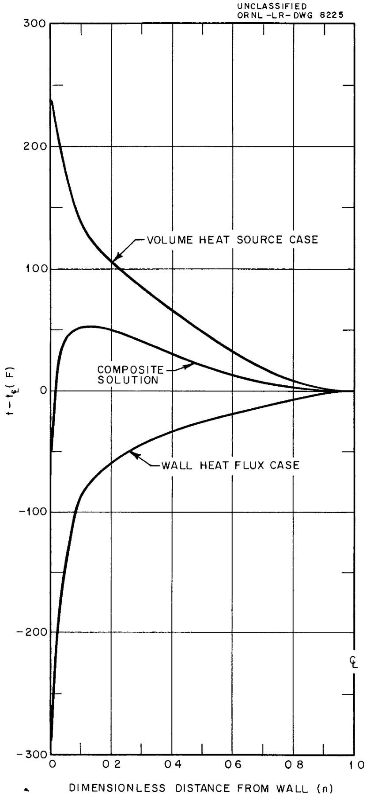  
Fig 5 Radial Temperature Distributions for a Pipe System Whose Wall is Uniformly Cooled (An Example)

Re = 10,000, Pr = 10 by the negative of the term

$$
\left(t _ {o} - t _ {\phi}\right) = \left(t _ {o} - t _ {m}\right) / \left(\frac {\Delta t _ {o m}}{\Delta t _ {o \phi}}\right) = \frac {\left(\frac {d q}{d A}\right) _ {o}}{h} / \left(\frac {\Delta t _ {o m}}{\Delta t _ {o \phi}}\right) = \frac {3 0 , 0 0 0}{1 2 0} / (8 6) = 2 9 0 ^ {\circ} F,
$$

a plot of the actual radial temperature profile, above the centerline temperature, can be graphed for the case where a uniform wall heat flux but no volume heat source exists (see Figure 5) This temperature difference is negative because heat is being extracted from the fluid through the duct wall A superposition of these two curves yields the temperature profile of the composite system above its centerline temperature

2 The functions $\left(\frac{\Delta t_{\mathrm{om}}}{\Delta t_{\mathrm{o}\phi}}\right)$ from Martinelli's analyses, reference 3, are graphed in Figures 6 and 7 for the pipe and parallel plates system. The heat transfer conductances or coefficients can be obtained in references 1, 2, or 3. For the particular problem being considered here, 1 e, Re = 10,000, Pr = 1 0, k = 1 0, r o = 15

$$
N u = \frac {h 2 r _ {0}}{k} = 3 6
$$

$$
\mathrm {o r} \quad \mathrm {h} = 1 2 0 \mathrm {B t u / h r f t} ^ {2} \circ_ {\mathrm {F}}
$$

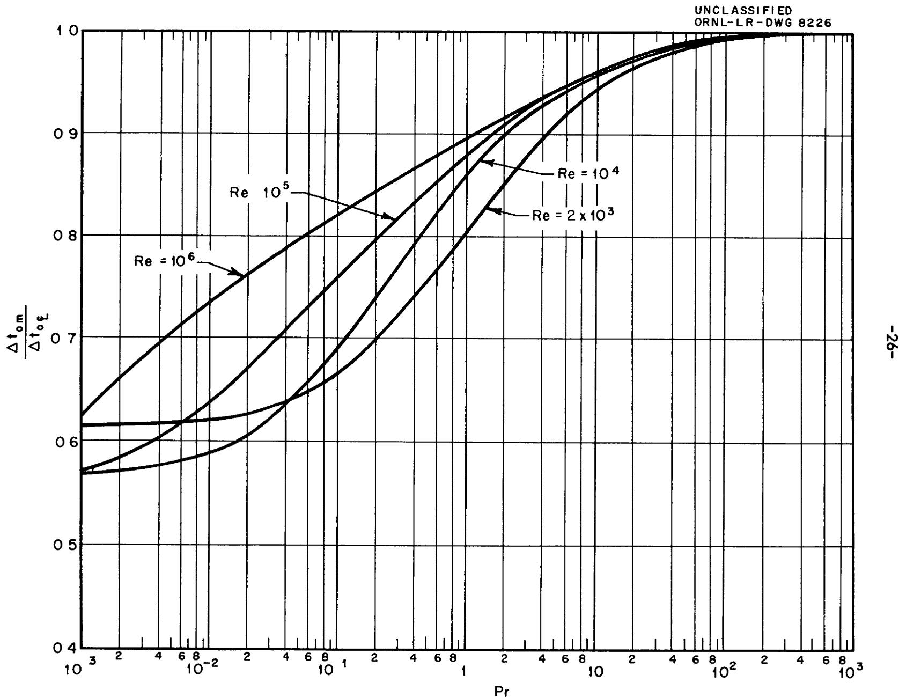  
Fig 6 $\frac{\Delta t_{om}}{\Delta t_{o\zeta}}$ As a Function of Re and Pr for the Wall Heat Flux Case for Pipes (Martinelli)

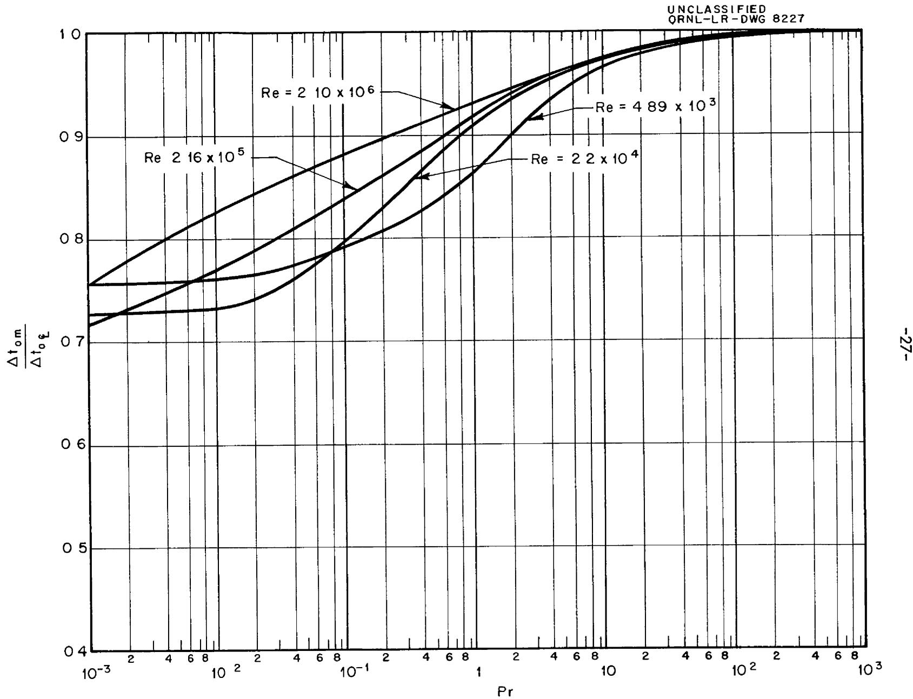  
Fig 7 $\frac{\Delta \mathfrak{t}_{\mathrm{om}}}{\Delta \mathfrak{t}_{\mathrm{oQ}}} \text{ as a Function of Re and Pr for the Wall Heat Flux Case for Parallel Plates}$ (Martinelli)

# ANALYSIS OF THE THERMAL STRUCTURE IN A PIPE SYSTEM WHOSE WALL IS NONUNIFORMLY COOLED

Consider the case where a fluid with a uniform volume heat source is flowing turbulently in a pipe whose wall is being cooled, nonuniformly along its length, by a coolant which is flowing in an annular space around the pipe (see Figure 8a). The heat transferred from the wall to the coolant through the differential heat transfer area $2\pi r_{0} dx$ is (see Figure 8b),

$$
\mathrm {d q} = \mathrm {h} _ {\mathrm {c}} 2 \pi r _ {\mathrm {o}} \mathrm {d x} \left(\mathrm {t} _ {2} - \mathrm {t} _ {\mathrm {c}}\right) \tag {1}
$$

The heat transferred through the pipe wall is

$$
\mathrm {d q} = \mathrm {k} _ {\mathrm {W}} 2 \pi r _ {\mathrm {O}} \mathrm {d x} \frac {\left(\mathrm {t} _ {1} - \mathrm {t} _ {2}\right)}{\delta} \tag {2}
$$

The heat transferred from the fluid with the heat source to the wall is

$$
\mathrm {d q} = \mathrm {h} _ {\mathrm {f}} 2 \pi r _ {\mathrm {O}} \mathrm {d x} \left[ \Delta t _ {\mathrm {V B S}} + \left(t _ {\mathrm {f}} - t _ {\mathrm {l}}\right) \right] \tag {3}
$$

From equations (1), (2) and (3) one can obtain

$$
\begin{array}{l} \mathrm {d q} = \frac {2 \pi r _ {\mathrm {o}} \mathrm {d x} \left[ \left(t _ {\mathrm {f}} - t _ {\mathrm {c}}\right) + \Delta t _ {\mathrm {V H S}} \right]}{\frac {1}{h _ {\mathrm {c}}} + \frac {\delta}{k _ {\mathrm {w}}} + \frac {1}{h _ {\mathrm {f}}}} \\ = U \left(t _ {f} - t _ {c} + \Delta t _ {V H S}\right) 2 \pi r _ {0} d x \tag {4} \\ \end{array}
$$

Two additional equations arise when making a heat rate balance on the two fluid streams in a length dx (see Figure 8c) The heat gained by the coolant in a parallel flow system is

$$
\mathrm {d q} = \mathrm {m} _ {\mathrm {c}} \mathrm {c} _ {\mathrm {p c}} \mathrm {d t} _ {\mathrm {c}} \tag {5}
$$

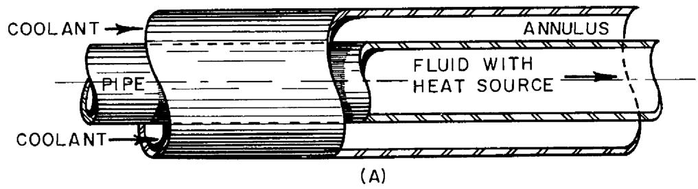

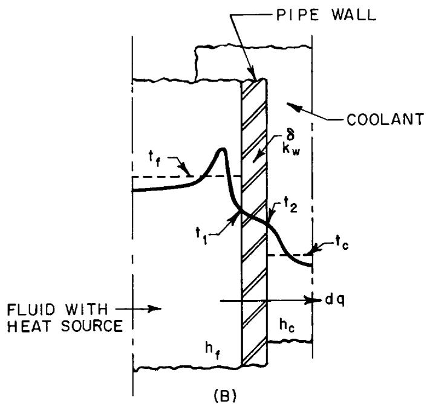

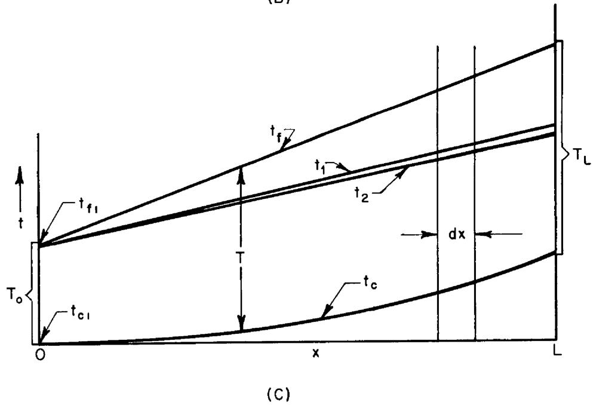  
Fig 8 Flow Circuit and Temperature Distributions for a Pipe System Whose Wall is Nonuniformly Cooled

The heat lost by the fluid with the heat source is

$$
\mathrm {d q} = W \pi r _ {\mathrm {O}} ^ {2} \mathrm {d x} - m _ {f} c _ {p f} \mathrm {d t} _ {f} \tag {6}
$$

From equations (5) and (6) one can obtain

$$
d \left(t _ {f} - t _ {c}\right) = - d q \left(\frac {1}{m _ {f} c _ {p f}} + \frac {1}{m _ {c} c _ {p c}}\right) + \frac {W \pi r _ {o} ^ {2}}{m _ {f} c _ {p f}} d x \tag {7}
$$

$$
\mathrm {o r} \quad \mathrm {d T} = - \mathrm {N d q} + \mathrm {M d x} \tag {8}
$$

where $\mathbf{T} = \mathbf{t}_{\mathbf{f}} - \mathbf{t}_{\mathbf{c}}$

$$
N = \frac {1}{m _ {f} c _ {p f}} + \frac {1}{m _ {c} c _ {p c}}
$$

$$
M = \frac {W \pi r _ {o} ^ {2}}{m _ {f} c _ {p f}}
$$

Upon substituting equation (4) into equation (8) there results,

$$
\mathrm {d} \mathrm {T} = - \mathrm {N U} (\mathrm {T} + \Delta t _ {\text {V H S}}) 2 \pi r _ {0} \mathrm {d x} + \mathrm {M d x} \tag {9}
$$

or

$$
\int_ {0} ^ {x} d x = \int_ {T _ {0}} ^ {T} \frac {d T}{N U 2 \pi r _ {o} (T + \Delta t _ {V H S}) - M}
$$

$$
- x = \frac {1}{N U 2 \pi r _ {O}} \ln \frac {N U 2 \pi r _ {O} T + N U 2 \pi r _ {O} \Delta t _ {V H S} - M}{N U 2 \pi r _ {O} T _ {O} + N U 2 \pi r _ {O} \Delta t _ {V H S} - M} \tag {10}
$$

$$
\mathrm {o r} \quad \mathrm {T} + \Delta t _ {\mathrm {V H S}} = \left(\mathrm {T} _ {\mathrm {O}} + \Delta t _ {\mathrm {V H S}} - \frac {\mathrm {M}}{\mathrm {N U} 2 \pi r _ {\mathrm {O}}}\right) \mathrm {e} ^ {- \mathrm {N U} 2 \pi r _ {\mathrm {O}} x} + \frac {\mathrm {M}}{\mathrm {N U} 2 \pi r _ {\mathrm {O}}} \tag {11}
$$

The heat transfer rate $q$ can be obtained by substituting equation (11) into equation (4) and integrating

$$
\int_ {0} ^ {q} d q = 2 \pi r _ {0} U \int_ {0} ^ {x} \left[ \left(T _ {0} + \Delta t _ {V H S} - \frac {M}{N U 2 \pi r _ {0}}\right) e ^ {- N U 2 \pi r _ {0} x} + \frac {M}{N U 2 \pi r _ {0}} \right] d x
$$

$$
\text {o r} q = \frac {1}{N} \left(T _ {O} + t _ {V H S} - \frac {M}{N U 2 \pi r _ {O}}\right) \left(1 - e ^ {- N U 2 \pi r _ {O} x}\right) + \frac {M}{N} x \tag {12}
$$

The coolant temperature variation can be obtained by substituting equation (12) into equation (5),

$$
\begin{array}{l} \int_ {t _ {c 1}} ^ {t _ {c}} d t _ {c} = \frac {1}{m _ {c} c _ {p c}} \int_ {0} ^ {q} d q \\ \mathrm {o r} \quad t _ {\mathrm {c}} - t _ {\mathrm {c i}} = \frac {1}{m _ {\mathrm {c}} c _ {\mathrm {p c}} N} \left(T _ {\mathrm {O}} + \Delta t _ {\mathrm {V H S}} - \frac {M}{N U 2 \pi r _ {\mathrm {O}}}\right) \left(1 - e ^ {- N U 2 \pi r _ {\mathrm {O}} x}\right) + \frac {M}{N m _ {\mathrm {c}} c _ {\mathrm {p c}}} x \tag {13} \\ \end{array}
$$

The mixed mean fluid temperature variation of the fluid containing the heat source can be obtained by substituting equation (12) into equation (6),

$$
\int_ {t _ {f 1}} ^ {t _ {f}} d t _ {f} = - \frac {1}{m _ {f} c _ {p f}} \int_ {0} ^ {q} d q + \frac {W \pi r _ {o} ^ {2}}{m _ {f} c _ {p f}} \int_ {0} ^ {x} d x
$$

$$
\begin{array}{l} \mathrm {o r} \quad t _ {f} - t _ {f i} = - \frac {1}{m _ {f} c _ {p f} N} \left(T _ {O} + \Delta t _ {V H S} - \frac {M}{N U 2 \pi r _ {O}}\right) \left(1 - e ^ {- N U 2 \pi r _ {O} x}\right) - \frac {M}{N m _ {f} c _ {p f}} x \\ + \frac {W \pi r _ {0} ^ {2}}{m _ {f} c _ {p f}} x \tag {14} \\ \end{array}
$$

The surface temperatures of the heat exchanger wall may be obtained from equations (1), (2), and (4),

$$
t _ {2} - t _ {c} = \frac {U \left(t _ {f} - t _ {c} + \Delta t _ {V H S}\right)}{h _ {c}} \tag {15}
$$

$$
t _ {1} - t _ {2} = \frac {U \left(t _ {f} - t _ {c} + \Delta t _ {V H S}\right)}{\frac {k _ {w}}{\delta}} \tag {16}
$$

The terms $t_c$ and $(t_f - t_c + \Delta t_{\mathrm{VHS}})$ were previously derived in equations (13) and (11), respectively

# TEMPERATURE STRUCTURE IN A PIPE SYSTEM WHOSE WALL IS NONUNIFORMLY COOLED (AN EXAMPLE)

An illustrative example of a pipe-annulus system whose wall is nonuniformly cooled by parallel coolant flow follows

Given,

$$
W = 0. 5 \times 1 0 ^ {7} B t u / h r f t ^ {3} \quad \delta = 0. 0 0 5 f t
$$

$$
r _ {o} = 0. 1 5 \mathrm {f t} \quad k _ {w} = 2 0 \mathrm {B t u / h r f t} ^ {\circ} \mathrm {F}
$$

$$
k _ {f} = 1 \text {B t u / h r f t} O F \quad L = 4 \text {f t}
$$

$$
c _ {p f} = 1 0 B t u / l b \quad o _ {F} \quad m _ {C} = 1 6 0 0 l b / h r
$$

$$
\Pr_ {f} = 1 \quad c _ {p c} = > B t u / 1 0 - f
$$

$$
m _ {e} = 2. 3 6 0 \mathrm {l b / h r} \quad n _ {c} = 1 2 3 B t u / h r \quad t l ^ {2} = C F
$$

$$
\operatorname {R e} _ {F} = 1 0, 0 0 0
$$

$$
t _ {c i} = 0
$$

$$
t _ {f 1} = 1 5 0 ^ {\circ} F
$$

$$
T _ {o} = 1 5 0 ^ {\circ} F
$$

Determine the total amount of heat transferred to the coolant flowing through the annulus as well as the temperature structure of the system

$$
\Delta t _ {V H S} = 1. 3 \times 1 0 ^ {- 3} \frac {W r _ {o} ^ {2}}{k} = 1. 3 \times 1 0 ^ {- 3} \frac {(5 \times 1 0 ^ {7}) (2 2 5 \times 1 0 ^ {- 2})}{1} = 1 4 6 ^ {\circ} F
$$

$$
\mathrm {N u} _ {\mathrm {f}} = 3 6
$$

$$
h _ {f} = 1 2 0 B t u / h r f t ^ {2} o _ {F}
$$

$$
N = \frac {1}{m _ {f} c _ {p f}} + \frac {1}{m _ {c} c _ {p c}} = \frac {1}{(2 3 6 0) (1)} + \frac {1}{1 6 0 0 (5)} = 0. 0 0 1 6 7 \frac {\mathrm {h r} ^ {\circ} \mathrm {F}}{\mathrm {B t u}}
$$

$$
M = \frac {W \pi r _ {0} ^ {2}}{m _ {f} c _ {p f}} = \frac {(5 \times 1 0 ^ {7}) (\pi) (2 2 5 \times 1 0 ^ {- 2})}{(2 3 6 0) (1)} = 1 5 0 \frac {o _ {F}}{f t}
$$

$$
\frac {1}{U} = \frac {1}{h _ {c}} + \frac {\delta}{k _ {w}} + \frac {1}{h _ {f}} = \frac {1}{1 2 3} + \frac {0 0 5}{2 0} + \frac {1}{1 2 0} = 0. 0 2 2 8 \frac {\mathrm {h r} f t ^ {2} o _ {F}}{\mathrm {B t u}}
$$

$$
U = 5 9 7 B t u / h r f t ^ {2} ^ {\circ} F
$$

Thus, from equation (12),

$$
\begin{array}{l} q _ {L} = \frac {1}{0 0 0 1 6 7} \left[ 1 5 0 + 1 4 6 - \frac {1 5 0}{(0 0 0 1 6 7) (5 9 7) 2 \pi (1 5)} \right] \left[ 1 - \frac {1}{e ^ {(0 0 0 1 6 7) (5 9 7) 2 \pi (1 5) (4)}} \right] \\ + \frac {(1 5 0) (4)}{(0 0 0 1 6 7)} \\ = 1 1 5, 5 0 0 \mathrm {B t u} / \mathrm {h r} \\ \end{array}
$$

Also, from equation (13)

$$
t _ {c L} - t _ {c i} = \frac {1 1 5 , 0 0 0}{1 6 0 0 (5)} = 1 4 5 ^ {\circ} F
$$

and from equation (14)

$$
t _ {f L} - t _ {f 1} = - \frac {1 1 5 , 0 0 0}{(2 3 6 0) (1)} + \frac {(0 . 5 \times 1 0 ^ {7}) \pi (2 . 2 5 \times 1 0 ^ {- 2}) (4)}{(2 3 6 0) (1)} = 5 5 1 ^ {\circ} F
$$

The detailed temperature structure of the pipe-annulus system is graphed in Figure 9 The fraction of the total heat generated within the fluid flowing in the pipe which is extracted by the coolant flowing in the annulus is

$$
\frac {q _ {\text {c o o l a n t}}}{q _ {\text {g e n e r a t e d}}} = \frac {q _ {\mathrm {L}}}{W \pi r _ {\mathrm {O}} ^ {2} L} = \frac {1 1 5 , 0 0 0}{(5 \times 1 0 ^ {7}) \pi (2 2 5 \times 1 0 ^ {- 2}) 4} = 0. 0 8 2
$$

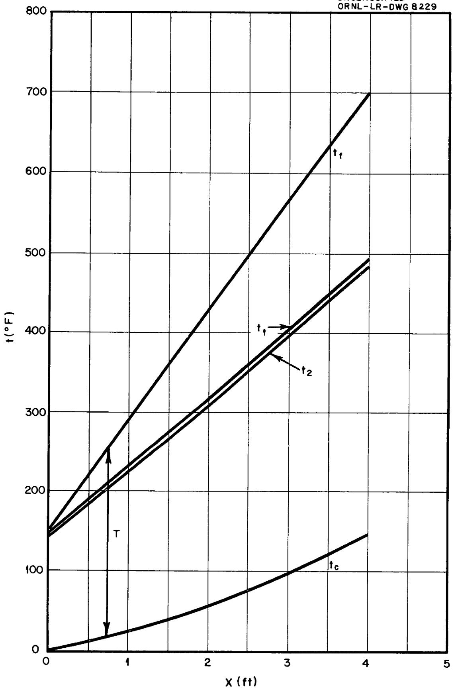  
Fig 9 Temperature Structure in a Pipe System Whose Wall is Nonuniformly Cooled (an example)

# CLOSING REMARKS

The forced-flow volumetric-heat-source solutions which were previously developed were applied to two specific heat exchange systems. They may also be applied to other types of convection systems, several of which are suggested below

1) Parallel plates system whose wall is nonuniformly cooled The analysis presented for the nonuniformly cooled pipe system may be modified to obtain a solution for a parallel plates system by replacing the pipe heat transfer area, $2\pi r_{0}dx$ , by a corresponding one for the parallel plates system   
2) Pipe and parallel plates systems whose walls are being cooled by fluids having volumetric heat sources The analysis presented for the nonuniformly cooled pipe system may be modified to obtain the temperature solutions for general convection systems in which the coolants also contain volumetric heat sources Under these circumstances a $\Delta t_{\mathrm{VHS}}$ term for the coolant is included in equation (1), and a volumetric heat source is included in equation (5), the analysis is accomplished as before The new equation for T now contains a modified form of the parameter M and also a $\Delta t_{\mathrm{VHS}}$ for the coolant has been added The same modifications occur in the equation for the heat transfer rate, q   
3) Pipe and parallel plates systems which are being nonuniformly cooled by counter flow In this case it is merely necessary to insert a minus sign in equation (5) and carry it through the remaining analysis

This report has stressed only the turbulent flow regime although both laminar and turbulent flow analyses were presented in references 1 and 2. Applications for laminar-flow volume-heat-source systems parallel those presented here for turbulent flow. It is interesting to note, however, that the heat extraction or cooling rates necessary to reduce wall temperatures to mixed mean fluid or centerline temperatures in the case of laminar flow are much greater than those for turbulent flow. For example, it is necessary to extract 33 l/3 percent of the heat generated within a laminarly flowing fluid in a pipe system to bring its wall temperature down to the centerline temperature, whereas for turbulently flowing ordinary fluids the corresponding heat extraction rate is only several percent

# REFERENCES

1 Poppendiek, H F and Palmer, L D, Forced Convection Heat Transfer In Pipes with Volume Heat Sources Within the Fluids, ORNL-1395   
2 Poppendiek, H F and Palmer, L D, 'Forced Convection Heat Transfer Between Parallel Plates and In Annuli with Volume Heat Sources Within the Fluids,' ORNL-1701   
3 Martinelli, R C, 'Heat Transfer to Molten Metals, Trans Am Soc Mech Engr, 69, 1947, pp 947-959