# AEC RESEARCH AND DEVELOPMENT REPORT

AIRCRAFT NUCLEAR PROPULSION PROJECT

QUARTERLY PROGRESS REPORT

FOR PERIOD ENDING SEP.TEMBER 10, 1955

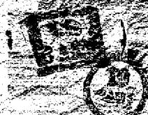

#

ESEARCH LIBRARY

DOCUMENT COLLECTION

NO.1:2:3:4:5:6:7:8:9:10:11:12:13:14:15:16:17:18:19:20:21:22:23:24:25:26:27:28:29:30:31:32:33:34:35:36:37:38:39:40:41:42:43:44:45:46:47:48:49:50:51:52:53:54:55:56:57:58:59:60:61:62:63:64:65:66:67:68:69:70:71:72:73:74:75:76:77:78:79:80:81:82:83:84:85:86:87:88:89:90:91:92:93:94:95:96:97:98:99:10

100

#

anq

OAK RIDGE NATIONAL LABORATORY

OPERATED BY

UNION CARBIDE NUCLEAR COMPANY

A Division of Union Carbide and Carbon Corporation

UCC

POST OFFICE BOX P. OAK RIDGE, TENNESSEE

(1)基因通过控制 通过控制_____,_____的合成来控制代谢过程,进而控制生物体的性状。

This is a generalization of the above thatas defined in the Atomic

Energy Act of 1954. Its transmuni tory of the current of its contents

in ac.

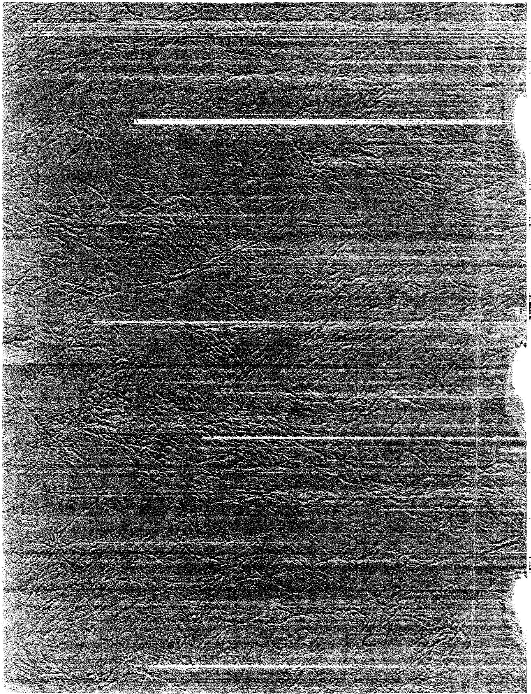

Contract No. W-7405-eng-26

# AIRCRAFT NUCLEAR PROPULSION PROJECT

# QUARTERLY PROGRESS REPORT

For Period Ending September 10, 1955

W. H. Jordan, Director

S. J. Cromer, Co-Director

R. I. Strough, Associate Director

A. J. Miller, Assistant Director

A.W.Savolainen,Editor

DATE RECEIVED BY INFORMATION AND REPORTS DIVISION

(SEPTEMBER 30, 1955)

DATE ISSUED

OCT 26 1955

OAK RIDGE NATIONAL LABORATORY

Operated by

UNION CARBIDE NUCLEAR COMPANY

A Division of Union Carbide and Carbon Corporation

Post Office Box P

Oak Ridge, Tennessee

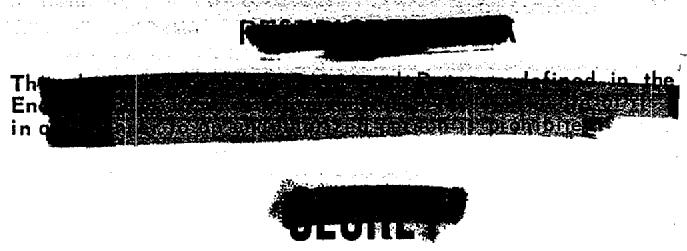

3445603498551

# INTERNAL DISTRIBUTION

1. R.G. Affel

2. C. R. Baldock

3. C. J. Barton

4. D. S. Billington

5. F. F. Blankenship

6. E. P. Blizzard

7. C. J. Borkowski

8. G. E. Boyd

9. M. A. Bredig

10. F. R. Bruce

11. A. D. Callihan

12. D. W. Cardwell

13. J.V.Cathcart

14. C. E. Center (K-25)

15. R. A. Charpie

16. G. H. Clewett

17. C. E. Clifford

18. J. H. Coobs

19. W. B. Cottrell

20. D. D. Cowen

21. S. Cromer

22. R. S. Crouse

23. F. L. Culler

24. J. B. Dee

25. J. H. Devan

26. D. A. Douglas

27. E.R.Dyfko

28. L. B. Emlet (K-25)

29. M. J. Feldman

30. D. E. Ferguson

31. A. P. Fraas

32. J. H. Frye

33. W. T. Furgerson

34. H. C. Gray

35. W. R. Grimes

36. E. E. Hoffman

37. A. Hollander

38. A. S. Householder

39. J. T. Howe

40. R. W. Johnson

41. W. H. Jordan

42. G. W. Keilholtz

43. C. P. Keim

44. M. T. Kelley

45. F. Kertesz

46. E. M. King

47-48. J.A. Lane

49. N. F. Lansing

50. R. S. Livingston

51. R.N. Lyon

52. F. C. Maienschein

53. W. D. Manly

54. E. R. Mann

55. L. A. Mann

56. W. B. McDonald

57. F. W. McQuilkin

58. R. V. Meghreblian

59. A. J. Miller

60. K. Z. Morgan

61. E. J. Murphy

62. J. P. Murray (Y-12)

63. G. J. Nessle

64. R. B. Oliver

65. P. Patriarca

66. R. W. Peelle

67. A. M. Perry

68. W. G. Piper

69. H. F. Poppendiek

70. P. M. Reyling

71. H. W. Savage

72. A. W. Savolainen

73. R. D. Schultheiss

74. E. D. Shipley

75. A. Simon

76. O. Sisman

77. G.P. Smith

78. A. H. Snell

79. C. D. Susano

80. J. A. Swartout

81. E. H. Taylor

82. D. B. Trauger

83. E. R. Van Artsdalen

84. F. C. VonderLage

85. J. M. Warde

86. G.M. Watson

87. A. M. Weinberg

88. J. C. White

89. G. D. Whitman

90. E. P. Wigner (consultant)

91. G. C. Williams

92. J. C. Wilson

93. C. E. Winters

23. X-10 Document Reference Library (Y-12)

23. Laboratory Records Department

24. Laboratory Records, ORNL R.C.

27. Central Research Library

# EXTERNAL DISTRIBUTION

128. AFDRD Jones   
129. AFDRQ   
130. AFSWC   
131. Aircraft Lab WADC (WCLS)   
132. Argonne National Laboratory   
133. Assistant Secretary - Air Force, R & D   
134. ATIC

135-137. Atomic Energy Commission, Washington

138. BAGR - WADC   
139. Battelle Memorial Institute   
140. Boeing - Seattle   
141. BuAer - Mueller   
142. Chief of Naval Research

143-145. Col. Gasser (WCSN)

146. Convair - San Diego

147-149. CVAC - Fort Worth

150. Director of Laboratories (WCL)   
151. Directorate of Weapons Systems, ARDC   
152. Douglas   
153. East Hartford Area Office   
154. Equipment Laboratory - WADC (WCLE)

155-158. GE - ANPD

159. Glenn L. Martin   
160. Iowa State College   
161. KAPL   
162. Lockheed - Burbank   
163. Lockland Area Office   
164. Los Alamos Scientific Laboratory   
165. Maintenance Engineering Services Division - AMC (MCMTA)

166-167. Materials Lab (WCRTO)

168. Mound Laboratory   
169. NACA - Cleveland   
170. NACA - Washington   
171. NDA   
172. North American - Aerophysics   
173. Patent Branch, Washington

174-176. Power Plant Laboratory - WADC (WCLPU)

177-181. Pratt & Whitney (I copy to R. I. Strough)

182. Rand   
183. RDGN Sutherland   
184. SAM

185-186. Technical Information Service, Oak Ridge Operations Office   
187-189. WADC - Library   
190. WAPD - Bettis Plant   
191. Wright Aero   
192. Division of Research and Medicine, AEC, ORO

Reports previously issued in this series are as follows:

ORNL-528 Period Ending November 30, 1949

ORNL-629 Period Ending February 28, 1950

ORNL-768 Period Ending May 31, 1950

ORNL-858 Period Ending August 31, 1950

ORNL-919 Period Ending December 10, 1950

ANP-60 Period Ending March 10, 1951

ANP-65 Period Ending June 10, 1951

ORNL-1154 Period Ending September 10, 1951

ORNL-1170 Period Ending December 10, 1951

ORNL-1227 Period Ending March 10, 1952

ORNL-1294 Period Ending June 10, 1952

ORNL-1375 Period Ending September 10, 1952

ORNL-1439 Period Ending December 10, 1952

ORNL-1515 Period Ending March 10, 1953

ORNL-1556 Period Ending June 10, 1953

ORNL-1609 Period Ending September 10, 1953

ORNL-1649 Period Ending December 10, 1953

ORNL-1692 Period Ending March 10, 1954

ORNL-1729 Period Ending June 10, 1954

ORNL-1771 Period Ending September 10, 1954

ORNL-1816 Period Ending December 10, 1954

ORNL-1864 Period Ending March 10, 1955

ORNL-1896 Period Ending June 10, 1955

# FOREWORD

This quarterly progress report of the Aircraft Nuclear Propulsion Project at ORNL records the technical progress of the research on circulating-fuel reactors and all other ANP research at the Laboratory under its Contract W-7405-eng-26. The report is divided into three major parts: I. Reactor Theory, Component Development, and Construction, II. Materials Research, and III. Shielding Research.

The ANP Project is comprised of about 510 technical and scientific personnel engaged in many phases of research directed toward the achievement of nuclear propulsion of aircraft. A considerable portion of this research is performed in support of the work of other organizations participating in the national ANP effort. However, the bulk of the ANP research at ORNL is directed toward the development of a circulating-fuel type of reactor.

The design, construction, and operation of the Aircraft Reactor Test (ART), with the cooperation of the Pratt & Whitney Aircraft Division, are the specific objectives of the project. The ART is to be a power plant system that will include a 60-Mw circulating-fuel reflector-moderated reactor and adequate means for heat disposal. Operation of the system will be for the purpose of determining the feasibility, and the problems associated with the design, construction, and operation, of a high-power, circulating-fuel, reflector-moderated aircraft reactor system.

# CONTENTS

FOREWORD

SUMMARY

PART I. REACTOR THEORY, COMPONENT DEVELOPMENT, AND CONSTRUCTION

1. REFLECTOR-MODERATED REACTOR 15   
Aircraft Reactor Test Facility 15   
Shielding Experiment Facility 15   
Aircraft Reactor Test Design 15   
Reactor Design 15   
Main and Auxiliary Radiator Design 19   
Fuel-to-NaK Heat Exchanger Design 19   
Core Flow Studies 24   
Core Design Analyses 28   
Fuel Pump Performance 29   
Controls and Instrumentation 30   
Engineering Test Unit 31   
Reactor Physics 33   
Control Rod Heating and Burnup 33   
ART Boron Layer 33   
High-Temperature Critical Experiment vs ART 33   
Multigroup, Multiregion Reactor Calculation 35   
2. EXPERIMENTAL REACTOR ENGINEERING 36   
In-Pile Loop Development and Tests 36   
Loop Installation 36   
Loop No. 1 Operation 36   
Horizontal-Shaft Sump Pump 37   
Oil Irradiation 38   
Development and Operation of Forced-Circulation Corrosion and Mass Transfer Tests 38   
Operation of Fused Salt-Inconel Loops 38   
Liquid Metals in Multimetal Loops 38   
Pump Development 42   
Mechanical Shakedown and Bearing-and-Seal Tests 42   
Short-Circuit Pump-Test Stand 44   
High-Temperature Pump-Performance Test Stand 44   
Heat Exchanger Tests 45   
Intermediate Heat Exchanger Tests 45   
Small Heat Exchanger Tests 49   
Structural Tests 51   
Outer Core Shell Thermal Stability Test 51   
Inconel Strain-Cycling Tests 52   
Thermal-Cycling Test of Sodium-Inconel-Beryllium System 54   
Cold Traps and Plug Indicators 54

3. CRITICAL EXPERIMENTS 58

Room-Temperature Reflector-Moderated-Reactor Critical Experiments 58

High-Temperature Reflector-Moderated-Reactor Critical Experiments 58

# PART II. MATERIALS RESEARCH

4. CHEMISTRY OF REACTOR MATERIALS 65

Phase Equilibrium Studies of Systems Containing $\mathsf{ZrF}_4$ and/or UF 65   
The System LiF-ZrFA 65   
The System UF4-ZrF 67   
The System NaF-LiF-ZrF 67   
The System NaF-LiF-UF 67   
The System NaF-RbF-ZrF-UF 68   
The System KF-ZrF 69   
The System NaF-KF-ZrF 4 69

Phase Equilibrium Studies of Systems Containing BeF 69

The System NaF-LiF-BeF, 69   
The System NaF-LiF-BeF2-UF 4 70   
The System NaF-BeF2-UF 70   
The System KF-BeF 2 71   
The System NaF-KF-BeF 2 71   
Solubility of $\mathsf{UF}_3$ in $\mathsf{BeF}_2$ -Bearing Compositions 72

Chemical Reactions in Molten Salts 72

Equilibrium Reduction of $\mathsf{FeF}_2$ by $\mathsf{H}_2$ in NaZrF 5 72   
Reduction of UF $^4$ by Structural Metals 73   
Stability of Chromium and Iron Fluorides in Various Molten Fluorides 74   
Experimental Preparation of Pure Fluorides 78   
Reaction of UF $^4$ with Uranium in Alkali Fluorides 78   
Reaction of Uranium Metal with Alkali Fluoride Mixtures 79   
Metal-Salt Equilibrium 79

Production of Purified Fluorides 81

Recovery of Contaminated Fuel for Re-use 81   
Removal of $\mathsf{CrF}_2$ from NaF-ZrF4-UF4 Mixtures 81   
Effect of $\mathsf{ZrO}_2$ in Fuel Preparation 82   
Pilot-Scale Purification Operations 83   
Production-Scale Operations 83   
Preparation of $\mathbf{ZrF}_4$ 83   
Batching and Dispensing Operations 84   
Loading and Draining Operations 84   
Enriched Fuel Preparations 84

Fundamental Chemistry of Fused Salts 85

Solubility of Xenon in Molten Salts 85   
EMF Measurements in Fused Salts 85   
Activity of Chromium in Inconel 87   
Viscosities of Molten Nitrates 88   
Optical Properties and X-Ray Patterns for Recently Discovered   
Compounds in Fluoride Systems 88   
High-Temperature X-Ray Spectrometer Studies 93   
Physical Chemistry of Fused Salts 93   
Diffraction Studies of Liquids 94

5. CORROSION RESEARCH 95

Forced-Circulation Studies 95   
Fluorides in Inconel 95   
Sodium in Inconel and in Stainless Steel 97

Thermal-Convection Studies 100

Effect of Various Loop Cleaning Methods 100   
Effect of Heating Method 101   
Effect of Temperatures 101   
Effect of Applied Electromotive Forces 102   
Effect of Oxide Additions to Sodium 102

General Corrosion Studies 104

Hot-Pressed Metal-Bonded Tungsten Carbide in NaF-ZrF4-UF 104   
Solid-Phase Bonding of Cermets 104   
Effects of Ruthenium on Physical Properties of Inconel 106   
Brazing Alloys on Inconel and on Nickel in Sodium and in NaF-ZrF4-UF 106   
Brazing Alloys on Inconel and on Stainless Steel in Lithium 108   
Hastelloy B-Inconel in NaF-ZrF4-UF 109   
Boiling Sodium in Inconel 109   
Inconel Exposed to a Sodium-Potassium-Lithium Mixture 111   
Molybdenum, Vanadium, and Niobium in Static Lithium 111   
Analysis of Metal Crystals from Inconel-Sodium Thermal-Convection Loop 113

Fundamental Corrosion Research 113

Film Formation on Metals 113   
High-Temperature Spectrophotometry in Fused Hydroxides 117   
Mass Transfer and Corrosion in Fused Hydroxides 117   
Thermal Dissociation of Sodium Hydroxide 118

Chemical Studies of Corrosion 119

Inconel in NaF-LiF-ZrF4-UF 119   
Stability of $\mathsf{UF}_3$ in NaF-KF-LiF in Inconel 120   
Effect of Chromium on the Mass Transfer of Nickel in NaOH 120

6.METALLURGY AND CERAMICS 122

Mechanical Property Tests of Inconel 122

Stress-Rupture Tests 122   
Bellows Test 123   
Interaction Between Inconel and Beryllium 124

Development of Nickel-Molybdenum Alloys 125

Oxidation Studies 125   
Fabrication Studies 126

Stress-Rupture Tests of Hastelloy B 127

Physical Properties and Microstructure Studies of Hastelloy B. 127

Brazing Alloy Development and Testing 130

Development Tests 130   
Brazing of Boron Carbide 130   
Brazing of Cermet Valve Seats to Inconel Components 131

Fabrication of Test Components 132

Components for High-Temperature Critical Experiment 132   
NaK-to-Air Radiator 133

Intermediate Heat Exchanger No. 3 134   
Cornell Radiator No. 2 135

Nondestructive Testing 136   
Ceramic Research 140

Graphite-Hydrogen Corrosion-Erosion Investigation 140   
Rare-Earth-Oxide Control Rods 140

Calcium Fluoride and Alumina Detector Spacers 140   
Fluoride Fuel Pellets 140

Synthesis of Boron Compounds 140   
Fabrication of Dysprosium Oxide Disks 143   
Fabrication of Europium Oxide Wafers 143

Special Materials Studies 144

Columbium Research 144   
Composite Tubing Fabrication 145   
Oxidation Tests of Aluminum Bronze 146   
Lead-Calcium Alloys 146

Neutron Shielding Material 147

7. HEAT TRANSFER AND PHYSICAL PROPERTIES 149

Fused Salt Heat Transfer 149   
ART Fuel-to-Nak Heat Exchanger 150   
ART Core Hydrodynamics 151   
Reactor Core Heat Transfer 151   
Heat Capacity 154   
Viscosity 155   
Thermal Conductivity 157   
Electrical Conductivity 157

8. RADIATION DAMAGE 158

LITR Horizontal-Beam-Hole Fluoride-Fuel Loop 158   
Miniature In-Pile Loop 164   
Creep and Stress-Corrosion Tests 165   
Flux Measurements in the MTR 166   
Analysis of Reactor-Grade Beryllium 169

9. ANALYTICAL CHEMISTRY OF REACTOR MATERIALS 172

Determination of Oxygen in Sodium 172   
n-Butyl Bromide Method 172   
Vacuum-Distillation Method 173

Volumetric Determination of Zirconium in Fluoride Salts with   
Disodium Dihydrogen Ethylenediaminetetraacetate (EDTA) 173   
Determination of Uranium Metal in Fluoride Salt Mixtures 175   
Elimination of Air from a Dry Box 175   
Determination of Oxygen in Metallic Oxides by Bromination 175   
Determination of CO by Means of a Solution of $\mathsf{PdCl}_2$ 176   
ANP Service Laboratory 177

# SECRET

10. RECOVERY AND REPROCESSING OF REACTOR FUEL 179

Pilot Plant Design 179

Engineering Developments 179

Process Development 180

# PART III. SHIELDING RESEARCH

11. SHIELD DESIGN 185

Weights of Spherically Symmetric Unit Shields for Circulating-Fuel Reactors 185

Sources of Radiation in a 300-Mw Circulating-Fuel Reactor 185

Shield Weight Dependence on the Dimensions of a 300-Mw Circulating-Fuel Reactor 189

Neutron Shield 190

Gamma-Ray Shield 191

Weight Determinations 195

12. LID TANK SHIELDING FACILITY 197

Reflector-Moderated-Reactor and Shield Mockup Tests 197

Gamma-Ray and Neutron Measurements Beyond the Mockups 197

Sodium Activation in the Heat Exchanger Region of the Mockups 197

13. BULK SHIELDING FACILITY 199

Angular Distribution of Fast Neutrons Through Water 199

Decay of Fission-Product Gamma Radiation 201

14. TOWER SHIELDING FACILITY 205

Procedure for Using TSF Data for the Optimization of a Divided Neutron Shield 205

Calculation of Shield Weight 205

Calculation of Dose Rate 206

Calculation of Minimum Shield Weight for Specified Dose 208

Application of TSF Data 211

Results of a Sample Shield Optimization Calculation 215

Measurements in the GE-ANP Crew-Compartment Mockup 217

ORGANIZATION CHARTS 221

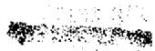

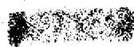

# ANP PROJECT QUARTERLY PROGRESS REPORT

# SUMMARY

# PART I. REACTOR THEORY, COMPONENT DEVELOPMENT, AND CONSTRUCTION

# 1. Reflector-Moderated Reactor

A contract was awarded on August 19, 1955, to the V. L. Nicholson Company, Knoxville, Tennessee, the low bidder for package 1 of the Aircraft Reactor Test (ART) facility. Their low bid of $765,835 included $264,373 for the reactor cell, with the Chicago Bridge & Iron Co. engaged to serve as the subcontractor to design, fabricate, and erect the cell. Package 1 includes, in addition to the cell, the major modifications of Building 7503.

Recent experiments at the Tower Shielding Facility (TSF) emphasized the need for shielding data from the ART, and therefore a layout has been completed to provide for the measurement of the gamma-ray spectrum of the ART as a function of the angle of emission from the reactor shield surface.

Layout drawings have been completed for the principal features of the ART reactor-pump-heat exchanger-pressure shell assembly, and the details are considered to be sufficiently firm for procurement to be started. Fabrication of the shells, such as the pressure shell, reflector shell, etc., will be particularly time-consuming because of die problems, and therefore procurement work began with the shells.

A one-half-scale plastic model of the pump and expansion tank region at the top of the reactor has been completed to facilitate examination of fabrication, stress, and fluid-flow problems, and work has started on a full-scale aluminum model. Design conditions and data have been established for the main and auxiliary radiators, and the design for the fuel-to-NaK heat exchanger has been selected. Design calculations and layout drawings for this heat exchanger were completed.

Extensive tests of flow patterns in the core are under way. Two types of flow system are being investigated; both make use of a vortex sheet in the annulus between the island and the reflector to get a high degree of mixing of the stream. In one system the vortex axes parallel the island, and in the other they spiral helically downward around it. In both systems the two fuel pump volutes dis

charge tangentially into the core to give a system that is insensitive to the one-pump-out condition. Tests performed to date were planned to assist in the systematic development of an inlet-guide-vane and turbulence-generator design that will produce radial velocities of sufficient magnitude to keep the boundary-layer fluid mixed with the free stream. High-speed photographs of dye injections and conductivity measurements of salt injections are being used to examine radial flow, circumferential distribution, and transients. Core designs with lower degrees of divergence than that of the present 21-in. design are being studied to determine the effect of inlet annulus dimensions on the adverse pressure gradients encountered by the fuel in flowing from the core inlet to the equator.

Performance tests of the fuel pump with water as the circulated fluid were completed. The noise present in the initial testing was found to result from a local flow condition that existed at the tongue of the pump volute. A modification of the volute design has eliminated the noise, and other impeller modifications have brought about a condition in which the hydraulic force balance on the impeller occurs near design speed and flow. The tests have demonstrated that the design point lies in the region of maximum efficiency.

A flow sheet has been prepared that shows, schematically, the locations of the principal instrumentation and control components of the ART, and control panel layout studies are being made. Except for special sensing equipment, it appears that no development work will be required. A construction program for the Engineering Test Unit (ETU) has been established, with a target date for initial operation of September 1, 1956. The objectives of the ETU are to develop techniques for use in assembly of the ART, to furnish some information on thermal stresses in the reactor assembly, to obtain some heat transfer information on the radiators and the NaK-to-fuel and the sodium-to-NaK circuits, and to test some of the instrumentation to be used on the ART.

Calculations of control rod heating and burnup to be expected in the ART were completed, and the relative merits of various materials were studied. For example, for a $\frac{1}{4}$ -in. annular control rod of

$\mathsf{B}_4^{10}\mathsf{C}$ in a copper matrix $(30\mathrm{vol}\% \mathsf{B}_4\mathsf{C})$ , the burnup penetration would be one-sixth as great as that in a europium oxide cermet, but the heat produced would be one-third greater. The boron layer between the reflector and the fuel-to-NoK heat exchanger was examined with respect to heat generation, flux attenuation, helium gas evolution, and burnup. Also, the differences between the ART and the high-temperature critical experiment were evaluated. It is estimated that the critical concentration of the ART will be between 4.6 and 5.4 mole $\% \mathsf{UF}_4$

A new multigroup, multiregion reactor calculation is being programmed for the Oracle. The code will compute fluxes as a function of one space variable in slab, cylindrical, or spherical geometry, and it will allow 125 groups and 125 regions.

# 2. Experimental Reactor Engineering

The first loop for circulating fluoride fuel in hole HB-3 of the MTR was shipped to NRTS on June 20. It successfully passed the preoperational checks, and startup of the loop proceeded satisfactorily to the final step, that is, melting of the freeze line and filling of the loop with the fuel mixture. The heater for the freeze line was found to be inoperable, and therefore the experiment was terminated. The loop has been returned to ORNL and disassembled. The modifications required to overcome the difficulties encountered have been incorporated in a second loop that is nearly ready for shipment to NRTS. A third loop is also being fabricated. The auxiliary facilities required at the MTR for operation of the in-pile loop were completed, including a loop retractor mechanism for adjustment of the loop nose position during reactor operation.

Twenty-two fused-salt-Inconel forced-circulation loops were operated in the test program for studying corrosion and mass-transfer in high-temperature-differential, high-velocity systems under conditions that simulate reactor flow rates and temperatures. Nine similar loops were operated with sodium in Inconel or in stainless steel tubing.

A new test loop has been designed with which it will be possible to obtain accurate information on the oxygen content of sodium or NaK during operation of the loop. The main loop of the system is to include a bypass cold trap and a sampling

and analyzing device, and an auxiliary plugging-indicator loop will be attached to the main loop. Also, a loop has been designed, in which NaK will be circulated, that has the same ratio of surface area to volume as that of the primary NaK circuits of the ART.

The design layouts for two loops for high-temperature tests of full-scale models of the ART fuel and sodium pumps were completed, and fabrication and assembly were started. The first group of bearing-and-seal and mechanical tests on the rotary elements of the pumps was completed. In general, the test results indicate that the bearing-and-seal designs for the upper and lower units can be made to function satisfactorily. One short-circuit pump-test stand was completed and shakedown tests with water were started.

Intermediate heat exchanger test stand A was operated for 690 hr in a series of furnace and diffusion cold-trap tests of the NaK circuit and a 2-hr cleaning cycle of the fluoride-fuel circuit. The gas-fired furnace for heating the NaK proved to be capable of transferring 1.13 Mev of heat to the NaK after minor modifications, including installation of a larger burner, had been made. After the fuel mixture had been circulated and dumped, a leak occurred in one tube bundle of the heat exchanger, and subsequently one of the NaK-to-air radiators developed a leak. The leak in the heat exchanger was found to be a radial crack on the inside of a tube bend. It was also found that severe distortion had occurred as a result of the thermal cycling created by operating the heat exchanger with NaK in the tubes but without fuel around the tubes. The temperature differences thus created ranged from 200 to $1000^{\circ}\mathrm{F}$ . The failure of the radiator is also thought to be the result of extreme thermal cycling, but the analyses of the difficulties have not yet been completed. Additional test assemblies are being fabricated.

The first series of tests were completed on a small (20-tube bundle) heat exchanger that was operated nearly continuously for 1560 hr. Heat transfer, pressure drop, and corrosion and mass-transfer data were obtained. No appreciable amount of mass transfer could be detected by visual inspection, and metallurgical examination is under way. The oxide content of the NaK was found to be high, and therefore cold traps are to be installed in subsequent test loops.

A one-fourth-scale model of the lower half of the 21-in. reactor core shell was fabricated for thermal-stability tests, and a design was completed of an Inconel strain-cycling rig. A third thermal-cycling test of a sodium-beryllium-Inconel system was started. A systematic study was made of devices for the measurement of oxides in circulating sodium or NaK and the removal of the oxides during operation. Designs of cold traps and plug indicators were prepared.

# 3. Critical Experiments

The fuel concentration in the room-temperature critical assembly of the reflector-moderated circulating-fuel reactor was decreased from 0.416 (3% excess reactivity) to 0.345 g of U235 per cubic centimeter of fuel region, and a "clean" critical mass of 19.9 kg of U235 was obtained. Two structural changes in the assembly were also studied. In one of the modifications, the average width of one of the end ducts was increased from 1.29 to 2.80 in., which increased its volume almost 2.5 times. The corresponding critical mass was about 24 kg of U235. In the other alteration, the radius at the center of the beryllium island was increased from 5.18 to 7.19 in. The critical mass of this assembly was 18.4 kg of U235.

Another critical assembly of this reactor is being operated at temperatures between 1200 and $1350^{\circ}\mathsf{F}$ . The minimum critical concentration has been determined as 6.29 wt $\%$ (2.96 mole $\%$ ) uranium in a mixture of sodium, zirconium, and enriched uranium fluorides. The over-all temperature coefficient of reactivity is $-2\times 10^{-5}(\Delta k / k) / ^{\circ}\mathsf{F},$ and the control rod has a value of $1.7\% \Delta k / k$ over the upper 14 in. of its traverse along the axis of the reactor assembly.

# PART II. MATERIALS RESEARCH

# 4. Chemistry of Molten Materials

In the search for improved fuels, intensive investigation of the NaF-LiF-ZrF $_4$ -UF $_4$ system continued until it was learned that with high LiF and low ZrF $_4$ concentrations there was no improvement in viscosity as compared with the viscosities in the NaF-ZrF $_4$ -UF $_4$ system. Mixtures with high concentrations of ZrF $_4$ in the NaF-LiF-ZrF $_4$ -UF $_4$ system had very low melting points, but the low melting points were accompanied by exceedingly high vapor pressures of ZrF $_4$ . In the NaF-LiF-UF $_4$ system it was found that mixtures in the regions

of low melting point contained too much $\mathsf{UF}_4$ for use with circulating-fuel reactors.

Preliminary studies were made of the NaF-RbF-ZrF $_4$ -UF $_4$ system to determine whether it could provide a low-viscosity fuel. Previous work on the RbF-ZrF $_4$ system had demonstrated the need for a fourth component in order to obtain a low-melting fuel with 20 to 40 mole% ZrF $_4$ . All the work was carried out with RbF which contained about 20 mole% KF as an impurity. The KF caused unexpected results in the phase diagram work, which has therefore been postponed until better RbF can be procured. Viscosity measurements in the system RbF-ZrF $_4$ -UF $_4$ (48-48-4 mole%) below $600^{\circ}\mathrm{C}$ were hindered by particulate matter, but the measurements made above $600^{\circ}\mathrm{C}$ gave viscosity values which were somewhat lower than those in the NaF-ZrF $_4$ -UF $_4$ system. In order to obtain further insight into the mixtures containing rubidium, studies were made in the KF-ZrF $_4$ and NaF-KF-ZrF $_4$ systems. The latter system proved to be much more complex than either the NaF-ZrF $_4$ -UF $_4$ or NaF-LiF-UF $_4$ systems, which show no ternary compounds. The NaF-KF-ZrF $_4$ system was shown to have at least five ternary compounds.

In the system NaF-LiF-BeF $_2$ it was found that acceptably low melting points can be obtained with low LiF concentration by moving into the ternary system along the drainage path leading from the NaF-Na $_2$ BeF $_4$ eutectic toward the LiF-Na $_2$ BeF $_4$ eutectic. In order to obtain a melt with a kinematic viscosity as low as that of the ARE-type fuel, it was established that the BeF $_2$ content cannot be greater than 30 mole % to assure complexing of BeF $_2$ as BeF $_4$ . The LiF content will probably have to be less than 10 mole %. The melting point of NaF-LiF-BeF $_2$ (63.5-7.5-29 mole %) was found to be $525^{\circ}\mathrm{C}$ , and a determination of its viscosity will be made in the near future. The melting point of the 27-35-38 mole % mixture was found to be very low, $339^{\circ}\mathrm{C}$ , but its kinematic viscosity was 3.85 centistokes at $600^{\circ}\mathrm{C}$ and 1.47 centistokes at $800^{\circ}\mathrm{C}$ . This is too high a viscosity for the ART fuel, but the low melting point might make it a useful fuel base for some other application. Determinations were made of liquidus temperatures in the fuel system NaF-LiF-BeF $_2$ -UF $_4$ with 2.5 mole % UF $_4$ . In these mixtures the concentration of uranium (in g/cm $^3$ ) at $800^{\circ}\mathrm{C}$ is about the same as the concentration of NaF-ZrF $_4$ -UF $_4$ (50-46-4 mole %).

Liquidus temperatures were determined for mixtures of NaF-BeF $_2$ (70-30 mole %) with about 2.5 mole $\%$ UF $_4$ , because of the reported low viscosity of the NaF-BeF $_2$ mixture. The liquidus temperatures were in the region of $560^{\circ}\mathrm{C}$ , which is unsatisfactorily high. A more complete investigation of melting points in the NaF-KF-BeF $_2$ system confirmed previous observations of high liquidus temperatures.

Analyses were carried out on mixtures of $\mathsf{UF}_3\text{-}\mathsf{U}$ and $\mathsf{UF}_4\text{-}\mathsf{U}$ dissolved in LiF-BeF $_2$ and NaF-BeF $_2$ melts and filtered in either copper or nickel equipment. The results showed that the solubility and stability of $\mathsf{UF}_3$ in these melts were not solely a function of the form of the uranium addition and the container metal. The results were erratic, and further experimentation is necessary to determine the controlling factors.

By means of an equilibration technique previously described, a more precise value for the equilibrium constant of the reaction $\mathsf{FeF}_2 + \mathsf{H}_2\rightleftharpoons \mathsf{Fe}^{\circ} + 2\mathsf{HF}$ in $\mathsf{NaZrF}_5$ was found to be $K_{x} = 5.2$ at a concentration of $\mathsf{FeF}_2$ corresponding to 6490 ppm of iron. A study was made of the reduction of $\mathsf{UF}_4$ in NaF-LiF-UF $_4$ (22-55-23 mole %) by $\mathsf{Cr}^{\circ}$ and $\mathsf{Fe}^{\circ}$ at 600 and $800^{\circ}\mathsf{C}$ . The equilibrium

disclosed reduction and volatilization of alkali metals. Equilibrium studies on mixtures of potassium metal and NaF gave results that led to an equilibrium constant at $800^{\circ}\mathrm{C}$ of

$$
K _ {x} = (\mathrm {N a} / \mathrm {K}) (\mathrm {K F} / \mathrm {N a F}) = 0. 2.
$$

Workable methods have been devised for reprocessing fuel used in component testing at ORNL and Pratt & Whitney. It is expected that 2000 to 3000 lb will soon be available each month for reprocessing and re-use. Since a satisfactory commercial source of $\mathsf{ZrF}_4$ has not yet been found, a unit is being fabricated which is capable of producing 1000 lb of $\mathsf{ZrF}_4$ per week by direct low-temperature hydrofluorination of $\mathsf{ZrCl}_4$ .

A shortage of $\mathsf{ZrF}_4$ reduced operation of the large-scale (250-lb batch) fluoride-processing facility to one-half the normal capacity during this quarter. A total of 6960 lb of purified fluoride compositions was produced, including the fuel carrier for the ART high-temperature critical experiment. Pilot-scale equipment was used to produce 53 batches of purified fluorides. Enriched fuels were prepared for the high-temperature critical and in-pile loop experiments.

Examinations have been made of cells of the type

$$
M \left| M F _ {2 (\mathsf {s a t d})}, N a F _ {(a _ {1})}, Z r F _ {4 (a _ {2})} \right| \left| \begin{array}{c} Z r O _ {2} \\ N a F - Z r F _ {4} \end{array} \right| \left| N a F _ {(a _ {1} ^ {1})}, Z r F _ {4 (a _ {2} ^ {1})}, M ^ {1} F _ {2 (\mathsf {s a t d})} \right| M ^ {1},
$$

chromium concentrations were found to be lower than those of fuels with greater concentrations of $\mathsf{ZrF}_4$ . The equilibrium iron value remained about the same as that of fuels made with NaF-ZrF mixtures and the NaF-LiF-KF eutectic, but its temperature coefficient was reversed to give slightly higher values at $800^{\circ}\mathrm{C}$ than at $600^{\circ}\mathrm{C}$ . Data were obtained on the stability of iron fluorides and chromium fluorides in various fused materials.

Reductions of $\mathsf{UF}_4$ with excess uranium were carried out in several melts. In the NaF-LiF eutectic the $\mathsf{UF}_3$ was more stable in copper than in nickel equipment. In the NaF-KF-LiF eutectic the stability of $\mathsf{UF}_3$ was independent of the container, and, with copper containers, a uranium-copper alloy was found. This alloying with copper did not occur with either NaF-LiF eutectic or $\mathsf{BeF}_2$ melts.

A study of the reaction of metallic uranium with several fused materials at elevated temperatures

where $M$ and $M^1$ are $\mathbf{Cr}^0$ , $\mathbf{Fe}^0$ , and $\mathbf{Ni}^0$ . These cells appear to be reversible and are reproducible. Interpretation of the data is complicated by the solid fluorides in equilibrium with the melt not being simple metal fluorides and their compositions being dependent on the amount of fluoride present in excess of the saturation value. Reproducible emf's have also been obtained in the case where $M$ and $M^1$ are $\mathbf{Cr}^0$ and where the $\mathbf{CrF}_2$ content is less than the saturation value at one of the electrodes. In the cell $\mathbf{Cr}|\mathbf{NaF}, \mathbf{ZrF}_4, \mathbf{CrF}_2|$ Inconel, with no barrier between the Inconel and chromium, the potential eventually dropped to zero because of the Inconel being converted effectively to a chromium electrode. The mechanism for transport of chromium might include disproportionation of $\mathbf{CrF}_2$ to $\mathbf{CrF}_3$ and $\mathbf{Cr}^0$ at each electrode, with the solution being carried from one electrode to the other by means of convection currents.

Optical properties and x-ray patterns were de

terminated for several newly encountered compounds in the fluoride systems. High-temperature x-ray diffraction was used to study the polymorphs of $\mathsf{Li}_3\mathsf{ZrF}_7$

Progress is reported in the efforts to obtain high-temperature x-ray and neutron-diffraction data on fused materials to serve as an aid in determining the molecular structure of the melts. A summary is presented of the work on the electrical conductance, density, and freezing-point depression measurements with various alkali and heavy metal halides. Self-diffusion coefficients are reported for sodium and nitrate ion in fused sodium nitrate.

# 5. Corrosion Research

Examinations were made of several Inconel forced-circulation loops operated with NaF-ZrF $_4$ -UF $_4$ (50-46-4 mole %) as the circulated fluid for various times under otherwise identical conditions. These loops, which were direct-resistance heated, had a temperature differential of $200^{\circ}\mathrm{F}$ , a Reynolds number of 10,000, a maximum fluid temperature of $1500^{\circ}\mathrm{F}$ , and a maximum wall temperature of 1600 to $1625^{\circ}\mathrm{F}$ . A curve obtained by plotting depth of attack vs operating time exhibited the two-stage type of attack found previously in thermal-convection loops; that is, the initial rapid attack that occurred while chemical equilibrium was being established and the impurities were reacting was followed by the slower mass-transfer type of attack. An attack rate of 3 to 4 mils per 1000 hr was found for the second stage of attack. In two similar loops operated under the same conditions, except that one was heated in a gas furnace and the other was heated by electrical resistance of the tubing, the depth of attack was not found to be affected by the heating method. Another similar loop with a maximum wall temperature approximately $100^{\circ}\mathrm{F}$ higher than the usual 1600 to $1625^{\circ}\mathrm{F}$ showed heavy subsurface-void attack to a depth of 18 mils. Thus additional evidence was obtained that the wall temperature is a more critical variable than is the fluoride mixture temperature.

Additional data have been accumulated on mass transfer in sodium-Inconel forced-circulation systems. No correlation between temperature differential and mass transfer was found, but increasing the oxide content of the sodium did increase the mass transfer. In an all-stainless-steel loop in which sodium was circulated, there was a mass-transferred layer that was 0.8 mil

thick, in contrast to a 9-mil-thick layer found in an Inconel loop with a stainless steel cold leg.

In an effort to ascertain the cause of the erratic results being obtained with Inconel thermal-convection loops, several loops were cleaned by different methods and then operated with NaF-ZrF $_4$ -UF $_4$ as the circulated fluid. No effects attributable to the cleaning method could be found. In other tests, heat was applied by direct electrical resistance of the wall rather than by the usual "clamshell" electric heaters. The results confirmed a previous conclusion that the depth of attack was not affected by the method of heating. Since the forced-circulation loops had indicated that the maximum loop wall temperature was a significant variable, thermocouples were installed on the hot legs of two standard Inconel thermal-convection loops to study this effect. Preliminary results indicate that the wall temperatures may have been as much as $1670^{\circ}\mathrm{F}$ , in contrast to wall temperatures of about $1600^{\circ}\mathrm{F}$ in the forced-circulation loops. The higher temperature difference between the wall and the fluid may account for the attack in the thermal-convection loops being deeper than in the forced-circulation loops.

A series of thermal-convection loops have also been operated with small applied potentials. The loop which circulated $\mathrm{NaF - ZrF_4 - UF_4}$ for 2000 hr with a positive charge applied to the hot leg showed only about one-half the depth of attack found in the loop operated with a negative charge applied to the hot leg. With a negative hot leg the attack was about the same as that with no applied potential. Inconel thermal-convection loops operated with sodium gave results which confirmed those obtained with forced-circulation loops.

Hot-pressed metal-bonded tungsten carbide cermets were tested in NaF-ZrF4-UF4 and in sodium in seesaw apparatus; no measurable attack was found on any specimens. Similar additional tests were made of the Kentanium cermets. The best of the Kentanium cermets are being fabricated into valve disks and seats for self-bonding tests under service conditions.

Ruthenium was plated onto Inconel for tests of creep-rupture properties of the plated specimen. Preliminary results indicate an increase in creep rate and a decrease in rupture life, in comparison with standard Inconel. Additional screening tests were made of Inconel T-joints brazed with various alloys and exposed to fluoride mixtures and to

sodium, and several brazing alloys on Inconel and on stainless steel were tested in static lithium. All the brazing alloys tested showed poor corrosion resistance to lithium.

A static test of a Hastelloy B specimen in an Inconel capsule containing a fluoride mixture showed the Hastelloy B to be unattacked, but the Inconel was attacked to a depth of 8 mils, in contrast to a normal attack to a depth of 2 mils in a static Inconel capsule without the Hastelloy B specimen.

Experiments are under way with a boiling-sodium-Inconel system so that the effect of oxide-free sodium on mass transfer can be studied. In preliminary experiments no mass transfer could be detected.

Seesaw corrosion tests have been made on Inconel capsules loaded with sodium-potassium-lithium mixtures in which the lithium content was varied from 2 to $30\text{wt}\%$ . The heaviest attack was found in the hot section of each tube, and it varied from 0.5 mil in the presence of $10\%$ lithium to 2 to 3 mils in the presence of $5\%$ lithium. Molybdenum, vanadium, and niobium were tested in static lithium at $1500^{\circ}\text{F}$ . Molybdenum was unattacked, niobium was only slightly attacked, and vanadium showed grain-boundary penetration by an unidentified phase to a depth of 2 mils.

Measurements of the oxidation rate of metallic sodium at 25 and $48^{\circ}C$ were extended to periods of $2\times 10^{4}$ min. The data obtained do not fit any of the postulated oxidation-rate theories, although highly protective oxide films were formed. Measurements of the oxidation rate of metallic columbium confirmed the previously reported change in rate law with time. Tentative conclusions have been drawn concerning the origin of the change.

Improvements in technique have been made for studying fused sodium hydroxide by spectrophotometric techniques. Measurements of corrosion in fused sodium hydroxide have shown that water vapor is an important inhibitor and that the presence or absence of a closed electrical circuit between the hot and cold parts of the corroding system has a significant effect on mass transfer.

Measurements of the self-dissociation of sodium hydroxide have been made for the first time in the absence of side reactions. Both the expected decomposition into water and sodium oxide and the postulated decomposition to produce hydrogen have been confirmed.

A series of studies of the four-component fuel NaF-LiF-ZrF $_4$ -UF $_4$ (22-37.5-35.2-5 mole%) exposed for 100 hr in sealed capsules of Inconel in the standard rocking furnace have indicated that this mixture may be less corrosive than others being considered. A series of mixtures of the NaF-KF-LiF eutectic with UF $_3$ and UF $_4$ added were also tested in Inconel in the rocking-furnace apparatus. The data indicate that UF $_3$ is quite unstable under these conditions, regardless of the original UF $_3$ -to-UF $_4$ ratio. It also appears that considerable disproportionation of UF $_3$ must be expected in this system.

In experiments for determining the effect of chromium on the mass transfer of nickel in $\mathsf{NaOH}$ , it was not obvious that the chromium was particularly beneficial. However, it was shown that some mechanism for preventing the loss of hydrogen from the system - perhaps cladding the nickel with some metal impervious to hydrogen - might be quite beneficial.

# 6. Metallurgy and Ceramics

Mechanical property investigations of Inconel have continued with stress-rupture tests of $3/4$ -in. tubing in argon and in fused salts at 1300, 1500, and $1650^{\circ}\mathrm{F}$ . A comparison of creep-rupture and tube-burst data showed similar rupture times for 0.060-in.-wall tubing and 0.060-in.-thick sheet in argon and in NaF-ZrF $_4$ -UF $_4$ (50-46-4 mole %) at $1500^{\circ}\mathrm{F}$ . The data being obtained indicate that the presence of an axial stress in the tubing does not appreciably affect the time to failure. Data obtained for tubing with 0.010-, 0.020-, and 0.040-in. walls show, in comparison with data for 0.060-in.-wall tubing, that the thinner the wall the shorter the rupture life at comparable stresses.

An evaluation test in fused-salt fuel of an Inconel bellows with a welded diaphragm showed only normal corrosion attack in the weld areas and no cracks that resulted from flexing of the bellows. A determination of the extent of interaction between beryllium and Inconel in contact at high temperatures in an inert environment was made. The results indicated that an intermetallic layer was formed that would be detrimental to the load-carrying capacity of the Inconel. This information was needed in the design of the high-temperature critical experiment.

Additional tests were made of nickel-molybdenum alloys containing titanium, aluminum, vanadium,

zirconium, columbium, or chromium which confirmed the previously reported embrittlement of these ternary alloys after a long heat treatment at elevated temperatures in hydrogen. The ductility of the alloy can be restored by a high-temperature anneal in vacuum. In the study of factors affecting the fabricability of Hastelloy B, it was found that canning the extrusion billets with Inconel reduced the pressure required during the extrusion and at the same time clad the alloy tubing with a heat-resistant alloy.

A series of creep-rupture tests of solution-annealed, 0.060-in.-thick, Hastelloy B sheet at 1500 and $1650^{\circ}\mathrm{F}$ in NaF-ZrF $_4$ -UF $_4$ (50-46-4 mole %) were completed and design curves were prepared. The influence of aging heat treatments on the creep-rupture properties of Hastelloy B is being studied in the range 1300 to $1800^{\circ}\mathrm{F}$ in argon. The creep-rupture properties at $1800^{\circ}\mathrm{F}$ are not substantially affected by aging, since at this temperature a single-phase alloy exists. However, at $1500^{\circ}\mathrm{F}$ a second phase appears to exist in aged specimens which increases the rupture life at high stresses. Short-time tensile tests conducted after long-time aging of cold-worked Hastelloy B at high temperatures indicate that residual stresses from the cold-working operation are quite detrimental to ductility. Data showed the ductilities of cold-worked specimens to be considerably lower than those of specimens annealed before aging. Microstructural studies indicate that cold work induces precipitation in larger quantities and perhaps in smaller particles than does annealing.

Additional oxidation-resistance tests of high-temperature brazing alloys were conducted, and melting-point studies are being made by using sintered, conical samples. Experiments are under way in an attempt to find an alloy for brazing a boron carbide compact to an Inconel envelope. The alloys investigated thus far that wet the boron carbide also react with it to form brittle bonds that crack upon cooling. The boron carbide-Inconel assembly is required for radiation shielding in fused-salt pumps. A successful method was established for brazing Kentanium cermet valve seats to Inconel structural components. Nickel is used to dissipate the thermal stresses resulting from the different coefficients of thermal expansion of Inconel and the cernet.

The Inconel core-shell assembly for the high-

temperature critical experiment was fabricated after the development of experimental techniques for minimizing distortion. The fabrication of a third, 500-kw, NaK-to-air radiator is under way. The design of the radiator is essentially the same as that used previously, but improved fabrication techniques are being utilized. Presintered rings are to be used for the preplacement of brazing alloy. One tube bundle of the fuel-to-NaK intermediate heat exchanger No. 3 has been completed, and construction of the second tube bundle is under way. Design modifications for this heat exchanger have included the use of larger diameter tubing (0.250 in.) and the elimination of right-angle corners of header components to provide better stress distribution. A second liquid-metal-to-air radiator was fabricated for the Cornell Aeronautical Laboratory.

An eddy-current method for flaw detection in low-conductivity tubing is being investigated. Studies have shown that an ultrasonic method for the inspection of small-diameter tubing is sufficiently sensitive to detect the types of flaws encountered to date.

Corrosion-erosion in graphite-hydrogen systems at $2400^{\circ}\mathrm{C}$ , with a hydrogen velocity of Mach 0.15, is being investigated. Present indications are that the slight weight losses observed were due to the small amounts of water vapor in the gas.

Two rare-earth-oxide control rod assemblies were prepared for critical experiments; flux-detector spacers of calcium fluoride and alumina were produced; dysprosium oxide disks were prepared for use in measuring thermal flux; and a method for preparing europium oxide wafers was investigated. A study of the feasibility of synthesizing $\mathsf{Mo}_2\mathsf{B}_5$ and $\mathsf{B}_4\mathsf{C}$ was started, and the optimum pressing conditions for pelletizing fluoride fuels are being determined.

Investigations of diffusion barriers for use between Inconel and columbium have shown only tantalum and copper to be useful. Tests for determining the more satisfactory of the two barrier materials are under way. Mixtures of columbium and $\mathrm{UO}_2$ being considered for use as fuel elements were tested at 1500 and $1832^{\circ}\mathrm{F}$ for 100 hr. A solid solution of $\mathrm{Cb - U}$ and a pinkish phase, as yet unidentified, formed in the samples.

The deformation patterns obtained in two- and three-ply extrusions of metal tubing were studied, and limits were established on the metal ratios

and on the configurations of the billets that can be successfully extruded. The creep performance of lead-calcium was found to depend upon the care with which the master alloys were made. This implies that an accurate knowledge of the amount of alloyed calcium rather than total calcium is required. Therefore, chemical analyses, which give a measure of the total calcium, were found to be an unreliable index for predicting the creep properties of the alloy.

The fabrication of boron-containing materials for use as neutron shielding is being studied. At present, attempts are being made to thermally bond boron-containing layers to Inconel. The use of $\mathsf{B}_4\mathsf{C}$ tiles is also being considered for locations where thermal bonds are not necessary.

# 7. Heat Transfer and Physical Properties

Forced-convection heat transfer measurements were made for molten NaF-KF-LiF-UF $_4$ (11.2-41-45.3-2.5 mole %) which was flowing turbulently through type 316 stainless steel tubes. The results were comparable with those obtained previously in an Inconel tube and were thus $40\%$ below the general turbulent-flow heat transfer correlation. A check on the experimental apparatus was obtained by operating it with water as the heat transfer medium, and the data were in good agreement with the general turbulent-flow correlation. The low heat transfer values obtained with NaF-KF-LiF-UF $_4$ therefore appear to be real.

The heat transfer and friction characteristics of a full-scale model of the ART heat exchanger were determined with and without the presence of tube spacers. These results were compared with conventional heat transfer and friction relations for simple duct systems. As was to be expected, both the heat transfer coefficients and the friction factors decreased upon removal of the tube spacers. However, when the spacers were removed, the tubes were not held rigidly and channeling occurred in the flow pattern.

A summary of hydrodynamic research on models of the 18- and 21-in. ART cores has been prepared. Rotational and axial flow patterns, as well as various entrance conditions, were studied. One core, which had a low ratio of flow cross-sectional area at the equator to flow cross-sectional area at the inlet, was characterized by uniform and steady flow.

The temperature distributions within fluids flowing through converging and diverging channels were

experimentally determined in the volume-heat-source system. Information on the transient behavior of the wall temperatures, as well as on the asymmetry of wall temperature profiles, was obtained for these uncooled channels. A report has been prepared which describes applications to general convection problems of previously developed mathematical temperature solutions for forced-convection systems having volume heat sources within the fluids.

The enthalpies and heat capacities of LiF-KF (50-50 mole %) were determined in the liquid and solid states. The viscosities of eight fluoride mixtures were determined. A mixture of RbF and LiF (57-43 mole %) yielded a viscosity of 9.0 centipoises at $500^{\circ}\mathrm{C}$ and 3.4 centipoises at $650^{\circ}\mathrm{C}$ . An RbF counterpart of the ART fuel was formulated. This mixture, whose composition is RbF $\mathsf{ZrF}_4$ - $\mathsf{UF}_4$ (48-48-4 mole %), had a viscosity of 9.5 centipoises at $550^{\circ}\mathrm{C}$ and 3.1 centipoises at $850^{\circ}\mathrm{C}$ . Its kinematic viscosity was found to be about 20% lower than that of the corresponding $\mathsf{NaF - ZrF}_4$ - $\mathsf{UF}_4$ mixture.

# 8. Radiation Damage

The high-temperature forced-circulation fluoride-fuel loop recently operated in a horizontal beam hole in the LITR was examined metallographically. Corrosion of the Inconel tubing by the circulating fluoride-fuel mixture was found to be low and to be substantially the same as that found previously in capsules exposed in the MTR. No increases in corrosion attack because of irradiation and no other unusual effects were found. In the portion of the loop that showed the maximum corrosion, the average penetration was 1 mil and the maximum was 2.5 mils. In general, the changes in the Inconel were those expected in specimens subjected to the heat treatment imposed by operation of the loop. The average corrosion for the entire loop was 0.5 mil, and no deposits of mass-transferred material were found. The fuel circulated in this loop was NaF-ZrF4-UF4 (62.5-12.5-5 mole %). The fission power generated in the fuel was calculated to be 2.8 kw, and the maximum power density was 0.4 kw/cm³.

The miniature in-pile loop was operated in a vertical position in the LITR, but the experiment was terminated after about 30 hr because a faulty pump motor prevented the maintenance of steady fuel flow. The test was incomplete as a corrosion study, but it was possible to make a fairly thorough

study of the in-pile characteristics of the loop. The necessary design modifications are being made, and a new loop is being fabricated.

The Reactor Experimental Review Committee has approved the insertion of the pressurized stress-corrosion apparatus in HB-3 in the LITR, and specimen assemblies for a series of tests are being filled with fuel. Bench tests are in progress on an apparatus for insertion in the MTR that is designed to test creep in two nonfuel atmospheres. An MTR (tensile) creep test apparatus irradiated during two reactor cycles is being returned to ORNL for postirradiation measurements. The bench equivalent of this apparatus has been assembled and tests have been started.

The maximum high-energy neutron flux in HB-3 of the MTR was measured to be $3.1 \times 10^{13}$ fast neutrons/cm $^2$ -sec, and the thermal-neutron flux was found to be $2.3 \times 10^{14}$ neutrons/cm $^2$ -sec. A flux-depression experiment in HB-3 indicated a lack of sensitivity of flux depression to the kind of nuclear absorber used. The power to be expected in the MTR in-pile loop was estimated from the measurements to be 31 to 36 kw.

Analyses of reactor-grade beryllium obtained from The Brush Beryllium Co. and the R. D. MacKay Company showed that the predominant source of gamma activity after long irradiation followed by a few days decay is $\mathbf{Sc}^{46}$ . The quantity of scandium present is so small that it cannot be found by chemical analyses with a limit of detection of 200 ppm.

# 9. Analytical Chemistry of Reactor Materials

Modifications of the $n$ -butyl bromide method for the determination of oxygen in sodium were evaluated. The modifications included the addition of a column of silica gel and diatomaceous earth for the rapid purification and desiccation of reagents and an improved apparatus in which the reaction between sodium and butyl bromide could be carried out in an atmosphere of argon. Although the oxygen content of the majority of the samples which were used in testing these modifications was in excess of 200 ppm, concentrations of the order of 20 to 40 ppm of oxygen were found in specially prepared sodium.

Tests were made of the method for the determination of oxygen in sodium by titration of the $\mathrm{Na}_2\mathrm{O}$ that remains after vacuum distillation of the sodium metal. An apparatus was constructed that was similar to one developed by the Argonne National

Laboratory. Preliminary results on sodium sampled at $1200^{\circ}\mathrm{F}$ showed an oxygen content of the order of 50 ppm. Since samples of sodium at high temperatures can be obtained with this apparatus and since low levels of oxygen can be detected, the apparatus is to be attached directly to a forced-circulation high-temperature-differential sodium loop so that analyses can be carried out during operation of the loop.

Development of a volumetric method for the determination of zirconium in fluoride salts was completed. In this method zirconium is converted to a stable complex by the addition of an excess of disodium dihydrogen ethylenediaminetetraacetate (EDTA) to a dilute $\mathsf{H}_2\mathsf{SO}_4$ solution containing zirconium. The excess EDTA is titrated with trivalent iron to a disodium-1,2-dihydroxybenzene-3,4-disulfonate end point at a pH of 4.8. Titration can be conducted in the presence of as much as 0.1 M of fluoride ion by first complexing the fluoride ion with beryllium. Slight modifications in the procedure make the method also applicable to the determination of zirconium in the presence of moderate amounts of trivalent iron, divalent nickel, and trivalent chromium.

The apparatus for the determination of uranium metal in mixtures of fluoride salts by decomposition of the hydride in an atmosphere of oxygen at reduced pressures was modified to include two combustion tubes so that one sample can be oxidized while a second is being converted to the hydride.

Analytical assistance was given in a study of the rate of elimination of atmospheric gases from a dry box with argon. The most efficient flushing action was found to be the fairly rapid injection of argon at the bottom of the dry box, without supplementary agitation. With an argon flow rate of 25 cfh, the concentration of oxygen in the atmosphere of a $21\text{-ft}^3$ dry box was reduced by a factor of 100 by flushing with two volumes of argon.

Investigation was continued of the application of the bromination method to the determination of oxygen in $\mathsf{ZrF}_4$ and its mixtures with alkali-metal fluoride salts. Incomplete removal of oxygen was observed for samples of pure $\mathsf{ZrO}_2$ after bromination for 6 hr at $950^{\circ}\mathsf{C}$ .

In the bromination method for the determination of oxygen in metal oxides, the oxygen is converted to CO and then oxidized to $\mathrm{CO}_{2}$ for measurement. A method for the direct measurement of CO was studied in which the CO is absorbed in an aqueous

solution of $\mathsf{PdCl}_2$ and KCl. The net increase in hydrogen ion concentration of this solution is a function of the CO present. Excellent titration curves were obtained only when an amount of KI in excess of the $\mathsf{PdCl}_2$ present was added to the solution prior to titration with a standard base.

# 10. Recovery and Reprocessing of Reactor Fuel

A review of the design and construction problems involved in the completion of the pilot plant for the recovery of fused-salt fuels has indicated that a construction completion date near the end of February 1956 will be more realistic than the December 1955 date given previously. An engineering flow sheet was issued, and approximately $65\%$ of the process equipment items are on hand or are in some stage of procurement or fabrication.

The dump tank containing the ARE fuel was moved, uneventfully, from the ARE building to the pilot plant building. Methods have been devised for removing the fused salt from the dump tank and from other types of containers for charging into the fluorination vessel.

Direct-resistance heating of transfer lines was found to be satisfactory for preventing plugging, except at fittings, where supplemental external heating will be required. A freeze valve was designed for closing the transfer lines to and from the fluorinator. After 15 cycles of freezing and thawing, this valve, when frozen, held against a pressure of 20 psig without leaking.

An improved procedure for decontamination of the $\mathsf{UF}_6$ product of the fluorination step was developed which involves the absorption of the UF on NaF at $100^{\circ}\mathrm{C}$ and desorption by heating to $400^{\circ}\mathrm{C}$ , with the product gas passing through a second bed of NaF before collection of the UF in a cold trap. Since in this two-bed process, in contrast to the previous process in which a single absorbent bed was used, the fission products never enter the product-collection system, decontamination factors of greater than $10^{5}$ were obtained in re-used equipment. Preliminary results indicate that nitrogen may be used as a sweep gas in both the fluorination and the NaF absorption and desorption steps to reduce the amount of fluorine required for processing.

# PART III. SHIELDING RESEARCH

# 11. Shield Design

A survey of the weights of spherically symmetric unit shields for circulating-fuel reactors was made

for a range in dose rates of 0.1 to 10 rem/hr at a distance of 50 ft and a range in reactor power of 100 to 300 Mw. An estimate was obtained for the added weight of an NaK-to-NaK secondary heat exchanger and its shielding. The additional weight was found to vary sharply with the manner in which the dose rate was divided between the 'secondary heat exchanger' and the reactor and with the absolute value of the sodium activation. The chief sources of radiation in the 300-Mw circulating-fuel reactor for the NJ-1 power plant were determined.

New data recently obtained at the TSF and the LTSF are being used in a parametric shield weight study for a 300-Mw circulating-fuel reactor in which the important reactor dimensions are varied. Differences between the shield test mockups and the design reactors are accounted for on the basis of the present understanding of the sources of radiation in each. As a result, shield weight dependence upon reactor and shield dimensions and materials can now be calculated with greater certainty. The results obtained to date indicate that divided shield weights can be significantly reduced by increased shield-shaping based upon TSF and LTSF data and analyses.

# 12. Lid Tank Shielding Facility

The static source tests of the second series of the circulating-fuel reflector-moderated-reactor and shield (RMR-shield) mockup experiments have been completed. The final tests included neutron and gamma-ray measurements beyond the mockups to determine the effect of placing an intermediate or high atomic weight material immediately behind the beryllium reflector, varying the thickness of the reflector, and distributing the lead gamma-ray shield in borated water. For a typical 300-Mw RMR-shield, little, if any, weight saving results from adding bismuth to the outer region of the reflector rather than using lead in the shield. The addition of a 2-in.-thick layer of copper in the same region was insufficient to effect an appreciable weight saving, but there was evidence that there might be enough self-absorption of capture gamma rays in a 4-in.-thick copper layer to show a valuable weight saving. Varying the beryllium thickness (8, 12, and 16 in.) did not have an appreciable effect.

The study of distributing the lead gamma-ray shield in borated water showed that, for lead thicknesses up to 5 in., there would probably be

no weight saving as a result of distributing the lead rather than placing it in one piece but that there might be an appreciable weight saving as a result of distributing the lead beyond the first 5-in. layer. The secondary gamma-ray dose rate produced in the lead and borated-water shield fell off at the same rate as the thermal neutron flux and thus was apparently caused by thermal-neutron captures in the shield.

Sodium activation tests were performed to determine the activation of the coolant in the heat exchanger region as a function of the heat exchanger thickness, the boron curtain thickness and distribution, and the reflector thickness. Results of representative tests showed that the sodium activation in the heat exchanger was increased in going from a 4-in. thickness to a 6-in. thickness. The probability of escape of the resonance neutrons was reduced by the increased thickness; the probability may be increased, however, by distributing the boron curtain through the heat exchanger region. An increase in the reflector thickness from 8 to 12 in. decreased the sodium activation by $80\%$ . A gamma-ray shield of copper placed between the beryllium reflector and the first boron curtain increased the sodium activation by a factor of about 6.

# 13. Bulk Shielding Facility

A part of the experiment designed for determining the gross fission-product gamma-ray spectrum was completed. Small samples of enriched uranium were irradiated in the ORNL Graphite Reactor for time intervals ranging from 1 to 8 sec, and the gross fission-product photon spectrum was studied by using the multiple-crystal gamma-ray spectrometer. The decay of six energy groups, covering the range of 0.28 to 5.0 Mev, was followed from 5 to 150 sec after fission. The total energy release per fission in the time interval and energy range described was found to be about 1.5 Mev.

Additional measurements of fast-neutron dose as a function of angle in a water shield have been completed. The resulting data were analyzed for use with the shield optimization studies of the Tower Shielding Facility. It is felt that this analysis, which involves simple geometry, is more meaningful than that reported in the previous ANP Quarterly for which data obtained with the GE-ANP mockup were used.

The angular-distribution measurements made on the reactor center line at a distance of 70 cm

from the reactor were integrated. The integrated dose (0.49 mrep/hr·w) compared surprisingly well with the total dose measured by the Hurst-type dosimeter (0.52 mrep/hr·w).

Measurements were also made through $70~\mathrm{cm}$ of water at a point $19.6~\mathrm{cm}$ from the center line of the reactor and through $5~\mathrm{cm}$ of water on the center line of the reactor. In all cases the measured dose remained constant, within the statistical deviation, when the collimator was pointed at the active lattice of the reactor.

# 14. Tower Shielding Facility

The results of Phase I of the TSF differential shielding experiments have been incorporated in the development of a procedure for optimizing the neutron shield of a divided aircraft shield. In this optimization procedure the neutron shield at the reactor is divided into $N$ conical shells. The thickness of the $n$ th conical shell is then denoted by $T_{n}$ ( $n = 1,2,\ldots,N$ ). The crew shield is assumed to be cylindrically shaped, with a rear thickness $T_{r}$ and a front and a side thickness $T_{s}$ . The procedure then consists in (1) expressing both the total weight of the neutron shield and the dose rate at the center of the crew compartment as functions of the $T_{n}$ 's, $T_{r'}$ and $T_{s}$ ; (2) using the method of Lagrange multipliers to obtain the equations which the $T_{n}$ 's, $T_{r'}$ and $T_{s}$ must satisfy in order that the weight be a minimum for a specified total dose rate at the center of the crew compartment; and (3) developing an iterative procedure for the solution of these equations.

There are still some gaps in the experimental input data required for the optimization. Where it has been feasible, these gaps have been filled by extending the existing data by qualitative theoretical considerations of the attenuation processes involved. An important limitation does exist, however, in the use of this optimization procedure. In the TSF experiments, scattered dose rate measurements were not taken for $T_{s}$ or $T_{r}$ smaller than about 5 cm of water. Therefore, for $T_{s}$ and $T_{r}$ less than 5 cm, extrapolations must be used. Indications are that, for such small thicknesses, the relaxation lengths change appreciably; hence, it does not appear advisable to use the procedure for a crew shield thickness of less than 5 cm of water.

A neutron shield optimization calculation for a typical reactor and shield configuration was made by using the above procedure. This calculation

indicated that the procedure is quite satisfactory and yields results which converge rapidly enough for the solution to be obtained in a reasonable length of time by hand calculation. In going from the first to the third iteration, the weight of the calculated shield, in this sample calculation, was reduced from 11.3 to 9.6 tons.

A further investigation of the GE-ANP R1 reactor and crew shield mockups is under way. Measurements of gamma-ray doses inside the crew compartment mockup have been completed, and, at present, a study of the distribution of gamma-ray intensities in air around the reactor shield is being made.

Part I

REACTOR THEORY, COMPONENT DEVELOPMENT,

AND CONSTRUCTION

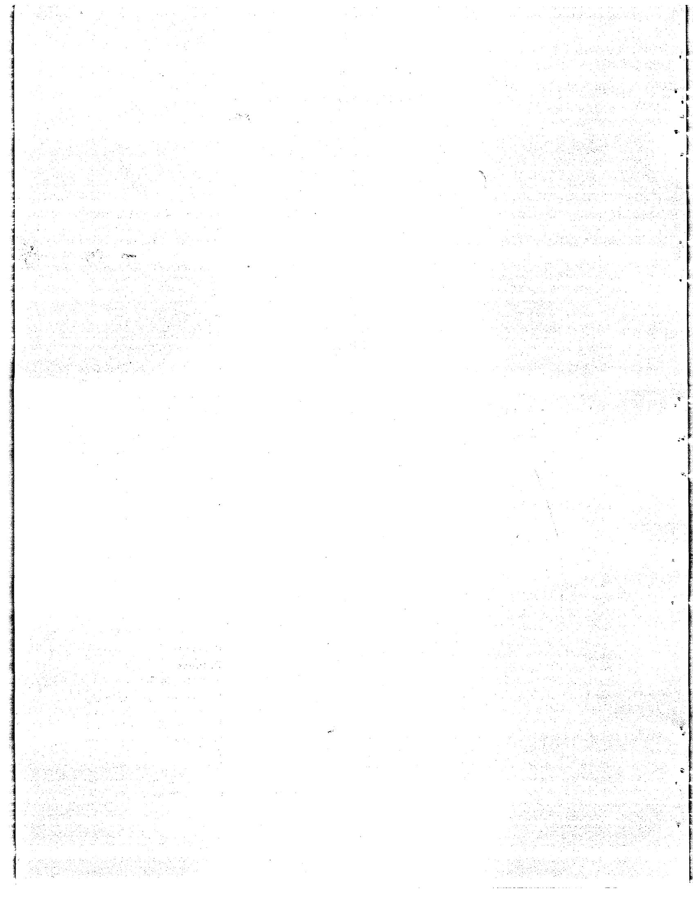

# 1. REFLECTOR-MODERATED REACTOR

E. S. Bettis A. P. Fraas

W.G.Piper

Aircraft Reactor Engineering Division

A.M.Perry

Electronuclear Research Division

# AIRCRAFT REACTOR TEST FACILITY

F.R.McQuilkin

Aircraft Reactor Engineering Division

Construction of the ART Facility has been divided into three "packages" of work. Package 1 includes alterations and additions to Building 7503; construction of the 7503 cell, air duct, stack, adsorber tank, spectrometer facility, and fuel storage tank; a portion of the electrical power system; and all work required on roads, grounds, and fencing. Package 2 consists in additional mechanical, electrical, and structural work for which design could not be completed for inclusion in package 1. The work included in packages 1 and 2 is to be performed by an outside contractor. The work items included in package 2 are the diesel-generator auxiliary power supply facility, auxiliary service and utility equipment, and lines up to the cell and to the vent-gas piping system. Package 3 includes the installation, by ORNL forces, of the experimental instruments, controls, process lines, and process equipment.

Drawings and specifications for package 1 were prepared by the K-25 Engineering Division for lump-sum prime contracting. All six prospective prime contractors who expressed prior interest submitted bids, which were opened August 16. The bids ranged from $765,835 to$ 869,560, with bids for the cell included; the cell bids ranged from $229,000 to$ 280,000. The contract was awarded on August 19 to the low total bidder, the V. L. Nicholson Company, Knoxville, Tennessee. Their bid included $264,373 for the cell, with the Chicago Bridge & Iron Co. engaged to serve as the subcontractor to design, fabricate, and erect the cell.

Provisions of the package 1 prime contract require that all work, except the cell and interior construction of the southwest corner of the building addition, be completed in 240 days, commencing August 29, 1955. The cell and southwest corner installation are to be completed by June 1, 1956.

The package 1 drawings for the southwest area are being withheld pending design of the complex piping and equipment (package 3 work) that will be installed within this area. Final release of the package 1 drawings for this area is scheduled for October 15, 1955. Plans and specifications for package 2 work are being made at ORNL.

# SHIELDING EXPERIMENT FACILITY

R. D. Schultheiss

Aircraft Reactor Engineering Division

Recent tests made at the Tower Shielding Facility indicated that provision should be made for the measurement of the gamma-ray spectrum of the ART as a function of the angle of emission from the reactor shield surface. It was decided that four collimated beams radiating from an equatorial point at the surface of the water shield at angles of from 0 to 70 deg from the radial direction would serve to give the essential data. One additional collimated radial beam will be available from an equatorial point at the surface of the reactor pressure shell; this beam will be used only during low-power operation. The layout required for providing these beams and the facilities for measuring them are shown in Fig. 1.1. In addition to the facilities shown in Fig. 1.1, a gamma-ray dosimeter will be located on the roof above the reactor.

# AIRCRAFT REACTOR TEST DESIGN

Reactor Design

A.P.Fraas

Aircraft Reactor Engineering Division

Layout drawings of the principal detailed design features of the ART reactor-pump-heat exchanger-pressure shell assembly have been made. The principal sections through the reactor are shown in Figs. 1.2, 1.3, and 1.4, and Table 1.1 gives the key dimensional data. The design of the pump-expansion tank region, which includes the sodium-to-NaK heat exchanger, has been

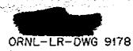

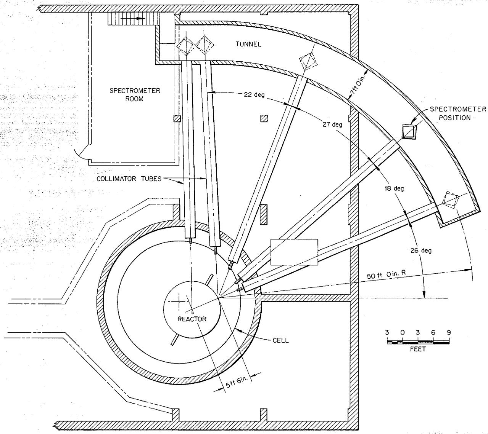  
Fig. 1.1. ART Shielding Experiment Facility.

worked out in a fashion which seems to be satisfactory from all standpoints. A one-half scale plastic model of that region has been completed to facilitate examination of fabrication, stress, and fluid-flow problems. Work has started on a full-scale aluminum model of this same assembly; with aluminum, the procurement and machining time will be reduced drastically from the time that would be required with Inconel, and yet the fabrication problems that will arise in the production of this model will be the same as those

to be involved in the fabrication of the ART. It is expected that many welding problems will be revealed and that modifications can then be made to facilitate fabrication with Inconel. The aluminum model will also be used for flow tests with water and stress analyses with strain gages or stress-coat paint. The remaining design work on subassemblies is sufficiently well along that arrangements for procurement of the Inconel and other parts for the ART began on August 1. Fabrication of the various shells, such as the

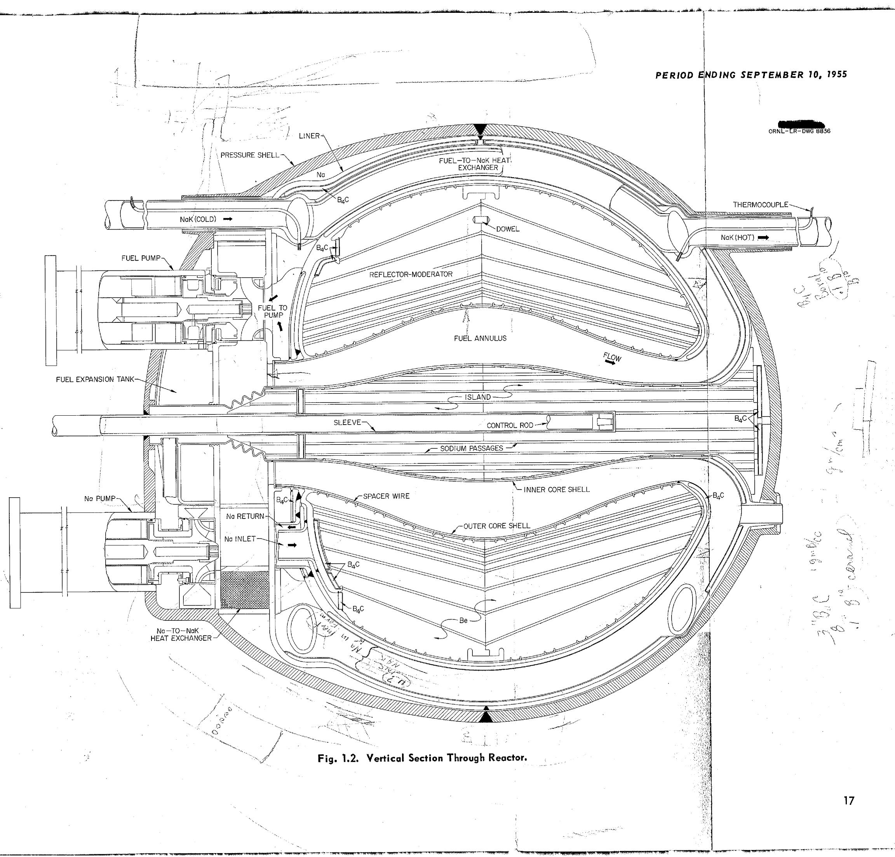

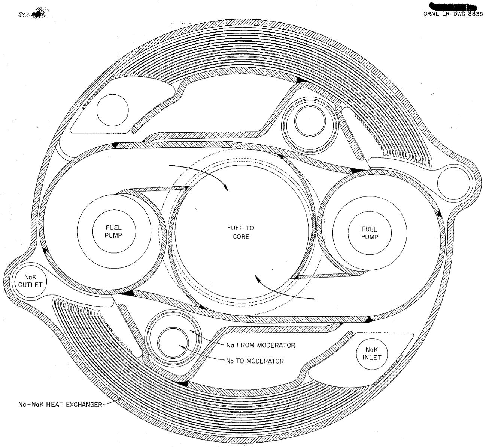  
Fig. 1.3. Horizontal Section Through Fuel Pumps.

pressure shell, reflector shell, etc., will be particularly time-consuming because of die problems, and therefore procurement work began with them.

Main and Auxiliary Radiator Design

R. D. Schultheiss

Aircraft Reactor Engineering Division

The main and auxiliary radiator core units for the ART are identical in design. Each radiator consists of type 310 stainless-steel-clad copper (0.0025 in.-0.005 in.-0.0025 in.) fins spaced 15

per inch and mounted on $3\%$ -in.-CD, 0.025-in.-wall Inconel tubes placed on 0.667-in. square centers. The radiator design conditions are presented in Table 1.2, and design data are presented in Table 1.3.

Fuel-to-NaK Heat Exchanger Design

R. D. Schultheiss

Aircraft Reactor Engineering Division

Design calculations and the layout drawings for the main heat exchanger were completed, and a

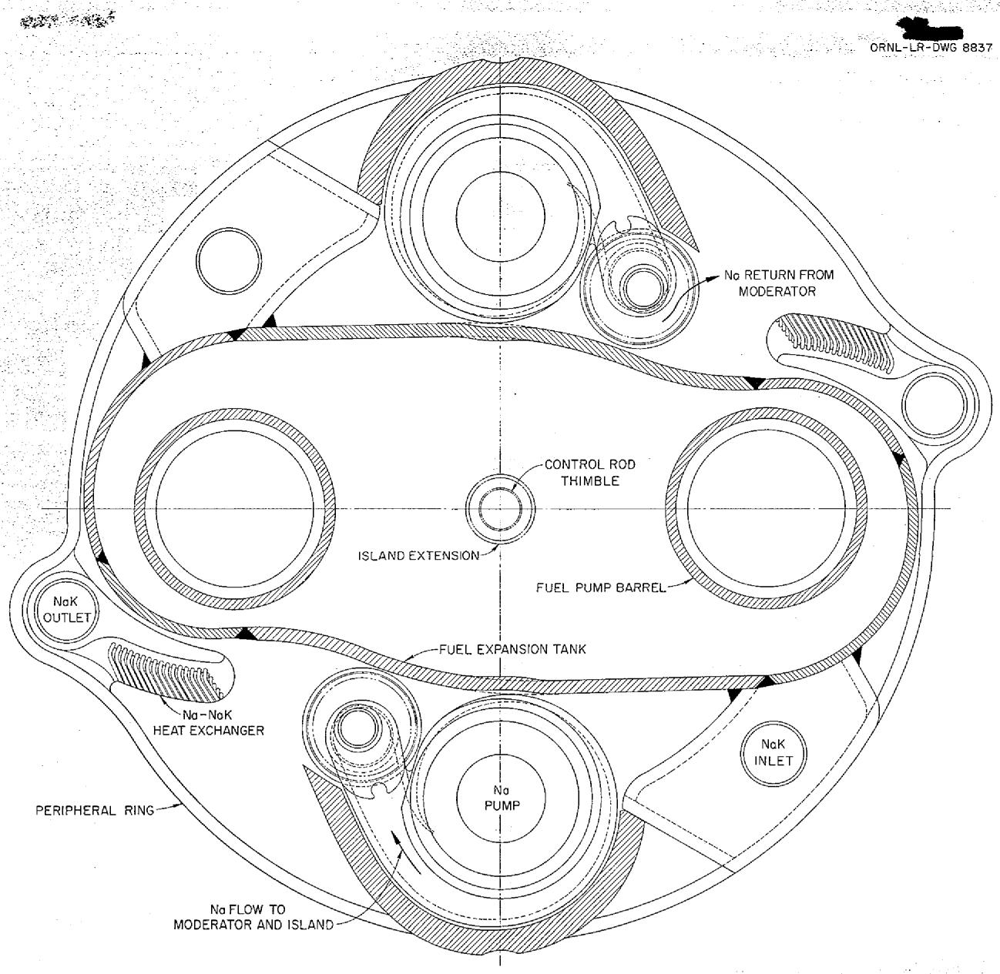  
Fig. 1.4. Horizontal Section Through Sodium Pumps.

selection of a heat exchanger was made. The design selected is similar to the designs previously described except that the tube configuration in the vicinity of the header sheets has been modified so that all tubes in a given layer have the same shape and can be made with a single

jig. The design data are presented in Table 1.4.

The new layout makes it possible to halve the number of heat exchanger tube bundles without doubling the number of jigs. This has the advantage of halving the number of NaK pipes penetrating the reactor pressure shell.

TABLE 1.1. REACTOR DIMENSIONS   

<table><tr><td colspan="2">REACTOR CROSS-SECTION EQUATORIAL RADI (in.)</td><td colspan="2">B4C tile</td></tr><tr><td></td><td></td><td>Inside</td><td>22.043</td></tr><tr><td>Control rod thimble</td><td></td><td>Thickness</td><td>0.375</td></tr><tr><td>Inside</td><td>0.750</td><td>Outside</td><td>22.418</td></tr><tr><td>Thickness</td><td>0.062</td><td></td><td></td></tr><tr><td>Outside</td><td>0.812</td><td>Helium gap</td><td></td></tr><tr><td></td><td></td><td>Inside</td><td>22.418</td></tr><tr><td>Sodium passage</td><td></td><td>Thickness</td><td>0.020</td></tr><tr><td>Inside</td><td>0.812</td><td>Outside</td><td>22.438</td></tr><tr><td>Thickness</td><td>0.094</td><td>Outer reflector shell</td><td></td></tr><tr><td>Outside</td><td>0.906</td><td>Inside</td><td>22.438</td></tr><tr><td>Beryllium</td><td></td><td>Thickness</td><td>0.062</td></tr><tr><td>Inside</td><td>0.906</td><td>Outside</td><td>22.500</td></tr><tr><td>Thickness</td><td>4.219</td><td>Spacer thickness</td><td>0.015</td></tr><tr><td>Outside</td><td>5.125</td><td>Tangent to first heat exchanger tube</td><td>22.515</td></tr><tr><td>Sodium passage</td><td></td><td>Tube radius</td><td>0.094</td></tr><tr><td>Inside</td><td>5.125</td><td>Center line of first tube</td><td>22.609</td></tr><tr><td>Thickness</td><td>0.125</td><td>Eleven 0.2175-in. spaces</td><td>2.392</td></tr><tr><td>Outside</td><td>5.250</td><td></td><td></td></tr><tr><td>Inconel shell (inner core shell)</td><td></td><td>Center line of twelfth tube</td><td>25.001</td></tr><tr><td>Inside</td><td>5.250</td><td>Tube radius</td><td>0.094</td></tr><tr><td>Thickness</td><td>0.125</td><td>Spacer</td><td>0.015</td></tr><tr><td>Outside</td><td>5.375</td><td>Channel</td><td></td></tr><tr><td>Fuel</td><td></td><td>Inside</td><td>25.110</td></tr><tr><td>Inside</td><td>5.375</td><td>Thickness</td><td>0.125</td></tr><tr><td>Thickness</td><td>5.125</td><td>Outside</td><td>25.235</td></tr><tr><td>Outside</td><td>10.500</td><td></td><td></td></tr><tr><td>Outer Inconel core shell</td><td></td><td>Gap</td><td></td></tr><tr><td>Inside</td><td>10.500</td><td>Inside</td><td>25.235</td></tr><tr><td>Thickness</td><td>0.125</td><td>Thickness</td><td>0.040</td></tr><tr><td>Outside</td><td>10.625</td><td>Outside</td><td>25.275</td></tr><tr><td>Sodium passage</td><td></td><td>Boron jacket</td><td></td></tr><tr><td>Inside</td><td>10.625</td><td>Inside</td><td>25.275</td></tr><tr><td>Thickness</td><td>0.094</td><td>Thickness</td><td>0.062</td></tr><tr><td>Outside</td><td>10.719</td><td>Outside</td><td>25.337</td></tr><tr><td>Beryllium reflector</td><td></td><td>B4C tile</td><td></td></tr><tr><td>Inside</td><td>10.719</td><td>Inside</td><td>25.337</td></tr><tr><td>Thickness</td><td>10.949</td><td>Thickness</td><td>0.313</td></tr><tr><td>Outside</td><td>21.668</td><td>Outside</td><td>25.650</td></tr><tr><td>Sodium passage</td><td></td><td>Helium gap</td><td></td></tr><tr><td>Inside</td><td>21.668</td><td>Inside</td><td>25.650</td></tr><tr><td>Thickness</td><td>0.125</td><td>Thickness</td><td>0.020</td></tr><tr><td>Outside</td><td>21.793</td><td>Outside</td><td>25.670</td></tr><tr><td>Inconel shell</td><td></td><td>Pressure shell liner</td><td></td></tr><tr><td>Inside</td><td>21.793</td><td>Inside</td><td>25.670</td></tr><tr><td>Thickness</td><td>0.250</td><td>Thickness</td><td>0.375</td></tr><tr><td>Outside</td><td>22.043</td><td>Outside</td><td>26.045</td></tr><tr><td>Sodium passage</td><td></td><td>In island tubes</td><td>0.064</td></tr><tr><td>Inside</td><td>26.045</td><td>In reflector tubes</td><td>0.233</td></tr><tr><td>Thickness</td><td>0.125</td><td>In inlet and return piping</td><td>0.077</td></tr><tr><td>Outside</td><td>26.170</td><td>In pumps and volutes</td><td>0.175</td></tr><tr><td>Pressure shell</td><td></td><td>In first deck</td><td>0.260</td></tr><tr><td>Inside</td><td>26.170</td><td>In second deck</td><td>0.308</td></tr><tr><td>Thickness</td><td>-1.000</td><td>In external piping</td><td>0.019</td></tr><tr><td>Outside</td><td>27.170</td><td>In expansion tank</td><td>0.042</td></tr><tr><td></td><td></td><td>Total sodium volume</td><td>2.45</td></tr><tr><td>CORE</td><td></td><td colspan="2">FUEL-TO-NaK HEAT EXCHANGER</td></tr><tr><td>Diameter (inside of outer shell atequator), in.</td><td>21</td><td>Tube data, in.</td><td></td></tr><tr><td></td><td></td><td>Center-line spacing</td><td>0.2175</td></tr><tr><td>Island outside diameter, in.</td><td>10.75</td><td>Outside diameter</td><td>0.1875</td></tr><tr><td>Core inlet outside diameter, in.</td><td>11</td><td>Inside diameter</td><td>0.1375</td></tr><tr><td>Core inlet inside diameter, in.</td><td>6.81</td><td>Wall thickness</td><td>0.025</td></tr><tr><td>Core inlet area, in.2</td><td>58.7</td><td>Spacer thickness</td><td>0.030</td></tr><tr><td></td><td></td><td>Mean length</td><td>72.000</td></tr><tr><td>Core equatorial cross-sectionalarea, in.2</td><td>256.2</td><td>Equatorial crossing angle</td><td>26°20'</td></tr><tr><td></td><td></td><td>Inlet and outlet pipe, in.</td><td></td></tr><tr><td></td><td></td><td>Inside diameter</td><td>2.375</td></tr><tr><td>MODERATOR REGION</td><td></td><td>Outside diameter</td><td>2.875</td></tr><tr><td>Volume of beryllium plus fuel, ft3</td><td>28.2</td><td>Header sheet, in.</td><td></td></tr><tr><td>Volume of beryllium, ft3</td><td>24.99</td><td>Thickness</td><td>0.375</td></tr><tr><td>Cooling passage diameter, in.</td><td>0.187</td><td>Inside radius</td><td>3.812</td></tr><tr><td>Number of passages in island</td><td>100</td><td>Fuel volume, ft3</td><td>2.84</td></tr><tr><td>Number of passages in reflector</td><td>288</td><td>Number of tube bundles</td><td>12</td></tr><tr><td></td><td></td><td>Number of tubes per bundle, 12×24</td><td>288</td></tr><tr><td>FUEL SYSTEM</td><td></td><td>Total number of tubes</td><td>3456</td></tr><tr><td>Fuel volume, ft3</td><td></td><td>Latitude of north header center line</td><td>41°30'</td></tr><tr><td>In 26-in.-long core</td><td>3.21</td><td>Latitude of south header center line</td><td>47°</td></tr><tr><td>In inlet and outlet ducts</td><td>1.41</td><td></td><td></td></tr><tr><td>In expansion tank when ½ in. deep</td><td>0.08</td><td></td><td></td></tr><tr><td>In heat exchanger</td><td>2.84</td><td></td><td></td></tr><tr><td>In pump volutes</td><td>0.84</td><td colspan="2">PUMP-EXPANSION TANK REGION</td></tr><tr><td>Total in main circuit</td><td>8.38</td><td>Vertical distance above equator, in.</td><td></td></tr><tr><td>Fuel expansion tank</td><td></td><td>Floor of fuel pump inlet passage</td><td>17.500</td></tr><tr><td></td><td></td><td>Bottom of lower deck</td><td>19.125</td></tr><tr><td>Volume, ft3</td><td>0.5787</td><td>Top of lower deck</td><td>19.625</td></tr><tr><td>Width, in.</td><td>13.625</td><td>Bottom of upper deck</td><td>24.000</td></tr><tr><td>Length, in.</td><td>32.500</td><td>Top of upper deck</td><td>24.500</td></tr><tr><td></td><td></td><td>Top of sodium pump volute</td><td>27.750</td></tr><tr><td>SODIUM SYSTEM (ft3)</td><td></td><td>Center line of fuel pump discharge</td><td>21.500</td></tr><tr><td></td><td></td><td>Center line of sodium pump</td><td>26.125</td></tr><tr><td>Sodium volume</td><td></td><td>discharge</td><td></td></tr><tr><td>In annular passages</td><td>1.11</td><td>Top inside of fuel expansion tank</td><td>29.500</td></tr><tr><td>In heat exchanger</td><td>0.165</td><td>Inside of dome</td><td>29.875</td></tr><tr><td>Outside of dome</td><td>20.875</td><td>Length</td><td>8.687</td></tr><tr><td>Top inside of sodium expansion tank</td><td>24.312</td><td>Height</td><td>2.500</td></tr><tr><td>Top outside of sodium expansion tank</td><td>34.812</td><td>Impeller speed, rpm</td><td>2880</td></tr><tr><td>Top of fuel pump mounting flange</td><td>47.000</td><td>Estimated impeller weight, lb</td><td>10</td></tr><tr><td>Top of sodium pump mounting flange</td><td>50.220</td><td>Critical speed, rpm</td><td>6000</td></tr><tr><td></td><td></td><td>Shaft data, in.</td><td></td></tr><tr><td>FUEL PUMPS</td><td></td><td>Diameter</td><td>2.250</td></tr><tr><td></td><td></td><td>Over-all length</td><td>31.500</td></tr><tr><td></td><td></td><td>Outside diameter between bearings</td><td>2.375</td></tr><tr><td></td><td></td><td>Outside diameter below seal</td><td>2.250</td></tr><tr><td></td><td></td><td>Distance from center line of lower bearing to center line of impeller, in.</td><td>13.300</td></tr><tr><td></td><td></td><td>Distance between bearings, in.</td><td>12.000</td></tr><tr><td></td><td></td><td>Impeller data, in.</td><td></td></tr><tr><td>Center-line spacing, in.</td><td>21.000</td><td>Diameter</td><td>5.750</td></tr><tr><td>Volute chamber, in.</td><td></td><td>Discharge height</td><td>0.500</td></tr><tr><td>Width</td><td>13.625</td><td>Inlet inside diameter</td><td>3.500</td></tr><tr><td>Length</td><td>32.500</td><td></td><td></td></tr><tr><td>Height</td><td>4.375</td><td></td><td></td></tr><tr><td>Impeller speed, rpm</td><td>2750</td><td></td><td></td></tr><tr><td>Estimated impeller weight, lb</td><td>11</td><td></td><td></td></tr><tr><td>Critical speed, rpm</td><td>6000</td><td></td><td></td></tr><tr><td>Shaft data, in.</td><td></td><td>Lower journal bearing outside diameter, in.</td><td>3.400</td></tr><tr><td>Diameter</td><td>2.250</td><td>Thrust bearing height above equator, in.</td><td>51.907</td></tr><tr><td>Overhang</td><td>14.750</td><td></td><td></td></tr><tr><td>Over-all length</td><td>31.500</td><td></td><td></td></tr><tr><td>Outside diameter between bearings</td><td>2.375</td><td>Number of impeller vanes</td><td>10</td></tr><tr><td>Outside diameter below seal</td><td>2.250</td><td>Diameter of top positioning ring, in.</td><td>6.200</td></tr><tr><td>Distance between bearings, in.</td><td>12.000</td><td>Diameter of bottom positioning ring, in.</td><td>6.190</td></tr><tr><td>Impeller data, in.</td><td></td><td>Outside diameter of top flange, in.</td><td>10.000</td></tr><tr><td>Diameter</td><td>5.750</td><td></td><td></td></tr><tr><td>Discharge height</td><td>1.000</td><td></td><td></td></tr><tr><td>Inlet diameter</td><td>3.500</td><td></td><td></td></tr><tr><td>Lower journal bearing outside diameter, in.</td><td>3.400</td><td colspan="2">SODIUM-TO-NaK HEAT EXCHANGER</td></tr><tr><td>Thrust bearing height from equator, in.</td><td>48.187</td><td>Tube data, in. Center-line spacing</td><td>0.2175</td></tr><tr><td>Number of vanes in impeller</td><td>5</td><td>Outside diameter</td><td>0.1875</td></tr><tr><td>Diameter of top positioning ring, in.</td><td>6.200</td><td>Inside diameter</td><td>0.1375</td></tr><tr><td>Diameter of bottom positioning ring, in.</td><td>6.190</td><td>Wall thickness</td><td>0.025</td></tr><tr><td>Outside diameter of top flange, in.</td><td>10.000</td><td>Spacer thickness</td><td>0.030</td></tr><tr><td>SODIUM PUMP</td><td></td><td>Mean length</td><td>28</td></tr><tr><td></td><td></td><td>Number of bundles</td><td>2</td></tr><tr><td></td><td></td><td>Number of tubes per bundle, 15 × 20</td><td>300</td></tr><tr><td></td><td></td><td>Total number of tubes</td><td>600</td></tr><tr><td></td><td></td><td>Inlet and outlet pipe, in.</td><td></td></tr><tr><td>Center-line spacing, in.</td><td>23.125</td><td>Inside diameter</td><td>2.375</td></tr><tr><td>Volute chamber, in.</td><td></td><td>Outside diameter</td><td>2.875</td></tr><tr><td>Width</td><td>7.687</td><td></td><td></td></tr></table>

TABLE 1.2. RADIATOR DESIGN CONDITIONS   

<table><tr><td></td><td>Main</td><td>Auxiliary</td></tr><tr><td>Power, Mw</td><td>55</td><td>4.7</td></tr><tr><td>NaK inlet temperature, °F</td><td>1500</td><td>1100</td></tr><tr><td>NaK outlet temperature, °F</td><td>1070</td><td>900</td></tr><tr><td>Total NaK flow at average temperature, cfs</td><td>10.45</td><td>1.70</td></tr><tr><td>Air inlet temperature, °F</td><td>100</td><td>100</td></tr><tr><td>Air outlet temperature, °F</td><td>1128</td><td>810</td></tr><tr><td>Total air flow at inlet conditions to blower, cfm</td><td>179,000</td><td>22,800</td></tr><tr><td>Air pressure drop across radiator, in. H2O</td><td>5.58</td><td>5.84</td></tr></table>

TABLE 1.3. RADIATOR DESIGN DATA   

<table><tr><td></td><td>Main</td><td>Auxiliary</td></tr><tr><td>Face area, ft2</td><td>6.25</td><td>6.25</td></tr><tr><td>Mean free area, ft2</td><td>3.66</td><td>3.66</td></tr><tr><td>Air mass velocity, lb/ft2·sec</td><td>3.46</td><td>3.71</td></tr><tr><td>Collar plus tube wall thickness, in.</td><td>0.035</td><td>0.035</td></tr><tr><td>Fin area, ft2</td><td>922</td><td>922</td></tr><tr><td>Collar area, ft2</td><td>5.2</td><td>5.2</td></tr><tr><td>Inside tube area, ft2</td><td>42.7</td><td>42.7</td></tr><tr><td>Mean tube area, ft2</td><td>44.2</td><td>44.2</td></tr><tr><td>Number of tubes</td><td>360</td><td>360</td></tr><tr><td>Number of rows</td><td>8</td><td>8</td></tr><tr><td>Air Reynolds number</td><td>1321</td><td>1590</td></tr><tr><td>NaK flow area, in.2</td><td>5.34</td><td>5.34</td></tr><tr><td>NaK Reynolds number</td><td>91,400</td><td>111,000</td></tr><tr><td>NaK mass velocity, lb/ft2·sec</td><td>820.0</td><td>1211</td></tr></table>

# Core Flow Studies

W. T. Furgerson G. D. Whitman   
E.C.Lindley W.J.Stelzman   
A.M. Smith J.M.Trummel

Aircraft Reactor Engineering Division

Two approaches to the core hydrodynamics problem are being investigated. Both make use of a vortex sheet in the annulus between the island and reflector in an effort to get a high degree of mixing. In the first system the vortex axes parallel the island, while in the second they

spiral helically downward around it. In both systems the two fuel pump volutes discharge tangentially into the core inlet to give a system that is insensitive to the one-pump-out condition.

Eight series of tests have been made on the axial vortex system in the metal core rig. The tests constituted a systematic development of an inlet-guide-vane and turbulence-generator design which would produce radial velocities of sufficient magnitude to keep the boundary-layer fluid mixed with the free stream.

TABLE 1.4. FUEL-TO-NoK HEAT EXCHANGER DESIGN DATA   

<table><tr><td>Tube diameter</td><td>0.1875 in.</td></tr><tr><td>Number of tubes per bundle</td><td>288</td></tr><tr><td>Number of bundles</td><td>12</td></tr><tr><td>Tube center-line spacing</td><td>0.2175 in.</td></tr><tr><td>Tube wall thickness</td><td>0.025 in.</td></tr><tr><td>Tube array, square pitcha</td><td>12 × 24</td></tr><tr><td>Mean tube length</td><td>5.95 ft</td></tr><tr><td>Fuel temperature range</td><td>1250 to 1600°F</td></tr><tr><td>NaK temperature range</td><td>1070 to 1500°F</td></tr><tr><td>Fuel pressure drop through heat exchanger</td><td>43 psi</td></tr><tr><td>NaK pressure drop through heat exchanger</td><td>41 psi</td></tr><tr><td>Fuel Reynolds number in heat exchanger</td><td>4135</td></tr><tr><td>NaK Reynolds number in heat exchanger</td><td>144,000</td></tr><tr><td>Fuel flow rateb</td><td>2.96 cfs</td></tr><tr><td>NaK flow rateb</td><td>10.45 cfs</td></tr><tr><td>Fuel volume in heat exchanger</td><td>2.84 ft3</td></tr><tr><td>NaK volume in heat exchanger tubes (not including headers)</td><td>2.14 ft3</td></tr><tr><td>Heat exchanger thickness (includes 0.015-in. side-wall clearance)</td><td>2.61 in.</td></tr><tr><td>Limiting combined tube stressesc at tube wall temperatures</td><td>1125 psi at 1135°F
220 psi at 1535°F</td></tr><tr><td>Log mean temperature difference</td><td>136°F</td></tr><tr><td>Estimated maximum tube wall temperature, neglecting secondary heating effects</td><td>1535°F</td></tr><tr><td>Fuel mixture NaF-ZrF4-UF4(50-46-4 mole %) heat transfer coefficient</td><td>2090 Btu/hr·ft2.°F</td></tr><tr><td>NaK (56% Na-44% K) heat transfer coefficient</td><td>18,200 Btu/hr·ft2.°F</td></tr><tr><td>Capacity at design operating conditions</td><td>55 Mw</td></tr><tr><td>Inconel surface (tubes and channel) in contact with fuel</td><td>160,000 in.2(1110 ft2)</td></tr><tr><td>Inconel surface in contact with NaK</td><td>107,500 in.2(746 ft2)</td></tr><tr><td>Inconel volume of tubes in heat exchanger</td><td>3170 in.3(1.83 ft3)</td></tr></table>

${}^{a}$ Calculations indicate 24 tubes will fit circumferentially.   
b At mean operating temperatures in reactor.   
Tube stresses were based on a variable-pitch, helical-tube design.

The effect of one design is shown by the axial velocity profiles of Figs. 1.5, 1.6, and 1.7. Figure 1.5 presents data obtained for the core with swirl-chamber inlet only, that is, no inlet guide vanes or turbulators. The flow has a rotational component centered on the core axis

which is approximately three times the axial component. This gives rise to strong radial pressure gradients, which, as a result of fluid friction, induce an adverse axial pressure gradient along the island wall. This induced axial pressure gradient is additive to the already existing

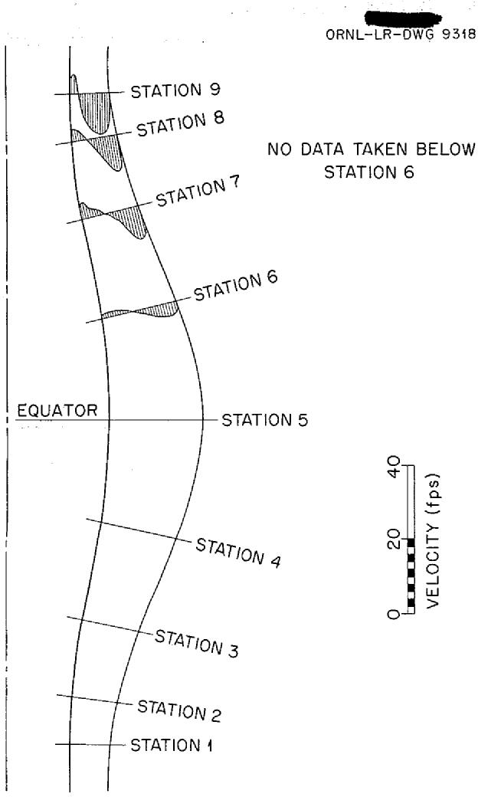  
Fig. 1.5. Axial Velocity Profiles from Test Series 1.

gradient caused by the divergence of the core, and thus large areas of reverse flow occur next to the island.

The results of tests of the core with inlet guide vanes for eliminating the rotational flow component are presented in Fig. 1.6. The induced axial pressure gradient was removed, and the amount of flow reversal along the inner wall was decreased. As in the first series, the flow was essentially two-dimensional; that is, no appreciable radial component existed.

Turbulators were added to the previous configuration for another series of tests. The turbulators were expected to generate radial velocity components which would carry boundary-layer fluid into the midstream and vice versa. It can be seen

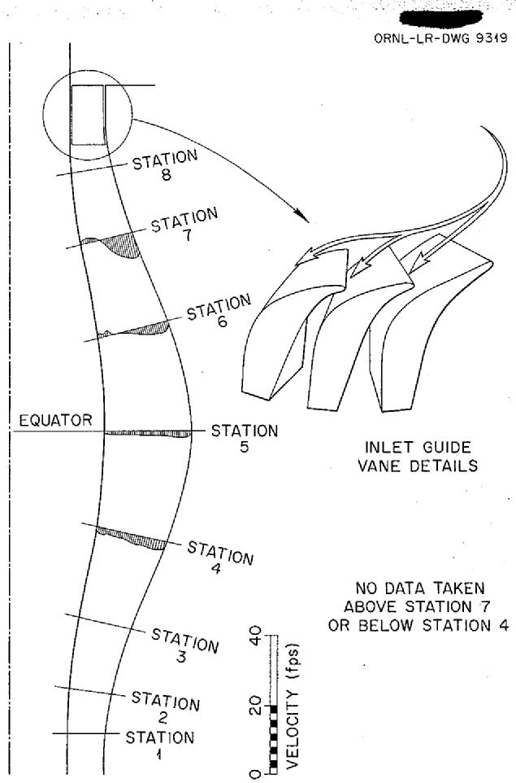  
Fig. 1.6. Axial Velocity Profiles from Test Series 5.

from Fig. 1.7 that the amount of flow reversal was further reduced.

In another series of tests (series 8) flow reversal was eliminated from station 6 downward by use of a greater radial velocity component. The configuration of series 8 was used for two brief tests that simulated the one-fuel-pump-out condition. Preliminary results indicate that flow conditions change very little, the percentage of flow separation remaining approximately the same as for the two-pump condition.

Data are taken from the metal core test rig by means of wall static pressure taps and claw probe traverses. The latter read total pressure and flow direction but are limited to measuring flow which is two-dimensional. As stronger turbulators are designed and radial velocity components become greater, accurate data will be increasingly more

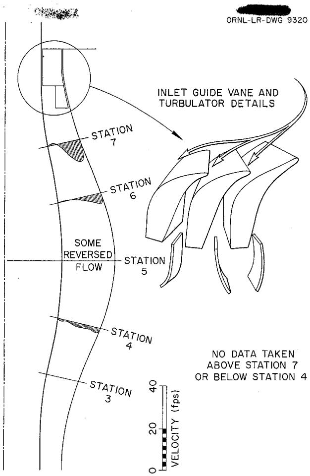  
Fig. 1.7. Axial Velocity Profiles from Test Series 6.

difficult to obtain. Two other limitations to the metal core rig exist in that the probes give average values and do not respond to transients, and surveys are limited to two points 9-deg apart at each station.

In order to examine more closely the radial flow, circumferential distribution, and transients, techniques are being developed for the use of high-speed photography of dye injections and conductivity measurements of salt injections in the plastic-core test rig. Some information on the core flow characteristics has been obtained by injecting an electrolyte into the water flow and observing subsequent changes in electrical conductivity at preselected positions in the flow. The apparatus used includes two conductivity probes, two resistance bridges, two Brush amplifiers, and a two-channel Brush recorder. The

electrolyte injected was a concentrated solution of sodium chromate. Injections were made manually by using a 30-ml glass syringe. Some care was required to obtain adequate insulation and to seal around the two wires of the conductivity probes. A satisfactory arrangement employs Kovar tubing and wire with a glass insulator and seal. As now used, the probes consist of a $\frac{3}{16}$ -in.-dia Kovar tube with two 0.025-in.-dia Kovar wires. The wires are separated by approximately $\frac{1}{8}$ in. and project about $\frac{3}{8}$ in. from the seal. The total length of the probe is 9 in. Some corrosion of the probes occurs, but probe life is considered to be satisfactory.

The resistance bridge is a Wheatstone bridge with fixed legs of 10,000 ohms each; the third leg is adjustable to match the electrolyte resistance sensed by the probe, which is the fourth leg. A 45-v battery supplies the bridge current. The bridge can be balanced for any initial conductivity of the water, and therefore only a change in conductivity is passed as a signal to the amplifiers.

Conductivity experiments have been made on both the aluminum model and the transparent plastic model. The water flow rate is approximately two-thirds the fuel flow rate for the Reynolds number expected with the fuel flow. Perhaps the most pertinent values derived from the tests are the estimates of transit times. For example, data were taken with the probes located very near the inlet and outlet of the aluminum model core, and, if time is counted from the first appearance of added salt at the inlet probes, the time of appearance of the salt at the outlet probe is as shown in Fig. 1.8. The fastest transit time was 0.8 sec, while the slowest measured transit time was about 2.8 sec. There is a limit to the sensitivity of the measuring apparatus, and, undoubtedly, some small amount of salt passes after the time of no signal on the Brush recorder. The mean transit time, computed as the quotient of total flow rate to core volume, was 1.7 sec.

Similar tests were made with the transparent plastic core model. Since the total volume of this system is small, the salt was recirculated rapidly, and it was not possible to obtain the maximum transit time accurately. However, the minimum transit time was found to be 0.35 sec, and, by extrapolation, the maximum transit time was estimated to be at least 3.2 sec.

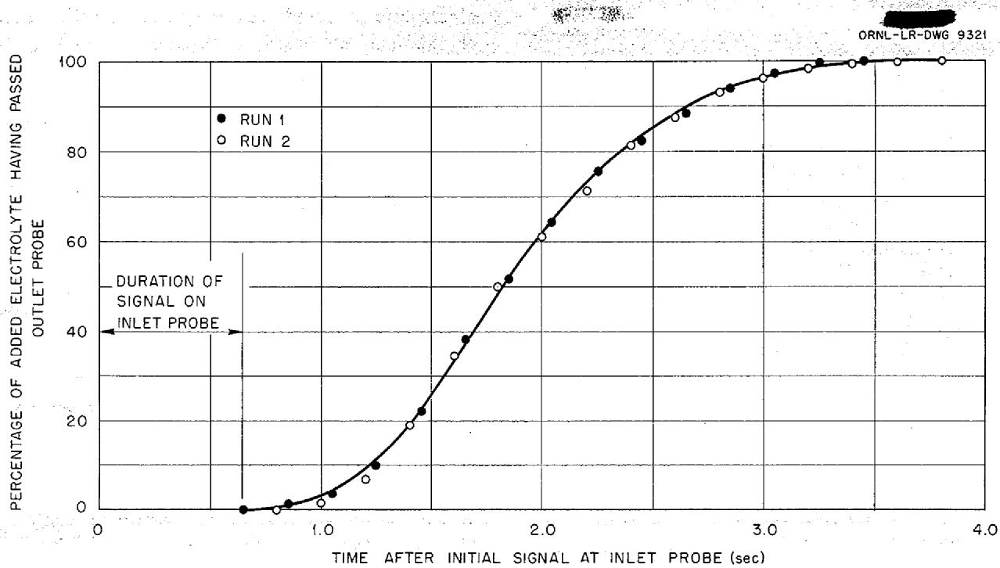  
Fig. 1.8. Transit Time for Flow Between Core Inlet and Outlet.

Studies were made of the flow of water through the transparent plastic model by injecting a dye at various points. The header, at the time of these tests, was designed to produce two, meshing, helical vortexes through the flow chamber. Several combinations of chemicals for imparting color changes were considered. The most satisfactory one, by far, was a combination of starch, iodine, and sodium thiosulfate. For the tests the model was filled with a starch solution, which was transparent prior to the injection of the dye, the dye being an iodine solution (a saturated solution of iodine in methyl alcohol). After the dye was injected, transparency could again be obtained in the closed system by the injection of a clearing agent. The clearing agent was a saturated solution of sodium thiosulfate in water. The study was made by alternately injecting the dye and the clearing agent. The dark blue cloud resulting from the dye injection was transported with the water. The general characteristics of the flow could be observed, and, in particular, the flow at various points could be noted. In one way the action of the clearing agent was superior to that of the dye: those areas where turbulence was least were the last ones

to be cleared of the dye. Photographs were taken of the tests, but they have not yet been analyzed.

Visual observations indicated that the water circulated about the vertical axis of the core, with the greater portion of the mass making from four to seven revolutions in passage. There was upward flow in the upper hemisphere near the island, but very good mixing appeared to prevail throughout most of the core. An extensive series of pictures of flow in both cores is scheduled for completion in September.

# Core Design Analyses

# W. T. Furgerson

# Aircraft Reactor Engineering Division

Interest in core designs with lower degrees of divergence than that of the present 21-in. design prompted a study of the effect of inlet annulus dimensions on the adverse pressure gradients encountered by the fuel in flowing from the core inlet to the equator. Any core design in which the area perpendicular to the flow increases along the flow path will have adverse pressure gradients resulting from conversion of velocity head to static head. If the flow entering the core has a rotational component, an additional axial pressure

gradient will be induced through fluid friction effects. If the rotational component is centered about the core axis, the induced gradient is favorable along the outer wall and adverse along the island. In each case, the gradient is algebraically additive to the gradients brought about by area change. Since, all other things being equal, flow separation is favored by higher relative pressure gradients, the result is a tendency for flow to separate from the island.

The effect of increasing the outside radius of the present 21-in. core inlet on the two relative pressure gradients along the island wall is illustrated in Fig. 1.9. The divergence gradient decreases because of the decreased divergence of the core, but the induced gradient increases, principally because of the increased ratio of inlet radii.

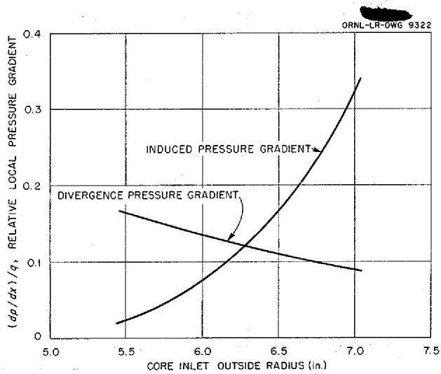  
Fig. 1.9. Relative Divergence and Induced Pressure Gradients for a 21-in. Core with a 3.405-in. Inside Radius at the Inlet.

A contour map showing the lines of constant relative pressure gradient plotted against both inside and outside inlet radii is presented in Fig. 1.10. In the present design the minimum relative gradient is very closely approached. A change of inlet inside and outside radii to 5.0 and 7.25 in., respectively, could reduce the maximum relative gradient from 0.19 to 0.15, but an injudicious increase of inlet area could result in higher relative gradients than those of the present core design.

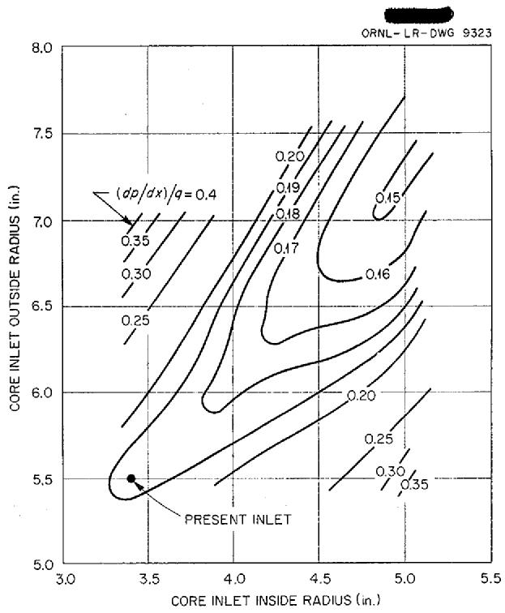  
Fig. 1.10. A Contour Map of Constant Relative Pressure Gradient vs Core Inlet Inside and Outside Radii.

Similar plots have been prepared for cores having different equatorial dimensions. The value of the minimum relative gradient decreases with decreasing equatorial area, but the inlet radii at which the minimum occurs remains as shown in Fig. 1.10. It must be emphasized that the induced gradient is present only where rotational flow components exist. Also, the equation by which the induced gradient is calculated is highly theoretical and has not yet been quantitatively checked by experiment.

# Fuel Pump Performance

R.L.Brewster A.M.Smith

M.E.Lackey G.D.Whitman

Aircraft Reactor Engineering Division

Performance tests of the fuel pump (model MF-2) with water as the circulated fluid were concluded, with a total of 16 tests having been conducted. These tests involved changes in impeller design, in the axial and radial running clearances, in volute design, and in suction geometry. The major changes in impeller design, suction geometry, and

radial running clearance were discussed in the previous report.1

Further study was made of the noise which was present in the initial testing and which was suspected to be cavitation noise. It has been determined that the noise was not primarily due to fluid cavitation but, rather, to a local flow condition that existed at the tongue of the pump volute. This was established by the use of a carbon microphone probe. A circuit was devised so that the microphone signal could be observed on a cathode-ray oscilloscope. With this arrangement, the region of maximum noise was located near the volute tongue. The absence of cavitation was further indicated by no observable decrease in efficiency when the pump was operated at the design point under conditions of varying pump suction pressure. The pump suction pressure was varied from approximately 11 to 0 psig with a water temperature of approximately $70^{\circ}\mathrm{F}$ . The vapor pressure of the water at $70^{\circ}\mathrm{F}$ corresponds to that of fuel at a temperature of $1535^{\circ}\mathrm{F}$ , which is well above the maximum fuel pump suction temperature expected.

Analyses of the data from the pump performance tests indicated the need for additional flow area in the pump volute. The particular evidence for this was the imbalance of hydraulic forces around the periphery of the impeller at the design point and the occurrence of design-speed maximum efficiency at approximately $20\%$ less than the design flow.

A design change in the reactor north head for structural reasons allowed the pump volute flow area to be increased; however, this increase did not compensate for the increase in the fuel flow rate required for improved heat exchanger performance. To obtain the additional required flow area, the pump volute was redesigned without diffuser cones.

Results of water performance tests with the redesigned pump volute indicated excessive recirculatory losses between the impeller discharge and suction volumes. The impeller lower shroud was therefore modified to allow the 12 radial slingers to be lengthened to the full impeller diameter in order to increase their developed back pressure. The results of this modification are shown in Fig. 1.11. To further reduce the re

circulatory loss, the impeller axial clearance was reduced from 0.102 to 0.053 in. The results of this modification are shown in Fig. 1.12.

It may be seen from Fig. 1.12 that the design point lies in the region of maximum efficiency. The noise present with the earlier volute design was eliminated, and the condition of hydraulic force balance on the impeller occurs near design speed and flow.

# Controls and Instrumentation

J.M.Eastman

Bendix Products Division

E. R. Mann

Instrumentation and Controls Division

A flow sheet has been prepared that shows, schematically, the locations of the instrumentation and control components. Control-panel layout studies are being made. Elementary-control electrical wiring diagrams are being prepared to provide control actions in accordance with information block diagrams, which show control functions independent of control techniques or hardware types. The selection of control techniques and the specifications for component hardware are being worked out. Apparently no fundamentally new development work, except for special sensors, will be necessary to meet control requirements, although heat load responses may require the use of some controls not previously required for reactors.

The linear equipment for an ORNL reactor simulator has been assembled and tested. Completion of the nonlinear simulator equipment is scheduled for September 1, 1955, with the delivery of special components from Reeve Electronics, Inc. One of the major objectives of the simulation is the determination of the control system response requirements under emergency conditions.

Two instrument test loops are being prepared for checking special sensors, including thermocouples, flowmeters, pressure indicators, and the tachometers. Arrangements are also being made for testing the fuel-level indicator.

Conceptual designs have been worked out for the rod-drive mechanism, the enricher actuating and control mechanism, the moderator coolant temperature control system, the flux-sensing chambers, the radiator main louver actuating and control mechanism, the fuel and sodium pump

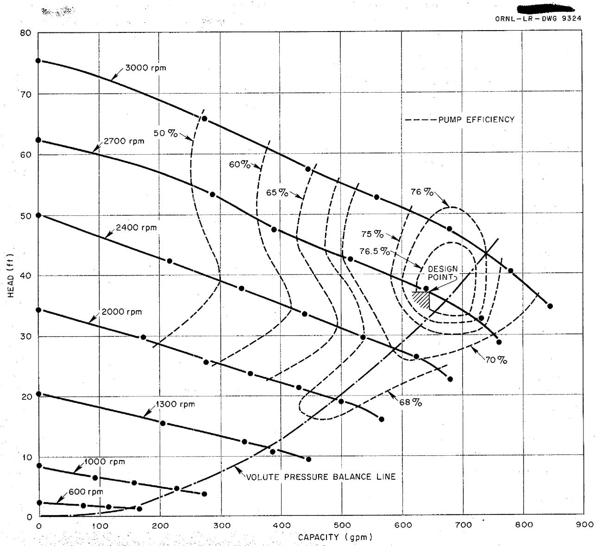  
Fig. 1.11. Fuel Pump Performance Characteristics with Modified Impeller. Lower shroud of impeller modified to allow the 12 radial slingers to be lengthened to full impeller diameter in order to increase developed back pressure. Axial clearance on shroud 0.102 in.

speed-control mechanism, and the fuel-level indicator. Detail design of the main louver and sodium temperature control system will be based on results of simulator work. The enricher detail design will be based on calibration data obtained from the high-temperature critical experiment. Detail design of the flux chambers, their actuating and cooling equipment, and the rod actuating mechanism will begin after pertinent reactor design details are frozen. Fuel-temperature-sensing

thermocouples have been included in the reactor design.

Engineering Test Unit

M. Bender

Aircraft Reactor Engineering Division

A construction program for the Engineering Test Unit (ETU) has been established, which, based on current equipment delivery information, makes it feasible to start assembly operations on June 1,

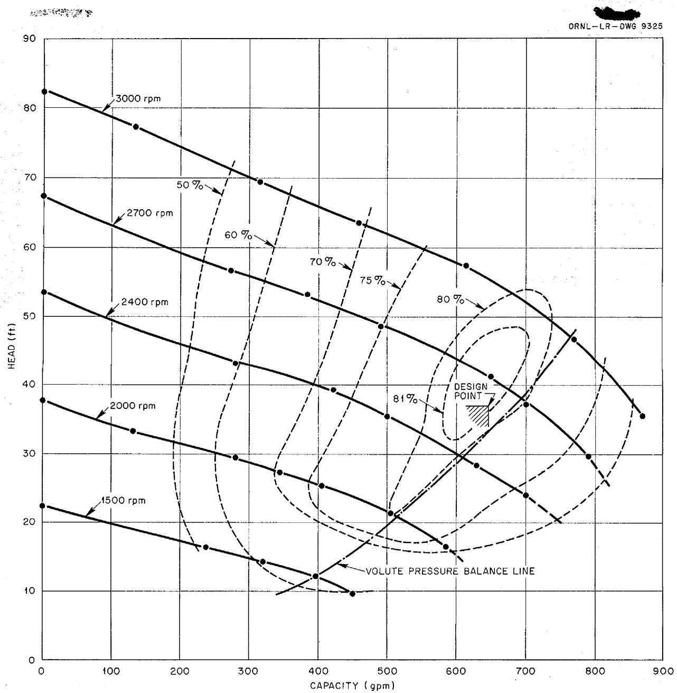  
Fig. 1.12. Fuel Pump Performance Characteristics with Modified Impeller and Axial Clearance on Shroud Reduced from 0.102 to 0.053 in.

1956. On this basis the target date for completion of assembly and initiation of operation of the ETU has been set at September 1, 1956.

The basic flow and heat transfer circuits have been established so that two of the main NaK circuits will heat the fuel and the other two will cool the fuel. In each of the cooling circuits there

will be a one-fourth section of an ART radiator arrangement. In each of the two heating circuits there will be a 1-Mw gas furnace. The sodium moderator circuit will be cooled by a 0.5-Mw radiator. This arrangement will apply sufficient heat to permit measurement of the response of the system to power changes at low power levels.

The most important objectives of this experiment are to develop assembly techniques for use on the ART, to furnish some information on thermal stresses in the reactor assembly, to obtain some heat transfer information on the radiators and the NaK-to-fuel and Na-to-NaK circuits, and to test some of the instrumentation to be used on the ART.

# REACTOR PHYSICS

# Control Rod Heating and Burnup

W.J.Fader

Pratt & Whitney Aircraft

A.M.Perry

Electronuclear Research Division

Calculations of control rod heating and burnup to be expected in the ART were completed. The rod designs considered included cylindrical annuli of various rare-earth oxides, $1\frac{3}{8}$ -in. OD, either $7/8-$ or $1\frac{1}{8}$ -in. ID, and $1/4$ or $1/8$ in. in annular thickness. The maximum density of the heat generated by gamma-ray absorption in the $1/4$ -in. annulus was found to be about $140 \mathrm{~w/cm}^3$ , of which $15 \mathrm{~w/cm}^3$ was due to gamma rays produced in the core; the remainder was due to neutron capture gamma rays produced in the rod. The heat generated in a $1/8$ -in. annulus was found to be about two-thirds of that generated in the $1/4$ -in. annulus. Temperatures in the rod material depend on whether the rod is fabricated of fused oxide or of a cermet. For a $1/4$ -in.-thick fused oxide rod, the temperature rise is expected to be $620^{\circ}\mathrm{F}$ if the rod is cooled at both the inner and the outer surface and to be $2300^{\circ}\mathrm{F}$ if it is cooled only at the outer surface. Corresponding temperature rises for the cermet are very much smaller: 20 and $54^{\circ}\mathrm{F}$ , respectively, if the conductivity of the cermet is assumed to be the same as that of iron. The heat fluxes are large: 140,000 Btu/ft²·hr if the rod is cooled at both surfaces, 230,000 Btu/ft²·hr if it is cooled at the outer surface only.

The thickness of the poison material required to allow for burnup by neutron absorption depends on the abundance of high-cross-section isotopes in the rare earth and on the density of the rare-earth oxide, which would be greater for the fused ceramic rod than for the cernet. Calculated pene

trations for 500 hr at 60 Mw are tabulated below. The cernet is assumed to be $33\%$ oxide by volume.

<table><tr><td></td><td colspan="2">Burnup Penetration (in.)</td></tr><tr><td></td><td>Ceramic</td><td>Cermet</td></tr><tr><td>Sm2O3</td><td>0.051</td><td>0.150</td></tr><tr><td>Gd2O3</td><td>0.028</td><td>0.082</td></tr><tr><td>Eu2O3</td><td>0.011</td><td>0.032</td></tr></table>

For a $\frac{1}{4}$ -in. annular control rod of $B_4^{10}C$ in copper (30 vol % $B_4C$ ), the burnup penetration would be one-sixth as great as that in a europium oxide cermet, but the heat produced would be one-third greater. All these considerations are based on a neutron current of $2.5 \times 10^{14}$ neutrons/cm $^2$ -sec into the rod.

# ART Boron Layer

A.M.Perry

Electronuclear Research Division

The boron layer (assumed to be made of $\mathsf{B}_4^{10}\mathsf{C}$ tiles) between the reflector and the fuel-to-NaK heat exchanger was examined with respect to heat generation, flux attenuation, helium gas evolution, and burnup. Heating will be largely due to the alpha particles from the $\mathsf{B}^{10}(n,\alpha)\mathsf{Li}^7$ reaction and will amount to about $13\mathrm{w/cm}^2$ of tile (40,000 Btu/ft $^2$ -hr). The heat flux per unit area will be one-half this amount, since both surfaces of the tile will be adjacent to cooled surfaces; thus the temperature rise for radiative heat transfer will be about $500^{\circ}\mathsf{F}$ . The absorption mean free path of thermal neutrons ( $1200^{\circ}\mathsf{F}$ ) in $\mathsf{B}_4^{10}\mathsf{C}$ with a density of $2.5\mathrm{g/cm}^3$ is 0.0017 in., while that of 3-kev neutrons (near the sodium resonance) is 0.145 in. If the $\mathsf{B}_4^{10}\mathsf{C}$ layer were made 1 in. thick to absorb sodium resonance neutrons, gamma-ray heating of the layer would increase the total heat produced by only $30\%$ . The flux of about $4\times 10^{13}$ neutrons/cm $^2$ , sec absorbed over an area of $4\times 10^4\mathrm{cm}^2$ yields a theoretical helium gas evolution rate of 5 liters/day (STP). Burnup of the boron will be only $1.2\mathrm{mg/cm}^2$ of $\mathsf{B}^{10}$ in 500 hr at 60 Mw.

# High-Temperature Critical Experiment vs ART

A. M. Perry

Electronuclear Research Division

It is recognized that certain rather minor differences exist between the high-temperature critical

experiment and the ART with respect to the factors that determine the critical concentration of $\mathsf{UF}_4$ in the fuel mixture. The differences that may have a significant effect on the critical concentration are: (1) control rod position: the ART will be made critical with the control rod inserted farther than it was in the high-temperature critical experiment; (2) beryllium density: cooling holes in the ART reflector will reduce the moderator density; (3) reflector poisoning: sodium coolant in the reflector will increase neutron absorptions in the reflector; (4) reflector size: in order to minimize machining of beryllium for the experiment, the reflector was made in an irregular rectangular shape circumscribing the design reflector and had a somewhat larger volume than that of the ART reflector. The effects of these differences are estimated in the following paragraphs.

The ART will be made critical at $1200^{\circ}\mathrm{F}$ with the control rod withdrawn about $1.5\%$ in $\Delta k$ from its fully inserted position. The control rod calibration of the high-temperature critical experiment, carried to a point 4 in, above the mid-plane of the reactor, appears to be consistent with an over-all rod value of about $5\%$ in $\Delta k$ . Thus, the $\Delta k$ inserted at critical will be about $3.5\%$ . The increment in concentration necessary to compensate for the initial rod insertion is thus about $7 \times 3.5$ , which is $\sim 24\%$ . The initial rod position, of course, is, to some extent, at the discretion of the operators, and the increment in critical concentration could, if desired, be chosen to be less than $24\%$ - say 18 or $20\%$ - to correspond to an initial rod insertion of 2.5 to $3\%$ .

Since the change in beryllium density is not uniform, the cooling holes being more closely spaced near the core, it is necessary to calculate a weighted average density change. This was done in two ways. From two-group perturbation theory, the importance of a change in the fast-group diffusion coefficient or in the group-transfer cross section is approximately proportional to the square of the fast flux. The quantity $\psi_{1}(r)$ was obtained by adding multigroup fluxes, and $\psi_{1}^{2}$ was used as a weighting function. An alternate weighting function was obtained by computing the slowing-down density by means of age theory. In this case the weighting function at radius $r$ is applied to the average density change in the spherical shell between the core and the spherical shell between the core and the spherical shell.

surface of radius $r$ , rather than to the local density change at $r$ . Average density changes computed in these two ways are 4.2 and $3.5\%$ , respectively. The reactivity effects of a uniform density change in beryllium have been computed by Curtiss-Wright Corp. to be $0.42\%$ in reactivity for $1\%$ in density, and by Pratt & Whitney Aircraft to be $0.35\%$ in reactivity for $1\%$ in density. Based on these figures, an average reactivity change of $-1.5\%$ is predicted. Data from the high-temperature critical experiment indicate $(\Delta M / M) / (\Delta k / k)$ to be about 7. Thus a change in critical concentration of $10.5\%$ is anticipated as a result of the reduction of the beryllium density.

The effect of thermal-neutron absorptions in the sodium coolant was estimated by comparing the calculations of the Curtiss-Wright Corp. for Inconel-lined and unlined cooling holes. The penalty in uranium concentration due to the Inconel was reduced in the ratio of the macroscopic thermal neutron absorption cross sections of the sodium and the Inconel. When allowance was made for the greater number of cooling holes presently planned for the ART, the increment of fuel concentration required to compensate for the sodium in the reflector was $5.6\%$ .

The effect of the additional beryllium in the reflector of the high-temperature critical experiment has not yet been satisfactorily computed. This is due, in part, to the irregular distribution of the added beryllium and, in part, to some uncertainty regarding the dependence of reactivity on reflector thickness. Whether the entire reflector volume is considered or only the portion between two planes 1 ft above and below the equatorial plane of the reactor, the beryllium in the experiment was about 3 in. thicker, on the average, than the beryllium in the design reflector of the ART. According to the parametric studies of Curtiss-Wright Corp., such a decrease in reflector thickness over the whole surface of a spherical reactor would increase the critical concentration by a factor of 1.26. Results of the cold critical experiments, however, indicate that removing 3 in. of beryllium over the region extending 1 ft above and below the reactor mid-plane

should increase the concentration by about a factor of 1.12. The true effect is believed to lie between these extremes.

The over-all factor by which the critical concentration of the ART is likely to exceed that of the high-temperature critical experiment is obtained by multiplying the four factors together. The result is

$$
F = (1. 2) (1. 1) (1. 0 6) (1. 1 2) = 1. 5 6,
$$

if the low estimates for control rod allowance and reflector size effect are employed, or

$$
F = (1. 2 5) (1. 1) (1. 0 6) (1. 2 6) = 1. 8 4,
$$

if the high estimates are used. Since the clean critical concentration of the experiment was 2.9 mole $\% \mathsf{UF}_4$ , the critical concentration of the ART is expected to fall between the limits 4.6 and 5.4 mole $\%$ . Some multigroup calculations are to be undertaken, in the near future, which should help to establish the critical concentration of the ART somewhat more reliably.

6R. R. Bate, L. T. Einstein, and W. E. Kinney, The Three-Group, Three-Region Reactor Code for Oracle, ORNL CF-55-1-76 (Jan. 13, 1955).

# Multigroup, Multiregion Reactor Calculation

W.E.Kinney

Aircraft Reactor Engineering Division

A new multigroup, multiregion reactor calculation is being programmed for the Oracle. By taking the consistent $P_{1}$ approximation to the Boltzmann equation, group equations have been developed and lethargy dependent coefficients have been put into a form suitable for coding. In the treatment of thermal neutrons, both neutron and moderator temperatures will be considered. The theory for the inclusion of shells and for the spatial integration of the group equations is the same as that described previously.

The code will compute fluxes as a function of one space variable in slab, cylindrical, or spherical geometry. As presently planned, it will allow up to 125 groups and 125 regions. The calculation may be iterated on the concentration of any specified element to obtain a multiplication constant of unity, and self-shielding factors will be available. Adjoint fluxes may be computed, if desired.

# 2. EXPERIMENTAL REACTOR ENGINEERING

H. W. Savage

E. S. Bettis

Aircraft Reactor Engineering Division

The difficulties encountered during the installation of the MTR in-pile loop and in startup of the system are presented, and the modifications being made in the loops now being fabricated are described. The operating conditions for the 22 fused-salt-Inconel forced-circulation loops operated during the quarter are presented, as well as the operating conditions for 9 forced-circulation loops operated with sodium in Inconel or in stainless steel tubing. A new test loop is described with which more accurate information on the oxygen content of the sodium can be obtained during operation.

Two stands for testing ART pumps were developed, and tests of pump seals were made. The tests performed with intermediate heat exchanger test stand A are described, as well as the small heat exchanger tests.

The apparatus being built for tests of the thermal stability of the ART outer core shell is described. Also, a design for Inconel strain-cycling tests is presented.

Several designs for cold traps for removing oxides from sodium and NaK are presented, along with designs of plug indicators for detecting and measuring the oxide content.

# IN-PILE LOOP DEVELOPMENT AND TESTS

D. B. Trauger

Aircraft Reactor Engineering Division

Loop Installation

C.W.Cunningham

Aircraft Reactor Engineering Division

The instrument panel for the MTR in-pile loop was installed on the first level balcony on the reactor north face. This location is advantageous in that it is above the activity on the main floor and relatively close to the HB-3 beam hole. Provision of a central balcony extension for the operator enabled him to easily observe the instrument and control panel in the somewhat restricted space. The additional instrument panels and cabinets were located on balcony extensions at each end of the instrument and control panel.

The auxiliary equipment and the loop, on its cradle, were placed on the main floor, largely

under and adjacent to the east face stairway. Interconnecting tubes and wires were protected by running them in troughs hung beneath the balcony and the stairway above head level. The tubes and wires to the loop were lifted into these troughs after the loop was inserted into the beam hole.

A means for flux compensation had to be provided, since the flux profile at the HB-3 beam hole was not known with certainty. A loop retractor mechanism was built and was mounted in the HB-3 cubicle to permit withdrawal of the loop plug 6 in. from the fully inserted position. This device permits adjustment of the loop nose position in the tapering flux region and, thus, variation of the loop power level independently of reactor operation. The retractor also serves as a safety device. By withdrawing the plug 6 in. and reducing the process air flow, reactor operation could continue in the event the in-pile loop experiment had to be operated on the limited, emergency, cooling-air supply. The ability to preset the position of the plug greatly reduces the risk of freezing or overheating the loop during the reactor startup and shutdown.

Orderly arrangement of lines and equipment in the cubicle presented a difficult problem. The lead shields, retractor mechanism, tubing cutoff block, tubing and electrical wires, and hoses almost completely filled the available cubicle space. The problem was further complicated by the movement required for retraction. A workable arrangement was found by trial and error movement of the lines and tubes into various coiled configurations. The water hose had to be carefully routed to eliminate excessive strain on the quick-disconnect fittings provided to eliminate the leakage of radioactive process water.

# Loop No. 1 Operation

L. P. Carpenter

D. W. Magnuson

P.A.Gnadt

Aircraft Reactor Engineering Division

D. M. Haines

Pratt & Whitney Aircraft

The first MTR in-pile loop was completed on June 20, and it was shipped, by air, to the MTR

facility at NRTS. It successfully passed the preoperational checks required by the MTR Reactor Safeguards Committee, and it was then inserted into the HB-3 beam hole from the special loading cradle supplied as part of the experiment. Fuel elements adjacent to the beam hole were removed for the insertion, since no shielding was provided. Although a rather high radiation beam was measured adjacent to the in-pile loop plug shield, it was well collimated, and the insertion proceeded rapidly and smoothly without the coffin.

The startup of the loop proceeded systematically through pump operation and preheating of the fuel and the piping. At the final step, melting of the freeze line and charging of the loop, the heater for the freeze line was found to be inoperable. An internal short, to ground, had developed after the preoperational checkout. Efforts to clear the short were unsuccessful, and it was impossible to melt the line by increasing the power to adjacent heaters. This terminated the loop operation, and the loop was removed from the beam hole for return to ORNL. Since this loop had been reworked repeatedly during the initial assembly, it was deemed to be irreparable and was therefore cut up for evaluation.

The short was found in a nipple, or extension, from the pump bulkhead to the glass seal for the power leads. Braided glass insulation had become frayed, apparently during assembly, and the copper lead wire was exposed. Mechanical separation between the copper wire and the nipple probably existed during the checkout, but movement due to thermal expansion of the loop caused shorting when the loop was heated. No other defects were observed in the first loop assembly, and the salvageable parts will be re-used.

Improved electrical insulation has been used in the second loop, which is now nearly completed. The third loop will have a somewhat revised electrical system in which two wires, rather than a common ground, will be used for each Calrod. This revision was made possible by the elimination of the thermocouples provided for preheat evaluation. Experience with the first two loops should provide adequate information for establishing heating procedures.

# Horizontal-Shaft Sump Pump

J.A. Conlin

Aircraft Reactor Engineering Division

The difficulties previously encountered with the shaft seals of the horizontal-shaft sump pump have been corrected. The original seal used a thin, brass bellows, which failed mechanically. It was replaced with a stainless steel bellows, which serves both as the flexible member of the seal and the loading spring. It was necessary that the bellows serve as the loading spring because the combined spring loading of the steel bellows and a spring would have been excessive. However, the spring-loaded bellows caused chatter between the graphite nose and the mating seal ring, and the graphite crumbled. The installation of friction dampers, in the form of spring-loaded steel plugs that pressed radially against the outside of the seal nose, eliminated this difficulty.

The maximum gas diffusion leakage rate for this seal has been found to be 100 ppm of argon diffusing from the pump sump into the helium in the bearing housing. The flow rate of both the helium and the argon is 700 cfh. Satisfactory seal leakage rates could not be obtained consistently with the initial drip lubrication system; so the oil level in the bearing housing was raised until the lower edges of the running faces of the seal were immersed. This provided a better oil film on the seal mating faces, and satisfactory sealing conditions were obtained.

A prototype model of the in-pile pump operated satisfactorily, with the fuel mixture $\mathrm{NaF - ZrF_4 - UF_4}$ (53.5-40.6.5 mole %) as the pumped fluid, for 173 hr at $1400^{\circ}\mathrm{F}$ in an isothermal loop identical to that of the in-pile loop. Operation was then terminated by a sudden pump stoppage caused by the accumulation of fuel along the shaft in the cold region of the pump. A postrun examination indicated that there had been two levels of fuel in the sump. The first level was at the normal sump operating point, as indicated by an etched metal surface. The second level, as evidenced by a more lightly etched surface, was sufficiently high, equivalent to an increase of about $13~\mathrm{cm}^3$ of fluid, to reach to above the bottom of the shaft flinger. This caused fuel, churned by the flinger, to collect along the shaft and ultimately resulted in pump stoppage. The change in sump level probably occurred the day before the pump stopped.

An interruption in the plant air supply that was being used to cool the fill-tank freeze line caused the fill-line temperature to rise to above the melting point of the fuel and the indicated fill-tank temperature to increase about $25^{\circ}\mathrm{F}$ due to the absence of air movement in its vicinity. The fill-tank temperature rise, plus any gas evolution from the fuel, could have increased the fill-tank gas volume sufficiently to force fuel into the pump and flood the sump. A fill-tank temperature rise of $35^{\circ}\mathrm{F}$ would have, alone, caused sufficient expansion of the fuel to account for the $13\text{-cm}^3$ displacement. This type of failure could not occur with the MTR in-pile loop assembly, because the freeze line will be cooled by its proximity to the water jacket of the loop.

# Oil Irradiation

D. M. Haines

Pratt & Whitney Aircraft

Samples of Gulf Harmony "A" oil were irradiated at the gamma facility of the MTR to determine the suitability of this oil for use in the lubrication and hydraulic power systems of the in-pile loop. Calculated doses of $10^{9}$ r were obtained. The specific gravity of the oil samples increased about $1\%$ , and the viscosity increased about 60 to $90\%$ . In a few of the samples a small amount of suspended particulate material was observed but not identified. The radiation damage observed in these tests is not considered to be seriously detrimental.

# DEVELOPMENT AND OPERATION OF FORCED-CIRCULATION CORROSION AND MASS TRANSFER TESTS

W. B. McDonald

Aircraft Reactor Engineering Division

# Operation of Fused-Salt-Inconel Loops

C. P. Coughlen

P. G. Smith

Aircraft Reactor Engineering Division

R.A.Dreisbach

Pratt & Whitney Aircraft

Twenty-two fused-salt-Inconel loops were operated during this quarter. A summary of the conditions of operation of these loops is given in Table 2.1. The results of metallurgical examinations of these loops are presented in Sec. 5, "Corrosion Research."

The major cause of failure of these fused-salt

loops has been the freezeup of the salt in the cooling coil when flow was interrupted for any reason. Most flow interruptions result from loss of power, either at the test rig or in the building as a whole. The freezing of the cooling coils has occurred in times as short as 30 sec. Preliminary tests have shown that a gas flame automatically ignited at the time of an interruption of the cooling air will prevent freezing for periods of 5 min or more. Several methods of automatic ignition of such a flame were tried, but the only one which appears to give the surety of ignition required is a high-resistance heater coil in the gas stream; the coil is energized from a 12-v, wet-cell circuit.

# Liquid Metals in Multimetal Loops

C. P. Coughlen

Aircraft Reactor Engineering Division

R.A.Dreisbach

Pratt & Whitney Aircraft

Nine forced-circulation loops were operated with sodium in Inconel and in stainless steel tubing. A summary of the conditions of operation of these loops is given in Table 2.2. The loops were heated with electric heaters, and each loop had an economizer section. The results of metallurgical examination of these loops are presented in Sec. 5, "Corrosion Research."

A new test loop has been designed with which it will be possible to obtain accurate information on the oxygen content of sodium during operation. The test system, as indicated in Fig. 2.1, consists of a main loop, which includes the sodium-sampling device and a bypass cold trap, and a plugging-indicator loop, with its separate pump and flowmeter. (The plug indicator is described in a subsequent portion of this section.) The cooling rate of the entire loop can be controlled to a fraction of a degree per minute. The oxygen content of the sodium circulating in the main loop is controlled by use of the bypass cold trap. The plugging-indicator loop and the sampling device are both used to independently determine the oxygen content and thus to determine the efficiency of the cold trap.

In order to use the plugging-indicator loop, the valve between that loop and the main loop is opened, and sodium is allowed to flow from the main loop until the plugging-indicator loop is filled to a predetermined level in the surge tank.

TABLE 2.1. SUMMARY OF OPERATING CONDITIONS FOR 22 FUSED-SALT-INCONEL FORCED-CIRCULATION CORROSION AND MASS TRANSFER TESTS  

<table><tr><td>Loop No.</td><td>Method of Heating</td><td>Type of Heated Section</td><td>Reynolds Number</td><td>Temperature Differential (°F)</td><td>Maximum Recorded Fuel Temperature (°F)</td><td>Maximum Recorded Tube Wall Temperature (°F)</td><td>Fused Salt Circulated</td><td>Operating Time (hr)</td><td>Reason for Termination</td></tr><tr><td>4950-2</td><td>Direct resistance</td><td>Straight</td><td>5,000</td><td>200</td><td>1500</td><td>1565</td><td>NaF-ZrF4-UF4a</td><td>1000</td><td>Scheduled</td></tr><tr><td>4950-3</td><td>Direct resistance</td><td>Straight</td><td>10,000</td><td>200</td><td>1500</td><td>1690</td><td>NaF-ZrF4-UF4b</td><td>1000</td><td>Scheduled</td></tr><tr><td>4950-4</td><td>Direct resistance</td><td>Straight</td><td>10,000</td><td>100</td><td>1500</td><td>1600</td><td>NaF-ZrF4-UF4a</td><td>1000</td><td>Scheduled</td></tr><tr><td>4950-5</td><td>Direct resistance</td><td>Straight</td><td>10,000</td><td>200</td><td>1500</td><td>1575</td><td>NaF-ZrF4-UF4a</td><td>1000</td><td>Scheduled</td></tr><tr><td>4950-6</td><td>Direct Resistance</td><td>Straight</td><td>~8,000</td><td>300</td><td>1500</td><td>1620</td><td>NaF-ZrF4-UF4a</td><td>1000</td><td>Scheduled</td></tr><tr><td>7425-1</td><td>Direct resistance</td><td>Straight</td><td>~10,000</td><td>200</td><td>1500</td><td>1600</td><td>NaF-ZrF4-UF4a</td><td>22</td><td>Leaked at 22 hr; motor failure</td></tr><tr><td>7425-1A</td><td>Direct resistance</td><td>Straight</td><td>~10,000</td><td>200</td><td>1500</td><td>1600</td><td>NaF-ZrF4-UF4a</td><td>1000</td><td>Scheduled</td></tr><tr><td>7425-2</td><td>Direct resistance</td><td>Straight</td><td>10,000</td><td>200</td><td>1500</td><td>1575</td><td>NaF-KF-LiFc</td><td>550</td><td>Fuel evaluation test; pump shaft seized at 550 hr</td></tr><tr><td>7425-3</td><td>Direct resistance</td><td>Straight</td><td>~23,500</td><td>125</td><td>1525</td><td>1600</td><td>NaF-ZrF4-UF4a</td><td>73</td><td>Motor overloaded; loop failed at 73 hr</td></tr><tr><td>7425-3A</td><td>Direct resistance</td><td>Straight</td><td>~16,000</td><td>125</td><td>1525</td><td>1600</td><td>NaF-ZrF4-UF4a</td><td>1000</td><td>Scheduled</td></tr><tr><td>7425-4</td><td>Direct resistance</td><td>Straight</td><td>10,000</td><td>200</td><td>1500</td><td>1575</td><td>NaF-KF-LiFc</td><td>1000</td><td>Scheduled; fuel evaluation</td></tr><tr><td>4695-4D</td><td>Direct resistance</td><td>Straight</td><td>10,000</td><td>200</td><td>1500</td><td>1595</td><td>NaF-ZrF4-UF4a</td><td>20</td><td>Failed during power failure at 20 hr</td></tr><tr><td>4695-4D-2</td><td>Direct resistance</td><td>Straight</td><td>10,000</td><td>200</td><td>1500</td><td>1635</td><td>NaF-ZrF4-UF4a</td><td>500</td><td>Scheduled</td></tr><tr><td>4695-5C-2</td><td>Direct resistance</td><td>Straight</td><td>10,000</td><td>200</td><td>1500</td><td>1635</td><td>NaF-ZrF4-UF4a</td><td>1000</td><td>Scheduled</td></tr><tr><td>7425-41</td><td>Direct resistance</td><td>Straight</td><td>2,750</td><td>200</td><td>1650</td><td>1700</td><td>NaF-ZrF4-UF4a</td><td>1000</td><td>Scheduled</td></tr><tr><td>4935-3</td><td>Gas</td><td>Coiled</td><td>1,000</td><td>100</td><td>1500</td><td>1540</td><td>NaF-ZrF4-UF4a</td><td>1000</td><td>Scheduled</td></tr><tr><td>4935-4</td><td>Gas</td><td>Coiled</td><td>10,000</td><td>100</td><td>1500</td><td>1690</td><td>NaF-ZrF4-UF4a</td><td>486</td><td>Clutch failure caused freezeup; failed on restart</td></tr><tr><td>4935-5</td><td>Gas</td><td>Coiled</td><td>10,000</td><td>200</td><td>1500</td><td>1550</td><td>NaF-ZrF4-UF4a</td><td>682</td><td>Clutch failure caused freezeup; failed on restart</td></tr><tr><td>4935-7</td><td>Gas</td><td>Coiled</td><td>6,000</td><td>200</td><td>1500</td><td>1700</td><td>NaF-ZrF4-UF4a</td><td>330</td><td>Power failure caused freezeup; failed on restart</td></tr><tr><td>4935-7B</td><td>Gas</td><td>Coiled</td><td>6,000</td><td>200</td><td>1500</td><td>1700</td><td>NaF-ZrF4-UF4a</td><td>In Test</td><td>Conditions noted were new conditions im-pressed at 600 hr; scheduled for 1000 hr</td></tr><tr><td>4935-8</td><td>Gas</td><td>Coiled</td><td>6,000</td><td>200</td><td>1500</td><td>1700</td><td>NaF-ZrF4-UF4a</td><td>435</td><td>Terminated at 435 hr by thermocouple burnout</td></tr><tr><td>4935-9</td><td>Gas</td><td>Coiled</td><td>4,000</td><td>200</td><td>1500</td><td>1800</td><td>NaF-ZrF4-UF4a</td><td>1000</td><td>Scheduled</td></tr></table>

${}^{a}$ Composition: 50-46-4 mole %.   
bComposition: 50-46-4 mole % with 2 wt % of the total uranium converted to U3+   
Composition: 11.7-59.1-29.2 mole %.

TABLE 2.2. SUMMARY OF OPERATING CONDITIONS FOR LOOPS THAT CIRCULATED SODIUM  

<table><tr><td>Loop No.</td><td>Material of Construction</td><td>Cold Trap</td><td>Reynolds Number</td><td>Temperature Differential (°F)</td><td>Maximum Recorded Fluid Temperature (°F)</td><td>Condition of Sodium</td><td>Operating Time (hr)</td></tr><tr><td>4951-4</td><td>Inconel</td><td>No</td><td>55,000</td><td>300</td><td>1300</td><td>Commercial grade</td><td>1000</td></tr><tr><td>4951-5</td><td>Inconel</td><td>No</td><td>59,000</td><td>300</td><td>1500</td><td>0.15% oxide added</td><td>1000</td></tr><tr><td>4951-6</td><td>Inconel</td><td>Yes</td><td>59,000</td><td>300</td><td>1500</td><td>High purity</td><td>500</td></tr><tr><td>4951-7</td><td>Type 316 stainless steel</td><td>No</td><td>59,000</td><td>300</td><td>1500</td><td>Commercial grade</td><td>475*</td></tr><tr><td>4951-8</td><td>Inconel</td><td>Yes</td><td>59,000</td><td>300</td><td>1500</td><td>Commercial grade</td><td>1000</td></tr><tr><td>4951-9</td><td>Inconel</td><td>No</td><td>~59,000</td><td>300</td><td>1500</td><td>1% barium added</td><td>500</td></tr><tr><td>7426-1</td><td>Inconel</td><td>Yes</td><td>~59,000</td><td>300</td><td>1500</td><td>1% barium added</td><td>1000</td></tr><tr><td>7426-2</td><td>Inconel</td><td>No</td><td>~59,000</td><td>300</td><td>1500</td><td>0.05% oxide added</td><td>1000</td></tr><tr><td>7426-3</td><td>Inconel</td><td>Yes</td><td>50,000</td><td>200</td><td>1000</td><td>Commercial grade</td><td>1000</td></tr></table>

*Operation terminated by a power failure.

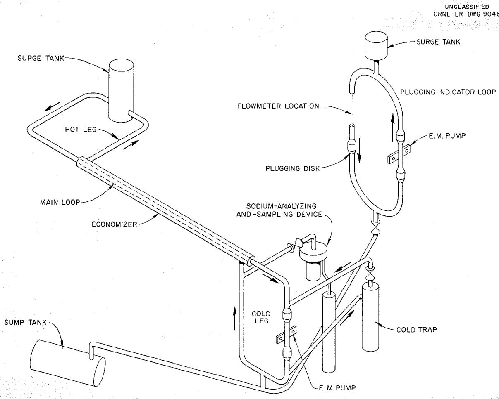  
Fig. 2.1. Loop for Circulating Sodium in Inconel or in Stainless Steel Tubing to Study the Effect of the Oxide Content of the Sodium.

The valve is then closed, and the sodium is circulated by the electromagnetic pump in the unheated plugging-indicator loop. The plugging disk collects the oxides precipitated as the temperature of the sodium decreases, and it eventually plugs. The temperature at which plugging occurs is compared with a calibration chart to determine the oxide content of the sodium. The plugging-indicator loop is then heated until flow is re-established. The valve is then reopened and the sodium is forced, by pressure, back into the main loop.

The data on oxygen content obtained with the plugging-indicator loop are compared with those obtained with the analyzing device attached to the main loop and with results of chemical analyses of samples removed from the main loop. The analyzing device attached to the main loop is described in Sec. 9, "Analytical Chemistry of Reactor Materials."

A loop in which NaK is to be circulated has been designed with the same surface-to-volume ratio as that of the primary NaK circuits in the ART. A sketch of this loop is shown in Fig. 2.2.

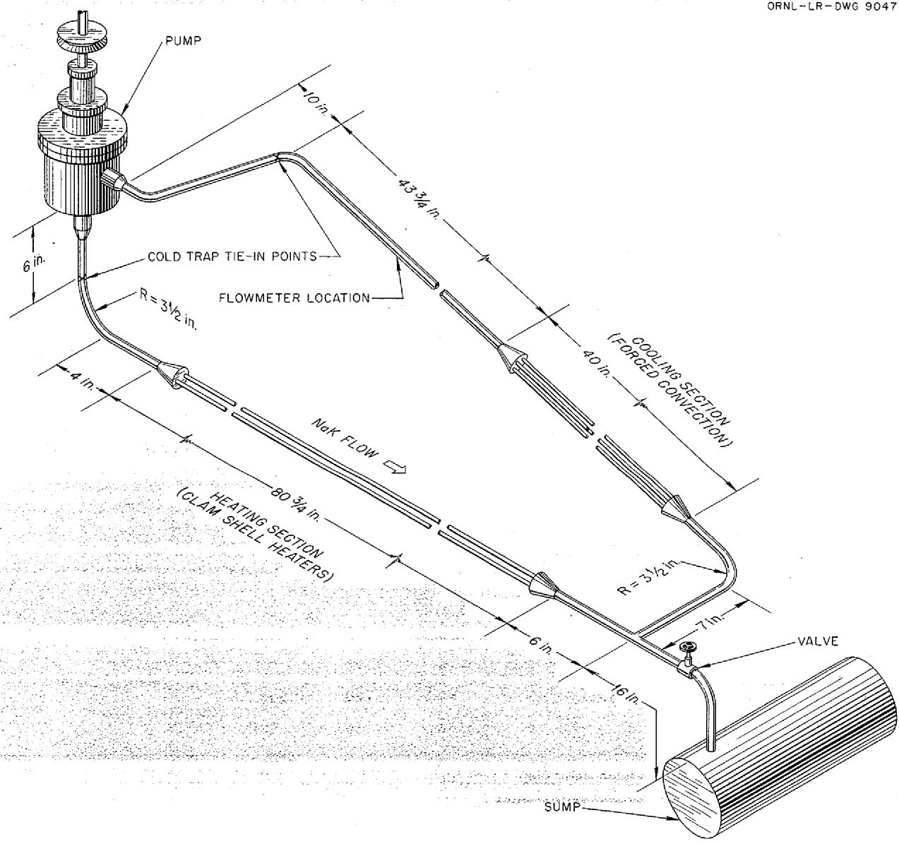  
Fig. 2.2. Loop for Studying Mass Transfer in an Inconel Loop Circulating NaK.

It is designed to operate at a maximum NaK temperature of $1600^{\circ}\mathrm{F}$ and a minimum NaK temperature of $1200^{\circ}\mathrm{F}$ . The Reynolds number is to be comparable to that in primary NaK circuits of the ART.

# PUMP DEVELOPMENT

E.R.Dytko

Pratt & Whitney Aircraft

# Mechanical Shakedown and Bearing-and-Seal Tests

A. G. Grindell

Aircraft Reactor Engineering Division

The ART-type MF-2 pump incorporates two face-type mechanical seals. The seal specifications require the upper seal to have a leakage rate of oil to the atmosphere of not more than $20~\mathrm{cm}^3$ per 24 hr at 70 psi. The lower unit is to have a leakage of oil into helium across a pressure differential of 0 to 5 psi of not more than $2\mathrm{cm}^3$ per 24 hr. The sealed fluid is a light, spindle oil having a viscosity of 60 SSU (Saybolt seconds universal) at

$100^{\circ}F$ . Most of the manufacturers contacted would not bid on the seals, and the three or four companies who did make bids would not guarantee their seals to meet the stringent requirements of the specifications. Therefore a seal evaluation program was initiated in which a small number of seals from the Fulton Sylphon Division, the Durametallic Corporation, and the Koppers Company, Inc. will be tested. Earlier tests had indicated that low leakage rates could probably not be achieved with metal-to-metal seals, and, consequently, the seals being tested are made of carbon products and ceramics.

The evaluation of the Fulton Sylphon seals is nearly complete. Nine of the 11 tests started have been completed, and over 1600 hr of testing time has been accumulated. The conditions of the tests are given in Table 2.3, and the results

Oil temperature: $200^{\circ}\mathrm{F}$

Shaft speed: 3000 rpm

TABLE 2.3. CONDITIONS OF TESTS OF MF-2 PUMP LOWER SEALS MANUFACTURED BY THE FULTON SYLPHON DIVISION   

<table><tr><td rowspan="2">Test No.</td><td colspan="2">Material</td><td colspan="2">Flatnessa (bands)</td><td rowspan="2">Preload (lb)</td><td rowspan="2">Pressure Differential (psi)</td><td rowspan="2">Bearingb Load (lb)</td><td rowspan="2">Ratio of Journal Radius to Radial Clearance</td></tr><tr><td>Seal Nose</td><td>Wear Ring</td><td>Seal Nose</td><td>Wear Ring</td></tr><tr><td>1c</td><td>Sabeco 9d</td><td>Ketose</td><td>2</td><td>12</td><td>50</td><td>0.5</td><td>0 to 300</td><td>800</td></tr><tr><td>2c</td><td>Graphitar 14</td><td>Ketos</td><td>6</td><td>3</td><td>30</td><td>0.5</td><td>0 to 300</td><td>900</td></tr><tr><td>3c</td><td>Sabeco 9</td><td>Ketos</td><td>8</td><td>3</td><td>30</td><td>0.5</td><td>0 to 300</td><td>1250</td></tr><tr><td>4f</td><td>Sabeco 9</td><td>Case-hardened steel</td><td>4</td><td>4</td><td>50</td><td>0.5</td><td></td><td></td></tr><tr><td>5f</td><td>Sabeco 9</td><td>Ketos</td><td>2</td><td>3</td><td>50</td><td>0.5</td><td></td><td></td></tr><tr><td>6f</td><td>Sabeco 9</td><td>Case-hardened steel</td><td>3</td><td>1.5</td><td>20</td><td>-13 to 16</td><td></td><td></td></tr><tr><td>7f</td><td>Sabeco 9</td><td>Ketos</td><td>3</td><td>3</td><td>20</td><td>0.5</td><td></td><td></td></tr><tr><td>8c</td><td>Graphitar 14</td><td>Case-hardened steel</td><td>4</td><td>3</td><td>20</td><td>0.5</td><td>0 to 200</td><td>810</td></tr><tr><td>12f</td><td>Graphitar 14</td><td>Ketos</td><td>8</td><td>6</td><td>20</td><td>0.5</td><td></td><td></td></tr><tr><td>6Af</td><td>Sabeco 9</td><td>Case-hardened steel</td><td>3</td><td>1.5</td><td>20</td><td>0.5 to 7.5</td><td></td><td></td></tr><tr><td>7Af</td><td>Sabeco 9</td><td>Ketos</td><td>6</td><td>6</td><td>20</td><td>0.5</td><td></td><td></td></tr></table>

$a_{\text{Measured with helium light}}$ ; one band equivalent to $11.6 \mu \text{in}$ .   
$b$ Bearings made of ASTM-B-144-49-36 bearing bronze.   
$c$ Tests made in bearing and seal testing facility.   
$d_{\text{Sabeco}}$ is a leaded bronze.   
$e$ Ketos is an 18-4-1 type of tool steel.   
Test made in cold shakedown facility; no bearing loads applied.

are presented as Fig. 2.3. It may be noted that the low specified leakage rate has not been met, and only four seals had rates lower than $1\mathrm{cm}^3/\mathrm{hr}$ . It was noted that the Fulton Sylphon seal was not balanced, and the resulting pressure changes caused variable performance of the seal. Reproducibility of results from seal to seal has not been possible. In similar tests the operation of the upper seal was satisfactory, with leakage rates of less than the specified $20\mathrm{cm}^3$ per $24\mathrm{hr}$ being attained in six tests.

The lower journal bearing of the pump was designed initially to carry loads of up to 600 lb, but hydraulic studies revealed that the expected bearing load would be 150 lb or less. With the lower loads it appears to be feasible to employ Inconel as the journal material and to thus obviate the need for a hardened journal bushing. Tests 1, 2, 3, and 8 were conducted in the bearing and seal testing facility, and loads up to 300 lb were satisfactorily carried by the Inconel shaft in a bronze bearing.

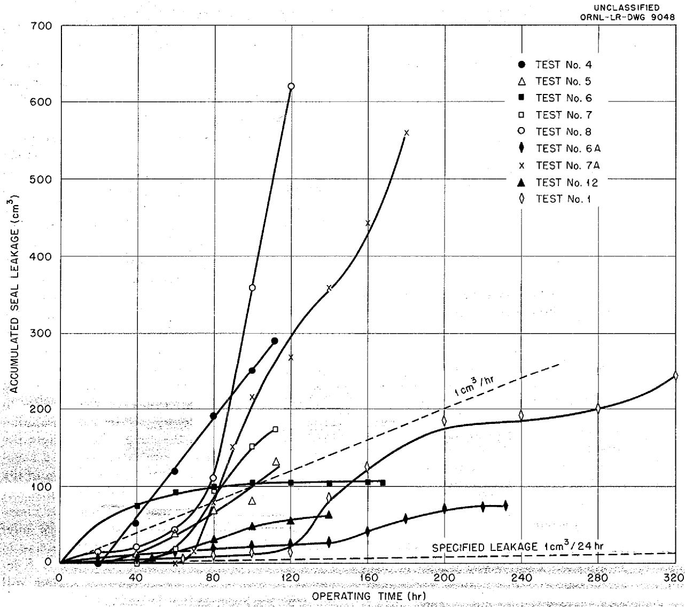  
Fig. 2.3. Results of Leakage Tests of the MF-2 Fuel Pump Lower Seal.

# Short-Circuit Pump-Test Stand

S. M. DeCamp, Jr. Aircraft Reactor Engineering Division

J. B. Kercheval Pratt & Whitney Aircraft

Fabrication and assembly of the first short-circuit pump-test stand, described previously, have been essentially completed, and water tests have been started. These water tests are for checking mechanical fits and interferences, checking pressure breakdown bypass flow rates, and correlating head and flow data from this loop with those obtained on the water test stand.

Assembly of the pump and the volute indicated that the radial seals with metallic O-rings were very sensitive dimensionally. A 0.002-in. interference on a 6-in.-dia O-ring was not enough to seal, while a 0.008- to 0.010-in. interference caused difficulty in assembly and disassembly.

Data were taken on bypass flow rates to determine the effect of the left-hand threads used in the flow breakdown annulus. With a radial clearance of 10 mils and thread depth of 37 mils, a bypass flow rate of 2.3 gpm was measured at a pump speed of 2700 rpm; the main circuit flow rate was approximately 630 gpm. Increasing the radial clearance to 15 mils gave the desired flow rate of 4.77 gpm.

The data obtained in the water tests will be useful in analyzing the data obtained at high temperatures, since it will be difficult to measure discharge pressures when the system is operating at high temperature. Throttling orifices for the loop were calculated to give a 50-ft head at 650 gpm. Data obtained in the water tests indicate a flow rate of 650 gpm at a 46-ft head. The test loop is now being readied for operation at the design temperature, $1400^{\circ}\mathrm{F}$ .

# High-Temperature Pump-Performance-Test Stand

R. Curry H. Young Pratt & Whitney Aircraft

The design layouts have been completed for two loops for testing MF-2 ART-type pumps at temperatures up to $1400^{\circ}\mathrm{F}$ . Calibration, shakedown, and endurance tests on MF-2 pump rotary assem

blies will be made with NaK or sodium and with the fuel mixture NaF-ZrF4-UF4 (50-46-4 mole %) as the circulated fluids. Data obtained at 1200 and $1400^{\circ}\mathrm{F}$ on shaft speed, head, flow rate, and power input will be compared with water-performance data, and cavitation and vibration characteristics will be noted. An endurance test will then be run at design head and flow rate. The xenon-removal system, including the helium-bleed and oil-leakage-removal systems, is to be incorporated in the circuit for checking in conjunction with the main fluid circuit. One of the two test stands will be available for acceptance testing of the final MF-2 rotary assemblies with NaK.

A concentric pipe design was chosen for the test stand loop to eliminate thermal stresses from nonuniform heating or cooling, to reduce the number of critical welds, and to provide a compact assembly. The compactness of the assembly makes possible a low fuel inventory.

A conventional venturi is located 15 pipe diameters (60 in.) downstream from the pump volute discharge, and a piston-type throttle valve is located downstream of the venturi. The valve travel was specified within the recommended travel of a suitable bellows used as the valve-stem seal. This valve cannot be fully closed; therefore, as presently conceived, the minimum loop resistance, with the valve wide open, will permit testing at about one-half the rated pump head with rated flow, and the maximum loop resistance, with the valve closed, will permit testing at approximately one-half the rated flow with the pump delivering the rated head.

A screen-type, axial-baffle, flow-control device is provided just below the inlet to the impeller to prevent an uneven velocity profile and prerotation in the stream entering the pump. To simulate the fluid-expansion and xenon-removal region, a separate chamber is provided above the top plate of the pump volute. Fluid enters and leaves this chamber only through the pump barrel wall, and this chamber is not directly connected to the pump inlet chamber except through the impeller. The rise in level of the fluid in this chamber for a $100^{\circ}\mathrm{F}$ increase in the temperature of the fuel mixture will be about the same as that for the ART.

During steady-state high-temperature operation, the pumping power will be removed by blowing a high-volume low-pressure air stream transversely across the outer loop pipe. A power failure will

cause automatic cutoff of the cooling air, and it is anticipated that the fuel can be dumped before it freezes in any section of the loop.

# HEAT EXCHANGER TESTS

E.R.Dytko

Pratt & Whitney Aircraft

R. E. MacPherson

Aircraft Reactor Engineering Division

# Intermediate Heat Exchanger Tests

R.D. Peak H.M.Cooper L.R.Enstice

Pratt & Whitney Aircraft

The new experimental assembly (stand A) for intermediate heat exchanger tests, described previously,4 is shown in Fig. 2.4. This apparatus was operated for $690\mathrm{hr}$ in a series of furnace and diffusion cold trap tests of the NaK system and a 2-hr cleaning cycle of the fluoride-fuel circuit. A chronological description of the tests that were conducted and the troubles that were encountered is given in Table 2.4.

As stated in Table 2.4, the 1-Mev gas-fired furnace (Struthers Wells Corp.) for heating the NaK, as installed, did not give satisfactory performance. The best overall thermal efficiency that could be obtained was $28\%$ , with $1.7 \times 10^{6}$ Btu/hr being transferred to the NaK. In an effort to improve the performance, a 12-ft-high stack extension was placed on top of the original 4-ft-high stack. As a result, a thermal efficiency of $31\%$ was obtained, with $2.83 \times 10^{6}$ Btu/hr being transferred to the NaK. Since the heat transfer was still below the design requirement, a new, larger burner was then installed, which proved to be capable of transferring $3.85 \times 10^{6}$ Btu/hr (1.13 Mw) to the NaK while burning 8400 scfm of natural gas; the thermal efficiency with the new burner was $48\%$ , with furnace inlet and exit temperatures of 1307 and $1600^{\circ}\mathrm{F}$ and a NaK flow rate of 140 gpm.

Two tests were conducted to evaluate the function of the diffusion cold trap (a cylindrical container, with a volume $\frac{1}{17}$ of that of the NaK circuit, connected to the main circuit by a pipe 2 in. in diameter and 9.5 in. in length) in removing sodium oxide from the NaK. The first, or preliminary test, was of 169-hr duration (the period from 50 to 219 hr of operation) with NaK flow rates of 55 to 85 gpm and a NaK temperature of $1500^{\circ}\mathrm{F}$ . The oxide con

tent in the NaK was measured by means of a plug indicator and by chemical analyses of samples taken from the pump bowl. The plug indicator is a concentric pipe stem connected to the NaK circuit, with a filter containing five 0.030-in.-dia holes located at the bottom of the inner pipe, which plugs with precipitated oxide at the saturation temperature of the oxide in the NaK. Both the plug indicator and the chemical analyses showed that the cold trap had reduced the initial oxide content of 1000 ppm to values of 150 and 650 ppm, respectively, as found by the two methods after the first 56 hr of operation. This discrepancy in oxide content, as obtained by the two methods, cannot be explained at this time.

The second cold trap test was of 193-hr duration (the period from 373 to 566 hr of operation) with NaK flow rates of 50 to 110 gpm and NaK temperatures ranging from 1000 to $1400^{\circ}\mathrm{F}$ ; the temperatures in the cold trap were below $750^{\circ}\mathrm{F}$ . In this test, only the plug indicator was used to measure the oxide content. These measurements showed that the oxide content was reduced from an initial 1000 ppm to 150 ppm after the first 168 hr of NaK circulation. This level of oxide content is considered to be too high for a NaK-Inconel system.

One tube bundle of the fuel-to-NaK intermediate heat exchanger (No. 2), described previously, developed a leak after approximately 350 hr of operation of the NaK circuit. The fuel had been circulated for only 2 hr in the fuel circuit during this period. At the time that the leak occurred, the fuel circuit was empty, except for small undrainable portions in the pressure transmitters, fuel pump, and the lower ends of the heat exchanger tube bundles. With a pressure differential of 35 psi across the NaK and fuel circuits, a considerable quantity of NaK flowed into the fuel circuit before the leak was detected. The leak was detected when the lower spark plug in the fuel pump shorted. Subsequent dumping of the NaK circuit resulted in contamination of the NaK circuit and the NaK dump tank with some of the fuel which could not be completely drained following the 2-hr operation of the fuel circuit.

The fuel-to-NaK heat exchanger was removed from the assembly and examined. Pressure tests showed that only one tube in one of the two 100-tube bundles leaked. The leak was found to be a

TABLE 2.4. SUMMARY OF INTERMEDIATE HEAT EXCHANGER TESTS   

<table><tr><td>Hours of Operation</td><td>Remarks</td></tr><tr><td>0</td><td>Filled system with NaK (56% Na-44% K) at room temperature.</td></tr><tr><td>0 to 16</td><td>NaK system electrically heated to 300°F; NaK flow rate, 100 gpm; highest NaK tempera
perature attainable with electric heaters found to be 300°F.</td></tr><tr><td>16 to 50</td><td>NaK system operated intermittently at various flow rates and temperatures to check operability of 1-Mw gas-fired furnace; furnace found to be unsatisfactory; thermal efficiency, 28%; heat transferred to NaK, 1.7 × 10^6 Btu/hr. NaK pump had to be replaced at end of 50 hr of operation because of failure of the oil-to-helium seal.</td></tr><tr><td>50 to 219</td><td>NaK system operated isothermally at 1500°F with NaK flow rates of 55 to 85 gpm to check operation of diffusion cold trap; cold trap reduced oxygen content of NaK from 1000 to 150 ppm, according to plug indicator, or 650 ppm, according to chemical analysis. NaK replaced with new supply because of high oxygen content. NaK pump again replaced at end of 219 hr of operation because of bearing failure.</td></tr><tr><td>75 to 77</td><td>Fuel circuit filled for cleaning with NaF-ZrF4-UF (50-46-4 mole %) and operated isothermally at 1500°F for 2 hr at a fuel flow rate of 60 gpm; fuel then dumped.</td></tr><tr><td>219 to 354</td><td>NaK system operated intermittently at various flow rates and temperatures to check gas-fired furnace; furnace found to be satisfactory after alterations; thermal efficiency, 48%; heat transfer to NaK, 3.85 × 10^6 Btu/hr (1.13 Mw).</td></tr><tr><td>354</td><td>Blower started with NaK circuit isothermal at 95°F to check radiator air flow.</td></tr><tr><td>354 to 358</td><td>NaK system operated isothermally at 1400°F at various NaK flow rates to check pressure drop in system. Test terminated because of a leak in the heat exchanger. Heat exchanger removed for examination and fuel pump removed for cleaning. NaK piping installed to replace heat exchanger.</td></tr><tr><td>358 to 373</td><td>NaK circulated at 100 gpm with system isothermal at 1400°F for cleaning circuit; NaK drained while hot; NaK replaced because it was found to be contaminated with fuel.</td></tr><tr><td>373 to 566</td><td>NaK system operated isothermally at 1000 to 1400°F at various NaK flow rates to check effectiveness of diffusion cold trap; cold trap reduced oxygen content from 1100 to 150 ppm, as determined by plug indicator.</td></tr><tr><td>566 to 621</td><td>Blower started to create temperature differential of 200 to 250°F across NaK-to-air radiator; NaK system operated at various NaK flow rates and NaK temperatures of 1000 to 1250°F. Radiator gradually plugged with fuel contaminants. Plug indicator showed oxygen content to be too low to cause plugging. Test terminated because of a leak in the radiator. Radiator removed for examination. Cold trap, plug indicator, and NaK sump removed for cleaning.</td></tr><tr><td>621 to 690</td><td>NaK system being cleaned.</td></tr></table>

radial crack on the inside of the tube bend. The 100-tube bundle and header that leaked is shown before and after operation with NaK for 358 hr in Figs. 2.5 and 2.6. The tube that leaked is indicated in Fig. 2.6.

The tube distortion shown in Fig. 2.6 was caused by the thermal cycling that occurred when NaK

was flowing through the tubes at a different temperature than that of the heat exchanger shell. There were 73 instances in which this temperature difference ranged from 200 to $1000^{\circ}\mathrm{F}$ . Since no fatigue cracks were found in the 36 tubes that could be visually inspected, it is thought that the one tube that failed must have had a flaw that

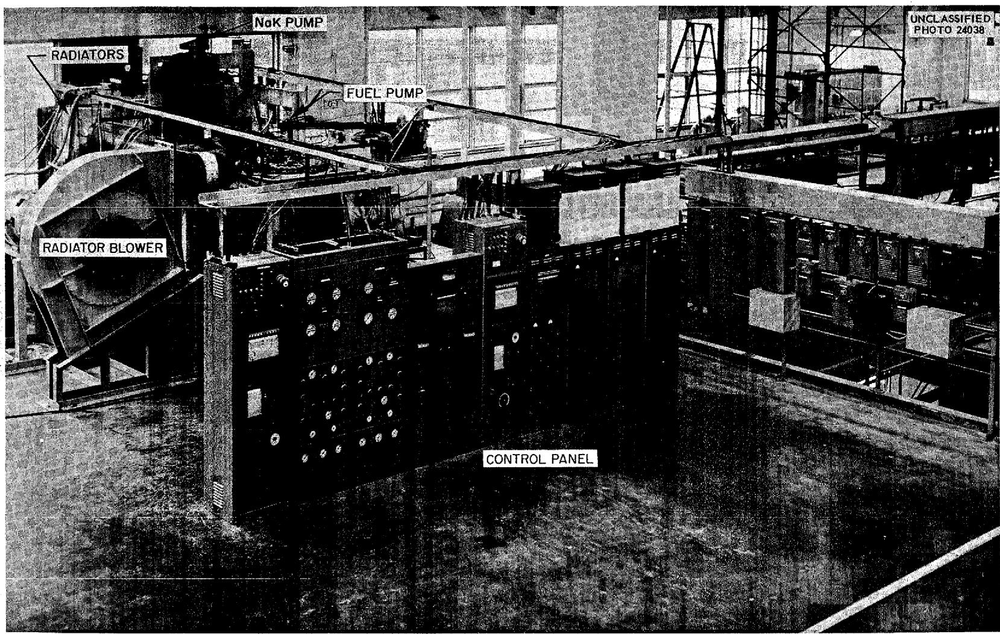  
Fig. 2.4. Experimental Assembly (Stand A) for Intermediate Heat Exchanger Tests.

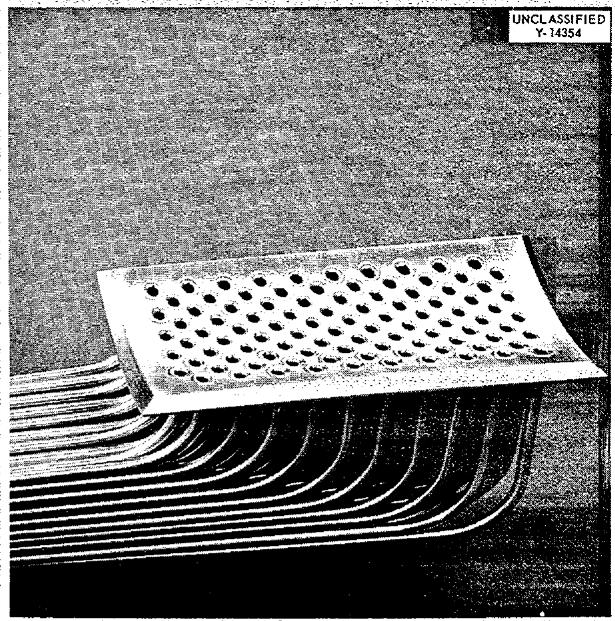  
Fig. 2.5. The 100-Tube Bundle and Header of Intermediate Heat Exchanger No. 2 Which Leaked After 358 hr of Operation with NaK Circulating in the Tubes.

made it susceptible to stress failure.

After the heat exchanger had been removed and replaced with piping, operation of the NaK system was resumed. The NaK was circulated for 15 hr at $1500^{\circ}\mathrm{F}$ and then drained while hot. Since the NaK contained fuel contamination, it was replaced with fresh NaK, and the second cold trap test described above was made. However, the operation had to be stopped again when one of the NaK-to-air radiators, described previously, developed a leak. During the last 55 hr of operation, a steady increase in the NaK pressure drop across the radiators was noted. The pressure drop increase coincided with startup of the radiator blowers, which caused a NaK temperature differential of $200^{\circ}\mathrm{F}$ across the radiators. The increase in pressure drop, along with a gradual decrease in NaK flow at a constant pump speed, could only mean that some of the radiator tubes were plugging. These plugged tubes were cooled by the air flow from the blower, with the result that there were low-temperature regions in the otherwise high-temperature radiator

61bd.,p134.

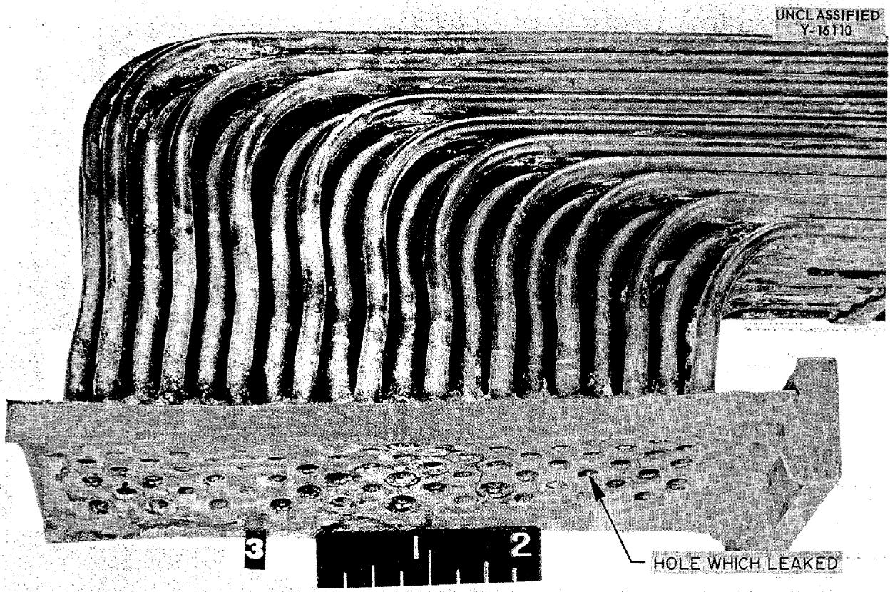  
Fig. 2.6. The Tube Bundle and Header Shown in Fig. 2.5 After 358 hr of Operation.

matrix. The high thermal stresses thus created were probably of significance in the ultimate failure of the one radiator unit. The radiator that failed is shown in Fig. 2.7.

The fuel that leaked into the NaK circuit after the heat exchanger failure was not flushed out during the 15-hr period of circulation of the NaK after the removal of the heat exchanger. The analysis of the black material scraped from the fins of the NaK-to-air radiator when it was being examined after the leak occurred showed $34\%$ zirconium and $0.25\%$ uranium; the remainder of the material was sodium, potassium, iron, nickel, chromium, and copper.

The NaK circuit was cleaned by the Materials Chemistry Division. A total of 4.2 g of zirconium, 0.46 g of uranium, and 3939 g (8.6 lb) of Inconel was removed in the cleaning operation. Two 5% nitric acid washes removed 87% of the uranium, and one wash with 2% ammonium bifluoride and 2.5% nitric acid, a highly corrosive agent, removed 82% of the zirconium. Two ammonium bifluoride and nitric acid washes removed 90% of the Inconel.

The Inconel removed by the cleaning process reflects corrosive attack to a depth of 1.5 mils on the inside walls of the Inconel piping throughout the NaK system, if it is assumed that the attack was uniform.

Test stand A is currently being rebuilt. Radiator units made by the York Corp. and heat exchanger bundles made by Black, Sivalls & Bryson, Inc. are being used. Test stand B, which is almost identical to stand A, is now $70\%$ complete. It will be used to test two radiator units (500-kw size) built by Pratt & Whitney Aircraft and two heat exchanger bundles made by the Metallurgy Division of ORNL. Test stand C, another stand identical to stand A, is now $10\%$ complete.

# Small Heat Exchanger Tests

J. C. Amos

Aircraft Reactor Engineering Division

L.H.Devlin J.S.Turner

Pratt & Whitney Aircraft

The first of a series of tests of small fuel-to-NaK heat exchangers was terminated on June 29,

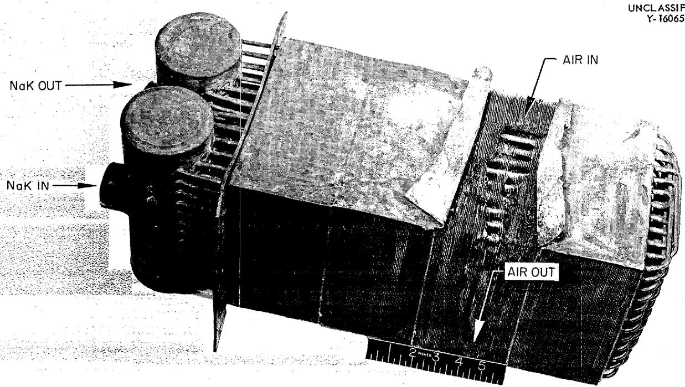  
Fig. 2.7. NaK-to-Air Radiator Unit from Intermediate Heat Exchanger Test Stand A After NaK Leak and Fire. The side cover has been cut away.

1955, after 1560 hr of operation. The test assembly, which was described previously, along with a presentation of the preliminary results, has been dismantled, and the components are currently being subjected to metallurgical inspection. A summary of the approximate operating conditions is given in Table 2.5. The heat transfer data obtained are presented in Fig. 2.8 and are compared with the results from the theoretical relationship $\mathrm{Nu} / \mathrm{Pr}^{0.4} = 0.023\mathrm{Re}^{0.8}$ , with data obtained for a 100-tube heat exchanger operated with water, and with a curve showing the data for the 20-tube heat exchanger adjusted for a 100-tube heat exchanger.

7J.C.Amos,M.M.Yarosh,and R.I.Gray,ANPQuar. Prog.Rep.June 10,1955,ORNL-1896,p37. 8J.L.Wantland,ANPQuar.Prog.Rep.June 10,1955, ORNL-1896,p149.

The equivalent diameter used in calculating the Reynolds number was based on the total wetted perimeter of the tubes plus the side-wall area. The fuel-side pressure-drop data obtained are compared in Fig. 2.9 with a theoretical pressure-drop curve calculated from data obtained from water tests carried out on similar tube bundles to determine the pressure drop created by the spacers. The calculated pressure drops are higher than those that would be predicted by theory because of the presence of spacers.

During the last 456 hr of operation of this test the NaK inlet and outlet temperatures were maintained at approximately ART design conditions to study mass-transfer effects. No appreciable amount of mass transfer was detected by visual inspection when the loop was dismantled. During

TABLE 2.5. SUMMARY OF SMALL HEAT EXCHANGER OPERATING CONDITIONS  

<table><tr><td>Hours of Operation</td><td>Fuel Reynolds Number</td><td>Fuel Mean Temperature (°F)</td><td>Fuel ΔT (°F)</td><td>NaK Reynolds Number</td><td>NaK Mean Temperature (°F)</td><td>Fuel ΔT (°F)</td><td>Remarks</td></tr><tr><td rowspan="2">7a</td><td rowspan="2">1300–5500</td><td rowspan="2">1300</td><td rowspan="2">15</td><td>45,000 (min)</td><td rowspan="2">1300</td><td rowspan="2">30</td><td rowspan="2">Pressure drop data being obtained</td></tr><tr><td>184,000 (max)</td></tr><tr><td rowspan="2">21/2a</td><td rowspan="2">1000–6500</td><td rowspan="2">1400</td><td rowspan="2">15</td><td>26,000 (min)</td><td rowspan="2">1400</td><td rowspan="2">30</td><td rowspan="2">Pressure drop data being obtained</td></tr><tr><td>187,000 (max)</td></tr><tr><td rowspan="2">44a</td><td rowspan="2">1400–5500</td><td rowspan="2">1350</td><td>97 (min)</td><td>74,000 (min)</td><td rowspan="2">1225 (av)</td><td>142 (min)</td><td rowspan="2">Heat transfer data being obtained</td></tr><tr><td>200 (max)</td><td>206,000 (max)</td><td>200 (max)</td></tr><tr><td rowspan="2">272</td><td rowspan="2">500–6400</td><td rowspan="2">1350</td><td>90 (min)</td><td>40,000 (min)</td><td rowspan="2">1225 (av)</td><td>126 (min)</td><td rowspan="2">Heat transfer data being obtained</td></tr><tr><td>228 (max)</td><td>290,000 (max)</td><td>240 (max)</td></tr><tr><td>256</td><td>2850</td><td>1350</td><td>135</td><td>160,000</td><td>1275</td><td>130</td><td>Endurance run</td></tr><tr><td>472</td><td>3500</td><td>1450</td><td>115</td><td>145,000</td><td>1400</td><td>135</td><td>Endurance run</td></tr><tr><td>16b</td><td>3400</td><td>1360</td><td>20</td><td>135,000</td><td>1350</td><td>35</td><td>Thermal cycling test</td></tr><tr><td>16b</td><td>600</td><td>1300</td><td>272</td><td>40,000</td><td>1225</td><td>290</td><td>Thermal cycling test</td></tr><tr><td>16b</td><td>600</td><td>1325</td><td>280</td><td>40,000</td><td>1240</td><td>380</td><td>Thermal cycling test</td></tr><tr><td>456c</td><td>4000</td><td>1455</td><td>100</td><td>40,000</td><td>1250</td><td>490</td><td>Mass transfer data being obtained</td></tr><tr><td>1557</td><td></td><td></td><td></td><td></td><td></td><td></td><td></td></tr></table>

${}^{a}$ NaK with the composition ${22}\% \mathrm{{Na}} - {78}\% \mathrm{K}$ used for the first three runs; NaK with the composition 56% Na-44% K used for all other runs; fuel mixture for all runs was $\mathrm{{NaF}} - {\mathrm{{ZrF}}}_{4} - \mathrm{{UF}}{}_{4}\left( {{50} - {46} - 4\text{ mole }\% }\right)$ . bThermal cycling discontinued after two complete cycles. CButyl alcohol circulated in NaK Loop for 19 hr after termination of test.

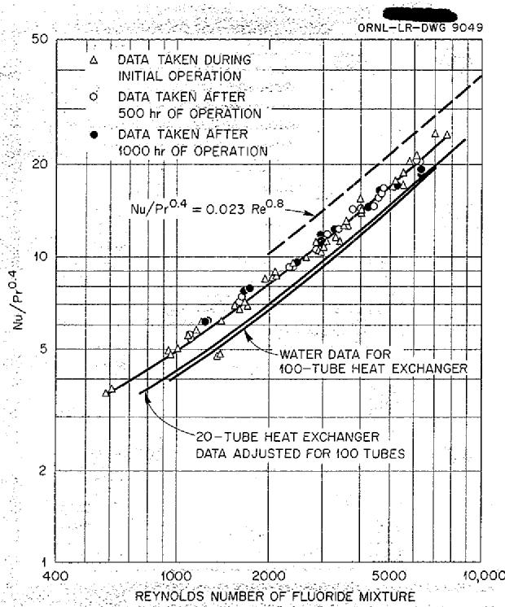  
Fig. 2.8. Heat Transfer Data for 20-Tube Fuel-to-NaK Heat Exchanger.

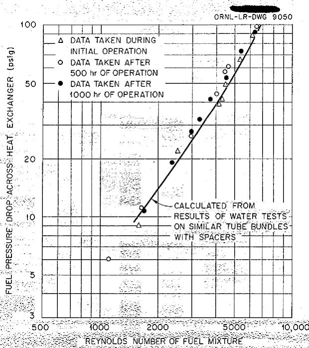  
Fig. 2.9. Fuel-Side Pressure Drop Data for 20-Tube Fuel-to-NaK Heat Exchanger.

this period of operation the efficiency of the NaK-to-air radiator used as a heat dump dropped continuously for approximately 360 hr and then improved suddenly. Samples taken from the NaK sump tank at the completion of the test indicated a very high oxygen content in the NaK (approximately 2500 ppm). A circulating cold trap has been designed and will be installed on future test assemblies in an effort to remove oxides from the NaK.

Assembly of two, new, small heat exchanger test stands is approximately $25\%$ complete. Each of these stands has a 500-kw electric heat source and will be used to test six 20-tube heat exchangers. Two heat exchangers are being fabricated by ORNL and four have been ordered from outside vendors.

A 25-tube heat exchanger is being designed, with ART tube sizes and spacing, that will be operated at ART design temperature and flow conditions. It is proposed to procure five of these units from outside vendors. A block diagram of the design operating conditions for this group of heat exchanger tests is presented in Fig. 2.10.

# STRUCTURAL TESTS

E. R. Dytko

Pratt & Whitney Aircraft

G. D. Whitman

Aircraft Reactor Engineering Division

# Outer Core Shell Thermal Stability Test

D.W.Bell

Pratt & Whitney Aircraft

A one-fourth-scale model of the lower half of the 21-in. reactor core shell was fabricated for tests of thermal and structural stability when subjected to cyclic thermal stresses at reactor operating conditions. The model, shown in Fig. 2.11, was machined from Inconel bar stock and was stress-relieved before the final machining cuts were taken. Tolerances were held to $\pm 0.005$ in. on the diameter and $\pm 0.003$ in. on the thickness. The same length-to-diameter and thickness-to-diameter ratios were used as those of the full-size reactor core shell. The thermal stability test results therefore predict comparable behavior of the full-size core shell during reactor operation.

An Inconel housing is being fabricated that will form a $\frac{1}{10}$ -in. annulus on both sides of the shell.

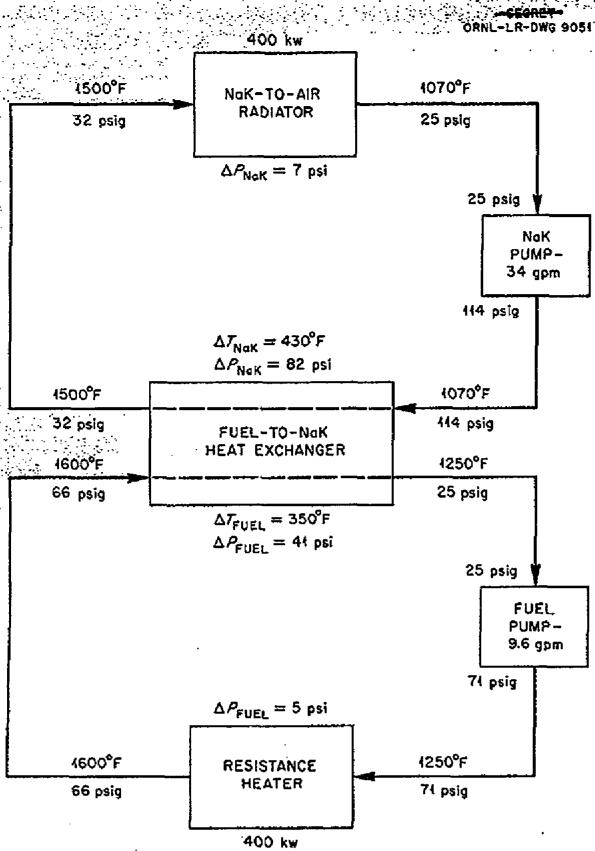  
Fig. 2.10. Design Conditions for Tests of 25-Tube Fuel-to-Nak Heat Exchanger.

The outer annulus will contain six axial spacers placed circumferentially every 60 deg. The large-diameter end of the shell will be welded to the housing, and the small-diameter end will be attached to a bellows so that there will be no stresses on the shell that are due to axial thermal expansion.

Sodium will be used to impose a radial temperature differential of $300^{\circ}\mathrm{F}$ across the core shell at the small-diameter end. The inside surface temperature of the core shell at this point will be between 1450 and $1500^{\circ}\mathrm{F}$ . Sodium at $1550^{\circ}\mathrm{F}$ will enter the inner annulus at the small-diameter end and leave at $1300^{\circ}\mathrm{F}$ . Sodium at $985^{\circ}\mathrm{F}$ will flow countercurrently in the outer annulus and leave at $1065^{\circ}\mathrm{F}$ . The core shell will be thermally cycled between the above conditions and isothermal operation at $1200^{\circ}\mathrm{F}$ for 100 cycles. After this test has been completed, it has been planned to ascertain whether the core shell will buckle

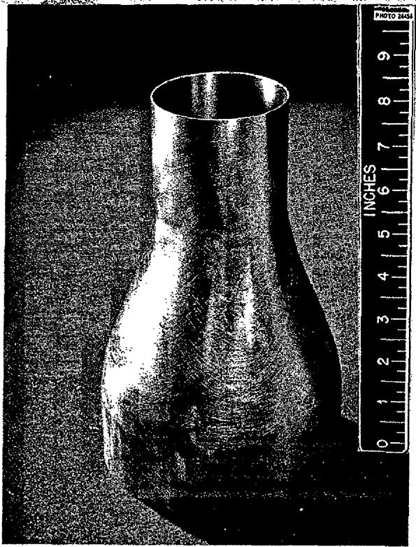  
Fig.2.11.One-Fourth-Scale Model of Lower Half of 214H:ART Reactor Core Shell Fabricated for Tests of Thermal Stability.

under an external sodium pressure if the fuel pumps should fail during reactor operation.

The test stand used for the first small heat exchanger tests is being modified for these tests. Heating and cooling of the sodium will be accomplished with a 200-kw resistance heater and an ARE sodium-to-air radiator.

# Inconel Strain-Cycling Tests

J.C.Amos L.A.Mann

Aircraft Reactor Engineering Division

C. H. Wells

Pratt & Whitney Aircraft

A design has been completed of an "anvil bending test" apparatus for obtaining basic information on the behavior of Inconel under strain cycling at elevated temperatures in both inert and corrosive atmospheres. This apparatus is shown in Fig. 2.12. Fabrication has been started on two of these units. After shakedown operation of

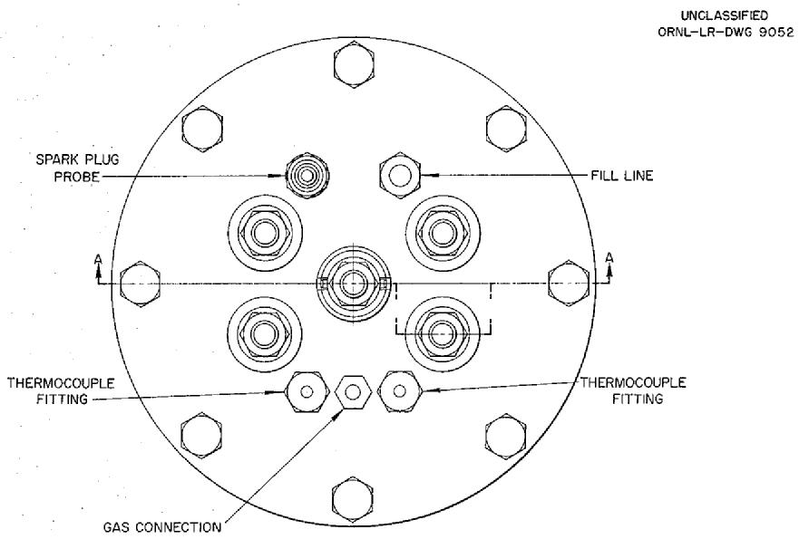

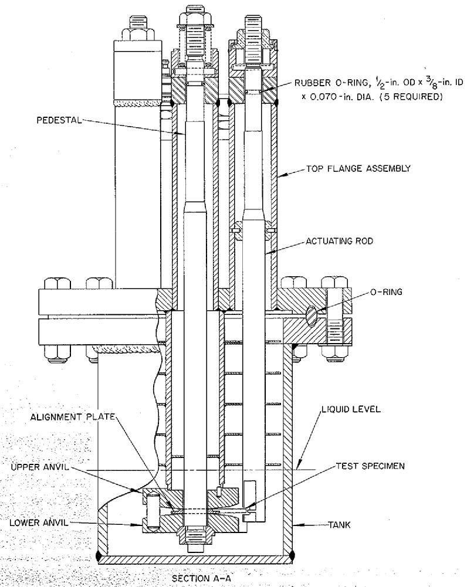  
Fig. 2.12. Inconel Strain-Cycling Test Apparatus.

these two units the design will be reviewed and revised, if necessary, and three additional units will be fabricated and placed in operation.

Each test assembly will accommodate two Inconel sheet test specimens $2\frac{1}{8} \times \frac{1}{4} \times \frac{1}{8}$ in. Interchangeable anvils with radii of 12, 15, 20, and 31 in. will be used to provide various strains.

It is planned to run the first test in an atmosphere of helium at $1200^{\circ}\mathrm{F}$ with 12-in.-radius anvils that will impose approximately $1\%$ strain. One specimen will be cycled on a 2-hr half cycle, and another will be cycled on a $\frac{1}{2}$ -hr half cycle. The purpose of this test will be to obtain an indication of the relative relaxation times.

Data will be obtained on per cent of strain, length of cycle, number of cycles to fracture, effect of temperature, and effect of surrounding medium (for example, air, helium, sodium, NaK, fuel). As the tests progress, the specific combinations of conditions to be studied further will be evaluated.

# Thermal-Cycling Test of Sodium-Inconel-Beryllium System

M. H. Cooper

R. D. Peak

Pratt & Whitney Aircraft

The third test to be operated in the sodium-beryllium-Inconel compatibility testing apparatus, described previously,[9] was started on July 14, 1955. The test section consists of a beryllium cylinder drilled centrally with a $\frac{3}{4}$ -in.-dia hole through which sodium can flow. The loop was operated isothermally at $1100^{\circ}\mathrm{F}$ for 100 hr, with a sodium flow of 3 gpm, and then shut down on July 18, 1955, because of the failure of the 250-kw transformer. The loop was restarted on August 27, 1955, with a projected operating period of 1000 hr with 100 thermal cycles. One cycle represents 4 hr of operation at high power, during which the sodium enters the test section at $1150^{\circ}\mathrm{F}$ and is heated electrically to $1300^{\circ}\mathrm{F}$ , and 4 hr of operation at low power, during which the sodium enters the test section at slightly less than $1300^{\circ}\mathrm{F}$ and leaves at $1300^{\circ}\mathrm{F}$ .

# COLD TRAPS AND PLUG INDICATORS

F. A. Anderson

University of Mississippi

J. J. Milich

Pratt & Whitney Aircraft

A survey of the literature and of the available experimental data was undertaken to obtain information on the use of cold traps as devices for removing or controlling the presence of undesirable impurities, especially oxygen, in sodium- or NaK-filled Inconel systems and on the use of plugging indicators as devices for determining the oxygen content of sodium or NaK streams. In addition to information obtained from the literature, supplementary data were obtained during visits to the Knolls Atomic Power Laboratory, Argonne National Laboratory, Mine Safety Appliances Company, and North American Aviation.

Although both diffusion and circulating cold traps have been shown to be capable of reducing the oxide content of liquid sodium or NaK to values corresponding to the saturation concentrations at the cold trap temperatures, specific data are not available which will permit sound engineering design of cold traps. Diffusion or natural-convection cold traps do their work much more slowly than circulating or forced-circulation traps and, so far, have been of primary interest only in relatively small-volume systems (up to a few gallons capacity). The existence of fairly strong eddy currents in diffusion cold traps is suspected. If such currents existed, their effects would overshadow completely the effect of natural diffusion. It is evident that experimental work would be required to obtain a basis for the design of diffusion cold traps.

Circulating cold traps have the important advantage of lowering the oxide concentration of a system rapidly. Present conventional designs that provide for holdup times of 5 min and superficial liquid velocities of the order of 3 bpm give system cleanup times that correspond to three system charge turnovers through the trap. Cold traps having volumes ranging from about 3 to $10\%$ of the volume of the system have been utilized successfully. Although microporous filters are considered to be unsatisfactory in cold traps, the use of a packing material such as York demister packing has been shown to raise cold trap efficiencies from 68 to about $98\%$ . Packing is used

to provide sufficient surface to hold the precipitated oxide, but it is not intended to function as a filter medium.

On the basis of the collected data and arbitrary specifications, three circulating cold traps have been designed, one for a relatively large, 80-gal system and two for a relatively small, 4000-ml ( $\sim$ 1-gal) system, Figs. 2.13, 2.14, and 2.15. These designs are not necessarily optimum; that is, it is felt that they will lower the oxygen content of the system, but they may be larger than necessary and may have more cooling or heating capacity than that required. The traps are expected to operate at $400^{\circ}\mathrm{F}$ and to reduce the oxygen content of the main liquid metal system to the corresponding saturation value of 50 ppm. During operation, precautions must be observed to prevent the saturation temperature of the liquid metal with respect to oxide $(\mathsf{Na}_2\mathsf{O})$ content being reached at any point in the system other than in the cold trap. If the saturation temperature were reached outside the cold trap, precipitation of oxide would occur at that point and plugging of a pipe or some other system component would occur.

Because of the difficulty of making reliable determinations of the oxide content of molten sodium or NaK by chemical procedures, considerable use has been made of the plugging indicator as a simple device for determining the oxide content indirectly. Although there is some disagreement

as to the exact significance of the results, investigators at KAPL feel that the use of a plugging indicator is a reliable and accurate method for determining oxide contents to within $\pm 0.001\%$ . Unfortunately, as in the case of cold traps, the design of plugging indicators is, at the present time, more of an art than a science. Because the design first used at KAPL proved to be satisfactory, and because of lack of time, no effort has been made to determine whether a better design could be developed.

A plugging indicator consists of a perforated plate (containing 15 to 21 holes 50 mils in diameter) placed in a 1-in. line through which molten metal flows at the rate of 1 gpm (~10 fps through the indicator plate holes). The flowing stream is cooled until the oxide saturation point is reached, at which time precipitation occurs. When the precipitated oxide partially plugs the perforated plate, a change in the flow rate occurs. The temperature at the plate corresponding to the change in flow rate, measured with an electromagnetic flowmeter, is taken to be the plugging temperature. Although this temperature can be used as a relative indication of the purity of the liquid metal stream, it is common practice to translate the plugging temperature into an oxide concentration by means of a solubility curve. A recommended design for a plugging indicator and a bypass loop is shown in Fig. 2.16.

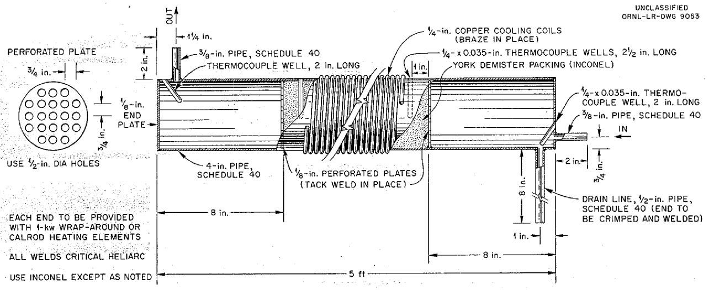  
Fig. 2.13. Circulating Cold Trap for Large-Volume (80-gal) Systems.

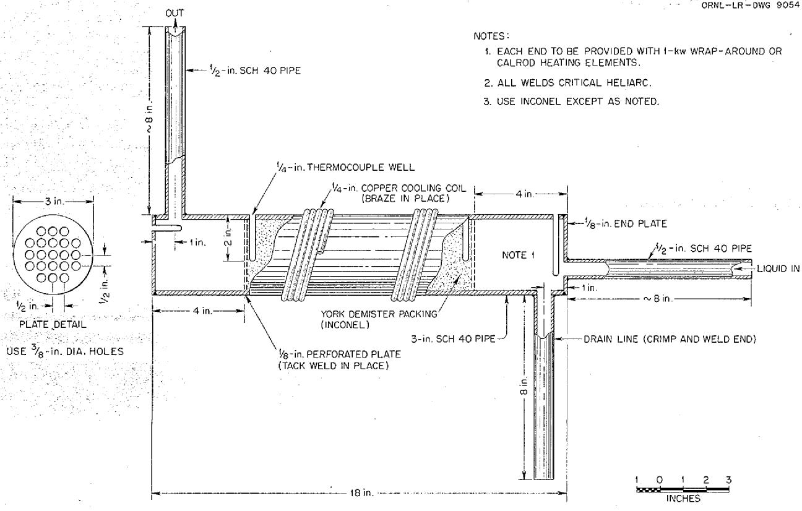  
Fig. 2.14. Circulating Cold Trap for Small-Volume ( $\sim$ 4000-ml) Systems.

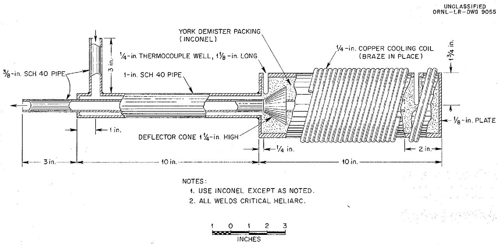  
Fig. 2.15. Alternate Circulating Cold Trap for Small-Volume ( $\sim$ 4000-ml) Systems.

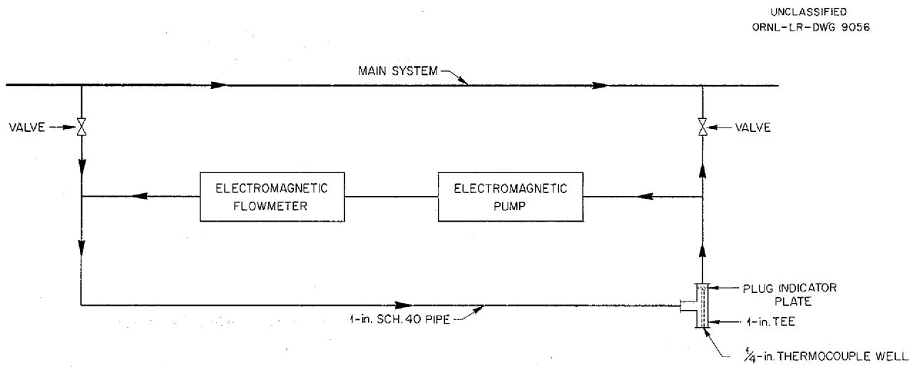

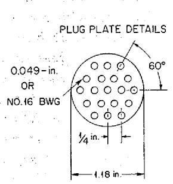

Fig. 2.16. Plugging Indicator and Bypass Loop.   
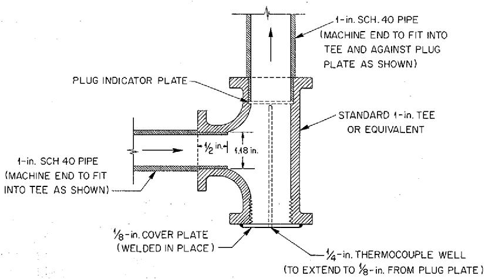  
USE WRAP-AROUND HEATERS ON ALL LINES TO CONTROL TEMPERATURES AND COOLING RATES

# 3. CRITICAL EXPERIMENTS

A. D. Callihan

V. G. Harness

J. J. Lynn

E.R.Rohrer

Applied Nuclear Physics Division

R. M. Spencer, United States Air Force

D. Scott, Jr., Aircraft Reactor Engineering Division

J. S. Crudele

E.V.Sandin

S. Snyder

Pratt & Whitney Aircraft

# ROOM-TEMPERATURE REFLECTOR MODERATED-REACTOR CRITICAL EXPERIMENTS

A critical assembly of the reflector-moderated circulating-fuel reactor loaded with sufficient $U^{235}$ to give about $3\%$ excess reactivity was described previously. After the completion of a series of experiments in which the excess reactivity was utilized to measure certain reactivity coefficients and the effects of various structure changes, the assembly was reloaded in order to determine the clean critical concentration more exactly. With the same structure and dimensions as those reported previously, the $U^{235}$ concentration was reduced from 0.416 to 0.345 g per cubic centimeter of fuel region, equivalent to a loading of 20.07 kg of $U^{235}$ , and the assembly (CA-21-2) was critical with only $0.14\%$ excess reactivity. This assembly is compared in Table 3.1 with the assembly (CA-21-1) which had $3\%$ excess reactivity.

Two structural changes in the assembly have also been investigated. In one modification (assembly CA-22) the average width of one of the end ducts, the portion of the assembly that simulates the fuel flow channels into the reactor core, was increased from 1.29 to 2.80 in. to make its volume almost 2.5 times that of the originally constructed end duct. This change was made because consideration is being given in the reactor design to the possibility of using end ducts of larger cross section. The increased fuel capacity of the assembly necessitated the addition of $U^{235}$ in the end ducts, which made a total of $28.35\mathrm{kg}$ of $U^{235}$ at an average density of $0.405\mathrm{g}$ of $U^{235}$ per cubic centimeter of fuel material.

The array was critical with $3.2\%$ excess reactivity, and the estimated "clean" critical mass was $24 \pm 2 \mathrm{~kg}$ of $\mathsf{U}^{235}$ .

In another experiment (CA-23), with end ducts of the original size, the average radius of the central psuedo-spherical beryllium region or "island" was increased from 5.18 to 7.19 in., with a corresponding reduction in the fuel volume of from 58.2 to 44.3 liters. The use of a thinner fuel annulus is being considered in the reactor design as a means of reducing fuel self-shielding. The beryllium content of the core was increased from 67 to $92\mathrm{kg}$ including that in the end ducts. This assembly was critical with a loading of $18.62\mathrm{kg}$ of $\mathsf{U}^{235}$ at an average density of $0.420\mathrm{g}$ of $\mathsf{U}^{235}$ per cubic centimeter of fuel region. The excess reactivity was $0.19\%$ and the estimated critical mass, without control rods, was $18.4\mathrm{kg}$ of $\mathsf{U}^{235}$ . The dimensions of assemblies CA-22 and CA-23 are given in Table 3.1, along with the data obtained with these assemblies.

# HIGH-TEMPERATURE REFLECTOR-MODERATED-REACTOR CRITICAL EXPERIMENTS

A low-nuclear-power, high-temperature, reflectormoderated-reactor critical experiment is currently under way, and some preliminary results have been obtained. The liquid fuel in the assembly is at $1200^{\circ}F$ . The reactor section of the equipment closely resembles the current design of the ART. It consists, essentially, of an annular fuel region separated from the beryllium island and reflector by $\frac{1}{8}$ -in.-thick Inconel core shells. The island, partly surrounded by the inner Inconel shell, is shown in Fig. 3.1. The outer shell, with some of the beryllium reflector in place, is shown in Fig. 3.2. A re-entrant tube is mounted along the vertical axis of the reactor to serve as a guide

TABLE 3.1. COMPOSITIONS AND DIMENSIONS OF THREE-REGION REFLECTOR-MODERATED-REACTOR CRITICAL ASSEMBLIES WITH $\frac{1}{2}$ -in.-THICK INCONEL CORE SHELLS AND DUCTS   

<table><tr><td>Assembly Number</td><td>CA-21-1</td><td>CA-21-2</td><td>CA-22</td><td>CA-23</td></tr><tr><td>Beryllium Island Volume, ft3</td><td>1.27</td><td>1.27</td><td>1.27</td><td>1.75</td></tr><tr><td>Average radius, in.</td><td></td><td></td><td></td><td></td></tr><tr><td>Spherical section</td><td>5.18</td><td>5.18</td><td>5.18</td><td>7.19</td></tr><tr><td>End ducts</td><td>3.86</td><td>3.86</td><td>3.86</td><td>3.86</td></tr><tr><td>Mass, kg</td><td>67.0</td><td>67.0</td><td>67.0</td><td>92.2</td></tr><tr><td>Fuel Region (excluding shells and interface plates)</td><td></td><td></td><td></td><td></td></tr><tr><td>Volume, ft3</td><td>2.06</td><td>2.06</td><td>2.47</td><td>1.56</td></tr><tr><td>liters</td><td>58.2</td><td>58.2</td><td>70.0</td><td>44.3</td></tr><tr><td>Average radius, in.</td><td></td><td></td><td></td><td></td></tr><tr><td>Spherical section</td><td></td><td></td><td></td><td></td></tr><tr><td>Inside</td><td>5.31</td><td>5.31</td><td>5.31</td><td>7.32</td></tr><tr><td>Outside</td><td>9.44</td><td>9.44</td><td>9.44</td><td>9.44</td></tr><tr><td>End ducts</td><td></td><td></td><td></td><td></td></tr><tr><td>Inside</td><td>3.99</td><td>3.99</td><td>3.99</td><td>3.99</td></tr><tr><td>Outside</td><td>5.28</td><td>5.28</td><td>6.79a</td><td>5.28</td></tr><tr><td>Distance between fuel sheets, in.</td><td>0.142</td><td>0.173</td><td>0.142</td><td>0.142</td></tr><tr><td>Mass of components, kg</td><td></td><td></td><td></td><td></td></tr><tr><td>Teflon</td><td>108.88</td><td>108.18</td><td>126.77</td><td>81.54</td></tr><tr><td>Uranium loading</td><td>26.02</td><td>21.57</td><td>30.45</td><td>19.97</td></tr><tr><td>U235 loading</td><td>24.24</td><td>20.07</td><td>28.35</td><td>18.62</td></tr><tr><td>Uranium density, b g/cm3</td><td>0.446</td><td>0.370</td><td>0.435</td><td>0.451</td></tr><tr><td>U235 density, b g/cm3</td><td>0.416</td><td>0.345</td><td>0.405</td><td>0.420</td></tr><tr><td>Uranium coating material</td><td>0.25</td><td>0.21</td><td>0.30</td><td>0.19</td></tr><tr><td>Scotch tape</td><td>0.15</td><td>0.15</td><td>0.15</td><td>0.15</td></tr><tr><td>Core Shells and Interface Plates</td><td></td><td></td><td></td><td></td></tr><tr><td>Mass of components, kg</td><td></td><td></td><td></td><td></td></tr><tr><td>Aluminum</td><td>1.10</td><td>1.10</td><td>1.10</td><td>1.10</td></tr><tr><td>Inconel</td><td>53.02</td><td>53.02</td><td>54.62</td><td>58.26</td></tr><tr><td>Reflector</td><td></td><td></td><td></td><td></td></tr><tr><td>Volume, ft3</td><td>20.88</td><td>20.88</td><td>20.45</td><td>20.88</td></tr><tr><td>Minimum thickness, in.</td><td>11.5</td><td>11.5</td><td>11.5</td><td>11.5</td></tr><tr><td>Mass of components, kg</td><td></td><td></td><td></td><td></td></tr><tr><td>Beryllium</td><td>1094.1</td><td>1094.1</td><td>1077.1</td><td>1094.1</td></tr><tr><td>Aluminum</td><td>29.2</td><td>29.2</td><td>29.2</td><td>29.2</td></tr><tr><td>Excess Reactivity as Loaded</td><td>~3%</td><td>0.14%</td><td>~3%</td><td>0.19%</td></tr><tr><td>Experimental Critical Mass, c kg of U235</td><td>19 ± 2</td><td>19.9</td><td>24 ± 2</td><td>18.4</td></tr></table>

${}^{a}$ Only one end duct was enlarged.   
$b_{\text{Mass per unit volume of fuel region}}$ .   
Mass required for a critical system with the poison rods removed.

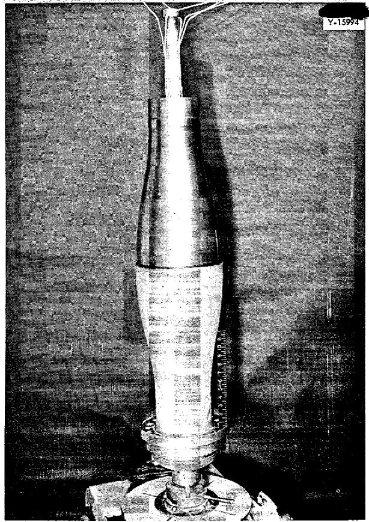  
Fig. 3.1. Partially Assembled Island Showing Lower Half of Inconel Inner Core Shell and the Upper Half of the Beryllium Reflector.

for the annular control-safety rod, which contains a mixture of the oxides of the rare-earth elements. The rod is magnetically supported and can be positioned above the horizontal mid-plane for control. It is free to fall below the mid-plane for

reactor shutdown. The outside diameter of the neutron-absorber section of the rod is 1.28 in., and the annulus is $\frac{1}{8}$ in. wide. The density of the neutron-absorber compact is $6.5\mathrm{g/cm}^3$ ; its principal constituents are $\mathrm{Sm}_2\mathrm{O}_3$ (63.8 wt %) and $\mathrm{Gd}_2\mathrm{O}_3$ (26.3 wt %). The support and the driving rod for the neutron source are coaxial with the control rod. The beryllium blocks in the reflector and the island are in an atmosphere of helium; there is no sodium in the system.

The reactor is mounted above a reservoir for the liquid fuel, which is a mixture of the fluorides of sodium, zirconium, and enriched $(93\% \cup^{235})$ uranium. The fuel is transferred to the reactor by applying helium under pressure to the liquid surface in the reservoir; the return to the reservoir is by gravity. The temperature of the system has been raised to $1350^{\circ}\mathrm{F}$ by electrical heaters located external to the reflector and the fuel reservoir. The completed assembly is shown in Fig. 3.3.

After an initial test of system operation and leak tightness with an equimolar mixture of NaF and $\mathsf{ZrF}_{4^{\prime}}$ successive increments of $\mathsf{Na}_2\mathsf{UF}_6$ were added until the reactor became critical. The fuel concentration was then 6.30 wt $\%$ (2.87 mole $\%$ ) uranium, and the excess reactivity, determined from the subsequent calibration of the control rod, was about $0.13\% \Delta k / k$ . A measurement of the overall temperature coefficient of reactivity between 1150 and $1350^{\circ}\mathsf{F}$ showed the value to be negative and equal to $2\times 10^{-5}(\Delta k / k) / ^{\circ}\mathsf{F}$ . An increase in the uranium concentration of the fuel from 6.30 to 6.88 wt $\%$ resulted in an increase in reactivity of $1.3\% \Delta k / k$ . The control rod has a value of $1.7\% \Delta k / k$ when inserted to a point 4 in above the mid-plane.

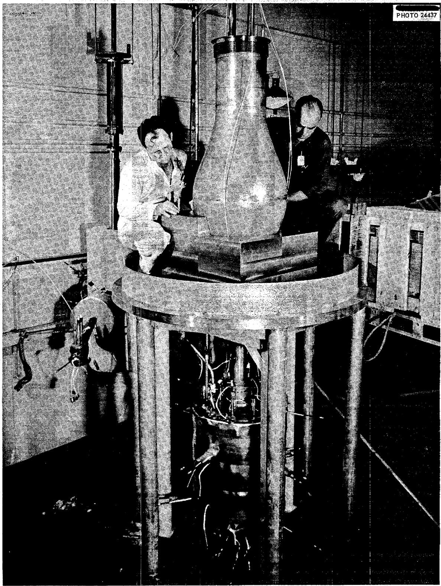  
Fig. 3.2. Outer Core Shell and Partially Assembled Beryllium Reflector of High-Temperature Critical Assembly.

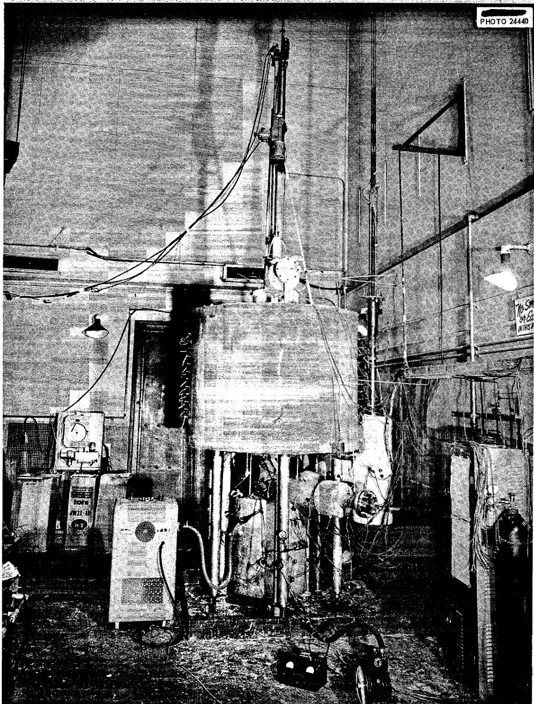  
Fig. 3.3. High-Temperature Critical Assembly of the Reflector-Moderated Circulating-Fuel Reactor.

Part II

MATERIALS RESEARCH

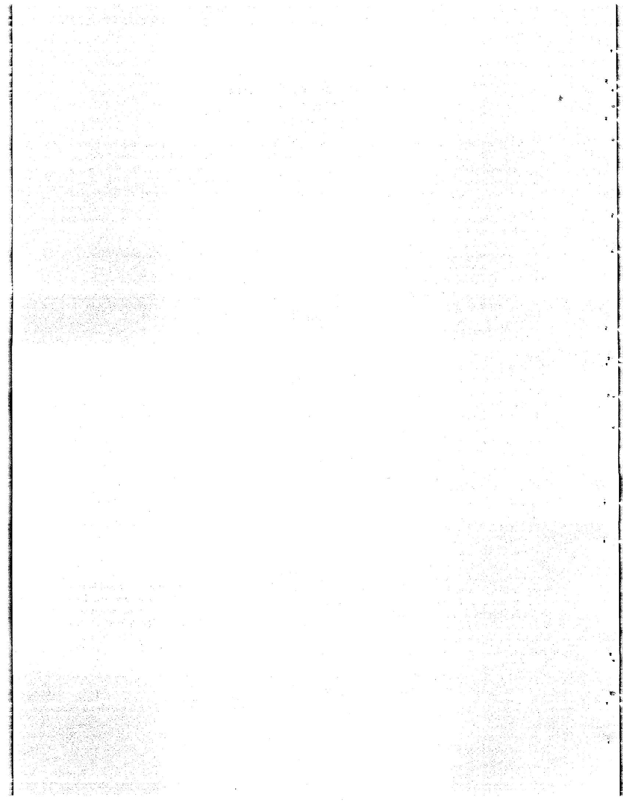

# 4. CHEMISTRY OF REACTOR MATERIALS

W. R. Grimes

Materials Chemistry Division

Phase equilibrium studies were made of the LiF-ZrF4, UF4-ZrF4, NaF-LiF-ZrF4, NaF-LiF-UF4, NaF-RbF-ZrF4-UF4, KF-ZrF4, and NaF-KF-ZrF4 systems and of the BeF2-containing systems NaF-LiF-BeF2, NaF-LiF-BeF2-UF4, NaF-BeF2, and NaF-KF-BeF2. A revised equilibrium diagram for the LiF-ZrF4 system is presented. Additional data were obtained on the solubility of UF3 in BeF2-bearing compositions.

Additional work was done in investigating the equilibrium reduction of $\mathsf{FeF}_2$ by hydrogen in $\mathsf{NaZrF}_5$ , the reduction of $\mathsf{UF}_4$ by structural metals, and the stability of chromium and iron fluorides in molten fluorides. The experimental preparation of $\mathsf{NH}_4\mathsf{SnF}_3$ and of compounds of $\mathsf{ZrF}_4$ with $\mathsf{CrF}_2$ , $\mathsf{NiF}_2$ , and $\mathsf{FeF}_2$ is described. The investigations of the reaction of $\mathsf{UF}_4$ with uranium in alkali fluorides and the reaction of uranium metal with alkali fluorides were continued. Studies of the reactions between molten fluorides and metals included some exploratory work on the equilibrium between sodium-potassium alloy and NaF-KF melts at $800^{\circ}\mathsf{C}$ .

Fuel purification and production research included the investigation of methods for the recovery of contaminated fuel for re-use and the conversion of $\mathsf{ZrO}_2$ to $\mathsf{ZrF}_4$ in the present production equipment. The studies of processing techniques for the purification of $\mathsf{BeF}_2$ -bearing compositions were continued. Efforts to resolve the problems in the procurement of adequate supplies of $\mathsf{ZrF}_4$ are described, as well as improvements in batching and dispensing operations and loading and draining operations.

Potential measurements were made with combinations of several half cells consisting of metal electrodes bathed in solutions of the corresponding metal ion in the molten salt mixture $\mathsf{NaF - ZrF}_4$ . Also, attempts to measure the activity of chromium in Inconel are described. The capillary viscometer was used for viscosity measurements of a mixture of $\mathsf{LiNO}_3$ and $\mathsf{KNO}_3$ . Optical properties and x-ray patterns are presented for recently discovered compounds in fluoride systems: 3LiF-ZrF4, 2LiF-ZrF4, 3LiF-4ZrF4, 2KF·BeF2, KF·BeF2, KF·NaF-ZrF4, 3KF·3NaF-2ZrF4, 3NaF-4ZrF4, and 2NaF·LiF-2BeF2.

Final results obtained for the electrical con

ductance and density of all molten alkali chlorides, bromides, and iodides have been obtained, and conclusions based on the measurements are summarized. Measurements of freezing-point depression are under way. Precise determinations of the self-diffusion coefficients of sodium ion and of nitrate ion in molten sodium nitrate have been completed.

# PHASE EQUILIBRIUM STUDIES OF SYSTEMS CONTAINING $\mathsf{ZrF}_4$ AND/OR $\mathsf{UF}_4$

C.J.Barton F.F.Blankenship

Materials Chemistry Division

H. Insley, Consultant

The System LiF-ZrF4

H.A.Friedman R.E.Thoma

R.E.Moore

Materials Chemistry Division

G. D. White, Metallurgy Division

D. L. Stockton, Merck & Co.

A revised phase diagram of the $\mathsf{LiF - ZrF_4}$ system is presented in Fig. 4.l. The original, tentative diagram was based mainly on thermal analysis data. The revised diagram is based on thermal and differential thermal analysis data, high-temperature x-ray diffraction data, and petrographic and x-ray diffraction examination of quenched and slowly cooled samples. The $\mathsf{Li}_3\mathsf{ZrF}_7$ crystals obtained by quenching and by slow cooling were poorly formed, and it is possible that a rapid inversion from a high-temperature crystal modification occurred even during quenching. High-temperature x-ray diffraction data on the compound indicated that the high-temperature modification exists above $470^{\circ}\mathsf{C}$ . Below $470^{\circ}\mathsf{C}$ , the pattern was identical to the room-temperature pattern obtained from a slowly cooled sample which contained the low-temperature form and some of the decomposition products, LiF and $\mathsf{Li}_2\mathsf{ZrF}_6$ . The inversion must occur just above the decomposition temperature.

Quenches of the mixture with 31 mole $\%$ ZrF4

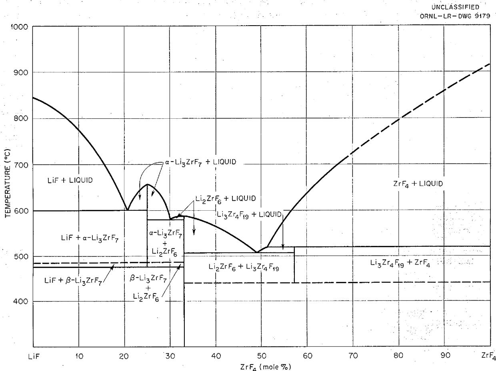  
Fig. 4.1. Revised Equilibrium Diagram for the System LiF-ZrF4.

established the primary phase as $\mathsf{Li}_2\mathsf{ZrF}_6$ and the liquidus temperature was found to be about $590^{\circ}C.$ Recently obtained thermal analysis data showed that the $\mathsf{Li}_2\mathsf{ZrF}_6\mathsf{-Li}_3\mathsf{ZrF}_7$ eutectic melts at about $580^{\circ}C.$ Since $\mathsf{Li}_2\mathsf{ZrF}_6$ is the primary phase of the mixture containing 31 mole $\%$ $\mathsf{ZrF}_{4}$ the $\mathsf{Li}_2\mathsf{ZrF}_6$ eutectic must contain less than 31 mole $\%$ of $\mathsf{ZrF}_4$

No $\mathsf{Li}_3\mathsf{ZrF}_7$ was found in quenched samples containing 33.3 mole $\%$ $\mathsf{ZrF}_4$ over the range 530 to $619^{\circ}\mathsf{C}$ , and thus it was confirmed that $\mathsf{Li}_2\mathsf{ZrF}_6$ melts congruently. The melting point of $\mathsf{Li}_2\mathsf{ZrF}_6$ was found, by thermal analysis, to be about $587^{\circ}\mathsf{C}$ .

Thermal and differential thermal analysis data indicated that a eutectic is formed by the mixture with about 50 mole $\%$ $\mathsf{ZrF}_4$ . The primary phase of the mixture with 48 mole $\%$ $\mathsf{ZrF}_4$ was found, by quenching, to be $\mathsf{Li}_2\mathsf{ZrF}_6$ ; the liquidus temperature was $522^{\circ}\mathsf{C}$ , and the solidus temperature was $508^{\circ}\mathsf{C}$ . The existence of $\mathsf{Li}_2\mathsf{ZrF}_6$ and $\mathsf{Li}_3\mathsf{Zr}_4\mathsf{F}_{19}$

in these samples was confirmed by x-ray diffraction examination. The $\mathsf{Li}_2\mathsf{ZrF}_6\cdot \mathsf{Li}_3\mathsf{Zr}_4\mathsf{F}_{19}$ eutectic appears to contain about 49 mole $\%$ $\mathsf{ZrF}_4$ and to melt at $508^{\circ}C$

The experiments reported previously1 seemed to narrow down the composition of the unknown phase in the mixture with more than 50 mole % ZrF4 to either Li2Zr3F14 (60 mole % ZrF4) or Li3Zr4F19 (57.1 mole % ZrF4). Other experiments confirmed this conclusion, but no decision between the two formulas could be reached on the basis of the quenching experiments. However, analogy to the NaF-ZrF4 system indicated Li3Zr4F19 to be the more probable, and it has been established in other experiments (described below) that Na3Zr4F19 and Li3Zr4F19 belong to the same crystal system and form a complete solid-solution series.

Another phase (cubic) has sometimes appeared in quenched samples in the region above 50 mole %

$\mathsf{ZrF}_4$ at temperatures at which liquid would be expected to be present. A differential thermal analysis break at $580^{\circ}\mathrm{C}$ was thought at first to be associated with this phase. However, quench growth and well-crystallized $\mathsf{ZrF}_4$ were found in quenched samples containing 57.1, 60, 62.5, 66.7, and 75 mole $\%$ $\mathsf{ZrF}_4$ above $520^{\circ}\mathrm{C}$ , the incongruent melting point of $\mathsf{Li}_3\mathsf{Zr}_4\mathsf{F}_{19}$ . There appeared to be no difference in the samples taken above and below $580^{\circ}\mathrm{C}$ . It has been decided that the cubic material is either a metastable or a low-temperature phase which sometimes precipitates during quenching. The break at $580^{\circ}\mathrm{C}$ was probably due to nonequilibrium conditions.

The liquidus temperature of the mixture with 66.7 mole $\%$ $\mathsf{ZrF}_4$ was found by quenching to be near $695^{\circ}C$ . Thermal analysis data for the mixture with 57.5 mole $\%$ $\mathsf{ZrF}_4$ gave a liquidus temperature of $618^{\circ}C$ .

There is evidence that $\mathsf{Li}_3\mathsf{Zr}_4\mathsf{F}_{19}$ decomposes slowly into $\mathsf{Li}_2\mathsf{ZrF}_6$ and $\mathsf{ZrF}_4$ upon cooling. A relatively pure sample of $\mathsf{Li}_3\mathsf{Zr}_4\mathsf{F}_{19}$ , prepared by heating for 48 hr at $500^{\circ}\mathsf{C}$ , was reheated to $446^{\circ}\mathsf{C}$ for several hours and quenched. The sample then gave a good x-ray pattern for $\mathsf{Li}_2\mathsf{ZrF}_6$ and $\mathsf{ZrF}_4$ , although some $\mathsf{Li}_3\mathsf{Zr}_4\mathsf{F}_{19}$ remained. The decomposition temperature has not been definitely established.

The System $\mathsf{UF}_4\text{-}\mathsf{ZrF}_4$

R.P.Metcalf R.E.Thoma Materials Chemistry Division

The system $\mathsf{UF}_4\text{-}\mathsf{ZrF}_4$ has been studied by using the quenching technique, and it has been analyzed by using petrographic and x-ray diffraction methods. The only crystalline phases which have been observed in this system are solid solutions, $(\mathsf{U},\mathsf{Zr})\mathsf{F}_4$ . There is a minimum melting point of about $765^{\circ}C$ near the composition 23 mole $\%$ $\mathsf{UF}_4 - 77$ mole $\% \mathsf{ZrF}_4$ . It is not yet certain whether there is complete miscibility in the solid phase.

The System NaF-LiF-ZrF4

H. E. Friedman R. E. Thoma  
Materials Chemistry Division

When it became apparent that the LiF-ZrF4 binary system contained the previously unidentified incongruently melting compound 3LiF.4ZrF4, which corresponds to the incongruently melting compound 3NaF.4ZrF4 in the NaF-ZrF4 system, a

series of cooling curves was carried out on mixtures of 3LiF.4ZrF and 3NaF.4ZrF. A continuous gradation of optical properties from 3NaF.4ZrF (n = 1.420, n = 1.432; biaxial positive; 2V = 30 deg) to 3LiF.4ZrF (n = 1.463, n = 1.473; biaxial positive; 2V = 20 to 30 deg) gave strong indication of a complete solid-solution series. The primary phase along the join was ZrF, and the liquidus temperatures increased steadily from 550°C for 3NaF.4ZrF to 618°C for 3LiF.4ZrF. The solidus temperatures, which corresponded to the incongruent melting temperatures of the solid-solution series, exhibited a minimum at 475°C for the mixture with about 25 mole % LiF. The eutectic in the compatibility triangle formed by 6NaF.7ZrF, 2LiF.4ZrF, and the 3(Na,Li)F.4ZrF solid solution was found to be NaF-LiF-ZrF (25-29-46 mole %) and to melt at 445°C.

An intensive study of the NaF-LiF-ZrF-UF4quaternary system was interrupted when it was learned that no improvement in viscosity resulted when the mixtures contained relatively high LiF and low $\mathsf{ZrF}_4$ contents. At high zirconium concentrations, there was a marked reduction in melting point which was, however, accompanied by unusually high $\mathsf{ZrF}_4$ vapor pressures.

The System NaF-LiF-UF

H.E.Friedman R.E.Thoma

Materials Chemistry Division

R. E. Cleary

Pratt & Whitney Aircraft

T. N. McVay

Consultant

The compound LiF forms nearly complete quasi-binary systems with each of the NaF-UF4 compounds: 3NaF-UF4, 2NaF-UF4, and 7NaF-6UF4. Since 2NaF-UF4 is just barely an incongruity melting compound, the LiF-2NaF-UF4 join departs from true quasi-binary behavior when the LiF content is low. Saddle eutectics are found on the LiF-3NaF-UF4 join that contain 20 mole % LiF and melt at $480^{\circ}\mathrm{C}$ , on the LiF-2NaF-UF4 join that contain 31 mole % LiF and melt at $510^{\circ}\mathrm{C}$ , and on the LiF-6NaF-7UF4 join that contain 39 mole % LiF and melt at $490^{\circ}\mathrm{C}$ . However, the mixtures that are shown on the diagram to have low melting points contain too much UF4 for them to be of use as circulating reactor fuels.

The join between $6\mathrm{NaF}\cdot 7\mathrm{UF}_4$ and $6\mathrm{LiF}\cdot 7\mathrm{UF}_4$ appears to form a side of a compatibility triangle, and so does the join between $6\mathrm{NaF}\cdot 7\mathrm{UF}_4$ and $3\mathrm{LiF}\cdot \mathrm{UF}_4$ . These two joins, along with the quasi binaries described in the foregoing paragraph, define the important compatibility triangles in the portion of the ternary mixture that contains 47 mole $\%$ or less, $\mathrm{UF}_4$ . In the region of $\mathrm{UF}_4$ concentrations above 50 mole $\%$ there is at least one ternary compound; the high $\mathrm{UF}_4$ -content portion of the diagram is not yet understood, but the first indications are that $\mathrm{UF}_4$ is a compatible phase over a surprisingly small area.

As a result of these studies it appears that some complications, previously unrecognized, appear in the $\mathsf{LiF - UF_4}$ binary system. In addition to the $3\mathrm{LiF - UF}_4$ and $\mathsf{LiF - 2UF_4}$ compounds previously observed, there is another compound, $7\mathrm{LiF - 6UF_4}$ . On cooling curves at compositions near the single eutectic (28 mole $\%$ UF), the temperature may rise and fall 5 to $15^{\circ}C$ two or three times after the eutectic halt is under way. This abnormal behavior seems to be due to an exothermic decomposition of $3\mathrm{LiF - UF_4}$ at about the eutectic temperature, along with a tendency for the melt to undercool and then rapidly decompose.

The System NaF-RbF-ZrF4-UF4

H. A. Friedman R. E. Thoma  
Materials Chemistry Division

Preliminary studies of some systems containing RbF and $\mathsf{ZrF}_4$ were made in an attempt to obtain materials with low viscosities for possible use as reactor fuels. Previous studies of the RbF-ZrF4 binary system had shown low melting points only for mixtures with moderately high (greater than 40 mole %) $\mathsf{ZrF}_4$ concentrations; 3RbF-ZrF4 melts at $900^{\circ}\mathrm{C}$ . Consequently, low-melting mixtures containing RbF and $\mathsf{UF}_4$ with 20 to 40 mole % $\mathsf{ZrF}_4$ necessarily contain a fourth component.

The RbF available, at present, contains about 20 mole $\%$ of KF, and therefore all studies reported here were made with RbF containing that amount of KF. It was anticipated that the KF would substitute isomorphically for RbF and that the phase diagrams would not appear to involve the KF component. Unfortunately, this proved not

to be the case. For example, $3\text{RbF} \cdot Z\text{rF}_4$ formed preferentially, and, if additional KF were present, an excess of KF remained. In low-melting parts of the NaF-(Rb,K)F-ZrF₄ system, unexpected phases made their appearance, and therefore quasi binaries could not be established. A join at 47 mole % ZrF₄ appeared to pass through the phase fields of two ternary compounds and to give the lowest melting points at the high RbF-content end. This behavior, coupled with lack of information regarding the similar NaF-KF-ZrF₄ system, caused the postponement of a systematic study of the NaF-RbF-ZrF₄ diagram, pending results from viscosity measurements on an RbF-ZrF₄-UF₄ fuel mixture and the procurement of better RbF.

In an effort to find a suitable fuel mixture for viscosity measurements, a constant 4 mole % of $\mathsf{UF}_4$ was added to the RbF-ZrF $_4$ binary over a range of compositions from 55 to 45 mole % RbF. All these mixtures appeared to melt between 410 and $420^{\circ}\mathrm{C}$ and to give no detectable heat effects above this range. This result led to the suspicion, later confirmed, that small amounts of precipitates with a very low temperature coefficient of solubility were escaping detection. From the middle of this range of apparently low-melting mixtures, the composition RbF-ZrF $_4$ -UF $_4$ (48-48-4 mole %) was chosen as a preparation for viscosity measurements. The purified mixture was cooled to $450^{\circ}\mathrm{C}$ to precipitate any solidified crystals before transfer; however, the transfer was carried out through heated lines and a heated filter, so the flowing melt was heated to $575^{\circ}\mathrm{C}$ . Crystals of $(\mathsf{Zr},\mathsf{U})\mathsf{F}_4$ solid solution were found in the heel remaining in the purification vessel but not in the filtered product. Hence, $(\mathsf{Zr},\mathsf{U})\mathsf{F}_4$ was presumed to be the primary phase; it is possible that the $(\mathsf{Zr},\mathsf{U})\mathsf{F}_4$ precipitated incompletely in the 15-min equilibration period at $450^{\circ}\mathrm{C}$ , since small particles were subsequently observed in the melted product at temperatures above $500^{\circ}\mathrm{C}$ . However, petrographic examination of the solidified melts in which particles had been observed while they were molten showed the presence of significant amounts of oxyfluoride.

Viscosity measurements below $600^{\circ}\mathrm{C}$ were not satisfactory because of these particles, but the values obtained above $600^{\circ}\mathrm{C}$ were comparable with those obtained, to date, for satisfactory fuel mixtures (see Sec. 7, "Heat Transfer and Physical Properties"). All the work described here was

carried out with RbF containing about 20 mole % KF.

# The System KF-ZrF4

H. A. Friedman R. E. Thoma

Materials Chemistry Division

T. N. McVay

Consultant

The system $\mathsf{KF - ZrF}_4$ is being studied in an attempt to obtain background information regarding the rather similar $\mathsf{RbF - ZrF}_4$ system and to check and refine techniques for handling these hygroscopic materials. Cooling curves obtained for ten stirred $\mathsf{KF - ZrF}_4$ melts with compositions in the range 33.3 to 59 mole $\%$ $\mathsf{ZrF}_4$ were in general agreement with the phase diagram previously published. Thermal breaks in the range 45 to 50 mole $\%$ $\mathsf{ZrF}_4$ indicate that there are two forms of $\mathsf{KZrF}_5$ , one of which is metastable.

# The System NaF-KF-ZrF4

H.A.Friedman R.E.Thoma

Materials Chemistry Division

Preliminary studies indicate that the NaF-KF-ZrF $_4$ system is much more complex than either the NaF-ZrF $_4$ -UF $_4$ system or the NaF-LiF-UF $_4$ system. Neither of these latter systems shows ternary compounds; in contrast, the NaF-KF-ZrF $_4$ system shows at least five such compounds. One compound has the composition NaF-KF-ZrF $_4$ , and another has the composition 3NaF-3KF-2ZrF $_4$ . Although the latter compound forms a compatibility triangle with NaF and K $_3$ ZrF $_7$ , it cannot form a quasi binary with K $_3$ ZrF $_7$ , Na $_3$ ZrF $_7$ , or NaF, because it apparently melts incongruity at about $755^{\circ}$ C to K $_3$ ZrF $_7$ and liquid. Cooling curves on the Na $_3$ ZrF $_7$ -K $_3$ ZrF $_7$ join show a minimum in the liquidus temperatures at about $800^{\circ}$ C for the composition with about 15 mole % KF; the liquidus temperatures then rise gradually to about $918^{\circ}$ C for the compound K $_3$ ZrF $_7$ and about $850^{\circ}$ C for the compound Na $_3$ ZrF $_7$ . Since a slowly cooled melt of a composition midway between 3NaF-3KF-2ZrF $_4$ and NaF-KF-ZrF $_4$ consists of only these phases, it can be concluded that this join is a common base of two, as yet undetermined, compatibility triangles.

Eight melts were made along the 33.3 mole $\%$ $\mathsf{ZrF}_4$ join of compositions containing from 15 to 50 mole $\%$ KF and NaF as the remainder. Although all these compositions contained the compound NaF.KF.ZrF $^4$ as one of the phases in the completely crystallized preparation, liquidus-temperature relations indicate that the compound melts incongruently and that therefore there is no quasi binary along this join.

Melting relations and phase compositions of six preparations along the 47 mole $\%$ $\mathsf{ZrF}_4$ join indicate that the mixture with 47 mole $\%$ $\mathsf{ZrF}_4$ also is not a quasi binary, because most of the compositions consist of three solid phases, including a new ternary compound of undetermined composition that is probably near NaF-2KF-3ZrF. The minimum liquidus temperature along this join is about $420^{\circ}\mathrm{C}$ for a mixture with about 35 mole $\%$ KF. A search in this general area has indicated that there is a eutectic, with the approximate composition 38 mole $\%$ KF, 21 mole $\%$ NaF, 41 mole $\%$ ZrF, which melts at about $400^{\circ}\mathrm{C}$ .

# PHASE EQUILIBRIUM STUDIES OF SYSTEMS

# CONTAINING BeF

C. J. Barton and F. F. Blankenship

L.M.Bratcher R.J.Sheil   
B.H.Clampitt R.E.Thoma

Materials Chemistry Division

R. E. Cleary, Pratt & Whitney Aircraft

T. N. McVay, Consultant

# The System NaF-LiF-BeF

Thermal analysis data were obtained with a number of compositions within a wedge-shaped area in the ternary diagram having the $\mathrm{LiF - Na_2BeF_4}$ eutectic (16 mole $\%$ LiF) at the apex and $\mathrm{Na_2BeF_4}$ and $\mathrm{NaF - BeF_2}$ (70-30 mole $\%$ ) at the other corners. The available data indicate that acceptably low melting points can be obtained with low LiF concentration by moving into the ternary system along the drainage path leading from the $\mathrm{NaF - Na_2BeF_4}$ eutectic (approximately 31 mole $\%$ $\mathrm{BeF_2}$ ; melting point, $570^{\circ}\mathrm{C}$ ) toward the $\mathrm{LiF - Na_2BeF_4}$ eutectic. Further, viscosity data for $\mathrm{BeF_2}$ -bearing mixtures indicate that, in order to obtain a melt with a kinematic viscosity as low as that of the ARE-type fuel (2.82 centistokes at $600^{\circ}\mathrm{C}$ and 1.34 centistokes at $800^{\circ}\mathrm{C}$ ), the $\mathrm{BeF_2}$ content of the melt

must not be greater than 30 mole $\%$ to assure complexing of $\mathsf{BeF}_2$ as $\mathsf{BeF}_4 = -\mathsf{i}$ ions in the melt. If an NaF-LiF-BeF2 mixture is desired, it also appears that the LiF content will probably have to be less than 10 mole $\%$ One composition that meets these requirements is the mixture NaF-LiF- $\mathsf{BeF}_2$ (63.5-7.5-29 mole $\%$ ), which has a melting point of about $525^{\circ}C.$ It is expected that the viscosity of this mixture will be determined in the near future.

The low-melting ternary mixture NaF-LiF-BeF $_2$ (27-35-38 mole %), reported previously on the basis of cooling curve data to melt at $325 \pm 10^{\circ}\mathrm{C}$ , was found to melt at $339 \pm 5^{\circ}\mathrm{C}$ by the use of differential thermal analysis techniques. The former value was low because of undercooling. This mixture has been reported to have kinematic viscosities that are too high - 3.85 centistokes at $600^{\circ}\mathrm{C}$ and 1.47 centistokes at $800^{\circ}\mathrm{C}$ - to be considered competitive with those of the ARE fuel but low enough to be of interest for a reactor design requiring a substantially lower melting point fuel than can be obtained with known $\mathsf{ZrF}_4$ -base compositions.

Liquidus temperatures were determined for several compositions by differential thermal analysis of samples cooled rapidly from $675^{\circ}C$ to room temperature in order to avoid the segregation of the crystalline components that apparently occurs on slow cooling. The composition NaF-LiF-BeF $_2$ $(50 - 16\%)$ showed a liquidus temperature of $478^{\circ}C$ and a solidus temperature, determined from heating curves, of $329^{\circ}C$ . The mixture NaF-LiF-BeF $_2$ (64-5-31 mole %) showed a melting point of $545^{\circ}C$ and a freezing point of $555^{\circ}C$ . An unpurified melt of this composition froze at $535^{\circ}C$ . Most mixtures in this system have exhibited much lower freezing points than melting points because of the prevalence of undercooling, but the 64-5-31 mole % mixture appears to be exceptional in this respect.

The equimolar composition NaF-LiF-BeF $_2$ , previously investigated by Jahn, $^9$ was studied by using quenching and differential thermal analysis techniques. The latter technique gave a value of $434^{\circ}\mathrm{C}$ for the liquidus temperature, as compared

with the approximate value of $460^{\circ}C$ reported by Jahn. A crystalline phase having the x-ray pattern described by Jahn for the $\mathrm{NaLiBeF_4}$ compound prepared from aqueous solution was observed in samples of this composition quenched at temperatures ranging from 406 to $562^{\circ}C$ . At the lower temperature, LiF and $\mathrm{Na}_2\mathrm{LiBe}_2\mathrm{F}_7$ were also present, while in samples quenched at temperatures above the liquidus temperature, quench growth was observed petrographically. Jahn's failure to obtain $\mathrm{NaLiBeF_4}$ from melted samples by quenching at temperatures below $550^{\circ}C$ , which he ascribed to formation of $\mathrm{Be}_2\mathrm{F}_7^{3 - }$ ions in the liquid, was more likely due to poor quenching technique. Solid-phase decomposition of $\mathrm{NaLiBeF_4}$ to give LiF and $\mathrm{Na}_2\mathrm{LiBe}_2\mathrm{F}_7$ at $225^{\circ}C$ , as reported by Jahn, was confirmed by the quenching experiments.

# The System NaF-LiF-BeF $_2$ -UF $_4$

Investigations of the NaF-LiF-BeF $_2$ -UF $_4$ system were confined to liquidus temperature determinations with mixtures containing 2.5 mole $\%$ UF $_4$ , which gives approximately the same concentration of UF $_4$ (in g/cm $^3$ ) at $800^{\circ}\mathrm{C}$ as that of NaF-ZrF $_4$ . UF $_4$ (50-46-4 mole $\%$ ). Various techniques, including thermal analysis, differential thermal analysis, filtration, and visual observation, were used. The results are summarized in Table 4.1.

The first mixture listed in Table 4.1 was previously reported to have a liquidus temperature of $465 \pm 5^{\circ} \mathrm{C}$ , as determined by visual observation. The filtration experiment demonstrated that the small, high-temperature thermal effects observed on cooling curves were spurious.

Analyses of the filtrates obtained with the 64-5-31 mole $\%$ mixture showed an increasing concentration of uranium from 540 to $520^{\circ}\mathrm{C}$ , which indicated that a nonuranium phase was precipitating in this temperature range. The filtration of the 27-35-38 mole $\%$ mixture showed that 9.65 wt $\%$ uranium, equivalent to about 1.8 mole $\%$ UF $_{4'}$ was in solution at $335^{\circ}\mathrm{C}$ .

# The System NaF-BeF2-UF4

The reported low viscosity of the NaF-BeF $_2$ (70-30 mole %) composition10 prompted interest in determining liquidus temperatures of mixtures formed by adding 2.5 mole % UF $_4$ to NaF-BeF $_2$

TABLE 4.1. LIQUIDUS TEMPERATURE DETERMINATIONS WITH NoF-LiF-BeF ${}_{2}$ -(2.5 MOLE % UF ${}_{4}$ ) MIXTURES   

<table><tr><td colspan="3">Solvent Composition (mole %)</td><td rowspan="2">Technique</td><td colspan="2">Liquidus Temperature (℃)</td></tr><tr><td>NaF</td><td>LiF</td><td>BeF2</td><td>NaF-LiF-BeF2-UF4Mixture</td><td>Solvent</td></tr><tr><td>56</td><td>16</td><td>28</td><td>Filtration</td><td>&lt;491</td><td>480</td></tr><tr><td>64</td><td>5</td><td>31</td><td>Filtration</td><td>&lt;548, &gt;540</td><td>540</td></tr><tr><td>27</td><td>35</td><td>38</td><td>Visual</td><td>355</td><td>339</td></tr><tr><td></td><td></td><td></td><td>Filtration</td><td>&gt;355</td><td>339</td></tr><tr><td>63.5</td><td>5</td><td>31.5</td><td>Differential thermal analysis</td><td>537</td><td>545 to 555</td></tr></table>

mixtures of approximately the 70-30 mole % composition. Differential thermal analysis data obtained with rapidly cooled samples of the mixture NaF-BeF $_2$ -UF $_4$ (68.25-29.25-2.5 mole %) indicated a probable liquidus temperature of $579 \pm 5^{\circ}\mathrm{C}$ . Filtration data obtained with the mixture NaF-BeF $_2$ -UF $_4$ (66.8-30.7-2.5 mole %) showed the liquidus temperature to be below $562^{\circ}\mathrm{C}$ . The highest thermal effect observed on cooling curves with the latter composition was at about $555^{\circ}\mathrm{C}$ . There appears to be little hope of obtaining an acceptable liquidus temperature with a ternary mixture of this type containing 2.5 mole % UF $_4$ and 30 mole %, or less, BeF $_2$ .

# The System KF-BeF

Thermal analysis data recently obtained with purified mixtures in the $\mathsf{KF - BeF}_2$ system showed slightly higher melting points than those obtained by C. J. Barton and co-workers in investigations of unpurified melts. In general, however, the thermal analysis data obtained recently agreed with the earlier data within the accuracy claimed for the determinations $(\pm 10^{\circ}\mathrm{C})$ . Two compounds have been observed to date: $\mathsf{K}_2\mathsf{BeF}_4$ , which melts congruently at $788 \pm 5^{\circ}\mathrm{C}$ , and $\mathsf{KBeF}_3$ , which apparently melts incongruity at $390^{\circ}\mathrm{C}$ and gives $\mathsf{K}_2\mathsf{BeF}_4$ and liquid. The thermal analysis investigation, together with solid-phase studies of the slowly cooled melts, is continuing, and it is expected that a partial phase diagram covering the region 0 to 60 mole $\%$ $\mathsf{BeF}_2$ will be completed in the near future.

# The System NaF-KF-BeF $_2$

Thermal analysis data on about 40 unpurified melts in the NaF-KF-BeF $_2$ system were obtained previously. $^{11}$ The incomplete investigation showed

rather high liquidus temperatures, as compared with those of the NaF-LiF-BeF $_2$ system, and no promising fuel carrier compositions were formulated as a result of these studies. Recent interest in obtaining a BeF $_2$ -base fuel carrier with low kinematic viscosity prompted a reinvestigation of the NaF-KF-BeF $_2$ system. Thermal analysis data obtained with ternary compositions prepared from purified binary mixtures have served to confirm the earlier indications of high liquidus temperatures in this system, particularly for the mixtures containing 33 mole %, or less, BeF $_2$ . The mixtures containing 33 mole %, or less, BeF $_2$ are considered to be the most promising mixtures from the viscosity standpoint. Preliminary results of petrographic and x-ray diffraction examinations of a number of slowly cooled melts show that compositions on the NaF-K $_2$ BeF $_4$ join contain only these two components. Thermal analysis data for this system, shown in Fig. 4.2, indicate that it is a simple eutectic system, with the eutectic containing about 22.5 mole % NaF and having a melting point of $635 \pm 5^{\circ}\mathrm{C}$ . The thermal effect observed at $690^{\circ}\mathrm{C}$ with K $_2$ BeF $_4$ and the mixture containing 10 mole % NaF probably indicates the existence of a K $_2$ BeF $_4$ solid-phase transition. Examination of mixtures containing 33.3 mole % BeF $_2$ indicates the probability of two ternary compounds on, or near, this join. Possible formulas of these compounds are NaKBeF $_4$ and Na $_3$ K(BeF $_4$ ) $_2$ . An increase in cell size of the phase believed to be NaKBeF $_4$ was noted with mixtures richer in KF content. Therefore there is a possibility of solid-solution formation between K $_2$ BeF $_4$ and the ternary compound.

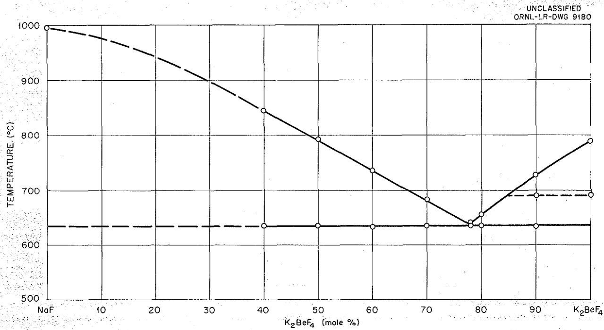  
Fig. 4.2. Thermal Data for the System NaF-K $_2$ BeF $_4$ .

# Solubility of $\mathsf{UF}_3$ in $\mathsf{BeF}_2$ -Bearing Compositions

Data on the solubility of $\mathsf{UF}_3$ in a number of $\mathsf{BeF}_2$ -bearing compositions were reported earlier. The composition (in mole %) designated 69 NaF-31 $\mathsf{BeF}_2$ in the previous work was actually 69 LiF-31 $\mathsf{BeF}_2$ . All the earlier data were obtained with nickel filters. In view of the greater stability of $\mathsf{UF}_3$ dissolved in LiF-NaF in copper containers (discussed below in this section under the heading "Reaction of $\mathsf{UF}_4$ with Uranium in Alkali Fluorides"), it seemed desirable to see whether more consistent data could be obtained in copper apparatus equipped with a bronze filter medium. The data obtained are shown in Table 4.2, together with some additional data obtained with LiF-BeF $_2$ mixtures in nickel apparatus. The uranium additions were made with $\mathsf{UF}_3$ and uranium metal or by adding large excesses of uranium metal to $\mathsf{UF}_4$ -bearing melts.

It is difficult to draw definite conclusions from such scattered data, but it is apparent that alloying of uranium with the nickel filters and containers

was not the sole cause of the poor reproducibility of the $\mathsf{UF}_3$ -solubility data obtained in nickel apparatus. The large amount of tetravalent uranium found in all the filtrates, regardless of valence form of the uranium added to the solvent, could be due to oxidizing impurities in the melt, disproportionation of $\mathsf{UF}_3$ , or a reaction between $\mathsf{UF}_3$ and the alkali fluoride or beryllium fluoride in the melt. Further experimentation will be required to determine the controlling factor in the production of $\mathsf{UF}_4$ in $\mathsf{BeF}_2$ -bearing compositions.

# CHEMICAL REACTIONS IN MOLTEN SALTS

L.G.Overholser G.M.Watson

Materials Chemistry Division

Equilibrium Reduction of $\mathsf{FeF}_2$ by $\mathsf{H}_2$ in $\mathsf{NaZrF}_5$

C. M. Blood

Materials Chemistry Division

An apparent equilibrium constant (mole fraction of dissolved species used as activity) of 5.7 at $800^{\circ}C$ was previously reported $^{14}$ for the reaction

$$
F e F _ {2} + H _ {2} \rightleftharpoons F e ^ {o} + 2 H F
$$

TABLE 4.2. SOLUBILITY OF ${\mathrm{{UF}}}_{3}$ IN ${\mathrm{{BeF}}}_{2}$ -BEARING COMPOSITIONS   

<table><tr><td rowspan="2">Solvent Composition</td><td rowspan="2">Temperature (°C)</td><td rowspan="2">Container Material</td><td rowspan="2">Uranium Added</td><td colspan="2">Analysis of Filtrate (wt %)</td></tr><tr><td>U3+</td><td>Total U</td></tr><tr><td rowspan="7">LiF·BeF2(69-31 mole %)</td><td>700</td><td>Nickel</td><td>UF3+ U</td><td>2.79</td><td>4.80</td></tr><tr><td>700</td><td>Nickel</td><td>UF4+ U</td><td>3.38</td><td>5.66</td></tr><tr><td>800</td><td>Nickel</td><td>UF3+ U</td><td>8.35</td><td>14.1</td></tr><tr><td>800</td><td>Nickel</td><td>UF4+ U</td><td>8.28</td><td>12.7</td></tr><tr><td>600</td><td>Copper</td><td>UF4+ U</td><td>0.46</td><td>3.12</td></tr><tr><td>700</td><td>Copper</td><td>UF3+ U</td><td>3.09</td><td>5.34</td></tr><tr><td>800</td><td>Copper</td><td>UF4+ U</td><td>5.02</td><td>12.7</td></tr><tr><td rowspan="6">NaF·BeF2(70-30 mole %)</td><td>600</td><td>Copper</td><td>UF3+ U</td><td>0.40</td><td>2.50</td></tr><tr><td>600</td><td>Copper</td><td>UF4+ U</td><td>0.19</td><td>7.05</td></tr><tr><td>700</td><td>Copper</td><td>UF3+ U</td><td>2.75</td><td>5.24</td></tr><tr><td>700</td><td>Copper</td><td>UF4+ U</td><td>4.82</td><td>10.1</td></tr><tr><td>800</td><td>Copper</td><td>UF3+ U</td><td>10.1</td><td>14.7</td></tr><tr><td>800</td><td>Copper</td><td>UF4+ U</td><td>12.2</td><td>19.1</td></tr></table>

when the materials were contained in a mild steel system. This value was obtained by passing hydrogen at different gas flow rates through the salt mixture containing $\mathsf{FeF}_2$ and measuring the corresponding partial pressure of HF in the effluent. An approach to the equilibrium partial pressure of HF was made by extrapolation to the slowest flow rate. As has been stated before,15 the extrapolation does not appear to be satisfactory.

In order to avoid this extrapolation, measurements made by using an equilibration technique, previously described,[16] have been continued. The method consists in bubbling a mixture of HF and $\mathsf{H}_2$ through the melt containing $\mathsf{FeF}_2$ in contact with iron until the HF concentrations of the influent and effluent streams are identical. At this time the concentration of $\mathsf{FeF}_2$ is determined by chemical analysis of samples of the melt withdrawn through a filtering tube.

The results of the most careful measurements performed to date by this method show $K_{x} = 5.2$ at a concentration of $\mathsf{FeF}_2$ corresponding to 6490 ppm

of iron. From all apparent indications, the approach to equilibrium in this instance was better than that for any previous measurement obtained by this technique. Unfortunately, the existence of equilibrium cannot be demonstrated with certainty, since the present equipment cannot provide a gaseous influent of constant composition for long periods of time. An alternate method of formation of $\mathsf{H}_2$ -HF mixtures of constant composition is presently being studied.

# Reduction of $\mathsf{UF}_4$ by Structural Metals

J.D.Redman

C. F. Weaver

Materials Chemistry Division

The techniques used for measuring the reduction of $\mathsf{UF}_4$ by $\mathsf{Cr}^{\circ}$ or $\mathsf{Fe}^{\circ}$ in molten fluorides were described in earlier reports.17 Equilibrium data for these reactions when the NaF $\cdot$ ZrF $_4$ compound,18

the NaF-LiF-KF eutectic, $^{19}$ or the NaF-ZrF $_4$ (53-47 mole %) mixture $^{20}$ was used as a reaction medium have also been presented. These studies have been continued with experiments in which NaF-LiF-ZrF $_4$ (22-55-23 mole %) was used as the reaction medium. A study of the reduction of UF $_4$ by vanadium metal with the NaF-LiF-KF eutectic as the solvent has been started, but no analytical data are yet available. Similar studies, planned for the near future, with metallic niobium, tantalum, and tungsten will be conducted in an attempt to demonstrate whether or not these metals are compatible with UF $_4$ dissolved in the NaF-LiF-KF eutectic at $800^{\circ}\mathrm{C}$ .

The results of some studies of the reduction of $\mathsf{UF}_4$ by $\mathsf{Cr}^{\circ}$ at 600 and $800^{\circ}\mathrm{C}$ with NaF-LiF-ZrF $_4$ (22-55-23 mole %) as the reaction medium are given in Table 4.3. In all these experiments 2 g of hy

TABLE 4.3. EQUILIBRIUM DATA FOR THE REACTION OF ${\mathrm{{UF}}}_{4}$ WITH ${\mathrm{{Cr}}}^{0}$ IN MOLTEN   
NaF-LiF-ZrFA(22-55-23 MOLE%)   
AT 600 AND $800^{\circ}C$   

<table><tr><td colspan="2">Conditions of Equilibration</td><td colspan="3">Analysis of Filtrate</td></tr><tr><td>Temperature (°C)</td><td>Time (hr)</td><td>Total U (wt %)</td><td>Total Cr* (ppm)</td><td>Total Ni (ppm)</td></tr><tr><td rowspan="8">600</td><td>3</td><td>8.6</td><td>580</td><td>40</td></tr><tr><td>3</td><td>8.5</td><td>540</td><td>30</td></tr><tr><td>3</td><td>8.8</td><td>430</td><td>15</td></tr><tr><td>3</td><td>8.9</td><td>680</td><td>30</td></tr><tr><td>5</td><td>8.9</td><td>650</td><td>15</td></tr><tr><td>5</td><td>8.8</td><td>460</td><td>35</td></tr><tr><td>5</td><td>8.6</td><td>450</td><td>115</td></tr><tr><td>5</td><td>8.6</td><td>560</td><td>40</td></tr><tr><td rowspan="4">800</td><td>3</td><td>9.4</td><td>720</td><td>15</td></tr><tr><td>3</td><td>9.1</td><td>690</td><td>20</td></tr><tr><td>5</td><td>8.5</td><td>810</td><td>15</td></tr><tr><td>5</td><td>8.7</td><td>800</td><td>15</td></tr></table>

*Blank of 250 ppm of chromium at $800^{\circ}\mathrm{C}$ .

drogen-fired chromium was reacted with 11.4 wt $\%$ UF (2.5 mole $\%$ ) dissolved in approximately $30\mathrm{g}$ of the NaF-LiF-ZrF mixture contained in nickel.

The averages for the chromium values given in Table 4.3 - 570 and 750 ppm at 600 and $800^{\circ}\mathrm{C}$ , respectively - are the lowest found for any of the reaction media studied. For comparison, chromium values at 600 and $800^{\circ}\mathrm{C}$ in $\mathrm{NaF\cdot ZrF_4}$ were 2250 and 2550 ppm; in $\mathrm{NaF\cdot ZrF_4}$ (53-47 mole %), 1750 and 2150 ppm; in $\mathrm{NaF\cdot LiF\cdot KF}$ (11.5-46.5-42 mole %), 1100 and 2700 ppm. Although the $\mathrm{UF_4}$ concentration was somewhat lower (2.5 compared with 4.0 mole %) in the recent experiments than in the previous experiments, this variable can account for only a small part of the difference found in chromium content. It seems more probable that the most important factor, for the $\mathrm{ZrF_4}$ -containing mixtures, is that with a decrease in $\mathrm{ZrF_4}$ concentration there is also a decrease in the activity of the $\mathrm{UF_4}$ because of increased complexing by the alkali fluorides. The results cannot be compared with those obtained in the NaF-LiF-KF eutectic, because virtually all the chromium is present as the trivalent form in the eutectic. As reported below, a large fraction of the chromium is divalent in the NaF-LiF-ZrF_4 mixture.

Data for the reaction of $\mathsf{UF}_4$ with $\mathsf{Fe}^{\circ}$ in nickel containers at 600 and $800^{\circ}\mathrm{C}$ with NaF-LiF-ZrF $_4$ (22-55-23 mole %) as the reaction medium are given in Table 4.4. In all these runs, 2 g of hydrogen-fired iron wire and approximately 30 g of the solvent containing 11.4 wt % (2.5 mole %) $\mathsf{UF}_4$ were employed.

The equilibrium iron values reported in Table 4.4 fall in the same general range as those found in the other reaction media. The one difference to be noted is that the iron values given in Table 4.4 are slightly higher at 800 than at $600^{\circ}\mathrm{C}$ , whereas in the $\mathrm{NaF - ZrF_4}$ mixtures and the NaF-LiF-KF eutectic slightly higher values were observed at 600 than at $800^{\circ}\mathrm{C}$ .

# Stability of Chromium and Iron Fluorides in Various Molten Fluorides

J.D.Redman C.F.Weaver

Materials Chemistry Division

Previous experiments indicated that $\mathsf{CrF}_2$ was not stable in the eutectic mixture NaF-LiF-KF (11.5-46.5-42 mole %) but that when the solution was equilibrated at 600 or $800^{\circ}\mathsf{C}$ in nickel apparatus the product was mainly $\mathsf{Cr}^{3+}$ . Additional

TABLE 4.4. EQUILIBRIUM DATA FOR THE REACTION OF ${\mathrm{{UF}}}_{4}$ WITH ${\mathrm{{Fe}}}^{ \circ  }$ IN MOLTEN NaF-LiF-ZrF ${}_{4}$ (22-55-23 MOLE %) AT 600 AND ${800}^{ \circ  }\mathrm{C}$   

<table><tr><td colspan="2">Conditions of Equilibration</td><td colspan="3">Analysis of Filtrate</td></tr><tr><td>Temperature (℃)</td><td>Time (hr)</td><td>Total U (wt %)</td><td>Total Fe* (ppm)</td><td>Total Ni (ppm)</td></tr><tr><td rowspan="4">600</td><td>3</td><td>7.9</td><td>460</td><td>30</td></tr><tr><td>3</td><td>8.4</td><td>420</td><td>35</td></tr><tr><td>5</td><td>8.6</td><td>375</td><td>35</td></tr><tr><td>5</td><td>8.5</td><td>440</td><td>30</td></tr><tr><td rowspan="6">800</td><td>3</td><td>8.9</td><td>700</td><td>30</td></tr><tr><td>3</td><td>8.4</td><td>650</td><td>70</td></tr><tr><td>5</td><td>8.6</td><td>660</td><td>25</td></tr><tr><td>5</td><td>8.6</td><td>540</td><td>25</td></tr><tr><td>5</td><td>8.5</td><td>630</td><td>45</td></tr><tr><td>5</td><td>8.5</td><td>580</td><td>55</td></tr></table>

*Blank of 100 ppm of Fe at $800^{\circ}\mathrm{C}$ .

data that indicate the stability of $\mathsf{CrF}_3$ in this solvent in nickel and Inconel equipment are presented in Table 4.5. The data suggest that $\mathsf{Cr}^{3+}$ under these conditions is completely stable to reduction by $\mathsf{Ni}^{\circ}$ but that $\mathsf{Cr}^{\circ}$ (and possibly $\mathsf{Fe}^{\circ}$ ) from the Inconel reacts with the $\mathsf{CrF}_3$ . Whether equilibrium has been achieved in the latter case is not known. Quantitatively, however, the solubility of $\mathsf{CrF}_3$ is considerably less than was indicated in previous studies for which shorter equilibration times were used. It does not seem likely that the temperature measurements are sufficiently in error to explain the discrepancy.

Data obtained by adding $\mathsf{CrF}_2$ or $\mathsf{CrF}_3$ to an NaF-ZrF $_4$ (53-47 mole %) mixture, equilibrating in nickel apparatus for 5 hr at 600 or $800^{\circ}\mathrm{C}$ , filtering, and analyzing the product chemically are presented in Table 4.6. Similar values for $\mathsf{CrF}_2$ or $\mathsf{CrF}_3$ additions to an NaF-LiF-ZrF $_4$ (22-55-23 mole %) mixture are presented in Table 4.7.

It is evident from these tables that $\mathsf{CrF}_2$ is not entirely stable in either of these solvents, although, when $\mathsf{CrF}_2$ is the added constituent, the concentration of $\mathsf{Cr}^{2+}$ is generally higher than the

TABLE 4.5. STABILITY OF ${\mathrm{{CrF}}}_{3}$ IN MOLTEN NaF-LiF-KF (11.5-46.5-42 MOLE %) AT 600 AND ${800}^{ \circ  }\mathrm{C}$   

<table><tr><td colspan="2">Conditions of Equilibration</td><td rowspan="2">CrF3 Added (wt % Cr)</td><td colspan="3">Analysis of Filtrate</td></tr><tr><td>Temperature (°C)</td><td>Time (hr)</td><td>Cr2+ (ppm)</td><td>Total Cr (wt %)</td><td>Total Ni (ppm)</td></tr><tr><td rowspan="4">600</td><td>12</td><td>4.8</td><td>5</td><td>0.24</td><td>110</td></tr><tr><td>12</td><td>4.8</td><td>5</td><td>0.24</td><td>65</td></tr><tr><td>12</td><td>4.8</td><td>10</td><td>0.23</td><td>25</td></tr><tr><td>12</td><td>4.8</td><td>30</td><td>0.35</td><td>115</td></tr><tr><td rowspan="6">800</td><td>12</td><td>4.8</td><td>5</td><td>2.9</td><td>65</td></tr><tr><td>12</td><td>4.8</td><td>5</td><td>2.9</td><td>85</td></tr><tr><td>12</td><td>4.8</td><td>20</td><td>3.1</td><td>40</td></tr><tr><td>12</td><td>4.8</td><td>40</td><td>3.4</td><td>40</td></tr><tr><td>5</td><td>3.8</td><td>600*</td><td>3.5</td><td>145</td></tr><tr><td>5</td><td>3.8</td><td>1000*</td><td>4.0</td><td>30</td></tr></table>

*Inconel container used, all other runs in nickel containers.

TABLE 4.6. STABILITY OF CHROMIUM FLUORIDES IN NaF-ZrF ${}_{4}$ (53-47 MOLE %) AT 600 AND ${800}^{ \circ  }\mathrm{C}$   

<table><tr><td rowspan="2">Equilibration Temperature (°C)</td><td rowspan="2">Chromium Fluoride Added (wt % Cr)</td><td colspan="3">Analysis of Filtrate</td></tr><tr><td>Cr2+ (wt %)</td><td>Total Cr (wt %)</td><td>Total Ni (ppm)</td></tr><tr><td rowspan="2">600</td><td>1.0 Cr2+</td><td></td><td>0.46</td><td>80</td></tr><tr><td>1.0 Cr2+</td><td>0.40</td><td>0.60</td><td>50</td></tr><tr><td rowspan="4">800</td><td>0.88 Cr2+</td><td>0.58</td><td>0.75</td><td>40</td></tr><tr><td>0.88 Cr2+</td><td>0.30</td><td>0.86</td><td>65</td></tr><tr><td>12.0 Cr2+</td><td>9.1</td><td>11.7</td><td>305</td></tr><tr><td>12.0 Cr2+</td><td>9.2</td><td>11.6</td><td>270</td></tr><tr><td rowspan="2">600</td><td>0.1 Cr3+</td><td>0.08</td><td>0.08</td><td>70</td></tr><tr><td>0.1 Cr3+</td><td>0.05</td><td>0.08</td><td>70</td></tr><tr><td rowspan="2">800</td><td>4.0 Cr3+</td><td>1.5</td><td>3.6</td><td>280</td></tr><tr><td>4.0 Cr3+</td><td>1.7</td><td>3.6</td><td>285</td></tr></table>

TABLE 4.7. STABILITY OF CHROMIUM FLUORIDES IN NaF-LiF-ZrF ${}_{4}$ (22-55-23 MOLE %) AT 600 AND ${800}^{ \circ  }\mathrm{C}$   

<table><tr><td rowspan="2">Equilibration Temperature (°C)</td><td rowspan="2">Chromium Fluoride Added (wt % Cr)</td><td colspan="3">Analysis of Filtrate</td></tr><tr><td>Cr3+(wt %)</td><td>Total Cr(wt %)</td><td>Total Ni(ppm)</td></tr><tr><td rowspan="4">600</td><td>1.0 Cr2+</td><td>0.61</td><td>0.78</td><td>1</td></tr><tr><td>1.0 Cr2+</td><td>0.59</td><td>0.97</td><td>1</td></tr><tr><td>2.0 Cr2+</td><td>1.01</td><td>1.91</td><td>155</td></tr><tr><td>2.0 Cr2+</td><td>0.99</td><td>2.15</td><td>30</td></tr><tr><td rowspan="6">800</td><td>1.0 Cr2+</td><td>0.87</td><td></td><td>15</td></tr><tr><td>1.0 Cr2+</td><td>0.65</td><td>0.95</td><td>1</td></tr><tr><td>5.0 Cr2+</td><td>3.3</td><td>4.5</td><td>40</td></tr><tr><td>5.0 Cr2+</td><td>3.1</td><td>4.6</td><td>25</td></tr><tr><td>1.0 Cr3+</td><td>0.37</td><td>1.05</td><td>200</td></tr><tr><td>4.0 Cr3+</td><td>1.2</td><td>4.2</td><td>160</td></tr></table>

concentration of $\mathbf{Cr}^{3+}$ . When $\mathbf{Cr}^{3+}$ is added, appreciable reduction to the divalent state is observed, even though no $\mathbf{Ni}^{2+}$ appears in the filtrate and no other reducing agent is supposed to be present. Further experimentation will be required before conclusions can be reached regarding the behavior of either $\mathbf{CrF}_2$ or $\mathbf{CrF}_3$ in these solvents.

Data obtained by adding $\mathsf{FeF}_2$ or $\mathsf{FeF}_3$ to an NaF-ZrF $_4$ (53-47 mole %) mixture, equilibrating in nickel apparatus for 5 hr at 600 or $800^{\circ}\mathsf{C}$ , filtering, and analyzing the product chemically are presented in Table 4.8. Similar values for $\mathsf{FeF}_2$ and $\mathsf{FeF}_3$ additions to an NaF-LiF-ZrF $_4$ (22-55-23 mole %) mixture are presented in Table 4.9.

TABLE 4.8. STABILITY OF ${\mathrm{{FeF}}}_{2}$ AND ${\mathrm{{FeF}}}_{3}$ IN NaF-ZrF ${}_{4}$ (53-47 MOLE %) AT 600 AND ${800}^{ \circ  }\mathrm{C}$   

<table><tr><td rowspan="2">EquilibrationTemperature(°C)</td><td rowspan="2">IronFluoride Added(wt % Fe)</td><td colspan="3">Analysis of Filtrate</td></tr><tr><td>Fe2+(wt %)</td><td>TotalFe(wt %)</td><td>TotalNi(ppm)</td></tr><tr><td rowspan="4">600</td><td>0.6 Fe2+</td><td>0.15</td><td>0.25</td><td>65</td></tr><tr><td>0.6 Fe2+</td><td></td><td>0.18</td><td>55</td></tr><tr><td>1.0 Fe2+</td><td>0.06</td><td>0.36</td><td>125</td></tr><tr><td>1.0 Fe2+</td><td></td><td>0.24</td><td>60</td></tr><tr><td rowspan="4">800</td><td>1.0 Fe2+</td><td>0.63</td><td>1.29</td><td>115</td></tr><tr><td>1.0 Fe2+</td><td>0.63</td><td>1.17</td><td>80</td></tr><tr><td>6.0 Fe2+</td><td>4.9</td><td>5.9</td><td>340</td></tr><tr><td>6.0 Fe2+</td><td>5.2</td><td>6.2</td><td>150</td></tr><tr><td rowspan="2">600</td><td>0.4 Fe3+</td><td>0.18</td><td>0.25</td><td>500</td></tr><tr><td>0.4 Fe3+</td><td>0.17</td><td>0.21</td><td>600</td></tr><tr><td rowspan="2">800</td><td>4.0 Fe3+</td><td>3.0</td><td>3.5</td><td>14,800</td></tr><tr><td>4.0 Fe3+</td><td>3.4</td><td>3.9</td><td>22,300</td></tr></table>

TABLE 4.9. STABILITY OF ${\mathrm{{FeF}}}_{2}$ AND ${\mathrm{{FeF}}}_{3}$ IN NaF-LiF-ZrF ${}_{4}$ (22-55-23 MOLE %) AT 600 AND ${800}^{ \circ  }\mathrm{C}$   

<table><tr><td rowspan="3">Equilibration
Temperature
(℃)</td><td rowspan="3">Iron
Fluoride Added
(wt % Fe)</td><td colspan="3">Analysis of Filtrate</td></tr><tr><td>Fe2+</td><td>Total
Fe</td><td>Total
Ni</td></tr><tr><td>(wt %)</td><td>(wt %)</td><td>(ppm)</td></tr><tr><td rowspan="2">600</td><td>1.0 Fe2+</td><td>0.83</td><td>1.04</td><td>65</td></tr><tr><td>1.0 Fe2+</td><td>0.80</td><td>1.14</td><td>90</td></tr><tr><td rowspan="2">800</td><td>1.0 Fe2+</td><td>0.90</td><td>1.05</td><td>85</td></tr><tr><td>1.0 Fe2+</td><td>0.79</td><td>1.00</td><td>65</td></tr><tr><td rowspan="2">600*</td><td>7.2 Fe2+</td><td>6.2</td><td>6.9</td><td>770</td></tr><tr><td>7.2 Fe2+</td><td>6.2</td><td>7.1</td><td>730</td></tr><tr><td rowspan="2">800</td><td>11.4 Fe2+</td><td>10.7</td><td>12.9</td><td>700</td></tr><tr><td>11.4 Fe2+</td><td>10.2</td><td>13.5</td><td>630</td></tr><tr><td rowspan="2">600</td><td>1.7 Fe3+</td><td>1.36</td><td>1.75</td><td>7,900</td></tr><tr><td>1.7 Fe3+</td><td>1.40</td><td>1.71</td><td>8,000</td></tr><tr><td rowspan="2">800</td><td>9.2 Fe3+</td><td>4.3</td><td>9.2</td><td>55,000</td></tr><tr><td>9.2 Fe3+</td><td>4.6</td><td>8.9</td><td>37,000</td></tr></table>

From the results given in Tables 4.8 and 4.9, it is seen that roughly $80\%$ of the $\mathsf{FeF}_2$ added remains as $\mathsf{Fe}^{2+}$ , with the remainder apparently being oxidized to $\mathsf{Fe}^{3+}$ , although no logical mechanism for the oxidation can be postulated. From the results for the runs in which $\mathsf{FeF}_3$ was added, it is evident, from the increase in the nickel content of the system, that the nickel container reduces $\mathsf{Fe}^{3+}$ to $\mathsf{Fe}^{2+}$ . No satisfactory balance between $\mathsf{Fe}^{2+}$ and $\mathsf{Ni}^{2+}$ is shown by these data; it is therefore possible that the reaction is not the simple one proposed. Some rather extensive experimental work would be required to obtain an insight into the possible equilibria involved.

# Experimental Preparation of Pure Fluorides

B.J.Stum

Materials Chemistry Division

Preparation of $\mathsf{NH}_4\mathsf{SnF}_3$ In order to produce about $500g$ of $\mathsf{NH}_4\mathsf{SnF}_3$ essentially free of chloride ion, stannous hydroxide was precipitated by the addition of aqueous ammonia to a hot aqueous solution of $\mathsf{SnCl}_2$ in the presence of $\mathsf{Sn}^{\circ}$ The precipitate was washed by decantation, and the raffinate was removed by centrifugation. After dissolution of the precipitate in aqueous HF, the precipitation, washing, and centrifugation were repeated. The precipitate was then treated with the stoichiometric quantity of $\mathsf{NH}_4\mathsf{HF}_2$ and was dissolved in the minimum quantity of aqueous HF. Crystals of $\mathsf{NH}_4\mathsf{SnF}_3$ were recovered by partial evaporation of this solution.

Compounds of $\mathbf{ZrF_4}$ with $\mathbf{CrF}_2$ , $\mathbf{NiF}_2$ , and $\mathbf{FeF}_2$ . Evidence from various experiments has indicated that the simple fluorides of chromium, iron, or nickel are not the primary phase when solutions of these materials in NaF-ZrF4 mixtures are cooled; also, petrographic and x-ray examinations of such cooled melts show the solid phases recovered to be quite similar. It was believed that primary phases were complex compounds of $\mathbf{ZrF}_4$ with the structural metal fluorides. Accordingly, $\mathbf{ZrF}_4$ was heated at $950^{\circ}\mathrm{C}$ in sealed nickel capsules with each of the compounds $\mathbf{CrF}_3$ , $\mathbf{CrF}_2$ , $\mathbf{FeF}_2$ , and $\mathbf{NiF}_2$ in 2:1, 1:1, and 1:2 stoichiometric proportions. The $\mathbf{CrF}_3$ did not react with $\mathbf{ZrF}_4$ , and no evidence of compound formation was observed in the three proportions tested. All the $\mathbf{NiF}_2$ - $\mathbf{ZrF}_4$ fusions showed compound formation. When 2 moles of $\mathbf{NiF}_2$ per mole of $\mathbf{ZrF}_4$ was used, the compound and excess $\mathbf{NiF}_2$ were observed; when the molar

ratio was reversed, $\mathsf{ZrF}_4$ and the compound appeared. The compound seemed to be $\mathsf{NiF}_2\cdot \mathsf{ZrF}_4,$ and the constancy of cell size with composition of the mixture indicated very limited or no solid solution of either $\mathsf{NiF}_2$ or $\mathsf{ZrF}_4$ in the compound.

The $\mathsf{ZrF}_4\cdot \mathsf{FeF}_2$ fusions showed a compound that was isomorphous with $\mathsf{NiF}_2\cdot \mathsf{ZrF}_4$ but had a slightly larger cell size. The compound $\mathsf{FeF}_2\cdot \mathsf{ZrF}_4$ , however, unlike its $\mathsf{NiF}_2\cdot \mathsf{ZrF}_4$ counterpart, forms solid solutions with $\mathsf{ZrF}_4$ ; the cell size of the compound appeared to be lowered by the $\mathsf{ZrF}_4$ . When the $\mathsf{FeF}_2$ was in excess (2 moles of $\mathsf{FeF}_2$ to 1 of $\mathsf{ZrF}_4$ ), an additional phase, as yet unidentified, was observed; the unchanged cell size of the $\mathsf{FeF}_2\cdot \mathsf{ZrF}_4$ present indicated virtually no solid solution of these compounds.

Petrographic examination indicated that the compound $\mathrm{CrF}_2\cdot \mathrm{ZrF}_4$ existed and that it was apparently isomorphous with its $\mathrm{FeF}_2$ and $\mathrm{NiF}_2$ counterparts. No x-ray diffraction data and no observations of solid solution formation are yet available. Because of the value of these studies to the interpretation of some electrochemical studies (also reported in this section), these studies will be extended to include systems containing NaF, as well as $\mathrm{ZrF}_4$ .

# Reaction of UF4 with Uranium in Alkali Fluorides

C.J.Barton

B. H. Clampitt

Materials Chemistry Division

It was previously reported[21] that the reduction of $\mathsf{UF}_4$ in the NaF-LiF (40-60 mole %) eutectic with metallic uranium was more nearly complete in copper than in nickel apparatus. In those experiments the copper apparatus was equipped with a filter medium of bronze (82% Cu, 16% Sn, 2% Zn). The experiments were recently repeated, with a filter medium of pure copper being used; the data from these experiments are presented in Table 4.10. The higher $\mathsf{UF}_3 / \mathsf{UF}_4$ ratios obtained in these experiments suggest that some disproportionation of $\mathsf{UF}_3$ occurred on contact of the melt with the bronze filters.

However, when the reduction of $\mathsf{UF}_4$ with excess $U^{\circ}$ was carried out with the NaF-KF-LiF eutectic (11.5-42-46.5 mole %) as the solvent, the reaction yielded $\mathsf{U}^{3+}/\mathsf{total}$ U ratios of 0.55 to 0.7 regardless of whether copper or nickel containers

TABLE 4.10. REDUCTION OF NaF-LiF-UF ${}_{4}$ WITH 100% EXCESS URANIUM IN ALL-COPPER APPARATUS AT ${750}^{ \circ  }\mathrm{C}$   

<table><tr><td colspan="2">Analysis of Filtrate (wt %)</td><td rowspan="2">Theoretical* U3+ (wt %)</td><td rowspan="2">Ratio of U3+ to Total U</td></tr><tr><td>U3+</td><td>Total U</td></tr><tr><td>24.9</td><td>26.6</td><td>27.1</td><td>0.93</td></tr><tr><td>24.5</td><td>25.0</td><td>25.2</td><td>0.98</td></tr></table>

*Calculated by assuming complete reduction of UF4 with U°.

and filters were used. Examination of the interior of the copper containers used in these experiments showed the existence of a mirrorlike metallic coating on the copper that had been in contact with the melt. The thickness of the coating appeared to increase with time and temperature; x-ray diffraction examination of this material showed it to be a mixture of copper and $\mathsf{UCu}_5$ .

The copper in the uraniferous alloy oxidizes quite rapidly in contact with moist air. Tamished specimens showed the presence of copper oxides, in addition to $\mathsf{UCu}_{5}$ , but no $\mathsf{UO}_2$ lines could be found in the x-ray diffraction pattern.

Alloying of this type was also observed when NaF-KF-LiF mixtures were heated with either $\mathsf{U}\mathsf{F}_3$ or with metallic uranium. In both cases, analysis of the filtrate obtained at the end of the equilibration period showed the presence of both $\mathsf{U}^{3+}$ and $\mathsf{U}^{4+}$ in the melt; disproportionation of $\mathsf{U}\mathsf{F}_3$ seems to have been involved in the formation of the $\mathsf{UCu}_5$ alloy. No alloying was observed when only $\mathsf{U}\mathsf{F}_4$ was present in the melt.

No adequate explanation has been found, to date, for the fact that alloying of uranium with copper does not occur with NaF-LiF-UF3 mixtures or with BeF2 melts containing UF3. Experiments are continuing in an effort to account for the peculiar behavior of the KF-containing melts.

# Reaction of Uranium Metal with Alkali Fluoride Mixtures

B. H. Clampitt C. J. Barton  
Materials Chemistry Division

The reaction of metallic uranium with the NaF-KF-LiF eutectic at high temperatures, reported previously,22 has been shown to occur at $650^{\circ}\mathrm{C}$

a similar reaction occurs at $750^{\circ}C$ when the NaF-LiF eutectic is used. In the recent experiments the purified salt mixture and metallic uranium were placed in a nickel apparatus, and, after formation and decomposition of $\mathsf{UH}_3$ to subdivide the uranium metal, the temperature was raised to the desired value. The contents of the apparatus were agitated by sparging with helium. An air-cooled condenser maintained at slightly above room temperature was included in the exit gas line to condense any alkali metal or alkali fluoride swept out by the flowing helium. The trapped material was dissolved in water and analyzed chemically for potassium, sodium, lithium, fluorine, and total alkalinity.

The results obtained with the NaF-KF-LiF eutectic and with the NaF-LiF eutectic are presented in Table 4.11. It is obvious from the data that most of the trapped material was alkali metal; less than $5\%$ of the condensate was alkali fluoride. Also, both the quantity of alkali metal evolved and the uranium content of the melt increased with time in a quite regular manner. As was expected, the reaction produced more $\mathsf{K}^{\circ}$ than $\mathsf{Na}^{\circ}$ (when both were constituents of the melt) and more $\mathsf{Na}^{\circ}$ than $\mathsf{Li}^{\circ}$ . However, the amount of alkali metal collected did not, by a large factor, correspond to the amount of uranium oxidized. It appears certain that some condensation of the alkali metals occurred in cooler portions of the apparatus before the condenser was reached. The apparatus is being remodeled to eliminate this possibility and to demonstrate the stoichiometry of the process.

The presence of $\mathsf{UF}_4$ in these melts suggests that reactions of the type

$$
\mathrm {U F} _ {3} + \mathrm {K F} \longrightarrow \mathrm {U F} _ {4} + \mathrm {K} ^ {\circ}
$$

occur under these nonequilibrium conditions. The improved apparatus will be used to evaluate this possibility.

# Metal-Salt Equilibrium

D. G. Hill S. Cantor  
Materials Chemistry Division

Studies of the reactions between molten fluorides and metals have included some exploratory work on the equilibrium between sodium-potassium alloy

TABLE 4.11. REACTION OF URANIUM METAL AND NaF-KF-LiF AND NaF-LiF EUTECTICS   

<table><tr><td rowspan="2">Reaction Time (hr)</td><td colspan="2">Analysis of Filtrate (wt %)</td><td colspan="5">Analysis of Trapped Material</td></tr><tr><td>U3+</td><td>Total U</td><td>K (mg)</td><td>Na (mg)</td><td>Li (mg)</td><td>F (mg)</td><td>Total Alkalinity (meq)</td></tr><tr><td colspan="8">NaF-KF-LiF Eutectic at 650°C</td></tr><tr><td>2</td><td>1.50</td><td>2.00</td><td>*</td><td>*</td><td>*</td><td></td><td>1.72</td></tr><tr><td>3</td><td>3.25</td><td>4.08</td><td>126</td><td>4.8</td><td>0.02</td><td>1.05</td><td>3.50</td></tr><tr><td>4</td><td>2.29</td><td>5.20</td><td>142</td><td>6.9</td><td>0.03</td><td>2.55</td><td>4.10</td></tr><tr><td>5</td><td>3.34</td><td>5.07</td><td>191</td><td>8.6</td><td>0.07</td><td>1.65</td><td>5.79</td></tr><tr><td>7</td><td>5.91</td><td>10.8</td><td>245</td><td>11.8</td><td>0.18</td><td>3.77</td><td>7.12</td></tr><tr><td>14</td><td>5.25</td><td>11.5</td><td>340</td><td>10.5</td><td>0.38</td><td>2.75</td><td>9.24</td></tr><tr><td colspan="8">NaF-LiF Eutectic** at 750°C</td></tr><tr><td>2</td><td>1.15</td><td>2.30</td><td>0.11</td><td>24</td><td>0.07</td><td>0.40</td><td>0.96</td></tr><tr><td>5</td><td>1.40</td><td>1.85</td><td>0.29</td><td>75</td><td>0.04</td><td>0.32</td><td>3.91</td></tr><tr><td>7½</td><td>2.12</td><td>3.83</td><td>0.49</td><td>134</td><td>0.15</td><td>0.50</td><td>6.13</td></tr><tr><td>15</td><td>4.22</td><td>5.40</td><td>1.63</td><td>257</td><td>0.15</td><td>1.30</td><td>11.9</td></tr></table>

*Since considerable amounts of alkali fluorides were found in the trapped material, the results of the analyses are not accurate enough for reporting; however, it is felt that the contaminants did not affect the total alkalinity determination appreciably.   
**This eutectic was found, by analysis, to contain 0.18% K.

and NaF-KF melts at $800^{\circ}\mathrm{C}$ . Samples of purified potassium metal and NaF were loaded into a hydrogen-fired nickel capsule in a helium atmosphere. After a welded capsule had been held at $800^{\circ}\mathrm{C}$ for several hours, it was quenched and then opened under an atmosphere of helium. Samples of the metal phase were easy to obtain in that they could be poured without difficulty into a test tube having a rubber stopper and a stopcock. A good sample of the salt phase was much more difficult to obtain, because droplets of metal clung tenaciously to it.

A more certain separation of the phases was obtained by evacuating sealed test tubes that had been filled in a helium atmosphere with samples of each phase and allowing the evacuated tubes to partially fill with anhydrous isopropyl alcohol. The alcohol reacted with the metal but not with the salt. Since the salts were insoluble in the isopropyl alcohol, the alcohol fraction was filtered and analyzed to give an approximation of the $\mathrm{Na}^{\circ} / \mathrm{K}^{\circ}$ ratio, and the residue was dissolved

in water to give a water fraction that was analyzed for the NaF/KF ratio. Results for the one experiment which was carried to completion are presented in Table 4.12.

On the assumption that quenching effectively froze the $800^{\circ}\mathrm{C}$ equilibrium and that no significant exchange occurred during the short exposure of the salt to isopropyl alcohol, the results in Table 4.12 lead to an equilibrium constant, based on mole fractions of salt in the salt phase and metal in the metal phase, of

$$
K _ {x} = \frac {[ N a ]}{[ K ]} \frac {[ K F ]}{[ N a F ]} = 0. 2.
$$

This compares with the value of 0.29 obtained by Rinck²³ and the value of $0.5 \pm 0.3$ based on standard free energy estimates and ideal activities. It was noted that the salt associated with the metal phase, presumably that salt which was dissolved in the metal at $800^{\circ}\mathrm{C}$ , contained much

TABLE 4.12. ANALYSES FOR THE EQUILIBRIUM $\mathrm{K} + \mathrm{{NaF}} \rightleftharpoons  \mathrm{{KF}} + \mathrm{{Na}}$   

<table><tr><td></td><td colspan="2">Metal Phase (meq)</td><td colspan="2">Salt Phase (meq)</td></tr><tr><td></td><td>Na</td><td>K</td><td>Na</td><td>K</td></tr><tr><td>Alcohol fraction</td><td>1.67</td><td>3.42</td><td>0.26</td><td>0.52</td></tr><tr><td>Water fraction</td><td>1.78</td><td>0.05</td><td>3.22</td><td>1.36</td></tr></table>

more NaF than KF; this probably reflects a weakness in the sampling, the separation, or the analysis, since KF has been shown to be ten times $^{24}$ more soluble in $K^{\circ}$ than NaF is in Na $^{\circ}$ . The ratio of salts in the metal phase did not affect the value of $K_{x'}$ since the salt ratio was based on analysis of the water fraction of the salt phase.

# PRODUCTION OF PURIFIED FLUORIDES

G. J. Nessle

F. F. Blankenship

G.M.Watson

Materials Chemistry Division

# Recovery of Contaminated Fuel for Re-use

J. E. Eorgan

J.P.Blakely

Materials Chemistry Division

Fuel used for testing reactor components at ORNL and at Pratt & Whitney Aircraft is expected to become available for reprocessing and re-use at the rate of 2000 to 3000 lb per month. If this material is discharged from the testing equipment in a manner that will minimize oxidation and hydrolysis, the major contaminant will be $\mathsf{CrF}_2$ . If the $\mathsf{CrF}_2$ can be removed before the material is charged to the routine processing cycle, it is felt that reclaiming the material for re-use would be feasible. The present high price of $\mathsf{ZrF}_4$ makes reclamation economically attractive.

The feasibility of removing $\mathrm{CrF}_2$ from NaF $\mathrm{ZrF}_4$ - $\mathrm{UF}_4$ mixtures by treatment of the melt with metallic zirconium and subsequent filtration has been demonstrated on a 5-lb scale, as described below. Accordingly, apparatus is being assembled for treating 750 to 1000 lb of reclaimed fuel with zirconium metal and for filtration of the reduced melt directly into the 250-lb production apparatus.

# Removal of $\mathsf{CrF}_2$ from NaF-ZrF4-UF4 Mixtures

F. L. Daley

Materials Chemistry Division

The standard hydrofluorination-hydrogenation method for the purification of fluoride mixtures will remove $\mathsf{NiF}_2$ and $\mathsf{FeF}_2$ by reduction of these materials to the metals, but it is largely ineffective in removing $\mathsf{CrF}_2$ . Accordingly, if the materials charged to the processing plant contain appreciable concentrations of $\mathsf{CrF}_2$ , an additional processing step must be included. Since the raw materials $\mathsf{NaF}$ , $\mathsf{ZrF}_4$ , and $\mathsf{UF}_4$ contain only traces of $\mathsf{CrF}_2$ , this contamination is not a problem in the production of virgin fuel. However, the fuel materials that will be available for reprocessing after having been used in engineering test units at ORNL and at Pratt & Whitney will contain $\mathsf{CrF}_2$ as the major contaminant.

If the used material is stored in contact with air, considerable amounts of $\mathsf{ZrO}_2$ and/or $\mathsf{ZrOF}_2$ will be formed by hydrolysis when it is reheated, and these compounds could also cause trouble in the reprocessing steps. It is possible, however, to handle and to store the material so that such hydrolysis is negligibly small. In that event the only contaminant present that would not be removed by the normal processing procedure would be the $\mathsf{CrF}_2$ , which would probably be present to the extent of 500 to 1500 ppm chromium.

To achieve nearly quantitative reduction of $\mathsf{CrF}_2$ to $\mathsf{Cr}^{\circ}$ , a considerable fraction of the $\mathsf{UF}_4$ must be reduced to $\mathsf{UF}_3$ . Since the solubility of $\mathsf{UF}_3$ in NaF-ZrF $_4$ melts is relatively low, even at $800^{\circ}\mathsf{C}$ , the amount of reductant must be closely controlled. If this reduction is performed in the standard production equipment, the subsequent hydrofluorination merely reoxidizes the $\mathsf{UF}_3$ to $\mathsf{UF}_4$ and redissolves the $\mathsf{Cr}^{\circ}$ as $\mathsf{CrF}_2$ ; accordingly, the reduction must be accomplished in auxiliary equipment, and the reduced melt must be filtered into the production equipment.

Two experiments were performed on 3-kg batches of purified NaF-ZrF $_4$ -UF $_4$ mixture to test the feasibility of these operations on oxide-free material. The batches consisted of NaF-ZrF $_4$ -UF $_4$ (50.8-45.2-4 mole %) mixed and contaminated with 2 wt % CrF $_2$ (11,500 ppm Cr $^{+ + }$ ) and zirconium metal chips of the desired weight. For the reduction step the charges were placed in unlined nickel reactors, heated, held for 3 hr at $800^{\circ}\mathrm{C}$

with continuous helium sparging, and then transferred through filters into standard hydrofluorination equipment. The hydrofluorination step and subsequent hydrogen reduction were carried out in graphite-lined nickel receivers.

For each experiment, two samples were submitted for analysis. One represented the reduced and filtered material; the other sample was representative of the same salt after hydrofluorination and hydrogenation. The results of the analyses are summarized in Table 4.13.

These results indicate that, in the absence of oxyfluorides and oxides, high concentrations of $\mathsf{Cr}^{+ + }$ may be substantially reduced from molten NaF-ZrF4-UF4 mixtures by the addition of zirconium metal. Furthermore, the loss of uranium because of the insolubility of UF3 is negligible. As was shown previously,25 the concentration of $\mathsf{Cr}^{+ + }$ remaining in the filtrate is a function of the ratio of U3+/U4+ obtained by the particular excess of zirconium used. The concentrations of $\mathsf{Cr}^{+ + }$ obtained in the two experiments are lower than those predicted from equilibrium calculations, for which a $K_{x}$ of $4\times 10^{-4}$ was used, if the CrO is assumed to be at unit activity. This assumption may not be justified in view of the possibility of the formation of chromium-zirconium compounds. Sufficient zirconium to produce 1.0 mole % UF3 reduced the $\mathsf{Cr}^{+ + }$ concentration to 100 ppm, with

negligible uranium loss. This amount of zirconium appears to be adequate for similar NaF-ZrF4-UF4 mixtures.

# Effect of $\mathsf{ZrO}_2$ in Fuel Preparation

F. L. Daley

Materials Chemistry Division

Since $\mathsf{ZrO}_2$ is expected to be a common contaminant in commercial $\mathsf{ZrF}_4$ , studies have been made in order to ascertain the efficiency of conversion of $\mathsf{ZrO}_2$ to $\mathsf{ZrF}_4$ in the present equipment. Appropriate 5-lb mixtures of $\mathsf{NaF-ZrF}_4$ - $\mathsf{ZrO}_2$ - $\mathsf{UF}_4$ which would yield, after complete hydrofluorination, 50 mole % NaF, 46 mole % $\mathsf{ZrF}_4$ , and 4 mole % $\mathsf{UF}_4$ were prepared. A maximum of 10 wt % $\mathsf{ZrO}_2$ was used. The samples were hydrofluorinated in the usual manner at $800^{\circ}\mathsf{C}$ , and the exit gases were periodically sampled by absorption of $\mathsf{H}_2\mathsf{O}$ and HF in pyridine. The resulting liquid was analyzed for fluoride and water. These analyses, though rather erratic during early stages of treatment, indicated that the hydrofluorination efficiency was not greater than $20\%$ with the agitation possible in the equipment used.

If only $20\%$ efficiency were obtained in the production plant, a 50-hr hydrofluorination period would be required for complete conversion of a 100-kg batch containing $10\% \mathrm{ZrO}_2$ . Such a prolonged period is quite impractical. It is obvious that $\mathrm{ZrO}_2$ contamination in the $\mathrm{ZrF}_4$ must be kept to a low figure if high throughput of fuel that meets specifications is to be maintained.

Initial Mixture: Total U, 8.63 wt % (4 mole %); Cr++ (ppm), 11,500

TABLE 4.13. CHROMIUM AND URANIUM CONCENTRATIONS IN FILTRATE AFTER REDUCTION WITH ZIRCONIUM METAL OF NaF-ZrF $_4$ -UF $_4$ (50.8-45.2-4 MOLE %) CONTAINING 2 wt % CrF $_2$ AT 800°C   

<table><tr><td rowspan="2"></td><td colspan="2">Test No. 1*</td><td colspan="2">Test No. 2**</td></tr><tr><td>After Reduction</td><td>After Entire Treatment</td><td>After Reduction</td><td>After Entire Treatment</td></tr><tr><td>Total U (wt %)</td><td>8.38</td><td>8.53</td><td>8.48</td><td>8.49</td></tr><tr><td>U3+(wt %)</td><td>2.52</td><td>0.1</td><td>0.97</td><td>0.1</td></tr><tr><td>Cr2+(ppm)</td><td>90</td><td>130</td><td>1400</td><td>1355</td></tr></table>

* Excess zirconium metal added equivalent to 1.0 mole % UF₃.   
**Excess zirconium metal added equivalent to 0.5 mole % UF₃.

# Pilot-Scale Purification Operations

J. P. Blakely

J. Truitt

C. R. Croft

W. T. Ward

Materials Chemistry Division

Fifty-three batches totaling approximately 500 lb of purified fluorides were processed in the pilot-scale equipment during the quarter. This material, including 22 batches of $\mathsf{BeF}_2$ -bearing compositions, was made up entirely of special batches for use in physical property determinations, phase equilibrium studies, and other programs requiring small batches of fluoride mixtures of possible interest as fuels. The study of processing techniques for the purification of $\mathsf{BeF}_2$ -bearing compositions has continued to indicate that further refinements will be necessary before consistently high-quality material can be produced. The $\mathsf{BeF}_2$ used as charge material has been found to contain carbonaceous occlusions, which are believed to contribute to the high sulfur content of the material. The relation between carbon and sulfur content in some typical, finished batches is shown in the following:

<table><tr><td>Carbon (wt %)</td><td>Sulfur (ppm)</td></tr><tr><td>0.10</td><td>208</td></tr><tr><td>0.37</td><td>460</td></tr><tr><td>0.27</td><td>523</td></tr><tr><td>0.25</td><td>435</td></tr><tr><td>0.05</td><td>20</td></tr><tr><td>0.01</td><td>7</td></tr><tr><td>0.01</td><td>74</td></tr><tr><td>0.01</td><td>5</td></tr><tr><td>0.01</td><td>15</td></tr></table>

Since sulfur in amounts of over 100 ppm is known to be very detrimental to the life expectancy of the processing equipment, it may be seen that rigid specifications must be met before any large-scale processing of $\mathsf{BeF}_2$ -bearing fuels can be undertaken.

# Production-Scale Operations

J. E. Eorgan

J.P.Blakely

Materials Chemistry Division

The large-scale (250-lb batch) fluoride-processing facility continued in operation for approximately one-half of this quarter. Because of an acute shortage of $\mathsf{ZrF}_{4}$ , operations ceased during July to allow stockpiling of a sufficient supply to per

mit full-time production. Operation was resumed in mid-August, and a total of 6960 lb of purified fluoride compositions was produced during the quarter. It has been shown that the facility can produce 1000 lb of processed fluorides per week. No attempts have been made to exceed this rate because of the inadequate supply of $\mathsf{ZrF}_4$ .

Five of the 28 batches processed during this period were the NaF-ZrF $_4$ (50-50 mole %) that was required as the fuel carrier for the ART high-temperature critical experiment. The impurity analyses given in Table 4.14 show that the material was acceptable for use.

TABLE 4.14. IMPURITY CONTENT OF ART CRITICAL EXPERIMENT FUEL SOLVENT   

<table><tr><td rowspan="2">Batch No.</td><td colspan="5">Impurity Content (ppm)</td></tr><tr><td>Ni</td><td>Cr</td><td>Fe</td><td>Hf</td><td>B</td></tr><tr><td>1</td><td>10</td><td>75</td><td>55</td><td>125</td><td>1</td></tr><tr><td>2</td><td>10</td><td>55</td><td>35</td><td>100</td><td>1</td></tr><tr><td>3</td><td>20</td><td>60</td><td>165</td><td>100</td><td>1</td></tr><tr><td>4</td><td>50</td><td>80</td><td>170</td><td>100</td><td>1</td></tr><tr><td>5</td><td>10</td><td>75</td><td>55</td><td>80</td><td>1</td></tr></table>

# Preparation of $\mathbf{ZrF}_4$

A. J. Gully

Materials Chemistry Division

Zirconium tetrafluoride has been obtained in the past from the Y-12 Production Division, which has operated a facility for converting $\mathsf{ZrCl}_4$ to $\mathsf{ZrF}_4$ at a maximum rate of 250 lb per week. While most of the demands for processed fluorides have been met thus far, it appears that a source of supply capable of producing 400 to 600 lb of $\mathsf{ZrF}_4$ per week will be necessary.

Pilot-scale apparatus for converting $\mathsf{ZrCl}_4$ to $\mathsf{ZrF}_4$ by direct hydrofluorination at a relatively low temperature (200 to $300^{\circ}\mathsf{F}$ ) has been designed, built, and tested. Since analyses of the product from this equipment have made the process appear to be very attractive, a unit capable of yielding 1000 lb of $\mathsf{ZrF}_4$ per week has been designed, and fabrication of the equipment has begun. This facility is expected to be in operation by mid-September 1955. Experimental operations are being

continued in the small-scale equipment to determine optimum operating conditions.

Various private vendors have also been contacted as possible suppliers of suitable material. To date, only one vendor has submitted samples which appear to be reasonably promising, and he has been requested to submit a larger sample, for actual charging to small-scale processing equipment to verify that the material will yield a suitable final product. Tests of this material will be made in the near future. At present, it is not possible to state whether purchased $\mathsf{ZrF}_4$ will be more economical than material prepared at ORNL from hafnium-free $\mathsf{ZrCl}_4$ .

# Batching and Dispensing Operations

J.P.Blakely F.A.Doss

Materials Chemistry Division

Approximately 100 batches totaling 4129 lb of various fluoride compositions were dispensed in batch sizes ranging from 1 to 250 lb. Operational difficulties plus a downward revision in estimated usage of processed fluorides in the ANP program by both ORNL and off-area consumers have, it appears, postponed the time of maximum fluoride consumption to October-November of this year. With presently known testing schedules, an average demand of between 4000 and 4500 lb of processed fluorides per month should prevail during the fiscal year 1956.

A substantial gain in stock inventory was made during the quarter, despite the fact that the inadequate $\mathsf{ZrF}_4$ supply curtailed production by several thousand pounds. A material balance for this quarter follows:

<table><tr><td></td><td>Pounds</td></tr><tr><td>Material on hand at beginning of quarter</td><td>3,818</td></tr><tr><td>Production during quarter</td><td>6,961</td></tr><tr><td>Total</td><td>10,779</td></tr><tr><td>Material dispensed during quarter</td><td>4,129</td></tr><tr><td>Material on hand at end of quarter</td><td>6,650</td></tr></table>

Pratt & Whitney Aircraft reduced their original request for 4750 lb to 1150 lb of processed fluorides for this period; however, to prevent a possible shortage of material for ORNL-ANP usage while the $\mathsf{ZrF}_4$ supply problem is being resolved, only 750 lb of material was shipped to them. Other off-area shipments included 44 lb to Wright Air

Development Center and 73 lb to Battelle Memorial Institute.

Successful attempts to fill four 50-lb cans simultaneously from a 250-lb batch were made, and the practice was extended to smaller batches. The time required to perform these operations was, accordingly, reduced.

# Loading and Draining Operations

N.V. Smith

Materials Chemistry Division

The operations necessary for filling, draining, and sampling of charge material in all test equipment other than the thermal-convection loops have continued at a rate comparable to that of the previous quarter. Over $50\%$ of the operations have involved the handling of alkali metals.

With the rapid increase in testing of alkali metals, consideration of safe, rapid methods of disposal of used metals became necessary. Commercial vendors will not accept the metals for reprocessing. The small-scale methods of disposal formerly used have become inadequate for the quantities now involved. Information obtained from the Mine Safety Appliances Co. led to the installation of an underwater jet through which NaK is forced at 30 psi under 10 ft of water in the disposal quarry. It is now possible to dispose of NaK at a rate of about 30 lb/min. With proper heating of the lines leading to the jet, this installation could be used for sodium disposal.

The ART high-temperature critical assembly was loaded with approximately 750 lb of NaF-ZrF $_4$ (50-50 mole %) and sufficient NaF-UF $_4$ (66.7-33.3 mole %) to reach criticality. Most of the NaF-UF $_4$ was added by helium pressure transfer of the molten material in approximately 5-lb increments. The final titration to criticality was made by using the enriching system designed by the ARE Division for the experiment; the enriching system had previously been filled with fuel concentrate. After each significant addition of Na $_2$ UF $_6$ , the sump was sampled; the uranium content was determined by the ANP Analytical Chemistry Group.

# Enriched Fuel Preparations

J.P.Blakely F.A.Doss

J.E. Eorgan

Materials Chemistry Division

The relocation and installation of processing equipment suitable for preparation of enriched

fuel batches was completed. Two batches of NaF-UF $_4$ (66.7-33.3 mole %) containing enriched uranium were prepared for use in loading of the ART high-temperature critical assembly; four batches of material remaining from the ARE were

tained in recrystallized alumina crucibles; electrical contact between the half cells was effected by a porous bridge of $\mathsf{ZrO}_2$ impregnated with the NaF-ZrF4 mixture.

Attempts have been made to examine cells of the type

$$
M \left| M F _ {2 (s a t d)}, N a F _ {(a _ {1})}, Z r F _ {4 (a _ {2})} \right| \left\| \begin{array}{c} Z r O _ {2} \\ N a F - Z r F _ {4} \end{array} \right\| \left. N a F _ {(a _ {1} ^ {1})}, Z r F _ {4 (a _ {2} ^ {1})}, M ^ {1} F _ {2 (s a t d)} \right| M ^ {1},
$$

also included in the stock available for this experiment.

One preparation of $\mathsf{NaF - ZrF_4 - UF_4}$ (53.5-40-6.5 mole %) was subdivided into three small batches; one of these was transferred into the first in-pile loop to be sent to the MTR for testing. A batch of $\mathsf{NaF - ZrF_4 - UF_4}$ (63.0-25.0-12.0 mole %) to be used in other radiation damage studies was also processed.

# FUNDAMENTAL CHEMISTRY OF FUSED SALTS

# Solubility of Xenon in Molten Salts

R.F.Newton

Research Director's Division

Recent experiments have shown that the gas stripped from fused salts and measured as xenon was contaminated with $\mathsf{SiF}_4$ and with some organic material that was volatile at room temperature but trapped in liquid nitrogen. Accordingly, the previously reported26 value of about $10^{-7}$ mole of xenon per cubic centimeter of solvent for the solubility of xenon in the NaF-LiF-KF eutectic is too high.

The organic contaminant is presumed to arise from stopcock grease. The apparatus is being modified to substitute mercury cutoff traps for the stopcocks. A barium oxide trap is being incorporated to eliminate contamination from the silicon tetrafluoride.

# EMF Measurements in Fused Salts

L.E.Topol

Materials Chemistry Division

Measurements of the electromotive forces of cells in which NaF-ZrF $_4$ (53-47 mole %) is used as the solvent were continued in the temperature range 550 to $700^{\circ}\mathrm{C}$ . In all cases, a helium atmosphere was maintained over the half cells con

where $M$ and $M^{\dagger}$ are $\mathbf{Cr}^{\circ}$ , $\mathbf{Fe}^{\circ}$ , and $\mathbf{Ni}^{\circ}$ . These cells appear to be reversible, and they are quite reproducible. However, interpretation of the data from these cells is complicated because the solid phase in equilibrium with themelt is not the simple metal fluoride; evidence reported in a previous portion of this section suggests strongly that complex compounds of which $\mathbf{NiF}_2\cdot \mathbf{ZrF}_4$ is typical are formed. Accordingly, when $M$ and $M^{\dagger}$ are both $\mathbf{Cr}^{\circ}$ , for example, and when the two half cells contain $\mathbf{CrF}_2$ in different amounts, both sufficient to saturate the solution at temperature, small but reproducible and significant potentials are observed. For example, when one half cell contains $7.8\%$ and the other contains $12.6\%$ $\mathbf{CrF}_2$ (solubility of $\mathbf{CrF}_2$ at $700^{\circ}\mathbf{C}$ is $5.8\%$ ), the emf of the cell varies from $15\mathrm{mv}$ at $550^{\circ}\mathbf{C}$ to $8\mathrm{mv}$ at $700^{\circ}\mathbf{C}$ . This potential arises because the $\mathbf{CrF}_2$ added in excess of the saturation concentration "precipitates" $\mathbf{ZrF}_4$ and thus changes the composition of the solvent and affects the activities of the $\mathbf{ZrF}_4$ and of the NaF to a different extent in the two half cells.

Potentials measured at various temperatures for cells of this type are shown in Table 4.15. It may be noted that the sum of values for the $\mathsf{Cr}^{\circ}$ Fe and the $\mathsf{Fe}^{\circ}$ -Ni cells agrees reasonably well at all temperatures with the values for the $\mathsf{Cr}^{\circ}$ Ni cell. If the solid phase in equilibrium with the melt were the simple fluoride $MF_{2}$ and if Brewer's estimates of free energy of formation are assumed to be correct, $E_0$ values of 0.35, 0.25, and 0.60 v are obtained for the $\mathsf{Cr}^{\circ}$ -Fe, $\mathsf{Fe}^{\circ}$ -Ni, and $\mathsf{Cr}^{\circ}$ -Ni cells; these values should be nearly independent of temperature over this interval.

Reproducible emf values have been obtained for cells of the type

$$
\mathrm {C r} ^ {\circ} \left| \mathrm {C r F} _ {2 (c _ {1})}, \mathrm {N a F} _ {(a _ {1})}, \mathrm {Z r F} _ {4 (a _ {2})} \right| \left\| \begin{array}{l} \mathrm {Z r O} _ {2} \\ \mathrm {N a F - Z r F} _ {4} \end{array} \right. \left\| \mathrm {N a F} _ {(a _ {1} ^ {1})}, \mathrm {Z r F} _ {4 (a _ {2} ^ {1})}, \mathrm {C r F} _ {2 (c _ {2})} \right| \mathrm {C r} ^ {\circ},
$$

where $c_{1}$ is less than the saturation concentration of $\mathsf{CrF}_2$ and $c_{2}$ is more. Data for three such cells for which $c_{1}$ was 0.90 wt % $\mathsf{CrF}_2$ and $c_{2}$ had the values shown are presented in Table 4.16.

Additional studies of similar, but less complex, cells of this general type are to be made. While a partial interpretation of the available data would be possible by making use of several assumptions,

additional experimental effort appears to be desirable before such evaluation and interpretation are attempted.

A number of cells were run to determine the feasibility of employing a platinum wire as an electrode for half cells containing mixtures of $\mathsf{FeF}_2$ and $\mathsf{FeF}_3$ in NaF-ZrF. These cells, as

$$
M \left| M F _ {2 (s a t d)}, N a F _ {(a _ {1}) ^ {\prime}} Z r F _ {4 (a _ {2})} \right| \left\| \begin{array}{l} Z r O _ {2} \\ N a F - Z r F _ {4} \end{array} \right\| \left. N a F _ {(a _ {1}) ^ {\prime}} Z r F _ {4 (a _ {2}) ^ {\prime}} M ^ {1} F _ {2 (s a t d)} \right| M ^ {1}
$$

TABLE 4.15. POTENTIALS OF CELLS OF THE TYPE   

<table><tr><td rowspan="2">Temperature (°C)</td><td colspan="3">Measured EMF (v)*</td><td rowspan="2">Summation of Cr0·Fe0and Fe0-Ni0Values (v)</td></tr><tr><td>Cr0·Fe0**</td><td>Fe0-Ni0**</td><td>Cr0-Ni0**</td></tr><tr><td>550</td><td>0.342</td><td>0.408</td><td>0.754</td><td>0.750</td></tr><tr><td>600</td><td>0.345</td><td>0.415</td><td>0.763</td><td>0.760</td></tr><tr><td>650</td><td>0.361</td><td>0.422</td><td>0.773</td><td>0.783</td></tr><tr><td>700</td><td>0.374</td><td>0.424</td><td>0.788</td><td>0.798</td></tr></table>

*Mean of values from two similar cells.   
$^{\star \star}\mathrm{CrF}_{2}$ concentration, 7.6 wt %.   
FeF2concentration,7.3 wt %.   
NiF2concentration,5.0wt%

$$
\mathrm {C r} ^ {\circ} \left| \mathrm {C r F} _ {2 (\mathrm {c} _ {1}) ^ {\gamma}} \mathrm {N a F} _ {(\alpha_ {1}) ^ {\gamma}} \mathrm {Z r F} _ {4 (\alpha_ {2})} \right| \left\| \begin{array}{l} \mathrm {Z r O} _ {2} \\ \mathrm {N a F} - \mathrm {Z r F} _ {4} \end{array} \right\| \left. \mathrm {N a F} _ {(\alpha_ {1}) ^ {\gamma}} \mathrm {Z r F} _ {4 (\alpha_ {2}) ^ {\gamma}} \mathrm {C r F} _ {2 (\mathrm {c} _ {2})} \right| \mathrm {C r} ^ {\circ}, \text {W i t h c} _ {1} = 0. 9 0 w t
$$

TABLE 4.16. POTENTIALS OF CELLS OF THE TYPE   

<table><tr><td rowspan="2">Temperature (°C)</td><td colspan="3">Measured EMF (v)</td></tr><tr><td>c2= 6.6 wt %</td><td>c2= 7.7 wt %</td><td>c2= 9.0 wt %</td></tr><tr><td>550</td><td>0.008</td><td>0.013</td><td>0.014</td></tr><tr><td>600</td><td>0.032</td><td>0.038</td><td>0.040</td></tr><tr><td>650</td><td>0.050</td><td>0.058</td><td>0.062</td></tr><tr><td>700</td><td>0.052</td><td>0.061</td><td>0.063</td></tr></table>

well as others, such as

$$
P t \left| \begin{array}{l l} C r F _ {2} & \\ C r F _ {3} & \text {a n d} P t \end{array} \right| \begin{array}{l} U F _ {3} \\ U F _ {4} \end{array} ,
$$

gave irreproducible potentials.

Two uranium rods dipped into a solution of $\mathsf{UF}_4$ in molten $\mathsf{NaF} \cdot \mathsf{ZrF}_4$ showed approximately zero emf from 550 to $700^{\circ}\mathsf{C}$ . It is possible that uranium acts as a reversible electrode at these temperatures.

# Activity of Chromium in Inconel

M. B. Panish

Materials Chemistry Division

As a foundation for future studies of thermogalvanic effects in fused-salt melts contained in Inconel systems, an attempt has been made to determine the activity of chromium in Inconel. The electromotive forces of several cells of two types have been determined over a temperature range of 550 to $800^{\circ}\mathrm{C}$ . The cells being studied are:

$$
\mathrm {C r} \left| \mathrm {N a F}, \mathrm {Z r F} _ {4}, \mathrm {C r F} _ {2} \right| \text {I n c o n e l} \tag {1}
$$

and

trode as a result of an internal discharge in cells of type 1.

A reaction that might possibly occur is

$$
3 C r F _ {2} \rightleftharpoons 2 C r F _ {3} + C r ^ {\circ}
$$

If such an equilibrium did exist, there would be a different equilibrium concentration of $\mathsf{CrF}_2$ and $\mathsf{CrF}_3$ around each electrode because of the difference in concentration of metallic chromium in the electrodes. If, as in cells of type 1, it is possible for convection currents to carry solution from one electrode to the other, an internal discharge of the cell may occur.

Cells of type 2 are obtained experimentally by using two recrystallized alumina containers, one within the other. The electrodes are placed so that one is in the inner container and one is between the two container walls. The salt mixture is placed in and around the inner container.

The results obtained with cells of type 2 are somewhat erratic, but there is a general trend that is shown by the data plotted in Fig. 4.4. Further investigation will be necessary to clarify these results. Particular attention will be paid to the purification of starting materials and to

$$
\mathrm {C r} \left| \mathrm {N a F}, \mathrm {Z r F} _ {4}, \mathrm {C r F} _ {2} \right| \frac {\mathrm {A l} _ {2} \mathrm {O} _ {3}}{(\text {s a t d w i t h m e l t})} \left\| \mathrm {N a F}, \mathrm {Z r F} _ {4}, \mathrm {C r F} _ {2} \right| \text {I n c o n e l}. \tag {2}
$$

The fused-salt melt used in this work was NaF $\mathsf{ZrF}_4$ (53-47 mole $\%$ ), which was saturated with $\mathsf{CrF}_2$ to ensure an identical chromium concentration in the anode and cathode compartments. The container material in all cases was recrystallized alumina, and the determinations were carried out under a dry helium atmosphere.

The behavior of a number of cells of type 1 is illustrated in Fig. 4.3. When the chromium and Inconel electrodes are immersed in the same melt, with no barrier between them, the electromotive force of the cell eventually drops to zero. The same chromium electrode may be used simultaneously as part of a cell of type 2, with no apparent effect upon the electromotive force of that cell. This seems to indicate that the Inconel electrode becomes effectively a chromium elec

the maintenance of a water- and oxygen-free atmosphere. It will also be necessary to investigate the chromous-to-chromic ion ratios in the cell compartments.

A plot of voltage vs current for an electrolysis across a typical melt used for cells in this work is shown in Fig. 4.5. Although the current across the electrodes was reversed after a considerable amount of current had passed, all points fall on the same straight line. This indicates that the chromium electrodes are not seriously polarized under the conditions of this work.

Very little has been done to determine the polarizability of the Inconel electrodes. After a small amount of current is passed in a cell of type 2, the cell appears to recover slowly.

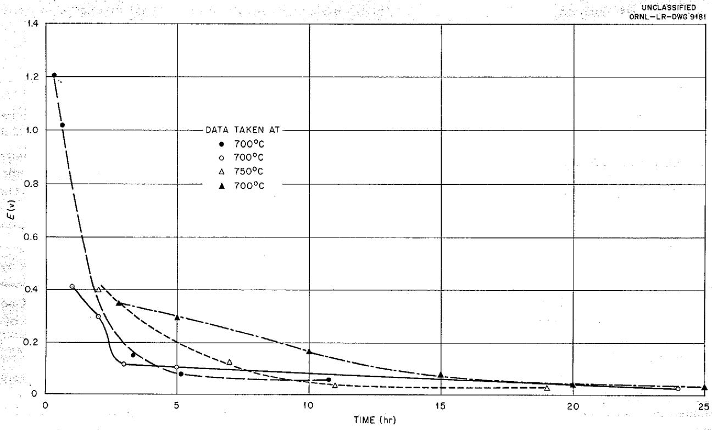  
Fig. 4.3. Discharge of Type 1 Cells.

# Viscosities of Molten Nitrates

F. A. Knox

F. Kertesz

Materials Chemistry Division

The capillary viscometer, previously described,[28] has been calibrated by using pure $\mathrm{LiNO}_3$ and $\mathrm{KNO}_3$ and has been used to measure the viscosity of a mixture of these materials. Attack by $\mathrm{LiNO}_3$ on glass at high temperatures has necessitated substitution of a nickel capillary for these studies.

Measurements obtained for $\mathsf{KNO}_3$ are in close agreement with those reported by Dantuma and by Goodwin and Mailey. Values for $\mathsf{LiNO}_3$ agree reasonably well with those presented by Goodwin and Mailey but are nearly $20\%$ below those of Dantuma.

A mixture of the two salts (62.2 wt $\%$ KNO₃) shows a linear relationship between log viscosity

and reciprocal temperature over the temperature interval 230 to $492^{\circ}C$ (Fig. 4.6). Below $230^{\circ}C$ , however, the viscosity increases more rapidly than would be predicted by this relationship. The values obtained for the mixture are lower by about $15\%$ than the values for the pure components.

# Optical Properties and X-Ray Patterns for Recently Discovered Compounds in Fluoride Systems

R. E. Thoma  
Materials Chemistry Division

G. D. White Metallurgy Division

T. N. McVay

H. Insley

Consultants

The identifying characteristics of some new compounds encountered in phase studies are listed below. The symbol $d(\mathring{\mathrm{A}})$ means the distance between reflecting planes measured in angstroms; $l / l_{1}$ refers to the relative intensity as compared with an arbitrary value of 100 for the strongest line; under optical properties, $N_{\alpha}$ and $N_{\lambda}$ refer to

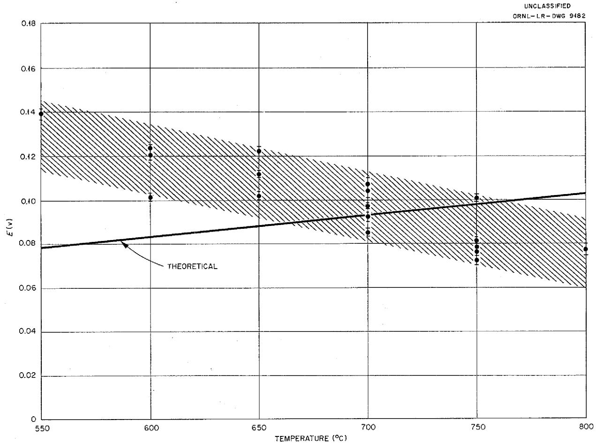

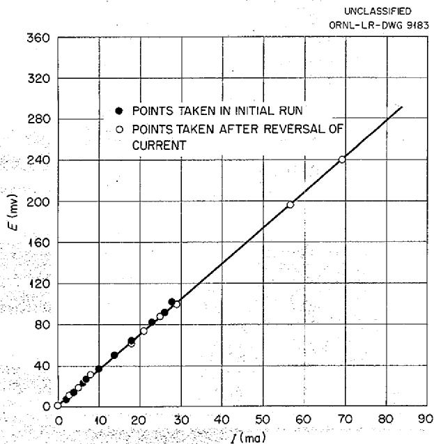  
Fig. 4.4. Theoretical and Experimental EMF Values for Cells of Type 2 at Various Temperatures.   
Fig. 4.5. Electrolysis Across Two Chromium Electrodes in an NaF-ZrF $_4$ (53-47 mole %) Melt Saturated with CrF $_2$ at $700^{\circ}\mathrm{C}$ .

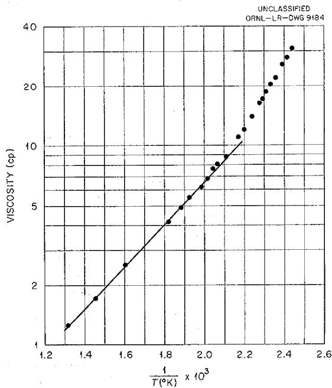  
Fig. 4.6. Viscosities of the $\mathrm{LiNO}_3$ - $\mathrm{KNO}_3$ (62.2-37.8 wt %) Mixture at Various Temperatures.

<table><tr><td>the lowest and highest indices of refraction, re-</td><td>2.15</td><td>22</td></tr><tr><td>spectively; 2V refers to the acute angle between</td><td>2.05</td><td>19</td></tr><tr><td>the optic axes of biaxial crystals; and O and E</td><td>1.95</td><td>27</td></tr><tr><td>refer to the ordinary and extraordinary indices of</td><td>1.70</td><td>31</td></tr><tr><td>refraction of uniaxial crystals.</td><td>1.63</td><td>45</td></tr><tr><td></td><td>1.58</td><td>10</td></tr><tr><td>3LiF·ZrF4(low-temperature form)</td><td>1.54</td><td>10</td></tr></table>

Optical data:

$$
\begin{array}{l} N _ {\alpha} = 1. 4 4 5 \\ N _ {\lambda} = 1. 4 6 5 \\ \end{array}
$$

Biaxial negative;

$$
2 V = \sim 1 0 \mathrm {d e g}
$$

X-ray data:

d(A) 1/1   
5.49 55   
5.40 35   
4.88 50   
3.67 25   
3.43 6   
2.91 14   
2.79 8   
2.67 15   
2.40 6   
2.07 100  
1.94 19   
1.82 25   
1.80 12   
1.78 12   
1.65 4   
1.59 4   
1.57 4

2LiF·ZrF 4

Optical data:

$$
\begin{array}{l} O = 1. 4 6 8 \\ E = 1. 4 7 8 \\ \end{array}
$$

Uniaxial positive

X-ray data:

$d(\stackrel {\circ}{\mathsf{A}})$ $I / I_{1}$   
5.14 10   
4.75 10   
4.62 25   
4.29 100   
3.15 100   
2.75 8   
2.49 14   
2.42 11   
2.38 11   
2.26 7   
2.19 60

$$
N _ {\alpha} = 1. 4 6 3
$$

$$
N _ {\lambda} = 1. 4 7 3
$$

$$
2 V = \sim 2 5 \mathrm {d e g}
$$

3LiF·4ZrF4   
Optical data:   
Biaxial positive;   
X-ray data:   
d(A) I/1   
6.11 26   
5.24 34   
4.90 14   
4.21 28   
4.00 10   
3.90 94   
3.77 18   
3.69 6   
3.33 60   
3.29 20   
3.26 22   
3.16 100   
2.615 16   
2.303 10   
2.248 10   
2.227 6   
2.194 86   
2.159 16   
2.043 12   
2.130 34   
1.947 36   
1.912 22   
1.883 10   
1.721 10

2KF·BeF 2

Optical data:

Average refractive index = 1.357

Biaxial positive

$$
2 V = \sim 2 0 \mathrm {d e g}
$$

X-ray data:

d(A) 1/1   
3.42 7   
3.31 15

<table><tr><td>3.24</td><td>12</td></tr><tr><td>3.14</td><td>40</td></tr><tr><td>3.07</td><td>8</td></tr><tr><td>2.99</td><td>12</td></tr><tr><td>2.95</td><td>37</td></tr><tr><td>2.84</td><td>100</td></tr><tr><td>2.73</td><td>18</td></tr><tr><td>2.61</td><td>20</td></tr><tr><td>2.58</td><td>12</td></tr><tr><td>2.465</td><td>85</td></tr><tr><td>2.359</td><td>85</td></tr><tr><td>2.332</td><td>55</td></tr><tr><td>2.259</td><td>7</td></tr><tr><td>2.242</td><td>15</td></tr><tr><td>2.184</td><td>35</td></tr><tr><td>2.159</td><td>25</td></tr><tr><td>2.106</td><td>5</td></tr><tr><td>2.060</td><td>7</td></tr><tr><td>2.038</td><td>12</td></tr><tr><td>1.955</td><td>12</td></tr><tr><td>1.920</td><td>12</td></tr><tr><td>1.905</td><td>10</td></tr><tr><td>1.894</td><td>8</td></tr><tr><td>1.854</td><td>12</td></tr><tr><td>1.815</td><td>15</td></tr><tr><td>1.736</td><td>15</td></tr><tr><td>1.708</td><td>35</td></tr><tr><td>1.657</td><td>7</td></tr><tr><td>1.641</td><td>7</td></tr></table>

# KF·BeF2

Optical data:

Average refractive index = 1.315

Biaxial positive;

$2V = \sim 60$ deg

# X-ray data:

<table><tr><td>d(Å)</td><td>l/I1</td></tr><tr><td>6.65</td><td>15</td></tr><tr><td>5.99</td><td>60</td></tr><tr><td>3.69</td><td>6</td></tr><tr><td>3.58</td><td>9</td></tr><tr><td>3.33</td><td>90</td></tr><tr><td>3.23</td><td>35</td></tr><tr><td>3.01</td><td>100</td></tr><tr><td>2.92</td><td>6</td></tr><tr><td>2.734</td><td>15</td></tr><tr><td>2.636</td><td>20</td></tr><tr><td>2.542</td><td>5</td></tr><tr><td>2.442</td><td>5</td></tr><tr><td>2.410</td><td>7</td></tr></table>

<table><tr><td>2.292</td><td>15</td></tr><tr><td>2.220</td><td>7</td></tr><tr><td>2.190</td><td>4</td></tr><tr><td>2.010</td><td>35</td></tr><tr><td>1.979</td><td>23</td></tr><tr><td>1.745</td><td>7</td></tr><tr><td>1.641</td><td>10</td></tr></table>

# KF·NaF·ZrF4

Optical data:

$$
N _ {a} = 1. 3 7 5
$$

$$
N _ {\lambda} = 1. 3 8 2
$$

Biaxial negative;

$$
2 V = \sim 6 0 \mathrm {d e g}
$$

# X-ray data:

<table><tr><td>d(Å)</td><td>I/I1</td></tr><tr><td>5.99</td><td>10</td></tr><tr><td>5.37</td><td>50</td></tr><tr><td>4.98</td><td>16</td></tr><tr><td>4.85</td><td>60</td></tr><tr><td>4.50</td><td>50</td></tr><tr><td>4.41</td><td>6</td></tr><tr><td>4.25</td><td>30</td></tr><tr><td>4.09</td><td>64</td></tr><tr><td>3.69</td><td>28</td></tr><tr><td>3.60</td><td>12</td></tr><tr><td>3.52</td><td>6</td></tr><tr><td>3.34</td><td>100</td></tr><tr><td>3.26</td><td>44</td></tr><tr><td>3.18</td><td>40</td></tr><tr><td>3.12</td><td>12</td></tr><tr><td>3.07</td><td>12</td></tr><tr><td>3.01</td><td>38</td></tr><tr><td>2.747</td><td>4</td></tr><tr><td>2.690</td><td>24</td></tr><tr><td>2.556</td><td>20</td></tr><tr><td>2.489</td><td>24</td></tr><tr><td>2.405</td><td>20</td></tr><tr><td>2.258</td><td>20</td></tr><tr><td>2.154</td><td>16</td></tr><tr><td>2.125</td><td>20</td></tr><tr><td>2.050</td><td>34</td></tr><tr><td>1.947</td><td>20</td></tr><tr><td>1.928</td><td>12</td></tr><tr><td>1.886</td><td>12</td></tr><tr><td>1.792</td><td>14</td></tr><tr><td>1.743</td><td>18</td></tr><tr><td>1.723</td><td>14</td></tr><tr><td>1.694</td><td>6</td></tr><tr><td>1.651</td><td>24</td></tr></table>

3KF·3NaF·2ZrF4

Optical data:

$$
N _ {\alpha} = 1. 4 1 2
$$

$$
N _ {\lambda} = 1. 4 2 2
$$

Biaxial positive;

$$
2 V = \sim 3 0 \mathrm {d e g}
$$

X-ray data:

d(A) 1/1

6.11 17

4.90 100

4.82 25

4.55 15

4.27 53

4.09 75

3.78 12

3.40 21

3.28 21

2.99 21

2.97 88

2.72 12

2.682 12

2.585 6

2.455 25

2.417 21

2.368 12

2.270 25

2.226 52

2.135 42

2.051 49

1.931 15

1.822 42

1.748 21

1.721 25

3NaF·4ZrF 4

Optical data:

$$
N _ {\alpha} = 1. 4 2 0
$$

$$
N _ {\lambda} = 1. 4 3 2
$$

Biaxial positive;

$$
2 V = \sim 3 0 \mathrm {d e g}
$$

X-ray data:

d(A) I/1

7.56

7.42 45

5.47 14

4.15 100

3.78

3.74

3.42 25

3.39 37

3.36 62

2.630 15

2.074 75

1.935 12

1.766 52

1.506 25

2NaF·LiF·2BeF 2

Optical data:

Average refractive index $= 1.312$

Uniaxial negative;

Low birefringence

X-ray data:

d(A) I/I1

5.37 24

4.07 15

3.78 12

3.57 18

3.39 21

3.08 7

2.99 100

2.614 12

2.417 15

2.343 57

2.303 27

2.240 70

2.707 6

2.149 26

2.111 8

2.039 7

1.999 6

1.968 100

1.928 9

1.894 10

1.840 30

1.790 19

1.767 4

1.748 7

1.720 19

1.704 25

1.676 6

1.612 12

1.589 6

# High-Temperature X-Ray Spectrometer Studies

G.D. White, Metallurgy Division

T. N. McVay, Consultant

Samples of $3\mathrm{LiF}\cdot \mathrm{ZrF}_4$ were x-rayed at elevated temperatures by using the furnace attachment to the x-ray spectrometer. The investigation was conducted to confirm the decomposition temperature of $\mathrm{Li}_{3}\mathrm{ZrF}_{7}$ , which had already been determined by quench methods and thermal data, and also to determine whether there was a high-temperature polymorph of $\mathrm{Li}_{3}\mathrm{ZrF}_{7}$ that was not retained when the material was quenched.

At room temperature the samples contained three phases: $\mathsf{Li}_2\mathsf{ZrF}_6$ , $\mathsf{Li}_3\mathsf{ZrF}_7$ , and $\mathsf{LiF}$ . In this study the procedure was to heat the mounted sample in the evacuated furnace attachment to $550^{\circ}\mathsf{C}$ and then maintain it at that temperature until the x-ray diffraction pattern contained none of the $\mathsf{Li}_2\mathsf{ZrF}_6$ or $\mathsf{LiF}$ peaks. The reacted sample was then cooled to various temperatures until the x-ray pattern indicated the presence of $\mathsf{Li}_2\mathsf{ZrF}_6$ and $\mathsf{LiF}$ . In this manner the decomposition temperature was determined as being $470^{\circ}\mathsf{C}$ , which is to be compared with the value of approximately $475^{\circ}\mathsf{C}$ obtained by quench methods. At no temperature above $470^{\circ}\mathsf{C}$ was the x-ray pattern for the low-temperature form of $\mathsf{Li}_3\mathsf{ZrF}_7$ obtained. The high-temperature x-ray pattern, presented below, is evidently the pattern for a polymorph of $\mathsf{Li}_3\mathsf{ZrF}_7$ , which inverts to the lower temperature form at a temperature just slightly above the decomposition temperature:

<table><tr><td>d(Å)</td><td>I/I0</td></tr><tr><td>4.58</td><td>100</td></tr><tr><td>3.65</td><td>12</td></tr><tr><td>3.24</td><td>28</td></tr><tr><td>3.15</td><td>57</td></tr><tr><td>2.84</td><td>41</td></tr><tr><td>2.64</td><td>22</td></tr><tr><td>2.36</td><td>21</td></tr><tr><td>2.05</td><td>59</td></tr></table>

# Physical Chemistry of Fused Salts31

E.R.Van Artsdalen

Chemistry Division

Final results have been obtained for the electrical conductance and density of all molten alkali chlorides, bromides, and iodides. The equivalent

conductance at corresponding temperatures has been correlated with such properties as ion size and mass. Conductance has been treated as a rate process, and values of the heat of activation and entropy of activation have been computed from experimental data. In general, the heat of activation is somewhat temperature dependent; this dependence is approximately linear for lithium, sodium, and potassium salts, while it deviates progressively more from linearity with rubidium and cesium salts. The entropy of activation for these salts is in the range of $-6$ to $-8$ au. This small negative entropy of activation is reasonable and indicates a similar conduction mechanism for all the salts, but no detailed quantitative significance can be attached to it at this time.

An extensive series of freezing-point-depression measurements has been made in which molten sodium nitrate was the solvent. The heavy-metal halides $\mathrm{CdCl}_2$ , $\mathrm{ZnCl}_2$ , $\mathrm{CuCl}_2$ , $\mathrm{PbCl}_2$ , and $\mathrm{CdBr}_2$ all show less than complete ionic dissociation in molten sodium nitrate; dissociation decreases as concentration rises. However, the slopes of the curves indicate complete dissociation at infinite dilution. The significant discovery has been made that the so-called "common ion effect" is generally applicable to these salts. Thus the addition of any of a large number of completely dissociated chlorides greatly represses ionic dissociation of partially dissociated chlorides such as $\mathrm{PbCl}_2$ and $\mathrm{CdCl}_2$ . It has been demonstrated in the case of $\mathrm{CdCl}_2$ that the complex ion $\mathrm{CdCl}_4$ is formed in the presence of relatively low concentrations of excess common chloride ion. Reactions have been proposed to account for the results, and equilibrium constants have been calculated. Apparently those chlorocadmium complexes containing even numbers of chlorines are the more stable.

Several preliminary measurements have been made of freezing-point depression by $\mathsf{K}_2\mathsf{ZrF}_6$ and $\mathsf{K}_2\mathsf{T}\mathsf{i}\mathsf{F}_6$ in $\mathsf{NaNO}_3$ . The salts were prepared by wet chemical methods. The results indicate that the complex ions $\mathsf{ZrF}_6^{- - }$ and $\mathsf{T}\mathsf{i}\mathsf{F}_6^{- - }$ are reasonably stable at a concentration of about 0.1 molal in molten $\mathsf{NaNO}_3$ at its melting point. However, there appears to be some slight dissociation, which presumably yields $\mathsf{F}^{- - }$ and $\mathsf{ZrF}_5^{- - }$ or $\mathsf{T}\mathsf{i}\mathsf{F}_5^{- - }$ . Dissociation is greater with titanium than with

zirconium. A similar result was obtained previously with $\mathsf{K}_2\mathsf{ZrF}_6$ prepared by a dry fusion method.

Precise determinations of the self-diffusion coefficients of sodium ion and of nitrate ion have been completed in molten sodium nitrate. A radiochemical tracer technique employing $\mathsf{Na}^{22}$ was used for $\mathsf{Na}^+$ , and a mass spectrographic tracer technique employing $\mathsf{O}^{18}$ was used for $\mathsf{NO}_3^-$ . The self-diffusion coefficients are expressed within 1 to $2\%$ by the following equations:

$$
D _ {+} = 1. 2 8 8 \times 1 0 ^ {- 3} e ^ {- 4 9 7 0 / R T},
$$

$$
D _ {-} = 8. 9 7 4 \times 1 0 ^ {- 4} e ^ {- 5 0 8 3 / R T}.
$$

This is the first time that self-diffusion of both ions of a single fused salt has been measured. It is highly significant that the heats of activation for self-diffusion of both the cation and the anion are the same within experimental error ( $\sim 80$ cal). This indicates that there is a single frictional coefficient for diffusion within the melt. The results show that the simple Nernst-Einstein equation is inapplicable to this molten salt; it is probably not applicable to any molten salt. The ratio of self-diffusion coefficients for $\mathsf{Na}^+$ and $\mathsf{NO}_3^-$ is somewhat less than the inverse ratio of the square roots of the masses of the two ions. It is expected that both mass and size are important factors in determining diffusion. Experiments are in progress with other fused salts, and attempts will be made to obtain generalizations concerning diffusional properties.

# Diffraction Studies of Liquids

P. C. Sharrah

P. Agron

H. A. Levy

M. Danford

M.A.Bredig

Chemistry Division

The previously described $^{32,33}$ liquid diffractometer has been thoroughly aligned and tested and is being applied to studies of molten salts. X-ray diffraction patterns obtained from liquid mercury at room temperature were used to test the instrument; the patterns were satisfactory. These diffraction patterns and the analysis giving information concerning the distribution of atoms within the liquid have been presented. $^{33}$ It has been possible to obtain data which appear to be reliable to a somewhat larger value of the variable $s = (4\pi \sin \theta) / \lambda$ than that reported in the literature. Work is under way with molten lithium chloride.

Neutron diffraction work on molten salts is also being carried on so that information from the two techniques can be coordinated. The equipment consists of the Chemistry Division neutron spectrometer and a furnace for handling the molten materials. Diffraction patterns of KCl and Li have been obtained.

# 5. CORROSION RESEARCH

W.D.Manly G.M.Adamson

Metallurgy Division

W.R.Grimes F.Kertesz

Materials Chemistry Division

Several Inconel forced-circulation loops that were operated with fluoride mixtures and with sodium as the circulated fluids were examined. The effect of operating time on corrosion and mass transfer under the dynamic conditions was studied for loops that circulated $\mathrm{NaF - ZrF_4 - UF_4}$ as well as the effects of the method of heating the loop and of the length of the heated section. The loops in which sodium was circulated were used to study the effects on mass transfer of varying the temperature differential in the system and of varying the oxide content of the sodium and were used to compare mass transfer in Inconel and in type 316 stainless steel.

Additional Inconel thermal-convection loops were examined to determine the effects on corrosion and mass transfer, in loops that circulated fluoride mixtures, of varying the loop cleaning method, of using direct resistance heating, and of applying electromotive forces. In one loop, the wall temperatures in the heated zone were measured. The effects of oxide additions were studied in loops that circulated sodium.

Several hot-pressed metal-bonded tungsten carbide cermets were screen tested in NaF-ZrF4UF4 and in sodium, and additional solid-phase bonding tests of cermets were made. Inconel plated with ruthenium was subjected to creep-rupture tests, and additional tests of brazed T-joints in fluoride mixtures and in sodium were made. A Hastelloy B-Inconel system was checked for dissimilar-metal mass transfer in a fluoride mixture.

A study of mass transfer in an Inconel system circulating sodium was initiated, and seesaw corrosion tests were made on Inconel tubes loaded with sodium-potassium-lithium mixtures. In other corrosion tests molybdenum, vanadium, and niobium were tested in static lithium.

The fundamental corrosion research reported included additional studies of film formation on metals, techniques for measuring absorption spectra in fused hydroxides at high temperatures, mass transfer and corrosion in fused hydroxides, and thermal dissociation of sodium hydroxide.

Chemical studies were made of corrosion of Inconel by NaF-LiF-ZrF4-UF4, the stability of UF3 in NaF-KF-LiF, and the effect of chromium on the mass transfer of nickel in NaOH.

# FORCED-CIRCULATION STUDIES

G.M. Adamson R.S.Crouse

A. Taboada

Metallurgy Division

Fluorides in Inconel

G.M. Adamson R.S.Crouse

Metallurgy Division

Examinations were completed of several Inconel forced-circulation loops in which $\mathsf{NaF - ZrF_4 - UF_4}$ (50-46-4 mole %) was circulated. The loops and the operating conditions are described in Sec. 2, "Experimental Reactor Engineering" and in the previous report. The corrosion data reported in Table 5.1 and the analyses of the fluoride mixtures given in Table 5.2 were for Inconel loops operated with a temperature differential of $200^{\circ}\mathsf{F}$ , a Reynolds number of the fluoride mixture of 10,000, a maximum fluoride-mixture temperature of $1500^{\circ}\mathsf{F}$ , and a maximum wall temperature of between 1600 and $1625^{\circ}\mathsf{F}$ . These loops were heated by direct resistance of the Inconel tubing. Loops 4695-4A, -4B, -4C, -4D-1, and -4D-2 were a single loop in which the two heated legs were replaced at the end of each experiment. A new batch of fluoride mixture was used for cleaning and operating each test. The loop was cleaned by circulating the fluoride mixture for 2 hr at $1300^{\circ}\mathsf{F}$ . The loop was then filled for the test with a fresh batch of fluoride mixture, which was circulated isothermally for 25 hr before the temperature differential was applied.

The period of isothermal operation was for the purpose of establishing chemical equilibrium.

TABLE 5.1. EFFECT OF OPERATING TIME ON DEPTH OF ATTACK IN INCONEL FORCED-CIRCULATION LOOPS IN WHICH NaF-ZrF4-UF4 (50-46-4 mole %) WAS CIRCULATED  

<table><tr><td>Loop No.</td><td>Operating Time* (hr)</td><td>Attack of First Heated Leg</td><td>Attack of Second Heated Leg</td></tr><tr><td>4695-4A</td><td>0</td><td>Light, general, subsurface voids to voids to a depth of 0.5 mil</td><td>Light, general, intergranular subsurface voids to a depth of 0.5 mil</td></tr><tr><td>-5A</td><td>10</td><td>Heavy, general voids to a depth of 3.5 mils</td><td>Heavy, general voids to a depth of 3 mils</td></tr><tr><td>-4D-1</td><td>20.5</td><td>Heavy, general, intergranular voids to a depth of 3 mils</td><td>Heavy, general, intergranular voids to a depth of 3 mils</td></tr><tr><td>-4B</td><td>50</td><td>Heavy, general voids to a depth of 3 mils</td><td>Heavy, general voids to a depth of 3 mils</td></tr><tr><td>-4C</td><td>100</td><td>Heavy, general voids to a depth of 3 mils</td><td>Heavy, general voids to a depth of 3.5 mils</td></tr><tr><td>-5B</td><td>241</td><td>Heavy, general, intergranular voids to a depth of 4 mils</td><td>Heavy, general, intergranular voids to a depth of 5 mils</td></tr><tr><td>-4D-2</td><td>500</td><td>Moderate to light, general, inter-granular voids to a depth of 3.5 mils</td><td>Moderate, general, intergranular voids to a depth of 5 mils</td></tr><tr><td>-5C-2</td><td>1000</td><td>Moderate to heavy, general, inter-granular voids to a depth of 5 mils</td><td>Moderate to heavy, general, intergranular voids to a depth of 7 mils</td></tr></table>

*Time after temperature differential imposed.

TABLE 5.2. ANALYSES OF FLUORIDE MIXTURES BEFORE AND AFTER CIRCULATION IN LOOPS   

<table><tr><td rowspan="2">Loop No.</td><td rowspan="2">When Sampled</td><td rowspan="2">Uranium 
Content 
(wt %)</td><td colspan="3">Impurities (ppm)</td></tr><tr><td>Ni</td><td>Cr</td><td>Fe</td></tr><tr><td rowspan="2">4695-4A</td><td>During filling</td><td>8.36</td><td>6</td><td>70</td><td>70</td></tr><tr><td>After termination</td><td>8.26</td><td>9</td><td>245</td><td>30</td></tr><tr><td rowspan="2">-5A</td><td>During filling</td><td>8.71</td><td>15</td><td>70</td><td>45</td></tr><tr><td>After termination</td><td>8.77</td><td>25</td><td>635</td><td>30</td></tr><tr><td rowspan="2">-4D</td><td>During filling</td><td>8.46</td><td>15</td><td>65</td><td>40</td></tr><tr><td>After termination</td><td>8.57</td><td>40</td><td>520</td><td>50</td></tr><tr><td rowspan="2">-4B</td><td>During filling</td><td>8.80</td><td>50</td><td>65</td><td>30</td></tr><tr><td>After termination</td><td>8.85</td><td>10</td><td>800</td><td>25</td></tr><tr><td rowspan="2">-4C</td><td>During filling</td><td>8.33</td><td>15</td><td>35</td><td>20</td></tr><tr><td>After termination</td><td>8.84</td><td>8</td><td>725</td><td>50</td></tr><tr><td rowspan="3">-5B</td><td>During filling</td><td>8.94</td><td>7</td><td>60</td><td>30</td></tr><tr><td>After first termination</td><td>9.15</td><td>20</td><td>765</td><td>50</td></tr><tr><td>After second termination</td><td>8.95</td><td>30</td><td>725</td><td>75</td></tr><tr><td rowspan="2">-4D-2</td><td>During filling</td><td>8.83</td><td>30</td><td>90</td><td>10</td></tr><tr><td>After termination</td><td>9.14</td><td>55</td><td>365(?)</td><td>70</td></tr><tr><td rowspan="2">-5C-2</td><td>During filling</td><td>9.12</td><td>5</td><td>105</td><td>60</td></tr><tr><td>After termination</td><td>9.15</td><td>50</td><td>505</td><td>45</td></tr></table>

It now appears that 25 hr at $1300^{\circ}\mathrm{F}$ is not adequate; the depth of attack and the chromium concentration were still quite low. During the subsequent first few hours of operation with a temperature differential and a high wall temperature, the attack was quite rapid, with more attack being found after the first 10 hr of operation than had previously occurred in 25 hr of isothermal operation. After the first 50 hr the chromium content of the fluoride mixture remained constant, but the depth of attack increased, in confirmation of the thermal-convection-loop data on mass transfer. Considerable scatter is present in the data, but a depth of attack of between 3 and 4 mils per 1000 hr of circulation seems to be a reasonable value for the second stage of attack. Typical hot-leg sections from these loops are shown in Fig. 5.1.

Two other loops (4950-2 and 4935-2) were operated in as nearly an identical manner as possible, except that one was heated in a gas furnace and the other was heated by the direct electrical resistance of the pipe wall. Both loops were operated for 1000 hr, with NaF-ZrF $_4$ -UF $_4$ (50-46-4 mole %) as the circulated fluid, a temperature differential of $200^{\circ}\mathrm{F}$ , a maximum fluoride temperature of $1500^{\circ}\mathrm{F}$ , and a fluoride-mixture Reynolds number of 5000. In both loops a moderate concentration of subsurface voids to a maximum depth of 5 mils was found. A typical area from the electrically heated loop is shown in Fig. 5.2. These loops had 17-ft-long heated sections to keep the wall temperatures down and to show that a low rate of attack may be achieved with low wall temperatures. The depth of attack does not seem to be a function of the heating method.

Another loop was operated, which was similar to the ones described above, except that the resistance-heated length was reduced to 8.2 ft. To operate under similar flow and temperature

differential conditions, it was necessary to increase the power per unit of heater length, which resulted in a $100^{\circ}\mathrm{F}$ increase in wall temperature. This loop showed heavy subsurface-void attack to a depth of 18 mils. These data are additional evidence that the wall temperature is a more critical variable than is the fluoride-mixture temperature. A series of loops with varying, but controlled, wall temperatures are now being operated.

# Sodium in Inconel and in Stainless Steel

G.M.Adamson A.Taboada

Metallurgy Division

Two Inconel forced-circulation loops (4951-2 and 4951-3) in which sodium was circulated were examined after operating for 500 hr with a hot-leg temperature of $1500^{\circ}\mathrm{F}$ . Loop 4951-2 had a $300^{\circ}\mathrm{F}$ temperature differential, and loop 4951-3 had a $150^{\circ}\mathrm{F}$ temperature differential. The two loops were of a test series which included loop 4951-1, operated previously, which had a temperature differential of $200^{\circ}\mathrm{F}$ . Table 5.3 presents the metallographic and chemical data obtained in this series of tests.

No correlation can be observed between the amount of mass transfer and the temperature differential. However, the three loops were not identical, and high oxide impurities of different amounts were found in these loops. The results of these differences could have obscured the effects of the different temperature differentials.

Two other Inconel forced-circulation loops were operated with sodium as the circulated fluid to determine the effects of the oxide content of the sodium on mass transfer. Loop 4951-5 circulated sodium to which $0.15\% \mathrm{O}_2$ had been added in the form of $\mathrm{Na}_2\mathrm{O}_2$ . It operated for 1000 hr with a

TABLE 5.3. VARIATION IN RATE OF MASS TRANSFER WITH VARIATION IN TEMPERATURE DIFFERENTIAL IN SODIUM-INCONEL FORCED-CIRCULATION LOOPS  

<table><tr><td>Loop No.</td><td>Time of Operation (hr)</td><td>Temperature Differential (°F)</td><td>Maximum Thickness of Mass-Transferred Deposit (mils)</td><td>Maximum Depth of Attack (mils)</td><td>Oxide Content of Sodium (ppm)</td></tr><tr><td>4951-2</td><td>500</td><td>300</td><td>8</td><td>1</td><td>210</td></tr><tr><td>-1</td><td>480</td><td>200</td><td>11</td><td>0.5</td><td>450</td></tr><tr><td>-3</td><td>500</td><td>150</td><td>8</td><td>0.5</td><td>240</td></tr></table>

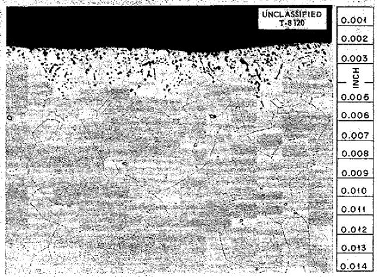  
10 hr

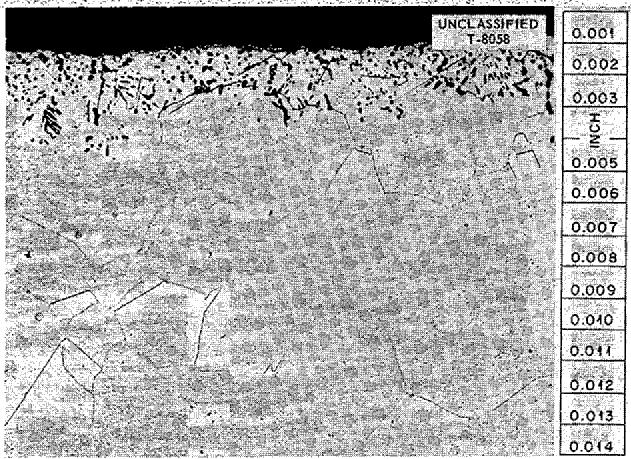  
50 hr

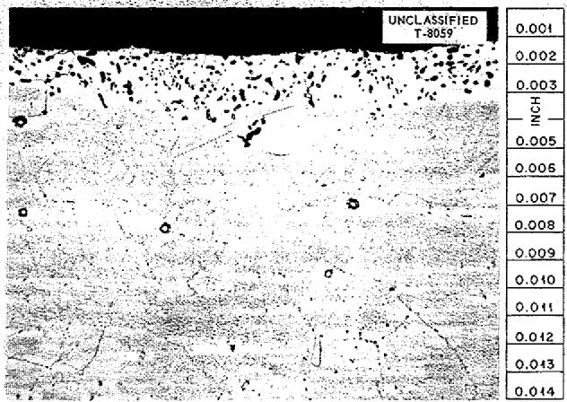  
100 hr

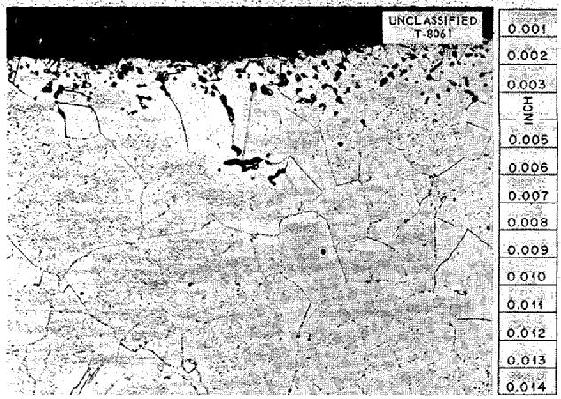  
241 hr

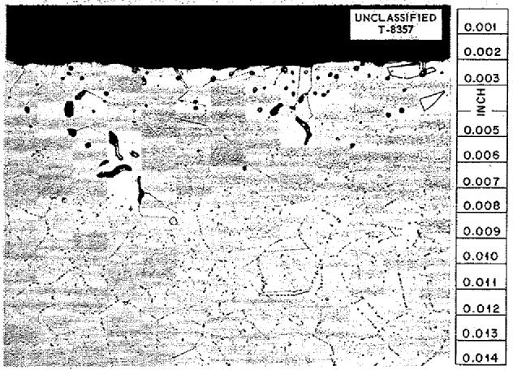  
500 hr

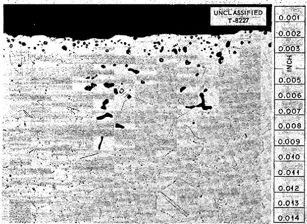  
1000 hr   
Fig. 5.1. Changes in Attack with Increasing Operating Time in Forced-Circulation Inconel Loops. Fluoride mixture circulated, NaF-ZrF $_4$ -UF $_4$ (50-46-4 mole %); maximum fluoride-mixture temperature, $1500^{\circ}$ F; temperature differential, $200^{\circ}$ F; fluoride-mixture Reynolds number, 5000.

hot-leg temperature of $1500^{\circ}\mathrm{F}$ , a temperature difference of $300^{\circ}\mathrm{F}$ , and a Reynolds number of 15,000. This loop showed the maximum mass transfer found to date. There was a 30-mil-thick deposit in the economizer, and there was attack to a depth of 2 mils in the hot leg. Three sections from the economizer and one from the cold leg are shown in Fig. 5.3.

The second loop, 4951-6, which was operated for 1000 hr, included a bypass cold trap for removing oxides. The hot-leg temperature was $1500^{\circ}\mathrm{F}$ , and the temperature differential was $300^{\circ}\mathrm{F}$ . Metallographic examination showed mass-transferred deposits to a maximum thickness of 11 mils (Figs. 5.4 and 5.5), which is comparable with the thickness of the deposits found in the loop with no cold trap. There was attack in the hot leg to a depth of 1.5 mils (Fig. 5.6) that was of the intergranular type found previously in sodium-Inconel systems. Analyses of the sodium after operation of the loop showed from 150 to 290 ppm $\mathrm{O}_{2}$ , and thus very little of the oxide had been removed.

In an effort to obtain a more qualitative picture of the amount of mass transfer in the sodium loops, all the sodium was melted out and the

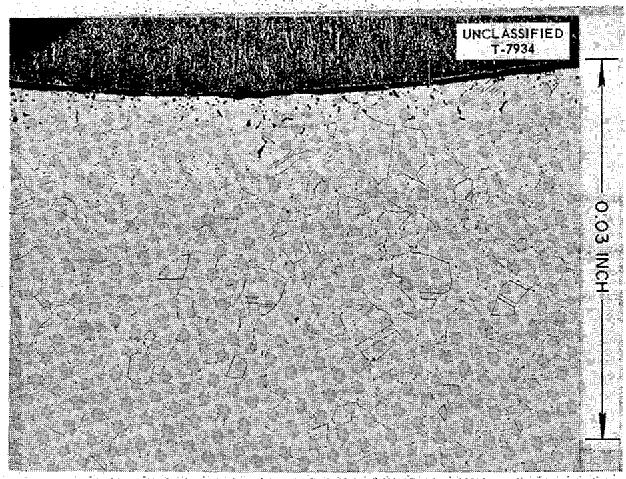  
Fig. 5.2. Typical Attack in Direct-Resistance-Heated Leg of Inconel Forced-Circulation Loop (4950-2) Operated for 1000 hr. Fluoride mixture circulated, NaF-ZrF $_4$ -UF $_4$ (50-46-4 mole $\%$ ); maximum fluoride-mixture temperature, $1500^{\circ}\mathrm{F}$ ; temperature differential, $200^{\circ}\mathrm{F}$ ; fluoride-mixture Reynolds number, 5000.

deposited metallic crystals were brushed out and weighed. With this procedure, any well-bonded crystals or layers were left in the loop. The data thus obtained from the loops operated to date are presented in Table 5.4.

Operation of the type 316 stainless steel loop (4951-7) listed in Table 5.4 was terminated by a power failure after sodium had been circulated for $476\mathrm{hr}$ . There was no oxide filter used in this loop. It was the third loop operated in a series of tests; the other two loops (4689-5 and -6) were Inconel with type 316 stainless steel cold legs. Loops 4689-5 and -6 operated for 1000 hr under similar temperature conditions. The maximum thickness of the mass-transferred layer in the

UNCLASSIFIED T-8097

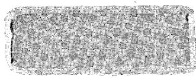  
COLD-LEG SECTION

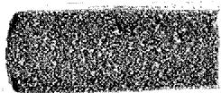

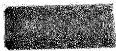  
HONI

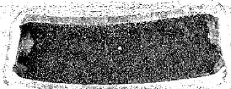  
ECONOMIZER SECTIONS   
Fig. 5.3. Three Sections from the Economizer and One Section from the Cold Leg of Inconel Forced-Circulation Loop 4951-5 Which Circulated for 1000 hr Sodium to Which $0.15\%$ $\mathsf{O}_2$ Had Been Added as $\mathsf{Na}_2\mathsf{O}_2$ . Hot-leg temperature, $1500^{\circ}\mathsf{F}$ ; temperature differential, $300^{\circ}\mathsf{F}$ ; Reynolds number, 15,000.

UNCLASSIFIED T-7946

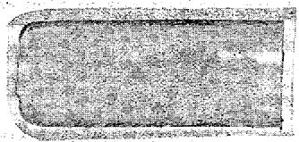

COLD-LEG SECTION

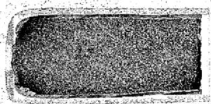

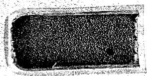

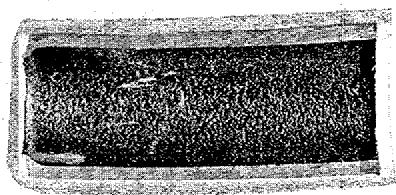  
ECONOMIZER SECTIONS   
Fig. 5.4. Three Sections from the Economizer and One Section from the Cold Leg of Inconel Forced-Circulation Loop 4951-6 Which Included a Bypass Cold Trap and Which Circulated High-Purity Sodium for 1000 hr. Hot-leg temperature, $1500^{\circ}\mathrm{F}$ ; temperature differential, $300^{\circ}\mathrm{F}$ ; Reynolds number, 15,000.

all-stainless-steel loop (4951-7) was 0.8 mil (Fig. 5.7), which is much less than the 9 mils found in Inconel-and-stainless-steel loops (4689-5 and -6). Two different layers were present in the all-stainless-steel loop. The majority of the deposited material was in the economizer, and it was found by chemical analysis to be $14.9\%$ Ni, $57.5\%$ Cr, and $20.0\%$ Fe. The second layer was limited to the electromagnetic flowmeter area in the cold leg, and it was a smooth, adherent deposit that was found by chemical analysis to be $14.6\%$ Ni, $19.1\%$ Cr, and $55.2\%$ Fe.

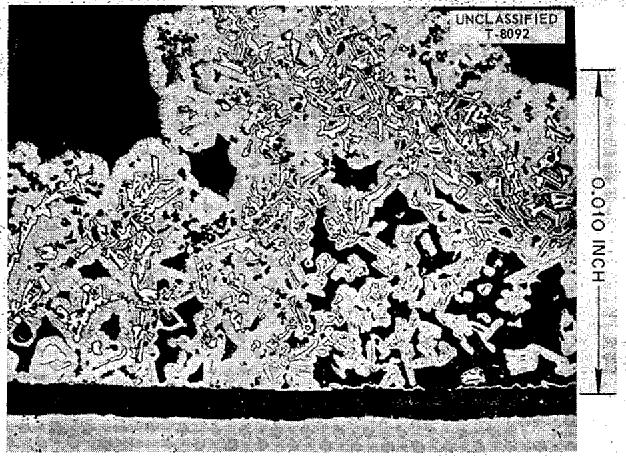  
Fig. 5.5. Deposited Layer in Economizer of Inconel Loop 4951-6 Which Circulated Sodium for 1000 hr. 250X. Reduced $34\%$ .

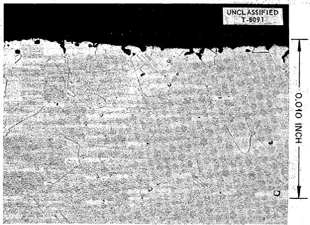  
Fig. 5.6. Typical Hot-Leg Attack in Loop 4951-6, 250X. Reduced $33\%$ .

# THERMAL-CONVECTION STUDIES

G.M. Adamson E.A. Kovacevich Metallurgy Division

T.C.Price Pratt & Whitney Aircraft

# Effect of Various Loop Cleaning Methods

The standard procedure for cleaning Inconel thermal-convection loops has been the preliminary circulation of a fluoride mixture for 2 hr with the system isothermal at $1350^{\circ}\mathrm{F}$ . The cleaning was undertaken to assure correlation of data between loops; it was not expected to decrease corrosive

TABLE 5.4. WEIGHTS OF DEPOSITED LAYERS IN VARIOUS LOOPS WHICH CIRCULATED SODIUM   

<table><tr><td rowspan="2">Loop No.</td><td rowspan="2">Difference from Control Loop</td><td rowspan="2">Weight of Deposit (g)</td><td rowspan="2">Maximum Layer Thickness (mils)</td><td colspan="2">Oxide Content (wt %)</td></tr><tr><td>Before Operation</td><td>After Operation</td></tr><tr><td>4951-1</td><td>200°F temperature differential</td><td>7.9</td><td>11</td><td>0.034</td><td>0.046</td></tr><tr><td>-3</td><td>150°F temperature differential</td><td>9.0</td><td>8</td><td>0.031</td><td>0.024</td></tr><tr><td>-2</td><td>Control*</td><td>8.7</td><td>8</td><td></td><td>0.021</td></tr><tr><td>-5</td><td>Oxide added, operated 1000 hr</td><td>25.8</td><td>30</td><td>0.036</td><td>0.027</td></tr><tr><td>-6</td><td>Bypass cold trap in system</td><td>7.6</td><td>11</td><td>0.041</td><td>0.017</td></tr><tr><td>-7</td><td>Type 316 stainless steel tubing</td><td>0.8</td><td>1</td><td>0.057</td><td>0.04</td></tr></table>

*Inconel loop operated for 500 hr; temperature differential, $300^{\circ}\mathrm{F}$ ; hot-leg temperature, $1500^{\circ}\mathrm{F}$ ; Reynolds number, 15,000.

attack during experiments. Over the past few months, however, the data obtained have not been so reproducible as those obtained previously. To determine whether the cleaning operation was responsible for this lack of reproducibility, a series of Inconel loops that had been cleaned by various methods were operated for 250 hr with NaF-ZrF $_4$ -UF $_4$ (50-46-4 mole %) as the circulated fluid. The data from these loops are presented in Table 5.5. No systematic variation is apparent in the depth of attack, but the depths of attack are greater than those previously found. The results obtained in this study of cleaning methods do not offer a clue as to the cause of the scatter of the results being obtained with standard loops.

# Effect of Heating Method

The question of whether the method of heating a thermal-convection loop affects the corrosion results has frequently been raised. Therefore, three Inconel thermal-convection loops were operated with the heat being furnished by the electrical resistance of the pipe wall rather than by the usual "clamshell" type of electric heaters. These loops all operated with a standard hot-leg temperature of $1500^{\circ}\mathrm{F}$ , and they circulated $\mathrm{NaF - ZrF_4 - UF_4}$ (50-46-4 mole %). Loop 618

showed the usual subsurface-void type of attack to a depth of 10 mils after 500 hr, while loops 619 and 703 showed similar attack to depths of 13 and 15 mils after 1000 hr. These depths of attack are similar to those obtained in the loops with the clamshell heaters, and thus the previous conclusion that the depth of attack is not affected by the heating method is confirmed.

# Effect of Temperatures

It was shown in the forced-circulation loops that the maximum loop wall temperature was a more important variable than was the maximum bulk-fluoride-mixture temperature. Also, the depth of attack found in recently operated forced-circulation loops has been less than that found in comparable thermal-convection loops. Two Inconel thermal-convection loops were therefore operated with thermocouples installed under the heaters to determine the wall temperatures. The hot-leg temperature is normally measured by a thermocouple welded to the hot leg about 3 in. above the top heater. The data from this study have not been completely analyzed, but it appears that the wall temperatures under the heaters may be as much as $1670^{\circ}\mathrm{F}$ . This $170^{\circ}\mathrm{F}$ differential from the $1500^{\circ}\mathrm{F}$ bulk-fluoride-mixture temperature

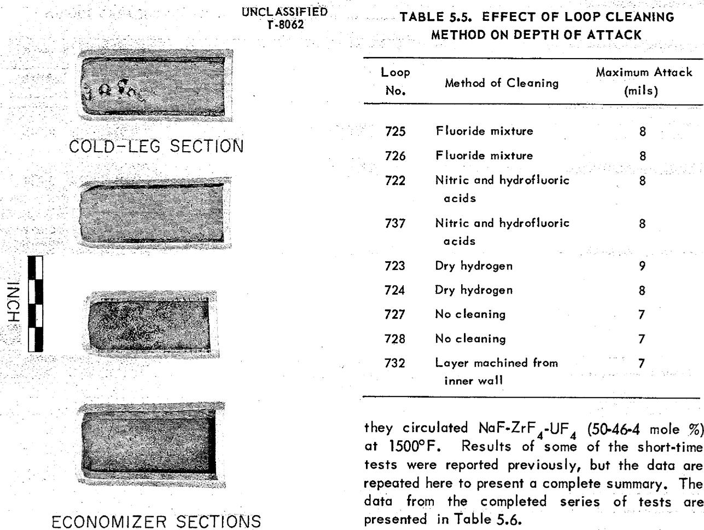  
Fig. 5.7. Three Sections from the Economizer and One Section from the Cold Leg of Type 316 Stainless Steel Loop 4951-7 Which Circulated Sodium for 476 hr. Hot-leg temperature, $1500^{\circ}\mathrm{F}$ ; temperature differential, $300^{\circ}\mathrm{F}$ ; Reynolds number, 15,000.

would be enough to explain the greater depths of attack.

# Effect of Applied Electromotive Forces

A series of thermal-convection loops were operated with small applied potentials to determine whether the corrosion mechanism is electrochemical in nature and, at the same time, to determine whether any deleterious effects would be found with stray currents. Wires were attached to the hot and cold legs of a loop, and a potential was applied by a battery charger. The current flow was small, averaging only 5 amp at 1 v. All these loops were fabricated of Inconel, and

The loop that was operated for 2000 hr with a positive charge applied to the hot leg showed only about one-half the depth of attack found in the loop operated with a negative charge applied to the hot leg. With a negative hot leg, the depth of attack was about the same as that found in the control loop with no applied potential. From these few data, it does not appear that small stray potentials will increase the attack. Although it would be difficult to apply a potential in a system as complicated as a reactor, it appears that it would be possible to reduce the attack by applying a positive potential.

# Effect of Oxide Additions to Sodium

A series of Inconel thermal-convection loops was operated with varying amounts of $\mathsf{Na}_2\mathsf{O}_2$ added to the sodium being circulated to determine whether mass transfer in the system was caused by oxide impurities in the sodium.

The data obtained, presented in Table 5.7, show an increase in mass transfer with increased oxide content. Corresponding lengths were cut

TABLE 5.6. EFFECT OF APPLIED POTENTIAL ON DEPTH OF ATTACK IN THERMAL-CONVECTION LOOPS WHICH CIRCULATED NaF-ZrF4-UF4 (50-46-4 mole %)   

<table><tr><td>Loop No.</td><td>Original Fluoride Mixture Batch No.</td><td>Hot-Leg Charge</td><td>Time of Operation (hr)</td><td>Final Chromium Concentration (ppm)</td><td>Maximum Attack (mils)</td><td>Intensity of Attack</td></tr><tr><td>540</td><td>188 PF-1</td><td>None (control)</td><td>500</td><td>520</td><td>11</td><td>Moderate to heavy</td></tr><tr><td>541</td><td>188 PF-1</td><td>Positive</td><td>500</td><td>550</td><td>7.5</td><td>Heavy</td></tr><tr><td>542</td><td>188 PF-7</td><td>Negative</td><td>500</td><td>675</td><td>7</td><td>Heavy</td></tr><tr><td>554</td><td>188 PF-7</td><td>None (control)</td><td>500</td><td>635</td><td>11</td><td>Moderate to heavy</td></tr><tr><td>614</td><td>248 PF-4</td><td>None (control)</td><td>1000</td><td>875</td><td>15</td><td>Heavy</td></tr><tr><td>615</td><td>248 PF-4</td><td>Positive</td><td>1500</td><td>720</td><td>12</td><td>Heavy</td></tr><tr><td>616</td><td>248 PF-4</td><td>Negative</td><td>1500</td><td>1200</td><td>20</td><td>Heavy</td></tr><tr><td>617</td><td>248 PF-4</td><td>None (control)</td><td>2000</td><td>950</td><td>19</td><td>Moderate to heavy</td></tr><tr><td>552</td><td>217 PF-5</td><td>Positive</td><td>2000</td><td>610</td><td>7</td><td>Moderate to heavy</td></tr><tr><td>553</td><td>217 PF-5</td><td>Negative</td><td>2000</td><td>740</td><td>15</td><td>Moderate to heavy</td></tr></table>

TABLE 5.7. MASS TRANSFER IN INCONEL THERMAL-CONVECTION LOOPS WHICH CIRCULATED SODIUM WITH ADDITIONS OF ${\mathrm{{Na}}}_{2}{\mathrm{O}}_{2}$   

<table><tr><td>Loop No.</td><td>Na2O2Added (wt %)</td><td>Operating Time (hr)</td><td>Hot-Leg Attack (mils)</td><td>Relative Mass Transfer*</td></tr><tr><td>729</td><td>None</td><td>500</td><td>1.5</td><td>Trace</td></tr><tr><td>730</td><td>None</td><td>510**</td><td>1.5</td><td>Trace</td></tr><tr><td>731</td><td>None</td><td>2000</td><td></td><td>0.06</td></tr><tr><td>666</td><td>0.1</td><td>432**</td><td>2</td><td>Trace</td></tr><tr><td>669</td><td>0.1</td><td>844**</td><td></td><td>0.02</td></tr><tr><td>663</td><td>0.1</td><td>1000</td><td>2</td><td>0.03</td></tr><tr><td>670</td><td>0.2</td><td>313**</td><td>2</td><td>0.04</td></tr><tr><td>664</td><td>0.2</td><td>991**</td><td>4</td><td>0.13</td></tr><tr><td>667</td><td>0.2</td><td>1000</td><td>3</td><td>0.05</td></tr><tr><td>665</td><td>0.5</td><td>500</td><td>3</td><td>0.02</td></tr><tr><td>668</td><td>0.5</td><td>1000</td><td>3</td><td>0.15</td></tr><tr><td>671</td><td>0.5</td><td>2000</td><td></td><td>0.30</td></tr></table>

*Relative figures obtained by weighing the metal removed from a known length of the horizontal hot leg and converting the value obtained to an average weight per inch.  
**Terminated by leak.

from the lower vertical cold leg and the horizontal hot leg of each loop. The deposit in each section was brushed out and weighed, and the weight value was converted to an average weight per inch. These values, given in Table 5.7, are relative and subject to considerable error. They do show, however, increased mass transfer with increased oxide content.

The increased mass transfer was also reflected in increased attack in the hot legs. The depths of attack varied from 1.5 mils in the control loops to 4 mils in the high-oxide-content loops. The attack was primarily intergranular, with, possibly, some general surface removal. Some difficulty was encountered with the loop supports during this series of tests, and operation of several loops had to be terminated because of leaks. This difficulty now appears to have been corrected.

# GENERAL CORROSION STUDIES

E.E.Hoffman W.H.Cook

C.F.Leitten, Jr.

Metallurgy Division

R. Carlander

Pratt & Whitney Aircraft

# Hot-Pressed Metal-Bonded Tungsten

Carbide in NaF-ZrF $_4$ -UF $_4$

W. H. Cook

Metallurgy Division

Several Haynes Stellarite Company, experimental, hot-pressed, metal-bonded, tungsten carbide specimens have been screen tested in NaF-ZrF4-UF4 (53.5-40-6.5 mole %) and in sodium in the seesaw

apparatus at 4.25 cpm. The hot and cold zones were at 1500 and $1200^{\circ}\mathrm{F}$ , respectively. Each specimen was held in the hot zone of its capsule during the 200-hr test period. The nominal compositions of the materials tested are given in Table 5.8.

Metallographic examination of the untested and tested specimens did not reveal any measurable attack on any of the tested specimens. It did show that the structure was, in general, good. The tungsten carbide particles were small, and the specimens had little porosity. The tungsten carbide and metal distributions were good, with the exception that there were small isles of metal that was free of tungsten carbide particles in all specimens. These isles were few and small in the specimens that had more than $20\%$ metal. Typical untested and tested $88\%$ tungsten carbide- $12\%$ Hastelloy C specimens are shown in Fig. 5.8.

# Solid-Phase Bonding of Cermets

W. H. Cook

Metallurgy Division

Recheck tests have been made on several cermet pairs in order to evaluate better the solid-phase bonding results obtained in previous screening tests.3 The cermets tested were manufactured by Kennametal, Inc., under the trade name Kentanium. The results of the recheck, given in Table 5.9, are the same as those obtained in the previous tests.

3E. E. Hoffman, W. H. Cook, and C. F. Leitten, Jr., ANP Quar. Prog. Rep. June 10, 1955, ORNL-1896, p 96.

TABLE 5.8. NOMINAL COMPOSITIONS OF SEVERAL EXPERIMENTAL, HOT-PRESSED, TUNGSTEN CARBIDE CERMETS   

<table><tr><td rowspan="2">Metal Binder</td><td colspan="8">Nominal Composition (wt %)</td></tr><tr><td>WC</td><td>Co</td><td>Ni</td><td>Cr</td><td>Mo</td><td>W</td><td>Fe</td><td>C</td></tr><tr><td>Hastelloy C</td><td>88</td><td></td><td>6.8</td><td>2.0</td><td>2.1</td><td>0.5</td><td>0.7</td><td>0.02</td></tr><tr><td>Haynes Alloy No. 31</td><td>88</td><td>6.7</td><td>1.3</td><td>3.1</td><td></td><td>0.9</td><td>0.2</td><td>0.06</td></tr><tr><td>90% Co-10% Cr</td><td>84</td><td>14.4</td><td></td><td>1.6</td><td></td><td></td><td></td><td></td></tr><tr><td>Haynes Alloy No. 6</td><td>84</td><td>10.3</td><td></td><td>4.4</td><td></td><td>0.6</td><td>0.5</td><td>0.16</td></tr><tr><td>Haynes Alloy No. 6</td><td>76</td><td>15.5</td><td></td><td>6.6</td><td></td><td>1.0</td><td>0.7</td><td>0.24</td></tr><tr><td>Haynes Alloy No. 6-8% Co</td><td>80</td><td>15.7</td><td></td><td>3.3</td><td></td><td>0.5</td><td>0.4</td><td>0.10</td></tr><tr><td>Haynes Alloy No. 6-12% Co</td><td>76</td><td>19.7</td><td></td><td>3.3</td><td></td><td>0.5</td><td>0.4</td><td>0.10</td></tr></table>

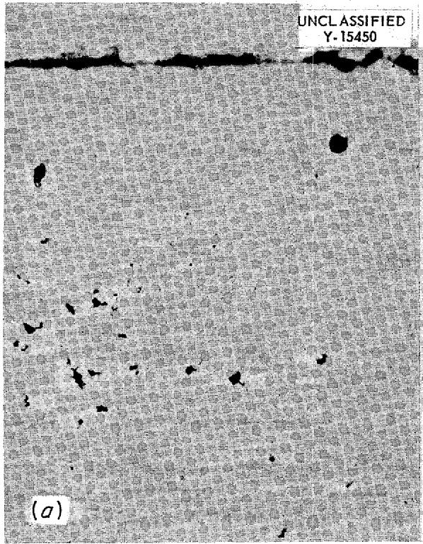

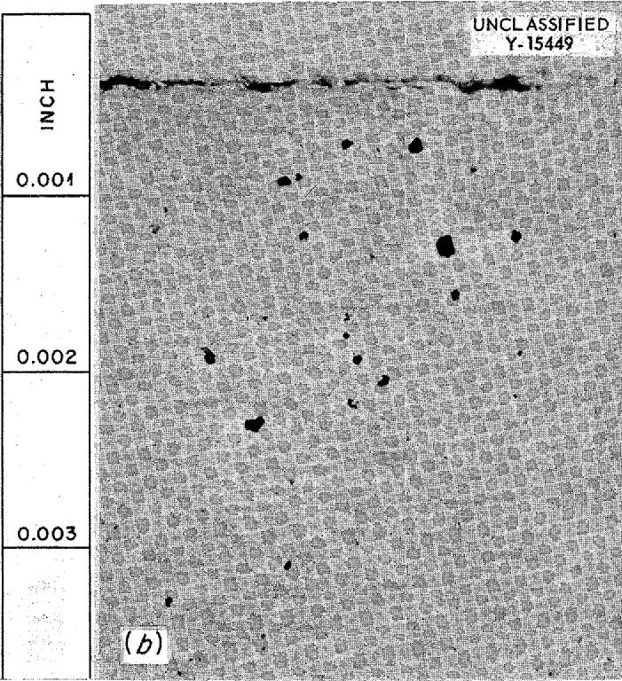  
Fig. 5.8. (a) The $88\%$ Tungsten Carbide- $12\%$ Hastelloy C Cermet Before Testing. (b) The Same Specimen After Exposure for 200 hr to $\mathsf{NaF - ZrF}_4\mathsf{-UF}_4$ (53.5-40-6.5 mole %) in the $1500^{\circ}\mathsf{F}$ Hot Zone of a Seesaw Apparatus in Which the Cold Zone Was at $1200^{\circ}\mathsf{F}$ . Specimens unetched. 1000X. Reduced $2\%$ .

Compositions: K150A (80 wt % TiC-10 wt % NbTaTiC₃-10 wt % Ni)

K151A (70 wt % TiC-10 wt % NbTaTiC₃-20 wt % Ni)

K152B (64 wt % TiC-6 wt % NbTaTiC3-30 wt % Ni)

K162B (64 wt % TiC-6 wt % NbTaTiC3-25 wt % Ni-5 wt % Mo)

TABLE 5.9. RESULTS OF RECHECK TESTS OF SOLID-PHASE BONDING OF SEVERAL CERMETS EXPOSED TO NaF-ZrF4-UF4 (53.5-40-6.5 mole %) AT 1500°F FOR 100 hr AT 50,000 psi*   

<table><tr><td>Contacting Specimens</td><td>Bonding</td></tr><tr><td>K150A vs K152B</td><td>Some</td></tr><tr><td>K151A vs K152B</td><td>None</td></tr><tr><td>K151A vs K162B</td><td>None</td></tr><tr><td>K152B vs K162B</td><td>None</td></tr><tr><td>K162B vs K162B</td><td>Some</td></tr></table>

*Calculated contact pressure.

Further evaluation of the best of the nonbonding cermets, as determined by the original and rechecking tests, will be made in solid-phase bonding tests of these materials in the form of valve disks and seats. It is planned to study the resistance to solid-phase bonding for long periods of time, 1000 hr or more; the effects, if any, of braze-joining the cermets to Inconel (cf. Sec. 6, "Metallurgy and Ceramics"); and, possibly, the effects of repeated seatings of the disks and seats.

# Effects of Ruthenium on Physical Properties of Inconel

C. F. Leitten, Jr.  
Metallurgy Division

Since the examinations of various sections of the ARE and the LITR fluoride-fuel loop revealed slight deposits of ruthenium metal on the walls of the Inconel tubes, the effect of ruthenium on the physical properties of Inconel is being studied. A thin layer of ruthenium metal was electrodeposited from a solution of ruthenium nitrosochloride on an Inconel creep-test specimen. The thickness of the ruthenium plate on the Inconel was approximately 1.5 mils. The plated creep-test specimen was annealed in an evacuated Inconel capsule for 100 hr at $1500^{\circ}\mathrm{F}$ to allow the ruthenium to diffuse into the specimen. The specimen was then given a creep-rupture test in a purified argon atmosphere at a stress of 3500 psi. In calculating the stress, the area of the ruthenium plate was included. The results of the creep-rupture tests on the ruthenium-plated Inconel and on an unplated, standard, Inconel specimen are presented in Table 5.10. Since a difference in rupture times was found, another test is now in progress to check the results.

A metallographic examination of the strained portions of the ruptured ruthenium-plated Inconel specimen showed no difference in microstructure in comparison with that of a ruptured, unplated, Inconel specimen (Fig. 5.9). Creep-rupture tests are also to be conducted on ruthenium-plated Inconel specimens in the fused-salt mixtures.

TABLE 5.10. COMPARISON OF CREEP-RUPTURE DATA ON RUTHENIUM-PLATED AND UNPLATED INCONEL   

<table><tr><td>Stress:</td><td>3500 psi</td></tr><tr><td>Test temperature:</td><td>1500°F</td></tr><tr><td>Test environment:</td><td>Argon</td></tr></table>

<table><tr><td>Specimen</td><td>Time to Rupture (hr)</td><td>Final Elongation (%)</td><td>Creep Rate (%/hr)</td></tr><tr><td>Plated</td><td>873</td><td>13</td><td>0.0145</td></tr><tr><td>Unplated</td><td>1467</td><td>12</td><td>0.0028</td></tr></table>

Brazing Alloys on Inconel and on Nickel in Sodium and in NaF-ZrF4-UF4 C.F.Leitten, Jr. Metallurgy Division

Seesaw tests have been completed on a series of brazing alloys on Inconel T-joints. These tests were conducted in sodium and in the fuel mixture $\mathrm{NaF - ZrF_4 - UF_4}$ (53.5-40-6.5 mole %) for 100 hr at a hot-zone temperature of $1500^{\circ}\mathrm{F}$ . A temperature differential of approximately $400^{\circ}\mathrm{F}$ was maintained between the hot and cold zones of the test container. The data obtained from weight measurements and metallographic examination of the tested T-joints are given in Table 5.11. The $82\%$ Au- $18\%$ Ni brazing alloy and copper were tested only in the fuel mixture, because previous corrosion data had indicated the poor corrosion resistance of these alloys in sodium. The seesaw test on the Coast Metals No. 52 brazing alloy was a retest; the results agree with those previously reported.

The Coast Metals No. 53 brazing alloy and Electroless nickel showed good corrosion resistance to both mediums, as indicated in Table 5.11. The Inconel T-joints brazed with Coast Metals alloy No. 53 are shown in Fig. 5.10 after exposure to the fuel mixture NaF-ZrF $_4$ -UF $_4$ (53.5-40-6.5 mole %) in a seesaw test for 100 hr at a hot-zone temperature of $1500^{\circ}\mathrm{F}$ and after exposure to sodium under the same conditions. Only slight attack can be seen along the surface of the braze fillet exposed to the fuel mixture; the fillet exposed to sodium showed similar slight surface attack.

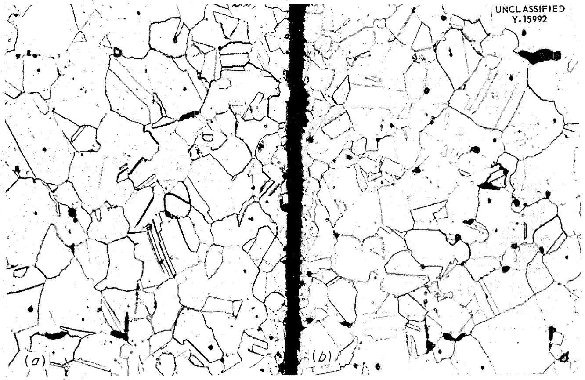  
Fig. 5.9. The Strained Portions of (a) a Ruthenium-Plated and (b) an Unplated Inconel Test Specimen Following Rupture in a Creep Test. Cathodic etch. 250X.

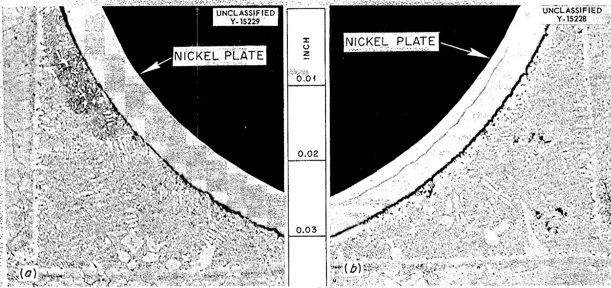  
Fig. 5.10. Inconel T-Joints Brazed with Coast Metals Alloy No. 53 After Seesaw Testing for 100 hr in (a) Fuel Mixture NaF-ZrF $_4$ -UF $_4$ (53.5-40-6.5 mole %) and (b) Sodium at a Hot-Zone Temperature of $1500^{\circ}\mathrm{F}$ . Etched with aqua regia. 100X. Reduced 20%.

TABLE 5.11. RESULTS OF SEESAW TESTS OF BRAZED INCONEL T-JOINTS TESTED IN SODIUM AND IN THE FUEL MIXTURE NaF-ZrF4-UF4 (53.5-40-6.5 mole %) FOR 100 hr AT A HOT-ZONE TEMPERATURE OF ${1500}^{ \circ  }\mathrm{F}$   

<table><tr><td rowspan="2">Brazing-Alloy* Composition (wt %)</td><td rowspan="2">Bath</td><td colspan="2">Weight Change</td><td rowspan="2">Metallographic Notes</td></tr><tr><td>(g)</td><td>(%)</td></tr><tr><td>Coast Metals No. 52, 89 Ni-5 Si-4 B-2 Fe</td><td>Fuel</td><td>0</td><td>0</td><td>Uniform surface attack along fillet to a depth of 0.5 mil</td></tr><tr><td>Copper</td><td>Fuel</td><td>-0.0002</td><td>-0.026</td><td>Surface attack along fillet to a depth of 0.5 mil</td></tr><tr><td rowspan="2">Coast Metals No. 53, 81 Ni-4 Si-4 B-8 Cr-3 Fe</td><td>Fuel</td><td>-0.0011</td><td>-0.092</td><td>Nonuniform surface attack along fillet to a depth of 1.5 mils</td></tr><tr><td>Sodium</td><td>-0.0009</td><td>-0.071</td><td>Erratic attack along surface of fillet to a depth of 1 mil</td></tr><tr><td rowspan="2">Electroless nickel, 90 Ni-10 P</td><td>Fuel</td><td>-0.0004</td><td>-0.041</td><td>No attack along surface of fillet</td></tr><tr><td>Sodium</td><td>-0.0044</td><td>-0.50</td><td>Surface attack along fillet to a depth of 1.5 mils</td></tr><tr><td rowspan="2">Coast Metals No. NP, 50 Ni-12 Si-28 Fe-4 Mo-4.5 P-1 Mn-0.5 Cr</td><td>Fuel</td><td>-0.0009</td><td>-0.092</td><td>Uniform attack along surface of fillet to a depth of 1.5 mils</td></tr><tr><td>Sodium</td><td>-0.0069</td><td>-0.622</td><td>Uniform attack along surface of fillet to a depth of 2.5 mils</td></tr><tr><td rowspan="2">General Electric No. 81, 66 Ni-19 Cr-10 Si-4 Fe-1 Mn</td><td>Fuel</td><td>-0.0008</td><td>-0.067</td><td>Attack along surface of braze fillet to a depth of 3.5 mils</td></tr><tr><td>Sodium</td><td>-0.0018</td><td>-0.0163</td><td>Uniform attack along surface of fillet to a depth of 3 mils</td></tr><tr><td>82 Au-18 Ni</td><td>Fuel</td><td>0.0011</td><td>0.12</td><td>Nonuniform attack along fillet to a depth of 4 mils</td></tr></table>

*Brazing alloys listed in order of decreasing corrosion resistance to both test mediums.

The Electroless nickel (90% Ni-10% P) alloy was unattacked by the fuel mixture; however, there were several microscopic cracks present in the fillet. These cracks indicated that this alloy was brittle. It would therefore not be satisfactory for use in radiator fabrication. The 82% Au-18% Ni brazing alloy will be retested in the fuel mixture, because there is considerable discrepancy between the results of this seesaw test and the results of the static test.[7]

The $75\%$ Ni- $25\%$ Ge brazing alloy on nickel T-joints has been tested in static sodium and in the fuel mixture NaF-ZrF $\cdot 4 - UF_{4}$ (53.5-40-6.5 mole %) for 100 hr at $1500^{\circ}F$ . This alloy showed non

uniform attack to a depth of 2 mils in sodium and no attack in the fuel mixture. This alloy will be seesaw tested in sodium and in the fuel mixture.

# Brazing Alloys on Inconel and on Stainless Steel in Lithium

C. F. Leitten, Jr. Metallurgy Division

Corrosion tests have been completed on three brazing alloys - Nicrobraz, 73.5% Ni-10% Si-16.5% Cr, and 71% Ni-16.5% Cr-10% Si-2.5% Mn - on type 316 stainless steel and Inconel T-joints in static lithium at $1500^{\circ}\mathrm{F}$ for 100 hr to verify corrosion results previously obtained.

The results obtained from weight measurements and metallographic examination of the tested

specimens are presented in Table 5.12. All the brazing alloys exhibited poor corrosion resistance to lithium, and the attack was more severe on the brazing alloys on type 316 stainless steel. This is probably due to the difference in nickel concentrations in type 316 stainless steel (10 to $14\%$ ) and Inconel (75 to $80\%$ ). Since nickel is preferentially attacked by lithium, the attack on the Inconel T-joints would be uniform on both the base material and the brazing alloys, which in these tests contained approximately the same nickel concentrations as Inconel. However, the attack would be more concentrated on the brazing alloys on type 316 stainless steel T-joints, because most of the nickel would have to be leached from the brazing alloy in order to reach the solubility limit of nickel in lithium. The results of these tests corroborated the results of the previous tests; that is, the nickel-base brazing alloys have very poor corrosion resistance to lithium, especially when used to braze iron-base alloys.

Hastelloy B-Inconel in NaF-ZrF4-UF4

R. Carlander

Pratt & Whitney Aircraft

A static test of a Hastelloy B specimen in an Inconel capsule containing a fuel mixture was performed to determine whether dissimilar-metal

mass transfer occurred in such an isothermal system. The fuel mixture was $\mathrm{NaF - ZrF_4 - UF_4}$ (50-46-4 mole %), and the system was held for 100 hr at a temperature of $1600^{\circ}\mathrm{F}$ . The Hastelloy B specimen showed a negligible weight loss of 0.0003 g, but no attack could be detected metallographically. Spectrographic analysis revealed that no molybdenum had transferred to the Inconel capsule wall.

Two 5-mil cuts were machined from the surface of the Hastelloy specimen and analyzed spectrographically to determine whether chromium had been picked up from the Inconel tube. Since there was no detectable difference in the chromium content of the two cuts, it appears that no appreciable quantity of chromium had transferred. The surfaces of the Hastelloy B specimen and of the Inconel container are shown in Fig. 5.11. Inconel is normally attacked to a depth of 2 mils in an all-Inconel static test system under similar test conditions. The presence of Hastelloy B in the system increased the observed attack on the Inconel to a depth of 8 mils.

Boiling Sodium in Inconel

E.E.Hoffman

Metallurgy Division

Tests, to date, at ORNL and at other laboratories indicate that the oxygen content of sodium in

TABLE 5.12. BRAZING ALLOYS ON TYPE 316 STAINLESS STEEL AND INCONEL TESTED IN STATIC LITHIUM FOR 100 hr AT ${1500}^{ \circ  }\mathrm{F}$   

<table><tr><td rowspan="2">Brazing-Alloy Composition (wt %)</td><td rowspan="2">Base Material</td><td colspan="2">Weight Change*</td><td rowspan="2">Metallographic Notes</td></tr><tr><td>(g)</td><td>(%)</td></tr><tr><td rowspan="2">Nicrobraz, 70 Ni-14 Cr-6 Fe-5 B-4 Si-1 C</td><td>Type 316 stainless steel</td><td>-0.0087</td><td>-1.17</td><td>Joint failed during testing</td></tr><tr><td>Inconel</td><td>-0.0012</td><td>-0.16</td><td>Joint attacked nonuniformly to a maximum depth of 9 mils, with uniform attack to a depth of 4 mils over entire fillet</td></tr><tr><td rowspan="2">73.5 Ni-10 Si-16.5 Cr</td><td>Type 316 stainless steel</td><td>-0.0235</td><td>-2.97</td><td>Joint failed during testing</td></tr><tr><td>Inconel</td><td>-0.0081</td><td>-1.23</td><td>Braze fillet completely attacked</td></tr><tr><td rowspan="2">71 Ni-10 Si-16.5 Cr-2.5 Mn</td><td>Type 316 stainless steel</td><td>-0.0949</td><td>-11.3</td><td>Braze fillet completely attacked</td></tr><tr><td>Inconel</td><td>0.0312</td><td>3.66</td><td>Uniform attack in form of sub-surface voids along fillet</td></tr></table>

*Weight-change data for brazing alloy and base material of joint.

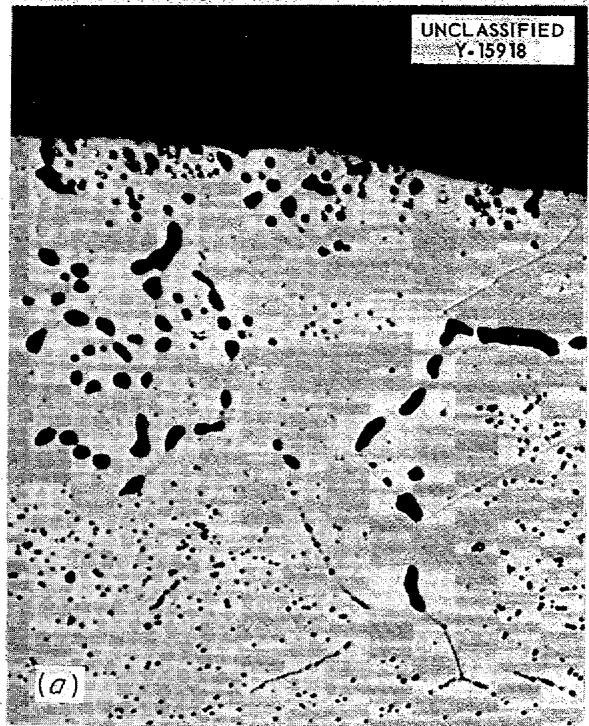

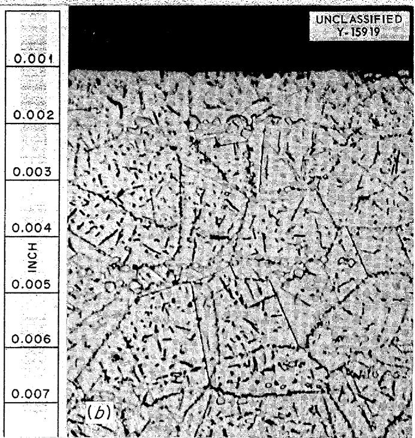  
Fig. 5.11. Surfaces of (a) the Inconel Container and (b) the Hastelloy B Specimen Following Exposure to NaF-ZrF $_4$ -UF $_4$ (50-46-4 mole %) for 100 hr at $1600^{\circ}\mathrm{F}$ . Etched with $10\%$ oxalic acid. 500X. Reduced $7\%$ .

nickel or in iron-base alloy systems has a considerable effect on the amount of mass transfer that occurs in the system. Therefore, in order to study mass transfer in a system in which the oxygen content could be held to a very low level, a boiling-sodium loop test was run. The loop is shown in Fig. 5.12. The temperatures around the loop during the 400-hr test are indicated. There are two traps for liquid sodium in the condenser leg of the loop. The first trap is filled with hot, freshly condensed sodium during the test. This is an ideal location for metal solution to occur. The second trap catches the overflow from the first trap and operates at a considerably lower temperature. This is an ideal location for metal deposition to occur. Three nickel cooling coils are located on the condenser leg, and air flow through these coils is regulated to maintain the desired temperatures. The boiler and the small return line to the boiler are the only areas where heat is applied. The first test was terminated after 400 hr, when a small leak was detected in the coolest section of the bottom return line. X-ray, macroscopic, and microscopic examination

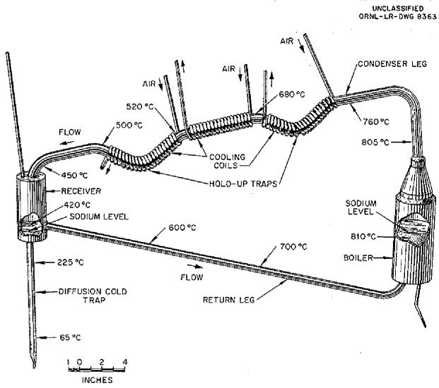  
Fig. 5.12. Inconel-Boiling-Sodium Loop.

of the traps in the condenser line revealed no mass transfer (Fig. 5.13). Heavy intergranular cracks were found in the condenser tube wall, and, as yet, no satisfactory explanation has been found. The extent of this intergranular cracking

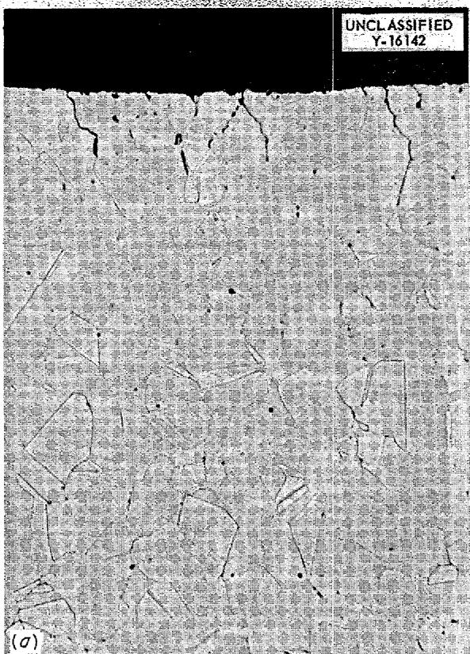

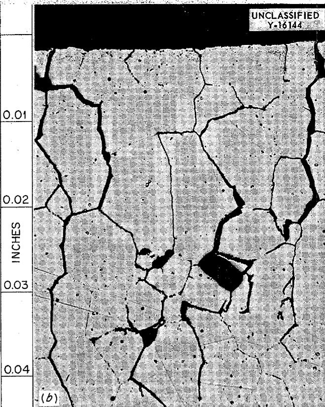  
Fig. 5.13. Inconel-Boiling-Sodium System Specimens from (a) Hot Trap and (b) Cold Trap of Inconel Condenser Tube Wall. Note heavy intergranular cracks and absence of mass-transfer crystals. 100X. Reduced $11.5\%$ .

varied from zero in the hottest section of the condenser tube to a depth of 3 mils in the coolest section, with the heaviest cracking, to a depth of 50 mils, midway between the two traps (Fig. 5.13). A second test for checking the results of this experiment is now under way.

# Inconel Exposed to a Sodium-Potassium-Lithium Mixture

E.E.Hoffman

Metallurgy Division

Five seesaw corrosion tests were conducted on Inconel tubes loaded with sodium-potassium-lithium mixtures in which the lithium content was varied from 2 to $30\mathrm{wt}\%$ . The ratio of sodium to potassium in each test was 56:44. The heaviest attack in each test was found in the hot section of the Inconel seesaw tube, and it varied from 0.5 mil in the presence of $10\%$ lithium to 2 to 3 mils

in the presence of $5\%$ lithium. It is not yet understood why the heavier attack occurred in the presence of the lower amount of lithium. Additional specimens cut from the hot zone of the tube confirmed the results. In none of the tests could mass transfer be detected in the cold zones of the tubes. The results of metallographic examination of the hot and cold zones of each test container are presented in Table 5.13, and the hot zones of the tubes tested with 2 and $30\%$ lithium mixtures are shown in Fig. 5.14.

# Molybdenum, Vanadium, and Niobium in Static Lithium

E.E.Hoffman

Metallurgy Division

Corrosion tests have been conducted on molybdenum, vanadium, and niobium exposed to static lithium for 100 hr at $1500^{\circ}\mathrm{F}$ . The test specimens

Hot-zone temperature: $1500^{\circ}\mathrm{F}$

Cold-zone temperature: $1100^{\circ}\mathrm{F}$

TABLE 5.13. RESULTS OF TESTS OF INCONEL SEESAW TUBES EXPOSED TO SODIUM-POTASSIUM-LITHIUM MIXTURES FOR ${100}\mathrm{{hr}}$   

<table><tr><td>Seesaw Test Number</td><td>Bath (wt %)</td><td>Hot-Zone Attack</td><td>Cold-Zone Attack</td></tr><tr><td>265</td><td>2 Li-55 Na-43 K</td><td>Intergranular voids in scattered areas to a depth of 1 mil</td><td>No attack</td></tr><tr><td>266</td><td>5 Li-53 Na-42 K</td><td>Heavy attack in the form of sub-surface voids to a depth of 2 to 3 mils; small, very hard particles of an unidentified phase located in areas where the attack was heaviest</td><td>No attack</td></tr><tr><td>270</td><td>10 Li-50 Na-40 K</td><td>Small subsurface voids to a depth of 0.5 mil</td><td>No attack</td></tr><tr><td>271</td><td>20 Li-45 Na-35 K</td><td>Small subsurface voids to a depth of 0.5 to 1 mil</td><td>Attack in scattered areas to a depth of 0.5 mil</td></tr><tr><td>272</td><td>30 Li-40 Na-30 K</td><td>Subsurface voids to a depth of 1 to 2 mils</td><td>Intergranular penetration to a depth of 0.25 to 0.5 mil</td></tr></table>

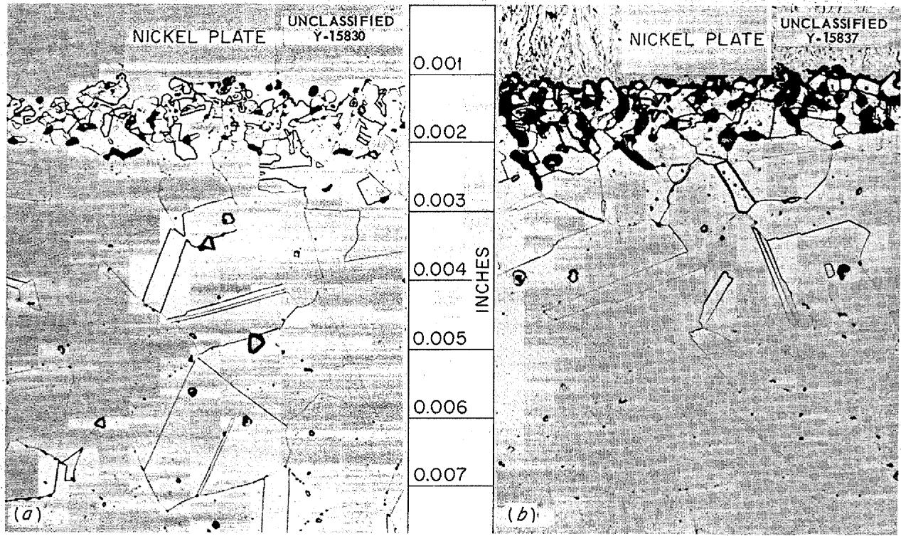  
Fig. 5.14. Surfaces of Hot-Zone Specimens of Inconel Seesaw Tubes Exposed to Sodium-Potassium-Lithium Mixtures for 100 hr at a Cold-Zone Temperature of $1075^{\circ}\mathsf{F}$ . Tube (a) contained $55\%$ Na-43% K-2% Li; tube (b) contained $40\%$ Na-30% K-30% Li. 500X. Reduced 3%.

and containers were of the same material in each test. The results of weight-change determinations and metallographic examination of the specimens from these tests are given in Table 5.14. The exposed surfaces of the niobium and the molybdenum specimens are shown in Fig. 5.15. The niobium was only slightly attacked, and the molybdenum was unattacked.

# Analysis of Metal Crystals from Inconel-Sodium Thermal-Convection Loop

E. E. Hoffman

Metallurgy Division

The metal crystals found in the cold leg of an Inconel-sodium thermal-convection loop were analyzed and found to be:

<table><tr><td>Element</td><td>Content(wt %)</td></tr><tr><td>Ni</td><td>85.0</td></tr><tr><td>Cr</td><td>11.2</td></tr><tr><td>Fe</td><td>2.1</td></tr><tr><td>Mn</td><td>1.4</td></tr></table>

TABLE 5.14. RESULTS OF EXPOSURE OF MOLYB- DENUM, VANADIUM, AND NIOBIUM TO STATIC LITHIUM FOR 100 hr AT ${1500}^{ \circ  }F$   

<table><tr><td>Material</td><td>Weight Change (g/in.2)</td><td>Metallographic Results</td></tr><tr><td>Molybdenum</td><td>0</td><td>No attack</td></tr><tr><td>Vanadium</td><td>0.0084</td><td>Grain-boundary penetration by unidentified phase to a depth of 2 mils</td></tr><tr><td>Niobium</td><td>0.0006</td><td>No attack</td></tr></table>

# FUNDAMENTAL CORROSION RESEARCH

G.P.Smith

Metallurgy Division

Film Formation on Metals

J.V.Cathcart

Metallurgy Division

8E. E. Hoffman, W. H. Cook, and C. F. Leitten, Jr., ANP Quar. Prog. Rep. June 10, 1955, ORNL-1896, p 101.

Oxidation of Sodium. The investigation of the oxidation characteristics of sodium has been con

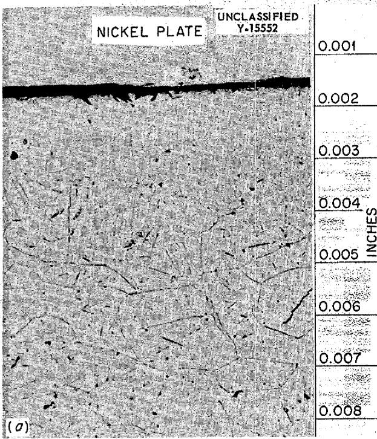

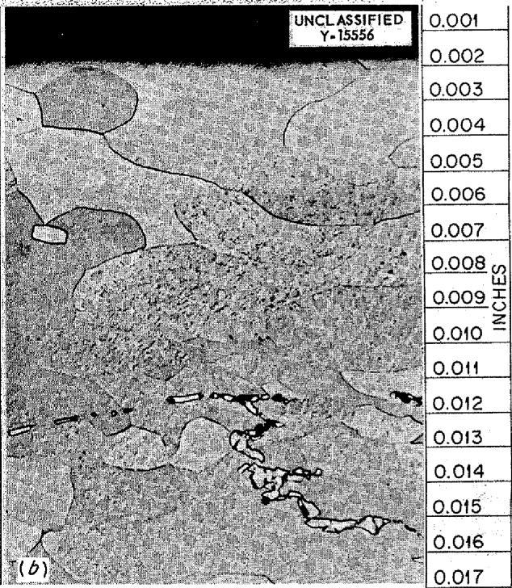  
Fig. 5.15. Surfaces of (a) Niobium and (b) Molybdenum Specimens After Exposure to Static Lithium for 100 hr at $1500^{\circ}\mathbf{F}$ .

tinued. Previous results9 emphasized, contrary to generally accepted oxidation theory,10 that sodium forms a highly protective oxide film in dry oxygen. The research has, also, in some measure, filled the gap which exists in the experimental oxidation data for the alkali and alkaline-earth metals. Finally, the results indicate a considerable similarity between the oxidation of sodium and other, more extensively studied, metals, such as copper and aluminum. In this respect, additional evidence has been obtained in support of the idea expressed by Cabrera and Mott11 that all metals have comparable oxidation mechanisms at relatively low temperatures.

Oxidation-rate measurements for sodium were made manometrically. A film of sodium was evaporated onto the walls of a small glass bulb attached to one arm of a sensitive differential manometer. The course of the reaction could then be followed by measuring the decrease in pressure in the bulb as the oxidation proceeded. The details of the experimental apparatus have already been described.[9]

During the period covered by this report, most of the experimental work has been devoted to the measurement of oxidation rates at 25 and $48^{\circ}C$ over extended periods of time. At these two temperatures and also at $35^{\circ}C$ , experiments lasting between 15,000 and 20,000 min have been completed.

Such prolonged experiments were considered necessary for two reasons. First, they are required if a realistic determination is to be made of the analytical form of the rate curves. Because there may be a gradual change in the reaction mechanism as oxidation proceeds and on account of unavoidable errors in experimental measurements, a misleading impression of an oxidation curve can easily be obtained when data for only the first portions of the curve are available.

A second reason for such extended tests was that some metals (for example, columbium) undergo abrupt changes in oxidation mechanism after a relatively thick oxide film has developed on them.

It was important to determine whether or not sodium is subject to this phenomenon.

Seven rate determinations at $25^{\circ}C$ and four at $48^{\circ}C,$ all lasting for 17,000 to 20,000 min, have been completed. Data from these, as well as the measurements obtained at $-79, -20,$ and $35^{\circ}C,$ are shown in Fig. 5.16. The change in pressure in the system, which is a function of the oxide-film thickness, is plotted against the time of oxidation on a log-log plot. Each unit of the vertical scale is equivalent to approximately 10 Å of oxide; therefore after 20,000 min at $48^{\circ}C$ an oxide thickness of almost 1400 Å was attained.

Each curve of Fig. 5.16 represents the composite of data from three or more experiments. Deviations of as much as $10\%$ in the total pressure change were observed between readings at the same time and temperature in different experiments. An error of this magnitude was not considered serious; a basic assumption in comparing the results of different experiments was that the areas of the initial sodium films were the same. A new oxidation bulb was used for each experiment, and it was impossible to avoid slight variations in the dimensions of these bulbs. Therefore the assumption that the apparent surface area of the sodium films was identical for all experiments was true only to a first approximation. Perhaps even more important was the possibility that the surface roughness (and, therefore, the true surface area) of the sodium films differed slightly from experiment to experiment. These two factors could easily account for the observed variations in the experimental results.

Mathematical analyses of the rate curves show that none of the conventional oxidation-rate laws was obeyed by sodium; that is, the data could not be fitted to rate equations of the form $x^n = kt$ (where $x$ is the oxide thickness after a time $t$ , $k$ is the rate constant, and $n = 1, 2,$ or 3) nor to the logarithmic, $x = k \log t$ , or the inverse logarithmic, $\frac{1}{x} = A - B \ln t$ , rate equations. The absence of any abrupt changes in the oxidation curves indicates that there were no sudden changes in the mechanism of oxidation as the oxidation proceeded.

One interesting feature of the results was that the oxidation proceeded at an ever-decreasing rate with time, even at $48^{\circ}C$ . Thus highly protective oxide films were observed under all conditions investigated. There was no indication of

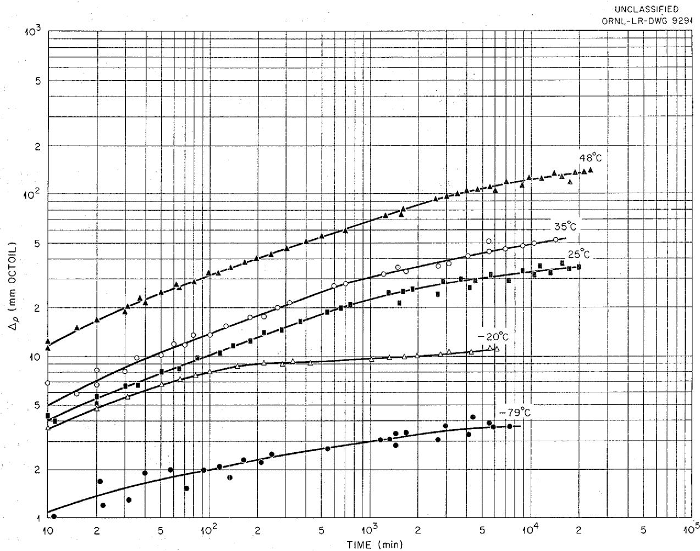  
Fig. 5.16. Oxidation of Sodium at -79, -20, 25, 35, and $48^{\circ}\mathrm{C}$ .

any tendency toward crack formation in the oxide. Far from obeying a linear rate law, as has been predicted theoretically,[10] the oxidation characteristics of sodium in the temperature range $-79$ to $48^{\circ}\mathrm{C}$ appeared to be comparable to those of copper between 100 and $150^{\circ}\mathrm{C}$ .[12]

Measurements of the over-all oxidation rate of a metal give only a macroscopic picture of the total oxidation process. Complete understanding of the oxidation mechanism requires a more detailed examination of the oxide. Accordingly, it is planned that the next phase of the research will involve an investigation of the surface topography and of the nucleation of the oxide films formed on sodium.

Oxidation of Columbium. The oxidation of columbium follows a linear rate equation above $400^{\circ}C$ . Below this temperature the rate curves are approximately parabolic. In a narrow temperature band centered around $400^{\circ}C$ , the rate curve is initially parabolic, but it becomes almost linear after a few hours of oxidation.[13]

The only theoretical basic for a linear oxidationrate equation is that given by Pilling and Bedworth.10 However, the results obtained for the oxidation of sodium leave little doubt as to the inadequacy of this theory. An investigation of the oxidation of columbium at temperatures in the vicinity of $400^{\circ}C$ was undertaken in the belief that a careful study of the structure, composition,

and behavior of the oxide films during the transition from the parabolic to the linear rate would give some indication of the criteria for linear oxidation rates.

The first phase of the work consisted in a careful redetermination, of the oxidation-rate curves for columbium at $400^{\circ}\mathrm{C}$ . A manometric technique, very similar to that used for the oxidation of sodium, was found to be satisfactory for the rate measurements. The oxidation specimens consisted of $1 \times 2$ cm strips cut from a 0.020-in.-thick sheet of columbium. The specimens were electropolished mechanically with $4/0$ emery paper and then electropolished in a $10\%$ HF- $90\%$ $\mathsf{H}_2\mathsf{SO}_4$ bath. One such strip was placed in a $100\text{-cm}^3$ glass bulb attached to one arm of a differential manometer. Octoil-S diffusion-pump oil was used as the manometric fluid in order to obtain the desired pressure sensitivity. The oxidation and reference bulbs of the manometer were evacuated to a pressure of about $10^{-6}$ mm Hg and then immersed, along with an oxygen reservoir, in a molten-salt, constant-temperature bath. The oxidation and reference bulbs were then filled simultaneously with oxygen to identical pressures. The absolute oxygen pressure was about $700~\mathrm{mm}$ Hg. The rate of oxidation was then determined by measuring, with the manometer, the decrease in pressure in the oxidation bulb. The use of an accurately controlled constant-temperature bath was considered necessary to avoid spurious pressure changes arising from temperature differences in the oxidation and reference bulbs.

Four oxidation experiments have been completed at or near $400^{\circ}\mathrm{C}$ . In each case the oxidation curve was initially approximately parabolic and then became linear as the time of oxidation increased. The data from one of these experiments is shown in Fig. 5.17. The change of oxygen pressure is plotted against the time of oxidation. For reasons as yet unknown, the time at which the transition from the parabolic to the linear portions of the rate curves occurred varied somewhat from experiment to experiment. However, the amount of oxygen which had been consumed by the time the transition region was reached was found to be relatively constant.

The oxide layers formed during the early stages of the reaction exhibited the interference tints typical of thin, transparent, oxide films. However, as the reaction progressed, patches of a white,

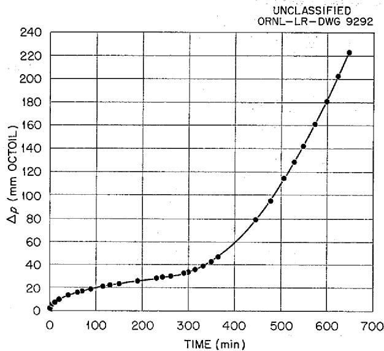  
Fig. 5.17. Oxidation of Columbium at $400^{\circ}\mathrm{C}$ .

opaque material developed on the surface of the columbium specimens. These white areas appeared under an optical microscope to be rough, and it was assumed that they represented relatively porous regions in the oxide film. X-ray examination of the oxidized specimens indicated that both the white areas and those parts of the oxide film that still showed interference colors consisted of columbium pentoxide $(\mathsf{Cb}_2\mathsf{O}_5)$ . No other oxides of columbium were detected.

Although the evidence is still not complete, the occurrence of the regions of white oxide seemed to be associated with the deviation of the rate curves from their initial parabolic form. For this reason it has been tentatively assumed that the white portions of the oxide film represent the type of oxide film which produces a linear reaction rate. In order to study the nucleation and growth of this white oxide, a hot-stage microscope has been constructed and is being tested. This apparatus should allow direct observation of the oxide films as they are formed.

An attempt is being made to express the over-all oxidation-rate equation for columbium as the sum of parabolic and linear terms approximately weighted to take into account the fraction of the total surface area oxidizing according to each of the two mechanisms. Complete formulation and testing of this equation awaits further data concerning the growth characteristics of the

areas of white oxide. It is hoped that this information can be obtained from observations of the oxidation under the hot-stage microscope.

# High-Temperature Spectrophotometry in Fused Hydroxides

C. R. Boston

Metallurgy Division

Work is continuing on the improvement of techniques for measuring absorption spectra at high temperatures. The major components have been fabricated and assembled for a new cell arrangement. These include the MgO cell $(\sim 7\%)$ in, deep with parallel flat sides); the stainless steel cell holder, tube header, etc.; a quartz tube with optically flat windows; a glass vacuum system; and a furnace with light-path openings. A controlled atmosphere can now be maintained over the melt during spectral measurements, and, in addition, the cell can be dry-box-loaded with previously dehydrated hydroxide. This prevents etching of the polished MgO cell faces by water vapor, as was experienced with the previous apparatus. It was thought that the deeper MgO cell would reduce the creep problem. However, with the cell less than half full, the hydroxide was found to creep over the top of the cell and down the sides in a matter of minutes after melting. A still-deeper MgO cell $(\sim 1\%)$ in.) is now being cut.

At the present time, a Coleman model 14 spectrophotometer modified for high-temperature work is being used. This instrument is, of course, inadequate for accurate work, and a Cary model 11 instrument is being acquired and will be rebuilt.

The highest purity sodium hydroxide commercially available is Baker's "reagent special" grade which contains $1.5\%$ $\mathsf{H}_2\mathsf{O}$ , $0.5\%$ $\mathsf{Na}_2\mathsf{CO}_3$ , $0.02\%$ $\mathsf{NH}_4\mathsf{OH}$ , and trace amounts of other impurities. This product has been further "purified" by L. G. Overholser to remove water and carbonate, but it has been contaminated in the process with a black material which is probably a nickel-oxygen compound formed during the dehydration procedure by reaction with the nickel container. This black material appears on the surface of the solid sodium hydroxide and, on melting, can be seen floating on the liquid surface. Therefore an attempt was made to prepare reliably pure sodium hydroxide by the reaction of pure sodium metal with water, followed by dehydration in a relatively inert ceramic container. The technique employed

was to pass water-saturated (at room temperature) argon over metallic sodium contained in a Morganite $(\mathrm{Al}_{2}\mathrm{O}_{3})$ crucible. After all the sodium had reacted, the system was evacuated, and the hydroxide was dehydrated by heating to $500^{\circ}\mathrm{C}$ at a pressure of $10\mu$ . A small amount of hydroxide prepared in this way from reagent-grade sodium is now being used in the thermal-decomposition studies. In these studies the small amount of ammonia present in Baker's "reagent special" grade sodium hydroxide might give misleading results.

# Mass Transfer and Corrosion in Fused Hydroxides

M.E. Steidlitz

Metallurgy Division

Studies of the corrosion and mass transfer of nickel and Inconel by fused sodium hydroxide are continuing in the "cold finger" apparatus.14 In addition, two new metals, copper and Monel, have been checked under hydrogen, and the results indicate that both are attacked to approximately the same extent as nickel. The mass transfer on the Monel cold finger is interesting in that both nickel- and copper-colored crystals are deposited.

It has been reported that additions of chromium in fine particles eliminate mass transfer of nickel.[15] One addition of chromium as a single lump, which was the only form available, was made at $650^{\circ}\mathrm{C}$ under hydrogen. No change in amount of mass transfer was noted. Addition of a manganese sheet to the hydroxide at $650^{\circ}\mathrm{C}$ resulted in transfer of manganese to the cold finger.

The effect of electrical contact between the cold finger and the bucket was investigated. Under hydrogen, electrically insulating the two components produced little, if any, reduction in mass transfer over the temperature range 600 to $700^{\circ}\mathrm{C}$ . With a helium blanket, however, mass transfer at $650^{\circ}\mathrm{C}$ was substantially increased upon breaking electrical contact. This unexpected result was rechecked and confirmed. The electrical effect is illustrated in Fig. 5.18.

The addition of water vapor to the hydrogen and to the helium reduced mass transfer of nickel

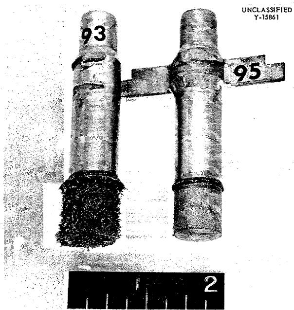  
Fig. 5.18. Nickel Cold Fingers Tested in Sodium Hydroxide with the Bucket at $650^{\circ}C$ and a Temperature Differential of $100^{\circ}C$ and with a Helium Blanket. Number 95 was electrically connected to the bucket, and No. 93 was insulated from the bucket.

at $650^{\circ}C$ . No reduction in the amount of deposited nickel was noted with water vapor and hydrogen at $750^{\circ}C$ .

The corrosion of Inconel by sodium hydroxide at $800^{\circ}C$ produces an interesting microscopic structure. The unetched sample shown in Fig. 5.19 has little, if any, grain-boundary attack, the depth of penetration being marked by laminar formations within the grains. Samples of 25-mil strip showed a tendency to split into two thinner sheets after 50 hr of immersion. A series of these strips, Nos. 0 to 4, which were tested at $800^{\circ}C$ for 0, 7, 28, 54, and 100 hr, are shown in Fig. 5.20. The results of spectrographic analyses of these strips are presented in Table 5.15. Further work on identification of the material deposited in the Inconel is being planned.

# Thermal Dissociation of Sodium Hydroxide

M. E. Steidlitz

Metallurgy Division

Observations of oxidation corrosion of metals plus color changes16 in fused sodium hydroxide

TABLE 5.15. RESULTS OF SPECTROGRAPHIC ANALYSES OF INCONEL STRIPS TESTED AT $800^{\circ}C$ IN SODIUM HYDROXIDE UNDER A HYDROGEN ATMOSPHERE   

<table><tr><td rowspan="2">Strip No.</td><td rowspan="2">Exposure Time (hr)</td><td colspan="5">Analysis (wt %)</td></tr><tr><td>Ni</td><td>Cr</td><td>Fe</td><td>Mn</td><td>Residue*</td></tr><tr><td>0</td><td>0</td><td>72.6</td><td>15.9</td><td>7.0</td><td>0.4</td><td>4.1</td></tr><tr><td>1</td><td>7</td><td>69.0</td><td>17.0</td><td>6.6</td><td>0.3</td><td>7.1</td></tr><tr><td>2</td><td>28</td><td>66.6</td><td>16.1</td><td>6.3</td><td>0.3</td><td>10.7</td></tr><tr><td>3</td><td>54</td><td>68.7</td><td>15.8</td><td>6.3</td><td>0.3</td><td>8.9</td></tr><tr><td>4</td><td>100</td><td>63.0</td><td>16.2</td><td>6.0</td><td>0.3</td><td>14.5</td></tr></table>

*Unidentified material deposited in Inconel.

have caused some speculation as to the species of ions present at elevated temperatures. An investigation of the thermal dissociation is one of several studies being conducted to identify these species.

The apparatus consists of an Alphatron pressure-gage tube and a crucible machined from a single crystal of magnesium oxide and connected through a water-cooled copper block to a vacuum and a gas-collection system. The hydroxide (B and A reagent grade, carbonate-free, or prepared from sodium metal and distilled water) is dehydrated in situ at $400^{\circ}\mathrm{C}$ under vacuum for periods ranging from several hours to several days. The temperature is raised to $800^{\circ}\mathrm{C}$ , and then, after equilibrium has been established, gas samples are taken for mass spectrometric analysis. The residual hydroxide has been analyzed, in some cases, by wet chemical methods and, in one case, by x-ray diffraction.

The gas-analysis results have been somewhat erratic; they showed 2 to $89\%$ water and 10 to $82\%$ hydrogen at total pressures of 4 to $5 \mathrm{~mm} \mathrm{Hg}$ . However, in every case, both gases have been present, and their sum ranges from 74 to $99\%$ , the balance being contaminants, such as nitrogen, which probably arise from air leaks. Wet chemical analysis sheds no light on the residual hydroxide content, but x-ray diffraction has identified sodium

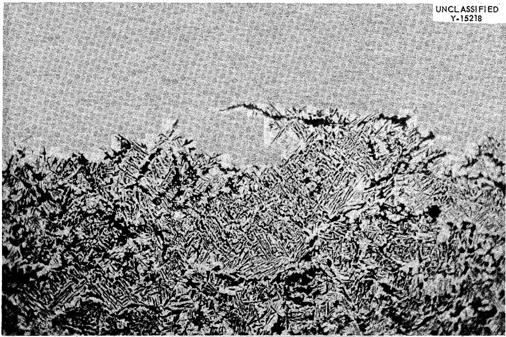  
Fig. 5.19. Inconel Exposed to Sodium Hydroxide at $800^{\circ}\mathrm{C}$ .

<table><tr><td>0005</td><td>0004</td><td>0003</td><td>INCHES</td><td>0002</td><td>0001</td></tr></table>

oxide and, based on an x-ray line which is somewhat in doubt, sodium peroxide. It has long been thought that sodium hydroxide should decompose, as do the alkaline-earth hydroxides, by the reaction

$$
2 \mathrm {N a O H} \longrightarrow \mathrm {N a} _ {2} \mathrm {O} + \mathrm {H} _ {2} \mathrm {O} \tag {1}
$$

and this work is the first identification of $\mathsf{Na}_2\mathsf{O}$ as a decomposition product.

Recent thermodynamic calculations17 indicated that, in addition to the reaction of Eq. 1, dissociation is possible, simultaneously, at high temperatures, by the reaction

$$
2 \mathrm {N a O H} \rightarrow \mathrm {N a} _ {2} \mathrm {O} _ {2} + \mathrm {H} _ {2} \tag {2}
$$

The amount of hydrogen observed in these experi

ments is in excess of that predicted from the calculations. It would appear, qualitatively, that at $800^{\circ}C$ a significant proportion of the decomposition product is in the peroxide form.

# CHEMICAL STUDIES OF CORROSION

F. Kertesz H. J. Buttram

Materials Chemistry Division

Inconel in NaF-LiF-ZrF4-UF4

H.J.Buttram R.E.Meadows

Materials Chemistry Division

A series of studies in which the four-component fuel NaF-LiF-ZrF $_4$ -UF $_4$ (22-37.5-35.5-5 mole %) was exposed for 100 hr in sealed capsules of Inconel in the standard rocking furnace has indicated that this mixture may be less corrosive than others under consideration. The data obtained for this mixture and for three other previ

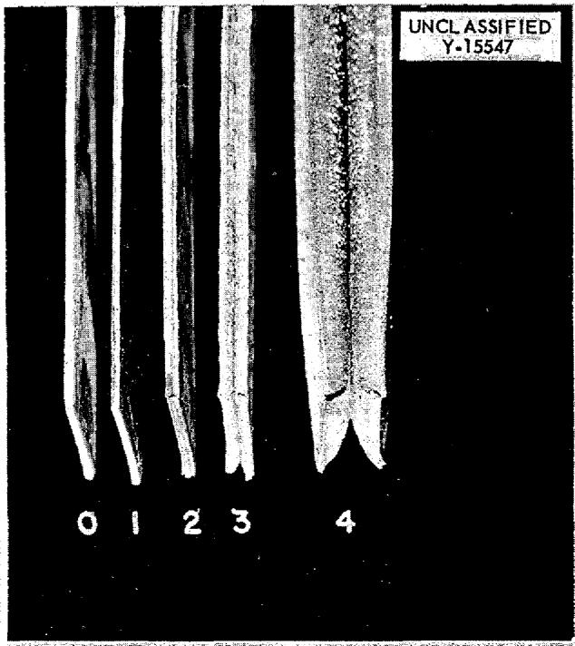  
Fig. 5.20. Inconel Strips (25 mils thick) Tested at $800^{\circ}\mathrm{C}$ in Sodium Hydroxide. Strips 1 to 4 were exposed 7, 28, 54, and 100 hr, respectively. Number 0, a control strip, was unexposed.

ously tested materials run as standards are shown in Table 5.16.

# Stability of $\mathsf{UF}_3$ in NaF-KF-LiF in Inconel

H. J. Buttram R. E. Meadows Materials Chemistry Division

A series of mixtures of the NaF-KF-LiF eutectic containing added $\mathsf{UF}_3$ and $\mathsf{UF}_4$ has been exposed in sealed capsules of Inconel for times ranging from 3 to 240 hr in the rocking furnace. The capsules were heated and maintained at a hot-end temperature of $800^{\circ}\mathsf{C}$ and a cold-end temperature of $650^{\circ}\mathsf{C}$ . The rocker was operated at 4 cpm. The total uranium contents of the mixtures studied were 10 to 20 wt%. After exposure the capsules were opened and unloaded in a helium-filled dry box, and the cooled melts were ground and analyzed chemically for $\mathsf{UF}_3$ and $\mathsf{UF}_4$ .

As the data in Table 5.17 indicate, $\mathsf{UF}_3$ is quite unstable under these conditions, regardless of the original $\mathsf{UF}_3 / \mathsf{UF}_4$ ratio. It appears that considerable disproportionation of $\mathsf{UF}_3$ must be expected in this system under all circumstances.

# Effect of Chromium on the Mass Transfer of Nickel in NaOH

H.J.Buttram R.E.Meadows

F. A. Knox

Materials Chemistry Division

The effect of chromium on the mass transfer of nickel by NaOH was tested in a nickel rocking furnace. The exposures, at 4 cpm, were for 100 hr, with the hot ends of the capsules at $775^{\circ}C$ and with a $100^{\circ}C$ temperature drop along the capsules.

When $1\mathrm{wt}\% \mathrm{Cr}^{\circ}$ was added to the purified NaOH, the mass transfer of nickel was reduced by about a factor of 2. However, in no case was the mass transfer eliminated. Analyses of the caustic revealed the presence of about 4000 ppm Ni in the tests without chromium added to the NaOH, while about 2500 ppm Ni and 3200 ppm Cr were found in the caustic to which $1\mathrm{wt}\% \mathrm{Cr}^{\circ}$ was added.

This decrease in mass transfer presumably can be explained by the reaction of $\mathbf{Cr}^{\circ}$ with NaOH to yield hydrogen gas, which tends to suppress the reaction of NaOH with $\mathbf{Ni}^{\circ}$ . Since hydrogen diffuses readily through nickel metal at the test temperature, these experiments were repeated with the nickel capsules enclosed in evacuated, sealed quartz jackets. In addition, two capsules were sealed in quartz envelopes containing hydrogen at $540\mathrm{mmHg}$ pressure. After 100 hr in the rocking furnace, no mass transfer was found in any of the capsules, except one for which the quartz envelope had cracked. This lack of mass transfer was evident, however, even in the control capsules containing no chromium. Furthermore, analyses of the caustic after the tests showed quite low (less than $100~\mathrm{ppm}$ ) concentrations of nickel and chromium. Pressures inside the quartz envelopes, obtained by breaking the quartz inside an evacuated standard volume, were about $350\mathrm{mmHg}$ (590 for the one initially set at $540\mathrm{mmHg}$ ). The gas was not analyzed, but it is presumed that it was hydrogen.

From these studies it is not apparent that chromium is particularly beneficial. It does appear, however, that some mechanism to prevent loss of hydrogen from the system - perhaps cladding the nickel with some metal impervious to hydrogen - might be quite beneficial.

TABLE 5.16. CORROSION OF INCONEL CAPSULES EXPOSED IN ROCKING-FURNACE TESTS FOR 100 hr TO SEVERAL FUEL MIXTURES   
TABLE 5.17. DISPROPORTIONATION OF ${\mathrm{{UF}}}_{3}$ IN NaF-KF-LiF EUTECTIC IN INCONEL CAPSULES TESTED IN THE ROCKING-FURNACE APPARATUS   

<table><tr><td>Fuel Mixture Composition</td><td>Chromium Found in Fuel Mixture After Test (ppm)</td><td>Depth of Attack on Inconel Capsule (mil)</td></tr><tr><td>NaF-LiF-KF (11.5-46.5-42 mole %)</td><td>410</td><td>1</td></tr><tr><td>NaF-ZrF4(53-47 mole %)</td><td>760</td><td>1</td></tr><tr><td>NaF-ZrF4-UF4(53.5-40-6.5 mole %)</td><td>1370</td><td>1</td></tr><tr><td>NaF-LiF-ZrF4-UF4(22-37.5-35.5-5 mole %)</td><td>220</td><td>0.5</td></tr></table>

Hot-zone temperature: $800^{\circ} \mathrm{C}$

Cold-zone temperature: $650^{\circ}\mathrm{C}$

<table><tr><td rowspan="2" colspan="2">Uranium Compounds Added (wt %)</td><td colspan="6">Uranium Compounds Found (wt %)</td></tr><tr><td colspan="2">After 3 hr</td><td colspan="2">After 27 hr</td><td colspan="2">After 243 hr</td></tr><tr><td>UF3</td><td>UF4</td><td>UF3</td><td>UF4</td><td>UF3</td><td>UF4</td><td>UF3</td><td>UF4</td></tr><tr><td>12.4</td><td>0</td><td>2.0</td><td>5.98</td><td>3.6</td><td>7.6</td><td>1.8</td><td>9.3</td></tr><tr><td>6.4</td><td>6.4</td><td>2.3</td><td>9.2</td><td>2.4</td><td>9.2</td><td>1.8</td><td>10.8</td></tr><tr><td>1.3</td><td>11.8</td><td>0.1</td><td>12.7</td><td>0.1</td><td>12.7</td><td>0.3</td><td>12.5</td></tr><tr><td>0</td><td>13.2</td><td>0.1</td><td>13.0</td><td>0.1</td><td>12.9</td><td>0.2</td><td>13.1</td></tr><tr><td>24.8</td><td>0</td><td>9.6</td><td>14.7</td><td>6.9</td><td>18.0</td><td>5.7</td><td>21.4</td></tr><tr><td>12.8</td><td>12.8</td><td>5.2</td><td>20.5</td><td>3.6</td><td>23.0</td><td>3.4</td><td>20.6</td></tr><tr><td>2.6</td><td>23.6</td><td>0.2</td><td>26.3</td><td>0.1</td><td>27.0</td><td>0.1</td><td>25.5</td></tr><tr><td>0</td><td>26.4</td><td>0.3</td><td>26.2</td><td>0.1</td><td>26.3</td><td>0.1</td><td>25.6</td></tr></table>

# 6. METALLURGY AND CERAMICS

W.D.Manly

J.M.Warde

Metallurgy Division

Stress-rupture tests are being made of $\frac{3}{4}$ -in. Inconel tubing in argon and in fused salts in order to evaluate the effects of the biaxial stresses present in pressurized tubing. The results of tube-burst tests are compared with those of tensile creep-rupture tests of 0.060-in.-thick sheet in argon and in fused salts at $1500^{\circ}\mathrm{F}$ . Data from creep-rupture tests of 0.020- and 0.060-in.-thick Inconel sheet are presented which show that rupture life for a given stress is shorter for the thinner sheet. An evaluation of a welded Inconel bellows for use in fused salts at high temperatures and the results of a study of the interaction between Inconel and beryllium under pressure in an inert environment are presented.

Additional oxidation and fabrication studies of nickel-molybdenum alloys are discussed, and design curves for solution-annealed Hastelloy B tested in fused salts at 1500 and $1650^{\circ}\mathrm{F}$ are given. The influence of aging on the creep-rupture properties of Hastelloy B is being studied, and data are presented for creep-rupture tests of aged and solution-annealed material in argon at 1500 and $1800^{\circ}\mathrm{F}$ and for short-time tensile tests of material aged at high temperatures.

The results of static and cyclic oxidation tests at $1700^{\circ}\mathrm{F}$ on several brazing alloys are presented. Several components containing cemet-to-Inconel joints were successfully brazed, and techniques of brazing boron carbide are being investigated.

The Inconel core-shell assembly for the high-temperature critical experiments was fabricated after experimental techniques for minimizing distortion were developed. Methods of producing quantities of Coast Metals No. 52 presintered brazing alloy rings were developed in preparation for the impending construction of another large NaK-to-air radiator. A second sodium-to-air radiator was completed for the Cornell Aeronautical Laboratory, and two fuel-to-NaK heat exchanger tube bundles are being fabricated.

The basic concepts of eddy-current testing as applied to low-conductivity alloy tubing are discussed. The merits of the impedance analysis method are presented, along with problems of flaw detection with both encircling and probe-type coils. An ultrasonic method for the inspection of

small-diameter tubing is described that is sufficiently sensitive to detect the types of flaws encountered to date.

The investigation of corrosion-erosion in the graphite-hydrogen system at high temperatures was continued. Two control rod assemblies of rare-earth oxides were fabricated, as well as calcium fluoride and alumina spacers. The optimum pressing conditions for pelletizing fluoride fuels are being studied, and an investigation of the feasibility of synthesizing $\mathsf{Mo}_2\mathsf{B}_5$ and $\mathsf{B}_4\mathsf{C}$ is under way. Dysprosium oxide disks and europium oxide wafers were fabricated.

The special materials studies reported include the results of studies of diffusion barriers for use between Inconel and columbium and a discussion of further attempts to prepare two- and three-ply tubing. The results of oxidation tests of several commercial aluminum bronzes being considered for oxidation protection of copper radiator fins are presented. Attempts to prepare creep-resistant lead-calcium alloys for use as shielding material are described, as well as experimental work under way for preparing $\mathsf{B}_4\mathsf{C - Cu}$ neutron shielding material for the ART.

# MECHANICAL PROPERTY TESTS OF INCONEL

D. A. Douglas

J.R.Weir

J. H. Devan

J.W.Woods

Metallurgy Division

C. R. Kennedy, Pratt & Whitney Aircraft

# Stress-Rupture Tests

J. H. DeVan

Metallurgy Division

Stress-rupture testing of $\frac{3}{4}$ -in. Inconel tubing in argon and in fused salts at 1300, 1500, and $1650^{\circ}\mathrm{F}$ is now in progress. Although data for Inconel tubing at 1300 and $1650^{\circ}\mathrm{F}$ are as yet incomplete, the results of tests of Inconel tubing with wall thicknesses of 0.010, 0.020, 0.040, and 0.060 in. at $1500^{\circ}\mathrm{F}$ in argon and in fused salts are sufficient to show important trends.

In studying the biaxial stress system set up in the tubes, the question arises as to whether failure is related to the effect of combined stresses or

whether the maximum stress component (in this case, hoop stress) singularly controls the time to failure. A comparison of the results of tensile creep-rupture tests and tube-burst tests is presented in Fig. 6.1 for tests in argon and in Fig. 6.2 for tests in $\mathrm{NaF - ZrF_4 - UF_4}$ (50-46-4 mole %). It may be seen that there is good agreement between rupture times for 0.060-in.-wall tubing and 0.060-in.-thick sheet in both environments. Thus, the presence of an axial stress in the tubing does not appear to affect the time to failure.

It may be noted, however, that the specimens with thinner walls, 0.010 to 0.020 in., ruptured in much shorter times than those observed for 0.060-in.-thick sheet specimens at comparable stresses. While this was originally thought to be due to the effect of the combined stress system acting in the tubing, it now appears from the results of tests on 0.020-in.-thick sheet that the poor rupture properties are associated with the smaller section thickness.

The results of creep-rupture tests of 0.020-in.-thick Inconel sheet in argon and in hydrogen at 1500 and $1650^{\circ}\mathrm{F}$ are compared with those of tests of 0.060-in.-thick sheet in Table 6.1. As may be seen, a substantial reduction in rupture life accompanies the reduction in section size.

# Bellows Test

J.H.DeVan

Metallurgy Division

An evaluation of a welded-diaphragm bellows for use as a seal in a shut-off valve for controlling the circulation of fused salts was conducted by utilizing a modified creep-rupture machine to simulate operating conditions. In this equipment the bellows was deformed while the outside and inside surfaces were in contact with the fused salt mixture NaF-ZrF4-UF4 (53.5-40-6.5 mole %). Tests were made at 1300 and $1500^{\circ}\mathrm{F}$ , each for 100 hr. A leak check following each test failed to indicate

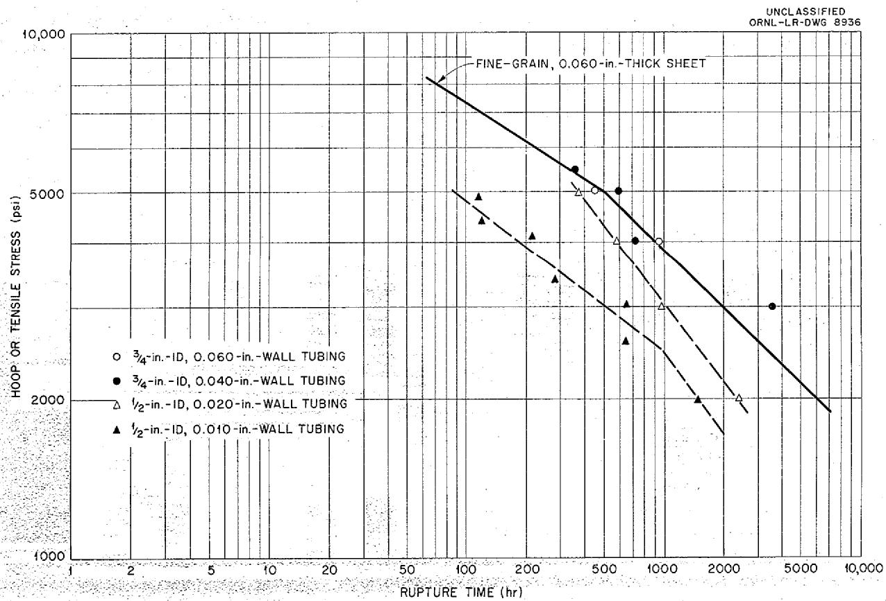  
Fig. 6.1. Comparison of Tube-Burst and Stress-Rupture Tests of Inconel in Argon at $1500^{\circ}$ F.

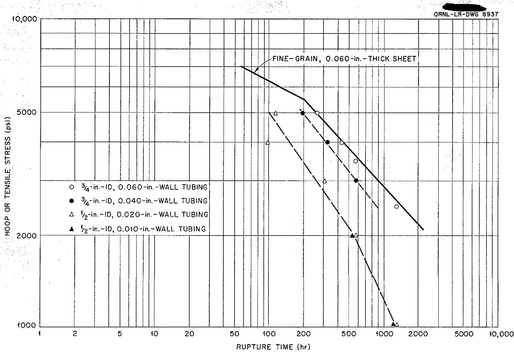  
Fig. 6.2. Comparison of Tube-Burst and Stress-Rupture Tests of Inconel in NaF-ZrF $_4$ -UF $_4$ (50-46-4 mole %) at $1500^{\circ}\mathrm{F}$ .

TABLE 6.1. COMPARISON OF RESULTS OF STRESS-RUPTURE TESTS ON 0.060- AND 0.020-in.-THICK INCONEL SHEET   

<table><tr><td rowspan="2">Temperature (°F)</td><td rowspan="2">Stress (psi)</td><td rowspan="2">Atmosphere</td><td colspan="2">Time to Rupture (hr)</td><td colspan="2">Total Elongation (%)</td></tr><tr><td>0.020-in.-Thick Sheet</td><td>0.060-in.-Thick Sheet</td><td>0.020-in.-Thick Sheet</td><td>0.060-in.-Thick Sheet</td></tr><tr><td>1500</td><td>3500</td><td>Argon</td><td>270</td><td>1467</td><td>8</td><td>13</td></tr><tr><td></td><td></td><td>Hydrogen</td><td>350</td><td>618</td><td>11</td><td>8</td></tr><tr><td>1650</td><td>2000</td><td>Argon</td><td>740</td><td>1125</td><td>14</td><td>30</td></tr><tr><td></td><td></td><td>Hydrogen</td><td>200</td><td>385</td><td>12</td><td>11</td></tr></table>

any flaws in the bellows. Metallographic examination showed only normal corrosive attack in the weld areas, and no cracks could be detected as a direct result of the flexing of the bellows.

# Interaction Between Inconel and Beryllium

A program for determining the extent of inter

action between beryllium and Inconel at elevated temperatures in an inert environment was recently completed to establish design limits for the high-temperature critical experiment. The modified creep-rupture equipment was used for the tests so that a controlled atmosphere of argon could be maintained and a specified load could be trans

mitted to the specimens of beryllium and Inconel at $1350^{\circ}F$ . The results of the three tests are summarized in Table 6.2.

The diffusion area in the Inconel specimen from the 100-hr test is shown in Fig. 6.3. The extreme hardness, as shown by Knoop indentations, and the sharp interface of the diffusion area indicate

TABLE 6.2. RESULTS OF TESTS OF THE INTERACTION BETWEEN INCONEL AND BERYLLIUM UNDER DIFFERENT PRESSURES FOR CONTACT TIMES OF 40 AND 100 hr   

<table><tr><td>Time in Contact (hr)</td><td>Contact Pressure (psi)</td><td>Depth of Alloyed Region in Inconel (in.)</td></tr><tr><td>100</td><td>500</td><td>0.015</td></tr><tr><td>40</td><td>100</td><td>0.005</td></tr><tr><td>40</td><td>50</td><td>0.003</td></tr></table>

that an intermetallic layer was formed by the interaction of the beryllium and the Inconel. This layer is, undoubtedly, detrimental to the load-carrying ability of the Inconel, although it represents an extremely small percentage of the cross section of the specimen tested.

# DEVELOPMENT OF NICKEL-MOLYBDENUM ALLOYS

J.H.Coobs

J.P.Page

H. Inouye

T. K. Roche

Metallurgy Division

M. R. D'Amore, Pratt & Whitney Aircraft

# Oxidation Studies

Experimental data obtained on the oxidation in static air at $1500^{\circ}\mathrm{F}$ of several nickel-molybdenum alloys are presented in Table 6.3. The alloy with the nominal composition $10\%$ Mo- $10\%$ Fe- $6\%$ Cr- $74\%$ Ni was tested previously in a fluoride mixture

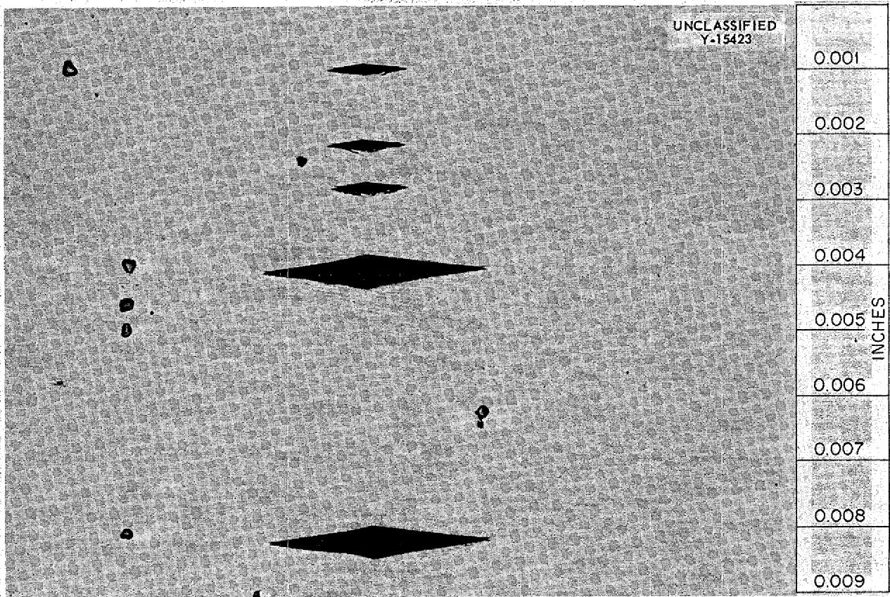  
Fig. 6.3. Diffusion Area in Inconel After Contact with Beryllium for 100 hr at 500 psi. 500X. Reduced $5.5\%$ .

TABLE 6.3. OXIDATION RATES OF NICKEL-BASE ALLOYS IN STATIC AIR AT ${1500}^{ \circ  }\mathrm{F}$ FOR ${167}\mathrm{{hr}}$   

<table><tr><td>Alloy</td><td>Weight gain (g/cm2)</td><td>Remarks</td></tr><tr><td>10% Mo-10% Fe-6% Cr-74% Ni</td><td>0.0005</td><td>Adherent oxide formed</td></tr><tr><td>Hastelloy B, vacuum melted</td><td>0.0010</td><td>Oxide spilled upon cooling</td></tr><tr><td>2.5% Be-97.5% Ni</td><td>0.0004</td><td>Adherent oxide formed</td></tr><tr><td>2.5% Be-5% Cb-92.5% Ni</td><td>0.0014</td><td>Adherent oxide formed</td></tr></table>

and was found to be promising. Its oxidation rate was between that observed for a $7\%$ Cr-20% Mo-73% Ni alloy and that for a 10% Cr-20% Mo-70% Ni alloy. Further, it is considered to be heat resistant, and it forms a nonspalling oxide upon oxidation. The samples from a vacuum melt of Hastelloy B supplied by the Haynes Stellar Company showed no significant differences from commercial grades of Hastelloy B. The 2.5% Be-97.5% Ni alloy also forms a nonspalling oxide and is considered to be heat resistant. The addition of 5% Cb, however, increased the oxidation rate to that observed for Hastelloy B.

# Fabrication Studies

It was reported previously that a deleterious effect in nickel-molybdenum alloys containing titanium, aluminum, vanadium, zirconium, columbiun, or chromium was noted after long heat treatments in hydrogen. Additional similar tests were

made to ensure that the effect was due to hydrogen and not to the aging heat treatment. The check tests were made on a $5\%$ $\mathrm{Cb - 20\%}$ Mo-75% Ni alloy. The results of the tests, presented in Table 6.4, verified that low strength and ductility resulted from long exposure in hydrogen at elevated temperatures. The tests also indicated that the effect of hydrogen could be removed by vacuum annealing.

The possibility that a hydride forms during aging has been suggested, but, if such is the case, embrittlement in alloys containing chromium and aluminum cannot be explained. The embrittlement effect was not detected in tests of Hastelloy B and of the binary nickel-molybdenum alloys, and it was not found in all the elevated-temperature tensile tests of the ternary alloys that have been studied.

Twelve extrusions of Hastelloy B were attempted by the Babcock & Wilcox Co. to determine the commercial feasibility of making tube blanks for seamless tubing. This effort was supported by the Haynes Stellar Company. Each of the twelve extrusion attempts were unsuccessful because of severe cracking of the tube blanks or failure to extrude ("stickers"). The extrusion temperatures used were between 2000 and $2250^{\circ}\mathrm{F}$ . Based upon experience at ORNL, it is concluded that improper temperatures, soaking time, and press capacity were the main causes of failure.

Since this effort was made because successful extrusions had been made at ORNL, additional experiments were performed here to verify the recommended extrusion conditions, to verify, with a different heat, the superior redrawing properties of the extruded tube blanks, and to determine methods

TABLE 6.4. ROOM-TEMPERATURE TENSILE TESTS OF 0.065-in. SHEET SPECIMENS OF $5\%$ $\mathsf{Cb - }20\%$ Mo-75% Ni ALLOY   
Specimens annealed 1 hr at $2100^{\circ}\mathrm{F}$ and aged at $1650^{\circ}\mathrm{F}$   

<table><tr><td>Condition of Test Specimen</td><td>Yield Point, 0.2% Offset (psi)</td><td>Tensile Strength (psi)</td><td>Elongation (% in 2 in.)</td><td>Reduction in Area (%)</td></tr><tr><td>Aged 285 hr in vacuum</td><td>78,500</td><td>153,700</td><td>35</td><td>30</td></tr><tr><td>Aged 285 hr in hydrogen</td><td>77,600</td><td>113,600</td><td>13</td><td>23</td></tr><tr><td>Aged 285 hr in hydrogen followed by 2 hr in vacuum</td><td>78,300</td><td>151,000</td><td>30</td><td>26</td></tr></table>

for reducing the pressure required for the extrusion. Two uncanned billets of Hastelloy B were successfully extruded into tube blanks at an extrusion ratio of 5.5/1. The recommended conditions were verified: namely, temperature, $2000^{\circ}\mathrm{F}$ ; heating time, 45 min per inch of billet thickness; and extrusion pressure, 80 to 90 psi. These tube blanks are to be redrawn to small-diameter tubing.

A Hastelloy B billet canned in $\frac{1}{16}$ -in.-thick Inconel was extruded at $2100^{\circ}\mathrm{F}$ at an extrusion ratio of 5.5/1. The pressure required for this extrusion was 55 psi, as compared with 80 psi for the uncanned billets. A second canned extrusion was made at a ratio of 9/1 at $2100^{\circ}\mathrm{F}$ with fair success. At these temperatures, the first billet, if uncanned, would have cracked severely. The high extrusion ratio used for the second extrusion would have caused the billet, if uncanned, to be a sticker.

The use of Inconel as canning material for Hastelloy B is justified, since it serves a threefold purpose.. Besides acting as a lubricant, the Inconel provides a thermally bonded oxidationresistant layer for the alloy. Also, in a hightemperature air stream, the Inconel would inhibit formation of the corrosive $\mathsf{MoO}_3$ vapor, and thus there would be no possibility of catastrophic oxidation occurring in the structural material. Moreover, the clad Hastelloy B could probably be reduced more successfully than the unclad material, because Inconel is not subject to "heat cracking," that is, surface cracking during annealing of cold work that is attributable to poor thermal conductivity and a high rate of work hardening.

Two additional tube blanks of a $15\%$ Mo-85% Ni alloy were extruded to complete the material requirements for corrosion testing. Several rods of this composition were also extruded to provide starting material for welding rod fabrication.

A critical review of the progress made in developing nickel-molybdenum alloys is being made. A program is being outlined to determine the cause of poor fabricability, the cause of embrittlement after aging, and the effect of slight composition modifications on the mechanical properties of Hastelloy B. Further, a research program paralleling that of Hastelloy B is contemplated for Hastelloy W.

# STRESS-RUPTURE TESTS OF HASTELLOY B

D. A. Douglas

Metallurgy Division

C. R. Kennedy

Pratt & Whitney Aircraft

A series of creep-rupture tests has been completed on solution-annealed Hastelloy B at 1500 and $1650^{\circ}\mathrm{F}$ in the fluoride mixture $\mathsf{NaF - ZrF_4 - UF_4}$ (50-46-4 mole%). The results are summarized in design curves presented in Figs. 6.4 and 6.5. A similar series of tests is nearly completed for solution-annealed Hastelloy B at 1300 and $1800^{\circ}\mathrm{F}$ in argon and in the fluoride mixture.

The influence of aging heat treatments on the creep-rupture properties of Hastelloy B is being studied at several temperatures ranging from 1300 to $1800^{\circ}\mathrm{F}$ . In general, aged specimens have shown marked reductions in creep rate and tensile elongations compared with specimens in the solution-annealed condition. Results obtained from creep-rupture tests on solution-annealed and aged specimens at 1500 and $1800^{\circ}\mathrm{F}$ in argon are presented in Table 6.5.

The creep-rupture properties at $1800^{\circ}\mathrm{F}$ are not substantially affected by aging, since at this temperature a single-phase alloy exists. However, at $1500^{\circ}\mathrm{F}$ , a second phase that appears upon aging produces a marked change in the creep-rupture properties of the alloy. It may be noted that for stresses which produce a rupture life in excess of 100 hr for the solution-annealed material at $1500^{\circ}\mathrm{F}$ the difference in rupture life of the solution-annealed and aged specimens is small. This is understandable, since, during testing at this temperature, the solution-annealed specimens actually age. During testing at higher stresses, the solution-annealed material does not age appreciably before rupture, and thus the rupture times for the aged specimens are appreciably longer than those for the solution-annealed specimens.

# PHYSICAL PROPERTIES AND MICROSTRUCTURE STUDIES OF HASTELLOY B

P. Patriarca R. E. Clausing

Metallurgy Division

Short-time tensile tests conducted after long-time aging of Hastelloy B at elevated temperatures indicate that residual stresses not removed after a

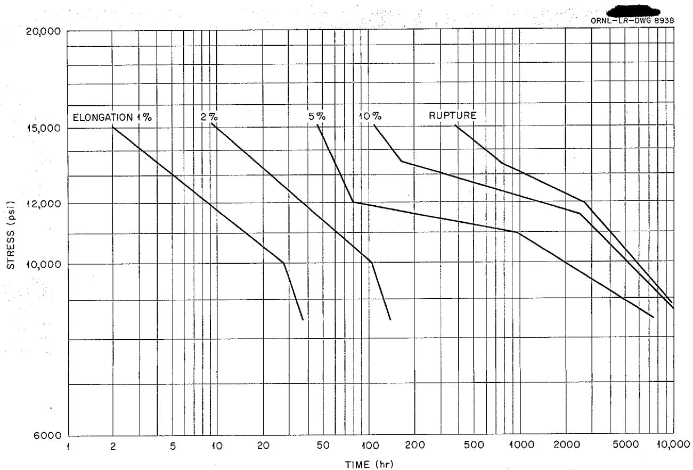  
Fig. 6.4. Design Data for Solution-Annealed $(2100^{\circ}\mathsf{F})$ , 0.060-in.-Thick Hastelloy B Sheet Tested at $1500^{\circ}\mathsf{F}$ in NaF-ZrF $_4$ -UF $_4$ (50-46-4 mole%).

TABLE 6.5. RESULTS OF CREEP-RUPTURE TESTS ON AGED AND SOLUTION-ANNEALED HASTELLOY B AT 1500 AND ${1800}^{ \circ  }\mathrm{F}$ IN ARGON   

<table><tr><td>Test Temperature (°F)</td><td>Condition</td><td>Stress (psi)</td><td>Rupture Time (hr)</td><td>Final Elongation (%)</td></tr><tr><td rowspan="7">1500</td><td>Solution annealed</td><td>12,000</td><td>1180</td><td>20</td></tr><tr><td>Aged 40 hr at 1500°F</td><td>12,000</td><td>1450</td><td>16</td></tr><tr><td>Aged 70 hr at 1500°F</td><td>12,000</td><td>1070</td><td>8.7</td></tr><tr><td>Solution annealed</td><td>13,500</td><td>170</td><td>16</td></tr><tr><td>Aged 100 hr at 1300°F</td><td>13,500</td><td>670</td><td>5.7</td></tr><tr><td>Solution annealed</td><td>15,000</td><td>160</td><td>49</td></tr><tr><td>Aged 100 hr at 1300°F</td><td>15,000</td><td>330</td><td>11</td></tr><tr><td rowspan="4">1800</td><td>Solution annealed</td><td>5,000</td><td>112</td><td>12</td></tr><tr><td>Aged 100 hr at 1300°F</td><td>5,000</td><td>90</td><td>10</td></tr><tr><td>Solution annealed</td><td>3,500</td><td>410</td><td>7.3</td></tr><tr><td>Aged 100 hr at 1300</td><td>3,500</td><td>300</td><td>5.9</td></tr></table>

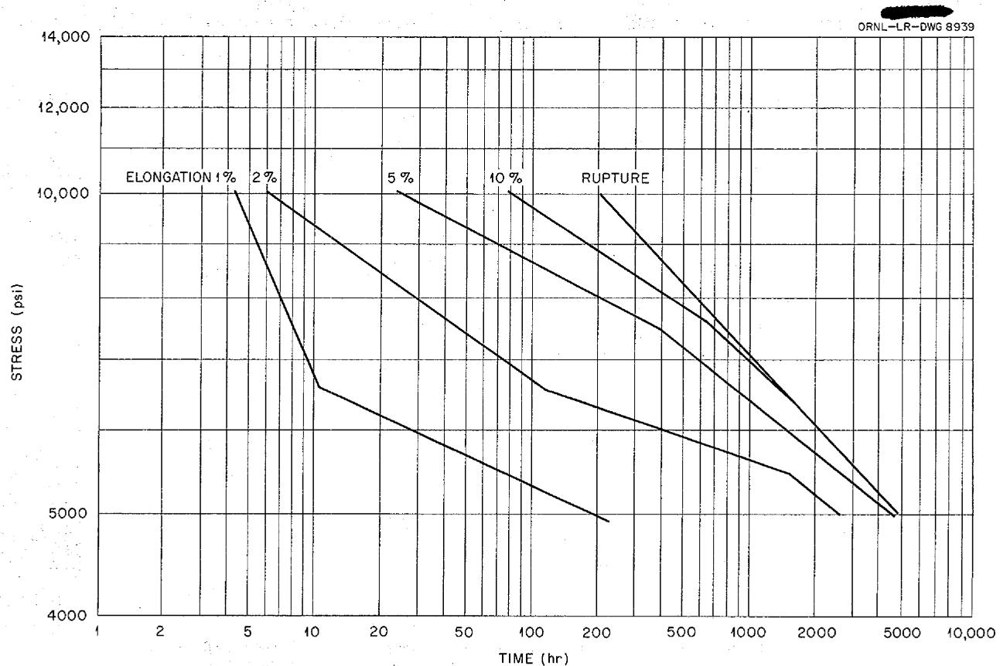  
Fig. 6.5. Design Data for Solution-Annealed $(2100^{\circ}\mathsf{F})$ , 0.060-in.-Thick Hastelloy B Sheet Tested at $1650^{\circ}\mathsf{F}$ in NaF- $\mathsf{ZrF}_4$ -UF $_4$ (50-46-4 mole%).

cold-working operation are quite detrimental to the ductility of this alloy. Tensile specimens, which had been cast from sheet that had been coldreduced $20\%$ in thickness, were aged at temperatures from 1100 to $1500^{\circ}\mathrm{F}$ in inert atmospheres and tested at both room and elevated temperatures. The data in Table 6.6 show considerably lower ductility for the cold-worked specimens than for specimens that were annealed before aging. Microstructural studies indicate that cold work induces precipitation in larger quantities and perhaps in smaller particles than does annealing. It is assumed that the particles effectively inhibit slip and cause the increased tensile strengths and radically reduced ductilities observed. It may be noted that the ductilities of the specimens aged at

$1500^{\circ}F$ are considerably greater than the ductilities of those aged at $1400^{\circ}F$ . This may be due to a reduced amount of beta phase, which may be stable at $1500^{\circ}F$ . The gamma phase appears to be much more prevalent than the beta phase at the higher temperature.

Specimens are now being aged in air to determine whether any embrittling effect due to oxidation or nitriding of the alloy can be found. Alloys of compositions closely related to Hastelloy B have been made and are now being examined to aid in the positive identification of the phases present in Hastelloy B. Knowledge of the identities of the phases present will aid considerably in the analyses of the effects of heat treatments.

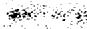

TABLE 6.6. RESULTS OF SHORT-TIME TENSILE TESTS OF HASTELLOY B AGED AT HIGH TEMPERATURES  

<table><tr><td>Aging 
Temperature 
(°F)</td><td>Aging 
Time 
(hr)</td><td>Test 
Temperature 
(°F)</td><td>Ductility 
(%)</td><td>Tensile 
Strength 
(psi)</td><td>Yield 
Point 
(psi)</td></tr><tr><td colspan="6">Cold Reduced 20% Before Aging</td></tr><tr><td>1100</td><td>500</td><td>Room</td><td>3.0</td><td>181,300</td><td>154,600</td></tr><tr><td>1100</td><td>500</td><td>1100</td><td>2.5</td><td>130,500</td><td>115,500</td></tr><tr><td>1100</td><td>500</td><td>1100</td><td>3.5</td><td>122,900</td><td>104,400</td></tr><tr><td>1300</td><td>200</td><td>Room</td><td>0.8</td><td>173,500</td><td>150,000</td></tr><tr><td>1300</td><td>200</td><td>Room</td><td>0.5</td><td>191,600</td><td>148,000</td></tr><tr><td>1400</td><td>500</td><td>Room</td><td>3.8</td><td>164,000</td><td>88,200</td></tr><tr><td>1400</td><td>500</td><td>1400</td><td>6.3</td><td>84,500</td><td></td></tr><tr><td>1500</td><td>500</td><td>Room</td><td>20.0</td><td>163,000</td><td>100,000</td></tr><tr><td>1500</td><td>500</td><td>1500</td><td>30.0</td><td>64,600</td><td></td></tr><tr><td colspan="6">Fully Annealed Before Aging</td></tr><tr><td>1100</td><td>500</td><td>Room</td><td>14.0</td><td>126,000</td><td>78,000</td></tr><tr><td>1100</td><td>500</td><td>1100</td><td>14.0</td><td>91,100</td><td>58,600</td></tr><tr><td>1300</td><td>500</td><td>Room</td><td>6.0</td><td>92,600</td><td>6,000</td></tr><tr><td>1300</td><td>500</td><td>1300</td><td>12.5</td><td>140,600</td><td>90,000</td></tr><tr><td>1400</td><td>500</td><td>Room</td><td>20.0</td><td>128,000</td><td>73,500</td></tr><tr><td>1400</td><td>500</td><td>1400</td><td>10.0</td><td>76,500</td><td></td></tr><tr><td>1500</td><td>500</td><td>Room</td><td>12.5</td><td>109,800</td><td>54,900</td></tr><tr><td>1500</td><td>500</td><td>1500</td><td>37.5</td><td>63,100</td><td></td></tr></table>

# BRAZING ALLOY DEVELOPMENT AND TESTING

P. Patriarca R. E. Clausing Metallurgy Division

# Developments Tests

The oxidation resistance of high-temperature brazing alloys under static conditions at 1500 and $1700^{\circ}\mathrm{F}$ and in cyclic service at $1500^{\circ}\mathrm{F}$ has been reported. The results of cyclic tests at $1700^{\circ}\mathrm{F}$ are reported in Table 6.7. It can be seen that the extent of oxidation of brazed joints thermally cycled from room temperature to $1700^{\circ}\mathrm{F}$ is greater than that of joints tested at a constant temperature. The Coast Metals No. 52 alloy, which is used extensively in brazing high-conductivity-fin radiators, was attacked severely in these tests, while the chromium-bearing Coast Metals No. 53

alloy was not. The No. 53 alloy will therefore be seriously considered for this fabrication application, even though a higher quality hydrogen atmosphere may be required to obtain flow with this chromium-containing alloy.

Melting point studies are being made on the high-temperature brazing alloys by using sintered, conical samples. The cones are sintered from fine powder in a Lavite mold and heated at various temperatures on a thin, nickel sheet in a dry-hydrogen atmosphere. The results of studies on a typical brazing alloy, Coast Metals No. 52, are shown in Fig. 6.6.

# Brazing of Boron Carbide

The incorporation of a boron carbide radiation shield into a fused-salt pump assembly requires that the boron carbide compact be brazed to an Inconel envelope to provide sufficient thermal conductivity to remove the heat induced by radiation. The service temperature may be as high as $1700^{\circ}\mathrm{F}$ with helium as a protective atmosphere. Although

TABLE 6.7. OXIDATION RESISTANCE OF DRYHYDROGEN BRAZED INCONEL T-JOINTS TESTED FOR 500 hr AT $1700^{\circ}$ F  

<table><tr><td>Brazing Alloy*</td><td>Oxidation in Static Air**</td><td>Oxidation with 220 Air Cools to Room Temperature**</td></tr><tr><td>Wall Colmonoy Microbraz</td><td>Slight</td><td>Slight</td></tr><tr><td>Coast Metals No. 53</td><td>Slight</td><td>Slight</td></tr><tr><td>Wall Colmonoy low-melting Microbraz</td><td>Slight</td><td>Moderate</td></tr><tr><td>Coast Metals No. 50</td><td>Slight</td><td>Moderate</td></tr><tr><td>Pd-Ni (60-40 wt %)</td><td>Slight</td><td>Moderate</td></tr><tr><td>Pd-Al (92-8 wt %)</td><td>Slight</td><td>Moderate</td></tr><tr><td>Coast Metals No. 51</td><td>Slight</td><td>Severe</td></tr><tr><td>Coast Metals No. 52</td><td>Slight</td><td>Severe</td></tr><tr><td>Coast Metals NP</td><td>Moderate</td><td>Moderate</td></tr><tr><td>G-E No. 81</td><td>Moderate</td><td>Moderate</td></tr><tr><td>Ni-Ge (75-25 wt %)</td><td>Moderate</td><td>Moderate</td></tr><tr><td>Ni-Ge-Cr (65-25-10 wt %)</td><td>Moderate</td><td>Moderate</td></tr><tr><td>Ni-Mo-Ge (50-25-25 wt %)</td><td>Moderate</td><td>Moderate</td></tr><tr><td>Au-Ni (82-18 wt %)</td><td>Moderate</td><td>Severe</td></tr><tr><td>Au-Co (90-10 wt %)</td><td>Severe</td><td>Severe</td></tr><tr><td>Pd-Ge (90-10 wt %)</td><td>Complete</td><td>Complete</td></tr><tr><td>Ni-Sn (68-32 wt %)</td><td>Complete</td><td>Complete</td></tr><tr><td>Ag-Pd-Mn (64-33-3 wt %)</td><td>Complete</td><td>Complete</td></tr><tr><td>Ni-Mn (40-60 wt %)</td><td>Complete</td><td>Complete</td></tr><tr><td>Ni-Mn-Cr (35-55-10 wt %)</td><td>Complete</td><td>Complete</td></tr><tr><td>Au-Cu (80-20 wt %)</td><td>Complete</td><td>Complete</td></tr><tr><td>Ni-Mn (40-60 wt %)</td><td>Complete</td><td>Complete</td></tr><tr><td>Copper</td><td>Complete</td><td>Complete</td></tr></table>

*Alloys listed in order of decreasing oxidation resistance.   
\*\*Very slight, less than 1 mil of penetration; slight, 1 to 2 mils of penetration; moderate, 2 to 5 mils of penetration; severe, greater than 5 mils of penetration; complete, fillet completely destroyed.

a large number of high-temperature brazing alloys have been tested, none investigated to date have proved entirely satisfactory. Most of the brazing alloys which wet the boron carbide also react with it to form brittle bonds that crack upon cooling. The most promising alloys tested thus far are those that either contain zirconium as a component or require an application of zirconium hydride powder to the boron carbide surface prior to placement of the brazing alloy on the same surface. Experimental alloys are now being prepared to permit a more thorough investigation.

# Brazing of Cermet Valve Seats to Inconel Components

Three assemblies incorporating Kentanium cermet valve parts have been successfully brazed by using the technique described previously. An exploded view of an assembly for determining the self-welding characteristics of these cermet valve parts is shown in Fig. 6.7. This assembly consists of an Inconel structural piece, two copper-foil disks that supply brazing alloy for the Inconel-to-nickel joint, a $1/4$ -in.-thick nickel block to dissipate thermal stresses resulting from the different coefficients of thermal expansion of Inconel and Kentanium, a copper-foil disk to supply supplementary brazing alloy for the nickel-to-Kentanium joint, and the Kentanium seat plated with a 0.0001-in. layer of nickel-phosphorus followed by a 0.003-in. layer of copper on the surface to be brazed.

Figure 6.8 shows an actual valve subassembly, which is similar to the assembly for self-welding studies except for the omission of several copperfoil disks. Copper powder, which was substituted for the disks, was placed in especially provided

4 Ibid., p 145.

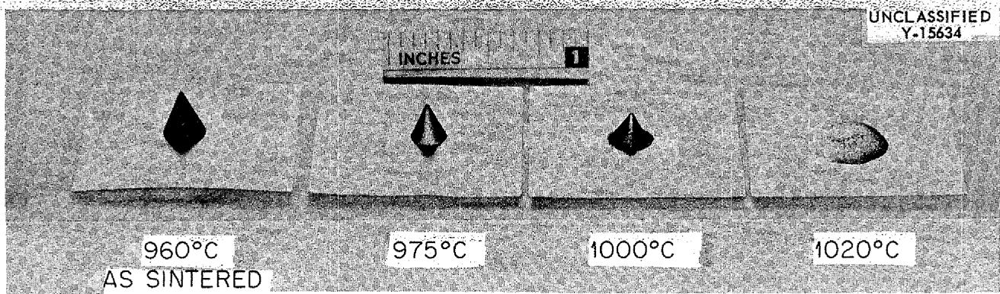  
Fig. 6.6. Melting-Point Determinations of Coast Metals No. 52 Brazing Alloy Made by Using Sintered Cones Heated on Thin, Nickel Sheet in a Dry-Hydrogen Atmosphere.

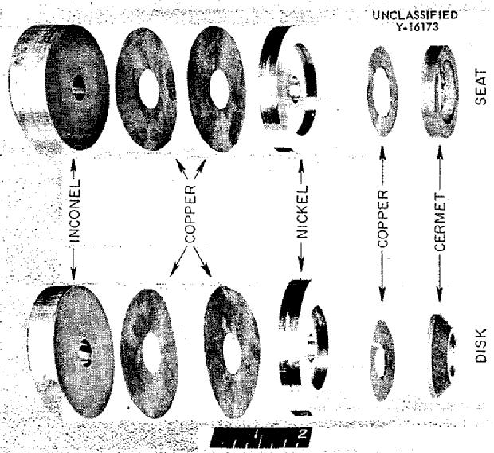  
(o) ASSEMBLIES PRIOR TO BRAZING

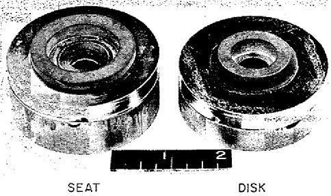  
(b) BRAZED ASSEMBLIES   
Fig. 6.7. Assemblies for Self-Welding Studies of a TiC-Ni Valve Seat and Disk.

recesses. The complete valve is shown after brazing, but prior to finish machining, in Fig. 6.9.

# FABRICATION OF TEST COMPONENTS

# Components for High-Temperature Critical Experiment

P. Patriarca

Metallurgy Division

The fabrication of the Inconel core shell for the high-temperature critical experiment required extremely close control of the distortion associated with production of the girth weld. Preliminary experiments were therefore conducted to determine,

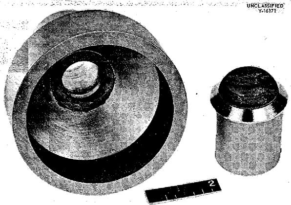

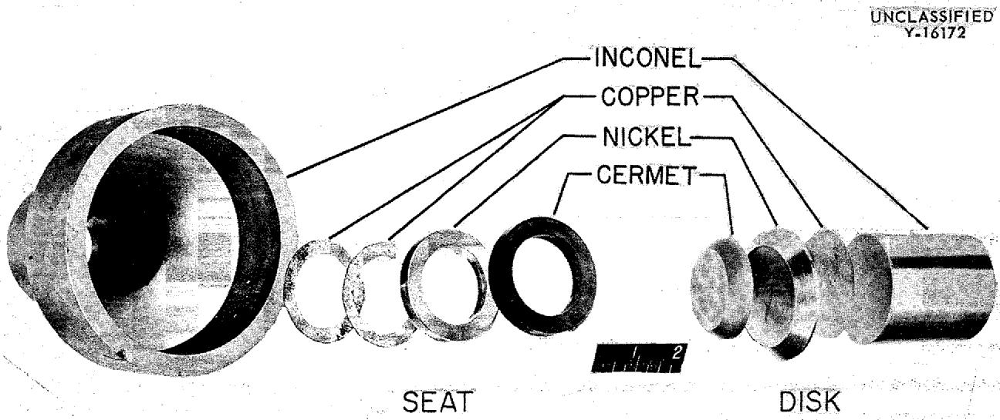  
Fig. 6.9. Brazed Valve Assembly Prior to Machining.   
Fig. 6.8. Valve Seat and Disk Subassemblies.

quantitatively, the extent of distortion to be expected. The first test consisted in the deposition of a butt weld between two cylindrical segments 4 in. in depth. Each segment was machined from a nominal, 12-in.-ID, sched-40 pipe, in which the inside diameter was bored to 12,250 in. to improve the roundness and the outside diameter was turned down to 12,500 in. to provide a 0.125-in. wall for 3 in. of the 4-in. depth. A stainless steel face plate was tack-welded at 60-deg intervals to the 1-in. shoulder of each segment to provide a degree of restraint intended to approximate that provided by the tapered reduction in diameter of the island sheath. Micrometer caliper measurements at 48 scribed positions indicated that a maximum change of 0.030 in. occurred in the nominal 12.5-in. outside diameter. As was expected, the frequency of large changes increased with increasing proximity to the weld.

A second test was conducted to determine the extent of distortion to be expected when butt-welding the spun core segments with the aid of mechanical support. Two 6-in.-deep Inconel cylinders, 12.5 in. OD, $\frac{1}{8}$ -in. wall, were butt-welded with an aluminum backing ring containing Lavite inserts for support. Micrometer and dial-gage measurements made at 96 positions on the weldment, before and after welding, indicated a maximum shrinkage of 0.020 in. on the 12.5-in. outside diameter, that is, an improvement of 0.010 in. over the shrinkage obtained without mechanical support.

The information gained in these experiments was then utilized in the fabrication of the actual core shells. The upper and lower halves of the inner shell were stress-relieved in dry hydrogen for 2 hr at $1500^{\circ}\mathrm{F}$ , with heating and cooling times of 3 hr. They were then machined to the desired length and beveled to facilitate welding. Beryllium blocks were then assembled in the island inner core, as shown in Fig. 6.10. The outside of the island core shell is shown in Fig. 6.11 after completion of the girth weld. Leak tests indicated that all the welded joints were helium leaktight. Uranium wafers were placed across the annulus and attached to the inner and outer core shells, and the outer core shell was assembled over the inner shell. The completed leaktight unit is shown in Fig. 6.12.

Two control rods were also fabricated for the high-temperature critical experiment. Inserts of

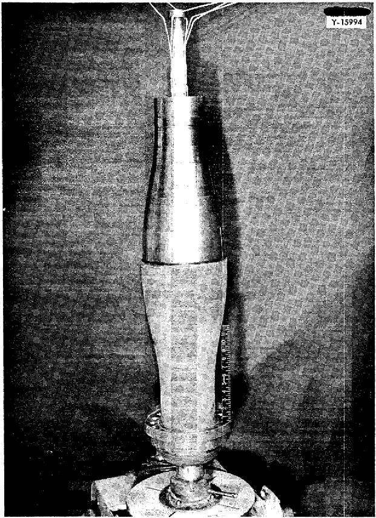  
Fig. 6.10. Lower Half of Inconel Island Core Shell Showing Stacked-Beryllium-Block Inner Assembly Before Positioning of Upper Half of the Core Shell.

rare-earth oxides were assembled in the control rod housing and sealed by welding.

# NaK-to-Air Radiator

P. Patriarca

G.M.Slaughter

Metallurgy Division

R. L. Heestand

Pratt & Whitney Aircraft

The fabrication of a third, 500-kw NaK-to-air radiator with type 310 stainless-steel-clad copper, high-conductivity fins, is under way. Although the design of this unit is essentially the same as that of the radiators fabricated previously,[5] a few modifications in the fabrication techniques will be utilized. These modifications include the

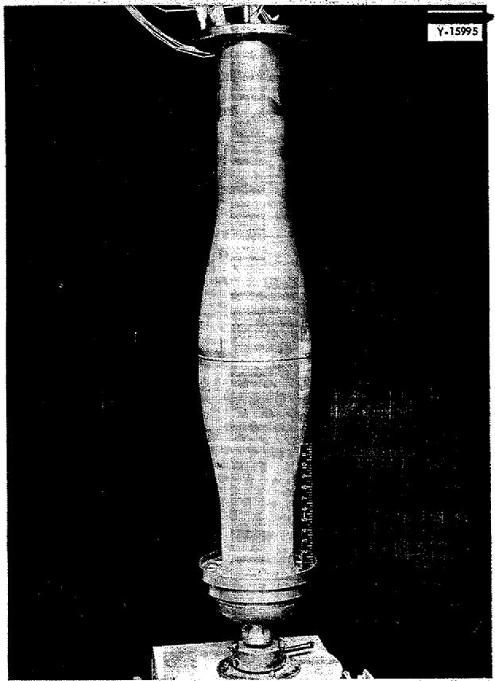  
Fig. 6.11. Completed Island Core Shell After Deposition of the Girth Weld.

construction of a 36-hole punching die to assure a uniform fin-punching geometry, the construction of new tube-bending dies for close control of the tube-bending variables, the development of techniques to permit the assembly of headers in such a manner that all the tubes will enter normal to the curvature of the header at the point of entrance, and the utilization of the presintered-ring method of brazing-alloy preplacement.

Techniques for the preparation of presintered rings of Coast Metals No. 52 brazing alloy were developed by personnel of Pratt & Whitney Aircraft. The alloy is sintered in suitable graphite molds in a dry-hydrogen atmosphere to form rings that possess adequate strength and rigidity. Molds of the type shown in Fig. 6.13 were used to prepare approximately 45,000 rings,

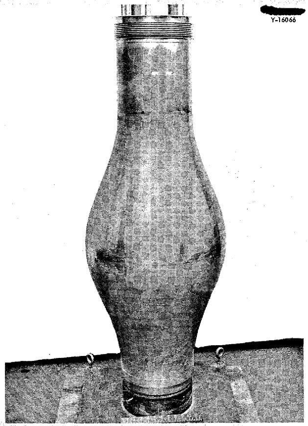  
Fig. 6.12. Completed Core Assembly Showing Outer Core Shell and Upper and Lower Hubs.

$3_{16}$ in. in inside diameter. Experiments conducted on 12-in. lengths of vertically brazed tube-to-fin joints have indicated that good flowability and edge-protection of the copper on the punched fin lips can be obtained with the use of these brazing-alloy rings.

Intermediate Heat Exchanger No. 3

P. Patriarca G.M.Slaughter

Metallurgy Division

R. L. Heestand

Pratt & Whitney Aircraft

One 500-kw, fuel-to-NaK heat exchanger tube bundle has been fabricated for the third series of intermediate heat exchanger experiments, and the second tube bundle is partially completed. Although these bundles are similar to those incorporated7

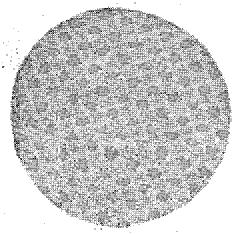  
UNCLASSIFIED Y-16104   
CM 52 ALLOY

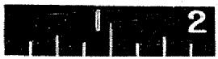

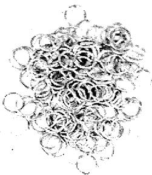  
SINTERED RINGS

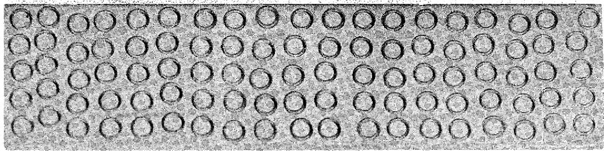  
GRAPHITE MOLD   
Fig. 6.13. Graphite Mold Used to Produce Sintered Brazing Alloy Rings From As-Received Powder.

in intermediate heat exchanger No. 2, several design changes have been made to promote better operating characteristics and to aid in fabrication. Larger diameter tubing, 0.250 in., is being used, and the right-angle corners of the header components of the previous heat exchanger have been eliminated to provide more favorable stress distribution. The new design is shown in Figs. 6.14 and 6.15. The torch used in semiautomatically welding the tube-to-header joints of one bundle is shown in Fig. 6.14, while the header, including the strongbacks used to minimize distortion during welding, is shown at a later stage of fabrication in Fig. 6.15. A modification was also made in the pressure-shell design to facilitate fabrication.

Coast Metals No. 52 brazing alloy, rather than low-melting Nicrobraz, is being used to back up the tube-to-header welds in the second tube bundle, since it has been shown to possess adequate corrosion resistance to both the fluoride mixture and to sodium and since its flowability characteristics are better than those of Nicrobraz. The alloy is applied as presintered rings, which

are shown in position on the underside of the heat exchanger header in Fig. 6.16. These rings can be secured to the header during assembly of the tubes either by electric-resistance spot welding or by using a volatile organic binder. Figure 6.16 also shows the diagonal comblike spacers installed on these units to assure uniform spacing between the tubes and to increase the rigidity of the bundle.

# Cornell Radiator No. 2

P. Patriarca G.M.Slaughter

Metallurgy Division

R. L. Heestand

Pratt & Whitney Aircraft

A second liquid metal-to-air radiator, designed by the Cornell Aeronautical Laboratory, has been fabricated. This construction problem was very similar to that described previously, except that one header was not attached to the side plates and was thus free to "float" during thermal

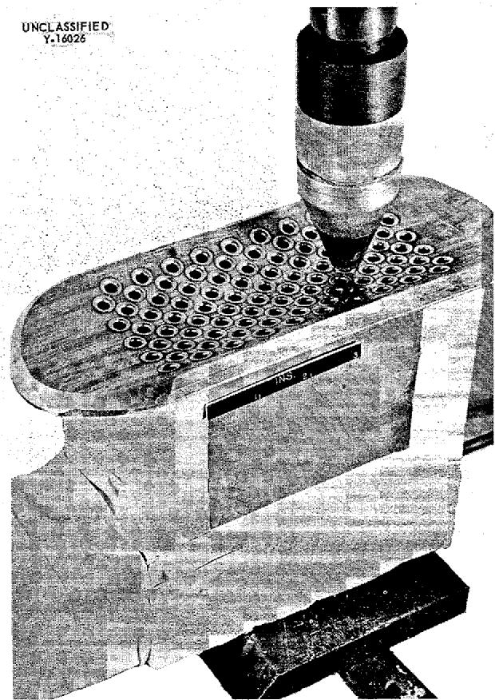  
Fig. 6.14. One Header of the Intermediate Heat Exchanger No. 3 Tube Bundle After Welding of the Tube-to-Header Joints by Semiautomatic Inert-Arc Techniques. Masking tape was used to ensure adequate shielding-gas protection at the roots of the welds.

expansion and contraction of the assembly. The radiator core, with the floating header at the bottom, is shown in Fig. 6.17.

The side plates and remaining header sections were welded to the core shown in Fig. 6.17, and the tube-to-header joints were back-brazed with Coast Metals No. 50 alloy. Leak testing with a helium mass spectrometer indicated that all welded and brazed joints were leaktight.

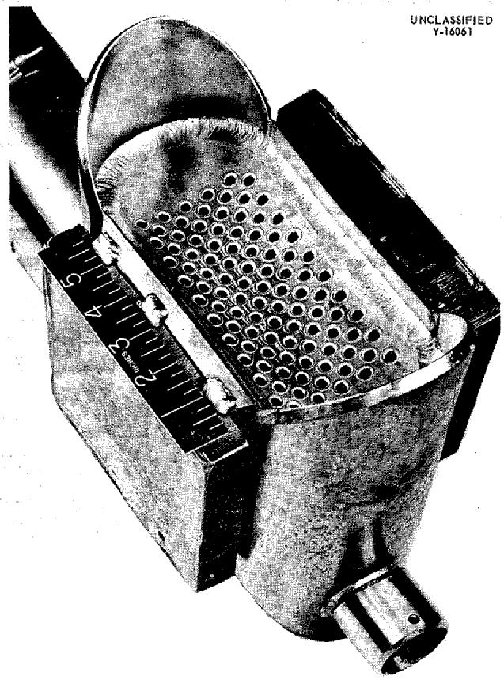  
Fig. 6.15. Improved Header Design of Intermediate Heat Exchanger No.3. Strongbacks were used to minimize distortion during welding.

# NONDESTRUCTIVE TESTING

R.B.Oliver

J.W.Allen

K. Reber

R.W.McClung

Metallurgy Division

The recent successes of several AEC installations in the use of eddy currents for testing aluminum shapes suggested that the technique might be applied to the inspection of Inconel and stainless steel tubing. A comprehensive literature and patent survey indicated that the eddy-current flaw detection method had been successfully applied to magnetic materials and to high-conductivity nonmagnetic materials but that little success

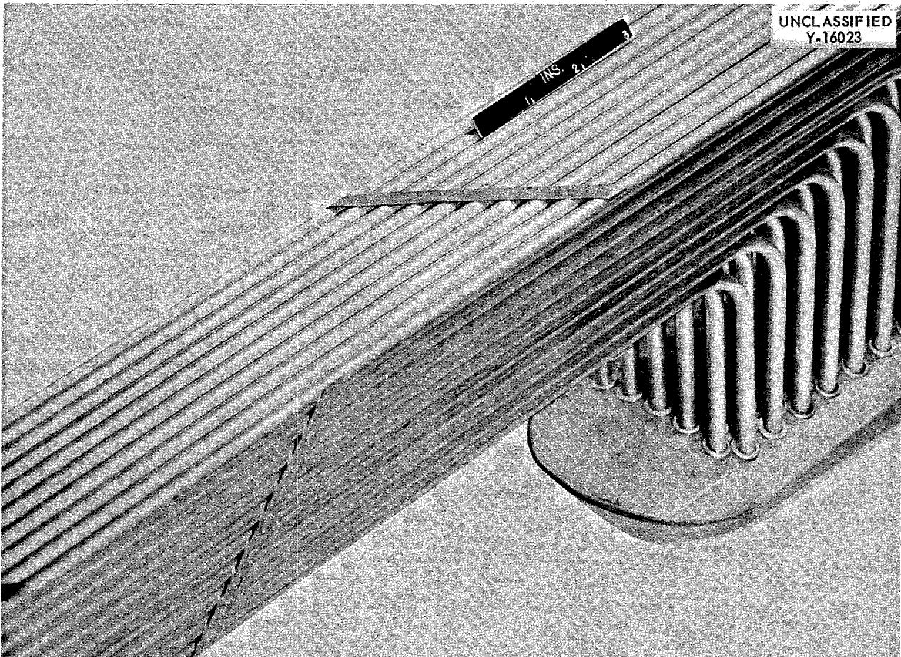  
Fig. 6.16. Intermediate Heat Exchanger No. 3 Tube Bundle Showing Coast Metals Alloy No. 52 Brazing Alloy Presintered Rings for Back Brazing in Place on Under Side of the Header and the Comblike Spacers for the Tubes.

had been attained in its application to low-conductivity nonmagnetic alloys. Laboratory work with experimental equipment has indicated, however, that there are good possibilities for the successful use of eddy-current techniques in the inspection of Inconel tubing.

In brief, the method consists in exciting eddy currents in the tube to be inspected by bringing it into the field of a coil which is being supplied with an alternating current. The existence of the eddy currents in the tube wall causes the original field of the coil to be altered and its impedance to be changed. Any flaw or other variable in the tube that changes the magnitude or the distribution of the eddy currents is reflected as a change in the impedance of the coil and may be measured. Coils that encircle the tube and very small "probe"

coils placed on the surface of the tube may be utilized. Since it is much easier to pass a tube through an encircling coil than it is to cause a probe coil to mechanically scan the surface of a tube, the initial emphasis has been placed on the use of encircling coils.

Since the magnitude of the eddy current in a particular piece of material is directly proportional to the frequency, it has been found that the sensitivity of any eddy-current instrument varies with the frequency. It has also been found that to obtain adequate sensitivity, tight coupling between the coil and the tubing must be maintained. A deterrent to increasing the frequency to improve the sensitivity is the "skin effect" of the eddy currents in the tube wall. The relative magnitudes of the eddy currents at any depth $x$ in a tube

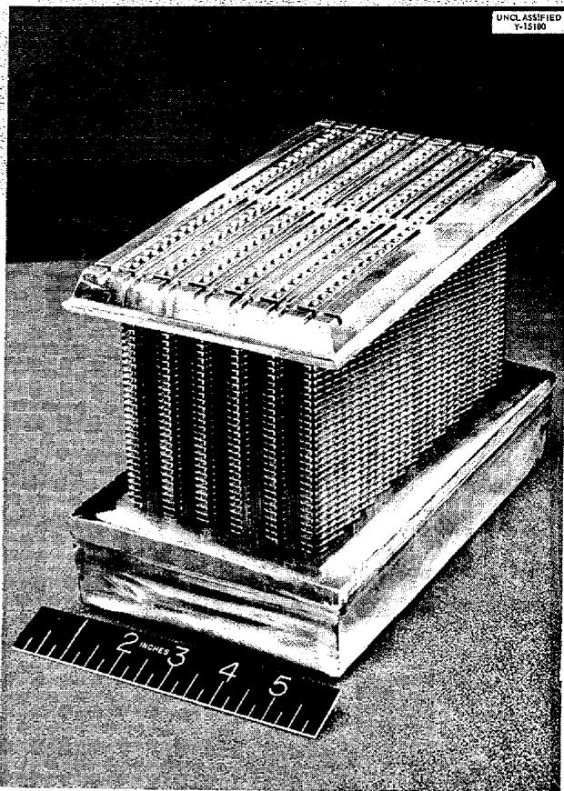  
Fig. 6.17. Core of Cornell Radiator No. 2.

wall may be expressed by:

$$
\left| \frac {I _ {x}}{I _ {\text {s u r f a c e}}} \right| = e ^ {- x \sqrt {\pi f \mu \lambda}},
$$

where

$$
\begin{array}{l} f = \text {f r e q u e n c y} \\ \mu = \text {p e r m e a b i l i t y}, \\ \lambda = \text {c o n d u c t i v i t y}. \\ \end{array}
$$

For Inconel, the relationship is

$$
\begin{array}{l} \left| \begin{array}{l} I _ {x} \\ \hline I _ {\text {s u r f a c e}} \end{array} \right| _ {\text {I n c o n e l}} \\ = e ^ {- 5. 1 1 x \sqrt {f} \times 1 0 ^ {- 5}}, (\text {f o r} x \text {i n m i l s}), \\ \end{array}
$$

which indicates that the frequency must be limited if the eddy currents are to penetrate to the inside wall of the tube. The choice of frequency is thus a compromise that must be made for each tube

size and material. The frequency selections for testing Inconel tubing are given in Table 6.8.

An impedance diagram for a tightly coupled coil encircling a $\frac{1}{2}$ -in.-dia Inconel rod is shown in Fig. 6.18 (solid curve through open circles). The frequency of the current (in kilocycles per

TABLE 6.8. OPTIMUM FREQUENCIES FOR EDDY-CURRENT FLAW DETECTION IN INCONEL TUBING  

<table><tr><td>Outside Diameter of Tubing (in.)</td><td>Optimum Frequency (kc)</td><td>Maximum Inspection Depth (in.)</td></tr><tr><td>0.20</td><td>500</td><td>0.030 to 0.040</td></tr><tr><td>0.25</td><td>320</td><td>0.035 to 0.050</td></tr><tr><td>0.375</td><td>140</td><td>0.055 to 0.075</td></tr><tr><td>0.50</td><td>80</td><td>0.070 to 0.100</td></tr><tr><td>1.00</td><td>20</td><td>0.150 to 0.200</td></tr></table>

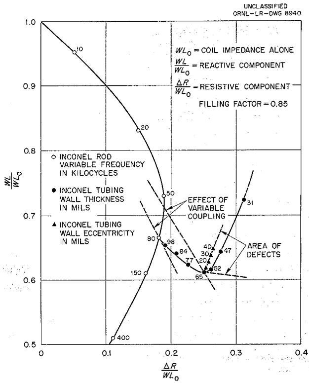  
Fig. 6.18. Normalized Impedance Plane for $\frac{1}{2}$ in.-dia Inconel Rod or Tubing Obtained with an Encircling Coil.

second) is shown for each point. If a particular frequency is chosen (80 kc/sec) and the effect of varying the wall thickness of an Inconel tube is investigated, the impedance curve will follow through the points indicated by the open squares. Hence, if $\frac{1}{2}$ -in.-dia, 65-mil-wall, Inconel tubing were being examined, the change in the resistive component would be a sensitive measure of a change in wall thickness. However, changes in eccentricity also produce changes in the resistive component, as shown by the curves through the triangles. Thus, in order to interpret the measurements in terms of the nature of the tubing flaws, both the changes in the resistive and the reactive components must be measured.

There is no instrument available at the present time which will make an impedance type of analysis over the wide range of frequencies indicated in Table 6.8. Work with experimental equipment has indicated, however, that such an instrument is feasible but would require considerable development work. As a result, emphasis is now being placed upon the development of suitable probe-type coils with which impedance analyses could be made without changing frequency for each different size of tubing. In addition, it is felt that a probe coil, because of its small size, would be more sensitive to small flaws than would an encircling coil.

Since the eddy-current flaw-detection method has many more unresolved problems than does the method that employs ultrasonic equipment, the latter method has been chosen for the inspection of small-diameter tubing. The ultrasonic equipment selected (manufactured by Electro Circuits, Inc.) operates with a shock-excited crystal and a wideband amplifier. The technique employed is to immerse both the crystal and the tubing in water and to introduce the ultrasound circumferentially into the tube wall as a shear wave. The equipment gives very clean flaw signals and high resolution for signals from small closely spaced flaws. These same features should also permit a moderately high scanning speed that would be advantageous in the inspection of large quantities of tubing.

The ultrasonic equipment has proved to be capable of detecting flaws which are as small as pin holes and which penetrate no more than 0.003 in. below the outside surface. All defects on the outer surface of the tubing that can be

located by dye-penetrant inspection have been located with ultrasound. Also, subsurface defects of equally small size have been detected with ultrasound and verified by metallographic examination. Experience indicates that defects located on the inner surface will be similarly detected.

The conventional presentation of ultrasonic data is on a cathode-ray tube as the "A" scan, the vertical sweep being the signal strength and the horizontal sweep being the distance (travel time) from the crystal. This presentation is not interpretable at high scanning speeds, since the repetition rate of the flaw signals will be in excess of 100 times per minute. Gated alarm signals would also be unsatisfactory, since all spurious signals, as well as flaw indications, would pass through the gate. The less conventional "B" scan would present the defects as a standing image of the tube cross section on a 17-in. cathode-ray tube. In this case, the vertical sweep would be a scan of the "A" type of presentation, and the horizontal sweep would be the rotation of the tube.

A "B" scan pattern from a tube having only one defect in the particular cross section being scanned is shown in Fig. 6.19. The defect, which is represented by the diagonal line, was a nonmetallic stringer about 0.001 in. in diameter and about $\frac{1}{2}$ in. long. This defect was longitudinal and was located about 0.010 in. below the outer surface of the tube and parallel to the tube axis.

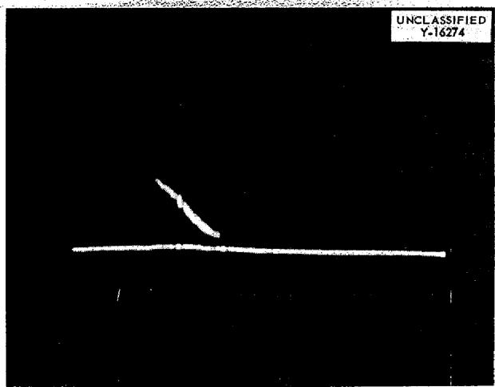  
Fig. 6.19. A “B” Scan Oscilloscope Trace of a Tube.

Mechanical equipment to rotate the tubing and to produce a relative linear motion between the tubing and the inspection device is being designed. This scanner will permit rapid inspection of tubing, and, if it is found to be desirable, eddy-current and ultrasonic methods can be used simultaneously. The use of the "B" scan requires an accurate signal from the rotation of the tube, and one of the major problems in the design of the scanning equipment is that of obtaining this signal.

# CERAMIC RESEARCH

C. E. Curtis

J. R. Johnson

J.A.Griffin

A.J.Taylor

Metallurgy Division

# Graphite-Hydrogen Corrosion-Erosion Investigation

Graphite-hydrogen systems at temperatures of the order of $2400^{\circ}\mathrm{C}$ or higher are of interest for nuclear rocket applications. An investigation was carried out to determine whether hydrogen flowing at a velocity of Mach 0.15 in high-density graphite tubing $\frac{1}{4}$ in. OD, 1 in. ID, 24 in. long) at approximately $2400^{\circ}\mathrm{C}$ caused significant corrosion-erosion of the graphite. Two types of graphite specimens were used: Graphi-tite (density, $\sim 1.8~\mathrm{g / cm}^3$ ), supplied by Graphite Specialties Corporation, and commercial graphite (density, $\sim 1.55~\mathrm{g / cm}^3$ ).

A schematic drawing of the apparatus used for the high-temperature graphite-hydrogen experiment is shown in Fig. 6.20. The graphite specimen was heated electrically to $2400^{\circ}\mathrm{C}$ , and a nitrogen or helium atmosphere was maintained in the specimen until equilibrium conditions were reached. The high-velocity hydrogen was applied for $10\mathrm{min}$ and then the hydrogen was replaced with helium while the specimen was cooling. Data and results of the experiments are given in Table 6.9.

The average corrosion-erosion for the tests on Graph-i-tite showed a loss of 0.0001 g/in.2-sec. It was noted that the weight losses were about the same with helium as with hydrogen, and it is probable that the losses were due to water vapor in the gases. The bulk temperature of the hydrogen was believed to be about $1600^{\circ}\mathrm{C}$ , and the velocity was about 1900 fps, or approximately Mach 0.18. It was observed that the weight losses of the commercial graphite were somewhat greater than those of the Graph-i-tite.

# Rare-Earth-Oxide Control Rods

Two control rod assemblies, similar to those prepared previously, were fabricated for critical experiments from a mixture of rare-earth oxides containing 63.8 wt $\%$ $\mathsf{Sm}_2\mathsf{O}_3$ and 26.3 wt $\%$ $\mathsf{Gd}_2\mathsf{O}_3$ , the remainder being primarily other rare-earth oxides. The firing temperature of $1550^{\circ}\mathsf{C}$ for these shapes was 50 deg higher than that previously used. The annular specimens were all 1 in. long with either 0.125- or 0.250-in. walls. The 0.125-in.-wall specimens were 1.275 in. OD and 1.025 in. ID, and the 0.250-in.-wall specimens were 1.275 in. OD and 0.775 in. ID. Figure 6.21 shows samples of the finished shapes.

# Calcium Fluoride and Alumina Detector Spacers

Flux detector spacers of calcium fluoride and alumina were produced in the form of wafers 0.190 in. thick and 0.800 in. in diameter, with an indentation 0.12 in. deep and 0.747 in. in diameter. Reagent-grade calcium fluoride was precalcined at $1140^{\circ}\mathrm{C}$ and ground to pass a 200-mesh Tyler screen; 2 wt $\%$ Carbowax 4000 was added as a binder and lubricant. The wafers were pressed in a hard, steel die at 50,000 psi and then sintered at $700^{\circ}\mathrm{C}$ for 1 hr. The alumina wafers were pressed similarly from fine-grained $\mathrm{Al}_{2}\mathrm{O}_{3}$ , without calcination, and then sintered at $1350^{\circ}\mathrm{C}$ for 1 hr.

# Fluoride Fuel Pellets

The optimum pressing conditions for pelletizing fluoride fuels in convenient shapes for loading into a reactor are being studied. A pressure of 4000 psi was not sufficient to produce pellets of NaF-ZrF $_4$ -UF $_4$ (50-46-4 mole %) that had adequate strength. Higher pressures are being used in experiments now under way.

# Synthesis of Boron Compounds

An investigation of the feasibility of synthesizing $\mathsf{Mo}_2\mathsf{B}_5$ and $\mathsf{B}_4\mathsf{C}$ has been started. These compounds are of interest as shielding material. Several samples of $\mathsf{Mo}_2\mathsf{B}_5$ have been prepared and are being analyzed. Samples of $\mathsf{B}_4\mathsf{C}$ were made by heating a stoichiometric mixture of boron and carbon to $1750^{\circ}\mathsf{C}$ . It is anticipated that about 100 lb of $\mathsf{B}^{10}$ will be made into $\mathsf{B}_4\mathsf{C}$ .

TABLE 6.9. RESULTS OF GRAPHITE-HYDROGEN CORROSION-EROSION EXPERIMENTS  

<table><tr><td>RunaNo.</td><td>Gas in Graphite Specimen</td><td>Gas Flow Rate (cfm, STP)</td><td>Time Between Temperature Readings (min)</td><td>Surface Temperature of Graphite Specimen at Beginning of Timed Period (°C)b</td><td>Surface Temperature of Graphite Specimen at End of Timed Period (°C)b</td><td>Maximum Temperature of Gas (°C)</td><td>Location of Thermocouple from Which Maximum Gas Temperature Was Obtained (see Fig. 6.20)</td><td>Maximum Graphite Specimen Temperature (°C)c</td><td>Power Input to Specimen (kw)</td><td>Total Weight Loss of Specimen (g)</td></tr><tr><td colspan="11">Specimen: Graphi-tite (p = 1.8 g/cm3)</td></tr><tr><td rowspan="2">2</td><td>Nitrogen</td><td></td><td>14</td><td>20</td><td>2245</td><td></td><td></td><td></td><td>16</td><td>8.7</td></tr><tr><td>Helium</td><td>18.6</td><td>13</td><td>2110</td><td>1935</td><td></td><td></td><td></td><td></td><td></td></tr><tr><td rowspan="3">3</td><td>Nitrogen</td><td></td><td>41</td><td>20</td><td>2260</td><td></td><td></td><td></td><td>10.7</td><td>3.3</td></tr><tr><td>Helium</td><td>9.6</td><td>16</td><td>2255</td><td>2230</td><td></td><td></td><td></td><td></td><td></td></tr><tr><td>Hydrogen</td><td>16.2</td><td>10</td><td>2230</td><td>1830</td><td></td><td></td><td></td><td></td><td></td></tr><tr><td rowspan="2">4</td><td>Helium</td><td>10.8</td><td>33</td><td>20</td><td>2250</td><td></td><td></td><td></td><td>10.9</td><td>1.6</td></tr><tr><td>Hydrogen</td><td>12.2</td><td>10</td><td>2250</td><td>2220</td><td></td><td></td><td></td><td></td><td></td></tr><tr><td rowspan="2">5</td><td>Helium</td><td>9.6</td><td>28</td><td>20</td><td>2205</td><td></td><td></td><td></td><td>11.0</td><td>1.8</td></tr><tr><td>Hydrogen</td><td>11.2</td><td>10</td><td>2205</td><td>2090</td><td></td><td></td><td></td><td></td><td></td></tr><tr><td>6</td><td>Helium</td><td>8.8</td><td>10</td><td>2240</td><td>2035</td><td></td><td></td><td></td><td>11.2</td><td>1.4</td></tr><tr><td rowspan="6">7</td><td rowspan="6">Helium</td><td rowspan="2">4.7</td><td rowspan="2">17</td><td rowspan="2">20</td><td rowspan="2">1500</td><td>650</td><td>A</td><td></td><td></td><td></td></tr><tr><td>1190</td><td>B</td><td></td><td></td><td></td></tr><tr><td rowspan="2">14.5</td><td rowspan="2">5</td><td rowspan="2">1500</td><td rowspan="2">1860</td><td>590</td><td>A</td><td></td><td></td><td></td></tr><tr><td>Thermocouple melted</td><td>B</td><td></td><td></td><td></td></tr><tr><td rowspan="2">9.4</td><td rowspan="2">23</td><td rowspan="2">1860</td><td rowspan="2">2250</td><td>840</td><td>A</td><td></td><td></td><td></td></tr><tr><td>Thermocouple melted</td><td>B</td><td></td><td></td><td></td></tr><tr><td rowspan="5">8</td><td rowspan="2">Helium</td><td>4.6</td><td>19</td><td>20</td><td>2155</td><td>1540</td><td>C</td><td></td><td></td><td></td></tr><tr><td>9.6</td><td>10</td><td>2155</td><td>2210</td><td>850</td><td>C</td><td></td><td></td><td></td></tr><tr><td rowspan="3">Hydrogen</td><td>9.8</td><td>5</td><td>2210</td><td></td><td>815</td><td>C</td><td></td><td></td><td></td></tr><tr><td>6.5</td><td>3</td><td></td><td></td><td>970</td><td>C</td><td></td><td></td><td></td></tr><tr><td>4.9</td><td>2</td><td></td><td>2200</td><td>1120</td><td>C</td><td></td><td></td><td></td></tr><tr><td rowspan="4">9</td><td rowspan="2">Helium</td><td>5.5</td><td>28</td><td>20</td><td>2160</td><td>1770</td><td>D</td><td></td><td></td><td></td></tr><tr><td>10.1</td><td>12</td><td>2160</td><td>2220</td><td>1770</td><td>F</td><td></td><td></td><td></td></tr><tr><td rowspan="2">Hydrogen</td><td>13.3</td><td>9</td><td>2220</td><td></td><td>Thermocouple melted</td><td></td><td></td><td></td><td></td></tr><tr><td>9.8</td><td>1</td><td></td><td>2270</td><td></td><td></td><td></td><td></td><td></td></tr><tr><td rowspan="3">10</td><td rowspan="2">Helium</td><td>4.3</td><td>35</td><td>20</td><td>2020</td><td></td><td></td><td></td><td>9.3</td><td>0.8</td></tr><tr><td>9.4</td><td>6</td><td></td><td></td><td></td><td></td><td></td><td></td><td></td></tr><tr><td>Hydrogen</td><td>11.7</td><td>10</td><td></td><td></td><td></td><td></td><td></td><td></td><td></td></tr><tr><td colspan="11">Specimen: Commercial Graphite (p = 1.55 g/cm3)</td></tr><tr><td rowspan="4">11</td><td rowspan="2">Helium</td><td>4.6</td><td>19</td><td>20</td><td>2210</td><td></td><td></td><td></td><td>9.3</td><td>4.1</td></tr><tr><td>11.3</td><td>12</td><td>2210</td><td>2285</td><td></td><td></td><td></td><td>9.3</td><td>3.3</td></tr><tr><td rowspan="2">Hydrogen</td><td>9.8</td><td>1</td><td></td><td></td><td></td><td></td><td></td><td></td><td></td></tr><tr><td>9.8</td><td>9</td><td></td><td>2025</td><td></td><td></td><td></td><td></td><td></td></tr><tr><td rowspan="3">12</td><td rowspan="2">Helium</td><td>5.6</td><td>15</td><td>20</td><td>2210</td><td></td><td></td><td></td><td>10.8</td><td>6.0</td></tr><tr><td>9.2</td><td>15</td><td>2210</td><td>2305</td><td></td><td></td><td></td><td>10.8</td><td>6.0</td></tr><tr><td>Hydrogen</td><td>8.6</td><td>10</td><td></td><td>2260</td><td></td><td></td><td></td><td></td><td></td></tr></table>

${}^{a}$ Run 1 was for checking apparatus.   
bReading obtained with optical pyrometer sighted down sight tube (see Fig. 6.20).   
cReading obtained with optical pyrometer sighted down exit tube (see Fig. 6.20).

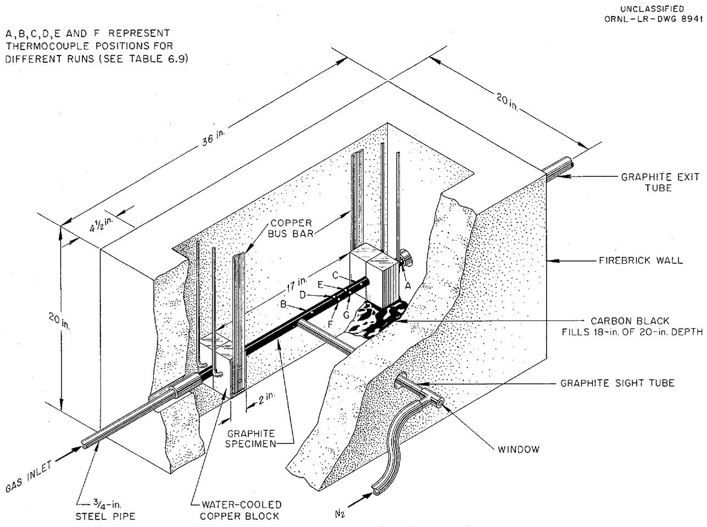  
Fig. 6.20. Apparatus for High-Temperature Graphite-Hydrogen Corrosion-Erosion Experiment.

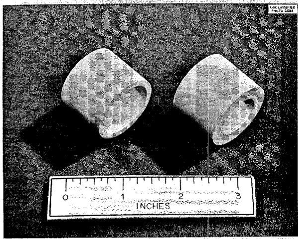  
Fig. 6.21. Annular Specimens of Rare-Earth Oxides $(\mathsf{Sm}_2\mathsf{O}_2$ and $\mathsf{Gd}_2\mathsf{O}_3)$ for Control Rod Assemblies.

# Fabrication of Dysprosium Oxide Disks

The fabrication of dysprosium oxide, which is of interest for use in measuring thermal flux in a reactor, is being investigated by the American Lava Corporation under an ORNL subcontract. Disks 0.242 in. in diameter and 0.011 in. thick that contain approximately $1\mathrm{mg}$ of dysprosium oxide per square centimeter of area have been prepared. The disks contain an organic resin binder, and the filler is electrically fused $\mathrm{Al}_{2}\mathrm{O}_{3}$ having a particle size of approximately 500 mesh, and finer, and a purity of about $99.5\%$ . The principal contaminant is $\mathrm{SiO}_2$ . These disks were submitted to the Critical Experiment Facility for evaluation.

# Fabrication of Europium Oxide Wafers

A preliminary investigation has indicated that wafers $\frac{3}{4}$ in. in diameter and 0.030 in. thick,

prepared from $\mathsf{Eu}_2\mathsf{O}_3$ powder by precalcining at $1200^{\circ}\mathsf{C}$ for 1 hr, cold-pressing at 20,000 psi, and sintering at $1500^{\circ}\mathsf{C}$ for 2 hr, are unstable in the presence of moisture. Similar specimens prepared from uncalcined material cold pressed as above and sintered at 1200, 1300, 1400, and $1500^{\circ}\mathsf{C}$ for 2 hr showed no signs of breakdown in the presence of moisture. As soon as suitable specimens have been prepared, they will be submitted to the MTR for about $10^{21}$ -nvt exposure.

# SPECIAL MATERIALS STUDIES

J. H. Coobs

J.P.Page

H. Inouye

T. K. Roche

Metallurgy Division

M. R. D'Amore

Pratt & Whitney Aircraft

# Columbium Research

The investigation of metal diffusion barriers for use in the fabrication of Inconel-clad columbium sheet was continued. As was previously reported,[10] the interdiffusion between Inconel and columbium at elevated temperatures is extensive. The reaction products, which appear to be nickel-columbium compounds, are brittle, and, because of the difference in the coefficients of thermal expansion between the metals, separation occurs at the interface when the composite is cooled to room temperature. The problem is not that of preventing the formation of intermetallic compounds, although this would be desirable, but primarily that of selecting a suitable combination of metals which will remain thermally bonded in service. This is mandatory, since the composite is being considered for use as a heat transfer surface.

The barrier metals to be studied were selected somewhat at random, since the phase relationships between columbium, the possible barrier metals, and Inconel have not been thoroughly determined, especially as to the nature of the compounds which are formed. Vanadium, titanium, molybdenum, tantalum, and copper have been evaluated as the barrier metals.

Composites were fabricated by hot-rolling capsules which had been evacuated at $1100^{\circ}\mathrm{F}$ to at least $1 \times 10^{-4} \mathrm{~mmHg}$ . Rolling temperatures between 1800 and $2100^{\circ}\mathrm{F}$ were used at reduction

schedules of 30 and $40\%$ per pass. The total reduction in thickness was about 5/1. No particular effort was made to predetermine the thickness of the columbium core or the Inconel cladding. A final composite thickness of 0.020 in. was evaluated. The barriers were calculated to be 0.001 in. thick after being rolled. Cross sections of strips that had been bent to form an involute of a circle were examined microscopically.

The Inconel-vanadium-columbium composite in the as-rolled condition withstood several 90-deg bending reversals over a sharp radius. Microscopic examination showed a reaction layer at the vanadium-Inconel interface that was less than 0.0001 in. thick. The reaction layer was cracked perpendicular to a tangent to the curved surface. Since no separation occurred at the interface, this composite could probably be formed to a desired shape by cold spinning. After 100 hr at $1650^{\circ}\mathrm{F}$ , the composite separated at the Inconel-vanadium interface upon bending. The reaction layer at this interface had increased to about 0.0005 in. in thickness, and the vanadium layer had decreased in thickness. After 500 hr at $1650^{\circ}\mathrm{F}$ , the composite separated during sectioning. Microscopic examination showed that the vanadium layer had been completely transformed to an intermetallic compound.

An Inconel-titanium-columbium composite was found to be unsatisfactory because of the formation of a low-melting compound at the rolling temperature of $2100^{\circ}\mathrm{F}$ . The compound was brittle, and separation of the composite occurred during cooling. The experiment is to be repeated with a lower rolling temperature.

An Inconel-tantalum-columbium composite was prepared, but, since tantalum and columbium are isomorphous in several aspects, the composite was not expected to be successful. Specifically, this combination was tried to determine the effect of the melting-point difference of the metals on their diffusion rate with Inconel (columbium melts at $4380^{\circ}\mathrm{F}$ ; tantalum melts at $5425^{\circ}\mathrm{F}$ ). It was also desired to compare the properties of the expected reaction products.

Examination of the composite after rolling at $2100^{\circ}F$ showed a 0.0001-in.-thick reaction layer at the Inconel-tantalum interface, which was found to be brittle at room temperature. However, separation did not occur after numerous 90-deg bending reversals. In the unbent position, the

composite showed no cracks in the reaction layer. During service tests at $1650^{\circ}\mathrm{F}$ , the reaction layer between the tantalum and the Inconel increased, with time, until in 500 hr about 0.0005 in. of the tantalum had been converted to an intermetallic compound. The tantalum-columbium interface showed no tendency to diffuse at these temperatures.

Bending-reversal tests made after 500 hr at $1650^{\circ}\mathrm{F}$ resulted in no separation in the composite, even though the reaction layer cracked perpendicular to a tangent to the curved surface. No cracks were observed in the unbent portion of the composite. It may be possible therefore to form the Inconel-tantalum-columbium composite in the as-rolled condition and to maintain thermal bonds under temperature cycling.

Additional experiments are being designed for testing the creep strength of both clad and unclad columbium. This information is needed for determining whether columbium may be substituted for a large portion of the Inconel in an ART-type assembly and have strength equal to or greater than that of Inconel alone. Other tests will be made to determine which barrier material, copper or tantalum, is better suited for this application. Investigations of copper as the barrier material were reported previously.[10] Tantalum has the disadvantage of having a neutron cross section of 20 barns. Service tests of up to 500 hr at $1650^{\circ}\mathrm{F}$ indicate that 0.0005 in. of tantalum is the minimum thickness that will prevent the columbium-Inconel reaction. In a composite of the proportions contemplated (0.024 in. of Inconel-0.001 in. of tantalum-0.075 in. of columbium-0.001 in. of tantalum-0.024 in. of Inconel), the presence of tantalum might not be objectionable. If a copper barrier is used adjacent to the columbium, an iron-base alloy barrier must be included in the composite to prevent diffusion between the copper and the Inconel. In addition, wider Inconel frames might be necessary for welding because of the low melting point of copper. The choice of the proper barrier metal will be based upon room-temperature ductility, creep, formability, and welding tests. Welding experiments are to be made for determining the minimum Inconel frame width that will permit the welding of totally clad columbium without serious heat damage to the interface.

In a preliminary investigation of $\mathrm{Cb - UO_2}$ fuel elements the compatability of $\mathrm{UO_2}$ and columbium was studied at 1500 and $1832^{\circ}F$ for 100 hr. The specimens were prepared by hot swaging 20 wt $\%$ $\mathrm{UO_2}$ with columbium powder at $1742^{\circ}F$ . Both steam-treated $\mathrm{UO_2}$ and high-fired $\mathrm{UO_2}$ were used for these tests. The mixtures were examined in the as-swaged condition and after the 100-hr heating period. Under all test conditions a third phase, which was pinkish in color, was found in the matrix. This phase appeared as discrete particles or as a portion of a former $\mathrm{UO_2}$ particle, and the quantity of this phase increased with heating time. X-ray patterns of the tested mixture indicated that a solid solution of columbium-uranium was present. The same phase was found as a network in an arc-melted button of a $5\%$ $\mathrm{Cb - 95\%}$ U alloy.

# Composite Tubing Fabrication

Extrusion experiments for preparing two- and three-ply seamless tube blanks have been continued. As in previously reported experiments,10 the layer compositions for these experiments were carbon steel and type 316 stainless steel. The two-ply extrusions were carbon steel clad on the outside with stainless steel, and the three-ply extrusions were carbon steel clad on both sides with stainless steel.

When equal starting thicknesses were used in previous experiments, the thickness of the extruded layers varied widely from the desired thicknesses. Equal metal ratios in the extruded tube could be obtained by adjusting the starting thickness, but this procedure resulted in low recovery of acceptable tubing. Therefore experiments have been made with various billet designs in an effort to increase the recovery of acceptable tubing and to reduce the thickness variations between the layers.

Additional information regarding the deformation pattern was needed in order to establish the limits of the layer thicknesses, the effect of built-in flaws, and the effect of varying the extrusion ratio. Built-in flaws consisting of molybdenum washers 0.010 in. thick were spaced at $\frac{1}{2}$ -in. intervals along the billet. These washers also served as markers to outline the deformation pattern. In addition, the markers outlined the $\frac{1}{2}$ -in.-thick disks and thus served to determine

the final shape of the disks when they were used in three-ply extrusion.

Both flat-nosed and 45-deg tapered dummy blocks were used in front of equal thicknesses of concentric rings. In the two-ply extrusions, deviations in thickness were about $15\%$ . The inner layer in both extrusions was thinner than desired. In the three-ply extrusions, the inner cladding was thinner and the outer cladding thicker by $15\%$ than had been calculated. The core of the extrusion showed no deviation from the calculated thickness. The results obtained to date in attempts to extrude concentric layers of equal thicknesses are summarized in Table 6.10.

The extrusions containing molybdenum washers were sectioned lengthwise and examined. The deformation across the tube wall was complex, since both compression and tension were evident. Tensile forces prevailed in the outer and inner layers, while compression forces prevailed in the zone in between. The original 0.010-in.-thick molybdenum washers varied in thickness from about 0.003 in. near the tube walls to 0.050 in. at the middle of the tube wall.

The displacements of the molybdenum washers from their starting positions were noted. After extrusion, the washers could be located as coordinates of a parabola of revolution, with the axis being the center line of the tube. The shapes of the separate washers differed along the length of the extrusion. It is evident that because of the tensile forces near the tube walls the flaws in this zone in the starting billet will result in flaws in the extrusion.

# Oxidation Tests of Aluminum Bronze

The aluminum bronzes are being considered as cladding material for the oxidation protection of copper fins for radiators. Therefore oxidation tests of several commercial bronzes were conducted in air at $850^{\circ}\mathrm{C}$ . The weight gains of the alloys as a function of time are shown in Fig. 6.22.

# Lead-Calcium Alloys

The chemical-analysis technique for evaluating the creep resistance of lead-calcium alloys was investigated. It was determined that chemical analyses were not indicative of the creep performance of these alloys, because the normal scatter of the data on the calcium content frequently exceeded the desired calcium content of between 0.03 and $0.06\%$ . The strengthening effect of calcium can be realized only if it is present in solid solution or as a compound with lead; that is, if a portion of the calcium is present as CaO, the beneficial effects of the calcium are lost. Since the chemical analysis gives the total calcium rather than the CaO content of the alloy, the chemical analyses can serve only as a guide in the evaluation of the creep performance. For example, three alloys calculated to contain $0.06\%$ calcium on the basis of analyses of three master alloys containing $2\%$ total calcium were found by chemical analysis to contain 0.043, 0.030, and $0.059\%$ calcium, respectively. In cantilever creep tests at room temperature and 750-psi stress, the deflections of these alloys at the end of a 2-in. beam were 0.87, 0.33, and $0.54~\mathrm{cm}$ , respectively. Since the chemical analyses determine only the

TABLE 6.10. RESULTS OF ATTEMPTS TO EXTRUDE CONCENTRIC LAYERS OF EQUAL THICKNESSES   

<table><tr><td rowspan="2">Tubing</td><td rowspan="2">Type of Dummy Block Used</td><td colspan="3">Average Layer Thickness</td><td rowspan="2">Length of Extrusion Containing Uniform Layers (%)</td></tr><tr><td>Inside Layer</td><td>Core</td><td>Outside Layer</td></tr><tr><td rowspan="3">Two-ply</td><td>None</td><td>0.087</td><td></td><td>0.132</td><td>45</td></tr><tr><td>Flat nosed</td><td>0.109</td><td></td><td>0.140</td><td>63</td></tr><tr><td>45-deg tapered</td><td>0.107</td><td></td><td>0.118</td><td>66</td></tr><tr><td rowspan="3">Three-ply</td><td>None</td><td>0.050</td><td>0.073</td><td>0.111</td><td>45</td></tr><tr><td>Flat nosed</td><td>0.070</td><td>0.074</td><td>0.103</td><td>55</td></tr><tr><td>45-deg tapered</td><td>0.078</td><td>0.075</td><td>0.104</td><td>56</td></tr></table>

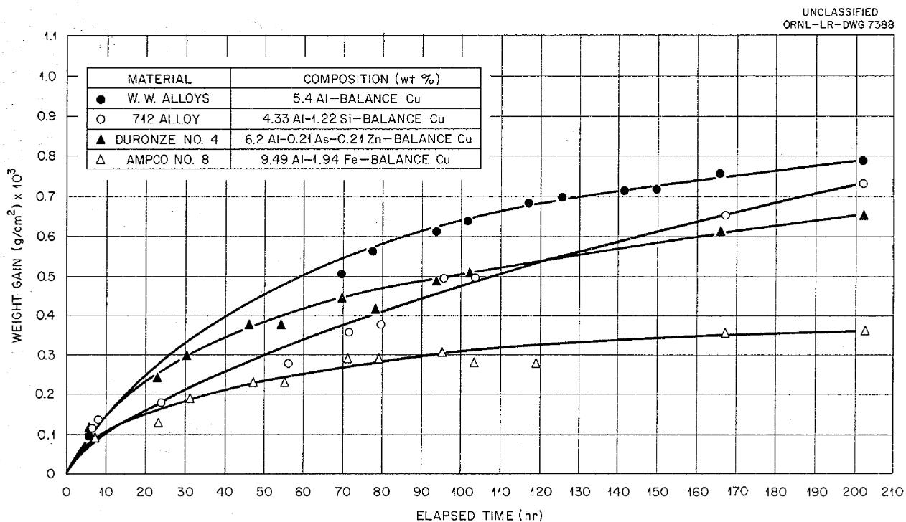  
Fig. 6.22. Oxidation of Commercial Aluminum Bronzes in Air at $850^{\circ}\mathrm{C}$ .

total calcium, the master alloy must be made under conditions in which the oxidation of the calcium will be held to a minimum. It might be possible to improve the accuracy of the alloyed calcium determinations by filtering the master alloy at about $1475^{\circ}\mathrm{F}$ through a quartz filter prior to analysis.

About 150 lb of a lead-calcium alloy containing $0.05\%$ calcium was supplied to WADC for elevated-temperature creep testing. Chemical analyses indicated that the calcium contents of the alloys were consistent when they were prepared from master alloys that had been protected from oxidation.

Cantilever creep tests of the alloys supplied to WADC were made at room temperature. Both the wrought and cast alloys were tested in quadruplicate, with consistent results. The wrought alloy was found to have the better creep properties.

# Neutron Shielding Material

The fabrication of a boron-containing shield material is being studied. A material containing a minimum of 1 g of boron per cubic centimeter of a metallic matrix is to be bonded to a $\frac{1}{4}$ -in.-thick Inconel hemisphere. The initial experiments

were attempts to obtain thermal bonds by flame- spraying mixtures of $\mathsf{Cu - B}_4\mathsf{C}$ The results, to date, do not appear to be promising, since a large proportion of the $\mathsf{B}_4\mathsf{C}$ is lost during spraying.

In other experiments, attempts were made to wet $\mathsf{B}_4\mathsf{C}$ with copper alloys and to cast the resulting slurry. The oxidation of the $\mathsf{B}_4\mathsf{C}$ to $\mathsf{B}_2\mathsf{O}_3$ during melting appears to be a major problem in this approach. The experiments are to be continued in an inert atmosphere.

A layer equivalent to 0.008 in. of boron will reduce the neutron flux through it about $90\%$ . Since such a relatively thin layer would meet reactor specifications, if thermally bonded to the Inconel, experiments for depositing boron by electrophoresis and electroplating of boron slurries are being contemplated. Unbonded tiles or strips of boron compounds in a metallic matrix would then be used to fill the remaining space of the $\frac{3}{2}$ -in. annulus provided.

A disk and a ring were fabricated from a boron carbide-copper mixture for use as neutron poison in the high-temperature critical assembly. The disk was to be $6\frac{3}{8}$ in. in diameter and 0.500 in. thick; the ring was to have an outside diameter of $12\frac{1}{4}$ in. and a cross section of $\frac{5}{16} \times \frac{1}{2}$ in.

The disk was formed by pressing a mixture of $\mathsf{B}_4\mathsf{C}$ and copper powder in a graphite mold at $900^{\circ}\mathsf{C}$ , and it was found to be $6\frac{1}{2}$ in. in diameter and 0.447 in. in average thickness; it contained 0.367 g of boron per cubic centimeter, or $97.4\%$ of the theoretical density. The disk was machined to $6\frac{3}{8}$ in. in diameter with diamond tools, and diffusion barriers of copper and stainless steel were applied by flame-spraying. The barrier layer thicknesses were 6 and 15 mils, respectively. Attempts to fabricate the material for the $12\frac{1}{4}$ -in.-OD ring by extruding a billet of compacted $\mathsf{B}_4\mathsf{C}-\mathsf{Cu}$ powders canned with copper were unsuccessful. Severe edge cracking of the material

occurred during extrusion and was probably due to either too high an extrusion temperature or too thin a copper can. After the unsuccessful extrusions, the ring was fabricated by drawing a round copper tube filled with $\mathsf{B}_4\mathsf{C}$ powder into a rectangular tube with a $5_{16} \times 12$ in. cross section. The tube was then roll-formed to a $12\frac{1}{4}$ -in.-OD ring and split into two equal segments for ease of assembly. The open ends of the tube were closed with boron carbide-copper plugs. The ring contained approximately $2.25\mathrm{g}$ of boron per inch of length. A 7-mil layer of type 430 stainless steel was flame-sprayed onto the ring to act as a diffusion barrier.

# 7. HEAT TRANSFER AND PHYSICAL PROPERTIES

# H. F. Poppendiek   Reactor Experimental Engineering Division

Forced-convection heat transfer experiments with the fuel mixture NaF-KF-LiF-UF $^4$ flowing in a heated tube were continued, and heat transfer and friction characteristics of a full-scale ART heat exchanger were determined. Flow patterns in models of the 18- and 21-in. ART cores have been determined for rotational and axial flow, as well as various entrance conditions, and the results are summarized. The temperature distributions within fluids flowing through converging and diverging channels were determined experimentally in the volume-heat-source system.

The enthalpies and heat capacities of LiF-KF (50-50 mole %) were determined, and the viscosities of eight fluoride mixtures were measured.

# FUSED SALT HEAT TRANSFER

H.W.Hoffman

P.E.Stover

Reactor Experimental Engineering Division

Previous forced-convection heat transfer experiments with the fuel mixture NaF-KF-LiF-UF

(11.2-41-45.3-2.5 mole $\%$ )flowing in a heated Inconel tube gave results which were $40\%$ below the general turbulent-flow heat transfer correlation. These results (Fig. 7.1) have been duplicated in recent experiments in which a type 316 stainless steel tube was used. It was not possible to examine the inside surface of the stainless steel tube, because the experiment was terminated by the melting of the test section. However, it is believed that there were probably no surface deposits on the stainless steel tube, which was the same case in earlier experiments with NaF-KF-LiF (11.5-42-46.5 mole $\%$ ). Thus, the reduction in heat transfer obtained with this fluoride mixture is probably due to something other than the formation of surface deposits.

Some evidence exists which indicates that the NaF-KF-LiF-UF $^4$ composition contained particulate matter that made it a dilute slurry. However, before any conclusions can be reached as to the effect of this feature on heat and momentum

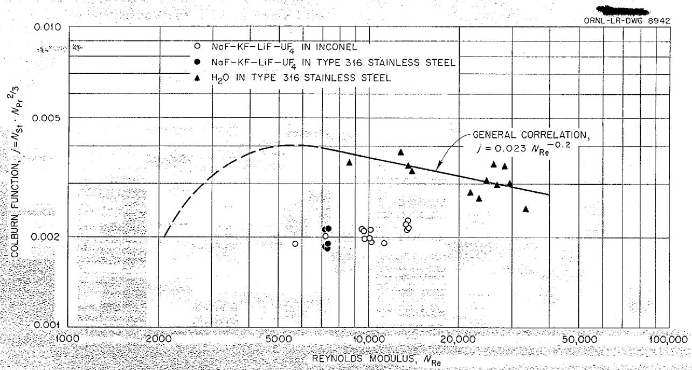  
Fig. 7.1. Comparison of Heat Transfer Measurements on NaF-KF-LiF-UF $_4$ (11.2-41-45.3-2.5 mole%) and Water with the General Correlation for Ordinary Fluids.

transfer, further experiments must be made. Heat transfer studies in which a Hastelloy B test section is used are now in progress.

As a check on the overall performance of the experimental apparatus used for these studies, the system was operated with water as the heat transfer medium. The water data, shown in Fig. 7.1, are in good agreement with the general turbulent-flow correlation and indicate that the low heat transfer values obtained with NaF-KF-LiF-UF $_4$ are real. The cause of the considerable scatter in the water results has not yet been determined.

Assembly of a heat transfer system that includes a pump is in progress and will be completed in the near future. The system will be operated with water prior to studies with the salt mixture NaF-ZrF4·UF4 (50-46-4 mole %).

# ART FUEL-TO-NoK HEAT EXCHANGER

J. L. Wantland

Reactor Experimental Engineering Division

For the recent experiments with the ART fuel-to-NaK heat exchanger1 the tube bundle was heated by passing an electric current through it; water was circulated outside the tubes, but there was no fluid flow through the tubes. The fuel heat transfer coefficients were determined by measuring tube-wall and mixed-mean-fluid temperatures, as well as heat transfer rates. As is shown in Fig. 7.2, the data obtained corroborated the heat transfer coefficients previously determined by using the apparatus as a water-to-water heat exchanger.

Also, the heat transfer and isothermal friction characteristics of the fuel side of the heat exchanger were determined with all the tube spacers removed from the tube bundle, except for one horizontal and one vertical spacer at opposite ends. In Figs. 7.2 and 7.3 the data are compared with previous data taken with all the spacers in the heat exchanger. As was to be expected, both the heat transfer coefficients and the friction factors decreased upon removal of the tube spacers. The difference is partially due to the spacers creating form drag and inducing some additional turbulence. However, when the spacers were removed, the tubes were not rigidly held, and

"channeling" occurred in the flow pattern. The flow channeling increases the effective equivalent diameter (and hence the Reynolds modulus) and

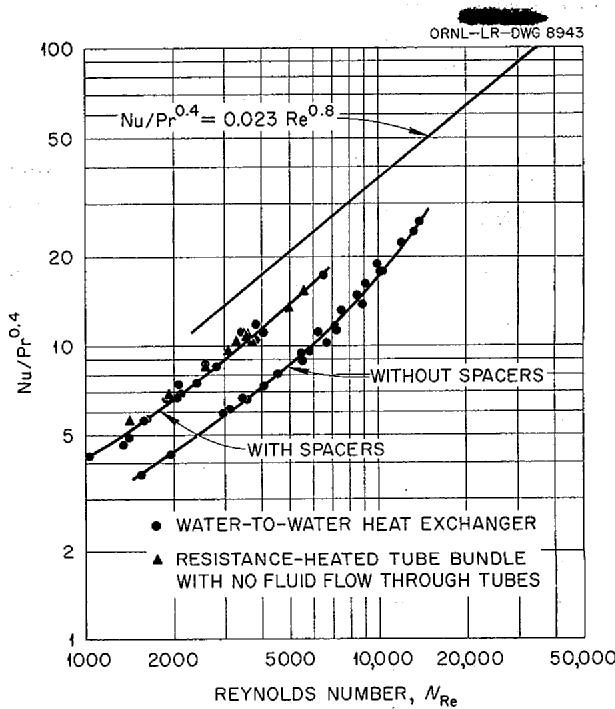

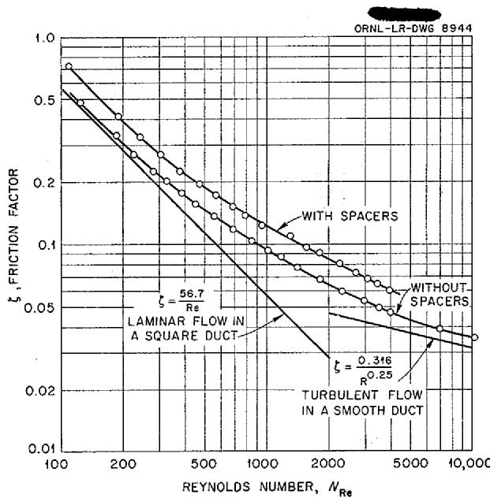  
Fig. 7.2. Heat Transfer Characteristics of the Fuel Side of the ART Fuel-to-NaK Heat Exchanger.   
Fig. 7.3. Isothermal Friction Characteristics of the Fuel Side of the ART Fuel-to-NaK Heat Exchanger.

decreases the effective surface area for heat transfer. Since the amount of channeling was not known, it was impossible to determine the effect of the presence of the spacers on the heat transfer and friction characteristics.

# ART CORE HYDRODYNAMICS

F. E. Lynch

Reactor Experimental Engineering Division

G. L. Muller

Pratt & Whitney Aircraft

Studies of the flow features of a series of one-quarter-scale ART core models have been under way for the past six months. The specific types of cores and flow conditions studied, as well as the kinds of entrance conditions, are listed in Table 7.1. The hydrodynamic structures were studied with qualitative, as well as quantitative, techniques over the Reynolds modulus range 3,000 to 40,000. In all cases, some flow separation, flow stagnation, or transient flow conditions were observed. In general, rotational flow yielded flow separation on the island wall, and axial flow gave flow separation on the outer wall; vanes usually produced transient flow.

Recently, two cores with constant spacing between the inner and outer walls were studied. One of these, in which the ratio of the flow cross-sectional area at the equator to the flow cross-sectional area at the inlet was low (1.44), was characterized by uniform and steady flow.

Research on a variable-geometry diffuser has been initiated. A plastic housing for the flow system has been completed, and the templates for the channel are being designed. The flexible walls for the divergent channel are being fabricated.

# REACTOR CORE HEAT TRANSFER

N. D. Greene

H. F. Poppendiek

L. D. Palmer

Reactor Experimental Engineering Division

The temperature structures within fluids flowing through short, converging and diverging, plastic flow channels were experimentally determined in the volume-heat-source system (Fig. 7.4). The heat sources were generated electrically by a high-voltage power supply. The channel walls, which were not cooled, were instrumented with thermocouples that were located about 30 mils

TABLE 7.1. SUMMARY OF ART CORE HYDRODYNAMICS STUDIES   

<table><tr><td>Core Diameter (in.)</td><td>Type of Flow</td><td>Entrance Conditions</td><td>Flow Features</td></tr><tr><td rowspan="7">18</td><td>Axial</td><td>No vanes or screens</td><td>Flow separation on outer core shell</td></tr><tr><td>Rotational (45 deg)</td><td>Vanes</td><td>Flow separation on island</td></tr><tr><td>Axial</td><td>Screens</td><td>Flow separation on outer core shell</td></tr><tr><td>Rotational (45 deg)</td><td>Screens and vanes</td><td>Flow separation on island</td></tr><tr><td>Axial</td><td>Furgerson vanes (set No. 1)</td><td>Flow separation on outer core shell and flow transients</td></tr><tr><td>Axial</td><td>Furgerson vanes (set No. 2)</td><td>Flow separation on outer core shell and flow transients</td></tr><tr><td>Axial</td><td>Pratt &amp; Whitney Aircraft</td><td>Flow transients</td></tr><tr><td rowspan="4">21</td><td>Axial</td><td>No vanes or screens</td><td>Flow separation on outer core shell</td></tr><tr><td>Rotational (45 deg)</td><td>Vanes</td><td>Flow separation on island</td></tr><tr><td>Axial</td><td>Pratt &amp; Whitney Aircraft</td><td>Flow separation on outer core shell and flow transients</td></tr><tr><td>Rotational</td><td>Wislicenus vanes</td><td>Flow separation on island and flow transients</td></tr></table>

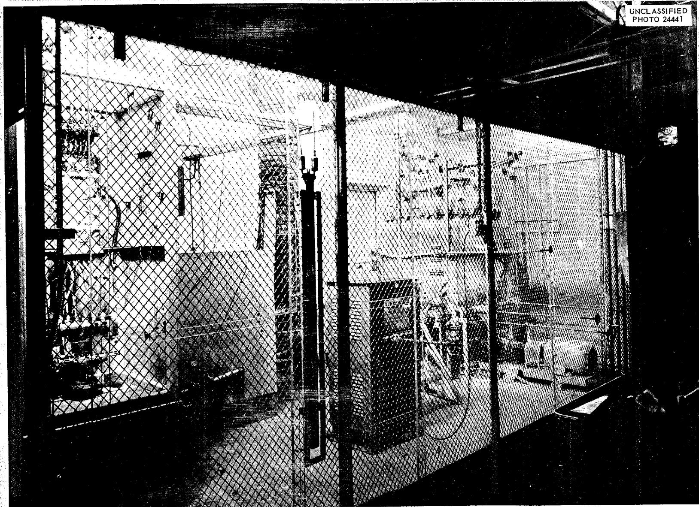  
ANP PROJECT PROGRESS REPORT   
Fig. 7.4. Volume-Heat-Source System.

below the surface. Some typical fluid and wall temperature distributions for the 16-deg diverging and converging channels are shown in Figs. 7.5 and 7.6, which also give some of the specific conditions of the experiment. The two sets of profiles that make up each of these figures show some typical temperature distribution extremes. It was possible to make the following observations about the nature of the thermal structure in the uncooled channels: (1) axial wall temperature profiles exhibited large degrees of asymmetry; (2) the wall temperatures fluctuated significantly with time, while the mixed-mean-fluid temperatures into and out of the test section, as well as fluid flow rates, were constant with time; and (3) the radial temperature differences for the convergent

flow channel were greater than corresponding differences for the divergent channel. The first two observations were expected because corresponding velocity variations were observed in the hydrodynamic field. The third observation was in agreement with previous temperature calculations that had been made for converging and diverging channel systems.

A one-half-scale model of the ART core is being designed for insertion in the volume-heat-source system. An electrode system has been devised whereby nearly uniform or sinusoidal electric flux fields can be generated in the flowing electrolyte. Wall temperatures for the uncooled walls are to be measured. In this way the influence of the complex hydrodynamic features of the flow on the thermal

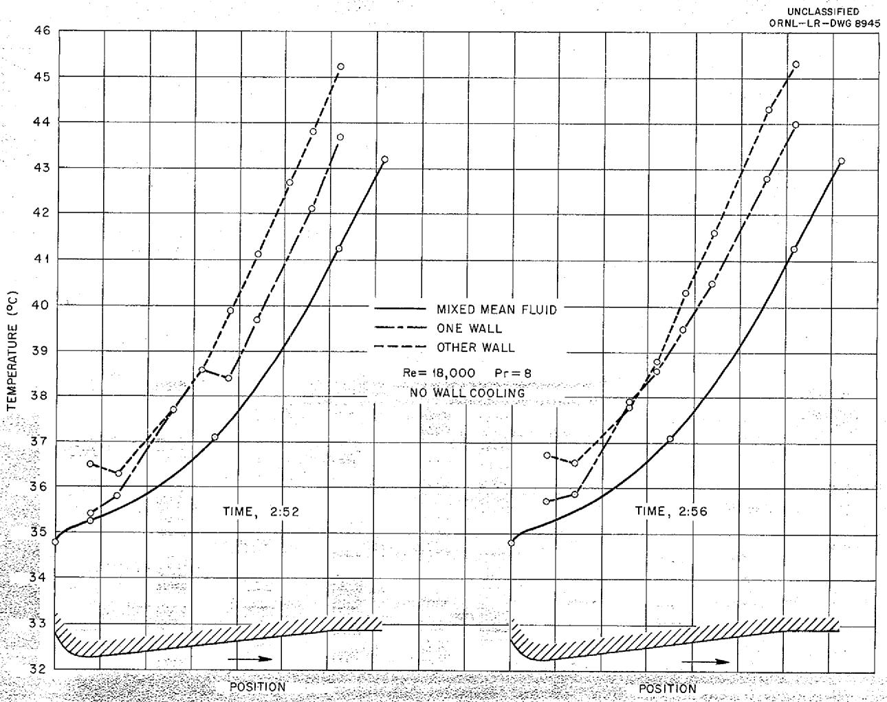  
Fig. 7.5. Experimental Temperature Structure in a Divergent Channel Having a Uniform Volume Heat Source.

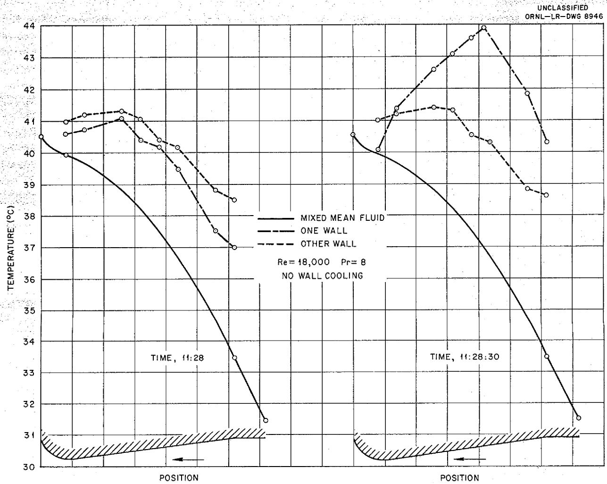  
Fig. 7.6. Experimental Temperature Structure in a Convergent Channel Having a Uniform Volume Heat Source.

structure can be determined for a series of entrance conditions.

A report has been prepared which describes applications to more general convection problems of previously developed mathematical temperature solutions for forced-convection systems having volume heat sources within the fluids. Convection solutions are tabulated so that it is possible to determine the detailed radial temperature structure within a fluid having a uniform volume heat source and being uniformly cooled at the duct wall; the detailed temperature profile of a specific system is presented. The derivations of equations describing the temperature structure and heat transfer rates in a duct system in which the wall

is nonuniformly cooled are also given, and the temperature structure of a specific heat exchange system is presented.

# HEAT CAPACITY

W.D. Powers

Reactor Experimental Engineering Division

The enthalpy and the heat capacity of LiF-KF (50-50 mole $\%$ were determined by using the copper-block calorimeter. The results are:

Solid (107 to $466^{\circ}C$

$$
H _ {T} - H _ {2 5 ^ {\circ} C} = - 9. 3 8 + 0. 2 8 1 7 T + (3. 8 2 \times 1 0 ^ {- 5}) T ^ {2}
$$

$$
c _ {p} = 0. 2 8 2 + (7. 6 4 \times 1 0 ^ {- 5}) T
$$

Liquid (532 to $893^{\circ}C$

$$
\begin{array}{l} H _ {T} - H _ {2 5 ^ {\circ} C} = - 3 0. 8 5 + 0. 5 8 3 9 T - (1 0. 2 8 \times 1 0 ^ {- 5}) T ^ {2} \\ c _ {p} = 0. 5 8 4 - (2 0. 5 6 \times 1 0 ^ {- 5}) T ^ {2} \\ \Delta H _ {f} = 9 3 \mathrm {a t} 4 9 2 ^ {\circ} \mathrm {C} \\ \end{array}
$$

In these expressions

$$
\begin{array}{l} H _ {T} - H _ {2 5 ^ {\circ} C} = \text {e n t h a l p y i n c a l / g}, \\ c _ {p} = \text {h e a t c a p a c i t y i n c a l / g} ^ {\circ} C, \\ \Delta H _ {f} = \text {h e a t o f f u s i o n i n c a l / g}, \\ T = \text {t e m p e r a t u r e} \quad \mathrm {i n} ^ {\circ} \mathrm {C}. \\ \end{array}
$$

The facility for determining heat capacities has been completely renovated, and it is now being put back into operation. Three copper-block calorimeters will be used in conjunction with four furnaces. Preliminary designs have been made for a furnace and a calorimeter to be used with beryllium-containing materials. Complete protection against exposure to beryllium will be provided.

A report is being prepared that lists all the heat capacities and enthalpies that have been determined for the fluoride mixtures. General equations have been developed so that enthalpy and heat capacity predictions can be made.

# VISCOSITY

S.1.Cohen

Reactor Experimental Engineering Division

Viscosity studies were carried out on eight fluoride mixtures. The results are presented in Table 7.2 and in Fig. 7.7. Most of the data can be expressed in the form

$$
\mu = A e ^ {B / T},
$$

where $\mu$ is in centipoises and $T$ in $^\circ K$ . No equation is listed in Table 7.2 for salt $c$ because the data could not be represented by the exponential relation. Measurements were made on salts $a, b, c,$ and $b$ with both the Brookfield and capillary viscometers; values obtained with the two instruments were in satisfactory agreement (deviations from an average line through the data did not exceed $\pm 12\%$ ). Salts $d, e, f,$ and $g,$ which contained $\mathrm{BeF}_{2^{\prime}}$ were studied in a separate dry box used only for $\mathrm{BeF}_{2}$ mixtures. Measurements were made on these salts with two capillary viscometers to furnish checks. Salt $g$ apparently had very high surface tension and nonwetting properties and thus would flow through the capillary; consequently,

no results were obtained on this mixture. It did not have the turbid appearance characteristic of other $\mathsf{BeF}_2$ mixtures but was clear, glassy, and full of air bubbles. Its viscosity appeared to be high.

The low viscosity values obtained for salt $b$ suggested the possibility that research with systems containing RbF might produce a satisfactory fuel with a viscosity lower than that of the zirconium-base fuel now being considered for the ART. Salt $b$ , which is, approximately, a prototype of the proposed ART fuel, with RbF substituted for NaF, was therefore investigated. It was found to have a kinematic viscosity about 20% lower than that of the corresponding NaF mixture. Further research and the use of higher purity RbF might produce fuels with even lower viscosities.

The results of examinations of seven fluoride mixtures containing $\mathsf{BeF}_2$ are presented in Table 7.3. Salts $d, e, f,$ and $g$ were studied at

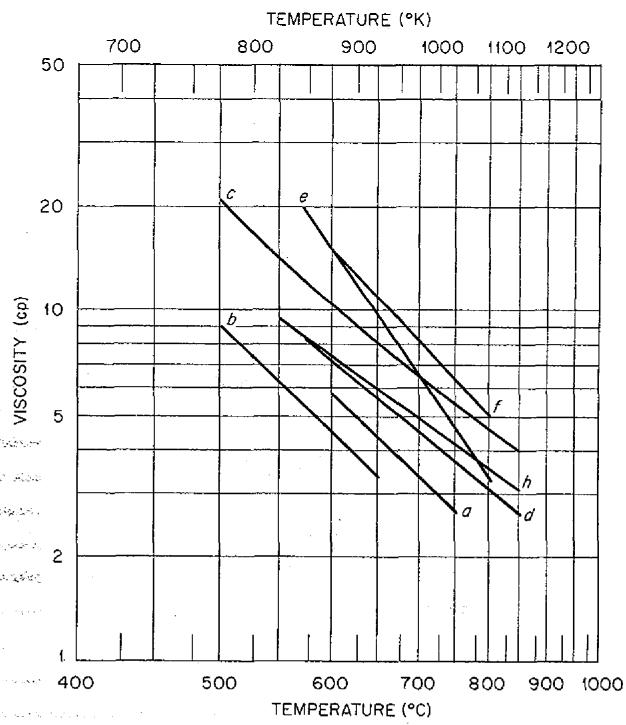  
UNCLASSIFIED ORNL-UNDWG 8947   
Fig. 7.7. Viscosities of Fluoride Mixtures. Compositions of the mixtures are given in Table 7.2.

ORNL, and salts i, j, and k were investigated at Mound Laboratory. Tabulated with the compositions are the viscosities at $700^{\circ}C$ and the $\mathsf{BeF}_2$ content in weight per cent. Figure 7.8 shows a plot of the viscosities vs the corresponding weight percentage of $\mathsf{BeF}_2$ , as well as the data for

mixtures previously studied. Salt $i$ appears to be the most favorable $\mathsf{BeF}_2$ mixture, from a viscosity standpoint, that has been found thus far. Its kinematic viscosity at $700^{\circ}\mathrm{C}$ is 1.84 centistokes, which is about equal to that of the NaF-ZrF $_4$ -UF $_4$ mixture currently planned for use in the ART.

TABLE 7.2. SUMMARY OF CURRENT VISCOSITY STUDIES  

<table><tr><td>Mixture</td><td>Composition (mole %)</td><td>Viscosity (cp)</td><td>μ</td><td>Reference</td></tr><tr><td rowspan="2">a</td><td rowspan="2">NaF-KF-LiF-UF4(11.2-41-45.3-2.5)</td><td>At 600°C, 5.8</td><td rowspan="2">0.0319 e4558/T</td><td rowspan="2">(a)</td></tr><tr><td>At 750°C, 2.7</td></tr><tr><td rowspan="2">b</td><td rowspan="2">RbF-LiF(57-43)</td><td>At 500°C, 9.0</td><td rowspan="2">0.0223 e4636/T</td><td rowspan="2">(b)</td></tr><tr><td>At 650°C, 3.4</td></tr><tr><td rowspan="2">c</td><td rowspan="2">LiF-NaF-ZrF4-UF4(35-32-29-4)</td><td>At 500°C, 20.0</td><td rowspan="2"></td><td rowspan="2">(c)</td></tr><tr><td>At 800°C, 4.6</td></tr><tr><td rowspan="2">d</td><td rowspan="2">NaF-LiF-BeF2(64-5-31)</td><td>At 575°C, 8.2</td><td rowspan="2">0.0784 e3944/T</td><td rowspan="2">(d)</td></tr><tr><td>At 850°C, 2.65</td></tr><tr><td rowspan="2">e</td><td rowspan="2">KBeF3</td><td>At 570°C, 20.0</td><td rowspan="2">0.00443 e7096/T</td><td rowspan="2">(e)</td></tr><tr><td>At 800°C, 3.3</td></tr><tr><td rowspan="2">f</td><td rowspan="2">NaBeF3</td><td>At 600°C, 15.0</td><td rowspan="2">0.0411 e5148/T</td><td rowspan="2">(e)</td></tr><tr><td>At 800°C, 5.0</td></tr><tr><td>g</td><td>LiF-BeF2(50-50)</td><td></td><td></td><td></td></tr><tr><td rowspan="2">b</td><td rowspan="2">RbF-ZrF4-UF4(48-48-4)</td><td>At 550°C, 9.5</td><td rowspan="2">0.113 e3648/T</td><td rowspan="2">(f)</td></tr><tr><td>At 850°C, 3.1</td></tr></table>

$a_{\text{Previously unpublished data}}$   
bPreviously unpublished data. Composition shown here is the nominal composition. Because of the KF present in the RbF used to prepare the mixture, the actual composition is RbF-KF-LiF (45.6-11.4-43 mole %).   
$^{C}$ S. I. Cohen and T. N. Jones, Measurement of the Viscosity of Composition 86, ORNL CF-55-7-33 (July 7, 1955).   
dS. I. Cohen and T. N. Jones, Measurement of the Viscosity of Composition 88, ORNL CF-55-8-21 (Aug. 15, 1955).   
$^{e}$ S. I. Cohen and T. N. Jones, Measurement of the Viscosities of NaBeF $_3$ and KBeF $_3$ and Some Observations on (LiF-BeF $_2$ : 50-50 Mol %), ORNL CF-55-8-22 (Aug. 15, 1955).   
$f_{\text{Previously unpublished data.}}$ Composition shown here is the nominal composition. Because of the KF present in the RbF used, the actual composition is $\mathsf{RbF - KF - ZrF_4 - UF_4}$ (38.4-9.6-48-4 mole%).

TABLE 7.3. CURRENT VISCOSITY STUDIES ON MIXTURES CONTAINING ${\mathrm{{BeF}}}_{2}$   

<table><tr><td>Mixture</td><td>Composition (mole %)</td><td>Viscosity at 700°C (cp)</td><td>BeF2Content (wt %)</td><td>Reference</td></tr><tr><td>d</td><td>NaF-LiF-BeF2(64-5-31)</td><td>4.55</td><td>34.1</td><td>(a)</td></tr><tr><td>e</td><td>KBeF3</td><td>6.4</td><td>44.7</td><td>(b)</td></tr><tr><td>f</td><td>NaBeF3</td><td>8.1</td><td>52.8</td><td>(b)</td></tr><tr><td>g</td><td>LiF-BeF2(50-50)</td><td></td><td>64.5</td><td>(b)</td></tr><tr><td>i</td><td>NaF-BeF2(69.8-30.2)</td><td>3.7</td><td>32.6</td><td>(c)</td></tr><tr><td>j</td><td>NaF-LiF-BeF2(27-35-38)</td><td>4.4</td><td>46.7</td><td>(d)</td></tr><tr><td>k</td><td>NaF-LiF-BeF2-UF4(26.3-34.1-37.1-2.5)</td><td>4.9</td><td>38.6</td><td>(d)</td></tr></table>

$a_{S}$ . I. Cohen and T. N. Jones, Measurement of the Viscosity of Composition 88, ORNL CF-55-8-21 (Aug. 15, 1955).   
bS. I. Cohen and T. N. Jones, Measurement of the Viscosities of NaBeF3 and KBeF3 and Some Observations on (LiF-BeF2: 50-50 Mol %), ORNL CF-55-8-22 (Aug. 15, 1955).   
cPersonal communication from J. F. Eichelberger, Mound Laboratory, to W. R. Grimes, CF-55-5-3, May 2, 1955.   
dPersonal communication from J. F. Eichelberger, Mound Laboratory, Aug. 1, 1955.

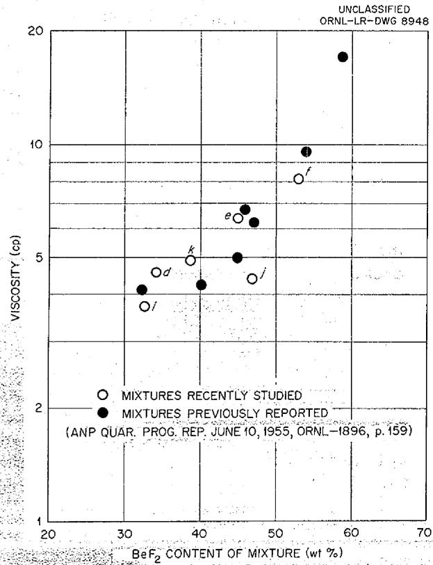  
Fig. 7.8. Viscosities at $700^{\circ}C$ vs $\mathsf{BeF}_2$ Content of Fluoride Mixtures Containing $\mathsf{BeF}_2$ . Compositions of the mixtures are given in Table 7.3.

# THERMAL CONDUCTIVITY

# W.D.Powers

Reactor Experimental Engineering Division

The thermal conductivities of molten fluoride mixtures $\mathrm{NaF - ZrF_4 - UF_4}$ (50-46-4 mole %) and NaF-KF-LiF (11.5-42.0-46.5 mole %) were measured with an alternate type of thermal-conductivity device, namely, a constant-gap cell. The results were in agreement with values previously determined by the variable-gap apparatus.

The thermal conductivity of $\mathsf{RbF - ZrF}_4\mathsf{-UF}_4$ (48-48-4 mole $\%$ ) is currently being measured. Also, the thermal conductivity apparatus which will be used to study solid lithium hydride has been completed.

# ELECTRICAL CONDUCTIVITY

# N.D. Greene

Reactor Experimental Engineering Division

The construction of the experimental platinum conductivity cell has been completed. The inclusion of the fourth electrode should permit resistivity measurements to be made independently of the effects of polarization at electrode surfaces. After testing and standardization of the cell, measurements will be made of several fluoride salt mixtures.

# 8. RADIATION DAMAGE

D. S. Billington J. B. Trice

Solid State Division

The results of metallographic examination of the fluoride-fuel loop recently operated in the LITR horizontal beam hole are presented. Corrosion of the Inconel tubing by the circulating-fuel mixture was found to be low. The miniature in-pile loop was operated for a short time in a vertical hole of the LITR, but the experiment was terminated because of difficulties caused by failure of the pump motor. Modifications to be made in the loop are described.

Specimen assemblies being prepared for stress-corrosion experiments in the LITR are described, as well as bench tests of an apparatus for creep tests in the MTR. Flux measurements in the MTR are reported, and the results of analyses of irradiated reactor-grade beryllium are given.

# LITR HORIZONTAL-BEAM-HOLE FLUORIDE-FUEL LOOP

O. Sisman

C. Ellis

C. D. Baumann

J. G. Morgan

W. E. Brundage

M. T. Morgan

R.M.Carroll

A. S. Olson

W. W. Parkinson

Solid State Division

The previously described loop in which fluoride fuel was circulated in a horizontal beam hole (HB-2) in the LITR was examined visually, metallographically, and chemically for effects of the irradiation. During operation of the loop the maximum fuel temperatures were 1450 to $1500^{\circ}\mathrm{F}$ ; the fuel Reynolds number was 4500 to 6200 or about 5000 for most of the operation; the power generation in the fuel was about 2.8 kw; the power density was $0.4\mathrm{kw/cm}^3$ ; and the duration of operation was 645 hr, with the reactor at full power (3 Mw) for 475 hr.

From flux measurements in the empty beam hole, it was estimated that the power generated in the loop should be considerably higher than the 2.8 kw obtained from heat balance measurements, and therefore an additional experiment was carried out to measure the flux depression in the fuel

in a simulated loop nosepiece. An assembly that duplicated the irradiated portion of the loop was made up and was filled with a $2\%$ Cd-98% Pb alloy, which had the same macroscopic absorption cross section as the fuel salt. This assembly was inserted in a water-cooled jacket in hole HB-2. The neutron activation of the cadmium-lead alloy was measured, and the relation between the activation and the neutron flux was established by calibrating the data for the alloy with cobalt-foil data. Because of uncertainty regarding the position of the fluoride fuel loop in the hole, it was not considered that this experiment gave a reliable measurement of the flux; however, the flux distribution found did agree with that calculated from the heat balance data and that determined subsequently from the cobalt foils that monitored the fuel loop.

After disassembly of the loop in the hot cells, a measurement of neutron flux was obtained from the activity of cobalt monitor foils which were at various points in a copper tube attached to the nose of the loop. Since these foils were of necessity outside the fuel tube, it was also necessary to measure the activity of the Inconel fuel tube. The neutron flux was calculated from the data by using the relation, measured by Bopp, between the activity of the Inconel and the flux. The neutron flux data obtained from the activities of the cobalt foils and the Inconel are plotted as functions of distance along the loop in Fig. 8.1. The fission power calculated from the Inconel activation was $2.8\mathrm{kw}$ , and the maximum power density was $0.4\mathrm{kw/cm}^3$ .

The fission power generated in the fuel was also determined by measuring the activities of fission products in the samples taken for chemical analyses. The activity of the fuel was obtained with a gamma-ray spectrometer, and the height of the zirconium-niobium peak was compared with that of a standard. The zirconium-niobium concentration corresponded to a fission power of $2.0\mathrm{kw}$ . The zirconium fission product and the cesium fission product were also chemically separated

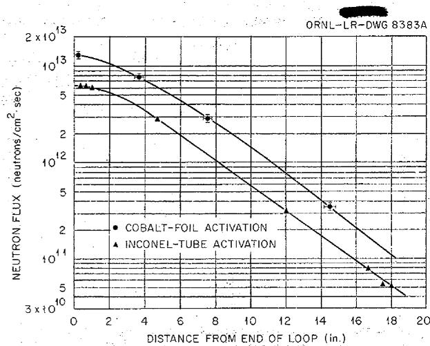  
Fig. 8.1. Thermal-Neutron Flux Traverse Along LITR Horizontal-Beam-Hole Fluoride-Fuel Loop.

from two of the samples, and the fission rate was estimated from their activities. The cesium samples produced estimates of 1.5 and $2.1\mathrm{kw}$ which were considerably lower than the determinations by other methods. The power indicated by the $\mathbf{C}\mathbf{s}^{137}$ content could be expected to be low, since it is known that the gaseous parent, $\mathbf{Xe}^{137}$ , escapes from the fuel mixture. The two separated zirconium samples indicated fission powers of 2.3 and $2.5\mathrm{kw}$ . In comparing the results of the zirconium determinations with the $2.8\mathrm{kw}$ indicated by the electrical measurements and by the flux determinations, it should be kept in mind that the allowance for decay of the zirconium fission product during the reactor shutdowns was only approximate. From these determinations, then, the best estimates are that the total fission power generated in the loop was between 2.5 and $2.8\mathrm{kw}$ and that the maximum power density at

the end of the loop was about $0.4\mathrm{kw / cm}^3$

The tube sections cut for chemical sampling were taken from both the in-pile and out-of-pile parts of the loop to ensure representative sampling. Fuel samples were taken from the ends of the tube sections by drilling out solidified fuel with carbide-tipped bits. Clean samples were obtained by collecting only the borings from a small bit after a large bit had been used to drill through the surface material. Samples of fuel which had been circulated during operation of the loop were obtained in the same manner from the portion of the loop filling line that was outside the pump shield. The samples were analyzed for uranium, zirconium, and the constituents of Inconel (nickel, chromium, and iron). The results of the chemical analyses are presented in Table 8.1. The nominal composition of the original fuel was 25 mole % UF4 (47 wt %), 62.5 mole % NaF, and 12.5 mole % ZrF4, and the enrichment was about 93%. It can be seen that the preliminary flushing with NaF-ZrF4 for cleaning and testing diluted the uranium content of the operating charge of the loop. The analytical results show that the uranium concentration remained unchanged during the run, that the chromium content increased from corrosion of the Inconel tubing, and that the nickel content probably decreased during the course of the corrosion reactions. These changes in the concentration of Inconel components in the fuel and the corrosive attack discussed below are consistent with observations on unirradiated loops.3,4 The

3G. M. Adamson, R. S. Crouse, and P. G. Smith, Examination of Inconel-Fluoride 30-D Pump Loop Number 4695-1, ORNL CF-55-3-179 (March 28, 1955).

4G. M. Adamson and R. S. Crouse, Examination of Fluoride Pump Loops 4930-A and 4935-1, ORNL CF-55-4-181 (April 26, 1955).

TABLE 8.1. RESULTS OF CHEMICAL ANALYSES OF FUEL CIRCULATED IN THE LITR   

<table><tr><td>Sample</td><td>Uranium (wt %)</td><td>Zirconium (wt %)</td><td>Nickel (ppm)</td><td>Chromium (ppm)</td><td>Iron (ppm)</td></tr><tr><td>Original fuel</td><td>47.4</td><td></td><td>83</td><td>44</td><td>120</td></tr><tr><td>Fuel from fill line</td><td>43.9 ± 1.9*</td><td></td><td>270 ± 150</td><td>10</td><td>80 ± 10</td></tr><tr><td>Fuel from in-pile end of loop</td><td>43.7 ± 0.3</td><td>13.1 ± 0.5</td><td>40 ± 10</td><td>140 ± 20</td><td>120 ± 20</td></tr><tr><td>Fuel from out-of-pile portion of loop</td><td>43.7 ± 2.0</td><td>12.9 ± 1.8</td><td>20 ± 10</td><td>150 ± 30</td><td>180 ± 80</td></tr></table>

*The deviation listed is the maximum variation from the mean of any but obviously contaminated samples.

plating out of Ru103Nb95 onto the walls of the loop was described previously.5

The tube sections cut from the loop for metallographic examination were cleaned of fuel to facilitate polishing and etching. They were placed vertically in an inert-atmosphere furnace and held at a temperature above $750^{\circ}\mathrm{C}$ until the fuel had completely drained from the tubes. Control specimens (pieces of as-received tubing cut from the ends of the tubes used to fabricate the loop) were examined for comparison with the samples from the loop. The methods of examination and the results have been reported by M. J. Feldman and his co-workers.

In general, the changes in the Inconel were those expected in specimens subjected to the heat treatment imposed by the operation of the loop. The corrosion averaged 0.5 mil of penetration. The penetration and the points from which specimens were taken are indicated in Fig. 8.2. No deposits of mass-transferred material were observed. Also shown in Fig. 8.2 are the locations from which the specimens shown in Figs. 8.3 through 8.8 were cut. Figure 8.3 presents a typical sample

from the short out-of-pile section of the loop, the only section unheated during actual irradiation. This section was in the outlet leg of the loop, and it was maintained at about the temperature of the rest of the loop by the molten salt. Samples from this section of the loop showed the minimum corrosion attack, the average penetration being less than 0.5 mil. A sample that is typical of the entire unirradiated part of the loop is shown in Fig. 8.4; the specimen was taken from the inlet leg of the loop within the LITR shield. The corrosion penetration averaged 0.5 mil, and the maximum penetration was 1 mil.

The maximum corrosion in the loop was found in the unirradiated portion of the outlet leg, Fig. 8.5, where the average penetration was 1 mil and the maximum was 2.5 mils. The control specimen taken from the unused end of the tubing in the outlet leg of the loop is shown in Fig. 8.6. Surface cracks on the inner surface of the tubing were observed to be common in the control specimens. The cracks were probably responsible for occasional voids extending to depths of 3 or 4 mils in the loop specimen. A specimen from the tip of the irradiated loop nosepiece, which was closest to the LITR lattice, is shown in Fig. 8.7. The corrosion was about the same as the average corrosion found elsewhere, without the occasional deep voids shown in Fig. 8.5. The thick-walled tubing for the irradiated section was taken from

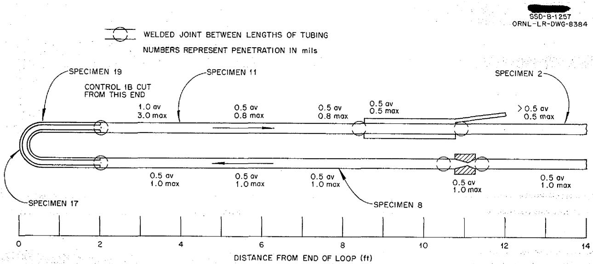  
Fig. 8.2. Locations and Average and Maximum Depths of Corrosion Attack of LITR Horizontal-Beam-Hole Fluoride-Fuel Loop.

a different lot than that used for the unirradiated sections. Another specimen from the irradiated section, taken from a lower flux region in the outlet leg, Fig. 8.8, exhibited the same degree of corrosion attack as that shown in Fig. 8.7.

However, the larger grain structure observed may have been due to higher temperatures resulting from better contact with the tubular heaters.

No increases in corrosion attack because of irradiation and no other unusual effects were found

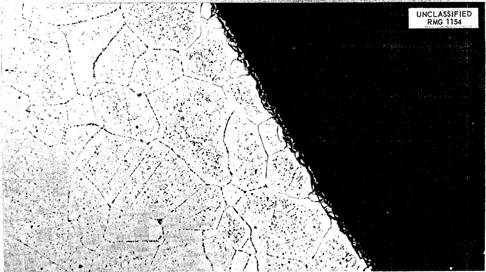

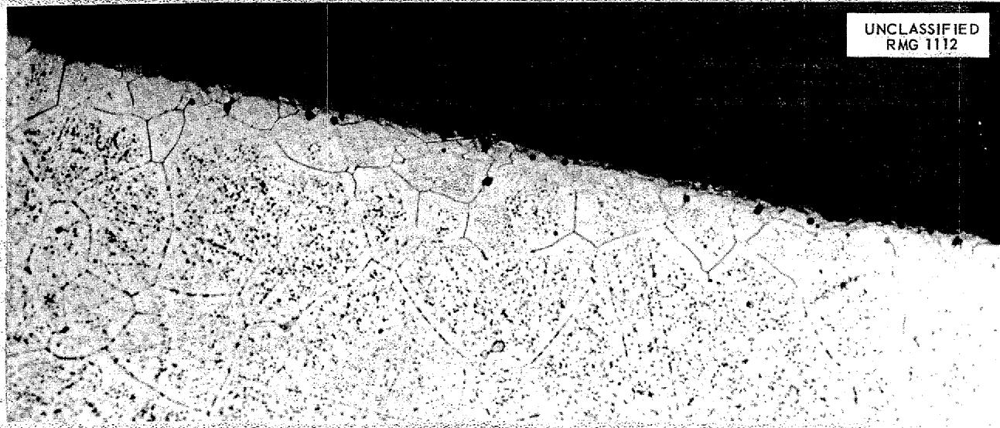  
Fig. 8.3. Specimen 2: Section of Inconel Tubing Taken from Short, Unheated, Out-of-Pile Portion of Loop Between LITR Shield and the Loop Pump.   
Fig. 8.4. Specimen 8: Section of Inconel Tubing Taken from Unirradiated Portion of Inlet Legof Loop Within the LITR Shield.

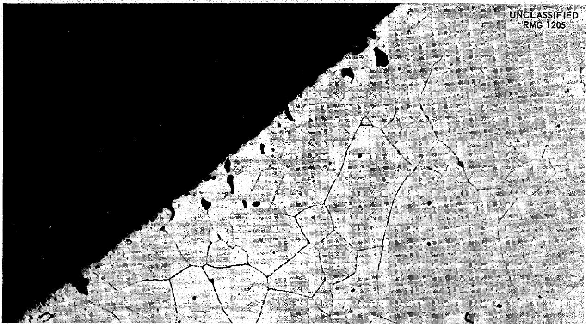  
Fig. 8.5. Specimen 11: Section of Inconel Tubing Taken from Unirradiated Portion of Outlet Leg of Loop Within the LITR Shield. 250X. Reduced $3.5\%$ .

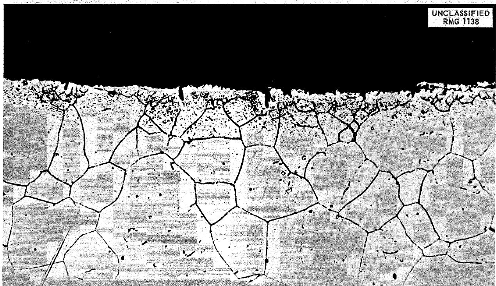  
Fig. 8.6. Control Specimen: Section of Inconel Tubing Taken from Unused End of Tubing Used for Outlet Leg of Loop from Which Specimen 11 (Fig. 8.5) Was Taken. 250 X. Reduced $3.5\%$ .

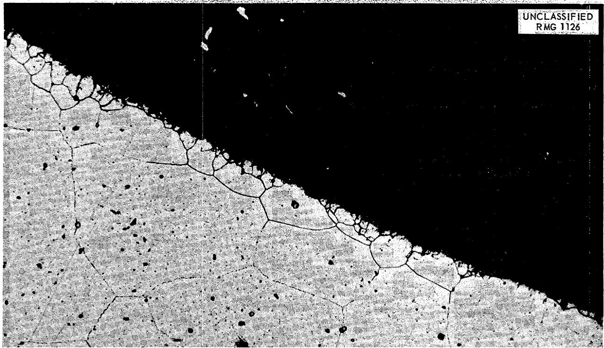

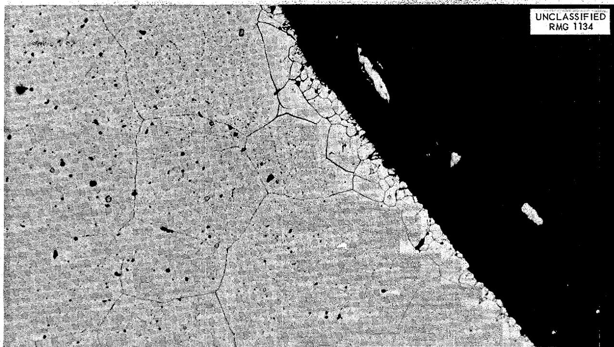  
Fig. 8.7. Specimen 17: Section of Inconel Tubing Taken from In-Pile End of Loop Nosepiece. 250X. Reduced $4.5\%$ .   
Fig. 8.8. Specimen 19: Section of Inconel Tubing Taken from Outlet Leg of Loop Nosepiece, 250X. Reduced $4.5\%$ .

in the loop. The results of this experiment are thus in agreement with the findings in some of the capsule irradiations.7 The experimental work on this loop has been completed and a topical report is being prepared.

# MINIATURE IN-PILE LOOP

G.W. Keilholtz

C. D. Baumann

H. E. Robertson

A. S. Olson

C.C.Webster

M. F. Osborne

W.R.Willis

Solid State Division

D. E. Guss

United States Air Force

The miniature fluoride-fuel loop, described previously, $^{8}$ was operated in vertical position C-48 of the LITR. Because of faulty behavior of the pump motor, the fuel flow velocity could not be maintained at a steady value, and the test was incomplete as a corrosion study. It was possible, however, to make a fairly thorough study of in-pile characteristics of the loop, which operated for a total of 30 hr at full power, with a fuel Reynolds number of 3200 to 5000. The operation throughout this period was complicated by intermittent pump motor trouble, and the experiment was terminated when the motor stopped completely.

The instruments controlled the temperature satisfactorily to within $\pm 5^{\circ}F$ and did not allow excessive excursions in temperature when the fuel velocity changed rapidly. Several scram situations occurred during the short run because of low pump speed, high activity in the off-gas stream, and a high temperature indication that resulted from a thermocouple failure. All these situations were adequately handled in time to prevent high-temperature excursions.

Three components of the loop were faulty: the pump motor, the pressure transmitters on the venturi tube, and the header box in the off-gas system. No complete explanation for the erratic behavior of the motor can be given, as yet, but it appears that the combination of high temperature and very dry helium atmosphere caused brush failure. An induction motor with a canned rotor will be used on the next loop.

The pressure transmitters were unreliable, but it does not appear that any changes which could be made in a reasonable time would be of much help. Therefore they are to be removed from the system. Removal of the pressure cells will permit more of the loop to be lowered into the reactor. This will increase the total power generation and will place the point of maximum temperature near the maximum neutron flux.

During the short irradiation of the first loop a gasket was blown out of the off-gas header box located at the face of the reactor. This allowed some leakage of activity into the midriff area of the LITR. The header box is to be redesigned to withstand the full, available, air pressure without leaking.

Since the flowmeter was inoperable, another method of obtaining fuel velocities was devised. The method used was to find the pressure developed at a given pump speed and to find the change in pressure vs flow for the loop. These values were measured by using water as the pumped fluid in exact duplicates of the pump and the loop. Figure 8.9 shows a plot of pump speed vs Reynolds number of the fuel.

In Fig. 8.10 experimental and calculated curves of temperature differential in the loop as a function

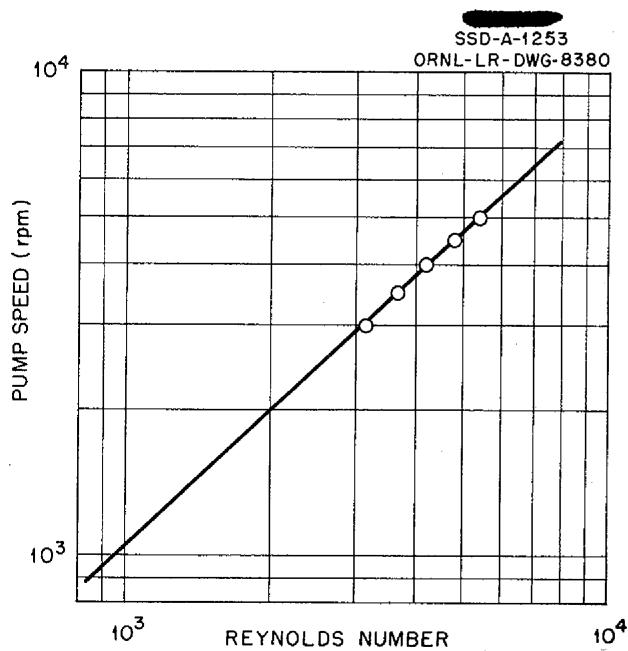  
Fig. 8.9. Pump Speed vs Reynolds Number of the Fuel in the Miniature In-Pile Loop.

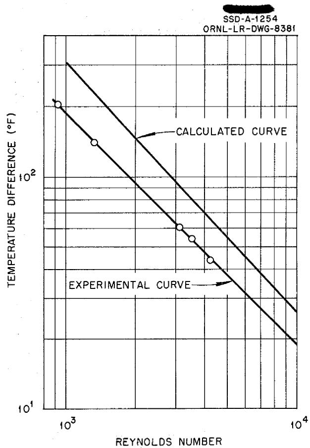  
Fig. 8.10. Comparison of Calculated and Experimental Temperature Differentials vs Reynolds Number in the Miniature In-Pile Loop.

of Reynolds number are compared. The experimental temperature differentials shown in Fig. 8.10 are about $40\%$ below the calculated values. This is considered to be a satisfactory check, since the assumptions made in performing the design calculations tended to predict temperature differentials that were higher than the experimental values, and the uncertainties in many of the constants used decreased the accuracy of the calculations. Also, the temperature differential attained is directly proportional to the power generated in the loop, and, thus, if the flux depression due to the loop was greater than estimated or if the spatial distribution of the flux was greatly altered, a lower temperature differential than that calculated would have resulted. This possibility will be investigated when the values of the flux, measured by a monitor in the loop, are known. The next loop will be inserted farther into the

active lattice to obtain a higher flux and a higher temperature differential.

# CREEP AND STRESS-CORROSION TESTS

J.C.Wilson

W.W.Davis N.E.Hinkle

J.C.Zukas

Solid State Division

The Reactor Experiment Review Committee approved the insertion of the pressurized stresscorrosion apparatus in HB-3 of the LITR. The apparatus, which was described previously, is shown in Fig. 8.11. A thin-walled tubular specimen, surrounded by an annulus containing approximately $2.5\mathrm{g}$ of enriched fuel, is internally stressed by helium gas through the pressure chamber while being maintained at a temperature of $1500^{\circ}\mathrm{F}$ . The heat generated by the fissioning fuel is conducted through fins to a water cooling coil. A resistance

9W. E. Davis et al., ANP Quar. Prog. Rep. June 10, 1955, ORNL-1896, p 170.

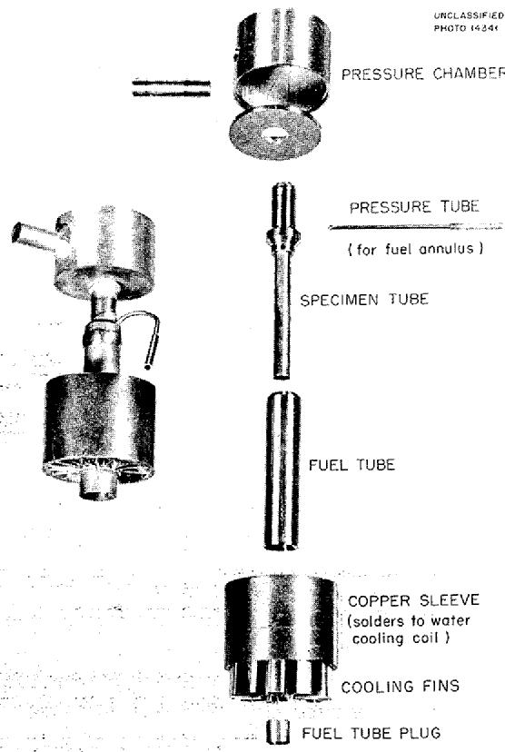  
Fig. 8.11. Stress-Corrosion Apparatus for Use in the LITR.

heater spaced between the fins is provided for additional control of the specimen temperature. The control thermocouple on the inside of the specimen tube should give very nearly the maximum temperature of the system at any time. Heat transfer calculations predict that the fuel will freeze at the outer walls of the fuel chamber so that the fuel will be contained in a cup of solid fuel; thus the surface-to-volume ratio of the test system will be considerably lowered. It does not appear likely, at this time, that the temperature of the specimen can be maintained at the control level during reactor shutdown periods; however, fuels with a power density of $1000\mathrm{w/cm}^3$ are difficult to simulate in bench tests of this type of experiment. The gas space above the fuel is connected through a capillary tube to an expansion chamber to decrease the back pressure on the specimen walls when the specimen is brought up to temperature. The first group of specimen assemblies is now being filled with fuel for tests in the LITR. Engineering of the plug design to adapt the apparatus for insertion in the MTR is under way.

A simplified version of the apparatus to permit creep data to be obtained in any combination of two nonfuel atmospheres is undergoing bench tests prior to irradiation. Measurements of the total strain in the specimen tubes will be accomplished with a pneumatic measuring gage. Inside-diameter measurements of the specimen tube can be made with an accuracy of about 0.00005 in. with the pneumatic gage, and the manipulative operations are simple enough to be done in a hot cell.

The operation of a number of pressure-reducing valves, with pressure ranges from 200 to 1000 psi, has been checked over a period of about a week. Of the two valves presently being tested, one appears to be capable of holding set pressures to within $1\%$ over the range of room temperatures encountered in the laboratory.

A 1:1 ratio pressure-volume transformer for isolating the gas inside the specimen tube from the pressure supply has been built and tested. Because of the controlled, limited volume of gas available to the specimen tube with this apparatus, leakage or rupture results in only a very small pressure rise in the whole apparatus. Protection against pressure rises in the water-cooled irradi

ation can will make possible a large reduction in the weight of the irradiation can.

The MTR (tensile) creep test apparatus was irradiated for two cycles in hole HB-3 of the MTR at $1500^{\circ}\mathrm{F}$ and 1500 psi. For some unknown reason, two of the four Bourdon tube extensometers did not operate after insertion in the reactor. Therefore total creep measurements and a determination of the effects of radiation on the calibration factors of the Bourdon tube extensometers will be made when the apparatus is returned to Oak Ridge. The apparatus has been cut from the irradiation plug at the MTR site. The bench test equivalent of the in-pile rig in time, temperature, and stress has been assembled and testing has started.

# FLUX MEASUREMENTS IN THE MTR

J.B.Trice

H.V.Klaus

Solid State Division

F. J. Muckenthaler

Applied Nuclear Physics Division

T. L. Trent

Engineering and Mechanical Division

P. M. Uthe, United States Air Force

J. F. Krause, Pratt & Whitney Aircraft

R. H. Lewis, Phillips Petroleum Company

F.W. Smith

Consolidated Vultee Aircraft Corporation

Neutron flux measurements have been in progress for some time in hole HB-3 of the MTR. A schematic diagram of the location of the HB-3 beam hole in relation to the lattice is shown in Fig. 8.12. High-energy flux data were obtained because of a need to know the fast-neutron flux intensity and distribution available for tests of structural properties of ART materials. For such tests to be realistic, both a high-energy flux and a high, integrated fast-neutron dosage were required. Thermal-neutron flux data were also obtained for estimating power generation in uranium-bearing fluoride fuel loops.

The results obtained include a crude spectral analysis of the neutron energies in HB-3, made

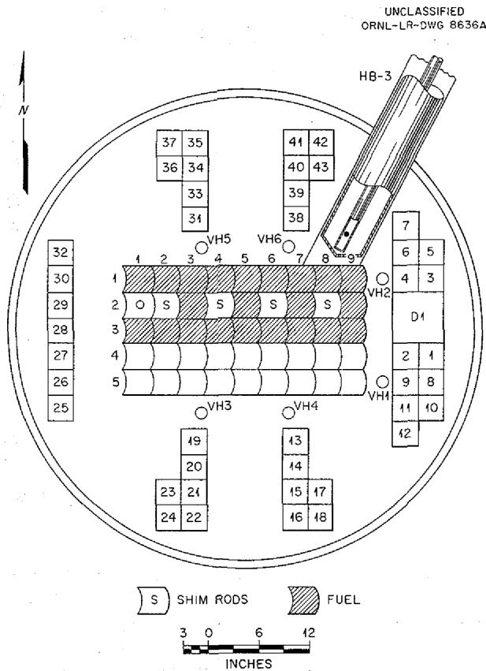  
Fig. 8.12. Schematic Diagram of MTR Lattice Showing Position of HB-3 Beam Hole.

with threshold detectors and resonance detectors, thermal-neutron unperturbed flux traverses, and traverses made with mockup materials which simulated, more or less, the true neutron-absorbing characteristics of in-pile fuel loops.

High-energy flux distributions are shown in Fig. 8.13, in integral form, for three positions in the HB-3 beam hole. The experimental points shown are based on the nuclear reactions listed in Table 8.2. The dotted lines are fission spectra normalized at 8.1 MeV to the reaction $\mathrm{Al}^{27}(n,\alpha)\mathrm{Na}^{24}$ in order to illustrate how the number of high-energy neutrons decreases with increasing distance away from the lattice. This indicates that the highest flux above thermal is approximately $3.1\times 10^{13}$ fast neutrons/cm $^2$ -sec and that it drops off by a factor of 10 in about 7 in. The $x^{\prime}s$ at 0.1 MeV for the R11 and R14 positions represent estimated values

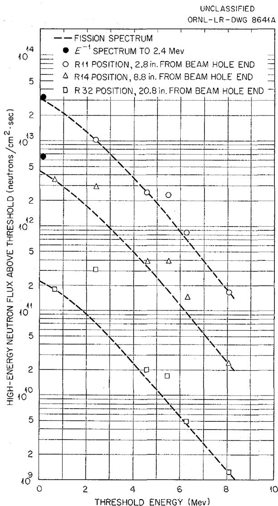  
Fig. 8.13. High-Energy Neutron Flux Distributions in Three Positions in Hole HB-3 of the MTR.

of the number of neutrons in the spectrum above 0.1 Mev, based on measurements of the number of neutrons in the spectrum above 2.4 Mev, as measured with the reaction $\mathsf{P}^{31}(n,p)\mathsf{Si}^{31}$ . The ratio of the total number of fast neutrons in the spectrum to the thermal-neutron flux, as shown in Fig. 8.14 at the same position, is 0.135. At position HB-2 in the LITR, the ratio12 is 0.80. This means that 67 days at a flux of $3.1 \times 10^{13}$ fast neutrons/cm2sec are required for the estimated total

fast neutron exposure of $1.8 \times 10^{20}$ to be reached, which is the estimated dosage for certain structural members in the ART for an operating period

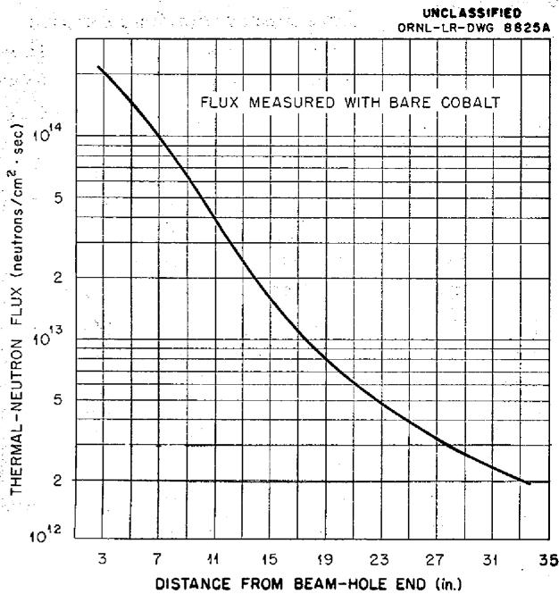  
Fig. 8.14. Thermal-Neutron Flux in Hole HB-3 of the MTR.

of 500 hr.13 Since the flux gradient is very steep, as shown in Fig. 8.15, such a test would have to be made in a limited region in the beam hole. The magnitude of the maximum instantaneous fast-neutron flux available, $3.1 \times 10^{13}$ , is less than the flux expected in the ART, $4 \times 10^{14}$ , by about a factor of 10 and misses some aircraft reactor design fluxes, for example, $\sim 2 \times 10^{15}$ , by about a factor of 70. Further analyses are being made in order to substantiate or refute these fast-neutron flux measurements.

A series of measurements of flux depression in a mockup of a fluoride-fuel in-pile loop section as a function of amount of fuel present, wall thickness of the container, and position of the container were made in order to serve as a basis for design of a loop for operation in HB-3 of the MTR. The values of effective thermal-neutron flux obtained from this experiment were used to calculate the total power generation and power density to be expected in the loop.

The apparatus for the series of measurements consisted of two major pieces. The outer piece was an Inconel cylinder 7 in. in length and hollowed to contain a solid-cylinder core of the neutron absorber used to simulate the fuel. The core

TABLE 8.2. CHARACTERISTICS OF DETECTORS USED FOR FLUX MEASUREMENTS IN HOLE HB-3 OF THE MTR   

<table><tr><td>Reaction</td><td>Threshold or Resonance Energy</td><td>Cross Section of Resonance Integral</td><td>Half Life</td></tr><tr><td>Co59(n,y)Co60</td><td>120 ev</td><td>34 b</td><td>5.2 years</td></tr><tr><td>Na23(n,y)Na24</td><td>1710 ev</td><td>0.27 b*</td><td>14.9 hr</td></tr><tr><td>Cl37(n,y)Cl38</td><td>1800 ev</td><td>0.348 b*</td><td>38 min</td></tr><tr><td>V51(n,y)V52</td><td>3000 ev</td><td>2.0 b*</td><td>3.74 min</td></tr><tr><td>Al27(n,y)Al28</td><td>9100 ev</td><td>0.14 b**,**</td><td>2.3 min</td></tr><tr><td>P31(n,p)Si31</td><td>2.4 Mev</td><td>75.0 mb**</td><td>2.6 hr</td></tr><tr><td>Al27(n,p)Mg27</td><td>4.6 Mev</td><td>39.5 mb**</td><td>9.8 min</td></tr><tr><td>Si28(n,p)Al28</td><td>5.5 Mev</td><td>79.8 mb**</td><td>2.3 min</td></tr><tr><td>Mg24(n,p)Na24</td><td>6.3 Mev</td><td>47.6 mb**</td><td>14.9 hr</td></tr><tr><td>Al27(n,a)Na24</td><td>8.1 Mev</td><td>111 mb**</td><td>14.9 hr</td></tr></table>

$^{\star}$ S. M. Dancoff et al., Activation Cross Sections by Boron Absorption, CP-3781 (May 6, 1947). $^{\star \star}$ R. F. Taschek, Radioactive Threshold Detectors for Neutrons, LADC-135 (also, MDDC-360, Declassified Sept. 17, 1946).

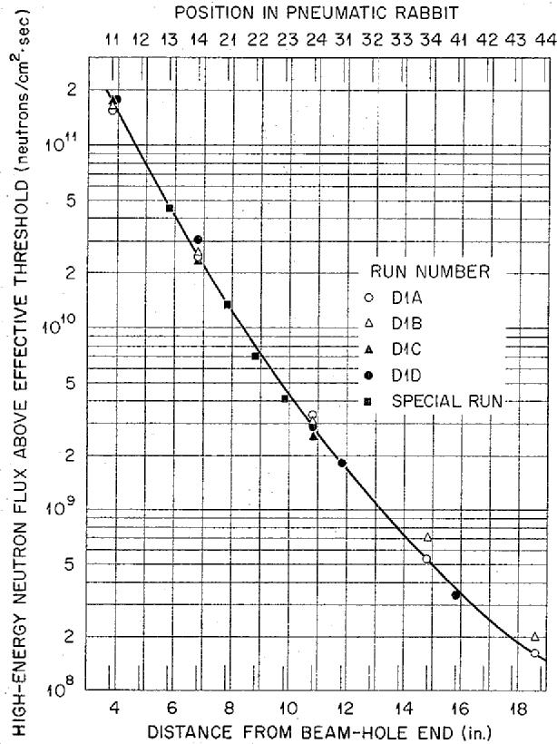  
中  
UNCLASSIFIED ORNL-LR-DWG 8645A   
Fig. 8.15. Fast-Neutron Flux Traverse of Hole HB-3 as Measured with the Threshold Reaction $\mathsf{Al}^{27}(n,\alpha)\mathsf{Na}^{24}$ (8.1 Mev and Above).

was assembled from two half cylinders slotted at intervals along the length in such a way as to allow cobalt foils to be positioned along the axis in intimate contact with the two halves of the cylinder. Three different core compositions were used in the tests, namely, cadmium, boron, and lithium.

The cadmium was alloyed with magnesium and extruded into $\frac{1}{2}$ -in. rods; the boron was mixed, as $B_4C$ , with aluminum by a pressing and high-firing technique; and the lithium-bearing cores were synthesized as a salt containing LiF-NaF-ZrF₄. Chemical analyses of all core materials showed a variation in homogeneity of less than 1%. The final compositions of the alloys agreed with intended compositions within a few per cent.

Measurements made with each of the three cores gave the same effective neutron flux within experimental error limits. Flux traverses through the

three cores with the reactor operating at $5\mathrm{Mw}$ are shown in Fig. 8.16.

An operating power of $5\mathrm{Mw}$ , rather than the usual $30\mathrm{Mw}$ , was chosen because the gamma-ray heat at $30\mathrm{Mw}$ would have raised the temperatures of the cores to above their melting points. The thermal-neutron flux as a function of power was obtained at two positions, as shown in Fig. 8.17, so that the flux-depression data obtained in the $5\mathrm{Mw}$ runs could be scaled to $30\mathrm{Mw}$ . As may be seen, the flux vs power curves are nonlinear between 20 and $30\mathrm{Mw}$ .

A calculated estimate of the power to be expected in the first MTR in-pile loop, based on these data and on the results of irradiation of a simulated loop, was 31 to 36 kw for the fluoride fuel mixture NaF-ZrF-UF (53.5-40-6.5 mole%).

# ANALYSIS OF REACTOR-GRADE BERYLLIUM

J.B.Trice

Solid State Division

R.H.Lewis

T. Passel

Phillips Petroleum Company

Two reactor-grade samples of beryllium metal chips obtained from The Brush Beryllium Co. were irradiated and then analyzed to secure information needed in designing procedures for handling and processing the large amounts of beryllium which will have been irradiated for hundreds of hours in aircraft-type reactors. Chemical analyses with a limit of detection of 200 ppm showed the following amounts of impurities:

<table><tr><td>Impurity</td><td>Amount (wt %)</td></tr><tr><td>Fe and Mg</td><td>0.03</td></tr><tr><td>Si and Al</td><td>0.02</td></tr><tr><td>Ni and Cr</td><td>0.006</td></tr><tr><td>Mn</td><td>0.003</td></tr><tr><td>Cu</td><td>0.0002</td></tr><tr><td>Ca</td><td>0.0001</td></tr><tr><td>Sc</td><td>None</td></tr></table>

Analyses with a sodium-iodide scintillation spectrometer revealed two gamma-ray peaks, one at 0.90 MeV and one at 1.12 MeV, as shown in Fig. 8.18. Figure 8.19 shows the gamma-ray spectrum for irradiated $\mathsf{Sc}^{46}$ . As may be seen, the peaks

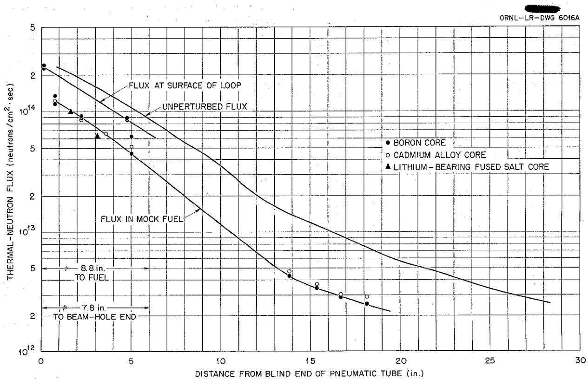  
Fig. 8.16. Thermal-Neutron Flux Traverses Through Cadmium-, Boron-, and Lithium-Containing Materials in the MTR.

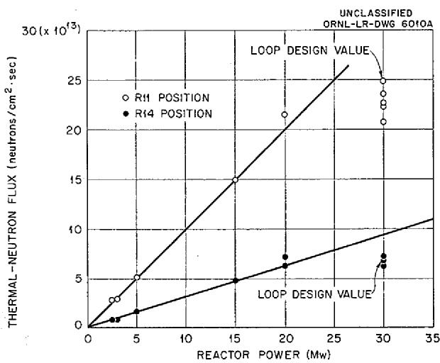  
Fig. 8.17. Thermal-Neutron Flux as a Function of Reactor Power at Two Positions in Hole HB-3 of the MTR.

are at the same energy as those in Fig. 8.18. Experimental data for the beryllium chips indicate a half life of 90 days, which agrees satisfactorily with a listed $^{16}$ value of 85 days. Both the gamma-ray peaks and the energy sums indicate that the gamma rays are in cascade, as they are shown in the listed decay scheme.

Another beryllium sample, from the R. D. MacKay Company, was analyzed in the same manner for scandium and was found to have about the same amount present (Fig. 8.20). The beryllium-to-scandium weight ratio for The Brush Beryllium Co. sample, as measured by the gamma-ray scintillation spectrometer and the MTR $4\pi$ high-pressure ionization chamber, was $6.8 \times 10^{4}$ . For the R. D. MacKay Co. sample, it was $7.1 \times 10^{4}$ . Therefore, the scandium present in both samples was below the limit of chemical detection stated above.

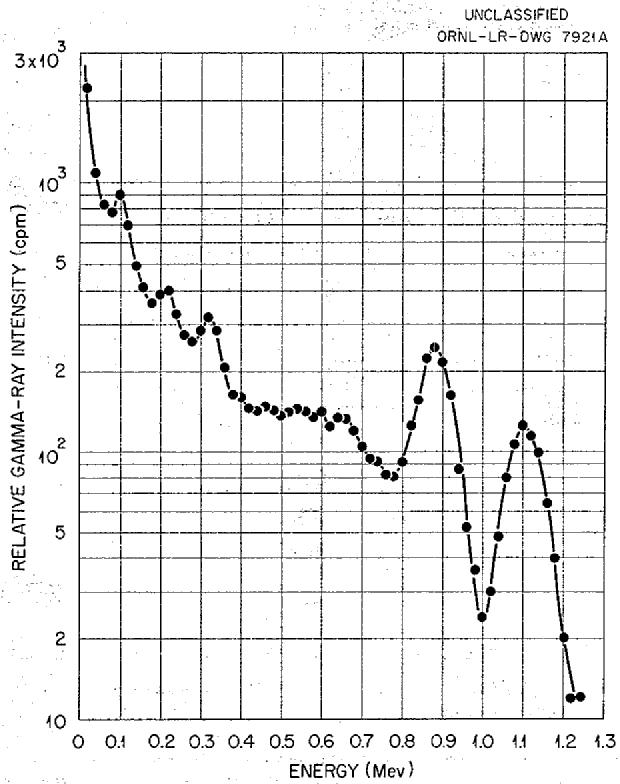  
Fig. 8.18. Gamma-Ray Spectrum from Irradiated Beryllium. Beryllium obtained from The Brush Beryllium Co.

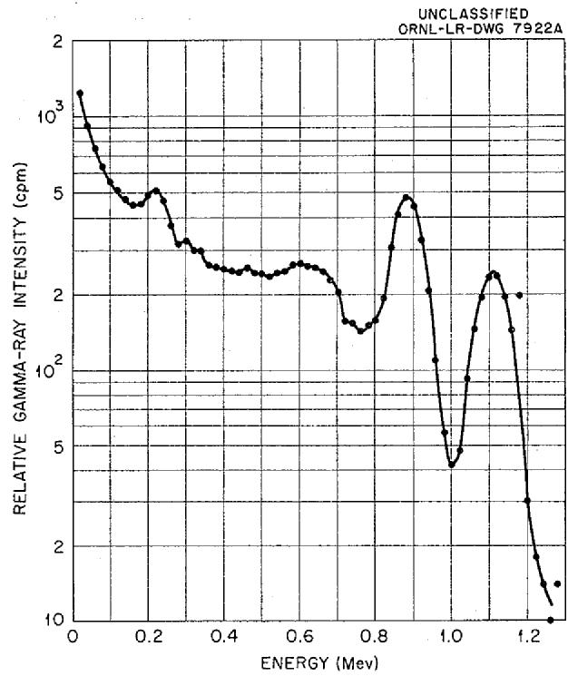  
Fig. 8.19. Gamma-Ray Spectrum from Irradiated Sc46.

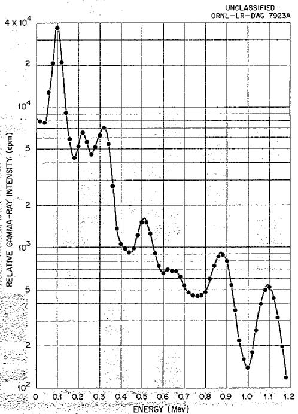  
Fig. 8.20. Gamma-Ray Spectrum from Irradiated Beryllium. Beryllium obtained from R. D. MacKay Company.

# 9. ANALYTICAL CHEMISTRY OF REACTOR MATERIALS

C.D.Susano J.C.White

Analytical Chemistry Division

The $n$ -butyl bromide method for the determination of oxygen in sodium was modified to ensure the elimination of possible sources of contamination during analysis. The vacuum-distillation method for this determination was investigated. Work was completed on the volumetric determination of zirconium in fluoride salts. A modification of the apparatus for the determination of uranium metal in fluoride salts was incorporated to permit a more rapid analysis. Analytical assistance was rendered in the study of using argon to eliminate air from a dry box. Investigation of the application of the bromination method for the determination of oxygen in zirconium fluoride and its mixtures with other fluoride salts was continued.

# DETERMINATION OF OXYGEN IN SODIUM

A.S.Meyer, Jr. W.J.Ross

G. Goldberg

Analytical Chemistry Division

# $n$ -Butyl Bromide Method

The $n$ -butyl bromide method is the standard method used in the ANP Analytical Chemistry Laboratory for determining oxygen in sodium. The original method has, however, been modified recently by two laboratories.[2,3] In the modified procedures the organic reagents, $n$ -butyl bromide and hexane, are purified and dried by passing them through a column packed with silica gel and diatomaceous earth. The purified reagents are stored over $\mathsf{P}_2\mathsf{O}_5$ . A modification of the reaction tube has also been recommended to reduce atmospheric contamination. The modified method is reported to be very sensitive and to be applicable to the determination of oxygen in sodium in concentrations as low as 5 to 10 ppm. An evaluation of these modifications was therefore undertaken preparatory to incorporating them in the standard procedure.

The reagents, hexane and $n$ -butyl bromide, were purified and dried by passing the liquids through

columns packed with silica gel and diatomaceous earth; they retained about 10 ppm water. They were then rendered anhydrous by desiccation with activated $\mathsf{Al}_2\mathsf{O}_3$ or $\mathsf{P}_2\mathsf{O}_5$ . The latter has the disadvantage that it reacts with the water in the reagents to form acids which remain in the liquid phase in sufficient concentration to cause low results in the oxygen determination. Such an error can become significant when the reagents are stored over $\mathsf{P}_2\mathsf{O}_5$ for extended periods. Also, anhydrous reagents become contaminated with water when exposed to the atmosphere. Wet reagents lead to high results in the oxygen determination.

The $n$ -butyl bromide procedure was further modified so that an atmosphere of argon was maintained over the reagents and reaction mixtures at all times. In addition, transfer of the reagents from the storage vessel to the reactor tube was carried out by applying pressure with dry argon. The modifications are illustrated in Fig. 9.1. Excellent reproducibility was obtained in the determination of oxygen in sodium with the modified apparatus when the samples were taken in glass tubes. The oxygen content of the majority of the samples received from ANP facilities was in excess of 200 ppm. Much lower concentrations, of the order of 20 to 40 ppm of oxygen, were found

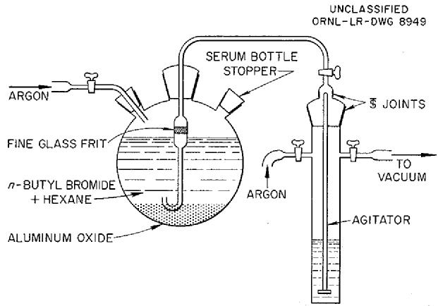  
Fig. 9.1. Apparatus for Transferring Reagents in the Determination of Oxygen in Sodium by the $n$ -Butyl Bromide Method.

in sodium samples which were subjected to laborious purification.

The $n$ -butyl bromide method was also used to study the effect of precleaning glass sample tubes prior to sampling. The interior of such sample tubes was found to be effectively cleaned of oxygen-containing impurities by treating with $\mathsf{H}_2\mathsf{CrO}_4$ or by flushing with molten sodium. A multibulb tube is required to accomplish the cleaning action with sodium.

# Vacuum-Distillation Method

A method is being tested for the determination of oxygen in sodium by titration of the $\mathrm{Na}_2\mathrm{O}$ that remains after vacuum distillation of the sodium metal. A distillation apparatus has been constructed that is similar to one developed by the Argonne National Laboratory. The vacuum-distillation method of analysis is particularly suited to the sampling of sodium at operating temperatures of the order of $1200^{\circ}\mathrm{F}$ and obviates the necessity for precooling the sodium before sampling. A schematic diagram of the equipment is shown in Fig. 9.2.

The sample of molten sodium is introduced into the evacuated apparatus through a heated transfer line, which is maintained at the operating temperature of the system being tested. The metal flows directly into a calibrated, hemispherical sample cup, which is fitted with a thin, nickel liner. A volume of sodium sufficient to flush the transfer line and sample cup is first passed through the apparatus. The excess sodium, which pours over the edge of the sample cup, is discharged into a glass reservoir in which the volume of the flush sodium can be observed. With the pressure of the system maintained at less than $10\mu$ , the sample is heated to $950^{\circ}\mathrm{F}$ , and the metallic sodium is distilled to the cooled walls of the apparatus. When the distillation is complete, the nickel liner of the sample cup is removed, and the residual $\mathrm{Na}_2\mathrm{O}$ is dissolved and then titrated with a dilute solution of standardized acid.

The apparatus has been assembled, and the heating elements and the sample cup have been calibrated. Preliminary analyses have been carried out on sodium that was sampled at 700 and at $1200^{\circ}$ F. Oxygen concentrations of 30 to 60 ppm were measured. When the preliminary runs

are completed, the apparatus will be attached directly to a forced-circulation high-temperature-differential sodium loop, and analyses will be carried out during operation of the loop (see Sec. 2, "Experimental Reactor Engineering").

# VOLUMETRIC DETERMINATION OF ZIRCONIUM

# IN FLUORIDE SALTS WITH DISODIUM

DIHYDROGEN ETHYLENE-MINETETRAACETATE (EDTA)

A. S. Meyer, Jr.

D. L. Manning

Analytical Chemistry Division

A volumetric method for the determination of zirconium in mixtures of fluoride salts was developed. This method, which was outlined in the previous report, was based on the work of Fritz and Johnson.

The procedure consists in adding an excess of EDTA to a sulfate solution containing zirconium and titrating the excess with trivalent iron to a Tiron (disodium-1,2-dihydroxybenzene-3,5-disulfonate) end point at a pH of 4.8. The color change at the end point is from yellow to purple. The method is applicable to the determination of zirconium in the presence of sulfate, tartrate, small amounts of fluoride, and hexavalent uranium. The yellow color of hexavalent uranium seriously interferes with the bismuth-thiourea end point proposed by Fritz and Johnson.

There are relatively few cationic interferences, because zirconium and iron form extremely stable complexes with EDTA. In the back-titration with trivalent iron the purple color of the iron-Tiron complex is not obtained until the metal-EDTA complexes, which are less stable than the iron (III)-EDTA complexes, have been dissociated.

Fluoride ion concentrations of up to about $0.1M$ do not appear to interfere with the titrimetric procedure. Higher concentrations of fluoride ion can be effectively reduced by adding beryllium to the solution prior to the addition of the EDTA. The interference is removed through the formation of the stable $\mathsf{BeF}_4$ complex.

With a slight modification in the experimental procedure, the method is applicable to the determination of zirconium in the presence of moderate

5A. S. Meyer, Jr., and D. L. Manning, ANP Quar. Prog. Rep. June 10, 1955, ORNL-1896, p 177.   
6J.S.Fritz and M.Johnson,Volumetric Determination ofZirconium,anEDTAMethodRequiringaBackTitrationwithBismuth,ISC-571(Feb.1,1955).

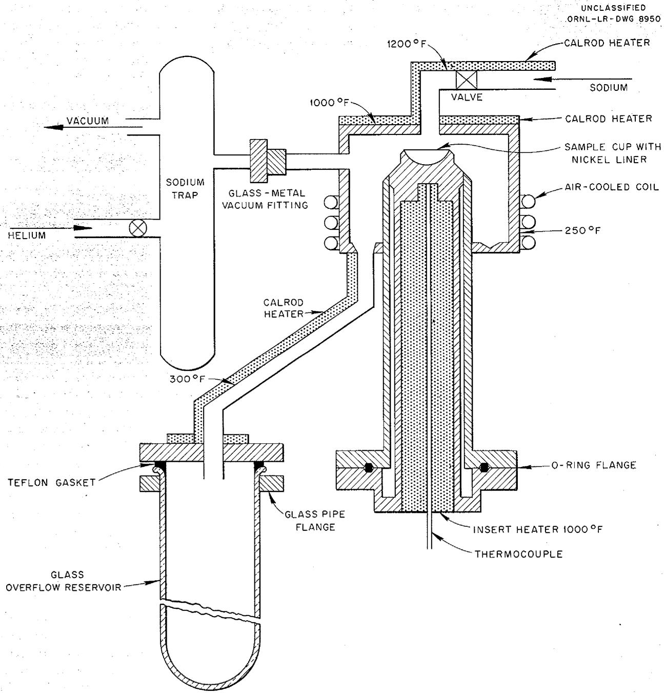  
Fig. 9.2. Sodium Distillation Apparatus.

amounts of trivalent iron, divalent nickel, and trivalent chromium. These metals form stable complexes with EDTA, and therefore they would ordinarily interfere seriously with the zirconium determination. The interference can be overcome by forming the EDTA complex of the zirconium and the interfering metals. Fluoride ion is then

added to the solution to selectively dissociate the zirconium-EDTA complex and form the stable $\mathsf{ZrF}_6$ ion, thus liberating the EDTA. The liberated EDTA, which is a measure of the zirconium, is titrated with the trivalent iron solution to a Tiron end point. The stability of the iron (III)-EDTA complex and that of the iron-Tiron

complex are not adversely affected by fluoride ion. By utilizing this technique, the procedure can be made specific for zirconium in the presence of any metal ion that forms a complex with EDTA and does not dissociate after fluoride ion is added to the solution.

The proposed volumetric method has been tested in the laboratory and found to be satisfactory. The procedure results in a considerable saving of time in comparison with the rather lengthy gravimetric mandelic acid method. It also appears to be more easily adaptable to the routine determination of zirconium than titrimetric methods in which the end point is detected spectrophotometrically or amperometrically. The coefficient of variation is of the order of $1\%$ under ideal conditions in the range 15 to $45\mathrm{mg}$ of zirconium.

# DETERMINATION OF URANIUM METAL IN FLUORIDE SALT MIXTURES

A. S. Meyer, Jr.

B. L. McDowell

Analytical Chemistry Division

The apparatus for the determination of uranium metal in mixtures of fluoride salts by decomposition of the hydride in an atmosphere of oxygen at reduced pressures was modified by replacing the single combustion tube with two combustion tubes, either of which can be connected to the copper oxide tube. The furnace used to heat the sample was replaced with a micro-preheater for each combustion tube. The heaters can be removed from the vicinity of the sample boat to allow more rapid cooling of the hydride. These modifications allow one sample to be oxidized, the water vapor to be trapped, and the pressure of the vapor to be measured on the mercury-sealed oil manometer while another sample is being converted to the hydride in the second combustion tube. Samples of $\mathsf{UF}_3$ that had been produced by the reduction of $\mathsf{UF}_4$ with uranium metal were analyzed in the modified apparatus. The standard deviation for duplicate determinations on the samples of $\mathsf{UF}_3$ was the same as that previously reported.

# ELIMINATION OF AIR FROM A DRY BOX

A. S. Meyer, Jr.

J.M.Peele

Analytical Chemistry Division

A study of the rate of elimination of atmospheric gases from a dry box has been carried out in

conjunction with the Heat Transfer and Physical Properties Section of the Reactor Experimental Engineering Division. The concentration of oxygen in the atmosphere of a $21\text{-ft}^3$ rectangular dry box was measured as a function of time while argon was being passed through the box at a constant flow rate. Oxygen concentrations in excess of $1\%$ were measured volumetrically by absorption of oxygen in pyrogallol. Lower concentrations were determined by a modification of the Winkler technique in which a suspension of $\mathrm{Mn(OH)}_2$ in an alkaline solution of KI is equilibrated with a measured volume of gas. The iodine, which is equivalent to the oxygen in the sample, is liberated upon acidification of the solution and is determined colorimetrically or by titration with $\mathrm{Na}_2\mathrm{S}_2\mathrm{O}_3$ .

When the gases in the dry box are thoroughly agitated by means of a blower, the oxygen concentration decreases exponentially with the volume of sweep gas, in accordance with theoretical prediction. The oxygen can be eliminated more rapidly by introducing the more dense argon at the bottom of a quiescent dry box. Helium, when introduced at the top of the box, provides a somewhat less effective flushing action than does argon.

The most efficient flushing was effected by injecting argon at the bottom of the dry box without supplementary agitation. With the highest argon flow rate available, 25 cfh, the concentration of oxygen in the atmosphere of the dry box was reduced by a factor of 100 by flushing with two volumes of argon. More than five volumes of flush gas are required to obtain a similar reduction in concentration when the conditions approach equilibrium mixing. Lower flow rates resulted in higher argon consumption for equivalent reductions in oxygen.

# DETERMINATION OF OXYGEN IN METALLIC OXIDES BY BROMINATION

J.P.Young

M.A.Marler

Analytical Chemistry Division

The investigation of the application of the method of Codell and Norwitz to the determination of oxygen in fluoride salts was continued.

7A. S. Meyer, Jr., and B. L. McDowell, ANP Quar. Prog. Rep. June 10, 1955, ORNL-1896, p 174.   
8M. Codell and G. Norwitz, Anal. Chem. 27, 1083 (1955).

This method involves the reaction of a metal oxide with bromine vapor, in the presence of graphite, to form the metal bromide and CO. The CO is then oxidized to $\mathrm{CO}_{2}$ by reaction with hot CuO. The amount of $\mathrm{CO}_{2}$ evolved is a measure of the oxygen originally present in the sample. The apparatus for this analysis was described previously.[9,10]

The primary objective of recent work has been to find the optimum conditions for the determination of oxygen in $\mathsf{ZrF}_4$ . The oxygen in this salt is present as $\mathsf{ZrO}_2$ or $\mathsf{ZrOF}_2$ or, possibly, both compounds.

An attempt was made to analyze synthetic mixtures of $\mathsf{ZrO}_2$ and $\mathsf{ZrF}_4$ by the bromination method. The recovery of oxygen, as $\mathsf{CO}_2$ , was incomplete in all cases. Analyses of samples of pure $\mathsf{ZrO}_2$ by the bromination method also resulted in incomplete recovery of the theoretical amount of oxygen.

Several experimental conditions were varied in these investigations. The length of the platinum boats was changed from $1\frac{1}{2}$ to 3 in., and in some experiments the sample was contained on a sheet of platinum. The weight of $\mathsf{ZrO}_2$ was varied from 3 to $50\mathrm{mg}$ , and the ratio of $\mathsf{ZrO}_2$ to graphite was varied from 1:2 to 1:20. In one experiment, sugar charcoal was substituted for the graphite.

In these studies with $\mathsf{ZrO}_2$ , both the $\mathsf{CO}_2$ obtained and the residual $\mathsf{ZrO}_2$ , which remained in the reaction boat, were determined. The reaction involved in the initial step of the analysis is

$$
Z r O _ {2} + 2 B r _ {2} + 2 C \rightarrow Z r B r _ {4} + 2 C O
$$

Therefore, any $\mathsf{ZrO}_2$ which did not react with the bromine should be found in the boat. The amounts of $\mathsf{CO}_2$ obtained from these samples appeared to exceed the amount of oxygen actually removed from the $\mathsf{ZrO}_2$ . This has been attributed, in part, to the presence of moisture in the graphite. Furthermore, the residual $\mathsf{ZrO}_2$ found in the boat varied from 50 to $90\%$ of the original sample weight for periods of bromination of up to 6 hr at $950^{\circ}\mathsf{C}$ .

Since unsatisfactory results were obtained with samples of $\mathsf{ZrO}_2$ , the method and apparatus were checked with samples of $\mathsf{T_iO_2}$ . Only the amount

of $\mathsf{TiO}_2$ remaining in the platinum boat after a 2-hr period of bromination was determined in these studies. Complete removal of the $\mathsf{TiO}_2$ , as the bromide, from the boat was achieved when the oxide and graphite, approximately $15\mathrm{mg}$ each, were mixed together with a mortar and pestle. When the two materials were mixed by using a spatula, quantitative removal of $\mathsf{TiO}_2$ from the boat was not obtained; however, when the mixing was done with great care, up to $95\%$ of a $10\mathrm{-mg}$ sample of $\mathsf{TiO}_2$ could be removed as $\mathsf{TiBr}_4$ in $2\mathrm{hr}$ .

The sample preparation described by Codell and Norwitz consists in placing titanium chips, metal or alloy, between two layers of graphite. In this case, it is probable that the volatilization of the metal as a bromide would leave the remaining $\mathsf{TiO}_2$ in intimate contact with the graphite, without the need of external mixing. It would also be probable that, in the determination of the oxide contamination of salts that are volatile at moderate temperature, there would be no need for tedious sample preparation. For a determination of oxygen in a material containing greater than $1\%$ oxide, it would be advisable to ensure an intimate mixture of the sample and graphite. The information gained in the study of the bromination of $\mathsf{TiO}_2$ will be applied to the determination of oxygen in $\mathsf{ZrO}_2$ and other oxides of interest.

The formation of a precipitate on the surface of the $\mathrm{Ba(OH)}_2$ bubbler, which was reported previously, $^{10}$ was prevented by inserting a thin platinum tube inside the ignition tube. It was necessary to use this platinum tube only during the analysis of samples containing fluorides. It is believed that the contact of volatile fluoride salts with the hot quartz of the ignition tube resulted in the formation of $\mathrm{SiF}_4$ . This gas reacted with the solution of $\mathrm{Ba(OH)}_2$ to precipitate $\mathrm{BaSiF}_6$ . The platinum liner inserted in the ignition tube prevented the formation of $\mathrm{SiF}_4$ .

# Determination of CO by Means of a Solution of $\mathsf{PdCl}_2$

Various methods for determining CO are being investigated. The purpose of these studies is to find a sensitive method for a more direct measure of the CO that is formed in the determination of oxygen in metal oxides by bromination.

A method for the determination of CO in blood

is of current interest. This method involves the following reaction:

$$
\mathrm {P d C l} _ {2} + \mathrm {C O} + \mathrm {H} _ {2} \mathrm {O} \longrightarrow \mathrm {P d} + \mathrm {C O} _ {2} + 2 \mathrm {H C l}
$$

Carbon monoxide is allowed to react with 0.01 meq of $\mathsf{PdCl}_2$ in 0.001 N HCl; the solution also contains $\mathsf{MgCl}_2$ to flocculate the colloidal palladium that is formed in the reaction. The net increase in hydrogen ion concentration, determined by titrating with a base and using an indicator of bromophenol blue, is a measure of the CO that was originally present. In the present study, it was necessary to use a greater amount of $\mathsf{PdCl}_2$ (1 meq) and to eliminate HCl in the preparation of the reagent. Poassium chloride proved to be an effective substitute for HCl in the dissolution of $\mathsf{PdCl}_2$ .

Titrations of synthetic mixtures of HCl and $\mathsf{PdCl}_2$ were performed to find suitable conditions for a determination of HCl in such solutions. Since solutions of $\mathsf{PdCl}_2$ exhibit considerable buffering action at a pH of 4.5, it was not possible to determine HCl in a solution of $\mathsf{PdCl}_2$ . Several means of removing the palladium ion were investigated, and the addition of KI was found to be effective for this purpose. Excellent titration curves were obtained when an amount of KI, in excess of the amount of $\mathsf{PdCl}_2$ , was added to the solution containing HCl and $\mathsf{PdCl}_2$ prior to the titration of HCl. The change in pH during the titration, was observed by means of a pH meter, and plots of pH against the quantity of base added were prepared from the data. These plots are shown in Fig. 9.3. Subsequent studies are planned to investigate the applicability of this method to the determination of CO in the off-gases resulting from the bromination of metallic oxides.

# ANP SERVICE LABORATORY

W. F. Vaughan C. R. Williams

Analytical Chemistry Division

Most of the samples received by the service laboratory during the past quarter were mixtures

of fluoride salts containing some, or all, of the of the following cations: $\mathsf{Zr},\mathsf{U}^{3 + },\mathsf{U}^{4 + },\mathsf{Na},\mathsf{Li},$ Be, and K. Several alkali-metal and alkali-metal-alloy samples were also received. These samples were received either in sealed metal tubes with 20- to 100-ml thick walls or in sealed glass bulbs. Most of the requests were for the determination of oxygen, nickel, chromium, and iron.

Other types of materials that were received for analysis were

<table><tr><td>RbF-LiF</td><td>FeF2</td></tr><tr><td>Ti Metal</td><td>FeF3</td></tr><tr><td>Ca(OH)2</td><td>ZrF4</td></tr><tr><td>(NH4)2CO3</td><td>ZrO2</td></tr><tr><td>CrF2</td><td>ZrCl4</td></tr><tr><td>CrF3</td><td>NaZrF3</td></tr><tr><td>UF4</td><td>(NH4)2SnF4</td></tr><tr><td>UF3</td><td>Scale from loop sections</td></tr><tr><td>NiF2</td><td>Residues in cold traps</td></tr><tr><td>RbF</td><td>BeCl2</td></tr><tr><td></td><td>Bi and U mixture</td></tr></table>

A total of 1439 samples was analyzed, on which 7195 determinations were made. The backlog consists of 159 samples. A breakdown of the work is shown in Table 9.1.

11E. J. Conway, Microdiffusion Analysis and Volu-metric Error, 3d ed., p 257, Lockwood, London, 1950.

TABLE.9.1. SUMMARY OF SERVICE ANALYSES REPORTED   

<table><tr><td></td><td>Number of Samples</td><td>Number of Determinations</td></tr><tr><td>Reactor Chemistry</td><td>799</td><td>3838</td></tr><tr><td>Fuel Production</td><td>77</td><td>521</td></tr><tr><td>Experimental Engineering</td><td>522</td><td>2764</td></tr><tr><td>Miscellaneous</td><td>41</td><td>72</td></tr><tr><td></td><td>1439</td><td>7195</td></tr></table>

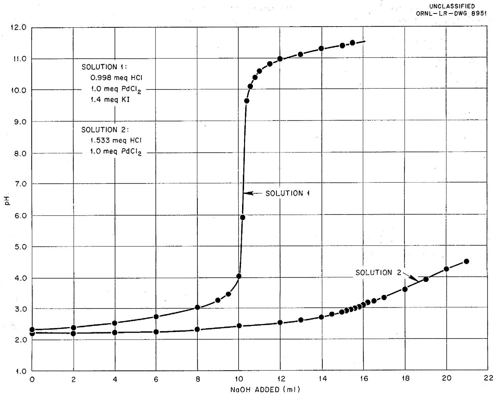  
Fig. 9.3. Effect of KI on the Titration of $\mathsf{PdCl}_2$ and HCl with NaOH.

# 10. RECOVERY AND REPROCESSING OF REACTOR FUEL

F. R. Bruce

D. E. Ferguson

W.K.Eister

H. E. Goeller

M. R. Bennett

J. T. Long

F. N. Browder

R.P.Milford

G. I. Cathers

S. H. Stainer

Chemical Technology Division

# PILOT PLANT DESIGN

A project analysis will be completed soon that will serve as a basis for establishing an accurate schedule for design and construction of the pilot plant for recovering fused-salt fuels. A new cost estimate will also be made. Certain delays in design and procurement make a construction completion date near the end of February 1956 more realistic than the December 31, 1955, date previously planned.

An engineering flowsheet was issued that is subject to revisions as needed to stay abreast of laboratory work. Approximately $65\%$ of the process equipment items are on hand or are in some stage of procurement or fabrication.

The dump tank containing the ARE fuel was moved uneventfully from Building 7503 to Cell 3, Building 3019, on July 27, 1955. It is no longer planned to force the molten fuel out of the dump tank by nitrogen pressure. Instead, the dump tank will be inverted inside a furnace liner, and the fuel will drain out of the dump tank into the liner and thence to a heated pressure vessel, where it will be stored in the molten state until processed. The molten fuel will be forced from the pressure vessel, or hold tank, into the fluorination vessel by nitrogen pressure.

Radioactive salts from sections of various in-pile loops and nonradioactive uranium-bearing salts contained in cans that are open at one end will be melted and then drained into a charge-melt vessel designed for charging the salts to the fluorination vessel. A pair of tongs was designed for inverting the cans and positioning them in the charge-melt vessel. A closed-circuit television system will be used as an aid in positioning the cans and for scanning other equipment in the cell.

# ENGINEERING DEVELOPMENTS

Direct-resistance heating was tested, because of its simplicity, as a means of preventing plugging in the transfer lines between the fluorinator and

the ARE dump tank or the waste-salt receiver. With $V_{4}$ -in.-dia 0.035-in.-thick-wall Inconel transfer lines, a current of 75 amp was sufficient to keep the salt molten, except at fittings, where supplemental external heating was necessary. It was recommended that such heating units be built into the piping in the Fluoride-Volatility Process Pilot Plant.

A freeze valve (Fig. 10.1) was designed for closing the molten salt transfer lines leading to and from the fluorinator, since no reliable mechanical valve is available. The valve operates by the

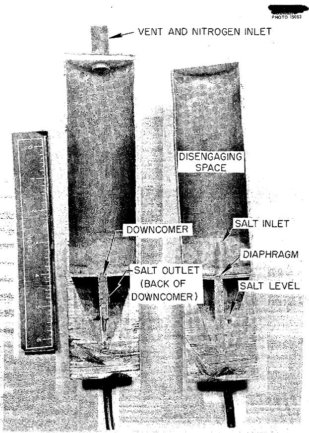  
Fig. 10.1. Freeze Valve for Molten Salt.

freezing of a plug of salt in a vented trap in the line. The salt outlet is barely visible behind the downcomer in the photograph. Novel features of the design are the provision for inert-gas blowback through the inlet pipe and the conical bottom to minimize holdup within the valve and to lessen the mechanical strain imposed by expansion of the salt during melting. After 15 cycles of freezing and thawing, this valve, when frozen, held against a test pressure of 20 psig without leaking.

The nature of gas dispersion through a percolator type of gas-liquid contactor was studied, and the liquid recirculation rate was measured as a function of gas flow rate, gas inlet configuration, and percolator tube length, diameter, and submergence. The data are being analyzed for use in designing a fluorinator for the fluoride-volatility process.

# PROCESS DEVELOPMENT

An improved procedure for decontaminating the $\mathsf{UF}_6$ product of the fluorination step was developed (Fig. 10.2). The procedure is based upon $\mathsf{UF}_6$ absorption on NaF at $100^{\circ}\mathsf{C}$ and desorption by heating to $400^{\circ}\mathsf{C}$ , with the product gas passing

through a second bed of NaF before collection of the $\mathsf{UF}_6$ in a cold trap. The overall gamma decontamination factors of greater than $10^{5}$ that were obtained are to be compared with the decontamination factors of only about $10^{4}$ obtained with the process in which a single bed at $650^{\circ}C^{1}$ or at 100 to $400^{\circ}C$ was used. In the single-bed process, cross contamination occurred because of the use of the same lines for collecting the product and for handling the waste gases containing small amounts of fission products, and, as a result, the decontamination factors are much lower in re-used equipment than in new equipment. Since fission products never enter the product-collection system in the two-bed process, decontamination factors of greater than $10^{5}$ were obtained in re-used equipment. Preliminary results indicated that the use of nitrogen as a sweep gas in both the fluorination and the NaF absorption and desorption steps reduced the amount of fluorine required for the process.

In the first decontamination studies, a single,

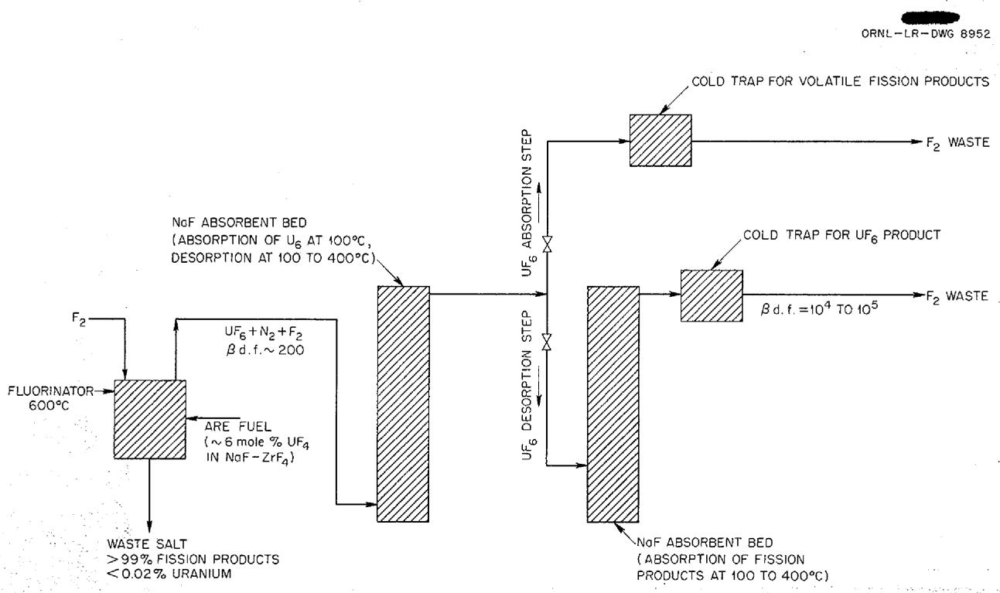  
Fig. 10.2. Fused-Salt Fluoride-Volatility Process in Which Two NaF Absorbent Beds Are Used.

18-in.-long bed of NaF was used. The $\mathsf{UF}_6$ effluent from the fluorinator was passed through this bed at $100^{\circ}\mathsf{C}$ , and then the flow was cut off while the bed was heated to $400^{\circ}\mathsf{C}$ to desorb the $\mathsf{UF}_6$ . As shown by analyses of the contents of the cold trap after the absorption step and of the residual NaF after the desorption step, 50 to $90\%$ of the volatile ruthenium passed through the NaF at $100^{\circ}\mathsf{C}$ , and more than $99\%$ of the absorbed ruthenium was not desorbed on heating to $400^{\circ}\mathsf{C}$ . Essentially all the niobium was absorbed at $100^{\circ}\mathsf{C}$ and was not desorbed at $400^{\circ}\mathsf{C}$ , which gives a decontamination factor of about $10^{3}$ for the absorption-desorption step. When new tubing and equipment were used, the overall decontamination factors for the single-bed process were about $10^{4}$ (Table 10.1).

When the gas lines and equipment were re-used, ruthenium that had been deposited in them in previous runs prevented good product decontamination. To avoid this contamination, two 9-in.-long beds were tried. The $\mathsf{UF}_6$ was absorbed in the first NaF bed, the unabsorbed fission products

being collected in a cold trap. The line to the cold trap was closed during the desorption step, and the product stream was passed through the second NaF bed for absorption of any fission products desorbed from the first bed or from the walls of the lines between the first and second beds (Fig. 10.2). In two test runs, $\mathsf{UF}_6$ product containing about the same beta and gamma activity as natural uranium, or less, was obtained. The gross beta or gamma decontamination factors for the whole process were of the order of $10^{5}$ . Because of the low product activity, calculation of the various specific decontamination factors was not practical. The effectiveness of the method, however, was shown by the distribution of activities in the two NaF beds and the cold trap used in the absorption step (Table 10.2).

A yield of only $40\%$ was obtained in the two runs because of poor temperature control of the 9-in.-long beds. In two later runs, 6-in.-long beds with better insulation and heating control gave yields of 90 to $100\%$ with the same high decontamination factors of about $10^5$ . The same NaF was used in

$UF_{6}$ in $F_{2} - N_{2}$ gas stream from fluorination of NaF-ZrF $_{4}$ -UF $_{4}$ (gross beta activity per milligram of U in salt = 5 × 10 $^{5}$ counts/min) at $600^{\circ}C$ ; absorbed at $100^{\circ}C$ and desorbed with excess $F_{2}$ by increasing the temperature from 100 to $400^{\circ}C$

Absorbent: 200 ml of 12- to 40-mesh NaF in 1-in.-dia bed

F2/U mole ratio: \~5

NaF/U weight ratio: $\sim 6$

Product yield: 87%

TABLE 10.1. DECONTAMINATION OF ${\mathrm{{UF}}}_{6}$ IN THE SINGLE-BED FUSED-SALT FLUORIDE-VOLATILITY PROCESS  

<table><tr><td rowspan="2">Radioactivity</td><td colspan="3">Decontamination Factors</td></tr><tr><td>Absorption*</td><td>Desorption**</td><td>Over-all, Including Fluorination</td></tr><tr><td>Gross beta</td><td>2.1</td><td>40</td><td>1.2 × 104</td></tr><tr><td>Gross gamma</td><td>1.2</td><td>310</td><td>1.4 × 104</td></tr><tr><td>Ru gamma</td><td>2.4</td><td>46</td><td>1100</td></tr><tr><td>Zr-Nb gamma</td><td>1.0</td><td>1600</td><td>5.9 × 104</td></tr><tr><td>Total rare earth beta</td><td>1.0</td><td>5</td><td></td></tr></table>

*Based on activity not absorbed with UF $_6$ on NaF but passed into cold trap.   
\*\*Based on activity remaining on NaF after desorption of UF 6.

$UF_{6}$ in $F_{2} \cdot N_{2}$ gas stream from fluorination of NaF-ZrF $_{4}$ -UF $_{4}$ (gross beta activity per milligram of U in salt = 5 × 10 $^{5}$ counts/min) at 600°C; absorbed on first bed at 100°C, with some activity permitted to pass into cold trap; desorbed with excess F $_{2}$ by increasing the temperature from 100 to 400°C, with gas passing from first bed through second bed to UF $_{6}$ cold trap

Absorbent beds: 100 ml of 12- to 40-mesh NaF in 1-in.-dia tubes Total NaF/U weight ratio: $\sim 6$

TABLE 10.2. DISTRIBUTION OF ACTIVITY IN THE TWO-BED FUSED-SALT FLUORIDE-VOLATILITY PROCESS   

<table><tr><td rowspan="3">Radioactivity</td><td colspan="6">Percentage of Total Volatilized Activity</td></tr><tr><td colspan="3">Run 1</td><td colspan="3">Run 2</td></tr><tr><td>In Cold Trap</td><td>In Bed 1</td><td>In Bed 2</td><td>In Cold Trap</td><td>In Bed 1</td><td>In Bed 2</td></tr><tr><td>Gross beta</td><td>51</td><td>48</td><td>0.8</td><td>59</td><td>24</td><td>17</td></tr><tr><td>Gross gamma</td><td>3</td><td>97</td><td>0.07</td><td>7</td><td>93</td><td>0.02</td></tr><tr><td>Ru gamma</td><td>81</td><td>18</td><td>0.9</td><td>86</td><td>14</td><td>Very low</td></tr><tr><td>Zr-Nb gamma</td><td>0.4</td><td>~100</td><td>0.04</td><td>0.8</td><td>99</td><td>0.02</td></tr><tr><td>Total rare earth beta</td><td>3</td><td>97</td><td>0.1</td><td>3</td><td>97</td><td>Very low</td></tr></table>

the second run as in the first, and thus, for the first time, it was established that activity can be prevented from seriously contaminating the product $\mathsf{UF}_6$ process lines. Since the NaF/U weight ratio in each run was 4, the overall ratio after the second run was 2.

The uranium loss in the cold trap used in the absorption operation at $100^{\circ}C$ varied from less than 0.001 to $0.04\%$ in the four runs with the two beds. Less than $0.1\%$ of the total uranium processed was found in the NaF in the two runs with the use of the same NaF beds.

In the last two runs, an equal-volume mixture of fluorine and nitrogen was used for the fluorination until about $75\%$ of the uranium had been volatilized, pure fluorine being used to remove the last of the uranium from the molten salt. The induction period observed previously² was eliminated, and uranium losses in the waste salt were only 0.013

and $0.004\%$ with $\mathsf{F}_2 / \mathsf{U}$ mole ratios of 3.7 and 5, respectively. The over-all $\mathsf{F}_2 / \mathsf{U}$ mole ratios, including the fluorine used for desorbing $\mathsf{UF}_6$ from the NaF, were 5.6 and 6.7, which are somewhat lower than the ratio of 9 used in previous NaF decontamination studies.

Preliminary results also indicated that nitrogen can be used to replace part of the fluorine used in the NaF desorption step. A 10-g charge of 12- to 40-mesh NaF in a $\frac{1}{2}$ -in.-dia nickel tube at $100^{\circ}\mathrm{C}$ was saturated with about $9.5\mathrm{g}$ of $\mathsf{UF}_6$ and then raised to $400^{\circ}\mathrm{C}$ for approximately $30\mathrm{min}$ to desorb the $\mathsf{UF}_6$ while nitrogen was being passed through the tube at a rate of $200\mathrm{ml / min}$ . In two trials, approximately $80\%$ of the $\mathsf{UF}_6$ was removed. This method has not yet been used with activity present.

Part III

SHIELDING RESEARCH

# 11. SHIELD DESIGN

J.B.Dee

C.A.Goetz J.E.Smolen

H.C.Woodsum

Pratt & Whitney Aircraft

A survey of spherically symmetric unit shields for circulating-fuel reactors was made, and weight estimates for unit shields with various dose rates at 50 ft are presented. The chief sources of radiation in a 300-Mw circulating-fuel reactor for the NJ-1 power plant were determined. A parametric weight study of the shield weight dependence on the dimensions of a 300-Mw circulating-fuel reactor is described.

# WEIGHTS OF SPHERICALLY SYMMETRIC UNIT SHIELDS FOR CIRCULATING-FUEL REACTORS

A survey of spherically symmetric unit shields for circulating-fuel reactors was made for a range in dose rate of 0.1 to 10 rem/hr at a distance of 50 ft and a range in reactor power of 100 to 300 Mw. An estimate was obtained for the added weight of an NaK-to-NaK secondary heat exchanger and its shielding. This additional weight is quite sensitive to the manner in which the dose rate is divided between the secondary heat exchanger and the reactor and to the absolute value for the sodium activation. Consequently, the estimates must be interpreted as indicating trends rather than absolute values.

The reactor dimensions for this survey were scaled from those given previously for a 300-Mw reactor having a power density of $2.75\mathrm{kw/cm^3}$ , and the secondary heat exchanger dimensions were scaled from a Pratt & Whitney Aircraft design. The shield dimensions were determined by the methods given by the 1953 Summer Shielding Session and the data and methods presented in the Lid Tank Shielding Facility (LTSF) report on an earlier series of tests on a circulating-fuel reflector-moderated reactor and shield. However, for low dose rates and high powers, the lead in excess of approximately 6 in. was laminated with

alkylbenzene in such a manner as to attenuate the neutrons as rapidly as the gamma rays and, thus, to ensure the effectiveness of the lead; this method is conservative. An analysis of data from the current LTSF circulating-fuel reflector-moderated-reactor and shield tests (see Sec. 12) should make possible a shield arrangement that would result in a saving of several thousand pounds of thick gamma-ray shielding for unit shields. Additional weight savings could be achieved by shield-shaping according to the particular aircraft application and configuration. The source of data for the sodium activation for these calculations was the current LTSF tests, reported previously. Results of this survey are given in Table 11.1 and Fig. 11.1.

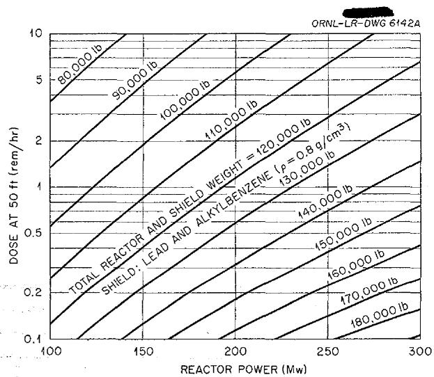  
Fig. 11.1. Weights of Circulating-Fuel Reactor and Shield Assemblies Without NaK-to-NaK Heat Exchangers.

# SOURCES OF RADIATION IN A 300-Mw CIRCULATING-FUEL REACTOR

The chief sources of radiation for the 300-Mw circulating-fuel reactor for the NJ-1 power plant

TABLE 11.1. DIMENSIONS OF CIRCULATING-FUEL REACTORS AND CORRESPONDING REACTOR - UNIT SHIELD WEIGHTS FOR VARIOUS DOSE RATES AT 50 ft   

<table><tr><td rowspan="4"></td><td colspan="9">Reactor Power (Mw)</td></tr><tr><td colspan="3">100</td><td colspan="3">200</td><td colspan="3">300</td></tr><tr><td colspan="9">Dose Rate at 50 ft (rem/hr)</td></tr><tr><td>0.1</td><td>1</td><td>10</td><td>0.1</td><td>1</td><td>10</td><td>0.1</td><td>1</td><td>10</td></tr><tr><td colspan="10">All Components Except Shielding and NaK-to-NaK Heat Exchanger</td></tr><tr><td colspan="10">Thickities (in.)</td></tr><tr><td>Core</td><td>4.09</td><td>4.09</td><td>4.09</td><td>5.18</td><td>5.18</td><td>5.18</td><td>5.97</td><td>5.97</td><td>5.97</td></tr><tr><td>Beryllium reflector</td><td>12.00</td><td>12.00</td><td>12.00</td><td>12.00</td><td>12.00</td><td>12.00</td><td>12.00</td><td>12.00</td><td>12.00</td></tr><tr><td>Fuel-to-NaK heat exchanger</td><td>2.81</td><td>2.81</td><td>2.81</td><td>4.57</td><td>4.57</td><td>4.57</td><td>5.72</td><td>5.72</td><td>5.72</td></tr><tr><td colspan="10">Outside Radii (in.)</td></tr><tr><td>Beryllium island</td><td>4.62</td><td>4.62</td><td>4.62</td><td>5.88</td><td>5.88</td><td>5.88</td><td>6.685</td><td>6.685</td><td>6.685</td></tr><tr><td>Core</td><td>9.04</td><td>9.04</td><td>9.04</td><td>11.38</td><td>11.38</td><td>11.38</td><td>12.97</td><td>12.97</td><td>12.97</td></tr><tr><td>Beryllium reflector</td><td>21.37</td><td>21.37</td><td>21.37</td><td>23.70</td><td>23.70</td><td>23.70</td><td>25.31</td><td>25.31</td><td>25.31</td></tr><tr><td>Fuel-to-NaK heat exchanger</td><td>24.53</td><td>24.53</td><td>24.53</td><td>28.62</td><td>28.62</td><td>28.62</td><td>31.38</td><td>31.38</td><td>31.38</td></tr><tr><td colspan="10">Weights (103 lb)</td></tr><tr><td>Reactor (pressure shell and contents including pump headers)</td><td>13.4</td><td>13.4</td><td>13.4</td><td>20.3</td><td>20.3</td><td>20.3</td><td>27.7</td><td>27.7</td><td>27.7</td></tr><tr><td>Insulation</td><td>0.18</td><td>0.18</td><td>0.18</td><td>0.24</td><td>0.24</td><td>0.24</td><td>0.28</td><td>0.28</td><td>0.28</td></tr><tr><td>Structure</td><td>2.90</td><td>2.54</td><td>2.18</td><td>3.15</td><td>2.82</td><td>2.50</td><td>3.25</td><td>3.00</td><td>2.70</td></tr><tr><td>Patches</td><td>2.81</td><td>2.57</td><td>2.40</td><td>4.71</td><td>4.16</td><td>3.77</td><td>6.66</td><td>5.83</td><td>5.25</td></tr><tr><td colspan="10">NaK-to-NaK Heat Exchanger</td></tr><tr><td>Thickness (ft)</td><td>1.50a</td><td>1.50a</td><td>1.50a</td><td>2.12b</td><td>2.12b</td><td>2.12b</td><td>2.60c</td><td>2.60c</td><td>2.60c</td></tr><tr><td>Weight (103 lb)</td><td>3.01</td><td>3.01</td><td>3.01</td><td>5.71</td><td>5.71</td><td>5.71</td><td>8.5</td><td>8.5</td><td>8.5</td></tr><tr><td colspan="10">Lead Shielding of NaK-to-NaK Heat Exchanger</td></tr><tr><td>Thickness (in.)</td><td>3.49</td><td>1.09</td><td>0</td><td>4.48</td><td>2.09</td><td>0</td><td>4.85</td><td>2.55</td><td>0.022</td></tr><tr><td>Weight (103 lb)</td><td>6.55</td><td>2.50</td><td>0</td><td>14.18</td><td>5.99</td><td>0</td><td>21.14</td><td>10.28</td><td>0.08</td></tr><tr><td>Lead and Alkylbenzene Shield Outside diameter (ft)</td><td>11.65</td><td>10.64</td><td>9.32</td><td>12.58</td><td>11.23</td><td>9.92</td><td>12.99</td><td>11.62</td><td>10.31</td></tr><tr><td colspan="10">Thickities</td></tr><tr><td>Total lead (in.)</td><td>10.57</td><td>8.71</td><td>7.17</td><td>11.17</td><td>9.20</td><td>7.52</td><td>11.45</td><td>9.43</td><td>7.85</td></tr><tr><td>Total alkylbenzene (ft)</td><td>2.884</td><td>2.362</td><td>1.821</td><td>2.788</td><td>2.278</td><td>1.762</td><td>2.739</td><td>2.223</td><td>1.699</td></tr><tr><td colspan="10">Weights (103 lb)</td></tr><tr><td>Total lead</td><td>70.99</td><td>49.39</td><td>36.13</td><td>93.55</td><td>66.38</td><td>48.85</td><td>109.55</td><td>78.85</td><td>59.78</td></tr><tr><td>Total alkylbenzene</td><td>33.27</td><td>25.06</td><td>15.91</td><td>40.92</td><td>28.12</td><td>18.08</td><td>43.91</td><td>30.15</td><td>19.36</td></tr><tr><td>Total Weight of Reactor and Lead-Alkylbenzene Shield Assembly (103 lb)</td><td>123.55</td><td>93.14</td><td>70.20</td><td>162.87</td><td>122.02</td><td>93.74</td><td>191.35</td><td>145.81</td><td>115.07</td></tr><tr><td>Total Weight of Reactor, Lead-Alkylbenzene Shield Assembly, and Non-shielded NaK-to-NaK Heat Exchanger (103 lb)</td><td>126.56</td><td>96.15</td><td>73.21</td><td>168.58</td><td>127.73</td><td>99.45</td><td>199.85</td><td>154.31</td><td>123.57</td></tr><tr><td>Total Weight of Reactor, Lead-Alkylbenzene Shield Assembly, and Shielded NaK-to-Nak Heat Exchanger (103 lb)</td><td>133.11</td><td>98.65</td><td>73.21</td><td>182.76</td><td>133.72</td><td>99.45</td><td>220.99</td><td>164.59</td><td>123.65</td></tr></table>

a3 ft wide $\times 2.9$ ft long NaK-to-NaK heat exchanger.   
$b$ 4.24 ft wide $\times 3.15$ ft long NaK-to-NaK heat exchanger.   
c5.2 ft wide $\times 3.4$ ft long NaK-to-NaK heat exchanger.

have been determined. The reactor dimensions used for this study are given in Table 11.2, and the sources of radiation are listed in Table 11.3.

TABLE 11.2. PARAMETERS OF 300-Mw CIRCULATING-FUEL REACTOR USED IN CALCULATION OF SOURCES OF RADIATION   

<table><tr><td>Reactor Region</td><td>Thickness (in.)</td><td>Radius (in.)</td></tr><tr><td>Beryllium island</td><td></td><td>6.690</td></tr><tr><td>Inconel-X cladding</td><td>0.01</td><td>6.700</td></tr><tr><td>Sodium passage</td><td>0.1875</td><td>6.888</td></tr><tr><td>Inconel-X core shell</td><td>0.125</td><td>7.013</td></tr><tr><td>Core fuel region</td><td>5.987</td><td>13.000</td></tr><tr><td>Inconel-X core shell</td><td>0.156</td><td>13.156</td></tr><tr><td>Sodium passage</td><td>0.1875</td><td>13.343</td></tr><tr><td>Inconel-X cladding</td><td>0.01</td><td>13.353</td></tr><tr><td>Beryllium reflector</td><td>11.908</td><td>25.261</td></tr><tr><td>Inconel-X cladding</td><td>0.01</td><td>25.271</td></tr><tr><td>B10ceramel</td><td>0.10</td><td>25.371</td></tr><tr><td>Inconel-X cladding</td><td>0.01</td><td>25.381</td></tr><tr><td>Sodium passage</td><td>0.1875</td><td>25.568</td></tr><tr><td>Inconel-X cladding</td><td>0.125</td><td>25.693</td></tr><tr><td>Heat exchanger</td><td>7.13</td><td>32.823</td></tr><tr><td>Inconel-X cladding</td><td>0.125</td><td>32.948</td></tr><tr><td>Inconel-X thermal shield</td><td>1.00</td><td>33.948</td></tr><tr><td>Pressure shell</td><td>1.00</td><td>34.948</td></tr><tr><td>Insulation</td><td>0.25</td><td>35.198</td></tr><tr><td>Insulation cladding</td><td>0.032</td><td>35.230</td></tr><tr><td>Alkylbenzene passage</td><td>0.375</td><td>35.605</td></tr><tr><td>Lead</td><td>1.00</td><td>36.605</td></tr><tr><td>Alkylbenzene passage</td><td>0.375</td><td>36.980</td></tr><tr><td>Lead</td><td>3.5</td><td>40.480</td></tr><tr><td>Alkylbenzene</td><td>-</td><td>-</td></tr></table>

The neutron capture rates in the island, reflector, and core shell (Table 11.3) were obtained from a multigroup (Foxcode) calculation by D. G. Ott, Pratt & Whitney Aircraft, for this reactor. The captures in the core may be considered to be entirely in the $\mathbf{U}^{235}$ . The determinations of the capture rates in the island and in the reflector regions were based on the assumption that Inconel linings would not be needed for the cooling passages.

The capture rates in the core were also obtained by an independent method in which the maximum number of captures in the core shell was found by assuming thermal absorption in the core shells and

all thermal fissions in a black core. For each neutron captured in the core, $e^{k\sum_{a}t}$ neutrons were assumed to have entered the Inconel. The total Inconel capture rate was therefore the core capture rate multiplied by $(e^{k\sum_{a}t} - 1)$ , where $t$ is the Inconel shell thickness, $\Sigma_{a}$ is the neutron absorption cross section at the neutron temperature, and $k$ is a constant with a value between 1 and 2 that depends upon the anisotropy of the neutron flux. This $k$ is in agreement with that obtained in recent foil measurements at the ORNL Critical Experiments Facility, and, also, with the multigroup results, which correspond with a value of $k = 1.65$ . The neutron capture rates in the reactor are shown in Fig. 11.2.

The prompt-fission gamma-ray spectrum used is based on the data of R. L. Gamble (see Table 11.3). This spectrum is thought to be reasonably correct in total energy, although deviations by a factor of

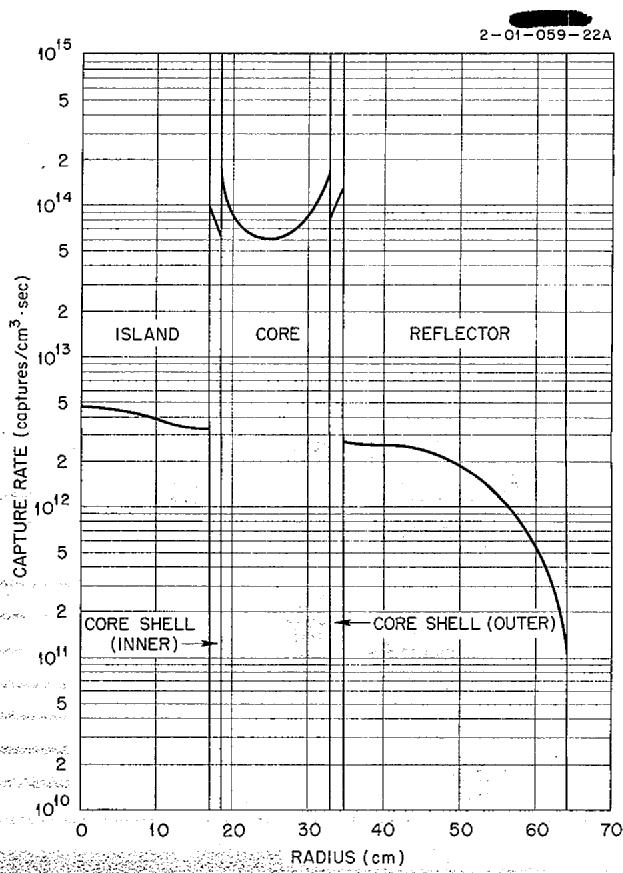  
Fig. 11.2. Capture Rates for Neutrons in a 300-Mw Circulating-Fuel Reactor (Based on Foxcode Multigroup Calculations).

TABLE 11.3. SOURCES OF RADIATION IN A 300-Mw CIRCULATING-FUEL REACTOR   

<table><tr><td>Region</td><td>Photon Source</td><td>Photon Energy(a) (Mev)</td><td>Photon Emission Probability per Capture(a)</td><td>Neutron Captures per Second at 300 Mw</td><td>Neutrons Produced per Second</td></tr><tr><td rowspan="2">Island</td><td rowspan="2">(n,y) in beryllium</td><td>6.8</td><td>0.75</td><td>0.075 × 1018</td><td></td></tr><tr><td>~3.4</td><td>0.50</td><td></td><td></td></tr><tr><td rowspan="3">Core shell (inner)</td><td rowspan="3">(n,y) in Inconel(b)</td><td>9</td><td>0.72</td><td>0.28 × 1018</td><td></td></tr><tr><td>~6</td><td>0.30</td><td></td><td></td></tr><tr><td>~4</td><td>0.14</td><td></td><td></td></tr><tr><td rowspan="3">Core</td><td>Prompt-fission gamma rays</td><td>E</td><td>7.7 e-1.03E dE(c)</td><td>9.5 × 1018</td><td>23.3 × 1018</td></tr><tr><td>Fission-product gamma rays</td><td>E</td><td>(7.0 e-1.2E dE)(d,e)</td><td></td><td></td></tr><tr><td>(n,y) in U235</td><td>E</td><td>(8 e-1.03E dE)(f)</td><td>1.6 × 1018</td><td></td></tr><tr><td rowspan="3">Core shell (outer)</td><td rowspan="3">(n,y) in Inconel</td><td>9</td><td>0.72</td><td>1.27 × 1018</td><td></td></tr><tr><td>~6</td><td>0.30</td><td></td><td></td></tr><tr><td>~4</td><td>0.14</td><td></td><td></td></tr><tr><td rowspan="2">Reflector</td><td rowspan="2">(n,y) in beryllium</td><td>6.8</td><td>0.75</td><td>1.38 × 1018</td><td></td></tr><tr><td>~3.4</td><td>0.50</td><td></td><td></td></tr><tr><td>Heat exchanger</td><td>Fission-product gamma rays</td><td>E</td><td>(7.0 e-1.2E dE)(e,g)</td><td></td><td></td></tr><tr><td rowspan="2">Gamma shield</td><td rowspan="2">(n,y) in lead</td><td>7.38</td><td>0.93</td><td>6.8 × 1013(b)</td><td></td></tr><tr><td>~6</td><td>0.07</td><td></td><td></td></tr><tr><td rowspan="3">Hydrogenous shield</td><td>(n,y) in borated(i) alkylbenzene</td><td></td><td></td><td></td><td></td></tr><tr><td>(n,y) in hydrogen</td><td>2.2</td><td>1.00</td><td>9.6 × 1013(b)</td><td></td></tr><tr><td>(n,y) in boron</td><td>0.48</td><td>0.94</td><td>3.7 × 1015</td><td></td></tr></table>

$^{a}$ P. Mittleman and R. L. Liedtke, "Gamma Rays from Thermal-Neutron Capture," *Nucleonics* 13(5), 50-51 (1955).   
$b$ Values for nickel.   
cFrom data of J. E. Francis and R. L. Gamble, Phys. Semiann. Prog. Rep. Mar. 20, 1955, ORNL-1879, p 20.   
$d$ Values in parentheses are assumed.   
${}^{e}$ Preliminary estimate of spectrum; only 20% of the fission products reside in core.   
This spectrum was assumed to be similar to the prompt-fission spectrum because it was convenient. The gamma rays from radiative capture in uranium have not been observed and their character is unknown, but they are thought to be multiple rather than a single gamma ray. The spectrum was normalized to the binding energy of the captured neutron.   
$80\%$ of the fission products reside in the heat exchanger, headers, and pumps.   
$b_{\text{Nominal}} 4 \frac{1}{2}$ in. of lead assumed.   
${}^{2}{20}\mathrm{{mg}}$ of boron per cubic centimeter of mixture.

# 2 or more may exist at some energies.

It should be noted that only about $20\%$ of the fuel in the circuit is in the core, the remainder being in the heat exchanger, headers, pumps, and core end ducts. The fission-product gamma-ray spectrum is actually unknown. The spectrum used has only a very slight experimental basis. The estimated spectrum given here is probably correct

within a factor of 1.6, with respect to total energy. Several experiments are being performed for deriving a more definite estimate.

The capture rates given for the lead and for the hydrogen in the alkylbenzene are based on a numerical volume integration of the thermal-neutron

fluxes measured behind a circulating-fuel reactor mockup in the Lid Tank Shielding Facility (LTSF). This mockup contained 4.5 in. of lead and $2\%$ boron in the water. As yet, the thermal-neutron fluxes cannot be calculated for the reactor in this region. Also, the degree of boration to be used has not yet been determined. Consequently, the capture data for the lead and alkylbenzene are based on the assumption that the fraction of the neutrons captured in the LTSF mockup applies to the reactor, corrected only for neutron self-shielding in the core.

# SHIELD WEIGHT DEPENDENCE ON THE DIMENSIONS OF A 300-Mw CIRCULATING-FUEL REACTOR

A parametric weight study that is nearing completion indicates that lighter shield weights for circulating-fuel reactors may result from changes in reactor dimensions. The shield weights are being determined for a fixed reactor power (300 Mw) and a "standard shield" (described below) as a function of power density, island radius, reflector thickness, and heat exchanger thickness. The weights obtained will be used as part of the input information in a parametric performance study under way at Pratt & Whitney Aircraft.

The standard shield consists of a set of specifications sufficiently representative of tactical bomber shields to ensure a realistic reactor optimization. Some concessions to expediency were made, such as the selection of sea-level altitude and a reactor-to-crew-compartment separation distance of 64 ft, in order to make direct use of the neutron data recently obtained at the Tower Shielding Facility (TSF).

The weight determinations in this study differ from those made previously in several respects. One of the differences arises from the use of the current LTSF data in which the gamma-ray dose rate has been analyzed into components from the important source regions. Because of differences in neutron leakage between the LTSF mockup and the design reactor, fluxes from multigroup calculations at Pratt & Whitney Aircraft and experimental thermal-neutron measurements at the LTSF were used as a basis for scaling the $(n,\gamma)$ sources. Because of the different primary energies of the gamma rays originating in the various

regions, the various dose-rate components were treated separately to account for the different attenuation characteristics in the shielding materials. In considering air scattering, the dose rate from neutron captures near the outer lead surface was treated as a separate isotropic source that was relatively independent of lead thickness.

A second difference arises from the use of TSF fast-neutron experimental data for air scattering and crew-compartment penetration and the use of an optimized shape for the neutron reactor shield and the crew-compartment wall thickness. A third difference arises from the use of a tapered shadow shield.

For these calculations, the crew compartment was assumed to be a right cylinder, with an area of $35\mathrm{ft}^2$ on the rear and $225\mathrm{ft}^2$ on the sides. Plastic and lead were the shield materials used to give a neutron dose rate of 0.25 rem/hr and a gamma-ray dose rate of 0.75 rem/hr in the crew compartment at sea level. The reactor-to-crew-compartment separation distance used was 64 ft. The reactor shield, which consisted of lead and alkylbenzene $(330^{\circ}\mathrm{F})$ , was designed to give a maximum dose rate of 1000 rep/hr at 50 ft (assumed radiation damage restriction).

The neutron shield was chosen in the following manner. For a typical aircraft reactor (Table 11.2), the fast-neutron dose rate as a function of the thickness of the spherical shield was obtained by the application of conventional methods to data from the current LTSF circulating fuel-reactor shielding tests (see Sec. 12, "Lid Tank Shielding Facility"). For this reactor and crew compartment, an optimization study was initiated at the TSF to determine the minimum-weight neutron shield and its shape (see Sec. 14, "Tower Shielding Facility"). The minimum of the neutron shield weight appeared to be broad with respect to degree of division of the shield, according to preliminary results. Therefore a particular case was chosen for which the neutron shield weight was close to minimum and for which a close-to-minimum lead thickness was required on the crew-compartment sides. For this case

the plastic thickness at the rear of the crew compartment was $43~\mathrm{cm}$ and at the side, $14~\mathrm{cm}$ . Because the neutron shielding on the crew compartment was unchanged throughout the parameter study, the fast-neutron dose rate at 64 ft from the reactor at the various values of the reactor angle $\theta$ (where $\theta$ is the angle measured with respect to the reactor-to-crew-compartment axis) also remained unchanged. A parameter change in the reactor that resulted in a change in the fast-neutron dose rate at any angle $\theta$ was compensated for by an adjustment of the neutron shielding at that angle $\theta$ to keep the fast-neutron dose rate at 64 ft constant. In the TSF calculations, the angular distribution of the neutrons escaping from the reactor shield surface was assumed to be $\cos^5\psi$ in calculating the direct dose, where $\psi$ is the angle measured with respect to the normal to the shield surface, while radial emission was assumed for the calculation of the scattered dose.

With the neutron shielding fixed, the gamma-ray shielding was taken to consist of four components: the basic lead shield required to maintain a maximum dose rate of 1000 rep/hr at 50 ft (an arbitrary radiation damage limitation); the shaped lead shadow shield adjacent to the basic shield; the lead on the side and front of the crew compartment; and the lead on the rear of the crew compartment. The shadow shield was arbitrarily shaped to permit the dose emission per unit angle $\theta$ to increase exponentially to compensate for the exponential decrease in the probability of scattered radiation penetrating the crew-compartment side as $\theta$ increased. An approximation for the effect of the angular distribution of the gamma rays escaping from the reactor shield surface was made by assuming a "disadvantage angle" $\alpha$ (assumed to be 15 deg) when calculating the scattered radiation penetrating the crew compartment. This assumption results in a constant thickness portion of the shadow shield that subtends a half-angle of 15 deg with respect to the reactor-to-crew-compartment axis, followed by a tapered section that decreases

10 The scattering-penetration probabilities used were those calculated by NDA; Report of the 1953 Summer Shielding Session, ed. by E. P. Blizzard and H. Goldstein, ORNL-1575 (June 11, 1954), p 188-205.

linearly in thickness, with the angle $\theta_{1}$ until it reaches zero. The tapered section ends at $\theta = 63$ deg for a 3.23-in. shadow shield shaped with a 12.5-deg relaxation angle and a 2.1-cm relaxation length in lead for the primary dose. The basic lead shield does not have a constant thickness but decreases from rear to front to compensate for the increased gamma-ray attenuation from the increasing neutron shield thickness along a radial path.

The gamma-ray shield division chosen, under the assumptions outlined above, consisted of 0.1 in. of lead on the crew-compartment sides and approximately 6 in. of lead, in addition to the basic shield for the direct dose, which was divided into a 2.56-in. shield on the crew-compartment rear and a 3.23-in.-thick tapered shadow shield near the center; the exact division of the basic shield was not sensitive with respect to weight. The shadow shield was in direct contact with lead in most of the cases considered. Spacing was employed, however, for some cases in which the reflector was thin and for which the secondary gamma-ray dose contribution was large.

The first step in the weight calculations was to determine the shield necessary to give the design dose rates from the rear of the shaped reactor shield. The design dose rates were 108 rem/hr at 50 ft for fast neutrons (10.8 rep/hr) and 1000 rem/hr at 50 ft for gamma rays (1000 rep/hr).

# Neutron Shield

The neutron-attenuation data were taken from fast-neutron dose-rate curves obtained at the LTSF by using the Glass-Hurst fast-neutron dosimeters and the Hornyak button. The data were extrapolated for thicknesses beyond the range of the LTSF fast-neutron dose-rate instruments by means of thermal-neutron-flux traverses in the LTSF and fast-neutron dose-rate measurements at the TSF. Neutron dose-rate curves were available for beryllium reflector moderator regions 8, 12, and 16 in thick and a 4-in.-thick heat exchanger region; the data were corrected for air gaps, aluminum tank walls, and Boral regions. The basic neutron-shield thickness was determined from the expression

$$
D _ {n} = D (z) H (z) \frac {r _ {c} r _ {s}}{d ^ {2}} \frac {\sigma_ {R}}{\sigma_ {L T}} e ^ {- \delta \sum t _ {H X}} e ^ {- \delta \sum t _ {R}} e ^ {\left(\sum_ {H _ {2} O} - \sum_ {A l k y}\right) t _ {A l k y}}, \tag {1}
$$

where

$$
D _ {n} = \text {f a s t - n e u t r o n d o s e r a t e} 6 4 \mathrm {f t}, 6. 6 \mathrm {r e p / h r},
$$

$$
D (z) = \text {L T S F} \text {f a s t - n e u t r o n d o s e r a t} z \text {f o r t h e}
$$

$$
z = \text {s h i e l d}
$$

$$
\begin{array}{l} H (z) = \text {r a t i o} \\ \text {i n f i n i t e p l a n e t o t h a t f r o m t h e L T S F s o u r c e} \\ \text {d i s k , t a k e n t o b e [ 1 - e ^ {- 6 3 0 / \lambda (z)} z ] ^ {- 1}} \end{array}
$$

$$
\begin{array}{l} \sigma_ {L T} = \text {e q u i v a l e n t s u r f a c e s o u r c e s t r e n g t h f o r t h e} \\ \text {L T S F , t a k e n t o b e 6 w x 0 . 6 (l e a k a g e} \\ \text {f a c t o r)} \div 3 9 7 0 \mathrm {c m} ^ {2}, \end{array}
$$

$$
\sigma_ {R} = \text {e q u i v a l e n t s u r f a c e s o u r c e s t r e n g t h f o r t h e}
$$

$$
\begin{array}{l} \rho \lambda_ {c} \left[ 1 - \frac {r _ {i}}{r _ {c}} e ^ {- t _ {c} / \lambda_ {c}} \right. \\ \left. + \frac {\lambda_ {c}}{r _ {c}} \left(e ^ {- t _ {c} / \lambda_ {c}} - 1\right) \right], \\ \end{array}
$$

$$
\lambda_ {c} = \text {r e c i p r o c a l o f t h e n e u t r o n r e m o v a l c r o s s} \\ \text {s e c t i o n f o r t h e f u e l N a F - Z r F _ {4} - U F _ {4}} (5 0 - 4 6 - 4 \text {m o l e} \% ) \text {a t a d e n s i t y o f 3 . 2 g / c m ^ {3} , t a k e n} \\ \text {t o b e 1 1 . 6 c m ,}
$$

$$
\rho = \text {p o w e r} \quad \text {d e n s i t y} \left(\mathrm {w} / \mathrm {c m} ^ {3}\right),
$$

$$
r _ {c} = \text {o u t e r r a d i u s o f t h e c o r e (f u e l a n n u l u s)},
$$

$$
r _ {i} = \text {i n n e r r a d i u s o f t h e c o r e (f u e l a n n u l u s)},
$$

$$
r _ {s} = \text {o u t e r r a d i u s o f t h e t o t a l r e a c t o r s h i e l d},
$$

$$
e ^ {- \delta \sum t _ {H X}} = \text {c o r r e c t i o n b y e f f e c t i v e r e m o v a l c r o s s}
$$

$$
\begin{array}{l} e ^ {- \left(\Sigma_ {H X _ {R}} - \Sigma_ {H X _ {L T}}\right) 1 0. 1 6} \\ \times e ^ {- \left(\Sigma_ {H X _ {R}} - \Sigma_ {\mathbf {A} | \mathbf {k y}}\right) \left(t _ {H X} - 1 0. 1 6\right)}, \\ \end{array}
$$

$$
t _ {c} = r _ {c} - r _ {i} = \text {t h i c k n e s s o f f u e l a n n u l u s},
$$

$$
\begin{array}{l} t _ {H X} = \text {r e a c t o r h e a t e x c h a n g e r t h i c k n e s s}, \\ \Sigma_ {H X _ {R}} = \text {e f f e c t i v e} \\ \end{array}
$$

$$
\begin{array}{l} \begin{array}{l} \text {r e a c t o r h e a t e x c h a n g e r (h o m o g e n e i z e d) ,} \\ \text {t a k e n t o b e 0 . 0 6 5 9 c m ^ {- 1} ,} \end{array} \\ \begin{array}{l} \Sigma_ {H X _ {L T}} = \text {e f f e c t i v e r e m o v a l c r o s s s e c t i o n f o r t h e} \\ \text {m o c k u p h e a t e x c h a n g e r o f t h e L T S F e x p e r i - 1 ,} \\ \text {t a k e n t o b e 0 . 0 8 6 9} \\ \text {c m} ^ {- 1}, \end{array} \\ \Sigma_ {H _ {2} O} = \text {e f f e c t i v e r e m o v a l c r o s s s e c t i o n f o r} \\ \begin{array}{l} \Sigma_ {\text {A l k y}} = \text {e f f e c t i v e r e m o v a l c r o s s s e c t i o n f o r} \\ \text {a l k y l b e n z e n e - 3 5 0 a t 3 3 0 ^ {\circ} F , t a k e n t t o b e} \\ 0. 0 8 8 2 \mathrm {c m} ^ {- 1}, \end{array} \\ e ^ {- \delta \sum_ {R} t _ {R}} = \text {e f f e c t i v e r e m o v a l c r o s s - s e c t i o n c o r r e c t i o n f o r m i n o r d i f f e r e n c e s b e t w e e n t h e} \\ t _ {R} = \text {s u m o f t h i c k n e s s d i f f e r e n c e s}, \\ e ^ {- \left(\sum_ {H _ {2} O} - \sum_ {A l k y}\right) t _ {A l k y}} = e f f e c t i v e r e m o v a l c r o s s - s e c t i o n c o r r e c t i o n f o r t h e s u b s t i t u t i o n o f \\ \begin{array}{l} t _ {\text {A l k y}} = \text {t h i c k n e s s o f a l k y l b e n z e n e a t t h e r e a c t o r}, \\ d = \text {s e p a r a t i o n d i s t a n c e f r o m r e a c t o r c e n t e r t o} \\ \text {r e a r f a c e o f c r e w c o m p a r t m e n t , 6 4 f t .} \end{array} \\ \end{array}
$$

# Gamma-Ray Shield

The gamma-ray shield was determined by finding, separately, the gamma-ray dose rate at 50 ft caused by (1) gamma rays emitted by the fuel in the core and by neutron captures in the outer core shell and in the reflector, (2) gamma rays emitted by fission products in the heat exchanger, and (3) neutron captures near the lead-alkylbenzene interface. For each reactor shield design these three groups of contributions were determined separately and then summed.

Reactor Gamma-Ray Dose Rate. Dose-rate components of the LTSF data were available for several lead thicknesses for each reflector thickness (8, 12, and 16 in.). The gamma-ray dose rate data were divided into contributions from the source plate, capture gamma rays from the beryllium reflector, capture gamma rays from the Inconel core shell, and secondary gamma rays, principally from neutron captures in the lead, boron, and water near the lead-water interface. The source correction was determined by assuming an exponential power distribution through the natural uranium of the

source plate and determining the self-shielding factor, s:

$$
s = \frac {\int_ {0} ^ {t u} \phi_ {0} e ^ {- \Sigma_ {a} t} d t}{\int_ {0} ^ {t u} \phi_ {0} e ^ {- \Sigma_ {a} t} e ^ {- \mu_ {u} (t _ {u} - t)} e ^ {- \mu_ {P b} t _ {P b}} d t} = 4. 0 2,
$$

where

$\phi_0 =$ thermal flux incident on the reactor side of the source plate,

$\Sigma_{a} =$ total thermal absorption cross section for natural uranium,

$\mu_{u} =$ gamma-ray absorption coefficient, 4 Mev, $\iota_{P b} =$ gamma-ray absorption coefficient for the lead over the source plate,

$t_{u} =$ effective source plate thickness, $\pi /4$ in., $t_{Pb} =$ lead thickness, $\frac{1}{2}$ in.

where

$\mu_{c} =$ effective mass absorption coefficient for the core for a gamma-ray energy of 3 MeV,

$t_{c} =$ thickness of fuel annulus,

$\mu_{c}t_{c} =$ typical core fuel annulus thickness in gamma-ray mean free paths.

In the natural uranium of the source plate, three-eights of the thermal-neutron captures take place in $U^{238}$ and give radiative capture gamma rays that are not present in the enriched reactor. Unfortunately, the energies and associated probabilities of emission per capture for these gamma rays are not known. For this study, a total energy of 6.4 Mev per $U^{238}$ capture was assumed to be emitted in a distribution corresponding to the fission gamma-ray distribution. Similarly, for radiative capture in $U^{235}$ , a total energy in gamma rays of 7.6 Mev per nonfission capture was assumed. The fraction of gamma-ray dose attributable to $U^{235}, t_{2'}$ in the source plate was then taken to be:

$$
t _ {2} = \frac {E _ {f} (2 3 5) \Sigma_ {f} (2 3 5) + E _ {c} (2 3 5) \Sigma_ {c} (2 3 5)}{E _ {f} (2 3 5) \Sigma_ {f} (2 3 5) + E _ {c} (2 3 5) \Sigma_ {c} (2 3 5) + E _ {c} (2 3 8) \Sigma_ {c} (2 3 8)} = 0. 5 7,
$$

Since only about one-fifth of the fission products are in the core, the core dose rate should be multiplied by the fraction of energy from the core while fuel is circulating, $t_1$ :

$$
t _ {1} = \frac {E _ {c} (2 3 5) \Sigma_ {c} (2 3 5) + E _ {f} (2 3 5) \Sigma_ {f} (2 3 5) + \frac {1}{5} E _ {f p} (2 3 5) \Sigma_ {f} (2 3 5)}{E _ {c} (2 3 5) \Sigma_ {c} (2 3 5) + E _ {f} (2 3 5) \Sigma_ {f} (2 3 5) + E _ {f p} (2 3 5) \Sigma_ {f} (2 3 5)} = 0. 8 6 7,
$$

where

$E_{c}(235) = \text{total photon energy per capture in } U^{235}$ ,

$E_{f}(235) =$ total photon energy per U235 fission, $E_{f p}(235) =$ photon energy from fission products per U235 fission,

$\Sigma_{c}(235) =$ nonfission capture cross section for U235,

$\Sigma_{f}(235) = \text{fission cross section in } U^{235}$ .

The reactor gamma-ray core leakage factor, $l$ , was estimated to be:

$$
l = \frac {1 - e ^ {- \mu_ {c} t _ {c}}}{\mu_ {c} t _ {c}} = 0. 4 7 5,
$$

where

$E_{c}(238) = \text{total photon energy per capture in } U^{238}$ ,

$\Sigma_{c}(238) =$ capture cross section for $\mathsf{U}^{238}$

The total scaling factor to be applied to the core source for the same power per unit area of source surface is the product

$$
f = s \times t _ {1} \times l \times t _ {2} = 0. 9 4.
$$

The scaling factor for the capture gamma rays from the reflector was obtained as the ratio of the fraction of neutrons captured in that region in the reactor (as determined by application of Eyewash code neutron cross section to Foxcode multigroup fluxes) to the fraction of neutrons captured in the same region in the LTSF mockup (as determined by numerical integration of LTSF gold-foil flux

measurements). This ratio was 0.0592/0.0145 or 4.00. The contribution from the island was calculated to increase this to 4.05.

The fraction of neutrons captured in the Inconel core shell in the reactor was estimated in the same manner as that from the reflector and was checked against foil data from the Critical Experiment Facility. The fraction captured in the LTSF mock-up was also determined by integration of gold-foil measurements. The scaling factor for the outer core shell contribution is the ratio 0.0545/0.0161 or 3.39. Similar corrections applied to the inner core shell raised the scaling factor for the core shells to 3.62.

For each reflector thickness (8, 12, and 16 in.) and for each lead thickness (3, 4.5, and 6 in.), these correction factors were applied to the components determined from the LTSF data. The variation of the reflector component of the total gamma-ray dose rate with reflector thickness, as obtained from the LTSF data, was observed to be in agreement with the variation for a reactor, as determined in PWA-NDA multigroup calculations, and therefore it was assumed that none of the scaling factors changed with reflector thickness.

The sum of the dose-rate contributions from the source plate, the capture gamma rays from the beryllium reflector, and the capture gamma rays from the Inconel core shell, that is, $D_{P\cdot L T}(a,z)$ , for each reactor design was transformed to the corresponding dose from an infinite plane by

$E_{1}(\mu z) =$ exponential integral whose argument is the number of mean free paths from the source to the detector.

The primary dose at a distance $d$ from the reactor was then determined by the expression:

$$
\begin{array}{l} D _ {P} (d) \\ = \frac {r _ {c} r _ {s}}{d ^ {2}} \frac {P _ {R} / 4 \pi r _ {c} ^ {2}}{P _ {L T} / \pi a ^ {2}} H (a, z) D _ {P _ {- L T}} (a, z) c _ {1}. c _ {2}. c _ {3}, \\ \end{array}
$$

where

$$
\begin{array}{l} P _ {R} = \text {r e a c t o r p o w e r}, 3 \times 1 0 ^ {8} \mathrm {w}, \\ P _ {L T} = L T S F \text {s o u r c e p l a t e p o w e r , 6 w ,} \\ c _ {1} = \text {c h a n g e i n a t t e n u a t i o n d u e t o r e p l a c i n g t h e} \\ c _ {2} = \text {c h a n g e i n a t t e n u a t i o n d u e t o a d d i t i o n o f} \\ \begin{array}{l} c _ {3} = \text {c h a n g e i n a t t e n u a t i o n d u e t o s u b s t i t u t i o n} \\ \text {o f a l k y l b e n z e n e - 3 5 0 a t 3 3 0 ^ {\circ} F , a s s u m i n g} \\ \text {t h a t} \mu_ {\mathrm {A l k y}} = 0. 8 \mu_ {\mathrm {H} _ {2} \mathrm {O}}, \text {b a s e d o n e l e c t r o n} \\ \text {d e n s i t y .} \end{array} \\ \end{array}
$$

Heat Exchanger Dose Rate. The dose rate from the heat exchanger was calculated by using the following expression:

$$
D _ {H X} = 3. 1 \times 1 0 ^ {1 0} v _ {f} \frac {P _ {R}}{V _ {f}} \cdot \frac {r _ {H X _ {o}} r _ {s}}{d ^ {2}} \int_ {0} ^ {\infty} \frac {B (\mu t) E _ {1} (\mu t) N (E) \lambda (E) \left[ 1 - \frac {r _ {H X _ {o}}}{r _ {H X _ {i}}} e ^ {- t _ {H X ^ {\prime}} / \lambda (E)} + \frac {\lambda (E)}{r _ {H X _ {o}}} \left(e ^ {- t _ {H X ^ {\prime}} / \lambda (E)} - 1\right) \right]}{2 C (E)} d E,
$$

multiplying by the ratio of the exponential integrals:

$$
H (a, z) = \frac {E _ {1} (\mu z)}{E _ {1} (\mu z) - E _ {1} \left[ \mu z \sqrt {1 + \left(a ^ {2} / z ^ {2}\right)} \right]}
$$

where

$$
\begin{array}{l} \begin{array}{l} a = \text {s o u r c e p l a t e r a d i u s , 3 5 . 5 c m ,} \\ z = \text {d i s t a n c e t o d e f e c t o r ,} \end{array} \\ \mu = \text {e f f e c t i v e m a s s a b s o r p t i o n c o e f f i c i e n t f o r} \quad \text {t h e s h i e l d i n g m a t e r i a l s f o r a g a m m a - r a y} \quad \text {e n e r g y o f 6 . 8 M e v ,} \\ \end{array}
$$

where

$$
\begin{array}{l} v _ {f} = \text {v o l u m e f r a c t i o n o f h e a t e x c h a n g e r} \\ V _ {f} = \text {v o l u m e o f f u e l i n t o t a l c i r c u l a t i n g} \\ \begin{array}{l} r _ {H X _ {o}} = \text {o u t s i d e r a d i u s o f h e a t e x c h a n g e r}, \\ r _ {H X _ {i}} = \text {i n s i d e r a d i u s o f h e a t e x c h a n g e r}, \end{array} \\ \begin{array}{l} N (E) = \text {f i s s i o n p r o d u c t g a m m a r a y s o f} \\ \text {e n e r g y E e m i t t e d p e r u n i t e n e r g y} \\ \text {p e r f i s s i o n (t a k e n t o b e 7 . 0} \\ e ^ {- 1. 2 E)} (\text {s e e T a b l e 1 1 . 3}), \end{array} \\ \end{array}
$$

$$
\begin{array}{l} C (E) = \text {n u m b e r o f p h o t o n s o f e n e r g y} E \\ \text {e q u a l t o 1 r e m / h r ,} ^ {1 1} \end{array}
$$

$$
E _ {1} (\mu t) = \text {e x p o n e n t i a l} \quad \text {i n t e g r a l} \quad \text {w h o s e} \quad \text {a r g u - m e n t} \quad \text {i s t h e s h i e l d} \quad \text {t h i c k n e s s} \quad \text {i n} \quad \text {m e a n f r e e} \quad \text {p a t h s},
$$

$$
B (\mu t) = \text {t h e}
$$

$$
t _ {H X} = \text {h e a t e x c h a n g e r t h i c k n e s s},
$$

$$
\lambda (E) = \text {r e c i p r o c a l}
$$

$$
3. 1 \times 1 0 ^ {1 0} = \text {n u m b e r o f f i s s i o n s p e r s e c o n d}
$$

The above integral was evaluated numerically over a range of thicknesses for the heat exchanger, lead, and water, and it appeared to be valid over the range required to separate the self-shielding factor from the remainder of the integral. An average self-shielding factor was derived which depended only upon the heat exchanger thickness and which was in agreement with the more exact integration to within $7\%$ over a range of lead thicknesses from 0 to 9 in. and a range in water thicknesses from 40 to $100~\mathrm{cm}$ . Thus, to simplify the calculation procedure, the integral was broken up into the following product:

where

$$
t _ {\text {B e}} = \text {r e f l e c t o r}
$$

$$
t _ {P b} = \text {l e a d t h i c k n e s s},
$$

$$
t _ {\text {A l k y}} = \text {a l k y l b e n z e n e t h i c k n e s s},
$$

$$
r _ {P b} = \text {r a d i u s t o o t s i d e o f l e a d},
$$

$$
H \left(a ^ {\prime}, t\right) = \text {l e a d} \quad \text {s u r f a c e} \quad \text {n e u t r o n} \quad \text {s o u r c e} \quad \text {t o} \quad \text {i n f i n i t e} \quad \text {p l a n e} \quad \text {n e u t r o n} \quad \text {s o u r c e} \quad \text {t r a n s f o r m a t i o n} \quad \text {c a l c u l a t e d} \quad \text {b y} \quad \text {r a t i o s} \quad \text {o f} \quad \text {e x p o n e n t i a l} \quad \text {i n t e g r a l s ,} \quad \text {a s} \quad \text {b e f o r e} \quad (\text {f r o m L T S F} \quad \text {f l u x} \quad \text {t r a v e r s e s ,} \quad a ^ {\prime} \text {i s} \quad \text {a p p r o x i m a t e l y 4 5 c m}),
$$

$$
H \left(a, z _ {P b}\right) = \text {l e a d} \quad \text {s u r f a c e} \quad \text {n e u t r o n} \quad \text {s o u r c e} \quad \text {t o} \quad \text {i n f i n i t e} \quad \text {p l a n e} \quad \text {n e u t r o n} \quad \text {s o u r c e} \quad \text {t r a n s f o r m a t i o n}, \text {t a k e n} \quad \text {t o} \quad \text {b}
$$

$$
1 / (1 - e ^ {- 8 4 / z _ {P b}}),
$$

$$
t _ {l} = \text {t h i c k n e s s o f c o o l i n g l a y e r s i n t h e}
$$

$$
\lambda_ {l} = \text {r e l a x a t i o n} \quad \text {t h i c k n e s s} \quad \text {c o o l i n g} \quad \text {l a y e r s f o r s e c o n d a r y d o s e (d e t e r m i n e d t o b e 5 . 3 3 c m f r o m c o r r e c t i n g} \quad \text {L T S F d a t a f o r s p a c e d l e a d b y t h e}
$$

$$
\lambda (E) \left[ 1 - \frac {r _ {H X _ {i}}}{r _ {H X _ {o}}} e ^ {- t _ {H X} / \lambda (E)} + \frac {\lambda (E)}{r _ {H X _ {o}}} \left(e ^ {- t _ {H X} / \lambda (E)} - 1\right) \right] \int_ {0} ^ {\infty} \frac {B (\mu t) E _ {1} (\mu t) N (E)}{2 C (E)} d E.
$$

The first expression represents an average self-shielding factor as a function only of the heat exchanger thickness. Evaluation of the second factor for a series of lead thicknesses results in a curve of gamma-ray dose rate as a function of lead thickness for an infinite plane source of fission products.

Secondary Dose Rate. The secondary dose rate (from captures in the lead, boron, and hydrogen near the lead-water interface) was determined by scaling the neutron dose rate in the source region (lead-alkylbenzene interface) as follows:

effective removal cross sections for alkylbenzene),

$$
\frac {\sigma_ {R}}{\sigma_ {L T}} = \text {r a t i o} \text {o f r e a c t o L T S F} \text {e q u i v a l e n t} \text {s u r f a c e s o u r c e s t r e n g t h f o r n e u t r o n s .}
$$

$$
D _ {S} (d) = D _ {S - L T} \left(t _ {\text {B e}}, t _ {\text {P b}}, t _ {\text {A l k y}}\right) H \left(a ^ {\prime}, t _ {\text {A l k y}}\right) \frac {r _ {\text {P b}} r _ {s}}{d ^ {2}} H \left(a, z _ {\text {P b}}\right) \frac {r _ {c}}{r _ {\text {P b}}} \frac {\sigma_ {R}}{\sigma_ {L T}} e ^ {- t _ {l} / \lambda_ {l}},
$$

# Weight Determinations

The weights determined include the reactor, pumps, heat exchangers, reactor shield, crew-compartment shield, shadow shield, structural weight, and patch weight. For example:

Reactor No. 3232

$$
\text {P o w e r d e n s i t y} \quad 4. 1 2 5 \mathrm {k w} / \mathrm {c m} ^ {3}
$$

Reflector thickness 12 in.

Island radius 4 in.

Heat exchanger thickness 6.5 in.

Weight (lb)

$$
\text {P r e s s u r e} ^ {1 2} \tag {22,970}
$$

Alkylbenzene 6,650

Basic lead shell 14,740

Patch weight 3,230

Structural weight 1,910

Shadow shield 3,800

Total Reactor and Reactor Shield Weight 53,300

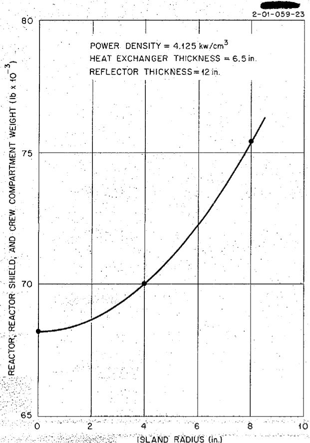  
Fig. 11.3. Total Weight vs Island Radius for 300-Mw Circulating-Fuel Reflector-Moderated Reactor.

Crew compartment plastic 9,900

Crew compartment rear lead 5,270

Crew compartment side and front lead 1,530

Total Crew Compartment 16,700

Total System 70,000

Variations of this total system weight are shown in Figs. 11.3, 11.4, 11.5, and 11.6 with respect to variations in island radius, power density, heat exchanger thickness, and reflector thickness.

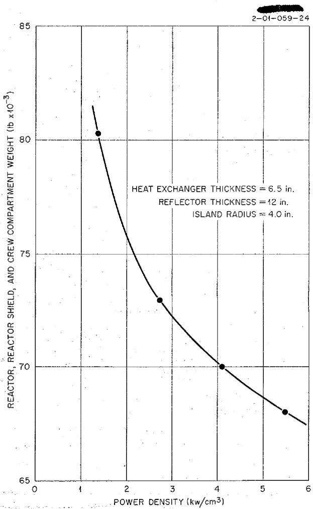  
Fig. 11.4. Total Weight vs Power Density for 300-Mw Circulating-Fuel Reflector-Moderated Reactor.

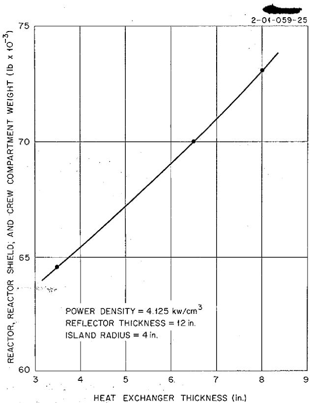  
Fig. 11.5. Total Weight vs Heat Exchanger Thickness for 300-Mw Circulating-Fuel Reflector-Moderated Reactor.

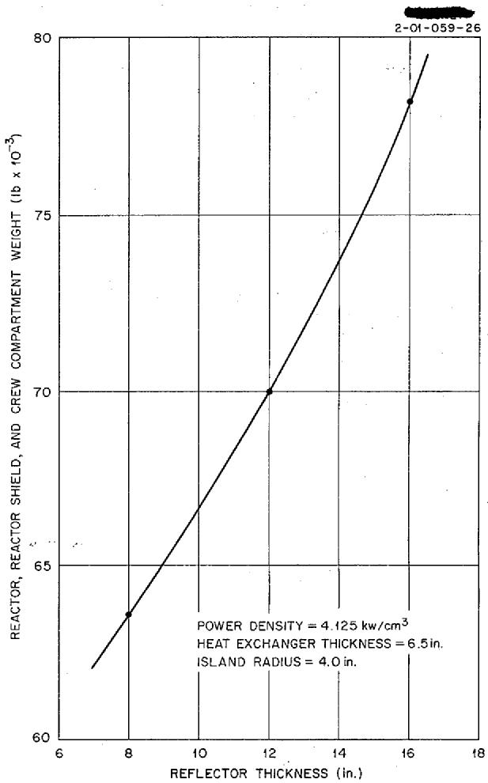  
Fig. 11.6. Total Weight vs Reflector Thickness for 300-Mw Circulating-Fuel Reflector-Moderated Reactor.

# 12. LID TANK SHIELDING-FACILITY

G. T. Chapman

J. M. Miller

Applied Nuclear Physics Division

W. J. McCool

H. C. Woodsum

Pratt & Whitney Aircraft

The static source tests of the second series of the circulating-fuel reflector-moderated-reactor and shield (RMR-shield) mockup experiments at the Lid Tank Shielding Facility (LTSF) have been completed and the data are being analyzed. Tests with the dynamic source are in progress.

# REFLECTOR-MODERATED-REACTOR AND SHIELD MockUP TESTS

Further variations were made in the mockups of the RMR-shield for the final measurements in the static source tests.1 Gamma-ray and neutron measurements were made in the water beyond the mockups, and sodium activation measurements were made within the heat exchanger regions of the mockups.

# Gamma-Ray and Neutron Measurements Beyond the Mockups

Neutron and gamma-ray measurements were made in water beyond the RMR-shield mockups to determine the effect of placing an intermediate or high atomic weight material immediately behind the beryllium reflector, varying the thickness of the reflector, and distributing the lead gamma-ray shield in borated water.

The effect of placing an intermediate or high atomic weight material immediately behind the reflector region was studied by adding a 3-in.-thick slab of bismuth or a 2-in.-thick slab of copper behind an 8-in.-thick slab of beryllium. An analysis of the results shows that, for a typical 300-Mw RMR-shield, little, if any, weight saving results from adding bismuth to the outer region of the reflector rather than using lead in the shield. The bismuth did decrease the gamma-ray dose rate by a factor of 2, but it allowed the fast-neutron dose rate to increase. The copper decreased the gamma-ray dose rate by $50\%$ , but, unfortunately, there was not enough copper used to allow appreciable self-absorption of capture gamma rays; the fast-neutron

dose rate was the same as that for an equivalent thickness of beryllium. Although the 2-in.-thick layer of copper would not be sufficient to effect an appreciable weight saving, there might be enough self-absorption of capture gamma rays in a 4-in.-thick layer to show a valuable weight saving.

The effect on the total gamma-ray dose rate of varying the beryllium thickness (8, 12, and 16 in.) was not appreciable. There was greater attenuation of the source gamma rays by the larger beryllium thicknesses, but more capture gamma rays resulted from the beryllium. Fast-neutron dose rates were not very different behind the various thicknesses.

A study of the effects of distributing the lead gamma-ray shield in borated water was also made in order to obtain the information needed for an optimization of the placement of the lead. This study showed that there would probably be no weight saving as a result of distributing the lead rather than placing it in one piece, for lead thicknesses up to 5 in., but that there might be an appreciable weight saving as a result of distributing the lead beyond the first 5-in. layer. The secondary gamma-ray dose rate produced in the lead and borated-water shield fell off at the same rate as the thermal-neutron flux and thus was apparently caused by thermal-neutron captures in the shield.

# Sodium Activation in the Heat Exchanger Region of the Mockups

Sodium activation tests were performed to determine the activation of the coolant in the heat exchanger region as a function of the heat exchanger thickness, the boron curtaintain thickness and distribution, and the reflector thickness. The effect on the activation of placing a copper gamma ray shield immediately behind the beryllium reflector was also studied.

The saturated specific activities in the heat exchanger regions were measured in the manner described previously for a total of 17 mockups, 5 of which are shown in Fig. 12.1. If only two heat exchanger tanks were used in a test, a

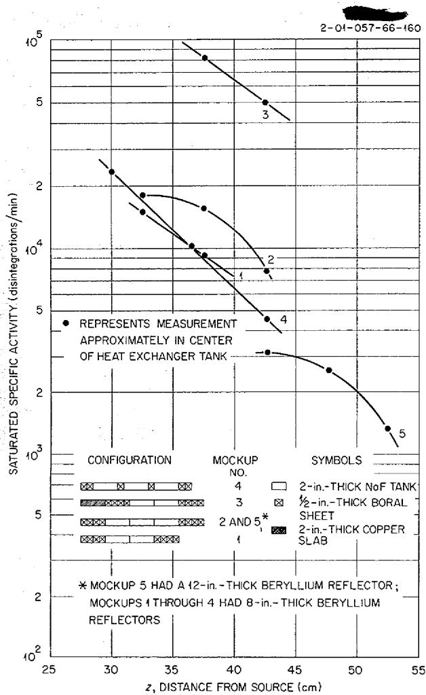  
Fig. 12.1. Sodium Activation in the Heat Exchanger Region of the RMR-Shield Mockups as a Function of Distance from the Source.

straight line was drawn through the two points because of the lack of more information. Additional information probably would show these curves to be slightly concave downward, as in the

cases where three heat exchanger tanks were used. The five tests shown in Fig. 12.1 are representative of the results obtained to date. A more complete analysis of all tests is being prepared.

If test 2 is used as a reference, comparison of the activations in the different tests shows the effect of adding or removing different components of the configuration. In tests 1 through 4, 8 in. of beryllium was used to simulate the reflector, while in test 5, 12 in. of beryllium was used.

Comparing test 1 (4-in.-thick exchanger) with test 2 (6-in.-thick heat exchanger) shows that there is greater relative activation in test 2; this results from the reduced resonance-neutron escape probability in the thicker heat exchanger. The escape probability may be increased simply by distributing the boron curtain through the heat exchanger region. In test 4, a distributed curtain containing less curtain material reduced the total activation to about $25\%$ below that found in test 2.

An increase in the reflector thickness from 8 in. (test 2) to 12 in. (test 5) effected a decrease in the sodium activation of about $80\%$ . This was due to two effects: an inverse-square spreading and a reduction by the extra 4 in. of beryllium of the number of neutrons at and slightly above the sodium resonance energy of 3 kev.

In test 3, a gamma-ray shield of copper was placed between the beryllium reflector and the first boron curtain. The sodium activation was increased by a factor of roughly 6, in comparison with the activation found in test 1 with no copper present in the reflector. The copper apparently changes the fast-neutron spectrum so that there are relatively more neutrons at or just above the 3-kev resonance level of sodium. The boron curtain is only gray to neutrons of this energy, and, hence, some of these neutrons diffuse through the boron curtain into the heat exchanger, where they are slowed down to the 3-kev resonance level by the fluorine.

# 13. BULK SHIELDING FACILITY

F. C. Maienschein

#

T. V. Blosser

E. B. Johnson

G. M. Estabrook

T. A. Love

J.D.Flynn

F. J. Muckenthaler

M. P. Haydon

R.W.Peelle

K. M. Henry

W. Zobel

Applied Nuclear Physics Division

A. T. Futterer

K. M. Johnson

Pratt & Whitney Aircraft

The angular-distribution measurements of fast neutrons have been extended to include measurements in a plain-water medium. The resulting data have been correlated with the TSF shield optimization studies. The first portion of the experiments designed for determining the spectrum of fission-product gamma rays was completed for one range of decay times.

# ANGULAR DISTRIBUTION OF FAST NEUTRONS THROUGH WATER

T. V. Blosser, Applied Nuclear Physics Division  
M. E. Valerino, NACA, Cleveland

A series of shield optimization studies is being made at the TSF, and for such a rational determination of the neutron shielding thicknesses required at the reactor and at the crew compartment of a nuclear-powered aircraft, it is necessary to know the angular distribution of the fast-neutron dose at the reactor shield surface. Some preliminary measurements have therefore been made at the Bulk Shielding Facility (BSF) to obtain an indication of the angular distribution of the fast-neutron dose at several locations in the water shield formed by the BSF pool. The dose measurements were obtained with a 2-in.-dia, 1-in.-thick Hornyak button placed against the end of a long, thin air collimator. The Hornyak button, photomultiplier tube, and preamplifier were enclosed in a watertight lead housing to reduce the response to gamma radiation. The end of the air collimator toward the reactor was held fixed at a location in the water where the angular distribution of the dose was to be obtained; dose measurements were then made at various angles between the axis of the collimator and the reactor center line. Some uncertainties exist in the interpretation of the measurements because of the unknown "background" from neutrons originating in the

water along the sides of the collimator and scattered by the collimator into the Hornyak button. This background is expected to result in a broader angular distribution than actually exists.

The arrangement, in the pool, of the air collimator, the fast-neutron detector, and the lead detector housing, relative to the reactor, is shown in Fig. 13.1. The active lattice of the reactor is a 5 by 6 fuel element array with two fuel elements missing from the back (south) corners of the lattice. The air collimator is a hollow cylindrical aluminum tube $168~\mathrm{cm}$ long, $5.08~\mathrm{cm}$ ID, with a $0.16\text{-cm}$ wall. The position of the end of the collimator toward the reactor is given by coordinates $(z,x)$ , and the collimator angle, with respect to the reactor center line, is designated by the angle $\alpha_{s}$ as shown in Fig. 13.1. Measurements were taken only in a horizontal plane at the mid-plane of the reactor.

The angular distributions were measured at the following locations in the pool water shield:

$$
\begin{array}{l} z = 7 0 \mathrm {c m}, x = 0; \\ z = 7 0 \mathrm {c m}, x = 1 9. 6 \mathrm {c m}; \\ z = 5 \mathrm {c m}, x = 0. \\ \end{array}
$$

The results for $z = 70 \, \text{cm}$ , $x = 0$ are presented in Fig. 13.2, in which the dose rate is plotted vs the angle $\alpha$ . The dose rate was corrected for the background radiation existing at each button position, and background radiation, which was measured with the collimator removed, is also plotted in Fig. 13.2. The background, as measured, was probably only part of the total background, because no account can be taken in the background measurement of the neutrons that originated near the sides of the collimator and scattered into the button.

The two angles, $\alpha_{1}$ and $\alpha_{2}$ , at which a projection of the axis of the collimator just intersects the two edges of the north face of the reactor are

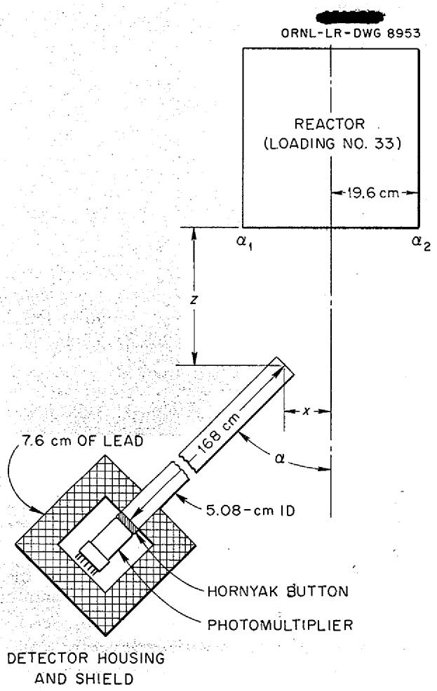  
Fig. 13.1. Experimental Arrangement for Measurements of the Angular Distribution of the Fast-Neutron Dose in the Water Shield of the BSF Reactor.

indicated in Fig. 13.2. For the range of the angles between $\alpha_{1}$ and $\alpha_{2}$ , the collimator sees some portion of the active lattice. It may be seen in Fig. 13.2 that in this range of angles the variation in the dose rate per unit solid angle is small. Because of the relatively poor statistics in these measurements, the exact nature of the variation is not defined. For angles outside the range $\alpha_{1}$ and $\alpha_{2}$ , the projected axis of the collimator does not intersect any portion of the active lattice. In this region, the measured dose rate is principally from neutrons which have made at least a single collision in the water shield, and therefore, as the collimator swings away from the reactor face, the dose rate per unit solid angle drops rapidly.

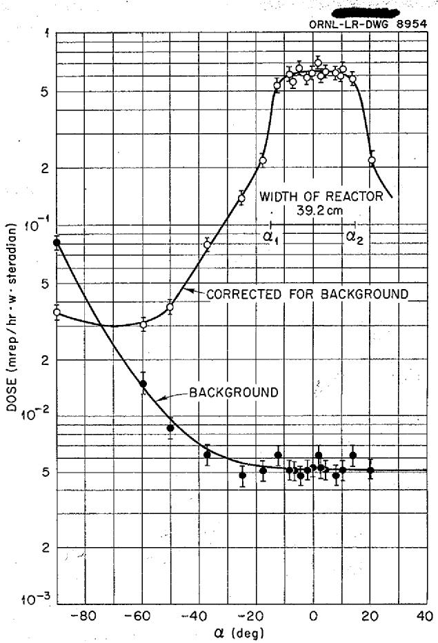  
Fig. 13.2. Angular Distribution of Fast Neutrons $(z = 70\mathrm{cm}, x = 0)$ .

The results obtained for $z = 70 \, \text{cm}$ , $x = +19.6 \, \text{cm}$ are presented in Fig. 13.3. In this case, the projected axis of the collimator at $a = 0$ just intersects the northwest corner of the active lattice. Again, only a relatively small variation in dose rate per unit solid angle is indicated over the range of angles where the collimator sees the active lattice, and there is a relatively fast variation as the collimator swings away from the active lattice.

The results for $z = 5$ cm, $x = 0$ are given in Fig. 13.4. Over the entire range of angles covered in these measurements, the collimator saw some portion of the active lattice. The variation over the entire range of angles is relatively small and is consistent with the results shown in Figs. 13.2 and 13.3. However, the error might be very large for this 5-cm measurement because of the lack of complete collimation.

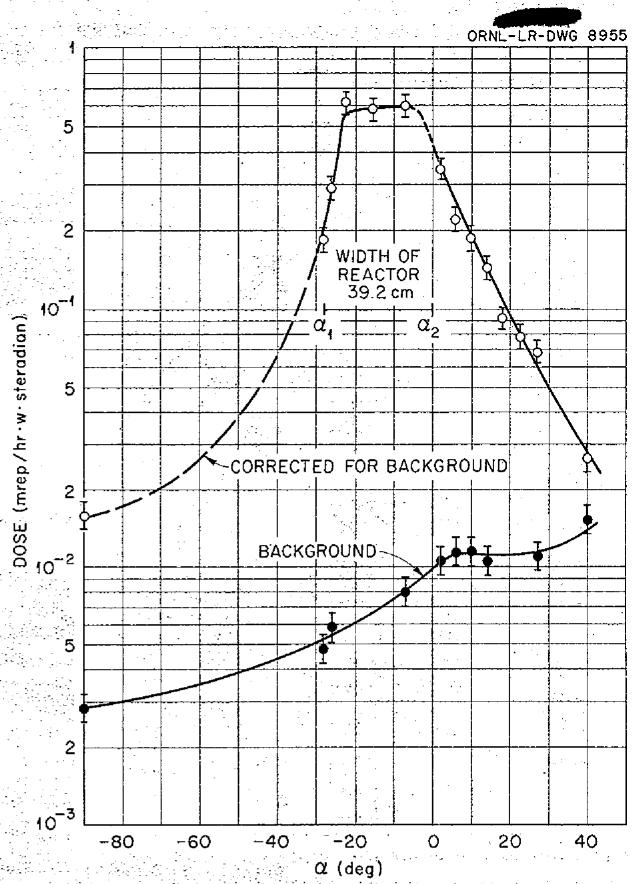  
Fig. 13.3. Angular Distribution of Fast Neutrons $(z = 70\mathrm{cm}, x = +19.6\mathrm{cm})$

An integration was made of the dose rate per unit solid angle to obtain the total dose rate indicated by the collimator measurements at $z = 70 \, \text{cm}$ . In the integration, the measurements presented in Fig. 13.2, taken in a horizontal plane, were assumed to be cylindrically symmetric. This procedure should result in an underestimate of the dose rate. The integration gives a dose of 0.49 mrep/hr·w, which is to be compared with a measured dose of 0.520 mrep/hr·w. The measurement had been made previously in the BSR with a similar loading by using a Hurst-type dosimeter.

# DECAY OF FISSION-PRODUCT GAMMA RADIATION

R.W.Peele

T. A. Love W. Zobel  
Applied Nuclear Physics Division

E. C. Campbell, Physics Division

The importance of information about the decay characteristics and photon energy spectrum of the

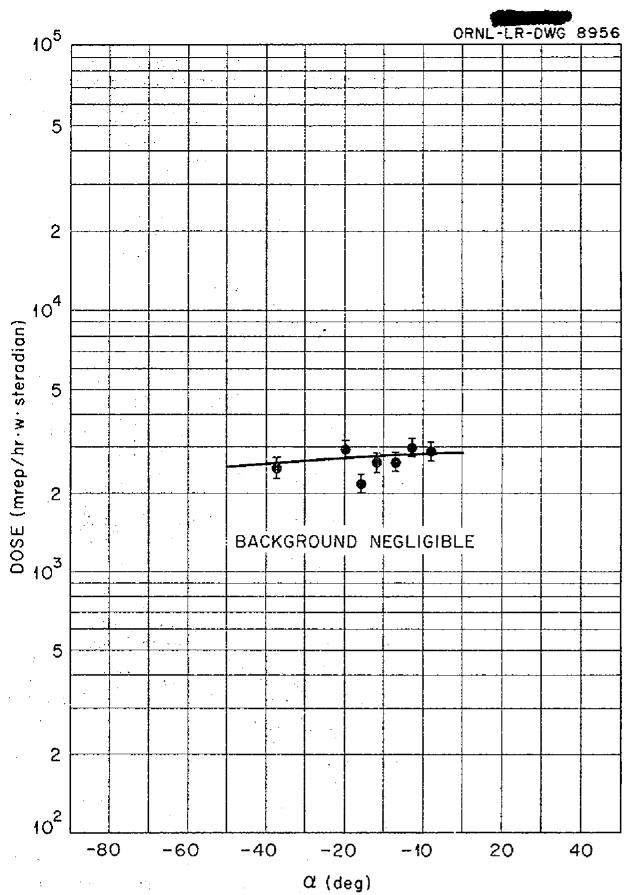  
Fig. 13.4. Angular Distribution of Fast Neutrons $(z = 5\mathrm{cm}, x = 0)$ .

gross fission products for short times after fission was discussed previously. A large share of the gamma-ray dose in a circulating-fuel reactor originates in the heat exchanger from the decay of fission products. For this reason the weight of an optimum aircraft shield depends greatly upon the decay characteristics of the fission products. One of the three experiments planned for obtaining adequate information on the spectral characteristics of the fission-product mixture as a function of time after fission has been completed, and preliminary results are presented here.

The gamma-ray decay rate as a function of time after fission was determined for times between 5 and 150 sec for six photon energy groups covering the range from 0.28 to 5.0 MeV. The experiment was performed by using the multiple-crystal gam

ma-ray spectrometer,2 the associated electronic instrumentation described previously,3 especially constructed timing devices, and the fast pneumatic probe assembly designed by E. C. Campbell. Small, enriched-uranium samples that weighed about 7 mg were irradiated in the ORNL Graphite Reactor for times ranging from 1 to 8 sec. From 10 to 50 samples were required to obtain a single decay curve. Each sample was withdrawn pneumatically in about 0.4 sec and stopped, automatically, in front of a 10-in. lead collimator that led to the multiple-crystal spectrometer. For this application the lead spectrometer shield was supplemented by a 1-ft-thick layer of LiF and paraffin in order to reduce the neutron-induced gamma-ray background. This shield makes the background counting rate entirely negligible.

The electronic instruments associated with the multiple-crystal spectrometer were arranged so that the counting rate associated with a predetermined photon energy interval was available at any given time after fission. A time analyzer recorded this counting rate as a function of time in 40 time channels. These time channels were larger for the longer times after fission so that the number of counts received in the various time channels would not vary too widely. In the phase of the experiment discussed here, the first time channel was about 1.6 sec wide, and the last was about 10 sec wide.

Photon energy calibrations were made by using $\mathsf{Hg}^{203}$ $\mathsf{Na}^{22}$ $\mathsf{Zn}^{65}$ $\mathsf{F}^{20}$ $\mathsf{Zr}^{90m}$ $\mathsf{ThC}^{\prime \prime}$ and $\mathsf{N}^{16}$ sources. Calibrations of the time analyzer were obtained by using a 60-cycle pulser.

The efficiency of the spectrometer as a function of energy must be known in order to interpret the data in terms of photons per second leaving the uranium sample. In the energy region up to 1.3 Mev, the efficiency was determined by using the absolute source strength of $\mathsf{Hg}^{203}$ , $\mathsf{Na}^{22}$ , $\mathsf{Cs}^{137}$ , $\mathsf{Nb}^{95}$ , and $\mathsf{Zn}^{65}$ calibration sources. These absolute source strengths were obtained with the calibrated high-pressure ion chamber of the ORNL Radioisotopes Control Laboratory.

The analysis of the data was straightforward, except for the problems of absolute efficiency of the spectrometer and of the absolute number of fissions occurring in the samples. For this preliminary analysis, large uncertainties were permitted in these two factors.

Although the efficiencies at energies up to 1.3 Mev were measured for this analysis, the efficiencies at higher energies were found largely by comparison with previously obtained performance data. It is therefore to be assumed that a further analysis of these data would give a slightly different result. A further difficulty arises from the wide variation of the spectrometer efficiency within a single energy group. The average efficiency was used here, but the spectrum shape within a given energy group should be used to obtain a weighted average efficiency.

The absolute normalization of the results depends upon the number of fissions in the samples, which, in turn, depends upon several doubtful quantities. For the 1-sec bombardments, the time spent by the samples in the reactor is in doubt by at least $10\%$ . The thermal flux and the macroscopic cross sections of the samples are also in doubt. The effective thermal flux available to the sample was measured by using gold foils and a cadmium-difference technique.4 Thermal cross sections were used for both the gold and $\mathsf{U}^{235}$

The basic results of the data analysis are shown in Fig. 13.5. Six energy groups were studied, but the region between 1.6 and 2.3 Mev was studied with both the Compton (two-crystal) and pair (three-crystal) spectrometers. It was expected that these curves might not agree in a preliminary analysis, because it is in the region studied that the efficiencies of either type of spectrometer vary most rapidly with photon energy. The times after fission were measured from the center of the irradiation time interval. In the pair spectrometer runs, it was necessary to use an irradiation time of 8 sec, and therefore saturation effects prejudice the first few points on these curves.

Two cross plots of Fig. 13.5 that give the photon energy spectrum as measured 20 and 150 sec after fission are presented in Fig. 13.6. The results obtained by integrating the curves of Fig. 13.5 to obtain the total energy release per

fission between 10 and 150 sec are given in Table 13.1. Because of the uncertainties mentioned, the total photons per fission and the energy

(Mev) per fission in this interval must, for the present, carry an estimated probable error of about $\pm 25\%$ .

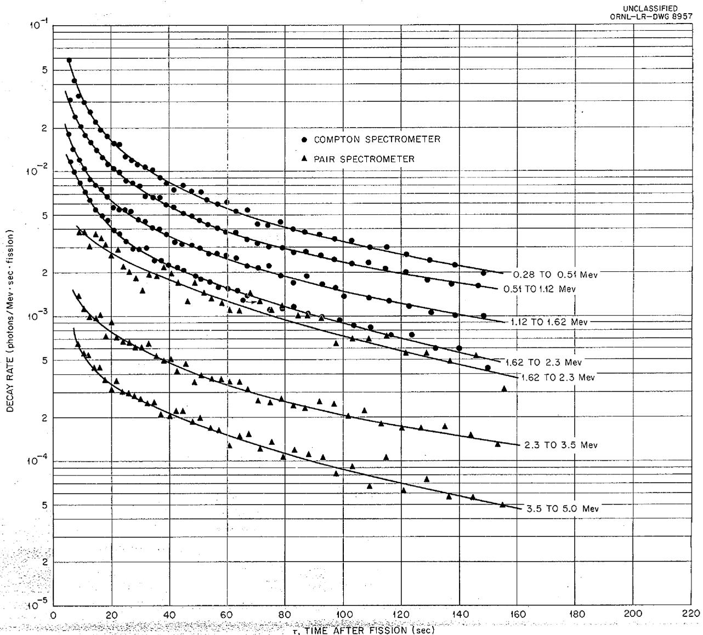  
Fig. 13.5. Fission-Product Gamma-Ray Decay Rates as a Function of Time After Fission for Six Photon Energy Groups.

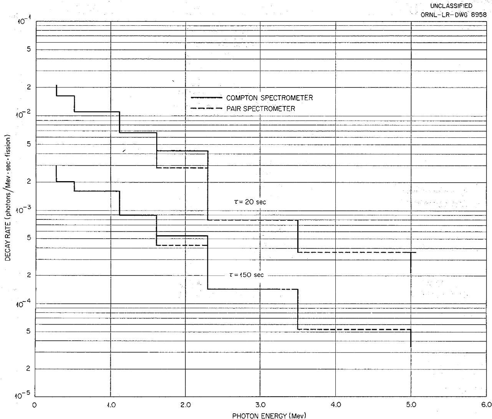  
Fig. 13.6. Histogram of the Fission-Product Photon Energy Spectrum for 20 and 150 sec After Fission.

TABLE 13.1. MEASURED VALUES OF PHOTON INTENSITY PER FISSION AND TOTAL ENERGY RELEASE PER FISSION INTEGRATED BETWEEN 10 AND 150 sec AFTER FISSION  

<table><tr><td>Energy Range (Mev)</td><td>Photons per Fission</td><td>Energy per Fission (Mev)</td><td>Energy Range (Mev)</td><td>Photons per Fission</td><td>Energy per Fission (Mev)</td></tr><tr><td colspan="3">Compton Spectrometer</td><td colspan="3">Pair Spectrometer</td></tr><tr><td>0.28 to 0.51</td><td>0.25</td><td>0.10</td><td>1.62 to 2.3</td><td>0.13</td><td>0.26</td></tr><tr><td>0.51 to 1.12</td><td>0.45</td><td>0.37</td><td>2.3 to 3.5</td><td>0.069</td><td>0.20</td></tr><tr><td>1.12 to 1.62</td><td>0.22</td><td>0.31</td><td>3.5 to 5.0</td><td>0.038</td><td>0.16</td></tr><tr><td>1.62 to 2.3</td><td>0.19</td><td>0.38</td><td>Total 0.28 to 5.0</td><td>1.19</td><td>1.46</td></tr><tr><td></td><td>Av 0.16</td><td>Av 0.32</td><td></td><td></td><td></td></tr></table>

# 14. TOWER SHIELDING FACILITY

C. E. Clifford

F. L. Keller F. N. Watson  
Applied Nuclear Physics Division

J. E. Van Hoomissen, Boeing Airplane Co.

M. F. Valerino, NACA, Cleveland

In a previous report an analysis of the fast-neutron measurements of the differential shielding experiment at the TSF was presented. In this analysis the probability of the air scattering of neutrons into the various sides of the crew-compartment shield was obtained as a function of the angle $\theta$ which a fast-neutron beam from the reactor shield surface makes with respect to the axis joining the reactor and the crew compartment. It also gave the probability of neutron penetration through the shield into the crew compartment as a function of $\theta$ . These probabilities have now been used in the development of a procedure for optimizing the neutron shielding of a divided shield for an aircraft.

A further investigation of the GE-ANP reactor and crew shield mockups was also made. Measurements of gamma-ray doses inside the crew-compartment mockup were completed, and, at present, a study of the distributions of gamma-ray intensities around the reactor shield is being made.

# PROCEDURE FOR USING TSF DATA FOR THE OPTIMIZATION OF A DIVIDED NEUTRON SHIELD

M.F.Valerino F.L.Keller

A completely optimized aircraft neutron shield would have the minimum weight that was consistent with all the design parameters. As a first step in the design of a completely optimized neutron shield, a procedure has been developed to determine, for a particular reactor and shield configuration, the shield which has the minimum weight subject to only one condition, namely, that the dose rate at the center of the crew compartment be a specified amount. In the optimization procedure developed at the TSF, the reactor shield is divided into $N$ conical shells, as shown in Fig. 14.1. The vertex of each cone is taken to be at the center of the

reactor. The radius $a$ in Fig. 14.1 is the radius of the reactor, heat exchanger, gamma shield, etc., and thus the outer radius is the sum of radius $a$ and the neutron shield thickness $T_{n}$ . The crew shield is assumed to have a rear thickness $T_{r}$ and a side thickness $T_{s}$ . For simplicity, and because of the small sacrifice in shield weight involved, the front thickness $T_{f}$ is taken to be equal to the side thickness $T_{s}$ .

The procedure consists, first, in expressing both the total weight of the neutron shield and the dose rate at the center of the crew compartment as functions of $T_{n'}$ , $T_{r'}$ and $T_{s'}$ ; second, of using the method of Lagrange multipliers to obtain the equations which $T_{n'}$ , $T_{r'}$ and $T_{s}$ must satisfy in order that the weight be a minimum for a specified total dose rate; and third, of developing an iterative procedure for the solution of these equations.

# Calculation of Shield Weight

The weight, $W_{n'}$ of the neutron shielding material included in the $n$ th conical shell at the reactor is given by

(1)

$$
\begin{array}{l} W _ {n} = \frac {2 \pi \rho_ {R}}{3} \left(\cos \theta_ {n ^ {\prime}} - \cos \theta_ {n ^ {\prime \prime}}\right) \left[ \left(T _ {n} + a\right) ^ {3} - a ^ {3} \right] \\ = \frac {A (\theta_ {n})}{3} [ (T _ {n} + a) ^ {3} - a ^ {3} ], \\ \end{array}
$$

where $\rho_{R}$ is the density of the shielding material at the reactor; the angles $\theta_{n},\theta_{n}^{\prime},$ and $\theta_{n}$ for the nth conical shell are identified in Fig. 14.1. The total weight of shielding material at the reactor is thus

$$
W _ {R} = \sum_ {n = 1} ^ {N} W _ {n}, \quad n = 1, 2, \dots , N. \tag {2}
$$

The model assumed for the cylindrically shaped crew compartment is also shown in Fig. 14.1. The

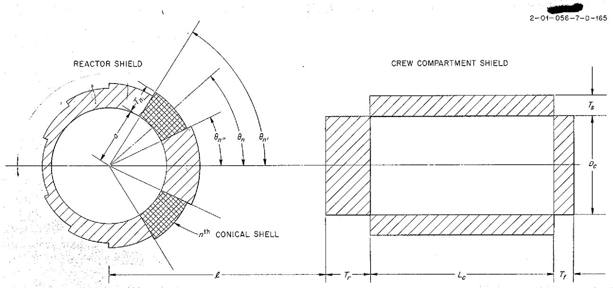

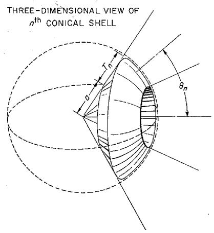  
Fig. 14.1. Divided Neutron Shield Model Used for Optimization Calculation.

weight, $W_{cs'}$ of such a crew shield is given by

(3) $W_{cs} = \frac{\pi\rho_{cs}}{4}\left\{D_c^2 (T_r + T_s)\right.$

$$
+ \left. \left\lbrack (D _ {c} + 2 T _ {s}) ^ {2} - D _ {c} ^ {2} \right\rbrack L _ {c} \right\},
$$

where $\rho_{cs}$ is the density of the shielding material used at the crew compartment; $D_{c}$ and $L_{c}$ are defined in Fig. 14.1. The total weight of the neutron shielding material is thus

(4) $W_{\text{total}} = W_R + W_{cs}$ .

# Calculation of Dose Rate

Let $D_{d}(a,\ell)$ be the direct-beam dose rate at a distance $\ell$ ft from the unshielded $(T_{n} = 0)$ sphere of radius $a$ . The dose rate at a distance $\ell$ ft for a uniform shielding thickness $T_{n}$ is then given by

$$
D _ {d} \left(a, \ell\right) e ^ {- \int_ {0} ^ {T _ {n}} \left(1 / \lambda_ {d}\right) d t}, \tag {5}
$$

where $\lambda_{d^{\prime}}$ the direct-beam relaxation length, is a function of $t$ (dt is the increment of $T_{n}$ ). The rate at which the dose is scattered to the side of the

crew compartment from a conical shell is given by

$$
\int_ {\cos \theta_ {n} ^ {\prime \prime}} ^ {\cos \theta_ {n} ^ {\prime}} D _ {d} ^ {\prime} P _ {s i d e} ^ {S} (\theta) d (\cos \theta), \tag {6}
$$

where $D_{d}^{\prime}$ is the dose rate at the surface of a hypothetical unit sphere at the reactor and $P_{\text{side}}^{s}(\theta)$ is the probability of scattering into the crew compartment side from a conical-shell beam, as determined from the TSF differential experiments. In the present case

$$
D _ {d} ^ {\prime} = \ell^ {2} D _ {d} (a, \ell) e ^ {- \int_ {0} ^ {T _ {n}} (\mathrm {I} / \lambda_ {d}) d t}. \tag {7}
$$

Thus, if $P_{\text{side}}^s(\theta)$ is considered to be constant over a given conical shell, the integration gives the rate at which the dose is scattered to the side of the crew compartment from the $n$ th conical shell as

$$
\begin{array}{l} \left(\cos \theta_ {n} ^ {\prime} - \cos \theta_ {n} ^ {\prime \prime}\right) D _ {d} (a, l) \times \tag {8} \\ \times e ^ {- \int_ {0} ^ {T _ {n}} (1 / \lambda_ {d}) d t} \ell^ {2} P _ {\text {s i d e}} ^ {s} (\theta_ {n}). \\ \end{array}
$$

The contribution to the dose rate at the center of the crew compartment by neutrons which leave the nth conical shell and scatter into the side of the crew compartment is given by

$$
\begin{array}{l} D _ {n} ^ {s, s i d e} = \left(\cos \theta_ {n} ^ {\prime} - \cos \theta_ {n} ^ {\prime \prime}\right) \times \\ \times D _ {d} (a, \ell) e ^ {- \int_ {0} ^ {T _ {n}} (1 / \lambda_ {d}) d t} \times \\ \times \ell^ {2} P _ {\text {s i d e}} ^ {s} \left(\theta_ {n}\right) f _ {s} ^ {s} e ^ {- \int_ {0 ^ {\prime}} ^ {T _ {s}} \left(1 / \lambda_ {s} ^ {s}\right) d x}, \\ \end{array}
$$

where $\lambda_{s}^{s}$ , which is a function of $\theta_{n'} T_{n'}$ and $x$ ( $dx$ is the increment of $T_{s}$ ), is the relaxation length for the scattered dose at the side of the crew box, and $f_{s}^{s}$ is the "focusing factor" for the side-scattered radiation. The "focusing factor"2 accounts for the radiation focusing in the center of the crew compartment and depends on the angular

distribution of the radiation, at the inside surface of the crew-compartment side shield.

An expression similar to Eq. 9 holds for the contribution to the dose rate at the center of the crew compartment by neutrons which leave the $n$ th conical shell at the reactor and scatter into the rear of the crew compartment. This expression is

$$
\begin{array}{l} D _ {n} ^ {s, \text {r e a r}} = \left(\cos \theta_ {n} ^ {\prime} - \cos \theta_ {n} ^ {\prime \prime}\right) \times \\ \times D _ {d} (a, \ell) e ^ {- \int_ {0} ^ {T _ {n}} (1 / \lambda_ {d}) d t} \times \\ \times \ell^ {2} P _ {\text {r e a r}} ^ {s} \left(\theta_ {n}\right) f _ {s} ^ {r} e ^ {- \int_ {0} ^ {T _ {r}} \left(1 / \lambda_ {s} ^ {r}\right) d y}, \\ \end{array}
$$

where $\lambda_{s'}^r$ which is a function of $\theta_{n'} T_{n'}$ and $y$ (dy is the increment of $T_{r}$ ), is the relaxation length for the scattered dose at the rear of the crew compartment. The factor $f_{s}^{r}$ accounts for a decrease in the dose rate at the center of the crew compartment caused by the angular distribution of the neutrons leaving the inside surface of the shield at the rear of the crew compartment.

Finally, the dose entering as a direct beam from the reactor through the rear of the crew compartment shield must be considered. Let the angular distribution of dose from an element of area at the surface of the reactor shield be of the form $\cos^m\psi$ where $\psi$ denotes the angle between the normal to the surface element and a given direction. If it is assumed that the separation distance between the reactor and crew shield is large compared with the outer radius of the reactor shield and that the nth conical shell is in the hemisphere toward the crew compartment, it may be shown that the contribution of the nth shell to the direct-beam dose arriving at the rear of the crew compartment is given by

$$
\begin{array}{l} \left(\cos^ {m + 1} \theta_ {n ^ {\prime}} - \cos^ {m + 1} \theta_ {n ^ {\prime \prime}}\right) \times \tag {11} \\ \times D _ {d} (a, \ell) e ^ {- \int_ {0} ^ {T _ {n}} (1 / \lambda_ {d}) d t}. \\ \end{array}
$$

If the shell is in the hemisphere away from the crew compartment, the contribution of the shell to the direct-beam dose is zero. If the nth conical shell is in the hemisphere toward the reactor, the rate at which the direct-beam dose leaves this

shell and arrives at the center of the crew compartment is given by

$$
D _ {n} ^ {d, \text {r e a r}} = \left(\cos^ {m + 1} \theta_ {n} ^ {\prime} - \cos^ {m + 1} \theta_ {n} ^ {\prime \prime}\right) D _ {d} (a, l) e ^ {- \int_ {0} ^ {T _ {n}} \left(1 / \lambda_ {d}\right) d t} f _ {d} ^ {r} e ^ {- \int_ {0} ^ {T _ {r}} \left(1 / \lambda_ {d} ^ {r}\right) d y}, \tag {12}
$$

where $\lambda_{d}^{r}$ , the relaxation length for the direct-beam dose at the rear of the crew compartment, is a function of $T_{n}$ and $y$ . The factor $f_{d}^{r}$ accounts for the decrease in dose rate of the direct beam at the center of the crew compartment caused by the angular distribution of the direct-beam neutrons leaving the inside surface of the rear of the crew compartment. If the nth conical shell is in the hemisphere away from the crew compartment, then $D_{n}^{d,r_{\text{ear}}} = 0$ . The rate at which the total dose arrives at the center of the crew compartment is therefore

$$
\begin{array}{l} D _ {\text {t o t a l}} \tag {13} \\ = \sum_ {n = 1} ^ {N} \left(D _ {n} ^ {s, s i d e} + D _ {n} ^ {s, r e a r} + D _ {n} ^ {d, r e a r}\right). \\ \end{array}
$$

$T_{r}, T_{s}$ , and $\mathfrak{L}$ (Lagrange multiplier):

$$
\frac {\partial W _ {\text {t o t a l}}}{\partial T _ {n}} + \frac {1}{\mathbb {L}} \quad \frac {\partial D _ {\text {t o t a l}}}{\partial T _ {n}} = 0, n = 1, 2, \dots , N,
$$

$$
\begin{array}{l} \frac {\partial W _ {\text {t o t a l}}}{\partial T _ {r}} + \frac {1}{\zeta} \frac {\partial D _ {\text {t o t a l}}}{\partial T _ {r}} = 0, \tag {14} \\ \frac {\partial W _ {\text {t o t a l}}}{\partial T _ {s}} + \frac {1}{\mathbb {L}} \frac {\partial D _ {\text {t o t a l}}}{\partial T _ {s}} = 0, \\ \end{array}
$$

$$
D _ {\text {t o t a l}} = C (\text {s p e c i f i e d c o n s t a n t}).
$$

For the calculation it is convenient to attach a subscript to the $\mathfrak{L}$ involved in each equation, but it must be remembered that, for an exact solution, all the $\mathfrak{L}$ 's must be the same. When this is done and the differentiation indicated in Eq. 14 is carried out, the following $(N + 2)$ equations for the $\mathfrak{L}$ 's are obtained:

$$
\begin{array}{l} \mathcal {L} _ {n} = - \frac {\partial D _ {\text {t o t a l}} / \partial T _ {n}}{\partial W _ {\text {t o t a l}} / \partial T _ {n}} = \frac {D _ {n} ^ {s , s i d e} + D _ {n} ^ {s , r e a r} + D _ {n} ^ {d , r e a r}}{\lambda_ {a} A \left(\theta_ {n}\right) \left(T _ {n} + a\right) ^ {2}}, \quad n = 1, 2, \dots , N, \\ \mathbb {L} _ {s} = - \frac {\partial D _ {\text {t o t a l}} / \partial T _ {s}}{\partial W _ {\text {t o t a l}} / \partial T _ {s}} = \frac {1}{\partial W _ {\text {t o t a l}} / \partial T _ {s}} \sum_ {n = 1} ^ {N} \frac {D _ {n} ^ {s , s i d e}}{\lambda_ {s} ^ {s}}, (16) \\ \mathfrak {L} _ {r} = - \frac {\partial D _ {\text {t o t a l}} / \partial T _ {r}}{\partial W _ {\text {t o t a l}} / \partial T _ {r}} = \frac {1}{\partial W _ {\text {t o t a l}} / \partial T _ {r}} \sum_ {n = 1} ^ {N} \left(\frac {D _ {n} ^ {s , r e a r}}{\lambda_ {s} ^ {r}} + \frac {D _ {n} ^ {d , r e a r}}{\lambda_ {s} ^ {r}}\right). (17) \\ \end{array}
$$

# Calculation of Minimum Shield Weight for Specified Dose

The thicknesses $T_{n}, T_{r},$ and $T_{s}$ are considered as parameters whose values are to be determined so that $W_{\text{total}}$ is a minimum when $D_{\text{total}}$ is a specified dose rate. By the method of Lagrange multipliers, this amounts to solving the following $(N + 3)$ simultaneous equations for the $N$ values of $T_{n}$ and for

The complexity of the system of equations derived above requires an iterative mode of solution, and a procedure was desired that converged rapidly enough for the solution to be accomplished in a reasonable length of time by hand calculation. A satisfactory procedure was devised and is described below in a detailed, stepwise fashion.

Step a. Equations 16 and 17, with the condition $\mathbb{C}_r = \mathbb{C}_s = \mathbb{C}$ , are combined to relate $\mathbb{C}$ to the speci-

fied dose rate, $D_{\text{total}}$ (given by Eq. 13), and to appropriately averaged relaxation lengths. Included in this relationship are the shield-weight partial derivatives with respect to $T_r$ and $T_{s'}$ which are known functions for a given crew-compartment size. These steps are shown below in equation form.

If the following definitions are made,

$$
\frac {1}{\overline {{\lambda_ {s} ^ {s}}}} \equiv \frac {\sum_ {n = 1} ^ {N} D _ {n} ^ {s , s i d e} / \lambda_ {s} ^ {s}}{\sum_ {n = 1} ^ {N} D _ {n} ^ {s , s i d e}},
$$

(18)

$$
\frac {1}{\overline {{\lambda_ {s} ^ {r}}}} \equiv \frac {\sum_ {n = 1} ^ {N} D _ {n} ^ {s , r e a r} / \lambda_ {s} ^ {r}}{\sum_ {n = 1} ^ {N} D _ {n} ^ {s , r e a r}},
$$

then Eqs. 16 and 17 may be combined to give

$$
\begin{array}{l} \left. \overline {{\lambda_ {s} ^ {s}}} \frac {\partial W _ {\text {t o t a l}}}{\partial T _ {s}} \right. \tag {19} \\ + \overline {{\lambda_ {s} ^ {r}}} \frac {\partial W _ {\text {t o t a l}}}{\partial T _ {r}} \mathbb {L} _ {r} = D _ {\text {t o t a l}} X _ {d}, \\ \end{array}
$$

(22)

$$
\frac {\mathbb {L} _ {r}}{\mathbb {L} _ {s}} = 1 = \frac {\partial W _ {\text {t o t a l}} / \partial T _ {s}}{\partial W _ {\text {t o t a l}} / \partial T _ {r}} \frac {\overline {{\lambda_ {s} ^ {s}}}}{\overline {{\lambda_ {s} ^ {r}}}} \frac {\sum_ {n = 1} ^ {N} \left[ D _ {n} ^ {s , r e c} + \left(\lambda_ {s} / \lambda_ {d}\right) D _ {n} ^ {s , r e c} \right]}{\sum_ {n = 1} ^ {N} D _ {n} ^ {s , s i d e}}.
$$

Equation 21 gives $\mathfrak{L}$ in terms of quantities which are either specified or determined from the previous iteration. For the first iteration, fairly accurate estimates can be made of the values of the quantities in Eq. 21. Since $D_{n}^{d,\text{rear}} \ll D_{\text{total}}$ and $\lambda_s^r / \lambda_d^r \sim 1$ , $X_d$ will be approximately equal to 1. Also, $\partial W_{\text{total}} / \partial T_r$ is a constant and $\partial W_{\text{total}} / \partial T_s$ varies only slowly with $T_s$ for a reasonable crew-compartment size. The relaxation lengths $\lambda_s^s$ and $\lambda_s^r$ can be chosen to be equal to some average values from the TSF data to within about $\pm 25\%$ accuracy. Hence, in the first iteration, a reasonably good estimate of $\mathfrak{L}$ is obtained.

Step b. Equation 17 divided by Eq. 16 and combined with the condition $\mathbb{L}_r = \mathbb{L}_s$ gives a relationship between $T_r$ and $T_s$ that involves appropriately averaged relaxation lengths and three basic parameters. One parameter involves the relative rate of shield weight change with respect to the rear of the side shield thicknesses at the crew compartment. The second parameter is the ratio of the total air-scattered dose into the rear to that into the side of the crew compartment. The third parameter is closely related to the ratio of the total direct-beam dose at the rear to the total air-scattered dose at the side of the crew compartment.

In detail, the relationship discussed above is obtained in the following manner. If Eq. 17 is divided by Eq. 16 and the definitions for $\lambda_s^s$ and $\lambda_s^r$ given by Eq. 18 are used, there results

where

$$
X _ {d} = 1 + \sum_ {n = 1} ^ {N} \left(\frac {\overline {{\lambda_ {s} ^ {r}}}}{\lambda_ {d} ^ {r}} - 1\right) \frac {D _ {n} ^ {d , r e a r}}{D _ {\text {t o t a l}}} \tag {20}
$$

For an exact solution, $\mathbb{L}_s = \mathbb{L}_r = \mathbb{L}$ , and, hence,

$$
\mathbb {C} = \frac {\bar {D} _ {\text {t o t a l}} X _ {d}}{\bar {\lambda_ {s} ^ {s}} (\partial W _ {\text {t o t a l}} / \partial T _ {s}) + \bar {\lambda_ {s} ^ {r}} (\partial W _ {\text {t o t a l}} / \partial T _ {r})}. \tag {21}
$$

Let

$$
\begin{array}{l} B _ {n} \equiv (\cos \theta_ {n ^ {\prime}} - \cos \theta_ {n ^ {\prime \prime}}) \ell^ {2} P _ {\text {s i d e}} ^ {s} \left(\theta_ {n}\right) f _ {s} ^ {s}, \\ C _ {n} \equiv (\cos \theta_ {n ^ {\prime}} - \cos \theta_ {n ^ {\prime \prime}}) \ell^ {2} P _ {\text {r e a r}} ^ {s} (\theta_ {n}) f _ {s} ^ {r}, \\ J _ {n} \equiv (\cos^ {m + 1} \theta_ {n}, - \cos^ {m + 1} \theta_ {n}) f _ {d} ^ {r}, \tag {23} \\ \alpha \equiv \frac {\partial W _ {\text {t o t a l}} / \partial T _ {s}}{\partial W _ {\text {t o t a l}} / \partial T _ {r}} \frac {\overline {{\lambda_ {s} ^ {s}}}}{\overline {{\lambda_ {s} ^ {r}}}}, \\ \end{array}
$$

and define new quantities $\overline{\lambda_s^s},\overline{\lambda_s^r}$ and $\overline{\lambda_d^r}$ by

$$
e ^ {- T _ {s} \overline {{\overline {{\lambda_ {s} ^ {s}}}}}} \equiv \frac {\sum_ {n = 1} ^ {N} B _ {n} e ^ {- \int_ {0} ^ {T _ {n}} (1 / \lambda_ {d}) d t} e ^ {- \int_ {0} ^ {T _ {s}} (1 / \lambda_ {s} ^ {s}) d x}}{\sum_ {n = 1} ^ {N} B _ {n} e ^ {- \int_ {0} ^ {T _ {n}} (1 / \lambda_ {d}) d t}},
$$

(24)

$$
e ^ {- T _ {r} / \overline {{\lambda_ {d} ^ {r}}}} \equiv \frac {\sum_ {n = 1} ^ {N} \left(J _ {n} / \lambda_ {d} ^ {r}\right) e ^ {- \int_ {0} ^ {T _ {n}} \left(1 / \lambda_ {d}\right) d t} e ^ {- \int_ {0} ^ {T _ {r}} \left(1 / \lambda_ {d} ^ {r}\right) d y}}{\sum_ {n = 1} ^ {N} \left(J _ {n} / \lambda_ {d} ^ {r}\right) e ^ {- \int_ {0} ^ {T _ {n}} \left(1 / \lambda_ {d}\right) d t}}.
$$

Equations 9, 10, and 12 are substituted into Eq. 22, and, then, by using the definitions given in Eqs. 23 and 24, Eq. 22 can be rewritten as

$$
\begin{array}{l} \frac {1}{a} e ^ {- T _ {s} / \overline {{\lambda_ {s} ^ {s}}}} = \left[ \begin{array}{c} N \\ \sum_ {n = 1} ^ {N} C _ {n} e ^ {- \int_ {0} ^ {T _ {n}} (1 / \lambda_ {d}) d t} \\ \hline \sum_ {n = 1} ^ {N} B _ {n} e ^ {- \int_ {0} ^ {T _ {n}} (1 / \lambda_ {d}) d t} \end{array} \right] e ^ - T _ {r} / \overline {{\lambda_ {s} ^ {r}}} \\ + \left[ \begin{array}{c} \lambda_ {s} ^ {r} \sum_ {n = 1} ^ {N} \left(J _ {n} / \lambda_ {d} ^ {r}\right) e ^ {- \int_ {0} ^ {T _ {n}} (1 / \lambda_ {d}) d t} \\ \hline \sum_ {n = 1} ^ {N} B _ {n} e ^ {- \int_ {0} ^ {T _ {n}} (1 / \lambda_ {d}) d t} \end{array} \right] e ^ {- T _ {r} / \overline {{\lambda_ {d} ^ {r}}}}. \\ \end{array}
$$

Equation 25 relates $T_r$ and $T_s$ in terms of the various averaged relaxation lengths and the three parameters whose physical significances are discussed above. The first parameter discussed above is the quantity $\alpha$ in Eq. 25. The second parameter is the left bracketed term at the right side of Eq. 25, and the third parameter is the right bracketed term. In a given iteration the parameters and averaged relaxation lengths are evaluated on the basis of the information obtained in the previous iteration. In the first iteration, $\overline{\lambda_s^s}$ is taken to be the same constant as that used for $\overline{\lambda_s^s}$ in Step $\alpha$ , etc. Also, for the first iteration, the reactor shield is taken to be of an unspecified uniform thickness ( $T_n = \alpha$ constant for all $n$ ), in which case the bracketed terms in Eq. 25 reduce to

$$
\frac {\sum_ {n = 1} ^ {N} C _ {n}}{\sum_ {n = 1} ^ {N} B _ {n}} \text {a n d} \frac {\overline {{\lambda_ {s} ^ {r}}} \sum_ {n = 1} ^ {N} J _ {n}}{\overline {{\lambda_ {d} ^ {r}}} \sum_ {n = 1} ^ {N} B _ {n}}.
$$

Hence, in a given iteration, a plot can be made of $T_r$ vs $T_{s'}$ , which, upon convergence to the required solution, is the relation which $T_r$ and $T_{s'}$ must satisfy in the vicinity of the solution to obtain equal values of $\mathfrak{L}$ . For convenience, this relationship is designated by

$$
T _ {s} = Q \left(T _ {r}\right). \tag {26}
$$

Step c. Relationships are also to be obtained between $T_{s}$ and the various $T_{n}$ 's. If use is made of Eqs. 9, 10, and 12 and of the definitions given by Eq. 23, then Eq. 15 can be rearranged as follows:

$$
\frac {D _ {d} (a , \ell) e ^ {- \int_ {0} ^ {T _ {n}} \left(1 / \lambda_ {d}\right) d t}}{\lambda_ {d} \left(T _ {n} + a\right) ^ {2}} \tag {27}
$$

In Eq. 27, $\mathfrak{L}_n$ is set equal to $\mathfrak{L}$ , as previously determined in Step a, Eq. 21. By using the values of $\lambda$ that are consistent with the results of the previous iteration, the right side of Eq. 27 is calculated for each $n$ ( $n = 1, 2, \ldots, N$ ) for various assigned values of $T_s$ . From a plot of the left side of Eq. 27 vs $T_n$ , the values of $T_n$ corresponding to each assigned value of $T_s$ are then obtained. Hence, plots can be made of $T_n$ vs $T_s$ for each $n$ .

Step d. For various assumed values of $T_{s'}$ values of $T_{n}$ are obtained from the plots made in Step c. These values are then inserted into Eq. 16, with use being made of Eq. 9 and the definitions given by Eq. 23 to compute the $\mathbb{L}_s$ for each $T_{s}$ . A plot is then made of $\mathbb{L}_s$ vs $T_{s}$ . The value of $T_{s}$ for which the corresponding $\mathbb{L}_s$ is equal to the value of $\mathbb{L}$ determined in Step a, Eq. 21, is the required $T_{s}$ for the given iteration. The corresponding values of the $T_r$ and $T_{n}$ 's, for the given iteration, are then obtained from the plots made in Steps b and c. By using the above-described procedure, the various shield thicknesses $T_{s'}$ , $T_{r'}$ , and $T_{n}$ for $n = 1, 2, \ldots, N$ are determined in a given iteration. The entire procedure is repeated for the following iteration, and the iterations are continued until convergence is obtained.

# Application of TSF Data

The following fundamental quantities must be known as functions of the pertinent variables involved in order to carry out the neutron shield optimization calculations:

1. the fast-neutron-dose air-scattering probabilities, $\ell^2 P_{\text{side}}^s (\theta)$ and $\ell^2 P_{\text{rear}}^s (\theta)$ ,   
2. the relaxation lengths $\lambda_{d^{\prime}},\lambda_{d^{\prime}}^{r},\lambda_{s^{\prime}}^{r}$ and $\lambda_{s^{\prime}}^{s}$   
3. the focusing factor $f_{s}^{s}$ and the geometrical attenuation factors $f_{d}^{r}$ and $f_{s'}^{r}$

$$
= \frac {\mathbb {C} _ {n} A (\theta_ {n})}{B _ {n} e ^ {- \int_ {0} ^ {T _ {s}} (1 / \lambda_ {s} ^ {s}) d x} + C _ {n} e ^ {- \int_ {0} ^ {Q (T _ {s})} (1 / \lambda_ {s} ^ {r}) d y} + J _ {n} e ^ {- \int_ {0} ^ {Q (T _ {s})} (1 / \lambda_ {d} ^ {r}) d y}}.
$$

4. the angular distribution of the fast-neutron dose at the surface of the reactor primary shield.

Information concerning these fundamental quantities was obtained in Phase I of the TSF differential shielding experiments. However, there are some gaps that require extension of the existing data for the present calculations. In some cases, limited, but appropriate, data were available to indicate a reasonable means for extension. Also, the extension was guided by qualitative theoretical considerations of the attenuation processes involved. For some cases, no reliable extension of the data was possible, and these limitations in the use of the data will be indicated. It should be noted that the required data can be obtained by further experiments and analyses at the TSF of

the attenuation processes involved.

Plots of $\ell^2 P_{\text{side}}^s (\theta)$ and $\ell^2 P_{\text{rear}}^s (\theta)$ as functions of $\theta$ are given in Figs. 14.2 and 14.3, respectively. These plots apply for a reactor-to-crew-compartment separation distance, $\ell$ , of 64 ft and for sea-level altitude - the conditions of the experiments. At other separation distances and altitudes, it is necessary to apply corrections; corrections indicated by single air-scattering theory will probably be adequate for the present calculations. Rigorously, the air-scattering probabilities in Figs. 14.2 and 14.3 apply only for fast-neutrons filtered through $45~\mathrm{cm}$ of water at the reactor shield, that is, for $T_{n} = 45~\mathrm{cm}$ . However, limited data obtained for $T_{n} = 15~\mathrm{cm}$ (for which the fast-neutron spectrum is expected to be quite different from that for $T_{n} = 45~\mathrm{cm}$ ) indicate that the effect of the spectrum

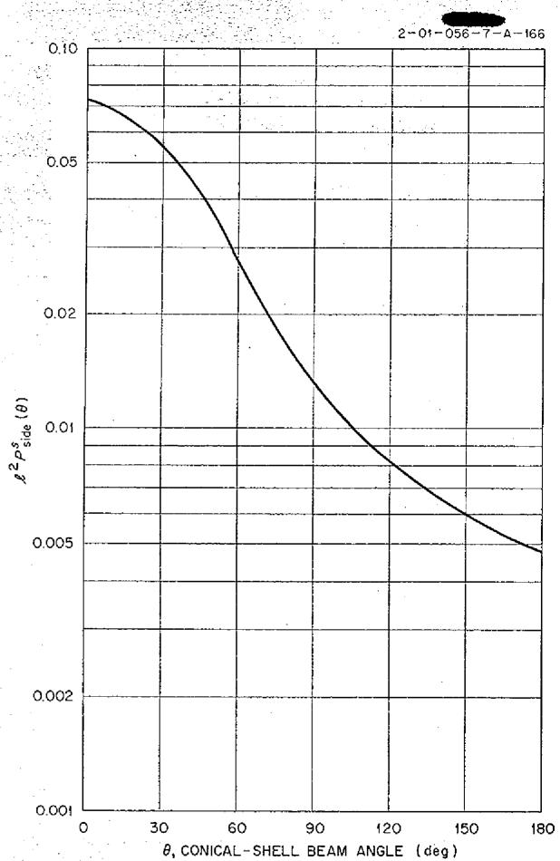  
Fig. 14.2. Probability of Fast-Neutron Dose Scattering from Conical-Shell Beam to Crew-Compartment Side as Obtained from TSF Experiments ( $T_{n} = 45 \, \text{cm}, l = 64 \, \text{ft}$ ).

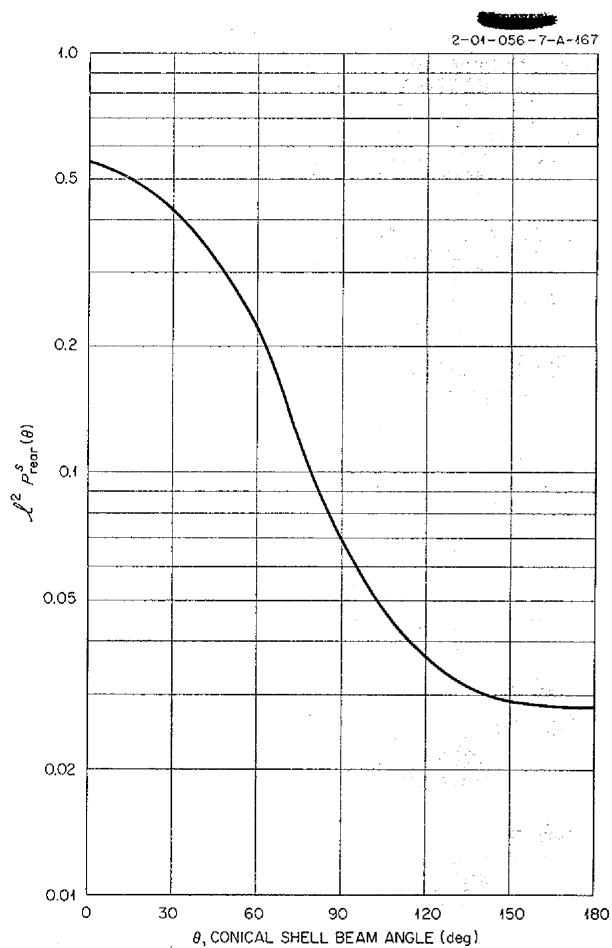  
Fig. 14.3. Probability of Fast-Neutron Dose Scattering from Conical-Shell Beam to Rear of Crew Compartment as Obtained from TSF Experiments ( $T_{n} = 45 \, \text{cm}, \ell = 64 \, \text{ft}$ ).

shift is relatively small. Hence, the air-scattering probabilities plotted in Figs. 14.2 and 14.3 were taken, in the present calculations, to be independent of the energy spectrum of the neutrons emanating from the reactor shield (that is, independent of $T_{n}$ ). Also, values of $\ell^{2}P_{\text{rear}}^{s}(\theta)$ were measured only in the range of angles, $\theta = 90$ to 180 deg, wherein the direct-beam dose at the rear of the simulated crew compartment was small compared with the air-scattered dose. The values of $\ell^{2}P_{\text{rear}}^{s}(\theta)$ in Fig. 14.3 are extrapolated values in the range of angles from 0 to 90 deg, the extrapolation being guided by the variation of $\ell^{2}P_{\text{side}}^{s}(\theta)$ measured for this range of angles.

The TSF measurements show that the relaxation length for the direct-beam fast-neutron dose is a function of the total water thickness between the reactor and the dose detector at the rear of the crew compartment; that is, the relaxation length is independent of whether the water is at the reactor or at the rear of the crew compartment. A plot of the direct-beam relaxation length vs the total water thickness is given in Fig. 14.4, and from this plot the direct-beam relaxation length, $\lambda_{d}$ , at any point in the reactor water shield can be obtained. In addition, this plot gives the direct-beam relaxation length $\lambda_{d}^{r}$ at the water shield at

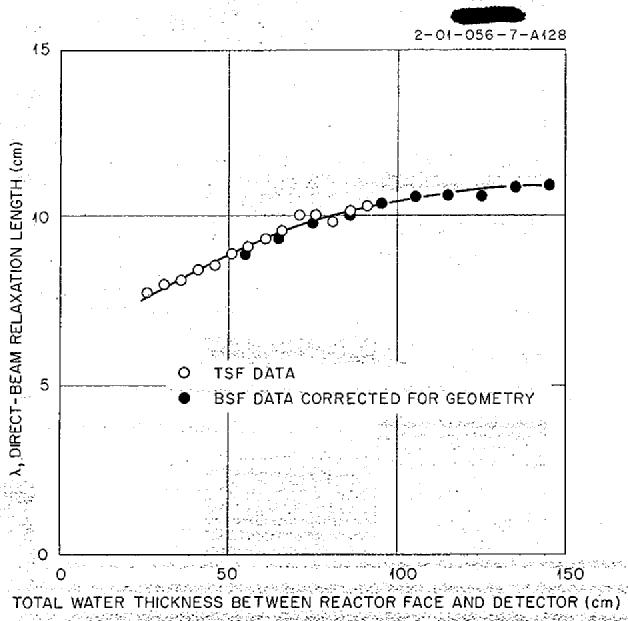  
Fig. 14.4. Direct-Beam Relaxation Length $(\lambda)$ for Fast-Neutron Dose.

the rear of the crew compartment for direct-beam radiation emanating from the nth conical shell of the reactor shield; the water thickness to be used in the plot is the shell thickness, $T_{n'}$ plus the distance in the water at the rear of the crew-compartment shield at which the relaxation length, $\lambda_{d'}^{r}$ is desired. If plastic, instead of water, is used as the crew-compartment shielding material, the values of $\lambda_{d'}^{r}$ taken from Fig. 14.4 should be divided by 1.14 (based on removal cross sections).

In the TSF experiments, the scattered-dose relaxation lengths, $\lambda_{s}^{s}$ at the side of the crew-compartment shield were obtained as functions of water thickness at the side for various values of the angle $\theta$ . In these measurements, the fast neutrons were filtered through $45~\mathrm{cm}$ of water at the reactor, that is, $T_{n} = 45~\mathrm{cm}$ . Plots of $\lambda_{s}^{s}(45,x)$ vs $x$ for various angles $\theta$ are presented in Fig. 14.5, where $\lambda_{s}^{s}(45,x)$ is the $\lambda_{s}^{s}$ measured at water thickness $x$ into the side of the crew-compartment shield for fast neutrons filtered through $45~\mathrm{cm}$ of water ( $T_{n} = 45~\mathrm{cm}$ ). For the neutron shield calculations, it is necessary to know the variation of $\lambda_{s}^{s}$ with reactor shield thickness, $T_{n}$ . A limited amount of data obtained for $T_{n} = 15~\mathrm{cm}$ , when compared with the data for $T_{n} = 45~\mathrm{cm}$ , indicates that $\lambda_{s}^{s}$ varies with $T_{n}$ in the same ratio as does the direct-beam relaxation length, $\lambda_{d}$ . This relationship is reasonable in view of the small

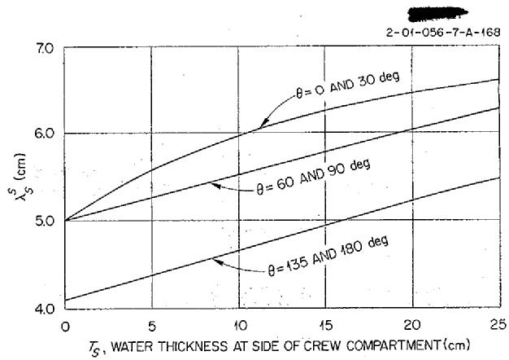  
Fig. 14.5. Relaxation Length for Fast-Neutron Dose Scattered to the Crew-Compartment Side Shield from a Conical-Shell Beam as a Function of Water Thickness at the Crew-Compartment Side for Various Values of the Angle $\theta$ ( $T_{n} = 45\mathrm{cm}$ , $l = 64\mathrm{ft}$ ).

neutron energy degradation that results from a neutron collision with air nuclei. The results of some dose measurements at the center of a crew-compartment mockup at $\theta = 90$ deg further indicate the general validity of this relation. For a total neutron attenuation through the crew-compartment side shield of the order of $e^5$ , the neutron attenuation calculated for $T_{n} = 15~\mathrm{cm}$ on the basis of the foregoing relationship, and the $\lambda_s^s$ values for $T_{n} = 45$ cm checked with the measured attenuation to within $30\%$ . Hence, the foregoing relationship, written in equation form,

$$
\lambda_ {s} ^ {s} \left(T _ {n}, x\right) = \frac {\lambda_ {s} ^ {s} (4 5 , x)}{\lambda_ {d} (4 5 + x)} \lambda_ {d} \left(T _ {n} + x\right), \tag {28}
$$

was used in the calculations. In Eq. 28, $\lambda_s^s (T_{n},x)$ is the $\lambda_s^s$ at water depth $x$ into the crew-compartment side shield for those fast neutrons emanating from the reactor shield conical shell of thickness $T_{n}$ ; $\lambda_d(T_n + x)$ is the $\lambda_d$ at total water thickness equal to $T_{n} + x$ .

The relaxation lengths, $\lambda_{s'}^r$ for the air-scattered dose at the crew-compartment rear shield were measured for $T_{n} = 45\mathrm{cm}$ over a range of values of $\theta$ from 90 to 180 deg. The $\lambda_{s}^{r}$ values were essentially constant over the measured range of $\theta$ and $T_{r}$ . At the midpoint of the measured range of $T_{r'}$ which was approximately 15 cm, the $\lambda_{s}^{r}$ value was 7.0 cm. It was assumed in the calculations that this $\lambda_{s}^{r}$ value also applied in the range $\theta = 0$ to 90 deg. In the same manner as described for $\lambda_{s'}^s$ the effect of $T_{n}$ on $\lambda_{s}^{r}$ was accounted for by the relationship

$$
\lambda_ {s} ^ {r} \left(T _ {n}\right) = 7. 0 \frac {\lambda_ {d} \left(T _ {n} + 1 5\right)}{\lambda_ {d} \left(4 5 + 1 5\right)}. \tag {29}
$$

For plastic instead of water at the crew shield, both $\lambda_{s}^{s}$ and $\lambda_{s}^{r}$ would be corrected in the same manner as described for $\lambda_{d}^{r}$ .

An important limitation exists, however, in the use of the air-scattering probabilities and relaxation lengths presented here. In the TSF experiments, scattered-dose measurements were not taken for $T_{s}$ or $T_{r}$ smaller than about 5 cm of water. Hence, to obtain the dose for $T_{s}$ or $T_{r}$ less than 5 cm, the data were extrapolated to $T_{s}^{s} = 0$ or $T_{r} = 0$ . The values of $\ell^{2}P_{\text{rear}}^{s}(\theta)$ and $\ell^{2}P_{\text{side}}^{s}(\theta)$ , as well as the relaxation lengths $\lambda_{s}^{s}$ and $\lambda_{s'}^{r}$ for $T_{s}$ or

$T_r$ less than $5\mathrm{cm}$ are, hence, extrapolated values. For $T_s$ and $T_r$ greater than $5\mathrm{cm}$ , the use of the plots, of course, leads to correct results (within the limitations previously discussed). However, for $T_s$ and $T_r$ less than $5\mathrm{cm}$ , the plots are only as reliable as the extrapolation. Indications are that for $T_s$ or $T_r$ less than $5\mathrm{cm}$ , the relaxation lengths $\lambda_s^s$ and $\lambda_s^r$ change appreciably; hence it does not appear advisable to use the plots for crew shield thicknesses less than $5\mathrm{cm}$ of water.

The concept of the focusing factor $f_{s}^{s}$ and the method of interpretation of the TSF experiments to obtain an experimental value of $f_{s}^{s}$ were discussed previously by J. E. Van Hoomissen. Van Hoomissen obtained an average value of $f_{s}^{s}$ of 5.3 over the range of angle $\theta$ from 0 to 180 deg; the variation of $f_{s}^{s}$ with $\theta$ was small and well within the statistical accuracy of the data. Comparison with the analytical results of Faulkner indicates that the angular distribution of the dose at the inside surface of the crew-compartment side shield is approximately $\cos^3$ . In the TSF experiments from which the value of $f_{s}^{s}$ of 5.3 was obtained, the side shield thickness for the crew-compartment mockup was about 38 cm of water. Inasmuch as the angular distribution of the dose at the inside surface of the crew-compartment sides would be expected to vary with side shield thickness, the focusing factor $f_{s}^{s}$ is also expected to vary with side shield thickness; however, Faulkner's results show that $f_{s}^{s}$ is not very sensitive to angular distribution ( $f_{s}^{s}$ is 4.0 for cos distribution and 6.5 for $\cos^5$ distribution). In the calculations, $f_{s}^{s}$ was taken to be constant at 5.3. This value of $f_{s}^{s}$ should be well within 25% of the correct value, at least for side shield thicknesses greater than about two relaxation lengths wherein the extremely slanted neutrons are attenuated.

To obtain the geometrical attenuation factors $f_{s}^{r}$ and $f_{d'}^{r}$ the angular distribution of dose at the inside surface of the crew-compartment rear shield was taken to be $\cos^3$ for the scattered dose and $\cos^5$ for the direct-beam dose. Integration over the inside surface of the crew-compartment circular rear shield for the dose at the center of the

cylindrical crew compartment (length of cylinder assumed to be equal to diameter) gives $f_{s}^{r} = 0.35$ and $f_{d}^{r} = 0.50$ .

The angular distribution of the fast-neutron dose emanating from the reactor primary shield surface was taken, in the calculations, to be given by the function $\cos^5\psi (m = 5$ in Eq.11). Preliminary calculations indicate that the change in shield thickness distribution would be small if a more peaked distribution, $\cos^{10}\psi_{i}$ were used in the calculations.

# RESULTS OF A SAMPLE SHIELD OPTIMIZATION CALCULATION

F. L. Keller

A neutron-shield optimization calculation for a 300-Mw, circulating-fuel, reflector-moderated reactor was carried out at the TSF by using the above-described procedure and the following conditions:

<table><tr><td>Radius of pressure shell, a</td><td>97 cm</td></tr><tr><td>Reactor shielding material</td><td>Water</td></tr><tr><td>Reactor-to-crew-compartment separation distance, l</td><td>64 ft</td></tr><tr><td>Crew-compartment diameter, Dc</td><td>6.6 ft</td></tr><tr><td>Crew-compartment length, Lc</td><td>10.8 ft</td></tr><tr><td>Crew-compartment shielding material</td><td>Plastic (ρ = 0.94 g/cm3)</td></tr><tr><td>Neutron dose rate at center of crew compartment</td><td>0.25 rem/hr</td></tr><tr><td>Altitude</td><td>Sea level</td></tr></table>

A plot of the direct-beam fast-neutron dose rate at a distance of 64 ft from the reactor as a function of the thickness of the water shield at the reactor is shown in Fig. 14.6. The curve is based on LTSF measurements made with the circulating-fuel reactor mockup (corrected for geometry) plus an extension of the data obtained from TSF measurements. The relaxation lengths determined from the corrected LTSF data agreed very well with the relaxation lengths obtained from the TSF curve of $\lambda_{d}$ vs total water thickness (Fig. 14.4) over the range of the LTSF measurements. Thus, the TSF data were used to extend the LTSF curve

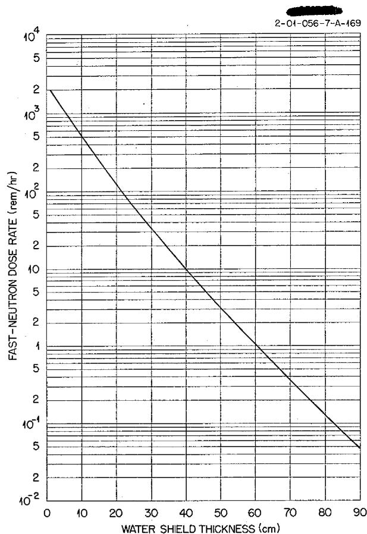  
Fig. 14.6. Direct-Beam Fast-Neutron Dose Rate 64 ft from a 300-Mw, Circulating-Fuel, Reflector-Moderated Reactor as a Function of the Thickness of the Water Shield at the Reactor.

beyond the measured range. This curve was used to obtain the values of

$$
D _ {d} (a, \ell) e ^ {- \int_ {0} ^ {T _ {n}} \left(1 / \lambda_ {d}\right) d t}
$$

for the optimization.

The reactor shield was divided into six conical shells $(N = 6)$ for the calculation. The values of $\theta_{n}$ , and $\theta_{n}^{\prime \prime}$ for each of these shells are given in Table 14.1, and the values of the $T$ 's and $\mathbb{L}'$ s resulting from each of three iterations, as well as the shield weights from the third iteration,

TABLE 14.1. OPTIMIZATION OF NEUTRON SHIELDING FOR A ${300} - {\mathrm{{Mw}}}_{\mathrm{g}}$ CIRCULATING-FUEL,REFLECTOR-MODERATED REACTOR   

<table><tr><td rowspan="2"></td><td colspan="2">First Iteration</td><td colspan="2">Second Iteration</td><td colspan="3">Third Iteration</td></tr><tr><td>Shielding Thickness (cm)</td><td>Lagrange Multiplier (×108)</td><td>Shielding Thickness (cm)</td><td>Lagrange Multiplier (×108)</td><td>Shielding Thickness (cm)</td><td>Lagrange Multiplier (×108)</td><td>Weight of Shield (tons)</td></tr><tr><td colspan="8">Range of reactor angle θ(deg)</td></tr><tr><td>0 to 15</td><td>42.5</td><td>14.2</td><td>40.2</td><td>14.9</td><td>43.4</td><td>16.8</td><td>1.15</td></tr><tr><td>15 to 45</td><td>39.7</td><td>13.7</td><td>35.9</td><td>16.0</td><td>39.3</td><td>17.0</td><td>0.96</td></tr><tr><td>45 to 75</td><td>33.4</td><td>9.2</td><td>26.4</td><td>14.8</td><td>28.6</td><td>18.3</td><td>1.11</td></tr><tr><td>75 to 105</td><td>27.6</td><td>8.2</td><td>20.0</td><td>13.5</td><td>21.3</td><td>18.9</td><td>0.89</td></tr><tr><td>105 to 165</td><td>23.2</td><td>3.4</td><td>10.6</td><td>9.5</td><td>10.4</td><td>17.8</td><td>0.53</td></tr><tr><td>165 to 180</td><td>21.4</td><td>2.9</td><td>8.3</td><td>9.3</td><td>7.8</td><td>18.0</td><td>0.02</td></tr><tr><td>Rear of crew compartment</td><td>47.6</td><td>6.3</td><td>49.2</td><td>8.3</td><td>43.8</td><td>11.9</td><td>1.47</td></tr><tr><td>Side and front of crew compartment</td><td>17</td><td>8.6</td><td>19</td><td>12.1</td><td>16.8</td><td>18.0</td><td>4.52</td></tr><tr><td></td><td></td><td></td><td></td><td></td><td colspan="2">Total weight</td><td>9.65</td></tr></table>

are presented. The dose rates in the crew compartment, as obtained from the third iteration, were:

$$
\begin{array}{l} D ^ {d, r e a r} = 0. 0 2 9 \text {r e m / h r} \\ D ^ {s, r e a r} = 0. 0 0 2 \\ D ^ {s, s i d e} = 0. 2 0 5 \\ D _ {\text {t o t a l}} = 0. 2 3 6 \mathrm {r e m} / \mathrm {h r} \\ \end{array}
$$

From the table it may be seen that the iterative procedure results in a reasonably rapid convergence of the $\mathbb{L}$ 's toward a constant value. A better choice for the average relaxation lengths used in the first iteration would have led, of course, to a much more rapid agreement between the $\mathbb{L}$ 's. The average relaxation lengths used in the first iteration were $\lambda_s^s = 5.3\mathrm{cm}, \lambda_s^r = 6.0\mathrm{cm},$ and $\lambda_d^r = 8.5\mathrm{cm}$ . The results of the third iteration indicate that the correct averages are approximately $\lambda_s^s = 4.3\mathrm{cm}, \lambda_s^r = 5.4\mathrm{cm},$ and $\lambda_d^r = 8.7\mathrm{cm}$ . A fourth iteration would bring the $\mathbb{L}$ 's into still closer agreement; however, the weight would not be affected appreciably. Also, the input data are not sufficiently accurate to give real meaning to the small changes in the

thicknesses which would be required to give exact agreement between the $\mathbb{C}^{\prime}$ s.

It is desirable to place a limit on the dose rate in the vicinity of the reactor shield from the view point of neutron activation of aircraft components. A reasonable limit is that the dose rate of 64 ft from the reactor should not exceed 125 rem/hr. From the curve of Fig. 14.6 it is seen that this shield optimization gives a dose rate of approximately 600 rem/hr at 64 ft from the rear of the reactor. Thus, some correction should be made to this shield. The limit on dose rate from the rear of the reactor shield could be included as another condition in the optimization calculation; however, it would introduce a second Lagrange multiplier and seriously complicate the iterative procedure. A simpler procedure is, of course, merely to add sufficient shielding to the rear conical shells to reduce the dose rate to the desired level. While this procedure does not make precisely optimum use of the added weight, the fact that only 11 cm of additional water is required on the rear to reduce the dose rate to the desired level indicates that the results will not be far from optimum. If the thicknesses of the two rear conical shells of the calculated shield

were changed to $20\mathrm{cm}$ $(T_{5} = T_{6} = 20\mathrm{cm})$ , the weight of the shield would be increased by 0.57 ton. The final shield weight would thus be 10.22 tons.

It may also be seen from Table 14.1 that the optimum shield has a ratio of crew-compartment shield weight to reactor shield weight of approximately 1.6. If the calculation were carried out for a larger crew compartment, this ratio would decrease, and a larger fraction of the weight would be shifted to the reactor shield. Thus, the larger the crew compartment, the more nearly the limit on dose rate at the rear of the reactor is satisfied by the calculated optimum shield. Conversely, if the crew compartment were smaller, weight would be shifted from the reactor shield, and the limit on the dose rate from the rear of the reactor would be more seriously violated by the calculated optimum shield.

# MEASUREMENTS IN THE GE-ANP CREW-COMPARTMENT MockUP

F.N.Watson

Measurements have been made, with an anthracene crystal, of the gamma-ray dose rates inside

the GE-ANP crew-compartment mockup (Fig. 14.7) by using the TSF reactor inside the GE-ANP R1 shield mockup as a source.

Dose-rate measurements (Fig. 14.8) along the $y$ axis (fore to aft) of the crew-compartment mock-up indicate a relatively large contribution from the sides of the mockup, with only a small amount of radiation penetrating the shadow shield at the rear of the mockup. Data for the curve labeled "Compartment D Empty" were obtained when compartment D of the reactor shield was filled with air.

The gamma-ray dose rates in the front half of the crew compartment mockup were measured with the relative position of the crystal and preamplifier reversed from that shown in Fig. 14.7. Shielding the detector by the preamplifier and the Lucite spacer resulted in a $10\%$ reduction in dose when data were taken in the front portion of the crew compartment.

Gamma-ray dose rates were also measured along the $x$ axis (left to right) for various values of $y$ (Figs. 14.9, 14.10, and 14.11). Again there was

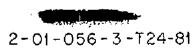

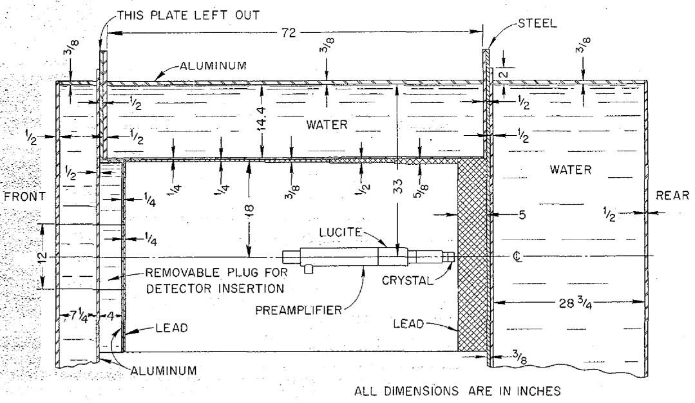  
Fig. 14.7. Schematic Diagram of GE-ANP Crew-Compartment Mockup.

an indication that the majority of the gamma rays entered from the sides of the crew-compartment mockup. The dose rates from center to side did not, however, vary in excess of approximately $30\%$ .

Investigation of the GE-ANP R1 shield mockup is continuing with the measurement of gamma-ray dose rates in air 4 to 30 ft from the shield at various values of the angle $\theta$ .

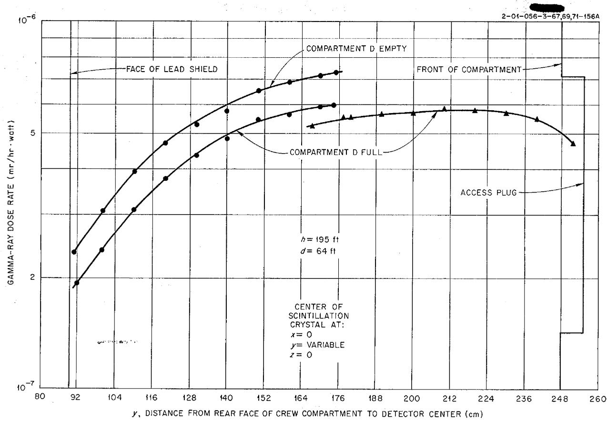  
Fig. 14.8. Gamma-Ray Dose Rates Along y Axis of Crew Compartment.

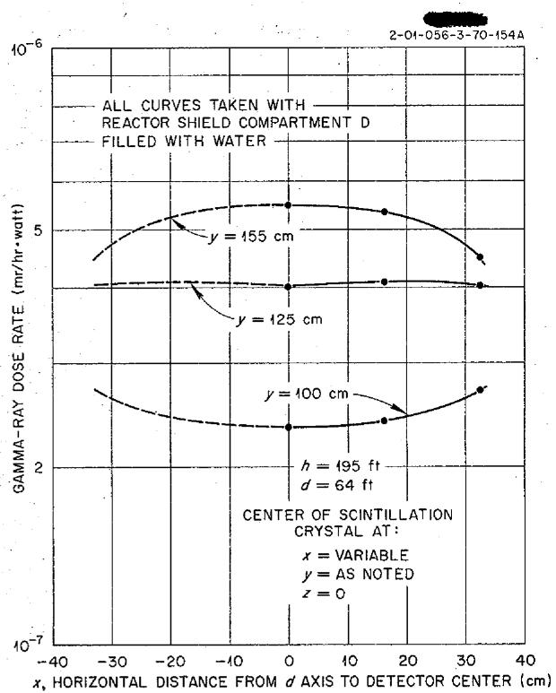  
Fig. 14.9. Gamma-Ray Dose Rates Along $x$ Axis of Crew Compartment ( $y = 100, 125,$ and $155$ cm; $z = 0$ ).

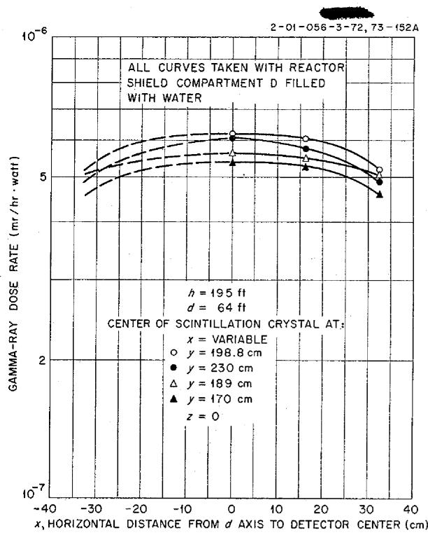  
Fig. 14.10. Gamma-Ray Dose Rates Along $x$ Axis of Crew Compartment ( $y = 170, 189, 198.8$ , and $230 \, \text{cm}; z = 0$ ).

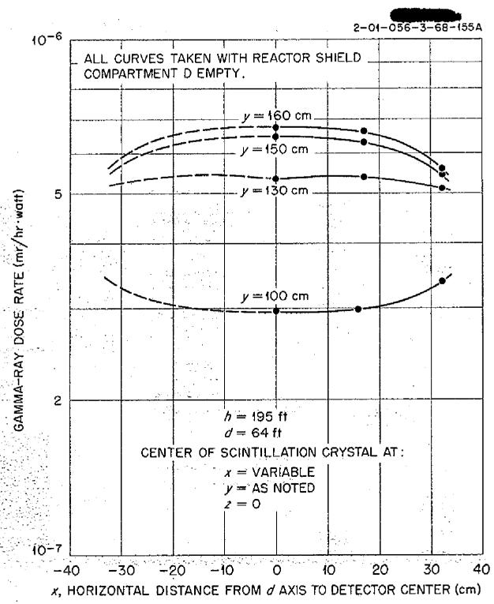  
Fig. 14.11. Gamma-Ray Dose Rates Along $x$ Axis of Crew Compartment (y = 100, 130, 150, and 160 cm; z = 0).

#

：

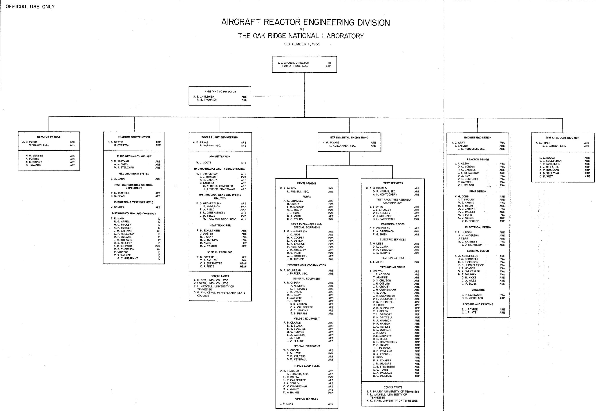

# THE AIRCRAFT NUCLEAR PROPULSION PROJECT

AT

# THE OAK RIDGE NATIONAL LABORATORY

SEPTEMBER 1,1955

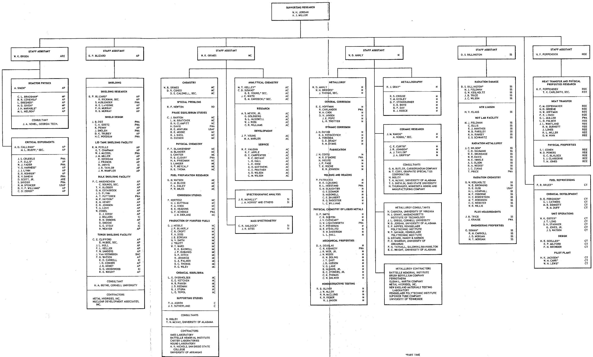

OFFICIAL USE ONLY

# THE AIRCRAFT NUCLEAR PROPULSION PROJECT

AT

# THE OAK RIDGE NATIONAL LABORATORY

SEPTEMBER 1, 1955

ANP PROJECT DIRECTOR

CO-DIRECTOR

ASSISTANT DIRECTOR

D. HILYER, SEC.

W.H.JORDAN

S.J.CROMER

A.J.MILLER

D. HILYER, SEC

RD

RD

RD

A.W.SAVOLAINEN

LITERATURE SEARCHES

A. L. DAVIS

ARE

ARE

AIRCRAFT REACTOR ENGINEERING DIVISION

S.J.CROMER,DIRECTOR

H. McFATRIDGE, SEC.

RD

ARE

ASSISTANT TO DIRECTOR

R.S. CARLSMITH

ARE

# ANP STEERING COMMITTEE

W. H. JORDAN, CHAIRMAN   
E.S.BETTIS   
D.S.BILLING   
E、B、BLIZARD  
C. 5 BOXD   
S.L.CROMER   
W.KERCEN   
A. R. EBAAS   
W. P. PRAS   
G. F. LAPSON   
C. LAKSON W.DANLEY   
W.D.MANET   
A. 3. MILLER  
B. 4. RAY   
H.F. POpPendIEK   
H.W.SAVAGE   
E.D.SHIPPLEY   
J.A.SWARTO   
A.M.WEINBEI

# SUPPORTING RESEARCH

W.H.JORDAN   
A.J.MILLER

METALLURGY

W. D. MANLY, STAFF ASSISTANT

M

# CHEMISTRY

W.R.GRIMES,STAFF ASSISTANT

MC

# SHIELDING

E.P.BLIZARD,STAFF ASSISTANT

AP

# RADIATION DAMAGE

D. S. BILLINGTON, STAFF ASSISTANT

SS

# AFER AND PHYSICAL PROPERTIES

H. F. POPPENDIEK, STAFF ASSISTANT

EE

# REACTOR PHYSICS

W.K. ERGEN, STAFF ASSISTANT

RE

# FUEL REPROCESSING

F.R.BRUCE*

C1

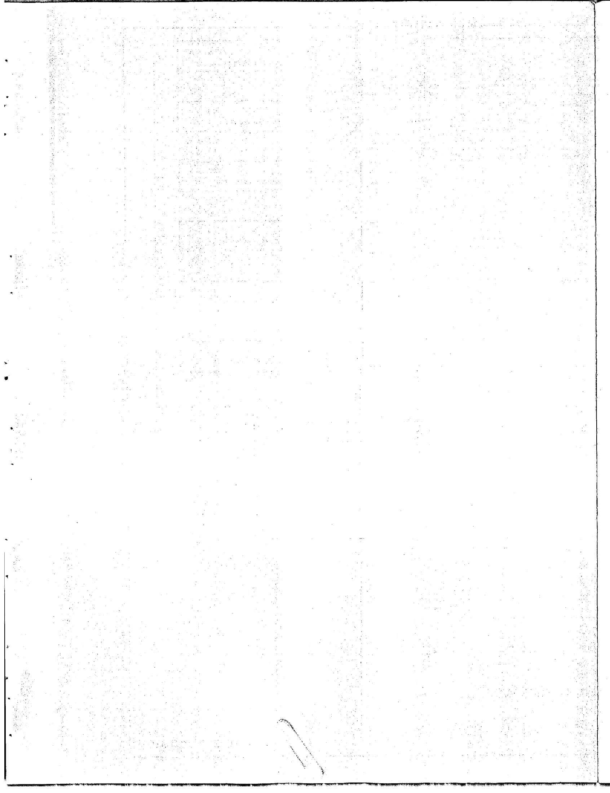