# AEC RESEARCH AND DEVELOPMENT REPORT

ORNL-1955

C-84 - Reactors-Special Features of Aircraft Reactors

FABRICATION OF HEAT EXCHANGERS AND

RADIATORS FOR HIGH TEMPERATURE

REACTOR APPLICATIONS

P. Patriarca

G. M. Slaughter

W. D. Manly

R. L. Heestand

DECLASSIFIED

${AE} : 7 - {16} = {59}$

For: N. I. Bray, Supervisor

Laboratory Reports, Data

OH

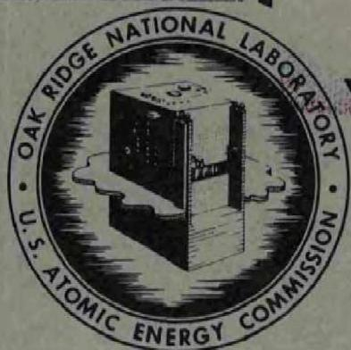

THIS DOCUMENT WAS PROPRIY INCLASSIFIED AND IS ENDED FROM DOE 1979 REVIEW ORDER PIRDOLELETTER.10-16-79,B.T.DUFF,00C P.S.BAXER ORNL/CO

OAK RIDGE NATIONAL LABORATORY

OPERATED BY

UNION CARBIDE NUCLEAR COMPANY

A Division of Union Carbide and Carbon Corporation

UCC

POST OFFICE BOX P · OAK RIDGE, TENNESSEE

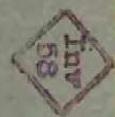

# LEGAL NOTICE

This report was prepared as an account of Government sponsored work. Neither the United States, nor the Commission, nor any person acting on behalf of the Commission:

A. Makes any warranty or representation, express or implied, with respect to the accuracy, completeness, or usefulness of the information contained in this report, or that the use of any information, apparatus, method, or process disclosed in this report may not infringe privately owned rights; or  
B. Assumes any liabilities with respect to the use of, or for damages resulting from the use of any information, apparatus, method, or process disclosed in this report.

As used in the above, "person acting on behalf of the Commission" includes any employee or contractor of the Commission to the extent that such employee or contractor prepares, handles or distributes, or provides access to, any information pursuant to his employment or contract with the Commission.

This document consists of 74 pages.

Copy/ 3 of 260 copies. Series A.

# FABRICATION OF HEAT EXCHANGERS AND RADIATORS

# FOR HIGH TEMPERATURE REACTOR APPLICATIONS

P. Patriarca, G. M. Slaughter,

and W. D. Manly

Metallurgy Division

Oak Ridge National Laboratory

R. L. Heestand

Fox Project

Pratt and Whitney Aircraft

Period Covered by Work: February, 1955 - April, 1955

# Work Performed By

R. E. Clausing

R. G. Shooster

O. E. Conner

C. E. Shubert

R. L. Heestand

L. C. Williams

B. McDowell

Metallurgy Division

A. G. Towns

Aircraft Reactor Engineering Division

Welding Under Direction Of

T. R. Housley

Engineering and Mechanical Division

Photographic and Metallographic Work By

M. D. Allen

R.J. Gray

J. C. Gower

E. P. Griggs

Contract No. W-7405-eng-26

JUN 14 1956

# INTERNAL DISTRIBUTION

1. C. E. Center   
2. Biology Library   
3. Health Physics Library   
4. Metallurgy Library

5-6. Central Research Library   
7. Reactor Experimental Engineering Library   
8-12. Laboratory Records Department   
13. Laboratory Records, ORNL R.C.   
14. A. M. Weinberg   
15. L. B. Emlet (K-25)   
16. J. P. Murray (Y-12)   
17. J. A. Swartout   
18. E. H. Taylor   
19. E. D. Shipley   
20. F. C. VonderLage   
21. W. H. Jordan   
22. C. P. Keim   
23. J. H. Frye, Jr.   
24. R. S. Livingston   
25. R. R. Dickison   
26. S. C. Lind   
27. F. L. Culler   
28. A. H. Snell   
29. A. Hollander   
30. M. T. Kelley   
31. K. Z. Morgan   
32. J. A. Lane   
33. T. A. Lincoln   
34. A. S. Householder   
35. C. S. Harrill

36. C. E. Winters   
37. D. S. Billington   
38. D. W. Cardwell   
39. W. D. Manly   
40. E. M. King   
41. A. J. Miller   
42. D. D. Cowen   
43. R. A. Charpie   
44. M. L. Picklesimer   
45. M. J. Skinner   
46. G. E. Boyd   
47. M. Bender   
48. W. F. Boudreau

49-50. R. B. Clarke

51. A. P. Fraas   
52. R. D. Schultheiss   
53. M. M. Yarosh   
54. H. C. Gray   
55. H. W. Savage   
56. A. Taboada   
57. P. Patriarca   
58. J. H. Coobs   
59. W. H. Cook   
60. E. E. Hoffman   
61. T. R. Housley   
62. J. H. Devan   
63. D. A. Douglas, Jr.   
64. R. L. Heestand   
65. A. W. Savolainen

66-67. ORNL - Y-12 Technical Library, Document Reference Section

# EXTERNAL DISTRIBUTION

68. AF Plant Representative, Baltimore   
69. AF Plant Representative, Burbank   
70. AF Plant Representative, Marietta   
71. AF Plant Representative, Santa Monica   
72. AF Plant Representative, Seattle   
73. AF Plant Representative, Wood-Ridge   
74. Air Materiel Area   
75. Air Research and Development Command (RDGN)   
76. Air Research and Development Command (RDZPA)   
77. Air Technical Intelligence Center   
78. Aircraft Laboratory Design Branch (WADC)

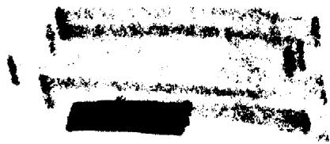

82. Argonne National Laboratory   
83. Armed Forces Special Weapons Project, Sandia   
84. Assistant Secretary of the Air Force, R&D

91. Battelle Memorial Institute   
92. Bettis Plant   
93. Bureau of Aeronautics   
94. Bureau of Aeronautics (Code 34)   
95. Bureau of Aeronautics General Representative   
96. Chicago Operations Office   
97. Chicago Patent Group

100. Convair-General Dynamics Corporation   
101. Director of Laboratories (WCL)   
102. Director of Requirements (AFDRQ)   
103. Director of Research and Development (AFDRD-ANP)

79-81. ANP Project Office, Fort Worth   
85-90. Atomic Energy Commission, Washington   
98-99. Chief of Naval Research   
104-106. Directorate of Systems Management (RDZ-1SN)   
107-109. Directorate of Systems Management (RDZ-1SS)   
110. Equipment Laboratory (WADC)   
111-114. General Electric Company (ANPD)   
115. Hartford Area Office   
116. Headquarters, Air Force Special Weapons Center   
117. Idaho Operations Office   
118. Knolls Atomic Power Laboratory   
119. Lockland Area Office   
120. Los Alamos Scientific Laboratory   
121. Materials Laboratory Plans Office (WADC)   
122. National Advisory Committee for Aeronautics, Cleveland   
123. National Advisory Committee for Aeronautics, Washington   
124. Naval Air Development Center   
125. New York Operations Office   
126. North American Aviation, Inc. (Aerophysics Division)   
127. Nuclear Development Corporation   
128. Patent Branch, Washington   
129-131. Powerplant Laboratory (WADC)   
132-135. Pratt & Whitney Aircraft Division (Fox Project)   
136. San Francisco Operations Office   
137. Sandia Corporation   
138. School of Aviation Medicine   
139. Sylvania Electric Products, Inc.   
140. USAF Project Rand   
141. University of California Radiation Laboratory, Livermore   
142-144. Wright Air Development Center (WCOSI-3)   
145-259. Technical Information Extension, Oak Ridge   
260. Division of Research and Development, AEC, ORO

# TABLE OF CONTENTS

ABSTRACT 1

INTRODUCTION 2

FABRICATION OF 500-KW HEAT EXCHANGERS 4

Introduction 4

Fabrication Procedure 7

Summary 19

FABRICATION OF 500-KW NaK-TO-AIR RADIATORS 21

Introduction 21

Fabrication Procedure 23

Summary 37

FABRICATION OF 20-TUBE HIGH-VELOCITY HEAT EXCHANGER 37

Introduction 37

Fabrication Procedure 39

Summary 40

CONCLUSIONS 42

LIST OF FIGURES 43

BIBLIOGRAPHY 45

# ABSTRACT

Two 500-kw fused-fluoride-to-Nak heat exchangers, two 500-kw NaK-to-air radiators, and a 20-tube high-velocity heat exchanger were fabricated for a heat-exchanger development program. A construction procedure, utilizing both inert-arc-welding and high-temperature dry-hydrogen brazing, was used successfully on all of the units. The tube-to-header joints were welded and back-brazed; the manifold joints were inert-arc-welded with full penetration; and the tube-to-fin joints were brazed. A detailed description of the fabrication of each type of component is discussed and a cost analysis of the 500-kw units is presented.

# INTRODUCTION

The heat exchangers and radiators to be used in conjunction with high-temperature nuclear reactors which utilize highly corrosive and radioactive fluids must necessarily be the ultimate in integrity. Precise control of the procedures used in their construction must therefore be constantly maintained. It is well recognized that faulty workmanship or the improper selection of a joining technique in one location on a unit may result in a catastrophe or, at least, a costly shutdown during repair.

The component designs under consideration for the Aircraft Reactor Test installation incorporate multitudes of thin-walled small-diameter tubes in extremely close-packed configurations. The fabrication of these units poses a difficult problem; highly specialized equipment and procedures, which have been proven satisfactory in rigid tests under simulated service conditions, are required. Since the complexity of design of the heat exchangers and radiators is, in many cases, unique to the atomic energy field, much of the developmental work on these joining techniques has been done by the personnel who are actually confronted with the problems of component construction.

Most of the fabrication problems associated with these units may be classified into three general categories: (1) the production of sound tube-to-header joints, (2) the production of high-quality manifold joints, and (3) the attainment of satisfactory tube-to-fin joints. The development of procedures and techniques for the solution of these problems has been under way at Oak Ridge National Laboratory for several years. Numerous successful test assemblies have been fabricated during this time, and refinements in construction procedure have been continuously introduced.

A heat-exchanger test loop1 has now been designed and set up in the Aircraft Reactor Engineering Division of ORNL to provide data on corrosion, mass transfer, and reliability of a fuel-to-NaK-to-air system operating under conditions comparable to those expected in the Aircraft Reactor Test. A small-scale heat-exchanger test was also operated for the purpose of investigating heat-transfer characteristics, through the Reynolds-number range of 0 to 5500, on the fluoride-mixtures side of the fuel-to-NaK heat exchanger.

The Welding and Brazing Group of the Metallurgy Division was assigned the job of fabricating the units used in these test loops. The loops consisted of two 500-kw fused-fluoride-to-NaK heat exchangers; two 500-kw NaK-to-air radiators; and a 20-tube high-velocity, fused-fluoride-to-NaK heat exchanger. Services of the Engineering and Mechanical Division of ORNL were also used extensively in the construction of these components. This report describes in detail the fabrication of these heat exchangers and radiators and contains information pertaining directly to the construction of similar units for the ART. It should also provide assistance to other groups interested in the production of equipment for high-temperature high-corrosion applications.

A. Fabrication of 500-kw Heat Exchangers.

# 1. Introduction.

Two 500-kw fuel-to-NaK heat exchanger tube bundles were required for use in a heat-exchanger test loop under investigation in the Aircraft Reactor Engineering Division. The test loop is part of a long-range heat-exchanger development program designed to obtain information on the operating characteristics, corrosion, and reliability of fuel-to-NaK-to-air systems under conditions similar to those stipulated for the ART.

The test loop incorporates these heat exchangers in the regenerative-type circuit shown schematically in Fig. 1. The NaK flows from a l-Mw gas-fired heater through one tube bundle to a radiator. The stream then goes to a liquid-metal pump and back through the second tube bundle to the heater. The fuel mixture NaF-ZrF $_4$ -UF $_4$ (50-46-4 mole %) will be circulated outside the tubes counter-current to the NaK flow and will be alternately heated and cooled by the NaK stream.

Each heat exchanger was composed of 100 Inconel tubes, 3/16-in. OD, 0.017-in. wall thickness, and approximately 6 ft. in length. The tubes were incorporated into the heat exchanger as shown in Fig. 2, an assembly drawing of a typical tube bundle. It is essential that the completed heat exchangers be leaktight and that they be fabricated in such a way as to withstand the severe conditions of temperature and pressure indicated in Fig. 1.

Another heat-exchanger test unit, of a smaller but somewhat similar design, has been fabricated, $^{2}$ tested, $^{3}$ and examined. $^{4}$ The tube-to-header joints in this early unit were manually inert-arc-welded. The unit performed successfully for 1680 hr before being terminated due to a failure in a tube-to-header weld. Metallographic examination of several of the welded joints revealed the presence

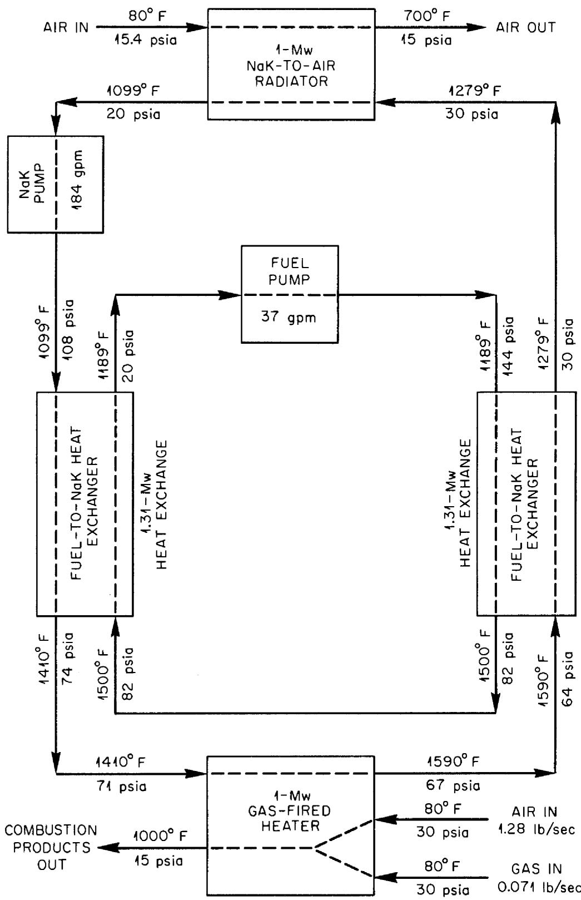  
Fig. 1. Flow Diagram of Loop for Testing Intermediate Heat Exchanger No. 2.

of extensive microfissuring in the fusion zone, as evidenced in Fig. 3. It is thought that the differential thermal expansion between the tubes and the casing caused stress concentrations at the roots of the tube-to-header welds. These stress concentrations tended to propagate cracks through the welds in the course of thermal cycling; particularly since the columnar dendrites, which are typical of a weld structure, were aligned in such a way as to aid the formation of parallel fractures. A photomicrograph of a tube-to-header joint exhibiting a similar crack in the early stages of propagation is shown in Fig. 4.

The results of the metallographic investigation emphasized the extreme desirability of utilizing the advantages afforded by back brazing. As can be seen in Fig. 5, a photomicrograph of a welded and back-brazed tube-to-header joint, this process (1) eliminates the "notch effect" resulting from incomplete weld penetration and (2) insures against the development of leaks in the event of corrosion through an area of shallow weld penetration. This duplex fabrication technique was therefore employed in the production of the critical tube-to-header welds.

# 2. Fabrication Procedure.

a. Tube-to-header welding. The 200, 3/16-in. OD by 0.017-in. wall, Inconel tubes for these fuel-to-NaK heat exchangers were formed into the desired configurations and delivered, along with the drilled headers and other necessary components, to the Welding and Brazing Group. All parts were meticulously degreased prior to assembling, and the headers were deburred to facilitate entry of the tubes.

The inert-arc-welding of the 400 tube-to-header joints was performed on the semiautomatic rotating-arc equipment shown in Fig. 6. The equipment incorporates a commercially available inert-arc-welding torch which is attached to a drive mechanism originally designed for contour-cutting with an oxygen cutting torch. An

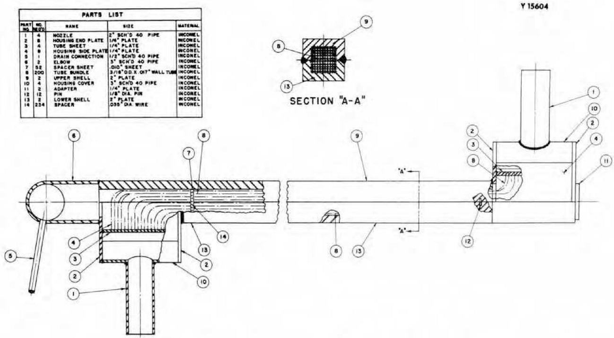  
Fig. 2. Assembly Drawing of 500-kw Fuel-to- $\mathbf{Na}\mathbf{K}$ Heat Exchanger.

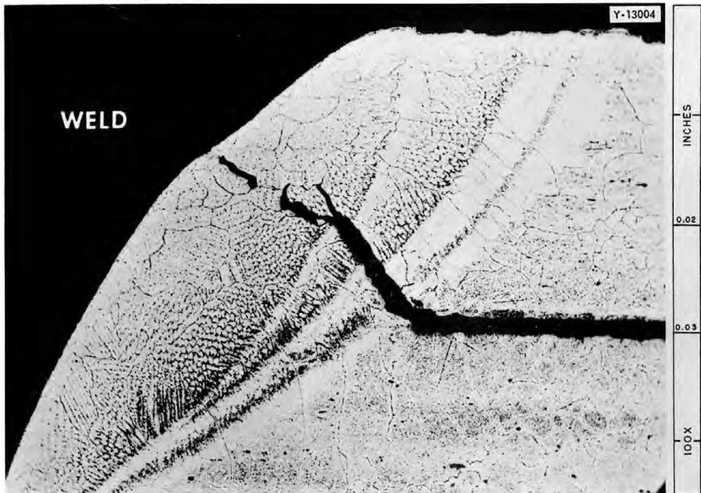  
Fig. 3. Tube-to-Header Weld Exhibiting Extensive Microfissuring. Etch: electrolytic; oxalic acid.

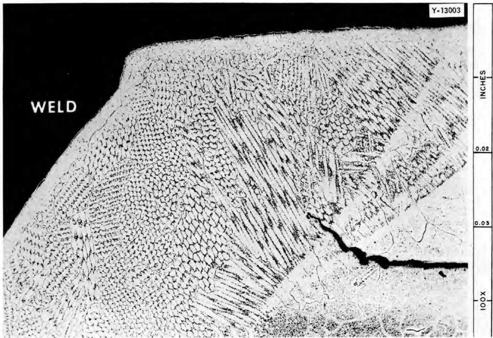

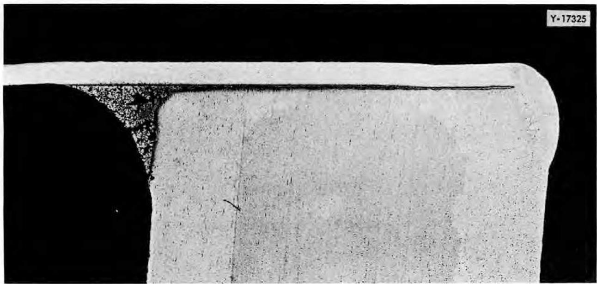  
Fig. 4. Tube-to-Header Weld Exhibiting Crack in Early Stages of Propagation. Etch: electrolytic; oxalic acid.   
Fig. 5. Tube-to-Header Weld after Back Brazing. Etch: $10\%$ oxalic acid; electrolytic. 12X.

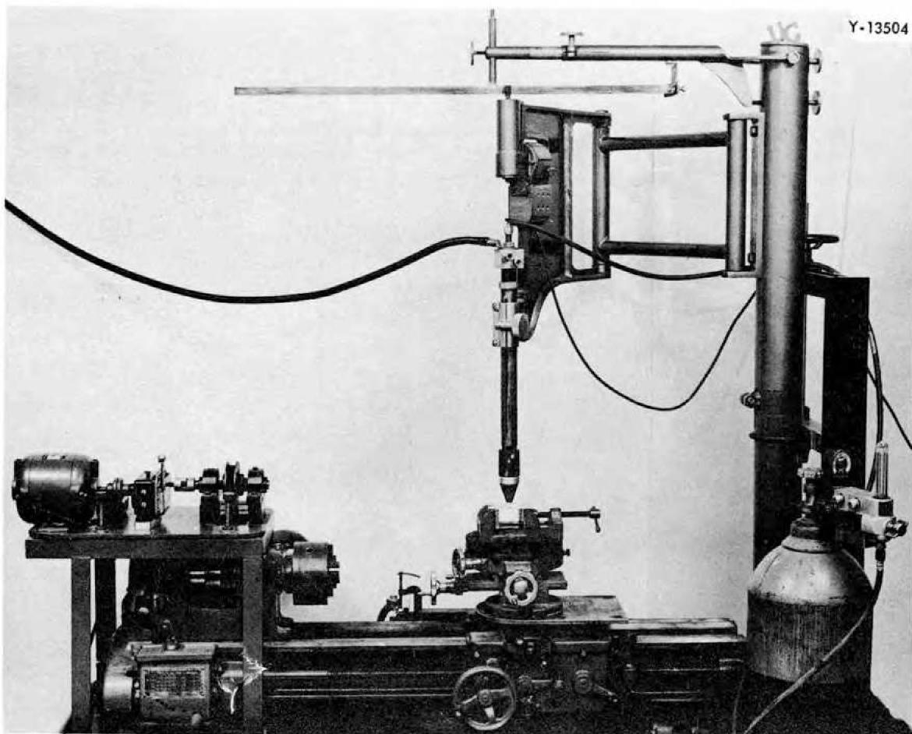  
Fig. 6. Semiautomatic Tube-to-Header Welding Equipment.

offset-cam mechanism was developed and installed, which permitted the torch to travel around a tube periphery of any desired diameter. A d-c welding generator served as the power supply, and the argon shielding gas was fed through the torch at the top. The modified metal lathe shown in the picture was not used in this fabrication, but it is useful for such special applications as circumferential inert-arc-welding of thin-walled tubing.

The arc is initiated by a superimposed high-frequency current, and the welding current is applied for slightly longer than one revolution. Extinguishing of the arc is carried out by means of a commercially available foot-controlled arc-decay attachment. This mechanism minimized the tendency to form arc craters by permitting a gradual reduction of the output voltage of the generator. Thus, "feathering" of the arc current is made possible. Extremely low welding currents can be attained on this equipment, when desired, by the utilization of a bank of variable high-wattage resistances. Good arc-striking conditions can be simultaneously attained since a high open-circuit voltage is available.

Prior to starting the actual fabrication, a set of experiments was conducted to determine the optimum combination of welding conditions. In the experiments two Inconel test headers, of the same size and physical shape as the one shown in Fig. 2, were machined, and sample tube-to-header welds were made under a variety of controlled conditions. Several of the sample joints were examined under high-power magnification to determine the presence of weld microfissuring, but this type of cracking was not found and, therefore, presented no problem. Small imperfections showed that the preparation of the header surfaces for welding, after insertion of the tubes, should definitely not be done by abrasive grinding. Entrapped abrasive in the joint resulted in severe arc instability and in inconsistent welds. A more reliable method consisted of preshaping the tubes to conform to the curvature

of the header before assembly. The tube can then be expanded with a special tool before final welding. By the use of this method of header preparation, the magnitudes of the welding variables were found which gave the most consistent weld penetration and which were least likely to result in excessive hole constriction or in undesirable preferential melting of the tube wall.

Previous experience had shown that an arc distance of 0.050 in. and a weld time of approximately 6 sec produced consistently good welds with this tubing with a 3/16-in. OD and a 0.017-in. wall thickness when it was joined to relatively thick headers. These values were, therefore, used for determining the optimum diameter of electrode rotation and the proper welding current. A rotation diameter between 0.21 in. and 0.22 in. was found to be desirable, since values less than this often resulted in preferential melting of the tube wall, and values greater than this produced maximum weld penetration in the header plate and not at the joint, where it is of most importance. An arc current of 60 amp at an arc voltage of 10 v produced consistently satisfactory welds with penetrations of approximately twice the tube wall thickness. A photomicrograph of a typical weld produced under these optimum conditions is shown in Fig. 7. No weld porosity or cracks are evident and excellent penetration was achieved. The two-pass effect present in the nugget results because a weld overlap of approximately one-half revolution is used after the complete peripheral weld has been made. During this period the weld current is gradually decreased to prevent the formation of undesirable arc craters. The uniformity of welds made under these conditions can be seen in Fig. 8, a photograph of a 100-weld header section of this heat exchanger. Helium backing-gas was used throughout to minimize oxidation at the root of the weld. Leak testing of each header section was performed, and all welds were leaktight before initiation of the following stages of fabrication.

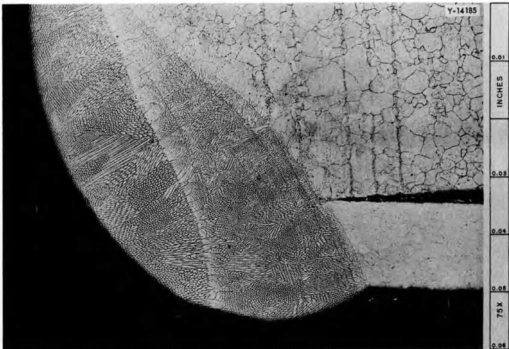  
Fig. 7. Tube-to-Header Weld Produced with the Semiautomatic Welding Equipment. Etch: electrolytic; oxalic acid. 75X. Reduced $13\%$ .

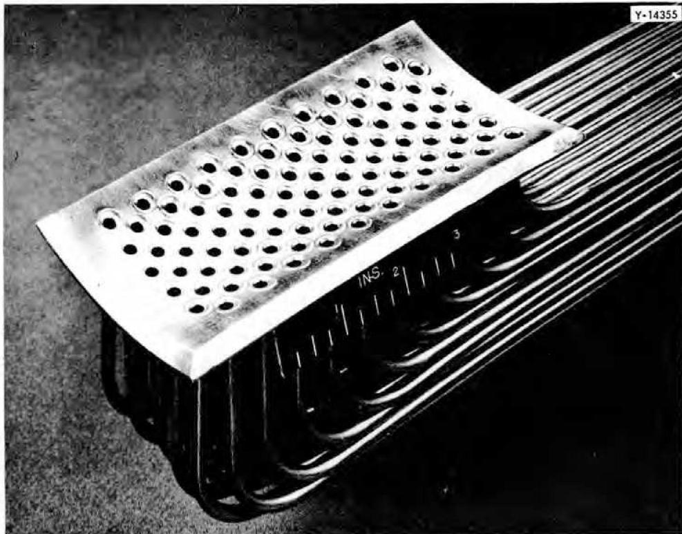  
Fig. 8. One End of Heat Exchanger after Welding Tube-to-Header Joints.

b. Header welding. The side plates, top plates, and nozzles were joined to the Inconel headers entirely by manual inert-arc-welding. The welding procedures are stipulated in Appendix 1 and the qualifications for welding operators are stipulated in Appendix 2. The joint designs used were those recommended for high-pressure, high-corrosion applications (cf. Appendix 3).

To minimize cracking of the brittle brazing alloy and to prevent the areas to be welded from becoming contaminated with such elements as boron and silicon from the brazing alloy, the welding of the components was performed before the tube-to-header joints were back-brazed. However, to permit accessibility to the joints, the preplacement of the brazing alloy was completed first.

The welding in an early stage of fabrication is shown in Fig. 9, and it can be seen that strongbacks were used to minimize distortion of the header and consequent danger of tube-to-header weld fracture. A photograph of a completed leak-tight header section is shown in Fig. 10.

c. Back brazing of tube-to-header joints. The back brazing of the tube-to-header welds in this heat exchanger was desirable since it afforded a means of minimizing the stress concentrations formed at the root of the weld during service. The brazing alloy would, of course, also minimize the chances for leaks to occur from weld corrosion or microfissuring during operation of the unit. Because the brazing alloy would be in intimate contact with the fused fluorides and might come in localized contact with the metal inside the tubes, it was desirable that the alloy possess good resistance to corrosion in both media.

A long-range program for the development of brazing alloys has been conducted by the Welding and Brazing Group of the Metallurgy Division at ORNL for several years. A thorough evaluation5 of the corrosion resistance of brazing alloys has been conducted by the General Corrosion Group and, as a result of their work, a suitable alloy was found.

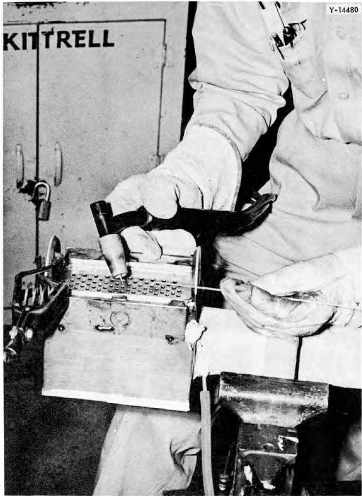  
Fig. 9. Header in Early Stages of Fabrication.

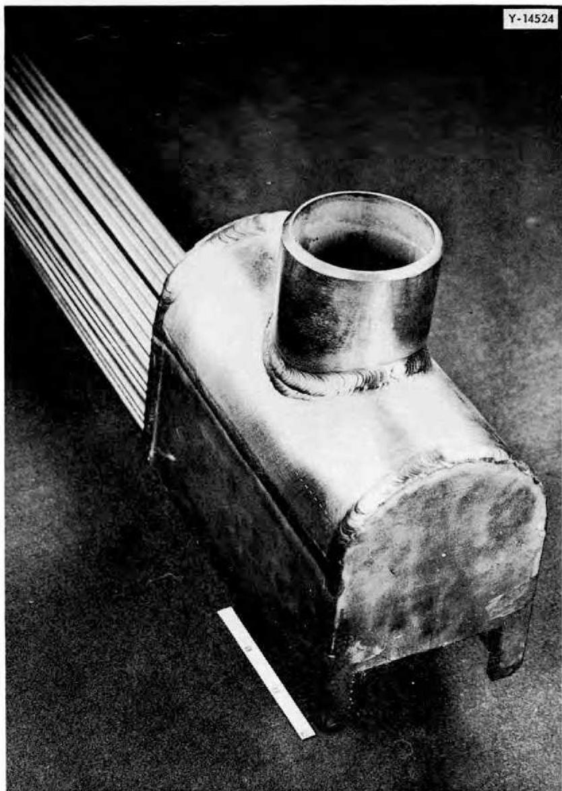  
Fig. 10. A Completed Leaktight Header Section.

Low-melting Microbraz, an alloy of the nominal composition 80Ni-5Cr-5Si-3B-6Fe-1Cr, was found to be compatible with both liquids. A photomicrograph showing the resistance of this alloy to fluoride attack is presented in Fig. 11, and a photomicrograph of a sample after testing in molten sodium is presented in Fig. 12. This alloy possesses good flowability at $1040^{\circ}\mathrm{C}$ , a temperature at which boron diffusion into the Inconel base metal is not a serious problem. Therefore, only minor embrittlement of the tubes would be expected to occur during brazing.

The low-melting Microbraz alloy was preplaced on the headers as a dry powder and was secured firmly in position with Microbraz cement. Since the Globar-heated brazing furnace contained a heating zone of limited length, only one end of the tube bundle could be brazed at a time. As a result, the welding and the brazing of one header of a tube bundle were completely performed before the brazing alloy preplacement and before the welding of the second end was initiated. This was necessary since there was danger of spalling of preplaced alloy from the underside of the second header during the brazing of the first header. It was thought that hot hydrogen gas might volatilize the binder and leave the brazing alloy insecurely positioned in its overhead locations. This important consideration increased the fabrication time to some extent because the welding of both heads could not be performed in succession.

The brazing operation was performed in a dry hydrogen atmosphere of $-70^{\circ}\mathrm{F}$ dew point or below. Good flowability is obtained without the addition of a flux because the highly reducing nature of this hydrogen prevents the formation of most metal oxides. Accelerated corrosion, common to joints containing entrapped brazing flux, is, therefore, avoided. Conventional canning procedures were used during brazing; that is, the heat exchanger was placed in a stainless steel retort in which hydrogen inlet and hydrogen exit tubes were the only openings. The pure

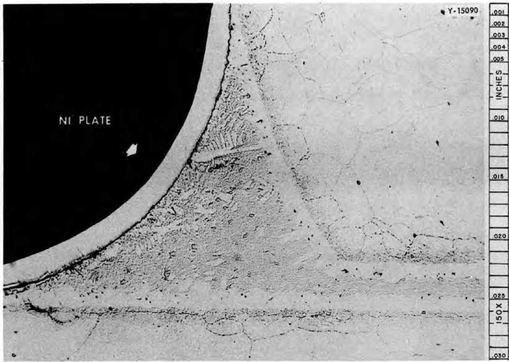

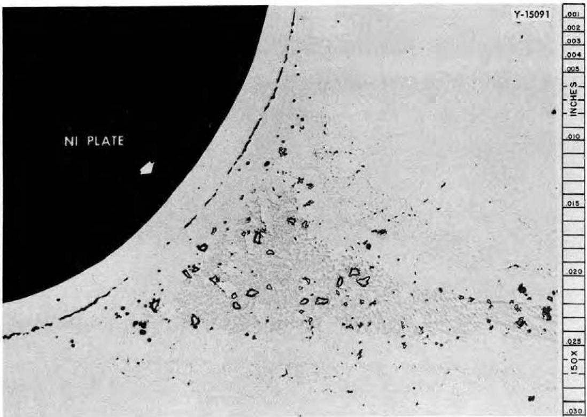  
Fig. 11. An Inconel T-Joint Brazed with Low-Melting Microbraz and Tested in Fluoride Bath No. 44 for 100 hr at $1500^{\circ}\mathrm{F}$ . Only very slight attack is present. Etchant: Glyceria regia. 150X. Reduced $14\%$ .   
Fig. 12. An Inconel T-Joint Brazed with Low-Melting Microbraz and Tested in Sodium for 100 hr at $1500^{\circ}\mathrm{F}$ . Negligible attack is present. Etch: None. 150X. Reduced $14\%$ .

dry-hydrogen atmosphere was then maintained in this retort while it was heated in a large Globar high-temperature furnace.

An elaborate purification and drying train was used to remove oxygen and water from the inlet hydrogen gas. The oxygen was converted to water by means of Deoxo (palladium catalyst) manufactured by Baker & Co., Inc., Newark, New Jersey, and the water was removed by an activated alumina drier obtained from Pittsburgh Lectro-dryer Corp., Pittsburgh, Pennsylvania.

The dry-hydrogen furnace brazing was performed in a horizontal position in a large Globar-heated furnace. The heat-exchanger tube bundle was securely jigged in a long rectangular stainless steel retort, and a dry-hydrogen atmosphere was maintained in the retort during brazing. A time-temperature record of every brazing thermal cycle was measured by means of a chromel-alumel thermocouple firmly attached to the assembly. A plot of a typical cycle is shown in Fig. 13. A pre-heated brazing furnace was used to shorten the time required for each operation, and no visible warpage or distortion of the heat exchanger resulted.

d. Fabrication and assembly of "comb spacers". The use of wire comb spacers was considered to be the most practical means of holding the tube bundle rigid throughout its free-span length and of keeping the tubes separated to permit the required mode of fluid flow between them. The assemblies were to be placed at 5-in. intervals along the bundle with alternate spacers positioned at an angle of $90^{\circ}$ to each other. It was required, for a heat-transfer evaluation, to have the spacers on one bundle placed perpendicular to the axis of the tubing, whereas they were placed in a plane at a $30^{\circ}$ angle to the tubing axis on the second bundle. The comb assemblies were fabricated and attached according to these requirements; and a photograph of both types of spacers on a sample tube bundle is given in Fig. 14. It can be seen that the fabrication and the assembling of these spacers required

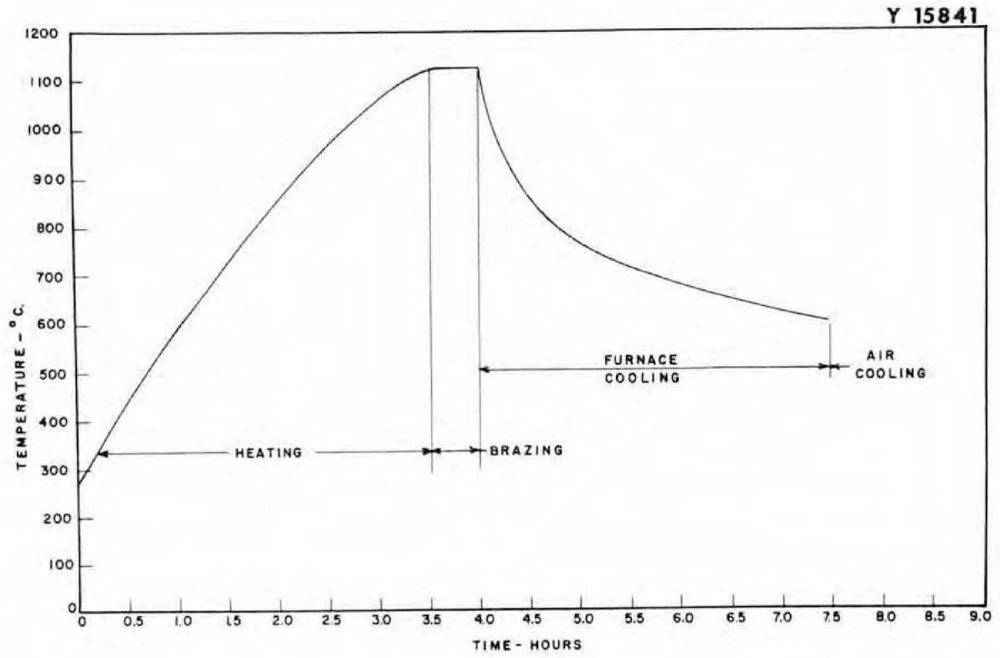

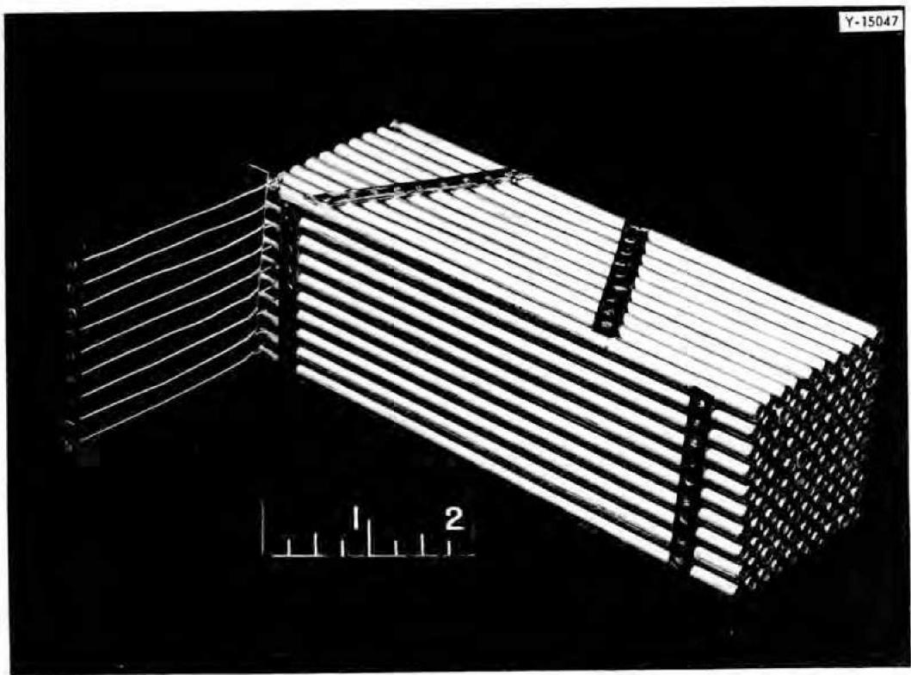  
Fig. 13. Typical Time-Temperature Thermal Cycle Used in the Brazing of Heat Exchangers.   
Fig. 14. Sample Tube Bundle Showing Two Types of "Comb Spacers."

the use of precision jigging facilities and the careful determination and control of welding conditions. Meticulous care also was maintained when punching holes in the strip headers because extremely close tolerances were specified.

e. Installation of tube bundle into pressure shell. The installation of the tube bundles into their pressure shells required a light machining of the shell to permit proper fit. Each pressure shell had to be precision machined to adjust for the very small variations in dimensions between it and its corresponding tube bundle.

The heavy-walled pressure shell was beveled according to the recommended joint design, and the root pass was inert-arc-welded as prescribed for high-corrosion applications. The remainder of the welding was performed by use of the metallic-arc process in order to minimize the heat input and consequent distortion of the unit. Fig. 15 is a photograph showing the heat exchanger after completion of the root pass. The large I-beam was used as a strongback for the system in order to prevent distortion.

f. Joining of the two tube bundles. The two 500-kw tube bundles were joined together after being welded into their respective pressure shells, and a photograph of the completed unit is presented in Fig. 16. It can be seen that the operation required several manual inert-arc-welds to connect the sodium circuits and to attach the inlet and exit nozzles.

# 3. Summary.

Leak testing of this unit with a mass spectrometer type of helium leak detector indicated no flaws, and the heat exchanger was subsequently delivered to the Aircraft Reactor Engineering Division for installation into their testing rig.

A step-by-step record of the time required for each operation in the fabrication of the two tube bundles was maintained, and the compilation of these times is presented in Appendix 4.

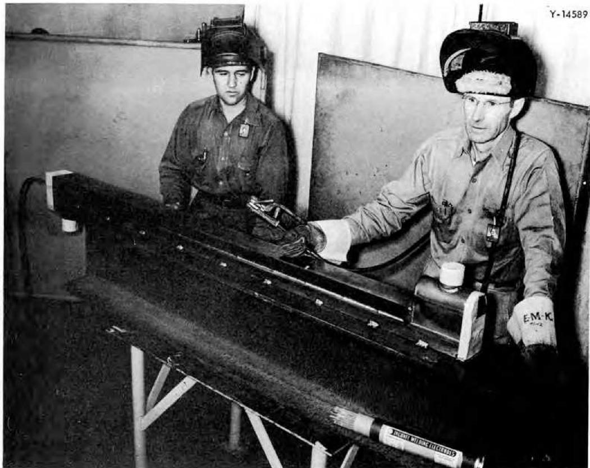

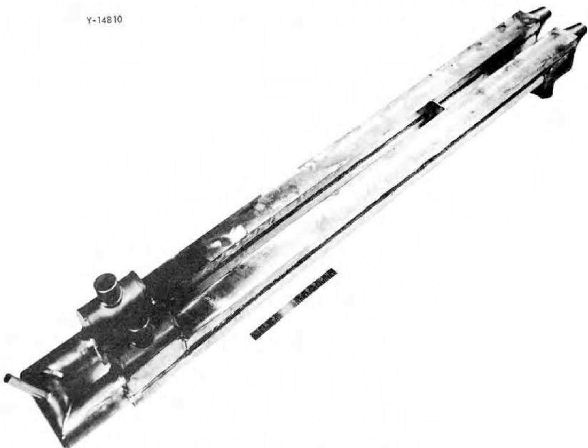  
Fig. 15. One Tube Bundle after Completion of Root Weld Pass on Pressure Shell.   
Fig. 16. A Completed 1-Mw Heat Exchanger.

B. Fabrication of 500-kw NaK-to-Air Radiators.

# 1. Introduction.

The Intermediate Heat Exchanger No. 2 test loop described in the preceding section required the fabrication of two 500-kw air-cooled radiators for installation as shown in Fig. 1. An assembly drawing of one radiator is shown in Fig. 17.

Several test radiators, containing very compact tube-to-fin matrices and limited in size and heat transfer capacity, have been fabricated and tested. These early units, which contained austenitic stainless steel or nickel fins, possessed good structural integrity but only fair performance characteristics at the high-operating temperatures. A high-conductivity fin developmental program was therefore initiated to determine the most suitable high-thermal-conductivity materials for high-temperature services. Type 310 stainless-steel-clad copper was found to possess excellent resistance to high-temperature oxidation, and the good thermal conductivity of the material was not materially reduced after extended periods at the service temperatures. A fin material of 0.006-in. OFHC copper, clad on each side with 0.002 in. of type 310 stainless steel, was therefore selected for this application. The desired spacing between successive stacked fins was obtained by proper design of the punch-and-die equipment, that is, by the depth of lip protruding from the flat sheet after punching.

Experience with the early fabrication procedures, in which the tube-to-fin, tube-to-header, and manifold joints were all brazed in one operation, indicated that every critical joint could not consistently be made leaktight in one brazing operation. Minor variations in joint spacing, base-metal composition, hydrogen coverage, hydrogen purity, and brazing technique influenced the brazing-alloy flowability to such an extent that several rebrazing operations were often required to obtain a radiator that was leaktight when tested with a helium mass spectrometer.

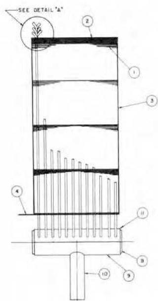

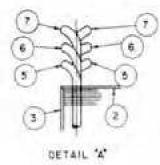

<table><tr><td>PART
NO.</td><td>40
HEU#S</td><td>NAME</td><td>SIZE</td><td>MATERIAL</td></tr><tr><td>1.</td><td>860</td><td>RAGURATOR FIN</td><td>256X 86X24</td><td>FZ-3000</td></tr><tr><td>2.</td><td></td><td>TOP PLATE</td><td>DZX 3.3/4.8X14</td><td>ATX-3000</td></tr><tr><td>3.</td><td>4</td><td>SUPPORT MEMBER</td><td>DZX 8X14/4.8X14/24</td><td></td></tr><tr><td>4.</td><td>1</td><td>BOUTON FLANGE PLATE</td><td>DZX 3.3/4.8X14/24</td><td></td></tr><tr><td>5.</td><td>2.4</td><td>RAGURATOR TUBE</td><td>S/8X 2.0X2.0X2.0X2.0X2.0X2.0X2.0X2.0X2.0X2.0X2.0X2.0X2.0X2.0X2.0X2.0X2.0X2.0X2.0X2.0X2.0X2.0X2.0X2.0X2.0X2.0</td><td></td></tr><tr><td>6.</td><td>7.4</td><td>RAGURATOR TUBE</td><td colspan="2">S/8X 2.0X2.0X2.0X2.0X2.0X2.0X2.0X2.0X2.0X2.0X2.0X2.0X2.0X2.0X2.0X2.0X2.0X2.0X2.0X2.0X2.0X</td></tr><tr><td>7.</td><td>6</td><td>HEADER END PLATE</td><td>S/8X 2.0X2.0X2.0X2.0X2.0X2.0X2.0X2.0X2.0X2.0X2.0X2.0X2.0X2.0X2.0X2.0X2.0X2.0X2.0X2.0X2.0X2.0X2.0X2</td><td></td></tr><tr><td>8.</td><td></td><td></td><td></td><td></td></tr><tr><td>9.</td><td></td><td></td><td></td><td></td></tr><tr><td>10.</td><td>2</td><td>HEADER IMPLT/OUTLET COM</td><td>S/8X 40 PIPE 1.5</td><td></td></tr><tr><td>11.</td><td>2.</td><td>UPPER HALF OF HEIDER</td><td>S/8X 40 PIPE 1.5</td><td></td></tr><tr><td></td><td></td><td></td><td></td><td></td></tr><tr><td></td><td></td><td></td><td></td><td></td></tr></table>

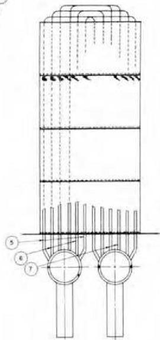

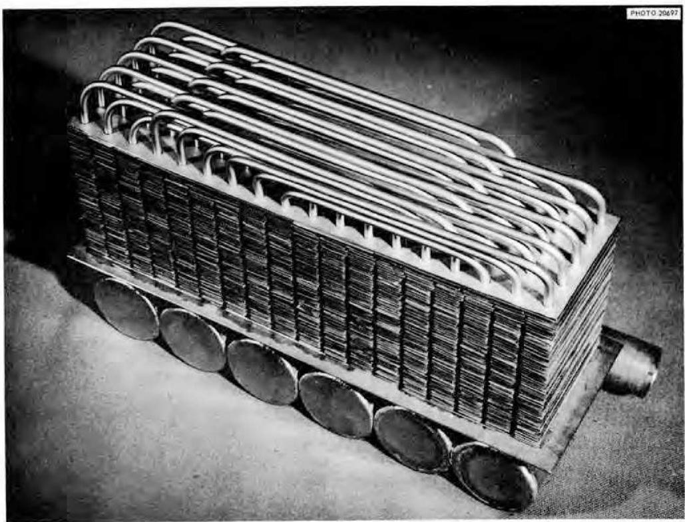  
Fig. 17. Assembly Drawing of 500-kw NaK-to-Air Radiators.   
Fig. 18. Sodium-to-Air Radiator with Stainless Steel Fins Fabricated by the Combination Welding and Brazing Technique.

These rebrazed sites were considered undesirable because of their adverse effect upon the mechanical properties of the base materials. Increased grain growth of the parent material resulted; and embrittlement, resulting from the diffusion of constituents from the brazing alloys, was promoted. Also, the temperature gradients across the radiator during rebrazing induced localized stresses in the rigid structure, which condition might initiate the formation of microfissures in the braze or base metal.

In view of these difficulties, a combination welding and brazing procedure was developed whereby all manifold welds (butt welds, nozzle welds, and end-cap welds) were inert-arc-welded before subsequent dry-hydrogen brazing. Also, all tube-to-header joints were welded with the intention of back brazing as discussed in the section, "Back Brazing of Tube-to-Header Joints". As was explained in this previous section, back brazing eliminates the notch effect and prevents leaks in the event of corrosion through localized areas of shallow weld penetration. Back brazing can also be used to seal occasional welds containing small cracks or other defects. This procedure proved to be successful, and two leaktight liquid-metal-to-air test radiators were fabricated after only one brazing operation on each.[4,9] Photographs of these two units are shown in Figs. 18 and 19. In view of the satisfactory results obtained by this duplex technique, it was chosen as the best method for use in the construction of the 500-kw units.

# 2. Fabrication Procedure.

a. Tube bending. The Inconel tubes were bent to the desired configurations before being delivered to the Welding and Brazing Group. It was specified that these tubes should have an outside diameter between 0.187 in. and 0.188 in. to permit proper fitup for flow of the brazing alloy in the joint. The use of tubing with an outside diameter of 0.185 in. resulted in such a loose tube-to-fin fitup

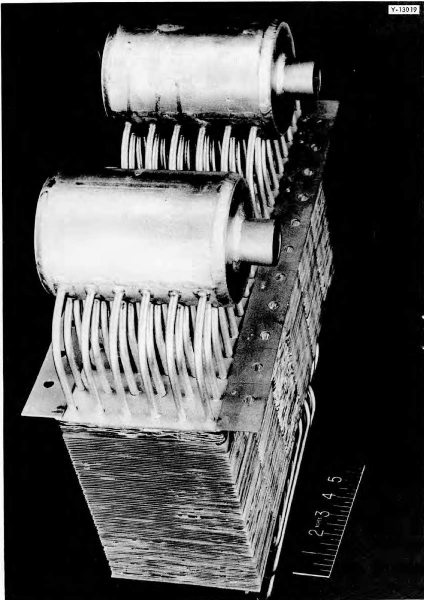  
Fig. 19. Sodium-to-Air Radiator with High-Conductivity Fins Fabricated by the Combination Welding and Brazing Technique.

that bonding was extremely inconsistent, whereas tubing with an outside diameter of 0.190 in. was so large that assembling the fins on the tubes was very difficult. The tubing was radiographically inspected and vacuum-tested for flaws before the radiators were assembled, but no apparent defects were found.

b. Fin shearing and inspection. Approximately 1500 ft of type 310 stainless-steel-clad-copper high-conductivity fin material was obtained in coiled spools from the General Plate Div. of Metals & Controls Corp. The spools were purchased in 15/16-in. widths because this was one of the specified fin dimensions. The 0.010-in.-thick material was composed of 0.006 in. of OFHC copper roll-clad on each side with 0.002 in. of stainless steel for oxidation resistance. Twenty-two hundred fins were individually sheared from these coils to the desired 15/16-in. by 8-in. final dimensions. Precision shearing was required since it was important to have the copper edge completely exposed for the aluminizing edge treatment (to be described in the next section). The fins were then carefully inspected for such surface imperfections as blistering and exposed copper. Thorough degreasing in polychlorethylene was also performed prior to aluminizing.

c. Aluminum-bronze edge-protection process. The edge protection of exposed copper on the sheared fin edges is extremely desirable in order to minimize oxidation and in order to overcome the severe fin distortion resulting from the volume changes occurring on account of the formation of the oxide. An aluminizing process was developed whereby edge protection is obtained through the formation of a highly oxidation-resistant copper-aluminum alloy. A procedure was devised to permit the simultaneous edge protection of large numbers of type 310 stainless-steel-clad copper-sheet fins. This procedure, for which the precision fin-shearing was required, is presented below.

The fins were stacked in groups of approximately 200 and securely clamped with $1/4$ -in.-thick stainless steel side plates. The exposed copper edges were then sprayed with three coats of Kestron acrylic spray produced by Aerosol Products Company, South Hampton, Pennsylvania. This sealed the cracks between fins and prevented the flow of an aluminum-bearing slurry onto the stainless steel cladding. A coat of slurry, consisting of 100 cc of acrylic resin and $40\mathrm{g}$ of atomized aluminum powder (-325 mesh), was then applied evenly to the fin edges. After drying sufficiently, the clamped fins were heated in helium at $750^{\circ}\mathrm{C}$ for 2 l/2 hr in order to accelerate the formation of the oxidation-resistant aluminum bronze. A high helium flow rate (80 ft $^3$ /hr) was maintained for the first hour but was reduced to 40 ft $^3$ /hr for the remaining heat treatment. After cooling, the excess aluminum was easily removed from the fin edges with the aid of a brass wire brush.

Test specimens of fins edge-protected by this method have been metallographically examined after exposure for 100, 200, 500, and 1000 hr in air at $1500^{\circ}\mathrm{F}$ . Fig. 20 illustrates the excellent protection provided by this technique after 1000 hr at this temperature. The depth of oxide penetration into an unprotected fin is shown on the same print for comparison purposes. Cyclic tests on these aluminized fins were also conducted to evaluate their stability under simulated service conditions. After 500 hr at $1500^{\circ}\mathrm{F}$ and after having been intermittently cooled to room temperature 200 times during this period, no adverse effects were evident.

After edge protection was completed, the fins were punched to accommodate the Inconel tubing. It was found that the use of a lead-oxide die lubricant should be omitted if possible, since the subsequent removal of this substance is difficult. However, if this lubricant is used, it is essential that every trace of the lead oxide must be removed.

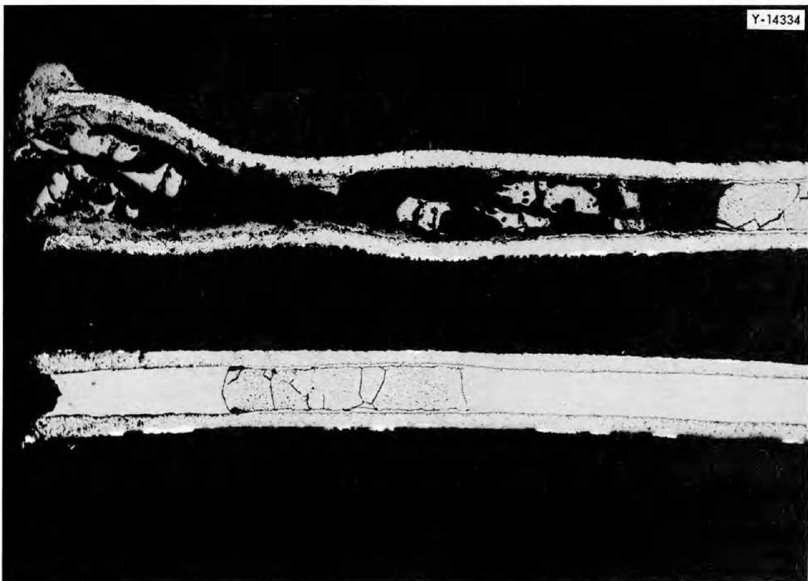  
Fig. 20. Photomicrograph Exhibiting the Excellent Fin Edge-Protection to High-Temperature Oxidation Afforded by the Aluminum-Bronzing Operation. Fin on left was unprotected. Etch: None. 60X.

d. Preplacement of brazing alloy. Since this radiator was to have stainless-steel-clad copper, high-conductivity fins, a brazing alloy was required which possessed a flow point below $1083^{\circ}\mathrm{C}$ . The alloy, $^{10}$ Coast Metals No. 52, exhibits good flowability at $1020^{\circ}\mathrm{C}$ and its mechanical strength at the service temperature of $1500^{\circ}\mathrm{F}$ is sufficient to warrant its use in this high-temperature application. Its resistance to oxidation is excellent as can be seen in Fig. 21, a photomicrograph of a brazed Inconel T-joint that was heated at $1500^{\circ}\mathrm{F}$ for 500 hr in static air. The compatibility of this metal with liquid sodium is also good, as can be noted in Fig. 22, which shows a brazed "A" nickel T-joint tested for 100 hr in sodium at $1500^{\circ}\mathrm{F}$ . Stability in sodium is an important prerequisite for two reasons: (1) the brazing alloy may actually come in contact with the liquid metal during service, if it is used to seal small pin-hole leaks, or if sufficient weld metal corrosion occurs to expose a new braze-metal surface; (2) severe tube-wall dilution during brazing or solid-state diffusion in service may produce a high concentration of brazing-alloy constituents near the circulating liquid.

An analysis of the design of the radiator shown in Fig. 19 indicated that critical control of the quantity of brazing alloy placed on each tube-to-fin joint must be maintained. An amount of braze metal only sufficient to protect the exposed copper on the punched lips of the high-conductivity fins was used. Applying alloy in excess of the amount required could result in "puddling", whereby the excess is merely concentrated on the bottom fins. This latter situation is undesirable since the air passages between these fins may be sealed and localized fin distortion can occur.

The use of extruded wires, as a means of obtaining controlled quantities of brazing alloy, has been investigated extensively; but the lack of a suitable binder makes their use unattractive. With the use of acrylic-binder materials, wires are

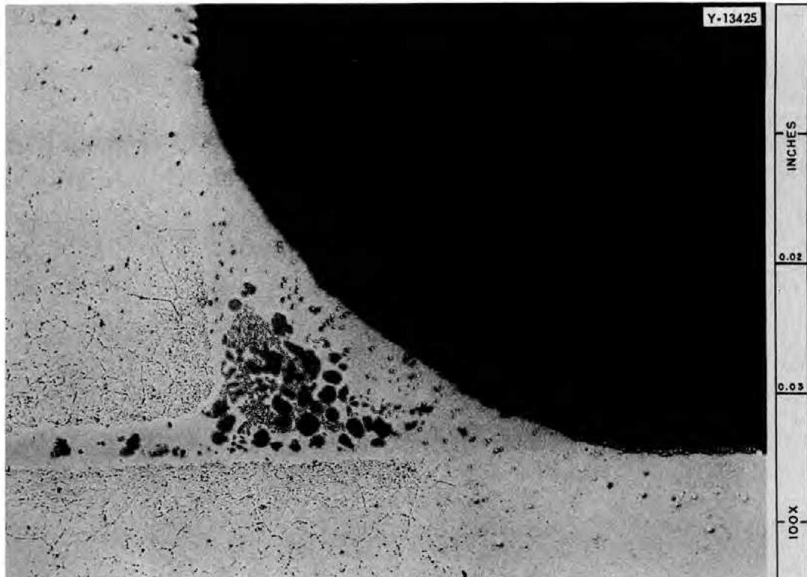

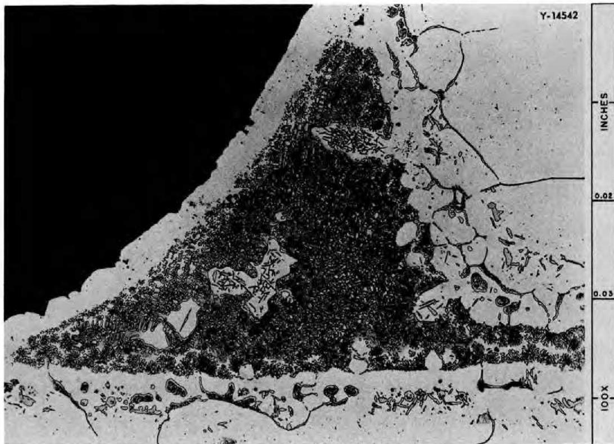  
Fig. 21. Inconel T-Joint Brazed with Coast Metals No. 52 Alloy and Oxidized for 500 hr at $1500^{\circ}\mathrm{F}$ . No attack is present. Etch: electrolytic; oxalic acid. 100X. Reduced $12.5\%$ .   
Fig. 22. "A" Nickel T-Joint Brazed with Coast Metals No. 52 Alloy and Tested in Sodium for 100 hr at $1500^{\circ}\mathrm{F}$ . Negligible attack is present. Etch: electrolytic; oxalic acid. 100X. Reduced $12.5\%$ .

produced that become brittle after aging for a few hours at room temperature. With other binders that were tested, wires were produced that had insufficient strength to permit ease of handling. Since Coast Metals No. 52 brazing alloy can be obtained as a fine powder, a dry-powder technique of brazing alloy preplacement was an obvious alternative.

A process was developed whereby a controlled amount of alloy could be preplaced on each tube-to-fin joint. A stainless steel template, containing holes that were precision drilled, was placed over a sheared fin leaving an annulus between each fin lip and the template hole peripheries. After application of the brazing-alloy powder and subsequent removal of the excess, a ring of alloy of controlled quantity remained. Upon careful removal of the template, the powder was made secure to the fin with Microbraz cement and allowed to dry. A photograph showing a fin, a template, and a fin with preplaced alloy is presented in Fig. 23. This 1/16-in.-thick template, which contains holes 0.246 in. in diameter, was found to provide the optimum quantity of brazing alloy for each joint and was, therefore, used to replace alloy on the 2200 fins in preparation for assembly on the tubes.

e. Assembling of fins. The assembling of the fins on the radiator was conducted with the tube-bends down, as is shown in Fig. 24, a photograph of the initial stages of fabrication of one radiator. The assembly of the first 4 in. of fins was extremely time-consuming since the tubes were not held rigidly in place. A heavy metal template was necessary to force each individual fin in place. Assume of this difficulty was also in consequence of the slight curvature of the straight lengths of tubing, it is thought that improvements in the bending techniques might substantially assist the assembling of future units.

A set of lucite "finger" jigs was designed and built, which simplified the problem of assembling the fins. These jigs, which can be seen in Fig. 24, enabled

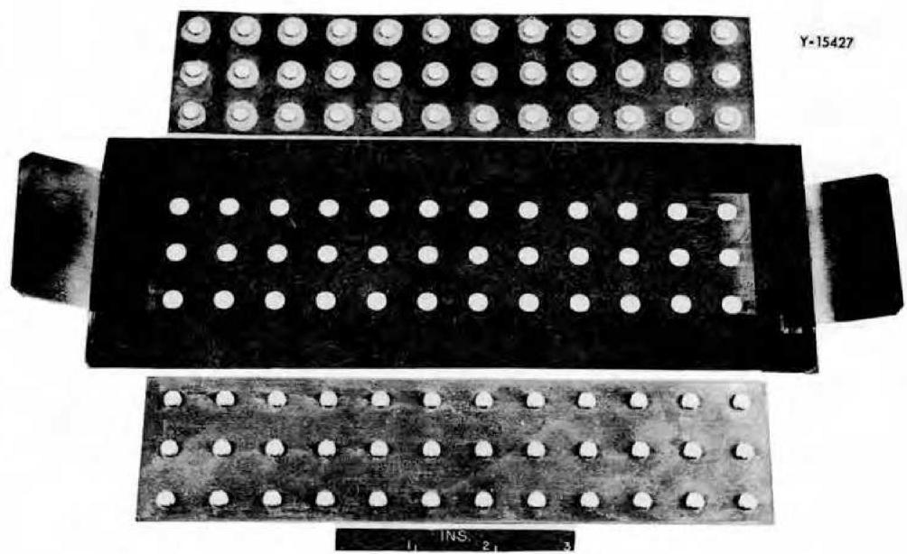  
Fig. 23. A Fin, a Template, and a Fin with Preplaced Alloy.

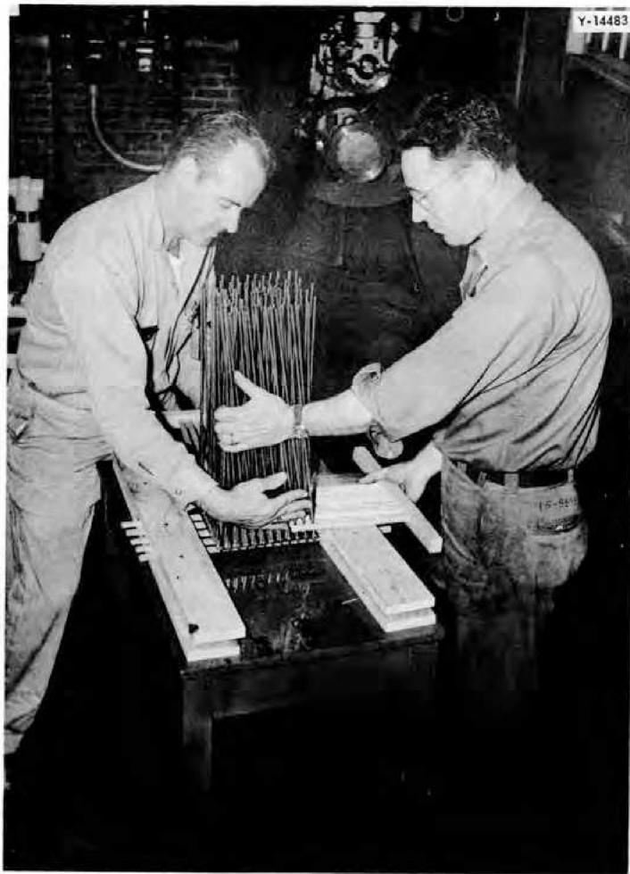  
Fig. 24. Fin Assembly in Early Stages of Fabrication. It can be seen that the process was difficult even with the use of precision jigs.

the tubes to be aligned in their desired positions; namely, to fit the punched geometry of the fin. Supporting sheet-metal channels were placed at 4-in. intervals to impart over-all structural stability to the radiator. These channels were inert-arc welded to form sheet-metal side plates. Two thin sheets of Inconel were also placed tightly together against the channels at these 4-in. intervals. This modification was used to avoid the undesirable accumulation of excess alloy which could result from normal variations in the quantity deposited. The capillary joint between these two Inconel sheets acts as a sump to accommodate any excess brazing alloy.

f. Assembling of headers. The original design of these radiators required that all tubes enter the cylindrical headers normal to the curvature at the point of entrance. Sample specimens were prepared to determine the optimum tube-bending and fitting techniques, but at the time, no simple method was devised. The complex tube design resulted in extreme difficulties in placing the headers on the tubes.

In view of these complications, a new header, utilizing a 3-in., schedule 40 pipe, was designed and accepted. All tubes, except the two outside rows on each radiator half-section, entered the headers without being bent. Several test samples were then prepared for the determination of the proper bending techniques and for use in the operators' qualification test.

Careful hand-polishing of each of the tubes was required to permit assembling the split headers without the use of additional force from a hand press. Precision drilling and deburring of the headers was also employed to prevent bending and distorting the thin-walled Inconel tubes. After assembling the headers, the tubes were meticulously hand-filed to conform to the exact curvature of the interior surfaces. Abrasive grinding or wet-milling was avoided since entrapped abrasive or lubricant would lead to difficulty during tube-to-header welding.

g. Welding. All tube-to-header welding on the two radiators was performed using the manual inert-arc-process. Test samples were prepared to determine the optimum welding conditions. A welding current of approximately 35 amp. was found to give consistently sound welds with good penetration. Helium backup on the underside of the joint was used throughout the welding process.

The manual inert-arc-welding of the split headers, nozzles, and endplates was accomplished by using qualified operators (Appendix 2) and procedures (Appendix 1). Extreme care was taken to insure complete penetration and good coverage by the backing gas.

After the manifold welds were completed, the integrity of the system was determined by helium leak testing. Although it was assumed that pinhole leaks could be sealed during the subsequent brazing operation, large leaks were not permitted. It should be pointed out that headers containing questionable welds can be removed by simply cutting off the tubes at the underside of the header plates. New headers can then be attached by rebending the tubes and repolishing as discussed above. This procedure was actually employed to obtain leaktight units before brazing was done on these radiators.

h. Brazing. The back brazing of the tube-to-header welds and the brazing of the tube-to-fin joints were accomplished by use of a conventional canning technique. The brazing alloy had already been preplaced on the fins, as described previously, and a medicine-dropper technique was used to place the braze slurry on the tube-to-header joints.

A special baffle design was used for the brazing of these radiators because it was very important to flush out the copious amounts of methacrylate binder present in the tube-to-fin matrix. A sheet-metal cover was attached to the front of the radiator, and the clean, dry inlet gas was forced between the fins and then was

exhausted to the outside of the can. The inside of the sheet-metal cover and the inlet tube were designed to permit relatively even flow throughout the entire frontal area. A good circulation of hydrogen was also obtained around the tube-to-header joints.

The radiator was securely supported on a special heavy framework to prevent sagging or distortion during the high-temperature brazing cycle. The support bars were made from stainless steel which had been previously aluminized at $1500^{\circ}\mathrm{F}$ . This aluminizing prevented the support bars from being brazed to the radiator because the aluminum oxide film prevents wetting by the Coast Metals No. 52 alloy.

The radiator was placed in the brazing can with four thermocouples attached to various positions around the periphery. This temperature measurement around the radiator was desirable from a control standpoint, even though previous experiments had indicated that all parts of a unit of this size could be held within $25^{\circ}\mathrm{C}$ of the desired brazing temperature. In the preliminary experiments, 12 thermocouples were attached at various points on the test specimen. This close control was necessary since the alloy possessed a flow temperature of $1020^{\circ}\mathrm{C}$ , and the copper in the fins melts at $1083^{\circ}\mathrm{C}$ .

The thermal cycle used in brazing is shown in Fig. 25. So that distortion would be minimized, the unit was placed in the furnace at room temperature and was gradually raised to the brazing temperature. Fig. 26, a photograph of the two completed radiators, shows that negligible distortion is present. No excess brazing alloy was encountered, which verifies the practicality of the "sump" technique for large assemblies. Good flowability of the brazing alloy was obtained, and a photomicrograph of a section of a typical tube-to-fin joint is given in Fig. 27. This joint was brazed under conditions simulating those used in the fabrication of the 500-kw radiators. It can be seen that good edge protection of the exposed copper

Y-15072

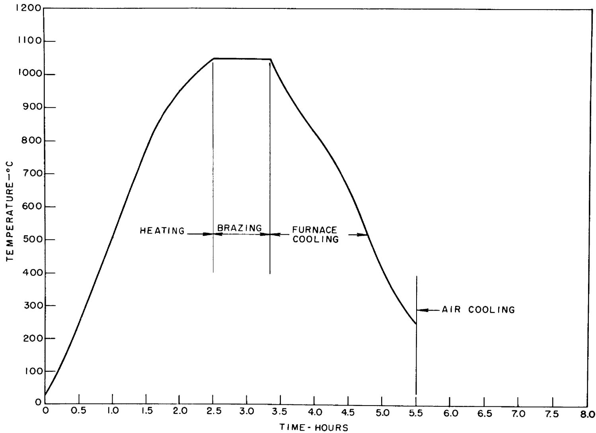  
Fig. 25. Typical Time-Temperature Thermal Cycle Used When Brazing Radiators.

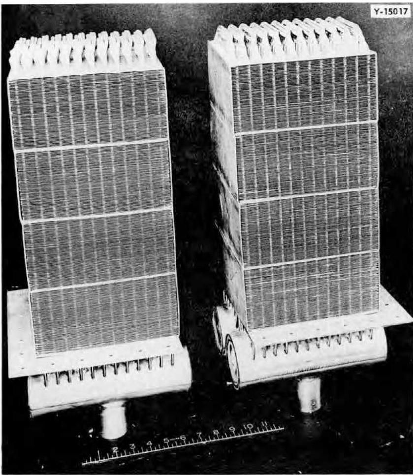

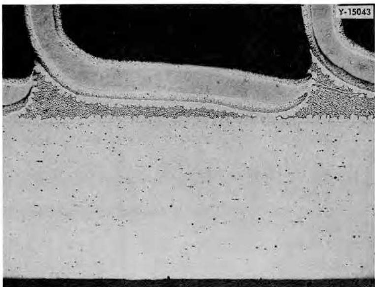  
Fig. 26. Completed $\frac{1}{2}$ -Mw and 1-Mw Sodium-to-Air Radiators.   
Fig. 27. A Typical Tube-to-Fin Joint Showing Edge-Protection of Exposed Copper on Punched Fin Lips. Etch: None. 50X. Reduced $14\%$ .

was obtained in the tube-to-fin joints and that good filleting was present in the tube-to-header joints.

# 3. Summary.

Leak testing with a mass-spectrometer helium leak detector indicated no flaws in the integrity of the closed sodium circuits. The two radiators were submitted to the Aircraft Reactor Engineering Division for installation in the test rig. An analysis of the fabrication cost of these two radiators is presented in Appendix 4.

C. Fabrication of 20-Tube High-Velocity Heat Exchanger.

# 1. Introduction.

A small-scale heat-exchanger test1 is being conducted by the Aircraft Reactor Engineering Division to determine the heat-transfer characteristics of fluorides through a Reynolds number range of 0 to 5500. For this test, the fabrication of the fuel-to-NaK heat exchanger, shown in Fig. 28, was required. The heat exchanger is installed in the rig shown schematically in Fig. 29. The design of this unit specified that the 3/16-in. OD, 0.017-in.-wall Inconel tubes were to be joined to a dished header at the NaK inlet end and to a radial header at the NaK outlet end. A thick-walled Inconel pressure vessel was used to confine the molten fuels located outside the tubes. All welds in this assembly were performed by using the manual inert-arc-process to ensure the utmost in soundness and corrosion resistance. With the exception of the tube-to-header joints, which were later back brazed, complete weld penetration was utilized throughout. All welding procedures (Appendix 1) and operators (Appendix 2) were qualified according to rigid specifications. The root of the welds was completely protected by an inert gas at all times in order to minimize scaling and oxidation.

Back brazing of the tube-to-header joints was employed for two reasons: (1) to eliminate the "notch effect" resulting from incomplete weld penetration, and (2) to

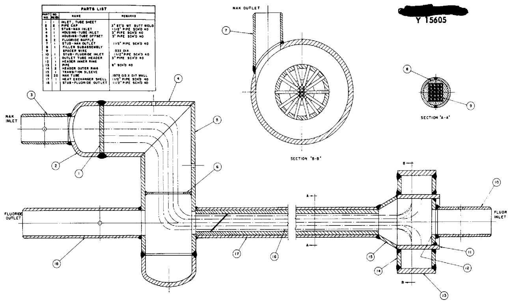  
-38-   
Fig. 28. Assembly Drawing of 20-Tube High-Velocity Heat Exchanger.

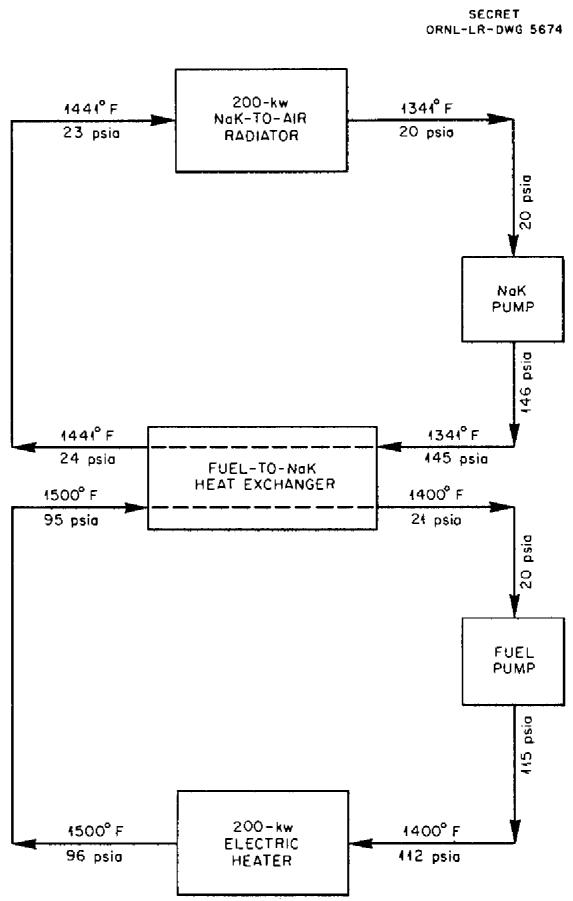  
Fig. 29. Flow Diagram for Loop Containing 20-Tube High-Velocity Heat Exchanger.

ensure against the development of leaks in the event of corrosion through an area of shallow weld penetration. Since the corrosive environment present in this heat exchanger was to be the same as that in the 100-tube heat exchangers, low-melting Microbraz was chosen as the most desirable brazing alloy. A discussion of the properties of the alloy was presented in the section "Back Brazing of Tube-to-Header Joints".

2. Fabrication Procedure.

a. Welding sequence. The welding operations and the leak testing were performed in the order listed below:

1. welding the tubes to NaK inlet header,   
2. welding the tubes to NaK outlet header and then leak testing the welds,   
3. welding the tube-inlet housing to offset housing,   
4. welding the fluoride outlet stub to offset housing,   
5. splitting of offset housing and welding a baffle to it,   
6. welding the outer ring headers to a 6-in. pipe,   
7. welding the inner ring header to fluoride inlet stub,   
8. welding the above part (Step 7) to the NaK outlet header,   
9. welding the assembly (Step 8) to the outer ring headers,   
10. welding the NaK inlet stub to a 3-in. pipe cap,   
11. welding the assembly (Step 10) to the NaK-inlet-tube sheet,   
12. welding the housing (Step 5) to the NaK-inlet-tube sheet and to itself,   
13. welding the pipe cap to the assembly (Step 12),   
14. assembling the wire spacers and filler plates,   
15. welding the pressure shell,   
16. welding the transition sleeve onto the pressure shell and the NaK outlet header,   
17. leak testing the entire unit,   
18. welding the "window" after back brazing.

b. Brazing. The back-brazing process was performed in a dry-hydrogen atmosphere and conventional canning procedures were used. Two brazing operations were required because the Globar pit furnace available in the Welding and Brazing Laboratory did not possess a heating zone of sufficient length to heat both ends of the unit up to the brazing temperature. A "window" was removed from the pressure shell to permit preplacement of the brazing alloy on the NaK inlet end of the tube bundle. A photograph of the window in the NaK inlet end is presented in Fig. 30. The window was welded shut and helium leak testing indicated that all the welded and brazed joints were leaktight. A photograph of the completed heat exchanger is shown in Fig. 31.

# 3. Summary.

The unit was installed in the test loop, and operated satisfactorily in service for approximately 1500 hr before termination of the test.

Y-14799

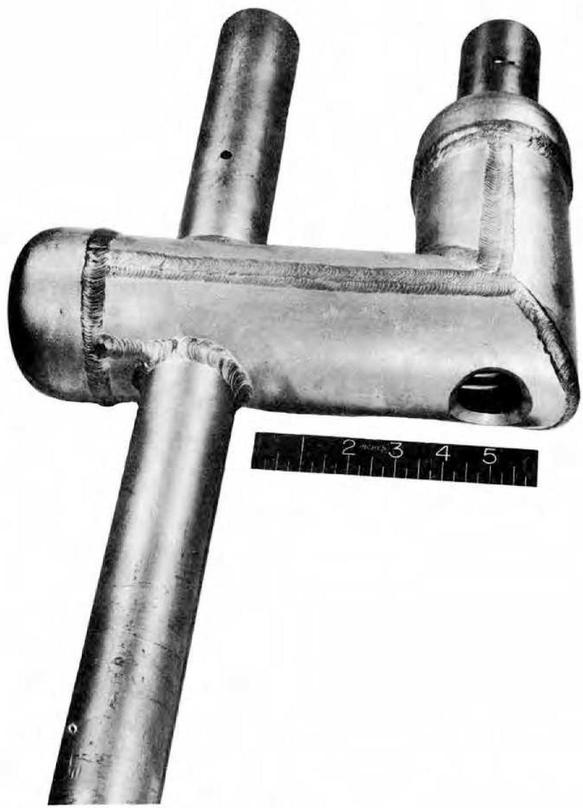

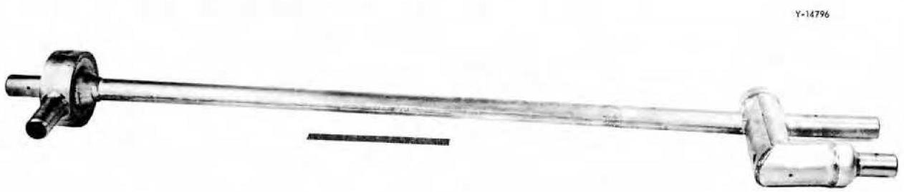  
Fig. 30. The NaK Inlet End of a 20-Tube Heat Exchanger. Note the "window" through which the brazing alloy was preplaced and inspected.   
Fig. 31. The Completed 20-Tube High-Velocity Heat Exchanger.

# CONCLUSIONS

On the basis of experience obtained in the fabrication of two 500-kw heat ex-changers, two 500-kw radiators, and a 20-tube high-velocity heat exchanger, the following conclusions can be drawn:

(1) The fabrication of heat exchangers and radiators containing thin-walled small-diameter tubes in closely packed configurations can be performed successfully if proper construction procedures and equipment are employed.   
(2) A combination fabrication procedure, in which the tube-to-header joints are welded and back brazed, the manifold joints are welded, and the tube-to-header joints are brazed, is a very satisfactory method of construction.   
(3) High quality, leaktight tube-to-header welds can be produced semiautomatically once the optimum conditions and qualification of procedure have been determined.   
(4) High quality, leaktight tube-to-header and manifold welds can be made manually if suitable joint designs and if qualified procedures and operators are employed.   
(5) Dry-hydrogen furnace brazing can be used successfully in the fabrication of large, complex assemblies if suitable gas-purification equipment is used and if proper manifolding and jigging techniques are employed.

# LIST OF FIGURES

1. Flow Diagram of Loop for Testing Intermediate Heat Exchanger No. 2.   
2. Assembly Drawing of 500-kw Fuel-to-NaK Heat Exchanger.   
3. Tube-to-Header Weld Exhibiting Extensive Microfissuring.   
4. Tube-to-Header Weld Exhibiting Crack in Early Stages of Propagation.   
5. Tube-to-Header Weld After Back Brazing.   
6. Semiautomatic Tube-to-Header Welding Equipment.   
7. Tube-to-Header Weld Produced with the Semiautomatic Welding Equipment.   
8. One End of Heat Exchanger After Welding Tube-to-Header Joints.   
9. Header in Early Stages of Fabrication.   
10. A Completed Leaktight Header Section.   
11. An Inconel T-Joint Brazed with Low-Melting Microbraz and Tested in Fluoride Bath No. 44 for 100 hr at $1500^{\circ}\mathrm{F}$ . Only very slight attack is present.   
12. An Inconel T-Joint Brazed with Low-Melting Microbraz and Tested in Sodium for 100 hr at $1500^{\circ}\mathrm{F}$ . Negligible attack is present.   
13. Typical Time-Temperature Thermal Cycle Used in the Brazing of Heat Exchangers.   
14. Sample Tube Bundle Showing Two Types of "Comb Spacers".   
15. One Tube Bundle After Completion of Root Weld Pass on Pressure Shell.   
16. A Completed l-Mw Heat Exchanger.   
17. Assembly Drawing of 500-kw NaK-to-Air Radiators.   
18. Sodium-to-Air Radiator with Stainless Steel Fins Fabricated by the Combination Welding and Brazing Technique.   
19. Sodium-to-Air Radiator with High-Conductivity Fins Fabricated by the Combination Welding and Brazing Technique.   
20. Photomicrograph Exhibiting the Excellent Fin Edge-Protection to High-Temperature Oxidation Afforded by the Aluminum-Bronzing Operation. Fin on left was unprotected.   
21. Inconel T-Joint Brazed with Coast Metals No. 52 Alloy and Oxidized for 500 hr at $1500^{\circ}\mathrm{F}$ . No attack is present.

22. "A" Nickel T-Joint Brazed with Coast Metals No. 52 Alloy and Tested in Sodium for 100 hr at $1500^{\circ}\mathrm{F}$ . Negligible attack is present.   
23. A Fin, a Template, and a Fin with Preplaced Alloy.   
24. Fin Assembly in Early Stages of Fabrication. It can be seen that the process was difficult even with the use of precision jigs.   
25. Typical Time-Temperature Thermal Cycle Used When Brazing Radiators.   
26. Completed 1/2-Mw and 1-Mw Sodium-to-Air Radiators.   
27. A Typical Tube-to-Fin Joint Showing Edge-Protection of Exposed Copper on Punched Fin Lips.   
28. Assembly Drawing of 20-Tube High-Velocity Heat Exchanger.   
29. Flow Diagram for Loop Containing 20-Tube High-Velocity Heat Exchanger.   
30. The NaK Inlet End of a 20-Tube Heat Exchanger. Note "window" through which the brazing alloy was preplaced and inspected.   
31. The Completed 20-Tube High Velocity Heat Exchanger.

# BIBLIOGRAPHY

1. R. E. MacPherson, ANP Quar. Prog. Rep. March 10, 1955, ORNL-1864, p 36.   
2. P. Patriarca et al., ANP Quar. Prog. Rep. June 10, 1953, ORNL-1556, p 72.   
3. A. P. Fraas et al., ANP Quar. Prog. Rep. March 10, 1954, ORNL-1692, p 18.   
4. R. J. Gray, P. Patriarca, and G. M. Slaughter, ANP Quar. Prog. Rep. Sept. 10, 1954, ORNL-1771, p 124.   
5. E. E. Hoffman, C. F. Leitten, W. D. Manly, P. Patriarca, and G. M. Slaughter, An Evaluation of the Corrosion and Oxidation Resistance of High-Temperature Brazing Alloys, to be published.   
6. A developmental brazing alloy obtained from the Wall Colmonoy Corp. Detroit, Michigan.   
7. W. S. Farmer et al., Preliminary Design and Performance Studies of Sodium-to-Air Radiators, ORNL-1509 (Aug. 26, 1953).   
8. H. Inouye, High-Conductivity Fin Materials for Radiators, to be published.   
9. P. Patriarca, G. M. Slaughter, J. Cisar, and K. W. Reber, Met. Semiann. Prog. Rep. April 10, 1954, ORNL-1727, p 64.   
10. C. V. Foerster and R. C. Kopituk, New High-Nickel Brazing Alloys, Publication of Coast Metals, Inc., Little Ferry, New Jersey.

-46-

# APPENDIX 1

PROCEDURE SPECIFICATION P.S.-1 FOR D. C. INERT ARC WELDING OF INCONEL PIPE, PLATE, AND FITTINGS

First Revision 5-1-55

# SCOPE:

1. This specification covers the procedure for welding of Inconel pipe, plate and fittings in the range of thickness .109" through .500" using the inert-gas-shielded tungsten arc process (D.C.).   
2. All welding performed by this procedure shall be done by welders qualified in accordance with operators Qualification Test Specification QTS-1. If the operator has not welded in accordance with this procedure specification during the preceding 30 day period, he shall be required to pass tests in the 2G and 5G positions on pipe or plate in sizes similar to that being used in the construction before he will be eligible to perform work in accordance with this procedure.

# REFERENCES:

Procedure Specification Figure PS-1-A. Qualification Test Specification QTS-1. Qualification Test Specification Figure QTS-1-A. ASTM B 166-49T (Rods and Bars). ASTM B 167-49T (Seamless pipe and tubing). ASTM B 168-49T (Plate, sheet and strip). ASME Boiler & Pressure Vessel Code Section IX. INCO Technical Bulletin T-2.

# PROCESS:

The welding shall be done by the inert-gas-shielded tungsten arc process (D.C.).

# BASE METAL:

The base metal shall conform to the specifications ASTM B 166-49T, ASTM B 167-49T and ASTM B 168-49T for Inconel rods or bars, seamless pipe or tubing, plate, sheet or strip.

# FILLER METAL:

The filler metal shall be Inconel INCO # 62 or equal.

# POSITIONS:

The welding may be done with the axis of the pipe in the horizontal rolled, horizontal fixed and vertical fixed positions. The welding of the plate shall be done in the flat, horizontal, vertical or overhead positions.

# PREPARATION OF BASE METAL:

1. The pipe and plate to be joined by welding shall be beveled and fitted in accordance with the joint design shown in Figure P.S.-1-A.

If machine preparation is impractical, grinding, filing or other means may be employed to obtain the same results as machining. Before making the welds, all filing, grease, etc., shall be removed and the pipe cleaned.

2. Pipe or plate to be welded shall be supported to prevent excessive stress during the welding operation.

# CLEANING:

Before assembling any joints to be welded, the mating surfaces and adjacent areas shall be thoroughly cleaned by wiping with clean cloths saturated with trichloroethylene.

# Caution:

After cleaning with trichloroethylene, allow time for fluid to evaporate before welding is started.

# NATURE OF WELDING CURRENT:

The welding current shall be direct current (D.C.). The base metal shall be on the positive side and the electrode on the negative side of the line (straight polarity).

# INERT GAS (MONATOMIC):

1. Argon of $99.8\%$ purity shall be used as the shielding gas through the welding torch at the rate and with the proper size gas cup as specified on Figure PS-1-A and shall be the minimum applied in field welding.   
2. For the inert blanket inside the pipe, helium of minimum purity of $99.99\%$ shall be used at all times welding is being performed.

# WELDING TECHNIQUE:

1. The welding technique, electrode size, amperage, and size of filler metal shall be as shown on Figure PS-1-A. A maximum variation of plus or minus $10\%$ is permissible for welding currents listed.   
2. The basic principle of the welding technique employed is to insure that all welding is done in a constant atmosphere of inert gas. Therefore it is absolutely necessary to perform all welding in the field or shop in a quiet atmosphere where no air current or draft exists in the immediate vicinity where a joint is being welded. In a majority of cases where welding is being performed it is necessary to shield the location to assure a constant inert gas atmosphere free from air disturbances and drafts in the immediate welding area.

3. The inside or all internal surfaces of the joint to be welded for a minimum of 10 inches on each side of the weld shall be purged with inert gas (helium) before the welding starts and shall remain blanketed until the temperature of the metal has returned below $400^{\circ}\mathrm{F}$ .

4. The tungsten electrode shall protrude approximately 1/4 inch to 3/8 inch beyond the edge of the gas cup, and in order to have best arc control, the tungsten electrode shall be dressed to a sharp point or a bevel having an included angle of approximately $90^{\circ}$ . The tungsten size used shall be as specified in Figure PS-1-A.

5. A copper band approximately 1 inch wide shall be made available near the joint to be welded. The arc is struck by swinging the torch in a pendulum like motion immediately over the copper band toward that point on the band where the welding is to start, allowing the tungsten tip to become red. The operator shall then go to the welding groove without breaking the arc. This entire operation shall be repeated each time the arc is broken.

6. The torch shall be moved uniformly at all times in order to control uniform and accurate bead width. A short arc shall be maintained so that the pool of molten metal will appear bright, free of internal porosity and/or oxides and to assure that maximum penetration and fusion is obtained.

7. The filler wire should be added or kept in front of the heat at an angle of from 20 to $30^{\circ}$ . The wire should be fed in short jabs into the very front edge of the weld pool and as near as where required, drawing the arc back along the weld if necessary to prevent the arc from playing on the end of the filler metal.

8. A uniform quantity of filler wire should be added or melted off with each jab and the filler wire withdrawn about $1/4$ inch out of the welding zone with the frequency of adding wire to be adjusted in relation to the forward welding speed to give the required welding bead. Extreme care should be taken at all times to keep the end of the welding rod in the atmosphere of argon.

9. Precautionary measures are to be followed to obtain continuous and uniform penetration for the entire root of the weldment. Root penetration will not be permitted in excess of 1/16 inch. Caution shall be exercised at all times with particular emphasis on the first pass when starting and stopping to prevent voids and pinholes at the root of the weld.

10. The flow of argon shall be maintained on the electrode and the weld until returned to normal color.

Care should be exercised to prevent blowing the pool of molten metal with the torch or stirring it with the filler wire. If at any time the tungsten electrode becomes contaminated with filler or weld metal, welding should stop at once and the electrode cleaned or broken off and reshaped before welding is continued. This is to keep the weld free of tungsten contamination.

# DEFECTS:

Any cracks or blowholes that appear on the surface of any tack weld or bead of welding shall be removed by chipping, grinding, or filing.

All surface oxides must be removed by wire brushing with a stainless steel wire brush before depositing the next successive bead of welding.

# PREHEATING:

In general, preheating is not necessary except when metal temperature is $32^{\circ}\mathrm{F}$ or below, then the joint shall be preheated to $70^{\circ}\mathrm{F}$ or over for 6 inches on each side of the welding groove.

# IDENTIFICATION OF WELDS:

Each weldment shall be identified by the welding operator's stencil number adjacent to the weld, placed at the most convenient point of exposure for ready examination.

# GENERAL:

1. At all times during welding of joints in accordance with this specification the authorized inspector shall evaluate the weld quality in terms of the soundness requirements of Qualification Test Specification QTS-1. This shall include the right to remove and test questionable welds. If the joint is substandard to the soundness requirements of QTS-1 the operator shall be disqualified until a satisfactory re-test is made.   
2. It is of utmost importance that the operator welding under this procedure check all fit ups and keep the proper amount of argon gas flowing on the work to assure that the welding being performed will be of the highest quality possible.   
3. It shall be the duty of the welding operator using this procedure to report to his foreman any irregularities which might impair the quality of workmanship desired by this procedure.

T. R. Housley, Chief Welding Inspector Engineering & Mechanical Division

P.S.-1 First Revision

Date: 5-1-55

P. Patriarca, Metallurgist  
Metallurgy Division

<table><tr><td rowspan="4">JOINTDETAILS</td><td colspan="7">POSITION 2G</td><td colspan="7">POSITION 5G</td><td></td><td></td><td></td><td></td></tr><tr><td>16-64-100°90°100°90°100°100°100°100°100°100°100°100°100°100°100°100°100°100°100°100°100°100°100°100°100°100°100°100°100°110°110°110°110°110°110°110°110°110°110°110°110°110°110°110°110°110°110°110°110°110°110°110°110°110°100°90°100°90°100°90°100°90°100°90°100°90°100°90°100°90°100°90°100°90°100°90°100°90°100°90°100°90°100°90&#x27;36&#x27;36&#x27;36&#x27;36&#x27;36&#x27;36&#x27;36&#x27;36&#x27;36&#x27;36&#x27;36&#x27;36&#x27;36&#x27;36&#x27;36&#x27;36&#x27;36&#x27;36&#x27;36&#x27;36&#x27;36&#x27;36&#x27;36&#x27;36&#x27;36&#x27;36&#x27;36&#x27;36&#x27;36&#x27;36&#x27;36&#x27;36&#x27;36&#x27;36 &#x27;36&#x27;36&#x27;36&#x27;36&#x27;36&#x27;36&#x27;36&#x27;36&#x27;36&#x27;36&#x27;36&#x27;36&#x27;36&#x27;36&#x27;36&#x27;36&#x27;36&#x27;36&#x27;36&#x27;36&#x27;36&#x27;36&#x27;36&#x27;36&#x27;36&#x27;36&#x27;36&#x27;36&#x27;36&#x27;36&#x27;36&#x27;36&#x27;36&#x27; 36&#x27;36&#x27;36&#x27;36&#x27;36&#x27;36&#x27;36&#x27;36&#x27;36&#x27;36&#x27;36&#x27;36&#x27;36&#x27;36&#x27;36&#x27;36&#x27;36&#x27;36&#x27;36&#x27;36&#x27;36&#x27;36&#x27;36&#x27;36&#x27;36&#x27;36&#x27;36&#x27;36&#x27;36&#x27;36&#x27;36&#x27;36&#x27;36&#x27;</td><td>NO. PASSES</td><td>PASS NO.</td><td>TUNG SIZE</td><td>FILLER SIZE</td><td>A-CUP-CFH</td><td>He-BACK-UP CFH</td><td>GAS CUP</td><td>CURRENT AMPS</td><td>NO. PASSES</td><td>PASS NO.</td><td>TUNG SIZE</td><td>FILLER SIZE</td><td>He-CUP-CFH</td><td>He-BACK-UP CFH</td><td>GAS CUP</td><td>CURRENT AMPS</td><td></td></tr><tr><td></td><td>2-3</td><td>1</td><td>1/6</td><td>1/6</td><td>1/6</td><td>30</td><td>45</td><td>7</td><td>45</td><td>2</td><td>1</td><td>1/6</td><td>1/6</td><td>30</td><td>45</td><td>7</td><td>45</td></tr><tr><td></td><td></td><td>2-3</td><td>1/6</td><td>1/6</td><td>1/6</td><td>30</td><td>45</td><td>7</td><td>45</td><td></td><td>2</td><td>1/6</td><td>1/6</td><td>30</td><td>45</td><td>7</td><td>45</td></tr><tr><td rowspan="2">.203</td><td>4-5</td><td>1</td><td>3/2</td><td>3/2</td><td>3/2</td><td>30</td><td>45</td><td>8</td><td>60</td><td>3</td><td>1</td><td>3/2</td><td>3/2</td><td>3/2</td><td>30</td><td>45</td><td>8</td><td>60</td></tr><tr><td></td><td></td><td>2-5</td><td>3/2</td><td>3/2</td><td>30</td><td>45</td><td>8</td><td>80</td><td></td><td>2-3</td><td>3/2</td><td>3/2</td><td>3/2</td><td>30</td><td>45</td><td>8</td><td>80</td></tr><tr><td rowspan="3">.280</td><td>6</td><td>1</td><td>8/1</td><td>8/1</td><td>8/1</td><td>30</td><td>45</td><td>8</td><td>60</td><td>4</td><td>1</td><td>1/1</td><td>3/2</td><td>3/2</td><td>30</td><td>45</td><td>8</td><td>60</td></tr><tr><td></td><td></td><td>2-3</td><td>8/1</td><td>8/1</td><td>3/2</td><td>30</td><td>45</td><td>8</td><td>75</td><td></td><td>2</td><td>1/8</td><td>3/2</td><td>30</td><td>45</td><td>8</td><td>75</td></tr><tr><td></td><td></td><td>4-6</td><td>8/1</td><td>8/1</td><td>3/2</td><td>30</td><td>45</td><td>8</td><td>100</td><td></td><td>3-4</td><td>1/8</td><td>3/2</td><td>30</td><td>45</td><td>8</td><td>100</td></tr><tr><td rowspan="3">.365</td><td>7</td><td>1</td><td>8/1</td><td>8/1</td><td>8/1</td><td>30</td><td>45</td><td>8</td><td>60</td><td>5</td><td>1</td><td>1/8</td><td>3/2</td><td>3/2</td><td>30</td><td>45</td><td>8</td><td>60</td></tr><tr><td></td><td></td><td>2-3</td><td>8/1</td><td>8/1</td><td>8/1</td><td>30</td><td>45</td><td>8</td><td>75</td><td></td><td>2</td><td>1/8</td><td>1/8</td><td>30</td><td>45</td><td>8</td><td>75</td></tr><tr><td></td><td></td><td>4-7</td><td>8/1</td><td>8/1</td><td>8/1</td><td>30</td><td>45</td><td>8</td><td>125</td><td></td><td>3-5</td><td>1/8</td><td>1/8</td><td>30</td><td>45</td><td>8</td><td>125</td></tr><tr><td rowspan="3">1/2</td><td>9</td><td>1</td><td>8/1</td><td>8/1</td><td>8/1</td><td>30</td><td>45</td><td>8</td><td>60</td><td>6</td><td>1</td><td>1/8</td><td>3/2</td><td>3/2</td><td>30</td><td>45</td><td>8</td><td>60</td></tr><tr><td></td><td></td><td>2-3</td><td>8/1</td><td>8/1</td><td>8/1</td><td>30</td><td>45</td><td>8</td><td>80</td><td></td><td>2</td><td>1/8</td><td>1/8</td><td>30</td><td>45</td><td>8</td><td>80</td></tr><tr><td></td><td></td><td>4-9</td><td>8/1</td><td>8/1</td><td>8/1</td><td>30</td><td>45</td><td>8</td><td>140</td><td></td><td>3-6</td><td>1/8</td><td>1/8</td><td>30</td><td>45</td><td>8</td><td>140</td></tr></table>

# APPENDIX 2

OPERATOR'S QUALIFICATION TEST SPECIFICATION QTS-1 FOR INERT ARC WELDING OF INCONEL PIPE, PLATE, AND FITTINGS

First Revision 5-1-55

# SCOPE:

This specification covers the qualification of operators for approval to heliarc weld Inconel pipe, plate, and fittings in accordance with Procedure Specification P.S.-1.

# REFERENCES:

Procedure Specification PS-1.   
Procedure Specification Figure PS-1-A.   
Qualification Test Specification Figure QTS-1-A.   
ASTM B 167-49F.   
INCO Technical Bulletin T-2.   
ASME Boiler & Pressure Vessel Code Section IX.

# MATERIAL REQUIRED:

Test weldments shall be made using ASTM B 167-49T Inconel pipe as noted below:

For groove weld tests.

Four pieces of $3''$ diameter schedule 40 pipe are rquired. Each piece shall be approximately 4" long and beveled as shown on Figure QTS-1-A.

For fillet weld tests.

Two pieces of $2''$ diameter schedule 80 pipe $3''$ long and one piece of $1 - 1 / 2''$ diameter schedule 40 pipe $1 - 1 / 2''$ long are required. All pieces of pipe shall have both ends square cut.

Filler Metal.

The filler metal shall be INCO # 62 welding wire or approved equal.

# TEST POSITIONS:

1. Grove welds.

Test # 1 - Position 2G - A groove weld shall be made between two pieces of 3 inch pipe placed with the axis in the vertical position and the welding groove in a horizontal plane as shown on Figure QTS-1-A test # 1. After welding, the pipe shall be stamped with numbers 1, 2, 3, and 4, clockwise and approximately $90^{\circ}$ apart.

Test # 2 - Position 5G - A groove weld shall be made between two pieces of 3 inch pipe, placed with the axis in a horizontal position and welding groove in a vertical plane as shown on Figure QTS-1-A test # 2. Before welding, the pipe shall be stamped with numbers 1, 2, 3, and 4 clockwise, starting with number 1 on the top when arranged for welding.

2. Fillet welds.

Test # 3, part A, a full fillet shall be made joining the $2^{\prime \prime}$ and $1 - 1 / 2$ pipes as shown in Figure QTS-1-A test #3 part A. This joint shall be welded with the axis of the pipe in the horizontal fixed position and the weld in a vertical plane.

Test $\# 3$ , part B, a full fillet shall be made on the other side of the joint, joining the $2''$ and $1-1/2''$ pipes as shown in Figure QTS-1-A test $\# 3$ part B. This joint shall be welded with the axis of the pipe in a vertical fixed position and the welding plane horizontal.

Make the close-in passes as shown on Figure QTS-1-A test # 3 using any convenient welding position. The pipe shall then be stamped with the numbers 1, 2, 3, and $\frac{1}{4}$ at $90^{\circ}$ intervals around the weldment.

# WELDING REQUIREMENTS:

1. The welding operator shall be required to follow procedure specification PS-1 in making the test welds and shall not be allowed to rotate or turn the pipe during welding.   
2. An inspector shall be present at all times while the qualification test is in progress. The inspector may refuse acceptance of a test weldment if the operator does not comply with the standard procedure in all respects.

# NON-DESTRUCTIVE INSPECTION OF WELDMENTS:

The finished weldments shall be inspected for deviation from the procedure specification and for the points listed below:

Groove and fillet weld specimens:

1. The outer surface of the weld bead reinforcement shall be 1/16 inch (± 1/32 inch) and shall be uniform in size and contour.   
2. There shall be no undercut, overlap, or lack of fusion.

Groove weld specimens:

1. There shall be complete, uniform penetration. Any weldment having weld metal protruding inside the pipe or tube more than 1/16 inch, or having pinholes at the root will not be accepted.

1. Groove weld specimens.

(a) The weldments shall be machine cut longitudinally so as to form four coupons, each approximately 1 inch wide and bearing a stamped identification number. Additional specimen cutting is required in paragraph (e) below.

(b) Weld reinforcement on the specimens shall be removed flush with the surface of the pipe by machining, filing or grinding and it will not be permissible to remove undercutting or other defects below the surface of the base metal.

(c) Neither will it be permissible to remove any base metal from inside of the pipe in order to conceal any evidence of lack of penetration or fusion at the root of the weld. The edges of all groove weld specimens shall be rounded by removal of the burr with a file.

(d) A guided bend jig proportioned for 0.216" material shall be used to conduct bend tests as follows:

Specimens 2G-1, 2G-2, 5G-1 and 5G-2 shall be given a guided face bend test. Specimens 2G-3, 2G-4, 5G-3 and 5G-4 shall be given a guided root bend test.

(e) Two sample pieces approximately $3/4$ inch wide shall be removed as welded from each weldment from positions approximately $180^{\circ}$ apart and these shall be stamped with the proper identification number of the weldment, position and operator. These sample pieces shall be radiographed and the radiographs shall be examined for evidence of cracks, porosity, and tungsten inclusions. The welds shall then be prepared for metallographic evaluation of the transverse section and examined in the as polished and etched condition for evidence of flaws.

2. Fillet weld specimens.

(a) the weldment shall be machine cut longitudinally so as to form four coupons, each approximately 1 inch wide and bearing a stamped identification number. Additional specimen cutting is required in paragraph (d) below.

(b) Weld reinforcement and the backing ring on the specimens shall be removed flush with the surface of the pipe by machining, filing or grinding and it will not be permissible to remove undercutting or other defects below the surface of the base metal.

(c) Each specimen shall be subjected to a guided root bend test using a guided bend jog proportioned for 0.216" material.

(d) Two weld sample pieces approximately $1/2$ inch wide shall be removed as welded from the weldment from positions approximately $180^{\circ}$ apart and these shall be stamped with the proper identification number of the weldment, position and operator. The welds shall be prepared for metallographic evaluation of the transverse section and examined in the as polished and etched condition for evidence of flaws.

# TEST RESULTS REQUIRED:

1. Groove weld specimens:

(a) The convex surface of the bend specimens shall be free of all cracks or other open defects. Cracks occurring at corners of specimens during testing shall not be considered unless it is indicated that the origination was from a welding defect.   
(b) The convex surface of the weld shall show complete penetration with no evidence of lack of fusion at the root of the weld.   
(c) The radiographic and metallographic examinations shall show no evidence of cracking or incomplete fusion. Gas pockets or inclusions shall not exceed one per specimen and none shall exceed 1/32 inch in its greatest dimension.

2. Fillet weld specimens.

(a) The convex surface of the bend specimens shall be free of all cracks or other open defects. Cracks occurring at corners of specimens during testing shall not be considered unless it is indicated that the origination was from a welding defect.   
(b) The metallographic examination shall show no evidence of cracking or incomplete fusion. Gas pockets or inclusions shall not exceed one per transverse section and none shall exceed 1/32 inch in its greatest dimension. Penetration into the base metal shall be $\frac{1}{16} \pm \frac{1}{32}$ .

# RETESTS:

In case a welding operator fails to meet the requirements as stated, a retest may be allowed under the following conditions:

1. An immediate retest may be made which shall consist of two test welds of each type and test position that has been failed, all of which shall meet the requirements specified for such welds, or;   
2. A complete retest may be made at the end of a minimum period of one week providing there is evidence that the operator has had further training and/or practice.

# ASSIGNMENT OF CODE UPON PASSING QUALIFICATION TEST:

Welding operators passing the above test will be qualified and his operator's card so marked for welding by the heliarc process as specified under Procedure Specification PS-1.

# RECORD OF TEST:

A record shall be kept of all pertinent test data with the results thereof for each operator meeting these requirements. This record shall be originated by the inspector.

Tested specimens shall be identified and made available for examination by interested parties until all fabrication requiring the use of this specification has been completed and the system has been accepted.

T. R. Housley, Chief Welding Inspector Engineering & Mechanical Division

P. Patriarca, Metallurgist  
Metallurgy Division

QTS-1 First Revision

Date: 5-1-55

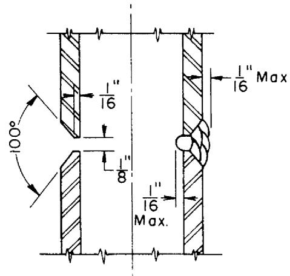  
POSITION 2G   
(Pipe axis vertical fixed)   
TEST NO.1

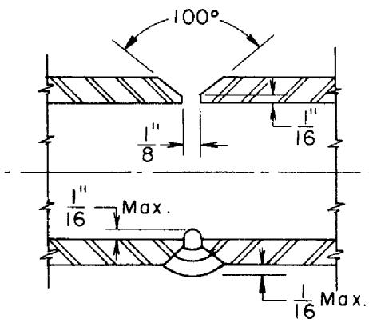  
POSITION 5G   
(Pipe axis horizontal fixed)   
TEST NO. 2

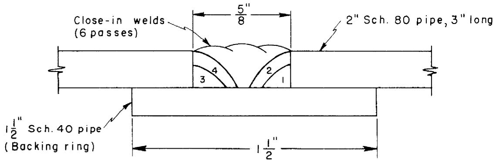  
JOINT FIT-UP AND PASS SEQUENCE FOR TEST NO. 3

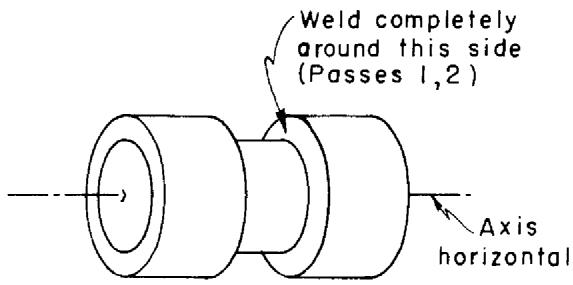  
PART "A" (Pipe axis horizontal fixed)

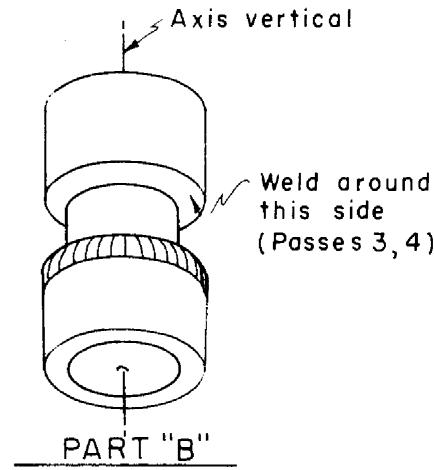  
(Pipe axis vertical fixed)

# JOINT DESIGN FOR INERT ARC WELDED VESSELS

Since stainless steel and Inconel vessels fabricated at Oak Ridge National Laboratory are generally intended for service in a severe corrosive environment, and oftentimes at an elevated temperature, the choice of joint design for this fabrication becomes important.

The valid assumption that incomplete penetration in welded joints will give rise to the possibility of accelerated corrosive attack, generally referred to as "crevice corrosion," in itself justifies the joint designs presented herein.

Although strength requirements are generally considered secondary, the combination of pressure and elevated-temperature service would suggest that designs for optimum strength as set forth by the A.S.M.E. Boiler Construction Code should be given serious consideration.

Inert arc welding has, in recent years, proved its superiority to conventional metallic arc welding for high-corrosion applications. Slag inclusions in weld metal and unavoidable irregularity in penetration suggest that metallic arc welds be avoided, at least in those areas where corrosive media will come into direct contact with the weld deposit.

The critical nature of the majority of our work has given rise to the necessity of training and qualifying our welding operators for the highest quality welding possible.

Welding procedure and qualification test specifications are available which meet these requirements. These are Carbide and Carbon Chemical Company's Engineering Specifications ESP 4-3-26 and ESP 4-4-26 for the inert arc welding of the austenitic stainless steels and the Oak Ridge National Laboratory's Specification PS-1 and QTS-1 for the inert arc welding of Inconel. The joint designs as presented require operators qualified under the specifications mentioned above.

Fabrication of any standard vessel will involve the use of relatively few basic joint designs:

# I. Butt Welds.

A. Single bevel:

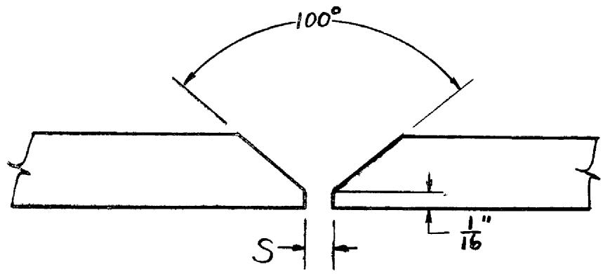

The above design is applicable to butt welds in pipe or fittings where wall thicknesses are 3/8 inch or less. The dimensions as shown are fixed with the exception of the root spacing S. This dimension should be 1/16 inch for 1/8 inch diameter pipe gradually increasing to 5/32 inch for 3 inch diameter pipe and above. Details are available in Figure ES 4-3-26 of the specifications mentioned previously.

This joint design is also applicable for girth and seam welds in plate up to 3/8 inch in thickness used for fabrication of the shell. When plate thicker than 3/8 inch is used a straight bevel as shown in A will require an excessive amount of weld deposit. Therefore, a double bevel or a single U is recommended.

B. Double bevel:

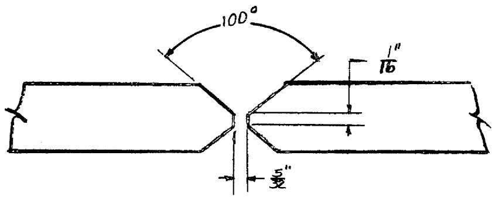

This joint is applicable to girth and seam welds in plate up to $3/4$ inch in thickness where the underside of the weld is accessible. When the corrosive environment will have access to only one side of the weld deposit, metallic arc welding may be substituted for that half of the weld not subjected to corrosion. The operators must be qualified according to ESP 4-4-20 for metallic arc welding of stainless steel.

C. Single U:

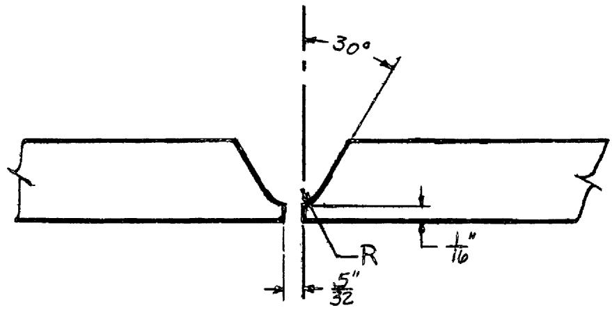

Where the weld joint is accessible from one side only, a single U bevel is applicable for plate thicker than 3/8 inch. The radius R will vary from 3/32 inch to 3/16 inch depending on the plate thickness. In this case as in the case of the double bevel, metallic arc welding may be used by a qualified operator to complete the weld after two or three passes have been deposited in the root using inert arc welding.

It must be remembered, that a back-up gas is to be applied at all times during welding in order to protect the opposite face from oxidation. This also applies when completing the weldment with metallic arc.

II. Attaching a Nozzle to a Shell.

A.

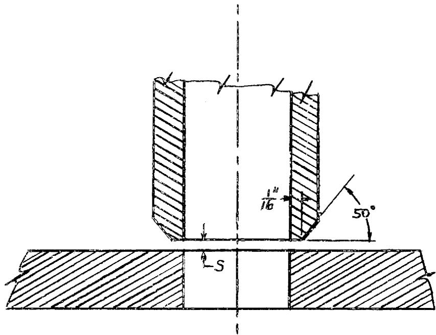

This joint is applicable when nozzles of 1 inch pipe or under are attached to a shell. The root spacing S will vary from 1/16 inch for 1/8 inch pipe to 1/9 inch for 1 inch pipe.

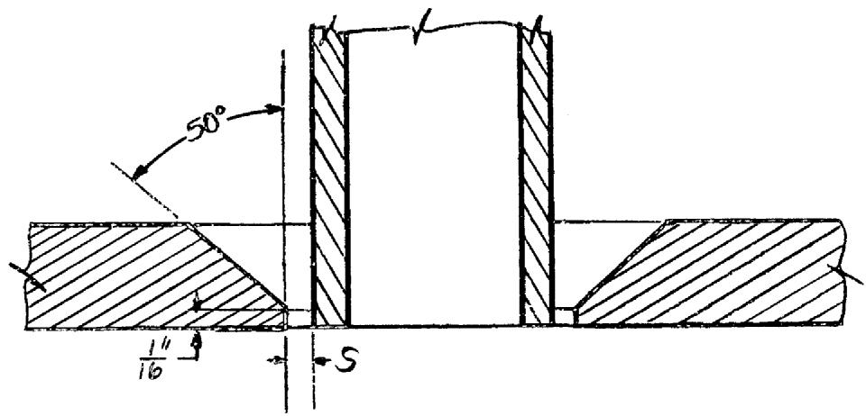  
B.

When the nozzle is $1 - 1 / 4$ inch pipe or larger and the shell thickness is $3 / 8$ inch or less, the above design may be used. The root spacing S is varied from $1 / 8$ inch for nozzles of $1 - 1 / 4$ inch pipe to $5 / 32$ inch for pipe 3 inches or over.

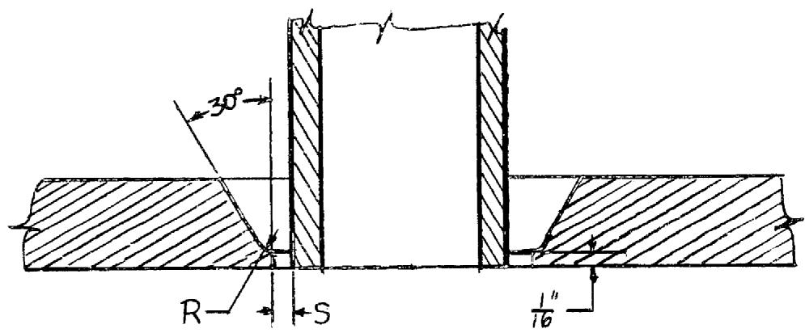  
C.

When the shell thickness is greater than $3/8$ inch and the nozzle is $1-1/4$ inch pipe or larger, a single J is applicable. The root spacing S will vary from $1/8$ inch for $1-1/4$ inch pipe to $5/32$ inch for pipe 3 inches or over. The radius R will vary from $3/32$ inch to $3/16$ inch depending on the plate thickness.

As indicated previously, metallic arc welding by a qualified operator may be used to complete the weld after two or three root passes have been deposited by inert arc welding.

When it is desirable to have pipe of all sizes extend into a vessel the joints applicable are either IIB or IIC above depending on the shell thickness.

# III. Attaching Heads.

Since dished heads are commercially available a simple butt joint as described in part I of this memorandum can be used. Occasionally, it may be necessary to machine dished type heads when specific sizes are not available. As a last resort, attachment of a flat head may be necessary. In this event, the following design is recommended:

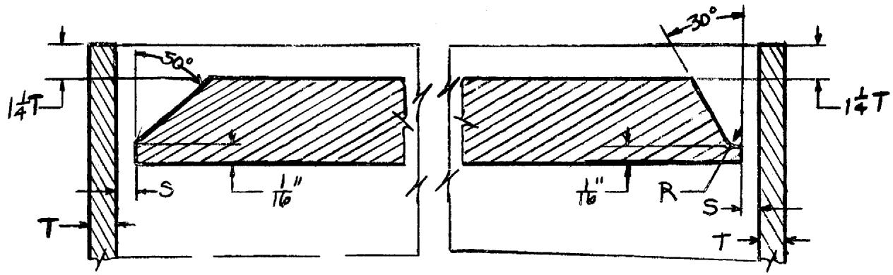

As can be seen, the attachment of a flat head consists primarily of the use of the basic joints previously described in part IIB or IIC depending on the head thickness. It may be noted however, that the shell as shown extends above the head surface approximately $1 - 1 / 4$ times the shell thickness to accommodate a fillet.

As previously indicated, metallic arc welding may be used to complete the weldment after two or three root passes have been deposited by inert arc welding.

# IV. Flanges.

It is recommended that weld neck flanges which are commercially available are used wherever possible. The simple butt welds described in part I are then applicable. Occasionally a slip-on flange must be used, however. In this event, the following joint is recommended.

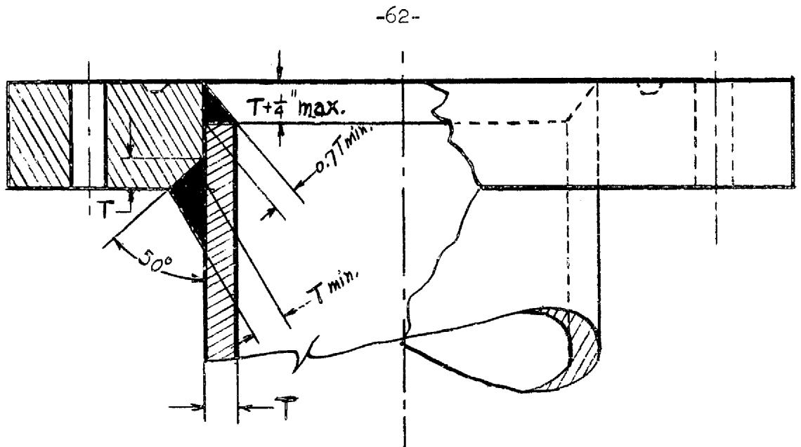

It is hoped that the contents of this memorandum will be useful to design men concerned with fabrication of critical assemblies.

T. P. /ousley  
T. R. Housley  
Maintenance Division  
Oak Ridge National Laboratory

Oathnica P. Patriarca Metallurgy Division Oak Ridge National Laboratory

# INTER-COMPANY CORRESPONDENCE

# Oak Ridge National Laboratory

To W.F.Boudreau

Location 9201-3, Y-12

Date April 27, 1955

Attention

Copy to

Subject Estimate of Time Required to Construct Radiators and Heat Exchangers for the 1 MW Intermediate Heat Exchanger Test

# CONFIDENTIAL

# UNDOCUMENTED

The two-one hundred tube heat exchangers and the two radiators to be used in the intermediate heat exchanger test were fabricated by the Welding Laboratory of the Metallurgy Division. A record has been maintained of the number of man-hours that were required to construct the four components. A detailed breakdown of the time required to complete the fabrication is presented.

Since the record includes all experimental development necessary to the successful construction of the four units, two time estimates are given. One estimate (Column A) includes all time spent on developments including changing procedures, repetition of work because the original design was inadequate, and repairing units that were not leaktight. The second estimate (Column B) includes only the time that would be required to build additional units if no exigencies arise during the fabrication. The two estimates therefore might be considered to include the minimum effort required to fabricate another assembly in one case, and the maximum as encountered in fabricating the first complete experimental intermediate heat exchanger test assembly.

The time spent by P. Patriarca and G. Slaughter in supervising the fabrication is not included.

# Estimated Cost of Materials

# Radiators

Reference ORNL Dwg. D-SK-16590

1200 lineal feet 310 stainless steel clad copper radiator fin material $ 234.00

252 feet

3/16-in OD, 0.025-in wall Inconel tubing

Cost of hydrogen at $10.00/brazing operation

Inert welding gas, $25.00/unit

100.00

20.00

50.00

$ 404.00

# Heat Exchangers

1000 feet 3/16-in OD, 0.017-in wall Inconel tubing $ 400.00

150 pounds Inconel at $2.50/pound

Cost of hydrogen at $\$ 10.00/$ brazing operation

Inert welding gas, 25.00/unit

375.00

40.00

50.00

$ 865.00

Estimate of Time Required to Construct Radiators and Heat Exchangers for the 1 MW Intermediate Heat Exchanger Test.

If a cost per man-hour of $5.00, including overhead, is taken as a reasonable figure, the following cost estimates are obtained:

Actual fabrication cost of 2 radiators: 998 hr x $5.00 $4,990.00

Cost of dies for punching holes in fins 600.00

Cost of materials for radiators 404.00

$ 5,994.00

Actual fabrication of 2-100 tube heat

exchangers: 579 hr x $5.00 $2,895.00

Cost of materials for heat exchangers 865.00

$ 3,760.00

Total cost of fabricating radiators and heat exchangers for the 1 MW Intermediate Heat Exchanger Test $\$ 9,754.00$

Predicted fabrication cost of two radiators:

824 hr x $5.00 $ 14,120.00

Cost of materials for two radiators 404.00

Estimated minimum cost of constructing two additional radiators

Predicted cost of fabrication of two heat

exchangers: 459 hr x $5.00 $2,295.00

Cost of materials for two radiators 865.00

Estimated minimum cost of constructing two additional 100 tube heat exchangers

# TIME EXPENDED IN THE FABRICATION OF TWO-ONE HUNDRED TUBE HEAT EXCHANGERS FOR INTERMEDIATE HEAT EXCHANGER TEST

# Metallurgy Division, Oak Ridge National Laboratory

<table><tr><td rowspan="2">Date</td><td rowspan="2"></td><td>A</td><td>B</td></tr><tr><td>TotalMan-HoursExpended</td><td>MinimumMan-HoursExpended</td></tr><tr><td>Prior to Feb. 10</td><td>Fabrication of a sample header with welded tubes to determine optimum welding conditions.MachiningWeldingMetallographyConstruction of jigs</td><td>16241010</td><td>--</td></tr><tr><td>Feb. 1-10</td><td>Expanding tubes, jigging, degreasing, welding tube-to-header joints and leak testing Tube Bundle #1.</td><td>25</td><td>25</td></tr><tr><td>Feb. 10-18</td><td>Expanding tubes, jigging, degreasing, welding and leak testing tube-to-header joints of Tube Bundle #2.</td><td>25</td><td>25</td></tr><tr><td>Feb. 14-15</td><td>Welding side plates and nozzles on Header #1 of Bundle #1</td><td>40</td><td>40</td></tr><tr><td>Feb. 18</td><td>First attempt to back braze Header #1 of Bundle #1. Two men required to control atmosphere in hydrogen furnace, weld bundle into can containing hydrogen atmosphere, load bundle into furnace and remove bundle from furnace.</td><td>16</td><td>16</td></tr><tr><td>Feb. 19</td><td>Repeat back brazing of Header #1 of Bundle #1 because brazing was unsatisfactory.</td><td>16</td><td>--</td></tr><tr><td>Feb. 19</td><td>Welding side plates and nozzles on Header #1 of Bundle #2.</td><td>16</td><td>16</td></tr><tr><td>Feb. 21</td><td>Repeat back brazing of Header #1 of Bundle #1 with dry brazing alloy powder added to seal last few leaking joints.</td><td>10</td><td>--</td></tr><tr><td>Feb. 22</td><td>Leak check and inspection of Header #1 of Bundle #1.</td><td>5</td><td>5</td></tr><tr><td>Feb. 21-22</td><td>Welding side plates and nozzles on Header #1 of Bundle #2.</td><td>24</td><td>24</td></tr><tr><td>Feb. 23</td><td>Fourth and last back brazing of Header #1 of Bundle #1.</td><td>10</td><td>--</td></tr><tr><td>Feb. 24-25</td><td>Welding side plates and nozzles of Header #2 of Bundle #1.</td><td>32</td><td>32</td></tr><tr><td>Feb. 24</td><td>Successfully back brazed Header #1 of Bundle #2.</td><td>10</td><td>10</td></tr><tr><td>Feb. 25-26</td><td>Fabrication of comb spacers.</td><td>12</td><td>12</td></tr><tr><td>Feb. 26</td><td>Completed welding of side plates and nozzles of Header #2 of Bundle #1 and began welding side plates and nozzles on Header #2 of Bundle #2.</td><td>16</td><td>16</td></tr><tr><td>Feb. 28</td><td>Completed welding side plates and nozzles of Header #2 of Bundle #2.</td><td>16</td><td>16</td></tr></table>

Time Expended in the Fabrication of Two-One Hundred Tube Heat Exchangers for Intermediate Heat Exchanger Test

Metallurgy Division, Oak Ridge National Laboratory

<table><tr><td rowspan="2">Date</td><td></td><td>A</td><td>B</td></tr><tr><td></td><td>Total Man-Hours Expended</td><td>Minimum Man-Hours Expended</td></tr><tr><td>Feb. 28</td><td>Successfully back brazed Header #2 of Bundle #1.</td><td>10</td><td>10</td></tr><tr><td>Feb. 28</td><td>Preparation and construction of test specimen to check comb spacer installation and placement of spacers on Bundle #1.</td><td>24</td><td>--</td></tr><tr><td>March 1-2</td><td>Installation of comb spacers on Bundle #1.</td><td>24</td><td>24</td></tr><tr><td>March 1-2</td><td>Fitting Bundle #1 into shell channel.</td><td>24</td><td>24</td></tr><tr><td>March 4,5,7</td><td>Welding Bundle #1 into shell channel.</td><td>40</td><td>40</td></tr><tr><td>March 5</td><td>Back brazing Header #2 of Bundle #2.</td><td>16</td><td>16</td></tr><tr><td>March 7-8</td><td>Installing comb spacers on Bundle #2.</td><td>32</td><td>32</td></tr><tr><td>March 9</td><td>Fitting Bundle #2 into shell channel.</td><td>16</td><td>16</td></tr><tr><td>March 10-11</td><td>Welding Bundle #2 into shell channel.</td><td>24</td><td>24</td></tr><tr><td>March 12-14</td><td>Welding assembled Bundles #1 and #2 together and welding on nozzles.</td><td>32</td><td>32</td></tr><tr><td>March 15</td><td>Final leak test of complete assembly.</td><td>4</td><td>4</td></tr><tr><td></td><td>Total man-hours expended in fabricating the heat exchanger assembly.</td><td>579</td><td>459</td></tr></table>

TIME EXPENDED IN CONSTRUCTING THE TWO RADIATORS FOR THE INTERMEDIATE HEAT EXCHANGER TEST   
Metallurgy Division, Oak Ridge National Laboratory   

<table><tr><td rowspan="2">Date</td><td rowspan="2"></td><td>A</td><td>B</td></tr><tr><td>Total Man-Hours</td><td>Minimum Total Man-Hours</td></tr><tr><td>Jan. 10-24</td><td>Determining optimum amount of brazing alloy to be preplaced and making templates for preplacing alloy.</td><td>32</td><td>--</td></tr><tr><td>Jan. 12</td><td>Shearing 2200 high conductivity fins to 2-in x 8-in.</td><td>16</td><td>16</td></tr><tr><td>Jan. 14</td><td>Inspecting fin surfaces for blisters and exposed copper.</td><td>4</td><td>4</td></tr><tr><td>Jan. 17-18</td><td>Degreasing fins.</td><td>8</td><td>8</td></tr><tr><td></td><td>Application of aluminum edge protection to 2200 fins. Batch process with 1500 in first batch and 700 in the second.</td><td></td><td></td></tr><tr><td></td><td>Clamping fins into stacks.</td><td>4</td><td>4</td></tr><tr><td>Jan. 27-28</td><td>Spraying to seal stack edges.</td><td>2</td><td>2</td></tr><tr><td>Jan. 31</td><td>Application of aluminum by painting.</td><td>3</td><td>3</td></tr><tr><td>Feb. 1</td><td>Canning stacks for furnace treatment.</td><td>2</td><td>2</td></tr><tr><td></td><td>Furnace heat treatment.</td><td>7</td><td>7</td></tr><tr><td></td><td>Removing fins from cans.</td><td>2</td><td>2</td></tr><tr><td></td><td>Wire brush cleaning fins to remove excess aluminum.</td><td>6</td><td>6</td></tr><tr><td></td><td>Inspection of fins.</td><td>8</td><td>8</td></tr><tr><td>Feb. 2-11</td><td>Punching fins.</td><td>100</td><td>100</td></tr><tr><td></td><td>Machining jigs for tube bending. Done at Y-12</td><td>50</td><td>--</td></tr><tr><td></td><td>Bending tubes.</td><td>40</td><td>40</td></tr><tr><td>Feb. 11</td><td>Inspecting fins.</td><td>3</td><td>3</td></tr><tr><td>Feb. 10-11</td><td>Washing and degreasing punched fins.</td><td>15</td><td>15</td></tr><tr><td>Feb. 14-17</td><td>Preplacing brazing alloy and binder on fins.</td><td>146</td><td>146</td></tr><tr><td></td><td>Inspection of preplaced alloy on fins.</td><td>17</td><td>17</td></tr><tr><td></td><td>Assembling fins and tubes to Radiator #1.</td><td>42</td><td>42</td></tr><tr><td>Feb. 18</td><td>Assembling Radiator #1.</td><td>16</td><td>16</td></tr><tr><td></td><td>Jig manufacture for radiator assembly.</td><td>4</td><td>--</td></tr><tr><td>Feb. 19</td><td>Assembling Radiator #1.</td><td>16</td><td>16</td></tr><tr><td>Feb. 21</td><td>Assembling Radiator #1.</td><td>16</td><td>16</td></tr><tr><td></td><td>Assembling Radiator #2.</td><td>16</td><td>16</td></tr><tr><td>Feb. 22</td><td>Assembling Radiator #1.</td><td>12</td><td>12</td></tr><tr><td></td><td>Assembling Radiator #2.</td><td>12</td><td>12</td></tr><tr><td></td><td>Design of jigs and fabrication of alignment pins.</td><td>9</td><td>--</td></tr></table>

Time expended in Constructing the Two Radiators for the Intermediate Heat Exchanger Test Metallurgy Division, Oak Ridge National Laboratory   

<table><tr><td rowspan="2">Date</td><td rowspan="2"></td><td>A</td><td>B</td></tr><tr><td>Total Man-Hours</td><td>Minimum Total Man-Hours</td></tr><tr><td rowspan="2">Feb. 23</td><td>Completing assembly of fins and spacers to tubes of Radiator #1.</td><td>16</td><td>16</td></tr><tr><td>Assembling Radiator #2.</td><td>16</td><td>16</td></tr><tr><td>Feb. 1-24</td><td>Fabrication of radiator spacer plates.</td><td>12</td><td>12</td></tr><tr><td>Feb. 24</td><td>Completing assembly of fins and spacers to tubes, Radiator #2.</td><td>16</td><td>16</td></tr><tr><td>Feb. 24</td><td>Welding side plates on Radiator #1.</td><td>3</td><td>3</td></tr><tr><td>Feb. 25</td><td>Welding side plates on Radiator #2.</td><td>3</td><td>3</td></tr><tr><td>Feb. 25</td><td>Design of jigs for bending tubes to fit headers.</td><td>3</td><td>--</td></tr><tr><td>Feb. 25</td><td>Preparing header plates for both radiators.</td><td>10</td><td>10</td></tr><tr><td>Feb. 26</td><td>Construction of test specimen to check techniques for bending ends of radiator tubes.</td><td>8</td><td>--</td></tr><tr><td>Feb. 28</td><td>Fitting and clamping tube ends prior to bending for header installation.</td><td>4</td><td>4</td></tr><tr><td>March 1</td><td>Fitting and clamping of tube ends prior to bending.</td><td>11</td><td>11</td></tr><tr><td>March 2</td><td>Completed construction of tube bending test specimen.</td><td>8</td><td>--</td></tr><tr><td>March 3-9</td><td>Radiators sent to Y-12 for assembly of headers to tubes. This was not accomplished at Y-12 since decision was made to redesign header to eliminate much of the tube bending to facilitate assembly of headers to radiator tubes. Radiators were returned to X-10.</td><td></td><td></td></tr><tr><td>March 10</td><td>Preparation of specimens for use in optimizing bending of radiator tube ends and assembling and welding headers to radiator tubes.</td><td>16</td><td>--</td></tr><tr><td>March 12</td><td>Bending ends of radiator tubes.</td><td>3</td><td>3</td></tr><tr><td>March 14</td><td>Bending and trimming tubes to proper length.</td><td>8</td><td>8</td></tr><tr><td>March 15</td><td>Bending and trimming tubes to proper length.</td><td>8</td><td>8</td></tr><tr><td>March 16</td><td>Polishing ends of radiator tubes to make it easier to fit headers.</td><td>8</td><td>8</td></tr><tr><td>March 17</td><td>Deburring holes on the four headers.</td><td>8</td><td>8</td></tr><tr><td>March 18,21,22</td><td>Fitting one of the two headers on each radiator.</td><td>19</td><td>19</td></tr><tr><td>March 26</td><td>Welding Header #1 on Radiator #1 and Header #1 on Radiator #2. (tube-to-header welds)</td><td>8</td><td>8</td></tr><tr><td>March 28-29</td><td>Welding end plates, covers, and nozzles on Header #1 of Radiator #1 and Header #1 of Radiator #2.</td><td>32</td><td>32</td></tr></table>

Time Expended in Constructing the Two Radiators for the Intermediate Heat Exchanger Test Metallurgy Division, Oak Ridge National Laboratory   

<table><tr><td rowspan="2">Date</td><td rowspan="2"></td><td>A</td><td>B</td></tr><tr><td>TotalMan-Hours</td><td>MinimumTotalMan-Hours</td></tr><tr><td rowspan="2">March 30March 30-31</td><td>Fitting tubes into Header #2 of Radiator #1.</td><td>7</td><td>7</td></tr><tr><td>Tube-to-header welding of Header #2, and welding end plating cover and nozzle on Header #2 of Radiator #1.</td><td>16</td><td>16</td></tr><tr><td>April 1-2</td><td>Leak tested Radiator #1. Leak discovered in tube-to-header weld. Cut all tubes to remove header that leaked. Installed new header and made tube-to-header welds, welded on end plates, cover, and nozzle. Repeated leak test.</td><td>24</td><td>4</td></tr><tr><td>April 5-6</td><td>Preparing Radiator #1 for brazing which included: placing braz-ing alloy on tube-to-header joints, jigging, attaching thermo-couples, adding baffles to produce even hydrogen flow through fins, and canning the radiator.</td><td>16</td><td>16</td></tr><tr><td rowspan="9">April 7April 8April 11April 11-12April 13-14April 15April 18-19April 20April 21</td><td>Furnace brazed Radiator #1.</td><td>16</td><td>16</td></tr><tr><td>Leak tested Radiator #1.</td><td>4</td><td>4</td></tr><tr><td>Fitted second header to Radiator #2.</td><td>7</td><td>7</td></tr><tr><td>Made tube-to-header welds, and welded end plates, cover, and nozzle on Header #2 of Radiator #2.</td><td>16</td><td>16</td></tr><tr><td>Leak tested Radiator #2. Found large leak in tube-to-header weld. Cut tubes below tube-to-header welds to remove header and replaced header. Made tube-to-header welds and welded end plates, cover, and nozzle on new header.</td><td>24</td><td>4</td></tr><tr><td>Leak tested Radiator #2.</td><td>4</td><td>--</td></tr><tr><td>Prepared Radiator #2 for brazing (See April 5-6).</td><td>16</td><td>16</td></tr><tr><td>Furnace brazed Radiator #2.</td><td>16</td><td>16</td></tr><tr><td>Leak tested Radiator #2.</td><td>4</td><td>4</td></tr><tr><td></td><td></td><td>Total man-hours required to fabricate the two radiators</td><td>824</td></tr></table>