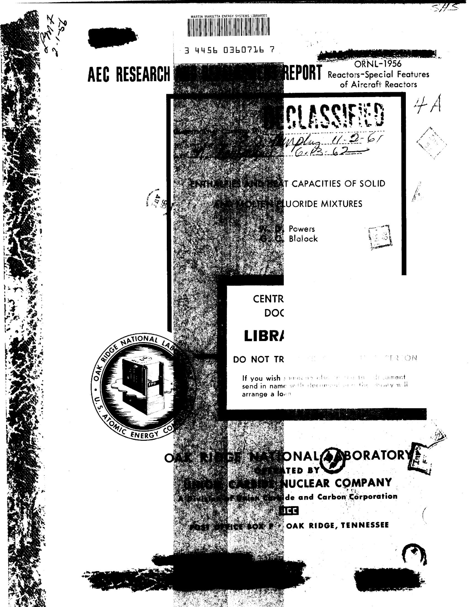
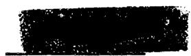
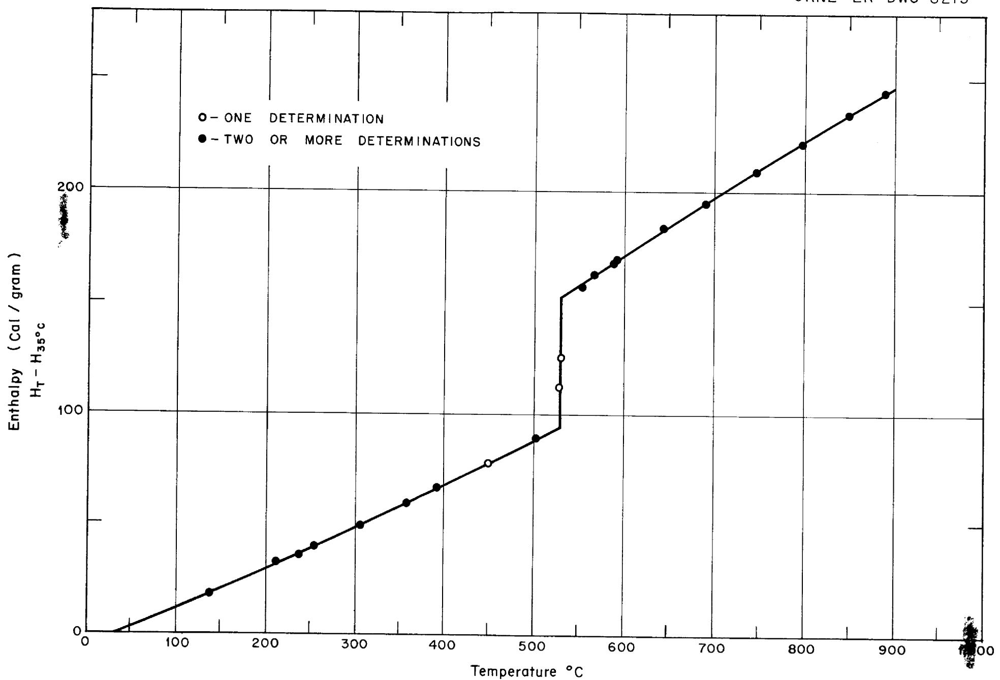
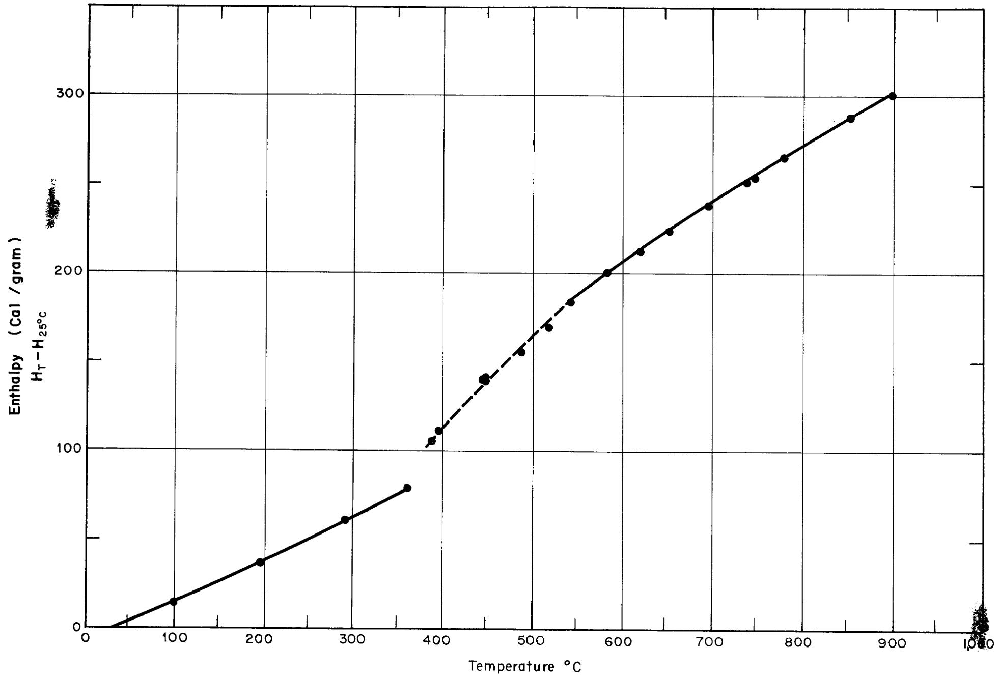
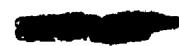
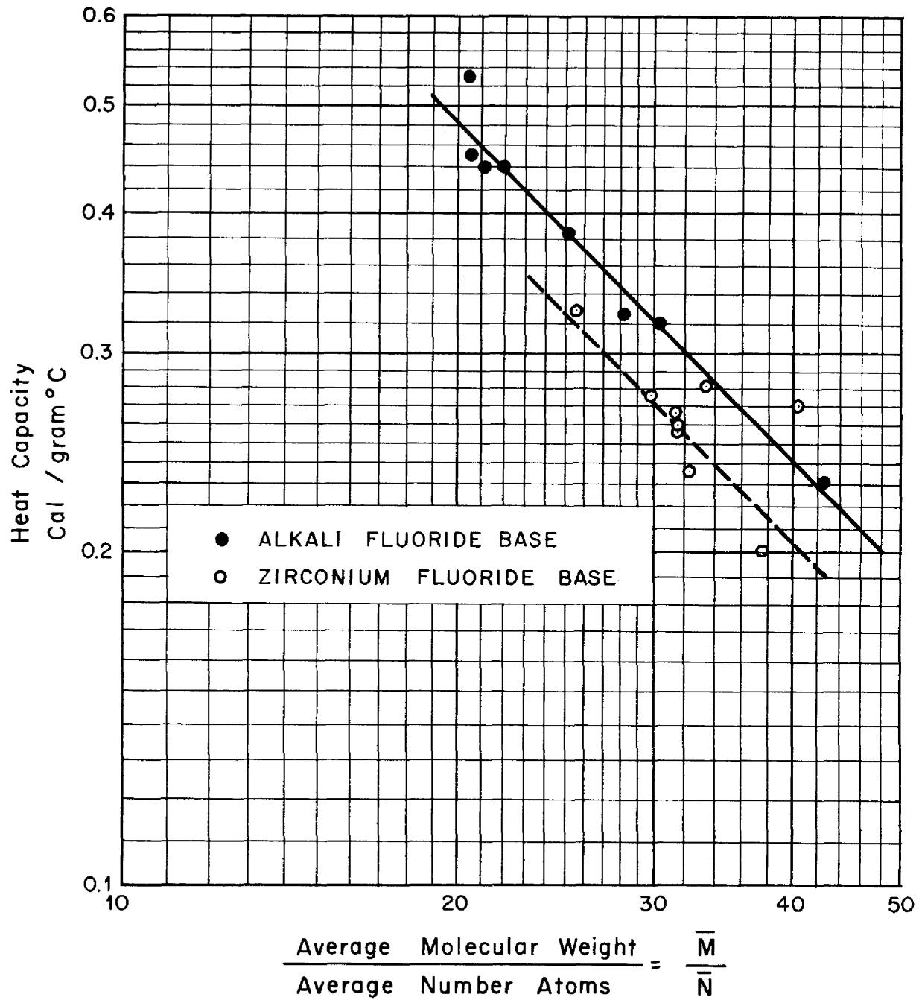
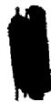
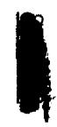
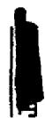
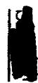

Contract No. W-7405, eng 26

Reactor Experimental Engineering Division

ENTHALPIES AND HEAT CAPACITIES OF SOLID AND MOLTEN FLUORIDE MIXTURES

by

W. D. Powers   
G. C. Blalock

DATE ISSUED:

JAN 11 1956

OAK RIDGE NATIONAL LABORATORY

Operated by

UNION CARBIDE NUCLEAR COMPANY

A Division of Union Carbide and Carbon Corporation

Post Office Box P

Oak Ridge, Tennessee

# INTERNAL DISTRIBUTION

1. C. E. Center   
2. Biology Library   
3. Health Physics Library

7-16. Laboratory Records Department

4-5. Central Research Library   
6. Reactor Experimental Engineering Library   
17. Laboratory Records, ORNL R.C.   
18. A. M. Weinberg   
19. L. B. Emlet (K-2)   
20. J. P. Murray (Y-12)   
21. J. A. Swartout   
22. E. H. Taylor   
23. E. D. Shipley   
24. F. C. VonderLage   
25. S. C. Lind   
26. F. L. Culler   
27. A. H. Snell   
28. A. Hollander   
29. M. T. Kelley   
30. G. H. Clewett   
31. K. Z. Morgan   
32. J. H. Frye, Jr.   
33. C. P. Keim   
34. R. S. Livingston   
35. T. A. Lincoln   
36. A. S. Householder   
37. C. S. Harrill   
38. C. E. Winters   
39. D. W. Cardwell   
40. E. M. King   
41. A. J. Miller   
42. D. D. Cowen   
43. G. M. Adamson   
44. R. A. Charpie   
45. C. J. Barton

46. E. S. Bettis   
47. D. S. Billington   
48. F. F. Blankenship   
49. E. P. Blizzard   
50. M'A. Bredig   
51. R. B. Briggs   
52. S. I. Cohen   
53. C. M. Copenhaver   
54. S. J. Cromer   
55. D. R. Cuneo   
56. A. P. Fraas   
57. N. D. Greene   
58. W. R. Grimes   
59. H. W. Hoffman   
60. W. H. Jordan   
61. G. W. Keilholtz   
62. F. Kertesz   
63. J. A. Lane   
64. F. E. Lynch   
65. R. N. Lyon   
66. W. D. Manly   
67. R. F. Newton   
68. L. G. Overholser   
69. L. D. Palmer   
70. H. F. Poppendiek   
71. W. D. Powers   
72. R. R. Dickison   
73. H. W. Savage   
74. 0. Sisman   
75. G. P. Smith   
76. E. R. Van Artsdalen   
77. J. L. Wantland   
78. W. M. Warde   
79. M. Watson   
80. ORNL - Y-12 Technical Library, Document Reference Section

# EXTERNAL DISTRIBUTION

81. AF Plant Representative, Baltimore   
82. AF Plant Representative, Burbank   
83. AF Plant Representative, Marietta   
84. AF Plant Representative, Santa Monica   
85. AF Plant Representative, Seattle   
86. AF Plant Representative, Wood-Ridge   
87. Air Materiel Area

-ii

88. Air Research and Development Commands (RDGN)   
89. Air Research and Development Command (RDZPA)   
90. Air Technical Intelligence Center   
91. Aircraft Laboratory Design Branch (WADC)   
92-94. ANP Project Office, Fort Worth   
95. Argonne National Laboratory   
96. Armed Forces Special Weapons Project, Sandia   
97. Assistant Secretary of the Air Force, R&D   
98-104. Atomic Energy Commission, Washington (1 copy to R. H. Graham)   
05-106. Battelle Memorial Institute (1 copy to E. M. Simons)   
107. Bettis Plant   
108. Bureau of Aeronautics   
199. Bureau of Aeronautics (Code 24)   
ll. Bureau of Aeronautics General Representative   
111. Chicago Operations Office   
112-113. Chief of Naval Research   
114. Chicago Patent Group   
115. Convex-General Dynamics Corporation   
116. Directorate of Laboratories (WCL)   
117. Director of Requirements (AFDRQ)   
113. Director of Research and Development (AFDRD-ANP)   
119-121. Directorate of Systems Management (RDZ-ISN)   
122-124. Directorate of Systems Management (RDZ-ISS)   
125. Equipment Laborbry (WADC)   
126-129. General Electric Company (ANFD)   
130. Hartford Area Office   
131. Idaho Operations Office   
132-133. Knolls Atomic Power Laboratory (1 copy to W. J. Robb, Jr.)   
134. Lockland Area Office   
135. Los Alamos Scientific Laboratory   
136. Materials Laboratory Plans Office (WADC)   
137. National Advisory Committee for Aeronautics, Cleveland   
138. National Advisory Committee for Aeronautics, Washington   
139. Naval Air Development Center   
140. New York Operations Office   
141. North American Aviation, Inc. (Aerosics Division)   
142. Nuclear Development Corporation   
143. Patent Branch, Washington   
144-146. Powerplant Laboratory (WADC)   
147-154. Pratt & Whitney Aircraft Division (Fox Project) (1 copy ea, to R. I. Strough, W. S. Farmer, D. P. Gregory, and G. L. Mullan)   
155. San Francisco Operations Office   
156. Sandia Corporation   
157. School of Aviation Medicine   
158. Sylvania Electric Products, Inc.   
159. USAF Project Rand   
160. University of California Radiation Laboratory, Livermore   
161-163. Wright Air Development Center (WCOSI-3)   
164-279. Technical Information Extension (Oak Ridge) (1 copy to W. J. Larkin)   
280. Division of Research and Development, AEC, ORO   
281. Headquarters, Air Force Special Weapons Center

# TABLE OF CONTENTS

# Page

SUMMARY. 4   
INTRODUCTION. 5   
EXPERIMENTAL METHOD. 6   
EXPERIMENTAL RESULTS. 10   
DISCUSSION OF RESULTS. 14   
FUTURE WORK. 20   
REFERENCES. 21

# APPENDIX

Table 2 Enthalpies, Heat Capacities, and Heat of Fusion. 22   
Table 3 Heat Capacities. 27   
Table 4 Enthalpies of Zirconium Fluoride Base Mixtures. 29   
Table 5 Enthalpies of Alkali Fluoride Base Mixtures. 30   
Table 6 Experimental Enthalpies of Composition No. 70. 31

# SUMMARY

The enthalpies and heat capacities of seventeen fluoride mixtures in the liquid state have been determined using Bunsen Ice Calorimeters and copper block calorimeters. The fluoride mixtures were composed of the fluorides of two or more of the following metals: lithium, sodium, potassium, beryllium, zirconium, and uranium. The enthalpies and heat capacities of most of these mixtures were studied in the solid state also. Estimates of the heat of fusion have been made. General empirical equations have been developed which represent the enthalpies and heat capacities of the fluoride mixtures in the liquid and in the solid state.

# INTRODUCTION

For a number of years the enthalpies and heat capacities of various fluoride mixtures have been determined by the ORNL Physical Properties Group for the purpose of predicting the heat transfer characteristics of these mixtures. This report is a compilation of the data previously reported in the form of memoranda. Equations have been formulated so that the enthalpy and heat capacity may be predicted from the composition.

In a sense this is a progress report since these properties are being determined presently for other fluoride salt mixtures.

# EXPERIMENTAL METHOD

Samples of the fluorides heated to constant and uniform temperatures were dropped into calorimeters. The differences between the heat contents of the samples at the furnace temperature and at the final temperature of the calorimeter were measured by the calorimeters. The derivative of the enthalpy with respect to temperature yielded the heat capacity.

The design of the furnaces and of the Bunsen Ice Calorimeters has been described previously (1,2). A full description of the Copper Block Calorimeter will be given in a forthcoming ORNL report. During this investigation both apparatuses have been modified from time to time. The brief descriptions which follow describe the apparatuses used at present.

The samples of the fluorides were contained in tapered metal capsules, 2 l/2 inches long and 1 l/4 inches average diameter. The capsules were sealed by heliarc welding in an inert gas filled drybox to avoid possible contamination with water, oxygen, and carbon dioxide.

Capsules containing the samples were heated in 6 inch long silver liners centered in tube furnaces $24"$ long. The temperatures of the furnaces were measured by platinum - platinum-rhodium thermocouples located in the silver liners and were held at the desired level by "Simply-trol" controllers. After the capsules had reached the temperature of the furnace, they were dropped into the calorimeters by electrically fusing

the short pieces of wire on which they were suspended in the furnaces.

This process of heating a sample and dropping it into the calorimeter will subsequently be referred to by the descriptive work "drop".

In the Bunsen Ice Calorimeter the heat liberated by the sample in cooling from the temperature of the furnace to that of the calorimeter melted some of the ice in an ice-water mixture. The change from ice to water was accompanied by a volume change which was measured by a system of burets connected to the calorimeter. Each milliliter change was equivalent to 878.7 calories.

The total amount of heat measured by the ice calorimeters varied from 1,000 to over 30,000 calories. It was found that the precision of the measurements was significantly less when large amounts of heat were liberated. Although the ice calorimeter is in general a very precise device (3,4), it is felt that when large amounts of heat are liberated, a non-isothermal state can exist giving rise to poorer precision. A copper block calorimeter was developed to remedy this difficulty; it was found that this new calorimeter was characterized by far greater precision when high quantities of heat were released than was the case for the ice calorimeter. Two copper block calorimeters were placed into regular service, which now yield data at a relatively high rate.

In the copper block calorimeter the heat liberated by the sample heated a large mass of copper. The temperature rise of the copper was measured by an iron-constantan thermopile (12 junctions in the copper and 12 junctions in an ice bath). The copper block was contained in a stainless steel shell which was submerged in a water bath. A potentiometer controller activated by another thermopile maintained a zero temperature difference between the copper block and the water bath to minimize any heat exchange between the copper block and its surroundings. The copper block was calibrated in terms of calories per millivolt by making "drops" with aluminum oxide. The enthalpy of aluminum oxide is well known (4). The precision of the calibration is within $\pm 0.5\%$ .

The least squares method was used to determine an equation which represented the experimental data. The enthalpy determinations made using the ice calorimeters exhibited enough scatter so that only a linear relationship between the enthalpy and temperature was found to be significant; therefore, the reported heat capacities were not temperature dependent. But the more precise results obtained with the copper block calorimeter could be represented by a definite quadratic relationship. Thus the heat capacity was temperature dependent.

The individual experimental enthalpy values that were obtained using a copper block calorimeter for the drops of mixture No. 70 are listed in Table 6 and are shown in Figure 1. The results are typical of those obtained with the ORNL copper block calorimeter.

  
Temperature Vs Enthalpy, Mixture No 70   
Fig 1

# EXPERIMENTAL RESULTS

The enthalpy and heat capacity equations obtained are listed in Table 2. The type of calorimeter used, the enthalpy and heat capacity together with the temperature range over which these properties were studied, and the heat of fusion at the reported melting point (5)(6) are shown in this table.

The enthalpies and heat capacities of a few salt mixtures have been determined by other laboratories. A comparison between the results obtained at ORNL and the outside laboratories are listed in Table 1. At the National Bureau of Standards (7) the enthalpy of mixture No. 12 in the liquid state between $454^{\circ}$ and $900^{\circ}\mathrm{C}$ was found to be

$$
H _ {T} - H _ {O C} = 1 5. 0 + 0. 4 9 1 0 T - 4. 6 3 \times 1 0 ^ {- 5} T ^ {2} \text {c a l . / g}.
$$

and for mixture No. 40 in the liquid state between $520^{\circ}$ and $900^{\circ}\mathrm{C}$ .

$$
H _ {T} - H _ {O C} = 4. 2 + 0. 3 1 3 7 T - 3. 7 6 5 \times 1 0 ^ {- 5} T ^ {2} \text {c a l . / g .}
$$

At the Naval Research Laboratory (8) the enthalpy of mixture No. 12 in the solid state between $30^{\circ}$ and $455^{\circ}\mathrm{C}$ was found to be

$$
H _ {T} - H _ {3 0} ^ {\circ} C = - 7. 9 9 + 0. 2 6 4 T + 7. 2 5 \times 1 0 ^ {- 5} T ^ {2} \text {c a l . / g .}
$$

and in the liquid state between $455^{\circ}$ and $900^{\circ}\mathrm{C}$

$$
\begin{array}{l} \mathrm {H} _ {\mathrm {T}} - \mathrm {H} _ {3 0} ^ {\circ} \mathrm {C} = - 3 2. 9 8 + 0. 7 2 7 8 \mathrm {T} - 4. 9 6 2 \times 1 0 ^ {- 4} \mathrm {T} ^ {2} \\ + 0. 3 8 1 \times 1 0 ^ {- 6} \mathrm {T} ^ {3} - 1. 1 9 9 \times 1 0 ^ {- 1 0} \mathrm {T} ^ {4} \text {c a l . / g}. \\ \end{array}
$$

In Table 1 7.99 cal. has been added to the enthalpies determined by the Naval Research Laboratory so that all enthalpies would have the same basetemperature of $0^{\circ}C$ .

TABLE 1   
Checks with Other Laboratories   
Enthalpies cal./g. Heat Capacities cal./g. $\mathbf{O}\mathbf{C}$   
Mixture No. 12   

<table><tr><td rowspan="2">Temperature °C</td><td colspan="2">ORNL</td><td colspan="2">NBS</td><td colspan="2">NRL</td></tr><tr><td colspan="2">Ice Calorimeter</td><td>H-T - HOC</td><td>Cp</td><td>H-T - HOC</td><td>Cp</td></tr><tr><td>100</td><td>25.5</td><td>.29</td><td></td><td></td><td>27.1</td><td>.278</td></tr><tr><td>200</td><td>55.5</td><td>.31</td><td></td><td></td><td>55.7</td><td>.293</td></tr><tr><td>300</td><td>87.5</td><td>.33</td><td></td><td></td><td>85.7</td><td>.308</td></tr><tr><td>400</td><td>121.5</td><td>.35</td><td></td><td></td><td>117.2</td><td>.322</td></tr><tr><td>500</td><td>256.8</td><td>.45</td><td>248.9</td><td>.445</td><td>255.0</td><td>.457</td></tr><tr><td>600</td><td>302.1</td><td>.45</td><td>292.9</td><td>.435</td><td>299.8</td><td>.440</td></tr><tr><td>700</td><td>347.4</td><td>.45</td><td>336.0</td><td>.426</td><td>343.2</td><td>.429</td></tr><tr><td>800</td><td>392.7</td><td>.45</td><td>378.2</td><td>.417</td><td>385.6</td><td>.420</td></tr><tr><td>900</td><td>438.0</td><td>.45</td><td>419.4</td><td>.408</td><td>427.2</td><td>.411</td></tr><tr><td>Hfusion</td><td>95.4</td><td></td><td>---</td><td></td><td>99.0</td><td></td></tr></table>

Mixture No. 40   

<table><tr><td rowspan="2">Temperature °C</td><td colspan="2">ORNL</td><td colspan="2">NBS</td><td colspan="2">ORNL</td></tr><tr><td>Copper C</td><td>Block Cp</td><td>H-T - HOC</td><td>Cp</td><td colspan="2">Ice Calorimeter</td></tr><tr><td>600</td><td>178.7</td><td>.266</td><td>178.9</td><td>.269</td><td>182.7</td><td>.25</td></tr><tr><td>700</td><td>205.2</td><td>.266</td><td>205.3</td><td>.261</td><td>207.5</td><td>.25</td></tr><tr><td>800</td><td>231.8</td><td>.266</td><td>231.1</td><td>.253</td><td>232.3</td><td>.25</td></tr><tr><td>900</td><td>258.3</td><td>.266</td><td>256.0</td><td>.246</td><td>257.0</td><td>.25</td></tr></table>

The comparison shown indicates that the enthalpies obtained at ORNL with the ice calorimeter differ from those of the other laboratories by a maximum of $5\%$ , and heat capacities differ by a maximum of $10\%$ . Only one comparison is available for the ORNL copper block calorimeter. The enthalpies deviate with a maximum of $1\%$ . At $700^{\circ}\mathrm{C}$ the heat capacity differed by $2\%$ ; at the extremes in the temperature range studied (the melting point and $900^{\circ}\mathrm{C}$ ) the heat capacity difference was as great as $8\%$ .

Most of the mixtures studied were near eutectic composition, and melting took place isothermally or over a very narrow temperature range. One mixture, No. 82, melted over a wide range of temperature ( $\sim 375^{\circ}$ to $545^{\circ}\mathrm{C}$ ), Figure 2. This was a zirconium fluoride base mixture. The enthalpy of the liquid compared favorably with the enthalpies in the liquid state of the other zirconium base mixtures (Table 4). This indicated that there was a heat of fusion similar in value to the other mixtures which was absorbed in the melting process. Mixture No. 21 did not exhibit an isothermal melting. This mixture was not studied in detail below the reported melting point. The melting behavior is believed similar to No. 82. The enthalpy of the liquid was similar to the values of the other zirconium fluoride mixtures.

One mixture, No. 3, containing $60\text{M}\% \mathrm{BeF}_2$ , exhibited a glass-like behavior. The $\mathrm{BeF}_2$ mixtures resembled those of heat capacities (slopes of enthalpy temperature curves) of the alkali fluoride mixtures. However, the enthalpy of No. 3 in the liquid state is much lower than the liquid enthalpies of the other mixes (Table 5). Presumably there is little, if any, heat of fusion.

Fig 2   
  
Temperature Vs Enthalpy, Mixture No 82

# DISCUSSION OF RESULTS

It is of interest to find general relationships between the enthalpies and heat capacities of the various fluorides. For most of the solid elements the heat capacity at constant volume is equal to 3R or 6 cal./ $^{\circ}$ C per gram atom. The more modern theories of Einstein and Debye have the same value as a limit which is reached at normal temperatures for most elements (9). At constant pressure the heat capacities are found to be greater, being about 6.4 cal./ $^{\circ}$ C per gram atom (Dulong and Petit's law). The Debye equation also predicts correctly the heat capacity of some compounds, these being the compounds that crystallize in the cubic system. The equation may be modified to predict compounds that do not crystallize in the cubic lattice. In 1865 Kopp suggested that the molar heat capacity of a compound is approximately equal to the sum of the atomic heat capacities of its constituent elements.

In the case of liquid compounds which have no definite groups of atoms or radicals, it has been found empirically that each gram atom contributes approximately 8 cal./ $^{\circ}$ C to the molar heat capacity of the compound (10). In general if there are definite groupings of atoms (such as in the $\mathrm{SO}_4^=$ and $\mathrm{OH}^-$ ions), the average heat capacity will be less. In the case of the hydroxides the average heat capacity in the liquid state is 7.0 cal./g. atom ${}^{\circ}$ C (2).

In order to find the contribution per gram atom the average molecular weight and the average number of atoms per mixture are needed. The average molecular weight has been successfully used in correlating the densities of the liquid fluoride mixtures (ll). The quantities are defined as follows:

$$
\overline {{\mathbf {M}}} = \sum_ {\mathbf {i}} x _ {\mathbf {i}} \mathbf {M} _ {\mathbf {i}}
$$

$$
\overline {{\mathbf {N}}} = \sum_ {\mathbf {i}} \mathbf {x} _ {\mathbf {i}} \mathbf {N} _ {\mathbf {i}}
$$

where $\overline{\mathbf{M}} =$ average molecular weight of mixture

$\overline{\mathbf{N}} =$ average number of atoms per mixture

$\mathbf{M}_{\mathbf{i}} =$ molecular weight of component

$\mathbf{N}_{\mathbf{i}} =$ number of ions per component

$\mathbf{x_i} =$ mole fraction of component

When the enthalpy of a mixture in units of calories per gram is multiplied by $\overline{\mathbf{M}} / \overline{\mathbf{N}}$ the product is the enthalpy per gram atom. The heat capacity per gram atom may be found in the same way. Table 3 lists the heat capacities per gram atom of all the mixtures investigated together with the values of $\overline{\mathbf{M}}$ , $\overline{\mathbf{N}}$ , and $\overline{\mathbf{M}} / \overline{\mathbf{N}}$ .

Figure 3 shows the relationship between the heat capacity in gram units in the liquid state and the factor $\overline{\mathbf{M}} / \overline{\mathbf{N}}$ . In this figure with the logarithmic scales the straight lines drawn represent the equation

$$
(\overline {{\mathbf {M}}} / \overline {{\mathbf {N}}}) (\mathbf {c} _ {\mathbf {p}}) = \text {c o n s t} = \mathbf {C} _ {\mathbf {p}}
$$

where $c_p =$ heat capacity, cal./g.

$$
C _ {p} = \text {h e a t c a p a c i t y}, \text {c a l . / g . a t o m} ^ {\circ} C
$$

ORNL-LR-DWG

8217

  
Fig 3

The fluoride mixtures may be correlated best by dividing them into two groups: those that contain zirconium fluoride, and those that do not. The latter will be referred to as the alkali fluoride mixtures.

# Zirconium Fluoride Mixtures

The enthalpies in cal./g. atom of the zirconium base mixtures are listed in Table 4. Most of the mixtures studied in this group consist of sodium and zirconium fluorides with a little or no uranium fluoride. The following equations were developed to represent these mixtures (Nos. 30, 31, 40, 44, 70).

In the solid

$$
\begin{array}{l} \underline {{\mathrm {H}}} _ {\mathrm {T}} - \underline {{\mathrm {H}}} _ {2 5} ^ {\circ} \mathrm {C} = - 1 2 3 + 5. 3 7 \mathrm {T} + 0. 8 1 \times 1 0 ^ {- 3} \mathrm {T} ^ {2} \tag {1} \\ C _ {p} = 5. 3 7 + 1. 6 2 \times 1 0 ^ {- 3} T \\ = 5. 8 6 \text {a t} 3 0 0 ^ {\circ} \mathrm {C} \\ \end{array}
$$

and in the liquid

$$
\begin{array}{l} \underline {{\mathrm {H}}} _ {\mathrm {T}} - \underline {{\mathrm {H}}} _ {2 5} ^ {\circ} \mathrm {C} = 1 0 4 + 9. 5 1 \mathrm {T} - 1. 0 \times 1 0 ^ {- 3} \mathrm {T} ^ {2} \tag {2} \\ c _ {p} = 9. 5 1 - 2. 0 \times 1 0 ^ {- 3} T \\ = 8. 1 1 \text {a t} 7 0 0 ^ {\circ} \mathrm {C} \\ \end{array}
$$

The enthalpies calculated by these equations are also listed in Table 4. The enthalpies of Nos. 30, 31, 40, 44, 70 are represented by these equations to within $2\%$ and all the zirconium fluoride base materials to within $10\%$ . The heat capacity of all zirconium fluoride base materials are represented to within $15\%$ except for Mixture No. 33, with a heat capacity of

10.9 cal./g. atom ${}^{\circ}\mathrm{C}$ . The cause of the high heat capacity of this mixture is unknown. Since the temperature range in which this mixture was studied in the liquid state was small ( $610^{\circ} - 930^{\circ}\mathrm{C}$ ) and therefore subject to more error, it is planned to check the enthalpy of this mixture with the more accurate copper block calorimeter.

The heat of fusion of these mixtures varied between 1570 to 2040 calories per gram atom with an average of 1810 cal.

# Alkali Fluoride Mixtures

The enthalpies in cal./g. atom of the alkali fluoride base mixtures are listed in Table 5. Most of mixtures studied consist of alkali fluorides with uranium fluoride. Two mixtures contain beryllium fluoride. The following equations represent all these mixtures.

In the solid,

$$
\mathrm {H} _ {\mathrm {T}} - \mathrm {H} _ {2 5} \mathrm {O} _ {\mathrm {C}} = - 3 4 0 + 6. 7 6 \mathrm {T} \tag {3}
$$

$$
c _ {p} = 6. 7 6
$$

and in the liquid

$$
\underline {{\mathrm {H}}} _ {\mathrm {T}} = \underline {{\mathrm {H}}} _ {2 5} ^ {\circ} \mathrm {C} = \Delta \mathrm {H} _ {\mathrm {f}} - 1 6 1 0 + 9. 4 7 \mathrm {T} \tag {4}
$$

$$
C _ {p} = 9. 4 7
$$

Because the heat of fusion varied greatly (from 0 to 1970 cal./g. atom) the heat of fusion had to be included in the equation representing the liquid to give a satisfactory correlation. The enthalpies calculated by these equa

tions are also listed in Table 5. For the solid state the enthalpies calculated by the equations from $200^{\circ}\mathrm{C}$ and higher agreed within $10\%$ except for Mixture No. 3 at $300^{\circ}\mathrm{C}$ . This is the mixture that indicated formation of a glass and therefore would be expected to deviate from the others. The heat capacities of the solid agreed within $6\%$ of the equation. In the liquid the enthalpies observed agreed within $5\%$ and the heat capacities within $16\%$ .

# FUTURE WORK

I. The ORNL Physical Properties Group has suggested that the presence of complex compounds might increase the heat capacity of the liquid. If these complex compounds should be decomposed between the melting point and the upper temperature at which the liquid will be used, the heat required for decomposition would increase the heat capacity of the liquid. At present various mixtures in the sodium fluoride-zirconium fluoride system are being measured to determine the relationship between heat capacity and composition. Complex compounds are known to exist in the solid state in this system.   
II. The heat capacity of mixture No. 33 which is at variance to the other zirconium fluoride mixtures will be measured using the more accurate copper block calorimeter.   
III. As new mixtures are developed, their enthalpies and heat capacities will be determined.

# REFERENCES

1. Redmond, R. F. and Lones, J., "The Design and Construction of an Ice Calorimeter," ORNL-1040, August, 1951.   
2. Powers, W. D. and Blalock, G. C., "Enthalpies and Specific Heats of Alkali and Alkaline Earth Hydroxides at High Temperatures," ORNL-1653, January, 1954.   
3. Ginnings, D. C. and Corruccini, R. J., "An Improved Ice Calorimeter," J. Research National Bureau of Standards, 38, 1947, pp 583.   
4. Ginnings, D. C. and Corruccini, R. J., "Enthalpy, Specific Heat, and Entropy of Aluminum Oxide from $0^{\circ}$ to $900^{\circ}$ C," J. Research National Bureau Standards, 38, 1947, pp 593.   
5. Barton, C. J., "Fused Salt Compositions," CF-54-6-6.   
6. Barton, C. J., personal communication.   
7. Douglas, T. B. and Logan, W. M., "Thermal Conductivity and Heat Capacity of Molten Materials," WADC Technical Report 53-201, Part IV, January, 1954.   
8. Walker, B. E. and Ewing, C. T. and Williams, D. D., "Tenth Progress Report," NRL Memorandum Report 387, November, 1954.   
9. Glasstone, S., "Thermodynamics for Chemists," D. Van Nostrand, 1947, pp 121.   
10. Kelley, K. K., "Contributions to the Data on Theoretical Metallurgy High Temperature Heat Content, Heat Capacity and Data for Inorganic Compounds," Bureau of Mines, Bulletin 476, 1949.   
11. Cohen, S. I. and Jones, T. N., "A Summary of Density Measurements on Molten Fluoride Mixtures and A Correlation for Predicting Densities of Fluoride Mixtures," ORNL-1702, July, 1954.

TABLE 2   
Enthalpies and Heat Capacities   

<table><tr><td rowspan="3">Mixture</td><td rowspan="3">Calorimeter</td><td rowspan="3">Temperature
°C</td><td>Enthalpy</td><td>= H_T - H(cal./g.)</td></tr><tr><td>Heat Capacity</td><td>= cp(cal./g. °C)</td></tr><tr><td>Heat of Fusion</td><td>= ΔHf(cal./g.)</td></tr><tr><td rowspan="5">1</td><td rowspan="5">Ice</td><td rowspan="2">250°-465°</td><td>Solid</td><td>H_T - H_OOC = -5 + 0.219T</td></tr><tr><td colspan="2">cp = 0.22</td></tr><tr><td>480°</td><td>Fusion</td><td>ΔHf = 21</td></tr><tr><td rowspan="2">520°-990°</td><td>Liquid</td><td>H_T - H_OOC = -35 + 0.325T-</td></tr><tr><td colspan="2">cp = 0.32</td></tr><tr><td rowspan="5">2</td><td rowspan="5">Ice</td><td rowspan="2">240°-480°</td><td>Solid</td><td>H_T - H_OOC = -1 + 0.149T</td></tr><tr><td colspan="2">cp = 0.15</td></tr><tr><td>530°</td><td>Fusion</td><td>ΔHf = 30</td></tr><tr><td rowspan="2">540°-1000°</td><td>Liquid</td><td>H_T - H_OOC = -13 + 0.230T</td></tr><tr><td colspan="2">cp = 0.23</td></tr><tr><td rowspan="2">3</td><td rowspan="2">Ice</td><td rowspan="2">280°-1050°</td><td>Glass</td><td>H_T - H_OOC = -43 + 0.315T</td></tr><tr><td>Liquid</td><td>cp = 0.32</td></tr><tr><td rowspan="6">12</td><td rowspan="6">Ice</td><td rowspan="3">60°-454°</td><td>Solid</td><td>H_T - H_OOC = -2.6 + 0.271T + 9.8 x 10^-5T^2</td></tr><tr><td colspan="2">cp = 0.27 + 19.6 x 10^-5T</td></tr><tr><td colspan="2">= .330 at 300°C</td></tr><tr><td>454°</td><td>Fusion</td><td>ΔHf = 95</td></tr><tr><td rowspan="2">475°-875°</td><td>Liquid</td><td>H_T - H_OOC = 30.3 + 0.453T</td></tr><tr><td colspan="2">cp = 0.45</td></tr></table>

TABLE 2 (Con't.)   

<table><tr><td rowspan="3">Mixture</td><td rowspan="3">Calorimeter</td><td rowspan="3">Temperature</td><td colspan="2">Enthalpy = Hf - H (cal./g.)</td><td>Memo by: W. D. Powers</td></tr><tr><td colspan="2">Heat Capacity = cp (cal./g. °C)</td><td rowspan="2">G. C. Blalock</td></tr><tr><td colspan="2">Heat of Fusion = ΔHf (cal./g.)</td></tr><tr><td rowspan="5">14</td><td rowspan="5">Ice</td><td rowspan="2">90°-450°</td><td rowspan="2">Solid</td><td>HT - HOC = -9 + 0.310T</td><td></td></tr><tr><td>cp = 0.31</td><td></td></tr><tr><td>452°</td><td>Fusion</td><td>ΔHf = 88</td><td></td></tr><tr><td rowspan="2">500°-1000°</td><td rowspan="2">Liquid</td><td>HT - HOC = 21 + 0.437T</td><td>CF 53-5-113</td></tr><tr><td>cp = 0.44</td><td></td></tr><tr><td rowspan="2">21</td><td rowspan="2">Ice</td><td rowspan="2">510°-890°</td><td rowspan="2">Liquid*</td><td>HT - HOC = -14.5 + 0.277T</td><td>CF 52-11-103</td></tr><tr><td>cp = 0.28</td><td></td></tr><tr><td rowspan="4">30</td><td rowspan="3">Ice</td><td rowspan="2">340°-500°</td><td rowspan="2">Solid</td><td>HT - H250C = -18.0 + 0.215T</td><td></td></tr><tr><td>cp = 0.22</td><td></td></tr><tr><td>520°</td><td>Fusion</td><td>ΔHf = 56</td><td></td></tr><tr><td>Copper</td><td>540°-894°</td><td>Liquid</td><td>HT - H250C = -3.3 + 0.3178T - 4.28 x 10-5T2cp = 0.3178 - 8.56 x 10-5T= 0.258 at 700°C</td><td>CF 55-5-87</td></tr><tr><td rowspan="3">31</td><td rowspan="3">Copper</td><td>54°-488°</td><td>Solid</td><td>HT - H250C = -4.4 + 0.1798T + 2.69 x 10-5T2cp = 0.1798 + 5.38 x 10-5T= 0.196 at 300°C</td><td>CF 55-5-87</td></tr><tr><td>510°</td><td>Fusion</td><td>ΔHf = 60.8</td><td></td></tr><tr><td>546°-899°</td><td>Liquid</td><td>HT - H250C = -9.8 + 0.3508T - 5.39 x 10-5T2cp = 0.3508 - 10.79 x 10-5T= 0.275 at 700°C</td><td></td></tr><tr><td rowspan="2">33</td><td rowspan="2">Ice</td><td rowspan="2">280°-610°</td><td rowspan="2">Solid</td><td>HT - HOC = -17.7 + 0.166T</td><td>CF 53-11-128</td></tr><tr><td>cp = 0.17</td><td></td></tr></table>

TABLE 2 (Con't.)   

<table><tr><td rowspan="3">Mixture</td><td rowspan="3">Calorimeter</td><td rowspan="3">Temperature</td><td colspan="2">Enthalpy = Ht - H (cal./g.)</td><td>Memo by: W. D. Powers</td></tr><tr><td colspan="2">Heat Capacity = cp (cal./g. °C)</td><td rowspan="2">G. C. Blalock</td></tr><tr><td colspan="2">Heat of Fusion = ΔHf (cal./g.)</td></tr><tr><td rowspan="3">33</td><td rowspan="3">Ice</td><td>610°</td><td>Fusion</td><td>ΔHf = 42</td><td>CF 53-11-128</td></tr><tr><td rowspan="2">610°-930°</td><td rowspan="2">Liquid</td><td>HT - HOC = -39.0 + 0.270T</td><td></td></tr><tr><td>cp = 0.27</td><td></td></tr><tr><td rowspan="5">39</td><td rowspan="5">Ice</td><td rowspan="2">90°-610°</td><td rowspan="2">Solid</td><td>HT - HOC = -2.9 + 0.172T</td><td>CF 54-8-135</td></tr><tr><td>cp = 0.17</td><td></td></tr><tr><td>610°</td><td>Fusion</td><td>ΔHf = 42</td><td></td></tr><tr><td rowspan="2">653°-924°</td><td rowspan="2">Liquid</td><td>HT - HOC = 22.3 + 0.199T</td><td></td></tr><tr><td>cp = 0.20</td><td></td></tr><tr><td rowspan="5">40</td><td rowspan="3">Ice</td><td rowspan="2">70°-520°</td><td rowspan="2">Solid</td><td>HT - H25OC = -4.6 + 0.182T</td><td>CF 54-10-140</td></tr><tr><td>cp = 0.18</td><td></td></tr><tr><td>520°</td><td>Fusion</td><td>ΔHf = 63</td><td></td></tr><tr><td rowspan="2">Copper</td><td rowspan="2">571°-884°</td><td rowspan="2">Liquid</td><td>HT - H25OC = 14.8 + 0.2656T</td><td>CF 55-5-87</td></tr><tr><td>cp = 0.266</td><td></td></tr><tr><td rowspan="5">44</td><td rowspan="5">Ice</td><td rowspan="2">260°-490°</td><td rowspan="2">Solid</td><td>HT - HOC = -4.1 + 0.189T</td><td>CF 54-5-160</td></tr><tr><td>cp = 0.19</td><td></td></tr><tr><td>540°</td><td>Fusion</td><td>ΔHf = 63</td><td></td></tr><tr><td rowspan="2">590°-920°</td><td rowspan="2">Liquid</td><td>HT - HOC = 34.5 + 0.235T</td><td></td></tr><tr><td>cp = 0.24</td><td></td></tr><tr><td rowspan="4">70</td><td rowspan="4">Copper</td><td rowspan="3">137°-503°</td><td rowspan="3">Solid</td><td>HT - H25OC = -2.7 + 0.1596T + 5.15 x 10-5T2</td><td>CF 55-5-88</td></tr><tr><td>cp = 0.1596 + 10.29 x 10-5T</td><td></td></tr><tr><td>= 0.190 at 300°</td><td></td></tr><tr><td>530°</td><td>Fusion</td><td>ΔHf = 57</td><td></td></tr></table>

TABLE 2 (Con't.)   

<table><tr><td>Mixture</td><td>Calorimeter</td><td>Temperature</td><td>Enthalpy
Heat Capacity
Heat of Fusion</td><td>= Hf - H (cal./g.)
= cp (cal./g. °C)
= ΔHf (cal./g.)</td><td>Memo by:
W. D. Powers
G. C. Blalock</td></tr><tr><td>70</td><td>Copper</td><td>567°-892°</td><td>Liquid</td><td>Hf - H250C = 2.2 + 0.3033T - 3.24 x 10-5T2
cp = 0.3033 - 6.47 x 10-5T
= 0.258 at 700°C</td><td>CF 55-5-88</td></tr><tr><td rowspan="2">82</td><td rowspan="2">Copper</td><td>98°-363°</td><td>Solid*</td><td>Hf - H250C = -9.5 + 0.2304 + 4.07 x 10-5T2
cp = 0.2304 + 8.14 x 10-5T
= 0.255 at 300°</td><td></td></tr><tr><td>582°-900°</td><td>Liquid</td><td>Hf - H250C = -25.9 + 0.4314T - 7.42 x 10-5T2
cp = 0.4314 - 14.85 x 10-5T
= 0.327 at 700°C</td><td></td></tr><tr><td rowspan="3">101</td><td rowspan="3">Ice</td><td>97°-594°</td><td>Solid</td><td>Hf - Hoc = 0.227T + 17 x 10-5T2
cp = 0.227 + 33 x 10-5T
= 0.326 at 300°C</td><td>CF 54-8-135</td></tr><tr><td>645°</td><td>Fusion</td><td>ΔHf = 56</td><td></td></tr><tr><td>655°-916°</td><td>Liquid</td><td>Hf - Hoc = -68.9 + 0.531T
cp = 0.53</td><td></td></tr><tr><td rowspan="3">102</td><td rowspan="3">Copper</td><td>107°-466°</td><td>Solid</td><td>Hf - H250C = -9.38 + 0.2817T + 3.82 x 10-5T2
cp = 0.2817 + 7.64 x 10-5T
= 0.305 at 300°C</td><td>CF 55-8-8</td></tr><tr><td>492°</td><td>Fusion</td><td>ΔHf = 93</td><td></td></tr><tr><td>532°-893°</td><td>Liquid</td><td>Hf - H250C = -30.85 + 0.5839T - 10.28 x 10-5T2
cp = 0.5839 - 20.56 x 10-5T
= 0.440 at 700°C</td><td></td></tr></table>

*See discussion page 12

TABLE 2 (Con't.)   

<table><tr><td rowspan="3">Mixture</td><td rowspan="3">Calorimeter</td><td rowspan="3">Temperature</td><td>Enthalpy</td><td>= Hf - H (cal./g.)</td></tr><tr><td>Heat Capacity</td><td>= cp (cal./g. °C)</td></tr><tr><td>Heat of Fusion</td><td>= ΔHf (cal.g.)</td></tr><tr><td rowspan="7">103</td><td rowspan="7">Copper</td><td rowspan="3">127°-465°</td><td rowspan="3">Solid</td><td>HT - H25oc = -5.8 + 0.234T + 4.9 x 10-5T2</td></tr><tr><td>cp = 0.234 + 9.7 x 10-5T</td></tr><tr><td>= 0.263 at 300°C</td></tr><tr><td>500*</td><td>Fusion</td><td>ΔHf = 68</td></tr><tr><td rowspan="3">563°-882°</td><td rowspan="3">Liquid</td><td>HT - H25oc = -88.3 + 0.657T - 19.7 x 10-5T2</td></tr><tr><td>cp = 0.657 - 39.3 x 10-5T</td></tr><tr><td>= 0.382 at 700°C</td></tr></table>

*560°C is the reported melting point. The major break in the enthalpy-temperature relationship is at 500°C (± 10°).

TABLE 3   
Heat Capacities   

<table><tr><td rowspan="2">Mixture</td><td rowspan="2">Component</td><td rowspan="2">Mole 
Per cent</td><td>Average 
Molecular 
Weight</td><td>Average 
Number 
of Atoms</td><td>Ratio 
M</td><td colspan="2">Cal./g. atom °C</td></tr><tr><td>M</td><td>N</td><td>N</td><td>Solid</td><td>Liquid</td></tr><tr><td rowspan="3">1</td><td>NaF</td><td>76.0</td><td>75.25</td><td>2.480</td><td>30.34</td><td>6.64</td><td>9.86</td></tr><tr><td>BeF2</td><td>12.0</td><td></td><td></td><td></td><td></td><td></td></tr><tr><td>UF4</td><td>12.0</td><td></td><td></td><td></td><td></td><td></td></tr><tr><td rowspan="3">2</td><td>NaF</td><td>46.5</td><td>121.01</td><td>2.825</td><td>42.83</td><td>6.38</td><td>9.85</td></tr><tr><td>KF</td><td>26.0</td><td></td><td></td><td></td><td></td><td></td></tr><tr><td>UF4</td><td>27.5</td><td></td><td></td><td></td><td></td><td></td></tr><tr><td rowspan="3">3</td><td>NaF</td><td>25.0</td><td>85.82</td><td>3.050</td><td>28.14</td><td></td><td>8.86</td></tr><tr><td>BeF2</td><td>60.0</td><td></td><td></td><td></td><td></td><td></td></tr><tr><td>UF4</td><td>15.0</td><td></td><td></td><td></td><td></td><td></td></tr><tr><td rowspan="3">12</td><td>LiF</td><td>46.5</td><td>41.29</td><td>2.000</td><td>20.65</td><td>6.81</td><td>9.35</td></tr><tr><td>NaF</td><td>11.5</td><td></td><td></td><td></td><td></td><td></td></tr><tr><td>KF</td><td>42.0</td><td></td><td></td><td></td><td></td><td></td></tr><tr><td rowspan="4">14</td><td>LiF</td><td>44.5</td><td>44.85</td><td>2.033</td><td>22.06</td><td>6.84</td><td>9.64</td></tr><tr><td>NaF</td><td>10.9</td><td></td><td></td><td></td><td></td><td></td></tr><tr><td>KF</td><td>43.5</td><td></td><td></td><td></td><td></td><td></td></tr><tr><td>UF4</td><td>1.1</td><td></td><td></td><td></td><td></td><td></td></tr><tr><td rowspan="4">21</td><td>NaF</td><td>4.8</td><td>112.12</td><td>3.353</td><td>33.44</td><td></td><td>9.26</td></tr><tr><td>KF</td><td>50.1</td><td></td><td></td><td></td><td></td><td></td></tr><tr><td>ZrF4</td><td>41.3</td><td></td><td></td><td></td><td></td><td></td></tr><tr><td>UF4</td><td>3.8</td><td></td><td></td><td></td><td></td><td></td></tr><tr><td rowspan="3">30</td><td>NaF</td><td>50.0</td><td>110.48</td><td>3.500</td><td>31.57</td><td>6.79</td><td>8.15</td></tr><tr><td>ZrF4</td><td>46.0</td><td></td><td></td><td></td><td></td><td></td></tr><tr><td>UF4</td><td>4.0</td><td></td><td></td><td></td><td></td><td></td></tr><tr><td rowspan="2">31</td><td>NaF</td><td>50.0</td><td>104.61</td><td>3.500</td><td>29.89</td><td>5.86</td><td>8.22</td></tr><tr><td>ZrF4</td><td>50.0</td><td></td><td></td><td></td><td></td><td></td></tr></table>

TABLE 3 (Con't.)   

<table><tr><td>Mixture</td><td>Component</td><td>Mole 
Per cent</td><td>Average 
Molecular 
Weight 
M</td><td>Average 
Number 
of Atoms 
N</td><td>Ratio 
M 
N</td><td>Cal./g. Atom °C Solid 300°</td><td>Liquid 700°C</td></tr><tr><td rowspan="3">33</td><td>NaF</td><td>50.0</td><td>141.32</td><td>3.500</td><td>40.38</td><td>6.70</td><td>10.90</td></tr><tr><td>ZrF4</td><td>25.0</td><td></td><td></td><td></td><td></td><td></td></tr><tr><td>UF4</td><td>25.0</td><td></td><td></td><td></td><td></td><td></td></tr><tr><td rowspan="3">39</td><td>NaF</td><td>65.0</td><td>115.20</td><td>3.050</td><td>37.77</td><td>6.50</td><td>7.52</td></tr><tr><td>ZrF4</td><td>15.0</td><td></td><td></td><td></td><td></td><td></td></tr><tr><td>UF4</td><td>20.0</td><td></td><td></td><td></td><td></td><td></td></tr><tr><td rowspan="3">40</td><td>NaF</td><td>53.0</td><td>106.73</td><td>3.410</td><td>31.30</td><td>5.70</td><td>8.33</td></tr><tr><td>ZrF4</td><td>43.0</td><td></td><td></td><td></td><td></td><td></td></tr><tr><td>UF4</td><td>4.0</td><td></td><td></td><td></td><td></td><td></td></tr><tr><td rowspan="3">44</td><td>NaF</td><td>53.5</td><td>109.77</td><td>3.395</td><td>32.33</td><td>6.11</td><td>7.60</td></tr><tr><td>ZrF4</td><td>40.0</td><td></td><td></td><td></td><td></td><td></td></tr><tr><td>UF4</td><td>6.5</td><td></td><td></td><td></td><td></td><td></td></tr><tr><td rowspan="3">70</td><td>NaF</td><td>56.0</td><td>104.44</td><td>3.320</td><td>31.46</td><td>5.98</td><td>8.12</td></tr><tr><td>ZrF4</td><td>39.0</td><td></td><td></td><td></td><td></td><td></td></tr><tr><td>UF4</td><td>5.0</td><td></td><td></td><td></td><td></td><td></td></tr><tr><td rowspan="4">82</td><td>LiF</td><td>55.0</td><td>70.35</td><td>2.750</td><td>25.58</td><td>6.52</td><td>8.36</td></tr><tr><td>NaF</td><td>20.0</td><td></td><td></td><td></td><td></td><td></td></tr><tr><td>ZrF4</td><td>21.0</td><td></td><td></td><td></td><td></td><td></td></tr><tr><td>UF4</td><td>4.0</td><td></td><td></td><td></td><td></td><td></td></tr><tr><td rowspan="3">101</td><td>LiF</td><td>57.6</td><td>43.63</td><td>2.120</td><td>20.58</td><td>6.71</td><td>10.93</td></tr><tr><td>NaF</td><td>38.4</td><td></td><td></td><td></td><td></td><td></td></tr><tr><td>UF4</td><td>4.0</td><td></td><td></td><td></td><td></td><td></td></tr><tr><td rowspan="2">102</td><td>LiF</td><td>50.0</td><td>42.02</td><td>2.000</td><td>21.01</td><td>6.41</td><td>9.24</td></tr><tr><td>KF</td><td>50.0</td><td></td><td></td><td></td><td></td><td></td></tr><tr><td rowspan="3">103</td><td>LiF</td><td>48.0</td><td>52.90</td><td>2.120</td><td>24.95</td><td>6.56</td><td>9.53</td></tr><tr><td>KF</td><td>48.0</td><td></td><td></td><td></td><td></td><td></td></tr><tr><td>UF4</td><td>4.0</td><td></td><td></td><td></td><td></td><td></td></tr></table>

TABLE 4   
Enthalpies of Zirconium Base Mixtures   

<table><tr><td colspan="2">Mixtures Composition (Mole Percent)</td><td>No. 30</td><td>No. 31</td><td>No. 40</td><td>No. 44</td><td>No. 70</td><td>Equations (1) (2)</td><td>No. 82</td><td>No. 21</td><td>No. 33</td><td>No. 39</td></tr><tr><td>LiF</td><td></td><td></td><td></td><td></td><td></td><td></td><td></td><td>55.0</td><td></td><td></td><td></td></tr><tr><td>NaF</td><td>50.0</td><td>50.0</td><td>53.0</td><td>53.5</td><td>56.0</td><td></td><td></td><td>20.0</td><td>4.8</td><td>50.0</td><td>65.0</td></tr><tr><td>KBr</td><td></td><td></td><td></td><td></td><td></td><td></td><td></td><td></td><td>50.1</td><td></td><td></td></tr><tr><td>ZnF</td><td>46.0</td><td>50.0</td><td>43.0</td><td>40.0</td><td>39.0</td><td></td><td></td><td>21.0</td><td>41.3</td><td>25.0</td><td>15.0</td></tr><tr><td>UF</td><td>4.0</td><td></td><td>4.0</td><td>6.5</td><td>5.0</td><td></td><td></td><td>4.0</td><td>3.8</td><td>25.0</td><td>20.0</td></tr><tr><td colspan="12">Temperature Enthalpy (cal./g. atom) = Ht - H25°C</td></tr><tr><td colspan="12">Solid</td></tr><tr><td>100</td><td></td><td>410</td><td>430</td><td></td><td>430</td><td>420</td><td>360</td><td></td><td></td><td></td><td>380</td></tr><tr><td>200</td><td></td><td>970</td><td>1000</td><td></td><td>980</td><td>980</td><td>980</td><td></td><td></td><td></td><td>1030</td></tr><tr><td>300</td><td></td><td>1550</td><td>1570</td><td>1550</td><td>1570</td><td>1560</td><td>1620</td><td></td><td></td><td>1190</td><td>1680</td></tr><tr><td>400</td><td>2150</td><td>2150</td><td>2140</td><td>2160</td><td>2180</td><td>2150</td><td>2870*</td><td>*</td><td></td><td>1860</td><td>2330</td></tr><tr><td>500</td><td>2830</td><td>2760</td><td>2710</td><td>2770</td><td>2830</td><td>2760</td><td>4140*</td><td></td><td></td><td>2530</td><td>2980</td></tr><tr><td>600</td><td></td><td></td><td></td><td></td><td></td><td></td><td></td><td></td><td></td><td>3200</td><td>3620</td></tr><tr><td colspan="12">Liquid</td></tr><tr><td>500</td><td></td><td></td><td></td><td></td><td></td><td></td><td></td><td>3940*</td><td></td><td></td><td></td></tr><tr><td>600</td><td>5430</td><td>5420</td><td>5460</td><td>5520</td><td>5420</td><td>5450</td><td>5270</td><td>4860</td><td></td><td></td><td></td></tr><tr><td>700</td><td>6250</td><td>6260</td><td>6290</td><td>6280</td><td>6250</td><td>6270</td><td>6130</td><td>5790</td><td>5950</td><td>5940</td><td></td></tr><tr><td>800</td><td>7060</td><td>7060</td><td>7120</td><td>7040</td><td>7050</td><td>7070</td><td>6950</td><td>6720</td><td>7040</td><td>6690</td><td></td></tr><tr><td>900</td><td>7830</td><td>7840</td><td>7950</td><td>7800</td><td>7830</td><td>7850</td><td>7730</td><td>7640</td><td>8130</td><td>7440</td><td></td></tr><tr><td colspan="12">Heat of Fusion (cal./g. atom)</td></tr><tr><td></td><td>1780</td><td>1820</td><td>1970</td><td>2040</td><td>1790</td><td></td><td>*</td><td>*</td><td>1700</td><td>1570</td><td></td></tr></table>

*See discussion page 12

TABLE 5   
Enthalpies of Alkali Fluoride Base Mixtures   

<table><tr><td colspan="2">Mixture Composition (Mole Percent)</td><td>No. 2</td><td>No. 12</td><td>No. 14</td><td>No. 101</td><td>No. 102</td><td>No. 103</td><td>No. 1</td><td>No. 3</td><td>Equations (3) (4)</td></tr><tr><td>LiF</td><td></td><td></td><td>46.5</td><td>44.5</td><td>57.6</td><td>50.0</td><td>48.0</td><td></td><td></td><td></td></tr><tr><td>NaF</td><td>46.5</td><td>11.5</td><td></td><td>10.9</td><td>38.4</td><td></td><td></td><td>76.0</td><td>25.0</td><td></td></tr><tr><td>KF</td><td>26.0</td><td>42.0</td><td></td><td>43.5</td><td></td><td>50.0</td><td>48.0</td><td></td><td></td><td></td></tr><tr><td>BeF2</td><td></td><td></td><td></td><td></td><td></td><td></td><td></td><td>12.0</td><td>60.0</td><td></td></tr><tr><td>UF4</td><td>27.5</td><td></td><td></td><td>1.1</td><td>4.0</td><td></td><td>4.0</td><td>12.0</td><td>15.0</td><td></td></tr><tr><td colspan="11">Temperature Enthalpy Ht - H25oc(cal./g. atom) Solid</td></tr><tr><td>100°C</td><td></td><td>400</td><td></td><td>360</td><td>380</td><td>400</td><td>450</td><td></td><td></td><td>340</td></tr><tr><td>200</td><td></td><td>1010</td><td></td><td>1040</td><td>950</td><td>1020</td><td>1070</td><td></td><td></td><td>1010</td></tr><tr><td>300</td><td>1730</td><td>1670</td><td></td><td>1730</td><td>1590</td><td>1650</td><td>1720</td><td>1680</td><td>1330</td><td>1690</td></tr><tr><td>400</td><td>2370</td><td>2370</td><td></td><td>2410</td><td>2290</td><td>2300</td><td>2390</td><td>2350</td><td>2220</td><td>2360</td></tr><tr><td>500</td><td>3010</td><td></td><td></td><td></td><td>3070</td><td></td><td>3080</td><td></td><td></td><td>3040</td></tr><tr><td>600</td><td></td><td></td><td></td><td></td><td>3910</td><td></td><td></td><td></td><td>glass</td><td>3720</td></tr><tr><td colspan="11">Liquid</td></tr><tr><td>500</td><td></td><td>5160</td><td></td><td>5170</td><td></td><td>4950</td><td></td><td>3720</td><td>3100</td><td>3120*</td></tr><tr><td>600</td><td>5180</td><td>6090</td><td></td><td>6140</td><td></td><td>5940</td><td>5860</td><td>4700</td><td>3990</td><td>4070*</td></tr><tr><td>700</td><td>6160</td><td>7020</td><td></td><td>7100</td><td>6110</td><td>6880</td><td>6860</td><td>5690</td><td>4870</td><td>5020*</td></tr><tr><td>800</td><td>7150</td><td>7960</td><td></td><td>8070</td><td>7200</td><td>7780</td><td>7760</td><td>6670</td><td>5760</td><td>5970*</td></tr><tr><td>900</td><td>8130</td><td>8890</td><td></td><td>9030</td><td>8290</td><td>8640</td><td>8570</td><td>7660</td><td>6650</td><td>6910*</td></tr><tr><td colspan="11">Heat of Fusion (cal./g. atom)</td></tr><tr><td></td><td>1290</td><td>1970</td><td></td><td>1940</td><td>1160</td><td>1960</td><td>1690</td><td>640</td><td>glass</td><td></td></tr></table>

*The heat of fusion is to be added to these values.

TABLE 6   
Experimental Enthalpies - Mixture No. 70   
Enthalpy H - H35oc, cal./g.   

<table><tr><td>Capsule</td><td>Temperature °C</td><td>Observed</td><td>Calculated</td><td>Inhibition Difference</td></tr><tr><td>Z 102</td><td>137</td><td>18.0</td><td>18.6</td><td>-0.6</td></tr><tr><td>Z 101</td><td>137</td><td>18.0</td><td>18.6</td><td>-0.6</td></tr><tr><td>Z 101</td><td>137</td><td>18.3</td><td>18.6</td><td>-0.3</td></tr><tr><td>Z 101</td><td>211</td><td>32.2</td><td>31.7</td><td>0.5</td></tr><tr><td>Z 102</td><td>211</td><td>33.2</td><td>31.7</td><td>1.5</td></tr><tr><td>Z 101</td><td>211</td><td>33.6</td><td>31.7</td><td>1.9</td></tr><tr><td>Z 101</td><td>234</td><td>35.4</td><td>35.9</td><td>-.5</td></tr><tr><td>Z 101</td><td>237</td><td>35.4</td><td>36.5</td><td>-1.1</td></tr><tr><td>Z 102</td><td>237</td><td>36.2</td><td>36.5</td><td>-0.3</td></tr><tr><td>Z 101</td><td>254</td><td>39.4</td><td>39.6</td><td>-0.2</td></tr><tr><td>Z 102</td><td>254</td><td>40.3</td><td>39.6</td><td>0.7</td></tr><tr><td>Z 102</td><td>304</td><td>49.3</td><td>49.0</td><td>0.3</td></tr><tr><td>Z 101</td><td>308</td><td>48.4</td><td>49.8</td><td>-1.4</td></tr><tr><td>Z 102</td><td>358</td><td>58.8</td><td>59.5</td><td>-0.7</td></tr><tr><td>Z 101</td><td>358</td><td>59.4</td><td>59.5</td><td>-0.1</td></tr><tr><td>Z 101</td><td>360</td><td>60.4</td><td>59.9</td><td>0.5</td></tr><tr><td>Z 102</td><td>393</td><td>66.3</td><td>66.4</td><td>-0.1</td></tr><tr><td>Z 101</td><td>393</td><td>66.4</td><td>66.4</td><td>0.0</td></tr><tr><td>Z 101</td><td>450</td><td>77.7</td><td>78.0</td><td>-0.3</td></tr><tr><td>Z 101</td><td>502</td><td>88.8</td><td>88.8</td><td>0.0</td></tr><tr><td>Z 102</td><td>502</td><td>88.8</td><td>88.8</td><td>0.0</td></tr><tr><td>Z 101</td><td>503</td><td>89.6</td><td>89.0</td><td>0.6</td></tr><tr><td>Z 102</td><td>528</td><td>112.4*</td><td></td><td></td></tr><tr><td>Z 101</td><td>531</td><td>125.7*</td><td></td><td></td></tr><tr><td>Z 102</td><td>555</td><td>156.0*</td><td></td><td></td></tr><tr><td>Z 101</td><td>555</td><td>157.4*</td><td></td><td></td></tr><tr><td>Z 101</td><td>559</td><td>158.4*</td><td></td><td></td></tr><tr><td>Z 102</td><td>567</td><td>162.0</td><td>162.1</td><td>-0.1</td></tr><tr><td>Z 101</td><td>567</td><td>162.2</td><td>162.1</td><td>0.1</td></tr><tr><td>Z 101</td><td>589</td><td>167.5</td><td>168.0</td><td>-0.5</td></tr><tr><td>Z 101</td><td>589</td><td>167.8</td><td>168.0</td><td>-0.2</td></tr><tr><td>Z 102</td><td>590</td><td>167.9</td><td>168.2</td><td>-0.3</td></tr><tr><td>Z 102</td><td>592</td><td>168.6</td><td>168.8</td><td>-0.2</td></tr><tr><td>Z 101</td><td>594</td><td>169.6</td><td>169.3</td><td>0.3</td></tr><tr><td>Z 101</td><td>643</td><td>183.4</td><td>182.2</td><td>1.2</td></tr><tr><td>Z 102</td><td>646</td><td>184.0</td><td>183.0</td><td>1.0</td></tr><tr><td>Z 102</td><td>690</td><td>194.1</td><td>194.4</td><td>-0.3</td></tr><tr><td>Z 101</td><td>692</td><td>195.1</td><td>194.9</td><td>0.2</td></tr><tr><td>Z 101</td><td>695</td><td>194.6</td><td>195.7</td><td>-1.1</td></tr><tr><td>Z 101</td><td>747</td><td>208.2</td><td>209.0</td><td>-0.8</td></tr></table>

TABLE 6 (Con't.)   
Enthalpy Ht - H35oc, cal./g.   

<table><tr><td>Capsule</td><td>Temperature °C</td><td>Observed</td><td>Calculated</td><td>Difference</td></tr><tr><td>Z 102</td><td>747</td><td>208.4</td><td>209.0</td><td>-0.6</td></tr><tr><td>Z 101</td><td>747</td><td>209.7</td><td>209.0</td><td>0.7</td></tr><tr><td>Z 101</td><td>797</td><td>222.0</td><td>221.7</td><td>0.3</td></tr><tr><td>Z 101</td><td>798</td><td>222.3</td><td>222.0</td><td>0.3</td></tr><tr><td>Z 102</td><td>798</td><td>221.6</td><td>222.0</td><td>-0.4</td></tr><tr><td>Z 101</td><td>849</td><td>234.8</td><td>234.7</td><td>0.1</td></tr><tr><td>Z 101</td><td>850</td><td>234.8</td><td>235.0</td><td>-0.2</td></tr><tr><td>Z 102</td><td>850</td><td>235.8</td><td>235.0</td><td>0.8</td></tr><tr><td>Z 102</td><td>886</td><td>244.2</td><td>243.8</td><td>0.4</td></tr><tr><td>Z 101</td><td>888</td><td>245.0</td><td>244.3</td><td>0.7</td></tr><tr><td>Z 102</td><td>890</td><td>243.2</td><td>244.8</td><td>-1.6</td></tr><tr><td>Z 101</td><td>892</td><td>245.6</td><td>245.3</td><td>0.3</td></tr></table>

*These values not used in least squares analysis.