# AEC RESEARCH AND DEVELOPMENT REPORT

# DECLASSIFIED

CLASSIFICATION CHANGED TO:

By Authority, ${AE}{C}_{1}3 - 6 = {59}$

${B}_{7} : \frac{2}{3} = 6 - 5 = 1$

A FLUORIDE FUEL IN-PILE LOOP EXPERIMENT

O. Sisman, W. E. Brundage, and W. W. Parkinson

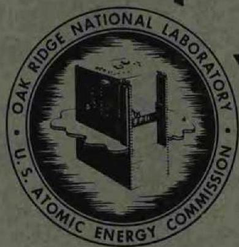

CENTRAL RESEARCH LIBRARY DOCUMENT COLLECTION

LIBRARY LOAN COPY

DO NOT TRANSFER TO ANOTHER PERSON

If you wish someone else to see this document, send in name with document and the library will arrange a loan.

OAK RIDGE NATIONAL LABORATORY

OPERATED BY

UNION CARBIDE NUCLEAR COMPANY

A Division of Union Carbide and Carbon Corporation

UCC

POST OFFICE BOX X - OAK RIDGE, TENNESSEE

# LEGAL NOTICE

This report was prepared as an account of Government sponsored work. Neither the United States, nor the Commission, nor any person acting on behalf of the Commission.

A. Makes any warranty or representation, express or implied, with respect to the accuracy, completeness, or usefulness of the information contained in this report, or that the use of any information, apparatus, method, or process disclosed in this report may not infringe privately owned rights; or   
8. Assumes any liabilities with respect to the use of, or for damages resulting from the use of any information, apparatus, method, or process disclosed in this report.

As used in the above, "person acting on behalf of the Commission" includes any employee or contractor of the Commission to the extent that such employee or contractor prepares, handles or distributes, or provides access to, any information pursuant to his employment or contract with the Commission.

Contract No. W-7405-eng-26

SOLID STATE DIVISION

# A FLUORIDE FUEL IN-PILE LOOP EXPERIMENT

O. Sisman, W. E. Brundage, and W. W. Parkinson

Work Done by

C. D. Baumann

W.W. Parkinson

W.E.Brundage

O. Sisman

R. M. Carroll

F. M. Blacksher

J. G. Morgan

C. Ellis

M. T. Morgan

J. R. Duckworth

A. S. Olson

DATE ISSUED

JAN 15 1957

OAK RIDGE NATIONAL LABORATORY

Operated by

UNION CARBIDE NUCLEAR COMPANY

A Division of Union Carbide and Carbon Corporation

Post Office Box X

Oak Ridge, Tennessee

3 4456 03607194

# ORNL-1965

# C-84 - Reactors-Special Features of Aircraft Reactors

# INTERNAL DISTRIBUTION

1. R.G.Affel   
2. C. J. Barton   
3. M. Bender   
4. D. S. Billington   
5. F. F. Blankenship   
6. E. P. Blizzard   
7. C. J. Borkowski   
8. W. F. Boudreau   
9. G.E. Boyd   
10. M. A. Bredig   
11. W. E. Browning   
12. F. R. Bruce   
13. A. D. Callihan   
14. D. W. Cardwell   
15. C. E. Center (K-25)   
16. R. A. Charpie   
17. C. E. Clifford   
18. J. H. Coobs   
19. W. B. Cottrell   
20. D. D. Cowen   
21. S. Cromer   
22. R. S. Crouse   
23. F. L. Culler   
24. J. H. Devan   
25. L. M. Doney   
26. D. A. Douglas   
27. E.R.Dytko   
28. W. K. Eister   
29. L. B. Emlet (K-25)   
30. D. E. Ferguson   
31. A. P. Fraas   
32. J. H. Frye   
33. W. T. Furgerson   
34. E. J. Breeding   
35. W. R. Grimes   
36. E. E. Hoffman   
37. H. W. Hoffmann   
38. A. Hollaender   
39. A. S. Householder   
40. J. T. Howe   
41. W. H. Jordan   
42. G. W. Keilholtz   
43. C. P. Keim   
44. M. T. Kelley   
45. F. Kertesz   
46. E. M. King

47. J. A. Lane   
48. R. B. Lindauer   
49. R. S. Livingston   
50. R. N. Lyon   
51. F. C. Maienschein   
52. W. D. Manly   
53. E. R. Mann   
54. L. A. Mann   
55. W. B. McDonald   
56. F. R. McQuilkin   
57. R. V. Meghreblian   
58. R.P.Milford   
59. A. J. Miller   
60. R. E. Moore   
61. J. G. Morgan   
62. K. Z. Morgan   
63. E. J. Murphy   
64. J. P. Murray (Y-12)   
65. M. L. Nelson   
66. G.J. Nessle   
67. R. B. Oliver   
68. L. G. Overholser   
69. W. W. Parkinson   
70. P. Patriarca   
71. R.W. Peelle   
72. A.M. Perry   
73. J. C. Pigg   
74. H. F. Poppendiek   
75. P. M. Reyling   
76. A. E. Richt   
77. M. T. Robinson   
78. H. W. Savage   
79. A. W. Savolainen   
80. R. D. Schultheiss   
81. E. D. Shipley   
82. A. Simon   
83. O. Sisman   
84. J. Sites   
85. M. J. Skinner   
86. G.P. Smith   
87. A. H. Snell   
88. C. D. Susano   
89. J. A. Swartout   
90. E. H. Taylor   
91. R.E. Thoma   
92. D. B. Trauger

# CONTENTS

ABSTRACT 1   
INTRODUCTION 1   
SUMMARY 2   
DESIGN 3   
Governing Factors 3   
Experience with the First Loop 5   
The Basic Loop Apparatus 6   
Safety 6   
The Auxiliary Systems 8   
CONSTRUCTION 8   
The Fuel Circuit 8   
The Pump System 11   
The Off-Gas System 12   
The Assembly Procedure 15   
Instrumentation and Control 18   
Radiation Shielding 22   
OPERATION 26  
Leak Testing and Cleaning 26   
Installation in Reactor 27   
Filling 27   
Reactor Startup and Operation of the Loop 27   
Shutdown of the Loop 30   
31   
DISCUSSION OF RESULTS 32   
Measurement of Fission Power Generation 32   
Chemical Analysis of Fuel 33   
Fission-Product Ruthenium 34   
Metallographic Examination 34   
Conclusions 45   
APPENDIX A - DISASSEMBLY PROCEDURE AND EQUIPMENT 45   
APPENDIX B - ANALYSIS OF INCONEL TUBING 50

# A FLUORIDE FUEL IN-PILE LOOP EXPERIMENT

O. Sisman

W. E. Brundage

W. W. Parkinson

# ABSTRACT

An Inconel loop circulating fluoride fuel $(62\frac{1}{2}$ mole $\%$ NaF, $12\frac{1}{2}$ mole $\%$ ZrF $_4$ , 25 mole $\%$ UF $_4$ , 93% enriched) was operated at $1485^{\circ}\mathrm{F}$ with a temperature difference of about $35^{\circ}\mathrm{F}$ in the Low-Intensity Test Reactor for 645 hr. For 475 hr of this time the reactor was at full power, and fission power generation in the loop was 2.7 kw, with a maximum power density of 0.4 kw/cc. The total volume of fuel was 1290 cc (5.0 kg), and the flow through the irradiated section was 8.6 fps (Reynolds number 5500). The loop has been disassembled and has been examined by chemical and metallographic analyses. No acceleration of corrosion or decomposition of fuel by irradiation was noted, although deposition of fission-product ruthenium was observed. No mass transfer of Inconel was found, and the corrosive attack was general and relatively light. The average corrosive penetration, in the usual form of subsurface voids, was 0.5 mil; the maximum penetration was 2 to 3 mils.

# INTRODUCTION

High power densities and effective heat transfer are paramount requirements in the development of mobile power reactors. In order to provide a system meeting these requirements for the Aircraft Nuclear Propulsion Project, circulating molten-salt fuels have been investigated extensively. This experiment, as the first of its kind, was designed and operated primarily to demonstrate feasibility as well as to study the effect of reactor radiation on a dynamic-corrosion system of high-melting liquid fuel. It was anticipated that the fluoride fuels would be used at $1500^{\circ}\mathrm{F}$ in Inconel.

At the time of the conception of this experiment, there were available corrosion data for several alloys in a number of compositions of fluoride salts at temperatures up to about $1800^{\circ}\mathrm{F}$ . There were also available data for very small Inconel capsules containing the fluoride mixtures which had been irradiated in the MTR at about $1500^{\circ}\mathrm{F}$ . Very little, if any, corrosion of Inconel was detected for either the irradiated or the nonirradiated capsules of the more recent tests.2,3 Thermal

convection loops of very low flows but large differences in temperature $(\Delta T)$ showed mass transfer to be a serious problem. No high-velocity experiments had been run either in the reactor or out of the reactor. It was anticipated that the Aircraft Reactor Experiment would be the first high-velocity system, either with or without radiation. Here, the flow rate and the $\Delta T$ would have values expected for a full-scale reactor, but the power density would be too low for an accurate measurement of any effect of radiation. A loop experiment is different from the ARE in that a part of the system can be in a high-radiation field.

Loop experiments are therefore designed to produce a very high power density in some part of the system and to maintain, as nearly as possible, many of the other conditions expected in the reactor. Ideally, it would be desirable to have a high power density and a low dilution factor (ratio of total volume to irradiated volume), high flow rate with high $\Delta T$ , and precisely the same fuel composition as that anticipated for the full-scale reactor.

The radiation facility available for the experiment was a horizontal beam hole (HB-2) in the LITR. In order to obtain the highest possible power in this reactor a special fuel was blended which contained about 50 wt $\%$ U $^{235}$ . This mixture of NaF, ZrF $_4$ , and UF $_4$ was somewhat harder to work with than the standard mixture because it had a higher melting point (1170°F vs about 950°F for the ARE fuel) and a considerably higher viscosity.

The intention was that the fuel loop be as short as possible in order to keep the dilution factor down and the fuel inventory low. The first design had the entire loop located in the innermost 4 ft of the beam hole, and this had the additional obvious advantage of permitting the use of equipment which was relatively small and, being completely inside the reactor, was easy to shield. However, this design required the development of a pump small enough to fit inside the beam hole of the reactor. Unfortunately, the urgency of the experiment would not allow for the development of a special pump. The only readily available one was a sump pump, which had to be located outside the reactor. As will be discussed later, this changed the entire conception of the experiment.

The loop now became 15 ft long, contained a large inventory of fuel and, consequently, a large dilution factor, and required a tremendous amount of radiation shielding outside the reactor.

With such a large dilution factor, the experiment can no longer be considered a test of fuel stability, but the effect of radiation on corrosion can still be seen at the "in-pile" end of the loop, where the radiation intensity is high. To simulate reactor conditions it was desired that, in addition to maintaining the maximum temperature of $1500^{\circ}\mathrm{F}$ , a large temperature drop be maintained between the hot and cold ends of the loop. Although the attainment of a high $\Delta T$ was somewhat limited by the high melting point of the fuel, it turned out that, because of the geometry imposed on the experiment (see the section entitled "Design"), there was a choice between a high $\Delta T$ with low flow rate or a very low $\Delta T$ with high flow rate. Since it was necessary and desirable to have a relatively high flow rate, the loop was operated practically isothermally. The temperature was maintained at a maximum of $1500^{\circ}\mathrm{F}$ at the in-pile end of the loop, and the flow was selected so that turbulence was maintained in the hot end of the loop (Reynolds number, $\sim 5000$ ).

# SUMMARY

The experiment ran very smoothly throughout the month that it was in the reactor. An early plugging in one of the off-gas lines was easily corrected, and the only adjustments required were heater power regulation for reactor shutdown and startup. Temperatures, fuel flow rate, and reactor power are plotted in Fig. 24 for the entire period of operation; the conditions of operation are summarized in Table 1. Termination of the experiment was caused by flow stoppage due to failure of the pump drive belt. The flow stoppage caused an overshoot in temperature which scrambled the reactor by means of the safety circuit built into the equipment. The temperature overshoot was $70^{\circ}\mathrm{F}$ and lasted for about 1 sec, after which time the reactor was shut down (see Fig. 25).

Metallographic examination showed that corrosion in the loop was relatively light and essentially uniform. Maximum penetration was 2.5 mils, and such penetration was confined to a

limited region outside the radiation field. In the remainder of the loop, maximum penetration was about 1 mil, and average penetration was 0.5 mil. No enhancement of corrosion by irradiation was observed, and no mass transfer of metal was noted anywhere in the loop.

Chemical analysis indicated that the fuel was diluted by the preliminary flushing salt (nonuranium) to $43.7\mathrm{wt}\%$ ( $\sim 25$ mole \%). The other changes observed in the composition were in the traces of nickel and chromium, constituents of Inconel. The nickel content decreased slightly, while the chromium content increased from $44~\mathrm{ppm}$ in the original charging material to about $150~\mathrm{ppm}$ . These changes confirmed the moderate degree of corrosion.

The generation of power in the loop by fission was estimated by electrical heating measurements during operation to be 2.8 kw. Activation of the Inconel of the loop corresponded to a flux which

Table 1. Summary of Operating Conditions   

<table><tr><td>Total operating time, hr</td><td>645</td></tr><tr><td>Time at full reactor power, hr</td><td>475</td></tr><tr><td>Location of experiment</td><td>LITR hole HB-2</td></tr><tr><td>Reactor power, Mw</td><td>3</td></tr><tr><td>Fission power in loop, kw</td><td>2.7</td></tr><tr><td>Maximum power density, kw/cc</td><td>0.4</td></tr><tr><td>Temperature, average, °F</td><td></td></tr><tr><td>Inlet to high-flux region</td><td>1475 ± 10</td></tr><tr><td>Outlet from high-flux region</td><td>1485 ± 10</td></tr><tr><td>Maximum in loop</td><td>1485 ± 10</td></tr><tr><td>Minimum in loop</td><td>1450 ± 15</td></tr><tr><td>ΔT in loop, °F</td><td>35 ± 15</td></tr><tr><td>Flow, average</td><td></td></tr><tr><td>Mass flow, g/sec</td><td>250</td></tr><tr><td>Volume flow, gpm</td><td>1.1</td></tr><tr><td>Velocity in high-flux region, fps</td><td>8.6</td></tr><tr><td>R in high-flux region</td><td>5500</td></tr><tr><td>Velocity in most of loop, fps</td><td>2.7</td></tr><tr><td>Pressure (at pump reservoir)</td><td>Atmospheric</td></tr><tr><td>Cycle time, sec</td><td></td></tr><tr><td>Complete circuit</td><td>19.6</td></tr><tr><td>Time in pump</td><td>8.5</td></tr><tr><td>Time in high-velocity section</td><td>0.4</td></tr><tr><td>Time in rest of loop</td><td>10.7</td></tr><tr><td>Fuel (as received)</td><td></td></tr><tr><td>Composition, mole %</td><td>UF4-ZrF4-NaF(25-12½-62½)</td></tr><tr><td>Melting point, °F</td><td>1170</td></tr></table>

Table 1 (continued)   

<table><tr><td>Density at 1500°F, g/cc</td><td>3.93</td></tr><tr><td>Viscosity at 1500°F, centipoises</td><td>10.0</td></tr><tr><td>Uranium enrichment, %</td><td>93</td></tr><tr><td>Container material</td><td>Incor</td></tr><tr><td>Fuel inventory, kg</td><td>5.0</td></tr><tr><td>Volume of system at 1500°F, cc</td><td>1290</td></tr><tr><td>Dilution factor</td><td>180</td></tr></table>

would have produced $2.8\mathrm{kw}$ . The maximum power density in Table 1 was determined by this method. The activity of zirconium fission product in the fuel indicated that the power was about $2.4\mathrm{kw}$ .

Radiation instruments indicating only relative activity of effluent gas from several locations were included in the instrumentation as safety devices. These instruments were affected by the general background radiation but showed the only other activity to be that from fission products in the pump purge gas. The activity of this gas after passage through the charcoal adsorber can be estimated roughly by means of the stack-gas monitor of the Reactor Operations Department. About 0.001 curie/sec was discharged to the off-gas stack.

Radiochemical examination of the fuel showed that less than $20\%$ of the ruthenium fission product was retained in the fuel; the rest was found to be deposited on the Inconel walls of the loop system.

# DESIGN

# Governing Factors

As mentioned in the Introduction, time would not permit the development of a pump small enough to be located inside the beam hole and equal to the severe temperature and corrosion conditions of the loop. The only suitable existing pump was a centrifugal sump pump developed by the Experimental Engineering Section of the Aircraft Reactor Engineering Division. The capacity of the pump was 600 cc, the output at 3000 rpm was about 1.3 gpm of fuel at 45 psi discharge pressure, and the overall dimensions were 23 in. in height and 10 in. in diameter. The characteristics of the pump dictated many of the features of the loop.

The beam hole in the LITR available for the experiment extended about 12 ft through the reactor

shield and moderator structure and into the active lattice. Since the diameter of the hole required that the pump be located outside the reactor shield at a distance sufficient to permit utilities connections and shielding, the loop had to be about 15 ft long. A schematic drawing of the loop apparatus in its final form is shown in Fig. 1.

The need to attain maximum fission-power density in the fuel and the practical limitation on the removal of heat, while an assembly was retained which could be kept hot in the absence of fission heat, required that the volume of fuel in the neutron flux be small. The low thermal conductivity5 of the fuel made it mandatory to have

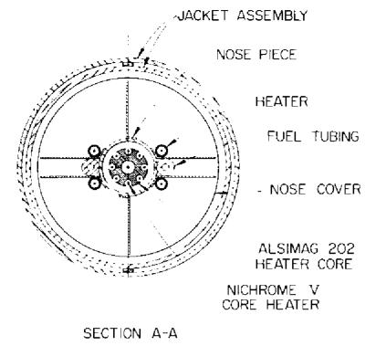

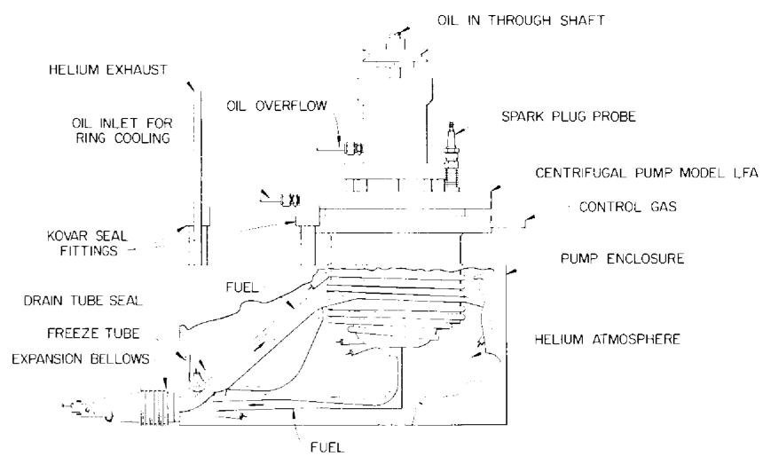

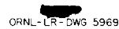

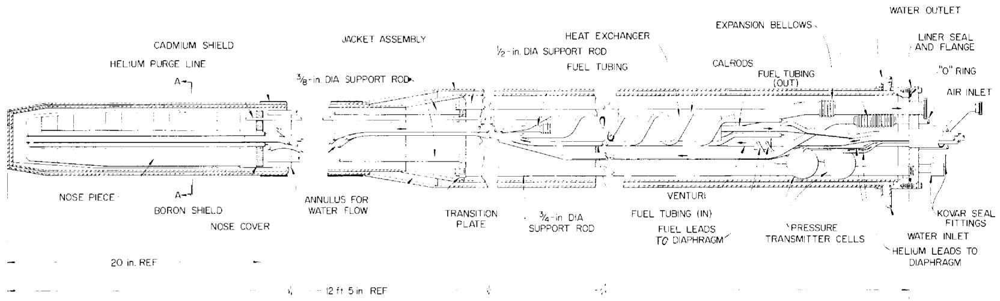  
Fig.1. Fluoride Fuel Loop.

turbulent flow in the irradiated section in order to remove the fission heat from the fuel adjacent to the tube walls (where the velocity is low in laminar flow). Tubing having an inside diameter of 0.225 in. was selected for the section in the neutron flux. In a tube of this size, the fuel mixture (density, 3.9 g/cc; viscosity, 10 centipoises) $^{5,6}$ cannot be maintained at turbulent flow (R~5000) through a length much greater than 4 ft without exceeding the output characteristics of the pump described above. Accordingly, the irradiated section was made up of about $3\frac{1}{2}$ ft of 0.225 in.-ID Inconel tubing bent into a U-shape 2 in. across, and, to keep the pressure-drop low, the connecting tubing used between the pump and the irradiated section was 0.40 in. ID and 0.50 in. OD.

Safety considerations strongly influenced the design of control equipment and instrumentation as well as the loop structure. A major consideration was the problem of dissipating fission heat if fuel should become stagnant in the neutron flux region. As a precaution, temperatures at many points were recorded, with provision for shutting down the reactor in case of excessive values. A further safeguard was in the fabrication of the irradiated U-bend from thick-walled tubing for added heat capacity as well as protection against corrosion. The thermal capacity thus incorporated into the irradiated section served to retard the temperature rise in case of flow stoppage and to allow time for the temperature monitors and reactor controls to operate. Inconel fins brazed to the U-bend assembly and the omission of insulation from this part of the loop were additional means of controlling a possible runaway condition.

Personnel safety required shielding around the pump and the fuel tubing outside the reactor shield. It was necessary, therefore, to keep the radioactive parts as compact as possible.

# Experience with the First Loop

The first loop experiment was assembled and was inserted in the reactor after being tested as thoroughly as possible without actually being operated with molten salt. The appearance of a leak in this loop as it was being filled with fuel demonstrated the need for an operating test prior

to the rather lengthy reactor installation. The performance of a preliminary operating test required that the addition of a drain and fill connection be made in the final loop design, since it was not feasible to remelt the fuel after the test because of the danger of bursting the tubing from thermal expansion of the fuel ( $\sim 20\%$ from the mp to $1500^{\circ}\mathrm{F}$ ). The drain and fill connection is described below.

The leak occurred in a thin section of a flange-weld joint after the joint had been satisfactorily vacuum-tested at temperature. Although this type of weld had proved satisfactory on other loops, the combination of stress concentrations at the weld and of incomplete weld penetration caused failure in this instance. To provide butt joints of greater strength, fillet-weld joints were employed in the assembling of the final loop (Fig. 2). Techniques were developed by the Metallurgy Division for making sound welds of this type on small tubing without obstructing the bore.

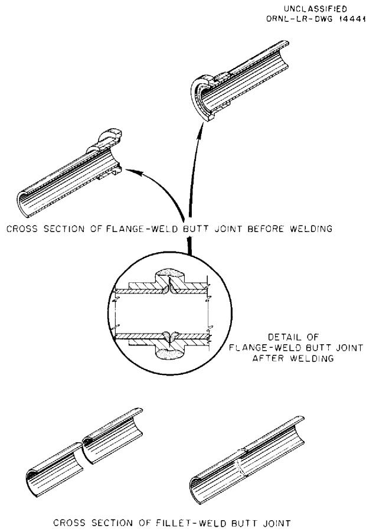  
Fig.2. Welded Joints for Tubing of Fuel Loop.

# The Basic Loop Apparatus

Beginning at the in-pile portion of the loop, the fuel system included, first, the irradiated section, which was essentially a U-bend of tubing. This component, because of its shape and location at the in-pile end of the device, was termed the "nosepiece." From the irradiated section, the fuel passed through connecting tubing to the heat exchanger. The heat exchanger was parallel-flow air-cooled and had a single, central fuel tube with spiral fins. Between the heat exchanger and the pump was a simple T-connection which served as the drain and fill connection. A short section of the fuel tube between the T and the pump could be cooled to form a freeze point and thus permit the fuel to be discharged from the system. From the pump discharge, the fuel passed through a venturi flowmeter and through connecting tubing from the flowmeter to the nosepiece, completing the fuel circuit (Fig. 3).

# Safety

Since this was the first experiment of its type and since the potential hazards were great, safety considerations prompted many of the design features. A leak of irradiated fuel would release radioactive fumes and gases, so, for the protection of personnel, the loop itself (including the pump bowl) was enclosed in a hermetically sealed stainless steel jacket. To reduce the probability of a leak forming a stagnant pool at the high-flux end of this jacket, an inner jacket with a gently tapered end enclosed the nosepiece. This tapered end formed a sloping bottom for conducting leaking fuel back from the high-flux zone.

The sealed jacket was filled and was continuously purged with helium to provide an inert atmosphere around the loop and a means for detecting fuel leaks by radiation monitoring of the exhaust helium. The portion of the sealed jacket inside the reactor shield was double-walled with channels for circulation of cooling water. This water jacket protected the reactor structure from the high temperature of the loop.

The use of temperature as a trouble indication in the nosepiece has been noted earlier. Since temperature is one of the controlling parameters of the corrosion process under study, the importance of temperature control is obvious, both as a means of preventing dangerous corrosion rates and to assure validity of the experiment. The temperatures at many points on the loop, at significant

points on the water jacket, and in the pump cooling oil were recorded on several recording potentiometers. At excessive temperatures these recorders gave both audible and visual alarms. The manner in which an over-temperature condition produced alarms and remedial action by the reactor and heater controls is described in the section entitled "Instrumentation and Control."

The possibility of the fuel mixture assuming a critical configuration was considered, since the total charge contained almost $2\frac{1}{2}$ kg of $\mathsf{U}^{235}$ . It was concluded that criticality did not present a serious problem, because dispersion of the fuel through a hydrogenous moderator such as water would be required. Even coincident leaks in both the fuel circuit and the water jacket would not produce a critical assembly. To forestall the creation of a leak in the water jacket by the fission heating of a pool of fuel from a possible fuel leak in the high-flux zone, a network of thermocouples was located in the inner jacket around the nose-piece. The thermocouple indicators were adjusted to produce an emergency shutdown of the reactor if the temperature increased $100^{\circ}\mathsf{F}$ over operating levels.

A fuel leak which would deposit a large fraction of the charge near the reactor core would require excess capacity in the reactor controls to shut the reactor down, but it was determined that the contribution to the existing reactivity of the reactor core would not be large enough to override the existing control rods. It was concluded that the possibility of the criticality properties constituting a hazard depended on an extremely remote coincidence of circumstances.

The presence of radioactive fission products, some of them gaseous, in the fuel necessitated the radiation monitoring of the effluents from all the gas systems in contact with the loop. In addition to the prevention of dispersion of radioactive materials through the atmosphere, this monitoring would give an indication of leaks into the gas systems. The arrangement of the radiation instruments for measuring the activity of the various gas systems is described in the section, "Instrumentation and Control." Air in the vicinity

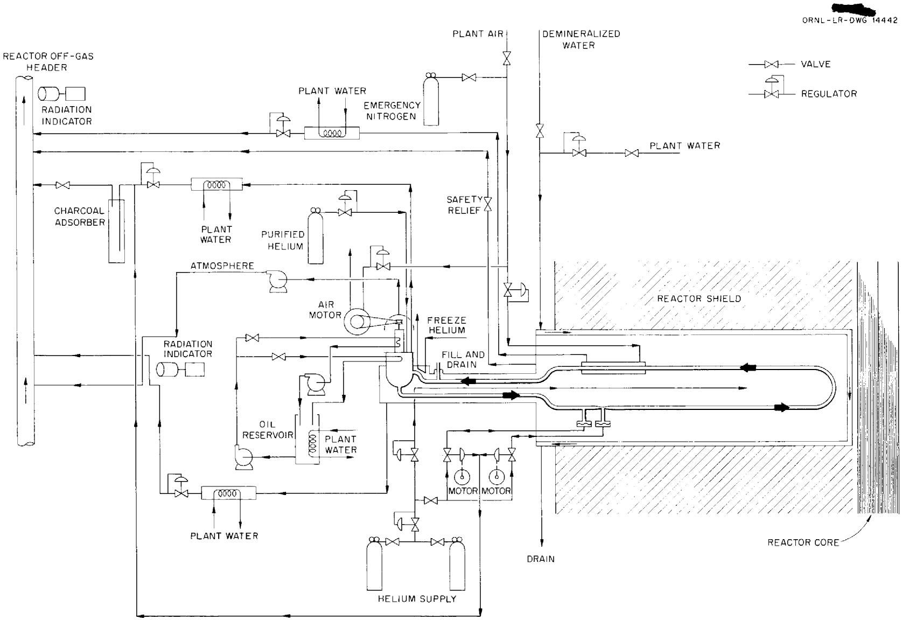  
Fig. 3. Schematic Diagram of Fluoride Fuel Loop System.

of the loop was monitored by a portable, self-contained air monitor with its own visual and audible alarm.

# The Auxiliary Systems

The relationship of the auxiliary systems to the basic fuel circuit is shown schematically in Fig. 3. The fuel system is outlined in heavy lines, and surrounding it is the helium-atmosphere jacket. There were two other helium systems: the flowmeter operating gas, supplied from the same cylinders that supplied the jacket, and the pump-sump pressurizing gas, supplied from high-purity cylinders. The flowmeter operating gas was supplied through motor-driven regulators at a pressure dependent upon the demands of the pressure cells. This system also discharged to the reactor off-gas stack serving the ORNL Graphite Reactor. The pump-sump gas was operated at about 5 psig in order to prevent in-leakage at the pump and to provide an inert atmosphere over the fuel in the pump. Since this helium was in contact with fuel, removal of fission products by passage through a charcoal adsorber was

necessary before this gas was discharged to the off-gas stack.

The other gas systems were: cooling air for the heat exchanger and operating air for the pump-drive air motor, and both were arranged to operate up to the plant supply pressure (120 psi) and at high flows. The pump-motor air, since it was not in contact with the loop, was discharged through a muffler into the LITR building.

In addition to the fuel system, the other liquid systems were those for water cooling and the one for the pump cooling oil. Demineralized water was passed through the loop jacket for cooling, but plant water was used in the other water systems, namely, the gas-water heat exchangers for removing heat from gas streams passing to the charcoal adsorber or to heat-sensitive back-pressure regulators. An additional water system was the water-cooled reservoir for the pump cooling oil. There were two circuits in this system: one through the impeller shaft and one through the flange, both operating from the common water-cooled reservoir.

# CONSTRUCTION

# The Fuel Circuit

The fuel circuit (see Fig. 1) was made up of the following components: pump, flowmeter, heat exchanger, and nosepiece. All were made of Inconel and were welded together into a closed loop of Inconel tubing which was 0.50 in. OD and 0.40 in. ID. The long runs of tubing between the nosepiece, the heat exchanger, and the venturi flowmeter were spiraled to allow for some expansion on heating. The fill line was connected into the loop tubing about 1 ft in front of the intake to the pump. The small section of tubing between the fill line and the pump intake was fitted with a gas-cooled tube, and this section of the loop was used as a freeze-off valve. This freeze point enabled the fuel to be blown from the loop and the pump by pressurizing the pump. In this way the fill line was also used as a drain line.

As has been discussed, a very critical part of the circulating-fuel experiment was the pump. The smallest, readily available pump for circulating the fuel mixture at $1500^{\circ}\mathrm{F}$ was a sump pump (Fig. 4).

The hot part of the pump was restricted to the part below the large flange, that is, the pump bowl (or sump), impeller, and some thermal radiation shields above them. Above the flange was a long section which was cooled. This section comprised the bearings and shaft seals in their housing and the drive shaft extending out the top. The intake to the pump was at the side of the pump bowl; the discharge was at the bottom. A detailed design of the pump is available but will not be discussed here. Associated components, such as pump lubrication and cooling system, drive motor, and controls, were important parts of the equipment and are discussed in detail in the section entitled "The Pump System."

The part designated as the nosepiece was at the opposite end of the loop from the pump (the in-pile end). The U-shaped piece (Fig. 5) was 18 in. long and was made of a special heavy-walled tubing (0.225 in. ID with 0.125-in.-thick walls). The radiator fins were furnace-brazed to the U-tube with copper, as shown in section A-A, Fig. 5. Special

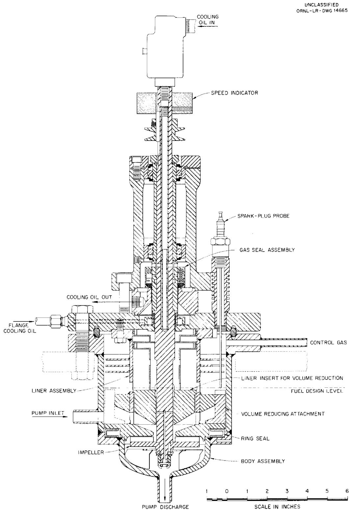  
Fig. 4. Centrifugal Sump Pump for Molten Salts.

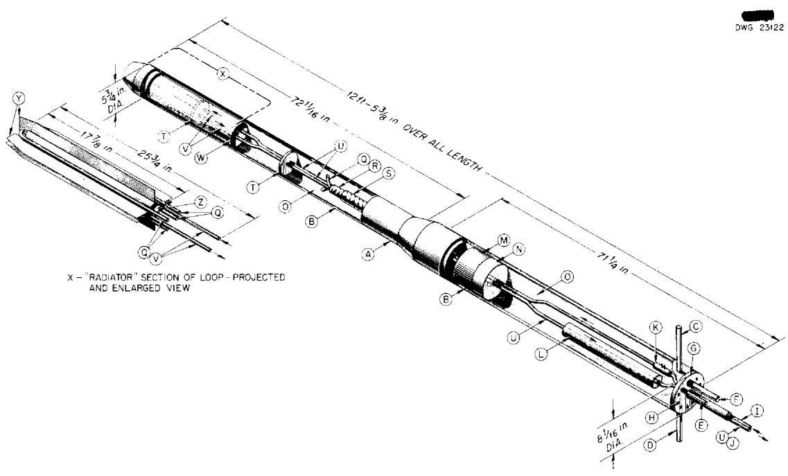

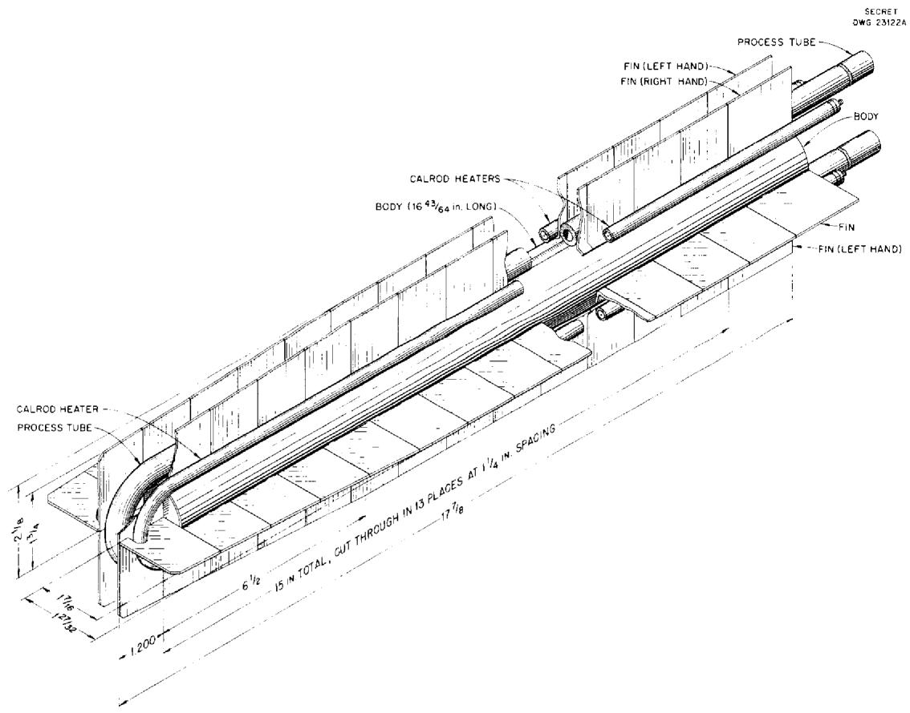  
Fig. 5. Irradiated Section or Nosepiece of Fuel Loop.

adapters were made for connecting this heavy-wall tubing to the 0.5-in. connecting tubing.

The heat exchanger, with portions of the jacket and fins cut away, is shown in Fig. 6. The fuel flowed through the straight center tube, which was the same size as the main tubing of the loop. Air was admitted at the left end and was exhausted through the exit air line at the right of the illustration. The jacket and expansion bellows formed a hermetic seal which prevented air from leaking into the helium protective atmosphere around the loop. The fins were made from nickel disks which were shaped and welded together to form a double-lead helix and were then furnace-brazed to the tube with gold-nickel brazing alloy. After brazing, the outside of the finned tube was machined to permit a close slip fit in the jacket, and the outer jacket was then welded in place.

Tests of the heat removal capacity of the heat exchanger were made by an MIT Practice School group using a steam-to-air system. The heat exchanger was found to have a capacity of 5 kw at a 2-psi pressure drop, 10 kw at 5 psi, and 20 kw at 50 psi.

Fuel flow in the loop was measured by a venturi of standard design (Fig. 7) which was machined from a solid rod of Inconel. The unique feature of the flowmeter was not the venturi but the means by which the pressures were transmitted to the sensing device without bringing the radioactive fuel away from the venturi location. Special pressure transmitters were designed which were small

enough to fit into the available space and yet could operate at $1500^{\circ}\mathrm{F}$ . The venturi pressure transmitter is shown in Fig. 8. A detailed description of the pressure transmitter system, including instrumentation, is given in a separate report.[11]

All fuel-containing parts of the loop were traced with heaters, and enough separate circuits were used so that the temperature of the various parts of the system could be regulated individually. For the most part, Calrod heaters were used, and 13 of them were bent to fit the individual components, as shown in Fig. 9. There was an additional ceramic core heater in the center of the U of the nosepiece, and the venturi pressure cells and lines between the pressure cells and the venturi were heated by specially built units.

# The Pump System

The fuel pump has been discussed as part of the fuel circuit; the auxiliaries to the pump have been designated as the pump system. The pump was driven at 2000 to 3000 rpm, through a V-belt coupling, by a 2-hp Keller air motor. The air motor was selected because this unit is much smaller than a variable-speed electric motor. Air pressure to the motor was controlled manually at the panel board. The motor speed was not measured, but the pump shaft speed was monitored with a photoelectric tachometer.

Light spindle oil (Gulfspin 60) was circulated by separate oil pumps through a cooling ring in the pump flange and through the pump drive shaft and shaft housing for cooling as well as for lubricating

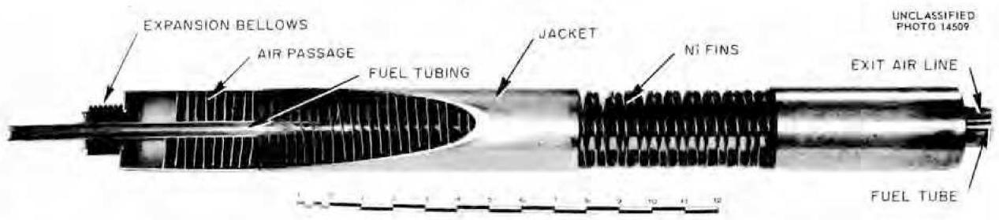  
Fig. 6. Air-cooled Spiral Fin Heat Exchanger.

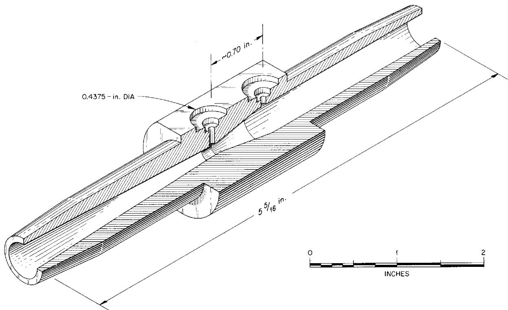  
Fig. 7. Venturi for Fuel Loop.

the pump. The oil circulating system is shown in Fig. 10. Oil in the reservoir was maintained at about $35^{\circ}C$ with water cooling coils. Flow was maintained at about 1 gpm in both circuits. Low-flow alarms were installed at the oil reservoir, and a standby pump was piped into the system to ensure oil flow. The oil reservoir was vented to the reactor off-gas stack after a temporary plug in the pump off-gas line forced a small amount of gaseous activity into the oil.

The space above the fuel in the pump was continuously purged with pure helium gas; the off-gas from the pump will be discussed as part of the loop off-gas system.

# The Off-Gas System

The sources of gas which could carry radioactivity in the event of an accident were as follows: heat-exchanger cooling air, loop-jacket purgege helium, external-lead-shield exhaust air, and the flowmeter pressure-cell helium. Also, fission gases are carried off by the pump purgege

helium. All these gases were handled through an off-gas system which is diagramed in Fig. 3.

The heat-exchanger cooling air was vented to the reactor off-gas stack. This air could manually be diverted through the charcoal trap, but it was not intended that large volumes of hot gas ever be put through this adsorber. Flowmeter pressure-cell helium and the lead-shield exhaust air were also vented to the stack, and no provisions were made to divert these gases through the charcoal adsorber.

Helium was bled into the loop jacket at the nose of the loop and was taken off at the pump. Gas at a rate of about 2 ft³/hr and at 2 to 4 psig was used to purge the loop jacket. The exit gas was passed by a radiation detector before being bled to the stack. If this gas had become radioactive it would have been manually diverted to the charcoal adsorber. The jacket was also equipped with a pressure relief valve set to release at 9 psi and connected through large tubing directly to the off-gas stack. The relief valve prevented pressure buildup in the jacket, either from an

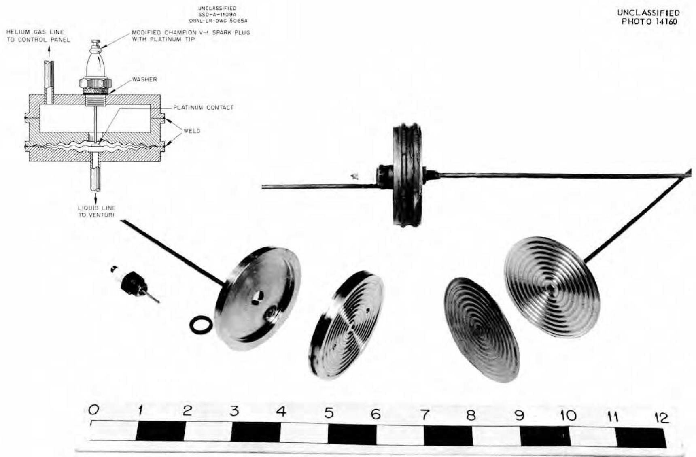  
Fig. 8. Pressure Transmitter for Fuel Loop.

UNCLASSIFIED

ORNL-LR-DWG 15058

T.C.'S NOT SHOWN ON DIAGRAM

RECORDER TRA-5

REC. PT. TC.NO. LOCATION

80 LINER (END) (OTHER LINER T.C.'s: NOS. 81 AND 82)   
2 83 DEMIN.WATER TO LINER   
3 84 DEMIN.WATER FROM LINER   
4 85 OIL RESERVOIR   
5 86 OIL COOLING RING (ON OIL LINE)   
6 87 PUMP SHAFT OIL (ON OIL LINE)   
7 88 AIR INTO HEAT EXCHANGER   
8 89 CHARCOAL ABSORBER  
9 90 COOLING WATER FROM PUMP SHIELD   
91 PROCESS WATER INLET   
11 92 EXHAUST AIR FROM PUMP SHIELD   
12 93 OUTSIDE OF PUMP SHIELD

*ALSO T.C.'s 81 AND 82; ALL THREE ON A SELECTOR SWITCH   

<table><tr><td colspan="16">T.C. PANEL ON MAIN CONTROL BOARD</td></tr><tr><td>RECORDER</td><td colspan="3">PAT CONT.TRA-1</td><td colspan="3">TRA-2</td><td colspan="9">TRA-3</td></tr><tr><td>RECORDER PT.</td><td>1</td><td>2</td><td>3</td><td>1</td><td>2</td><td>3</td><td>1</td><td>2</td><td>3</td><td>4</td><td>5</td><td>6</td><td>7</td><td>8</td><td>9</td></tr><tr><td>T.C. NO.</td><td>24</td><td>25</td><td></td><td>21</td><td>22</td><td></td><td>23</td><td>27</td><td>28</td><td>29</td><td>30</td><td>31</td><td>35</td><td>33</td><td>36</td></tr><tr><td>RECORDER</td><td colspan="3">TRA-3</td><td colspan="12">TRA-4</td></tr><tr><td>RECORDER PT.</td><td>10</td><td>11</td><td>12</td><td>1</td><td>2</td><td>3</td><td>4</td><td>5</td><td>6</td><td>7</td><td>8</td><td>9</td><td>10</td><td>11</td><td>12</td></tr><tr><td>T.C. NO.</td><td>34</td><td>39</td><td>40</td><td>43</td><td>46</td><td>47</td><td>48</td><td>49</td><td>50</td><td>51</td><td>56</td><td>59</td><td>63</td><td>65</td><td>68</td></tr><tr><td>RECORDER</td><td colspan="12">TRA-5</td><td colspan="3">SPARES</td></tr><tr><td>RECORDER PT.</td><td>1</td><td>2</td><td>3</td><td>4</td><td>5</td><td>6</td><td>7</td><td>8</td><td>9</td><td>10</td><td>11</td><td>12</td><td></td><td></td><td></td></tr><tr><td>T.C. NO.</td><td>80</td><td>83</td><td>84</td><td>85</td><td>86</td><td>87</td><td>88</td><td>89</td><td>90</td><td>91</td><td>92</td><td>93</td><td>26</td><td></td><td></td></tr><tr><td></td><td colspan="15">SPARES</td></tr><tr><td>T.C. NO.</td><td>37</td><td>41</td><td>42</td><td>44</td><td>45</td><td>69</td><td>60</td><td>52</td><td>53</td><td>54</td><td>55</td><td>57</td><td>58</td><td>61</td><td>62</td></tr><tr><td></td><td colspan="15">SPARES</td></tr><tr><td>T.C. NO.</td><td>64</td><td>66</td><td>67</td><td></td><td></td><td></td><td></td><td></td><td></td><td></td><td></td><td></td><td></td><td></td><td></td></tr></table>

<table><tr><td>HEATER NO.</td><td>RATED POWER</td><td>VARIAC NO.</td><td>CONNECTOR NO.</td></tr><tr><td>0-0</td><td>2400W</td><td>T-7</td><td>CN-7</td></tr><tr><td>1-1</td><td>1500W</td><td>T-8</td><td>CN-8</td></tr><tr><td>2-2</td><td>1500W</td><td></td><td></td></tr><tr><td>3A-3</td><td>2500W</td><td>T-9</td><td>CN-9</td></tr><tr><td>4A-4</td><td>2500W</td><td>T-10</td><td>CN-10</td></tr><tr><td>5A-5</td><td>2500W</td><td>T-12</td><td>CN-12</td></tr><tr><td>6A-6</td><td>2000W</td><td>T-4</td><td>CN-4</td></tr><tr><td>7A-7</td><td>1750W</td><td>T-5</td><td>CN-5</td></tr><tr><td>8A-8</td><td>1750W</td><td>T-6</td><td>CN-6</td></tr><tr><td>9A-9</td><td>2000W</td><td>T-3</td><td>CN-3</td></tr><tr><td>10A-10</td><td>2500W</td><td>T-11</td><td>CN-11</td></tr><tr><td>11A-11</td><td>1000W</td><td>T-1</td><td>CN-1</td></tr><tr><td>12A-12</td><td>750W</td><td>T-2</td><td>CN-2</td></tr><tr><td>13A-13</td><td>580W</td><td>T-13</td><td>CN-13</td></tr><tr><td>14A-14</td><td></td><td>T-14</td><td>CN-14</td></tr><tr><td>15A-15</td><td>2500W</td><td>T-15</td><td></td></tr><tr><td>16-16</td><td>2500W</td><td>T-16</td><td></td></tr></table>

SYMBOLS:

22 THERMOCOUPLE

HEATER

DIRECTION OF FLOW

THERMOCOUPLE LOCATION (THERMOCOUPLES ON HEATERS MARKED "H")   
THERMOCOUPLE WELL LOCATION (ALSO MARKED BY "W")

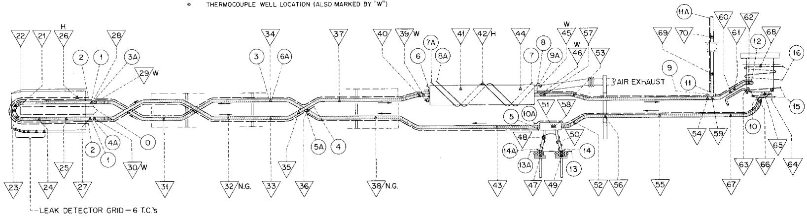

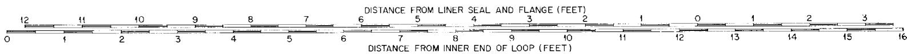  
Fig. 9. Location of Heaters and Thermocouples on the Loop.

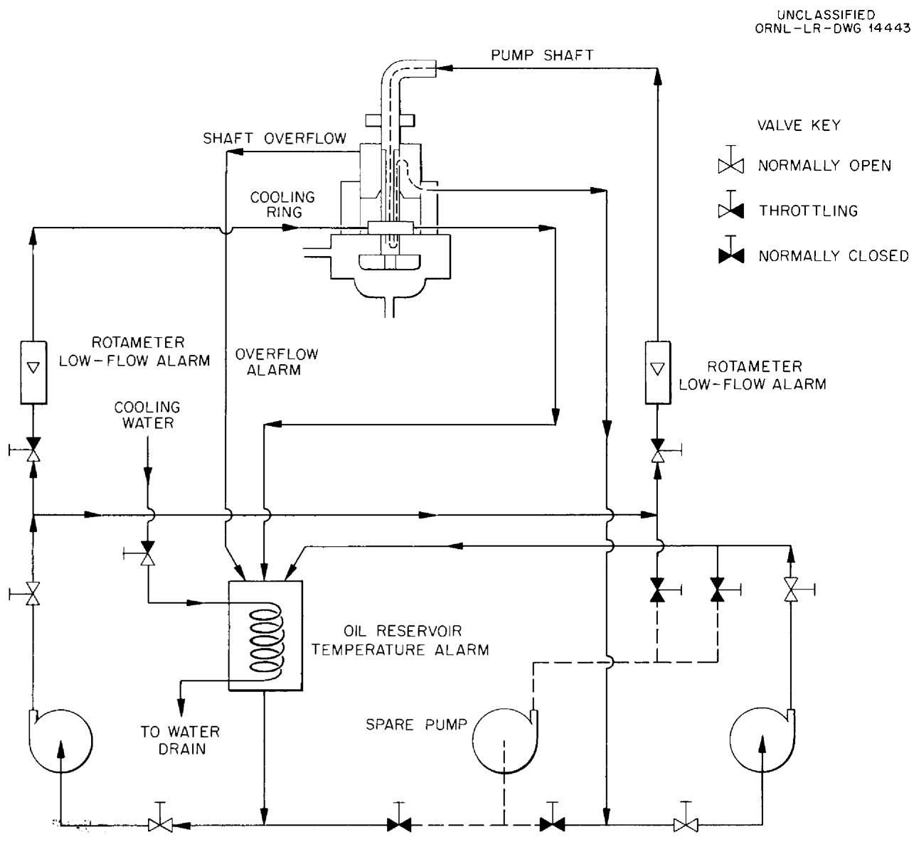  
Fig. 10. Oil Circulating System for Fuel Pump.

obstructed line or from a water leak into the high-temperature region.

High-purity helium was continuously bled across the surface of the fuel in the pump bowl at about 2 ft³/hr and at 3 to 5 psig to provide an inert atmosphere and to remove gaseous fission products. The activity of this gas was too high for the gas to be vented directly to the stack, so it first passed through the charcoal adsorber, which retained the fission gases long enough to permit most of the activity to decay before it was released to the stack. The charcoal adsorber (see Fig. 11) was a 6-in. pipe 10 ft long, con

taining about 2 ft³ of 12- to 14-mesh Columbia activated charcoal. The adsorber was placed vertically in a hole in the reactor floor and was shielded at floor level with lead and concrete. Gas entered at the bottom of the adsorber, so the most radioactive part was deep underground. The adsorber operated at the temperature of the surroundings.

# The Assembly Procedure

When completely assembled, the "in-pile" portion of the loop was enclosed in a stainless steel jacket, as shown in Fig. 12. The flange

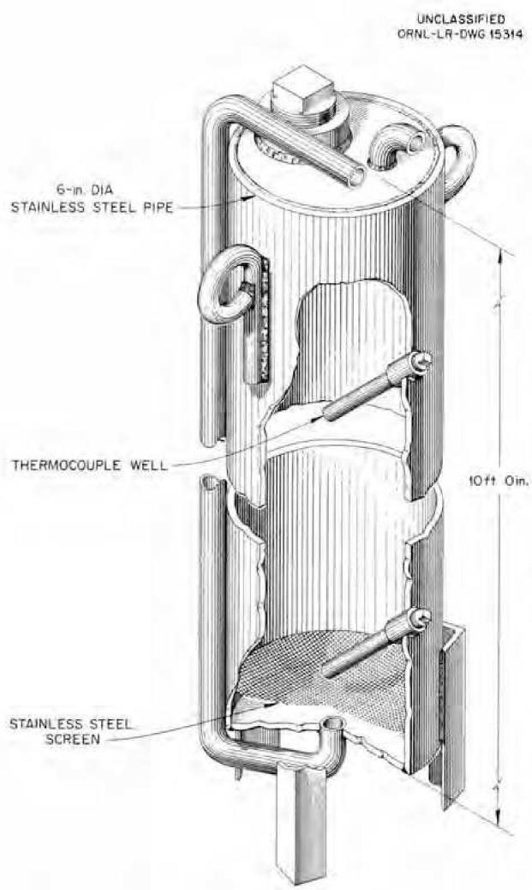  
Fig. 11. Charcoal Adsorber for Loop Off-Gas System.

which closed this jacket was used as the bench mark from which the position of all components of the loop was established. The first step in the assembly of the loop was to weld together all the fuel system up to the flange. This was done by assembling the in-pile components onto the flange, or in the proper relation to the flange (with the aid of the support rods which were attached to the flange), and then making the welds in the proper sequence (see Fig. 13).

All welding was done under close supervision and inspection. As each weld was finished it was inspected for cracks by the dye-penetrant method and for internal construction defects by x ray. Each section was also checked with a helium leak detector as it was assembled. To allow for thermal expansion of the loop, the only point of fixed attachment of the loop was at the pump. The heat-exchanger air inlet and outlet tubes were attached at the jacket flange with the use of bellows, and the rest of the leads were flexible.

Next, the heaters were installed on the in-pile portion of the loop, and then the thermocouples were installed. Calrod heaters were bent to the proper shape and were attached to the loop tubing with hose clamps. To ensure that there were no gaps or overlaps in the active sections of the heaters when they were attached end to end, the heaters were x rayed to determine the actual length of the heater element. The terminals of the heaters were modified to permit operation at higher temperatures by replacing the existing terminals and mica washers with welded connectors and washers made

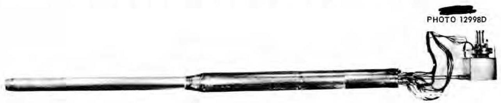

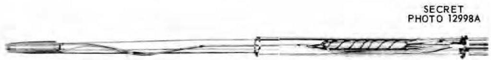  
Fig. 12. Assembled Fuel Loop in Water Jacket.   
Fig. 13. Bare Fuel Loop with Support Framework.

of Lavite. The welding connectors are shown in Fig. 14. The electrical leads were insulated with a double layer of woven glass sleeving (and with ceramic beads in very hot sections).

Thermocouples were made from Chromel-Alumel duplex, nonimpregnated glass-insulated wire. In regions where the thermocouple leads were subjected to temperatures above $1000^{\circ}\mathrm{F}$ , the glass insulation was removed and replaced with ceramic beads. The thermocouples were formed with a capacitor discharge welder by flashing the ends of the wires against a block of graphite. The quality and ductility of the bead was greatly improved by shielding the weld with helium during flashing. The thermocouples were attached to the loop tubing at the desired points by using a similar technique. The thermocouple was held with tweezers, which served as one electrode, and then pressed against the loop tubing, which formed the other electrode.

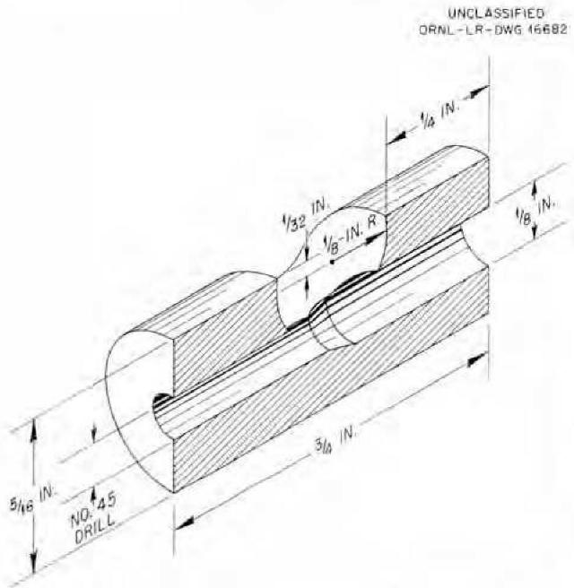  
Fig. 14. Welding Connectors for Electrical Leads.

After attaching heaters and thermocouples, the first layer of insulation, quartz-fiber tape, was applied. Fiber-frax insulation (fibrous aluminum silicate bats, The Carborundum Company) was packed around this first layer, and, finally, glass-cloth tape was used to bind down the Fiber-frax. No insulation was applied to the nosepiece section of the loop.

Shaped graphite blocks were fitted into the vacant spaces around the insulated loop from the nosepiece section back to the heat exchanger. The graphite served as a shield to attenuate the radiation from the reactor during installation of the loop. Graphite was chosen for this shield, since it was easily cut and would withstand high temperatures. It was found necessary to coat the graphite blocks with sodium silicate in order to prevent the graphite from rubbing off on the electrical leads and thereby lowering the insulation of the leads to ground.

To prevent fission heating in the larger-diameter tubing, ferro-boron and cadmium foil were used to provide thermal-neutron shielding for this region. The outside of the water-cooled jacket was wrapped with cadmium foil from the step in the jacket to within 2 ft of the in-pile end. The ferro-boron was applied in the form of disks, interspersed with graphite. Figure 15 shows the insulated loop with some of the graphite installed.

The jacket, which provided water cooling and an inert atmosphere for the loop, was fabricated from $\frac{1}{8}$ -in.-thick stainless steel (see Fig. 12). Two baffles, running the full length of the annular region between the double walls of the jacket, directed the water flow so that the cooling water went in along the bottom half of the jacket, across the end, and returned along the upper half. The flange, which is part of the loop assembly, was bolted onto the jacket during final assembly. A hermetic seal was made with a copper gasket. Electrical and gas-line connections to the in-pile region of the loop were made through the flange, using Kovar-glass seals for the electrical and

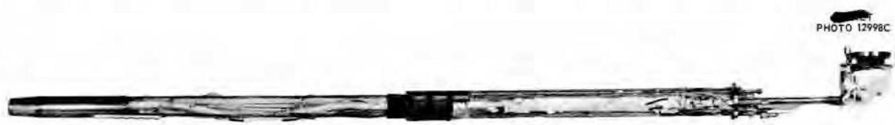  
Fig. 15. Fuel Loop with Heaters, Thermocouples, Insulation, and Part of Shielding.

thermocouple leads. The loop tubing and heaters were carried through the center of the flange, encased in a thin-walled $1\frac{1}{2}$ -in.-dia tube which connected the water-cooled jacket to the pump enclosure. The pump enclosure was not water-cooled but served to contain the helium protective atmosphere and to act as a safety receptacle in case of a fuel leak.

The complete assembly was long and awkward to handle but was even more awkward when the pump was installed, because the pump was heavy and needed external support. The in-pile portion of the loop was therefore completely finished and was encased in the jacket, and all electric and thermocouple lead connections were made at the Kovar seals and tested (the electrical circuits at 500 v) before welding the pump into the loop. First, the pump bowl was welded into place, and the fill and drain line was attached; then the heaters, thermocouples, and insulation were installed as described for the internal portion of the loop (see Fig. 15). After final inspection and testing, the pump enclosure was welded into place.

# Instrumentation and Control

The main instrument panel is shown in Fig. 16. Heater power controls, temperature recorders and controls, air and helium flow control, jacket-cooling-water flow control, fuel flow control, radiation alarms, and safety circuits were located on this panel. A schematic instrument flowsheet is shown in Fig. 17.

The heater layout has been discussed as part of the fuel circuit; heater locations are shown in Fig. 9. The Variac controls for the heater circuits were mounted on the panel board. Only manual control was used for power to the heaters, except for the nosepiece heaters, which were controlled by a proportioning-type temperature controller.

The purpose of the voltmeter and the ammeter at each Variac was to indicate the power being supplied to each heater circuit. It was found that the type of ammeters used did not read correctly because of their close proximity to the Variacs. Attempts to shield the meters from the magnetic field of the Variacs were only partially successful, so the panel-board ammeters were used only as an indication of current flow. Jacks and

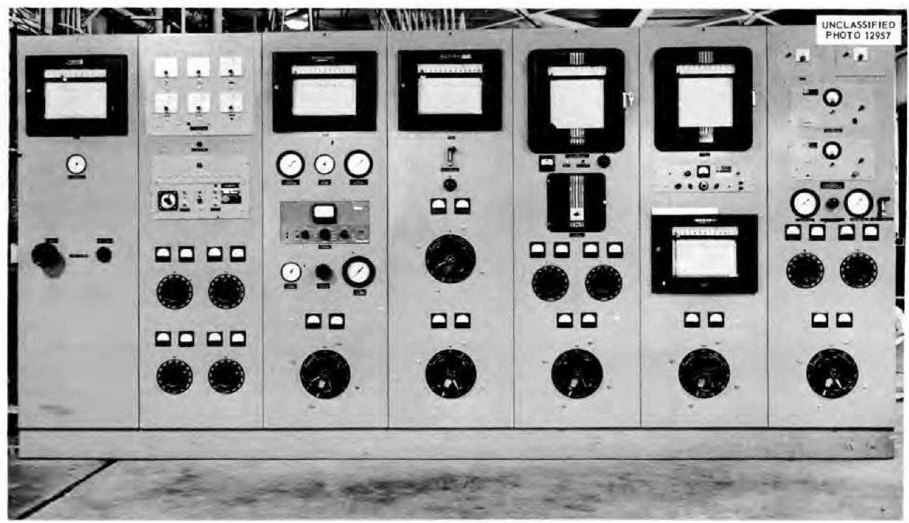  
Fig.16.Instrument Panel for Fuel Loop.(Secret with caption)

UNCLASSIFIED

ORNL-LR-DWG15458

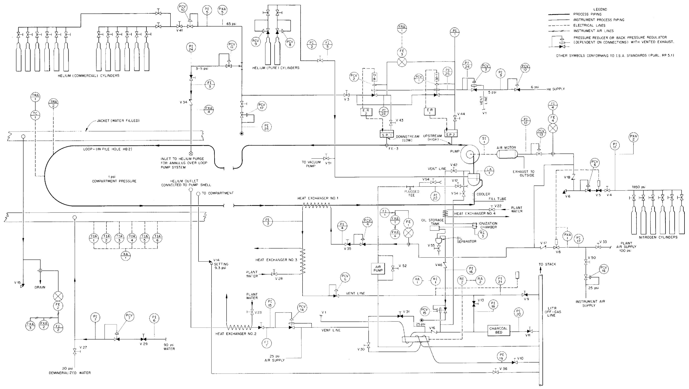  
Fig. 17. Flow Diagram for Instruments and Controls of Fuel Loop. (Secret with caption)

switches were installed so that accurate current readings could be taken periodically by plugging in a precision ammeter at each circuit.

It was desirable to have in use a large number of thermocouples during heatup of the loop and enough spares so that loss of a few thermocouples by burnout would not hamper the operation of the loop. Thermocouple locations are shown on Fig. 9. Continuous recordings of the temperature at 36 points on the loop were made by three 12-point recorders (one not shown on the instrument panel). A fourth 12-point recorder was used to keep a record of low temperatures, such as those for the coolant water, coolant air, pump oil, lead shield, and charcoal adsorber. In addition, the maximum nose temperature was continuously recorded on two separate instruments - one for the proportioning-type controller and the other for an over-temperature safety circuit. Each of these single-point instruments was provided with spare thermocouples that could be switched in if desired.

Pump-motor air and heat-exchanger air were both controlled manually at the panel board. The air pressure to the pump motor was adjusted to give the desired reading on the venturi flowmeter, and the pump shaft speed was also indicated by means of a tachometer. Reduction in flow with no reduction in tachometer speed would indicate either an increase in fuel viscosity or plugging of the loop. Since failure of the plant air supply would be disastrous to the experiment, a standby supply of nitrogen (six cylinders - 15- to 30-min supply) was set to cut in when the plant air supply dropped below 75 psi.

Cooling water to the loop jacket was monitored at the panel board, but flow adjustment was made at the supply, since adjustment was not necessary after the experiment was started. Demineralized water was used, but plant filtered water was also tied into the system, to be used if the supply of demineralized water was cut off.

Fuel flow was continuously recorded by means of a Speedomax. The venturi flowmeter has been discussed as part of the fuel circuit. Helium gas supply to the flowmeter pressure cells as well as pump purge helium and loop-jacket purge helium were controlled at the panel board.

In addition to an air monitor behind the loop equipment, the controls for two radiation instruments were mounted in the panel board. One was connected to an ionization chamber at the line which carried all exhaust gases to the stack, and

the other monitored the activity in the jacket purge helium and in the heat-exchanger exhaust air. Since most of the gas was vented to the off-gas stack manifold, which was at a negative pressure, it was desirable to use back-pressure regulators on those lines where the flow was controlled. The heat exchangers shown in the instrument flow diagram (Fig. 17) were used to cool the hot gases before they passed through the back-pressure regulators, where they might damage the rubber diaphragms.

As has been discussed, one of the primary considerations in the design of this experiment was the safety of personnel and the reactor. The heart of the safety system was the annunciator panel, which was part of the instrument board. The safety circuitry is shown schematically in Fig. 18. Certain conditions were recognized as being unsafe for either personnel or the experiment. For each of these conditions there was a light on the annunciator panel. When everything was operating properly, all these lights were lit, as was a green master light. When a condition became abnormal - for example, a nose temperature over $1525^{\circ}\mathrm{F}$ - the nose-temperature and master lights went out, an alarm light went on, and a buzzer was activated. The buzzer could be cleared for a predetermined set time but not permanently unless the trouble was corrected. If trouble became worse - say the temperature continued to rise - a second light went on, the reactor was set back, and the loop heaters were cut off. Further trouble in certain cases would give an emergency shutdown (scram) of the reactor. For each condition of trouble the action taken depended on the seriousness of the trouble. Potential sources of trouble and the action taken are given in Table 2. Additional alarms which were located at the site of the detecting element rather than on the panel board are listed below:

Low pressure of nitrogen cylinders

Low air flow to pump motor

Low oil flow to pump shaft

Low oil flow to pump ring

Low pressure of helium cylinders

Thermocouple failure on recorder indicating the temperature of in-pile end of loop

These were buzzer-type alarms that called the operator's attention to a condition which needed

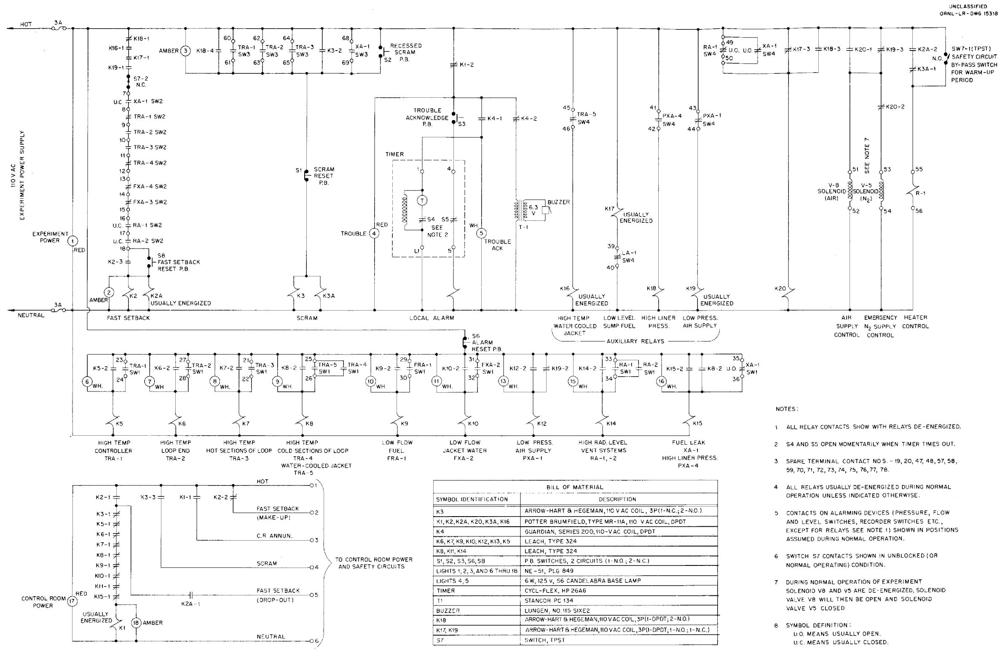  
Fig. 18. Wiring Diagram of Safety Circuits of Loop Controls.

Table 2. Safety Features of the Control System   

<table><tr><td rowspan="2">Condition</td><td colspan="5">Protective Action</td></tr><tr><td>Alarm</td><td>Setback</td><td>Scram</td><td>Cutoff of Heaters</td><td>Cutoff of Heaters, Heat Exchanger, and Pump</td></tr><tr><td>Low water flow through liner jacket</td><td>x</td><td>x</td><td></td><td>x</td><td></td></tr><tr><td>High temperature at liner jacket</td><td>x</td><td>x</td><td></td><td>x</td><td></td></tr><tr><td>Low air flow through heat exchanger</td><td>x</td><td>x</td><td></td><td>x</td><td></td></tr><tr><td>Low pressure of air supply to pump motor and heat exchanger</td><td>x</td><td>x</td><td></td><td>x</td><td></td></tr><tr><td>Radiation from heat-exchanger exhaust</td><td>x</td><td>x</td><td></td><td></td><td>x</td></tr><tr><td>High temperature of in-pile end of loop</td><td>x</td><td>x</td><td>x</td><td>x</td><td></td></tr><tr><td>High temperature of other locations on loop</td><td>x</td><td>x</td><td>x</td><td>x</td><td></td></tr><tr><td>Radiation from helium vent and off-gas lines</td><td>x</td><td>x</td><td></td><td></td><td>x</td></tr><tr><td>High pressure inside liner</td><td>x</td><td></td><td>x</td><td></td><td>x</td></tr><tr><td>Leak indication by thermocouple grid detector</td><td>x</td><td>x</td><td>x</td><td></td><td>x</td></tr></table>

correcting but which was not yet seriously hampering the experiment.

# Radiation Shielding

More than half the fuel was outside the reactor shield at all times, and the fuel travel time from the nosepiece to the pump was only a few seconds (see Table 1); so it was necessary to shield a high flux of delayed neutrons as well as a very intense gamma source. The shield design was based on calculations which are shown in another report.[12] It was intended that during operation the shield would be 15 in. of lead followed by 12 in. of paraffin and a sheet of Boral. It was found, however, that the quantity of capture gammas produced in the paraffin was so high that an additional shield of high-density concrete block (maximum of 2 ft) was required outside the paraffin.

The shielding was of two kinds - permanent lead and demountable shielding. The permanent lead was that required to shield the experiment 24 hr after reactor shutdown (6 in. of lead). It was designed to be used during installation and removal of the experiment as well as during operation of the loop. Attached to the face of the

reactor was the utilities shield (Fig. 19). This shield had a door for shielding either the empty beam hole or the in-pile portion of the loop after the pump end had been removed. For removal of the pump portion of the loop, a hydraulic shear was built into the utilities shield (Fig. 20). At termination of the experiment the connecting tubes between the pump and the in-pile portion of the loop as well as all the heater and thermocouple lead wires and a few copper tubes were cut at this point. Provisions were also made in the utilities shield to bring out water and air lines and electrical wires through lead plugs.

After installation of the experiment, the pump shield was fitted into place behind the utilities shield (see Fig. 19). The remaining lines and wires were brought out through this shield, but its primary purpose was to house the pump and to serve as a support for the pump drive motor. This shield was also the one in which the pump was transferred to the hot cells. Both the pump shield and the terminal shield were cooled by water which passed through cooling coils cast into the lead. The pump shield was on wheels but was held in place with screw jacks.

The first layer of demountable shielding was 8 in. of lead brick, which was installed after all external connections were made to the loop.

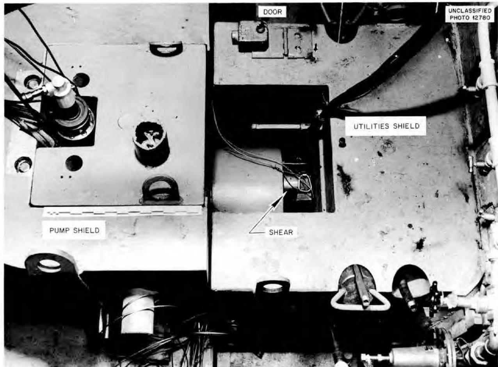  
Fig. 19. Pump and Utilities Shields at Face of Reactor.   
Figure 21 shows the loop during charging of the fuel. The lead bricks are in place on all three sides of the permanent shields. When the charging line was removed and the lead-brick shield was completed, paraffin blocks were stacked around and on top of the lead bricks, and then a wall 8 ft high of high-density concrete was built up   
around the paraffin. When the reactor was started up it was found necessary to erect a wall of concrete blocks in front of the main control panel, but this wall was spaced about 3 ft in front of the panel to permit access for occasional adjustment of the controls. A lead-glass window in the wall permitted viewing of the instruments.

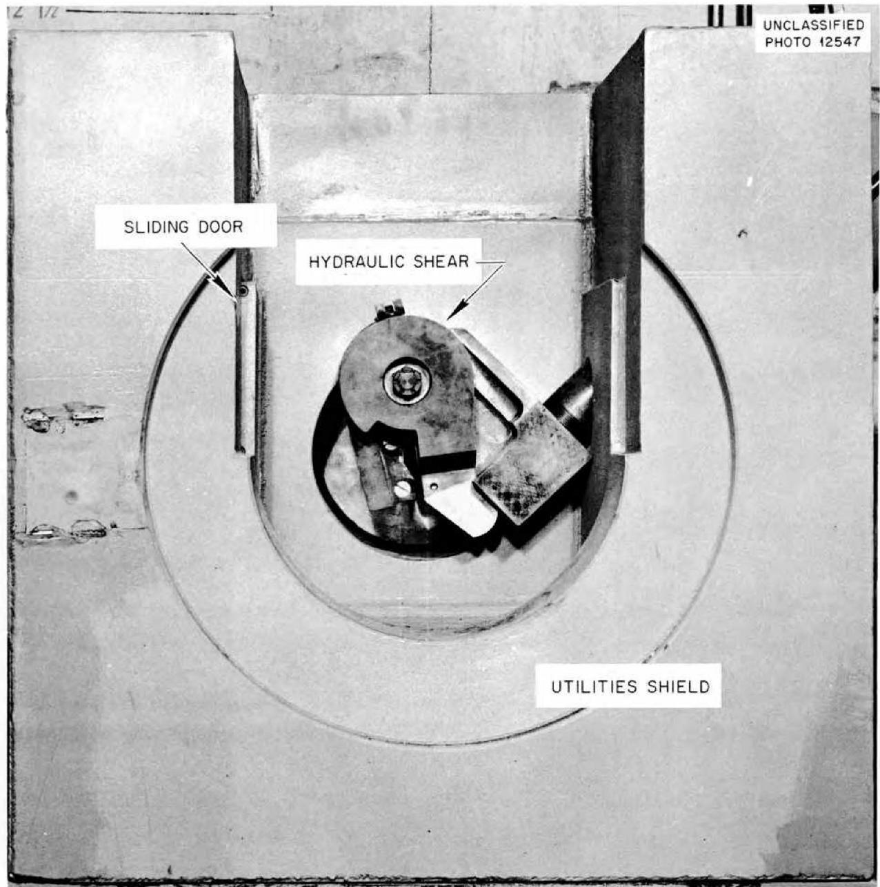  
Fig. 20. Hydraulic Shear Mounted in Utilities Shield.

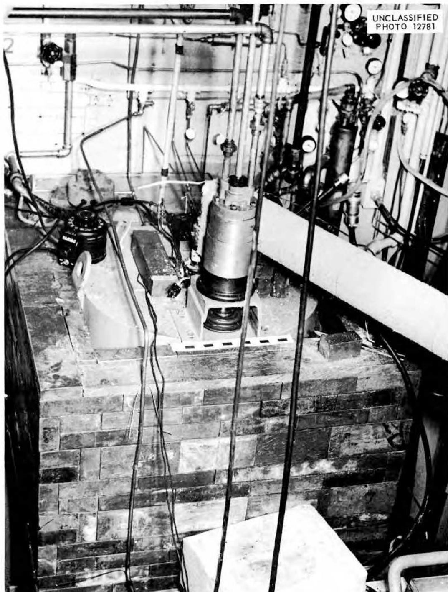  
Fig.21.Demountable and Permanent Pump Shields.

# OPERATION

# Leak Testing and Cleaning

As soon as the fuel circuit was completed by the welding of the pump bowl to the loop tubing, the assembled circuit was leak-tested as a unit. The pump bowl was closed by clamping onto it a plate having a connection to a vacuum pump and a helium leak detector. The fuel circuit was bathed with helium and was proved to be leak-tight. The interior of the loop was cleaned by circulating absolute ethanol through the loop by means of a small laboratory centrifugal pump. The laboratory pump was connected by plastic tubing so as to take suction from the pump bowl and discharge through the loop-pump discharge port. The ethanol was drained, and heaters, shielding, and insulation were attached to the loop structure as described earlier. After the loop was inserted in the water jacket, the plate and vacuum testing equipment were replaced on the pump bowl for leak testing at high temperature. The loop was evacuated and the water jacket purged with helium to provide an

inert atmosphere inside and outside the loop, which was heated to about $1500^{\circ}\mathrm{F}$ by its own heaters and tested with the helium leak detector.

In order to test for leaks under operating conditions and to clean up oxide scale inside the loop, an approximately equimolar mixture of NaF and $\mathsf{ZrF}_4$ was circulated in the loop for several hours prior to installation in the reactor. The charging equipment is shown in Fig. 22 and consisted of a furnace holding a charge tank connected to the loop and to a cylinder of high-purity helium. The regular helium supply for the pump was supplemented by an oil-filled bubbler on the outlet and by a sensitive pressure gage on the inlet during filling.

After the loop and fill line had been heated to between 1400 and $1500^{\circ}\mathrm{F}$ , the pump was started, and pressure was applied to the molten fluoride in the charge tank. Salt was forced into the loop until electrical contact was made with the upper probe of the two probes in the pump. The mixture was

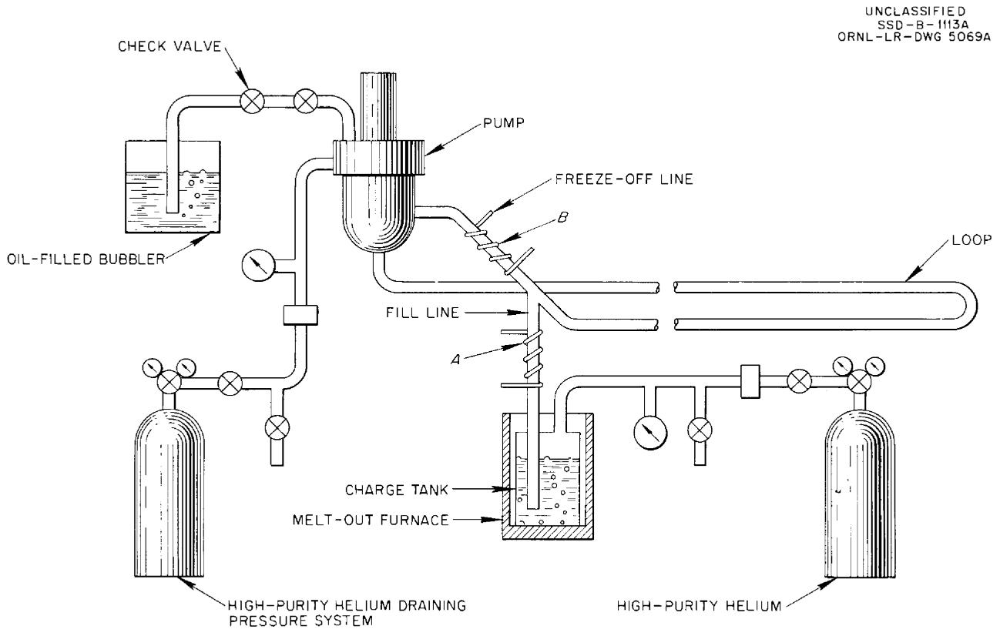  
Fig. 22. System for Filling Loop with Fluoride Mixture. (Secret with caption)

circulated for $7\frac{1}{2}$ hr at about $1500^{\circ}\mathrm{F}$ and at various flow rates to correlate pump shaft speed with flow. Circulation was then stopped, and the fill line to the charge tank was reheated in preparation for draining the loop. When the freeze-off section of the loop was cooled to about $1000^{\circ}\mathrm{F}$ , pressure was applied to the pump bowl in order to drain the loop, which was allowed to cool and was then prepared for transfer to the LITR.

# Installation in Reactor

The loop was inserted in hole HB-2 through the utilities shield, and connections to previously installed piping for helium, air, water, and off-gas systems were made during a protracted reactor shutdown. The pump shield was moved into place, and wires from heaters and thermocouples were connected to the proper panels prior to the placement of the removable top of the pump shield. The hydraulic shear was located on the tubes and wires it was to sever, and the permanent shielding was closed by insertion of the top plug of the utilities shield. Completion of assembly of the permanent shield permitted the mounting of the pump drive motor and connection of the remaining services to the experiment. After pressure checking the loop for leaks, the filling system, with a fresh tank of the NaF-ZrF4 mixture, was connected to the loop fill line.

# Filling

The loop was filled with the salt mixture for a final operating and leak check after installation, before committing the enriched uranium charge to so complex a system. This checking process also constituted a second cleaning operation. Filling and draining were carried out as before, and the loop was operated on this charge for $8\frac{1}{2}$ hr.

The charge tank of nonuranium salt was then replaced with a container of the enriched uranium fuel mixture, and the loop was filled with fuel. The material in the filling line was allowed to freeze, and the line was cut off and capped with a Swagelok fitting. The fuel container was weighed before and after filling the loop. The weight change indicated that $4.98\mathrm{kg}$ were charged into the system, with probably $4.95\mathrm{kg}$ of the fuel in the circulating system and $0.03\mathrm{kg}$ frozen in the fill line.

While the fuel mixture was circulated through the loop, but before the reactor was started, the remaining lead bricks were stacked around the

former location of the fill line. Paraffin and Boral were arranged around the lead in the first shield configuration. It was noted that, in the confines of the work space at the reactor face, erection of stacked brick or block shields was quite time-consuming. An assembly of precast slabs, possibly of concrete alone, would have saved a large portion of this time.

# Reactor Startup and Operation of the Loop

After the lead and the paraffin were stacked in the first shield arrangement, the reactor was brought up to $1\%$ of full power. Radiation measurements indicated that the shield was inadequate for capture gammas from the delayed neutrons in the paraffin. The paraffin blocks were then rearranged, and concrete blocks were added (Fig. 23).

The reactor was brought up to full power (3 Mw) in steps of about $5\%$ , with suitable adjustment of electrical power to the loop heaters between increases of reactor power. During steady operation of the reactor the equipment required only infrequent and minor adjustments. The system had a large heat capacity, so temperature fluctuations were relatively slow. The Leeds & Northrup PAT controller compensated automatically for minor changes in heat generation or in heat transfer conditions. Large increases in heater power were necessary when the reactor was shut down, but these were accomplished quickly by using control settings determined earlier.

Temperature control was greatly simplified when it was found that heat removal was adequate without the use of the air-cooled heat exchanger. Operation of the heat exchanger was unnecessary because the fission heat generation was less than that anticipated. Since fission power generation could be a controlling parameter in fuel corrosion, estimates of the fission power were made early in the operation of the loop by determining the difference in electrical power required to maintain the steady operating temperatures with the reactor at full power and with the reactor off. The difference in electrical power input was assumed to be equal to the fission power. Heat from absorption of reactor gamma rays was assumed to be removed by the jacket cooling water without affecting the loop temperatures, and any difference in the efficiencies of electrical and fission heating was neglected. The average of several determinations was $2.8\mathrm{kw}$ , with a variation between measurements of $\pm 0.03\mathrm{kw}$ . Later determinations of the fission

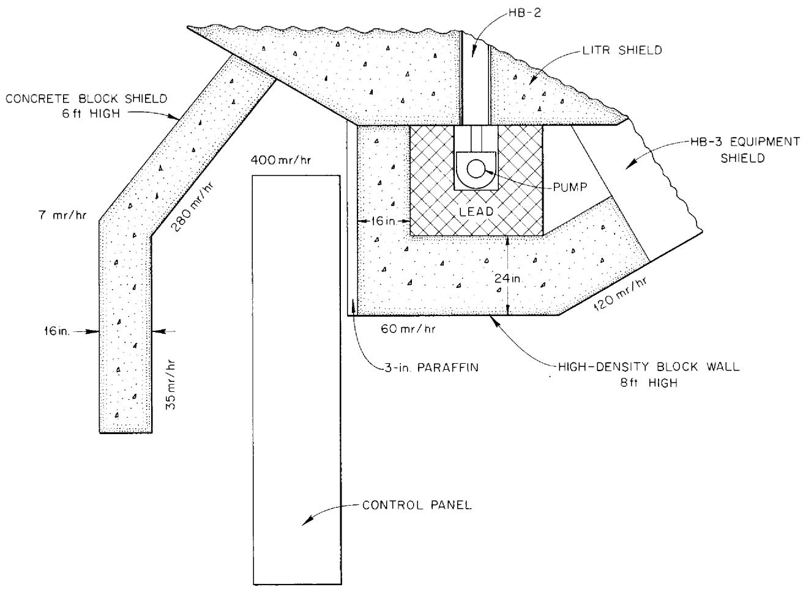  
Fig. 23. Horizontal Section Through Loop Shielding and Gamma Field Readings During Operation.

power were made by examinations of the fuel and of the Inconel loop tubing.

The important operating conditions during in-pile functioning of the loop are displayed in Fig. 24. The temperatures plotted are: end of nosepiece and outlet well of nosepiece (points 24 and 30, Fig. 9); inlet well of nosepiece (point 29); body of venturi tube section (point 58), the coolest part of the system. Except for the well temperatures, it should be noted that the temperatures are for the tube surface, not for the fluid-tube interface. Thermal insulation and position of heaters had a large effect on the thermocouples, so that variations between them were considerable. Although there

were many thermocouples, fluid-tube interface temperatures are not known to better than 10 or $15^{\circ}\mathrm{F}$ .

The discharge side of the nosepiece, as expected, registered the highest temperatures, which averaged $1485^{\circ}F$ . The well at the inlet of the nosepiece averaged $1475^{\circ}F$ , and the surface of the venturi ran about $1440^{\circ}F$ . Fuel temperature should have been lowest at the venturi, since all the out-of-pile heaters and those of the heat exchanger were off or were at reduced power. (It was necessary to supply some heat in this region, so this was done at the pump, the component of the loop with the most heating capability.) The temperature of the tubing adjacent to the venturi was

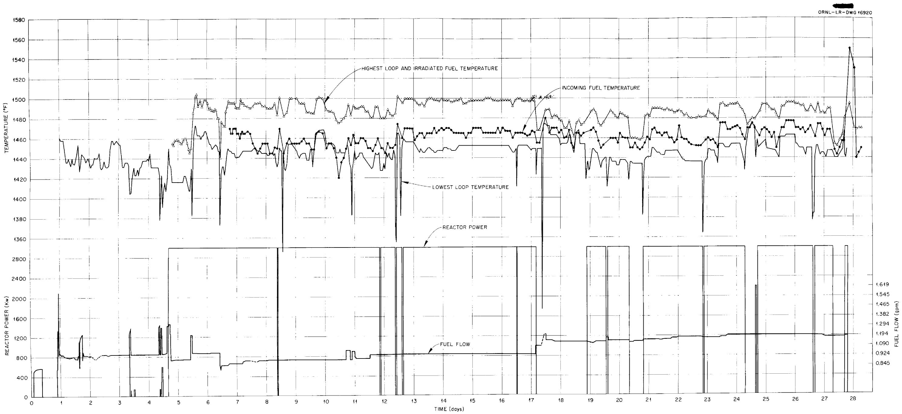  
Fig. 24. Conditions of Operation of Fuel Loop During In-Pile Period.

considered to be a more reliable indication of fuel temperature than that of the venturi. This tube temperature, from several thermocouples, averaged $1450^{\circ}\mathrm{F}$ and was used to estimate the temperature difference between the hot and the cool zones. The temperatures are listed with other pertinent operating data in Table 1. Fuel velocity in the irradiated section of the loop is plotted in the lower section of Fig. 24. Reactor power, shown in the center section of Fig. 24, was the standard operating power of the LITR (3 Mw), with the usual shutdowns for the various experiments in progress.

The entire loop system, during its operating period, functioned with only minor incidents. Early in the operation the air activity near the pump increased sharply. The back-pressure regulator and the oil trap between the pump and the charcoal adsorber were found to be obstructed. The purge-gas pressure built up in the pump was relieved by opening the bypass valve connecting the pump and the adsorber, with no interruption in the operation of the loop.

General air activity from gaseous or volatile fission products was controlled satisfactorily by the charcoal adsorber and the reactor off-gas stack. Gaseous fission products were swept from the surface of the fuel in the pump by the pump purge-gas, which was passed through the charcoal adsorber and then to the reactor off-gas stack. It was observed that during operation of the loop the radioactivity of the gas passing through the off-gas stack was approximately doubled. This indicated that the loop system was discharging about 0.001 curie/sec from the charcoal adsorber. The rate of generation of the fission gases krypton and xenon, after a day of operation at $3\mathrm{kw}$ is of the order of 0.03 curie/sec. If it is assumed that all these noble gases were removed from the fuel to the exhaust system, the charcoal adsorber reduced the activity of the purge gas by an order of magnitude.

# Shutdown of the Loop

After the loop had been operating for 645 hr, including 475 hr at full reactor power, an emergency shutdown was produced by a high-temperature condition at the end of the nosepiece. Circulation had stopped abruptly, and this circumstance afforded an incidental observation on the coordination of the loop instrumentation with the reactor controls for the limitation of temperature excursions. The temperature rise was almost as

rapid as the response rate of the recorder, but the total rise was not more than $80^{\circ}\mathrm{F}$ before the reactor was cut off. The record of the potentiometer which gave the emergency signal and which was connected to the thermocouple on the hottest point of the nose piece is shown in Fig. 25. The high-temperature period is seen to have been of very short duration.

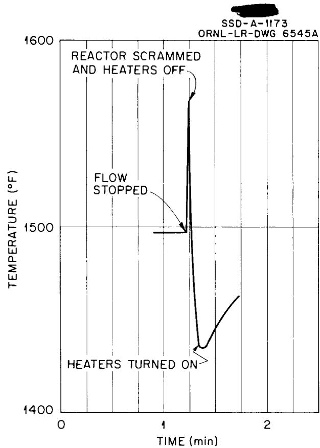  
Fig. 25. Temperature Excursion upon Flow Stoppage in the Loap.

Since the motor drive was outside the permanent lead shield, it was possible to inspect this equipment by removal of some of the stacked shield. The amount of stretching in the rubber V-belt had been more than the spring-loaded makeup roller could accommodate. The belt failure apparently was caused by oil from the air motor and by the high ambient temperature inside the shield.

The belt was replaced, and the pump was started again in an effort to resume circulation of the fuel,

which had been kept as near as possible to the $1500^{\circ}\mathrm{F}$ operating temperature. Discharge pressure was developed by the pump, but no flow took place. This indicated that some portion of the loop, probably the heat exchanger, had dropped below the melting point of the fuel. One of the two heaters around the heat exchanger had failed early in the operation of the loop, so this region was poorly heated. The indicated temperatures of the loop were slowly raised toward $1600^{\circ}\mathrm{F}$ in an attempt to melt out this block. The remaining heater around the heat exchanger burned out during this effort, and it was concluded that it would be impossible to restore flow. All power to the loop was then cut off, and the fuel was allowed to freeze.

# Removal and Disassembly of the Loop13

After the loop had been allowed to cool, the cast lead shields were made accessible by removal of the stacked shielding and by stripping off the electrical and instrument leads and service connections. The pump section was detached as planned by severing the loop tube bundle between the reactor shield and the pump shield by means of the hydraulic shear installed in the utilities shield. The ends of the fuel tubes were capped and sealed, and the pump shield, along with the pump, was moved to a storage location.

With the pump shield removed, the loop withdrawal shield was moved into position at the reactor hole, against the matching recess in the utilities shield. (The withdrawal shield was a 15-ft horizontal cylindrical shield $8\frac{1}{2}$ in. ID, with

5 in. of lead cast in an iron shell.) The loop and jacket assembly was then pulled into the withdrawal shield by means of cables previously installed for remote handling of the loop. The shield containing the loop was moved to the loading port of the disassembly "hot cell," and the loop was drawn into the cell for dismantling.

The disassembly procedure was dictated chiefly by the length of the loop assembly and by the desire to minimize mixing of radioactive fuel with the insulation, shielding, and other materials of the loop. The loop was pulled from its jacket (held at the loading port) as far as the width of the cell permitted, the extraneous material was stripped from the fuel tubes, and they were then cut off by a large horizontal band saw at the loading port. The withdrawing, stripping, and cutting procedure was repeated until the loop assembly was reduced to short lengths of bare tubing. Twenty-two sections, to serve as metallographic specimens, were cut from appropriate locations of the loop tubing. Six additional sections were cut to provide fuel samples for chemical analysis. The remaining tubing was removed to a shielded storage area to await recovery of the uranium.

The inert atmosphere enclosure around the pump bowl made this equipment too large for handling in the band saw. An electric-arc cutting technique was developed for remote operation, and the enclosure was removed from the pump by this means. The pump bowl was then cut off in the band saw at the level of the solidified fuel, and the bowl was stored for uranium recovery. The remaining part of the pump showed enough radioactivity to warrant cutting off an additional section of the bowl for salvage of uranium.

# DISCUSSION OF RESULTS

# Measurement of Fission Power Generation

The fission power generated in the loop, as determined by electrical heating measurements described earlier, appeared to be about one-third the anticipated power. Since the fission power was one of the important parameters of the experiment, every practicable method was carried out to determine its value. To investigate the perturbation of the reactor flux by the materials of the loop, a flux measurement in a simulated loop was performed. An assembly was made which duplicated the arrangement of neutron-absorbing materials in the irradiated section of the loop. The tubing of this experiment was filled with an alloy (2 wt % Cd-98 wt % Pb) which had the same macroscopic absorption cross section as that of the fuel salt. This assembly, in a water-cooled jacket, was inserted in hole HB-2. The neutron activation of the cadmium alloy was measured, and the relation between activation and neutron flux was established by calibrating the alloy with cobalt foil of known cross section. The value of the flux found by this method should have produced over 6 kw instead of the 2.8 kw estimated from the electrical heat measurements. A possible cause of the discrepancy was the uncertainty regarding the position of the loop in the hole, since the thermal expansion of the loop structure could not be predicted precisely.

A measurement of neutrons incident at the surface of the loop tubing was provided by the activation of cobalt foils which had been attached at convenient intervals along the loop during assembly. A better indication of the neutron flux incident on the fuel was obtained from borings taken from sections of the Inconel tubing of the irradiated section. The neutron flux was calculated from the activity of the borings, using the data obtained by Bopp14 for the relation between the activity of Inconel and flux. The thermal-neutron flux, as determined by these two methods, is plotted as a function of distance along the loop in Fig. 26. The fission power was calculated, from the flux distribution indicated by the Inconel activity, to be $2.8\mathrm{kw}$ , in good agreement with the electrical heating measurements. The maximum power density at the reactor end of the

loop, as calculated from this flux distribution, was $0.4\mathrm{kw}$ per cubic centimeter of fuel.

Another approach to the fission power generated in the loop was provided by the activity of the fuel samples taken from the loop for chemical analysis. The activity measurements were carried out by two methods: first, by examination of unseparated fuel in a gamma-ray spectrometer, and, second, by measurement of specific fission products chemically separated from the bulk of the fuel. In the first procedure, the height of the Zr-Nb peak in the gamma emission spectrum was compared with the height of the peak from a zirconium standard. The Zr-Nb concentration in the fuel at the time of measurement indicated that the fission power had been 2.0 kw. In the latter determination, zirconium and cesium were separated from some of the chemical samples, and the specific activities of each of these fission products were measured. The activities of two zirconium samples corresponded to fission rates of 2.3 and 2.5 kw. In comparing the results of the zirconium determinations with the 2.8 kw indicated by electrical heating measurements and by flux determinations, it should be noted that the allowance for decay of the zirconium fission product during reactor shutdowns was only approximate. The value of the fission power from the cesium samples was 1.5 and 2.1 kw, considerably lower than determinations by other means, but this value

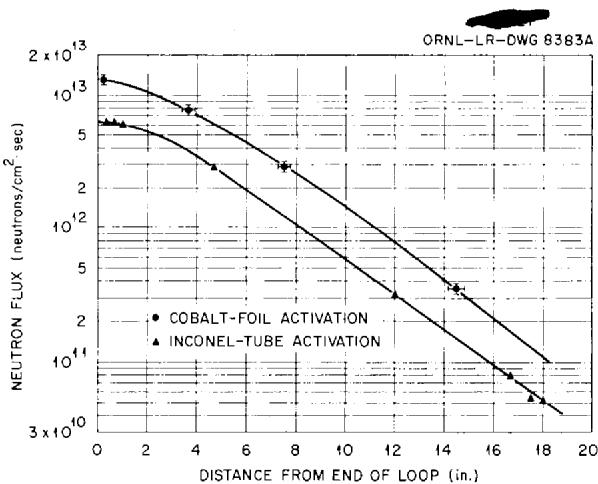  
Fig. 26. Thermal-Neutron Flux, as a Function of Distance, Determined by Activation.

was expected to be low because of the escape of the gaseous parent xenon. From the various measurements the best estimate of the total fission power generated in the loop was between 2.4 and $2.8\mathrm{kw}$ and the maximum power density was about $0.4\mathrm{kw / cc}$ .

Determination of the maximum power density permits a calculation of the dilution factor, the ratio of the total volume to the irradiated volume. To avoid confusion over the extent of the neutron flux, the irradiated volume can be defined as a volume, generating power at the maximum power density, which will produce the total power. The loop was found to have a dilution factor of 180.

# Chemical Analysis of Fuel

Tube sections, cut during disassembly of the loop to provide chemical samples, were taken from both the in-pile and the out-of-pile parts of the loop to ensure representative samples. Pieces were also cut from the portion of the filling line outside the pump shield for samples of fuel which had not been irradiated or circulated during operation. The fuel samples were obtained by collecting borings from holes drilled in the solidified salt at the ends of the tube sections. Carbide-tipped bits were used to prevent contamination from the bits. Saw cuttings and surface dirt were excluded from the sample material by drilling a hole with a large bit before collecting the borings from a smaller bit. The samples were analyzed for U, Zr, and the constituents of Inconel (Ni, Cr, and Fe). The results are presented in Table 3.

The nominal composition of the original fuel was $\mathsf{UF}_4$ , 25 mole % (U, 47 wt %); NaF, 62.5 mole %; and $\mathsf{ZrF}_4$ , 12.5 mole %; uranium enrichment was about $93\%$ . It is apparent that the preliminary flushing with NaF- $\mathsf{ZrF}_4$ (for cleaning and testing) diluted the $\mathsf{UF}_4$ in the operating charge of the loop. During the loop operation, however, the concentrations of the major constituents do not appear to have changed. (Burnup of uranium during operation was only 0.06 g in 4.95 kg of fuel.) The analytical results show that the chromium content of the fuel increased as a result of the corrosion of Inconel and that, probably, the nickel content decreased during the course of corrosion reactions. These changes in concentration are consistent with the observations on unirradiated loops, although the increase in chromium concentration was two- or threefold greater in the unirradiated experiments. These latter loops were operated at higher wall temperatures and lower cold-zone temperatures than was the irradiated loop, and the ratios of the hot-leg surface to the total volume were different, about 2 in.²/in.³ for the unirradiated loops and 4 in.²/in.³ for the irradiated. The higher wall temperatures should have favored chromium dissolution in the unirradiated experiments, but the lower surface-to

15G. M. Adamson and R. S. Crouse, ANP Quar. Prog. Rep. June 10, 1955, ORNL-1896, p 84; Effect of Heating Method on Fluoride Corrosion. Examination of Fluoride Pump Loops 4935-2, 4950-1, and 4950-2, ORNL CF-55-6-99 (June 14, 1955); Examination of Short-Operating Time Loops Numbers 4695-4 and 4695-5, ORNL CF-55-7-66 (July 8, 1955); and other CFmemoranda in this series.

Table 3. Chemical Analysis of Fluoride Fuel*   

<table><tr><td>Sample</td><td>U(wt %)</td><td>Zr(wt %)</td><td>Ni(ppm)</td><td>Cr(ppm)</td><td>Fe(ppm)</td></tr><tr><td>Original batch of fuel</td><td>47.4</td><td></td><td>83</td><td>44</td><td>120</td></tr><tr><td>Filling line(control material)</td><td>43.2 ± 0.5</td><td></td><td>200 ± 100</td><td>10 ± 5</td><td>80 ± 10</td></tr><tr><td>Loop, in-pile section</td><td>43.7 ± 0.2</td><td>13.1 ± 0.6</td><td>40 ± 10</td><td>140 ± 20</td><td>120 ± 20</td></tr><tr><td>Loop, out-of-pile section</td><td>43.7 ± 1.3</td><td>13.4 ± 0.4</td><td>30 ± 5</td><td>150 ± 10</td><td>180 ± 40</td></tr></table>

*The deviation listed is the average deviation.

volume ratio of these loops should have retarded the accumulation of chromium in the fuel. Apparently, the wall temperatures constituted the most significant difference in the operating conditions, although the care taken in the preparation of the salt with the enriched uranium might have resulted in a mixture containing less corrosive impurities than were contained in the unenriched mixtures.

# Fission-Product Ruthenium

After operation of the Aircraft Reactor Experiment, deposition of fission-product ruthenium was noted on the walls of the fuel system.16 To determine the loss of ruthenium from the fuel of the loop, radioactivity measurements were made on two of the chemical samples. The first was treated to separate the ruthenium from interfering fission products, after which the activity was measured. The sample showed less than $5 \times 10^{4}$ d/sec-g, when the ruthenium activity, as calculated from the fission power, should have been about $10^{7}$ . The second sample of fuel was not separated but the gamma activity was measured on a scintillation spectrometer, both as untreated solid and as a solution prepared under conditions not likely to evolve $\mathsf{RuO}_4$ . The ruthenium peak was obscured to a certain extent by Compton scattered radiation from the Zr-Nb peak, so the fuel was compared with a set of known mixtures of ruthenium and Zr-Nb. The fuel contained not over 0.03 times as much ruthenium activity as Zr-Nb activity, while the ratio calculated (from the fission rate and decay time) as having been produced was 0.16. Sections of loop tubing from which the fuel had been removed were examined by Robinson and his co-workers.17 The ratio of ruthenium activity to that of Zr-Nb on the Inconel tube walls was found to be about 5, whereas the ratio should have been only 0.6 if the deposits on the walls had been traces of fuel. Evidently, most of the ruthenium produced in the fuel plated out on the walls of the containing tubing during operation, as was observed in the ARE.

# Metallographic Examination

To facilitate handling and polishing, the fuel was removed from the tube sections that were cut

from the loop for metallographic specimens (described in Appendix A). Specimens were cut to convenient size, were mounted and polished, and were etched electrolytically in $0.10\%$ sulfuric acid bath, following standard remote-handling procedures for Inconel. The metallographic preparation and examination were performed by the Remote Metallography Group of the Solid State Division.[18] The locations from which specimens were taken are shown by heavy lines on a sketch of the loop in Fig. 27. Control specimens - pieces of as-received tubing cut from the ends of the tubes used to fabricate the loop - were examined for comparison with the samples from the loop. Some of the control specimens for the nosepiece were also subjected to the same bending and brazing treatment which this loop component received in fabrication.

The heat treatment of the material from which the metallographic specimens were taken was just that received in operating the loop, with the exception of the nosepiece (Figs. 37 through 40) and the heat exchanger. These components were put through brazing operations during fabrication of the loop. The brazing treatment involved holding of the parts at 1950 to $2050^{\circ}\mathrm{F}$ for $\frac{1}{2}$ to 1 hr, followed by forced-air cooling.

In general, the corrosive attack observed was slight, and any metallurgical changes were insignificant. Corrosive penetration of the specimens from the loop is indicated in Fig. 27; also given are the locations of the specimens shown in Figs. 28 through 40. First, the unirradiated portion of the loop will be considered; Figs. 28, 29, and 30 present typical specimens from the 2-ft section of the loop between the reactor shield and the pump. This region, along with the continuous heat exchanger, was the only portion of the loop unheated during actual irradiation. The region was maintained at about the temperature of the rest of the loop by the molten salt flowing through it. The specimen shown in Fig. 28 was cut from the inlet leg to the reactor; the specimens shown in Figs. 29 and 30 were taken from the outlet leg. This part of the outlet leg (Figs. 29 and 30) showed the minimum corrosive attack, an average penetration of less than 0.5 mil and maximum penetration of only 0.5 mil, while the inlet leg, Fig. 28, also showed comparatively light corrosion. No deposits of mass-transferred material

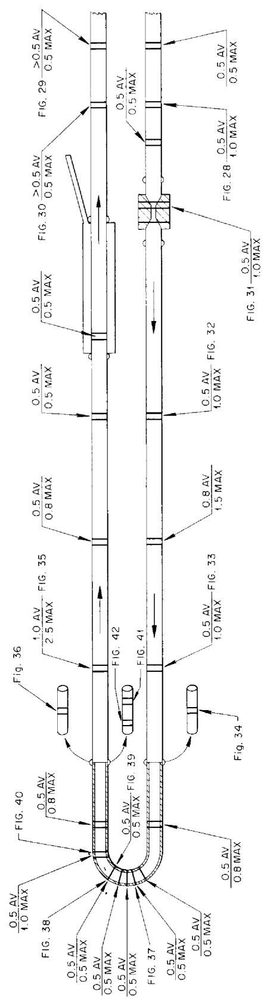  
ORNL-LR-DWG 8384   
NUMBERS REPRESENT DEPTH OF PENETRATION IN mils

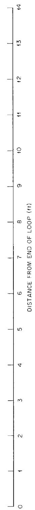  
Fig. 27. Sketch of Fuel Loop Showing Joints Between Lengths of Tubing, Locations of Specimens, and Corrosive Penetration.

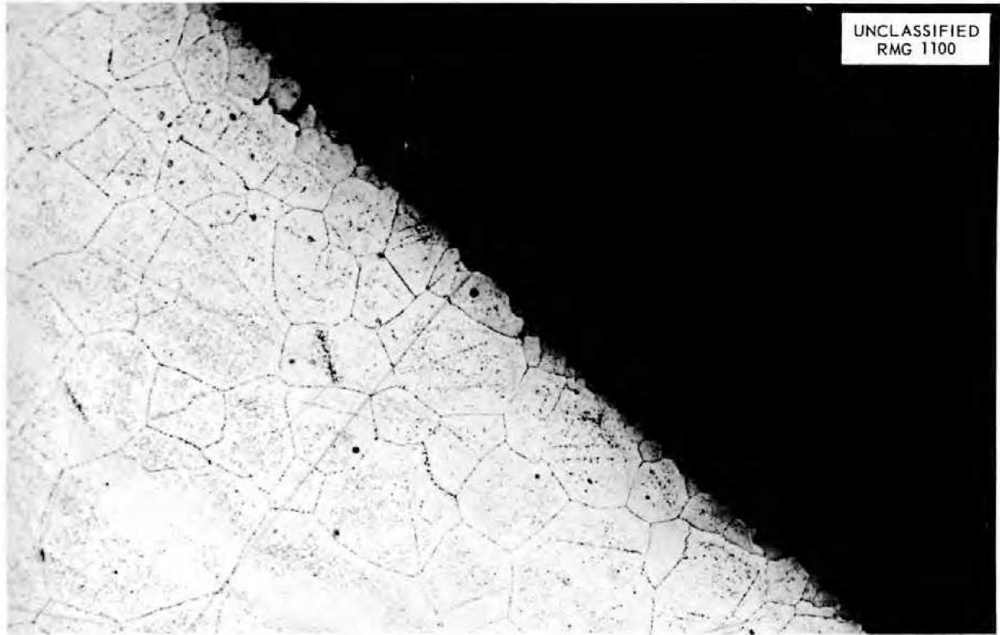  
Fig. 28. Inconel, Unirradiated, Exposed to Fluoride Fuel at About $1450^{\circ}$ F for 645 hr. Etchant: electrolytic $\mathsf{H}_2\mathsf{SO}_4$ . 250X. (Secret with caption)

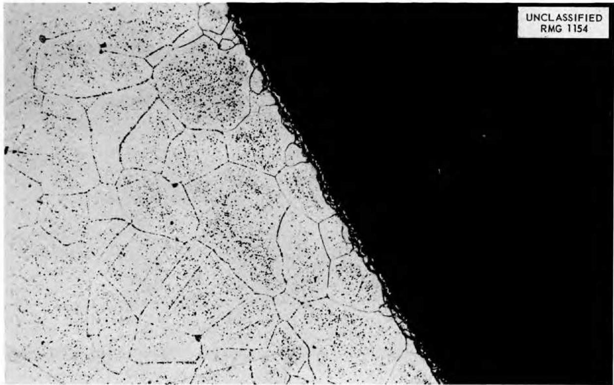  
Fig. 29. Inconel, Unirradiated, Exposed to Fluoride Fuel at About $1460^{\circ}$ F for 645 hr. Etchant: electrolytic $\mathsf{H}_2\mathsf{SO}_4$ . 250X. (Secret with caption)

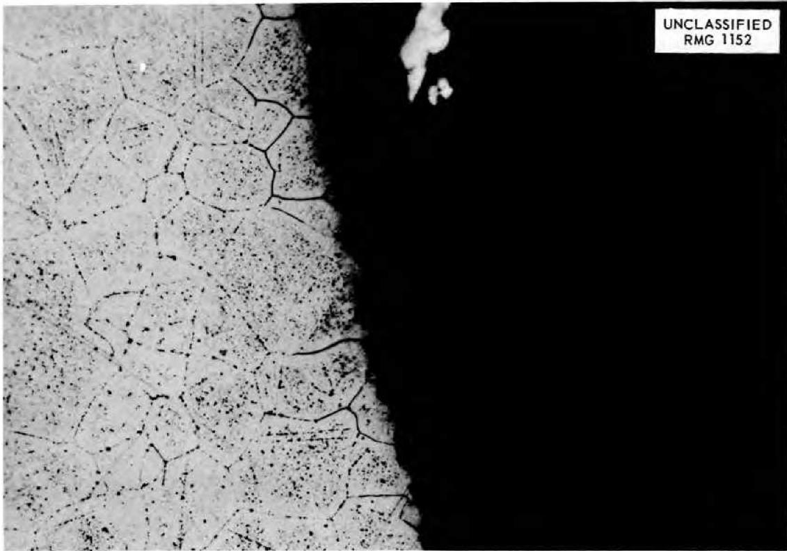

  
Fig. 30. Inconel, Unirradiated, Exposed to Fluoride Fuel at About $1460^{\circ}$ F for 645 hr. Etchant: electrolytic $\mathsf{H}_2\mathsf{SO}_4$ . 250X. (Secret with caption)   
Fig. 31. Inconel, Unirradiated, Exposed to Fluoride Fuel at About $1450^{\circ}$ F for 645 hr. Etchant: electrolytic $\mathsf{H}_2\mathsf{SO}_4$ . 250X. (Secret with caption)

were found in this or in any other part of the loop. The apparent layer in Figs. 29, 30, and certain other specimens is an oil stain produced during etching and was caused by material from the void between the specimen and the plastic mount. Figure 31 is a photomicrograph of a longitudinal section of the entrance to the venturi throat. This section, which was exposed to various velocities, shows no unusual corrosion or erosion.

A sample, from the inlet leg within the reactor shield, which is typical of the entire unirradiated part of the loop is pictured in Fig. 32. Maximum penetration was 1 mil; the average was 0.5 mil. Another specimen, also unirradiated, from the same piece of tubing is shown in Fig. 33. This sample exhibited penetration at a crevice to a depth of 4 mils, although the average penetration was 0.5 mil, and the general corrosive attack was about the same as that observed in the earlier specimens. The as-received control specimen for this length of tubing, Fig. 34, showed a crack, similar to the crevice in Fig. 33, which must have been introduced in manufacture of the tubing.

Such cracks were found occasionally in other specimens (in both as-received controls and loop specimens from this lot of tubing) without any apparent difference in frequency. It was concluded that the occasional voids to a depth of 3 or 4 mils were not results of corrosive penetration to this depth but were formed by penetration of 0.5 to 1 mil at an existing crack present in the original tubing. This view is substantiated by the absence of such crevices in the specimens from the irradiated section, which was constructed of tubing different from that used in the unirradiated parts.

The area of maximum corrosion (Fig. 35) was found in the outlet leg between the irradiated zone and the heat exchanger: average penetration 1 mil and maximum penetration 2.5 mils. No reason could be found for the increased corrosion at this point. The control specimen from this end of the length of tubing, Fig. 36, did not appear different from the others. The chemical analysis (see Appendix B) was not consequentially different from that of the other tubes. There is the possibility that fission heating in the irradiated section

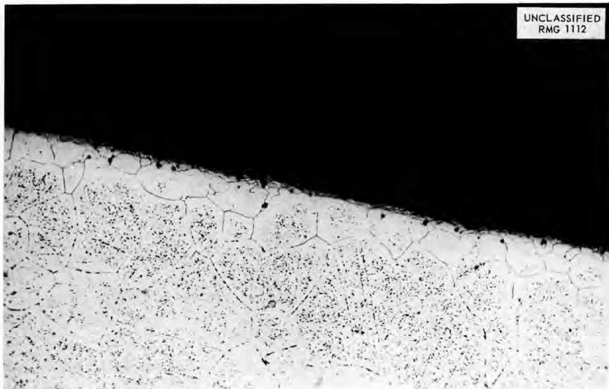  
Fig. 32. Inconel, Unirradiated, Exposed to Fluoride Fuel at About $1460^{\circ}$ F for 645 hr. Etchant: electrolytic $\mathsf{H}_2\mathsf{SO}_4$ . 250X. (Secret with caption)

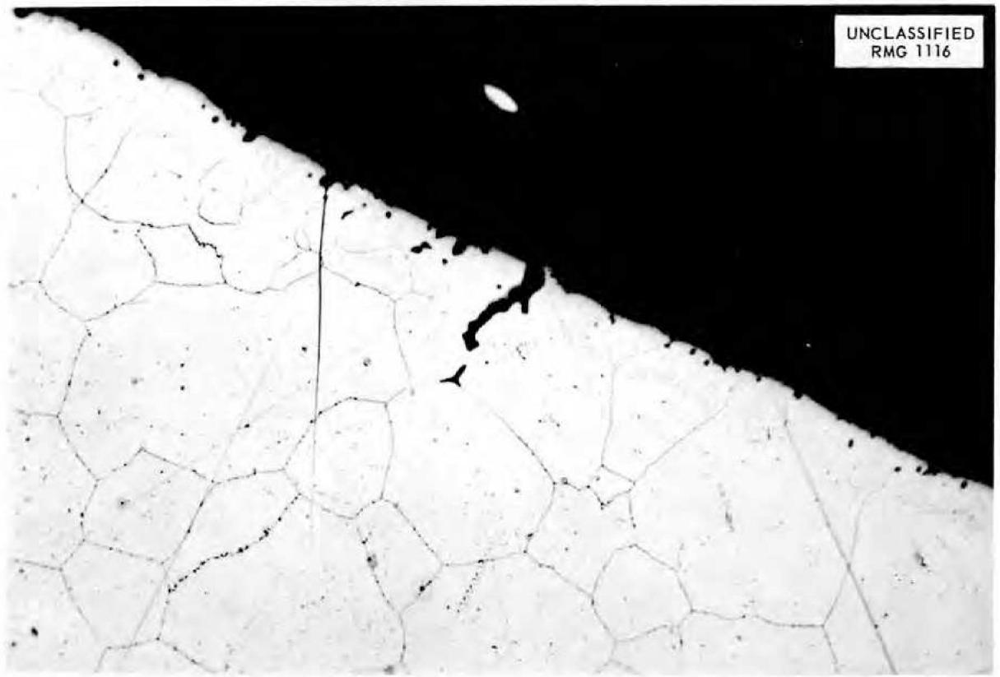

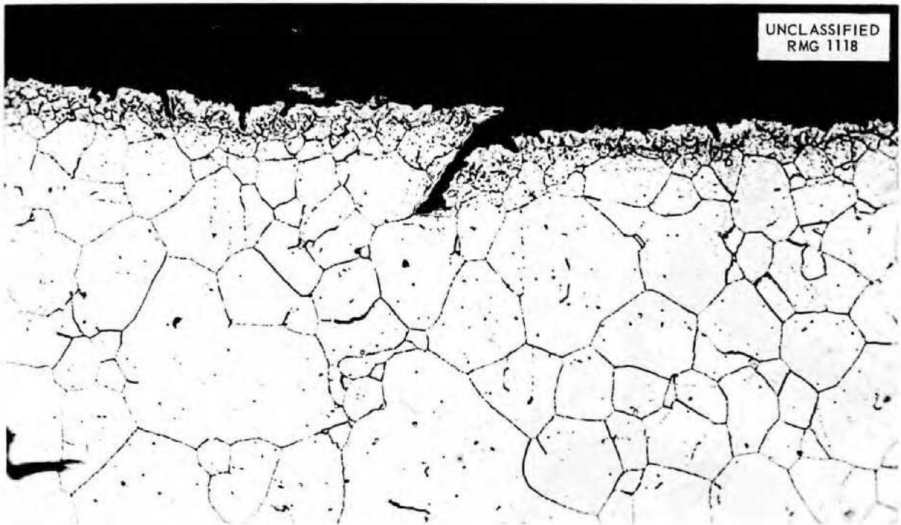  
Fig. 33. Inconel, Unirradiated, Exposed to Fluoride Fuel at About $1470^{\circ}$ F for 645 hr. Etchant: electrolytic $\mathsf{I}_2\mathsf{SO}_4$ . 250X. (Secret with caption)   
Fig. 34. Inconel, As-received Control Specimen. Etchant: electrolytic $\mathsf{H}_2\mathsf{SO}_4$ 250X. (Secret with caption)

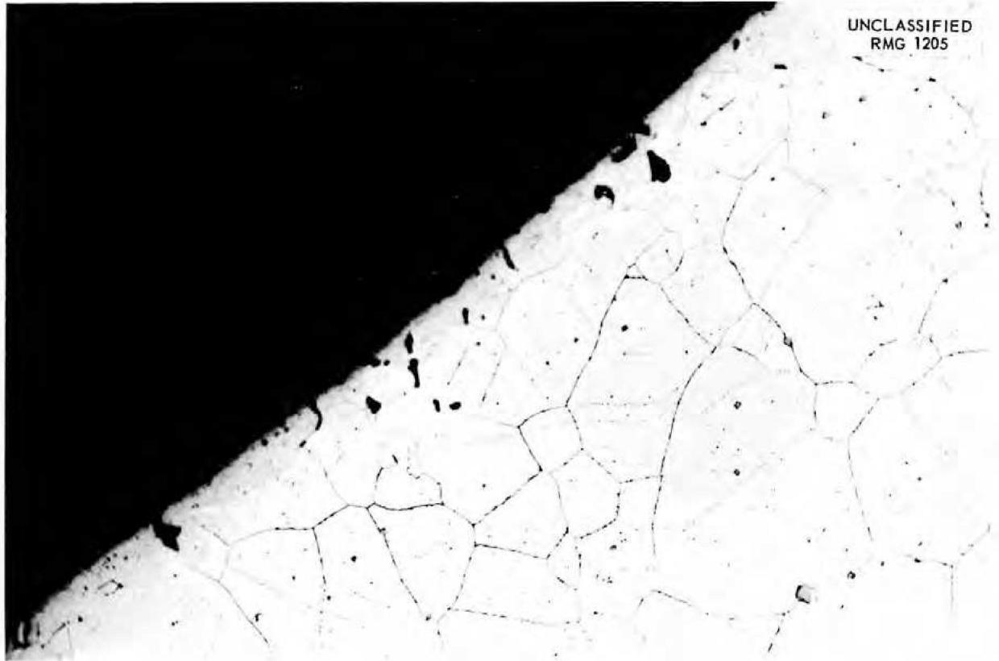

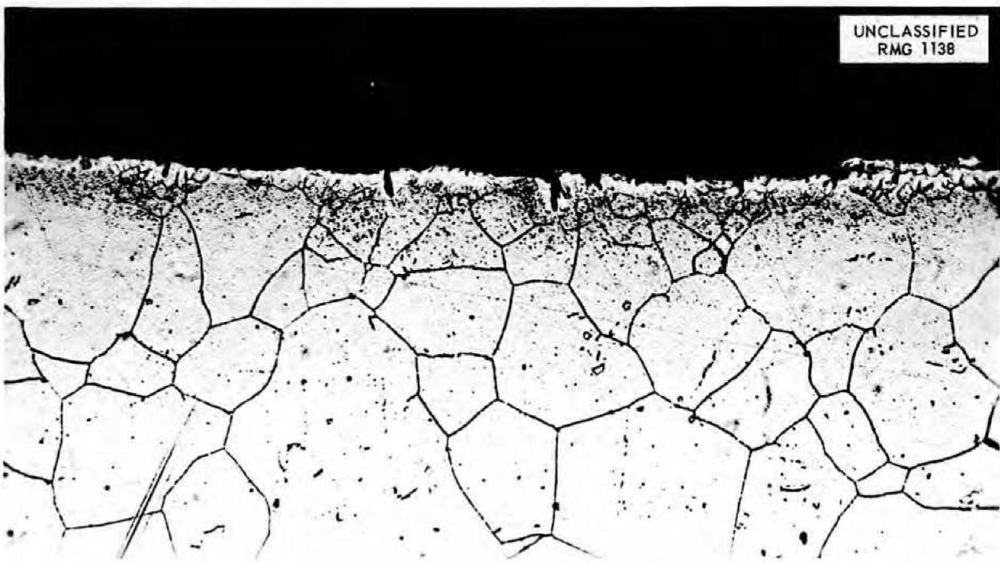  
Fig. 35. Inconel, Unirradiated, Exposed to Fluoride Fuel at About $1485^{\circ}C$ for 645 hr. Etchant: electrolytic $\mathsf{H}_2\mathsf{SO}_4$ . 250X. (Secret with caption)   
Fig. 36. Inconel, As-received Control Specimen. Etchant: electrolytic $\mathsf{H}_2\mathsf{SO}_4$ 250X. (Secret with caption)

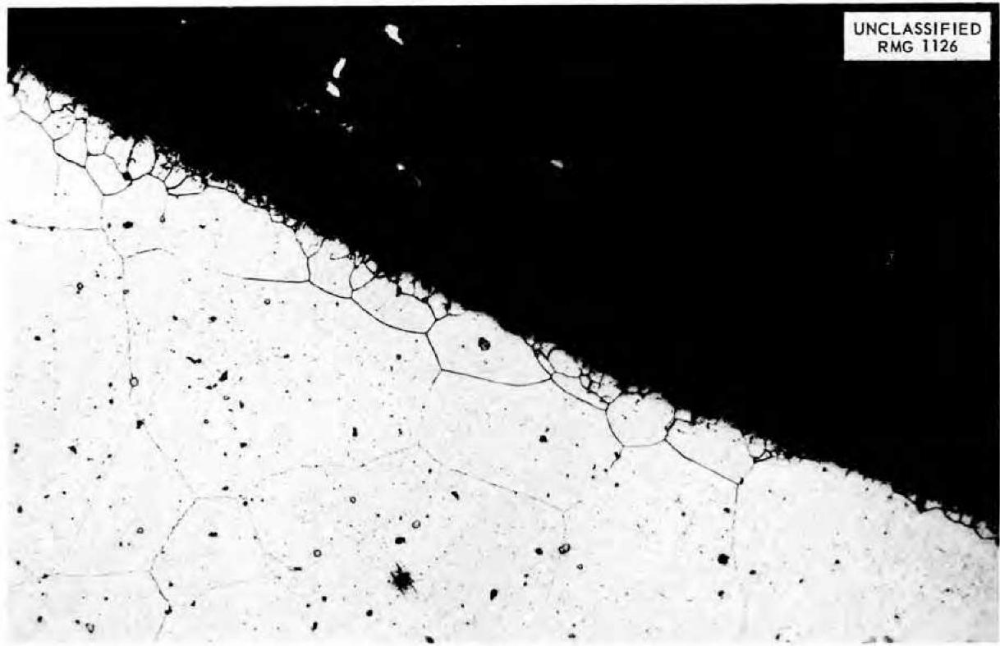

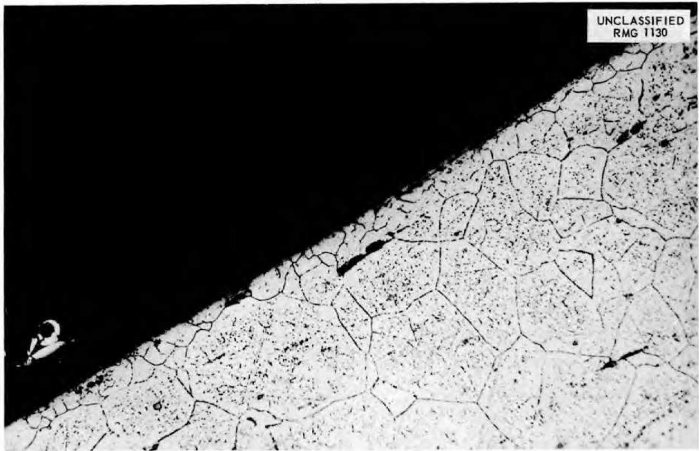  
Fig. 37. Inconel, Heated to About $2000^{\circ}F$ for $\frac{1}{2}-1$ hr, Irradiated and Exposed to Fluoride Fuel at About $1485^{\circ}F$ for 645 hr. Etchant: electrolytic $\mathsf{H}_2\mathsf{SO}_4$ . (Secret with caption)   
Fig. 38. Inconel, Heated to About $2000^{\circ}F$ for $\frac{1}{2}-1$ hr, Irradiated and Exposed to Fluoride Fuel at About $1485^{\circ}F$ for 645 hr. Etchant: electrolytic $\mathsf{H}_2\mathsf{SO}_4$ . (Secret with caption)

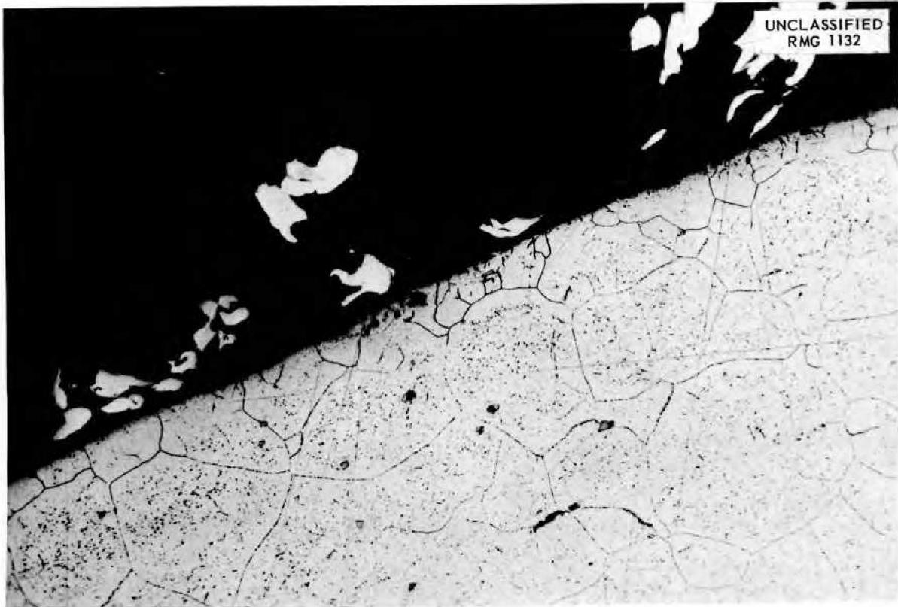  
Fig. 39. Inconel, Heated to About $2000^{\circ}F$ for $\frac{1}{2}-1$ hr, Irradiated and Exposed to Fluoride Fuel at About $1485^{\circ}F$ for 645 hr. Etchant: electrolytic $\mathsf{H}_2\mathsf{SO}_4$ . 250X. (Secret with caption)

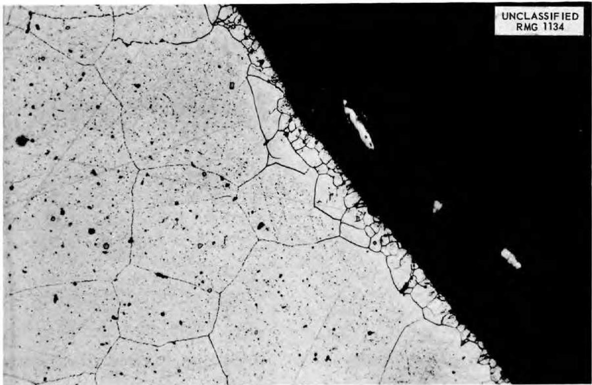  
Fig. 40. Inconel, Heated to About $2000^{\circ}F$ for $\frac{1}{2}-1$ hr, Irradiated and Exposed to Fluoride Fuel at About $1485^{\circ}F$ for 645 hr. Etchant: electrolytic $\mathsf{H}_2\mathsf{SO}_4$ . (Secret with caption)

raised the temperature of the fuel in the outlet leg, thereby accelerating corrosion in this part of the loop. On the other hand, the outlet portion of the irradiated section does not show appreciably greater corrosion than does the central region. Therefore, a better explanation is that local temperature differences due to variations in contact with the heater or that nonuniformity in the chemical composition of the tubing accounts for the accelerated corrosion.

The specimens from the irradiated section (nosepiece) showed relatively light corrosive attack, giving no evidence for acceleration of corrosion by irradiation. The specimen in the most intense flux is shown in Fig. 37; average penetration was 0.5 mil, and maximum penetration was about the same. The same extent of attack was found in longitudinal sections of a specimen in a flux almost as high; see Figs. 38 and 39. The former shows the outer wall in the U-bend, and the other the inner wall. No difference in corrosion was observed in the two walls. Slightly

more severe corrosion was found in a specimen from the downstream side of the irradiated section, Fig. 40, which was exposed to a flux about half the maximum level. Penetration, still only light, was to an average depth of 0.5 mil, with an occasional void to 1 mil. This part of the irradiated section also showed a larger grain size for some cause not determined. Appreciable grain growth occurred in the irradiated section during the brazing operation in fabrication of the assembly. Control specimens, before and after brazing (Figs. 41 and 42, respectively), show the change in grain size. The uniformity of conditions within the brazing furnace was not known. As a whole, the irradiated section showed no corrosion or metallurgical effects different from the rest of the loop.

In summary, the metallographic examination showed only light general corrosion. Void formation had penetrated to depths of 2 to 3 mils, but the area of maximum penetration or heaviest corrosion was not found in the irradiated section.

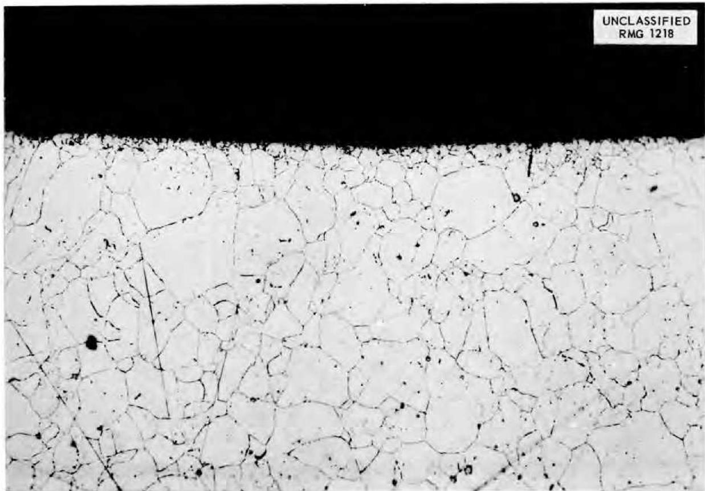  
Fig. 41. Inconel, As-received, Thick-walled Control Specimen. Etchant: electrolytic oxalic acid. 250X. (Secret with caption)

  
Fig. 42. Inconel, Thick-walled Control Specimen Heated to About $2000^{\circ}$ F for $\frac{1}{2} - 1$ hr. Etchant: electrolytic oxalic acid. 250X. (Secret with caption)

Voids associated with surface cracks were found in the unirradiated part of the loop to depths of 4 mils, but similar cracks were observed with the same frequency in the as-received control samples. It was concluded that the voids associated with cracks did not represent corrosive penetration to 4 mils but that maximum penetration was only 2 to 3 mils. No evidence of mass transfer was found, nor was any enhancement of corrosion by irradiation observed. This latter observation is in agreement with the conclusions indicated by some static capsule irradiations.[19,20]

The corrosive attack in the irradiated loop may be compared with that in the unirradiated loops[21] which were operated at about the same upper fuel temperature $(1500^{\circ}\mathrm{F})$ but at a much higher wall

temperature (1560 to $1700^{\circ}\mathrm{F}$ ) and a much lower cold-zone temperature (1200 and $1300^{\circ}\mathrm{F}$ , as compared with 1440 or $1460^{\circ}\mathrm{F}$ for the irradiated loop). These differences in operating conditions would tend to accelerate mass-transfer processes and dissolution of chromium from the hot zone in the unirradiated loops. Another difference in the loops which would favor void formation and removal of chromium in the hot zone of the unirradiated loops was the lower ratio of hot-leg surface to total volume, about 2 in.²/in.³ for the unirradiated, and 4 for the irradiated loop. In accordance with these differences in conditions, the corrosive attack in the irradiated loop was much lighter than in the unirradiated. Corrosive penetration was 2 to 3 mils for the irradiated loop and 5 mils for the unirradiated loops with wall temperatures under $1600^{\circ}\mathrm{F}$ but was up to 25 mils in loops with higher wall temperatures. Mass transfer was observed in the unirradiated loops with the more severe conditions but was not observed in those with wall temperatures under $1600^{\circ}\mathrm{F}$ ; also, it was not observed in the

irradiated loop. It can be concluded that the differences observed between the unirradiated and the irradiated loops disclosed by metallographic examination are those to be expected from the less severe temperature conditions of the irradiated loop.

# Conclusions

The fission power generation during operation of the loop was between 2.5 and $2.8\mathrm{kw}$ , and the maximum power density was $0.4\mathrm{kw / cc}$ . Chemical analysis of the fuel showed no decomposition by irradiation. Fission-product ruthenium was largely deposited from the fuel onto the tube walls. The increase in chromium and the slight decrease in

nickel impurities in the fuel are consistent with the findings in unirradiated loops, although the increase in chromium was not nearly so great, probably because of the higher wall temperatures in the unirradiated loops. Metallographic examination of the loop revealed a general, relatively light corrosive attack. Average penetration - in the usual form of subsurface voids - was 0.5 mil; maximum penetration was 2 to 3 mils. Corrosion was lighter than that observed in unirradiated loops, undoubtedly because of the practically isothermal operation of the irradiated loop and because of its more moderate hot-zone wall temperatures. There was no acceleration of corrosion by irradiation.

# Appendix A22

# DISASSEMBLY PROCEDURE AND EQUIPMENT

The size of the radioactive parts, the variety of materials, and the accountability problem made the disassembly operation a unique one in remote handling. For this reason, as well as to provide an understanding of the form and the condition of the samples examined, a thorough discussion of the equipment and operations involved in the disassembly is included in this report.

The constraints placed on the irradiated apparatus by the operating conditions of the experiment precluded any extensive provisions for disassembly in the apparatus itself. The size of the loop assembly rendered unsuitable most of the existing remote-handling equipment, so that special devices had to be obtained. In procuring this equipment a policy of modifying existing equipment or of revising readily available stock models was followed.

The problem presented by the length of the loop, compared with the dimensions of the remote-handling (hot) cell, was solved by cutting a loading port in the rear wall of the cell. The port was closed by means of a hydraulic door and was recessed so that there would be no stray radiation beams when the withdrawal shield for the loop was in position. Wire cables through both the shield and the cell enabled the loop and its jacket

to be moved in either the shield or the cell. Three C-clamps having hydraulic plungers were made in various sizes (maximum openings, 1 to $8\frac{1}{2}$ in.) to handle any part of the loop or jacket. All the equipment was operated by, or in conjunction with, the electric manipulators which are standard equipment for the larger hot cells and which have been described elsewhere.[23]

Cutting devices played the most important part in the disassembly operation and required the most developmental effort. A horizontal band saw (Fig. A.1) of 8- by 10-in. capacity was set up just inside the loading port for major cutting operations. This band saw was fitted with a hydraulic vise and was modified for remote operation. Vacuum cleaners having filters of the replaceable paperbag type were used to collect cuttings from the saw and to prevent the spreading of fuel or other radioactive materials. The suction of the vacuum cleaners substituted to some degree for the conventional liquid-cooling system which was removed from the saw. The band saw proved very versatile and dependable. An electric hack saw (Fig. A.2) was adapted for cutting small pieces inaccessible to the band saw. It was carried by the manipulator in place of the standard manipulator tongs and was fixed to its own vise

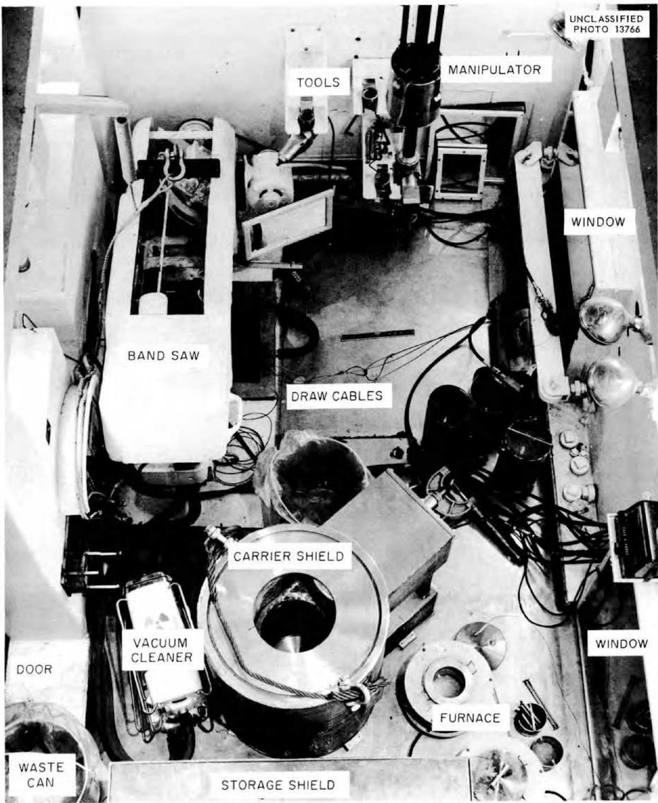  
Fig.A.1. Equipment for Disassembling the Loop in the Hot Cell.

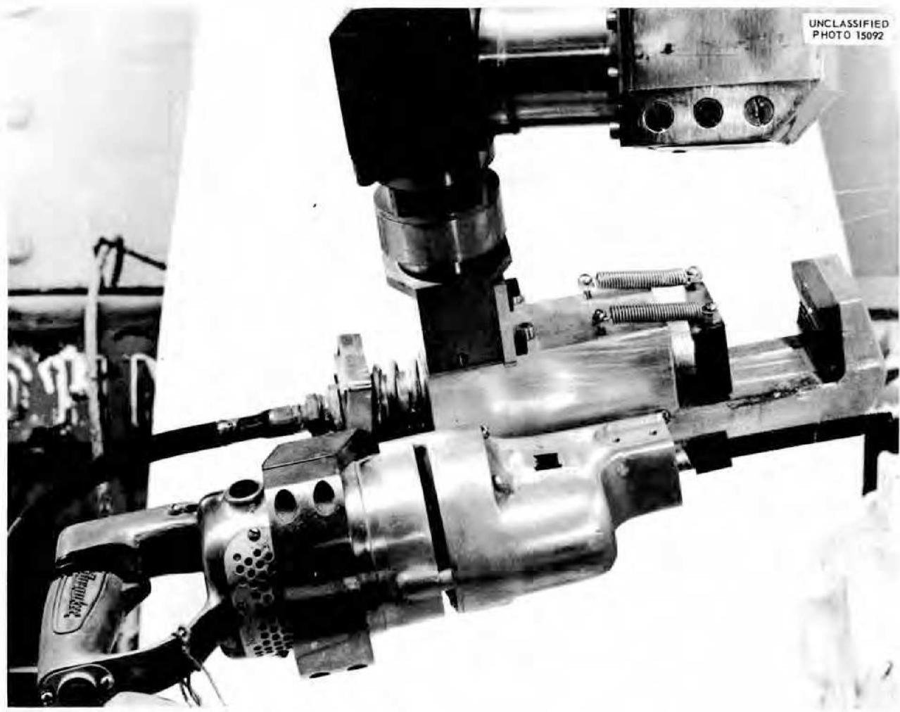  
Fig.A.2.Remotely Operated Hack Saw.

by means of a hydraulic feed mechanism. A pair of "hawk-bill" sheet-metal hand shears was adapted for remote hydraulic operation so that they could be handled by means of special manipulator tongs. These shears (Fig. A.3) proved useful for cutting a variety of materials, including thermal insulation and hose clamps holding the heaters to the loop.

An additional item of cutting equipment was required for dismantling the pump. The pump with the stainless steel sheet enclosure around the bowl was too big for the band saw, and the sheet metal was too thick for the shears. An electric-arc cutting apparatus consisting of a 300-amp d-c arc welder with a high-frequency-arc starting attachment and cutting electrodes was found to be satisfactory when adapted for remote operation by the hot-cell manipulator.

An electric impact wrench was required specifically for removal of the flange that closed the water jacket around the loop. The impact wrench carried by the manipulator was used with various sockets and extension rods to remove the cap screws holding the flange. Furnaces, containers, and miscellaneous items, the arrangement of which is shown in Fig. A.1, made up the balance of the hot-cell equipment.

The first step in the dismantling operation was the removal of the water-jacket closure flange with the impact wrench (Fig. A.4). The loop was then withdrawn a few inches from the jacket, which was held at the loading port by the band-saw vise. The loop support rods were cut with the band saw without disturbing the fuel tubes. Instrument and electrical leads, which passed through Kovar seals in the flange, were cut with

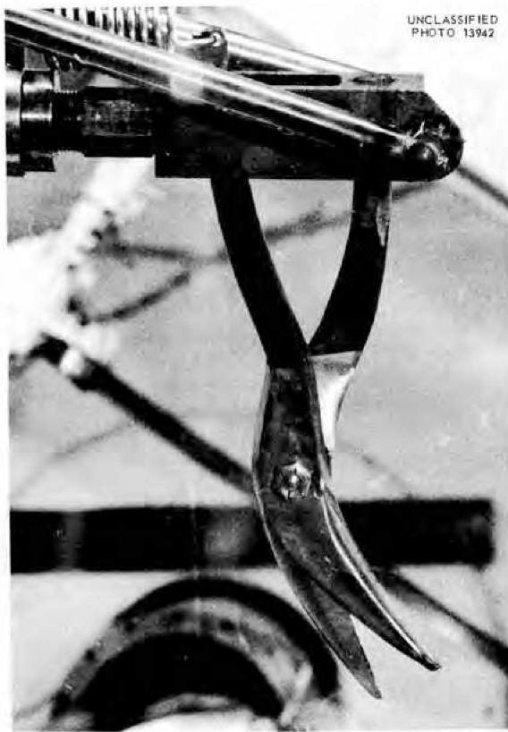  
Fig. A.3. Remotely Operated Shears.

the hydraulic shears in order to permit removal of the flange from the loop tubing.

The disassembly of the loop proceeded from this stage in steps: first, the loop was withdrawn from the water jacket as far as the width of the hot cell permitted; second, insulation, shielding, leads, and heaters were stripped from the exposed section; finally, the bare fuel tubes and support rods were sawed off to permit another withdrawal. Specimen sections were cut from the fuel tubes for metallographic examination and to provide fuel for chemical analysis. The remaining fuel tubing was stored for future recovery of the uranium.

The locations from which the metallographic specimens were cut are indicated in Fig. 27. These specimen sections were marked with saw cuts for identification before melting out of the fuel. They were held vertically in a stainless steel cylinder having a wire-mesh bottom. This holder rested on lugs in a stainless steel furnace pot, with space beneath the holder for collecting molten fuel. A close-fitting lid on the furnace pot was equipped with a gas connection and a thermocouple well. To melt the fuel out of the metallographic specimens, the furnace was held at $800^{\circ}\mathrm{C}$ for about half an hour and was continually purged

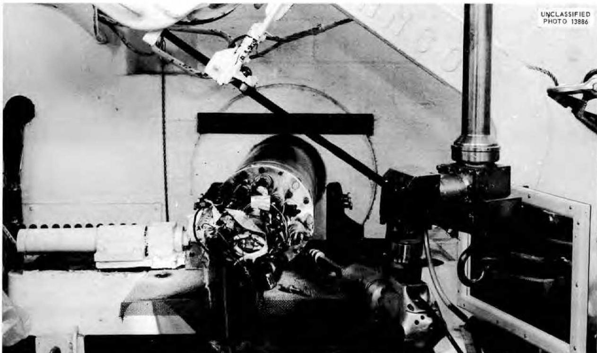  
Fig.A.4. Removal of Closure Flange.

with argon. The specimens were then ready for sectioning, mounting, and polishing.

The tube sections for chemical samples (~2 in, long) were gripped in the chuck of a drill press set up in one of the hot cells having a master-slave manipulator. Carbide-tipped bits, to eliminate contamination of the sample with bit material, were mounted inside plastic cups located below the fuel tube. Fuel was bored from the end of the tube and collected in the cup. The samples required were small enough so that weighing could be done by hand, but dissolving and dilution were done remotely.

The remaining part of the loop system, the pump, was lowered into the hot cell in its own operating shield. One wall of the pump shield was movable, and access to the pump was gained by hoisting away this wall. The stainless steel enclosure around the pump bowl was cut away with the arc cutting equipment described earlier. After removal of the enclosure the pump bowl was stripped of heaters and thermal insulation, and the inlet and discharge fuel tubes were sawed off with the electric hack saw (Fig. A.5). The pump could then be mounted in the band-saw vise, and the bowl was cut off just above the level of the solidified fuel. Enough radioactivity remained in the upper part of the pump to warrant cutting a second portion of the bowl from the superstructure of the pump. The pump bowl parts were stored with the loop fuel tubing, pending salvage of the uranium.

The usefulness of large storage shields inside the hot cell was emphasized by the necessity for replacing a broken band-saw blade. The pump and radioactive parts of the loop were placed in shields provided in the hot cell, and the radiation level was found to be low enough to permit entry into the cell for replacement of the blade. The failure of one of the manipulators was handled in

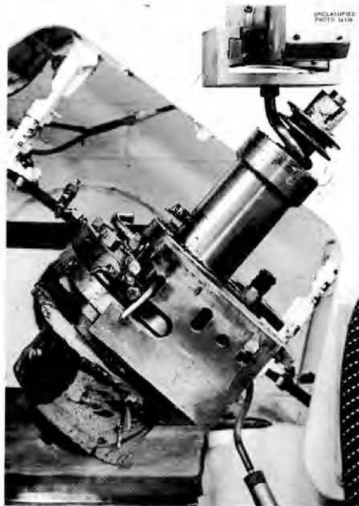  
Fig. A.5. Pump After Remote Stripping.

the same manner and emphasized the desirability of having two manipulators available.

In conclusion it can be said that the equipment and methods described above worked acceptably. A total of 440 hr was required for the disassembly, during most of which two men were available. The greatest reduction in the time consumed would have been accomplished by use of a thermal insulation stripper, probably a small rotary saw operable in the manipulator in restricted areas.

# Appendix B

# ANALYSIS OF INCONEL TUBING

(As-received tubing before fabrication)

<table><tr><td rowspan="2">Element</td><td colspan="3">Analysis (wt %) of Specimens</td><td rowspan="2">Method</td></tr><tr><td>For Irradiated Section</td><td>For Inlet Tube to Reactor</td><td>For Outlet Tube from Reactor</td></tr><tr><td>Ni</td><td>76.2</td><td>74.9</td><td>74.8</td><td>Gravimetric</td></tr><tr><td>Cr</td><td>13.5</td><td>15.2</td><td>15.2</td><td>Volumetric</td></tr><tr><td>Fe</td><td>6.4</td><td>7.1</td><td>7.0</td><td>Volumetric</td></tr><tr><td>Mn</td><td>0.23</td><td>0.13</td><td>0.21</td><td>Colorimetric</td></tr><tr><td>Cu</td><td>0.09</td><td>0.28</td><td>0.26</td><td>Polarographic</td></tr><tr><td>Si</td><td>0.25</td><td>0.15</td><td>0.12</td><td>Gravimetric</td></tr><tr><td>Al</td><td>0.064</td><td>0.064</td><td>0.057</td><td>Spectrographic</td></tr><tr><td>Ti</td><td>0.224</td><td>0.169</td><td>0.174</td><td>Spectrographic</td></tr><tr><td>S</td><td>0.005</td><td>0.003</td><td>0.006</td><td>Wet method</td></tr><tr><td>C</td><td>0.051</td><td>0.043</td><td>0.027</td><td>Wet method</td></tr></table>