# AEC RESEARCH AND DEVELOPMENT REPORT

4A

3445603610073

STEADY-STATE CONTROL CHARACTERISTICS OF

CHEMICAL-NUCLEAR AIRCRAFT POWER PLANTS

C. B. Thompson

CENTRAL RESEARCH LIBRARY DOCUMENT COLLECTION

LIBRARY LOAN COPY

DO NOT TRANSFER TO ANOTHER PERSON

If you wish someone else to see this document, send in name with document and the library will arrange a loan.

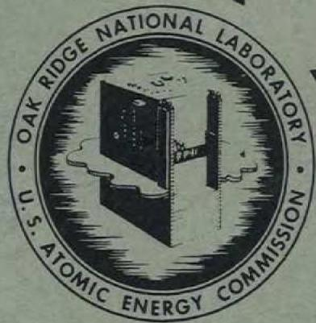

OAK RIDGE NATIONAL LABORATORY

OPERATED BY

UNION CARBIDE NUCLEAR COMPANY

A Division of Union Carbide and Carbon Corporation

UCC

POST OFFICE BOX P · OAK RIDGE, TENNESSEE

ORNL 1976

C 85 - Reactors - Aircraft Nuclear Propulsion Systems

Thsdocmetonistsof44pgs

Copy of 135 copies Ser A

Contract No W 7405-eng 26

AIRCRAFT NUCLEAR PROPULSION PROJECT

STeady State Control Characteristics of Chemical Nuclear

AIRCRAFT POWER PLANTS

C B Thompson*

DATE ISSUED

FEB 29 1956

Minneapolis Honeywell Regulator Company Aeronautical Division

OAK RIDGE NATIONAL LABORATORY

Operated by

UNION CARBIDE NUCLEAR COMPANY

A Division of Union Carbide and Carbon Corporation

Post Offie Box P

Oak Ridge Tenne ee

3 4456 0361007 3

ORNL 1976

C 85 - Reactors - Aircraft Nuclear Propulsion Systems

# INTERNAL DISTRIBUTION

1 C E Center   
2 Biology Library   
3 Health Physics Library

45 Central Research Library   
6 Reactor Experimental Engineering Library   
711 Laboratory Records Department   
12 Laboratory Records ORNL R C   
13 A M Weinberg   
14 L B Emlet (K 25)   
15 JP Murray (Y 12)   
16 J A Swartout   
17 E H Taylor   
18 E D Shipley   
19 W H Jordan   
20 S J Cromer   
21 F C VonderLage   
22 S C Lind   
23 F L Culler   
24 A H Snell   
25 A Hollgender   
26 M T Kelley   
27 G H Clewett   
28 K Z Morgan   
29 T A Lincoln   
30 A S Householder   
31 C S Harrill   
32 C E Winters   
33 D W Cardwell

34. M King   
3D D Cowen   
D S Billington   
37 J A Lane   
38 M J Skinner   
39 G E Boyd   
40 R R Dickison   
41 WT Furgerson   
42 W B Cottrell   
43 R D Schultheiss   
44 R V Meghreblian   
45 A P Fraas   
46 A J Miller   
47 E P Epler   
48 ER Mann   
49 C J Borkowski   
50 J Eastman   
51 E R Dytko   
52 S C Shuford   
53 C S Walker   
54 R G Affel   
55 MM Yarosh   
56 A W Savolainen   
57 P M Reyling   
58 G C Williams

5960 ORNL-Y12 Technical Library

Document Reference Section

# EXTERNAL DISTRIBUTION

61 AF Plant Representative Balfpore   
62 AF Plant Representative Burbank   
63 AF Plant Representative Mariel   
64 AF Plant Representative Santa Monica   
65 AF Plan Representative Seattle   
66 AF Plant Representative Wood Range   
67 Air Research and Development Command (RDGN)   
68 Air Research and Development Command (RDZPA)   
69 Air Technical Intelligence Center   
70 Air University Library   
71 Aircraft Laboratory Design Branch (Ward DC)   
74 ANPProject Office Fort Worth   
75 Argonne National Laboratory   
76 Armed Forces Special Weapons Project Sandia

77 Assistant Secretary of the Air Force R&D

78 83 Atomic Energy Commission Washington

84 Bureau of Aeronautics

85 Bureau of Aeronautics General Representative

86 Chicago Operations Office

87 Chicago Patent Group

88 89 Chief of Naval Research

90 Convair General Dynamics Corporation

91 Director of Laboratories (WCL)

92 Director of Requirements (AFDRQ)

93 Director of Research and Development (AFDRD ANP)

94 96 Directorate of Systems Management (RDZ ISN)

97 99 Directorate of Systems Management (RDZ ISS)

100 Equipment Laboratory (WADC)

101 104 General Electric Company (ANPD)

105 Hartford Area Office

106 Headquarters Air Force Special Weapons Center

107 Lockland Area Office

108 Los Alamos Scientific Laboratory

109 Materials Laboratory Plans Office (WADC)

110 National Advisory Committee for Aeronautics Cleveland

111 National Advisory Committee for Aeronautics Washington

112 North American Aviation Inc (Aerophysics Division)

113 Nuclear Development Corporation

114 Patent Branch Washington

115 117 Power Plant Laboratory (W-DC)

118 121 Pratt and Whitney Aircraft Division (Fox Project)

122 Sanda Corporation

123 School of Aviation Medicine

124 USF Project RAND

125 University of California Radiation Laboratory Livermore

126 128 Wright Air Development Center (COSI 3)

129 134 Technical Information Extension Oak Ridge

135 Division of Research and Development AEC ORO

# CONTENTS

Summary 1

Introduction 2

Detailed Power Plant Descriptions - Component Characteristics 3

3

GEX61TurboJetEngine 4

Allison J 71 Turbojet Engine 8

Steady State Power Plant Performance Characteristics - Nuclear Power Only Operation 9

Control Rod Throttling 9

Reactor Fuel Flow Throttling 10

NaK Flow Throttling 10

NaK Bypass Throtting 11

Air Bypass Throttling 12

More Complex Throttling Arrangements 12

Static Stability Characteristics of a Demand Sensitive Reactor-Turbojet Combination 15

Coupling Between Engines in a Multiengine Installation 20

Nuclear Power Source Control Requirements 21

Manual Operation at Flight Conditions Where Radiator Capacity Is Excessive 21

Manual Operation at Radiator Design Flight Conditions 22

Manual Operation at Flight Conditions Where Radiator Capacity Is Inadequate 22

Automatic Control Requirements During Operation in the Power Range 23

Appendix A - Radiator Design Procedure 27

Appendix B - Steady State Performance Calculations 29

Appendix C - Static Stability Calculations 36

# STEADY STATE CONTROL CHARACTERISTICS OF CHEMICAL NUCLEAR AIRCRAFT POWER PLANTS

C B Thompson

# SUMMARY

It seems reasonable to believe that the simplest control system for the nuclear power source in a combination chemical nuclear aircraft power plant will result if nuclear power delivery during normal operational use can be throttled by variation of a single control quantity Studies to date of the steady state off design point performance characteristics of two such power plants indicate that satisfactory power control can be obtained by by passing NaK around the engine radiators alone if full range NaK bypass valves can be built and if the fuel temperature at the inlet of the reactor core can be allowed to rise as high as the design point mean fuel temperature If the fuel temperature at the inlet to the reactor core must be limited to some value less than the design point mean fuel temperature the control rod must also be moved as power delivery is varied Possibilities for throttling reactor power delivery by individual variation of reactor fuel flow control rod position NaK flow and radiator air bypass percentage were also considered but each of these alternate schemes is unsatisfactory

Study of the static stability characteristics of a demand sensitive reactor turbojet load combination indicates that such a power plant should operate stably in the high power range At part load operating conditions however the inherent static stability of such a power plant is questionable and appears to depend on the throttling scheme used In the example considered here the NaK bypass throttled power plant was stable at low power part load operating points while the air

bypass throttled power plant was not stable

The various engine loads are cross coupled through their common reactor power source If the power delivered to one engine is varied the power delivered to the other engines also changes When NaK bypass throttling is used and the control rod position is constant the magnitude of the coupling effect appears to be relatively small If rod motion with total power level changes is required however cross coupling between engines will be more pronounced and may be large enough to make tedious the independent manual adjustment of power delivery to each load

Automatic control requirements for the nuclear heat source can be determined by considering how the flight engineer might perform typical power plant maneuvers without the help of automatic control equipment Study of the manual operations required indicates that the addition of automatic control equipment for the NaK bypasses is very desirable if not essential to limit movement of the valves in such a way as to maintain the return line NaK temperatures between their upper and lower limits at all times Automatic control equipment is also required for the rod if the fuel temperature at the inlet of the reactor core must be held below the design point mean fuel temperature Such equipment might withdraw the rod to maintain the mean fuel temperature at as high a level as possible as limited by the requirements that both the core fuel inlet temperature and the core fuel outlet temperature be less than or equal to their maximum allowable values

# INTRODUCTION

Most of the control system thinking by the ORNL ANP group has quite naturally been directed toward the problems associated with controlling a circulating fuel reactor which delivers power to a heat dump type of load. This work is of major concern since a large part of the ANP effort at ORNL is now being devoted to the ART

The control system for the ultimate reactor-turbojet engine power plant will obviously be different from the control system for the ART power plant because both a reactor control system and a properly mated set of chemical turbojet controls will be required. The effectiveness of the ART in clearing up problems associated with controlling the large aircraft power plant depends largely on how well the inherent differences between the control requirements of the ART and those of large aircraft power plants are understood. The work described in this report was carried out to provide some of the information required for studying these differences

The ultimate power plant will consist of one large reactor coupled to a number of turbojet engines (the number ranging from two to six depending on the type of aircraft being propelled). The over all steady state performance characteristics of such power plants when manually controlled at part power off design operating conditions must be thoroughly understood before control system requirements can be determined. This report is concerned chiefly with the over all steady state manual control characteristics of the following two power plants

Powe Souce

Load

60 Mw ART type reactor and chemical burners

2 GE X 61 turbojet engine

60 Mw ART type reactor and chemical burners

4 All son J 71 t rbojef eng nes

These combinations were selected primarily because of the availability of performance data it is not believed that they necessarily represent usable systems They are considered here merely as vehicles for studying control problems

Detailed characteristics of each of the components of the above power plants are summarized in the next section Steady state part load performance characteristics derived from these data are then discussed and the effects of potential

throttling parameter variations are described The static stability of a demand sensitive reactor power source-turbojet engine load combination is then considered and coupling effects between engines in a multiengine power plant are investigated. Finally the actions required of the power plant operator in carrying out typical power plant maneuvers without the help of automatic control equipment are outlined to show what types of equipment are needed

The symbols employed in the calculations are defined below

# NOMENCLATURE

$$
A _ {f R} = \text {f r o n t a l} \quad \text {r e a o f r a d} \quad \text {t o r} \quad f t ^ {2}
$$

$$
A _ {H X} = \text {h e a t} \quad \text {t o n} \quad \text {f e} \quad \text {u r f} \quad \text {c e} \quad \text {a e} \quad \text {i} \quad \text {h e a t} \quad \text {c h a n g e r}
$$

$$
A _ {R} = \text {h e a t} \quad \text {n s f e r} \quad \text {s u r f} \quad \text {e} \quad \text {a r e a} \quad \text {n} \quad \text {r a d i o t o} \quad f t ^ {2}
$$

$$
C _ {a} = \text {s p e c f c h e a t a f r B t / l b} ^ {\circ} F
$$

$$
C _ {F} = \text {s p e c f c h e t o f} \quad \text {u l a t n g f u e l} \quad \mathrm {B t u / l b} ^ {\circ} F
$$

$$
C _ {N} = \text {s p e c f i c h e a t o f N a K c o o l n t B t / l b} ^ {\circ} F
$$

$$
F _ {N} = \text {e n g n e n e t h r s t o u t p u t l b}
$$

$$
g = \text {g r a v t a t i o n a l c o n s t a n t}
$$

$$
M = f l g h t M c h n m b e
$$

$$
N = \text {e n g n e o t o r p e e d} \mathrm {r p m}
$$

$$
P = \text {p o w e} M w
$$

$$
\begin{array}{l} P _ {e} = \text {p o w e d e l v e e d p e e n g n e b l a n e d l o a d} \\ M w \end{array}
$$

$$
P _ {N} = \text {p o w e r d e l v e r e d t o N t h e n g n e M w}
$$

$$
P _ {T} = \text {t o t a l e a c t o r p o w e M w}
$$

$$
P _ {T 6} = \text {t o t a l p e s u e a t n l e t o f e x h t n o l e}
$$

$$
P _ {0} = \text {a m b i e n t} \quad \text {t a t i c p r e} \quad \text {u e} \quad \mathrm {l b} / \mathrm {f t} ^ {2}
$$

$$
P _ {1} = \text {p o w e r d e l i v e r e d t o e n g i n e N o 1 M w}
$$

$$
P _ {F} = \text {P r a n d t l n u m b e o f f u e l}
$$

$$
R \approx \text {g a s c o n s t a n t f o r a i r} f t / ^ {\circ} R
$$

$$
T _ {F} = \text {m e a n r e a c t o r f u e l t e m p e r a t e} ^ {\circ} F
$$

$$
T _ {F C} = \text {f u e l t e m p e r a t u r e a t i n l e t o f r e a t o r c o r e} ^ {\circ} F
$$

$$
T _ {F H} = \text {f u e l t e m p e a t u r e a t o u t l e t o f e c t o r o r e} ^ {\circ} F
$$

$$
T _ {N C} = \begin{array}{l} N a K \\ 0 F \end{array} \text {t e m p e r a t r e a t n l e t o f h e a t e x c h a n g e}
$$

T NaK tempe ature at outlet of d tor F

$T_{NH} = N K$ tempe atu e at outlet of heat exchanger (nlet of radiator) ${}^{\circ} F$

$T_{T3} = \text{total temperature}$ t omp e sor o flet $^\circ F$

$T_{T4} = \text{total temperature at let of turbine } {}^{\circ}\mathsf{F}$

$T_{T6} = \text{total temperature at inlet of exhaust nozzle}$ $0_F$

$U_{R} =$ over all heat transfe oefficient of r d ator Bt/hr ft²°F

$U_{HX} =$ over all heat tr nsfer coefficient fuel to NaK heat exchanger Btu/hr ft²°F

V a = aft velo ity fps

$W_{a} = \text{eng near flow lb/sec}$

$W_{aD} =$ direct ai flow r te through adiator pe engine Ib/ se

$W_{aBP} =$ bypass oI flow rote per eng ne Ib/sec

$W_{F} =$ re to fuel flow rate 1b/sec

$W_{N} = \text{tot} | \text{NaK flow rate} | \text{b/sec}$

$W_{NBP} = NaK$ bypass flow te per eng ne Ib/sec

$W_{ND} =$ direct NK flow rate th o gh adiato pe engine Ib/se

$W_{Ne} = NaK$ flow rate pe engie Ib/ e

$X = \text{fr} \, \text{ct} \, \text{on} \, \text{of} \, \text{tot} \, \text{r} \, \text{ctor} \, \text{power} \, \text{del} \, \text{veed} \, \text{to}$ each engine

$\gamma =$ specific heat to for a

$\Delta P_{R} = \mathrm{ad}i$ for pessure d op Ib/ ft2

$\Delta T_{m} = \log$ mean temperate difference for the heat exch nger

$\Delta T_{a} = a i r$ temperature difference $(T_{T4} - T_{T3})$

$\Delta T_{F} =$ fuel tempe t e d ffe ence $(T_{FH} - T_{FC})$

$\Delta T_{N} = NaK$ temperature difference $(T_{NH} - T_{NC})$

$\eta_{HX} =$ heat exchanger effect veness

$\eta_{R} = r$ diator effectiveness

$\mu_{F} =$ s os ty of f e1 lb/ft se

$\mu_{N} = \nu$ scosity of NaK Ib/ ft se

$\rho =$ average density of at in adiator lb/ft3

$\rho_{F} =$ density of fuel $\mathrm{lb / ft^3}$

$\rho_{N} =$ density of NaK 1b/ft3

# DETAILED POWER PLANT DESCRIPTIONS - COMPONENT CHARACTERISTICS

Detailed performance characteristics of each power plant component must be known before the over all composite behavior of a power plant can be calculated. Each of the components of the two power plants under consideration is described in this section

# CIRCULATING FUEL REACTOR

An early version of the 60-Mw ART circulating fuel reactor is used here as a basis for control studies. Design values for several important reactor and heat exchanger quantities and fuel and NaK physical properties used are tabulated below

Design power Mw 60

Core fuel outlet temperature $^\circ F$ 1600

Mean core fuel temperature ${}^{\circ}\mathsf{F}$ 1450

Core fuel inlet temperature $^\circ F$ 1300

Fuel flow rate Ib/sec 702

Temperature coefficient of reactivity $-55\times 10^{-5}$

$(\triangle k / k) / ^{\circ}F$

Heat exchanger NaK nlet tempe a 1100 ture $^\circ F$

Heat exchanger NaK outlet tempera 1500 ture $\mathcal{O}F$

Total NaK flow rate Ib/sec 569

Total heat exchanger heat transfer 1388 area ft²

Over all heat transfer coefficient at 1023 des gn point Btu/hr ft²°F

Fuel Reynolds number n heat ex-changer at design point 3180

Heatexchanger effect veness at 08 des gn point

NaK Reynolds number in heat ex 125000  
changer at design point

Detailed heat exchanger parameters Bundles 24

Tubes per bundle 132

Diameter of tubes in

Spacing between tubes mils 30

Tube length ft 667

<table><tr><td>Equivalent diameter (fuel) in per bundle</td><td>0 1328</td></tr><tr><td>Free flow area (fuel) in2per bundle</td><td>3 852</td></tr><tr><td>Fuel and NaK physical properties (from ART design meeting Jan 7 1955)</td><td></td></tr><tr><td>CF Btu/lb°F</td><td>0 27</td></tr><tr><td>CN Btu/lb°F</td><td>0 25</td></tr><tr><td>μF (at 1450°F) lb/ft sec</td><td>3 79 × 10-3</td></tr><tr><td>μN lb/ft sec</td><td>0 11 × 10-3</td></tr><tr><td>PrF (at 1450°F)</td><td>2 475</td></tr><tr><td>ρF lb/ft3</td><td>200</td></tr><tr><td>ρN lb/ft3</td><td>46</td></tr></table>

The heat exchanger design described above was obtained from M M Yarosh This design was prepared some time before detailed heat transfer tests were run and before final heat exchanger designs were completed Heat transfer coefficient estimates fuel property estimates and the design power rating have all been changed since the design described in the above table was made Hence the heat exchanger used here is not the same as the heat exchanger currently planned for the ART However the external performance characteristics of the design considered here and the current design do not appear to be different enough to change any of the general conclusions drawn from this work

The variation of the over all heat transfer coefficient of the reactor heat exchanger with changes in fuel flow rate NaK flow rate and mean reactor fuel temperature must be known if the part load steady state performance characteristics of the power plant are to be calculated. The variation of this coefficient with changes in fuel flow rate has been estimated for a mean reactor fuel temperature of $1450^{\circ}\mathrm{F}$ and a midrange NaK flow rate (320 lb/sec) by use of a procedure suggested by Yarosh. The result is plotted in Fig 1. Average temperature changes and NaK flow rate changes also affect the over all heat transfer coefficient but these effects are thought to be relatively small for NaK flow rate and average temperature variations in the normal safe operating range

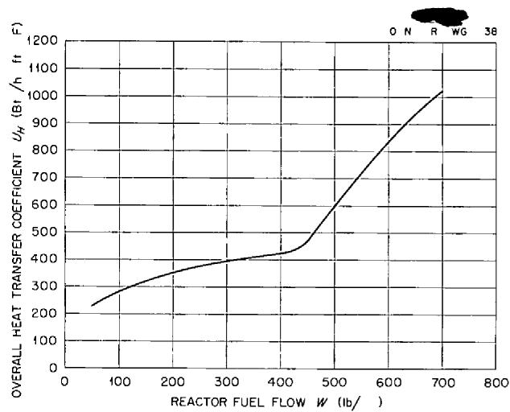  
Fig 1 Variation of the Over All Heat Transfer Coefficient of the Main Heat Exchanger with Reactor Fuel Flow Mean temperature $1450^{\circ}\mathrm{F}$ NaK flow 320 Ib/sec

# GEX61 TURBOJET ENGINE

The G E X 61 turbojet engine is described briefly below

<table><tr><td>Static thrust output per engine at sea level
(SL) maximum nterburning lb</td><td>23 600</td></tr><tr><td>Static thrust output per eng ne at sea level
maximum interburning and afterburning lb</td><td>33 000</td></tr><tr><td>Static thrust output per eng ne at sea level
with 30 Mw power input lb</td><td>6 780</td></tr><tr><td>Max mum allowable powe nput pe eng ne
SL tat c m l ta y Mw</td><td>103 5</td></tr><tr><td>Max mum turb ne nlet temperatu e °F</td><td>1800</td></tr><tr><td>Rated a rflow per engine SL static lb/sec</td><td>325</td></tr><tr><td>Design pressure ratio</td><td>8 45 1</td></tr></table>

Part load engine performance data that describe the variation of the turbojet load imposed on the reactor at off design operating conditions are required for over all power plant steady state performance determination. The curves of Figs 2 through 5 show how pertinent off design steady state X-61 engine parameters vary with net thrust output at various altitudes and flight speeds for power inputs less than $30\mathrm{Mw}$ . These curves were calculated from the corrected quantity data of Goodlette1 Net thrust output and required power input were calculated from

$$
P = W _ {a} C _ {a} \left(T _ {T 4} - T _ {T 3}\right) \tag {1}
$$

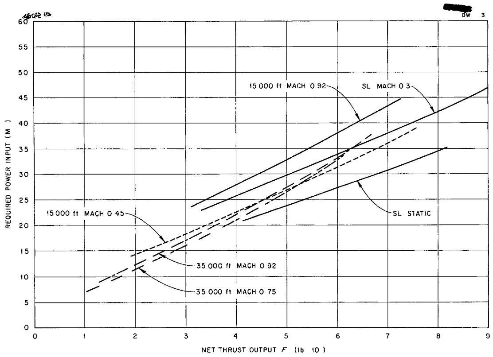

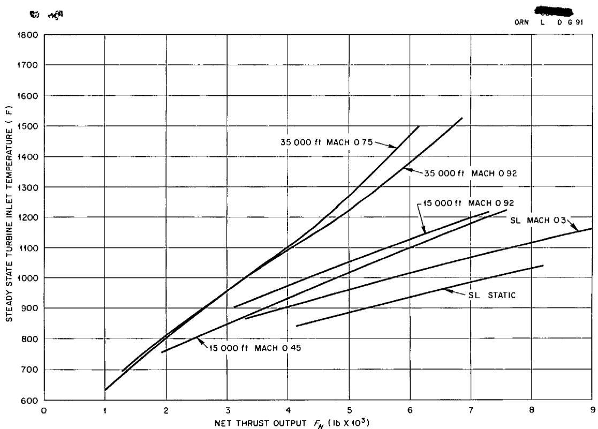  
Fig 2 Variation of Steady State Power Input Required with Net Thrust Output for the G E X 61 Engine Exhaust nozzle open   
Fig 3 Variation of the Steady-State Turbine Inlet Temperature with Net Thrust Output for the GE X61 Engine Exhaust nozzle open

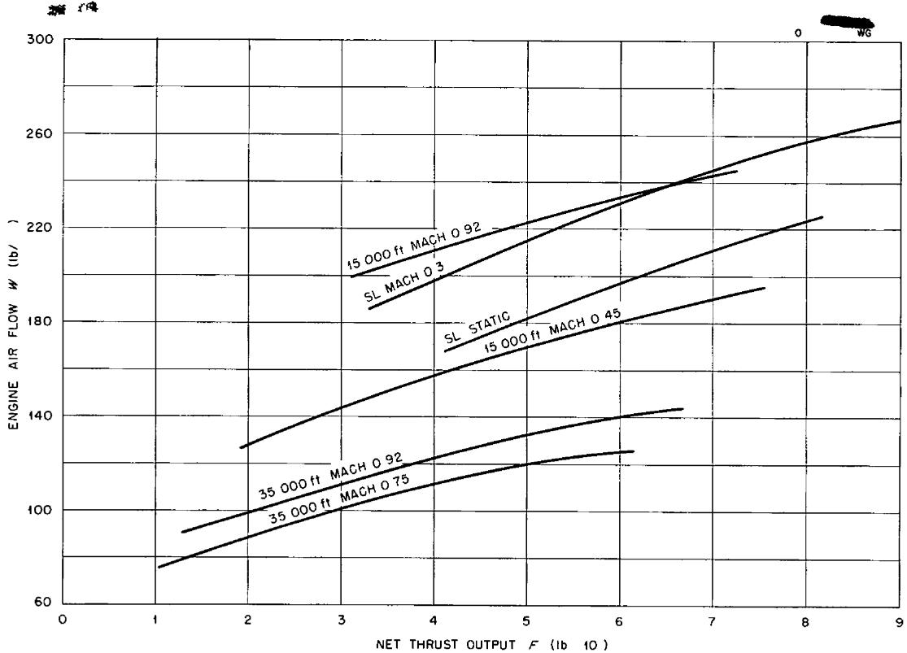

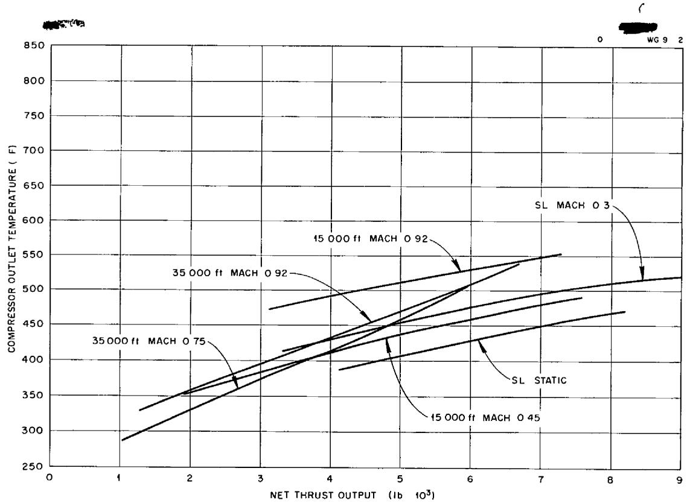  
Fig 4 Variation of the Steady State Engine Air Flow with Net Thrust Output for the G E X 61 Engine Exhaust nozzle open   
Fig 5 Variation of the Steady State Compressor Outlet Temperature with Net Thrust Output for the G-E X 61 Engine Exhaust nozzle open

The value for $C_{a}$ was assumed to be constant at 0.26

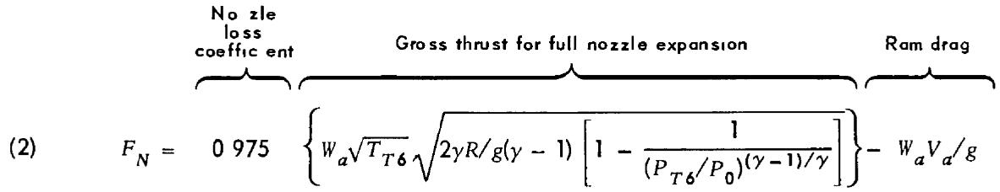

The value for $\gamma$ was assumed to be constant at 135

A hypothetical radiator was designed for the X 61 engine by use of the procedure and basic data outlined in Appendix A which were obtained from R D Schultheiss. This radiator was designed to transfer $30\mathrm{Mw}$ of nuclear power to the engine load imposed during cruise at 35000 ft Comparison of the total thrust available from two X 61 engines operating at $30\mathrm{Mw}$ power input at 35000 ft with the total thrust required by a representative seaplane airframe shows that such an aircraft might be expected to cruise at about Mach 0 87

Radiator and X 61 engine match point and design data are shown in Table 1. The variation of the over all heat transfer coefficient of this radiator with changes in airflow per unit frontal area is shown in Fig 6. The over all heat transfer coefficient also varies with changes in the NaK flow rate and the mean temperature of the radiator but these effects are thought to be small in the normal operating region

The engine performance curves discussed previously (Figs 2 through 5) were worked out for a normal combustion chamber pressure loss between

TABLE 1 RADIATOR AND ENGINE MATCH POINT VALUES   
Flight conditions 35000 ft Mach 087 nuclear power only   

<table><tr><td></td><td>G E X-61 Engine</td><td>Allison J 71 Eng ne</td></tr><tr><td>Net thrust output lb per engine</td><td>5500</td><td>2750</td></tr><tr><td>Number of engines</td><td>2</td><td>4</td></tr><tr><td>Nuclear power input required Mw per engine</td><td>30</td><td>15</td></tr><tr><td>NaK temperatures °F</td><td>1500 to 1100</td><td>1500 to 1100</td></tr><tr><td>NaK flow rate lb/ ec pe eng ne</td><td>284.5</td><td>142.2</td></tr><tr><td>Compressor outlet temperature °F</td><td>487</td><td>454</td></tr><tr><td>Eng ne a flow lb/ ec</td><td>132.4</td><td>65.7</td></tr><tr><td>Turbine inlet temperature °F</td><td>1311</td><td>1286</td></tr><tr><td>Engine speed % of rated</td><td>92.6</td><td>93.2</td></tr><tr><td>Exhaust noz le area</td><td>Open</td><td>87.7% closed</td></tr><tr><td>Radiator heat-transfer area ft2</td><td>9018</td><td>4883</td></tr><tr><td>Over all heat transfer coefficient Btu/hr ft2 °F</td><td>31.5</td><td>26.8</td></tr><tr><td>Radiator frontal area ft2</td><td>16</td><td>12</td></tr><tr><td>Radiator depth in</td><td>19.4</td><td>14</td></tr><tr><td>Rough estimate of radiator pressure drop % of compressor discharge pressure</td><td>6.6</td><td>1.8</td></tr></table>

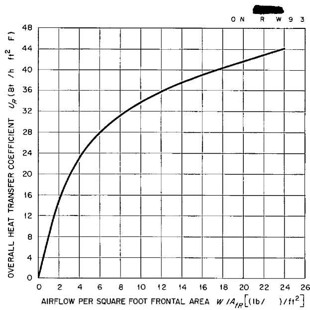  
Fig 6 Variation of the Over All Heat Transfer Coefficient of Radiator with Changes in Air Flow per Unit Frontal Area

the compressor and turbine Strictly speaking the increase in pressure loss resulting from the addition of a radiator causes all the equilibrium operating characteristics of the engine (Figs 2 through 5) to shift Recalculation of the new steady state operating characteristics is a major job however which requires engine component performance maps which are not available

The effects of radiator pressure drop on steady state engine performance are therefore neglected in the calculations that follow This should not cause serious errors in final conclusions because the radiator pressure drop in this case appears to be relatively small The over all trends being sought should still manifest themselves

# # ALLISON J 71 TURBOJET ENGINE

The J 71 power plant was considered in addition to the X61 power plant described in the preceding section because the available X61 performance data are not consistent in the low power operating region the compressor power required does not agree with the turbine power available at

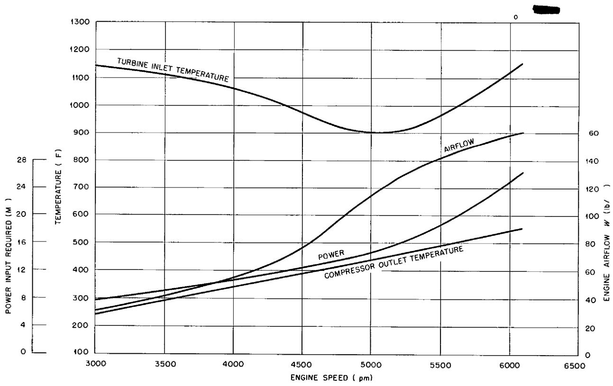  
Fig 7 Steady State Performance Characteristics of the Allison J71 TurboJet Engine at Sea Level (SL) Static conditions exhaust nozzle open

equilibrium points Preliminary estimated performance data on an early version of the Allison J71 engine were used so that reactor turbolet behavior in the low power operating range could be studied The J71 engine is roughly half the size of the X-61 engine Its full power SL static pressure ratio is about 85 to 1

Pertinent performance characteristics of this

engine at SL static conditions are plotted in Fig 7 Radiator and engine match point values and design data are summarized in Table 1 The basic procedure and data used in designing this radiator are outlined in Appendix A The variation of the over all heat transfer coefficient of the J71 engine radiator with changes in airflow per unit frontal area is shown in Fig 6

# STEADY STATE POWER PLANT PERFORMANCE CHARACTERISTICS - NUCLEAR POWER ONLY OPERATION

The steady state performance characteristics of the two power plants under consideration during operation on nuclear power only can be calculated by combining the component characteristics summarized in the preceding section Figure 8 is a schematic diagram showing the parts of the power plants under consideration and the nomenclature used. Of particular interest is the behavior of such power plants when throttling in each of the five ways listed below is attempted

# Control Rod Throttling

<table><tr><td>Mean reactor fuel temperature</td><td>Variable</td></tr><tr><td>Reactor fuel flow and NaK flows</td><td>Constant at rated values</td></tr><tr><td>Air ond NoK bypasses</td><td>Closed</td></tr></table>

# Reactor Fuel Flow Throttling

<table><tr><td>Reactor fuel flow</td><td>Variable</td></tr><tr><td>Mean reactor fuel temperature and NaK flow rates</td><td>Constant at rated values</td></tr><tr><td>A r and NaK bypass</td><td>Clo ed</td></tr></table>

# NoK Flow Thottling

<table><tr><td>NaK flow rates</td><td>Variable</td></tr><tr><td>Mean reactor fuel temperature and reactor fuel flow rate</td><td>Constant at rated values</td></tr><tr><td>Air and NaK bypasses</td><td>Closed</td></tr></table>

# NaK Bypass Throttling

<table><tr><td>NaK bypass percentage</td><td>Variable</td></tr><tr><td>Mean reactor fuel temperature</td><td>Constant at rated values</td></tr><tr><td>reactor fuel flow rate and NaK flow rates</td><td></td></tr><tr><td>Air bypasses</td><td>Closed</td></tr></table>

# Air Bypass Throttling

<table><tr><td>Air bypass percentage</td><td>Variable</td></tr><tr><td>Mean reactor fuel temperature</td><td>Constant at rated values</td></tr><tr><td>reactor fuel flow rate and NaK flow rates</td><td></td></tr><tr><td>NaK bypasses</td><td>Closed</td></tr></table>

The behavior of the hypothetical reactor-X 61 power plant when throttled in each of these ways is described in the following paragraphs

# CONTROL ROD THROTTLING

The behavior of the reactor-X61 power plant when throttling by control rod motion is attempted at a typical off design flight condition is shown in Fig 9 A sample calculation illustrating the procedure used to determine these curves is included in Appendix B At this flight condition the radiators have more heat transfer surface area than is required for transferring $30\mathrm{Mw}$ to each engine If the power transferred to each engine is to be limited to the maximum allowable value of $30\mathrm{Mw}$ one or more of the potential control quantities generally must be reduced with decreasing altitude

Figure 9 shows that the mean reactor fuel temperature must be reduced to about $1260^{\circ}\mathrm{F}$ if power delivery is to be limited to 30 Mw during flight at 15 000 ft and Mach 0.45 Under these conditions the reactor NaK inlet temperature drops to about $900^{\circ}\mathrm{F}$ Operation of the system at such a low NaK temperature at the inlet of the main heat exchanger is unsafe because of the possibility of local cold spot formation and fuel freezing The situation becomes more unsafe if an attempt is

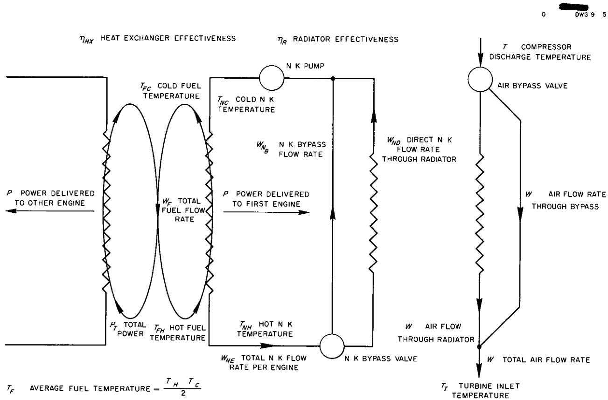  
Fig 8 Partial Schematic Diagram of Reactor Turbojet Power Plant

made to reduce power delivery to each engine below 30 Mw When the rod is inserted far enough to throttle power delivery to only 25 Mw for example the core fuel inlet temperature itself drops to below $1000^{\circ}F$

From the curves of Fig 9 it is apparent that the thrust output of the power plant cannot be throttled safely by moving only the reactor control rod. Control rod throttling is also unsuitable if independent variations in power delivery to each of the engines are to be made since motion of the control rod affects all engines in the same way

# REACTOR FUEL FLOW THROTTLING

The behavior of the power plant when it is throttled by reactor fuel flow variation with all other quantities at their design point values is shown in Fig 10 At the 15 000 ft Mach 0 45 flight condition reactor fuel flow must be reduced to roughly $60\%$ of its rated value to limit power delivery to each engine to 30 Mw When this is done the fuel temperature at the outlet of the

reactor rises to $1700^{\circ}\mathrm{F}$ and the NaK temperature at the inlet of the reactor falls to $900^{\circ}\mathrm{F}$ Operation at these temperatures is unsafe if not impossible Further reduction in fuel flow does reduce the power delivered to each engine and reduces the engine thrust outputs but as the fuel flow is reduced the fuel outlet temperature continues to rise and the fuel and NaK inlet temperatures continue to fall

Thus reactor fuel flow alone is very unsuitable as a primary power control parameter Virtually all the critical steady state temperature variations which result when such a scheme is used are unsafe and independent adjustment of power delivery to each load is not possible

# NaK FLOW THROTTLING

The behavior of the power plant when it is throttled by NaK flow variation alone is shown in Fig 11 The NaK flow must be reduced to $42\%$ of its rated value to limit power delivery to each engine to 30 Mw at the 15 000 ft Mach 0.45 flight

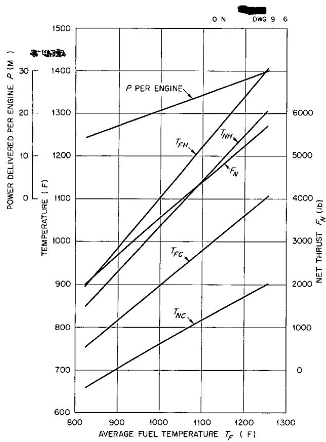  
Fig 9 Steady State Performance of Reactor and Two G E X 61 Engines Altitude 15000 ft Mach 045 reactor power delivery throttled by moving the control rod

condition Such a NaK flow reduction with all other quantities at their rated values causes the NaK temperature at the inlet of the reactor to drop to around $640^{\circ}\mathrm{F}$ which is far below the $1050^{\circ}\mathrm{F}$ safe lower limit Further reduction in NaK flow does reduce power delivery but it causes the return line NaK temperature to drop still lower

Thus NaK flow alone is not a suitable power control quantity because the NaK temperature at the inlet of the reactor drops rapidly to dangerously low values as the flow rate is reduced. Some means of protection against return line NaK under cooling must be added if power delivery is to be throttled safely by NaK flow rate reduction

# NaK BYPASS THROTTLING

When the reactor-X 61 power plant is throttled by bypassing NaK around the radiators the thrust output of each engine and the reactor power delivered to each engine vary as shown in Figs 12 through 14 Fuel and NaK temperatures vary with power delivery as shown in Fig 15

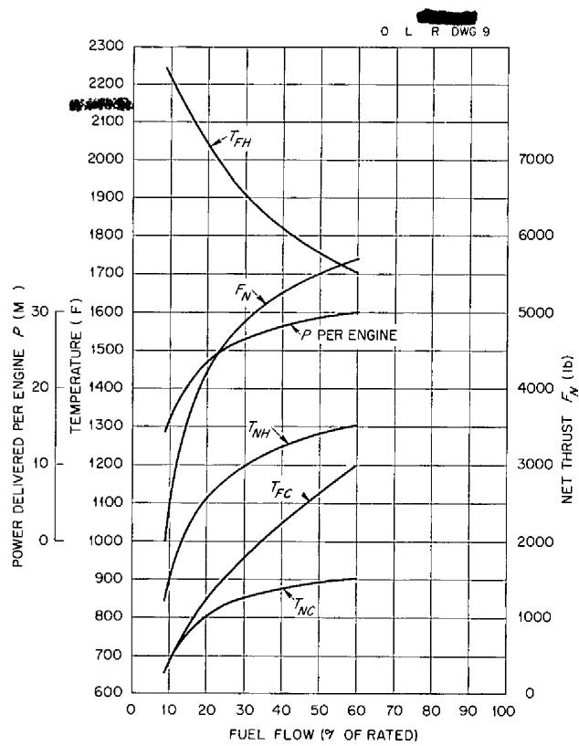

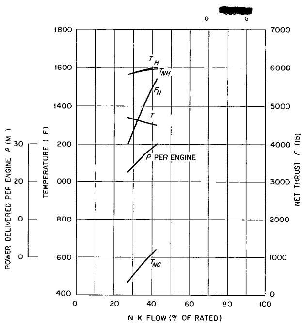  
Fig 10 Steady State Performance of Reactor and Two GE X61 Engines Altitude 15000 ft Mach 045 reactor power delivery throttled by varying the reactor fuel flow   
Fig 11 Steady State Performance of Reactor and Two G E X 61 Engines Altitude 15000 ft Mach 045 reactor power delivery throttled by varying the NaK pump speeds

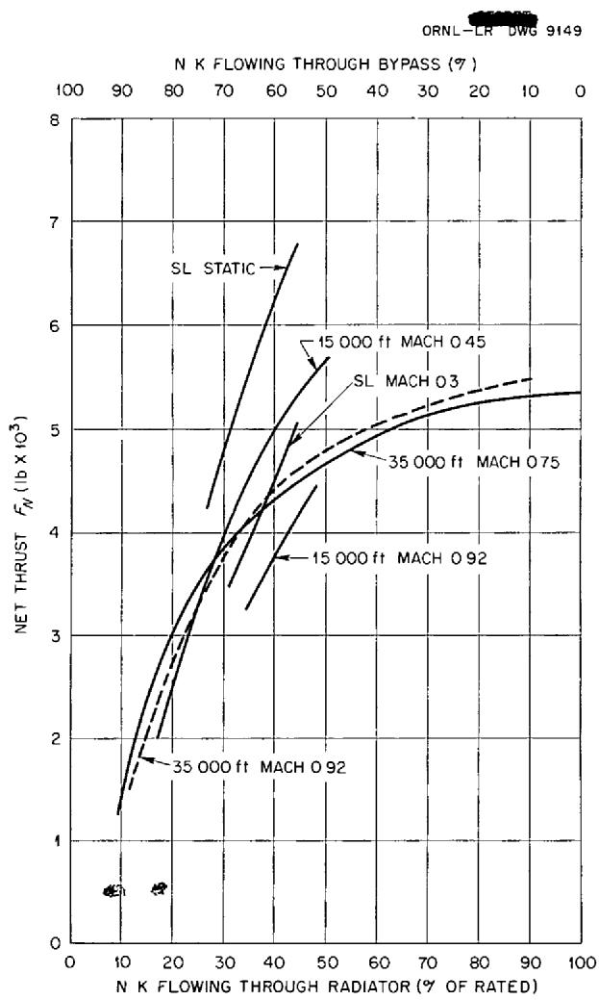  
Fig 12 Net Thrust Output per Engine at Various Flight Conditions for Reactor and Two GE X61 Engines Reactor power delivery throttled with radiator NaK bypasses

Adequate throttling can be obtained through the use of NaK bypass valves alone if the fuel temperature at the inlet of the reactor core can be allowed to rise as high as the design point mean fuel temperature Power delivery and thrust output are relatively insensitive to changes in the NaK bypass percentage in the 50 to $0\%$ bypass range Hence full range NaK bypass valves are required if power delivery is to be throttled in this manner

# AIR BYPASS THROTTLING

The behavior of the hypothetical reactor-X 61 engine power plant when it is throttled by by

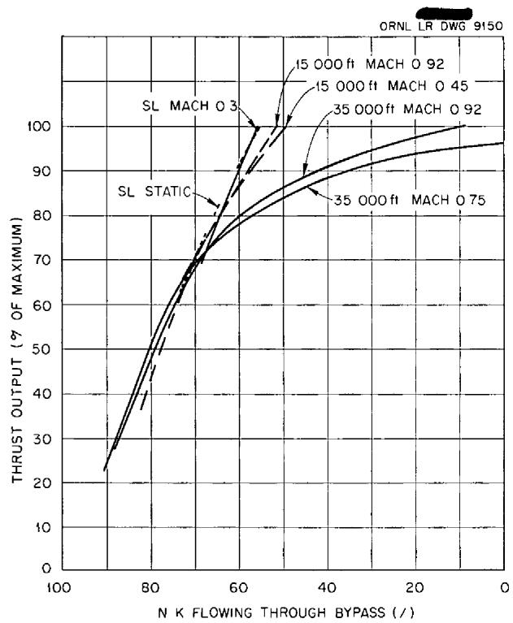  
Fig 13 Per Cent of Maximum Thrust Output Attainable with Nuclear Power Only vs Per Cent NoK Bypassed Around Radiator Reactor and two GE X61 engines

passing air around the engine radiators is shown in Figs 16 through 18 Fuel and NaK temperatures vary with power delivery as shown in Fig 15

These curves show that power plant thrust output can also be throttled safely through the use of air bypasses alone if the fuel temperature at the inlet of the core can be allowed to rise as high as the design point mean fuel temperature

# MORE COMPLEX THROTTLING ARRANGEMENTS

It seems reasonable to believe that the simplest over all power plant control system will result when nuclear power delivery is throttled by variation of the fewest possible control quantities. The steady state performance characteristics discussed in the preceding paragraphs indicate that power plant thrust output modulation through variation of a single control quantity - NaK bypass percentage or air bypass percentage - appears to be possible if the fuel temperature at the inlet of the reactor core can be allowed to rise as high as the design point mean fuel temperature

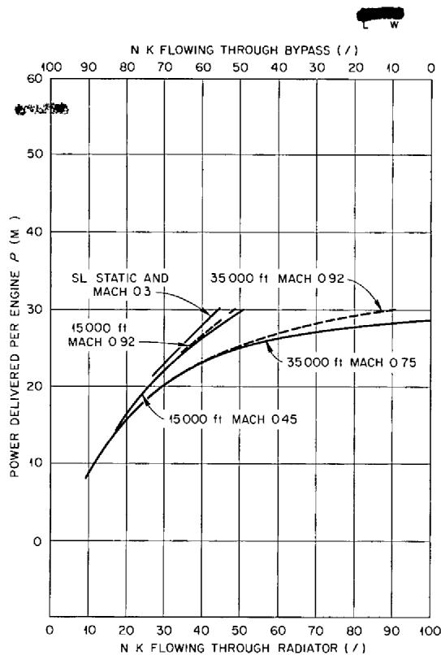  
Fig 14 Variation of Reactor Power Delivered to Each Engine with Per Cent NaK Bypassed Around Radiator Reactor and two G E X 61 engines

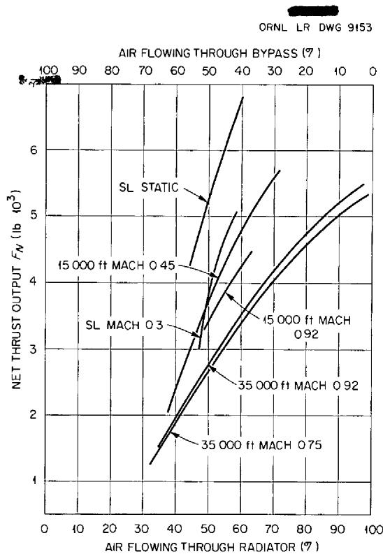  
Fig 16 Net Thrust Output per Engine Reactor power delivery throttled with air bypasses Reactor and two G E X 61 engines

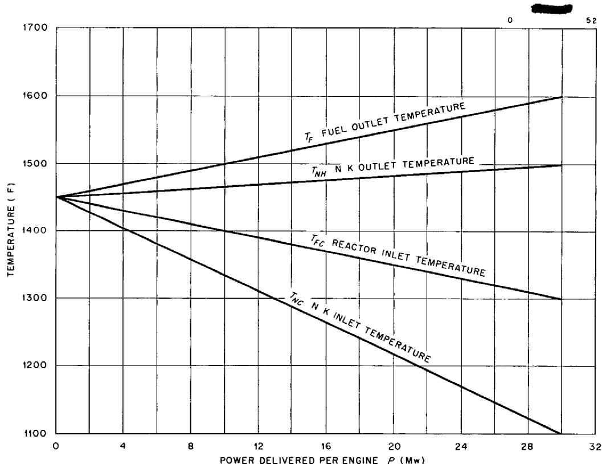  
Fig 15 Variations of Reactor Fuel and NaK Temperatures with Power Delivery per Engine Reactor and two G E X 61 engines throttled by NaK bypass or by air bypass

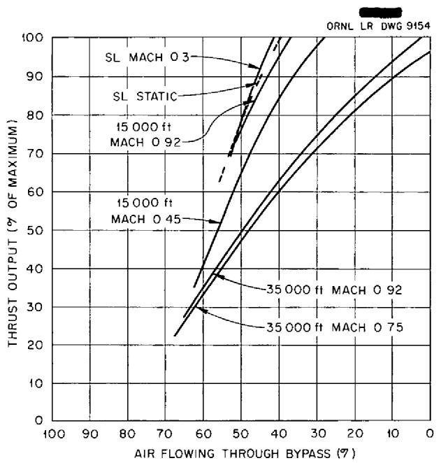  
Fig 17 Per Cent of Maximum Thrust Output Attainable with Nuclear Power Only vs Per Cent Air Bypassed Reactor and two G-E X61 engines

If the fuel temperature at the inlet of the core must be limited to some value less than the design point mean fuel temperature the control rod must also be moved as power delivery is changed If the fuel temperature at the inlet of the reactor core is to be held at $1350^{\circ}\mathrm{F}$ or less in the reactor-X 61 power plant for example rod insertion is required when total power delivery is reduced to below 40 Mw

As the development of the full scale aircraft power plant progresses it is likely that many

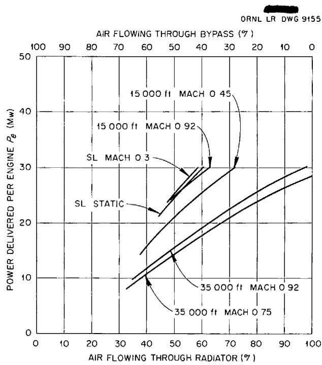  
Fig 18 Variation of Reactor Power Delivered to Each Engine with Per Cent Air Bypassed Reactor and two G E X 61 engines

situations will arise in power plant design or operation which will make the use of more complex throttling arrangements seem desirable Difficulties in building full range NaK bypass valves for example may make the use of a more complicated throttling arrangement imperative However the effect of increasing the complexity of the control system on the reliability of the over all power plant should be considered carefully before such changes are made

# REACTOR-TURBOJET COMBINATION

Stable operation of a reactor-turbojet engine combination is not assured by a large negative reactor temperature coefficient of reactivity Such a characteristic does undoubtedly simplify the control of the reactor but the demand characteristic of a turbolet load and the demand sensitivity characteristic of a reactor having a large negative temperature coefficient of reactivity are not necessarily compatible

The turbojet load imposed on the nuclear heat source (airflow and radiator inlet temperature) varies in a complicated way with the power delivered to it. Changes in power delivery to such a load cause the load characteristics themselves to change. Changes in load characteristics however can cause further changes in reactor power delivery because the large negative temperature coefficient of reactivity makes the reactor load sensitive. If it is possible for a subsequent change in power delivery to reinforce an original power disturbance, the reactor load combination can walk or run away. The possibility for an instability of this type does not exist when the reactor is coupled to a heat dump type of load because the load characteristics are externally adjusted by blower speed and louver and bypass opening variation. Changes in these external load adjustments do cause the reactor power level to change but changes in the reactor power level cannot in turn cause further changes in the load. This is an important basic difference between the two load types

The static stability of a demand sensitive reactor power source and a turbojet load can be studied from plots showing how the steady state power available from the radiator and the steady state power required to run the engine vary with engine speed when the reactor throttling quantities are constant. Such plots obviously do not provide a complete picture of the stability of the over all

power plant but it does seem that an unstable intersection between a steady state nuclear power available curve and the steady state engine power required curve is a definite indication of trouble

Steady state power required and power available curves for the reactor-J71 system at SL static operating conditions are shown in Figs 19 and 20 for air and NaK bypass throttling (sample calculations are included in Appendix C) All the potential reactor control quantities with the exception of the bypasses are constant at their rated values The air and NaK bypasses are constant along given power available curves at the values shown

The intersections between the curves of power available at a constant air bypass setting and engine power required are unstable in the low speed range. The steady state power available rises faster than the power required as the engine speed increases (air flow and compressor discharge temperature increase)

Idle speed for the J71 engine is around 3000 rpm. Net thrust output at this speed is down to about $3\%$ of the rated SL static value. Stable operation at speeds corresponding to less than maximum nuclear power input (5050 rpm $23\%$ of rated SL static net thrust output) does not appear to be possible when the reactor-J71 power plant is throttled by bypassing air around the radiators. This apparent difficulty is a serious disadvantage of the air bypass throttling arrangement. When the power plant is throttled with NaK bypasses the nuclear power available curves intersect the engine power required curve stably in the low speed region. The power plant behaves differently in each case because of basic differences in the effect of each throttling quantity on radiator performance

The power available from the reactor supplying a number of balanced loads is related to the various engine radiator and reactor parameter values by the following expression

$$
P _ {e} = \left[ \frac {1}{1 / W _ {a D} C _ {a} \eta_ {R} + (1 - \eta_ {H X}) / \eta_ {H X} W _ {N e} C _ {N} - 1 / 2 X W _ {F} C _ {F}} \right] \left(T _ {F} \vee - T _ {T 3}\right) \tag {3}
$$

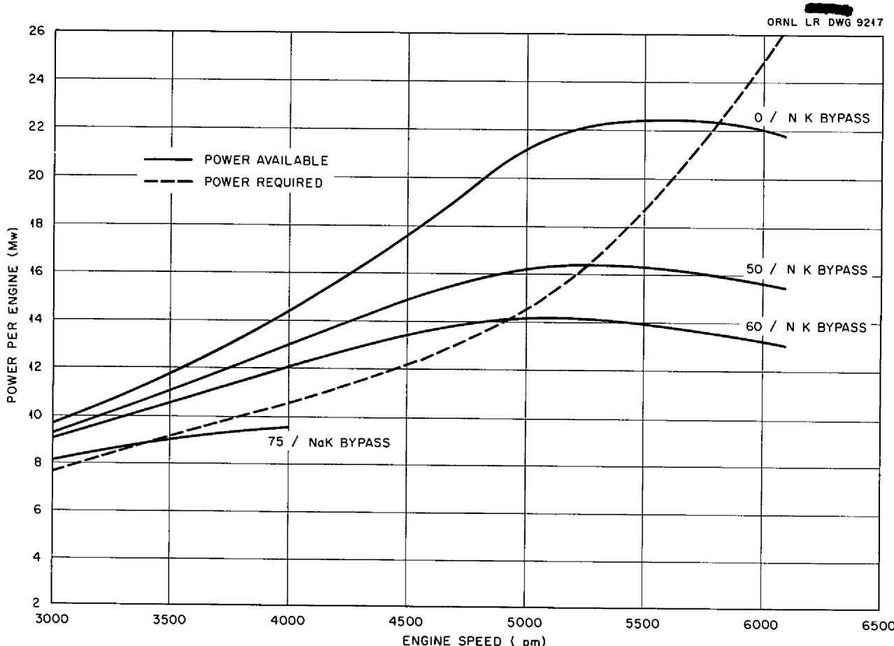  
Fig 19 Steady State Power Delivered with NaK Bypass Percentage Constant Steady State Engine Power Required vs Engine Rotor Speed Reactor and four Allison J71 engines at SL static conditions exhaust nozzle open fuel and NaK pump speeds constant at rated values

When the fuel and NaK flows are constant at their rated values the last two denominator terms are small and tend to cancel The power delivered to each load then is approximately

$$
P _ {e} = \overbrace {W _ {a D} \eta_ {R}} ^ {\text {D e s t a b i l} z n g \quad \text {S t a b I} \quad \text {i n g}} \overbrace {(T _ {F a v} - T _ {T 3})} ^ {\text {t e r m}} C _ {a} \tag {4}
$$

The second term in the equation describes the stabilizing effect of the increase in compressor outlet temperature which results when engine speed increases This effect alone would cause the power delivered at a constant mean reactor temperature to decrease If power delivery to an engine decreases with an increase in engine speed static stability at least will be assured because the power required increases with increasing speed

The first term in the power delivery expression describes the destabilizing effect of the increase in air flow which results when engine speed increases. If the NaK flow rate is constant the effectiveness of the radiator $(\eta_{R})$ decreases as air flow increases but not so rapidly. Hence the product $(W_{aD}\eta_{R})$ increases with increasing air flow. This product for the hypothetical J71 radiator is plotted vs air flow for several constant NaK flow rates in Fig 21

The rapid increase in engine air flow with speed at low speeds causes $W_{aD}\eta_{R}$ to increase faster than $(T_{Fav} - T_{T3})$ decreases Hence the power delivery curves rise with increasing speed at low speeds At higher speeds however the effect of the increase in radiator inlet temperature predominates (as the compressor outlet temperature moves closer to the mean fuel temperature) and

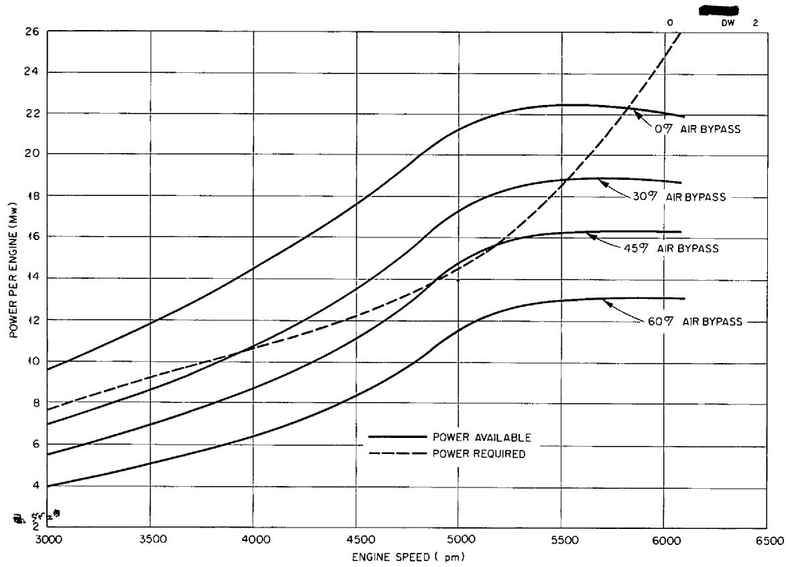

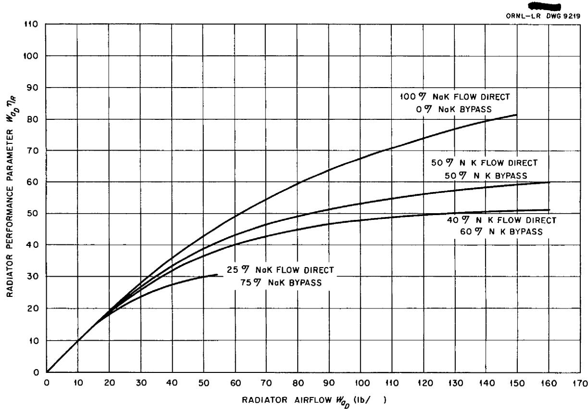  
Fig 20 Steady State Power Delivered with Air Bypass Percentage Constant Steady State Engine Power Required vs Engine Rotor Speed Reactor and four Allison J71 engines at SL static conditions exhaust nozzle open fuel and NaK pump speeds constant at rated values   
Fig 21 Radiator Performance Parameter for the Allison J 71 Engine

the $W_{aD} \eta_R$ product rises less rapidly These effects cause power delivery to reach a peak and begin to fall in the high speed range The increase in radiator inlet temperature with increasing speed thus causes the steady state power curves to intersect stably in both cases at high engine speeds in spite of the destabilizing effect of increasing air flow with speed

The relative flatness of the curves showing the variation of the power available with the NaK by pass percentage constant at low speeds can be explained from the $W_{aD}\eta_R$ plot in Fig 19 and from Eq 4 the power delivered equation The differences in the performance characteristics of the air bypass and NaK bypass throttling arrangements lie in the behavior of the $W_{aD}\eta_R$ product as engine air flow changes since the $(T_F - T_{T3})$ term varies with speed in the same way in both

cases The power delivery curves rise most slowly with increasing speed when the $W_{aD}\eta_{R}$ vs $W_{aD}$ curves are flattest The destabilizing effect of an engine air flow change on reactor power delivery is minimized when the variation of $W_{aD}\eta_{R}$ with changes in air flow is minimized

A study of Fig 19 leads to the conclusion that $W_{aD} \eta_{R}$ varies least with changes in air flow when the air flow through the radiator is high and when the percentage of NaK flowing through the bypass is large. Both these requirements are met best at part load points by the NaK bypass throttling arrangement

The behavior of the NaK bypass throttled power plant at 35000 ft and Mach 087 is shown in Fig 22 The very large amount of NaK bypassing required to throttle the engines at this flight condition causes the nuclear power delivery curves

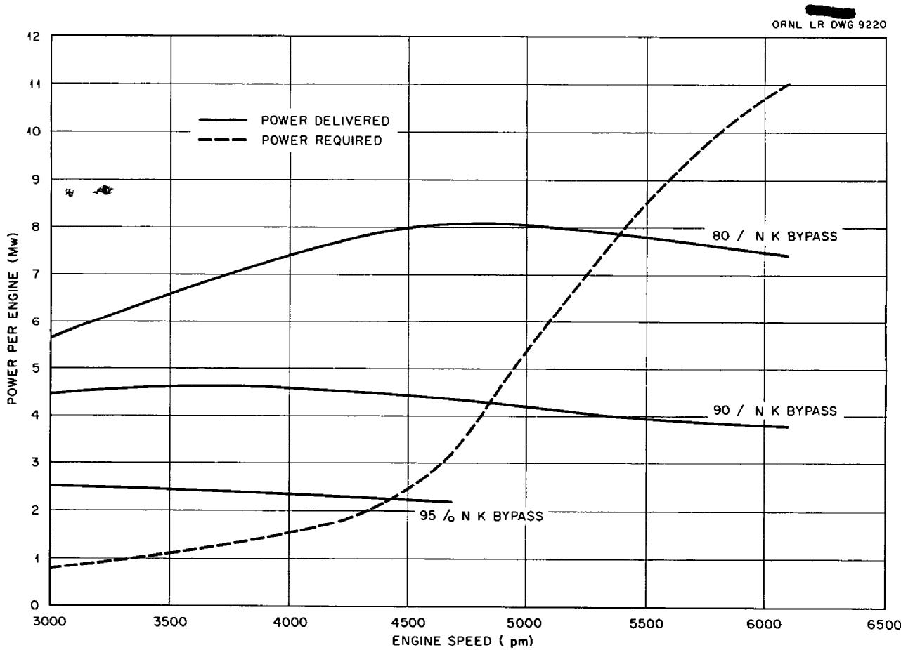  
Fig 22. Steady-State Power Delivered with NaK Bypass Percentage Constant Steady State Engine Power Required vs Engine Rotor Speed Reactor and four Allison J71 engines at 35000 ft Mach 087 exhaust nozzle open fuel and NaK pump speeds constant at rated values

to be quite flat This bears out the conclusion drawn in the preceding paragraph heavy flow of NaK through the bypass results in flat power delivery curves

All the nuclear power delivery variations considered so far have been worked out for constant fuel and NaK pump speeds. It might be desirable in the interests of simplicity to drive these pumps at engine speed. This aggravates the static stability problem however since increasing the pump speeds with engine speed causes power delivery to rise faster with increasing engine speed than when the pump speeds are constant

The behavior of the NaK bypass throttled power plant at SL static conditions when various combinations of pumps are engine driven is shown in Fig 23 (Pump flow rates were assumed to be proportional to pump speed) Driving one or more pumps at speeds proportional to engine speed destroys most of the apparent natural static stability of the NaK bypass throttled power plant

Thus from steady state considerations it seems that a turbojet-demand sensitive reactor combination should operate stably in the high power range At part load operating conditions however the stability of such a power plant appears to depend

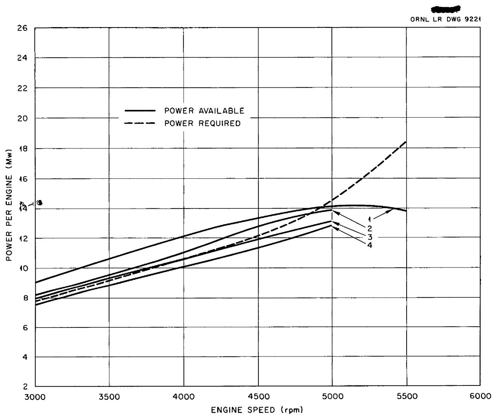  
Fig 23 Steady State Power Delivered with $60\%$ NaK Bypassed Steady State Engine Power Required vs Engine Rotor Speed (1) Pump speeds constant at rated values (2) NaK pump speeds constant fuel pumps engine-driven (3) fuel pump speeds constant NaK pumps engine driven (4) fuel and NaK pumps engine driven

on the throttling scheme used Relatively speaking use of a NaK bypass throttling arrangement seems from steady state considerations at least to result in more stable power plant operation than does use of an air bypass throttling arrangement In the example considered the NaK bypass throttled power plant was stable at normal part load operating points when the fuel and NaK pump speeds were constant while the air bypass throttled power plant was not Whether or not a NaK bypass throttled system will be stable in other power plant combinations is difficult to say A detailed check in each particular situation will no doubt be required

If the nuclear power source-turbojet engine load

combination is not inherently stable or if the natural stability is not adequate the stability characteristics can be improved by adding the proper control equipment Static power plant stability in the cases considered here for example would be achieved if some sort of power level control system were added to the nuclear heat source to maintain nuclear power delivery to each engine constant at some preset adjustable value. The power available from the reactor would then be independent of changes in engine speed or air flow and compressor outlet temperatures and the power available vs speed curves would be horizontal lines

# COUPLING BETWEEN ENGINES IN A MULTIENGINE INSTALLATION

All the steady state performance characteristics considered so far have been worked out for balanced load operation where power delivery to each engine is the same. It is also interesting to consider the effects of coupling between engines when the power distribution to the various engines is not symmetrical assuming for the moment that the reactor design and load connection arrangement will allow unbalanced operation. The various engine loads are not completely independent. They are cross coupled through their common power source. If the power delivered to one engine is varied through manipulation of the NaK bypass of that engine, the power delivered to the other engines also changes. Power delivery to the other engines changes because variation in power delivery to one load causes the reactor outlet temperature to change. The power delivered to any given engine load is related to the reactor outlet temperature by

$$
\begin{array}{l} P _ {1} = \left(T _ {F H} - T _ {T 3}\right) \times \tag {5} \\ \left[ \frac {1}{1 / W _ {a D} C _ {a} \eta_ {R} + (1 - \eta_ {H X}) / \eta_ {H X} W _ {N e} C _ {N}} \right] \\ \end{array}
$$

The magnitude of the cross coupling effect when the control rod position is constant has been determined for the NaK bypass throttled reactor-X 61 engine power plant operating at 35000 ft at Mach

092 The results which are plotted in Fig 24 show how the per cent of full nuclear power delivered to an engine load with a constant NaK by pass setting varies with power delivery to a second engine load In the event of complete failure of the second engine the power delivered

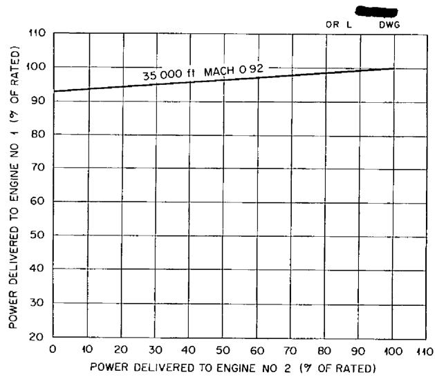  
Fig 24 Steady State Coupling Between Engines Reactor and two G E X 61 engines altitude 35000 ft Mach 092 No 1 engine NaK bypass constant at $9.5\%$ No 2 engine NaK bypass varied from 9.5 to $100\%$

to the first engine drops to $93\%$ of its rated value. If this lost power is to be regained, the bypass on the first engine must be readjusted if possible or the control rod must be withdrawn slightly

Cross coupling between engines can be eliminated by the addition of automatic control equipment When the control rod position is constant and NaK bypass throttling is used however the magnitude

of the coupling effect does not appear to be great enough to justify much complication of the control system for its elimination If rod motion with total power level changes is required cross coupling between engines will be more pronounced than in the example considered here and the coupling effects between engines may be so large that independent manual power delivery adjustments to each load will be tedious

# NUCLEAR POWER SOURCE CONTROL REQUIREMENTS

Automatic control requirements for the nuclear heat source in a combination chemical nuclear aircraft power plant of the type discussed in the preceding sections can be determined by considering how the flight engineer might perform typical power plant maneuvers without the help of automatic control equipment. The numerous altitudes flight speeds and ambient temperatures at which such a power plant might be operated can be grouped into three categories for purposes of discussion those flight conditions at which the radiators are (1) larger than they need be (2) just large enough and (3) too small to transfer rated nuclear power to each engine If the radiators are designed to transfer rated nuclear power to each engine at the nuclear cruise flight condition (Mach 09 at 35000 ft in the example considered here) excess radiator capacity is generally available during flight at altitudes below the nuclear cruise design altitude and the radiators will generally be too small to transfer rated nuclear power to each engine during operation at altitudes above the nuclear cruise design altitude

Manual operation of the nuclear part of the reactor-X61 power plant in each of these situations is described in the paragraphs which follow Throttling by means of radiator NaK bypass valves is assumed and fuel and NaK flow rates are assumed to be constant at their rated values Startup and shutdown problems ground handling problems and sodium coolant temperature control problems are not considered

# MANUAL OPERATION AT FLIGHT CONDITIONS WHERE RADIATOR CAPACITY IS EXCESSIVE

The radiators will generally be large enough to transfer more than rated nuclear power to each

engine load at altitudes below the design nuclear cruise altitude Power plant maneuvers which might be performed in this operating range include engine startup operation on nuclear power only and operation on chemical plus nuclear power

The engines will probably be started on chemical power only The higher turbine inlet temperatures obtainable with the chemical power sources should result in the lowest possible engine firing speeds and cranking powers The chemical power sources are also more maneuverable than the nuclear power source which probably will be advantageous during the critical starting and accelerating period

Once the engines have been started nuclear power delivery can be initiated by diverting NaK through the engine radiators It is assumed that the reactor has already been brought critical and is known to be delivering power at some low level Care must be exercised in closing the NaK bypass valves to avoid transient undercooling of the NaK returning to the reactor Enough hot NaK must be allowed to flow through the bypass valves to ensure that the return line NaK temperatures will remain above their lower limits at all times

Full closure of the NaK bypass valves is not permissible even during steady state operation at flight conditions where excess radiator capacity is available Rated nuclear power is delivered to each engine in the reactor-X 61 power plant during static operation at sea level, for example when only $45\%$ of the total rated NaK flow passes through the radiators (Figs 12 through 15) If the NaK bypass valves are fully closed at such operating conditions excess power demands will be set up and return line NaK undercooling and reactor fuel overheating will result

Care must also be exercised in opening the NaK

bypass valves to reduce nuclear power delivery The return line NaK temperature should not be allowed to rise above the value at which isothermal idling of the reactor is desired when power delivery has been reduced virtually to zero Limiting the return line NaK temperature rise during load removal ensures that the load will be removed slowly enough to prevent reactor overheating

If the reactor design is such that the fuel temperature at the inlet of the reactor core must be limited to some value less than the design point mean fuel temperature control rod withdrawal is required as nuclear power delivery is increased. Since the reactor fuel inlet temperature approaches the mean fuel temperature as power delivery is reduced the rod must be inserted to lower the mean fuel temperature during operation at low powers if the reactor fuel inlet temperature is to be maintained below the design point mean fuel temperature. Subsequent rod withdrawal to raise the mean fuel temperature to the design point value cannot be initiated until some load has been reapplied

If operation on chemical plus nuclear power is desired engine fuel flows and exhaust nozzle areas must be controlled Control requirements for the turbojet section of the power plant during operation on chemical plus nuclear power will not be considered here For purposes of this discussion it is assumed that the automatic control equipment required is available

Each time chemical power delivery to the engines is varied or the engine exhaust nozzle areas are changed the rate of nuclear heat delivery will also change The changes in compressor outlet temperatures and in air flow resulting from the changes in chemical fuel flows or nozzle areas upset previously established heat transfer balances in the radiators If nuclear power delivery is to be held constant NaK bypasses must be readjusted each time the engine thrust outputs are changed during operation on chemical plus maximum nuclear power

Continuous readjustment of the bypass valve positions is also required if nuclear power delivery is to be maintained constant as the aircraft altitude and flight speed change since the engine air flows and compressor outlet temperatures are also functions of the engine inlet total temperature total pressure and flight Mach number The demand sensitivity of the reactor makes continual

NaK bypass readjustment necessary if power delivery is to be held constant as the load characteristics change Constant power delivery to a turbojet load is not necessarily desirable except when nuclear power only flight at the highest speed possible is to be maintained Operation in this manner will probably be required for a large percentage of the time during typical missions

# MANUAL OPERATION AT RADIATOR DESIGN FLIGHT CONDITIONS

The manual control operations required in the execution of typical power plant maneuvers at flight conditions when the radiators are just large enough to transfer rated nuclear power to each engine are quite similar to those described in the preceding section except that full closure of the NaK bypass valves is now permissible during steady state operation. Return line NaK under cooling and overheating must be guarded against during transients but the radiators are not large enough to cause undercooling during steady state operation at such flight conditions. Full nuclear power delivery to each engine results when the bypasses are fully closed. Rod control requirements are the same as those discussed in the preceding section. Rod withdrawal or insertion during power level changes is required if the fuel temperature at the inlet of the reactor core must be held below the design point mean fuel temperature

# MANUAL OPERATION AT FLIGHT CONDITIONS WHERE RADIATOR CAPACITY IS INADEQUATE

Radiator capacity will be inadequate at some flight conditions because the engine air flows and compressor outlet temperatures are such that the available heat transfer surface area is not sufficient to transfer rated nuclear power. During dash for example only $71\%$ of rated nuclear power can be delivered to each engine in the X61 power plant even though the NaK bypasses are fully closed and the mean reactor fuel temperature is at its design point value. This operating condition is described in Table 2

Since rated nuclear power is not being delivered at the fuel temperature at the outlet of the reactor, core is less than the $1600^{\circ}\mathrm{F}$ upper limit. Some increase in nuclear power delivery thus can be effected by further withdrawal of the control rod.

TABLE 2. DASH OPERATION (55 000 ft Mach 2 0) OF G E X 61 ENGINE  

<table><tr><td></td><td>TF</td><td>at Design Point Value</td><td>TFH at Maximum Value</td></tr><tr><td>T Fav °F</td><td colspan="2">1450</td><td>1489</td></tr><tr><td>T FH °F</td><td colspan="2">1557</td><td>1600</td></tr><tr><td>T FC °F</td><td colspan="2">1343</td><td>1378</td></tr><tr><td>NaK byp %</td><td colspan="2">0</td><td>0</td></tr><tr><td>Pump speeds</td><td colspan="2">R fed</td><td>Rated</td></tr><tr><td>Nuclea power delivered per engine Mw</td><td colspan="2">21 4</td><td>22 3</td></tr><tr><td>Chemical power delivered per eng ne Mw</td><td colspan="2">40 9</td><td>40 0</td></tr><tr><td>Total power delivered per engine Mw</td><td colspan="2">62 3</td><td>62 3</td></tr><tr><td>Chemical power reduct on effected by moving control rod %</td><td colspan="2"></td><td>2 2</td></tr></table>

to raise this temperature The operating conditions described in the last column of Table 2 prevail after such action is taken Nuclear power delivery to each engine is increased to $74\%$ of rated power and chemical fuel consumption is reduced by about $22\%$ under these conditions

If the fuel temperature at the inlet of the core must be limited to $1350^{\circ}\mathrm{F}$ however rod withdrawal to the extent shown in the last column of Table 2 is not permissible and the potential advantages to be gained in raising the mean fuel temperature during operation at such a flight condition are not so great as those described in this column

The discussion in the preceding paragraphs leads to the conclusion that some sort of automatic control equipment to raise the reactor mean fuel temperature to its maximum allowable value during operation at radiator limited flight conditions is desirable but that equipment performing this function alone is not essential to power plant operation. The potential advantages to be gained do not appear to be great enough to justify much complication of the control system unless such equipment is also needed for other reasons such as controlling rod withdrawal during power increases

# AUTOMATIC CONTROL REQUIREMENTS DURING OPERATION IN THE POWER RANGE

The foregoing discussion indicates that some sort of automatic control equipment is required for the NaK bypasses Automatic control equip

ment is also required for the control rod if the fuel temperature at the inlet of the reactor core must be held below the design point mean fuel temperature If the reactor can be designed to operate isothermally at the design point mean fuel temperature however a reasonably conventional manual type rod control will probably suffice

Movement of the NaK bypasses must be limited to maintain the return line NaK temperatures between their upper and lower limits at all times. The lower limit for steady state operation is the temperature at which rated nuclear power is delivered to each engine. The upper limit is the temperature at which steady state isothermal reactor idling is desired

In simplest form the controls for the NaK bypass valves might be remote positioning servos with return line NaK temperature overrides and under rides to limit bypass valve openings to those values that will result in temperatures in the safe range. Further studies of reactor and engine control integration may show that a more complex arrangement is needed

If the reactor cannot be operated isothermally at the design point mean fuel temperature rod insertion with power reduction is required to limit the core inlet fuel temperature rise Rod withdrawal with increasing power delivery is required either to restore the mean fuel temperature to its design point value or to raise the reactor fuel outlet temperature to its maximum value The discussion in the preceding section showed that a slight advantage would be gained during the dash if the

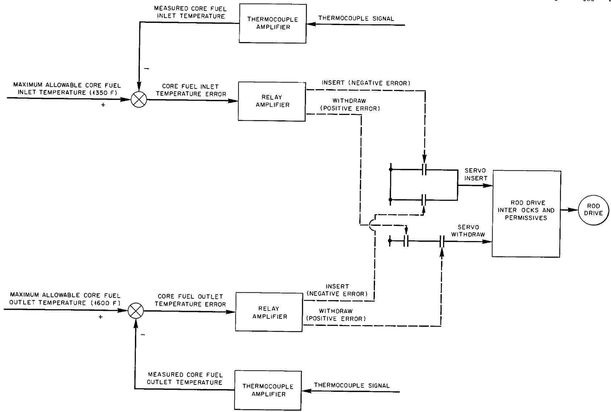  
Fig 25 Schematic Diagram of Rod Servo

rod were withdrawn to raise the fuel outlet temperature to its maximum value rather than to raise the mean temperature to its design point value. Hence one simple type of rod control for the reactor-X61 power plant would be one which operates as follows

1 withdraws the rod if the reactor core fuel inlet temperature is less than $1345^{\circ}\mathrm{F}$ and the reactor core fuel outlet temperature is less than $1590^{\circ}\mathrm{F}$   
2 inserts the rod if the reactor core fuel inlet temperature exceeds $1355^{\circ}\mathrm{F}$ or the reactor core fuel outlet temperature exceeds $1600^{\circ}\mathrm{F}$

The basic form of such a control system is out lined in Fig 25 Further study may show that additional stabilizing signals are required but this question will not be considered here. The diagram is intended to be schematic only and does not necessarily represent the best way to do the job

The fuel temperatures resulting from the use of such a control scheme are shown in Fig 26 Either the core fuel inlet temperature or the core fuel outlet temperature is held at its upper limit at all times Operation with the fuel outlet temperature at its maximum value is possible only when power delivery exceeds $83.4\%$ of the rated value The fuel inlet temperature limiting requirement does not allow the maximum fuel outlet temperature to be reached when power delivery is less than $83.4\%$ of rated power

# ACKNOWLEDGMENTS

The writer wishes to express appreciation for help received from A P Fraas M M Yarosh and

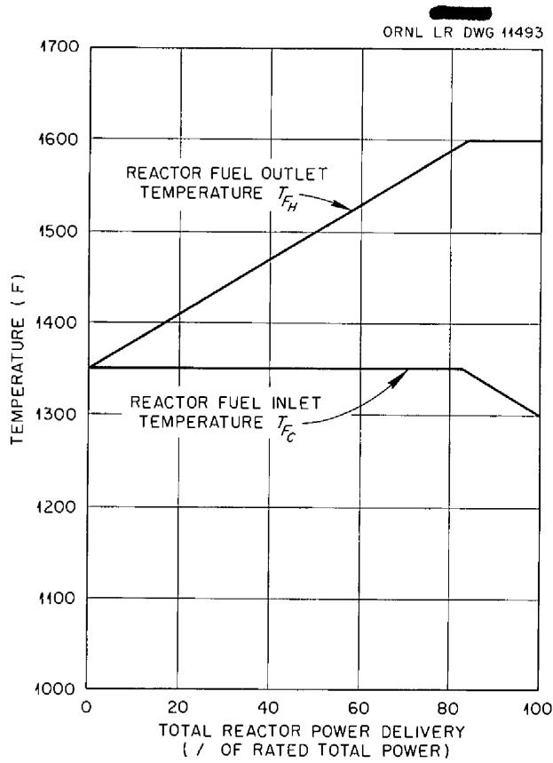  
Fig 26 Fuel Temperature Variations Resulting from Use of Rod Servo

R D Schultheiss of ORNL and from J Bendot of The Glenn L Martin Company

# APPENDIX A

# RADIATOR DESIGN PROCEDURE

The basic radiator unit from which the engineer radiators discussed in this report were composed, was designed by R D Schultheiss A sketch of this unit is shown

This unit has $776\mathrm{ft}^2$ of heat transfer area and the variation of its over all heat transfer coefficient $U_{R}$ with changes in air flow per unit frontal area $W_{a} / A_{fR}$ is as shown in Fig 6. The procedure followed in assembling a hypothetical radiator for the X 61 engine is outlined below

1 An engine radiator design point flight condition is chosen, and the engine load requirements at this flight condition are determined. The 35000 ft Mach 087 nuclear power only cruise flight condition was chosen as the radiator engine design point for the reactor-X61 power plant and the accompanying load requirements are shown below

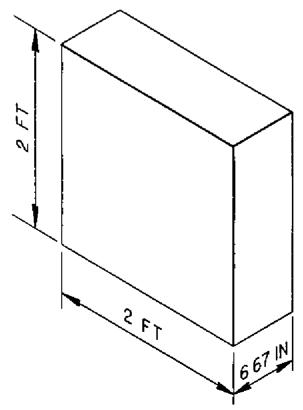

$$
\begin{array}{l} T _ {N C} (1 1 0 0 ^ {\circ} \mathrm {F}) \xleftarrow {} T _ {N H} (1 5 0 0 ^ {\circ} \mathrm {F}) \\ T _ {T 3} (4 8 7 ^ {\circ} \mathrm {F}) \xrightarrow {W _ {a} = 1 3 2 4 \mathrm {I b / e}} T _ {T 4} (1 3 1 1 ^ {\circ} \mathrm {F}) \end{array} \quad P _ {e} = 3 0 \mathrm {M w}
$$

2 The required value for the product $U_{R}A_{R}$ (total heat transfer area-over all heat transfer coefficient) is then calculated as follows

$$
\text {L o g m e a n t e m p e r a t u r e d i f f e r e n c e} = \frac {(1 1 0 0 - 4 8 7) - (1 5 0 0 - 1 3 1 1)}{\ln (1 1 0 0 - 4 8 7) / (1 5 0 0 - 1 3 1 1)} = 3 6 0 ^ {\circ} \mathrm {F}
$$

$$
U _ {R} A _ {R} = \frac {P _ {e}}{\Delta T _ {\mathrm {m e}}} = \frac {2 8 4 2 5}{3 6 0} = 7 8 9 \mathrm {B t u / s e c} ^ {\circ} \mathrm {F}
$$

3 The engine air flow per unit frontal area of the radiator $W_{a} / A_{fR}$ is calculated from $W_{a}$ which is known and $A_{fR}$ which is determined from the engine design. In this case $A_{fR}$ was arbitrarily chosen as 16 ft² so

$$
\frac {W _ {a}}{A _ {f R}} = \frac {1 3 2 . 4}{1 6} = 8 2 7 5 \mathrm {l b / s e c f t ^ {2}}
$$

4 A value for $U_{R}$ is read from the curve in Fig 6 with the use of $W_{\alpha} / A_{fR}$ found in step 3 and the required heat transfer surface area $A_{R'}$ is calculated

$$
U _ {R} = 3 1 5 \mathrm {B t u / h r f t ^ {2}} ^ {\circ} \mathrm {F}
$$

$$
A _ {R} = \frac {U _ {R} A _ {R}}{U _ {R}} = \frac {(7 8 9) (3 6 0 0)}{3 1 . 5} = 9 0 1 8 f t ^ {2}
$$

5 Next a number of the basic radiator units are stacked to provide the required frontal area Four units are needed in this example Since each basic unit contains 776 ft² of heat transfer area the stacked array contains 3104 ft² of heat transfer surface The array must therefore be lengthened to provide the required over all heat transfer surface Since a 667 in deep stacked unit contains 3104 ft² and since 9018 ft² is required the depth must be increased to

$$
\frac {9 0 1 8}{3 1 0 4} \times 6 6 7 = 1 9 4 \mathrm {i n}
$$

The pressure drop can be estimated by multiplying the calculations of Schultheiss by the proper ratios Under the following operating conditions

$$
\frac {W _ {a}}{A _ {f R}} = 5 7 9 \mathrm {l b} / \sec \mathrm {f t} ^ {2} \quad \rho = 0. 0 4 3 4 \quad \text {r a d i a t o r} \quad \text {d e p t h} = 6 6 7 \mathrm {i n}
$$

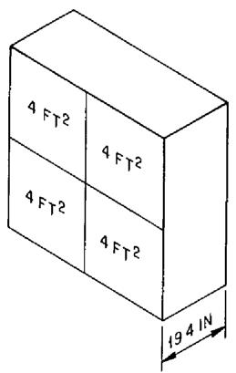

Schultheiss has calculated that the pressure drop of this type of radiator is

$$
\Delta P _ {R} = 2 8. 5 \mathrm {i n} H _ {2} O
$$

At other operating conditions the pressure drop is estimated to be

$$
\Delta P _ {R} = 2 8. 5 \left(\frac {W _ {a} / A _ {f R}}{5 7 9}\right) \left(\frac {0 0 4 3 4}{\rho_ {\mathrm {v}}}\right) \left(\frac {\text {r a d i a t o r d e p t h}}{6 6 7}\right)
$$

For the G E X 61 case

$$
\Delta P _ {R} = 8 2 1 6 \mathrm {i n} H _ {2} O = 4 2 6 8 \mathrm {l b / f t ^ {2}}
$$

At the design point (described in step 1) this pressure drop is $(4268 / 6470) = 66\%$ of the compressor discharge pressure. The same procedure was used in assembling the hypothetical Allison J71 radiators

# APPENDIX B

# STeady State Performance Calculations

Control parameter values required to yield given engine thrust outputs during steady state operation at specified flight conditions can be determined by working backwards through the engine and reactor performance characteristics. The engine load imposed on the reactor (as described by power compressor outlet temperature turbine inlet temperature and airflow) is first determined from Figs 2 through 5. When these load quantities are known and when values for all but one of the unknown potential throttling quantities are specified the value which the remaining unknown throttling quantity must have in order to meet the load conditions can then be calculated by use of one of the procedures outlined below. For purposes of illustration it is assumed in each case that the throttling quantity value required to deliver 4000 lb of thrust output per engine during flight at 15 000 ft at a speed of Mach 0 45 is to be determined

# Example 1 - Control Rod Throttling

The engine load quantities resulting when 4000 lb of thrust is delivered during flight at 15 000 ft and Mach 0 45 are (from Figs 2 through 5)

$$
T _ {T 3} = 4 1 1 ^ {\circ} \mathrm {F} \quad W _ {a} = 1 5 7 \mathrm {I b / s e c} \quad T _ {T 4} = 9 3 1 ^ {\circ} \mathrm {F}
$$

$$
P _ {e} = 2 2. 5 \mathrm {M w} = 2 1 3 0 0 \mathrm {B t u / s e c}
$$

Effectiveness values for both the heat exchanger and the engine radiators will be required for calculation of the unknown quantities $T_{F}$ , $T_{FH}$ , $T_{FC}$ , $T_{NH}$ , $T_{NC}$ . These effectiveness values depend on the fluid flow rates and the over all heat transfer coefficients which are also functions of the flow rates

$$
\eta_ {H X} = \frac {1 - e ^ {(U _ {H X} A _ {H X} / w _ {N} c _ {N}) [ (w _ {N} c _ {N} / w _ {F} c _ {F}) - 1 ]}}{1 - (W _ {N} C _ {N} / w _ {F} c _ {F}) e ^ {(U _ {H X} A _ {H X} / w _ {N} c _ {N}) [ (w _ {N} c _ {N} / w _ {F} c _ {F}) - 1 ]}}
$$

$$
\eta_ {R} = \frac {1 - e ^ {\left(U _ {R} A _ {R} / W _ {a} C _ {a}\right) \left[ \left(W _ {a} C _ {a} / W _ {N} C _ {N}\right) - 1 \right]}}{1 - \left(W _ {a} C _ {a} / W _ {N} C _ {N}\right) e ^ {\left(U _ {R} A _ {R} / W _ {a} C _ {a}\right) \left[ \left(W _ {a} C _ {a} / W _ {N} C _ {N}\right) - 1 \right]}}
$$

Since the flow rates in the main heat exchanger are constant at design point values in this example the heat exchanger effectiveness is 0.8 as shown on page 3 The effectiveness of the radiator at this operating condition is found by substituting the following values into the effectiveness expression

$$
W _ {a} = 1 5 7 \mathrm {I b / s e c} \quad A _ {R} = 9 0 1 8 \mathrm {f t} ^ {2}
$$

$$
U _ {R} = 3 3. 6 \mathrm {B t u / h r f t ^ {2} ^ {\circ} F} \quad \left(\text {f r o m} \quad \frac {W _ {a}}{A _ {f R}} = \frac {1 5 7}{1 6} = 9 8 1 \text {a n d F i g} 6\right)
$$

$$
W _ {N} = 2 8 4 3 \mathrm {l b / s e c} \quad C _ {a} = 0 2 6 \quad C _ {N} = 0 2 5
$$

This substitution shows that the radiator effectiveness $\eta_{R}$ is 0.768

Values for all the unknowns desired can now be determined from the following series of calculations

NaK Temperature at Outlet of Heat Exchanger $(T_{NH})$ - By definition

$$
\eta_ {R} = \frac {T _ {T 4} - T _ {T 3}}{T _ {N H} - T _ {T 3}}
$$

or

$$
T _ {N H} = \frac {T _ {T 4} - T _ {T 3}}{\eta_ {R}} + T _ {T 3} = \frac {9 3 1 - 4 1 1}{0 . 7 6 8} + 4 1 1 = 1 0 8 8 ^ {\circ} F
$$

NaK Temperature at Inlet of Heat Exchanger $(T_{NC})$

$$
T _ {N C} = T _ {N H} - \left(T _ {N H} - T _ {N C}\right) = T _ {N H} - \frac {P _ {e}}{W _ {N e} C _ {N}} = 1 0 8 8 - \frac {2 1 , 3 0 0}{(2 8 4 . 3) (0 . 2 5)} = 7 9 0 ^ {\circ} F
$$

Fuel Temperature at Outlet of Reactor Core $(T_{FH}) =$ By definition

$$
\eta_ {H X} = \frac {T _ {N H} - T _ {N C}}{T _ {F H} - T _ {N C}}
$$

or

$$
T _ {F H} = \frac {T _ {N H} - T _ {N C}}{\eta_ {H X}} + T _ {N C} = \frac {1 0 8 8 - 7 9 0}{0 . 8} + 7 9 0 = 1 1 6 2 ^ {\circ} F
$$

Fuel Temperature at Inlet of Reactor Core $(T_{FC})$

$$
T _ {F C} = T _ {F H} - \left(T _ {F H} - T _ {F C}\right) = T _ {F H} - \frac {2 P _ {e}}{W _ {F} C _ {F}} = 1 1 6 2 - \frac {4 2 6 0 0}{(7 0 2) (0 . 2 7)} = 9 3 8 ^ {\circ} F
$$

Twice the power delivered to one engine is used in the above expression since reactor power delivery to two engine loads has been assumed

Thus if 4000 lb of thrust is to be delivered by each engine during flight at 15000 ft and Mach 0.45 the control rod must be set to lower the mean fuel temperature to $1051^{\circ}\mathrm{F}$ if throttling is to be by means of control rod motion alone

# Example 2 - Reactor Fuel Flow Throttling

The engine load quantities at the 15000 ft Mach 045 4000 lb thrust output flight condition were given in the preceding example The radiator effectiveness in this case is also the same as the effectiveness calculated in example 1 ( $\eta_{R} = 0.768$ ) since the air and NaK flow rates are the same. It is assumed in this example that the control rod is adjusted to hold the mean fuel temperature at its design point value $T_{F} = 1450^{\circ}\mathrm{F}$

The unknown quantities to be calculated are $W_{F}$ , $T_{FH}$ , $T_{FC}$ , $T_{NH}$ and $T_{NC}$ . The unknown NaK temperatures are the same as those calculated in example 1 since the load characteristics are the same and the radiator effectiveness is the same. The fuel flow rate required to satisfy heat balances in the main heat exchanger can be calculated as outlined below

The power transferred from the main heat exchanger is

$$
P _ {T} = 2 W _ {F} C _ {F} (T _ {F H} - T _ {F \mathrm {\hat {v}}}) = 2 W _ {F} C _ {f} \left(\frac {\Delta T _ {N}}{\eta_ {H X}} + T _ {N C} - T _ {F}\right)
$$

If the power delivery to the two engines is the same

$$
P _ {e} = \frac {P _ {T}}{2} = 0. 2 7 W _ {F} \left(\frac {2 9 9}{\eta_ {H X}} + 7 9 0 - 1 4 5 0\right) = W _ {F} \left(\frac {8 0 . 6}{\eta_ {H X}} - 1 7 8 3\right)
$$

Since $P_{e}$ is known from the engine load requirements and $\eta_{HX}$ is a function of $W_{F}$ (since the NaK flow rate is constant), the above expression might be solved directly for $W_{F}$ . However, the complexity of the $\eta_{HX}$ to $W_{F}$ relationship makes solution by trial and error more attractive. One procedure for solving this equation involves assuming a value for $W_{F}$ calculating the associated value of $\eta_{HX}$ and calculating a value for $P_{e}$ . The process is repeated until the calculated power per engine is equal to the required power per engine. At the 15000 ft Mach 045 4000 lb thrust output flight condition $W_{F} = 125$ lb/sec satisfies the power delivery requirement

Fuel temperatures are then calculated from

$$
T _ {F H} - T _ {F C} = \frac {P _ {T}}{w _ {F} C _ {F}} = \frac {4 2 6 0 0}{(1 2 5) (0 2 7)} = 1 2 5 7 ^ {\circ} F
$$

$$
T _ {F H} = T _ {F} + \frac {T _ {F H} - T _ {F C}}{2} = 1 4 5 0 + \frac {1 2 5 7}{2} = 2 0 7 9 ^ {\circ} F
$$

$$
T _ {F C} = T _ {F v} - \frac {T _ {F H} - T _ {F C}}{2} = 1 4 5 0 - \frac {1 2 5 7}{2} = 8 2 2 ^ {\circ} F
$$

# Example 3 - NoK Flow Throttling

The engine load quantities are again the same as those shown in example 1 since the aircraft flight condition and engine thrust outputs desired are the same. In this example the fuel flow rate $W_{F}$ , and the mean fuel temperature $T_{F}$ are constant at their rated values (702 lb/sec and 1450°F respectively)

The unknown quantities to be calculated in this case are $W_{Ne}$ , $T_{FH}$ , $T_{FC}$ , $T_{NH}$ and $T_{NC}$ . The reactor fuel temperatures are found easily from

$$
T _ {F H} - T _ {F C} = \frac {P _ {T}}{W _ {F} C _ {F}} = \frac {4 2 6 0 0}{(7 0 2) (0 2 7)} = 2 2 4 ^ {\circ} F
$$

$$
T _ {F H} = T _ {F} + \frac {T _ {F H} - T _ {F C}}{2} = 1 4 5 0 + \frac {2 2 4}{2} = 1 5 6 2 ^ {\circ} F
$$

$$
T _ {F C} = T _ {F v} - \frac {T _ {F H} - T _ {F C}}{2} = 1 4 5 0 - \frac {2 2 4}{2} = 1 3 3 8 ^ {\circ} F
$$

The NaK flow rate needed for delivering the power required by each engine at the specified load conditions can be found by a trial and error process. The right trial is outlined below

A value for $W_{Ne}$ is assumed and the resulting $\eta_{HX}$ is calculated. If $W_{Ne}$ is 155.4 lb/sec $\eta_{HX}$ is 10 as calculated from the known fuel flow rate the overall heat transfer coefficient and the assumed NaK flow rate. The resulting NaK temperatures are then calculated. From the definition of main heat exchanger effectiveness

$$
T _ {N C} = T _ {F H} - \frac {T _ {N H} - T _ {N C}}{\eta_ {H X}} = T _ {F H} - \frac {P _ {e}}{W _ {N e} C _ {N} \eta_ {H X}} = 1 5 6 2 - \frac {2 1 3 0 0}{(1 5 5 4) (0 . 2 5) (1 0)} = 1 0 1 2 ^ {\circ} F
$$

and

$$
T _ {N H} = T _ {N C} + \left(T _ {N H} - T _ {N C}\right) = T _ {N C} + \frac {P _ {e}}{w _ {N e} C _ {N}} = 1 0 1 2 + \frac {2 1 3 0 0}{(1 5 5 4) (0 . 2 5)} = 1 5 6 2 ^ {\circ} F
$$

An alternate expression for the radiator effectiveness is

$$
\eta_ {R} = \frac {1 - e ^ {\left(U _ {R} A _ {R} / w _ {a} C _ {a}\right) \left[ \left(\Delta T _ {N} / \Delta T _ {a}\right) - 1 \right]}}{1 - \left(\Delta T _ {N} / \Delta T _ {a}\right) e ^ {\left(U _ {R} A _ {R} / w _ {a} C _ {a}\right) \left[ \left(\Delta T _ {N} / \Delta T _ {a}\right) - 1 \right]}}
$$

Substitution of the following quantities into this expression yields a value for radiator effectiveness which exists when the NaK flow rate is 155.4 lb/sec as was originally assumed

$$
\frac {W _ {a}}{A _ {J R}} = \frac {1 5 7}{1 6} = 9 8 1 U _ {R} = 3 3 6 B t u / h r f t ^ {2} ^ {\circ} F (F i g 6)
$$

$$
\frac {\Delta T _ {N}}{\Delta T _ {a}} = \frac {1 0 9 2}{5 2 0} = 2 1 0 \quad \frac {U _ {R} A _ {R}}{W _ {a} C _ {a}} = \frac {(3 3 . 6) (9 0 1 8)}{(1 5 7) (0 . 2 6) (3 6 0 0)} = 2 0 6 3
$$

$$
\eta_ {R} = \frac {1 - e ^ {2 0 6 3 (2 1 0 - 1)}}{1 - 2 1 0 e ^ {2 0 6 3 (2 1 0 - 1)}} = 0. 4 5 0
$$

The radiator effectiveness required to satisfy the load requirement is

$$
\eta_ {R} = \frac {T _ {T 4} - T _ {T 3}}{T _ {N H} - T _ {T 3}} = \frac {5 2 0}{1 5 6 2 - 4 1 1} = 0. 4 5 2
$$

If these two effectiveness calculations had not yielded the same result a different NaK flow rate would have been assumed and the calculations would have been repeated

# Example 4 - NaK Bypass Throttling

The engine load quantities are again the same as those shown in example 1 and in this case the fuel flow rate total NaK flow rate main heat exchanger effectiveness and mean fuel temperature are assumed to be constant at their rated values

The unknown quantities to be calculated are $W_{NBP_1}$ , $W_{ND_1}$ , $T_{FH}$ , $T_{FC}$ , $T_{NH}$ , $T_{NC}$ and $T_{NC}$

Fuel Temperature at Outlet of Reactor Core $(T_{FH})$

$$
T _ {F H} = T _ {F} + \frac {T _ {F H} - T _ {F C}}{2} = 1 4 5 0 + \frac {2 2 4}{2} = 1 5 6 2 ^ {\circ} F
$$

Fuel Temperature at Inlet of Reactor Core $(T_{FC})$

$$
T _ {F C} = T _ {F a v} - \frac {T _ {F H} - T _ {F C}}{2} = 1 4 5 0 - \frac {2 2 4}{2} = 1 3 3 8 ^ {\circ} F
$$

NaK Temperature at Inlet of Heat Exchanger $(T_{NC})$ - From the definition of heat exchanger effectiveness

$$
T _ {N C} = T _ {F H} - \frac {T _ {N H} - T _ {N C}}{\eta_ {H X}} = 1 5 6 2 - \frac {2 9 9}{0 . 8} = 1 1 8 9 ^ {\circ} F
$$

NaK Temperature at Outlet of Heat Exchanger $(T_{NH})$ -

$$
T _ {N H} = T _ {N C} + \left(T _ {N H} - T _ {N C}\right) = T _ {N C} + \frac {P _ {e}}{W _ {N e} C _ {N}} = 1 1 8 9 + \frac {2 1 3 0 0}{(2 8 4 3) (0 . 2 5)}
$$

$$
T _ {N H} = 1 1 8 9 + 2 9 9 = 1 4 8 8 ^ {\circ} \mathrm {F}
$$

NaK Temperature at Outlet of Radiator $(T_{NC})$ - Values for the following constants are first obtained

$$
\eta_ {R} = \frac {T _ {T 4} - T _ {T 3}}{T _ {N H} - T _ {T 3}} = \frac {9 3 1 - 4 1 1}{1 4 8 8 - 4 1 1} = 0. 4 8 3
$$

$$
\frac {U _ {R} A _ {R}}{W _ {a} C _ {a}} = \frac {(3 3 6) (9 0 1 8)}{(1 5 7) (0 2 6) (3 6 0 0)} = 2 0 6 3
$$

Substitution of these constants into the alternate radiator effectiveness expression given in example 3 yields

$$
0 4 8 3 = \frac {1 - e ^ {2 0 6 3 \left\{\left(T _ {N H} - T _ {N C}\right) / \left(T _ {T 4} - T _ {T 3}\right) \right\} - 1 \}}}1 - \left[ \left(T _ {N H} - T _ {N C}\right) / \left(T _ {T 4} - T _ {T 3}\right) \right] e ^ {2 0 6 3 \left\{\left(T _ {N H} - T _ {N C}\right) / \left(T _ {T 4} - T _ {T 3}\right) \right\} - 1 \}}
$$

Solving for $(T_{NH} - T_{NC}) / (T_{T4} - T_{T3})$

$$
\frac {T _ {N H} - T _ {N C}}{T _ {T 4} - T _ {T 3}} = 1 9 0
$$

Thus

$$
T _ {N C} = T _ {N H} - 1 9 0 \left(T _ {T 4} - T _ {T 3}\right) = 1 4 8 8 - 1 9 0 (9 3 1 - 4 1 1) = 5 0 0 ^ {\circ} F
$$

at the outlet of the radiator

Direct NaK Flow Rate per Engine Through Radiator $(W_{ND})$

$$
W _ {N D} = \frac {P _ {e}}{\left(T _ {N H} - T _ {N C}\right) C _ {N}} = \frac {2 1 3 0 0}{(1 4 8 8 - 5 0 0) (0 2 5)} = 8 5 9 \mathrm {l b / s e c}
$$

NaK Bypass Flow Rate per Engine $(W_{NBP})$

$$
W _ {N B P} = W _ {N e} - W _ {N D _ {1}} = 2 8 4 3 - 8 5 9 = 1 9 8 4 \mathrm {l b / s e c}
$$

or

$$
\frac{1984}{2843}\times 100 = 698\%
$$

# Example 5 - Air Bypass Throttling

The engine load quantities are given in example 1 and the fuel flow rate NaK flow rate heat exchanger effectiveness and mean fuel temperature are assumed to be constant at their rated values

The unknowns to be calculated in this case are $W_{aBP}$ , $W_{aD}$ , $T_{FH}$ , $T_{FC}$ , $T_{NH}$ and $T_{NC}$ . The fuel and NaK temperatures are the same as those calculated in example 4 and are repeated here for reference

$$
T _ {F H} = 1 5 6 2 ^ {\circ} \mathrm {F} \quad T _ {F C} = 1 3 3 8 ^ {\circ} \mathrm {F} \quad T _ {N H} = 1 4 8 8 ^ {\circ} \mathrm {F} \quad T _ {N C} = 1 1 8 9 ^ {\circ} \mathrm {F}
$$

The remaining unknowns $W_{aD}$ and $W_{aBP}$ are calculated in the following way

Direct Radiator Air Flow Rate per Engine $(W_{aD})$ - The radiator effectiveness is

$$
\eta_ {R} = \frac {T _ {T 4} - T _ {T 3}}{T _ {N H} - T _ {T 3}}
$$

Radiator power delivery is

$$
P _ {e} = W _ {a} C _ {a} \left(T _ {T 4} - T _ {T 3}\right)
$$

Combination of these expressions yields

$$
W _ {a D} \eta_ {R} = \frac {P _ {e}}{C _ {a} \left(T _ {N H} - T _ {T 3}\right)} = \frac {2 1 3 0 0}{(0 2 6) (1 4 8 8 - 4 1 1)} = 7 5 8
$$

The $W_{aD}\eta_R$ product is also given by

$$
W _ {a D} \eta_ {R} = W _ {a D} \left\{\frac {1 - e ^ {\left(U _ {R} A _ {R} / w _ {a D} C _ {a}\right) \left[ \left(w _ {a D} C _ {a} / w _ {N} C _ {N}\right) - 1 \right]}}{1 - \left(W _ {a D} C _ {a} / w _ {N} C _ {N}\right) e ^ {\left(U _ {R} A _ {R} / w _ {a D} C _ {a}\right) \left[ \left(w _ {a D} C _ {a} / w _ {N} C _ {N}\right) - 1 \right]}} \right\}
$$

This expression might be solved for $W_{aD}$ (inserting the known value of $W_{aD}\eta_R$ product from above) since the NaK flow rate is constant and the over all heat transfer coefficient $U_R$ is a function of $W_{aD}$ . The complexity of the right side of the above expressions makes direct solution difficult however. The value of $W_{aD}$ resulting in a $W_{aD}\eta_R$ product of 758 can be found graphically by plotting the right side of the above expression for $W_{aD}\eta_R$ as a function of $W_{aD}$ . Such a plot is shown in Fig B1. This plot shows that the required $W_{aD}\eta_R$ value (758) results when $W_{aD}$ is 83 lb/sec

Bypass Air Flow Rate per Engine $(W_{aBP})$

$$
\begin{array}{l} W _ {a B P} = W _ {a} - W _ {a D} = 1 5 7 - 8 3 = 7 4 \mathrm {l b / s e c} \\ \% \text{air bypass} = \frac {74}{157} \times 100 = 47 \% \\ \end{array}
$$

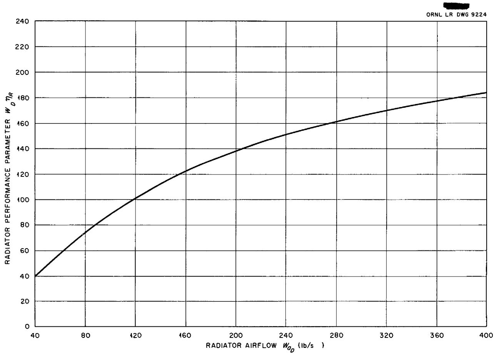  
Fig B 1 (Performance Parameter for X 61 Engine Radiator

# STATIC STABILITY CALCULATIONS

The steady state power delivered by the reactor is related to the engine load quantities in the following way

$$
P _ {e} = \frac {1}{1 / W _ {a D} C _ {a} \eta_ {R} + (1 - \eta_ {H X}) / \eta_ {H X} W _ {N e} C _ {N} - 1 / 2 X W _ {F} C _ {F}} \left(T _ {F} v - T _ {T 3}\right)
$$

Condition 1 - Variation of steady state power delivery with changes in engine speed when reactor control quantities are constant and throttling is by air bypass with pump speeds constant

In this case the quantities listed below are constant at the values shown in the reactor-J 71 engine power plant

$$
\begin{array}{l} \eta_ {H X} = 0. 8 \quad X = 0. 2 5 \\ W _ {N e} = 1 4 2 2 \mathrm {l b / s e c} \quad W _ {F} = 7 0 2 \mathrm {l b / s e c} \\ C _ {N} = 0. 2 5 \mathrm {B t u / l b} ^ {\circ} \mathrm {F} \quad C _ {F} = 0. 2 7 \mathrm {B t u / l b} ^ {\circ} \mathrm {F} \\ C _ {a} = 0. 2 6 \mathrm {B t u / l b} ^ {\circ} \mathrm {F} \quad T _ {F a v} = 1 4 5 0 ^ {\circ} \mathrm {F} \\ \end{array}
$$

Substitution of these values into Eq C1 yields

$$
P _ {e} = \frac {1}{\left(3 8 4 6 / W _ {a D} \eta_ {R}\right) - 0 0 0 3 5 1 7} (1 4 5 0 - T _ {T 3}) \tag {C2}
$$

The $W_{aD}\eta_R$ product is a function of the total engine air flow which is a function of speed (Fig 7) and the air bypass percentage. The variation of $W_{aD}\eta_R$ with $W_{aD}$ at rated NaK flow is shown in Fig 21. Steady state compressor outlet temperature variation with speed is shown in Fig 7. Substitution of values for $W_{aD}\eta_R$ and $T_{T3}$ at each speed into Eq C2 yields the power delivery curves of Fig 20

Condition 2 = Variation of steady state power delivery with changes in engine speed when reactor control quantities are constant throttling is by NaK bypass and all pump speeds are constant

Equation C2 applies in this case also The value for $W_{aD}$ is the same as that for $W_{a}$ (the total engine air flow). Variations of the $W_{aD}\eta_{R}$ product with $W_{aD}$ at constant NaK bypass per centages are shown in Fig 21. The variations of $T_{T3}$ and $W_{a}$ with engine speed are shown in Fig 7. Substitution of these values into Eq C2 yields the constant NaK bypass power delivery curves of Fig 19

Condition 3 - Variation of steady state power delivery with changes in engine speed when reactor control quantities are constant throttling is by NaK bypass and one or more pump speeds are proportioned to engine speed

Equation C1 applies to this case The value for $W_{aD}$ is equal to that for $W_{a}$ (the total engine air flow) the variation of $W_{aD}\eta_{R}$ with radiator air flow is shown in Fig 21 variations of $W_{a}$ and $T_{T3}$ with engine speed are shown in Fig 7 and heat exchanger effectiveness values are calculated from the fuel and NaK flow rates and the heat exchanger effectiveness equation given on page 29

In calculating the power delivery curves of Fig 23 it was furthermore assumed that the mean fuel temperature $T_{Fav}$ was held constant at $1450^{\circ}\mathrm{F}$ at all times by rod motion if necessary

and that the pump flows were proportional to the pump speeds Thus

$$
W _ {F} = \frac {7 0 2}{5 6 8 0} N
$$

$$
W _ {N e} = \frac {1 4 2 4}{5 6 8 0} N
$$

Substitution of these expressions into Eq C1 yields the desired relationship between power delivery and engine speed which is plotted for various pump drive combinations in Fig 23

