# AEC RESEARCH AND DEVELOPMENT REPORT

${9y.12.9A}$

MARTIN MARETTA ENERGY SYSTEMS LIBRARIES

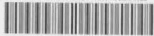

34456 03499006

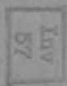

AIRCRAFT NUCLEAR PROPULSION PROJECT

QUARTERLY PROGRESS REPORT

FOR PERIOD ENDING DECEMBER 10, 1955

CLASSIFICATION CHARNES TOT BY ATTERITY OF. ${AEC} = 6 - {12} - {68}$ B71.Beeeman. 8.14.62

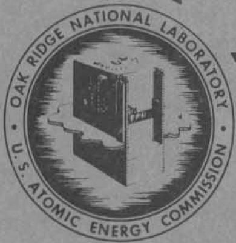

CENTRAL RESEARCH LIBRARY

DOCUMENT COLLECTION

LIBRARY LOAN COPY

DO NOT TRANSFER TO ANOTHER PERSON

If you wish someone else to see this document, send in name with document and the library will arrange a loan.

OAK RIDGE NATIONAL LABORATORY

OPERATED BY

UNION CARBIDE NUCLEAR COMPANY

A Division of Union Carbide and Carbon Corporation

UCC

POST OFFICE BOX P · OAK RIDGE, TENNESSEE

RESTRICTED DATA

ORNL-2012, Part I, II, III

C-84 - Reactors-Special Features of Aircraft Reactors

This document consists of 244 pages.

Copy /29 of 324 copies. Series A.

Contract No. W-7405-eng-26

# AIRCRAFT NUCLEAR PROPULSION PROJECT

# QUARTERLY PROGRESS REPORT

For Period Ending December 10, 1955

W. H. Jordan, Director

S. J. Cromer, Co-Director

A. J. Miller, Assistant Director

A.W.Savolainen,Editor

DATE ISSUED

FEB 20 1956

OAK RIDGE NATIONAL LABORATORY

Operated by

UNION CARBIDE NUCLEAR COMPANY

A Division of Union Carbide and Carbon Corporation

Post Office Box P

Oak Ridge, Tennessee

MARTIN MARIETTA ENERGY SYSTEMS LIBRARIES

# INTERNAL DISTRIBUTION

ORNL-2012, Part I, II, III

C-84 - Reactors-Special Features of Aircraft Reactors

95. J. C. Wilson   
96. C. E. Winters

97-108 ORNL-Y-12 Technical Library, Document Reference Section

107-126. Laboratory Records Department

127. Laboratory Records, ORNL R.C.

128-130. Central Research Library

# EXTERNAL DISTRIBUTION

31. AF Plant Representative, Baltimore   
2. AF Plant Representative, Burbank   
13 AF Plant Representative, Marietta   
134. AF Plant Representative, Santa Monica   
135. F Plant Representative, Seattle   
136. A F Plant Representative, Wood-Ridge   
137. An Materiel Area   
138. Air research and Development Command (RDGN)   
139. Air Research and Development Command (RDZPA)   
140. Air Technical Intelligence Cent   
141. Aircraft Laboratory Design Branch (WADC)

142-144. ANP Project Office, Fort Worth

145. Argonne National Laboratory   
146. Armed Forces Special Weapons Project, Sandia   
147. Assistant Secretary of the Air Force, R&D

148-153. Atomic Energy Commission, Washington

154. Battelle Memorial Institute   
155. Bettis Plant   
156. Bureau of Aeronautics   
157. Bureau of Aeroautics (ode 24)   
158. Bureau of Aeronautics General Representative   
159. Chicago Operations Office   
160. Chicago Parent Group

161-162. Chief of Naval Research

163. Convair General Dynamics Corporation   
164. Directorate of Laboratories (WCL)   
165. Direcr of Requirements (AFDRQ)   
166. Direcror of Research and Development (AFDRD-ANP)

167-169. Directorate of Systems Management (RZ-1SN)

170-172. Directorate of Systems Management (RD-1SS)

173. Equipment Laboratory (WADC)

174-177 General Electric Company (ANPD)

17% Hartford Area Office   
1.5. Headquarters, Air Force Special Weapons Center   
50. Idaho Operations Office   
81. Knolls Atomic Power Laboratory   
182. Lockland Area Office   
183. Los Alamos Scientific Laboratory   
184. Materials Laboratory Plans Office (WADC)   
185. Mound Laboratory   
186. National Advisory Committee for Aeronautics, Cleveland

ORNL-2012, Part I, II, III

C-84 - Reactors-Special Features of Aircraft Reactors

187. National Advisory Committee for Aeronautics, Washington   
188. Naval Air Development Center   
189. New York Operations Office   
190. North American Aviation, Inc. (Aerophysics Division)   
191. Nuclear Development Corporation   
192. Patent Branch, Washington

193-195. Powerplant Laboratory (WADC)

196-199. Pratt & Whitney Aircraft Division (Fox Project)

200. San Francisco Operations Office   
201. Sandia Corporation   
202. School of Aviation Medicine   
203. Sylvania Electric Products, Inc.   
204. USAF Project RAND   
205. University of California Radiation Laboratory, Livermore

206-208. Wright Air Development Center (WCOSI-3)

209-323. Technical Information Extension, Oak Ridge   
324. Division of Research and Development, AEC, ORO

Reports previously issued in this series are as follows:

ORNL-528 Period Ending November 30, 1949

ORNL-629 Period Ending February 28, 1950

ORNL-768 Period Ending May 31, 1950

ORNL-858 Period Ending August 31, 1950

ORNL-919 Period Ending December 10, 1950

ANP-60 Period Ending March 10, 1951

ANP-65 Period Ending June 10, 1951

ORNL-1154 Period Ending September 10, 1951

ORNL-1170 Period Ending December 10, 1951

ORNL-1227 Period Ending March 10, 1952

ORNL-1294 Period Ending June 10, 1952

ORNL-1375 Period Ending September 10, 1952

ORNL-1439 Period Ending December 10, 1952

ORNL-1515 Period Ending March 10, 1953

ORNL-1556 Period Ending June 10, 1953

ORNL-1609 Period Ending September 10, 1953

ORNL-1649 Period Ending December 10, 1953

ORNL-1692 Period Ending March 10, 1954

ORNL-1729 Period Ending June 10, 1954

ORNL-1771 Period Ending September 10, 1954

ORNL-1816 Period Ending December 10, 1954

ORNL-1864 Period Ending March 10, 1955

ORNL-1896 Period Ending June 10, 1955

ORNL-1947 Period Ending September 10, 1955

# FOREWORD

This quarterly progress report of the Aircraft Nuclear Propulsion Project at ORNL records the technical progress of the research on circulating-fuel reactors and other ANP research at the Laboratory under its Contract W-7405-eng-26. The report is divided into three major parts: I. Reactor Theory, Component Development, and Construction, II. Materials Research, and III. Shielding Research.

The ANP Project is comprised of about 530 technical and scientific personnel engaged in many phases of research directed toward the achievement of nuclear propulsion of aircraft. A considerable portion of this research is performed in support of the work of other organizations participating in the national ANP effort. However, the bulk of the ANP research at ORNL is directed toward the development of a circulating-fuel type of reactor.

The design, construction, and operation of the Aircraft Reactor Test (ART), with the cooperation of the Pratt & Whitney Aircraft Division, are the specific objectives of the project. The ART is to be a power plant system that will include a 60-Mw circulating-fuel reflector-moderated reactor and adequate means for heat disposal. Operation of the system will be for the purpose of determining the feasibility, and the problems associated with the design, construction, and operation, of a high-power, circulating-fuel, reflector-moderated aircraft reactor system.

# CONTENTS

FOREWORD vii

SUMMARY 1

PART I. REACTOR THEORY, COMPONENT DEVELOPMENT, AND CONSTRUCTION

1. REFLECTOR-MODERATED REACTOR 15

ART Facility Design and Construction 15

ART Design 19

System Flow Sheets 19

Fuel-to-NaK Heat Exchanger 19

Fuel Fill-and-Drain System 20

Reactor Shield 20

Core Flow Studies 23

Engineering Test Unit 25

Controls and Instrumentation 25

Procurement of Special Reactor Materials and Components 25

Beryllium 25

Shell Fabrication 26

CX-900 Inconel 26

Main Heat Exchangers and Radiators 26

Operation of $\mathsf{ZrF}_4$ Vapor Traps in the High-Temperature Critical Experiment 26

2. EXPERIMENTAL REACTOR ENGINEERING 27

In-Pile Loop Development and Tests 27

In-Pile Loop Operation 27

Loop Purge System 29

Forced-Circulation Corrosion and Mass Transfer Tests 30

Fused-Salt-Inconel Systems 30

Liquid Metals in Multimetal Loops 32

Pump Development 33

Bearing-and-Seal Tests 33

Sodium-Pump Water Performance Tests 35

High-Temperature Tests of ART MF-2 Fuel Pump with NaK 36

High-Temperature Pump-Performance Test Stands 41

Heat Exchanger Development 41

Intermediate Heat Exchanger Tests 41

Small Heat Exchanger Tests 49

Heat-Transfer and Pressure-Drop Correlations 49

Structural Tests 54

Outer-Core-Shell Thermal-Stability Test 54

Inconel Strain-Cycling Tests 56

Thermal-Cycling Test of Sodium-Inconel-Beryllium System 58

Reactor Component Development 59

Dump Valve 59

Cold Trap and Plugging Indicator 60

Zirconium Fluoride Vapor Trap 60

Water Test of Aluminum Mockup of Top of ART 64

# 3.CRITICAL EXPERIMENTS 66

Room-Temperature Reflector-Moderated-Reactor Critical Experiments 66   
Power and Neutron-Flux Distributions 66   
Neutron Production in the Fuel-to-NaK Heat Exchanger 66   
Radial Importance of Uranium in the Fuel Annulus 67   
Importance of Beryllium at End of Reactor 67   
Axial Importance of a Neutron Source 70

High-Temperature Reflector-Moderated-Reactor Critical Experiments 71

73

# PART II. MATERIALS RESEARCH

# 4. CHEMISTRY OF REACTOR MATERIALS 77

Phase Equilibrium Studies. 77

The System $ZrF_{4} - UF_{4}$ 77

The System LiF-UF 77

The System NaF-LiF-UF 4 78

The System KF-UF 78

The System $\mathsf{NaF - K}\vec{\mathsf{F}}\cdot \mathsf{ZrF}_4$ 79

The System NaF-LiF-BeF 80

The System NaF-LiF-BeF2-UF 83

The System KF-BeF 84

The System NaF-KF-BeF 2 84

Systems Containing Alkaline-Earth Fluorides 84

Chemical Reactions in Molten Salts 85

Equilibrium Reduction of $\mathsf{FeF}_2$ by $\mathsf{H}_2$ in $\mathsf{NaZrF}_5$ 85

Reduction of UF $^4$ by Structural Metals 86

Stability and Solubility of Chromium Fluorides in Various Molten Fluorides 88

Reaction of $\mathbf{U}\mathbf{F}_{3}$ with Alkali Fluorides 90

Reduction of Alkali Fluorides by Uranium Metal 91

Experimental Preparation of Pure Fluorides 91

Production of Purified Fluorides 92

Removal of $\mathsf{CrF}_2$ from NaF-ZrF-UF4 Mixtures 92

Laboratory-Scale Purification Operations 94

Special Preparation of NaF-ZrF4-UF3-UF 94

Evaluation of Raw Materials for Fuel Preparation 94

Pilot-Scale Purification Operations 95

Production-Scale Operations 95

Batching and Dispensing Operations 95

Special Services 96

Fundamental Chemistry of Fused Salts 96

Relative Viscosity-Composition Studies of NaF-LiF-ZrF4 Mixtures at 600°C. 96

EMF Measurements in Fused Salts 97

Optical Properties and X-Ray Patterns for Various Compounds in Fluoride Systems 99

# 5. CORROSION RESEARCH 103

Forced-Circulation Studies 103

Fluorides in Inconel 103   
Sodium in Inconel 106   
Thermal-Convection Studies 107   
Effect of Difference Between Loop Wall Temperature and Fluid Temperature 107   
Effect of Zirconium Hydride Additions to Fluoride Mixture 107   
Loops Fabricated from Special Inconel-Type Alloys 110   
Nickel-Molybdenum Alloy Loops 111   
Effect of Nitrogen Atmosphere 111

General Corrosion Studies 112

Thermal-Convection Loop Tests of Brazed Inconel T-Joints in NaF-ZrF4-UF 112   
Seesaw Tests of Brazed Inconel T-Joints in Sodium and in Fuel Mixtures 113   
Static Tests of Brazed Materials 117   
Static Tests of Brazed Hastelloy B T-Joints in Sodium and in NaF-ZrF4-UF 120   
Seesaw Tests of Chromel-Alumel Thermocouple Joins to Inconel Thermocouple Wells 120   
Effect of Ruthenium on Physical Properties of Inconel 122   
Boiling Sodium in Inconel Loop 122   
Decarburization of Mild Steel by Sodium 123   
Static Tests of Special Stellar Heats in Lithium 124   
Solubility of Lithium in NaK 125   
Seesaw Tests of Titanium Carbide Cermets in NaF-ZrF $_4$ -UF4 127   
Thermal-Cycling Tests of Inconel Valve Disks and Seats Flame-Plated with a

Mixture of Tungsten Carbide and Cobalt 130

Static Tests in NaF-ZrF $_4$ -UF $_4$ of Kentonium Cermet Valve Parts Brazed to Inconel 131   
Effect of an Air Leak Into an Inconel-Fused-Salt Test System 131

Fundamental Corrosion Research 133

Self-Decomposition of Fused Hydroxides 133   
Mass Transfer and Corrosion of Various Materials in Fused Sodium Hydroxide 133

Chemical Studies of Corrosion 138

Reaction of Inconel with Sodium and NaK 138   
Reaction of Sodium Hydroxide with Nickel 139   
Study of Eutectic Mixtures by Zone Melting 139

6.METALLURGY AND CERAMICS 141

Fabrication of Test Components 141

NaK-to-Air High-Conductivity-Fin Radiators 141   
Twenty-Tube Fuel-to-NaK Heat Exchangers 143   
Intermediate Heat Exchanger No. 3 143   
Intermediate Heat Exchanger Job-Sample Evaluations 144   
Examination of NaK-to-Air Radiators That Failed in Service 145   
Brazing-Alloy Development 149

Mechanical-Property Studies of Nickel-Molybdenum Alloys 152

Influence of Aging Heat Treatments on the Creep Properties of Hastelloy B. 152   
Preliminary Investigation of Creep Properties of Hastelloy W 153   
Investigation of the Creep Properties of Some New Nickel-Molybdenum Alloys 153

Special Materials Studies 155

Extrusion of Seamless Duplex Tubing 155   
Neutron Shielding Material for ART 162   
Inconel-Clad Niobium 163   
Gamma-Ray Shield Material for ART Pumps 163

Control-Rod Fabrication 163

Nondestructive Testing 164

Ceramic Research 167

Rare-Earth Cermet Fabrication 167

Boron Carbide Shield Material 168

# 7. HEAT TRANSFER AND PHYSICAL PROPERTIES 170

Fused-Salt Heat Transfer 170

ART Fuel-to-NaK Heat Exchanger 170

ART Core Hydrodynamics 171

ART Core Heat Transfer 174

Volume-Heat-Source Convection Analyses 177

Heat Removal from Fuel Dump Tank 177

Heat Transfer in Helical Pipes 177

Heat Capacity Measurements on Fluoride Mixtures 178

Heats of Fusion of Fluoride Mixtures 179

Viscosity Measurements on Fluoride Mixtures 179

Thermal Conductivities of Liquids 181

# 8. RADIATION DAMAGE 182

Disassembly and Examination of Irradiated Equipment 182

MTR In-Pile Loop 182

LITR Miniature In-Pile Loop 182

ARE Components 183

Thermocouple Errors in In-Pile Loop Temperature Measurements 183

Holdup of Fission Gases by Charcoal Traps 183

Creep and Stress Corrosion 184

In-Pile Tube-Burst Creep Tests 184

Alternate In-Pile Apparatus 184

# 9. ANALYTICAL CHEMISTRY OF REACTOR MATERIALS 186

Determination of Oxygen in Sodium 186

n-Butyl Bromide Method 186

Distillation Method 187

Determination of Traces of Rare-Earth Elements in Stainless Steels 189

Spectrophotometric Determination of Aluminum in Fluoride Salts with Aurin

Tricarboxylic Acid 189

Determination of Water in Hydrogen Fluoride Gas 190

Determination of Oxygen in Zirconium Oxide by Bromination 191

Determination of Tantalum in Fused Fluoride Salts 192

Direct Determination of Traces of Fe(III) in NaF-KF-LiF-UF 4 192

Determination of Traces of Fe(III) in Mixtures of Alkali-Metal Fluoride Salts 192

ANP Service Laboratory 193

10. RECOVERY AND REPROCESSING OF REACTOR FUEL 194

Pilot Plant Design 194

Engineering Developments 194

Contactor 194   
Freeze Valves 194   
Resistance Heating of Transfer Pipes and Waste-Discharge Nozzle 194

Process Development 195

Fused-Salt Fluorination Studies 195   
NaF Absorption Capacity and UF, Loss on Desorption. 196   
$\mathsf{UF}_{6}$ Decontamination in NaF Absorption Step 197

# PART III. SHIELDING RESEARCH

11. SHIELDING ANALYSIS 203

Air Scattering of Co60 Gamma Rays: Theory vs Experiment 203   
Energy Absorption Resulting from Gamma Radiation Incident on a Multiregion Shield with Slab Geometry 203   
Integral Equations for the Flux Density near a Thin Foil and for Neutron Scattering in Air in the Presence of the Ground 203

12. SHIELD DESIGN 204

Calculation of the Sodium Activation in the Heat Exchangers of Circulating-Fuel Reactors 204   
Calculation of Activation by Core Neutrons 204   
Calculation of Activation by Delayed Neutrons 207   
Calculated Total Activations for Several Reactors 209

13. LID TANK SHIELDING FACILITY 210

Static Source Tests with Mockups of a Reflector-Moderated Reactor and Shield 210   
Effect of Varying Lead Thickness 210   
Study of Secondary Gamma-Ray Production 213   
Effect of Heavy Metals in the Reflector 218   
Effect of Borating the Water Shield 219

Dynamic Source Tests with Mockups of a Reflector-Moderated Reactor and Shield 219

Sodium Activation in the Heat Exchanger 220   
Fission-Product Gamma-Ray Spectrum 223

# ANP PROJECT QUARTERLY PROGRESS REPORT

SUMMARY

# PART I. REACTOR THEORY, COMPONENT DEVELOPMENT, AND CONSTRUCTION

# 1. Reflector-Moderated Reactor

Construction work is now under way on the Aircraft Reactor Test facility. Package 1 construction, which consists in alterations to the existing building, an addition to the building, and installation of the reactor cell, was $10\%$ complete at the end of the quarter. A major design change was made in order to provide more space for NaK system piping and equipment, as well as for a special heat-dump facility for the removal of heat from the fuel fill-and-drain tank. Drawings and specifications for a modified version of package 2 work were completed. This work now consists in the installation of the diesel generators and facility, the electrical control center, and the spectrometer room electrical and air-conditioning equipment. The piping work for nitrogen, air, cooling water, helium, lubricating oil, and hydraulic oil drive systems was removed from the package 2 work unit and was designated as package A. Design work continued on package 3, which covers the experimental instruments, controls, process lines, and process equipment to be installed by ORNL forces.

System flowsheets and instrumentation lists were prepared in an initial attempt to define the entire ART. The flowsheets show the various components of the system; the annunciator pickup and presentation locations; the operating conditions of temperature, pressure, and flow rates; the control stations for electrically operated components; the normal valve positions and uniform valve identification; and line sizes.

The fuel-to-NaK heat exchanger design was modified to overcome interferences at the headers and to provide additional space in the region of the headers for the beryllium support struts. Dimensional and operating data for the heat ex-changers were revised accordingly.

The problem of cooling the fuel fill-and-drain tank was studied. Dual NaK systems are to be utilized for both cooling and heating the tank. Each system is to be capable of operating individu

ally and of removing the total maximum heat load of 1.75 Mw from the fuel in the tank.

The basic mechanical design work on the ART lead-and-water shield and supports was completed, and the procedure for assembly and installation was studied. A comparative evaluation of rubber and aluminum containers for the borated shield water showed aluminum to be preferable on all counts, including weight.

Additional core flow studies were made on both the full-scale aluminum and plastic core models. Photographs were made of the flow patterns obtained with various core inlet configurations. Intensive studies of the various flow patterns are under way.

An equipment layout was prepared for the Engineering Test Unit (ETU), and work was started on design of the facilities required for operation of the unit. Design problems have delayed the issuance of firm drawings of the reactor components, and it is estimated that operation of the ETU will be about three months behind the originally scheduled date of September 1, 1956.

Instrumentation lists were prepared for each ART system, and instrument sensor locations were designated. Five permanent instrument information centers will be used, in addition to three temporary ones, and some instruments will be located and read on the equipment. Layouts of control and instrument panels and boards are being prepared, and elementary wiring diagrams have been completed. The layout of the control rod and drive mechanism is being prepared.

The problems of procurement of special reactor materials and components are being investigated. Equipment for machining the large beryllium reflector blocks is being prepared by The Brush Beryllium Co. A newly developed Hydrospin process shows promise of being satisfactory for the fabrication of the required six sets of thin Inconel shells, which vary from 18 to 54 in. in diameter. The processing of the 100,000 lb of special CX-900 Inconel required for tubing is under way. Welders qualified under the special ORNL procedures are being trained for several

vendors who are interested in fabricating the heat exchangers and radiators.

Operation of the high-temperature critical experiment revealed that the $\mathsf{ZrF}_4$ vapor traps were inadequate. Therefore a program for the development of suitable equipment is under way.

# 2. Experimental Reactor Engineering

An in-pile loop was inserted and successfully operated in the HB-3 beam hole of the Materials Testing Reactor, after attempts to operate two other loops had failed because of difficulties with electrical heating circuits. The fuel mixture circulated was NaF-ZrF $_4$ -UF $_4$ (53.5-40-6.5 mole $\%$ ); the maximum fuel temperature was $1500^{\circ}\mathrm{F}$ ; the maximum mixed-mean temperature differential was $150^{\circ}\mathrm{F}$ ; and the total operating time was more than 400 hr. The loop power generation was estimated to have been 20 kw at the position of maximum insertion. The power density was calculated to have been 0.6 kw per cubic centimeter of fuel mixture. The loop is now being disassembled for shipment to ORNL for examination. Operating difficulties are being studied in connection with design work on the next in-pile loop.

Studies of the electrical failures which prevented startup of the first two loops have indicated that the helium atmosphere used allowed electrical breakdown and that the Sauereisen cement used as insulation tended to conduct current at high temperatures. Since nitrogen is a better insulator than helium, tests are being conducted to determine the effectiveness of nitrogen as a purge gas for the nose section. Grade A Lava sleeves are to be substituted for Sauereisen cement at the heater terminals in future loops.

Five electrically heated and three gas-heated fused-salt-Inconel forced-circulation loops were operated during the quarter. A study was made of temperature measurements and heat distribution in the gas-heated loops, and the electrical heaters of the electrical-resistance-heated loops were modified so that fluid-to-wall temperature ratios could be varied. Also, six forced-circulation loops were operated with sodium and noneutectic NaK. Further evidence was obtained that the plug indicator does give a measure of the oxide contamination in the sodium.

Seals of various designs are being tested for possible use in the lower position in the ART fuel pump. Several seals have been found to meet the

stringent specification of "leakage of oil into helium across a pressure differential of 0 to 5 psi of not more than $2\mathrm{cm}^3$ per $24\mathrm{hr}$ .

Full-size models of the impeller and the volute for the ART sodium pump are being tested with water. Initial tests indicated that the impeller would meet head and flow requirements at slightly lower speeds than predicted. The cavitation tests performed, to date, indicate that the pump will operate safely at inlet pressures below the pressure planned for the reactor sodium pump.

Tests of an ART fuel pump are under way with high-temperature $(1400^{\circ}\mathrm{F})$ NaK as the pumped fluid. A heat-source plug was used in the initial tests to simulate gamma-ray heating, but equipment failures necessitated discontinuing this phase of the experiments. Tests with a heat-source plug will be resumed later, if more satisfactory means can be found to simulate reactor conditions. Two high-temperature loops are being fabricated for testing ART-type fuel pumps with NaK and with fuel mixtures, and loops are being designed for testing ART-type sodium pumps and ART-type NaK pumps at high temperatures.

Operation of intermediate heat exchanger test stand A was continued, and test stand B was placed in operation. Heat exchangers were designed for future operation in these tests stands and in test stand C, which is being fabricated. York radiator units Nos. 1 and 2 were tested on stand A, and unit No. 3 is being installed. Examination of unit No. 1, which failed after 140 hr of operation, revealed severe buckling of the side plates of the radiator core because of differential thermal expansion between the tube matrix and the side plates. The side plates of unit No. 2 were split to allow the tubes to move freely, and this unit operated for 435 hr. The diffusion cold trap installed in the loop was found to be ineffective, and it was replaced with a circulating cold trap, which, although somewhat more effective, is not satisfactory.

Test stand B has completed a total of 670 hr of operation, including 247 hr of bifluid operation, in a series of radiator, heat exchanger, and circulating-cold-trap tests. The system is now in steady-state operation with a temperature differential imposed.

A small heat exchanger test stand is also operating with a 20-tube fuel-to-NaK heat exchanger, a 500-kw NaK-to-air radiator, and a circulating

cold trap. The NaK circulating in the cold trap is cooled by an economizer located in the inlet line to the cold trap and by air circulated in the cold-trap cooling coil. With this arrangement it has been possible to operate at cold-trap temperatures below $150^{\circ}\mathrm{F}$ , with system temperatures as high as $1500^{\circ}\mathrm{F}$ . A preliminary analysis of the data indicates that cold-trap performance is reproducible and that the oxide concentration of the NaK can be repeatedly reduced.

The test data obtained with the intermediate and small heat exchanger test stands have been correlated. The seven radiators tested, which were built by three fabricators from the same specifications, have given a wide range of performance. An intensive investigation is under way to determine the reasons for the differences. The correlation of the heat exchanger data revealed an apparent rise in the NaK pressure drop during operation of the system with a temperature differential imposed, which is also being investigated.

Work has continued on the fabrication of a one-fourth-scale outer core shell model that is to be subjected to cyclic thermal and pressure tests. Two anvil bending-test assemblies were put in operation to obtain basic information on the behavior of Inconel under strain cycling at elevated temperatures in both inert and corrosive atmospheres. The preliminary tests have indicated that temperature has a major effect on the initiation of cracks. The number of cracks produced for a given number of cycles was greater at $1200^{\circ}\mathrm{F}$ than at $1400^{\circ}\mathrm{F}$ and was greater at $1400^{\circ}\mathrm{F}$ than at $1600^{\circ}\mathrm{F}$ .

A test assembly for use in the development and testing of cold traps and plugging indicators is being fabricated, and a test assembly for use in the development of a $\mathsf{ZrF}_4$ vapor trap was placed in operation. Preliminary results indicate that there must be very close control of the temperature of the inlet line to the trap. The $\mathsf{ZrF}_4$ vapor precipitated and plugged the line when there was a temperature differential of $25^{\circ}\mathsf{F}$ or more on the 0.5-in.-OD, 0.025-in.-wall inlet line.

A full-scale aluminum model of the top portion of the ART is being fabricated. Problems of design and operation will be investigated with this assembly, which will be equipped with Inconel fuel and sodium pumps and the external piping needed to permit the pumping of water under simulated reactor flow conditions.

# 3. Critical Experiments

Several room-temperature experiments on the reflector-moderated-reactor critical assembly have been completed. Power-distribution measurements across the fuel section at the equatorial plane of the reactor show an edge-to-center ratio of 4.5, with only about $10\%$ of the fissions at the center being produced by thermal neutrons; adjacent to the beryllium, this fraction is $70\%$ . Neutron flux measurements, with gold foils, show a similar depression and energy distribution in the fuel. In a mockup of the fuel-to-NaK heat exchanger, shielded from the reactor by a $\frac{1}{4}$ -in. thickness of boral, the fissioning rate was about $0.1\%$ of that in the reactor fuel region. The contribution to the over-all critical assembly reactivity by a sample of uranium in the fuel region was shown to vary by a factor of 2 as the sample was moved from the edge to the center of the annulus. The effect of the beryllium at the end of the assembly on the over-all reactivity was found to be about 20 cents per linear inch.

Experiments with the reflector-moderated critical assembly operated with liquid fuel (NaF-ZrF4-UF4) at $1200^{\circ}\mathrm{F}$ were also completed. The mid-plane power-production distribution in the liquid fuel showed an edge-to-center ratio of about 2. The value was determined from the fission-product activity induced in uranium disks which remained in the annulus throughout the test.

A preliminary loading has been made of a mockup of a solid-fuel modification of the reflectormoderated reactor proposed by the Nuclear Development Corporation of America (NDA). In this reactor design the solid fuel is cooled with sodium. It was found that the critical mass of the mockup had been underestimated by NDA. A $35\%$ increase in the uranium loading and a $23\%$ decrease in the steel content of the core were necessary in order to make the assembly critical. The core now contains 31 kg of U235.

# PART II. MATERIALS RESEARCH

# 4. Chemistry of Reactor Materials

Phase equilibrium studies of various fluoride systems were continued in order to obtain a better understanding of their structures and to devise and detect improved fuels. In the $\mathsf{ZrF}_4\text{-}\mathsf{UF}_4$ system, in which solid solutions are the only crystalline phases that have been observed, it was

shown that there is no major miscibility gap. Diagrams of the $\mathsf{LiF - UF}_4$ and $\mathsf{KF - UF}_4$ systems, which had been based almost entirely on thermal analysis data, were revised on the basis of examinations carried out on quenched specimens.

The study of mixtures in the NaF-LiF-UF $_4$ system gave strong indications that no fuel mixture with a suitably low melting point was available. Thermal-analysis experiments and examinations of slowly cooled melts in the NaF-KF-ZrF $_4$ system were continued, and a series of quenching experiments will be carried out to obtain additional information.

Work continued on determining the phase relationships in the NaF-LiF-BeF $_2$ -UF $_4$ system. Fuel mixtures with low melting points appear to be available. The viscosity of the mixtures was improved by lowering the BeF $_2$ content, but it appears to be likely that only very little additional lowering can be achieved by reducing the BeF $_2$ content to below about 20 mole%. Additional clarification of the phase relationships in the KF-BeF $_2$ and NaF-KF-BeF $_2$ systems was achieved.

As a matter of long-range interest in materials for producing higher reactor temperatures, some phase studies were carried out on alkali-metal-fluoride- $\mathsf{MgF}_2$ and $-\mathsf{CaF}_2$ systems.

Improved equilibration methods gave values of $K_{x} \approx 2.5$ and 0.64 at 800 and $600^{\circ}\mathrm{C}$ for the reaction $\mathsf{FeF}_2(d) + \mathsf{H}_2(g) \leq \mathsf{Fe}(s) + 2\mathsf{HF}(g)$ , where the concentrations in solution are expressed as mole fractions and the gas pressures are in atmospheres.

Studies of the stability of vanadium and niobium in NaF-LiF-KF-UF $_4$ at 600 and $800^{\circ}\mathrm{C}$ indicated that vanadium was quite stable and that niobium was not. Preliminary studies indicated that the behavior of tungsten was similar to that of niobium. Analytical data from equilibrations with tantalum are not yet available.

Additional data were obtained on the solubility and stability of $\mathsf{CrF}_2$ in NaF-ZrF4and of $\mathsf{CrF}_3$ in NaF-LiF-KF. In each case the major portion of the dissolved chromium retained its original valence. The solubility of $\mathsf{CrF}_2$ in NaF-ZrF4increased as the available $\mathsf{CrF}_2$ was increased and thus confirmed previous indications that solid $\mathsf{CrF}_2\cdot \mathsf{UF}_4$ is formed.

Experiments were carried out in which $\mathsf{U}\mathsf{F}_3$ was added to molten fluorides at $900^{\circ}C$ in copper containers. No reduction occurred in the case of

LiF, but, with NaF and, to an even greater extent, with KF, alkali metal was formed and partially vaporized from the melt. A study was made of the reactions of uranium metal with LiF and KF. In the case of KF, metallic potassium was produced, but LiF was stable. Since NaF-LiF is unstable to uranium metal at $750^{\circ}C$ , it can be concluded that NaF was the unstable constituent.

Preliminary experiments indicated that used fuel material can be freed from chromium by reduction with zirconium followed by standard hydrofluorination-hydrogenation treatment, if its oxide content is kept low by careful handling.

A satisfactory commercial supply of $\mathsf{ZrF}_4$ has been located for use in fuel preparations. The hafnium content of the material limits it to use in tests that do not involve nuclear activity.

Fuel samples for small-scale corrosion and physical-property tests continued to be prepared in laboratory- and pilot-scale facilities. The stockpile of fuel from the large-scale production operation reached an all-time high, and a temporary shutdown will occur if usage continues to be less than the predicted requirements. Low-carbon nickel reactor cans are on order to replace the A-nickel cans which have experienced frequent failures.

The fuel mixture was removed from the high-temperature ART critical experiment, with the exception of the enricher system. Almost all the fuel is still in this system, and, since it is a prototype of the ART enricher, it will be used for additional experiments. Two in-pile loops were filled with enriched fuels.

Relative viscosity-composition studies were made in the NaF-LiF-ZrF $_4$ system. Additional emf measurements were carried out in the fused salts, and additional optical and x-ray data were obtained on various compounds in the fluoride systems.

# 5. Corrosion Research

Examinations were completed of several Inconel forced-circulation loops in which fluoride fuel mixtures were circulated. Additional data were obtained which confirmed previous observations that, for a constant bulk-fluoride-fuel-mixture temperature, increases in wall temperature significantly increase the amount of corrosion. The attack in the loop which operated with a maximum wall temperature of about $1710^{\circ}\mathrm{F}$ was 8 mils after

332 hr, in comparison with attack to a depth of 5 mils in 681 hr in a loop which had a maximum wall temperature of about $1582^{\circ}\mathrm{F}$ . These data were obtained with NaF-ZrF $_4$ -UF $_4$ as the circulated fuel mixture. The alkali-metal-base mixture NaF-KF-LiF (11.5-42-46.5 mole %), with sufficient UF $_3$ and UF $_4$ added to give 11.9 wt %, was circulated in another Inconel forced-circulation loop, and, as previously, the attack was negligible, but there was a continuous metal deposit in the cold leg.

Several Inconel forced-circulation loops were operated in a study of the effect of the oxide content of the sodium being circulated. Mass-transferred deposits were found in the cold legs of loops operated with and without added oxygen, as $\mathrm{Na}_2\mathrm{O}_{2'}$ and with and without cold traps. The addition of barium as a deoxidant did not measurably decrease the mass-transferred deposit. A loop operated with a maximum sodium temperature of $1000^{\circ}\mathrm{F}$ demonstrated the significant effect of temperature on mass transfer; the loop was free of deposited material, and there was no hot-leg attack.

A special thermal-convection loop was operated with thermocouples attached to the hot-leg wall, and it was found that a temperature difference of $160^{\circ}\mathrm{F}$ existed between the maximum fluid temperature and the hottest section of the wall. This temperature difference is higher than that found for the forced-convection loops and accounts, in part, for the attack in thermal-convection loops being deeper than that in forced-circulation loops with similar bulk-fluid temperatures.

A series of six thermal-convection loops was operated with $\mathrm{NaF - ZrF_4 - UF_4}$ (50-46-4 mole %) to which various amounts of $\mathrm{ZrH_2}$ had been added to reduce the $\mathrm{UF_4}$ present to $\mathrm{UF_3}$ . The total uranium content of the fuel mixture decreased during operation of the loop in each case, and the decrease was apparently associated with the appearance of a metallic layer on the loop walls. However, the corrosive attack was negligible (0.5 mil) compared with that in a standard loop operated without $\mathrm{ZrH_2}$ added to the fuel mixture.

A group of thermal-convection loops was fabricated from special Inconel-type alloys in which the chromium content was the primary variable. When the loops were operated under standard conditions with NaF-ZrF $_4$ -UF $_4$ (50-46-4 mole %) as the circulated fluid, it was found that the depth of attack

in the loops that contained less than $10\%$ chromium was appreciably lower than it was in a standard Inconel loop; that is, 2 to 3 mils in comparison with about 13 mils in 1000 hr. Loops fabricated from several nickel-molybdenum alloys in which NaF-ZrF4-UF4 (50-46-4 mole %) was circulated also showed little attack, 1 to 2 mils, in 1000 hr.

A special thermal-convection loop was fabricated for testing brazed Inconel segments in the hot-leg section. This loop was operated for 1000 hr at a hot-leg temperature of $1500^{\circ}\mathrm{F}$ and a cold-leg temperature of $1100^{\circ}\mathrm{F}$ with $\mathrm{NaF - ZrF_4 - UF_4}$ (50-46-4 mole %) as the circulated fluid. The Inconel segments were brazed with Coast Metals alloy No. 52 (89% Ni-5% Si-4% B-2% Fe). No evidence of mass transfer was found, but the brazed joints were porous and shrinkage voids were present. In a series of seesaw tests of Inconel T-joints in sodium and in fuel mixtures, a 75% Ni-25% Ge mixture was found to have fair resistance to both mediums. Buttons of six different braze materials were also tested in static sodium and in static $\mathrm{NaF - ZrF_4 - UF_4}$ (50-46-4 mole %), and two palladium-rich buttons were tested in NaOH and in the fluoride mixture. Coast Metals alloy No. 52 and General Electric alloy No. 81 showed fair corrosion resistance to sodium, and the 60% Pd-40% Ni alloy showed good resistance to both the fluoride mixture and NaOH.

Thermocouple assemblies were exposed to sodium and to $\mathrm{NaF - ZrF_4 - UF_4}$ (50-46-4 mole %) in seesaw apparatus so that the effect of various amounts of Chromel-Alumel in the weld nugget could be studied. The nuggets with low Chromel-Alumel content were unattacked after 100 hr at $1500^{\circ}F$ in sodium and in the fuel mixture, and those with high Chromel-Alumel content were attacked to a depth of about 0.5 mil in the fluoride mixture. The Inconel tubes on which the welds with high Chromel-Alumel content were made were more heavily attacked in the nonweld areas than were the tubes with the welds of low Chromel-Alumel content.

A second boiling-sodium-Inconel loop was operated, and the scheduled 1000-hr test was completed, in contrast to the 400 hr of operation for the first such loop. After the 400-hr test no mass-transferred crystals were found in the cold trap, but heavy intergranular cracking to a depth of 50 mils was found. After the 1000-hr test, mass-transferred crystals were visible in the cold

trap, and there were cracks to a depth of 25 mils. The temperatures in areas where cracks were found varied from 1150 to $1325^{\circ}\mathrm{F}$ . A loop fabricated from type 348 stainless steel is now in operation.

In a test of type 1043 mild steel $(0.433\%)$ in static sodium at $1830^{\circ}\mathrm{F}$ for 100 hr, significant decarburization occurred. The carbon content of the mild-steel specimens decreased, and the carbon content of the capsule walls in contact with the sodium increased; the two types of capsules used were Armco iron $(0.019\%)$ C) and type 304 ELC stainless steel $(0.022\%)$ C). Two special heats of Stellarite were exposed to static lithium at $1500^{\circ}\mathrm{F}$ for 100 hr. They were attacked to a depth of 2 to 3 mils, in general, but there were isolated areas that suffered very heavy attack. The variations in susceptibility to attack may be due to composition variations in the specimens.

Titanium carbide cermets with cobalt- and nickel-base alloys as binding material were exposed to NaF-ZrF4-UF4 (53.5-40-6.5 mole %) for 200 hr in seesaw apparatus. The hot and cold zones of the apparatus were at 1500 and $1200^{\circ}\mathrm{F}$ , respectively. Ten specimens were tested and only two showed attack; the other specimens remained unattacked. The compositions and methods of fabrication of these materials, which were submitted by the Sintercast Corp. of America, are not known.

Inconel valve disks and seats were flame-plated with a mixture of tungsten carbide and cobalt for testing to determine the suitability of the coating as a hard-facing material. To be suitable, the coating must be resistant to solid-phase bonding, galling, and wearing. In an initial thermal-cycling test from room temperature to $1500^{\circ}\mathrm{F}$ , the coating did not crack, but, under thermal conditions similar to those used in brazing, the coatings cracked. Kentanium cermet valve parts were held in contact at a pressure of 10,000 psi and exposed to static NaF-ZrF $_4$ -UF $_4$ (53.5-40-6.5 mole %) for 150 hr at $1500^{\circ}\mathrm{F}$ . There was no indication of bonding and the seating was uniform. The joint between the cermet and the Inconel showed no signs of attack; there was no distortion of the $\frac{1}{4}$ -in.-thick nickel shim; and the cermet pieces did not show any signs of cracking.

Several experiments were performed to determine the effect of a small air leak into a fused-salt-Inconel system. The test capsules were heavily attacked by the air-contaminated fused salt.

Measurements were made of the self-decomposition of fused sodium hydroxide into water and sodium oxide. Data obtained in recent measurements of the vapor pressure of water over fused NaOH give a value for $\Delta H^0$ that agrees within $8\%$ with a value known from other measurements. Tests of mass transfer and corrosion of structural materials in fused NaOH were continued. The materials studied were Inconel, nickel, iron, Hastelloy B, and types 310 and 405 stainless steel.

An apparatus is being constructed for studying the solubility and the rate of solution of the constituents of Inconel in sodium and in NaK as a function of temperature and of oxygen content of the liquid metal, in order to clarify the mechanism of the mass-transfer reaction observed when liquid metals are circulated in Inconel loops. Also, an apparatus was constructed for studying eutectic mixtures by zone melting.

# 6. Metallurgy and Ceramics

A third 500-kw NaK-to-air high-conductivity-fin radiator, two 20-tube fuel-to-NaK heat exchangers, and two 100-tube bundles for intermediate heat exchanger No. 3 were fabricated. Job samples containing welded and brazed joints of the type used in the fabrication of intermediate heat exchanger No. 3, submitted by outside vendors, were examined and evaluated.

The two NaK-to-air radiators that failed in service were examined. One of the radiators was fabricated by ORNL and the other by the York Corp. to the same specifications. The ORNL radiator was found to have been so badly damaged by fire that the cause of failure could not be detected. However, it was found that the York Corp. radiator failed because of the initiation of a fracture in a braze fillet by shear forces and the propagation of this fracture through the tube wall by tensile forces or combinations of shear and tensile forces. The tensile loading was caused by differences in cooling rates between the support members and the finned tubes when cooling air was forced across the high-conductivity-fin surfaces. The shear forces were caused by a difference in cooling rate between the support members and the bottom flanged plate and the finned tubes. Modifications have been made to the radiator design to relieve the tensile and shear forces.

The results obtained to date in the brazing-alloy development program were correlated with cor

rosion data, and the alloys that are satisfactory for use in the fabrication of heat exchangers and radiators were selected. The alloys selected for radiator fabrication on the basis of compatibility with both liquid sodium and air were Coast Metals alloy Nos. 50, 52, and 53; standard and low-melting Nicrobraz; General Electric alloy No. 81; and an $80\%$ Ni- $10\%$ Cr- $10\%$ P alloy. The alloys selected for heat exchanger fabrication on the basis of compatibility with both fluoride fuel mixtures and sodium were an $80\%$ Ni- $10\%$ Cr- $10\%$ P alloy; standard and low-melting Nicrobraz; Coast Metals alloys Nos. 50, 52, 53, and NP; a $70\%$ Ni- $13\%$ Ge- $11\%$ Cr- $6\%$ Si alloy; and a $50\%$ Ni- $25\%$ Ge- $25\%$ Mo alloy.

Alloys in the nickel-molybdenum system are being investigated in the search for structural materials with sufficient corrosion resistance and high-temperature strength for use in circulating-fuel reactors. The strength and corrosion resistance of Hastelloy B have proved to be superior to those of any previously tested material. However, this alloy has a tendency to age-harden in the 1200 to $1500^{\circ}\mathrm{F}$ temperature range. The resulting decrease in ductility is so severe that its use as a structural material in a circulating-fuel reactor would be limited.

Hastelloy W has been found to have strength properties similar to those of Hastelloy B, and the results of preliminary tests of the creep properties show that Hastelloy W has less tendency to age at the temperatures of interest.

Several new vacuum-melted nickel-molybdenum alloys have also been creep-tested. Several of the alloys showed poor ductility that may be attributed to insufficient degassing in the vacuum-melting process. Despite the poor ductility of the alloys, their stress-rupture properties are equal, or superior, to those of Inconel.

Preliminary work on the fabrication of seamless duplex tubing was completed, in that tube blanks of nickel-, Inconel-, and Monel-clad type 316 stainless steel were extruded, without difficulty. The conditions for extrusion of Hastelloy B are still not definite. Three Hastelloy B-clad type 316 stainless steel duplex billets were extruded, but they were unsatisfactory because of cracking and roughness that resulted from poor lubrication. Attempts to improve lubrication of Hastelloy B by flame-spraying with a heavy layer of type 304 stainless steel were unsuccessful. The extrusion

of Hastelloy W tube blanks from forged billets was unsuccessful because of hot-shortness of the material.

Attempts are being made to produce suitable $\mathsf{B}_4\mathsf{C}$ -base tiles for the ART neutron shield and to evaluate the properties of such tiles. Compatibility tests of Inconel and $\mathsf{B}_4\mathsf{C}$ with various coatings and diffusion barrier materials in the temperature range of 1500 to $2000^{\circ}\mathsf{F}$ are under way. An irradiation test is being run to determine whether helium and lithium will be released from $\mathsf{B}_4\mathsf{C}$ at high temperatures. If these gases are released, it may be necessary to vent the shielding layer. Several other methods of preparing neutron shielding are being studied, such as casting mixtures of borides and metal and fabricating cermet compositions that are high in $\mathsf{B}_4\mathsf{C}$ or boride content.

The problems associated with the fabrication of Inconel-clad niobium are being studied. A number of specimens fabricated with copper-stainless steel foil or tantalum foil diffusion barriers have been prepared for mechanical-property tests.

Several compositions are being tested for use as a gamma-ray shield of low thermal conductivity for the ART pump impeller shafts. Two compositions which are of satisfactory density are tantalum-constantan and tungsten carbide-constantan. Thermal-conductivity data are being obtained for these materials.

It was demonstrated that control rods containing 30 vol % rare-earth oxide could be fabricated by canning a cernet-type core in a capsule of suitable cladding material and hot swaging the composite. Physical-property data were obtained for the extruded control-rod parts containing rare-earth oxides and for iron-zirconium alloys.

Investigation of the various methods by which small-diameter tubing may be inspected has continued. The Cyclograph (an eddy-current instrument) gives very effective, high-speed indications of flaws as small as $10\%$ of the tube-wall thickness. For detection of minute flaws, the ultrasonic method is effective and can be applied to large-scale inspection. The eddy-current-probe instrument is being developed for use with the ultrasonic method as a simultaneous inspection on the same mechanical scanning operation. This will provide close correlation of the defect indications from both methods. Tubing that is $\frac{1}{4}$ in, in diameter and 7 ft 6 in, in length can now be

inspected with this dual inspection method, and, upon completion of a new probe coil, $3_{16}^{-}$ -in.-dia tubing 28 ft long can also be inspected.

# 7. Heat Transfer and Physical Properties

A forced-convection fused-salt heat-transfer system that includes a mechanical pump has been fabricated. This system is to be used to study the heat-transfer characteristics of the fused salts at Reynolds numbers higher than those covered previously. The friction characteristics of small, drawn, Inconel tubes such as those to be used in the ART fuel-to-NaK heat exchanger were determined over the Reynolds-number range 50,000 to 200,000; the friction factors of the Inconel tubes fell only about $6\%$ above the normal correlation for flow in smooth tubes.

Additional hydrodynamic studies were made of annuli of the type being considered for the fuel channel of the ART reactor core. Calculations of the pressure drop through a core fabricated according to the present ART design were made for straight-through flow, as well as for a rotational-flow case. A study of flow distribution in the annulus in which sodium will be circulated to cool the outer core shell of the ART has been initiated.

The conceptual design, as well as the detail designs of the test section, entrance sections, exit section, and mixing chambers, of the volume-heat-source experiment for determining the temperature structure to be expected in the ART core has been completed, and fabrication of the test section is in progress. Several analytical heat-transfer solutions for volume-heat-source systems were developed; for example, turbulent flow in curved channels was investigated, and the thermocouple error that results when a thermocouple is used to measure the temperature of a flowing fluid having a volume heat source was studied. A general study of the problem of heat removal from a fuel dump tank of an ART-type aircraft reactor after shutdown was initiated. The wall-temperature asymmetry predicted to occur in a helical pipe that has fluids with volume heat sources flowing through it was demonstrated experimentally in a glass helix that contained a circulating fluid with an electrically generated volume heat source. The predicted results correlated well with data obtained from operation of the MTR in-pile loop.

The enthalpies and heat capacities of two rubidium-bearing fluoride mixtures were determined:

namely, $\mathsf{RbF - ZrF_4 - UF_4}$ (48-48-4 mole %) and LiF-RbF (43-57 mole %). The heats of fusion of nearly all fluoride mixtures that have been studied to date are presented. Viscosity measurements were made for nine different fluoride mixtures. A transient-cell method that has been used to measure the thermal conductivity of liquids was studied and used successfully for measurements on water and molten sodium hydroxide. Preliminary measurements made by the constant-gap method gave a value of about 1.2 Btu/hr-ft²(°F/ft) for the thermal conductivity of $\mathsf{RbF - ZrF_4 - UF_4}$ (48-48-4 mole %).

# 8. Radiation Damage

The in-pile loop in which a fluoride fuel mixture was recently circulated in the Materials Testing Reactor is being disassembled and sectioned for examination. The disassembly work is being done in the G-E "hot-cell" facilities at the National Reactor Testing Station, and the sections to be examined will be shipped to ORNL.

Samples of the nose section of the miniature in-pile loop which was operated for 30 hr in vertical position C-48 of the LITR were examined. Only slight, sporadic, corrosion penetration to a depth of 1 mil was found, and comparisons of the sections on each side of the center of the nose bend and on the compression and tension sides of the bend showed no changes in relative grain size. Since this loop operated only 30 hr, no definite conclusions can be drawn from these observations. A large number of sections of the ARE core and auxiliary equipment have been prepared for metallographic examination.

An investigation of thermocouple errors in in-pile loop temperature measurements was concluded. The results confirmed the results of the previous investigation of temperature measurements of static in-pile capsules. Resistance-welded thermocouples were again shown to be superior to discharge-welded thermocouples, in that they gave smaller errors in temperature measurements and were less sensitive to changes in cooling-air flow rates.

Experiments are under way for determining holdup times of fission gases by charcoal traps at various temperatures with various gases in the traps. Radiokrypton is being used to simulate the fission gases. In the initial experiment, nitrogen was used as the carrier gas in order to determine whether nitrogen could be used as the

purge gas in the next MTR in-pile loop installation. The results obtained with a charcoal trap identical to that used in the first in-pile loop experiment indicate that a temperature of $-110^{\circ}\mathrm{C}$ or colder would be necessary in the charcoal trap to properly limit the amount of activity sent to the MTR stack if nitrogen were used as the carrier gas. Similar information is to be obtained for helium and other purge gases so that the data needed for designing the ART purge system will be available.

Tube-burst creep-test specimens irradiated for two weeks in the LITR are being examined. Four tubular specimens were stressed to rupture at a circumferential fiber stress of 2000 psi at 1550, 1500, and $1450^{\circ}\mathrm{F}$ . Other tube-burst rigs are being readied for irradiation. The MTR creep-test apparatus in which the specimen was tested at $1500^{\circ}\mathrm{F}$ and 1500 psi has been returned to ORNL for examination.

# 9. Analytical Chemistry of Reactor Materials

Studies were undertaken to determine whether positive errors in the determination of oxygen in sodium result from the presence of alkaline-earth metals in the alkali-metal samples. Typical samples of sodium used in corrosion and heat-transfer studies were found to contain approximately 100 ppm of calcium and less than 50 ppm of magnesium. Such concentrations will have to be taken into account, since they correspond to a maximum error in the determination of oxygen of about 80 ppm. In further studies of this method it was shown that, if the reaction between sodium or NaK and n-butyl bromide is contained in a sealed vessel so that pure n-butyl bromide can be used rather than a solution in hexane, the conversion from the alkali metals to bromide salts is complete in a matter of approximately 5 min. With this technique it is possible to carry out the reaction in an atmosphere of helium and to sample sodium at temperatures as high as $1000^{\circ}\mathrm{F}$ .

It was demonstrated in connection with the distillation method for the determination of oxygen in sodium that temperature and total time of distillation are important factors. Sodium oxide was almost completely volutilized from a sample of sodium after a 4-hr distillation period at $900^{\circ}\mathrm{F}$ , while a residue of 400 ppm, which roughly corresponded to the expected amount of oxygen, remained after a similar period of distillation at $850^{\circ}\mathrm{F}$ . Reproducible results which correspond to

$35 \pm 5$ ppm of oxygen were obtained after distillation of a purified sodium sample for 4 hr at $850^{\circ} \mathrm{F}$ . Essentially the same results were obtained after distillation periods of 1 and 2 hr at $850^{\circ} \mathrm{F}$ . Analyses of the residues after distillation show that $\mathrm{Na}_{2} \mathrm{O}$ is the predominant residual oxide.

A method for the determination of the quantity of the rare-earth elements gadolinium, europium, and samarium in reactor construction materials was developed. Since these rare-earth elements have high absorption cross sections for thermal neutrons, they must be limited to a few parts per million. The method involves the use of spectrographically pure yttrium oxide as a carrier for the precipitation and concentration of microgram quantities of the rare-earth elements from the structural material. The yttrium oxide also serves as an internal standard for the spectrographic determination. Concentrations of the rare-earth elements of the order of 1 ppm were determined in 2.5-g samples of stainless steel.

The Aluminon method for the spectrophotometric determination of aluminum was applied to samples of fluoride salt mixtures. Interfering elements, such as zirconium, are removed by extraction with cupferron. The concentration of aluminum in typical samples of fluoride salt mixtures was found to be approximately 100 ppm.

A method was developed for the determination of water relative to HF in the effluent gases from a hydrofluorination reactor. The HF and water were absorbed in pyridine, and the concentration of the water was determined by titration with coulometrically generated Karl Fischer reagent. The concentration of HF was determined by titrating an aqueous solution of the pyridine absorbate with standard sodium hydroxide solution. The determinations are reproducible to about $0.5\%$ of water and are therefore sufficiently accurate to permit monitoring of the reaction

$$
Z r O _ {2} + 4 H F \rightarrow Z r F _ {4} + 2 H _ {2} O.
$$

Modifications were made to the apparatus for the determination of oxygen in zirconium oxide by bromination. Gold containers were substituted for platinum, since gold is more inert to oxygen than is platinum. When $\mathsf{FeF}_3$ was added to the mixture of $\mathsf{ZrO}_2$ and graphite, complete removal of $\mathsf{ZrO}_2$ from the sample container was achieved after bromination at $950^{\circ}\mathsf{C}$ for 2 hr. The recovery of oxygen from the $\mathsf{ZrO}_2$ was, however, incomplete.

A method for the determination of tantalum in

fused mixtures of fluoride salts with the use of pyrogallol was developed. The method is not applicable to the determination of tantalum in the presence of uranium, however.

A direct spectrophotometric determination of trivalent iron in NaF-KF-LiF-UF $_4$ was developed that is based on the iron(III)-thiocyanate complex. The fluoride salt sample is dissolved in a solution that is $8\text{M}$ with respect to $\mathsf{H}_3\mathsf{PO}_4$ in order to prevent reduction of trivalent iron by tetravalent uranium during dissolution of the sample.

For application to the determination of trivalent iron in mixtures of alkali-metal fluoride salts, a method was developed which is based on the absorption of the ferric phosphate complex in the ultraviolet region at $260~\mathrm{m}\mu$ . Zirconium and uranium interfere with this determination.

# 10. Recovery and Reprocessing of Reactor Fuel

Construction of the pilot plant designed for using the fused-salt fluoride-volatility process in the recovery of fused-fluoride-salt reactor fuels is scheduled for completion by March 31, 1956. The cost, including process, project, and instrumentation engineering, is estimated at $435,000. On the present flowsheet the product will be decontaminated by passage through two NaF sorption beds.

Two types of gas contactors are being investigated for the fluorinator: a percolator type and a sieve plate. Tests have shown agitation to be more vigorous with the percolator, but gas entrainment was lower with the sieve plate. The percolator is being modified to decrease entrainment. Additional tests are to be made, and tests with uranium-bearing mixtures will be required before a final decision can be made as to the contactor to be installed in the pilot plant.

In tests of a prototype of the freeze valves proposed for closing molten-salt transfer lines, the valve remained sealed against a test pressure of 20 psig in 15 of 20 cycles of melting, freezing, and pressurizing. It is believed that slight contraction of the fused salt permitted gas leakage around the downcomer. The design of the valve is being modified.

Resistance heating was tested as a means of heating and of maintaining the temperature of salt transfer pipes at $1200^{\circ}\mathrm{F}$ . The tests showed that an uninsulated 7-ft length of $\frac{1}{2}$ -in. sched-40 Inconel pipe could be heated to $1200^{\circ}\mathrm{F}$ in 5 min by passing

a current of 600 amp through the pipe.

Laboratory studies indicated that the NaF sorption beds can be repeatedly re-used for decontamination of the UF $_6$ volutilized from the fused salt. In a series of four runs with the same NaF in the two-bed absorption procedure, there was no indication of decreased decontamination resulting from buildup of activity in the material. The activity of the product UF $_6$ was less than the UX $_1$ -UX $_2$ activity associated with natural uranium. The uranium loss on the NaF beds under process conditions was 0.1 to $0.2\%$ . In batch tests, with completely dry NaF, the loss was less than $0.01\%$ when fluorine was used as a sweep gas. It was shown by desorbing $98.6\%$ of the absorbed UF $_6$ with $\mathsf{N}_2$ alone as the sweep gas that desorption of the UF $_6$ does not require refluorination. The UF $_6$ absorption capacity of one lot of Harshaw Chemical Co. NaF was about $0.9\mathrm{g}$ of uranium per gram of salt and was independent of temperature (70 to $150^{\circ}\mathrm{C}$ ), pressure (7 to 15 psia), or pellet size ( $\frac{1}{8}$ in. to 40 mesh). The capacity of Baker & Adamson Co. analytical-grade NaF was 1.9, which corresponds very closely to the molecular ratio in the complex UF $_6\cdot 3NaF$ .

# PART III. SHIELDING RESEARCH

# 11. Shielding Analysis

The air-scattered gamma-ray dose rate predicted by theory for a $\mathrm{Co^{60}}$ source at a source-detector distance of 15 meters was compared with experimental measurements in a similar geometry. The two results were found to be in substantial agreement.

The coding of a Monte Carlo calculation of heat generation resulting from the transport of gamma radiation through shields with stratified slab geometry has been completed. Preliminary results are in good agreement with experimental results obtained for lead.

A set of integral equations was derived to determine the flux density near a thin foil. The calculation of the flux in the foil interior is carried out as if the flux from sources outside the foil were constant for the small part of the foil considered. Similarly, a set of integral equations was derived to determine the flux in air in the presence of the ground. The flux in the ground near any surface point is calculated as if the surface flux were constant over the infinite plane and equal to its value at the surface point.

# 12. Shield Design

Methods were devised for calculating the sodium activation in the heat exchangers of circulating-fuel reactors. The activation from core neutrons was determined directly from Lid Tank Shielding Facility (LTSF) experimental data obtained during static source tests with mockups of a circulating-fuel reflector-moderated reactor. The contribution of prompt neutrons was calculated from the experimental data by the application of conventional shielding transformations. The activation induced by delayed neutrons emitted in the heat exchanger was estimated from the experimental data taken at the LTSF by using a moving-belt source to simulate the circulating fuel.

The total saturated activities were calculated for four reactors. The activities of three of the reactors, with power levels of 300 Mw and beryllium reflector thicknesses of 8, 12, and 16 in., were 21,270, 4,880, and 1,680 curies, respectively. The activity of the fourth reactor, which corresponded to the 60-Mw ART with an 11-in.-thick beryllium reflector, was 531 curies.

# 13. Lid Tank Shielding Facility

The static source tests and corresponding analyses of the recent series of experiments on mockups of a circulating-fuel reflector-moderated reactor and shield (RMR-shield) have been completed. The tests included an investigation of the effect of varying the lead thicknesses on the dose rate and flux measurements. Various other tests were run to determine the sources of the secondary gamma-ray dose rate in the shield. It appears that the unattenuated secondary dose rate is made up primarily of capture gamma rays from boron, lead, and hydrogen. The attenuated secondary dose rate is made up primarily of hydrogen and lead capture gamma rays attenuated through a portion $(1\frac{1}{2}$ in.) of the lead shield which was spaced out in the water shield. The effect of placing a heavy metal (bismuth or copper) in the reflector region and eliminating an equivalent thickness of the lead shielding was also investi

gated. The production of secondary gamma rays by the bismuth or copper appears to make this impracticable, especially for moderate lead thicknesses (up to $4\frac{1}{2}$ in.). The addition of boron (1.95 wt $\%$ ) to the water shield was found to reduce the gamma-ray dose rate by a factor of 2.3 and the thermal-neutron flux by a factor of about 15.

The radiation measurements behind the RMR-shield mockups with a circulating fuel belt as the source have been completed, but they have not yet been analyzed. The measurements of the activation of sodium in the heat exchanger for various transit times of the circulating fuel belt showed that rotation with a 1.25-sec transit time increased the activation rate approximately $20\%$ . For the case of no rotation, replacement of one of the boral sheets preceding the heat exchanger with a 1-in. thickness of hydrogenous material reduced the total activation from core neutrons by $60\%$ . There has been no correlation, as yet, of these measurements with those taken in the static tests because of the uncertainty of the fission rate of the fuel in the circulating belt.

The Lid Tank Shielding Facility circulating fuel belt and the Bulk Shielding Facility gamma-ray spectrometer were used for the first experimental energy-spectrum measurement ever made for gamma rays from the gross fission-product mixture. Boral, lead, and water were placed inside the circumference of the fuel loop to reduce as much as possible the background caused by sources other than the section of the belt viewed by the spectrometer collimator. Although a complete analysis is not yet available, there was apparently no variation either in the shape or in the intensity of the spectrum as the transit time of the belt was changed. Integration of a typical photon energy spectrum between 0.36 and 5.8 Mev gave averages of 4.2 photons/fission and 4.8 Mev/fission. An estimated probable error of $\pm 20\%$ is assigned to these averages and to the normalization of the experimental spectrum.

Part I

REACTOR THEORY, COMPONENT DEVELOPMENT,

AND CONSTRUCTION

# 1. REFLECTOR-MODERATED REACTOR

A.P.Fraas

W. G. Piper

H. W. Savage

Aircraft Reactor Engineering Division

E. R. Mann

Instrumentation and Controls Division

# ART FACILITY DESIGN AND CONSTRUCTION

F. R. McQuilkin

Aircraft Reactor Engineering Division

Design and construction work on the Aircraft Reactor Test (ART) facility continued. Package 1 construction, which consists in alterations to the original building, an addition to the building, and installation of the reactor cell, was $10\%$ completed at the end of the quarter; the scheduled completion at that time was $20\%$ . Much of the delay has been caused by the inability of the contractor's vendors to supply reinforcing steel and electrical items on schedule. The principal work accomplished to date has consisted in the demolition of portions of the existing building; the excavation for building and cell foundations; the provision of reinforced concrete for the cell foundation, building footers and columns, stack footers, charcoal adsorber tank, instrument and control tunnel, spectrometer room wall, spectrometer tunnel, and switch-house floor; the erection of structural steel for reinforcing the existing building high bay; the installation of columns and girders for 30-ton crane service; and the placement of conduit and a 1500-kva transformer. Much of this work can be seen in Fig. 1.1, which shows a view of the south end of the existing building. The cell foundation, which may be seen at the bottom center of the picture, is at an elevation of 816 ft 6 in. The floor of the instrument and control tunnel, which is above the cell foundation, is at an elevation of 831 ft, and the basement floor is at an elevation of 840 ft. The building main floor is at 852 ft, which is the elevation at the top of the exposed grade beam above the tunnel. The building addition columns appear on the left, with the switch house (floor elevation, 840 ft) beyond. Figure 1.2 is a view, looking south, taken from atop the 852-ft-elevation grade beam. In the right center can be seen the charcoal adsorber tank for the off-gas piping system, and, on the left, beyond the building columns, is the end of the forms for the spectrometer tunnel. Figure 1.3 shows the forms for the spectrometer tunnel and

the spectrometer room wall which it joins, as well as building addition columns and grade beams.

Steps were taken to incorporate in package 1 construction a major design change which is required so that more space will be provided for the NaK system piping and equipment, as well as for a special heat dump facility for the removal of heat from the fuel fill-and-drain tank. This additional space is to be obtained by lowering the radiator pit floor 5 ft 9 in., to an elevation of 820 ft, and by constructing a vaultlike room adjacent to the radiator pit.

Drawings and specifications for a modified version of package 2 work were completed. This unit of work consists in the installation of the diesel generators (AEC-supplied) and facility, the electrical control center, and the spectrometer room electrical and air-conditioning equipment. Release of the drawings and of specifications for lump-sum bidding is scheduled for December 6, 1955. Bids are to be opened on January 10, 1956, and the work is to be completed on about June 15, 1956. For the auxiliary power supply, the Allis-Chalmers Mfg. Co. has contracted to supply four of the 300-kva diesel-generator units, while the fifth, a Caterpillar unit, will be transferred from the Y-12 plant.

The piping work for nitrogen, air, cooling water, helium, lubricating oil, and hydraulic oil drive systems was removed from the package 2 work unit and was designated as package A. This relatively small unit of work will be negotiated either with the package 1 contractor or a fixed-fee contractor. Design work and job completion are scheduled for January 10, 1956, and June 1, 1956, respectively.

Package 3 work, which covers the experimental instruments, controls, process lines, and process equipment, is in the design phase. Sufficient design work was completed on the NaK piping and associated equipment, which will be installed in the radiator pit and in the special equipment room, to permit modification and release of structural drawings affected. Package 3 work will be done by ORNL forces.

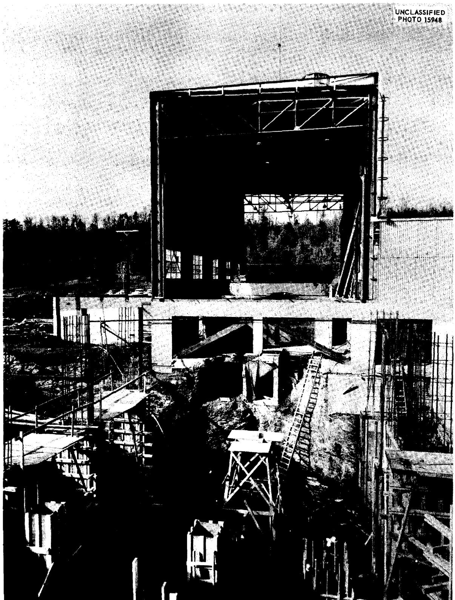  
Fig. 1.1. Aircraft Reactor Facility Construction as of December 5, 1955, Showing Cell Foundation, Instrument and Control Tunnel, Building Addition Columns, and Switchhouse.

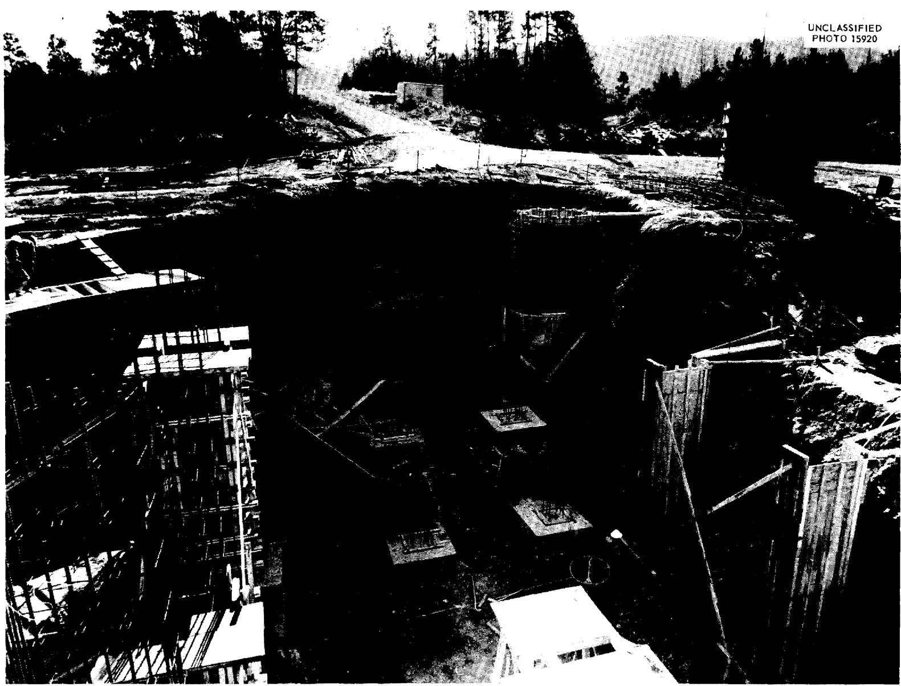  
Fig. 1.2. Aircraft Reactor Facility Construction Showing Charcoal Adsorber Tank and End of Spectrometer Tunnel. Photograph taken November 25, 1955.

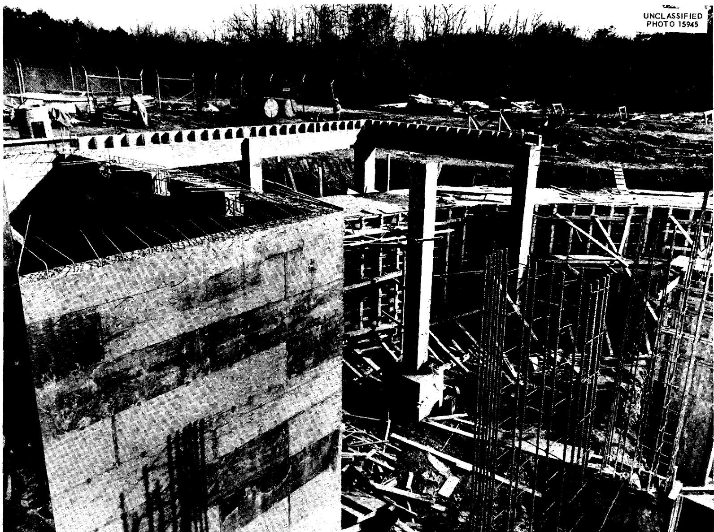  
Fig. 1.3. Aircraft Reactor Test Facility Construction as of December 5, 1955, Showing Forms for Spectrometer Tunnel and the Spectrometer Room Wall.

# ART DESIGN

A.P.Fraas

Aircraft Reactor Engineering Division

# System Flowsheets

W.B.Cottrell R.D.Schultheiss

L.A.Mann

Aircraft Reactor Engineering Division

System flowsheets and instrumentation lists have been prepared in an initial attempt to define the entire ART. The flowsheets include, in addition to the various components of the particular system, the annunciator pickup and presentation locations; the operating conditions of temperature, pressure, and flow rates; the control stations for electrically operated components; the normal valve positions and uniform valve identification; and line sizes. Flowsheets have been prepared for the following:

Reactor Temperature Instrumentation

Fuel System

Sodium Systems

Fuel Enricher System

Fuel Recovery System

Fuel Sampling System

Main NaK System

Auxiliary NaK System

Special NaK System

Hydraulic System

Reactor Pumps Lubricating System

NaK Pumps Lubricating System

Helium System

Off-Gas System

Nitrogen System

Water System

Process Air System

Compressed Air System

The flowsheets are to be issued in preliminary form for comments, and the necessary revisions will be made before they are issued for construction and fabrication use.

# Fuel-to-NaK Heat Exchanger

R. I. Gray M. M. Yarosh

Aircraft Reactor Engineering Division

Layout drawings were completed for the fuel-to-NaK heat exchanger1 which indicated that a 12 by 24 array of 0.1875-in.-OD tubes on 0.2175-in. centers would be acceptable for the heat exchanger design; however, detail drawings have subsequently showed that difficulties would be encountered in overcoming interferences at the headers and that problems might occur in the final assembly of the heat exchangers. In addition, it was found desirable to provide additional space in the region of the headers for the beryllium support struts. To overcome these difficulties and to provide for uncertainties in the NaK friction factor for small-diameter tubing (see Sec. 2, "Experimental Reactor Engineering"), the heat exchanger design was modified. The revised design data are presented in Tables 1.1 and 1.2.

1R. D. Schultheiss, ANP Quar. Prog. Rep. Sept. 10, 1955, ORNL-1947, p 19.

TABLE 1.1. DIMENSIONAL DATA FOR FUEL-TO-NaK HEAT EXCHANGER   

<table><tr><td colspan="2">Tube dimensions, in.</td></tr><tr><td>Center-line spacing</td><td>0.250</td></tr><tr><td>Outside diameter</td><td>0.230</td></tr><tr><td>Inside diameter</td><td>0.180</td></tr><tr><td>Wall thickness</td><td>0.025</td></tr><tr><td>Spacer thickness</td><td>0.020</td></tr><tr><td>Mean length</td><td>65.0</td></tr><tr><td>Equatorial crossing angle</td><td>26° 20&#x27;</td></tr><tr><td colspan="2">Inlet and outlet pipe, in.</td></tr><tr><td>Inside diameter</td><td>2.375</td></tr><tr><td>Outside diameter</td><td>2.875</td></tr><tr><td colspan="2">Header sheet, in.</td></tr><tr><td>North head thickness</td><td>0.500</td></tr><tr><td>South head thickness</td><td>0.375</td></tr><tr><td>Fuel volume, ft3</td><td>2.45</td></tr><tr><td>Number of tube bundles</td><td>12</td></tr><tr><td>Number of tubes per bundle, 13 by 20 array</td><td>260</td></tr><tr><td>Total number of tubes</td><td>2130</td></tr></table>

TABLE 1.2. FUEL-TO-NoK HEAT EXCHANGER DESIGN DATA   

<table><tr><td>Tube diameter, in.</td><td>0.230</td></tr><tr><td>Number of tubes per bundle</td><td>260</td></tr><tr><td>Number of bundles</td><td>12</td></tr><tr><td>Tube center-line spacing, in.</td><td>0.250</td></tr><tr><td>Tube wall thickness, in.</td><td>0.025</td></tr><tr><td>Tube array, square pitch</td><td>13 by 20</td></tr><tr><td>Mean tube length, ft</td><td>5.42</td></tr><tr><td>Fuel temperature range, °F</td><td>1250 to 1600</td></tr><tr><td>NaK temperature range, °F</td><td>1070 to 1500</td></tr><tr><td>Fuel pressure drop through heat exchanger, psi</td><td>39</td></tr><tr><td>NaK pressure drop through heat exchanger, psi</td><td>13</td></tr><tr><td>Fuel Reynolds number in heat exchanger</td><td>3740</td></tr><tr><td>NaK Reynolds number in heat exchanger</td><td>120,300</td></tr><tr><td>Fuel flow rate,* cfs</td><td>2.96</td></tr><tr><td>NaK flow rate,* cfs</td><td>10.45</td></tr><tr><td>Fuel volume in heat exchanger, ft3</td><td>2.45</td></tr><tr><td>NaK volume in heat exchanger tubes (not including headers), ft3</td><td>2.97</td></tr><tr><td>Heat exchanger thickness (includes 0.015-in. side wall clearance), in.</td><td>3.25</td></tr><tr><td>Log mean temperature difference, °F</td><td>136</td></tr><tr><td>Estimated maximum tube wall temperature, neglecting secondary heating effects, °F</td><td>1535</td></tr><tr><td>Fuel mixture NaF-ZrF4-UF4(50-46-4 mole %) heat transfer coefficient, Btu/hr·ft2.°F</td><td>2215</td></tr><tr><td>NaK (56% Na-44% K) heat transfer coefficient, Btu/hr·ft2.°F</td><td>10,000</td></tr><tr><td>Heat load at design operating conditions, Mw</td><td>55</td></tr></table>

\*At mean operating temperatures in reactor.

# Fuel Fill-and-Drain System

# J. Foster

Aircraft Reactor Engineering Division

An intensive study was made of the problem of cooling the fuel fill-and-drain tank. The results of analyses of boiling and circulating liquid and gas cooling systems are presented in Table 1.3. Of the fluids considered, NaK gives the most promising system and was therefore chosen for the ART.

Dual NaK systems have been designed in order to provide maximum reliability of operation for both cooling and heating the fuel fill-and-drain tank. Each NaK system includes a pump, piping, a radiator, an air blower, a duct, and controls and

is capable of removing the maximum heat load of $1.75\mathrm{Mw}$ from the fuel in the tank. The tank is a horizontal cylinder, with each circular head being a tube sheet fitted with U-shaped NaK tubes which sweep through the fuel volume. Alternate rows of these cooling tubes originate in the opposite heads of the tank to provide adequate cooling throughout the fuel mass even when one system is out of service.

# Reactor Shield

# H. Wiard

Consolidated Vultee Aircraft Corporation

The ART lead and water reactor shield has been designed to be essentially similar to a unit shield

TABLE 1.3. RESULTS OF ANALYSES OF COOLING SYSTEMS FOR FUEL FILL-AND-DRAIN TANK   

<table><tr><td rowspan="2">Coolant Material</td><td colspan="2">Temperature (°F)</td><td rowspan="2">Vapor Pressure at Outlet Temperature (psia)</td><td colspan="3">Flow Rate of Coolant</td><td rowspan="2">Vapor Pipe Diameter (in.) for Flow of 150 fps</td><td rowspan="2">Basis for Elimination</td></tr><tr><td>In</td><td>Out</td><td>lb/sec</td><td>gpm</td><td>cfm</td></tr><tr><td>Helium</td><td>1000</td><td>1400</td><td></td><td>3.8</td><td></td><td>17,500 at 50 psig and 1400°F</td><td>20</td><td>Pipe sizea</td></tr><tr><td>Nitrogen</td><td>1000</td><td>1400</td><td></td><td>20</td><td></td><td>13,200 at 50 psig and 1400°F</td><td>18</td><td>Pipe sizea</td></tr><tr><td>Boiling sodium</td><td>1200</td><td>1200</td><td>1</td><td>1.05</td><td>8.9</td><td>48,000 at 1 psia and 1200°F</td><td>30</td><td>Pipe sizeaand temperature vs pressureb</td></tr><tr><td>Boiling K</td><td>1200</td><td>1200</td><td>5</td><td>2.13</td><td>22</td><td>11,700 at 5 psia and 1200°F</td><td>16</td><td>Pipe sizeaand temperature vs pressureb</td></tr><tr><td>Boiling Rb</td><td>1200</td><td>1200</td><td>10</td><td>5.00</td><td>28</td><td>6250 at 10 psia</td><td>12</td><td>Pipe sizea,c</td></tr><tr><td>Boiling Hg</td><td>1200</td><td>1200</td><td>960</td><td>15</td><td></td><td></td><td></td><td>Pressure too high</td></tr><tr><td>Boiling H2O</td><td colspan="2">705 (critical)</td><td>3206</td><td></td><td></td><td></td><td></td><td>Pressure too high</td></tr><tr><td>NaK (56-44 wt %)</td><td>1200</td><td>1400</td><td>7.75</td><td></td><td>300</td><td></td><td>2.5 in. (liquid)</td><td>Not rejected</td></tr></table>

aThe large pipe size is a basis for elimination for four reasons: (1) good flexibility will be required for expansion and contraction, (2) space is at a premium, (3) large openings through the pressure vessel wall present serious problems, and (4) a large vapor pipe implies the need for large vapor passages within the drain tank, where an increase in size would create a space problem and greatly increase shield weight.   
b Elimination because of low vapor pressure is based on the vapor pressure at the maximum allowable temperature not being high enough to give a well-proportioned condenser.   
Space limitations would require condenser to be outside the pressure vessel.

for use in an airplane. The basic mechanical design work has been done for the support of the 7-in. layer of lead, with its cooling system, and the 30.2-in.-thick layer of borated water, and the procedure for the assembly and installation of the reactor and shield has been studied. In an effort to minimize the over-all weight, consideration was first given to the use of a rubber container for the borated water, but, as discussed below, rubber proved to be inferior to metal for this application. Of the various metals considered, 0.1875-in.-thick 61S aluminum alloy appears to be the most suitable because it is easily formed and welded and is sufficiently corrosion-resistant in borated water. A weight summary of the installation is given in Table 1.4, and the materials to be used are described in Table 1.5.

TABLE 1.4. WEIGHT SUMMARY OF REACTOR AND SHIELD INSTALLATION   

<table><tr><td>Reactor</td><td></td><td>12,000 lb</td></tr><tr><td>Lead shield</td><td></td><td></td></tr><tr><td>2 side castings (14,300 lb each)</td><td>28,600</td><td></td></tr><tr><td>Bottom casting</td><td>1,500</td><td></td></tr><tr><td>Top casting</td><td>1,200</td><td></td></tr><tr><td>Lead burner material</td><td>3,700</td><td></td></tr><tr><td>Total</td><td></td><td>35,000</td></tr><tr><td>Shield-water container</td><td></td><td>1,000</td></tr><tr><td>Shield water</td><td></td><td>35,000</td></tr><tr><td>Granulated B4C</td><td></td><td>1,000</td></tr><tr><td></td><td></td><td>84,000 lb*</td></tr></table>

*Does not include bridge support structure ( $\sim 7000$ lb), which is unique to the ART installation.

The feasibility of using rubber for the water container was evaluated as to radiation stability, weight, fabricability, method of support, and anticipated service performance. With respect to each of these criteria, rubber was found to be inferior to metal for this application. The radiation dose at the surface of the lead layer is expected to be $10^{9}$ rad in 1000 hr, and practically all this dose will be in the form of fast neutrons. This dose level is higher than was anticipated earlier and would cause sufficient deterioration $^{2}$ of the elastomer to reduce its strength to approximately $25\%$ of its original value in 1000 hr.

TABLE 1.5. SHIELD AND SUPPORT MATERIALS   

<table><tr><td>Component</td><td>Material</td></tr><tr><td>Shield water con-tainer</td><td>61S-T6 aluminum alloy, 0.1875-in. sheet, butt-welded</td></tr><tr><td>Lead shield</td><td>Probably “chemical”-type lead*</td></tr><tr><td>Tubing for cooling system for lead</td><td>Cold drawn or annealed copper; tinned</td></tr><tr><td>Insulation</td><td>Fiberfrax blanket; density, 6 lb/ft3</td></tr><tr><td>Insulation pads</td><td>Fiberfrax compressed to withstand approximately 100 psi in compression</td></tr><tr><td>Bridge structure</td><td>Boiler plate or equivalent structural steel</td></tr><tr><td>Shield support studs</td><td>4130 steel bar, heat-treated at 125,000 psi/min</td></tr><tr><td>NaK line cover bellows and tube</td><td>Stainless steel or Inconel</td></tr></table>

*The composition of the lead to be used is yet to be determined. At the present time the "chemical" type of lead appears to have the requisite structural and nuclear properties.

Rubber has approximately the same radiation-absorption qualities as borated water. Therefore, the weight penalty for the use of rubber would not be large; that is, for every inch of rubber added, an inch of water could be removed. However, in a hypothetical aircraft installation study, the over-all weight advantage appeared to favor the use of a metal cell. It was further considered that the fabrication and modification of the container would be easier with metal than with rubber, since metal can be formed readily and welded with available tools and equipment. The problems associated with supporting and maintaining the shape of a rubber cell also made the metal cell appear more desirable.

Alkylbenzene may be used instead of borated water in an actual aircraft reactor installation because it has a higher boiling temperature and hence can be cooled by ram air, which will be at a temperature near or above the boiling point of water. In this instance, the higher temperature would make rubber less desirable than metal as a container. In addition, rubber deteriorates with age and therefore would require periodic replacement.

The reactor is to be supported at the flanges of the fuel and sodium pump wells which will bear on the cylindrical part of the bridge structure. These pump flanges will be free to move sideways relative to each other to accommodate the thermal expansion of the reactor pressure shell.

The reactor bridge structure will not only support the reactor but, through eight adjustable studs, will also support the lead and water shields. One end of each stud will be screwed into a fitting attached to the inner skin of the water cell, while the other will be fastened to projections from the cylindrical portion of the bridge. In effect, the lead shield will be clamped inside the water cell, which will act as a support cradle for it. Therefore, since the reactor and the shields will be supported from the same bridge structure, they will move as a unit.

Both the lead and the water shields will be fabricated in four parts: two hemispherical shells, which will join along a longitude and leave an opening at each pole, and two plugs, which will effect the shielding closure at each pole. It is planned that the two large hemispherical shells of lead shield will be installed as prefabricated and that the pole pieces will then be "puddled" on. The sides of the water shield will also be separate units which will be joined together when installed around the reactor. The cylindrical part of the bridge structure will be filled with borated water to serve both as the upper part of the water shield and as the water expansion tank. Equipment such as the fuel and sodium pumps, the control rod housing, and the instruments that will penetrate the shield in this region will be "canned" to prevent contact with the water. Sodium system fill lines, shield cooling-water lines, and other uncanned equipment will also be located in this area. Access to these lines and equipment will be through the open top of the cylindrical part of the bridge structure. Almost all other equipment

and lines that will penetrate the shield will run through a similar cylindrical water cell at the bottom of the reactor.

The cold radial clearance between the reactor and the lead shield will be 1 in., of which 0.5 in. will be used for a layer of Fiberfrax insulation; the remaining 0.5 in. is provided for differential thermal expansion. A 0.25-in.-thick Johns Manville Super X insulating blanket will be placed between the lead shield and the water shield cell to accommodate the differential expansion of the lead and the water cell.

The vertical thermal expansion of the NaK lines which will run through the water cell will be accommodated by bellows (deflecting in shear) attached to each end of a tube. The tube will be installed over the $\frac{1}{2}$ -in.-thick Fiberfrax insulation around the NaK lines and will be attached through the bellows to the cell. Experiments currently in progress at the Lid Tank Shielding Facility (LTSF) will determine the additional amount of gamma shielding required around these NaK lines where they pass through the lead.

Water-cooling lines will be provided for cooling both the shield water and lead shield. One of the main shield-water containers will be heated by the NaK lines to beyond the capacity of the container to dissipate the heat by convection, and therefore a cooling coil will be required in the water shield. The line from this cooling coil will be parallel to a line that will separate into three circuits for cooling the lead and the $\mathsf{ZrF}_4$ vapor trap, which will probably be cast into the lead. Tubes embedded in the lead will probably be tinned to aid in providing a good bond with the lead.

# CORE FLOW STUDIES

G.D.Whitman W.J.Stelzman W.T.Furgerson

Aircraft Reactor Engineering Division

Further core flow studies were made on both the full-scale aluminum and the plastic core models by using the techniques described previously, with the major emphasis on observing and photographing the flow patterns obtained with various core inlet configurations. However, some additional data were obtained on the axial-flow system in the aluminum model. Paired inlet guide vanes were used that were designed on the basis of previously obtained inlet-guide-vane and turbulence-generator data. The reliability of the data obtained from

these tests is in doubt, however, because of the extreme difficulty encountered in locating the flow direction and in measuring the total pressure in the upper half of the core annulus. The plastic core model will be modified to accommodate this inlet-guide-vane configuration so that the flow patterns can be photographed.

Photographic data were obtained with the header designed to give a compound vortex3 installed on the plastic core model. Motion pictures were taken at 64 and 500 frames per second, but experience showed that 500 frames per second was too fast. Iodine injections at several fixed levels along the outer core shell indicated that the flow along this surface had axial and rotational components which were approximately equal in magnitude throughout the upper third of the annulus. However, as the flow approached the equator, the axial component diminished gradually until, at the equator and throughout the lower half of the annulus, it became, and remained, low. In general, the peripheral velocities along this entire surface were very high, as indicated by a very rapid movement of the iodine. Iodine injections along the inner shell showed a pronounced upward axial velocity component along the upper third of the shell surface. This component diminished until, at the equator, a good downward axial component existed. The axial component continued to increase until it equaled the rotational component about three-fourths of the way through the core; it again diminished throughout the lower fourth of the annulus, and flow reversal occurred at the outlet. The peripheral velocities along the inner shell were very high, and there were indications of pronounced stabilization of the boundary layer throughout the lower third of the annulus.

Photographic data were also obtained with an axial flow type of header without any means of auxiliary flow guidance. lodine injection along the outer shell indicated a flow pattern which was similar to that obtained with the compound vortex header, except that the peripheral velocities were lower because of the larger pump-volute discharge-nozzle areas. lodine injections along the inner shell showed a flow reversal region that extended from the inlet to slightly above the equator; however, it differed from the compound vortex flow reversal in that the axial velocity component

seemed more unstable. At the equator, the large cross-sectional area gave a small axial velocity. Below the equator, the axial velocity component increased, and the direction of flow became more stable. In general, the flow pattern showed rapid fluctuations in local axial velocities but no major low-frequency irregular fluctuations.

Photographic data were also obtained with the axial flow header and only one of the two pumps operating. In general, the flow pattern did not change much except that velocities were lower, channeling in the lower region was more noticeable, and the iodine holdup was visibly greater.

A fourth set of motion pictures was obtained with the axial flow header equipped with a set of inlet guide vanes (Mark I) and turbulators (S-9) attached as illustrated previously. The flow pattern along the outer shell approached an axial type of flow in which the fluid gradually spiralled downward with a maximum deviation of 30 deg from a direct, downward path. The flow along the inner shell showed no reversal in the region adjacent to the turbulators, but, in the region extending from slightly below the turbulators to below the equator, it showed the same type of flow reversal as that found when the guide vanes and turbulators were not used. However, in the lower third of the core, the axial and rotational flow components gradually became equal. The velocities were about the same as those obtained without the guide vanes and turbulators.

Turbulators designated as type 4 were then installed, and another set of motion pictures was taken. In this case, flow along the outer shell progressed generally downward but was extremely unstable with regard to direction in the region extending from directly below the turbulators to about midway between the equator and core outlet. From this mid-point to the outlet the flow increased in velocity and became more stable. The inner shell surface again showed no flow reversal in the region adjacent to the turbulators, but, in the region extending from directly below the turbulators to the equator, the flow was generally downward, with spasmodic reversals. However, below the equator the flow accelerated, as in previous runs.

For another set of motion pictures, the axial flow header without inlet guide vanes or turbulators was used and simultaneous iodine injections were

made at two different points, either on the island or shell surfaces or one on each. These injections provided a better basis for comparing both the relative flow directions and the twin stream intermixing.

# ENGINEERING TEST UNIT

M. Bender

Aircraft Reactor Engineering Division

An equipment layout was prepared of the Engineering Test Unit (ETU), and work was started on the design of the facilities required for operation of the unit. A purchase order was placed to obtain the required Inconel shells.

Specifications for the main heat exchangers, the radiators, the boron carbide tiles, and the lube oil pumps have been prepared for procurement. Numerous design problems have prevented the issuance of firm drawings for the reactor components, but procurement action has been started in advance of complete design information so that the time losses will be reduced. The advance procurement action will not completely salvage the time lost, and it is estimated that the ETU will not be ready for operation before December 1956. The previous schedule called for operation by September 1, 1956.

# CONTROLS AND INSTRUMENTATION

J.M. Eastman

Bendix Products Division

R.G.Affel E.R.Mann

Instrumentation and Controls Division

Instrument lists were prepared for each ART system, and instrument sensor locations were designated. The quantity of instrumentation needed considerably exceeds the original estimates, and the original instrument flowsheets are being revised and expanded. Five permanent instrument information centers will be used, in addition to three temporary ones, and some instruments will be located and read on the equipment. The five permanent information centers will be in the control room, the information room, the power room, the auxiliary equipment room, and the vent house. Temporary instrumentation will be used for fuel enrichment, fuel sampling, and fuel recovery. The layouts of the control and instrument panels and boards are being prepared.

The elementary wiring diagrams have been

completed except for minor modifications that may be necessary for them to be adapted to optimum components. The information block diagrams have been revised to include improvements worked out in devising the elementary wiring diagrams.

The layout of the ART control rod and drive mechanism is being prepared. Data on the performance of the fuel enricher used for the high-temperature critical experiment are being reviewed, and layout work on the ART enricher and actuating mechanism is expected to begin soon. A location for the flux-sensing chambers and their actuating mechanisms has been proposed, and a nuclear evaluation is being made. Actuator motors and synchronizing mechanisms have been included in the specifications for the main radiators, the auxiliary radiators, and the bypass air louvers. A recommended design and the specifications have been issued for the dump valve actuator mechanism.

The first of two high-temperature instrument development loops is scheduled to start hot operation late in December. It will be used for evaluating items under actual operating conditions of pressure, temperature, etc. Items currently being studied include solenoid valves for liquid metal vapor service, high-temperature pressure transmitters for fuel and NaK service, ambient-temperature electrical pressure transmitters, high-temperature flowmeters, and high-temperature level-indicating devices.

# PROCUREMENT OF SPECIAL REACTORMATERIALS AND COMPONENTS

W. F. Boudreau

Aircraft Reactor Engineering Division

The fabrication of many items of equipment for the ART and the ETU requires the establishment of combinations of facilities not presently available in this country. It will therefore be necessary to transmit some of the very specialized welding, brazing, and related fabrication techniques which have been developed at ORNL to the manufacturers of special equipment. The major projects currently under way are described below.

# Beryllium

Individual beryllium blocks, seven times heavier than those which have been previously made, are to be produced at the Luckey, Ohio, plant of The Brush Beryllium Co. A lathe, with contour-following equipment, has been provided at Brush's Cleveland plant. The facility for sintering and

machining large blocks of beryllium, from which spheres up to 54 in. in diameter can be machined, is essentially complete and ready for tryout.

# Shell Fabrication

The six sets of thin Inconel shells required for the ART, which vary from 18 to 54 in. in diameter and are fairly complex in shape, have unusually close manufacturing tolerances. A comprehensive discussion of this problem with a variety of manufacturers led to the conclusion that the newly developed Hydrosin process is the only method which promises to yield a solution. An order has been given to the Lycoming Division of the Avco Mfg. Corp. to enlarge the capacity of their Hydrosin machine from 42 to 54 in. and to provide the necessary annealing and pickling facilities.

# CX-900 Inconel

The processing of 100,000 lb of special CX-900 Inconel is under way at the International Nickel Company plant, and the material was released from one manufacturing step to the next as the requirements gradually became somewhat firmer. For example, a release was given during the quarter to process the amount of redraw stock estimated to be necessary for producing all the small-diameter tubing for the heat exchangers and radiators. Some of this was released for final tubing manufacture.

# Main Heat Exchangers and Radiators

It has been recognized for some time that it would be necessary for ORNL personnel to spend a considerable amount of time with the manufacturers who have the experience and facilities required for building the main heat exchangers and radiators to develop welders qualified under the

special ORNL procedures. During the quarter, the previously established policy of developing this know-how by placing orders with outside manufacturers for test heat exchangers and job samples was continued and expanded.

When the main heat exchanger and radiator drawings and specifications became available at the end of September, requests for proposals to furnish these assemblies were sent to about eight of the sources that had been developed.

# OPERATION OF $\mathsf{ZrF}_4$ VAPOR TRAPS IN THE HIGH-TEMPERATURE CRITICAL EXPERIMENT

W.C.Tunnel

Aircraft Reactor Engineering Division

During operation of the high-temperature experiment, deposits on the seats of the gas control valves made it apparent that the $\mathsf{ZrF}_4$ vapor was creating a much worse problem than had been expected. The cold traps installed in the system removed little or no material during periods of high-velocity gas flow, that is, during core filling and fuel mixing operations. Large tanks were installed in the gas lines, but these low-velocity volumes did not reduce the deposits on the valves or in the vent line. A cold trap consisting of nickel Demisters packed in a tube had proved to be successful on the fuel processing equipment (low-velocity gas), but it was entirely inadequate in this application, even when doubled in size. Venting of gases laden with $\mathsf{ZrF}_4$ will be a continuous process in the ART, as contrasted to intermittent venting in the critical experiment fuel-loading. Consequently, the vapor deposition problem will be greater. Development work on vapor traps for reactor application is under way (see Sec. 2, "Experimental Reactor Engineering").

# 2. EXPERIMENTAL REACTOR ENGINEERING

# H. W. Savage   Aircraft Reactor Engineering Division

An in-pile loop was inserted and successfully operated in the HB-3 beam hole of the Materials Testing Reactor (MTR). The difficulties encountered are described, and a summary of the operating cycle is presented. Modifications that are to be made in the nose purge system before operation of another in-pile loop are discussed. Fourteen forced-circulation loops were operated in a series of corrosion and mass-transfer tests of fused salts in Inconel and of liquid metals in Inconel or stainless steel.

Seals are being tested for use in ART-type fuel pumps, and water tests of a full-scale ART-type sodium pump were completed. High-temperature tests of an ART MF-2 fuel pump with NaK are under way, and stands for testing models of this pump with fuel are being fabricated. Stands for testing the sodium and NaK pumps are also being designed.

The results of heat exchanger and radiator tests are presented, and the data obtained on heat transfer and pressure drop are correlated.

The status of the work on apparatus for thermal-stability tests of the outer core shell of the ART is given, and the results of Inconel strain-cycling tests are discussed. Development tests on the ART dump valve, a cold trap, a plugging indicator, and a zirconium fluoride vapor trap are described. An aluminum mockup of the top of the ART is being fabricated for water tests.

# IN-PILE LOOP DEVELOPMENT AND TESTS

D. B. Trauger  
Aircraft Reactor Engineering Division

# In-Pile Loop Operation

L.P.Carpenter J.A.Conlin   
C.W.Cunningham P.A.Gnadt

Aircraft Reactor Engineering Division

C.C.Bolta D.M.Haines Pratt & Whitney Aircraft

The second in-pile loop was installed in the HB-3 beam hole of the MTR during the reactor shutdown week of September 12, 1955. It was brought to temperature with Calrod heaters, and operation of the pump was started satisfactorily.

Some of the fuel mixture had been inadvertently allowed to enter the pump during the filling of the loop fill tank, and hence the pump could not be operated until the loop was heated. Upon attempting to increase the temperature of the fill line to above the melting point of the fuel mixture, the electrical heating circuit failed, and it was impossible to fill the loop. Later analyses showed that the failure was due to electrical breakdown through the helium blanket gas in the nose region or to breakdown of the Sauereisen cement which protected the junctions at the Calrod ends. This loop was returned to Oak Ridge for possible rebuilding or salvage of parts.

A third loop had been assembled and shipped to the MTR early in September. It was leak-checked at the MTR and found to contain a small leak through the pump bulkhead and another in the heat exchanger. Both leaks were exceedingly small and were considered to be tolerable. This loop was installed in the reactor during the shutdown period beginning October 3. It was brought to temperature, filled with salt $(\mathsf{NaF - ZrF}_4\mathsf{-UF}_4)$ 53.5-40-6.5 mole %), and started on isothermal operation on October 5.

Reactor operation began on October 7 and proceeded to full power on the morning of October 9. The loop was operated in the retracted position for one day and then was inserted to a position 3.5 in. from the end of the beam hole, at which point the maximum air-cooling capacity was reached. A mixed-mean temperature differential of approximately $150^{\circ}\mathrm{F}$ was reached, with a maximum temperature of $1500^{\circ}\mathrm{F}$ . The cooling-air control system for maintaining loop temperatures responded well, and it was possible to follow changes in reactor power with only minor adjustments of the control set point. There was some leakage of neutrons through the concrete plug shield, but this was easily stopped with a few blocks of paraffin. The gamma activity at the cubicle door, apparently originating from the fission gas lines in the cubicle, was quite high, and considerable external shielding was required. The water activity was slightly higher than expected, but no other activity problem was encountered. After four days of operation the helium purge line

from the bearing housing was observed to plug suddenly. Operation was continued, however, and no increase in activity was observed except for back diffusion of gases through the normal inlet line to this region. At the entrance to the cubicle this line had an activity of approximately $2\mathrm{r / hr}$ . After four additional days of operation, it was observed that the exit line for purge gas from the pump sump was plugged. This plug caused rapid buildup of activity in the purge-gas inlet line outside the cubicle, and it was deemed necessary to crimp and clamp both the bearing housing and the pump-sump inlet lines at the cubicle to prevent high radiation levels at the instrument panel. The loop was withdrawn to the retracted position to minimize the activity generation and the power density, and operation was continued. The reduction in power density decreased the hazards that might arise from loop misoperation as a result of the plugged lines. The activity on the pump-sump inlet line built up to a stable value of approximately 25 r/hr at the point where it was clamped, approximately 25 ft from the pump sump.

Irregularities in the pump operation were noted after the purge lines had plugged. These irregularities appeared as increases in pressure of the hydraulic motor oil, although nearly constant oil flow and pump speed were maintained. The oil pressure would build up and decrease intermittently with increasing frequency and magnitude over a period of several hours and then return to a normal value and remain there for several hours before repeating the cycle. These deviations continued with increased severity until pump speed changes were observed. On September 22, one of these cycles resulted in a pump speed change which scrambled the reactor through the loop control circuitry. Since the reactor was within 20 hr of the end of its operating cycle, it was not returned to power. Isothermal operation was continued for two more days before complete shutdown and removal of the loop.

Connections were made to the clamped lines after shutdown to facilitate purging the residual gases to the stack. The charcoal traps were warmed slowly, and the gases were continuously vented to the stack. Some increase above the normal background was observed in the stack activity during these operations. However, there was no fission gas released from the loop at any

time during the run or during the shutdown and purging operations.

The reactor power during this operation was quite erratic because of numerous scams caused by other experiments and inadvertent dropping of control rods by the reactor-operating mechanisms. This erratic operation produced drastic power excursions, and full use had to be made of the Calrod heaters to avoid freezing of the fuel in the loop. Further, sizable strains must have been produced in the loop by thermal expansion and contraction during the rapid transitions from the operating temperature differential to isothermal conditions and during a certain amount of temperature cycling while the loop was being returned to power operation. The excursions produced no observable damage to the loop except for electrical leakage of some of the Calrod heater circuits. The gas leak in the heat exchanger did not increase noticeably. Following the shutdown, a much larger leak was observed in the pump bulkhead than that which had existed previously, but the cause for the increase is unknown.

A resume of the operating cycle is shown in Fig. 2.1, in which high and low operating temperatures are plotted as a function of time. In Fig. 2.2, the mixed-mean inlet and outlet temperatures are shown as a function of time. The temperature pattern in the nose coil heating section is shown in Fig. 2.3. A marked difference can be noted between temperatures on the inner and outer radii of the coil. Unfortunately, several of the thermocouples in this region were unstable at times, and the recorded temperatures are subject to considerable uncertainty. It is evident that flow asymmetry existed, but similar observations must be made for future loops before the magnitude of the asymmetry can be determined.

The thermocouples from which the mixed-mean temperature measurements were obtained and which gave the highest temperature differentials were the most consistent during operation. Power calculations based on air flow and air temperature differentials confirmed these values. The loop power generation was estimated from these data to have been $20\mathrm{kw}$ at the position of maximum insertion. This gives an average power density of $0.6\mathrm{kw}$ per cubic centimeter of fuel in the nose section of the loop. Disassembly work on the loop is described in Sec. 8, "Radiation Damage."

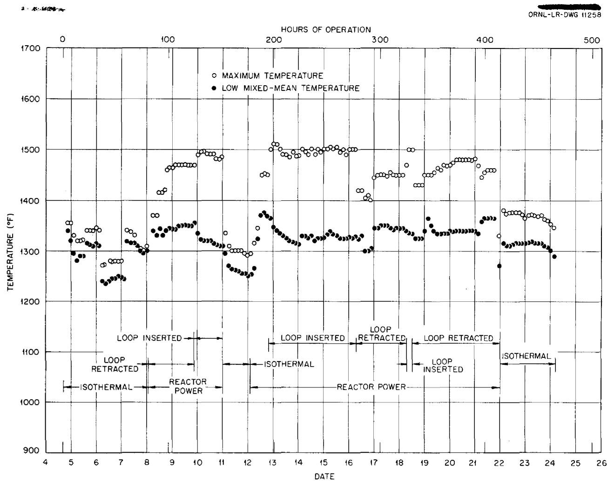  
Fig. 2.1. High and Low Fuel-Mixture Temperatures vs Time of Operation of In-Pile Loop No.3 in MTR.

# Loop Purge System

P. A. Gnadt A. A. Abbatiello Aircraft Reactor Engineering Division

Electrical-system failures prevented the startup of the first two in-pile loops, and therefore a study was made of the electrical properties of loop insulating materials in various gaseous atmospheres. Because of its low neutron activation and its low adsorption on liquid-nitrogen-cooled charcoal, helium had been chosen originally as the radioactivity-sensing gas for the nose section. However, helium has poor electrical-insulation properties, especially at elevated temperatures, whereas nitrogen, in comparison, is much less subject to electrical breakdown. Tests were made of electrical leakage of actual and simulated leads and termi

nals in atmospheres of both gases. Electricalinsulation tests also indicated that Sauereisen No.1 cement, which was used at the terminals of the heaters, tended to conduct currents at elevated temperatures. Comparative curves for the onset of electrical leakage as a function of voltage and temperature for the two gases and for Sauereisen cement insulation are presented in Fig. 2.4.

The use of nitrogen as a purge gas in the nose section presents some additional problems, because the liquid-nitrogen-cooled charcoal trap would adsorb large quantities of gaseous nitrogen, and its effectiveness would thus be reduced. Also, impurities in the nitrogen might cause the traps to plug. As an expedient measure for operation of loop No. 3, nitrogen was used for purging the nose section, but it bypassed the traps during startup

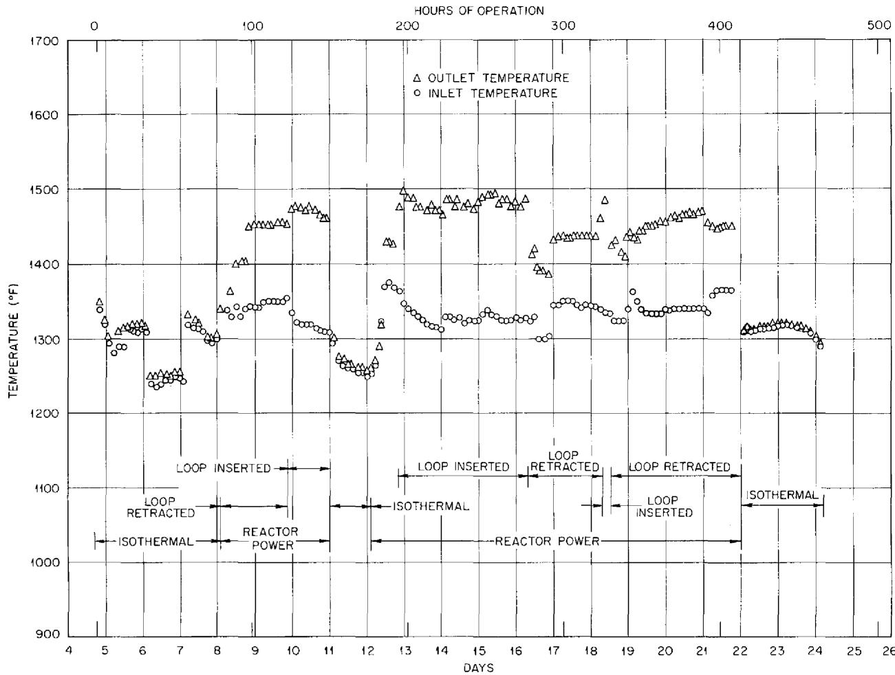  
L-LR-DWG 11259   
Fig. 2.2. Mixed-Mean Inlet and Outlet Fuel-Mixture Temperatures vs Time of Operation of In-Pile Loop No.3 in MTR.

and when the reactor was shutdown. Helium was used, as originally planned, during reactor operation when the electrical heat was not needed. Experiments are being conducted (see Sec.8, "Radiation Damage") to determine the holdup time of fission gases in the charcoal adsorption traps when nitrogen is used as the nose purge gas. Radioactive krypton is used to simulate the fission gases, and trap temperatures of $0^{\circ}\mathrm{C}$ to below $-110^{\circ}\mathrm{C}$ are being studied. A design for using a nitrogen atmosphere in the nose section of the loop is being prepared, and grade A Lava sleeves are to be substituted for Sauereisen cement at the heater terminals in future loops.

# FORCED-CIRCULATION CORROSION AND MASS TRANSFER TESTS

W. B. McDonald  
Aircraft Reactor Engineering Division

# Fused-Salt-Inconel Systems

C.P.Coughlen P.G.Smith

Aircraft Reactor Engineering Division

R. A. Dreisbach Pratt & Whitney Aircraft

Five electrically heated and three gas-heated fused-salt-Inconel forced-circulation loops were operated during the quarter. The operating condi

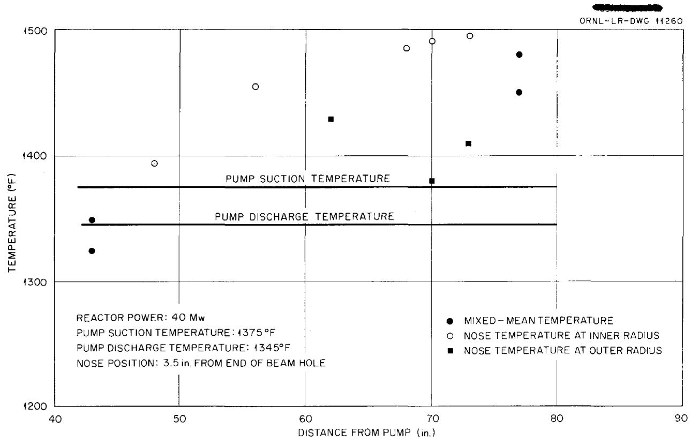  
Fig. 2.3. Temperature Pattern in Nose Section of In-Pile Loop No. 3.

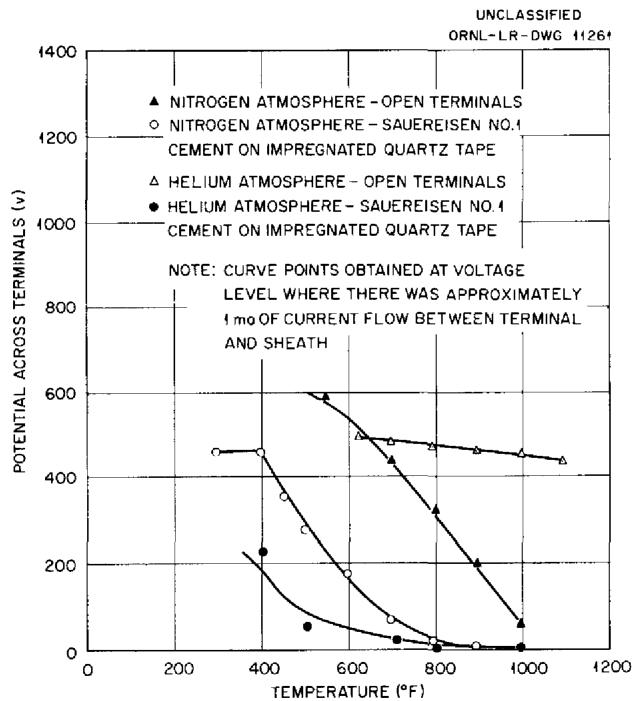  
Fig. 2.4. Electrical Breakdown Across Calrod Terminals in Nitrogen and in Helium Atmospheres.

tions are summarized in Table 2.1. The results of metallurgical examinations of the loops are presented in Sec. 5, "Corrosion Research."

In addition to the routine loop operations, a study was made of temperature measurements and heat distribution in the gas-heated loops, and the electrical heaters of the electric-resistance-heated loops were modified so that different ratios of fluid-to-wall temperatures could be obtained.

Uniform wall temperatures cannot be obtained in the heated section of loops operated in the small gas furnaces, because of improper design of the furnaces for this application. These furnaces were originally designed as heat sources for loops for testing the corrosiveness of circulating sodium. In order to utilize them as heat sources for the fused-salt-Inconel forced-circulation loops, they must be operated above rated power. Under the operating conditions required, much of the combustion takes place in the chamber around the heater coils rather than in the combustion chamber. The resultant hot spots in the furnace cause nonuniform pipe-wall temperatures.

TABLE 2.1. SUMMARY OF OPERATING CONDITIONS FOR FUSED-SALT-INCONEL FORCED-CIRCULATION LOOPS THAT CIRCULATED NaF-ZrF4-UF4 (50-46-4 mole %) FOR 1000 hr  

<table><tr><td rowspan="2">Loop No.</td><td rowspan="2">Reynolds Number</td><td rowspan="2">Temperature Differential (°F)</td><td colspan="2">Maximum Recorded Temperatures (°F)</td></tr><tr><td>Fluid</td><td>Tube Wall</td></tr><tr><td colspan="5">Loops with Direct-Resistance-Heated Straight Sections</td></tr><tr><td>7425-5</td><td>2,600</td><td>200</td><td>1500</td><td>1550</td></tr><tr><td>-6</td><td>10,000</td><td>200</td><td>1500</td><td>1565</td></tr><tr><td>-7A</td><td>10,000</td><td>200</td><td>1500</td><td></td></tr><tr><td>-41</td><td>2,750</td><td>200</td><td>1635</td><td>1700</td></tr><tr><td>-42</td><td>Variable</td><td>200</td><td>1300 to 1650</td><td>1700</td></tr><tr><td colspan="5">Loops with Gas-Heated Coiled Sections</td></tr><tr><td>4935-6*</td><td>8,000</td><td>200</td><td>1500</td><td>1575</td></tr><tr><td>-7B</td><td>8,000</td><td>200</td><td>1500</td><td>1550, changed to 1700 at 617 hr</td></tr><tr><td>7425-71</td><td>Variable</td><td>Variable</td><td>Variable</td><td>Variable</td></tr></table>

*Thermocouple failures made loop unsatisfactory for planned test. Loop now being operated as a life test. On December 1, 1955, it had operated for more than 4500 hr with a temperature differential imposed.

The excessive cost of revamping the gas furnaces and the availability of electrically heated test stands brought about the decision to discontinue the use of gas furnaces for carrying out the fused-salt corrosion program. These furnaces will be utilized for salt and liquid-metal life-test loops.

A series of forced-circulation corrosion-testing loops with NaF-ZrF $_4$ -UF $_4$ (50-46-4 mole %) flowing in Inconel tubing is being operated with the wall temperature of the heated section held constant at $1700^{\circ}\mathrm{F}$ and the maximum fluid temperature held at 1300, 1500, or $1650^{\circ}\mathrm{F}$ ; further, the temperature differential in the circulating fluid is maintained constant at $200^{\circ}\mathrm{F}$ . In order to obtain these conditions without changing the surface-to-volume ratio of the loop, it was necessary to modify the loop design to give greater flexibility of power input to each of the two heater sections. Four equally spaced heater lugs were added to the entrance section of the heater, and one lug was added to the exit section. By shifting the power-transformer cable connections to alter the length (and effective resistance) of the two heater sections, the power input to each section could be varied over a wide range. Loop 7425-41 is the only loop that has been operated in this series, to date.

# Liquid Metals in Multimetal Loops

C.P.Coughlen P.G.Smith

Aircraft Reactor Engineering Division

Six forced-circulation loops were operated with sodium and noneutectic NaK. These loops were heated electrically and had economizers in the system. The results of metallurgical examination of these loops are presented in Sec. 5, "Corrosion Research." A summary of the operating conditions is given in Table 2.2.

Test loop 7426-4 is the loop, described previously, that was designed for obtaining accurate information on the oxygen content of the sodium during operation. Tests conducted with this loop have shown that the plugging indicator does give an indication of the contamination in the sodium. However, the contaminant may not be sodium oxide alone, since the saturation temperatures at the plugging indicator stay consistently 250 to $300^{\circ}\mathrm{F}$ higher than those at the cold trap. This loop has operated at fluid temperatures up to $1500^{\circ}\mathrm{F}$ and with system temperature differentials of $300^{\circ}\mathrm{F}$ . Under these conditions corrosion and mass transfer occur, and the contaminants may comprise

TABLE 2.2. SUMMARY OF OPERATING CONDITIONS FOR FORCED-CIRCULATION LOOPS THAT CIRCULATED SODIUM OR NaK  

<table><tr><td>Loop No.</td><td>Material of Construction</td><td>Cold Trap</td><td>Reynolds Number</td><td>Temperature Differential (°F)</td><td>Maximum Recorded Fluid Temperature (°F)</td><td>Operating Fluid</td><td>Operating Time (hr)</td></tr><tr><td>7426-2</td><td>Inconel</td><td>No</td><td>59,000</td><td>300</td><td>1500</td><td>Sodium (0.05% oxide)</td><td>1000</td></tr><tr><td>-3</td><td>Inconel</td><td>Yes</td><td>50,000</td><td>200</td><td>1000</td><td>Sodium (as delivered)</td><td>1000</td></tr><tr><td>-4*</td><td>Inconel</td><td>Yes</td><td>59,000</td><td>300</td><td>1500</td><td>Sodium (as delivered)</td><td>Indefinite</td></tr><tr><td>-5</td><td>Type 316 stainless steel</td><td>Yes</td><td>59,000</td><td>300</td><td>1500</td><td>Sodium (as delivered)</td><td>1000</td></tr><tr><td>7439-1</td><td>Inconel</td><td>Yes</td><td>65,000</td><td>300</td><td>1500</td><td>Noneutectic NaK (as delivered)</td><td>1000</td></tr><tr><td>-2</td><td>Inconel</td><td>No</td><td>65,000</td><td>300</td><td>1500</td><td>Noneutectic NaK (as delivered)</td><td>1000</td></tr></table>

*This loop includes a vacuum analyzer and a bypass loop with a plugging indicator for oxide determinations.

metal particles and metal oxides other than sodium oxide.

The small-scale NaK-circulating loop described previously $^2$ was also operated. The design was found to be inadequate in that the surface area of the small-diameter, $3/6$ -in.-OD, 0.025-in.-wall tubing was insufficient for transferring, by radiation, the amount of heat necessary to maintain the maximum design fluid temperature of $1500^{\circ}\mathrm{F}$ , and the design flow of 1 gpm was not obtained. The flow rate of 0.8 gpm obtained was probably limited by the pressure drop. A new heater has been designed to increase heat transfer, and the flow-path cross section has been increased by adding one tube to give a higher flow rate. The tube bundle in the heater section is now surrounded by a NaK bath to increase the heat transfer from the clam-shell heaters to the tube bundle. The pressure drop across the heated section will be established experimentally with water.

# PUMP DEVELOPMENT

E. R. Dytko

Pratt & Whitney Aircraft

A. G. Grindell

Aircraft Reactor Engineering Division

# Bearing-and-Seal Tests

W. L. Snapp

Pratt & Whitney Aircraft

W. K. Stair

University of Tennessee

Seals of various designs are being tested and evaluated for possible use in the ART as the lower seal of the type MF-2 pump. The Durametallic Corporation of Kalamazoo, Michigan, has supplied, for testing, a group of so-called "Dura seals" that consist of a Stellar-faced stainless steel seal ring running against a gland insert of No. 9 carbon. Without exception, leakage rates for these seals were excessive, averaging 50 to $100\mathrm{cm}^3/\mathrm{hr}$ , with extremes being as high as 200 $\mathrm{cm}^3/\mathrm{hr}$ . (The specifications state that the lower

seal is to have a leakage of oil into helium across a pressure differential of 0 to 5 psi of not more than $2\mathrm{cm}^3$ per 24 hr.) As a secondary shaft seal, the Dura seals employ a stainless steel U-cup, and it was thought that the excessive leakage was probably due to surface irregularities on the sealing surfaces of this U-cup. To smooth out the irregularities, fixtures were made that would permit honing of the surfaces. Also, to further verify that the high leakage occurred at the U-cup seal, the U-cup of one Dura seal assembly was replaced with a Buna N O-ring. It was found that both measures had a marked effect on the seal performance. The honed U-cups reduced the leakage to 10 to $15\mathrm{cm}^3/\mathrm{hr}$ , and the Buna N O-ring reduced the leakage rate to 1 to $2\mathrm{cm}^3/\mathrm{hr}$ .

Tests were also conducted to check the effects on seal performance of varying the differential pressure across the seal, the lubrication-fluid temperature, and the shaft rotational speed. The leakage was found to increase with increasing differential pressure and with increasing lubrication-fluid temperature. The relation of the leakage rate to the shaft rotational speed is shown in Fig. 2.5.

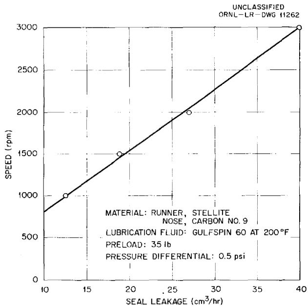  
Fig. 2.5. Leakage Rate of a Typical Dura Seal as a Function of Shaft Rotational Speed.

Since the leakage rate was linear with speed, the possibility of induced mechanical vibration being a contributing factor in the leakage was eliminated. The linear relationship did indicate, however, the possibility of a hydrodynamic wedge building up at the seal interface and forcing the seal faces apart. Additional tests were run which completely verified this and, consequently, pointed out a basic limitation of this seal in its application in the ART.

A second type of Dura seal was also tested; it was identical with the seal described above, except that the Stellar face was replaced with a ceramic (zirconium oxide) face. The tests showed that the initial leakage rates, although much lower than the leakage rates for the Stellar-faced seals, were still too high, averaging $5.6~\mathrm{cm}^3$ per 24 hr. However, by increasing the surface area of the seal-gland carbon insert, the seal leakage rate was further reduced, to below $2\mathrm{cm}^3$ per 24 hr, which meets the specifications. This low leakage rate has been obtained with only this one unit, and it may or may not be reproducible. Further tests are planned which will establish the performance characteristics of this modified Dura seal.

In other tests, Fulton Sylphon seals with Graphitar No. 14 noses against case-hardened steel runners have proved to be quite successful. Two such units were tested during this quarter. One unit showed no leakage in over 200 hr before being placed in a high-temperature pump test stand. The other unit has been under continuous testing for 1200 hr, with a nearly uniform leakage rate of $0.75\mathrm{cm}^3$ per 24 hr.

A spring-loaded bellows seal developed at ORNL showed no leakage in 132 hr of testing, and then a slow leak was noted. This seal, which has a carbon insert, includes multiple springs located inside the bellows to provide the seating load. The bellows acts as the secondary static seal. The seal is designed so that increased gas pressure increases the seating load. Inspection showed that the seal interface was perfect and that the measured leakage was seeping through the carbon nose on the stationary member. A higher-density carbon nose is to be installed before evaluation tests of this seal assembly are continued.

# Sodium-Pump Water Performance Tests

M. E. Lackey

Aircraft Reactor Engineering Division

H.C.Young

Pratt & Whitney Aircraft

Full-sized models of the MN-2 impeller and the volute for the ART sodium pump were tested with water. The impeller was fabricated of brass and the volute of steel. The test rig consisted of a 4-in. closed-pipe loop with a 30-hp calibrated-drive motor, a flow-metering orifice, a throttling valve, and the necessary manometers. A model-T pump rotary element was used for the impeller shaft and the bearing assembly.

The first performance test indicated that the impeller would meet the head and flow requirements of the ART sodium pump at slightly lower

speeds than predicted Pressure measurements at points around the periphery of the impeller indicated no excessive unbalance of hydraulic forces on the impeller, and therefore no modifications to the volute were anticipated. The efficiency of the pump in the first test was approximately $63\%$ . Maximum efficiency occurred at speeds below design speed. A series of tests was also run in order to determine the value of inlet shroud vanes as a method of reducing leakage flow and of increasing efficiency at design point. Six performance tests and two cavitation tests have been conducted to date; the performance-test conditions and results are recorded in Table 2.3. The impeller, which had five short and five long radial blades, remained unchanged during the tests, but the inlet shroud, the shroud vanes, and the clearances were varied. In general, the test results

TABLE 2.3. RESULTS OF WATER PERFORMANCE TESTS OF MN-2 IMPELLER AND VOLUTE FOR ART SODIUM PUMP   
Design point: 430 gpm, 90-ft head   

<table><tr><td rowspan="2">Test No.</td><td rowspan="2">Inlet Conditions</td><td colspan="2">Impeller Clearance (in.)</td><td rowspan="2">Type of Inlet Shroud</td><td rowspan="2">Approximate Pump Efficiency at Design Point (%)</td></tr><tr><td>Axial</td><td>Radial</td></tr><tr><td>1</td><td>Volute inlet plate 31/32 in. thick; opening 3.5 in. in diameter, with 31/32-in. radius at edges; 0.109-in. spacer between plate and bottom of impeller</td><td>0.050</td><td>0.050</td><td>With shroud vanes</td><td>63</td></tr><tr><td>2</td><td>Same volute inlet plate as above; 0.109-in. spacer attached to impeller shroud</td><td>0.050</td><td>0.050</td><td>0.109-in. plate covering bottom of shroud</td><td>63+</td></tr><tr><td>3</td><td>Same as test 1</td><td>0.050</td><td>0.050</td><td>Shroud vanes extended 3/32 in.</td><td>61</td></tr><tr><td>4</td><td>Same as test 1</td><td>0.039</td><td>0.050</td><td>Same as test 3</td><td>62.5</td></tr><tr><td>5</td><td>Volute inlet plate 31/32 in. thick; opening 3.5 in. in diameter, with 31/32-in. radius at edge; 0.370-in. spacer between plate and bottom of impeller</td><td>0.050</td><td>0.0625</td><td>Shroud shortened 0.258 in. from previous tests; shroud vanes removed</td><td>64</td></tr><tr><td>6</td><td>Same as test 5</td><td>0.050</td><td>0.0625</td><td>Shroud length same as in test 5; shroud vanes reinstalled and extended 3/32 in.</td><td>63</td></tr></table>

indicated that the shroud vanes did not increase efficiency.

Design changes in the reactor caused the design of the sodium impeller shroud to be shortened 0.258 in, and the radial clearance of the impeller to be increased from 0.050 to 0.0625 in. Tests 5 and 6 were therefore conducted to mock up the design change. Further tests will be made to determine the effect of inlet conditions on performance and cavitation.

The cavitation tests performed to date indicate that the sodium pump will operate safely with water at inlet pressures below the pressure planned for the reactor sodium pump. Some difficulty was encountered in obtaining the original cavitation data. Air entrapped in the water came out of solution when the pump inlet pressure was reduced, and resulted in lowered pump performance because of what is believed to have been vapor locking. This phenomenon obscured the true point of cavitation. The water in the test rig was heated to remove the dissolved air, and satisfactory cavitation tests were conducted.

# High-Temperature Tests of ART MF-2 Fuel Pump with NaK

S. M. DeCamp, Jr.

Aircraft Reactor Engineering Division

High-temperature testing of an ART MF-2 fuel pump (Fig. 2.6) in a short-circuit loop (Fig. 2.7) was started on August 31, 1955, with NaK $(44\%)$ K-56% Na as the pumped fluid. After 168 hr of operation at $1400^{\circ}\mathrm{F}$ the heat source (simulated gamma-ray heating source) in the shield plug burned out, and the loop was shut down for replacement of the plug. At the same time, the mechanical condition of the pump was examined. In the process of disassembling the pump, it was found to be impossible to remove the impeller retainer nut. The nut was binding because of warpage of the impeller. An increase in the clearance between the sides of the nut and the impeller from 2 mils to 10 mils corrected this difficulty.

It was also found that because of improper indexing during assembly, the pressure-breakdown plug had been rubbing on the main impeller hub. Approximately 15 mils had been removed from the top of the pressure-breakdown lands on the impeller hub. Examination of both the pump and the temperature data indicated that the metallic O-ring located at the bottom of the gamma-ray shield plug

had not completely sealed, and hot NaK vapors had been able to get between the rotary-element housing and the pump barrel. This caused a poor temperature gradient in the pump barrel, as shown in Fig. 2.8.

Shortly after the second test run was started, the heat plug again shorted; also, the temperature gradient around the barrel was still poor (see Fig. 2.9). The pump was again shut down and disassembled. This time the O-ring on the shield plug had apparently broken at the weld when it was seated. It was decided to replace the O-ring and continue the tests without the heat-source plug. The heat-source-plug tests will be resumed later as a separate problem.

The third test run was started on September 20, 1955, and the pump was still operating on November 30, 1955. Figure 2.10 gives the cumulative seal leakage, the lube oil flow rate, the lube oil inlet temperature, and the operating NaK temperature plotted against time. The temperature gradient along the pump barrel in test run 3 is shown in Fig. 2.11. The operating conditions were the following:

$$
\text {S p e e d , r p m} \quad 2 7 0 0
$$

$$
\text {H e a d , f t} \quad 4 6
$$

$$
\text {F l o w r a t e , g p m} \quad 6 0 0
$$

$$
\text {I n p u t} \quad \text {p o w e r}, \quad \mathrm {k w} \tag {7}
$$

$$
\text {C o o l i n g - o i l f l o w r a t e , g p m} \quad 1. 9
$$

$$
\text {C o o l i n g － o i l} \text {i n l e t} \text {t e m p e r a t u r e}, ^ {\circ} F \sim 1 6 5
$$

$$
\begin{array}{l} \text {A v e r a g e t e m p e r a t u r e r i s e a c r o s s} \\ \text {l u b e o i l ,} ^ {\circ} F \end{array}
$$

$$
\begin{array}{l} \text {A v e r a g e t e m p e r a t u r e r i s e a c r o s s} \\ \text {c o o l i n g o i l ,} ^ {\circ} F \end{array}
$$

$$
\begin{array}{l} \text {A v e r a g e t e m p e r a t u r e i n l o w e r s e c t i o n} \\ \text {o f s h i e l d p l u g ,} ^ {\circ} F \end{array} 1 1 0 0
$$

$$
\begin{array}{l} \text {A v e r a g e t e m p e r a t u r e o f M o n e l s e c t i o n} \\ \text {o f s h i e l d p l u g ,} ^ {\circ} F \end{array} 2 7 5
$$

The top seal leaked $30~\mathrm{cm}^3$ of oil at startup, but it did not leak thereafter. The leakage was probably oil that was used to backfill the top seal prior to startup. Rotation of the pump shaft forced this backfill oil out the drain line. Since the top seal is lubricated by a mist of oil rather than by submergence, it is probable that only a gross oil leak would show up.

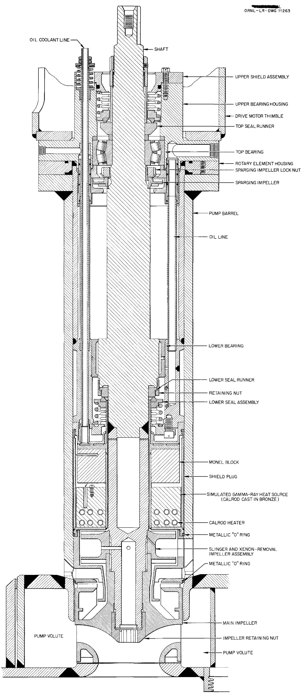  
Fig. 2.6. ART Fuel Pump Type MF-2.

5561 01 RERWREDEONIANEIOERd

4

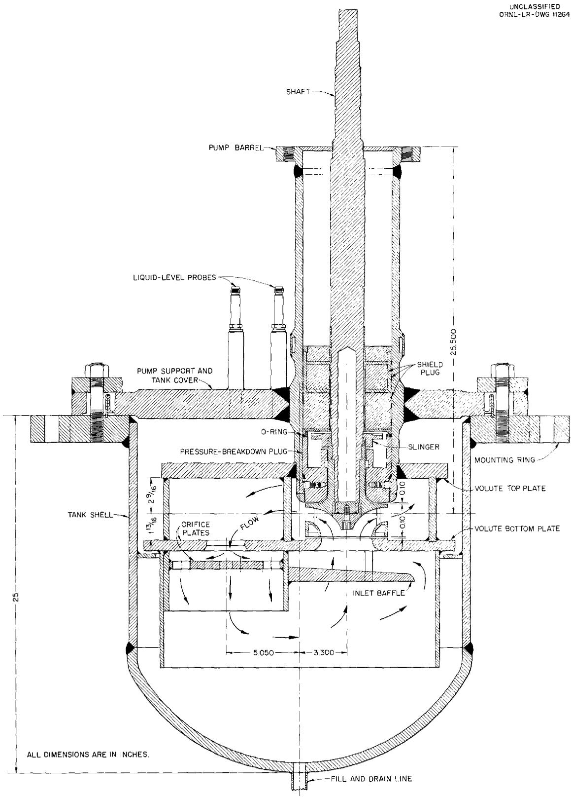  
Fig. 2.7. High-Temperature Short-Circuit Pump-Test Loop.

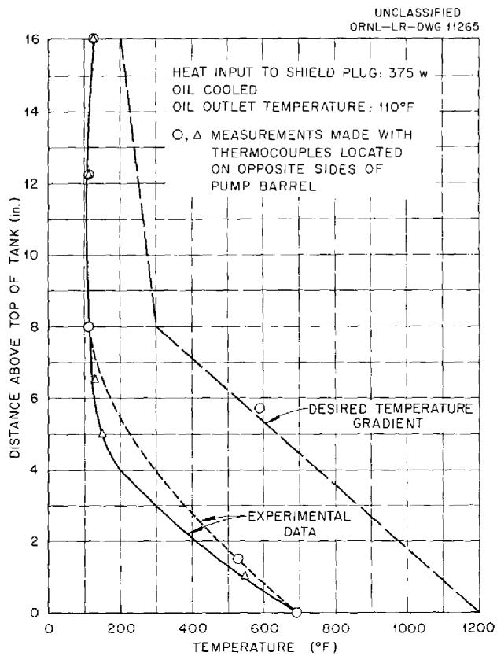  
Fig. 2.8. Temperature Gradient Along Pump Barrel in Run 1.

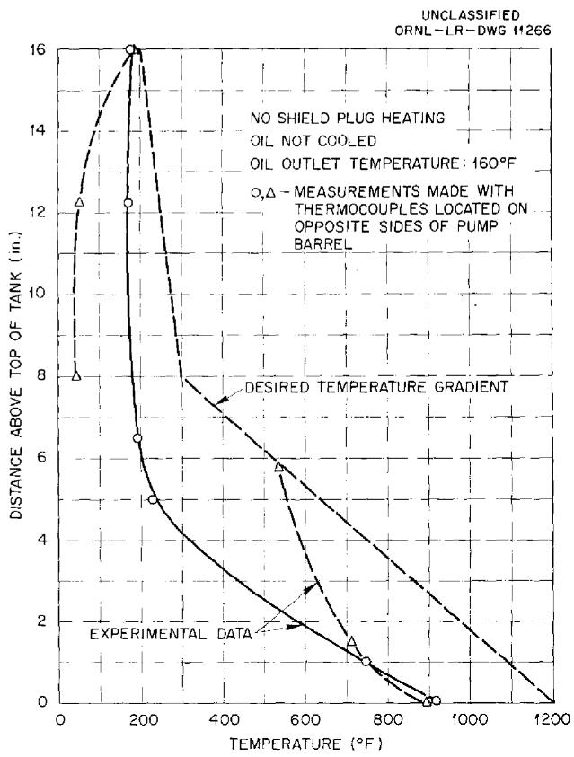  
Fig. 2.9. Temperature Gradient Along Pump Barrel in Run 2.

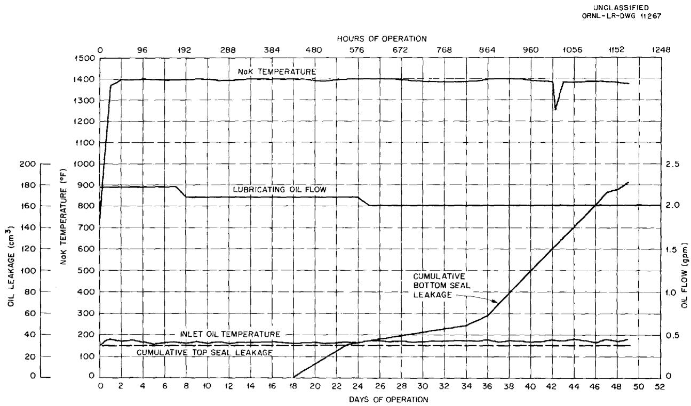  
Fig. 2.10. Performance of MF-2 Pump with NaK as the Pumped Fluid, Run 3.

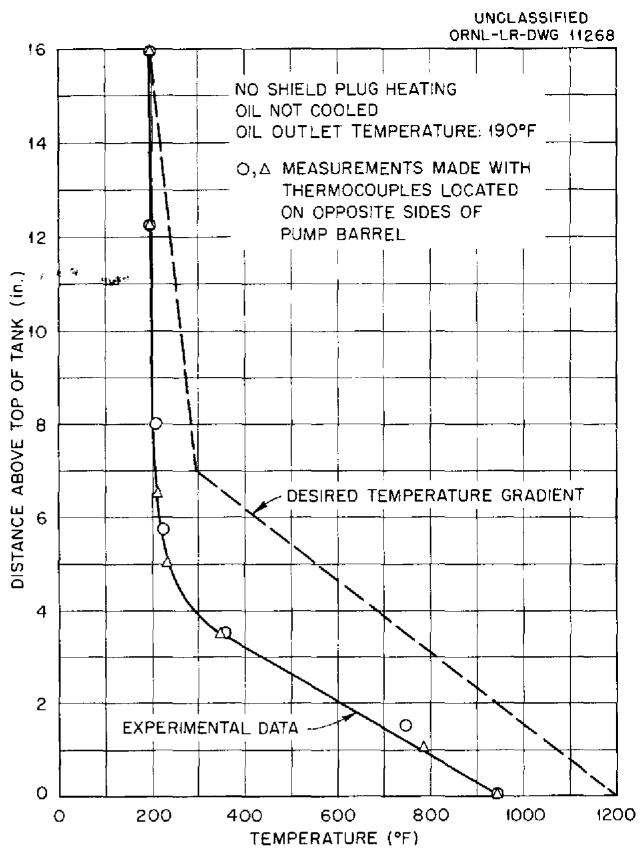  
Fig. 2.11. Temperature Gradient Along Pump Barrel in Run 3.

The original test program called for simulation of gamma-ray and neutron heating in the shield plug by using a Calrod heater to produce about 2.5 kw of heat. However, as mentioned before, this part of the test program has been delayed because of troubles with the plug heater. Apparently, several problems must be solved. A satisfactory means must be found for insulating the electrical leads (close mechanical clearances complicate this) for operation up to $1500^{\circ}\mathrm{F}$ in a helium atmosphere. Also, a heat source must be constructed that can supply approximately $7\mathrm{W/cm}^3$ without reaching a temperature that will destroy the heater.

As a further complication, two reactor operating conditions must be simulated by the shield plug. First, to simulate reactor operation at zero power, the lower surface of the plug must be maintained at a minimum temperature of $1000^{\circ}\mathrm{F}$ in order to prevent fuel from freezing on its lower face and seizing the slinger impeller of the pump. Second, to simulate reactor operation at full power, the plug must be able to conduct away enough heat to maintain the lower face at a temperature of 1500 to

$1600^{\circ}F$ so that the mechanical strength of the Inconel can on the shield plug will not be impaired.

A second test stand, similar to that shown in Fig. 2.7, will be in operation soon. This test loop will circulate fuel, and a hydraulic motor rather than an electric motor will be used to drive the pump. Data will be taken on operation of the hydraulic drive, as well as on pump operation.

# High-Temperature Pump-Performance Test Stands

R.Curry H.Young

Pratt & Whitney Aircraft

Two high-temperature loops, described previously, for testing MF-2 ART-type fuel pumps are being fabricated. Cavitation, performance, shakedown, endurance, and acceptance tests on MF-2 pump rotary assemblies will be made with NaK and with the fuel mixture NaF-ZrF4-UF4 (50-46-4 mole %) as the circulated fluids and with fluid temperatures of up to $1400^{\circ}\mathrm{F}$ .

The design layout has been completed for a high-temperature loop for testing MN-2 ART-type sodium pumps. Cavitation, performance, shakedown, and acceptance tests on MN-2 pump rotary assemblies will be made with sodium at temperatures of up to $1400^{\circ}\mathrm{F}$ . Most features of this loop are similar to those of the loop for testing MF-2 ART-type fuel-pump performance.

High-temperature performance-testing loops are being designed for testing PK-2 and PK-A ART-type NaK pumps. Cavitation, performance, shakedown, endurance, and acceptance tests on NaK pump rotary assemblies are to be made at NaK temperatures of up to $1400^{\circ}\mathrm{F}$ .

# HEAT EXCHANGER DEVELOPMENT

E.R.Dytko

Pratt & Whitney Aircraft

R. E. MacPherson

Aircraft Reactor Engineering Division

# Intermediate Heat Exchanger Tests

R. D. Peak

M. H. Cooper

J. M. Cooke

L. R. Enstice

Pratt & Whitney Aircraft

Designs of the two fuel-to-NaK heat exchangers that are to be tested in stands B and C were completed. Type IHE-3, shown in Fig. 2.12, is an

all-Inconel 100-tube design, for which 0.25-in.-OD, 5.6-ft-long, 0.025-in.-wall tubing is to be used. Type IHE-8, shown in Fig. 2.13, which is also all Inconel, is a 144-tube design, for which 0.1875-in.- OD, 5.6-ft-long, 0.025-in.-wall tubing is to be used. These heat exchangers will be tested in a

regenerative system of the type shown in Fig. 2.14, with two tube bundles operating in series. Figures 2.15 and 2.16 show the range of operating conditions which can be expected from the two heat exchangers, and Figs. 2.17 and 2.18 show stresses which will be encountered in the test

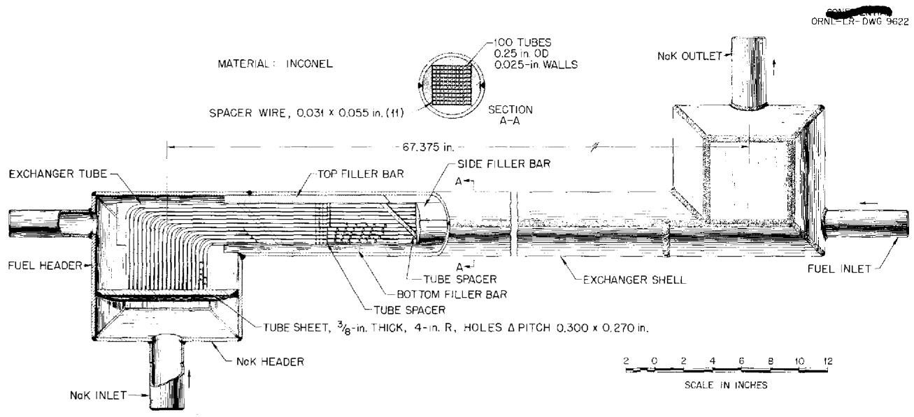  
Fig. 2.12. Fuel-to-NaK Heat Exchanger Type IHE-3.

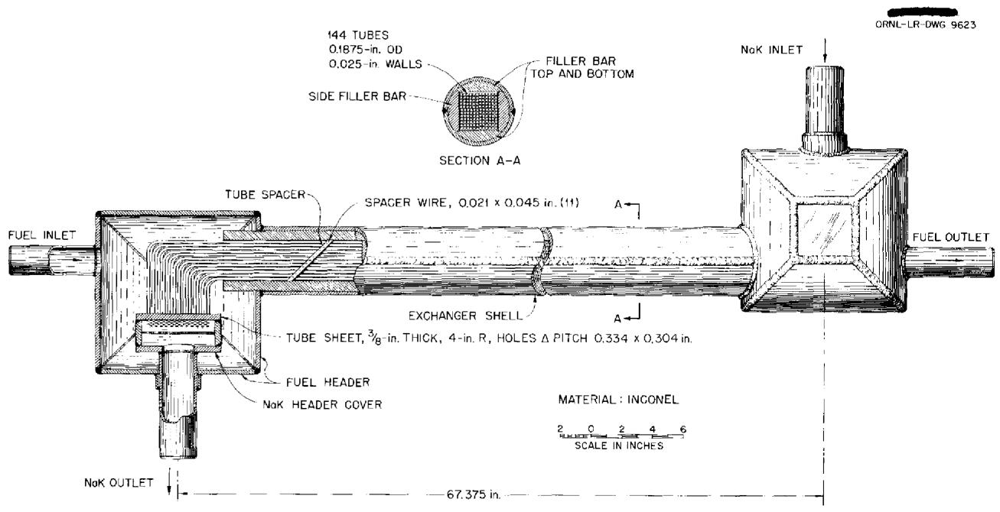  
Fig. 2.13. Fuel-to-NaK Heat Exchanger Type IHE-8.

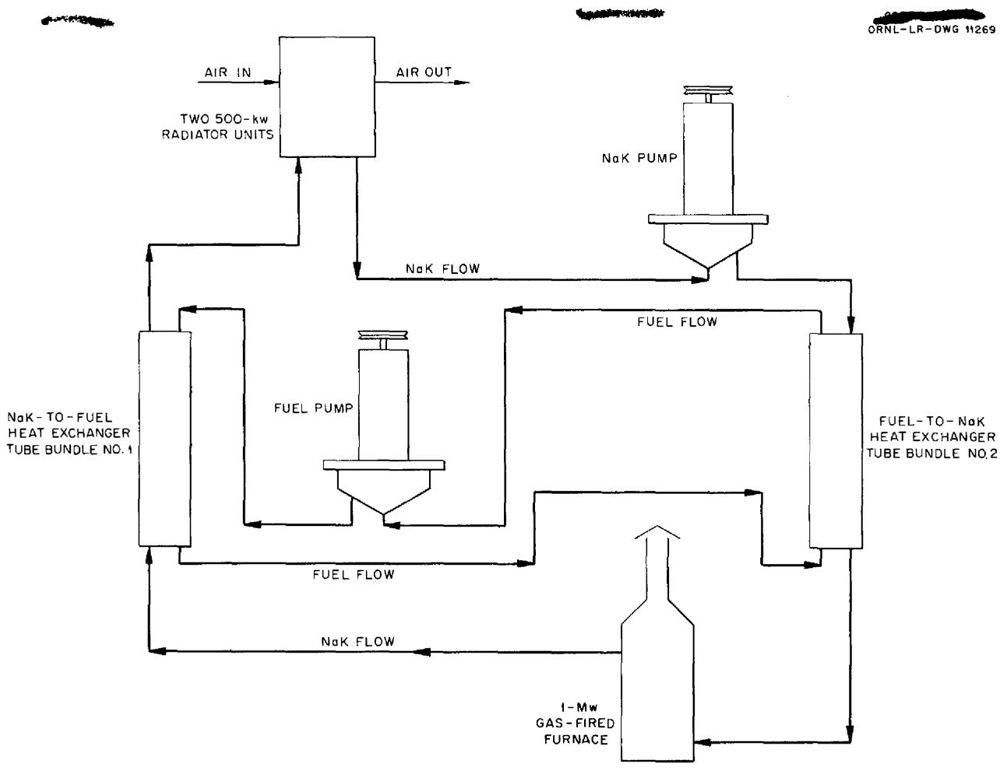  
Fig. 2.14. Diagram of Intermediate Heat Exchanger Test Stand.

units throughout the operating range. The thermal stresses (calculated by using Castigliano's theorem) are imposed on the heat exchanger tubing by the difference in temperature between the tubing and the shell of the heat exchanger. These stresses are relieved by creep and are the stresses of primary interest in a thermal-cycling program. The pressure stresses (calculated by using simple cantilever-beam theory) are imposed on the tubing by the drag forces of the flowing fluid and are not relieved by creep; rather, the tubing is steadily deformed.

Test stand A, the first experimental assembly operated in the present series of intermediate heat exchanger tests, was described previously. It was operated for 434 hr during this quarter in a

series of radiator and circulating-cold-trap tests. A chronological description of the test operations is presented in Table 2.4. The stand was operated with York radiator units No. 1 and No. 2 until unit No. 1 failed. When unit No. 1 had been removed, operation was resumed and continued until unit No. 2 failed. York unit No. 3 is currently being installed. Examination of unit No. 1, which failed after 140 hr of operation, revealed severe buckling of the side plates of the radiator core because of differential thermal expansion between the tube matrix and the side plates. With no air flow across the radiator core, the temperatures of these plates could be $125^{\circ}\mathrm{F}$ below the tube temperature, and, during periods of heat removal from the radiator, a temperature difference of 300 to $1200^{\circ}\mathrm{F}$ could exist. Temperature differentials of such magnitudes would cause severe compressive stress in the tubes at the start of air

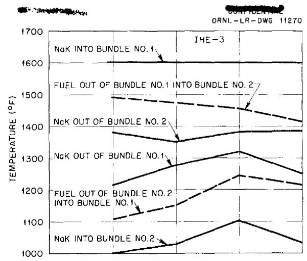

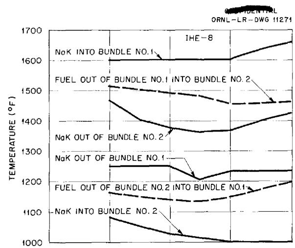

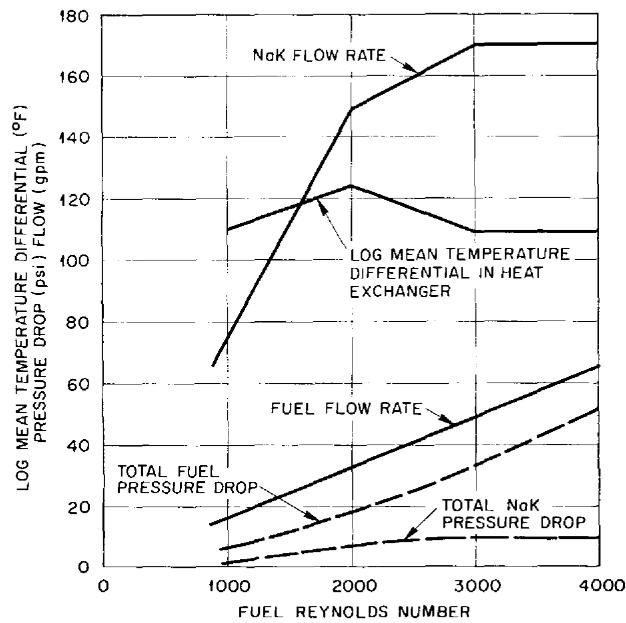

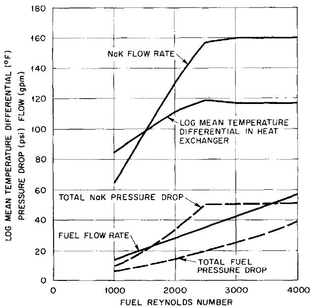  
Fig. 2.15. Predicted Operating Performance of Fuel-to-NaK Heat Exchanger Type IHE-3 in Test Stand B.   
Fig. 2.16. Predicted Operating Performance of Fuel-to-NaK Heat Exchanger Type IHE-8 in Test Stand C.

flow, and, if it is assumed that the compressive stress is relieved by creep, equally severe tensile stress would be present when the air flow was stopped. The results of metallurgical examination of the unit are reported in Sec. 5, "Metallurgy and Ceramics."

Prior to initiation of operation with York unit No. 2, the side plates were split so that the tubes could move freely with core temperature changes. This unit subsequently failed during thermal-cycling tests after $435\mathrm{hr}$ of operation. Figure

2.19 shows the split side cover plates and the results of the NaK leak and fire. Since the location of the leak was almost the same as the location of the leak in York unit No. 1, that is, near the side plate and near a horizontal stiffener plate, the same conditions which caused York unit No. 1 to fail undoubtedly weakened York unit No. 2. In the case of York unit No. 2, as with ORNL units Nos. 1 and 2, a marked increase in the radiator friction factor ( $\sim 12\%$ ) occurred prior to failure. The exact cause of this increase, which was not

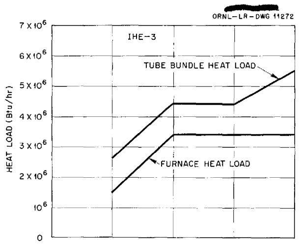

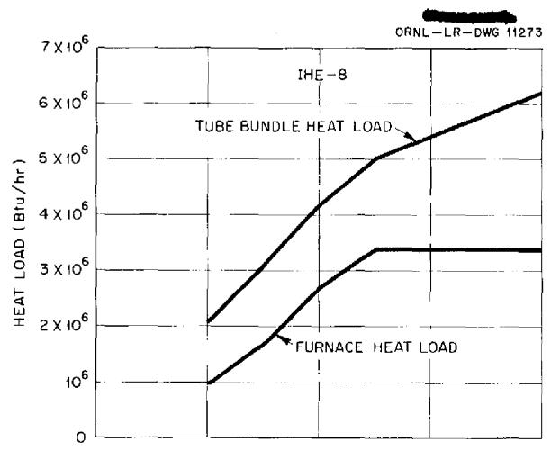

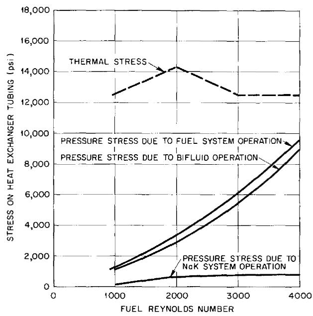

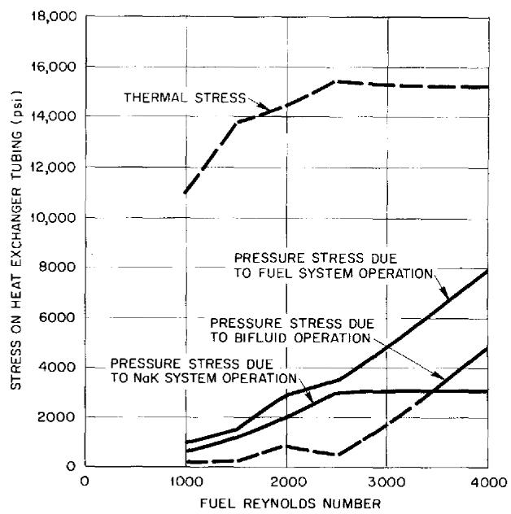  
Fig. 2.17. Predicted Operating Heat Loads and Stresses of Fuel-to-NaK Heat Exchanger Type IHE-3 in Test Stand B.   
Fig. 2.18. Predicted Operating Heat Loads and Stresses of Fuel-to-NaK Heat Exchanger Type IHE-8 in Test Stand C.

encountered prior to the failure of York unit No.1, has not yet been established.

During the shutdown for installation of York radiator units Nos. 1 and 2, the diffusion cold trap initially used on this stand was changed to a circulating cold trap. The trap, as modified, consists of a 6-in. pipe, 36 in. long, that contains York Demister stainless steel packing in the top 30 in. The NaK flowed into the trap through an economizer section $(\frac{1}{2}$ -in. pipe inside a 2-in. pipe, 12 in. long) mounted on top of the cold-trap body,

flowed through the central $\frac{1}{2}$ -in. pipe to the bottom of the trap, flowed back up over the packing to the economizer, and then flowed back to the system. The trap was cooled with forced air, and heaters were provided for local temperature control. It was installed in series with, and downstream from, the plug indicator. The series arrangement was not suitable, however, because cooling of the plug indicator caused plugging to start in the cold trap. A parallel installation was therefore devised, and with this installation the trap could be operated at

TABLE 2.4. SUMMARY OF OPERATION OF INTERMEDIATE HEAT EXCHANGER TEST STAND A  

<table><tr><td>Hours of Operation</td><td>Remarks</td></tr><tr><td>690</td><td>Operation continued from previous quarter. NaK system repaired by the installation of new York radiator units Nos. 1 and 2, new circulating cold trap, and plug indicator; trap and indicator piped in series. Blower operated to measure radiator air flow at 90°F. Filled system with NaK (56% Na-44% K) at room temperature.</td></tr><tr><td>690 to 720</td><td>NaK system operated isothermally at 1500°F with flow rate of 80 gpm to check operation of cold trap. Plug indicator gave erroneous measurements of sodium oxide because of interaction of cold trap in series with it.</td></tr><tr><td>720 to 748</td><td>Radiator tests with the NaK system operated at various flow rates and temperatures between 1000 and 1650°F; blower run at various air flow rates. Eleven measurements taken.</td></tr><tr><td>748 to 823</td><td>NaK system operated isothermally at 1300°F with flow rate of 80 gpm.</td></tr><tr><td>823 to 830</td><td>Radiator tests with the NaK system operated at various flow rates and temperatures; blower at various air flow rates. Three measurements taken. Tests terminated because of a leak in York radiator unit No. 1. This radiator was cut out for examination, and the air duct was changed to fit the remaining York radiator unit No. 2. The circulating cold trap was modified with a throttling valve so that the plug indicator and the cold trap operated in parallel NaK streams. Blower operated to measure radiator air flow with NaK system at 90°F.</td></tr><tr><td>830 to 909</td><td>NaK system operated isothermally at 1300°F with flow rate of 40 gpm to check operation of cold trap. Sodium oxide plugging temperature reduced from 1000 to 750°F.</td></tr><tr><td>909 to 999</td><td>Radiator tests with the NaK system operated at various flow rates and temperatures; blower at various air flow rates. Twenty-five measurements taken. Cold trap operated intermittently to control the oxide content.</td></tr><tr><td>999 to 1017</td><td>NaK system operated isothermally at 1200°F with a flow rate of 40 gpm. Cold trap operated to reduce the oxide plugging temperature from 920 to 800°F. NaK system shut down to calibrate the electromagnetic flowmeter on the main NaK system.</td></tr><tr><td>1017 to 1:12</td><td>NaK system operated isothermally at 1400°F with a flow rate of 40 gpm. Cold trap operated in an attempt to reduce oxide content; plugging temperatures varied erratically between 1010 and 720°F.</td></tr><tr><td>1112 to 1124</td><td>Radiator thermally cycled according to the following schedule: high power for 4 hr; NaK into radiator at 1500°F, out at 1140°F; flow, 42 gpm; air in at 90°F, out at 1100°F; low power for 2 hr; NaK circulated isothermally at 1425°F; flow, 42 gpm; no air flow. York radiator unit No. 2 failed on the start of the third cycle to high power. The radiator was cut out for examination by the Metallurgy Division, and the cold trap was cut out for examination by the Materials Chemistry Division. A new circulating cold trap, a new screen filter, a duplicate plug indicator, and York radiator unit No. 3 are being placed in the NaK system.</td></tr></table>

0.3-gpm NaK flow with a minimum temperature of $350^{\circ}\mathrm{F}$ . At the end of the test when the cold trap was cut open for examination by the Materials Chemistry Division, it was found that the trap had not effectively removed oxides. The equivalent of 75 g of $\mathsf{O}_2$ was found, which corresponds to the

removal of 260 ppm of $\mathsf{O}_2$ from the 80 gal of NaK used in the system during operation of the cold trap.

The NaK samples taken during this quarter indicate that the cleaning done to remove the fuel constituents which leaked into the NaK system at the time of failure of IHE No. 2, described previously, was not complete. Fuel constituents

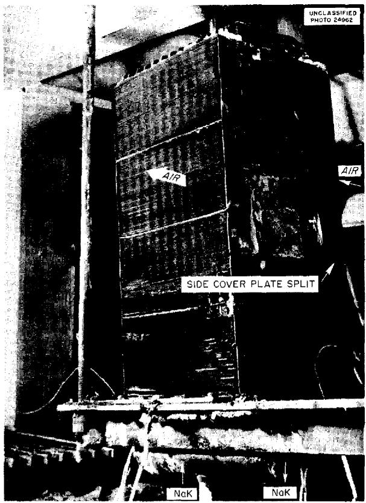  
Fig. 2.19. York NaK-to-Air Unit No. 2 from Intermediate Heat Exchanger Test Stand A after NaK Leak and Fire.

continue to show up in miscellaneous NaK samples, as illustrated below:

<table><tr><td></td><td>Uranium 
Content</td><td>Zirconium 
Content 
(wt %)</td></tr><tr><td>Drain from circulating cold trap</td><td>0.007 g</td><td></td></tr><tr><td>Leak from York radiator unit No. 1</td><td>1.4 wt %</td><td>1.9</td></tr><tr><td>Leak from York radiator unit No. 2</td><td>1.9 wt %</td><td></td></tr></table>

Since the sump, plug indicator, and cold trap were opened and cleaned manually before reinstallation on the chemically cleaned system, it is certain that the fuel constituents were held up in portions of the pump and furnace which were not adequately reached by the cleaning solutions.

The analyses of the NaK drained from the circulating cold trap and of the water used to wash the trap are also of interest:

<table><tr><td></td><td>Amount in NaK (ppm)</td><td>Amount in Water (g)</td></tr><tr><td>Nickel</td><td>10</td><td>10</td></tr><tr><td>Chromium</td><td>30</td><td>27</td></tr><tr><td>Iron</td><td>89</td><td>1.5</td></tr></table>

These results substantiate other evidence that chromium is preferentially leached from the Inconel in the systems and is carried to the cold regions of the loop in the NaK stream.

Test stand B, described previously, has completed a total of 676 hr of operation, including 247 hr of bifluid operation in a series of radiator, heat exchanger, and circulating-cold-trap tests. A chronological description of the tests conducted and the difficulties encountered is given in Table 2.5. The system is now in steady-state operation with a temperature differential imposed.

As stated in Table 2.5, considerable trouble was experienced with operation of the cold trap and the plug indicator. On stand B, these components are operated in parallel, with the radiator pressure drop as the driving force. The NaK that enters the cold trap is cooled by a forced-air precooler. It is convection-cooled as it passes through the trap, and then it is reheated at the exit end before being discharged through a throttling valve and an electromagnetic flowmeter and being returned to the system. The plug indicator is identical to that on stand A.

Most of the trouble associated with operating the plug indicator and the cold trap has been due to plugging of the small-diameter, $5_{16}^{-}$ in. tubing on the discharge sides. This tubing was utilized in order to magnify the electromagnetic flowmeter signal. A cold trap of the type being installed in stand A will be installed in this loop, and the small-diameter tubing in both the cold-trap and plug-indicator circuits will be removed and replaced with larger tubing.

As stated in Table 2.5, the 2-in. IPS sched-40 pipe adjacent to the electromagnetic flowmeter on the main NaK circuit developed a leak after 374 hr of operation. The resulting fire destroyed the aluminum pieces and fused the pipe surface so that the exact cause could not be determined. Examination of the pipe after it was cut out showed no defects detectable by x ray or Dy-Chek.

TABLE 2.5. SUMMARY OF OPERATION OF INTERMEDIATE HEAT EXCHANGER TEST STAND B  

<table><tr><td>Hours of Operation</td><td>Remarks</td></tr><tr><td>0</td><td>Stand assembled with Pratt &amp; Whitney Aircraft radiator units Nos. 1 and 2 and with ORNL heat exchangers (type IHE-3) Nos. 1 and 2. Filled system with NaK (56% Na-44% K) at room temperature. Operated blower to measure radiator air flow at 90°F.</td></tr><tr><td>0 to 9</td><td>Heated NaK system to 1200°F with flow of 80 gpm. All NaK drained into sump when remotely operated dump valve failed to close when draining some NaK to adjust level in pump. Added manually operated handle to dump valve.</td></tr><tr><td>9 to 88</td><td>NaK system operated isothermally at 1400°F with flow of 80 gpm to check operation of circulating cold trap. Sodium oxide plugging temperature reduced from 940 to 660°F.</td></tr><tr><td>88 to 139</td><td>Radiator tests with the NaK system operated at various flow rates and at temperatures between 1000 and 1550°F; blower at various air flow rates. Cold trap valved out. Plug indicator plugged up and then unplugged when outside resistance heat was added. The NaK-system friction factor* gradually increased 25% during tests.</td></tr><tr><td>139 to 173</td><td>NaK system operated isothermally at 1400°F with flow of 80 gpm with cold trap on to reduce oxide content. Faulty operation of the trap washed oxide back into the system initially; however, the trap reduced the plugging temperature from 850 to 730°F. The NaK-system friction factor was reduced by 13%.</td></tr><tr><td>173 to 175</td><td>Furnace test with the NaK system operated at flow rate of 140 gpm, a temperature of 1350°F into the furnace and a temperature of 1500°F out. The Struthers Wells furnace burned 8100 scfh of natural gas with a thermal efficiency of 48%. Heat transfer to the NaK was 3.69 x 10^6 Btu/hr (1.08 Mw). Cold trap valved out.</td></tr><tr><td>175 to 350</td><td>The NaK system operated isothermally at 1400°F with a flow rate of 80 gpm. Cold trap in operation; plug indicator plugged, unplugged, and finally plugged solid.</td></tr><tr><td>204 to 206</td><td>Fuel system filled for cleaning with NaF-ZrF4-UF4 (50-46-4 mole %) and operated isothermally at 1400°F for 2 hr at a fuel flow rate of 30 gpm; fuel then dumped. System filled with new fuel, NaF-ZrF4-UF4 (50-46-4 mole %). Bifluid isothermal operation at 1400°F with NaK flow of 80 gpm and fuel flow of 30 gpm. Test stopped because of leak in 2-in. NaK pipe adjacent to the electromagnetic flowmeter. Replaced NaK pipe and the plugged tubing downstream from the plug indicator.</td></tr><tr><td>374 to 388</td><td>Heated NaK system to 1200°F with flow of 80 gpm. NaK drained into sump while repairing NaK dump valve. Found helium line to NaK pump plugged with sodium oxide.</td></tr><tr><td>388 to 453</td><td>NaK system operated isothermally at 1400°F with a flow rate of 80 gpm to check cold-trap operation. Electromagnetic flowmeter on plug indicator failed. No change in NaK-system friction factor.</td></tr><tr><td>453 to 604</td><td>Heat exchanger tests in bifluid operation at various temperatures between 1000 and 1500°F; NaK, fuel, and blower air flow rates varied. Radiator data also taken. The circulating cold trap plugged. NaK-system friction factor increased 35%. Thirteen heat transfer measurements taken.</td></tr><tr><td>604 to 628</td><td>Bifluid isothermal operation at 1300°F; NaK flow rate, 145 gpm; fuel flow rate, 30 gpm. Attempted to unplug cold trap by using resistance heating on tubing. NaK-system friction factor did not change.</td></tr><tr><td>628 to 676</td><td>Bifluid operation with a temperature differential across system; NaK flow rate, 145 gpm; high NaK temperature, 1600°F; low NaK temperature, 1100°F; fuel flow rate, 42 gpm; high fuel temperature, 1435°F; low fuel temperature, 1250°F. NaK-system friction factor increased an additional 8%. Operation continuing.</td></tr></table>

*The friction factor was taken to be the ratio of the NaK-system pressure drop to the square of the NaK flow rate.

Test stand C is being fabricated and is $25\%$ complete. Radiator units supplied by the Cambridge Corp. and heat exchangers being built by Black, Sivalls & Bryson, Inc., will be tested first.

# Small Heat Exchanger Tests

J. C. Amos

Aircraft Reactor Engineering Division

L. H. Devlin

J. G. Turner

Pratt & Whitney Aircraft

Small heat exchanger test stand B, shown in Fig. 2.20, was placed in operation on November 3, 1955. The test units installed in this stand are a 20-tube fuel-to-NaK heat exchanger and a 500-kw NaK-to-air radiator (ORNL No. 3), both built by the Metallurgy Division of ORNL. The heat exchanger tubes, 0.25 in. in outside diameter and 0.025 in. in wall thickness, are arranged in a 4 by 5 matrix with 0.282-in. center-to-center spacing.

The test stand includes a circulating cold trap, described previously and shown in Fig. 2.21, for removing oxides from the NaK. The NaK circulating in the cold trap is cooled by an economizer located in the inlet line to the cold trap and by air circulated in the cold-trap cooling coil. With this arrangement, it has been possible to operate at cold-trap temperatures below $150^{\circ}\mathrm{F}$ , with system temperatures as high as $1500^{\circ}\mathrm{F}$ . Relative oxide concentration in the system is determined by an air-cooled plugging indicator, also shown in Fig. 2.21. Much of the initial operation of this test system has been devoted to obtaining data on cold-trap operation. A preliminary analysis of the data indicates that cold-trap performance is reproducible and that the oxide concentration of the NaK can be repeatedly reduced.

Small heat exchanger test stand C is approximately $65\%$ complete. This stand is identical with stand B, with minor exceptions. The heat exchanger is identical with the one in stand B and was also built by the Metallurgy Division of ORNL, but the 500-kw NaK-to-air radiator is York unit No. 5.

The design of a 25-tube heat exchanger, with 0.1875-in.-OD, 0.025-in.-wall tubing and 0.2175-in. center-to-center spacing, that is to operate at ART temperature and flow conditions was com

pleted. This unit is shown in Fig. 2.22. Negotiations are in progress to obtain four of these units from outside vendors. Present plans call for testing these four heat exchangers, two additional 20-tube heat exchangers, and six additional 500-kw radiators, in small heat exchanger test stands B and C.

# Heat-Transfer and Pressure-Drop Correlations

R. D. Peak

Pratt & Whitney Aircraft

J. C. Amos

Aircraft Reactor Engineering Division

The test data on radiator and heat exchanger heat transfer and pressure drop obtained with the intermediate and small heat exchanger test stands have been correlated. The parameters of the various radiators tested are presented in Table 2.6, and those of the several heat exchangers in Table 2.7.

The air pressure-drop correlation for the radiators is shown in Fig. 2.23, where the pressure drop per tube row (in inches of water), corrected from the air film temperature to $60^{\circ}\mathrm{F}$ , is plotted against the ratio of air flow rate to the free-flow area. The points for ORNL-1,-2, PWA-1,-2, and York-1,-2 are averages for the two radiator units, since the two radiators were usually operated simultaneously. The air heat-transfer correlation for these radiators is shown in Fig. 2.24, where the air Nusselt number at the film temperature is plotted against the air Reynolds number at the film temperature. The air-side heat-transfer coefficient was calculated by taking into account the NaK-side and the tube and fin collar metal heat-transfer resistances. The NaK-side resistance was calculated by using the Lubarsky equation: $\mathrm{Nu} = 0.625(\mathrm{Re} \times \mathrm{Pr})^{0.4}$ . It was found that the fin efficiencies ranged from 88 to $94\%$ . It is apparent that the seven radiators built by the three sources from the same specifications resulted in a wide range of performance.

The NaK pressure-drop correlation is shown in Fig. 2.25, where the friction factor is plotted against Reynolds number. Also included in the correlation are two water tests: one with new, 0.1875-in.-OD, 0.025-in.-wall, Inconel tubing, the

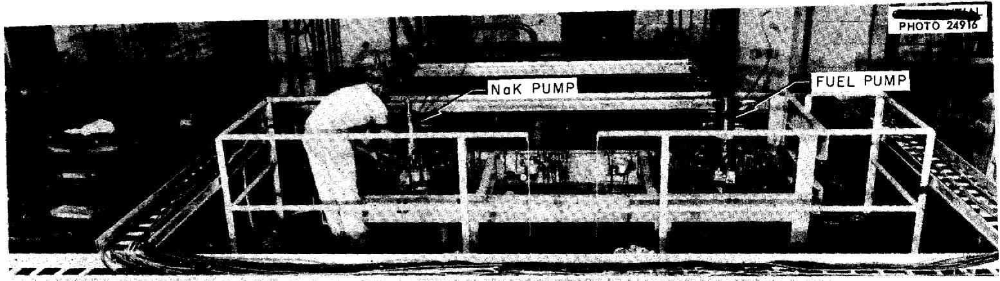

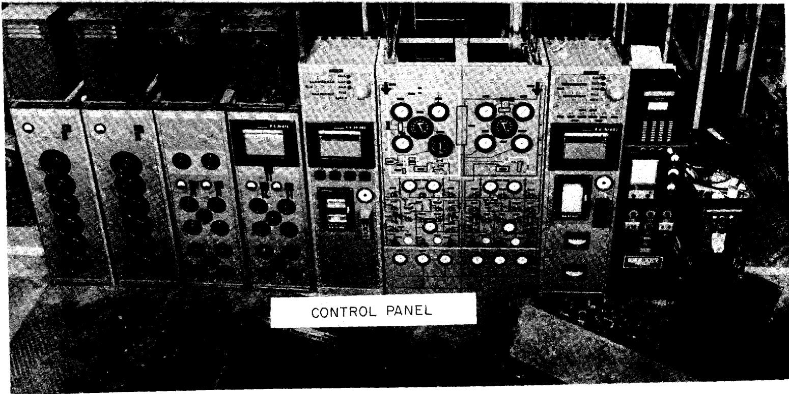  
Fig. 2.20. Small Heat Exchanger Test Stand B.

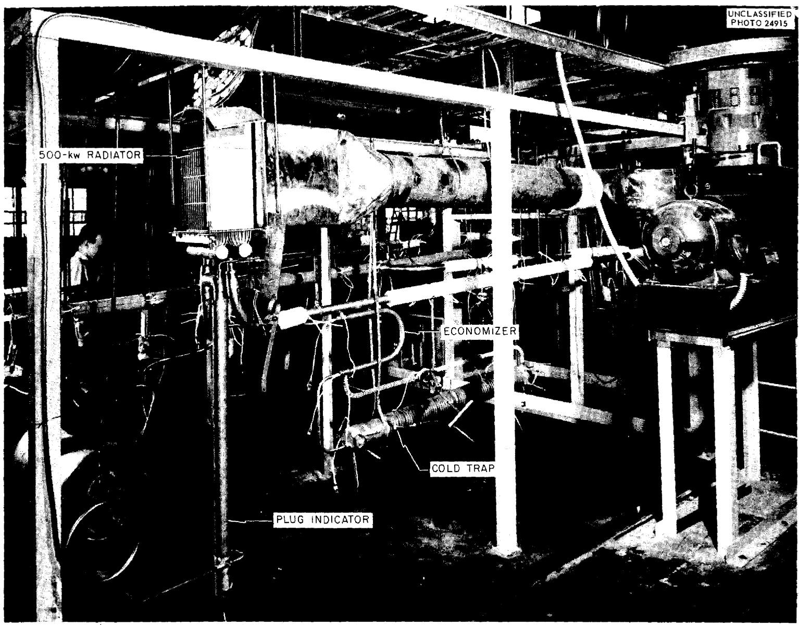  
Fig. 2.21. Small Heat Exchanger Test Stand B Showing Cold Trap and Plug Indicator.

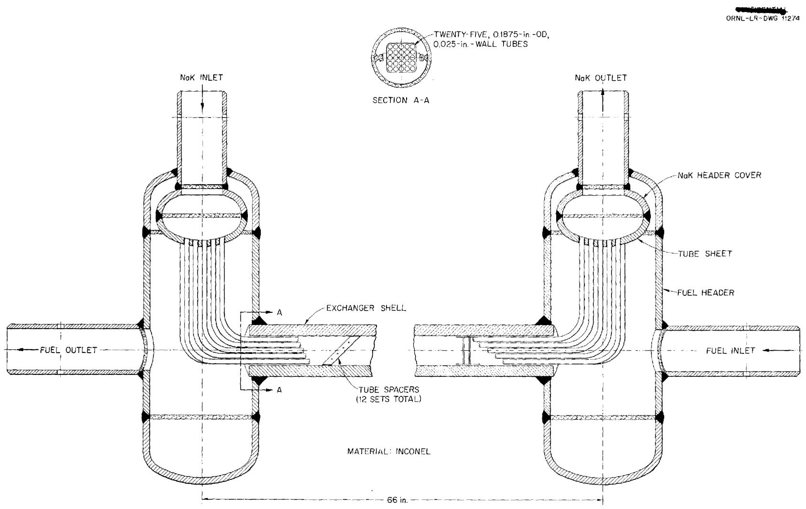  
Fig. 2.22. Twenty-Five Tube Fuel-to-NoK Heat Exchanger.

TABLE 2.6. PARAMETERS OF 500-kw NaK-TO-AIR RADIATORS FROM VARIOUS SOURCES   

<table><tr><td>Parameter</td><td>ORNL-1,-2aPWA-1,-2b</td><td>ORNL-3a</td><td>York-1,-2c</td></tr><tr><td>Tube material</td><td>Inconel</td><td>Inconel</td><td>Inconel</td></tr><tr><td>Number of tubes</td><td>72</td><td>72</td><td>72</td></tr><tr><td>Inside diameter of tubes, ft</td><td>0.0115</td><td>0.0112</td><td>0.0115</td></tr><tr><td>Tube wall plus fin collar thickness, ft</td><td>0.003</td><td>0.003</td><td>0.003</td></tr><tr><td>NaK free-flow area, ft2</td><td>0.00742</td><td>0.00714</td><td>0.00742</td></tr><tr><td>NaK-side heat-transfer area, ft2</td><td>6.92</td><td>6.72</td><td>6.92</td></tr><tr><td>Mean tube plus collar heat-transfer area, ft2</td><td>8.68</td><td>8.48</td><td>8.68</td></tr><tr><td>Fin material</td><td colspan="3">Type 310 stainless-steel-clad copper, 0.010 in.thick, sched 25-50-25</td></tr><tr><td>Number of fins in vertical stack</td><td>243</td><td>236</td><td>254</td></tr><tr><td>Length of air flow passage, ft</td><td>0.646</td><td>0.646</td><td>0.646</td></tr><tr><td>Air-side fin heat-transfer area, ft2</td><td>201</td><td>196</td><td>210</td></tr><tr><td>Air-side tube plus collar heat-transfer area, ft2</td><td>9</td><td>8</td><td>8</td></tr><tr><td>Air free-flow area, ft2</td><td>0.519</td><td>0.538</td><td>0.509</td></tr><tr><td>Air equivalent diameter, ft</td><td>0.00884</td><td>0.00911</td><td>0.00832</td></tr><tr><td>Fin average thermal conductivity, Btu/hr·ft.°F</td><td>109</td><td>109</td><td>109</td></tr></table>

$a_{\text{Manufactured by Oak Ridge National Laboratory Metallurgy Division}}$   
$b_{\text{Manufactured by Pratt & Whitney Aircraft}}$   
Manufactured by York Corp.

other with the tubing from the 20-tube fuel-to-NaK heat exchanger bundle, which showed indentations where the wire spacers had pressed into the tubing during 1500 hr of operation. All the data shown were taken during isothermal operation, the range of temperatures being 1200 to $1500^{\circ}\mathrm{F}$ , except for the IHE-3 data, which were taken during the radiator tests on intermediate heat exchanger test stand B, previously described in this report. During these tests the NaK-system friction factor was observed to rise $25\%$ . An intensive investigation is now being conducted on all heat exchanger test stands to determine the reason for the apparent rise in pressure drop observed during operation with a temperature differential imposed on the system.

The fuel pressure-drop correlation is shown in Fig. 2.26, where the sum of the skin friction and

the spacer friction is plotted against Reynolds number. The spacer-friction data, which were obtained by using water-test data (described previously) corrected for the various spacer thicknesses and lengths by using the correlation of Cohen, Fraas, and LaVerne, are also plotted separately for each heat exchanger.

The fuel-side heat-transfer correlation is shown in Fig. 2.27 for two heat exchangers. The NaK-side heat-transfer resistance was calculated by using the Lubarsky equation. The correlation for the 20-tube fuel-to-NaK heat exchanger differs from that presented previously because the

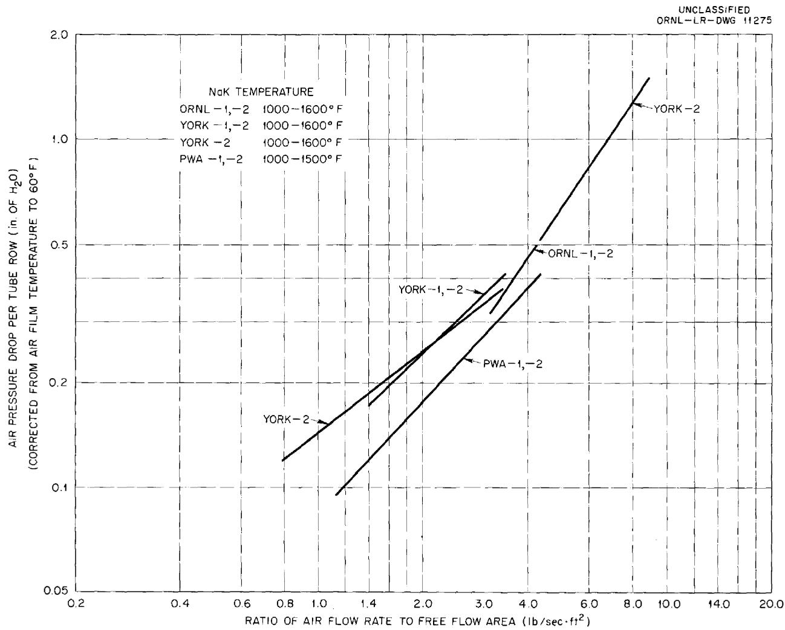  
Fig. 2.23. Air Pressure-Drop Correlation for 500-kw NaK-to-Air Radiators.

equivalent diameter used in the Nusselt number was

$$
4 \times \frac {\text {c r o s s - s e c t i o n a r e a}}{\text {w e t t e d p e r i m e t e r}}
$$

rather than

$$
4 \times \frac {\text {c r o s s - s e c t i o n a r e a}}{\text {t u b e p e r i m e t e r}},
$$

as used before.

# STRUCTURAL TESTS

Outer-Core-Shell Thermal-Stability Test

G.D.Whitman A.M.Smith

Aircraft Reactor Engineering Division

Work has continued on the fabrication of the one-fourth-scale outer-core-shell model and testing assembly. The model is to be subjected to the cyclic thermal and pressure tests that were described in the previous report. All the component parts have been received, and the model assembly

TABLE 2.7. PARAMETERS OF VARIOUS FUEL-TO-NoK HEAT EXCHANGERS   

<table><tr><td>Parameter</td><td>20-Tube
Fuel-to-NaK
Heat Exchanger</td><td>Intermediate
Heat Exchanger
No. 2</td><td>Heat Exchanger
Type
IHE-3</td></tr><tr><td>Tube material</td><td>Inconel</td><td>Inconel</td><td>Inconel</td></tr><tr><td>Number of tubes</td><td>20</td><td>100</td><td>100</td></tr><tr><td>Tube outside diameter, in.</td><td>0.1875</td><td>0.1875</td><td>0.25</td></tr><tr><td>Tube wall thickness, in.</td><td>0.017</td><td>0.017</td><td>0.025</td></tr><tr><td>NaK flow length, ft</td><td>5.75</td><td>6.03</td><td>6.38</td></tr><tr><td>NaK free-flow area, ft²</td><td>0.00258</td><td>0.0129</td><td>0.0218</td></tr><tr><td>NaK-side heat-transfer area, ft²</td><td>3.90</td><td>22.6</td><td>29.4</td></tr><tr><td>Shell inside dimensions, in.</td><td>0.910 × 1.130</td><td>2.10 × 2.10</td><td>2.72 × 2.72</td></tr><tr><td>Spacer dimensions, in.</td><td>0.032 × 0.032</td><td>0.022 × 0.040</td><td>0.020 × 0.040</td></tr><tr><td>Number of spacers</td><td>11</td><td>13</td><td>11</td></tr><tr><td>Fuel flow length, ft</td><td>4.85</td><td>5.62</td><td>5.62</td></tr><tr><td>Fuel free-flow area, ft²</td><td>0.00328</td><td>0.0115</td><td>0.0173</td></tr><tr><td>Fuel-side heat-transfer area, ft²</td><td>4.75</td><td>27.6</td><td>36.7</td></tr><tr><td>Fuel equivalent diameter, ft</td><td>0.0102</td><td></td><td></td></tr></table>

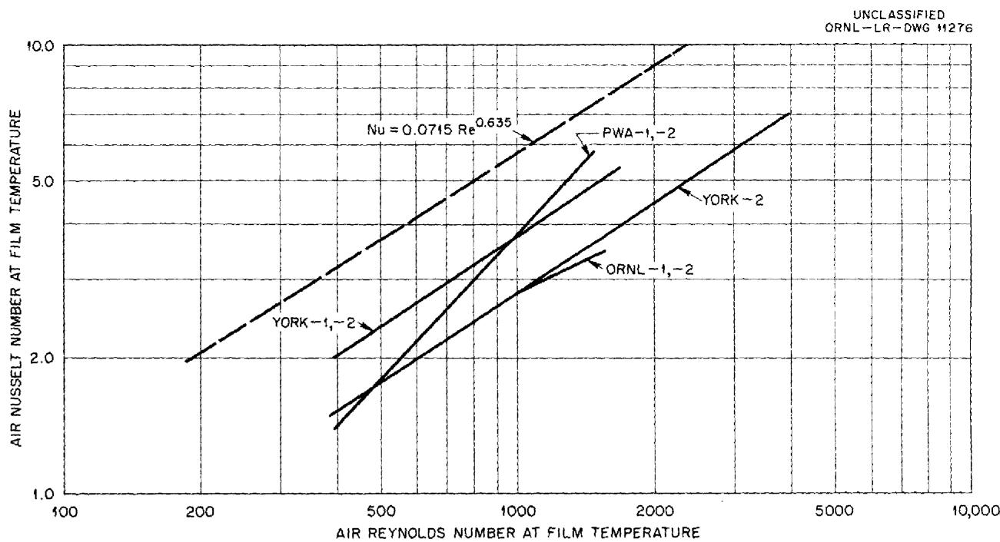  
Fig. 2.24. Air Heat-Transfer Correlation for 500-kw NaK-to-Air Radiators.

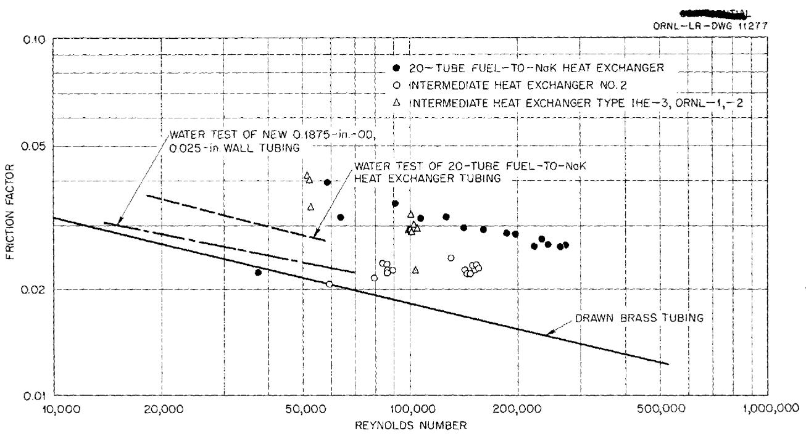  
Fig. 2.25. NaK-Side Pressure-Drop Correlation for Three Heat Exchangers.

is $50\%$ complete. Assembly of the apparatus was delayed approximately one month by difficulties encountered in the bellows manufacture and by a design change in the model.

The welded bellows was fabricated from hydraulically formed, 0.015-in.-thick Inconel diaphragms. The vendor had difficulty in heat treating the Inconel shim stock so that it would not rupture during the forming operation or crack during the fusion-welding process.

The design of the core shell was changed to incorporate a thermal barrier in the small-diameter end. This drastically reduced the radial temperature difference in the shell wall between the test section and the free, or bellows, end. The heat dam consists of a rigid, evacuated container filled with Fiberfrax insulation. This modification produces conditions which more nearly simulate the conditions that will exist in the reactor core shell, in that the thermal stress induced cannot be relieved by differential axial expansion in the shell wall at the free end.

# Inconel Strain-Cycling Tests

J.C.Amos

Aircraft Reactor Engineering Division

J.H.DeVan

Metallurgy Division

C. H. Wells

Pratt & Whitney Aircraft

Two anvil bending-test assemblies were placed in operation for obtaining basic information on the behavior of Inconel under strain cycling at elevated temperatures in both inert and corrosive atmospheres. This assembly, which was described previously, is shown in Fig. 2.28 with the tank removed. Tests are now being conducted in helium at 1200, 1400, and $1600^{\circ}\mathrm{F}$ . Compressive and tensile strains of 0.2, 0.4, 0.6, and $1.0\%$ are introduced alternately in the outer fibers of the specimens by bending. The time periods employed between stress reversals are from $\frac{1}{2}$ to 2 hr. As the individual tests are completed, the test specimens are forwarded to the Metallurgy Division for visual and metallographic examination. The results for the tests completed thus far

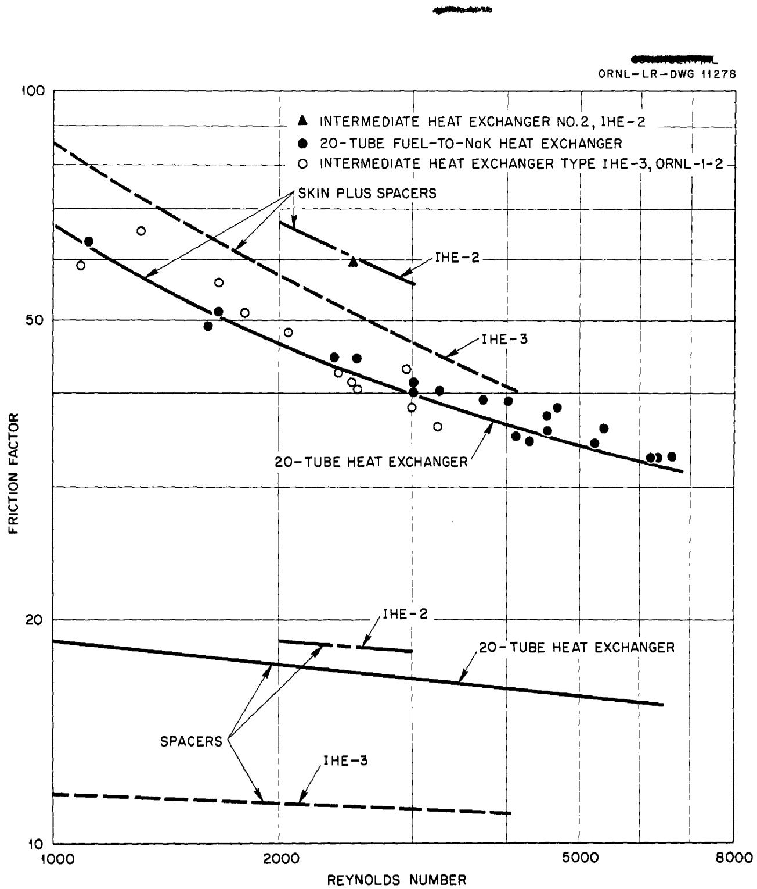  
Fig. 2.26. Fuel-Side Pressure-Drop Correlation for Three Heat Exchangers.

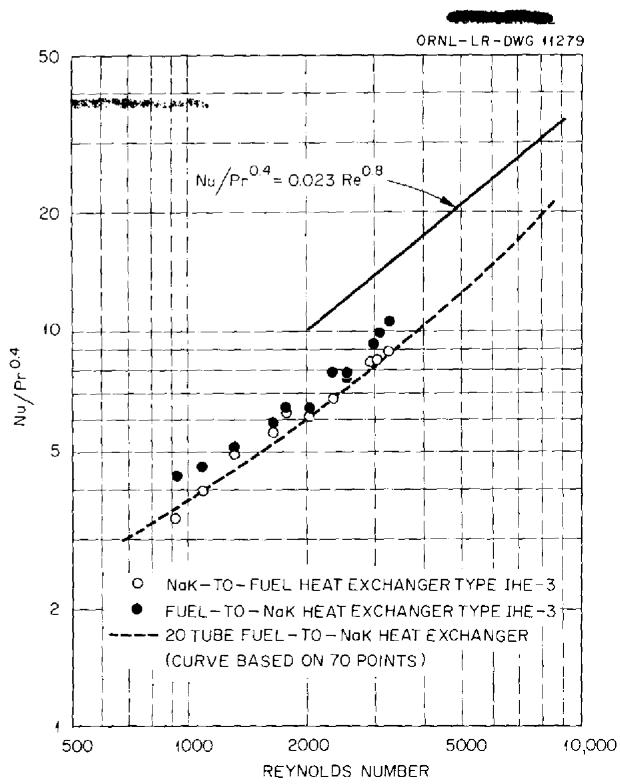  
Fig. 2.27. Fuel-Side Heat-Transfer Correlation for Two Heat Exchangers.

are presented in Table 2.8. It is apparent that temperature has a major influence on the initiation of cracks. The number of cracks produced for a given number of cycles was greater at 1200 than at $1400^{\circ}\mathrm{F}$ and was greater at 1400 than at $1600^{\circ}\mathrm{F}$ .

# Thermal-Cycling Test of Sodium-Inconel-Beryllium System

M. H. Cooper R. D. Peak Pratt & Whitney Aircraft

The third test to be operated in the sodium-beryllium-Inconel thermal-cycling test apparatus described previously was terminated on September 30, 1955, after a total of 397 hr of operation. Twenty-two cycles had been completed in 202 hr of cyclic operation. Each cycle represented 4 hr of operation at high power, during which the sodium entered the test section at $1150^{\circ}\mathrm{F}$ and was heated electrically to $1300^{\circ}\mathrm{F}$ , and 4 hr of operation at low power, during which the sodium entered the test section at $1290^{\circ}\mathrm{F}$ and left at $1300^{\circ}\mathrm{F}$ . Of the 202 hr of cyclic operation, 26 hr was at steady-state and low power because of

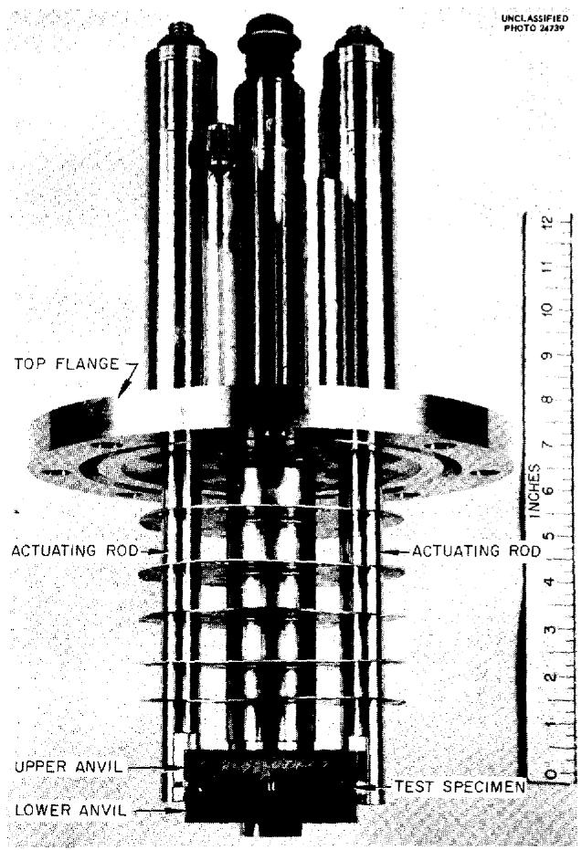  
Fig. 2.28. Inconel Strain-Cycling Assembly.

cycling difficulties. The 195 hr of isothermal operation included a temperature range of 1100 to $1300^{\circ}\mathsf{F}$ .

The abbreviated test program described above was plagued by operating difficulties which made it necessary to drain and cool the system on five different occasions. The first shutdown was caused by a leak in the electromagnetic pump cell. The leak developed when an attempt to start flow by external heating resulted in overheating. The cell had to be cut out and replaced. Three subsequent shutdowns were caused by the resistance heater. One of these shutdowns was for repairs to the control circuit; one was for transformer repairs; and the final one was for transformer replacement. The fifth shutdown was due to failure of the braze joint between the bus bar and one end of the test-piece container. It was during attempts to rebraze this joint that the test-piece container cracked; the resultant sodium leak caused a fire.

TABLE 2.8. RESULTS OF STRAIN-CYCLING TESTS ON INCONEL SPECIMENS  

<table><tr><td>Specimen No.</td><td>Strain (%)</td><td>Number of Cycles</td><td>Cycle Time (hr)</td><td>Specimen Temperature (°F)</td><td>Results of Microscopic Examination</td></tr><tr><td>1F5</td><td>1</td><td>60</td><td>1</td><td>1400</td><td>Cracks observed</td></tr><tr><td>1E5</td><td>1</td><td>80</td><td>1</td><td>1400</td><td>Cracks observed</td></tr><tr><td>1D7</td><td>1</td><td>100</td><td>1</td><td>1400</td><td>Cracks observed</td></tr><tr><td>1C7</td><td>1</td><td>120</td><td>1</td><td>1400</td><td>Cracks observed</td></tr><tr><td>1F4</td><td>1</td><td>50</td><td>1</td><td>1600</td><td>No cracks observed</td></tr><tr><td>1E4</td><td>1</td><td>100</td><td>1</td><td>1600</td><td>No cracks observed</td></tr><tr><td>1F2</td><td>1</td><td>50</td><td>1</td><td>1200</td><td>Cracks observed</td></tr><tr><td>1E2</td><td>1</td><td>60</td><td>1</td><td>1200</td><td>Cracks observed</td></tr><tr><td>1F6</td><td>1</td><td>50</td><td>4</td><td>1200</td><td>No cracks observed</td></tr><tr><td>1E6</td><td>1</td><td>60</td><td>4</td><td>1200</td><td>No cracks observed</td></tr><tr><td>1F3</td><td>0.6</td><td>100</td><td>1</td><td>1400</td><td>Cracks observed</td></tr><tr><td>1E3</td><td>0.6</td><td>150</td><td>1</td><td>1400</td><td>Cracks observed</td></tr></table>

No further attempt was made to continue this test, and the loop is now being cut apart for metallurgical examination. Preparations for a fourth test are under way.

# REACTOR COMPONENT DEVELOPMENT

Dump Valve

J. J. Milich

Pratt & Whitney Aircraft

J.W.Kingsley

Aircraft Reactor Engineering Division

The first, prototype, ART dump valve was checked, and the preliminary tests were completed. This hydraulically actuated valve is of the plug type, with an Inconel bellows seal, and helium is utilized for the cooling of the bellows and the valve stem. The seating material for the plug is Kennametal 152B (64% TiC-30% Ni-6% NbTaTiC₃), and for the seat it is Kennametal 162B (64% TiC-25% Ni-5% Mo-6% NbTaTiC₃). The valve was fabricated by Black, Sivalls & Bryson, Inc.

The preliminary evaluation testing consisted in closing the valve with hydraulic oil pressure and introducing helium pressure against the valve seat. The data taken were the leak rate of helium past the valve seat and the opening and closing hy

draulic pressures on the actuator. The tests were made with the valve at room temperature and at temperatures up to $1300^{\circ}\mathsf{F}$

The room-temperature tests indicated that the leakage rate decreased as the seating pressure was increased, as shown in Table 2.9. The high-temperature test indicated that there was a marked decrease in the helium leakage rate as the temperature was increased. The hydraulic pressure necessary to open and close the valve increased as the temperature was increased. The data from the high-temperature tests are presented in Table 2.10.

The third portion of the evaluation test consisted in keeping the valve closed for a period of one week (168 hr) with helium pressure against the valve seat. Leakage rates were determined during and at the end of this period, and at the end of the period the opening pressures were obtained. Two tests were made: one at $1200^{\circ}\mathrm{F}$ and the other at $1400^{\circ}\mathrm{F}$ . At the end of each test, a loud mechanical noise was heard when the valve was opened. When the valve was closed after the noise was heard, the leakage rate was higher; however, after the valve had remained closed for a long time, no leakage could be detected. The results of these tests are presented in Table 2.11.

TABLE 2.9. RESULTS OF ROOM-TEMPERATURE TEST ON ART PROTOTYPE DUMP VALVE  

<table><tr><td>Oil Pressure to Close (psi)</td><td>Oil Pressure to Open (psi)</td><td>Valve Seating Pressure (psi)</td><td>Helium Pressure (psi)</td><td>Leakage Rate (cm3/min)</td></tr><tr><td rowspan="5">60</td><td rowspan="5">80</td><td rowspan="5">250</td><td>10</td><td>0</td></tr><tr><td>20</td><td>0</td></tr><tr><td>40</td><td>5</td></tr><tr><td>60</td><td>15</td></tr><tr><td>80</td><td>25</td></tr><tr><td rowspan="6">60</td><td rowspan="6">80</td><td rowspan="6">300</td><td>10</td><td>0</td></tr><tr><td>20</td><td>0</td></tr><tr><td>40</td><td>5</td></tr><tr><td>60</td><td>15</td></tr><tr><td>80</td><td>20</td></tr><tr><td>94</td><td>25</td></tr><tr><td rowspan="5">50</td><td rowspan="5">80</td><td rowspan="5">150</td><td>10</td><td>5</td></tr><tr><td>20</td><td>15</td></tr><tr><td>40</td><td>35</td></tr><tr><td>60</td><td>90</td></tr><tr><td>80</td><td>150</td></tr></table>

In future tests the valve will be evaluated at high temperatures in contact with fluoride fuels. The leakage rate, the opening and closing pressures, and the general reliability will be determined in order to evaluate the valve for use in the ART.

# Cold Trap and Plugging Indicator

J. J. Milich

Pratt & Whitney Aircraft

A test assembly for use in the development and testing of cold traps and plugging indicators is being fabricated. This test loop will include a circulating cold trap, an economizer, and a plugging indicator, and it will draw from a NaK reservoir with a capacity of 80 gal.

York Demister packing will be used in the circulating cold trap to provide the surface to hold precipitated oxides. Precautions will be taken to ensure that the cold-trap temperature is the lowest in the system so that the saturation temperature of the liquid metal with respect to $\mathsf{Na}_2\mathsf{O}$ will not be reached at any point in the system other than the cold trap.

The plugging indicator will consist of a disk with 19 holes 0.040 in. in diameter. The rate of flow through the holes will be 1.0 gpm. The fluid

will be cooled until the oxide precipitates and partially plugs the holes. An electromagnetic flowmeter will give an indication of the change in flow when the plugging indicator partially plugs. When the change in flow rate occurs, the temperature at the plugging indicator will be recorded and will be assumed to be the saturation temperature of the oxide. This temperature can be translated to oxide concentration by means of a solubility curve.[11]

# Zirconium Fluoride Vapor Trap

J. J. Milich

Pratt & Whitney Aircraft

J.W.Kingsley

Aircraft Reactor Engineering Division

A trap is being developed for collecting the zirconium fluoride vapor that will be formed during operation of the ART, since if this vapor were allowed to enter the off-gas system the lines would become plugged with $\mathsf{ZrF}_4$ and the off-gas system would become inoperative. Various designs are being studied, and a prototype trap is being tested

TABLE 2.10. RESULTS OF HIGH-TEMPERATURE TEST ON ART PROTOTYPE DUMP VALVE  

<table><tr><td>Test Temperature (°F)</td><td>Oil Pressure to Close (psi)</td><td>Oil Pressure to Open (psi)</td><td>Valve Seating Pressure (psi)</td><td>Helium Pressure (psi)</td><td>Leakage Rate (cm3/min)</td></tr><tr><td rowspan="6">400</td><td rowspan="6">80</td><td rowspan="6">100</td><td rowspan="6">250</td><td>10</td><td>0</td></tr><tr><td>20</td><td>2</td></tr><tr><td>40</td><td>5</td></tr><tr><td>60</td><td>8</td></tr><tr><td>80</td><td>10</td></tr><tr><td>90</td><td>15</td></tr><tr><td rowspan="5">600</td><td rowspan="5">60</td><td rowspan="5">80</td><td rowspan="5">250</td><td>10</td><td>1</td></tr><tr><td>20</td><td>2.5</td></tr><tr><td>40</td><td>7</td></tr><tr><td>60</td><td>10</td></tr><tr><td>80</td><td>13</td></tr><tr><td rowspan="12">800</td><td rowspan="6">40</td><td rowspan="6">75</td><td rowspan="6">250</td><td>10</td><td>0 to 0.5</td></tr><tr><td>20</td><td>2</td></tr><tr><td>40</td><td>1.5</td></tr><tr><td>60</td><td>2.5</td></tr><tr><td>80</td><td>2.5</td></tr><tr><td>90</td><td>3</td></tr><tr><td rowspan="6">45</td><td rowspan="6">90</td><td rowspan="6">300</td><td>10</td><td>0 to 0.5</td></tr><tr><td>20</td><td>1</td></tr><tr><td>40</td><td>2</td></tr><tr><td>60</td><td>3</td></tr><tr><td>80</td><td>4.5 to 5</td></tr><tr><td>90</td><td>5</td></tr><tr><td rowspan="12">1000</td><td rowspan="6">145</td><td rowspan="6">170</td><td rowspan="6">250</td><td>10</td><td>0 to 0.5</td></tr><tr><td>20</td><td>1.5</td></tr><tr><td>40</td><td>1.5</td></tr><tr><td>60</td><td>2</td></tr><tr><td>80</td><td>2</td></tr><tr><td>90</td><td>2</td></tr><tr><td rowspan="6">120</td><td rowspan="6">190</td><td rowspan="6">300</td><td>10</td><td>0</td></tr><tr><td>20</td><td>0</td></tr><tr><td>40</td><td>0</td></tr><tr><td>60</td><td>0</td></tr><tr><td>80</td><td>1</td></tr><tr><td>90</td><td>1</td></tr><tr><td rowspan="6">1100</td><td rowspan="6">120</td><td rowspan="6">245</td><td rowspan="6">250</td><td>10</td><td>0 to 0.5</td></tr><tr><td>20</td><td>0.5 to 1</td></tr><tr><td>40</td><td>2</td></tr><tr><td>60</td><td>2.5</td></tr><tr><td>80</td><td>2.5</td></tr><tr><td>90</td><td>3</td></tr><tr><td rowspan="6">1100</td><td rowspan="6">190</td><td>160 (started to open)</td><td>300</td><td>10</td><td>0</td></tr><tr><td>310 (fully open)</td><td></td><td>20</td><td>0</td></tr><tr><td></td><td></td><td>40</td><td>0</td></tr><tr><td></td><td></td><td>60</td><td>0</td></tr><tr><td></td><td></td><td>80</td><td>1</td></tr><tr><td></td><td></td><td>90</td><td>1 to 1.5</td></tr><tr><td rowspan="18">1200</td><td rowspan="6">190</td><td>210 (start)</td><td>250</td><td>10</td><td>0</td></tr><tr><td>320 (fully open)</td><td></td><td>20</td><td>0</td></tr><tr><td></td><td></td><td>40</td><td>0.5</td></tr><tr><td></td><td></td><td>60</td><td>0.5</td></tr><tr><td></td><td></td><td>80</td><td>0.5</td></tr><tr><td></td><td></td><td>90</td><td>0.5</td></tr><tr><td rowspan="6">240</td><td>240 (start)</td><td>250</td><td>10</td><td>0</td></tr><tr><td>350 (fully open)</td><td></td><td>20</td><td>0</td></tr><tr><td></td><td></td><td>40</td><td>0.5</td></tr><tr><td></td><td></td><td>60</td><td>0.5</td></tr><tr><td></td><td></td><td>80</td><td>0.5 to 0.75</td></tr><tr><td></td><td></td><td>90</td><td>0.75 to 1</td></tr><tr><td rowspan="6">290</td><td>240 (start)</td><td>300</td><td>10</td><td>0</td></tr><tr><td>350 (fully open)</td><td></td><td>20</td><td>0</td></tr><tr><td></td><td></td><td>40</td><td>0</td></tr><tr><td></td><td></td><td>60</td><td>0</td></tr><tr><td></td><td></td><td>80</td><td>0 to 0.25</td></tr><tr><td></td><td></td><td>90</td><td>0 to 0.25</td></tr><tr><td rowspan="17">1300</td><td rowspan="6">250</td><td>265 (start)</td><td>250</td><td>10</td><td>0</td></tr><tr><td>400 (fully open)</td><td></td><td>20</td><td>0</td></tr><tr><td></td><td></td><td>40</td><td>0</td></tr><tr><td></td><td></td><td>60</td><td>0</td></tr><tr><td></td><td></td><td>80</td><td>0</td></tr><tr><td></td><td></td><td>90</td><td>0</td></tr><tr><td rowspan="6">300</td><td>250 (start)</td><td>300</td><td>10</td><td>0</td></tr><tr><td>400 (fully open)</td><td></td><td>20</td><td>0</td></tr><tr><td></td><td></td><td>40</td><td>0</td></tr><tr><td></td><td></td><td>60</td><td>0</td></tr><tr><td></td><td></td><td>80</td><td>0</td></tr><tr><td></td><td></td><td>90</td><td>0</td></tr><tr><td rowspan="5">60</td><td>80</td><td>250</td><td>10</td><td>0</td></tr><tr><td></td><td></td><td>20</td><td>0</td></tr><tr><td></td><td></td><td>40</td><td>5</td></tr><tr><td></td><td></td><td>60</td><td>15</td></tr><tr><td></td><td></td><td>80</td><td>25</td></tr><tr><td>1300</td><td>60</td><td>80</td><td>300</td><td>10</td><td>0</td></tr><tr><td></td><td></td><td></td><td></td><td>20</td><td>0</td></tr><tr><td></td><td></td><td></td><td></td><td>40</td><td>5</td></tr><tr><td></td><td></td><td></td><td></td><td>60</td><td>15</td></tr><tr><td></td><td></td><td></td><td></td><td>80</td><td>20</td></tr><tr><td></td><td></td><td></td><td></td><td>94</td><td>25</td></tr><tr><td></td><td>50</td><td>80</td><td>150</td><td>10</td><td>5</td></tr><tr><td></td><td></td><td></td><td></td><td>20</td><td>15</td></tr><tr><td></td><td></td><td></td><td></td><td>40</td><td>35</td></tr><tr><td></td><td></td><td></td><td></td><td>60</td><td>90</td></tr><tr><td></td><td></td><td></td><td></td><td>80</td><td>150</td></tr></table>

TABLE 2.11. RESULTS OF TESTS OF VALVE AFTER IT HAD BEEN CLOSED FOR 168 hr   

<table><tr><td>Time Valve Closed</td><td>Temperature (°F)</td><td>Valve Seating Pressure (psi)</td><td>Helium Pressure (psi)</td><td>Leakage Rate</td></tr><tr><td>168 hr</td><td>1200</td><td>250</td><td>100</td><td>1.15 cm3/hr</td></tr><tr><td>168 hr</td><td>1400</td><td>250</td><td>100</td><td>0.875 cm3/hr</td></tr><tr><td colspan="5">Valve Leakage After the Above Tests</td></tr><tr><td rowspan="4">30 min</td><td rowspan="4">1400</td><td rowspan="4">250</td><td>10</td><td>12 cm3/min</td></tr><tr><td>20</td><td>21 cm3/min</td></tr><tr><td>40</td><td>42 cm3/min</td></tr><tr><td>60</td><td>65 cm3/min</td></tr><tr><td rowspan="4">30 min</td><td rowspan="4">1400</td><td rowspan="4">250</td><td>10</td><td>11 cm3/min</td></tr><tr><td>20</td><td>18 cm3/min</td></tr><tr><td>40</td><td>36 cm3/min</td></tr><tr><td>60</td><td>56 cm3/min</td></tr><tr><td>85 hr</td><td>1400</td><td>250</td><td>90</td><td>No detectable leakage</td></tr></table>

with the fuel mixture $\mathrm{NaF - ZrF_4 - UF_4}$ (50-46-4 mole %) as the $\mathrm{ZrF_4}$ vapor source.

The trap consists of a bundle of 30 tubes arranged in a 6-in. sched-40 pipe. The tubes, through which the gas flows, are packed with 1-in. segments of Inconel mesh separated by 1-in. void spaces. The tubes are cooled by water circulating through the 6-in. pipe. The trap is connected to a sump tank that is filled with the fuel. To simulate the reactor conditions, helium is bubbled through the sump from a dip line. The helium, which will be present in the reactor to sweep the xenon from

the fuel, agitates the fuel mixture and increases the surface area and thus increases the $\mathsf{ZrF}_4$ vaporization rate. The $\mathsf{ZrF}_4$ vapor then passes from the sump tank through the trap. The flow rate of the vapor is measured by wet test meters. The fuel is maintained at a temperature of $1300^{\circ}\mathsf{F}$ , and the exit line from the sump to the trap is held at $1400 \pm 25^{\circ}\mathsf{F}$ throughout its length.

The results of the first attempts to run tests with equipment indicate that there must be closer temperature control of the inlet line to the trap. If there is a temperature differential of $25^{\circ}F$ or

more on the 0.5-in.-OD, 0.025-in.-wall inlet line, the $\mathsf{ZrF}_4$ vapor precipitates and plugs the line.

# Water Test of Aluminum Mockup of Top of ART

D. R. Ward

Aircraft Reactor Engineering Division

Several problems connected with the design and operation of the top portion of the ART are to be investigated by using a full-scale aluminum model. Fabrication of the model is under way.

This test unit, as shown in Fig. 2.29, will be equipped with Inconel fuel and sodium pumps and the external piping needed to permit the pumping

of water under simulated reactor flow conditions. Operation of this system will provide means for studying the following problems: fabricating, assembling, and welding of the component parts; controlling pump speed; maintaining flow under both normal and unbalanced conditions; ingassing and degassing; filling, draining, and venting; controlling liquid levels; and pressurizing gases.

Drawings of the fuel-circuit components of the test assembly have been completed, and parts are being fabricated. The sodium-circuit components will be fabricated later. A test room is being prepared, and the major auxiliary equipment has been ordered.

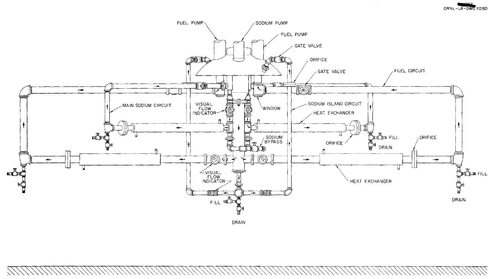  
Fig. 2.29. Assembly for Water Tests of Full-Scale Aluminum Mockup of Top of ART.

# 3. CRITICAL EXPERIMENTS

A.D.Callihan

J. J. Lynn

E.R.Rohrer

Applied Nuclear Physics Division

D. Scott, Aircraft Reactor Engineering Division

R. M. Spencer, United States Air Force

J. S. Crudele

E.V.Sandin

W.J.Fader

S. Snyder

Pratt & Whitney Aircraft

The present series of critical experiments on the circulating-fuel reflector-moderated reactor, including one assembly operated at about $1200^{\circ}\mathrm{F}$ , has been completed. A program of critical experiments on reflector-moderated assemblies of a somewhat different design proposed by Nuclear Development Corporation of America has been initiated.

# ROOM-TEMPERATURE REFLECTOR-MODERATED-REACTOR CRITICAL EXPERIMENTS

Critical experiments were recently completed on room-temperature reflector-moderated-reactor assemblies that mocked up the reactor fuel annulus, the beryllium island, and the beryllium reflector and included extensions that corresponded to the entrance and exit fuel flow channels. The extensions are referred to as "end ducts." The basic configuration was described earlier as assemblies CA-21-1 and CA-21-2, which differed only in the uranium density in the fuel region and therefore in the available excess reactivity. Two modifications of the basic structure were examined, both having been described previously. In one, assembly CA-22, the outer diameter of the fuel section of one end duct was increased from 5.28 to 6.79 in.; in the other modification, assembly CA-23, the radius of the central beryllium island was increased from 5.18 to 7.19 in. Some additional results of these experiments are reported here.

# Power and Neutron-Flux Distributions

The relative power distribution in assembly CA-22 was measured along the radius at the

midplane and at three locations in the large end duct. An additional radial traverse was made in the small end duct for comparison. The conventional method of measuring the fission-fragment activity caught on 5-mil-thick aluminum disks in contact with uranium foils was used. The results of these measurements, as shown in Fig. 3.1, are similar to those reported previously for the assembly of basic dimensions.

Two radial flux traverses were made in assembly CA-22, both with bare and with cadmium-covered gold foils. One traverse (Fig. 3.2) was at the midplane and extended from the axis a distance of 17.84 in. The other traverse (Fig. 3.3) was in the large end duct in a plane 11.5 in. from the midplane and extended between points 0.31 and 13.72 in. from the axis. It is to be remembered in analyzing these data that the low intensity of slow neutrons in the center of the fuel region introduces a large uncertainty in the values of the cadmium fractions derived from both power and flux measurements.

# Neutron Production in the Fuel-to-NaK Heat Exchanger

The fissioning in the uranium that will be contained in the fuel-to-NaK heat exchanger of the circulating-fuel reflector-moderated reactor will be a source of high-energy neutrons which must be attenuated in the shield surrounding the reactor. A measure of the rate of this fissioning was obtained from catcher foils placed in a mockup of a section of the heat exchanger that was incorporated in assembly CA-21-2, the assembly having basic dimensions and the lower uranium density. The heat-exchanger-region mockup con

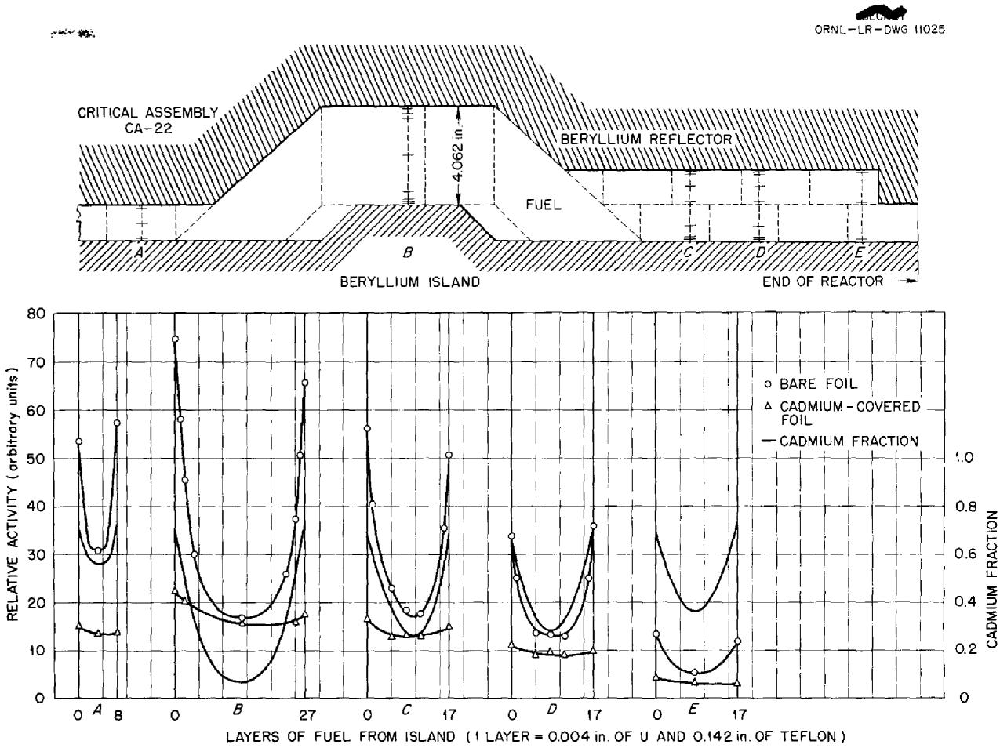  
Fig. 3.1. Power Distributions Across the Fuel Annulus and in the Large End Duct of a Room-Temperature Reflector-Moderated-Reactor Critical Assembly.

sisted of a layer of boral (300 mg of boron per square centimeter) adjacent to the reflector beryllium, followed by a 1.3-in.-thick fuel zone containing uranium metal and Teflon, and a layer of stainless steel 1.437 in. thick. It was located approximately at the midplane, and its dimensions in the plane perpendicular to the flux gradient were 8.625 by 8 in. The arrangement and the results are shown in Fig. 3.4, together with the fission-rate distribution across the core midplane for comparison.

Other measurements of neutron leakage from the beryllium reflector have shown that a layer of boral having a density of about $300\mathrm{mg}$ of boron per square centimeter reduces the relative value of the flux from 1000 to 3; an increase of the boron density by $50\%$ only reduced the flux to a relative value of 2.

# Radial Importance of Uranium in the Fuel Annulus

The effect of adding uranium at different positions across the fuel annulus was measured in assembly CA-23, the assembly with the enlarged central island. Two 7.1875- by 2.875-in. sheets containing a total of $45.58\mathrm{g}$ of $\mathsf{U}^{235}$ were added to the normal 18-sheet loading and to a reduced loading of 16 sheets. The 16-sheet base was established by the removal of two uranium sheets from their respective positions at one-third and at two-thirds of the distance across the annulus. The test section was at the top of the core region in the assembly and was centered $\frac{3}{4}$ in. from the midplane. The results are given in Table 3.1 and Fig. 3.5.

# Importance of Beryllium at End of Reactor

The locations of the sodium heat exchangers

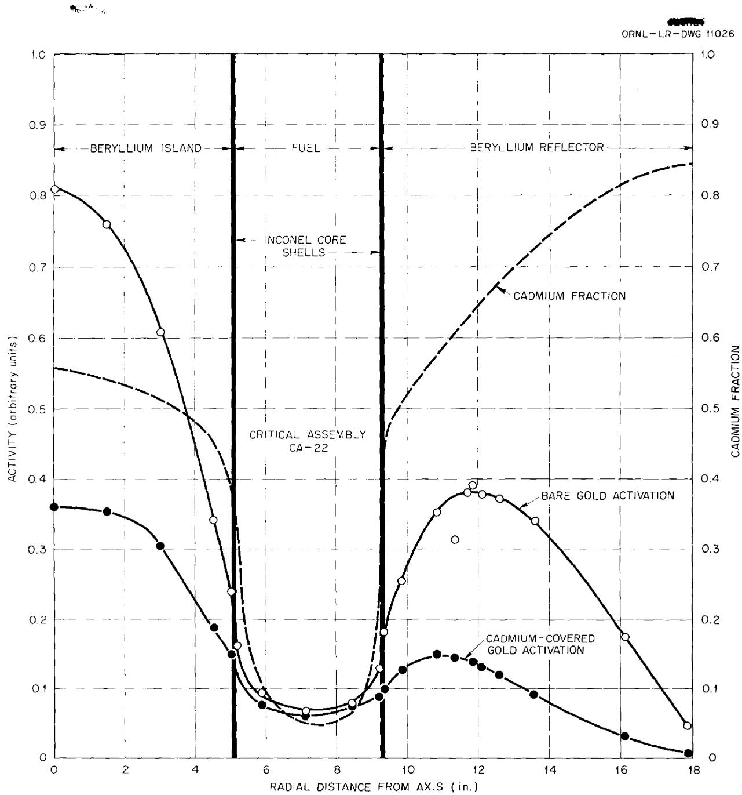  
Fig. 3.2. Neutron-Flux Distribution Along Midplane of a Room-Temperature Reflector-Moderated-Reactor Critical Assembly with a Large End Duct.

and the swirl chambers of the pumps of the ART have necessitated the removal of some of the beryllium from one end of the reactor. An estimate of the loss in reactivity to be expected by this removal has been made in some measurements on assembly CA-22.

In one series of three measurements the beryllium was removed from the end of both the reflector and the island in 1-in. increments, and the resulting decreases in reactivity were noted from the critical positions of calibrated control rods. In a second series the island beryllium

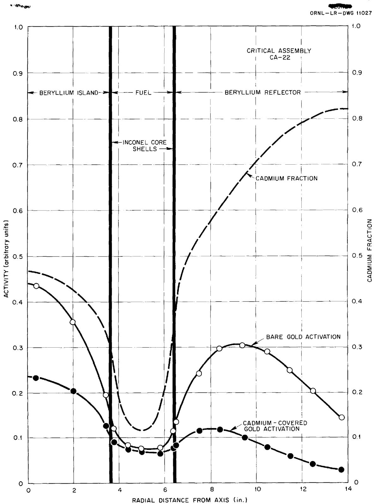  
Fig. 3.3. Neutron-Flux Distribution Along a Plane 11.5 in. from Midplane of a Room-Temperature Reflector-Moderated-Reactor Critical Assembly with a Large End Duct.

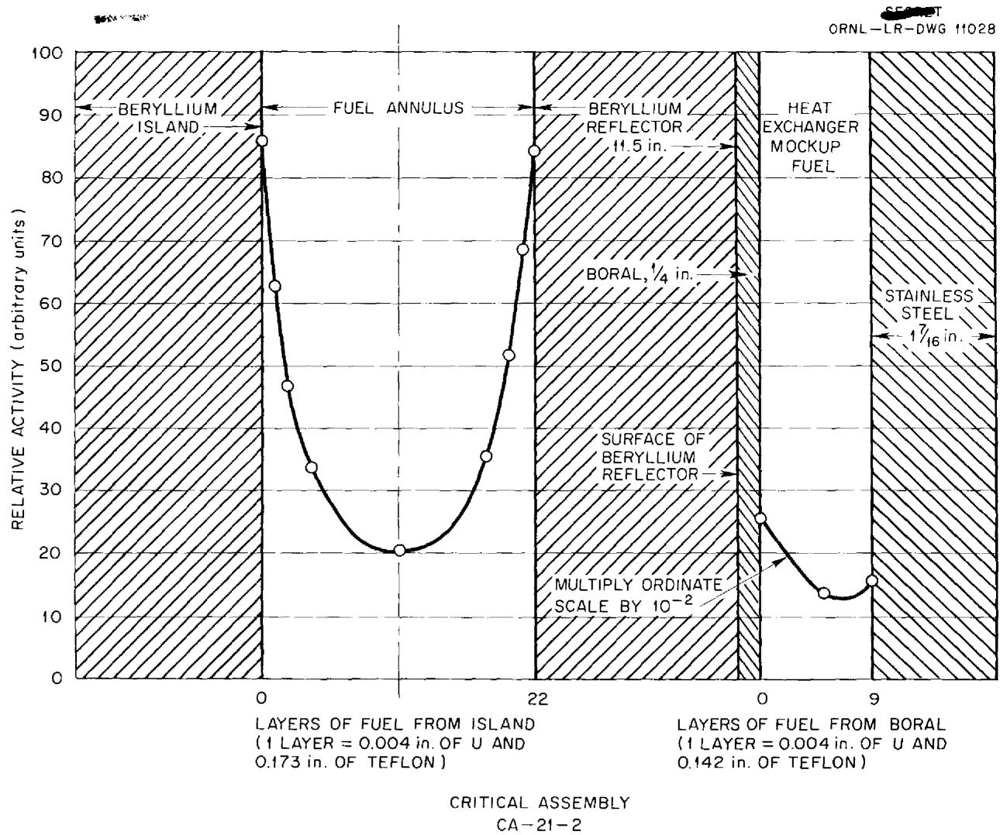  
Fig. 3.4. Power Distribution Along Midplane of Fuel Annulus and Heat Exchanger Mockup of a Room-Temperature Reflector-Moderated-Reactor Critical Assembly.

was replaced and an additional increment was removed from the reflector. The results are reported in Table 3.2 and Fig. 3.6.

# Axial Importance of a Neutron Source

The effect of the axial position of a neutron source (Po-Be) on the neutron level in a subcritical reactor (assembly CA-23) with a constant neutron multiplication of about 600 has been observed. The source was moved along a channel in the beryllium island, and the change in the neutron intensity at each of several external detectors was observed. A fission chamber and

two $\mathsf{BF}_3$ ionization chambers were located symmetrically about the end of the reactor away from the direction of source removal, and a third $\mathsf{BF}_3$ ionization chamber, channel A, was placed near the axis at the other end of the reactor. The results from the first three detectors agreed, and their average is given in Table 3.3 and Fig. 3.7, together with the data from channel A. All counting rates were normalized to those observed with the source at midplane. These results also illustrate the importance of source-counter geometry on the interpretation of multiplication curves in the approach to critical.

TABLE 3.1. RADIAL IMPORTANCE OF URANIUM IN FUEL ANNULUS   

<table><tr><td rowspan="2">Distance Between Island and Added Uranium (in.)</td><td colspan="2">Number of Sheets Between Island and Added Uranium</td><td rowspan="2">Change in Reactivity from Normal 18-Sheet Loading (cents)</td></tr><tr><td>Uranium (4 mils thick)</td><td>Teflon (71 mils thick)</td></tr><tr><td></td><td colspan="2">18-Sheet Basic Loading</td><td>0.0</td></tr><tr><td>0.071</td><td>0</td><td>1</td><td>+5.9</td></tr><tr><td>0.292</td><td>2</td><td>4</td><td>+4.5</td></tr><tr><td>1.314</td><td>9</td><td>18</td><td>+3.0</td></tr><tr><td>2.265</td><td>16</td><td>31</td><td>+3.2</td></tr><tr><td>2.486</td><td>18</td><td>34</td><td>+3.7</td></tr><tr><td></td><td colspan="2">16-Sheet Basic Loading</td><td>-4.2</td></tr><tr><td>0.071</td><td>0</td><td>1</td><td>+2.5</td></tr><tr><td>1.310</td><td>8</td><td>18</td><td>-0.7</td></tr><tr><td>2.478</td><td>16</td><td>34</td><td>+0.2</td></tr></table>

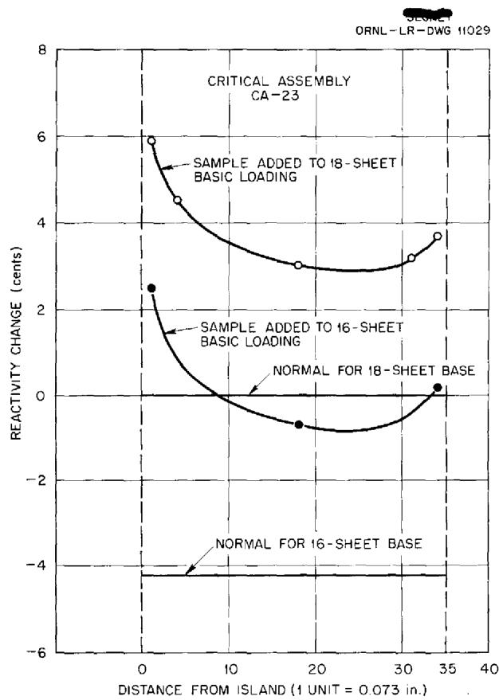  
Fig. 3.5. Radial Importance of Uranium in the Fuel Annulus of a Room-Temperature Reflector-Moderated-Reactor Critical Assembly.

TABLE 3.2. IMPORTANCE OF BERYLLIUM AT END OF ASSEMBLY   

<table><tr><td>Distance from Midplane to End of Beryllium Reflector (in.)</td><td>Change in Reactivity (cents)</td></tr><tr><td colspan="2">Beryllium Removed from Reflector and Island</td></tr><tr><td>20.84</td><td>0</td></tr><tr><td>19.84</td><td>-14.2</td></tr><tr><td>18.84</td><td>-34.2</td></tr><tr><td>17.84</td><td>-65.9</td></tr><tr><td colspan="2">Beryllium Removed from Reflector Only</td></tr><tr><td>20.84</td><td>0</td></tr><tr><td>17.84</td><td>-45.8</td></tr><tr><td>16.84</td><td>-79.4</td></tr></table>

# HIGH-TEMPERATURE REFLECTOR-MODERATED-REACTOR CRITICAL EXPERIMENTS

A reflector-moderated-reactor critical assembly, which operated at about $1200^{\circ}\mathrm{F}$ and used a liquid mixture of sodium, zirconium, and uranium fluorides as fuel, was described previously. The results of one additional measurement are reported here. Several disks of enriched uranium metal, 0.75 in. in diameter and 0.004 in. thick, were placed

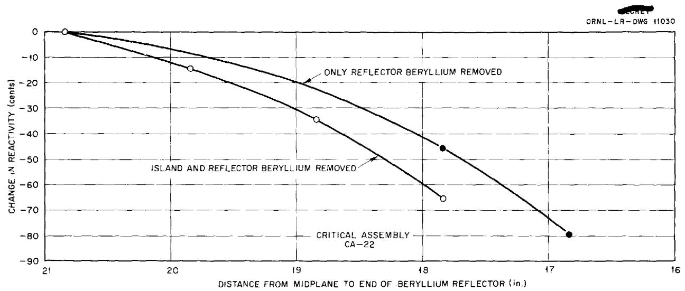  
Fig. 3.6. Importance of Beryllium at End of a Room-Temperature Reflector-Moderated-Reactor Critical Assembly.

TABLE 3.3. VARIATION OF COUNTING RATE WITH NEUTRON-SOURCE POSITION   

<table><tr><td rowspan="2">Source Position Along Axis; Distance from Midplane (in.)</td><td colspan="2">Counting Rate (Normalized to Midplane Rate)</td></tr><tr><td>Average for Three Chambers</td><td>Channel A</td></tr><tr><td>0</td><td>1.000</td><td>1.000</td></tr><tr><td>5</td><td>0.974</td><td>0.982</td></tr><tr><td>10</td><td>0.791</td><td>0.837</td></tr><tr><td>15</td><td>0.458</td><td>0.618</td></tr><tr><td>20</td><td>0.116</td><td>0.382</td></tr></table>

between somewhat thicker $\mathsf{CaF}_2$ disks in Inconel tubes. During the assembly of the core shells these tubes were mounted at three axial positions inside the annular fuel region, and they remained there during the entire experiment. Relative measures of the power-production distribution across the fuel region were subsequently determined from the fission-product activity which accumulated in the disks.

A schematic drawing of a cross section of the reactor in the longitudinal midplane is shown in Fig. 3.8 with the positions of the foil capsules

and the beryllium island and reflector noted. An effective-poison-rod location is also noted. The relative activations of the uranium foils, normalized for decay, are also shown in the figure. The curves represent the power production across the fuel annulus at three longitudinal positions.

The proximity of the lowest traverse to the boron-copper plate at the bottom of the assembly accounts for the depression of the fission rate there. At the other two elevations the fission rate on the island side of the fuel region is lower than that on the reflector side. It is not known why the relation between these two values is the inverse of observations made with the room-temperature critical experiments, as shown, for example, in Fig. 3.1.

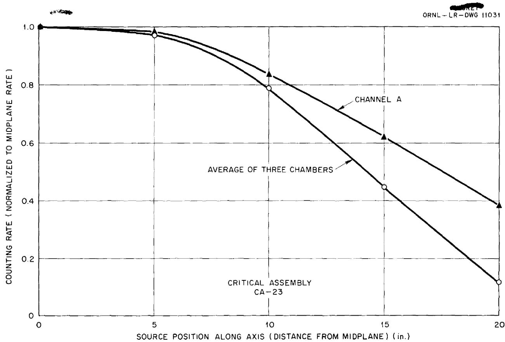  
Fig. 3.7. Axial Importance of a Neutron Source in a Room-Temperature Reflector-Moderated-Reactor Critical Assembly.

# COMPACT-CORE REFLECTOR-MODERATED-REACTOR CRITICAL EXPERIMENTS

A reactor embodying the reflector-moderator concept and consisting of solid fuel elements located in the channels between the beryllium reflector and the beryllium island has been proposed by NDA.4 The fuel is cooled by a stream of sodium. A program of critical experiments has been initiated, in collaboration with NDA, which is basically similar to the recently completed ORNL program.

The fuel is formed by alternating laminae of uranium foil and sheets of stainless steel and aluminum, the latter to represent the sodium of the reactor. The core region is essentially a 20.125-in.-long cylindrical annulus 10 in. in inside diameter and 4.312 in. in width. The central 17.25-in. section of the annulus contains the uranium. (The bounds of the annulus are actually octagonal, rather than circular.) A preliminary loading indicates that the predicted critical mass has been significantly underestimated. A $35\%$ increase in the uranium loading and a $23\%$ decrease in the steel content of the core were necessary in order to make the assembly critical. The core now contains 31 kg of $\mathsf{U}^{235}$ .

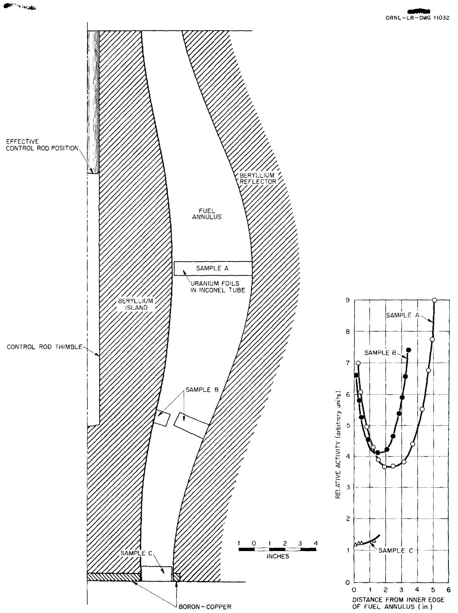  
Fig. 3.8. Relative Fission-Rate Distributions Across Fuel Annulus of High-Temperature Reflector-Moderated-Reactor Critical Assembly.

Part II

MATERIALS RESEARCH

# 4. CHEMISTRY OF REACTOR MATERIALS

# W. R. Grimes   Materials Chemistry Division

Phase equilibrium studies were made of the systems $\mathsf{ZrF}_{4}\cdot \mathsf{UF}_{4},$ LiF-UF NaF-LiF-UF KF-UF 4 NaF-KF-ZrF NaF-LiF-BeF2 NaF-LiF-BeF2- UF, KF-BeF2 and NaF-KF-BeF2 and of systems containing alkaline-earth fluorides.

Additional work was done in investigating the equilibrium reduction of $\mathsf{FeF}_2$ by hydrogen in $\mathsf{NaZrF}_{5'}$ the reduction of $\mathsf{UF}_4$ by structural metals, the stability and solubility of chromium fluorides in various molten fluorides, the reaction of $\mathsf{UF}_3$ with alkali fluorides, and the reduction of alkali fluorides by uranium metal. A method for preparing pure $\mathsf{CrF}_3$ was devised, and x-ray and petrographic data were obtained for compounds of $\mathsf{ZrF}_4$ with $\mathsf{CrF}_2$ , $\mathsf{NiF}_2$ , and $\mathsf{FeF}_2$ .

Fuel purification and production research included further study of methods for the recovery of contaminated fuel for re-use and the preparation of special materials. Methods for evaluating raw materials were developed and used for evaluating material from an outside vendor. Adequate supplies of $\mathsf{ZrF}_4$ are now being obtained from a commercial source. Difficulties with vacuum pumps and reactor cans used in production processes were resolved.

Methods have been devised for obtaining relative measurements of viscosity and density of molten salts without removing the pure material from the conventional equipment used for fuel purification. Measurements of electromotive forces of cells in which molten $\mathsf{NaF}\cdot \mathsf{ZrF}_4$ is used as the solvent were continued, and optical and x-ray data were obtained for various compounds in fluoride systems.

# PHASE EQUILIBRIUM STUDIES

C.J.Barton R.E.Moore   
F. F. Blankenship R. E. Thoma

Materials Chemistry Division

H. Insley, Consultant

# The System $\mathsf{ZrF}_4\mathsf{-UF}_4$

R.P.Metcalf

Materials Chemistry Division

The simple phase diagram for the system $\mathsf{ZrF}_4$ $\mathsf{UF}_4$ is presented in Fig. 4.1. Solid solutions are

the only crystalline phases which have been observed in this system. Examination of quenched samples by x-ray diffraction and with the petrographic microscope shows that the compositions of the solid solutions vary continuously over the entire composition range. There is no appreciable miscibility gap in this system.

# The System LiF-UF4

# R. E. Moore   Materials Chemistry Division

A phase diagram based almost entirely on thermal analysis was presented previously for the LiF-UF $_4$ system. A detailed investigation of this binary system has now been completed, and a revised diagram, based on petrographic and x-ray diffraction examination of quenched samples, as well as thermal data, is shown in Fig. 4.2.

A summary of the data obtained from the quenching experiments is shown in Table 4.1. The samples from which these data were taken were equilibrated for 16 to 54 hr at temperature before being quenched. Data obtained by thermal analysis were used to determine the liquidus curves from 0 to 23 and 60 to 100 mole % UF4.

A compound shown by petrographic examination to be the result of quench growth was found to have an x-ray diffraction pattern which did not correspond to the patterns of any of the established compounds in the system. This compound was found above the solidus temperature in mixtures containing 20 to 25 mole $\%$ UF $_4$ . A composition and a temperature range for its stable existence could not be found. It appears to be either a metastable compound, a compound stable only at a relatively low temperature, or a high-temperature modification of Li $_4$ UF $_8$ with a very narrow temperature range of stability.

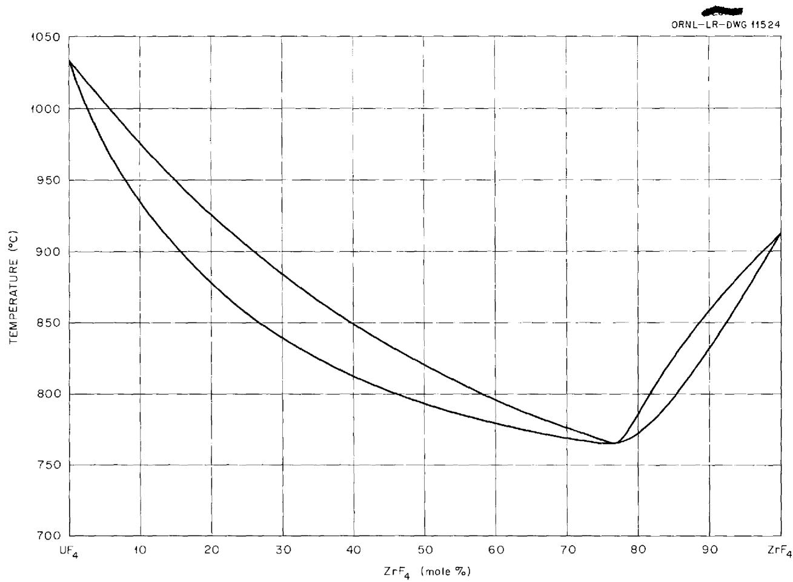  
Fig. 4.1. Simple Phase Diagram for the System $\mathsf{ZrF}_4\cdot \mathsf{UF}_4$ .

# The System NaF-LiF-UF

H. A. Friedman

R. E. Meadows

B. A. Soderberg

Materials Chemistry Division

R. E. Cleary

H. Davis

Pratt & Whitney Aircraft

There does not appear to be a mixture in the NaF-LiF-UF $_4$ system that would be a suitable fuel for a circulating-fuel reactor. No mixtures that contain less than 25 mole% UF $_4$ have been found that have liquidus temperatures in the region of $500^{\circ}\mathrm{C}$ . A ternary compound with more than 50 mole% UF $_4$ has appeared sporadically in slowly cooled melts, but in a preliminary survey made with the use of quenching methods the compound has not been found. It probably melts incongruently and has a limited stability range.

Compatibility triangles in the NaF-LiF-UF $^4$ sys

tem are defined by the joins $\mathsf{LiF - 3NaF\cdot UF_{4'}}$ LiF-2NaF.UF4'LiF-7NaF-6UF4'4LiF.UF4-7NaF-6UF4'7LiF-6UF4-7NaF-6UF4' and 7NaF-6UF4-LiF-4UF. Of these joins, only the LiF-7NaF-6UF4 is a quasi binary. The boundary curves and three-phase triangles are shown in Fig. 4.3. The dotted lines indicate tentative paths for the boundary curves. In order for the compatibility triangle $7\mathrm{NaF}\cdot 6\mathrm{UF}_{4}\cdot 7\mathrm{LiF}\cdot 6\mathrm{UF}_{4}\cdot 4\mathrm{LiF}\cdot \mathrm{UF}_{4}$ to be valid, the invariant point common to the primary phase field $7\mathrm{NaF}\cdot 6\mathrm{UF}_{4},$ 7LiF-6UF4' and 4LiF-UF4 must be a eutectic or its composition must be displaced below the join $7\mathrm{NaF}\cdot 6\mathrm{UF}_{4}\cdot 4\mathrm{LiF}\cdot \mathrm{UF}_{4}.$

# The System KF-UF

H. A. Friedman

Materials Chemistry Division

A preliminary phase diagram based entirely on data obtained from thermal analysis was presented

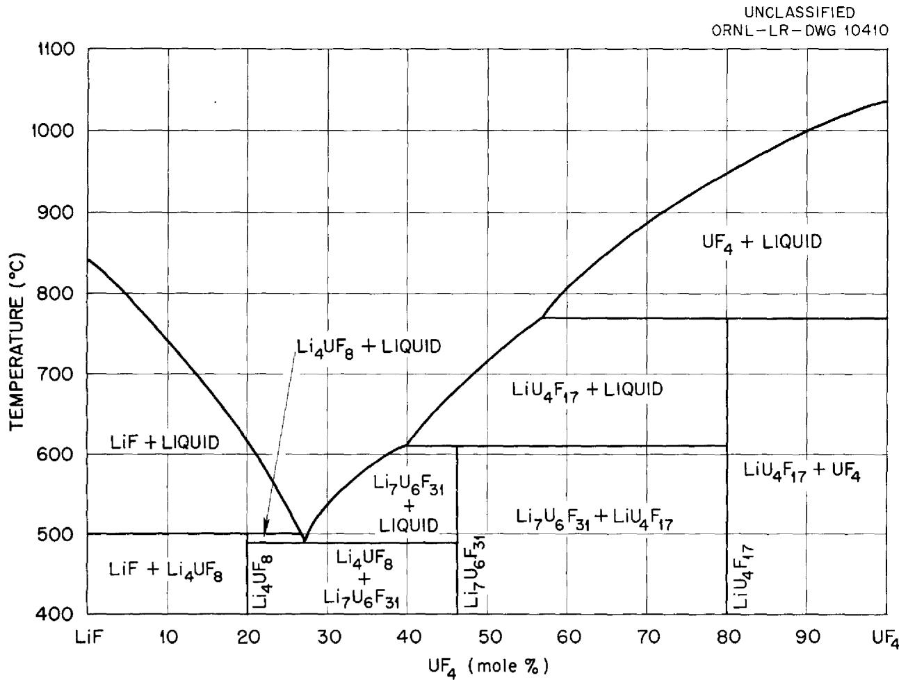  
Fig. 4.2. Phase Equilibrium Diagram for the System LiF-UF4.

previously for the $\mathsf{KF - UF}_4$ system. This system was recently re-examined because of its possible similarity to the $\mathsf{RbF - UF}_4$ system, and the results are presented in Fig. 4.4.

In an early x-ray diffraction analysis of this system, Zachariasen reported the presence of two compounds that contained more than $70\% \mathsf{UF}_4$ No evidence has been found in this study for compounds containing more $\mathsf{UF}_4$ than that indicated by the formula KF-2UF. In addition, the compound 7KF-6UF is stable, whereas the compound KF-UF4 apparently is not. The optical characteristics of 7KF-6UF are very similar to those of the corresponding NaF and LiF compounds.

# The System NaF-KF-ZrF 4

H. A. Friedman

B. A. Soderberg

Materials Chemistry Division

H. Davis

Pratt & Whitney Aircraft

Information on the complex ternary system NaF-KF-ZrF4 has been obtained by thermal analyses and the careful examination of slowly cooled melts. The ternary compounds whose compositions are believed to be certain are 2NaF-3KF-5ZrF4 (congruent; mp, $432^{\circ}C$ ), 3NaF-3KF-2ZrF4 (incongruent; mp, $\sim 735^{\circ}C$ ), NaF-KF-ZrF4 (incongruent; mp, $\sim 493^{\circ}C$ ), and 3NaF-KF-2ZrF4 (congruent; mp, $593^{\circ}C$ ). In the compound 3NaF-3KF-2ZrF4 the primary phase is 3KF-ZrF4, and in the compound NaF-KF-ZrF4 the primary phase is 3NaF-3KF-2ZrF4. A fifth ternary compound exists, but its composition has not yet been defined. It appears

TABLE 4.1. SUMMARY OF QUENCHING DATA ON THE LiF-UF ${}_{4}$ SYSTEM   

<table><tr><td>Composition (mole % UF4)</td><td>Liquidus Temperature (°C)</td><td>Primary Phase</td><td>Peritectic Temperature (°C)</td><td>Secondary Phase</td><td>Solidus Temperature (°C)</td><td>Phases Existing Below Solidus</td></tr><tr><td>20</td><td>581</td><td>LiF</td><td>498</td><td>Li4UF8</td><td>498</td><td>Li4UF8</td></tr><tr><td>25</td><td>525</td><td>LiF</td><td>500</td><td>Li4UF8</td><td>490</td><td>Li4UF8Li7U6F31</td></tr><tr><td>28</td><td>503</td><td>Li7U6F31</td><td></td><td>Li4UF8</td><td>489</td><td>Li4UF8Li7U6F31</td></tr><tr><td>33.3</td><td>565</td><td>Li7U6F31</td><td></td><td>Li4UF8</td><td>495</td><td>Li4UF8Li7U6F31</td></tr><tr><td>37.5</td><td>603</td><td>Li7U6F31</td><td></td><td></td><td></td><td></td></tr><tr><td>40</td><td>612</td><td>Li7U6F31</td><td></td><td></td><td></td><td></td></tr><tr><td>46.2</td><td>683</td><td>Li4F17</td><td>605</td><td>Li7U6F31</td><td>605</td><td>Li7U6F31</td></tr><tr><td>50</td><td>718</td><td>Li4F17</td><td></td><td></td><td>588</td><td>Li7U6F31Li4F17</td></tr><tr><td>60</td><td>804</td><td>UF4</td><td>775</td><td>Li4UF8</td><td></td><td></td></tr><tr><td>66.7</td><td></td><td>UF4</td><td>767</td><td>Li4UF8</td><td></td><td></td></tr><tr><td>75</td><td></td><td></td><td>&gt;716</td><td>Li4F17</td><td>&gt;601</td><td>Li4F17Li7U6F31</td></tr><tr><td>80</td><td></td><td></td><td>&gt;716</td><td>Li4F17</td><td>&gt;716</td><td>Li4F17</td></tr></table>

to consist of approximately 24 mole % NaF, 33 mole % KF, and 43 mole % ZrF.

Petrographic and x-ray diffraction data show that the compatibility triangles in the system exist as shown in Fig. 4.5. The heavy lines indicate the well-established triangles. The remainder of the triangles (dotted lines) are much less certain because of the inherent difficulty in obtaining valid data from slowly cooled melts when incongruity melting compounds are present. The true quasi binaries in the system are NaF-3KF-ZrF4 (minimum melting temperature, ~765°C at 40 mole % KF), 7NaF-6ZrF42NaF-3KF-5ZrF4 (minimum melting temperature, ~430°C at 28 mole % KF), 2NaF-3KF-5ZrF4 -ZrF4 (minimum melting temperature, ~423°C at 27.5 mole % KF), and 2NaF-3KF-5ZrF4 -KF-ZrF4 (minimum melting temperature, ~425°C at 33 mole % KF). The entire region between 35 and 50 mole % ZrF4 has liquidus temperatures between 395 and 500°C. The lowest melting region of the diagram is at 10 mole % NaF, 48 mole % KF, and 42 mole % ZrF4, with a liquidus

at $395^{\circ}C$ . The lowest melting eutectic below 35 mole $\%$ $\mathsf{ZrF}_4$ is at 30 mole $\%$ NaF, 63 mole $\%$ KF, and 7 mole $\%$ $\mathsf{ZrF}_4$ and has a liquidus at $684^{\circ}C$ . A program of quenching experiments will be initiated in the near future to provide the basis for a final determination of the melting points and phase relations in this system.

# The System NaF-LiF-BeF $_2$

L.M.Bratcher R.J.Sheil

B. H. Clampitt

Materials Chemistry Division

G. D. White

Metallurgy Division

Viscosity data reported in Sec. 7, "Heat Transfer and Physical Properties," for the mixture NaF-LiF-BeF $_2$ (63.5-7.5-29.0 mole %) and previously reported data on the mixture NaF-LiF-BeF $_2$ (64.5-31 mole %) $^5$ when compared to the viscosity

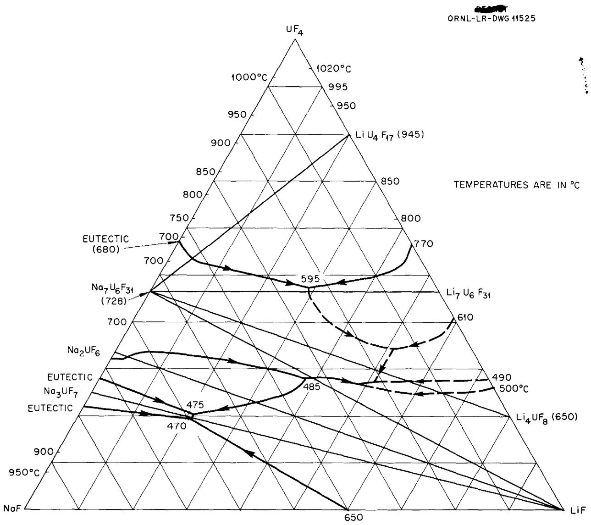  
Fig. 4.3. Boundary Curves and Three-Phase Triangles in the NaF-LiF-UF4 System.

of the binary mixture $\mathsf{NaF - BeF}_2$ (69.8-30.2 mole $\%$ ) show that ternary mixtures containing a small amount of LiF and approximately 30 mole $\%$ $\mathsf{BeF}_2$ have a higher viscosity than that of the NaF-BeF2 mixture with the same $\mathsf{BeF}_2$ concentration. These data caused a shift in interest to the regions of lower $\mathsf{BeF}_2$ concentrations along the join between the LiF-NaF eutectic (60-40 mole $\%$ ) and the LiF- $\mathsf{Na}_2\mathsf{BeF}_4$ eutectic (16 mole $\%$ LiF). Thermal analysis data obtained by adding NaF or $\mathsf{Li}_2\mathsf{BeF}_4$ to several compositions along this join showed that it is close to a drainage valley between the two eutectics. Viscosity measurements (Sec. 7, "Heat Transfer and Physical Properties") were

made on one mixture along this join, NaF-LiF-BeF $_2$ (53-24-23 mole %). The kinematic viscosity found at $600^{\circ}\mathrm{C}$ was lower than that of any previously measured BeF $_2$ -containing melt, except the NaF-BeF $_2$ (69.8-30.2 mole %) mixture. However, the small improvement in viscosity obtained by reducing the BeF $_2$ concentration in the ternary system to 23 mole % suggests that the point of diminishing returns has been reached in this approach. This conclusion will be tested with one more composition on the same join, that is, with a mixture containing only 15 mole % BeF $_2$ .

The gradient quenching technique has been applied to the study of two compounds reported to be

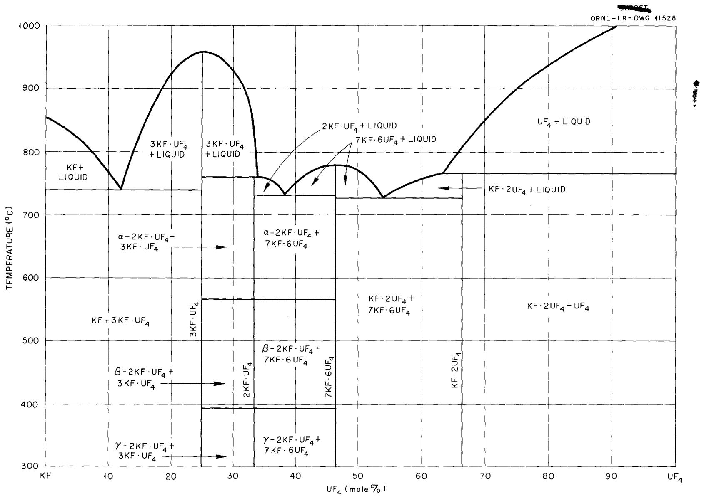  
Fig. 4.4. Phase Equilibrium Diagram of the KF-UF4 System.

in this system. Quenches of the $\mathrm{Na}_2\mathrm{LiBe}_2\mathrm{F}_7$ composition showed only the crystalline phase designated by the formula. Further work will be required to determine the liquidus temperature for this composition, which undercools strongly, and to demonstrate that it melts congruently, as is presently believed. A number of quenches have been performed with a mixture having a composition corresponding to the compound $\mathrm{Na}_3\mathrm{LiBe}_2\mathrm{F}_8$ , reported by Jahn.6 Quenches covering the tem

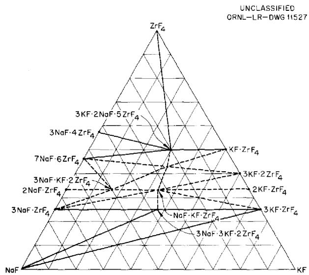  
Fig. 4.5. Compatibility Triangles in the NaF-KF-ZrF4 System.

perature range 296 to $620^{\circ}C$ have shown only isotropic materials above $339\pm 5^{\circ}C$ and a mixture of phases, including LiF and an unidentified biaxial-positive crystalline phase, at lower temperatures. Further studies are being made in order to determine the composition and melting behavior of the unidentified compound.

# The System NaF·LiF·BeF 2-UF 4

L.M.Bratcher R.J.Sheil

B. H. Clampitt

Materials Chemistry Division

G. D. White

Metallurgy Division

Investigations of mixtures in the NaF-LiF-BeF $_2$ UF $_4$ system containing 3.0 mole % UF $_4$ and low quantities of BeF $_2$ were continued. These mixtures are considered to be promising from the viscosity standpoint. Thermal-analysis and filtration techniques are being used in this investigation. The available data, which are summarized in Table 4.2, demonstrate that it is possible to obtain mixtures in this system containing 3.0 mole % UF $_4$ and 20 to 22 mole % BeF $_2$ that have liquidus temperatures of less than $505^{\circ}\mathrm{C}$ . Investigation of this system is continuing in an effort to determine the best fuel composition from the standpoint of both viscosity and liquidus temperature.

TABLE 4.2. LIQUIDUS TEMPERATURES IN THE SYSTEM NaF-LiF-BeF ${}_{2}$ -UF ${}_{4}$   

<table><tr><td colspan="4">Composition of Mixture (mole %)</td><td rowspan="2">Technique Used</td><td rowspan="2">Liquidus Temperature (℃)</td></tr><tr><td>NaF</td><td>LiF</td><td>BeF2</td><td>UF4</td></tr><tr><td>61.6</td><td>7.3</td><td>28.1</td><td>3.0</td><td>Filtration</td><td>520 &lt; T &lt; 525</td></tr><tr><td>54.3</td><td>15.5</td><td>27.2</td><td>3.0</td><td>Filtration</td><td>476 &lt; T &lt; 520</td></tr><tr><td>53.3</td><td>22.3</td><td>21.4</td><td>3.0</td><td>Filtration</td><td>&lt;494</td></tr><tr><td>53.3</td><td>22.3</td><td>21.4</td><td>3.0</td><td>Filtration</td><td>440 &lt; T &lt; 474</td></tr><tr><td>56.9</td><td>17.8</td><td>22.3</td><td>3.0</td><td>Filtration</td><td>475 &lt; T &lt; 500</td></tr><tr><td>55.6</td><td>21.0</td><td>20.0</td><td>3.4</td><td>Filtration</td><td>505 &lt; T &lt; 515</td></tr><tr><td>55.8</td><td>21.0</td><td>20.2</td><td>3.0</td><td>Thermal analysis</td><td>502</td></tr><tr><td>58.7</td><td>17.0</td><td>21.3</td><td>3.0</td><td>Thermal analysis</td><td>495</td></tr><tr><td>51.4</td><td>23.3</td><td>22.3</td><td>3.0</td><td>Thermal analysis</td><td>530</td></tr><tr><td>56.7</td><td>19.3</td><td>21.0</td><td>3.0</td><td>Thermal analysis</td><td>545</td></tr></table>

# The System KF-BeF

L.M.Bratcher R.J.Sheil

B. H. Clampitt

Materials Chemistry Division

G. D. White

Metallurgy Division

The existence of two compounds in the $\mathsf{KF - BeF}_2$ system was reported previously: namely, $\mathsf{K}_2\mathsf{BeF}_4$ and $\mathsf{KBeF}_3$ . Further studies of slowly cooled melts have demonstrated the existence of two additional compounds, which are believed to have the formulas $\mathsf{K}_3\mathsf{BeF}_5$ and $\mathsf{KBe}_2\mathsf{F}_5$ . It appears from the available thermal-analysis data that $\mathsf{K}_3\mathsf{BeF}_5$ melts congruently at about $738^{\circ}\mathsf{C}$ and that the $\mathsf{K}_3\mathsf{BeF}_5 - \mathsf{K}_2\mathsf{BeF}_4$ eutectic, which melts at $730^{\circ}\mathsf{C}$ , contains approximately 27.5 mole% $\mathsf{BeF}_2$ . Mixtures containing $66\%$ mole% $\mathsf{BeF}_2$ showed only one thermal effect on cooling curves at about $325^{\circ}\mathsf{C}$ , but it is not clear whether this compound melts congruently or incongruently. The basis for the compound formulation is that mixtures of this composition were homogeneous, well-crystallized material having optical and x-ray diffraction properties that were different from those of other compounds in this system. The discovery of these compounds makes it desirable to continue the study of this system through use of the quenching technique, particularly in the region of the $\mathsf{KBe}_2\mathsf{F}_5$ compound, where thermal analysis does not give reliable data.

# The System NaF-KF-BeF

L.M.Bratcher R.J.Sheil

B. H. Clompitt

Materials Chemistry Division

G. D. White

Metallurgy Division

All four of the known $\mathsf{KF - BeF}_2$ compounds have been observed in slowly cooled melts in the NaF-KF-BeF system, in addition to the two NaF-BeF compounds and one well-established

ternary compound, $\mathsf{NaKBeF}_4$ . It seems certain that one additional ternary compound exists in this system, and possibly there are others, but further work will be required to establish their identity. On the basis of the results obtained to date from petrographic and x-ray diffraction studies of slowly cooled melts, the following compatibility triangles are tentatively postulated: NaF-KF-K3BeF5; NaF-K3BeF5-K2BeF4; NaF-K2BeF4-NaKBeF4; K2BeF4-NaKBeF4-KBeF3; KBeF3-NaKBeF4-KBe2F5. On the join between KBe2F5 and NaBeF3, which are crystalline compounds, the mixture containing 57.5 mole % BeF2 solidified to a transparent glass with no noticeable thermal effect on the cooling curve. Compositions on both sides of this mixture contained glass and the neighboring binary compound. Work on this system is continuing.

# Systems Containing Alkaline-Earth Fluorides

L.M.Bratcher R.J.Sheil

B. H. Clampitt

Materials Chemistry Division

G. D. White

Metallurgy Division

The alkaline-earth fluorides $\mathsf{MgF}_2$ and $\mathsf{CaF}_2$ have properties, such as low cross section, low vapor pressure, and high-temperature stability, that cause them to appear to be attractive for use as fuel carriers. However, consideration of these materials in the fused-salt research program was previously discouraged because the published data show only high-melting-point eutectics in alkali fluoride- $\mathsf{MgF}_2$ and $-\mathsf{CaF}_2$ systems. Long-range interest in materials for producing higher reactor temperatures than those presently being considered makes it desirable that pertinent data now lacking be obtained and that some of the published data be checked. Preliminary thermal-analysis data are presented in Table 4.3, together with the available published values. The data that have been obtained for the LiF-NaF- $\mathsf{CaF}_2$ system are sufficient to locate the eutectic composition at approximately 53-36-11 mole%.

TABLE 4.3. EUTECTIC TEMPERATURES IN ALKALI FLUORIDE-MgF ${}_{2}$ AND -CaF ${}_{2}$ SYSTEMS  

<table><tr><td rowspan="2">System</td><td colspan="2">Eutectic Temperature (℃)</td></tr><tr><td>Literature Value</td><td>ORNL Value</td></tr><tr><td>LiF·CaF2</td><td>773</td><td>765</td></tr><tr><td>NaF·CaF2</td><td>810</td><td>812</td></tr><tr><td>NaF·MgF2</td><td>830</td><td>825</td></tr><tr><td>LiF·NaF·MgF2</td><td>630</td><td>620</td></tr><tr><td>LiF·MgF2·CaF2</td><td>672</td><td></td></tr><tr><td>LiF·NaF·CaF2</td><td></td><td>616</td></tr><tr><td>NaF·MgF2·CaF2</td><td></td><td>750</td></tr><tr><td>LiF·NaF·MgF2·CaF2</td><td></td><td>588</td></tr></table>

# CHEMICAL REACTIONS IN MOLTEN SALTS

L.G.Overholser F.F.Blankenship

G. M. Watson

Materials Chemistry Division

R.F.Newton

Research Director's Division

# Equilibrium Reduction of $\mathsf{FeF}_2$ by $\mathsf{H}_2$ in NaZrF

C. M. Blood

Materials Chemistry Division

Numerous experiments have been performed, as reported in previous reports in this series, to study the reaction

$$
F e F _ {2} (d) + H _ {2} (g) \rightleftharpoons F e (s) + 2 H F (g)
$$

with a molten mixture of $\mathrm{NaF - ZrF_4}$ (53-47 mole %) used as the solvent. The apparent equilibrium constants (mole fractions of dissolved species assumed as activities) previously determined had, unfortunately, only qualitative significance because of the lack of an adequate method of approaching equilibrium. With the present experimental assembly and technique, however, equilibrium can be approached effectively from either the forward or the reverse direction of the reaction. Furthermore, equilibration can be continued under constant conditions for periods as long as several weeks, that is, until it is apparent that the composition of the system is constant within the limita

tion of analytical procedure and inherent experimental variations.

The present experimental assembly is, in general, similar to the one described previously for use with the equilibration method. However, the limited-capacity HF generator used previously has been replaced by a practically unlimited source of a gaseous mixture of HF and $\mathsf{H}_2$ . The method being used consists in bubbling a gaseous mixture of $\mathsf{H}_2$ and HF of constant composition through the melt containing $\mathsf{FeF}_2$ , which is contained in a mild-steel-lined nickel reactor. The equilibration of the melt is continued until the concentration of $\mathsf{FeF}_2$ is constant over a period of several days, the remaining variables being held constant. Periodically, liquid samples are withdrawn through sintered-nickel filters for chemical analysis. The compositions of the reactor influent and effluent gas streams are determined by continuously bubbling accurately metered portions of these gases through standard KOH solution.

In the earlier groups of equilibration experiments, the attainment of equilibrium was judged by the approximate equilization of composition of influent and effluent gas streams of the reactor. This criterion has been found to lack sufficient sensitivity for better-than-qualitative estimates. This is particularly true if the equilibrium is approached from the reverse direction of the reaction.

The modified source of HF consists of a 10-lb cylinder of liquid HF placed in a thermostat in which the temperature is controlled to approximately $\pm 0.03^{\circ}C$ . The tank is connected to a mixing chamber through a copper tube held at a temperature $(80^{\circ}C)$ considerably higher than the temperature of the liquid HF cylinder. The HF vapor on its way to the mixing chamber is made to diffuse through a sufficient number of sintered-nickel barriers (0.0004-in. pore size) to reduce the volumetric flow rate to an experimentally suitable value and to stabilize the flow rate at this value. The streams of $\mathsf{H}_2$ and HF are fed to the mixing chamber, which is also held at constant temperature $(340^{\circ}C)$ . The volumetric flow rate of the hydrogen is precisely controlled by a combination of commercially available gas-flow regulators and is further stabilized by diffusion through porous barriers. The composition of the resulting gas mixture can be varied at will by changing the $\mathsf{H}_2$

flow rate or the temperature of the thermostat enclosing the HF cylinder. These compositions can be held constant for indefinitely long periods with an arithmetic mean deviation of approximately $\pm 4\%$ .

The current experiment was started during the week ending August 19, 1955, and the apparatus has been operating continuously and without incident to the present time. Measurements have been made at 800 and at $700^{\circ}\mathrm{C}$ . The iron concentration range studied at $800^{\circ}\mathrm{C}$ was approximately 300 to 1300 ppm. At $700^{\circ}\mathrm{C}$ the range studied was approximately 3300 to 2000 ppm. Additional measurements at $700^{\circ}\mathrm{C}$ are now being made in the range from 1000 to 600 ppm. A summary of the experimental results obtained to date is given in Table 4.4.

As mentioned previously, it was found experimentally that several days of equilibration time were required before constancy of the $\mathsf{FeF}_2$ concentration was attained. This was particularly true when sizable changes in the partial pressure of HF were imposed on the system. During the transition periods, the changes in composition of the effluent gas stream were rather minute. This may be explained satisfactorily by comparing the extremely slow rate of the reaction (in the order of several days) with the swift passage of gas bubbles through the melt (in the order of seconds).

For the calculations of the mole fraction of $\mathsf{FeF}_2$ in solution, the total number of moles in the liquid mixture was assumed to be the same as the number of moles of constituents added (10.0 moles per kilogram of mixture for this composition). The partial pressures of HF were calculated from concentration values, with the assumption that HF was monomeric at 700 and at $800^{\circ}\mathrm{C}$

The experimentally determined equilibrium constants obtained to date are not far different from those that may be calculated from available tabulations of free energies of formation, that is, $\Delta F^{\circ}$ for $\mathsf{FeF}_2(s)$ and HF (g). By comparison of the calculated and the experimental constants, the activity coefficients of the dissolved $\mathsf{FeF}_2$ may also be easily obtained. These calculations will be made when the experiment has been completed.

# Reduction of $\mathbf{U}\mathbf{F}_{4}$ by Structural Metals

J. D. Redman

Materials Chemistry Division

The apparatus and methods used to measure the reduction of $\mathsf{UF}_4$ by metallic chromium or iron in molten fluorides have been described in previous reports in this series. The data obtained for these reactions with NaF-ZrF $_4$ (50-50 mole %), NaF-LiF-KF (11.5-46.5-42.0 mole %), NaF-ZrF $_4$ (53-47 mole %), or NaF-LiF-ZrF $_4$ (22-55-23 mole %) as reaction media have also been reported. During the past quarter, studies have been made on the reduction of $\mathsf{UF}_4$ by various structural metals, other than chromium or iron, in molten NaF-LiF-KF (11.5-46.5-42.0 mole %). The earlier work showed that chromium-containing alloys are not stable at $800^{\circ}\mathrm{C}$ when in contact with $\mathsf{UF}_4$ dissolved in the NaF-LiF-KF eutectic, and the possibility of replacing the chromium with some less-active metal was therefore considered. The other structural metals being studied are niobium, tantalum, vanadium, and tungsten. Molybdenum, which was studied previously, was found to be more stable than chromium.

The results of the studies on the reduction of $\mathsf{UF}_4$ by vanadium at 600 and $800^{\circ}\mathsf{C}$ with NaF-LiF-KF (11.5-46.5-42.0 mole %) as the reaction medium are given in Table 4.5. In all the experiments 2 g of vanadium was reacted with $\mathsf{UF}_4$ (15 wt %, 2.3 mole %) dissolved in approximately 20 g of the NaF-LiF-KF mixture contained in nickel. As may be seen from the data presented in Table 4.5, the vanadium concentrations found in the filtrates were extremely low. In fact, these values are the lowest found for any metal in equilibrium with $\mathsf{UF}_4$ in the NaF-LiF-KF mixture at these temperatures, with the possible exception of nickel. These results indicate that vanadium metal is stable under these conditions if it is assumed that the vanadium fluoride formed is not appreciably volatile. This assumption appears to be valid in view of the extremely low concentrations of vanadium fluoride present and the large excess of alkali fluorides available to complex any metal fluoride formed.

Data for the reduction of $\mathsf{UF}_4$ by niobium at 600 and $800^{\circ}C$ with NaF-LiF-KF (11.5-46.5-42.0 mole %) as the reaction medium are given in Table 4.6. In these experiments, as in the experiments with vanadium, 2 g of niobium was reacted with 15 wt %

Reaction: $\mathsf{FeF}_2(d) + \mathsf{H}_2(g)\rightleftharpoons \mathsf{Fe}(s) + 2\mathsf{HF}(g)$ Average total pressure: $740~\mathrm{mm}~\mathrm{Hg}$ Initial charge: $6.0~\mathrm{kg}$ of NaF-ZrF and 30.0 g of FeF2 Container wall: mild steel (98% Fe)

TABLE 4.4. APPARENT EQUILIBRIUM CONSTANTS FOR REDUCTION OF ${\mathrm{{FeF}}}_{2}$ BY ${\mathrm{H}}_{2}$ IN NaF-ZrF ${}_{4}$ (53-47 mole %)   

<table><tr><td>Fe in Melt (ppm)</td><td>Sampling Time (days at constant temperature)</td><td>Partial Pressure of HF in Effluent Gas (atm × 102)</td><td>Kx*</td></tr><tr><td colspan="4">At 800°C</td></tr><tr><td>470</td><td>7</td><td>4.28</td><td>2.3</td></tr><tr><td>370</td><td>8</td><td>3.92</td><td>2.5</td></tr><tr><td>335</td><td>10</td><td>3.53</td><td>2.2</td></tr><tr><td>895</td><td>18</td><td>5.70</td><td>2.2</td></tr><tr><td>830</td><td>19</td><td>5.70</td><td>2.4</td></tr><tr><td>1295</td><td>21</td><td>7.74</td><td>2.9</td></tr><tr><td>960</td><td>25</td><td>6.00</td><td>2.3</td></tr><tr><td>985</td><td>26</td><td>6.27</td><td>2.5</td></tr><tr><td>965</td><td>27</td><td>6.17</td><td>2.4</td></tr><tr><td>1015</td><td>28</td><td>6.35</td><td>2.4</td></tr><tr><td>955</td><td>34</td><td>6.65</td><td>2.9</td></tr><tr><td>1005</td><td>35</td><td>6.50</td><td>2.6</td></tr><tr><td>1025</td><td>36</td><td>6.55</td><td>2.6</td></tr><tr><td></td><td></td><td></td><td>Av 2.5 ± 0.2</td></tr><tr><td colspan="4">At 700°C</td></tr><tr><td>2630</td><td>4</td><td>5.43</td><td>0.69</td></tr><tr><td>2810</td><td>5</td><td>5.55</td><td>0.66</td></tr><tr><td>2880</td><td>6</td><td>5.63</td><td>0.67</td></tr><tr><td>3070</td><td>10</td><td>5.89</td><td>0.69</td></tr><tr><td>3160</td><td>11</td><td>5.82</td><td>0.66</td></tr><tr><td>3205</td><td>12</td><td>5.87</td><td>0.66</td></tr><tr><td>3285</td><td>13</td><td>5.83</td><td>0.63</td></tr><tr><td>3232</td><td>14</td><td>5.63</td><td>0.60</td></tr><tr><td>2220</td><td>19</td><td>4.88</td><td>0.64</td></tr><tr><td>2525</td><td>20</td><td>4.99</td><td>0.60</td></tr><tr><td>2430</td><td>21</td><td>4.87</td><td>0.59</td></tr><tr><td>2190</td><td>24</td><td>4.84</td><td>0.64</td></tr><tr><td>2285</td><td>25</td><td>5.02</td><td>0.67</td></tr><tr><td>2335</td><td>26</td><td>4.81</td><td>0.61</td></tr><tr><td>2390</td><td>27</td><td>4.83</td><td>0.59</td></tr><tr><td></td><td></td><td></td><td>Av 0.64 ± 0.04</td></tr></table>

$\star K_{x} = P_{HF}^{2} / X_{FeF_{2}}P_{H_{2}},$ where $X$ is mole fraction and $P$ is pressure in atmosphere.

TABLE 4.5. EQUILIBRIUM DATA FOR THE REACTION OF UF4 WITH VANADIUM IN MOLTEN NoF-LiF-KF (11.5-46.5-42.0 mole %) AT 600 AND 800°C   

<table><tr><td colspan="2">Conditions of Equilibration</td><td colspan="3">Found in Filtrate</td></tr><tr><td>Temperature (℃)</td><td>Time (hr)</td><td>Total Uranium (wt %)</td><td>Total Vanadium* (ppm)</td><td>Total Nickel (ppm)</td></tr><tr><td rowspan="4">600</td><td>3</td><td>10.7</td><td>30</td><td>1</td></tr><tr><td>3</td><td>10.8</td><td>15</td><td>1</td></tr><tr><td>5</td><td>10.6</td><td>25</td><td>35</td></tr><tr><td>5</td><td>10.7</td><td>15</td><td>1</td></tr><tr><td rowspan="4">800</td><td>3</td><td>10.4</td><td>25</td><td>1</td></tr><tr><td>3</td><td>10.5</td><td>35</td><td>1</td></tr><tr><td>5</td><td>10.3</td><td>25</td><td>20</td></tr><tr><td>5</td><td>10.6</td><td>35</td><td>20</td></tr></table>

* Blank of 15 ppm of vanadium at $800^{\circ}\mathrm{C}$ .

of $\mathsf{UF}_4$ (2.3 mole $\%$ ) dissolved in approximately $20\mathrm{g}$ of the NaF-LiF-KF mixture contained in nickel.

As may be seen from the data presented in Table 4.6, niobium is not stable under these conditions. Equilibrium conditions are reached within 3 hr at $600^{\circ}\mathrm{C}$ and after a somewhat longer period at $800^{\circ}\mathrm{C}$ . The values given for the 12-hr equilibration periods are not so precise as desired, but it appears to be safe to conclude that no significant increase in niobium concentration occurs in going from a 5- to a 12-hr reaction period.

The reaction involved is quite temperature sensitive, as evidenced by the doubling of the niobium concentration when the temperature was raised from 600 to $800^{\circ}\mathrm{C}$ . This suggests that mass transfer of niobium would be very likely to occur in a circulating fuel based on the NaF-KF-LiF eutectic. No further work on this metal-fuel system is contemplated, since all the data collected indicate very strongly that niobium and $\mathsf{UF}_4$ are not compatible in this solvent.

Studies have been made on the UF4-tantalum system, but no analytical data are available at present. Preliminary results for the UF4-tungsten system suggest that tungsten probably behaves in a manner comparable to that reported for niobium.

TABLE 4.6. EQUILIBRIUM DATA FOR THE REACTION OF UF4 WITH NIOBIUM IN MOLTEN NaF-LiF-KF (11.5-46.5-42.0 mole %) AT 600 AND 800°C   

<table><tr><td colspan="2">Conditions of Equilibration</td><td colspan="3">Found in Filtrate</td></tr><tr><td>Temperature (℃)</td><td>Time (hr)</td><td>Total Uranium (wt %)</td><td>Total Niobium* (ppm)</td><td>Total Nickel (ppm)</td></tr><tr><td rowspan="4">600</td><td>3</td><td>11.2</td><td>675</td><td>20</td></tr><tr><td>3</td><td>11.3</td><td>725</td><td>65</td></tr><tr><td>5</td><td>11.1</td><td>655</td><td>1</td></tr><tr><td>5</td><td>11.2</td><td>640</td><td>6</td></tr><tr><td rowspan="10">800</td><td>3</td><td>10.8</td><td>1090</td><td>35</td></tr><tr><td>3</td><td>10.5</td><td>1200</td><td>15</td></tr><tr><td>5</td><td>11.1</td><td>1540</td><td>6</td></tr><tr><td>5</td><td>11.2</td><td>1580</td><td>40</td></tr><tr><td>12</td><td>11.0</td><td>1830</td><td></td></tr><tr><td>12</td><td>10.9</td><td>1470</td><td></td></tr><tr><td>12</td><td>11.0</td><td>1930</td><td></td></tr><tr><td>12</td><td>11.1</td><td>1310</td><td></td></tr><tr><td>12</td><td>11.4</td><td>1230</td><td></td></tr><tr><td>12</td><td>12.0</td><td>1360</td><td></td></tr></table>

*Blank of 315 ppm of niobium at ${800}^{ \circ  }\mathrm{C}$ .

# Stability and Solubility of Chromium Fluorides in Various Molten Fluorides

J. D. Redman  
Materials Chemistry Division

The results of studies on the stability and solubility of $\mathsf{CrF}_2$ in NaF-ZrF4 (53-47 mole %) at 600 and $800^{\circ}C$ were reported previously,10 and a more exhaustive study of this system has now been made in which the $\mathsf{CrF}_2$ was purer than it was in the earlier studies. The effect of varying the $\mathsf{ZrF}_4$ -to- $\mathsf{CrF}_2$ ratio was investigated at 600 and $700^{\circ}C$ , since it was suspected that the solid phase present was not $\mathsf{CrF}_2$ but, rather, $\mathsf{CrF}_2\cdot \mathsf{ZrF}_4$ . If this was the case, some variations in the zirconium-to-sodium ratio should be observable in the filtrates.

The results of the recent experiments, which were carried out in nickel equipment with the proper quantity of $\mathsf{CrF}_2$ added to approximately

40 g of the NaF-ZrF4 mixture and then equilibrated for 5 hr, are given in Table 4.7.

An examination of the data presented in Table 4.7 shows the marked effect that the change in the zirconium-to-chromium ratio has on the solubility of $\mathsf{CrF}_2$ , particularly at $600^{\circ}\mathsf{C}$ . The increase in the solubility of the $\mathsf{CrF}_2$ as the zirconium-to-chromium ratio decreases must be associated with the separation of the solid phase $\mathsf{CrF}_2\cdot \mathsf{ZrF}_4$ . If excess $\mathsf{CrF}_2$ is added to this system, $\mathsf{ZrF}_4$ is removed, and the solvent is enriched in NaF, which, in turn, increases the solubility of $\mathsf{CrF}_2$ . Evidence for this postulated process is found in a comparison of the zirconium-to-sodium ratios present in the filtrates with the ratio of 0.88 of the charge material. All values for the zirconium-to-sodium ratios in the filtrates are considerably lower than the ratio in the starting material. Unfortunately, the chromium values found for the tests at $600^{\circ}\mathsf{C}$ in which small amounts of $\mathsf{CrF}_2$ were added are not precise, and therefore those tests will be rerun.

However, the results indicate that the zirconium-to-chromium ratio is not critical at the higher $\mathsf{CrF}_2$ values. A comparison of the $\mathsf{Cr}^{++}$ values with the total chromium values shows that at least $90\%$ of the chromium is present as $\mathsf{Cr}^{++}$ , and therefore the disproportionation of $\mathsf{CrF}_2$ cannot be an important factor in this solvent.

Data relating to the stability and solubility of $\mathsf{CrF}_3$ in NaF-LiF-KF (11.5-46.5-42.0 mole %) at 600 and $800^{\circ}\mathrm{C}$ were also presented previously.[10,11] Since the values were not in agreement, additional experiments have been performed in a further attempt to find reliable values. A purer batch of $\mathsf{CrF}_3$ and a different batch of solvent were used in the tests reported in Table 4.8.

The values given in Table 4.8 for the tests at $600^{\circ}C$ are in agreement with the values reported for one of the earlier experiments. However, the values found at $800^{\circ}C$ are approximately one-third

11J. D. Redman and C. F. Weaver, ANP Quar. Prog. Rep. Dec. 10, 1954, ORNL-1816, p 64.

TABLE 4.7. SOLUBILITY AND STABILITY OF ${\mathrm{{CrF}}}_{2}$ IN MOLTEN NaF-ZrF ${}_{4}$ (53-47 mole %)   
Equilibration time: 5 hr   

<table><tr><td colspan="3">Conditions of Equilibration</td><td colspan="3">Found in Filtrate</td></tr><tr><td>Temperature (°C)</td><td>CrF2Added (wt % Cr)</td><td>Zr-to-Cr Ratio*</td><td>Cr++ (wt %)</td><td>Cr (wt %)</td><td>Zr-to-Na Ratio*</td></tr><tr><td rowspan="8">600</td><td>1.4</td><td>17</td><td>0.79</td><td>0.67</td><td>0.80</td></tr><tr><td>1.4</td><td>17</td><td>0.65</td><td>1.37</td><td>0.74</td></tr><tr><td>4.0</td><td>5.8</td><td>0.80</td><td>1.00</td><td>0.74</td></tr><tr><td>4.0</td><td>5.8</td><td>0.70</td><td>0.67</td><td>0.75</td></tr><tr><td>6.4</td><td>3.4</td><td>3.5</td><td>3.5</td><td>0.71</td></tr><tr><td>6.4</td><td>3.4</td><td>3.4</td><td>3.6</td><td>0.70</td></tr><tr><td>9.6</td><td>2.1</td><td>5.0</td><td>5.2</td><td>0.69</td></tr><tr><td>9.6</td><td>2.1</td><td>5.6</td><td>5.9</td><td>0.68</td></tr><tr><td rowspan="8">700</td><td>4.0</td><td>5.8</td><td>3.6</td><td>3.5</td><td>0.76</td></tr><tr><td>4.0</td><td>5.8</td><td>3.4</td><td>3.6</td><td>0.77</td></tr><tr><td>6.4</td><td>3.4</td><td>5.4</td><td>5.8</td><td>0.76</td></tr><tr><td>6.4</td><td>3.4</td><td>5.5</td><td>5.7</td><td>0.77</td></tr><tr><td>6.4**</td><td>3.4</td><td>5.7</td><td>5.8</td><td>0.76</td></tr><tr><td>6.4**</td><td>3.4</td><td>5.6</td><td>5.7</td><td>0.80</td></tr><tr><td>9.6</td><td>2.1</td><td>8.1</td><td>8.8</td><td>0.82</td></tr><tr><td>9.6</td><td>2.1</td><td>8.0</td><td>8.7</td><td>0.80</td></tr><tr><td rowspan="2">800</td><td>9.6</td><td>2.1</td><td>8.1</td><td>8.3</td><td>0.79</td></tr><tr><td>9.6</td><td>2.1</td><td>8.2</td><td>8.2</td><td>0.78</td></tr></table>

\*Ratio calculated from mole fractions.   
\*\*Equilibration time, 12 hr.

TABLE 4.8. SOLUBILITY AND STABILITY OF ${\mathrm{{CrF}}}_{3}$ IN MOLTEN NaF-LiF-KF (11.5-46.5-42.0 mole %)   

<table><tr><td colspan="3">Conditions of Equilibration</td><td colspan="3">Found in Filtrate</td></tr><tr><td>Temperature (°C)</td><td>Time (hr)</td><td>CrF3Added (wt % Cr)</td><td>Cr++ (ppm)</td><td>Cr (wt %)</td><td>Ni (ppm)</td></tr><tr><td rowspan="4">600</td><td>5</td><td>2.5</td><td>1</td><td>0.19</td><td>70</td></tr><tr><td>5</td><td>2.5</td><td>1</td><td>0.19</td><td>65</td></tr><tr><td>12</td><td>2.5</td><td>145</td><td>0.24</td><td>145</td></tr><tr><td>12</td><td>2.5</td><td>1</td><td>0.23</td><td>145</td></tr><tr><td rowspan="4">700</td><td>5</td><td>5.0</td><td>50</td><td>0.90</td><td>50</td></tr><tr><td>5</td><td>5.0</td><td>55</td><td>1.1</td><td>60</td></tr><tr><td>12</td><td>5.0</td><td>45</td><td>1.1</td><td>35</td></tr><tr><td>12</td><td>5.0</td><td>50</td><td>0.8</td><td>50</td></tr><tr><td rowspan="4">800</td><td>5</td><td>5.0</td><td>475</td><td>1.1</td><td>280</td></tr><tr><td>5</td><td>5.0</td><td>1</td><td>1.2</td><td>110</td></tr><tr><td>12</td><td>5.0</td><td>1</td><td>1.1</td><td>240</td></tr><tr><td>12</td><td>5.0</td><td>1</td><td>1.3</td><td>145</td></tr></table>

as large as those found in the two earlier experiments. No values had been determined previously at $700^{\circ}\mathrm{C}$ , and hence no comparison at this temperature can be made. The lack of agreement between values obtained at $800^{\circ}\mathrm{C}$ cannot be satisfactorily explained at this time. Variations in temperature can hardly account for differences of this magnitude, and it appears to be unlikely that variations in the different batches of $\mathsf{CrF}_3$ could be responsible.

# Reaction of $\mathbf{U}\mathbf{F}_{3}$ with Alkali Fluorides

B. H. Clampitt C. J. Barton Materials Chemistry Division

Attempts to measure solubilities of $\mathsf{UF}_3$ in molten fluorides have been complicated by the presence of variable and unexplained quantities of $U^{4+}$ in the filtered specimens. While the $\mathsf{UF}_3$ available contains some $\mathsf{UF}_4$ , the amount of $U^{4+}$ found after the tests often greatly exceeds the amount present from this source. This tetravalent uranium apparently arises from two reactions, which appear to be independent. The reactions are the reduction of one of the melt constituents by $\mathsf{UF}_3$ and the disproportionation of $\mathsf{UF}_3$ to $\mathsf{UF}_4$ and uranium. The disproportionation reaction occurs both during equilibration and during filtration of the melts.

Experiments made previously showed that solutions of $\mathsf{UF}_3$ in molten alkali fluorides were more

stable in copper than in nickel containers, and therefore some studies of $\mathsf{UF}_3$ mixtures with individual alkali fluorides were carried out in copper apparatus. The results obtained (Table 4.9) indicate that $\mathsf{UF}_3$ is completely stable at $900^{\circ}\mathsf{C}$ in molten LiF contained in copper. However, both NaF and KF yield the corresponding alkali metal when heated with $\mathsf{UF}_3$ under these conditions. The amount of $\mathsf{UF}_4$ in the melt after the heating period is greater than that to be expected from the equation

$$
\cup F _ {3} + M F \rightleftharpoons U F _ {4} + M ^ {\circ}
$$

in either NaF or KF solution. However, both the amount of alkali metal produced and the discrepancy between the $\mathsf{UF}_4$ and the free alkali-metal contents are much larger when KF is the solvent fluoride than when it is NaF.

The effect of pressure on the reaction of $\mathsf{UF}_3$ with KF has been examined by heating mixtures of the NaF-LiF-KF eutectic (15 g) with $\mathsf{UF}_3$ (6 g) at $650^{\circ}\mathsf{C}$ in copper crucibles for 2 hr under helium atmospheres at total pressures ranging from 760 to $0.04\mathrm{mmHg}$ and analyzing the melt to determine the $\mathsf{U}^{3+}$ concentration. The data obtained are shown in Fig. 4.6. At total pressures above $50\mathrm{mmHg}$ the $\mathsf{U}^{3+}$ content remains essentially constant at 12.4 wt%, about $55\%$ of the original value. However, when the total pressure is below $50\mathrm{mmHg}$ , the $\mathsf{U}^{3+}$ concentration decreases rapidly

TABLE 4.9. REACTION OF ${\mathrm{{UF}}}_{3}$ WITH ALKALI FLUORIDES AT ${900}^{ \circ  }\mathrm{C}$ IN COPPER  

<table><tr><td rowspan="2">Original Composition (mole %)</td><td colspan="2">Filtrate Analysis (wt %)</td><td rowspan="2">Alkali Metal Produced (meq)</td><td rowspan="2">U4+in Filtrate* (meq)</td></tr><tr><td>U3+</td><td>Total U</td></tr><tr><td>LiF-UF3(73-27)</td><td>55.5</td><td>64.1</td><td>None</td><td>None</td></tr><tr><td>NaF-UF3(71-29)</td><td>41.6</td><td>58.2</td><td>4.65</td><td>5.9</td></tr><tr><td>KF-UF3(85-15)</td><td>3.24</td><td>34.96</td><td>15.4</td><td>30.5</td></tr></table>

*Calculated by difference from filtrate analysis and corrected for $\mathsf{U}^{4+}$ in original $\mathsf{U}^{3+}$ .

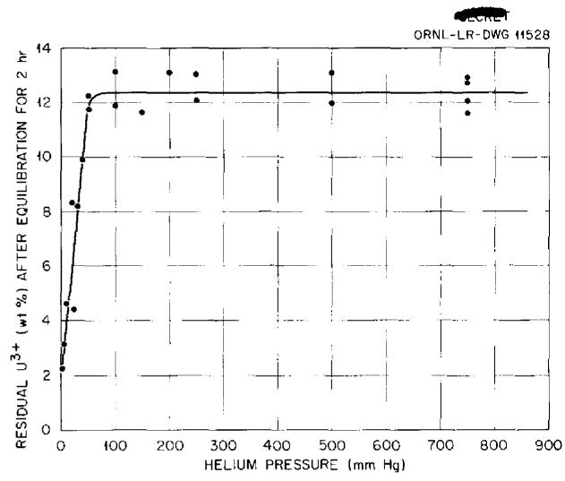  
Fig. 4.6. Effect of Pressure on Reaction Between $\mathsf{UF}_3$ and KF in NaF-LiF-KF Eutectic at $650^{\circ}\mathsf{C}$ .

with decreasing pressure. This behavior suggests that at low pressures the potassium metal escapes from the liquid system quite rapidly, and the reaction

$$
U F _ {3} + K F \rightleftharpoons K ^ {\circ} + U F _ {4}
$$

proceeds to completion. Under these circumstances the melts show colors ranging from red to olive, depending on the $\mathsf{UF}_3$ and $\mathsf{UF}_4$ concentrations. However, when potassium metal is added to the NaF-LiF-KF eutectic, the liquid becomes an opaque, turquoise green and shows a metallic luster. The green liquid is probably potassium metal saturated with the salt mixture.

# Reduction of Alkali Fluorides by Uranium Metal

C.J.Barton

B.H. Clampitt

Materials Chemistry Division

An investigation of uranium metal as a reducing agent for alkali fluorides was initiated because the disproportionation equilibrium for $\mathsf{UF}_3$ involves uranium metal. In the previous report experiments were described in which KF and NaF in the NaF-LiF-KF eutectic were reduced by uranium metal at $650^{\circ}\mathsf{C}$ and NaF in the NaF-LiF eutectic was similarly reduced at $570^{\circ}\mathsf{C}$ . The results of additional experiments with the individual fluorides are presented in Table 4.10. In each experiment, 3 g of uranium was placed in 20 g of the fluoride, and filtered samples were withdrawn for analysis after equilibration with uranium metal.

The reaction of liquid NaF with uranium metal was not studied because of the high melting point of NaF. However, since there is no reaction between LiF and uranium metal at $920^{\circ}\mathrm{C}$ and, yet, the LiF-NaF eutectic does react at $750^{\circ}\mathrm{C}$ , NaF must be reduced by uranium metal. The reaction of KF and uranium metal at $900^{\circ}\mathrm{C}$ proceeded so rapidly that the gas exit lines were plugged after 1 hr, and the experiment had to be discontinued. The potassium collected in the exit line accounted for 60 to $70\%$ of the uranium found in the filtrate. Probably not all the potassium was trapped in the exit line.

# Experimental Preparation of Pure Fluorides

B.J.Sturm

Materials Chemistry Division

Preparation of Pure $\mathsf{CrF}_3$ . In the past, $\mathsf{CrF}_3$ has been prepared by using $\mathsf{CrF}_3 \cdot 3\frac{1}{3}\mathsf{H}_2\mathsf{O}$ as the

TABLE 4.10. REACTION OF URANIUM METAL WITH LIF AND WITH KF   

<table><tr><td rowspan="2">Alkali Fluoride</td><td rowspan="2">Equilibration Time (hr)</td><td rowspan="2">Temperature (°C)</td><td colspan="2">Analysis of Filtrate (wt %)</td><td rowspan="2">Alkali Metal Recovered as Total OH- (meq)</td></tr><tr><td>U3+</td><td>Total U</td></tr><tr><td>KF</td><td>0.75</td><td>900</td><td>0.14</td><td>14.01</td><td>26.2</td></tr><tr><td>KF</td><td>1.00</td><td>900</td><td>0.14</td><td>13.33</td><td>31.4</td></tr><tr><td>LiF</td><td>2.0</td><td>920</td><td>0.0</td><td>0.0*</td><td>0.0</td></tr></table>

*Not detectable colorimetrically.

starting material, converting this to $(\mathsf{NH}_4)_3\mathsf{CrF}_3$ by treatment with excess $\mathsf{NH}_4\mathsf{HF}_2$ and then decomposing this intermediate at $450^{\circ}\mathsf{C}$ to yield $\mathsf{CrF}_3$ . The principal objection to this material is the high iron content of the hydrated chromic fluoride used as the starting material. Recently, the preparation of pure $\mathsf{CrF}_3$ has been accomplished by hydrofluorination of sublimed anhydrous $\mathsf{CrCl}_3$ at $600^{\circ}\mathsf{C}$ . This $\mathsf{CrF}_3$ will be used as the starting material for the preparation of $\mathsf{CrF}_2$ ; hydrogen reduction of $\mathsf{CrF}_3$ at $750^{\circ}\mathsf{C}$ has been shown to be rapid and complete.

Compounds of $\mathsf{ZrF}_4$ with $\mathsf{CrF}_2$ , $\mathsf{NiF}_2$ , or $\mathsf{FeF}_2$ . - Earlier studies showed that complex fluorides of the type $\mathsf{MF}_2\cdot \mathsf{ZrF}_4$ were formed when $\mathsf{ZrF}_4$ was fused at $950^{\circ}\mathsf{C}$ with equimolar quantities of $\mathsf{CrF}_2$ , $\mathsf{NiF}_2$ , or $\mathsf{FeF}_2$ . The compound $\mathsf{FeF}_2\cdot \mathsf{ZrF}_4$ slowly decomposes when exposed to the atmosphere, but $\mathsf{CrF}_2\cdot \mathsf{ZrF}_4$ decomposes so rapidly that it is impossible to obtain reliable x-ray or petrographic data if this material is handled in laboratory air. The compound $\mathsf{NiF}_2\cdot \mathsf{ZrF}_4$ is relatively stable under ordinary atmospheric conditions.

Mixtures corresponding to $\mathsf{CrF}_2\cdot \mathsf{ZrF}_4$ $\mathsf{FeF}_2\cdot \mathsf{ZrF}_4,$ and $\mathsf{NiF}_2\cdot \mathsf{ZrF}_4$ were fused in nickel capsules at $950^{\circ}\mathsf{C},$ and the capsules were opened in a helium-filled dry box in an attempt to eliminate atmospheric contamination. Samples for x-ray examination were sealed in a polystyrene holder by using dry mounting tissue to seal a strip of polystyrene film to the holder. Samples for petrographic examination were kept in sealed containers until they could be studied. The following optical and x-ray data were reported for the compounds protected in the manner described:

# NiF2·ZrF4

Optical data: Cubic; rather poorly crystallized; probably a single phase; refractive index = 1.442; pale yellow or green-yellow color

X-ray data: Probably cubic with a few extraneous lines

# FeF2-ZrF4

Optical data: Cubic; single phase; refractive index = 1.432; white or colorless

X-ray data: Probably cubic; isomorphous with $\mathsf{NiF}_2\cdot \mathsf{ZrF}_4$ but slight shift of lines

# $\mathbf{CrF}_2\cdot \mathbf{ZrF}_4$

Optical data: Single phase; probably orthorhombic; average refractive index = 1.432; biaxial positive; $2V = 20$ deg; birefringence = 0.008; pale gray or blue-gray color

X-ray data: Pattern similar to that of $\mathsf{FeF}_2\cdot \mathsf{ZrF}_4$ with a slight shift of lines; some double lines present that suggest an orthorhombic structure that approaches a cubic form

# PRODUCTION OF PURIFIED FLUORIDES

G.J.Nessle G.M.Watson

Materials Chemistry Division

# Removal of $\mathsf{CrF}_2$ from NaF-ZrF4-UF4 Mixtures

F. L. Daley J. Truitt

Materials Chemistry Division

It was demonstrated previously that a purified 5-lb batch of $\mathsf{NaF - ZrF_4 - UF_4}$ mixture contaminated with added $\mathsf{CrF}_2$ could be processed to an acceptable chromium content for use as fuel-testing material. The procedure for the chromium removal was found to require a treatment step that included

reduction of the $\mathsf{CrF}_2$ to chromium metal with the use of zirconium and then removal of the chromium metal by filtration.

Additional experiments have now been carried out with 5-lb batches of used fuel materials $(\mathsf{NaF - ZrF}_4\mathsf{-UF}_4)$ having various amounts of $\mathsf{CrF}_2$ as well as oxidizing contaminants. In these experiments the fuel was equilibrated at $800^{\circ}\mathsf{C}$ for 3 hr with zirconium metal chips, filtered, and subjected to the standard hydrofluorination-hydrogenation treatment. In addition, two 50-lb batches of used material were treated under similar conditions.

The data from these experiments, presented in Table 4.11, show that the history of the material is very important. Any handling of the fuel mixture that increases its oxide content may greatly reduce the effectiveness of the zirconium-reduction step. Reduction of $\mathsf{U}^{4+}$ to $\mathsf{U}^{3+}$ in the melt is controlled primarily by the amount of zirconium metal added in excess of the amount necessary to reduce the $\mathsf{CrF}_2$ to chromium. On this basis, a theoretical amount of reduction of $\mathsf{U}^{4+}$ to $\mathsf{U}^{3+}$ was calculated and compared with the experimental value so that the percentage of theoretical reduction obtained could be computed. It is significant that the percentage of theoretical reduction was found to decrease sharply with increased previous handling

and exposure of the fuel to oxidizing conditions. When fuel material that contained essentially no oxidizing impurities (no previous handling after purification) was used, over $90\%$ of the theoretical reduction was obtained. When used fuels that had been protected from exposure were processed, the observed reduction of $\mathsf{UF}_4$ decreased over fivefold; a twentyfold decrease was obtained for a used fuel that had not been protected from air and water.

Some rather interesting trends were noted. At a given temperature the resulting concentrations of $\mathsf{CrF}_2$ are inversely proportional to the square of the $U^{3 + } / U^{4 + }$ ratio, within the experimental limitations. The calculated values for $K_{x}$ for the reaction

$$
\mathrm {C r F} _ {2} + 2 \mathrm {U F} _ {3} \rightleftharpoons 2 \mathrm {U F} _ {4} + \mathrm {C r}
$$

were $2 \times 10^{-5}$ and $1 \times 10^{-6}$ at 800 and $650^{\circ}C$ , respectively. The number of experiments was quite limited, however, and it is felt that no special significance should be attached to these values.

Efforts to protect the filter from plugging by oxides and oxyfluorides included cooling the melt to $650^{\circ}\mathrm{C}$ before filtration. It was hoped that these oxyl compounds would precipitate in the reactor at the lower temperature and thus be left there when the filtration was made. Comparisons of the

TABLE 4.11. SUMMARY OF RESULTS OF REPROCESSING EXPERIMENTS   

<table><tr><td rowspan="2">Source of Material</td><td rowspan="2">Filtration Temperature (℃)</td><td colspan="2">CrF2Concentration (ppm)</td><td rowspan="2">U3+/U4+</td><td rowspan="2">Percentage of Theoretical Reduction</td><td rowspan="2">Kx</td></tr><tr><td>Before</td><td>After</td></tr><tr><td colspan="7">5-lb Batches</td></tr><tr><td rowspan="2">Previously purified fuel + CrF2</td><td rowspan="2">800</td><td>11,500</td><td>90</td><td>0.43</td><td>100</td><td>2 × 10-5</td></tr><tr><td>11,500</td><td>1400</td><td>0.13</td><td>91</td><td>3 × 10-5</td></tr><tr><td rowspan="2">Used fuel stored in closed containers</td><td rowspan="2">650</td><td>2,500</td><td>440</td><td>0.045</td><td>17</td><td>1 × 10-6</td></tr><tr><td>500</td><td>345</td><td>0.057</td><td>14</td><td>1 × 10-6</td></tr><tr><td>Used fuel completely exposed to atmospheric contamination</td><td>800</td><td>2,000</td><td>1540</td><td></td><td>5</td><td></td></tr><tr><td colspan="7">50-lb Batches</td></tr><tr><td rowspan="2">Used fuel stored in closed containers</td><td rowspan="2">800</td><td>270</td><td>190</td><td></td><td></td><td></td></tr><tr><td>305</td><td>110</td><td></td><td></td><td></td></tr></table>

quantity of filter cake obtained at 800 and at $650^{\circ}C$ did not indicate that any advantage was gained by lowering the temperature. From these data it can be concluded that $\mathsf{CrF}_2$ removal is feasible on a small-scale basis if proper care is exercised during handling of the fuel mixture to prevent excessive oxide contamination. Results of the 50-lb-batch reprocessing experiments indicate that the treatment is, in general, feasible, but the materials studied thus far have been too low in chromium content for really definitive data to be obtained.

# Laboratory-Scale Purification Operations

F. L. Daley F. W. Miles

Materials Chemistry Division

The standard hydrofluorination-hydrogenation purification procedure was used in the preparation of a 1.5-kg batch of LiF-NaF (60-40 mole%). No difficulties were encountered, and a satisfactory product was obtained. The transfer was nearly complete; only 24 g of the mixture remained in the reactor.

Four batches of RbF(KF)-ZrF4-UF4of approximately 2 kg each were prepared. The first two RbF(KF)-ZrF4-UF4 mixtures had a nominal composition of 48-48-4 mole %, and the last two, 50-46-4 mole %. Since the available RbF contained about 20 mole % KF, the compositions were calculated by using the average molecular weight of the RbF-KF mixture.

Unusually large residues remained in the reactor in every case. The hydrofluorination times employed were 2, $2\frac{1}{2}$ , 6, and 18 hr, respectively; in each case the composition was cooled to $450^{\circ}C$ before transfer. Slight thermal breaks were detected at $\sim 540$ to $565^{\circ}C$ in the first three experiments. No thermal break was detected in this range on the fourth experiment. All four products froze at $\sim 405$ to $410^{\circ}C$ . Oxyfluorides were present in the reactor residues from the first three experiments, despite the rather drastic hydrofluorination treatments.

Petrographic, x-ray, and chemical analyses showed the compositions of the first three products to be rather different from those of the residues. Consequently, these products were not issued for viscosity studies. The composition of the last product was found to be quite close to the theoretical composition, and the product was therefore issued for viscosity and phase studies.

# Special Preparation of NaF-ZrF4-UF3-UF4

F. L. Daley

Materials Chemistry Division

At the request of Wright Air Development Center, a 50-lb batch of NaF-ZrF $_4$ -UF $_3$ -UF $_4$ was prepared by a procedure previously described. $^{12}$ The nominal, final composition was NaF-ZrF $_4$ -UF $_3$ (44-53-3 mole $\%$ ). A chemical analysis of the product gave the following:

In weight percentages   

<table><tr><td></td><td>Found</td><td>Theoretical</td></tr><tr><td>Na</td><td>10.9</td><td>8.7</td></tr><tr><td>Zr</td><td>41.8</td><td>41.7</td></tr><tr><td>Total U</td><td>6.24</td><td>6.2</td></tr><tr><td>U3+</td><td>5.15</td><td></td></tr><tr><td>F</td><td>41.1</td><td>43.4</td></tr><tr><td colspan="3">In parts per million</td></tr><tr><td>Fe</td><td>260</td><td></td></tr><tr><td>Cr</td><td>100</td><td></td></tr><tr><td>Ni</td><td>90</td><td></td></tr></table>

# Evaluation of Raw Materials for Fuel Preparation

F. L. Daley

Materials Chemistry Division

It has been shown that rather small amounts $(\sim 2$ wt $\%$ ) of oxides or oxyfluorides in the raw materials greatly increase the time required for purification. The presence of these impurities at low concentration is not, to date, readily detectable by either petrographic, x-ray, or chemical analyses. The more reliable index of purity appears to be the actual preparation of small quantities $(3\mathrm{kg})$ of fuels by using the raw materials in question. Thus samples from a batch of $\mathsf{ZrF}_4$ and from a batch of $\mathsf{NaZrF}_5$ submitted by outside suppliers were evaluated by determining their processing characteristics. The $\mathsf{ZrF}_4$ was found by petrographic examination to contain a very small amount of finely divided oxide or hydroxide, which was not found by x-ray diffraction and chemical analysis. The 3-kg charge of $\mathsf{NaF - ZrF}_4\mathsf{-UF}_4$ (50-46-4 mole $\%$ ) prepared with this material by the standard procedure was normal in freezing-point, chemical-composition, and optical properties.

The sample of $\mathsf{NaZrF}_5$ showed a large quantity (20 to $25\%$ ) of a brownish material that was identified by petrographic examination as hydrated $\mathsf{Na}_{3}\mathsf{Zr}_{4}\mathsf{F}_{19}$ . No processing difficulties were encountered with this material, but the product contained brownish aggregates that were tentatively identified as oxyfluorides. On the basis of these results, the commercially obtained $\mathsf{ZrF}_4$ appears to be satisfactory, while the $\mathsf{NaZrF}_5$ seems to be marginal at best.

# Pilot-Scale Purification Operations

C. R. Croft

J. Truitt

J.P.Blakely

W. T. Ward

Materials Chemistry Division

Fluoride mixtures to be used in small-scale corrosion testing, phase equilibrium studies, and physical-property studies are prepared in the pilot-scale facility. During the past quarter, 68 batches totaling approximately 800 lb were prepared.

# Production-Scale Operations

J. E. Eorgan

J.P.Blakely

Materials Chemistry Division

The shortage of $\mathsf{ZrF}_{4}$ , which has prevailed for several months because of the low-capacity production of the Y-12 Area facility, apparently no longer exists. The first 2500-lb shipment of a 10,000-lb order from General Chemical Company was received early in November, and chemical analysis showed this material to be satisfactory. Therefore the $\mathsf{ZrF}_{4}$ supply is assured for the next six months. This material contains hafnium and will be used only in the production of fuels for component tests which do not involve nuclear activity.

The vacuum pumps originally installed in the processing facility are beginning to wear out and have caused three major shutdowns or delays of approximately 48 hr each. The vacuum-pump repair shop has recommended that these pumps be replaced because the parts are so worn that periodic trouble will occur. Spare parts are not available for these Beech-Russ pumps. Therefore they are to be replaced with Kinney pumps, for which parts are kept in stock.

An increasing incidence of failures of reactor cans, which are fabricated from A-nickel, has led to a closer investigation of the cause of such failures. These failures consist of cracks that

form in the walls of the reactor vessel during processing. Some reactors withstand the processing of 12 batches before failing; others have failed while processing a second batch. Recently, the failures have been occurring most frequently after four or five batches have been processed. Originally, it was believed that sulfur attack of the nickel, which caused embrittlement, was the source of the trouble. The raw materials NaF, $\mathsf{ZrF}_4$ , $(\mathsf{NaF})_4\cdot \mathsf{ZrF}_4$ , and $\mathsf{UF}_4$ were therefore examined, and new specifications were set for the sulfur content. The zirconium compounds were the worst offenders, with sulfur contents, sometimes, of over 500 ppm. The new specifications called for a maximum sulfur content of 100 ppm. The incidence of failures tended to increase, however, rather than to decrease as was expected.

Recently an ASTM specification was reviewed that recommends low-carbon nickel for high-temperature usage rather than A-nickel, which normally has a high carbon content. At high temperatures, carbonization occurs that causes fractures in the parent metal. With this information in mind, another examination of past failures was undertaken. Efforts to find evidence of sulfur attack failed, but a grayish-black crystal growth was found in the grain boundaries of the parent nickel where the fractures occurred; this tended to substantiate the carbonization theory. Low-carbon nickel reactor cans have therefore been ordered. The delivery dates being quoted vary from three to six months.

The long-expected increase in demand for processed fluorides has failed to materialize. As a consequence the fuel stockpile is at an all-time high, and the supply of storage containers is nearly exhausted. Since no actual cancellation of orders has occurred, there is only a small surplus. However, if usage does not increase in the very near future, this facility will be shut down temporarily. A total of 5500 lb of fluoride compositions in 22 batches was processed during the quarter.

# Batching and Dispensing Operations

F. A. Doss

J.P.Blakely

R. G. Wiley

Materials Chemistry Division

During the quarter, 85 batches totaling approximately 3950 lb of fluoride mixtures were dispensed

in batch sizes ranging from 1 to 250 lb. A material balance for the past quarter follows:

<table><tr><td>Material</td><td>Amount (lb)</td></tr><tr><td>On hand at beginning of quarter</td><td>6,650</td></tr><tr><td>Produced during quarter</td><td>5,479</td></tr><tr><td>Total</td><td>12,129</td></tr><tr><td>Dispensed during the quarter</td><td>3,939</td></tr><tr><td>On hand at end of quarter</td><td>8,190</td></tr></table>

# Special Services

F.A.Doss J.P.Blakely

N.V. Smith W.T.Ward

Materials Chemistry Division

Filling, Draining, and Sampling Operations.

Filling, draining, and sampling operations at experimental facilities were at normal levels during the quarter. The fuel mixture was removed from the ART high-temperature critical experiment, for salvage, without difficulty.

In-Pile Loops. - Two in-pile loops were filled with an enriched-uranium-bearing fluoride mixture during the quarter. Both loops were shipped to NRTS for testing in the MTR. A fourth in-pile loop is to be filled in January 1956.

Testing of ART Enrichment Apparatus. In order to obtain more information on the behavior of the proposed ART enricher system, additional tests are being made of the prototype apparatus used for the high-temperature critical experiment. Approximately $75\%$ of the material originally charged into the enricher is still available in the equipment. Graphite cups will be used to catch specified increments from the enricher for weighing so that a thorough calibration of the enricher over a larger range of plunger levels can be made. A box has been fabricated to fit over the injection nozzle so that a protective atmosphere can be provided to prevent excessive oxidation of the nozzle and the fuel during these tests.

# FUNDAMENTAL CHEMISTRY OF FUSED SALTS

# Relative Viscosity-Composition Studies of NaF-LiF-ZrF4 Mixtures at 600°C

G.M.Watson

F.W.Miles

Materials Chemistry Division

Relative measurements of viscosity and density of molten salts can be obtained with the con

ventionai equipment used for fuel purification. The experimental assembly is such that changes in chemical composition of the molten mixtures can be effected with ease, and the viscosity and density measurements can be made without removal of the pure material from the container. Thus it is possible to determine whether significant changes in these physical properties occur with small changes in chemical composition. When such changes are found, efforts can be made to correlate the observed changes with the formation or disappearance of probable ionic and molecular species in the liquid mixtures as the compositions are changed.

Viscosities are being measured with a Brookfield viscometer. The only modifications required to the standard fuel purification assembly were the incorporation of a support for the viscometer and a slight change in the reactor top to permit easier introduction of the viscometer spindle. The viscometer assembly is calibrated before each measurement by using an identical reactor containing a glycerine-water solution of known composition. Since the measurements are to be relative, no correction is introduced to account for the effect of the thermal expansion of the spindle between the calibration temperature, $25^{\circ}\mathrm{C}$ , and the melt temperature. Measurements of viscosity on a number of mixtures of the same composition have indicated the precision to be better than $\pm 10\%$ .

The first study undertaken was an investigation of the relative viscosities of mixtures whose compositions lie along the join, on the phase diagram, between NaF-LiF-ZrF $_4$ (22-55-23 mole %) and NaF-ZrF $_4$ (53-47 mole %). The experimental results, which are summarized in Table 4.12, do not indicate marked changes in viscosity due to composition changes.

Some simple additions have been made to the existing experimental assembly so that density measurements can be made. The density measurements will be attempted by noting differences in the maximum hydrostatic heads required to blow bubbles of inert gas into the melt at two different depths. A milling-machine cross-feed, recovered from salvage, was permanently incorporated into the experimental assembly for introducing nickel tubing to the desired depth for bubbling the gas into the melt. The screw and micrometer vernier scale of the cross-feed were calibrated with a catheterometer. The hydrostatic heads are measured with

TABLE 4.12 RELATIVE VISCOSITY vs COMPOSITION OF NaF-LiF-ZrF ${}_{4}$ MIXTURES AT ${600}^{ \circ  }\mathrm{C}$   

<table><tr><td colspan="3">Composition (mole %)</td><td rowspan="2">Relative Viscosity,* η/η1</td></tr><tr><td>NaF</td><td>LiF</td><td>ZrF4</td></tr><tr><td>22</td><td>55</td><td>23</td><td>1.0</td></tr><tr><td>25</td><td>50</td><td>25</td><td>1.0</td></tr><tr><td>31</td><td>39</td><td>30</td><td>1.0</td></tr><tr><td>37</td><td>28</td><td>35</td><td>0.94</td></tr><tr><td>44</td><td>16</td><td>40</td><td>0.94</td></tr><tr><td>50</td><td>5</td><td>45</td><td>0.97</td></tr><tr><td>53</td><td>0</td><td>47</td><td>1.0</td></tr></table>

$\ast \eta_{1} =$ viscosity measurement for NaF-LiF-ZrF4 (22-55-23 mole %) = 12.0 centipoises at $600^{\circ}\mathrm{C}$ , as reported by S. I. Cohen and T. N. Jones, Measurement of Viscosity of Compositions 81 and 82, ORNL CF-55-5-58 (May 16, 1955) p 5.

a U-tube manometer that uses water as the manometric fluid. A cold trap was installed between the manometer and the reactor to protect the melt from water-vapor contamination. Preliminary density determinations have been made with apparently satisfactory precision. The apparatus will be calibrated in the near future with molten KCl and KCl-NaCl mixtures as standards.[13]

The measurement of surface tension will be attempted by the maximum-bubble-pressure method. It is hoped that the same apparatus used to determine densities will be applicable with no substantial changes.

# EMF Measurements in Fused Salts

L. E. Topol

Materials Chemistry Division

Measurements of electromotive forces of cells in which molten $\mathsf{NaF - ZrF}_4$ (53-47 mole %) is used as the solvent were continued in order to obtain activities and activity coefficients of constituents of the melts. The measurements were made in the temperature range 550 to $700^{\circ}\mathrm{C}$ in a helium atmosphere. The melts were contained in recrystallized alumina (Morganite) crucibles, and the half cells were connected by a bridge of porous $\mathsf{ZrO}_2$ impregnated with the NaF-ZrF mixture.

The cells measured were of the general type

where $M$ and $M^{\prime}$ may be $\mathbf{Cr},\mathbf{Fe}_i$ or Ni and $M$ and $M^{\prime}$ may be identical.

Previously, saturated cells with identical saturating phases, $M F_{2} \cdot Z r F_{4}$ and $M^{\prime} F_{2} \cdot Z r F_{4^{\prime}}$ were measured. If it is assumed that $\mathsf{Na^{+}}$ and $\mathsf{F}-$ are the sole carriers of current, the net result of passage of two faradays of electricity is

$$
\begin{array}{l} M + Z r F _ {4} \left(a _ {2}\right) + M ^ {\prime} F _ {2} \cdot Z r F _ {4} (s) + 2 t N a F \left(a _ {1}\right) \\ = M F _ {2} \cdot Z r F _ {4} (s) + M ^ {\prime} + Z r F _ {4} \left(a _ {2} ^ {\prime}\right) + 2 t N a F \left(a _ {1} ^ {\prime}\right), \\ \end{array}
$$

where $t$ is the transference number of the $\mathbf{Na}^{+}$ ion. If the amounts of added metal fluorides are approximately equal and the solubilities of the complexes $(MF_{2} \cdot ZrF_{4}$ and $M'F_{2} \cdot ZrF_{4})$ are low, the above equation reduces to

$$
M + M ^ {\prime} F _ {2} \cdot Z r F _ {4} (s) = M F _ {2} \cdot Z r F _ {4} (s) + M ^ {\prime},
$$

and the emf's of these cells, together with the free energies of formation of the pure fluorides, indicate the relative stabilities of the solid complexes.

In the cells reported in Table 4.13 the addition of metal fluorides was low enough to eliminate the presence of solid salt phases at high temperatures (600 to $700^{\circ}\mathrm{C}$ ), and the net cell reaction was

$$
\begin{array}{l} M + M ^ {\prime} F _ {2} \left(a _ {3} ^ {\prime}\right) + 2 t N a F \left(a _ {1}\right) \\ = M ^ {\prime} + M F _ {2} \left(a _ {3}\right) + 2 t N a F \left(a _ {1} ^ {\prime}\right). \\ \end{array}
$$

With small additions of $MF_{2}$ and $M^{\prime}F_{2^{\prime}}$ the activities of NaF on the two sides are nearly equal, and the Nernst equation for the reaction becomes

$$
E = E ^ {\circ} - \frac {R T}{n F} \ln \frac {a _ {3}}{a _ {3} ^ {\prime}} = E ^ {\circ} - \frac {R T}{n F} \ln \frac {\gamma_ {3} x _ {3}}{\gamma_ {3} ^ {\prime} x _ {3} ^ {\prime}},
$$

where $a, a', x, x'$ , and $\gamma, \gamma'$ are the activities, mole fractions, and activity coefficients, respectively. From Brewer's estimates of free energies of formation, $E^0$ values of 0.33, 0.20, and 0.53 v are obtained for the Cr-Fe, Fe-Ni, and Cr-Ni cells; these values should be nearly independent of the temperature over this range. From these $E^0$ values

TABLE 4.13. POTENTIALS OF CELLS OF THE TYPE $M\left| {{M}_{{F}_{2}}\left( {a}_{3}\right) ,N{a}^{ \circ  }F\left( {a}_{1}\right) ,Z{r}_{{F}_{4}}\left( {a}_{2}\right) }\right| \left| {{N}_{a}F\left( {a}_{1}^{\prime }\right) ,Z{r}_{{F}_{4}}\left( {a}_{2}^{\prime }\right) ,M{}^{\prime }{F}_{2}\left( {a}_{3}^{\prime }\right) }\right| {M}^{\prime }$   

<table><tr><td rowspan="2">Temperature (°C)</td><td colspan="3">Measured emf a(v)</td><td rowspan="2">Summation of Cr-Fe and Fe-Ni Values (v)</td></tr><tr><td>Cr-Fe b</td><td>Fe-Ni c</td><td>Cr-Ni d</td></tr><tr><td>550</td><td>0.325</td><td>0.420</td><td>0.751</td><td>0.745</td></tr><tr><td>600</td><td>0.340</td><td>0.394</td><td>0.745</td><td>0.734</td></tr><tr><td>650</td><td>0.341</td><td>0.399</td><td>0.749</td><td>0.740</td></tr><tr><td>700</td><td>0.337</td><td>0.409</td><td>0.753</td><td>0.746</td></tr></table>

${}^{a}$ Mean of values from two similar cells. These emf's have been corrected for thermoelectric potentials between different metal electrodes and leads. The corrections are 8 to ${10}\mathrm{{mv}}$ for the Fe-Ni and the Cr-Fe cells. The Cr-Ni cells needed no correction because the Cr electrodes were attached to Ni lead wires, with the junction at the cell temperature.   
${}^{b}{\mathrm{{CrF}}}_{2}$ concentration,1.55 mole %; FeF ${}_{2}$ concentration,0.77 mole %.   
${}^{c}{\mathrm{{FeF}}}_{2}$ concentration,0.74 mole %; NiF ${}_{2}$ concentration,0.21 mole %.   
${}^{d}{\mathrm{{CrF}}}_{2}$ concentration,1.40 mole %; NiF ${}_{2}$ concentration,0.31 mole %.

and the values in Table 4.13, it is found that at $650^{\circ}C$

$$
\begin{array}{l} \frac {\gamma_ {C r F _ {2}}}{\gamma_ {F e F _ {2}}} \cong 0. 3 5, \\ \frac {\gamma_ {F e F _ {2}}}{\gamma_ {N i F _ {2}}} \stackrel {\sim} {=} 0. 0 0 2, \\ \frac {\gamma_ {\mathrm {C r F} _ {2}}}{\gamma_ {\mathrm {N i F} _ {2}}} \simeq 0. 0 0 0 6, \\ \end{array}
$$

if the convention that $a = 1$ for pure, solid $M F_{2}$ is used. These activity coefficients, together with results of hydrogen equilibrium measurements which show that the activity coefficient of $FeF_{2}$ in very dilute solution is nearly unity, if solid $FeF_{2}$ is used as a base, indicate that the activity coefficient of $NiF_{2}$ is nearly 500. Since the saturated $NiF_{2}$ solution at $650^{\circ}\mathrm{C}$ contains about 0.25 mole% $NiF_{2}$ , the saturated solution apparently has an activity of approximately unity (500 × 0.0025), if solid $NiF_{2}$ is used as a base. This result is consistent either with having the saturating solid phase $NiF_{2}$ instead of $NiF_{2} \cdot ZrF_{4}$ , at the temperature of measurement, or with a phase diagram in which $NiF_{2} \cdot ZrF_{4}$ has an incongruent

melting point that is not much above the temperatures used, in which case the solution saturated with $\mathsf{NiF}_2\cdot \mathsf{ZrF}_4$ is nearly the same as the metastable solution saturated with $\mathsf{NiF}_2$ .

Concentration cells were measured to find the change of the activity coefficient with concentration. Identical chromium electrodes but different $\mathsf{CrF}_2$ concentrations (Table 4.14) and identical iron electrodes but different $\mathsf{FeF}_2$ concentrations (Table 4.15) were used. If, as before, it is assumed that the $\mathsf{Na}^+$ and $\mathsf{F}^-$ ions carry all the current, the cell reaction is

$$
M F _ {2} \left(x _ {3} ^ {\prime}\right) + 2 t N a F \left(x _ {1}\right) = M F _ {2} \left(x _ {3}\right) + 2 t N a F \left(x _ {1} ^ {\prime}\right).
$$

With low concentrations of $MF_{2}$ , the activities of NaF are nearly equal on both sides, and the potential is given by

$$
E = \frac {R T}{n F} \ln \frac {a _ {3}}{a _ {3} ^ {\prime}} = - \frac {R T}{n F} \ln \frac {\gamma_ {3} x _ {3}}{\gamma_ {3} ^ {\prime} x _ {3} ^ {\prime}}.
$$

Duplicate sets of cells were measured at intervals over a period of two days. All behaved quite similarly, and the data were, in general, quite reproducible, with the data from the cells containing iron being more closely reproducible than those from the cells containing chromium.

The most reproducible readings were obtained at $550^{\circ}C$ , but the very low values indicate that the solubilities of $\mathsf{CrF}_2$ and $\mathsf{FeF}_2$ were exceeded

TABLE 4.14. ACTIVITY RATIOS FOR ${\mathrm{{CrF}}}_{2}$ IN NaF-ZrF ${}_{4}$ (53-47 mole %) FROM THE CELL ${\mathrm{{Cr}}}_{1}{\left| {\mathrm{{CrF}}}_{2}\left( {x}_{1}\right) ,\mathrm{{NaF}}\left( {x}_{2}\right) ,{\mathrm{{ZrF}}}_{4}\left( {x}_{3}\right) \right| }_{1}{\mathrm{{ZrF}}}_{4}\left( {x}_{3}^{\prime }\right) ,\mathrm{{NaF}}\left( {x}_{2}^{\prime }\right) ,{\mathrm{{CrF}}}_{2}\left( {x}_{1}^{\prime }\right) }_{1}$ Cr   

<table><tr><td rowspan="2">Temperature (°C)</td><td colspan="2">E(v)</td><td rowspan="2">a1/a1&#x27;</td><td rowspan="2">γ1/γ1&#x27;</td></tr><tr><td>Measured</td><td>Ideal</td></tr><tr><td colspan="5">For CrF2Mole Fraction Ratio x1/x1&#x27; = 0.0099/0.0307 = 0.322</td></tr><tr><td>700</td><td>0.0377</td><td>0.0475</td><td>0.406</td><td>1.26</td></tr><tr><td>650</td><td>0.0357</td><td>0.0450</td><td>0.407</td><td>1.27</td></tr><tr><td>600</td><td>0.0247</td><td>0.0425</td><td>0.518</td><td>1.61</td></tr><tr><td>550</td><td>0.0005</td><td>0.0401</td><td>1.0*</td><td></td></tr><tr><td colspan="5">For CrF2Mole Fraction Ratio x1/x1&#x27; = 0.0098/0.0310 = 0.316</td></tr><tr><td>700</td><td>0.038</td><td>0.0475</td><td>0.403</td><td>1.28</td></tr><tr><td>650</td><td>0.0363</td><td>0.0450</td><td>0.401</td><td>1.27</td></tr><tr><td>600</td><td>0.0335</td><td>0.0425</td><td>0.410</td><td>1.30</td></tr><tr><td>550</td><td>0.0018</td><td>0.0401</td><td>*</td><td></td></tr><tr><td colspan="5">For CrF2Mole Fraction Ratio x1/x1&#x27; = 0.0027/0.031 = 0.871</td></tr><tr><td>700</td><td>0.0827</td><td>0.1023</td><td>0.139</td><td>1.60</td></tr><tr><td>650</td><td>0.0791</td><td>0.0970</td><td>0.136</td><td>1.56</td></tr><tr><td>600</td><td>0.0682</td><td>0.0917</td><td>0.163</td><td>1.87</td></tr><tr><td>550</td><td>0.0307</td><td>0.0865?</td><td>0.420?*</td><td>4.82?</td></tr><tr><td colspan="5">For CrF2Mole Fraction Ratio x1/x1&#x27; = 0.0027/0.0276 = 0.0963</td></tr><tr><td>700</td><td>0.0743</td><td>0.0982</td><td>0.170</td><td>1.77</td></tr><tr><td>650</td><td>0.0700</td><td>0.0931</td><td>0.172</td><td>1.79</td></tr><tr><td>600</td><td>0.0660</td><td>0.0880</td><td>0.173</td><td>1.80</td></tr><tr><td>550</td><td>0.0330</td><td>0.0830</td><td>*</td><td></td></tr></table>

*Solubility of $\mathsf{CrF}_2$ is less than added concentrations at this temperature.

in one or both half cells at this temperature. Since the saturating phase in these systems is believed to be $MF_{2} \cdot ZrF_{4}$ , for which no thermochemical information is available, the data at this temperature cannot be interpreted in terms of activity coefficients. However, the results at $550^{\circ}C$ indicate that at least one half cell was saturated, and bounds can be set on the solubilities. From the emf values in Table 4.14 it can be determined that the solubility of $CrF_{2}$ is equal to or greater than 2.8 mole % at $600^{\circ}C$ and is between 0.27 and 0.98 mole % at $550^{\circ}C$ . From the emf values in Table 4.15 it is found that the solubility of $FeF_{2}$ at $550^{\circ}C$ is less than or equal to 0.26 mole % and at $600^{\circ}C$ is equal to or greater than 0.74 mole %. From previous work it is known that the solubility of $FeF_{2}$ at $550^{\circ}C$ is equal to or greater than 0.23 mole % and at $600^{\circ}C$ is less than or

equal to 0.80 mole $\%$ .At all other temperatures the observed potentials are less than would be expected if the solutions were ideal, and, accordingly, the activity coefficients decrease slightly with increased concentrations of added salt.

# Optical Properties and X-Ray Patterns for Various Compounds in Fluoride Systems

R.E.Thoma

Materials Chemistry Division

G.D. White

Metallurgy Division

H. Insley

T. N. McVay

Consultants

The identifying characteristics of some new compounds encountered in phase studies are

TABLE 4.15. ACTIVITY RATIOS FOR ${\mathrm{{FeF}}}_{2}$ IN $\mathrm{{NaF}} - {\mathrm{{ZrF}}}_{4}$ (53-47 mole %) FROM THE CELL Fe|FeF ${}_{2}\left( {x}_{1}\right) ,\mathrm{{NaF}}\left( {x}_{2}\right) ,{\mathrm{{ZrF}}}_{4}\left( {x}_{3}\right) \parallel \mathrm{{ZrF}}{}_{4}\left( {x}_{3}^{\prime }\right) ,\mathrm{{NaF}}\left( {x}_{2}^{\prime }\right) ,{\mathrm{{FeF}}}_{2}\left( {x}_{1}^{\prime }\right)$ | Fe   

<table><tr><td rowspan="2">Temperature (°C)</td><td colspan="2">E(v)</td><td rowspan="2">a/a1&#x27;</td><td rowspan="2">γ1/γ1&#x27;</td></tr><tr><td>Measured</td><td>Ideal</td></tr><tr><td colspan="5">For CrF2Mole Fraction Ratio x1/x1&#x27; = 0.0027/0.0074 = 0.370</td></tr><tr><td>700</td><td>0.0366</td><td>0.0417</td><td>0.418</td><td>1.13</td></tr><tr><td>650</td><td>0.0340</td><td>0.0396</td><td>0.425</td><td>1.15</td></tr><tr><td>600</td><td>0.0330</td><td>0.0374</td><td>0.416</td><td>1.12</td></tr><tr><td>550</td><td>0.0008</td><td>(0.0353)</td><td>*</td><td></td></tr><tr><td colspan="5">For CrF2Mole Fraction Ratio x1/x1&#x27; = 0.0026/0.0074 = 0.347</td></tr><tr><td>700</td><td>0.0363</td><td>0.0444</td><td>0.421</td><td>1.21</td></tr><tr><td>650</td><td>0.0350</td><td>0.0422</td><td>0.415</td><td>1.20</td></tr><tr><td>600</td><td>0.0335</td><td>0.0398</td><td>0.410</td><td>1.18</td></tr><tr><td>550</td><td>0.0019</td><td>(0.0376)</td><td>*</td><td></td></tr></table>

*Solubility of $\mathsf{FeF}_2$ is less than added concentrations at this temperature.

<table><tr><td rowspan="11" colspan="2">listed below. The symbol d(Å) means the distance between reflecting planes measured in angstroms; I/1 refers to the relative intensity as compared with an arbitrary value of 100 for the strongest line. Under optical properties, Na and γ refer to the lowest and highest indices of refraction, respectively, and 2V refers to the acute angle between the optic axes of biaxial crystals; 0 and E refer to the ordinary and extraordinary indices of refraction of uniaxial crystals.</td><td>7.70</td><td>100</td></tr><tr><td>6.20</td><td>3</td></tr><tr><td>5.57</td><td>6</td></tr><tr><td>5.15</td><td>8</td></tr><tr><td>5.01</td><td>19</td></tr><tr><td>4.77</td><td>8</td></tr><tr><td>4.65</td><td>36</td></tr><tr><td>4.29</td><td>42</td></tr><tr><td>3.86</td><td>100</td></tr><tr><td>3.75</td><td>13</td></tr><tr><td>3.52</td><td>15</td></tr><tr><td rowspan="2" colspan="2">2NaF·3KF·5ZrF4</td><td>3.40</td><td>48</td></tr><tr><td>3.23</td><td>6</td></tr><tr><td colspan="2">Optical data:</td><td>3.17</td><td>60</td></tr><tr><td colspan="2">Probably monoclinic</td><td>3.09</td><td>33</td></tr><tr><td colspan="2">Na = 1.478</td><td>2.87</td><td>5</td></tr><tr><td colspan="2">γ = 1.488</td><td>2.80</td><td>9</td></tr><tr><td colspan="2">Biaxial negative</td><td>2.58</td><td>6</td></tr><tr><td colspan="2">2V, very large (~80 deg)</td><td>2.47</td><td>6</td></tr><tr><td colspan="2">Marked cleavage</td><td>2.39</td><td>8</td></tr><tr><td colspan="2">X-ray data:</td><td>2.33</td><td>8</td></tr><tr><td colspan="2">Monoclinic</td><td>2.19</td><td>5</td></tr><tr><td colspan="2">a0 = 5-6 Å</td><td>2.16</td><td>8</td></tr><tr><td colspan="2">b0 = 5-7 Å</td><td>2.14</td><td>48</td></tr><tr><td colspan="2">c0 = 9-13 Å</td><td>2.09</td><td>8</td></tr><tr><td colspan="2">α = 93 deg</td><td>2.06</td><td>8</td></tr><tr><td colspan="2"></td><td>1.95</td><td>27</td></tr><tr><td>d(A)</td><td>I/I1</td><td>1.94</td><td>90</td></tr><tr><td></td><td></td><td>1.91</td><td>10</td></tr><tr><td>8.51</td><td>100</td><td>1.89</td><td>10</td></tr></table>

<table><tr><td>1.88</td><td>16</td></tr><tr><td>1.84</td><td>7</td></tr><tr><td>1.81</td><td>7</td></tr><tr><td>1.76</td><td>8</td></tr><tr><td>1.70</td><td>13</td></tr></table>

# RbF·ZrF4

Optical data:

Lath-shaped crystals

Probably monoclinic or biclinic

$$
N _ {\alpha} = 1. 4 9 0 \pm 0. 0 0 2
$$

$$
N _ {\gamma} = 1. 5 0 2 \pm 0. 0 0 2
$$

Biaxial negative

$$
2 V = 7 5 \pm 1 0 \mathrm {d e g}
$$

# X-ray data:

<table><tr><td>d(Å)</td><td>I/I1</td></tr></table>

$$
5. 8 7 \quad 1 0
$$

$$
5. 6 1 \quad 1 0
$$

$$
5. 0 4 \quad 9
$$

$$
4. 7 7 \quad 1 6
$$

$$
4. 5 0 \quad 1 2
$$

$$
4. 2 9 \quad 6 5
$$

$$
3. 9 8 \quad 2 5
$$

$$
3. 8 2 \quad 3 0
$$

$$
3. 7 8 \quad 1 6
$$

$$
3. 7 2 \quad 1 6
$$

$$
3. 6 3 \quad 3 2
$$

$$
3. 5 9 \quad 9 5
$$

$$
3. 5 2 \quad 8
$$

$$
3. 4 4 \quad 1 0 0
$$

$$
3. 4 2 \quad 1 0 0
$$

$$
3. 3 6 \quad 1 0 0
$$

$$
3. 2 9 \quad 1 0 0
$$

$$
3. 0 5 \quad 1 2
$$

$$
2. 6 0 \quad 2 5
$$

$$
2. 5 1 \quad 3 0
$$

$$
2. 3 9 \quad 1 2
$$

$$
2. 3 5 \quad 7 5
$$

$$
2. 2 8 \quad 1 1
$$

$$
2. 2 7 \quad 1 2
$$

$$
2. 2 6 \quad 1 2
$$

$$
2. 2 5 \quad 1 2
$$

$$
2. 2 4 \quad 8
$$

$$
2. 2 3 \quad 1 2
$$

$$
2. 1 5 \quad 4 5
$$

$$
2. 0 7 \quad 1 2
$$

$$
2. 0 3 \quad 1 2
$$

$$
1. 9 6 \quad 3 0
$$

$$
1. 9 3 \quad 3 0
$$

$$
1. 9 0 \quad 1 5
$$

$$
1. 8 7 \quad 2 0
$$

$$
1. 8 3 \quad 2 0
$$

$$
1. 7 7 \quad 3 0
$$

$$
1. 7 6 \quad 3 0
$$

$$
1. 6 8 \quad 1 2
$$

# KF-2BeF4

Optical data:

Uniaxial negative

$$
O = 1. 3 1 9
$$

$$
E = 1. 3 1 2
$$

X-ray data:

<table><tr><td>d(Å)</td><td>I/I1</td></tr></table>

$$
5. 9 9 \quad 1 0
$$

$$
3. 6 6 \quad 1 5
$$

$$
3. 3 1 \quad 6 0
$$

$$
3. 0 0 \quad 1 0 0
$$

$$
2. 6 5 \quad 4
$$

$$
2. 5 5 \quad 4
$$

$$
2. 4 4 \quad 4
$$

$$
2. 3 9 \quad 1 3
$$

$$
2. 3 7 \quad 4
$$

$$
2. 2 9 \quad 1 5
$$

$$
2. 2 1 \quad 1 5
$$

$$
2. 1 4 \quad 1 5
$$

$$
2. 0 8 \quad 4
$$

$$
2. 0 1 \quad 5
$$

$$
2. 0 0 \quad 6
$$

$$
1. 8 3 \quad 4
$$

$$
1. 7 8 \quad 1 0
$$

$$
1. 6 0 \quad 6
$$

# 3KF·BeF 2

Optical data:

Uniaxial positive

$$
O = 1. 3 5 7
$$

$$
E = 1. 3 6 6
$$

X-ray data:

<table><tr><td>d(Å)</td><td>I/I1</td></tr></table>

$$
3. 4 2 \quad 4
$$

$$
3. 3 0 \quad 7
$$

$$
3. 0 7 \quad 2 2
$$

$$
2. 9 8 \tag {75}
$$

$$
2. 8 1 \quad \cdot \quad 1 0
$$

0 d(A) 1/1   
2.64 30   
2.54 37   
2.51 15   
2.39 100   
2.27 70   
2.04 6   
1.96 6   
1.85 12   
1.78 12   
1.73 9   
1.72 8   
1.69 7   
1.60 6   
1.56 4   
1.54 4

$$
\left(\mathrm {N H} _ {4}\right) _ {2} \mathrm {S n F} _ {4}
$$

Optical data:

Uniaxial negative

$$
O = 1. 5 7 0
$$

$$
E = 1. 5 4 0
$$

Colorless

$$
\mathsf {C s} _ {2} \mathsf {Z n F} _ {4}
$$

Optical data:

Biaxial positive

$$
2 V, \text {s m a l l}
$$

$$
N _ {\alpha} = 1. 4 4 6
$$

$$
N _ {\gamma} = 1. 4 5 8
$$

Colorless

$$
F e Z r F _ {6}
$$

Optical data:

Isotopic

Average refractive index = 1.432

Red brown

$$
\mathrm {N i Z r F} _ {6}
$$

Optical data:

Isotopic

Average refractive index = 1.442

Yellow green

$$
\mathrm {K} _ {2} \mathrm {B e F} _ {4}
$$

Optical data:

Biaxial positive

$$
2 V = 3 0 \mathrm {d e g}
$$

$$
N _ {\alpha} = 1. 3 5 7
$$

$$
N _ {\gamma} = 1. 3 6 6
$$

$$
\stackrel {\prime} {X} \wedge c
$$

Colorless

Probably monoclinic

# 5. CORROSION RESEARCH

W.D.Manly

Metallurgy Division

W. R. Grimes

F. Kertesz

Materials Chemistry Division

Several Inconel forced-circulation loops that were operated with fluoride mixtures and with sodium as the circulated fluids were examined. The effects of loop wall temperature and of variations in temperature differential on corrosion and mass transfer were studied for loops that circulated a zirconium-base fluoride fuel mixture. The effect on corrosion of adding $\mathsf{UF}_3$ to an alkali-metal-base fluoride fuel mixture circulated in an Inconel loop was also investigated. The effect of the oxide content of the sodium circulated in Inconel loops was studied through the use of cold traps and the addition of oxides or deoxidizers.

Additional Inconel thermal-convection loops were examined in a study of the effects of the difference between the wall temperature and the fluid temperature and of $\mathsf{ZrH}_2$ additions to the fuel mixture. Thermal-convection loops fabricated from special Inconel-type alloys and various nickel-molybdenum alloys were also examined, after having circulated NaF-ZrF4-UF4 (50-46-4 mole %). Two other loops were studied in which the helium cover gas normally used was replaced with nitrogen.

Brazed Inconel T-joints were tested in a zirconium-base fuel mixture in a special thermal-convection loop and in sodium and fuel mixtures in seesaw apparatus. Buttons of various braze materials were tested in static sodium, in a zirconium-base fuel mixture, and in NaOH. In another series of static tests, Hastelloy B T-joints brazed with various alloys were exposed to sodium and to NaF-ZrF $_4$ -UF $_4$ (53.5-40-6.5 mole %). Thermocouple welds with both high and low contents of Chromel-Alumel were exposed to sodium and to NaF-ZrF $_4$ -UF $_4$ in seesaw apparatus. Additional data were obtained on the effect of ruthenium on the physical properties of Inconel.

A second boiling-sodium-Inconel loop was operated, and a third is being fabricated. Static tests were made in order to study the decarburization of mild steel by sodium at high temperatures and to study the corrosion of special Stellar heats in lithium. A differential-thermal-analysis method and a solubility-temperature apparatus were used

in attempts to determine the solubility of lithium in NaK. Several titanium carbide cermets were subjected to screening tests in $\mathsf{NaF - ZrF_4 - UF_4}$ (53.5-40-6.5 mole $\%$ ) in seesaw apparatus. Inconel valve parts flame-plated with a mixture of tungsten carbide and cobalt were subjected to thermal cycling tests, and Kentanium cermet valve parts brazed to Inconel were exposed to a static zirconium-base fluoride fuel mixture.

Data were obtained on the thermal decomposition of NaOH, and corrosion and mass transfer of various structural materials in NaOH were studied. Chemical studies were made of the reaction of Inconel with sodium and with NaK and of the reaction of NaOH with nickel. A zone-melting method was developed for establishing the eutectic point of binary and ternary mixtures.

# FORCED-CIRCULATION STUDIES

J. H. DeVan

Metallurgy Division

# Fluorides in Inconel

Several Inconel forced-circulation loops that were operated with fluoride mixtures were examined. The operating conditions of these loops, which were operated by Aircraft Reactor Engineering Division personnel, are listed in Table 5.1.

Loops 4935-5 and 4935-7 were operated to provide information for evaluating the effects of loop wall temperatures on corrosion and mass transfer. The bulk-fluoride-mixture temperatures were the same for both loops, but the fluid velocities and the distribution of heat to the hot legs were varied in order to vary the maximum wall temperature in the heated sections of the loops. The operation of both loops was interrupted by power failures and the resultant freezing of the fluoride mixtures. In attempts to restart the loops, leaks developed in the tubing, and further operation was prevented.

TABLE 5.1. OPERATING CONDITIONS OF FUSED-SALT-INCONEL FORCED-CIRCULATION LOOPS  

<table><tr><td rowspan="2"></td><td colspan="6">Loop No.</td></tr><tr><td>4935-5</td><td>4935-7</td><td>7425-41</td><td>4950-6</td><td>7425-1A</td><td>7425-2</td></tr><tr><td>Fluoride mixture circulated</td><td>NaF-ZrF4-UF4a</td><td>NaF-ZrF4-UF4a</td><td>NaF-ZrF4-UF4a</td><td>NaF-ZrF4-UF4a</td><td>NaF-ZrF4-UF4a</td><td>NaF-KF-LiF-(UF4+UF3)b</td></tr><tr><td>Operating time, hr</td><td>681</td><td>332.5</td><td>1000</td><td>1000</td><td>1001</td><td>550.5</td></tr><tr><td>Preliminary operating period at isothermal temperature, hr</td><td>22</td><td>24</td><td>162</td><td>24</td><td>24</td><td>15.25</td></tr><tr><td>Maximum fluoride-mixture temperature, °F</td><td>1500</td><td>1500 to 1510</td><td>1650</td><td>1520</td><td>1500</td><td>1500</td></tr><tr><td>Maximum tube-wall temperature, °F</td><td>~1582</td><td>~1710</td><td>1700</td><td>1620</td><td>1600</td><td>1570</td></tr><tr><td>Temperature gradient of fluoride mixture, °F</td><td>200</td><td>200</td><td>200</td><td>300</td><td>200</td><td>200</td></tr><tr><td>Reynolds Number</td><td>9,000 to 10,000</td><td>~6000</td><td>2750</td><td>~8000</td><td>10,000</td><td>10,000</td></tr><tr><td>Velocity, fps</td><td>7.05</td><td>4.6</td><td>2.06</td><td>5.22</td><td>6.5</td><td>4.1</td></tr><tr><td>Length of heated tube, ft</td><td>23</td><td>23</td><td></td><td></td><td></td><td></td></tr><tr><td>First section</td><td></td><td></td><td>9.08</td><td>7.92</td><td>7.92</td><td>7.92</td></tr><tr><td>Second section</td><td></td><td></td><td>7.92</td><td>9.08</td><td>9.08</td><td>9.08</td></tr><tr><td>Total length of loop, ft</td><td>53</td><td>53</td><td>55.5</td><td>51</td><td>51</td><td>51</td></tr><tr><td>Method of heating</td><td>Gas</td><td>Gas</td><td>Electrical resistance</td><td>Electrical resistance</td><td>Electrical resistance</td><td>Electrical resistance</td></tr><tr><td>Shape of heated section</td><td>Coiled</td><td>Coiled</td><td>Straight</td><td>Straight</td><td>Straight</td><td>Straight</td></tr><tr><td>Ratio of hot-leg surface to loop volume, in.2/in.3</td><td>2.86</td><td>2.86</td><td>7.34</td><td>7.34</td><td>7.34</td><td>7.34</td></tr><tr><td>Cause of termination</td><td>Power failure</td><td>Power failure</td><td>Scheduled</td><td>Scheduled</td><td>Scheduled</td><td>Pump shaft seized</td></tr><tr><td>Maximum depth of attack, mils</td><td>5</td><td>8</td><td>10</td><td>8</td><td>9.5</td><td>1.5</td></tr></table>

${}^{a}$ Composition: 50-46-4 mole %.   
bComposition: 11.2-41-45.3-2.5 mole %, with 1.07% of the total of 11.9 wt % uranium reported to be present as U $^{3 + }$

Although these loops did not complete the scheduled operating period of 1000 hr, the results of metallographic examination qualitatively demonstrate that, for a constant bulk-fluoride-mixture temperature, increases in wall temperature significantly increase the amount of corrosion. As shown in Figs. 5.1 and 5.2, the attack in loop 4935-7 after 332 hr at the higher wall temperature $(\sim 1710^{\circ}\mathrm{F})$ was to a depth of 8 mils, and the attack after 681 hr in loop 4935-5, which operated with a maximum wall temperature of about $1582^{\circ}\mathrm{F}$ , was to a depth of 5 mils.

The examination of loop 7425-41, in which the fluid temperature reached $1650^{\circ}\mathrm{F}$ , with an accompanying maximum wall temperature of about $1700^{\circ}\mathrm{F}$ , provided further evidence that wall temperature is a more critical variable than bulk-fluoride-mixture temperature. The maximum attack in this loop, which was heated by electrical resistance, was only 10 mils after 1000 hr, that is, only 1 to 2 mils greater than the attack found in loops with similar temperature differentials but with a fluid temperature of $1500^{\circ}\mathrm{F}$ and a wall temperature of $1650^{\circ}\mathrm{F}$ .

Two loops (4950-6 and 7425-1A) of a series being operated to evaluate variations in temper

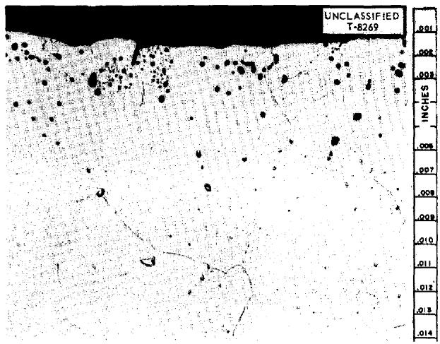  
Fig. 5.2. Maximum Attack in Inconel Forced-Circulation Loop 4935-5 After Circulating NaF-ZrF $_4$ -UF $_4$ (50-46-4 mole %) for 681 hr at a Maximum Fluid Temperature of $1500^{\circ}\mathrm{F}$ and a Maximum Wall Temperature of About $1582^{\circ}\mathrm{F}$ . (Secret with caption.)

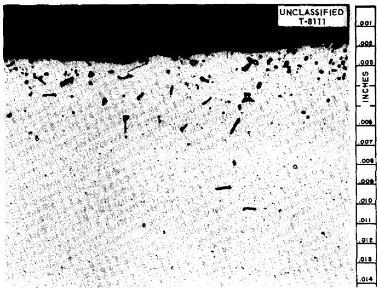  
Fig. 5.1. Maximum Attack in Inconel Forced-Circulation Loop 4935-7 After Circulating NaF-ZrF $_4$ -UF $_4$ (50-46-4 mole %) for 332 hr at a Maximum Fluid Temperature of $1510^{\circ}\mathrm{F}$ and a Maximum Wall Temperature of About $1710^{\circ}\mathrm{F}$ . (Sawt with caption.)

ature differential were examined following the scheduled 1000 hr of operation. In the operation of these loops the maximum wall and fluid temperatures were maintained constant, while the fluid velocity and the hot-leg temperature pattern were varied to achieve a specified cold-zone temperature and fluid-temperature drop. Since varying the Reynolds number, or velocity, has not had a measurable effect on corrosion results, as evidenced by comparisons of results of thermal-convection loop tests with results of forced-convection loop tests, it was felt that any differences in the corrosion in these two loops would be attributable directly to the difference in temperature drop.

The temperature differentials of the two loops were 200 and $300^{\circ}\mathrm{F}$ , and the maximum hot-leg attack was very nearly the same in each, that is, 8 to 9.5 mils. It appears, however, from data on other loops operated with a $200^{\circ}\mathrm{F}$ temperature drop, that the attack in loop 7425-1A was excessive and would normally have been about 7 mils. A leak which developed in this loop following a pump failure and subsequent reheating for startup necessitated the replacement of a short section of tubing between the cooler and the pump after 22 hr of operation. This interruption may have caused the attack to be deeper than it had been expected to be.

Negligible attack was found in loop 7425-2, which circulated an alkali-metal-base fluoride mixture, NaF-KF-LiF (11.5-42-46.5 mole %), with sufficient UF3 and UF4 added to give 11.9 wt % uranium. The portion of the uranium that was present as U3+ was reported to be 1.07 wt %. The loop operated only 550 hr because of a pump motor failure, and the maximum attack was to a depth of 1.5 mils in the hottest section, as shown in Fig. 5.3. A continuous metal deposit, probably of uranium, that was found in the cold leg of the

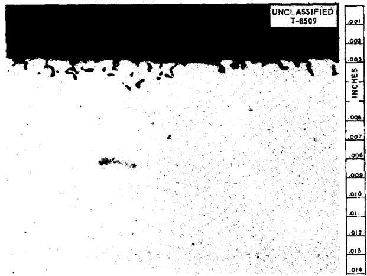  
Fig. 5.3. Maximum Attack in Inconel Forced-Circulation Loop 7425-2 After Circulating for 550 hr the Fluoride Mixture NaF-KF-LiF-(UF $_4$ + UF $_3$ ) (11.2-41-45.3-2.5 mole %), with 1% of the Total Uranium Present as U $^{3+}$ . (with caption.)

loop indicates that the amount of $\mathsf{UF}_3$ present was larger than that found by chemical analysis, since no deposit was found in the thermal-convection loop operated with material that was reported by chemical analysis to be the same. The chemical analyses showed no significant increase in chromium content of the fluoride mixture during the test, and in this respect the analyses confirm the observed attack.

# Sodium in Inconel

A series of 1000-hr tests in Inconel forced-circulation loops has been completed in which the oxide level in the sodium being circulated was varied through the use of cold traps, deoxidizers, or oxide additions. These tests concluded the first series of tests in a study of the effect of oxide contamination on mass transfer in sodium-Inconel forced-circulation systems. The results obtained for this series of tests are presented in Table 5.2. The total weight of the deposit, which is a convenient parameter for comparison of mass-transfer effects, was determined by brushing all the deposits from the loop sections after the sodium had been removed.

The metal deposit found in loop 7426-2, which circulated sodium to which $0.05\% \mathrm{O}_2$ was added in the form of $\mathrm{Na}_2\mathrm{O}_2$ , weighed slightly more than that found in control loop 4951-8, which included a cold trap to remove oxides. The deposit weighed much less, however, than that found in loop 4951-5, which circulated sodium to which $0.15\% \mathrm{O}_2$

Maximum fluid temperature: $1500^{\circ}$ F  
System temperature differential: $300^{\circ}$ F  
Operating time: 1000 hr

TABLE 5.2. MASS TRANSFER IN INCONEL FORCED-CIRCULATION LOOPS THAT CIRCULATED SODIUM CONTAINING VARIOUS AMOUNTS OF OXYGEN   

<table><tr><td rowspan="2">Loop No.</td><td rowspan="2">Variable</td><td colspan="2">Deposit</td><td colspan="2">Oxide Content</td></tr><tr><td>Maximum Thickness (mils)</td><td>Weight (g)</td><td>Initial (%)</td><td>Final (%)</td></tr><tr><td>4951-8 (control)</td><td>Cold trap in system</td><td>14</td><td>13</td><td>0.074</td><td>0.035</td></tr><tr><td>7426-2</td><td>0.05% O2 added to system as Na2O2</td><td>20</td><td>15</td><td>0.035</td><td>0.025</td></tr><tr><td>4951-5</td><td>0.15% O2 added to system as Na2O2</td><td>30</td><td>26</td><td>0.036</td><td>0.027</td></tr><tr><td>7426-1</td><td>1% barium added; cold trap in system</td><td>20</td><td>13</td><td></td><td>0.035</td></tr></table>

was added. The $\mathrm{Na}_2\mathrm{O}_2$ additions were not detectable by oxide analyses of the sodium in either loop.

The addition of barium to act as a deoxidant in the sodium circulated in loop 7426-1 effected no observable decrease in the weight of the mass-transferred deposit in comparison with the weight of the deposit found in control loop 4951-8. The only evidence of an effect attributable to the barium was seen in the hot leg, where metallic layers distinctly different from the base metal were found in conjunction with intergranular penetrations.

Metallographic examinations showed intergranular attack to a maximum depth of 2 mils in the hot legs of all loops. The attack found in loop 4951-8 is shown in Fig. 5.4. Additional corrosion in the form of uniform surface removal possibly occurred, but such corrosion cannot be evaluated easily.

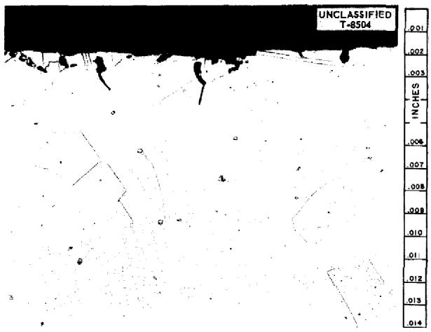  
Fig. 5.4. Intergranular Attack on Hot-Leg Surface of Inconel Forced-Circulation Loop 4951-8, Which Circulated Sodium at $1500^{\circ}\mathrm{F}$ for 1000 hr.

The operation of a sodium-Inconel loop with a maximum fluid temperature of $1000^{\circ}\mathsf{F}$ has shown the effect of temperature on mass transfer to be quite significant. A visual inspection of the loop, which was operated for 1000 hr with a temperature differential of $200^{\circ}\mathsf{F}$ , showed the original oxide film on the Inconel tubing to be undisturbed. The loop was also shown metallographically to be free of deposited material, and there was no hot-leg attack.

# THERMAL-CONVECTION STUDIES

J.H.DeVan E.A.Kovacevich Metallurgy Division

# Effect of Difference Between Loop Wall Temperature and Fluid Temperature

A special thermal-convection loop (832) was operated for the purpose of obtaining the wall temperature distribution in a standard loop having a $1500^{\circ}\mathrm{F}$ maximum fluoride-mixture temperature and a $250^{\circ}\mathrm{F}$ fluoride-mixture temperature drop. The fluoride mixture used was $\mathrm{NaF - ZrF_4 - UF_4}$ (50-46-4 mole%).

Eight thermocouples were attached by four different methods, as shown in Fig. 5.5, to the Inconel pipe under the first heater on the hot leg of the loop. The thermocouples were welded or brazed to the pipe, were placed in a single well with the tip of the thermocouple welded or peened into place, were placed in a double well with each wire of the thermocouple peened into place, or each wire was placed in a hole drilled into a weld bead. A maximum difference of $10^{\circ}\mathrm{F}$ was observed among the four types of thermocouples, and, as expected, the well, or sunken, type of attachment gave the lower readings.

Thermocouples were also attached by the double-well method to other sections of the hot leg, as indicated by Fig. 5.5. An analysis of the temperature readings of all the thermocouples indicates that a difference of $160^{\circ}\mathrm{F}$ existed between the maximum fluid temperature and the hottest section of the loop. Hence, loops described as having operated with a fluid temperature of $1500^{\circ}\mathrm{F}$ had wall temperatures as high as $1660^{\circ}\mathrm{F}$ in the heated zone.

The maximum wall temperature is known to be an important parameter in fluoride-mixture corrosion, and it must be considered when thermal-convection and forced-circulation loops are compared. The forced-circulation loops have, in general, lower wall temperatures for a given maximum fluid temperature - a factor which, in part, accounts for the attack observed in forced-circulation loops being lower than that found in thermal-convection loops with similar bulk fluid temperatures.

# Effect of Zirconium Hydride Additions to Fluoride Mixture

A series of six Inconel thermal-convection loops were operated with the fuel mixture NaF-ZrF4-UF4

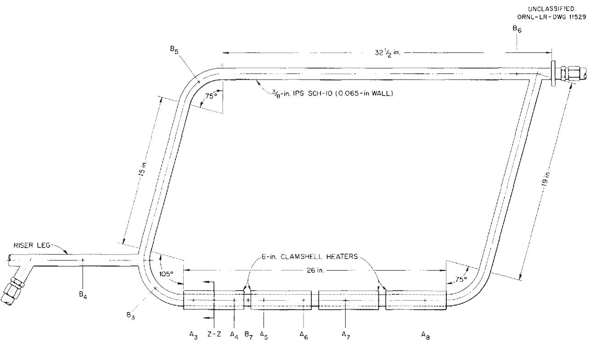

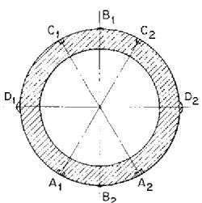  
SPECIAL THERMOCOUPLE RING POSITION Z-Z

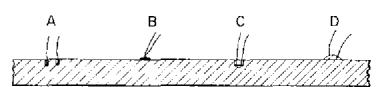  
Fig. 5.5. Thermocouple Arrangement of Special Thermal-Convection Loop (832) for Studying Wall Temperature Distribution.

TYPES OF THERMOCOUPLE ATTACHMENT

<table><tr><td>THERMOCOUPLE TYPE</td><td>DISTANCE FROM RISER LEG (in.)</td><td>TEMPERATURE (°F)</td></tr><tr><td>A1</td><td>9</td><td>1610</td></tr><tr><td>A2</td><td>9</td><td>1659</td></tr><tr><td>A3</td><td>7</td><td>1664</td></tr><tr><td>A4</td><td>11</td><td>1649</td></tr><tr><td>A5</td><td>14</td><td>1611</td></tr><tr><td>A6</td><td>18</td><td>1644</td></tr><tr><td>A7</td><td>23</td><td>1614</td></tr><tr><td>A8</td><td>30</td><td>1544</td></tr><tr><td>B1</td><td>9</td><td>1661</td></tr><tr><td>B2</td><td>9</td><td>1693</td></tr><tr><td>B3</td><td>3</td><td>1500</td></tr><tr><td>B4</td><td>-</td><td>1300</td></tr><tr><td>B5</td><td>-</td><td>1290</td></tr><tr><td>B6</td><td>-</td><td>1265</td></tr><tr><td>B7</td><td>12.5</td><td>1625</td></tr><tr><td>C1</td><td>9</td><td>1658</td></tr><tr><td>C2</td><td>9</td><td>1653</td></tr><tr><td>D1</td><td>9</td><td>1653</td></tr><tr><td>D2</td><td>9</td><td>1641</td></tr></table>

(50-46-4 mole %) to which various amounts of $\mathsf{ZrH}_2$ had been added. The $\mathsf{ZrH}_2$ reduces the $\mathsf{UF}_4$ present in the fluoride mixture to $\mathsf{UF}_3$ , according to the reactions:

$$
\begin{array}{l} Z r H _ {2} \rightarrow Z r + H _ {2} \\ 2 U F _ {4} + H _ {2} \rightarrow 2 U F _ {3} + 2 H F \\ \end{array}
$$

Since the corrosive attack of Inconel systems by fluoride mixtures is believed to be associated with the reaction

$$
3 U F _ {4} + C r ^ {\circ} \rightleftharpoons 3 U F _ {3} + C r F _ {3}
$$

it was hoped that an increase in the $\mathsf{UF}_3$ content would shift the equilibrium reaction to the left

and thereby considerably reduce the leaching of chromium from the Inconel and the resulting void formation.

Chips of $\mathsf{ZrH}_2$ were added to the fluoride mixtures to be used in the six loops in amounts calculated to give weight percentages of 0.4, 0.5, 0.6, 0.7, 0.8, and 0.9, respectively. The resulting molten mixtures were then allowed to pass through a $30 - \mu$ nickel filter so that particles larger than $30\mu$ would be removed and so that an indication of the solubility of the added $\mathsf{ZrH}_2$ would be obtained.

As may be seen from the data presented in Table 5.3, the quantity of $\mathsf{U}^{3 + }$ found in the fuel mixture increased with the increases in the quantity of $\mathsf{ZrH}_2$ added. However, when the $\mathsf{U}^{3 + }$ in the sample taken during filling was greater than $1.5\%$ ,the $\mathsf{U}^{3 + }$ in the sample taken after circulating was less than $1.5\%$ because of the disproportionation of $\mathsf{UF}_3$ to $\mathsf{UF}_4$ and the alloying of the

uranium with the walls of the loop. The total uranium decreased during operation of the loop in each case, and the decrease was apparently associated with the appearance of a metallic layer on the loop walls. The corrosive attack of the mixtures containing $\mathsf{ZrH}_2$ was lower in all cases than the attack found in loop 800. The maximum attack (0.5 mil) in loop 789 is shown in Fig. 5.6. The observed reductions in corrosive attack are verified by the low chromium contents of the fluoride mixtures after circulation.

Thin metallic layers were found on both the hot and the cold legs of the loops with more than $0.4\mathrm{wt}\% \mathrm{ZrH}_2$ except loop 790. The thickness of the layer, identified as metallic uranium, increased with increased $\mathrm{ZrH}_2$ content of the fluoride mixture. In loop 792 the layer was 0.5 to 1.0 mil thick. The absence of the layer in loop 790 is thought to be due to the low percentage of $\mathsf{U}^{3+}$ . Unfortunately the $\mathsf{U}^{3+}$ content was not

Loop operating time: 500 hr

Maximum fluid temperature: $1500^{\circ}\mathrm{F}$

TABLE 5.3. ANALYSES OF NaF-ZrF4-UF4 (50-46-4 mole %) MIXTURES TO WHICH ZrH2 WAS ADDED BEFORE CIRCULATION IN STANDARD INCONEL THERMAL-CONVECTION LOOPS   

<table><tr><td rowspan="2">Loop No.</td><td rowspan="2">ZrH2Added (wt %)</td><td rowspan="2">Depth of Hot-Leg Attack (mils)</td><td rowspan="2">Fluid Sampled</td><td colspan="2">Uranium Content (wt %)</td><td colspan="3">Impurities (ppm)</td></tr><tr><td>Total U</td><td>U3+</td><td>Ni</td><td>Cr</td><td>Fe</td></tr><tr><td rowspan="2">787</td><td rowspan="2">0.4</td><td rowspan="2">5</td><td>During filling</td><td>8.77</td><td>0.90</td><td>15</td><td>85</td><td>95</td></tr><tr><td>After circulating</td><td>8.52</td><td>0.96</td><td>30</td><td>110</td><td>45</td></tr><tr><td rowspan="2">788</td><td rowspan="2">0.5</td><td rowspan="2">2</td><td>During filling</td><td>9.30</td><td>0.71</td><td>3</td><td>15</td><td>50</td></tr><tr><td>After circulating</td><td>7.47</td><td>0.81</td><td>270</td><td>65</td><td>85</td></tr><tr><td rowspan="2">789</td><td rowspan="2">0.6</td><td rowspan="2">0.5</td><td>During filling</td><td>8.31</td><td>1.03</td><td>15</td><td>35</td><td>75</td></tr><tr><td>After circulating</td><td>6.62</td><td>1.23</td><td>&lt;1</td><td>60</td><td>65</td></tr><tr><td rowspan="2">790</td><td rowspan="2">0.7</td><td rowspan="2">1.5</td><td>During filling</td><td>6.61</td><td>*</td><td>40</td><td>25</td><td>30</td></tr><tr><td>After circulating</td><td>6.15</td><td>1.03</td><td>15</td><td>90</td><td>85</td></tr><tr><td rowspan="2">791</td><td rowspan="2">0.8</td><td rowspan="2">1.5</td><td>During filling</td><td>6.49</td><td>4.22</td><td>70</td><td>35</td><td>75</td></tr><tr><td>After circulating</td><td>6.31</td><td>1.23</td><td>&lt;1</td><td>65</td><td>90</td></tr><tr><td rowspan="2">792</td><td rowspan="2">0.9</td><td rowspan="2">1</td><td>During filling</td><td>6.72</td><td>5.35</td><td>30</td><td>35</td><td>45</td></tr><tr><td>After circulating</td><td>6.30</td><td>1.56</td><td>&lt;1</td><td>40</td><td>85</td></tr><tr><td rowspan="2">800</td><td rowspan="2">None (control)</td><td rowspan="2">10</td><td>During filling</td><td>8.64</td><td></td><td>20</td><td>105</td><td>30</td></tr><tr><td>After circulating</td><td>8.46</td><td></td><td>40</td><td>850</td><td>90</td></tr></table>

\*Not reported.

ascertained before operation of the loop, but the relatively large amount of chromium present in the fuel after operation of the loop indicates that the $\mathsf{ZrH}_2$ addition was not entirely effective in

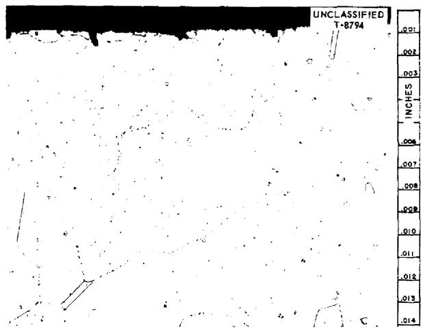  
Fig. 5.6. Maximum Attack in Inconel Thermal-Convection Loop 789 After Circulating NaF-ZrF $_4$ . UF $_4$ (50-46-4 mole %), with 0.6 wt % ZrH $_2$ Added, for 500 hr at $1500^{\circ}$ F. (Secret with caption.)

producing $\mathsf{U}^{3 + }$ .As may be seen, additions of more than 0.6 wt $\%$ $\mathsf{ZrH}_2$ were not effective in further reducing the corrosive attack, and they had the deleterious effect of causing the formation of a metallic uranium deposit.

# Loops Fabricated from Special Inconel-Type Alloys

A group of special Inconel-type alloys were vacuum-cast by the Fabrication Group of the Metallurgy Division and were drawn by the Superior Tube Co. into shapes satisfactory for thermal-convection-loop fabrication. The compositions of these alloys, as may be seen in Table 5.4, varied in chromium content from the nominal Inconel composition, and molybdenum was added to one heat. Standard-size loops were fabricated from the special alloys, but $1/2$ -in.-dia, 0.065-in.-wall tubing was used rather than the standard $3/8$ -in. IPS sched-10 pipe. The results obtained from the operation of these loops are presented in Table 5.4. The data show considerable reduction in depth of attack of those alloys with chromium contents of less than $10\%$ . Furthermore, the addition of $10\%$ molybdenum had little effect in

Circulated fluid: NaF-ZrF4-UF4 (50-46-4 mole %) Maximum fluid temperature: $1500^{\circ}\mathrm{F}$

TABLE 5.4. RESULTS OF OPERATION OF THERMAL-CONVECTION LOOPS FABRICATED FROM SPECIAL INCONEL-TYPE ALLOYS  

<table><tr><td>Loop No.</td><td>Heat No.</td><td>Alloy Composition (wt %)</td><td>Operating Time (hr)</td><td>Maximum Depth of Attack (mils)</td></tr><tr><td>520</td><td>14</td><td>76 Ni-7 Fe-17 Cr (standard Inconel)</td><td>1000</td><td>13</td></tr><tr><td>522</td><td>15</td><td>76 Ni-14 Fe-10 Cr</td><td>823*</td><td>8</td></tr><tr><td>523</td><td>15</td><td>76 Ni-14 Fe-10 Cr</td><td>1000</td><td>12</td></tr><tr><td>524</td><td>16</td><td>76 Ni-19 Fe-5 Cr</td><td>647*</td><td>3</td></tr><tr><td>525</td><td>16</td><td>76 Ni-19 Fe-5 Cr</td><td>460*</td><td>3</td></tr><tr><td>526</td><td>17</td><td>83 Ni-7 Fe-10 Cr</td><td>1000</td><td>13</td></tr><tr><td>527</td><td>17</td><td>83 Ni-7 Fe-10 Cr</td><td>1000</td><td>15</td></tr><tr><td>521</td><td>18</td><td>74 Ni-10 Fe-6 Cr-10 Mo</td><td>1000</td><td>2</td></tr><tr><td>472</td><td>18</td><td>74 Ni-10 Fe-6 Cr-10 Mo</td><td>500</td><td>3.5</td></tr></table>

*Leak developed in loop.

an alloy with $6\%$ chromium in comparison with the effect of reducing the chromium content to $5\%$ . The attack in standard Inconel loop 520 and that in loop 521, which was fabricated from the alloy containing $6\%$ chromium and $10\%$ molybdenum, are compared in Fig. 5.7.

# Nickel-Molybdenum Alloy Loops

A series of nickel-molybdenum alloys were prepared by the Fabrication Group to provide material for a study of the corrosion properties of nickel-molybdenum alloys having compositions modified from the composition of commercial Hastelloy B. Thermal-convection loops fabricated from materials with the compositions shown in Table 5.5 were operated for 1000 hr at $1500^{\circ}\mathrm{F}$ with $\mathrm{NaF - ZrF_4 - UF_4}$ (50-46-4 mole %) as the circulated fluid. The deep attack found in loop 1008 was undoubtedly caused by the air leak which interrupted the test, since loop 1013, which was identical, showed attack to a depth of only 0.5 mil after operating for 831 hr. The results obtained with the special alloys and, for comparison purposes, with Hastelloy B and Inconel are shown in Table 5.5. Varying the molybdenum and chromium contents in a nickel-molybdenum alloy does not appear to have much effect on corrosion of the alloy in $\mathrm{NaF - ZrF_4 - UF_4}$ (50-46-4 mole %) at $1500^{\circ}\mathrm{F}$ . The attack found in loop 1009, which

was fabricated from an $85\%$ Ni- $15\%$ Mo alloy is shown in Fig. 5.8.

# Effect of Nitrogen Atmosphere

Two Inconel thermal-convection loops, 801 and 802, were tested with $\mathsf{NaF - ZrF_4 - UF_4}$ (50-46-4 mole %) under a nitrogen atmosphere to determine the possibility of substituting this cover gas for the currently used helium. After operation for 500 hr at $1500^{\circ}\mathsf{F}$ , both loops showed light surface attack to a depth of 1 mil in all sections, with subsurface void formation to a depth of 10 to 13 mils in the hottest section. Slight evidence of surface-layer formation was found in the hot zone, but no deposit or layer was seen in the cold leg. The maximum attack in these loops slightly exceeded that for a standard Inconel loop with helium used as the cover gas; the attack in the standard loop is normally less than 11 mils.

The fluoride mixture was removed from loop 801 by melting, and a gold-colored deposit, which was believed to be CrN or $\mathrm{Cr}_2\mathrm{N}$ , was observed on the walls of the trap. X-ray diffraction analysis of this deposit failed, however, to show an identifiable pattern other than that of the fuel mixture. The following metallic elements were determined to be present, spectrographically: 2 wt % Cr, 1 wt % Ni, 0.5 wt % Fe, 5.0 wt % Ti, 0.2 wt % Al. The fluoride mixture circulated in loop 802 was

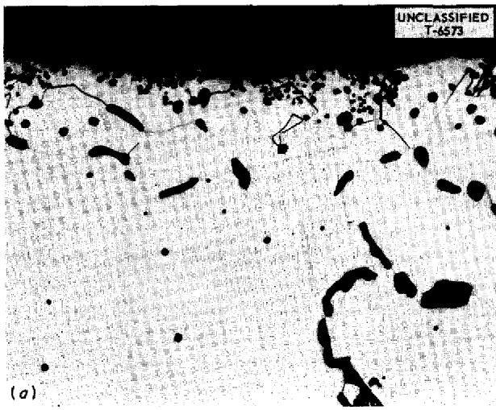

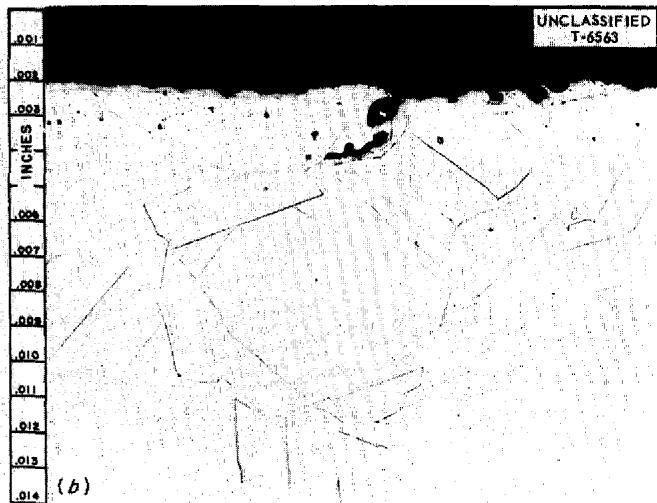  
Fig. 5.7. Comparison of Attack Found in (a) Standard Inconel Loop 520 with That Found in (b) Loop 521 Fabricated from a Special Inconel-Type Alloy Containing $6\%$ Chromium and $10\%$ Molybdenum After Circulating $\mathsf{NaF - ZrF}_4\mathsf{-UF}_4$ (50-46-4 mole %) at $1500^{\circ}\mathsf{F}$ for 1000 hr. (with caption.)

Circulated fluid: NaF·ZrF 4-UF 4 (50-46-4 mole %)

Maximum fluid temperature: $1500^{\circ}\mathrm{F}$

TABLE 5.5. RESULTS OF OPERATION OF NICKEL-MOLYBDENUM ALLOY THERMAL-CONVECTION LOOPS COMPARED WITH RESULTS FROM HASTELLOY B AND INCONEL LOOPS  

<table><tr><td>Loop No.</td><td>Heat No.</td><td>Alloy Composition (wt %)</td><td>Operating Time (hr)</td><td>Maximum Depth of Attack (mils)</td></tr><tr><td>181</td><td>Hastelloy B</td><td>29 Mo-66 Ni-5 Fe</td><td>1000</td><td>1</td></tr><tr><td>1004</td><td>DPI-30</td><td>24 Mo-76 Ni</td><td>791*</td><td>0</td></tr><tr><td>1006</td><td>-37</td><td>3 Cr-20 Mo-77 Ni</td><td>1000</td><td>1</td></tr><tr><td>1007</td><td>-33</td><td>15 Mo-85 Ni</td><td>1000</td><td>1</td></tr><tr><td>1008</td><td>-40</td><td>5 Cr-20 Mo-75 Ni</td><td>240*</td><td>10</td></tr><tr><td>1009</td><td>-33</td><td>15 Mo-85 Ni</td><td>1000</td><td>1</td></tr><tr><td>1010</td><td>Inconel</td><td>76 Ni-17 Cr-7 Fe</td><td>1000</td><td>12</td></tr><tr><td>1013</td><td>DPI-40</td><td>5 Cr-20 Mo-75 Ni</td><td>831*</td><td>0.5</td></tr><tr><td>1014</td><td>-30</td><td>24 Mo-76 Ni</td><td>1000</td><td>2</td></tr><tr><td>1015</td><td>-30</td><td>24 Mo-76 Ni</td><td>1000</td><td>0.5</td></tr></table>

*Terminated because of a leak.

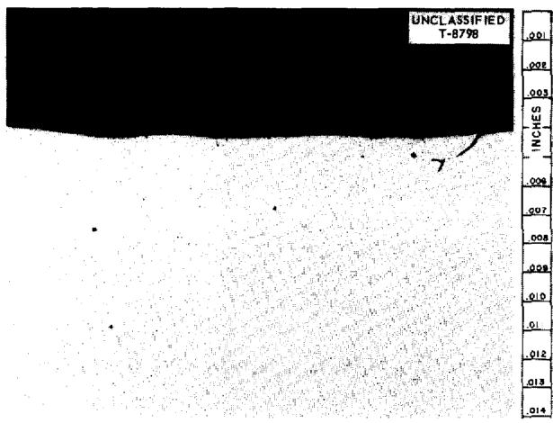  
Fig. 5.8. Attack Found in Loop 1009, Which Was Fabricated from an $85\%$ Ni- $15\%$ Mo Alloy, After Circulating $\mathrm{NaF - ZrF_4 - UF_4}$ (50-46-4 mole %) for 1000 hr at $1500^{\circ}\mathrm{F}$ .

removed mechanically from the trap rather than being melted out. This trap also showed a deposit of the type found in the trap of loop 801, but identification of this deposit has not yet been completed.

# GENERAL CORROSION STUDIES

E. E. Hoffman

W.H.Cook D.H.Jansen

Metallurgy Division

R. Carlander

Pratt & Whitney Aircraft

Thermal-Convection Loop Tests of Brazed

Inconel T-Joints in NaF-ZrF $_4$ -UF $_4$

D. H. Jansen

Metallurgy Division

A thermal-convection loop fabricated from $\frac{1}{2}$ -in. sched-40 Inconel tubing has been operated with NaF-ZrF $_4$ -UF $_4$ (50-46-4 mole %) as the circulated fluid. During fabrication of the loop, six Inconel segments were brazed into the hot-leg section with Coast Metals No. 52 (89% Ni-5% Si-4% B-2% Fe) brazing alloy. An Inconel sleeve was welded around this section, as shown in Fig. 5.9. Two typical Inconel segments are shown in Fig. 5.10. The duration of the test was 1000 hr, and the hot and cold legs were maintained at 1500 and $1100^{\circ}\mathrm{F}$ , respectively.

The inner walls of the segments and two samples from each brazed joint were examined metallo

UNCLASSIFIED ORNL-LR-DWG 9715   
Fig. 5.9. Diagram of Thermal-Convection Loop with Brazed Insert in Hot-Leg Section.   
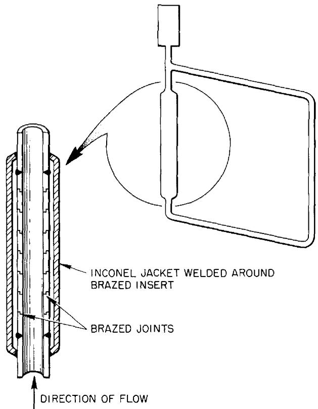  
UNCLASSIFIED Y-16905

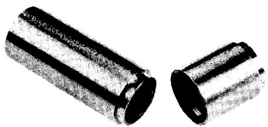  
Fig. 5.10. Inconel Segments of the Type Brazed into the Hot-Leg Section of an Inconel Thermal-Convection Loop.

graphically, after the test, for evidence of attack. The results of the examinations are summarized in Table 5.6. No evidence of mass transfer was found in the loop. However, the brazed joints were porous and shrinkage voids were present, as shown in Fig. 5.11. The area where the brazed material was applied to the outer walls of two Inconel segments is shown in Fig. 5.12, and two brazed joints on the inner wall, which was exposed to the fuel mixture, are shown in Fig. 5.13.

Circulated fluid: NaF-ZrF4-UF4 (50-46-4 mole %)

Hot-leg temperature: $1500^{\circ} \mathrm{F}$

Cold-leg temperature: $1100^{\circ}\mathrm{F}$

Duration of test: 1000 hr

TABLE 5.6. RESULTS OF OPERATION OF A THERMAL-CONVECTION LOOP WITH BRAZED INCONEL SEGMENTS IN HOT-LEG SECTION  

<table><tr><td rowspan="2">Brazed Joint</td><td colspan="2">Attack on Braze (mils)</td><td rowspan="2">Attack on Wall (mils)</td></tr><tr><td>Sample 1</td><td>Sample 2</td></tr><tr><td>1</td><td>1.4</td><td>1</td><td>4</td></tr><tr><td>2</td><td>3</td><td>2</td><td>3</td></tr><tr><td>3</td><td>0.6</td><td>2</td><td>4</td></tr><tr><td>4</td><td>1.3</td><td>3.5</td><td>3</td></tr><tr><td>5</td><td>9</td><td>2</td><td>4</td></tr></table>

# Seesaw Tests of Brazed Inconel T-Joints in Sodium and in Fuel Mixtures

D. H. Jansen

Metallurgy Division

The seesaw test apparatus has been used for a series of tests in sodium and in fuel mixtures of Inconel T-joints brazed with the alloys listed in Table 5.7. The duration of each test was 100 hr, and the hot- and cold-zone temperatures were 1500 and $1100^{\circ}\mathrm{F}$ , respectively.

Two T-joints brazed with the $80\%$ Ni-10% Cr-10% P alloy were placed in the same tube. One of these, joint No. 1, was cut from a T-bar on hand, and the other, joint No. 2, was a new T-joint. The difference in attack on these two joints, as shown in Figs. 5.14 and 5.15, is believed to have resulted from unknown variations in the phosphorus content of the brazing alloy.

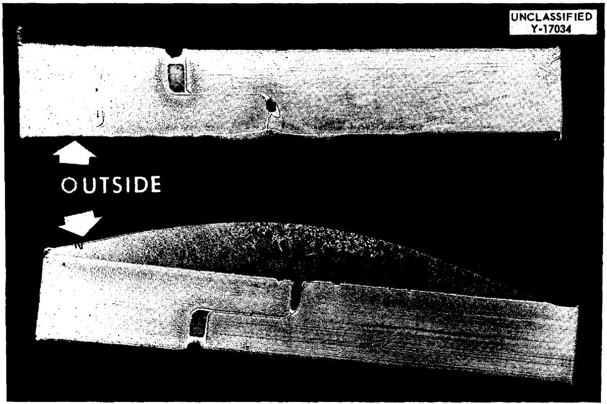  
Fig. 5.11. Brazed Joints from Inconel Insert in Hot-Leg Section of a Thermal-Convection Loop Showing Porosity of Braze Material. Etched with $10\%$ oxalic acid, $7X$ .

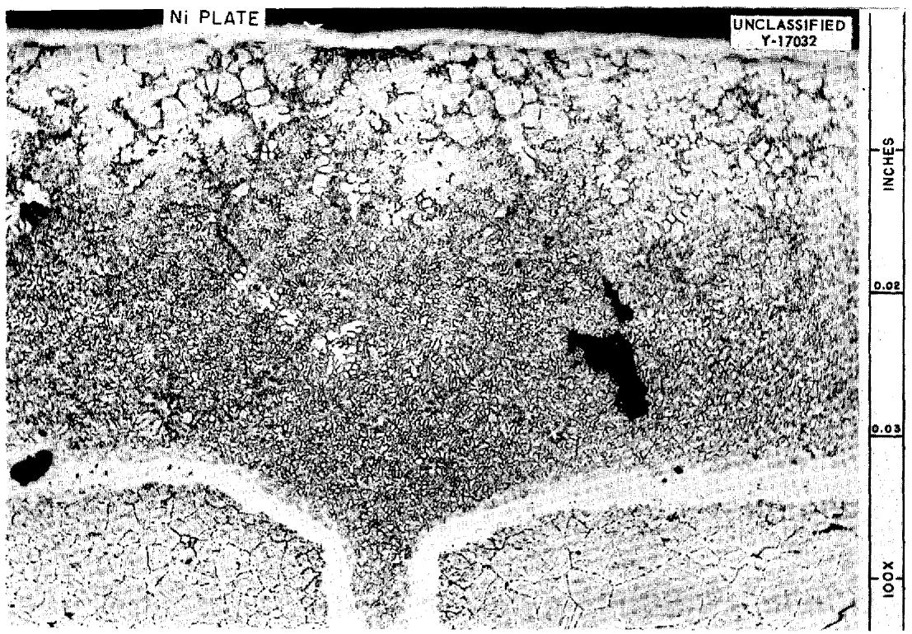  
Fig. 5.12. Outer Walls of Two Inconel Segments Showing Area Where Braze Material Was Applied. Etched with $10\%$ oxalic acid. 100X. Reduced $13\%$ .

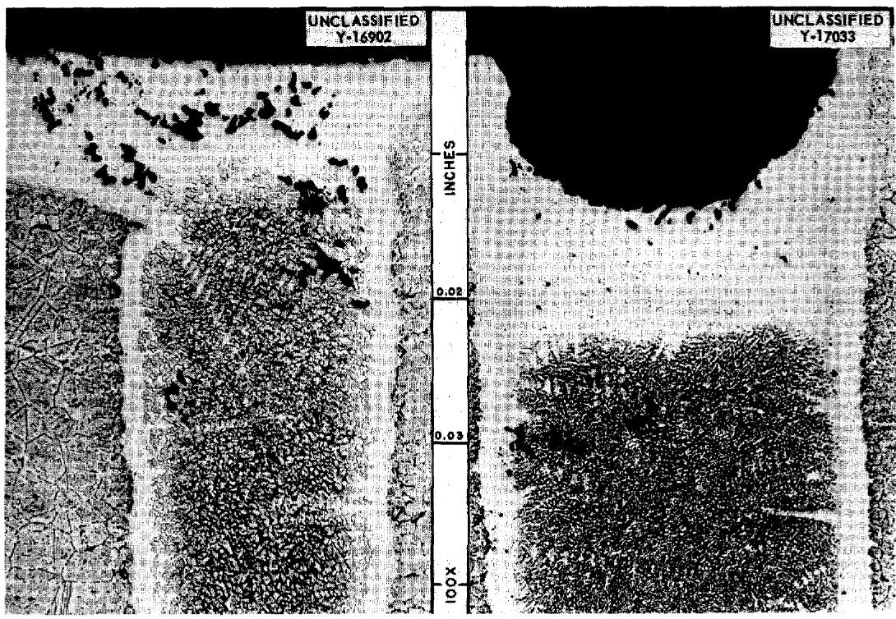  
Fig. 5.13. Inner Surface of Inconel Insert Showing Portions of Two Brazed Joints After Exposure to Flowing NaF-ZrF $_4$ -UF $_4$ (50-46-4 mole %) at $1500^{\circ}\mathrm{F}$ for 1000 hr. Etched with $10\%$ oxalic acid. (with caption.) 100X. Reduced $13\%$ .

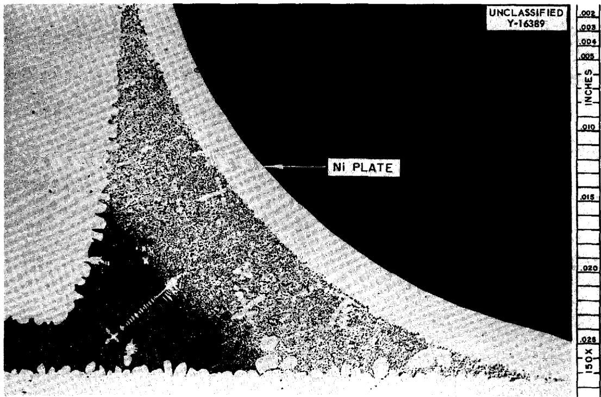  
Fig. 5.14. Inconel T-Joint No. 1 Brazed with an $80\%$ Ni- $10\%$ Cr- $10\%$ P Alloy After Exposure to Sodium for 100 hr in Seesaw Apparatus at a Hot-Zone Temperature of $1500^{\circ}\mathrm{F}$ . Attack to a depth of 11 mils may be seen. Etched with $10\%$ oxalic acid. 150X. Reduced $12\%$ .

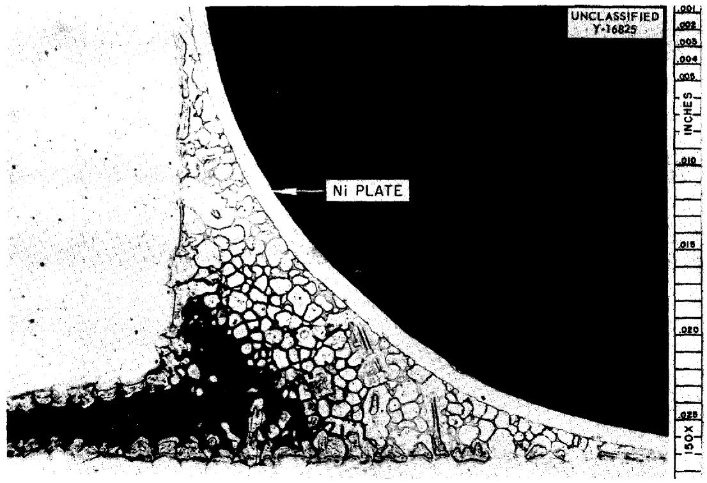

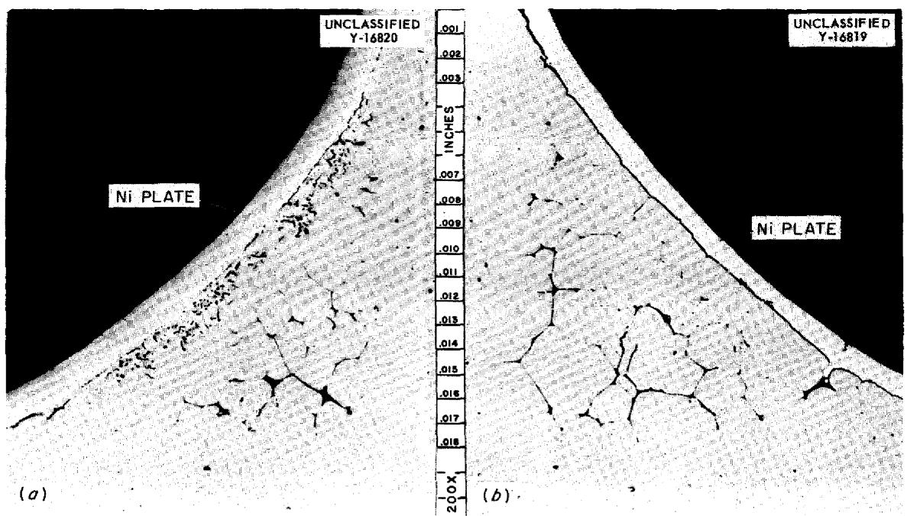  
Fig. 5.15. Inconel T-Joint No. 2 Brazed with an $80\%$ Ni- $10\%$ Cr- $10\%$ P Alloy After Exposure to Sodium for $100\mathrm{hr}$ in Seesaw Apparatus at a Hot-Zone Temperature of $1500^{\circ}\mathbf{F}$ . No attack may be seen. Etched with $10\%$ oxalic acid. 150X. Reduced $12\%$ .   
Fig, 5.16. Inconel T-Joints Brazed with a $75\%$ Ni- $25\%$ Ge Alloy After Exposure to (a) Sodium and to (b) NaF-ZrF4-UF4 (50-46-4 mole %) for 100 hr in Seesaw Apparatus at a Hot-Zone Temperature of $1500^{\circ}\mathrm{F}$ . Note attack to a depth of 2 mils on both joints. The dark network in the grain boundaries is a fine, lamellar type of structure. (Secret with caption.) 200X. Reduced $19\%$ .

This alloy will be tested again in sodium, with the phosphorus content closely controlled. The $75\%$ Ni- $25\%$ Ge alloy has fair resistance to both the sodium and the fuel mixture, as shown in Fig. 5.16. The results of the tests are presented in Table 5.7, in which the brazing alloys are listed in order of decreasing corrosion resistance, as determined by the following arbitrary scale:

<table><tr><td>Resistance</td><td>Depth of Attack (mils)</td></tr><tr><td>Good</td><td>0 to 1</td></tr><tr><td>Fair</td><td>1 to 3</td></tr><tr><td>Poor</td><td>3 to 6</td></tr><tr><td>Bad</td><td>Over 6</td></tr></table>

# Static Tests of Braze Materials

D. H. Jansen

Metallurgy Division

Buttons of six different braze materials were corrosion tested in static sodium and in static NaF-ZrF $_4$ -UF $_4$ (50-46-4 mole %), and two palladium-rich buttons were tested in NaOH and in the fluoride mixture. The buttons, which were polished on one side, were tested in the as-received condition. After the tests, the buttons were cut in a line perpendicular to the polished face in order to ascertain the depth of attack.

Coast Metals alloy No. 52 (89% Ni-4% B-5%)

Si-2% Fe) and General Electric alloy No. 81

Duration of test: 100 hr

Hot-zone temperature: $1500^{\circ}\mathrm{F}$

Cold-zone temperature: $1100^{\circ}\mathrm{F}$

TABLE 5.7. RESULTS OF SEESAW TESTS OF BRAZED INCONEL T-JOINTS IN LIQUID SODIUM AND IN FUSED SALTS   

<table><tr><td>Corrosive Medium</td><td>Brazing Alloy (wt %)</td><td>Weight Change (%)</td><td>Corrosión Resistance</td><td>Metallographic Notes</td></tr><tr><td rowspan="4">Sodium</td><td>80 Ni-10 Cr-10 P (joint No. 2)</td><td>-0.174</td><td>Good</td><td>No attack</td></tr><tr><td>75 Ni-25 Ge</td><td>-0.052</td><td>Fair</td><td>Attack to a depth of 2 mils</td></tr><tr><td>50 Ni-25 Ge-25 Mo</td><td>-0.252</td><td>Poor</td><td>Nonuniform attack to a depth of 3.2 mils</td></tr><tr><td>80 Ni-10 Cr-10 P (joint No. 1)</td><td>-0.41</td><td>Poor</td><td>Attack to a depth of 11 mils</td></tr><tr><td>NaF-ZrF4-UF4(50-46-4 mole %)</td><td>80 Ni-10 Cr-10 P</td><td>-0.102</td><td>Good</td><td>No attack; fillet cracked</td></tr><tr><td>NaF-ZrF4-UF4(53.5-40-6.5 mole %)</td><td>50 Ni-25 Ge-25 Mo</td><td>0.0</td><td>Good</td><td>Erratic attack to a depth of 1 mil</td></tr><tr><td>NaF-ZrF4-UF4(50-46-4 mole %)</td><td>75 Ni-25 Ge</td><td>-0.060</td><td>Fair</td><td>Attack to a depth of 2 mils</td></tr><tr><td>NaF-ZrF4-UF4(53.5-40-6.5 mole %)</td><td>82 Au-18 Ni</td><td>+0.16</td><td>Poor</td><td>Attack to a depth of 4 mils</td></tr><tr><td>NaF-ZrF4-UF4(50-46-4 mole %)</td><td>80 Au-20 Cu</td><td>-0.072</td><td>Poor</td><td>Nonuniform attack to a maximum depth of 4.5 mils</td></tr></table>

(66% Ni-19% Cr-10% Si-4% Fe-1% Mn) showed, respectively, good and fair corrosion resistance in sodium, as shown in Figs. 5.17 and 5.18. The two 93% Pd-7% Al buttons showed poor resistance to the fluoride mixture and very poor resistance to the NaOH. A Coast Metals alloy No. 52 button tested in the fluoride mixture showed a very deep attack in only one area; the remainder of the button area exhibited attack to a depth of 0.5 mil. This

erratic attack was probably an isolated case, since Coast Metals alloy No. 52 has exhibited good corrosion resistance to fluorides when used on nickel and Inconel T-joints. Buttons of the $60\%$ Pd-40% Ni alloy showed good corrosion resistance to both the fluoride mixture and the NaOH. The brazing materials tested are described and listed in order of decreasing corrosion resistance in Table 5.8.

TABLE 5.8. RESULTS OF TESTS OF BUTTONS OF VARIOUS BRAZE MATERIALS IN STATIC SODIUM, NaOH, AND NaF-ZrF4-UF4 (50-46-4 mole %) FOR 100 hr AT 1500°F   

<table><tr><td>Corrosive Medium</td><td>Alloy Composition (wt %)</td><td>Button Weight Change (%)</td><td>Corrosion Resistance</td><td>Metallographic Notes</td></tr><tr><td rowspan="8">NaF-ZrF4-UF4(50-46-4 mole %)</td><td>60 Pd-40 Ni</td><td>-0.043</td><td>Good</td><td>No attack</td></tr><tr><td>93 Pd-7 Al</td><td>+0.16</td><td>Poor</td><td>Uniform attack to a depth of 3.2 mils</td></tr><tr><td>80 Ni-10 Cr-10 P</td><td>-0.26</td><td>Poor</td><td>Uniform attack to a depth of 3.8 mils</td></tr><tr><td>66 Ni-19 Cr-10 Si-4 Fe-1 Mn (General Electric No. 81)</td><td>-0.37</td><td>Poor</td><td>Uniform attack to a depth of 4.4 mils</td></tr><tr><td>55 Mn-35 Ni-10 Cr</td><td>-7.3</td><td>Poor</td><td>Stringer type of attack to a depth of 9.4 mils</td></tr><tr><td>60 Mn-40 Ni</td><td>-8.4</td><td>Poor</td><td>Stringer type of attack to a depth of 21 mils</td></tr><tr><td>89 Ni-5 Si-4 B-2 Fe (Coast Metals No. 52)</td><td>-0.104</td><td>Poor</td><td>Very nonuniform attack to a maximum depth of 26 mils in one isolated area</td></tr><tr><td>65 Ni-25 Ge-10 Cr</td><td>-0.22</td><td>Poor</td><td>Very nonuniform attack to a maximum depth of 37.7 mils</td></tr><tr><td rowspan="2">NaOH</td><td>60 Pd-40 Ni</td><td>+1.18</td><td>Good</td><td>No attack</td></tr><tr><td>93 Pd-7 Al</td><td></td><td>Poor</td><td>Button partially dissolved</td></tr><tr><td rowspan="5">Sodium</td><td>89 Ni-5 Si-4 B-2 Fe (Coast Metals No. 52)</td><td>-0.22</td><td>Good</td><td>No attack</td></tr><tr><td>66 Ni-19 Cr-10 Si-4 Fe-1 Mn (General Electric No. 81)</td><td>-0.047</td><td>Fair</td><td>Attack to a depth of 1.4 mils</td></tr><tr><td>65 Ni-25 Ge-10 Cr</td><td>-0.083</td><td>Fair</td><td>Attack to a depth of 2 mils</td></tr><tr><td>80 Ni-10 Cr-10 P</td><td>-0.3</td><td>Fair</td><td>Attack to a depth of 3.2 mils</td></tr><tr><td>55 Mn-35 Ni-10 Cr</td><td>-1.6</td><td>Poor</td><td>Stringer type of attack to a depth of 4 to 5 mils</td></tr></table>

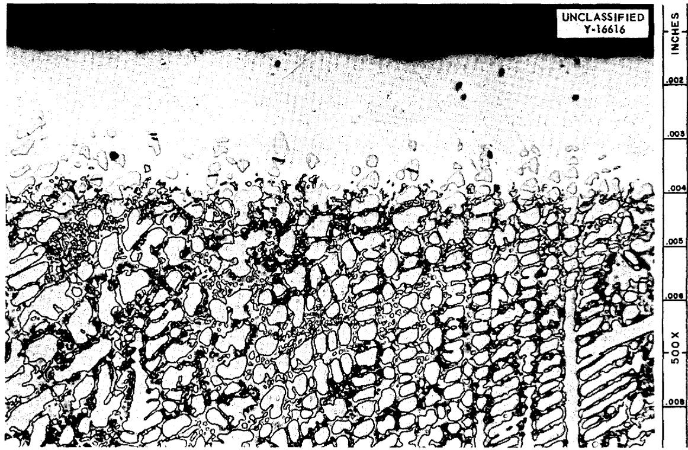  
Fig. 5.17. Coast Metals Alloy No. 52 (89% Ni-5% Si-4% B-2% Fe) After Exposure to Static Sodium for 100 hr at $1500^{\circ}\mathrm{F}$ . No attack can be seen, but the second phase has been leached out at the surface. Etched with 10% oxalic acid. 500X. Reduced 10.5%.

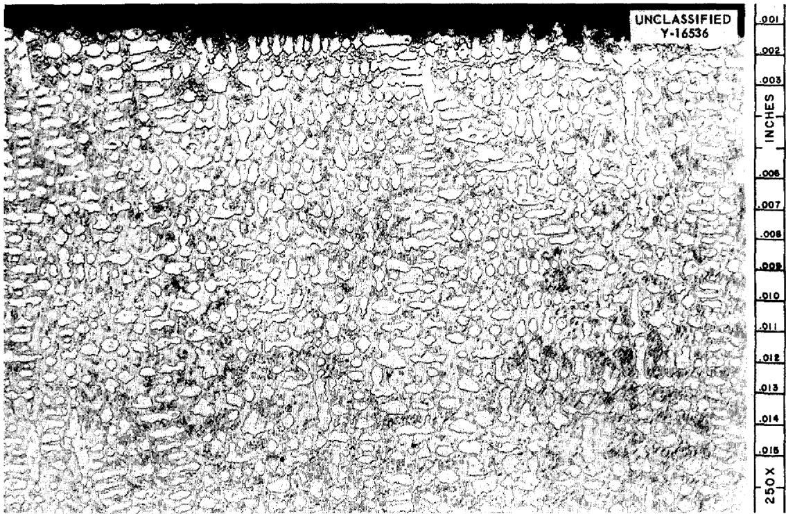  
Fig. 5.18. General Electric Alloy No. 81 (66% Ni-19% Cr-10% Si-4% Fe-1% Mn) After Exposure to Static Sodium for 100 hr at $1500^{\circ}\mathrm{F}$ . Attack to a depth of 1.4 mils may be seen. Etched with 10% oxalic acid, 250X. Reduced 10.5%.

# Static Tests of Brazed Hastelloy B T-Joints in Sodium and in NaF-ZrF4-UF4

D. H. Jansen

Metallurgy Division

A series of Hastelloy B T-joints brazed with various alloys were tested in sodium and in NaF-ZrF4-UF4 (53.5-40-6.5 mole %) at 1500°F for 100 hr. The results of these tests are summarized in Table 5.9. It may be noted that only the 80% Ni-5% Cr-5% Fe-5% Si-5% B alloy has fair, or better, resistance in both the sodium and the fluoride mixture.

# Seesaw Tests of Chromel-Alumel Thermocouple Joins to Inconel Thermocouple Wells

D. H. Jansen

Metallurgy Division

A number of Chromel-Alumel thermocouple assemblies fabricated from 0.125-in.-OD Inconel

tubing and 0.020-in. Chromel-Alumel wires were exposed to sodium and to $\mathsf{NaF - ZrF_4 - UF_4}$ (50-46-4 mole %) in seesaw apparatus. The Chromel-Alumel content of the weld nuggets of the wire-to-tubing joins was varied to determine whether the quantity of silicon, manganese, and aluminum in the nugget would affect the corrosion rate. Portions of the thermocouple wires were melted to form the weld nuggets with high Chromel-Alumel content, whereas the Inconel tubing around the wires was melted to form the nuggets with low Chromel-Alumel content. The results of the corrosion tests conducted on these thermocouple assemblies are summarized in Table 5.10 and illustrated in Figs. 5.19 and 5.20. The Inconel tubes on which the welds of high Chromel-Alumel content were made were more heavily attacked in the nonweld areas than were the tubes with the welds of low Chromel-Alumel content. All the attack measurements were made before the specimens were etched.

TABLE 5.9. RESULTS OF TESTS OF BRAZED HASTELLOY B T-JOINTS EXPOSED TO STATIC SODIUM AND TO STATIC NaF-ZrF4-UF4 (53.5-40-6.5 mole %) FOR 100 hr AT ${1500}^{ \circ  }$ F   

<table><tr><td>Corrosive Medium</td><td>Brazing Alloy (wt %)</td><td>Weight Change (%)</td><td>Resistance</td><td>Metallographic Notes</td></tr><tr><td rowspan="4">NaF-ZrF4-UF4(53.5-40-6.5 mole %)</td><td>80 Ni-5 Cr-5 Fe-5 Si-5 B</td><td>-0.035</td><td>Good</td><td>No attack along surface of fillet</td></tr><tr><td>69 Ni-15 Cr-5 B-5 Si-5 Fe-1 C</td><td>+0.041</td><td>Fair</td><td>No surface attack, but several subsurface voids to a depth of 4 mils</td></tr><tr><td>69 Ni-20 Cr-11 Si</td><td>-0.025</td><td>Poor</td><td>Uniform surface attack to a depth of 4 mils</td></tr><tr><td>90 Ni-4 B-4 Si-2 Fe</td><td>-0.014</td><td>Poor</td><td>Layer of small voids 5 mils in from surface</td></tr><tr><td rowspan="4">Sodium</td><td>69 Ni-20 Cr-11 Si</td><td>-0.049</td><td>Good</td><td>Attack along fillet surface to a depth of 0.5 mil</td></tr><tr><td>69 Ni-15 Cr-5 B-5 Si-5 Fe-1 C</td><td>0</td><td>Fair</td><td>No surface attack, but several subsurface voids to a depth of 6 mils</td></tr><tr><td>80 Ni-5 Cr-5 Fe-5 Si-5 B</td><td>-0.041</td><td>Fair</td><td>Layer of subsurface voids to a depth of 1 mil</td></tr><tr><td>90 Ni-4 B-4 Si-2 Fe</td><td>-0.052</td><td>Poor</td><td>Layer of small voids 6 mils in from surface</td></tr></table>

TABLE 5.10. RESULTS OF SEESAW TESTS OF THERMOCOUPLE ASSEMBLIES EXPOSED TO SODIUM AND TO NaF-ZrF4-UF4 (50-46-4 mole %) FOR 100 hr AT ${1500}^{ \circ  }$ F   

<table><tr><td rowspan="2">Corrosive Medium</td><td rowspan="2">Type of Thermocouple Weld</td><td colspan="2">Attack (mils)</td></tr><tr><td>Inconel Tube</td><td>Weld</td></tr><tr><td rowspan="3">NaF-ZrF4-UF4(50-46-4 mole %)</td><td>High Chromel-Alumel content, ground flat</td><td>4.5</td><td>0.5</td></tr><tr><td>High Chromel-Alumel content, as welded</td><td>4.5</td><td>&lt;0.5</td></tr><tr><td>Low Chromel-Alumel content, as welded</td><td>2.0</td><td>None</td></tr><tr><td>Sodium</td><td>Low Chromel-Alumel content, as welded</td><td>None</td><td>None</td></tr></table>

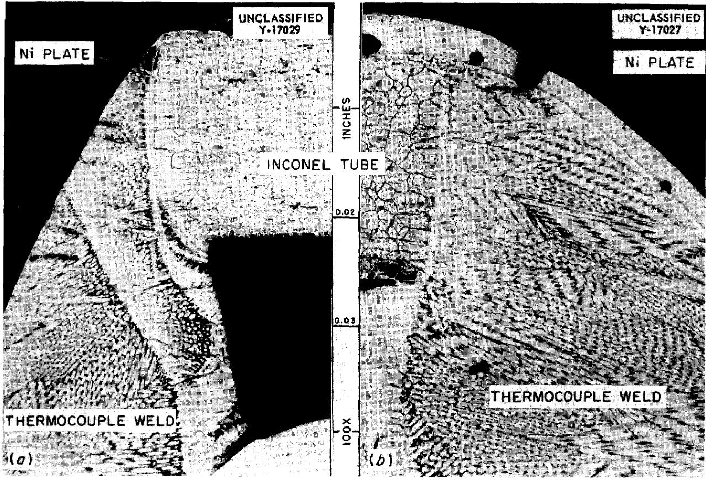  
Fig. 5.19. Thermocouple Assemblies with Welds of Low Chromel-Alumel Content After Exposure for 100 hr at $1500^{\circ}\mathrm{F}$ in Seesaw Apparatus to (a) Sodium and (b) NaF-ZrF $_4$ -UF $_4$ (50-46-4 mole %). Inconel tube unattacked in sodium; attacked to a depth of 2 mils in fluoride mixture; no attack apparent on weld. Etched with $10\%$ oxalic acid. (Secret with caption.)

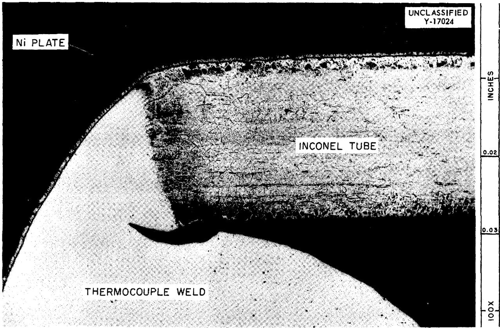  
Fig. 5.20. Thermocouple Assembly with Welds of High Chromel-Alumel Content After Exposure for 100 hr at $1500^{\circ}$ F in Seesaw Apparatus to NaF-ZrF $_4$ -UF $_4$ (50-46-4 mole %). Inconel tube attacked to a depth of 4.5 mils; weld attacked to a depth of 0.5 mils. Etched with $10\%$ oxalic acid. (Secret with caption.)

# Effect of Ruthenium on Physical Properties of Inconel

D. H. Jansen  
Metallurgy Division

Additional data were obtained on the creep-rupture properties of ruthenium-plated Inconel. An additional nonplated specimen was tested because it was found that the nonplated specimen tested previously had not received the same prior heat treatment as that given to the plated specimens. The results obtained are presented in Table 5.11. The plated specimens were tested as received and without a spectrographic check for the positive presence of a ruthenium plate. Therefore additional tests of spectrographically checked specimens are under way.

# Boiling Sodium in Inconel Loop

E. E. Hoffman Metallurgy Division

The results of operation of the first boiling-sodium-Inconel loop, which was terminated after 400 hr because of a pipe failure, were previously reported. Another such loop has now been operated for the scheduled test period of 1000 hr under similar thermal conditions. A slight vacuum was maintained in the system so that the sodium would boil at approximately $1500^{\circ}\mathrm{F}$ . In the previous test of 400-hr duration no mass-transferred crystals were detected in the cold trap of the condenser line, but heavy intergranular cracking to a depth of 50 mils was detected in some areas. In this latest test, macroscopically visible quan

TABLE 5.11. RESULTS OF CREEP-RUPTURE TESTS OF NONPLATED AND RUTHENIUM-PLATED INCONEL   

<table><tr><td>Atmosphere: purified argon</td></tr><tr><td>Stress: 3500 psi</td></tr><tr><td>Test temperature: 1500°F</td></tr><tr><td>Heat treatment prior to test: 100 hr at 1500°F</td></tr></table>

<table><tr><td>Condition of Specimen</td><td>Time to Rupture (hr)</td><td>Final Elongation (%)</td></tr><tr><td>Nonplated</td><td>746</td><td>14.0</td></tr><tr><td>Plated</td><td>873</td><td>13.4</td></tr><tr><td>Plated</td><td>728</td><td>13.6</td></tr></table>

tities of mass-transferred crystals were detected in the cold trap, as shown in Figs. 5.21 and 5.22.

The various sections from the condenser line that were examined metallographically exhibited intergranular cracking similar to that found in the loop operated for 400 hr. In the hottest section of the condenser pipe, there was attack to a depth of 1 to 2 mils in the form of small subsurface voids. No intergranular cracking was detected in the hottest and coolest sections of the condenser pipe, but cracks were found in the straight section which connected the hot and cold traps. The cracks were to a maximum depth of approximately 25 mils (see Fig. 5.23), as compared with a depth of 50 mils in the loop operated for 400 hr. The temperatures in the areas where cracks were detected varied from 1150 to $1325^{\circ}\mathrm{F}$ .

Metallographic examination indicated that a brittle grain-boundary phase was present in the areas where cracks appeared. Periodic thermal excursions caused by the condensing sodium led to severe thermal stresses in the pipe walls, which apparently caused the cracks to propagate. A boiling-sodium loop fabricated from type 348 stainless steel is now in operation. With this test system it will be possible to sample periodically the distilled sodium and to check its oxygen content.

# Decarburization of Mild Steel by Sodium

E.E.Hoffman

Metallurgy Division

It has been well established that various metals may be either carburized or decarburized while in contact with sodium at elevated temperatures. The direction and extent of this phenomenon depend both on the original carbon content of the sodium

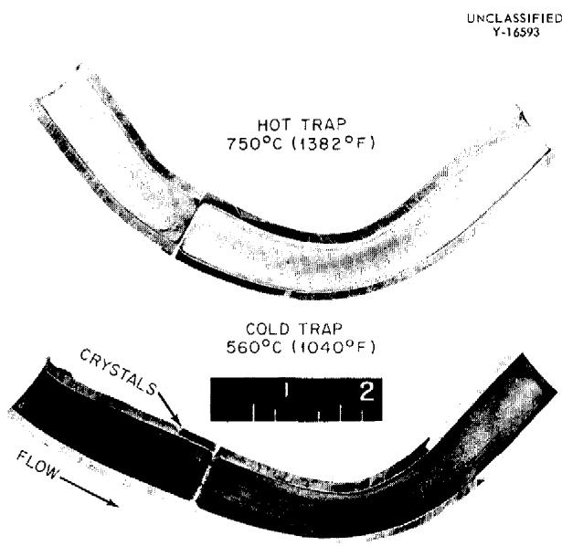  
Fig. 5.21. Sections Taken from an Inconel-Boiling-Sodium Loop After Operation for 1000 hr.

and on the carbon content of the metal in contact with the sodium. Tests have been made to determine how far the decarburization of a type 1043 mild steel $(0.433\%)$ C) will proceed in static sodium at $1830^{\circ}F$ for 100 hr. In the two tests performed to date, the container materials were Armco iron and type 304 ELC stainless steel. The capsules were loaded and sealed in inert atmospheres. The mild-steel specimens in both capsules showed weight losses of $0.2\mathrm{mg / in}$ . The extent to which carbon transferred is illustrated in Fig. 5.24. The decarburization of the type 1043 mild-steel specimen is particularly evident. The small areas of pearlite found in the

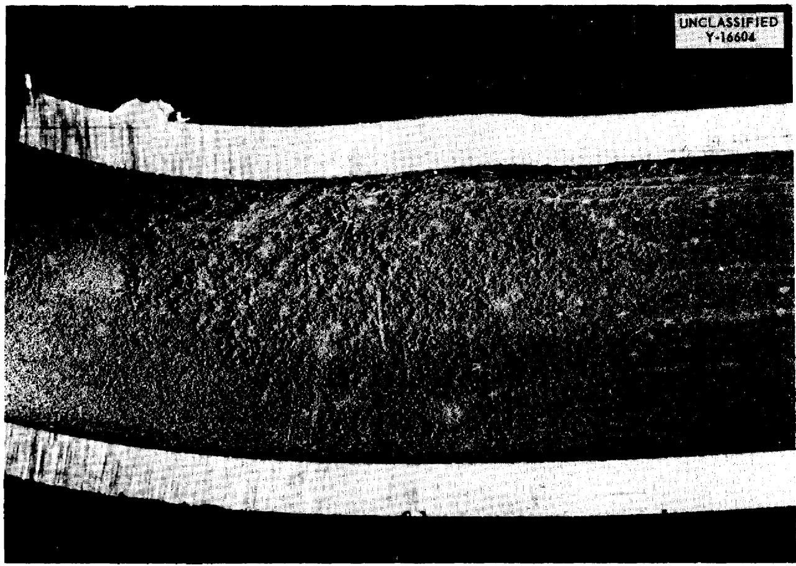  
Fig. 5.22. Enlargement of Section of Cold Trap from the Inconel-Boiling-Sodium Loop Showing Mass-Transferred Crystals. 4X.

wall of the Armco iron capsule after the test indicate that the Armco iron picked up carbon. The type 1043 mild-steel specimen tested in the type 304 ELC stainless steel capsule was very similar in appearance to the mild-steel specimen tested in the Armco iron capsule; however, sufficient nickel had been picked up on the surface of the specimen in the stainless steel capsule to cause a phase transformation which extended to a depth of 1 to 2 mils. Table 5.12 shows the results of the carbon analyses of the various test components. It may be seen that the carbon content of the mild-steel specimens decreased and that the carbon content of the capsule walls in contact with the sodium increased.

# Static Tests of Special Stellar Heats in Lithium

E.E.Hoffman

Metallurgy Division

Two special heats of Stellar, heats B and C, were submitted by the Union Carbide and Carbon

Metals Research Laboratories for corrosion tests in various liquid metals. The results of earlier tests of these materials in NaF-ZrF4-UF4 (53.5-40-6.5 mole %) and in sodium were reported previously. The approximate compositions of these alloys were:

Composition (wt %)   

<table><tr><td></td><td>Heat B</td><td>Heat C</td></tr><tr><td>Carbon</td><td>1</td><td>0.30</td></tr><tr><td>Chromium</td><td>35</td><td>28</td></tr><tr><td>Tungsten</td><td>5</td><td></td></tr><tr><td>Molybdenum</td><td></td><td>12</td></tr><tr><td>Manganese</td><td>0.50</td><td>0.50</td></tr><tr><td>Silicon</td><td>0.50</td><td>0.50</td></tr><tr><td>Nickel</td><td></td><td>3</td></tr><tr><td>Cobalt</td><td>58</td><td>55.7</td></tr></table>

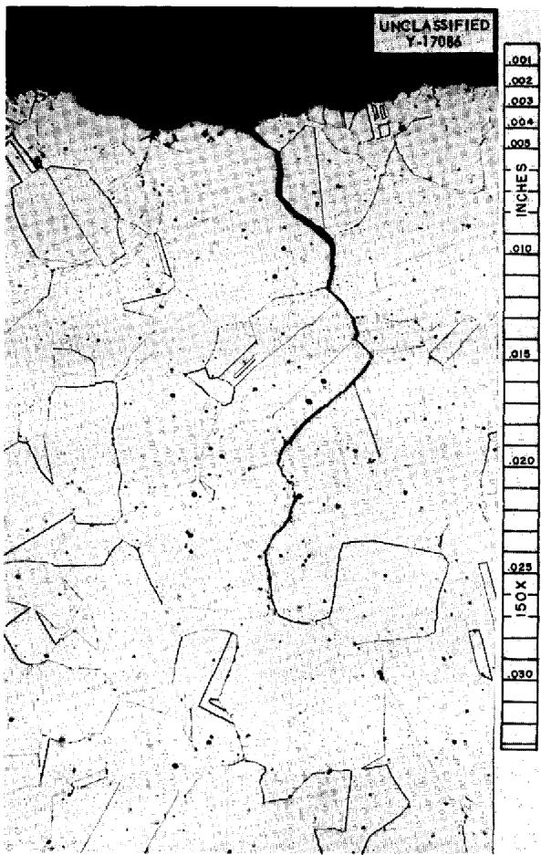  
Fig. 5.23. Wall of Condenser Pipe of Inconel-Boiling-Sodium Loop Operated for 1000 hr. Temperature at location shown was between 1150 and $1325^{\circ}\mathrm{F}$ .

The alloys were unattacked by sodium but were attacked to depths of from 7 to 20 mils by the fused salt. The results of the tests of these materials in lithium are presented in Table 5.13. It is apparent that in these alloys there are isolated areas that are susceptible to very heavy attack. The variations in susceptibility to attack may be due to composition variations in the specimens.

# Solubility of Lithium in NaK

# R. Carlander   tt & Whitney Aircraft

Attempts were made to determine the solubility of lithium in NaK (44% K-56% Na) by a differential thermal-analysis method and by using a solubility-temperature apparatus. In the differential thermal-analysis method, the temperature of the bath containing lithium was plotted on an automatic time-temperature recorder, and the difference in temperature between the NaK bath containing lithium and a blank bath containing only NaK was plotted on another automatic time-temperature recorder. When the lithium began to solidify, heat was given off, and a temperature difference was noted and correlated with the time-temperature chart to give the temperature at which solidification occurred. Tests were performed with 5, 6, and 10 wt % lithium added to the NaK. The results are given in Table 5.14.

In the temperature-solubility apparatus, NaK with 5 wt $\%$ lithium added was heated to $200^{\circ}\mathrm{C}$ , agitated, and allowed to remain at that temperature

TABLE 5.12. CARBON ANALYSES OF THE VARIOUS COMPONENTS OF SYSTEMS DESIGNED FOR STUDYING THE DECARBURIZATION OF MILD STEEL BY SODIUM  
Duration of tests: 100 hr Test temperature: $1830^{\circ}F$   

<table><tr><td rowspan="2">Test System</td><td rowspan="2">Material Analyzed</td><td colspan="2">Carbon Content* (wt %)</td></tr><tr><td>Before Test</td><td>After Test</td></tr><tr><td rowspan="4">Type 1043 mild-steel specimen in Armco iron capsule</td><td>Mild-steel specimen</td><td>0.433</td><td>0.121</td></tr><tr><td>Armco iron capsule</td><td>0.019</td><td></td></tr><tr><td>Bath zone</td><td></td><td>0.035</td></tr><tr><td>Vapor zone</td><td></td><td>0.019</td></tr><tr><td rowspan="4">Type 1043 mild-steel specimen in type 304 ELC stainless steel capsule</td><td>Mild-steel specimen</td><td>0.433</td><td>0.100</td></tr><tr><td>Stainless steel capsule</td><td>0.022</td><td></td></tr><tr><td>Bath zone</td><td></td><td>0.128</td></tr><tr><td>Vapor zone</td><td></td><td>0.022</td></tr></table>

*Two analyses performed on each sample.

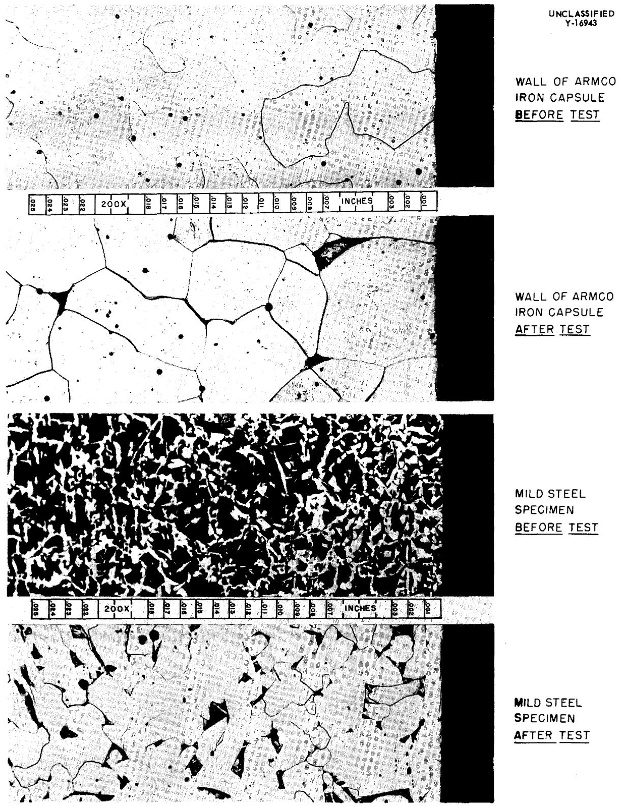  
Fig. 5.24. Armco Iron Capsule and Type 1043 Mild-Steel Specimen Before and After Exposure to Static Sodium for 100 hr at $1830^{\circ}$ F. 200X. Reduced $18\%$ .

TABLE 5.13. RESULTS OF STATIC TESTS OF SPECIAL STELLITE HEATS IN LITHIUM AT ${1500}^{ \circ  }\mathrm{F}$ FOR ${100}\mathrm{{hr}}$   

<table><tr><td>Material</td><td>Weight Change (g/in.2)</td><td>Metallographic Notes</td></tr><tr><td>Heat B</td><td>-0.044</td><td>Uniform attack to a depth of 2 to 3 mils plus very heavy attack in several isolated areas</td></tr><tr><td>Heat B</td><td>-0.059</td><td>Approximately 90% of exposed surface attacked to a depth of 3 mils; very heavy attack on other 10% of surface</td></tr><tr><td>Heat C</td><td>-0.069</td><td>Uniform attack to a depth of 2 to 4 mils plus very heavy attack in some areas</td></tr></table>

TABLE 5.14. RESULTS OF MEASUREMENTS OF THE SOLUBILITY OF LITHIUM IN NaK   

<table><tr><td>Test Methods</td><td>Analysis Temperature (℃)</td><td>Lithium Content (wt %)</td></tr><tr><td rowspan="3">Differential thermal analysis</td><td>176</td><td>10</td></tr><tr><td>170</td><td>6</td></tr><tr><td>166</td><td>5</td></tr><tr><td>Temperature-solubility</td><td>25</td><td>0.014</td></tr></table>

for 2 hr. The bath was then cooled to $25^{\circ}C$ , and a sample was obtained through a stainless steel filter. The results of chemical analyses of the samples for lithium are given in Table 5.14. It appears from the data that a small amount of lithium is soluble in NaK.

# Seesaw Tests of Titanium Carbide Cermets in NaF-ZrF4-UF4

W. H. Cook  
Metallurgy Division

Some titanium carbide cermets with cobalt- or nickel-base alloys as binding material were subjected to screening tests in contact with NaF $\mathsf{ZrF}_4\mathsf{-UF}_4$ (53.5-40-6.5 mole $\%$ ) in seesaw apparatus operated at 4.25 cpm. These cermets were submitted by the Sintercast Corp. of America. The hot and cold zones of the apparatus were at 1500 and $1200^{\circ}\mathsf{F}$ , respectively. Each specimen was held in the hot zone of its capsule during the 200-hr test period. The results are summarized

in Table 5.15. The results of previous tests $^6$ of five of the same types of Sintercast Corp. specimens exposed to $\mathsf{NaF - ZrF}_4\mathsf{-UF}_4$ (50-46-4 mole %) for a 100-hr test period are also included in Table 5.15 for comparison purposes. The results of the earlier tests are considered to be less significant than those obtained in the recent tests, because at the time the earlier tests were made there were no untested specimens available for comparison, the specimen compositions were not known, $^7$ and little was known about the involved techniques required for metallographically polishing these kinds of specimens.

As shown in Table 5.15, only Sintercast specimens 1 and 7 were attacked by $\mathsf{NaF - ZrF_4 - UF_4}$ (53.5-40-6.5 mole $\%$ ). The type of attack is illustrated in Figs. 5.25 and 5.26. In the metallographic examination of the specimen structures, it was noted that the titanium carbide particles in the cermets with cobalt-base binder were, in general, more globular than those in the cermets with nickel-base binder. It appears therefore that the cobalt-base alloys may have reacted more with the titanium carbide in the fabrication of the specimens than did the nickel-base alloys.

The typical extremes of the particle shapes are illustrated in Figs. 5.25 and 5.26, and the average structure and typical appearance in the absence of attack are illustrated in Fig. 5.27. As may be noted, there was practically no mutual bonding between the titanium carbide particles, as was

6E.E.Hoffman et al., ANP Quar. Prog. Rep. June 10, 1954, ORNL-1729, p 71.   
7 Compositions and methods of fabrication of the Sintercast Corp. specimens are "Company Confidential Information" and not available for general publication.

Operating cycle: 4.25 cpm

Hot-zone temperature: $1500^{\circ}\mathrm{F}$

Cold-zone temperature: $1200^{\circ}\mathrm{F}$

Capsule material: Inconel

TABLE 5.15. SUMMARY OF THE RESULTS OF SEESAW CORROSION TESTS ON SOME SINTERCAST CORPORATION TITANIUM CARBIDE CERMETS   

<table><tr><td rowspan="2">Sintercast Specimen No.</td><td rowspan="2">Metal Binder Alloy Base</td><td colspan="2">Attack (mils)</td><td rowspan="2">Metallographic Notes</td></tr><tr><td>In NaF-ZrF4-UF4(50-46-4 mole %)*</td><td>In NaF-ZrF4-UF4(53.5-40-6.5 mole %)**</td></tr><tr><td>1</td><td>Cobalt</td><td>0.5 to 2</td><td>4 to 8</td><td>The attack was primarily along the boundaries between the TiC particles and the metal binder; the TiC particles were slightly smaller than those in specimens 2 and 4 and tended to be globular in shape</td></tr><tr><td>2</td><td>Cobalt</td><td></td><td>0</td><td>The specimen was unattacked; the TiC particles were globular and intermediate in size between those of specimens 1 and 4</td></tr><tr><td>4</td><td>Cobalt</td><td>1</td><td>0</td><td>The specimen was unattacked; the TiC particles were slightly larger than those in specimens 1 and 2; the TiC particles were globular and sharply defined in the metal</td></tr><tr><td>3</td><td>Nickel</td><td></td><td>0</td><td>The specimen was unattacked; the TiC particles were not so globular as those bonded with the cobalt-base alloys, specimens 1, 2, and 4; the TiC particle size appeared to be the same as that for specimen 1</td></tr><tr><td>5</td><td>Nickel</td><td>0</td><td>0</td><td>The specimen was unattacked; the TiC particles were less globular in shape than those in specimen 3 and they appeared to be smaller</td></tr><tr><td>6</td><td>Nickel</td><td></td><td>0</td><td>The specimen was unattacked; the TiC particles were approximately the same size as those in specimen 4; they were less globular than those bonded with the cobalt-base alloys; there was more metal area in a section than in any other of the specimens</td></tr><tr><td>7</td><td>Nickel</td><td></td><td>1.5 to 7</td><td>The attack was primarily along the boundaries between the TiC particles and the metal binder; the TiC particles in this and specimen 10 were the most angular in shape of all specimens</td></tr><tr><td>8</td><td>Nickel</td><td>0.5 to 2</td><td>0</td><td>The specimen was unattacked; the structure was similar to that of specimen 6 except that there was less metal area</td></tr><tr><td>9</td><td>Nickel</td><td></td><td>0</td><td>The specimen was unattacked; the structure was similar to that of specimen 8 except that there was a greater quantity of small TiC particles</td></tr><tr><td>10</td><td>Nickel</td><td>5</td><td>0</td><td>The specimen was unattacked; the TiC particles were angular like those in specimen 7 and were larger than those in any of the other specimens</td></tr></table>

*100-hr tests.   
\*\*200-hr tests.

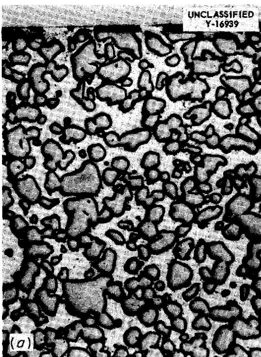

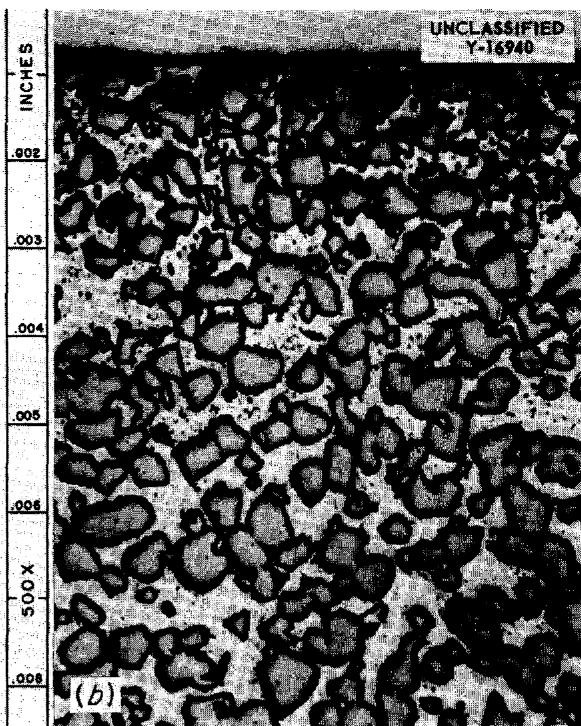

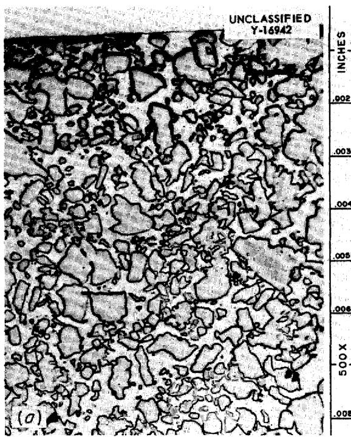  
Fig. 5.25. Sintercast Specimen 1 (a) As-received and (b) After Exposure to NaF-ZrF $_4$ -UF $_4$ (53.5-40-6.5 mole %) for 200 hr in Seesaw Apparatus with a Hot-Zone Temperature of $1500^{\circ}\mathrm{F}$ and a Cold-Zone Temperature of $1200^{\circ}\mathrm{F}$ . Specimen held in hot zone during test. Unetched. (See with caption.) 500X, Reduced 13.5%.

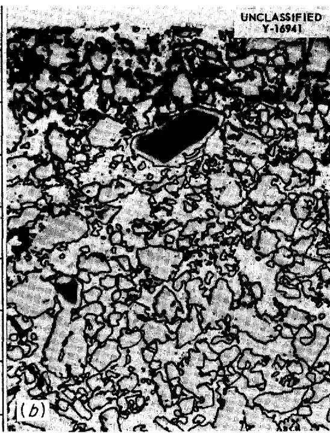  
Fig. 5.26. Sintercast Specimen 7 (a) As-received and (b) After Exposure to NaF-ZrF $_4$ -UF $_4$ (53.5-40-6.5 mole %) for 200 hr in Seesaw Apparatus with a Hot-Zone Temperature of $1500^{\circ}\mathrm{F}$ and a Cold-Zone Temperature of $1200^{\circ}\mathrm{F}$ . Specimen held in hot zone during test. Unetched. (with caption.) 500X. Reduced 13.5%.

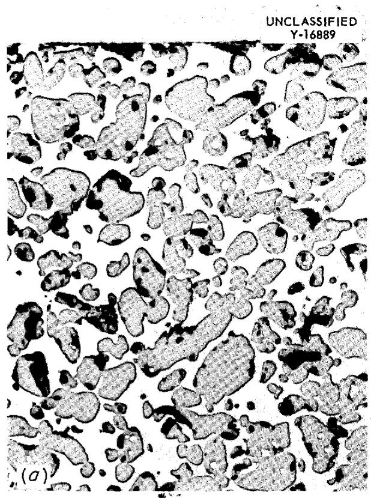

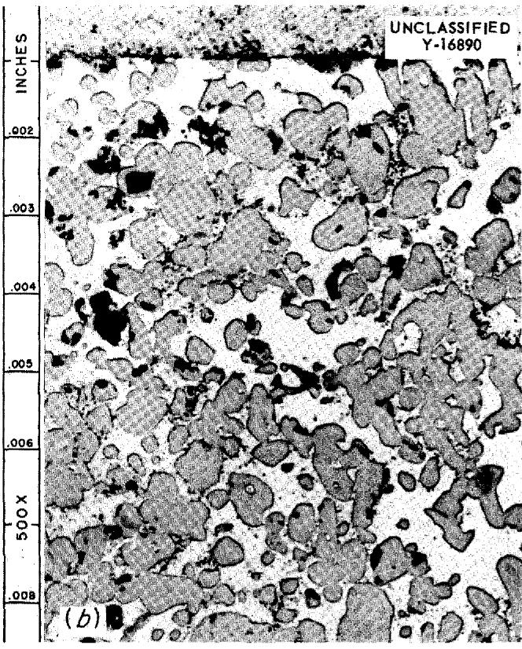  
Fig. 5.27. Sintercast Specimen 4 (a) As-received and (b) After Exposure to NaF-ZrF $_4$ -UF $_4$ (53.5-40-6.5 mole %) for 200 hr in Seesaw Apparatus with a Hot-Zone Temperature of $1500^{\circ}\mathrm{F}$ and a Cold-Zone Temperature of $1200^{\circ}\mathrm{F}$ . Specimen held in hot zone during the test. The holes were created by removal of TiC particles during metallographic polishing. Unetched. (Secret with caption.)

previously reported for the more common types of cermets with low metal content.8,9

# Thermal-Cycling Tests of Inconel Valve Disks and Seats Flame-Plated with a Mixture of Tungsten Carbide and Cobalt

W. H. Cook

Metallurgy Division

Initial evaluation tests of valve disks and seats coated with a mixture of tungsten carbide and cobalt were made. The coating, which was being tested for suitability as a hard-facing material, was deposited by a commercial flame-plating method developed by Linde Air Products Co.

The coating, to be suitable, must be resistant to solid-phase bonding, galling, and wearing.

The seating surfaces of four sets of Inconel valve disk and seat blanks were flame-plated by the Linde Air Products Co. with coatings 4 to 6 mils thick that were nominally 92 wt % tungsten carbide and 8 wt % cobalt. Three sets of the flame-plated valve parts were then copper-brazed at a temperature of $2048^{\circ}\mathrm{F}$ to Inconel platens. Adequate wetting was obtained; however, cracks were created in the flame-plated coatings, as shown in Fig. 5.28. The cracks were thought to be caused by the difference between the coefficients of thermal expansion of the coating and the Inconel.

Two tests were made on the fourth set of Inconel valve seat and disk blanks to further evaluate the usefulness of the flame-plated coating on Inconel. The purpose of the first test was to

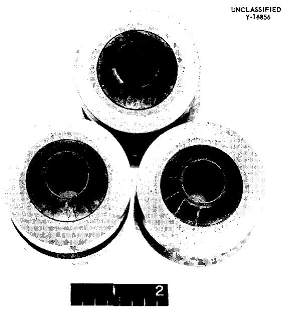  
Fig. 5.28. Inconel Valve Parts Flame-Plated with a Mixture of Tungsten Carbide and Cobalt and Then Copper-Brazed to Inconel Platens at $2048^{\circ}\mathbf{F}$ . Note cracks in the flame-plated coatings.

determine whether the flame-plated coating was satisfactory for use at the proposed operating temperature. The disk and seat were slowly cycled in a vacuum from room temperature to $1500^{\circ}\mathrm{F}$ , which was approximately $100^{\circ}\mathrm{F}$ in excess of the proposed maximum operating temperature. There was a small amount of spalling of the plating where it was built up on corners. If the seating surfaces had been machined, as they would have been for a finished valve disk-and-seat set, there probably would not have been any spalling. There were no cracks that could be detected with a dye penetrant. In the second test, the disk and seat were heated in a vacuum from room temperature to $2012^{\circ}\mathrm{F}$ in 5 min, held at $2012^{\circ}\mathrm{F}$ for 15 min, and then allowed to cool to room temperature in approximately 3 hr. These thermal conditions were similar to those used in the brazing of the other flame-plated disks and seats, with the exception that the thermal shock was more severe. The coatings on both the disk and seat developed cracks like those found in the coatings on the brazed disks and seats. The results of these two tests are illustrated in Fig. 5.29.

# Static Tests in NaF-ZrF $_4$ -UF $_4$ of Kentanium Cermet Valve Parts Brazed to Inconel

W. H. Cook  
Metallurgy Division

A valve seat made from the Kentanium cermet K151A (70% TiC-10% NbTaTiC-20% Ni) and a valve disk made from K152B (64% TiC-6% NbTaTiC₃-30% Ni) held in contact at a pressure of 10,000 psi (calculated) were exposed to static NaF-ZrF₄-UF₄ (53.5-40-6.5 mole %) at 1500°F for 150 hr. The surface-roughness values for the contacting surfaces were from 5 to 10 μin. before the test. The test was terminated when a pull rod failed. The lower valve part fell free from the upper valve part, and thus there was an indication that no solid-phase bonding had occurred. A subsequent low-power microscopic examination revealed no evidence of bonding. Visual and microscopic examination of the 45-deg beveled seating surfaces of the valve disk and seat indicated that there was uniform seating during the test.

This was also the first test in which the recently developed method of brazing Kentanium cermets to Inconel11 was tested in a fused-salt bath. There were no visible signs of attack, of distortion of the $\frac{1}{4}$ -in.-thick nickel shim, or of cracking of the cernet pieces after the test.

# Effect of an Air Leak into an Inconel-Fused-Salt Test System

W. H. Cook  
Metallurgy Division

An Inconel-fused-salt tube-burst test capsule was found to be very heavily attacked above the level of the NaF-ZrF $_4$ -UF $_4$ mixture following a 500-hr test at $1500^{\circ}\mathrm{F}$ . It was suggested that the attack (Fig. 5.30) was due to an air leak somewhere in the system, and therefore several experiments were performed in which air was admitted to similar test capsules through a small tube. These test capsules failed within 24 hr at a temperature of $1500^{\circ}\mathrm{F}$ . The reaction products

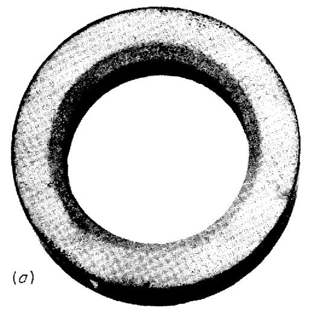

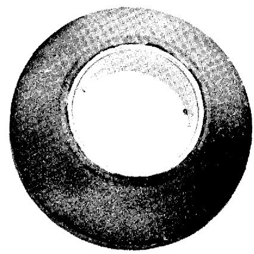  
UNCLASSIFIED Y-16584   
UNCLASSIFIED Y-16659

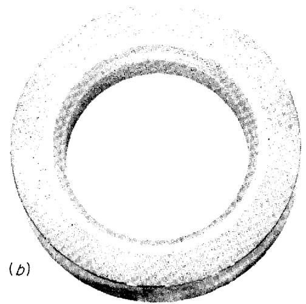

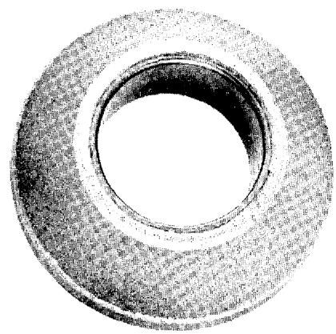

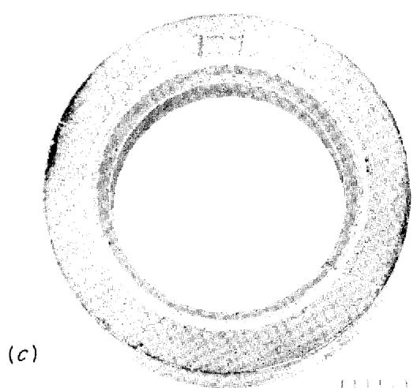

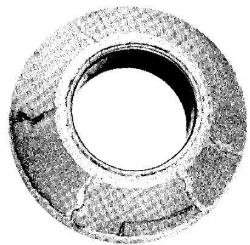  
UNCLASSIFIED Y-16857

  
Fig. 5.29. Inconel Valve Disk and Seat Flame-Plated with a Mixture of Tungsten Carbide and Cobalt. (a) As received. (b) After being cycled slowly from room temperature to $1500^{\circ}\mathrm{F}$ in vacuum. (c) After being heated in vacuum from room temperature to $2012^{\circ}\mathrm{F}$ , held at $2012^{\circ}\mathrm{F}$ for 15 min, and allowed to cool to room temperature in about 3 hr.

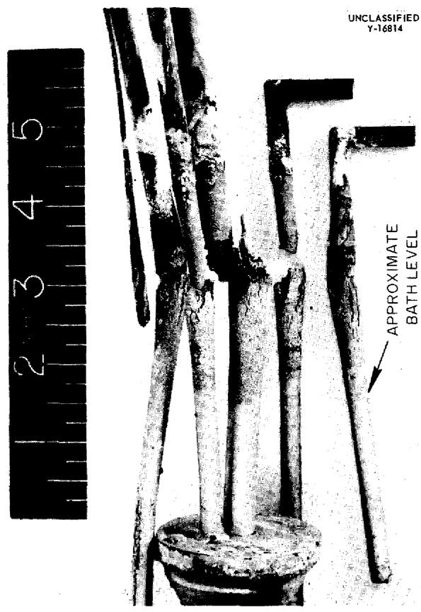  
Fig. 5.30. Effect of an Air Leak into an Inconel-Fused-Salt Test System. (Confidential with caption.)

found in the fused salt were zirconium oxide and structural metal fluorides.

# FUNDAMENTAL CORROSION RESEARCH

G.P.Smith

Metallurgy Division

# Self-Decomposition of Fused Hydroxides

M. E. Steidlitz

G.P. Smith

Metallurgy Division

The thermal decomposition reaction for NaOH is

$$
2 N a O H \rightleftharpoons N a _ {2} O + H _ {2} O \tag {1}
$$

and it may be shown on a theoretical basis that the partial pressure of water vapor, $p$ , should obey the relation:

$$
\log p = - \frac {\Delta H ^ {\circ}}{9 . 1 5 2} \frac {1}{T} + \frac {\Delta S ^ {\circ}}{9 . 1 5 2} + \frac {1}{2} \log \frac {\gamma_ {H _ {2} O}}{\gamma_ {N a _ {2} O}}
$$

where $\Delta H^0$ and $\Delta S^0$ refer to Eq. 1 and the $y$ 's are activity coefficients in fused NaOH. Data obtained in recent measurements of the vapor pressure of water over fused NaOH confirm the theory, as shown in Fig. 5.31. The value of $\Delta H^0$ obtained from the data is 44.4 kcal. The value of $\Delta H^0$ , known from other measurements, is 41.4 kcal. This agreement is considered to be good.

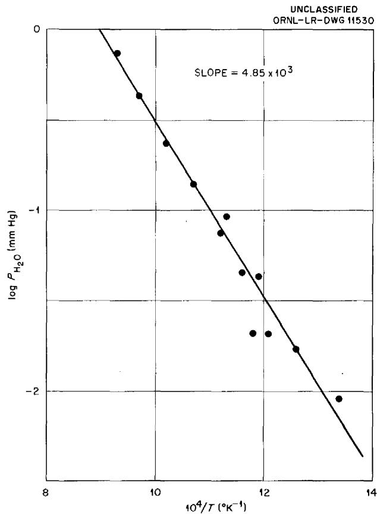  
Fig. 5.31. Logarithm of the Vapor Pressure of Water Over Fused NaOH as a Function of the Reciprocal of the Absolute Temperature.

# Mass Transfer and Corrosion of Various Materials in Fused Sodium Hydroxide

M. E. Steidlitz

G.P. Smith

Metallurgy Division

Inconel. - Thirty-two tests have been made of the corrosion of Inconel by fused NaOH in the absence of a thermal gradient. The tests were conducted with the NaOH blanketed with an atmosphere of helium or hydrogen, but metallographic examinations have been completed only

for the tests in which hydrogen was used as the blanketing atmosphere.

A semiquantitative evaluation of the extent of corrosion of the Inconel after exposure for various times at various temperatures is presented in Fig. 5.32. The seven photomicrographs show cross sections of the specimens in the region of the fused hydroxide-metal interface. The scales at the bottom of the figure are applicable to all the photographs. In each photograph, the pale-gray region at the bottom is unattacked metal. The dark-gray region is the layer of corrosion product. The white area at the top was originally occupied by the fused hydroxide.

The top row of pictures shows the rather severe attack found at $800^{\circ}C$ . The arrow gives the approximate position of the hydroxide-metal interface at the beginning of the test. The second row of pictures shows the corrosion product formed in tests at $700^{\circ}C$ . It may be noted that the thicknesses of the corrosion-product layers vary considerably. Only one picture, Fig. 5.32g, is shown for corrosion at $600^{\circ}C$ . For corrosion periods significantly shorter than 100 hr, very little or no attack is found at $600^{\circ}C$ . As may be seen, exposure for 100 hr resulted in only slight intergranular penetration; there is no corrosion-product layer. The metallographic details shown in Fig. 5.32 may be taken as typical, except that some tests run under the same conditions resulted in a narrow region of intergranular penetration between the corrosion-product layer and the unattacked metal.

Quantitative data on the corrosion of Inconel by fused NaOH under a blanketing atmosphere of hydrogen are presented in Fig. 5.33. The circles are average corrosion values and have the following meaning: The numerical product of the average corrosion value times a given area of external surface, assumed to be flat, gives approximately the actual volume of corrosion product contained beneath the given surface. The vertical lines passing through a circle give the values of maximum and minimum corrosion observed for the specimen.

Heavily corroded specimens were found to be strongly ferromagnetic. Microscopic studies were made of the migration of colloidal magnetite over a polished cross section of a specimen in a magnetic field. It was shown that the ferro

magnetism was restricted to the corrosion-product layer. Samples of ground corrosion product were leached with water for long periods, and it was found that appreciable quantities of sodium were removed in the form of $\mathrm{Na}_2\mathrm{O}$ . X-ray examination of the corrosion product gave an abundance of lines which could not be analyzed. Further efforts are being made to determine the composition of the corrosion product.

Under the influence of a thermal gradient and at sufficiently high temperatures, Inconel undergoes both mass transfer and corrosive attack. The mass-transferred deposit apparently adheres quite well to the corrosion product. This is not too surprising, however, in view of the metallic matrix which the corrosion product was found to contain. For Inconel under a blanketing atmosphere of hydrogen, the corrosion was slightly worse under a thermal gradient than would have been expected on the basis of the results from the static tests, reported above, while the mass transfer was about the same as that found for pure nickel under the same conditions.

For Inconel under a blanketing atmosphere of helium, the available data are insufficient for quantitative evaluation. Qualitatively, however, both corrosion and mass transfer are much more severe than they are under similar experimental conditions with a blanketing atmosphere of hydrogen. The microstructure of the corrosion product for tests conducted under helium is distinctively different from that found for tests conducted under hydrogen. The corrosion product consists of branched dendritic structures, many of which begin at the outer interface and penetrate deeply into the base metal. Along the axis of each dendrite is a relatively wide band of a metallic phase.

Nickel. Sixty-five tests have been made in an effort to study the effect of temperature, temperature gradient, and time on the mass transfer of nickel in fused NaOH, and about one-half the tests have been evaluated metallographically. The maximum test temperature has ranged from 550 to $800^{\circ}\mathrm{C}$ , and the thermal-gradient range was between 50 and $200^{\circ}\mathrm{C}$ . The only results that are complete enough to report in detail are those obtained from tests in which a blanketing atmosphere of hydrogen was used.

It is important to distinguish between the mass-transferred deposits at the gas-liquid interface and

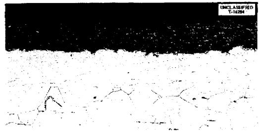  
(e) EXPOSED AT 800°C FOR 28 hr.

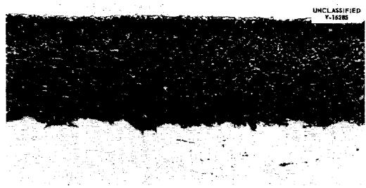  
(b) EXPOSED AT 800°C FOR 54 h.

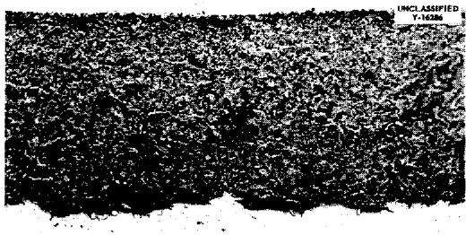  
(c) EXPOSED AT $800^{\circ}C$ FOR 100 hr.

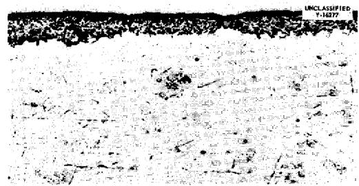  
(d) EXPOSED AT 700°C FOR 23 hr.

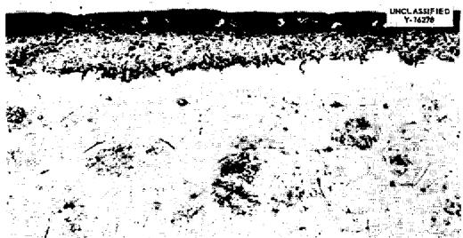  
(e) EXPOSED AT 700°C FOR 50 hr.

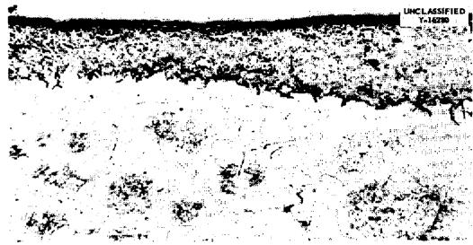  
EXPOSED AT 700°C FOR 100 hr.

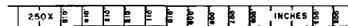

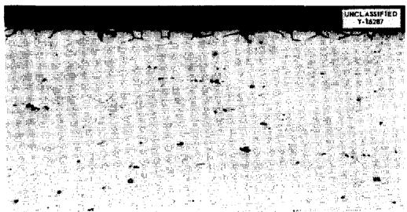  
(g) EXPOSED AT 600°C FOR 100 hr.

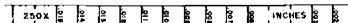  
Fig. 5.32. Corrosion of Inconel by Fused NaOH Under a Blanketing Atmosphere of Hydrogen. 250X. Reduced $57\%$ .

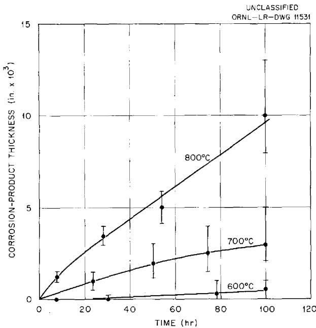  
Fig. 5.33. Corrosion of Inconel by Fused NaOH Under a Blanketing Atmosphere of Hydrogen as a Function of Time and Temperature.

those on the immersed surface, since deposition occurs more readily at the interface than elsewhere in the system. However, such interfaces would occur at only a few places in a heat-transfer system and should not be a source of trouble. Therefore the evaluation study reported here deals entirely with deposition on the immersed surface.

Usually the mass-transferred deposits were less than 0.001-in. thick. They were also, of course, of about the same composition as the base metal and frequently continued the crystal orientation of the base. Thus it was necessary to use refined metallographic techniques to measure the thickness of the deposited films. In order to prevent rounding-off of the edge of a specimen during metallographic polishing, the specimens were first copper-plated. Despite this, very slight rounding-off was unavoidable, and therefore the value 0.0001 in. is taken to be the minimum thickness for which mass-transferred deposits can be positively identified. This minimum thickness corresponds to a uniform deposit of $2\mathrm{mg/cm}^2$ . In order to determine the thickness of deposit, it was necessary to establish the boundary between the base metal and the deposited metal. It was found that very careful etching would, in some instances,

yield a faint grain-boundary-like groove along this boundary. In other instances, no such boundary could be found. However, it was discovered that the mass-transferred deposits oxidized at a slightly lower rate than did the base metal, perhaps because of the greater purity of the deposit, and oxidation of metallographically polished specimens tarnished the base metal but not the deposit.

A nickel mass-transferred deposit on a nickel cold finger is shown in Fig. 5.34. The maximum thickness of this film is 0.0007 in., and its average thickness is about 0.0002 in. The lower region of the photomicrograph is the base metal, the middle region is the copper plate, and the dark region at the top is the mounting plastic. The irregular mass-transferred deposit may be seen between the copper plate and the base metal. This specimen illustrates both the etching and the tarnishing techniques.

The mass-transferred deposits found on all the specimens examined have been very rough. They consisted of nickel crystals densely crowded together over the surface of the base metal. The bases of the crystals had grown together so that, in cross section, the deposits appeared to be thin and continuous and to be densely covered with elongated protuberances of irregular dimensions. Almost all the protuberances were of approximately the same length. At temperatures of $750^{\circ}\mathrm{C}$ and above, an occasional nickel crystal grew, as a dendrite, to several times the length of an average crystal. Usually, less than six such dendrites were found on a given cross section of a cold finger. Most frequently, the cross section did not include either the base or the tip of these exceptional dendrites, and therefore no reliable measure of their length could be obtained. Thus the depth of the mass-transferred deposit is usually described in terms of two parameters - the length of an average protuberance and the length of the longest protuberance of a given cross section - and the presence or absence of the rare dendrites is noted. In some cases, even this description leaves something to be desired because an increase in deposition is sometimes manifested by a greater density of long protuberances rather than an increase in the average protuberance length. For these reasons, representative photomicrographs provide a more adequate description of mass transfer than do tables or graphs.

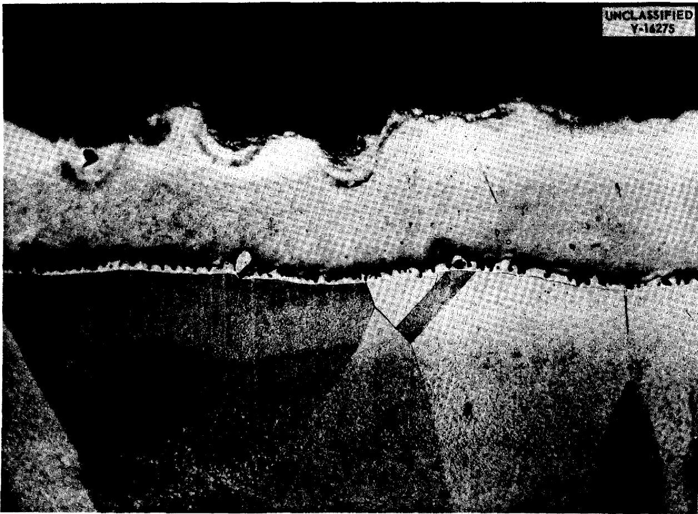  
Fig. 5.34. Nickel Mass-Transferred Deposit on Nickel Cold Finger Immersed for 100 hr in Fused NaOH. Maximum temperature, $700^{\circ}\mathrm{C}$ ; temperature differential in system, $100^{\circ}\mathrm{C}$ ; blanketing atmosphere, hydrogen. 330X.

Iron. - A study is also being made of the mass transfer of carbon steel (AlSi No. C1015) in fused NaOH. The tests performed thus far have been of 100-hr duration with a temperature differential of $100^{\circ}\mathrm{C}$ . A series of cold fingers taken from these tests are shown in Fig. 5.35. Heavy deposits of iron crystals can be seen on the lower ends of the fingers, as well as the even-heavier skirts of crystals which formed at the liquid-gas interface. Specimen 127, shown in Fig. 5.35, was subjected to a maximum temperature of $550^{\circ}\mathrm{C}$ , specimen 128 to $600^{\circ}\mathrm{C}$ , specimen 129 to $650^{\circ}\mathrm{C}$ , specimen 130 to $700^{\circ}\mathrm{C}$ , and specimen 131 to $750^{\circ}\mathrm{C}$ . The scale in the photograph is in inches. It may be noted that even at $550^{\circ}\mathrm{C}$ the mass transfer of iron was significantly worse than the mass transfer of nickel at $800^{\circ}\mathrm{C}$ , when the other experimental parameters were the same. However, the crystals deposited were roughly equiaxed in

even the heaviest deposits, whereas similar heavy deposits of nickel were always dendritic.

Hastelloy B. -- The data on Hastelloy B are difficult to evaluate because of the uniformly poor quality of the metal available for test. This metal contained pits, cracks, and stringers that were frequently of macroscopic size. It is known from other studies that fused sodium hydroxide has an extraordinary ability to penetrate deeply into minute voids, and hence each flaw in the Hastelloy B which touched the surface provided a pathway along which the hydroxide moved and thus caused localized corrosion deep in the interior of the metal. Finally, the available metal sometimes consisted of two metallic phases in various amounts.

All tests of Hastelloy B were conducted under a blanketing atmosphere of hydrogen for 100 hr with a temperature differential of $100^{\circ}\mathrm{C}$ . The

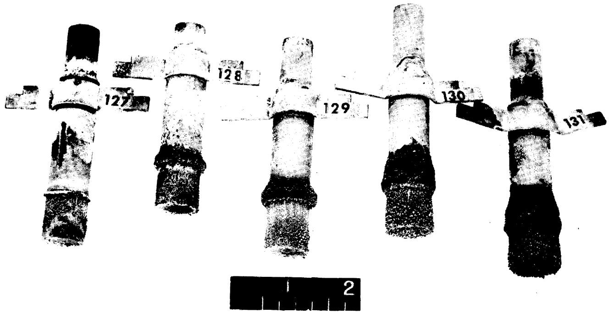  
Fig. 5.35. Mass-Transferred Deposits on Carbon-Steel Cold Fingers Tested for 100 hr in Fused NaOH Under a Hydrogen Blanketing Atmosphere. Test temperatures ranged from $550^{\circ}\mathrm{C}$ for specimen 127 to $750^{\circ}\mathrm{C}$ for specimen 131. System temperature differential, $100^{\circ}\mathrm{C}$ .

mass transfer found under these conditions was similar in magnitude to that found for nickel under similar conditions, with the exception that it was detected at temperatures as low as $650^{\circ}\mathrm{C}$ in Hastelloy B but not below $670^{\circ}\mathrm{C}$ in nickel. This difference of $20^{\circ}\mathrm{C}$ is not especially significant, however, in view of the over-all scatter in the experimental results. Corrosion was detected at $600^{\circ}\mathrm{C}$ , the lowest temperature studied. The corrosion was, in general, 1.5 to 2 times that found for Inconel under similar conditions, but the scatter in the results was quite bad.

Stainless Steels. -- A number of tests were made with types 310 and 405 stainless steel exposed to fused NaOH under hydrogen at temperatures from 550 to $750^{\circ}\mathrm{C}$ for 100 hr with a temperature differential of $100^{\circ}\mathrm{C}$ . In all runs scaling was so severe that the specimens were not subjected to metallographic study.

# CHEMICAL STUDIES OF CORROSION

F. Kertesz

Materials Chemistry Division

Reaction of Inconel with Sodium and NaK

G.F.Schenck

Pratt & Whitney Aircraft

A study of the solubility and the rate of solution of the constituents of Inconel in sodium and in NaK as a function of temperature and of oxygen content of the liquid metal has been initiated, in order to clarify the mechanism of the mass-transfer reaction observed when liquid metals are circulated in Inconel loops. In view of its importance in reactor application, the temperature range of 600 to $800^{\circ}\mathrm{C}$ was chosen for closer study.

The apparatus being used consists of a cylindrical capsule separated into two parts by a funnel-like constriction. The liquid metal is

introduced into the Inconel reaction end of the capsule through a side-arm, and the capsule is sealed. The sealed capsule is placed in a furnace in a position such that the liquid metal remains in the Inconel end while at the test temperature. After the desired contact time and while the system is still at temperature, the capsule is inverted and the liquid metal containing dissolved structural metal is poured through the funnel-like constriction into a tantalum crucible which fits snugly into the receiving end of the capsule.

After the capsule has been cooled to room temperature, it is opened just below the funnel. The tantalum crucible containing the liquid metal is slipped out, and both the crucible and the liquid metal are analyzed for the alloy constituents of Inconel. An additional analysis for oxide contamination is performed on the liquid metal.

A high-vacuum apparatus and a NaK bubbler are being set up to provide a purification system. To facilitate the loading operation, a liquid-metal dispenser is being built that is based on ideas described by Drugas and Kelman.[12] This apparatus will permit the repeated recycling of a relatively large volume of NaK through an ultrafine fritted-glass filter. After purification, a predetermined volume may be passed through a second filter and dispensed in two portions: one for oxygen analysis and one for testing in the above-described capsule.

# Reaction of Sodium Hydroxide with Nickel

F. A. Knox

Materials Chemistry Division

The mass transfer of nickel in sodium hydroxide was reported previously to be decreased by the addition of chromium to the hydroxide. This work was performed under a temperature gradient in a tilting furnace and, in general, confirmed the observations made by Forestieri and Lad, who

used a static-crucible test. In the current series of tests, quartz-jacketed nickel tubes were used to prevent the escape of the hydrogen formed during the reaction. In addition to studying the effect of chromium, the effects of calcium, magnesium, aluminum, and sodium powders were investigated by charging $10\mathrm{g}$ of purified sodium hydroxide and $0.1\mathrm{g}$ of the metal being studied into the nickel crucible. The filled capsules were crimped and welded under helium and were placed into quartz tubes, which were subsequently evacuated.

Visual inspection of the capsules after 100-hr tilting-furnace tests revealed that the amount of mass transfer was least when chromium was added to the hydroxide and was highest in the capsules containing added sodium. On the other hand, the amount of nickel found in the hydroxide was smallest when the hydroxide contained no added metal, and it increased with the chromium, calcium, sodium, aluminum, and magnesium additions, in that order; that is, the presence of these metals appears to increase the solubility of nickel in the hydroxide.

# Study of Eutectic Mixtures by Zone Melting

H. J. Buttram

Materials Chemistry Division

The establishment of the exact location of the eutectic point of binary and ternary mixtures is often difficult and time-consuming. Zone-melting experiments have therefore been performed as an aid in phase-equilibrium studies.

The apparatus used consisted of a 24-in. tube furnace and a 4-in. tube furnace placed end to end. The tube containing the mixture being studied was pulled through the furnaces by an electric motor geared to move the tube at a rate of 1 in./hr. The long furnace melted the mixture sealed in the tube, and the short furnace furnished the heat for the zone melting.

After the mixture was molten, the long furnace was turned off, and the capsule was pulled through the 4-in. furnace. Upon leaving the long furnace, the high-melting-point phases solidify; the low-melting-point phases flow back into the hot zone, and they ultimately accumulate at the end of the tube. Repeated passage through the furnace increases the separation effect.

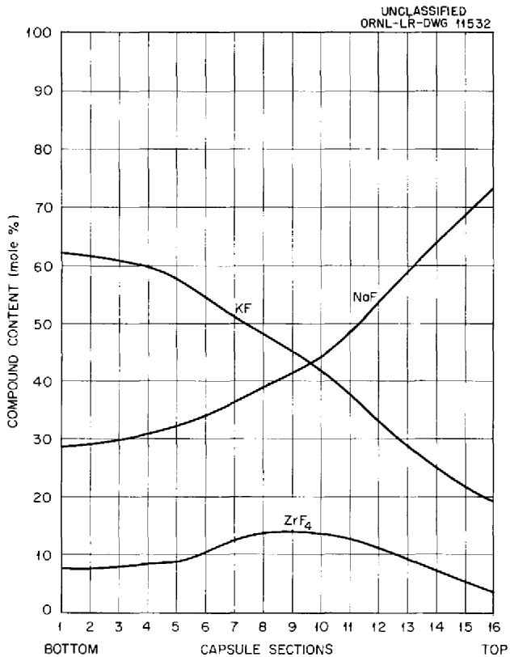  
Fig. 5.36. Results of Zone-Melting Experiments on NaF-KF-ZrF $_4$ (46-44-10 mole %). Mixture passed three times through hot zone of furnace at $900^{\circ}\mathrm{C}$ at a rate of 1 in./hr.

The results obtained for a mixture of NaF-KF-ZrF $_4$ (46-44-10 mole %) after three trips through the furnace are shown in Fig. 5.36. The capsule was cut into 1-in. sections for analysis. The bottom section (No. 11) contained the mixture which was approximately the eutectic mixture, while the top section contained a mixture that was 73.5 mole % NaF, 21 mole % KF, and 5.5 mole % ZrF $_4$ .

# 6. METALLURGY AND CERAMICS

W. D. Manly Metallurgy Division

The fabrication of radiators and heat exchangers for use in the heat exchanger development program was continued. Welded and brazed joints of heat exchanger job samples submitted by outside vendors were examined and evaluated. The two 500-kw high-conductivity-fin NaK-to-air radiators that failed in service were examined. The results of the examinations indicated the necessary modifications in design and fabrication techniques.

Results obtained to date in the brazing-alloy development program were correlated with corrosion data, and the alloys that are satisfactory for use in the fabrication of heat exchangers and radiators were selected.

Mechanical-property studies of nickel-molybdenum alloys were continued. Data were obtained on the influence of aging heat treatments on the creep properties of Hastelloy B, and a preliminary investigation was made of the creep properties of Hastelloy W and some new nickel-molybdenum alloys.

In studies of special materials, several composite billets were extruded successfully to form seamless duplex tubing; the billets were nickel-, Inconel-, and Monel-clad type 316 stainless steel. Methods for producing $\mathsf{B}_4\mathsf{C}$ tiles for use as neutron shielding were investigated. Tests are being developed for determining the optimum diffusion barrier for use between Inconel and niobium. A search was made for a material to use as a gamma-ray shield for the impeller shafts of ART pumps. Methods for preparing rare-earth-oxide core compacts for control rods were developed; and several iron-zirconium alloys were tested to determine their physical properties.

Nondestructive-testing equipment was developed for the inspection of small-diameter tubing by the eddy-current technique and by the use of ultrasound. An x-ray technique for the inspection of thick sections of beryllium was also investigated.

# FABRICATION OF TEST COMPONENTS

P. Patriarca

A.E.Goldman

R. E. Clausing

G. M. Slaughter

Metallurgy Division

R. L. Heestand, Pratt & Whitney Aircraft

# NaK-to-Air High-Conductivity-Fin Radiators

A third 500-kw NaK-to-air radiator with type 310 stainless-steel-clad copper high-conductivity fins was fabricated for use in tests in connection with the heat exchanger development program. The design of the radiator was essentially the same as that described and illustrated in a previous report, but a few modifications were made in fabrication technique. These modifications included the construction of a 36-hole punching die to obtain a more uniform fin-punching geometry, the construction of new tube-bending dies to ensure close control of the tube-bending variables, the development of techniques to permit the assembly of headers in such a manner that all tubes enter normal to the curvature of the header at the point of entrance, the application of the presintered-ring method of brazing-alloy preplacement, and the use of stearic acid as a lubricant during assembly of the fins.

A photograph of the radiator taken in the early stages of fin assembly is shown in Fig. 6.1. The wooden "finger" jigs and the felt-covered wooden support stand constructed to conform accurately to the contour of the tubes may be seen in the photograph. The tube bends and the manually inert-arc-welded tube-to-header joints may be seen in Fig. 6.2. The presintered brazing-alloy rings shown in Fig. 6.2 were adequate to back-brazze the tube-to-header joints, since they rested upon the headers in an inverted position during brazing. The completed radiator, with the support members used during brazing, is shown in Fig. 6.3. These supports were of welded-steel construction, and they incorporated sintered aluminum oxide rods at all mating surfaces between the radiator and the supports to minimize the possibility of brazing between them. The completed radiator is shown in Fig. 6.4, with the supports removed. A leck test with a helium mass spectrometer indicated that all welded and brazed joints were leaktight.

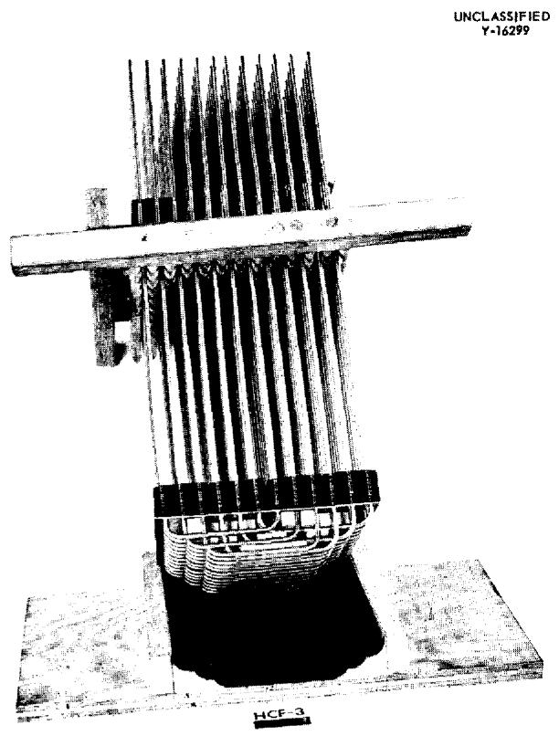

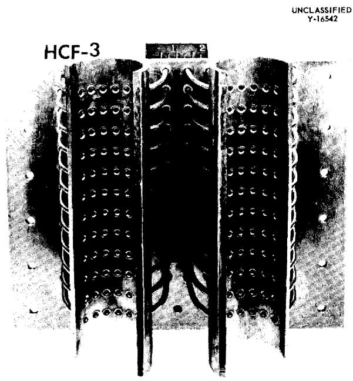  
Fig. 6.1. NaK-to-Air High-Conductivity-Fin Radiator in Early Stages of Fin Assembly.   
Fig. 6.2. NaK-to-Air Radiator Showing Manually Inert-Arc-Welded Tube-to-Header Joints and Tube Bends.

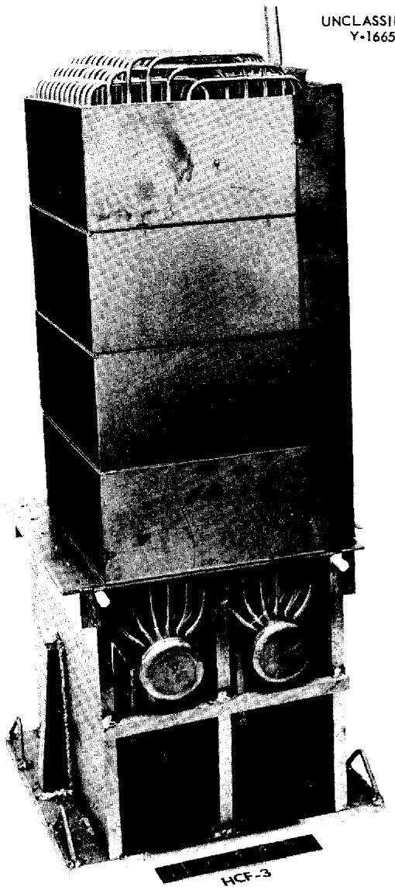

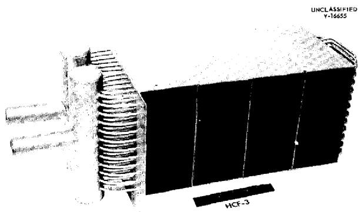  
Fig. 6.3. Completed NaK-to-Air Radiator Showing Support Members Used During Brazing.   
Fig. 6.4. Completed 500-kw NaK-to-Air Radiator.

# Twenty-Tube Fuel-to-NaK Heat Exchangers

Two additional 20-tube Inconel fused-fluoride-fuel-to-NaK heat exchangers were also fabricated for testing in connection with the heat exchanger development program. The fabrication of these

Fig. 6.5. Twenty-Tube Heat Exchanger Showing the "Window" Through Which the Brazing Alloy Was Preplaced.   
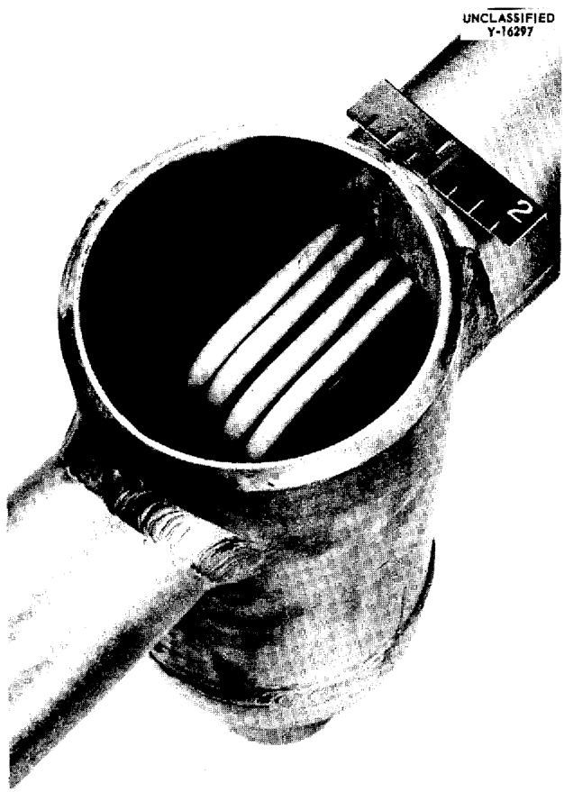  
UNCLASSIFIED Y-16296

heat exchangers involved manual inert-arc welding and subsequent back-brazing of the tube-to-header joints. Back-brazing was employed to eliminate the "notch-effect" that results from incomplete weld penetration and to reinforce areas of shallow weld penetration, which might otherwise develop leaks if they become corroded.

An evaluation of the corrosion resistance of various brazing alloys (Sec. 5, "Corrosion Research") has shown that low-melting Microbraz (LMNB) and Coast Metals alloy No. 52 are compatible with both NaK and fuel. Coast Metals alloy No. 52 was used in the fabrication of these tube bundles because its flowability characteristics are better than those of low-melting Microbraz.

Two brazing operations were required for each heat exchanger, since the Globar pit furnace available did not have a heating zone of sufficient length to heat both ends of the unit to the brazing temperature. A "window" was removed from the pressure shell to permit preplacement of the brazing alloy on each end of the tube bundle, as shown in Fig. 6.5. The window was subsequently welded shut, and helium leak-testing indicated that all welded and brazed joints were leaktight. A completed heat exchanger is shown in Fig. 6.6.

# Intermediate Heat Exchanger No. 3

The partial fabrication of the two tube bundles of intermediate heat exchanger No. 3 was described in the previous report. The welding and backbrazing of these units has now been completed, and all joints were found to be helium leaktight. A photograph of one end of the heat exchanger in an advanced stage of fabrication is presented in Fig. 6.7.

2P. Patriarca, G. M. Slaughter, and R. L. Heestand, ANP Quar. Prog. Rep. Sept. 10, 1955, ORNL-1947, p 134.

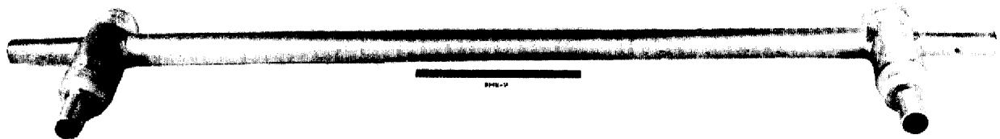  
Fig. 6.6. Completed 20-Tube Heat Exchanger.

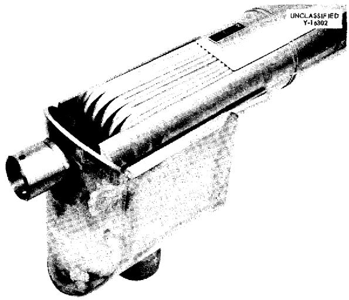  
Fig. 6.7. Intermediate Heat Exchanger No. 3 in an Advance Stage of Fabrication.

# Intermediate Heat Exchanger Job-Sample Evaluations

Job samples containing welded and brazed joints of the types used in intermediate heat exchanger No. 3 are being submitted by outside vendors for examination and evaluation. A typical job sample is shown in Fig. 6.8.

The butt welds of job samples are subjected to radiographic examination, and several metallographic sections are made of typical joints for examination and evaluation. Analyses of different areas of a joint have revealed areas of adequate quality and areas of definitely unsatisfactory quality. Examples of these conditions in tube-to-header welds of typical job samples are shown in Figs. 6.9 and 6.10. The condition illustrated in Fig. 6.10 is extremely serious and could not be seen by visual examination. Severe weld cracking was found in a radiator job sample, as shown in

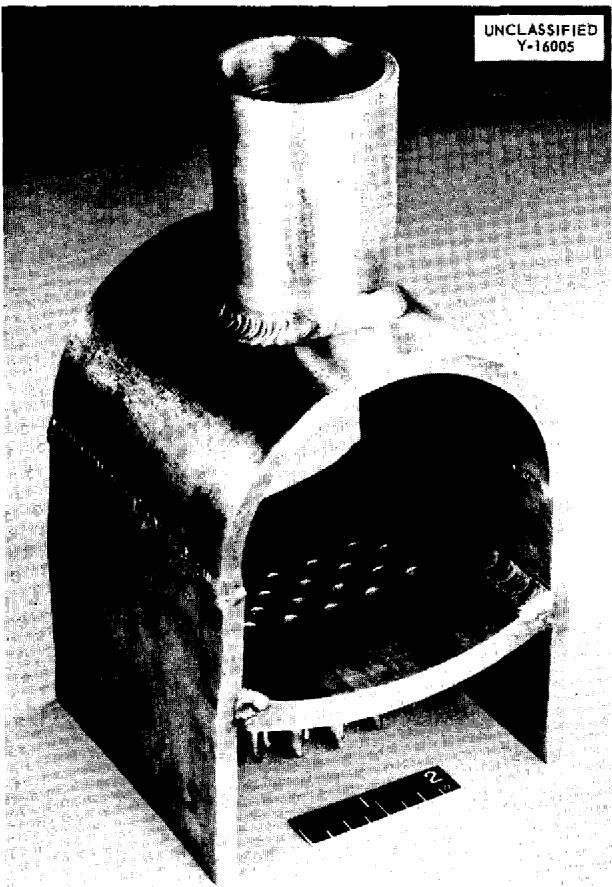  
Fig. 6.8. Job Sample of Typical Intermediate Heat Exchanger Welded and Brazed Joints.

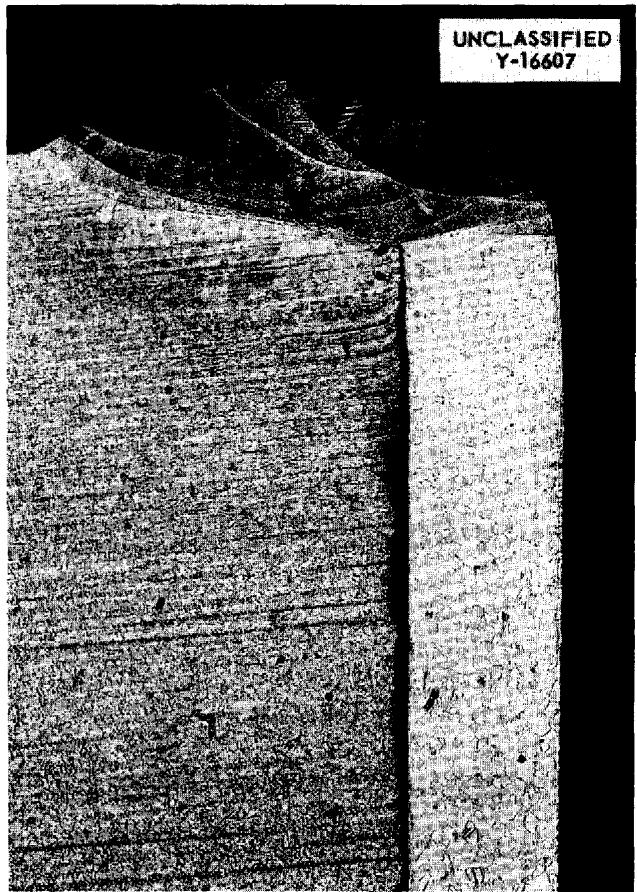  
Fig. 6.9. Tube-to-Header Weld Showing Adequate Penetration. Etched with oxalic acid. 24X.

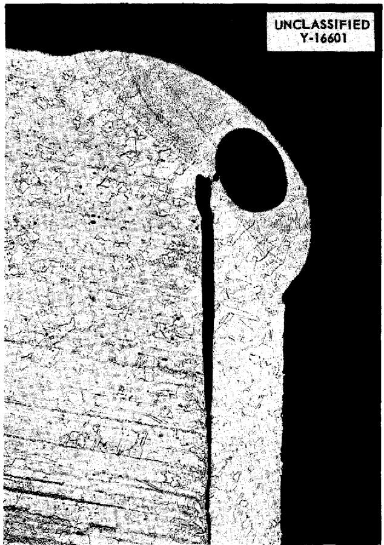  
Fig. 6.10. Tube-to-Header Weld Showing Unsatisfactory Porosity. Etched with oxalic acid. 24X.

Fig. 6.11. Root cracking in the welds of the heat exchanger samples was also found to be a problem, as shown in Fig. 6.12. Other joint defects, such as porosity, oxide inclusions, and inadequate brazing-alloy flowability, are also frequently found in job samples.

# Examination of NaK-to-Air Radiators That Failed in Service

A 500-kw high-conductivity-fin NaK-to-air radiator fabricated by the Metallurgy Division failed on July 24, 1955, as a result of a leak. This radiator, known as ORNL No. 1, had been in service at an elevated temperature for approximately 600 hr at the time of failure. During almost all the 600-hr period the system was isothermal, with temperatures in the range of 1000 to $1600^{\circ}\mathrm{F}$ . For approximately 66 hr of the total service time, the radiator operated

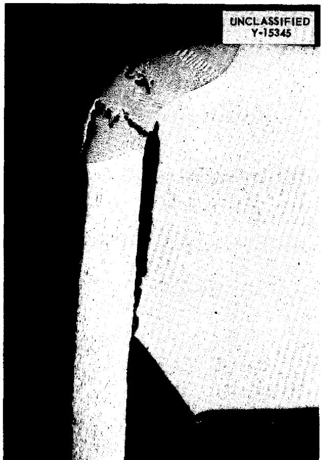  
Fig. 6.11. Tube-to-Header Weld Showing Severe Cracks. Etched with oxalic acid. 21X.

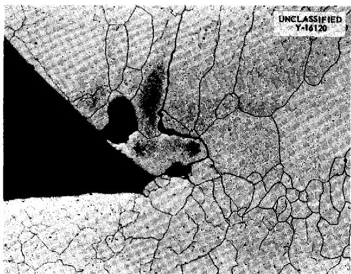  
Fig. 6.12. Intermediate Heat Exchanger Root Weld Showing Cracks. Etched with oxalic acid. 100X. Reduced $29\%$ .

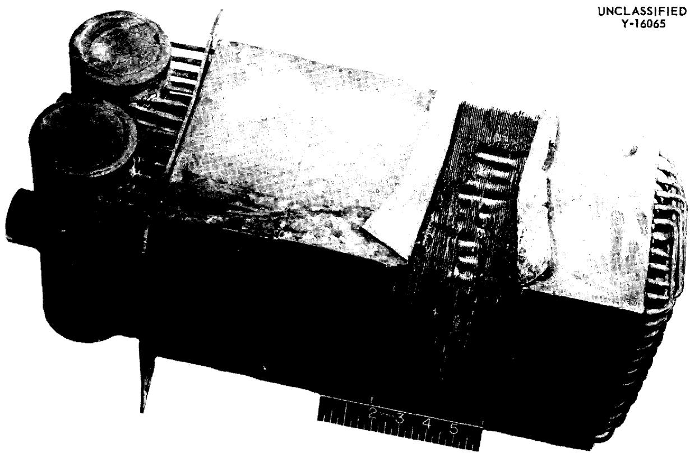  
Fig. 6.13. NaK-to-Air Radiator, ORNL No.1, Which Failed Because of a Leak After 600 hr of Service in the Temperature Range of 1000 to $1600^{\circ}\mathrm{F}$ .

with the blower on, and the temperature difference between the inlet and outlet NaK was 50 to $300^{\circ}\mathrm{F}$ . The radiator is shown in Fig. 6.13 as it appeared when received from the test site.

On September 6, 1955, one of the first 500-kw high-conductivity-fin radiators fabricated according to ORNL specifications by the York Corp. also failed as a result of a leak. This radiator survived approximately 150 hr of elevated-temperature service. During 80 hr of operation the system was isothermal, and there was a temperature difference in the NaK circuit during the remaining 70 hr of operation. Thus the service lives of the two radiators differed significantly only in the extent of isothermal service.

The York Corp. radiator is shown in Fig. 6.14 as it appeared when received from the test site. Since this failure was promptly detected and the NaK system was emptied immediately, the destruction caused by fire was less than that caused by the fire on the ORNL unit. The fire damage to the

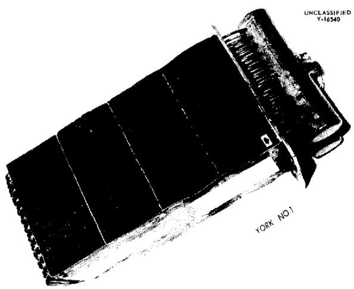  
Fig. 6.14. York Corp. NaK-to-Air Radiator No. 1, Which Failed After Approximately 150 hr of Elevated-Temperature Service in the Range 1000 to $1600^{\circ}\mathrm{F}$ .

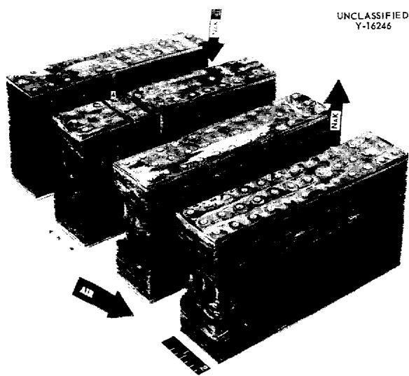  
Fig. 6.15. Sections of ORNL Radiator No. 1 Showing Fire Damage.

ORNL radiator was so extensive that a determination of the cause of the leak proved to be impossible. The sections of the ORNL radiator shown in Fig. 6.15 were so badly damaged by the fire that 27 gross leaks were detected when the sections were tested with water under pressure.

The partly sectioned York radiator is shown in Fig. 6.16, and an enlargement of the photograph of section 5 is shown in Fig. 6.17. Each tube in section 5 was tested with water under pressure, and the leak was located by observing the bubbles which emerged from the intersection of one of the tubes and the support member. The exact location of the leak is shown in Fig. 6.18. The arrow indicates the point of emergence of the water bubbles during the pressure test. This portion of section 5 was mounted intact for metallographic examination, and it was examined microscopically at frequent intervals while it was being ground down to the

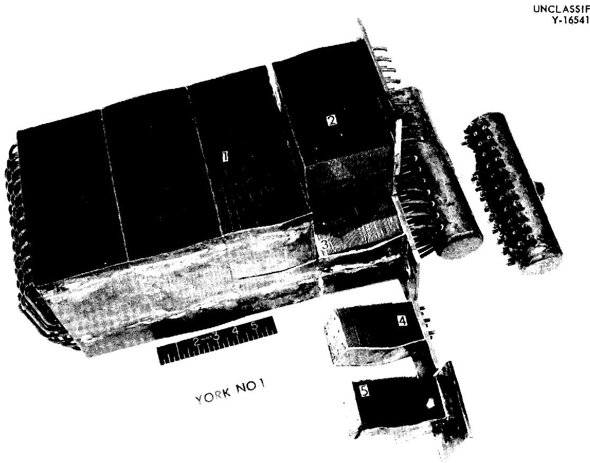  
Fig. 6.16. York Radiator No. 1 After Being Sectioned for Examination. Arrow in section 5 points to location of failure.

UNCLASSIFIED Y-16573

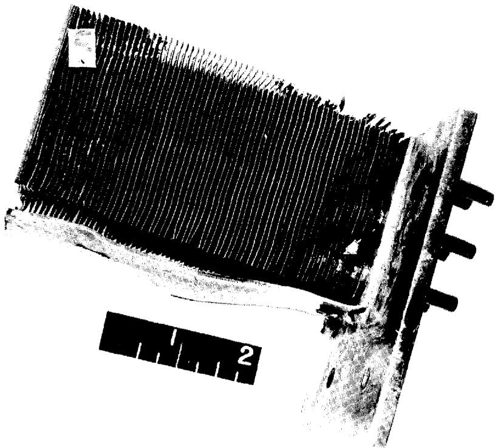  
Fig. 6.17. Enlargement of Photograph of Section 5 Showing Location of Failure.

hole through which NaK had leaked. Although time-consuming, this procedure was deemed necessary in order to ensure that metallographic evidence of the failure would not be destroyed.

Longitudinal sections through the tube that failed are shown in Figs. 6.19, 6.20, and 6.21. The ductile fracture and the reduction in tube wall thickness of approximately $23\%$ indicate that the failure was due primarily to tensile forces. A lateral shift of the tube is also evident, however, which indicates that shear forces may have been instrumental in initiating in the braze metal a fracture that was subsequently propagated by the tensile forces.

The tensile loading appears to have been the result of the restraining influence of the support members during the cooling of the fin surfaces by forced air. Buckling of these components is clearly evident in Figs. 6.14, 6.16, and 6.17. It may also be noted that the tube that failed was securely

brazed to the support member and to the bottom flanged plate, which were brazed to each other. Therefore shear loading may have resulted from the restraining influence of the bottom flanged plate during the cooling of the fin surfaces by forced air.

A tube adjacent to the tube that failed was also microscopically examined for evidence of fracture. This tube had been found to be leaktight in the pressure test, but, as may be seen in Fig. 6.22, a fracture was being propagated in this tube also. The reduction in tube wall thickness and the lateral displacement characteristic of the tube that failed may also be noted in Fig. 6.22. It is apparent therefore that the failure was not due to an isolated flaw. The examination was extended to include the two areas shown in Fig. 6.23, which were not near the tube that failed. A joint in area A of Fig. 6.23 is shown in Fig. 6.24. It may be noted that a fracture had gone through the braze fillet and was partly into the tube wall.

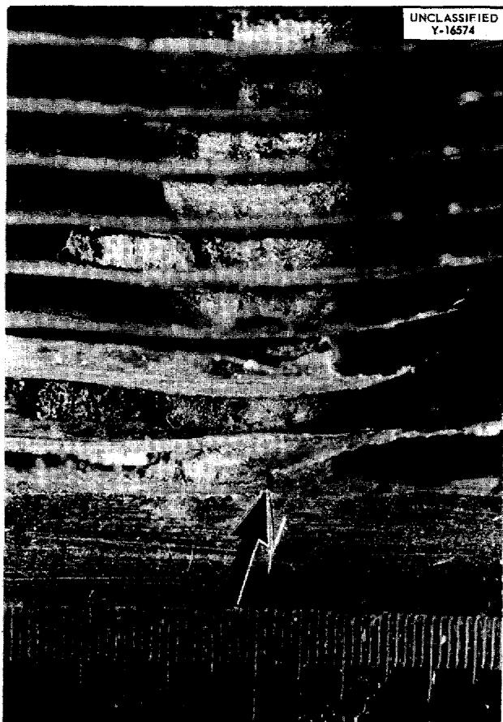  
Fig. 6.18. Point of Failure of York Radiator No. 1 As Detected by the Emergence of Water Bubbles Under Pressure.

It is evident that York Radiator No.1 failed because of the initiation of a fracture in a braze fillet by shear forces and the propagation of this fracture through the tube wall by tensile forces or combinations of shear and tensile forces. The tensile loading was caused by differences in cooling rates between the support members and the finned tubes when cooling air was forced across the high-conductivity-fin surfaces. The shear forces were caused by a difference in cooling rate between the support member and bottom flanged plate and the finned tubes. Modifications have been made to the radiator design to relieve the tensile and shear forces.

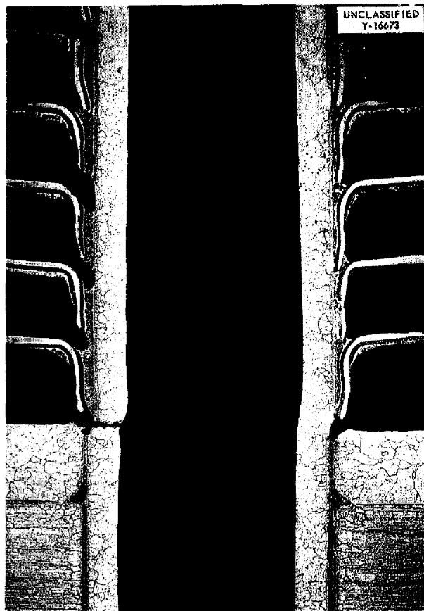  
Fig. 6.19. Longitudinal Section Through Tube That Failed. Note that the tube was securely brazed to both the support member and the bottom flanged plate.

# BRAZING-ALLOY DEVELOPMENT

P. Patriarca R.E.Clausing Metallurgy Division

Brazing alloys for use in high-temperature sodium-to-air applications should be compatible with both liquid sodium and air, since extensive tube wall dilution and diffusion during brazing and subsequent corrosion through an area of shallow weld penetration during service might result in a high concentration of brazing alloys being exposed to the liquid metal. Precious-metal brazing alloys were known to be incompatible with sodium and

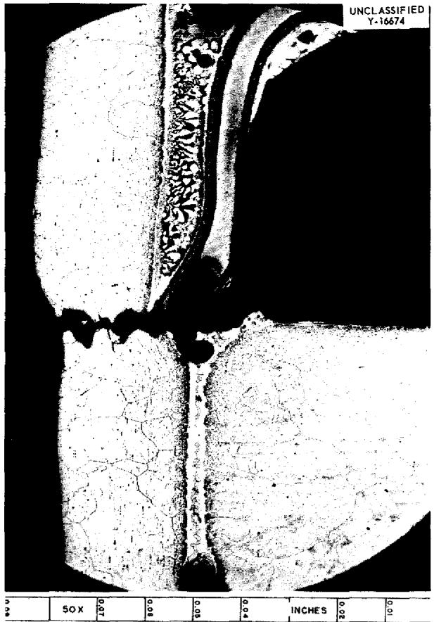  
Fig. 6.20. Enlargement of Photograph of Tube Wall Failure Shown in Fig. 6.19. Note the typical tensile failure.

were therefore eliminated from consideration, as were brazing alloys with poor oxidation resistance.

An analysis of the corrosion data obtained to date (Sec. 5, "Corrosion Research") indicates that the following alloys may be considered for use in radiator fabrication: Coast Metals alloys Nos. 50, 52, and 53; standard and low-melting Microbraz; General Electric alloy No. 81; and an alloy consisting of $80\%$ Ni- $10\%$ Cr- $10\%$ P. The Coast Metals alloy No. 52 is of particular interest because its flow temperature of $1020^{\circ}\mathrm{C}$ is sufficiently low to permit its use on radiators that have stainless-steel-clad copper high-conductivity fins. A brazing temperature higher than the melting point of copper is required for many of the other alloys; therefore their application is limited to radiators that have fins of a more conventional composition.

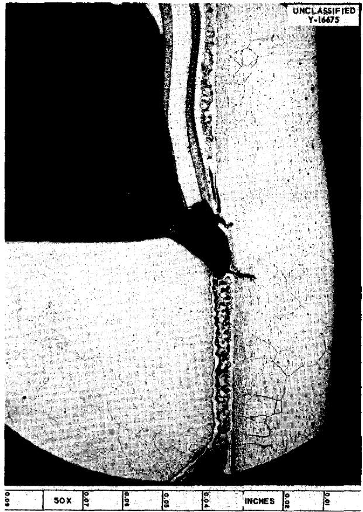  
Fig. 6.21. Enlargement of Photograph of Tube Wall Opposite the Point of Failure. Note fissure partly propagated through the tube wall.

An analysis of the corrosion data obtained to date for brazing alloys exposed to fluoride mixtures and to sodium indicates that the following alloys may be considered for use in heat exchanger fabrication: an alloy consisting of $80\%$ Ni-10% P-10% Cr; standard and low-melting Microbraz; Coast Metals alloys Nos. 50, 52, 53, and NP; an alloy consisting of $70\%$ Ni-13% Ge-11% Cr-6% Si; and an alloy consisting of $50\%$ Ni-25% Ge-25% Mo. The $80\%$ Ni-10% P-10% Cr alloy has limited application, even though it has good corrosion resistance to both liquids, because of its brittleness. Since it is important for the materials used in the fabrication of heat exchangers to have low nuclear cross sections, the $70\%$ Ni-13% Ge-11% Cr-6% Si alloy is of particular interest.

The optimum conditions for the use of the metal-spray process as a means of preplacing brazing

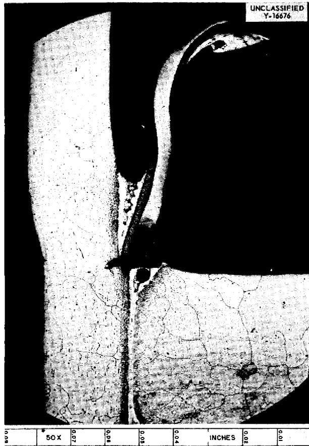  
Fig. 6.22. Fracture in Tube Adjacent to Tube That Failed.

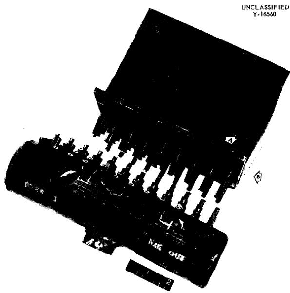  
Fig. 6.23. Additional Areas That Were Examined for Fractures.

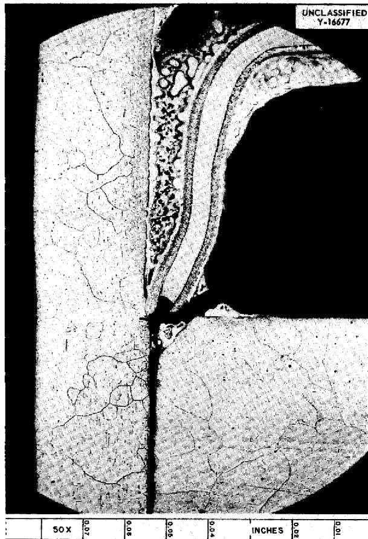  
Fig. 6.24. Fracture Started through Tube Wall in Area A of Fig. 6.23.

alloy on heat exchanger and radiator components are now being studied. Surface roughening by sandblasting or other methods appears to improve the bonding of the sprayed material. Tube-to-header specimens with excellent braze fillets have been prepared by placing short tubes in the drilled header holes during spraying of Coast Metals alloy No. 52. After the tubes were extracted and traces of brazing alloy were removed from the hole periphery by reaming, the header plate was assembled with tubes of the desired size and brazed. A spray thickness of approximately 0.010 in. was found to result in good filleting, but countersinking of the header on the sprayed side may vary the optimum thickness slightly.

Areas of the header which do not require spraying can be effectively masked with glass or asbestos tape. Conventional masking tape and aluminum oxide powder were found to be unsatisfactory for this purpose.

# MECHANICAL-PROPERTY STUDIES OF NICKEL-MOLYBDENUM ALLOYS

D. A. Douglas

J.R.Weir J.W.Woods

Metallurgy Division

# C. R. Kennedy, Pratt & Whitney Aircraft

Alloys in the nickel-molybdenum system are being investigated in the search for alloys with sufficient corrosion resistance and high-temperature strength for use in circulating-fuel aircraft reactors. In a series of creep-rupture tests, Hastelloy B has been shown to have good high-temperature strength and corrosion resistance. However, over a portion of the intended service-temperature range it exhibits very poor ductility because of its age-hardening characteristics. Although the age hardening markedly improves the creep strength of the material, the resultant loss of ductility restricts its usefulness in the 1200 to $1500^{\circ}\mathrm{F}$ temperature range.

# Influence of Aging Heat Treatments on the Creep Properties of Hastelloy B

The effect of age hardening on the creep characteristics of Hastelloy B has been investigated in tests of materials in the solution-annealed and the age-hardened conditions at temperatures from 1300 to $1800^{\circ}\mathrm{F}$ . In general, the aged specimens have shown marked reductions in initial creep rate and in tensile elongation when compared with the solution-annealed specimens. Aged specimens tested at $1500^{\circ}\mathrm{F}$ show an increase in time-to-rupture, with a corresponding decrease in ductility, when compared with the solution-annealed specimens. Creep curves for solution-annealed and aged specimens tested at $1500^{\circ}\mathrm{F}$ and a stress of 12,000 psi are presented in Fig. 6.25. It would be predicted from the nickel-molybdenum phase diagram that Hastelloy B would be a solid-solution alloy at $1650^{\circ}\mathrm{F}$ and that there would be little difference in the creep properties of aged and solution-annealed specimens. However, as may be seen in Fig. 6.26, the initial creep rates are lower and third-stage creep is initiated much earlier for the aged specimens than for the annealed specimens. The result is a somewhat shorter rupture life and less total elongation at failure for the aged material. In the tests at $1800^{\circ}\mathrm{F}$ , the specimens were in the

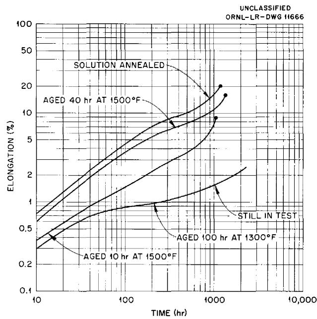  
Fig. 6.25. Creep-Rupture Curves for Solution-Annealed and Aged Hastelloy B Sheet Tested at $1500^{\circ}\mathsf{F}$ in Argon at a Stress of 12,000 psi.

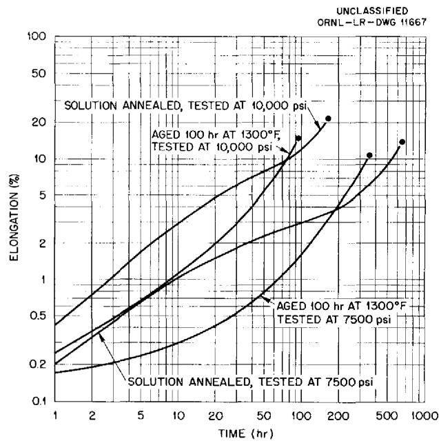  
Fig. 6.26. Creep-Rupture Curves for Solution-Annealed and Aged Hastelloy B Sheet Tested at $1650^{\circ}F$ in Argon at Stresses of 7,500 and 10,000 psi.

alpha solid-solution range, and the pattern shown in Fig. 6.26 was again obtained, as shown in Fig. 6.27. This rather peculiar behavior can be explained by considering the rates of solution of precipitates previously formed by aging. Hardness tests and metallographic examinations have shown that the molybdenum-rich phase is very slow to precipitate from a supersaturated lattice and slow to redissolve into the matrix when heated into the solid-solution temperature range. It has also been shown that strain tends to accelerate these reactions. Thus it would be expected that the aged specimens would exhibit lower initial strains and creep rates at 1650 and $1800^{\circ}\mathrm{F}$ than would the solution-annealed material, since the precipitates would not have had time to go back into solution during the early portion of the test. As the test progresses, the precipitates in the grain-boundary regions tend to go into solution faster than those within the grains because of the greater strains at the boundary regions. This results in the weakening of the grain boundaries occurring at a faster rate than does the weakening of the bulk of the grains. Chang and Grant3 have observed that the

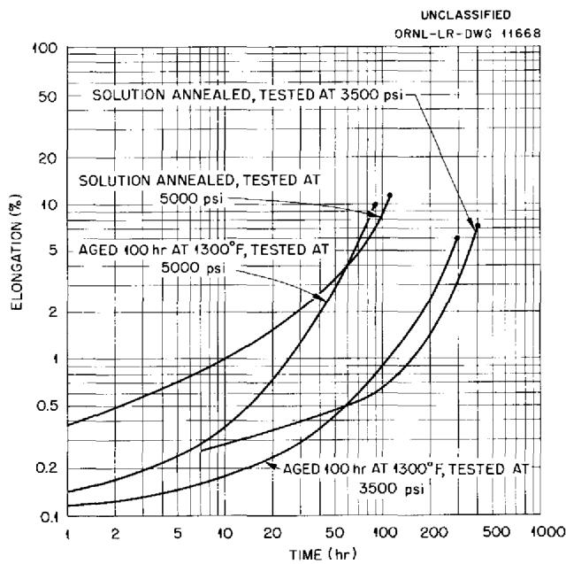  
Fig. 6.27. Creep-Rupture Curves for Solution-Annealed and Aged Hastelloy B Sheet Tested at $1800^{\circ}\mathsf{F}$ in Argon at Stresses of 3500 and 5000 psi.

initiation and propagation of intergranular cracking is controlled by the ability of the grains to accommodate the deformation produced by grain-boundary sliding. In the case of solution-annealed material there are no precipitates to inhibit grain-boundary sliding, and the rate of deformation is more rapid. However, the grains can accommodate a considerable amount of deformation before intergranular cracking begins, and the rate of propagation is relatively slow. In the aged material there is considerable resistance to deformation until the precipitates in the grain boundaries begin to go into solution. When this occurs, the rate of straining increases. However, the grains still contain precipitates, and their ability to accommodate deformation is considerably less than that of the grains in the solution-annealed material. Thus intergranular cracking is initiated in the aged specimens fairly early in the test period, and propagation of these cracks is rather rapid; the result is the acceleration of the third-stage creep of the aged material.

# Preliminary Investigation of Creep Properties of Hastelloy W

Preliminary testing of Hastelloy W is now in progress in order to evaluate the creep properties of this alloy, which has approximately the same composition as that of Hastelloy B, except that $3\%$ of the molybdenum and $2\%$ of the nickel have been replaced with chromium. Results obtained thus far indicate that the age-hardening characteristics of Hastelloy W are different from those of Hastelloy B and that there may be an increase in ductility in the 1200 to $1500^{\circ}\mathrm{F}$ temperature range in comparison with the ductility of Hastelloy B in that temperature range.

# Investigation of the Creep Properties of Some New Nickel-Molybdenum Alloys

New alloys of the nickel-molybdenum alloy system are being investigated in a search for a structural material with the excellent corrosion resistance and high-temperature strength of Hastelloy B but without the objectionable brittleness of Hastelloy B in the temperature range of 1200 to $1500^{\circ}\mathrm{F}$ . The results of tests of time to 1, 2, and $5\%$ elongation and of time-to-rupture for the various vacuum-melted alloys studied in the past few months are compared in Fig. 6.28. The alloys tested were solution annealed at $2100^{\circ}\mathrm{F}$ . All tests were performed in an atmosphere of argon at $1500^{\circ}\mathrm{F}$ ,

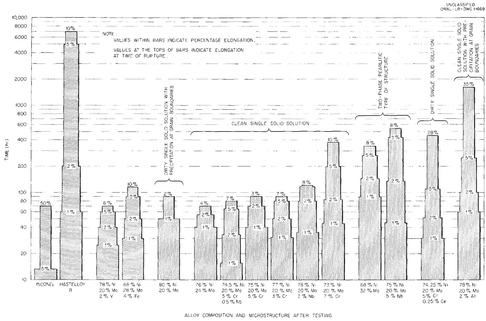  
Fig. 6.28. Comparison of Times to 1, 2, and $5\%$ Elongation and to Rupture for Several Vacuum-Melted Solution-Annealed Nickel-Molybdenum Alloys, Inconel, and Hastelloy B Stressed at 8000 psi in Argon at $1500^{\circ}$ F.

with the solution-annealed specimen stressed at 8000 psi. Data on Inconel and Hastelloy B are included for comparison.

The low ductility of some of the alloys indicates that the vacuum-melting technique used in their preparation did not completely remove gases from the material. This conclusion is strengthened by a comparison of the ductility of the alloys with and without added deoxidants, such as cerium or aluminum. The addition of $0.25\%$ cerium to the $75\%$ Ni- $20\%$ Mo- $5\%$ Cr alloy increased the ductility from 3 to $28\%$ elongation at rupture, and the addition of $2\%$ aluminum to the $80\%$ Ni- $20\%$ Mo alloy increased the ductility from 2 to $35\%$ elongation at rupture; the times-to-rupture for these alloys were correspondingly increased by the addition of the deoxidants.

In general, it appears that the chromium content of a nickel-molybdenum alloy must be at least $7\%$ before there is an appreciable increase in strength and that an alloy containing $5\%$ niobium, because of the resulting two-phase structure, is significantly stronger than a similar alloy with only $2\%$ niobium. It should be noted that, despite the poor ductility of these alloys, their stress-rupture properties are equal to or superior to those of Inconel.

Several trends may be noted in the correlation between the microstructure and the creep properties of these alloys. Precipitation of an insoluble second phase takes place very slowly in these nickel-molybdenum alloys, and therefore the microstructure may change considerably during a test of long duration. Such a microstructure change may be seen by comparing Fig. 6.29 with Fig. 6.30. Figure 6.29 shows a $75\%$ Ni- $20\%$ Mo- $5\%$ Cr alloy which ruptured in 90 hr with an elongation of $3\%$ at a stress of 8000 psi. As may be seen, the alloy was still in the solution-annealed condition after rupture. However, the microstructure (Fig. 6.30) for a specimen with the same composition, which ruptured in 1700 hr with an elongation of $7.4\%$ at a stress of 5000 psi, shows precipitation of a second phase on slip planes.

The inherently fine-grained structure that results from adding $0.5\%$ Nb to a $75\%$ Ni- $20\%$ Mo- $5\%$ Cr alloy is shown in Fig. 6.31. A five-grained structure also results from the addition of $0.25\%$ Ce to this alloy, as shown in Fig. 6.32. The microstructures of several of the other alloys after they were tested are shown in Figs. 6.33 to 6.40. In

Figs. 6.29 through 6.40 both stressed and unstressed portions of the specimen are shown, except for Fig. 6.36, in which only the stressed portion is shown.

# SPECIAL MATERIALS STUDIES

J. H. Coobs

J.P.Page

H. Inouye

T. K. Roche

Metallurgy Division

M. R. D'Amore, Pratt & Whitney Aircraft

# Extrusion of Seamless Duplex Tubing

T. K. Roche

H. Inouye

Metallurgy Division

Preliminary work in developing seamless duplex tubing has progressed to the extent that several composite billets have been extruded to tube blanks. Little difficulty was experienced in extruding nickel-, Inconel-, and Monel-clad type 316 stainless steel billets; however, the extrusion of Hastelloy B-clad type 316 stainless steel remains problematical. Surface cracking of the Hastelloy B occurred, which was apparently indicative of the hot shortness observed previously in the extrusion of this alloy. It had been concluded from past experiments that the successful extrusion of Hastelloy B was largely temperature dependent and that an extrusion temperature of approximately $2000^{\circ}\mathrm{F}$ was optimum for the prevention of defects. However, the difficulties recently encountered even at $2000^{\circ}\mathrm{F}$ indicate that the melting practice and the billet lubrication must be given more careful consideration if Hastelloy B is to be successfully extruded.

Forged billets of Hastelloy W could not be extruded as tube blanks at $2000^{\circ}\mathrm{F}$ . Two Inconel-canned billets of this material shattered, even at a moderate reduction ratio, and one uncanned billet stalled the press. It is felt that the extrusion of the uncanned billet failed because of an excessive drop in the billet temperature that was due to faulty preheating practice.

Flame-spraying of Hastelloy B with type 304 stainless steel for lubrication improved the extrudability slightly. Two extruded tube blanks of this type had roughened surfaces, and, in addition, one showed signs of surface cracking. The results of the extrusion experiments mentioned above are presented in Table 6.1.

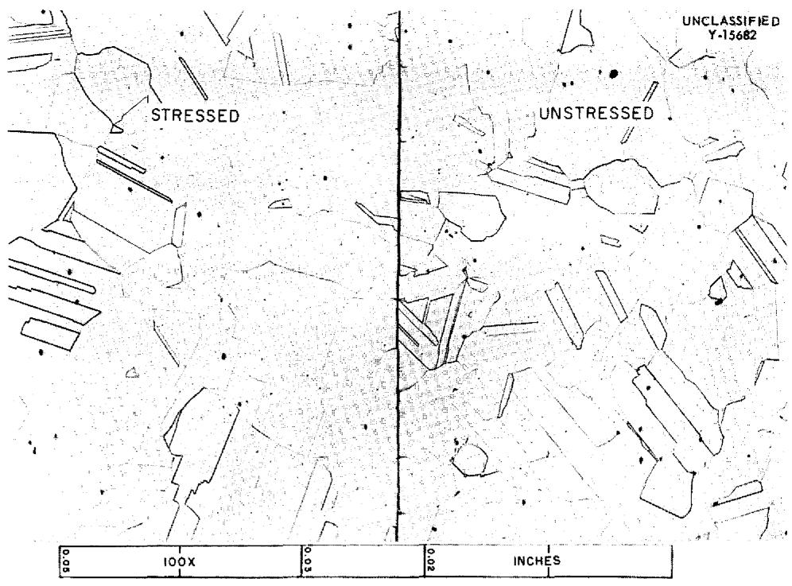

Fig. 6.29. A $75\%$ Ni- $20\%$ Mo- $5\%$ Cr Alloy Specimen Which Ruptured in 90 hr with an Elongation of $3\%$ at a Stress of 8000 psi in Argon at $1500^{\circ}$ F. 100X. Reduced $22\%$ .

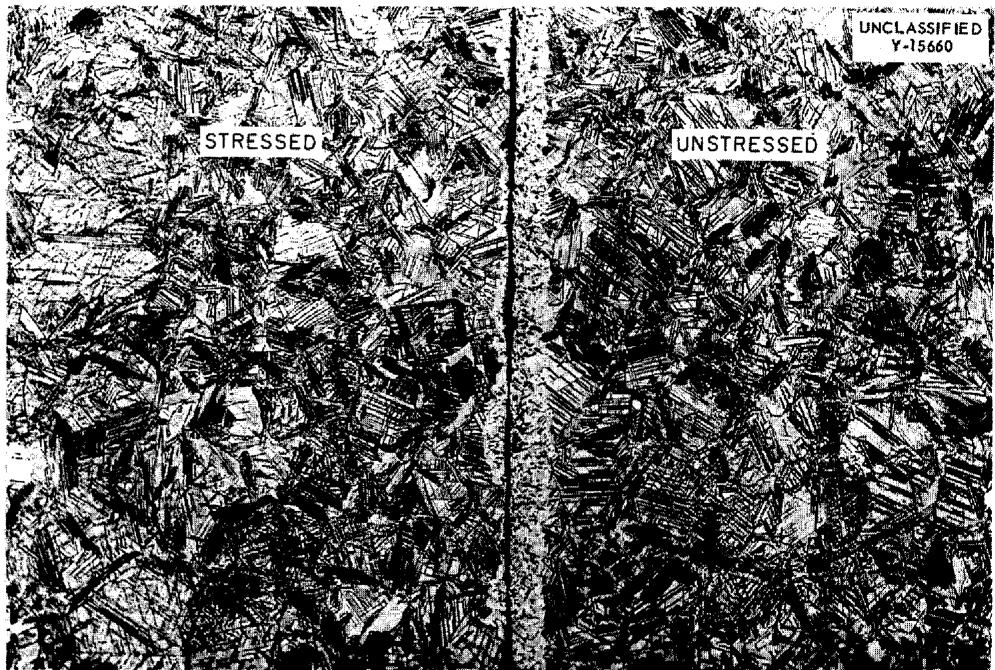  
Fig. 6.30. A $75\%$ Ni- $20\%$ Mo- $5\%$ Cr Alloy Specimen Which Ruptured in 1700 hr with an Elongation of $7.4\%$ at a Stress of 5000 psi in Argon at $1500^{\circ}\mathrm{F}$ . Reduced $22\%$ .

<table><tr><td>100X</td><td>0</td><td>0</td><td>INCHES</td></tr></table>

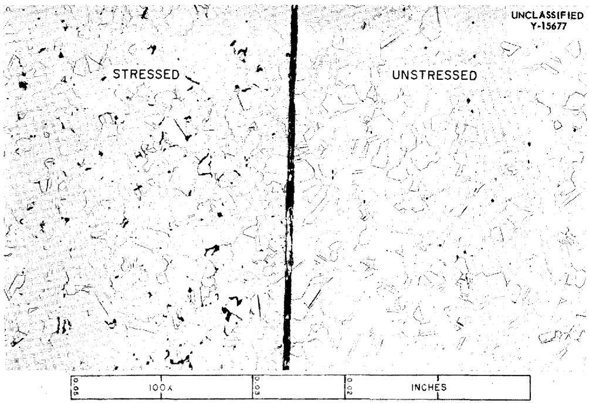  
Fig. 6.31. A $74.5\%$ Ni- $20\%$ Mo- $5\%$ Cr- $0.5\%$ Nb Alloy Which Ruptured in 77 hr with an Elongation of $7.6\%$ at a Stress of 8000 psi in Argon at $1500^{\circ}$ F. 100X. Reduced $20\%$ .

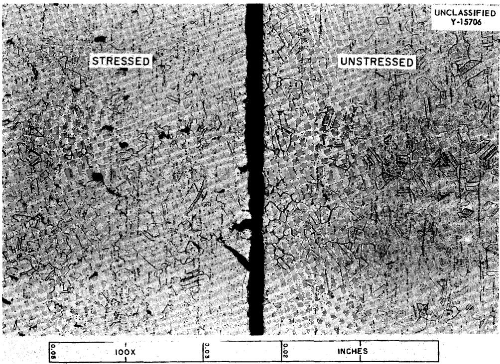  
Fig. 6.32. A $74.75\%$ Ni- $20\%$ Mo- $5\%$ Cr- $0.25\%$ Ce Alloy Which Ruptured in 440 hr with an Elongation of $28\%$ at a Stress of 8000 psi in Argon at $1500^{\circ}\mathrm{F}$ . Reduced $20\%$ .

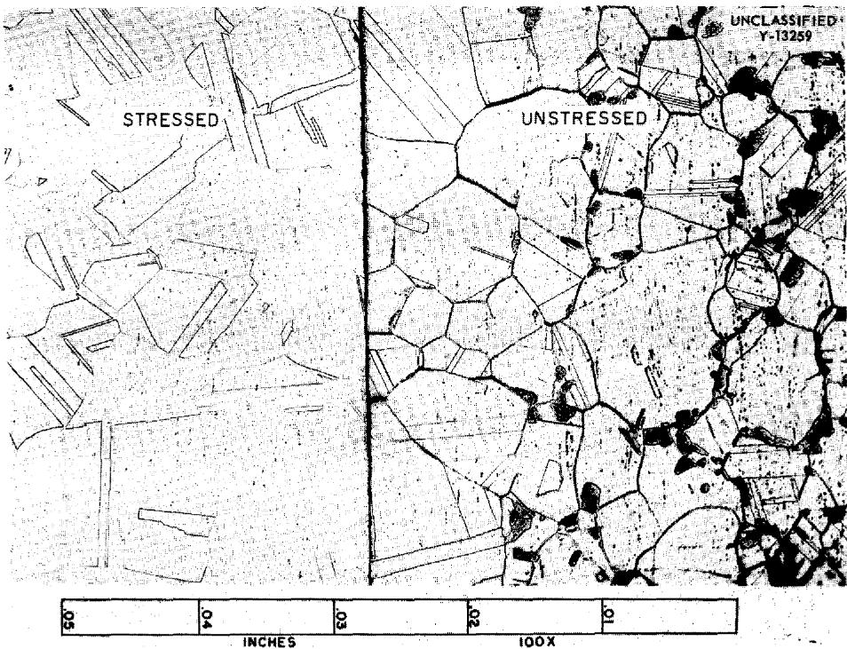

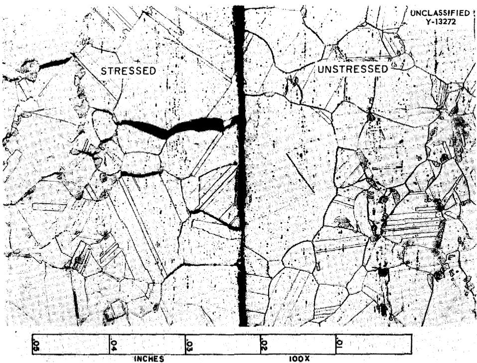  
Fig. 6.33. An $80\%$ Ni- $20\%$ Mo Alloy Which Ruptured in 91 hr with an Elongation of $2\%$ at a Stress of 8000 psi in Argon at $1500^{\circ}$ F. 100X. Reduced $23\%$ .   
Fig. 6.34. An $80\%$ Ni-20% Mo Alloy Which Ruptured in 763 hr with an Elongation of $5\%$ at a Stress of 5000 psi in Argon at $1500^{\circ}\mathrm{F}$ . 100X. Reduced $23\%$ .

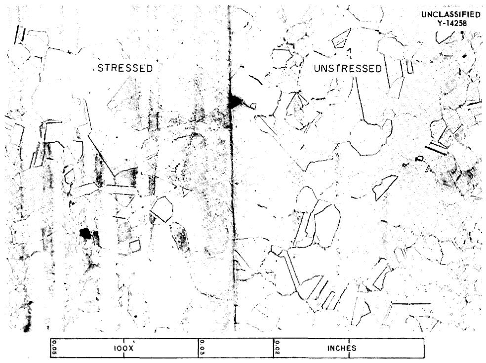  
Fig. 6.35. A $76\%$ Ni-24% Mo Alloy Which Ruptured in 68 hr with an Elongation of $4\%$ at a Stress of 8000 psi in Argon at $1500^{\circ}\mathrm{F}$ . 100X. Reduced $22.5\%$ .

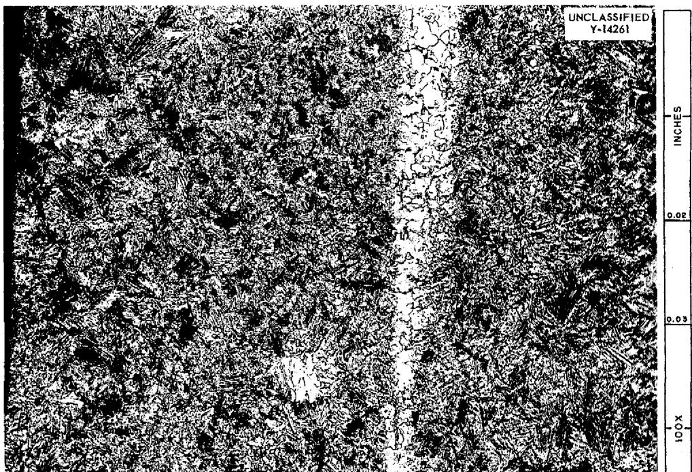  
Fig. 6.36. A $68\%$ Ni- $32\%$ Mo Alloy Which Ruptured in 332 hr with an Elongation of $8\%$ at a Stress of 8000 psi in Argon at $1500^{\circ}\mathrm{F}$ . 100X. Reduced $22.5\%$ .

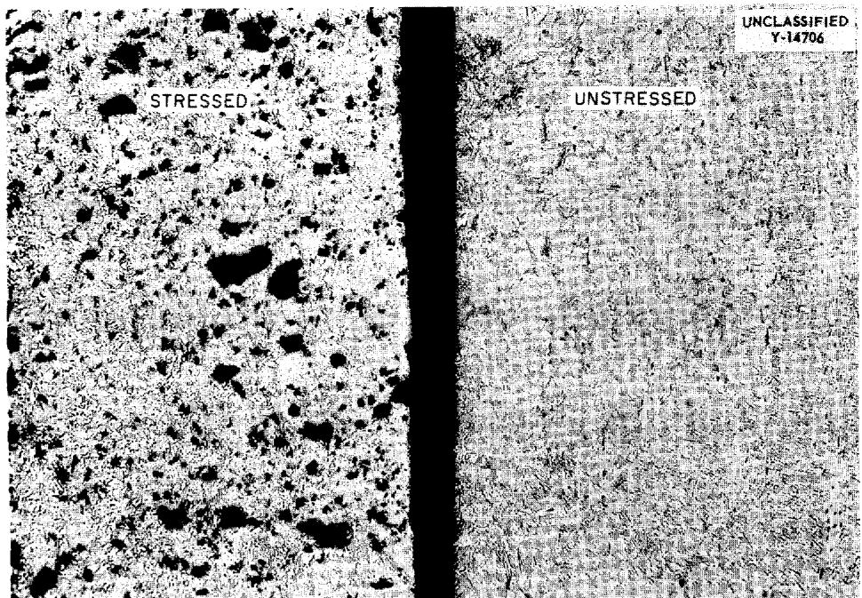

<table><tr><td>100X</td><td></td><td></td><td>INCHES</td></tr></table>

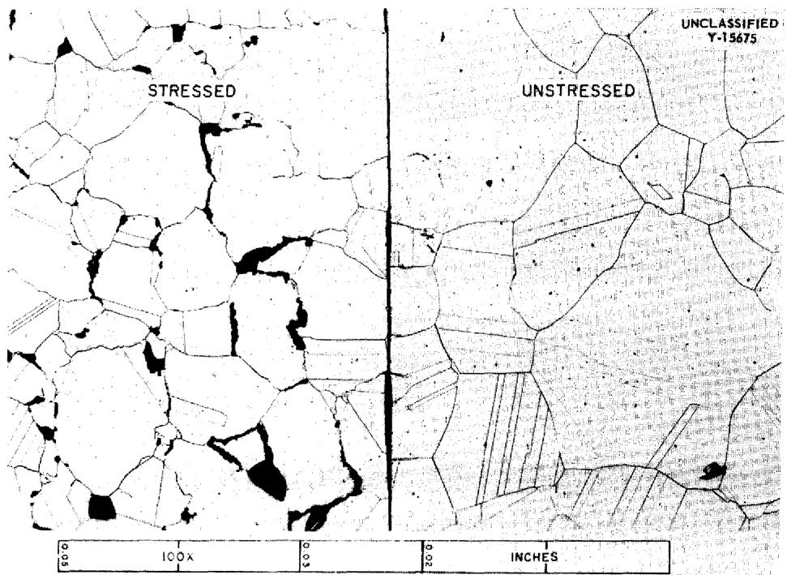  
Fig. 6.37. A $68\%$ Ni- $32\%$ Mo Alloy Which Ruptured in 715 hr with an Elongation of $33\%$ at a Stress of 5000 psi in Argon at $1500^{\circ}$ F. 100X. Reduced $23\%$ .   
Fig. 6.38. A $77\%$ Ni- $20\%$ Mo- $3\%$ Cr Alloy Which Ruptured in 674 hr with an Elongation of $8\%$ at a Stress of 5000 psi in Argon at $1500^{\circ}\mathrm{F}$ . 100X. Reduced $23\%$ .

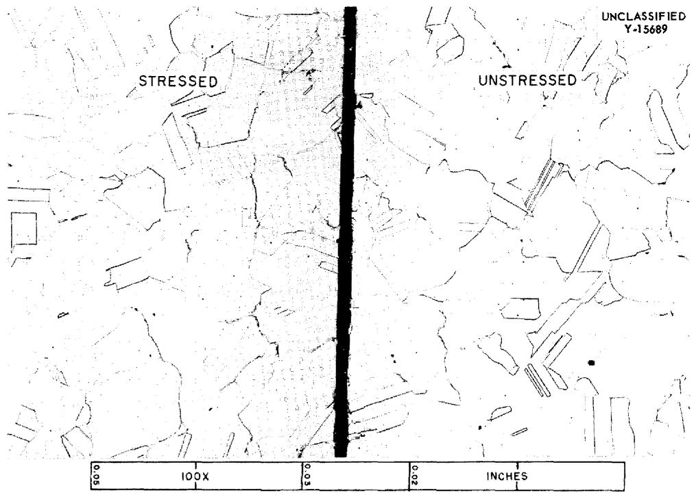  
Fig. 6.39. A $73\%$ Ni- $20\%$ Mo- $7\%$ Cr Alloy Which Ruptured in 373 hr with an Elongation of $10\%$ at a Stress of 8000 psi in Argon at $1500^{\circ}\mathrm{F}$ . 100X. Reduced $21\%$ .

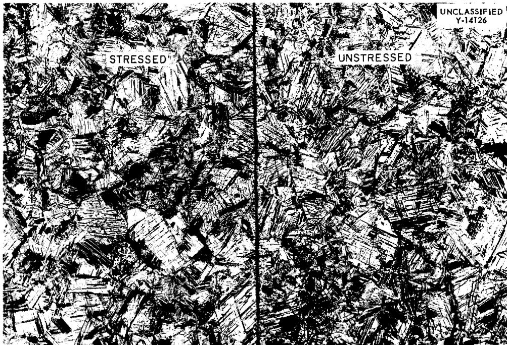

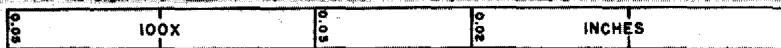  
Fig. 6.40. A $75\%$ Ni- $20\%$ Mo- $5\%$ Nb Alloy Which Ruptured in 530 hr with an Elongation of $8\%$ at a Stress of 8000 psi in Argon at $1500^{\circ}\mathrm{F}$ . 100X. Reduced $21\%$ .

Billet size: 3 in. in diameter

TABLE 6.1. RESULTS OF EXTRUSION OF TUBE BLANKS   

<table><tr><td>Number Extruded</td><td>Composition of Billet</td><td>Soaking Temperature (°F)</td><td>Reduction Ratio</td><td>Remarks</td></tr><tr><td>3</td><td>Nickel-type 316 stainless steel (duplex tube)</td><td>2100</td><td>9:1</td><td>Good tube blanks obtained</td></tr><tr><td>3</td><td>Inconel-type 316 stainless steel (duplex tube)</td><td>2100</td><td>9:1</td><td>Good tube blanks obtained</td></tr><tr><td>3</td><td>Monel-type 316 stainless steel (duplex tube)</td><td>2050</td><td>9:1</td><td>Good tube blanks obtained</td></tr><tr><td>3</td><td>Hastelloy B-type 316 stainless steel (duplex tube)</td><td>2050</td><td>9:1</td><td>Surface of Hastelloy B was somewhat roughened in all three extrusions; two extrusions showed evidence of cracking</td></tr><tr><td>2</td><td>Hastelloy B (flame-sprayed with type 304 stainless steel)</td><td>2050</td><td>9:1</td><td>Surfaces of both extrusions were somewhat roughened; one extrusion cracked</td></tr><tr><td>2</td><td>Hastelloy W (Inconel canned)</td><td>2050</td><td>7:1</td><td>Both extrusions shattered</td></tr><tr><td>1</td><td>Hastelloy W (uncanned)</td><td>2050</td><td>5.5:1</td><td>Did not extrude</td></tr></table>

Six laboratory-prepared alloys were successfully extruded to rod form for corrosion studies. The compositions of the billets extruded and the reduction ratios used are tabulated below (the soaking temperature used was $2150^{\circ}\mathrm{F}$ in each case):

<table><tr><td>Billet Composition (wt %)</td><td>Reduction Ratio</td></tr><tr><td>80 Fe-20 Cr</td><td>13:1</td></tr><tr><td>80 Fe-10 Cr-10 Ni</td><td>10:1</td></tr><tr><td>74 Fe-18 Cr-8 Ni</td><td>10:1</td></tr><tr><td>60 Fe-20 Cr-20 Ni</td><td>10:1</td></tr><tr><td>90 Ni-10 Mo</td><td>10:1</td></tr><tr><td>80 Ni-10 Mo-10 Fe</td><td>10:1</td></tr></table>

# Neutron Shielding Material for ART

H. Inouye, Metallurgy Division

M. R. D'Amore, Pratt & Whitney Aircraft

Methods for producing $\mathsf{B}_4\mathsf{C}$ tiles to be used as neutron shielding for the ART are being studied. The Norton Company and The Carborundum Company are cooperating in this investigation. Since the neutron shield will be at a temperature of 1500 to $2000^{\circ}\mathsf{F}$ when the reactor is operating, studies are

also being made of the compatibility of Inconel and $\mathsf{B}_4\mathsf{C}$ in this temperature range. Previously reported studies indicate that carburization occurs at the grain boundaries and that metallic borides are formed. A coating, or barrier, material that is inert both to $\mathsf{B}_4\mathsf{C}$ and to Inconel will therefore be required. Tests of possible barrier materials are under way.

Studies are also being conducted to determine the effects of irradiation on $\mathsf{B}_4\mathsf{C}$ at the expected service temperatures. Neutron capture by boron results in the production of helium and lithium, which are reported4 to be retained interstitially in the $\mathsf{B}_4\mathsf{C}$ lattice at temperatures below $1650^{\circ}\mathsf{F}$ . There is evidence, however, that the helium and, possibly, the lithium are released at some higher temperature.

Plates of $\mathsf{B}_4\mathsf{C}$ with a metallic binder are also being investigated, since they would have better thermal-conductivity, expansion, and shock-resistant properties. The plates can be fabricated

by using the picture-frame technique to hot roll cold-pressed, sintered, powder mixtures or by extruding warm-pressed billets of the powder mixtures. A layer, equivalent to 0.010 in. of $\mathsf{B}^{10}$ , that is thermally bonded to the inside wall of the Inconel shell will be required if the metal-bonded $\mathsf{B}_4\mathsf{C}$ plates are used.

Tests of the reactions between $\mathsf{B}_4\mathsf{C}$ , binder, and Inconel shell at the service temperature are under way, and possible methods for applying the thin layer to the shell are being investigated.

# Inconel-Clad Niobium

H. Inouye J.P. Page

Metallurgy Division

The search for a diffusion barrier to use between Inconel and niobium in high-temperature applications has been continued. Tantalum foils and copper-stainless steel foils were selected as the most promising of several barrier materials on the basis of bend tests and metallographic examination of pieces in the as-rolled condition and after 100-and 500-hr service tests at $900^{\circ}\mathrm{C}$ . These types of qualitative tests are being used to check earlier data obtained with molybdenum and titanium as the barrier materials and to obtain data on other barrier materials (iron, at present). A test procedure is also being developed for obtaining quantitative data on the mechanical properties of Inconel-clad niobium with tantalum and copper-stainless steel diffusion barriers. When a satisfactory test program has been devised, data will be obtained to determine the optimum diffusion barrier.

# Gamma-Ray Shield Material for ART Pumps

J.H.Coobs J.P.Page

Metallurgy Division

A material having the following properties is needed for use as a gamma-shield heat dam around the impeller shafts of ART pumps: density of over $13.0~\mathrm{g / cm^3}$ , thermal conductivity of less than 0.12 cal/cm²·sec·(°C/cm) at $1400^{\circ}\mathrm{F}$ , brazeability to Inconel, and a coefficient of thermal expansion similar to that of Inconel, that is, between 10 and 20 $\mu \mathrm{in}.$ /in.°C. There are no known materials that fulfill all these requirements, but it is thought that a satisfactory two-component material can be fabricated by powder-metallurgy techniques. A high-density "filler" material would be used, along with another material which would act as a binder and would "insulate" the compact. From considera

tions of thermal conductivity, coefficient of expansion, brazeability, and ease of fabrication, the nickel-base alloys appear to be the most promising for use as binder material, especially the Hastelloy's and constantan. Calculations of the limiting cases of series and parallel heat flow indicate that the filler material must be either tungsten carbide or tantalum.

Several tantalum-constantan compacts have been successfully hot-pressed to densities of greater than $13\mathrm{g/cm^3}$ . The tantalum-base material is far superior to the tungsten carbide-base material from the standpoint of fabricability. However, metallographic examination indicates a strong tantalum-nickel reaction that results in virtual separation of the nickel from the constantan. This separation could cause variations in the thermal conductivity and could cause the thermal conductivity to be above the specified limit. Similar investigations of a tungsten carbide-constantan compact shows that the carbide is held in a homogeneous constantan matrix. An apparatus is being fabricated for use in determining the thermal conductivities of these and similar mixtures.

# Control-Rod Fabrication

J.H.Coobs H.Inouye

Metallurgy Division

Two core compacts for control rods were prepared by cold pressing and sintering 35 vol $\%$ $(\mathrm{Gd - Sm})_2\mathrm{O}_3$ in copper and in iron to densities of 79 and $82\%$ , respectively. The iron mixture was sintered at $1100^{\circ}\mathrm{C}$ and the copper mixture was sintered at $980^{\circ}\mathrm{C}$ . The core compacts were then canned in stainless steel, were evacuated, and were hot-swaged for a total reduction of $75\%$ in seven passes, with the compact being reheated to $950^{\circ}\mathrm{C}$ between passes. The active sections of the finished rods were $\frac{1}{2}$ in. in diameter and 7 in. in length.

The cores were well compacted, with calculated densities of 97 and $98.5\%$ for the copper and the iron mixtures, respectively. The core was thermally bonded to the stainless steel core, but it was slightly irregular in cross section. Metallographic examination showed the core components to be compatible under the sintering and hot-swaging conditions. No evidence was found of reaction between the iron or the copper and the $(\mathrm{Gd - Sm})_2\mathrm{O}_3$ . It appears that, with slight modifications in the techniques, control rods with a finished size of

about $5 / 8$ to $3 / 4$ in. in diameter can be prepared, but for finished rods $3 / 4$ in. in diameter, and larger, extrusion would be preferable.

A hot-pressed body with 30 wt $\%$ (Gd-Sm) $_2\mathrm{O}_3$ and 70 wt $\%$ Fe was extruded in an Inconel can at $2100^{\circ}\mathrm{F}$ . The original compact; $\frac{3}{4}$ in. in diameter by 3 in. in length, with $30\%$ porosity, was extruded to a core 24 in. in length by 0.230 in. in average diameter. The core-diameter variations were $\pm 0.015$ in. from the average. Examinations of the cross section and the longitudinal section indicated that metallurgical bonds were attained. The density of the extruded core was $7.724~\mathrm{g / cm}^3$ , or $100\%$ of theoretical. In tensile tests at room temperature the core elongated $3\%$ before fracture, and the composite $42\%$ . At $1650^{\circ}\mathrm{F}$ the composite uniformly elongated $17\%$ before fracture. At room temperature the tensile strength of a 0.505-in.-dia rod of Inconel containing a 0.230-in.-dia rare-earth-oxide core was 66,500 psi, and at $1650^{\circ}\mathrm{F}$ the tensile strength was 11,800 psi.

Several iron-zirconium alloys containing between 1 and $16\%$ zirconium were studied to determine their physical and fabrication properties. The zirconium in the alloy was a stand-in for hafnium, which is a high-cross-section material that might be useful for control rods. The alloys were melted by induction heating in vacuum and were cast in a split-cast iron mold. The zirconium additions were contained in a drilled cavity in the iron melting stock.

Chemical analyses of the ingots are presented in Table 6.2. All the ingots (except 527-16, which was unsatisfactory) were extruded from a 3-in.-dia ingot to 1-in.-dia rod at $2100^{\circ}\mathrm{F}$ , with no difficulty.

Standard 0.505-in.-dia tensile-test bars of the various compositions were tested at room and elevated temperatures (Table 6.3). At all temperatures

TABLE 6.2. ZIRCONIUM CONTENT OF IRON-ZIRCONIUM ALLOYS   

<table><tr><td rowspan="2">Ingot No.</td><td colspan="2">Zirconium Content (wt %)</td></tr><tr><td>Top of Ingot</td><td>Bottom of Ingot</td></tr><tr><td>527-1</td><td>1.02</td><td>1.07</td></tr><tr><td>-3</td><td>3.51</td><td>3.30</td></tr><tr><td>-5</td><td>4.95</td><td>5.70</td></tr><tr><td>-8</td><td>8.36</td><td>8.93</td></tr><tr><td>-12</td><td>11.60</td><td>13.18</td></tr><tr><td>-16</td><td>14.40</td><td>14.50</td></tr></table>

TABLE 6.3. TENSILE TESTS OF IRON-ZIRCONIUM ALLOYS AS EXTRUDED AT ${2100}^{ \circ  }F$   

<table><tr><td>Alloy No.</td><td>Testing Temperature (°F)</td><td>Tensile Strength (psi)</td><td>Elongation (%)</td></tr><tr><td rowspan="4">527-1</td><td>Room</td><td>57,300</td><td>32.5</td></tr><tr><td>1300</td><td>10,500</td><td>80.0</td></tr><tr><td>1500</td><td>5,100</td><td>93.7</td></tr><tr><td>1650</td><td>5,800</td><td>13.8</td></tr><tr><td rowspan="4">-3</td><td>Room</td><td>64,500</td><td>21.3</td></tr><tr><td>1300</td><td>19,400</td><td>50.0</td></tr><tr><td>1500</td><td>7,900</td><td>75.0</td></tr><tr><td>1650</td><td>4,600</td><td>100.0</td></tr><tr><td rowspan="4">-5</td><td>Room</td><td>66,500</td><td>18.8</td></tr><tr><td>1300</td><td>24,900</td><td>55.0</td></tr><tr><td>1500</td><td>7,000</td><td>100.0</td></tr><tr><td>1650</td><td>5,100</td><td>102.0</td></tr><tr><td rowspan="4">-8</td><td>Room</td><td>89,600</td><td>2.5</td></tr><tr><td>1300</td><td>30,800</td><td>58.7</td></tr><tr><td>1500</td><td>11,900</td><td>68.8</td></tr><tr><td>1650</td><td>6,700</td><td>121.0</td></tr></table>

these alloys showed an increase in tensile strength with increased amounts of zirconium. A corresponding decrease in ductility accompanied the increase in strength. Data were not obtained on ingot 527-12 because the extruded rod was brittle and could not be machined. The data indicate that alloys with up to $12\%$ zirconium can be formed while hot, and that alloys with $8\%$ , or less, zirconium can be formed at room temperature.

# NONDESTRUCTIVE TESTING

R.B.Oliver

J.W.Allen K.W.Reber

R.W.McClung

Metallurgy Division

The development of the probe-coil eddy-current equipment for the inspection of small-diameter Inconel tubing is essentially complete. The instrument is shown in Fig. 6.41 in simple block-diagram form. The exciting coil of the probe is supplied with a constant 80- $\mathbf{kc}$ current by a crystal-controlled oscillator-amplifier. The frequency of 80 $\mathbf{kc}$ was selected as one sufficiently high to induce a relatively large amount of eddy-current flow in the tube wall and sufficiently low

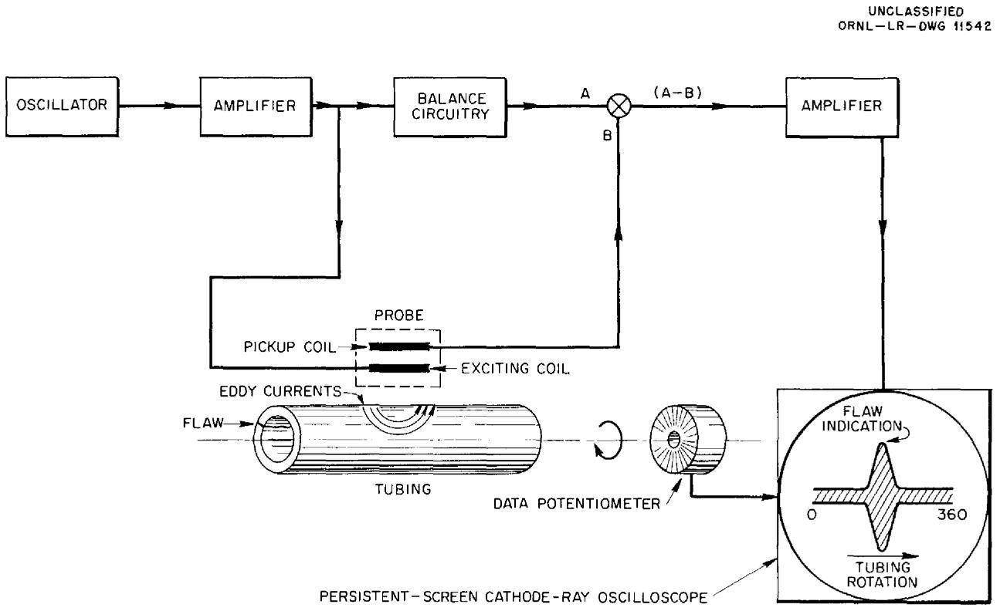  
Fig. 6.41. Diagram of System for Eddy-Current Inspection of Tubing.

to ensure effective penetration through $\frac{1}{16}$ in. of Inconel or less. The pickup-coil voltage is changed in amplitude and phase by the changes in amplitude and distribution of the eddy current in the wall of the tubing. The quiescent portion of the pickup-coil voltage is "bucked out" by the balance circuitry, and hence only the signal changes are measured. Since these changes are very small, amplification of $10^4$ to $10^5$ is necessary before they are fed to the cathode-ray oscilloscope for interpretation.

It is important to note that, since a probe type of coil is utilized, the same frequency may be used on tubing of various outside diameters. Also, since the operating frequency is held constant, the sensitivity of the system remains constant even though the outside diameter of the tubing is varied. This system is in contrast to the system that uses an encircling coil in which the frequency of the encircling coil must be made to vary inversely with the square of the outside diameter of the tubing in order to maintain comparable sensitivities for various diameters of tubing. The operation of an eddy-current instrument at a constant frequency

is vastly simpler than operation of one at a variable frequency.

The amplified changes in pickup-coil voltage are displayed on a persistent-screen cathode-ray oscilloscope as a function of the tubing rotational angle. Because of the localized nature of flaws in tubing, the flaws cause abrupt changes in signal as they pass under the probe coil. Other variables in the tubing which affect the coil, such as slight changes in wall thickness, conductivity, and permeability, are not a function of the tubing rotational angle and hence are indicated by a gradual broadening of the cathode-ray-oscilloscope picture while the tubing is spiraling past. Eccentricity of the tubing causes a gradual change in signal amplitude as the tube is rotated under the probe and produces a wedge-shaped picture on the oscilloscope. This type of data presentation allows positive, rapid interpretation of the flaw signals at high scanning speeds.

Considerable effort has gone into the development of a probe that will allow a reasonably high scanning rate and, at the same time, permit minute flaws to be detected with ease. The smallest and

most sensitive probe made to date has an effective diameter of $\frac{1}{16}$ in., and it was able to detect small cracks and pin holes. With this probe it was found that the tubing could be rotated at 300 to 400 rpm without loss in definition of signals. Because of the small diameter the longitudinal speed of the probe, even at 300 to 400 rpm, is very slow for quantity inspection. Therefore elongated probe coils are now being tested, and it is thought that a probe coil $\frac{1}{2}$ in. long and $\frac{1}{16}$ in. wide can be utilized without compromising the sensitivity to small flaws. A probe $\frac{1}{2}$ in. long will allow scanning rates of 150 in./min.

The Cyclograph is also proving to be an extremely useful instrument for cursory inspection of small-diameter Inconel and Hastelloy tubing. It is being used extensively to sort out sections of Hastelloy B tubing that contain large flaws, that is, flaws which penetrate $10\%$ , or more, of the wall thickness, prior to more detailed inspection by other methods. With the use of the Cyclograph it has been possible to inspect all the Hastelloy B tubing and to reduce substantially the inspection time and cost. The Cyclograph indications obtained, to date, in the inspection of much of the small-diameter Inconel tubing have shown cyclic variation over the length of the tubing. The variations were, at first, thought to be the result of very small changes in wall thickness that were not detected by any other method. Subsequent metallographic examinations of representative sections located by these variations in the indications revealed intergranular attack on the inside wall of the tubing. The attack penetrated as deep as 0.002 in. A similar, cyclic-defect signal has revealed, in the tube wall, radial cracks which had been sealed over by the grinding operation used to produce the finished surface.

The use of ultrasound as a tool for the inspection of small-diameter tubing also appears to be very practical. The "B" scan which presents the defect signal on a cathode-ray tube as a function of the tube rotation has been found to be the most satisfactory method for interpreting ultrasonic data (Fig. 6.42).

A pilot model of the equipment for ultrasonic scanning, which will handle tubing in lengths up to 7 ft 6 in., has been set up in a large tank and is now ready for operation. The mechanical design principles are very similar to those of the large-

scale production inspection unit now being fabricated, which will accommodate tubing in lengths up to approximately 28 ft.

Experience has indicated that the position or alignment of the ultrasonic transducer with reference to the tubing being inspected does not critically affect the flaw indication. Thus the misalignment caused by the characteristic whipping and wobbling which occur when long lengths of thin-walled tubing are rotated at 200 to $400\mathrm{rpm}$ will not create difficulties. It appears that routine ultrasonic inspection of tubing can be accomplished by laboratory-trained personnel with a minimum of setup and adjustment time.

For high-speed production inspection, the speed with which the length of tubing can be scanned is limited by the length of tubing which may be inspected during one revolution of the tube. The pitch ratio of longitudinal scan movement per tube revolution must therefore be adjusted to ensure complete inspection coverage. To increase the pitch, the $\frac{3}{8}$ -in.-dia transducer was replaced with a $\frac{3}{4}$ -in.-dia transducer. However, the $\frac{3}{4}$ -in.-dia transducer covered the entire cross section of the $\frac{1}{4}$ -in. tubing being inspected and produced a confused cathode-ray-tube pattern when the full $\frac{3}{4}$ -in. diameter was used. In order to overcome this difficulty and yet maintain the greater pitch ratio, a collimator was fabricated that effectively blocked out approximately one-third of the transducer energy pattern along a chord parallel to the tubing axis (Fig. 6.43). With the collimation a pitch of $\frac{1}{2}$ in. per revolution can be maintained.

Correlation of known defects, as detected by visual, dye-penetrant, Cyclograph, and x-ray inspection, has shown that all the defects are detectable by ultrasound inspection, including those those on the inside wall, as well as those on the outside wall, of the tubing. Investigations are continuing in an effort to determine the smallest size of discontinuity that may be detected, but it is now believed that any detrimental defect can be found.

Work is under way on the development of an audible warning system to supplement the conventional "B" scan cathode-ray-tube presentation. The warning circuit presently available has too slow a response rate to be adequate for the proposed rotation and scanning speeds.

UNCLASSIFIED

ORNL-LR-DWG 11543

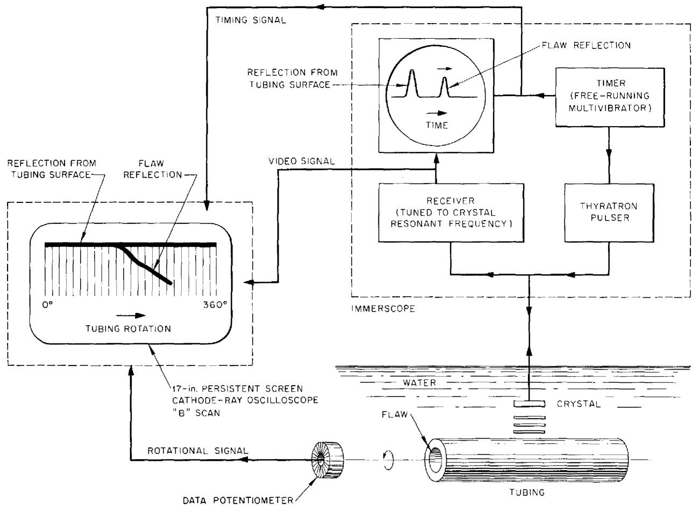  
Fig. 6.42. Diagram of System for Ultrasonic Inspection of Tubing.

The use of ultrasound techniques for inspecting welded Inconel plates is being investigated. To date, difficulty has been experienced in passing sound through the weld bead, and it appears that conditions within the weld bead are such that the sound energy is almost completely attenuated. The conditions that cause the difficulty may be excessive grain size, microporosity, or included foreign matter.

An x-ray technique for the inspection of thick sections of beryllium is also being developed. Beryllium, which is a very light element, has a very large scatter coefficient, which makes it a difficult subject for high-resolution radiography. It is believed that collimation of the x-ray beam at the front surface of the object with a slit system

will reduce the scatter and increase the contrast. The object and the film will be exposed by moving them under the slit (Fig. 6.44).

# CERAMIC RESEARCH

C. E. Curtis

J. R. Johnson

J.A.Griffin

A.J.Taylor

Metallurgy Division

# Rare-Earth Cermet Fabrication

A rare-earth cermet has been fabricated from Lindsay oxide code 920 and iron that is $40\mathrm{vol}\%$ rare-earth oxide and $60\mathrm{vol}\%$ iron, with $50\%$ of the iron present as an equivalent amount of $\mathsf{Fe}_2\mathsf{O}_3$ . A measured density of $6.14~\mathrm{g/cm^3}$ was attained, which is to be compared with a theoretical density

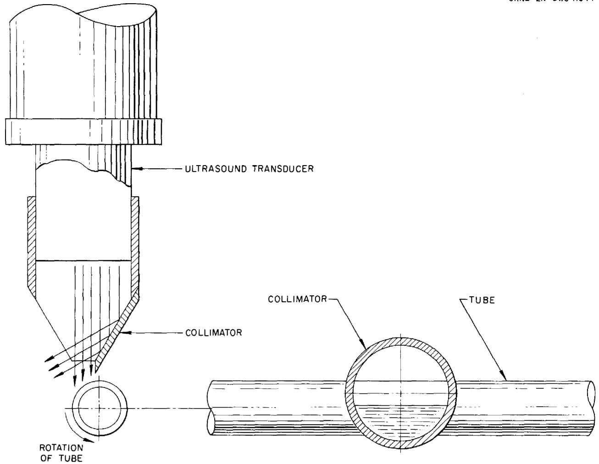

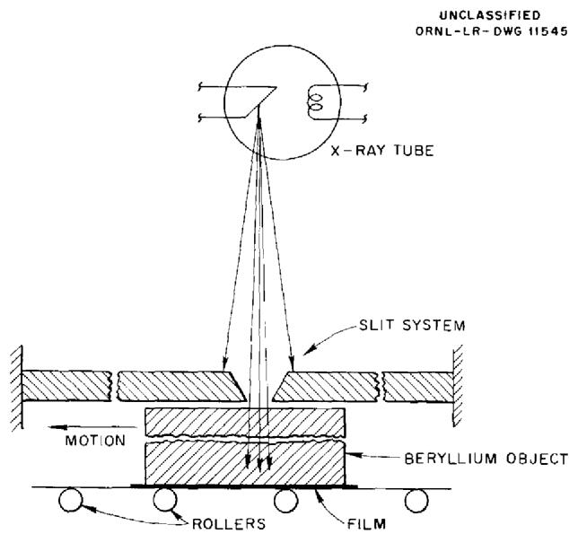  
Fig. 6.43. Collimator Arrangement for Use with $\frac{3}{4}$ -in.-dia Ultrasound Transducer.   
Fig. 6.44. Slit System for X-ray Inspection of Thick Sections of Beryllium.

of $7.69\mathrm{g/cm^3}$ . The apparent porosity (kerosene) was $21.4\%$ , and the porosity obtained from the density value was $20.8\%$ . Metallographic examination showed the structure to be uniform. The ductility was estimated to be considerably less than that of previously prepared specimens that contained 70 vol $\%$ iron, as the metal.

# Boron Carbide Shield Material

Methods for fabricating the boron carbide tiles needed for shielding in the ART are being investigated. It is planned to produce metal cans in the shape of large tiles which would be vibration-packed with sized $\mathsf{B}_4\mathsf{C}$ grains. The cans would have lap joints at their edges to prevent neutrons from streaming between the cans. Experiments are under way to determine the best packing method and the best sizing of the grains to obtain maximum density. In addition, a study was made to determine the tendency of $\mathsf{B}_4\mathsf{C}$ particles to flow under pres

sure. The $\mathsf{B}_4\mathsf{C}$ particles were packed in a brass sleeve (10-mil wall) which had steel plungers on each end. Pressure was applied to the plungers, and the bulge of the sleeve was taken as a measure

of the flow of the $\mathsf{B}_4\mathsf{C}$ particles. Bingham-type flow was observed, with a yield point of about 60 to 80 psi for the least dense powder and 120 to 140 psi for the most dense powder.

# 7. HEAT TRANSFER AND PHYSICAL PROPERTIES

H. F. Poppendiek

Reactor Experimental Engineering Division

Heat-transfer studies with the fuel mixture NaF-KF-LiF-UF4flowing in a heated Hastelloy B tube and the construction and assembly of a heat-transfer system that includes a pump were completed. The ART fuel-to-NaK heat exchanger test system was modified for further experiments, and the friction characteristics of heat exchanger tubing were determined. Hydrodynamic studies of the ART core have been continued, and a study of flow in the sodium cooling passages around the core was initiated.

Detail designs were completed for the experimental study of the temperature structure to be expected in the ART core, and fabrication of the apparatus was started. An analytical study is under way of the temperature structure in a volume-heat-source system in which the fluid is flowing turbulently between curved channels. A general study of the problem of heat removal from the fuel dump tank of an ART-type aircraft reactor after shutdown was initiated. The prediction of temperature distribution in helical pipes was correlated with data obtained from operation of the MTR in-pile loop.

The enthalpies and heat capacities of RbF-ZrF4- UF4 were determined, and a study was made of the heats of fusion of fluoride mixtures. Also, viscosity measurements were made on nine fluoride mixtures, and the transient-cell technique for measuring thermal conductivities of liquids was investigated further.

# FUSED-SALT HEAT TRANSFER

H.W.Hoffman

P. E. Stover

Reactor Experimental Engineering Division

D. P. Gregory

Pratt & Whitney Aircraft

Heat-transfer studies with the fuel mixture NaF-KF-LiF-UF $_4$ (11.2-41-45.3-2.5 mole %) flowing in a heated Hastelloy B tube were completed. The results (Fig. 7.1) duplicate those previously obtained with the same fuel mixture flowing in Inconel and type 316 stainless steel tubes. Visual

examination of the inside surface of the Hastelloy B tube showed no deposits. These heat-transfer data, which fall approximately $40\%$ below the general turbulent-flow heat-transfer correlation, further strengthen the opinion that the observed deviation from the general correlation is caused by characteristics of the fluid itself. The presence of particulate matter in the fluid has not yet been conclusively established. To check this, further experiments are in progress. A fresh fuel mixture and a newly constructed system are being used. The experimental unit was treated with hydrogen after fabrication to ensure the removal of oxides from all surfaces to be exposed to the fuel mixture.

Construction and assembly of a heat-transfer system containing a pump developed by the Experimental Engineering Department were completed. The salient features of this system are indicated in Fig. 7.2. Operating experience will be gained by using $\mathsf{NaNO}_2\mathsf{-NaNO}_3\mathsf{-KNO}_3$ (40-7-53 wt %) as the test fluid. The heat-transfer data obtained will be used as a check on the performance of the unit. Since this nitrite-nitrate salt mixture is noncorrosive and water soluble, it can be used without harm to the experimental apparatus. Following this preliminary operation, studies will be made with the fuel mixture NaF-ZrF4-UF4(50-46-4 mole %) at higher Reynolds numbers than previously covered.

# ART FUEL-TO-NoK HEAT EXCHANGER

J. L. Wantland

Reactor Experimental Engineering Division

The ART fuel-to-NaK heat exchanger test system has been modified for further experiments so that the heat-transfer and friction characteristics of the heat exchanger can be determined with different numbers of tube spacers in the tube bundle. The results of these tests will give definite information on the effect of tube spacers on heat transfer from the fuel side of this heat exchanger. A report is being prepared in which the heat-transfer and friction data obtained with the ART fuel-to-NaK heat exchanger will be compared with the heat- and momentum-transfer data for somewhat

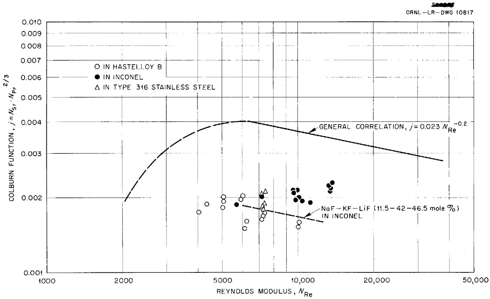  
Fig. 7.1. Comparison of Heat-Transfer Measurements on NaF-KF-LiF-UF $_4$ (11.2-41-45.3-2.5 mole %) with the General Turbulent-Flow Correlation and the Measurements on NaF-KF-LiF (11.5-42-46.5 mole %) in Inconel.

similar configurations studied by other investigators.

The friction characteristics of two, small, drawn, Inconel tubes, such as those to be used in the ART fuel-to-NaK heat exchanger, were determined in the Reynolds modulus range 50,000 to 200,000. One tube, which was clean and new, had an inside diameter of 0.01163 ft and a length of 5.84 ft. The other tube, which had been in service for 1500 hr in an experimental fuel-to-NaK heat exchanger, had an inside diameter of 0.01305 ft and a length of 2.24 ft. Results of these experiments (Fig. 7.3) indicate that service in the heat exchanger will not appreciably vary the friction characteristics of these tubes; the data obtained for each tube correlated to within $\pm 2\%$ with the empirical equation $f = 0.149 / N_{\mathrm{Re}}^{0.18}$ within the Reynolds modulus range tested and fell about $6\%$ above the smooth-pipe friction-factor curve. Photomicrographs (Fig. 7.4) prepared by the Metallurgy Division show that neither hydrogen firing nor service in a NaK heat exchanger appreciably changes the inside surface characteristics of small, drawn, Inconel tubes.

# ART CORE HYDRODYNAMICS

F.E.Lynch L.D.Palmer

C. M. Copenhaver

Reactor Experimental Engineering Division

G. L. Muller

Pratt & Whitney Aircraft

Hydrodynamic studies of flow through quarter-scale models of ART cores have revealed several ways in which the problem of poor flow distribution may be corrected. The studies of flow through the scale models of the 18- and 21-in. ART core with vortex generators at the entrance have shown that there is some transient flow but no flow separation in the model of the 18-in. core and that there is a small amount of flow separation in the model of the 21-in. core. Since vortex generators with larger vane angles might eliminate flow separation in the 21-in. cores, such vortex generators are being made by Pratt & Whitney Aircraft for testing in the flow-visualization system.

Surveys of literature on flow through diffusers, and observations made at ORNL of flow through

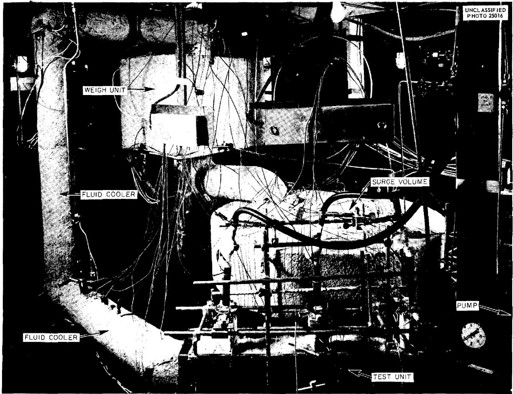  
Fig. 7.2. Fused-Salt Heat-Transfer System.

two constant-gap core models with diffusers, indicate that diffusers with smaller expansion ratios than those used thus far would eliminate flow separation. It would also be possible to eliminate the problem by making the core into a straight annulus. Qualitative evaluations of flow through two constant-gap core models and through the model of the 21-in. core with several entrance systems produced the results presented in Table 7.1.

Preliminary measurements on the models with vortex generators indicated that the pressure loss through the vortex generators was of the order of 1.5 psi for a 600-gpm fuel flow rate. It is expected that the loss will be greater for vortex generators with increased vane angles. It has also been estimated (since the flow through the core is extremely difficult to analyze) that the pressure drop through

the core for a spiral type of flow, such as would exist with the entrance system illustrated previously, would be 800 times the pressure loss for straight-through flow. For a redesigned entrance system, also illustrated previously, in which the rotational component would not be so great as in the previous case, the pressure loss through the core was estimated to be 35 times the straight-through pressure loss. The pressure loss for straight-through flow was roughly estimated from an equivalent parallel-plate system to be about 0.02 psi. This would make the loss for the first case about 16 psi and, for the second case,

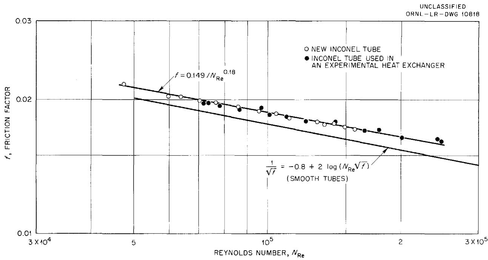  
Fig. 7.3. Friction Characteristics of Small, Drawn, Inconel Tubes.

TABLE 7.1. RESULTS OF EVALUATION STUDIES OF VARIOUS CORE MODELS   

<table><tr><td>Core</td><td>Flow</td><td>Entrance Conditions</td><td>Flow Features</td></tr><tr><td>Constant gap, inlet-to-equator area ratio 1:1.443</td><td>Axial</td><td>No vanes or screens</td><td>Very thin separation layer; position of separation changed with Reynolds number</td></tr><tr><td>Constant gap, inlet-to-equator area ratio 1:2.133</td><td>Axial</td><td>No vanes or screens</td><td>Separation layer thicker than in first case</td></tr><tr><td>Model of 21-in. ART core</td><td>Rotational</td><td>Turning vanes designed to give flow angles relative to axes of 30, 25, 20, and 15 deg (four separate cases)</td><td>Large amount of separation and transient flow in all cases; separation shifted from island wall for 30-, 25-, and 20-deg cases to shell wall for 15-deg case</td></tr></table>

0.70 psi. An analysis of experimental measurements on the full-scale core model for the first case shows a pressure loss of approximately 15 psi. Pressure taps have been installed in the $5/22$ -scale model of the 21-in. core to determine the pressure loss through the core. More accurate measurements will also be made of the pressure loss caused by vortex generators.

Attempts have been made to photograph the velocity profiles observed with the phosphorescent-particle technique. A high-output electronic flash tube and its power supply have been received, but there has been a delay in obtaining the proper shutter mechanism for the camera. The excitation of the phosphorescent particles by the tube appears to be much more intense than the excitation obtained with a mercury-arc source. A much narrower excited-particle band is obtained because of

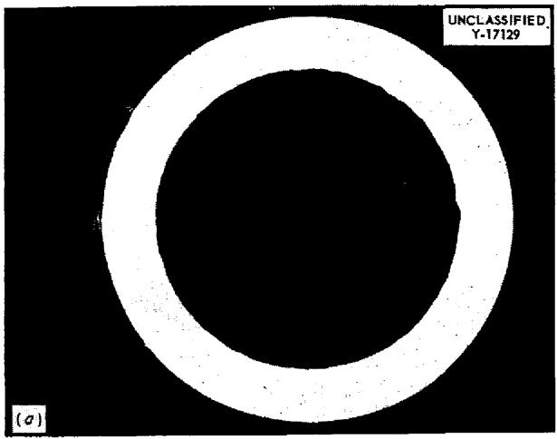

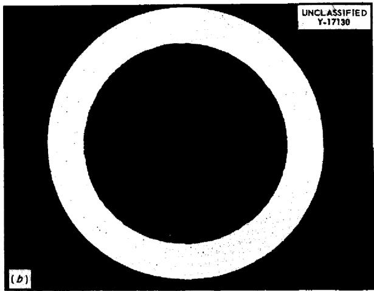

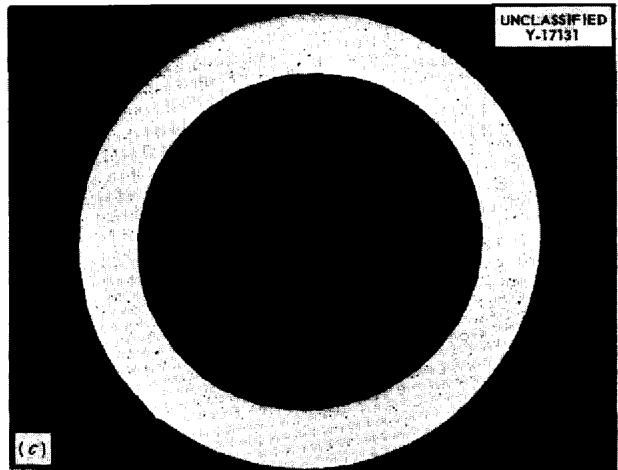  
Fig. 7.4. Inside Surfaces of Three, Small, Drawn, Inconel Tubes. (a) New tube. (b) Hydrogen-fired tube. (c) Tube used in fuel-to-NaK heat exchanger for 1500 hr. (Secret with caption.)

the short flash duration.

A study of flow distribution of the sodium which will circulate in an annulus to cool the outer core shell of the ART has been initiated. It is conceivable that poor flow distribution could occur in the annulus because of secondary flow patterns caused by nonuniform flow at the entrance or by nonuniform gap spacing. A $5/2$ scale model of the annulus system has been designed, and its fabrication is nearly completed. Although the model does not incorporate the actual reflector cooling-hole distribution, provisions have been made for extracting sodium, in amounts representative of cooling-hole flow, at various sectors of the inlet header. The reflector spacers and ridges will be included in the annulus in the scale model. The flow through the various sectors of the annulus will be studied by the phosphorescent-particle technique, and pressures will be measured by static pressure taps and hypodermic impact tubes. These measurements will be made for uniform and nonuniform annulus gap conditions, as well as for one- and two-pump operating conditions.

# ART CORE HEAT TRANSFER

N. D. Greene

J. A. Russell

H. F. Poppendiek

Reactor Experimental Engineering Division

G. L. Muller

J. M. Cornwell

Pratt & Whitney Aircraft

Much progress has been made in preparing for the experimental study of the temperature structure in a half-scale model of the ART core, within which the volume heat source is to be generated electrically. The supporting research for the experiment, the conceptual design, and the detail designs of the test section, entrance sections, exit section, and mixing chambers have been completed. The detail designs were developed for ORNL by Pratt & Whitney Aircraft. The layout is shown in Fig. 7.5.

Two entrance sections were designed. One will simulate the scrolls of the reactor pumps to yield a rotational-flowentrance condition, and the second one will yield purely axial flow at the entrance. Provisions have been made at the entrance to the test section for the addition of vortex generators and flow vanes. The test section, which is composed of Bakelite and platinum, is currently being fabricated by the ORNL Machine Shop at the X-10 Area.

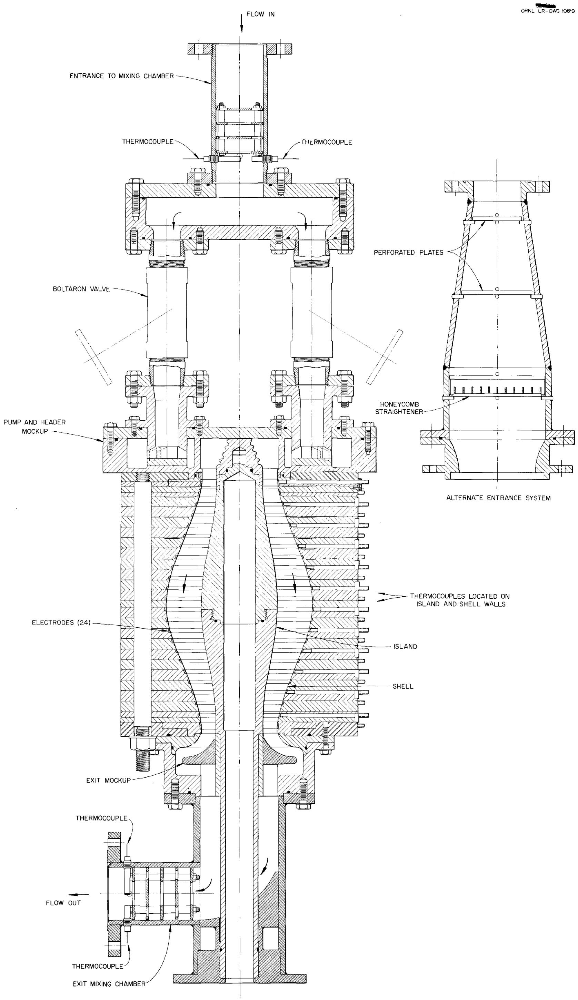  
Fig. 7.5. Layout of ART Volume-Heat-Source Experiment for Studying Temperature Structure in Core.

__________

About 40 copper-constantan thermocouples will be positioned in a nearly uniform manner over the outer core and the island walls at about 0.030 in. below the surface; these thermocouples will measure the steady-state temperature structure of the uncooled system. About 24 platinum-platinum-rhodium thermocouples will be located near the wall-to-fluid interfaces; these thermocouples will determine the transient nature of the temperature structure at the wall surface. Mixed-mean fluid temperature measurements will be made in inlet and outlet mixing chambers.

The electric power for end electrodes will be supplied by saturable reactors, and power for the remainder of the electrodes will come from variable autotransformers. Currents and voltages for this multielectrode system will be measured by ammeters and voltmeters. The thermocouples located near the fluid-to-wall interface will probably be in electrical contact with the fluid (acid solution). The problem of measuring such a variable d-c voltage (having a relatively low frequency) in the presence of a high, 60-cycle, a-c voltage is currently being studied. Several possible solutions to this problem are believed to exist.

# VOLUME-HEAT-SOURCE CONVECTION ANALYSES

H. F. Poppendiek  
Reactor Experimental Engineering Division

G. L. Muller Pratt & Whitney Aircraft

An analytical study is under way of the temperature structure in a volume-heat-source system in which the fluid is flowing turbulently between curved channels. Such an analysis will be useful in estimating the temperature distribution in the ART fuel channel under rotational-flow conditions. The experimental hydrodynamic data of Wattendorf are being used to obtain the temperature solution. However, certain apparent discrepancies in the Wattendorf data are currently being checked and reconciled before the analysis is completed.

A temperature solution for the case in which a fluid with an internal volume heat source flows laminarily and suddenly encounters a flat plate is being used to calculate the error that results when a thermocouple is used to measure the temperature

of a flowing fluid having a volumetric heat source. The problem involves the study of the development of thermal and hydrodynamic boundary layers over a flat plate.

# HEAT REMOVAL FROM FUEL DUMP TANK

C. M. Copenhaver

Reactor Experimental Engineering Division

A general study of the problem of heat removal from the fuel dump tank of an ART-type aircraft reactor after shutdown has been initiated. Boiling water, boiling NaK, air, and circulating NaK cooling systems are being considered.

The temperature rise to be expected in the ART fuel during dumping was investigated by a transient, one-dimensional conduction study. It was found that the temperature of the fuel would rise from 1100 to $1700^{\circ}\mathrm{F}$ at the center of the stream within 3 min after shutdown. Thus the maximum temperature of the fuel will be well below the $2247^{\circ}\mathrm{F}$ boiling temperature of the fuel. The wall temperatures of the Inconel core shells will remain essentially constant during dumping if the sodium coolant system is operating at full capacity, since the required heat-removal rate through the Inconel will be about $20\%$ of the full-power heat-removal rate.

# HEAT TRANSFER IN HELICAL PIPES

N.D.Greene L.D.Palmer

Reactor Experimental Engineering Division

A study of the temperature asymmetry in helical pipes which have volume heat sources within the pipe walls, as well as within the fluids flowing through the pipes, was made previously, and it was predicted that the wall-temperature asymmetry in the ANP in-pile loop operated in the MTR would be as great as $70^{\circ}\mathrm{F}$ at full power. The recent temperature measurements at NRTS on the in-pile loop, which was operated below full power, indicate that the prediction was satisfactory.

Experimental measurements of the temperature asymmetry in a glass model (3.7 times larger than the actual system) of the in-pile loop were made for the case of heat generation in the fluid only, at a series of Reynolds numbers. A typical set of data at a Reynolds number of 5100 is shown in

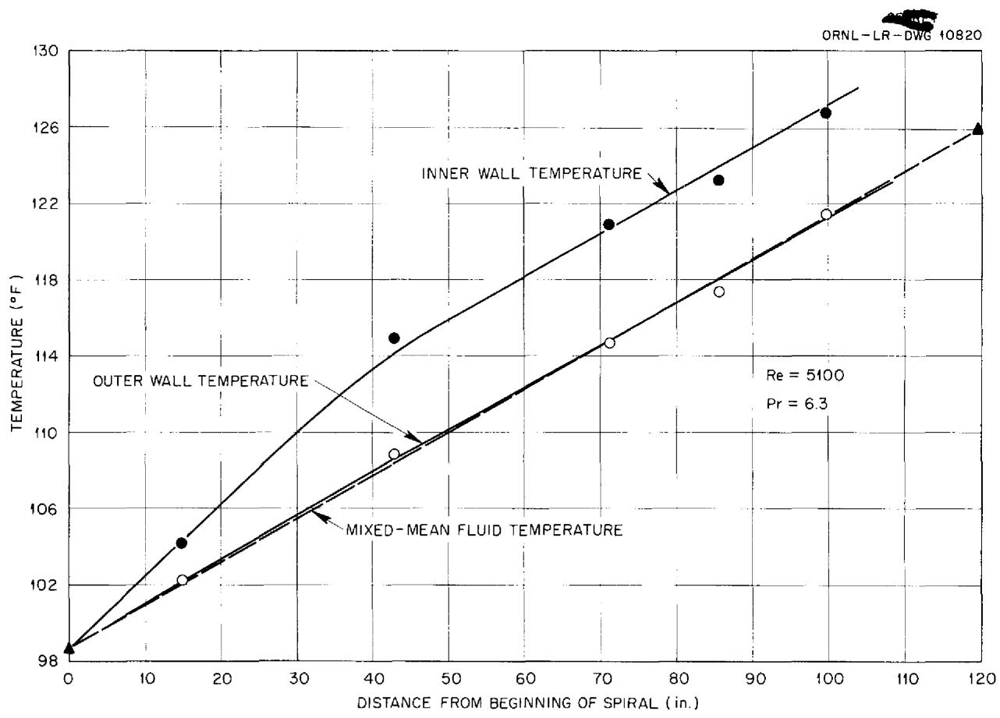  
Fig. 7.6. Typical Temperature Structure in a Model of the ANP-MTR In-Pile Loop with No Heat Source in the Wall.

Fig. 7.6. The inner wall temperatures (convex side) were significantly higher than the outer wall temperatures (concave side), which fell very near the mixed-mean fluid temperature. These results are in satisfactory agreement with the limiting case predictions made prior to the experiment. A report on these calculations and the experimental measurements is being prepared.

# HEAT CAPACITY MEASUREMENTS ON FLUORIDE MIXTURES

W. D. Powers

Reactor Experimental Engineering Division

The enthalpies and heat capacities of two rubidium-bearing fluoride mixtures were studied, and the following results were obtained.

$$
\mathrm{RbF - ZrF}_{4}\text{-UF}_{4} (48 - 48 - 4 \text{ mole}\%)
$$

$$
\text {S o l i d} (1 4 2 \text {t o} 3 9 8 ^ {\circ} \mathrm {C})
$$

$$
H _ {T} - H _ {3 0 ^ {\circ} C} = - 7. 7 + 0. 1 4 9 0 T + (3. 2 \times 1 0 ^ {- 5}) T ^ {2}
$$

$$
c _ {p} = 0. 1 4 9 + (6. 5 \times 1 0 ^ {- 5}) T
$$

$$
\text {L i q u i d} (4 5 8 \text {t o} 8 8 0 ^ {\circ} \mathrm {C})
$$

$$
H _ {T} - H _ {3 0} \circ_ {\mathsf {C}} = - 1 4. 3 + 0. 2 8 4 4 T - (5. 4 \times 1 0 ^ {- 5}) T ^ {2}
$$

$$
c _ {p} = 0. 2 8 4 - (1 0. 8 \times 1 0 ^ {- 5}) T
$$

$$
\Delta H _ {f} = 3 5 \mathrm {a t} 4 2 5 ^ {\circ} \mathrm {C}
$$

$$
\mathrm{LiF - RbF}\left(43 - 57\text{mole}\%\right)
$$

$$
\text {S o l i d} (1 3 4 \text {t o} 4 2 0 ^ {\circ} \mathrm {C})
$$

$$
H _ {T} - H _ {3 0 ^ {\circ} C} = - 6. 7 + 0. 1 8 4 9 T + (2. 4 5 \times 1 0 ^ {- 5}) T ^ {2}
$$

$$
c _ {p} = 0. 1 8 5 + (4. 9 \times 1 0 ^ {- 5}) T
$$

$$
\begin{array}{l} \text {L i q u i d} (4 9 7 \text {t o} 8 7 8 ^ {\circ} \mathrm {C}) \\ H _ {T} - H _ {3 0 ^ {\circ} C} = - 2 8. 5 + 0. 3 9 6 9 T - (8. 1 \times 1 0 ^ {- 5}) T ^ {2} \\ c _ {p} = 0. 3 9 7 - (1 6. 1 \times 1 0 ^ {- 5}) T \\ \Delta H _ {f} = 5 5 \mathrm {a t} 4 7 5 ^ {\circ} \mathrm {C} \\ \end{array}
$$

In these expressions,

$$
\begin{array}{l} H _ {T} - H _ {3 0 ^ {\circ} C} = \text {e n t h a l p y i n c a l / g}, \\ c _ {p} = \text {h e a t c a p a c i t y i n} \mathrm {c a l} / \mathrm {g} ^ {\circ} \mathrm {C}, \\ T = \text {t e m p e r a t u r e} ^ {\circ} C, \\ \end{array}
$$

$$
\Delta H _ {f} = \text {h e a t o f f u s i o n i n c a l / g}.
$$

A method used to correlate heat capacities of fluoride mixtures was described previously. It has been found that the heat capacity per gram atom was 8.1 for the zirconium fluoride-bearing mixtures and that it was 9.5 for the alkali fluoride mixtures not containing $\mathsf{ZrF}_4$ . The heat capacity per gram atom was 8.13 for the rubidium-bearing mixture containing $\mathsf{ZrF}_4$ and was 9.29 for the rubidium-bearing mixture without $\mathsf{ZrF}_4$ , the results being in agreement with the general correlations.

# HEATS OF FUSION OF FLUORIDE MIXTURES

W. D. Powers

Reactor Experimental Engineering Division

The heats of fusion of the fluoride mixtures can be determined from the enthalpy-temperature relationships of the solid and liquid mixtures. It was found that the heats of fusion per gram atom of all non-beryllium-bearing fluoride mixtures varied from about 1200 to 2000 cal. Two mixtures containing $\mathsf{BeF}_2$ had the lowest heats of fusion determined, probably because of their glasslike nature. The heats of fusion that have been determined, to date, are listed in Table 7.2. Two beryllium-bearing mixtures, NaF-BeF $_2$ -UF $_4$ (76-12-12 and 25-60-15 mole %), were studied, but the heat of fusion determinations could not be made because the mixtures melted over wide temperature ranges.

# VISCOSITY MEASUREMENTS ON FLUORIDE MIXTURES

S. I. Cohen

Reactor Experimental Engineering Division

Viscosity measurements were made on nine fluoride mixtures; the results are shown in Fig. 7.7 and listed in Table 7.3. The table presents abso

TABLE 7.2. HEATS OF FUSION OF VARIOUS FLUORIDE MIXTURES   

<table><tr><td rowspan="2">Fluoride MixturesComposition (mole %)</td><td colspan="2">Heat of Fusion</td></tr><tr><td>In cal/g-atom</td><td>In cal/g</td></tr><tr><td>NaF-ZrF4-UF4(50-46-4)</td><td>1780</td><td>56</td></tr><tr><td>NaF-ZrF4(50-50)</td><td>1820</td><td>61</td></tr><tr><td>NaF-ZrF4-UF4(53-43-4)</td><td>1970</td><td>63</td></tr><tr><td>NaF-ZrF4-UF4(53.5-40-6.5)</td><td>2040</td><td>63</td></tr><tr><td>NaF-ZrF4-UF4(56-39-5)</td><td>1790</td><td>57</td></tr><tr><td>RbF-ZrF4-UF4(48-48-4)</td><td>1370</td><td>35</td></tr><tr><td>NaF-ZrF4-UF4(50-25-25)</td><td>1700</td><td>42</td></tr><tr><td>NaF-ZrF4-UF4(65-15-20)</td><td>1570</td><td>42</td></tr><tr><td>NaF-KF-LiF(11.5-42-46.5)</td><td>1970</td><td>95</td></tr><tr><td>NaF-KF-LiF-UF4(10.9-43.5-44.5-1.1)</td><td>1940</td><td>88</td></tr><tr><td>NaF-LiF-UF4(38.4-57.6-4)</td><td>1160</td><td>56</td></tr><tr><td>KF-LiF(50-50)</td><td>1960</td><td>93</td></tr><tr><td>KF-LiF-UF4(48-48-4)</td><td>1690</td><td>68</td></tr><tr><td>RbF-LiF(57-43)</td><td>1800</td><td>55</td></tr><tr><td>NaF-KF-UF4(46.5-26-27.5)</td><td>1290</td><td>30</td></tr></table>

lute and kinematic viscosities for the mixtures and equations for the data in the form

$$
\mu = A e ^ {B / T},
$$

where $T$ is in ${}^{\circ}\mathsf{K}$ . No equation is listed in the table for salt $g$ because of the slight curvature of the data, which may be noted in the figure. Measurements were made on salts $a$ , $d$ , $f$ , $g$ , and $b$ with

TABLE 7.3. SUMMARY OF CURRENT VISCOSITY MEASUREMENTS  

<table><tr><td>Mixture</td><td>Composition (mole %)</td><td>Absolute Viscosity (centipoises)</td><td>Kinematic Viscosity (centi stokes)</td><td>μ</td><td>Ref</td></tr><tr><td rowspan="2">a</td><td>NaF·KF·LiF</td><td>At 500°C, 9.2</td><td>4.25</td><td>0.0391e4219/T</td><td>(a)</td></tr><tr><td>(11.5-42-46.5)</td><td>At 800°C, 2.0</td><td>1.03</td><td></td><td></td></tr><tr><td rowspan="2">b</td><td>NaF·BeF2·LiF</td><td>At 600°C, 8.0</td><td>3.9</td><td>0.0934e3881/T</td><td>(a)</td></tr><tr><td>(63.5-29-7.5)</td><td>At 800°C, 3.5</td><td>1.8</td><td></td><td></td></tr><tr><td rowspan="2">c</td><td>KF·BeF2</td><td>At 750°C, 2.6</td><td>1.3</td><td>0.0777e3590/T</td><td>(b)</td></tr><tr><td>(79-21)</td><td>At 850°C, 1.9</td><td>0.96</td><td></td><td></td></tr><tr><td rowspan="2">d</td><td>NaF·ZrF4·UF4</td><td>At 600°C, 8.1</td><td>2.4</td><td>0.1045e3798/T</td><td>(c)</td></tr><tr><td>(56-39-5)</td><td>At 800°C, 3.6</td><td>1.15</td><td></td><td></td></tr><tr><td rowspan="2">e</td><td>NaF·KF·BeF2</td><td>At 600°C, 8.0</td><td>3.0</td><td>0.0837e3982/T</td><td>(b)</td></tr><tr><td>(49-15-36)</td><td>At 850°C, 2.9</td><td>1.45</td><td></td><td></td></tr><tr><td rowspan="2">f</td><td>LiF·NaF</td><td>At 700°C, 3.2</td><td>1.6</td><td>0.1145e3239/T</td><td>(a)</td></tr><tr><td>(60-40)</td><td>At 850°C, 2.05</td><td>1.05</td><td></td><td></td></tr><tr><td rowspan="2">g</td><td>NaF·ZrF4·UF4</td><td>At 700°C, 8.5</td><td>2.0</td><td></td><td>(a)</td></tr><tr><td>(50-25-25)</td><td>At 900°C, 3.5</td><td>0.9</td><td></td><td></td></tr><tr><td rowspan="2">h</td><td>RbF·ZrF4·UF4</td><td>At 540°C, 10.0</td><td>2.9</td><td>0.0579e4197/T</td><td>(d)</td></tr><tr><td>(50-46-4)</td><td>At 800°C, 2.9</td><td>0.9</td><td></td><td></td></tr><tr><td rowspan="2">i</td><td>NaF·LiF·BeF2</td><td>At 600°C, 5.9</td><td>2.8</td><td>0.185e3018/T</td><td>(b)</td></tr><tr><td>(53-24-23)</td><td>At 800°C, 3.0</td><td>1.5</td><td></td><td></td></tr></table>

${}^{a}$ Previously unpublished data.   
$^{b}$ S. I. Cohen and T. N. Jones, Measurement of the Viscosity of Compositions 90 and 96 and (KF-BeF2: 79-21 mole %), ORNL CF-55-11-28 (to be issued).   
cS.1.Cohen and T.N.Jones,Measurement of the Viscosity of Composition 70,ORNL CF-55-9-31 (Sept.6,1955).   
dS. I. Cohen and T. N. Jones, Measurement of the Viscosity of Compositions 87, 95, and 104, ORNL CF-55-11-27 (to be issued). The composition shown here is the nominal composition; the RbF used in preparing this mixture contained about 20 mole % KF; therefore the actual composition is more nearly RbF-KF-ZrF $^4$ -UF $^4$ (40-10-46-4 mole %).

Brookfield and capillary viscometers; values obtained by these two different instruments were in satisfactory agreement (deviations from an average line through the data did not exceed $\pm 10\%$ ). Salts $b, c, e,$ and $i,$ which contained $\mathsf{BeF}_{2^{\prime}}$ were studied in a separate dry box used only for work with beryllium. Measurements were made on each of these mixtures, and at least two calibrated capillary viscometers were used to furnish a check.

The density values used for the salts which did not contain $\mathsf{BeF}_2$ were calculated from the correlation based on experimental data on other mixtures described earlier. Density values for the mixtures

containing $\mathsf{BeF}_2$ were calculated from a similar correlation based on experimental data taken at Mound Laboratory 10 on mixtures containing $\mathsf{BeF}_2$ .

An investigation was carried out to ascertain the optimum conditions and procedure for obtaining inert dry box atmospheres by purging or sweeping with an inert gas. It was found that heavier-than-air gases should be introduced at the bottom of the dry box and exited at the top, that lighter-than-air gases should be introduced at the top of the dry box and exited at the bottom, that purging efficiency is decreased with mixing, and that purging

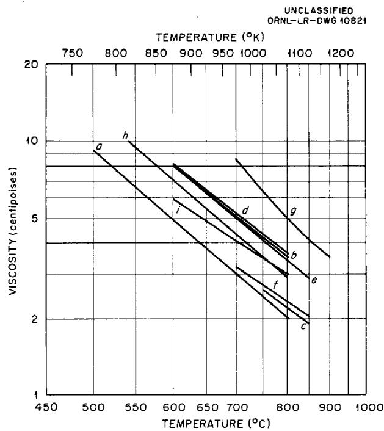  
Fig. 7.7. Summary of Current Viscosity Measurements. See Table 7.3 for compositions and equations.

efficiency is increased as the flow rate is increased.

# THERMAL CONDUCTIVITIES OF LIQUIDS

W. D. Powers

Reactor Experimental Engineering Division

Three different devices are currently being used to measure the thermal conductivities of liquids: the variable-gap system, the constant-gap cell, and the transient cell. Recently a great deal of emphasis has been placed on the transient technique. The apparatus consists of a 4-in. section of $\frac{3}{2}$ in. tubing which can be heated electrically while in contact with a liquid. The temperature rise of the tube depends upon the time of heating and the thermal properties of the liquid. The exact solution of the differential equation that ideally represents the experimental apparatus has been obtained. This ideal system is defined by an

infinite cylinder that is at a constant temperature for time less than zero and is bounded internally at $r = a$ by a medium of infinite conductivity; heat is added at a constant rate for all times greater than zero. In this system $r$ is the radial position in the region bounded external to $a$ . At $r = a$ the temperature of the liquid is the same as the temperature of the medium of infinite conductivity. The temperature solution is of the form

$$
\left(\frac {T K}{Q}\right) = f \left[ \left(\frac {\alpha t}{a ^ {2}}\right), \left(\frac {2 c \rho}{c ^ {\prime} \rho^ {\prime}}\right) \right],
$$

where the quantities in parentheses are dimensionless moduli and

$T =$ temperature at $r = a,$

$K =$ thermal conductivity of the liquid,

$Q =$ heat added at $r = a$ per unit length,

$\alpha =$ thermal diffusivity of liquid $= K / c\rho$

$t =$ time greater than zero,

$a =$ radius of tube,

$c\rho =$ volumetric heat capacity of liquid,

$c^{\prime}\rho^{\prime} =$ volumetric heat capacity of material of infinite conductivity.

Values for $(TK / Q)$ have been found for various values of $(a t / a^{2})$ and $(2c\rho /c^{\prime}\rho^{\prime})$ . All quantities are known except $K$ and $\alpha$ , and, since $\alpha = K / c\rho$ , the thermal conductivity may be found from the temperature rise at one given time. The thermal conductivity of water was determined by this method and was found to differ from the literature value by $10\%$ . The conductivity of molten sodium hydroxide was also determined by this technique; a value of 0.55 Btu/hr-ft²(°F/ft) was obtained over the temperature range 700 to $900^{\circ}F$ .

Since it is difficult to completely fill the cell of the constant-gap apparatus with liquid, a rocking mechanism has been devised which forces the molten fluoride to flow from one riser through the cell to the other riser and back again. This rocking technique must often be used for long periods of time before the cell is completely filled. Recently, some preliminary measurements were made on RbF-ZrF $_4$ UF $_4$ (48-48-4 mole %), and the conductivity was found to be about 1.2 Btu/hr·ft $^2$ (°F/ft).

# 8. RADIATION DAMAGE

D. S. Billington

Solid State Division

The in-pile loop recently operated in the MTR by the Aircraft Reactor Engineering Division is being disassembled in the G-E facilities at NRTS for shipment to ORNL. Samples of the miniature in-pile loop that was operated in vertical hole C-48 of the LITR were examined, and a large number of ARE components have been made available for examination.

A study of thermocouple errors in in-pile loop temperature measurements was completed. Experiments are under way for determining holdup times vs charcoal-trap temperatures for fission gases carried with nitrogen, helium, and other purge gases. The first in-pile, tube-burst, creep-test specimens were irradiated in the LITR, and an alternate, in-pile, stress-corrosion apparatus was designed.

# DISASSEMBLY AND EXAMINATION OF IRRADIATED EQUIPMENT

M. J. Feldman

Solid State Division

# MTR In-Pile Loop

The in-pile loop recently operated in the MTR is being disassembled and sectioned in the General Electric Company hot-cell facilities at the National Reactor Testing Station (NRTS). The plans for the disassembly and the design of the necessary equipment were coordinated with General Electric Company personnel and with ORNL Aircraft Reactor Engineering Division personnel.

The loop was moved into the G-E hot cell on November 9, about one week after the forced termination of operation in the MTR. The interim period of about one week had been spent in setting up and testing the disassembly equipment. The initial insertion of the loop in the hot cell immediately revealed that equipment alterations were required, and so the loop was removed. On November 10 the loop was reinserted, and the initial cut was made to remove the nose section. Most of the loop tubing enclosed in the heat exchanger was removed in two 14-in. sections obtained with two additional cuts made on November 14. During attempts to make the fourth cut, the saw became inoperable, and arrangements were made to clear and decon

taminate the cell for repair work. During the decontamination procedures the molybdenum boot, the fill tank, the nose section, and the two sections of loop tubing were placed in a cask for shipment to ORNL.

Revisions to the scheduled disassembly procedure have been caused by the request for early return of the MTR carrier, which necessitated changing the order of cutting, and by the desire to inspect the pump and about 3 ft of auxiliary loop parts associated with the off-gas system, which failed during operation. The disassembly equipment was designed to handle only the active portion of the loop, and the ideal place to cut the loop for off-gas line inspection could not be brought under the saw because of a change in tube diameter. Two attempts to make this cut through the large, steel shield blocks of the loop were interrupted by equipment failures, and efforts have been shifted to other portions of the loop until a more suitable method is worked out.

Disassembly operations were again interrupted on November 22, when a saw blade broke. In attempting to replace the saw blade, the gripping mechanism of the General Mills manipulator became inoperable. The extent of the damage to the manipulator has not yet been determined. Disassembly of the loop will be continued when repairs have been made.

# LITR Miniature In-Pile Loop

M.J.Feldman A.E.Richt

Solid State Division

Samples of the nose section of the miniature in-pile loop which was operated for 30 hr in vertical position C-48 of the LITR were examined. Operation of this loop was terminated, as described previously, because of faulty behavior of the pump motor. Observations of four samples of the nose section of the loop in the unetched condition showed only slight, sporadic, corrosion penetration to a depth of less than 1 mil. Comparisons of the sections on either side of the center of the nose bend and on the compression and tension sides of

the bend showed no changes in relative grain size. Since 30 hr of operation would not be sufficient time for the development of pronounced radiation effects, no definite conclusions should be drawn from these results.

# ARE Components

Work is continuing on the examination of various components of the ARE. A large number of sections of the ARE core and auxiliary equipment have been transferred to the Solid State Division canal. Melt-out facilities have been readied for the removal of fused salts from the sections. Metallographic examinations of the various sections are to be made.

# THERMOCOUPLE ERRORS IN IN-PILE LOOP TEMPERATURE MEASUREMENTS

G.W. Keilholtz

W.R.Willis M.F.Osborne Solid State Division

Extensive investigations of errors in metal-surface temperature measurements obtained from thermocouples placed in high-velocity air streams have shown that the results are dependent upon the velocity of the air stream and the type of thermocouple installation. Results obtained in recent experiments with models of thermocouple installations on the miniature in-pile loop have verified the results of previous tests of thermocouple installations on static in-pile corrosion capsules. As before, resistance-welded thermocouples were superior to discharge-welded thermocouples in that they gave smaller errors in temperature measurements and were less sensitive to changes in cooling-air flow rates. As yet, no thermocouple installation has been found that is not affected by the air flow rate in a wide air annulus such as that used in the in-pile loop.

# HOLDUP OF FISSION GASES BY CHARCOAL TRAPS

G.W. Keilholtz W.E. Browning Solid State Division

C.C.Bolta Pratt & Whitney Aircraft

Experiments are in progress to determine holdup times of fission gases by charcoal traps at various temperatures with various carrier gases in the traps. Radiokrypton is being used to simulate the

fission gases, and, in the initial experiments, nitrogen and helium are being used as the carrier gases. Helium was found to be unsatisfactory for use in the MTR in-pile loop installation because of its poor electrical insulation properties, and therefore nitrogen is of more immediate interest as the carrier gas because of its better electrical insulation properties. In order to use nitrogen in place of helium as the nose purge gas in the in-pile loop, information is needed concerning the holdup time for gaseous fission products in the carbon trap vs temperature of the trap, with nitrogen gas used as the carrier. Similar information for helium and other carrier gases is needed for use in designing the ART purge system and in designing purge systems for use in other reactors.

The apparatus being used is shown in Fig. 8.1. The charcoal trap is the same as the ones used in the MTR in-pile loop, being $2\frac{1}{4}$ in. in diameter and 14 in. long and containing $340\mathrm{g}$ of activated charcoal. The flow rate of the carrier gas, $5.05\mathrm{cfh}$ , is the same as that used in operation of the loop at the MTR. The trap temperatures are controlled by "freezing" mixtures, which are kept at the freezing point with liquid nitrogen. The temperature of $-50^{\circ}\mathrm{C}$ is obtained with a eutectic mixture of $\mathrm{CaCl}_2$ and water; a Freon mixture is used to obtain a temperature of $-110^{\circ}\mathrm{C}$ . The data obtained thus far are presented in Figs. 8.2 and 8.3. These data show that radiokrypton is absorbed and contained in the charcoal traps at a given temperature for longer periods of time with helium as the carrier gas than with nitrogen. It appears that, if nitrogen were used as the carrier gas for the in-pile loop nose purge system, temperatures of $-110^{\circ}\mathrm{C}$ or colder would be needed to properly limit the amount of activity sent to the MTR stack in case of a fuel leak. Efforts are being made to correlate these data into generalized analytical expressions relating trap properties, temperature, gas properties, and holdup time.

Investigations are planned in which the radio-krypton will be diluted in larger quantities of normal krypton to determine the effect of krypton concentration on holdup time. Additional tests are planned in which other carrier gases will be used.

UNCLASSIFIED

ORNL-LR-DWG 10822

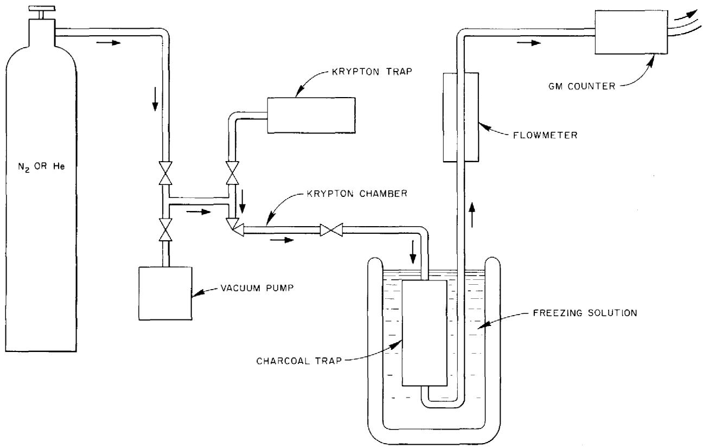  
Fig. 8.1. Apparatus for Investigating Holdup Times of Fission Gases by Charcoal Traps.

# CREEP AND STRESS CORROSION

J.C.Wilson

Solid State Division

In-Pile Tube-Burst Creep Tests

W.W.Davis N.E.Hinkle

J.C.Zukas

Solid State Division

The first in-pile, tube-burst, creep-test specimens were irradiated for two weeks in the LITR. In these tests four tubular specimens were stressed to rupture at a circumferential fiber stress of 2000 psi at temperatures of $1500^{\circ}\mathrm{F}$ for two and 1550 and $1450^{\circ}\mathrm{F}$ for the other two. Postirradiation measurements of the total strain in the uniformly bulged regions are under way in the hot cells. Corresponding bench tests under the same conditions are in progress. A second in-pile rig is complete and ready for LITR irradiation.

Additional fuel-containing tube-burst rigs, previously described, have been assembled and are to

be filled with fused-salt fuel. Several stress-corrosion rigs in which static sodium is used as a coolant for a tubular fuel-containing specimen that is stressed in bending are ready for welding. These rigs will be used for control tests of a similar apparatus already irradiated in the LITR.

The MTR creep-test apparatus, in which the specimen was tested at $1500^{\circ}\mathrm{F}$ and 1500 psi, has been returned to ORNL, and the water jacket is being removed for postirradiation measurements of specimen elongation.

# Alternate In-Pile Apparatus

W.E.Brundage C.D.Baumann

Solid State Division

An alternate apparatus for in-pile stress-corrosion experiments has been designed. In this rig, as in the rigs now being used,3 the molten fuel

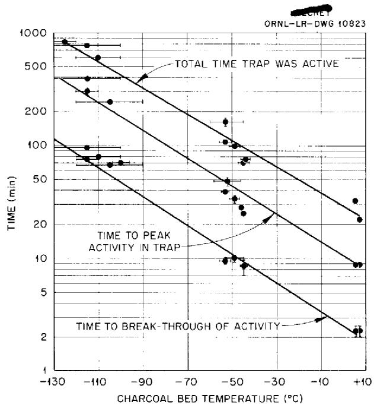  
Fig. 8.2. Holdup Time vs Temperature of Charcoal Trap for Radiokrypton Carried in Nitrogen.

contacts one wall of the annular container, and solidified fuel contacts the other wall. This permits the heat generated to be removed and, at the same time, a small surface-to-volume ratio to be maintained and the maximum fuel temperature to be limited to that of the sample.

The heat for maintaining the fuel in the liquid state will be supplied by fission heating during normal operation, but supplemental heating can be supplied by a cylindrical heater around the outside of the container if necessary. Heat will be removed by flowing water being passed through the central tube of the fuel container. Stress loading will be supplied by gas pressure over the fuel, with the outer portion of the fuel container used as the specimen in hoop tension.

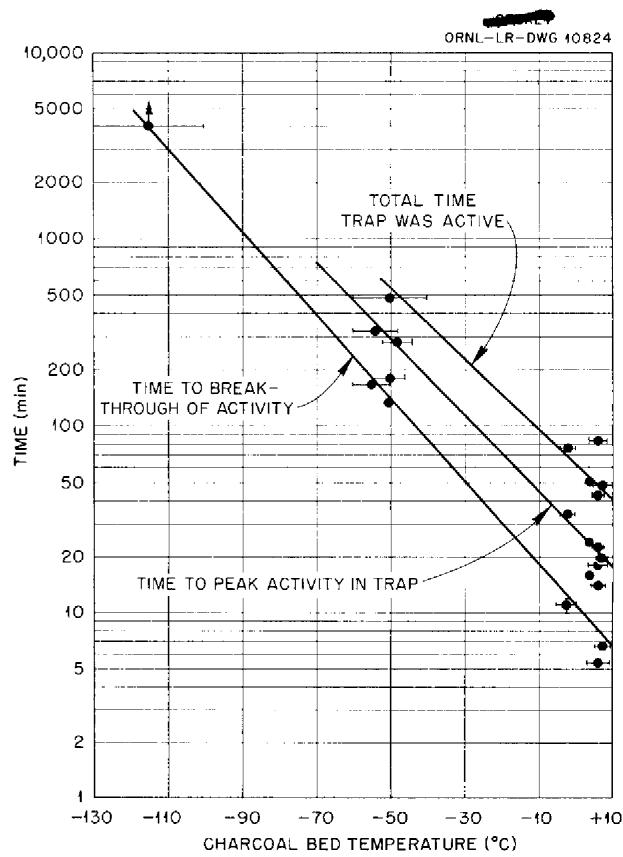  
Fig. 8.3. Holdup Time vs Temperature of Charcoal Trap for Radiokrypton Carried in Helium.

Calculations have been made of the flux depression outside the sample, the flux distribution in the fuel, and the resulting heat distribution through the fuel. The maximum specific power is generated in the outer portion of the annulus, with the power generated at the inner surface being approximately $40\%$ of the maximum. The flux-depression calculations are being checked by flux measurements, in the LITR, with the use of a cadmium-magnesium alloy of the same size as the fuel volume and with a thermal-neutron cross section the same as that of the fuel to be used.

# 9. ANALYTICAL CHEMISTRY OF REACTOR MATERIALS

C.D.Susano J.C.White

Analytical Chemistry Division

An apparatus was modified so that the $n$ -butyl bromide method could be applied to the determination of oxygen in sodium sampled at operating temperatures. Studies were continued on the distillation method for the determination of oxygen in sodium. A method for determining the concentration of rare-earth elements in stainless steel was developed. Aluminum was determined in $\mathrm{NaF - ZrF_4 - UF_4}$ by a modification of the Aluminon method. In connection with hydrofluorination studies a rapid method of analysis was developed for the determination of hydrogen fluoride and water in effluent gases. Studies were continued on the determination of oxygen in metallic oxides by the bromination method. A method was developed for the determination of tantalum in NaF-KF-LiF. Methods were developed for the determination of trivalent iron in mixtures of fluoride salts.

# DETERMINATION OF OXYGEN IN SODIUM

A. S. Meyer, Jr. G. Goldberg

W.J.Ross

Analytical Chemistry Division

# $n$ -Butyl Bromide Method

Studies were undertaken to ascertain whether positive errors are inherent in the determination of oxygen in sodium by the $n$ -butyl bromide method.1 Investigations of the errors introduced by the contamination by oxygen during sampling and by traces of water in the organic reagents were reported previously.2 Additional positive errors may result from the presence of alkaline-earth metals in the alkali-metal samples.

The $n$ -butyl bromide method is based on the conversion of the electropositive metals to neutral bromide salts by their reaction with butyl bromide and the subsequent acidimetric titration of the alkali-metal oxides. In the pure state the alkaline-earth metals calcium, barium, and strontium are essentially inert to $n$ -butyl bromide, while mag-

nesium may react with $n$ -butyl bromide to form a Grignard reagent. The alloys of these alkaline-earth metals with alkali metals are probably more reactive to $n$ -butyl bromide than are the pure alkaline-earth metals, and any residual metal or Grignard reagent will be converted to hydroxide upon dissolution of the reacted sample in water and will thus be titrated as oxygen.

Since the lower-atomic-weight alkaline-earth metals in concentrations below the range of spectrographic determination may be sufficient to introduce significant errors in the oxygen determination, chemical methods for their detection were tested. Calcium and magnesium were determined by flame-photometric measurement after separation from the bulk of the sodium metal. Successful separations were carried out either by precipitation of the calcium and magnesium from ammoniacal solutions with 8-quinolinol or by precipitation of the sodium as sodium chloride by saturating aqueous solutions of the samples with HCl gas. After separation by either of these methods, the calcium and magnesium concentrates from a 10-g sample contained less than $10\mathrm{mg}$ of sodium.

Typical samples of the sodium used in corrosion and heat-transfer studies were found to contain approximately 100 ppm of calcium and less than 50 ppm of magnesium. These concentrations correspond to a maximum error in the determination of oxygen of about 80 ppm, and appropriate corrections will have to be determined. Since the alkaline-earth elements that are alloyed with sodium are at least partially converted to bromide salts during dissolution of the samples, the error introduced by them is not significant if the concentration of oxygen in the sodium is high. The increase in the reactivity of the alkaline-earth metals upon dissolution in sodium was demonstrated by the determination of oxygen in sodium which contained relatively high concentrations of alkaline-earth metals, for example, $0.2\%$ barium. Since the molar concentration of oxygen as determined by the $n$ -butyl bromide method was less than that of the alkaline-earth metal, a portion of the metal must have reacted with the $n$ -butyl bromide.

In further studies of the $n$ -butyl bromide method it has been shown that, if the reaction is contained

in a sealed vessel, the conversion of the alkali metals to bromide salts can be carried out by the reaction of the sample with pure $n$ -butyl bromide rather than with the moderated solution of $n$ -butyl bromide in hexane, which is used in the usual analytical reagent. The reaction time is reduced from about 4 hr to less than 5 min when the pure reagent is used. The procedure is applicable both to NaK and to sodium.

When the reaction is carried out with the pure reagent under pressure, the possibility of contamination during reaction is materially reduced and it is possible to effect the direct transfer of the test portion of the sample from the bulk sample. A sampler and an apparatus for the determination of oxygen in sodium by the amalgamation procedure have been modified, as shown in Fig. 9.1, for use with $n$ -butyl bromide. In this apparatus a sample of molten metal is added, from a transfer line, to approximately $150 \, \text{ml}$ of $n$ -butyl bromide reagent contained in a $3 \times 18$ in., glass reaction vessel. The transfer is carried out under helium at a pressure of $1 \, \text{atm}$ . Samples have been taken from sodium at temperatures as high as $1000^{\circ} \text{F}$ . A pressure below $10 \, \text{psi}$ was developed even when samples which contained $9 \, \text{g}$ of sodium were reacted. This procedure is now being used to compare the results of determinations of oxygen by the $n$ -butyl bromide method and by the distillation method.

# Distillation Method

The distillation method for the determination of oxygen in sodium, which was described in the previous report,3 was applied to the determination of the oxygen in sodium contained in forced-circulation corrosion-testing loops and in sodium-transfer reservoirs. Samplings have been made at temperatures from 600 to $1400^{\circ}\mathsf{F}$

For the oxygen determination the sample is introduced through the top of the distillation apparatus into a calibrated, hemispherical cup which is fitted with a preshaped liner of 1-mil nickel foil. A sufficient quantity of the liquid sodium is introduced to flush the transfer line and the sample cup thoroughly. When the temperature of the sodium is less than $600^{\circ}\mathrm{F}$ , the distillation apparatus is evacuated before the sample is transferred. At higher temperatures, a pressure of 1 atm of helium must be maintained to prevent flash distillation of

the sodium during transfer. After the cup has been filled with the test portion of liquid metal, the pressure in the distillation chamber is reduced to less than $10\mu_{t}$ and the sample is heated to distill off the metallic sodium. After the distillation is completed, the nickel liner is transferred to a beaker, in which the residual oxides are titrated with a dilute solution of standardized acid.

In a check of the effect of time and temperature on analyses made by the distillation method, analyses were made of sodium which had been deliberately contaminated by the addition of an amount of $\mathrm{Na}_2\mathrm{O}_2$ equivalent to 700 ppm of oxygen before introduction into the corrosion-testing loop. When the distillation was carried out at above $900^{\circ}\mathrm{F}$ , that is, near the maximum of the recommended range of distillation temperatures of 350 to $550^{\circ}\mathrm{C}$ (660 to $1030^{\circ}\mathrm{F}$ ), the oxygen values were extremely low. The effect of distillation time was also evident; for example, after a 1-hr distillation period at $900^{\circ}\mathrm{F}$ , the oxygen concentration of the residue was less than 100 ppm, and after 4 hr the oxides had been almost completely volatilized. Distillation of another sample of the contaminated sodium at $850^{\circ}\mathrm{F}$ for 4 hr gave a residue which corresponded to 400 ppm of oxygen. Since part of the oxygen could have been trapped in cold legs of the loop, the 400-ppm value represents a reasonable analysis of the oxygen in the sample that was originally contaminated with 700 ppm of oxygen.

The accuracy of the distillation method is being studied by comparing the results with those obtained by the $n$ -butyl bromide method and by testing the quantitative recovery of added oxygen. A distillation apparatus and an apparatus for analyses by the $n$ -butyl bromide method have been attached to a reservoir which contains sodium that was deliberately contaminated by exposure to air during loading. Repeated determinations after the dissolution of samples of the sodium in the $n$ -butyl bromide reagent have established the concentration of oxygen as $600 \pm 50$ ppm. An analysis by the distillation method showed $620$ ppm of oxygen.

In the study of the quantitative recovery of added oxygen, reproducible results which correspond to $35 \pm 5$ ppm of oxygen were obtained after distillation of as-received sodium for 4 hr at $850^{\circ} \mathrm{F}$ . Essentially the same results were obtained after

distillation for periods of 1 and 2 hr at this temperature. Analyses of the residues indicated that $\mathrm{Na}_2\mathrm{O}$ is the predominant residual oxide. The effect of metallic impurities in the liquid metal on the

distillation method is to be studied in detail. After the oxygen content of a measured quantity of sodium has been established, a calculated weight of NaOH will be added to raise the concentration of oxygen

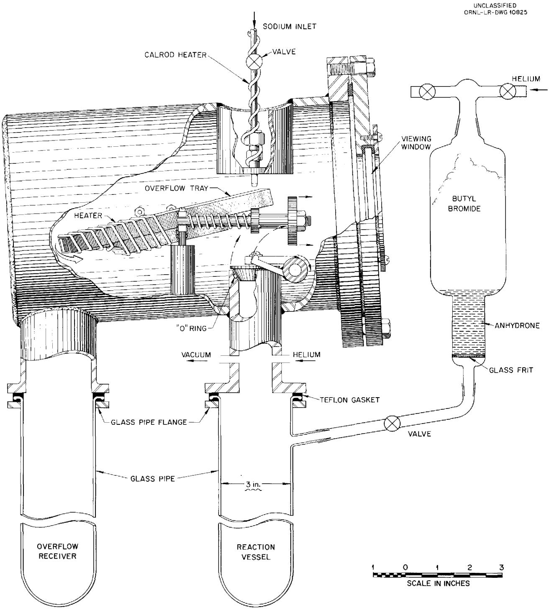  
Fig. 9.1. Apparatus for the Determination of Oxygen in Sodium by Use of the $n$ -Butyl Bromide Method.

to 300 ppm, and the determinations will be repeated to test the accuracy of the distillation method.

# DETERMINATION OF TRACES OF RARE-EARTH ELEMENTS IN STAINLESS STEELS

A. S. Meyer, Jr.

B. L. McDowell

Analytical Chemistry Division

The concentrations of the rare-earth elements gadolinium, europium, and samarium must be limited to a few parts per million in reactor construction materials because of the high absorption cross sections of these elements for thermal neutrons. Therefore a method was developed for determining the quantities of the rare-earth elements in stainless steel, Inconel, and nickel.

In order to concentrate the rare-earth elements in a sample, $25\mathrm{mg}$ of spectrographically pure yttrium oxide is added to a 2- to 5-g sample of stainless steel. The yttrium oxide is used as a carrier for the precipitation of the rare-earth elements and also serves as an internal standard for their spectrographic determination. The sample, together with the $\mathsf{Y}_2\mathsf{O}_3$ is dissolved in HCl and then fumed with $\mathsf{HClO}_4$ . After the hydrated oxide precipitate of silicon, niobium, tantalum, etc., has been removed by filtration, the major constituents of the sample, iron, chromium, and nickel, are separated by electrolysis at a mercury cathode. The volume and acidity of the solution are reduced by evaporation, and the rare-earth elements, together with the yttrium carrier, are precipitated as hydrous oxides by saturating the solution with ammonia. The alkaline-earth elements remain in solution, together with a portion of the amphoteric elements. The precipitate is dissolved in HCl, and the rare-earth concentrate is precipitated by the addition of an oxalic acid. The precipitate is filtered and then ignited to the oxide.

The concentration of rare earths in the precipitated $\mathsf{Y}_2\mathsf{O}_3$ is determined spectrographically, and the concentration in the stainless steel sample is calculated from the ratio of carrier to sample. When 2.5-g samples of stainless steel are taken, concentrations of the rare-earth elements of 1 ppm can be determined. Between 75 and $90\%$ of the added carrier is recovered. The final precipitate is essentially pure $\mathsf{Y}_2\mathsf{O}_3$ , with $\mathsf{SiO}_2$ as the principal contaminant.

The method offers several advantages over the procedure of Spitz et al., in which the rare-earth

group is precipitated with an iron carrier and measured against uranium as an internal standard. Fewer precipitations are required, and, since the carrier is added before the separation step, quantitative recovery of the rare earths is not essential. The $\mathsf{Y}_2\mathsf{O}_3$ provides a much less complex spectrum than that provided by the uranium and iron.

The method has been used for the determination of gadolinium in types 347 and 304 stainless steel. Quantitative recovery of a standard addition of gadolinium was obtained. The method will also be tested with other types of stainless steel, Inconel, and nickel. With minor modifications the procedure should be applicable to all ferrous and nonferrous alloys that do not contain as major constituents elements such as zirconium, vanadium, and other metals which would not be deposited at the mercury cathode.

# SPECTROPHOTOMETRIC DETERMINATION OF ALUMINUM IN FLUORIDE SALTS WITH AURIN TRICARBOXYLIC ACID

A. S. Meyer, Jr.

C. R. Williams

Analytical Chemistry Division

The Aluminon (aurin tricarboxylic acid) method for the spectrophotometric determination of aluminum was applied to the determination of aluminum in fluoride salt mixtures such as $\mathrm{NaF - ZrF_4 - UF_4}$ . Aluminon forms a stable, red-colored lake with solutions of pH 5 to 5.4. While this reaction is utilized as one of the more sensitive colorimetric methods for the detection and determination of aluminum, it is subject to interference by many elements, particularly those which form hydrous oxide precipitates at pH 5.

In the determination of aluminum in samples of NaF-ZrF4-UF4, the principal interfering element, zirconium, is removed by extracting it as zirconium cupferrate (nitrosophenylhydroxylamine) from a 4 M solution of $\mathsf{H}_2\mathsf{SO}_4$ with chloroform containing hydrogen cupferrate. Other interfering elements, such as iron, which is present in trace concentrations in these samples, are also removed by this extraction. Any uranium which may be present in the tetravalent state is quantitatively extracted, while hexavalent uranium remains in the aqueous phase. Since only a small part of the uranium is

oxidized to the hexavalent state during dissolution with $\mathsf{H}_2\mathsf{SO}_4$ its residual concentration is not sufficient to interfere in the determination of aluminum. When cupferron is added to acidic solutions which contain zirconium, a very slightly soluble precipitate of zirconium cupferrate is obtained. Since this precipitate is not readily extractable by organic solvents,7 the zirconium cupferrate is formed in the organic phase by extracting the aqueous solutions with a solution of hydrogen cupferrate in chloroform. Aluminum is not extracted from a $4M$ $\mathsf{H}_2\mathsf{SO}_4$ solution if the concentration of the hydrogen cupferrate in the chloroform phase does not exceed $3\%$ .

An aliquot of the extracted solution that contains 6 to $50~\mu \mathrm{g}$ of aluminum is taken for color development. The color is developed by heating the solution with Aluminon for $\frac{1}{2}$ hr at a temperature of 80 to $90^{\circ}\mathrm{C}$ ; gelatin is added to stabilize the lake. Mercapto acetic acid is added to complex any iron that is introduced in the reagents which are added after the cupferron extraction. The absorbance of the final solution of 50-ml volume is measured at $530~\mathrm{m}\mu$ in 1-cm cuvettes 2 hr after the addition of the chromogenic reagent.

The number of determinations made by this method is not yet sufficient to establish the precision, but, on the basis of calibration data, it appears that the coefficient of variation of the results is approximately $5\%$ . The concentration of aluminum in typical samples of $\mathsf{NaF - ZrF_4}$ eutectic mixtures and $\mathsf{NaF - ZrF_4 - UF_4}$ (50-46-4 mole %) fuels was found to be approximately 100 ppm.

# DETERMINATION OF WATER IN HYDROGEN FLUORIDE GAS

A. S. Meyer, Jr.

W.J.Ross

Analytical Chemistry Division

A method was developed for the determination of the concentration of water relative to hydrogen fluoride in the effluent gases from a hydrofluorination reactor. The measurement of the relative water content was needed to ascertain when the hydrofluorination reaction of oxides in zirconium-base fuels, that is,

$$
Z r O _ {2} + 4 H F \longrightarrow Z r F _ {4} + 2 H _ {2} O
$$

was complete. Pyridine was found to be an effi- cient absorber for both hydrogen fluoride and water.

The gases from the reactor were bubbled through approximately 5 cm of pyridine contained in a simple absorber constructed of 30- by 200-mm test tubes. Two absorbers were connected in series to measure the efficiency of the absorption. After a quantity of gas had been passed through the pyridine, the test tubes were removed from the assembly, stoppered immediately with serum-type bottle stoppers, and replaced with tubes filled with fresh pyridine. Test portions of the absorber solutions were taken with 1-ml tuberculin syringes.

The concentration of water in the pyridine solutions was determined by titration with coulometrically generated Karl Fischer reagent. The concentration of hydrogen fluoride was determined by titrating an aqueous solution of the pyridine absorbate with $0.1N\mathrm{NaOH}$ solution to a phenolphthalein-thymol-blue mixed-indicator end point. Since pyridine is a relatively weak base $(K_{b} = 1.8\times 10^{-9})$ , the hydrogen fluoride can be titrated directly in aqueous solutions which contain pyridine.

The hydrogen fluoride and water were almost completely removed from the gases in the first absorber. When the concentration of hydrogen fluoride in the first absorber did not exceed 50 mg/ml, the concentration of hydrogen fluoride in the second absorber was negligible. Increases in the concentration of water in the second absorber were limited to a few tenths of a milligram per milliliter and may have been introduced by contamination with atmospheric moisture during loading of the pyridine into the test tube. The determinations made by this method are reproducible to about ±0.5% water in hydrogen fluoride. Since increases in the concentration of water from 1% in commercial hydrogen fluoride to 10 to 30% in the effluent gases were observed during test runs, the reproducibility of the determinations is sufficiently high to permit monitoring the reaction. The overall precision of the results is limited primarily by the precision of the determination of the water, which is approximately 2%. The precision of measurement of small increases in the concentration of water is much lower because of a relatively high original concentration of water in the pyridine. The precision of the method can be improved by the use of anhydrous pyridine.

# DETERMINATION OF OXYGEN IN ZIRCONIUM OXIDE BY BROMINATION

J.P.Young M.A.Marler

Analytical Chemistry Division

The study of the methods of determination of combined oxygen in metal oxides and fluoride salts by the bromination method of Codell and Norwitz was continued. The reactions involved in the process include the reaction at approximately $1000^{\circ}C$ of bromine vapor in a carrier gas of helium with a mixture of a metal oxide and powdered graphite to form CO and the metal bromide. After removal of the excess bromine and the metal bromide in cold traps, the CO is oxidized to $\mathrm{CO}_{2}$ by reaction with hot CuO. The resultant $\mathrm{CO}_{2}$ is absorbed in $\mathrm{Ba(OH)}_{2}$ and estimated quantitatively by titration with standard acid.

Several additions and modifications were made to the apparatus, which is described in previous reports.10,11 A tube containing copper and copper oxide, which is maintained at $400^{\circ}\mathrm{C}$ , was inserted between the helium tank and the apparatus in order to remove any oxygen or hydrocarbons that might be present in the gas. Also, the Tygon tubing that had been used to connect some parts of the apparatus was replaced with glass and short pieces of gum-rubber tubing. As recommended by Codell and Norwitz,9 granular zinc maintained at $350^{\circ}\mathrm{C}$ was inserted between the cold traps and the CuO tube to remove the last traces of bromine that might escape the cold traps. Further, the thin, platinum liner, described in the previous report,12 which is inserted inside the reaction tube during the analysis of fluoride salts, was replaced with a gold liner that extends into the first cold trap. Although gold is attacked by bromine, it is more inert to oxygen than is platinum, and therefore lower blank corrections for the apparatus are required. The sample container has also been fabricated from gold.

For this determination, mixtures of $\mathsf{ZrO}_2$ and graphite are ground together in a mortar by use of a pestle and then allowed to react with bromine

vapor under varying conditions. The residual amount of $\mathsf{ZrO}_2$ is determined by weighing the residue after ignition of the graphite. Bromination of $\mathsf{ZrO}_{2^{\prime}}$ according to the equation

$$
Z r O _ {2} + 2 B r _ {2} + 2 C \longrightarrow Z r B r _ {4} + 2 C O
$$

was incomplete after 4 hr of reaction time at temperatures as high as $1100^{\circ}\mathrm{C}$ . Approximately $20\%$ of the $\mathsf{ZrO}_2$ remained unreacted under these conditions.

When $30\mathrm{mg}$ of $\mathsf{FeF}_3$ was added to $10\mathrm{mg}$ of $\mathsf{ZrO}_2$ and $50\mathrm{mg}$ of graphite and the intimate mixture was brominated at $950^{\circ}C$ for 2 hr, complete removal of $\mathsf{ZrO}_2$ from the sample container was achieved. The order of mixing was found to be critical. In order to achieve the complete removal of $\mathsf{ZrO}_2$ , it was necessary to mix the $\mathsf{ZrO}_2$ with $\mathsf{FeF}_3$ in a mortar with a pestle, and then mix the graphite with the $\mathsf{ZrO}_2$ - $\mathsf{FeF}_3$ mixture in the same manner. It is assumed that the reactions involved are:

$$
3 Z r O _ {2} + 4 F e F _ {3} \longrightarrow 3 Z r F _ {4} + 2 F e _ {2} O _ {3}
$$

$$
F e _ {2} O _ {3} + 3 B r _ {2} + 3 C \longrightarrow 2 F e B r _ {3} + 3 C O
$$

The amount of CO formed during the bromination of the sample was, however, much less than the expected theoretical amount. The CO was determined by oxidizing the gas to $\mathrm{CO}_{2}$ and absorbing the $\mathrm{CO}_{2}$ in standard $\mathrm{Ba(OH)}_{2}$ solution. In all determinations of the resultant $\mathrm{CO}_{2}$ the amount was only 30 to $40\%$ of that expected. In order to check the possibility that the method of absorbing $\mathrm{CO}_{2}$ was not efficient, several samples of $\mathrm{CaCO}_{3}$ were thermally decomposed in the apparatus and the resulting $\mathrm{CO}_{2}$ was determined. Quantitative recovery of $\mathrm{CO}_{2}$ was achieved in all cases.

The study on the bromination of $\mathsf{ZrO}_2$ and $\mathsf{FeF}_3$ in the presence of graphite is still in progress, but, at present, it appears that the reactions postulated do not adequately describe the mechanism of the removal of $\mathsf{ZrO}_2$ from the sample container. In order to establish the quantitative recovery of the CO produced in the bromination of the oxide, the determination of oxygen in ferric oxide by bromination was investigated. Quantitative recovery of the oxygen as $\mathsf{CO}_2$ was obtained, but it was necessary to mix the ferric oxide and graphite in a mortar with a pestle. Bromination of a 15-mg sample of ferric oxide was complete in 4 hr at a temperature of $950^{\circ}\mathsf{C}$ .

# DETERMINATION OF TANTALUM IN FUSED FLUORIDE SALTS

J.P.Young

J.R.French

Analytical Chemistry Division

A search was made for a suitable colorimetric method for the determination of trace amounts of tantalum in NaF-KF-LiF and NaF-KF-LiF-UF. Dinnin13 has reported the use of pyrogallol, which forms a colored complex with tantalum, but uranium and fluoride ions are known to interfere in this determination. A satisfactory modification of Dinnin's method has been developed, however, for application to the fuel solvent NaF-KF-LiF. Preliminary tests revealed that the usual method of removing fluoride ion by heating in an $\mathsf{H}_2\mathsf{SO}_4$ solution was not satisfactory, since tantalum was volatilized as TaF5. In order to avoid this difficulty, the sample was digested in 0.1 M H2SO4 until almost all the water had volatilized; another volume of 0.1 M H2SO4 was then added, and the solution was evaporated to dryness. In this method, TaF5 is hydrolyzed to Ta2O5 before the temperature of the solution exceeds the volatilization temperature of TaF5. The residue of the evaporation, including the Ta2O5, is then treated according to the procedure described by Dinnin13 for the colorimetric determination of tantalum with pyrogallol.

The residue is fused with $\mathsf{K}_2\mathsf{S}_2\mathsf{O}_7$ and the melt is dissolved in ammonium oxalate. The pyrogallol complex is formed in a solution that is $0.175\textbf{M}$ ammonium oxalate and $4\textbf{M}$ HCl, and its absorbance is then measured at $330~\mathrm{m}\mu$ . This method was found to be satisfactory for the concentration range of from 0.15 to $0.8\textbf{mg}$ of tantalum in a $50 - \text{ml}$ volume. It is essential that the $\mathsf{H}_2\mathsf{SO}_4$ evaporation and the $\mathsf{K}_2\mathsf{S}_2\mathsf{O}_7$ fusion be made in Vycor crucibles rather than platinum, since even very small quantities of platinum interfere with the pyrogallol method for determining tantalum. The attack of fluoride ion on Vycor has not been of any consequence.

The method of Milner, Barnett, and Smales,14 which was developed for the separation of tantalum in tantalum-uranium alloys, was examined for possible application to samples of fluoride salts which contain uranium. In this method tantalum is extracted with hexone from an aqueous solution

which is $10M$ in HF, $6M$ in $\mathsf{H}_2\mathsf{SO}_4,$ and $2.2M$ in $\mathsf{NH}_4\mathsf{F}$ . The sample is first fumed with $\mathsf{H}_2\mathsf{SO}_4,$ and then HF and $\mathsf{NH}_4\mathsf{F}$ are added. The tantalum is extracted into hexone and then extracted from the hexone phase with a $15\%$ solution of $\mathsf{H}_2\mathsf{O}_2$ . The efficiency of this extraction was evaluated by determining the amount of tantalum which had been extracted in the solution of $\mathsf{H}_2\mathsf{O}_2$ . The pyrogallol method, described above, was used for these analyses. Quantitative recovery of small amounts of tantalum has not been achieved, as yet.

# DIRECT DETERMINATION OF TRACES OF Fe(III) IN NaF-KF-LiF-UF4

J.C. White J.W.Miles15

Analytical Chemistry Division

A direct spectrophotometric determination of $\mathsf{Fe(III)}$ in NaF-KF-LiF-UF4 was developed in which the sample is dissolved in a solution of $\mathsf{H}_3\mathsf{PO}_4,$ $\mathsf{H}_2\mathsf{SO}_4,$ and $\mathsf{H}_3\mathsf{BO}_3.$ Potassium thiocyanate is added to form the iron(III)-thiocyanate complex, which is then extracted with isobutyl alcohol. The $\mathsf{H}_3\mathsf{PO}_4$ concentration must be maintained above 8 M to prevent reduction of the Fe(III) by U(IV) during dissolution of the sample. The coefficient of variation for the method was found to be $3\%$ for the range 0.25 to 1.5 mg of Fe(III) per gram of sample. Further details of this investigation are available in a separate report.

# DETERMINATION OF TRACES OF Fe(III) IN MIXTURES OF ALKALI-METAL FLUORIDE SALTS

J.W.Miles J.C. White Analytical Chemistry Division

A method, which is based on the absorption of the ferric phosphate complex in the ultraviolet, has been developed for the determination of Fe(III) in the presence of Fe(II) in mixtures of alkalimetal fluoride salts. Iron(III) in concentrations of 1 to $5\mu \mathrm{g / ml}$ in $0.5M_2SO_4$ and $1M_3PO_4$ solutions may be determined accurately by observing the absorbance at $260~\mathrm{m}\mu$ The alkali metals, Ni(II), Cr(III), Fe(II), and the fluorides do not interfere, but zirconium and uranium interfere

seriously. The details of this method have also been reported separately. $^{17}$

# ANP SERVICE LABORATORY

W. F. Vaughan

Analytical Chemistry Division

Uranium analyses were performed for the high-temperature ART critical experiment. This service was provided so that other experimenters could follow the increase in uranium concentration as criticality was approached by the addition of the fuel concentrate, $\mathrm{Na}_2\mathrm{UF}_{6'}$ to the fuel carrier, $\mathrm{NaF - ZrF_4}$ (50-50 mole%). The samples, weighing approximately 60 g each, were ground in a plastic dry box prior to analysis. Test portions (1 g) were fused with $\mathrm{K}_2\mathrm{S}_2\mathrm{O}_7'$ and the melt was dissolved in 5 vol % $\mathrm{H}_2\mathrm{SO}_4$ . The entire portion was passed through a zinc reductor, and the uranium was titrated with standard oxidant. Appropriate correc

17J. C. White, Determination of Iron(III) in Mixtures of Alkali Metal Fluoride Salt, ORNL CF-55-7-103 (July 22, 1955).

tions were made for the iron present, the concentration of which was determined colorimetrically. The elapsed time for analysis of each sample was of the order of 30 to 45 min.

During the period, 1276 samples were analyzed for the ANP project, and a total of 6609 determinations was made. The backlog consists of 46 samples. A breakdown of the work is shown in Table 9.1.

TABLE 9.1. SUMMARY OF SERVICE ANALYSES REPORTED   

<table><tr><td></td><td>Number of Samples</td><td>Number of Determinations</td></tr><tr><td>Reactor Chemistry</td><td>746</td><td>3963</td></tr><tr><td>Experimental Engineering</td><td>487</td><td>2503</td></tr><tr><td>Miscellaneous</td><td>43</td><td>143</td></tr><tr><td></td><td>1276</td><td>6609</td></tr></table>

# 10. RECOVERY AND REPROCESSING OF REACTOR FUEL

F. R. Bruce

D.E.Ferguson W.K.Eister H.E.Goeller

M.R.Bennett J.T.Long

F.N.Browder R.P.Milford

G. I. Cathers S. H. Stainker

Chemical Technology Division

# PILOT PLANT DESIGN

Engineering design of the pilot plant for recovering fused-salt fuels is to be completed by December 31, 1955, and construction is to be completed by March 31, 1956. The ORNL Engineering Department has estimated that the facility will cost $346,000, excluding all engineering. Process, project, and instrumentation engineering is expected to raise the estimated overall cost to $435,000.

The single-bed absorber containing granular NaF which was to have been operated at $650^{\circ}\mathrm{C}$ has been replaced on the engineering flowsheet by a pair of absorbers containing NaF. These absorbers will both be at $100^{\circ}\mathrm{C}$ during absorption of $\mathsf{UF}_6$ and some fission-product fluorides in the first bed. The beds will then be raised to $400^{\circ}\mathrm{C}$ , and the $\mathsf{UF}_6$ and a few fission-product fluorides will be desorbed from the first bed with $\mathsf{F}_2$ and passed to the second absorber, where the fission products will remain. The large two-section furnace required to heat the single-bed absorber was returned to the manufacturer for conversion into two separate furnaces.

# ENGINEERING DEVELOPMENTS

# Contactor

A percolator type of contactor was found to produce more violent agitation than that produced by a sieve-plate contactor during gas contacting of the molten fused salt in tests made in the fluorinator designed for use in the pilot plant. In these tests, 270 lb of molten NaF-ZrF₄ was sparged with nitrogen, and the percolator, or air-lift, type of contactor was operated at gas rates of 1 to 3.5 cfm. Visual observations made during these tests showed violent pumping of the salt and a large amount of salt collecting on the cooler upper wall. The entrainment and subsequent deposition

of salt caused by percolation was greater than that caused by sieve-plate contacting. An inverted funnel-type splash plate installed over the percolator discharge contained the salt splash and thus reduced salt entrainment. An unpredictable increase in sparging-gas pressure during percolator tests was a major problem. Replacement of the $\frac{1}{4}$ -in.-dia tubing, which dispersed the gas through $\frac{1}{6}$ -in.-dia holes, by a $\frac{1}{4}$ -in.-dia open-end tube did not affect the pressure buildup. The sieve-plate contactor was operated at gas rates of 1 to 7 cfm. Salt agitation was gentle and there was a slight splash of salt on the vessel wall. Tests of these contactors with uranium-bearing fuel mixtures will be required in order for a decision to be made as to which to install in the pilot plant.

# Freeze Valves

A 4-in.-OD, 8-in.-long cone-body prototype of the freeze valves designed for the pilot plant retained a pressure of 20 psig in 15 of 20 cycles of melting $(350^{\circ}\mathrm{C})$ , freezing, and pressurizing. Examination of the salt seal around the downcomer revealed a porous structure but no open gas channels (Fig. 10.1). It is believed that slight contraction of the fused salt permitted gas leakage around the downcomer. The design of the valve is being modified.

# Resistance Heating of Transfer Pipes and Waste-Discharge Nozzle

Resistance heating was tested as a means of heating and of maintaining the temperature of salt transfer pipes at $1200^{\circ}\mathrm{F}$ . An uninsulated 7-ft length of $\frac{1}{2}$ -in. sched-40 Inconel pipe was heated to $1200^{\circ}\mathrm{F}$ in 5 min by passing a current of 600 amp through the pipe. The voltage drop through the pipe was $1.2\mathrm{V / ft}$ .

Resistance heating will also be used to heat the nozzle which will discharge salt from the fluorinator waste pipe to the waste carrier. The nozzle is designed with a hood section to contain and

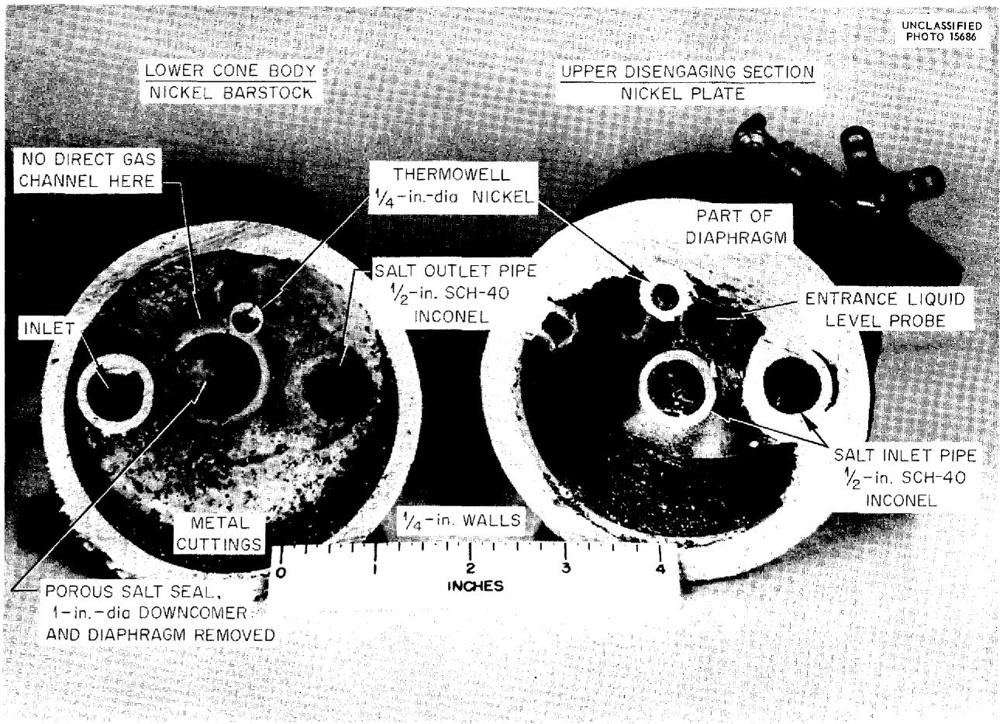  
Fig. 10.1. Sectioned 4-in.-OD, 8-in.-Long Cone-Body Freeze Valve After 20 Cycles of Melting $(350^{\circ}\mathrm{C})$ , Freezing, and Pressurizing.

remove any gases evolved from the waste (Fig. 10.2). The hood vacuum connection is to be nickel, and the salt transfer pipe and hood section are to be Inconel. These materials and the large cross-sectional area of the hood section will minimize self-resistance heating in the hood section and in the vacuum connection and will permit a temperature of $1200^{\circ}\mathrm{F}$ to be reached by the salt transfer pipe. The voltage drop across the entire unit will be $4.25\mathrm{V}$ with a current of $600\mathrm{amp}$ .

# PROCESS DEVELOPMENT

# Fused-Salt Fluorination Studies

Additional evidence of the induction period in UF6 volatilization from fused-salt fuel was obtained (Fig. 10.3) in further work on the fluorina

tion step. This work was directed toward full evaluation of the effect on the fluorine efficiency of the fluorine-to-nitrogen mole ratio, the fluorination rate, and the method of contact of the gas with the fused-salt phase. In Fig. 10.4 the same data are plotted to show how the efficiency of fluorine utilization varies during the course of fluorination and to illustrate the deviation from the ideal case, in which there would be no solubility effect to cause an induction period.

A comparison of sampling methods showed that agreement to within $3\%$ was obtained in uranium analyses of samples taken during the course of fluorination experiments with the use of a dip ladle or by immersion of a solid rod into the fused salt to obtain a quick-freeze sample and samples taken after fluorination by grinding and sampling the entire batch of salt. This study was made

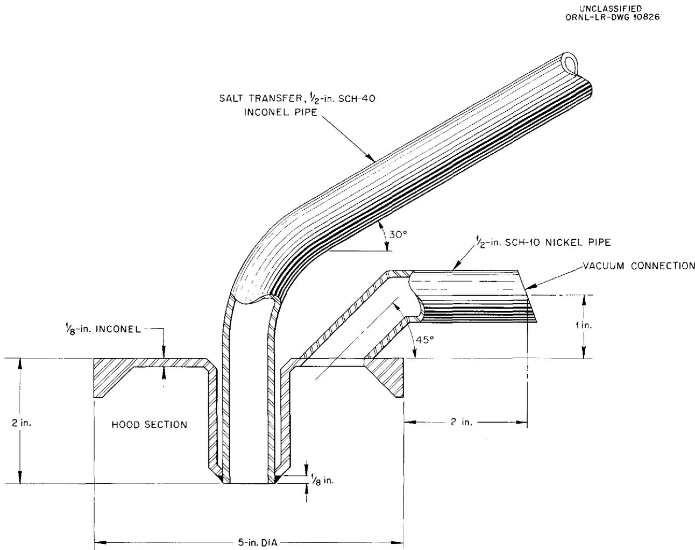  
Fig. 10.2. Waste-Discharge Nozzle.

with three different uranium concentrations in the NaF-ZrF salt, namely, 8, 2, and 0.5 wt %.

# NaF Absorption Capacity and UF6 Loss on Desorption

The absorption capacity of NaF for $\mathsf{UF}_6$ was determined to be about $0.9\mathrm{g}$ of uranium per gram of salt in the case of one lot of Harshaw Chemical Co. material under a variety of conditions (Table 10.1). The capacity of Baker & Adamson Co. reagent-grade NaF was $1.89\mathrm{g}$ of uranium per gram of salt. Absorption of $\mathsf{UF}_6$ on NaF under an initial vacuum indicated a capacity range of 0.80 to 0.90 for different mesh sizes, while absorption values obtained when the excess $\mathsf{UF}_6$ was being removed with fluorine as a sweep gas varied from 0.72 to 0.86. Practically the same capacity values were

obtained at 70, 100, and $150^{\circ}C$ and at two different pressures. The results indicated that the capacity of 0.9 in the case of the Harshaw Chemical Co. material is independent of the particle size to which it is degraded. The 1.89 value for the capacity of the Baker & Adamson Co. material corresponds closely to the molecular ratio in the complex UF $\cdot 3NaF$ .

Fluorine was much more satisfactory as a sweep gas than was nitrogen in the desorption of $\mathsf{UF}_6$ from NaF, perhaps as a result of some moisture in the nitrogen. Two runs were made with 12- to 40-mesh NaF which had been well conditioned by being alternately evacuated and exposed to fluorine at a pressure of 15 psia before sufficient $\mathsf{UF}_6$ was introduced to completely saturate the NaF. In one run the $\mathsf{UF}_6$ was desorbed with a stream of nitrogen

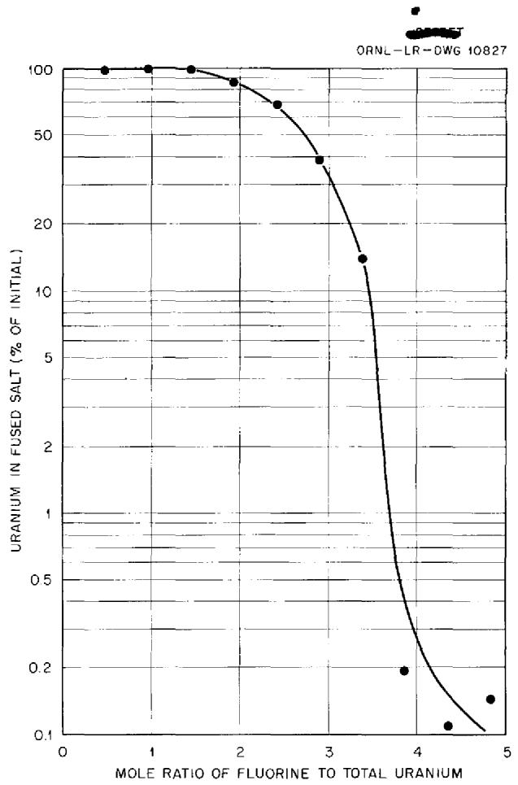  
Fig. 10.3. Amount of $\mathsf{UF}_6$ Remaining in $375\mathrm{g}$ of NaF-ZrF4-UF4 (50-46-4 mole %) Fluorinated at $600^{\circ}C$ at a Rate of 100 ml/min as a Function of Amount of Fluorine Introduced.

while the temperature of the NaF was being raised from 100 to $400^{\circ}\mathrm{C}$ ; $1.4\%$ of the uranium stayed on the NaF. The total desorption period covered 1 hr, although the temperature of the bed had reached $400^{\circ}\mathrm{C}$ in about 15 min. In the second run the $\mathsf{UF}_6$ was desorbed with fluorine, and only $0.0075\%$ of the initial uranium load remained on the NaF.

# $\mathsf{UF}_6$ Decontamination in NaF Absorption Step

In each of four consecutive fluoride volatilization runs (20 to $40\mathrm{g}$ of uranium in each) in which the two-bed NaF decontamination system was used, the activity of the product $\mathsf{UF}_6$ was less than the $\mathsf{UX}_1 - \mathsf{UX}_2$ activity associated with natural uranium. There was no evidence of decreased decontamination with repeated re-use of the bed (Table 10.2). The over-all beta or gamma decontamination factor

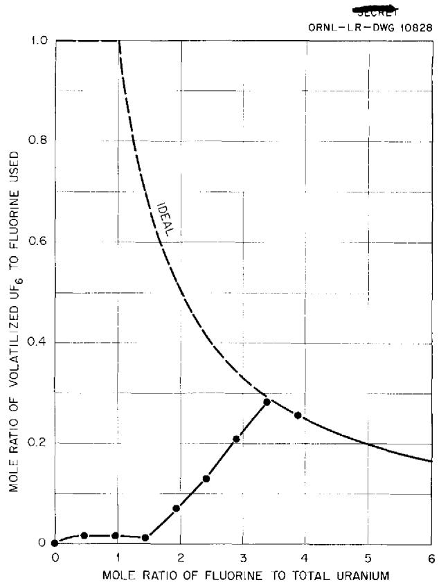  
Fig. 10.4. Efficiency of UF Volatilization as a Function of Amount of Fluorine Introduced.

was about $10^{5}$ , with $10^{2}$ being attributable to the fused-salt fluorination step and $10^{3}$ to the NaF absorption-desorption step. The process flowsheet used provides for volatilizing $\mathsf{UF}_6$ from the molten fused-fluoride-salt fuel with fluorine, absorbing the $\mathsf{UF}_6$ on an NaF bed at $100^{\circ}\mathsf{C}$ , desorbing the $\mathsf{UF}_6$ at 100 to $400^{\circ}\mathsf{C}$ in a stream of fluorine, and passing the desorbed $\mathsf{UF}_6$ through a second NaF bed. As in previous work, much of the decontamination from ruthenium occurred during the absorption period; that is, the $\mathsf{UF}_6$ and niobium were absorbed on the first bed at $100^{\circ}\mathsf{C}$ , while the ruthenium passed through (Table 10.3). Almost all the decontamination from niobium occurred in the desorption period, when the $\mathsf{UF}_6$ was being regenerated from the NaF at 100 to $400^{\circ}\mathsf{C}$ ; the niobium was left on the NaF.

For all four runs the average uranium loss in the first cold trap of the process was $0.06\%$ . This was perhaps due to the low NaF-to-uranium weight ratio of 2/1 in the first bed. The uranium loss in

TABLE 10.1. CAPACITY OF NqF. EOR UF

TABLE 10.2. SUMMARY OF FOUR CONSECUTIVE RUNS IN TWO-BED FUSED-SALT FLUORIDE-VOLATILITY PROCESS   

<table><tr><td rowspan="2">Material</td><td colspan="3">Conditions</td><td rowspan="2">Capacity(g of U per g of NaF)</td></tr><tr><td>UF6Pressure(psi)</td><td>Temperature(°C)</td><td>Removal ofExcess UF6</td></tr><tr><td colspan="5">Harshaw Chemical Co.</td></tr><tr><td rowspan="7">12 to 40 mesh</td><td>15*</td><td>100</td><td>Not removed</td><td>0.86</td></tr><tr><td>15*</td><td>100</td><td>By vacuum</td><td>0.86</td></tr><tr><td>7.5*</td><td>100</td><td>By vacuum</td><td>0.80</td></tr><tr><td>15*</td><td>70</td><td>By vacuum</td><td>0.88</td></tr><tr><td>15*</td><td>150</td><td>By vacuum</td><td>0.90</td></tr><tr><td>15*</td><td>100</td><td>By fluorine</td><td>0.86</td></tr><tr><td>15**</td><td>100</td><td>By fluorine</td><td>0.86</td></tr><tr><td>8 to 12 mesh</td><td>15**</td><td>100</td><td>By fluorine</td><td>0.81</td></tr><tr><td rowspan="2">1/8-in. pellets</td><td>15**</td><td>100</td><td>By fluorine</td><td>0.72</td></tr><tr><td>15*</td><td>100</td><td>By vacuum</td><td>0.81</td></tr><tr><td colspan="5">Baker &amp; Adamson Co.</td></tr><tr><td>Powder</td><td>15*</td><td>100</td><td>By vacuum</td><td>1.89</td></tr></table>

$^{*}UF_{6}$ introduced to NaF under vacuum.   
$\star \star \mathsf{UF}_6^-$ introduced at atmospheric pressure to displace fluorine.

Conditions: Total of 128 g of uranium in NaF-ZrF4-UF4 (52-44-4 mole %) with gross beta activity per milligram of uranium of $5 \times 10^{5}$ counts/min. Each run fluorinated with 1:1 F2N2 mixture for 1.5 hr and then with pure F2 for 0.5 hr; UF6 in F2N2 gas stream absorbed on NaF, with some volatile activity passing into cold trap; UF6 desorbed at 100 to 400°C into a second cold trap

Average $\mathsf{F}_2 / \mathsf{U}$ mole ratio in absorption period: 4/1

Average $\mathsf{F}_2 / \mathsf{U}$ mole ratio in desorption period: 1/1

Absorbent beds: 60 ml of 12- to 40-mesh NaF in 1-in.-dia tubes

NaF/U weight ratio after four runs: 1/1

<table><tr><td rowspan="2">Run</td><td rowspan="2">Product Yield (%)</td><td colspan="3">Uranium Loss (%)</td><td rowspan="2">Waste Salt</td><td rowspan="2">Product Gamma Activity per Milligram of Uranium* (counts/min)</td></tr><tr><td>First Cold Trap</td><td>First NaF Bed</td><td>Second NaF Bed</td></tr><tr><td>1</td><td>83</td><td>0.0</td><td></td><td></td><td>0.02</td><td>3.6</td></tr><tr><td>2</td><td>35.2</td><td>0.10</td><td></td><td></td><td>0.05</td><td>3.1</td></tr><tr><td>3</td><td>151</td><td>0.07</td><td></td><td></td><td>0.08</td><td>1.0</td></tr><tr><td>4</td><td>43.8</td><td>0.08</td><td></td><td></td><td>0.02</td><td>2.1</td></tr><tr><td>Overall</td><td>70.1</td><td>0.06</td><td>0.5</td><td>5.1</td><td>0.04</td><td>2.5</td></tr></table>

*Gamma activity per milligram of natural uranium is 8 counts/min.

TABLE 10.3. DISTRIBUTION OF VOLATILIZED ACTIVITY   

<table><tr><td rowspan="2">Activity</td><td colspan="3">Amount* (% of total)</td></tr><tr><td>Fission-Product Cold Trap</td><td>First NaF Bed</td><td>Second NaF Bed</td></tr><tr><td>Gross beta</td><td>81</td><td>18</td><td>0.85</td></tr><tr><td>Gross gamma</td><td>11</td><td>89</td><td>0.14</td></tr><tr><td>Ru gamma</td><td>97</td><td>1.6</td><td>1.1</td></tr><tr><td>Zr-Nb gamma</td><td>2.2</td><td>98</td><td>0.04</td></tr><tr><td>Total rare-earth beta</td><td>4.3</td><td>92</td><td>3.6</td></tr></table>

*Collected and actually found by analyses of cold trap and NaF beds.

the fused-salt fluorination step was about $0.04\%$ , but losses in the two NaF beds were 0.5 and $5\%$ , respectively. These losses were due to some back-pressure buildup, which was evident in all runs, as the result of either partial plugging of the NaF during the absorption period (probably because of a volume change) or plugging of the UF cold-trap inlet. Occasional tapping of the absorption bed prevented the NaF-plugging problem from being

very serious in all runs except the second. Here the plugging was so severe that excessive nitrogen pressure had to be used, with considerable loss of product. Plugging of NaF upon absorption of $\mathsf{UF}_6$ was completely avoided in two subsequent runs, without activity, by using a sieve plate at the entrance to the first bed for dispersion of the gas instead of just a $1/4$ -in. inlet line as in the above four runs.

Part III

SHIELDING RESEARCH

# 11. SHIELDING ANALYSIS

F. H. Murray C. D. Zerby  
Applied Nuclear Physics Division

S. Auslender H. S. Moran Pratt & Whitney Aircraft

# AIR SCATTERING OF Co $^{60}$ GAMMA RAYS: THEORY vs EXPERIMENT

H. S. Moran

The air-scattered gamma-ray dose rate predicted by theory for a Co source at a source-detector distance of 15 meters was compared with experimental measurements in a similar geometry. After an appropriate correction for ground scattering was applied, the two results were found to be in substantial agreement. The details of the comparison were published in a separate report.

# ENERGY ABSORPTION RESULTING FROM GAMMA RADIATION INCIDENT ON A MULTIREGION SHIELD WITH SLAB GEOMETRY

C.D.Zerby S.Auslender

The coding of a Monte Carlo calculation of heat generation resulting from transport gamma radiation through shields with stratified slab geometry has been completed. Preliminary results are in good agreement with experimental results obtained for lead.

The code has been extended to produce data on the gamma-ray dose and energy flux as well as energy deposition. Parameter studies on a water-

lead slab and an iron slab will be made. Data from these studies will be presented as dose and energy buildup factors for monodirectional, isotropic, and cosine monoenergetic sources. Also, curves on heat deposition will be obtained for all slabs in the parameter study.

# INTEGRAL EQUATIONS FOR THE FLUX DENSITY NEAR A THIN FOIL AND FOR NEUTRON SCATTERING IN AIR IN THE PRESENCE OF THE GROUND

F. H. Murray

In calculations for a thin foil it appears that very often it is possible to carry out calculations of the flux in the foil interior as if the flux due to sources outside a part of the foil were constant for the small part of the foil considered. With this assumption, known formulas may be employed for a slab so that upper and lower surface source densities for any part of the foil can be determined in terms of given sources and other parts of the foil. The sum of the upper and lower surface densities becomes the effective surface source density for each small part of the foil, and a set of integral equations is obtained for the coefficients of a harmonic expansion, giving the outward flux from any part of the surface.

The analysis needed for neutron scattering in air with ground present is very similar to that employed for a foil. In this case there is no lower surface source density to be considered, and the flux in the ground near any surface point is calculated as if the surface flux were constant over the infinite plane and equal to its value at the surface point. This assumption leads to a set of integral equations for the harmonic coefficients of the surface source density, as before. These equations have been published separately.

# 12. SHIELD DESIGN

J.B.Dee

C. A. Goetz

H. C. Woodsum

Pratt & Whitney Aircraft

R. M. Davis

The Martin Company

D. R. Otis

Consolidated Volute Aircraft Corp., San Diego

The neutron-induced activation of sodium in the heat exchangers of circulating-fuel reactors has been calculated. In this calculation, both core neutrons and delayed neutrons were considered.

# CALCULATION OF THE SODIUM ACTIVATION IN THE HEAT EXCHANGERS OF CIRCULATING-FUEL REACTORS

J. B. Dee

D. R. Otis

The activation of sodium caused by core and delayed neutrons in the heat exchangers of circulating-fuel reactors was calculated for a range of reactor dimensions and a power of $300\mathrm{Mw}$ . Calculations for a 60-Mw reactor that corresponds to the ART were also made.

# Calculation of Activation by Core Neutrons

The activation from core neutrons was determined directly from LTSF experimental data obtained during static source tests with mockups of a circulating-fuel reflector-moderated reactor (CFRMR) $^{1-3}$ and various reactor-shield configurations. The results for each configuration were averaged over the thickness of the heat exchanger to obtain the average specific activation. The specific activation for each configuration was then plotted as a function of the thickness of various reactor regions (Figs. 12.1 through 12.5). The data were corrected for minor differences between the experiment and the reactor, such as cladding thicknesses and air gaps.

The variation of the sodium activation with respect to the beryllium reflector thickness (Fig. 12.1) appears to be independent of the boron curtains, and it has an apparent relaxation length of

5.7 cm. The small variation with respect to heat exchanger thickness (Fig. 12.2) implies that self-shielding is offset by neutron moderation in the heat exchanger, so that a sodium layer between the reflector and heat exchanger would not be effective in reducing the activation. Increasing the thickness of the first boron curtain beyond 2 in. $(0.66\mathrm{g}$ of B10 per square centimeter) indicates that further reduction of the sodium activation (Fig. 12.3) may be obtained by increasing the thickness

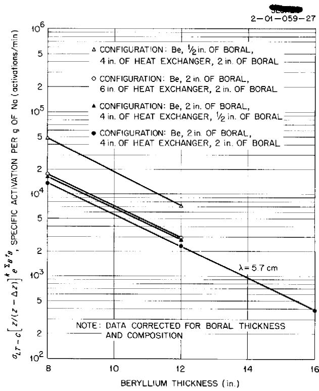  
Fig. 12.1. Mean Sodium Activation from Core Neutrons in the Heat Exchangers of LTSF CFRMR Mockups - Effect of Beryllium Thickness.

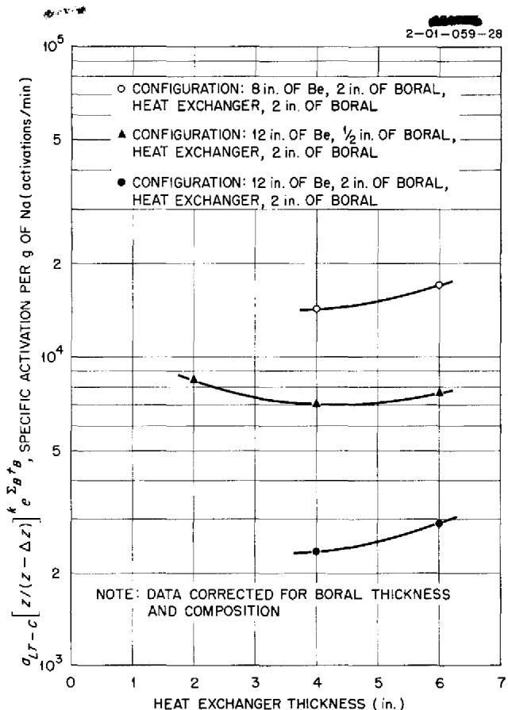  
Fig. 12.2. Mean Sodium Activation from Core Neutrons in the Heat Exchangers of LTSF CFRMR Mockups - Effect of Heat Exchanger Thickness.

of the enriched boron curtain in present designs. The variation with respect to the thickness of the second boron curtain (Fig. 12.4) is small. The replacement of natural boron with $\mathsf{B}^{10}$ has still to be investigated. This would reduce the moderation (largely by $\mathsf{B}^{11}$ ) for equivalent absorption.

The decrease in activation occurring with the introduction of a hydrogenous layer (polyethylene) between the beryllium reflector and the first boron curtain is shown in Fig. 12.5 in terms of its beryllium replacement effectiveness. Since polyethylene cannot be used in the reactor, the computed effectiveness of zirconium hydride, which has high thermal stability at reflector operating temperatures, is shown for comparison.

The contribution of prompt core neutrons to the sodium activation in the heat exchanger of a CFR was calculated from the LTSF experimental data by application of conventional shielding transfor

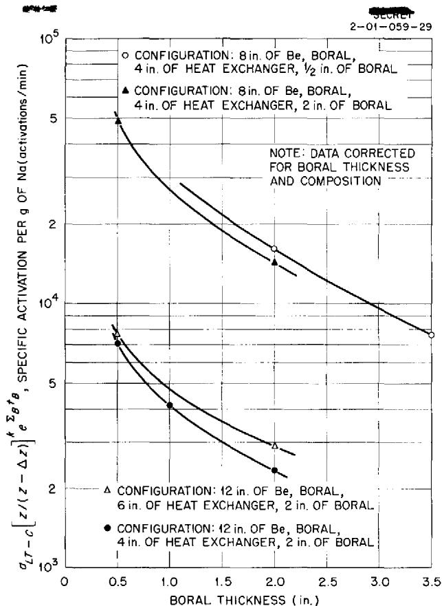  
Fig. 12.3. Mean Sodium Activation from Core Neutrons in the Heat Exchangers of LTSF CFRMR Mockups - Effect of First Boral Curtain Thickness.

mations. This implies that the neutron captures in sodium in the heat exchanger may be expressed in terms of a kernel involving approximately exponential neutron attenuation through the material thicknesses along the ray connecting a small fissioning region with a sodium volume element. In terms of these transformations the prompt-neutron contribution was expressed, as follows:

(1)

$$
a _ {R \cdot C} = \frac {r _ {c}}{r _ {H X}} \left. H (a, z) \frac {\sigma_ {R}}{\sigma_ {L T}} a _ {L T \cdot C} \left(\frac {z}{z - \Delta z}\right) ^ {k} e ^ {\sum_ {B} t _ {B}} \right.,
$$

where

$$
a _ {R \cdot C} = \begin{array}{l} \text {c o r e - n e u t r o n - i n d u c e d a c t i v a t i o n p e r} \\ \text {g r a m o f s o d i u m i n a C F R h e a t e x c h a n g e r (a t o m s / m i n)}, \end{array}
$$

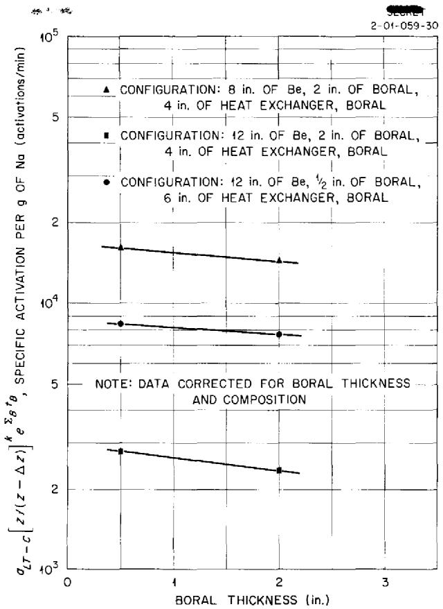  
Fig. 12.4. Mean Sodium Activation from Core Neutrons in the Heat Exchangers of LTSF CFRMR Mockups - Effect of Second Boral Curtain Thickness.

$$
a _ {L T \cdot C} = \begin{array}{l} \text {c o r e - n e u t r o n - i n d u c e d a c t i v a t i o n p e r} \\ \text {g r a m o f s o d i u m i n a n L T S F m o c k u p} \\ \text {(a t o m s / m i n)}, \end{array}
$$

$$
\sigma_ {L T} = \begin{array}{l} \text {s u r f a c e s o u r c e s t r e n g t h o f L T S F} \\ \text {s o u r c e p l a t e ,} \end{array}
$$

$$
\begin{array}{l} \sigma_ {R} = \text {e q u i v a l e n t s u r f a c e s o u r c e s t r e n g t h} \\ = \lambda_ {c} \rho (1 - e ^ {- t _ {c} / \lambda_ {c}}), \\ \end{array}
$$

$$
\begin{array}{l} \lambda_ {c} = \text {r e l a x a t i o n} \quad \text {l e n g t h} \quad \text {i n} \quad \text {C F R} \quad \text {c o r e} \quad \text {f o r} \quad \text {a c t i v a t i o n} \quad \text {n e u t r o n s} \quad (1 1. 6 \mathrm {c m}, \text {w i t h} \quad \text {t h e a s s u m p t i o n} \quad \text {t h a t} \quad \text {n e u t r o n} \quad \text {r e m o v a l} \quad \text {c r o s s} \quad \text {s e c t i o n s} \quad \text {a r e} \quad \text {v a l i d} \quad \text {f o r} \quad \text {t h i s} \\ \rho = \text {p o w e r d e n s i t y i n C F R c o r e} (\mathrm {w} / \mathrm {c m} ^ {3}), \\ t _ {c} = \text {t h i c k n e s s o f C F R c o r e a n n u l u s (c m)}, \\ \end{array}
$$

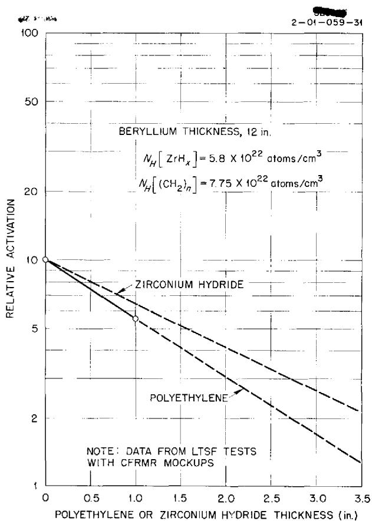  
Fig. 12.5. Mean Sodium Activation from Core Neutrons in the Heat Exchangers of LTSF CFRMR Mockups - Estimated Effect of Replacing Beryllium in the Reflector with Polyethylene or Zirconium Hydride.

$$
\begin{array}{l} H (a, z) = \text {r a t i o} \quad \text {o f} \quad \text {a c t i v a t i o n} \quad \text {f r o m} \quad \text {a n} \quad \text {i n f i n i t e} \quad \text {p l a n e s o u r c e} \quad \text {t o} \quad \text {t h a t} \quad \text {f r o m} \quad \text {L T S F} \quad \text {d i s k} \quad \text {s o u r c e} \\ = 1 / (1 - e ^ {- a ^ {2} / 2 \lambda z}), \\ a = \text {L T S F} \\ \lambda_ {n} = \begin{array}{l} \text {a v e r a g e n e u t r o n r e l a x a t i o n l e n g t h} \\ (7. 5 \mathrm {c m}), \end{array} \\ z = \text {d i s t a n c e} \quad \text {f r o m} \quad \text {s o u r c e p l a t e} \quad \text {t o} \quad \text {s o d i u m} \quad \text {i n} \quad \text {L T S F} \quad \text {h e a t} \quad \text {e x c h a n g e r} \quad \text {m o c k u p} \quad (\mathrm {c m}), \\ r _ {c} / r _ {H X} = \text {r a t i o o f a c t i v a t i o n f r o m s p h e r i c a l C F R c o r e o f r a d i u s} r _ {c} (\mathrm {c m}) \text {a n d h e a t} \text {e x c h a n g e r o f r a d i u s} r _ {H X} (\mathrm {c m}) \text {t o a c t i v a t i o n f r o m a n i n f i n i t e p l a n e} \\ \end{array}
$$

$\left(\frac{z}{z - \Delta z}\right)^k =$ correction allowing for the sodium displacement outward in the experiment because of the bulk of aluminum in the boral and the air gaps which are not present in the CFR (plotted in Fig. 12.6),5

$\Delta z =$ thickness of boral and air gaps (cm), $e^{\sum_{B}t_{B}} =$ allowance for the difference between the neutron attenuation through boral in the LTSF mockup and that through BCA-Cu in the CFR,

$\Sigma_B =$ activation-reducing cross section for the aluminum in the boral   
$= 0.0164\mathrm{cm}^{-1}$ , based on multigroup calculations at Pratt & Whitney,

$t_{B} =$ thickness of boral (cm).

# Calculation of Activation by Delayed Neutrons

The activation induced by delayed neutrons emitted in the heat exchanger was estimated from the experimental data taken at the LTSF with the use of a moving fission belt (see Sec. 13). Since the delayed-neutron emission from any point on the belt is proportional to the time of exposure to the circular opening (core hole) of the ORNL Graphite Reactor, and since the emission is constant at any point during the belt rotation (because the belt transit time is less than the average half life of the delayed-neutron emitters), the distribution of delayed-neutron emission for the belt can be expressed, as follows:

$$
n _ {L T} (y) = n _ {L T} (0) \sqrt {1 - (y / a) ^ {2}} K, \tag {2}
$$

where

$n_{LT}(y) =$ number of delayed neutrons emitted per second from a square centimeter of the belt at a distance $y$ (cm) from the center line (neutrons/cm2·sec),

$n_{LT}(0) =$ emission rate on the belt center line (neutrons $\mathrm{cm}^2\cdot \mathrm{sec})$

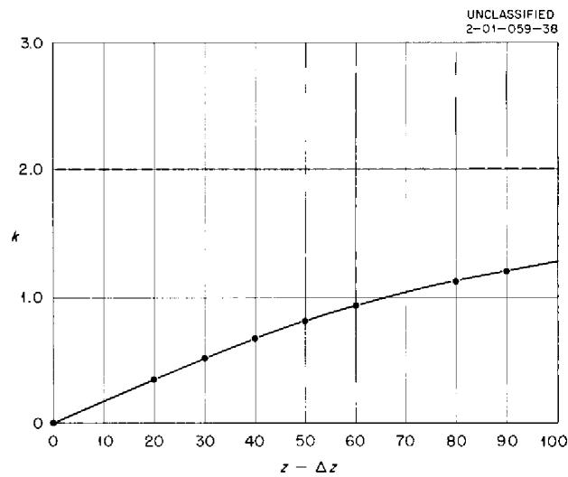  
Fig. 12.6. Plot of $k$ vs $(z - \Delta z)$ .

$a =$ half width of the emitting area of the belt (equal to the radius of the core hole of the ORNL Graphite Reactor),

$K =$ ratio of emission from belt completing circuit in finite time to emission in zero transit time. (The correction for decay of delayed-neutron emitters that complete one-half the circuit is $K \sim$ 0.96.)

Normalizing the emission rate over the total belt area to the total power from fissions in the belt gives

$$
n _ {L T} (0) = \frac {2 P _ {L T} d}{\pi a l} \tag {3}
$$

where

$P_{LT} =$ total power from fissions in the belt (5.2 w obtained by normalizing to the LTSF static tests),

$d =$ number of delayed neutrons emitted per watt of fissions (neutrons/w),

$l =$ length of belt (cm).

An approximate value for the age of delayed neutrons moderated from 500 to 3 kev in the heat exchanger was calculated, by means of the following expression, to aid in interpreting the experimental results in terms of the CFR geometry.

$$
\tau = \int_ {E _ {1}} ^ {E} 0 \frac {D}{\xi \Sigma_ {T}} \frac {d E}{E}, \tag {4}
$$

which was approximated by

$$
\tau \approx \frac {\ln \left(E _ {0} / E _ {1}\right)}{3 \sum_ {i} N _ {i} \bar {\sigma} _ {i} \sum_ {i} \xi_ {i} N _ {i} \bar {\sigma} _ {i}} = 2 1 6 \mathrm {c m} ^ {2} \tag {4a}
$$

where

$$
E = \text {n e u t r o n} (\text {k e v}),
$$

$$
D = \text {d i f f u s i o n c o e f f i c i e n t} (1 / 3 \sum_ {i} N _ {i} \bar {\sigma} _ {i}),
$$

$\Sigma_T =$ total neutron macroscopic cross section for the heat exchanger (assumed to be homogeneous),

$N_{i} =$ number of atoms per cubic centimeter of the ith kind,

$\xi_{i} =$ average logarithmic energy decrement for atoms of the ith kind,

$\overline{\sigma}_i =$ total neutron microscopic cross section for atoms of the ith kind averaged over the lethargy range.

The average composition (in $\mathrm{g/cm^3}$ ) of the LTSF heat exchanger mockup was: nickel, 2.23; sodium, 0.65; fluorine, 0.54.

Since $\sqrt{\tau}$ (14.7 cm) is small compared with the belt length in the heat exchanger (120 cm) but significant compared with the belt half width (35.5 cm), the ratio was obtained of the slowing-down density from a source of infinite length but finite width (with sources distributed according to Eq. 2) to the slowing-down density from an infinite plane source representing the uniform reactor heat exchanger. The slowing-down density from an infinite plane was taken to be

$$
q _ {\infty p l} = n _ {\infty p l} \frac {e ^ {- \rho^ {2} / 4 \tau}}{\sqrt {4 \pi \tau}} = 0. 0 1 9 2 n _ {\infty p l}, \tag {5}
$$

where

$n_{\omega p l} =$ delayed neutron emission per square centimeter from an infinite plane (neutrons/cm2·sec),

$\rho =$ distance from infinite plane to sodium sample $(2.54~\mathrm{cm})$

The slowing-down density from the LTSF fission belt was taken to be

$$
q _ {L T} = 2 \int_ {0} ^ {a} n _ {L T} (y) \frac {e ^ {- \sqrt {\left(\rho^ {2} - y ^ {2}\right) / 4 \tau}}}{4 \pi \tau} d y, \tag {6}
$$

since

$q_{l} =$ slowing-down density from an infinite line source

$$
= n _ {l} e ^ {- r ^ {2} / 4 \tau} / 4 \pi \tau ,
$$

$n_{l} =$ line source strength, taken to be $n_{L T}(y)dy$ (neutrons/cm2·sec),

$r =$ distance from the line to the sodium sample (cm),

$$
r ^ {2} = \rho^ {2} - y ^ {2}.
$$

The integral was evaluated numerically to obtain the following result:

$$
q _ {L T} = 0. 0 1 9 3 \bar {n} _ {L T}, \tag {7}
$$

where

$$
\bar {n} _ {L T} = \frac {P _ {L T} d}{2 a l} \tag {8}
$$

For equivalent source strengths the ratio of slowing-down density $(q_{\infty p l} / q_{L T})$ at 3 kev for the LTSF belt compared with an infinite plane is thus seen to be approximately unity.

The fuel in the heat exchanger of a CFR is approximated by an infinite plane with a delayed neutron source strength of

$$
n _ {\infty p l} = \frac {P _ {R} d}{V _ {f}} f _ {H X} t _ {H X}, \tag {9}
$$

where

$$
P _ {R} = \text {r e a c t o r p o w e r (w a t t s)},
$$

$$
V _ {f} = \text {t o t a l f u e l v o l u m e o f s y s t e m} (\mathrm {c m} ^ {3}),
$$

$f_{HX} = \frac{\text{fraction of heat exchanger volume containing fuel}}{2}$

$t_{HX} =$ heat exchanger thickness (cm).

If it is assumed that the sodium activation is proportional to the slowing-down density of 3-kev neutrons, then the specific activation in the heat exchanger of a CFR is given by

$$
\frac {a _ {R - D}}{a _ {L T - D}} = \frac {q _ {\infty p l}}{q _ {L T}} = \frac {0 . 0 1 9 2 n _ {\infty p l}}{0 . 0 1 9 3 \bar {n} _ {L T}} \approx \frac {n _ {\infty p l}}{\bar {n} _ {L T}}, \tag {10}
$$

where

$$
a _ {R - D} = \text {d e l a y e d n e u t r o n a c t i v a t i o n p e r g r a m o f} \quad \text {s o d i u m i n a C F R h e a t e x c h a n g e r} \quad (\text {a t o m s / m i n}),
$$

$$
\begin{array}{l} a _ {L T \cdot D} = \text {d e l a y e d n e u t r o n a c t i v a t i o n p e r g r a m o f} \\ \text {s o d i u m i n a L T S F m o c k u p (a t o m s / m i n) .} \\ (\text {F o r t h e c a l c u l a t i o n s p r e s e n t e d i n} \\ \text {T a b l e 1 2 . 1 , a} _ {L T \cdot D} = 1 5 0 0 \text {a t o m s / m i n .}) \end{array}
$$

# Calculated Total Activations for Several Reactors

The total activation of sodium in the heat ex-changers from core and delayed neutrons was calculated for four circulating-fuel reactors (Table 12.1). The power for three of the reactors was $300\mathrm{Mw}$ , and the fourth reactor corresponded to the ART, with a power of $60\mathrm{Mw}$ . In addition to the total saturated activities, the total activity after $30\mathrm{hr}$ of operation was determined.

TABLE 12.1. SODIUM ACTIVATION IN THE HEAT EXCHANGERS OF CIRCULATING-FUEL REACTORS   

<table><tr><td rowspan="2"></td><td colspan="4">Configuration</td></tr><tr><td>1</td><td>2</td><td>3</td><td>4*</td></tr><tr><td>Island radius (in.)</td><td>4</td><td>4</td><td>4</td><td></td></tr><tr><td>Core radius (in.)</td><td>8.59</td><td>10.16</td><td>9.74</td><td>10.5</td></tr><tr><td>Beryllium thickness (in.)</td><td>8</td><td>12</td><td>16</td><td>11</td></tr><tr><td>First B10curtain (atoms/cm2)</td><td>3.52 × 1022</td><td>3.52 × 1022</td><td>3.52 × 1022</td><td>**</td></tr><tr><td>Heat exchanger thickness (in.)</td><td>8</td><td>6.5</td><td>5</td><td>2.1</td></tr><tr><td>Second B10curtain (atoms/cm2)</td><td>1.12 × 1022</td><td>1.12 × 1022</td><td>1.12 × 1022</td><td>**</td></tr><tr><td>Power density (kw/cm3)</td><td>5.5</td><td>2.75</td><td>2.75</td><td>0.72</td></tr><tr><td>Weight of sodium in heat exchanger (g)</td><td>118,000</td><td>144,000</td><td>137,000</td><td>42,000</td></tr><tr><td>Reactor power (Mw)</td><td>300</td><td>300</td><td>300</td><td>60</td></tr><tr><td>Saturated activity from core neutrons (curies)</td><td>19,300</td><td>3,350</td><td>430</td><td>470</td></tr><tr><td>Saturated activity from delayed neutrons (curies)</td><td>1,970</td><td>1,530</td><td>1,250</td><td>61</td></tr><tr><td>Total saturated activity (curies)</td><td>21,270</td><td>4,880</td><td>1,680</td><td>531</td></tr><tr><td>Total activity after 30 hr (curies)</td><td>16,060</td><td>3,680</td><td>1,270</td><td>400</td></tr></table>

*Configuration 4 corresponds to the ART configuration.   
\*\*First and second B 10 curtains consist of 0.375 in. of natural $\mathsf{B}_4\mathsf{C}$

# 13. LID TANK SHIELDING FACILITY

R.W.Peelle

J.M.Miller

Applied Nuclear Physics Division

W.J.McCool

J. Smolen

Pratt & Whitney Aircraft

Analysis of the static source tests in the second series of experiments with mockups of a circulating-fuel reflector-moderated reactor and shield (RMR-shield) in the Lid Tank Shielding Facility (LTSF) was completed. A summary of the tests is presented. The dynamic source tests were completed, and the tests are being analyzed. Two tests with the dynamic source are described here.

# STATIC SOURCE TESTS WITH MockUPS OF A REFLECTOR-MODERATED REACTOR AND SHIELD

J. Smolen

H. C. Woodsum

The static source tests in the recent series of experiments with RMR-shield mockups were subdivided into sections according to the parameters being investigated. These parameters, descriptions of the various mockups tested, and an index to the results of the measurements are given in Table 13.1. Much of the information has been reported previously,[2,3] as indicated in the table. Most measurements not previously published are presented in this report.

# Effect of Varying Lead Thickness

The thickness of lead was varied in mockups having 8-, 12-, and 16-in.-thick beryllium reflectors. Gamma-ray dose-rate measurements for the 8- and 16-in.-thick reflectors are reported here (Figs. 13.1 and 13.2), but the data are not directly comparable because the "core shell" materials differed. With the 8-in. reflector, Li-Mg $(\frac{1}{4}$ in. thick) was substituted for the Inconel $(\frac{1}{8}$ in. thick) used to mock up the core shell. Inconel gives a hard capture gamma ray, approximately 9 Mev. Thus, in order to correlate the gamma-ray data from these two beryllium thicknesses with data from 12 in. of beryllium, two configurations were measured to

determine the effect on the gamma-ray dose rate of interchanging Inconel and Li-Mg (Fig. 13.3).

The effects on the thermal-neutron flux of varying the thickness of lead in mockups with 8 and 16 in. of beryllium are shown in Figs. 13.4 and 13.5, respectively. Measurements beyond mockups with 12 in. of beryllium were previously published.2

Fast-neutron dose-rate measurements beyond mockups with various lead thicknesses and 16 in. of beryllium (Fig. 13.6) appear to be self-consistent and to be consistent with data for 12 in. of beryllium. The measurements for 8 in. of beryllium (Fig. 13.7), however, do not appear to be self-consistent. This was apparently due to intermittent instrument malfunctioning. The results

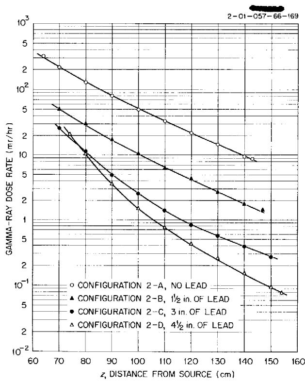  
Fig. 13.1. Gamma-Ray Dose Rate Beyond RMR-Shield Mockups - Effect of Varying Thickness of Lead Behind 8 in. of Beryllium.

Note: The water region behind the lead was borated to 1,95 wt % unless otherwise indicated

TABLE 13.1. SUMMARY OF REFLECTOR-MODERATED REACTOR AND SHIELD MockUP TESTS AT THE LTSF   

<table><tr><td rowspan="2">Investigation</td><td rowspan="2">Configu-
ration
No.</td><td colspan="9">Components and Thicknesses</td><td rowspan="2">z0(a)
( cm)</td><td colspan="4">Index to Plots of Data(b)</td></tr><tr><td>Core
Shell
(in.)</td><td>Beryllium
(Reflector)
(in.)</td><td>Boral
(in.)</td><td>NaF-Ni Tanks
(Heat Exchanger)
(in.)</td><td>Boral
(in.)</td><td>Nickel
(Pressure
Shell)
(in.)</td><td>Lead
(Gamma
Shield)
(in.)</td><td>Total
Air
(cm)</td><td>Other Deviations</td><td>Gamma-Ray
Dose Rate</td><td>Thermal-
Neutron
Flux</td><td>Fast-
Neutron
Dose Rate</td><td>Activations</td></tr><tr><td rowspan="4">Effect of varying water bora-
tion</td><td>1-A</td><td></td><td colspan="5">Plain water in Lid Tank (i.e., no RMR tank installed)</td><td colspan="3">0</td><td>0</td><td>ORNL-1896</td><td>ORNL-1896</td><td></td><td></td></tr><tr><td>1-B</td><td></td><td colspan="5">RMR tank installed and filled with plain water</td><td colspan="3">4.55(c)</td><td>5.50(d)</td><td>II</td><td>II</td><td>ORNL-1896</td><td></td></tr><tr><td>1-C</td><td></td><td colspan="5">RMR tank installed and filled with 0.45%-barated water</td><td colspan="3">4.55(c)</td><td>5.50(d)</td><td>x</td><td>x</td><td>x</td><td></td></tr><tr><td>1-D</td><td></td><td colspan="5">RMR tank installed and filled with 1.95%-barated water</td><td colspan="3">4.35(c)</td><td>5.3(d)</td><td>ORNL-1896</td><td>ORNL-1896</td><td>x</td><td></td></tr><tr><td rowspan="4">Effect of varying lead thick-
ness behind 8 in. of beryllium</td><td>2-A</td><td>Li-Mg,1/4</td><td>8</td><td>2</td><td>4</td><td>2</td><td>1</td><td>0</td><td>6.47</td><td></td><td>52.2</td><td>Fig. 13.1</td><td>Fig. 13.4</td><td>Fig. 13.7</td><td></td></tr><tr><td>2-B</td><td>II</td><td>II</td><td>II</td><td>II</td><td>II</td><td>II</td><td>1/2</td><td>7.36</td><td></td><td>56.9</td><td>II</td><td>II</td><td>II</td><td></td></tr><tr><td>2-C</td><td>II</td><td>II</td><td>II</td><td>II</td><td>II</td><td>II</td><td>3</td><td>6.55</td><td></td><td>59.9</td><td>II</td><td>II</td><td>II</td><td></td></tr><tr><td>2-D</td><td>II</td><td>II</td><td>II</td><td>II</td><td>II</td><td>II</td><td>4/2</td><td>6.84</td><td></td><td>64.0</td><td>II</td><td>II</td><td>II</td><td></td></tr><tr><td rowspan="9">Effect of varying lead thick-
ness behind 12 in. of beryllium</td><td>3-A</td><td>Inconel,1/6</td><td>12</td><td>2</td><td>4</td><td>2</td><td>1</td><td>0</td><td>4.30</td><td></td><td>59.6</td><td>ORNL-1896</td><td>ORNL-1896</td><td></td><td></td></tr><tr><td>3-B</td><td>II</td><td>II</td><td>II</td><td>II</td><td>II</td><td>II</td><td>1/2</td><td>4.89</td><td></td><td>64.0</td><td>II</td><td>II</td><td></td><td></td></tr><tr><td>3-C</td><td>II</td><td>II</td><td>II</td><td>II</td><td>II</td><td>II</td><td>3</td><td>4.78</td><td></td><td>67.7</td><td>II</td><td>II</td><td>ORNL-1896</td><td></td></tr><tr><td>3-D</td><td>II</td><td>II</td><td>II</td><td>II</td><td>II</td><td>II</td><td>4/2</td><td>9.83</td><td></td><td>76.1</td><td>x</td><td>x</td><td>x</td><td></td></tr><tr><td>3-D&#x27;</td><td>II</td><td>II</td><td>II</td><td>II</td><td>II</td><td>II</td><td>II</td><td>6.07</td><td></td><td>72.8</td><td>ORNL-1896</td><td>x</td><td>x</td><td>Au, ORNL-1896</td></tr><tr><td>3-D&#x27;&#x27;</td><td>II</td><td>II</td><td>II</td><td>II</td><td>II</td><td>II</td><td>II</td><td>4.77</td><td></td><td>71.5</td><td>II</td><td>ORNL-1896</td><td>ORNL-1896</td><td></td></tr><tr><td>3-E</td><td>II</td><td>II</td><td>II</td><td>II</td><td>II</td><td>II</td><td>6</td><td>5.06</td><td></td><td>75.6</td><td>II</td><td>II</td><td>ORNL-1896</td><td></td></tr><tr><td>3-F</td><td>II</td><td>II</td><td>II</td><td>II</td><td>II</td><td>II</td><td>7/2</td><td>5.55</td><td></td><td>79.9</td><td>II</td><td>II</td><td>ORNL-1896</td><td></td></tr><tr><td>3-G</td><td>II</td><td>II</td><td>II</td><td>II</td><td>II</td><td>II</td><td>9</td><td>6.14</td><td></td><td>84.3</td><td>II</td><td>II</td><td>x</td><td></td></tr><tr><td rowspan="3">Effect of varying lead thickness
behind 16 in. of beryllium</td><td>4-A</td><td>Inconel,1/6</td><td>16</td><td>2</td><td>4</td><td>2</td><td>1</td><td>3</td><td>6.45</td><td></td><td>79.8</td><td>Fig. 13.2</td><td>Fig. 13.6</td><td>Au and Na</td><td></td></tr><tr><td>4-B</td><td>II</td><td>II</td><td>II</td><td>II</td><td>II</td><td>II</td><td>4/2</td><td>6.01</td><td></td><td>82.9</td><td>II</td><td>Fig. 13.5</td><td>II</td><td></td></tr><tr><td>4-C</td><td>II</td><td>II</td><td>II</td><td>II</td><td>II</td><td>II</td><td>6</td><td>6.93</td><td></td><td>87.7</td><td>II</td><td></td><td></td><td></td></tr><tr><td rowspan="2">Inconel core shell and capture
gamma-ray dose</td><td>5-A</td><td>Inconel,1/8</td><td>8</td><td>2</td><td>4</td><td>2</td><td>1</td><td>4/2</td><td>5.03</td><td></td><td>61.6</td><td>Fig. 13.3</td><td>x</td><td>x</td><td>Au, Na, ORNL-1947</td></tr><tr><td>5-B</td><td>Li-Mg,1/4</td><td>12</td><td>II</td><td>II</td><td>II</td><td>II</td><td>II2</td><td>5.15</td><td></td><td>72.2</td><td>II</td><td>x</td><td>x</td><td></td></tr><tr><td rowspan="2">Effect of Inconel cladding be-
tween beryllium and first
boreal curtain</td><td>6-A</td><td>Inconel,1/8</td><td>12</td><td>2</td><td>4</td><td>2</td><td>1</td><td>4/2</td><td>5.72</td><td>0.020 in. of Inconel behind beryllium</td><td>72.5</td><td>ORNL-1896</td><td>x</td><td>x</td><td></td></tr><tr><td>6-B</td><td>II</td><td>II</td><td>II</td><td>II</td><td>II</td><td>II</td><td>II2</td><td>5.85</td><td>0.125 in. of Inconel behind beryllium</td><td>72.9</td><td>II</td><td>x</td><td>x</td><td></td></tr><tr><td rowspan="4">Effect of boral thickness
behind 8 in. of beryllium</td><td>7-A</td><td>Inconel,1/8</td><td>8</td><td>2</td><td>4</td><td>2</td><td>1</td><td>4/2</td><td>4.24</td><td></td><td>57.0</td><td>x</td><td>x</td><td></td><td>Na</td></tr><tr><td>7-B</td><td>Li-Mg,1/4</td><td>II</td><td>1/2</td><td>II</td><td>1/2</td><td>II</td><td>II2</td><td>7.68</td><td></td><td>62.3</td><td>x</td><td>x</td><td>x</td><td></td></tr><tr><td>7-C</td><td>II</td><td>II</td><td>2</td><td>II</td><td>II</td><td>II</td><td>II2</td><td>II</td><td></td><td></td><td></td><td></td><td></td><td>Na</td></tr><tr><td>7-D</td><td>II</td><td>II</td><td>3/2</td><td>II</td><td>II</td><td>II</td><td>II2</td><td>7.44</td><td></td><td>64.6</td><td></td><td></td><td></td><td>Na</td></tr><tr><td rowspan="3">Effect of heat exchanger thick-
ness and boral distribution
behind 8 in. of beryllium</td><td>8-A</td><td>Li-Mg,1/4</td><td>8</td><td>1</td><td>6</td><td>1</td><td>1</td><td>3</td><td></td><td>1/2-in-thick boral slab behind first and second NaF-Ni tanks (total of three tanks)</td><td>62.0</td><td>x</td><td></td><td></td><td>Na, LiCl
Na, ORNL-1947,
MgCl2
Na, ORNL-1947</td></tr><tr><td>8-B</td><td>II</td><td>II</td><td>II</td><td>II</td><td>II</td><td>II</td><td>II2</td><td>6.11</td><td></td><td></td><td></td><td></td><td></td><td></td></tr><tr><td>8-C</td><td>Inconel,1/8</td><td>II</td><td>2</td><td>II</td><td>2</td><td>II</td><td>4/2</td><td></td><td></td><td></td><td></td><td></td><td></td><td></td></tr></table>

TABLE 13.1 (continued)   

<table><tr><td rowspan="2">Investigation</td><td rowspan="2">Configu-ration No.</td><td colspan="9">Components and Thicknesses</td><td rowspan="2">\( \varepsilon_0^{(a)} (cm) \)</td><td colspan="4">Index to Plots of \( Dato^{(b)} \)</td><td></td></tr><tr><td>Core Shell (in.)</td><td>Beryllium (Reflector) (in.)</td><td>Boral (in.)</td><td>NaF-Ni Tanks (Heat Exchanger) (in.)</td><td>Boral (in.)</td><td>Nickel (Pressure Shell) (in.)</td><td>Lead (Gamma Shield) (in.)</td><td>Total Air (cm)</td><td>Other Deviations</td><td>Gamma-Ray Dose Rate</td><td>Thermal-Neutron Flux</td><td>Fast-Neutron Dose Rate</td><td>Activations</td><td></td></tr><tr><td rowspan="5">Effect of boral thickness be-hind 12 in. of beryllium</td><td>9-A</td><td>Inconel, \( \frac{1}{6} \)</td><td>12</td><td>0</td><td>4</td><td>2</td><td>1</td><td>\( 4\frac{1}{2} \)</td><td>6.55</td><td></td><td>68.2</td><td>ORNL-1896</td><td>x</td><td></td><td></td><td></td></tr><tr><td>9-B</td><td>II</td><td>II</td><td>\( \frac{1}{2} \)</td><td>II</td><td>II</td><td>II</td><td>\( \frac{1}{2} \)</td><td>5.98</td><td></td><td>68.9</td><td>II</td><td>x</td><td></td><td>Na, ORNL-1896</td><td></td></tr><tr><td>9-C</td><td>II</td><td>II</td><td>1</td><td>II</td><td>II</td><td>II</td><td>II</td><td>5.81</td><td></td><td>70.0</td><td>x</td><td>x</td><td></td><td>Na, ORNL-1896</td><td></td></tr><tr><td>9-D</td><td>II</td><td>II</td><td>\( \frac{1}{2} \)</td><td>II</td><td>\( \frac{1}{2} \)</td><td>II</td><td>II</td><td>8.57</td><td></td><td>72.3</td><td>x</td><td>x</td><td>x</td><td></td><td></td></tr><tr><td>9-E</td><td>Li-Mg, \( \frac{1}{4} \)</td><td>II</td><td>2</td><td>II</td><td>\( \frac{1}{2} \)</td><td>II</td><td>II</td><td>5.16</td><td></td><td>68.4</td><td></td><td>x</td><td></td><td>Na</td><td></td></tr><tr><td rowspan="2">Effect of heat exchanger thick-ness and boral distribution</td><td>10-A</td><td>Inconel, \( \frac{1}{8} \)</td><td>12</td><td>\( \frac{1}{2} \)</td><td>2</td><td>2</td><td>1</td><td>\( 4\frac{1}{2} \)</td><td>4.56</td><td></td><td>62.4</td><td>x</td><td>x</td><td>x</td><td>Na</td><td></td></tr><tr><td>10-B</td><td>II</td><td>II</td><td>2</td><td>6</td><td>II</td><td>II</td><td>II</td><td>6.09</td><td></td><td>77.9</td><td>x</td><td>x</td><td></td><td>Na, ORNL-1896</td><td></td></tr><tr><td rowspan="2">behind 12 in. of beryllium</td><td>10-C</td><td>II</td><td>II</td><td>\( \frac{1}{2} \)</td><td>II</td><td>II</td><td>II</td><td>II</td><td>5.50</td><td></td><td>73.5</td><td>ORNL-1896</td><td>x</td><td>x</td><td>II</td><td></td></tr><tr><td>10-D</td><td>II</td><td>II</td><td>\( \frac{1}{2} \)</td><td>II</td><td>\( \frac{1}{2} \)</td><td>II</td><td>II</td><td>5.71</td><td></td><td>69.9</td><td>x</td><td>x</td><td>x</td><td>II</td><td></td></tr><tr><td>Effect on secondary gamma-ray dose of distributing boral in lead</td><td>11-A</td><td>Li-Mg, \( \frac{1}{4} \)</td><td>8</td><td>\( \frac{1}{2} \)</td><td>4</td><td>\( \frac{1}{2} \)</td><td>1</td><td>\( 4\frac{1}{2} \)</td><td>7.74</td><td>\( \frac{1}{2} \)-in.-thick boral slab on each side of last \( \frac{1}{2} \)-in.-thick lead slab</td><td>64.9</td><td>Fig. 13.8</td><td>x</td><td></td><td></td><td></td></tr><tr><td rowspan="6">Effect on secondary gamma-ray dose of lead spacing</td><td>12-A</td><td>Li-Mg, \( \frac{1}{4} \)</td><td>8</td><td>2</td><td>4</td><td>2</td><td>1</td><td>\( 4\frac{1}{2} \)</td><td>7.05</td><td>Lead-water spacing as shown in Fig. 13.9</td><td>60.4</td><td>Fig. 13.9</td><td></td><td></td><td></td><td></td></tr><tr><td>12-B</td><td>II</td><td>II</td><td>II</td><td>II</td><td>II</td><td>II</td><td>II</td><td>8.65</td><td>II</td><td>62.0</td><td>II</td><td></td><td></td><td></td><td></td></tr><tr><td>12-C</td><td>II</td><td>II</td><td>II</td><td>II</td><td>II</td><td>II</td><td>II</td><td>8.75</td><td>II</td><td>62.1</td><td>II</td><td></td><td></td><td></td><td></td></tr><tr><td>12-D</td><td>II</td><td>II</td><td>II</td><td>II</td><td>II</td><td>II</td><td>II</td><td>8.55</td><td>II</td><td>61.9</td><td>II</td><td></td><td></td><td></td><td></td></tr><tr><td>12-E</td><td>II</td><td>II</td><td>II</td><td>II</td><td>II</td><td>II</td><td>II</td><td>7.94</td><td>II</td><td>65.1</td><td>II</td><td></td><td></td><td></td><td></td></tr><tr><td>12-F</td><td>II</td><td>II</td><td>II</td><td>II</td><td>II</td><td>II</td><td>II</td><td>7.05</td><td>II</td><td>60.4</td><td>II</td><td></td><td></td><td></td><td></td></tr><tr><td rowspan="5">Capture gamma-ray dose from shield and effect of gamma-ray streaming</td><td>13-A</td><td>Inconel, \( \frac{1}{8} \)</td><td>12</td><td>2</td><td>4</td><td>2</td><td>1</td><td>9</td><td>6.40</td><td>\( \frac{1}{4} \)-in.-thick Li-Mg slab behind lead</td><td>85.2</td><td>x</td><td></td><td></td><td>Na, ORNL-1896</td><td></td></tr><tr><td>13-B</td><td>II</td><td>II</td><td>II</td><td>II</td><td>II</td><td>II</td><td>II</td><td>6.00</td><td>\( \frac{1}{4} \)-in.-thick boral slab behind lead</td><td>84.8</td><td>\( x^{(e)} \)</td><td>\( x^{(e)} \)</td><td></td><td></td><td></td></tr><tr><td>13-C</td><td>II</td><td>II</td><td>II</td><td>II</td><td>II</td><td>II</td><td>II</td><td>II</td><td>Same as configuration 13-B with bismuth on sides of RMR tank</td><td>84.8</td><td>\( x^{(e)} \)</td><td>x</td><td></td><td></td><td></td></tr><tr><td>13-D</td><td>II</td><td>II</td><td>II</td><td>II</td><td>II</td><td>II</td><td>II</td><td>II</td><td>Same as configuration 13-C with \( \frac{1}{4} \)-in.-thick boral slab just inside water bag</td><td>84.8</td><td>x</td><td></td><td></td><td></td><td></td></tr><tr><td>13-E</td><td>II</td><td>II</td><td>II</td><td>II</td><td>II</td><td>II</td><td>II</td><td>6.14</td><td>Bismuth and lead shields on sides of RMR Tank</td><td>84.3</td><td>x</td><td></td><td></td><td></td><td></td></tr><tr><td rowspan="2">Effect of varying pressure shell thickness</td><td>14-A</td><td>Li-Mg, \( \frac{1}{4} \)</td><td>8</td><td>2</td><td>4</td><td>2</td><td>0</td><td>\( 4\frac{1}{2} \)</td><td>7.48</td><td></td><td>62.1</td><td>x</td><td></td><td></td><td></td><td></td></tr><tr><td>14-B</td><td>Inconel, \( \frac{1}{8} \)</td><td>12</td><td>II</td><td>II</td><td>II</td><td>2</td><td>II</td><td>4.93</td><td></td><td>74.2</td><td>ORNL-1896</td><td>x</td><td></td><td></td><td></td></tr><tr><td rowspan="2">Effect of heavy metals in re-flector</td><td>15-A</td><td>Li-Mg, \( \frac{1}{4} \)</td><td>8</td><td>2</td><td>4</td><td>2</td><td>1</td><td>\( 4\frac{1}{2} \)</td><td>7.42</td><td>3-in.-thick bismuth slab behind beryllium</td><td>72.2</td><td>Fig. 13.13</td><td></td><td>Fig. 13.14</td><td></td><td></td></tr><tr><td>15-B</td><td>II</td><td>II</td><td>II</td><td>II</td><td>II</td><td>II</td><td>II</td><td>7.56</td><td>2-in.-thick copper slab behind beryllium</td><td>69.8</td><td>II</td><td></td><td></td><td>Na, ORNL-1947</td><td></td></tr><tr><td>Effect of replacing borated water with plain water behind configuration</td><td>16-A</td><td>Inconel, \( \frac{1}{6} \)</td><td>12</td><td>\( \frac{1}{2} \)</td><td>4</td><td>\( \frac{1}{2} \)</td><td>1</td><td>\( 4\frac{1}{2} \)</td><td>9.27</td><td>Borated water replaced by plain water</td><td>73.0</td><td>Fig. 13.15</td><td>Fig. 13.16</td><td></td><td></td><td></td></tr></table>

(a) Thickness of configuration measured from surface of source plate to first water layer.   
$(b)_{\mathbf{x}}$ indicates that $z$ traverse measurements have been taken but not published to date. Configuration numbers cited in ORNL-1896 should be disregarded because the numbering system has been changed.

(c)Air bag inserted between source plate and aluminum window of RMR tank.

$(d)$ Represents total thickness of air and tank wall of RMR tank.

$(e)_{\text{In configuration 13-B, } x \text{ and } y \text{ traverses were also made; in configuration 13-C, } y \text{ traverses were also made.}}$

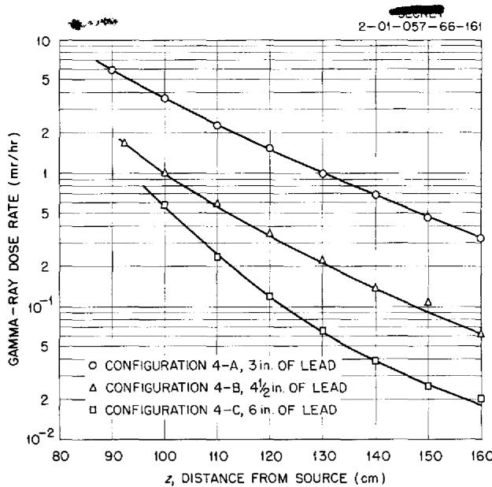  
Fig. 13.2. Gamma-Ray Dose Rate Beyond RMR-Shield Mockups - Effect of Varying Thickness of Lead Behind 16 in. of Beryllium.

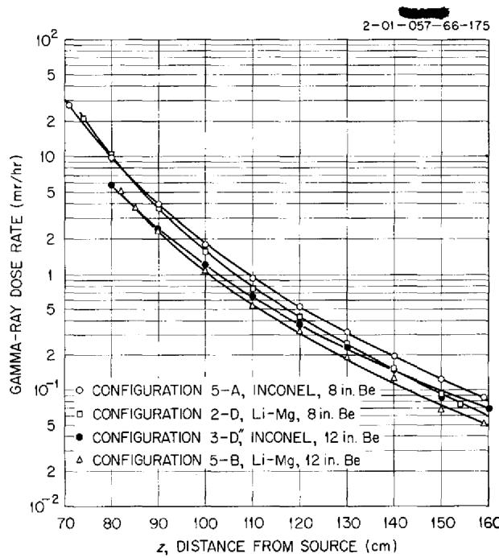  
Fig. 13.3. Gamma-Ray Dose Rate Beyond RMR-Shield Mockups - Effect of Inconel Core Shell.

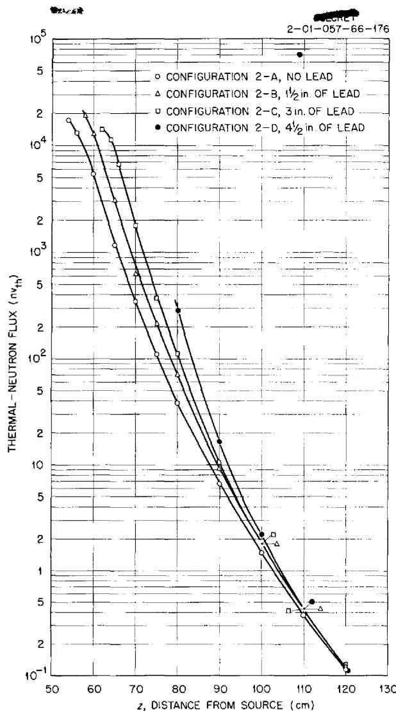  
Fig. 13.4. Thermal-Neutron Flux Beyond RMR-Shield Mockups - Effect of Varying Thickness of Lead Behind 8 in. of Beryllium.

for 0 and 3 in. of lead are thought to be in error by a factor of 2, but the remaining data are probably more accurate. It is hoped that this set of measurements can be made again. In the meantime, the data obtained to date are presented in lieu of more exact measurements.

# Study of Secondary Gamma-Ray Production

In order to analyze the gamma-ray dose rate from secondary gamma rays produced in the shield,

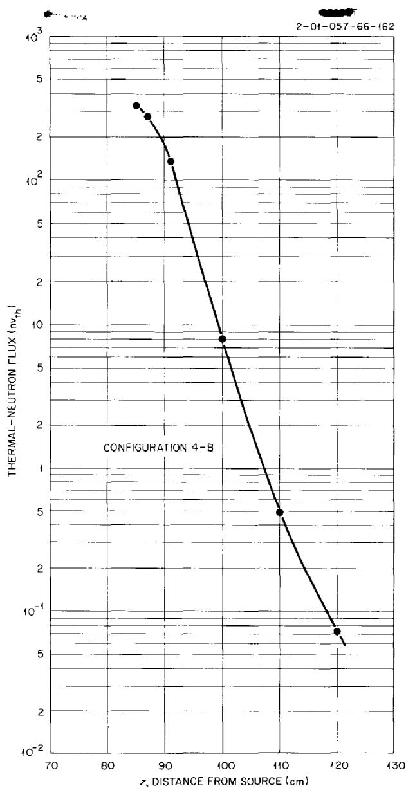  
Fig. 13.5. Thermal-Neutron Flux Beyond RMR-Shield Mockups - Effect of $4\frac{1}{2}$ in. of Lead Behind 16 in. of Beryllium.

two sets of tests were run. The first was a study of the effect of distributing boral in the lead region, and the second was a study of the effect of spacing a portion of the lead out into the borated water.

In a configuration that had a $4\frac{1}{2}$ -in.-thick lead region, a $\frac{1}{2}$ -in.-thick boral slab was inserted on each side of the last $\frac{1}{2}$ -in.-thick lead slab. No large decrease in the gamma-ray dose rate resulted (Fig. 13.8). Thus it appears that the secondary

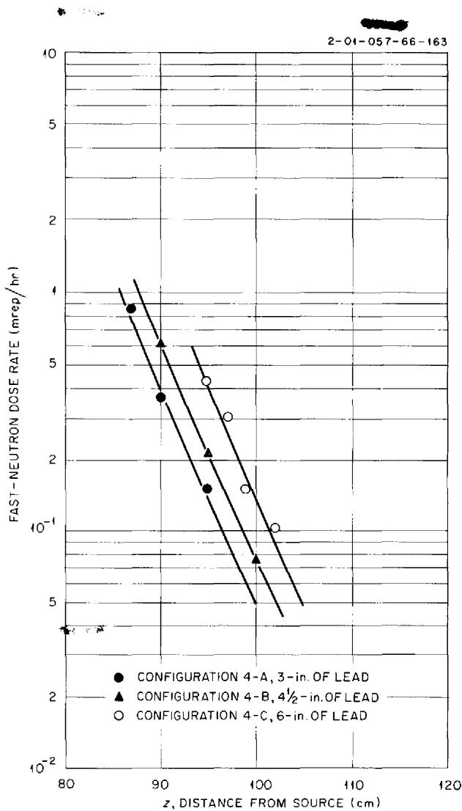  
Fig. 13.6. Fast-Neutron Dose Rate Beyond RMR-Shield Mockups - Effect of Varying Thickness of Lead Behind 16 in. of Beryllium.

gamma-ray dose rate is not mainly due to thermal-neutron captures in the lead. This is confirmed by calculations of the lead capture gamma-ray dose rate based on the thermal-neutron flux measurements immediately behind the lead and on the thermal-neutron capture cross section in the lead.

Spacing the last $1 \frac{1}{2}$ -in.-thick lead slab out into the borated water showed that the total gamma-ray dose rate decreased as the water thickness preceding the slab was increased from $1 \frac{3}{4}$ to 7 in. (Fig. 13.9). However, as the water thickness was increased beyond 7 in., there was no detectable change in the total gamma-ray dose rate. This is

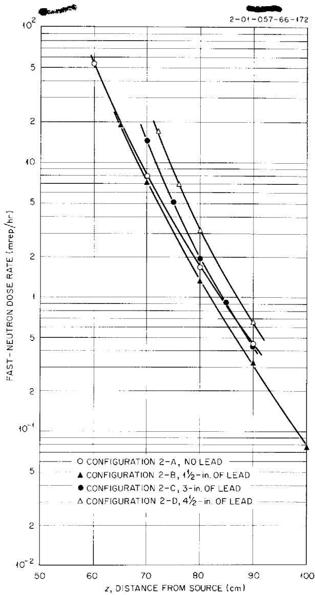  
Fig. 13.7. Fast-Neutron Dose Rate Beyond RMR-Shield Mockups - Effect of Varying Thickness of Lead Behind 8 in. of Beryllium.

shown by a comparison of configurations 12-C and 12-D, which correspond to spacings of 7 and 11 in. of water, respectively. Consequently, the gamma-ray dose rate for 7 in. of water was taken to be the "primary" dose rate (that is, the dose rate not caused by secondary gamma rays generated in the shield itself). The secondary gamma-ray dose rate from the shield then was obtained for each water spacing less than 7 in. by subtracting the dose rate for each water spacing from that for the 7-in. water spacing. The secondary-dose-rate

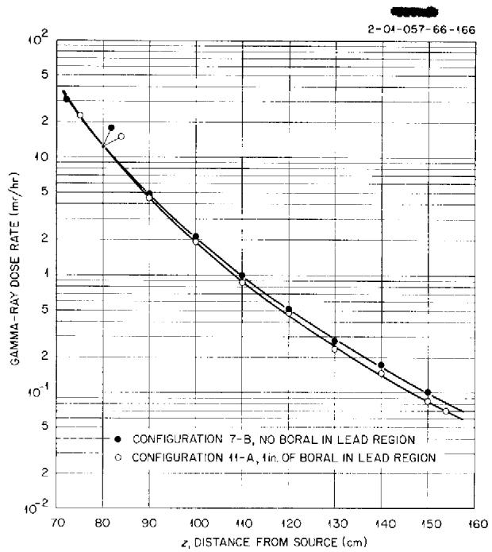  
Fig. 13.8. Gamma-Ray Dose Rate Beyond RMR-Shield Mockups - Effect of Boral in Lead Region.

curves were then plotted as a function of the distance behind the last lead slab (Fig. 13.10).

The secondary gamma-ray dose rate for a constant distance $t$ from the back of the lead was then plotted as a function of the lead-water spacing, $t_{s'}$ and was compared with the fast-neutron dose rate and thermal-flux attenuation in water (Fig. 13.11). It was found that the secondary gamma-ray dose rate for small water spacings, $t_{s'}$ and small water thicknesses, $t$ , decreases at nearly the same rate as the thermal-neutron flux. This can be explained by the fact that the gamma-ray dose rate from boron capture gamma rays makes up the major portion of the secondary gamma-ray dose rate at small water thicknesses, and the boron capture gamma-ray dose rate is, of course, directly proportional to the thermal-neutron flux in the borated water. For large water spacings, however, there was enough scatter of experimental points to make the comparison questionable.

Another experiment was performed to clarify some of the uncertainties present in the previous investigations of the secondary gamma-ray dose rate. It was thought that by placing an additional lead slab in the water behind the shield it would

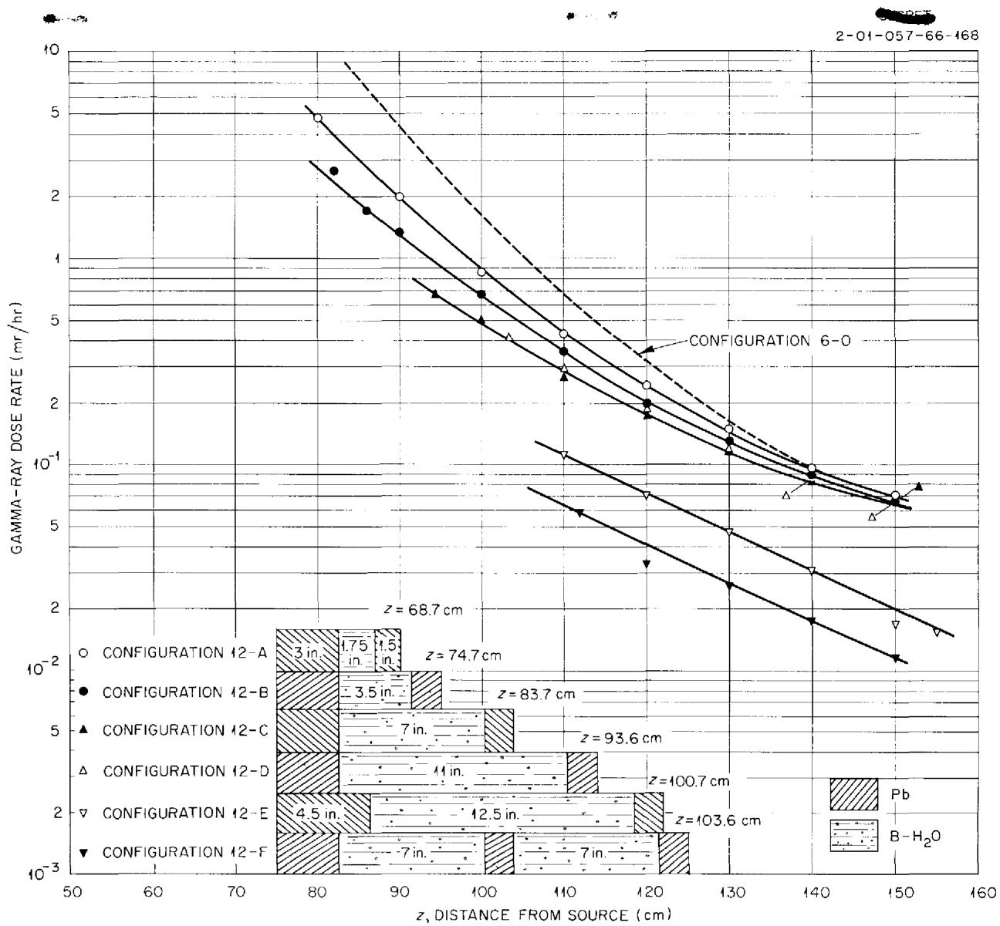  
Fig. 13.9. Gamma-Ray Dose Rate Beyond RMR-Shield Mockups - Effect of Lead Spacing.

be possible to tell something about the energy of the secondary gamma rays by their attenuation in the water and lead. In configuration 12-E (8 in. of beryllium), a lead slab $(1\frac{1}{2}$ in. thick) was placed $12\frac{1}{2}$ in. behind the $4\frac{1}{2}$ -in.-thick lead gamma shield. Gamma-ray dose-rate measurements behind the configuration (Fig. 13.9) should be compared with those behind configuration 12-F, where the extra lead slab was placed behind a mockup in which the lead region was spaced in such a way as to virtually eliminate the secondary gamma-ray dose. These, in turn, can be compared with an extrapo

lation of measurements behind configurations 2-A through 2-D, which represents the total gamma-ray dose rate beyond a 6-in.-thick lead region not spaced out. This extrapolated curve (Fig. 13.9) was designated as configuration 6-0. It should be noted that configurations 12-E, 12-F, and 6-0 all have 6 in. of lead, and thus the "primary" gamma-ray dose rate is attenuated by the same amount in every case. Since the lead in configuration 12-F was spaced in such a way as to eliminate the secondary gamma-ray dose rate, subtracting the dose rate for configuration 12-F from that for

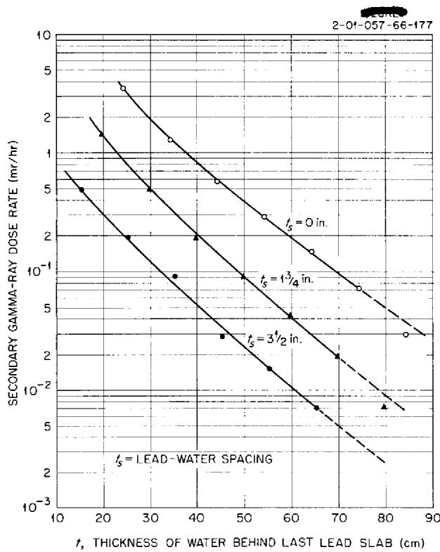  
Fig. 13.10. Secondary Gamma-Ray Dose Rate from RMR-Shield Mockups as a Function of the Water Thickness $(t)$ Behind the Last Lead Slab.

configuration 12-E gives the attenuated secondary gamma-ray dose rate. Similarly, the unattenuated secondary dose rate can be obtained by subtracting the gamma-ray dose rate for configuration 12-F from that for configuration 6-0. The attenuated and unattenuated secondary dose rates were then plotted as a function of the distance from the secondary source (Fig. 13.12), which was considered to be at the back surface of the "dry" lead, that is, at the back surface of the lead preceding the borated water. By inspection of these two curves, it may be seen that there is a "harden ing" of the secondary gamma-ray spectrum caused by attenuating the secondary gamma rays by $1\frac{1}{2}$ in. of lead. By comparing the slope of the attenuated secondary dose rate with the calculated attenuation of hydrogen capture gammas (2.2 Mev) in water, it was found that the attenuated secondary gamma rays had a much shallower slope than the

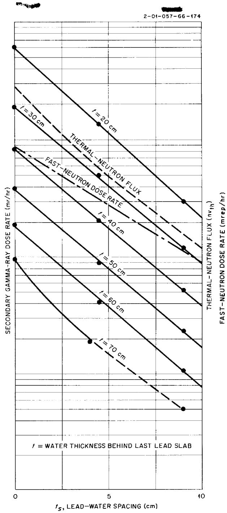  
Fig. 13.11. Secondary Gamma-Ray Dose Rate from RMR-Shield Mockups as a Function of the Lead-Water Spacing $(t_{s})$ : Comparison with Thermal-Neutron Flux and Fast-Neutron Dose Rate.

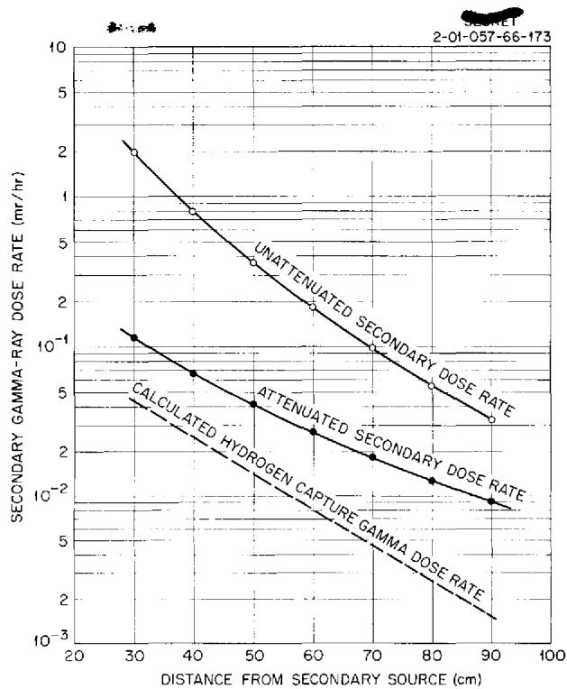  
Fig. 13.12. Effect of Attenuating Secondary Gamma-Ray Dose from RMR-Shield Mockups Through $1\frac{1}{2}$ in. of Lead.

2.2-Mev gamma ray would indicate. Thus it appeared that lead capture gamma rays (7.4 Mev) must also contribute to the secondary gamma-ray dose rate. A simple calculation of the attenuation of 0.48-Mev boron capture gamma rays through $1\frac{1}{2}$ in, of lead showed that they would contribute negligibly to the attenuated secondary dose rate. Therefore, apparently the total unattenuated secondary dose rate is made up of three component secondary sources: boron capture gammas, lead capture gammas, and hydrogen capture gammas. The attenuated secondary dose rate is made up of the hydrogen and lead capture gamma-ray dose rate attenuated through $1\frac{1}{2}$ in, of lead.

# Effect of Heavy Metals in the Reflector

In a study to determine the effect of replacing the outer region of the reflector with a heavy metal, 3 in. of bismuth or 2 in. of copper was added behind 8 in. of beryllium. Since in a spherical reactor these heavy-metal layers would be at a smaller radius than the lead gamma-ray shield, it seemed possible that some weight saving might result by

replacing part of the lead gamma-ray shielding with an equivalent thickness of some heavy metal in the reflector. The results (Fig. 13.13) show that on a thickness basis the bismuth and copper are both much less effective than lead, and they are, of course, much less effective than their calculated attenuations (neglecting secondary gamma-ray production) would predict. This is due to the fact that the additional attenuation gained by use of the heavy metal is offset by the production of secondary gamma rays. A calculation of the weight savings which might result from introducing 3 in. of bismuth into the reflector and removing an equivalent thickness of lead from the outer region of the gamma shield indicates that for the moderate lead thicknesses (up to $4\frac{1}{2}$ in.) characteristic of the divided shield, small or negligible weight savings are made. However, for unit shields where the outer region of lead is at a large radius, some weight saving may result by replacing lead with a heavy metal in the reflector.

It is not obvious from these tests which of the two metals would be superior. Unfortunately, only a 2-in.-thick slab of copper was available, and, for this thickness, the self-absorption of secondary

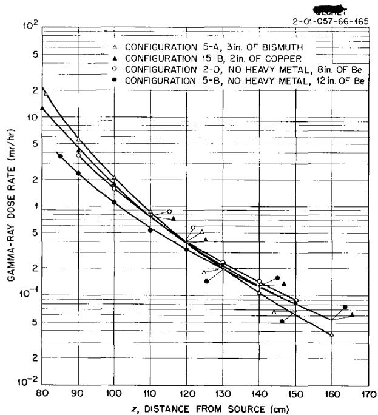  
Fig. 13.13. Gamma-Ray Dose Rate Beyond RMR-Shield Mockups - Effect of Heavy Metals in Reflector Region.

gamma rays would be small. Hence, on a thickness basis, the copper would appear to be less effective than tests with a larger thickness would probably show.

The copper did appear to be as effective in shielding fast neutrons (Fig. 13.14) as was the beryllium which it replaced, while the bismuth was considerably less effective than beryllium. On a weight basis, the copper and bismuth were equally effective in shielding gammas.

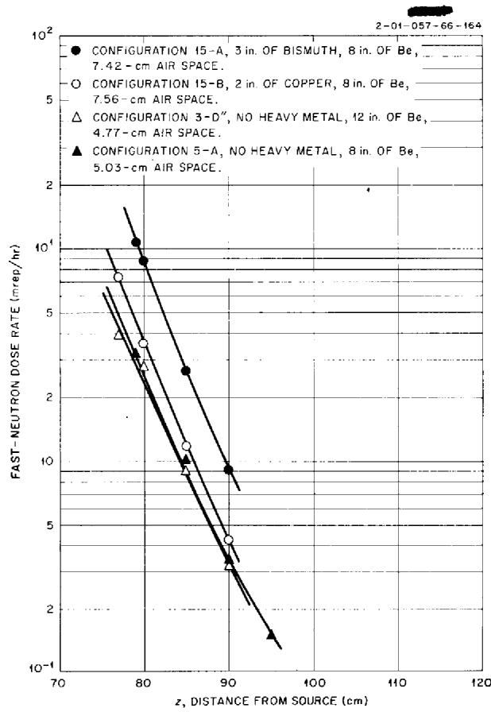  
Fig. 13.14. Fast-Neutron Dose Rate Beyond RMR-Shield Mockups - Effect of Heavy Metals in Reflector Region.

# Effect of Borating the Water Shield

Borating the water of the shield to 1.95 wt % decreased the gamma-ray dose rate by a factor of 2.3 (Fig. 13.15) and the thermal-neutron flux by a factor of about 15 (Fig. 13.16).

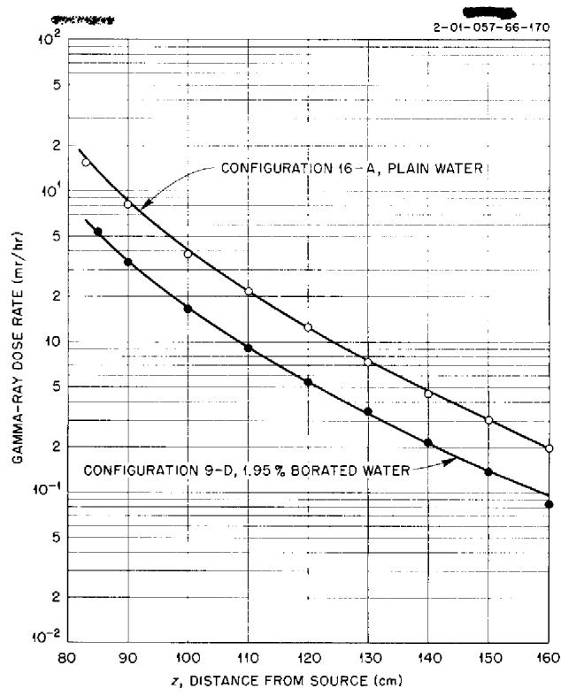  
Fig. 13.15. Gamma-Ray Dose Rate Beyond RMR-Shield Mockups - Effect of Replacing Borated Water Behind Mockup with Plain Water.

# DYNAMIC SOURCE TESTS WITH MockUPS OF A REFLECTOR-MODERATED REACTOR AND SHIELD

For the dynamic source tests the source plate of the LTSF was removed, and a mechanism that simulated the circulating fuel of a reactor was installed. The mechanism consisted of an electric-motor-driven continuous chain belt (Fig. 13.17) to which MTR-type fuel plates were attached. The plates moved continuously past the exit end of a hole in the ORNL Graphite Reactor (LTSF source plate removed) to the heat exchanger region of the RMR-shield mockups. The time required for one complete rotation of the belt, called the transit time, $T$ , varied between 1 and $2\frac{1}{2}$ sec. During these tests, radiation measurements were made behind two basic configurations (with $1\frac{1}{2}$ and 3 in. of lead), but the data have not yet been analyzed. Measurements of the sodium activation in the heat

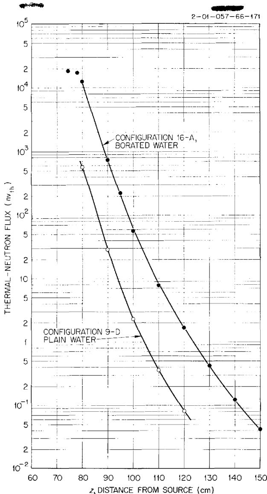  
Fig. 13.16. Thermal-Neutron Flux Beyond RMR-Shield Mockups - Effect of Replacing Borated Water Behind Mockup with Plain Water.

exchanger are reported below. In addition, a determination of the fission-product gamma-ray spectrum is presented. For this determination the RMR-shield mockup was removed and borated water and lead were placed inside the perimeter of the fuel loop.

# Sodium Activation in the Heat Exchanger

W.J.McCool

Sodium fluoride pellets were exposed at approximately the center line in the sodium fluoride-filled

nickel tanks that were used to simulate a circulating-fuel-reactor heat exchanger (Fig. 13.18). The other components used in the mockups to simulate different regions of the reactor and shield were: (1) fuel plates on the motor-driven belt, (2) $\frac{1}{8}$ -in.-thick Inconel "core shell," (3) 12-in.-thick (three 4-in. slabs) beryllium reflector, (4) first boron curtain (four $\frac{1}{2}$ -in.-thick boral slabs), (5) 2-in.-thick heat exchanger, (6) fuel plates on the belt, (7) 2-in.-thick heat exchanger, (8) second boron curtain (four $\frac{1}{2}$ -in.-thick boral slabs), (9) 1-in.-thick nickel pressure shell, and (10) 3-in.-thick lead (two $\frac{1}{2}$ -in.-thick slabs) gamma-ray shield. Most of the regions are shown in Fig. 13.18; however, the fuel plates, the second boron curtain, and the nickel pressure shell are not visible. In addition to the components shown in Fig. 13.18, an aluminum tank containing borated water was placed in the void behind the lead slabs to simulate the neutron shield.

Measurements of the sodium activation were made for various transit times (Fig. 13.19) in mockups that represented a reactor with approximately $50\%$ of the fuel in the core and $50\%$ in the heat exchanger. In test 1 the fuel belt was not rotated; that is, the uranium plates were held in a stationary position both at the exit end of the hole in the ORNL Graphite Reactor shield and in the heat exchanger. This corresponded to a circulating fuel with an infinite transit time. The resulting activations were due to neutrons born in the region simulating the core of the reactor. In tests 2, 3, and 4, made while the fuel plates were circulated with various transit times, the measured activations were due to delayed neutrons emitted in the heat exchanger, in addition to the neutrons emitted in the core of the simulated reactor. It is assumed that the activation rate of the sodium increases monotonically with decreasing transit time, although a comparison of the results of tests 2 and 3 would not appear to verify this. The discrepancy is attributed to experimental error. In test 5, a $\frac{1}{2}$ -in.-thick boral sheet in the first boron curtain was replaced with a 1-in.-thick plastic sheet to determine the effect of a hydrogenous material preceding this curtain.

A comparison of the results of test 1 (infinite transit time) with the results of test 4 (1.25-sec transit time) shows an increase in the total activation by approximately $20\%$ $(1.2 \times 10^{3} \mathrm{~d} / \mathrm{min})$ . Since the transit time for test 4 was considered to

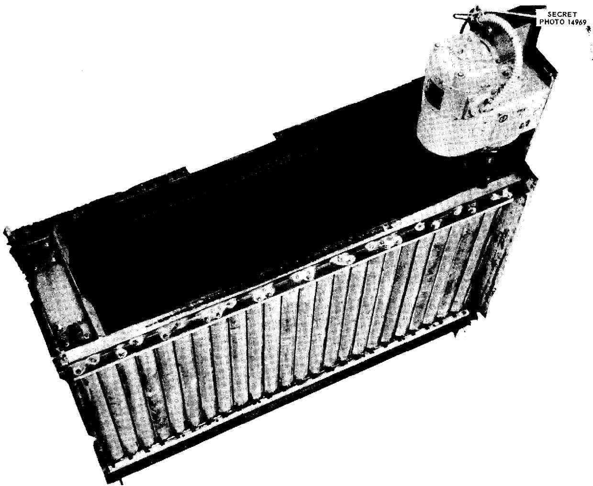  
Fig. 13.17. Circulating-Fuel Mechanism for LTSF Dynamic Source Tests with the RMR-Shield.

be typical of a circulating-fuel reactor (CFR), it is indicated that, in the heat exchanger of a CFR with a 12-in.-thick reflector, $20\%$ of the total activation in the heat exchanger is due to delayed neutrons. A comparison of test 1 with test 5 shows that, for an infinite transit time, replacing one of the boral sheets with a hydrogenous material reduced the total activation due to core neutrons to $40\%$ of the value obtained when no hydrogenous material was used.

At present there has been no correlation of the sodium-activation measurements in the static and dynamic phases of the RMR-shield mockup tests because of the uncertainty of the fission rate of the fuel on the circulating belt. However, the

static source tests can be compared with test 1 in this series, in which the fuel plates were stationary between the two heat exchangers. If the space between the heat exchanger tanks occupied by the frame of the circulating mechanism is subtracted from the distance, $z$ , between the fission source and the second heat exchanger tank of test 1, the resulting curve will be found to be parallel to the curve for mockup 1 of the static tests. This indicates that for a static source the uranium in the heat exchanger affected both heat exchanger tanks proportionally. Most of the sodium activation takes place from neutrons

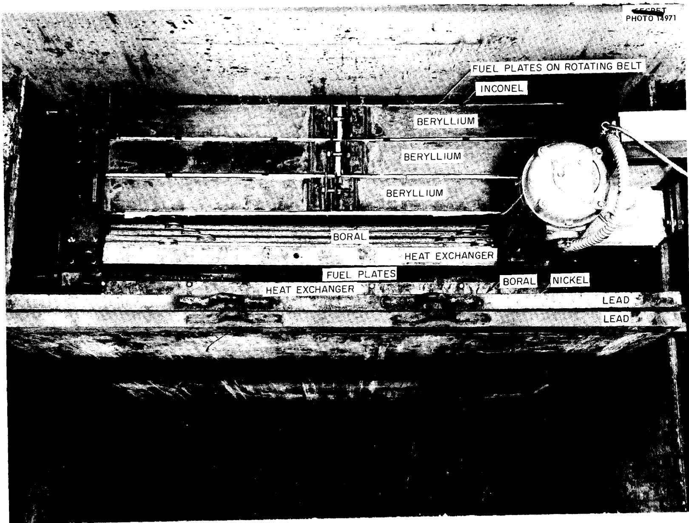  
Fig. 13.18. RMR-Shield Mockup with Circulating Fuel for Sodium-Activation Tests.

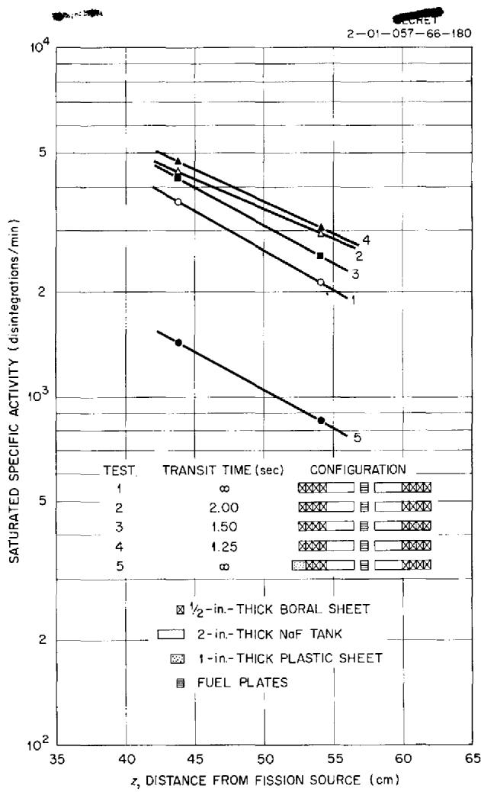  
Fig. 13.19. Sodium Activation in the Heat Exchanger Region of the RMR-Shield Mockups for Various Fuel Transit Times.

originating in the core, so that if the stationary uranium plates between the heat exchanger tanks affected sodium resonance neutrons at all, the effects would tend to be more pronounced in the second heat exchanger tank. Therefore the comparison between the two test implies that the uranium in the heat exchanger had little, if any, effect in the static tests.

# Fission-Product Gamma-Ray Spectrum

R.W.Peelle W.Zobel5

T. A. Love

For a circulating-fuel reactor (CFR) a large fraction of the gamma-ray flux outside the reactor

shield originates from fission-product decays in the primary heat exchanger region. The first experimental energy spectrum has now been measured for the gamma rays from the gross fission-product mixture. For these measurements a multiple-crystal gamma-ray spectrometer was used in conjunction with the circulating solid fuel belt (described above).

Although the spectrometer was installed in the LTSF, the associated electronic instrumentation remained at the Bulk Shielding Facility. Neutrons from the ORNL Graphite Reactor were allowed to impinge upon the solid fuel belt shown in Fig. 13.17. Figure 13.20 is a sketch of the configuration used in the LTSF in combination with the spectrometer and fuel loop. The boral, lead, and water placed within the perimeter of the loop were provided to reduce as much as possible the counting rate in the spectrometer caused by sources other than the section of the fuel belt viewed by the spectrometer collimator. A photograph of the experimental assembly with the spectrometer region partially dismantled is shown in Fig. 13.21. The fuel loop (1) is at the left of the picture, hidden by the remainder of the configuration. The water tank (2) and the lead shielding (3) within the loop, as well as the major portions of the spectrometer assembly, show plainly. The scintillation spectrometer (4) is surrounded by 6 to 8 in. of lead, except for a $1\frac{1}{2}$ -in.-dia gamma-ray collimator pointing at the fuel loop. Bricks (5) made from a combination of LiF and paraffin were stacked around the lead spectrometer shield to a thickness of 8 to 12 in. During operation the top of the assembly was plugged with lead and LiF-paraffin shields (not shown in the photograph). Lumber was stacked in the regions between the lithiated paraffin and the plywood wall (6) protecting the rotating fuel belt.

Measurements of the gamma-ray spectrum were made while the fuel loop was operated in such a manner that any one fuel plate completed a revolution every $T$ seconds. The observed counting rate was a function of time after the start of activation of the rotating belt. In principle, it would

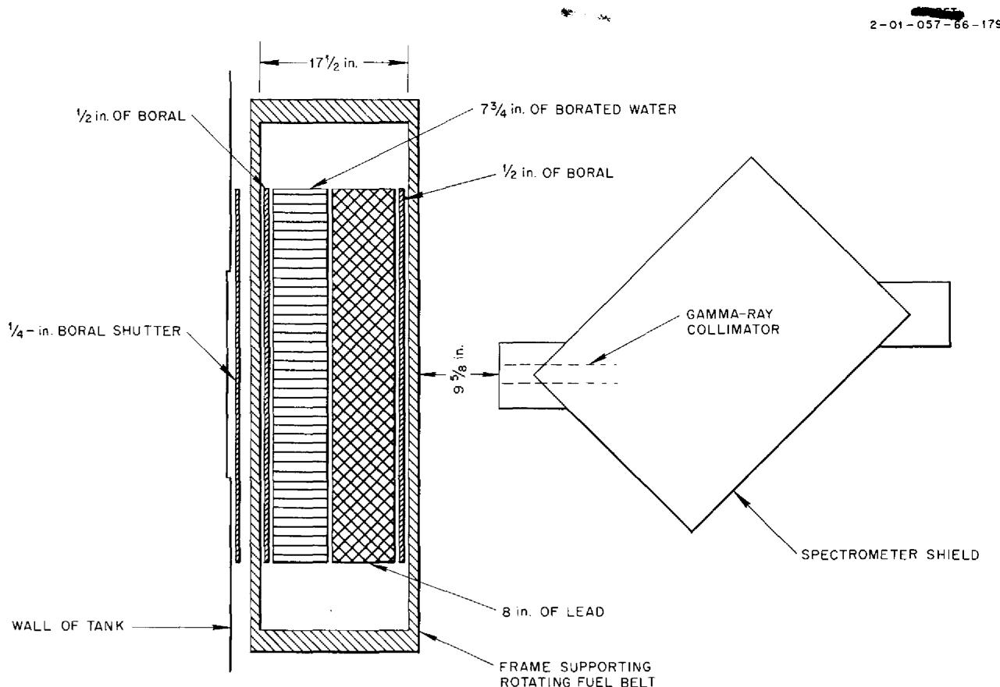  
Fig. 13.20. Experimental Arrangement for Measurement of the Fission-Product Gamma-Ray Spectrum of the Circulating Fuel.

also be a function of the transit time $T$ . The spectrum obtained under the conditions described contained three components of importance:

1. the desired photon spectrum from the section of the fuel loop directly in front of the spectrometer collimator;   
2. the photon spectrum originating within the Graphite Reactor and the prompt gamma-ray spectrum associated with fission events occurring in the side of the fuel loop near the reactor;   
3. the random background events associated with the seepage of radiation through the spectrometer shield.

Contribution 2 was made as small as possible by the lead and water shield within the fuel loop. Contribution 3 was reduced not only by the lead and lithiated paraffin shield around the spectrometer but also by the insertion of a boral iris between the reactor and the fuel belt so that a sec

tion of the fuel only 4 in. high was activated by the neutron flux incident from the Graphite Reactor.

In order to measure the undesirable contributions 2 and 3, spectral measurements were made with the fuel stationary and also with a large lead plug filling the collimator opening. Spectral measurements were not started until some time after the rotating rig had been operating at full power. This allowed the fission-product activity to approach its equilibrium with the saturation of a large share of the fission-product gamma-ray emitters.

Transit times $T$ between 1.2 and 2.5 sec were used for a total of four spectral measurements. Although a complete and detailed analysis is not yet available, there is no apparent variation either in shape or in intensity of the spectrum as the transit time is changed. A typical spectrum is shown in Fig. 13.22. This spectrum is representative of the gamma radiation from the fuel loop about 3 hr after the beginning of the activation.

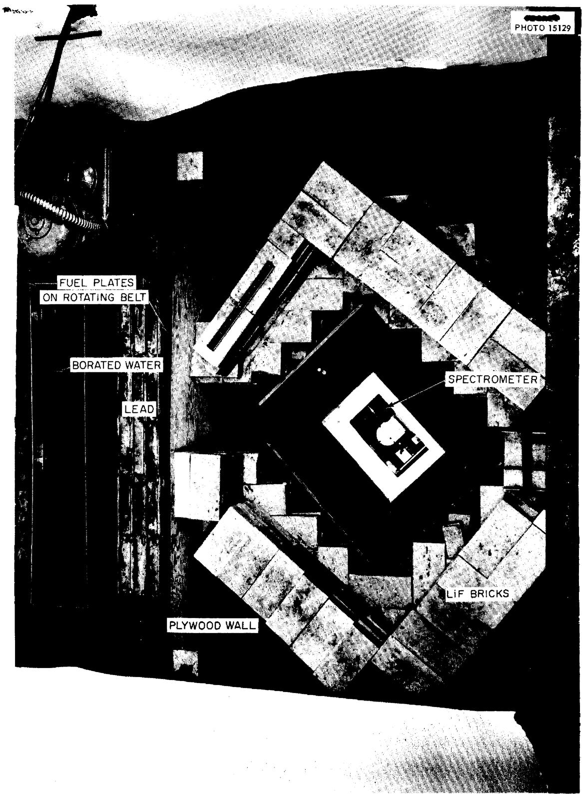  
Fig. 13.21. Partially Dismantled Gamma-Ray Spectrometer at the LTSF.

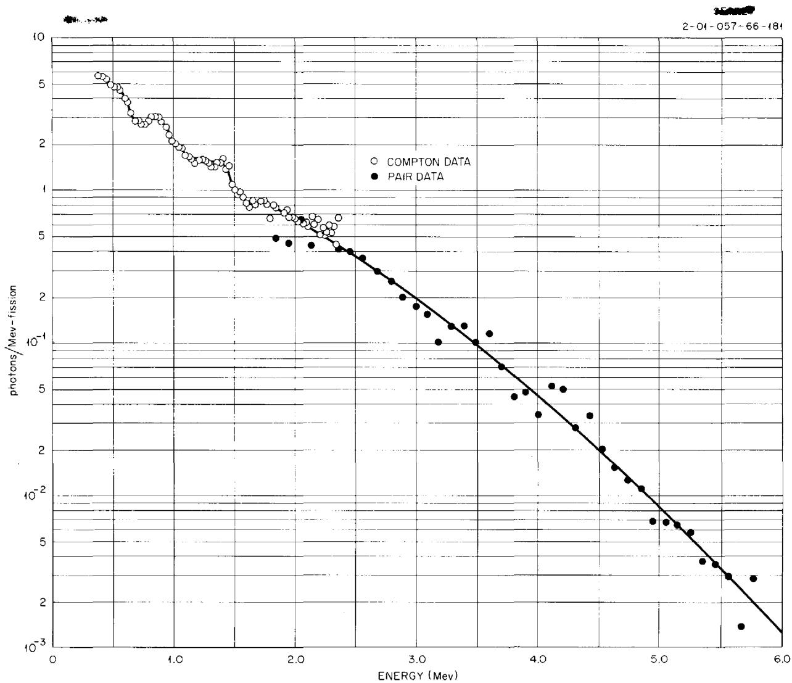  
Fig. 13.22. Fission-Product Gamma-Ray Spectrum of the Circulating Fuel.

The shape of the spectrum is based upon the experimental data and upon calibrations of the efficiency of the detector as a function of photon energy. The normalization of the spectrum depends on additional factors such as the solid angle of the collimator used, the thermal-neutron flux impinging upon the reactor side of the loop, and the percentage utilization of this flux for the fission process. The curve presented in Fig. 13.20 represents a rapid evaluation of these factors. A more complete evaluation of the data will also include the calculation of the statistical errors on the points shown in Fig. 13.22. These errors are

considerable at the higher energies, and it is expected that they will adequately explain the experimental scatter of the data points.

The fission-product photon energy spectrum shown in Fig. 13.22 was integrated between 0.36 and 5.8 MeV, and averages of 4.2 photons/fission and 4.8 MeV/fission were obtained over the intervening energy interval. An estimated probable error of $\pm 20\%$ is assigned to these averages and to the normalization of the experimental spectrum. This estimated error is largely caused by uncertainties in the fission rate in the fuel plates.

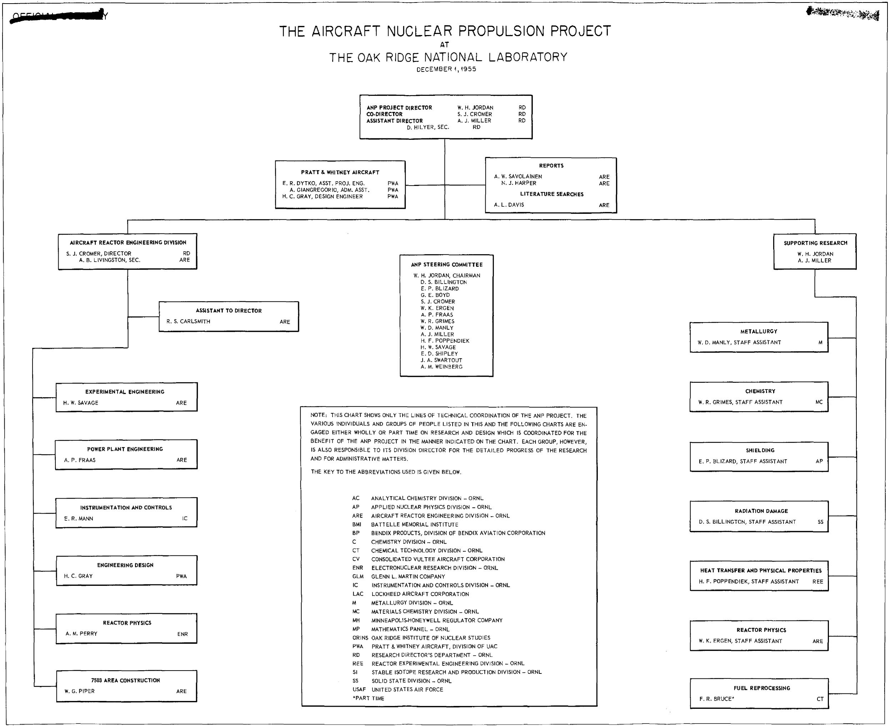

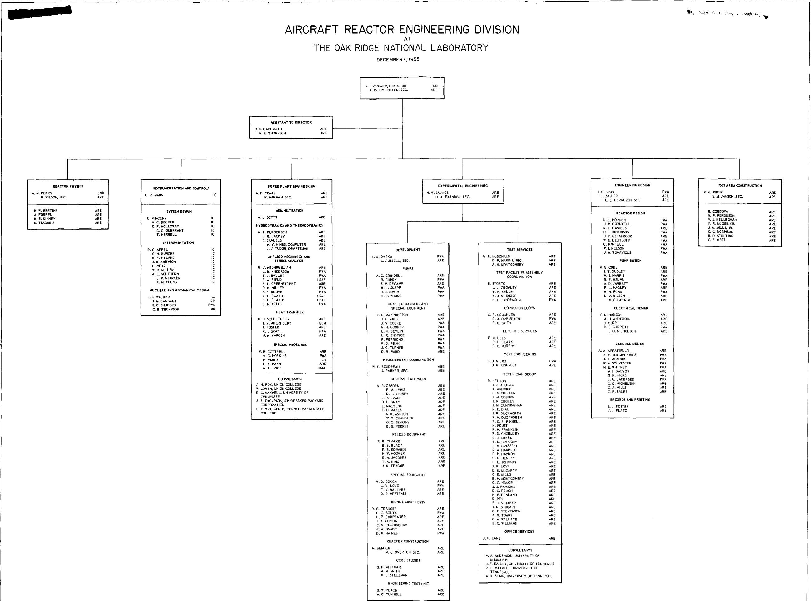

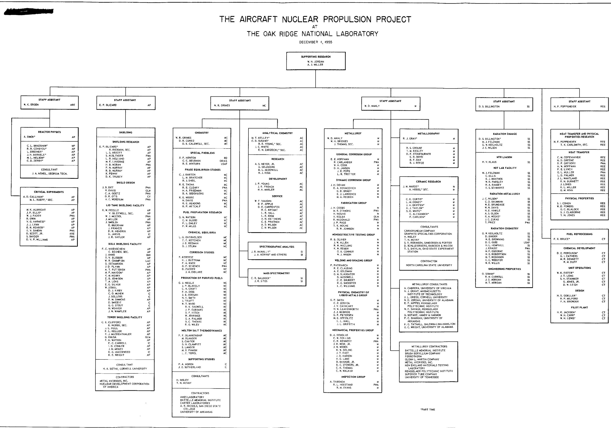

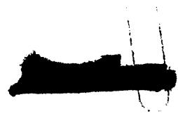

