ORNL-2D46

Metallurgy and Ceramics

34456 03500995

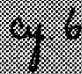

CORROSION OF MATERIALS IN FUSED HYDROXIDES

G.P.Smith

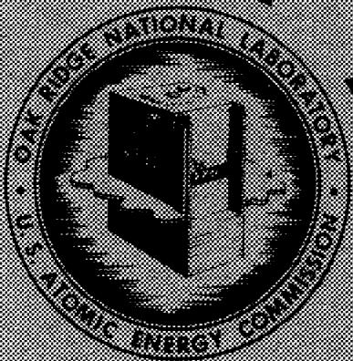

CENTRAL RESEARCH LIBRARY DOCUMENT COLLECTION

LIBRARY LOAN COPY

DO NOT TRANSFER TO ANOTHER PERSON

If you wish someone else to see this document, send in name with document and the library will arrange a loan.

OAK RIDGE NATIONAL LABORATORY

OPERATED BY

UNION CARBIDE NUCLEAR COMPANY

A Division of Union Carbide and Carbon Corporation

图6

POST OFFICE BOX P·OAK HIDGE, TENNESSEE

# UNCLASSIFIED

ORNL-2048

COPY NO.

Contract No. W-7405-eng-26

METALLURGY DIVISION

CORROSION OF MATERIALS IN FUSED HYDROXIDES

G.P.Smith

DATE ISSUED

1956

OAK RIDGE NATIONAL LABORATORY

Operated by

UNION CARBIDE NUCLEAR COMPANY

A Division of Union Carbide and Carbon Corporation

Post Office Box P

Oak Ridge, Tennessee

UNCLASSIFIED

MAGTIN MARIETTA ENERGY SYSTEMS LIBRARIES

34456 03500995

__________

__________

# UNCLASSIFIED

# INTERNAL DISTRIBUTION

1. C.E. Center   
2. Biology Library   
3. Health Physics Library   
4. Metallurgy Library

5-6. Central Research Library

7. Reactor Experimental Engineering Library

8-20. Laboratory Records Department

21. Laboratory Records, ORNL R.C.   
22. A.M. Weinberg   
23. L. B. Emlet (K-25)   
24. J. P. Murray (Y-12)   
25. J.A. Swartout   
26. E.H. Taylor   
27. E.D. Shipley

28. F. C. VonderLage   
29. W.C.Jordan   
30. C.P. Keim   
31. J.H.Frye, Jr.   
32. R. S. Livingston   
33. R.R. Dickison   
34. S. C. Lind   
35. F.L. Culler   
36. A.H. Snell   
37. A. Hølgaender   
38. M.T.Kelley   
39. K. Z. Morgan   
40. J.A. Lane   
41. T. A. Lincoln   
42. A. S. Householder   
43. C. S. Harrill   
44. C. E. Winters   
45. D. S. Billington

46. D.W.Cardwell   
47. W.D.Manly   
48. E.M. King   
49. A. J. Miller   
50. D. D. Cowen   
51. P. M. Reyling   
52. G.C.Williams   
53. R.A. Charpie   
54. M. L. Picklesimer   
55. G.E. Boyd   
56. J. E. Cunningham   
57. H. L. Yakel   
58. G.M. Adamson   
59. M.E. Steidlitz   
60. C.R. Boston   
61. J. J. McBride   
62. G.F. Petersen   
63. J.V. Cathcart   
64. W.H. Bridges   
65. E.E.Hoffman   
66. W.H.Cook   
67. W.R. Grimes   
68. F. Kertesz   
69. F.A.Knox   
70. F. F. Blankenship

71-90. G.P. Smith

91. N. J. Grant (consultant)   
92. E. Creutz (consultant)   
93. T. S. Shevlin (consultant)   
94. E. E. Stansbury (consultant)   
95. ORNL - Y-12 Technical Library, Document Reference Section

# EXTERNAL DISTRIBUTION

96. R. F. Bacher, California Institute of Technology   
97. Division of Research and Development, AEC, ORO   
98. R. F. Kruk, University of Arkansas, Fayetteville, Arkansas   
99. Douglas Hill, Duke University, Durham, North Carolina   
100. L. D. Dyer, University of Virginia, Charlottesville   
101. R. A. Lad, National Advisory Committee for Aeronautics, Cleveland   
102. L. F. Epstein, Knolls Atomic Power Laboratory   
103. E. G. Brush, Knolls Atomic Power Laboratory

# UNCLASSIFIED

# UNCLASSIFIED

104. D. D. Williams, Naval Research Laboratory   
105. R. R. Miller, Naval Research Laboratory   
106. E. M. Simons, Battelle Memorial Institute   
107. H.A. Pray, Battelle Memorial Institute   
108. P. D. Miller, Battelle Memorial Institute   
109. M. D. Banus, Metal Hydrides, Inc.   
110-428. Given distribution as shown in T1D-4500 under Metallurgy and Ceramics category

DISTRIBUTION PAGE TO BE REMOVED IF REPORT IS GIVEN PUBLIC DISTRIBUTION

# UNCLASSIFIED

# CONTENTS

# ABSTRACT

1. INTRODUCTION 1   
2. ATOMIC NATURE OF FUSED SODIUM HYDROXIDE 2

3. CORROSION OF CERAMICS 2

Solubility Relations in Fused Hydroxides 2   
Oxide-Ion Donor-Acceptor Reactions 3   
Ceramics with Saturated Cations and Saturated Anions 3   
Ceramics with Acceptor Cations and Saturated Anions 4   
Ceramics with Saturated Cations and Acceptor Anions 6   
Oxidation-Reduction Reactions 7   
Corrosion of Other Kinds of Ceramics 7   
Secondary Corrosion Phenomena 7   
Summary 8

4. CORROSION OF METALS 8

Corrosion of Metals by Oxidation 8   
Corrosion by Hydroxyl Ions 8   
Corrosion by Alkali Metal Ions 11   
Corrosion by Oxidizing Solutes 11   
Corrosion of Alloys 11

5. MASS TRANSFER 16

Nickel 17   
Other Elemental Metals 20   
Alloys 20   
Bimetallic Effects 20   
Mechanism of Mass Transfer 21   
Differential Solubility (Mechanism I) 21   
Oxidation-Reduction Processes (Mechanisms II-VI) 21   
Local Cell Action (Mechanism II) 22   
Reduction of Hydroxyl Ions(Mechanism III) 22   
Reduction of Alkali Metal Ions (Mechanism IV) 23   
Reduction of Solutes (Mechanism V) 23   
Disproportionation (Mechanism VI) 23   
Summary of Mechanisms 24   
Summary 25

# REFERENCES 27

# UNCLASSIFIED

# CORROSION OF MATERIALS IN FUSED HYDROXIDES

G.P.Smith

# ABSTRACT

Some of the fused alkali-metal hydroxides are of potential interest in reactor technology both as coolants and as moderators. The property which most discourages the use of these substances is their corrosiveness.

The corrosion of ceramics and ceramic-related substances by fused hydroxides occurs both by solution and by chemical reaction. A few ceramics react with hydroxides by oxidation-reduction reactions, but most have been found to be attacked by oxide-ion donor-acceptor reactions. Magnesium oxide was the most corrosion-resistant of the ceramics which have been tested, although several other ceramics are sufficiently resistant to be useful.

The corrosion of metals and alloys by fused hydroxides takes place primarily by oxidation of the metal, accompanied by reduction of hydroxyl ions to form hydrogen and oxide ions. Three side reactions are known, but two of them are not important in most corrosion tests. The corrosion of alloys involves either the formation of subsurface voids within the alloy or the formation of complex, two-phase corrosion products at the surface of the alloy. Nickel is the most corrosion-resistant metal which has been studied in fused sodium hydroxide.

Mass transfer, induced by temperature differentials, has been found to be the primary factor limiting the use of metals which, under suitable conditions, do not corrode seriously.

# 1. INTRODUCTION

Some of the fused alkali-metal hydroxides are of potential interest in reactor technology as moderators, moderator-coolants, and, possibly, moderator-fuel vehicles. The heat-transfer properties of these substances are sufficiently good for them to have been recommended as industrial heat-transfer media. For use as a high-temperature moderator without a cooling function, sodium hydroxide possesses the virtues of being cheap and available as contrasted with its competitors, either liquid or solid. Furthermore, an essential simplicity in reactor design is achieved by combining in one material the two functions of slowing neutrons and cooling. There are only a few substances which will do both at high temperatures.

Of the high-temperature moderator-coolants, the fused alkali-metal hydroxides are among the most stable with respect to both thermal dissociation and radiation damage. It has been known for some time that the alkali metal hydroxides should be stable toward thermal dissociation. However, not until recently have techniques been developed whereby this dissociation could be quantitatively

measured. Steidlitz and Smith have shown that this dissociation is relatively small. For example, at $750^{\circ}C$ the partial pressure of water in equilibrium with fused sodium hydroxide is of the order of magnitude of 0.1 mm Hg.

The radiation stability of fused hydroxides has been reported by Hochanadel with regard to electron bombardment and by Keilholtz et al. with regard to neutron bombardment. The radiation levels reported were very substantial, and no evidence was found for radiation damage.

The property of fused alkali-metal hydroxides which most discourages their application at high temperatures is their corrosiveness. It is the purpose of this discussion to review the current scientific status of studies of corrosion by fused hydroxides.

During the past five years, knowledge of the corrosive properties of fused hydroxides at high temperatures has increased considerably. Nevertheless, this is a new field of research and one in which there has been found a remarkable variety of corrosion phenomena, so that the areas of ignorance are more impressive than the areas of knowledge. For this reason, the writer has

chosen to place emphasis on some of the problems which are most in need of solution. This review will, accordingly, be concerned with the kinds of corrosion phenomena which have been observed rather than with the compilation of engineering reference data. Moreover, with a view toward stimulating further research, the writer has taken the liberty of presenting a number of quite speculative ideas on the origins of some of the corrosion phenomena. Only in this way can many important possible accomplishments of further research be indicated.

In this report, the term "fused hydroxides" is taken to mean the fused alkali-metal hydroxides; the exception is lithium hydroxide, which, like the fused hydroxides of the alkaline-earth metals, is less stable with regard to thermal dissociation than the other alkali metal hydroxides. Most of the available corrosion data are for fused sodium hydroxide. Information on corrosion in fused potassium hydroxide indicates that this substance behaves qualitatively like sodium hydroxide. There are very little data available on the hydroxides of rubidium and cesium.

# 2. ATOMIC NATURE OF FUSED SODIUM HYDROXIDE

Studies of electrical conductivity and of the freezing-point depression by electrolyte solutes indicate that fused sodium hydroxide is a typical fused electrolyte which obeys, at least approximately, the model of ideal behavior proposed for such substances by Temkin. Thus, sodium hydroxide consists of sodium ions and hydroxyl ions held together by coulombic attraction such that no cation may be considered bound to a particular anion, although, on the average, each cation has only anion neighbors and vice versa. When an ionic sodium compound is dissolved in fused sodium hydroxide, the cations of the solute become indistinguishable from those of the solvent. The hydroxyl anion is not a simple particle of unit negative charge but has a dipole structure and, under suitable conditions, a polypole structure.10

# 3. CORROSION OF CERAMICS

Studies which have been made of the behavior of ceramic materials in fused hydroxides are limited in scope both as regards the variety of substances tested and the information obtained on any one substance. The use of petrography and x-ray diffraction, which have been largely ignored

in the past, together with a proper regard for the reactivity of many corrosion products in contact with moisture and carbon dioxide, is essential for further progress.

The corrosion of ceramics and of ceramic-related substances by fused hydroxides has been observed to take place by solution and by chemical reaction. A few of the chemical reactions which have been observed were found to be oxidation-reduction reactions. These will be described briefly near the end of this section. The majority of the known reactions of ceramics and ceramic-related substances with fused hydroxides have been found to be oxide-ion donor-acceptor reactions. This kind of reaction in fused hydroxides may be treated in a quantitative although formal way by application of acid-base analog theory. Such a treatment is beyond the scope of this report. However, some of the concepts derived from the theory of oxide-ion donor-acceptor reactions are very useful in describing the reactions between ceramics and hydroxides and will be considered.

Solubility Relations in Fused Hydroxides. - A ceramic material which is chemically inert toward fused hydroxides might be limited in usefulness because of appreciable solubility in these media. There have been very few quantitative measurements of solubility relations in fused hydroxides, and none of these measurements have been made for substances which are of importance as ceramics. However, in a discussion of the corrosion of ceramics, such solubility relations must inevitably be mentioned if only in a qualitative way.

There is a fundamental difference between solubility relations in nonelectrolytes such as water and in fused electrolytes such as hydroxides. Solutions of a simple ionic substance in water may be described in terms of a binary system, while such solutions in fused hydroxides are reciprocal salt systems which require the specification of four components provided that the solute does not have an ion in common with the solvent. Under special conditions reciprocal salt systems may be treated as quasi-binary systems, but it is unwise to assume such behavior in the absence of confirmatory experimental evidence.

Metathesis reactions in aqueous media are, of course, the manifestation of reciprocal salt solubility relations. The corresponding type of reaction in a fused hydroxide solution is complicated by the fact that six composition variables would in general be needed to describe the possible solid phases which could precipitate from solution.

Oxide-Ion Donor-Acceptor Reactions. - Many chemical substances have a significant affinity for oxide ions. Two well-known examples are carbon dioxide and water, which react with oxide ions to form, respectively, carbonate ions and hydroxyl ions. Such substances are referred to as "oxide-ion acceptors." Once an acceptor has reacted with an oxide ion, it becomes a potential oxide-ion donor and will give up its oxide ion to a stronger acceptor. Thus, the hydroxyl ion is an oxide-ion donor which is conjugate to, or derived from, the oxide-ion acceptor, water. Carbon dioxide is a stronger acceptor than water and hence will react with hydroxyl ions to form carbonate ions and water. Such a reaction may be viewed as a competition for oxide ions between the two acceptors, carbon dioxide and water:

$$
\mathrm {C O} _ {2} + 2 \mathrm {O H} ^ {-} = \mathrm {C O} _ {3} ^ {- -} + \mathrm {H} _ {2} \mathrm {O} \tag {3.1}
$$

acceptor | + donor | = donor | + acceptor |

The reaction goes in that direction which produces the weakest donor-acceptor pair.

Many substances will behave toward hydroxyl ions like carbon dioxide in Eq. 3.1; that is, they will capture oxide ions and liberate water. This is not necessarily because the acceptor in question is intrinsically stronger than water. An acceptor which is stronger than water must successfully compete with water for oxide ions when water and the acceptor in question are at the same concentration. Frequently reactions like Eq. 3.1 take place because water is easily volutilized from fused hydroxides at high temperatures, and consequently its concentration is very low compared with the concentration of the competing oxide-ion acceptor. However, the water concentration in a fused hydroxide may be maintained constant by fixing the partial pressure of water over the melt. Under this condition a comparison may be made of the relative abilities of two oxide-ion acceptors to capture oxide ions from hydroxyl ions in the presence of the same fixed concentration of water. Thus it is meaningful to speak of the relative oxide-ion acceptor strengths of two substances in fused hydroxide solutions.

As was pointed out in the preceding section, when an ionic substance is dissolved in a fused hydroxide, dissociation, in the sense of separation of ions, occurs, and the cations and onions of the dissolved substance behave as chemically separate entities. This does not mean that complex ions

may not form. It means that an ionic compound such as sodium chloride dissolves as sodium ions and chloride ions rather than as sodium chloride molecules. This concept of ionization is the foundation of most of the modern chemistry of fused electrolytes. On the basis of this concept it is postulated that, when an ionizable solute is dissolved to form a dilute solution in a fused hydroxide medium, separate oxide-ion affinities may be ascribed to the cations and to the anions of the solute. Although there are definite limitations to the application of this postulate, it is very useful for two reasons. First, it provides a satisfactory qualitative description of the known reactions between solutes and hydroxyl ions in fused hydroxides. Second, to the extent that this postulate is true, it allows inferences to be made about the reactivity of an untested ionic compound composed of cations $\mathsf{C}^+$ and anions $\mathsf{A}^{-}$ , provided that the behavior of $\mathsf{C}^+$ and $\mathsf{A}^{-}$ is known separately from the reactions of compounds which have as cations only $\mathsf{C}^+$ and other compounds which have as anions only $\mathsf{A}^{-}$ .

Considerations of the origin of the oxide-ion affinity of cations, such as has been presented by Dietzel11 and by Flood and Förland,12 indicate that cations of very low ionic potential should have low oxide-ion affinities. The cations to be found in this category are the alkali-metal and alkaline-earth cations. These ions have accordingly been found to show only a weak-to-negligible tendency to react with hydroxyl ions in fused hydroxide solution.

Likewise, certain kinds of anions have such small oxide-ion affinities that they have been found to show only a weak-to-negligible tendency to capture oxide ions from hydroxyl ions in fused hydroxide solution. The anions in this category include the oxide ion, the halide ions, and some oxysalt anions such as carbonate and sulfate. Obviously, ortho-oxysalt anions belong in this category inasmuch as they are all saturated with oxide ions. Ions which show little or no tendency to accept oxide ions from hydroxyl ions in fused hydroxides will be referred to, for convenience, as "saturated" ions.

Ceramics with Saturated Cations and Saturated Anions. - Ionic compounds with saturated cations and anions have thus far all proved to be too soluble for use as solid components in fused hydroxide media. The alkali metal oxides $^{13}$ and halides $^{8,14}$ have been found to be quite soluble.

Barium chloride13 showed significant solubility in sodium hydroxide at $350^{\circ}\mathrm{C}$ . A sample of calcium oxide fired at $1900^{\circ}\mathrm{C}$ to give an apparent porosity of $3\%$ was reported15 to be severely attacked by fused sodium hydroxide at $538^{\circ}\mathrm{C}$ , although other tests13 indicate that its solubility is small at $350^{\circ}\mathrm{C}$ .

Ceramics with Acceptor Cations and Saturated Anions. A substantial proportion of the ceramics and ceramic-related substances which have been tested in fused hydroxides is composed of cations with appreciable oxide-ion acceptor strengths and anions which are saturated. Cations which accept oxide ions from hydroxyl ions should do so by the formation of either oxides or oxysalt anions.

The formation of an oxide by the reaction of an acceptor cation with a fused hydroxide has been observed in studies13 of the reactions of magnesium chloride and nickel chloride with fused sodium hydroxide. These compounds reacted very rapidly at $400^{\circ}C$ to form insoluble magnesium oxide and insoluble nickel oxide. The reaction of magnesium chloride is given by the equation

$$
\begin{array}{l} M g C l _ {2} (\text {s o l i d}) + 2 O H ^ {-} (\text {m e l t}) \tag {3.2} \\ = \mathrm {M g O} (\text {s o l i d}) + 2 \mathrm {C l} ^ {-} (\text {m e l t}) + \mathrm {H} _ {2} \mathrm {O} (\text {g a s}) \\ \end{array}
$$

Considerable data are available on the reaction of oxides with hydroxyl ions. Three oxides, those of magnesium, zinc, and thorium, have been tested up to substantial temperatures without giving evidence of reaction. Four oxides, those of cerium(IV), nickel, zirconium, and aluminum, have been shown under some conditions to have a significant resistance toward reaction with hydroxyl ions, although they are all known to be capable of reacting completely. Two oxides, those of niobium(V) and titanium, have been found to react relatively rapidly at lower temperatures. Further details on the above oxide-hydroxide reactions will be given below.

The action of fused sodium hydroxide on magnesium oxide was studied by D'Ans and Löffler16 at temperatures up to $800^{\circ}\mathrm{C}$ , but they were unable to detect any water evolution. Steidlitz and Smith, who made mass spectrometric determinations of the gases evolved on heating sodium hydroxide to $800^{\circ}\mathrm{C}$ in a vessel cut from a magnesium oxide single crystal, found water vapor, but its presence was accounted for quantitatively in terms of the thermal dissociation of hydroxyl ions in the presence of sodium ions. The chemical

stability of magnesium oxide in fused sodium hydroxide is not surprising, since magnesium is not known to occur in an oxysalt anion.[17]

Magnesium oxide is not only chemically stable in fused sodium hydroxide but is also quite insoluble. In corrosion tests, Steidlitz and Smith found that single-crystal specimens of magnesium oxide in a large excess of anhydrous sodium hydroxide at $800^{\circ}\mathrm{C}$ decreased in thickness by less than 0.001 in. in 117 hr.

Water in fused sodium hydroxide has been found to attack magnesium oxide. Boston reported that anhydrous sodium hydroxide has no visible effect on cleavage planes and polished surfaces of magnesium oxide crystals up to $700^{\circ}\mathrm{C}$ but that the presence of water vapor over the melt caused rapid etching of the crystal surfaces. This effect of water is entirely consistent with the oxide-ion donor-acceptor concept.

The equilibrium between magnesium oxide and water in the presence of sodium hydroxide may be expressed as

$$
\begin{array}{l} \mathrm {M g O} (\mathrm {s}) + \mathrm {H} _ {2} \mathrm {O} (\mathrm {m e l t}) \tag {3.3} \\ = 2 O H ^ {-} (m e l t) + M g ^ {+ +} (m e l t) \\ \end{array}
$$

The activity of solid magnesium oxide, $\mathsf{MgO}(\mathsf{s})$ is a constant. Furthermore, the hydroxyl ions, OH-(melt), are present in great excess and should have approximately constant activity. Consequently, the application of the law of mass action to Eq. 3.3 shows that the activity of magnesium ions in the melt should be proportional to the activity of water in the melt; that is, an increase in the concentration of water in the melt should increase the apparent solubility of magnesium oxide.

The practical application of magnesium oxide as a ceramic material for service in fused anhydrous hydroxides presents difficulties. Most sintered compacts of pure magnesium oxide are sufficiently porous to absorb appreciable quantities of sodium hydroxide. Large magnesium oxide single crystals can be machined into fairly complicated shapes when a special need for a particularly corrosion-resistant part justifies the expense. At the Oak Ridge National Laboratory, reaction vessels have been machined from massive magnesium oxide crystals, and in every instance such vessels have proved to be very satisfactory containers for fused sodium hydroxide.

Qualitatively, zinc oxide behaves much like magnesium oxide in the presence of fused sodium hydroxide. D'Ans and Löffler were unable to find evidence of a reaction between zinc oxide and anhydrous sodium hydroxide at $600^{\circ}\mathrm{C}$ . However, oxysalt anions of zinc are known to exist, and it is possible that a reaction occurs at temperatures above $600^{\circ}\mathrm{C}$ . D'Ans and Löffler report that water greatly increased the apparent solubility of zinc oxide in sodium hydroxide. This behavior may be analogous to that of magnesium oxide, or it may result from the formation of complex zinc anions involving water. In a corrosion test compressed and sintered zinc oxide was found to have lost $8\%$ in weight at $538^{\circ}\mathrm{C}$ .

Chemical studies on thorium oxide indicate that it does not react with fused sodium hydroxide up to $1000^{\circ}\mathrm{C}$ . However, no corrosion or solubility data are available.

As pointed out above, cerium(IV) oxide, nickel oxide, zirconium oxide, and aluminum oxide are all known to react completely with sodium hydroxide under suitable conditions. However, they all have been reported to show considerable resistance toward reaction under other conditions.

D'Ans and Löffler found that cerium(IV) oxide reacted very slowly with an excess of sodium hydroxide, the interaction beginning first between 950 and $1000^{\circ}\mathrm{C}$ , but, surprisingly enough, an excess of cerium(IV) oxide reacted more easily at $900^{\circ}\mathrm{C}$ to give $\mathrm{Na}_2\mathrm{CeO}_3$ and water.

Nickel oxide was found13 to be unreactive in fused sodium hydroxide at $400^{\circ}\mathrm{C}$ , at least for short periods of time. Williams and Miller20 did not find any reaction even at $800^{\circ}\mathrm{C}$ for a period of 2 hr. However, Mathews, Nauman, and Kruh21 found that at $800^{\circ}\mathrm{C}$ nickel oxide reacted rapidly with sodium hydroxide to give water and $\mathrm{Na}_2\mathrm{NiO}_2$ according to the equation

$$
\begin{array}{l} \mathrm {N i O} (\mathrm {s}) + 2 \mathrm {N a O H} (\mathrm {I}) \tag {3.4} \\ = N a _ {2} N i O _ {2} (s) + H _ {2} O (g) \\ \end{array}
$$

The difference between the results of these two groups of experimenters is not understood.

Zirconium oxide was found by D'Ans and Löffler to react with excess sodium hydroxide to form $\mathrm{Na}_2\mathrm{ZrO}_3$ . However, corrosion tests on stabilized zirconium oxide have shown this substance to be resistant to attack. Craighead, Smith, Phillips, and Jaffee found that stabilized zirconium oxide, fired at $1700^{\circ}\mathrm{C}$ in either air or argon to give an apparent density of less than $0.5\%$ , was unaffected

by exposure to fused sodium hydroxide for 25 hr at $538^{\circ}C$ . Stabilized zirconium oxide differs from the pure substance in having a different crystal structure at the temperatures of interest here and in having a few weight per cent of calcium or magnesium oxide in solid solution. However, it is difficult to see how these differences could significantly alter the thermochemistry of the zirconium oxide-sodium hydroxide reaction, although they may have an effect on the rate of reaction.

Aluminum oxide was found by D'Ans and Löffler16 to react with sodium hydroxide to give the oxysalt $\mathrm{Na}_2\mathrm{Al}_2\mathrm{O}_4$ . Craighead, Smith, Phillips, and Jaffee15 exposed a single crystal of aluminum oxide to sodium hydroxide at $538^{\circ}\mathrm{C}$ and reported that the crystal decreased in weight by $0.40\%$ after 24 hr. Simons, Stang, and Lagedrost22 used hot-pressed $\mathrm{Al}_2\mathrm{O}_3$ as a pump bearing submerged in fused sodium hydroxide at $538^{\circ}\mathrm{C}$ . After 8 hr of pump operation they were unable to detect any signs of bearing wear or other damage. Tests have also been reported15 for hot-pressed and for sintered aluminum oxide. Weight changes which were observed were less than those for single-crystal material under the same conditions. This surprising result may have been caused by absorption of hydroxide into pores of the hot-pressed sample, which compensated for a weight loss.

The relatively good corrosion resistance of aluminum oxide found in these corrosion tests is confirmed by day-to-day experience at ORNL. Vessels made of pure, binder-free, recrystallized aluminum oxide without porosity have been found to be excellent containers for fused sodium hydroxide under a wide variety of service conditions where a small aluminate contamination could be tolerated. It should be remembered, however, that most commercial alumina and some so-called "corundum ware" have a silica or fluoride binder which is readily attacked by fused hydroxides.

Niobium(V) oxide has been found to react very readily with fused sodium hydroxide. Spitsyn and Lapitskii23 heated niobium(V) oxide with fused sodium hydroxide for 1-hr periods at temperatures of 350 to $650^{\circ}\mathrm{C}$ and found the reaction

$$
\mathrm {N b} _ {2} \mathrm {O} _ {5} + 1 0 \mathrm {N a O H} = 2 \mathrm {N a} _ {5} \mathrm {N b O} _ {5} + 5 \mathrm {H} _ {2} \mathrm {O}
$$

Titanium dioxide reacts readily with fused sodium hydroxide at $800^{\circ}C$ . D'Ans and Löffler studied this reaction and concluded that when an excess of hydroxide was present the reaction was not quantitative but that an equilibrium existed, probably

between sodium orthotitanate and a metatitanate. Such an equilibrium might be as follows:

$$
\mathrm {N a} _ {2} \mathrm {T i} _ {2} \mathrm {O} _ {5} + 2 \mathrm {N a O H} = 2 \mathrm {N a} _ {2} \mathrm {T i O} _ {3} + \mathrm {H} _ {2} \mathrm {O}
$$

In corrosion tests, $^{15}$ titanium dioxide ceramics sintered at $760^{\circ}C$ were found to be very severely attacked by sodium hydroxide at $538^{\circ}C$ .

lnasmuch as sodium aluminate appears to be stable in fused sodium hydroxide, it might be supposed that the aluminate anion is of itself inert. It has been shown[15] that ceramics with compositions in the neighborhood of $\mathrm{MgAl_2O_4}$ are quite corrosion-resistant in fused sodium hydroxide. This result is not surprising, because sodium aluminate has a low solubility and the magnesium ion would tend to react to give magnesium oxide, which is very corrosion-resistant.

Ceramics with Saturated Cations and Acceptor Anions. - The saturated cations, as pointed out above, are those of the alkali and alkaline-earth metals. Only a few tests have been made on compounds with cations which are saturated and anions which will accept oxide ions from hydroxyl ions, and they have been limited to the sodium oxysalts with high oxide-ion affinities. Obviously, such substances should not be corrosion-resistant. However, an examination of their behavior will serve to illustrate the kinds of reactions which anions undergo.

The chemical composition of a sodium oxysalt can always be expressed in terms of the number of equivalent weights of sodium oxide per equivalent weight of the other oxide of which the oxysalt is stoichiometrically composed. For convenience, this quantity will be designated as $\Sigma$ .

In general, the greater the $\Sigma$ value of an oxysalt, the less will be the oxide-ion affinity of its anion as compared with other anions composed of the same elements. Therefore, if an oxide is found to react with fused sodium hydroxide to yield at equilibrium an oxysalt with a value of $\Sigma$ equal to $\sigma$ and if there are other oxysalts of the oxide in question with values of $\Sigma$ less than $\sigma$ , it may be presumed that the other oxysalts will also react with fused sodium hydroxide. This well-known postulate, herein called the " $\Sigma$ postulate," underlies all phase-diagram work in which an oxide-ion donor such as sodium carbonate is used as a source of oxide ions.

In agreement with this postulate Spitsyn and Lapitskii $^{23}$ showed that sodium metaniobate(V),

like niobium(V) oxide, reacts with sodium hydroxide to give sodium orthoniobate(V). This reaction is as follows:

$$
\mathrm {N a N b O} _ {3} + 4 \mathrm {N a O H} = \mathrm {N a} _ {5} \mathrm {N b O} _ {5} + 2 \mathrm {H} _ {2} \mathrm {O} \tag {3.7}
$$

Some information is available on two nonmetallic systems of sodium oxysalts. It has been known for a long time that silicon dioxide, boron oxide, the silicates with small $\Sigma$ values, the borates of boron(III) with small $\Sigma$ values, and the glasses based on these substances nearly all react readily with fused hydroxides to form water and the more alkaline silicates and borates. This reactivity has been utilized for many years in the solubilization of minerals by a process known as alkali fusion. On the other hand, very little information is available on the action of fused hydroxides on the more alkaline silicates and borates, many of which should be relatively unreactive toward fused hydroxides provided that they contain unreactive cations.

From a knowledge of the end products of alkali fusions it would be possible to estimate the reactivity of the silicates and borates with high $\Sigma$ values by application of the $\Sigma$ postulate. Unfortunately, there are very few data of this kind. Usually the products of alkali fusions are not examined until after they have been hydrolyzed.

The results of two experiments are available, however. First, Morey and Merwin24 mention, without giving experimental conditions, that sodium pyroborate is stable in fused sodium hydroxide. Second, D'Ans and Löffler16 found that silicon dioxide reacts with an excess of sodium hydroxide to yield an equilibrium between the pyrosilicate and the orthosilicate as follows:

$$
\mathrm {N a} _ {6} \mathrm {S i} _ {2} \mathrm {O} _ {7} + 2 \mathrm {N a O H} = 2 \mathrm {N a} _ {4} \mathrm {S i O} _ {4} + \mathrm {H} _ {2} \mathrm {O} \tag {3.8}
$$

From these data it is concluded that borates with $\Sigma$ less than 2 and silicates with $\Sigma$ less than 1.5 will react in a similar fashion. This rather terse conclusion can be interpreted in terms of the structural chemistry of the borates and the silicates.

Oxygen atoms in simple borates and silicates are of two kinds: those which are bound to two boron or silicon atoms and form so-called "oxygen bridges" and those which are bound to only one boron or silicon atom and carry a negative charge. Thus, the pyroborate ion has one oxygen bridge

and may be structurally represented as

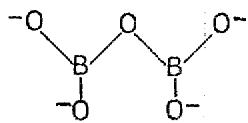

When an oxide ion reacts with a borate or silicate, an oxygen bridge is broken and is replaced by two nonbridge oxygen atoms. Thus, the pyroborate ion shown above can react with one oxide ion to form two orthoborate ions each with the following structure:

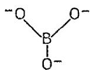

The $\Sigma$ postulate implies that the greater the number of oxygen bridges attached to a given boron or silicon atom, the greater the oxide-ion affinity of that atom. Since simple borates and silicates with $\Sigma$ greater than 2 and 1.5, respectively, react with sodium hydroxide, it is concluded that for these compounds a boron or silicon atom with more than one oxygen bridge has sufficient oxide-ion affinity to accept an oxide ion from a hydroxyl ion.

There are other alternatives to the structural interpretation of silicate and borate reactions in fused hydroxides. For example, equilibrium 3.8 is thermodynamically consistent with the assumption that, rather than the oxygen bridge in the melt being a physical entity, the pyrosilicate ions (known to exist in solids) dissociate into orthosilicate and $\mathrm{SiO}_3^{2-}$ ions. Another alternative is that there is an equilibrium in the melt between $\mathrm{Si}_2\mathrm{O}_7^{6-}$ on the one hand and $\mathrm{SiO}_4^{4-}$ and $\mathrm{SiO}_3^{2-}$ on the other without either one or the other predominating. The present technique of studying fused electrolytes does not make it possible to determine which reaction takes place.

Oxidation-Reduction Reactions. - Only a few examples have been found of oxidation-reduction reactions of ceramics and ceramic-related substances in fused anhydrous hydroxides. Furthermore, all oxides and oxysalts which contain metals capable of existing in more than one valence state in fused hydroxides should undergo oxidation or reduction reactions. There are very few studies of oxidation-reduction reactions of oxides or oxysalts in fused hydroxides. In the former category the behavior of silicon and carbon, two elements which might be considered ceramics, has been studied.

As shown by LeBlanc and Weyl,[25] silicon reacts violently when displacing hydrogen from fused potassium hydroxide at $400^{\circ}\mathrm{C}$ . The overall reaction was not determined, but an obvious guess, on the basis of the information in the preceding section, is that the orthosilicate is formed according to the equation

$$
\mathrm {S i} + 4 \mathrm {N a O H} = \mathrm {N a} _ {4} \mathrm {S i O} _ {4} + 2 \mathrm {H} _ {2}
$$

Carbon in the form of massive graphite shows very little tendency to react at temperatures up to $500^{\circ}\mathrm{C}$ but does absorb some hydroxide because of its porosity. However, it has been demonstrated that oxidation of graphite does occur, although not rapidly, at temperatures as low as $500^{\circ}\mathrm{C}$ . Ketchen and Overholser $^{26}$ made a careful study of the action of a large excess of sodium hydroxide on graphite (possible oxidants other than the hydroxide were excluded) and found that, above $500^{\circ}\mathrm{C}$ , graphite is oxidized to form sodium carbonate. At $815^{\circ}\mathrm{C}$ , graphite has been shown to react quite rapidly. $^{15}$

D'Ans and Löffler16 report that under an atmosphere of nitrogen, iron(III) oxide reacts with fused sodium hydroxide to give mostly sodium ferrate(III), with a small amount of an oxysalt in a higher valence state, which they suggest may have been sodium ferrate(VI).

Corrosion of Other Kinds of Ceramics. - The action of sodium hydroxide on a number of other kinds of ceramics such as carbides has been studied in corrosion tests. However, no experimental information was obtained which would identify the chemical reactions.

Secondary Corrosion Phenomena. - The three causes of the deterioration of ceramic bodies, which will be considered secondary in the sense that they do not reflect the intrinsic chemical reactivity of the primary ceramic constituents, are spalling, binder attack, and pore penetration.

It is well known that many ceramics spall when subjected to severe thermal shock. Occasionally, however, spalling which resulted from the immersion of a cold specimen into a hot liquid has been confused with corrosion.

Many ceramic bodies contain binders which have different chemical properties from those of the principal constituent. Some of the more common binders are among the most reactive materials in fused hydroxides, so that attack on the binder causes disintegration of the ceramic body. An example of this is the attack of fused hydroxides

on magnesia and alumina. The pure oxides MgO and $\mathrm{Al}_{2}\mathrm{O}_{3}$ are resistant to corrosion by fused hydroxides. However, these substances are frequently fabricated with the aid of a high-silica binder, which is strongly attacked.

Fused hydroxides show a pronounced capillary activity, and they very readily penetrate small pores and cracks in ceramic materials. There is no evidence that such pore penetration will of itself cause disintegration of the ceramic. However, ceramic specimens are frequently washed with water after test to remove adhering hydroxide and are exposed to air during examination. Under these conditions a hydroxide-impregnated specimen will disintegrate, since the hydroxide rapidly forms hydrates or hydrated carbonates with appreciable volume expansion. Such behavior has been observed for porous specimens made of pure magnesium oxide and pure aluminum oxide.

The pronounced capillary activity of fused hydroxides leads to other difficulties in corrosion tests. Fused hydroxides wet a very wide variety of substances, both metallic and nonmetallic, and show a strong tendency to creep. This property has not been observed to be serious near the melting point of the hydroxide, but at higher temperatures it presents significant experimental difficulties.

Summary. - Studies which have been made of the behavior of ceramic materials in fused hydroxides are limited in scope both as regards the variety of substances tested and the information obtained on any one substance. The corrosion of ceramics and ceramic-related materials has been found to occur both by solution and by chemical reaction. A few substances, among them graphite and silicon, were found to undergo oxidation-reduction reactions, but for the majority of compounds the attack proceeded by an oxide-ion donor-acceptor reaction.

Compounds of the alkali and alkaline-earth metals such as oxides, halides, and saturated oxysalts have not been found to react with fused sodium hydroxide but have usually shown appreciable solubility. Compounds of other metals with the above anions were found to react by an oxide-ion acceptor-donor mechanism to form an oxide of the metal or to form an oxysalt.

Oxides of magnesium, zinc, and thorium have been tested at substantial temperatures without giving evidence of chemical reaction. Magnesium oxide is very corrosion-resistant in anhydrous sodium hydroxide but is susceptible to mild attack

by small amounts of water. Zinc oxide is not so corrosion-resistant as magnesium oxide. No corrosion data are available on thorium oxide.

Oxides of cerium(IV), nickel, zirconium, and aluminum have been shown under some conditions to have a significant resistance toward reaction with hydroxyl ions, although they are all known to be capable of reacting by an oxide-ion donor-acceptor mechanism. Under many conditions aluminum oxide is sufficiently inert to serve as a useful container material for fused hydroxides.

Oxides of niobium(V) and titanium react fairly readily with fused sodium hydroxide by an oxide-ion donor-acceptor mechanism at relatively low temperatures.

There have been very few studies of compounds containing reactive anions but unreactive cations. In the few examples known, the reactions all proceeded by oxide-ion donor-acceptor mechanisms. Indications are that the oxide-ion affinity of simple borates in fused hydroxides is not satisfied until the pyroborate anion is formed. Simple silicates react by a mechanism like that of the borates, but the end product seems to be an equilibrium between the pyrosilicate and orthosilicate anions.

The corrosion resistance of a fabricated ceramic body is dependent on the intrinsic solubility and chemical stability of the primary constituents and is also determined by porosity and the resistance to attack of any binder material it may contain.

# 4. CORROSION OF METALS

Studies have been made of the action of fused hydroxides on at least 31 elemental metals and 65 alloy compositions. The results of these studies show a wide variety of corrosion phenomena. In the following discussion, only the more common types of corrosion will be treated. These types will be illustrated by the better known examples.

Corrosion of Metals by Oxidation. - The oxidation of metal atoms to form ions is a basic step in the corrosion of metals by fused hydroxides. Oxidation may be caused by the action of hydroxyl ions, alkali metal ions, or foreign substances dissolved in the hydroxide.

Corrosion by Hydroxyl ions. - Oxidation by hydroxyl ions is the most common form of corrosion of metals in fused hydroxides. In such reactions the hydroxyl ions are reduced to hydrogen and oxide ions, while the metal is oxidized to form metal ions. These metal ions may dissolve as

such or may act as oxide-ion acceptors and form an oxide or an oxysalt. Oxide-ion acceptor reactions were discussed in the preceding section on ceramics.

For a metal M of valence $\nu$ , the basic step in corrosion by hydroxyl ions may be represented as

$$
M + \nu O H ^ {-} = M ^ {\nu +} + \nu O ^ {- -} + \frac {\nu}{2} H _ {2} \tag {4.1}
$$

It has been demonstrated that this reaction occurs for a wide variety of metals from the most reactive to the most inert.

In a few instances this hydroxyl ion reaction is accompanied by a side reaction which produces a hydride of the metal. If the hydride is volatile, it may escape; thus arsenine and stibine are evolved from the reactions of arsenic and antimony, respectively, with fused sodium hydroxide.[27] If the hydride is not volatile, it may react with the hydroxide as do the alkali metal hydrides. This side reaction does not seem to be important in the corrosion of most metals. Water is formed in a second side reaction which is sometimes observed. The possible processes involved here will be discussed later.

Attempts to account for the relative corrosion resistance of different metals toward fused hydroxides have had only limited success. There is some correlation between the standard free energies of formation of the oxides and corrosion resistance, as has been pointed out by Brasunas.[28] The metals whose oxides are most stable are frequently the least corrosion-resistant and vice versa. Thus calcium with a very stable oxide reacts vigorously with fused hydroxides, while silver with a relatively unstable oxide is fairly corrosion-resistant. This correlation, however, is no more than a rough, general guide. For example, nickel is more corrosion-resistant to fused hydroxides than gold is, although gold oxide is much less stable than nickel oxide.

For present purposes, elemental metals will be classified in two groups according to corrosion resistance toward fused sodium hydroxide. The first group consists of those metals which seem to be strongly and irrepressibly attacked by hydroxyl ions at $500^{\circ}\mathrm{C}$ under all conditions which have been studied. This group includes alkalineearth metals, antimony, arsenic, beryllium, cerium, niobium, magnesium, manganese, molybdenum, tantalum, titanium, tungsten, and vanadium. The second group consists of those metals which show a measure of corrosion resistance toward fused

sodium hydroxide under suitable conditions at $500^{\circ}\mathrm{C}$ . This group includes aluminum, bismuth, chromium, cobalt, copper, gold, indium, iron, lead, nickel, palladium, platinum, silver, and zirconium.

The second group is, of course, of more interest. Some of the metals appear to be corrosion-resistant because of protective film formation, while others appear to be corrosion-resistant under suitable conditions because the thermodynamic driving force is small. Aluminum will serve as an example of a metal which seems to be protected by film formation, and nickel is an example of a metal which can be maintained almost in thermodynamic equilibrium with the melt under isothermal conditions. Film formation will be considered first.

There is no thermodynamic barrier to the reaction of aluminum with sodium hydroxide no matter whether the reaction product is aluminum oxide or sodium aluminate or whether the product occurs as a solid phase or is dissolved in the melt. Free-energy changes which accompany the possible reactions between aluminum and sodium hydroxide have been estimated and were shown to be quite negative. The hydrogen pressure required to reverse these reactions was likewise shown to be much greater than any hydrogen pressures thus far encountered in corrosion tests. Nevertheless, at lower temperatures the reaction between aluminum and fused hydroxides proceeds slowly. Craighead, Smith, and Jaffee[29] tested 2S and high-purity aluminum in fused sodium hydroxide for 24 hr at $538^{\circ}\mathrm{C}$ . The specimen of 2S aluminum lost 0.337 mg/cm² in weight and pitted slightly, while the high-purity aluminum lost 1.68 mg/cm² but showed no other signs of corrosion on metallographic examination. The origin of the corrosion resistance of aluminum is not known, but in view of the corrosion resistance of aluminum oxide (see Sec. 3, "Corrosion of Ceramics") it seems probable that the reaction of hydroxyl ions with aluminum produces at first a thin, protective film of oxide, which then very slowly reacts to form the slightly soluble aluminate.

Nickel represents a metal which can be held, even at high temperatures, almost at thermodynamic equilibrium with the melt. The corrosion rate of nickel at high temperatures has been found to be dependent on the partial pressure of hydrogen over the melt. Under 1 atm of hydrogen, nickel shows only negligible signs of corrosion in fused sodium hydroxide for 100 hr up to $815^{\circ}C$ , provided that thermal gradients are absent, as shown by Smith,

Steidlitz, and Hoffman.30 However, if the hydrogen atmosphere is not maintained, the corrosion rate of nickel in fused sodium hydroxide may become very rapid at high temperatures. Williams and Miller20 and Petersen and Smith13 have studied this reaction under such conditions that the hydrogen which formed was removed by high-speed vacuum pumping. It was found that below $400^{\circ}C$ the reaction is exceedingly slow but that above $800^{\circ}C$ it is exceedingly rapid. The only gaseous product found was hydrogen. The metal formed a sodium nickelate(II) of uncertain composition but was probably $\mathrm{Na}_2\mathrm{NiO}_2$ . This reaction might be represented by

(4.2) $\mathrm{Ni(s)} + 2\mathrm{NaOH(l)} = \mathrm{Na}_2\mathrm{NiO}_2(\mathrm{s}) + \mathrm{H}_2(\mathrm{g})$

Williams and Miller $^{20}$ suggested that the product of the above reaction might be either a compound or a mixture of sodium oxide and nickel oxide. Petersen and Smith $^{13}$ isolated single crystals of the reaction product and were able to obtain the unit cell dimensions by x-ray methods. The results left no doubt that the reaction product which they obtained was a sodium nickelate(II) compound.

In other studies at $950^{\circ}C$ the hydrogen which formed was not rapidly evacuated from the system but was removed slowly so that a significant partial pressure existed over the melt. Under these conditions, Peoples, Miller, and Hannan31 and Mathews, Nauman, and Kruh21 report that considerable water vapor was evolved. Mathews et al. found that water and hydrogen were evolved approximately in an equal molar ratio and suggested that the corrosion process consisted in two steps: the formation of nickel oxide with the evolution of hydrogen,

(4.3) $\mathrm{Ni} + 2\mathrm{NaOH} = \mathrm{NiO} + \mathrm{Na}_2\mathrm{O} + \mathrm{H}_2$

followed by

(4.4) $\mathrm{NiO} + 2\mathrm{NaOH} = \mathrm{Na}_2\mathrm{NiO}_2 + \mathrm{H}_2\mathrm{O}$

The latter reaction was discussed in Sec. 3. The overall reaction would be

(4.5) Ni + 4NaOH

$$
= N a _ {2} N i O _ {2} + N a _ {2} O + H _ {2} O + H _ {2}
$$

Peoples, Miller, and Hannan31 did not check the hydrogen-water correlation, but they, also, suggested equations similar to those above as a source of water.

An additional source of water was also postulated by both Williams and Miller20 and by Peoples,

Miller, and Hannan,[31] namely, the reduction of oxide ions by hydrogen when the latter is present in sufficient concentration. Such a reduction of oxide ions would have to be accompanied by a reduction of positive ions such as nickel ions either in NiO or in $\mathsf{Na}_2\mathsf{NiO}_2$ .

There are several kinds of evidence which support the plausibility of this second postulate. It is known from the work of Pray and Miller[32] that the sodium nickel(II) which is formed from the hydroxide-nickel reaction can be reduced to metallic nickel by a partial pressure of hydrogen of 0.1 atm at $950^{\circ}\mathrm{C}$ . In reactions between nickel and sodium hydroxide, particulate nickel is frequently found in the hydroxide phase. Mathews, Nauman, and Kruh[21] found particulate nickel in the experiments from which they deduced Eqs. 4.3 and 4.4. Williams and Miller[20] reported that in their experiments there was a definite correlation between the occurrence of particulate nickel in the melt and the occurrence of water in the gas phase and that neither particulate nickel nor water occurred if the hydrogen evolved was removed rapidly enough for its partial pressure over the melt to remain low.

Data on the action of hydroxyl ions on the metals bismuth, chromium, cobalt, copper, gold, indium, iron, lead, palladium, platinum, and silver are very fragmentary, and no attempt at a review will be made here except to point out two facts which are important in evaluating corrosion mechanisms generally.

First, Lad33 has shown that, when chromium reacts with fused sodium hydroxide, it is oxidized first to a lower valence state and is followed by a very slow oxidation to a higher valence state. Similar data are not available for other metals which have more than one oxidation state in fused hydroxides, but the work of Lad suggests that the reaction kinetics of such metals in fused hydroxides may be quite complicated.

Second, although the reaction between nickel and sodium hydroxide can be inhibited by hydrogen, Williams and Miller20 have shown that hydrogen has no inhibiting effect on the reaction of iron with sodium hydroxide. Furthermore, they were unable to find any metallic iron resulting from attempts at hydrogen reduction of iron corrosion products in the presence of fused sodium hydroxide. This result is important in a consideration of the mechanisms of mass transfer in fused hydroxides and will be discussed in Sec. 5.

Corrosion by Alkali Metal Ions. - The ability of metals such as iron to reduce alkali metal ions in fused alkali-metal hydroxides has been known for more than a century and was at one time used in the laboratory preparation of the alkali metals. LeBlanc and Weyl25 reported that chromium, molybdenum, tungsten, magnesium, and sodium were found to displace potassium metal, as well as hydrogen, from fused potassium hydroxide. Villard34 found that fused sodium hydroxide was reduced to give sodium or sodium hydride by magnesium, chromium, tungsten, iron, cobalt, nickel, and ferromanganese. Brasunas28 found that zirconium reduced sodium hydroxide to give sodium metal and hydrogen.

Williams and Miller $^{20}$ reported that nickel acts on fused sodium hydroxide in a two-step process by which hydroxyl ions are reduced and, after they are consumed, sodium ions are reduced. This sequence of events corresponds to the reaction in which sodium nickelate(II) is formed and then the sodium ions are reduced in the nickelate.

From the standpoint of over-all reactions it might be concluded that (1) mild reducing agents such as nickel act first on hydroxyl ions and when they are reduced to a low concentration, sodium ions are attacked; (2) very strong reducing agents like zirconium act on both kinds of ions at the same time. However, the experimental findings are also consistent with the postulate that hydroxyl and sodium ions are simultaneously reduced by all metals. Sodium-ion reduction may be represented as

$$
\mathrm {N i} + 2 \mathrm {N a} ^ {+} = \mathrm {N i} ^ {+ +} + 2 \mathrm {N a} \tag {4.6}
$$

The sodium thus generated can react with hydroxyl ions as follows:

$$
2 N a + 2 O H ^ {-} = 2 N a ^ {+} + 2 O ^ {- -} + H _ {2} \tag {4.7}
$$

If reaction 4.7 proceeds as rapidly as sodium is generated, the net result is as though only hydroxyl ions had been reduced. As the concentration of hydroxyl ions decreases, reaction 4.7 will proceed more slowly, until finally sodium is generated faster than it is consumed. In the case of the very active metals such as zirconium, the rate of generation of sodium may be much more rapid than the rate of reaction 4.7 even for a high concentration of hydroxyl ions. Petersen and Smith13 studied the reduction of sodium hydroxide by sodium and found that it was not by any means so rapid as reduction by such active metals as calcium.

The action of weak reducing agents such as nickel on alkali metal ions in fused hydroxides would be brought to equilibrium by a very small concentration of the alkali metal. Hence, the generation of appreciable quantities of alkali metal is only possible under conditions in which the alkali metal can escape from the reacting mixture. Gold forms an alloy with sodium, so that in the sodium hydroxide-gold reaction some sodium may be removed from the field of reaction by alloy formation, as was pointed out by Williams and Miller.[20] In corrosion tests at temperatures above $800^{\circ}\mathrm{C}$ small amounts of sodium metal have sometimes been found on cooler parts of the apparatus above the liquid. Presumably, this metal had distilled out of the melt. However, under the conditions of most corrosion tests on relatively corrosion-resistant metals in fused hydroxides below $800^{\circ}\mathrm{C}$ , appreciable quantities of alkali metal are never found. Therefore, from the standpoint of the thermodynamics of corrosion, over-all reactions in which alkali metals are produced would seem to be of little importance. Nevertheless, such reactions may be quite significant in the kinetics of corrosion.

Corrosion by Oxidizing Solutes. - Dissolved oxygen and the peroxide ion are known to be powerful oxidizing agents in fused hydroxides. By using such solutions, Dyer, Borie, and Smith35 were able to cause very rapid corrosion of nickel with the production of oxysalts in a valence state greater than 2.

Water at sufficient concentrations seems to act as a weak oxidizing agent. Peoples, Miller, and Hannan31 reported that at $950^{\circ}\mathrm{C}$ small additions of water to the blanketing atmosphere over fused sodium hydroxide had little effect on the corrosion rate of nickel but that substantial amounts of water made the corrosion much more severe.

Corrosion of Alloys. - Although nickel has a superior corrosion resistance in fused hydroxides at high temperatures, it has a low mechanical strength. Consequently, studies have been made of the effect of alloying constituents on corrosion behavior with the ultimate aim of obtaining a material which is both corrosion-resistant and usefully strong.

There is no evidence as yet that the corrosion of alloys by fused hydroxides involves any kind of chemical reaction which is different from that encountered with elemental metals. However, an examination of microstructures shows two corrosion

phenomena distinctive of alloys: (1) the formation of pores or voids beneath the surface of the corroded alloy and (2) the formation of complex, two-phase, corrosion products at the surface and along the grain boundaries of the corroded alloy. Examples of each of these forms of corrosion will be cited below from the work of Smith, Steidlitz, and Hoffman.[30]

The formation of pores or subsurface voids was found to be characteristic of the attack of fused sodium hydroxide on high-purity nickel-iron alloys. Nickel exposed to fused sodium hydroxide at $815^{\circ}C$ for 100 hr in an evacuated capsule was found to be slightly etched, with an average loss in thickness of $4.5 \times 10^{-5}$ in. as computed from weight-change data. Iron under the same conditions was found to lose about 100 times as much in thickness. A high-purity nickel-iron alloy containing 20 wt % iron not only suffered attack by removal of surface

metal but also developed subsurface voids to a depth of 3 to $5 \times 10^{-3}$ in.

Subsurface void formation is not an uncommon phenomenon in high-temperature corrosion. Manly and Grant36 proposed a mechanism for this form of corrosion based on the well-established theory of void formation during interdiffusion of metals. Brasunas37 has discussed this theory and has presented some pertinent experimental data. Qualitatively, the theory can be applied to hydroxide corrosion of nickel-iron alloys as follows. During the early stages of corrosion, the iron atoms at the surface of the metal specimen are oxidized much more rapidly than the nickel atoms. As a result, the surface becomes depleted in iron. This depletion establishes a concentration gradient in the proper direction to cause a diffusion of iron from the interior of the specimen to the surface, where reaction continues. The diffusion of iron is pre

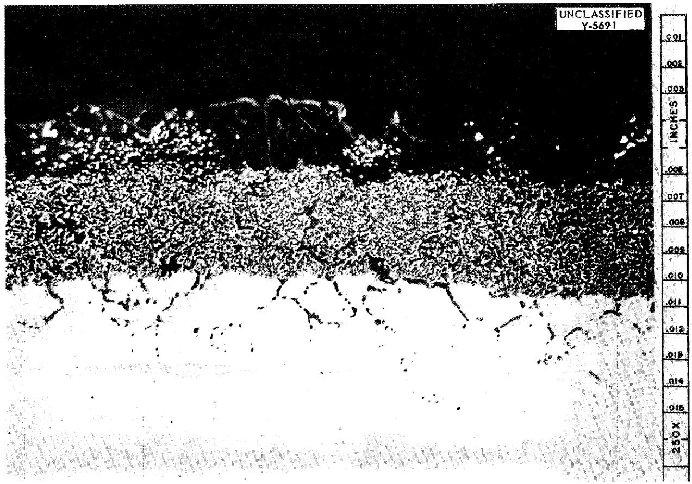  
Fig. 1. Complex Corrosion Product Layer Formed on Surface of Carpenter Compensator 30 Alloy (Nominal Composition $30\%$ Ni, $70\%$ Fe) by Action of Fused NaOH for 100 hr at $815^{\circ}\mathrm{C}$ . 250X. (From the studies of Smith, Steidlitz, and Hoffman, ORNL.)

sumed to occur by a vacant-lattice-site mechanism so that there is a flux of vacancies diffusing from the surface into the interior of the specimen. Since the crystal lattice cannot maintain more than a certain concentration of vacant lattice sites, the excess vacancies, which accumulate from inward diffusion, "precipitate" as voids. These voids continue to grow as long as the inward flux is maintained.

Subsurface void formation has been found not only in high-purity nickel-iron alloys but also in high-purity nickel-molybdenum and nickel-iron-molybdenum alloys with a high nickel content. Pure molybdenum under the same test conditions was severely attacked.

As an example of the second kind of corrosion phenomenon characteristic of the corrosion of alloys by fused hydroxides, Fig. 1 shows in cross section a corrosion product layer which formed on

a specimen of Carpenter Compensator 30 alloy (nominal composition $30\%$ Ni, $70\%$ Fe) exposed to fused sodium hydroxide for 100 hr at $815^{\circ}\mathrm{C}$ . The corrosion product layer consisted of three zones: (1) an irregular, gray layer of nonmetallic material in contact with the fused hydroxide; (2) beneath this layer, a zone consisting of a mixture of metallic and nonmetallic phases; (3) last, a zone of intergranular penetration. The formation of such complex layers of corrosion products was characteristic of the corrosion of a number of alloys, including the commercial nickel-iron-chromium alloys. Very few alloys show all three zones seen in Fig. 1. Usually the zone of massive nonmetallic material is absent, and, under suitable conditions, one of the other two zones may be absent.

Figure 2 shows the corrosion product formed on Timken 35-15 alloy (nominal composition $35\%$ Ni, $15\%$ Cr, $50\%$ Fe) after exposure to fused sodium

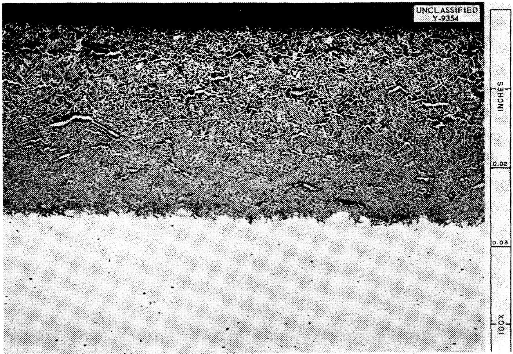  
Fig. 2. Corrosion Product Layer Formed on Timken 35-15 Alloy (Nominal Composition $35\%$ Ni, $15\%$ Cr, $50\%$ Fe) by the Action of Fused NaOH for 100 hr at $815^{\circ}\mathrm{C}$ . 100X. (From the studies of Smith, Steidlitz, and Hoffman, ORNL.)

hydroxide for 100 hr at $815^{\circ}C$ . Here, only the zone consisting of a metallic and nonmetallic phase is to be seen, with a rudimentary grain boundary attack appearing at the corrosion product-base alloy interface.

Of the various metals which form complex corrosion-product layers in fused hydroxides, only Inconel has been extensively studied. Results with this metal illustrate the structural complexity of the layers. Most of the tests have been conducted for various times up to 100 hr, at various temperatures up to $800^{\circ}\mathrm{C}$ , and under blanketing atmospheres of purified helium and of purified hydrogen at 1 atm. The results obtained for tests under helium were quite different from those obtained for tests under hydrogen with regard to both corrosion rate and microstructure of the corrosion product.

Under a blanketing atmosphere of hydrogen,

Inconel! showed a slight amount of corrosion after 100 hr at $600^{\circ}\mathrm{C}$ . From 600 to $800^{\circ}\mathrm{C}$ the corrosion increased very rapidly. At all temperatures corrosion began as grain boundary attack, an example of which is shown in Fig. 3. When these grain boundary regions were examined at a high magnification, it was found that a corrosion product had formed in these regions and that this corrosion product consisted of a metallic matrix within which were acicular particles of a nonmetallic phase. After grain boundary attack had advanced a few thousandths of an inch into the alloy, a massive, two-phase, corrosion product layer had begun to form on the surface and to thicken with time. Figure 4 shows the microstructure of this two-phase layer at a high magnification.

The corrosion rate of Inconel at a given temperature was significantly greater under a blanketing atmosphere of helium than under hydrogen. A mas

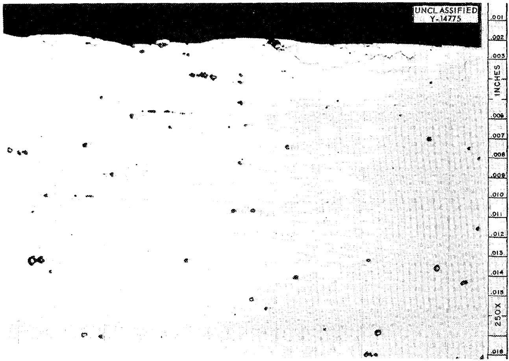  
Fig. 3. Grain Boundary Attack at the Surface of an Inconel Specimen Exposed to Fused NoOH for 100 hr at $600^{\circ}\mathrm{C}$ . 250X. (From the studies of Smith, Steidlitz, and Hoffman, ORNL)

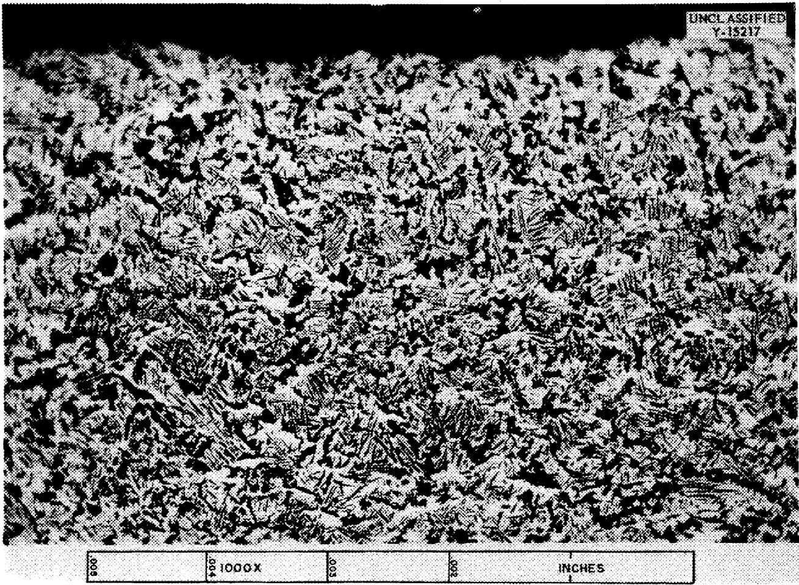  
Fig. 4. Microstructure Typical of the Corrosion Product Layer Formed on Inconel by Exposure to Fused NaOH Under a Blanketing Atmosphere of Hydrogen for Periods of up to 100 hr at Temperatures above $650^{\circ}\mathrm{C}$ . 1000X. (From the studies of Smith, Steidlitz, and Hoffman, ORNL)

sive, two-phase zone also formed under helium, but the microstructure was quite different, as can be seen in Fig. 5.

Other, quite different, two-phase, corrosion product microstructures were observed when Inconel was corroded by fused sodium hydroxide to which various inorganic compounds had been added. In all cases the layer of corrosion product consisted of various geometric arrangements of nonmetallic particles within a metallic matrix.

A study is now being made to determine the chemical nature of the phases which occur in the corrosion product layers on Inconel. It is as yet too early for any firm conclusions to be drawn other than those that the metallic matrix is depleted in chromium and that the nonmetallic particles have a relatively high content of a sodium oxysalt.

Summary. Studies have been made of the action

of fused hydroxides on at least 31 elemental metals and 65 alloy compositions. Most of the results can be interpreted in terms of the oxidation of the metal accompanied by the reduction of hydroxyl ions to form hydrogen and oxide ions. The oxidized metal may occur either as an oxide or as an oxysalt. Three complicating side reactions are sometimes found: the formation of a metal hydride, the reduction of alkali metal ions, and the production of water.

Film formation is apparently important in the corrosion resistance of aluminum in fused sodium hydroxide.

The corrosion of nickel by fused sodium hydroxide under isothermal conditions can be stopped almost altogether at temperatures as high as $815^{\circ}\mathrm{C}$ by the application of a pressure of hydrogen of 1 atm over the melt.

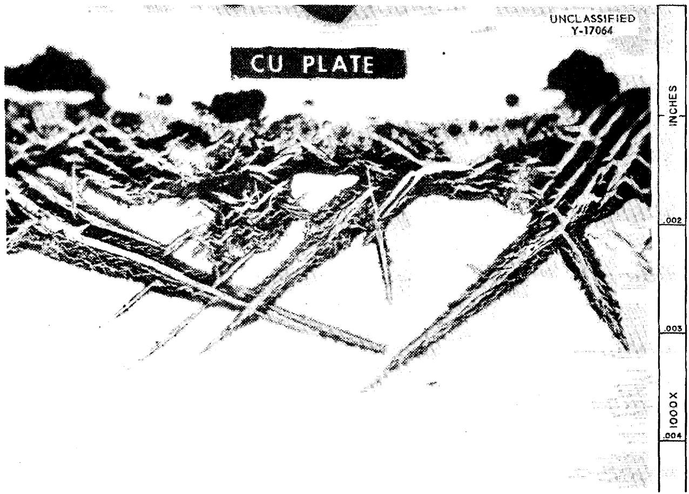  
Fig. 5. Microstructure Typical of the Corrosion Product Layer Formed on Inconel by Exposure to Fused NaOH Under a Blanketing Atmosphere of Helium for Periods of up to 100 hr at Temperatures above $650^{\circ}\mathrm{C}$ . The Cu plate was applied after test to protect the edge of the specimen during metallographic polishing. 1000X. (From the studies of Smith, Steidlitz, and Hoffman, ORNL)

The chemistry of the reaction between nickel and sodium hydroxide has been extensively investigated but is still not well understood. For all metals other than nickel, details on the chemistry of corrosion reactions in fused hydroxides are very fragmentary.

The corrosion of alloys by fused sodium hydroxide does not seem to involve any kind of reaction which is different from the reactions encountered with elemental metals. However, the microstructures of corroded alloys show the distinctive corrosion phenomena of the formation of subsurface voids and the formation of complex, two-phase corrosion products at the surface of the alloy and along grain boundaries near the surface.

# 5. MASS TRANSFER

When liquids are circulated through metal plumb ing systems at high temperatures, it is often found that the hot parts of the plumbing are corroded and that the metal thus removed is deposited in the cool parts of the system. This corrosion-related phenomenon, usually called "mass transfer," is a particularly serious problem with fused hydroxides. Mass transfer has been observed in sodium hydroxide for nickel, iron, copper, silver, gold, and a number of alloys. Moreover, nickel has been observed to mass-transfer in all the fused alkali-metal hydroxides and, it might be mentioned, in all the fused alkaline-earth hydroxides.[38] Mass transfer is the primary factor limiting the use of

metals which, under suitable conditions, do not corrode seriously.

The mechanisms of mass transfer in fused hydroxides are not known. However, several possibilities exist, and they will be discussed at the end of this section. First, however, some of the empirical facts of mass transfer will be presented.

Nickel. Some of the characteristics of mass transfer of nickel in fused hydroxides are illustrated with the results of thermal-convection loop tests.38,39 Figure 6 is a photograph of a nickel thermal-convection loop which was cut open to show the appearance of the inside wall surfaces after test. During test the loop was filled with fused sodium hydroxide and placed in an upright position. One side of the loop was heated and the other cooled to maintain the temperature distribution shown in Fig. 6. The highest temperature measured was $825^{\circ}\mathrm{C}$ , near the bottom of the hot leg (left side in Fig. 6), and the lowest temperature measured was $535^{\circ}\mathrm{C}$ , near the bottom of the cold leg (right side in Fig. 6). This temperature distribution caused a flow of fused hydroxide around the loop because of thermal convection. The numbers in Fig. 6 from 5 to 45, at intervals of 5, identify positions around the loop.

Before the loop was exposed to the hydroxide, the inside walls were somewhat rough and had a dull appearance. After test, as seen in Fig. 6, the hot leg from position 25 to position 45 became polished, whereas the cold leg from position 5 to position 20 became encrusted with a deposit of dendritic nickel crystals. Grain boundary grooving occurred in the polished zone, but the groove angle was wide and there was no serious grain boundary attack. The polishing observed in the hot leg is characteristic of the corrosion step of mass transfer at high temperatures in a number of different kinds of systems, including some containing liquid metals.

Figure 7 shows a deposit of dendritic nickel crystals from a cold-leg section of a loop with the solidified hydroxide intact. In the initial stages of deposition it was found that the crystals grew as a dense deposit, forming an almost continuous plate over the cold-leg surface. The crystal grains in this plate frequently continued the orientation of the grains in the base metal, which necessitated the use of special techniques for metallographic determinations of the place at which the base metal ended and the deposit began. When this dense plate became several thousandths of an inch thick,

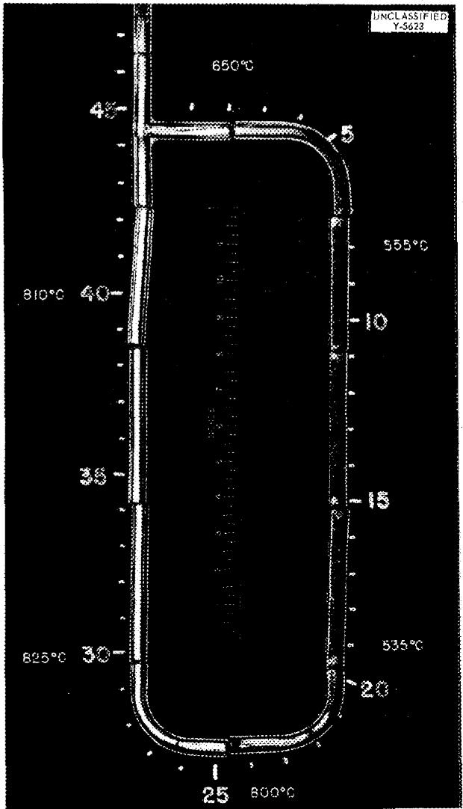  
Fig. 6. Nickel Thermal-Convection Loop Cut Open to Show Appearance of Inside Wall Surfaces After Test. The numbers 5 through 45 identify positions around the loop. (From the studies of Smith, Cathcart, and Bridges, ORNL)

very long dendrites began to appear. Because of the dendritic form of the thicker deposits, a relatively small amount of nickel was found to have a large effect in restricting flow through a pipe. When the flow of liquid was sufficiently rapid, dendrites became dislodged and they collected in irregular masses which formed plugs that effectively stopped fluid flow altogether. Figure 8 shows a section of pipe from a large loop which contained several such plugs, and Fig. 9 shows a

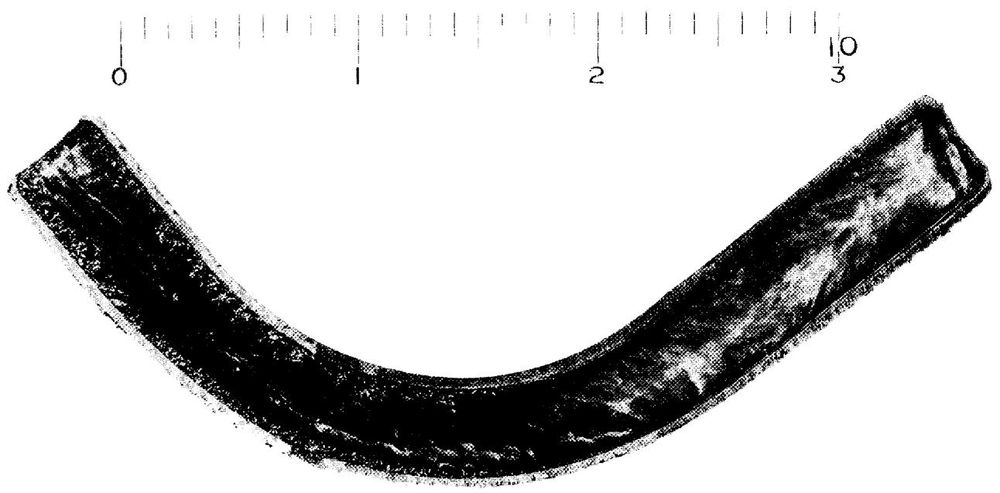

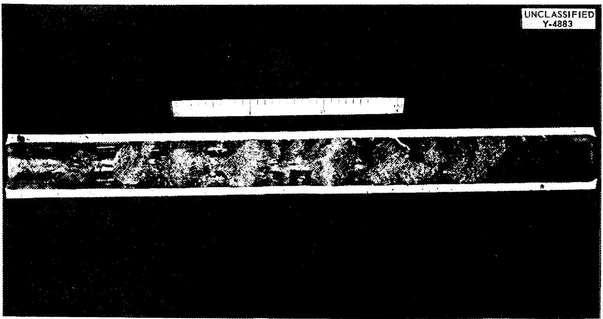  
Fig. 7. Section of Tubing Removed from the Cool Ports of a Nickel Thermal-Convection Loop and Cut Open After Test with the Frozen NaOH Intact. Dendritic nickel crystals may be seen attached to the inside walls of the tube. (From the studies of Smith, Cathcart, and Bridges, ORNL.)   
Fig. 8. Section of Nickel Pipe Cut from the Cool Portions of a Thermal-Convection Loop. Irregular masses of nickel dendrites which stopped the flow of fused NaOH in the pipe may be seen. (From the studies of G. M. Adamson, ORNL)

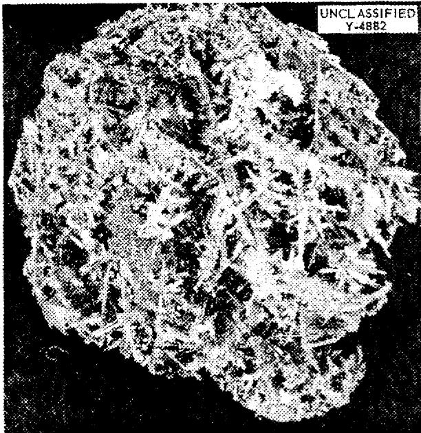  
Fig. 9. Plug Formed of Nickel Dendrites Taken from the Section of Nickel Pipe Shown in Fig. 8. The plug was about 1 in. across. (From the studies of G. M. Adamson, ORNL)

single plug removed from the loop.

Because the corrosion accompanying mass transfer tended to occur uniformly, while deposition produced long dendrites, the constriction of flow in the cool parts of the system usually reached serious proportions long before the corrosion in the hot parts of the system became troublesome.

Nearly all studies of mass transfer in fused hydroxides have been carried out in thermal-convection systems, although some forced-circulation work has been reported.40 Several different designs of thermal-convection apparatus and several different methods of measuring mass transfer have been used. The only extensive studies in which numerical values of the amount of mass transfer were obtained were the work of Lod and Simon40 on the mass transfer of nickel in sodium hydroxide and the work of Smith, Steidlitz, and Hoffman30 on several metals and alloys in sodium hydroxide. These two groups used not only different designs of thermal-convection apparatus but also different means of measuring mass transfer. Lad and Simon measured mass transfer by determining the weight loss of a specimen in the hottest part of the sys

tem, while Smith, Steidlitz, and Hoffman microscopically measured the thickness of deposits formed in the coldest parts of the system. Nevertheless, confirmatory results were obtained when the two studies overlapped.

Nickel, because of its excellent corrosion resistance, has received more attention than other metals in mass-transfer research. Studies have been made of the effect of several variables on the rate of mass transfer of nickel in fused sodium hydroxide. These variables were temperature level of the system, temperature differential, time of operation, composition of the atmosphere over the melt, and composition of the melt itself.

Lad and Simon $^{40}$ and Smith, Steidlitz, and Hoffman $^{30}$ found that the rate of mass transfer accelerated with linearly increasing temperature level. Smith, Steidlitz, and Hoffman found that mass transfer of nickel in fused sodium hydroxide under helium could be detected by their techniques after 100 hr at a maximum system temperature of $600^{\circ}C$ and a temperature differential of $100^{\circ}C$ but not at a maximum system temperature of $550^{\circ}C$ , other conditions being constant. The lowest maximum system temperature for which Lad and Simon reported data was $538^{\circ}C$ , at which temperature under helium with a temperature differential of $46^{\circ}C$ they found a very small amount of mass transfer after about 100 hr.

The studies by Lad and Simon showed that, under helium, mass transfer of nickel was dependent upon the time of operation and the temperature differential. They found that the rate of transfer decreased slightly over the first 50 hr and thereafter remained constant. The initial transient in the rate agreed with the change of nickel concentration in the melt; both rates built up to a steady-state value after 100 hr. The rate of transfer increased rapidly with temperature differential and then became independent of the differential at higher values. Lad and Simon suggested that at higher temperature differentials the rate of flow in their apparatus was too great to permit complete saturation of the fluid with nickel compounds.

Because of the ability of hydrogen to suppress corrosion it might be expected that this element would be effective in inhibiting mass transfer. This inhibiting effect was demonstrated by Smith, Cathcart, and Bridges39 in 1951, but only recently has it been subjected to extensive quantitative test. Lad and Simon found that at $815^{\circ}C$ the inhibiting action of hydrogen on the mass transfer

of nickel was considerable. Smith, Steidlitz, and Hoffman confirmed this result for temperatures below $815^{\circ}C$ and found that the maximum system temperature at which no mass transfer was measurable was about $75^{\circ}C$ above that found under helium in comparable tests. In addition, Lad and Simon found that $3\%$ water vapor in the blanketing atmosphere is beneficial with and without hydrogen at $815^{\circ}C$ ,

Lad and Simon $^{40}$ studied the effect on mass transfer at $815^{\circ}C$ of additions to the melt of up to 5 wt $\%$ of 33 substances. Many of the materials which they added react with sodium hydroxide at this temperature; some are soluble, while some are insoluble and relatively inert. Sodium carbonate, a common contaminant in commercial sodium hydroxide, was found to have no effect for additions up to 1 wt $\%$ . Above this concentration, sodium carbonate was found to accelerate mass transfer. Sodium chloride and sodium orthophosphate, both soluble, had no effect. Sodium and lithium hydrides had very detrimental effects. Lad and Simon suggested that these compounds react to form sodium oxide which is "very corrosive." However, tests made by adding sodium oxide, as such, caused only about half as much mass transfer as was caused by the addition of amounts of hydride which would give roughly the same oxide concentration after reaction.

Other Elemental Metals. - Data on elemental metals other than nickel are meager. The mass transfer of iron in fused sodium hydroxide has been found to be more severe than that of nickel under comparable conditions. For example, Smith, Steidlitz, and Hoffman[30] found that under hydrogen at $550^{\circ}\mathrm{C}$ the mass transfer of iron was worse than that of nickel at $800^{\circ}\mathrm{C}$ , other conditions being constant. However, iron was not observed to form the long dendrites that were found for nickel. Rather, the crystals in the iron deposits remained somewhat equiaxed in habit.

Copper in sodium hydroxide under hydrogen was found to mass-transfer appreciably in 100 hr at $600^{\circ}\mathrm{C}$ with a temperature differential of $100^{\circ}\mathrm{C}$ . Thus, copper mass-transfers more readily than nickel under these conditions but not so severely as iron.

The mass transfer of silver and of gold has not been quantitatively studied, but it has been observed repeatedly.

Alloys. -- Hastelloy B and the stainless steels have been observed30 to undergo mass transfer in

fused sodium hydroxide under hydrogen, but at elevated temperatures corrosion is a serious problem with these metals whether mass transfer occurs or not. Monel also showed30 mass transfer under both hydrogen and helium.

The most extensive studies of mass transfer of an alloy have been those made on Inconel.30 It was found that Inconel showed corrosion in fused sodium hydroxide at roughly the same rate whether mass transfer took place or not and that mass transfer took place at roughly the same rate as for pure nickel under the same conditions. Mass-transfer deposits formed in Inconel systems containing fused sodium hydroxide under an atmosphere of helium were virtually devoid of chromium. Hydrogen suppressed mass transfer of Inconel with about the same effectiveness as it did for pure nickel.

Bimetallic Effects. -- When two different solid metals are immersed in a liquid - for example, a liquid metal - under isothermal conditions at high temperatures, it is frequently observed that one of the solid metals contaminates the other metal or that the metals contaminate each other. This process of metal transport without a temperature differential is usually referred to as "isothermal mass transfer." In the case of liquid-metal systems, the driving force for isothermal mass transfer seems to be the tendency of the two solid metals to form alloys.

A number of experiments have been conducted in which two different metallic elements were immersed in the same hydroxide melt under presumably isothermal conditions. LeBlanc and Bergmann42 performed a series of experiments in which different metals were immersed in fused sodium hydroxide contained in a gold crucible at $700^{\circ}\mathrm{C}$ under nitrogen. When copper was immersed in the melt, they found that the gold crucible became alloyed with copper; when silver was immersed, the silver specimen became alloyed with gold; but when nickel was immersed, nothing was observed to happen. Brasunas28 heated sodium hydroxide in an evacuated nickel capsule together with a copper specimen at $815^{\circ}\mathrm{C}$ . He reported that nickel plated out on the copper.

It would be tempting to conclude that the instances of metal transport cited above are analogous to isothermal mass transfer in liquid metal systems if it were not for some studies by Williams and Miller.[20] They immersed strips of nickel in fused sodium hydroxide contained in a gold vessel

under a hydrogen atmosphere and found that the nickel became gold-plated. However, they gave convincing evidence that this plating occurred only during cooling. This observation shows that the transfer of gold to nickel which was observed was not an example of isothermal mass transfer, although Williams and Miller's techniques would not have detected small amounts of alloying which might have taken place in addition to the much grosser plating effect.

Craighead, Smith, and Jaffee29 report the transfer of nickel from a container vessel onto a number of metals immersed in sodium hydroxide at 677 and $815^{\circ}C$ . However, they point out that thermal gradients, which were known to exist, could have explained their results.

Mechanism of Mass Transfer. - The mechanism of mass transfer of metals in fused hydroxides is not known nor do the proper kinds of data exist which are necessary to distinguish among several possible mechanisms. The purpose of the following discussion is to point out the various processes by which a chemically reactive fused electrolyte such as sodium hydroxide might transport metals under the influence of a temperature differential. These mechanisms are all possible in the sense that they do not violate known principles. However, they are all quite speculative.

It is assumed that the mode of metal transport involves either solution of the container material as metal atoms or its solution as metal ions plus electrons. If the solute consists of metal atoms, mass transfer could be considered in terms of differential solubility. If the solute consists of metal ions plus electrons, several possibilities exist, depending on the mechanism of transport of the electrons. These various possibilities will be discussed in the following sections.

Differential Solubility (Mechanism I). - In a superficial way the mass transfer of metals in fused hydroxides appears to obey a simple solubility-temperature relation. Mass transfer in liquid-metal systems usually follows such a relation, and it can also, in principle, be applied to fused hydroxide systems. Every metal must have a finite solubility in a fused hydroxide, just as every metal must have a finite vapor pressure at all temperatures, although this solubility may be so small as to have only a statistical meaning. Symbolically this process may be represented as

$$
M (s) = M (\text {m e l t}) \tag {5.1}
$$

It is postulated here, however, that metals have a negligible solubility as metal atoms in fused hydroxides. This postulate is difficult to justify by formal argument. Nevertheless, the differences which exist in the internal pressures and in the binding forces for metals and fused hydroxides strongly suggest that the solubility of the metal as atoms in the fused hydroxide will be exceedingly small.

There are no direct experimental studies of the solubility of any metals in fused hydroxides. There is indirect evidence[13,18] that sodium metal has a significant solubility in fused sodium hydroxide and that it dissolves before reacting. This phenomenon appears to be analogous to the solution of a metal in its fused halide.[43] This process, however, is not simply a case of the solution of metal atoms but is dependent on some interaction between the valence electrons of the metal atoms and the ions of the same metal in the melt.

The dissolving of sodium in a sodium halide and possibly in sodium hydroxide can be schematically represented by the equation

$$
N a (g) = N a ^ {+} (m e l t) + \theta (m e l t) \tag {5.2}
$$

where the electrons $\theta (\text{melt})$ may be thought of as "excess" or "solvated" electrons which are more or less associated with the cations of the melt. In some instances the dissolution of a metal in its fused halide seems to involve the formation of a diatomic cation; for example, $\mathrm{Cd}_{2}^{++}$ is formed when cadmium is dissolved in cadmium chloride.

It is possible, in principle, for any metal to dissolve to some extent in a fused electrolyte as metal ions plus excess electrons which may be considered as more or less associated with the cations of the electrolyte. This process will be discussed further in the section "Mechanism IV."

Oxidation-Reduction Processes (Mechanisms II-VI). - The mechanisms considered most probable for mass transfer in fused hydroxides all involve oxidation-reduction processes. The two basic steps for all such processes may be schematically represented for a metal M of valence $\nu$ by the following equations. At the hot metal-melt interfaces there occurs the oxidation

$$
M (s) \xrightarrow {\text {h o t}} M ^ {\nu} (\text {m e l t}) + \nu \theta \tag {5.3}
$$

where $\theta$ indicates an electron and where $M^{\nu}(melt)$ represents a metal in whatever form in which it may be stable in the melt, that is, as an uncomplexed

cation or as a suitable oxysalt anion. At the cool metal-melt interfaces there occurs the reduction

$$
M ^ {\nu} (m e l t) + \nu \theta \xrightarrow {c o o l} M (s) \tag {5.4}
$$

which is the reverse of Eq. 5.3. For all kinds of oxidation-reduction mechanisms the $\mathsf{M}^{\nu}$ (melt) ions will be transported by diffusion through boundary layers at the interfaces and by fluid flow within the bulk of the melt. However, the electrons may move by two quite different routes. They may be conducted through the metallic parts of the system, or they may be transported through the melt by some chemical species which is reduced at the hot metal surfaces and oxidized at the cool surfaces. The first method of electron transport represents local cell action. The second method might be effected by any of a number of chemical species. It is convenient to classify these species into four groups according to the oxidized form of the electron carrier: hydroxyl ions, sodium ions, foreign solutes, and a higher valence state of the metal undergoing transport. These five modes of electron transport may be considered as representing five additional mass-transfer mechanisms.

Local Cell Action (Mechanism II). If the electrons are transported through the metallic parts of the system, Eq. 5.3 represents the anodic dissolution of M, and Eq. 5.4 the cathodic deposition of M. The driving force for this process can be thought of as a thermoelectric potential. Such potentials have been measured in fused electrolytes.[44] In order for such a process to take place at all, the transported ions $M^{\nu}(\text{melt})$ must be already present. However, any oxidizing substance, including the hydroxide itself, could serve this purpose.

Inasmuch as Pray and Miller32 have induced nickel to deposit preferentially on an Alundum ring immersed in a sodium hydroxide melt, local cell action cannot be the exclusive mode of mass transfer. However, there is no reason why local cell action might not be the primary mechanism under selected conditions.

Reduction of Hydroxyl Ions (Mechanism III). In Sec. 4, "Corrosion of Metals," it was pointed out that the most common overall corrosion reaction was the reduction of hydroxyl ions represented by Eq. 5.5

$$
\begin{array}{l} M (s) + \nu O H ^ {-} (m e l t) = M ^ {\nu} (m e l t) \tag {5.5} \\ + \nu O ^ {- -} (m e l t) + \frac {\nu}{2} H _ {2} (m e l t) \\ \end{array}
$$

and that, at least in the case of nickel!, $M^{\nu}$ (melt) ions may be reduced to the metal again by hydrogen. It would not be surprising, therefore, to find that hydrogen molecules serve to transport electrons, the hydrogen acting together with an oxide ion as an electron donor conjugate to a hydroxyl ion. This mechanism was proposed independently by Skinner in 1951 and by Williams and Miller in 1952. Since then it has received wide acceptance, as the only mechanism for the mass transfer of nickel.

There is no doubt that Eq. 5.5 represents a likely mechanism of mass transfer under many conditions. However, the evidence in favor of this mechanism is ambiguous, and mass transfer has been observed to occur under conditions where the operation of this mechanism seems doubtful. The evidence most frequently cited in its support is the effectiveness of a blanketing atmosphere of hydrogen in suppressing mass transfer. However, regardless of the nature of the electron carriers, hydrogen should, to a greater or lesser extent, suppress all oxidation processes in fused hydroxides and thereby depress the concentration of nickel ions moving through the fluid. Furthermore, Smith, Cathcart, and Bridges39 have conducted several kinds of experiments in which nickel preferentially deposited on a surface at which the hydroxide was saturated with atmospheric oxygen. In these experiments mass transfer cannot be accounted for by Eq. 5.5. According to this equation, hydrogen must be present at the interface of deposition at a concentration greater than the minimum necessary to reduce $M^2$ (melt) ions. In the experiments of Smith, Cathcart, and Bridges, this condition could not have been fulfilled. In other words, if mass transfer occurred only according to Eq. 5.5, the absence of hydrogen at the hot surfaces would accelerate the solution step, but an absence of hydrogen at the cool surfaces would likewise prevent the deposition step.

The quantitative specification of the hydrogen concentrations or, via Henry's law, of the hydrogen pressures necessary to cause mass transfer under given circumstances is dependent, among other things, on the temperatures and nickel concentrations at both hot and cold interfaces. Data are not yet available with which to make such specifications, but outstanding progress is being made toward this end for the case of nickel by Kertesz, Knox, and Grimes.[46]

Iron has been shown30 to undergo mass transfer in sodium hydroxide much more rapidly than nickel!

did under the same conditions. However, Williams and Miller20 have pointed out that the reaction between iron and sodium hydroxide is not reversed or even inhibited by hydrogen at pressures up to 1 atm. It is, therefore, doubtful that hydrogen is an important electron carrier in this instance.

Reduction of Alkali Metal Ions (Mechanism IV). - It does not seem likely that alkali metal ions would be effective agents in mass transfer under most conditions, because they are thermodynamically inferior oxidizing agents compared with other possible species such as hydroxyl ions. On the other hand, alkali metal ions and alkali metal atoms could, at least in principle, act as conjugate electron acceptor-donor pairs for electron transport in fused hydroxides. Therefore, this possible mechanism will be discussed briefly.

Every metal must be capable of effecting the reduction of a finite number of sodium ions in fused sodium hydroxide. Hence, it is possible for mass transfer to occur by the following process:

$$
M (s) + \nu N a ^ {+} (\text {m e l t}) = M ^ {\nu} (\text {m e l t}) + \nu N a (\text {m e l t}) \tag {5.6}
$$

where $\text{No(melt)}$ is to be considered as sodium ions plus excess electrons, as discussed under Mechanism I. However, sodium dissolved in fused sodium hydroxide will react with hydroxyl ions:

$$
\begin{array}{l} \mathrm {N a} (\text {m e l t}) + \mathrm {O H} ^ {-} (\text {m e l t}) = \mathrm {N a} ^ {+} (\text {m e l t}) \tag {5.7} \\ + O ^ {- -} (m e l t) + \frac {1}{2} H _ {2} (g) \\ \end{array}
$$

The reverse of this reaction is also known,47 so that Eq. 5.7 may be taken as representing an equilibrium. (For reasons of simplicity, the intermediate equilibrium involving hydride ions is omitted.) Therefore, if local thermodynamic equilibrium exists in the melt, both Eqs. 5.6 and 5.7 must be simultaneously satisfied, and the overall equilibrium (the summation of Eqs. 5.6 and 5.7) becomes identical with that represented by Eq. 5.5. Therefore, if local thermodynamic equilibrium exists, Mechanism IV is the same as Mechanism III; that is, the same end result is achieved if it is assumed that either the sodium ions or the hydroxyl ions are the electron acceptors. On the other hand, the reaction between sodium metal and sodium hydroxide has been found to be surprisingly slow,48 and it is possible that Na(melt) is not in local thermodynamic equilibrium according to Eq. 5.7. Under this latter circumstance, the kinetics of Mechanism IV could be quite different from the

kinetics of Mechanism III.

Reduction of Solutes (Mechanism V). - In some instances dissolved substances which are more easily reduced than the fused hydroxide may serve as electron acceptors in the mass-transfer mechanism. Such a substance might be the ions of another metal, A, with two available valence states $\gamma$ and $\gamma - 1$ . Then a reaction such as

$$
M (s) + \nu A ^ {\gamma} (m e l t) = M ^ {\nu} (m e l t) + \nu A ^ {\gamma - 1} (m e l t) \tag {5.8}
$$

would be expected to occur. Displacement of this equilibrium could cause mass transfer. This mechanism will not account for the mass transfer observed in most of the systems investigated, since suitably high concentrations of anions $A^{\gamma}$ do not usually exist. However, if such ions are present, it is possible that mass transfer would be accelerated.

One possible source of ions of A is from impurities in the original sample of metal undergoing mass transfer. Williams and Miller20 have shown that iron is selectively leached from the surfaces of samples of commercial nickel which originally contained 0.09 to $0.41\%$ iron as an impurity.

Disproportionation (Mechanism VI). - If the metal M exists in more than one valence state, it is possible for disproportionation to cause mass transfer. For example, with M having the valence states $\nu$ and $\nu + 1$ , then

$$
M (s) + \nu M ^ {\nu + 1} (\text {m e l t}) = (\nu + 1) M ^ {\nu} (\text {m e l t}) \tag {5.9}
$$

For this reaction to occur, ions of M must be present in the melt, as was true for the local cell mechanism. Any of the oxidation mechanisms just described could generate them. The possibility that disproportionation might serve as a mechanism for mass transfer in fused hydroxides was first pointed out by Grimes and Hill.[49]

It was noted above that hydrogen is an unlikely electron carrier in the mass transfer of iron. However, a disproportionation mechanism might be very effective in this case. Little is known about the valence states of iron which are stable in fused hydroxides, but the indications are that more than one valence state occurs. D'Ans and Löffler report that, under an atmosphere of nitrogen, iron(III) oxide reacts with sodium hydroxide to give mostly sodium ferrate(III), with a small amount of oxysalt in a higher valence state, which they suggest may be sodium ferrate(VI). Thus it is possible that a disproportionation process takes place

involving iron(III) and iron(VI). Under reducing conditions, such as under a blanketing atmosphere of hydrogen, iron(II) and iron(III) might be the active valence states.

Nickel has been shown35 to occur in both the valence states II and III in fused sodium hydroxide in the presence of oxidizing agents. It has also been found35 that under suitable conditions, the ratio of nickel(II) to nickel(III) in the fused hydroxide changed with thermal cycling in the way required by a mechanism based on Eq. 5.9. The absence of hydrogen at the cool interfaces does not interfere with mass transfer by this mechanism. Consequently, it is possible that mass transfer of nickel in a hydroxide saturated with atmospheric oxygen may take place by a disproportionation

mechanism. Observations of mass transfer of nickel in sodium hydroxide saturated with atmospheric oxygen were cited in Sec. 5, "Mass Transfer - Nickel." From what little is known,[35] it appears that the presence of nickel(III) ions in fused hydroxides is favored by oxidizing conditions, and in the absence of these conditions its concentration is quite low.

Summary of Mechanisms. Six mechanisms were discussed as possible modes of metal transport in fused hydroxide media. These mechanisms are summarized, and some of their interrelations shown by the following outline. The symbolic processes and reactions presented in this summary are to be considered as taking place from left to right at the hot metal-melt interfaces. The interpretation of the symbols was discussed in the preceding section.

A. Transport as metal atoms, that is, differential solubility - Mechanism I

$$
M (s) \rightleftharpoons M (\text {m e l t}) \tag {See Eq. 5.1}
$$

B. Transport as metal atoms plus electrons

$$
M (s) \rightleftharpoons M ^ {\nu} (m e! t) + \nu \theta \quad (\text {S e e E q s . 5 . 3 , 5 . 4})
$$

1. Electrons transported by metallic conduction, that is, local cell action - Mechanism II

$$
\iota \theta (\text {h o t m e t a l}) \longrightarrow \iota \theta (\text {c o o l m e t a l})
$$

2. Electrons transported by the reduced form of some species in the melt

a. Reduced form of hydroxyl ions - Mechanism III

$$
\upsilon \theta + \nu O H ^ {-} (m e l t) \xrightarrow {\quad \quad \quad \quad \quad \quad \quad \quad \quad \quad \quad \quad \quad \quad \quad \quad \quad \quad \quad \quad \quad \quad \quad \quad \quad \quad \quad \quad \quad \quad \quad \quad \quad \quad \quad \quad \quad \quad \quad \quad \quad \quad \quad \quad \quad \quad \quad \quad \quad \quad \quad - 2} \nu O ^ {- -} (m e l t) + \frac {\nu}{2} H _ {2} (m e l t)
$$

Over-all reaction

$$
M (s) + \nu O H ^ {\sim} (\text {m e l t}) \xrightarrow {\sim} M ^ {\nu} (\text {m e l t}) + \nu O ^ {\sim \sim} (\text {m e l t}) + \frac {\nu}{2} H _ {2} (\text {m e l t}) \quad \tag {See Eq. 5.5}
$$

b. Reduced form of sodium ions - Mechanism IV

$$
\nu \theta + \nu N a ^ {+} (m e l t) \xrightarrow \quad \quad \quad \quad \quad \quad \quad \quad \quad \quad \quad \quad \quad \quad \quad \quad \quad \quad \quad \quad \quad \quad \quad \quad \quad \quad \quad \quad \quad \quad \quad \quad \quad \quad \quad \quad \quad \quad \quad \quad \quad \quad \quad \quad \quad \quad \quad \quad \quad \quad \quad
$$

Over-all reaction

$$
M (s) + \nu N a ^ {+} (\text {m e l t}) \xrightarrow {\quad} M ^ {\nu} (\text {m e l t}) + \nu N a (\text {m e l t}) \tag {See Eq. 5.6}
$$

c. Reduced form of a solute $A^{\gamma}(\text{melt})$ - Mechanism V

$$
\nu \theta + \nu A ^ {\gamma} (\mathrm {m e l t}) \rightleftharpoons \nu A ^ {\gamma + 1} (\mathrm {m e l t})
$$

Over-all reaction

$$
M (s) + \nu A ^ {\gamma} (\text {m e l t}) \xrightarrow {} M ^ {\nu} (\text {m e l t}) + \nu A ^ {\gamma - 1} (\text {m e l t}) \tag {See Eq.5.8}
$$

d. Disproportionation - Mechanism VI

$$
\nu \theta + \nu M ^ {\nu + 1} (\text {m e l t}) \rightleftharpoons \nu M ^ {\nu} (\text {m e l t})
$$

Over-all reaction

$$
M (s) + \nu M ^ {\nu + 1} (\text {m e l t}) \Longleftrightarrow (\nu + 1) M ^ {\nu} (\text {m e l t}) \tag {See Eq. 5.9}
$$

Mechanism I, transport of metal atoms as such, was discounted inasmuch as the solubility of metals as atoms in fused hydroxides would be expected to be very small.

The remaining mechanisms, II through VI, are all oxidation-reduction processes. No single one of these mechanisms will account for all observations of metal transport in fused hydroxide media. It seems that no one process is always the exclusive mode of transport but rather that different mechanisms predominate under different conditions. Much further research will be needed before specific modes of metal transport can be proposed as the probable mechanisms of mass transfer under stipulated conditions.

Two substances, hydrogen and water, have been noted to suppress mass transfer of nickel in fused sodium hydroxide. This information cannot be cited in support of any particular one of the oxidation-reduction mass-transfer mechanisms. Hydrogen should suppress the corrosion step for all oxidation-reduction mechanisms.

The role of water in mass transfer is unknown. It is possible that water functions to suppress the oxide ion concentration in the melt and thereby causes the corrosion steps to produce a film of relatively insoluble nickel oxide. The action of water might be expressed by an equilibrium such as

$$
\begin{array}{l} \mathrm {N a N i O} _ {2} (\text {m e l t}) + \mathrm {H} _ {2} \mathrm {O} (\text {m e l t}) = \mathrm {N i O} (\mathrm {s}) \tag {5.10} \\ + 2 N a O H (m e l t) \\ \end{array}
$$

This film could function as a diffusion barrier to slow down the corrosion step. If water were to act

in some way such as this, it would be effective in suppressing mass transfer by almost any mechanism.

Summary. - Mass transfer has been observed in fused sodium hydroxide for nickel, iron, copper, silver, and a number of alloys. Moreover, nickel has been observed to mass-transfer in all the fused alkali-metal and alkaline-earth hydroxides. In the majority of investigations undertaken, mass transfer was induced by a temperature differential in the system.

The rate of the mass transfer which takes place under the influence of a temperature differential was found to be affected by the following variables: nature of the metal undergoing transfer, composition of the melt, composition of the atmosphere over the melt, temperature level of the system, temperature differential within the system, and geometry of the system. Undoubtedly, the rate of fluid flow is a very important factor, but existing data are inadequate for evaluation of this variable.

Under a particular set of comparable conditions, copper was found to mass-transfer faster than nickel, and iron to mass-transfer faster than copper.

With alloy systems, mass transfer and corrosion were found to occur simultaneously.

The mechanisms of mass transfer in fused hydroxides are not known. Some of the possible modes of mass transfer were examined, and five mechanisms were proposed as being possible. It was suggested that no one process is always the exclusive mode of transport but that different mechanisms predominate under different conditions.

# REFERENCES

1. W. R. Grimes, D. R. Cuneo, and F. F. Blankenship, The Reactor Handbook (ed. by J. F. Hogerton and R. C. Gross), Vol. 2, Sec. 6, AECD-3646 (May 1955).   
2. J. Spangler, Z. Ver. deut. Ing. 87, 356 (1943).   
3. A. M. Weinberg, Sci. American 191(6), 33 (1954).   
4. M. E. Steidlitz and G. P. Smith, unpublished research, Oak Ridge National Laboratory (1955).   
5. C. Hochanadel, f. Am. Chem. Soc. 76, 2675 (1954).   
6. G. W. Keilholtz et al., ORNL-1261 (Sept. 25, 1952); cited in ref 1, p 850.   
7. K. Arndt and G. Ploetz, Z. physik. Chem. 110, 237 (1924).   
8. R. P. Seward, J. Am. Chem. Soc. 64, 1053 (1942); 77, 5507 (1955).   
9. M. Temkin, Acta Physicochim. U.R.S.S. 20, 411 (1945).   
10. A. F. Wells, Structural Inorganic Chemistry, p 350 ff., Clarendon Press, Oxford, 1945.   
11. A. Dietzel, *Glastech. Ber. 22*, 41 (1948); and subsequent papers.   
12. H. Flood and T. Forland, Acta Chem. Scand. 1, 592 (1947); and subsequent papers.   
13. G. F. Petersen and G. P. Smith, unpublished research, Oak Ridge National Laboratory (1955).   
14. G. Scorpa, Atti accad. nazl. Lincei, Rend. 24(1), 738, 955 (1915); 24(2), 476 (1915).   
15. C. M. Craighead, L. A. Smith, E. C. Phillips, and R. I. Jaffee, Continued Studies of Corrosion by Fused Caustic, BMJ-794 (Dec. 1952) (declassified).   
16. J. D'Ans and J. Löffler, Ber. deut. cchem. Ges. 638, 1446 (1930).   
17. G. Woltersdorf, Z. anorg. Chem. 252, 126 (1943).   
18. C. R. Boston, private communication, Oak Ridge National Laboratory (1955).   
19. R. Scholder and H. Weber, Z. anorg. allgem. Chem. 215, 355 (1933).   
20. D. D. Williams and R. R. Miller, Thermal and Related Physical Properties of Molten Materials. Part II. High Temperature Reactions of Sodium Hydroxide, WADC TR-54-185 (Feb. 1955).   
21. D. M. Mathews, R. V. Nauman, and R. F. Kruh, private communication, University of Arkansas (1955).   
22. E. M. Simons, J. H. Stang, and J. F. Lagedrost, cited in ref 15.   
23. V. I. Spitsyn and A. V. Lapitskii, Zbur. Priklad. Khim. 26, 117 (1953).   
24. G. W. Morey and H. E. Merwin, J. Am. Chem. Soc. 58, 2248 (1936). The compound which these authors designated as "orthoborate" is now known to be the pyroborate.   
25. M. LeBlanc and O. Weyl, Ber. deut. c hem. Ges. 45, 2300 (1912).   
26. E. E. Ketchen and L. G. Overholser, private communication, Oak Ridge National Laboratory (1954).   
27. E A. Nekleevich, Kbm. Referat. Zbur. 4, 26, 27 (1941).   
28. A. deS. Brasunas, private communication, Oak Ridge National Laboratory (1951).   
29. C. M. Craighead, L. A. Smith, and R. I. Jaffee, Screening Tests on Metals and Alloys in Contact with Sodium Hydroxide at 1000 and $1500^{\circ}F$ , BMI-706 (Nov. 1951) (declassified).   
30. G. P. Smith, M. E. Steidlitz, and E. E. Hoffman, unpublished research, Oak Ridge National Laboratory (1952-1955).

31. R. S. Peoples, P. D. Miller, and H. D. Hannan, *Reactions of Nickel in Molten Sodium Hydroxide*, BMI-1041 (Sept. 1955).   
32. H. A. Pray and P. D. Miller, private communication, Battelle Memorial Institute (1952).   
33. R. A. Lad, private communication, Lewis Flight Propulsion Laboratory (1955).   
34. P. Villard, Compt. rend. 193, 681 (1931).   
35. L. D. Dyer, B. S. Borie, and G. P. Smith, J. Am. Chem. Soc. 76, 1499 (1954); and unpublished research, Oak Ridge National Laboratory (1953).   
36. W. D. Manly and N. J. Grant, private communication, Oak Ridge National Laboratory (1951).   
37. A. deS. Brasunas, Metal Progr. 62(6), 88 (1952).   
38. G. M. Adamson, private communication, Oak Ridge National Laboratory (1951).   
39. G. P. Smith, J. V. Cathcart and W. H. Bridges, unpublished research, Oak Ridge National Laboratory (1951).   
40. R. A. Lad and S. L. Simon, Corrosion 10, 435 (1954).   
41. W. D. Manly, "Fundamentals of Liquid Metal Corrosion," Corrosion (in press).   
42. M. LeBlanc and L. Bergmann, Ber. deut. chem. Ges. 42, 4728 (1909).   
43. M. A. Bredig, J. W. Johnson, and W. T. Smith, J. Am. Chem. Soc. 77, 307 (1955); K. Grijothim, F. Gronvold, and J. Krogh-Moe, J. Am. Chem. Soc. 77, 5824 (1955); E. Heymann, R. J. L. Martin, and M. F. R. Mulcahy, J. Phys. Chem. 47, 473 (1943); 48, 159 (1944).   
44. H. Reinhold, Z. anorg. allgeme. Chem. 171, 181 (1928).   
45. E. N. Skinner, private communication, International Nickel Co. (1951).   
46. F. Kertesz, F. A. Knox, and W. H. Grimes, private communication, Oak Ridge National Laboratory (1955).   
47. H. N. Gilbert, U. S. Patent 2,377,876, June 1945.   
48. N. D. Scott, U. S. Patent 2,202,270, May 1940.   
49. W. R. Grimes and D. Hill, private communication, Oak Ridge National Laboratory (1951).